# Dubbo

Dubbo 是一款 高性能的Java RPC 框架

## 1、项目架构演变过程

随着互联网的发展，用户群体逐渐壮大，网站的流量成倍增长，常规的单体架构已无法满足请求压力暴增和业务的快速迭代，架构的变化势在必行。

### 1.1、单体架构

单体架构所有模块和功能都集中在一个项目中 ，部署时也是将项目所有功能部整体署到服务器中。如下图：

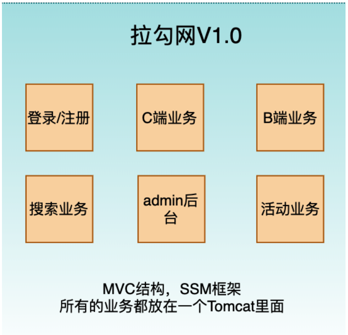

- **优点**

  - 小项目开发快 成本低

  - 架构简单 

  - 易于测试

  - 易于部署

- **缺点**

  - 大项目模块耦合严重、不易开发、维护和沟通成本高 

  - 新增业务困难

  - 核心业务与边缘业务混合在一块，出现问题互相影响

### 1.2、垂直架构

根据业务把项目垂直切割成多个项目，因此这种架构称之为垂直架构。

为了避免上面提到的那些问题，我们开始做模块的垂直划分，做垂直划分的原则是基于拉勾的业务特性，核心目标，第一个是为了业务之间互不影响，第二个是在

研发团队的壮大后为了提高效率，减少之间的依赖。

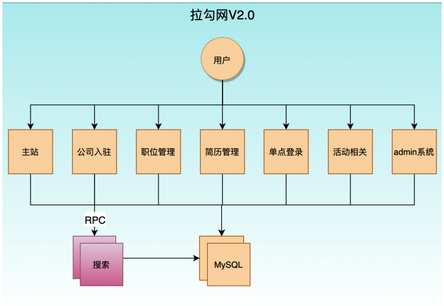

- **优点**
  - 系统拆分实现了流量分担，解决了并发问题
  - 可以针对不同系统进行优化
  - 方便水平扩展，负载均衡，容错率提高
  - 系统间相互独立，互不影响，新的业务迭代时更加高效

- **缺点**

  - 服务系统之间接口调用硬编码

  - 搭建集群之后，实现负载均衡比较复杂

  - 服务系统接口调用监控不到位 调用方式不统一

  - 服务监控不到位

  - 数据库资源浪费，充斥慢查询，主从同步延迟大

### 1.3、分布式架构（SOA )

SOA全称为Service Oriented Architecture，即面向服务的架构 。它是在垂直划分的基础上,将每个项目拆分出多个具备松耦合的服务,一个服务通常以独立的形式

存在于操作系统进程中。各个服务之间通过网络调用，这使得构建在各种各样的系统中的服务可以 以一种统一和通用的方式进行交互。

我们在做了垂直划分以后，模块随之增多，系统之间的RPC逐渐增多，维护的成本也越来越高，一些通用的业务和模块重复的也越来越多，这个时候上面提到的接

口协议不统一、服务无法监控、服务的负载均衡等问题更加突出，为了解决上面的这些问题，我们将通用的业务逻辑下沉到服务层，通过接口暴露，供其他业务场

景调用。同时引入了阿里巴巴开源的Dubbo，一款高性能、轻量级的开源Java RPC框架，它提供了三大核心能力：面向接口的远程方法调用，智能容错和负载均

衡，以及服务自动注册和发现。

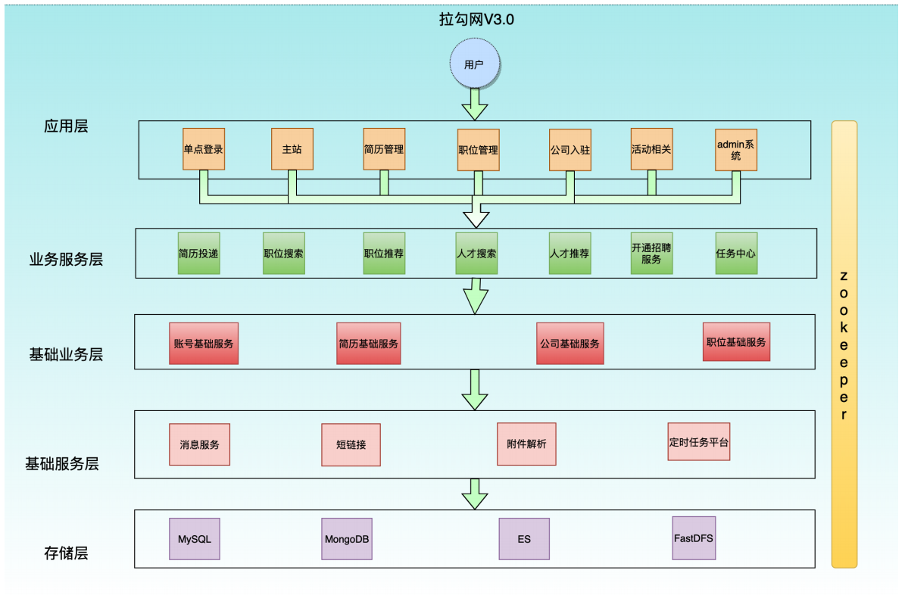

- 解释说明:
  - 分层: 按照业务性质分层 每一层要求简单和容易维护

    - 应用层: 距离用户最近的一层 也称之为接入层 使用tomcat作为web容器 接收用户请求使用下游的dubbo提供的接口来返回数据 并且该层禁止访问数据库

    - 业务服务层:根据具体的业务场景 演变而来的模块 比如 简历投递 职位搜索 职位推荐等

    - 基础业务层:拉勾网招聘业务的核心 账号 简历 公司 职位 

  - 基础服务层:这一层 是与业务无关的模块 是一些通用的服务 
  
  ​		这类服务的特点:请求量大 逻辑简单 特性明显 功能独立 
  
  ​		消息服务（发邮件 短信 微信）
  
  ​		附件解析 50% 自己上传附件简历 需要解析成pdf 
    - 存储层:不同的存储类型 Mysql Mongodb ES fastDFS
  
  - 分级:按照业务性质分层 
  
    同一层的业务也要做好分级 依据业务的重要性进行分级 按照二八定律 网站80%的流量 都在核心功能上面 要优先保证核心业务的稳定。
  
  - 隔离:不同性质、不同重要性的业务做好隔离。包括业务、缓存、DB、中间件都要做好隔离，比如核心业务的数据库 要和活动相关的数据库隔离
  
  - 调用 :总体上调用要单向，可以跨层调用，但不能出现逆向调用 
  
- **优点**

  - 服务以接口为粒度，为开发者屏蔽远程调用底层细节 使用Dubbo 面向接口远程方法调用 

  - 屏蔽了底层调用细节

  - 业务分层以后架构更加清晰 并且每个业务模块职责单一 扩展性更强

  - 数据隔离，权限回收，数据访问都通过接口 让系统更加稳定 安全服务应用本身无状态化 这里的无状态化指的是应用本身不做内存级缓存 而是把数据存入

    db 

  - 服务责任易确定 每个服务可以确定责任人 这样更容易保证服务质量和稳定 

- **缺点**
  - 粒度控制复杂，如果没有控制好服务的粒度，服务的模块就会越来越多，就会引发超时、分布式事务等问题

  - 服务接口数量不宜控制，容易引发接口爆炸，所以服务接口建议以业务场景进行单位划分并对相近的业务做抽象，防止接口爆炸

  - 版本升级兼容困难，尽量不要删除方法、字段、枚举类型的新增字段也可能不兼容 

  - 调用链路长，服务质量不可监控，调用链路变长，下游抖动可能会影响到上游业务 最终形成连锁反应，服务质量不稳定，同时链路的变成使得服务质量的

    监控变得困难

### 1.4、微服务架构

微服务架构是一种将单个应用程序 作为一套小型服务开发的方法，每种应用程序都在其自己的进程中独立运行，并使用轻量级机制(通常是HTTP资源的API)进行通

信。这些服务是围绕业务功能构建的，可以通过全自动部署机制进行独立部署。这些服务的集中化管理非常少，它们可以用不同的编程语言编写，并使用不同的数

据存储技术。

微服务是在SOA上做的升华 , 粒度更加细致，微服务架构强调的一个重点是“业务需要彻底的组件化和服务化”。

## 2、Dubbo架构与实战

### 2.1、Dubbo 架构概述

Apache Dubbo是一款高性能的Java RPC框架。其前身是阿里巴巴公司开源的一个高性能、轻量级的开源Java RPC框架，可以和Spring框架无缝集成。

- dubbo 的特性

  参考官网首页：http://dubbo.apache.org/

- Dubbo 的服务治理

  服务治理（SOA governance），企业为了确保项目顺利完成而实施的过程，包括最佳实践、架构原则、治理规程、规律以及其他决定性的因素。服务治理指

  的是用来管理SOA的采用和实现的过程。

  参考官网首页：http://dubbo.apache.org/

### 2.2.、Dubbo 处理流程

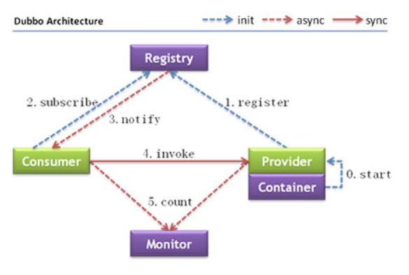

**节点说明：**

| 节点      | 角色名称                                  |
| --------- | ----------------------------------------- |
| Provider  | 暴露服务的服务提供方                      |
| Consumer  | 调用远程服务的服务消费方                  |
| Registry  | 服务注册与发现的注册中心                  |
| Monitor   | 统计服务的调用次数和调用时间的监控中心    |
| Container | 服务运行容器 负责启动 加载 运行服务提供者 |

**调用关系说明**

1. 服务容器负责启动，加载，运行服务提供者。
2. 服务提供者在启动时，向注册中心注册自己提供的服务。
3. 服务消费者在启动时，向注册中心订阅自己所需的服务。
4. 注册中心返回服务提供者地址列表给消费者，如果有变更，注册中心将基于长连接推送变更数据给消费者。
5. 服务消费者，从提供者地址列表中，基于软负载均衡算法，选一台提供者进行调用，如果调用失败，再选另一台调用。
6. 服务消费者和提供者，在内存中累计调用次数和调用时间，定时每分钟发送一次统计数据到监控中心。

### 2.3、服务注册中心Zookeeper

通过前面的Dubbo架构图可以看到，Registry（服务注册中心）在其中起着至关重要的作用。Dubbo官方推荐使用Zookeeper作为服务注册中心。Zookeeper 是

 Apache Hadoop 的子项目，作为 Dubbo 服务的注册中心，工业强度较高，可用于生产环境，并推荐使用 。

### 2.4、Dubbo开发实战

#### 2.4.1、实战案例介绍

在Dubbo中所有的的服务调用都是基于接口去进行双方交互的。双方协定好Dubbo调用中的接口，提供者来提供实现类并且注册到注册中心上。调用方则只需要

引入该接口，并且同样注册到相同的注册中心上(消费者)。即可利用注册中心来实现集群感知功能，之后消费者即可对提供者进行调用。

我们所有的项目都是基于Maven去进行创建，这样相互在引用的时候只需要以依赖的形式进行展现就可以了。

并且这里我们会通过maven的父工程来统一依赖的版本。

程序实现分为以下几步骤: 

1. 建立maven工程 并且 创建API模块: 用于规范双方接口协定
2. 提供provider模块，引入API模块，并且对其中的服务进行实现。将其注册到注册中心上，对外来统一提供服务。
3. 提供consumer模块，引入API模块，并且引入与提供者相同的注册中心。再进行服务调用。

**项目结构：**

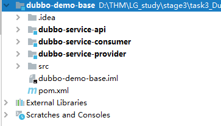

#### 2.4.2、创建父工程 （maven）

**dubbo-demo-base**

- **pom.xml**

  ```xml
      <dependencyManagement>
          <dependencies>
              <dependency>
                  <groupId>org.apache.dubbo</groupId>
                  <artifactId>dubbo</artifactId>
                  <version>${dubbo.version}</version>
              </dependency>
              <dependency>
                  <groupId>org.apache.dubbo</groupId>
                  <artifactId>dubbo-common</artifactId>
                  <version>${dubbo.version}</version>
              </dependency>
              <dependency>
                  <groupId>org.apache.dubbo</groupId>
                  <artifactId>dubbo-registry-zookeeper</artifactId>
                  <version>${dubbo.version}</version>
                  <exclusions>
                      <exclusion>
                          <groupId>org.apache.dubbo</groupId>
                          <artifactId>dubbo-remoting-api</artifactId>
                      </exclusion>
                      <exclusion>
                          <groupId>org.apache.dubbo</groupId>
                          <artifactId>dubbo-common</artifactId>
                      </exclusion>
                  </exclusions>
              </dependency>
              <dependency>
                  <groupId>org.apache.dubbo</groupId>
                  <artifactId>dubbo-registry-nacos</artifactId>
                  <version>${dubbo.version}</version>
              </dependency>
              <dependency>
                  <groupId>org.apache.dubbo</groupId>
                  <artifactId>dubbo-rpc-dubbo</artifactId>
                  <version>${dubbo.version}</version>
                  <exclusions>
                      <exclusion>
                          <groupId>org.apache.dubbo</groupId>
                          <artifactId>dubbo-remoting-api</artifactId>
                      </exclusion>
                      <exclusion>
                          <groupId>org.apache.dubbo</groupId>
                          <artifactId>dubbo-common</artifactId>
                      </exclusion>
                  </exclusions>
              </dependency>
              <dependency>
                  <groupId>org.apache.dubbo</groupId>
                  <artifactId>dubbo-remoting-netty4</artifactId>
                  <version>${dubbo.version}</version>
                  <exclusions>
                      <exclusion>
                          <groupId>org.apache.dubbo</groupId>
                          <artifactId>dubbo-remoting-api</artifactId>
                      </exclusion>
                  </exclusions>
              </dependency>
              <dependency>
                  <groupId>org.apache.dubbo</groupId>
                  <artifactId>dubbo-serialization-hessian2</artifactId>
                  <version>${dubbo.version}</version>
                  <exclusions>
                      <exclusion>
                          <groupId>org.apache.dubbo</groupId>
                          <artifactId>dubbo-common</artifactId>
                      </exclusion>
                  </exclusions>
              </dependency>
          </dependencies>
      </dependencyManagement>
  
      <dependencies>
          <!-- 日志配置 -->
          <dependency>
              <groupId>log4j</groupId>
              <artifactId>log4j</artifactId>
              <version>1.2.16</version>
          </dependency>
          <dependency>
              <groupId>org.slf4j</groupId>
              <artifactId>slf4j-api</artifactId>
              <version>1.7.5</version>
          </dependency>
          <dependency>
              <groupId>org.slf4j</groupId>
              <artifactId>slf4j-log4j12</artifactId>
              <version>1.7.5</version>
          </dependency>
  
          <!-- json数据化转换 -->
          <dependency>
              <groupId>com.alibaba</groupId>
              <artifactId>fastjson</artifactId>
              <version>1.2.62</version>
          </dependency>
      </dependencies>
      
      <build>
          <plugins>
              <plugin>
                  <groupId>org.apache.maven.plugins</groupId>
                  <artifactId>maven-compiler-plugin</artifactId>
                  <version>3.8.1</version>
                  <configuration>
                      <source>11</source>
                      <target>11</target>
                  </configuration>
              </plugin>
          </plugins>
      </build>
  ```

#### 2.4.3、创建接口约定 （maven）

**dubbo-service-apijava**

- HelloService

  ```java
  package com.thm.service;
  public interface HelloService {
      String sayHello(String name);
  }
  ```

#### 2.4.4、创建服务提供者（maven）

**dubbo-service-provider**

- pom

  ```xml
      <dependencies>
          <!--引入API-->
          <dependency>
              <groupId>com.lagou</groupId>
              <artifactId>dubbo-service-api</artifactId>
              <version>1.0-SNAPSHOT</version>
          </dependency>
          <dependency>
              <groupId>org.apache.dubbo</groupId>
              <artifactId>dubbo</artifactId>
          </dependency>
          <dependency>
              <groupId>org.apache.dubbo</groupId>
              <artifactId>dubbo-common</artifactId>
          </dependency>
          <dependency>
              <groupId>org.apache.curator</groupId>
              <artifactId>curator-recipes</artifactId>
              <version>4.2.0</version>
          </dependency>
          <dependency>
              <groupId>org.apache.dubbo</groupId>
              <artifactId>dubbo-registry-zookeeper</artifactId>
          </dependency>
          <dependency>
              <groupId>org.apache.dubbo</groupId>
              <artifactId>dubbo-rpc-dubbo</artifactId>
          </dependency>
          <dependency>
              <groupId>org.apache.dubbo</groupId>
              <artifactId>dubbo-remoting-netty4</artifactId>
          </dependency>
          <dependency>
              <groupId>org.apache.dubbo</groupId>
              <artifactId>dubbo-serialization-hessian2</artifactId>
          </dependency>
      </dependencies>
  ```

- HelloServiceImpl

  编写实现类。注意这里也使用了Dubbo中的 @Service 注解来声明他是一个服务的提供者。

  ```java
  package com.thm.service.impl;
  
  import com.thm.service.HelloService;
  import org.apache.dubbo.config.annotation.Service;
  
  @Service
  public class HelloServiceImpl implements HelloService {
      @Override
      public String sayHello(String name) {
          return "hello:" + name;
      }
  }
  ```

- dubbo-provider.properties

  编写配置文件，用于配置dubbo。比如这里我就叫 dubbo-provider.properties ，放入到resources 目录下。

  ```properties
  dubbo.application.name=dubbo-service-provider
  dubbo.protocol.name=dubbo
  dubbo.protocol.port=20880
  dubbo.config-center.timeout=20000
  ```
  
- ProviderBootstrap

  编写启动的 main 函数。这里面做的比较简单，主要要注意注解方式中的注册中心这里是使用的192.168.81.100：2181端口来作为注册中心。

  ```java
  package com.thm;
  
  import org.apache.dubbo.config.RegistryConfig;
  import org.apache.dubbo.config.spring.context.annotation.EnableDubbo;
  import org.springframework.context.annotation.AnnotationConfigApplicationContext;
  import org.springframework.context.annotation.Bean;
  import org.springframework.context.annotation.Configuration;
  import org.springframework.context.annotation.PropertySource;
  
  public class ProviderBootstrap {
  
      public static void main(String[] args) throws InterruptedException {
          AnnotationConfigApplicationContext context = new AnnotationConfigApplicationContext(ProviderConfiguration.class);
          context.start();
          Thread.sleep(Integer.MAX_VALUE);
      }
  
      @Configuration
      @EnableDubbo(scanBasePackages = "com.thm.service.impl")
      @PropertySource("classpath:/dubbo-provider.properties")
      static class ProviderConfiguration {
          @Bean
          public RegistryConfig registryConfig(){
              RegistryConfig registryConfig = new RegistryConfig();
              registryConfig.setAddress("zookeeper://192.168.81.100:2181,192.168.81.101:2181,192.168.81.102:2181");
              registryConfig.setTimeout(20000);
              return registryConfig;
          }
      }
  }
  ```


#### 2.4.5、创建服务消费者（maven）

**dubbo-service-consumer**

- pom

  ```xml
      <dependencies>
          <!--引入API-->
          <dependency>
              <groupId>com.lagou</groupId>
              <artifactId>dubbo-service-api</artifactId>
              <version>1.0-SNAPSHOT</version>
          </dependency>
          <dependency>
              <groupId>org.apache.dubbo</groupId>
              <artifactId>dubbo</artifactId>
          </dependency>
          <dependency>
              <groupId>org.apache.dubbo</groupId>
              <artifactId>dubbo-common</artifactId>
          </dependency>
          <dependency>
              <groupId>org.apache.curator</groupId>
              <artifactId>curator-recipes</artifactId>
              <version>4.2.0</version>
          </dependency>
          <dependency>
              <groupId>org.apache.dubbo</groupId>
              <artifactId>dubbo-registry-zookeeper</artifactId>
          </dependency>
          <dependency>
              <groupId>org.apache.dubbo</groupId>
              <artifactId>dubbo-rpc-dubbo</artifactId>
          </dependency>
          <dependency>
              <groupId>org.apache.dubbo</groupId>
              <artifactId>dubbo-remoting-netty4</artifactId>
          </dependency>
          <dependency>
              <groupId>org.apache.dubbo</groupId>
              <artifactId>dubbo-serialization-hessian2</artifactId>
          </dependency>
      </dependencies>
  ```

- ConsumerComponent

  编写服务，用于真实的引用dubbo接口并使用。因为这里是示例，所以比较简单一些。这里面@Reference 中所指向的就是真实的第三方服务接口。

  ```java
  package com.thm.component;
  
  import com.thm.service.HelloService;
  import org.apache.dubbo.config.annotation.Reference;
  import org.springframework.stereotype.Component;
  
  @Component
  public class ConsumerComponent {
      @Reference
      private HelloService helloService;
  
      public String sayHello(String name) {
          return helloService.sayHello(name);
      }
  }
  ```

- dubbo-consumer.properties

  ```properties
  dubbo.application.name=dubbo-service-consumer
  dubbo.config-center.timeout=20000
  ```

- ConsumerBootstrap

  编写启动类，这其中就会当用户在控制台输入了一次换行后，则会发起一次请求。

  ```java
  package com.thm;
  
  import com.thm.component.ConsumerComponent;
  import org.apache.dubbo.config.RegistryConfig;
  import org.apache.dubbo.config.spring.context.annotation.EnableDubbo;
  import org.springframework.context.annotation.*;
  
  import java.util.Scanner;
  
  public class ConsumerBootstrap {
  
      public static void main(String[] args) throws InterruptedException {
          AnnotationConfigApplicationContext context = new AnnotationConfigApplicationContext(ConsumerConfiguration.class);
          context.start();
          //从spring容器中获取bean对象
          ConsumerComponent bean = context.getBean(ConsumerComponent.class);
          Scanner in = new Scanner(System.in);
          while (true){
              String s = in.nextLine();
              String s1 = bean.sayHello(s);
              System.out.println(s1);
          }
      }
  
      @Configuration
      @EnableDubbo(scanBasePackages = "com.thm.component")
      @ComponentScan(value = {"com.thm.component"})
      @PropertySource("classpath:/dubbo-consumer.properties")
      static class ConsumerConfiguration {
          @Bean
          public RegistryConfig registryConfig(){
              RegistryConfig registryConfig = new RegistryConfig();
              registryConfig.setAddress("zookeeper://192.168.81.100:2181,192.168.81.101:2181,192.168.81.102:2181");
              registryConfig.setTimeout(20000);
              return registryConfig;
          }
      }
  }
  ```

#### 2.4.6、配置方式介绍

下面我们来使用不同的方式来对Dubbo进行配置。每种配置方式各有不同，一般可以分为以下几个。
1. 注解: 基于注解可以快速的将程序配置，无需多余的配置信息，包含提供者和消费者。但是这种方式有一个弊端，有些时候配置信息并不是特别好找，无法快

  速定位。

2. XML: 一般这种方式我们会和Spring做结合，相关的Service和Reference均使用Spring集成后的。通过这样的方式可以很方便的通过几个文件进行管理整个集

  群配置。可以快速定位也可以快速更改。

3. 基于代码方式: 基于代码方式的对上述配置进行配置。这个使用的比较少，这种方式更适用于自己公司对其框架与Dubbo做深度集成时才会使用。

#### 2.4.7、XML方式

**参照官网：http://dubbo.apache.org/zh/docs/v2.7/user/quick-start/**

### 2.5、Dubbo管理控制台 dubbo-admin

主要包含：服务管理 、 路由规则、动态配置、服务降级、访问控制、权重调整、负载均衡等管理功能如我们在开发时，需要知道Zookeeper注册中心都注册了哪

些服务，有哪些消费者来消费这些服务。我们可以通过部署一个管理中心来实现。其实管理中心就是一个web应用，原来是war(2.6版本以前)包需要部署到tomcat

即可。现在是jar包可以直接通过java命令运行。

```
1.从git 上下载项目 https://github.com/apache/dubbo-admin 
2.修改项目下的dubbo.properties文件 注意dubbo.registry.address对应的值需要对应当前使用的Zookeeper的ip地址和端口号 
    • dubbo.registry.address=zookeeper://zk所在机器ip:zk端口 
    • dubbo.admin.root.password=root 
    • dubbo.admin.guest.password=guest 
3.切换到项目所在的路径（maven需要配置环境变量） 使用mvn 打包 mvn clean package -Dmaven.test.skip=true 
4.java 命令运行 java -jar 对应的jar包
5.访问http://IP:端口 
6.输入用户名root,密码root 
7.点击菜单查看服务提供者和服务消费者信息
```

### 2.6、Dubbo配置项说明

#### 2.6.1、dubbo:application

对应 org.apache.dubbo.config.ApplicationConfig, 代表当前应用的信息

1. name: 当前应用程序的名称，在dubbo-admin中我们也可以看到，这个代表这个应用名称。我们在真正时是时也会根据这个参数来进行聚合应用请求。

2. owner: 当前应用程序的负责人，可以通过这个负责人找到其相关的应用列表，用于快速定位到责任人。

3. qosEnable : 是否启动QoS 默认true（运维）

4. qosPort : 启动QoS绑定的端口 默认22222

5. qosAcceptForeignIp: 是否允许远程访问 默认是false 

#### 2.6.2、dubbo:registry

org.apache.dubbo.config.RegistryConfig, 代表该模块所使用的注册中心。一个模块中的服务可以将其注册到多个注册中心上，也可以注册到一个上。后面再

service和reference也会引入这个注册中心。

1. id : 当前服务中provider或者consumer中存在多个注册中心时，则使用需要增加该配置。在一些公司，会通过业务线的不同选择不同的注册中心，所以一般

   都会配置该值。

2. address : 当前注册中心的访问地址。

3. protocol : 当前注册中心所使用的协议是什么。也可以直接在 address 中写入，比如使用zookeeper，就可以写成 zookeeper://xx.xx.xx.xx:2181 

4. timeout : 当与注册中心不再同一个机房时，大多会把该参数延长。

#### 2.6.3、dubbo:protocol

org.apache.dubbo.config.ProtocolConfig, 指定服务在进行数据传输所使用的协议。

1. id : 在大公司，可能因为各个部门技术栈不同，所以可能会选择使用不同的协议进行交互。这里在多个协议使用时，需要指定。

2. name : 指定协议名称。默认使用 dubbo 。

#### 2.6.4、dubbo:service

org.apache.dubbo.config.ServiceConfig, 用于指定当前需要对外暴露的服务信息，后面也会具体讲解。和 dubbo:reference 大致相同。
1. interface : 指定当前需要进行对外暴露的接口是什么。
2. ref : 具体实现对象的引用，一般我们在生产级别都是使用Spring去进行Bean托管的，所以这里面一般也指的是Spring中的BeanId。 
3. version : 对外暴露的版本号。不同的版本号，消费者在消费的时候只会根据固定的版本号进行消费。

#### 2.6.5、dubbo:reference

org.apache.dubbo.config.ReferenceConfig, 消费者的配置，这里只做简单说明，后面会具体讲解。

1. id : 指定该Bean在注册到Spring中的id。 

2. interface: 服务接口名

3. version : 指定当前服务版本，与服务提供者的版本一致。

4. registry : 指定所具体使用的注册中心地址。这里面也就是使用上面在 dubbo:registry 中所声明的id。

#### 2.6.6、dubbo:method

org.apache.dubbo.config.MethodConfig, 用于在制定的 dubbo:service 或者 dubbo:reference 中的更具体一个层级，指定具体方法级别在进行RPC操作时候

的配置，可以理解为对这上面层级中的配置针对于具体方法的特殊处理。

1. name : 指定方法名称，用于对这个方法名称的RPC调用进行特殊配置。

2. async: 是否异步 默认false

#### 2.6.7、dubbo:service和dubbo:reference详解

这两个在dubbo中是我们最为常用的部分，其中有一些我们必然会接触到的属性。并且这里会讲到一些设置上的使用方案。

1. mock: 用于在方法调用出现错误时，当做服务降级来统一对外返回结果，后面我们也会对这个方法做更多的介绍。

2. timeout: 用于指定当前方法或者接口中所有方法的超时时间。我们一般都会根据提供者的时长来具体规定。比如我们在进行第三方服务依赖时可能会对接口的

   时长做放宽，防止第三方服务不稳定导致服务受损。

3. check: 用于在启动时，检查生产者是否有该服务。我们一般都会将这个值设置为false，不让其进行检查。因为如果出现模块之间循环引用的话，那么则可能会

   出现相互依赖，都进行check的话，那么这两个服务永远也启动不起来。

4. retries: 用于指定当前服务在执行时出现错误或者超时时的重试机制。
   1. 注意提供者是否有幂等，否则可能出现数据一致性问题
   2. 注意提供者是否有类似缓存机制，如出现大面积错误时，可能因为不停重试导致雪崩

5. executes: 用于在提供者做配置，来确保最大的并行度。
   1. 可能导致集群功能无法充分利用或者堵塞
   2. 但是也可以启动部分对应用的保护功能
   3. 可以不做配置，结合后面的熔断限流使用

#### 2.6.8、其它配置

 参考官网：http://dubbo.apache.org/zh/docs/v2.7/user/references/xml/

## 3、Dubbo高级实战

### 3.1、SPI

SPI 全称为 (Service Provider Interface) ，是JDK内置的一种服务提供发现机制。 目前有不少框架用它来做服务的扩展发现，简单来说，它就是一种动态替换发现

的机制。使用SPI机制的优势是实现解耦，使得第三方服务模块的装配控制逻辑与调用者的业务代码分离。

#### 3.1.1、JDK中的SPI

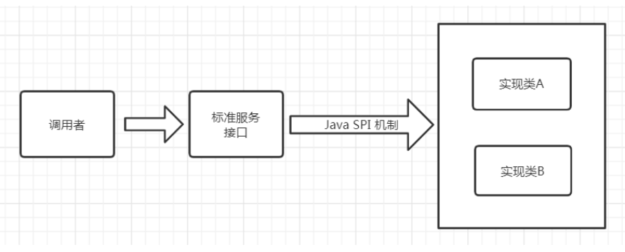

Java中如果想要使用SPI功能，先提供标准服务接口，然后再提供相关接口实现和调用者。这样就可以通过SPI机制中约定好的信息进行查询相应的接口实现。

SPI遵循如下约定：

1、当服务提供者提供了接口的一种具体实现后，在META-INF/services目录下创建一个以“接口全限定名”为命名的文件，内容为实现类的全限定名；

2、接口实现类所在的jar包放在主程序的classpath中；

3、主程序通过java.util.ServiceLoader动态装载实现模块，它通过扫描META-INF/services目录下的配置文件找到实现类的全限定名，把类加载到JVM； 

4、SPI的实现类必须携带一个无参构造方法；

具体实现：


- **java-spi-demo-api（maven）**

  创建一个标准接口

  ```java
  package com.thm.service;
  
  public interface HelloService {
      String sayHello(String name);
  }
  ```

- **java-spi-demo-api-impl（maven）**

  创建标准接口具体实现

  - pom

    ```xml
            <dependency>
                <groupId>com.lagou</groupId>
                <artifactId>java-spi-demo-api</artifactId>
                <version>1.0-SNAPSHOT</version>
            </dependency>
    ```

  - 实现接口，多个

    ```java
    package com.thm.service.impl;
    
    import com.thm.service.HelloService;
    public class AnimalHelloService implements HelloService {
        public String sayHello(String name) {
            return "animal say:" + name;
        }
    }
    ----------------------------------------------------------------------
    package com.thm.service.impl;
    
    import com.thm.service.HelloService;
    public class HumanHelloService implements HelloService {
        public String sayHello(String name) {
            return "hello:" + name;
        }
    }
    ```

  - 在resources目录下创建META-INF/services/com.thm.service.HelloService

    创建包META-INF/services、创建文件com.thm.service.HelloService，文件内容为具体实现的类全路径名称

    ```properties
    com.thm.service.impl.AnimalHelloService
    com.thm.service.impl.HumanHelloService
    ```

- **java-spi-demo-main（maven）**

  创建主调用程序

  - pom

    ```xml
            <dependency>
                <groupId>com.lagou</groupId>
                <artifactId>java-spi-demo-api</artifactId>
                <version>1.0-SNAPSHOT</version>
            </dependency>
            <dependency>
                <groupId>com.lagou</groupId>
                <artifactId>java-spi-demo-api-impl</artifactId>
                <version>1.0-SNAPSHOT</version>
            </dependency>
    ```

  - Bootstrap

    ```java
    package com.thm;
    
    import com.thm.service.HelloService;
    
    import java.util.ServiceLoader;
    
    public class Bootstrap {
        public static void main(String[] args) {
            //读取META-INF/services/com.thm.service.HelloService文件回去内容反射创建具体实现类型
            ServiceLoader<HelloService> services = ServiceLoader.load(HelloService.class);
            services.forEach(helloService -> {
                System.out.println(helloService.getClass().getName() + ":" + helloService.sayHello("张三"));
            });
        }
    }
    -----------------输出-----------------
    com.thm.service.impl.AnimalHelloService:animal say:张三
    com.thm.service.impl.HumanHelloService:hello:张三
    ```

#### 3.1.2、Dubbo中的SPI

dubbo中大量的使用了SPI来作为扩展点，通过实现同一接口的前提下，可以进行定制自己的实现类。比如比较常见的协议，负载均衡，都可以通过SPI的方式进行

定制化，自己扩展。Dubbo中已经存在的所有已经实现好的扩展点。

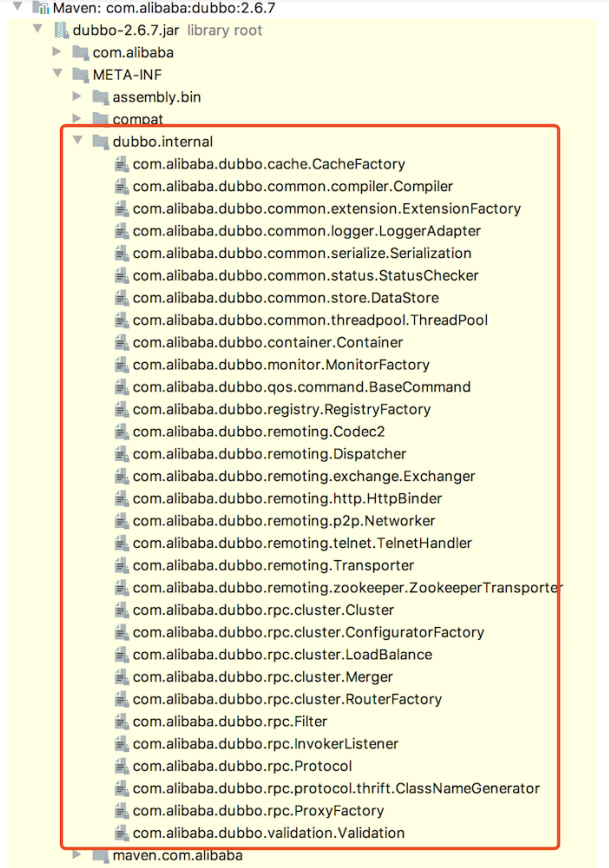

dubbo中的spi和jdk中的spi实现方式类型，我们使用三个项目来演示Dubbo中扩展点的使用方式，一个主项目main，一个服务接口项目api，一个服务实现项目

impl。

项目结构：

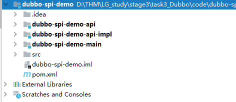

- **dubbo-spi-demo-api（maven）**

  - pom，引入dubbo的依赖

    ```xml
            <dependency>
                <groupId>org.apache.dubbo</groupId>
                <artifactId>dubbo</artifactId>
                <version>2.7.5</version>
            </dependency>
    ```

  - HelloService

    创建一个标准接口

    ```java
    package com.thm.service;
    
    import org.apache.dubbo.common.extension.SPI;
    
    //dubbo需要使用@SPI注解标注 指定默认实现
    @SPI(value = "human")
    public interface HelloService {
        String sayHello(String name);
    }
    ```

- **dubbo-spi-demo-api-impl（maven）**

  创建标准接口具体实现

  - pom

    ```xml
            <dependency>
                <groupId>com.lagou</groupId>
                <artifactId>dubbo-spi-demo-api</artifactId>
                <version>1.0-SNAPSHOT</version>
            </dependency>
    ```

  - 实现接口，多个

    ```java
    package com.thm.service.impl;
    
    import com.thm.service.HelloService;
    
    public class AnimalHelloService implements HelloService {
        public String sayHello(String name) {
            return "animal say："+name;
        }
    }
    ---------------------------------------------------------
    package com.thm.service.impl;
    
    import com.thm.service.HelloService;
    
    public class HumanHelloService implements HelloService {
        public String sayHello(String name) {
            return "你好："+name;
        }
    }
    ```

  - 在resources目录下创建META-INF/dubbo/com.thm.service.HelloService

    创建包META-INF/dubbo、创建文件com.thm.service.HelloService，文件内容为具体实现的类全路径名称

    ```properties
    animal=com.thm.service.impl.AnimalHelloService
    human=com.thm.service.impl.HumanHelloService
    前缀（支持动态获取实现类）=类全路径名称（也可以和JDK的SPI写法一致，不过扩展功能不能使用）
    ```

- **dubbo-spi-demo-main（maven）**

  创建主调用程序

  - pom

    ```xml
            <dependency>
                <groupId>com.lagou</groupId>
                <artifactId>dubbo-spi-demo-api</artifactId>
                <version>1.0-SNAPSHOT</version>
            </dependency>
            <dependency>
                <groupId>com.lagou</groupId>
                <artifactId>dubbo-spi-demo-api-impl</artifactId>
                <version>1.0-SNAPSHOT</version>
            </dependency>
    ```

  - Bootstrap

    ```java
    package com.thm;
    
    import com.thm.service.HelloService;
    import org.apache.dubbo.common.extension.ExtensionLoader;
    import java.util.Set;
    public class Bootstrap {
        public static void main(String[] args) {
            //获取扩展加载器
            ExtensionLoader<HelloService> extensionLoader = ExtensionLoader.getExtensionLoader(HelloService.class);
            //获得所有支持的实现类，读取META-INF/dubbo/com.thm.service.HelloService 文件内容
            Set<String> supportedExtensions = extensionLoader.getSupportedExtensions();
            for (String supportedExtension : supportedExtensions) {
                HelloService helloService = extensionLoader.getExtension(supportedExtension);
                System.out.println(helloService.getClass().getName() + ":" + helloService.sayHello("张三"));
            }
        }
    }
    ------------------输出--------------------
    com.thm.service.impl.AnimalHelloService:animal say：张三
    com.thm.service.impl.HumanHelloService:你好：张三
    ```

- **dubbo自己做SPI的目的**

  ```properties
  1. JDK 标准的 SPI 会一次性实例化扩展点所有实现，如果有扩展实现初始化很耗时，但如果没用上也加载，会很浪费资源 
  2. 如果有扩展点加载失败，则所有扩展点无法使用 
  3. 提供了对扩展点包装的功能(Adaptive)，并且还支持通过set的方式对其他的扩展点进行注入
  ```

#### 3.1.3、Dubbo SPI中的Adaptive功能

Dubbo中的Adaptive功能，主要解决的问题是如何动态的选择具体的扩展点。通过getAdaptiveExtension 统一对指定接口对应的所有扩展点进行封装，通过URL

的方式对扩展点来进行动态选择。 (dubbo中所有的注册信息都是通过URL的形式进行处理的。)这里同样采用相同的方式进行实现。

- **dubbo-spi-demo-api中的标准接口**

  并重新实现

  ```java
  package com.thm.service;
  
  import org.apache.dubbo.common.URL;
  import org.apache.dubbo.common.extension.Adaptive;
  import org.apache.dubbo.common.extension.SPI;
  
  //dubbo需要使用@API注解标注 指定默认实现
  @SPI(value = "human")
  public interface HelloService {
      String sayHello(String name);
      @Adaptive
      String sayHello(URL url,String name);
  }
  ```

- **编写BootstrapAdaptive**

  ```java
  package com.thm;
  
  import com.thm.service.HelloService;
  import org.apache.dubbo.common.URL;
  import org.apache.dubbo.common.extension.ExtensionLoader;
  
  public class BootstrapAdaptive {
      public static void main(String[] args) {
          /** 构建url
           *  http://localhost/hello(不重要)
           *  ?hello.service=animal（重要） hello.service=HelloService，在dubbo中会将大写字母替换成点并拼接上小写字母
           *  =animal指定具体的key值获取对应的实现类
           */
          URL url = URL.valueOf("http://localhost/hello?hello.service=animal");
          //获取扩展加载器
          ExtensionLoader<HelloService> extensionLoader = ExtensionLoader.getExtensionLoader(HelloService.class);
          //动态获取支持的实现类
          HelloService adaptiveExtension = extensionLoader.getAdaptiveExtension();
          //动态获取支持的实现类
          String s = adaptiveExtension.sayHello(url, "张三");
          System.out.println("动态获取结果：" + s);
      }
  }
  ```

- **注意：**

  因为在这里只是临时测试，所以为了保证URL规范，前面的信息均为测试值即可，关键的点在于hello.service 参数，这个参数的值指定的就是具体的实现方

  式。关于为什么叫hello.service 是因为这个接口的名称，其中后面的大写部分被dubbo自动转码为 . 分割。

  通过 getAdaptiveExtension 来提供一个统一的类来对所有的扩展点提供支持(底层对所有的扩展点进行封装)。

  调用时通过参数中增加 URL 对象来实现动态的扩展点使用。

  如果URL没有提供该参数，则该方法会使用默认在 SPI 注解中声明的实现。

#### 3.1.4、Dubbo调用时拦截操作

与很多框架一样，Dubbo也存在拦截（过滤）机制，可以通过该机制在执行目标程序前后执行我们指定的代码。

Dubbo的Filter机制，是专门为服务提供方和服务消费方调用过程进行拦截设计的，每次远程方法执行，该拦截都会被执行。这样就为开发者提供了非常方便的扩

展性，比如为dubbo接口实现ip白名单功能、监控功能 、日志记录等。

步骤如下：

- 创建相应的maven工程

  引入依赖

  ```xml
  		<dependency>
              <groupId>org.apache.dubbo</groupId>
              <artifactId>dubbo</artifactId>
              <version>2.7.5</version>
          </dependency>
  ```

- 创建一个调用时间的过滤器TimerFilter

  ```java
  package com.thm.filter;
  
  import org.apache.dubbo.common.constants.CommonConstants;
  import org.apache.dubbo.common.extension.Activate;
  import org.apache.dubbo.rpc.*;
  
  //接口进行对类进行注册 通过group 可以指定生产端 消费端
  @Activate(group = {CommonConstants.PROVIDER,CommonConstants.CONSUMER})
  public class TimerFilter implements Filter {
      public Result invoke(Invoker<?> invoker, Invocation invocation) throws RpcException {
          long startTime = System.currentTimeMillis();
          try {
              //调用原方法并返回result
              return invoker.invoke(invocation);
          } finally {
              System.out.println("调用时间："+ (System.currentTimeMillis() - startTime));
          }
      }
  }
  ```

- 创建META-INF/dubbo/org.apache.dubbo.rpc.Filter

  文件必须是org.apache.dubbo.rpc.Filter，不然会不生效

  ```properties
  timerFliter=com.thm.filter.TimerFilter
  ```

- 项目编写完成后以maven依赖形式提供使用

  ```xml
          <!--引用custom的SPI filter-->
          <dependency>
              <groupId>com.lagou</groupId>
              <artifactId>dubbo-spi-filter</artifactId>
              <version>1.0-SNAPSHOT</version>
          </dependency>
  ```

注意：一般类似于这样的功能都是单独开发依赖的，所以再使用方的项目中只需要引入依赖，在调用接口时，该方法便会自动拦截。

### 3.2、dubbo负载均衡策略

负载均衡（Load Balance）, 其实就是将请求分摊到多个操作单元上进行执行，从而共同完成工作任务。

负载均衡策略主要用于客户端存在多个提供者时进行选择某个提供者。

在集群负载均衡时，Dubbo 提供了多种均衡策略（包括随机、轮询、最少活跃调用数、一致性Hash），缺省为random随机调用。

**具体策略查看官网：http://dubbo.apache.org/zh/docs/v2.7/user/examples/loadbalance/**

#### 3.2.1、负载均衡基本配置

配置负载均衡策略，既可以在服务提供者一方配置，也可以在服务消费者一方配置，如下：

- 消费者

  ```java
  @Component
  public class ConsumerComponent {
      //在服务消费者一方配置负载均衡策略 
      @Reference(loadbalance = "roundrobin")
      private HelloService helloService;
  
      public String sayHello(String name) {
          return helloService.sayHello(name);
      }
  }
  ```

- 提供者

  ```java
  //在服务提供者一方配置负载均衡 
  @Service(loadbalance = "roundrobin") 
  public class HelloServiceImpl implements HelloService {
      public String sayHello(String name) {
          return "hello " + name; 
      } 
  }
  ```

#### 3.2.2、自定义负载均衡器

负载均衡器在Dubbo中的SPI接口是 org.apache.dubbo.rpc.cluster.LoadBalance , 可以通过实现这个接口来实现自定义的负载均衡规则。

- 创建相应的maven工程

  引入依赖

  ```xml
  		<dependency>
              <groupId>org.apache.dubbo</groupId>
              <artifactId>dubbo</artifactId>
              <version>2.7.5</version>
          </dependency>
  ```

- 自定义负载均衡器（基于Dubbo SPI）

  ```java
  package com.thm.loadbalance;
  
  import org.apache.dubbo.common.URL;
  import org.apache.dubbo.rpc.Invocation;
  import org.apache.dubbo.rpc.Invoker;
  import org.apache.dubbo.rpc.RpcException;
  import org.apache.dubbo.rpc.cluster.LoadBalance;
  
  import java.util.List;
  
  public class OnlyFirstLoadBalance implements LoadBalance {
      public <T> Invoker<T> select(List<Invoker<T>> list, URL url, Invocation invocation) throws RpcException {
          //选取所有机器中的第一个(按照字母排序 + 端口排序) 选择第一个。
          final Invoker<T> tInvoker = list.stream().sorted((item1, item2) -> {
              //比较IP
              int ipCompare = item1.getUrl().getIp().compareTo(item2.getUrl().getIp());
              //相等比较端口
              if (ipCompare == 0){
                  return Integer.compare(item1.getUrl().getPort(),item2.getUrl().getPort());
              }
              return ipCompare;
          }).findFirst().get();
          return tInvoker;
      }
  }
  ```

- 创建META-INF/dubbo/org.apache.dubbo.rpc.cluster.LoadBalance

  文件必须是org.apache.dubbo.rpc.cluster.LoadBalance，不然会不生效

  ```properties
  onlyFirst=com.thm.loadbalance.OnlyFirstLoadBalance
  ```

- 项目编写完成后以maven依赖形式提供使用

  ```xml
          <!--引入自定义负载均衡器-->
          <dependency>
              <groupId>com.lagou</groupId>
              <artifactId>dubbo-spi-loadbalance</artifactId>
              <version>1.0-SNAPSHOT</version>
          </dependency>
  ```

  ```java
  package com.thm.component;
  
  import com.thm.service.HelloService;
  import org.apache.dubbo.config.annotation.Reference;
  import org.springframework.stereotype.Component;
  
  @Component
  public class ConsumerComponent {
      //onlyFirst 自定义的负载均衡策略
      @Reference(loadbalance = "onlyFirst")
      private HelloService helloService;
  
      public String sayHello(String name) {
          return helloService.sayHello(name);
      }
  }
  
  ```


### 3.3、异步调用

Dubbo不只提供了堵塞式的的同步调用，同时提供了异步调用的方式。这种方式主要应用于提供者接口响应耗时明显，消费者端可以利用调用接口的时间去做一些

其他的接口调用,利用 Future 模式来异步等待和获取结果即可。这种方式可以大大的提升消费者端的利用率。 目前这种方式可以通过XML的方式进行引入。

- **异步调用实现**
  - 为了能够模拟等待，通过 Longtimeout参数，标明需要休眠多少毫秒后才会进行返回。

    ```java
    package com.thm.service;
    
    public interface HelloService {
        String sayHello(String name, Long timeout);
    }
    ```

  - 接口实现，为了模拟调用耗时，可以让线程等待一段时间

  - 在消费者端，配置异步调用 注意消费端默认超时时间1000毫秒 如果提供端耗时大于1000毫秒会出现超时

    consumer.xml

    ```xml
        <!-- 消费方应用名，用于计算依赖关系，不是匹配条件，不要与提供方一样 -->
        <dubbo:application name="dubbo-service-consumer"/>
    
        <!-- 使用zookeeper注册中心暴露发现服务地址 -->
        <dubbo:registry address="zookeeper://192.168.81.100:2181,192.168.81.101:2181,192.168.81.102:2181" timeout="20000"/>
    
        <dubbo:config-center timeout="20000"/>
    
        <!-- 生成远程服务代理，可以和本地bean一样使用helloService -->
        <dubbo:reference id="helloService" interface="com.thm.service.HelloService">
            <dubbo:method name="sayHello" async="true"/>
        </dubbo:reference>
    ```

  - 测试

    我们休眠200毫秒，然后再去进行获取结果。方法在同步调用时的返回值是空，我们可以通过 RpcContext.getContext().getFuture() 来进行获取Future对

    象来进行后续的结果等待操作。	
  
    XMLConsumerBootstrap
  
    ```java
    package com.thm;
    
    import com.thm.service.HelloService;
    import org.apache.dubbo.rpc.RpcContext;
    import org.springframework.context.support.ClassPathXmlApplicationContext;
    
    import java.io.IOException;
    import java.util.concurrent.ExecutionException;
    import java.util.concurrent.Future;
    public class XMLConsumerBootstrap {
    
        public static void main(String[] args) throws InterruptedException, IOException, ExecutionException {
            ClassPathXmlApplicationContext context = new ClassPathXmlApplicationContext("consumer.xml");
            context.start();
            //从spring容器中获取bean对象
            HelloService bean = context.getBean(HelloService.class);
            while (true){
                System.in.read();
                String s1 = bean.sayHello("1",200L);
                //利用Future进行异步结果获取
                Future<Object> future = RpcContext.getContext().getFuture();
                System.out.println("同步调用result：" + s1);
                System.out.println("异步调用result：" + future.get());
          }
        }
    }
    ```
  
- **异步调用特殊说明**

  需要特别说明的是，该方式的使用，请确保dubbo的版本在2.5.4及以后的版本使用。 原因在于在2.5.3及之前的版本使用的时候，会出现异步状态传递问题。

  比如我们的服务调用关系是 A -> B -> C , 这时候如果A向B发起了异步请求，在错误的版本时，B向C发起的请求也会连带的产生异步请求。这是因为在底层实现

  层面，他是通过 RPCContext 中的attachment 实现的。在A向B发起异步请求时，会在 attachment 中增加一个异步标示字段来表明异步等待结果。B在接受

  到A中的请求时，会通过该字段来判断是否是异步处理。但是由于值传递问题，B向 C发起时同样会将该值进行传递，导致C误以为需要异步结果，导致返回

  空。这个问题在2.5.4及以后的版本进行了修正。

### 3.4、线程池

#### 3.4.1、Dubbo已有线程池

dubbo在使用时，都是通过创建真实的业务线程池进行操作的。目前已知的线程池模型有两个和java中的相互对应: 

- fix: 表示创建固定大小的线程池。也是Dubbo默认的使用方式，默认创建的执行线程数为200，并且是没有任何等待队列的。所以再极端的情况下可能会存在

  问题，比如某个操作大量执行时，可能存在堵塞的情况。后面也会讲相关的处理办法。

- cache: 创建非固定大小的线程池，当线程不足时，会自动创建新的线程。但是使用这种的时候需要注意，如果突然有高TPS的请求过来，方法没有及时完成，

  则会造成大量的线程创建，对系统的CPU和负载都是压力，执行越多反而会拖慢整个系统。

#### 3.4.2、自定义线程池

在真实的使用过程中可能会因为使用fix模式的线程池，导致具体某些业务场景因为线程池中的线程数量不足而产生错误，而很多业务研发是对这些无感知的，只有

当出现错误的时候才会去查看告警或者通过客户反馈出现严重的问题才去查看，结果发现是线程池满了。所以可以在创建线程池的时，通过某些手段对这个线程池

进行监控，这样就可以进行及时的扩缩容机器或者告警。下面的这个程序就是这样子的，会在创建线程池后进行对其监控，并且及时作出相应处理。

自定义线程池也是基于dubbo spi实现

步骤如下：

- 创建相应的maven工程

  引入依赖

  ```xml
  		<dependency>
              <groupId>org.apache.dubbo</groupId>
              <artifactId>dubbo</artifactId>
              <version>2.7.5</version>
          </dependency>
          <dependency>
              <groupId>org.apache.dubbo</groupId>
              <artifactId>dubbo-common</artifactId>
              <version>2.7.5</version>
          </dependency>
          <dependency>
              <groupId>org.slf4j</groupId>
              <artifactId>slf4j-api</artifactId>
              <version>1.7.30</version>
          </dependency>
          <dependency>
              <groupId>org.slf4j</groupId>
              <artifactId>slf4j-log4j12</artifactId>
              <version>1.7.30</version>
          </dependency>
  ```

- 创建一个线程池监听WatchingThreadPool

  ```java
  package com.thm.threadpool;
  
  import org.apache.dubbo.common.URL;
  import org.apache.dubbo.common.threadpool.support.fixed.FixedThreadPool;
  import org.slf4j.Logger;
  import org.slf4j.LoggerFactory;
  
  import java.util.Map;
  import java.util.concurrent.*;
  
  public class WatchingThreadPool extends FixedThreadPool implements Runnable {
      //输出日志信息
      private static final Logger logger = LoggerFactory.getLogger(WatchingThreadPool.class);
      //线程阀值
      private static final double ALARM_PERCENT  = 0.90;
      //存储每个url对应线程池情况
      private static final Map<URL, ThreadPoolExecutor> THREAD_POOL_EXECUTOR_MAP = new ConcurrentHashMap<>();
  
      public WatchingThreadPool() {
          // 每隔3秒打印线程使用情况
          Executors.newSingleThreadScheduledExecutor().scheduleWithFixedDelay(this, 3,3, TimeUnit.SECONDS);
          logger.info("初始化完成");
      }
  
      @Override
      public Executor getExecutor(URL url) {
          //获取当前线程池执行器
          final Executor executor = super.getExecutor(url);
          //满足类型存放到线程池MAP中
          if (executor instanceof ThreadPoolExecutor){
              THREAD_POOL_EXECUTOR_MAP.put(url,(ThreadPoolExecutor)executor);
          }
          return executor;
      }
  
      @Override
      public void run() {
          THREAD_POOL_EXECUTOR_MAP.forEach((url,threadPoolExecutor) -> {
              //当前线程池活跃线程数
              final int activeCount = threadPoolExecutor.getActiveCount();
              //当前线程池总线程数
              final int corePoolSize = threadPoolExecutor.getCorePoolSize();
              //使用占比
              double used = activeCount / (corePoolSize * 1.0);
              //使用百分比
              final int usedNum = (int) (used * 100);
              logger.info("线程池执行状态:[{}/{}]:{}%",activeCount,corePoolSize,usedNum);
              if (used > ALARM_PERCENT){
                  logger.info("超出警戒值！host:{}, 当前已使用量:{}%, URL:{}",url.getIp(),usedNum,url);
              }
          });
      }
  }
  ```

- 创建META-INF/dubbo/org.apache.dubbo.common.threadpool.ThreadPool

  文件必须是org.apache.dubbo.common.threadpool.ThreadPool，不然会不生效

  ```properties
  watchingThreadPool=com.thm.threadpool.WatchingThreadPool
  ```

- 项目编写完成后以maven依赖形式提供使用（提供者中引入）

  ```xml
          <!--引入自定义线程监控-->
          <dependency>
              <groupId>com.lagou</groupId>
              <artifactId>dubbo-spi-threadpool</artifactId>
              <version>1.0-SNAPSHOT</version>
          </dependency>
  ```

- 在服务提供方项目中设置使用该线程池生成器

  ```properties
  dubbo.provider.threadpool=watchingThreadPool
  ```

- 接下来需要做的就是模拟整个流程，因为该线程当前是每1秒抓一次数据，所以我们需要对该方法的提供者超过1秒的时间(比如这里用休眠 Thread.sleep )，消

  费者则需要启动多个线程来并行执行，来模拟整个并发情况。

- 在调用方则尝试简单通过for循环启动多个线程来执行 查看服务提供方的监控情况

### 3.5、路由规则

路由是决定一次请求中需要发往目标机器的重要判断，通过对其控制可以决定请求的目标机器。我们可以通过创建这样的规则来决定一个请求会交给哪些服务器去

处理。

#### 3.5.1、路由规则快速入门

（1）提供两个提供者(一台本机作为提供者，一台为其他的服务器)，每个提供者会在调用时可以返回不同的信息 以区分提供者。

（2）针对于消费者，我们这里通过一个死循环，每次等待用户输入，再进行调用，来模拟真实的请求情况。通过调用的返回值 确认具体的提供者。

（3）我们通过ipconfig来查询到我们的IP地址，并且单独启动一个客户端，来进行如下配置(这里假设我们希望隔离掉本机的请求，都发送到另外一台机器上)。

```java
package com.thm;

import org.apache.dubbo.common.URL;
import org.apache.dubbo.common.extension.ExtensionLoader;
import org.apache.dubbo.registry.Registry;
import org.apache.dubbo.registry.RegistryFactory;

public class DubboRouterMain {
    public static void main(String[] args) {
        //获得注册工厂
        RegistryFactory registryFactory = ExtensionLoader.getExtensionLoader(RegistryFactory.class).getAdaptiveExtension();
        //获得注册中心
        Registry registry = registryFactory.getRegistry(URL.valueOf("zookeeper://192.168.81.100:2181,192.168.81.101:2181,192.168.81.102:2181?timeout=20000"));
        //配置动态路由规则
        registry.register(URL.valueOf("condition://0.0.0.0/com.thm.service.HelloService?category=routers&force=true&dynamic=true&rule=" + URL.encode("=> host != 你的机器ip不能是127.0.0.1")));
    }
}
```

（4）通过这个程序执行后，我们就通过消费端不停的发起请求，看到真实的请求都发到了除去本机以外的另外一台机器上。

#### 3.5.2、路由规则详解

通过上面的程序，我们实际本质上就是通过在zookeeper中保存一个节点数据，来记录路由规则。消费者会通过监听这个服务的路径，来感知整个服务的路由规则

配置，然后进行适配。这里主要介绍路由配置的参数。具体请参考文档（https://dubbo.apache.org/zh/docs/v2.7/user/examples/routing-rule/）, 这里只对关

键的参数做说明。

- route:// 表示路由规则的类型，支持条件路由规则和脚本路由规则，可扩展，**必填**。 

- 0.0.0.0 表示对所有 IP 地址生效，如果只想对某个 IP 的生效，请填入具体 IP，**必填**。 

- com.thm.service.HelloService 表示只对指定服务生效，**必填**。 

- category=routers 表示该数据为动态配置类型，**必填**。 

- dynamic : 是否为持久数据，当指定服务重启时是否继续生效。**必填**。 

- runtime : 是否在设置规则时自动缓存规则，如果设置为true则会影响部分性能。

- rule : 是整个路由最关键的配置，用于配置路由规则。

... => ... 在这里 => 前面的就是表示消费者方的匹配规则，可以不填(代表全部)。 => 后方则必须填写，表示当请求过来时，如果选择提供者的配置。官方这块儿也

给出了详细的示例，可以按照那里来讲。其中使用最多的便是 host 参数。 **必填**。

#### 3.5.3、路由与上线系统结合

当公司到了一定的规模之后，一般都会有自己的上线系统，专门用于服务上线。方便后期进行维护和记录的追查。我们去想象这样的一个场景，一个dubbo的提供

者要准备进行上线，一般都提供多台提供者来同时在线上提供服务。这时候一个请求刚到达一个提供者，提供者却进行了关闭操作。那么此次请求就应该认定为失

败了。所以基于这样的场景，我们可以通过路由的规则，把预发布(灰度)的机器进行从机器列表中移除。并且等待一定的时间，让其把现有的请求处理完成之后再

进行关闭服务。同时，在启动时，同样需要等待一定的时间，以免因为尚未重启结束，就已经注册上去。等启动到达一定时间之后，再进行开启流量操作。

**实现主体思路**

```properties
1.利用zookeeper的路径感知能力，在服务准备进行重启之前将当前机器的IP地址和应用名写入zookeeper。 
2.服务消费者监听该目录，读取其中需要进行关闭的应用名和机器IP列表并且保存到内存中。 
3.当前请求过来时，判断是否是请求该应用，如果是请求重启应用，则将该提供者从服务列表中移除。
```

实现路由动态设置也是基于dubbo spi机制，创建项目（maven）**dubbo-spi-router**

- pom

  引入 Curator 框架，用于方便操作Zookeeper 

  ```xml
          <dependency>
              <groupId>org.apache.dubbo</groupId>
              <artifactId>dubbo</artifactId>
              <version>2.7.5</version>
          </dependency>
          <dependency>
              <groupId>org.apache.curator</groupId>
              <artifactId>curator-recipes</artifactId>
              <version>4.2.0</version>
          </dependency>
  ```

- ZookeeperClients

  编写Zookeeper的操作类，用于方便进行zookeeper处理

  ```java
  package com.thm.router;
  
  import org.apache.curator.RetryPolicy;
  import org.apache.curator.framework.CuratorFramework;
  import org.apache.curator.framework.CuratorFrameworkFactory;
  import org.apache.curator.retry.ExponentialBackoffRetry;
  
  public class ZookeeperClients {
  
      private final CuratorFramework client;
  
      private static ZookeeperClients instance;
  
      static {
          //重试机制
          RetryPolicy retryPolicy = new ExponentialBackoffRetry(1000,3 );
          //连接zookeeper
          CuratorFramework client = CuratorFrameworkFactory.newClient("192.168.81.100:2181", retryPolicy);
          //初始化单例对象
          instance = new ZookeeperClients(client);
          //启动服务
          client.start();
      }
  
      private ZookeeperClients(CuratorFramework client) {
          this.client = client;
      }
      //获得管理者实例
      public static CuratorFramework getInstance(){
          return instance.client;
      }
  }
  ```

- ReadyRestartInstances

  编写需要进行预发布的路径管理器，用于缓存和监听所有的待灰度机器信息列表。

  ```java
  package com.thm.router;
  
  import org.apache.curator.framework.CuratorFramework;
  import org.apache.curator.framework.recipes.cache.PathChildrenCache;
  import org.apache.curator.framework.recipes.cache.PathChildrenCacheEvent;
  import org.apache.curator.framework.recipes.cache.PathChildrenCacheListener;
  import org.apache.zookeeper.data.Stat;
  import org.slf4j.Logger;
  import org.slf4j.LoggerFactory;
  import org.springframework.util.CollectionUtils;
  
  import java.util.Collections;
  import java.util.HashSet;
  import java.util.List;
  import java.util.Set;
  
  public class ReadyRestartInstances implements PathChildrenCacheListener {
      private static final Logger LOGGER = LoggerFactory.getLogger(ReadyRestartInstances.class);
      //zk管理对象
      private final CuratorFramework zkCurator;
      //监听路径
      private static final String LISTEN_PATHS = "/thm/dubbo/restart/instances";
      //存放监听集合
      private volatile Set<String> restartInstances = new HashSet<>();
  
      private ReadyRestartInstances(CuratorFramework zkCurator) {
          this.zkCurator = zkCurator;
      }
      //提供获取对象实例方法
      public static ReadyRestartInstances build(){
          //获得zk管理客户端实例
          CuratorFramework zkCurator = ZookeeperClients.getInstance();
          try {
              //检查监听路径是否存在
              final Stat stat = zkCurator.checkExists().forPath(LISTEN_PATHS);
              if (stat == null){
                  zkCurator.create().creatingParentsIfNeeded().forPath(LISTEN_PATHS);
              }
          } catch (Exception e) {
              LOGGER.error("确保基础路径存在。。。。。。。。。。。");
              e.printStackTrace();
          }
          //创建实例对象
          final ReadyRestartInstances readyRestartInstances = new ReadyRestartInstances(zkCurator);
          //创建一个nodeCache
          PathChildrenCache nodeCache = new PathChildrenCache(zkCurator, LISTEN_PATHS, false);
          //给节点缓存对象，加入监听
          nodeCache.getListenable().addListener(readyRestartInstances);
          //启动监听
          try {
              nodeCache.start();
          } catch (Exception e) {
              LOGGER.error("启动监听失败。。。。。。。。。。。");
              e.printStackTrace();
          }
          return readyRestartInstances;
      }
      //构建zk地址
      private String buildPath(String applicationName,String hostName){
          return applicationName + "_" + hostName;
      }
  
      //新增重启实例的配置方法
      public void addRestartInstance(String applicationName,String hostName) throws Exception {
          zkCurator.create().creatingParentsIfNeeded().forPath(LISTEN_PATHS+ "/" + buildPath(applicationName,hostName));
      }
      //删除重启实例的配置方法
      public void removeRestartInstance(String applicationName,String hostName) throws Exception {
          zkCurator.delete().forPath(LISTEN_PATHS+ "/" + buildPath(applicationName,hostName));
      }
      //判断节点机器是否在重启实例列表中
      public boolean hasRestartInstance(String applicationName,String hostName){
          return restartInstances.contains(buildPath(applicationName,hostName));
      }
  
      //节点事件监听方法
      @Override
      public void childEvent(CuratorFramework curatorFramework, PathChildrenCacheEvent pathChildrenCacheEvent) throws Exception {
          //获取监听路径下的所有机器实例
          final List<String> restartInstanceList = zkCurator.getChildren().forPath(LISTEN_PATHS);
          //给restartInstances集合赋值
          if (CollectionUtils.isEmpty(restartInstanceList)){
              this.restartInstances = Collections.emptySet();
          } else {
              this.restartInstances = new HashSet<>(restartInstanceList);
          }
      }
  }
  ```

- RestartingInstanceRouter

  编写路由类(实现 org.apache.dubbo.rpc.cluster.Router )，主要目的在于对ReadyRestartInstances 中的数据进行处理，并且移除路由调用列表中正在重启中

  的服务。

  ```java
  package com.thm.router;
  
  import org.apache.dubbo.common.URL;
  import org.apache.dubbo.rpc.Invocation;
  import org.apache.dubbo.rpc.Invoker;
  import org.apache.dubbo.rpc.RpcException;
  import org.apache.dubbo.rpc.cluster.Router;
  
  import java.util.List;
  import java.util.stream.Collectors;
  
  public class RestartingInstanceRouter implements Router {
  
      private final ReadyRestartInstances readyRestartInstances;
  
      private final URL url;
  
      public RestartingInstanceRouter(URL url) {
          this.url = url;
          this.readyRestartInstances = ReadyRestartInstances.build();
      }
  
      @Override
      public URL getUrl() {
          return this.url;
      }
  
      @Override
      public <T> List<Invoker<T>> route(List<Invoker<T>> list, URL url, Invocation invocation) throws RpcException {
          //返回可调用的机器，没有在重启实例对象中的机器
          return list.
                  stream().
                  filter(item->!readyRestartInstances.hasRestartInstance(item.getUrl().getParameter("remote.application"), item.getUrl().getIp())).collect(Collectors.toList());
      }
  
      @Override
      public boolean isRuntime() {
          return false;
      }
  
      @Override
      public boolean isForce() {
          return false;
      }
  
      @Override
      public int getPriority() {
          return 0;
      }
  }
  ```

- RestartingInstanceRouterFactory

  由于 Router 机制比较特殊，所以需要利用一个专门的 RouterFactory 来生成，原因在于并不是所有的都需要添加路由，所以需要利用 @Activate 来锁定具体

  哪些服务才需要生成使用。

  ```java
  package com.thm.router;
  
  import org.apache.dubbo.common.URL;
  import org.apache.dubbo.common.extension.Activate;
  import org.apache.dubbo.rpc.cluster.Router;
  import org.apache.dubbo.rpc.cluster.RouterFactory;
  
  @Activate
  public class RestartingInstanceRouterFactory implements RouterFactory {
      @Override
      public Router getRouter(URL url) {
          return new RestartingInstanceRouter(url);
      }
  }
  
  ```

- 创建META-INF/dubbo/org.apache.dubbo.rpc.cluster.RouterFactory

  文件必须是org.apache.dubbo.rpc.cluster.RouterFactory，不然会不生效

  ```properties
  restartInstances=com.thm.router.RestartingInstanceRouterFactory
  ```

- 将dubbo-spi-router项目引入至 consumer 项目的依赖中。

  ```xml
          <dependency>
              <groupId>com.lagou</groupId>
              <artifactId>dubbo-spi-router</artifactId>
              <version>1.0-SNAPSHOT</version>
          </dependency>
  ```

- 这时直接启动程序，还是利用上面中所写好的 consumer 程序进行执行，确认各个 provider 可以正常执行。

- 单独写一个 main 函数来进行将某台实例设置为启动中的状态，比如这里我们认定为当前这台机器中的 service-provider 这个提供者需要进行重启操作。

  ```java
  package com.thm;
  
  import com.thm.router.ReadyRestartInstances;
  
  public class RestartInstanceMain {
      public static void main(String[] args) throws Exception {
  //        ReadyRestartInstances.build().addRestartInstance("dubbo-service-provider","169.254.50.4");
          ReadyRestartInstances.build().removeRestartInstance("dubbo-service-provider","169.254.50.4");
      }
  }
  ```

- 执行完成后，再次进行尝试通过 consumer 进行调用，即可看到当前这台机器没有再发送任何请求

- 一般情况下，当机器重启到一定时间后，我们可以再通过 removeRestartingInstance 方法对这个机器设定为既可以继续执行。

- 调用完成后，我们再次通过 consumer 去调用，即可看到已经再次恢当前机器的请求参数。

### 3.6、服务动态降级

- 什么是服务降级

  **服务降级**，当服务器压力剧增的情况下，根据当前业务情况及流量对一些服务有策略的降低服务级别，以释放服务器资源，保证核心任务的正常运行。

- 为什么要服务降级

  **为什么要使用服务降级**，这是防止分布式服务发生雪崩效应，什么是雪崩？就是蝴蝶效应，当一个请求发生超时，一直等待着服务响应，那么在高并发情况

  下，很多请求都是因为这样一直等着响应，直到服务资源耗尽产生宕机，而宕机之后会导致分布式其他服务调用该宕机的服务也会出现资源耗尽宕机，这样下

  去将导致整个分布式服务都瘫痪，这就是雪崩。

- dubbo 服务降级实现方式

  **第一种 在 dubbo 管理控制台配置服务降级**

  屏蔽和容错 

  - 屏蔽：mock=force:return+null

    表示消费方对该服务的方法调用都直接返回 null 值，不发起远程调用。用来屏蔽不重要服务不可用时对调用方的影响。

  - 容错：mock=fail:return+null

    表示消费方对该服务的方法调用在失败后，再返回 null 值，不抛异常。用来容忍不重要服务不稳定时对调用方的影响。

  **第二种 指定mock返回简单值或者null**

  - xml

    ```xml
    <dubbo:reference id="xxService" check="false" interface="com.xx.XxService" timeout="3000" mock="return null" /> <dubbo:reference id="xxService2" check="false" interface="com.xx.XxService2" timeout="3000" mock="return 1234" />
    ```

  - 注解

    使用@Reference(mock="return null") @Reference(mock="return 简单值")，也支持 @Reference(mock="force:return null") 

  **第三种 使用java代码 动态写入配置中心（很少使用）**

  ```java
  RegistryFactory registryFactory = ExtensionLoader.getExtensionLoader(RegistryFactory.class).getAdaptiveExtension() ;
  Registry registry = registryFactory.getRegistry(URL.valueOf("zookeeper://IP:端 口")); registry.register(URL.valueOf("override://0.0.0.0/com.foo.BarService? category=configurators&dynamic=false&application=foo&mock=force:return+null"));
  ```

  **第四种 整合整合 hystrix**

## 4、Dubbo源码剖析

### 4.1、源码下载和编译

源码下载、编译和导入步骤如下：

（1）dubbo的项目在github中的地址为: https://github.com/apache/dubbo

（2）进入需要进行下载的地址，执行 git clone https://github.com/apache/dubbo.git 

（3）为了防止master中代码不稳定，进入dubbo项目 cd dubbo 可以切入到最近的release分支 git checkout 2.7.6-release 

（4）进行本地编译，进入dubbo项目 cd dubbo , 进行编译操作 mvn clean install -DskipTests 

（5）使用IDE引入项目。

### 4.2、架构整体设计

#### 4.2.1、Dubbo调用关系说明

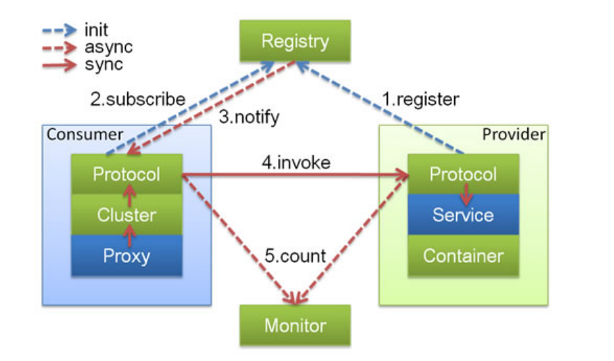

**在这里主要由四部分组成:**

- Provider: 暴露服务的服务提供方

  Protocol：负责提供者和消费者之间协议交互数据

  Service：真实的业务服务信息 可以理解成接口 和 实现

  Container：Dubbo的运行环境 

- Consumer: 调用远程服务的服务消费方

  Protocol：负责提供者和消费者之间协议交互数据

  Cluster：感知提供者端的列表信息

  Proxy：可以理解成 提供者的服务调用代理类 由它接管 Consumer中的接口调用逻辑

- Registry: 注册中心，用于作为服务发现和路由配置等工作，提供者和消费者都会在这里进行注册

- Monitor: 用于提供者和消费者中的数据统计，比如调用频次，成功失败次数等信息。

**启动和执行流程说明：**

1. 提供者端启动，容器负责把Service信息加载 并通过Protocol 注册到注册中心
2. 消费者端启动，通过监听提供者列表来感知提供者信息，并在提供者发生改变时，通过注册中心及时通知消费端
3. 消费方发起请求，通过Proxy模块
4. 利用Cluster模块，来选择真实的要发送给的提供者信息
5. 交由Consumer中的Protocol 把信息发送给提供者
6. 提供者同样需要通过 Protocol 模块来处理消费者的信息
7. 最后由真正的服务提供者 Service 来进行处理 

#### 4.2.2、整体的调用链路

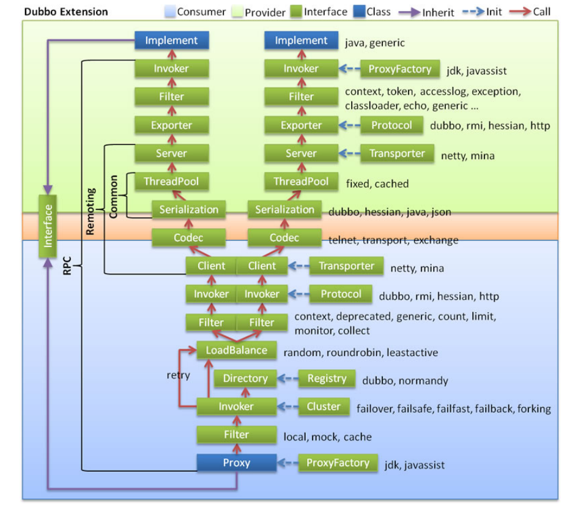

**说明：**

​	淡绿色，代表了服务生产者的范围 

​	淡蓝色，代表了服务消费者的范围

​	红色箭头，代表了调用的方向 

**分为：业务逻辑层、RPC层(远程过程调用) 、Remoting (远程数据传输)**

**整体链路调用的流程:**

1. 消费者通过Interface进行方法调用，统一交由消费者端的Proxy通过ProxyFactory来进行代理对象的创建，使用到了jdk、javassist技术
2. 交给Filter这个模块，做一个统一的过滤请求
3. 接下来会进入最主要的Invoker调用逻辑
   - 通过Directory去配置中新读取信息、最终通过list方法获取所有的Invoker
   - 通过Cluster模块根据选择的具体路由规则、来选取Invoker列表
   - 通过LoadBalance模块根据负载均衡策略、选择一个具体的Invoker来处理我们的请求
   - 如果执行中出现错误，并且Consumer阶段配置了重试机制，则会重新尝试执行
4. 继续经过Filter进行执行功能的前后封装Invoker选择具体的执行协议
5. 客户端Client进行编码和序列化然后发送数据
6. 到达provider中的Server在这里进行反编码和反序列化的接收数据
7. 使用Exporter选择执行器 
8. 交给Filter进行一个提供者端的过滤到达Invoker执行器 
9. 通过Invoker调用接口的具体实现，然后将结果返回

#### 4.2.3、Dubbo源码整体设计

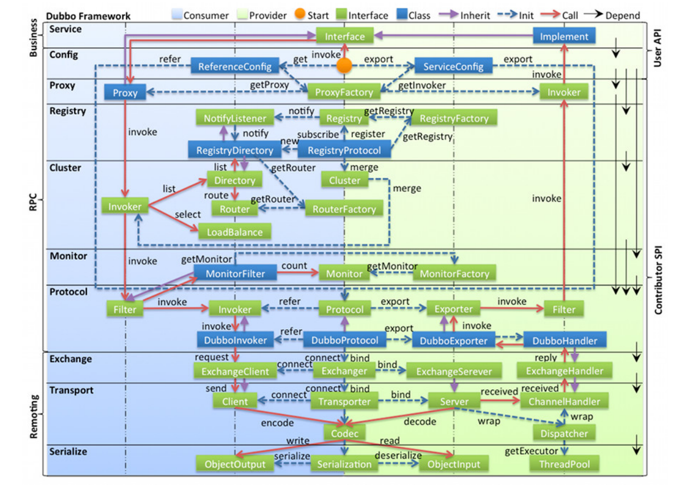

**图例说明：**

- 图中左边淡蓝背景的为服务消费方使用的接口，右边淡绿色背景的为服务提供方使用的接口，位于中轴线上的为双方都用到的接口。

- 图中从下至上分为十层，各层均为单向依赖，右边的黑色箭头代表层之间的依赖关系，每一层都可以剥离上层被复用，其中，Service 和 Config 层为 API，

  其它各层均为 SPI。

- 图中绿色小块的为扩展接口，蓝色小块为实现类，图中只显示用于关联各层的实现类。

- 图中蓝色虚线为初始化过程，即启动时组装链，
- 红色实线为方法调用过程，即运行时调时链，
- 紫色三角箭头为继承，可以把子类看作父类的同一个节点，线上的文字为调用的方法。

Dubbo源码整体设计与调用链路十分相似。只不过这里可以看到接口的一些具体实现以及左侧也有更为详细的层次划分，我们在后面的源码解析时也会着重介绍其

中比较重要的模块实现。

**分层介绍:**

- Business（业务逻辑层）

  - service业务层：包括我们的业务代码，比如接口、实现类，直接面向开发者

- RPC层（远程过程调用层）

  - config配置层：对外提供配置，以ServiceConfig、ReferenceConfig为核心，可以直接初始化配置类，也可以解析配置文件生成

  - proxy服务代理层：无论是生产者，还是消费者，框架都会产生一个代理类，整个过程对上层透明，就是业务层对远程调用无感

  - registry 注册中心层：封装服务地址的注册与发现，以服务的URL为中心

  - cluster 路由层 (集群容错层)：提供了多个提供者的路由和负载均衡，并且它桥接注册中心，以Invoker为核心

  - monitor监控层：RPC调用相关的信息，如调用次数、成功失败的情况、调用时间等在这一层完成

  - protocol远程调用层：封装RPC调用，无论是服务的暴露，服务的引用，都是在Protocol中作为主功能入口，负责Invoker的整个生命周期，Dubbo中所有

    的模型都向Invoker靠拢

- Remoting层（远程数据传输层）

  - exchange信息交换层：封装请求和响应的模式，如把请求由同步转换成异步
  - transport网络传输层：统一网络传输的接口，比如netty和mina统一为一个网络传输接口
  - serialize数据序列化层：负责管理整个框架中的数据传输的序列化和反序列化

### 4.3、服务注册与消费源码剖析

#### 4.3.1、注册中心Zookeeper剖析

注册中心是Dubbo的重要组成部分，主要用于服务的注册与发现，我们可以选择Redis、Nacos、Zookeeper作为Dubbo的注册中心，Dubbo推荐用户使用

Zookeeper作为注册中心。

**注册中心Zookeeper目录结构**

我们使用一个最基本的服务的注册与消费的Demo来进行说明。

例如：只有一个提供者和消费者。 com.lagou.service.HelloService 为我们所提供的服务。

```java
public interface HelloService { 
    String sayHello(String name); 
}
```

则Zookeeper的目录结构如下：

```properties
+- dubbo
| +- com.lagou.service.HelloService
| | +- consumers
| | | +- consumer://192.168.1.102/com.lagou.service.HelloService? application=dubbo-demo-annotation- consumer&category=consumers&check=false&dubbo=2.0.2&init=false&interface=com.lag ou.service.HelloService&methods=sayHello,sayHelloWithPrint,sayHelloWithTransmiss ion,sayHelloWithException&pid=25923&release=2.7.5&side=consumer&sticky=false&tim estamp=1583896043650
| | +- providers
| | | +- dubbo://192.168.1.102:20880/com.lagou.service.HelloService? anyhost=true&application=dubbo-demo-annotation- provider&deprecated=false&dubbo=2.0.2&dynamic=true&generic=false&interface=com.l agou.service.HelloService&methods=sayHello,sayHelloWithPrint,sayHelloWithTransmi ssion,sayHelloWithException&pid=25917&release=2.7.5&side=provider&telnet=clear,e xit,help,status,log,ls,ps,cd,pwd,invoke,trace,count,select,shutdown&timestamp=15 83896023597
| | +- configuration
| | +- routers
```

可以在这里看到所有的节点都是在dubbo层级下的，dubbo跟节点下面是当前所拥有的接口名称，如果有多个接口，则会以多个子节点的形式展开每个服务下面又

分别有四个配置项

- consumers: 当前服务下面所有的消费者列表(URL)

- providers: 当前服务下面所有的提供者列表(URL)

- configuration: 当前服务下面的配置信息信息，provider或者consumer会通过读取这里的配置信息来获取配置

- routers: 当消费者在进行获取提供者的时，会通过这里配置好的路由来进行适配匹配规则。

可以看到，dubbo基本上很多时候都是通过URL的形式来进行交互获取数据的，在URL中也会保存很多的信息。后面也会对URL的规则做详细介绍。

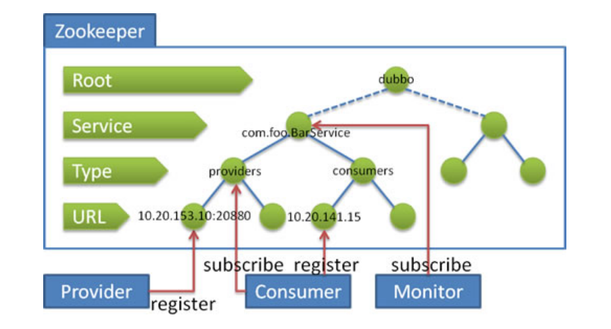

**通过这张图我们可以了解到如下信息:**

- 提供者会在providers目录下进行自身的进行注册。

- 消费者会在consumers目录下进行自身注册，并且监听provider目录，以此通过监听提供者增加或者减少，实现服务发现。

- Monitor模块会对整个服务级别做监听，用来得知整体的服务情况。以此就能更多的对整体情况做监控。

#### 4.3.2、服务的注册过程分析

**服务注册(暴露)过程**

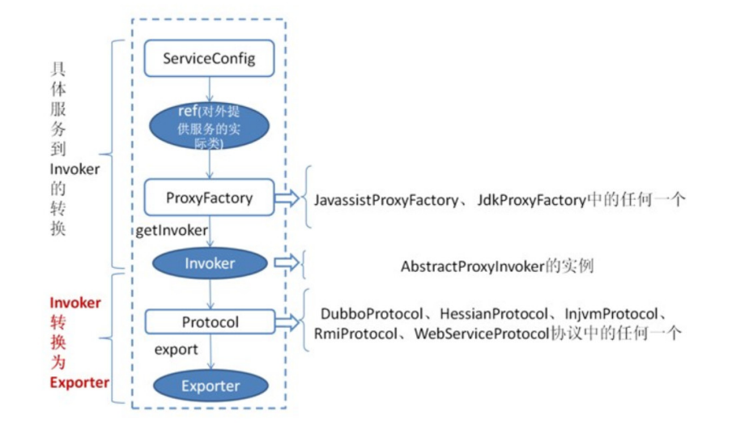

首先ServiceConfig 类拿到对外提供服务的实际类ref(如：HelloServiceImpl),然后通过ProxyFactory接口实现类中的getInvoker方法使用ref生成一个 

AbstractProxyInvoker 实例，到这一步就完成具体服务到Invoker的转化。接下来就是Invoker转换到Exporte的过程。

查看ServiceConfig类,重点查看ProxyFactory和Protocol类型的属性以及ref

下面我们就看一下Invoker转换成Exporter的过程，其中会涉及到RegistryService接口RegistryFactory接口和注册provider到注册中心流程的过程

1. RegistryService代码解读,这块儿的代码比较简单，主要是对指定的路径进行注册，解绑，监听和取消监听，查询操作。也是注册中心中最为基础的类。

   ```java
   public interface RegistryService { 
       /** 进行对URL的注册操作，比如provider，consumer，routers等 */ 
       void register(URL url);
       /** 解除对指定URL的注册，比如provider，consumer，routers等 */ 
       void unregister(URL url); 
       /** 增加对指定URL的路径监听，当有变化的时候进行通知操作 */ 
       void subscribe(URL url, NotifyListener listener); 
       /** 解除对指定URL的路径监听，取消指定的listener */ 
       void unsubscribe(URL url, NotifyListener listener); 
       /** 查询指定URL下面的URL列表，比如查询指定服务下面的consumer列表 */ 
       List<URL> lookup(URL url); 
   }
   ```

2. 我们再来看 RegistryFactory ，是通过他来生成真实的注册中心。通过这种方式，也可以保证一个应用中可以使用多个注册中心。可以看到这里也是通过不同

   的protocol参数，来选择不同的协议。

   ```java
   @SPI("dubbo") //默认使用dubbo协议
   public interface RegistryFactory { 
       /*** 获取注册中心地址 */ 
       @Adaptive({"protocol"}) //可以通过url动态替换具体协议
       Registry getRegistry(URL url); 
   }
   ```

3. 下面我们就来跟踪一下，一个服务是如何注册到注册中心上去的。其中比较关键的一个类是RegistryProtocol ，他负责管理整个注册中心相关协议。并且统一

   对外提供服务。这里我们主要以RegistryProtocol.export 方法作为入口，这个方法主要的作用就是将我们需要执行的信息注册并且导出。

   ```java
   public <T> Exporter<T> export(final Invoker<T> originInvoker) throws RpcException { 
       // 获取注册中心的地址 
       URL registryUrl = getRegistryUrl(originInvoker);
   	// 获取当前提供者需要注册的地址 
       URL providerUrl = getProviderUrl(originInvoker); 
       // 获取进行注册override协议的访问地址
       final URL overrideSubscribeUrl = getSubscribedOverrideUrl(providerUrl); 
       // 增加override的监听器 
       final OverrideListener overrideSubscribeListener = new OverrideListener(overrideSubscribeUrl, originInvoker); 	             overrideListeners.put(overrideSubscribeUrl, overrideSubscribeListener); 
       // 根据现有的override协议，对注册地址进行改写操作 
       providerUrl = overrideUrlWithConfig(providerUrl, overrideSubscribeListener); 
       // 对当前的服务进行本地导出 
       // 完成后即可在看到本地的20880端口号已经启动，并且暴露服务 
       final ExporterChangeableWrapper<T> exporter = doLocalExport(originInvoker, providerUrl); 
       // 获取真实的注册中心, 比如我们常用的ZookeeperRegistry 
       final Registry registry = getRegistry(originInvoker); 
       // 获取当前服务需要注册到注册中心的providerURL，主要用于去除一些没有必要的参数(比如在本 地导出时所使用的qos参数等值) 
       final URL registeredProviderUrl = getUrlToRegistry(providerUrl, registryUrl); 
       // 获取当前url是否需要进行注册参数 
       boolean register = providerUrl.getParameter(REGISTER_KEY, true); 
       if (register) { 
           // 将当前的提供者注册到注册中心上去 
           register(registryUrl, registeredProviderUrl); 
       }
       // 对override协议进行注册，用于在接收到override请求时做适配,这种方式用于适配2.6.x及之 前的版本(混用) 
       registry.subscribe(overrideSubscribeUrl, overrideSubscribeListener); 
       // 设置当前导出中的相关信息 
       exporter.setRegisterUrl(registeredProviderUrl);
       exporter.setSubscribeUrl(overrideSubscribeUrl); 
       // 返回导出对象(对数据进行封装) 
       return new DestroyableExporter<>(exporter); 
   }
   ```

4. 下面我们再来看看register方法, 这里面做的比较简单，主要是从RegistoryFactory中获取注册中心，并且进行地址注册。

   ```java
   public void register(URL registryUrl, URL registeredProviderUrl) { 
       // 获取注册中心 
       Registry registry = registryFactory.getRegistry(registryUrl); 
       // 对当前的服务进行注册 
       registry.register(registeredProviderUrl); 
       // ProviderModel 表示服务提供者模型，此对象中存储了与服务提供者相关的信息。 
       // 比如服务的配置信息，服务实例等。每个被导出的服务对应一个 ProviderModel。 
       ProviderModel model = ApplicationModel.getProviderModel(registeredProviderUrl.getServiceKey()); 
       model.addStatedUrl(new ProviderModel.RegisterStatedURL( registeredProviderUrl, registryUrl, true )); 
   }
   ```

5. 这里我们再跟里面的register方法之前，先来介绍一下Registry中的类目录结构

   ```properties
   +- RegistryService
   | +- Registry
   | | +- AbstractRegistry
   | | | +- FailbackRegistry
   | | | | +- ZookeeperRegistry
   | | | | +- NacosRegistry
   | | | | +- ...
   ```

   **目录结构描述如下：**

   - 在这里每个层级代表继承自父级

   - 这里面 RegistryService 就是我们之前所讲对外提供注册机制的接口。

   - 其下面 Registry 也同样是一个接口，是对 RegistryService 的集成，并且继承了 Node 接口，说明注册中心也是基于URL去做的。

   - AbstractRegistry 是对注册中心的封装，其主要会对本地注册地址的封装，主要功能在于远程注册中心不可用的时候，可以采用本地的注册中心来使用。

   - FailbackRegistry 从名字中可以看出来，失败自动恢复，后台记录失败请求，定时重发功能。

   - 最深的一层则更多是真实的第三方渠道实现。

6. 下面我们来看一下在 FailbackRegistry 中的实现, 可以在这里看到他的主要作用是调用第三方的实现方式，并且在出现错误时增加重试机制。

   ```java
   public void register(URL url) { 
       // 上层调用 
       // 主要用于保存已经注册的地址列表 
       super.register(url);
       // 将一些错误的信息移除(确保当前地址可以在出现一些错误的地址时可以被删除) 
       removeFailedRegistered(url); 
       removeFailedUnregistered(url);
       try {
           // 发送给第三方渠道进行注册操作 真正进行服务注册的方法
           doRegister(url); 
       } catch (Exception e) { 
           Throwable t = e;
           // 记录日志 
           boolean check = getUrl().getParameter(Constants.CHECK_KEY, true) && url.getParameter(Constants.CHECK_KEY, true) && !CONSUMER_PROTOCOL.equals(url.getProtocol()); boolean skipFailback = t instanceof SkipFailbackWrapperException; if (check || skipFailback) { if (skipFailback) { t = t.getCause(); }throw new IllegalStateException("Failed to register " + url + " to registry " + getUrl().getAddress() + ", cause: " + t.getMessage(), t); } else { logger.error("Failed to register " + url + ", waiting for retry, cause: " + t.getMessage(), t); }
       	// 后台异步进行重试，也是Failback比较关键的代码 
       	addFailedRegistered(url);
      } 
   }
   ```

7. 下面我们再来看看Zookeeper中 doRegister 方法的实现, 可以看到这里的实现也比较简单，关键在于 toUrlPath 方法的实现。关于 dynamic 的值，我们也在

   上面有看到，他的URL也是true的。

   ```java
   public void doRegister(URL url) { 
       try {
           // 进行创建地址 
           zkClient.create(toUrlPath(url), url.getParameter(DYNAMIC_KEY, true)); 
       } catch (Throwable e) { 
           throw new RpcException("Failed to register " + url + " to zookeeper " + getUrl() + ", cause: " + e.getMessage(), e); 	 } 
   }
   ```

8. 解读 toUrlPath 方法。可以看到这里的实现也是比较简单，也验证了我们之前的路径规则。

   ```java
   private String toUrlPath(URL url) { 
       // 分类地址 + url字符串 
       return toCategoryPath(url) + PATH_SEPARATOR + URL.encode(url.toFullString()); 
   }
   private String toCategoryPath(URL url) { 
       // 服务名称 + category(在当前的例子中是providers) 
       return toServicePath(url) + PATH_SEPARATOR + url.getParameter(CATEGORY_KEY, DEFAULT_CATEGORY); 
   }
   private String toServicePath(URL url) {
       // 接口地址 
       String name = url.getServiceInterface(); 
       if (ANY_VALUE.equals(name)) {
           return toRootPath(); 
       }
       // 根节点 + 接口地址 
       return toRootDir() + URL.encode(name); 
   }
   ```


#### 4.3.3、URL规则详解和服务本地缓存

- **URL规则详解**

  URL地址如下：

  ```properties
  protocol://host:port/path?key=value&key=value 
  
  provider://192.168.20.1:20883/com.lagou.service.HelloService? anyhost=true&application=service- provider2&bind.ip=192.168.20.1&bind.port=20883&category=configurators&check=fals e&deprecated=false&dubbo=2.0.2&dynamic=true&generic=false&interface=com.lagou.se rvice
  ```

  URL主要有以下几部分组成：

  - protocol: 协议，一般像我们的 provider 或者 consumer 在这里都是人为具体的协议

  - host: 当前 provider 或者其他协议所具体针对的地址，比较特殊的像 override 协议所指定的host就是 0.0.0.0 代表所有的机器都生效

  - port: 和上面相同，代表所处理的端口号


  - path: 服务路径，在 provider 或者 consumer 等其他中代表着我们真实的业务接口


  - key=value: 这些则代表具体的参数，这里我们可以理解为对这个地址的配置。比如我们 provider中需要具体机器的服务应用名，就可以是一个配置的方式

    设置上去。

  **注意：**Dubbo中的URL与java中的URL是有一些区别的，如下：

  - 这里提供了针对于参数的 parameter 的增加和减少(支持动态更改)


  - 提供缓存功能，对一些基础的数据做缓存

-  **服务本地缓存**

   在上面我们有讲到dubbo有对路径进行本地缓存操作。这里我们就对本地缓存进行讲解。dubbo调用者需要通过注册中心（例如：ZK）注册信息，获取提供

   者，但是如果频繁往从ZK获取信息，肯定会存在单点故障问题，所以dubbo提供了将提供者信息缓存在本地的方法。

   Dubbo在订阅注册中心的回调处理逻辑当中会保存服务提供者信息到本地缓存文件当中（同步/异步两种方式），以URL维度进行全量保存。

   Dubbo在服务引用过程中会创建registry对象并加载本地缓存文件，会优先订阅注册中心，订阅注册中心失败后会访问本地缓存文件内容获取服务提供信息。

   （1）首先从构造方法讲起, 这里方法比较简单，主要用于确定需要保存的文件信息。并且从系统中读取已有的配置信息。

   ```java
   public AbstractRegistry(URL url) { 
       setUrl(url); 
       // Start file save timer 
       syncSaveFile = url.getParameter(REGISTRY_FILESAVE_SYNC_KEY, false); 
       // 默认保存路径(home/.dubbo/dubbo-registry-appName-address-port.cache) 
       String defaultFilename = System.getProperty("user.home") + "/.dubbo/dubbo- registry-" + url.getParameter(APPLICATION_KEY) + "-" + url.getAddress().replaceAll(":", "-") + ".cache"; 
       String filename = url.getParameter(FILE_KEY, defaultFilename); 
       // 创建文件 
       File file = null; 
       if (ConfigUtils.isNotEmpty(filename)) { 
           file = new File(filename); 
           if (!file.exists() && file.getParentFile() != null && !file.getParentFile().exists()) { 
               if (!file.getParentFile().mkdirs()) { 
                   throw new IllegalArgumentException("Invalid registry cache file " + file + ", cause: Failed to create directory " + file.getParentFile() + "!"); 
               } 
           } 
       }
       this.file = file; 
       // 加载已有的配置文件 
       loadProperties(); 
       notify(url.getBackupUrls()); 
   }
   ```

   （2）我们可以看到这个类中最为关键的一个属性为 properties ，我们可以通过寻找，得知这个属性的设置值只有在一个地方: saveProperties ，我们来看一

   下这个方法。这里也有一个我们值得关注的点，就是基于版本号的的更改。

   ```java
   private void saveProperties(URL url) { 
       if (file null) { 
           return; 
       }
       try {
           StringBuilder buf = new StringBuilder(); 
           // 获取所有通知到的地址 
           Map<String, List<URL>> categoryNotified = notified.get(url); 
           if (categoryNotified != null) { 
               for (List<URL> us : categoryNotified.values()) { 
                   for (URL u : us) { 
                       // 多个地址进行拼接 
                       if (buf.length() > 0) { 
                           buf.append(URL_SEPARATOR); 
                       }
                       buf.append(u.toFullString()); 
                   } 
               } 
           }
           // 保存数据 
           properties.setProperty(url.getServiceKey(), buf.toString());
           // 保存为一个新的版本号 
           // 通过这种机制可以保证后面保存的记录，在重试的时候，不会重试之前的版本 
           long version = lastCacheChanged.incrementAndGet(); 
           // 需要同步保存则进行保存 
           if (syncSaveFile) { 
               doSaveProperties(version); 
           } else { 
               // 否则则异步去进行处理 
               registryCacheExecutor.execute(new SaveProperties(version)); 
           } 
       } catch (Throwable t) { 
           logger.warn(t.getMessage(), t); 
       } 
   }
   ```

   （3）下面我们再来看看是如何进行保存文件的。这里的实现也比较简单，主要比较关键的代码在于利用文件级锁来保证同一时间只会有一个线程执行。

   ```java
   public void doSaveProperties(long version) { 
       if (version < lastCacheChanged.get()) { 
           return; 
       }
       if (file null) { 
           return; 
       }
       // Save 
       try {
           // 使用文件级别所，来保证同一段时间只会有一个线程进行读取操作 
           File lockfile = new File(file.getAbsolutePath() + ".lock"); 
           if (!lockfile.exists()) { 
               lockfile.createNewFile(); 
           }
           try (RandomAccessFile raf = new RandomAccessFile(lockfile, "rw"); 
                FileChannel channel = raf.getChannel()) { 
               // 利用文件锁来保证并发的执行的情况下，只会有一个线程执行成功(原因在于可能是跨 VM的) 
               FileLock lock = channel.tryLock(); if (lock null) { 
                   throw new IOException("Can not lock the registry cache file " + file.getAbsolutePath() + ", ignore and retry later, maybe multi java process use the file, please config: dubbo.registry.file=xxx.properties"); 
               }
               // Save 
               try {
                   if (!file.exists()) { 
                       file.createNewFile(); 
                   }
                   // 将配置的文件信息保存到文件中 
                   try (FileOutputStream outputFile = new FileOutputStream(file)) { 
                       properties.store(outputFile, "Dubbo Registry Cache"); 
                   } 
               } finally { 
                   // 解开文件锁 
                   lock.release(); 
               }
              	} 
       } catch (Throwable e) { 
           // 执行出现错误时，则交给专门的线程去进行重试 
           savePropertiesRetryTimes.incrementAndGet(); 
           if (savePropertiesRetryTimes.get() >= MAX_RETRY_TIMES_SAVE_PROPERTIES) { 
               logger.warn("Failed to save registry cache file after retrying " + MAX_RETRY_TIMES_SAVE_PROPERTIES + " times, cause: " + e.getMessage(), e); savePropertiesRetryTimes.set(0); 
               return; 
           }
           if (version < lastCacheChanged.get()) { 
               savePropertiesRetryTimes.set(0); 
               return; 
           } else { 
               registryCacheExecutor.execute(new SaveProperties(lastCacheChanged.incrementAndGet())); 
           }
           logger.warn("Failed to save registry cache file, will retry, cause: " + e.getMessage(), e); 
       } 
   }
   ```

#### 4.3.4、Dubbo 消费过程分析


首先 ReferenceConfig 类的 init 方法调用 createProxy() ,期间 使用 Protocol 调用 refer 方法生成 Invoker 实例(如上图中的红色部分)，这是服务消费的关键。接下

来使用ProxyFactory把 Invoker转换为客户端需要的接口(如：HelloService)。主要过程和服务注册类似。

### 4.4、Dubbo扩展SPI源码剖析

SPI在之前都有使用过，其中最重要的类就是 ExtensionLoader ，它是所有Dubbo中SPI的入口。

我们通过分析源码来学习 ExtensionLoader 是怎么加载的。这里会具体介绍org.apache.dubbo.common.extension.ExtensionLoader.getExtensionLoader 和 

org.apache.dubbo.common.extension.ExtensionLoader.getExtension 方法。

getExtensionLoader 获取扩展点加载器并加载所对应的所有的扩展点实现

getExtension 根据name 获取扩展的指定实现

#### 4.4.1、getExtensionLoader加载过程

（1）是如何进行实例化 ExtensionLoader 的

```java
    private static <T> boolean withExtensionAnnotation(Class<T> type) {
        // 包含`@SPI`注解在接口上
        return type.isAnnotationPresent(SPI.class);
    }

    @SuppressWarnings("unchecked")
    public static <T> ExtensionLoader<T> getExtensionLoader(Class<T> type) {
        //必须传入类型
        if (type == null) {
            throw new IllegalArgumentException("Extension type == null");
        }
        //必须是接口
        if (!type.isInterface()) {
            throw new IllegalArgumentException("Extension type (" + type + ") is not an interface!");
        }
        //必须有@SPI注解
        if (!withExtensionAnnotation(type)) {
            throw new IllegalArgumentException("Extension type (" + type +
                    ") is not an extension, because it is NOT annotated with @" + SPI.class.getSimpleName() + "!");
        }
        //尝试从缓存中获取（缓存思想）
        ExtensionLoader<T> loader = (ExtensionLoader<T>) EXTENSION_LOADERS.get(type);
        if (loader == null) {
            //如果缓存中没有进行初始化，并添加缓存
            EXTENSION_LOADERS.putIfAbsent(type, new ExtensionLoader<T>(type));
            loader = (ExtensionLoader<T>) EXTENSION_LOADERS.get(type);
        }
        return loader;
    }
```

（2）具体看一下 ExtensionLoader 的构造器函数, 这里他的实现比较简单，并没有做太多的操作。主要是对type进行赋值操作并获取 ExtensionFactory 对象。

```java
    private ExtensionLoader(Class<?> type) {
        this.type = type;
        //创建ExtensionFactory对象 ExtensionFactory也是一个扩展点
        objectFactory = (type == ExtensionFactory.class ? null : ExtensionLoader.getExtensionLoader(ExtensionFactory.class).getAdaptiveExtension());
    }
```

（3）具体再来关注一下 ExtensionFactory 是做什么用的, 从这里我们可以大概的看出来，他是通过传入扩展点类型和真正的名称来获取扩展的。这里就和我们SPI

中的具体名称实现相挂钩。

```java
/**
 * ExtensionFactory
 * 根据传入的扩展点类型和名称获取扩展实现 这里和SPI中的具体名称实现挂钩
 */
@SPI
public interface ExtensionFactory {

    /**
     * Get extension.
     *
     * @param type object type.
     * @param name object name.
     * @return object instance.
     */
    <T> T getExtension(Class<T> type, String name);

}
```

（4）可以在 dubbo-common/src/main/resources/META- INF/dubbo/internal/org.apache.dubbo.common.extension.ExtensionFactory 中看到，他默认有三

个实现的提供（有些版本可能是两个）

```properties
spring=org.apache.dubbo.config.spring.extension.SpringExtensionFactory
adaptive=org.apache.dubbo.common.extension.factory.AdaptiveExtensionFactory
spi=org.apache.dubbo.common.extension.factory.SpiExtensionFactory
```

（5）可以看到在 AdaptiveExtensionFactory 中是使用 @Adaptive 标记的。这里可以通过类名基本看出来，最主要的作用是进行代理其他的ExtensionFactory。

其中比较重要的方法在于getSupportedExtensions 方法，获取所有支持的扩展信息实现。

```java
/**
 * AdaptiveExtensionFactory
 */
@Adaptive
public class AdaptiveExtensionFactory implements ExtensionFactory {

    private final List<ExtensionFactory> factories;

    public AdaptiveExtensionFactory() {
        //获取ExtensionFactory的扩展加载器
        ExtensionLoader<ExtensionFactory> loader = ExtensionLoader.getExtensionLoader(ExtensionFactory.class);
        List<ExtensionFactory> list = new ArrayList<ExtensionFactory>();
        //获取支持扩展
        for (String name : loader.getSupportedExtensions()) {
            //对扩展进行缓存
            list.add(loader.getExtension(name));
        }
        factories = Collections.unmodifiableList(list);
    }

    @Override
    public <T> T getExtension(Class<T> type, String name) {
        //获取具体的扩展对象
        for (ExtensionFactory factory : factories) {
            T extension = factory.getExtension(type, name);
            if (extension != null) {
                return extension;
            }
        }
        return null;
    }
}
```

（6）获取所有支持的扩展信息实现: ExtensionLoader.getSupportedExtensions ，这里可以看到，其实比较关键的方法在于 getExtensionClasses 方法

```java
    public Set<String> getSupportedExtensions() {
        //获取扩展类信息
        Map<String, Class<?>> clazzes = getExtensionClasses();
        //获取扩展点的名称
        return Collections.unmodifiableSet(new TreeSet<>(clazzes.keySet()));
    }
```

（7）观察 getExtensionClasses 的实现,这里其实主要做的就是一件事情，防止重复被加载，所以真正的的实现还需要专门去查看 loadExtensionClasses 方法

在我们通过名称获取扩展类之前,首先需要根据配置文件解析出扩展类名称到扩展类的映射关系表classes之后再根据扩展项名称 从映射关系表中获取取对应的扩展

类即可。相关过程代码分析如下

```java
private Map<String, Class<?>> getExtensionClasses() {
        //从缓存中获取已经加载的扩展类
        Map<String, Class<?>> classes = cachedClasses.get();
        //使用双重检查机制
        if (classes == null) {
            //为null加锁
            synchronized (cachedClasses) {
                //防止重复加载
                classes = cachedClasses.get();
                if (classes == null) {
                    //加载扩展类信息 并缓存
                    classes = loadExtensionClasses();
                    cachedClasses.set(classes);
                }
            }
        }
        return classes;
    }
```

（8）观察 loadExtensionClasses 方法实现。这里主要做了两件事情。

1: 加载当前SPI的默认实现。

2:加载这个类的所有扩展点实现，并且按照name和Class对象的形式存储，下面会专门针对于cacheDefaultExtensionName 和 loadDirectory 方法做说明

```java
    private Map<String, Class<?>> loadExtensionClasses() {
        //加载默认的扩展实现
        cacheDefaultExtensionName();

        Map<String, Class<?>> extensionClasses = new HashMap<>();
        //获取每个目录下，名称和实现类的对应关系
        for (LoadingStrategy strategy : strategies) {
            loadDirectory(extensionClasses, strategy.directory(), type.getName(), strategy.preferExtensionClassLoader(), strategy.overridden(), strategy.excludedPackages());
            loadDirectory(extensionClasses, strategy.directory(), type.getName().replace("org.apache", "com.alibaba"), strategy.preferExtensionClassLoader(), strategy.overridden(), strategy.excludedPackages());
        }

        return extensionClasses;
    }
```

观察 cacheDefaultExtensionName 方法实现。这里面的是实现比较简单，主要用于读取注解中value值来获取到默认的名称。

```java
 private void cacheDefaultExtensionName() {
        //获取当前类中是否包含@SPI注解
        final SPI defaultAnnotation = type.getAnnotation(SPI.class);
        //如果没有就返回
        if (defaultAnnotation == null) {
            return;
        }
        //获取默认的扩展名称
        //比如LoadBalance的默认实现就是random。就是通过这里进行的设置
        String value = defaultAnnotation.value();
        if ((value = value.trim()).length() > 0) {
            String[] names = NAME_SEPARATOR.split(value);
            if (names.length > 1) {
                throw new IllegalStateException("More than 1 default extension name on extension " + type.getName()
                        + ": " + Arrays.toString(names));
            }
            if (names.length == 1) {
                cachedDefaultName = names[0];
            }
        }
    }
```

观察 loadDirectory 方法实现。这里的主要功能是从这个文件夹中寻找真正的文件列表，并且对其中的文件内容解析并且放入到 extensionClasses Map中，具体

解析文件的内容实现，还要参考loadResource 实现。

```java
    private void loadDirectory(Map<String, Class<?>> extensionClasses, String dir, String type,
                               boolean extensionLoaderClassLoaderFirst, boolean overridden, String... excludedPackages) {
        // 路径 + 包名.接口名
        String fileName = dir + type;
        try {
            Enumeration<java.net.URL> urls = null;
            ClassLoader classLoader = findClassLoader();

            // try to load from ExtensionLoader's ClassLoader first
            // 如果需要的话, 需要先从当前类的ClassLoader中寻找
            if (extensionLoaderClassLoaderFirst) {
                ClassLoader extensionLoaderClassLoader = ExtensionLoader.class.getClassLoader();
                if (ClassLoader.getSystemClassLoader() != extensionLoaderClassLoader) {
                    urls = extensionLoaderClassLoader.getResources(fileName);
                }
            }
            //如果找不到任何的URL列表，则继续尝试去其当前线程的ClassLoader中寻找
            if (urls == null || !urls.hasMoreElements()) {
                if (classLoader != null) {
                    urls = classLoader.getResources(fileName);
                } else {
                    urls = ClassLoader.getSystemResources(fileName);
                }
            }
            //如果存在文件的话
            if (urls != null) {
                // 遍历每一个资源文件，并且进行加载资源信息到extensionClasses, 主要功能 是读取文件内容
                while (urls.hasMoreElements()) {
                    java.net.URL resourceURL = urls.nextElement();
                    loadResource(extensionClasses, classLoader, resourceURL, overridden, excludedPackages);
                }
            }
        } catch (Throwable t) {
            logger.error("Exception occurred when loading extension class (interface: " +
                    type + ", description file: " + fileName + ").", t);
        }
    }
```

（9）进行观察 loadResource 实现，主要是用于读取文件操作，并且将方法交由 loadClass 来加载类信息。加载类信息也是最重要的方法所在。

```java
    private void loadResource(Map<String, Class<?>> extensionClasses, ClassLoader classLoader,
                              java.net.URL resourceURL, boolean overridden, String... excludedPackages) {
        try {
            //根据resourceURL读取资源文件
            try (BufferedReader reader = new BufferedReader(new InputStreamReader(resourceURL.openStream(), StandardCharsets.UTF_8))) {
                String line;
                while ((line = reader.readLine()) != null) {
                    //如果读到#表示注释
                    final int ci = line.indexOf('#');
                    if (ci >= 0) {
                        line = line.substring(0, ci);
                    }
                    line = line.trim();
                    if (line.length() > 0) {
                        try {
                            String name = null;
                            int i = line.indexOf('=');
                            if (i > 0) {
                                //获取key=value形式数据
                                name = line.substring(0, i).trim();
                                line = line.substring(i + 1).trim();
                            }
                            if (line.length() > 0 && !isExcluded(line, excludedPackages)) {
                                //对类信息进行加载
                                loadClass(extensionClasses, resourceURL, Class.forName(line, true, classLoader), name, overridden);
                            }
                        } catch (Throwable t) {
                            IllegalStateException e = new IllegalStateException("Failed to load extension class (interface: " + type + ", class line: " + line + ") in " + resourceURL + ", cause: " + t.getMessage(), t);
                            exceptions.put(line, e);
                        }
                    }
                }
            }
        } catch (Throwable t) {
            logger.error("Exception occurred when loading extension class (interface: " +
                    type + ", class file: " + resourceURL + ") in " + resourceURL, t);
        }
    }
```

（10）观察 loadClass 类的实现，可以看到这里是最终进行完成类映射的地方。关于Adaptive中的类实现原理，我们放在这个章节中的偏后面进行细讲。

```java
    private void loadClass(Map<String, Class<?>> extensionClasses, java.net.URL resourceURL, Class<?> clazz, String name,
                           boolean overridden) throws NoSuchMethodException {
        //当前扩展点必须是接口的实现
        if (!type.isAssignableFrom(clazz)) {
            throw new IllegalStateException("Error occurred when loading extension class (interface: " +
                    type + ", class line: " + clazz.getName() + "), class "
                    + clazz.getName() + " is not subtype of interface.");
        }
        //如果包含了@Adaptive，就进行存储操作
        if (clazz.isAnnotationPresent(Adaptive.class)) {
            cacheAdaptiveClass(clazz, overridden);
        } else if (isWrapperClass(clazz)) {
            // 判断是否是wapper类型, 是否构造函数中有该接口类型的传入
            // wrapper类型的意思是，对当前的扩展点实现封装功能处理
            cacheWrapperClass(clazz);
        } else {
            clazz.getConstructor();
            // 寻找他是否已经定义过了名称, 这里就不继续往里面细看了,
            // 主要是获取当前类的 org.apache.dubbo.common.Extension注解，如果有的话就使用这个名称，否则的话就是用当前类的 简单名称
            if (StringUtils.isEmpty(name)) {
                name = findAnnotationName(clazz);
                if (name.length() == 0) {
                    throw new IllegalStateException("No such extension name for the class " + clazz.getName() + " in the config " + resourceURL);
                }
            }
            //对name和class进行映射
            String[] names = NAME_SEPARATOR.split(name);
            if (ArrayUtils.isNotEmpty(names)) {
                //如果当前类拥有Activate注解，则将其进行添加到cachedActivates对象中，意味着需要执行
                cacheActivateClass(clazz, names[0]);
                for (String n : names) {
                    //进行名称映射保存
                    cacheName(clazz, n);
                    saveInExtensionClass(extensionClasses, clazz, n, overridden);
                }
            }
        }
    }
```

当执行完这几个方法之后，会对一下几个字段进行更新:

- cachedAdaptiveClass: 当前Extension类型对应的AdaptiveExtension类型(只能一个)

- cachedWrapperClasses: 当前Extension类型对应的所有Wrapper实现类型(无顺序)

- cachedActivates: 当前Extension实现自动激活实现缓存(map,无序)

- cachedNames: 扩展点实现类对应的名称(如配置多个名称则值为第一个)

#### 4.4.2、getExtension获取扩展点的方法

（1） getExtension 方法实现。这里面同样主要作用是根据name对扩展点进行处理和进行加锁来创建真实的引用，其中都是有使用缓存来处理。

```java
    public T getExtension(String name, boolean wrap) {
        if (StringUtils.isEmpty(name)) {
            throw new IllegalArgumentException("Extension name == null");
        }
        // 获取当前SPI的默认扩展实现类
        if ("true".equals(name)) {
            return getDefaultExtension();
        }
        // 获取当前类的holder，实现原理和cachedClasses的方式相同，都是建立同一个引用后再进行 加锁
        final Holder<Object> holder = getOrCreateHolder(name);
        Object instance = holder.get();
        if (instance == null) {
            synchronized (holder) {
                instance = holder.get();
                if (instance == null) {
                    // 真正进行创建实例
                    instance = createExtension(name, wrap);
                    holder.set(instance);
                }
            }
        }
        return (T) instance;
    }
```

（2）下面来看看 getOrCreateHolder 是如何保证缓存的。

```java
    private Holder<Object> getOrCreateHolder(String name) {
        //根据当前名称从缓存中获取
        Holder<Object> holder = cachedInstances.get(name);
        if (holder == null) {
            //如果不存在则创建并添加缓存
            cachedInstances.putIfAbsent(name, new Holder<>());
            holder = cachedInstances.get(name);
        }
        return holder;
    }
```

（3）然后我们再来看看 createExtension 的实现，他是具体根据扩展的class名称来进行创建实例的类。这里也是创建扩展点类的主要实现。下面我们也对其他扩

展点注册的方法做说明。

```java
    @SuppressWarnings("unchecked")
    private T createExtension(String name, boolean wrap) {
        // 从配置文件中加载所有的扩展类 可以得到配置项名称 到配置类的映射关系
        Class<?> clazz = getExtensionClasses().get(name);
        if (clazz == null) {
            throw findException(name);
        }
        try {
            // 获取实例
            T instance = (T) EXTENSION_INSTANCES.get(clazz);
            if (instance == null) {
                // 没有的话，同样适用putIfAbsent的方式来保证只会创建一个对象并且保存
                EXTENSION_INSTANCES.putIfAbsent(clazz, clazz.newInstance());
                instance = (T) EXTENSION_INSTANCES.get(clazz);
            }
            //注入其他扩展点 ，类似于spring的ioc，用于扩展点和其他扩展点互通
            injectExtension(instance);

            //是否包装
            if (wrap) {
                List<Class<?>> wrapperClassesList = new ArrayList<>();
                if (cachedWrapperClasses != null) {
                    wrapperClassesList.addAll(cachedWrapperClasses);
                    wrapperClassesList.sort(WrapperComparator.COMPARATOR);
                    Collections.reverse(wrapperClassesList);
                }

                if (CollectionUtils.isNotEmpty(wrapperClassesList)) {
                    // 进行遍历所有的包装类信息，分别对包装的类进行包装实例化，并且返回自身引用
                    for (Class<?> wrapperClass : wrapperClassesList) {
                        Wrapper wrapper = wrapperClass.getAnnotation(Wrapper.class);
                        if (wrapper == null
                                || (ArrayUtils.contains(wrapper.matches(), name) && !ArrayUtils.contains(wrapper.mismatches(), name))) {
                            // 同样进行注册其他扩展点的功能
                            instance = injectExtension((T) wrapperClass.getConstructor(type).newInstance(instance));
                        }
                    }
                }
            }
            // 对扩展点进行初始化操作
            initExtension(instance);
            return instance;
        } catch (Throwable t) {
            throw new IllegalStateException("Extension instance (name: " + name + ", class: " +
                    type + ") couldn't be instantiated: " + t.getMessage(), t);
        }
    }
```

（4） injectExtension 方法观察

```java
   private T injectExtension(T instance) {

        if (objectFactory == null) {
            return instance;
        }

        try {
            // 遍历其中的所有方法
            for (Method method : instance.getClass().getMethods()) {
                // 是否是set方法 
                // 1. 以"set"开头 
                // 2. 参数长度为1 
                // 3. 是公开的方法
                if (!isSetter(method)) {
                    continue;
                }
                /**
                 * Check {@link DisableInject} to see if we need auto injection for this property
                 */
                // 如果设置了取消注册，则不进行处理
                if (method.getAnnotation(DisableInject.class) != null) {
                    continue;
                }
                // 获取参数类型，并且非基础类型(String, Integer等类型)
                Class<?> pt = method.getParameterTypes()[0];
                if (ReflectUtils.isPrimitives(pt)) {
                    continue;
                }

                try {
                    // 获取需要set的扩展点名称
                    String property = getSetterProperty(method);
                    // 从ExtensionLoader中加载指定的扩展点
                    // 比如有一个方法为setRandom(LoadBalance loadBalance)，那么则以为着需 要加载负载均衡中名为random的扩展点
                    Object object = objectFactory.getExtension(pt, property);
                    if (object != null) {
                        method.invoke(instance, object);
                    }
                } catch (Exception e) {
                    logger.error("Failed to inject via method " + method.getName()
                            + " of interface " + type.getName() + ": " + e.getMessage(), e);
                }

            }
        } catch (Exception e) {
            logger.error(e.getMessage(), e);
        }
        return instance;
    }
```

#### 4.4.3、Adaptive功能实现原理

Adaptive的主要功能是对所有的扩展点进行封装为一个类，通过URL传入参数的时动态选择需要使用的扩展点。其底层的实现原理就是动态代理，这里我们会通过

源码的形式告诉大家，他是如何通过动态代理进行加载的。

（1）这里我们 getAdaptiveExtension 方法讲起，这个里面就是真正获取该类。可以看到ExtentionLoader中大量的使用了Holder和加锁的方式去进行唯一创建。

```java
 	@SuppressWarnings("unchecked")
    public T getAdaptiveExtension() {
        // 和原先是用相同的方式，进行Holder和加锁的方式来保证只会被创建一次
        Object instance = cachedAdaptiveInstance.get();
        if (instance == null) {
            // 如果直接已经有创建并且错误的情况，则直接返回错误信息，防止重复没必要的创建
            if (createAdaptiveInstanceError != null) {
                throw new IllegalStateException("Failed to create adaptive instance: " +
                        createAdaptiveInstanceError.toString(),
                        createAdaptiveInstanceError);
            }

            synchronized (cachedAdaptiveInstance) {
                instance = cachedAdaptiveInstance.get();
                if (instance == null) {
                    try {
                        // 这里真实的进行创建操作
                        instance = createAdaptiveExtension();
                        cachedAdaptiveInstance.set(instance);
                    } catch (Throwable t) {
                        createAdaptiveInstanceError = t;
                        throw new IllegalStateException("Failed to create adaptive instance: " + t.toString(), t);
                    }
                }
            }
        }

        return (T) instance;
    }
```

（2）这里我们继续从 createAdaptiveExtension 来去查看实现。这里主要是进行了一些方法封装。

```java
    @SuppressWarnings("unchecked")
    private T createAdaptiveExtension() {
        try {
            // 这里使用getAdaptiveExtensionClass法进行构建类并且执行实例化
            // 然后和普通的其他class相同，依旧使用injectExtension进行扩展
            return injectExtension((T) getAdaptiveExtensionClass().newInstance());
        } catch (Exception e) {
            throw new IllegalStateException("Can't create adaptive extension " + type + ", cause: " + e.getMessage(), e);
        }
    }

    private Class<?> getAdaptiveExtensionClass() {
        // 确保已经加载了所有的扩展类信息
        getExtensionClasses();
        // 如果已经加载过了，则直接返回
        if (cachedAdaptiveClass != null) {
            return cachedAdaptiveClass;
        }
        // 否则进行构建操作
        return cachedAdaptiveClass = createAdaptiveExtensionClass();
    }
```

（3）具体再来看 createAdaptiveExtensionClass 方法。这里主要是进行生成Adaptive的代码，并且进行编译生成class。

```java
    private Class<?> createAdaptiveExtensionClass() {
        // 实例化一个新的Adaptive的代码生成器，并且进行代码生成
        String code = new AdaptiveClassCodeGenerator(type, cachedDefaultName).generate();
        // 获取类加载器
        ClassLoader classLoader = findClassLoader();
        // 通过扩展点，寻找编译器, 目前有Java自带的编译器和Javassist的编译器
        org.apache.dubbo.common.compiler.Compiler compiler = ExtensionLoader.getExtensionLoader(org.apache.dubbo.common.compiler.Compiler.class).getAdaptiveExtension();
        // 编译并且生成class
        return compiler.compile(code, classLoader);
    }
```

（4）具体通过 AdaptiveClassLoaderCodeGenerator.generate 方法来进行实现真正的代码生成。

```java
    public String generate() {
        // no need to generate adaptive class since there's no adaptive method found.
        // 如果没有任何方法标记为Adaptive，则不做处理
        if (!hasAdaptiveMethod()) {
            throw new IllegalStateException("No adaptive method exist on extension " + type.getName() + ", refuse to create the adaptive class!");
        }
        // 进行编写代码
        StringBuilder code = new StringBuilder();
        // 生成包信息
        code.append(generatePackageInfo());
        // 生成引用信息
        code.append(generateImports());
        // 生成类声明信息
        code.append(generateClassDeclaration());
        // 生成每一个方法
        Method[] methods = type.getMethods();
        for (Method method : methods) {
            code.append(generateMethod(method));
        }
        // 输出最后的一个"}"来结束当前类
        code.append("}");

        if (logger.isDebugEnabled()) {
            logger.debug(code.toString());
        }
        return code.toString();
    }
```

（5）这里主要对其中的每一个方法来做处理。具体主要观看 generateMethod 方法。这里的很多方法主要是依赖反射机制去进行方法封装，最终拼接为一个最终

字符串。其中最关键的方法在于generateMethodContent 方法来生成代理功能。

```java
    private String generateMethod(Method method) {
        // 方法返回类型
        String methodReturnType = method.getReturnType().getCanonicalName();
        // 方法名称
        String methodName = method.getName();
        // 方法内容
        String methodContent = generateMethodContent(method);
        // 方法参数列表
        String methodArgs = generateMethodArguments(method);
        // 方法抛出异常
        String methodThrows = generateMethodThrows(method);
        // 格式化为一个字符串
        return String.format(CODE_METHOD_DECLARATION, methodReturnType, methodName, methodArgs, methodThrows, methodContent);
    }
```

（6） generateMethodContent 方法解读。这块儿更推荐通过debug的形式走进来, 看代码也更直接了当(就可以直接按照常用功能中的SPI章节来debug)。这部分

也是整个Adaptive中最为核心的代码，包括获取扩展点名称并且执行。

```java
    private String generateMethodContent(Method method) {
        // 获取Adaptive注解，只支持含有Adaptive注解方法处理
        Adaptive adaptiveAnnotation = method.getAnnotation(Adaptive.class);
        StringBuilder code = new StringBuilder(512);
        // 没有该注解，直接抛出异常
        if (adaptiveAnnotation == null) {
            return generateUnsupported(method);
        } else {
            // 获取URL参数的所在位置
            int urlTypeIndex = getUrlTypeIndex(method);

            // found parameter in URL type
            if (urlTypeIndex != -1) {
                // Null Point check
                // 增加判断url不为空的代码
                code.append(generateUrlNullCheck(urlTypeIndex));
            } else {
                // did not find parameter in URL type
                // 获取这个方法中的所有参数列表
                // 寻找每个参数中是否有"get"开头的方法，并且返回值是URL的
                // 如果有则同样认定为找到，否则抛出异常
                code.append(generateUrlAssignmentIndirectly(method));
            }
            // 获取扩展点的适配名称
            String[] value = getMethodAdaptiveValue(adaptiveAnnotation);
            // 判断是否有参数是Invocation类
            // 这里判断的主要目的在于，拥有Invocation时，则获取扩展名称的方式发生改变
            // 存在Invocation时，通过getMethodParameter，否则通过getParameter来执行
            // getMethodParameter是dubboURL中特有的，用于将"test.a"转换为"testA"的形式
            boolean hasInvocation = hasInvocationArgument(method);
            // 增加有Invocation类时的不为空判断
            code.append(generateInvocationArgumentNullCheck(method));
            // 生成获取扩展点名称的方法
            code.append(generateExtNameAssignment(value, hasInvocation));
            // check extName == null?
            // 检查扩展点不能为空
            code.append(generateExtNameNullCheck(value));
            // 获取扩展点实现
            code.append(generateExtensionAssignment());

            // return statement
            // 返回扩展点中的真实调用
            code.append(generateReturnAndInvocation(method));
        }

        return code.toString();
    }
```

### 4.5、集群容错源码剖析

在对集群相关代码进行分析之前，这里有必要先来介绍一下集群容错的所有组件。包含 Cluster、Cluster Invoker、Directory、Router 和 LoadBalance 等。

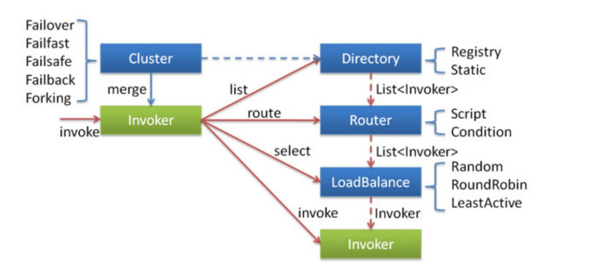

**集群工作过程可分为两个阶段：**

- 第一个阶段是在服务消费者初始化期间，集群 Cluster 实现类为服务消费者创建 Cluster Invoker 实例，即上图中的 merge 操作。

- 第二个阶段是在服务消费者进行远程调用时。以 FailoverClusterInvoker 为例，该类型 Cluster Invoker 首先会调用 Directory 的 list 方法列举Invoker 列表

  （可将 Invoker 简单理解为服务提供者）。Directory 的用途是保存 Invoker列表，可简单类比为 List。其实现类 RegistryDirectory 是一个动态服务目录，可

  感知注册中心配置的变化，它所持有的 Invoker 列表会随着注册中心内容的变化而变化。每次变化后，RegistryDirectory 会动态增删Invoker，并调用 Router 

  的 route 方法进行路由，过滤掉不符合路由规则的 Invoker。当FailoverClusterInvoker 拿到 Directory 返回的 Invoker 列表后，它会通过 LoadBalance 从 

  Invoker 列表中选择一个 Invoker。最后 FailoverClusterInvoker 会将参数传给 LoadBalance 选择出的 Invoker实例的 invoke 方法，进行真正的远程调用。

**Dubbo 主要提供了这样几种容错方式：**

- Failover Cluster - 失败自动切换 失败时会重试其它服务器

- Failfast Cluster - 快速失败 请求失败后快速返回异常结果 不重试

- Failsafe Cluster - 失败安全 出现异常 直接忽略 会对请求做负载均衡

- Failback Cluster - 失败自动恢复 请求失败后 会自动记录请求到失败队列中

- Forking Cluster - 并行调用多个服务提供者 其中有一个返回 则立即返回结果

#### 4.5.1、信息缓存接口Directory

Directory是Dubbo中的一个接口，主要用于缓存当前可以被调用的提供者列表信息。我们在消费者进行调用时都会通过这个接口来获取所有的提供者列表，再进

行后续处理。

（1）我们先来看看 Directory 接口，这里比较简单，我们可以通过 Directory 来找到指定服务中的提供者信息列表。

```java
public interface Directory<T> extends Node {

    /**
     * get service type.
     *
     * @return service type.
     */
    //获取服务类型，也就是我们demo中所使用的helloService
    Class<T> getInterface();

    /**
     * list invokers.
     *
     * @return invokers
     */
    // 根据本次调用的信息来获取所有可以被执行的提供者信息
    List<Invoker<T>> list(Invocation invocation) throws RpcException;
    // 获取所有的提供者信息
    List<Invoker<T>> getAllInvokers();

    URL getConsumerUrl();

    boolean isDestroyed();

}
```

（2） Directory 中有一个基础的实现类，主要是对一些通用的方法封装，主要还是依靠真正的实现。其中可以看看 AbstractDirectory中的list 方法。通过这个方

式我们能知道，真正实现还是依靠于真正子类汇总的 doList 方法。

```java
    @Override
    public List<Invoker<T>> list(Invocation invocation) throws RpcException {
        if (destroyed) {
            throw new RpcException("Directory already destroyed .url: " + getUrl());
        }
        //交给子类进行处理
        return doList(invocation);
    }
```

（3）我们可以继续往下看，他的实现子类是 RegistryDirectory#doList 方法。我们可以看到这里的实现也相对比较简单，主要依靠routerChain去决定真实返回的

提供者列表。

```java
    @Override
    public List<Invoker<T>> doList(Invocation invocation) {
        //当没有提供者时直接抛出异常
        if (forbidden) {
            // 1. No service provider 2. Service providers are disabled
            throw new RpcException(RpcException.FORBIDDEN_EXCEPTION, "No provider available from registry " +
                    getUrl().getAddress() + " for service " + getConsumerUrl().getServiceKey() + " on consumer " +
                    NetUtils.getLocalHost() + " use dubbo version " + Version.getVersion() +
                    ", please check status of providers(disabled, not registered or in blacklist).");
        }

        if (multiGroup) {
            return this.invokers == null ? Collections.emptyList() : this.invokers;
        }

        List<Invoker<T>> invokers = null;
        try {
            // Get invokers from cache, only runtime routers will be executed.
            // 交给路由chain去处理并且获取所有的invokers
            invokers = routerChain.route(getConsumerUrl(), invocation);
        } catch (Throwable t) {
            logger.error("Failed to execute router: " + getUrl() + ", cause: " + t.getMessage(), t);
        }

        return invokers == null ? Collections.emptyList() : invokers;
    }
```

（4）路由是如何获取Invoker 列表的呢? 我们观察这个方法: RegistryProtocol.refer ,这里面也是Invoker 生成的部分关键代码。

```java
    @Override
    @SuppressWarnings("unchecked")
    public <T> Invoker<T> refer(Class<T> type, URL url) throws RpcException {
        // 获取注册中心的地址URL(主要用于转换协议)，比如我们是使用的zookeeper，那么他就会转换 为zookeeper://
        url = getRegistryUrl(url);
        // 获取注册中心配置信息
        Registry registry = registryFactory.getRegistry(url);
        if (RegistryService.class.equals(type)) {
            return proxyFactory.getInvoker((T) registry, type, url);
        }

        // group="a,b" or group="*"
        // 适用于多个分组时使用
        Map<String, String> qs = StringUtils.parseQueryString(url.getParameterAndDecoded(REFER_KEY));
        String group = qs.get(GROUP_KEY);
        if (group != null && group.length() > 0) {
            if ((COMMA_SPLIT_PATTERN.split(group)).length > 1 || "*".equals(group)) {
                return doRefer(Cluster.getCluster(MergeableCluster.NAME), registry, type, url);
            }
        }

        Cluster cluster = Cluster.getCluster(qs.get(CLUSTER_KEY));
        // 真正进行构建invoker和我们上面的Directory
        return doRefer(cluster, registry, type, url);
    }
```

（5）下面我们再来仔细跟踪 doRefer 方法, 这里面就是最主要产生Directory并且注册和监听的主要代码逻辑。我们所需要的 routerChain 也是在这里产生的。

```java
    protected <T> Invoker<T> doRefer(Cluster cluster, Registry registry, Class<T> type, URL url) {
        return interceptInvoker(getInvoker(cluster, registry, type, url), url);
    }

    protected <T> Invoker<T> interceptInvoker(ClusterInvoker<T> invoker, URL url) {
        List<RegistryProtocolListener> listeners = findRegistryProtocolListeners(url);
        if (CollectionUtils.isEmpty(listeners)) {
            return invoker;
        }

        for (RegistryProtocolListener listener : listeners) {
            listener.onRefer(this, invoker);
        }
        return invoker;
    }

    protected <T> ClusterInvoker<T> getInvoker(Cluster cluster, Registry registry, Class<T> type, URL url) {
        // 实例化Directory
        DynamicDirectory<T> directory = createDirectory(type, url);
        // 设置注册中心和所使用的协议
        directory.setRegistry(registry);
        directory.setProtocol(protocol);
        // all attributes of REFER_KEY
        // 生成监听路径URL
        Map<String, String> parameters = new HashMap<String, String>(directory.getConsumerUrl().getParameters());
        URL urlToRegistry = new URL(CONSUMER_PROTOCOL, parameters.remove(REGISTER_IP_KEY), 0, type.getName(), parameters);
        if (directory.isShouldRegister()) {
            // 在Directory中设置监听的consumerurl地址
            directory.setRegisteredConsumerUrl(urlToRegistry);
            // 在注册中心中注册消费者URL
            // 也就是我们之前的Zookeeper的node中看到的consumer://
            registry.register(directory.getRegisteredConsumerUrl());
        }
        // 构建路由链
        directory.buildRouterChain(urlToRegistry);
        // 进行监听所有的的provider
        directory.subscribe(toSubscribeUrl(urlToRegistry));
        // 加入到集群中
        return (ClusterInvoker<T>) cluster.join(directory);
    }
```

（6）回到 RouterChain#route 方法。这里所做的就是依次遍历所有的路由，然后分别执行并返回。这也就是整体的路由规则的实现。

```java
    public List<Invoker<T>> route(URL url, Invocation invocation) {
        //所以的invoker列表
        List<Invoker<T>> finalInvokers = invokers;
        for (Router router : routers) {
            // 依次交给所有的路由规则进行选取路由列表
            finalInvokers = router.route(finalInvokers, url, invocation);
        }
        return finalInvokers;
    }
```

#### 4.5.2、路由规则实现原理

这里我们具体来讲解一下 RouterChain 中的 Router 是如何实现的。这里我们主要对ConditionRouter 的实现来做说明。

（1）可以看到这个类中有两个属性比较关键，这两个属性也是判断的关键。

```java
//是否满足判断条件
protected Map<String, MatchPair> whenCondition;
//当满足判断条件时如何选择invoker
protected Map<String, MatchPair> thenCondition;
```

（2）我们可以看到每一个 MatchPair 都有这两个属性,分别表示满足的条件和不满足的具体条件。

```java
//满足和不满足的具体条件或者匹配和不匹配的具体条件
final Set<String> matches = new HashSet<String>();
final Set<String> mismatches = new HashSet<String>();
```

（3）下面我们先跳过生成规则的代码，先从如何选择Invoker入手。可以看到整体的流程也比较简单，主要在于判断( matchWhen )和选择( matchThen )的逻辑。

```java
    public <T> List<Invoker<T>> route(List<Invoker<T>> invokers, URL url, Invocation invocation)
            throws RpcException {
        //不启用路由直接返回
        if (!enabled) {
            return invokers;
        }
        //如果不存在任何invoker时直接返回
        if (CollectionUtils.isEmpty(invokers)) {
            return invokers;
        }
        try {
            // 判断是否满足判断条件，不满足直接返回列表
            if (!matchWhen(url, invocation)) {
                return invokers;
            }
            List<Invoker<T>> result = new ArrayList<Invoker<T>>();
            if (thenCondition == null) {
                logger.warn("The current consumer in the service blacklist. consumer: " + NetUtils.getLocalHost() + ", service: " + url.getServiceKey());
                return result;
            }
            // 依次判断每一个invoker的url是否满足条件
            for (Invoker<T> invoker : invokers) {
                if (matchThen(invoker.getUrl(), url)) {
                    result.add(invoker);
                }
            }
            // 如果不为空则直接返回
            if (!result.isEmpty()) {
                return result;
            } else if (force) {
                // 如果为空，并且必须要走这个条件时，则直接返回空
                logger.warn("The route result is empty and force execute. consumer: " + NetUtils.getLocalHost() + ", service: " + url.getServiceKey() + ", router: " + url.getParameterAndDecoded(RULE_KEY));
                return result;
            }
        } catch (Throwable t) {
            logger.error("Failed to execute condition router rule: " + getUrl() + ", invokers: " + invokers + ", cause: " + t.getMessage(), t);
        }
        return invokers;
    }
```

（4）可以看到这里判断条件是尽量的简单，甚至可以为空，主要在于判定when 以及是否匹配then规则。两者最终底层都是调用的 matchCondition 方法，我们

在看他实现逻辑之前，先来确定一下condition 中都存储了什么样的信息。

```java
    boolean matchWhen(URL url, Invocation invocation) {
        // 1. 如果判断条件为空则直接认定为匹配
        // 2. 如果条件匹配则认定为匹配
        return CollectionUtils.isEmptyMap(whenCondition) || matchCondition(whenCondition, url, null, invocation);
    }

    private boolean matchThen(URL url, URL param) {
        // 判断条件不能为空并且匹配条件规则时才返回
        return CollectionUtils.isNotEmptyMap(thenCondition) && matchCondition(thenCondition, url, param, null);
    }
```

（5）最后我们再来看看他是如何生成整个路由规则的。我们跟进 ConditionRouter#init 方法，其中比较关键的方法为 parseRule ， when 和 then 的规则都是相

同的。

```java
    public void init(String rule) {
        try {
            // 必须包含规则配置
            if (rule == null || rule.trim().length() == 0) {
                throw new IllegalArgumentException("Illegal route rule!");
            }
            rule = rule.replace("consumer.", "").replace("provider.", "");
            // 根据"=>"来判断when或者then条件
            int i = rule.indexOf("=>");
            String whenRule = i < 0 ? null : rule.substring(0, i).trim();
            String thenRule = i < 0 ? rule.trim() : rule.substring(i + 2).trim();
            // 根据"=>"来判断when或者then条件
            Map<String, MatchPair> when = StringUtils.isBlank(whenRule) || "true".equals(whenRule) ? new HashMap<String, MatchPair>() : parseRule(whenRule);
            Map<String, MatchPair> then = StringUtils.isBlank(thenRule) || "false".equals(thenRule) ? null : parseRule(thenRule);
            // NOTE: It should be determined on the business level whether the `When condition` can be empty or not.
            this.whenCondition = when;
            this.thenCondition = then;
        } catch (ParseException e) {
            throw new IllegalStateException(e.getMessage(), e);
        }
    }
```

（6） parseRule 方法实现。

```java
    private static Map<String, MatchPair> parseRule(String rule)
            throws ParseException {
        Map<String, MatchPair> condition = new HashMap<String, MatchPair>();
        if (StringUtils.isBlank(rule)) {
            return condition;
        }
        // Key-Value pair, stores both match and mismatch conditions
        // 当前所操作的数据
        // 用于后面循环中使用，标识上一次循环中所操作的信息
        MatchPair pair = null;
        // Multiple values
        Set<String> values = null;
        // 转化每一个条件
        // 这里分别会对每一次的分割做匹配
        // host = 1.1.1.* & host != 1.1.1.2 & method=sayHello
        // 1. "" host
        // 2. "=" 1.1.1.x
        // 3. "&" host
        // 4. "!=" 1.1.1.2
        // ....
        final Matcher matcher = ROUTE_PATTERN.matcher(rule);
        while (matcher.find()) { // Try to match one by one
            // 分隔符
            String separator = matcher.group(1);
            // 内容
            String content = matcher.group(2);
            // 如果不存在分隔符
            // 则认为是首个判断
            // Start part of the condition expression.
            if (StringUtils.isEmpty(separator)) {
                // 则直接放入当前condition
                pair = new MatchPair();
                condition.put(content, pair);
            }
            // The KV part of the condition expression
            // 如果是"&"则代表并且
            else if ("&".equals(separator)) {
                // 如果当前的when或者then中不包含该判定条件则添加则放入
                // 否则当前的condition就需要拿出来
                if (condition.get(content) == null) {
                    pair = new MatchPair();
                    condition.put(content, pair);
                } else {
                    pair = condition.get(content);
                }
            }
            // The Value in the KV part.
            else if ("=".equals(separator)) {
                if (pair == null) {
                    throw new ParseException("Illegal route rule \""
                            + rule + "\", The error char '" + separator
                            + "' at index " + matcher.start() + " before \""
                            + content + "\".", matcher.start());
                }
                // 如果是等于的比较，则需要将值放入matches中
                values = pair.matches;
                values.add(content);
            }
            // The Value in the KV part.
            else if ("!=".equals(separator)) {
                if (pair == null) {
                    throw new ParseException("Illegal route rule \""
                            + rule + "\", The error char '" + separator
                            + "' at index " + matcher.start() + " before \""
                            + content + "\".", matcher.start());
                }
                // 如果为不等于，则需要放入到不等于中
                values = pair.mismatches;
                values.add(content);
            }
            // The Value in the KV part, if Value have more than one items.
            // 如果values是多个的话
            else if (",".equals(separator)) { // Should be separated by ','
                if (values == null || values.isEmpty()) {
                    throw new ParseException("Illegal route rule \""
                            + rule + "\", The error char '" + separator
                            + "' at index " + matcher.start() + " before \""
                            + content + "\".", matcher.start());
                }
                // 则分别加入到values列表中
                values.add(content);
            } else {
                throw new ParseException("Illegal route rule \"" + rule
                        + "\", The error char '" + separator + "' at index "
                        + matcher.start() + " before \"" + content + "\".", matcher.start());
            }
        }
        return condition;
    }
```

#### 4.5.3、Cluster组件

下面我们再来看看再Dubbo中也是很关键的组件: Cluster 。它主要用于代理真正的Invoker执行时做处理，提供了多种容错方案。

（1）我们首先来看一下他的接口定义。这里我们在之前也有见到过( doRefer ),那里也是真正调用它来生成的位置。

```java
@SPI(Cluster.DEFAULT)
public interface Cluster {
    // 默认使用failover作为实现
    String DEFAULT = FailoverCluster.NAME;

    /**
     * Merge the directory invokers to a virtual invoker.
     *
     * @param <T>
     * @param directory
     * @return cluster invoker
     * @throws RpcException
     */
    @Adaptive
    // 生成一个新的invoker
    <T> Invoker<T> join(Directory<T> directory) throws RpcException;

    static Cluster getCluster(String name) {
        return getCluster(name, true);
    }

    static Cluster getCluster(String name, boolean wrap) {
        if (StringUtils.isEmpty(name)) {
            name = Cluster.DEFAULT;
        }
        return ExtensionLoader.getExtensionLoader(Cluster.class).getExtension(name, wrap);
    }
}
```

（2）下面我们再来看一下他提供的几种实现，Cluster和 Registry 采用了相同的类方式，都提供了Abstract 类来进行统一的封装。

```java
    // 对invoker进行封装
    private <T> Invoker<T> buildClusterInterceptors(AbstractClusterInvoker<T> clusterInvoker, String key) {
        AbstractClusterInvoker<T> last = clusterInvoker;
        // 获取所有的拦截器
        List<ClusterInterceptor> interceptors = ExtensionLoader.getExtensionLoader(ClusterInterceptor.class).getActivateExtension(clusterInvoker.getUrl(), key);
        // 对拦截器进行一层封装
        if (!interceptors.isEmpty()) {
            for (int i = interceptors.size() - 1; i >= 0; i--) {
                final ClusterInterceptor interceptor = interceptors.get(i);
                final AbstractClusterInvoker<T> next = last;
                last = new InterceptorInvokerNode<>(clusterInvoker, interceptor, next);
            }
        }
        return last;
    }

    @Override
    public <T> Invoker<T> join(Directory<T> directory) throws RpcException {
        // 使用子类doJoin来真正生成Invoker
        // 并且使用拦截器的方式进行一层封装
        return buildClusterInterceptors(doJoin(directory), directory.getUrl().getParameter(REFERENCE_INTERCEPTOR_KEY));
    }
```

（3）下面我们看看 FailoverCluster里面都做了些什么。这里面比较简单，只是进行new了一个新的FailoverClusterInvoker。 

```java
public class FailoverCluster extends AbstractCluster {

    public final static String NAME = "failover";

    @Override
    public <T> AbstractClusterInvoker<T> doJoin(Directory<T> directory) throws RpcException {
        // 构建了FailoverClusterInvoker对象
        return new FailoverClusterInvoker<>(directory);
    }

}
```

（4）我们通过观察Invoker接口得知，其中最关键的方式是 invoke 方法。我们也可以看到，他也是通过 Abstract 进行了一层封装。其中我们来看看他的 invoke 

方法实现。( AbstractClusterInvoker.invoke ) 

```java
    @Override
    public Result invoke(final Invocation invocation) throws RpcException {
        // 检查是否已经关闭了
        checkWhetherDestroyed();

        // binding attachments into invocation.
        // 拷贝当前RPCContext中的附加信息到当前的invocation中
        Map<String, Object> contextAttachments = RpcContext.getContext().getObjectAttachments();
        if (contextAttachments != null && contextAttachments.size() != 0) {
            ((RpcInvocation) invocation).addObjectAttachments(contextAttachments);
        }
        // 找寻出所有支持的invoker，已经路由过的
        List<Invoker<T>> invokers = list(invocation);
        // 初始化负载均衡器
        LoadBalance loadbalance = initLoadBalance(invokers, invocation);
        // 用于适配异步请求使用
        RpcUtils.attachInvocationIdIfAsync(getUrl(), invocation);
        // 交给子类进行真正处理请求
        return doInvoke(invocation, invokers, loadbalance);
    }
```

（5）我们再来细关注一下 FailoverClusterInvoker 中的 doInvoke 方法是怎么做的。这里的方法也是很简单，主要是通过for循环的形式来达到重试次数的目的，

并且每次重试否会重新走一遍路由等规则。

```java
 public Result doInvoke(Invocation invocation, final List<Invoker<T>> invokers, LoadBalance loadbalance) throws RpcException {
        // 如果没有任何的invoker则抛出异常
        List<Invoker<T>> copyInvokers = invokers;
        checkInvokers(copyInvokers, invocation);
        // 获取这个方法最大的重试次数
        String methodName = RpcUtils.getMethodName(invocation);
        int len = getUrl().getMethodParameter(methodName, RETRIES_KEY, DEFAULT_RETRIES) + 1;
        if (len <= 0) {
            len = 1;
        }
        // retry loop.
        // 通过for循环的形式表示可以重试的次数
        RpcException le = null; // last exception.
        List<Invoker<T>> invoked = new ArrayList<Invoker<T>>(copyInvokers.size()); // invoked invokers.
        Set<String> providers = new HashSet<String>(len);
        for (int i = 0; i < len; i++) {
            //Reselect before retry to avoid a change of candidate `invokers`.
            //NOTE: if `invokers` changed, then `invoked` also lose accuracy.
            if (i > 0) {
                // 每次都执行一次是否关闭当前consumer的判断
                checkWhetherDestroyed();
                // 重新获取一遍invoker列表
                copyInvokers = list(invocation);
                // check again
                // 再次进行一次存在invoker的检查
                checkInvokers(copyInvokers, invocation);
            }
            // 选择具体的invoker(交给负载均衡)
            Invoker<T> invoker = select(loadbalance, invocation, copyInvokers, invoked);
            // 增加到已经执行过得invoker列表中
            invoked.add(invoker);
            RpcContext.getContext().setInvokers((List) invoked);
            try {
                // 让其真正的去进行执行操作
                Result result = invoker.invoke(invocation);
                if (le != null && logger.isWarnEnabled()) {
                    logger.warn("Although retry the method " + methodName
                            + " in the service " + getInterface().getName()
                            + " was successful by the provider " + invoker.getUrl().getAddress()
                            + ", but there have been failed providers " + providers
                            + " (" + providers.size() + "/" + copyInvokers.size()
                            + ") from the registry " + directory.getUrl().getAddress()
                            + " on the consumer " + NetUtils.getLocalHost()
                            + " using the dubbo version " + Version.getVersion() + ". Last error is: "
                            + le.getMessage(), le);
                }
                return result;
            } catch (RpcException e) {
                // 如果是业务异常则直接抛出
                if (e.isBiz()) { // biz exception.
                    throw e;
                }
                le = e;
            } catch (Throwable e) {
                le = new RpcException(e.getMessage(), e);
            } finally {
                providers.add(invoker.getUrl().getAddress());
            }
        }
        throw new RpcException(le.getCode(), "Failed to invoke the method "
                + methodName + " in the service " + getInterface().getName()
                + ". Tried " + len + " times of the providers " + providers
                + " (" + providers.size() + "/" + copyInvokers.size()
                + ") from the registry " + directory.getUrl().getAddress()
                + " on the consumer " + NetUtils.getLocalHost() + " using the dubbo version "
                + Version.getVersion() + ". Last error is: "
                + le.getMessage(), le.getCause() != null ? le.getCause() : le);
    }

```

#### 4.5.4、负载均衡实现原理

通过上面一小节我们也有看到在 Cluster 中经过负载选择真正 Invoker 的代码，这里我们再来细追踪是如何负载均衡的。

（1）再次来看看 LoadBalance 接口定义。这里默认选择了随机算法。

```java
//默认使用随机算法
@SPI(RandomLoadBalance.NAME)
public interface LoadBalance {
    //进行选择真正的invoker
    @Adaptive("loadbalance")
    <T> Invoker<T> select(List<Invoker<T>> invokers, URL url, Invocation invocation) throws RpcException;

}
```

（2） LoadBalance 依旧选择了 AbstractLoadBalance 作为基础的实现类。我们来关注一下 select方法。这里的方法也比较简单，主要就是处理只有一个invoker

的情况。

```java
    @Override
    public <T> Invoker<T> select(List<Invoker<T>> invokers, URL url, Invocation invocation) {
        // 如果不存在任何的invoker则直接返回
        if (CollectionUtils.isEmpty(invokers)) {
            return null;
        }
        // 如果还有一个invoker则直接返回，不需要执行负载均衡
        if (invokers.size() == 1) {
            return invokers.get(0);
        }
        //交给子类进行实现
        return doSelect(invokers, url, invocation);
    }
```

（3）我们来看看默认的随机算法是如何实现的。这里主要比较关键在于权重的概念。通过权重选取了不同的机器。

```java
    protected <T> Invoker<T> doSelect(List<Invoker<T>> invokers, URL url, Invocation invocation) {
        // 总计的invoker列表数量
        int length = invokers.size();
        // 默认每个invoker的权重都是相同的
        boolean sameWeight = true;
        // 所有的权重列表
        int[] weights = new int[length];
        // The sum of weights
        // 首个invoker的权重信息
        int totalWeight = 0;
        // 计算总共的权重，并且吧每一个invoker的权重进行设置到列表中
        for (int i = 0; i < length; i++) {
            int weight = getWeight(invokers.get(i), invocation);
            // Sum
            totalWeight += weight;
            // save for later use
            weights[i] = totalWeight;
            if (sameWeight && totalWeight != weight * (i + 1)) {
                sameWeight = false;
            }
        }
        // 如果权重不相同
        if (totalWeight > 0 && !sameWeight) {
            // 通过总共的权重来随机分配
            int offset = ThreadLocalRandom.current().nextInt(totalWeight);
            // Return a invoker based on the random value.
            // 看看最终落到哪一个机器上去
            for (int i = 0; i < length; i++) {
                if (offset < weights[i]) {
                    return invokers.get(i);
                }
            }
        }
        // 如果权重都是相同的话，则随机选取一个即可
        return invokers.get(ThreadLocalRandom.current().nextInt(length));
    }
```

#### 4.5.5、Invoker执行逻辑

Invoker就是我们真实执行请求的组件。这里也会衍生出我们真正的 Dubbo 或者 Grpc 等其他协议的请求。

（1）我们依旧先来看一下接口定义: 

```java
public interface Invoker<T> extends Node {

    /**
     * get service interface.
     *
     * @return service interface.
     */
    //当前执行器的服务接口是哪一个
    Class<T> getInterface();

    /**
     * invoke.
     *
     * @param invocation
     * @return result
     * @throws RpcException
     */
    //执行请求操作
    Result invoke(Invocation invocation) throws RpcException;

}
```

（2） Invoker 同样具有 AbstractInvoker ，其中我们重点关注一下 invoke 方法。这里同样主要做的是基础信息封装，并且将请求真正的子类。这里面的子类主要

是 DubboInvoker 

```java
 public Result invoke(Invocation inv) throws RpcException {
        // 判断系统是否已经关闭
        if (destroyed.get()) {
            logger.warn("Invoker for service " + this + " on consumer " + NetUtils.getLocalHost() + " is destroyed, "
                    + ", dubbo version is " + Version.getVersion() + ", this invoker should not be used any longer");
        }
        RpcInvocation invocation = (RpcInvocation) inv;
        invocation.setInvoker(this);
        // 设置所有的RPCContext中的附加信息
        if (CollectionUtils.isNotEmptyMap(attachment)) {
            invocation.addObjectAttachmentsIfAbsent(attachment);
        }

        Map<String, Object> contextAttachments = RpcContext.getContext().getObjectAttachments();
        if (CollectionUtils.isNotEmptyMap(contextAttachments)) {
            invocation.addObjectAttachments(contextAttachments);
        }
        // 设置执行的模式
        invocation.setInvokeMode(RpcUtils.getInvokeMode(url, invocation));
        // 设置执行id，主要用于适配异步模式使用
        RpcUtils.attachInvocationIdIfAsync(getUrl(), invocation);
        // 交给子类进行真正的执行
        AsyncRpcResult asyncResult;
        try {
            //真正子类执行方法
            asyncResult = (AsyncRpcResult) doInvoke(invocation);
        } catch (InvocationTargetException e) { // biz exception
            Throwable te = e.getTargetException();
            if (te == null) {
                asyncResult = AsyncRpcResult.newDefaultAsyncResult(null, e, invocation);
            } else {
                if (te instanceof RpcException) {
                    ((RpcException) te).setCode(RpcException.BIZ_EXCEPTION);
                }
                asyncResult = AsyncRpcResult.newDefaultAsyncResult(null, te, invocation);
            }
        } catch (RpcException e) {
            if (e.isBiz()) {
                asyncResult = AsyncRpcResult.newDefaultAsyncResult(null, e, invocation);
            } else {
                throw e;
            }
        } catch (Throwable e) {
            asyncResult = AsyncRpcResult.newDefaultAsyncResult(null, e, invocation);
        }
        // 设置执行的结果信息
        RpcContext.getContext().setFuture(new FutureAdapter(asyncResult.getResponseFuture()));
     	// 返回结果
        return asyncResult;
    }
```

（3）我们再来看看 DubboInvoker 中的 doInvoke 方法。这里看到，他其实底层更多的是依赖底层真正的客户端实现。

```java
    protected Result doInvoke(final Invocation invocation) throws Throwable {
        RpcInvocation inv = (RpcInvocation) invocation;
        final String methodName = RpcUtils.getMethodName(invocation);
        inv.setAttachment(PATH_KEY, getUrl().getPath());
        inv.setAttachment(VERSION_KEY, version);
        // 传输的客户端
        ExchangeClient currentClient;
        if (clients.length == 1) {
            currentClient = clients[0];
        } else {
            currentClient = clients[index.getAndIncrement() % clients.length];
        }
        try {
            // 是否返回值，也就是相当于发送了一个指令，不在乎服务端的返回
            // 通常适用于异步请求
            boolean isOneway = RpcUtils.isOneway(getUrl(), invocation);
            // 获取超时的配置
            int timeout = calculateTimeout(invocation, methodName);
            invocation.put(TIMEOUT_KEY, timeout);
            if (isOneway) {
                // 如果不需要返回值信息(异步)
                boolean isSent = getUrl().getMethodParameter(methodName, Constants.SENT_KEY, false);
                // 发送命令
                currentClient.send(inv, isSent);
                // 告知为异步的结果
                return AsyncRpcResult.newDefaultAsyncResult(invocation);
            } else {
                // 获取真正执行的线程池(ThreadPool中的SPI)
                ExecutorService executor = getCallbackExecutor(getUrl(), inv);
                // 发送请求并且等待结果
                CompletableFuture<AppResponse> appResponseFuture =
                        currentClient.request(inv, timeout, executor).thenApply(obj -> (AppResponse) obj);
                // save for 2.6.x compatibility, for example, TraceFilter in Zipkin uses com.alibaba.xxx.FutureAdapter
                // 在2.6.x中使用，设置完成的额结果信息
                FutureContext.getContext().setCompatibleFuture(appResponseFuture);
                // 创建新的结果信息并且返回
                AsyncRpcResult result = new AsyncRpcResult(appResponseFuture, inv);
                result.setExecutor(executor);
                return result;
            }
        } catch (TimeoutException e) {
            throw new RpcException(RpcException.TIMEOUT_EXCEPTION, "Invoke remote method timeout. method: " + invocation.getMethodName() + ", provider: " + getUrl() + ", cause: " + e.getMessage(), e);
        } catch (RemotingException e) {
            throw new RpcException(RpcException.NETWORK_EXCEPTION, "Failed to invoke remote method: " + invocation.getMethodName() + ", provider: " + getUrl() + ", cause: " + e.getMessage(), e);
        }
    }
```

（4）我们再来详细追踪一下 ExchangeClient 接口，发现他有一个最关键的方法。位于ExchangeChannel 接口中。

```java
    /**
     * send request.
     * 真实的发送请求信息
     * @param request RPCInvocation
     * @param timeout timeout
     * @param executor 业务线程池
     * @return response future
     * @throws RemotingException
     */
    CompletableFuture<Object> request(Object request, int timeout, ExecutorService executor) throws RemotingException;
```

（5）他底层真实的实现方式是 HeaderExchangeClient 来进行处理的。可以看到他只是交给了真实的渠道 channel 进行数据处理。

```java
    public CompletableFuture<Object> request(Object request, ExecutorService executor) throws RemotingException {
        return request(request, channel.getUrl().getPositiveParameter(TIMEOUT_KEY, DEFAULT_TIMEOUT), executor);
    }
```

（6）这里的 channel 会交 HeaderExchangeChannel 来进行封装。我们来看看他的实现。这里我们需要细看一下Request对象的组成和DefaultFuture里面了做

了些什么。这里的 Channle 对象是通过Transporter 这个SPI进行创建的。这里我们先不细跟了。我们所熟知的Netty协议就是在这里创建的。

```java
    public CompletableFuture<Object> request(Object request, int timeout, ExecutorService executor) throws RemotingException {
        if (closed) {
            throw new RemotingException(this.getLocalAddress(), null, "Failed to send request " + request + ", cause: The channel " + this + " is closed!");
        }
        // 创建一个新的request对象
        Request req = new Request();
        req.setVersion(Version.getProtocolVersion());
        req.setTwoWay(true);
        req.setData(request);
        // 创建一个执行结果的回调信息处理
        DefaultFuture future = DefaultFuture.newFuture(channel, req, timeout, executor);
        try {
            // 交给真正的业务渠道进行处理
            // 这里的渠道是交给Transporter这个SPI进行创建的，其中我们的NettyChannel就是在这 里产生的
            channel.send(req);
        } catch (RemotingException e) {
            // 请求出现异常则取消当前的请求封装
            future.cancel();
            throw e;
        }
        return future;
    }
```

### 4.6、网络通信原理剖析

主要讲解Dubbo在网络中如何进行通信的。由于请求都是基于TCP的，那么Dubbo中是如何处理粘包和拆包的问题，这里我们也会有讲解。

dubbo协议采用固定长度的消息头（16字节）和不定长度的消息体来进行数据传输，消息头定义了底层框架（netty）在IO线程处理时需要的信息，协议的报文格

式如下：

#### 4.6.1、数据包结构讲解

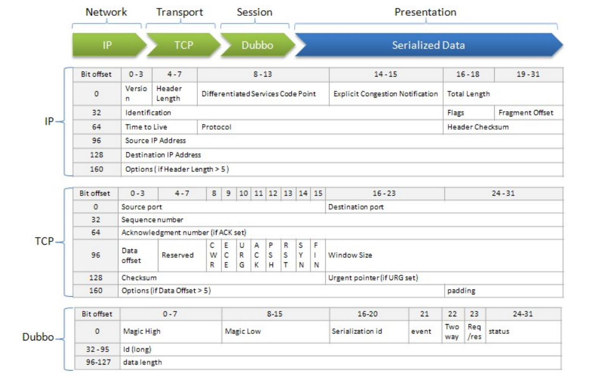

- **协议详情**
  - Magic - Magic High & Magic Low (16 bits)

    标识协议版本号，Dubbo 协议：0xdabb

  - Serialization ID (5 bit)

    标识序列化类型：比如 fastjson 的值为6。

  - Event (1 bit)

    标识是否是事件消息，例如，心跳事件。如果这是一个事件，则设置为1。

  - 2 Way (1 bit)

    仅在 Req/Res 为1（请求）时才有用，标记是否期望从服务器返回值。如果需要来自服务器的返回值，则设置为1。

  - Req/Res (1 bit)

    标识是请求或响应。请求： 1; 响应： 0。

  - Status (8 bits)

    仅在 Req/Res 为0（响应）时有用，用于标识响应的状态。

    - 20 - OK
    - 30 - CLIENT_TIMEOUT
    - 31 - SERVER_TIMEOUT
    - 40 - BAD_REQUEST
    - 50 - BAD_RESPONSE
    - 60 - SERVICE_NOT_FOUND
    - 70 - SERVICE_ERROR
    - 80 - SERVER_ERROR
    - 90 - CLIENT_ERROR
    - 100 - SERVER_THREADPOOL_EXHAUSTED_ERROR

  - Request ID (64 bits)

    标识唯一请求。类型为long。

  - Data Length (32 bits)

    序列化后的内容长度（可变部分），按字节计数。int类型。

  - Variable Part

    被特定的序列化类型（由序列化 ID 标识）序列化后，每个部分都是一个 byte [] 或者 byte

    - 如果是请求包 ( Req/Res = 1)，则每个部分依次为：

      - Dubbo version

      - Service name

      - Service version

      - Method name

      - Method parameter types

      - Method arguments

      - Attachments

    - 如果是响应包（Req/Res = 0），则每个部分依次为：

      - 返回值类型(byte)，标识从服务器端返回的值类型：

      - 返回空值：RESPONSE_NULL_VALUE 2

        正常响应值： RESPONSE_VALUE 1

      - 异常：RESPONSE_WITH_EXCEPTION 0

      - 返回值：从服务端返回的响应bytes

    **注意：**对于(Variable Part)变长部分，当前版本的Dubbo 框架使用json序列化时，在每部分内容间额外增加了换行符作为分隔，请在Variable Part的每个

    part后额外增加换行符， 如：

    ```properties
    Dubbo version bytes (换行符) 
    Service name bytes (换行符) 
    ...
    ```

- **优点**

  - 协议设计上很紧凑，能用 1 个 bit 表示的，不会用一个 byte 来表示，比如 boolean 类型的标识。

  - 请求、响应的 header 一致，通过序列化器对 content 组装特定的内容，代码实现起来简单。

- **可以改进的点**

  - 类似于 http 请求，通过 header 就可以确定要访问的资源，而 Dubbo 需要涉及到用特定序列化协议才可以将服务名、方法、方法签名解析出来，并且这

    些资源定位符是 string 类型或者 string数组，很容易转成 bytes，因此可以组装到 header 中。类似于 http2 的 header 压缩，对于 rpc 调用的资源也可

    以协商出来一个int来标识，从而提升性能，如果在 header 上组装资源定位符的话，该功能则更易实现。

  - 通过 req/res 是否是请求后，可以精细定制协议，去掉一些不需要的标识和添加一些特定的标识。比如 status , twoWay 标识可以严格定制，去掉冗余标

    识。还有超时时间是作为 Dubbo 的 attachment 进行传输的，理论上应该放到请求协议的header中，因为超时是网络请求中必不可少的。提到 

    attachment ，通过实现可以看到 attachment 中有一些是跟协议 content 中已有的字段是重复的，比如 path 和 version 等字段，这些会增大协议尺寸。

  - Dubbo 会将服务名com.alibaba.middleware.hsf.guide.api.param.ModifyOrderPriceParam ，转换为

    Lcom/alibaba/middleware/hsf/guide/api/param/ModifyOrderPriceParam; ，理论上是不必要的，最后追加一个 ; 即可。

  - Dubbo 协议没有预留扩展字段，没法新增标识，扩展性不太好，比如新增 响应上下文 的功能，只有改协议版本号的方式，但是这样要求客户端和服务端

    的版本都进行升级，对于分布式场景很不友好。

#### 4.6.2、数据协议ExchangeCodec详解

这里我们来看 ExchangeCodec 类，这个也是Dubbo在进行数据传输中的数据协议类。

（1）我们先来看看他的常量定义。

```java
//请求头长度
protected static final int HEADER_LENGTH = 16;
// 标示为0-15位
protected static final short MAGIC = (short) 0xdabb;
protected static final byte MAGIC_HIGH = Bytes.short2bytes(MAGIC)[0];
protected static final byte MAGIC_LOW = Bytes.short2bytes(MAGIC)[1];
// 消息头中的内容
protected static final byte FLAG_REQUEST = (byte) 0x80;
protected static final byte FLAG_TWOWAY = (byte) 0x40;
protected static final byte FLAG_EVENT = (byte) 0x20;
protected static final int SERIALIZATION_MASK = 0x1f;
```

（2）这个类中encode和decode分别用于将数据发送到ByteBuffer中，还有就是将其反向的转换为对象。encode中的Request就是我们之前所讲的Request象。

```java
    public void encode(Channel channel, ChannelBuffer buffer, Object msg) throws IOException {
        // 处理请求对象
        if (msg instanceof Request) {
            encodeRequest(channel, buffer, (Request) msg);
        } else if (msg instanceof Response) {
            // 处理响应
            encodeResponse(channel, buffer, (Response) msg);
        } else {
            // 其他的交给上级处理，用于telnet模式
            super.encode(channel, buffer, msg);
        }
    }
```

（3）查看 encodeRequest 方法。这里也验证了我们之前所讲的header内容。

```java
    protected void encodeRequest(Channel channel, ChannelBuffer buffer, Request req) throws IOException {
        // 请求的序列化类型
        Serialization serialization = getSerialization(channel);
        // 写入header信息
        byte[] header = new byte[HEADER_LENGTH];
        // 模数0-15位
        Bytes.short2bytes(MAGIC, header);

        // 标记为请求
        header[2] = (byte) (FLAG_REQUEST | serialization.getContentTypeId());
        // 是否是单向还是双向的(异步)
        if (req.isTwoWay()) {
            header[2] |= FLAG_TWOWAY;
        }
        // 是否为事件(心跳)
        if (req.isEvent()) {
            header[2] |= FLAG_EVENT;
        }

        // 写入当前的请求ID
        Bytes.long2bytes(req.getId(), header, 4);

        // 保存当前写入的位置，将其写入的位置往后面偏移,保留出写入内容大小的位置，先进行写入body 内容
        int savedWriteIndex = buffer.writerIndex();
        buffer.writerIndex(savedWriteIndex + HEADER_LENGTH);
        ChannelBufferOutputStream bos = new ChannelBufferOutputStream(buffer);
        ObjectOutput out = serialization.serialize(channel.getUrl(), bos);
        // 按照数据内容的不同，来写入不同的内容
        if (req.isEvent()) {
            encodeEventData(channel, out, req.getData());
        } else {
            encodeRequestData(channel, out, req.getData(), req.getVersion());
        }
        out.flushBuffer();
        if (out instanceof Cleanable) {
            ((Cleanable) out).cleanup();
        }
        bos.flush();
        bos.close();
        // 记录body中写入的长度
        int len = bos.writtenBytes();
        checkPayload(channel, len);
        // 将其写入到header中的位置中
        Bytes.int2bytes(len, header, 12);

        // 发送到buffer中
        buffer.writerIndex(savedWriteIndex);
        buffer.writeBytes(header); // write header.
        buffer.writerIndex(savedWriteIndex + HEADER_LENGTH + len);
    }
```

（4）真正的 encodeRequestData 在子类 DubboCodec 中 

```java
    protected void encodeRequestData(Channel channel, ObjectOutput out, Object data, String version) throws IOException {
        RpcInvocation inv = (RpcInvocation) data;
        // 写入版本
        out.writeUTF(version);
        // https://github.com/apache/dubbo/issues/6138
        // 接口全名称
        String serviceName = inv.getAttachment(INTERFACE_KEY);
        if (serviceName == null) {
            serviceName = inv.getAttachment(PATH_KEY);
        }
        /// 接口版本号
        out.writeUTF(serviceName);
        out.writeUTF(inv.getAttachment(VERSION_KEY));
        // 写入方法名称
        out.writeUTF(inv.getMethodName());
        // 调用参数描述信息
        out.writeUTF(inv.getParameterTypesDesc());
        // 所有的请求参数写入
        Object[] args = inv.getArguments();
        if (args != null) {
            for (int i = 0; i < args.length; i++) {
                out.writeObject(encodeInvocationArgument(channel, inv, i));
            }
        }
        // 写入所有的附加信息
        out.writeAttachments(inv.getObjectAttachments());
    }
```

（5）下面我们再来看看 encodeResponse 方法实现。一样的，这里可以看到和写入request相似。

```java
    protected void encodeResponse(Channel channel, ChannelBuffer buffer, Response res) throws IOException {
        int savedWriteIndex = buffer.writerIndex();
        try {
            Serialization serialization = getSerialization(channel);
            // 和之前request的参数一致
            byte[] header = new byte[HEADER_LENGTH];
            // set magic number.
            Bytes.short2bytes(MAGIC, header);
            // set request and serialization flag.
            header[2] = serialization.getContentTypeId();
            if (res.isHeartbeat()) {
                header[2] |= FLAG_EVENT;
            }
            // 写入状态码
            byte status = res.getStatus();
            header[3] = status;
            // 写入内容
            Bytes.long2bytes(res.getId(), header, 4);
            // 和Request一样的内容写入方式，先写入内容，再写入长度
            buffer.writerIndex(savedWriteIndex + HEADER_LENGTH);
            ChannelBufferOutputStream bos = new ChannelBufferOutputStream(buffer);
            ObjectOutput out = serialization.serialize(channel.getUrl(), bos);
            // encode response data or error message.
            if (status == Response.OK) {
                if (res.isHeartbeat()) {
                    encodeEventData(channel, out, res.getResult());
                } else {
                    encodeResponseData(channel, out, res.getResult(), res.getVersion());
                }
            } else {
                // 这里不太一样的地方在于，如果错误的时候，则直接将错误信息写入，不需要再交由序 列化
                out.writeUTF(res.getErrorMessage());
            }
            out.flushBuffer();
            if (out instanceof Cleanable) {
                ((Cleanable) out).cleanup();
            }
            bos.flush();
            bos.close();
            // 和request一样的写入模式
            int len = bos.writtenBytes();
            checkPayload(channel, len);
            Bytes.int2bytes(len, header, 12);
            // write
            buffer.writerIndex(savedWriteIndex);
            buffer.writeBytes(header); // write header.
            buffer.writerIndex(savedWriteIndex + HEADER_LENGTH + len);
        } catch (Throwable t) {
            // 写入出现异常
            buffer.writerIndex(savedWriteIndex);
            // send error message to Consumer, otherwise, Consumer will wait till timeout.
            if (!res.isEvent() && res.getStatus() != Response.BAD_RESPONSE) {
                Response r = new Response(res.getId(), res.getVersion());
                r.setStatus(Response.BAD_RESPONSE);
                // 如果是超过内容长度则重新设置内容大小并写入
                if (t instanceof ExceedPayloadLimitException) {
                    logger.warn(t.getMessage(), t);
                    try {
                        r.setErrorMessage(t.getMessage());
                        channel.send(r);
                        return;
                    } catch (RemotingException e) {
                        logger.warn("Failed to send bad_response info back: " + t.getMessage() + ", cause: " + e.getMessage(), e);
                    }
                } else {
                    // FIXME log error message in Codec and handle in caught() of IoHanndler?
                    logger.warn("Fail to encode response: " + res + ", send bad_response info instead, cause: " + t.getMessage(), t);
                    try {
                        r.setErrorMessage("Failed to send response: " + res + ", cause: " + StringUtils.toString(t));
                        channel.send(r);
                        return;
                    } catch (RemotingException e) {
                        logger.warn("Failed to send bad_response info back: " + res + ", cause: " + e.getMessage(), e);
                    }
                }
            }

            // 其他的则抛出异常，省去代码
            if (t instanceof IOException) {
                throw (IOException) t;
            } else if (t instanceof RuntimeException) {
                throw (RuntimeException) t;
            } else if (t instanceof Error) {
                throw (Error) t;
            } else {
                throw new RuntimeException(t.getMessage(), t);
            }
        }
    }
```

（6）在encode中我们再来看看真正encode的内容。 encodeResponseData 同样位于 DubboCodec中。

```java
    protected void encodeResponseData(Channel channel, ObjectOutput out, Object data, String version) throws IOException {
        Result result = (Result) data;
        // 是否支持返回attachment参数
        boolean attach = Version.isSupportResponseAttachment(version);
        Throwable th = result.getException();
        if (th == null) {
            // 如果没有异常信息，则直接写入内容
            Object ret = result.getValue();
            if (ret == null) {
                out.writeByte(attach ? RESPONSE_NULL_VALUE_WITH_ATTACHMENTS : RESPONSE_NULL_VALUE);
            } else {
                out.writeByte(attach ? RESPONSE_VALUE_WITH_ATTACHMENTS : RESPONSE_VALUE);
                out.writeObject(ret);
            }
        } else {
            // 否则的话则将异常信息序列化
            out.writeByte(attach ? RESPONSE_WITH_EXCEPTION_WITH_ATTACHMENTS : RESPONSE_WITH_EXCEPTION);
            out.writeThrowable(th);
        }
        // 支持写入attachment，则写入
        if (attach) {
            // returns current version of Response to consumer side.
            result.getObjectAttachments().put(DUBBO_VERSION_KEY, Version.getProtocolVersion());
            out.writeAttachments(result.getObjectAttachments());
        }
    }
```

（7） 解码 decode

```java
    @Override
    public Object decode(Channel channel, ChannelBuffer buffer) throws IOException {
        // 可读字节数
        int readable = buffer.readableBytes();
        // 选取可读字节数 和 HEADER_LENGTH 中小的
        byte[] header = new byte[Math.min(readable, HEADER_LENGTH)];
        buffer.readBytes(header);
        return decode(channel, buffer, readable, header);
    }

    @Override
    protected Object decode(Channel channel, ChannelBuffer buffer, int readable, byte[] header) throws IOException {
        // 检查魔数
        if (readable > 0 && header[0] != MAGIC_HIGH
                || readable > 1 && header[1] != MAGIC_LOW) {
            int length = header.length;
            if (header.length < readable) {
                header = Bytes.copyOf(header, readable);
                buffer.readBytes(header, length, readable - length);
            }
            for (int i = 1; i < header.length - 1; i++) {
                if (header[i] == MAGIC_HIGH && header[i + 1] == MAGIC_LOW) {
                    buffer.readerIndex(buffer.readerIndex() - header.length + i);
                    header = Bytes.copyOf(header, i);
                    break;
                }
            }
            return super.decode(channel, buffer, readable, header);
        }
        // check length. 不完整的包 需要继续读取
        if (readable < HEADER_LENGTH) {
            return DecodeResult.NEED_MORE_INPUT;
        }

        // 获取数据长度
        int len = Bytes.bytes2int(header, 12);
        checkPayload(channel, len);

        int tt = len + HEADER_LENGTH;
        // 需要继续读取
        if (readable < tt) {
            return DecodeResult.NEED_MORE_INPUT;
        }

        // limit input stream.
        ChannelBufferInputStream is = new ChannelBufferInputStream(buffer, len);

        try {
            // 解码数据
            return decodeBody(channel, is, header);
        } finally {
            if (is.available() > 0) {
                try {
                    if (logger.isWarnEnabled()) {
                        logger.warn("Skip input stream " + is.available());
                    }
                    StreamUtils.skipUnusedStream(is);
                } catch (IOException e) {
                    logger.warn(e.getMessage(), e);
                }
            }
        }
    }
```

（8）这时候我们再来看看解析响应中的信息处理decodeBody。

```java
    protected Object decodeBody(Channel channel, InputStream is, byte[] header) throws IOException {
        byte flag = header[2], proto = (byte) (flag & SERIALIZATION_MASK);
        // 获取请求ID
        long id = Bytes.bytes2long(header, 4);
        // 判断是请求还是响应
        if ((flag & FLAG_REQUEST) == 0) {
            // 说明是响应
            Response res = new Response(id);
            // 是否是event事件
            if ((flag & FLAG_EVENT) != 0) {
                res.setEvent(true);
            }
            // 获取请求的状态码
            byte status = header[3];
            res.setStatus(status);
            try {
                // 进行数据内容解析
                ObjectInput in = CodecSupport.deserialize(channel.getUrl(), is, proto);
                if (status == Response.OK) {
                    Object data;
                    // 根据不同的类型来进行解析
                    if (res.isHeartbeat()) {
                        data = decodeHeartbeatData(channel, in);
                    } else if (res.isEvent()) {
                        data = decodeEventData(channel, in);
                    } else {
                        data = decodeResponseData(channel, in, getRequestData(id));
                    }
                    res.setResult(data);
                } else {
                    res.setErrorMessage(in.readUTF());
                }
            } catch (Throwable t) {
                res.setStatus(Response.CLIENT_ERROR);
                res.setErrorMessage(StringUtils.toString(t));
            }
            return res;
        } else {
            // 解析为请求
            Request req = new Request(id);
            req.setVersion(Version.getProtocolVersion());
            req.setTwoWay((flag & FLAG_TWOWAY) != 0);
            if ((flag & FLAG_EVENT) != 0) {
                req.setEvent(true);
            }
            try {
                // 与响应相同，进行内容解析
                ObjectInput in = CodecSupport.deserialize(channel.getUrl(), is, proto);
                Object data;
                if (req.isHeartbeat()) {
                    data = decodeHeartbeatData(channel, in);
                } else if (req.isEvent()) {
                    data = decodeEventData(channel, in);
                } else {
                    data = decodeRequestData(channel, in);
                }
                req.setData(data);
            } catch (Throwable t) {
                // bad request
                req.setBroken(true);
                req.setData(t);
            }
            return req;
        }
    }
```

#### 4.6.3、处理粘包和拆包问题

dubbo中处理粘包和拆包问题都是使用一个buffer缓冲进行处理。

```
当发生TCP拆包问题时候 这里假设之前还没有发生过任何数据交互，系统刚刚初始化好，那么这个时候在 InternalDecoder里面的buffer属性会是EMPTY_BUFFER。当发生第一次inbound数据的时候，第一次 在InternalDecoder里面接收的肯定是dubbo消息头的部分（这个由TCP协议保证），由于发生了拆包情况，那么此时接收的inbound消息可能存在一下几种情况 

1、当前inbound消息只包含dubbo协议头的一部分 
2、当前inbound消息只包含dubbo的协议头 
3、当前inbound消息只包含dubbo消息头和部分payload消息 

通过上面的讨论，我们知道发生上面三种情况，都会触发ExchangeCodec返回NEED_MORE_INPUT，由于 在DubboCountCodec对于返回NEED_MORE_INPUT会回滚读索引，所以此时的buffer里面的数据可以当作并没有发生过读取操作，并且DubboCountCodec的decode也会返回NEED_MORE_INPUT，在 InternalDecoder对于当判断返回NEED_MORE_INPUT，也会进行读索引回滚，并且退出循环，最后会执行finally内容，这里会判断inbound消息是否还有可读的，由于在DubboCountCodec里面进行了读索引 回滚，所以此时的buffer里面不是完整的inbound消息，等待第二次的inbound消息的到来，当第二次 inbound消息过来的时候，再次经过上面的判断。
```

```java
   @Override
    protected Object decode(Channel channel, ChannelBuffer buffer, int readable, byte[] header) throws IOException {
        // 检查魔数
        if (readable > 0 && header[0] != MAGIC_HIGH
                || readable > 1 && header[1] != MAGIC_LOW) {
            int length = header.length;
            if (header.length < readable) {
                header = Bytes.copyOf(header, readable);
                buffer.readBytes(header, length, readable - length);
            }
            for (int i = 1; i < header.length - 1; i++) {
                if (header[i] == MAGIC_HIGH && header[i + 1] == MAGIC_LOW) {
                    buffer.readerIndex(buffer.readerIndex() - header.length + i);
                    header = Bytes.copyOf(header, i);
                    break;
                }
            }
            return super.decode(channel, buffer, readable, header);
        }
        // check length. 不完整的包 需要继续读取
        if (readable < HEADER_LENGTH) {
            return DecodeResult.NEED_MORE_INPUT;
        }

        // 获取数据长度
        int len = Bytes.bytes2int(header, 12);
        checkPayload(channel, len);

        int tt = len + HEADER_LENGTH;
        // 需要继续读取
        if (readable < tt) {
            return DecodeResult.NEED_MORE_INPUT;
        }

        // limit input stream.
        ChannelBufferInputStream is = new ChannelBufferInputStream(buffer, len);

        try {
            // 解码数据
            return decodeBody(channel, is, header);
        } finally {
            if (is.available() > 0) {
                try {
                    if (logger.isWarnEnabled()) {
                        logger.warn("Skip input stream " + is.available());
                    }
                    StreamUtils.skipUnusedStream(is);
                } catch (IOException e) {
                    logger.warn(e.getMessage(), e);
                }
            }
        }
    }
```

在NettyCodecAdapter中的内部类InternalDecoder进行数据测粘包和拆包处理

```java
    private class InternalDecoder extends SimpleChannelUpstreamHandler {

        private org.apache.dubbo.remoting.buffer.ChannelBuffer buffer =
                org.apache.dubbo.remoting.buffer.ChannelBuffers.EMPTY_BUFFER;

        @Override
        public void messageReceived(ChannelHandlerContext ctx, MessageEvent event) throws Exception {
            Object o = event.getMessage();
            if (!(o instanceof ChannelBuffer)) {
                ctx.sendUpstream(event);
                return;
            }

            ChannelBuffer input = (ChannelBuffer) o;
            int readable = input.readableBytes();
            if (readable <= 0) {
                return;
            }

            org.apache.dubbo.remoting.buffer.ChannelBuffer message;
            if (buffer.readable()) {
                if (buffer instanceof DynamicChannelBuffer) {
                    buffer.writeBytes(input.toByteBuffer());
                    message = buffer;
                } else {
                    int size = buffer.readableBytes() + input.readableBytes();
                    message = org.apache.dubbo.remoting.buffer.ChannelBuffers.dynamicBuffer(
                            size > bufferSize ? size : bufferSize);
                    message.writeBytes(buffer, buffer.readableBytes());
                    message.writeBytes(input.toByteBuffer());
                }
            } else {
                message = org.apache.dubbo.remoting.buffer.ChannelBuffers.wrappedBuffer(
                        input.toByteBuffer());
            }

            NettyChannel channel = NettyChannel.getOrAddChannel(ctx.getChannel(), url, handler);
            Object msg;
            int saveReaderIndex;

            try {
                // decode object.
                do {
                    saveReaderIndex = message.readerIndex();
                    try {
                        msg = codec.decode(channel, message);
                    } catch (IOException e) {
                        buffer = org.apache.dubbo.remoting.buffer.ChannelBuffers.EMPTY_BUFFER;
                        throw e;
                    }
                    if (msg == Codec2.DecodeResult.NEED_MORE_INPUT) {
                        // 读索引
                        message.readerIndex(saveReaderIndex);
                        break;
                    } else {
                        if (saveReaderIndex == message.readerIndex()) {
                            buffer = org.apache.dubbo.remoting.buffer.ChannelBuffers.EMPTY_BUFFER;
                            throw new IOException("Decode without read data.");
                        }
                        if (msg != null) {
                            Channels.fireMessageReceived(ctx, msg, event.getRemoteAddress());
                        }
                    }
                } while (message.readable());
            } finally {
                // 判断消息是否可读
                if (message.readable()) {
                    message.discardReadBytes();
                    buffer = message;
                } else {
                    buffer = org.apache.dubbo.remoting.buffer.ChannelBuffers.EMPTY_BUFFER;
                }
                NettyChannel.removeChannelIfDisconnected(ctx.getChannel());
            }
        }

        @Override
        public void exceptionCaught(ChannelHandlerContext ctx, ExceptionEvent e) throws Exception {
            ctx.sendUpstream(e);
        }
    }
```

```
当发生TCP粘包的时候 是tcp将一个dubbo协议栈放在一个tcp包中，那么有可能发生下面几种情况 
1、当前inbound消息只包含一个dubbo协议栈 
2、当前inbound消息包含一个dubbo协议栈，同时包含部分另一个或者多个dubbo协议栈内容 

如果发生只包含一个协议栈，那么当前buffer通过ExchangeCodec解析协议之后，当前的buffer的 readeIndex位置应该是buffer尾部，那么在返回到InternalDecoder中message的方法readable返回 的是false,那么就会对buffer重新赋予EMPTY_BUFFER实体，而针对包含一个以上的dubbo协议栈，当然 也会解析出其中一个dubbo协议栈，但是经过ExchangeCodec解析之后，message的readIndex不在 message尾部，所以message的readable方法返回的是true。那么则会继续遍历message，读取下面的 信息。最终要么message刚好整数倍包含完整的dubbo协议栈，要不ExchangeCodec返回 NEED_MORE_INPUT,最后将未读完的数据缓存到buffer中,等待下次inbound事件，将buffer中的消息合并到下次的inbound消息中，种类又回到了拆包的问题上。 

dubbo在处理tcp的粘包和拆包时是借助InternalDecoder的buffer缓存对象来缓存不完整的dubbo协议栈数据，等待下次inbound事件，合并进去。所以说在dubbo中解决TCP拆包和粘包的时候是通过buffer变量来解决的。
```

## 5、作业

作业思路：

```properties
编程题思路：
	1.理解 TP90、TP99，即在一段时间内统计方法的每次调用消耗的时间，并将耗时从小到大排列，取前百分之90，百分之99的那个值为TP90\TP99的值
		   可以对该值进行监控，设置报警阀值。
	2.编写公共接口层提供三个方法,提供工具类
	3.编写服务提供者，实现接口的三个方法
	4.编写消费者，循环调用服务方法（已线程池并行调用）
	5.基于Dubbo SPI 编写性能监控Filter，标记在consumer使用，实现tp90和tp99，提供记录，输出信息的方法
```

**具体实现：https://gitee.com/Thmspring/LG_homeWork/tree/master/stage3/module3/code/thm-dubbo**