# MySQL高级第一部分

## 1、介绍

### 1.1、必备基础

- MySQL软件下载和安装（建议版本5.7.28）

- 熟悉MySQL工具和基本SQL操作

  Window : MySQL WorkBench, Navicat, SQLyog,HeidiSQL,MySQL Front

  Linux：MySQL WorkBeanch, Navicat

  IOS：Navicat、Sequel Pro

  DDL、DML、DQL、TCL

- 熟悉主键、外键、非空、唯一等约束

  创建主键、外键....

- 熟悉索引、事务概念和基本使用

  概念、创建

### 1.2、主要内容

- MySQL架构原理和存储机制

  MySQL体系结构（内存结构、磁盘结构）、SQL运行机制、存储引擎、Undo/Redo Log等等

- MySQL索引存储机制和工作原理

  索引存储结构、索引查询原理、索引分析和优化、查询优化等

- MySQL事务和锁工作原理

  事务隔离级别、事务并发处理、锁机制和实战等

- MySQL集群架构及相关原理

  集群架构设计理念、主从架构、双主架构、分库分表等

- 互联网海量数据处理实战

  ShardingSphere、MyCat中间实战操作，分库分表实战

- MySQL第三方工具实战

  同步工具、运维工具、监控工具等

### 1.3、MySQL应用架构演变

本节主要介绍网站在不同的并发访问量级和数据量级下，MySQL应用架构的演变过程。

用户请求--》 应用层 --》服务层 --》存储层

- 架构V1.0 - 单机单库

  一个简单的小型网站或者应用背后的架构可以非常简单, 数据存储只需要一个MySQL Instance就能满足数据读取和写入需求（这里忽略掉了数据备份的实

  例），处于这个的阶段系统，一般会把所有的信息存到一个MySQL Instance里面。

  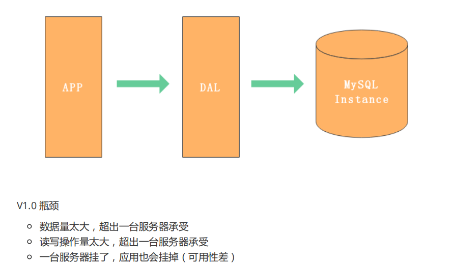

- 架构V2.0 - 主从架构

  V2.0架构主要解决架构V1.0下的高可用和读扩展问题，通过给Instance挂载从库解决读取的压力，主库宕机也可以通过主从切换保障高可用。在MySQL的场景

  下就是通过主从结构（双主结构也属于特殊的主从），主库抗写压力，通过从库来分担读压力，对于写少读多的应用，V2.0主从架构完全能够胜任。

  

- 架构V3.0 - 分库分表

  对于V1.0和V2.0遇到写入瓶颈和存储瓶颈时，可以通过水平拆分来解决，水平拆分和垂直拆分有较大区别，垂直拆分拆完的结果，每一个实例都是拥有全部数

  据的，而水平拆分之后，任何实例都只有全量的1/n的数据。以下图所示，将Userinfo拆分为3个Sharding，每个Sharding持有总量的1/3数据，3个Sharding

  数据的总和等于一份完整数据

  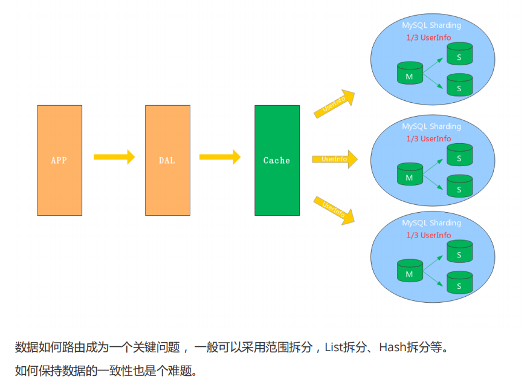

- 架构V4.0 - 云数据库

  云数据库（云计算）现在是各大IT公司内部作为节约成本的一个突破口，对于数据存储的MySQL来说，如何让其成为一个saas（Software as a Service）是关

  键点。MySQL作为一个saas服务，服务提供商负责解决可配置性，可扩展性，多用户存储结构设计等这些疑难问题。

  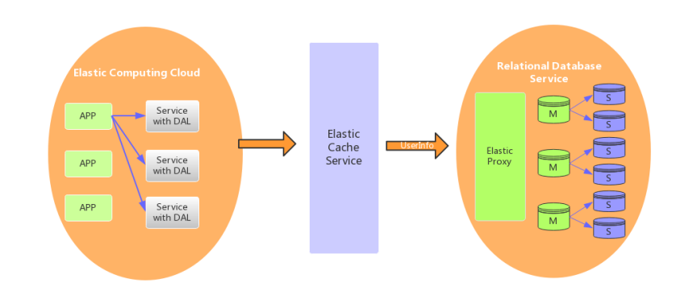

## 2、MySQL架构原理

### 2.1、MySQL体系架构

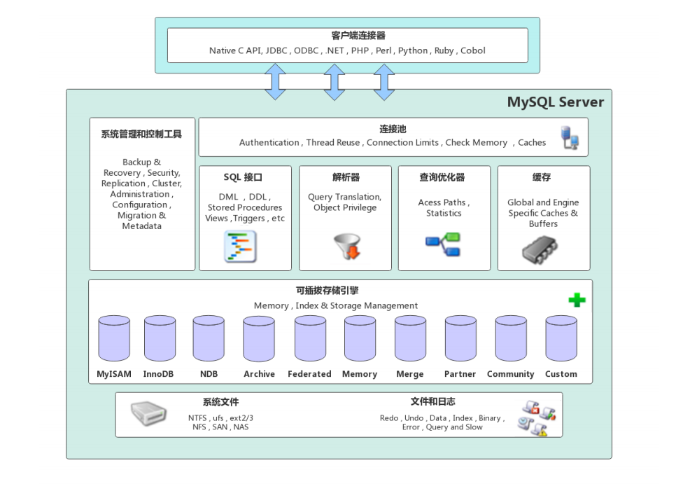

MySQL Server架构自顶向下大致可以分网络连接层、服务层、存储引擎层和系统文件层。

- **网络连接层**

  客户端连接器（Client Connectors）：提供与MySQL服务器建立的支持。目前几乎支持所有主流的服务端编程技术，例如常见的 Java、C、Python、.NET

  等，它们通过各自API技术与MySQL建立连接。

- **服务层（MySQL Server）**

  服务层是MySQL Server的核心，主要包含系统管理和控制工具、连接池、SQL接口、解析器、查询优化器和缓存六个部分。

  - **连接池（Connection Pool）**：负责存储和管理客户端与数据库的连接，一个线程负责管理一个连接。

  - **系统管理和控制工具（Management Services & Utilities）**：例如备份恢复、安全管理、集群管理等

  - **SQL接口（SQL Interface）**：用于接受客户端发送的各种SQL命令，并且返回用户需要查询的结果。比如DML、DDL、存储过程、视图、触发器等。

  - **解析器（Parser）**：负责将请求的SQL解析生成一个"解析树"。然后根据一些MySQL规则进一步检查解析树是否合法。

  - **查询优化器（Optimizer）**：当“解析树”通过解析器语法检查后，将交由优化器将其转化成执行计划，然后与存储引擎交互。

    ```
    select uid,name from user where gender=1;
    选取--》投影--》联接 策略
    1）select先根据where语句进行选取，并不是查询出全部数据再过滤
    2）select查询根据uid和name进行属性投影，并不是取出所有字段
    3）将前面选取和投影联接起来最终生成查询结果
    ```

  - **缓存（Cache&Buffer）**： 缓存机制是由一系列小缓存组成的。比如表缓存，记录缓存，权限缓存，引擎缓存等。如果查询缓存有命中的查询结果，查询

    语句就可以直接去查询缓存中取数据。

- **存储引擎层（Pluggable Storage Engines）**

  存储引擎负责MySQL中数据的存储与提取，与底层系统文件进行交互。MySQL存储引擎是插件式的，服务器中的查询执行引擎通过接口与存储引擎进行通

  信，接口屏蔽了不同存储引擎之间的差异 。现在有很多种存储引擎，各有各的特点，最常见的是MyISAM和InnoDB。

- **系统文件层（File System）**

  该层负责将数据库的数据和日志存储在文件系统之上，并完成与存储引擎的交互，是文件的物理存储层。主要包含日志文件，数据文件，配置文件，pid 文

  件，socket 文件等。

  - 日志文件

    - 错误日志（Error log）

      默认开启，show variables like '%log_error%'

    - 通用查询日志（General query log）

      记录一般查询语句，show variables like '%general%';

    - 二进制日志（binary log）

      记录了对MySQL数据库执行的更改操作，并且记录了语句的发生时间、执行时长；但是它不记录select、show等不修改数据库的SQL。主要用于数据

      库恢复和主从复制。

      show variables like '%log_bin%'; //是否开启

      show variables like '%binlog%'; //参数查看

      show binary logs;//查看日志文件

    - 慢查询日志（Slow query log）记录所有执行时间超时的查询SQL，默认是10秒。

      show variables like '%slow_query%'; //是否开启

      show variables like '%long_query_time%'; //时长

  - 配置文件

    用于存放MySQL所有的配置信息文件，比如my.cnf、my.ini等。

  - 数据文件

    - db.opt 文件：记录这个库的默认使用的字符集和校验规则。

    - frm 文件：存储与表相关的元数据（meta）信息，包括表结构的定义信息等，每一张表都会有一个frm 文件。

    - MYD 文件：MyISAM 存储引擎专用，存放 MyISAM 表的数据（data)，每一张表都会有一个.MYD 文件。

    - MYI 文件：MyISAM 存储引擎专用，存放 MyISAM 表的索引相关信息，每一张 MyISAM 表对应一个 .MYI 文件。

    - ibd文件和 IBDATA 文件：存放 InnoDB 的数据文件（包括索引）。InnoDB 存储引擎有两种表空间方式：独享表空间和共享表空间。独享表空间使用 

      .ibd 文件来存放数据，且每一张InnoDB 表对应一个 .ibd 文件。共享表空间使用 .ibdata 文件，所有表共同使用一个（或多个，自行配置）.ibdata 文

      件。

    - ibdata1 文件：系统表空间数据文件，存储表元数据、Undo日志等 。

    - ib_logfile0、ib_logfile1 文件：Redo log 日志文件。

  - pid 文件

    pid 文件是 mysqld 应用程序在 Unix/Linux 环境下的一个进程文件，和许多其他 Unix/Linux 服务端程序一样，它存放着自己的进程 id。

  - socket 文件

    socket 文件也是在 Unix/Linux 环境下才有的，用户在 Unix/Linux 环境下客户端连接可以不通过TCP/IP 网络而直接使用 Unix Socket 来连接 MySQL。 

### 2.2、MySQL运行机制


- ①建立连接（Connectors&Connection Pool），通过客户端/服务器通信协议与MySQL建立连接。MySQL 客户端与服务端的通信方式是 “ 半双工 ”。对于每一

  个 MySQL 的连接，时刻都有一个线程状态来标识这个连接正在做什么。

  - 通讯机制：

    全双工：能同时发送和接收数据，例如平时打电话。

    半双工：指的某一时刻，要么发送数据，要么接收数据，不能同时。例如早期对讲机

    单工：只能发送数据或只能接收数据。例如单行道

  - 线程状态：

    show processlist; //查看用户正在运行的线程信息，root用户能查看所有线程，其他用户只能看自己的

  - id：线程ID，可以使用kill xx；

  - user：启动这个线程的用户

  - Host：发送请求的客户端的IP和端口号

  - db：当前命令在哪个库执行
    - Command：该线程正在执行的操作命令
    - Create DB：正在创建库操作
    - Drop DB：正在删除库操作
    - Execute：正在执行一个PreparedStatement
    - Close Stmt：正在关闭一个PreparedStatement
    - Query：正在执行一个语句
    - Sleep：正在等待客户端发送语句
    - Quit：正在退出

    - Shutdown：正在关闭服务器

  - Time：表示该线程处于当前状态的时间，单位是秒

  - State：线程状态

    - Updating：正在搜索匹配记录，进行修改

    - Sleeping：正在等待客户端发送新请求

    - Starting：正在执行请求处理

    - Checking table：正在检查数据表

    - Closing table : 正在将表中数据刷新到磁盘中

    - Locked：被其他查询锁住了记录

    - Sending Data：正在处理Select查询，同时将结果发送给客户端

  - Info：一般记录线程执行的语句，默认显示前100个字符。想查看完整的使用show full processlist;

- ②查询缓存（Cache&Buffer），这是MySQL的一个可优化查询的地方，如果开启了查询缓存且在查询缓存过程中查询到完全相同的SQL语句，则将查询结果

  直接返回给客户端；如果没有开启查询缓存或者没有查询到完全相同的 SQL 语句则会由解析器进行语法语义解析，并生成“解析树”。默认关闭。

  - 缓存Select查询的结果和SQL语句

  - 执行Select查询时，先查询缓存，判断是否存在可用的记录集，要求是否完全相同（包括参数值），这样才会匹配缓存数据命中。

  - 即使开启查询缓存，以下SQL也不能缓存

    查询语句使用SQL_NO_CACHE

    查询的结果大于query_cache_limit设置

    查询中有一些不确定的参数，比如now()

  ```mysql
  show variables like '%query_cache%'; //查看查询缓存是否启用，空间大小，限制等
  show status like 'Qcache%'; //查看更详细的缓存参数，可用缓存空间，缓存块，缓存多少等
  ```

- ③解析器（Parser）将客户端发送的SQL进行语法解析，生成"解析树"。预处理器根据一些MySQL规则进一步检查“解析树”是否合法，例如这里将检查数据表

  和数据列是否存在，还会解析名字和别名，看看它们是否有歧义，最后生成新的“解析树”。

- ④查询优化器（Optimizer）根据“解析树”生成最优的执行计划。MySQL使用很多优化策略生成最优的执行计划，可以分为两类：静态优化（编译时优化）、

  动态优化（运行时优化）。

  - 等价变换策略
    - 5=5 and a>5 改成 a > 5
    - a < b and a=5 改成b>5 and a=5
    - 基于联合索引，调整条件位置等

  - 优化count、min、max等函数
    - InnoDB引擎min函数只需要找索引最左边
    - InnoDB引擎max函数只需要找索引最右边
    - MyISAM引擎count(*)，不需要计算，直接返回

  - 提前终止查询
    - 使用了limit查询，获取limit所需的数据，就不在继续遍历后面数据

  - in的优化
    - MySQL对in查询，会先进行排序，再采用二分法查找数据。比如where id in (2,1,3)，变成 in (1,2,3) 

- ⑤查询执行引擎负责执行 SQL 语句，此时查询执行引擎会根据 SQL 语句中表的存储引擎类型，以及对应的API接口与底层存储引擎缓存或者物理文件的交互，

  得到查询结果并返回给客户端。若开启用查询缓存，这时会将SQL 语句和结果完整地保存到查询缓存（Cache&Buffer）中，以后若有相同的 SQL 语句执行则

  直接返回结果。

  - 如果开启了查询缓存，先将查询结果做缓存操作

  - 返回结果过多，采用增量模式返回

### 2.3、MySQL存储引擎

存储引擎在MySQL的体系架构中位于第三层，负责MySQL中的数据的存储和提取，是与文件打交道的子系统，它是根据MySQL提供的文件访问层抽象接口定制的

一种文件访问机制，这种机制就叫作存储引擎。

使用**show engines**命令，就可以查看当前数据库支持的引擎信息。

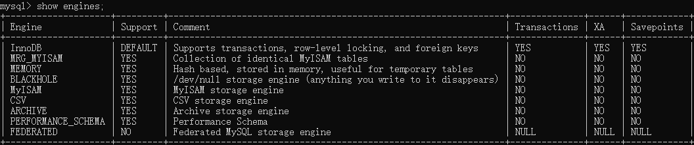

在5.5版本之前默认采用MyISAM存储引擎，从5.5开始采用InnoDB存储引擎。

- InnoDB：支持事务，具有提交，回滚和崩溃恢复能力，事务安全

- MyISAM：不支持事务和外键，访问速度快

- Memory：利用内存创建表，访问速度非常快，因为数据在内存，而且默认使用Hash索引，但是一旦关闭，数据就会丢失

- Archive：归档类型引擎，仅能支持insert和select语句

- Csv：以CSV文件进行数据存储，由于文件限制，所有列必须强制指定not null，另外CSV引擎也不支持索引和分区，适合做数据交换的中间表

- BlackHole: 黑洞，只进不出，进来消失，所有插入数据都不会保存

- Federated：可以访问远端MySQL数据库中的表。一个本地表，不保存数据，访问远程表内容。

- MRG_MyISAM：一组MyISAM表的组合，这些MyISAM表必须结构相同，Merge表本身没有数据，对Merge操作可以对一组MyISAM表进行操作。

#### 2.3.1、InnoDB和MyISAM对比

InnoDB和MyISAM是使用MySQL时最常用的两种引擎类型，我们重点来看下两者区别。

- 事务和外键

  InnoDB支持事务和外键，具有安全性和完整性，适合大量insert或update操作

  MyISAM不支持事务和外键，它提供高速存储和检索，适合大量的select查询操作

- 锁机制

  InnoDB支持行级锁，锁定指定记录。基于索引来加锁实现。

  MyISAM支持表级锁，锁定整张表。

- 索引结构

  InnoDB使用聚集索引（聚簇索引），索引和记录在一起存储，既缓存索引，也缓存记录。

  MyISAM使用非聚集索引（非聚簇索引），索引和记录分开。

- 并发处理能力

  MyISAM使用表锁，会导致写操作并发率低，读之间并不阻塞，读写阻塞。

  InnoDB读写阻塞可以与隔离级别有关，可以采用多版本并发控制（MVCC）来支持高并发

- 存储文件

  InnoDB表对应两个文件，一个.frm表结构文件，一个.ibd数据文件。InnoDB表最大支持64TB；

  MyISAM表对应三个文件，一个.frm表结构文件，一个MYD表数据文件，一个.MYI索引文件。从MySQL5.0开始默认限制是256TB。
  
  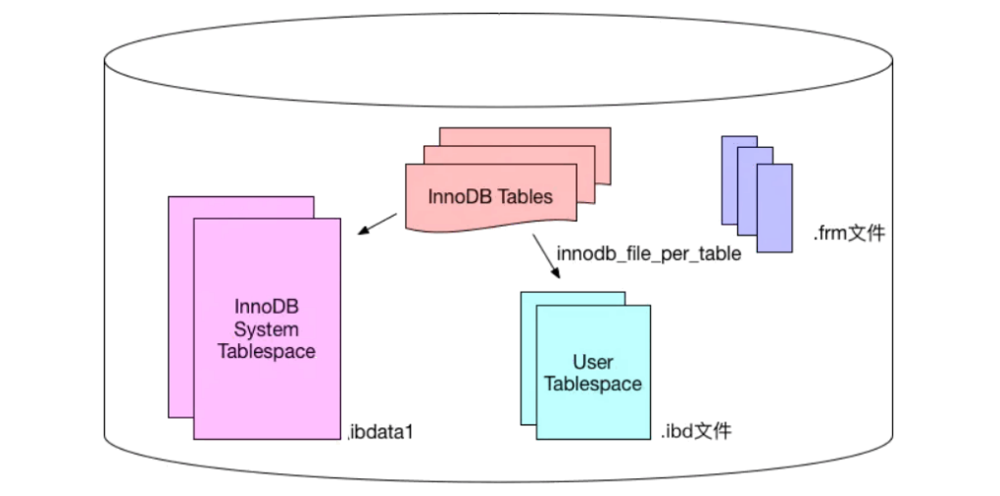

- 适用场景

  **MyISAM**

  - 不需要事务支持（不支持）

  - 并发相对较低（锁定机制问题）

  - 数据修改相对较少，以读为主
  - 数据一致性要求不高

  **InnoDB**

  - 需要事务支持（具有较好的事务特性）
  - 行级锁定对高并发有很好的适应能力
  - 数据更新较为频繁的场景
  - 数据一致性要求较高
  - 硬件设备内存较大，可以利用InnoDB较好的缓存能力来提高内存利用率，减少磁盘IO

- 总结

  两种引擎该如何选择？ 

  - 是否需要事务？有，InnoDB

  - 是否存在并发修改？有，InnoDB

  - 是否追求快速查询，且数据修改少？是，MyISAM

  - 在绝大多数情况下，推荐使用InnoDB

扩展资料：各个存储引擎特性对比

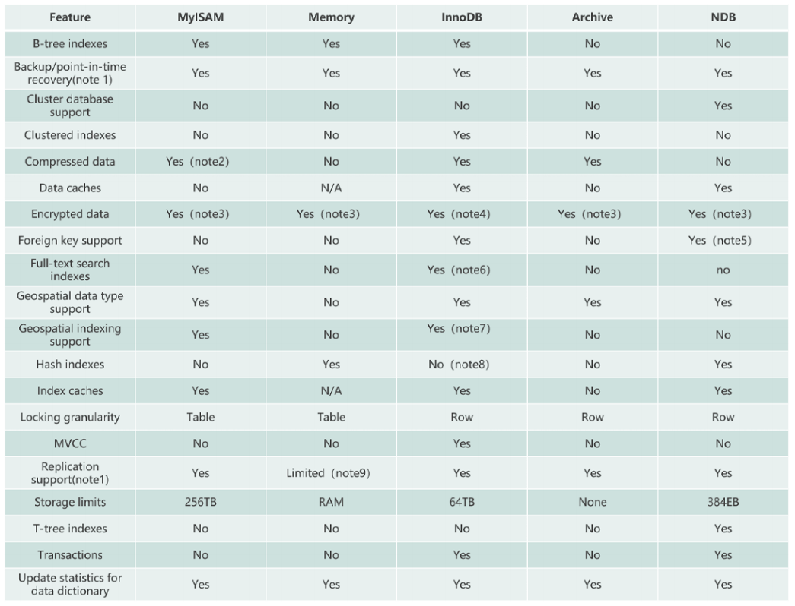

#### 2.3.2、 InnoDB存储结构

从MySQL 5.5版本开始默认使用InnoDB作为引擎，它擅长处理事务，具有自动崩溃恢复的特性，在日常开发中使用非常广泛。下面是官方的InnoDB引擎架构图，

主要分为内存结构和磁盘结构两大部分。

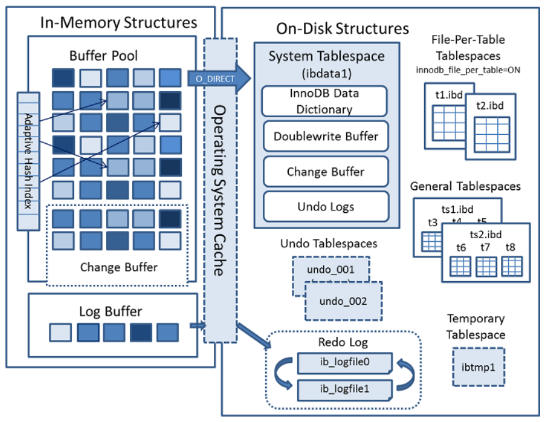

##### 2.3.2.1、InnoDB内存结构

内存结构主要包括Buffer Pool、Change Buffer、Adaptive Hash Index和Log Buffer四大组件。

- **Buffer Pool：缓冲池，简称BP。**BP以Page页为单位，默认大小16K，BP的底层采用链表数据结构管理Page。在InnoDB访问表记录和索引时会在Page页

  中缓存，以后使用可以减少磁盘IO操作，提升效率。

  - **Page管理机制**

    Page根据状态可以分为三种类型：

    - free page ： 空闲page，未被使用

    - clean page：被使用page，数据没有被修改过

    - dirty page：脏页，被使用page，数据被修改过，页中数据和磁盘的数据产生了不一致

    针对上述三种page类型，InnoDB通过三种链表结构来维护和管理

    - free list ：表示空闲缓冲区，管理free page

    - flush list：表示需要刷新到磁盘的缓冲区，管理dirty page，内部page按修改时间排序。脏页即存在于flush链表，也在LRU链表中，但是两种互

      不影响，LRU链表负责管理page的可用性和释放，而flush链表负责管理脏页的刷盘操作。

    - lru list：表示正在使用的缓冲区，管理clean page和dirty page，缓冲区以midpoint为基点，前面链表称为new列表区，存放经常访问的数据，占63%；后面的链表称为old列表区，存放使用较少数据，占37%。

  - **改进型LRU算法维护**

    - 普通LRU：末尾淘汰法，新数据从链表头部加入，释放空间时从末尾淘汰。

    - 改性LRU：链表分为new和old两个部分，加入元素时并不是从表头插入，而是从中间midpoint位置插入，如果数据很快被访问，那么page就会

      向new列表头部移动，如果数据没有被访问，会逐步向old尾部移动，等待淘汰。

    每当有新的page数据读取到buffer pool时，InnoDb引擎会判断是否有空闲页，是否足够，如果有就将free page从free list列表删除，放入到LRU列

    表中。没有空闲页，就会根据LRU算法淘汰LRU链表默认的页，将内存空间释放分配给新的页。

  - **Buffer Pool配置参数**

    ```mysql
    show variables like '%innodb_page_size%'; //查看page页大小
    show variables like '%innodb_old%'; //查看lru list中old列表参数
    show variables like '%innodb_buffer%'; //查看buffer pool参数
    建议：将innodb_buffer_pool_size设置为总内存大小的60%-80%，innodb_buffer_pool_instances可以设置为多个，这样可以避免缓存争夺。
    ```

- **Change Buffer：写缓冲区，简称CB。**在进行DML操作时，如果BP没有其相应的Page数据，并不会立刻将磁盘页加载到缓冲池，而是在CB记录缓冲变

  更，等未来数据被读取时，再将数据合并恢复到BP中。

  **ChangeBuffer占用BufferPool空间，默认占25%，最大允许占50%，可以根据读写业务量来进行调整。**

  

  参数innodb_change_buffer_max_size;

  当更新一条记录时，该记录在BufferPool存在，直接在BufferPool修改，一次内存操作。如果该记录在BufferPool不存在（没有命中），会直接在

  ChangeBuffer进行一次内存操作，不用再去磁盘查询数据，避免一次磁盘IO。当下次查询记录时，会先进性磁盘读取，然后再从ChangeBuffer中读取信

  息合并，最终载入BufferPool中。

  写缓冲区，仅适用于非唯一普通索引页，为什么？

  如果在索引设置唯一性，在进行修改时，InnoDB必须要做唯一性校验，因此必须查询磁盘，做一次IO操作。会直接将记录查询到BufferPool中，然后在

  缓冲池修改，不会在ChangeBuffer操作。

- **Adaptive Hash Index：自适应哈希索引，用于优化对BP数据的查询。**InnoDB存储引擎会监控对表索引的查找，如果观察到建立哈希索引可以带来速度

  的提升，则建立哈希索引，所以称之为自适应。InnoDB存储引擎会自动根据访问的频率和模式来为某些页建立哈希索引。

- **Log Buffer：日志缓冲区，用来保存要写入磁盘上log文件（Redo/Undo）的数据，日志缓冲区的内容定期刷新到磁盘log文件中。**日志缓冲区满时会自

  动将其刷新到磁盘，当遇到BLOB或多行更新的大事务操作时，增加日志缓冲区可以节省磁盘I/O。

  LogBuffer主要是用于记录InnoDB引擎日志，在DML操作时会产生Redo和Undo日志。

  LogBuffer空间满了，会自动写入磁盘。可以通过将innodb_log_buffer_size参数调大，减少磁盘IO频率

  innodb_flush_log_at_trx_commit参数控制日志刷新行为，默认为1

  - 0：每隔1秒写日志文件和刷盘操作（写日志文件LogBuffer-->OS cache，刷盘OScache-->磁盘文件），最多丢失1秒数据
  - 1：事务提交，立刻写日志文件和刷盘，数据不丢失，但是会频繁IO操作
  - 2：事务提交，立刻写日志文件，每隔1秒钟进行刷盘操作（建议）

##### 2.3.2.2、InnoDB磁盘结构

InnoDB磁盘主要包含Tablespaces，InnoDB Data Dictionary，Doublewrite Buffer、Redo Log和Undo Logs。

- **表空间（Tablespaces）：用于存储表结构和数据。**表空间又分为系统表空间、独立表空间、通用表空间、临时表空间、Undo表空间等多种类型；

  - **系统表空间（The System Tablespace）**

    包含InnoDB数据字典，Doublewrite Buffer，Change Buffer，Undo Logs的存储区域。系统表空间也默认包含任何用户在系统表空间创建的表数据和索

    引数据。系统表空间是一个共享的表空间因为它是被多个表共享的。

    该空间的数据文件通过参数innodb_data_file_path控制，默认值是ibdata1:12M:autoextend(文件名为ibdata1、12MB、自动扩展)。

  - **独立表空间（File-Per-Table Tablespaces）**

    **默认开启**，独立表空间是一个单表表空间，该表创建于自己的数据文件中，而非创建于系统表空间中。当innodb_file_per_table选项开启时，表将被创建

    于表空间中。否则，innodb将被创建于系统表空间中。每个表文件表空间由一个.ibd数据文件代表，该文件默认被创建于数据库目录中。表空间的表文件

    支持动态（dynamic）和压缩（commpressed）行格式。

  - **通用表空间（General Tablespaces）**

    通用表空间为通过create tablespace语法创建的共享表空间。通用表空间可以创建于mysql数据目录外的其他表空间，其可以容纳多张表，且其支持所有

    的行格式。

    ```mysql
    CREATE TABLESPACE ts1 ADD DATAFILE ts1.ibd Engine=InnoDB; //创建表空间ts1 
    CREATE TABLE t1 (c1 INT PRIMARY KEY) TABLESPACE ts1; //将表添加到ts1表空间
    ```

  - **撤销表空间（Undo Tablespaces）**

    撤销表空间由一个或多个包含Undo日志文件组成。在MySQL 5.7版本之前Undo占用的是System Tablespace共享区，从5.7开始将Undo从System 

    Tablespace分离了出来。InnoDB使用的undo表空间由innodb_undo_tablespaces配置选项控制，默认为0。参数值为0表示使用系统表空间ibdata1;大于

    0表示使用undo表空间undo_001、undo_002等。

  - **临时表空间（Temporary Tablespaces）**

    分为session temporary tablespaces 和global temporary tablespace两种。sessiontemporary tablespaces 存储的是用户创建的临时表和磁盘内部的临

    时表。global temporary tablespace储存用户临时表的回滚段（rollback segments ）。mysql服务器正常关闭或异常终止时，临时表空间将被移除，每

    次启动时会被重新创建。

- **数据字典（InnoDB Data Dictionary）**

  InnoDB数据字典由内部系统表组成，这些表包含用于查找表、索引和表字段等对象的元数据。元数据物理上位于InnoDB系统表空间中。由于历史原因，数据

  字典元数据在一定程度上与InnoDB表元数据文件（.frm文件）中存储的信息重叠。

- **双写缓冲区（Doublewrite Buffer）**

  位于系统表空间，是一个存储区域。在BufferPage的page页刷新到磁盘真正的位置前，会先将数据存在Doublewrite 缓冲区。如果在page页写入过程中出现

  操作系统、存储子系统或mysqld进程崩溃，InnoDB可以在崩溃恢复期间从Doublewrite 缓冲区中找到页面的一个好备份。在大多数情况下，默认情况下启用

  双写缓冲区，要禁用Doublewrite 缓冲区，可以将innodb_doublewrite设置为0。

  使用Doublewrite 缓冲区时建议将innodb_flflush_method设置为O_DIRECT。

  ```apl
  MySQL的innodb_flush_method这个参数控制着innodb数据文件及redo log的打开、刷写模式。有三个值：fdatasync(默认)，O_DSYNC，O_DIRECT。设置O_DIRECT表示数据文件写入操作会通知操作系统不要缓存数据，也不要用预读，直接从InnodbBuffer写到磁盘文件。
  默认的fdatasync意思是先写入操作系统缓存，然后再调用fsync()函数去异步刷数据文件与redo log的缓存信息。
  ```

- **重做日志（Redo Log）**

  重做日志是一种基于磁盘的数据结构，用于在崩溃恢复期间更正不完整事务写入的数据。MySQL以循环方式写入重做日志文件，记录InnoDB中所有对Buffer 

  Pool修改的日志。当出现实例故障（像断电），导致数据未能更新到数据文件，则数据库重启时须redo，重新把数据更新到数据文件。读写事务在执行的过程

  中，都会不断的产生redo log。默认情况下，重做日志在磁盘上由两个名为ib_logfile0和ib_logfile1的文件物理表示。

- **撤销日志（Undo Logs）**

  撤消日志是在事务开始之前保存的被修改数据的备份，用于例外情况时回滚事务。撤消日志属于逻辑日志，根据每行记录进行记录。撤消日志存在于系统表空

  间、撤消表空间和临时表空间中。

##### 2.3.2.3、新版本结构演变

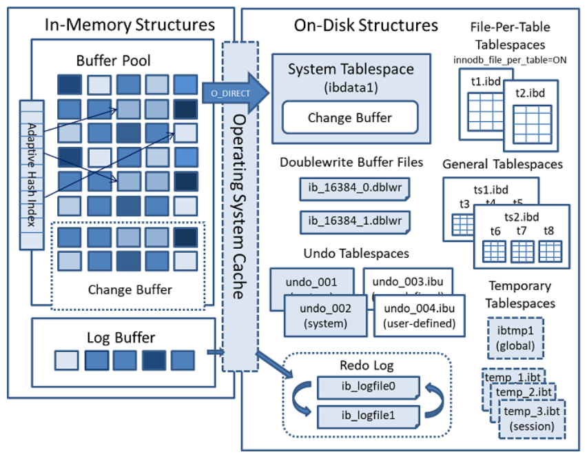

- MySQL 5.7 版本

  - 将 Undo日志表空间从共享表空间 ibdata 文件中分离出来，可以在安装 MySQL 时由用户自行指定文件大小和数量。

  - 增加了 temporary 临时表空间，里面存储着临时表或临时查询结果集的数据。

  - Buffer Pool 大小可以动态修改，无需重启数据库实例。

- MySQL 8.0 版本

  - 将InnoDB表的数据字典和Undo都从共享表空间ibdata中彻底分离出来了，以前需要ibdata中数据字典与独立表空间ibd文件中数据字典一致才行，8.0版

    本就不需要了。

  - temporary 临时表空间也可以配置多个物理文件，而且均为 InnoDB 存储引擎并能创建索引，这样加快了处理的速度。

  - 用户可以像 Oracle 数据库那样设置一些表空间，每个表空间对应多个物理文件，每个表空间可以给多个表使用，但一个表只能存储在一个表空间中。
  - 将Doublewrite Buffer从共享表空间ibdata中也分离出来了。

#### 2.3.3、InnoDB线程模型

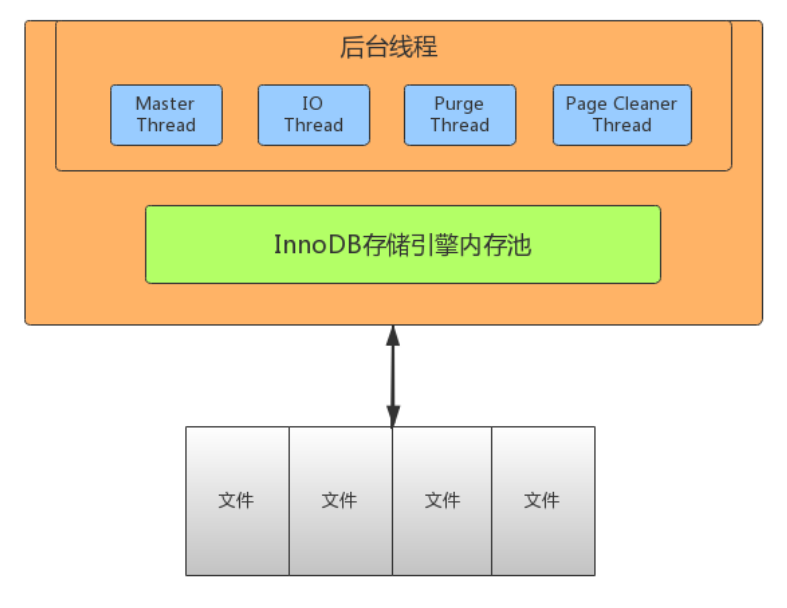

- **IO Thread**

  在InnoDB中使用了大量的AIO（Async IO）来做读写处理，这样可以极大提高数据库的性能。在InnoDB1.0版本之前共有4个IO Thread，分别是write，

  read，insert buffer和log thread，后来版本将read thread和write thread分别增大到了4个，一共有10个了。

  - read thread ： 负责读取操作，将数据从磁盘加载到缓存page页。4个
  - write thread：负责写操作，将缓存脏页刷新到磁盘。4个
  - log thread：负责将日志缓冲区内容刷新到磁盘。1个
  - insert buffer thread ：负责将写缓冲内容刷新到磁盘。1个

- **Purge Thread**

  事务提交之后，其使用的undo日志将不再需要，因此需要Purge Thread回收已经分配的undo页。

  show variables like '%innodb_purge_threads%';

- **Page Cleaner Thread**

  作用是将脏数据刷新到磁盘，脏数据刷盘后相应的redo log也就可以覆盖，即可以同步数据，又能达到redo log循环使用的目的。调用write thread线程理。

  show variables like '%innodb_page_cleaners%';

- **Master Thread**

  Master thread是InnoDB的主线程，负责调度其他各线程，优先级最高。作用是将缓冲池中的数据异步刷新到磁盘 ，保证数据的一致性。包含：脏页的刷新

  （page cleaner thread）、undo页回收（purge thread）、redo日志刷新（log thread）、合并写缓冲等。内部有两个主处理，分别是每1秒和10秒处理。

  - 每1秒的操作：

    - 刷新日志缓冲区，刷到磁盘

    - 合并写缓冲区数据，根据IO读写压力来决定是否操作

    - 刷新脏页数据到磁盘，根据脏页比例达到75%才操作（innodb_max_dirty_pages_pct，innodb_io_capacity）

  - 每10秒的操作：

    - 刷新脏页数据到磁盘
    - 合并写缓冲区数据
    - 刷新日志缓冲区
    - 删除无用的undo页

#### 2.3.4、 InnoDB数据文件

##### 2.3.4.1、InnoDB文件存储结构

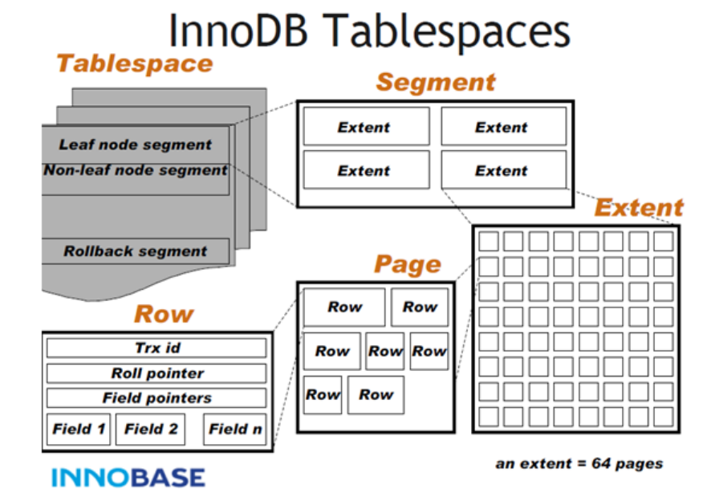

InnoDB数据文件存储结构：分为一个ibd数据文件-->Segment（段）-->Extent（区）-->Page（页）-->Row（行）

- **Tablesapce**

  表空间，用于存储多个ibd数据文件，用于存储表的记录和索引。一个文件包含多个段。

- **Segment**

  段，用于管理多个Extent，分为数据段（Leaf node segment）、索引段（Non-leaf nodesegment）、回滚段（Rollback segment）。一个表至少会有两个

  segment，一个管理数据，一个管理索引。每多创建一个索引，会多两个segment。

- **Extent**

  区，一个区固定包含64个连续的页，大小为1M。当表空间不足，需要分配新的页资源，不会一页一页分，直接分配一个区。

- **Page**

  页，用于存储多个Row行记录，大小为16K。包含很多种页类型，比如数据页，undo页，系统页，事务数据页，大的BLOB对象页。

  Page是文件最基本的单位，无论何种类型的page，都是由page header，page trailer和pagebody组成。如下图所示：

  

- **Row**

  行，包含了记录的字段值，事务ID（Trx id）、滚动指针（Roll pointer）、字段指针（Fieldpointers）等信息。

##### 2.3.4.2、InnoDB文件存储格式

- **通过 SHOW TABLE STATUS 命令，\G是指将数据以列的形式展现**

  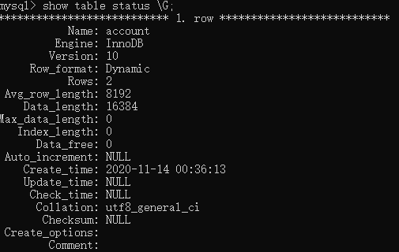

  一般情况下，如果row_format为REDUNDANT、COMPACT，文件格式为Antelope；如果row_format为DYNAMIC和COMPRESSED，文件格式为

  Barracuda。

- **通过 information_schema 查看指定表的文件格式**

  ```mysql
  select * from information_schema.innodb_sys_tables;
  ```

##### 2.3.4.3、File文件格式（File-Format）

在早期的InnoDB版本中，文件格式只有一种，随着InnoDB引擎的发展，出现了新文件格式，用于支持新的功能。

目前InnoDB只支持两种文件格式：Antelope 和 Barracuda。

- Antelope: 先前未命名的，最原始的InnoDB文件格式，它支持两种行格式：COMPACT和REDUNDANT，MySQL 5.6及其以前版本默认格式为Antelope。

- Barracuda: 新的文件格式。它支持InnoDB的所有行格式，包括新的行格式：COMPRESSED和 DYNAMIC。

通过innodb_fifile_format 配置参数可以设置InnoDB文件格式，之前默认值为Antelope，5.7版本开始改为Barracuda。

##### 2.3.4.4、Row行格式（Row_format）

表的行格式决定了它的行是如何物理存储的，这反过来又会影响查询和DML操作的性能。如果在单个page页中容纳更多行，查询和索引查找可以更快地工作，缓冲池中所需的内存更少，写入更新时所需的I/O更少。

InnoDB存储引擎支持四种行格式：REDUNDANT、COMPACT、DYNAMIC和COMPRESSED。 

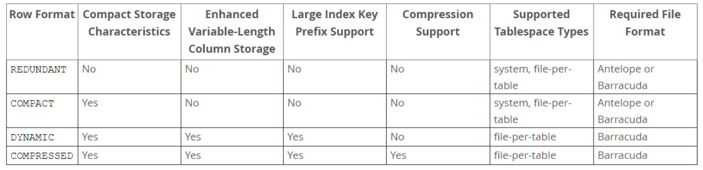

DYNAMIC和COMPRESSED新格式引入的功能有：数据压缩、增强型长列数据的页外存储和大索引前缀。

**每个表的数据分成若干页来存储，每个页中采用B树结构存储；**

**如果某些字段信息过长，无法存储在B树节点中，这时候会被单独分配空间，此时被称为溢出页，该字段被称为页外列。**

- REDUNDANT 行格式

  使用REDUNDANT行格式，表会将变长列值的前768字节存储在B树节点的索引记录中，其余的存储在溢出页上。对于大于等于786字节的固定长度字段

  InnoDB会转换为变长字段，以便能够在页外存储。

- COMPACT 行格式

  与REDUNDANT行格式相比，COMPACT行格式减少了约20%的行存储空间，但代价是增加了某些操作的CPU使用量。如果系统负载是受缓存命中率和磁盘速

  度限制，那么COMPACT格式可能更快。如果系统负载受到CPU速度的限制，那么COMPACT格式可能会慢一些。

- DYNAMIC 行格式

  使用DYNAMIC行格式，InnoDB会将表中长可变长度的列值完全存储在页外，而索引记录只包含指向溢出页的20字节指针。大于或等于768字节的固定长度字

  段编码为可变长度字段。**DYNAMIC行格式支持大索引前缀，最多可以为3072字节，可通过innodb_large_prefix参数控制。**

- COMPRESSED 行格式

  COMPRESSED行格式提供与DYNAMIC行格式相同的存储特性和功能，但增加了对表和索引数据压缩的支持。

在创建表和索引时，文件格式都被用于每个InnoDB表数据文件（其名称与*.ibd匹配）。修改文件格式的方法是重新创建表及其索引，最简单方法是对要修改的每

个表使用以下命令：

```mysql
ALTER TABLE 表名 ROW_FORMAT=格式类型;
```

#### 2.3.5、Undo Log

##### 2.3.5.1、Undo Log介绍

Undo：意为撤销或取消，以撤销操作为目的，返回指定某个状态的操作。

Undo Log：数据库事务开始之前，会将要修改的记录存放到 Undo 日志里，当事务回滚时或者数据库崩溃时，可以利用 Undo 日志，撤销未提交事务对数据库产生的影响。

Undo Log产生和销毁：Undo Log在事务开始前产生；事务在提交时，并不会立刻删除undolog，innodb会将该事务对应的undo log放入到删除列表中，后面会过后台线程purge thread进行回收处理。

Undo Log属于逻辑日志，记录一个变化过程。例如执行一个delete，undolog会记录一个insert；执行一个update，undolog会记录一个相反的update。

Undo Log存储：undo log采用段的方式管理和记录。在innodb数据文件中包含一种rollbacksegment回滚段，内部包含1024个undo log segment。可以通过下面一组参数来控制Undo log存储。

```mysql
show variables like '%innodb_undo%';
```

##### 2.3.5.2、Undo Log作用

- 实现事务的原子性

  Undo Log 是为了实现事务的原子性而出现的产物。事务处理过程中，如果出现了错误或者用户执行了 ROLLBACK 语句，MySQL 可以利用 Undo Log 中的备份将数据恢复到事务开始之前的状态。

- 实现多版本并发控制（MVCC）

  Undo Log 在 MySQL InnoDB 存储引擎中用来实现多版本并发控制。事务未提交之前，Undo Log保存了未提交之前的版本数据，Undo Log 中的数据可作为数据旧版本快照供其他并发事务进行快照读。


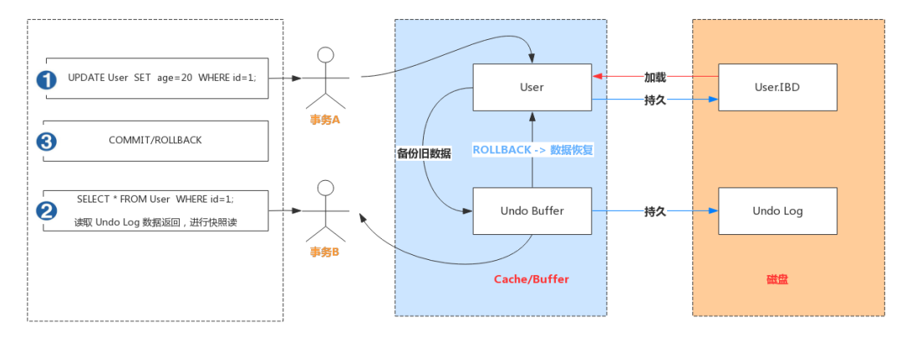

事务A手动开启事务，执行更新操作，首先会把更新命中的数据备份到 Undo Buffer 中。

事务B手动开启事务，执行查询操作，会读取 Undo 日志数据返回，进行快照读。

#### 2.3.6、Redo Log和Binlog

Redo Log和Binlog是MySQL日志系统中非常重要的两种机制，也有很多相似之处，下面介绍下两者细节和区别。

##### 2.3.6.1、Redo Log日志

- Redo Log介绍

  Redo：顾名思义就是重做。以恢复操作为目的，在数据库发生意外时重现操作。

  Redo Log：指事务中修改的任何数据，将最新的数据备份存储的位置（Redo Log），被称为重做日志。

  Redo Log 的生成和释放：随着事务操作的执行，就会生成Redo Log，在事务提交时会将产生Redo Log写入Log Buffer，并不是随着事务的提交就立刻写入磁

  盘文件。等事务操作的脏页写入到磁盘之后，Redo Log 的使命也就完成了，Redo Log占用的空间就可以重用（被覆盖写入）。

- Redo Log工作原理

  Redo Log 是为了实现事务的持久性而出现的产物。防止在发生故障的时间点，尚有脏页未写入表的 IBD 文件中，在重启 MySQL 服务的时候，根据 Redo Log 

  进行重做，从而达到事务的未入磁盘数据进行持久化这一特性。

  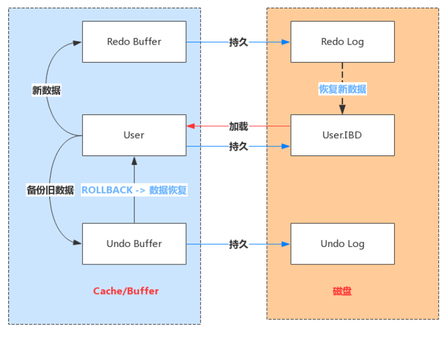

- Redo Log写入机制

  Redo Log 文件内容是以顺序循环的方式写入文件，写满时则回溯到第一个文件，进行覆盖写。

  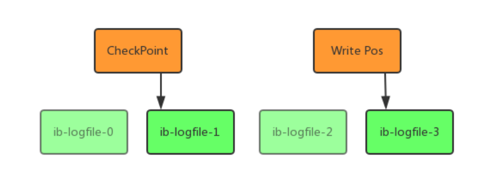

  - **write pos** 是当前记录的位置，一边写一边后移，写到最后一个文件末尾后就回到 0 号文件开头；

  - **checkpoint** 是当前要擦除的位置，也是往后推移并且循环的，擦除记录前要把记录更新到数据文件；

  - write pos 和 checkpoint 之间还空着的部分，可以用来记录新的操作。如果 write pos 追上checkpoint，表示写满，这时候不能再执行新的更新，得停下

    来先擦掉一些记录，把 checkpoint推进一下。

- Redo Log相关配置参数

  每个InnoDB存储引擎至少有1个重做日志文件组（group），每个文件组至少有2个重做日志文件，默认为ib_logfile0和ib_logfile1。可以通过下面一组参数控

  制Redo Log存储：

  ```mysql
  show variables like '%innodb_log%';
  ```

  Redo Buffer 持久化到 Redo Log 的策略，可通过 **Innodb_flush_log_at_trx_commit** 设置：

  - 0：每秒提交 Redo buffer ->OS cache -> flush cache to disk，可能丢失一秒内的事务数据。由后台Master线程每隔 1秒执行一次操作。
  - 1（默认值）：每次事务提交执行 Redo Buffer -> OS cache -> flush cache to disk，最安全，性能最差的方式。
  - 2：每次事务提交执行 Redo Buffer -> OS cache，然后由后台Master线程再每隔1秒执行OScache -> flush cache to disk 的操作。

  **一般建议选择取值2**，因为 MySQL 挂了数据没有损失，整个服务器挂了才会损失1秒的事务提交数据。

  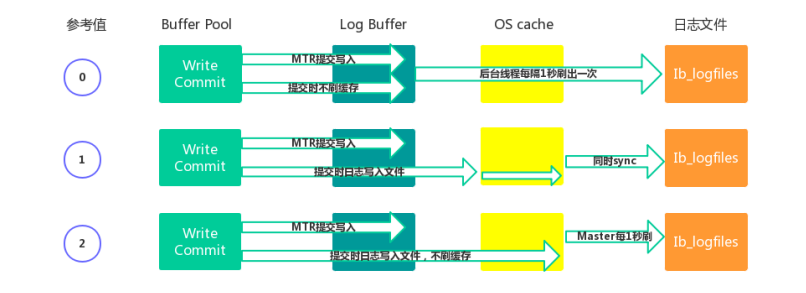

##### 2.3.6.2、Binlog日志

- Binlog记录模式

  Redo Log 是属于InnoDB引擎所特有的日志，而MySQL Server也有自己的日志，即 Binarylog（二进制日志），简称Binlog。Binlog是记录所有数据库表结构

  变更以及表数据修改的二进制日志，不会记录SELECT和SHOW这类操作。Binlog日志是以事件形式记录，还包含语句所执行的消耗时间。开启Binlog日志有以

  下两个最重要的使用场景。

  - **主从复制：**在主库中开启Binlog功能，这样主库就可以把Binlog传递给从库，从库拿到Binlog后实现数据恢复达到主从数据一致性。
  - **数据恢复：**通过mysqlbinlog工具来恢复数据。

  **Binlog文件名默认为“主机名_binlog-序列号”格式**，例如oak_binlog-000001，也可以在配置文件中指定名称。文件记录模式有STATEMENT、ROW和MIXED

  三种，具体含义如下。

  - **ROW（row-based replication, RBR）**：日志中会记录每一行数据被修改的情况，然后在slave端对相同的数据进行修改。

    优点：能清楚记录每一个行数据的修改细节，能完全实现主从数据同步和数据的恢复。

    缺点：批量操作，会产生大量的日志，尤其是alter table会让日志暴涨。

  - **STATMENT（statement-based replication, SBR）**：每一条被修改数据的SQL都会记录到master的Binlog中，slave在复制的时候SQL进程会解析成和

    原来master端执行过的相同的SQL再次执行。简称SQL语句复制。

    优点：日志量小，减少磁盘IO，提升存储和恢复速度

    缺点：在某些情况下会导致主从数据不一致，比如last_insert_id()、now()等函数。

  - **MIXED（mixed-based replication, MBR）**：以上两种模式的混合使用，一般会使用STATEMENT模式保存binlog，对于STATEMENT模式无法复制的操

    作使用ROW模式保存binlog，MySQL会根据执行的SQL语句选择写入模式。

- Binlog文件结构

  MySQL的binlog文件中记录的是对数据库的各种修改操作，用来表示修改操作的数据结构是Log event。不同的修改操作对应的不同的log event。比较常用的

  log event有：Query event、Row event、Xid event等。binlog文件的内容就是各种Log event的集合。

  Binlog文件中Log event结构如下图所示：

  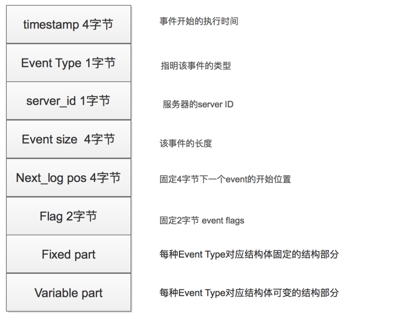

- Binlog写入机制

  - 根据记录模式和操作触发event事件生成log event（事件触发执行机制）

  - 将事务执行过程中产生log event写入缓冲区，每个事务线程都有一个缓冲区

    Log Event保存在一个binlog_cache_mngr数据结构中，在该结构中有两个缓冲区，一个是stmt_cache，用于存放不支持事务的信息；另一个trx_cache，

    用于存放支持事务的信息。

  - 事务在提交阶段会将产生的log event写入到外部binlog文件中。

    不同事务以串行方式将log event写入binlog文件中，所以一个事务包含的log event信息在binlog文件中是连续的，中间不会插入其他事务的log event。

- Binlog文件操作

  - Binlog状态查看

    ```mysql
    show variables like 'log_bin';
    ```

  - 开启Binlog功能

    ```mysql
    mysql> set global log_bin=mysqllogbin; 
    ERROR 1238 (HY000): Variable 'log_bin' is a read only variable
    ```

    需要修改my.cnf或my.ini配置文件，在[mysqld]下面增加log_bin=mysql_bin_log，重启MySQL服务。

    ```properties
    #log-bin=ON 
    #log-bin-basename=mysqlbinlog 
    binlog-format=ROW 
    log-bin=mysqlbinlog
    ```

  - 使用show binlog events命令,查看binlog日志文件信息

    ```mysql
    show binary logs; //等价于show master logs; 
    show master status; 
    show binlog events; 
    show binlog events in 'mysqlbinlog.000001';
    ```

  - 使用mysqlbinlog 命令，需要在mysql data目录下，binlog日志文件存在目录使用

    ```mysql
    mysqlbinlog "文件名" 
    mysqlbinlog "文件名" > "test.sql" #转存文件
    ```

  - 使用 binlog 恢复数据

    ```mysql
    //按指定时间恢复 
    mysqlbinlog --start-datetime="2020-04-25 18:00:00" --stop- datetime="2020-04-26 00:00:00" mysqlbinlog.000002 | mysql -uroot -p1234 
    //按事件位置号恢复 
    mysqlbinlog --start-position=154 --stop-position=957 mysqlbinlog.000002 | mysql -uroot -p1234
    ```

    mysqldump：定期全部备份数据库数据。mysqlbinlog可以做增量备份和恢复操作。

  - 删除Binlog文件

    ```mysql
    purge binary logs to 'mysqlbinlog.000001'; //删除指定文件 
    purge binary logs before '2020-04-28 00:00:00'; //删除指定时间之前的文件 
    reset master; //清除所有文件
    ```

    可以通过设置expire_logs_days参数来启动自动清理功能。默认值为0表示没启用。设置为1表示超出1天binlog文件会自动删除掉。

- Redo Log和Binlog区别

  - Redo Log是属于InnoDB引擎功能，Binlog是属于MySQL Server自带功能，并且是以二进制文件记录。
  - Redo Log属于物理日志，记录该数据页更新状态内容，Binlog是逻辑日志，记录更新过程。
  - Redo Log日志是循环写，日志空间大小是固定，Binlog是追加写入，写完一个写下一个，不会覆盖使用。
  - Redo Log作为服务器异常宕机后事务数据自动恢复使用，Binlog可以作为主从复制和数据恢复使用。Binlog没有自动crash-safe能力。

## 3、MySQL索引原理

### 3.1、索引类型

索引可以提升查询速度，会影响where查询，以及order by排序。MySQL索引类型如下：

- 从索引存储结构划分：B Tree索引、Hash索引、FULLTEXT全文索引、R Tree索引
- 从应用层次划分：普通索引、唯一索引、主键索引、复合索引
- 从索引键值类型划分：主键索引、辅助索引（二级索引）
- 从数据存储和索引键值逻辑关系划分：聚集索引（聚簇索引）、非聚集索引（非聚簇索引）

#### 3.1.1、普通索引

这是最基本的索引类型，基于普通字段建立的索引，没有任何限制。

```mysql
CREATE INDEX <索引的名字> ON tablename (字段名);
ALTER TABLE tablename ADD INDEX [索引的名字] (字段名);
CREATE TABLE tablename ( [...], INDEX [索引的名字] (字段名) );
```

#### 3.1.2、唯一索引

与"普通索引"类似，不同的就是：索引字段的值必须唯一，但允许有空值 。在创建或修改表时追加唯一约束，就会自动创建对应的唯一索引。

```mysql
CREATE UNIQUE INDEX <索引的名字> ON tablename (字段名);
ALTER TABLE tablename ADD UNIQUE INDEX [索引的名字] (字段名);
CREATE TABLE tablename ( [...], UNIQUE [索引的名字] (字段名) ;
```

#### 3.1.3、主键索引

它是一种特殊的唯一索引，不允许有空值。在创建或修改表时追加主键约束即可，每个表只能有一个主键。

```mysql
CREATE TABLE tablename ( [...], PRIMARY KEY (字段名) );
ALTER TABLE tablename ADD PRIMARY KEY (字段名);
```

#### 3.1.4、复合索引

单一索引是指索引列为一列的情况，即新建索引的语句只实施在一列上；用户可以在多个列上建立索引，这种索引叫做组复合索引（组合索引）。复合索引可以代

替多个单一索引，相比多个单一索引复合索引所需的开销更小。

索引同时有两个概念叫做窄索引和宽索引，窄索引是指索引列为1-2列的索引，宽索引也就是索引列超过2列的索引，设计索引的一个重要原则就是能用窄索引不用

宽索引，因为窄索引往往比组合索引更有效。

```mysql
CREATE INDEX <索引的名字> ON tablename (字段名1，字段名2...);
ALTER TABLE tablename ADD INDEX [索引的名字] (字段名1，字段名2...)
CREATE TABLE tablename ( [...], INDEX [索引的名字] (字段名1，字段名2...) );
```

复合索引使用注意事项：

- 何时使用复合索引，要根据where条件建索引，注意不要过多使用索引，过多使用会对更新操作效率有很大影响。

- 如果表已经建立了(col1，col2)，就没有必要再单独建立（col1）；如果现在有(col1)索引，如果查询需要col1和col2条件，可以建立(col1,col2)复合索引，对于

  查询有一定提高。

#### 3.1.5、全文索引

查询操作在数据量比较少时，可以使用like模糊查询，但是对于大量的文本数据检索，效率很低。如果使用全文索引，查询速度会比like快很多倍。在MySQL 5.6 

以前的版本，只有MyISAM存储引擎支持全文索引，从MySQL 5.6开始MyISAM和InnoDB存储引擎均支持。

```mysql
CREATE FULLTEXT INDEX <索引的名字> ON tablename (字段名);
ALTER TABLE tablename ADD FULLTEXT [索引的名字] (字段名);
CREATE TABLE tablename ( [...], FULLTEXT KEY [索引的名字] (字段名) ;
```

和常用的like模糊查询不同，全文索引有自己的语法格式，使用 match 和 against 关键字，比如

```mysql
select * from user where match(name) against('aaa');
```

全文索引使用注意事项：

- 全文索引必须在字符串、文本字段上建立。

- 全文索引字段值必须在最小字符和最大字符之间的才会有效。（innodb：3-84；myisam：4-84）

- 全文索引字段值要进行切词处理，按syntax字符进行切割，例如b+aaa，切分成b和aaa

- 全文索引匹配查询，默认使用的是等值匹配，例如a匹配a，不会匹配ab,ac。如果想匹配可以在布尔模式下搜索a*

  ```mysql
  select * from user where match(name) against('a*' in boolean mode);
  ```

### 3.2、索引原理

MySQL官方对索引定义：是存储引擎用于快速查找记录的一种数据结构。需要额外开辟空间和数据维护工作。

- 索引是物理数据页存储，在数据文件中（InnoDB，ibd文件），利用数据页(page)存储。

- 索引可以加快检索速度，但是同时也会降低增删改操作速度，索引维护需要代价。

索引涉及的理论知识：二分查找法、Hash和B+Tree。

#### 3.2.1、二分查找法

二分查找法也叫作折半查找法，它是在有序数组中查找指定数据的搜索算法。它的优点是等值查询、范围查询性能优秀，缺点是更新数据、新增数据、删除数据维

护成本高。

- 首先定位left和right两个指针

- 计算(left+right)/2

- 判断除2后索引位置值与目标值的大小比对

- 索引位置值大于目标值就-1，right移动；如果小于目标值就+1，left移动

举个例子，下面的有序数组有17 个值，查找的目标值是7，过程如下：

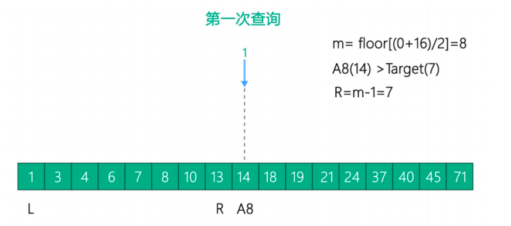

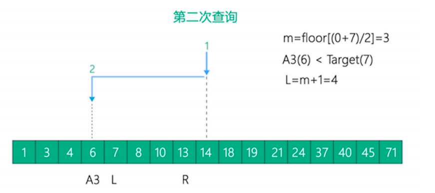

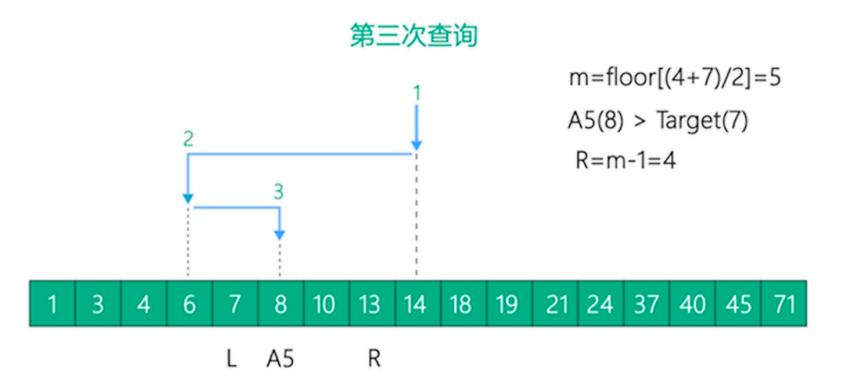

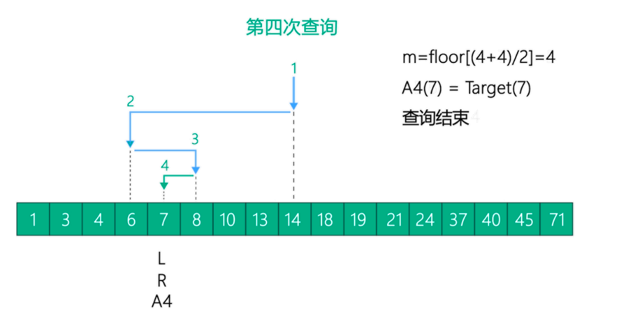

#### 3.2.2、Hash结构

Hash底层实现是由Hash表来实现的，是根据键值 <key,value> 存储数据的结构。非常适合根据key查找value值，也就是单个key查询，或者说等值查询。其结构

如下所示：

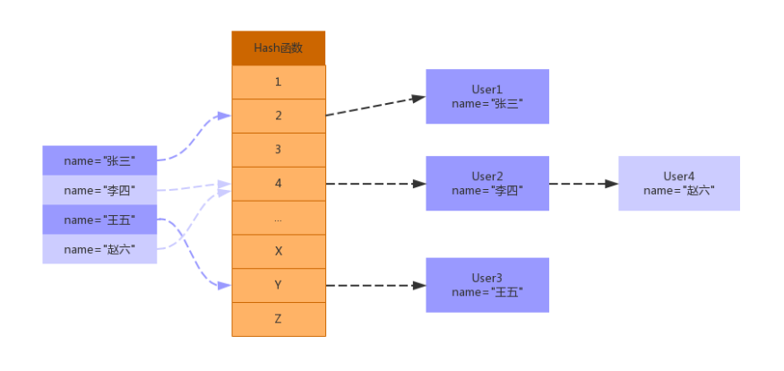

从上面结构可以看出，Hash索引可以方便的提供等值查询，但是对于范围查询就需要全表扫描了。Hash索引在MySQL 中Hash结构主要应用在Memory原生的

Hash索引 、InnoDB 自适应哈希索引。

InnoDB提供的自适应哈希索引功能强大，接下来重点描述下InnoDB 自适应哈希索引。

InnoDB自适应哈希索引是为了提升查询效率，InnoDB存储引擎会监控表上各个索引页的查询，当InnoDB注意到某些索引值访问非常频繁时，会在内存中基于

B+Tree索引再创建一个哈希索引，使得内存中的 B+Tree 索引具备哈希索引的功能，即能够快速定值访问频繁访问的索引页。

InnoDB自适应哈希索引：在使用Hash索引访问时，一次性查找就能定位数据，等值查询效率要优于B+Tree。

自适应哈希索引的建立使得InnoDB存储引擎能自动根据索引页访问的频率和模式自动地为某些热点页建立哈希索引来加速访问。另外InnoDB自适应哈希索引的功

能，用户只能选择开启或关闭功能，无法进行人工干涉。

```mysql
show engine innodb status \G; 
show variables like '%innodb_adaptive%';
```

#### 3.2.3、B+Tree结构

MySQL数据库索引采用的是B+Tree结构，在B-Tree结构上做了优化改造。

- B-Tree结构

  - 索引值和data数据分布在整棵树结构中

  - 每个节点可以存放多个索引值及对应的data数据

  - 树节点中的多个索引值从左到右升序排列

  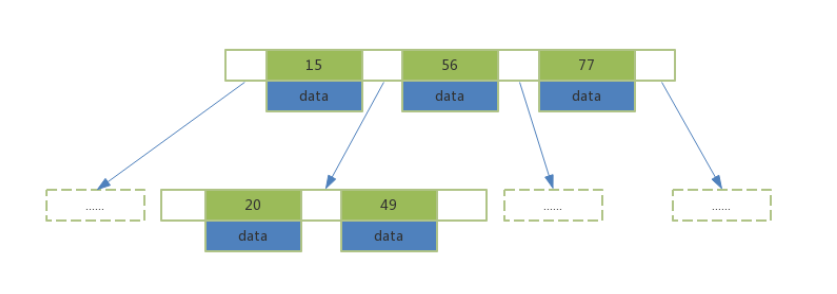

  B树的搜索：从根节点开始，对节点内的索引值序列采用二分法查找，如果命中就结束查找。没有命中会进入子节点重复查找过程，直到所对应的的节点指针

  为空，或已经是叶子节点了才结束。

- B+Tree结构

  - 非叶子节点不存储data数据，只存储索引值，这样便于存储更多的索引值
  - 叶子节点包含了所有的索引值和data数据
  - 叶子节点用指针连接，提高区间的访问性能

  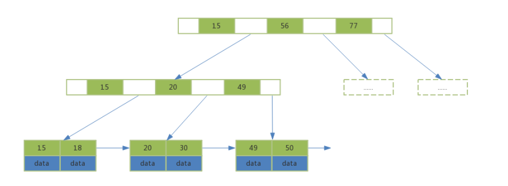

  相比B树，B+树进行范围查找时，只需要查找定位两个节点的索引值，然后利用叶子节点的指针进行遍历即可。而B树需要遍历范围内所有的节点和数据，显

  然B+Tree效率高。

#### 3.2.4、聚簇索引和辅助索引

聚簇索引和非聚簇索引：B+Tree的叶子节点存放主键索引值和行记录就属于聚簇索引；如果索引值和行记录分开存放就属于非聚簇索引。

主键索引和辅助索引：B+Tree的叶子节点存放的是主键字段值就属于主键索引；如果存放的是非主键值就属于辅助索引（二级索引）。

在InnoDB引擎中，主键索引采用的就是聚簇索引结构存储。

- 聚簇索引（聚集索引）

  聚簇索引是一种数据存储方式，InnoDB的聚簇索引就是按照主键顺序构建 B+Tree结构。B+Tree的叶子节点就是行记录，行记录和主键值紧凑地存储在一起。 

  这也意味着 InnoDB 的主键索引就是数据表本身，它按主键顺序存放了整张表的数据，占用的空间就是整个表数据量的大小。通常说的**主键索引**就是聚集索

  引。

  InnoDB的表要求必须要有聚簇索引：

  - 如果表定义了主键，则主键索引就是聚簇索引

  - 如果表没有定义主键，则第一个非空unique列作为聚簇索引

  - 否则InnoDB会从建一个隐藏的row-id作为聚簇索引

- 辅助索引

  InnoDB辅助索引，也叫作二级索引，是根据索引列构建 B+Tree结构。但在 B+Tree 的叶子节点中只存了索引列和主键的信息。二级索引占用的空间会比聚簇

  索引小很多， 通常创建辅助索引就是为了提升查询效率。一个表InnoDB只能创建一个聚簇索引，但可以创建多个辅助索引。

  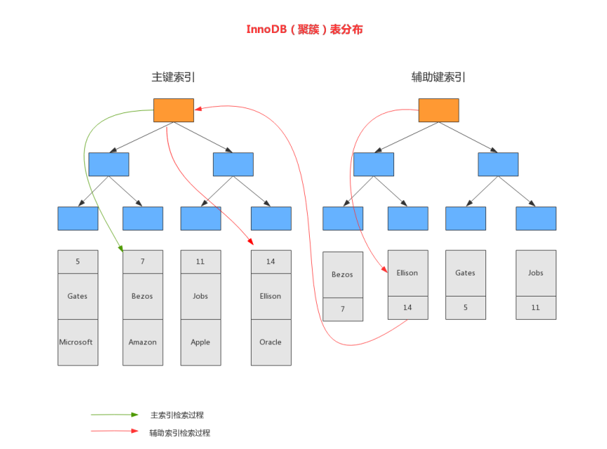

- 非聚簇索引

  与InnoDB表存储不同，MyISAM数据表的索引文件和数据文件是分开的，被称为非聚簇索引结构。

  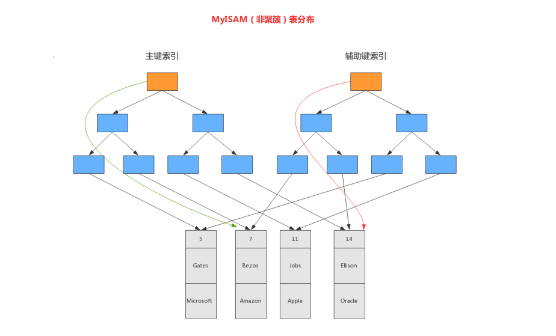

### 3.3、索引分析与优化

#### 3.3.1、EXPLAIN

MySQL 提供了一个 EXPLAIN 命令，它可以对 SELECT 语句进行分析，并输出 SELECT 执行的详细信息，供开发人员有针对性的优化。例如：

```mysql
EXPLAIN SELECT * from user WHERE id < 3;
```

EXPLAIN 命令的输出内容大致如下：

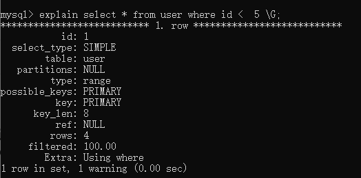

- **select_type**

  表示查询的类型。常用的值如下：

  - SIMPLE ： 表示查询语句不包含子查询或union
  - PRIMARY：表示此查询是最外层的查询
  - UNION：表示此查询是UNION的第二个或后续的查询
  - DEPENDENT UNION：UNION中的第二个或后续的查询语句，使用了外面查询结果
  - UNION RESULT：UNION的结果
  - SUBQUERY：SELECT子查询语句
  - DEPENDENT SUBQUERY：SELECT子查询语句依赖外层查询的结果。

  最常见的查询类型是SIMPLE，表示我们的查询没有子查询也没用到UNION查询。

- **type**

  表示存储引擎查询数据时采用的方式。比较重要的一个属性，通过它可以判断出查询是全表扫描还是基于索引的部分扫描。常用属性值如下，从上至下效率依

  次增强。

  - ALL：表示全表扫描，性能最差。
  - index：表示基于索引的全表扫描，先扫描索引再扫描全表数据。
  - range：表示使用索引范围查询。使用>、>=、<、<=、in等等。
  - ref：表示使用非唯一索引进行单值查询。
  - eq_ref：一般情况下出现在多表join查询，表示前面表的每一个记录，都只能匹配后面表的一行结果。
  - const：表示使用主键或唯一索引做等值查询，常量查询。
  - NULL：表示不用访问表，速度最快。

- **possible_keys**

  表示查询时能够使用到的索引。注意并不一定会真正使用，显示的是索引名称。

- **key**

  表示查询时真正使用到的索引，显示的是索引名称。

- **rows**

  MySQL查询优化器会根据统计信息，估算SQL要查询到结果需要扫描多少行记录。原则上rows是越少效率越高，可以直观的了解到SQL效率高低。

- **key_len**

  表示查询使用了索引的字节数量。可以判断是否全部使用了组合索引。

  key_len的计算规则如下：

  - 字符串类型

    字符串长度跟字符集有关：latin1=1、gbk=2、utf8=3、utf8mb4=4

    char(n)：n*字符集长度

    varchar(n)：n * 字符集长度 + 2字节

  - 数值类型

    TINYINT：1个字节

    SMALLINT：2个字节

    MEDIUMINT：3个字节

    INT、FLOAT：4个字节

    BIGINT、DOUBLE：8个字节

  - 时间类型

    DATE：3个字节

    TIMESTAMP：4个字节

    DATETIME：8个字节

  - 字段属性

    NULL属性占用1个字节，如果一个字段设置了NOT NULL，则没有此项。

- **Extra**

  Extra表示很多额外的信息，各种操作会在Extra提示相关信息，常见几种如下：

  - Using where

    表示查询需要通过索引回表查询数据。

  - Using index

    表示查询需要通过索引，索引就可以满足所需数据。

  - Using filesort

    表示查询出来的结果需要额外排序，数据量小在内存，大的话在磁盘，因此有Using filesort建议优化。

  - Using temprorary

    查询使用到了临时表，一般出现于去重、分组等操作。

#### 3.3.2、回表查询

在之前介绍过，InnoDB索引有聚簇索引和辅助索引。聚簇索引的叶子节点存储行记录，InnoDB必须要有，且只有一个。辅助索引的叶子节点存储的是主键值和索

引字段值，通过辅助索引无法直接定位行记录，通常情况下，需要扫码两遍索引树。先通过辅助索引定位主键值，然后再通过聚簇索引定位行记录，这就叫做**回表**

**查询**，它的性能比扫一遍索引树低。

总结：通过索引查询主键值，然后再去聚簇索引查询记录信息，叫做**回表查询**。

#### 3.3.3、覆盖索引

在SQL-Server官网的介绍如下：

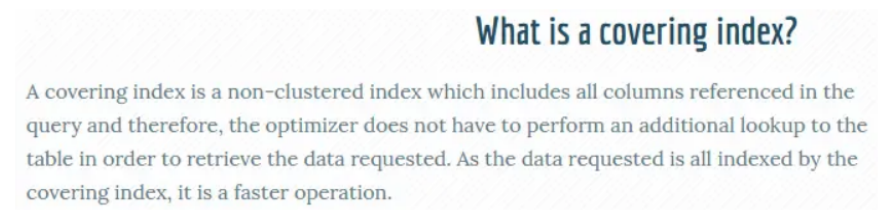

在MySQL官网，类似的说法出现在explain查询计划优化章节，即explain的输出结果Extra字段为Usingindex时，能够触发索引覆盖。

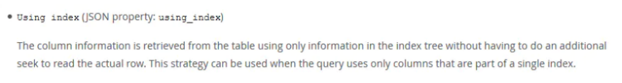

不管是SQL-Server官网，还是MySQL官网，都表达了：**只需要在一棵索引树上就能获取SQL所需的所有列数据，无需回表，速度更快，这就叫做索引覆盖**。

实现索引覆盖最常见的方法就是：将被查询的字段，建立到组合索引。

#### 3.3.4、最左前缀原则

复合索引使用时遵循最左前缀原则，最左前缀顾名思义，就是最左优先，即查询中使用到最左边的列，那么查询就会使用到索引，如果从索引的第二列开始查找，

索引将失效。

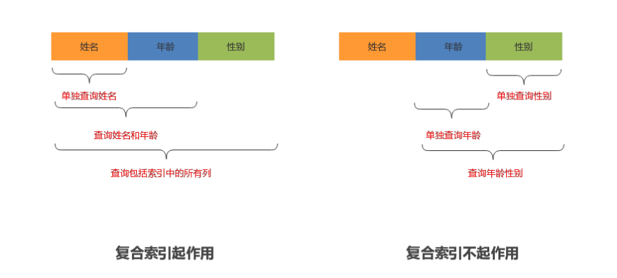

#### 3.3.5、LIKE查询

**面试题：MySQL在使用like模糊查询时，索引能不能起作用？**

回答：MySQL在使用Like模糊查询时，索引是可以被使用的，只有把%字符写在后面才会使用到索引。

select * from user where name like '%o%'; //不起作用

select * from user where name like 'o%'; //起作用

select * from user where name like '%o'; //不起作用

#### 3.3.6、NULL查询

**面试题：如果MySQL表的某一列含有NULL值，那么包含该列的索引是否有效？**

回答：包含NULL值的该列索引是有效的。

对MySQL来说，NULL是一个特殊的值，从概念上讲，NULL意味着“一个未知值”，它的处理方式与其他值有些不同。比如：不能使用=，<，>这样的运算符，对

NULL做算术运算的结果都是NULL，count时不会包括NULL行等，NULL比空字符串需要更多的存储空间等。

```http
“NULL columns require additional space in the row to record whether their values are NULL. For MyISAM tables, each NULL column takes one bit extra, rounded up to the nearest byte.”
NULL列需要增加额外空间来记录其值是否为NULL。对于MyISAM表，每一个空列额外占用一位，四舍五入到最接近的字节。
```

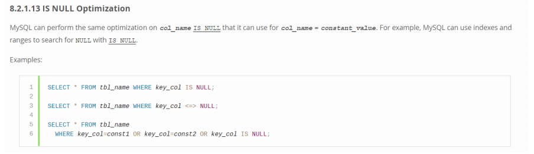

虽然MySQL可以在含有NULL的列上使用索引，但NULL和其他数据还是有区别的，不建议列上允许为NULL。最好设置NOT NULL，并给一个默认值，比如0和 ‘’ 空

字符串等，如果是datetime类型，也可以设置系统当前时间或某个固定的特殊值，例如'1970-01-01 00:00:00'。

#### 3.3.7、索引与排序

MySQL查询支持filesort和index两种方式的排序，filesort是先把结果查出，然后在缓存或磁盘进行排序操作，效率较低。使用index是指利用索引自动实现排序，

不需另做排序操作，效率会比较高。

filesort有两种排序算法：双路排序和单路排序。

- 双路排序：需要两次磁盘扫描读取，最终得到用户数据。第一次将排序字段读取出来，然后排序；第二次去读取其他字段数据。

- 单路排序：从磁盘查询所需的所有列数据，然后在内存排序将结果返回。如果查询数据超出缓存sort_buffer，会导致多次磁盘读取操作，并创建临时表，最后

  产生了多次IO，反而会增加负担。解决方案：少使用select *；增加sort_buffer_size容量和max_length_for_sort_data容量。

**如果我们Explain分析SQL，结果中Extra属性显示Using filesort，表示使用了filesort排序方式，需要优化。如果Extra属性显示Using index时，表示覆盖索**

**引，也表示所有操作在索引上完成，也可以使用index排序方式，建议大家尽可能采用覆盖索引。**

- 以下几种情况，会使用index方式的排序：
  - ORDER BY 子句索引列组合满足索引最左前列

    ```mysql
    explain select id from user order by id; //对应(id)、(id,name)索引有效
    ```

  - WHERE子句+ORDER BY子句索引列组合满足索引最左前列

    ```mysql
    explain select id from user where age=18 order by name; //对应 (age,name)索引
    ```

- 以下几种情况，会使用filesort方式的排序：

  - 对索引列同时使用了ASC和DESC

    ```mysql
    explain select id from user order by age asc,name desc; //对应 (age,name)索引
    ```

  - WHERE子句和ORDER BY子句满足最左前缀，但where子句使用了范围查询（例如>、<、in等）

    ```mysql
    explain select id from user where age>10 order by name; //对应 (age,name)索引
    ```

  - ORDER BY或者WHERE+ORDER BY索引列没有满足索引最左前列

    ```mysql
    explain select id from user order by name; //对应(age,name)索引
    ```

  - 使用了不同的索引，MySQL每次只采用一个索引，ORDER BY涉及了两个索引

    ```mysql
    explain select id from user order by name,age; //对应(name)、(age)两个索引
    ```

  - WHERE子句与ORDER BY子句，使用了不同的索引

    ```mysql
    explain select id from user where name='tom' order by age; //对应 (name)、(age)索引
    ```

  - WHERE子句或者ORDER BY子句中索引列使用了表达式，包括函数表达式

    ```mysql
    explain select id from user order by abs(age); //对应(age)索引
    ```

### 3.4、查询优化

#### 3.4.1、慢查询定位

- **开启慢查询日志**

  查看 MySQL 数据库是否开启了慢查询日志和慢查询日志文件的存储位置的命令如下：

  ```mysql
  SHOW VARIABLES LIKE 'slow_query_log%'
  ```

  通过如下命令开启慢查询日志：

  ```mysql
  SET global slow_query_log = ON;  #开启慢查询日志
  SET global slow_query_log_file = 'OAK-slow.log';  #慢查询日志文件名称
  SET global log_queries_not_using_indexes = ON;  #开启未使用索引日志
  SET long_query_time = 10; #SQL执行时间
  ```

  - long_query_time：指定慢查询的阀值，单位秒。如果SQL执行时间超过阀值，就属于慢查询记录到日志文件中。

  - log_queries_not_using_indexes：表示会记录没有使用索引的查询SQL。前提是slow_query_log的值为ON，否则不会奏效。

- **查看慢查询日志**

  - 文本方式查看

    直接使用文本编辑器打开slow.log日志即可。

    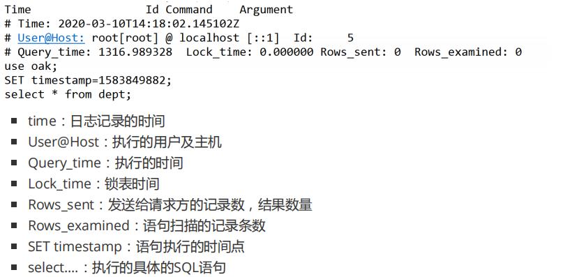

  - 使用mysqldumpslow查看

    MySQL 提供了一个慢查询日志分析工具mysqldumpslow，可以通过该工具分析慢查询日志内容。

    在 MySQL bin目录下执行下面命令可以查看该使用格式。

    ```mysql
    perl mysqldumpslow.pl --help
    ```

    运行如下命令查看慢查询日志信息：

    ```mysql
    perl mysqldumpslow.pl -t 5 -s at C:\ProgramData\MySQL\Data\OAK-slow.log
    ```

    除了使用mysqldumpslow工具，也可以使用第三方分析工具，比如pt-query-digest、mysqlsla等

#### 3.4.2、慢查询优化

- **索引和慢查询**

  - 如何判断是否为慢查询？

    MySQL判断一条语句是否为慢查询语句，主要依据SQL语句的执行时间，它把当前语句的执行时间跟 long_query_time 参数做比较，如果语句的执行时

    间 > long_query_time，就会把这条执行语句记录到慢查询日志里面。long_query_time 参数的默认值是 10s，该参数值可以根据自己的业务需要进行调整。

  - 如何判断是否应用了索引？

    SQL语句是否使用了索引，可根据SQL语句执行过程中有没有用到表的索引，可通过 explain命令分析查看，检查结果中的 key 值，是否为NULL。

  - 应用了索引是否一定快？

    下面我们来看看下面语句的 explain 的结果，你觉得这条语句有用上索引吗？比如

    ```mysql
    select * from user where id>0;
    ```

    虽然使用了索引，但是还是从主键索引的最左边的叶节点开始向右扫描整个索引树，进行了全表扫描，此时索引就失去了意义。

    而像 select * from user where id = 2; 这样的语句，才是我们平时说的使用了索引。它表示的意思是，我们使用了索引的快速搜索功能，并且有效地减少

    了扫描行数。

  - 注意：

    查询是否使用索引，只是表示一个SQL语句的执行过程；而是否为慢查询，是由它执行的时间决定的，也就是说是否使用了索引和是否是慢查询两者之间

    没有必然的联系。

    我们在使用索引时，不要只关注是否起作用，应该关心索引是否减少了查询扫描的数据行数，如果扫描行数减少了，效率才会得到提升。对于一个大表，

    不止要创建索引，还要考虑索引过滤性，过滤性好，执行速度才会快。

- **提高索引过滤性**

  假如有一个5000万记录的用户表，通过sex='男'索引过滤后，还需要定位3000万，SQL执行速度也不会很快。其实这个问题涉及到索引的过滤性，比如1万条

  记录利用索引过滤后定位10条、100条、1000条，那他们过滤性是不同的。索引过滤性与索引字段、表的数据量、表设计结构都有关系。

  下面我们看一个案例：

  ```mysql
  表：student 
  字段：id,name,sex,age 
  造数据：insert into student (name,sex,age) select name,sex,age from student; 
  SQL案例：select * from student where age=18 and name like '张%';（全表扫 描）
  ```

  - 优化1 

    ```mysql
    alter table student add index(name); //追加name索引
    ```

  - 优化2

    ```mysql
    alter table student add index(age,name); //追加age,name索引
    ```

  - 优化3

    可以看到，index condition pushdown 优化的效果还是很不错的。再进一步优化，我们可以把名 字的第一个字和年龄做一个联合索引，这里可以使用 

    MySQL 5.7 引入的虚拟列来实现。

    ```mysql
    //为user表添加first_name虚拟列，以及联合索引(first_name,age) 
    alter table student add first_name varchar(2) generated always as (left(name, 1)), add index(first_name, age); 
    
    explain select * from student where first_name='张' and age=18;
    ```

- **慢查询原因总结**

  - 全表扫描：explain分析type属性all
  - 全索引扫描：explain分析type属性index
  - 索引过滤性不好：靠索引字段选型、数据量和状态、表设计
  - 频繁的回表查询开销：尽量少用select *，使用覆盖索引

#### 3.4.3、分页查询优化

- 一般性分页

  一般的分页查询使用简单的 limit 子句就可以实现。limit格式如下

  ```mysql
  SELECT * FROM 表名 LIMIT [offset,] rows
  ```

  - 第一个参数指定第一个返回记录行的偏移量，注意从0开始；
  - 第二个参数指定返回记录行的最大数目；
  - 如果只给定一个参数，它表示返回最大的记录行数目；

  **思考1：如果偏移量固定，返回记录量对执行时间有什么影响？**

  ```mysql
  select * from user limit 10000,1; 
  select * from user limit 10000,10; 
  select * from user limit 10000,100; 
  select * from user limit 10000,1000; 
  select * from user limit 10000,10000;
  ```

  结果：在查询记录时，返回记录量低于100条，查询时间基本没有变化，差距不大。随着查询记录量越大，所花费的时间也会越来越多。

  **思考2：如果查询偏移量变化，返回记录数固定对执行时间有什么影响？**

  ```mysql
  select * from user limit 1,100; 
  select * from user limit 10,100; 
  select * from user limit 100,100; 
  select * from user limit 1000,100; 
  select * from user limit 10000,100;
  ```

  结果：在查询记录时，如果查询记录量相同，偏移量超过100后就开始随着偏移量增大，查询时间急剧的增加。（这种分页查询机制，每次都会从数据库第一

  条记录开始扫描，越往后查询越慢，而且查询的数据越多，也会拖慢总查询速度。）

- 分页优化方案

  **第一步：利用覆盖索引优化**

  ```mysql
  select * from user limit 10000,100; 
  select id from user limit 10000,100;
  ```

  **第二步：利用子查询优化**

  ```mysql
  select * from user limit 10000,100; 
  select * from user where id>= (select id from user limit 10000,1) limit 100;
  ```

  原因：使用了id做主键比较(id>=)，并且子查询使用了覆盖索引进行优化。

## 4、MySQL事务和锁

### 4.1、ACID 特性

在关系型数据库管理系统中，一个逻辑工作单元要成为事务，必须满足这 4 个特性，即所谓的 ACID：原子性（Atomicity）、一致性（Consistency）、隔离性

（Isolation）和持久性（Durability）。

- **原子性**

  原子性：事务是一个原子操作单元，其对数据的修改，要么全都执行，要么全都不执行。

  修改---》Buffer Pool修改---》刷盘。可能会有下面两种情况：

  - 事务提交了，如果此时Buffer Pool的脏页没有刷盘，如何保证修改的数据生效？ Redo

  - 如果事务没提交，但是Buffer Pool的脏页刷盘了，如何保证不该存在的数据撤销？Undo

  每一个写事务，都会修改BufferPool，从而产生相应的Redo/Undo日志，在Buffer Pool 中的页被刷到磁盘之前，这些日志信息都会先写入到日志文件中，如

  果 Buffer Pool 中的脏页没有刷成功，此时数据库挂了，那在数据库再次启动之后，可以通过 Redo 日志将其恢复出来，以保证脏页写的数据不会丢失。如果

  脏页刷新成功，此时数据库挂了，就需要通过Undo来实现了。

- **持久性**

  持久性：指的是一个事务一旦提交，它对数据库中数据的改变就应该是永久性的，后续的操作或故障不应该对其有任何影响，不会丢失。

  如下图所示，一个“提交”动作触发的操作有：binlog落地、发送binlog、存储引擎提交、flush_logs，check_point、事务提交标记等。这些都是数据库保证其

  数据完整性、持久性的手段。

  

  MySQL的持久性也与WAL技术相关，redo log在系统Crash重启之类的情况时，可以修复数据，从而保障事务的持久性。通过原子性可以保证逻辑上的持久

  性，通过存储引擎的数据刷盘可以保证物理上的持久性。

- **隔离性**

  隔离性：指的是一个事务的执行不能被其他事务干扰，即一个事务内部的操作及使用的数据对其他的并发事务是隔离的。

  InnoDB 支持的隔离性有 4 种，隔离性从低到高分别为：读未提交、读提交、可重复读、可串行化。锁和多版本控制（MVCC）技术就是用于保障隔离性的

  （后面课程详解）。

-  **一致性**

  一致性：指的是事务开始之前和事务结束之后，数据库的完整性限制未被破坏。一致性包括两方面的内容，分别是约束一致性和数据一致性。

  - 约束一致性：创建表结构时所指定的外键、Check、唯一索引等约束，可惜在 MySQL 中不支持Check 。

  - 数据一致性：是一个综合性的规定，因为它是由原子性、持久性、隔离性共同保证的结果，而不是单单依赖于某一种技术。

  一致性也可以理解为数据的完整性。数据的完整性是通过原子性、隔离性、持久性来保证的，而这3个特性又是通过 Redo/Undo 来保证的。逻辑上的一致

  性，包括唯一索引、外键约束、check 约束，这属于业务逻辑范畴。

  

  ACID 及它们之间的关系如下图所示，4个特性中有3个与 WAL 有关系，都需要通过 Redo、Undo 日志来保证等。

  WAL的全称为Write-Ahead Logging（预写日志），先写日志，再写磁盘。

  

### 4.2、事务控制的演进

#### 4.2.1、并发事务

事务并发处理可能会带来一些问题，比如：更新丢失、脏读、不可重复读、幻读等。

- 更新丢失

  当两个或多个事务更新同一行记录，会产生更新丢失现象。可以分为回滚覆盖和提交覆盖。

  - 回滚覆盖：一个事务回滚操作，把其他事务已提交的数据给覆盖了。
  - 提交覆盖：一个事务提交操作，把其他事务已提交的数据给覆盖了。

- 脏读

  一个事务读取到了另一个事务修改但未提交的数据。

- 不可重复读

  一个事务中多次读取同一行记录不一致，后面读取的跟前面读取的不一致。

- 幻读

  一个事务中多次按相同条件查询，结果不一致。后续查询的结果和面前查询结果不同，多了或少了几行记录。

#### 4.2.2、排队

最简单的方法，就是完全顺序执行所有事务的数据库操作，不需要加锁，简单的说就是全局排队。序列化执行所有的事务单元，数据库某个时刻只处理一个事务操

作，特点是强一致性，处理性能低。

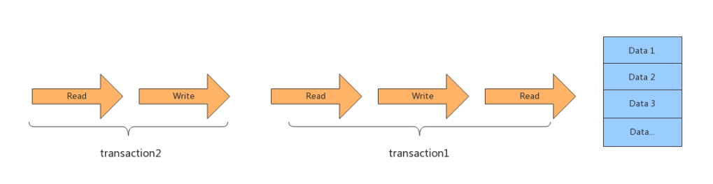

#### 4.2.3、排他锁

引入锁之后就可以支持并发处理事务，如果事务之间涉及到相同的数据项时，会使用排他锁，或叫互斥锁，先进入的事务独占数据项以后，其他事务被阻塞，等待

前面的事务释放锁。

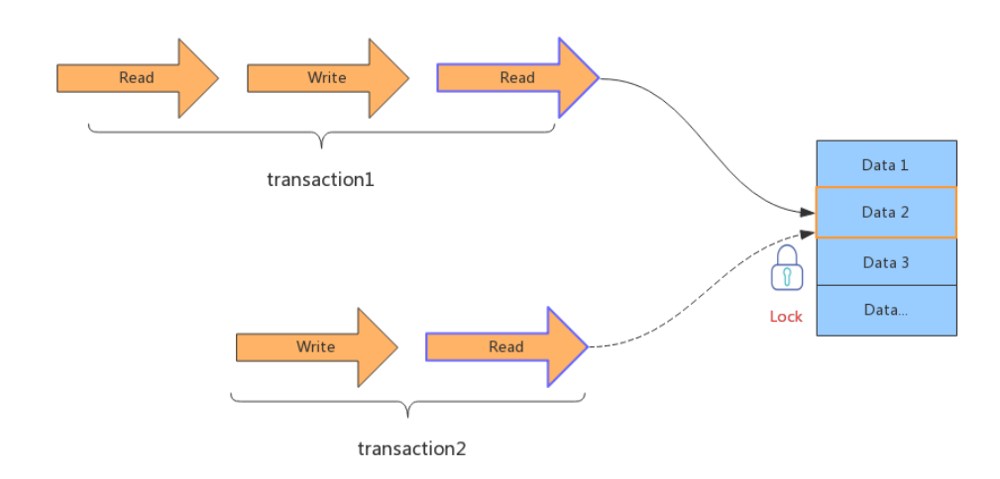

注意，在整个事务1结束之前，锁是不会被释放的，所以，事务2必须等到事务1结束之后开始。

#### 4.2.4、读写锁

读和写操作：读读、写写、读写、写读。

读写锁就是进一步细化锁的颗粒度，区分读操作和写操作，让读和读之间不加锁，这样下面的两个事务就可以同时被执行了。

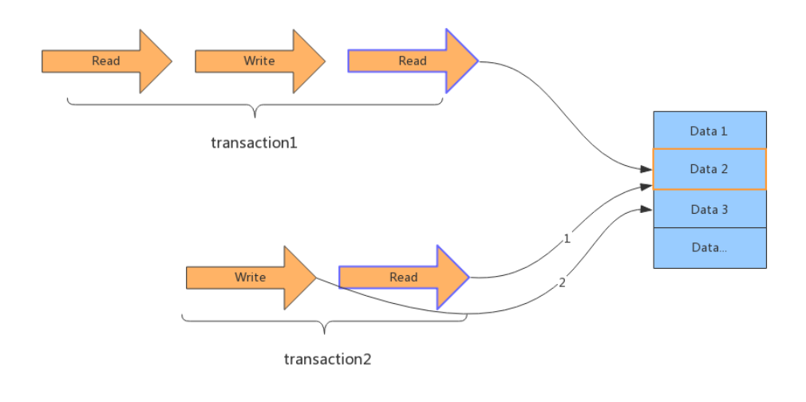

读写锁，可以让读和读并行，而读和写、写和读、写和写这几种之间还是要加排他锁。

#### 4.2.5、MVCC（多版本控制）

多版本控制MVCC，也就是Copy on Write的思想。MVCC除了支持读和读并行，还支持读和写、写和读的并行，但为了保证一致性，写和写是无法并行的。

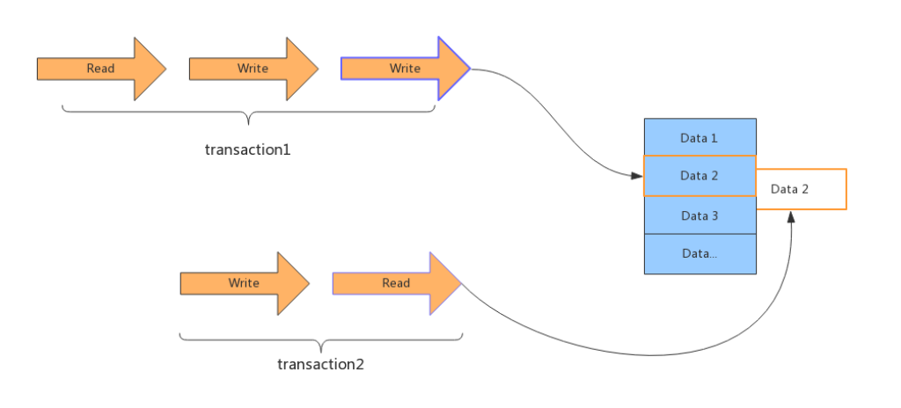

在事务1开始写操作的时候会copy一个记录的副本，其他事务读操作会读取这个记录副本，因此不会影响其他事务对此记录的读取，实现写和读并行。

##### 4.2.5.1、MVCC概念

MVCC（Multi Version Concurrency Control）被称为多版本控制，是指在数据库中为了实现高并发的数据访问，对数据进行多版本处理，并通过事务的可见性来

保证事务能看到自己应该看到的数据版本。多版本控制很巧妙地将稀缺资源的独占互斥转换为并发，大大提高了数据库的吞吐量及读写性能。

如何生成的多版本？每次事务修改操作之前，都会在Undo日志中记录修改之前的数据状态和事务号，该备份记录可以用于其他事务的读取，也可以进行必要时的

数据回滚。

##### 4.2.5.2、MVCC实现原理

MVCC最大的好处是读不加锁，读写不冲突。在读多写少的系统应用中，读写不冲突是非常重要的，极大的提升系统的并发性能，这也是为什么现阶段几乎所有的

关系型数据库都支持 MVCC 的原因，不过目前MVCC只在 Read Commited 和 Repeatable Read 两种隔离级别下工作。

在 MVCC 并发控制中，读操作可以分为两类: 快照读（Snapshot Read）与当前读 （Current Read）。

- 快照读：读取的是记录的快照版本（有可能是历史版本），不用加锁。（select）

- 当前读：读取的是记录的最新版本，并且当前读返回的记录，都会加锁，保证其他事务不会再并发修改这条记录。（select... for update 或lock in share 

  mode，insert/delete/update）

为了让大家更直观地理解 MVCC 的实现原理，举一个记录更新的案例来讲解 MVCC 中多版本的实现。

假设 F1～F6 是表中字段的名字，1～6 是其对应的数据。**后面三个隐含字段分别对应该行的隐含ID、事务号和回滚指针**，如下图所示。


具体的更新过程如下：

假如一条数据是刚 INSERT 的，DB_ROW_ID 为1，其他两个字段为空。当事务 1 更改该行的数据值时，会进行如下操作，如下图所示：

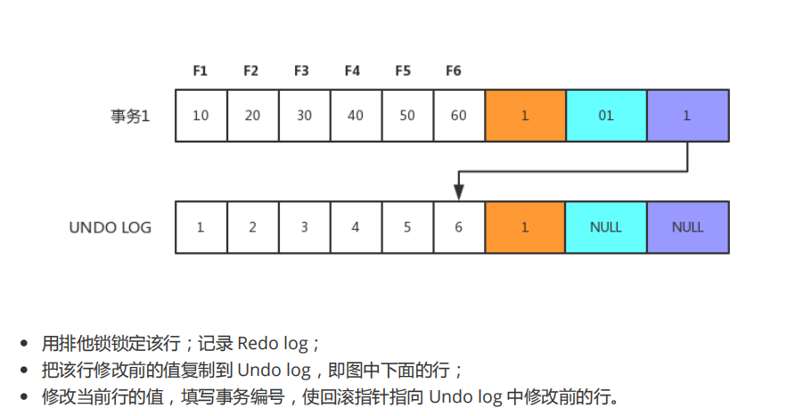

接下来事务2操作，过程与事务 1 相同，此时 Undo log 中会有两行记录，并且通过回滚指针连在一起，通过当前记录的回滚指针回溯到该行创建时的初始内容，

如下图所示：

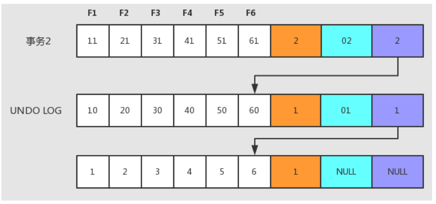

MVCC已经实现了读读、读写、写读并发处理，如果想进一步解决写写冲突，可以采用下面两种方案：

- 乐观锁

- 悲观锁

### 4.3、事务隔离级别

#### 4.3.1、隔离级别类型

前面提到的“更新丢失”、”脏读”、“不可重复读”和“幻读”等并发事务问题，其实都是数据库一致性问题，为了解决这些问题，MySQL数据库是通过事务隔离级别来解

决的，数据库系统提供了以下 4 种事务隔离级别供用户选择。


- 读未提交

  Read Uncommitted 读未提交：解决了回滚覆盖类型的更新丢失，但可能发生脏读现象，也就是可能读取到其他会话中未提交事务修改的数据。

- 已提交读

  Read Committed读已提交：只能读取到其他会话中已经提交的数据，解决了脏读。但可能发生不可重复读现象，也就是可能在一个事务中两次查询结果不一

  致。

- 可重复读

  Repeatable Read 可重复读：解决了不可重复读，它确保同一事务的多个实例在并发读取数据时，会看到同样的数据行。不过理论上会出现幻读，简单的说幻

  读指的的当用户读取某一范围的数据行时，另一个事务又在该范围插入了新行，当用户在读取该范围的数据时会发现有新的幻影行。

- 可串行化

  Serializable 串行化：所有的增删改查串行执行。它通过强制事务排序，解决相互冲突，从而解决幻度的问题。这个级别可能导致大量的超时现象的和锁竞

  争，效率低下。

数据库的事务隔离级别越高，并发问题就越小，但是并发处理能力越差（代价）。读未提交隔离级别最低，并发问题多，但是并发处理能力好。以后使用时，可以

根据系统特点来选择一个合适的隔离级别，比如对不可重复读和幻读并不敏感，更多关心数据库并发处理能力，此时可以使用Read Commited隔离级别。

事务隔离级别，针对Innodb引擎，支持事务的功能。像MyISAM引擎没有关系。

#### 4.3.2、事务隔离级别和锁的关系

- 事务隔离级别是SQL92定制的标准，相当于事务并发控制的整体解决方案，本质上是对锁和MVCC使用的封装，隐藏了底层细节。

- 锁是数据库实现并发控制的基础，事务隔离性是采用锁来实现，对相应操作加不同的锁，就可以防止其他事务同时对数据进行读写操作。

- 对用户来讲，首先选择使用隔离级别，当选用的隔离级别不能解决并发问题或需求时，才有必要在开发中手动的设置锁。

MySQL默认隔离级别：可重复读

Oracle、SQLServer默认隔离级别：读已提交

一般使用时，建议采用默认隔离级别，然后存在的一些并发问题，可以通过悲观锁、乐观锁等实现处理。

#### 4.3.3、MySQL隔离级别控制

MySQL默认的事务隔离级别是Repeatable Read，查看MySQL当前数据库的事务隔离级别命令如下：

```mysql
show variables like 'tx_isolation';
或者
select @@tx_isolation;
```

设置事务隔离级别可以如下命令：

```mysql
set [global] tx_isolation='READ-UNCOMMITTED'; 
set [global] tx_isolation='READ-COMMITTED'; 
set [global] tx_isolation='REPEATABLE-READ'; 
set [global] tx_isolation='SERIALIZABLE';
```

### 4.4、锁机制和实战

#### 4.4.1、锁分类

在 MySQL中锁有很多不同的分类。

- 从操作的粒度可分为表级锁、行级锁和页级锁

  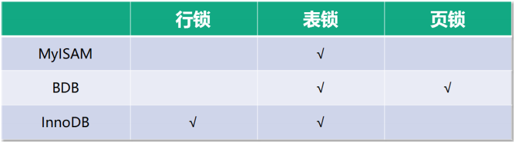

  - 表级锁：每次操作锁住整张表。锁定粒度大，发生锁冲突的概率最高，并发度最低。应用在MyISAM、InnoDB、BDB 等存储引擎中。
  - 行级锁：每次操作锁住一行数据。锁定粒度最小，发生锁冲突的概率最低，并发度最高。应用在InnoDB 存储引擎中。
  - 页级锁：每次锁定相邻的一组记录，锁定粒度界于表锁和行锁之间，开销和加锁时间界于表锁和行锁之间，并发度一般。应用在BDB 存储引擎中。

- 从操作的类型可分为读锁和写锁

  - 读锁（S锁）：共享锁，针对同一份数据，多个读操作可以同时进行而不会互相影响。

  - 写锁（X锁）：排他锁，当前写操作没有完成前，它会阻断其他写锁和读锁。

  - IS锁、IX锁：意向读锁、意向写锁，属于表级锁，S和X主要针对行级锁。在对表记录添加S或X锁之前，会先对表添加IS或IX锁。

  - S锁：事务A对记录添加了S锁，可以对记录进行读操作，不能做修改，其他事务可以对该记录追加S锁，但是不能追加X锁，需要追加X锁，需要等记录的S

    锁全部释放。

  - X锁：事务A对记录添加了X锁，可以对记录进行读和修改操作，其他事务不能对记录做读和修改操作。

- 从操作的性能可分为乐观锁和悲观锁

  - 乐观锁：一般的实现方式是对记录数据版本进行比对，在数据更新提交的时候才会进行冲突检测，如果发现冲突了，则提示错误信息。

  - 悲观锁：在对一条数据修改的时候，为了避免同时被其他人修改，在修改数据之前先锁定，再修改的控制方式。共享锁和排他锁是悲观锁的不同实现，但

    都属于悲观锁范畴。

#### 4.4.2、行锁原理

在InnoDB引擎中，我们可以使用行锁和表锁，其中行锁又分为共享锁和排他锁。**InnoDB行锁是通过对索引数据页上的记录加锁实现的**，主要实现算法有 3 种：

Record Lock、Gap Lock 和 Next-key Lock。 

- RecordLock锁：锁定单个行记录的锁。（记录锁，RC、RR隔离级别都支持）
- GapLock锁：间隙锁，锁定索引记录间隙，确保索引记录的间隙不变。（范围锁，RR隔离级别支持）
- Next-key Lock 锁：记录锁和间隙锁组合，同时锁住数据，并且锁住数据前后范围。（记录锁+范围锁，RR隔离级别支持）

在RR隔离级别，InnoDB对于记录加锁行为都是先采用Next-Key Lock，但是当SQL操作含有唯一索引时，Innodb会对Next-Key Lock进行优化，降级为

RecordLock，仅锁住索引本身而非范围。

- select ... from 语句：InnoDB引擎采用MVCC机制实现非阻塞读，所以对于普通的select语句，InnoDB不加锁
-  select ... from lock in share mode语句：追加了共享锁，InnoDB会使用Next-Key Lock锁进行处理，如果扫描发现唯一索引，可以降级为RecordLock锁。
-  select ... from for update语句：追加了排他锁，InnoDB会使用Next-Key Lock锁进行处理，如果扫描发现唯一索引，可以降级为RecordLock锁。
-  update ... where 语句：InnoDB会使用Next-Key Lock锁进行处理，如果扫描发现唯一索引，可以降级为RecordLock锁。
-  delete ... where 语句：InnoDB会使用Next-Key Lock锁进行处理，如果扫描发现唯一索引，可以降级为RecordLock锁。
-  insert语句：InnoDB会在将要插入的那一行设置一个排他的RecordLock锁。

下面以“update t1 set name=‘XX’ where id=10”操作为例，举例子分析下 InnoDB 对不同索引的加锁行为，以RR隔离级别为例。

- 主键加锁

  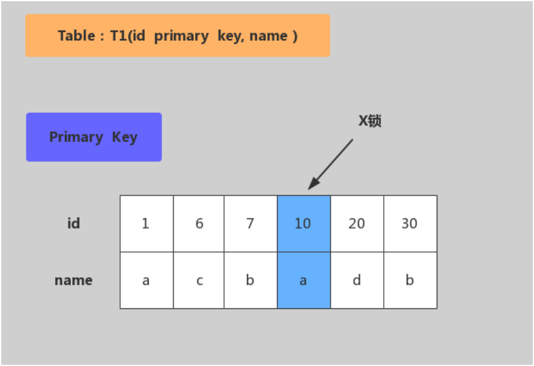

  加锁行为：仅在id=10的主键索引记录上加X锁。

- 唯一键加锁

  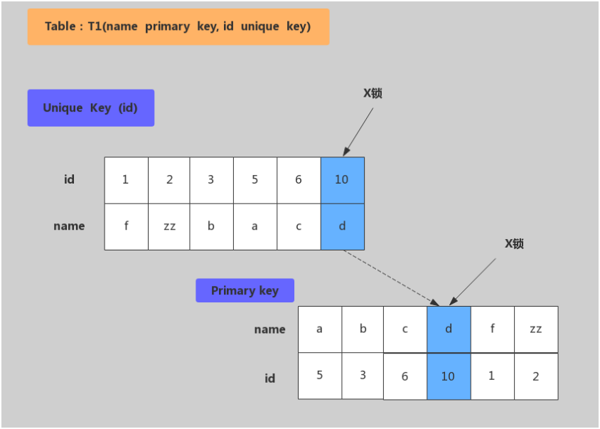

  加锁行为：现在唯一索引id上加X锁，然后在id=10的主键索引记录上加X锁。

- 非唯一键加锁

  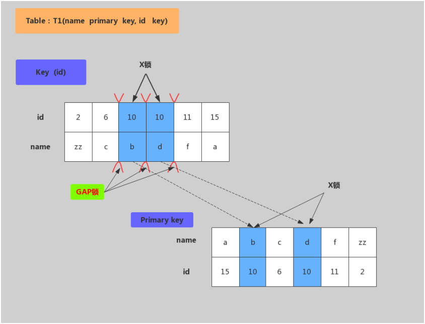

  加锁行为：对满足id=10条件的记录和主键分别加X锁，然后在(6,c)-(10,b)、(10,b)-(10,d)、(10,d)-(11,f)范围分别加Gap Lock。

- 无索引加锁

  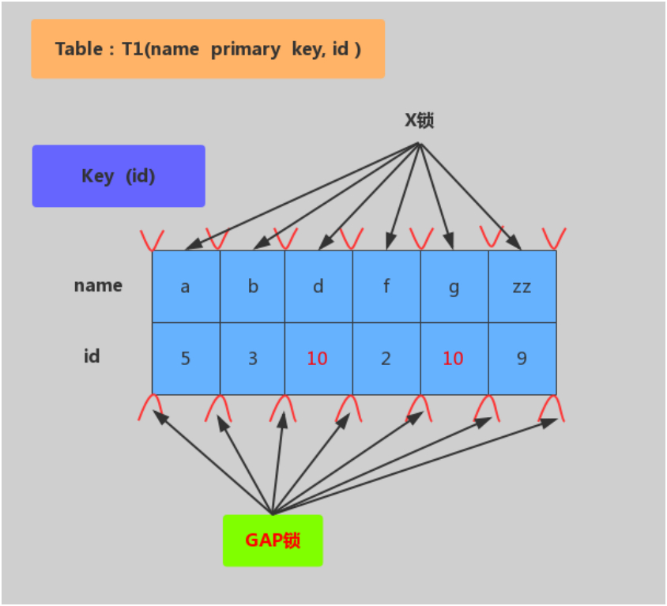

  加锁行为：表里所有行和间隙都会加X锁。（当没有索引时，会导致全表锁定，因为InnoDB引擎锁机制是基于索引实现的记录锁定）。

#### 4.4.3、悲观锁

悲观锁（Pessimistic Locking），是指在数据处理过程，将数据处于锁定状态，一般使用数据库的锁机制实现。从广义上来讲，前面提到的行锁、表锁、读锁、写

锁、共享锁、排他锁等，这些都属于悲观锁范畴。

- 表级锁

  表级锁每次操作都锁住整张表，并发度最低。常用命令如下：

  ```mysql
  lock table 表名称 read|write,表名称2 read|write;  #手动增加表锁
  show open tables; #查看表上加过的锁
  unlock tables; #删除表锁
  ```

  表级读锁：当前表追加read锁，当前连接和其他的连接都可以读操作；但是当前连接增删改操作会报错，其他连接增删改会被阻塞。

  表级写锁：当前表追加write锁，当前连接可以对表做增删改查操作，其他连接对该表所有操作都被阻塞（包括查询）。

  总结：表级读锁会阻塞写操作，但是不会阻塞读操作。而写锁则会把读和写操作都阻塞。

- 共享锁（行级锁-读锁）

  共享锁又称为读锁，简称S锁。共享锁就是多个事务对于同一数据可以共享一把锁，都能访问到数据，但是只能读不能修改。使用共享锁的方法是在

  **select ... lock in share mode**，只适用查询语句。

  总结：事务使用了共享锁（读锁），只能读取，不能修改，修改操作被阻塞。

- 排他锁（行级锁-写锁）

  排他锁又称为写锁，简称X锁。排他锁就是不能与其他锁并存，如一个事务获取了一个数据行的排他锁，其他事务就不能对该行记录做其他操作，也不能获取

  该行的锁。

  使用排他锁的方法是在SQL末尾加上**for update**，innodb引擎默认会在update，delete语句加上for update。行级锁的实现其实是依靠其对应的索引，所以

  如果操作没用到索引的查询，那么会锁住全表记录。

  总结：事务使用了排他锁（写锁），当前事务可以读取和修改，其他事务不能修改，也不能获取记录锁（select... for update）。如果查询没有使用到索引，

  将会锁住整个表记录。

#### 4.4.4、乐观锁

乐观锁是相对于悲观锁而言的，它不是数据库提供的功能，需要开发者自己去实现。在数据库操作时，想法很乐观，认为这次的操作不会导致冲突，因此在数据库

操作时并不做任何的特殊处理，即不加锁，而是在进行事务提交时再去判断是否有冲突了。

**乐观锁实现的关键点：冲突的检测。**

悲观锁和乐观锁都可以解决事务写写并发，在应用中可以根据并发处理能力选择区分，比如对并发率要求高的选择乐观锁；对于并发率要求低的可以选择悲观锁。

- 乐观锁实现原理

  - 使用版本字段（version）

    先给数据表增加一个版本(version) 字段，每操作一次，将那条记录的版本号加 1。version是用来查看被读的记录有无变化，作用是防止记录在业务处理

    期间被其他事务修改。

    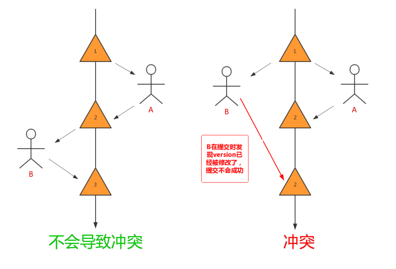

  - 使用时间戳（Timestamp）

    与使用version版本字段相似，同样需要给在数据表增加一个字段，字段类型使用timestamp时间戳。也是在更新提交的时候检查当前数据库中数据的时间

    戳和自己更新前取到的时间戳进行对比，如果一致则提交更新，否则就是版本冲突，取消操作。

- 乐观锁案例

  下面我们使用下单过程作为案例，描述下乐观锁的使用。

  - 第一步：查询商品信息

    ```mysql
    select (quantity,version) from products where id=1;
    ```

  - 第二步：根据商品信息生成订单

    ```mysql
    insert into orders ... 
    insert into items ...
    ```

  - 第三步：修改商品库存

    ```mysql
    update products set quantity=quantity-1,version=version+1 where id=1 and version=#{version};
    ```

  除了自己手动实现乐观锁之外，许多数据库访问框架也封装了乐观锁的实现，比如hibernate框架。MyBatis框架大家可以使用OptimisticLocker插件来扩展。

#### 4.4.6、死锁与解决方案

下面介绍几种常见的死锁现象和解决方案：

- 表锁死锁

  **产生原因：**

  用户A访问表A（锁住了表A），然后又访问表B；另一个用户B访问表B（锁住了表B），然后企图访问表A；这时用户A由于用户B已经锁住表B，它必须等待用

  户B释放表B才能继续，同样用户B要等用户A释放表A才能继续，这就死锁就产生了。

  用户A--》A表（表锁）--》B表（表锁）

  用户B--》B表（表锁）--》A表（表锁）

  **解决方案：**

  这种死锁比较常见，是由于程序的BUG产生的，除了调整的程序的逻辑没有其它的办法。仔细分析程序的逻辑，对于数据库的多表操作时，尽量按照相同的顺

  序进行处理，尽量避免同时锁定两个资源，如操作A和B两张表时，总是按先A后B的顺序处理， 必须同时锁定两个资源时，要保证在任何时刻都应该按照相同

  的顺序来锁定资源。

- 行级锁死锁

  **产生原因1：**

  如果在事务中执行了一条没有索引条件的查询，引发全表扫描，把行级锁上升为全表记录锁定（等价于表级锁），多个这样的事务执行后，就很容易产生死锁

  和阻塞，最终应用系统会越来越慢，发生阻塞或死锁。

  **解决方案1：**

  SQL语句中不要使用太复杂的关联多表的查询；使用explain“执行计划"对SQL语句进行分析，对于有全表扫描和全表锁定的SQL语句，建立相应的索引进行优

  化。

  **产生原因2：**

  两个事务分别想拿到对方持有的锁，互相等待，于是产生死锁。

  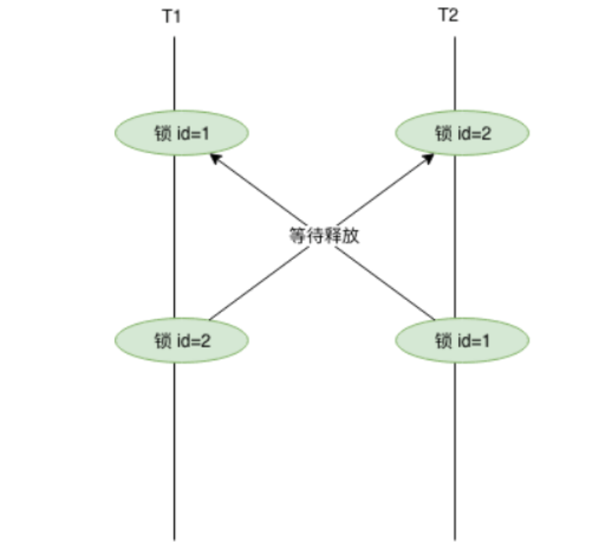

  **解决方案2：**

  - 在同一个事务中，尽可能做到一次锁定所需要的所有资源
  - 按照id对资源排序，然后按顺序进行处理

- 共享锁转换为排他锁

  **产生原因：**

  事务A 查询一条纪录，然后更新该条纪录；此时事务B 也更新该条纪录，这时事务B 的排他锁由于事务A 有共享锁，必须等A 释放共享锁后才可以获取，只能

  排队等待。事务A 再执行更新操作时，此处发生死锁，因为事务A 需要排他锁来做更新操作。但是，无法授予该锁请求，因为事务B 已经有一个排他锁请求，

  并且正在等待事务A 释放其共享锁。

  - 事务A: select * from dept where deptno=1 lock in share mode; //共享锁,1

    ​			update dept set dname='java' where deptno=1;//排他锁,3

  - 事务B: update dept set dname='Java' where deptno=1;//由于1有共享锁，没法获取排他锁，需等待，2

  **解决方案：**

  - 对于按钮等控件，点击立刻失效，不让用户重复点击，避免引发同时对同一条记录多次操作；

  - 使用乐观锁进行控制。乐观锁机制避免了长事务中的数据库加锁开销，大大提升了大并发量下的系统性能。需要注意的是，由于乐观锁机制是在我们的系

    统中实现，来自外部系统的用户更新操作不受我们系统的控制，因此可能会造成脏数据被更新到数据库中；

- 死锁排查

  MySQL提供了几个与锁有关的参数和命令，可以辅助我们优化锁操作，减少死锁发生。

  - 查看死锁日志

    通过**show engine innodb status \G**命令查看近期死锁日志信息。

    使用方法：1、查看近期死锁日志信息；2、使用explain查看下SQL执行计划

  - 查看锁状态变量

    通过**show status like'innodb_row_lock%‘**命令检查状态变量，分析系统中的行锁的争夺情况

    - Innodb_row_lock_current_waits：当前正在等待锁的数量
    - Innodb_row_lock_time：从系统启动到现在锁定总时间长度
    - Innodb_row_lock_time_avg： 每次等待锁的平均时间
    - Innodb_row_lock_time_max：从系统启动到现在等待最长的一次锁的时间
    - Innodb_row_lock_waits：系统启动后到现在总共等待的次数

    如果等待次数高，而且每次等待时间长，需要分析系统中为什么会有如此多的等待，然后着手定制优化。

## 5、MySQL集群架构

### 5.1、集群架构设计

- **架构设计理念**

  在集群架构设计时，主要遵从下面三个维度：

  - 可用性

  - 扩展性

  - 一致性

- **可用性设计**

  - 站点高可用，冗余站点

  - 服务高可用，冗余服务

  - 数据高可用，冗余数据

  **保证高可用的方法是冗余**。但是数据冗余带来的问题是数据一致性问题。

  实现高可用的方案有以下几种架构模式：

  - 主从模式

    简单灵活，能满足多种需求。比较主流的用法，但是写操作高可用需要自行处理。

  - 双主模式

    互为主从，有双主双写、双主单写两种方式，建议使用双主单写。

- **扩展性设计**

  扩展性主要围绕着读操作扩展和写操作扩展展开。

  - 如何扩展以提高读性能
    - 加从库

      简单易操作，方案成熟。

      从库过多会引发主库性能损耗。建议不要作为长期的扩充方案，应该设法用良好的设计避免持续加从库来缓解读性能问题。

    - 分库分表

      可以分为垂直拆分和水平拆分，垂直拆分可以缓解部分压力，水平拆分理论上可以无限扩展。

  - 如何扩展以提高写性能
    
    - 分库分表

- **一致性设计**

  一致性主要考虑集群中各数据库数据同步以及同步延迟问题。可以采用的方案如下：

  - 不使用从库

    扩展读性能问题需要单独考虑，否则容易出现系统瓶颈。

  - 增加访问路由层

    可以先得到主从同步最长时间t，在数据发生修改后的t时间内，先访问主库。

### 5.2、主从模式

#### 5.2.1、适用场景

MySQL主从模式是指数据可以从一个MySQL数据库服务器主节点复制到一个或多个从节点。MySQL 默认采用异步复制方式，这样从节点不用一直访问主服务

器来更新自己的数据，从节点可以复制主数据库中的所有数据库，或者特定的数据库，或者特定的表。

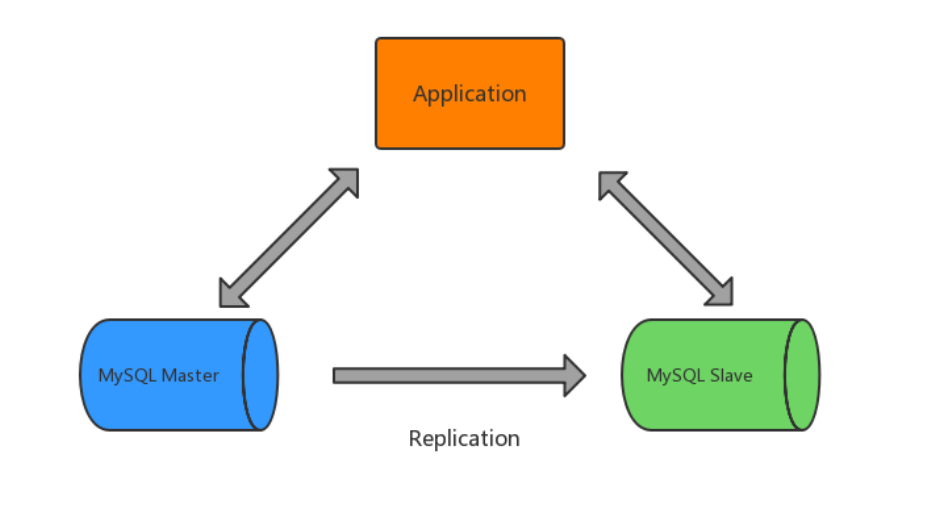

mysql主从复制用途：

- 实时灾备，用于故障切换（高可用）

- 读写分离，提供查询服务（读扩展）

- 数据备份，避免影响业务（高可用）

主从部署必要条件：

- 从库服务器能连通主库

- 主库开启binlog日志（设置log-bin参数）

- 主从server-id不同

#### 5.2.2、实现原理

##### 5.2.2.1、主从复制

下图是主从复制的原理图：

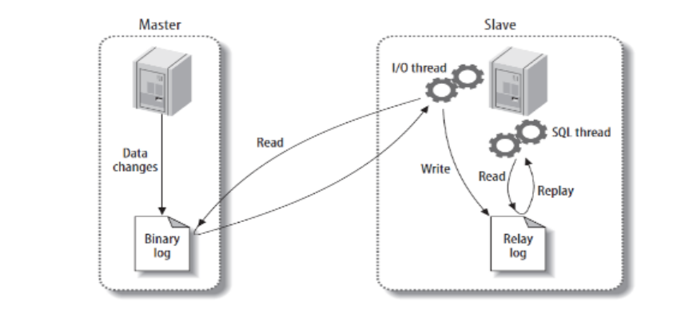

主从复制整体分为以下三个步骤：

- 主库将数据库的变更操作记录到Binlog日志文件中

- 从库读取主库中的Binlog日志文件信息写入到从库的Relay Log中继日志中
- 从库读取中继日志信息在从库中进行Replay,更新从库数据信息

在上述三个过程中，涉及了Master的BinlogDump Thread和Slave的I/O Thread、SQL Thread，它们的作用如下：

- Master服务器对数据库更改操作记录在Binlog中，BinlogDump Thread接到写入请求后，读取Binlog信息推送给Slave的I/O Thread。

- Slave的I/O Thread将读取到的Binlog信息写入到本地Relay Log中。

- Slave的SQL Thread检测到Relay Log的变更请求，解析relay log中内容在从库上执行。

上述过程都是异步操作，俗称异步复制，存在数据延迟现象。下图是异步复制的时序图：

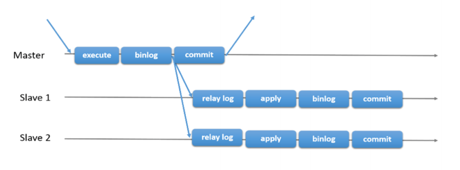

mysql主从复制存在的问题：

- 主库宕机后，数据可能丢失

- 从库只有一个SQL Thread，主库写压力大，复制很可能延时

解决方法：

- 半同步复制---解决数据丢失的问题

- 并行复制----解决从库复制延迟的问题

##### 5.2.2.2、半同步复制

为了提升数据安全，MySQL让Master在某一个时间点等待Slave节点的 ACK（*Ack*nowledgecharacter）消息，接收到ACK消息后才进行事务提交，这也是半同步

复制的基础，MySQL从5.5版本开始引入了半同步复制机制来降低数据丢失的概率。

介绍半同步复制之前先快速过一下 MySQL 事务写入碰到主从复制时的完整过程，主库事务写入分为 4个步骤：

- InnoDB Redo File Write (Prepare Write)

- Binlog File Flush & Sync to Binlog File

- InnoDB Redo File Commit（Commit Write）

- Send Binlog to Slave

当Master不需要关注Slave是否接受到Binlog Event时，即为传统的主从复制。

当Master需要在第三步等待Slave返回ACK时，即为 after-commit，半同步复制（MySQL 5.5引入）。

当Master需要在第二步等待 Slave 返回 ACK 时，即为 after-sync，增强半同步（MySQL 5.7引入）。

下图是 MySQL 官方对于半同步复制的时序图，主库等待从库写入 relay log 并返回 ACK 后才进行Engine Commit。

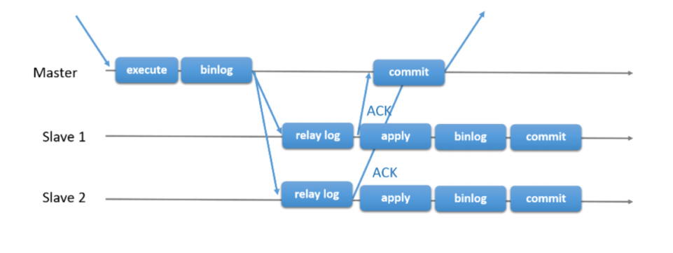

##### 5.2.2.3、并行复制

MySQL的主从复制延迟一直是受开发者最为关注的问题之一，MySQL从5.6版本开始追加了并行复制功能，目的就是为了改善复制延迟问题，并行复制称为

enhanced multi-threaded slave（简称MTS）。

在从库中有两个线程IO Thread和SQL Thread，都是单线程模式工作，因此有了延迟问题，我们可以采用多线程机制来加强，减少从库复制延迟。（IO Thread多

线程意义不大，主要指的是SQL Thread多线程）

在MySQL的5.6、5.7、8.0版本上，都是基上述SQL Thread多线程思想，不断优化，减少复制延迟。

##### 5.2.2.4、MySQL 5.6并行复制原理

MySQL 5.6版本也支持所谓的并行复制，但是其并行只是基于库的。如果用户的MySQL数据库中是多个库，对于从库复制的速度的确可以有比较大的帮助。

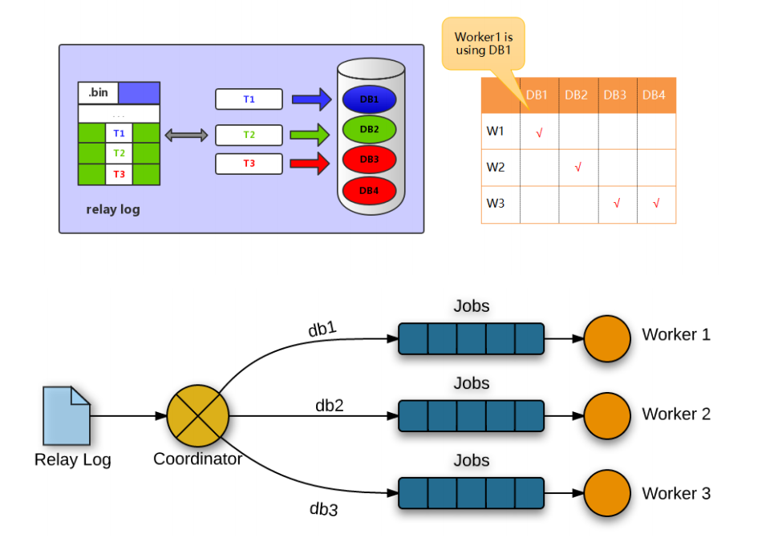

基于库的并行复制，实现相对简单，使用也相对简单。基于库的并行复制对单库多表使用场景就发挥不出优势了，另外对事务并行处理的执行顺序也是个大问题。

##### 5.2.2.5、MySQL 5.7并行复制原理

MySQL 5.7是基于组提交的并行复制，MySQL 5.7才可称为真正的并行复制，这其中最为主要的原因就是slave服务器的回放与master服务器是一致的，即master

服务器上是怎么并行执行的slave上就怎样进行并行回放。不再有库的并行复制限制。

**MySQL 5.7中组提交的并行复制究竟是如何实现的？**

MySQL 5.7是通过对事务进行分组，当事务提交时，它们将在单个操作中写入到二进制日志中。如果多个事务能同时提交成功，那么它们意味着没有冲突，因此可

以在Slave上并行执行，所以通过在主库上的二进制日志中添加组提交信息。

MySQL 5.7的并行复制基于一个前提，即所有已经处于prepare阶段的事务，都是可以并行提交的。这些当然也可以在从库中并行提交，因为处理这个阶段的事务

都是没有冲突的。在一个组里提交的事务，一定不会修改同一行。这是一种新的并行复制思路，完全摆脱了原来一直致力于为了防止冲突而做的分发算法，等待策

略等复杂的而又效率底下的工作。

InnoDB事务提交采用的是两阶段提交模式。一个阶段是prepare，另一个是commit。

为了兼容MySQL 5.6基于库的并行复制，5.7引入了新的变量**slave-parallel-type**，其可以配置的值有：**DATABASE（默认值，基于库的并行复制方式）、**

**LOGICAL_CLOCK（基于组提交的并行复制方式）。**

**那么如何知道事务是否在同一组中，生成的Binlog内容如何告诉Slave哪些事务是可以并行复制的？**

在MySQL 5.7版本中，其设计方式是将组提交的信息存放在GTID中。为了避免用户没有开启GTID功能（gtid_mode=OFF），MySQL 5.7又引入了称之为

Anonymous_Gtid的二进制日志event类型ANONYMOUS_GTID_LOG_EVENT。

通过mysqlbinlog工具分析binlog日志，就可以发现组提交的内部信息

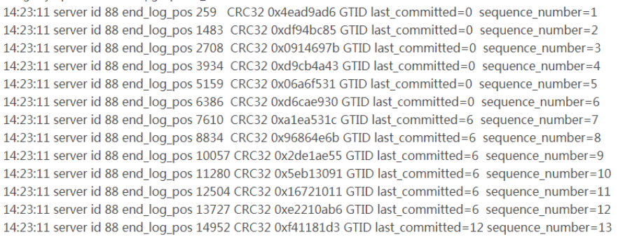

可以发现MySQL 5.7二进制日志较之原来的二进制日志内容多了last_committed和sequence_number，last_committed表示事务提交的时候，上次事务提交的编

号，如果事务具有相同的last_committed，表示这些事务都在一组内，可以进行并行的回放。

##### 5.2.2.6、MySQL8.0 并行复制

MySQL8.0 是基于write-set的并行复制。MySQL会有一个集合变量来存储事务修改的记录信息（主键哈希值），所有已经提交的事务所修改的主键值经过hash后

都会与那个变量的集合进行对比，来判断改行是否与其冲突，并以此来确定依赖关系，没有冲突即可并行。这样的粒度，就到了 row级别了，此时并行的粒度更加

精细，并行的速度会更快。

##### 5.2.2.7、并行复制配置与调优

- binlog_transaction_dependency_history_size

  用于控制集合变量的大小。

- binlog_transaction_depandency_tracking

  用于控制binlog文件中事务之间的依赖关系，即last_committed值。

  - COMMIT_ORDERE: 基于组提交机制
  - WRITESET: 基于写集合机制
  - WRITESET_SESSION: 基于写集合，比writeset多了一个约束，同一个session中的事务last_committed按先后顺序递增

- transaction_write_set_extraction

  用于控制事务的检测算法，参数值为：OFF、 XXHASH64、MURMUR32

- master_info_repository

  开启MTS功能后，务必将参数master_info_repostitory设置为TABLE，这样**性能可以有50%~80%的提升**。这是因为并行复制开启后对于元master.info这个文

  件的更新将会大幅提升，资源的竞争也会变大。

- slave_parallel_workers

  若将slave_parallel_workers设置为0，则MySQL 5.7退化为原单线程复制，但将slave_parallel_workers设置为1，则SQL线程功能转化为coordinator线程，但

  是只有1个worker线程进行回放，也是单线程复制。然而，这两种性能却又有一些的区别，因为多了一次coordinator线程的转发，因此

  slave_parallel_workers=1的性能反而比0还要差。

- slave_preserve_commit_order

  MySQL 5.7后的MTS可以实现更小粒度的并行复制，但需要将slave_parallel_type设置为LOGICAL_CLOCK，但仅仅设置为LOGICAL_CLOCK也会存在问题，因

  为此时在slave上应用事务的顺序是无序的，和relay log中记录的事务顺序不一样，这样数据一致性是无法保证的，为了保证事务是按照relay log中记录的顺序

  来回放，就需要开启参数slave_preserve_commit_order。

要开启enhanced multi-threaded slave其实很简单，只需根据如下设置：

```properties
slave-parallel-type=LOGICAL_CLOCK 
slave-parallel-workers=16 
slave_pending_jobs_size_max = 2147483648 
slave_preserve_commit_order=1 
master_info_repository=TABLE 
relay_log_info_repository=TABLE 
relay_log_recovery=ON
```

##### 5.2.2.8、并行复制监控

在使用了MTS后，复制的监控依旧可以通过**SHOW SLAVE STATUS \G**，但是MySQL 5.7在performance_schema库中提供了很多元数据表，可以更详细的监控并

行复制过程。

通过replication_applier_status_by_worker可以看到worker进程的工作情况：


最后，如果MySQL 5.7要使用MTS功能，建议使用新版本，最少升级到5.7.19版本，修复了很多Bug。


#### 5.2.3、搭建主从模式

先安装两台mysql服务实例，当前为 192.168.81.100（master）192.168.81.101（slave）

##### 5.2.3.1、配置Master 192.168.81.100

- 修改/etc/my.cnf配置文件

  ```properties
  log_bin=thm-log-bin #指定binlog日志文件名称
  server-id=1 #指定当前mysql实例名称
  sync-binlog=1
  #排除同步的数据库
  binlog-ignore-db=sys
  binlog-ignore-db=information_schema
  #指定同步的数据库（默认所有）
  #binlog-do-db=thm
  ```

  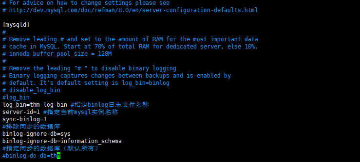

- 重启mysql

  ```shell
  systemctl restart mysqld.service
  ```

- 进行授权并刷新权限

  ```mysql
  #grant 权限列表 on 数据库 to '用户名'@'访问主机' identified by '密码';
  grant replication slave on *.* to 'root'@'%' identified by 'root';
  grant all privileges on *.* to 'root'@'%' identified by 'root';
  flush privileges;
  
  #MySql 8.0版本以后分两步
  #1、创建账户:create user '用户名'@'访问主机' identified by '密码';存在用户直接赋予权限
  #2、赋予权限:grant 权限列表 on 数据库 to '用户名'@'访问主机' ;(修改权限时在后面加with grant option)
  grant all privileges on *.* to 'root'@'%' with grant option;
  flush privileges;
  ```

- 查看master状态

  file和postion用于slave配置使用

  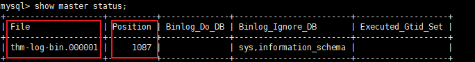
  
- 修改日志级别

  ```mysql
  # 查看
  show variables like '%log_error_verbosity%';
  # 设置
  set global log_error_verbosity=2;
  1 -- Errors Only
  2 -- Errors and warnings
  3 -- Errors, warnings, and notes
  ```

  

##### 5.2.3.2、配置slave 192.168.81.101

**注意：如果是主库已经运行一段时间，存在大量数据后，应当使用mysqldump命名备份恢复数据到从库中，再进行主从配置。**

- 修改/etc/my.cnf配置文件

  ```properties
  server-id=2
  relay_log_thm-relay-bin #指定relay-log名称
  read-only=1 #只读
  ```

  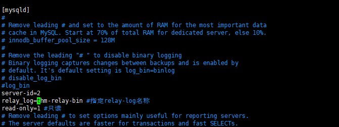

- 重启mysql

  ```sh
  systemctl restart mysqld.service
  ```

- 进行Master设置

  ```mysql
  #查看slave状态信息，如果存在信息需要先停止slave使用命令：stop slave
  show slave status;
  #配置master信息
  change master to master_host='192.168.81.100',master_port=3306,master_user='root',master_password='Thm123456.',
  master_log_file='thm-log-bin.000001',master_log_pos=1087;
  #启动slave
  start slave;
  show slave status;
  ```

  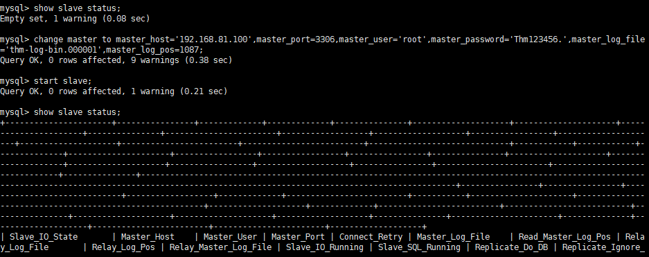

  这是主从搭建完成。

##### 5.2.3.3、开启半同步复制

- 查看是否可以动态添加插件

  ```mysql
  select @@have_dynamic_loading;
  ```

  

- 查看已经存在插件

  ```mysql
  show plugins;
  ```

  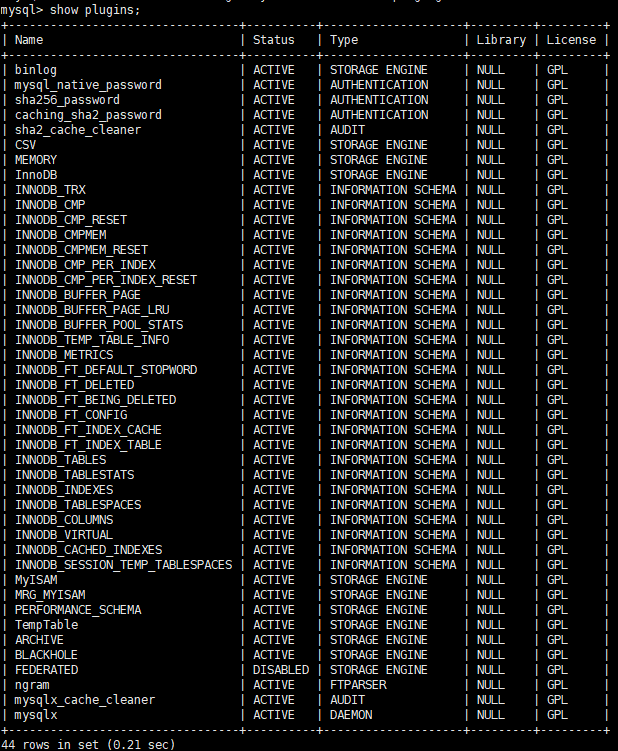


- 主库（master）安装semisync_master插件并取别名

  ```mysql
  # 安装插件   卸载 uninstall plugin rpl_semi_sync_master;
  install plugin rpl_semi_sync_master soname 'semisync_master.so';
  # 查看semi配置信息
  show variables like '%semi%';
  # 开启semi
  set global rpl_semi_sync_master_enabled = 1;
  # 设置间隔时间
  set global rpl_semi_sync_master_timeout=1000;
  ```

  开启semi，并设置参数

  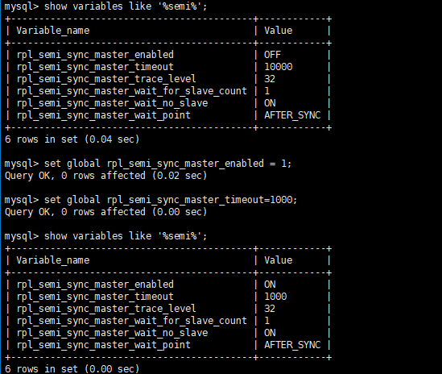

- 从库（slave）安装semisynv_slave插件并取别名

  ```mysql
  # 安装插件
  install plugin rpl_semi_sync_slave soname 'semisync_slave.so';
  # 查看semi配置信息
  show variables like '%semi%';
  # 开启semi
  set global rpl_semi_sync_slave_enabled = 1;
  # 停止slave
  stop slave
  # 开启slave
  start slave
  ```

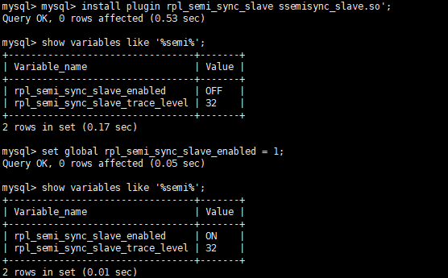

##### 5.2.3.4、开启并行复制

- 主库（master）并进行配置

  ```mysql
    # 查看binlog_group相关配置信息
    show variables like '%binlog_group%';
    # 设置提交间隔时间
    set global binlog_group_commit_sync_delay = 1000;
    # 每组事务数
    set global binlog_group_commit_sync_no_delay_count = 10;
  ```

  


- 从库（slave）进行配置

  - 配置1

  ```mysql
  # 查看配置
  show variables like '%slave%';
  # 停止slave
  stop slave;
  # 设置为组提交模式
  set global slave_parallel_type='LOGICAL_CLOCK';
  # 当前工作线程为8 建议4-8个线程
  set global slave_parallel_workers=8;
  ```

  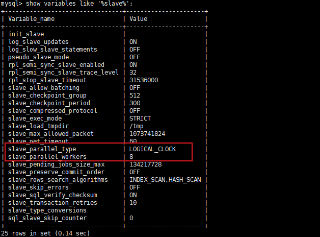
  - 配置2

    ```mysql
    # 查看relay_log配置，relay_log_recovery为只读配置，需要修改配置文件并重启服务relay_log_recovery=1
    # relay_log_info_repository=FILE 需要修改为TABLE
    show variables like '%relay_log%';
    ```

    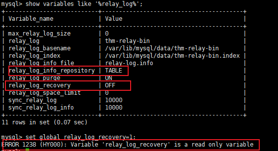

    修改配置文件

    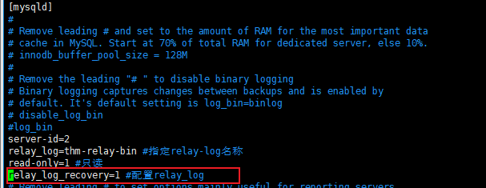

- 设置配置文件

  set 方式设置配置虽然方便，但是重启后配置会消失，应该将配置持久化到配置文件中去

  - master

    ```properties
    log_bin=thm-log-bin #指定binlog日志文件名称
    server-id=1 #指定当前mysql实例名称
    sync-binlog=1
    #排除同步的数据库
    binlog-ignore-db=sys
    binlog-ignore-db=information_schema
    #指定同步的数据库（默认所有）
    #binlog-do-db=thm
    # 设置组提交
    binlog_group_commit_sync_delay = 1000
    binlog_group_commit_sync_no_delay_count = 10
    #开启semi，设置间隔时间
    rpl_semi_sync_master_enabled = 1
    rpl_semi_sync_master_timeout=1000
    ```

    

  - slave

    ```properties
    server-id=2
    relay_log=thm-relay-bin #指定relay-log名称
    read-only=1 #只读
    slave-parallel-type=LOGICAL_CLOCK #组提交模式
    slave-parallel-workers=8 #工作线程
    master_info_repository=TABLE 
    #relay_log_info_repository=TABLE 默认是TABLE
    relay_log_recovery=1 #配置relay_log
    
    rpl_semi_sync_slave_enabled = 1 #开启semi
    ```

    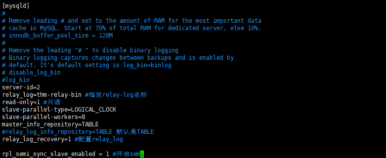

#### 5.2.4、读写分离

##### 5.2.4.1、读写分离引入时机

大多数互联网业务中，往往读多写少，这时候数据库的读会首先成为数据库的瓶颈。如果我们已经优化了SQL，但是读依旧还是瓶颈时，这时就可以选择“读写分

离”架构了。

读写分离首先需要将数据库分为主从库，一个主库用于写数据，多个从库完成读数据的操作，主从库之间通过主从复制机制进行数据的同步，如图所示：

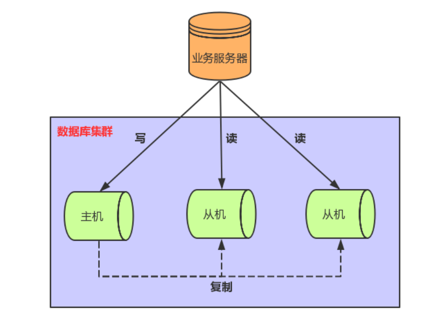

**注意：在应用中可以在从库追加多个索引来优化查询，主库这些索引可以不加，用于提升写效率。**

读写分离架构也能够消除读写锁冲突从而提升数据库的读写性能。使用读写分离架构需要注意：**主从同步延迟和读写分配机制**问题

##### 5.2.4.2、主从同步延迟

使用读写分离架构时，数据库主从同步具有延迟性，数据一致性会有影响，对于一些实时性要求比较高的操作，可以采用以下解决方案。

- 写后立刻读

  在写入数据库后，某个时间段内读操作就去主库，之后读操作访问从库。

- 二次查询

  先去从库读取数据，找不到时就去主库进行数据读取。该操作容易将读压力返还给主库，为了避免恶意攻击，建议对数据库访问API操作进行封装，有利于安

  全和低耦合。

- 根据业务特殊处理

  根据业务特点和重要程度进行调整，比如重要的，实时性要求高的业务数据读写可以放在主库。对于次要的业务，实时性要求不高可以进行读写分离，查询时

  去从库查询。

##### 5.2.4.3、读写分离落地

**读写路由分配机制**是实现读写分离架构最关键的一个环节，就是控制何时去主库写，何时去从库读。目前较为常见的实现方案分为以下两种：

- 基于编程和配置实现（应用端）

  程序员在代码中封装数据库的操作，代码中可以根据操作类型进行路由分配，增删改时操作主库，查询时操作从库。这类方法也是目前生产环境下应用最广泛

  的。优点是实现简单，因为程序在代码中实现，不需要增加额外的硬件开支，缺点是需要开发人员来实现，运维人员无从下手，如果其中一个数据库宕机了，

  就需要修改配置重启项目。

- 基于服务器端代理实现（服务器端）

  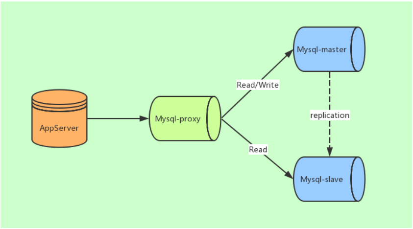

  中间件代理一般介于应用服务器和数据库服务器之间，从图中可以看到，应用服务器并不直接进入到master数据库或者slave数据库，而是进入MySQL proxy

  代理服务器。代理服务器接收到应用服务器的请求后，先进行判断然后转发到后端master和slave数据库。

- 目前有很多性能不错的数据库中间件，常用的有MySQL Proxy、MyCat以及Shardingsphere等等。

  - **MySQL Proxy：**是官方提供的MySQL中间件产品可以实现负载平衡、读写分离等。

  - **MyCat：**MyCat是一款基于阿里开源产品Cobar而研发的，基于 Java 语言编写的开源数据库中间件。

  - **ShardingSphere：**ShardingSphere是一套开源的分布式数据库中间件解决方案，它由Sharding-JDBC、Sharding-Proxy和Sharding-Sidecar（计划

    中）这3款相互独立的产品组成。已经在2020年4月16日从Apache孵化器毕业，成为Apache顶级项目。

  - **Atlas：**Atlas是由 Qihoo 360公司Web平台部基础架构团队开发维护的一个数据库中间件。

  - **Amoeba：**变形虫，该开源框架于2008年开始发布一款 Amoeba for MySQL软件。

##### 5.2.4.4、MySQL Proxy代理实现读写分离

- 安装MySQL Proxy

  - 下载MySQL Proxy

    ```sh
    wget https://cdn.mysql.com/archives/mysql-proxy/mysql-proxy-0.8.5-linux-glibc2.3-x86-64bit.tar.gz
    ```

  - 解压

    ```sh
    tar -zxvf mysql-proxy-0.8.5-linux-glibc2.3-x86-64bit.tar.gz
    ```

  - 进入安装目录创建配置文件

    ```sh
    mkdir conf
    vim mysql-proxy.cnf
    ```

    ```properties
    [mysql-proxy]
    # 当前登陆用户
    user=root
    # 主从数据库用户和密码
    admin-username=root
    admin-password=Thm123456.
    # 当前proxy的IP和端口
    proxy-address=192.168.81.102:4040
    # 写数据库的IP和端口，多个写库用逗号隔开
    proxy-backend-addresses=192.168.81.100:3306
    # 读数据库的IP和端口，多个读库用逗号隔开
    proxy-read-only-backend-addresses=192.168.81.101:3306
    # 指定使用的lua读写脚本
    proxy-lua-script=/u01/software/mysql-proxy-0.8.5-linux-glibc2.3-x86-64bit/share/doc/mysql-proxy/rw-splitting.lua
    # 指定管理脚本
    admin-lua-script=/u01/software/mysql-proxy-0.8.5-linux-glibc2.3-x86-64bit/share/doc/mysql-proxy/admin-sql.lua
    # 指定日志输出位置和级别
    log-file=/var/log/mysql-proxy.log
    log-level=info
    # 是否守护进程
    daemon=true
    # 是否故障重启
  keepalive=true
    ```

  - 修改配置文件权限
  
    ```sh
  chmod 660 mysql-proxy.cnf 
    ```

  - 修改rw-splitting.lua脚本信息

    最小有多少个连接时进行读写分离

    

  - 启动mysql-proxy（安装目录中的bin目录下）
  
    ```shell
    cd bin
  ./mysql-proxy --defaults-file=/u01/software/mysql-proxy-0.8.5-linux-glibc2.3-x86-64bit/conf/mysql-proxy.cnf
    
    #查看
    netstat -tupln | grep 4040 
    #或者 
    netstat -ntl
    #关闭mysql-proxy使用
    killall -9 mysql-proxy 
    ```
  
  - 使用读写分离，应用程序和可视化客户端直接连接mysql代理即可，测试主库也是可以进行读取操作

### 5.3、双主模式

#### 5.3.1、适用场景

很多企业刚开始都是使用MySQL主从模式，一主多从、读写分离等。但是单主如果发生单点故障，从库切换成主库还需要作改动。因此，如果是双主或者多主，

就会增加MySQL入口，提升了主库的可用性。因此随着业务的发展，数据库架构可以由主从模式演变为双主模式。双主模式是指两台服务器互为主从，任何一台

服务器数据变更，都会通过复制应用到另外一方的数据库中。

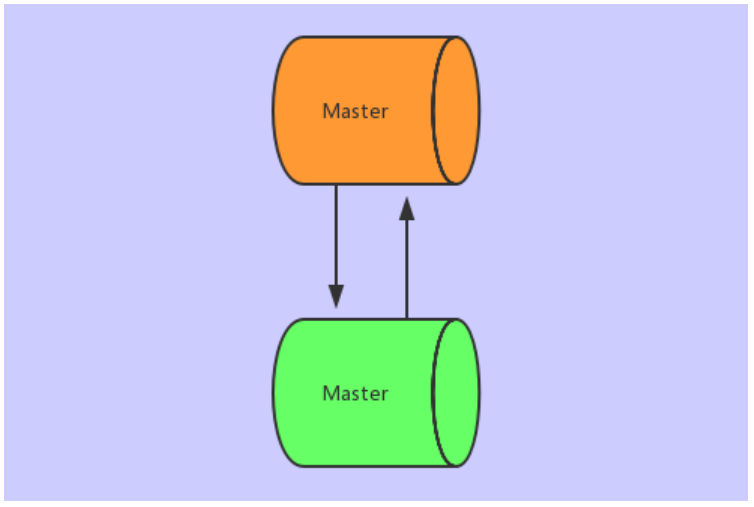

**使用双主双写还是双主单写？**

建议大家使用双主单写，因为双主双写存在以下问题：

- ID冲突

  在A主库写入，当A数据未同步到B主库时，对B主库写入，如果采用自动递增容易发生ID主键的冲突。可以采用MySQL自身的自动增长步长来解决，例如A的

  主键为1,3,5,7...，B的主键为2,4,6,8... ，但是对数据库运维、扩展都不友好。

- 更新丢失

  同一条记录在两个主库中进行更新，会发生前面覆盖后面的更新丢失。

高可用架构如下图所示，其中一个Master提供线上服务，另一个Master作为备胎供高可用切换，Master下游挂载Slave承担读请求。

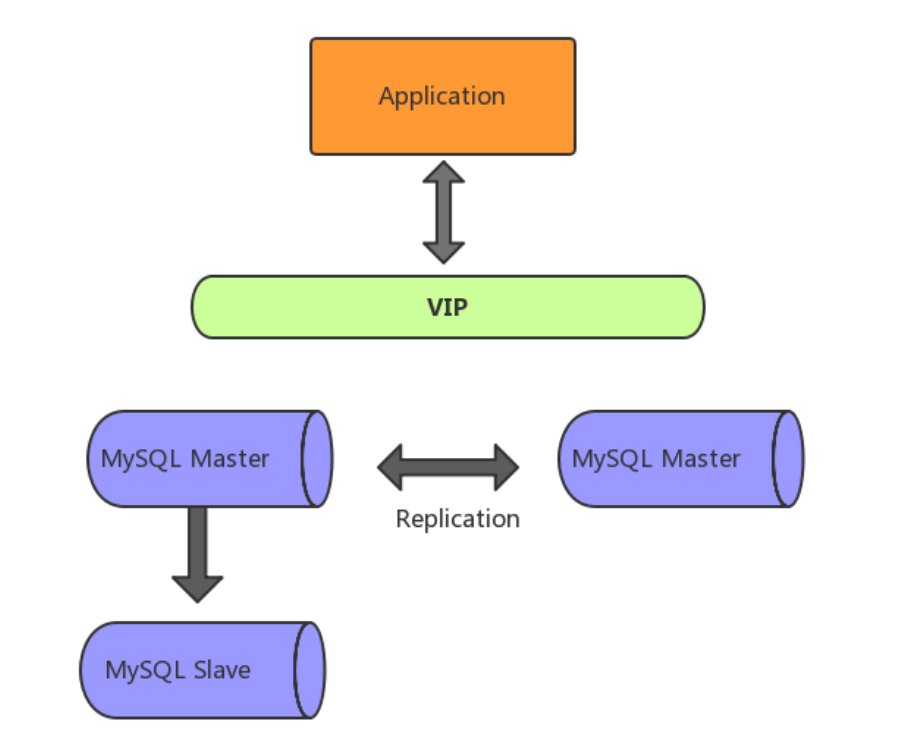

随着业务发展，架构会从主从模式演变为双主模式，建议用双主单写，再引入高可用组件，例如Keepalived和MMM等工具，实现主库故障自动切换。

#### 5.3.2、搭建双主模式

- 安装两台mysql server（目前是192.168.81.100：3306、192.168.81.102：3306）

- 修改两天mysql server中/etc/my.cnf

  ```properties
  log_bin=thm-log-bin #指定binlog日志文件名称
  server-id=1 #指定当前mysql实例名称 
  sync-binlog=1 #开启同步binlog
  #排除同步的数据库
  binlog-ignore-db=sys
  binlog-ignore-db=information_schema
  #binlog-lgnore-db=performance_schema
  #指定同步的数据库（默认所有）
  #binlog-do-db=thm
  #开启relay-log
  relay-log=thm-relay-bin
  #更新同时更新磁盘
  log_slave_updates=1
  #设置自增主键开始值和步长,双写需要设置，单写不需要
  auto_increment_offset=1
  auto_increment_increment=2
  ```

- 两台mysql server进行授权并刷新权限

  ```mysql
  #grant 权限列表 on 数据库 to '用户名'@'访问主机' identified by '密码';
  grant replication slave on *.* to 'root'@'%' identified by 'root';
  grant all privileges on *.* to 'root'@'%' identified by 'root';
  flush privileges;
  
  #MySql 8.0版本以后分两步
  #1、创建账户:create user '用户名'@'访问主机' identified by '密码';存在用户直接赋予权限
  #2、赋予权限:grant 权限列表 on 数据库 to '用户名'@'访问主机' ;(修改权限时在后面加with grant option)
  grant all privileges on *.* to 'root'@'%' with grant option;
  flush privileges;
  ```

- 查看两台mysql server  master状态：show master status；

- 两台mysql server互为对方的slave进行配置

  ```mysql
  #192.168.81.100：3306
  #查看slave状态信息，如果存在信息需要先停止slave使用命令：stop slave
  show slave status;
  #配置master信息
  change master to master_host='192.168.81.102',master_port=3306,master_user='root',master_password='Thm123456.',
  master_log_file='thm-log-bin.000001',master_log_pos=1087;
  #启动slave
  start slave;
  show slave status;
  -----------------------------------------------------------------------------------------------------------------
  #192.168.81.102：3306
  #查看slave状态信息，如果存在信息需要先停止slave使用命令：stop slave
  show slave status;
  #配置master信息
  change master to master_host='192.168.81.100',master_port=3306,master_user='root',master_password='Thm123456.',
  master_log_file='thm-log-bin.000001',master_log_pos=1087;
  #启动slave
  start slave;
  show slave status;
  ```

- 完成mysql的双主模式搭建

  注意：解决出现：Authentication plugin 'caching_sha2_password' reported error: Authentication requcure connection

  ```mysql
  # 推荐mysql命令行 登录获取公钥
  mysql -u root -p -h 192.168.81.102 -P3306 --get-server-public-key
  
  #后续可以不用操作 停止主从复制
  #清空之前的主从复制配置信息
  stop slave;
  reset slave;
  
  #从新配置主从复制
  change master to master_host='192.168.81.100',master_port=3306,master_user='root',master_password='Thm123456.',
  master_log_file='thm-log-bin.000001',master_log_pos=1087;
  start slave;
  ```

#### 5.3.3、MMM架构

MMM（Master-Master Replication Manager for MySQL）是一套用来管理和监控双主复制，支持双主故障切换 的第三方软件。MMM 使用Perl语言开发，虽然

是双主架构，但是业务上同一时间只允许一个节点进行写入操作。下图是基于MMM实现的双主高可用架构。

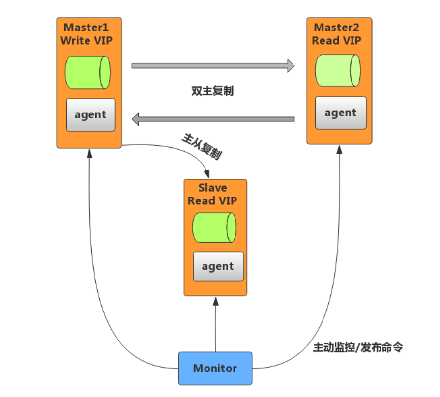

- MMM故障处理机制

  MMM 包含writer和reader两类角色，分别对应写节点和读节点。

  - 当 writer节点出现故障，程序会自动移除该节点上的VIP
  - 写操作切换到 Master2，并将Master2设置为writer
  - 将所有Slave节点会指向Master2

  除了管理双主节点，MMM 也会管理 Slave 节点，在出现宕机、复制延迟或复制错误，MMM 会移除该节点的 VIP，直到节点恢复正常。

- MMM监控机制

  MMM 包含monitor和agent两类程序，功能如下：

  - monitor：监控集群内数据库的状态，在出现异常时发布切换命令，一般和数据库分开部署。

  - agent：运行在每个 MySQL 服务器上的代理进程，monitor 命令的执行者，完成监控的探针工作和具体服务设置，例如设置 VIP（虚拟IP）、指向新同步

    节点。

#### 5.3.4、MHA架构

MHA（Master High Availability）是一套比较成熟的 MySQL 高可用方案，也是一款优秀的故障切换和主从提升的高可用软件。在MySQL故障切换过程中，MHA

能做到在30秒之内自动完成数据库的故障切换操作，并且在进行故障切换的过程中，MHA能在最大程度上保证数据的一致性，以达到真正意义上的高可用。MHA

还支持在线快速将Master切换到其他主机，通常只需0.5－2秒。

目前MHA主要支持一主多从的架构，要搭建MHA，要求一个复制集群中必须最少有三台数据库服务器。

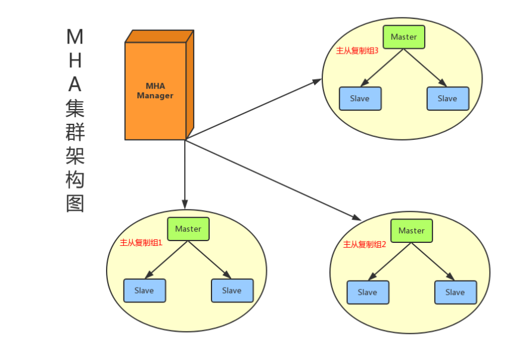

**MHA由两部分组成：MHA Manager（管理节点）和MHA Node（数据节点）。**

- MHA Manager可以单独部署在一台独立的机器上管理多个master-slave集群，也可以部署在一台slave节点上。负责检测master是否宕机、控制故障转移、检

  查MySQL复制状况等。

  **Manager工具包主要工具**

  ```
  masterha_check_ssh              检查MHA的SSH配置状况
  
  masterha_check_repl             检查MySQL复制状况
  
  masterha_manger                 启动MHA
  
  masterha_check_status           检测当前MHA运行状态
  
  masterha_master_monitor         检测master是否宕机
  
  masterha_master_switch          控制故障转移（自动或者手动）
  
  masterha_conf_host              添加或删除配置的server信息
  ```

- MHA Node运行在每台MySQL服务器上，不管是Master角色，还是Slave角色，都称为Node，是被监控管理的对象节点，负责保存和复制master的二进制日

  志、识别差异的中继日志事件并将其差异的事件应用于其他的slave、清除中继日志。
  
  **Node工具包**
  
  这些工具通常由MHA Manager的脚本触发，无需人为操作
  
  ```
  save_binary_logs                保存和复制master的二进制日志
  
  apply_diff_relay_logs           识别差异的中继日志事件并将其差异的事件应用于其他的slave
  
  filter_mysqlbinlog              去除不必要的ROLLBACK事件（MHA已不再使用这个工具）
  
  purge_relay_logs                清除中继日志（不会阻塞SQL线程）
  ```

MHA Manager会定时探测集群中的master节点，当master出现故障时，它可以自动将最新数据的slave提升为新的master，然后将所有其他的slave重新指向新的

master，整个故障转移过程对应用程序完全透明。

**MHA故障处理机制：**

- 把宕机master的binlog保存下来
- 根据binlog位置点找到最新的slave
- 用最新slave的relay log修复其它slave
- 将保存下来的binlog在最新的slave上恢复
- 将最新的slave提升为master
- 将其它slave重新指向新提升的master，并开启主从复制

**MHA优点：**

- 自动故障转移快
- 主库崩溃不存在数据一致性问题
- 性能优秀，支持半同步复制和异步复制
- 一个Manager监控节点可以监控多个集群

#### 5.3.5、主备切换

主备切换是指将备库变为主库，主库变为备库，有**可靠性优先**和**可用性优先**两种策略。

- 主备延迟问题

  主备延迟是由主从数据同步延迟导致的，与数据同步有关的时间点主要包括以下三个：

  - 主库 A 执行完成一个事务，写入 binlog，我们把这个时刻记为 T1;
  - 之后将binlog传给备库 B，我们把备库 B 接收完 binlog 的时刻记为 T2;
  - 备库 B 执行完成这个binlog复制，我们把这个时刻记为 T3。

  所谓主备延迟，就是同一个事务，在备库执行完成的时间和主库执行完成的时间之间的差值，也就是 T3-T1。在备库上执行show slave status命令，它可以返

  回结果信息，seconds_behind_master表示当前备库延迟了多少秒。

  同步延迟主要原因如下：

  - 备库机器性能问题

    机器性能差，甚至一台机器充当多个主库的备库。

  - 分工问题

    备库提供了读操作，或者执行一些后台分析处理的操作，消耗大量的CPU资源。

  - 大事务操作

    大事务耗费的时间比较长，导致主备复制时间长。比如一些大量数据的delete或大表DDL操作都可能会引发大事务。

- **可靠性优先（推荐）**

  主备切换过程一般由专门的HA高可用组件完成，但是切换过程中会存在短时间不可用，因为在切换过程中某一时刻主库A和从库B都处于只读状态。

  如下图所示：

  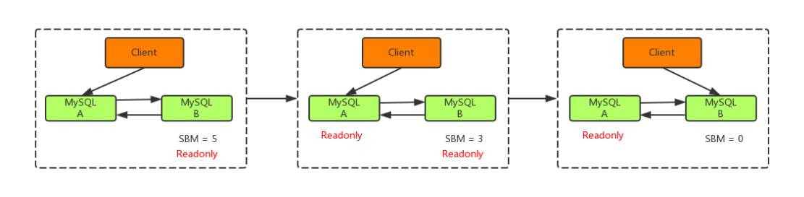
  
  主库由A切换到B，切换的具体流程如下：
  
  - 判断从库B的Seconds_Behind_Master值，当小于某个值才继续下一步
  - 把主库A改为只读状态（readonly=true）
  - 等待从库B的Seconds_Behind_Master值降为 0
  - 把从库B改为可读写状态（readonly=false）
  - 把业务请求切换至从库B
  
- 可用性优先

  不等主从同步完成， 直接把业务请求切换至从库B ，并且让 从库B可读写 ，这样几乎不存在不可用时间，但可能会数据不一致。

  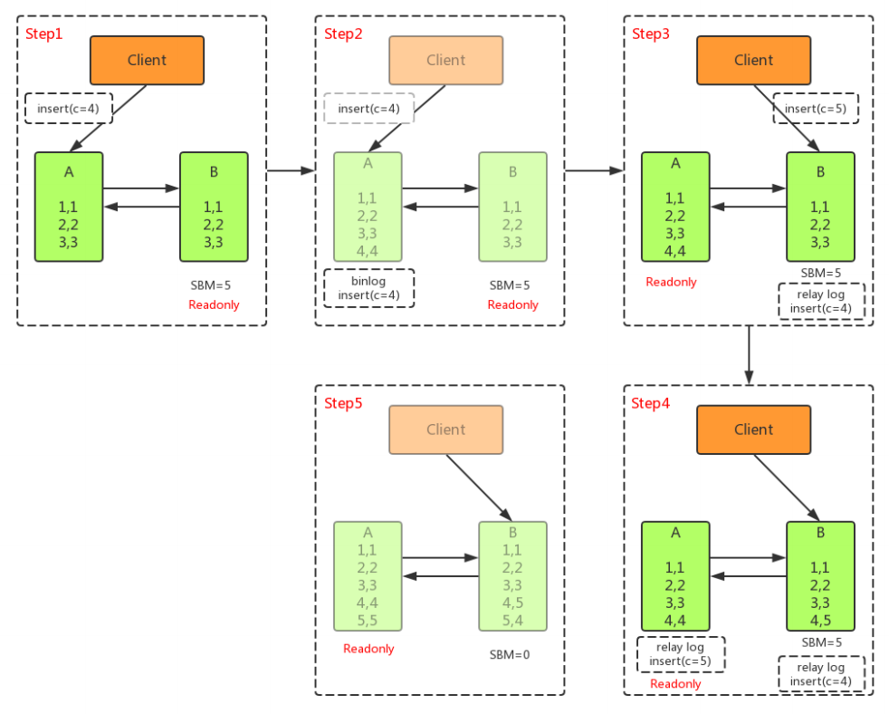

  如上图所示，在A切换到B过程中，执行两个INSERT操作，过程如下：

  - 主库A执行完 INSERT c=4 ，得到 (4,4) ，然后开始执行 主从切换
  - 主从之间有5S的同步延迟，从库B会先执行 INSERT c=5 ，得到 (4,5)
  - 从库B执行主库A传过来的binlog日志 INSERT c=4 ，得到 (5,4)
  - 主库A执行从库B传过来的binlog日志 INSERT c=5 ，得到 (5,5)
  - 此时主库A和从库B会有 两行 不一致的数据

通过上面介绍了解到，主备切换采用可用性优先策略，由于可能会导致数据不一致，所以大多数情况下，**优先选择可靠性优先策略**。在满足数据可靠性的前提下，

MySQL的可用性依赖于同步延时的大小，同步延时越小，可用性就越高。

### 5.4、分库分表

互联网系统需要处理大量用户的请求。比如微信日活用户破10亿，海量的用户每天产生海量的数量；美团外卖，每天都是几千万的订单，那这些系统的用户表、订

单表、交易流水表等是如何处理呢？

数据量只增不减，历史数据又必须要留存，非常容易成为性能的瓶颈，而要解决这样的数据库瓶颈问题，“读写分离”和缓存往往都不合适，目前比较普遍的方案就

是使用NoSQL/NewSQL或者采用分库分表。

使用分库分表时，主要有垂直拆分和水平拆分两种拆分模式，都属于物理空间的拆分。

分库分表方案：只分库、只分表、分库又分表。

- 垂直拆分：由于表数量多导致的单个库大。将表拆分到多个库中。

- 水平拆分：由于表记录多导致的单个表大。将表记录拆分到多个表中。

#### 5.4.1、拆分方式

- **垂直拆分**

  垂直拆分又称为纵向拆分，垂直拆分是将表按库进行分离，或者修改表结构按照访问的差异将某些列拆分出去。应用时有垂直分库和垂直分表两种方式，一般

  谈到的垂直拆分主要指的是垂直分库。

  如下图所示，采用垂直分库，将用户表和订单表拆分到不同的数据库中。

  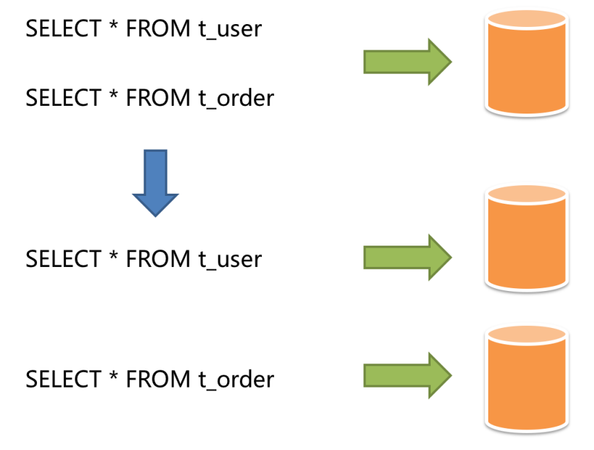

  垂直分表就是将一张表中不常用的字段拆分到另一张表中，从而保证第一张表中的字段较少，避免出现数据库跨页存储的问题，从而提升查询效率。

  解决：一个表中字段过多，还有有些字段经常使用，有些字段不经常使用，或者还有text等字段信息。可以考虑使用垂直分表方案。

  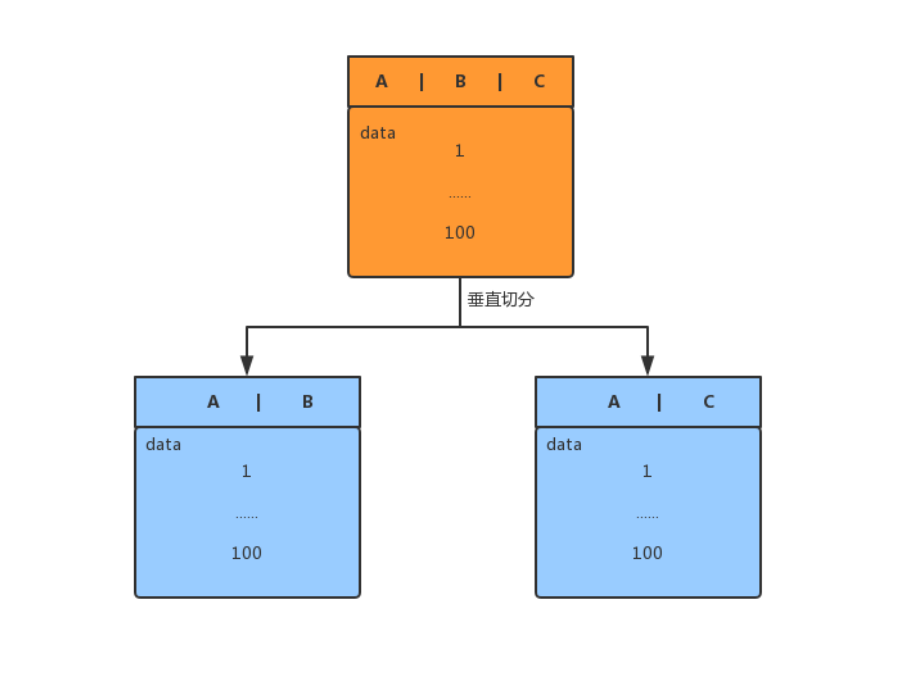

  按列进行垂直拆分，即把一条记录分开多个地方保存，每个子表的行数相同。把主键和一些列放到一个表，然后把主键和另外的列放到另一个表中。

  - 垂直拆分优点：
    - 拆分后业务清晰，拆分规则明确；
    - 易于数据的维护和扩展；
    - 可以使得行数据变小，一个数据块 (Block) 就能存放更多的数据，在查询时就会减少 I/O 次数；
    - 可以达到最大化利用 Cache 的目的，具体在垂直拆分的时候可以将不常变的字段放一起，将经常改变的放一起；
    - 便于实现冷热分离的数据表设计模式。
  - 垂直拆分缺点：
    - 主键出现冗余，需要管理冗余列；
    - 会引起表连接 JOIN 操作，可以通过在业务服务器上进行 join 来减少数据库压力，提高了系统的复杂度；
    - 依然存在单表数据量过大的问题；
    - 事务处理复杂。

- **水平拆分**

  水平拆分又称为横向拆分。 相对于垂直拆分，它不再将数据根据业务逻辑分类，而是通过某个字段（或某几个字段），根据某种规则将数据分散至多个库或表

  中，每个表仅包含数据的一部分，如下图所示。

  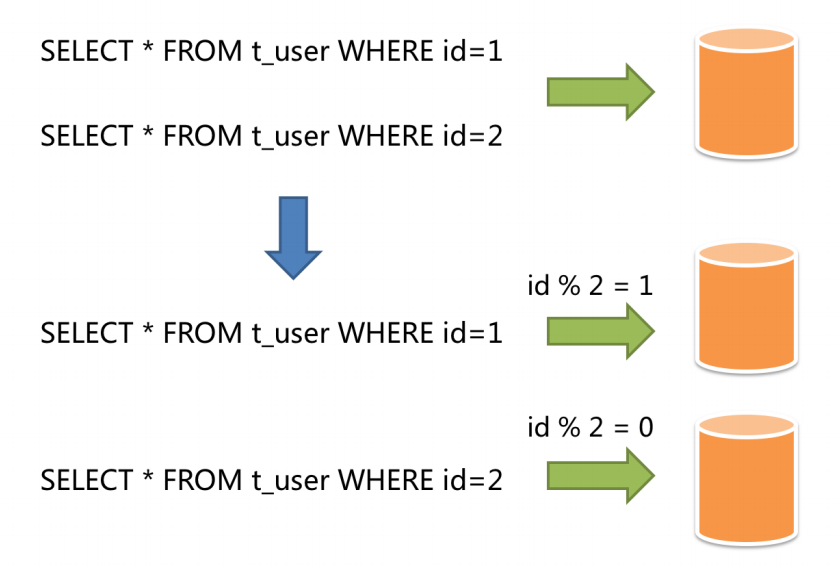

  水平分表是将一张含有很多记录数的表水平切分，不同的记录可以分开保存，拆分成几张结构相同的表。如果一张表中的记录数过多，那么会对数据库的读写

  性能产生较大的影响，虽然此时仍然能够正确地读写，但读写的速度已经到了业务无法忍受的地步，此时就需要使用水平分表来解决这个问题。

  水平拆分重点考虑拆分规则：例如范围、时间或Hash算法等。

  **水平拆分优点**：

  - 拆分规则设计好，join 操作基本可以数据库做；

  - 不存在单库大数据，高并发的性能瓶颈；

  - 切分的表的结构相同，应用层改造较少，只需要增加路由规则即可；

  - 提高了系统的稳定性和负载能力。

  **水平拆分缺点**：

  - 拆分规则难以抽象；

  - 跨库Join性能较差；

  - 分片事务的一致性难以解决；

  - 数据扩容的难度和维护量极大。

- 日常工作中，我们通常会同时使用两种拆分方式，垂直拆分更偏向于产品/业务/功能拆分的过程，在技术上我们更关注水平拆分的方案。

  水平拆分：解决表中记录过多问题。

  垂直拆分：解决表过多或者是表字段过多问题。

#### 5.4.2、主键策略

在很多中小项目中，我们往往直接使用数据库自增特性来生成主键ID，这样确实比较简单。而在分库分表的环境中，数据分布在不同的数据表中，不能再借助数据

库自增长特性直接生成，否则会造成不同数据表主键重复。下面介绍几种ID生成算法。

- UUID

  UUID是通用唯一识别码（Universally Unique Identififier）的缩写，长度是16个字节，被表示为32个十六进制数字，以“ - ”分隔的五组来显示，格式为8-4-4-

  4-12，共36个字符，例如：550e8400-e29b-41d4-a716-446655440000。UUID在生成时使用到了以太网卡地址、纳秒级时间、芯片ID码和随机数等信息，目

  的是让分布式系统中的所有元素都能有唯一的识别信息。

  使用UUID做主键，可以在本地生成，没有网络消耗，所以生成性能高。但是UUID比较长，没有规律性，耗费存储空间。

- COMB（UUID变种）

  COMB（combine）型是数据库特有的一种设计思想，可以理解为一种改进的GUID，它通过组合GUID和系统时间，以使其在索引和检索事有更优的性能。数

  据库中没有COMB类型，它是Jimmy Nilsson在他的“The Cost of GUIDs as Primary Keys”一文中设计出来的。

  COMB设计思路是这样的：既然UniqueIdentififier数据因毫无规律可言造成索引效率低下，影响了系统的性能，那么我们能不能通过组合的方式，保留

  UniqueIdentififier的前10个字节，用后6个字节表示GUID生成的时间（DateTime），这样我们将时间信息与UniqueIdentififier组合起来，在保留

  UniqueIdentififier的唯一性的同时增加了有序性，以此来提高索引效率。解决UUID无序的问题，性能优于UUID。

- SNOWFLAKE

  有些时候我们希望能使用一种简单一些的ID，并且希望ID能够按照时间有序生成，SnowFlake解决了这种需求。SnowFlake是Twitter开源的分布式ID生成算

  法，结果是一个long型的ID，long型是8个字节，64-bit。其核心思想是：使用41bit作为毫秒数，10bit作为机器的ID（5个bit是数据中心，5个bit的机器

  ID），12bit作为毫秒内的流水号，最后还有一个符号位，永远是0。如下图所示：

  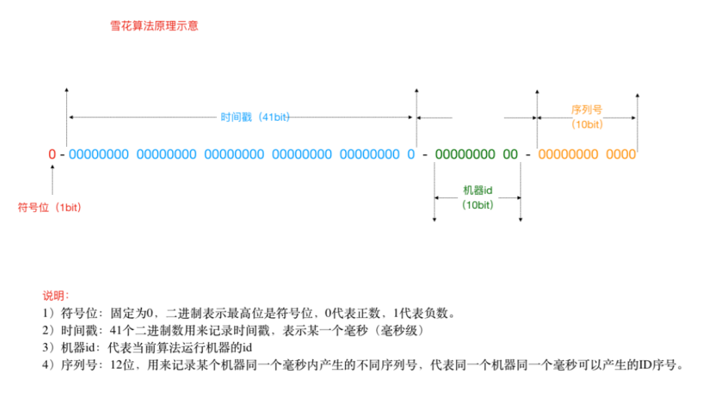

  SnowFlake生成的ID整体上按照时间自增排序，并且整个分布式系统内不会产生ID重复，并且效率较高。经测试SnowFlake每秒能够产生26万个ID。缺点是强

  依赖机器时钟，如果多台机器环境时钟没同步，或时钟回拨，会导致发号重复或者服务会处于不可用状态。因此一些互联网公司也基于上述的方案做了封装，

  例如百度的uidgenerator（基于SnowFlake）和美团的leaf（基于数据库和SnowFlake）等。

- 数据库ID表

  比如A表分表为A1表和A2表，我们可以单独的创建一个MySQL数据库，在这个数据库中创建一张表，这张表的ID设置为自动递增，其他地方需要全局唯一ID的

  时候，就先向这个这张表中模拟插入一条记录，此时ID就会自动递增，然后我们获取刚生成的ID后再进行A1和A2表的插入。例如，下面DISTRIBUTE_ID就是我

  们创建要负责ID生成的表，结构如下：

  ```mysql
  CREATE TABLE DISTRIBUTE_ID ( 
      id bigint(32) NOT NULL AUTO_INCREMENT COMMENT '主键', 
      createtime datetime DEFAULT NULL, 
      PRIMARY KEY (id) 
  ) ENGINE=InnoDB DEFAULT CHARSET=utf8;
  ```

  当分布式集群环境中哪个应用需要获取一个全局唯一的分布式ID的时候，就可以使用代码连接这个数据库实例，执行如下SQL语句即可。

  ```mysql
  insert into DISTRIBUTE_ID(createtime) values(NOW()); 
  select LAST_INSERT_ID()；
  ```

  注意：

  - 这里的createtime字段无实际意义，是为了随便插入一条数据以至于能够自动递增ID。

  - 使用独立的MySQL实例生成分布式ID，虽然可行，但是性能和可靠性都不够好，因为你需要代码连接到数据库才能获取到ID，性能无法保障，另外mysql

    数据库实例挂掉了，那么就无法获取分布式ID了。

- Redis生成ID

  当使用数据库来生成ID性能不够要求的时候，我们可以尝试使用Redis来生成ID。这主要依赖于Redis是单线程的，所以也可以用生成全局唯一的ID。可以用

  Redis的原子操作 INCR和INCRBY来实现。

  也可以用Redis集群来获取更高的吞吐量。假如一个集群中有5台Redis。可以初始化每台Redis的值分别是1,2,3,4,5，然后步长都是5。各个Redis生成的ID为：

  ```http
  A：1,6,11,16,21 
  B：2,7,12,17,22 
  C：3,8,13,18,23 
  D：4,9,14,19,24 
  E：5,10,15,20,25
  ```

#### 5.4.3、分片策略

##### 5.4.3.1、分片概念

分片（Sharding）就是用来确定数据在多台存储设备上分布的技术。Shard这个词的意思是“碎片”，如果将一个数据库当作一块大玻璃，将这块玻璃打碎，那么每

一小块都称为数据库的碎片（Database Sharding）。将一个数据库打碎成多个的过程就叫做分片，分片是属于横向扩展方案。

- 分片：表示分配过程，是一个逻辑上概念，表示如何实现。

- 分库分表：表示分配结果，是一个物理上概念，表示最终实现的结果。

数据库扩展方案：

- 横向扩展：一个库变多个库，加机器数量

- 纵向扩展：一个库还是一个库，优化机器性能，加高配CPU或内存

在分布式存储系统中，数据需要分散存储在多台设备上，分片就是把数据库横向扩展到多个数据库服务器上的一种有效的方式，其主要目的就是为突破单节点数据

库服务器的 I/O 能力限制，解决数据库扩展性问题。

##### 5.4.3.2、分片策略

数据分片是根据指定的分片键和分片策略将数据水平拆分，拆分成多个数据片后分散到多个数据存储节点中。分片键是用于划分和定位表的字段，一般使用ID或者

时间字段。而分片策略是指分片的规则，常用规则有以下几种：

- 基于范围分片

  根据特定字段的范围进行拆分，比如用户ID、订单时间、产品价格等。例如：

  {[1 - 100] => Cluster A, [101 - 199] => Cluster B}

  优点：新的数据可以落在新的存储节点上，如果集群扩容，数据无需迁移。

  缺点：数据热点分布不均，数据冷热不均匀，导致节点负荷不均。

- 哈希取模分片

  整型的Key可直接对设备数量取模，其他类型的字段可以先计算Key的哈希值，然后再对设备数量取模。假设有n台设备，编号为0 ~ n-1，通过Hash(Key) % n

  就可以确定数据所在的设备编号。该模式也称为离散分片。

  优点：实现简单，数据分配比较均匀，不容易出现冷热不均，负荷不均的情况。

  缺点：扩容时会产生大量的数据迁移，比如从n台设备扩容到n+1，绝大部分数据需要重新分配和迁移。

- 一致性哈希分片

  采用Hash取模的方式进行拆分，后期集群扩容需要迁移旧的数据。使用一致性Hash算法能够很大程度的避免这个问题，所以很多中间件的集群分片都会采用

  一致性Hash算法。

  一致性Hash是将数据按照特征值映射到一个首尾相接的Hash环上，同时也将节点（按照IP地址或者机器名Hash）映射到这个环上。对于数据，从数据在环上

  的位置开始，顺时针找到的第一个节点即为数据的存储节点。Hash环示意图与数据的分布如下：

  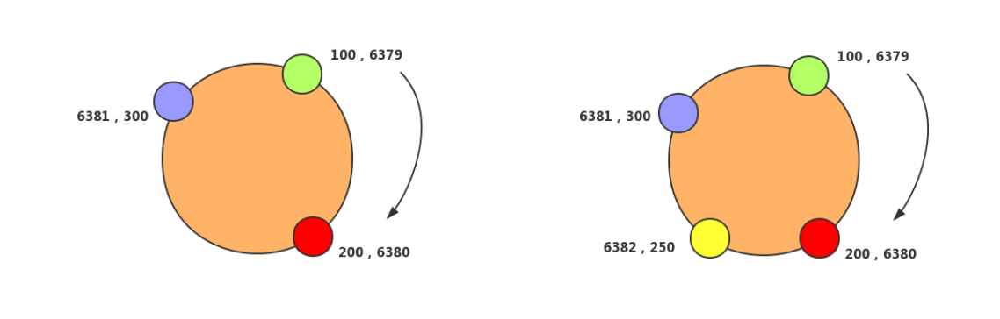

  一致性Hash在增加或者删除节点的时候，受到影响的数据是比较有限的，只会影响到Hash环相邻的节点，不会发生大规模的数据迁移。

#### 5.4.4、扩容方案

当系统用户进入了高速增长期时，即便是对数据进行分库分表，但数据库的容量，还有表的数据量也总会达到天花板。当现有数据库达到承受极限时，就需要增加

新服务器节点数量进行横向扩容。

首先来思考一下，横向扩展会有什么技术难度？

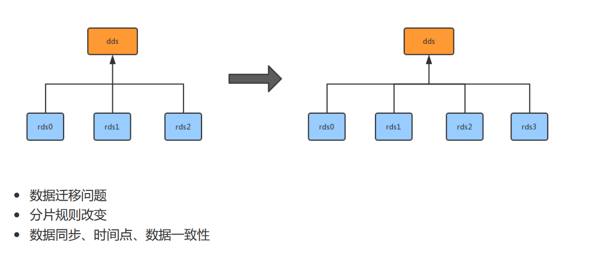

遇到上述问题时，我们可以使用以下两种方案：

##### 5.4.4.1、停机扩容

这是一种很多人初期都会使用的方案，尤其是初期只有几台数据库的时候。停机扩容的具体步骤如下：

- 站点发布一个公告，例如：“为了为广大用户提供更好的服务，本站点将在今晚00:00-2:00之间升级，给您带来不便抱歉"；
- 时间到了，停止所有对外服务；
- 新增n个数据库，然后写一个数据迁移程序，将原有x个库的数据导入到最新的y个库中。比如分片规则由%x变为%y；
- 数据迁移完成，修改数据库服务配置，原来x个库的配置升级为y个库的配置
- 重启服务，连接新库重新对外提供服务

回滚方案：万一数据迁移失败，需要将配置和数据回滚，改天再挂公告。

- 优点：简单
- 缺点：
  - 停止服务，缺乏高可用
  - 程序员压力山大，需要在指定时间完成
  - 如果有问题没有及时测试出来启动了服务，运行后发现问题，数据会丢失一部分，难以回滚。
- 适用场景：
  - 小型网站
  - 大部分游戏
  - 对高可用要求不高的服务

##### 5.4.4.2、平滑扩容

数据库扩容的过程中，如果想要持续对外提供服务，保证服务的可用性，平滑扩容方案是最好的选择。平滑扩容就是将数据库数量扩容成原来的2倍，比如：由2个

数据库扩容到4个数据库，具体步骤如下：

- 新增2个数据库

- 配置双主进行数据同步（先测试、后上线）

  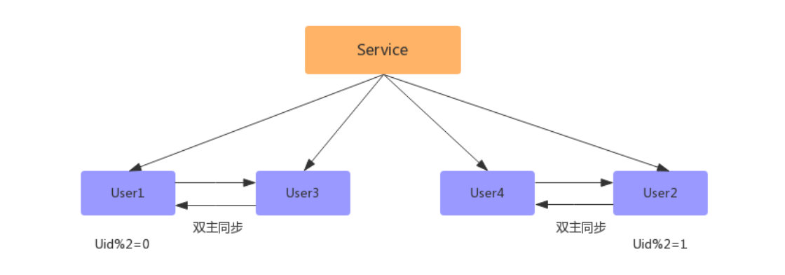

- 数据同步完成之后，配置双主双写（同步因为有延迟，如果时时刻刻都有写和更新操作，会存在不准确问题）

  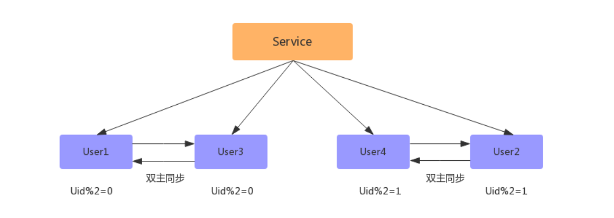

- 数据同步完成后，删除双主同步，修改数据库配置，并重启；

  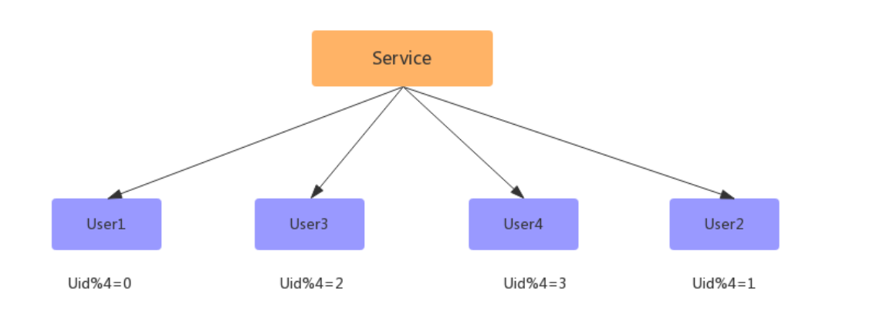

- 此时已经扩容完成，但此时的数据并没有减少，新增的数据库跟旧的数据库一样多的数据，此时还需要写一个程序，清空数据库中多余的数据，如：

  User1去除 uid % 4 = 2的数据；

  User3去除 uid % 4 = 0的数据；

  User2去除 uid % 4 = 3的数据；

  User4去除 uid % 4 = 1的数据；

- 平滑扩容方案能够实现n库扩2n库的平滑扩容，增加数据库服务能力，降低单库一半的数据量。其核心原理是：成倍扩容，避免数据迁移。
  - 优点：
    - 扩容期间，服务正常进行，保证高可用
    - 相对停机扩容，时间长，项目组压力没那么大，出错率低
    - 扩容期间遇到问题，随时解决，不怕影响线上服务
    - 可以将每个数据库数据量减少一半
  - 缺点：
    - 程序复杂、配置双主同步、双主双写、检测数据同步等
    - 后期数据库扩容，比如成千上万，代价比较高
  - 适用场景：
    - 大型网站
    - 对高可用要求高的服务

## 6、MySQL性能优化

**数据库优化维度有四个：**

硬件升级、系统配置、表结构设计、SQL语句及索引。

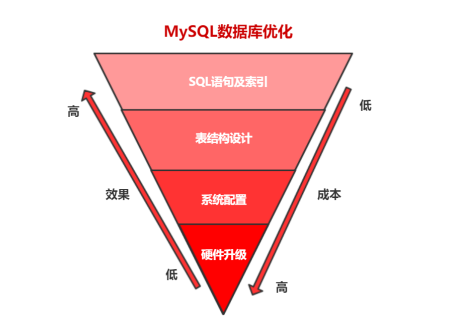

**优化选择：**

- 优化成本：硬件升级>系统配置>表结构设计>SQL语句及索引。

- 优化效果：硬件升级<系统配置<表结构设计<SQL语句及索引。

### 6.1、系统配置优化

#### 6.1.1、保证从内存中读取数据

MySQL会在内存中保存一定的数据，通过LRU算法将不常访问的数据保存在硬盘文件中。尽可能的扩大内存中的数据量，将数据保存在内存中，从内存中读取数

据，可以提升MySQL性能。扩大innodb_buffer_pool_size，能够全然从内存中读取数据。最大限度降低磁盘操作。

- 查看innodb_buffer_pool_size 方法：

  ```mysql
  mysql> show global status like 'innodb_buffer_pool_pages_%'; 
  +----------------------------------+-------+ 
  | Variable_name                    | Value | 
  +----------------------------------+-------+ 
  | Innodb_buffer_pool_pages_data    | 8190  | 
  | Innodb_buffer_pool_pages_dirty   |   0   | 
  | Innodb_buffer_pool_pages_flushed | 12646 | 
  | Innodb_buffer_pool_pages_free    |   0   | 0 表示已经被用光 
  | Innodb_buffer_pool_pages_misc    |   1   | 
  | Innodb_buffer_pool_pages_total   | 8191  | 
  +----------------------------------+-------+
  ```

  innodb_buffer_pool_size默认为128M，理论上可以扩大到内存的3/4或4/5。

- 修改/etc/my.cnf

  ```properties
  innodb_buffer_pool_size = 750M
  ```

- 如果是专用的MySQL Server可以禁用SWAP（谨慎使用）

  ```shell
  #查看swap 
  cat /proc/swaps 
  #关闭所有交换设备和文件. 
  swapoff -a
  ```

#### 6.1.2、数据预热

默认情况，仅仅有某条数据被读取一次，才会缓存在 innodb_buffer_pool。所以，数据库刚刚启动，须要进行数据预热，将磁盘上的全部数据缓存到内存中。

数据预热能够提高读取速度。

- 创建对于InnoDB数据库，进行数据预热的脚本

  ```mysql
  SELECT DISTINCT 
  	CONCAT('SELECT ',ndxcollist,' FROM ',db,'.',tb, ' ORDER BY ',ndxcollist,';') SelectQueryToLoadCache 
  FROM ( 
      SELECT engine,table_schema db,table_name tb, index_name,GROUP_CONCAT(column_name ORDER BY seq_in_index) ndxcollist
      FROM ( 
          SELECT B.engine,A.table_schema,A.table_name, A.index_name,A.column_name,A.seq_in_index
          FROM information_schema.statistics A INNER JOIN ( 
              SELECT engine,table_schema,table_name 
              FROM information_schema.tables 
              WHERE engine='InnoDB' ) B USING (table_schema,table_name) 
          WHERE B.table_schema NOT IN ('information_schema','mysql') 
          ORDER BY table_schema,table_name,index_name,seq_in_index ) A 
      GROUP BY table_schema,table_name,index_name ) AA 
  ORDER BY db,tb;
  ```

  将该脚本保存为：loadtomem.sql

- 执行命令

  ```shell
  mysql -uroot -p -AN < /root/loadtomem.sql > /root/loadtomem.sql
  # /root/loadtomem.sql 是文件保存位置
  ```

- 在需要数据预热时，比如重启数据库，执行命令

  ```shell
  mysql -uroot < /root/loadtomem.sql > /dev/null 2>&1
  ```

#### 6.1.3、降低磁盘写入次数

- 增大redolog，减少落盘次数

  innodb_log_file_size 设置为 0.25 * innodb_buffer_pool_size

- 通用查询日志、慢查询日志可以不开 ，bin-log开

  生产中不开通用查询日志，遇到性能问题开慢查询日志

- 写redolog策略 innodb_flush_log_at_trx_commit设置为0或2

  如果不涉及非常高的安全性 (金融系统)，或者基础架构足够安全，或者事务都非常小，都能够用 0或者 2 来减少磁盘操作。

#### 6.1.4、提高磁盘读写性能

使用SSD或者内存磁盘

### 6.2、表结构设计优化

- **设计中间表**

  设计中间表**，一般针对于**统计分析功能，或者实时性不高的需求（OLTP、OLAP）

- **设计冗余字段**

  为减少关联查询，创建合理的**冗余字段**（创建冗余字段还需要注意**数据一致性问题**）

- **拆表**

  对于字段太多的大表，考虑**拆表**（比如一个表有100多个字段）

  对于表中经常不被使用的字段或者存储数据比较多的字段，考虑拆表

- **主键优化**

  每张表建议都要有一个主键（**主键索引**），而且主键类型最好是**int类型**，建议自增主键（**不考虑分布式系统的情况下**）**分布式建议：雪花算法**。

- **字段的设计**

  数据库中的表越小，在它上面执行的查询也就会越快。

  因此，在创建表的时候，为了获得更好的性能，我们可以将表中字段的**宽度**设得尽可能小。

  尽量把字段设置为NOTNULL，这样在将来执行查询的时候，数据库不用去比较NULL值。

  对于某些文本字段，例如“省份”或者“性别”，我们可以将它们定义为ENUM类型。因为在MySQL中，ENUM类型被当作数值型数据来处理，而数值型数据被处

  理起来的速度要比文本类型快得多。这样，我们又可以提高数据库的性能。能用数字的用数值类型

### 6.3、SQL语句及索引优化

- 设计一个表：tbiguser

  ```mysql
  CREATE TABLE tbiguser (
  	id INT PRIMARY KEY auto_increment,
  	nickname VARCHAR ( 255 ),
  	loginname VARCHAR ( 255 ),
  	age INT,
  	sex CHAR ( 1 ),
  	STATUS INT,
  address VARCHAR ( 255 ) 
  );
  ```

- 向该表中写入10000000条数据，执行该存储过程

  ```mysql
  CREATE PROCEDURE test_insert() 
  BEGIN 
  DECLARE i INT DEFAULT 1; 
  WHILE i<=10000000 
  DO insert into tbiguser VALUES(null,concat('zy',i),concat('zhaoyun',i),23,'1',1,'beijing'); 
  SET i=i+1; 
  END WHILE ; 
  commit; 
  END;
  ```

- 可以插入10000000条数据

  ```mysql
  mysql> select count(*) from tbiguser; 
  +----------+ 
  | count(*) | 
  +----------+ 
  | 10000000 | 
  +----------+
  ```

#### 6.3.1、 EXPLAIN查看索引使用情况

使用【慢查询日志】功能，去获取所有查询时间比较长的SQL语句 3秒-5秒

使用explain查看有问题的SQL的执行计划，重点查看索引使用情况

```mysql
mysql> explain select * from tbiguser where loginname='zhaoyun1' and nickname='zy1';
```

- type列，连接类型。一个好的SQL语句至少要达到range级别。杜绝出现all级别。

- key列，使用到的索引名。如果没有选择索引，值是NULL。可以采取强制索引方式。

- key_len列，索引长度。

- rows列，扫描行数。该值是个预估值。

- extra列，详细说明。注意，常见的不太友好的值，如下：Using filesort，Using temporary 。

- 常见的索引：

  where 字段 、组合索引 （最左前缀） 、 索引下推 （非选择行不加锁） 、覆盖索引（不回表）、on 两边、排序 、分组统计

#### 6.3.2、SQL语句中IN包含的值不应过多

MySQL对于IN做了相应的优化，即将IN中的常量全部存储在一个数组里面，而且这个数组是排好序的。但是如果数值较多，产生的消耗也是比较大的。

#### 6.3.3、SELECT语句务必指明字段名称

避免使用select *

SELECT * 增加很多不必要的消耗（CPU、IO、内存、网络带宽）；减少了使用覆盖索引的可能性；当表结构发生改变时，前端也需要更新。所以要求直接在select

后面接上字段名。

```mysql
explain select id,nickname from tbiguser ;
```

#### 6.3.4、 当只需要一条数据的时候，使用limit 1

limit 是可以停止全表扫描的：

```mysql
mysql> select * from tbiguser limit 1;
```

#### 6.3.5、排序字段加索引

```mysql
mysql> explain select * from tbiguser where loginname = 'zhaoyun9999999' order by id ;
mysql> explain select * from tbiguser where loginname = 'zhaoyun9999999' order by loginname ;
```

#### 6.3.6、如果限制条件中其他字段没有索引，尽量少用or

or两边的字段中，如果有一个不是索引字段，会造成该查询不走索引的情况。

```mysql
mysql> explain select * from tbiguser where nickname='zy1' or loginname='zhaoyun3';
```

#### 6.3.7、尽量用union all代替union

union和union all的差异主要是前者需要将结果集合并后再进行唯一性过滤操作，这就会涉及到排序，增加大量的CPU运算，加大资源消耗及延迟。当然，union 

all的前提条件是两个结果集没有重复数据。

#### 6.3.8、不使用ORDER BY RAND()

ORDER BY RAND() 不走索引

```mysql
mysql> select * from tbiguser order by rand() limit 10;
# 实在要使用，优化处理
mysql> select * from tbiguser t1 join (select rand()*(select max(id) from tbiguser) nid ) t2 on t1.id>t2.nid limit 10;
```

#### 6.3.9、区分in和exists、not in和not exists

区分in和exists主要是造成了驱动顺序的改变（这是性能变化的关键），如果是exists，那么以外层表为驱动表，先被访问，如果是IN，那么先执行子查询。所以IN

适合于外表大而内表小的情况；EXISTS适合于外表小而内表大的情况。

关于not in和not exists，推荐使用not exists，不仅仅是效率问题，not in可能存在逻辑问题。如何高效的写出一个替代not exists的SQL语句？

原SQL语句：

```mysql
select colname … from A表 where a.id not in (select b.id from B表)
```

高效的SQL语句：

```mysql
select colname … from A表 Left join B表 on a.id = b.id where b.id is null
```

#### 6.3.10、使用合理的分页方式以提高分页的效率

分页使用 limit m,n 尽量让m 小，利用主键的定位，可以减小m的值

```mysql
mysql> select * from tbiguser limit 9999998, 2;
# 优化后
mysql> select * from tbiguser where id>9999998 limit 2;
```

#### 6.3.11、分段查询

一些用户选择页面中，可能一些用户选择的范围过大，造成查询缓慢。主要的原因是扫描行数过多。这个时候可以通过程序，分段进行查询，循环遍历，将结果合

并处理进行展示。

#### 6.3.12、不建议使用%前缀模糊查询

例如LIKE“%name”或者LIKE“%name%”，这种查询会导致索引失效而进行全表扫描。但是可以使用LIKE“name%”。

那么如何解决这个问题呢，答案：使用全文索引或ES全文检索

#### 6.3.13、避免在where子句中对字段进行表达式操作

```mysql
select user_id,user_project from user_base where age*2=36;
# 中对字段就行了算术运算，这会造成引擎放弃使用索引，建议改成：
select user_id,user_project from user_base where age=36/2;
```

#### 6.3.14、避免隐式类型转换

where子句中出现column字段的类型和传入的参数类型不一致的时候发生的类型转换，建议先确定where中的参数类型。 where age='18'

#### 6.3.15、对于联合索引来说，要遵守最左前缀法则

举列来说索引含有字段id、name、school，可以直接用id字段，也可以id、name这样的顺序，但是name;school都无法使用这个索引。所以在创建联合索引的时

候一定要注意索引字段顺序，常用的查询字段放在最前面。

#### 6.3.16、必要时可以使用force index来强制查询走某个索引

有的时候MySQL优化器采取它认为合适的索引来检索SQL语句，但是可能它所采用的索引并不是我们想要的。这时就可以采用forceindex来强制优化器使用我们制

定的索引。

#### 6.3.17、注意范围查询语句

对于联合索引来说，如果存在范围查询，比如between、>、<等条件时，会造成后面的索引字段失效。

#### 6.3.18、使用JOIN优化

A 表 LEFT JOIN B表、 A表为驱动表，A 表 INNER JOIN B表、 MySQL会自动找出那个数据少的表作用驱动表，A 表 RIGHT JOIN B表、 B表为驱动表。

**注意：**

- MySQL中没有full join，可以用以下方式来解决：

  ```mysql
  select * from A left join B on B.name = A.namewhere B.name is null union all select * from B;
  ```

- 尽量使用inner join，避免left join：

  参与联合查询的表至少为2张表，一般都存在大小之分。如果连接方式是inner join，在没有其他过滤条件的情况下MySQL会自动选择小表作为驱动表，但是

  left join在驱动表的选择上遵循的是左边驱动右边的原则，即left join左边的表名为驱动表。

- 合理利用索引：被驱动表的索引字段作为on的限制字段。

- 利用小表去驱动大表：

  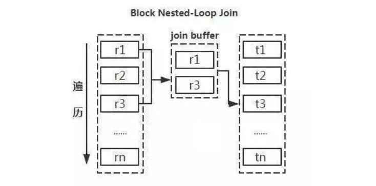

  从原理图能够直观的看出如果能够减少驱动表的话，减少嵌套循环中的循环次数，以减少 IO总量及CPU运算的次数。

### 6.4、MySQL开发规约

我们知道各大公司都有自己的MySQL开发规约，我们以阿里为例，阿里的MySQL开发规约如下：

#### 6.4.1、建表规约

1. 【强制】表达是与否概念的字段，必须使用 is_xxx 的方式命名，数据类型是 unsigned tinyint（1 表示是，0 表示否）。

   说明：任何字段如果为非负数，必须是 unsigned。

   注意：POJO 类中的任何布尔类型的变量，都不要加 is 前缀，所以，需要在设置从 is_xxx 到 Xxx 的映射关系。数据库表示是与否的值，使用 tinyint 类型，坚

   持 is_xxx 的命名方式是为了明确其取值含义与取值范围。

   正例：表达逻辑删除的字段名 is_deleted，1 表示删除，0 表示未删除。

2. 【强制】表名、字段名必须使用小写字母或数字，禁止出现数字开头，禁止两个下划线中间只出现数字。数据库字段名的修改代价很大，因为无法进行预发

   布，所以字段名称需要慎重考虑。

   说明：MySQL 在 Windows 下不区分大小写，在 Linux 下默认是区分大小写。因此，数据库名、表名、字段名，都不允许出现任何大写字母，避免节外生枝。

   正例：aliyun_admin，rdc_config，level3_name

   反例：AliyunAdmin，rdcConfig，level_3_name

3. 【强制】表名不使用复数名词。

   说明：表名应该仅仅表示表里面的实体内容，不应该表示实体数量，对应于 DO 类名也是单数形式，符合表达习惯。

4. 【强制】禁用保留字，如 desc、range、match、delayed 等，请参考 MySQL 官方保留字。

5. 【强制】主键索引名为 pk字段名；唯一索引名为 *uk*字段名；普通索引名则为 idx_字段名。

   说明：pk_ 即 primary key；uk_ 即 unique key；idx_ 即 index 的简称。

6. 【强制】小数类型为 decimal，禁止使用 float 和 double。

   说明：float 和 double 在存储的时候，存在精度损失的问题，很可能在值的比较时，得到不正确的结果。如果存储的数据范围超过 decimal 的范围，建议将数

   据拆成整数和小数分开存储。

7. 【强制】如果存储的字符串长度几乎相等，使用 char 定长字符串类型。

8. 【强制】varchar 是可变长字符串，不预先分配存储空间，长度不要超过 5000，如果存储长度大于此值，定义字段类型为 text，独立出来一张表，用主键来

   对应，避免影响其它字段索引效率。

9. 【强制】表必备三字段：id, gmt_create, gmt_modified。

   说明：其中 id 必为主键，类型为 bigint unsigned、单表时自增、步长为 1。gmt_create,gmt_modified 的类型均为 datetime 类型，前者现在时表示主动创

   建，后者过去分词表示被动更新。

10. 【推荐】表的命名最好是加上“业务名称_表的作用”。正例：alipay_task / force_project / trade_config

11. 【推荐】库名与应用名称尽量一致。

12. 【推荐】如果修改字段含义或对字段表示的状态追加时，需要及时更新字段注释。

13. 【推荐】字段允许适当冗余，以提高查询性能，但必须考虑数据一致。冗余字段应遵循：

    - 不是频繁修改的字段。
    - 不是 varchar 超长字段，更不能是 text 字段。
    - 正例：商品类目名称使用频率高，字段长度短，名称基本一成不变，可在相关联的表中冗余存储类目名称，避免关联查询。

14. 【推荐】单表行数超过 500 万行或者单表容量超过 2GB，才推荐进行分库分表。

    说明：如果预计三年后的数据量根本达不到这个级别，请不要在创建表时就分库分表。

15. 【参考】合适的字符存储长度，不但节约数据库表空间、节约索引存储，更重要的是提升检索速度。

    正例：如下表，其中无符号值可以避免误存负数，且扩大了表示范围。

    

#### 6.4.2、索引规约

1. 【强制】业务上具有唯一特性的字段，即使是多个字段的组合，也必须建成唯一索引。

   说明：不要以为唯一索引影响了 insert 速度，这个速度损耗可以忽略，但提高查找速度是明显的；另外，即 使在应用层做了非常完善的校验控制，只要没有

   唯一索引，根据墨菲定律，必然有脏数据产生。

2. 【强制】三个表以上禁止 join。需要 join 的字段，数据类型必须绝对一致；多表关联查询时，保证被关联的字段需要有索引。

   说明：即使双表 join 也要注意表索引、SQL 性能。

3. 【强制】在 varchar 字段上建立索引时，必须指定索引长度，没必要对全字段建立索引，根据实际文本区分度决定索引长度即可。

   说明：索引的长度与区分度是一对矛盾体，一般对字符串类型数据，长度为 20 的索引，区分度会高达 90%以上，可以使用 count(distinct left(列名, 索引长

   度))/count(*)的区分度来确定。

4. 【强制】页面搜索严禁左模糊或者全模糊，如果需要请走搜索引擎来解决。

   说明：索引文件具有 B-Tree 的最左前缀匹配特性，如果左边的值未确定，那么无法使用此索引。

5. 【推荐】如果有 order by 的场景，请注意利用索引的有序性。order by 最后的字段是组合索引的一部分，并且放在索引组合顺序的最后，避免出现 file_sort 

   的情况，影响查询性能。

   正例：where a=? and b=? order by c; 索引：a_b_c

   反例：索引中有范围查找，那么索引有序性无法利用，如：WHERE a>10 ORDER BY b; 索引a_b 无法排序。

6. 【推荐】利用覆盖索引来进行查询操作，避免回表

   说明：如果一本书需要知道第 11 章是什么标题，会翻开第 11 章对应的那一页吗？目录浏览一下就好，这个目录就是起到覆盖索引的作用。

   正例：能够建立索引的种类分为主键索引、唯一索引、普通索引三种，而覆盖索引只是一种查询的一种效果，用 explain 的结果，extra 列会出现：using 

   index。 

7. 【推荐】利用延迟关联或者子查询优化超多分页场景。

   说明：MySQL 并不是跳过 offset 行，而是取 offset+N 行，然后返回放弃前 offset 行，返回N 行，那当 offset 特别大的时候，效率就非常的低下，要么控制

   返回的总页数，要么对超过特定阈值的页数进行 SQL 改写。

   正例：先快速定位需要获取的 id 段，然后再关联：

   SELECT a.* FROM 表 1 a, (select id from 表 1 where 条件 LIMIT 100000,20 ) b where a.id=b.id

8. 【推荐】SQL 性能优化的目标：至少要达到 range 级别，要求是 ref 级别，如果可以是 consts最好。

   - consts 单表中最多只有一个匹配行（主键或者唯一索引），在优化阶段即可读取到数据。

   - ref 指的是使用普通的索引（normal index）。

   - range 对索引进行范围检索。

   反例：explain 表的结果，type=index，索引物理文件全扫描，速度非常慢，这个 index 级别比较 range 还低，与全表扫描是小巫见大巫。

9. 【推荐】建组合索引的时候，区分度最高的在最左边

   正例：如果 where a=? and b=? ，如果 a 列的几乎接近于唯一值，那么只需要单建 idx_a索引即可。

   说明：存在非等号和等号混合时，在建索引时，请把等号条件的列前置。如：where c>? and d=? 那么即使 c 的区分度更高，也必须把 d 放在索引的最前列，

   即索引 idx_d_c。

10. 【推荐】防止因字段类型不同造成的隐式转换，导致索引失效。

11. 【参考】创建索引时避免有如下极端误解

    - 宁滥勿缺。认为一个查询就需要建一个索引。
    - 宁缺勿滥。认为索引会消耗空间、严重拖慢更新和新增速度。
    - 抵制惟一索引。认为业务的惟一性一律需要在应用层通过“先查后插”方式解决。

#### 6.4.3、SQL 语句

1. 【强制】不要使用 count(列名)或 count(常量)来替代 count(*)，count(+)是 SQL92 定义的标准统计行数的语法， 跟数据库无关，跟 NULL 和非 NULL 无关。

   说明：count(*)会统计值为 NULL 的行，而 count(列名)不会统计此列为 NULL 值的行。

2. 【强制】count(distinct col) 计算该列除 NULL 之外的不重复行数，注意 count(distinct col1, col2)如果其中一 列全为 NULL，那么即使另一列有不同的值，也

   返回为 0。

3. 【强制】当某一列的值全是 NULL 时，count(col)的返回结果为 0，但 sum(col)的返回结果为NULL，因此使用 sum()时需注意 NPE (Null Pointer Exception)

   问题。

   正例：可以使用如下方式来避免 sum 的 NPE 问题：SELECT IF(ISNULL(SUM(g)),0,SUM(g))FROM table;

4. 【强制】使用 ISNULL()来判断是否为 NULL 值。

   说明：NULL 与任何值的直接比较都为 NULL。 

   1） NULL<>NULL 的返回结果是 NULL，而不是 false。 

   2） NULL=NULL 的返回结果是 NULL，而不是 true。 

   3） NULL<>1 的返回结果是 NULL，而不是 true。 

5. 【强制】在代码中写分页查询逻辑时，若 count 为 0 应直接返回，避免执行后面的分页语句。

6. 【强制】不得使用外键与级联，一切外键概念必须在应用层解决。

   说明：以学生和成绩的关系为例，学生表中的 student_id是主键，那么成绩表中的 student_id则为外键。如果更新学生表中的 student_id，同时触发成绩表

   中的 student_id 更新，即为级联更新。外键与级联更新适用于单机低并发，不适合分布式、高并发集群；级联更新是强阻塞，存在数据库更新风暴的风险；

   外键影响数据库的插入速度。

7. 【强制】禁止使用存储过程，存储过程难以调试和扩展，更没有移植性。

8. 【强制】数据订正（特别是删除、修改记录操作）时，要先 select，避免出现误删除，确认无误才能执行更新 语句。

9. 【推荐】in 操作能避免则避免，若实在避免不了，需要仔细评估 in 后边的集合元素数量，控制在1000 个之内。

10. 【参考】如果有国际化需要，所有的字符存储与表示，均以 utf-8 编码，注意字符统计函数的区别。

    说明：

    SELECT LENGTH("轻松工作")； 返回为 12

    SELECT CHARACTER_LENGTH("轻松工作")； 返回为 4

    如果需要存储表情，那么选择 utf8mb4 来进行存储，注意它与 utf-8 编码的区别。

11. 【参考】TRUNCATE TABLE 比 DELETE 速度快，且使用的系统和事务日志资源少，但 TRUNCATE无事务且不 触发 trigger，有可能造成事故，故不建议在开发

    代码中使用此语句。

    说明：TRUNCATE TABLE 在功能上与不带 WHERE 子句的 DELETE 语句相同

#### 6.4.4、ORM映射

1. 【强制】在表查询中，一律不要使用 * 作为查询的字段列表，需要哪些字段必须明确写明。

   说明：

   1）增加查询分析器解析成本。

   2）增减字段容易与 resultMap 配置不一致。

   3）无用字段增加网络消耗，尤其是 text 类型的字段。

2. 【强制】POJO 类的布尔属性不能加 is，而数据库字段必须加 is_，要求在 resultMap 中进行字段与属性之间的映射。

   说明：参见定义 POJO 类以及数据库字段定义规定，在中增加映射，是必须的。在 MyBatis Generator 生成的代码中，需要进行对应的修改。

3. 【强制】不要用 resultClass 当返回参数，即使所有类属性名与数据库字段一一对应，也需要定义；反过来，每一个表也必然有一个 POJO 类与之对应。

   说明：配置映射关系，使字段与 DO 类解耦，方便维护。

4. 【强制】sql.xml 配置参数使用：#{}，#param# 不要使用${} 此种方式容易出现 SQL 注入。

5. 【强制】iBATIS 自带的 queryForList(String statementName,int start,int size)不推荐使用。

   说明：其实现方式是在数据库取到statementName对应的SQL语句的所有记录，再通过subList取 start,size 的子集合。

   正例：Map<String, Object> map = new HashMap<>();

   map.put("start", start);

   map.put("size", size);

6. 【强制】不允许直接拿 HashMap 与 Hashtable 作为查询结果集的输出。

   说明：resultClass=”Hashtable”，会置入字段名和属性值，但是值的类型不可控。

7. 【强制】更新数据表记录时，必须同时更新记录对应的 gmt_modified 字段值为当前时间。

8. 【推荐】不要写一个大而全的数据更新接口。传入为 POJO 类，不管是不是自己的目标更新字段，都进行 update table set c1=value1,c2=value2,c3=value3; 

   这是不对的。执行 SQL时，不要更新无改动的字段，一是易出错；二是效率低；三是增加 binlog 存储。

9. 【参考】@Transactional 事务不要滥用。事务会影响数据库的 QPS，另外使用事务的地方需要考虑各方面的回滚方案，包括缓存回滚、搜索引擎回滚、消息

   补偿、统计修正等。

10. 【参考】中的 compareValue 是与属性值对比的常量，一般是数字，表示相等时带上此条件；表示不为空且不为 null 时执行；表示不为 null 值时执行。

### 6.5、复杂SQL优化实战

**优化案例**

- 前面用过的tbiguser表有10000000条记录

- 创建tuser1表和tuser2表，并初始化若干的数据。

  ```mysql
  create table tuser1( id int primary key auto_increment, name varchar(255), address varchar(255) );
  
  create table tuser2( id int primary key auto_increment, name varchar(255), address varchar(255) );
  mysql> select * from tuser1 ; 
  +----+----------+-----------+ 
  | id | name     | address   | 
  +----+----------+-----------+ 
  | 1  | zhangfei | tianjin   | 
  | 2  | zhaoyun  | tianjin   | 
  | 3  | diaochan | guangzhou | 
  | 4  | diaochan | xianggang | 
  | 5  | diaochan | hebei     | 
  | 6  | diaochan | dongbei   | 
  | 7  | diaochan | dongbei   | 
  | 8  | diaochan | dongbei   |
  | 9  | diaochan | dongbei   | 
  |10  | 1        | 1         |
  +----+----------+-----------+
  10 rows in set (0.00 sec)
  mysql> select * from tuser2; 
  +----+----------+-----------+ 
  | id | name     | address   | 
  +----+----------+-----------+ 
  | 1  | zhangfei | shanghai  | 
  | 2  | zhaoyun  | shanghai  | 
  | 3  | diaochan | guangzhou | 
  | 4  | diaochan | xianggang | 
  | 5  | diaochan | hebei     | 
  | 6  | diaochan | dongbei   | 
  | 7  | diaochan | dongbei   | 
  | 8  | diaochan | dongbei   | 
  | 9  | diaochan | dongbei   | 
  | 10 | 1        | 1         |
  +----+----------+-----------+
  10 rows in set (0.00 sec)
  ```

  可以看到tuser1和tuser2表有重复的数据。

- 需求：tbiguser表按照地区分组统计求和，要求是在tuser1表和tuser2表中出现过的地区

- 按照需求写出SQL：

  ```mysql
  mysql> select count(id) num , address from tbiguser where address in (select distinct address from tuser1) group by address union select count(id) num , address from tbiguser where address in (select distinct address from tuser2) group by address ;
  +-----+----------+ 
  | num | address  | 
  +-----+----------+ 
  | 105 | tianjin  | 
  | 100 | shanghai | 
  +-----+----------+ 
  2 rows in set (14.43 sec)
  ```

  通过explain可以看到：

  ```mysql
  mysql> explain select count(id) num , address from tbiguser where address in (select distinct address from tuser1) group by address union select count(id) num , address from tbiguser where address in (select distinct address from tuser2) group by address ;
  ```

  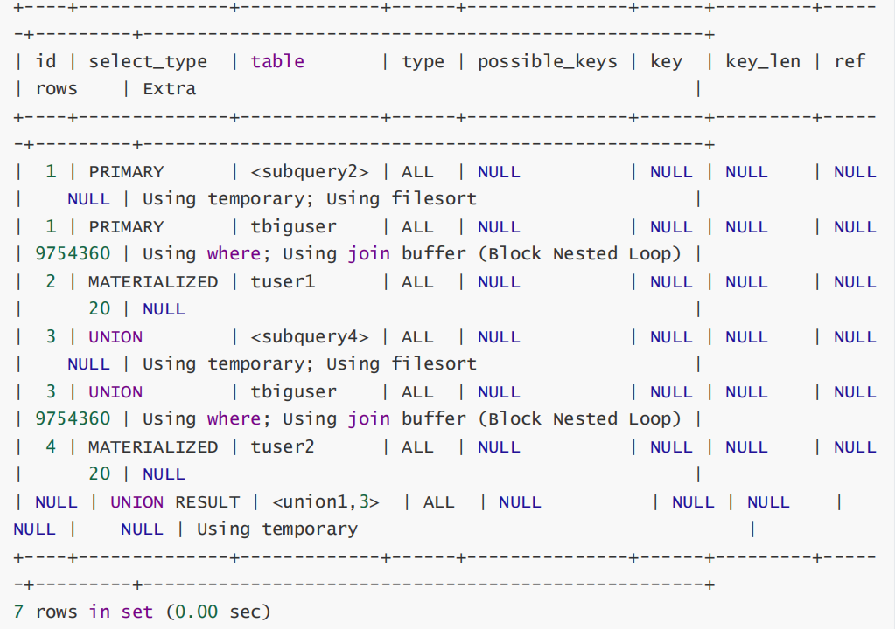

  - type:为ALL 说明没有索引，全表扫描
  - Using temporary：说明使用了临时表
  - Using filesort ：说明使用了文件排序
  - Using where：没有索引下推，在Server层进行了全表扫描和过滤
  - Using join buffer(Block Nested Loop)：关联没有索引，有关联优化

- **第一次优化：**

  - 给address加索引

    ```mysql
    # 给address加索引 
    alter table tbiguser add index idx_addr(address);
    alter table tuser1 add index idx_addr(address); 
    alter table tuser2 add index idx_addr(address);
    # 再次运行SQL
    mysql> select count(id) num , address from tbiguser where address in (select distinct address from tuser1) group by address union select count(id) num , address from tbiguser where address in (select distinct address from tuser2) group by address ;
    +-----+----------+ 
    | num | address  | 
    +-----+----------+ 
    | 105 | tianjin  | 
    | 100 | shanghai | 
    +-----+----------+ 
    2 rows in set (13.61 sec)
    #查看执行计划
    mysql> explain select count(id) num , address from tbiguser where address in (select distinct address from tuser1) group by address union select count(id) num , address from tbiguser where address in (select distinct address from tuser2) group by address ;
    ```

    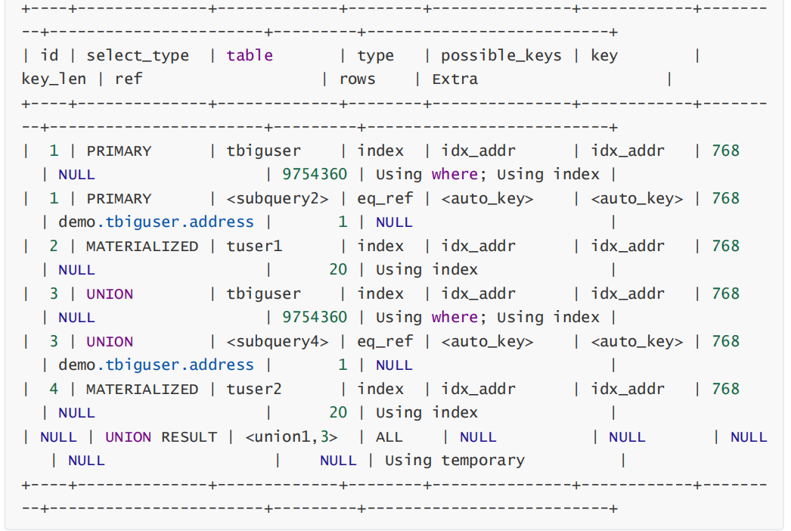

    - type：index ，说明用到了索引 ： 覆盖索引
    - Using temporary ：有临时表
    - Using where ：没有索引下推，在Server层进行了全表扫描和过滤

- **第二次优化：**

  ```mysql
  #修改sql 
  select count(id) num , address from tbiguser where address in (select distinct address from tuser1) or address in (select distinct address from tuser2) group by address order by address;
  +-----+----------+ 
  | num | address  |
  +-----+----------+ 
  | 100 | shanghai | 
  | 105 | tianjin  | 
  +-----+----------+ 
  2 rows in set (3.54 sec)
  # 运行执行计划 
  explain select count(id) num , address from tbiguser where address in (select distinct address from tuser1) or address in (select distinct address from tuser2) group by address order by address;
  ```

  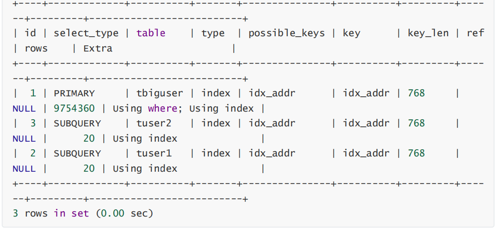

  type：index

  没有了临时表

- **第三次优化：**

  从前面的执行计划可以看出，索引只是使用了覆盖索引，rows=9754360， 说明还是几乎扫描了全表的行

  - 利用address索引，先过滤数据

    ```mysql
    mysql> select distinct b.* from tuser1 a,tbiguser b where a.address=b.address;
    # 查看执行计划
    mysql> explain select distinct b.* from tuser1 a,tbiguser b where a.address=b.address;
    ```

    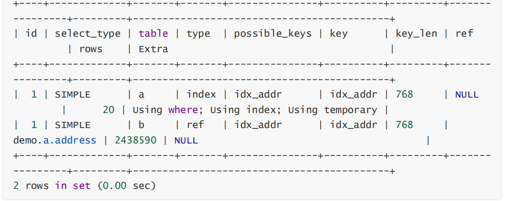

    type：ref

    rows：2438590

    说明使用了address索引做关联

    同理：

    ```mysql
    mysql> select distinct b.* from tuser2 a,tbiguser b where a.address=b.address;
    # 查看执行计划
    mysql> explain select distinct b.* from tuser2 a,tbiguser b where a.address=b.address;
    ```

    

    type：ref

    rows：2438590

    说明使用了address索引做关联

  - 合并结果集后再分组求和

    ```mysql
    select count(x.id),x.address from (select distinct b.* from tuser1 a,tbiguser b where a.address=b.address union all select distinct b.* from tuser2 a,tbiguser b where a.address=b.address) x group by x.address;
    +-----+----------+ 
    | num | address  |
    +-----+----------+ 
    | 100 | shanghai | 
    | 105 | tianjin  | 
    +-----+----------+ 
    2 rows in set (0.00 sec)
    #查看执行计划
    explain select count(x.id),x.address from (select distinct b.* from tuser1 a,tbiguser b where a.address=b.address union all select distinct b.* from tuser2 a,tbiguser b where a.address=b.address) x group by x.address;
    ```

    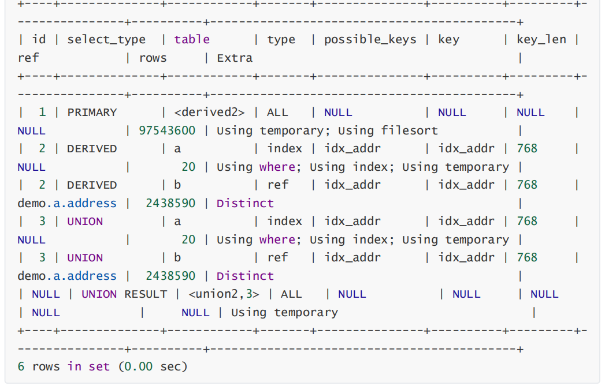

    DERIVED：派生表

- **最终优化**

  将派生表写成视图

  ```mysql
  # 创建视图 
  create view v_tuser as select distinct b.* from tuser1 a,tbiguser b where a.address=b.address union all select distinct b.* from tuser2 a,tbiguser b where a.address=b.address;
  # 执行SQL
  select count(id) cont ,address from v_tuser group by address order by address;
  +-----+----------+ 
  | num | address  |
  +-----+----------+ 
  | 100 | shanghai | 
  | 105 | tianjin  | 
  +-----+----------+ 
  2 rows in set (0.00 sec)
  ```

  **优化结果：从最初的将近14秒优化到不到1秒**

- **优化总结：**
  - 开启慢查询日志，定位运行慢的SQL语句
  - 利用explain执行计划，查看SQL执行情况
  - 关注索引使用情况：type
  - 关注Rows：行扫描
  - 关注Extra：没有信息最好
  - 加索引后，查看索引使用情况，index只是覆盖索引，并不算很好的使用索引
  - 如果有关联尽量将索引用到eq_ref或ref级别
  - 复杂SQL可以做成视图，视图在MySQL内部有优化，而且开发也比较友好
  - 对于复杂的SQL要逐一分析，找到比较费时的SQL语句片段进行优化
