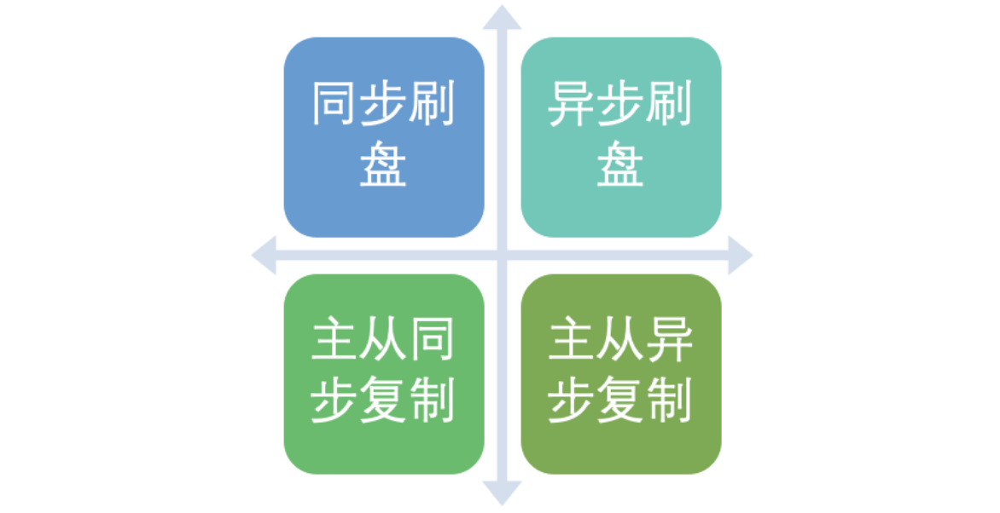
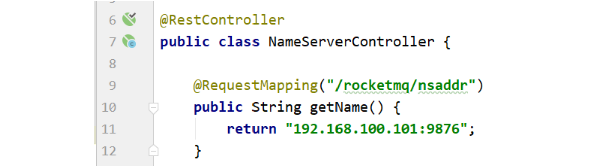
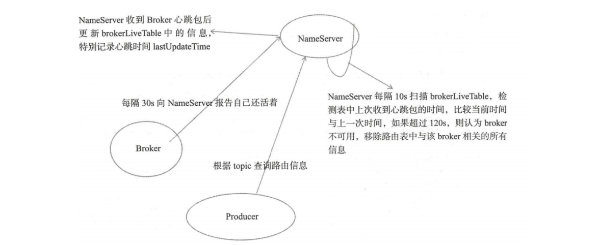

# RocketMQ

**目标**

1. 了解消息中间件背景知识、使用场景、发展等
2. 掌握RocketMQ消息中间件的架构、模型和使用（开发、安装、集群部署、运维、监控等）
3. 掌握消息的可靠性、幂等性、顺序消息、延迟消息、事务消息等进阶的知识，以及大规模生产环境中的使用经验，轻松应对各种复杂的业务场景
4. 掌握顶级开源消息中间件核心源码，理解其背后的架构设计思想以及在高性能存储系统、网络编程等方面的技巧（会涉及网络通信、操作系统等底层知识）
5. 理解主流消息中间件的优缺点，具备技术选型能力
6. 让你无论是在日后的工作还是面试求职中遇到消息中间件相关问题都能轻松应对

## 1、RocketMQ架构与实战

RocketMQ是阿里巴巴中间件团队自研的一款高性能、高吞吐量、低延迟、高可用、高可靠（具备金融级稳定性）的分布式消息中间件，开源后并于2016年捐赠给

Apache社区孵化，目前已经成为了Apache顶级项目。当前在国内被广泛的使用，包括互联网、电商、金融、企业服务等领域，包括：字节跳动、滴滴、微众银行

等知名的互联网公司。

https://github.com/apache/rocketmq

### 1.1、RocketMQ的前世今生

RocketMQ在阿里内部叫做Metaq（最早名为Metamorphosis，中文意思“变形记”，是作家卡夫卡的中篇小说代表作，可见是为了致敬Kafka）。

RocketMQ是Metaq 3.0之后开源的版本。

Metaq在阿里巴巴集团内部、蚂蚁金服、菜鸟等各业务中被广泛使用，接入了上万个应用系统中。并平稳支撑了历年的双十一大促（万亿级的消息），在性能、稳

定性、可靠性等方面表现出色，在整个阿里技术体系和大中台战略中发挥着举足轻重的作用。

Metaq最早源于Kafka，早期借鉴了Kafka很多优秀的设计。但是由于Kafka是Scale语言编写而阿里系主要使用Java，且无法满足阿里的电商、金融业务场景，所以

誓嘉（花名）团队用Java重新造轮子，并做了大量的改造和优化。

在此之前，淘宝有一款消息中间件名为Notify，目前已经逐步被Metaq所取代。

第一代的Notify主要使用了推模型，解决了事务消息；第二代的MetaQ主要使用了拉模型，解决了顺序消息和海量堆积的问题。相比起Kafka使用的Scale语言编

写，RabbitMQ 使用Erlang语言编写，基于Java的RocketMQ开源后更容易被广泛的研究，以及其他大厂定制开发。


### 1.2、RocketMQ的使用场景

- 应用解耦

  系统的耦合性越高，容错性就越低。以电商应用为例，用户创建订单后，如果耦合调用库存系统、物流系统、支付系统，任何一个子系统出了故障或者因为升

  级等原因暂时不可用，都会造成下单操作异常，影响用户使用体验。

- 流量削峰

  应用系统如果遇到系统请求流量的瞬间猛增，有可能会将系统压垮。有了消息队列可以将大量请求缓存起来，分散到很长一段时间处理，这样可以大大提到系

  统的稳定性和用户体验。

  举例:业务系统正常时段的QPS如果是1000，流量最高峰是10000，为了应对流量高峰配置高性能的服务器显然不划算，这时可以使用消息队列对峰值流量削峰

- 数据分发

  通过消息队列可以让数据在多个系统之间进行流通。数据的产生方不需要关心谁来使用数据，只需要将数据发送到消息队列，数据使用方直接在消息队列中直

  接获取数据即可

### 1.3、RocketMQ 部署架构

**RocketMQ的角色介绍** 

- Producer：消息的发送者；举例：发信者
- Consumer：消息接收者；举例：收信者
- Broker：暂存和传输消息；举例：邮局
- NameServer：管理Broker；举例：各个邮局的管理机构
- Topic：区分消息的种类；一个发送者可以发送消息给一个或者多个Topic；一个消息的接收者可以订阅一个或者多个Topic消息
- Message Queue：相当于是Topic的分区；用于并行发送和接收消息


- NameServer是一个几乎无状态节点，可集群部署，节点之间无任何信息同步。

- Broker部署相对复杂，Broker分为Master与Slave，一个Master可以对应多个Slave，但是一个Slave只能对应一个Master，Master与Slave 的对应关系通过指

  定相同的BrokerName，不同的BrokerId来定义，BrokerId为0表示Master，非0表示Slave。Master也可以部署多个。

  每个Broker与NameServer集群中的所有节点建立长连接，定时注册Topic信息到所有NameServer。 注意：当前RocketMQ版本在部署架构上支持一Master

  多Slave，但只有BrokerId=1的从服务器才会参与消息的读负载。

- Producer与NameServer集群中的其中一个节点（随机选择）建立长连接，定期从NameServer获取Topic路由信息，并向提供Topic 服务的Master建立长连

  接，且定时向Master发送心跳。Producer完全无状态，可集群部署。

- Consumer与NameServer集群中的其中一个节点（随机选择）建立长连接，定期从NameServer获取Topic路由信息，并向提供Topic服务的Master、Slave建

  立长连接，且定时向Master、Slave发送心跳。Consumer既可以从Master订阅消息，也可以从Slave订阅消息，消费者在向Master拉取消息时，Master服务

  器会根据拉取偏移量与最大偏移量的距离（判断是否读老消息，产生读I/O），以及从服务器是否可读等因素建议下一次是从Master还 是Slave拉取。

**执行流程:** 

1. 启动NameServer，NameServer起来后监听端口，等待Broker、Producer、Consumer连上来，相当于一个路由控制中心。

2. Broker启动，跟所有的NameServer保持长连接，定时发送心跳包。心跳包中包含当前Broker信息(IP+端口等)以及存储所有Topic信息。注册成功后，

  NameServer集群中就有Topic跟Broker的映射关系。

3. 收发消息前，先创建Topic，创建Topic时需要指定该Topic要存储在哪些Broker上，也可以在发送消息时自动创建Topic。 4. Producer发送消息，启动时先跟

  NameServer集群中的其中一台建立长连接，并从NameServer中获取当前发送的Topic存在哪些Broker上，轮询从队列列表中选择一个队列，然后与队列所在

  的Broker建立长连接从而向Broker发消息。

4. Consumer跟Producer类似，跟其中一台NameServer建立长连接，获取当前订阅Topic存在哪些Broker上，然后直接跟Broker建立连接通道，开始消费消息

### 1.4、RocketMQ特性

- **订阅与发布**

  消息的发布是指某个生产者向某个topic发送消息；消息的订阅是指某个消费者关注了某个topic中带有某些tag的消息。

- **消息顺序**

  消息有序指的是一类消息消费时，能按照发送的顺序来消费。例如：一个订单产生了三条消息分别是订单创建、订单付款、订单完成。消费时要按照这个顺序

  消费才能有意义，但是同时订单之间是可以并行消费的。RocketMQ可以严格的保证消息有序。

- **消息过滤**

  RocketMQ的消费者可以根据Tag进行消息过滤，也支持自定义属性过滤。消息过滤目前是在Broker端实现的，优点是减少了对于Consumer无用消息的网络

  传输，缺点是增加了Broker的负担、而且实现相对复杂。

- **消息可靠性**

  RocketMQ支持消息的高可靠，影响消息可靠性的几种情况： 

  1. Broker非正常关闭 

  2. Broker异常Crash 

  3. OS Crash 

  4. 机器掉电，但是能立即恢复供电情况 

  5. 机器无法开机（可能是cpu、主板、内存等关键设备损坏） 

  6. 磁盘设备损坏

  1、2、3、4四种情况都属于硬件资源可立即恢复情况，RocketMQ在这四种情况下能保证消息不丢，或者丢失少量数据（依赖刷盘方式是同步还是异步）。

  5、6属于单点故障，且无法恢复，一旦发生，在此单点上的消息全部丢失。

  RocketMQ在这两种情况下，通过异步复制，可保证99%的消息不丢，但是仍然会有极少量的消息可能丢失。

  通过同步双写技术可以完全避免单点，**同步双写**势必会影响性能，适合对消息可靠性要求极高的场合，例如与Money相关的应用。注：RocketMQ从3.0版本

  开始支持同步双写。

- **至少一次**

  至少一次(At least Once)指每个消息必须投递一次。Consumer先Pull消息到本地，消费完成后，才向服务器返回ack，如果没有消费一定不会ack消息，所以

  RocketMQ可以很好的支持此特性。

- **回溯消费**

  回溯消费是指Consumer已经消费成功的消息，由于业务上需求需要重新消费，要支持此功能，Broker在向Consumer投递成功消息后，消息仍然需要保留。

  并且重新消费一般是按照时间维度，例如由于Consumer系统故障，恢复后需要重新消费1小时前的数据，那么Broker要提供一种机制，可以按照时间维度来

  回退消费进度。RocketMQ支持按照时间回溯消费，时间维度精确到毫秒。

- **事务消息**

  RocketMQ事务消息（Transactional Message）是指应用本地事务和发送消息操作可以被定义到全局事务中，要么同时成功，要么同时失败。

  RocketMQ的事务消息提供类似 X/Open XA 的分布事务功能，通过事务消息能达到分布式事务的最终一致性。

- **定时消息**

  定时消息（延迟队列）是指消息发送到broker后，不会立即被消费，等待特定时间投递给真正的topic。

  broker有配置项messageDelayLevel，默认值为“1s 5s 10s 30s 1m 2m 3m 4m 5m 6m 7m 8m 9m 10m 20m 30m 1h 2h”，18个level。

  messageDelayLevel是broker的属性，不属于某个topic。发消息时，设置delayLevel等级即可：

  msg.setDelayLevel(level)。level有以下三种情况：

  - level == 0，消息为非延迟消息

  - 1<=level<=maxLevel，消息延迟特定时间，例如level==1，延迟1s

  - level > maxLevel，则level== maxLevel，例如level==20，延迟2h

  定时消息会暂存在名为SCHEDULE_TOPIC_XXXX的topic中，并根据delayTimeLevel存入特定的queue，queueId = delayTimeLevel – 1，即一个queue只存相

  同延迟的消息，保证具有相同发送延迟的消息能够顺序消费。broker会调度地消费SCHEDULE_TOPIC_XXXX，将消息写入真实的topic。

  需要注意的是，定时消息会在第一次写入和调度写入真实topic时都会计数，因此发送数量、tps都会变高。

- **消息重试**

  Consumer消费消息失败后，要提供一种重试机制，令消息再消费一次。Consumer消费消息失败通常可以认为有以下几种情况：

  - 由于消息本身的原因，例如反序列化失败，消息数据本身无法处理（例如话费充值，当前消息的手机号被注销，无法充值）等。这种错误通常需要跳过这

    条消息，再消费其它消息，而这条失败的消息即使立刻重试消费，99%也不成功，所以最好提供一种定时重试机制，即过10秒后再重试。

  - 由于依赖的下游应用服务不可用，例如db连接不可用，外系统网络不可达等。遇到这种错误，即使跳过当前失败的消息，消费其他消息同样也会报错。这

    种情况建议应用sleep 30s，再消费下一条消息，这样可以减轻Broker重试消息的压力。

- **消息重投**

  生产者在发送消息时：

  - 同步消息失败会重投

  - 异步消息有重试

  - oneway没有任何保证。

  消息重投保证消息尽可能发送成功、不丢失，但可能会造成**消息重复**，消息重复在RocketMQ中是无法避免的问题。消息重复在一般情况下不会发生，当出现

  消息量大、网络抖动，消息重复就会是大概率事件。另外，生产者主动重发、consumer负载变化也会导致重复消息。

  **如下方法可以设置消息重试策略：**

  - retryTimesWhenSendFailed：同步发送失败重投次数，默认为2，因此生产者会最多尝试发送retryTimesWhenSendFailed + 1次。不会选择上次失败的

    broker，尝试向其他broker发送，最大程度保证消息不丢失。超过重投次数，抛异常，由客户端保证消息不丢失。当出现RemotingException、

    MQClientException和部分MQBrokerException时会重投。

  - retryTimesWhenSendAsyncFailed：异步发送失败重试次数，异步重试不会选择其他broker，仅在同一个broker上做重试，不保证消息不丢。

  - retryAnotherBrokerWhenNotStoreOK：消息刷盘（主或备）超时或slave不可用（返回状态非SEND_OK），是否尝试发送到其他broker，默认false。

    十分重要消息可以开启。

- **流量控制**

  生产者流控，因为broker处理能力达到瓶颈；消费者流控，因为消费能力达到瓶颈。

  - 生产者流控：

    - commitLog文件被锁时间超过osPageCacheBusyTimeOutMills时，参数默认为1000ms，发生流控。
    - 如果开启transientStorePoolEnable = true，且broker为异步刷盘的主机，且transientStorePool中资源不足，拒绝当前send请求，发生流控。
    - broker每隔10ms检查send请求队列头部请求的等待时间，如果超过waitTimeMillsInSendQueue，默认200ms，拒绝当前send请求，发生流控。
    - broker通过拒绝send 请求方式实现流量控制。

    注意，**生产者流控，不会尝试消息重投。**

  - 消费者流控：
    - 消费者本地缓存消息数超过pullThresholdForQueue时，默认1000。
    - 消费者本地缓存消息大小超过pullThresholdSizeForQueue时，默认100MB。
    - 消费者本地缓存消息跨度超过consumeConcurrentlyMaxSpan时，默认2000。
    - 消费者流控的结果是降低拉取频率。

- **死信队列**

  死信队列用于处理无法被正常消费的消息。

  当一条消息初次消费失败，消息队列会自动进行消息重试；

  达到最大重试次数后，若消费依然失败，则表明消费者在正常情况下无法正确地消费该消息，

  此时，消息队列不会立刻将消息丢弃，而是将其发送到该消费者对应的特殊队列中。

  RocketMQ将这种正常情况下无法被消费的消息称为死信消息（Dead-Letter Message），

  将存储死信消息的特殊队列称为死信队列（Dead-Letter Queue）。

  在RocketMQ中，可以通过使用console控制台对死信队列中的消息进行重发来使得消费者实例再次进行消费。

### 1.5、消费模式Push or Pull

RocketMQ消息订阅有两种模式，一种是Push模式（MQPushConsumer），即MQServer主动向消费端推送；另外一种是Pull模式（MQPullConsumer），即消

费端在需要时，主动到MQ Server拉取。但在具体实现时，Push和Pull模式本质都是采用消费端主动拉取的方式，即consumer轮询从broker拉取消息。

- **Push模式特点**

  好处就是实时性高。不好处在于消费端的处理能力有限，当瞬间推送很多消息给消费端时，容易造成消费端的消息积压，严重时会压垮客户端。

- **Pull模式特点**

  好处就是主动权掌握在消费端自己手中，根据自己的处理能力量力而行。缺点就是如何控制Pull的频率。定时间隔太久担心影响时效性，间隔太短担心做太

  多“无用功”浪费资源。比较折中的办法就是长轮询。

- **Push模式与Pull模式的区别**

  Push方式里，consumer把长轮询的动作封装了，并注册MessageListener监听器，取到消息后，唤醒MessageListener的consumeMessage()来消费，对用

  户而言，感觉消息是被推送过来的。

  Pull方式里，取消息的过程需要用户自己主动调用，首先通过打算消费的Topic拿到MessageQueue的集合，遍历MessageQueue集合，然后针对每个

  MessageQueue批量取消息，一次取完后，记录该队列下一次要取的开始offset，直到取完了，再换另一个MessageQueue。

**RocketMQ使用长轮询机制来模拟Push效果，算是兼顾了二者的优点。**

### 1.6、RocketMQ中的角色及相关术语

- **消息模型（Message Model）**

  RocketMQ主要由 Producer、Broker、Consumer 三部分组成，其中Producer 负责生产消息，Consumer 负责消费消息，Broker 负责存储消息。Broker 在

  实际部署过程中对应一台服务器，每个Broker 可以存储多个Topic的消息，每个Topic的消息也可以分片存储于不同的 Broker。MessageQueue 用于存储消息

  的物理地址，每个Topic中的消息地址存储于多个 Message Queue 中。ConsumerGroup 由多个Consumer 实例构成。

- **Producer**

  消息生产者，负责产生消息，一般由业务系统负责产生消息。

- **Consumer**

  消息消费者，负责消费消息，一般是后台系统负责异步消费。

- **PushConsumer**

  Consumer消费的一种类型，该模式下Broker收到数据后会主动推送给消费端。应用通常向Consumer对象注册一个Listener接口，一旦收到消息，

  Consumer对象立刻回调Listener接口方法。该消费模式一般实时性较高。

- **PullConsumer**

  Consumer消费的一种类型，应用通常主动调用Consumer的拉消息方法从Broker服务器拉消息、主动权由应用控制。一旦获取了批量消息，应用就会启动消

  费过程。

- **ProducerGroup**

  同一类Producer的集合，这类Producer发送同一类消息且发送逻辑一致。如果发送的是事务消息且原始生产者在发送之后崩溃，则Broker服务器会联系同一

  生产者组的其他生产者实例以提交或回溯消费。

- **ConsumerGroup**

  同一类Consumer的集合，这类Consumer通常消费同一类消息且消费逻辑一致。消费者组使得在消息消费方面，实现负载均衡和容错的目标变得非常容易。

  要注意的是，**消费者组的消费者实例必须订阅完全相同的Topic**。RocketMQ 支持两种消息模式：集群消费（Clustering）和广播消费（Broadcasting）。

- **Broker**

  消息中转角色，负责存储消息，转发消息，一般也称为 Server。在 JMS 规范中称为Provider。

- **广播消费**

  一条消息被多个 Consumer 消费，即使这些 Consumer 属于同一个 Consumer Group，消息也会被 Consumer Group 中的每个 Consumer 都消费一次，广

  播消费中的 Consumer Group 概念可以认为在消息划分方面无意义。

  在 CORBA Notification 规范中，消费方式都属于广播消费。在 JMS 规范中，相当于 JMS Topic（ publish/subscribe ）模型。

- **集群消费**

  一个 Consumer Group 中的 Consumer 实例平均分摊消费消息。例如某个 Topic 有 9 条消息，其中一个 Consumer Group 有 3 个实例(可能是 3 个进程，或

  者3台机器)，那举每个实例只消费其中的 3条消息。

- **顺序消息**

  消费消息的顺序要同发送消息的顺序一致，在RocketMQ 中主要指的是局部顺序，即一类消息为满足顺序性，必须Producer单线程顺序发送，且发送到同一个

  队列，这样Consumer 就可以按照Producer发送的顺序去消费消息。

- **普通顺序消息**

  顺序消息的一种，正常情况下可以保证完全的顺序消息，但是一旦发生通信异常，Broker 重启，由于队列总数发生发化，哈希取模后定位的队列会发化，产

  生短暂的消息顺序不一致。 如果业务能容忍在集群异常情况(如某个Broker 宕机或者重启)下，消息短暂的乱序，使用普通顺序方式比较合适。

- **严格顺序消息**

  顺序消息的一种，无论正常异常情况都能保证顺序，但是牺牲了分布式 Failover特性，即Broker集群中只要有一台机器不可用，则整个集群都不可用，服务可

  用性大大降低。 如果服务器部署为同步双写模式，此缺陷可通过备机自动切换为主避免，不过仍然会存在几分钟的服务不可用。(依赖同步双写，主备自动切

  换，自动切换功能目前还未实现)

  目前已知的应用只有数据库 binlog 同步强依赖严格顺序消息，其他应用绝大部分都可以容忍短暂乱序，推荐使用普通的顺序消息。

- **Message Queue**

  在 RocketMQ 中，所有消息队列都是持久化的，长度无限的数据结构，所谓长度无限是指队列中的每个存储单元都是定长，访问其中的存储单元使用**Offset**

  来访问，offset 为 java **long** 类型，64 位，理论上在 100 年内不会溢出，所以认为为是长度无限，另外队列中只保存最近几天的数据，之前的数据会按照过期

  时间来删除。也可以认为Message Queue是一个长度无限的数组，offset 就是下标。

- **标签（Tag）**

  为消息设置的标志，用于同一主题下区分不同类型的消息。来自同一业务单元的消息，可以根据不同业务目的在同一主题下设置不同标签。标签能够有效地保

  持代码的清晰度和连贯性，并优化RocketMQ提供的查询系统。消费者可以根据Tag实现对不同子主题的不同消费逻辑，实现更好的扩展性。

### 1.7、RocketMQ环境搭建

- **软件准备:**

  RocketMQ最新版本：4.5.1

- **当前环境**
  - JDK 11.0.5
  - Linux64位系统(CentOS Linux release 7.7.1908)
  - 源码安装需要安装Maven 3.2.x
  - 4G+ free

- **安装及启动**

  - 下载rocketmq并解压安装

    ```shell
    wget https://archive.apache.org/dist/rocketmq/4.5.1/rocketmq-all-4.5.1-bin-release.zip
    unzip rocketmq-all-4.5.1-bin-release.zip
    mv rocketmq-all-4.5.1-bin-release rocketmq
    ```

  - 配置环境变量

    ```shell
    vim /etc/profile
    # 添加内容
    export ROCKET_HOME=/u01/software/rocketmq
    export PATH=$PATH:$ROCKET_HOME/bin
    # 生效
    source /etc/profile
    ```

  - 修改脚本（如果是JDK8可以不用修改）

    进入安装目录

    - runserver.sh

      修改内容

      ```shell
      vim bin/runserver.sh
      #删除
      UseCMSCompactAtFullCollection 
      UseParNewGC 
      UseConcMarkSweepGC 
      #修改内存(可以不改)： 
      JAVA_OPT="${JAVA_OPT} -server -Xms256m -Xmx256m -Xmn128m -XX:MetaspaceSize=64mm -XX:MaxMetaspaceSize=160mm" 
      -Xloggc修改为-Xlog:gc
      ```

      修改好内容

      ```shell
      #!/bin/sh 
      # Licensed to the Apache Software Foundation (ASF) under one or more 
      # contributor license agreements. See the NOTICE file distributed with
      # this work for additional information regarding copyright ownership.
      # The ASF licenses this file to You under the Apache License, Version 2.0
      # (the "License"); you may not use this file except in compliance with
      # the License. You may obtain a copy of the License at 
      #
      # http://www.apache.org/licenses/LICENSE-2.0 
      #
      # Unless required by applicable law or agreed to in writing, software 
      # distributed under the License is distributed on an "AS IS" BASIS, 
      # WITHOUT WARRANTIES OR CONDITIONS OF ANY KIND, either express or implied. 
      # See the License for the specific language governing permissions and # limitations under the License. #=========================================================================================== 
      # Java Environment Setting 
      #=========================================================================================== 
      error_exit () {
      echo "ERROR: $1 !!"
      exit 1 
      }
      [ ! -e "$JAVA_HOME/bin/java" ] && JAVA_HOME=$HOME/jdk/java 
      [ ! -e "$JAVA_HOME/bin/java" ] && JAVA_HOME=/usr/java 
      [ ! -e "$JAVA_HOME/bin/java" ] && error_exit "Please set the JAVA_HOME variable in your environment, We need java(x64)!" 
      export JAVA_HOME 
      export JAVA="$JAVA_HOME/bin/java" 
      export BASE_DIR=$(dirname $0)/.. 
      export CLASSPATH=.:${BASE_DIR}/conf:${JAVA_HOME}/jre/lib/ext:${BASE_DIR}/lib/*
      #=========================================================================================== 
      # JVM Configuration 
      #===========================================================================================
      JAVA_OPT="${JAVA_OPT} -server -Xms256m -Xmx256m -Xmn128m -XX:MetaspaceSize=64m -XX:MaxMetaspaceSize=160m" 
      JAVA_OPT="${JAVA_OPT} -XX:CMSInitiatingOccupancyFraction=70 -XX:+CMSParallelRemarkEnabled -XX:SoftRefLRUPolicyMSPerMB=0 -XX:+CMSClassUnloadingEnabled -XX:SurvivorRatio=8" 
      JAVA_OPT="${JAVA_OPT} -verbose:gc -Xlog:gc:/dev/shm/rmq_srv_gc.log -XX:+PrintGCDetails" 
      JAVA_OPT="${JAVA_OPT} -XX:-OmitStackTraceInFastThrow" 
      JAVA_OPT="${JAVA_OPT} -XX:-UseLargePages" 
      #JAVA_OPT="${JAVA_OPT} -Djava.ext.dirs=${JAVA_HOME}/jre/lib/ext:${BASE_DIR}/lib" 
      #JAVA_OPT="${JAVA_OPT} -Xdebug -Xrunjdwp:transport=dt_socket,address=9555,server=y,suspend=n" 
      JAVA_OPT="${JAVA_OPT} ${JAVA_OPT_EXT}" 
      JAVA_OPT="${JAVA_OPT} -cp ${CLASSPATH}" 
      $JAVA ${JAVA_OPT} $@
      ```

    - runbroker.sh

      修改内容

      ```shell
      vim bin/runbroker.sh 
      #删除： 
      PrintGCDateStamps 
      PrintGCApplicationStoppedTime 
      PrintAdaptiveSizePolicy 
      UseGCLogFileRotation 
      NumberOfGCLogFiles=5 
      GCLogFileSize=30m
      -Xloggc修改为-Xlog:gc
      ```

      

      修改好内容

      ```shell
      #!/bin/sh 
      # Licensed to the Apache Software Foundation (ASF) under one or more 
      # contributor license agreements. See the NOTICE file distributed with 
      # this work for additional information regarding copyright ownership.
      # The ASF licenses this file to You under the Apache License, Version 2.0
      # (the "License"); you may not use this file except in compliance with 
      # the License. You may obtain a copy of the License at 
      #
      # http://www.apache.org/licenses/LICENSE-2.0 
      #
      # Unless required by applicable law or agreed to in writing, software 
      # distributed under the License is distributed on an "AS IS" BASIS, 
      # WITHOUT WARRANTIES OR CONDITIONS OF ANY KIND, either express or implied. 
      # See the License for the specific language governing permissions and 
      # limitations under the License. 
      #=========================================================================================== 
      # Java Environment Setting 
      #===========================================================================================
      error_exit () { 
      	echo "ERROR: $1 !!" 
      	exit 1 
      }
      [ ! -e "$JAVA_HOME/bin/java" ] && JAVA_HOME=$HOME/jdk/java 
      [ ! -e "$JAVA_HOME/bin/java" ] && JAVA_HOME=/usr/java 
      [ ! -e "$JAVA_HOME/bin/java" ] && error_exit "Please set the JAVA_HOME variable in your environment, We need java(x64)!" 
      export JAVA_HOME 
      export JAVA="$JAVA_HOME/bin/java" 
      export BASE_DIR=$(dirname $0)/.. 
      export CLASSPATH=.${JAVA_HOME}/jre/lib/ext:${BASE_DIR}/lib/*:${BASE_DIR}/conf:${CLASSPATH}
      #=========================================================================================== 
      # JVM Configuration 
      #===========================================================================================
      JAVA_OPT="${JAVA_OPT} -server -Xms256m -Xmx256m -Xmn128m" 
      JAVA_OPT="${JAVA_OPT} -XX:+UseG1GC -XX:G1HeapRegionSize=16m - XX:G1ReservePercent=25 -XX:InitiatingHeapOccupancyPercent=30 -XX:SoftRefLRUPolicyMSPerMB=0" 
      JAVA_OPT="${JAVA_OPT} -verbose:gc -Xlog:gc:/dev/shm/mq_gc_%p.log -XX:+PrintGCDetails" 
      JAVA_OPT="${JAVA_OPT} -XX:-OmitStackTraceInFastThrow" 
      JAVA_OPT="${JAVA_OPT} -XX:+AlwaysPreTouch" 
      JAVA_OPT="${JAVA_OPT} -XX:MaxDirectMemorySize=15g" 
      JAVA_OPT="${JAVA_OPT} -XX:-UseLargePages -XX:-UseBiasedLocking" 
      #JAVA_OPT="${JAVA_OPT} -Xdebug -Xrunjdwp:transport=dt_socket,address=9555,server=y,suspend=n" 
      JAVA_OPT="${JAVA_OPT} ${JAVA_OPT_EXT}" 
      JAVA_OPT="${JAVA_OPT} -cp ${CLASSPATH}"
      numactl --interleave=all pwd > /dev/null 2>&1
      if [ $? -eq 0 ]
      then
      	if [ -z "$RMQ_NUMA_NODE" ] ; 
      	then
      		numactl --interleave=all $JAVA ${JAVA_OPT} $@
          else
          	numactl --cpunodebind=$RMQ_NUMA_NODE --membind=$RMQ_NUMA_NODE $JAVA${JAVA_OPT} $@
         	fi
      else
      	$JAVA ${JAVA_OPT} --add-exports=java.base/jdk.internal.ref=ALL-UNNAMED $@
      fi
      ```

    - tools.sh

      修改内容

      ```shell
      vim bin/tools.sh 
      # 删除 
      JAVA_OPT="${JAVA_OPT} -Djava.ext.dirs=${BASE_DIR}/lib:${JAVA_HOME}/jre/lib/ext"
      ```

      修改好内容

      ```shell
      #!/bin/sh 
      # Licensed to the Apache Software Foundation (ASF) under one or more 
      # contributor license agreements. See the NOTICE file distributed with 
      # this work for additional information regarding copyright ownership. 
      # The ASF licenses this file to You under the Apache License, Version 2.0 
      # (the "License"); you may not use this file except in compliance with 
      # the License. You may obtain a copy of the License at 
      #
      # http://www.apache.org/licenses/LICENSE-2.0 
      #
      # Unless required by applicable law or agreed to in writing, software 
      # distributed under the License is distributed on an "AS IS" BASIS, 
      # WITHOUT WARRANTIES OR CONDITIONS OF ANY KIND, either express or implied. 
      # See the License for the specific language governing permissions and 
      # limitations under the License. 
      #=========================================================================================== 
      # Java Environment Setting
      #=========================================================================================== 
      error_exit () { 
          echo "ERROR: $1 !!" 
          exit 1 
      }
      [ ! -e "$JAVA_HOME/bin/java" ] && JAVA_HOME=$HOME/jdk/java 
      [ ! -e "$JAVA_HOME/bin/java" ] && JAVA_HOME=/usr/java
      [ ! -e "$JAVA_HOME/bin/java" ] && error_exit "Please set the JAVA_HOMEvariable in your environment, We need java(x64)!"
      export JAVA_HOME 
      export JAVA="$JAVA_HOME/bin/java" 
      export BASE_DIR=$(dirname $0)/.. 
      # export CLASSPATH=.:${BASE_DIR}/conf:${CLASSPATH} 
      export CLASSPATH=.${JAVA_HOME}/jre/lib/ext:${BASE_DIR}/lib/*:${BASE_DIR}/conf:${CLASSPATH}
      #=========================================================================================== 
      # JVM Configuration 
      #===========================================================================================
      JAVA_OPT="${JAVA_OPT} -server -Xms256m -Xmx256m -Xmn256m -XX:PermSize=128m -XX:MaxPermSize=128m" 
      # JAVA_OPT="${JAVA_OPT} -Djava.ext.dirs=${BASE_DIR}/lib:${JAVA_HOME}/jre/lib/ext" 
      JAVA_OPT="${JAVA_OPT} -cp ${CLASSPATH}" 
      
      $JAVA ${JAVA_OPT} $@
      ```

  - 启动NameServer

    ```shell
    # 1.启动NameServer 
    mqnamesrv
    # 2.查看启动日志 
    tail -f ~/logs/rocketmqlogs/namesrv.log
    ```

  - 启动Broker

    ```shell
    # 1.启动Broker 
    mqbroker -n localhost:9876
    # 2.查看启动日志 
    tail -f ~/logs/rocketmqlogs/broker.log
    ```

### 1.8、RocketMQ环境测试

- 发送消息

  ```shell
  # 1.设置环境变量 
  export NAMESRV_ADDR=localhost:9876 
  # 2.使用安装包的Demo发送消息 
  sh bin/tools.sh org.apache.rocketmq.example.quickstart.Producer
  ```

- 接收消息

  ```shell
  # 1.设置环境变量 
  export NAMESRV_ADDR=localhost:9876 
  # 2.接收消息 
  sh bin/tools.sh org.apache.rocketmq.example.quickstart.Consumer
  ```

- 关闭RocketMQ

  ```shell
  # 1.关闭Broker 
  mqshutdown broker
  # 2.关闭NameServer 
  mqshutdown namesrv
  ```

### 1.9、RocketMQ相关API使用

DefaultMQProducer 生产者的默认实现，生产消息分同步发送和异步发送。

DefaultMQConsumer：消费者的默认实现，消息的拉取和消息的推送。

- 添加依赖

  ```xml
  <dependency>
      <groupId>org.apache.rocketmq</groupId>
      <artifactId>rocketmq-client</artifactId>
      <version>4.5.1</version>
  </dependency>
  ```

- 同步发送消息MyProducer.java

  ```java
  package com.thm;
  
  import org.apache.rocketmq.client.producer.DefaultMQProducer;
  import org.apache.rocketmq.client.producer.SendResult;
  import org.apache.rocketmq.common.message.Message;
  import org.apache.rocketmq.remoting.common.RemotingHelper;
  public class MyProducer {
      public static void main(String[] args) throws Exception {
          // 在实例化生产者的同时，指定了生产组名称
          DefaultMQProducer producer = new DefaultMQProducer("myproducer_grp_01");
          // 指定NameServer地址
          producer.setNamesrvAddr("192.168.81.100:9876");
          // 对生产者进行初始化
          producer.start();
          // 创建消息，第一个参数是主题名称，第二个参数是消息内容
          Message message = new Message("tp_demo_01","hello thm 01".getBytes(RemotingHelper.DEFAULT_CHARSET));
          // 同步发送消息
          SendResult send = producer.send(message);
          System.out.println(send);
          // 关闭生产者
          producer.shutdown();
      }
  }
  ```

- 异步发送消息MyAsyncProducer.java

  ```java
  package com.thm;
  import org.apache.rocketmq.client.producer.DefaultMQProducer;
  import org.apache.rocketmq.client.producer.SendCallback;
  import org.apache.rocketmq.client.producer.SendResult;
  import org.apache.rocketmq.common.message.Message;
  import java.nio.charset.StandardCharsets;
  
  public class MyAsyncProducer {
      public static void main(String[] args) throws Exception {
          // 在实例化生产者的同时，指定了生产组名称
          DefaultMQProducer producer = new DefaultMQProducer("myproducer_grp_01");
          // 指定NameServer地址
          producer.setNamesrvAddr("192.168.81.100:9876");
          // 对生产者进行初始化
          producer.start();
          // 异步发送消息
          for (int i = 0; i < 20; i++) {
              // 创建消息，第一个参数是主题名称，第二个参数是消息内容
              Message message = new Message("tp_demo_01",("hello thm" + i).getBytes(StandardCharsets.UTF_8));
              producer.send(message, new SendCallback() {
                  @Override
                  public void onSuccess(SendResult sendResult) {
                      System.out.println("发送成功:" + sendResult);
                  }
                  @Override
                  public void onException(Throwable throwable) {
                      System.out.println("发送失败:"+ throwable.getMessage());
                  }
              });
          }
          // 由于是异步发送消息，上面循环结束之后，消息可能还没收到broker的响应
          Thread.sleep(5000);
          // 关闭生产者
          producer.shutdown();
      }
  }
  ```

- 拉消息模式MyPullConsumer.java

  ```java
  package com.thm.consumer;
  
  import org.apache.rocketmq.client.consumer.DefaultMQPullConsumer;
  import org.apache.rocketmq.client.consumer.PullResult;
  import org.apache.rocketmq.common.message.MessageExt;
  import org.apache.rocketmq.common.message.MessageQueue;
  import java.nio.charset.StandardCharsets;
  import java.util.List;
  import java.util.Set;
  public class MyPullConsumer {
      public static void main(String[] args) throws Exception {
          // 拉取消息的消费者实例化，同时指定消费组
          DefaultMQPullConsumer consumer = new DefaultMQPullConsumer("consumer_grp_01");
          // 设置NameServer地址
          consumer.setNamesrvAddr("192.168.81.100:9876");
          // 对消费者进行初始化
          consumer.start();
          // 获取指定主题的消息队列集合
          Set<MessageQueue> messageQueues = consumer.fetchSubscribeMessageQueues("tp_demo_01");
          // 遍历该主题的各个消息队列，进行消费
          messageQueues.forEach(messageQueue -> {
              try {
                  // 第一个参数是MessageQueue对象，代表了当前主题的一个消息队列
                  // 第二个参数是一个表达式，对接收的消息按照tag进行过滤
                  // 支持"tag1 || tag2 || tag3"或者 "*"类型的写法；null或者"*"表示不对 消息进行tag过滤
                  // 第三个参数是消息的偏移量，从这里开始消费
                  // 第四个参数表示每次最多拉取多少条消息
                  PullResult result = consumer.pull(messageQueue, "*", 0, 10);
                  // 打印消息队列的信息
                  System.out.println("message******queue******" + messageQueue);
                  // 获取从指定消息队列中拉取到的消息
                  List<MessageExt> msgFoundList = result.getMsgFoundList();
                  if (msgFoundList != null) {
                      //循环输出消息
                      for (MessageExt messageExt : msgFoundList) {
                          System.out.println(messageExt);
                          System.out.println(new String(messageExt.getBody(), StandardCharsets.UTF_8));
                      }
                  }
              } catch (Exception e) {
                  e.printStackTrace();
              }
          });
          //关闭消费者
          consumer.shutdown();
      }
  }
  ```

- 推消息模式MyPushConsumer.java

  ```java
  package com.thm.consumer;
  
  import org.apache.rocketmq.client.consumer.DefaultMQPushConsumer;
  import org.apache.rocketmq.client.consumer.listener.ConsumeConcurrentlyContext;
  import org.apache.rocketmq.client.consumer.listener.ConsumeConcurrentlyStatus;
  import org.apache.rocketmq.client.consumer.listener.MessageListenerConcurrently;
  import org.apache.rocketmq.common.message.MessageExt;
  import org.apache.rocketmq.common.message.MessageQueue;
  
  import java.nio.charset.StandardCharsets;
  import java.util.List;
  public class MyPushConsumer {
      public static void main(String[] args) throws Exception{
          // 实例化推送消息消费者的对象，同时指定消费组名称
          DefaultMQPushConsumer consumer = new DefaultMQPushConsumer("consumer_grp_01");
          // 设置NameServer地址
          consumer.setNamesrvAddr("192.168.81.100:9876");
          // 订阅主题
          consumer.subscribe("tp_demo_01","*");
          // 添加消息监听器，一旦有消息推送过来，就进行消费
          consumer.setMessageListener(new MessageListenerConcurrently() {
              @Override
              public ConsumeConcurrentlyStatus consumeMessage(List<MessageExt> list, ConsumeConcurrentlyContext context) {
                  //获取当前消息的消息队列信息
                  MessageQueue messageQueue = context.getMessageQueue();
                  System.out.println(messageQueue);
                  //遍历监听到的消息
                  list.forEach(messageExt -> System.out.println(new String(messageExt.getBody(), StandardCharsets.UTF_8)));
                  // 消息消费成功
                  return ConsumeConcurrentlyStatus.CONSUME_SUCCESS;
                  // 消息消费失败
                  // return ConsumeConcurrentlyStatus.RECONSUME_LATER;
  
              }
          });
          // 初始化消费者，之后开始消费消息
          consumer.start();
          // 此处只是示例，生产中除非运维关掉，否则不应停掉，长服务
          // Thread.sleep(30_000);
          // 关闭消费者
          // consumer.shutdown();
      }
  }
  ```

### 1.10、RocketMQ和Spring的整合

#### 1.10.1、消息生产者

- 依赖

  ```xml
  <parent>
      <groupId>org.springframework.boot</groupId>
      <artifactId>spring-boot-starter-parent</artifactId>
      <version>2.3.5.RELEASE</version>
  </parent>
  <dependencies>
      <dependency>
          <groupId>org.apache.rocketmq</groupId>
          <artifactId>rocketmq-spring-boot-starter</artifactId>
          <version>2.2.0</version>
      </dependency>
      <dependency>
          <groupId>org.projectlombok</groupId>
          <artifactId>lombok</artifactId>
          <version>1.18.16</version>
      </dependency>
      <dependency>
          <groupId>org.springframework.boot</groupId>
          <artifactId>spring-boot-starter-test</artifactId>
          <scope>test</scope>
      </dependency>
  </dependencies>
  ```

- 配置文件

  ```properties
  #指定命名服务
  rocketmq.name-server=192.168.81.100:9876
  #指定生产组
  rocketmq.producer.group=myproducer_grp_01
  ```

- 启动类

  ```java
  package com.thm;
  import org.springframework.boot.SpringApplication;
  import org.springframework.boot.autoconfigure.SpringBootApplication;
  @SpringBootApplication
  public class Bootstrap {
      public static void main(String[] args) {
          SpringApplication.run(Bootstrap.class,args);
      }
  }
  ```

- 测试类

  ```java
  import com.thm.Bootstrap;
  import org.apache.rocketmq.spring.core.RocketMQTemplate;
  import org.springframework.beans.factory.annotation.Autowired;
  import org.springframework.boot.test.context.SpringBootTest;
  import java.nio.charset.StandardCharsets;
  @SpringBootTest(classes = Bootstrap.class)
  public class Test {
      @Autowired
      RocketMQTemplate rocketMQTemplate;
  
      @org.junit.jupiter.api.Test
      void testSend() throws Exception {
          /**
           * 发送消息
           * 第一个参数主题名称
           * 第二个参数消息内容
           */
          rocketMQTemplate.convertAndSend("tp_demo_01","hello springboot thm 01".getBytes(StandardCharsets.UTF_8));
      }
  }
  
  ```

#### 1.10.2、消息消费者

- 依赖

  ```xml
  <parent>
      <groupId>org.springframework.boot</groupId>
      <artifactId>spring-boot-starter-parent</artifactId>
      <version>2.3.5.RELEASE</version>
  </parent>
  <dependencies>
      <dependency>
          <groupId>org.apache.rocketmq</groupId>
          <artifactId>rocketmq-spring-boot-starter</artifactId>
          <version>2.2.0</version>
      </dependency>
      <dependency>
          <groupId>org.projectlombok</groupId>
          <artifactId>lombok</artifactId>
          <version>1.18.16</version>
      </dependency>
      <dependency>
          <groupId>org.springframework.boot</groupId>
          <artifactId>spring-boot-starter-test</artifactId>
          <scope>test</scope>
      </dependency>
  </dependencies>
  ```

- 配置文件

  ```properties
  #指定命名服务
  rocketmq.name-server=192.168.81.100:9876
  ```

- 启动类

  ```java
  package com.thm;
  import org.springframework.boot.SpringApplication;
  import org.springframework.boot.autoconfigure.SpringBootApplication;
  @SpringBootApplication
  public class Bootstrap {
      public static void main(String[] args) {
          SpringApplication.run(Bootstrap.class,args);
      }
  }
  ```

- 消息监听

  ```java
  package com.thm.listener;
  import lombok.extern.slf4j.Slf4j;
  import org.apache.rocketmq.spring.annotation.RocketMQMessageListener;
  import org.apache.rocketmq.spring.core.RocketMQListener;
  import org.springframework.stereotype.Component;
  @Slf4j
  @Component
  @RocketMQMessageListener(topic = "tp_demo_01",consumerGroup = "consumer_grp_01")
  public class MyRocketListener implements RocketMQListener<String> {
      @Override
      public void onMessage(String msg) {
          log.info(msg);
      }
  }
  ```

## 2、RocketMQ高级特性及原理

### 2.1、消息发送

生产者向消息队列里写入消息，不同的业务场景需要生产者采用不同的写入策略。比如同步发送、异步发送、Oneway发送、延迟发送、发送事务消息等。 

默认使用的是DefaultMQProducer类，发送消息要经过五个步骤：

- 设置Producer的GroupName。 

- 设置InstanceName，当一个Jvm需要启动多个Producer的时候，通过设置不同的InstanceName来区分，不设置的话系统使用默认名称“DEFAULT”。 

- 设置发送失败重试次数，当网络出现异常的时候，这个次数影响消息的重复投递次数。想保证不丢消息，可以设置多重试几次。

- 设置NameServer地址

- 组装消息并发送。

```java
package com.thm.producer;
import org.apache.rocketmq.client.producer.DefaultMQProducer;
import org.apache.rocketmq.client.producer.SendCallback;
import org.apache.rocketmq.client.producer.SendResult;
import org.apache.rocketmq.client.producer.SendStatus;
import org.apache.rocketmq.common.message.Message;
import org.apache.rocketmq.remoting.common.RemotingHelper;
public class MyProducer01 {
    public static void main(String[] args) throws Exception {
        // 线程安全，可以多线程使用
        // 在实例化生产者的同时，指定了生产组名称
        DefaultMQProducer producer = new DefaultMQProducer("myproducer_grp_01");
        // 设置实例名称，默认是DEFAULT,同一个JVM中启动多个生产者
        producer.setInstanceName("producer_01");
        // 设置同步发送重试次数
        producer.setRetryTimesWhenSendFailed(2);
        // 设置异步发送重试次数
        producer.setRetryTimesWhenSendAsyncFailed(2);
        // 指定NameServer地址
        producer.setNamesrvAddr("192.168.81.100:9876");
        // 对生产者进行初始化
        producer.start();
        // 创建消息，第一个参数是主题名称，第二个参数是消息内容
        Message message = new Message("tp_demo_01","hello thm 01".getBytes(RemotingHelper.DEFAULT_CHARSET));
        // 同步发送消息，失败通过setRetryTimesWhenSendFailed设置次数进行重试，可能会有重复消息，需要开发者处理
        SendResult send = producer.send(message);

        // 异步发送消息
        producer.send(message, new SendCallback() {
            @Override
            public void onSuccess(SendResult sendResult) {
                //发生成功处理逻辑
            }

            @Override
            public void onException(Throwable throwable) {
                //发送失败处理逻辑，重试次数耗尽，发生异常
            }
        });
        // 将消息放到socket缓冲区，直接返回，不等待broker响应
        // 速度快，会丢消息 ，单向发松
        producer.sendOneway(message);
        SendStatus sendStatus = send.getSendStatus();
        // 关闭生产者
        producer.shutdown();
    }
}
```

消息发生返回状态（SendResult#SendStatus）有如下四种：

- **FLUSH_DISK_TIMEOUT**

  表示没有在规定时间内完成刷盘（需要Broker的刷盘策略被设置成SYNC_FLUSH才会报这个错误）。

- **FLUSH_SLAVE_TIMEOUT**

  表示在主备方式下，并且Broker被设置成SYNC_MASTER方式，没有在设定时间内完成主从同步。

- **SLAVE_NOT_AVAILABLE**

  这个状态产生的场景和FLUSH_SLAVE_TIMEOUT类似，表示在主备方式下，并且Broker被设置成SYNC_MASTER，但是没有找到被配置成Slave的Broker。 

- **SEND_OK**

  表示发送成功，发送成功的具体含义，比如消息是否已经被存储到磁盘？消息是否被同步到了Slave上？消息在Slave上是否被写入磁盘？需要结合所配置的刷

  盘策略、主从策略来定。这个状态还可以简单理解为，没有发生上面列出的三个问题状态就是SEND_OK。

写一个高质量的生产者程序，重点在于对发送结果的处理，要充分考虑各种异常，写清对应的处理逻辑。

**提升写入的性能**

发送一条消息出去要经过三步

1. 客户端发送请求到服务器。
2. 服务器处理该请求。
3. 服务器向客户端返回应答

一次消息的发送耗时是上述三个步骤的总和。

在一些对速度要求高，但是可靠性要求不高的场景下，比如日志收集类应用， 可以采用Oneway方式发送,Oneway方式只发送请求不等待应答，即**将数据写入客户**

**端的Socket缓冲区就返回**，不等待对方返回结果。用这种方式发送消息的耗时可以缩短到**微秒级**。

另一种提高发送速度的方法是增加Producer的并发量，**使用多个Producer同时发送**。

我们不用担心多Producer同时写会降低消息写磁盘的效率，RocketMQ引入了一个并发窗口，在窗口内消息可以并发地写入DirectMem中，然后异步地将**连续一**

**段无空洞的数据**刷入文件系统当中。

**顺序写**CommitLog可让RocketMQ无论在HDD还是SSD磁盘情况下都能**保持较高的写入性能**。目前在阿里内部经过调优的服务器上，写入性能达到90万+的TPS，

我们可以参考这个数据进行系统优化。

在Linux操作系统层级进行调优，推荐使用EXT4文件系统，IO调度算法使用deadline算法。

### 2.2、消息消费

简单总结消费的几个要点：
1. 消息消费方式（Pull和Push） 2. 消息消费的模式（广播模式和集群模式）
3. 流量控制（可以结合sentinel来实现，后面单独讲）
4. 并发线程数设置
4. 消息的过滤（Tag、Key） TagA||TagB||TagC * null

```java
package com.thm.consumer;
import org.apache.rocketmq.client.consumer.DefaultMQPullConsumer;
import org.apache.rocketmq.client.consumer.DefaultMQPushConsumer;
import org.apache.rocketmq.client.consumer.PullResult;
import org.apache.rocketmq.common.message.MessageExt;
import org.apache.rocketmq.common.message.MessageQueue;
import org.apache.rocketmq.common.protocol.heartbeat.MessageModel;
import java.nio.charset.StandardCharsets;
import java.util.List;
import java.util.Set;
public class MyConsumer {
    public static void main(String[] args) throws Exception {
        // 拉取消息的消费者实例化，同时指定消费组
        DefaultMQPullConsumer pullConsumer = new DefaultMQPullConsumer("consumer_grp_01");
        // 消费模式：广播
        pullConsumer.setMessageModel(MessageModel.BROADCASTING);
        // 消费秘书：集群
        pullConsumer.setMessageModel(MessageModel.CLUSTERING);
        // 获取指定主题的消息队列集合
        Set<MessageQueue> messageQueues = pullConsumer.fetchSubscribeMessageQueues("tp_demo_01");
        for (MessageQueue messageQueue : messageQueues) {
            // 第一个参数是MessageQueue对象，代表了当前主题的一个消息队列
            // 第二个参数是一个表达式，对接收的消息按照tag进行过滤
            // 支持"tag1 || tag2 || tag3"或者 "*"类型的写法；null或者"*"表示不对 消息进行tag过滤
            // 第三个参数是消息的偏移量，从这里开始消费
            // 第四个参数表示每次最多拉取多少条消息
            PullResult result = pullConsumer.pull(messageQueue, "*", 0, 10);
        }
        // 实例化推送消息消费者的对象，同时指定消费组名称
        DefaultMQPushConsumer pushConsumer = new DefaultMQPushConsumer("consumer_grp_01");
        pullConsumer.setMessageModel(MessageModel.BROADCASTING);
        pullConsumer.setMessageModel(MessageModel.CLUSTERING);
        // 设置消费者的线程
        pushConsumer.setConsumeThreadMin(1);
        pushConsumer.setConsumeThreadMax(10);
        // 设置消息批处理的一批次中消息处理的最大个数
        pushConsumer.setConsumeMessageBatchMaxSize(10);
        //订阅主题，设置标签过滤 subExpression支持"tag1 || tag2 || tag3"或者 "*"类型的写法；null或者"*"表示不对 消息进行tag过滤
        pushConsumer.subscribe("tp_demo_01","*");

        // 启动消费者
        pushConsumer.start();
    }
}
```

当Consumer的处理速度跟不上消息的产生速度，会造成越来越多的消息积压，这个时候首先查看消费逻辑本身有没有优化空间，除此之外还有三种方法可以提高

Consumer的处理能力。

1. 提高消费并行度

  在同一个ConsumerGroup下（Clustering方式），可以通过增加Consumer实例的数量来提高并行度。

  通过加机器，或者在已有机器中启动多个Consumer进程都可以增加Consumer实例数。

  注意：总的Consumer数量不要超过Topic下Read Queue数量，超过的Consumer实例接收不到消息。

  此外，通过提高单个Consumer实例中的并行处理的线程数，可以在同一个Consumer内增加并行度来提高吞吐量（设置方法是修改consumeThreadMin和

  consumeThreadMax）。

2. 以批量方式进行消费

  某些业务场景下，多条消息同时处理的时间会大大小于逐个处理的时间总和，比如消费消息中涉及update某个数据库，一次update10条的时间会大大小于十

  次update1条数据的时间。
  可以通过批量方式消费来提高消费的吞吐量。实现方法是设置Consumer的consumeMessageBatchMaxSize这个参数，默认是1，如果设置为N，在消息多的

  时候每次收到的是个长度为N的消息链表。

3.  检测延时情况，跳过非重要消息

  Consumer在消费的过程中，如果发现由于某种原因发生严重的消息堆积，短时间无法消除堆积，这个时候可以选择丢弃不重要的消息，使Consumer尽快追

  上Producer的进度。

### 2.3、消息存储

#### 2.3.1、存储介质

- **关系型数据库DB**

  Apache下开源的另外一款MQ—ActiveMQ（默认采用的KahaDB做消息存储）可选用JDBC的方式来做消息持久化，通过简单的xml配置信息即可实现JDBC消

  息存储。由于，普通关系型数据库（如Mysql）在单表数据量达到千万级别的情况下，其IO读写性能往往会出现瓶颈。在可靠性方面，该种方案非常依赖DB，

  如果一旦DB出现故障，则MQ的消息就无法落盘存储会导致线上故障

- **文件系统**

  目前业界较为常用的几款产品（RocketMQ/Kafka/RabbitMQ）均采用的是消息刷盘至所部署虚拟机/物理机的文件系统来做持久化（刷盘一般可以分为异步刷

  盘和同步刷盘两种模式）。消息刷盘为消息存储提供了一种高效率、高可靠性和高性能的数据持久化方式。除非部署MQ机器本身或是本地磁盘挂了，否则一

  般是不会出现无法持久化的故障问题。

- **性能对比**

  文件系统>关系型数据库DB

#### 2.3.2、消息的存储和发送

- **消息存储**

  目前的高性能磁盘，顺序写速度可以达到600MB/s， 超过了一般**网卡**的传输速度。但是磁盘随机写的速度只有大概100KB/s，和顺序写的性能相差6000倍！

  因为有如此巨大的速度差别，好的消息队列系统会比普通的消息队列系统速度快多个数量级。RocketMQ的消息用**顺序写**,保证了消息存储的速度。

- **存储结构**

  RocketMQ消息的存储是由ConsumeQueue和CommitLog配合完成 的，消息真正的物理存储文件是CommitLog，ConsumeQueue是消息的逻辑队列，**类似**

  **数据库的索引文件**，存储的是**指向物理存储的地址**。每 个Topic下的每个Message Queue都有一个对应的ConsumeQueue文件。

  

  - 消息存储架构图中主要有下面三个跟消息存储相关的文件构成

    - CommitLog：

      消息主体以及元数据的存储主体，存储Producer端写入的消息主体内容,消息内容不是定长的。单个文件大小默认1G ，文件名长度为20位，左边补零，剩余为起始偏移量，比如00000000000000000000代表了第一个文件，起始偏移量为0，文件大小为1G=1073741824；当第一个文件写满了，第二个文件为00000000001073741824，起始偏移量为1073741824，以此类推。消息主要是顺序写入日志文件，当文件满了，写入下一个文件；

      

    - ConsumeQueue：

      消息消费队列，引入的目的主要是**提高消息消费的性能**RocketMQ是基于主题topic的订阅模式，消息消费是针对主题进行如果要遍历commitlog文件

      根据topic检索消息是非常低效。Consumer即可根据ConsumeQueue来查找待消费的消息。

      其中，ConsumeQueue（逻辑消费队列）作为消费消息的索引：

      1. 保存了指定Topic下的队列消息在CommitLog中的起始物理偏移量offset

      2. 消息大小size

      3. 消息Tag的HashCode值。

      consumequeue文件可以看成是基于topic的commitlog索引文件，故consumequeue文件夹的组织方式如下：

      topic/queue/file三层组织结构：具体存储路径为：$HOME/store/consumequeue/{topic}/{queueId}/{fileName}。

      

      consumequeue文件采取定长设计，**每个条目**共20个字节，分别为：

      1. 8字节的commitlog物理偏移量
      2. 4字节的消息长度
      3. 8字节tag hashcode

      单个文件由30W个条目组成，可以像数组一样随机访问每一个条目每个ConsumeQueue**文件大小约5.72M**；

    -  IndexFile：

      IndexFile（索引文件）提供了一种**可以通过key或时间区间来查询消息**的方法。

      1. Index文件的存储位置是： $HOME/store/index/${fileName} 
      2. 文件名fileName是以创建时的时间戳命名的
      3. 固定的单个IndexFile文件大小约为400M
      4. 一个IndexFile可以保存 2000W个索引
      5. IndexFile的底层存储设计为在文件系统中实现**HashMap结构**，故rocketmq的索引文件其底层实现为**hash索引**。

      

### 2.4、过滤消息

RocketMQ分布式消息队列的消息过滤方式有别于其它MQ中间件，是在**Consumer端订阅消息时再做消息过滤**的。

RocketMQ这么做是在于其Producer端写入消息和Consumer端订阅消息采用**分离存储的机制**来实现的，Consumer端订阅消息是需要通过**ConsumeQueue**这个

消息消费的逻辑队列拿到一个索引，然后再从**CommitLog**里面读取真正的消息实体内容，所以说到底也是还绕不开其存储结构。

其ConsumeQueue的存储结构如下，可以看到其中有**8个字节存储的Message Tag的哈希值**，基于Tag的消息过滤正式基于这个字段值的。


主要支持如下2种的过滤方式

-  **Tag过滤方式**

  Consumer端在**订阅消息**时除了指定Topic还可以指定TAG，如果一个消息有多个TAG，可以用||分隔。

  1. Consumer端会将这个订阅请求构建成一个 SubscriptionData，发送一个Pull消息的请求给Broker端。

  2. Broker端从RocketMQ的文件存储层—Store读取数据之前，会用这些数据先构建一个MessageFilter，然后传给Store。 

  3. Store从 ConsumeQueue读取到一条记录后，会用它记录的消息tag hash值去做过滤。

  4. 在服务端只是根据hashcode进行判断，无法精确对tag原始字符串进行过滤，在消息消费端拉取到消息后，还需要对消息的原始tag字符串进行比对，如果

    不同，则丢弃该消息，不进行消息消费。

  5. 具体使用

     - 生产者

       ```java
       //创建消息并发送
       Message message = new Message("tp_demo_02","tag0",("hello thm tag").getBytes(StandardCharsets.UTF_8));
       producer.send(message)
       ```

     - 消费者

       ```java
       // 订阅主题 接收所有标签消息
       consumer.subscribe("tp_demo_02","*");
       // 订阅主题 接收tag0标签消息
       consumer.subscribe("tp_demo_02","tag0");
       // 订阅主题 接收tag0||tag1标签消息
       consumer.subscribe("tp_demo_02","tag0||tag1");
       ```

- **SQL92的过滤方式**

  1. 仅对push的消费者起作用。

  2. Tag方式虽然效率高，但是支持的过滤逻辑比较简单。

  3. SQL表达式可以更加灵活的支持复杂过滤逻辑，这种方式的大致做法和上面的Tag过滤方式一样，只是在Store层的具体过滤过程不太一样

     真正的 SQL expression 的构建和执行由rocketmq-filter模块负责的。

  4. 每次过滤都去执行SQL表达式会影响效率，所以RocketMQ使用了BloomFilter避免了每次都去执行。

  5. SQL92的表达式上下文为消息的属性。

  6. 具体使用

     - 修改配置文件conf/broker.conf

       

       

     - 开启支持SQL92的特性，然后重启broker

       ```shell
       mqbroker -n localhost:9876 -c /opt/rocket/conf/broker.conf 1
       ```

     - RocketMQ仅定义了几种基本的语法，用户可以扩展

       1. 数字比较： >, >=, <, <=, BETWEEN, =
       2. 字符串比较： =, <>, IN; IS NULL或者IS NOT NULL;
       3. 逻辑比较： AND, OR, NOT;
       4. Constant types are: 数字如：123, 3.1415; 字符串如：'abc'，必须是单引号引起来 NULL,特殊常量 布尔型如：TRUE or FALSE;

     

- **Filter Server方式**

  这是一种比SQL表达式更灵活的过滤方式，允许用户自定义Java函数，根据Java函数的逻辑对消息进行过滤。

  要使用Filter Server，首先要在启动Broker前在配置文件里加上 filterServer-Nums=3 这样的配置，Broker在启动的时候，就会在本机启动3个Filter Server进

  程。Filter Server类似一个RocketMQ的Consumer进程，它从本机Broker获取消息，然后根据用户上传过来的Java函数进行过滤，过滤后的消息再传给远端的

  Consumer。

  这种方式会占用很多Broker机器的CPU资源，要根据实际情况谨慎使用。上传的java代码也要经过检查，不能有申请大内存、创建线程等这样的操作，否则容

  易造成Broker服务器宕机。

### 2.5、零拷贝原理

#### 2.5.1、PageCache

1. 由内存中的物理page组成，其内容对应磁盘上的block。

2. page cache的大小是动态变化的。

3. backing store: cache缓存的存储设备

4. 一个page通常包含多个block, 而block不一定是连续的。

- **读Cache**
  - 当内核发起一个读请求时, 先会检查请求的数据是否缓存到了page cache中。
    - 如果有，那么直接从内存中读取，不需要访问磁盘, 此即 cache hit(缓存命中)
    - 如果没有, 就必须从磁盘中读取数据, 然后内核将读取的数据再缓存到cache中, 如此后续的读请求就可以命中缓存了。
  - page可以只缓存一个文件的部分内容, 而不需要把整个文件都缓存进来。

- **写Cache**
  - 当内核发起一个写请求时, 也是直接往cache中写入, 后备存储中的内容不会直接更新。
  - 内核会将被写入的page标记为dirty, 并将其加入到dirty list中。
  - 内核会周期性地将dirty list中的page写回到磁盘上, 从而使磁盘上的数据和内存中缓存的数据一致。

- **cache回收**
  - Page cache的另一个重要工作是释放page, 从而释放内存空间。
  - cache回收的任务是选择合适的page释放
    - 如果page是dirty的, 需要将page写回到磁盘中再释放。

#### 2.5.2、cache和buffer的区别

- **Cache：缓存区，是高速缓存**，是位于CPU和主内存之间的容量较小但速度很快的存储器，因为CPU的速度远远高于主内存的速度，CPU从内存中读取数据需

  等待很长的时间，而 Cache保存着CPU刚用过的数据或循环使用的部分数据，这时从Cache中读取数据会更快，减少了CPU等待的时间，提高了系统的性能。

  Cache并不是缓存文件的，而是缓存块的(块是I/O读写最小的单元)；Cache一般会用在I/O请求上，如果多个进程要访问某个文件，可以把此文件读入Cache

  中，这样下一个进程获取CPU控制权并访问此文件直接从Cache读取，提高系统性能。

-  **Buffer：缓冲区**，用于存储速度不同步的设备或优先级不同的设备之间传输数据；通过buffer可以减少进程间通信需要等待的时间，当存储速度快的设备与存

  储速度慢的设备进行通信时，存储慢的数据先把数据存放到buffer，达到一定程度存储快的设备再读取buffer的数据，在此期间存储快的设备CPU可以干其他

  的事情。

  Buffer：一般是用在写入磁盘的，例如：某个进程要求多个字段被读入，当所有要求的字段被读入之前已经读入的字段会先放到buffer中。

#### 2.5.3、HeapByteBuffer和DirectByteBuffer

HeapByteBuffer，是在**jvm堆上面一个buffer**，底层的本质是一个数组，用类封装维护了很多的索引（limit/position/capacity等）。

DirectByteBuffer，底层的数据是维护在**操作系统的内存中**，而不是jvm里，DirectByteBuffer里维护了一个引用address指向数据，进而操作数据。

HeapByteBuffer优点：内容维护在jvm里，把内容写进buffer里速度快；更容易回收

DirectByteBuffer优点：跟外设（IO设备）打交道时会快很多，因为外设读取jvm堆里的数据时，不是直接读取的，而是把jvm里的数据读到一个内存块里，再在这

个块里读取的，如果使用DirectByteBuffer，则可以省去这一步，实现zero copy（零拷贝）

外设之所以要把jvm堆里的数据copy出来再操作，不是因为操作系统不能直接操作jvm内存，而是因为jvm在进行gc（垃圾回收）时，会对数据进行移动，一旦出

现这种问题，外设就会出现数据错乱的情况。


**所有的通过allocate方法创建的buffer都是HeapByteBuffer.**


**堆外内存实现零拷贝**

1. 前者分配在JVM堆上（ByteBuffer.allocate()），后者分配在操作系统物理内存上（ByteBuffer.allocateDirect()，JVM使用C库中的malloc()方法分配堆外内

  存）；

2. DirectByteBuffer可以减少JVM GC压力，当然，堆中依然保存对象引用，fullgc发生时也会回收直接内存，也可以通过system.gc主动通知JVM回收，或者通过 

  cleaner.clean主动清理。Cleaner.create()方法需要传入一个DirectByteBuffer对象和一个Deallocator（一个堆外内存回收线程）。GC发生时发现堆中的

  DirectByteBuffer对象没有强引用了，则调用Deallocator的run()方法回收直接内存，并释放堆中DirectByteBuffer的对象引用；

3. 底层I/O操作需要连续的内存（JVM堆内存容易发生GC和对象移动），所以在执行write操作时需要将HeapByteBuffer数据拷贝到一个临时的(操作系统用户态)

  内存空间中，会多一次额外拷贝。而DirectByteBuffer则可以省去这个拷贝动作，这是Java层面的 “零拷贝” 技术，在netty中广泛使用；

4. MappedByteBuffer底层使用了操作系统的mmap机制，FileChannel#map()方法就会返回MappedByteBuffer。DirectByteBuffer虽然实现了

MappedByteBuffer，不过DirectByteBuffer默认并没有直接使用mmap机制。

#### 2.5.4、缓冲IO和直接IO

- **缓存IO**

  缓存I/O又被称作标准I/O，大多数文件系统的默认I/O操作都是缓存I/O。在Linux的缓存I/O机制中，数据先从磁盘复制到内核空间的缓冲区，然后从内核空间

  缓冲区复制到应用程序的地址空间。

  - **读操作：**

    操作系统检查内核的缓冲区有没有需要的数据，如果已经缓存了，那么就直接从缓存中返回；否则从磁盘中读取，然后缓存在操作系统的缓存中。

  - **写操作：**

    将数据从用户空间复制到内核空间的缓存中。这时对用户程序来说写操作就已经完成，至于什么时候再写到磁盘中由操作系统决定，除非显示地调用了

    sync同步命令。

  - **缓存I/O的优点：**
    1. 在一定程度上分离了内核空间和用户空间，保护系统本身的运行安全；
    2. 可以减少读盘的次数，从而提高性能。

  - **缓存I/O的缺点：**

    在缓存 I/O 机制中，DMA 方式可以将数据直接从磁盘读到页缓存中，或者将数据从页缓存直接写回到磁盘上，而不能直接在应用程序地址空间和磁盘之间

    进行数据传输。数据在传输过程中就需要在**应用程序地址空间（用户空间）和缓存（内核空间）之间进行多次数据拷贝操作**，这些数据拷贝操作所带来的

    CPU以及内存开销是非常大的。

- **直接IO**

  直接IO就是应用程序直接访问磁盘数据，而不经过内核缓冲区，这样做的目的是减少一次从内核缓冲区到用户程序缓存的数据复制。比如说数据库管理系统这

  类应用，它们更倾向于选择它们自己的缓存机制，因为数据库管理系统往往比操作系统更了解数据库中存放的数据，数据库管理系统可以提供一种更加有效的

  缓存机制来提高数据库中数据的存取性能。

  直接IO的缺点：如果**访问的数据不在应用程序缓存中，那么每次数据都会直接从磁盘加载**，这种直接加载会非常缓慢。通常直接IO与异步IO结合使用，会得到

  比较好的性能。

  下图分析了写场景下的DirectIO和BufferIO：

  

#### 2.5.5、 内存映射文件（Mmap）

在LINUX中我们可以使用mmap用来在进程虚拟内存地址空间中分配地址空间，创建和物理内存的映射关系。


**映射关系可以分为两种**

1. 文件映射 磁盘文件映射进程的虚拟地址空间，使用文件内容初始化物理内存。

2. 匿名映射 初始化全为0的内存空间。

**而对于映射关系是否共享又分为**

1. 私有映射(MAP_PRIVATE) 多进程间数据共享，修改不反应到磁盘实际文件，是一个copy-on-write（写时复制）的映射方式。

2. 共享映射(MAP_SHARED) 多进程间数据共享，修改反应到磁盘实际文件中。

**因此总结起来有4种组合**

1. 私有文件映射 多个进程使用同样的物理内存页进行初始化，但是各个进程对内存文件的修改不会共享，也不会反应到物理文件中

2. 私有匿名映射 mmap会创建一个新的映射，各个进程不共享，这种使用主要用于分配内存(malloc分配大内存会调用mmap)。 例如开辟新进程时，会为每个进

程分配虚拟的地址空间，这些虚拟地址映射的物理内存空间各个进程间读的时候共享，写的时候会copy-on-write。 

3. 共享文件映射 多个进程通过虚拟内存技术共享同样的物理内存空间，对内存文件 的修改会反应到实际物理文件中，他也是进程间通信(IPC)的一种机制。

4. 共享匿名映射 这种机制在进行fork的时候不会采用写时复制，父子进程完全共享同样的物理内存页，这也就实现了父子进程通信(IPC)

**mmap只是在虚拟内存分配了地址空间，只有在第一次访问虚拟内存的时候才分配物理内存。**

在mmap之后，并没有在将文件内容加载到物理页上，只上在虚拟内存中分配了地址空间。当进程在访问这段地址时，通过查找页表，发现虚拟内存对应的页没有

在物理内存中缓存，则产生"缺页"，由内核的缺页异常处理程序处理，将文件对应内容，以页为单位(4096)加载到物理内存，注意是只加载缺页，但也会受操作系

统一些调度策略影响，加载的比所需的多。

#### 2.5.6、直接内存读取并发送文件的过程


#### 2.5.7、Mmap读取并发送文件的过程


#### 2.5.8、Sendfile零拷贝读取并发送文件的过程


零拷贝（zero copy）小结
1. 虽然叫零拷贝，实际上sendfile有2次数据拷贝的。第1次是从磁盘拷贝到内核缓冲区，第二次是从内核缓冲区拷贝到网卡（协议引擎）。如果网卡支持 SG-

  DMA（The Scatter-GatherDirect Memory Access）技术，就无需从PageCache拷贝至 Socket 缓冲区；

2. 之所以叫零拷贝，是从内存角度来看的，数据在内存中没有发生过拷贝，只是在内存和I/O设备之间传输。很多时候我们认为sendfile才是零拷贝，mmap严格

  来说不算；

3. Linux中的API为sendfile、mmap，Java中的API为FileChanel.transferTo()、FileChannel.map()等；

4. Netty、Kafka(sendfile)、Rocketmq（mmap）、Nginx等高性能中间件中，都有大量利用操作系统零拷贝特性。

### 2.6、同步复制和异步复制

如果一个Broker组有Master和Slave，消息需要从Master复制到Slave 上，有同步和异步两种复制方式。

- **同步复制**

  同步复制方式是等Master和Slave均写成功后才反馈给客户端写成功状态；

  在同步复制方式下，如果Master出故障，Slave上有全部的备份数据，容易恢复，但是同步复制会增大数据写入延迟，降低系统吞吐量。

- **异步复制**

  异步复制方式是只要Master写成功即可反馈给客户端写成功状态。

  在异步复制方式下，系统拥有较低的延迟和较高的吞吐量，但是如果Master出了故障，有些数据因为没有被写 入Slave，有可能会丢失；

- **配置**

  同步复制和异步复制是通过Broker配置文件里的brokerRole参数进行设置，这个参数可以设成ASYNC_MASTER、 SYNC_MASTER、SLAVE三个值中的一个。

  `rocket/conf/broker.conf` 文件：Broker的配置文件

  | 参数                   | 默认值                    | 说明                                                         |
  | ---------------------- | ------------------------- | ------------------------------------------------------------ |
  | listenPort             | 10911                     | 接受客户端连接的监听端口                                     |
  | namesrvAddr            | null                      | nameServer 地址                                              |
  | brokerIP1              | 网卡的 InetAddress        | 当前 broker 监听的 IP                                        |
  | brokerIP2              | 跟 brokerIP1 一样         | 存在主从 broker 时，如果在 broker 主节点上配置了 brokerIP2 属性， broker 从节点会连接主节点配置的 brokerIP2 进行同步 |
  | brokerName             | null                      | broker 的名称                                                |
  | brokerClusterName      | DefaultCluster            | 本 broker 所属的 Cluser 名称                                 |
  | brokerId               | 0                         | broker id, 0 表示 master, 其他的正整 数表示 slave            |
  | storePathCommitLog     | $HOME/store/commitlog/    | 存储 commit log 的路径                                       |
  | storePathConsumerQueue | $HOME/store/consumequeue/ | 存储 consume queue 的路径                                    |
  | mapedFileSizeCommitLog | 1024 * 1024 * 1024(1G)    | commit log 的映射文件大小                                    |
  | deleteWhen             | 04                        | 在每天的什么时间删除已经超过文件保 留时间的 commit log       |
  | fileReserverdTime      | 72                        | 以小时计算的文件保留时间                                     |
  | **brokerRole**         | **ASYNC_MASTER**          | SYNC_MASTER或者ASYNC_MASTER或 者SLAVE <br>SYNC_MASTER表示当前broker是一个 同步复制的Master<br/>ASYNC_MASTER表示当前broker是一 个异步复制的Master<br/>SLAVE表示当前borker是一个Slave。 |
  | flushDiskType          | ASYNC_FLUSH               | SYNC_FLUSH/ASYNC_FLUSH <br/>SYNC_FLUSH 模式下broker保证在收到确认生产者之前将消息刷盘。<br/>ASYNC_FLUSH 模式下broker则利用刷盘一组消息的模式，可以取得更好的性能。 |

- **总结**

  

  实际应用中要结合业务场景，合理设置刷盘方式和主从复制方式， 尤其是SYNC_FLUSH方式，由于频繁地触发磁盘写动作，会明显降低性能。通常情况下，应

  该把Master和Save配置成ASYNC_FLUSH的刷盘方式，主从之间配置成SYNC_MASTER的复制方式，这样即使有一台机器出故障，仍然能保证数据不丢，是个

  不错的选择。

### 2.7、高可用机制

RocketMQ分布式集群是通过Master和Slave的配合达到高可用性的。

Master和Slave的区别：

1. 在Broker的配置文件中，参数brokerId的值为0表明这个Broker是Master
2. 大于0表明这个Broker是Slave
3. brokerRole参数也说明这个Broker是Master还是Slave。(SYNC_MASTER/ASYNC_MASTER/SALVE)
4. Master角色的Broker支持读和写，Slave角色的Broker仅支持读
5. Consumer可以连接Master角色的Broker，也可以连接Slave角色的Broker来读取消息


#### 2.7.1、消息消费高可用

在Consumer的配置文件中，并不需要设置是从Master读还是从Slave 读，当Master不可用或者繁忙的时候，Consumer会被**自动切换**到从Slave 读。

有了自动切换Consumer这种机制，当一个Master角色的机器出现故障后，Consumer仍然可以从Slave读取消息，不影响Consumer程序。

这就达到了消费端的高可用性。

#### 2.7.2、消息发送高可用

如何达到发送端的高可用性呢？

在创建Topic的时候，把Topic的多个Message Queue创建在多个Broker组上（相同Broker名称，不同brokerId的机器组成一个Broker组），这样既可以在性能方

面具有扩展性，也可以降低主节点故障对整体上带来的影响，而且当一个Broker组的Master不可用后，其他组的Master仍然可用，Producer仍然可以发送消息

的。

RocketMQ目前还不支持把Slave自动转成Master，如果机器资源不足，需要把Slave转成Master。 

1. 手动停止Slave角色的Broker。 
2. 更改配置文件。
3. 用新的配置文件启动Broker。


这种早期方式在大多数场景下都可以很好的工作，但也面临一些问题。

比如，在需要保证消息严格顺序的场景下，由于在主题层面无法保证严格顺序，所以必须指定队列来发送消息，对于任何一个队列，它一定是落在一组特定的主从

节点上，如果这个主节点宕机，其他的主节点是无法替代这个主节点的，否则就无法保证严格顺序。

**在这种复制模式下，严格顺序和高可用只能选择一个。**

**RocketMQ 在 2018 年底迎来了一次重大的更新，引入 Dledger，增加了一种全新的复制方式。**

RocketMQ 引入 Dledger，使用新的复制方式，可以很好地解决这个问题。

Dledger 在写入消息的时候，要求至少消息复制到半数以上的节点之后，才给客户端返回写入成功，并且它是支持通过选举来动态切换主节点的。

**举例:**

假如有3个节点，当主节点宕机的时候，2 个从节点会通过投票选出一个新的主节点来继续提供服务，相比主从的复制模式，解决了可用性的问题。

由于消息要至少复制到 2 个节点上才会返回写入成功，即使主节点宕机了，也至少有一个节点上的消息是和主节点一样的。

Dledger在选举时，总会把数据和主节点一样的从节点选为新的主节点，这样就保证了数据的一致性，既不会丢消息，还可以保证严格顺序。

**存在问题:**

当然，Dledger的复制方式也不是完美的，依然存在一些不足：
1. 比如，选举过程中不能提供服务。

2. 最少需要 3 个节点才能保证数据一致性，3 节点时，只能保证 1 个节点宕机时可用，如果 2个节点同时宕机，即使还有 1 个节点存活也无法提供服务，资源的

  利用率比较低。

3. 另外，由于至少要复制到半数以上的节点才返回写入成功，性能上也不如主从异步复制的方式快。

### 2.8、刷盘机制

RocketMQ 的所有消息都是持久化的，先写入系统 PageCache，然后刷盘，可以保证内存与磁盘都有一份数据， 访问时，直接从内存读取。消息在通过Producer

写入RocketMQ的时候，有两种写磁盘方式，分布式同步刷盘和异步刷盘。

- **同步刷盘**

  

  同步刷盘与异步刷盘的唯一区别是异步刷盘写完 PageCache直接返回，而同步刷盘需要等待刷盘完成才返回， 同步刷盘流程如下：

  1. 写入 PageCache后，线程等待，通知刷盘线程刷盘。
  2. 刷盘线程刷盘后，唤醒前端等待线程，可能是一批线程。
  3. 前端等待线程向用户返回成功

- **异步刷盘**

  

  在有 RAID 卡，SAS 15000 转磁盘测试顺序写文件，速度可以达到 300M 每秒左右，而线上的网卡一般都为千兆 网卡，写磁盘速度明显快于数据网络入口速

  度，那么是否可以做到写完内存就向用户返回，由后台线程刷盘呢？

  1. 由于磁盘速度大于网卡速度，那么刷盘的进度肯定可以跟上消息的写入速度。

  2. 万一由于此时系统压力过大，可能堆积消息，除了写入 IO，还有读取 IO，万一出现磁盘读取落后情况， 会不会导致系统内存溢出，

     答案是否定的，原因如下：

     - 写入消息到 PageCache时，如果内存不足，则尝试丢弃干净的 PAGE，腾出内存供新消息使用，策略是LRU 方式。

     - 如果干净页不足，此时写入 PageCache会被阻塞，系统尝试刷盘部分数据，大约每次尝试 32个 PAGE , 来找出更多干净 PAGE。

     综上，内存溢出的情况不会出现。

### 2.9、负载均衡

RocketMQ中的**负载均衡都在Client端完成**，具体来说的话，主要可以分为Producer端发送消息时候的负载均衡和Consumer端订阅消息的负载均衡。

#### 2.9.1、Producer的负载均衡


如图所示，5 个队列可以部署在一台机器上，也可以分别部署在 5 台不同的机器上，发送消息通过轮询队列的方式 发送，每个队列接收平均的消息量。通过增加机

器，可以水平扩展队列容量。 另外也可以自定义方式选择发往哪个队列。

**生产者指定消息队列发送信息**

```java
package com.thm.producer;
import org.apache.rocketmq.client.producer.DefaultMQProducer;
import org.apache.rocketmq.client.producer.SendCallback;
import org.apache.rocketmq.client.producer.SendResult;
import org.apache.rocketmq.common.message.Message;
import org.apache.rocketmq.common.message.MessageQueue;
import org.apache.rocketmq.remoting.common.RemotingHelper;
import java.nio.charset.StandardCharsets;

public class MyProducerTopic {
    public static void main(String[] args) throws Exception {
        // 在实例化生产者的同时，指定了生产组名称
        DefaultMQProducer producer = new DefaultMQProducer("myproducer_grp_01");
        // 指定NameServer地址
        producer.setNamesrvAddr("192.168.81.100:9876");
        // 对生产者进行初始化
        producer.start();
        //创建消息
        Message message = new Message("tp_demo_01","hello thm 01".getBytes(RemotingHelper.DEFAULT_CHARSET));
        //创建指定消息队列，主题名称、broker名称，队列分区
        MessageQueue messageQueue = new MessageQueue("tp_demo_01", "node1", 5);
        producer.send(message,messageQueue,1000);
        producer.shutdown();
    }
}
```

#### 2.9.2、Consumer的负载均衡


如图所示，如果有 5 个队列，2 个 consumer，那么第一个 Consumer 消费 3 个队列，第二consumer 消费 2 个队列。 这样即可达到平均消费的目的，可以水平

扩展 Consumer 来提高消费能力。但是 Consumer 数量要小于等于队列数 量，如果 Consumer 超过队列数量，那么多余的Consumer 将不能消费消息 。 

在RocketMQ中，Consumer端的两种消费模式（Push/Pull）底层都是基于拉模式来获取消息的，而在Push模式只是对pull模式的一种封装，其本质实现为消息拉

取线程在从服务器拉取到一批消息后，然后提交到消息消费线程池后，又“马不停蹄”的继续向服务器再次尝试拉取消息。

如果未拉取到消息，则延迟一下又继续拉取。

在两种基于拉模式的消费方式（Push/Pull）中，均需要Consumer端在知道从Broker端的哪一个消息队列中去获取消息。

因此，有必要在Consumer端来做负载均衡，即Broker端中多个MessageQueue分配给同一个ConsumerGroup中的哪些Consumer消费。

要做负载均衡，必须知道一些全局信息，也就是一个ConsumerGroup里到底有多少个Consumer。

知道了全局信息，才可以根据某种算法来分配，比如简单地平均分到各个Consumer。 

在RocketMQ中，负载均衡或者消息分配是在Consumer端代码中完成的，**Consumer**从Broker处获得全局信息，然后**自己做负载均衡**，只处理分给自己的那部分

消息。

Pull Consumer可以看到所有的Message Queue，而且从哪个Message Queue读取消息，读消息时的Offset都由使用者控制，使用者可以实现任何特殊方式的负

载均衡。

DefaultMQPullConsumer有两个辅助方法可以帮助实现负载均衡，一个是registerMessageQueueListener函数，一个是MQPullConsumerScheduleService（使

用这个Class类似使用DefaultMQPushConsumer，但是它把Pull消息的主动性留给了使用者）

```java
public class MyConsumer {
    public static void main(String[] args) throws Exception {
        DefaultMQPullConsumer consumer = new DefaultMQPullConsumer("consumer_pull_grp_01");
        consumer.setNamesrvAddr("node1:9876");
        consumer.start();
        Set<MessageQueue> messageQueues = consumer.fetchSubscribeMessageQueues("tp_demo_01");
        for (MessageQueue messageQueue : messageQueues) {
            // 指定从哪个MQ拉取数据 
            PullResult result = consumer.pull(messageQueue, "*", 0L, 10);
            List<MessageExt> msgFoundList = result.getMsgFoundList();
            for (MessageExt messageExt : msgFoundList) {
                System.out.println(messageExt);
            }
        }
        consumer.shutdown();
    }
}
```

DefaultMQPushConsumer的负载均衡过程不需要使用者操心，客户端程序会自动处理，每个DefaultMQPushConsumer启动后，会马上会触发一个

**doRebalance动作**；而且在同一个ConsumerGroup里加入新的DefaultMQPush-Consumer时，各个Consumer都会被**触发doRebalance动作**。

负载均衡的**分配粒度只到Message Queue**，把Topic下的所有Message Queue分配到不同的Consumer中

如下图所示，具体的负载均衡算法有几种，**默认用的是AllocateMessageQueueAveragely。**


**我们可以设置负载均衡的算法：**

```java
DefaultMQPushConsumer consumer = new DefaultMQPushConsumer("consumer_push_grp_01"); 
consumer.setNamesrvAddr("node1:9876"); 
// 设置负载均衡算法 
consumer.setAllocateMessageQueueStrategy(new AllocateMessageQueueAveragely());
```

以AllocateMessageQueueAveragely策略为例，如果创建Topic的时候，把Message Queue数设为3，当Consumer数量为2的时候，有一个Consumer需要处理

Topic三分之二的消息，另一个处理三分之一的消息；当Consumer数量为4的时候，有一个Consumer无法收到消息，其他3个Consumer各处理Topic三分之一的

消息。

可见Message Queue数量设置过小不利于做负载均衡，通常情况下，应把一个Topic的MessageQueue数设置为16。 

- Consumer端的心跳包发送

  在Consumer启动后，它就会通过**定时任务**不断地向RocketMQ集群中的所有Broker实例发送心跳包（其中包含了消息消费分组名称、订阅关系集合、消息通

  信模式和客户端id的值等信息）。Broker端在收到Consumer的心跳消息后，会将它维护在ConsumerManager的本地缓存变量—consumerTable，同时并将

  封装后的客户端网络通道信息保存在本地缓存变量—channelInfoTable中，为之后做Consumer端的负载均衡提供可以依据的元数据信息。

- Consumer端实现负载均衡的核心类—RebalanceImpl

  在Consumer实例的启动流程中启动MQClientInstance实例的部分，会完成负载均衡服务线程—RebalanceService的启动（每隔20s执行一次）。

消息消费队列在同一消费组不同消费者之间的负载均衡，其核心设计理念是在一个消息消费队列在同一时间只允许被同一消费组内的一个消费者消费，一个消息消

费者能同时消费多个消息队列。

### 2.10、消息重试

#### 2.10.1、顺序消息的重试

对于顺序消息，当消费者消费消息失败后，消息队列 RocketMQ 会自动不断进行消息重试（每次间隔时间为 1 秒），这时，应用会出现消息消费被阻塞的情况。

因此，在使用顺序消息时，务必保证应用能够及时监控并处理消费失败的情况，避免阻塞现象的发生。

```java
DefaultMQPushConsumer consumer = new DefaultMQPushConsumer("consumer_grp_04_01");
consumer.setNamesrvAddr("192.168.81.100:9876");
consumer.setConsumeMessageBatchMaxSize(1);
consumer.setConsumeThreadMin(1);
consumer.setConsumeThreadMax(1);
// 消息订阅
consumer.subscribe("tp_demo_04", "*");
// 并发消费
/*consumer.setMessageListener(new MessageListenerConcurrently() {
            @Override
            public ConsumeConcurrentlyStatus consumeMessage(List<MessageExt> msgs, ConsumeConcurrentlyContext context) {
                return null;
            }
        });*/
// 顺序消费
consumer.setMessageListener(new MessageListenerOrderly() {
    @Override
    public ConsumeOrderlyStatus consumeMessage(List<MessageExt> msgs, ConsumeOrderlyContext context) {
        for (MessageExt msg : msgs) {
            System.out.println(msg.getMsgId() + "\t" + msg.getQueueId() + "\t" + new String(msg.getBody()));
        }
        return null;
    }
});
consumer.start();
```

#### 2.10.2、无序消息的重试

对于无序消息（普通、定时、延时、事务消息），当消费者消费消息失败时，您可以通过设置返回状态达到消息重试的结果。

无序消息的重试**只针对集群消费方式生效**；广播方式不提供失败重试特性，即消费失败后，失败消息不再重试，继续消费新的消息。

- **重试次数**

  消息队列 RocketMQ 默认允许每条消息最多重试 16 次，每次重试的间隔时间如下：

  

  如果消息重试 16 次后仍然失败，消息将不再投递。如果严格按照上述重试时间间隔计算，某条消息在一直消费失败的前提下，将会在接下来的 4 小时 46 分

  钟之内进行 16 次重试，超过这个时间范围消息将不再重试投递。

  **注意：** 一条消息无论重试多少次，这些重试消息的 Message ID 不会改变。

- **配置方式**

  **消费失败后，重试配置方式**

  集群消费方式下，消息消费失败后期望消息重试，需要在消息监听器接口的实现中明确进行配置（三种方式任选一种）：

  - 返回 ConsumeConcurrentlyStatus.RECONSUME_LATER; （推荐）
  - 返回 Null
  - 抛出异常

  ```java
  public class MyConcurrentlyMessageListener implements MessageListenerConcurrently {
      @Override
      public ConsumeConcurrentlyStatus consumeMessage(List<MessageExt> msgs, ConsumeConcurrentlyContext context) {
          //处理消息
          /doConsumeMessage(msgs);
          //方式1：返回ConsumeConcurrentlyStatus.RECONSUME_LATER，消息将重试 
          /return ConsumeConcurrentlyStatus.RECONSUME_LATER;
          //方式2：返回 null，消息将重试 
          return null;
          // 方式3：直接抛出异常， 消息将重试 
          throw new RuntimeException("Consumer Message exceotion");
      }
  }
  ```

  **消费失败后，不重试配置方式**

  集群消费方式下，消息失败后期望消息不重试，需要捕获消费逻辑中可能抛出的异常，最终返回ConsumeConcurrentlyStatus.CONSUME_SUCCESS，此后这

  条消息将不会再重试。

  ```java
  public class MyConcurrentlyMessageListener implements MessageListenerConcurrently {
      @Override
      public ConsumeConcurrentlyStatus consumeMessage(List<MessageExt> msgs, ConsumeConcurrentlyContext context) {
          try {
              doConsumeMessage(msgs);
          } catch (Throwable e) {
              //捕获消费逻辑中的所有异常，并返回 ConsumeConcurrentlyStatus.CONSUME_SUCCESS 
              /return ConsumeConcurrentlyStatus.CONSUME_SUCCESS;
          }
          //消息处理正常，直接返回 ConsumeConcurrentlyStatus.CONSUME_SUCCESS 
          return ConsumeConcurrentlyStatus.CONSUME_SUCCESS;
      }
  }
  ```

  **自定义消息最大重试次数**

  消息队列 RocketMQ 允许 Consumer 启动的时候设置最大重试次数，重试时间间隔将按照如下策略：

  - 最大重试次数小于等于 16 次，则重试时间间隔同上表描述。
  - 最大重试次数大于 16 次，超过 16 次的重试时间间隔均为每次 2 小时。

  ```java
  DefaultMQPushConsumer consumer = new DefaultMQPushConsumer("consumer_grp_04_01"); 
  // 设置重新消费的次数 
  // 共16个级别，大于16的一律按照2小时重试 
  consumer.setMaxReconsumeTimes(20);
  ```

  > **注意：**
  >
  > - 消息最大重试次数的设置对**相同** **Group ID** **下的所有** **Consumer** **实例有效**。
  >
  > - 如果只对相同 Group ID 下两个 Consumer 实例中的其中一个设置了MaxReconsumeTimes，那么该配置对两个 Consumer 实例均生效。
  >
  > - 配置采用覆盖的方式生效，即**最后启动的** **Consumer** **实例会覆盖之前的启动实例的配置**

  **获取消息重试次数**

  消费者收到消息后，可按照如下方式获取消息的重试次数:

  ```java
  public class MyConcurrentlyMessageListener implements MessageListenerConcurrently {
      @Override
      public ConsumeConcurrentlyStatus consumeMessage(List<MessageExt> msgs, ConsumeConcurrentlyContext context) {
          for (MessageExt msg : msgs) {
              System.out.println(msg.getReconsumeTimes());
          }
          doConsumeMessage(msgs);
          return ConsumeConcurrentlyStatus.CONSUME_SUCCESS;
      }
  }
  ```

### 2.11、死信队列

RocketMQ中消息重试超过一定次数后（默认16次）就会被放到死信队列中，在消息队列RocketMQ 中，这种正常情况下无法被消费的消息称为死信消息（Dead-

Letter Message），存储死信消息的特殊队列称为死信队列（Dead-Letter Queue）。可以在控制台Topic列表中看到“DLQ”相关的Topic，默认命名是：

- %RETRY%消费组名称（重试Topic）
- %DLQ%消费组名称（死信Topic）
- 死信队列也可以被订阅和消费，并且也会过期

可视化工具：rocketmq-console下载地址：https://github.com/apache/rocketmq-externals/archive/rocketmq-console-1.0.0.zip

使用jdk8：

```shell
# 编译打包 
mvn clean package -DskipTests 
# 运行工具 
java -jar target/rocketmq-console-ng-1.0.0.jar
```

页面设置NameSrv地址即可。如果不生效，就直接修改项目的application.properties中的namesrv地址选项的值。


#### 2.11.1、死信特性

死信消息具有以下特性

- 不会再被消费者正常消费。
- 有效期与正常消息相同，均为 3 天，3 天后会被自动删除。因此，请在死信消息产生后的 3天内及时处理。  

死信队列具有以下特性：

- 一个死信队列对应一个 Group ID， 而不是对应单个消费者实例。
- 如果一个 Group ID 未产生死信消息，消息队列 RocketMQ 不会为其创建相应的死信队列。
- 一个死信队列包含了对应 Group ID 产生的所有死信消息，不论该消息属于哪个 Topic。

#### 2.11.2、查看死信信息

- 在控制台查询出现死信队列的主题信息

  

- 在消息界面根据主题查询死信消息

  

- 选择重新发送消息

  一条消息进入死信队列，意味着某些因素导致消费者无法正常消费该消息，因此，通常需要您对其进行特殊处理。排查可疑因素并解决问题后，可以在消息队

  列 RocketMQ 控制台重新发送该消息，让消费者重新消费一次。

### 2.12、延迟消息

定时消息（延迟队列）是指消息发送到broker后，不会立即被消费，等待特定时间投递给真正的topic。 broker有配置项messageDelayLevel，默认值为“1s 5s 

10s 30s 1m 2m 3m 4m 5m 6m 7m 8m 9m 10m 20m 30m 1h 2h”，18个level。可以配置自定义messageDelayLevel。注意，messageDelayLevel是broker的属

性，不属于某个topic。发消息时，设置delayLevel等级即可。

msg.setDelayLevel(level)。level有以下三种情况：

- level == 0，消息为非延迟消息
- 1<=level<=maxLevel，消息延迟特定时间，例如level==1，延迟1s
- level > maxLevel，则level== maxLevel，例如level==20，延迟2h

定时消息会暂存在名为SCHEDULE_TOPIC_XXXX的topic中，并根据delayTimeLevel存入特定的queue，queueId = delayTimeLevel – 1，即一个queue只存相同延

迟的消息，保证具有相同发送延迟的消息能够顺序消费。broker会调度地消费SCHEDULE_TOPIC_XXXX，将消息写入真实的topic。

需要注意的是，定时消息会在第一次写入和调度写入真实topic时都会计数，因此发送数量、tps都会变高。

查看SCHEDULE_TOPIC_XXXX主题信息：


- **生产者**

  ```java
  public class MyProducer {
      public static void main(String[] args) throws Exception{
          DefaultMQProducer producer = new DefaultMQProducer("producer_grp_06_01");
          producer.setNamesrvAddr("192.168.81.100:9876");
          producer.start();
          Message message = null;
          for (int i = 0; i < 20; i++) {
              // 1s 5s 10s 30s 1m 2m 3m 4m 5m 6m 7m 8m 9m 10m 20m 30m 1h 2h 
              message = new Message("tp_demo_06", ("hello thm - " + i).getBytes());
              // 设置延迟级别，0表示不延迟，大于18的总是延迟2h
              message.setDelayTimeLevel(i);
              producer.send(message);
          }
          producer.shutdown();
      }
  }
  ```

- **消费者**

  ```java
  public class MyConsumer {
      public static void main(String[] args) throws MQClientException {
          DefaultMQPushConsumer consumer = new DefaultMQPushConsumer("consumer_grp_06_01");
          consumer.setNamesrvAddr("node1:9876");
          consumer.subscribe("tp_demo_06", "*");
          consumer.setMessageListener(new MessageListenerConcurrently() {
              @Override
              public ConsumeConcurrentlyStatus consumeMessage(List<MessageExt> msgs, ConsumeConcurrentlyContext context) {
                  System.out.println(System.currentTimeMillis() / 1000);
                  for (MessageExt msg : msgs) {
                      System.out.println(msg.getTopic() + "\t" 
                              + msg.getQueueId() + "\t" 
                              + msg.getMsgId() + "\t" 
                              + msg.getDelayTimeLevel() + "\t" 
                              + new String(msg.getBody()));
                  }
                  return ConsumeConcurrentlyStatus.CONSUME_SUCCESS;
              }
          });
          consumer.start();
      }
  }
  ```

### 2.13、顺序消息

顺序消息是指消息的消费顺序和产生顺序相同，在有些业务逻辑下，必须保证顺序。比如订单的生成、付款、发货，这3个消息必须按顺序处理才行。

顺序消息分为**全局顺序消息和部分顺序消息**：

1. 全局顺序消息指某个Topic下的所有消息都要保证顺序；
2. 部分顺序消息只要保证每一组消息被顺序消费即可，比如上面订单消息的例子，只要保证同一个订单ID的三个消息能按顺序消费即可。

在多数的业务场景中实际上只需要局部有序就可以了。

RocketMQ在默认情况下不保证顺序，比如创建一个Topic，默认八个写队列，八个读队列。这时候一条消息可能被写入任意一个队列里；在数据的读取过程中，

可能有多个Consumer，每个Consumer也可能启动多个线程并行处理，所以消息被哪个Consumer消费，被消费的顺序和写入的顺序是否一致是不确定的。

要保证全局顺序消息，需要先把Topic的读写队列数设置为一，然后Producer和Consumer的并发设置也要是一。简单来说，为了保证整个Topic的全局消息有序，

只能消除所有的并发处理，各部分都设置成单线程处理。


**原理如上图所示：**

要保证部分消息有序，需要发送端和消费端配合处理。在发送端，要做到把同一业务ID的消息发送到同一个Message Queue；在消费过程中，要做到从同一

个Message Queue读取的消息不被并发处理，这样才能达到部分有序。消费端通过使用MessageListenerOrderly类来解决单Message Queue的消息被并发处

理的问题。

Consumer使用MessageListenerOrderly的时候，下面四个Consumer的设置依旧可以使用：

1. setConsumeThreadMin
2. setConsumeThreadMax
3. setPullBatchSize
4. setConsumeMessageBatchMaxSize。

前两个参数设置Consumer的线程数；

PullBatchSize指的是一次从Broker的一个Message Queue获取消息的最大数量，默认值是32；

ConsumeMessageBatchMaxSize指的是这个Consumer的Executor（也就是调用MessageListener处理的地方）一次传入的消息数

（List<MessageExt>msgs这个链表的最大长度），默认值是1。

上述四个参数可以使用，说明MessageListenerOrderly并不是简单地禁止并发处理。在MessageListenerOrderly的实现中，为每个Consumer Queue加个

锁，消费每个消息前，需要先获得这个消息对应的Consumer Queue所对应的锁，这样保证了同一时间，同一个Consumer Queue的消息不被并发消费，但

不同Consumer Queue的消息可以并发处理。

- **部分有序：**

  - 顺序消息的生产和消费：

    ```shell
    [root@node1 ~]# mqadmin updateTopic -b node1:10911 -n localhost:9876 -r 8 -t tp_demo_07 -w 8 
    # 删除主题的操作： 
    [root@node1 ~]# mqadmin deleteTopic -c DefaultCluster deleteTopic -n localhost:9876 -t tp_demo_07 
    # 主题描述 
    [root@node1 ~]# mqadmin topicStatus -n localhost:9876 -t tp_demo_07 123456
    ```

  - OrderProducer.java

    ```java
    package com.lagou.rocket.demo.producer;
    import org.apache.rocketmq.client.exception.MQBrokerException;
    import org.apache.rocketmq.client.exception.MQClientException;
    import org.apache.rocketmq.client.producer.DefaultMQProducer;
    import org.apache.rocketmq.common.message.Message;
    import org.apache.rocketmq.common.message.MessageQueue;
    import org.apache.rocketmq.remoting.exception.RemotingException;
    import java.util.List;
    
    public class OrderProducer {
        public static void main(String[] args) throws MQClientException, RemotingException, InterruptedException, MQBrokerException {
            DefaultMQProducer producer = new DefaultMQProducer("producer_grp_07_01");
            producer.setNamesrvAddr("192.168.81.100:9876");
            producer.start();
            Message message = null;
            List<MessageQueue> queues = producer.fetchPublishMessageQueues("tp_demo_07");
            System.err.println(queues.size());
            MessageQueue queue = null;
            for (int i = 0; i < 100; i++) {
                //确保同一组消息发送到同一个消息队列中去
                queue = queues.get(i % 8);
                message = new Message("tp_demo_07", ("hello thm - order create" + i).getBytes());
                producer.send(message, queue);
                message = new Message("tp_demo_07", ("hello thm - order payed" + i).getBytes());
                producer.send(message, queue);
                message = new Message("tp_demo_07", ("hello thm - order ship" + i).getBytes());
                producer.send(message, queue);
            }
            producer.shutdown();
        }
    }
    ```

  - OrderConsumer.java

    ```java
    package com.lagou.rocket.demo.consumer;
    
    import org.apache.rocketmq.client.consumer.DefaultMQPullConsumer;
    import org.apache.rocketmq.client.consumer.PullResult;
    import org.apache.rocketmq.client.exception.MQBrokerException;
    import org.apache.rocketmq.client.exception.MQClientException;
    import org.apache.rocketmq.common.message.MessageExt;
    import org.apache.rocketmq.common.message.MessageQueue;
    import org.apache.rocketmq.remoting.exception.RemotingException;
    import java.util.List;
    import java.util.Set;
    
    public class OrderConsumer {
        public static void main(String[] args) throws Exception {
            DefaultMQPullConsumer consumer = new DefaultMQPullConsumer("consumer_grp_07_01");
            consumer.setNamesrvAddr("192.168.81.100:9876");
            consumer.subscribe("tp_demo_07", "*");
            //设置线程
            consumer.setConsumeThreadMin(1);
            consumer.setConsumeThreadMax(1);
            consumer.setPullBatchSize(1);
            consumer.setConsumeMessageBatchMaxSize(1);
            consumer.setMessageListener(new MessageListenerOrderly() {
                @Override
                public ConsumeOrderlyStatus consumeMessage(List<MessageExt> msgs, ConsumeOrderlyContext context) {
                    for (MessageExt msg : msgs) {
                        System.out.println(new String(msg.getBody()));
                    }
                    return ConsumeOrderlyStatus.SUCCESS;
                }
            });
            consumer.start();
        }
    }
    ```

- **全局有序：**

  - 顺序消息的生产和消费：

    ```shell
    # 创建主题，8写8读 
    [root@node1 ~]# mqadmin updateTopic -b node1:10911 -n localhost:9876 -r 1 -t tp_demo_07_01 -w 1 
    # 删除主题的操作： 
    [root@node1 ~]# mqadmin deleteTopic -c DefaultCluster deleteTopic -n localhost:9876 -t tp_demo_07_01 
    # 主题描述 
    [root@node1 ~]# mqadmin topicStatus -n localhost:9876 -t tp_demo_07_01
    ```

  - GlobalOrderProduer.java

    ```java
    package com.lagou.rocket.demo.producer;
    
    import org.apache.rocketmq.client.exception.MQBrokerException;
    import org.apache.rocketmq.client.exception.MQClientException;
    import org.apache.rocketmq.client.producer.DefaultMQProducer;
    import org.apache.rocketmq.common.message.Message;
    import org.apache.rocketmq.remoting.exception.RemotingException;
    
    public class GlobalOrderProducer {
        public static void main(String[] args) throws MQClientException, RemotingException, InterruptedException, MQBrokerException {
            DefaultMQProducer producer = new DefaultMQProducer("producer_grp_07_02");
            producer.setNamesrvAddr("192.168.81.100:9876");
            producer.start();
            Message message = null;
            for (int i = 0; i < 100; i++) {
                //所有消息发送到同一个消息队列中去
                message = new Message("tp_demo_07_01", ("hello thm" + i).getBytes());
                producer.send(message);
            }
            producer.shutdown();
        }
    }
    ```

  - GlobalOrderConsumer.java

    ```java
    package com.lagou.rocket.demo.consumer;
    
    import org.apache.rocketmq.client.consumer.DefaultMQPushConsumer;
    import org.apache.rocketmq.client.consumer.listener.ConsumeOrderlyContext;
    import org.apache.rocketmq.client.consumer.listener.ConsumeOrderlyStatus;
    import org.apache.rocketmq.client.consumer.listener.MessageListenerOrderly;
    import org.apache.rocketmq.client.exception.MQClientException;
    import org.apache.rocketmq.common.message.MessageExt;
    
    import java.util.List;
    
    public class GlobalOrderConsumer {
        public static void main(String[] args) throws MQClientException {
            DefaultMQPushConsumer consumer = new DefaultMQPushConsumer("consumer_grp_07_03");
            consumer.setNamesrvAddr("192.168.81.100:9876");
            consumer.subscribe("tp_demo_07_01", "*");
            //设置线程 批处理等
            consumer.setConsumeThreadMin(1);
            consumer.setConsumeThreadMax(1);
            consumer.setPullBatchSize(1);
            consumer.setConsumeMessageBatchMaxSize(1);
            consumer.setMessageListener(new MessageListenerOrderly() {
                @Override
                public ConsumeOrderlyStatus consumeMessage(List<MessageExt> msgs, ConsumeOrderlyContext context) {
                    for (MessageExt msg : msgs) {
                        System.out.println(new String(msg.getBody()));
                    }
                    return ConsumeOrderlyStatus.SUCCESS;
                }
            });
            consumer.start();
        }
    }
    ```

### 2.14、事务消息

RocketMQ的事务消息，是指发送消息事件和其他事件需要同时成功或同时失败。比如银行转账，A银行的某账户要转一万元到B银行的某账户。A银行发送“B银行

账户增加一万元”这个消息，要和“从A银行账户扣除一万元”这个操作同时成功或者同时失败。

RocketMQ采用两阶段提交的方式实现事务消息，TransactionMQProducer处理上面情况的流程是，先发一个“准备从B银行账户增加一万元”的消息，发送成功后

做从A银行账户扣除一万元的操作，根据操作结果是否成功，确定之前的“准备从B银行账户增加一万元”的消息是做commit还是rollback，具体流程如下：

1. 发送方向RocketMQ发送“待确认”消息。

2. RocketMQ将收到的“待确认”消息持久化成功后，向发送方回复消息已经发送成功，此时第一阶段消息发送完成。

3. 发送方开始执行本地事件逻辑。

4. 发送方根据本地事件执行结果向RocketMQ发送二次确认（Commit或是Rollback）消息，RocketMQ收到Commit状态则将第一阶段消息标记为可投递，订阅

   方将能够收到该消息；收到Rollback状态则删除第一阶段的消息，订阅方接收不到该消息。

5. 如果出现异常情况，步骤4）提交的二次确认最终未到达RocketMQ，服务器在经过固定时间段后将对“待确认”消息发起回查请求。

6. 发送方收到消息回查请求后（如果发送一阶段消息的Producer不能工作，回查请求将被发送到和Producer在同一个Group里的其他Producer），通过检查对

   应消息的本地事件执行结果返回Commit或Roolback状态。

7. RocketMQ收到回查请求后，按照步骤4的逻辑处理。


上面的逻辑似乎很好地实现了事务消息功能，它也是RocketMQ之前的版本实现事务消息的逻辑。但是因为RocketMQ依赖将数据顺序写到磁盘这个特征来提高性

能，步骤4）却需要更改第一阶段消息的状态，这样会造成磁盘Catch的脏页过多，降低系统的性能。所以RocketMQ在4.x的版本中将这部分功能去除。系统中的

一些上层Class都还在，用户可以根据实际需求实现自己的事务功能。

客户端有三个类来支持用户实现事务消息，第一个类是LocalTransaction-Executer，用来实例化步骤3）的逻辑，根据情况返回

LocalTransactionState.ROLLBACK_MESSAGE或者LocalTransactionState.COMMIT_MESSAGE状态。第二个类是TransactionMQProducer，它的用法和

DefaultMQProducer类似，要通过它启动一个Producer并发消息，但是比DefaultMQProducer多设置本地事务处理函数和回查状态函数。第三个类是

TransactionCheckListener，实现步骤5）中MQ服务器的回查请求，返回LocalTransactionState.ROLLBACK_MESSAGE或者或者

LocalTransactionState.COMMIT_MESSAGE

#### 2.14.1、RocketMQ事务消息流程概要


上图说明了事务消息的大致方案，其中分为两个流程：正常事务消息的发送及提交、事务消息的补偿流程。

- 事务消息发送及提交：

  (1) 发送消息（half消息）。

  (2) 服务端响应消息写入结果。

  (3) 根据发送结果执行本地事务（如果写入失败，此时half消息对业务不可见，本地逻辑不执行）。

  (4) 根据本地事务状态执行Commit或者Rollback（Commit操作生成消息索引，消息对消费者可见）

- 补偿流程：

  (1) 对没有Commit/Rollback的事务消息（pending状态的消息），从服务端发起一次“回查”

  (2) Producer收到回查消息，检查回查消息对应的本地事务的状态

  (3) 根据本地事务状态，重新Commit或者Rollback

  其中，补偿阶段用于解决消息Commit或者Rollback发生超时或者失败的情况。

#### 2.14.2、RocketMQ事务消息设计

- **事务消息在一阶段对用户不可见**

  在RocketMQ事务消息的主要流程中，一阶段的消息如何对用户不可见。其中，事务消息相对普通消息最大的特点就是一阶段发送的消息对用户是不可见的。

  那么，如何做到写入消息但是对用户不可见呢？RocketMQ事务消息的做法是：如果消息是half消息，将备份原消息的主题与消息消费队列，然后改变主题为

  RMQ_SYS_TRANS_HALF_TOPIC。由于消费组未订阅该主题，故消费端无法消费half类型的消息。然后二阶段会显示执行提交或者回滚half消息（逻辑删

  除）。当然，为了防止二阶段操作失败，RocketMQ会开启一个定时任务，从Topic为RMQ_SYS_TRANS_HALF_TOPIC中拉取消息进行消费，根据生产者组获

  取一个服务提供者发送回查事务状态请求，根据事务状态来决定是提交或回滚消息。

  在RocketMQ中，消息在服务端的存储结构如下，每条消息都会有对应的索引信息，Consumer通 过ConsumeQueue这个二级索引来读取消息实体内容，其

  流程如下：

  

  RocketMQ的具体实现策略是：写入的如果事务消息，对消息的Topic和Queue等属性进行替换，同时将原来的Topic和Queue信息存储到消息的属性中，正因

  为消息主题被替换，故消息并不会转发到该原主题的消息消费队列，消费者无法感知消息的存在，不会消费。其实改变消息主题是RocketMQ的常用“套路”，

  回想一下延时消息的实现机制。RMQ_SYS_TRANS_HALF_TOPIC

- **Commit和Rollback操作以及Op消息的引入**

  在完成一阶段写入一条对用户不可见的消息后，二阶段如果是Commit操作，则需要让消息对用户可见；如果是Rollback则需要撤销一阶段的消息。先说

  Rollback的情况。对于Rollback，本身一阶段的消息对用户是不可见的，其实不需要真正撤销消息（实际上RocketMQ也无法去真正的删除一条消息，因为是

  顺序写文件的）。但是区别于这条消息没有确定状态（Pending状态，事务悬而未决），需要一个操作来标识这条消息的最终状态。RocketMQ事务消息方案

  中引入了Op消息的概念，用Op消息标识事务消息已经确定的状态（Commit或者Rollback）。如果一条事务消息没有对应的Op消息，说明这个事务的状态还

  无法确定（可能是二阶段失败了）。引入Op消息后，事务消息无论是Commit或者Rollback都会记录一个Op操作。Commit相对于Rollback只是在写入Op消息

  前创建Half消息的索引。

- **Op消息的存储和对应关系**

  RocketMQ将Op消息写入到全局一个特定的Topic中通过源码中的方法—TransactionalMessageUtil.buildOpTopic()；这个Topic是一个内部的Topic（像Half

  消息的Topic一样），不会被用户消费。Op消息的内容为对应的Half消息的存储的Offset，这样通过Op消息能索引到Half消息进行后续的回查操作。

- **Half消息的索引构建**

  在执行二阶段Commit操作时，需要构建出Half消息的索引。一阶段的Half消息由于是写到一个特殊的Topic，所以二阶段构建索引时需要读取出Half消息，并

  将Topic和Queue替换成真正的目标的Topic和Queue，之后通过一次普通消息的写入操作来生成一条对用户可见的消息。所以RocketMQ事务消息二阶段其实

  是利用了一阶段存储的消息的内容，在二阶段时恢复出一条完整的普通消息，然后走一遍消息写入流程。

- **如何处理二阶段失败的消息？**

  如果在RocketMQ事务消息的二阶段过程中失败了，例如在做Commit操作时，出现网络问题导致Commit失败，那么需要通过一定的策略使这条消息最终被

  Commit。RocketMQ采用了一种补偿机制，称为“回查”。Broker端对未确定状态的消息发起回查，将消息发送到对应的Producer端（同一个Group的

  Producer），由Producer根据消息来检查本地事务的状态，进而执行Commit或者Rollback。Broker端通过对比Half消息和Op消息进行事务消息的回查并且

  推进CheckPoint（记录那些事务消息的状态是确定的）。

  值得注意的是，rocketmq并不会无休止的的信息事务状态回查，**默认回查15次**，如果15次回查还是无法得知事务状态，rocketmq默认回滚该消息。

  

#### 2.14.3、事务消息实战

- TxProducer.java

  ```java
  package com.lagou.rocket.demo.producer;
  import org.apache.rocketmq.client.exception.MQClientException;
  import org.apache.rocketmq.client.producer.LocalTransactionState;
  import org.apache.rocketmq.client.producer.TransactionListener;
  import org.apache.rocketmq.client.producer.TransactionMQProducer;
  import org.apache.rocketmq.common.message.Message;
  import org.apache.rocketmq.common.message.MessageExt;
  public class TxProducer {
      public static void main(String[] args) throws MQClientException {
          TransactionListener listener = new TransactionListener() {
              @Override
              public LocalTransactionState executeLocalTransaction(Message msg, Object arg) {
                  // 当发送事务消息prepare(half)成功后，调用该方法执行本地事务 
                  System.out.println("执行本地事务，参数为：" + arg);
                  try {
                      Thread.sleep(100000);
                  } catch (InterruptedException e) {
                      e.printStackTrace();
                  }
                  // return LocalTransactionState.ROLLBACK_MESSAGE; 
                  return LocalTransactionState.COMMIT_MESSAGE;
              }
  
              @Override
              public LocalTransactionState checkLocalTransaction(MessageExt msg) {
                  // 如果没有收到生产者发送的Half Message的响应，broker发送请求到生产 者回查生产者本地事务的状态 
                  // 该方法用于获取本地事务执行的状态。 
                  System.out.println("检查本地事务的状态：" + msg);
                  return LocalTransactionState.COMMIT_MESSAGE;
                  // return LocalTransactionState.ROLLBACK_MESSAGE; 
              }
          };
          //事务消息生产者
          TransactionMQProducer producer = new TransactionMQProducer("tx_producer_grp_08");
          //设置事务监听器
          producer.setTransactionListener(listener);
          producer.setNamesrvAddr("192.168.81.100:9876");
          producer.start();
          Message message = null;
          message = new Message("tp_demo_08", "hello lagou - tx".getBytes());
          //发送事务消息  携带参数：比如新增数据的ID
          producer.sendMessageInTransaction(message, " {\"name\":\"zhangsan\"}");
      }
  }
  ```

- TxConsumer.java

  ```java
  package com.lagou.rocket.demo.consumer;
  import org.apache.rocketmq.client.consumer.DefaultMQPushConsumer;
  import org.apache.rocketmq.client.consumer.listener.ConsumeConcurrentlyContext;
  import org.apache.rocketmq.client.consumer.listener.ConsumeConcurrentlyStatus;
  import org.apache.rocketmq.client.consumer.listener.MessageListenerConcurrently;
  import org.apache.rocketmq.client.exception.MQClientException;
  import org.apache.rocketmq.common.message.MessageExt;
  import java.util.List;
  
  public class TxConsumer {
      public static void main(String[] args) throws MQClientException {
          DefaultMQPushConsumer consumer = new DefaultMQPushConsumer("txconsumer_grp_08_01");
          consumer.setNamesrvAddr("192.168.81.100:9876");
          consumer.subscribe("tp_demo_08", "*");
          consumer.setMessageListener(new MessageListenerConcurrently() {
              @Override
              public ConsumeConcurrentlyStatus consumeMessage(List<MessageExt> msgs, ConsumeConcurrentlyContext context) {
                  for (MessageExt msg : msgs) {
                      System.out.println(new String(msg.getBody()));
                  }
                  return ConsumeConcurrentlyStatus.CONSUME_SUCCESS;
              }
          });
          consumer.start();
      }
  }
  ```

### 2.15、消息查询

区别于消息消费：先尝后买

尝：就是消息查询

买：消息的消费

RocketMQ支持按照下面两种维度（“按照Message Id查询消息”、“按照Message Key查询消息”）进行消息查询。

#### 2.15.1、按照MessageId查询消息


MsgId 总共 16 字节，包含消息存储主机地址（ip/port），消息 Commit Log offset。从 MsgId 中解析出 Broker 的地址和 Commit Log 的偏移地址，然后按照存

储格式所在位置将消息 buffer 解析成一个完整的消息。

在RocketMQ中具体做法是：Client端从MessageId中解析出Broker的地址（IP地址和端口）和Commit Log的偏移地址后封装成一个RPC请求后，通过Remoting

通信层发送（业务请求码：VIEW_MESSAGE_BY_ID）。Broker使用QueryMessageProcessor，使用请求中的 commitLog offset和 size 去 commitLog 中找到真

正的记录并解析成一个完整的消息返回。

#### 2.15.2、按照Message Key查询消息

“按照Message Key查询消息”，主要是基于RocketMQ的IndexFile索引文件来实现的。RocketMQ的索引文件逻辑结构，类似JDK中HashMap的实现。索引文件的

具体结构如下：


1. 根据查询的 key 的 hashcode%slotNum 得到具体的槽的位置（slotNum 是一个索引文件里面包含的最大槽的数目， 例如图中所示 slotNum=5000000）。

2. 根据 slotValue（slot 位置对应的值）查找到索引项列表的最后一项（倒序排列，slotValue 总是指向最新的一个索引项）。

3. 遍历索引项列表返回查询时间范围内的结果集（默认一次最大返回的 32 条记录）

4. Hash 冲突；

   - 第一种，

     key 的 hash 值不同但模数相同，此时查询的时候会再比较一次 key 的 hash 值（每个索引项保存了 key 的 hash 值），过滤掉 hash 值不相等的项。

   - 第二种，

     hash 值相等但 key 不等， 出于性能的考虑冲突的检测放到客户端处理（key 的原始值是存储在消息文件中的，避免对数据文件的解析）， 客户端比较一

     次消息体的 key 是否相同。

5. 存储；为了节省空间索引项中存储的时间是时间差值（存储时间-开始时间，开始时间存储在索引文件头中）， 整个索引文件是定长的，结构也是固定的。

API的使用：

```java
package com.lagou.rocket.demo.query;

import org.apache.rocketmq.client.consumer.DefaultMQPullConsumer;
import org.apache.rocketmq.client.exception.MQBrokerException;
import org.apache.rocketmq.client.exception.MQClientException;
import org.apache.rocketmq.common.message.MessageExt;
import org.apache.rocketmq.remoting.exception.RemotingException;

public class QueryingMessageDemo {
    public static void main(String[] args) throws InterruptedException, RemotingException, MQClientException, MQBrokerException {
        DefaultMQPullConsumer consumer = new DefaultMQPullConsumer("consumer_grp_09_01");
        consumer.setNamesrvAddr("node1:9876");
        consumer.start();
        MessageExt message = consumer.viewMessage("tp_demo_08", "0A4E00A7178878308DB150A780BB0000");
        System.out.println(message);
        System.out.println(message.getMsgId());
        consumer.shutdown();
    }
}
```

### 2.16、消息优先级

有些场景，需要应用程序处理几种类型的消息，不同消息的优先级不同。RocketMQ是个先入先出的队列，不支持消息级别或者Topic级别的优先级。业务中简单

的优先级需求，可以通过间接的方式解决，下面列举三种优先级相关需求的具体处理方法。

- **第一种**

  多个不同的消息类型使用同一个topic时，由于某一个种消息流量非常大，导致其他类型的消息无法及时消费，造成不公平，所以把流量大的类型消息在一个单

  独的 Topic，其他类型消息在另外一个Topic，应用程序创建两个 Consumer，分别订阅不同的 Topic，这样就可以了。

- **第二种**

  情况和第一种情况类似，但是不用创建大量的 Topic。举个实际应用场景: 一个订单处理系统，接收从 100家快递门店过来的请求，把这些请求通过 Producer 

  写入RocketMQ；订单处理程序通过Consumer 从队列里读取消 息并处理，每天最多处理 1 万单 。 如果这 100 个快递门店中某几个门店订单量 大增，比如门

  店一接了个大客户，一个上午就发出 2万单消息请求，这样其他 的 99 家门店可能被迫等待门店一的 2 万单处理完，也就是两天后订单才能被处 理，显然很不

  公平 。 

  这时可以创建 一 个 Topic， 设置 Topic 的 MessageQueue 数 量 超过 100 个，Producer根据订单的门店号，把每个门店的订单写人 一 个 MessageQueue。 

  DefaultMQPushConsumer默认是采用循环的方式逐个读取一个 Topic 的所有 MessageQueue，这样如果某家门店订单量大增，这家门店对应的 

  MessageQueue 消息数增多，等待时间增长，但不会造成其他家门店等待时间增长。

  DefaultMQPushConsumer 默认的 pullBatchSize 是 32，也就是每次从某个 MessageQueue 读取消息的时候，最多可以读 32 个 。 在上面的场景中，为了

  更 加公平，可以把 **pullBatchSize** 设置成1。

- **第三种**

  强制优先级

  TypeA、 TypeB、 TypeC 三类消息 。 TypeA 处于第一优先级，要确保只要有TypeA消息，必须优先处理; TypeB处于第二优先 级; TypeC 处于第三优先级 。

   对这种要求，或者逻辑更复杂的要求，就要用 户自己编码实现优先级控制，如果上述的 三 类消息在一个 Topic 里，可以使 用 PullConsumer，自主控制 

  MessageQueue 的遍历，以及消息的读取；如果上述三类消息在三个 Topic下，需要启动三个Consumer， 实现逻辑控制三个 Consumer 的消费 。

### 2.17、底层网络通信 - Netty高性能之道

RocketMQ底层通信的实现是在Remoting模块里，因为借助了Netty而没有重复造轮子，RocketMQ的通信部分没有很多的代码，就是用Netty实现了一个自定义协

议的客户端/服务器程序。

1. 自定义ByteBuf可以从底层解决ByteBuffer的一些问题，并且通过“内存池”的设计来提升性能
2. Reactor主从多线程模型
3. 充分利用了零拷贝，CAS/volatite高效并发编程特性
4. 无锁串行化设计
5. 管道责任链的编程模型
6. 高性能序列化框架的支持
7. 灵活配置TCP协议参数

RocketMQ消息队列集群主要包括NameServer、Broker(Master/Slave)、Producer、Consumer4个角色，基本通讯流程如下：

1. Broker启动后需要完成一次将自己注册至NameServer的操作；随后每隔30s时间定时向NameServer上报Topic路由信息。

2. 消息生产者Producer作为客户端发送消息时候，需要根据消息的Topic从本地缓存的TopicPublishInfoTable获取路由信息。如果没有则更新路由信息会从

   NameServer上重新拉取，同时Producer会默认每隔30s向NameServer拉取一次路由信息。

3. 消息生产者Producer根据2）中获取的路由信息选择一个队列（MessageQueue）进行消息发送；Broker作为消息的接收者接收消息并落盘存储。

4.  消息消费者Consumer根据2）中获取的路由信息，并再完成客户端的负载均衡后，选择其中的某一个或者某几个消息队列来拉取消息并进行消费。

从上面1）~3）中可以看出在消息生产者, Broker和NameServer之间都会发生通信（这里只说了MQ的部分通信），因此如何设计一个良好的网络通信模块在MQ

中至关重要，它将决定RocketMQ集群整体的消息传输能力与最终的性能。

rocketmq-remoting 模块是 RocketMQ消息队列中负责网络通信的模块，它几乎被其他所有需要网络通信的模块（诸如rocketmq-client、rocketmq-broker、

rocketmq-namesrv）所依赖和引用。为了实现客户端与服务器之间高效的数据请求与接收，RocketMQ消息队列自定义了通信协议并在Netty的基础之上扩展了通

信模块。

RocketMQ中惯用的套路：

- 请求报文和响应都使用RemotingCommand，然后在Processor处理器中根据RequestCode请求码来匹配对应的处理方法。

- 处理器通常继承至NettyRequestProcessor，使用前需要先注册才行，注册方式remotingServer.registerDefaultProcessor

**网络通信核心的东西无非是：**

线程模型

私有协议定义

编解码器

序列化/反序列化

…

既然是基于Netty的网络通信，当然少不了一堆自定义实现的Handler，

例如继承至：SimpleChannelInboundHandler ChannelDuplexHandler

#### 2.17.1、Remoting通信类结构


#### 2.17.2、协议设计与编解码

在Client和Server之间完成一次消息发送时，需要对发送的消息进行一个协议约定，因此就有必要自定义RocketMQ的消息协议。同时，为了高效地在网络中传输

消息和对收到的消息读取，就需要对消息进行编解码。在RocketMQ中，RemotingCommand这个类在消息传输过程中对所有数据内容的封装，不但包含了所有的

数据结构，还包含了编码解码操作。

| Header字段 | 类型                   | Request说明                                                  | Response说明                             |
| ---------- | ---------------------- | ------------------------------------------------------------ | ---------------------------------------- |
| code       | int                    | 请求操作码，应答方根据不同的请求码进行不同的业务处理         | 应答响应码。0表示成功，非0则表示各种错误 |
| language   | LanguageCode           | 请求方实现的语言                                             | 应答方实现的语言                         |
| version    | int                    | 请求方程序的版本                                             | 应答方程序的版本                         |
| opaque     | int                    | 相当于requestId，在同一个连接上的不同请求标识码，与响应消息中的相对应 | 应答不做修改直接返回                     |
| flag       | int                    | 区分是普通RPC还是onewayRPC得标志                             | 区分是普通RPC还 是onewayRPC得标志        |
| remark     | String                 | 传输自定义文本信息                                           | 传输自定义文本信息                       |
| extFields  | HashMap<String,String> | 请求自定义扩展信息                                           | 响应自定义扩展信息                       |


可见传输内容主要可以分为以下4部分：

(1) 消息长度：总长度，四个字节存储，占用一个int类型；

(2) 序列化类型&消息头长度：同样占用一个int类型，第一个字节表示序列化类型，后面三个字节表示消息头长度；

(3) 消息头数据：经过序列化后的消息头数据；

(4) 消息主体数据：消息主体的二进制字节数据内容；

#### 2.17.3、消息的通信方式和流程

在RocketMQ消息队列中支持通信的方式主要有同步(sync)、异步(async)、单向(oneway) 三种。其中“单向”通信模式相对简单，一般用在发送心跳包场景下，无需

关注其Response。这里，主要介绍RocketMQ的异步通信流程。


#### 2.17.4、Reactor主从多线程模型

RocketMQ的RPC通信采用Netty组件作为底层通信库，同样也遵循了Reactor多线程模型，同时又在这之上做了一些扩展和优化。


上面的框图中可以大致了解RocketMQ中NettyRemotingServer的Reactor 多线程模型。

一个 Reactor 主线程（eventLoopGroupBoss，即为上面的1）负责监听 TCP网络连接请求，建立好连接，创建SocketChannel，并注册到selector上。

RocketMQ的源码中会自动根据OS的类型选择NIO和Epoll，也可以通过参数配置）,然后监听真正的网络数据。

拿到网络数据后，再丢给Worker线程池（eventLoopGroupSelector，即为上面的“N”，源码中默认设置为3），在真正执行业务逻辑之前需要进行SSL验证、编解

码、空闲检查、网络连接管理，这些工作交给defaultEventExecutorGroup（即为上面的“M1”，源码中默认设置为8）去做。

处理业务操作放在业务线程池中执行，根据 RomotingCommand 的业务请求码code去processorTable这个本地缓存变量中找到对应的 processor，然后封装成

task任务后，提交给对应的业务processor处理线程池来执行（sendMessageExecutor，以发送消息为例，即为上面的 “M2”）。

从入口到业务逻辑的几个步骤中线程池一直再增加，这跟每一步逻辑复杂性相关，越复杂，需要的并发通道越宽。

| 线程数 | 线程名                         | 线程具体说明   |
| ------ | ------------------------------ | -------------- |
| 1      | NettyBoss_%d                   | Reactor 主线程 |
| N      | NettyServerEPOLLSelector*%d*%d | Reactor 线程池 |
| M1     | NettyServerCodecThread_%d      | Worker线程池   |
| M2     | RemotingExecutorThread_%d      |                |

### 2.18、限流

RocketMQ消费端中我们可以：
1. 设置最大消费线程数
2. 每次拉取消息条数等

同时：

1. PushConsumer会判断获取但还未处理的消息个数、消息总大小、Offset的跨度，
2. 任何一个值超过设定的大小就隔一段时间再拉取消息，从而达到流量控制的目的。

在 Apache RocketMQ 中，当消费者去消费消息的时候，无论是通过 pull 的方式还是 push 的方式，都可能会出现大批量的消息突刺。如果此时要处理所有消息，

很可能会导致系统负载过高，影响稳定性。但其实可能后面几秒之内都没有消息投递，若直接把多余的消息丢掉则没有充分利用系统处理消息的能力。我们希望可

以把消息突刺均摊到一段时间内，让系统负载保持在消息处理水位之下的同时尽可能地处理更多消息，从而起到“削峰填谷”的效果：


上图中红色的部分代表超出消息处理能力的部分。我们可以看到消息突刺往往都是瞬时的、不规律的，其后一段时间系统往往都会有空闲资源。我们希望把红色的

那部分消息平摊到后面空闲时去处理，这样既可以保证系统负载处在一个稳定的水位，又可以尽可能地处理更多消息。

#### 2.18.1、Sentinel 介绍

Sentinel 是阿里中间件团队开源的，面向分布式服务架构的轻量级流量控制产品，主要以流量为切入点，从流量控制、熔断降级、系统负载保护等多个维度来帮助

用户保护服务的稳定性。

#### 2.18.2、Sentinel原理

Sentinel 专门为这种场景提供了匀速器的特性，可以把突然到来的大量请求以匀速的形式均摊，以固定的间隔时间让请求通过，以稳定的速度逐步处理这些请求，

起到“削峰填谷”的效果，从而避免流量突刺造成系统负载过高。同时堆积的请求将会排队，逐步进行处理；当请求排队预计超过最大超时时长的时候则直接拒绝，

而不是拒绝全部请求。

比如在 RocketMQ 的场景下配置了匀速模式下请求 QPS 为 5，则会每 200 ms 处理一条消息，多余的处理任务将排队；同时设置了超时时间为 5 s，预计排队时长

超过 5s 的处理任务将会**直接被拒绝**。示意图如下图所示：


RocketMQ 用户可以根据不同的 group 和不同的 topic 分别设置限流规则，限流控制模式设置为匀速器模式

（RuleConstant.CONTROL_BEHAVIOR_RATE_LIMITER），比如：

```JAVA
private void initFlowControlRule() {
    FlowRule rule = new FlowRule();
    // 对应的 key 为 groupName:topicName 
    rule.setResource(KEY);
    rule.setCount(5);
    //流控规则位QPS
    rule.setGrade(RuleConstant.FLOW_GRADE_QPS);
    rule.setLimitApp("default");
    // 匀速器模式下，设置了 QPS 为 5，则请求每 200 ms 允许通过 1 个 
    rule.setControlBehavior(RuleConstant.CONTROL_BEHAVIOR_RATE_LIMITER);
    // 如果更多的请求到达，这些请求会被置于虚拟的等待队列中。等待队列有一个 max timeout， 如果请求预计的等待时间超过这个时间会直接被 block 
    // 在这里，timeout 为 5s 
    rule.setMaxQueueingTimeMs(5 * 1000);
    FlowRuleManager.loadRules(Collections.singletonList(rule));
}
```

参考:https://github.com/alibaba/Sentinel/wiki/Sentinel-%E4%B8%BA-RocketMQ-%E4%BF%9D%E9%A9%BE%E6%8A%A4%E8%88%AA

- 添加依赖

  ```xml
  <dependency>
      <groupId>com.alibaba.csp</groupId>
      <artifactId>sentinel-core</artifactId>
      <version>1.7.2</version>
  </dependency>
  ```

- 具体使用

  ```java
  package com.lagou.rocket.demo.consumer;
  
  import com.alibaba.csp.sentinel.Constants;
  import com.alibaba.csp.sentinel.Entry;
  import com.alibaba.csp.sentinel.EntryType;
  import com.alibaba.csp.sentinel.SphU;
  import com.alibaba.csp.sentinel.context.ContextUtil;
  import com.alibaba.csp.sentinel.slots.block.BlockException;
  import com.alibaba.csp.sentinel.slots.block.RuleConstant;
  import com.alibaba.csp.sentinel.slots.block.flow.FlowRule;
  import com.alibaba.csp.sentinel.slots.block.flow.FlowRuleManager;
  import org.apache.rocketmq.client.consumer.DefaultMQPullConsumer;
  import org.apache.rocketmq.client.consumer.PullResult;
  import org.apache.rocketmq.client.exception.MQClientException;
  import org.apache.rocketmq.common.message.MessageExt;
  import org.apache.rocketmq.common.message.MessageQueue;
  import java.util.Collections;
  import java.util.HashMap;
  import java.util.Map;
  import java.util.Set;
  import java.util.concurrent.ExecutorService;
  import java.util.concurrent.Executors;
  import java.util.concurrent.atomic.AtomicLong;
  
  public class PullDemo {
      //消费组名称
      private static final String GROUP_NAME = "consumer_grp_13_05";
      //主题名称
      private static final String TOPIC_NAME = "tp_demo_13";
      //consumer_grp_13_05：tp_demo_13
      private static final String KEY = String.format("%s:%s", GROUP_NAME, TOPIC_NAME);
      //存储主题每个MQ的偏移量
      private static final Map<MessageQueue, Long> OFFSET_TABLE = new HashMap<>();
      //固定大小线程池
      @SuppressWarnings("PMD.ThreadPoolCreationRule")
      private static final ExecutorService pool = Executors.newFixedThreadPool(32);
      private static final AtomicLong SUCCESS_COUNT = new AtomicLong(0);
      private static final AtomicLong FAIL_COUNT = new AtomicLong(0);
  
      public static void main(String[] args) throws MQClientException {
          // 初始化哨兵的流控
          initFlowControlRule();
          DefaultMQPullConsumer consumer = new DefaultMQPullConsumer(GROUP_NAME);
          consumer.setNamesrvAddr("node1:9876");
          consumer.start();
          Set<MessageQueue> mqs = consumer.fetchSubscribeMessageQueues(TOPIC_NAME);
          for (MessageQueue mq : mqs) {
              System.out.printf("Consuming messages from the queue: %s%n", mq);
              SINGLE_MQ:
              while (true) {
                  try {
                      PullResult pullResult = consumer.pullBlockIfNotFound(mq, null, getMessageQueueOffset(mq), 32);
                      if (pullResult.getMsgFoundList() != null) {
                          for (MessageExt msg : pullResult.getMsgFoundList()) {
                              doSomething(msg);
                          }
                      }
                      long nextOffset = pullResult.getNextBeginOffset();
                      // 将每个mq对应的偏移量记录在本地HashMap中
                      putMessageQueueOffset(mq, nextOffset);
                      consumer.updateConsumeOffset(mq, nextOffset);
                      switch (pullResult.getPullStatus()) {
                          case NO_NEW_MSG:
                              break SINGLE_MQ;
                          case FOUND:
                          case NO_MATCHED_MSG:
                          case OFFSET_ILLEGAL:
                          default:
                              break;
                      }
                  } catch (Exception e) {
                      e.printStackTrace();
                  }
              }
          }
          consumer.shutdown();
      }
  
      /**
       * 对每个收到的消息使用一个线程提交任务
       *
       * @param message
       */
      private static void doSomething(MessageExt message) {
          pool.submit(() -> {
              Entry entry = null;
              try {
                  ContextUtil.enter(KEY);
                  entry = SphU.entry(KEY, EntryType.OUT);
                  // 在这里处理业务逻辑，此处只是打印
                  System.out.printf("[%d][%s][Success: %d] Receive New Messages: %s %n", System.currentTimeMillis(), Thread.currentThread().getName(), SUCCESS_COUNT.addAndGet(1), new String(message.getBody()));
              } catch (BlockException ex) { // Blocked. System.out.println("Blocked: " + FAIL_COUNT.addAndGet(1)); } finally { if (entry != null) { entry.exit(); }
                  ContextUtil.exit();
              }
          });
      }
  
      private static void initFlowControlRule() {
          FlowRule rule = new FlowRule();
          // 消费组名称:主题名称 字符串
          rule.setResource(KEY);
          //根据QPS进行流控
          rule.setGrade(RuleConstant.FLOW_GRADE_QPS);
          // 1表示QPS为1，请求间隔1000ms。
          // 如果是5，则表示每秒5个消息，请求间隔200ms
          rule.setCount(1);
          rule.setLimitApp("default");
          // 调用使用固定间隔。如果qps为1，则请求之间间隔为1s
          rule.setControlBehavior(RuleConstant.CONTROL_BEHAVIOR_RATE_LIMITER);
          // 如果请求太多，就将这些请求放到等待队列中
          // 该队列有超时时间。如果等待队列中请求超时，则丢弃
          // 此处设置超时时间为5s
          rule.setMaxQueueingTimeMs(5 * 1000);
          FlowRuleManager.loadRules(Collections.singletonList(rule));
      }
  
      // 获取指定MQ的偏移量
      private static long getMessageQueueOffset(MessageQueue mq) {
          Long offset = OFFSET_TABLE.get(mq);
          if (offset != null) {
              return offset;
          }
          return 0;
      }
  
      // 在本地HashMap中记录偏移量
      private static void putMessageQueueOffset(MessageQueue mq, long offset) {
          OFFSET_TABLE.put(mq, offset);
      }
  }
  ```

## 3、RocketMQ高级实战

### 3.1、生产者

#### 3.1.1、Tags的使用

一个应用尽可能用一个Topic，而消息子类型则可以用tags来标识。tags可以由应用自由设置，只有生产者在发送消息设置了tags，消费方在订阅消息时才可以利

用tags通过broker做消息过滤：message.setTags("TagA")。

#### 3.1.2、Keys的使用

每个消息在业务层面的唯一标识码要设置到keys字段，方便将来定位消息丢失问题。服务器会为每个消息创建索引（哈希索引），应用可以通过topic、key来查询

这条消息内容，以及消息被谁消费。由于是哈希索引，请务必保证key尽可能唯一，这样可以避免潜在的哈希冲突。

// 订单Id

String orderId = "20034568923546";

message.setKeys(orderId);

```java
package com.thm.producer;
import org.apache.rocketmq.client.producer.DefaultMQProducer;
import org.apache.rocketmq.client.producer.SendResult;
import org.apache.rocketmq.common.message.Message;
import org.apache.rocketmq.remoting.common.RemotingHelper;
public class MyProducer {
    public static void main(String[] args) throws Exception {
        // 在实例化生产者的同时，指定了生产组名称
        DefaultMQProducer producer = new DefaultMQProducer("myproducer_grp_01");
        // 指定NameServer地址
        producer.setNamesrvAddr("192.168.81.100:9876");
        // 对生产者进行初始化
        producer.start();
        // 创建消息，第一个参数是主题名称，第二个参数是消息内容
        Message message = new Message("tp_demo_01","hello thm 01".getBytes(RemotingHelper.DEFAULT_CHARSET));
        //tag用于标记一类消息
        message.setTags("tag1");
        //keys用于建立索引时，hash取模将消息索引放到SlotTable的一个slot链表中
        message.setKeys("11111111");
        // 同步发送消息
        SendResult send = producer.send(message);
        System.out.println(send);
        // 关闭生产者
        producer.shutdown();
    }
}
```

#### 3.1.3、日志的打印

消息发送成功或者失败要打印消息日志，务必要打印SendResult和key字段。send消息方法只要不抛异常，就代表发送成功。发送成功会有多个状态，在

sendResult里定义。


以下对每个状态进行说明：

- SEND_OK

  消息发送成功。要注意的是消息发送成功也不意味着它是可靠的。要确保不会丢失任何消息，还应启用同步Master服务器或同步刷盘，即SYNC_MASTER或SYNC_FLUSH。

- FLUSH_DISK_TIMEOUT

  消息发送成功但是服务器刷盘超时。此时消息已经进入服务器队列（内存），只有服务器宕机，消息才会丢失。消息存储配置参数中可以设置刷盘方式和同步刷盘时间长度。如果Broker服务器设置了刷盘方式为同步刷盘，即FlushDiskType=**SYNC_FLUSH**（默认为异步刷盘方式），当Broker服务器未在同步刷盘时间内（**默认为5s**）完成刷盘，则将返回该状态——刷盘超时。

- FLUSH_SLAVE_TIMEOUT

  消息发送成功，但是服务器同步到Slave时超时。此时消息已经进入服务器队列，只有服务器宕机，消息才会丢失。

  如果Broker服务器的角色是同步Master，即SYNC_MASTER（默认是异步Master即ASYNC_MASTER），并且从Broker服务器未在同步刷盘时间（默认为5

  秒）内完成与主服务器的同步，则将返回该状态——数据同步到Slave服务器超时。

- SLAVE_NOT_AVAILABLE

  消息发送成功，但是此时Slave不可用。

  如果Broker服务器的角色是同步Master，即**SYNC_MASTER**（默认是异步Master服务器即ASYNC_MASTER），但没有配置slave Broker服务器，则将返回该

  状态——无Slave服务器可用。

#### 3.1.4、消息发送失败处理方式

Producer的send方法本身支持内部重试，重试逻辑如下：

- 至多重试2次（同步发送为2次，异步发送为0次）。

- 如果发送失败，则轮转到下一个Broker。这个方法的总耗时时间不超过sendMsgTimeout设置的值，默认10s。

- 如果本身向broker发送消息产生超时异常，就不会再重试。

以上策略也是在一定程度上保证了消息可以发送成功。如果业务对消息可靠性要求比较高，建议应用增加相应的重试逻辑：比如调用send同步方法发送失败时，

则尝试将消息存储到db，然后由后台线程定时重试，确保消息一定到达Broker。

上述db重试方式为什么没有集成到MQ客户端内部做，而是要求应用自己去完成，主要基于以下几点考虑：

1. MQ的客户端设计为无状态模式，方便任意的水平扩展，且对机器资源的消耗仅仅是cpu、内存、网络。

2. 如果MQ客户端内部集成一个KV存储模块，那么数据只有同步落盘才能较可靠，而同步落盘本身性能开销较大，所以通常会采用异步落盘，又由于应用关闭过

   程不受MQ运维人员控制，可能经常会发生 kill -9 这样暴力方式关闭，造成数据没有及时落盘而丢失。

3. Producer所在机器的可靠性较低，一般为虚拟机，不适合存储重要数据。综上，建议重试过程交由应用来控制。

#### 3.1.5、选择oneway形式发送

通常消息的发送是这样一个过程：

- 客户端发送请求到服务器
- 服务器处理请求
- 服务器向客户端返回应答

所以，一次消息发送的耗时时间是上述三个步骤的总和，而某些场景要求耗时非常短，但是对可靠性要求并不高，例如日志收集类应用，此类应用可以采用

oneway形式调用，oneway形式只发送请求不等待应答，而发送请求在客户端实现层面仅仅是一个操作系统系统调用的开销，即将数据写入客户端的socket缓冲

区，此过程耗时通常在微秒级。

### 3.2、消费者

#### 3.2.1、消费过程幂等

RocketMQ无法避免消息重复（Exactly-Once），所以如果业务对消费重复非常敏感，务必要在业务层面进行去重处理。

可以借助关系数据库进行去重。首先需要确定消息的唯一键，可以是msgId，也可以是消息内容中的唯一标识字段，例如订单Id等。

在消费之前判断唯一键是否在关系数据库中存在。如果不存在则插入，并消费，否则跳过。（实际过程要考虑原子性问题，判断是否存在可以尝试插入，如果报主

键冲突，则插入失败，直接跳过）

msgId一定是全局唯一标识符，但是实际使用中，可能会存在相同的消息有两个不同msgId的情况（消费者主动重发、因客户端重投机制导致的重复等），这种情

况就需要使业务字段进行重复消费。

#### 3.2.2、消费速度慢的处理方式

- **提高消费并行度**

  绝大部分消息消费行为都属于 IO 密集型，即可能是操作数据库，或者调用 RPC，这类消费行为的消费速度在于后端数据库或者外系统的吞吐量。

  通过增加消费并行度，可以提高总的消费吞吐量，但是并行度增加到一定程度，**反而会下降**。

  所以，应用必须要设置合理的并行度。 如下有几种修改消费并行度的方法：

  - 同一个 ConsumerGroup 下，通过增加 Consumer 实例数量来提高并行度（需要注意的是超过订阅队列数的 Consumer 实例无效）。可以通过加机器，

    或者在已有机器启动多个进程的方式。

  - 提高单个 Consumer 的消费并行线程，通过修改参数 consumeThreadMin、consumeThreadMax实现。

  - 丢弃部分不重要的消息

- **批量方式消费**

  某些业务流程如果支持批量方式消费，则可以很大程度上提高消费吞吐量。

  例如订单扣款类应用，一次处理一个订单耗时 1 s，一次处理 10 个订单可能也只耗时 2 s，这样即可大幅度提高消费的吞吐量，通过设置 consumer的 

  consumeMessageBatchMaxSize 返个参数，默认是 1，即一次只消费一条消息，例如设置为 N，那么每次消费的消息数小于等于 N。

- **跳过非重要消息**

  发生消息堆积时，如果消费速度一直追不上发送速度，如果业务对数据要求不高的话，可以选择丢弃不重要的消息。

  例如，当某个队列的消息数堆积到100000条以上，则尝试丢弃部分或全部消息，这样就可以快速追上发送消息的速度。示例代码如下：

  ```java
  public ConsumeConcurrentlyStatus consumeMessage(List<MessageExt> msgs, ConsumeConcurrentlyContext context) {
      long offset = msgs.get(0).getQueueOffset();
      String maxOffset = msgs.get(0).getProperty(Message.PROPERTY_MAX_OFFSET);
      long diff = Long.parseLong(maxOffset) - offset;
      if (diff > 100000) {
          // TODO 消息堆积情况的特殊处理 
          return ConsumeConcurrentlyStatus.CONSUME_SUCCESS;
      }
      // TODO 正常消费过程 
      return ConsumeConcurrentlyStatus.CONSUME_SUCCESS;
  }
  ```

#### 3.2.3、优化每条消息消费过程

举例如下，某条消息的消费过程如下：

- 根据消息从 DB 查询【数据 1】
- 根据消息从 DB 查询【数据 2】
- 复杂的业务计算
- 向 DB 插入【数据 3】 
- 向 DB 插入【数据 4】

这条消息的消费过程中有4次与 DB的 交互，如果按照每次 5ms 计算，那么总共耗时 20ms，假设业务计算耗时 5ms，那么总过耗时 25ms，所以如果能把 4 次 

DB 交互优化为 2 次，那么总耗时就可以优化到 15ms，即总体性能提高了 40%。所以应用如果对时延敏感的话，可以把DB部署在SSD硬盘，相比于SCSI磁盘，前

者的RT会小很多。

#### 3.2.4、消费打印日志

如果消息量较少，建议在消费入口方法打印消息，消费耗时等，方便后续排查问题。

```java
public ConsumeConcurrentlyStatus consumeMessage(List<MessageExt> msgs, ConsumeConcurrentlyContext context) {
    log.info("RECEIVE_MSG_BEGIN: " + msgs.toString());
    // TODO 正常消费过程 
    return ConsumeConcurrentlyStatus.CONSUME_SUCCESS;
}
```

如果能打印每条消息消费耗时，那么在排查消费慢等线上问题时，会更方便。

#### 3.2.5、其他消费建议

- **关于消费者和订阅**

  第一件需要注意的事情是，不同的消费组可以独立的消费一些 topic，并且每个消费组都有自己的消费偏移量。

  确保同一组内的**每个消费者订阅信息保持一致**。

- **关于有序消息**

  消费者将锁定每个消息队列，以确保他们被逐个消费，虽然这将会导致性能下降，但是当你关心消息顺序的时候会很有用。

  我们不建议抛出异常，你可以返回ConsumeOrderlyStatus.SUSPEND_CURRENT_QUEUE_A_MOMENT 作为替代。

- **关于并发消费**

  顾名思义，消费者将并发消费这些消息，建议你使用它来获得良好性能，我们不建议抛出异常，你可以返回 

  ConsumeConcurrentlyStatus.RECONSUME_LATER 作为替代。

- **关于消费状态Consume Status**

  对于并发的消费监听器，你可以返回 RECONSUME_LATER 来通知消费者现在不能消费这条消息，并且希望可以稍后重新消费它。然后，你可以继续消费其他

  消息。对于有序的消息监听器，因为你关心它的顺序，所以不能跳过消息，但是你可以返回SUSPEND_CURRENT_QUEUE_A_MOMENT 告诉消费者等待片

  刻。

- **关于Blocking**

  不建议阻塞监听器，因为它会阻塞线程池，并最终可能会终止消费进程

- **关于线程数设置**

  消费者使用 ThreadPoolExecutor 在内部对消息进行消费，所以你可以通过设置setConsumeThreadMin 或 setConsumeThreadMax 来改变它。

- **关于消费位点**

  当建立一个新的消费组时，需要决定是否需要消费已经存在于 Broker 中的历史消息。

  **CONSUME_FROM_LAST_OFFSET** 将会忽略历史消息，并消费之后生成的任何消息。

  **CONSUME_FROM_FIRST_OFFSET** 将会消费每个存在于 Broker 中的信息。

  也可以使用 **CONSUME_FROM_TIMESTAMP** 来消费在指定时间戳后产生的消息。

  ```java
  public static void main(String[] args) throws MQClientException {
      DefaultMQPushConsumer consumer = new DefaultMQPushConsumer("consumer_grp_15_01");
      consumer.setNamesrvAddr("node1:9886");
      consumer.subscribe("tp_demo_15", "*");
      // 以下三个选一个使用，如果是根据时间戳进行消费，则需要设置时间戳 
      // 从第一个消息开始消费，从头开始 
      consumer.setConsumeFromWhere(ConsumeFromWhere.CONSUME_FROM_FIRST_OFFSET);
      // 从最后一个消息开始消费，不消费历史消息 
      consumer.setConsumeFromWhere(ConsumeFromWhere.CONSUME_FROM_LAST_OFFSET);
      // 从指定的时间戳开始消费 
      consumer.setConsumeFromWhere(ConsumeFromWhere.CONSUME_FROM_TIMESTAMP);
      // 指定时间戳的值 
      consumer.setConsumeTimestamp("");
      consumer.setMessageListener(new MessageListenerConcurrently() {
          @Override
          public ConsumeConcurrentlyStatus consumeMessage(List<MessageExt> msgs, ConsumeConcurrentlyContext context) {
              // TODO 处理消息的业务逻辑 
              return ConsumeConcurrentlyStatus.CONSUME_SUCCESS;
              // return ConsumeConcurrentlyStatus.RECONSUME_LATER; 
          }
      });
      consumer.start();
  }
  ```

  

### 3.3、Broker

#### 3.3.1、Broker 角色

Broker 角色分为 ASYNC_MASTER（异步主机）、SYNC_MASTER（同步主机）以及SLAVE（从机）。

如果对消息的可靠性要求比较严格，可以采用 SYNC_MASTER加SLAVE的部署方式。

如果对消息可靠性要求不高，可以采用ASYNC_MASTER加SLAVE的部署方式。

如果只是测试方便，则可以选择仅ASYNC_MASTER或仅SYNC_MASTER的部署方式。

#### 3.3.2、FlushDiskType

SYNC_FLUSH（同步刷新）相比于ASYNC_FLUSH（异步处理）会损失很多性能，但是也更可靠，所以需要根据实际的业务场景做好权衡。

#### 3.3.3、Broker 配置

`rocket/conf/broker.conf` 文件：Broker的配置文件

| 参数                   | 默认值                    | 说明                                                         |
| ---------------------- | ------------------------- | ------------------------------------------------------------ |
| listenPort             | 10911                     | 接受客户端连接的监听端口                                     |
| namesrvAddr            | null                      | nameServer 地址                                              |
| brokerIP1              | 网卡的 InetAddress        | 当前 broker 监听的 IP                                        |
| brokerIP2              | 跟 brokerIP1 一样         | 存在主从 broker 时，如果在 broker 主节点上配置了 brokerIP2 属性， broker 从节点会连接主节点配置的 brokerIP2 进行同步 |
| brokerName             | null                      | broker 的名称                                                |
| brokerClusterName      | DefaultCluster            | 本 broker 所属的 Cluser 名称                                 |
| brokerId               | 0                         | broker id, 0 表示 master, 其他的正整 数表示 slave            |
| storePathCommitLog     | $HOME/store/commitlog/    | 存储 commit log 的路径                                       |
| storePathConsumerQueue | $HOME/store/consumequeue/ | 存储 consume queue 的路径                                    |
| mapedFileSizeCommitLog | 1024 * 1024 * 1024(1G)    | commit log 的映射文件大小                                    |
| deleteWhen             | 04                        | 在每天的什么时间删除已经超过文件保 留时间的 commit log       |
| fileReserverdTime      | 72                        | 以小时计算的文件保留时间                                     |
| brokerRole             | ASYNC_MASTER              | SYNC_MASTER或者ASYNC_MASTER或 者SLAVE <br>SYNC_MASTER表示当前broker是一个 同步复制的Master<br/>ASYNC_MASTER表示当前broker是一 个异步复制的Master<br/>SLAVE表示当前borker是一个Slave。 |
| flushDiskType          | ASYNC_FLUSH               | SYNC_FLUSH/ASYNC_FLUSH <br/>SYNC_FLUSH 模式下broker保证在收到确认生产者之前将消息刷盘。<br/>ASYNC_FLUSH 模式下broker则利用刷盘一组消息的模式，可以取得更好的性能。 |

### 3.4、NameServer

RocketMQ的架构图：


NameServer的设计：
1. NameServer互相独立，彼此没有通信关系，单台NameServer挂掉，不影响其他NameServer。 

2.  NameServer不去连接别的机器，不主动推消息。 

3. 单个Broker（Master、Slave）与所有NameServer进行定时注册，以便告知NameServer自己还活着。

  > Broker**每隔30秒向所有NameServer发送心跳**，心跳包含了自身的topic配置信息。NameServer每隔10秒，扫描所有还存活的broker连接，如果某个连
  >
  > 接的最后更新时间与当前时间差值超过2分钟，则断开此连接，NameServer也会断开此broker下所有与slave的连接。同时更新topic与队列的对应关系，
  >
  > 但不通知生产者和消费者。Broker slave 同步或者异步从Broker master 上拷贝数据。

4. Consumer随机与一个NameServer建立长连接，如果该NameServer断开，则从NameServer列表中查找下一个进行连接。

   > Consumer主要从NameServer中根据Topic查询Broker的地址，查到就会缓存到客户端，并向提供Topic服务的Master、Slave建立长连接，且定时向
   >
   > Master、Slave发送心跳。
   >
   > 如果Broker宕机，则NameServer会将其剔除，而**Consumer端的定时任务**MQClientInstance.this.updateTopicRouteInfoFromNameServer **每30秒**
   >
   > **执行一次**，将Topic对应的Broker地址拉取下来，此地址只有Slave地址了，此时Consumer从Slave上消费。
   >
   > 消费者与Master和Slave都建有连接，在不同场景有不同的消费规则。

5. Producer随机与一个NameServer建立长连接，**每隔30秒**（此处时间可配置）从NameServer获取Topic的最新队列情况，如果某个Broker Master宕机，

   Producer最多30秒才能感知，**在这个期间，发往该broker master的消息失败**。Producer向提供Topic服务的Master建立长连接，且定时向Master发送心

   跳。

   > 生产者与所有的master连接，但不能向slave写入。
   >
   > 客户端是先从NameServer寻址的，得到可用Broker的IP和端口信息，然后据此信息连接broker。

综上所述，NameServer在RocketMQ中的作用：

1. NameServer 用来保存活跃的 broker 列表，包括 Master 和 Slave 。 

2. NameServer 用来保存所有 topic 和该 topic 所有队列的列表。

3. NameServer 用来保存所有 broker 的 Filter 列表。

4. 命名服务器为客户端，包括生产者，消费者和命令行客户端提供最新的路由信息。

**RocketMQ为什么不使用ZooKeeper而自己开发NameServer？**

在**服务发现领域**，ZooKeeper 根本就不能算是最佳的选择。

- 注册中心是CP还是AP系统?

  在分布式系统中，即使是对等部署的服务，因为请求到达的时间，硬件的状态，操作系统的调度，虚拟机的GC等，任何一个时间点，这些对等部署的节点状态

  也不可能完全一致，而流量不一致的情况下，只要注册中心在A承诺的时间内（例如1s内）将数据收敛到一致状态（即满足最终一致），流量将很快趋于统计

  学意义上的一致，所以注册中心以最终一致的模型设计在生产实践中完全可以接受。

- 分区容忍及可用性需求分析实践中，注册中心不能因为自身的任何原因破坏服务之间本身的可连通性，这是注册中心设计应该遵循的铁律！

  在CAP的权衡中，注册中心的可用性比数据强一致性更宝贵，所以整体设计更应该偏向AP，而非CP，数据不一致在可接受范围，而P下舍弃A却完全违反了注

  册中心不能因为自身的任何原因破坏服务本身的可连通性的原则。

- 服务规模、容量、服务联通性

  当数据中心服务规模超过一定数量，作为注册中心的ZooKeeper性能堪忧。

  在服务发现和健康监测场景下，随着服务规模的增大，无论是应用频繁发布时的服务注册带来的写请求，还是刷毫秒级的服务健康状态带来的写请求，还是恨

  不能整个数据中心的机器或者容器皆与注册中心有长连接带来的连接压力上，ZooKeeper很快就会力不从心，而ZooKeeper的写并不是可扩展的，不可以通过

  加节点解决水平扩展性问题。

- 注册中心需要持久存储和事务日志么？ 需要，也不需要。

  在服务发现场景中，其最核心的数据——实时的健康的服务的地址列表，真的需要数据持久化么？不需要

  在服务发现中，服务调用发起方更关注的是其要调用的服务的实时的地址列表和实时健康状态，每次发起调用时，并不关心要调用的服务的历史服务地址列

  表、过去的健康状态。

  但是一个完整的生产可用的注册中心，除了服务的实时地址列表以及实时的健康状态之外，还会存储一些服务的元数据信息，例如服务的版本，分组，所在的

  数据中心，权重，鉴权策略信息，服务标签等元数据，这些数据需要持久化存储，并且注册中心应该提供对这些元数据的检索的能力

- 服务健康检查

  使用ZooKeeper作为服务注册中心时，服务的健康检测绑定在了ZooKeeper对于Session的健康监测上，或者说绑定在TCP长链接活性探测上了。

  ZK与服务提供者机器之间的TCP长链接活性探测正常的时候，该服务就是健康的么？答案当然是否定的！注册中心应该提供更丰富的健康监测方案，服务的健

  康与否的逻辑应该开放给服务提供方自己定义，而不是一刀切搞成了TCP活性检测！

  健康检测的一大基本设计原则就是尽可能真实的反馈服务本身的真实健康状态，否则一个不敢被服务调用者相信的健康状态判定结果还不如没有健康检测。

- 注册中心的容灾考虑

  如果注册中心（Registry）本身完全宕机了，服务调用链路应该受到影响么？不应该受到影响。

  服务调用（请求响应流）链路应该是弱依赖注册中心，必须仅在服务发布，机器上下线，服务扩缩容等必要时才依赖注册中心。

  这需要注册中心仔细的设计自己提供的客户端，客户端中应该有针对注册中心服务完全不可用时做容灾的手段，例如设计客户端缓存数据机制就是行之有效的

  手段。另外，注册中心的健康检查机制也要仔细设计以便在这种情况不会出现诸如推空等情况的出现。

  ZooKeeper的原生客户端并没有这种能力，所以利用ZooKeeper实现注册中心的时候我们一定要问自己，如果把ZooKeeper所有节点全干掉，你生产上的所有

  服务调用链路能不受任何影响么？

- 你有没有ZooKeeper的专家可依靠？

  1. 难以掌握的Client/Session状态机
  2. 难以承受的异常处理

  阿里巴巴是不是完全没有使用 ZooKeeper？并不是。

  熟悉阿里巴巴技术体系的都知道，其实阿里巴巴维护了目前国内最大规模的ZooKeeper集群，整体规模有近千台的ZooKeeper服务节点。

  在粗粒度分布式锁，分布式选主，主备高可用切换等不需要高TPS支持的场景下有不可替代的作用，而这些需求往往多集中在大数据、离线任务等相关的业务

  领域，因为大数据领域，讲究分割数据集，并且大部分时间分任务多进程/线程并行处理这些数据集，但是总是有一些点上需要将这些任务和进程统一协调，这

  时候就是ZooKeeper发挥巨大作用的用武之地。

  但是在交易场景交易链路上，在主业务数据存取，大规模服务发现、大规模健康监测等方面有天然的短板，应该竭力避免在这些场景下引入ZooKeeper，在阿

  里巴巴的生产实践中，应用对ZooKeeper申请使用的时候要进行严格的场景、容量、SLA需求的评估。

  对于ZooKeeper，大数据使用，服务发现不用。

### 3.5、客户端配置

相对于RocketMQ的Broker集群，生产者和消费者都是客户端。

本节主要描述生产者和消费者公共的行为配置。

DefaultMQProducer、TransactionMQProducer、DefaultMQPushConsumer、DefaultMQPullConsumer都继承于ClientConfig类，ClientConfig为客户端的公

共配置类。

客户端的配置都是get、set形式，每个参数都可以用spring来配置，也可以在代码中配置。

例如namesrvAddr这个参数可以这样配置，producer.setNamesrvAddr("192.168.0.1:9876")，其他参数同理。

#### 3.5.1、客户端寻址方式

RocketMQ可以令客户端找到Name Server, 然后通过Name Server再找到Broker。如下所示有多种配置方式，优先级由高到低，高优先级会覆盖低优先级。

- 代码中指定Name Server地址，多个namesrv地址之间用**分号**分割

  ```java
  producer.setNamesrvAddr("192.168.0.1:9876;192.168.0.2:9876");
  consumer.setNamesrvAddr("192.168.0.1:9876;192.168.0.2:9876");
  ```

- Java启动参数中指定Name Server地址

  ```apl
  -Drocketmq.namesrv.addr=192.168.0.1:9876;192.168.0.2:9876
  ```

  

  ```java
  public class MyProducer1 {
      public static void main(String[] args) throws Exception {
          DefaultMQProducer producer = new DefaultMQProducer("producer_grp_17_02");
          // 不使用代码指定，在启动参数中指定 
          // producer.setNamesrvAddr("node1:9876"); 
          producer.start();
          Message message = new Message("tp_demo_17", "hello lagou".getBytes());
          SendResult sendResult = producer.send(message);
          System.out.println(sendResult.getSendStatus());
          System.out.println(sendResult.getMsgId());
          System.out.println(sendResult.getOffsetMsgId());
          producer.shutdown();
      }
  }
  ```

- 环境变量指定Name Server地址

  ```apl
  export NAMESRV_ADDR=192.168.0.1:9876;192.168.0.2:9876
  ```

  

- HTTP静态服务器寻址（默认）

  该静态地址，客户端第一次会10s后调用，然后每个2分钟调用一次。

  客户端启动后，会定时访问一个静态HTTP服务器，地址如下：http://jmenv.tbsite.net:8080/rocketmq/nsaddr，这个URL的返回内容如下：

  192.168.0.1:9876;192.168.0.2:9876

  源码：org.apache.rocketmq.common.MixAll.java中：

  

  没有设置VM Options，也没有设置环境变量。

  同时开发一个服务，让客户端来访问：

  

  启动springboot项目，访问浏览器：

  

  修改/etc/hosts文件：

  

  在不设置nameserver地址时，依然可以访问，发送消息。

  推荐使用HTTP静态服务器寻址方式，好处是客户端部署简单，且Name Server集群可以热升级。因为只需要修改域名解析，客户端不需要重启。

#### 3.5.2、客户端的公共配置

| 参数名                        | 默认值  | 说明                                                         |
| ----------------------------- | ------- | ------------------------------------------------------------ |
| namesrvAddr                   |         | Name Server地址列表，多个NameServer 地址用分号隔开           |
| clientIP                      | 本机IP  | 客户端本机IP地址，某些机器会发生无法识别客户端IP地址情况，需要应用在代码中强制指定 |
| instanceName                  | DEFAULT | 客户端实例名称，客户端创建的多个Producer、Consumer实际是共用一个内部实例（这个实例包含网络连接、线程资源等） |
| clientCallbackExecutorThreads | 4       | 通信层异步回调线程数                                         |
| pollNameServerInteval         | 30000   | 轮询Name Server间隔时间，单位毫秒                            |
| heartbeatBrokerInterval       | 30000   | 向Broker发送心跳间隔时间，单位毫秒                           |
| persistConsumerOffsetInterval | 5000    | 持久化Consumer消费进度间隔时间，单位毫秒                     |

#### 3.5.3、Producer配置

| 参数名                           | 默认值           | 说明                                                         |
| -------------------------------- | ---------------- | ------------------------------------------------------------ |
| producerGroup                    | DEFAULT_PRODUCER | Producer组名，多个Producer如 果属于一个应用，发送同样的消 息，则应该将它们归为同一组 |
| createTopicKey                   | TBW102           | 在发送消息时，自动创建服务器不 存在的topic，需要指定Key，该 Key可用于配置发送消息所在topic 的默认路由。 |
| defaultTopicQueueNums            | 4                | 在发送消息，自动创建服务器不存 在的topic时，默认创建的队列数 |
| sendMsgTimeout                   | 10000            | 发送消息超时时间，单位毫秒                                   |
| compressMsgBodyOverHowmuch       | 4096             | 消息Body超过多大开始压缩 （Consumer收到消息会自动解压 缩），单位字节 |
| retryAnotherBrokerWhenNotStoreOK | FALSE            | 如果发送消息返回sendResult，但 是sendStatus!=SEND_OK，是否重 试发送 |
| retryTimesWhenSendFailed         | 2                | 如果消息发送失败，最大重试次数，该参数只对同步发送模式起作用 |
| maxMessageSize                   | 4MB              | 客户端限制的消息大小，超过报 错，同时服务端也会限制，所以需 要跟服务端配合使用 |
| transactionCheckListener         |                  | 事务消息回查监听器，如果发送事 务消息，必须设置              |
| checkThreadPoolMinSize           | 1                | Broker回查Producer事务状态时， 线程池最小线程数              |
| checkThreadPoolMaxSize           | 1                | Broker回查Producer事务状态时， 线程池最大线程数              |
| checkRequestHoldMax              | 2000             | Broker回查Producer事务状态时， Producer本地缓冲请求队列大小  |
| RPCHook                          | null             | 该参数是在Producer创建时传入 的，包含消息发送前的预处理和消 息响应后的处理两个接口，用户可 以在第一个接口中做一些安全控制 或者其他操作。 |

#### 3.5.4、PushConsumer配置

| 参数名                       | 默认值                        | 说明                                                         |
| ---------------------------- | ----------------------------- | ------------------------------------------------------------ |
| consumerGroup                | DEFAULT_CONSUMER              | Consumer组名，多个Consumer如果属于 一个应用，订阅同样的消息，且消费逻辑 一致，则应该将它们归为同一组 |
| messageModel                 | CLUSTERING                    | 消费模型支持集群消费和广播消费两种                           |
| consumeFromWhere             | CONSUME_FROM_LAST_OFFSET      | Consumer启动后，默认从上次消费的位置 开始消费，这包含两种情况：一种是上次 消费的位置未过期，则消费从上次中止的 位置进行；一种是上次消费位置已经过 期，则从当前队列第一条消息开始消费 |
| consumeTimestamp             | 半个小时前                    | 只有当consumeFromWhere值为 CONSUME_FROM_TIMESTAMP时才起作 用。 |
| allocateMessageQueueStrategy | AllocateMessageQueueAveragely | Rebalance算法实现策略                                        |
| subscription                 |                               | 订阅关系                                                     |
| messageListener              |                               | 消息监听器                                                   |
| offsetStore                  |                               | 消费进度存储                                                 |
| consumeThreadMin             | 10                            | 消费线程池最小线程数                                         |
| consumeThreadMax             | 20                            | 消费线程池最大线程数                                         |
| consumeConcurrentlyMaxSpan   | 2000                          | 单队列并行消费允许的最大跨度                                 |
| pullThresholdForQueue        | 1000                          | 拉消息本地队列缓存消息最大数                                 |
| pullInterval                 | 0                             | 拉消息间隔，由于是长轮询，所以为0，但 是如果应用为了流控，也可以设置大于0的 值，单位毫秒 |
| consumeMessageBatchMaxSize   | 1                             | 批量消费，一次消费多少条消息                                 |
| pullBatchSize                | 32                            | 批量拉消息，一次最多拉多少条                                 |

#### 3.5.5、PullConsumer配置

| 参数名                           | 默认值                        | 说明                                                         |
| -------------------------------- | ----------------------------- | ------------------------------------------------------------ |
| consumerGroup                    | DEFAULT_CONSUMER              | Consumer组名，多个Consumer如果属于 一个应用，订阅同样的消息，且消费逻辑 一致，则应该将它们归为同一组 |
| brokerSuspendMaxTimeMillis       | 20000                         | 长轮询，Consumer 拉消息请求在 Broker挂起最长时 间，单位毫秒  |
| consumerTimeoutMillisWhenSuspend | 30000                         | 长轮询，Consumer 拉消息请求在 Broker挂起超过指 定时间，客户端认 为超时，单位毫秒 |
| consumerPullTimeoutMillis        | 10000                         | 非长轮询，拉消息 超时时间，单位毫 秒                         |
| messageModel                     | BROADCASTING                  | 消息支持两种模 式：集群消费和广 播消费                       |
| messageQueueListener             |                               | 监听队列变化                                                 |
| offsetStore                      |                               | 消费进度存储                                                 |
| registerTopics                   |                               | 注册的topic集合                                              |
| allocateMessageQueueStrategy     | AllocateMessageQueueAveragely | Rebalance算法实现 策略                                       |

#### 3.5.6、Message数据结构

| 字段名         | 默认值 | 说明                                                         |
| -------------- | ------ | ------------------------------------------------------------ |
| Topic          | null   | 必填，消息所属topic的名称                                    |
| Body           | null   | 必填，消息体                                                 |
| Tags           | null   | 选填，消息标签，方便服务器过滤使用。目前只支持每个消息设置一个tag |
| Keys           | null   | 选填，代表这条消息的业务关键词，服务器会根据keys创建哈希索引，设置后，可以在Console系统根据Topic、Keys来查询消息，由于是哈希索引，请尽可能保证key唯一，例如订单号，商品Id等。 |
| Flag           | 0      | 选填，完全由应用来设置，RocketMQ不做干预                     |
| DelayTimeLevel | 0      | 选填，消息延时级别，0表示不延时，大于0会延时特定的时间才会被消费 |
| WaitStoreMsgOK | TRUE   | 选填，表示消息是否在服务器落盘后才返回应答。                 |

### 3.6、系统配置

本小节主要介绍系统（JVM/OS）相关的配置。

#### 3.6.1、JVM选项

设置Xms和Xmx一样大，防止JVM重新调整堆空间大小影响性能。

```shell
-server -Xms8g -Xmx8g -Xmn4g
```

设置DirectByteBuffer内存大小。当DirectByteBuffer占用达到这个值，就会触发Full GC。

```shell
-XX:MaxDirectMemorySize=15g
```

如果不太关心RocketMQ的启动时间，可以设置pre-touch，这样在JVM启动的时候就会分配完整的页空间。

```shell
-XX:+AlwaysPreTouch
```

禁用偏向锁可能减少JVM的停顿，因为偏向锁在线程需要获取锁之前会判断当前线程是否拥有锁，如果拥有，就不用再去获取锁了。

在并发小的时候使用偏向锁有利于提升JVM效率，在高并发场合禁用掉。

```shell
-XX:-UseBiasedLocking
```

推荐使用JDK1.8的G1垃圾回收器：

当在G1的GC日志中看到 to-space overflow 或者 to-space exhausted 的时候，表示G1没有足够的内存使用的（可能是 survivor 区不够了，可能是老年代不够

了，也可能是两者都不够了），这时候表示Java堆占用大小已经达到了最大值。

比如： 

924.897: [GC pause (G1 Evacuation Pause) (mixed) (to-space exhausted), 0.1957310 secs] 

924.897: [GC pause (G1 Evacuation Pause) (mixed) (to-space overflow), 0.1957310 secs] 

为了解决这个问题，请尝试做以下调整：

1. 增加预留内存：增大参数 -XX:G1ReservePercent 的值（相应的增加堆内存）来增加预留内存；
2. 更早的开始标记周期：减小 -XX:InitiatingHeapOccupancyPercent 参数的值，以更早的开始标记周期；
3. 增加并发收集线程数：增大 -XX:ConcGCThreads 参数值，以增加并行标记线程数。

对G1而言，大小超过region大小50%的对象将被认为是大对象，这种大对象将直接被分配到老年代的humongous regions中，humongous regions是连续的

region集合，StartsHumongous表记集合从那里开始，ContinuesHumongous标记连续集合。

在分配大对象之前，将会检查标记阈值，如果有必要的话，还会启动并发周期。

死亡的大对象会在标记周期的清理阶段和发生Full GC的时候被清理。

为了减少复制开销，任何转移阶段都不包含大对象的复制。在Full GC时，G1在原地压缩大对象。

因为每个独立的humongous regions只包含一个大对象，因此从大对象的结尾到它占用的最后一个region的结尾的那部分空间时没有被使用的，对于那些大小略

大于region整数倍的对象，这些没有被使用的内存将导致内存碎片化。

如果你看到因为大对象的分配导致不断的启动并发收集，并且这种分配使得老年代碎片化不断加剧，那么请增加-XX:G1HeapRegionSize参数的值，这样的话，大

对象将不再被G1认为是大对象，它会走普通对象的分配流程。

```shell
# G1回收器将堆空间划分为1024个region，此选项指定堆空间region的大小 
-XX:+UseG1GC -XX:G1HeapRegionSize=16m 
-XX:G1ReservePercent=25 
-XX:InitiatingHeapOccupancyPercent=30
```

上述设置可能有点儿激进，但是对于生产环境，性能很好。

-XX:MaxGCPauseMillis不要设置的太小，否则JVM会使用小的年轻代空间以达到此设置的值，同时引起很频繁的minor GC。

推荐使用GC log文件:

```shell
-XX:+UseGCLogFileRotation 
-XX:NumberOfGCLogFiles=5 
-XX:GCLogFileSize=30m
```

如果写GC文件增加了Broker的延迟，可以考虑将GC log文件写到内存文件系统：

```shell
-Xloggc:/dev/shm/mq_gc_%p.log123
```

#### 3.6.2、Linux内核参数

os.sh脚本在bin文件夹中列出了许多内核参数，可以进行微小的更改然后用于生产用途。

下面的参数需要注意，更多细节请参考/proc/sys/vm/*的文档：https://www.kernel.org/doc/Documentation/sysctl/vm.txt

```shell
# 获取内核参数值 
sysctl vm.extra_free_kbytes 
# 设置内核参数值 
sudo sysctl -w vm.overcommit_memory=1
```

- **vm.extra_free_kbytes**，告诉VM在后台回收（kswapd）启动的阈值与直接回收（通过分配进程）的阈值之间保留额外的可用内存。RocketMQ使用此参数

  来避免内存分配中的长延迟。（与具体内核版本相关）

- **vm.min_free_kbytes**，如果将其设置为低于1024KB，将会巧妙的将系统破坏，并且系统在高负载下容易出现死锁。

- **vm.max_map_count**，限制一个进程可能具有的最大内存映射区域数。RocketMQ将使用mmap加载CommitLog和ConsumeQueue，因此建议将为此参数

  设置较大的值。

- **vm.swappiness**，定义内核交换内存页面的积极程度。较高的值会增加攻击性，较低的值会减少交换量。建议将值设置为10来避免交换延迟。

- **File descriptor limits**，RocketMQ需要为文件（CommitLog和ConsumeQueue）和网络连接打开文件描述符。我们建议设置文件描述符的值为655350。

  ```shell
  echo '* hard nofile 655350' >> /etc/security/limits.conf
  ```

- **Disk scheduler**，RocketMQ建议使用I/O截止时间调度器，它试图为请求提供有保证的延迟。

  

### 3.7、动态扩缩容

#### 3.7.1、动态增减Namesrv机器

NameServer是RocketMQ集群的协调者，集群的各个组件是通过NameServer获取各种属性和地址信息的。

主要功能包括两部分：

1. 一个各个Broker定期上报自己的状态信息到NameServer；

2. 另一个是各个客户端，包括Producer、Consumer，以及命令行工具，通过NameServer获取最新的状态信息。

  所以，在启动Broker、生产者和消费者之前，必须告诉它们NameServer的地址，为了提高可靠性，建议启动多个NameServer。NameServer占用资源不

  多，可以和Broker部署在同一台机器。有多个NameServer后，减少某个NameServer不会对其他组件产生影响。

有四种种方式可设置NameServer的地址，下面按优先级由高到低依次介绍：

1. 通过代码设置，比如在Producer中，通过Producer.setNamesrvAddr（"name-server1-ip：port；name-server2-ip：port"）来设置。
   在mqadmin命令行工具中，是通过-n name-server-ip1：port；name-server-ip2：port参数来设置的，如果自定义了命令行工具，也可以通过defaultMQAdminExt.setNamesrvAddr（"nameserver1-ip：port；name-server2-ip：port"）来设置。

2. 使用Java启动参数设置，对应的option是rocketmq.namesrv.addr。 

3. 通过Linux环境变量设置，在启动前设置变量：NAMESRV_ADDR。 

4. 通过HTTP服务来设置，当上述方法都没有使用，程序会向一个HTTP地址发送请求来获取NameServer地址，

   默认的URL是http://jmenv.tbsite.net:8080/rocketmq/nsaddr （淘宝的测试地址），通过rocketmq.namesrv.domain参数来覆盖jmenv.tbsite.net；通过

   rocketmq.namesrv.domain.subgroup参数来覆盖nsaddr。 

   第4种方式看似繁琐，但它是唯一支持动态增加NameServer，无须重启其他组件的方式。使用这种方式后其他组件会每隔2分钟请求一次该URL，获取最新的

   NameServer地址。

#### 3.7.2、动态增减Broker机器

由于业务增长，需要对集群进行扩容的时候，可以动态增加Broker角色的机器。只增加Broker不会对原有的Topic产生影响，原来创建好的Topic中数据的读写依

然在原来的那些Broker上进行。

集群扩容后，一是可以把新建的Topic指定到新的Broker机器上，均衡利用资源；另一种方式是通过updateTopic命令更改现有的Topic配置，在新加的Broker上创

建新的队列。比如TestTopic是现有的一个Topic，因为数据量增大需要扩容，新增的一个Broker机器地址是192.168.0.1：10911，这个时候执行下面的命令：

```shell
sh./bin/mqadmin updateTopic-b 192.168.0.1：10911 -t TestTopic -n 192.168.81.100：9876
```

结果是在新增的Broker机器上，为TestTopic新创建了8个读写队列。

```shell
mqadmin updateTopic -b <arg> | -c <arg> [-h] [-n <arg>] [-o <arg>] [-p <arg>] [-r <arg>] [-s <arg>] -t <arg> [-u <arg>] [-w <arg>]
```

```shell
[root@node1 ~]# mqadmin topicStatus -n localhost:9876 -t tp_demo_07 
[root@node1 ~]# mqadmin updateTopic -b node2:10911 -t tp_demo_07 -n 'node1:9876;node2:9876' -w 8 -r 8 
[root@node1 ~]# mqadmin topicStatus -n localhost:9876 -t tp_demo_07
```

如果因为业务变动或者置换机器需要减少Broker，此时该如何操作呢？减少Broker要看是否有持续运行的Producer，当一个Topic只有一个Master Broker，停掉

这个Broker后，消息的发送肯定会受到影响，需要在停止这个Broker前，停止发送消息。

当某个Topic有多个Master Broker，停了其中一个，这时候是否会丢失消息呢？答案和Producer使用的发送消息的方式有关，如果使用同步方式send（msg）发

送，在DefaultMQProducer内部有个自动重试逻辑，其中一个Broker停了，会自动向另一个Broker发消息，不会发生丢消息现象。如果使用异步方式发送

send（msg，callback），或者用sendOneWay方式，会丢失切换过程中的消息。因为在异步和sendOneWay这两种发送方式下，

Producer.setRetryTimesWhenSendFailed设置不起作用，发送失败不会重试。DefaultMQProducer默认每30秒到NameServer请求最新的路由消息，Producer

如果获取不到已停止的Broker下的队列信息，后续就自动不再向这些队列发送消息。

如果Producer程序能够暂停，在有一个Master和一个Slave的情况下也可以顺利切换。可以关闭Producer后关闭Master Broker，这个时候所有的读取都会被定向

到Slave机器，消费消息不受影响。把Master Broker机器置换完后，基于原来的数据启动这个Master Broker，然后再启动Producer程序正常发送消息。

用Linux的kill pid命令就可以正确地关闭Broker，BrokerController下有个shutdown函数，这个函数被加到了ShutdownHook里，当用Linux的kill命令时（不能用

kill-9），shutdown函数会先被执行。也可以通过RocketMQ提供的工具（mqshutdown broker）来关闭Broker，它们的原理是一样的。

### 3.8、各种故障对消息的影响

我们期望消息队列集群一直可靠稳定地运行，但有时候故障是难免的，本节我们列出可能的故障情况，看看如何处理：

1）Broker正常关闭，启动；

2）Broker异常Crash，然后启动；

3）OS Crash，重启；

4）机器断电，但能马上恢复供电；

5）磁盘损坏；

6）CPU、主板、内存等关键设备损坏。

假设现有的RocketMQ集群，每个Topic都配有多Master角色的Broker供写入，并且每个Master都至少有一个Slave机器（用两台物理机就可以实现上述配置），

我们来看看在上述情况下消息的可靠性情况。

第1种情况属于可控的软件问题，内存中的数据不会丢失。如果重启过程中有持续运行的Consumer，Master机器出故障后，Consumer会自动重连到对应的Slave

机器，不会有消息丢失和偏差。当Master角色的机器重启以后，Consumer又会重新连接到Master机器（注意在启动Master机器的时候，如果Consumer正在从

Slave消费消息，不要停止Consumer。假如此时先停止Consumer后再启动Master机器，然后再启动Consumer，这个时候Consumer就会去读Master机器上已

经滞后的offset值，造成消息大量重复）。

如果第1种情况出现时有持续运行的Producer，一台Master出故障后，Producer只能向Topic下其他的Master机器发送消息，如果Producer采用同步发送方式，

不会有消息丢失。

第2、3、4种情况属于软件故障，内存的数据可能丢失，所以刷盘策略不同，造成的影响也不同，如果Master、Slave都配置成SYNC_FLUSH，可以达到和第1种情

况相同的效果。

第5、6种情况属于硬件故障，发生第5、6种情况的故障，原有机器的磁盘数据可能会丢失。如果Master和Slave机器间配置成同步复制方式，某一台机器发生5或6

的故障，也可以达到消息不丢失的效果。如果Master和Slave机器间是异步复制，两次Sync间的消息会丢失。

总的来说，当设置成：

1）多Master，每个Master带有Slave； 

2）主从之间设置成SYNC_MASTER； 

3）Producer用同步方式写；

4）刷盘策略设置成SYNC_FLUSH。

就可以消除单点依赖，即使某台机器出现极端故障也不会丢消息。

## 4、RocketMQ集群与运维

### 4.1、集群搭建方式

#### 4.1.1、集群特点

- NameServer是一个几乎无状态节点，可集群部署，节点之间无任何信息同步。

- Broker部署相对复杂，Broker分为Master与Slave，一个Master可以对应多个Slave，但是一个Slave只能对应一个Master，Master与Slave的对应关系通过指

  定相同的BrokerName，不同的BrokerId来定义，BrokerId为0表示Master，非0表示Slave。Master也可以部署多个。每个Broker与NameServer集群中的所

  有节点建立长连接，定时注册Topic信息到所有NameServer。

- Producer与NameServer集群中的其中一个节点（随机选择）建立长连接，定期从NameServer取Topic路由信息，并向提供Topic服务的Master建立长连接，

  且定时向Master发送心跳。Producer完全无状态，可集群部署。

- Consumer与NameServer集群中的其中一个节点（随机选择）建立长连接，定期从NameServer取Topic路由信息，并向提供Topic服务的Master、Slave建立

  长连接，且定时向Master、Slave发送心跳。Consumer既可以从Master订阅消息，也可以从Slave订阅消息，订阅规则由Broker配置决定。

#### 4.1.2、集群模式

- **单Master模式**

  这种方式风险较大，一旦Broker重启或者宕机时，会导致整个服务不可用。不建议线上环境使用,可以用于本地测试。

- **多Master模式**

  一个集群无Slave，全是Master，例如2个Master或者3个Master，这种模式的优缺点如下：

  - **优点**：

    配置简单，单个Master宕机或重启维护对应用无影响，在磁盘配置为RAID10时，即使机器宕机不可恢复情况下，由于RAID10磁盘非常可靠，消息也不会

    丢（异步刷盘丢失少量消息，同步刷盘一条不丢），性能最高；

  - **缺点**：

    单台机器宕机期间，这台机器上未被消费的消息在机器恢复之前不可订阅，消息实时性会受到影响。

- **多Master多Slave模式（异步）**

  每个Master配置一个Slave，有多对Master-Slave，HA采用异步复制方式，主备有短暂消息延迟（毫秒级），这种模式的优缺点如下：

  - 优点：

    即使磁盘损坏，消息丢失的非常少，且消息实时性不会受影响，同时Master宕机后，消费者仍然可以从Slave消费，而且此过程对应用透明，不需要人工

    干预，性能同多Master模式几乎一样；

  - 缺点：

    Master宕机，磁盘损坏情况下会丢失少量消息。

- **多Master多Slave模式（同步）**

  每个Master配置一个Slave，有多对Master-Slave，HA采用同步双写方式，即只有主备都写成功，才向应用返回成功，这种模式的优缺点如下：

  - 优点：

    数据与服务都无单点故障，Master宕机情况下，消息无延迟，服务可用性与数据可用性都非常高；

  - 缺点：

    性能比异步复制模式略低（大约低10%左右），发送单个消息的RT会略高，且目前版本在主节点宕机后，备机不能自动切换为主机。

### 4.2、集群的搭建

#### 4.2.1、前置配置

1. 安装JDK 11.0.5

2. 修改RocketMQ的启动脚本：

   参考 1.7章RocketMQ环境搭建

   - bin/runserver.sh
   - bin/runbroker.sh
   - bin/tools.sh

| 主机IP         | 类型    |
| -------------- | ------- |
| 192.168.81.100 | master0 |
| 192.168.81.101 | master1 |
| 192.168.81.102 | slave0  |
| 192.168.81.103 | slave1  |

在192.168.81.100上安装rocketmq，同时复制解压包到其他三台服务器

```shell
# 循环执行命令
for i in `seq 2 4`; do scp -r rocketmq root@node$i:/u01/software/; done
# 修改环境变量 vim /etc/profile
export ROCKET_HOME=/u01/software/rocketmq
export PATH=$PATH:$ROCKET_HOME/bin
# 变量生效
source /etc/profile
```

#### 4.2.2、单Master模式

参考1.7章

#### 4.2.3、多Master模式

多Master模式意味着所有的节点都是Master节点，没有Slave节点。优缺点如下：

优点：

1. 配置简单。
2. 一个服务器节点的停用或重启（维护目的）不会对应用造成大的影响。
3. 如果磁盘配置了RAID10，就不会由消息的丢失。（因为RAID10非常可靠，即使服务器不可恢复，在异步刷盘时会丢失小量数据，同步刷盘不会丢数据）。
4. 该模式性能最好。

缺点：

1. 在单个节点停用期间，消费者无法消费该节点上的数据，也不能订阅该节点上的数据，除非节点恢复。消息的实时性受到影响。

- **启动NameServer**

  ```shell
  ### 首先启动NameServer 一定要到安装目录的bin目录下
  $ nohup sh mqnamesrv & 
  ### 检查NameServer是否启动成功 
  $ tail -f ~/logs/rocketmqlogs/namesrv.log 
  The Name Server boot success...
  ```

- **启动Broker集群**

  ```shell
  ### 启动第一个broker，假定namesrv在192.168.81.100上。注意这里的配置文件的位置 
  $ nohup sh mqbroker -n 192.168.81.100:9876 -c $ROCKETMQ_HOME/conf/2m-noslave/broker-a.properties & 
  ### 在第二台服务器上启动另一个broker。 
  $ nohup sh mqbroker -n 192.168.81.100:9876 -c $ROCKETMQ_HOME/conf/2m-noslave/broker-b.properties & 
  
  ...
  ```

  上面的NameServer是一台，IP地址直接写，如果是多台NameServer，则需要在 -n 后接多个NameServer的地址，使用分号分开。由于shell对分号敏感，可

  以使用单引号引起来多个NameServer的地址，禁止shell对分号的解释。

#### 4.2.4、多Master和Slave模式-异步复制

每个Master节点配置一个或多个Slave节点，组成一组，有多组这样的组合组成集群。**HA使用异步复制**，Master和Slave节点间有毫秒级的消息同步延迟。

优缺点如下：

优点：

1. 磁盘坏掉，会有少量消息丢失，但是消息的实时性不会受到影响。

2. 同时，如果Master宕机，消费者依然可以从Slave节点消费，并且这个转换是透明的，也无需运维手动介入。

3. 性能和多Master模式差不多，弱一点点。

缺点：

1. 如果Master宕机，磁盘坏掉，会丢失少量消息。

- **启动NameServer**

  ```shell
  ### 首先启动NameServer 一定要到安装目录的bin目录下
  $ nohup sh mqnamesrv & 
  ### 检查NameServer是否启动成功 
  $ tail -f ~/logs/rocketmqlogs/namesrv.log 
  The Name Server boot success...
  ```

- **启动Broker集群**

  ```shell
  ### 启动Master的broker：broker-a 假定namesrv在192.168.81.100上。注意这里的配置文件的位置
  $ nohup sh mqbroker -n 192.168.81.100:9876 -c /u01/software/rocketmq/conf/2m-2s-async/broker-a.properties & 
  ### 在另外一台服务器上启动另一个Master的broker：broker-b
  $ nohup sh mqbroker -n 192.168.81.100:9876 -c /u01/software/rocketmq/conf/2m-2s-async/broker-b.properties & 
  ### 在另一台服务器上启动broker-a的Slave 
  $ nohup sh mqbroker -n 192.168.81.100:9876 -c /u01/software/rocketmq/conf/2m-2s-async/broker-a-s.properties & 
  ### 在另一台服务器上启动broker-b的Slave 
  $ nohup sh mqbroker -n 192.168.81.100:9876 -c /u01/software/rocketmq/conf/2m-2s-async/broker-b-s.properties &
  ```

  以上启动的是2M-2S-Async模式，双主双从，主从异步复制模式。

#### 4.2.5、多Master和Slave模式-同步双写

该模式中，每个Master节点配置多个Slave节点，它们构成一组，多组构成集群。HA使用同步双写，即，只有消息在Master节点和多个Slave节点上写成功，才返

回生产者消息发送成功。

ASYNC_MASTER 

SYNC_MASTER

优缺点如下：

优点：

1. 数据和服务都没有单点故障

2. 当Master主机宕机，消息的消费不会延迟。

3. 服务和数据的高可用。

缺点：

1. 该模式的性能比异步复制的模式低10%左右。
2. 发送消息的延迟稍微高一点。
3. 当前版本中，如果Master节点宕机，Slave节点不能自动切换为Master模式。

- **启动NameServer**

  ```shell
  ### 首先启动NameServer 一定要到安装目录的bin目录下
  $ nohup sh mqnamesrv & 
  ### 检查NameServer是否启动成功 
  $ tail -f ~/logs/rocketmqlogs/namesrv.log 
  The Name Server boot success...
  ```

- **启动Broker集群**

  ```shell
  ### 在一个节点启动broker-a（MASTER） 
  $ nohup sh mqbroker -n 192.168.81.100:9876 -c /u01/software/rocketmq/conf/2m-2s- sync/broker-a.properties & 
  ### 在另一个节点启动broker-b（MASTER） 
  $ nohup sh mqbroker -n 192.168.81.100:9876 -c /u01/software/rocketmq/conf/2m-2s- sync/broker-b.properties & 
  ### 在另一个节点启动broker-a的同步Slave节点：broker-a-s 
  $ nohup sh mqbroker -n 192.168.81.100:9876 -c /u01/software/rocketmq/conf/2m-2s- sync/broker-a-s.properties & 
  ### 在另一个节点启动broker-b的同步Slave节点：broker-b-s 
  $ nohup sh mqbroker -n 192.168.81.100:9876 -c /u01/software/rocketmq/conf/2m-2s- sync/broker-b-s.properties &
  ```

  上述配置中，通过相同的brokerName不同的brokerId将Master和Slave组合为一组。Master的brokerId必须是0，Slave的brokerId必须大于0，且不能相同

### 4.3、mqadmin管理工具

注意：
1. 执行命令方法： ./mqadmin {command} {args} 

2. 几乎所有命令都需要配置-n表示NameServer地址，格式为ip:port

3. 几乎所有命令都可以通过-h获取帮助

4. 如果既有Broker地址（-b）配置项又有clusterName（-c）配置项，则优先以Broker地址执行命令，如果不配置Broker地址，则对集群中所有主机执行命令，

  只支持一个Broker地址。-b格式为ip:port，port默认是10911

5. 在tools下可以看到很多命令，但并不是所有命令都能使用，只有在MQAdminStartup中初始化的命令才能使用，你也可以修改这个类，增加或自定义命令

6. 由于版本更新问题，少部分命令可能未及时更新，遇到错误请直接阅读相关命令源码

#### 4.3.1、Topic相关

- **启动集群**

  ```shell
  [root@node1 ~]# cd /u01/software/rocketmq/bin
  [root@node1 ~]# nohup sh mqnamesrv & 
  [root@node1 ~]# nohup sh mqbroker -n 192.168.81.100:9876 -c /u01/software/rocketmq/conf/2m-2s- sync/broker-a.properties & 
  [root@node2 ~]# cd /u01/software/rocketmq/bin
  [root@node2 ~]# nohup sh mqbroker -n 192.168.81.100:9876 -c /u01/software/rocketmq/conf/2m-2s- sync/broker-a-s.properties & 
  [root@node3 ~]# cd /u01/software/rocketmq/bin
  [root@node3 ~]# nohup sh mqbroker -n 192.168.81.100:9876 -c /u01/software/rocketmq/conf/2m-2s- sync/broker-b.properties & 
  [root@node4 ~]# cd /u01/software/rocketmq/bin
  [root@node4 ~]# nohup sh mqbroker -n 192.168.81.100:9876 -c /u01/software/rocketmq/conf/2m-2s- sync/broker-b-s.properties &
  ```

- **命令列表**

  | 名称             | 含义                                                         | 命令选项：说明                                               |
  | ---------------- | ------------------------------------------------------------ | ------------------------------------------------------------ |
  | updateTopic      | 创建更新Topic配置                                            | -b：Broker 地址，表示 topic 所在Broker，只支持单台Broker，地址为ip:port<br>-c：cluster 名称，表示 topic 所在集群（集群可通过 clusterList 查询）<br/>-h：打印帮助<br/>-n：NameServer服务地址，格式 ip:port<br/>-p：指定新topic的读写权限( W=2\ <br/>-r：可读队列数（默认为 8）<br/>-w：可写队列数（默认为 8）<br/>-t：topic 名称（名称只能使用字符 ^[a-zA-Z0-9_-]+$ ） |
  | deleteTopic      | 删除Topic                                                    | -c：cluster 名称，表示 topic 所在集群（集群可通过 clusterList 查询）<br/>-h：打印帮助<br/>-n：NameServer服务地址，格式 ip:port<br/>-t：topic 名称（名称只能使用字符 ^[a-zA-Z0-9_-]+$ ） |
  | topicList        | 查看 Topic 列表信息                                          | -c：不配置-c只返回topic列表，<br/>增加-c返回clusterName, topic, consumerGroup信息，即topic的所属集群和订阅关系，没有参数<br/>-h：打印帮助<br/>-n：NameServer服务地址，格式 ip:port |
  | topicRoute       | 查看 Topic 路由信息                                          | -h：打印帮助<br/>-n：NameServer服务地址，格式 ip:port<br/>-t：topic 名称（名称只能使用字符 ^[a-zA-Z0-9_-]+$ ） |
  | topicStatus      | 查看 Topic 消息队列offset                                    | -h：打印帮助<br/>-n：NameServer服务地址，格式 ip:port<br/>-t：topic 名称（名称只能使用字符 ^[a-zA-Z0-9_-]+$ ） |
  | topicClusterList | 查看 Topic 所在集群列表                                      | -h：打印帮助<br/>-n：NameServer服务地址，格式 ip:port<br/>-t：topic 名称（名称只能使用字符 ^[a-zA-Z0-9_-]+$ ） |
  | updateTopicPerm  | 更新 Topic 读写权限                                          | -b：Broker 地址，表示 topic 所在Broker，只支持单台Broker，地址为ip:port<br/>-c：cluster 名称，表示 topic 所在集群（集群可通过 clusterList 查询），-b优先，<br/>如果没有-b，则对集群中所有Broker执行命令<br/>-h：打印帮助<br/>-n：NameServer服务地址，格式 ip:port<br/>-p：指定新topic的读写权限( W=2\ <br/>-t：topic 名称（名称只能使用字符 ^[a-zA-Z0-9_-]+$ ） |
  | updateOrderConf  | 从NameServer上创建、删除、<br/>获取特定命名空间的kv配置，目前还未启用 | -h：打印帮助<br/>-n：NameServer服务地址，格式 ip:port<br/>-t：topic 名称（名称只能使用字符 ^[a-zA-Z0-9_-]+$ ）键<br/>-v：orderConf，值 <br/>-m：method，可选get、put、delete |
  | allocateMQ       | 以平均负载算法计算消<br/>费者列表负载消息队列<br/>的负载结果 | -h：打印帮助<br/>-n：NameServer服务地址，格式 ip:port<br/>-t：topic 名称（名称只能使用字符 ^[a-zA-Z0-9_-]+$ ）键<br/>-i：ipList，用逗号分隔，计算这些ip去负载Topic的消息队列 |
  | statsAll         | 打印Topic订阅关系、<br/>TPS、积累量、24h读<br/>写总量等信息  | -h：打印帮助<br/>-n：NameServer服务地址，格式 ip:port<br/>-t：topic 名称（名称只能使用字符 ^[a-zA-Z0-9_-]+$ ）键<br/>-a：是否只打印活跃topic |

- **具体操作**

  ```shell
  # 查看指定NameServer下的主题 
  [root@node4 ~]# mqadmin topicList -n node1:9876
  # 查看指定NameServer，指定集群名称下的主题 
  [root@node4 ~]# mqadmin topicList -n node1:9876 -c DefaultCluster 
  # 创建主题，指定NameServer，指定Broker 指定主题名称，指定主题的写队列个数，指定读主题队 列个数 
  [root@node4 ~]# mqadmin updateTopic -b node1:10911 -r 3 -w 3 -t tp_admin_01 
  # 描述主题，指定NameServer，指定主题名称 
  [root@node4 ~]# mqadmin topicStatus -t tp_admin_01 -n node1:9876
  # 创建主题，指定NameServer，指定集群名称，指定主题名称，指定读主题队列个数，指定写主题队 列个数 
  [root@node4 ~]# mqadmin updateTopic -c DefaultCluster -n node1:9876 -r 3 -w 3 -t tp_admin_02 
  # 查看指定主题的状态，指定NameServer地址，指定主题名称 
  [root@node4 ~]# mqadmin topicStatus -t tp_admin_02 -n node1:9876 
  #删除主题，指定NameServer地址，指定集群名称，指定主题名称 
  [root@node3 ~]# mqadmin deleteTopic -n node1:9876 -c DefaultCluster -t tp_admin_03 
  # 查看主题所在的集群，指定NameServer地址，指定主题名称。因为不同集群可以拥有同名的主题， 并且不同集群可以注册到同一个NameServer
  [root@node3 ~]# mqadmin topicClusterList -n node1:9876 -t tp_admin_02 
  # 计算消费的负载均衡，不同的-i列表，计算不同的消费平衡负载结果 
  [root@node3 ~]# mqadmin allocateMQ -n node1:9876 -t tp_admin_02 -i node1,node3 
  [root@node3 ~]# mqadmin allocateMQ -n node1:9876 -t tp_admin_02 -i node1,node2,node3,node4 
  # 打印Topic订阅关系、TPS、积累量、24h读写总量等信息 
  [root@node3 ~]# mqadmin statsAll -n node1:9876
  ```

#### 4.3.2、集群相关

- **命令列表**

  | 名称        | 含义                                                      | 命令选项：说明                                               |
  | ----------- | --------------------------------------------------------- | ------------------------------------------------------------ |
  | clusterList | 查看集群信息，集群、BrokerName、BrokerId、TPS等信息       | -m：打印更多信息 (增加打印出如下信息#InTotalYest, #OutTotalYest,#InTotalToday ,#OutTotalToday)<br>-h：打印帮助<br/>-n：NameServer服务地址，格式 ip:port<br/>-i：打印间隔，单位秒 |
  | clusterRT   | 发送消息检测集群各BrokerRT。消息发往${BrokerName} Topic。 | -a：amount，每次探测的总数，RT = 总时间 / amount<br/>-s：消息大小，单位B<br/>-c：探测哪个集群<br/>-p：是否打印格式化日志<br/>-h：打印帮助<br/>-m：所属机房，打印使用<br/>-n：NameServer服务地址，格式 ip:port<br/>-i：打印间隔，单位秒 |

- **具体操作**

  ```shell
  # 查看集群信息，集群、BrokerName、BrokerId、TPS等信息 
  [root@node3 ~]# mqadmin clusterList -n node1:9876 -i 1 -m 
  # 检查集群中broker的延迟。 
  [root@node3 ~]# mqadmin clusterRT -a 5 -s 1048576 -c DefaultCluster -p true - i 2 -n node1:9876
  ```

#### 4.3.3、Broker相关

- **命令列表**

  | 名称               | 含义                                                         | 命令选项：说明                                               |
  | ------------------ | ------------------------------------------------------------ | :----------------------------------------------------------- |
  | updateBrokerConfig | 更新 Broker 配置文件，会修改                                 | -b：Broker 地址，格式为ip:port<br>-h：打印帮助<br/>-n：NameServer服务地址，格式 ip:port<br/>-c：cluster 名称<br/>-k：key 值<br/>-v：value 值 |
  | brokerStatus       | 查看 Broker 统计信息、运行状态<br/>（你想要的信息几乎都在里面） | -b：Broker 地址，格式为ip:port<br/>-h：打印帮助<br/>-n：NameServer服务地址，格式 ip:port |
  | brokerConsumeStats | Broker中各个消费者的消费情况，<br/>按Message Queue维度返回Consume<br/>Offset，Broker Offset，<br/>Diff，TImestamp等信息 | -b：Broker 地址，格式为ip:port<br/>-h：打印帮助<br/>-n：NameServer服务地址，格式 ip:port<br/>-t：请求超时时间<br/>-l：diff阈值，超过阈值才打印<br/>-o：是否为顺序topic，一般为false |
  | getBrokerConfig    | 获取Broker配置                                               | -b：Broker 地址，格式为ip:port<br/>-n：NameServer服务地址，格式 ip:port |
  | wipeWritePerm      | 从NameServer上清除 Broker写权限                              | -b：Broker 地址，格式为ip:port<br/>-h：打印帮助<br/>-n：NameServer服务地址，格式 ip:port |
  | cleanExpiredCQ     | 清理Broker上过期的ConsumeQueue，<br/>如果手动减少对列数可能产生过期队列 | -b：Broker 地址，格式为ip:port<br/>-h：打印帮助<br/>-n：NameServer服务地址，格式 ip:port<br/>-c：cluster 名称 |
  | cleanUnusedTopic   | 清理Broker上不使用的Topic，从内存>中释放<br/>Topic的Consume Queue，如果手动删除Topic<br/>会产生不使用的Topic | -b：Broker 地址，格式为ip:port<br/>-h：打印帮助<br/>-n：NameServer服务地址，格式 ip:port<br/>-c：cluster 名称 |
  | sendMsgStatus      | 向Broker发消息，返回发送状态和RT                             | -b：Broker 地址，格式为ip:port<br/>-h：打印帮助<br/>-n：NameServer服务地址，格式 ip:port<br/>-c：cluster 名称<br/>-s：消息大小，单位B |

- **具体操作**

  ```shell
  # 查看broker状态 
  [root@node3 ~]# mqadmin brokerStatus -b node1:10911 
  [root@node3 ~]# mqadmin brokerStatus -n node1:9876 -b node2:10911 
  # 修改节点的配置，配置文件也会修改 
  [root@node3 ~]# mqadmin updateBrokerConfig -n node1:9876 -b node2:10911 -c DefaultCluster -k brokerRole -v ASYNC_MASTER -k brokerId -v 0 -k brokerName -v 'broker-c' 
  # 获取Broker配置 
  [root@node1 ~]# mqadmin getBrokerConfig -n node1:9876 -b node3:10911 
  # 清理Broker上不使用的Topic，从内存中释放Topic的Consume Queue，如果手动删除Topic会产 生不使用的Topic
  [root@node1 ~]# mqadmin cleanUnusedTopic -n node1:9876 -b node1:10911 -c DefaultCluster 
  # 向Broker发消息，返回发送状态和RT 
  [root@node3 ~]# mqadmin sendMsgStatus -n node1:9876 -b broker-b -s 128 -c 5
  ```

#### 4.3.4、消息相关

- **命令列表**

  | 名称                | 含义                                                         | 命令选项：说明                                               |
  | ------------------- | ------------------------------------------------------------ | ------------------------------------------------------------ |
  | queryMsgById        | 根据offsetMsgId查询msg，如果 使用开源控制台，<br/>应使用 offsetMsgId，此命令还有其他参 数，<br/>具体作用请阅读 QueryMsgByIdSubCommand | -h：打印帮助<br/>-n：NameServer服务地址，格式 ip:port<br/>-i：msgId |
  | queryMsgByKey       | 根据消息 Key 查询消息                                        | -h：打印帮助<br/>-n：NameServer服务地址，格式 ip:port<br/>-k：msgKey<br/>-t：Topic 名称 |
  | queryMsgByOffset    | 根据 Offset 查询消息                                         | -b：Broker 名称，（填写的是Broker 的名称，不是Broker 的地址）<br/>-h：打印帮助<br/>-n：NameServer服务地址，格式 ip:port<br/>-t：topic 名称<br/>-i：query 队列 id<br/>-o：offset 值 |
  | queryMsgByUniqueKey | 根据msgId查询，msgId不同于 offsetMsgId，<br/>区别详见常见运维 问题。<br/>-g，-d配合使用，<br/>查到消息 后尝试让特定的消费者消费消息并 返回消费结果 | -h：打印帮助<br/>-n：NameServer服务地址，格式 ip:port<br/>-t：topic 名称<br/>-i：uniqe msg id<br/>-g：consumerGroup<br/>-d：clientId |
  | checkMsgSendRT      | 检测向topic发消息的RT，功能类 似clusterRT                    | -h：打印帮助<br/>-n：NameServer服务地址，格式 ip:port<br/>-t：topic 名称<br/>-a：探测次数<br/>-s：消息大小 |
  | sendMessage         | 发送一条消息，可以根据配置发往 特定Message Queue，或普通发 送。 | -h：打印帮助<br/>-n：NameServer服务地址，格式 ip:port<br/>-t：topic 名称<br/>-p：body，消息体<br/>-k：keys<br/>-c：tags<br/>-b：BrokerName<br/>-i：queueId |
  | consumeMessage      | 消费消息。可以根据offset、<br/>开始 &结束时间戳、消息队列消费消息，<br/>配置不同执行不同消费逻辑， 详见ConsumeMessageCommand。 | -h：打印帮助<br/>-n：NameServer服务地址，格式 ip:port<br/>-t：topic 名称<br/>-b：BrokerName<br/>-o：从offset开始消费<br/>-i：queueId<br/>-g：消费者分组<br/>-s：开始时间戳，格式详见-h<br/>-d：结束时间戳<br/>-c：消费多少条消息 |
  | printMsg            | 从Broker消费消息并打印，可选 时间段                          | -h：打印帮助<br/>-n：NameServer服务地址，格式 ip:port<br/>-t：topic 名称<br/>-b：BrokerName<br/>-c：字符集，例如UTF-8<br/>-s：subExpress，过滤表达式<br/>-b：开始时间戳，格式详见-h<br/>-e：结束时间戳<br/>-d：是否打印消息体 |
  | printMsgByQueue     | 类似printMsg，但指定Message                                  | -h：打印帮助<br/>-n：NameServer服务地址，格式 ip:port<br/>-t：topic 名称<br/>-i：queueId<br/>-a：BrokerName<br/>-c：字符集，例如UTF-8<br/>-s：subExpress，过滤表达式<br/>-b：开始时间戳，格式详见-h<br/>-e：结束时间戳<br/>-p：是否打印消息<br/>-d：是否打印消息体<br/>-f：是否统计tag数量并打印 |
  | resetOffsetByTime   | 按时间戳重置offset，Broker和consumer都会重置                 | -h：打印帮助<br/>-n：NameServer服务地址，格式 ip:port<br/>-g：消费者分组<br/>-t：topic 名称<br/>-s：重置为此时间戳对应的 offset<br/>-f：是否强制重置，<br/>如果 false，只支持回溯 offset，<br/>如果true，不 管时间戳对应offset与consumeOffset关系<br/>-c：是否重置c++客户端 offset |

- **具体操作**

  ```shell
  # 根据MsgKey查询消息，指定NameServer地址，指定主题名称，指定MsgKey 
  [root@node3 ~]# mqadmin queryMsgByKey -n node1:9876 -t tp_admin_01 -k 00100 
  # 根据UNIQ_KEY查询消息，指定NameServer地址，指定UNIQ_KEY，指定消费组名称，指定主题名 称
  [root@node3 ~]# mqadmin queryMsgByUniqueKey -n node1:9876 -i C0A864672C8B277050DC5F8417BA0000 -g test_grp_console -t tp_admin_01 
  # 发送检查消息延迟，指定NameServer，指定主题，指定测试次数，指定消息大小，默认128KB 
  [root@node3 ~]# mqadmin checkMsgSendRT -n node1:9876 -t tp_admin_01 -a 5 -s 128 
  # 指定发送消息的大小，以测试延迟 1MB 
  [root@node3 ~]# mqadmin checkMsgSendRT -n node1:9876 -t tp_admin_01 -a 5 -s 1048576 
  # 消费消息，指定NameServer，指定主题，指定broker名称，指定MQ的id。 
  [root@node3 ~]# mqadmin consumeMessage -n node1:9876 -t tp_admin_01 -o 0 -b broker-a -i 0 
  # 发送消息，指定主题，指定NameServer地址，指定消息体 
  [root@node3 ~]# mqadmin sendMessage -n node1:9876 -t tp_admin_01 -p 'hello lagou console' 
  # 发送消息，指定主题，指定NameServer地址，指定消息体，指定keys，指定tags 
  [root@node3 ~]# mqadmin sendMessage -n node1:9876 -t tp_admin_01 -p 'hello lagou console' -k '00100' -c 'test' 
  # 发送消息，指定NameServer，指定消息体，指定Broker，指定主题 
  [root@node3 ~]# mqadmin sendMessage -n node1:9876 -p 'hello lagou test 01' -b broker-a -i 0 -t 'tp_admin_01'
  # 查看偏移量，指定NameServer，指定主题 
  [root@node1 ~]# mqadmin topicStatus -n node1:9876 -t tp_admin_01 
  # 打印消息，指定NameServer地址，指定主题，指定标签过滤，指定是否打印消息体 
  [root@node3 ~]# mqadmin printMsg -n node1:9876 -t tp_admin_01 -s "*" -d true
  ```

#### 4.3.5、消费者、消费组相关

- **命令列表**

  | 名称             | 含义                                                         | 命令选项：说明                                               |
  | ---------------- | ------------------------------------------------------------ | ------------------------------------------------------------ |
  | consumerProgress | 查看订阅组消费状态，可以查看具体的client IP的消息积累量      | -h：打印帮助<br/>-n：NameServer服务地址，格式 ip:port<br/>-g：消费者所属组名<br/>-s：是否打印client IP |
  | consumerStatus   | 查看消费者状态，<br/>包括同一个分组中是否都是相同的订阅，<br/>分析Process Queue是否堆积，<br/>返回消费者jstack结果，内容较多，使用者参见<br/>ConsumerStatusSubCommand | -h：打印帮助<br/>-n：NameServer服务地址，格式 ip:port<br/>-g：消费者所属组名<br/>-s：是否执行jstack<br/>-i：clientId |
  | updateSubGroup   | 更新或创建订阅关系                                           | -h：打印帮助<br/>-n：NameServer服务地址，格式 ip:port<br/>-b：Broker地址<br/>-c：集群名称<br/>-g：消费者所属组名<br/>-s：分组是否允许消费<br/>-m：是否从最小offset开始消费<br/>-d：是否是广播模式<br/>-q：重试队列数量<br/>-r：最大重试次数<br/>-i：当slaveReadEnable开启时有效，且还未达到从slave消费时建议从哪个BrokerId消费，可以配置备机id，主动从备机消费<br/>-w：如果Broker建议从slave消费，配置决定从哪个slave消费，配置BrokerId，例如1<br/>-a：当消费者数量变化时是否通知其他消费者负载均衡 |
  | deleteSubGroup   | 从Broker删除订阅关系                                         | -h：打印帮助<br/>-n：NameServer服务地址，格式 ip:port<br/>-b：Broker地址<br/>-c：集群名称<br/>-g：消费者所属组名 |
  | cloneGroupOffset | 在目标群组中使用源群组的offset                               | -h：打印帮助<br/>-n：NameServer服务地址，格式 ip:port<br/>-s：源消费者组<br/>-d：目标消费者组<br/>-t：topic名称<br/>-o：暂未使用 |

- **具体操作**

  - producer

    ```java
    package com.lagou.rocket.demo.producer;
    
    import org.apache.rocketmq.client.exception.MQBrokerException;
    import org.apache.rocketmq.client.exception.MQClientException;
    import org.apache.rocketmq.client.producer.DefaultMQProducer;
    import org.apache.rocketmq.common.message.Message;
    import org.apache.rocketmq.remoting.exception.RemotingException;
    
    public class MyProducer {
        public static void main(String[] args) throws Exception {
            DefaultMQProducer producer = new DefaultMQProducer("mygrp");
            producer.setNamesrvAddr("node1:9876");
            producer.start();
            Message message = null;
            for (int i = 0; i < 1000; i++) {
                message = new Message("tp_admin_01", ("hello lagou - " + i).getBytes());
                producer.send(message);
                Thread.sleep(1000);
            }
            producer.shutdown();
        }
    }
    ```

  - consumer

    ```java
    package com.lagou.rocket.demo.consumer;
    
    import org.apache.rocketmq.client.consumer.DefaultMQPullConsumer;
    import org.apache.rocketmq.client.consumer.PullResult;
    import org.apache.rocketmq.client.exception.MQBrokerException;
    import org.apache.rocketmq.client.exception.MQClientException;
    import org.apache.rocketmq.common.message.MessageQueue;
    import org.apache.rocketmq.remoting.exception.RemotingException;
    
    import java.util.HashMap;
    import java.util.Map;
    import java.util.Set;
    
    public class MyConsumer {
        public static void main(String[] args) throws Exception{
            DefaultMQPullConsumer consumer = new DefaultMQPullConsumer("mygrp_consume");
            consumer.setNamesrvAddr("node1:9876");
            consumer.start();
            Map<MessageQueue, Long> offsetMap = new HashMap<>();
            Set<MessageQueue> messageQueues = consumer.fetchSubscribeMessageQueues("tp_admin_01");
            while (true) {
                for (MessageQueue messageQueue : messageQueues) {
                    Long aLong = offsetMap.get(messageQueue);
                    if (aLong == null) {
                        offsetMap.put(messageQueue, 0L);
                    }
                    PullResult pull = consumer.pull(messageQueue, "*", offsetMap.get(messageQueue), 1);
                    System.out.println(pull.getMsgFoundList().size() + "\t" + pull.getMsgFoundList().get(0).getMsgId());
                    offsetMap.put(messageQueue, pull.getNextBeginOffset());
                    Thread.sleep(1000);
                }
            }
        }
    }
    ```

  - 命令

    ```shell
    # 查看消费者状态 
    [root@node3 ~]# mqadmin consumerStatus -n node1:9876 -g mygrp_consume -s
    ```

#### 4.3.6、连接相关

- **命令列表**

  | 名称               | 含义                     | 命令选项：说明                                               |
  | ------------------ | ------------------------ | ------------------------------------------------------------ |
  | consumerConnection | 查询 Consumer 的网络连接 | -h：打印帮助<br/>-n：NameServer服务地址，格式 ip:port<br/>-g：消费者所属组名 |
  | producerConnection | 查询 Producer 的网络连接 | -h：打印帮助<br/>-n：NameServer服务地址，格式 ip:port<br/>-g：生产者所属组名<br/>-t：主题名称 |

- **具体操作**

  - producer

    ```java
    package com.lagou.rocket.demo.producer;
    
    import org.apache.rocketmq.client.exception.MQBrokerException;
    import org.apache.rocketmq.client.exception.MQClientException;
    import org.apache.rocketmq.client.producer.DefaultMQProducer;
    import org.apache.rocketmq.common.message.Message;
    import org.apache.rocketmq.remoting.exception.RemotingException;
    
    public class MyProducer {
        public static void main(String[] args) throws MQClientException, RemotingException, InterruptedException, MQBrokerException {
            DefaultMQProducer producer = new DefaultMQProducer("mygrp");
            producer.setNamesrvAddr("node1:9876");
            producer.start();
            Message message = null;
            for (int i = 0; i < 1000; i++) {
                message = new Message("tp_admin_01", ("hello lagou - " + i).getBytes());
                producer.send(message);
                Thread.sleep(1000);
            }
            producer.shutdown();
        }
    }
    ```

  - consumer

    ```java
    package com.lagou.rocket.demo.consumer;
    
    import org.apache.rocketmq.client.consumer.DefaultMQPullConsumer;
    import org.apache.rocketmq.client.consumer.PullResult;
    import org.apache.rocketmq.client.exception.MQBrokerException;
    import org.apache.rocketmq.client.exception.MQClientException;
    import org.apache.rocketmq.common.message.MessageQueue;
    import org.apache.rocketmq.remoting.exception.RemotingException;
    
    import java.util.HashMap;
    import java.util.Map;
    import java.util.Set;
    
    public class MyConsumer {
        public static void main(String[] args) throws MQClientException, RemotingException, InterruptedException, MQBrokerException {
            DefaultMQPullConsumer consumer = new DefaultMQPullConsumer("mygrp_consume");
            consumer.setNamesrvAddr("node1:9876");
            consumer.start();
            Map<MessageQueue, Long> offsetMap = new HashMap<>();
            Set<MessageQueue> messageQueues = consumer.fetchSubscribeMessageQueues("tp_admin_01");
            while (true) {
                for (MessageQueue messageQueue : messageQueues) {
                    Long aLong = offsetMap.get(messageQueue);
                    if (aLong == null) {
                        offsetMap.put(messageQueue, 0L);
                    }
                    PullResult pull = consumer.pull(messageQueue, "*", offsetMap.get(messageQueue), 1);
                    System.out.println(pull.getMsgFoundList().size() + "\t" + pull.getMsgFoundList().get(0).getMsgId());
                    offsetMap.put(messageQueue, pull.getNextBeginOffset());
                    Thread.sleep(1000);
                }
            }
        }
    }
    ```

  - 命令

    ```shell
    # 查看生产者连接 
    [root@node3 bin]# mqadmin producerConnection -g mygrp -t tp_admin_01 -n node1:9876 
    # 查看消费者连接 
    [root@node3 bin]# mqadmin consumerConnection -g mygrp_consume -n node1:9876
    ```

#### 4.3.7、NameServer相关

- **命令列表**

  | 名称                | 含义                                 | 命令选项：说明                                               |
  | ------------------- | ------------------------------------ | ------------------------------------------------------------ |
  | updateKvConfig      | 更新NameServer的kv配置，目前还未使用 | -h：打印帮助<br/>-n：NameServer服务地址，格式 ip:port<br/>-s：命名空间<br/>-k：key<br/>-v：value |
  | deleteKvConfig      | 删除NameServer的kv配置               | -h：打印帮助<br/>-n：NameServer服务地址，格式 ip:port<br/>-k：key<br/>-v：value |
  | getNamesrvConfig    | 获取NameServer配置                   | -h：打印帮助<br/>-n：NameServer服务地址，格式 ip:port        |
  | updateNamesrvConfig | 修改NameServer配置                   | -h：打印帮助<br/>-n：NameServer服务地址，格式 ip:port<br/>-k：key<br/>-v：value |

- **具体操作**

  ```shell
  # 获取NameServer配置信息 
  [root@node2 ~]# mqadmin getNamesrvConfig -n node1:9876 
  # 修改NameServer的配置 
  [root@node2 ~]# mqadmin updateNamesrvConfig -n node1:9876 -k serverWorkerThreads -v 10
  ```

#### 4.3.8、其他

- **命令列表**

  | 名称            | 含义                                         | 命令选项：说明                                        |
  | --------------- | -------------------------------------------- | ----------------------------------------------------- |
  | startMonitoring | 开启监控进程，监控消息误删、重试队列消息数等 | -h：打印帮助<br/>-n：NameServer服务地址，格式 ip:port |

- **具体操作**

  ```shell
  [root@node4 ~]# mqadmin startMonitoring -n node1:9876
  ```

### 4.4、运维常见问题

#### 4.4.1、RocketMQ的mqadmin命令报错问题

问题描述：有时候在部署完RocketMQ集群后，尝试执行“mqadmin”一些运维命令，会出现下面的异常信息：

```shell
org.apache.rocketmq.remoting.exception.RemotingConnectException: connect to <null> failed
```

解决方法：可以在部署RocketMQ集群的虚拟机上执行 export NAMESRV_ADDR=ip:9876 （ip指的是集群中部署NameServer组件的机器ip地址）命令之后再使

用“mqadmin”的相关命令进行查询，即可得到结果。

#### 4.4.2、RocketMQ生产端和消费端版本不一致导致不能正常消费的问题

问题描述：同一个生产端发出消息，A消费端可消费，B消费端却无法消费，rocketMQ Console中出现：

```shell
Not found the consumer group consume stats, because return offset table is empty, maybe the consumer not consume any message的异常消息。
```

解决方案：RocketMQ 的jar包：rocketmq-client等包应该保持生产端，消费端使用相同的version。

#### 4.4.3、新增一个topic的消费组时，无法消费历史消息的问题

问题描述：当同一个topic的新增消费组启动时，消费的消息是当前的offset的消息，并未获取历史消息。

解决方案：rocketmq默认策略是从消息队列尾部，即跳过历史消息。如果想消费历史消息，则需要设置：

`org.apache.rocketmq.client.consumer.DefaultMQPushConsumer#setConsumeFromWhere`。常用的有以下三种配置：

- 默认配置,一个新的订阅组第一次启动从队列的最后位置开始消费，后续再启动接着上次消费的进度开始消费,即跳过历史消息；

  ```java
  consumer.setConsumeFromWhere(ConsumeFromWhere.CONSUME_FROM_LAST_OFFSET);
  ```

- 一个新的订阅组第一次启动从队列的最前位置开始消费，后续再启动接着上次消费的进度开始消费,即消费Broker未过期的历史消息；

  ```java
  consumer.setConsumeFromWhere(ConsumeFromWhere.CONSUME_FROM_FIRST_OFFSET);
  ```

- 一个新的订阅组第一次启动从指定时间点开始消费，后续再启动接着上次消费的进度开始消费，和consumer.setConsumeTimestamp()配合使用，默认是半个小时以前；

  ```java
  consumer.setConsumeFromWhere(ConsumeFromWhere.CONSUME_FROM_TIMESTAMP); 
  ```

#### 4.4.4、如何开启从Slave读数据功能

在某些情况下，Consumer需要将消费位点重置到1-2天前，这时在内存有限的Master Broker上，CommitLog会承载比较重的IO压力，影响到该Broker的其它消

息的读与写。可以开启`slaveReadEnable=true` ，当Master Broker发现Consumer的消费位点与CommitLog的最新值的差值的容量超过该机器内存的百分比（ 

accessMessageInMemoryMaxRatio=40% ），会推荐Consumer从Slave Broker中去读取数据，降低Master Broker的IO。

#### 4.4.5、性能调优问题

异步刷盘建议使用**自旋锁**，同步刷盘建议使用**重入锁**，调整Broker配置项useReentrantLockWhenPutMessage ，默认为false；异步刷盘建议开启

TransientStorePoolEnable ；建议关闭transferMsgByHeap，提高拉消息效率；同步刷盘建议适当增大 sendMessageThreadPoolNums ，具体配置需要经过压

测。

#### 4.4.6、在RocketMQ中msgId和offsetMsgId的含义与区别

使用RocketMQ完成生产者客户端消息发送后，通常会看到如下日志打印信息：

```apl
SendResult [sendStatus=SEND_OK, msgId=0A42333A0DC818B4AAC246C290FD0000, offsetMsgId=0A42333A00002A9F000000000134F1F5, messageQueue=MessageQueue [topic=topicTest1, BrokerName=mac.local, queueId=3], queueOffset=4]
```

- **msgId**，对于客户端来说msgId是由客户端producer实例端生成的，具体来说，调用方法MessageClientIDSetter.createUniqIDBuffer() 生成唯一的Id；

   

  

- **offsetMsgId**，offsetMsgId是由Broker服务端在写入消息时生成的（采用”IP地址+Port端口” 与“CommitLog的物理偏移量地址”做了一个字符串拼接），其中

  offsetMsgId就是在RocketMQ控制台直接输入查询的那个messageId。

  

## 5、RocketMQ源码剖析

### 5.1、环境搭建

依赖工具

- JDK ：1.8+
- Maven
- IntelliJ IDEA

#### 5.1.1、源码拉取

从官方仓库 https://github.com/apache/rocketmq clone 或者 download 源码。


**源码目录结构：**

- broker: broker 模块（broke 启动进程）
- client ：消息客户端，包含消息生产者、消息消费者相关类
- common ：公共包
- dev ：开发者信息（非源代码）
- distribution ：部署实例文件夹（非源代码）
- example: RocketMQ 例代码
- filter ：消息过滤相关基础类
- filtersrv：消息过滤服务器实现相关类（Filter启动进程）
- logappender：日志实现相关类
- namesrv：NameServer实现相关类（NameServer启动进程）
- openmessageing：消息开放标准
- remoting：远程通信模块，基于Netty
- srcutil：服务工具类
- store：消息存储实现相关类
- style：checkstyle相关实现
- test：测试相关类
- tools：工具类，监控命令相关实现类  

#### 5.1.2、导入IDEA


**执行安装**

```sh
clean install -Dmaven.test.skip=true
```

#### 5.1.3、调试

创建 conf 配置文件夹,从 distribution 拷贝 broker.conf 和 logback_broker.xml 和 logback_namesrv.xml 


#### 5.1.4、启动NameServer

- 配置NameServer的启动环境：

- NameServer启动的类就是这里的 NamesrvStartup 

  

- 添加NameServer的启动环境：

  

- 启动NameServer：

  

#### 5.1.5、启动Broker

- 在项目根目录下创建数据文件夹 dataDir 

- 从rocketmq-distribution模块的conf目录拷贝三个文件： 

  

- conf文件内容修改：

  ```properties
  brokerClusterName = DefaultCluster 
  brokerName = broker-a brokerId = 0 
  deleteWhen = 04 
  fileReservedTime = 48 
  brokerRole = ASYNC_MASTER 
  flushDiskType = ASYNC_FLUSH 
  # namesrvAddr地址
  namesrvAddr=127.0.0.1:9876 
  # 启用自动创建主题 
  autoCreateTopicEnable=true 
  # 存储路径 
  storePathRootDir=E:\\IdeaProjects\\rocketmq-rocketmq-all-4.5.1\\dataDir 
  # commitLog路径 
  storePathCommitLog=E:\\IdeaProjects\\rocketmq-rocketmq-all- 4.5.1\\dataDir\\commitlog 
  # 消息队列存储路径 
  storePathConsumeQueue=E:\\IdeaProjects\\rocketmq-rocketmq-all- 4.5.1\\dataDir\\consumequeue 
  # 消息索引存储路径 
  storePathIndex=E:\\IdeaProjects\\rocketmq-rocketmq-all- 4.5.1\\dataDir\\index 
  # checkpoint文件路径 
  storeCheckpoint=E:\\IdeaProjects\\rocketmq-rocketmq-all- 4.5.1\\dataDir\\checkpoint 
  # abort文件存储路径 
  abortFile=E:\\IdeaProjects\\rocketmq-rocketmq-all-4.5.1\\dataDir\\abort
  ```

- 启动 BrokerStartup ,配置 broker.conf 和 ROCKETMQ_HOME

  现在下图中已经存在NameServer或Broker的启动环境了，如果没有，可以点击左上角的"➕"，选择创建Application环境，在Name一栏修改名字。

  

#### 5.1.6、发送消息

- 进入example模块的 org.apache.rocketmq.example.quickstart

- 指定Namesrv地址

  ```java
  DefaultMQProducer producer = new DefaultMQProducer("please_rename_unique_group_name"); producer.setNamesrvAddr("127.0.0.1:9876");
  ```

- 运行 main 方法，发送消息

#### 5.1.7、消费消息

- 进入example模块的 org.apache.rocketmq.example.quickstart

- 指定Namesrv地址

  ```java
  DefaultMQPushConsumer consumer = new DefaultMQPushConsumer("please_rename_unique_group_name_4"); consumer.setNamesrvAddr("127.0.0.1:9876");
  ```

- 运行 main 方法，发送消息

### 5.2、NameServer

#### 5.2.1、架构设计

消息中间件的设计思路一般是基于主题订阅发布的机制。

生产者（Producer）发送消息到消息服务器的某个主题，消息服务器负责将消息持久化存储。

消息消费者（Consumer）订阅该兴趣的主题，消息服务器根据订阅信息（路由信息）将消息推送到消费者（Push模式）或者消费者主动向消息服务器拉去（Pull

模式），从而实现消息生产者与消息消费者解耦。

为了避免消息服务器的单点故障，部署多台消息服务器共同承担消息的存储。

生产者如何知道消息要发送到哪台消息服务器呢？

如果某一台消息服务器宕机了，生产者如何在不重启服务情况下感知呢？

NameServer就是为了解决以上问题设计的。


Broker消息服务器在启动时向所有NameServer注册，生产者（Producer）在发送消息之前先从NameServer获取Broker服务器地址列表，然后根据负载均衡算法

从列表中选择一台服务器进行发送。

NameServer与每台Broker保持长连接，并间隔**30S**检测Broker是否存活，如果检测到Broker宕机，则从路由注册表中删除。

但是路由变化不会马上通知生产者。这样设计的目的是为了降低NameServer实现的复杂度，在消息发送端提供容错机制保证消息发送的可用性。

NameServer本身的高可用是通过部署多台NameServer来实现，但彼此之间不通讯，也就是NameServer服务器之间在某一个时刻的数据并不完全相同，但这对

消息发送并不会造成任何影响，这也是NameServer设计的一个**亮点**，总之，RocketMQ设计追求简单高效。

#### 5.2.2、启动流程


- 启动类： org.apache.rocketmq.namesrv.NamesrvStartup

  - **步骤一**

    解析配置文件，填充NameServerConfig、NettyServerConfig属性值，并创建NamesrvController

    **代码：NamesrvController#createNamesrvController**

    ```java
    //创建NamesrvConfig
    final NamesrvConfig namesrvConfig = new NamesrvConfig();
    //创建NettyServerConfig
    final NettyServerConfig nettyServerConfig = new NettyServerConfig();
    //设置启动端口号
    nettyServerConfig.setListenPort(9876);
    //解析启动-c参数
    if (commandLine.hasOption('c')) {
        String file = commandLine.getOptionValue('c');
        if (file != null) {
            InputStream in = new BufferedInputStream(new FileInputStream(file));
            properties = new Properties();
            properties.load(in);
            MixAll.properties2Object(properties, namesrvConfig);
            MixAll.properties2Object(properties, nettyServerConfig);
            namesrvConfig.setConfigStorePath(file);
            System.out.printf("load config properties file OK, %s%n", file);
            in.close();
        }
    }
    //解析启动-p参数
    if(commandLine.hasOption('p')){
        InternalLogger console = InternalLoggerFactory.getLogger(LoggerName.NAMESRV_CONSOLE_NAME);
        MixAll.printObjectProperties(console, namesrvConfig);
        MixAll.printObjectProperties(console, nettyServerConfig);
        System.exit(0);
    }
    //将启动参数填充到namesrvConfig,nettyServerConfig
    MixAll.properties2Object(ServerUtil.commandLine2Properties(commandLine),namesrvConfig);
    //创建NameServerController
    final NamesrvController controller = new NamesrvController(namesrvConfig, nettyServerConfig);
    ```

    **NamesrvConfig属性**

    ```java
    private String rocketmqHome = System.getProperty(MixAll.ROCKETMQ_HOME_PROPERTY, System.getenv(MixAll.ROCKETMQ_HOME_ENV));
    private String kvConfigPath = System.getProperty("user.home") + File.separator + "namesrv" + File.separator + "kvConfig.json";
    private String configStorePath = System.getProperty("user.home") + File.separator + "namesrv" + File.separator + "namesrv.properties";
    private String productEnvName = "center";
    private boolean clusterTest = false;
    private boolean orderMessageEnable = false;
    ```

    **rocketmqHome：**rocketmq主目录

    **kvConfig：**NameServer存储KV配置属性的持久化路径

    **configStorePath：**nameServer默认配置文件路径

    **orderMessageEnable：**是否支持顺序消息

    **NettyServerConfig属性**

    ```java
    private int listenPort = 8888;
    private int serverWorkerThreads = 8;
    private int serverCallbackExecutorThreads = 0;
    private int serverSelectorThreads = 3;
    private int serverOnewaySemaphoreValue = 256;
    private int serverAsyncSemaphoreValue = 64;
    private int serverChannelMaxIdleTimeSeconds = 120;
    private int serverSocketSndBufSize = NettySystemConfig.socketSndbufSize;
    private int serverSocketRcvBufSize = NettySystemConfig.socketRcvbufSize;
    private boolean serverPooledByteBufAllocatorEnable = true;
    private boolean useEpollNativeSelector = false;
    ```

    **listenPort**：NameServer监听端口，该值默认会被初始化为9876 

    **serverWorkerThreads**：Netty业务线程池线程个数 

    **serverCallbackExecutorThreads**：Netty public任务线程池线程个数，Netty网络设计，根据业务类型会创建不同的线程池，比如处理消息发送、消息消费、心跳检测等。如果该业务类型未注册线程池，则由public线程池执行。 serverSelectorThreads：IO线程池个数，主要是NameServer、Broker端解析请求、返回相应的线程个数，这类线程主要是处理网路请求的，解析请求包，然后转发到各个业务线程池完成具体的操作，然后将结果返回给调用方;

    **serverOnewaySemaphoreValue**：send oneway消息请求并发读（Broker端参数）;

    **serverAsyncSemaphoreValue**：异步消息发送最大并发度; 

    **serverChannelMaxIdleTimeSeconds**：网络连接最大的空闲时间，默认120s。 

    **serverSocketSndBufSize**：网络socket发送缓冲区大小。

    **serverSocketRcvBufSize**： 网络接收端缓存区大小。

     **serverPooledByteBufAllocatorEnable**：ByteBuffer是否开启缓存;

     **useEpollNativeSelector**：是否启用Epoll IO模型。

  - **步骤二**

    根据启动属性创建NamesrvController实例，并初始化该实例。NameServerController实例为NameServer核心控制器

    **代码：NamesrvController#initialize**

    ```java
    public boolean initialize() {
        //加载KV配置
        this.kvConfigManager.load();
        //创建NettyServer网络处理对象 
        this.remotingServer = new NettyRemotingServer(this.nettyServerConfig, this.brokerHousekeepingService);
        //开启定时任务:每隔10s扫描一次Broker,移除不活跃的Broker
        this.remotingExecutor = Executors.newFixedThreadPool(nettyServerConfig.getServerWorkerThreads(), new ThreadFactoryImpl("RemotingExecutorThread_"));
        this.registerProcessor();
        this.scheduledExecutorService.scheduleAtFixedRate(new Runnable() {
            @Override
            public void run() {
                NamesrvController.this.routeInfoManager.scanNotActiveBroker();
            }
        }, 5, 10, TimeUnit.SECONDS);
        //开启定时任务:每隔10min打印一次KV配置 
        this.scheduledExecutorService.scheduleAtFixedRate(new Runnable() {
            @Override
            public void run() {
                NamesrvController.this.kvConfigManager.printAllPeriodically();
            }
        }, 1, 10, TimeUnit.MINUTES);
        return true;
    }
    ```

  - **步骤三**

    在JVM进程关闭之前，先将线程池关闭，及时释放资源

    **代码：NamesrvStartup#start**

    ```java
    //注册JVM钩子函数代码 
    Runtime.getRuntime().addShutdownHook(new ShutdownHookThread(log, new Callable<Void>() {
        @Override public Void call () throws Exception {
            //释放资源 
            controller.shutdown();
            return null;
        }
    }));
    ```

#### 5.2.3、路由管理

NameServer的主要作用是为消息的生产者和消息消费者提供关于主题Topic的路由信息，那么NameServer需要存储路由的基础信息，还要管理Broker节点，包括

路由注册、路由删除等。

##### 5.2.3.1、路由元信息

**代码：RouteInfoManager**

```java
private final HashMap<String/* topic */, List<QueueData>> topicQueueTable;
private final HashMap<String/* brokerName */, BrokerData> brokerAddrTable;
private final HashMap<String/* clusterName */, Set<String/* brokerName */>> clusterAddrTable;
private final HashMap<String/* brokerAddr */, BrokerLiveInfo> brokerLiveTable;
private final HashMap<String/* brokerAddr */, List<String>/* Filter Server */> filterServerTable;
```


**topicQueueTable：**Topic消息队列路由信息，消息发送时根据路由表进行负载均衡

**brokerAddrTable：**Broker基础信息，包括brokerName、所属集群名称、主备Broker地址

**clusterAddrTable：**Broker集群信息，存储集群中所有Broker名称

**brokerLiveTable：**Broker状态信息，NameServer每次收到心跳包是会替换该信息

**filterServerTable：**Broker上的FilterServer列表，用于类模式消息过滤。

> RocketMQ基于订阅发布机制，一个Topic拥有多个消息队列，一个Broker为每一个主题创建4个读队列和4个写队列。多个Broker组成一个集群，集群由
>
> 相同的多台Broker组成Master-Slave架构，brokerId为0代表Master，大于0为Slave。BrokerLiveInfo中的lastUpdateTimestamp存储上次收到Broker
>
> 心跳包的时间。


##### 5.2.3.2、路由注册

- **发送心跳包**

  

  RocketMQ路由注册是通过Broker与NameServer的心跳功能实现的。Broker启动时向集群中所有的NameServer发送心跳信息，每隔30s向集群中所有

  NameServer发送心跳包，NameServer收到心跳包时会更新brokerLiveTable缓存中BrokerLiveInfo的lastUpdataTimeStamp信息，然后NameServer每

  隔10s扫描brokerLiveTable，如果连续120S没有收到心跳包，NameServer将移除Broker的路由信息同时关闭Socket连接。

  **代码：BrokerController#start**

  ```java
  //注册Broker信息 
  this.registerBrokerAll(true, false, true);
  //每隔30s上报Broker信息到NameServer 
  this.scheduledExecutorService.scheduleAtFixedRate(new Runnable() {
      @Override
      public void run() {
          try {
              BrokerController.this.registerBrokerAll(true, false, brokerConfig.isForceRegister());
          } catch (Throwable e) {
              log.error("registerBrokerAll Exception", e);
          }
      }
  }, 1000 * 10, Math.max(10000, Math.min(brokerConfig.getRegisterNameServerPeriod(), 60000)), TimeUnit.MILLISECONDS);
  ```

  **代码：BrokerOuterAPI#registerBrokerAll**

  ```java
  //获得nameServer地址信息
  List<String> nameServerAddressList = this.remotingClient.getNameServerAddressList();
  //遍历所有nameserver列表
  if (nameServerAddressList != null && nameServerAddressList.size() > 0) {
      //封装请求头
      final RegisterBrokerRequestHeader requestHeader = new RegisterBrokerRequestHeader();
      requestHeader.setBrokerAddr(brokerAddr);
      requestHeader.setBrokerId(brokerId);
      requestHeader.setBrokerName(brokerName);
      requestHeader.setClusterName(clusterName);
      requestHeader.setHaServerAddr(haServerAddr);
      requestHeader.setCompressed(compressed);
      //封装请求体 
      RegisterBrokerBody requestBody = new RegisterBrokerBody();
      requestBody.setTopicConfigSerializeWrapper(topicConfigWrapper);
      requestBody.setFilterServerList(filterServerList);
      final byte[] body = requestBody.encode(compressed);
      final int bodyCrc32 = UtilAll.crc32(body);
      requestHeader.setBodyCrc32(bodyCrc32);
      final CountDownLatch countDownLatch = new CountDownLatch(nameServerAddressList.size());
      for (final String namesrvAddr : nameServerAddressList) {
          brokerOuterExecutor.execute(new Runnable() {
              @Override
              public void run() {
                  try {
                      //分别向NameServer注册 
                      RegisterBrokerResult result = registerBroker(namesrvAddr, oneway, timeoutMills, requestHeader, body);
                      if (result != null) {
                          registerBrokerResultList.add(result);
                      }
                      log.info("register broker[{}]to name server {} OK", brokerId, namesrvAddr);
                  } catch (Exception e) {
                      log.warn("registerBroker Exception, {}", namesrvAddr, e);
                  } finally {
                      countDownLatch.countDown();
                  }
              }
          });
      }
      try {
          countDownLatch.await(timeoutMills, TimeUnit.MILLISECONDS);
      } catch (InterruptedException e) {
      }
  }
  ```

  **代码：BrokerOutAPI#registerBroker**

  ```java
  if (oneway) {
      try {
          this.remotingClient.invokeOneway(namesrvAddr, request, timeoutMills);
      } catch (RemotingTooMuchRequestException e) {
          // Ignore 
      }
      return null;
  }
  RemotingCommand response = this.remotingClient.invokeSync(namesrvAddr, request, timeoutMills);
  ```

- **处理心跳包**

  
  org.apache.rocketmq.namesrv.processor.DefaultRequestProcessor 网路处理类解析请求类型，如果请求类型是为REGISTER_BROKER，则将请求转发

  到 RouteInfoManager#regiesterBroker

  **代码：DefaultRequestProcessor#processRequest**

  ```java
  //判断是注册Broker信息 
  case RequestCode.REGISTER_BROKER:
  Version brokerVersion = MQVersion.value2Version(request.getVersion());
  if (brokerVersion.ordinal() >= MQVersion.Version.V3_0_11.ordinal()) {
      return this.registerBrokerWithFilterServer(ctx, request);
  } else {
      //注册Broker信息 
      return this.registerBroker(ctx, request);
  }
  ```

  **代码：DefaultRequestProcessor#registerBroker**

  ```java
  RegisterBrokerResult result = this.namesrvController.getRouteInfoManager().registerBroker(requestHeader.getClusterName(), 
                  requestHeader.getBrokerAddr(), 
                  requestHeader.getBrokerName(), 
                  requestHeader.getBrokerId(), 
                  requestHeader.getHaServerAddr(), 
                  topicConfigWrapper, 
                  null, 
                  ctx.channel());
  ```

  **代码：RouteInfoManager#registerBroker**

  维护路由信息

  ```java
  //加锁
  this.lock.writeLock().lockInterruptibly();
  //维护clusterAddrTable
  Set<String> brokerNames = this.clusterAddrTable.get(clusterName);
  if (null == brokerNames) {
      brokerNames = new HashSet<String>();
      this.clusterAddrTable.put(clusterName, brokerNames);
  }
  brokerNames.add(brokerName);
  //维护brokerAddrTable
  BrokerData brokerData = this.brokerAddrTable.get(brokerName);
  //第一次注册,则创建brokerData
  if (null == brokerData) {
      registerFirst = true;
      brokerData = new BrokerData(clusterName, brokerName, new HashMap<Long, String>());
      this.brokerAddrTable.put(brokerName, brokerData);
  }
  //非第一次注册,更新Broker
  Map<Long, String> brokerAddrsMap = brokerData.getBrokerAddrs();
  Iterator<Entry<Long, String>> it = brokerAddrsMap.entrySet().iterator();
  while (it.hasNext()) {
      Entry<Long, String> item = it.next();
      if (null != brokerAddr && brokerAddr.equals(item.getValue()) && brokerId != item.getKey()) {
          it.remove();
      }
  }
  String oldAddr = brokerData.getBrokerAddrs().put(brokerId, brokerAddr);
  registerFirst = registerFirst || (null == oldAddr);
  //维护topicQueueTable
  if (null != topicConfigWrapper && MixAll.MASTER_ID == brokerId) {
      if (this.isBrokerTopicConfigChanged(brokerAddr, topicConfigWrapper.getDataVersion()) || registerFirst) {
          ConcurrentMap<String, TopicConfig> tcTable = topicConfigWrapper.getTopicConfigTable();
          if (tcTable != null) {
              for (Map.Entry<String, TopicConfig> entry : tcTable.entrySet()) {
                  this.createAndUpdateQueueData(brokerName, entry.getValue());
              }
          }
      }
  }
  ```

  **代码：RouteInfoManager#createAndUpdateQueueData**

  ```java
  private void createAndUpdateQueueData(final String brokerName, final TopicConfig topicConfig) {
      //创建QueueData 
      QueueData queueData = new QueueData();
      queueData.setBrokerName(brokerName);
      queueData.setWriteQueueNums(topicConfig.getWriteQueueNums());
      queueData.setReadQueueNums(topicConfig.getReadQueueNums());
      queueData.setPerm(topicConfig.getPerm());
      queueData.setTopicSynFlag(topicConfig.getTopicSysFlag());
      //获得topicQueueTable中队列集合 
      List<QueueData> queueDataList = this.topicQueueTable.get(topicConfig.getTopicName());
      //topicQueueTable为空,则直接添加queueData到队列集合 
      if (null == queueDataList) {
          queueDataList = new LinkedList<QueueData>();
          queueDataList.add(queueData);
          this.topicQueueTable.put(topicConfig.getTopicName(), queueDataList);
          log.info("new topic registered, {} {}", topicConfig.getTopicName(), queueData);
      } else {
          //判断是否是新的队列 
          boolean addNewOne = true;
          Iterator<QueueData> it = queueDataList.iterator();
          while (it.hasNext()) {
              QueueData qd = it.next();
              //如果brokerName相同,代表不是新的队列 
              if (qd.getBrokerName().equals(brokerName)) {
                  if (qd.equals(queueData)) {
                      addNewOne = false;
                  } else {
                      log.info("topic changed, {} OLD: {} NEW: {}", topicConfig.getTopicName(), qd, queueData);
                      it.remove();
                  }
              }
          }
          //如果是新的队列,则添加队列到queueDataList 
          if (addNewOne) {
              queueDataList.add(queueData);
          }
      }
  
      //维护brokerLiveTable 
      BrokerLiveInfo prevBrokerLiveInfo = this.brokerLiveTable.put(brokerAddr,
                                                                   new BrokerLiveInfo(System.currentTimeMillis(),
                                                                                      topicConfigWrapper.getDataVersion(),
                                                                                      channel,
                                                                                      haServerAddr));
      //维护filterServerList 
      if (filterServerList != null) {
          if (filterServerList.isEmpty()) {
              this.filterServerTable.remove(brokerAddr);
          } else {
              this.filterServerTable.put(brokerAddr, filterServerList);
          }
      }
      if (MixAll.MASTER_ID != brokerId) {
          String masterAddr = brokerData.getBrokerAddrs().get(MixAll.MASTER_ID);
          if (masterAddr != null) {
              BrokerLiveInfo brokerLiveInfo = this.brokerLiveTable.get(masterAddr);
              if (brokerLiveInfo != null) {
                  result.setHaServerAddr(brokerLiveInfo.getHaServerAddr());
                  result.setMasterAddr(masterAddr);
              }
          }
      }
  }
  ```

##### 5.2.3.3、路由删除

Broker 每隔30s向 NameServer 发送一个心跳包，心跳包包含 BrokerId ， Broker 地址，Broker 名称， Broker 所属集群名称、 Broker 关联的 FilterServer 列

表。但是如果 Broker 宕机，NameServer 无法收到心跳包，此时 NameServer 如何来剔除这些失效的 Broker 呢？ NameServer 会每隔10s扫描brokerLiveTable 

状态表，如果 BrokerLive 的lastUpdateTimestamp的时间戳距当前时间超过120s，则认为 Broker 失效，移除该 Broker ，关闭与 Broker 连接，同时更新

topicQueueTable 、 brokerAddrTable 、 brokerLiveTable 、 filterServerTable 。

**RocketMQ有两个触发点来删除路由信息：**

- NameServer定期扫描brokerLiveTable检测上次心跳包与当前系统的时间差，如果时间超过120s，则需要移除broker。
- Broker在正常关闭的情况下，会执行unregisterBroker指令 

这两种方式路由删除的方法都是一样的，就是从相关路由表中删除与该broker相关的信息。


**代码：NamesrvController#initialize**

```java
//每隔10s扫描一次为活跃Broker 
this.scheduledExecutorService.scheduleAtFixedRate(new Runnable() {
    @Override public void run () {
        NamesrvController.this.routeInfoManager.scanNotActiveBroker();
    }
},5,10,TimeUnit.SECONDS);
```

**代码：RouteInfoManager#scanNotActiveBroker**

```java
public void scanNotActiveBroker() {
    //获得brokerLiveTable
    Iterator<Entry<String, BrokerLiveInfo>> it = this.brokerLiveTable.entrySet().iterator();
    //遍历brokerLiveTable
    while (it.hasNext()) {
        Entry<String, BrokerLiveInfo> next = it.next();
        long last = next.getValue().getLastUpdateTimestamp();
        //如果收到心跳包的时间距当时时间是否超过120s
        if ((last + BROKER_CHANNEL_EXPIRED_TIME) < System.currentTimeMillis()) {
            //关闭连接
            RemotingUtil.closeChannel(next.getValue().getChannel());
            //移除broker
            it.remove();
            //维护路由表
            this.onChannelDestroy(next.getKey(), next.getValue().getChannel());
        }
    }
}
```

**代码：RouteInfoManager#onChannelDestroy**

```java
//申请写锁,根据brokerAddress从brokerLiveTable和filterServerTable移除
this.lock.writeLock().lockInterruptibly();
this.brokerLiveTable.remove(brokerAddrFound);
this.filterServerTable.remove(brokerAddrFound);
//维护brokerAddrTable
String brokerNameFound = null;
boolean removeBrokerName = false;
Iterator<Entry<String, BrokerData>> itBrokerAddrTable = this.brokerAddrTable.entrySet().iterator();
//遍历brokerAddrTable
while (itBrokerAddrTable.hasNext() && (null == brokerNameFound)) {
    BrokerData brokerData = itBrokerAddrTable.next().getValue();
    //遍历broker地址
    Iterator<Entry<Long, String>> it = brokerData.getBrokerAddrs().entrySet().iterator();
    while (it.hasNext()) {
        Entry<Long, String> entry = it.next();
        Long brokerId = entry.getKey();
        String brokerAddr = entry.getValue();
        //根据broker地址移除brokerAddr
        if (brokerAddr.equals(brokerAddrFound)) {
            brokerNameFound = brokerData.getBrokerName();
            it.remove();
            log.info("remove brokerAddr[{}, {}] from brokerAddrTable, because channel destroyed", brokerId, brokerAddr);
            break;
        }
    }
    //如果当前主题只包含待移除的broker,则移除该topic
    if (brokerData.getBrokerAddrs().isEmpty()) {
        removeBrokerName = true;
        itBrokerAddrTable.remove();
        log.info("remove brokerName[{}] from brokerAddrTable, because channel destroyed", brokerData.getBrokerName());
    }
}
//维护clusterAddrTable
if (brokerNameFound != null && removeBrokerName) {
    Iterator<Entry<String, Set<String>>> it = this.clusterAddrTable.entrySet().iterator();
    //遍历clusterAddrTable
    while (it.hasNext()) {
        Entry<String, Set<String>> entry = it.next();
        //获得集群名称
        String clusterName = entry.getKey();
        //获得集群中brokerName集合
        Set<String> brokerNames = entry.getValue();
        //从brokerNames中移除brokerNameFound
        boolean removed = brokerNames.remove(brokerNameFound);
        if (removed) {
            log.info("remove brokerName[{}], clusterName[{}] from clusterAddrTable, because channel destroyed", brokerNameFound, clusterName);
            if (brokerNames.isEmpty()) {
                log.info("remove the clusterName[{}] from clusterAddrTable, because channel destroyed and no broker in this cluster", clusterName);
                //如果集群中不包含任何broker,则移除该集群
                it.remove();
            }
            break;
        }
    }
}
//维护topicQueueTable队列
if (removeBrokerName) {
    //遍历topicQueueTable
    Iterator<Entry<String, List<QueueData>>> itTopicQueueTable = this.topicQueueTable.entrySet().iterator();
    while (itTopicQueueTable.hasNext()) {
        Entry<String, List<QueueData>> entry = itTopicQueueTable.next();
        //主题名称
        String topic = entry.getKey();
        //队列集合
        List<QueueData> queueDataList = entry.getValue();
        //遍历该主题队列
        Iterator<QueueData> itQueueData = queueDataList.iterator();
        while (itQueueData.hasNext()) {
            //从队列中移除为活跃broker信息
            QueueData queueData = itQueueData.next();
            if (queueData.getBrokerName().equals(brokerNameFound)) {
                itQueueData.remove();
                log.info("remove topic[{} {}], from topicQueueTable, because channel destroyed", topic, queueData);
            }
        }
        //如果该topic的队列为空,则移除该topic
        if (queueDataList.isEmpty()) {
            itTopicQueueTable.remove();
            log.info("remove topic[{}] all queue, from topicQueueTable, because channel destroyed", topic);
        }
    }
}
//释放写锁
finally{
    this.lock.writeLock().unlock();
}
```

##### 5.2.3.4、路由发现

RocketMQ路由发现是非实时的，当Topic路由出现变化后，NameServer不会主动推送给客户端，而是由客户端定时拉取主题最新的路由。

**代码：DefaultRequestProcessor#getRouteInfoByTopic**

```java
public RemotingCommand getRouteInfoByTopic(ChannelHandlerContext ctx, RemotingCommand request) throws RemotingCommandException {
    final RemotingCommand response = RemotingCommand.createResponseCommand(null);
    final GetRouteInfoRequestHeader requestHeader = (GetRouteInfoRequestHeader) request.decodeCommandCustomHeader(GetRouteInfoRequestHeader.class);
    //调用RouteInfoManager的方法,从路由表topicQueueTable、brokerAddrTable、 filterServerTable中分别填充TopicRouteData的List<QueueData>、List<BrokerData>、 filterServer 
    TopicRouteData topicRouteData = this.namesrvController.getRouteInfoManager().pickupTopicRouteData(requestHe ader.getTopic());
    //如果找到主题对应你的路由信息并且该主题为顺序消息，则从NameServer KVConfig中获取 关于顺序消息相关的配置填充路由信息 
    if (topicRouteData != null) {
        if (this.namesrvController.getNamesrvConfig().isOrderMessageEnable()) {
            String orderTopicConf = this.namesrvController.getKvConfigManager().getKVConfig(NamesrvUtil.NAMESP ACE_ORDER_TOPIC_CONFIG, requestHeader.getTopic());
            topicRouteData.setOrderTopicConf(orderTopicConf);
        } byte[] content = topicRouteData.encode();
        response.setBody(content);
        response.setCode(ResponseCode.SUCCESS);
        response.setRemark(null);
        return response;
    } response.setCode(ResponseCode.TOPIC_NOT_EXIST);
    response.setRemark("No topic route info in name server for the topic: " + requestHeader.getTopic() + FAQUrl.suggestTodo(FAQUrl.APPLY_TOPIC_URL));
    return response;
}
```

#### 5.2.4、小结



## 6、作业

基于RocketMQ设计秒杀。

要求：

1.     秒杀商品LagouPhone，数量100个。

2.     秒杀商品不能超卖。

3.     抢购链接隐藏

4.     Nginx+Redis+RocketMQ+Tomcat+MySQL


具体实现：https://gitee.com/Thmspring/LG_homeWork/tree/master/stage6/module3