# Elasticsearch7.x搜索实战

**主要内容**

Elasticsearch 是一个分布式的 开源搜索和分析引擎

- **第一部分：全文搜索引擎Elasticsearch基础**

  ES是什么、功能、 特点、使用场景、搜索方案对比、版本介绍、环境搭建

- **第二部分：玩转Elasticsearch之入门使用**

  核心概念(索引 类型 映射 ) 、API介绍、Kibana安装使用、IK分词器、索引操作、映射操作、文档操作

- **第三部分：玩转Elasticsearch之高级应用**

  映射高级(地理坐标类型 动态映射 自定义映射) DSL(全部匹配 全文搜索(match query string phrase ) 词条匹配(范围 正则 模糊 id ) 复合搜索 高亮 分页 批处理)

  - Filter

  - 定位非法搜索以及原因

  -  聚合操作 

  - 零停机索引重建方案

  -  智能搜索建议

  - SpringBoot访问ES (RestClient)

- **第四部分：玩转Elasticsearch之企业级高可用分布式集群**

  集群核心概念(cluster node 分片 副本 ) 、ES整体结构 、集群搭建、 head插件安装查看集群集群规划、 集群调优策略

- **第五部分：玩转Elasticsearch之数据模型构建**

  数据模型、数据建模过程、数据建模意义、mapping映射和建模、关联关系处理

- **第六部分：玩转Elasticsearch之搜索实战**

  职位搜索 、数据从MySQL导入到ES、ES的搜索

- **第七部分：玩转Elasticsearch之深度应用及原理剖析**

  文档写入和近实时搜索的原理 

  文件合并机制 

  并发冲突处理 

  分布式数据一致性如何保证 

  文档索引和搜索过程 

  相关性得分算法BM25 

  doc_values 

  Query文档搜

  索机制剖析

   Filter过滤机制剖析 

  控制搜索精准度

  bulk操作json格式和底层优化关系 

  深度分页性能问题

## 1、全文搜索引擎Elasticsearch基础

### 1.1、Elasticsearch是什么

Elaticsearch简称为ES,是一个开源的可扩展的分布式的**全文检索引擎**，它可以近乎实时的存储、检索数据。本身扩展性很好，可扩展到上百台服务器，处理**PB**级别

的数据。ES使用Java开发并使用Lucene作为其核心来实现索引和搜索的功能，但是它通过简单的**RestfulAPI**和**javaAPI**来隐藏Lucene的复杂性，从而让全文搜索

变得简单。

> Elasticsearch官网：https://www.elastic.co/cn/products/elasticsearch


起源：Shay Banon。2004年失业，陪老婆去伦敦学习厨师。失业在家帮老婆写一个菜谱搜索引擎。封装了lucene,做出了开源项目compass。找到工作后，做分

布式高性能项目，再封装compass，写出了elasticsearch，使得lucene支持分布式。现在是Elasticsearch创始人兼Elastic首席执行官。

### 1.2、Elasticsearch的功能

- 分布式的搜索引擎

  分布式：Elasticsearch自动将海量数据分散到多台服务器上去存储和检索

  搜索：百度、谷歌，站内搜索

- 全文检索

  提供模糊搜索等自动度很高的查询方式，并进行相关性排名，高亮等功能

- 数据分析引擎（分组聚合）

  电商网站，最近一周笔记本电脑这种商品销量排名top10的商家有哪些？新闻网站，最近1个月访问量排名top3的新闻板块是哪些

- 对海量数据进行近实时的处理

  海量数据的处理：因为是分布式架构，Elasticsearch可以采用大量的服务器去存储和检索数据，自然而然就可以实现海量数据的处理

  近实时：Elasticsearch可以实现秒级别的数据搜索和分析

### 1.3、Elasticsearch的特点

> Elasticsearch的特点是它提供了一个极速的搜索体验。这源于它的高速（**speed**）。相比较其它的一些大数据引擎，Elasticsearch可以实现秒级的搜索，速度
>
> 非常有优势。Elasticsearch的cluster是一种分布式的部署，极易扩展(**scale** )这样很容易使它处理PB级的数据库容量。最重要的是Elasticsearch是它搜索的结
>
> 果可以按照分数进行排序，它能提供我们最相关的搜索结果（**relevance**) 。


1. 安装方便：没有其他依赖，下载后安装非常方便；只用修改几个参数就可以搭建起来一个集群
2. JSON：输入/输出格式为 JSON，意味着不需要定义 Schema，快捷方便
3. RESTful：基本所有操作 ( 索引、查询、甚至是配置 ) 都可以通过 HTTP 接口进行
4. 分布式：节点对外表现对等（每个节点都可以用来做入口） 加入节点自动负载均衡
5. 多租户：可根据不同的用途分索引，可以同时操作多个索引
6. 支持超大数据： 可以扩展到 PB 级的结构化和非结构化数据 海量数据的近实时处理

### 1.4、Elasticsearch企业使用场景

- **常见场景**

  1. 搜索类场景

    比如说电商网站、招聘网站、新闻资讯类网站、各种app内的搜索。

  2. 日志分析类场景

    经典的ELK组合（Elasticsearch/Logstash/Kibana），可以完成日志收集，日志存储，日志分析查询界面基本功能，目前该方案的实现很普及，大部分企

    业日志分析系统使用了该方案。

  3. 数据预警平台及数据分析场景

    例如电商价格预警，在支持的电商平台设置价格预警，当优惠的价格低于某个值时，触发通知消息，通知用户购买。

    数据分析常见的比如分析电商平台销售量top 10的品牌，分析博客系统、头条网站top 10关注度、评论数、访问量的内容等等。

  4. 商业BI(Business Intelligence)系统

    比如大型零售超市，需要分析上一季度用户消费金额，年龄段，每天各时间段到店人数分布等信息，输出相应的报表数据，并预测下一季度的热卖商品，

    根据年龄段定向推荐适宜产品。

    Elasticsearch执行数据分析和挖掘，Kibana做数据可视化。

- **常见案例**
  - 维基百科、百度百科：有全文检索、高亮、搜索推荐功能
  - stack overflow：有全文检索，可以根据报错关键信息，去搜索解决方法。
  - github：从上千亿行代码中搜索你想要的关键代码和项目。
  - 日志分析系统：各企业内部搭建的ELK平台。

### 1.5、主流全文搜索方案对比

Lucene、Solr、Elasticsearch是目前主流的全文搜索方案，基于**倒排索引**机制完成快速全文搜索。

- **Lucene**

  Lucene是Apache基金会维护的一套完全使用Java编写的信息搜索工具包（Jar包），它包含了索引结构、读写索引工具、相关性工具、排序等功能，因此在使

  用Lucene时仍需要我们自己进一步开发搜索引擎系统，例如数据获取、解析、分词等方面的东西。

  注意：Lucene只是一个框架，我们需要在Java程序中集成它再使用。而且需要很多的学习才能明白它是如何运行的，熟练运用Lucene非常复杂。

- **Solr**

  Solr是一个有HTTP接口的基于Lucene的查询服务器，是一个搜索引擎系统，封装了很多Lucene细节，Solr可以直接利用HTTP GET/POST请求去查询，维护修

  改索引。

- **Elasticsearch**

  Elasticsearch也是一个建立在全文搜索引擎 Apache Lucene基础上的搜索引擎。采用的策略是分布式实时文件存储，并将每一个字段都编入索引，使其可以被

  搜索。

- 三者之间的区别和联系

  Solr和Elasticsearch都是基于Lucene实现的。但Solr和Elasticsearch之间也是有区别的

  1. Solr利用Zookpper进行分布式管理，而Elasticsearch自身带有分布式协调管理功能
  2. Solr比Elasticsearch实现更加全面，Solr官方提供的功能更多，而Elasticsearch本身更注重于核心功能， 高级功能多由第三方插件提供
  3. Solr在传统的搜索应用中表现好于Elasticsearch，而Elasticsearch在实时搜索应用方面比Solr表现好

 https://db-engines.com/en/ranking

### 1.6、Elasticsearch的版本

- **Elasticsearch版本介绍**

  Elasticsearch 主流版本为5.x , 6.x及7.x版本

  > 7.x 更新的内容如下
  >
  > 1. 集群连接变化：TransportClient被废弃
  >
  >    以至于，es7的java代码，只能使用restclient。对于java编程，建议采用 High-level-rest- client 的方式操作ES集群。High-level REST client 已删除接
  >
  >    受Header参数的API方 法,Cluster Health API默认为集群级别。 
  >
  > 2. ES数据存储结构变化：简化了Type 默认使用_doc
  >
  >    es6时，官方就提到了es7会逐渐删除索引type，并且es6时已经规定每一个index只能有一个 type。在es7中使用默认的doc作为type，官方说在8.x
  >
  >    版本会彻底移除type。 api请求方式也发送变化，如获得某索引的某ID的文档：GET index/_doc/id其中index和id为具 体的值
  >
  > 3. ES程序包默认打包jdk：以至于7.x版本的程序包大小突然增大了200MB+, 对比6.x发现，包大了200MB+， 正是JDK的大小
  >
  > 4. 默认配置变化：默认节点名称为主机名，默认分片数改为1，不再是5。 
  >
  > 5. Lucene升级为lucene 8 查询相关性速度优化：Weak-AND算法
  >
  >    es可以看过是分布式lucene，lucene的性能直接决定es的性能。lucene8在top k及其他查询上有很大的性能提升。
  >
  >    weak-and算法 核心原理：取TOP N结果集，估算命中记录数。 
  >
  >    TOP N的时候会跳过得分低于10000的文档来达到更快的性能。
  >
  > 6.  间隔查询(Intervals queries)： intervals query 允许用户精确控制查询词在文档中出现的先后关系，实现了对terms顺序、terms之间的距离以及它
  >
  >    们之间的包含关系的灵活控制。
  >
  > 7. 引入新的集群协调子系统 移除 minimum_master_nodes 参数，让 Elasticsearch 自己选择可以形成仲裁的节点。
  >
  > 8. 7.0将不会再有OOM的情况，JVM引入了新的circuit breaker（熔断）机制，当查询或聚合的数据量超出单机处理的最大内存限制时会被截断。
  >
  >    设置indices.breaker.fifielddata.limit的默认值已从JVM堆大小的60％降低到40％。
  >
  > 9. 分片搜索空闲时跳过refresh
  >
  >    以前版本的数据插入，每一秒都会有refresh动作，这使得es能成为一个近实时的搜索引擎。但是当没有查询需求的时候，该动作会使得es的资源得
  >
  >    到较大的浪费。

- **Elasticsearch与其他软件兼容**

  操作系统：https://www.elastic.co/cn/support/matrix#matrix_os

  JVM：https://www.elastic.co/cn/support/matrix#matrix_jvm

### 1.7、Elasticseach Single-Node Mode快速部署

Elasticsearch是一个分布式全文搜索引擎，支持单节点模式(Single-Node Mode)和集群模式(ClusterMode)部署，一般来说，小公司的业务场景往往使用Single-

Node Mode部署即可。课程中我们先以Single-Node Mode部署实例学习，随后再专门讲授集群模式相关内容。

- **环境准备**

  CentOS 7.x 64 bit

  Elasticseach 7.12.0

- 下载ES

  地址： https://www.elastic.co/cn/downloads/elasticsearch 最新版本、当前下载为7.12.0

- **安装对应版本JDK当前为JDK11**

  ```apl
  #1、下载JDK
  #2、上传到虚拟机
  #3、解压：
  	tar -zxvf jdk-11.0.9_linux-x64_bin.tar.gz -C /usr/java/
  #4、配置环境变量
  	vim /etc/profile
  	export JAVA_HOME=/usr/java/jdk-11.0.9
      export JRE_HOME=/usr/java/jdk-11.0.9
      export CLASSPATH=$JRE_HOME/lib/rt.jar:$JRE_HOME/lib/ext
      export PATH=$PATH:$JRE_HOME/bin
  #5、配置生效
  	source /etc/profile
  #6、验证
  	java -version
  ```

- **安装Elasticseach** 

  ```apl
  #1、下载
  #2、上传安装包
  #3、解压
  	tar -zxvf elasticsearch-7.12.0-linux-x86_64.tar.gz
  	mv elasticsearch-7.12.0-linux-x86_64 /usr/elasticsearch
  ```

- **配置Elasticsearch**

  - 编辑vim /usr/elasticsearch/config/elasticsearch.yml ，注意冒号后面有个空格

    ```apl
    vim /usr/elasticsearch/config/elasticsearch.yml
    ```

    单机安装请取消注释：node.name: node-1，否则无法正常启动。

    修改网络和端口，取消注释master节点，单机只保留一个node

    ```apl
    node.name: node-1 
    network.host: 192.168.81.100 
    #
    # Set a custom port for HTTP: 
    #
    http.port: 9200
    cluster.initial_master_nodes: ["node-1"]
    ```

  - 按需修改vim /usr/elasticsearch/config/jvm.options内存设置

    ```apl
    vim /usr/elasticsearch/config/jvm.options
    ```

    根据实际情况修改占用内存，默认都是1G，单机1G内存，启动会占用700m+然后在安装kibana后，基本上无法运行了，运行了一会就挂了报内存不足。 

    内存设置超出物理内存，也会无法启动，启动报错。

    ```apl
    -Xms1g 
    -Xmx1g
    ```

  - 添加es用户，es默认root用户无法启动，需要改为其他用户

    ```apl
    #新增用户
    useradd estest 
    #修改密码 
    passwd estest
    ```

    改变es目录拥有者账号

    ```apl
    chown -R estest /usr/elasticsearch/
    ```

  - 修改/etc/sysctl.conf

    ```apl
    vim /etc/sysctl.conf
    #末尾添加：
    vm.max_map_count=655360
    #执行sysctl -p 让其生效
    sysctl -p
    ```

  - 修改/etc/security/limits.conf

    ```apl
    vim /etc/security/limits.conf
    #末尾添加：
    *                soft    nofile          65536
    *                hard    nofile          65536
    *                soft    nproc           4096
    *                hard    nproc           4096
    ```

- 启动es

  ```apl
  #切换刚刚新建的用户
  su estest
  #启动命令
  /usr/elasticsearch/bin/elasticsearch
  ```

  配置完成：浏览器访问测试。 ip:9200 

  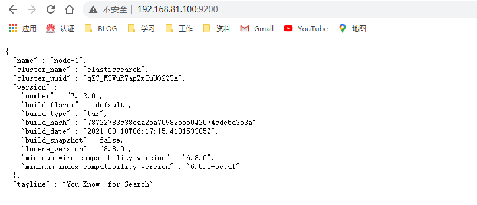

## 2、Elasticsearch之入门使用

Elasticsearch是基于Lucene的全文检索引擎，本质也是存储和检索数据。ES中的很多概念与MySQL类 似 我们可以按照关系型数据库的经验去理解。

### 2.1、核心概念

- 索引(index)

  类似的数据放在一个索引，非类似的数据放不同索引， 一个索引也可以理解成一个关系型数据库。

- 类型(type)

  代表document属于index中的哪个类别（type）也有一种说法一种type就像是数据库的表，比如dept表，user表。

  注意ES每个大版本之间区别很大：

  - ES 5.x中一个index可以有多种type。
  - ES 6.x中一个index只能有一种type。
  - ES 7.x以后 要逐渐移除type这个概念。

- 映射(mapping)

  mapping定义了每个字段的类型等信息。相当于关系型数据库中的表结构。

  常用数据类型：text、keyword、number、array、range、boolean、date、geo_point、ip、nested、object

https://www.elastic.co/guide/en/elasticsearch/reference/current/mapping-types.html#_multi_fields_2

| 关系型数据库（比如Mysql） | 非关系型数据库（Elasticsearch） |
| ------------------------- | ------------------------------- |
| 数据库Database            | 索引Index                       |
| 表Table                   | 索引Index类型（原为Type）       |
| 数据行Row                 | 文档Document                    |
| 数据列Column              | 字段Field                       |
| 约束 Schema               | 映射Mapping                     |

### 2.2、Elasticsearch API介绍

Elasticsearch提供了Rest风格的API，即http请求接口，而且也提供了各种语言的客户端API。

- Rest风格API

  文档地址：https://www.elastic.co/guide/en/elasticsearch/reference/current/index.html

- 客户端API

  Elasticsearch支持的语言客户端非常多：https://www.elastic.co/guide/en/elasticsearch/client/index.html，我们在实战时将使用到Java客户端API

ElasticSearch没有自带图形化界面，我们可以通过安装ElasticSearch的图形化插件，完成图形化界面的效果，完成索引数据的查看,比如可视化插件Kibana。 

### 2.3、安装配置kibana

- 什么是Kibana

  Kibana是一个基于Node.js的Elasticsearch索引库数据统计工具，可以利用Elasticsearch的聚合功能，生成各种图表，如柱形图，线状图，饼图等。

  而且还提供了操作Elasticsearch索引数据的控制台，并且提供了一定的API提示，非常有利于我们学习Elasticsearch的语法。

- 安装Kibana

  root账户下操作

  ```apl
  #1、下载：https://www.elastic.co/cn/downloads/kibana
  #2、上传
  #3、解压
  	tar -zxvf kibana-7.12.0-linux-x86_64.tar.gz
  	mv kibana-7.12.0-linux-x86_64 /usr/kibana
  #4、改变es目录拥有者账号，之前建立的estest用户
  	chown -R estest /usr/kibana/
  #5、设置访问权限
  	chmod -R 777 /usr/kibana/
  #6、配置文件
  	vim /usr/kibana/config/kibana.yml
  	#内容
  	server.port: 5601
      server.host: "0.0.0.0" 
      elasticsearch.hosts: ["http://192.168.81.100:9200"]
  #7、配置完成启动
  	su estest
  	cd /usr/kibana
  	./bin/kibana
  #8、验证访问ip:5601，即可看到安装成功
  ```

  

- 扩展kibana dev tools快捷键：

  ctrl+enter 提交请求

  ctrl+i 自动缩进

### 2.4、 Elasticsearch集成IK分词器

#### 2.4.1、集成IK分词器

IKAnalyzer是一个开源的，基于java语言开发的轻量级的中文分词工具包。从2006年12月推出1.0版开始，IKAnalyzer已经推出 了3个大版本。最初，它是以开源

项目Lucene为应用主体的，结合词典分词和文法分析算法的中文分词组件。新版本的IKAnalyzer3.0则发展为 面向Java的公用分词组件，独立于Lucene项目，同时

提供了对Lucene的默认优化实现。

IK分词器3.0的特性如下：

- 采用了特有的“正向迭代最细粒度切分算法“，具有60万字/秒的高速处理能力。

- 采用了多子处理器分析模式，支持：英文字母（IP地址、Email、URL）、数字（日期，常用中文数量词，罗马数字，科学计数法），中文词汇（姓名、地名处

  理）等分词处理。

- 支持个人词条的优化的词典存储，更小的内存占用。

- 支持用户词典扩展定义。

- 针对Lucene全文检索优化的查询分析器IKQueryParser；采用歧义分析算法优化查询关键字的搜索排列组合，能极大的提高Lucene检索的命中率。

**下载地址：**

> <https://github.com/medcl/elasticsearch-analysis-ik/releases/tag/v7.12.0>

- **下载插件并安装(安装方式一)**

  - 在elasticsearch的bin目录下执行以下命令,es插件管理器会自动帮我们安装，然后等待安装完成

    ```apl
    /usr/elasticsearch/bin/elasticsearch-plugin install https://github.com/medcl/elasticsearch-analysis-ik/releases/download/v7.12.0/elasticsearch-analysis-ik-7.12.0.zip
    ```

  - 下载完成后会提示 Continue with installation?输入 y 即可完成安装

  - 重启Elasticsearch 和Kibana

- **上传安装包安装 (安装方式二)**

  - 在elasticsearch安装目录的plugins目录下新建 analysis-ik 目录

    ```apl
    cd /usr/elasticsearch/plugins
    #新建analysis-ik文件夹 
    mkdir analysis-ik 
    #切换至 analysis-ik文件夹下 
    cd analysis-ik 
    #上传资料中的 
    elasticsearch-analysis-ik-7.12.0.zip 
    #解压 
    unzip elasticsearch-analysis-ik-7.12.0.zip 
    #解压完成后删除zip
    rm -rf elasticsearch-analysis-ik-7.12.0.zip
    ```

  - 重启Elasticsearch 和Kibana

**测试案例**

IK分词器有两种分词模式：ik_max_word和ik_smart模式。

- **ik_max_word (常用)**

  会将文本做最细粒度的拆分

- **ik_smart**

  会做最粗粒度的拆分

我们先在Kibana测试一波输入下面的请求：

- **ik_max_word **

  ```json
  POST _analyze 
  {
      "analyzer": "ik_max_word", 
      "text": "南京市长江大桥" 
  }
  ```

  ik_max_word 分词模式运行得到结果：

  ```json
  {
    "tokens" : [
      {
        "token" : "南京市",
        "start_offset" : 0,
        "end_offset" : 3,
        "type" : "CN_WORD",
        "position" : 0
      },
      {
        "token" : "南京",
        "start_offset" : 0,
        "end_offset" : 2,
        "type" : "CN_WORD",
        "position" : 1
      },
      {
        "token" : "市长",
        "start_offset" : 2,
        "end_offset" : 4,
        "type" : "CN_WORD",
        "position" : 2
      },
      {
        "token" : "长江大桥",
        "start_offset" : 3,
        "end_offset" : 7,
        "type" : "CN_WORD",
        "position" : 3
      },
      {
        "token" : "长江",
        "start_offset" : 3,
        "end_offset" : 5,
        "type" : "CN_WORD",
        "position" : 4
      },
      {
        "token" : "大桥",
        "start_offset" : 5,
        "end_offset" : 7,
        "type" : "CN_WORD",
        "position" : 5
      }
    ]
  }
  ```

- **ik_smart**

  ```json
  POST _analyze 
  { 
    "analyzer": "ik_smart",
    "text": "南京市长江大桥" 
  }
  ```

  ik_smart分词模式运行得到结果：

  ```json
  {
    "tokens" : [
      {
        "token" : "南京市",
        "start_offset" : 0,
        "end_offset" : 3,
        "type" : "CN_WORD",
        "position" : 0
      },
      {
        "token" : "长江大桥",
        "start_offset" : 3,
        "end_offset" : 7,
        "type" : "CN_WORD",
        "position" : 1
      }
    ]
  }
  ```

#### 2.4.2、扩展词典使用

**如果现在假如江大桥是一个人名，是南京市市长，那么上面的分词显然是不合理的，该怎么办？**

**扩展词**：就是不想让哪些词被分开，让他们分成一个词。比如上面的**江大桥**

**自定义扩展词库**

- 进入到 config/analysis-ik/(**插件命令安装方式**) 或 plugins/analysis-ik/config(**安装包安装方式**) 目录下, 新增自定义词典

  ```apl
  #自定义扩展词典
  vim custom_ext_dict.dic
  #内容
  江大桥
  ```

- 将我们自定义的扩展词典文件添加到IKAnalyzer.cfg.xml配置中

  ```apl
  vim IKAnalyzer.cfg.xml
  
  <?xml version="1.0" encoding="UTF-8"?>
  <!DOCTYPE properties SYSTEM "http://java.sun.com/dtd/properties.dtd">
  <properties>
          <comment>IK Analyzer 扩展配置</comment>
          <!--用户可以在这里配置自己的扩展字典 -->
          <entry key="ext_dict">custom_ext_dict.dic</entry>
           <!--用户可以在这里配置自己的扩展停止词字典-->
          <entry key="ext_stopwords"></entry>
          <!--用户可以在这里配置远程扩展字典 -->
          <!-- <entry key="remote_ext_dict">words_location</entry> -->
          <!--用户可以在这里配置远程扩展停止词字典-->
          <!-- <entry key="remote_ext_stopwords">words_location</entry> -->
  </properties>
  ```

- 重启Elasticsearch

#### 2.4.3、停用词典使用

- **停用词**：

  有些词在文本中出现的频率非常高。但对本文的语义产生不了多大的影响。

  例如英文的a、an、the、of等。或中文的”的、了、呢等”。

  这样的词称为停用词。停用词经常被过滤掉，不会被进行索引。

  在检索的过程中，如果用户的查询词中含有停用词，系统会自动过滤掉。停用词可以加快索引的速度，减少索引库文件的大小。

- **自定义停用词库**

  - 进入到 config/analysis-ik/(**插件命令安装方式**) 或 plugins/analysis-ik/config(**安装包安装方式**) 目录下, 新增自定义词典

    ```apl
    vim custom_stop_dict.dic
    #内容
    的
    了
    啊
    ```

  - 将我们自定义的停用词典文件添加到IKAnalyzer.cfg.xml配置中

    ```apl
    vim IKAnalyzer.cfg.xml
    
    <?xml version="1.0" encoding="UTF-8"?>
    <!DOCTYPE properties SYSTEM "http://java.sun.com/dtd/properties.dtd">
    <properties>
            <comment>IK Analyzer 扩展配置</comment>
            <!--用户可以在这里配置自己的扩展字典 -->
            <entry key="ext_dict">custom_ext_dict.dic</entry>
             <!--用户可以在这里配置自己的扩展停止词字典-->
            <entry key="ext_stopwords">ustom_stop_dict.dic</entry>
            <!--用户可以在这里配置远程扩展字典 -->
            <!-- <entry key="remote_ext_dict">words_location</entry> -->
            <!--用户可以在这里配置远程扩展停止词字典-->
            <!-- <entry key="remote_ext_stopwords">words_location</entry> -->
    </properties>
    ```

  - 重启Elasticsearch

#### 2.4.4、同义词典使用

语言博大精深，有很多相同意思的词，我们称之为同义词，比如“番茄”和“西红柿”，“馒头”和“馍”等。在搜索的时候，我们输入的可能是“番茄”，但是应该把含有“西

红柿”的数据一起查询出来，这种情况叫做同义词查询。

注意：扩展词和停用词是在索引的时候使用，而同义词是检索时候使用。

**配置IK同义词**

Elasticsearch 自带一个名为 synonym 的同义词 filter。为了能让 IK 和 synonym 同时工作，我们需要定义新的 analyzer，用 IK 做 tokenizer，synonym 做 

filter。听上去很复杂，实际上要做的只是加一段配置。

- 创建/config/analysis-ik/synonym.txt 文件，输入一些同义词并存为 utf-8 格式。例如

  ```apl
  vim /usr/elasticsearch/config/analysis-ik/synonym.txt
  #内容
  lagou,拉勾 
  china,中国
  ```

- 创建索引时，使用同义词配置，示例模板如下

  ```json
  PUT /索引名称
  {
  	"settings": {
  		"analysis": {
  			"filter": {
  				"word_sync": {
  					"type": "synonym",
  					"synonyms_path": "analysis-ik/synonym.txt"
  				}
  			},
  			"analyzer": {
  				"ik_sync_max_word": {
  					"filter": ["word_sync"],
  					"type": "custom",
  					"tokenizer": "ik_max_word"
  				},
  				"ik_sync_smart": {
  					"filter": ["word_sync"],
  					"type": "custom",
  					"tokenizer": "ik_smart"
  				}
  			}
  		}
  	},
  	"mappings": {
  		"properties": {
  			"字段名": {
  				"type": "字段类型",
  				"analyzer": "ik_sync_smart",
  				"search_analyzer": "ik_sync_smart"
  			}
  		}
  	}
  }
  ```

  以上配置定义了ik_sync_max_word和ik_sync_smart这两个新的 analyzer，对应 IK 的 ik_max_word 和ik_smart 两种分词策略。ik_sync_max_word和 

  ik_sync_smart都会使用 synonym fifilter 实现同义词转换

- 到此，索引创建模板中同义词配置完成，搜索时指定分词为ik_sync_max_word或ik_sync_smart。

- 案例

  ```json
  PUT /lagou-es-synonym
  {
  	"settings": {
  		"analysis": {
  			"filter": {
  				"word_sync": {
  					"type": "synonym",
  					"synonyms_path": "analysis-ik/synonym.txt"
  				}
  			},
  			"analyzer": {
  				"ik_sync_max_word": {
  					"filter": ["word_sync"],
  					"type": "custom",
  					"tokenizer": "ik_max_word"
  				},
  				"ik_sync_smart": {
  					"filter": ["word_sync"],
  					"type": "custom",
  					"tokenizer": "ik_smart"
  				}
  			}
  		}
  	},
  	"mappings": {
  		"properties": {
  			"name": {
  				"type": "text",
  				"analyzer": "ik_sync_max_word",
  				"search_analyzer": "ik_sync_max_word"
  			}
  		}
  	}
  }
  ```

  - 插入数据

    ```json
    POST /lagou-es-synonym/_doc/1 
    { 
        "name":"拉勾是中国专业的互联网招聘平台" 
    }
    ```

  - 使用同义词"lagou"或者“china”进行搜索

    ```json
    POST /lagou-es-synonym/_doc/_search 
    { 
        "query": { 
            "match": { 
                "name": "lagou" 
            } 
        } 
    }
    ```

    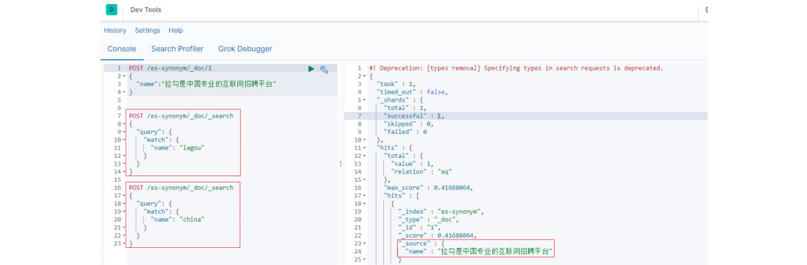

### 2.5、索引操作（创建、查看、删除）

#### 2.5.1、创建索引库

Elasticsearch采用Rest风格API，因此其API就是一次http请求，你可以用任何工具发起http请求

- 语法

  ```json
  PUT /索引名称 
  { 
      "settings": { 
          "属性名": "属性值" 
      }
  }
  ```

  settings：就是索引库设置，其中可以定义索引库的各种属性 比如分片数 副本数等，目前我们可以不设置，都走默认

- 示例 PUT /lagou-company-index

  

  可以看到索引创建成功了。

#### 2.5.2、判断索引是否存在

- 语法

  ```apl
  HEAD /索引名称
  ```

- 示例 HEAD /lagou-company-index

  

#### 2.5.3、查看索引

Get请求可以帮我们查看索引的相关属性信息，格式：

- 查看单个索引

  - 语法

    ```apl
    GET /索引名称
    ```

  - 示例 GET /lagou-company-index

    

- 批量查看索引

  - 语法

    ```apl
    GET /索引名称1,索引名称2,索引名称3,...
    ```

  - 示例 GET /lagou-company-index,lagou-employee-index 

    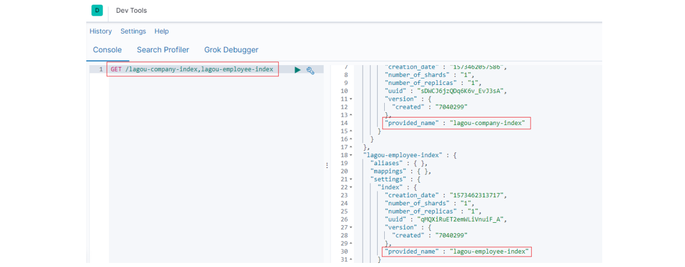

- 查看所有索引

  - 方式一

    ```apl
    GET _all
    ```

    

  - 方式二

    ```apl
    GET /_cat/indices?v
    ```

    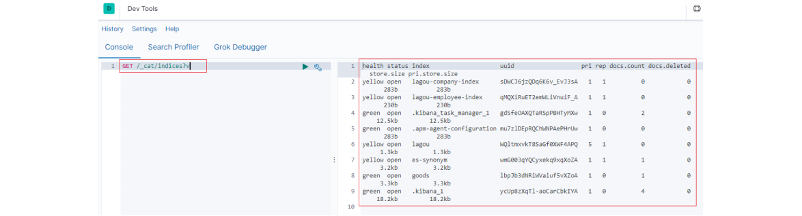

    **绿色：**索引的所有分片都正常分配。

    **黄色：**至少有一个副本没有得到正确的分配。

    **红色：**至少有一个主分片没有得到正确的分配。

#### 2.5.4、打开索引

- 语法 

  ```apl
  POST /索引名称/_open
  ```

  

#### 2.5.5、关闭索引

- 语法

  ```apl
  POST /索引名称/_close
  ```

  

#### 2.5.6、删除索引库

删除索引使用DELETE请求

- 语法

  ```apl
  DELETE /索引名称1,索引名称2,索引名称3...
  ```

  

### 2.6、映射操作

索引创建之后，等于有了关系型数据库中的database。Elasticsearch7.x取消了索引type类型的设置，不允许指定类型，默认为_doc，但字段仍然是有的，我们需

要设置字段的约束信息，叫做字段映射（mapping）

字段的约束包括但不限于：

- 字段的数据类型
- 是否要存储
- 是否要索引
- 分词器

https://www.elastic.co/guide/en/elasticsearch/reference/7.3/mapping-params.html

#### 2.6.1、创建映射字段

- 语法

  ```json
  PUT /索引库名/_mapping 
  { 
      "properties": { 
          "字段名": { 
              "type": "类型", 
              "index": true， 
              "store": true， 
              "analyzer": "分词器" 
          } 
      } 
  }
  ```

  字段名：任意填写，下面指定许多属性，例如：

  - type：类型，可以是text、long、short、date、integer、object等
  - index：是否索引，默认为true 
  - store：是否存储，默认为false
  - analyzer：指定分词器

- 示例

  ```json
  PUT /lagou-company-index 
  PUT /lagou-company-index/_mapping/ 
  { 
      "properties": { 
          "name": { 
              "type": "text",
              "analyzer": "ik_max_word"
          },
          "job": { 
              "type": "text", 
              "analyzer": "ik_max_word" 
          },
          "logo": { 
              "type": "keyword", 
              "index": "false" 
          },
          "payment": {
              "type": "float" 
          } 
      } 
  }
  ```

  响应结果：

  

  上述案例中，就给lagou-company-index这个索引库设置了4个字段：

  - name：企业名称

  - job: 需求岗位

  - logo：logo图片地址

  - payment：薪资

  并且给这些字段设置了一些属性

#### 2.6.2、映射属性详解

- **type**

  Elasticsearch中支持的数据类型非常丰富：https://www.elastic.co/guide/en/elasticsearch/reference/7.3/mapping-types.html

  我们说几个关键的：

  - String类型，又分两种：

    - text：可分词，不可参与聚合

    - keyword：不可分词，数据会作为完整字段进行匹配，可以参与聚合

  - Numerical：数值类型，分两类

    - 基本数据类型：long、interger、short、byte、double、flfloat、half_flfloat

    - 浮点数的高精度类型：scaled_flfloat

      需要指定一个精度因子，比如10或100。elasticsearch会把真实值乘以这个因子后存储，取出时再原。

  - Date：日期类型
    
  - elasticsearch可以对日期格式化为字符串存储，但是建议我们存储为毫秒值，存储为long，节省空间。
    
  - Array：数组类型
    - 进行匹配时，任意一个元素满足，都认为满足
    - 排序时，如果升序则用数组中的最小值来排序，如果降序则用数组中的最大值来排序

  - Object：对象

    ```json
    { 
        name:"Jack", 
        age:21, 
        girl:{
            name: "Rose", 
            age:21 
        } 
    }
    ```

    如果存储到索引库的是对象类型，例如上面的girl，会把girl变成两个字段：girl.name和girl.age

- **index**

  index影响字段的索引情况。

  - true：字段会被索引，则可以用来进行搜索。默认值就是true

  - false：字段不会被索引，不能用来搜索

  index的默认值就是true，也就是说你不进行任何配置，所有字段都会被索引。

  但是有些字段是我们不希望被索引的，比如企业的logo图片地址，就需要手动设置index为false。 

- **store**

  是否将数据进行独立存储。

  原始的文本会存储在 `_source` 里面，默认情况下其他提取出来的字段都不是独立存储的，是从`_source` 里面提取出来的。当然你也可以独立的存储某个字

  段，只要设置store:true即可，获取独立存储的字段要比从_source中解析快得多，但是也会占用更多的空间，所以要根据实际业务需求来设置，默认为

  false。 

- **analyzer：指定分词器**

  一般我们处理中文会选择ik分词器 ik_max_word ik_smart

#### 2.6.3、查看映射关系

- 查看单个索引映射关系

  - 语法

    ```apl
    GET /索引名称/_mapping
    ```

  - 示例：

    

- 查看所有索引映射关系

  ```apl
  GET _mapping
  #或者
  GET _all/_mapping
  ```

- 修改索引映射关系

  - 语法

    ```json
    PUT /索引库名/_mapping 
    { 
        "properties": { 
            "字段名": { 
                "type": "类型",
                "index": true， 
                "store": true，
                "analyzer": "分词器" 
            } 
        } 
    }
    ```

    注意:修改映射增加字段 做其它更改只能删除索引 重新建立映射

#### 2.6.4、一次性创建索引和映射

刚才的案例中我们是把创建索引库和映射分开来做，其实也可以在创建索引库的同时，直接制定索引库中的索引，基本语法：

```json
put /索引库名称 
{ 
    "settings":{ 
        "索引库属性名":"索引库属性值" 
    },
    "mappings":{ 
        "properties":{ 
            "字段名":{ 
                "映射属性名":"映射属性值" 
            } 
        } 
    } 
}
```

案例

```json
PUT /lagou-employee-index 
{ 
    "settings": {}, 
    "mappings": { 
        "properties": {
            "name": { 
                "type": "text", 
                "analyzer": "ik_max_word" 
            } 
        } 
    } 
}
```

### 2.7、文档增删改查及局部更新

文档，即索引库中的数据，会根据规则创建索引，将来用于搜索。可以类比做数据库中的一行数据。

#### 2.7.1、新增文档

新增文档时，涉及到id的创建方式，手动指定或者自动生成。

- 新增文档（手动指定id）

  - 语法

    ```apl
    POST /索引名称/_doc/{id}
    {
    	"field":"value" 
    }
    ```

  - 示例

    ```json
    POST /lagou-company-index/_doc/1 
    { 
        "name" : "百度",
        "job" : "小度用户运营经理",
        "payment" : "30000", 
        "logo" : "http://www.lgstatic.com/thubnail_120x120/i/image/M00/21/3E/CgpFT1kVdzeAJNbU AABJB7x9sm8374.png" 
    }
    ```

    

- 新增文档（自动生成id）

  - 语法

    ```apl
    POST /索引名称/_doc 
    {
    	"field":"value" 
    }
    ```

  - 示例

    ```json
    POST /lagou-company-index/_doc/
    { 
        "name" : "百度",
        "job" : "算法工程师",
        "payment" : "50000", 
        "logo" : "http://www.lgstatic.com/thubnail_120x120/i/image/M00/21/3E/CgpFT1kVdzeAJNbU AABJB7x9sm8374.png" 
    }
    ```

    

    可以看到结果显示为： created ，代表创建成功。另外，需要注意的是，在响应结果中有个 _id 字段，这个就是这条文档数据的 唯一标识 ，以后的

    增删改查都依赖这个_id作为唯一标示，这里是Elasticsearch帮我们随机生成的id。

#### 2.7.2、查看单个文档

- 语法

  ```apl
  GET /索引名称/_doc/{id}
  #或者
  POST /lagou-company-index/_search
  {
    "query": {
      "match": {
        "FIELD": "TEXT"
      }
    }
  }
  ```

- 示例 GET /lagou-company-index/_doc/1

  

  文档元数据解读：

  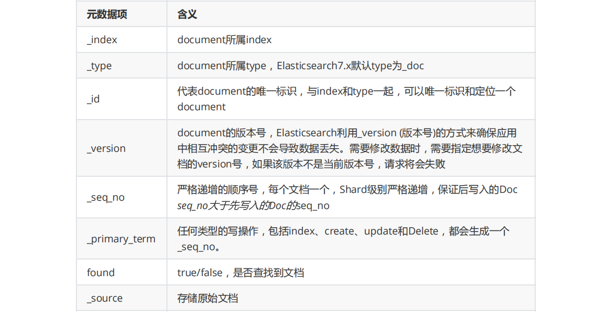

#### 2.7.3、查看所有文档

- 语法

  ```json
  POST /索引名称/_search
  { 
      "query":{ 
          "match_all": { 
          } 
      } 
  }
  ```

#### 2.7.4、_source定制返回结果

某些业务场景下，我们不需要搜索引擎返回*source*中的所有字段，可以使用source进行定制，如下，多个字段之间使用逗号分隔 

```apl
GET /lagou-company-index/_doc/1?_source=name,job
```


#### 2.7.5、更新文档（全部更新）

把刚才新增的请求方式改为PUT，就是修改了，不过修改必须指定id

* id对应文档存在，则修改

* id对应文档不存在，则新增

  比如，我们把使用id为3，不存在，则应该是新增

  ```json
  PUT /lagou-company-index/_doc/3
  { 
      "name" : "百度",
      "job" : "算法工程师",
      "payment" : "60000", 
      "logo" : "http://www.lgstatic.com/thubnail_120x120/i/image/M00/21/3E/CgpFT1kVdzeAJNbU AABJB7x9sm8374.png" 
  }
  ```

  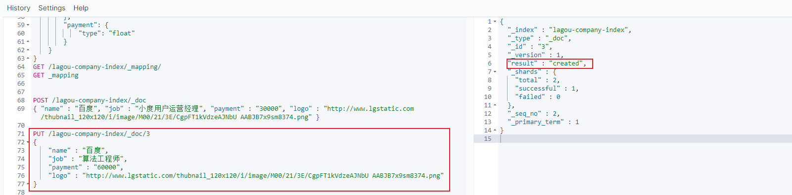

  可以看到是 created ，是新增。

  我们再次执行刚才的请求，不过把数据改一下

  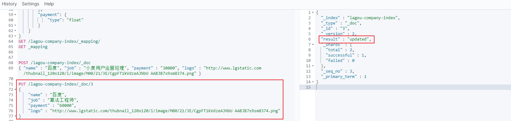

  可以看到结果是： updated ，显然是更新数据

#### 2.7.6、更新文档（局部更新）

Elasticsearch可以使用PUT或者POST对文档进行更新(全部更新)，如果指定ID的文档已经存在，则执行更新操作。

**注意：**Elasticsearch执行更新操作的时候，Elasticsearch首先将旧的文档标记为删除状态，然后添加新的文档，旧的文档不会立即消失，但是你也无法访问，

Elasticsearch会在你继续添加更多数据的时候在后台清理已经标记为删除状态的文档。

全部更新，是直接把之前的老数据，标记为删除状态，然后，再添加一条更新的（使用PUT或者POST）

局域更新，只是修改某个字段（使用POST）

- 语法

  ```json
  POST /索引名/_update/{id} 
  { 
      "doc":{ 
          "field":"value" 
      } 
  }
  ```

- 示例

  ```json
  POST /lagou-company-index/_update/3
  {
    "doc": {
      "job":"AI算法工程师"
    }
  }
  ```

  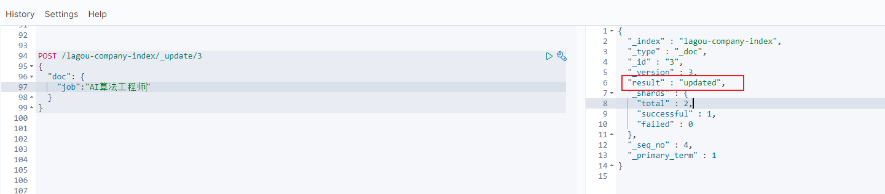

#### 2.7.7、删除文档

- 根据id进行删除

  - 语法

    ```apl
    DELETE /索引名/_doc/{id}
    ```

  - 实例

    ```apl
    DELETE /lagou-company-index/_doc/3
    ```

    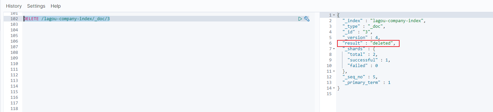

    可以看到结果是： deleted ，显然是删除数据

- 根据查询条件进行删除

  - 语法

    ```json
    POST /索引库名/_delete_by_query 
    { 
        "query": { 
            "match": { 
                "字段名": "搜索关键字" 
            } 
        } 
    }
    ```

  - 示例

    ```json
    POST /lagou-company-index/_delete_by_query 
    { 
        "query":{ 
            "match":{ 
                "name":"百度" 
            } 
        }
    }
    ```

- 删除所有文档

  - 语法

    ```json
    POST /索引名/_delete_by_query 
    { 
        "query": { 
            "match_all": {} 
        } 
    }
    ```

  - 示例

    ```json
    POST /lagou-company-index/_delete_by_query
    {
       "query": {
        "match_all": {}
      }
    }
    ```

#### 2.7.8、文档的全量替换、强制创建

- 全量替换

  - 语法与创建文档是一样的，如果文档id不存在，那么就是创建；如果文档id已经存在，那么就是全量替换操作，替换文档的json串内容；

  - 文档是不可变的，如果要修改文档的内容，第一种方式就是全量替换，直接对文档重新建立索引，替换里面所有的内容，elasticsearch会将老的文档标记

    为deleted，然后新增我们给定的一个文档，当我们创建越来越多的文档的时候，elasticsearch会在适当的时机在后台自动删除标记为deleted的文档

- 强制创建

  ```apl
  PUT /index/_doc/{id}?op_type=create {}
  #或者
  PUT /index/_doc/{id}/_create {}
  ```

  如果id 存在就会报错

## 3、Elasticsearch之高级应用

### 3.1、映射高级

#### 3.1.1、地理坐标点数据类型

- 地理坐标点

  地理坐标点是指地球表面可以用经纬度描述的一个点。 地理坐标点可以用来计算两个坐标间的距离，还可以判断一个坐标是否在一个区域中。地理坐标点需要

  显式声明对应字段类型为 geo_point ：

  - 示例

    ```json
    PUT /company-locations 
    { 
        "mappings": { 
            "properties": {
                "name": { 
                    "type": "text" 
                },
                "location": { 
                    "type": "geo_point" 
                } 
            } 
        } 
    }
    ```

- 经纬度坐标格式

  如上例，` location` 字段被声明为` geo_point` 后，我们就可以索引包含了经纬度信息的文档了。 经纬度信息的形式可以是字符串、数组或者对象

  ```json
  # 字符串形式
  PUT /company-locations/_doc/1
  { 
      "name":"NetEase",
      "location":"40.715,74.011" 
  }
  # 对象形式 
  PUT /company-locations/_doc/2 
  { 
      "name":"Sina", 
      "location":{ 
          "lat":40.722, 
          "lon":73.989 
      } 
  }
  # 数组形式 
  PUT /company-locations/_doc/3 
  { 
      "name":"Baidu",
      "location":[73.983,40.719] 
  }
  ```

  **注意**

  字符串形式以半角逗号分割，如 "lat,lon" 

  对象形式显式命名为 lat 和 lon 

  数组形式表示为 [lon,lat]

- 通过地理坐标点过滤

  有四种地理坐标点相关的过滤器 可以用来选中或者排除文档

  | 过滤器             | 作用                                                         |
  | ------------------ | ------------------------------------------------------------ |
  | geo_bounding_box   | 找出落在指定矩形框中的点                                     |
  | geo_distance       | 找出与指定位置在给定距离内的点                               |
  | geo_distance_range | 找出与指定点距离在给定最小距离和最大距离之间的点             |
  | geo_polygon        | 找出落在多边形中的点。 这个过滤器使用代价很大 。当你觉得自己需要使用它，最好先看看https://www.elastic.co/guide/cn/elasticsearch/guide/current/geo-shapes.html |

- geo_bounding_box查询

  这是目前为止最有效的地理坐标过滤器了，因为它计算起来非常简单。 你指定一个矩形的顶部 ,底部 , 左边界和右边界，然后过滤器只需判断坐标的经度是否

  在左右边界之间，纬度是否在上下边界之间

  然后可以使用 geo_bounding_box 过滤器执行以下查询

  ```json
  GET /company-locations/_search
  {
  	"query": {
  		"bool": {
  			"must": {
  				"match_all": {}
  			},
  			"filter": {
  				"geo_bounding_box": {
  					"location": {
  						"top_left": {
  							"lat": 40.73,
  							"lon": 71.12
  						},
  						"bottom_right": {
  							"lat": 40.01,
  							"lon": 74.1
  						}
  					}
  				}
  			}
  		}
  	}
  }
  ```

   location这些坐标也可以用 bottom_left 和 top_right 来表示

- geo_distance

  过滤仅包含与地理位置相距特定距离内的匹配的文档。假设以下映射和索引文档

  然后可以使用 `geo_distance` 过滤器执行以下查询

  ```json
  GET /company-locations/_search
  {
  	"query": {
  		"bool": {
  			"must": {
  				"match_all": {}
  			},
  			"filter": {
  				"geo_distance": {
  					"distance": "350km",
  					"location": {
  						"lat": 40,
  						"lon": 70
  					}
  				}
  			}
  		}
  	}
  }
  ```

#### 3.1.2、动态映射

Elasticsearch在遇到文档中以前未遇到的字段，可以使用dynamic mapping（动态映射机制） 来确定字段的数据类型并自动把新的字段添加到类型映射。

Elastic的动态映射机制可以进行开关控制，通过设置mappings的dynamic属性，dynamic有如下设置项

- true：遇到陌生字段就执行dynamic mapping处理机制
- false：遇到陌生字段就忽略
- strict：遇到陌生字段就报错

```json
# 设置为报错
PUT /user
{
	"settings": {
		"number_of_shards": 3,
		"number_of_replicas": 0
	},
	"mappings": {
		"dynamic": "strict",
		"properties": {
			"name": {
				"type": "text"
			},
			"address": {
				"type": "object",
				"dynamic": true
			}
		}
	}
}
# 插入以下文档，将会报错 
# user索引层设置dynamic是strict，在user层内设置age将报错 
# 在address层设置dynamic是ture，将动态映射生成字段
PUT /user/_doc/1
{
	"name": "lisi",
	"age": "20",
	"address": {
		"province": "beijing",
		"city": "beijing"
	}
}
# 设置为动态映射
PUT /user
{
	"settings": {
		"number_of_shards": 3,
		"number_of_replicas": 0
	},
	"mappings": {
		"dynamic": true,
		"properties": {
			"name": {
				"type": "text"
			},
			"address": {
				"type": "object",
				"dynamic": true
			}
		}
	}
}
```

#### 3.1.3、自定义动态映射

如果你想在运行时增加新的字段，你可能会启用动态映射。 然而，有时候，动态映射规则可能不太智能。幸运的是，我们可以通过设置去自定义这些规则，以便

更好的适用于你的数据。

- **日期检测**

  当 Elasticsearch 遇到一个新的字符串字段时，它会检测这个字段是否包含一个可识别的日期，比如2014-01-01 如果它像日期，这个字段就会被作为 date 类型添加。否则，它会被作为 string 类型添加。

  有些时候这个行为可能导致一些问题。想象下，你有如下这样的一个文档：{ "note": "2014-01-01" }

  假设这是第一次识别 note 字段，它会被添加为 date 字段。但是如果下一个文档像这样：{ "note": "Logged out" }

  这显然不是一个日期，但为时已晚。这个字段已经是一个日期类型，这个 不合法的日期 将会造成一个异常。

  日期检测可以通过在根对象上设置 **`date_detection`** 为 false 来关闭

  ```json
  PUT /my_index 
  { 
      "mappings": { 
          "date_detection": false
      }
  }
  PUT /my_index/_doc/1 
  { "note": "2014-01-01" } 
  PUT /my_index/_doc/1 
  { "note": "Logged out" }
  ```

  使用这个映射，字符串将始终作为 string 类型。如果需要一个 date 字段，必须手动添加。

  Elasticsearch 判断字符串为日期的规则可以通过 dynamic_date_formats setting 来设置。

  ```json
  # 符合当前格式的字符串则为日期类型
  PUT /my_index 
  { 
      "mappings": { 
          "dynamic_date_formats": "MM/dd/yyyy" 
      } 
  }
  
  PUT /my_index/_doc/1 { "note": "2014-01-01" } 
  PUT /my_index/_doc/1 { "note": "01/01/2014" }
  ```

- **dynamic_templates**

  使用 dynamic_templates 可以完全控制新生成字段的映射，甚至可以通过字段名称或数据类型来应用不同的映射。每个模板都有一个名称，你可以用来描述

  这个模板的用途，一个 mapping 来指定映射应该怎样使用，以及至少一个参数 (如 match) 来定义这个模板适用于哪个字段。

  模板按照顺序来检测；第一个匹配的模板会被启用。例如，我们给 string 类型字段定义两个模板：

  es ：以 _es 结尾的字段名需要使用 spanish 分词器。

  en ：所有其他字段使用 english 分词器。

  我们将 es 模板放在第一位，因为它比匹配所有字符串字段的 en 模板更特殊：

  ```json
  PUT /my_index2
  {
  	"mappings": {
  		"dynamic_templates": [{
  			"es": {
  				"match": "*_es",
  				"match_mapping_type": "string",
  				"mapping": {
  					"type": "text",
  					"analyzer": "spanish"
  				}
  			}
  		}, {
  			"en": {
  				"match": "*",
  				"match_mapping_type": "string",
  				"mapping": {
  					"type": "text",
  					"analyzer": "english"
  				}
  			}
  		}]
  	}
  }
  # 新增
  PUT /my_index2/_doc/1 
  { 
      "name_es":"testes", 
      "name":"es" 
  }
  ```

  - 匹配字段名以 _es 结尾的字段
  - 匹配其他所有字符串类型字段

  match_mapping_type 允许你应用模板到特定类型的字段上，就像有标准动态映射规则检测的一样 (例 如 string 或 long)

  match参数只匹配字段名称，path_match 参数匹配字段在对象上的完整路径，所以 address.*.name将匹配这样的字段

  ```json
  { 
      "address": { 
          "city": { 
              "name": "New York" 
          } 
      } 
  }
  ```

### 3.2、Query DSL

https://www.elastic.co/guide/en/elasticsearch/reference/7.3/query-dsl.html

Elasticsearch提供了基于JSON的完整查询DSL（Domain Specifific Language 特定域的语言）来定义查询。将查询DSL视为查询的AST（抽象语法树），它由两种

子句组成：

- 叶子查询子句

  叶子查询子句 在特定域中寻找特定的值，如 match，term或 range查询。

- 复合查询子句

  复合查询子句包装其他叶子查询或复合查询，并用于以逻辑方式组合多个查询（例如 bool或dis_max查询），或更改其行为（例如 constant_score查询）。

我们在使用ElasticSearch的时候，避免不了使用DSL语句去查询，就像使用关系型数据库的时候要学会SQL语法一样。如果我们学习好了DSL语法的使用，那么在

日后使用和使用Java Client调用时候也会变得非常简单。

**基本语法**

```json
POST /索引库名/_search 
{ 
    "query":{ 
        "查询类型":{ 
            "查询条件":"查询条件值" 
        } 
    } 
}
```

这里的query代表一个查询对象，里面可以有不同的查询属性

- 查询类型：

  例如： match_all ， match ， term ， range 等等

- 查询条件：查询条件会根据类型的不同，写法也有差异，后面详细讲解

#### 3.2.1、查询所有(match_all query)

- 示例

  ```json
  POST /lagou-company-index/_search
  {
    "query": {
      "match_all": {}
    }
  }
  ```

  - query ：代表查询对象
  - match_all ：代表查询所有

- 结果

  - took：查询花费时间，单位是毫秒
  - time_out：是否超时
  - `_shards`：分片信息
  - hits：搜索结果总览对象
    - _index：索引库
    - _type：文档类型
    - _id：文档id
    - _score：文档得分
    - _source：文档的源数据

#### 3.2.2、全文搜索(full-text query)

全文搜索能够搜索已分析的文本字段，如电子邮件正文，商品描述等。使用索引期间应用于字段的同一分析器处理查询字符串。

全文搜索的分类很多几个典型的如下:

##### 3.2.2.1、匹配搜索(match query)

全文查询的标准查询，它可以对一个字段进行模糊、短语查询。 match queries 接收text/numerics/dates, 对它们进行分词分析, 再组织成一个boolean查询。可

通过operator 指定bool组合操作（or、and 默认是 or ）。

现在，索引库中有2部手机，1台电视; 

```json
PUT /lagou-property
{
  "settings": {},
  "mappings": {
    "properties": {
      "title": {
        "type": "text",
        "analyzer": "ik_max_word"
      },
      "images": {
        "type": "keyword"
      },
      "price": {
        "type": "float"
      }
    }
  }
}
POST /lagou-property/_doc/
{
  "title": "小米电视4A",
  "images": "http://image.lagou.com/12479122.jpg",
  "price": 4288
}
POST /lagou-property/_doc/
{
  "title": "小米手机",
  "images": "http://image.lagou.com/12479622.jpg",
  "price": 2699
}
POST /lagou-property/_doc/
{
  "title": "华为手机",
  "images": "http://image.lagou.com/12479922.jpg",
  "price": 5699
}
```

- or关系(默认)

  match 类型查询，会把查询条件进行分词，然后进行查询,多个词条之间是or的关系

  ```json
  POST /lagou-property/_search
  {
    "query": {
      "match": {
        "title": "小米电视4A"
      }
    }
  }
  ```

  在上面的案例中，不仅会查询到电视，而且与小米相关的都会查询到，多个词之间是 or 的关系。

- and关系

  某些情况下，我们需要更精确查找，我们希望这个关系变成 and ，可以这样做：

  ```json
  POST /lagou-property/_search
  {
    "query": {
      "match": {
        "title": {
          "query": "小米电视4A",
          "operator": "and"
        }
      }
    }
  }
  ```

  只有同时包含 小米 和 电视 的词条才会被搜索到。

##### 3.2.2.2、短语搜索(match phrase query)

match_phrase 查询用来对一个字段进行短语查询，可以指定 analyzer、slop移动因子

```json
POST /lagou-property/_search
{
  "query": {
    "match_phrase": {
      "title": "小米电视"
    }
  }
}
POST /lagou-property/_search
{
  "query": {
    "match_phrase": {
      "title": "小米 4A"
    }
  }
}
POST /lagou-property/_search
{
  "query": {
    "match_phrase": {
      "title": {
        "query": "小米 4A",
        "slop": 2
      }
    }
  }
}
```

##### 3.2.2.3、query_string 查询

Query String Query提供了无需指定某字段而对文档全文进行匹配查询的一个高级查询,同时可以指定在哪些字段上进行匹配。 

```json
# 默认 和 指定字段
GET /lagou-property/_search
{
  "query": {
    "query_string": {
      "query": "2699"
    }
  }
}
GET /lagou-property/_search
{
  "query": {
    "query_string": {
      "query": "2699",
      "default_field": "title"
    }
  }
}
# 逻辑查询 
GET /lagou-property/_search
{
  "query": {
    "query_string": {
      "query": "手机 OR 小米",
      "default_field": "title"
    }
  }
}
GET /lagou-property/_search
{
  "query": {
    "query_string": {
      "query": "手机 AND 小米",
      "default_field": "title"
    }
  }
}
# 模糊查询 
GET /lagou-property/_search
{
  "query": {
    "query_string": {
      "query": "大米~1",
      "default_field": "title"
    }
  }
}
# 多字段支持 
GET /lagou-property/_search
{
  "query": {
    "query_string": {
      "query": "2699",
      "fields": [
        "title",
        "price"
      ]
    }
  }
}
```

##### 3.2.2.4、多字段匹配搜索(multi match query)

如果你需要在多个字段上进行文本搜索，可用multi_match 。multi_match在 match的基础上支持对多个字段进行文本查询。

```json
GET /lagou-property/_search
{
  "query": {
    "multi_match": {
      "query": "2699",
      "fields": [
        "title",
        "price"
      ]
    }
  }
}
```

还可以使用*匹配多个字段：

```json
GET /lagou-property/_search
{
  "query": {
    "multi_match": {
      "query": "http://image.lagou.com/12479622.jpg",
      "fields": [
        "title",
        "ima*"
      ]
    }
  }
}
```

#### 3.2.3、词条级搜索(term-level queries)

可以使用**term-level queries**根据结构化数据中的精确值查找文档。结构化数据的值包括日期范围、IP地址、价格或产品ID。

与全文查询不同，term-level queries不分析搜索词。相反，词条与存储在字段级别中的术语完全匹配。

添加数据

```json
PUT /book
{
  "settings": {},
  "mappings": {
    "properties": {
      "description": {
        "type": "text",
        "analyzer": "ik_max_word"
      },
      "name": {
        "type": "text",
        "analyzer": "ik_max_word"
      },
      "price": {
        "type": "float"
      },
      "timestamp": {
        "type": "date",
        "format": "yyyy-MM-dd HH:mm:ss||yyyy-MM-dd||epoch_millis"
      }
    }
  }
}
PUT /book/_doc/1
{
  "name": "lucene",
  "description": "Lucene Core is a Java library providing powerful indexing and search features, as well as spellchecking, hit highlighting and advanced analysis/tokenization capabilities. The PyLucene sub project provides Python bindings for Lucene Core. ",
  "price": 100.45,
  "timestamp": "2020-08-21 19:11:35"
}
PUT /book/_doc/2
{
  "name": "solr",
  "description": "Solr is highly scalable, providing fully fault tolerant distributed indexing, search and analytics. It exposes Lucenes features through easy to use JSON/HTTP interfaces or native clients for Java and other languages.",
  "price": 320.45,
  "timestamp": "2020-07-21 17:11:35"
}
PUT /book/_doc/3
{
  "name": "Hadoop",
  "description": "The Apache Hadoop software library is a framework that allows for the distributed processing of large data sets across clusters of computers using simple programming models.",
  "price": 620.45,
  "timestamp": "2020-08-22 19:18:35"
}
PUT /book/_doc/4
{
  "name": "ElasticSearch",
  "description": "Elasticsearch是一个基于Lucene的搜索服务器。它提供了一个分布式多用户能力 的全文搜索引擎，基于RESTful web接口。Elasticsearch是用Java语言开发的，并作为Apache许可条 款下的开放源码发布，是一种流行的企业级搜索引擎。Elasticsearch用于云计算中，能够达到实时搜 索，稳定，可靠，快速，安装使用方便。官方客户端在Java、.NET（C#）、PHP、Python、Apache Groovy、Ruby和许多其他语言中都是可用的。根据DB-Engines的排名显示，Elasticsearch是最受欢 迎的企业搜索引擎，其次是Apache Solr，也是基于Lucene。",
  "price": 999.99,
  "timestamp": "2020-08-15 10:11:35"
}
```

- **词条搜索(term query)**

  term 查询用于查询指定字段包含某个词项的文档

  ```json
  POST /book/_search
  {
    "query": {
      "term": {
        "name": "solr"
      }
    }
  }
  ```

- **词条集合搜索(terms query)**

  ```json
  POST /book/_search
  {
    "query": {
      "terms": {
        "name": [
          "solr",
          "elasticsearch"
        ]
      }
    }
  }
  ```

- **范围搜索(range query)**

  - gte：大于等于
  - gt：大于
  - lte：小于等于
  - lt：小于
  - boost：查询权重

  ```json
  GET /book/_search
  {
    "query": {
      "range": {
        "price": {
          "gte": 10,
          "lte": 200,
          "boost": 2
        }
      }
    }
  }
  GET /book/_search
  {
    "query": {
      "range": {
        "timestamp": {
          "gte": "now-2d/d",
          "lt": "now/d"
        }
      }
    }
  }
  GET /book/_search
  {
    "query": {
      "range": {
        "timestamp": {
          "gte": "18/08/2020",
          "lte": "2021",
          "format": "dd/MM/yyyy||yyyy"
        }
      }
    }
  }
  ```

- **不为空搜索(exists query)**

  查询指定字段值不为空的文档。相当 SQL 中的 column is not null

  ```json
  GET /book/_search
  {
    "query": {
      "exists": {
        "field": "price"
      }
    }
  }
  ```

- **词项前缀搜索(prefix query)**

  ```json
  POST /book/_search
  {
    "query": {
      "prefix": {
        "name": "l"
      }
    }
  }
  ```

- **通配符搜索(wildcard query)**

  ```json
  GET /book/_search
  {
    "query": {
      "wildcard": {
        "name": "so*r"
      }
    }
  }
  GET /book/_search
  {
    "query": {
      "wildcard": {
        "name": {
          "value": "lu*",
          "boost": 2
        }
      }
    }
  }
  ```

- **正则搜索(regexp query)**

  regexp允许使用正则表达式进行term查询.注意regexp如果使用不正确，会给服务器带来很严重的性能压力。比如.*开头的查询，将会匹配所有的倒排索引中

  的关键字，这几乎相当于全表扫描，会很慢。因此如果可以的话，最好在使用正则前，加上匹配的前缀。

  ```json
  GET /book/_search
  {
    "query": {
      "regexp": {
        "name": "s.*"
      }
    }
  }
  GET /book/_search
  {
    "query": {
      "regexp": {
        "name": {
          "value": "s.*",
          "boost": 1.2
        }
      }
    }
  }
  ```

- **模糊搜索(fuzzy query)**

  ```json
  GET /book/_search
  {
    "query": {
      "fuzzy": {
        "name": "so"
      }
    }
  }
  GET /book/_search
  {
    "query": {
      "fuzzy": {
        "name": {
          "value": "so",
          "boost": 1,
          "fuzziness": 2
        }
      }
    }
  }
  GET /book/_search
  {
    "query": {
      "fuzzy": {
        "name": {
          "value": "sorl",
          "boost": 1,
          "fuzziness": 2
        }
      }
    }
  }
  ```

- **ids搜索(id集合查询)**

  ```json
  GET /book/_search
  {
    "query": {
      "ids": {
        "type": "_doc",
        "values": [
          "1",
          "3"
        ]
      }
    }
  }
  ```

#### 3.2.4、复合搜索(compound query)

- **constant_score query**

  用来包装另一个查询，将查询匹配的文档的评分设为一个常值

  ```json
  GET /book/_search
  {
    "query": {
      "term": {
        "description": "solr"
      }
    }
  }
  GET /book/_search
  {
    "query": {
      "constant_score": {
        "filter": {
          "term": {
            "description": "solr"
          }
        },
        "boost": 1.2
      }
    }
  }
  ```

- **布尔搜索(bool query)**

  bool 查询用bool操作来组合多个查询字句为一个查询。 可用的关键字：

  - must：必须满足
  - filter：必须满足，但执行的是filter上下文，不参与、不影响评分
  - should：或
  - must_not：必须不满足，在filter上下文中执行，不参与、不影响评分

  ```json
  POST /book/_search
  {
    "query": {
      "bool": {
        "must": {
          "match": {
            "description": "java"
          }
        },
        "filter": {
          "term": {
            "name": "solr"
          }
        },
        "must_not": {
          "range": {
            "price": {
              "gte": 200,
              "lte": 300
            }
          }
        },
        "minimum_should_match": 1,
        "boost": 1
      }
    }
  }
  ```

  minimum_should_match代表了最小匹配精度，如果设置minimum_should_match=1，那么should语句中至少需要有一个条件满足。

#### 3.2.5、排序

- **相关性评分排序**

  默认情况下，返回的结果是按照 相关性 进行排序的——最相关的文档排在最前。 在本章的后面部分，我们会解释 相关性 意味着什么以及它是如何计算的， 

  不过让我们首先看看 sort 参数以及如何使用它。

  为了按照相关性来排序，需要将相关性表示为一个数值。在 Elasticsearch 中， 相关性得分 由一个浮点数进行表示，并在搜索结果中通过 _score 参数返回，

   默认排序是 _score 降序，按照相关性评分升序排序如下

  ```json
  POST /book/_search
  {
    "query": {
      "match": {
        "description": "solr"
      }
    }
  }
  POST /book/_search
  {
    "query": {
      "match": {
        "description": "solr"
      }
    },
    "sort": [
      {
        "_score": {
          "order": "asc"
        }
      }
    ]
  }
  ```

- **字段值排序**

  ```json
  POST /book/_search
  {
    "query": {
      "match_all": {}
    },
    "sort": [
      {
        "price": {
          "order": "asc"
        }
      }
    ]
  }
  ```

- **多级排序**

  假定我们想要结合使用 price和 _score（得分） 进行查询，并且匹配的结果首先按照价格排序，然后按照相关性得分排序：

  ```json
  POST /book/_search
  {
    "query": {
      "match_all": {}
    },
    "sort": [
      {
        "price": {
          "order": "desc"
        }
      },
      {
        "timestamp": {
          "order": "desc"
        }
      }
    ]
  }
  ```

#### 3.2.6、分页

Elasticsearch中实现分页的语法非常简单：

```json
POST /book/_search
{
  "query": {
    "match_all": {}
  },
  "sort": [
    {
      "price": {
        "order": "desc"
      }
    }
  ], 
  "size": 2,
  "from": 0
}
POST /book/_search
{
  "query": {
    "match_all": {}
  },
  "sort": [
    {
      "price": {
        "order": "desc"
      }
    }
  ],
  "size": 2,
  "from": 2
}
```

**size:** 每页显示多少条

**from:** 当前页起始索引, int start = (pageNum - 1) * size

#### 3.2.7、高亮

Elasticsearch中实现高亮的语法比较简单：

```json
POST /book/_search
{
  "query": {
    "match": {
      "name": "elasticsearch"
    }
  },
  "highlight": {
    "pre_tags": "<font color='pink'>",
    "post_tags": "</font>",
    "fields": [
      {
        "name": {}
      }
    ]
  }
}
POST /book/_search
{
  "query": {
    "match": {
      "name": "elasticsearch"
    }
  },
  "highlight": {
    "pre_tags": "<font color='pink'>",
    "post_tags": "</font>",
    "fields": [
      {
        "name": {}
      },
      {
        "description": {}
      }
    ]
  }
}
POST /book/_search
{
  "query": {
    "query_string": {
      "query": "elasticsearch"
    }
  },
  "highlight": {
    "pre_tags": "<font color='pink'>",
    "post_tags": "</font>",
    "fields": [
      {
        "name": {}
      },
      {
        "description": {}
      }
    ]
  }
}
```

在使用match查询的同时，加上一个highlight属性：

- pre_tags：前置标签

- post_tags：后置标签

- fields：需要高亮的字段
  - name：这里声明title字段需要高亮，后面可以为这个字段设置特有配置，也可以空结

#### 3.2.8、文档批量操作（bulk 和 mget）

- **mget 批量查询**

  单条查询 GET /test_index/_doc/1，如果查询多个id的文档一条一条查询，网络开销太大。

  ```json
  GET /_mget
  {
    "docs": [
      {
        "_index": "book",
        "_id": 1
      },
      {
        "_index": "book",
        "_id": 2
      }
    ]
  }
  # 或者
  GET /book/_mget
  {
    "docs": [
      {
        "_id": 2
      },
      {
        "_id": 3
      }
    ]
  }
  #或者简化
  POST /book/_search
  {
    "query": {
      "ids": {
        "values": [
          "1",
          "4"
        ]
      }
    }
  }
  ```

- **bulk 批量增删改**

  Bulk 操作解释将文档的增删改查一些列操作，通过一次请求全都做完。减少网络传输次数。

  语法

  ```json
  POST /_bulk 
  {"action": {"metadata"}} 
  {"data"}
  ```

  如下操作，删除1，新增5，修改2。

  ```json
  POST /_bulk
  {"delete":{"_index":"book","_id":"1"}}
  {"create":{"_index":"book","_id":"5"}}
  {"name":"test14","price":100.99}
  {"update":{"_index":"book","_id":"2"}}
  {"doc":{"name":"test"}}
  ```

  功能：

  - delete：删除一个文档，只要1个json串就可以了 删除的批量操作不需要请求体

  - create：相当于强制创建 PUT /index/type/id/_create

  - index：普通的put操作，可以是创建文档，也可以是全量替换文档

  - update：执行的是局部更新partial update操作

  格式：每个json不能换行。相邻json必须换行。

  隔离：每个操作互不影响。操作失败的行会返回其失败信息。

  实际用法：bulk请求一次不要太大，否则一下积压到内存中，性能会下降。所以，一次请求几千个操作、大小在几M正好。

  bulk会将要处理的数据载入内存中，所以数据量是有限的，最佳的数据两不是一个确定的数据，它取决于你的硬件，你的文档大小以及复杂性，你的索引以及

  搜索的负载。一般建议是1000-5000个文档，大小建议是5-15MB，默认不能超过100M，可以在es的配置文件（ES的config下的elasticsearch.yml）中配置。

  http.max_content_length: 10mb

### 3.3、Filter DSL

Elasticsearch中的所有的查询都会触发相关度得分的计算。对于那些我们不需要相关度得分的场景下，Elasticsearch以过滤器的形式提供了另一种查询功能，过滤器在概念上类似于查询，但是它们有非常快的执行速度，执行速度快主要有以下两个原因：

- 过滤器不会计算相关度的得分，所以它们在计算上更快一些。

- 过滤器可以被缓存到内存中，这使得在重复的搜索查询上，其要比相应的查询快出许多。

为了理解过滤器，可以将一个查询（像是match_all，match，bool等）和一个过滤器结合起来。我们以范围过滤器为例，它允许我们通过一个区间的值来过滤文

档。这通常被用在数字和日期的过滤上。

下面这个例子使用一个被过滤的查询，其返回price值是在200到1000之间（闭区间）的书。

- 示例

  ```json
  POST /book/_search
  {
    "query": {
      "filtered": {
        "query": {
          "match_all": {}
        },
        "filter": {
          "range": {
            "price": {
              "gte": 200,
              "lte": 1000
            }
          }
        }
      }
    }
  }
  #5.0 之后的写法
  POST /book/_search
  {
    "query": {
      "bool": {
        "must": {
          "match_all": {}
        },
        "filter": {
          "range": {
            "price": {
              "gte": 200,
              "lte": 1000
            }
          }
        }
      }
    }
  }
  ```

  分解上面的例子，被过滤的查询包含一个match_all查询（查询部分）和一个过滤器（filter部分）。我们可以在查询部分中放入其他查询，在filter部分放入其

  它过滤器。在上面的应用场景中，由于所有的在这个范围之内的文档都是平等的（或者说相关度都是一样的），没有一个文档比另一个文档更相关，所以这个

  时候使用范围过滤器就非常合适了。通常情况下，要决定是使用过滤器还是使用查询，你就需要问自己是否需要相关度得分。如果相关度是不重要的，使用过

  滤器，否则使用查询。查询和过滤器在概念上类似于SELECT WHERE语句。

### 3.4、定位非法搜索及原因

在开发的时候，我们可能会写到上百行的查询语句，如果出错的话，找起来很麻烦，Elasticsearch提供了帮助开发人员定位不合法的查询的api _validate

示例：在查询时，不小心把 match 写成了 match1 ，通过 validate api 可以清楚的看到错误原因

```json
GET /book/_search?explain 
{
  "query": {
    "match1": {
      "name": "test"
    }
  }
}
#使用 validate
GET /book/_validate/query?explain 
{
  "query": {
    "match1": {
      "name": "test"
    }
  }
}
```

### 3.5、 聚合分析

#### 3.5.1、聚合介绍

聚合分析是数据库中重要的功能特性，完成对一个查询的数据集中数据的聚合计算，如：找出某字段（或计算表达式的结果）的最大值、最小值，计算和、平均值等。Elasticsearch作为搜索引擎兼数据库，同样提供了强大的聚合分析能力。

对一个数据集求最大、最小、和、平均值等指标的聚合，在ES中称为**指标聚合  metric**而关系型数据库中除了有聚合函数外，还可以对查询出的数据进行分组

**group by**，再在组上进行指标聚合。**在 ES 中group by 称为分桶**，**桶聚合** **bucketing**

Elasticsearch聚合分析语法，在查询请求体中以aggregations节点按如下语法定义聚合分析：

```json
"aggregations" : {
    "<aggregation_name>" : {                                  <!--聚合的名字 --> 
         "<aggregation_type>" : {                             <!--聚合的类型 --> 
         <aggregation_body>                                   <!--聚合体：对哪些字段进行聚合 --> 
    }
    [,"meta" : { [<meta_data_body>] } ]?                      <!--元 --> 
	[,"aggregations" : { [<sub_aggregation>]+ } ]?            <!--在聚合里面在定义子聚合 - -> }
	[,"<aggregation_name_2>" : { ... } ]*                     <!--聚合的名字 -->
}
```

**说明：**aggregations 也可简写为 aggs

#### 3.5.2、指标聚合

- max min sum avg

  示例：查询所有书中最贵的

  ```json
  POST /book/_search
  {
    "size": 0,
    "aggs": {
      "max_price": {
        "max": {
          "field": "price"
        }
      }
    }
  }
  ```

- 文档计数count

  示例： 统计price大于100的文档数量

  ```json
  POST /book/_count
  {
    "query": {
      "range": {
        "price": {
          "gt": 100
        }
      }
    }
  }
  ```

- value_count 统计某字段有值的文档数

  ```json
  POST /book/_search?size=0
  {
    "aggs": {
      "price_count": {
        "value_count": {
          "field": "price"
        }
      }
    }
  }
  ```

- cardinality值去重计数 基数

  ```json
  POST /book/_search?size=0 
  {
    "aggs": {
      "_id_count": {
        "cardinality": {
          "field": "_id"
        }
      },
      "price_count": {
        "cardinality": {
          "field": "price"
        }
      }
    }
  }
  ```

- stats 统计 count max min avg sum 5个值

  ```json
  POST /book/_search?size=0 
  {
    "aggs": {
      "price_stats": {
        "stats": {
          "field": "price"
        }
      }
    }
  }
  ```

- Extended stats

  高级统计，比stats多4个统计结果： 平方和、方差、标准差、平均值加/减两个标准差的区间

  ```json
  POST /book/_search?size=0 
  {
    "aggs": {
      "price_stats": {
        "extended_stats": {
          "field": "price"
        }
      }
    }
  }
  ```

- Percentiles 占比百分位对应的值统计

  ```json
  POST /book/_search?size=0 
  {
    "aggs": {
      "price_percents": {
        "percentiles": {
          "field": "price"
        }
      }
    }
  }
  ```

  指定分位值

  ```json
  POST /book/_search?size=0 
  {
    "aggs": {
      "price_percents": {
        "percentiles": {
          "field": "price",
          "percents": [
            75,
            99,
            99.9
          ]
        }
      }
    }
  }
  ```

- Percentiles rank 统计值小于等于指定值的文档占比

  统计price小于100和200的文档的占比

  ```json
  POST /book/_search?size=0 
  {
    "aggs": {
      "gge_perc_rank": {
        "percentile_ranks": {
          "field": "price",
          "values": [
            100,
            200
          ]
        }
      }
    }
  }
  ```

#### 3.5.3、桶聚合

桶聚合：https://www.elastic.co/guide/en/elasticsearch/reference/7.3/search-aggregations-bucket.html

它执行的是对文档分组的操作（与sql中的group by类似），把满足相关特性的文档分到一个桶里，即桶分，输出结果往往是一个个包含多个文档的桶（一个桶就

是一个group）

- bucket：一个数据分组

- metric：对一个数据分组执行的统计

**示例：**

```json
POST /book/_search
{
  "size": 0,
  "aggs": {
    "group_by_price": {
      "range": {
        "field": "price",
        "ranges": [
          {
            "from": 0,
            "to": 200
          },
          {
            "from": 200,
            "to": 400
          },
          {
            "from": 400,
            "to": 1000
          }
        ]
      },
      "aggs": {
        "average_price": {
          "avg": {
            "field": "price"
          }
        }
      }
    }
  }
}
```

值的个数统计

```json
POST /book/_search
{
  "size": 0,
  "aggs": {
    "group_by_price": {
      "range": {
        "field": "price",
        "ranges": [
          {
            "from": 0,
            "to": 200
          },
          {
            "from": 200,
            "to": 400
          },
          {
            "from": 400,
            "to": 1000
          }
        ]
      },
      "aggs": {
        "average_price": {
          "avg": {
            "field": "price"
          }
        },
        "count_price": {
          "value_count": {
            "field": "price"
          }
        }
      }
    }
  }
}
```

实现having 效果

```json
POST /book/_search
{
  "size": 0,
  "aggs": {
    "group_by_price": {
      "range": {
        "field": "price",
        "ranges": [
          {
            "from": 0,
            "to": 200
          },
          {
            "from": 200,
            "to": 400
          },
          {
            "from": 400,
            "to": 1000
          }
        ]
      },
      "aggs": {
        "average_price": {
          "avg": {
            "field": "price"
          }
        },
        "having": {
          "bucket_selector": {
            "buckets_path": {
              "avg_price": "average_price"
            },
            "script": {
              "source": "params.avg_price >= 200 "
            }
          }
        }
      }
    }
  }
}
```

### 3.6、Elasticsearch零停机索引重建

Elasticsearch是一个实时的分布式搜索引擎，为用户提供搜索服务，当我们决定存储某种数据时，在创建索引的时候需要数据结构完整确定下来，与此同时索引的

设定和很多固定配置将不能改变。当需要改变数据结构时就需要重建索引，为此，Elasticsearch团队提供了辅助工具帮助开发人员进行索引重建。

> 零停机完成索引重建的三种方案。

#### 3.6.1、方案一:外部数据导入方案

- **整体介绍**

  系统架构设计中，有关系型数据库用来存储数据，Elasticsearch在系统架构里起到查询加速的作用，如果遇到索引重建的操作，待系统模块发布新版本后，可

  以从数据库将数据查询出来，重新灌到Elasticsearch即可。

- **执行步骤**

  建议的功能方案：数据库 + MQ + 应用模块 + Elasticsearch，可以在MQ控制台发送MQ消息来触发重导数据，按批次对数据进行导入，整个过程异步化处理，

  请求操作示意如下所示：

  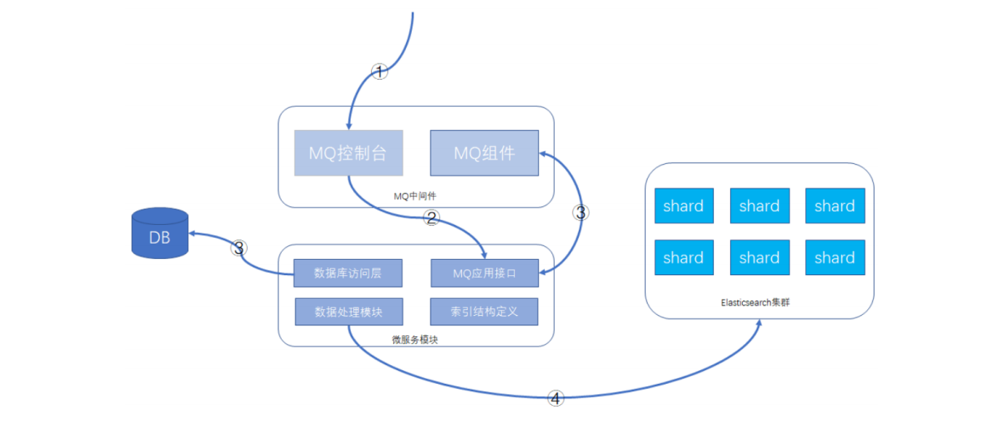

- **详细操作步骤：**

  1. 通过MQ的web控制台或cli命令行，发送指定的MQ消息

  2. MQ消息被微服务模块的消费者消费，触发ES数据重新导入功能

  3. 微服务模块从数据库里查询数据的总数及批次信息，并将每个数据批次的分页信息重新发送给MQ消息，分页信息包含查询条件和偏移量，此MQ消息还是

    会被微服务的MQ消息者接收处理。

  4. 微服务根据接收的查询条件和分页信息，从数据库获取到数据后，根据索引结构的定义，将数据组装成ES支持的JSON格式，并执行bulk命令，将数据发送

    给Elasticsearch集群。这样就可以完成索引的重建工作。

- **方案特点**

  MQ中间件的选型不做具体要求，常见的rabitmq、activemq、rocketmq等均可。

  在微服务模块方面，提供MQ消息处理接口、数据处理模块需要事先开发的，一般是创建新的索引时，配套把重建的功能也一起做好。整体功能共用一个

  topic，针对每个索引，有单独的结构定义和MQ消息处理tag，代码尽可能复用。处理的批次大小需要根据实际的情况设置。

  微服务模块实例会部署多个，数据是分批处理的，批次信息会一次性全部先发送给MQ，各个实例处理的数据相互不重叠，利用MQ消息的异步处理机制，可以

  充分利用并发的优势，加快数据重建的速度。

- **方案缺点**
  
  1. 对数据库造成读取压力，短时间内大量的读操作，会占用数据库的硬件资源，严重时可能引起数据库性能下降。
  2. 网络带宽占用多，数据毕竟是从一个库传到另一个库，虽说是内网，但大量的数据传输带宽占用也需要注意。
  3. 数据重建时间稍长，跟迁移的数据量大小有关。

#### 3.6.2、方案二:基于scroll+bulk+索引别名方案

- **整体介绍**

  利用Elasticsearch自带的一些工具完成索引的重建工作，当然在方案实际落地时，可能也会依赖客户端的一些功能，比如用Java客户端持续的做scroll查询、

  bulk命令的封装等。数据完全自给自足，不依赖其他数据源。

- **执行步骤**

  假设原索引名称是book，新的索引名称为book_new，Java客户端使用别名book_alias连接Elasticsearch，该别名指向原索引book。

  1. 若Java客户端没有使用别名，需要给客户端分配一个: PUT /book/_alias/book_alias 

  2.  新建索引book_new，将mapping信息，settings信息等按新的要求全部定义好。

  3. 使用scroll api将数据批量查询出来为了使用 scroll，初始搜索请求应该在查询中指定 scroll 参数，这可以告诉 Elasticsearch 需要保持搜索的上下文环境多

    久,1m 就是一分钟。

    ```json
    GET /book/_search?scroll=1m 
    {
      "query": {
        "match_all": {}
      },
      "sort": [
        "_doc"
      ],
      "size": 2
    }
    ```

  4. 采用bulk api将scoll查出来的一批数据，批量写入新索引

     ```json
     POST /_bulk 
     { "index": { "_index": "book_new", "_id": "对应的id值" }} 
     { 查询出来的数据值 }
     ```

  5. 反复执行修改后的步骤3和步骤4，查询一批导入一批，以后可以借助Java Client或其他语言的API支持。

     注意做3时需要指定上一次查询的 scroll_id

     ```json
     GET /_search/scroll
     {
       "scroll": "1m",
       "scroll_id": "步骤三中查询出来的值"
     }
     ```

  6. 切换别名book_alias到新的索引book_new上面，此时Java客户端仍然使用别名访问，也不需要修改任何代码，不需要停机。

     ```json
     POST /_aliases
     {
       "actions": [
         {
           "remove": {
             "index": "book",
             "alias": "book_alias"
           }
         },
         {
           "add": {
             "index": "book_new",
             "alias": "book_alias"
           }
         }
       ]
     }
     ```

  7. 验证别名查询的是否为新索引的数据

- **方案特点**

  在数据传输上基本自给自足，不依赖于其他数据源，Java客户端不需要停机等待数据迁移，网络传输占用带宽较小。只是scroll查询和bulk提交这部分，数据量

  大时需要依赖一些客户端工具。

- **补充一点**

  在Java客户端或其他客户端访问Elasticsearch集群时，使用别名是一个好习惯。

#### 3.6.3、方案三:Reindex API方案

Elasticsearch v6.3.1已经支持Reindex API，它对scroll、bulk做了一层封装，能够 对文档重建索引而不需要任何插件或外部工具。

- **最基础的命令：**

  ```json
  POST _reindex
  {
    "source": {
      "index": "book"
    },
    "dest": {
      "index": "book_new"
    }
  }
  ```

  注意： 如果不手动创建新索引book_new的mapping信息，Elasticsearch将启动自动映射模板对数据进行类型映射，可能不是期望的类型，这点要注意一下。

- **version_type属性**

  使用reindex api也是创建快照后再执行迁移的，这样目标索引的数据可能会与原索引有差异，version_type属性可以决定乐观锁并发处理的规则。

  reindex api可以设置version_type属性，如下：

  ```json
  POST _reindex
  {
    "source": {
      "index": "book"
    },
    "dest": {
      "index": "book_new",
      "version_type": "internal"
    }
  }
  ```

  version_type属性含义如下：

  - internal：直接拷贝文档到目标索引，对相同的type、文档ID直接进行覆盖，默认值

  - external：迁移文档到目标索引时，保留version信息，对目标索引中不存在的文档进行创建，已存在的文档按version进行更新，遵循乐观锁机制.

- **op_type 属性和conflicts 属性**

  如果op_type设置为create，那么迁移时只在目标索引中创建ID不存在的文档，已存在的文档，会提示错误，如下请求：

  ```json
  POST _reindex
  {
    "source": {
      "index": "book"
    },
    "dest": {
      "index": "book_new",
      "op_type": "create"
    }
  }
  ```

  如果加上"conflicts": "proceed"配置项，那么冲突信息将不展示，只展示冲突的文档数量，请求和响应结果将变成这样：

  ```json
  POST _reindex
  {
    "conflicts": "proceed",
    "source": {
      "index": "book"
    },
    "dest": {
      "index": "book_new",
      "op_type": "create"
    }
  }
  ```

- **query支持**

  reindex api支持数据过滤、数据排序、size设置、_source选择等，也支持脚本执行，这里提供一个简单示例：

  ```json
  POST _reindex
  {
    "size": 100,
    "source": {
      "index": "book",
      "query": {
        "term": {
          "language": "english"
        }
      },
      "sort": {
        "likes": "desc"
      }
    },
    "dest": {
      "index": "book_new"
    }
  }
  ```

#### 3.6.4、小结

零停机索引重建操作的三个方案，从自研功能、scroll+bulk到reindex，我们作为Elasticsearch的使用者，三个方案的参与度是逐渐弱化的，但稳定性却是逐渐上

升的，我们需要清楚地去了解各个方案的优劣，适宜的场景，然后根据实际的情况去权衡，哪个方案更适合我们的业务模型。

### 3.7、Elasticsearch Suggester智能搜索建议

现代的搜索引擎，一般会具备"Suggest As You Type"功能，即在用户输入搜索的过程中，进行自动补全或者纠错。 通过协助用户输入更精准的关键词，提高后续

全文搜索阶段文档匹配的程度。例如在京东上输入部分关键词，甚至输入拼写错误的关键词时，它依然能够提示出用户想要输入的内容:


如果自己亲手去试一下，可以看到京东在用户刚开始输入的时候是自动补全的，而当输入到一定长度，如果因为单词拼写错误无法补全，就开始尝试提示相似的词

那么类似的功能在Elasticsearch里如何实现呢？ 答案就在Suggesters API。 Suggesters基本的运作原理是将输入的文本分解为token，然后在索引的字典里查找相

似的term并返回。 根据使用场景的不同，Elasticsearch里设计了4种类别的Suggester，分别是:

- Term Suggester
- Phrase Suggester
- Completion Suggester
- Context Suggester

在官方的参考文档里，对这4种Suggester API都有比较详细的介绍，下面的案例将在Elasticsearch 7.x

上通过示例讲解Suggester的基础用法，希望能帮助部分国内开发者快速用于实际项目开发。

#### 3.7.1、Term Suggeste

准备一个叫做blogs的索引，配置一个text字段

```json
PUT /blogs/
{
  "mappings": {
    "properties": {
      "body": {
        "type": "text"
      }
    }
  }
}
```

通过bulk api写入几条文档

```json
POST _bulk/?refresh=true
{ "index" : { "_index" : "blogs" } } 
{ "body": "Lucene is cool"}
{ "index" : { "_index" : "blogs" } } 
{ "body": "Elasticsearch builds on top of lucene"}
{ "index" : { "_index" : "blogs" } }
{ "body": "Elasticsearch rocks"} 
{ "index" : { "_index" : "blogs" } } 
{ "body": "Elastic is the company behind ELK stack"} 
{ "index" : { "_index" : "blogs" } } 
{ "body": "elk rocks"} 
{ "index" : { "_index" : "blogs"} } 
{ "body": "elasticsearch is rock solid"}
```

此时blogs索引里已经有一些文档了，可以进行下一步的探索。为帮助理解，我们先看看哪些term会存在于词典里。

 将输入的文本分析一下: 

```json
POST _analyze
{
  "text": [
    "Lucene is cool",
    "Elasticsearch builds on top of lucene",
    "Elasticsearch rocks",
    "Elastic is the company behind ELK stack",
    "elk rocks",
    "elasticsearch is rock solid"
  ]
}
```

这些分出来的token都会成为词典里一个term，注意有些token会出现多次，因此在倒排索引里记录的词频会比较高，同时记录的还有这些token在原文档里的

偏移量和相对位置信息。

执行一次suggester搜索看看效果: 

```json
POST /blogs/_search
{
  "suggest": {
    "my-suggestion": {
      "text": "lucne rock",
      "term": {
        "suggest_mode": "missing",
        "field": "body"
      }
    }
  }
}
```

suggest就是一种特殊类型的搜索，DSL内部的"text"指的是api调用方提供的文本，也就是通常用户界面上用户输入的内容。这里的lucne是错误的拼写，模拟用户

输入错误。 "term"表示这是一个term suggester。"field"指定suggester针对的字段，另外有一个可选的"suggest_mode"。范例里的"missing"实际上就是缺省

值，它是什么意思？有点挠头... 还是先看看返回结果吧: 

```json
{
  "took" : 9,
  "timed_out" : false,
  "_shards" : {
    "total" : 1,
    "successful" : 1,
    "skipped" : 0,
    "failed" : 0
  },
  "hits" : {
    "total" : {
      "value" : 0,
      "relation" : "eq"
    },
    "max_score" : null,
    "hits" : [ ]
  },
  "suggest" : {
    "my-suggestion" : [
      {
        "text" : "lucne",
        "offset" : 0,
        "length" : 5,
        "options" : [
          {
            "text" : "lucene",
            "score" : 0.8,
            "freq" : 2
          }
        ]
      },
      {
        "text" : "rock",
        "offset" : 6,
        "length" : 4,
        "options" : [ ]
      }
    ]
  }
}
```

在返回结果里"suggest" -> "my-suggestion"部分包含了一个数组，每个数组项对应从输入文本分解出来的token（存放在"text"这个key里）以及为该token提供的

建议词项（存放在options数组里)。 示例里返回了"lucne"，"rock"这2个词的建议项(options)，其中"rock"的options是空的，表示没有可以建议的选项，为什么？ 

上面提到了，我们为查询提供的suggest mode是"missing",由于"rock"在索引的词典里已经存在了，够精准，就不建议啦。 只有词典里找不到词，才会为其提供相

似的选项。如果将"suggest_mode"换成"popular"会是什么效果？尝试一下，重新执行查询，返回结果里"rock"这个词的option不再是空的，而是建议为rocks。 

```json
{
  "took" : 6,
  "timed_out" : false,
  "_shards" : {
    "total" : 1,
    "successful" : 1,
    "skipped" : 0,
    "failed" : 0
  },
  "hits" : {
    "total" : {
      "value" : 0,
      "relation" : "eq"
    },
    "max_score" : null,
    "hits" : [ ]
  },
  "suggest" : {
    "my-suggestion" : [
      {
        "text" : "lucne",
        "offset" : 0,
        "length" : 5,
        "options" : [
          {
            "text" : "lucene",
            "score" : 0.8,
            "freq" : 2
          }
        ]
      },
      {
        "text" : "rock",
        "offset" : 6,
        "length" : 4,
        "options" : [
          {
            "text" : "rocks",
            "score" : 0.75,
            "freq" : 2
          }
        ]
      }
    ]
  }
}
```

回想一下，rock和rocks在索引词典里都是有的。 不难看出即使用户输入的token在索引的词典里已经有了，但是因为存在一个词频更高的相似项，这个相似项可

能是更合适的，就被挑选到options里了。最后还有一个"always" mode，其含义是不管token是否存在于索引词典里都要给出相似项。

有人可能会问，两个term的相似性是如何判断的？ ES使用了一种叫做Levenstein edit distance的算法，其核心思想就是一个词改动多少个字符就可以和另外一个

词一致。 Term suggester还有其他很多可选参数来控制这个相似性的模糊程度，这里就不一一赘述了。

#### 3.7.2、Phrase suggester

Phrase suggester在Term suggester的基础上，会考量多个term之间的关系，比如是否同时出现在索引的原文里，相邻程度，以及词频等等。看个范例就比较容

易明白了: 

```json
POST /blogs/_search
{
  "suggest": {
    "my-suggestion": {
      "text": "lucne and elasticsear rock",
      "phrase": {
        "field": "body",
        "highlight": {
          "pre_tag": "<em>",
          "post_tag": "</em>"
        }
      }
    }
  }
}
```

返回结果: 

```json
"suggest" : {
    "my-suggestion" : [
        {
            "text" : "lucne and elasticsear rock",
            "offset" : 0,
            "length" : 26,
            "options" : [
                {
                    "text" : "lucene and elasticsearch rock",
                    "highlighted" : "<em>lucene</em> and <em>elasticsearch</em> rock",
                    "score" : 0.004993905
                },
                {
                    "text" : "lucne and elasticsearch rock",
                    "highlighted" : "lucne and <em>elasticsearch</em> rock",
                    "score" : 0.0033391973
                },
                {
                    "text" : "lucene and elasticsear rock",
                    "highlighted" : "<em>lucene</em> and elasticsear rock",
                    "score" : 0.0029183894
                }
            ]
        }
    ]
}
```

options直接返回一个phrase列表，由于加了highlight选项，被替换的term会被高亮。因为lucene和elasticsearch曾经在同一条原文里出现过，同时替换2个term

的可信度更高，所以打分较高，排在第一位返回。Phrase suggester有相当多的参数用于控制匹配的模糊程度，需要根据实际应用情况去挑选和调试。

#### 3.7.3、Completion Suggester

下面来谈一下Completion Suggester，它主要针对的应用场景就是"Auto Completion"。 此场景下用户每输入一个字符的时候，就需要即时发送一次查询请求到后

端查找匹配项，在用户输入速度较高的情况下对后端响应速度要求比较苛刻。因此实现上它和前面两个Suggester采用了不同的数据结构，索引并非通过倒排来完

成，而是将analyze过的数据编码成FST和索引一起存放。对于一个open状态的索引，FST会被ES整个装载到内存里的，进行前缀查找速度极快。但是FST只能用于

前缀查找，这也是Completion Suggester的局限所在。

为了使用Completion Suggester，字段的类型需要专门定义如下:

```json
PUT /blogs_completion/
{
  "mappings": {
    "properties": {
      "body": {
        "type": "completion"
      }
    }
  }
}
#用bulk API索引点数据:
POST _bulk/?refresh=true 
{ "index" : { "_index" : "blogs_completion" } } 
{ "body": "Lucene is cool"}
{ "index" : { "_index" : "blogs_completion" } } 
{ "body": "Elasticsearch builds on top of lucene"} 
{ "index" : { "_index" : "blogs_completion"} } 
{ "body": "Elasticsearch rocks"} 
{ "index" : { "_index" : "blogs_completion" } }
{ "body": "Elastic is the company behind ELK stack"}
{ "index" : { "_index" : "blogs_completion" } } 
{ "body": "the elk stack rocks"} 
{ "index" : { "_index" : "blogs_completion"} }
{ "body": "elasticsearch is rock solid"}
```

查找: 

```json
POST /blogs_completion/_search?pretty
{
  "size": 0,
  "suggest": {
    "blog-suggest": {
      "prefix": "elastic i",
      "completion": {
        "field": "body"
      }
    }
  }
}
```

结果: 

```json
"suggest" : {
    "blog-suggest" : [
        {
            "text" : "elastic i",
            "offset" : 0,
            "length" : 9,
            "options" : [
                {
                    "text" : "Elastic is the company behind ELK stack",
                    "_index" : "blogs_completion",
                    "_type" : "_doc",
                    "_id" : "d7t-CXkBAEOALttEzY6e",
                    "_score" : 1.0,
                    "_source" : {
                        "body" : "Elastic is the company behind ELK stack"
                    }
                }
            ]
        }
    ]
}
```

值得注意的一点是Completion Suggester在索引原始数据的时候也要经过analyze阶段，取决于选用的analyzer不同，某些词可能会被转换，某些词可能被去除，

这些会影响FST编码结果，也会影响查找匹配的效果。

比如我们删除上面的索引，重新设置索引的mapping，将analyzer更改为"english":

```json
PUT /blogs_completion/
{
  "mappings": {
    "properties": {
      "body": {
        "type": "completion",
        "analyzer":"english"
      }
    }
  }
}
#用bulk API索引点数据:
POST _bulk/?refresh=true 
{ "index" : { "_index" : "blogs_completion" } } 
{ "body": "Lucene is cool"}
{ "index" : { "_index" : "blogs_completion" } } 
{ "body": "Elasticsearch builds on top of lucene"} 
{ "index" : { "_index" : "blogs_completion"} } 
{ "body": "Elasticsearch rocks"} 
{ "index" : { "_index" : "blogs_completion" } }
{ "body": "Elastic is the company behind ELK stack"}
{ "index" : { "_index" : "blogs_completion" } } 
{ "body": "the elk stack rocks"} 
{ "index" : { "_index" : "blogs_completion"} }
{ "body": "elasticsearch is rock solid"}
```

bulk api索引同样的数据后，执行下面的查询: 

```json
POST /blogs_completion/_search?pretty
{
  "size": 0,
  "suggest": {
    "blog-suggest": {
      "prefix": "elastic i",
      "completion": {
        "field": "body"
      }
    }
  }
}
```

居然没有匹配结果了，多么费解！ 原来我们用的english analyzer会剥离掉stop word，而is就是其中一个，被剥离掉了！

用analyze api测试一下: 

```json
POST _analyze
{
  "text": "elasticsearch is rock solid",
  "analyzer": "english"
}
#会发现只有3个token:
{
  "tokens" : [
    {
      "token" : "elasticsearch",
      "start_offset" : 0,
      "end_offset" : 13,
      "type" : "<ALPHANUM>",
      "position" : 0
    },
    {
      "token" : "rock",
      "start_offset" : 17,
      "end_offset" : 21,
      "type" : "<ALPHANUM>",
      "position" : 2
    },
    {
      "token" : "solid",
      "start_offset" : 22,
      "end_offset" : 27,
      "type" : "<ALPHANUM>",
      "position" : 3
    }
  ]
}
```

FST(Finite StateTransducers)只编码了这3个token，并且默认的还会记录他们在文档中的位置和分隔符。 用户输入"elastic i"进行查找的时候，输入被分解

成"elastic"和"i"，FST没有编码这个“i” , 匹配失败。

好吧，如果你现在还足够清醒的话，试一下搜索"elastic is"，会发现又有结果，why? 因为这次输入的text经过english analyzer的时候is也被剥离了，只需在FST里

查询"elastic"这个前缀，自然就可以匹配到了。

其他能影响completion suggester结果的，还有

如"preserve_separators"，"preserve_position_increments"等等mapping参数来控制匹配的模糊程度。以及搜索时可以选用Fuzzy Queries，使得上面例子里

的"elastic i"在使用english analyzer的情况下依然可以匹配到结果。

```apl
"preserve_separators": false, 这个设置为false,将忽略空格之类的分隔符 
"preserve_position_increments": true,如果建议词第一个词是停用词,并且我们使用了过滤停用 词的分析器,需要将此设置为false。
```

因此用好Completion Sugester并不是一件容易的事，实际应用开发过程中，需要根据数据特性和业务需要，灵活搭配analyzer和mapping参数，反复调试才可能

获得理想的补全效果。回到篇首京东或者百度搜索框的补全/纠错功能，如果用ES怎么实现呢？我能想到的一个的实现方式:在用户刚开始输入的过程中，使用

Completion Suggester进行关键词前缀匹配，刚开始匹配项会比较多，随着用户输入字符增多，匹配项越来越少。如果用户输入比较精准，可能Completion 

Suggester的结果已经够好，用户已经可以看到理想的备选项了。

如果Completion Suggester已经到了零匹配，那么可以猜测是否用户有输入错误，这时候可以尝试一下Phrase Suggester。如果Phrase Suggester没有找到任何

option，开始尝试term Suggester。精准程度上(Precision)看： Completion > Phrase > term， 而召回率上(Recall)则反之。从性能上看，Completion Suggester

是最快的，如果能满足业务需求，只用Completion Suggester做前缀匹配是最理想的。 Phrase和Term由于是做倒排索引的搜索，相比较而言性能应该要低不少，

应尽量控制suggester用到的索引的数据量，最理想的状况是经过一定时间预热后，索引可以全量map到内存。

```text
召回率(Recall) = 系统检索到的相关文件 / 系统所有相关的文件总数 
准确率(Precision) = 系统检索到的相关文件 / 系统所有检索到的文件总数 
从一个大规模数据集合中检索文档时，可把文档分成四组：
- 系统检索到的相关文档（A）
- 系统检索到的不相关文档（B） 
- 相关但是系统没有检索到的文档（C） 
- 不相关且没有被系统检索到的文档（D） 
则：
- 召回率R：用实际检索到相关文档数作为分子，所有相关文档总数作为分母，即R = A / ( A + C ) 
- 精度P：用实际检索到相关文档数作为分子，所有检索到的文档总数作为分母，即P = A / ( A + B ) 
举例：一个数据库有 1000 个文档，其中有 50 个文档符合相关定义的问题,系统检索到 75 个文档，但 其中只有 45 个文档被检索出。 
精度：P=45/75=60%。 
召回率：R=45/50=90%。
```

#### 3.7.4、Context Suggester

- Completion Suggester 的扩展

- 可以在搜索中加入更多的上下文信息，然后根据不同的上下文信息，对相同的输入，比如"star"，提供不同的建议值，比如：
  - 咖啡相关：starbucks
  - 电影相关：star wars

### 3.8、Elasticsearch Java Client

ES提供多种不同的客户端：

 1、TransportClient ES提供的传统客户端，官方计划8.0版本删除此客户端。

 2、RestClient RestClient是官方推荐使用的，它包括两种：Java Low Level REST Client和 Java HighLevel REST Client。 ES在6.0之后提供 Java High Level REST 

Client， 两种客户端官方更推荐使用 JavaHigh Level REST Client， 使用时加入对应版本的依赖即可。

**SpringBoot 中使用 RestClient**

- 配置 pom.xml

  ```xml
  <parent>
      <groupId>org.springframework.boot</groupId>
      <artifactId>spring-boot-starter-parent</artifactId>
      <version>2.3.5.RELEASE</version>
  </parent>
  <dependencies>
      <dependency>
          <groupId>org.springframework.boot</groupId>
          <artifactId>spring-boot-starter-test</artifactId>
      </dependency>
      <dependency>
          <groupId>org.elasticsearch.client</groupId>
          <artifactId>elasticsearch-rest-high-level-client</artifactId>
          <version>7.12.0</version>
          <exclusions>
              <exclusion>
                  <groupId>org.elasticsearch</groupId>
                  <artifactId>elasticsearch</artifactId>
              </exclusion>
          </exclusions>
      </dependency>
      <dependency>
          <groupId>org.elasticsearch</groupId>
          <artifactId>elasticsearch</artifactId>
          <version>7.12.0</version>
      </dependency>
  </dependencies>
  ```

- application.yml文件配置

  ```yaml
  thmelasticsearch:
    elasticsearch:
      hostlist: 192.168.81.100:9200 #多个结点中间用逗号分隔
  ```

- 配置类

  ```java
  package com.thm.config;
  
  import org.apache.http.HttpHost;
  import org.elasticsearch.client.RestClient;
  import org.elasticsearch.client.RestHighLevelClient;
  import org.springframework.beans.factory.annotation.Value;
  import org.springframework.context.annotation.Bean;
  import org.springframework.context.annotation.Configuration;
  
  /**
   * @ClassNmae ElasticsearchConfig
   * @Description TODO
   * @Author THM
   * @Date 2021/4/26 20:36
   * @Version 1.0
   **/
  @Configuration
  public class ElasticsearchConfig {
      @Value("${thmelasticsearch.elasticsearch.hostlist}")
      private String hostlist;
      @Bean
      public RestHighLevelClient restHighLevelClient() {
          //解析hostlist配置信息
          String[] split = hostlist.split(",");
          //创建HttpHost数组，其中存放es主机和端口的配置信息
          HttpHost[] httpHostArray = new HttpHost[split.length];
          for (int i = 0; i < split.length; i++) {
              String item = split[i];
              httpHostArray[i] = new HttpHost(item.split(":")[0], Integer.parseInt(item.split(":")[1]), "http");
          }
          //创建RestHighLevelClient客户端
          return new RestHighLevelClient(RestClient.builder(httpHostArray));
      }
  
      //项目主要使用RestHighLevelClient，对于低级的客户端暂时不用
      @Bean
      public RestClient restClient() {
          //解析hostlist配置信息
          String[] split = hostlist.split(",");
          //创建HttpHost数组，其中存放es主机和端口的配置信息
          HttpHost[] httpHostArray = new HttpHost[split.length];
          for (int i = 0; i < split.length; i++) {
              String item = split[i];
              httpHostArray[i] = new HttpHost(item.split(":")[0], Integer.parseInt(item.split(":")[1]), "http");
          }
          return RestClient.builder(httpHostArray).build();
      }
  }
  ```

- 创建测试类

  ```java
  import com.thm.Bootstrap;
  import org.apache.lucene.search.TotalHits;
  import org.elasticsearch.action.DocWriteResponse;
  import org.elasticsearch.action.admin.indices.create.CreateIndexRequest;
  import org.elasticsearch.action.admin.indices.create.CreateIndexResponse;
  import org.elasticsearch.action.admin.indices.delete.DeleteIndexRequest;
  import org.elasticsearch.action.admin.indices.get.GetIndexRequest;
  import org.elasticsearch.action.delete.DeleteRequest;
  import org.elasticsearch.action.get.GetRequest;
  import org.elasticsearch.action.get.GetResponse;
  import org.elasticsearch.action.index.IndexRequest;
  import org.elasticsearch.action.index.IndexResponse;
  import org.elasticsearch.action.search.SearchRequest;
  import org.elasticsearch.action.search.SearchResponse;
  import org.elasticsearch.action.support.master.AcknowledgedResponse;
  import org.elasticsearch.client.IndicesClient;
  import org.elasticsearch.client.RequestOptions;
  import org.elasticsearch.client.RestClient;
  import org.elasticsearch.client.RestHighLevelClient;
  import org.elasticsearch.common.settings.Settings;
  import org.elasticsearch.common.xcontent.XContentBuilder;
  import org.elasticsearch.common.xcontent.XContentFactory;
  import org.elasticsearch.index.query.QueryBuilder;
  import org.elasticsearch.index.query.QueryBuilders;
  import org.elasticsearch.search.SearchHit;
  import org.elasticsearch.search.SearchHits;
  import org.elasticsearch.search.builder.SearchSourceBuilder;
  import org.elasticsearch.search.sort.SortOrder;
  import org.junit.jupiter.api.Test;
  import org.junit.runner.RunWith;
  import org.springframework.beans.factory.annotation.Autowired;
  import org.springframework.boot.test.context.SpringBootTest;
  import org.springframework.test.context.junit4.SpringRunner;
  
  import java.io.IOException;
  import java.text.ParseException;
  import java.text.SimpleDateFormat;
  import java.util.Date;
  import java.util.HashMap;
  import java.util.Map;
  
  @SpringBootTest(classes = Bootstrap.class)
  @RunWith(SpringRunner.class)
  public class TestIndex {
  
      @Autowired
      RestHighLevelClient client;
      @Autowired
      RestClient restClient;
  
      //创建索引库
  
      /**
       * PUT /elasticsearch_test
       * {
       * "settings": {},
       * "mappings": {
       * "properties": {
       * "description": {
       * "type": "text",
       * "analyzer": "ik_max_word"
       * },
       * "name": {
       * "type": "keyword"
       * },
       * "pic": {
       * "type": "text",
       * "index": false
       * },
       * "studymodel": {
       * "type": "keyword"
       * }
       * }
       * }
       * }
       */
      @Test
      void testCreateIndex() throws IOException {
          //构建 创建索引对象
          CreateIndexRequest createIndexRequest = new CreateIndexRequest("elasticsearch_test");
          //设置参数
          createIndexRequest.settings(Settings.builder().put("number_of_shards", "1").put("number_of_replicas", "0"));
          // 指定映射
          XContentBuilder builder = XContentFactory.jsonBuilder()
                  .startObject()
                  .field("properties")
                  .startObject()
                  .field("description").startObject().field("index", true).field("type", "text").field("analyzer", "ik_max_word").endObject()
                  .field("name").startObject().field("index", true).field("type", "integer").endObject()
                  .field("pic").startObject().field("index", "false").field("type", "text").endObject()
                  .field("studymodel").startObject().field("index", "true").field("type", "keyword").endObject()
                  .endObject()
                  .endObject();
          createIndexRequest.mapping("doc", builder);
          //createIndexRequest.mapping("doc", " {\n" + " \t\"properties\": {\n" + " \"studymodel\":{\n" + " \"type\":\"keyword\"\n" + " },\n" + " \"name\":{\n" + " \"type\":\"keyword\"\n" + " },\n" + " \"description\": {\n" + " \"type\": \"text\",\n" + " \"analyzer\":\"ik_max_word\" \n" + " },\n" + " \"pic\":{\n" + " \"type\":\"text\",\n" + " \"index\":false\n" + " }\n" + " \t}\n" + "}", XContentType.JSON);
          //操作索引的客户端
          IndicesClient indices = client.indices();
          //执行创建索引库
          // CreateIndexResponse createIndexResponse = indices.create(createIndexRequest, RequestOptions.DEFAULT);
          CreateIndexResponse createIndexResponse = indices.create(createIndexRequest, RequestOptions.DEFAULT);
          //得到响应
          boolean acknowledged = createIndexResponse.isAcknowledged();
          System.out.println(acknowledged);
          System.out.println("创建状态：" + acknowledged);
      }
  
      /**
       * 删除索引
       *
       * @throws IOException
       */
      @Test
      void testdeleteIndex() throws IOException {
          //构建 删除索引的请求对象
          DeleteIndexRequest deleteRequest = new DeleteIndexRequest("elasticsearch_test");
          //操作索引的客户端
          IndicesClient indicesClient = client.indices();
          //执行删除索引
          AcknowledgedResponse acknowledgedResponse = indicesClient.delete(deleteRequest, RequestOptions.DEFAULT);
          //得到响应
          boolean acknowledged = acknowledgedResponse.isAcknowledged();
          System.out.println("删除状态：" + acknowledged);
      }
  
      /**
       * 添加文档
       * POST /elasticsearch_test/_doc/1
       * {
       * "name": "spring cloud实战",
       * "description": "本课程主要从四个章节进行讲解： 1.微服务架构入门 2.spring cloud 基 础入门 3.实战Spring Boot 4.注册中心eureka。",
       * "studymodel": "201001",
       * "timestamp": "2020-08-22 20:09:18",
       * "price": 5.6
       * }
       */
      @Test
      void testAddDoc() throws IOException {
          //准备索引请求对
          IndexRequest indexRequest = new IndexRequest("elasticsearch_test");
          indexRequest.id("3");
          //文档内容 准备json
          Map<String, Object> jsonMap = new HashMap<>();
          jsonMap.put("name", "spring cloud实战3");
          jsonMap.put("description", "本课程主要从四个章节进行讲解： 1.微服务架构入门 2.spring cloud 基 础入门 3.实战Spring Boot 4.注册中心eureka");
          jsonMap.put("studymodel", "201001");
          jsonMap.put("timestamp", "2020-08-22 20:09:18");
          jsonMap.put("price", "5.6");
  
          indexRequest.source(jsonMap);
          //执行请求
          IndexResponse indexResponse = client.index(indexRequest, RequestOptions.DEFAULT);
          DocWriteResponse.Result result = indexResponse.getResult();
          System.out.println(result);
      }
  
      /**
       * 查询文档  根据ID
       */
      @Test
      void testGetDoc() throws IOException {
          //查询请求对象
          GetRequest getRequest = new GetRequest("elasticsearch_test", "1");
          GetResponse getResponse = client.get(getRequest, RequestOptions.DEFAULT);
          //得到文档的内容
          Map<String, Object> sourceAsMap = getResponse.getSourceAsMap();
          System.out.println(sourceAsMap);
      }
  
      /**
       * 查询所有记录
       *
       * GET /elasticsearch_test/_search
       * {
       *   "query": {
       *     "match_all": {}
       *   }
       * }
       */
      @Test
      void testSearchAll() throws IOException, ParseException {
          // 搜索请求对
          SearchRequest searchRequest = new SearchRequest("elasticsearch_test");
          //搜索源构建对象
          SearchSourceBuilder searchSourceBuilder = new SearchSourceBuilder();
          //设置搜索方法
          searchSourceBuilder.query(QueryBuilders.matchAllQuery());
          searchSourceBuilder.fetchSource(new String[]{"name", "price", "timestamp"}, new String[]{});
          //请求对象设置 搜索源对象
          searchRequest.source(searchSourceBuilder);
          //使用client 执行搜索
          SearchResponse searchResponse = client.search(searchRequest, RequestOptions.DEFAULT);
          //搜索结果
          SearchHits hits = searchResponse.getHits();
          // 匹配到的总记录数
          TotalHits totalHits = hits.getTotalHits();
          System.out.println("查询到的记录总数：" + totalHits.value);
          // 得到的匹配度高的文档
          SearchHit[] searchHits = hits.getHits();
          //日期格式化对象
          SimpleDateFormat dateFormat = new SimpleDateFormat("yyyy-MM-dd HH:mm:ss");
          for (SearchHit hit : searchHits) {
              //文档的主键
              String id = hit.getId();
              //源文档内容
              Map<String, Object> sourceAsMap = hit.getSourceAsMap();
              String name = (String) sourceAsMap.get("name");
              //由于前边设置了源文档字段过虑，这时description是取不到的
              String description = (String) sourceAsMap.get("description");
              //学习模式
              String studymodel = (String) sourceAsMap.get("studymodel");
              //价格
              Object price = sourceAsMap.get("price");
              //日期
              Date timestamp = dateFormat.parse((String) sourceAsMap.get("timestamp"));
              System.out.println(name);
              System.out.println(studymodel);
              System.out.println(description);
              System.out.println(price);
              System.out.println(timestamp);
          }
      }
  
      /**
       * TermQuery
       * @throws IOException
       * @throws ParseException
       */
      @Test
      void testTermQuery() throws IOException, ParseException {
          // 搜索请求对
          SearchRequest searchRequest = new SearchRequest("elasticsearch_test");
          //搜索源构建对象
          SearchSourceBuilder searchSourceBuilder = new SearchSourceBuilder();
          //设置搜索方法
          searchSourceBuilder.query(QueryBuilders.termQuery("name","spring"));
          searchSourceBuilder.fetchSource(new String[]{"name", "price", "timestamp"}, new String[]{});
          //请求对象设置 搜索源对象
          searchRequest.source(searchSourceBuilder);
          //使用client 执行搜索
          SearchResponse searchResponse = client.search(searchRequest, RequestOptions.DEFAULT);
          //搜索结果
          SearchHits hits = searchResponse.getHits();
          // 匹配到的总记录数
          TotalHits totalHits = hits.getTotalHits();
          System.out.println("查询到的记录总数：" + totalHits.value);
          // 得到的匹配度高的文档
          SearchHit[] searchHits = hits.getHits();
          //日期格式化对象
          SimpleDateFormat dateFormat = new SimpleDateFormat("yyyy-MM-dd HH:mm:ss");
          for (SearchHit hit : searchHits) {
              //文档的主键
              String id = hit.getId();
              //源文档内容
              Map<String, Object> sourceAsMap = hit.getSourceAsMap();
              String name = (String) sourceAsMap.get("name");
              //由于前边设置了源文档字段过虑，这时description是取不到的
              String description = (String) sourceAsMap.get("description");
              //学习模式
              String studymodel = (String) sourceAsMap.get("studymodel");
              //价格
              Object price = sourceAsMap.get("price");
              //日期
              Date timestamp = dateFormat.parse((String) sourceAsMap.get("timestamp"));
              System.out.println(name);
              System.out.println(studymodel);
              System.out.println(description);
              System.out.println(price);
              System.out.println(timestamp);
          }
      }
  
      /**
       * 分页查询
       * @throws IOException
       * @throws ParseException
       */
      @Test
      void testSearchPage() throws IOException, ParseException {
          // 搜索请求对
          SearchRequest searchRequest = new SearchRequest("elasticsearch_test");
          //搜索源构建对象
          SearchSourceBuilder searchSourceBuilder = new SearchSourceBuilder();
          //设置搜索方法
          searchSourceBuilder.query(QueryBuilders.matchAllQuery());
          searchSourceBuilder.fetchSource(new String[]{"name", "price", "timestamp"}, new String[]{});
          //设置分页
          int page = 1,size=2;
          //计算form
          int form = (page -1 )* size;
          searchSourceBuilder.from(form);
          searchSourceBuilder.size(size);
          //设置排序
          searchSourceBuilder.sort("price", SortOrder.DESC);
          //请求对象设置 搜索源对象
          searchRequest.source(searchSourceBuilder);
          //使用client 执行搜索
          SearchResponse searchResponse = client.search(searchRequest, RequestOptions.DEFAULT);
          //搜索结果
          SearchHits hits = searchResponse.getHits();
          // 匹配到的总记录数
          TotalHits totalHits = hits.getTotalHits();
          System.out.println("查询到的记录总数：" + totalHits.value);
          // 得到的匹配度高的文档
          SearchHit[] searchHits = hits.getHits();
          //日期格式化对象
          SimpleDateFormat dateFormat = new SimpleDateFormat("yyyy-MM-dd HH:mm:ss");
          for (SearchHit hit : searchHits) {
              //文档的主键
              String id = hit.getId();
              //源文档内容
              Map<String, Object> sourceAsMap = hit.getSourceAsMap();
              String name = (String) sourceAsMap.get("name");
              //由于前边设置了源文档字段过虑，这时description是取不到的
              String description = (String) sourceAsMap.get("description");
              //学习模式
              String studymodel = (String) sourceAsMap.get("studymodel");
              //价格
              Object price = sourceAsMap.get("price");
              //日期
              Date timestamp = dateFormat.parse((String) (sourceAsMap.get("timestamp"))) ;
              System.out.println(name);
              System.out.println(studymodel);
              System.out.println(description);
              System.out.println(price);
              System.out.println(timestamp);
          }
      }
  
      /**
       * TermQuery分页
       * @throws IOException
       * @throws ParseException
       */
      @Test
      void testTermPage() throws IOException, ParseException {
          // 搜索请求对
          SearchRequest searchRequest = new SearchRequest("elasticsearch_test");
          //搜索源构建对象
          SearchSourceBuilder searchSourceBuilder = new SearchSourceBuilder();
          //设置搜索方法
          searchSourceBuilder.query(QueryBuilders.termQuery("name","spring"));
          searchSourceBuilder.fetchSource(new String[]{"name", "price", "timestamp"}, new String[]{});
          //设置分页
          int page = 1,size=2;
          //计算form
          int form = (page -1 )* size;
          searchSourceBuilder.from(form);
          searchSourceBuilder.size(size);
          //请求对象设置 搜索源对象
          searchRequest.source(searchSourceBuilder);
          //使用client 执行搜索
          SearchResponse searchResponse = client.search(searchRequest, RequestOptions.DEFAULT);
          //搜索结果
          SearchHits hits = searchResponse.getHits();
          // 匹配到的总记录数
          TotalHits totalHits = hits.getTotalHits();
          System.out.println("查询到的记录总数：" + totalHits.value);
          // 得到的匹配度高的文档
          SearchHit[] searchHits = hits.getHits();
          //日期格式化对象
          SimpleDateFormat dateFormat = new SimpleDateFormat("yyyy-MM-dd HH:mm:ss");
          for (SearchHit hit : searchHits) {
              //文档的主键
              String id = hit.getId();
              //源文档内容
              Map<String, Object> sourceAsMap = hit.getSourceAsMap();
              String name = (String) sourceAsMap.get("name");
              //由于前边设置了源文档字段过虑，这时description是取不到的
              String description = (String) sourceAsMap.get("description");
              //学习模式
              String studymodel = (String) sourceAsMap.get("studymodel");
              //价格
              Object price = sourceAsMap.get("price");
              //日期
              Date timestamp = dateFormat.parse((String) sourceAsMap.get("timestamp"));
              System.out.println(name);
              System.out.println(studymodel);
              System.out.println(description);
              System.out.println(price);
              System.out.println(timestamp);
          }
      }
  }
  ```


## 4、Elasticsearch之企业级高可用分布式集群

### 4.1、核心概念

- **集群（Cluster）**

  一个Elasticsearch集群由多个节点（Node）组成，每个集群都有一个共同的集群名称作为标识

- **节点（Node）**

  - 一个Elasticsearch实例即一个Node，一台机器可以有多个实例，正常使用下每个实例都应该会部署在不同的机器上。Elasticsearch的配置文件中可以通

    过node.master、node.data来设置节点类型。

  - node.master：表示节点是否具有成为主节点的资格

    - true代表的是有资格竞选主节点

    - false代表的是没有资格竞选主节点

  - node.data：表示节点是否存储数据

- **Node节点组合**

  - 主节点+数据节点（master+data） 默认

    - 节点既有成为主节点的资格，又存储数据

      ```yaml
      node.master: true
      node.data: true
      ```

    - 数据节点（data）

      节点没有成为主节点的资格，不参与选举，只会存储数据

      ```yaml
      node.master: false
      node.data: true
      ```

    - 客户端节点（client）

      不会成为主节点，也不会存储数据，主要是针对海量请求的时候可以进行负载均衡

      ```yaml
      node.master: false
      node.data: false
      ```

- **分片**

  每个索引有1个或多个分片，每个分片存储不同的数据。分片可分为主分片（primary shard）和复制分片（replica shard），复制分片是主分片的拷贝。默认

  每个主分片有一个复制分片，每个索引的复制分片的数量可以动态地调整，复制分片从不与它的主分片在同一个节点上

- **副本**

  这里指主分片的副本分片（主分片的拷贝）

  - 提高恢复能力：当主分片挂掉时，某个复制分片可以变成主分片； 

  - 提高性能：get 和 search 请求既可以由主分片又可以由复制分片处理

### 4.2、Elasticsearch分布式架构

Elasticseasrch的架构遵循其基本概念：一个采用Restful API标准的高扩展性和高可用性的实时数据分析的全文搜索引擎。

#### 4.2.1、特性

- 高扩展性：体现在Elasticsearch添加节点非常简单，新节点无需做复杂的配置，只要配置好集群信息将会被集群自动发现。
- 高可用性：因为Elasticsearch是分布式的，每个节点都会有备份，所以宕机一两个节点也不会出现问题，集群会通过备份进行自动复盘。
- 实时性：使用倒排索引来建立存储结构，搜索时常在百毫秒内就可完成。

#### 4.2.2、分层

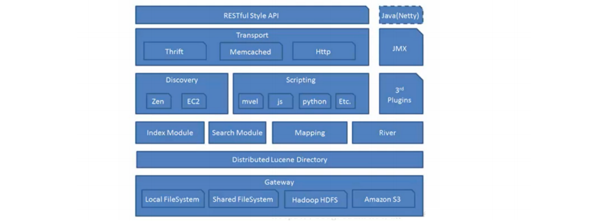

- **第一层 —— Gateway：**

  Elasticsearch支持的索引快照的存储格式，es默认是先把索引存放到内存中，当内存满了之后再持久化到本地磁盘。gateway对索引快照进行存储，当

  Elasticsearch关闭再启动的时候，它就会从这个gateway里面读取索引数据；支持的格式有：本地的Local FileSystem、分布式的Shared FileSystem、

  Hadoop的文件系统HDFS、Amazon（亚马逊）的S3。 

- **第二层 —— Lucene框架：**

  Elasticsearch基于Lucene（基于Java开发）框架。

- **第三层 —— Elasticsearch数据的加工处理方式：**

  Index Module（创建Index模块）、Search Module（搜索模块）、Mapping（映射）、River 代表es的一个数据源（运行在Elasticsearch集群内部的一

  个插件，主要用来从外部获取获取异构数据，然后在Elasticsearch里创建索引；常见的插件有RabbitMQ River、Twitter River）。

- **第四层 —— Elasticsearch发现机制、脚本：**

  Discovery 是Elasticsearch自动发现节点的机制的模块，Zen Discovery和 EC2 discovery。EC2：亚马逊弹性计算云 EC2 discovery主要在亚马云平台中使

  用。Zen Discovery作用就相当于solr cloud中的zookeeper。zen Discovery 从功能上可以分为两部分，第一部分是集群刚启动时的选主，或者是新加入

  集群的节点发现当前集群的Master。第二部分是选主完成后，Master 和 Folower 的相互探活。 

  Scripting 是脚本执行功能，有这个功能能很方便对查询出来的数据进行加工处理。

  3rd Plugins 表示Elasticsearch支持安装很多第三方的插件，例如elasticsearch-ik分词插件、elasticsearch-sql sql插件。

- **第五层 —— Elasticsearch的交互方式：** 

  有Thrift、Memcached、Http三种协议，默认的是用Http协议传输

- **第六层 —— Elasticsearch的API支持模式：**

  RESTFul Style API风格的API接口标准是当下十分流行的。Elasticsearch作为分布式集群，客户端到服务端，节点与节点间通信有TCP和Http通信协议，底

  层实现为Netty框架

#### 4.2.3、解析Elasticsearch的分布式架构

**分布式架构的透明隐藏特性**

- **Elasticsearch是一个分布式系统，隐藏了复杂的处理机制分片机制：**

  将文本数据切割成n个小份存储在不同的节点上，减少大文件存储在单个节点上对设备带来的压力。

- **分片的副本：**

  在集群中某个节点宕掉后，通过副本可以快速对缺失数据进行复盘。

- **集群发现机制（cluster discovery）：**

  在当前启动了一个Elasticsearch进程，在启动第二个Elasticsearch进程时，这个进程将作为一个node自动就发现了集群，并自动加入,前提是这些node都必须

  配置一套集群信息。

- **Shard负载均衡：**

  例如现在由10个 shard （分片），集群中由三个节点，Elasticsearch会进行均衡的分配，以保持每个节点均衡的负载请求。

- **扩容机制**

  垂直扩容：用新机器替换已有的机器，服务器台数不变容量增加。

  水平扩容：直接增加新机器，服务器台数和容量都增加。

- **rebalance**

  增加或减少节点时会自动负载

- **主节点**

  主节点的主要职则是和集群操作的相关内容，如创建或删除索引，跟踪哪些节点是集群的一部分，并决定哪些分片分配给相关的节点。稳定的主节点对集群的

  健康是非常重要的。

- **节点对等**

  每个节点都能接受请求，每个节点接受到请求后都能把该请求路由到有相关数据的其它节点上，接受原始请求的节点负责采集数据并返回给客户端。

  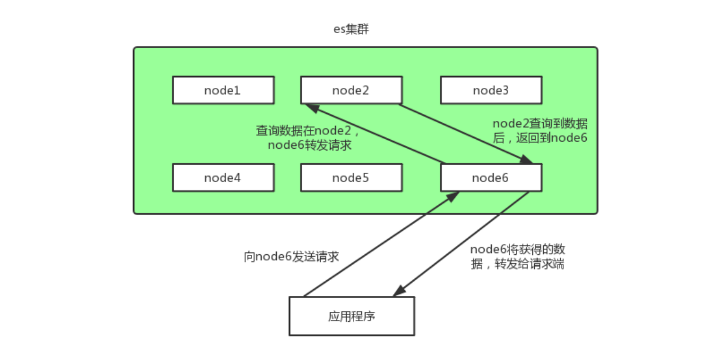

### 4.3、集群环境搭建

我们搭建一个三个节点的集群环境，为了学习方便，我这边只在一台服务器上来演示主从环境。调整虚拟机内存到**3g**以上

| 操作系统 | IP             | 端口 | 是否能成为主节点 |
| -------- | -------------- | ---- | ---------------- |
| centos7  | 192.168.81.100 | 9200 | 是               |
| centos7  | 192.168.81.101 | 9200 | 是               |
| centos7  | 192.168.81.102 | 9200 | 是               |

#### 4.3.1、节点搭建

elasticsearch.yml配置文件说明：

| 配置项                       | 描述                                                         |
| ---------------------------- | ------------------------------------------------------------ |
| cluster.name                 | 集群名称，相同名称为一个集群                                 |
| node.name                    | 节点名称，集群模式下每个节点名称唯一                         |
| node.master                  | 当前节点是否可以被选举为master节点，是：true、否：false      |
| node.data                    | 当前节点是否用于存储数据，是：true、否：false                |
| path.data                    | 索引数据存放的位置                                           |
| path.logs                    | 日志文件存放的位置                                           |
| bootstrap.memory_lock        | 需求锁住物理内存，是：true、否：false                        |
| network.host                 | 监听地址，用于访问该es                                       |
| http.port                    | es对外提供的http端口，默认 9200                              |
| transport.port               | 节点选举的通信端口 默认是9300                                |
| discovery.seed_hosts         | es7.x 之后新增的配置，写入候选主节点的设备地址，在开启服务后可以被选为主节点 |
| cluster.initial_master_nodes | es7.x 之后新增的配置，初始化一个新的集群时需要此配置来选举master |
| http.cors.enabled            | 是否支持跨域，是：true，在使用head插件时需要此配置           |
| http.cors.allow-origin "*"   | 表示支持所有域名                                             |

我们要只需要在之前的基础上，打开配置文件elasticsearch.yml，添加如下配置：

```yaml
cluster.name: my-es #集群名称 
node.name: node-1 # 节点名称 
node.master: true #当前节点是否可以被选举为master节点，是：true、否：false
network.host: 0.0.0.0 
http.port: 9200 
transport.port: 9300 
#初始化一个新的集群时需要此配置来选举master
cluster.initial_master_nodes: ["node-1","node-2","node-3"] 
#写入候选主节点的设备地址
discovery.seed_hosts: ["192.168.81.100:9300", "192.168.81.101:9300","192.168.81.102:9300"] 
http.cors.enabled: true 
http.cors.allow-origin: "*"
```

**修改完配置文件之后，一定要把之前的data目录下node数据删除再重新服务即可。**

#### 4.3.2、集群创建

- 拷贝192.168.81.100上的es到其他两台服务器(101、102)

  ```shell
  scp -r elasticsearch/ root@node2:/usr/
  scp -r elasticsearch/ root@node3:/usr/
  ```

- 修改192.168.81.101和192.168.81.102中es的配置文件elasticsearch.yml

  ```yaml
  node.name: node-2 # 节点名称  192.168.81.101
  node.name: node-3 # 节点名称  192.168.81.102

- 在192.168.81.101和192.168.81.102中创建estest用户并修改es目录

  ```shell
  #新增用户
  useradd estest 
  #修改密码 
  passwd estest
  #改变es目录拥有者账号
  chown -R estest /usr/elasticsearch/
  ```

- 在192.168.81.101和192.168.81.102中修改/etc/sysctl.conf

  ```shell
  vim /etc/sysctl.conf
  #末尾添加：
  vm.max_map_count=655360
  #执行sysctl -p 让其生效
  sysctl -p
  ```

- 在192.168.81.101和192.168.81.102中修改/etc/security/limits.conf

  ```shell
  vim /etc/security/limits.conf
  #末尾添加：
  *                soft    nofile          65536
  *                hard    nofile          65536
  *                soft    nproc           4096
  *                hard    nproc           4096
  ```

- 启动三台服务器中的es

  ```shell
  #切换刚刚新建的用户
  su estest
  #启动命令
  /usr/elasticsearch/bin/elasticsearch
  ```

- 配置完成：浏览器访问测试。 ip:9200 

  ```apl
  http://192.168.81.100:9200/_cat/health?v
  ```

#### 4.3.3、Elasticsearch Head插件介绍及安装 和 验证主从环境

Elasticsearch Head插件介绍及安装

>elasticsearch-head 简介

elasticsearch-head是一个界面化的集群操作和管理工具，可以对集群进行傻瓜式操作。你可以通过插件把它集成到ES。

es-head主要有三个方面的操作：
1. 显示集群的拓扑 能够快速访问并显示集群的状态,并且能够执行索引和节点级别操作
2. 搜索接口能够查询集群中原始json或表格格式的检索数据
3. 有一个输入窗口,允许任意调用RESTful API。

`官方的文档： <https://github.com/mobz/elasticsearch-head>`

#### 4.3.4、elasticsearch-head 安装

**安装步骤：**

ealsticsearch只是后端提供各种api，那么怎么直观的使用它呢？elasticsearch-head将是一款专门针对于elasticsearch的客户端工具 elasticsearch-head配置包，

下载地址：https://github.com/mobz/elasticsearch-head elasticsearch-head是一个基于node.js的前端工程。

- nodejs安装

  ```shell
  #下载
  wget https://nodejs.org/dist/v10.15.3/node-v10.15.3-linux-x64.tar.xz
  #解压
  tar xf node-v10.15.3-linux-x64.tar.xz
  #配置环境变量
  vim /etc/profile
  export PATH=$PATH:/u01/software/node-v10.15.3-linux-x64/bin
  source /etc/profile
  ```

  解压文件的 bin 目录底下包含了 node、npm 等命令，我们可以使用 ln 命令来设置软连接：

  ```shell
  ln -s /root/node-v10.15.3-linux-x64/bin/npm /usr/local/bin/ 
  ln -s /root/node-v10.15.3-linux-x64/bin/node /usr/local/bin/
  ```

- phantomjs安装配置

  ```shell
  cd /usr/local
  #下载
  wget https://github.com/Medium/phantomjs/releases/download/v2.1.1/phantomjs-2.1.1-linux-x86_64.tar.bz2
  #注意安装
  yum install -y bzip2
  #解压
  tar -jxvf phantomjs-2.1.1-linux-x86_64.tar.bz2
  #修改环境变量
  vim /etc/profile
  #注意环境变量$Path移动在最前面
  export PATH=$PATH:/usr/local/phantomjs-2.1.1-linux-x86_64/bin
  source /etc/profile
  ```

- elasticsearch-head安装

  ```shell
  npm install -g grunt-cli 
  npm install grunt 
  npm install grunt-contrib-clean
  npm install grunt-contrib-concat 
  npm install grunt-contrib-watch 
  npm install grunt-contrib-connect 
  #安装git
  yum -y install git 
  #下载elasticsearch-head
  cd /u01/software/
  git clone git://github.com/mobz/elasticsearch-head.git 
  cd elasticsearch-head 
  
  npm install -g cnpm --registry=https://registry.npm.taobao.org
  ```

- elasticsearch-head发现主机 并连接 elasticsearch.yml配置文件修改：

  如果之前设置过 可以忽略这一步

  ```yaml
  http.cors.enabled: true 
  http.cors.allow-origin: "*"
  ```

- 启动

  在 elasticsearch-head 中执行命令

  ```shell
  npm run start
  #如果启动出错 则把第三步中的依赖再安装一遍
  ```

- 启动完成后，我们用Elasticsearch head查看，主从环境配置正常

  

  在kibana中建立下面的索引

  ```json
  PUT /lagou-employee-index
  {
    "settings": {},
    "mappings": {
      "properties": {
        "name": {
          "type": "text"
        }
      }
    }
  }
  
  PUT /lagou-company-index
  {
    "settings": {
      "number_of_shards": "2",
      "number_of_replicas": "2"
    },
    "mappings": {
      "properties": {
        "name": {
          "type": "text"
        }
      }
    }
  }
  ```

  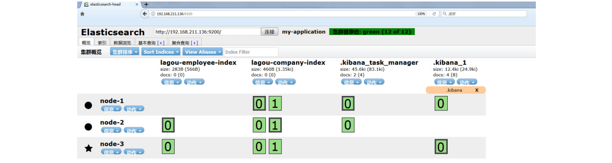

### 4.4、集群规划

#### 4.4.1、我们需要多大规模的集群

- **需要从以下两个方面考虑：**

  1）当前的数据量有多大？数据增长情况如何？

  2）你的机器配置如何？cpu、多大内存、多大硬盘容量？

- **推算的依据：**

   Elasticsearch JVM heap 最大可以设置32G 。

   30G heap 大概能处理的数据量 10 T。如果内存很大如128G，可在一台机器上运行多个ES节点实例。

   备注：集群规划满足当前数据规模+适量增长规模即可，后续可按需扩展。

- **两类应用场景：**

   A. 用于构建业务搜索功能模块，且多是垂直领域的搜索。数据量级几千万到数十亿级别。一般2-4台机器的规模。

   B. 用于大规模数据的实时OLAP（联机处理分析），经典的如ELK Stack，数据规模可能达到千亿或更多。几十到上百节点的规模。

#### 4.4.2、集群中的节点角色如何分配

**节点角色：**

- **Master**

  node.master: true 节点可以作为主节点

- **DataNode**

  node.data: true 默认是数据节点

- **Coordinate node**

  协调节点，一个节点只作为接收、转发请求到其他节点、汇总各节点返回数据等功能的节点，就叫协调节点，如果仅担任协调节点，将上两个配置设为false。

  说明：一个节点可以充当一个或多个角色，默认三个角色都有 

```apl
节点角色如何分配： 
A. 小规模集群，不需严格区分。 
B. 中大规模集群（十个以上节点），应考虑单独的角色充当。特别并发查询量大，查询的合并量大，可以增加独立的协调节点。角色分开的好处是分工分开，不互影响。如不会因协调角色负载过高而影响数据节 点的能力。
```

#### 4.4.3、如何避免脑裂问题

**脑裂问题**：

一个集群中只有一个A主节点，A主节点因为需要处理的东西太多或者网络过于繁忙，从而导致其他从节点ping不通A主节点，这样其他从节点就会认为A主节点不

可用了，就会重新选出一个新的主节点B。过了一会A主节点恢复正常了，这样就出现了两个主节点，导致一部分数据来源于A主节点，另外一部分数据来源于B主

节点，出现数据不一致问题，这就是**脑裂**。

6.x和之前版本尽量避免脑裂，需要添加最小数量的主节点配置：

**discovery.zen.minimum_master_nodes:** (有master资格节点数/2) + 1

这个参数控制的是，选举主节点时需要看到最少多少个具有master资格的活节点，才能进行选举。官方的推荐值是(N/2)+1，其中N是具有master资格的节点的数量。

在新版7.X的ES中，对es的集群发现系统做了调整，不再有discovery.zen.minimum_master_nodes这个控制集群脑裂的配置，转而由集群自主控制，并且新版在

启动一个新的集群的时候需要有cluster.initial_master_nodes初始化集群列表。

在es7中，discovery.zen.* 开头的参数，有些已经失效

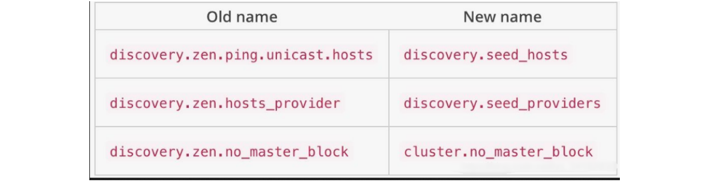

```
常用做法（中大规模集群）：
1）Master 和 dataNode 角色分开，配置奇数个master，如3 
2）单播发现机制，配置master资格节点(5.0之前)： discovery.zen.ping.multicast.enabled: false —— 关闭多播发现机制，默认是关闭的 
3）延长ping master的等待时长 discovery.zen.ping_timeout: 30（默认值是3秒）——其他节点ping主节点多久时间没有响应就认为主节点不可用了。

es7中换成了 discovery.request_peers_timeout
```

#### 4.4.4、索引应该设置多少个分片

说明：分片数指定后不可变，除非重建索引。

分片设置的可参考原则：

ElasticSearch推荐的最大JVM堆空间是30~32G, 所以把你的分片最大容量限制为30GB, 然后再对分片数量做合理估算. 

例如, 你认为你的数据能达到200GB, 推荐你最多分配7到8个分片。

在开始阶段, 一个好的方案是根据你的节点数量按照1.5~3倍的原则来创建分片. 例如,如果你有3个节点,则推荐你创建的分片数最多不超过9(3x3)个。当性能下降

时，增加节点，ES会平衡分片的放置。对于基于日期的索引需求, 并且对索引数据的搜索场景非常少. 也许这些索引量将达到成百上千, 但每个索引的数据量只有

1GB甚至更小. 对于这种类似场景, 建议只需要为索引分配1个分片。如日志管理就是一个日期的索引需求，日期索引会很多，但每个索引存放的日志数据量就很

少。

#### 4.4.5、分片应该设置几个副本

副本设置基本原则：

为保证高可用，副本数设置为2即可。要求集群至少要有3个节点，来分开存放主分片、副本。

如发现并发量大时，查询性能会下降，可增加副本数，来提升并发查询能力。

**注意：**新增副本时主节点会自动协调，然后拷贝数据到新增的副本节点,副本数是可以随时调整的！

```json
PUT /my_temp_index/_settings 
{ 
    "number_of_replicas": 1
}
```

### 4.5、分布式集群调优策略

拉勾网是一家专注于互联网垂直招聘的互联网公司，我们在生产环境的多个场景下都使用到了Elasticsearch，比如针对C端个人用户的职位搜索、针对B端企业用

户的简历搜索，另外也在后台日志分析平台（ELK）中应用到，所部署的Elasticsearch版本上覆盖了2.x、5.x、6.x和7.x多个版本。在拉勾网数据总量达百亿级

documents，日增量近1T（近1百万document）的高并发海量数据场景下，研发和运维团队积累了丰富的Elasticsearch调优经验。

拉勾网生产环境Elasticsearch集群有多套，但节点数并没有很多，针对C端个人用户的职位搜索只有7个实例节点，ELK日志平台中Elasticsearch实例节点数也仅仅

只有4个，考虑到资金投入、当前及未来一定时间内数据的增量情况等，研发和运维团队在竭尽所能的通过调优方式保证Elasticsearch正常高效运转。

接下来，我们从Index(写)和Search(读)两个方面给大家分享调优经验

#### 4.5.1、Index(写)调优

拉勾网的职位数据和简历数据，首先都是进入MySQL集群的，我们从MySQL的原始表里面抽取并存储到ES 的Index，而MySQL的原始数据也是经常在变化的，所

以快速写入Elasticsearch、以保持Elasticsearch和MySQL的数据及时同步也是很重要的。

拉勾网的工程师主要是下面几个方面优化来提高写入的速度

- **副本数置0**

  如果是集群首次灌入数据,可以将副本数设置为0，写入完毕再调整回去，这样副本分片只需要拷贝，节省了索引过程。

  ```json
  PUT /my_temp_index/_settings
  {
   	"number_of_replicas": 0
  }
  ```

- **自动生成doc ID**

  通过Elasticsearch写入流程可以看出，如果写入doc时如果外部指定了id，则Elasticsearch会先尝试读取原来doc的版本号，以判断是否需要更新。这会涉及一

  次读取磁盘的操作，通过自动生成doc ID可以避免这个环节。

- **合理设置mappings**

  - 将不需要建立索引的字段index属性设置为not_analyzed或no。对字段不分词，或者不索引，可以减少很多运算操作，降低CPU占用。 尤其是binary类

    型，默认情况下占用CPU非常高，而这种类型进行分词通常没有什么意义。

  - 减少字段内容长度，如果原始数据的大段内容无须全部建立 索引，则可以尽量减少不必要的内容。

  - 使用不同的分析器（analyzer），不同的分析器在索引过程中 运算复杂度也有较大的差异。

- **调整_source字段**

  source 字段用于存储 *doc* 原始数据，对于部分不需要存储的字段，可以通过 *includes excludes*过 滤，或者将source禁用，一般用于索引和数据分离，这样可

  以降低 I/O 的压力，不过实际场景中大多不会禁用_source。

- **对analyzed的字段禁用norms**

  Norms用于在搜索时计算doc的评分，如果不需要评分，则可以将其禁用：

  ```json
  "title": { 
      "type": "string", 
      "norms": { 
          "enabled": false 
      }
  ```

- **调整索引的刷新间隔**

  该参数缺省是1s，强制ES每秒创建一个新segment，从而保证新写入的数据近实时的可见、可被搜索到。比如该参数被调整为30s，降低了刷新的次数，把刷

  新操作消耗的系统资源释放出来给index操作使用。

  ```json
  PUT /my_index/_settings
  {
   "index" : {
        "refresh_interval": "30s"
      }
  }
  # 这种方案以牺牲可见性的方式，提高了index操作的性能。
  ```

- **批处理**

  批处理把多个index操作请求合并到一个batch中去处理，和mysql的jdbc的bacth有类似之处。如图：

  

  比如每批1000个documents是一个性能比较好的size。每批中多少document条数合适，受很多因素影响而不同，如单个document的大小等。ES官网建议通

  过在单个node、单个shard做性能基准测试来确定这个参数的最优值。

- **Document的路由处理**

  当对一批中的documents进行index操作时，该批index操作所需的线程的个数由要写入的目的shard的个数决定。看下图：

  上图中，有2批documents写入ES, 每批都需要写入4个shard，所以总共需要8个线程。如果能减少shard的个数，那么耗费的线程个数也会减少。例如下图，

  两批中每批的shard个数都只有2个，总共线程消耗个数4个，减少一半。

  默认的routing就是*id*，也可以在发送请求的时候，手动指定一个*routing value*，比如说*put/index/*doc/id?**routing=user_id**

  

  **值得注意**的是线程数虽然降低了，但是**单批的处理耗时可能增加**了。和提高刷新间隔方法类似，这有可能会延长数据不见的时间。

#### 4.5.2、Search(读)调优

在存储的Document条数超过**10亿**条后，我们如何进行搜索调优。

- **数据分组**

  很多人拿ES用来存储日志，日志的索引管理方式一般基于日期的，基于天、周、月、年建索引。如下图，基于天建索引：

  

  当搜索单天的数据，只需要查询一个索引的shards就可以。当需要查询多天的数据时，需要查询多个索引的shards。这种方案其实和数据库的分表、分库、分

  区查询方案相比，思路类似，小数据范围查询而不是大海捞针。

  开始的方案是建一个index，当数据量增大的时候，就扩容增加index的shard的个数。当shards增大时，要搜索的shards个数也随之显著上升。基于数据分组

  的思路，可以基于client进行数据分组，每一个client只需依赖自己的index的数据shards进行搜索，而不是所有的数据shards，大大提高了搜索的性能，如下

  图:

  

- **使用Filter替代Query**

  在搜索时候使用Query，需要为Document的相关度打分。使用Filter，没有打分环节处理，做的事情更少，而且filter理论上更快一些。

  如果搜索不需要打分，可以直接使用filter查询。如果部分搜索需要打分，建议使用'bool'查询。这种方式可以把打分的查询和不打分的查询组合在一起使用，

  如：

  ```json
  GET /_search 
  { 
      "query": { 
          "bool": { 
              "must": { 
                  "term": { 
                      "user": "kimchy" 
                  } 
              },
              "filter": {
                  "term": { 
                      "tag": "tech" 
                  } 
              }
          } 
      } 
  }
  ```

- **ID字段定义为keyword**

  一般情况，如果ID字段**不会**被用作Range 类型搜索字段，都可以定义成keyword类型。这是因为keyword会被优化，以便进行terms查询。Integers等数字类

  的mapping类型，会被优化来进行range类型搜索。

  将integers改成keyword类型之后，搜索性能大约能提升**30%**。

- **别让用户的无约束的输入拖累了ES集群的性能**

  拉勾工程师通过监控发现所有node的CPU 使用及其负载突然异常飙高。通过对**Slow Logs**分析发现，用户查询输入的条件中夹带了很多'OR'语句以及通配

  符“*”开头的字符串，如下图

  

  为了不让用户无约束的查询语句拖累ES集群的查询性能，可以限制用户用来查询的keywords。对于可以用来查询的keyworkds，也可以写成文档来帮助用户

  更正确的使用。

## 5、Elasticsearch之数据模型构建

### 5.1、什么是数据模型

数据模型是抽象描述现实世界的一种工具和方法，是通过抽象实体及实体之间联系的形式，用图形化的形式去描述业务规则的过程，从而表示现实世界中事务以及

相互关系的一种映射。

核心概念：
1. 实体：现实世界中存在的可以相互区分的事物或概念称为实体。

  实体可以分为事物实体和概念实体。例如：一个学生、一个程序员等是事物实体。一门课、一个班级等称为概念实体。

2. 实体的属性：每个实体都有自己的特征，利用实体的属性可以描述不同的实体。例如。学生实体的属性为姓名、性别、年龄等。

### 5.2、数据建模的过程

数据建模大致分为三个阶段，概念建模阶段，逻辑建模阶段和物理建模阶段。

- **概念建模阶段**

  概念建模阶段，主要做三件事：

  - 客户交流

  - 理解需求

  - 形成实体

  确定系统的核心需求和范围边界，设计实体与实体之间的关系。

  在概念建模阶段，我们只需要关注实体即可，不用关注任何实现细节。很多人都希望在这个阶段把具体表结构，索引，约束，甚至是存储过程都想好，没必

  要！因为这些东西是我们在物理建模阶段需要考虑的东西，这个时候考虑还为时尚早。

  概念模型在整个数据建模时间占比：10%左右。

- **逻辑建模阶段**

  逻辑建模阶段，主要做二件事：

  - 进一步梳理业务需求
  - 确定每个实体的属性、关系和约束等

  逻辑模型是对概念模型的进一步分解和细化，描述了实体、实体属性以及实体之间的关系，是概念模型延伸，一般的逻辑模型有第三范式，星型模型和雪花模

  型。模型的主要元素为主题、实体、实体属性和关系。

  雪花模型和星状模型的主要区别是维度的层级 标准的星状模型只有一层 而雪花模型可能涉及多层。

  逻辑模型的作用主要有两点：

  - 一是便于技术开发人员和业务人员以及用户进行沟通 交流，使得整个概念模型更易于理解，进一步明确需求。

  - 二是作为物理模型设计的基础，由于逻辑模型不依赖于具体的数据库实现，使用逻辑模型可以生成针对具体 数据库管理系统的物理模型，保证物理模型充

    分满足用户的需求。

  逻辑模型在整个数据建模时间占比：60—70%左右。

- **物理建模阶段**

  物理建模阶段，主要做一件事：

  结合具体的数据库产品（mysql/oracle/mongo/elasticsearch），在满足业务读写性能等需求的前提下确定最终的定义。

  物理模型是在逻辑模型的基础上描述模型实体的细节，包括数据库产品对应的数据类型、长度、索引等因素，为逻辑模型选择一个最优的物理存储环境。

  逻辑模型转化为物理模型的过程也就是实体名转化为表名，属性名转化为物理列名的过程。

  在设计物理模型时，还需要考虑数据存储空间的分配，包括对列属性必须做出明确的定义。

  ```apl
  例如：客户姓名的数据类型是varchar2，长度是20，存储在Oracle数据库中，并且建立索引用于提高该 字段的查询效率。
  物理模型在整个数据建模时间占比：20—30%左右。
  ```

### 5.3、数据建模的意义

如下图所示：


数据模型支撑了系统和数据，系统和数据支撑了业务系统。

一个好的数据模型：

- 能让系统更好的集成、能简化接口。

- 能简化数据冗余 、减少磁盘空间、提升传输效率。
- 兼容更多的数据，不会因为数据类型的新增而导致实现逻辑更改。
- 能帮助更多的业务机会，提高业务效率。
- 能减少业务风险、降低业务成本。

```apl
举例: 借助logstash实现mysql到Elasticsearch的增量同步，如果数据建模阶段没有设计时间戳或者自增ID，就几乎无法实现。
```

### 5.4、ES数据建模Mapping设置

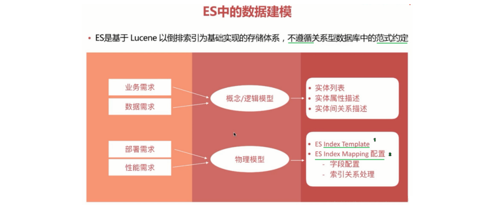

#### 5.4.1、ES Mapping 属性

https://www.elastic.co/guide/en/elasticsearch/reference/7.12/mapping-params.html


#### 5.4.2、ES Mapping 字段设置流程图

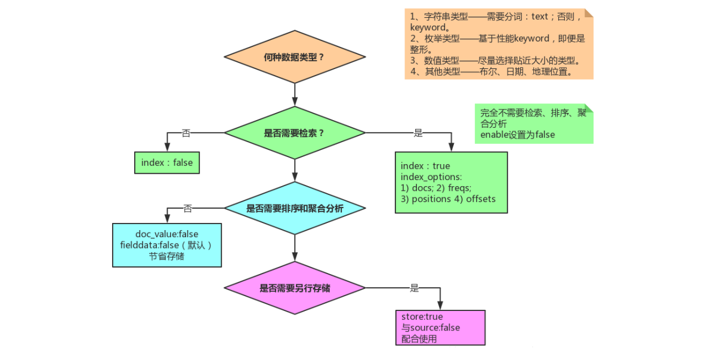

#### 5.4.3、ES Mapping 样例

```json
PUT blog_index
{
  "mappings": {
    "doc": {
      "_source": {
        "enabled": false
      },
      "properties": {
        "title": {
          "type": "text",
          "fields": {
            "keyword": {
              "type": "keyword",
              "ignore_above": 100
            }
          },
          "store": true
        },
        "publish_date": {
          "type": "date",
          "store": true
        },
        "author": {
          "type": "keyword",
          "ignore_above": 100,
          "store": true
        },
        "abstract": {
          "type": "text",
          "store": true
        },
        "content": {
          "type": "text",
          "store": true
        },
        "url": {
          "type": "keyword",
          "doc_values": false,
          "norms": false,
          "ignore_above": 100,
          "store": true
        }
      }
    }
  }
}
```

这个索引 Mapping中，_source设置为false，同时各字段的store根据需求设置了true和false。 url的doc_values设置为false，该字段url不用于聚合和排序操作。

建 mapping 时，可以为字符串（专指 keyword） 指定 ignore_above ，用来限定字符长度。超过ignore_above 的字符会被存储，但不会被索引。

注意，是字符长度，一个英文字母是一个字符，一个汉字也是一个字符。

在动态生成的 mapping 中， keyword 类型会被设置 ignore_above: 256 。 

ignore_above 可以在创建 mapping 时指定。

#### 5.4.4、ES关联关系处理

目前ES主要有以下4种常用的方法来处理数据实体间的关联关系：

- **Application-side joins**

  这种方式，索引之间完全独立（利于对数据进行标准化处理），由应用端的多次查询来实现近似关联关系查询。这种方法适用于关联的实体只有少量的文档记

  录的情况（使用ES的terms查询具有上限，默认1024，具体可在elasticsearch.yml中修改），并且最好它们很少改变。这将允许应用程序对结果进行缓存，并

  避免经常运行第一次查询。

  ```json
  PUT /user/_doc/1
  {
    "name": "John Smith",
    "email": "john@smith.com",
    "dob": "1970/10/24"
  }
  PUT /blogpost/_doc/2
  {
    "title": "Relationships",
    "body": "It's complicated...",
    "user": 1
  }
  GET /user/_search
  {
    "query": {
      "match": {
        "name": "John"
      }
    }
  }
  GET /blogpost/_search
  {
    "query": {
      "terms": {
        "user": [
          1
        ]
      }
    }
  }
  ```

- **Data denormalization（数据的非规范化）**

  这种方式，通俗点就是通过字段冗余，以一张大宽表来实现粗粒度的index，这样可以充分发挥扁平化的优势。但是这是以牺牲索引性能及灵活度为代价的。使用的前提：冗余的字段应该是很少改变的，比较适合与一对少量关系的处理。当业务数据库并非采用非规范化设计时，这时要将数据同步到作为二级

  索引库的ES中，就需要进行定制化开发，基于特定业务进行应用开发来处理join关联和实体拼接。

  说明：宽表处理在处理一对多、多对多关系时，会有字段冗余问题，适合“一对少量”且这个“一”更新不频繁的应用场景。

  ```json
  DELETE /user
  DELETE /blogpost
  
  PUT /user/_doc/1
  {
    "name": "John Smith",
    "email": "john@smith.com",
    "dob": "1970/10/24"
  }
  PUT /blogpost/_doc/2
  {
    "title": "Relationships",
    "body": "It's complicated...",
    "user": {
      "id": 1,
      "name": "John Smith"
    }
  }
  GET /blogpost/_search
  {
    "query": {
      "bool": {
        "must": [
          {
            "match": {
              "title": "relationships"
            }
          },
          {
            "match": {
              "user.name": "John"
            }
          }
        ]
      }
    }
  }
  ```

- **Nested objects（嵌套文档）**

  索引性能和查询性能二者不可兼得，必须进行取舍。嵌套文档将实体关系嵌套组合在单文档内部，这种方式牺牲建立索引性能（文档内任一属性变化都需要重

  新索引该文档）来换取查询性能，比较适合于一对少量的关系处理。

  当使用嵌套文档时，使用通用的查询方式是无法访问到的，必须使用合适的查询方式（nested query、nested filter、nested facet等），很多场景下，使用

  嵌套文档的复杂度在于索引阶段对关联关系的组织拼装。

  ```json
  PUT /drivers
  {
    "mappings": {
      "properties": {
        "driver": {
          "type": "nested",
          "properties": {
            "last_name": {
              "type": "text"
            },
            "vehicle": {
              "type": "nested",
              "properties": {
                "make": {
                  "type": "text"
                },
                "model": {
                  "type": "text"
                }
              }
            }
          }
        }
      }
    }
  }
  ```

  ```json
  PUT /drivers/_doc/1
  {
    "driver": {
      "last_name": "McQueen",
      "vehicle": [
        {
          "make": "Powell Motors",
          "model": "Canyonero"
        },
        {
          "make": "Miller-Meteor",
          "model": "Ecto-1"
        }
      ]
    }
  }
  PUT /drivers/_doc/2?refresh 
  {
    "driver": {
      "last_name": "Hudson",
      "vehicle": [
        {
          "make": "Mifune",
          "model": "Mach Five"
        },
        {
          "make": "Miller-Meteor",
          "model": "Ecto-1"
        }
      ]
    }
  }
  ```

  ```json
  GET /drivers/_search
  {
    "query": {
      "nested": {
        "path": "driver",
        "query": {
          "nested": {
            "path": "driver.vehicle",
            "query": {
              "bool": {
                "must": [
                  {
                    "match": {
                      "driver.vehicle.make": "Powell Motors"
                    }
                  },
                  {
                    "match": {
                      "driver.vehicle.model": "Canyonero"
                    }
                  }
                ]
              }
            }
          }
        }
      }
    }
  }
  ```

- **Parent/child relationships（父子文档）**

  父子文档牺牲了一定的查询性能来换取索引性能,适用于写多读少的场景。父子文档相比嵌套文档较灵活，适用于“一对大量”且这个“一”不是海量的应用场景，

  该方式比较耗内存和CPU，这种方式查询比嵌套方式慢5~10倍，且需要使用特定的has_parent和has_child过滤器查询语法，查询结果不能同时返回父子文档

  （一次join查询只能返回一种类型的文档）。受限于父子文档必须在同一分片上(可以通过routing指定父文档id即可)操作子文档时需要指定routing。 

  ```json
  PUT my_index
  {
    "mappings": {
      "properties": {
        "my_join_field": {
          "type": "join",
          "relations": {
            "question": "answer"
          }
        }
      }
    }
  }
  # 插入父文档
  PUT /my_index/_doc/1?refresh 
  {
    "text": "This is a question",
    "my_join_field": {
      "name": "question"
    }
  }
  PUT /my_index/_doc/2?refresh 
  {
    "text": "This is a question2",
    "my_join_field": "question"
  }
  # 插入子文档
  PUT /my_index/_doc/3?routing=1
  {
    "text": "This is an answer",
    "my_join_field": {
      "name": "answer",
      "parent": "1"
    }
  }
  ```

  查询那个文档有子文档

  ```json
  POST my_index/_search
  {
    "query": {
      "has_child": {
        "type": "answer",
        "query": {
          "match": {
            "text": "this"
          }
        }
      }
    }
  }
  ```

  根据父文档id查询子文档

  ```json
  GET my_index/_search
  {
    "query": {
      "parent_id": {
        "type": "answer",
        "id": "1"
      }
    }
  }
  ```

## 6、Elasticsearch之搜索实战

**案例需求**


**MySQL中的数据批量导入到ES中, 然后进行搜索职位信息 展示出职位的信息**

### 6.1、代码实现

#### 6.1.1、数据库准备

执行脚本：position.sql

文件路径：D:\THM\LG_study\stage7\task2_ES\Elasticsearch

#### 6.1.2、项目准备

- **pom.xml**

  ```xml
  <?xml version="1.0" encoding="UTF-8"?>
  <project xmlns="http://maven.apache.org/POM/4.0.0"
           xmlns:xsi="http://www.w3.org/2001/XMLSchema-instance"
           xsi:schemaLocation="http://maven.apache.org/POM/4.0.0 http://maven.apache.org/xsd/maven-4.0.0.xsd">
      <modelVersion>4.0.0</modelVersion>
  
      <groupId>com.lagou</groupId>
      <artifactId>es-demo2</artifactId>
      <version>1.0-SNAPSHOT</version>
  
      <properties>
          <maven.compiler.source>11</maven.compiler.source>
          <maven.compiler.target>11</maven.compiler.target>
      </properties>
  
      <parent>
          <groupId>org.springframework.boot</groupId>
          <artifactId>spring-boot-starter-parent</artifactId>
          <version>2.3.5.RELEASE</version>
      </parent>
      <dependencies>
          <dependency>
              <groupId>org.springframework.boot</groupId>
              <artifactId>spring-boot-starter-test</artifactId>
          </dependency>
          <dependency>
              <groupId>org.elasticsearch.client</groupId>
              <artifactId>elasticsearch-rest-high-level-client</artifactId>
              <version>7.12.0</version>
              <exclusions>
                  <exclusion>
                      <groupId>org.elasticsearch</groupId>
                      <artifactId>elasticsearch</artifactId>
                  </exclusion>
              </exclusions>
          </dependency>
          <dependency>
              <groupId>org.elasticsearch</groupId>
              <artifactId>elasticsearch</artifactId>
              <version>7.12.0</version>
          </dependency>
          <dependency>
              <groupId>org.springframework.boot</groupId>
              <artifactId>spring-boot-starter-thymeleaf</artifactId>
          </dependency>
          <dependency>
              <groupId>org.springframework.boot</groupId>
              <artifactId>spring-boot-starter-web</artifactId>
          </dependency>
          <dependency>
              <groupId>org.springframework.boot</groupId>
              <artifactId>spring-boot-devtools</artifactId>
              <scope>runtime</scope>
              <optional>true</optional>
          </dependency>
          <dependency>
              <groupId>org.springframework.boot</groupId>
              <artifactId>spring-boot-configuration-processor</artifactId>
              <optional>true</optional>
          </dependency>
          <dependency>
              <groupId>org.projectlombok</groupId>
              <artifactId>lombok</artifactId>
              <optional>true</optional>
          </dependency>
          <dependency>
              <groupId>org.springframework.boot</groupId>
              <artifactId>spring-boot-starter-test</artifactId>
              <scope>test</scope>
              <exclusions>
                  <exclusion>
                      <groupId>org.junit.vintage</groupId>
                      <artifactId>junit-vintage-engine</artifactId>
                  </exclusion>
              </exclusions>
          </dependency>
          <dependency>
              <groupId>org.apache.httpcomponents</groupId>
              <artifactId>httpclient</artifactId>
              <version>4.5.3</version>
          </dependency>
          <dependency>
              <groupId>com.alibaba</groupId>
              <artifactId>fastjson</artifactId>
              <version>1.2.70</version>
          </dependency>
          <dependency>
              <groupId>mysql</groupId>
              <artifactId>mysql-connector-java</artifactId>
              <scope>runtime</scope>
          </dependency>
          <dependency>
              <groupId>org.apache.commons</groupId>
              <artifactId>commons-lang3</artifactId>
              <version>3.9</version>
          </dependency>
          <dependency>
              <groupId>junit</groupId>
              <artifactId>junit</artifactId>
              <version>4.12</version>
              <scope>test</scope>
          </dependency>
          <!--devtools热部署-->
          <dependency>
              <groupId>org.springframework.boot</groupId>
              <artifactId>spring-boot-devtools</artifactId>
              <optional>true</optional>
              <scope>true</scope>
          </dependency>
      </dependencies>
      <build>
          <plugins>
              <plugin>
                  <groupId>org.springframework.boot</groupId>
                  <artifactId>spring-boot-maven-plugin</artifactId>
              </plugin>
          </plugins>
      </build>
  </project>
  ```

- **application.yml 文件**

  ```yaml
  spring:
    devtools:
      restart:
        #设置开启热部署
        enabled: true
        #重启目录
        additional-paths: src/main/java
        exclude: WEB-INF/**
    elasticsearch:
      rest:
        uris: 192.168.81.100:9200,192.168.81.101:9200,192.168.81.102:9200
  server:
    port: 8080
  logging:
    level: info
    com.xdclass.search: debug
  ```

- **实体Model**

  ```java
  package com.thm.model;
  
  import com.alibaba.fastjson.annotation.JSONType;
  import com.fasterxml.jackson.annotation.JsonFormat;
  import com.fasterxml.jackson.annotation.JsonIgnore;
  import lombok.AllArgsConstructor;
  import lombok.Data;
  import lombok.NoArgsConstructor;
  import org.springframework.format.annotation.DateTimeFormat;
  
  import java.util.Date;
  
  @Data
  @NoArgsConstructor
  @AllArgsConstructor
  public class Position {
      //主键 
      private String id;
      //公司名称 
      private String companyName;
      //职位名称 
      private String positionName;
      //职位诱惑
      private String positionAdvantage;
      //薪资
      private String salary;
      //薪资下限 
      private int salaryMin;
      //薪资上限 
      private int salaryMax;
      //学历 
      private String education;
      //工作年限 
      private String workYear;
      //发布时间 
      private String publishTime;
      //工作城市 
      private String city;
      //工作地点
      private String workAddress;
      //发布时间 
      @JsonFormat(pattern = "yyyy-MM-dd HH:mm:ss")
      private Date createTime;
      //工作模式 
      private String jobNature;
  }
  ```

- **ES配置类**

  ```java
  package com.thm.config;
  
  import org.apache.http.HttpHost;
  import org.elasticsearch.client.RestClient;
  import org.elasticsearch.client.RestHighLevelClient;
  import org.springframework.beans.factory.annotation.Value;
  import org.springframework.context.annotation.Bean;
  import org.springframework.context.annotation.Configuration;
  
  @Configuration
  public class EsConfig {
      @Value("${spring.elasticsearch.rest.uris}")
      private String hostlist;
  
      @Bean
      public RestHighLevelClient client() {
          //解析hostlist配置信息 
          String[] split = hostlist.split(",");
          //创建HttpHost数组，其中存放es主机和端口的配置信息
          HttpHost[] httpHostArray = new HttpHost[split.length];
          for (int i = 0; i < split.length; i++) {
              String item = split[i];
              System.out.println(item);
              httpHostArray[i] = new HttpHost(item.split(":")[0], Integer.parseInt(item.split(":")[1]), "http");
          }
          //创建RestHighLevelClient客户端
          return new RestHighLevelClient(RestClient.builder(httpHostArray));
      }
  }
  ```

- **连接mysql的工具类DBHelper**

  使用JDBC的API主要是因为他的批处理效率更高

  ```java
  package com.thm.util;
  
  import java.sql.Connection;
  import java.sql.DriverManager;
  
  public class DBHelper {
      public static final String url = "jdbc:mysql://192.168.81.100:3306/lagou_position? useUnicode=true&characterEncoding=utf-8&serverTimezone=Asia/Shanghai";
      public static final String name = "com.mysql.cj.jdbc.Driver";
      public static final String user = "root";
      public static final String password = "Thm123456";
      public static Connection conn = null;
  
      public static Connection getConn() {
          try {
              Class.forName(name);
              //获取连接 
              conn = DriverManager.getConnection(url, user, password);
          } catch (Exception e) {
              e.printStackTrace();
          }
          return conn;
      }
  }
  ```

- **Service 接口 和 实现类**

  ```java
  package com.thm.service;
  
  import java.io.IOException;
  import java.util.List;
  import java.util.Map;
  public interface PositionService {
      /**
       * 分页查询
       * @param keyword
       * @param pageNo
       * @param pageSize
       * @return
       * @throws IOException
       */
      List<Map<String,Object>> searchPos(String keyword , int pageNo , int pageSize) throws IOException;
  
      /**
       * 导入数据
       * @throws IOException
       */
      void importAll() throws IOException;
  }
  ```

  PositionServiceImpl

  ```java
  package com.thm.service.impl;
  
  import com.thm.service.PositionService;
  import com.thm.util.DBHelper;
  import org.apache.logging.log4j.LogManager;
  import org.apache.logging.log4j.Logger;
  import org.elasticsearch.action.ActionListener;
  import org.elasticsearch.action.bulk.BackoffPolicy;
  import org.elasticsearch.action.bulk.BulkProcessor;
  import org.elasticsearch.action.bulk.BulkRequest;
  import org.elasticsearch.action.bulk.BulkResponse;
  import org.elasticsearch.action.index.IndexRequest;
  import org.elasticsearch.action.search.SearchRequest;
  import org.elasticsearch.action.search.SearchResponse;
  import org.elasticsearch.client.RequestOptions;
  import org.elasticsearch.client.RestHighLevelClient;
  import org.elasticsearch.common.unit.ByteSizeUnit;
  import org.elasticsearch.common.unit.ByteSizeValue;
  import org.elasticsearch.common.unit.TimeValue;
  import org.elasticsearch.index.query.QueryBuilder;
  import org.elasticsearch.index.query.QueryBuilders;
  import org.elasticsearch.search.SearchHit;
  import org.elasticsearch.search.builder.SearchSourceBuilder;
  import org.springframework.beans.factory.annotation.Autowired;
  import org.springframework.stereotype.Service;
  
  import java.io.IOException;
  import java.sql.Connection;
  import java.sql.PreparedStatement;
  import java.sql.ResultSet;
  import java.sql.ResultSetMetaData;
  import java.util.ArrayList;
  import java.util.HashMap;
  import java.util.List;
  import java.util.Map;
  import java.util.concurrent.TimeUnit;
  import java.util.function.BiConsumer;
  
  @Service
  public class PositionServiceImpl implements PositionService {
      private static final Logger logger = LogManager.getLogger(PositionServiceImpl.class);
      @Autowired
      private RestHighLevelClient client;
      private static final String POSITIOIN_INDEX = "position";
  
      //查找职位
      @Override
      public List<Map<String, Object>> searchPos(String keyword, int pageNo, int pageSize) throws IOException {
          if (pageNo <= 1) {
              pageNo = 1;
          }
          //getPosition(keyword);
          // 条件搜索
          SearchRequest searchRequest = new SearchRequest(POSITIOIN_INDEX);
          SearchSourceBuilder searchSourceBuilder = new SearchSourceBuilder();
          //分页 index = (当前页-1)*一页显示条数
          searchSourceBuilder.from((pageNo - 1) * pageSize);
          searchSourceBuilder.size(pageSize);
          //精准匹配
          // TermQueryBuilder termQueryBuilder = QueryBuilders.termQuery("positionName",keyword);
          // searchSourceBuilder.query(termQueryBuilder);
          QueryBuilder builder = QueryBuilders.matchQuery("positionName", keyword);
          searchSourceBuilder.query(builder);
          searchSourceBuilder.timeout(new TimeValue(60, TimeUnit.SECONDS));
          //执行搜索
          searchRequest.source(searchSourceBuilder);
          SearchResponse searchResponse = client.search(searchRequest, RequestOptions.DEFAULT);
          ArrayList<Map<String, Object>> list = new ArrayList<>();
          SearchHit[] hits = searchResponse.getHits().getHits();
          System.out.println(hits.length);
          for (SearchHit hit : hits) {
              list.add(hit.getSourceAsMap());
          }
          return list;
      }
  
      @Override
      public void importAll() throws IOException {
          writeMysqlDataToES(POSITIOIN_INDEX);
      }
  
      /**
       * 讲数据批量写入ES中
       */
      private void writeMysqlDataToES(String tableName) {
          BulkProcessor bulkProcessor = getBulkProcessor(client);
          Connection conn = null;
          PreparedStatement ps = null;
          ResultSet rs = null;
          try {
              conn = DBHelper.getConn();
              logger.info("Start handle data :" + tableName);
              String sql = "SELECT * from " + tableName;
              ps = conn.prepareStatement(sql, ResultSet.TYPE_FORWARD_ONLY, ResultSet.CONCUR_READ_ONLY);
              // 根据自己需要设置
              ps.setFetchSize(20);
              rs = ps.executeQuery();
              ResultSetMetaData colData = rs.getMetaData();
              ArrayList<HashMap<String, String>> dataList = new ArrayList<>();
              // bulkProcessor 添加的数据支持的方式并不多，查看其api发现其支持map键值对的 方式，故笔者在此将查出来的数据转换成hashMap方式
              HashMap<String, String> map = null;
              int count = 0;
              // c 就是列名  v就是列对应的值
              String c = null;
              String v = null;
              while (rs.next()) {
                  count++;
                  map = new HashMap<>(128);
                  for (int i = 1; i <= colData.getColumnCount(); i++) {
                      c = colData.getColumnName(i);
                      v = rs.getString(c);
                      map.put(c, v);
                  }
                  dataList.add(map);
                  // 每1万条写一次，不足的批次的最后再一并提交
                  if (count % 10000 == 0) {
                      logger.info("Mysql handle data number : " + count);
                      // 将数据添加到 bulkProcessor 中
                      for (HashMap<String, String> hashMap2 : dataList) {
                          bulkProcessor.add(new IndexRequest(POSITIOIN_INDEX).source(hashMap2));
                      }
                      // 每提交一次便将map与list清空
                      map.clear();
                      dataList.clear();
                  }
              }
              // 处理未提交的数据
              for (HashMap<String, String> hashMap2 : dataList) {
                  bulkProcessor.add(new IndexRequest(POSITIOIN_INDEX).source(hashMap2));
                  System.out.println(hashMap2);
              }
              logger.info("-------------------------- Finally insert number total : " + count);
              // 将数据刷新到es, 注意这一步执行后并不会立即生效，取决于bulkProcessor设置的 刷新时间
              bulkProcessor.flush();
          } catch (
                  Exception e) {
              logger.error(e.getMessage());
          } finally {
              try {
                  rs.close();
                  ps.close();
                  conn.close();
                  boolean terminatedFlag = bulkProcessor.awaitClose(150L, TimeUnit.SECONDS);
                  logger.info(terminatedFlag);
              } catch (Exception e) {
                  logger.error(e.getMessage());
              }
          }
  
      }
  
      private BulkProcessor getBulkProcessor(RestHighLevelClient client) {
          BulkProcessor bulkProcessor = null;
          try {
              BulkProcessor.Listener listener = new BulkProcessor.Listener() {
                  @Override
                  public void beforeBulk(long executionId, BulkRequest request) {
                      logger.info("Try to insert data number : " + request.numberOfActions());
                  }
  
                  @Override
                  public void afterBulk(long executionId, BulkRequest request, BulkResponse response) {
                      logger.info("************** Success insert data number : " + request.numberOfActions() + " , id: " + executionId);
                  }
  
                  @Override
                  public void afterBulk(long executionId, BulkRequest request, Throwable failure) {
                      logger.error("Bulk is unsuccess : " + failure + ", executionId: " + executionId);
                  }
              };
              BiConsumer<BulkRequest, ActionListener<BulkResponse>> bulkConsumer = (request, bulkListener) -> client.bulkAsync(request, RequestOptions.DEFAULT, bulkListener);
              BulkProcessor.Builder builder = BulkProcessor.builder(bulkConsumer, listener);
              builder.setBulkActions(5000);
              builder.setBulkSize(new ByteSizeValue(100L, ByteSizeUnit.MB));
              builder.setConcurrentRequests(10);
              builder.setFlushInterval(TimeValue.timeValueSeconds(100L));
              builder.setBackoffPolicy(BackoffPolicy.constantBackoff(TimeValue.timeValueSeconds(1L), 3));// 注意点：让参数设置生效
              bulkProcessor = builder.build();
          } catch (Exception e) {
              e.printStackTrace();
              try {
                  bulkProcessor.awaitClose(100L, TimeUnit.SECONDS);
              } catch (Exception e1) {
                  logger.error(e1.getMessage());
              }
          }
          return bulkProcessor;
      }
  }
  ```
  
  BulkProcessor 官网介绍:https://www.elastic.co/guide/en/elasticsearch/client/java-api/7.12/java-docs-bulk-processor.html

- **Controller**

  ```java
  package com.thm.controller;
  
  import com.thm.service.PositionService;
  import org.springframework.beans.factory.annotation.Autowired;
  import org.springframework.stereotype.Controller;
  import org.springframework.web.bind.annotation.GetMapping;
  import org.springframework.web.bind.annotation.PathVariable;
  import org.springframework.web.bind.annotation.RequestMapping;
  import org.springframework.web.bind.annotation.ResponseBody;
  
  import java.io.IOException;
  import java.util.List;
  import java.util.Map;
  @Controller
  public class PositionController {
  
      @Autowired
      private PositionService positionService;
  
      /**
       * 导入mysql数据到es
       *
       * @return
       */
      @RequestMapping("/importAll")
      @ResponseBody
      public String importAll() {
          try {
              positionService.importAll();
          } catch (IOException e) {
              e.printStackTrace();
          }
          return "success";
      }
      //页面跳转
      @GetMapping({"/", "index"})
      public String indexPage() {
          return "index";
      }
  
      /**
       * 分页查询es中的数据
       * @param keyword
       * @param pageNo
       * @param pageSize
       * @return
       * @throws IOException
       */
      @GetMapping("/search/{keyword}/{pageNo}/{pageSize}")
      @ResponseBody
      public List<Map<String, Object>> searchPosition(@PathVariable("keyword") String keyword,
                                                      @PathVariable("pageNo") int pageNo,
                                                      @PathVariable("pageSize") int pageSize) throws IOException {
          List<Map<String, Object>> list = positionService.searchPos(keyword, pageNo, pageSize);
          System.out.println(list);
          return list;
      }
  }
  ```

- **启动类**

  ```java
  package com.thm;
  
  import org.springframework.boot.SpringApplication;
  import org.springframework.boot.autoconfigure.SpringBootApplication;
  
  @SpringBootApplication
  public class Bootstrap {
      public static void main(String[] args) {
          SpringApplication.run(Bootstrap.class,args);
      }
  }
  ```

- 测试

  ```apl
  #批量导入：http://localhost:8080/importAll
  #分页查询：http://localhost:8080/search/java/1/2
  ```

## 7、Elasticsearch之深度应用及原理剖析

### 7.1、索引文档写入和近实时搜索原理

#### 7.1.1、基本概念

- **Segments in Lucene**

  众所周知，Elasticsearch 存储的基本单元是 shard ， ES 中一个 Index 可能分为多个 shard， 事实上每个 shard 都是一个 Lucence 的 Index，并且每个 

  Lucence Index 由多个 Segment 组成， 每个Segment 事实上是一些倒排索引的集合， 每次创建一个新的 Document ， 都会归属于一个新的Segment， 而

  不会去修改原来的 Segment 。且每次的文档删除操作，会仅仅标记 Segment 中该文档为删除状态， 而不会真正的立马物理删除， 所以说 ES 的 index 可以

  理解为一个抽象的概念。 就像下图所示：

  

- **Commits in Lucene**

  Commit 操作意味着将 Segment 合并，并写入磁盘。保证内存数据尽量不丢。但刷盘是很重的 IO 操作， 所以为了机器性能和近实时搜索， 并不会刷盘那么及时。

- **Translog**

  新文档被索引意味着文档会被首先写入内存 buffer 和 translog 文件。每个 shard 都对应一个 translog文件

  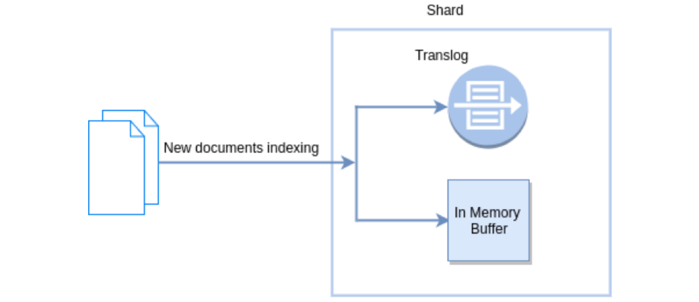

- **Refresh in Elasticsearch**

  在 Elasticsearch 中， _refresh 操作默认每秒执行一次， 意味着将内存 buffer 的数据写入到一个新的 Segment 中，这个时候索引变成了可被检索的。写入新

  Segment后会清空内存buffer。

  

- **Flush in Elasticsearch**

  Flush 操作意味着将内存 buffer 的数据全都写入新的 Segments 中， 并将内存中所有的 Segments全部刷盘， 并且清空 translog 日志的过程。

  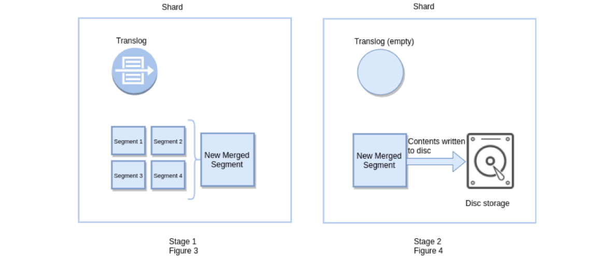

#### 7.1.2、近实时搜索

提交（Commiting）一个新的段到磁盘需要一个 fsync 来确保段被物理性地写入磁盘，这样在断电的时候就不会丢失数据。 但是 fsync 操作代价很大; 如果每次索

引一个文档都去执行一次的话会造成很大的性能问题。

我们需要的是一个更轻量的方式来使一个文档可被搜索，这意味着 fsync 要从整个过程中被移除。

在 Elasticsearch 和磁盘之间是**文件系统缓存**。 像之前描述的一样， 在内存索引缓冲区中的文档会被写入到一个新的段中。 但是这里新段会被先写入到文件系统

缓存--这一步代价会比较低，稍后再被刷新到磁盘--这一步代价比较高。不过只要文件已经在系统缓存中， 就可以像其它文件一样被打开和读取了。

**在内存缓冲区中包含了新文档的 Lucene 索引**


Lucene 允许新段被写入和打开--使其包含的文档在未进行一次完整提交时便对搜索可见。 这种方式比进行一次提交代价要小得多，并且在不影响性能的前提下可

以被频繁地执行。

**缓冲区的内容已经被写入一个可被搜索的段中，但还没有进行提交**


##### 7.1.2.1、原理

下图表示是 es 写操作流程，当一个写请求发送到 es 后，es 将数据写入 memory buffer 中，并添加事务日志（ translog ）。如果每次一条数据写入内存后立即

写到硬盘文件上，由于写入的数据肯定是离散的，因此写入硬盘的操作也就是随机写入了。硬盘随机写入的效率相当低，会严重降低es的性能。

因此 es 在设计时在 memory buffer 和硬盘间加入了 Linux 的高速缓存（ File system cache ）来提高 es 的写效率。

当写请求发送到 es 后，es 将数据暂时写入 memory buffer 中，此时写入的数据还不能被查询到。默认设置下，es 每1秒钟将 memory buffer 中的数据 refresh 

到 Linux 的 File system cache ，并清空 memory buffer ，此时写入的数据就可以被查询到了。

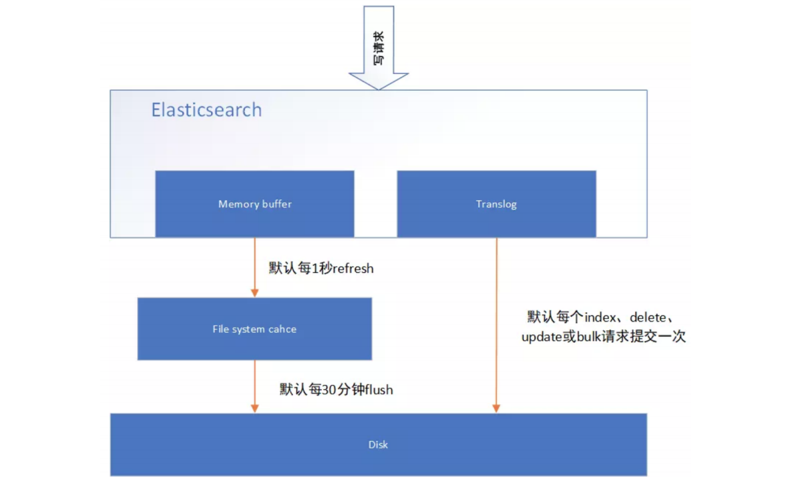

##### 7.1.2.2、refresh API

在 Elasticsearch 中，写入和打开一个新段的轻量的过程叫做 refresh 。 默认情况下每个分片会每秒自动刷新一次。这就是为什么我们说 Elasticsearch 是 近 实时

搜索： 文档的变化并不是立即对搜索可见，但会在一秒之内变为可见。

这些行为可能会对新用户造成困惑： 他们索引了一个文档然后尝试搜索它，但却没有搜到。这个问题的解决办法是用 refresh API 执行一次手动刷新：

```apl
# 刷新（Refresh）所有的索引。
POST /_refresh 
# 只刷新（Refresh） blogs 索引
POST /my_blogs/_refresh 
# 只刷新 文档
PUT /my_blogs/_doc/1?refresh 
{"test": "test"} 
PUT /test/_doc/2?refresh=true 
{"test": "test"}
```

并不是所有的情况都需要每秒刷新。可能你正在使用 Elasticsearch 索引大量的日志文件， 你可能想优化索引速度而不是近实时搜索， 可以通过设置 

refresh_interval ， 降低每个索引的刷新频率

```json
PUT /my_logs 
{
    "settings": { "refresh_interval": "30s" } 
}
```

refresh_interval 可以在既存索引上进行动态更新。 在生产环境中，当正在建立一个大的新索引时，可以先关闭自动刷新，待使用该索引时，再把它们调回来：

```json
PUT /my_logs/_settings 
{ "refresh_interval": -1 } 
PUT /my_logs/_settings 
{ "refresh_interval": "1s" }
```

#### 7.1.3、持久化变更

##### 7.1.3.1、原理

如果没有用 fsync 把数据从文件系统缓存刷（flush）到硬盘，我们不能保证数据在断电甚至是程序正常退出之后依然存在。为了保证 Elasticsearch 的可靠性，需

要确保数据变化被持久化到磁盘。

在动态更新索引时，我们说一次完整的提交会将段刷到磁盘，并写入一个包含所有段列表的提交点。Elasticsearch 在启动或重新打开一个索引的过程中使用这个

提交点来判断哪些段隶属于当前分片。

即使通过每秒刷新（refresh）实现了近实时搜索，我们仍然需要经常进行完整提交来确保能从失败中恢复。但在两次提交之间发生变化的文档怎么办？我们也不

希望丢失掉这些数据。

Elasticsearch 增加了一个 translog ，或者叫事务日志，在每一次对 Elasticsearch 进行操作时均进行了日志记录。通过 translog ，整个流程看起来是下面这样：

-  一个文档被索引之后，就会被添加到内存缓冲区，并且追加到了 translog ，正如图描述的一样。

  **新的文档被添加到内存缓冲区并且被追加到了事务日志**

  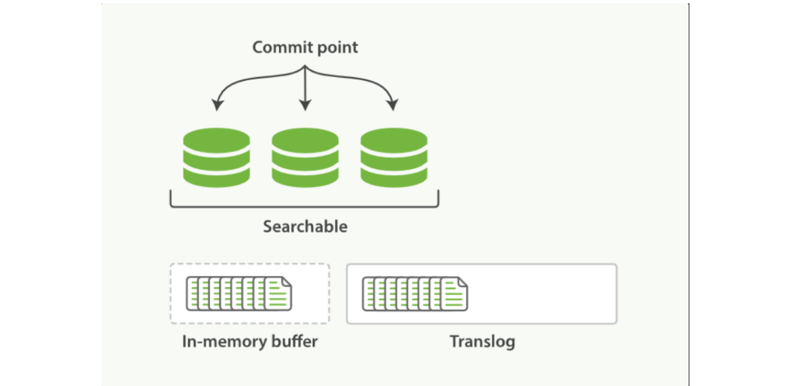

- 刷新（refresh）使分片处于图描述的状态，分片每秒被刷新（refresh）一次：

  - 这些在内存缓冲区的文档被写入到一个新的段中，且没有进行 fsync 操作。
  - 这个段被打开，使其可被搜索。
  - 内存缓冲区被清空。

  **刷新（refresh）完成后， 缓存被清空但是事务日志不会**

  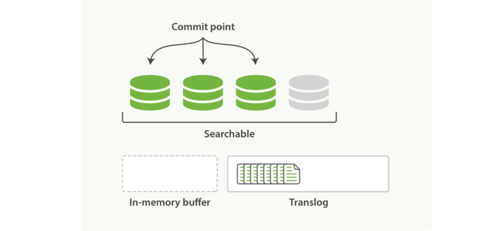

- 这个进程继续工作，更多的文档被添加到内存缓冲区和追加到事务日志

  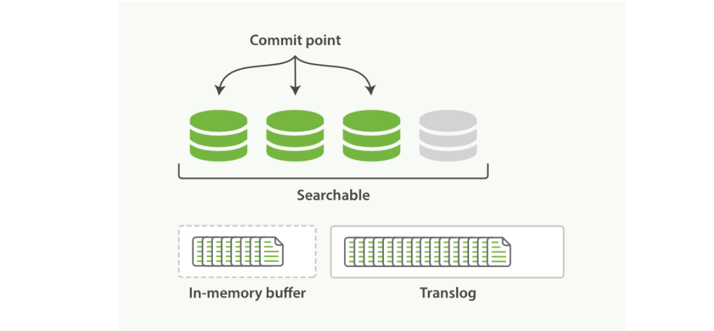

- 每隔一段时间--例如 translog 变得越来越大--索引被刷新（flush）；一个新的 translog 被创建，并且一个全量提交被执行

  - 所有在内存缓冲区的文档都被写入一个新的段。
  - 缓冲区被清空。
  - 一个提交点被写入硬盘。
  - 文件系统缓存通过 fsync 被刷新（flush）。
  - 老的 translog 被删除。

  translog 提供所有还没有被刷到磁盘的操作的一个持久化纪录。当 Elasticsearch 启动的时候， 它会从磁盘中使用最后一个提交点去恢复已知的段，并且会重

  放 translog 中所有在最后一次提交后发生的变更操作。

  translog 也被用来提供实时 CRUD 。当你试着通过 ID 查询、更新、删除一个文档，它会在尝试从相应的段中检索之前， 首先检查 translog 任何最近的变

  更。这意味着它总是能够实时地获取到文档的最新版本。

  **在刷新（flush）之后，段被全量提交，并且事务日志被清空**

  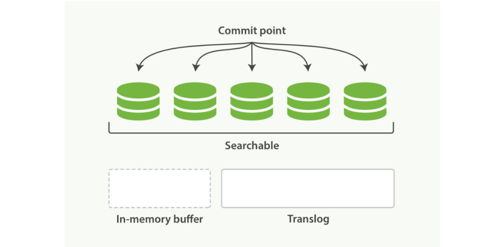

##### 7.1.3.2、flush API

这个执行一个提交并且截断 translog 的行为在 Elasticsearch 被称作一次 flush 。 分片每 30 分钟被自动刷新（flush），或者在 translog 太大的时候也会刷新。

flush API 可以 被用来执行一个手工的刷新（flush）:

```apl
# 刷新（flush） blogs 索引。
POST /blogs/_flush 
# 刷新（flush）所有的索引并且等待所有刷新在返回前完成。
POST /_flush?wait_for_ongoin
```

我们很少需要自己手动执行一个的 flush 操作；通常情况下，自动刷新就足够了。

这就是说，在重启节点或关闭索引之前执行 flush有益于你的索引。当 Elasticsearch 尝试恢复或重新打开一个索引， 它需要重放 translog 中所有的操作，所以如

果日志越短，恢复越快。

> **Translog** **有多安全？**
>
> translog 的目的是保证操作不会丢失。这引出了这个问题： Translog 有多安全？
>
> 在文件被 fsync 到磁盘前，被写入的文件在重启之后就会丢失。默认 translog 是每 5 秒被fsync 刷新到硬盘， 或者在每次写请求完成之后执行(e.g. index, delete, update, bulk)。这个过程在主分片和复制分片都会发生。最终， 基本上，这意味着在整个请求被 fsync 到主分片和复制分片的 translog 之前，你的客户端不会得到一个 200 OK 响应。
>
> 在每次写请求后都执行一个 fsync 会带来一些性能损失，尽管实践表明这种损失相对较小（特别是 bulk 导入，它在一次请求中平摊了大量文档的开销）。
>
> 但是对于一些大容量的偶尔丢失几秒数据问题也并不严重的集群，使用异步的 fsync 还是比较有益的。比如，写入的数据被缓存到内存中，再每 5 秒执行一次 fsync 。
>
> 这个行为可以通过设置 durability 参数为 async 来启用：

```json
PUT /my_index/_settings 
{ 
    "index.translog.durability": "async", 
    "index.translog.sync_interval": "5s" 
}
```

这个选项可以针对索引单独设置，并且可以动态进行修改。如果你决定使用异步 translog 的话，你需要 保证 在发生 crash 时，丢失掉 sync_interval 时间段的数

据也无所谓。请在决定前知晓这个特性。

如果你不确定这个行为的后果，最好是使用默认的参数（ "index.translog.durability": "request" ）来避免数据丢失。

### 7.2、索引文档存储段合并机制（segment merge、policy、optimize）

#### 7.2.1、段合并机制

由于自动刷新流程每秒会创建一个新的段 ，这样会导致短时间内的段数量暴增。而段数目太多会带来较大的麻烦。 每一个段都会消耗文件句柄、内存和 CPU 运行

周期。更重要的是，每个搜索请求都必须轮流检查每个段；所以段越多，搜索也就越慢。

Elasticsearch 通过在后台进行段合并来解决这个问题。小的段被合并到大的段，然后这些大的段再被合并到更大的段。段合并的时候会将那些旧的已删除文档从

文件系统中清除。 被删除的文档（或被更新文档的旧版本）不会被拷贝到新的大段中。

启动段合并在进行索引和搜索时会自动进行。这个流程像在图中提到的一样工作：

- 当索引的时候，刷新（refresh）操作会创建新的段并将段打开以供搜索使用。

- 合并进程选择一小部分大小相似的段，并且在后台将它们合并到更大的段中。这并不会中断索引和搜索。

  **两个提交了的段和一个未提交的段正在被合并到一个更大的段**

  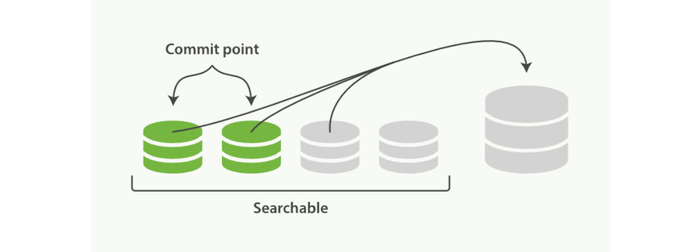

- 合并完成时的活动

  - 新的段被刷新（flush）到了磁盘。 写入一个包含新段且排除旧的和较小的段的新提交点。
  - 新的段被打开用来搜索。
  - 老的段被删除。

   **一旦合并结束，老的段被删除**

  

合并大的段需要消耗大量的 I/O 和 CPU 资源，如果任其发展会影响搜索性能。Elasticsearch 在默认情况下会对合并流程进行资源限制，所以搜索仍然有足够的资

源很好地执行。默认情况下，归并线程的限速配置 indices.store.throttle.max_bytes_per_sec 是 20MB。对于写入量较大，磁盘转速较高，甚至使用 SSD 盘的服

务器来说，这个限速是明显过低的。对于 ELK Stack 应用，建议可以适当调大到100MB或者更高。

```json
PUT /_cluster/settings 
{ 
    "persistent" : { "indices.store.throttle.max_bytes_per_sec" : "100mb" } 
}
```

用于控制归并线程的数目，推荐设置为cpu核心数的一半。 如果觉得自己磁盘性能跟不上，可以降低配置，免得IO情况瓶颈。

index.merge.scheduler.max_thread_count

#### 7.2.2、归并策略 policy

```apl
归并线程是按照一定的运行策略来挑选 segment 进行归并的。主要有以下几条： 
index.merge.policy.floor_segment 默认 2MB，小于这个大小的 segment，优先被归并。 
index.merge.policy.max_merge_at_once 默认一次最多归并 10 个 segment 
index.merge.policy.max_merge_at_once_explicit 默认 optimize 时一次最多归并 30 个 segment。 
index.merge.policy.max_merged_segment 默认 5 GB，大于这个大小的 segment，不用参与归并。optimize 除外。
```

#### 7.2.3、optimize API

optimize API 大可看做是 强制合并 API。它会将一个分片强制合并到 max_num_segments 参数指定大小的段数目。 这样做的意图是减少段的数量（通常减少到

一个），来提升搜索性能。

在特定情况下，使用 optimize API 颇有益处。例如在日志这种用例下，每天、每周、每月的日志被存储在一个索引中。 老的索引实质上是只读的；它们也并不太

可能会发生变化。在这种情况下，使用optimize 优化老的索引，将每一个分片合并为一个单独的段就很有用了；这样既可以节省资源，也可以使搜索更加快速：

```apl
POST /logstash-2014-10/_optimize?max_num_segments=1

#java api
forceMergeRequest.maxNumSegments(1)
```

### 7.3、并发冲突处理机制剖析

#### 7.3.1、详解并发冲突

在电商场景下，工作流程为：
1. 读取商品信息，包括库存数量
2. 用户下单购买
3. 更新商品信息，将库存数减一

如果是多线程操作，就可能有多个线程并发的去执行上述的3步骤流程，假如此时有两个人都来读取商品数据，两个线程并发的服务于两个人，同时在进行商品库

存数据的修改。假设库存为100件 正确的情况：线程A将库存-1，设置为99件，线程B接着读取99件，再-1，变为98件。如果A,B线程都读取的为100件，A处理完

之后修改为99件，B处理完之后再次修改为99件，此时结果就出错了。

#### 7.3.2、解决方案

##### 7.3.2.1、悲观锁

顾名思义，就是很悲观，每次去拿数据的时候都认为被人会修改，所以每次拿数据的时候都会加锁，以防别人修改，直到操作完成后，才会被别人执行。常见的关

系型数据库，就用到了很多这样的机制，如行锁，表锁，写锁，都是在操作之前加锁。

- 悲观锁的优点：方便，直接加锁，对外透明，不需要额外的操作。

- 悲观锁的缺点：并发能力低，同一时间只能有一个操作。


##### 7.3.2.2、乐观锁

乐观锁不加锁，每个线程都可以任意操作。比如每条文档中有一个version字段，新建文档后为1，修改一次累加，线程A,B同时读取到数据，version=1，A处理完

之后库存为99，在写入es的时候会跟es中的版本号比较，都是1，则写入成功，version=2，B处理完之后也为99，存入es时与es中的数据的版本号version=2相

比，明显不同，此时不会用99去更新，而是重新读取最新的数据，再减一，变为98，执行上述操作写入。


##### 7.3.2.3、Elasticsearch的乐观锁

Elasticsearch的后台都是多线程异步的，多个请求之间是乱序的，可能后修改的先到，先修改的后到。

Elasticsearch的多线程异步并发修改是基于自己的_version版本号进行乐观锁并发控制的。

在后修改的先到时，比较版本号,版本号相同修改可以成功，而当先修改的后到时，也会比较一下_version版本号，如果不相等就再次读取新的数据修改。这样结果

会就会保存为一个正确状态。

删除操作也会对这条数据的版本号加1

在删除一个document之后，可以从一个侧面证明，它不是立即物理删除掉的，因为它的一些版本号等信息还是保留着的。先删除一条document，再重新创建这

条document，其实会在delete version基础之上，再把version号加1。

##### 7.3.2.4、es的乐观锁并发控制示例

- 先新建一条数据

  ```json
  PUT /test_index/_doc/4
  {
    "test_field": "test"
  }
  ```

- 模拟两个客户端，都获取到了同一条数据

  ```json
  GET /test_index/_doc/4
  # 返回
  {
    "_index" : "test_index",
    "_type" : "_doc",
    "_id" : "4",
    "_version" : 1,
    "_seq_no" : 0,
    "_primary_term" : 1,
    "found" : true,
    "_source" : {
      "test_field" : "test"
    }
  }
  ```

- 其中一个客户端，先更新一下这个数据， 同时带上数据的版本号，确保说，es中的数据的版本号，跟客户端中的数据的版本号(_seq_no)是相同的，才能修改

  ```json
  PUT /test_index/_doc/4
  {
    "test_field": "client1 changed"
  }
  # 返回
  {
    "_index" : "test_index",
    "_type" : "_doc",
    "_id" : "4",
    "_version" : 2,
    "result" : "updated",
    "_shards" : {
      "total" : 2,
      "successful" : 2,
      "failed" : 0
    },
    "_seq_no" : 1,
    "_primary_term" : 1
  }
  ```

- 另外一个客户端，尝试基于version=1的数据去进行修改，同样带上(if_seq_no和if_primary_term)version版本号，进行乐观锁的并发控制

  ```json
  PUT /test_index/_doc/4?if_seq_no=0&if_primary_term=1 
  {
    "test_field": "client2 changed"
  }
  # 报错
  ```

  乐观锁就成功阻止并发问题

- 在乐观锁成功阻止并发问题之后，尝试正确的完成更新

  重新进行GET请求，得到 version

  ```json
  GET /test_index/_doc/4
  # 返回
  {
    "_index" : "test_index",
    "_type" : "_doc",
    "_id" : "4",
    "_version" : 2,
    "_seq_no" : 1,
    "_primary_term" : 1,
    "found" : true,
    "_source" : {
      "test_field" : "client1 changed"
    }
  }
  ```

  基于最新的数据和版本号(以前是version 现在是if_seq_no和if_primary_term )，去进行修改，修改后，带上最新的版本号，可能这个步骤会需要反复执行好几

  次，才能成功，特别是在多线程并发更新同一条数据很频繁的情况下

  ```json
  PUT /test_index/_doc/4?if_seq_no=1&if_primary_term=1 
  {
    "test_field": "client2 changed"
  }
  ```

##### 7.3.2.5、基于external version进行乐观锁并发控制

es提供了一个feature，就是说，你可以不用它提供的内部_version版本号来进行并发控制，可以基于你自己维护的一个版本号来进行并发控制。

```json
?version=1&version_type=external
```

区别在于，*version*方式，只有当你提供的*version*与*es*中的version一模一样的时候，才可以进行修改，只要不一样，就报错；当version_type=external的时候，只

有当你提供的version比es中的_version大的时候，才能完成修改

es，if_seq_no=0&if_primary_term=1和 文档中的值相等 才能更新成功

es，_version=1，?version>1&version_type=external，才能成功，比如说?version=2&version_type=external

代码示例：

- 先创建一条数据

  ```json
  PUT /test_index/_doc/5
  {
    "test_field": "external test"
  }
  #返回
  {
    "_index" : "test_index",
    "_type" : "_doc",
    "_id" : "5",
    "_version" : 1,
    "result" : "created",
    "_shards" : {
      "total" : 2,
      "successful" : 2,
      "failed" : 0
    },
    "_seq_no" : 6,
    "_primary_term" : 1
  }
  ```

- 模拟两个客户端同时查询到这条数据

  ```json
  GET /test_index/_doc/5
  #返回
  {
    "_index" : "test_index",
    "_type" : "_doc",
    "_id" : "5",
    "_version" : 1,
    "_seq_no" : 6,
    "_primary_term" : 1,
    "found" : true,
    "_source" : {
      "test_field" : "external test"
    }
  }
  ```

- 第一个客户端先进行修改，此时客户端程序是在自己的数据库中获取到了这条数据的最新版本号，比如说是2

  ```json
  PUT /test_index/_doc/5?version=2&version_type=external 
  {
    "test_field": "external client1 changed"
  }
  # 成功
  ```

- 模拟第二个客户端，同时拿到了自己数据库中维护的那个版本号，也是2，同时基于version=2发起了修改

  ```json
  PUT /test_index/_doc/5?version=2&version_type=external 
  {
    "test_field": "external client1 changed"
  }
  # 失败
  ```

- 在并发控制成功后，重新基于最新的版本号发起更新  3

  ```json
  PUT /test_index/_doc/5?version=3&version_type=external 
  {
    "test_field": "external client1 changed"
  }
  # 成功
  ```

### 7.4、分布式数据一致性如何保证？quorum及timeout机制的原理

在分布式环境下，一致性指的是多个数据副本是否能保持一致的特性。

在一致性的条件下，系统在执行数据更新操作之后能够从一致性状态转移到另一个一致性状态。

对系统的一个数据更新成功之后，如果所有用户都能够读取到最新的值，该系统就被认为具有强一致性。

- **ES5.0以前的一致性**

  consistency，one（primary shard），all（all shard），quorum（default）

  我们在发送任何一个增删改操作的时候，比如 PUT /index/indextype/id ，都可以带上一个consistency参数，指明我们想要的写一致性是什么？

  ```json
  PUT /index/indextype/id?consistency=quorum
  ```

   **one：**要求我们这个写操作，只要有一个primary shard是active状态，就可以执行。
   **all：**要求我们这个写操作，必须所有的primary shard和replica shard都是活跃的，才可以执行这个写操作。
   **quorum：**默认值，要求所有的shard中，必须是法定数的shard都是活跃的，可用的，才可以执行这个写操作。

- **quorum机制**

  写之前必须确保法定数shard可用  

  （1）公式：

  ```json
  int((primary shard + number_of_replicas) / 2) + 1 
  当number_of_replicas > 1时才生效。 
  3 primary shard + 1 = 6 shard ---> 3
  ```

  （2）举例

  比如：

   1个primary shard，3个replica。那么quorum=((1 + 3) / 2) + 1 = 3，要求3个primary shard+1个replica shard=4个shard中必须有3个shard是要处于active

  状态，若这时候只有两台机器的话，会出现什么情况？

  

- **timeout机制**

  quorum不齐全时，会wait（等待）1分钟

  ```apl
  默认1分钟，可以设置timeout手动去调，默认单位毫秒。 等待期间，期望活跃的shard数量可以增加，最后无法满足shard数量就会timeout，我们其实可以在写操 作的时候，加一个timeout参数，比如说PUT /index/_doc/id?timeout=30s，这个就是说自己去设定 quorum不齐全的时候，ES的timeout时长。默认是毫秒，加个s代表秒
  ```

- **ElasticSearch5.0以及以后的版本**

  从ES5.0后，原先执行put 带 consistency=all / quorum 参数的，都报错了，提示语法错误。

  原因是consistency检查是在Put之前做的。然而，虽然检查的时候，shard满足quorum，但是真正从primary shard写到replica之前，仍会出现shard挂掉，

  但Update Api会返回succeed。因此，这个检查并不能保证replica成功写入，甚至这个primary shard是否能成功写入也未必能保证。

  因此，修改了语法，用了 下面的 wait_for_active_shards，因为这个更能清楚表述，而没有歧义。

  ```json
  PUT /test_index/_doc/1?wait_for_active_shards=2&timeout=10s
  { "name":"xiao mi" }
  ```

### 7.5、Query文档搜索机制剖析

**Elasticsearch的搜索类型（SearchType类型）**

2.0之前四种 QUERY_AND_FETCH、DFS_QUERY_AND_FETCH、QUERY_THEN_FETCH、DFS_QUERY_THEN_FETCH

2.0版本之后 只有两种了

```java
public enum SearchType { 
    DFS_QUERY_THEN_FETCH((byte)0), 
    QUERY_THEN_FETCH((byte)1); 
    public static final SearchType DEFAULT = QUERY_THEN_FETCH; 
    public static final SearchType[] CURRENTLY_SUPPORTED = new SearchType[] {QUERY_THEN_FETCH, DFS_QUERY_THEN_FETCH};
}
```

可以通过java的API 设置

```java
SearchRequest searchRequest = new SearchRequest(POSITION_INDEX); 
searchRequest.setSearchType(SearchType.DFS_QUERY_THEN_FETCH)
```

- **query and fetch**

  向索引的所有分片 （ shard）都发出查询请求， 各分片返回的时候把元素文档 （ document）和计算后的排名信息一起返回。

  这种搜索方式是最快的。 因为相比下面的几种搜索方式， 这种查询方法只需要去 shard查询一次。 但是各个 shard 返回的结果的数量之和可能是用户要求的 

  size 的 n 倍。

  **优点：**这种搜索方式是最快的。因为相比后面的几种es的搜索方式，这种查询方法只需要去shard查询一次。

  **缺点：**返回的数据量不准确， 可能返回(N*分片数量)的数据并且数据排名也不准确，同时各个shard返回的结果的数量之和可能是用户要求的size的n倍。

- **DFS query and fetch**

  这个D是Distributed，F是frequency的缩写，至于S是Scatter的缩写，整个DFS是分布式词频率和文档频率散发的缩写。 DFS 其实就是在进行真正的查询之

  前， 先把各个分片的词频率和文档频率收集一下， 然后进行词搜索的时候， 各分片依据全局的词频率和文档频率进行搜索和排名。这种方式比第一种方式多

  了一个 DFS 步骤(初始化散发(initial scatter))，可以更精确控制搜索打分和排名。也就是在进行查询之前，先对所有分片发送请求， 把所有分片中的词频和文

  档频率等打分依据全部汇总到一块，再执行后面的操作。

  **优点：**数据排名准确

  **缺点：**性能一般,返回的数据量不准确， 可能返回(N*分片数量)的数据

- **query then fetch（es 默认的搜索方式）**

  如果你搜索时， 没有指定搜索方式， 就是使用的这种搜索方式。 这种搜索方式， 大概分两个步骤：

  第一步， 先向所有的 shard 发出请求， 各分片只返回文档 id(注意， 不包括文档 document)和排名相关的信息(也就是文档对应的分值)， 然后按照各分片返

  回的文档的分数进行重新排序和排名， 取前size 个文档。

  第二步， 根据文档 id 去相关的 shard 取 document。 这种方式返回的 document 数量与用户要求的大小是相等的。

  **详细过程:** 

  > 1.发送查询到每个shard 
  >
  > 2.找到所有匹配的文档，并使用本地的Term/Document Frequency信息进行打分 
  >
  > 3.对结果构建一个优先队列（排序，标页等） 
  >
  > 4.返回关于结果的元数据到请求节点。注意，实际文档还没有发送，只是分数 
  >
  > 5.来自所有shard的分数合并起来，并在请求节点上进行排序，文档被按照查询要求进行选择 
  >
  > 6.最终，实际文档从他们各自所在的独立的shard上检索出来 
  >
  > 7.结果被返回给用户

  **优点：**返回的数据量是准确的。

  **缺点：**性能一般，并且数据排名不准确。

- **DFS query then fetch**

  比第 3 种方式多了一个 DFS 步骤。

  也就是在进行查询之前， 先对所有分片发送请求， 把所有分片中的词频和文档频率等打分依据全部汇总到一块， 再执行后面的操作、

  **详细步骤：**

  > 1.预查询每个shard，询问Term和Document frequency
  >
  > 2.发送查询到每个shard
  >
  > 3.找到所有匹配的文档，并使用全局的Term/Document Frequency信息进行打分
  >
  > 4.对结果构建一个优先队列（排序，标页等）
  >
  > 5.返回关于结果的元数据到请求节点。注意，实际文档还没有发送，只是分数
  >
  > 6.来自所有shard的分数合并起来，并在请求节点上进行排序，文档被按照查询要求进行选择
  >
  > 7.最终，实际文档从他们各自所在的独立的shard上检索出来
  >
  > 8.结果被返回给用户

  **优点：**返回的数据量是准确的，数据排名准确

  **缺点：**性能最差【 这个最差只是表示在这四种查询方式中性能最慢， 也不至于不能忍受，如果对查询性能要求不是非常高， 而对查询准确度要求比较高的时

  候可以考虑这个】

### 7.6、文档增删改和搜索请求过程

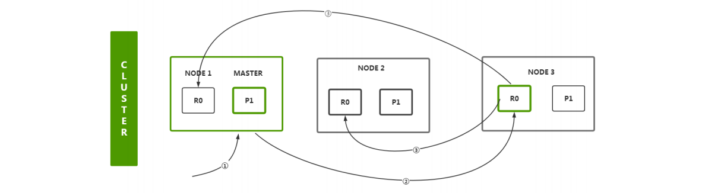

**增删改流程**

1. 客户端首先会选择一个节点node发送请求过去，这个节点node可能是协调节点coordinatingnode
2. 协调节点coordinating node会对document数据进行路由，将请求转发给对应的node（含有primary shard）
3. 实际上node的primary shard会处理请求，然后将数据同步到对应的含有replica shard的node
4. 协调节点coordinating node如果发现含有primary shard的node和所有的含有replica shard的node符合要求的数量之后，就会返回响应结果给客户端

**search流程**

1. 客户端首先会选择一个节点node发送请求过去，这个节点node可能是协调节点coordinating node

2. 协调节点将搜索请求转发到所有的shard对应的primary shard 或 replica shard ，都可以。

3. query phase：每个shard将自己的搜索结果的元数据到请求节点（其实就是一些doc id和 打分信息等返回给协调节点），由协调节点进行数据的合并、排

   序、分页等操作，产出最终结果。

4. fetch phase：接着由协调节点根据doc id去各个节点上拉取实际的document数据，最终返回给客户端。

## 8、作业

**具体实现：https://gitee.com/Thmspring/LG_homeWork/tree/master/stage7/module2**