# MySQL高级第二部分

## 1、ShardingSphere分库分表实战及中间件

### 1.1、前言 实战背景介绍

- **背景描述**
  
  - 刚开始我们的系统只用了**单机数据库**
  - 随着用户的不断增多，考虑到系统的高可用和越来越多的用户请求，我们开始使用数据库**主从架构**
- 当用户量级和业务进一步提升后，写请求越来越多，这时我们开始使用了**分库分表**
  
- **遇到的问题**

  - 用户请求量太大

    单服务器TPS、内存、IO都是有上限的，需要将请求打散分布到多个服务器

  - 单库数据量太大

    单个数据库处理能力有限；单库所在服务器的磁盘空间有限；单库上的操作IO有瓶颈

  - 单表数据量太大

    查询、插入、更新操作都会变慢，在加字段、加索引、机器迁移都会产生高负载，影响服务

- **如何解决**

  - 垂直拆分

    - 垂直分库

      微服务架构时，业务切割得足够独立，数据也会按照业务切分，保证业务数据隔离，大大提升了数据库的吞吐能力

      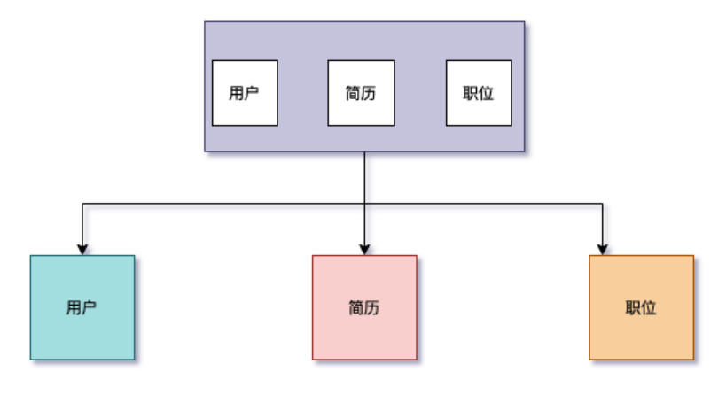

    - 垂直分表

      表中字段太多且包含大字段的时候，在查询时对数据库的IO、内存会受到影响，同时更新数据时，产生的binlog文件会很大，MySQL在主从同步时也会有延迟的风险

      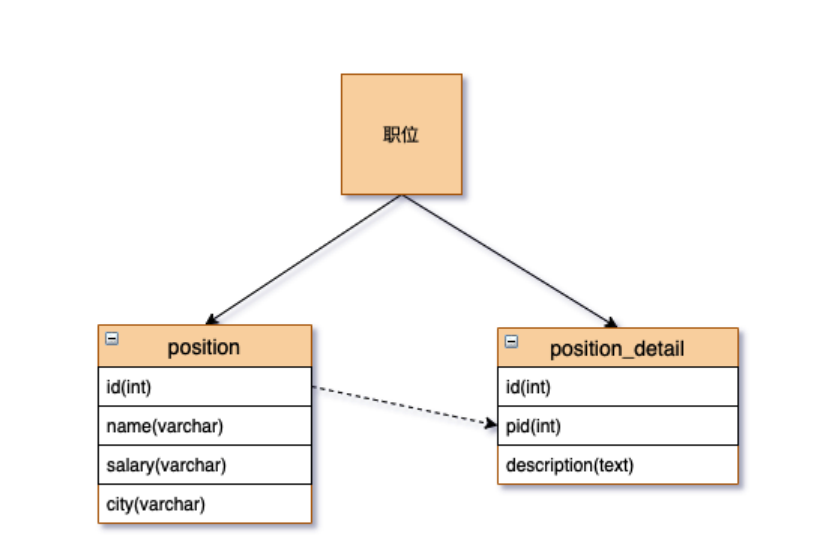

  - 水平拆分

    - 水平分表

      针对数据量巨大的单张表（比如订单表），按照规则把一张表的数据切分到多张表里面去。但是这些表还是在同一个库中，所以库级别的数据库操作还是有IO瓶颈。

      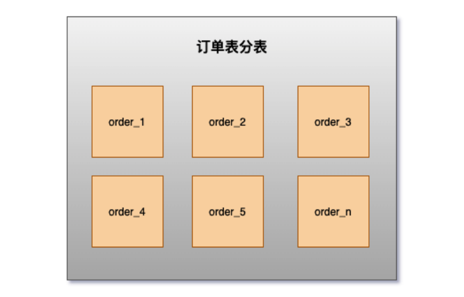

    - 水平分库

      将单张表的数据切分到多个服务器上去，每个服务器具有相应的库与表，只是表中数据集合不同。 水平分库分表能够有效的缓解单机和单库的性能瓶颈和压力，突破IO、连接数、硬件资源等的瓶颈

      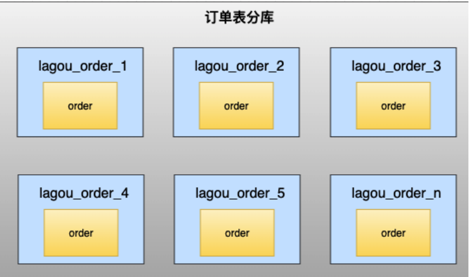

  - 水平分库规则

    不跨库、不跨表，保证同一类的数据都在同一个服务器上面。

    数据在切分之前，需要考虑如何高效的进行数据获取，如果每次查询都要跨越多个节点，就需要谨慎使用。

  - 水平分表规则

    - RANGE

      - 时间：按照年、月、日去切分。例如order_2020、order_202005、order_20200501

      - 地域：按照省或市去切分。例如order_beijing、order_shanghai、order_chengdu

      - 大小：从0到1000000一个表。例如1000001-2000000放一个表，每100万放一个表

    - HASH

      - 用户ID取模

    不同的业务使用的切分规则是不一样，就上面提到的切分规则，举例如下：

    - 站内信

      - 用户维度：用户只能看到发送给自己的消息，其他用户是不可见的，这种情况下是按照用户ID hash分库，在用户查看历史记录翻页查询时，所有的查询请求都在同一个库内。

    - 用户表

      - 范围法：以用户ID为划分依据，将数据水平切分到两个数据库实例，如：1到1000W在一张表，1000W到2000W在一张表，这种情况会出现单表的负载较高

      - 按照用户ID HASH尽量保证用户数据均衡分到数据库中

        > 如果在登录场景下，用户输入手机号和验证码进行登录，这种情况下，登录时是不是需要扫描所有分库的信息？
  >
        > 最终方案：用户信息采用ID做切分处理，同时存储用户ID和手机号的映射的关系表（新增一个关系表），关系表采用手机号进行切分。可以
    >
        > 通过关系表根据手机号查询到对应的ID，再定位用户信息。
    
    - 流水表
  
      - 时间维度：可以根据每天新增的流水来判断，选择按照年份分库，还是按照月份分库，甚至也可以按照日期分库

    - 订单表
  
      在拉勾网，求职者（下面统称C端用户）投递企业（下面统称B端用户）的职位产生的记录称之为订单表。在线上的业务场景中，C端用户看自己的投递记录，每次的投递到了哪个状态，B端用户查看自己收到的简历，对于合适的简历会进行下一步沟通，同一个公司内的员工可以协作处理简历。
  
      **如何能同时满足C端和B端对数据查询，不进行跨库处理？**

      最终方案：为了同时满足两端用户的业务场景，采用空间换时间，将一次的投递记录存为两份，C端的投递记录以用户ID为分片键，B端收到的简历按照公司ID为分片键

      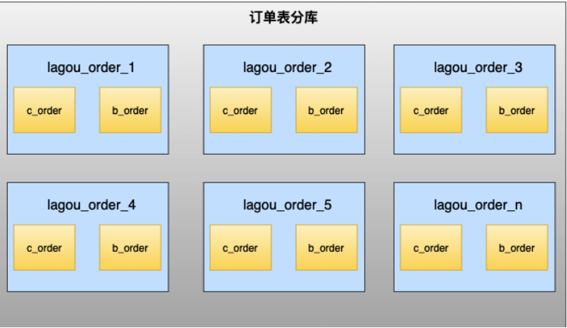

  - 主键选择

    - UUID：本地生成，不依赖数据库，缺点就是作为主键性能太差
  - SNOWFLAKE：百度UidGenerator、美团Leaf、基于SNOWFLAKE算法实现
    - redis：incr获取
  - 数据库：基于数据库专门的主键表
  
- 数据一致性
  
  - 强一致性：XA协议
    - 最终一致性：TCC、saga、Seata

  - 数据库扩容

    - 成倍增加数据节点，实现平滑扩容

    - 成倍扩容以后，表中的部分数据请求已被路由到其他节点上面，可以清理掉
  
  - 业务层改造
  
  - 基于代理层方式：Mycat、Sharding-Proxy、MySQL Proxy
  
  - 基于应用层方式：Sharding-jdbc
  
  - 分库后面临的问题

    - 事务问题：一次投递需要插入两条记录，且分布在不同的服务器上，数据需要保障一致性。
  - 跨库跨表的join问题
      - 全局表（字典表）：基础数据/配置数据，所有库都拷贝一份
    - 字段冗余：可以使用字段冗余就不用join查询了
      - 系统层组装：可以在业务层分别查询出来，然后组装起来，逻辑较复杂
  - 额外的数据管理负担和数据运算压力：数据库扩容、维护成本变高

### 1.2、ShardingSphere实战

#### 1.2.1、ShardingSphere

Apache ShardingSphere是一款开源的分布式数据库中间件组成的生态圈。它由Sharding-JDBC、Sharding-Proxy和Sharding-Sidecar（规划中）这3款相互独立的产品组成。 他们均提供标准化的数据分片、分布式事务和数据库治理功能，可适用于如Java同构、异构语言、容器、云原生等各种多样化的应用场景。

ShardingSphere项目状态如下：

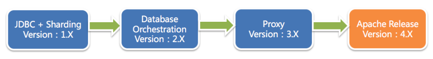

ShardingSphere定位为**关系型数据库中间件**，旨在充分合理地在分布式的场景下利用关系型数据库的计算和存储能力，而并非实现一个全新的关系型数据库。

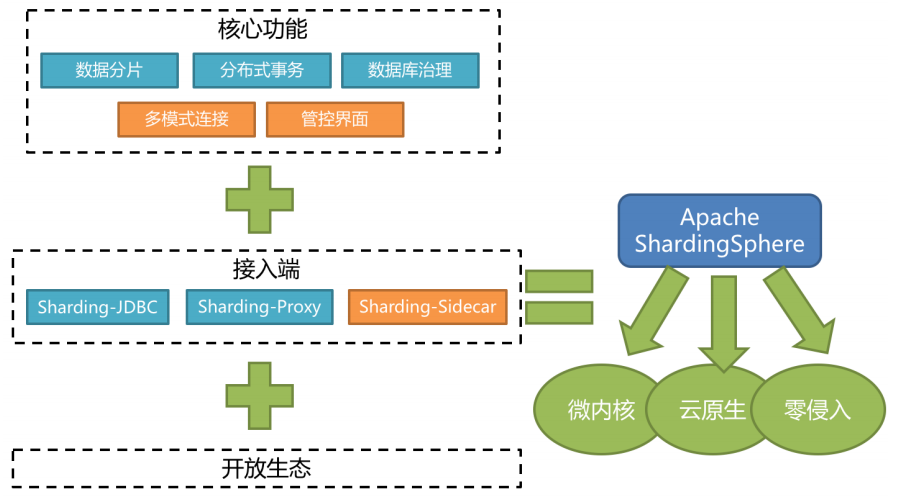

- Sharding-JDBC：被定位为轻量级Java框架，在Java的JDBC层提供的额外服务，以jar包形式使用。

- Sharding-Proxy：被定位为透明化的数据库代理端，提供封装了数据库二进制协议的服务端版本，用于完成对异构语言的支持。

- Sharding-Sidecar：被定位为 Kubernetes 或Mesos的云原生数据库代理，以DaemonSet的形式代理所有对数据库的访问。

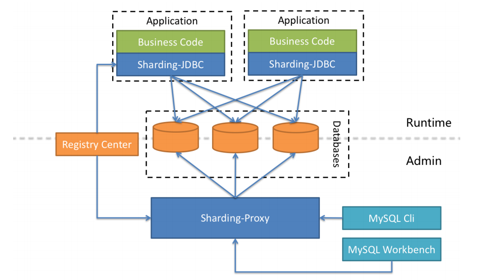

Sharding-JDBC、Sharding-Proxy和Sharding-Sidecar三者区别如下：

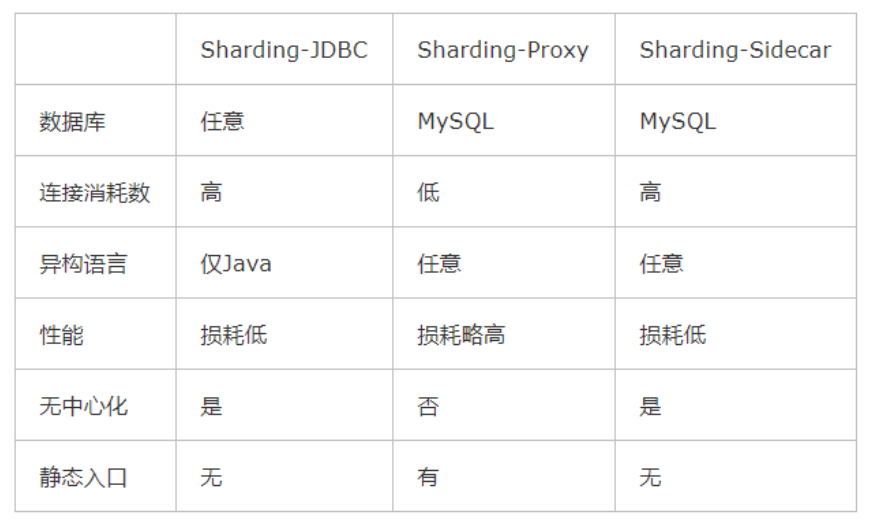

ShardingSphere安装包下载：https://shardingsphere.apache.org/document/current/cn/downloads/

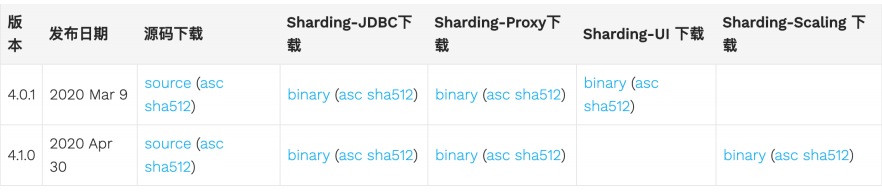

使用Git下载工程：git clone https://github.com/apache/incubator-shardingsphere.git

#### 1.2.2、Sharding-JDBC

Sharding-JDBC定位为轻量级Java框架，在Java的JDBC层提供的额外服务。 它使用客户端直连数据库，以jar包形式提供服务，无需额外部署和依赖，可理解为增强版的JDBC驱动，完全兼容JDBC和各种ORM框架的使用。

- 适用于任何基于Java的ORM框架，如：JPA, Hibernate, Mybatis, Spring JDBC Template或直接使用JDBC。

- 基于任何第三方的数据库连接池，如：DBCP, C3P0, BoneCP, Druid, HikariCP等。

- 支持任意实现JDBC规范的数据库。目前支持MySQL，Oracle，SQLServer和PostgreSQL。

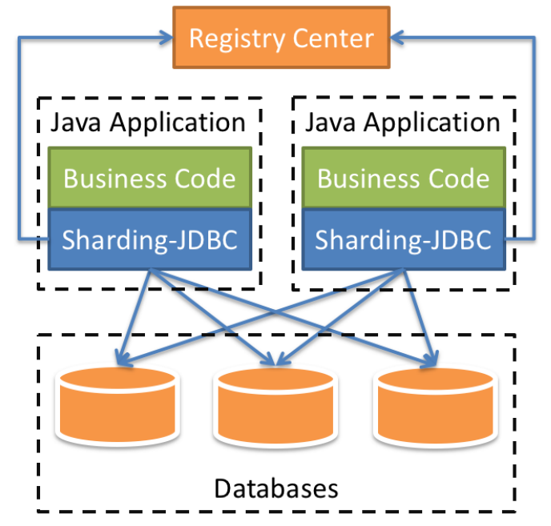

**Sharding-JDBC主要功能：**

- 数据分片
  - 分库、分表
  - 读写分离
  - 分片策略
  - 分布式主键

- 分布式事务
  - 标准化的事务接口
  - XA强一致性事务
  - 柔性事务

- 数据库治理
  - 配置动态化
  - 编排和治理
  - 数据脱敏
  - 可视化链路追踪

**Sharding-JDBC** **内部结构**：

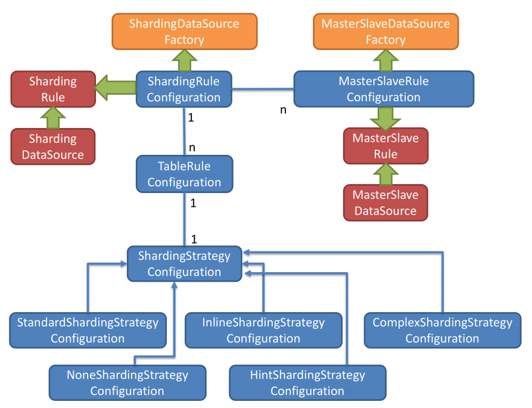

- 图中黄色部分表示的是Sharding-JDBC的入口API，采用工厂方法的形式提供。 目前有ShardingDataSourceFactory和MasterSlaveDataSourceFactory两个工厂类。

  - ShardingDataSourceFactory支持分库分表、读写分离操作
  - MasterSlaveDataSourceFactory支持读写分离操作
  
- 图中蓝色部分表示的是Sharding-JDBC的配置对象，提供灵活多变的配置方式。ShardingRuleConfifiguration是分库分表配置的核心和入口，它可以包含多个TableRuleConfiguration和MasterSlaveRuleConfiguration。 

  - TableRuleConfiguration封装的是表的分片配置信息，有5种配置形式对应不同的Configuration类型。

  - MasterSlaveRuleConfiguration封装的是读写分离配置信息。

- 图中红色部分表示的是内部对象，由Sharding-JDBC内部使用，应用开发者无需关注。Sharding-JDBC通过ShardingRuleConfiguration和MasterSlaveRuleConfiguration生成真正供ShardingDataSource和MasterSlaveDataSource使用的规则对象。ShardingDataSource和MasterSlaveDataSource实现了DataSource接口，是JDBC的完整实现方案。


**Sharding-JDBC初始化流程：**

- 根据配置的信息生成Configuration对象
- 通过Factory会将Configuration对象转化为Rule对象
- 通过Factory会将Rule对象与DataSource对象封装
- Sharding-JDBC使用DataSource进行分库分表和读写分离操作

**Sharding-JDBC** **使用过程**：

- 引入maven依赖

  ```xml
  <dependency> 
      <groupId>org.apache.shardingsphere</groupId> 
      <artifactId>sharding-jdbc-core</artifactId> 
      <version>${latest.release.version}</version> 
  </dependency>
  <!--注意: 请将${latest.release.version}更改为实际的版本号。-->
  ```

- 规则配置

  Sharding-JDBC可以通过Java，YAML，Spring命名空间和Spring Boot Starter四种方式配置，开发者可根据场景选择适合的配置方式。

- 创建DataSource

  通过ShardingDataSourceFactory工厂和规则配置对象获取ShardingDataSource，然后即可通过DataSource选择使用原生JDBC开发，或者使用JPA, MyBatis等ORM工具。

  ```java
DataSource dataSource = ShardingDataSourceFactory.createDataSource(dataSourceMap, shardingRuleConfig, props);
  ```

#### 1.2.3、数据分片剖析实战

##### 1.2.3.1、核心概念

- 表概念

  - 真实表

    数据库中真实存在的物理表。例如b_order0、b_order1。

  - 逻辑表

    在分片之后，同一类表结构的名称（总成）。例如b_order。

  - 数据节点

    在分片之后，由数据源和数据表组成。例如ds0.b_order1

  - 绑定表

    指的是分片规则一致的关系表（主表、子表），例如b_order和b_order_item，均按照order_id分片，则此两个表互为绑定表关系。绑定表之间的多表关联查询不会出现笛卡尔积关联，可以提升关联查询效率。

    ```mysql
b_order：b_order0、b_order1 
    b_order_item：b_order_item0、b_order_item1 
    
    select * from b_order o join b_order_item i on(o.order_id=i.order_id) where o.order_id in (10,11);
    #如果不配置绑定表关系，采用笛卡尔积关联，会生成4个SQL
    select * from b_order0 o join b_order_item0 i on(o.order_id=i.order_id) where o.order_id in (10,11); 
    select * from b_order0 o join b_order_item1 i on(o.order_id=i.order_id) where o.order_id in (10,11); 
    select * from b_order1 o join b_order_item0 i on(o.order_id=i.order_id) where o.order_id in (10,11); 
    select * from b_order1 o join b_order_item1 i on(o.order_id=i.order_id) where o.order_id in (10,11);
    #如果配置绑定表关系，生成2个SQL
    select * from b_order0 o join b_order_item0 i on(o.order_id=i.order_id) where o.order_id in (10,11); 
    select * from b_order1 o join b_order_item1 i on(o.order_id=i.order_id) where o.order_id in (10,11);
    ```
    
  - 广播表

    在使用中，有些表没必要做分片，例如字典表、省份信息等，因为他们数据量不大，而且这种表可能需要与海量数据的表进行关联查询。广播表会在不同的数据节点上进行存储，存储的表结构和数据完全相同。

- 分片算法（ShardingAlgorithm）

  由于分片算法和业务实现紧密相关，因此并未提供内置分片算法，而是通过分片策略将各种场景提炼出来，提供更高层级的抽象，并提供接口让应用开发者自行实现分片算法。目前提供4种分片算法。

  - 精确分片算法PreciseShardingAlgorithm

    用于处理使用单一键作为分片键的 = 与 IN 进行分片的场景。

  - 范围分片算法RangeShardingAlgorithm

    用于处理使用单一键作为分片键的BETWEEN AND、>、<、>=、<=进行分片的场景。

  - 复合分片算法ComplexKeysShardingAlgorithm

    用于处理使用多键作为分片键进行分片的场景，多个分片键的逻辑较复杂，需要应用开发者自行处理其中的复杂度。

  - Hint分片算法HintShardingAlgorithm

    用于处理使用Hint行分片的场景。对于分片字段非SQL决定，而由其他外置条件决定的场景，可使用SQL Hint灵活的注入分片字段。例：内部系统，按照员工登录主键分库，而数据库中并无此字段。SQL Hint支持通过Java API和SQL注释两种方式使用。

- 分片策略（ShardingStrategy）

  分片策略包含分片键和分片算法，真正可用于分片操作的是分片键 + 分片算法，也就是分片策略。目前提供5种分片策略。

  - 标准分片策略StandardShardingStrategy

    只支持单分片键，提供对SQL语句中的=, >, <, >=, <=, IN和BETWEEN AND的分片操作支持。提供PreciseShardingAlgorithm和RangeShardingAlgorithm两个分片算法。

    PreciseShardingAlgorithm是必选的，RangeShardingAlgorithm是可选的。但是SQL中使用了范围操作，如果不配置RangeShardingAlgorithm会采用全库路由扫描，效率低。

  - 复合分片策略ComplexShardingStrategy

    支持多分片键。提供对SQL语句中的=, >, <, >=, <=, IN和BETWEEN AND的分片操作支持。由于多分片键之间的关系复杂，因此并未进行过多的封装，而是直接将分片键值组合以及分片操作符透传至分片算法，完全由应用开发者实现，提供最大的灵活度。

  - 行表达式分片策略InlineShardingStrategy

    只支持单分片键。使用Groovy的表达式，提供对SQL语句中的=和IN的分片操作支持，对于简单的分片算法，可以通过简单的配置使用，从而避免繁琐的Java代码开发。如: t_user_$->{u_id % 8} 表示t_user表根据u_id模8，而分成8张表，表名称为t_user_0到t_user_7。

  - Hint分片策略HintShardingStrategy

    通过Hint指定分片值而非从SQL中提取分片值的方式进行分片的策略。

  - 不分片策略NoneShardingStrategy

    不分片的策略。

- 分片策略配置

  对于分片策略存有数据源分片策略和表分片策略两种维度，两种策略的API完全相同。

  - 数据源分片策略

    用于配置数据被分配的目标数据源。

  - 表分片策略

    用于配置数据被分配的目标表，由于表存在与数据源内，所以表分片策略是依赖数据源分片策略结果的。

##### 1.2.3.2、流程剖析

ShardingSphere 3个产品的数据分片功能主要流程是完全一致的，如下图所示。

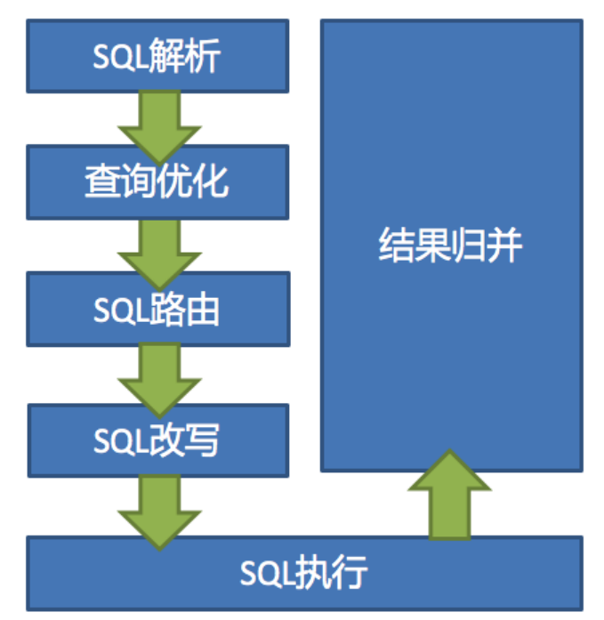

- SQL解析

  SQL解析分为词法解析和语法解析。 先通过词法解析器将SQL拆分为一个个不可再分的单词。再使用语法解析器对SQL进行理解，并最终提炼出解析上下文。

  Sharding-JDBC采用不同的解析器对SQL进行解析，解析器类型如下：

  - MySQL解析器
  - Oracle解析器
  - SQLServer解析器
  - PostgreSQL解析器
  - 默认SQL解析器

- 查询优化

  负责合并和优化分片条件，如OR 优化成union等。

- SQL路由

  根据解析上下文匹配用户配置的分片策略，并生成路由路径。目前支持分片路由和广播路由。

- SQL改写

  将SQL改写为在真实数据库中可以正确执行的语句。SQL改写分为正确性改写和优化改写。

- SQL执行

  通过多线程执行器异步执行SQL。

- 结果归并

  将多个执行结果集归并以便于通过统一的JDBC接口输出。结果归并包括流式归并、内存归并和使用装饰者模式的追加归并这几种方式。

##### 1.2.3.3、SQL使用规范

- SQL使用规范

  - 支持项

    - 路由至单数据节点时，目前MySQL数据库100%全兼容，其他数据库完善中。

    - 路由至多数据节点时，全面支持DQL、DML、DDL、DCL、TCL。支持分页、去重、排序、分组、聚合、关联查询（不支持跨库关联）。以下用最为复杂的查询为例：

      ```mysql
SELECT select_expr [, select_expr ...] 
      FROM table_reference [, table_reference ...] 
      [WHERE predicates] 
      [GROUP BY {col_name | position} [ASC | DESC], ...] 
      [ORDER BY {col_name | position} [ASC | DESC], ...] 
      [LIMIT {[offset,] row_count | row_count OFFSET offset}]
      ```
    
  - 不支持项（路由至多数据节点）

    - 不支持CASE WHEN、HAVING、UNION (ALL)

    - 支持分页子查询，但其他子查询有限支持，无论嵌套多少层，只能解析至第一个包含数据表的子查询，一旦在下层嵌套中再次找到包含数据表的子查询将直接抛出解析异常。

      例如，以下子查询可以支持：

      ```msyql
SELECT COUNT(*) FROM (SELECT * FROM b_order o)
      ```
    
       以下子查询不支持：
  
      ```mysql
SELECT COUNT(*) FROM (SELECT * FROM b_order o WHERE o.id IN (SELECT id FROM b_order WHERE status = ?))
      ```
    
      简单来说，通过子查询进行非功能需求，在大部分情况下是可以支持的。比如分页、统计总数等；而通过子查询实现业务查询当前并不能支持。
  
    - 由于归并的限制，子查询中包含聚合函数目前无法支持。

    - 不支持包含schema的SQL。因为ShardingSphere的理念是像使用一个数据源一样使用多数据源，因此对SQL的访问都是在同一个逻辑schema之上。

    - 当分片键处于运算表达式或函数中的SQL时，将采用全路由的形式获取结果。

      例如下面SQL，create_time为分片键：

      ```mysql
  SELECT * FROM b_order WHERE to_date(create_time, 'yyyy-mm-dd') = '2020- 05-05';
      ```
  
      由于ShardingSphere只能通过SQL字面提取用于分片的值，因此当分片键处于运算表达式或函数中时，ShardingSphere无法提前获取分片键位于数据库中的值，从而无法计算出真正的分片值。
  
    
**不支持的SQL示例：**
    
```mysql
    INSERT INTO tbl_name (col1, col2, …) VALUES(1+2, ?, …) //VALUES语句不支持运算 表达式
INSERT INTO tbl_name (col1, col2, …) SELECT col1, col2, … FROM tbl_name WHERE col3 = ? //INSERT .. SELECT 
    SELECT COUNT(col1) as count_alias FROM tbl_name GROUP BY col1 HAVING count_alias > ? //HAVING 
  SELECT * FROM tbl_name1 UNION SELECT * FROM tbl_name2 //UNION 
    SELECT * FROM tbl_name1 UNION ALL SELECT * FROM tbl_name2 //UNION ALL 
    SELECT * FROM ds.tbl_name1 //包含schema SELECT SUM(DISTINCT col1), SUM(col1) FROM tbl_name //同时使用普通聚合函数 和DISTINCT SELECT * FROM tbl_name WHERE to_date(create_time, ‘yyyy-mm-dd’) = ? //会导致 全路由
    ```
  
- 分页查询

  完全支持MySQL和Oracle的分页查询，SQLServer由于分页查询较为复杂，仅部分支持

  - **性能瓶颈：**

    查询偏移量过大的分页会导致数据库获取数据性能低下，以MySQL为例：

    ```mysql
    SELECT * FROM b_order ORDER BY id LIMIT 1000000, 10
    ```

    这句SQL会使得MySQL在无法利用索引的情况下跳过1000000条记录后，再获取10条记录，其性能可想而知。 而在分库分表的情况下（假设分为2个库），为了保证数据的正确性，SQL会改写为：

    ```mysql
SELECT * FROM b_order ORDER BY id LIMIT 0, 1000010
    ```
    
    即将偏移量前的记录全部取出，并仅获取排序后的最后10条记录。这会在数据库本身就执行很慢的情况下，进一步加剧性能瓶颈。 因为原SQL仅需要传输10条记录至客户端，而改写之后的SQL则会传输1,000,010 * 2的记录至客户端。

  - **ShardingSphere的优化：**

    ShardingSphere进行了以下2个方面的优化。

    - 首先，采用流式处理 + 归并排序的方式来避免内存的过量占用。
  - 其次，ShardingSphere对仅落至单节点的查询进行进一步优化。
  
- **分页方案优化：**
  
    由于LIMIT并不能通过索引查询数据，因此如果可以保证**ID的连续性**，通过ID进行分页是比较好的解决方案：

    ```mysql
  SELECT * FROM b_order WHERE id > 1000000 AND id <= 1000010 ORDER BY id
    ```

  - 或通过记录上次查询结果的最后一条记录的ID进行下一页的查询：
  
    ```mysql
  SELECT * FROM b_order WHERE id > 1000000 LIMIT 10
    ```

##### 1.2.3.4、其他功能

- Inline行表达式

  InlineShardingStrategy：采用Inline行表达式进行分片的配置。

  Inline是可以简化数据节点和分片算法配置信息。主要是解决配置简化、配置一体化。

  **语法格式：**

  行表达式的使用非常直观，只需要在配置中使用${ expression }或$->{ expression }标识行表达式即可。例如：

  ```groovy
  ${begin..end} 表示范围区间 
  ${[unit1, unit2, unit_x]} 表示枚举值
  ```

  行表达式中如果出现多个${}或$->{}表达式，整个表达式结果会将每个子表达式结果进行笛卡尔积组合。例如，以下行表达式：
  
  ```groovy
  ${['online', 'offline']}_table${1..3} 
  $->{['online', 'offline']}_table$->{1..3}
  ```
  
  最终会解析为：
  
  ```groovy
  online_table1, online_table2, online_table3, offline_table1, offline_table2, offline_table3
  ```
  
  **数据节点配置：**
  
  对于均匀分布的数据节点，如果数据结构如下：
  
  ```groovy
  db0
      ├── b_order2 
      └── b_order1 
  db1
      ├── b_order2 
      └── b_order1
  ```
  
  用行表达式可以简化为：
  
  ```groovy
  db${0..1}.b_order${1..2} 或者 db$->{0..1}.b_order$->{1..2}
  ```
  
  对于自定义的数据节点，如果数据结构如下：
  
  ```groovy
  db0
      ├── b_order0 
      └── b_order1 
  db1
      ├── b_order2 
      ├── b_order3 
      └── b_order4
  ```
  
  用行表达式可以简化为：
  
  ```groovy
  db0.b_order${0..1},db1.b_order${2..4}
  ```
  
  **分片算法配置：**
  
  行表达式内部的表达式本质上是一段Groovy代码，可以根据分片键进行计算的方式，返回相应的真实数据源或真实表名称。
  
  ```groovy
  ds${id % 10} 或者 ds$->{id % 10}
  ```
  
  结果为：ds0、ds1、ds2..... ds9

- 分布式主键

  ShardingSphere不仅提供了内置的分布式主键生成器，例如UUID、SNOWFLAKE，还抽离出分布式主键生成器的接口，方便用户自行实现自定义的自增主键生成器。

  **内置主键生成器：**

  - UUID

    采用UUID.randomUUID()的方式产生分布式主键。

  - SNOWFLAKE

    在分片规则配置模块可配置每个表的主键生成策略，默认使用雪花算法，生成64bit的长整型数据。

  **自定义主键生成器：**

  - 自定义主键类，实现ShardingKeyGenerator接口

  - 按SPI规范配置自定义主键类

    在Apache ShardingSphere中，很多功能实现类的加载方式是通过SPI注入的方式完成的。注意：在resources目录下新建META-INF文件夹，再新建services文件夹，然后新建文件的名字为**org.apache.shardingsphere.spi.keygen.ShardingKeyGenerator**，打开文件，复制自定义主键类全路径到文件中保存。

    ```
thm.spi.thmKey
    ```

  - 自定义主键类应用配置

    ```properties
    #对应主键字段名 
    spring.shardingsphere.sharding.tables.t_book.key-generator.column=id 
  #对应主键类getType返回内容  
    spring.shardingsphere.sharding.tables.t_book.key- generator.type=THMKEY
  ```

##### 1.2.3.5、sharding-jdbc环境准备

- 创建数据库和数据表

  ```mysql
  # 创建数据库
  create datebase thm-sharding0
  create datebase thm-sharding1
  # 创建数据表 两个库相同数据结构 职位表
  CREATE TABLE `position`  (
    `id` bigint(0) NOT NULL AUTO_INCREMENT,
    `name` varchar(255) CHARACTER SET utf8mb4 COLLATE utf8mb4_0900_ai_ci NULL DEFAULT NULL,
    `salary` varchar(255) CHARACTER SET utf8mb4 COLLATE utf8mb4_0900_ai_ci NULL DEFAULT NULL,
    `city` varchar(255) CHARACTER SET utf8mb4 COLLATE utf8mb4_0900_ai_ci NULL DEFAULT NULL,
    PRIMARY KEY (`id`) USING BTREE
  ) ENGINE = InnoDB AUTO_INCREMENT = 21 CHARACTER SET = utf8mb4 COLLATE = utf8mb4_0900_ai_ci ROW_FORMAT = Dynamic;
  # 职位详情表
  CREATE TABLE `position_detail`  (
    `id` bigint(0) NOT NULL AUTO_INCREMENT,
    `pid` bigint(0) NOT NULL,
    `description` text CHARACTER SET utf8mb4 COLLATE utf8mb4_0900_ai_ci NULL,
    PRIMARY KEY (`id`) USING BTREE
  ) ENGINE = InnoDB AUTO_INCREMENT = 1 CHARACTER SET = utf8mb4 COLLATE = utf8mb4_0900_ai_ci ROW_FORMAT = Dynamic;
  ```

- 创建父工程**thm-parent**和子工程**sharding-jdbc-demo**

  - thm-parent父工程 pom

    ```xml
        <modules>
            <module>sharding-jdbc-demo</module>
        </modules>
    
        <packaging>pom</packaging>
    
        <properties>
            <project.build.sourceEncoding>UTF-8</project.build.sourceEncoding>
            <project.compile.sourceEncoding>UTF-8</project.compile.sourceEncoding>
            <springboot.version>2.3.5.RELEASE</springboot.version>
            <shardingsphere.version>4.1.0</shardingsphere.version>
            <mysql.version>8.0.22</mysql.version>
        </properties>
    
        <dependencyManagement>
            <dependencies>
                <dependency>
                    <groupId>org.springframework.boot</groupId>
                    <artifactId>spring-boot-starter-test</artifactId>
                    <version>${springboot.version}</version>
                    <scope>test</scope>
                </dependency>
                <dependency>
                    <groupId>org.springframework.boot</groupId>
                    <artifactId>spring-boot-starter-jdbc</artifactId>
                    <version>${springboot.version}</version>
                </dependency>
                <dependency>
                    <groupId>org.springframework.boot</groupId>
                    <artifactId>spring-boot-starter-data-jpa</artifactId>
                    <version>${springboot.version}</version>
                </dependency>
                <dependency>
                    <groupId>org.apache.shardingsphere</groupId>
                    <artifactId>sharding-jdbc-spring-boot-starter</artifactId>
                    <version>${shardingsphere.version}</version>
                </dependency>
                <dependency>
                    <groupId>mysql</groupId>
                    <artifactId>mysql-connector-java</artifactId>
                    <version>${mysql.version}</version>
                </dependency>
            </dependencies>
        </dependencyManagement>
        <build>
            <plugins>
                <plugin>
                    <groupId>org.apache.maven.plugins</groupId>
                    <artifactId>maven-compiler-plugin</artifactId>
                    <configuration>
                        <source>11</source>
                        <target>11</target>
                        <testSource>11</testSource>
                        <testTarget>11</testTarget>
                    </configuration>
                    <version>3.8.1</version>
                </plugin>
            </plugins>
        </build>
    ```

  - **sharding-jdbc-demo**子工程

    - pom

      ```xml
          <parent>
              <artifactId>thm-parent</artifactId>
              <groupId>com.lagou</groupId>
              <version>1.0-SNAPSHOT</version>
          </parent>
          <modelVersion>4.0.0</modelVersion>
      
          <artifactId>sharding-jdbc-demo</artifactId>
      
          <dependencies>
              <dependency>
                  <groupId>org.springframework.boot</groupId>
                  <artifactId>spring-boot-starter-test</artifactId>
              </dependency>
              <dependency>
                  <groupId>org.springframework.boot</groupId>
                  <artifactId>spring-boot-starter-jdbc</artifactId>
              </dependency>
              <dependency>
                  <groupId>org.springframework.boot</groupId>
                  <artifactId>spring-boot-starter-data-jpa</artifactId>
              </dependency>
              <dependency>
                  <groupId>org.apache.shardingsphere</groupId>
                  <artifactId>sharding-jdbc-spring-boot-starter</artifactId>
              </dependency>
              <dependency>
                  <groupId>mysql</groupId>
                  <artifactId>mysql-connector-java</artifactId>
              </dependency>
          </dependencies>
      ```

    - 启动类

      ```java
      @SpringBootApplication
      public class Bootstrap {
      }
      ```

    - 实体类

      ```java
      package com.thm.entity;
      
      import javax.persistence.*;
      @Entity
      @Table(name = "position")
      public class Position {
          @Id
          @Column(name = "id")
          @GeneratedValue(strategy = GenerationType.IDENTITY)
          private Long id;
          @Column(name = "name")
          private String name;
          @Column(name = "salary")
          private String salary;
          @Column(name = "city")
          private String city;
          
          //省略 get/set
      }
      ```
      
    - repository
    
      ```java
      import com.thm.entity.Position;
      import org.springframework.data.jpa.repository.JpaRepository;
      import org.springframework.stereotype.Repository;
      
      @Repository
      public interface PositionRepository extends JpaRepository<Position,Long> {
      }
      ```
    
    - 配置文件
      
      - application.yml
      
        ```yaml
        spring:
          profiles:
            active: sharding-databases
          # 开启shardingsphere sql打印
          shardingsphere:
            props:
              sql:
                show: true
        ```
      
      - application-sharding-databases.yml
      
        ```yaml
        # database 数据库相关
        spring:
          shardingsphere:
            datasource:
              names: ds0,ds1
              ds0:
                type: com.zaxxer.hikari.HikariDataSource
                driver-class-Name: com.mysql.jdbc.Driver
                jdbc-url: jdbc:mysql://192.168.81.100:3306/thm-sharding0
                username: root
                password: Thm123456.
              ds1:
                type: com.zaxxer.hikari.HikariDataSource
                driver-class-Name: com.mysql.jdbc.Driver
                jdbc-url: jdbc:mysql://192.168.81.100:3306/thm-sharding1
                username: root
                password: Thm123456.
        # sharding-database 切分数据库策略
            sharding:
              tables:
                #指定表名
                position:
                  #指定分库策略
                  database-strategy:
                    inline:
                  sharding-column: id
                      algorithm-expression: ds$->{id % 2}
              # 指定主键生成策略
                  keyGenerator:
                    column: id
                    type: SNOWFLAKE
        ```
      
    - 测试类
    
      ```java
      import com.thm.Bootstrap;
      import com.thm.entity.Position;
      import com.thm.repository.PositionRepository;
      import org.junit.Test;
      import org.junit.runner.RunWith;
      import org.springframework.boot.test.context.SpringBootTest;
      import org.springframework.test.context.junit4.SpringJUnit4ClassRunner;
      
      import javax.annotation.Resource;
      @RunWith(SpringJUnit4ClassRunner.class)
      @SpringBootTest(classes = Bootstrap.class)
      public class TestShardingDatabase {
      
          @Resource
          private PositionRepository positionRepository;
      
          @Test
          public void  testAdd (){
              Position position;
              for (int i = 1; i <= 20; i++){
                  position = new Position();
                  // 使用sharding jdbc 的主键生成策略
                  //position.setId(i);
              position.setName("thm" + i);
                  position.setSalary("10000"+ i);
                  position.setCity("成都");
                  positionRepository.save(position);
              }
          }
      }
      ```

##### 1.2.3.6、自定义主键生成策略

- 实现org.apache.shardingsphere.spi.keygen.ShardingKeyGenerator接口

  ```java
  package com.thm.config;
  
  import org.apache.shardingsphere.core.strategy.keygen.SnowflakeShardingKeyGenerator;
  import org.apache.shardingsphere.spi.keygen.ShardingKeyGenerator;
  
  import java.util.Properties;
  
  /**
   * @ClassNmae ThmId
   * @Description TODO
   * @Author THM
   * @Date 2021/3/2 19:53
   * @Version 1.0
   **/
  public class ThmId implements ShardingKeyGenerator {
      private SnowflakeShardingKeyGenerator snowflakeShardingKeyGenerator =  new SnowflakeShardingKeyGenerator();
      /**
       * 主键生成策略
       * @return
       */
      @Override
      public Comparable<?> generateKey() {
          System.out.println("执行自定义的主键生成器");
          return snowflakeShardingKeyGenerator.generateKey();
      }
      /**
       * 返回主键类型名称，用于配置
       * @return
       */
      @Override
      public String getType() {
          return "THMKEY";
      }
  
      @Override
      public Properties getProperties() {
          return null;
      }
  
      @Override
      public void setProperties(Properties properties) {
  
      }
  }
  ```

- 在resources目录下创建META-INF.services目录，创建文件**org.apache.shardingsphere.spi.keygen.ShardingKeyGenerator**，添加自定义主键策略类全路径

  ```
com.thm.config.ThmId
  ```
  
- 修改配置

  ```yaml
  # database 数据库相关
  spring:
    shardingsphere:
      datasource:
        names: ds0,ds1
        ds0:
          type: com.zaxxer.hikari.HikariDataSource
          driver-class-Name: com.mysql.jdbc.Driver
          jdbc-url: jdbc:mysql://192.168.81.100:3306/thm-sharding0
          username: root
          password: Thm123456.
        ds1:
          type: com.zaxxer.hikari.HikariDataSource
          driver-class-Name: com.mysql.jdbc.Driver
          jdbc-url: jdbc:mysql://192.168.81.100:3306/thm-sharding1
          username: root
          password: Thm123456.
  # sharding-database 切分数据库策略
      sharding:
        tables:
          position:
           #指定分库策略
            database-strategy:
              inline:
                sharding-column: id
                algorithm-expression: ds$->{id % 2}
            # 指定主键生成策略
            keyGenerator:
              column: id
              #type: SNOWFLAKE
              type: THMKEY  #自定义主键策略
  ```

##### 1.2.3.7、职位拆表加分库

实现职位表和职位详情表分库分表后，同一职位信息在同一个库中，即对职位详情表分库策略进行调整

- 添加职位详情实体类

  ```java
  package com.thm.entity;
  
  import javax.persistence.*;
  @Entity
  @Table(name = "position_detail")
  public class PositionDetail {
      @Id
      @Column(name = "id")
      @GeneratedValue(strategy = GenerationType.IDENTITY)
      private Long id;
      @Column(name = "pid")
      private Long pid;
      @Column(name = "description")
      private String description;
      // 省略get/set
  }
  ```

- 添加职位详情repository

  ```java
  package com.thm.repository;
  
  import com.thm.entity.PositionDetail;
  import org.springframework.data.jpa.repository.JpaRepository;
  import org.springframework.stereotype.Repository;
  
  @Repository
  public interface PositionDetailRepository extends JpaRepository<PositionDetail,Long> {
  }
  ```

- 添加职位详情分库分表配置

  ```yaml
  # database 数据库相关
  spring:
    shardingsphere:
      datasource:
        names: ds0,ds1
        ds0:
          type: com.zaxxer.hikari.HikariDataSource
          driver-class-Name: com.mysql.jdbc.Driver
          jdbc-url: jdbc:mysql://192.168.81.100:3306/thm-sharding0
          username: root
          password: Thm123456.
        ds1:
          type: com.zaxxer.hikari.HikariDataSource
          driver-class-Name: com.mysql.jdbc.Driver
          jdbc-url: jdbc:mysql://192.168.81.100:3306/thm-sharding1
          username: root
          password: Thm123456.
  # sharding-database 切分数据库策略
      sharding:
        tables:
          #某个表名
          position:
             #指定分库策略
            database-strategy:
              inline:
                sharding-column: id
                algorithm-expression: ds$->{id % 2}
            # 指定主键生成策略
            keyGenerator:
              column: id
              #type: SNOWFLAKE
              type: THMKEY
          #某个表名
          position_detail:
             #指定分库策略
            database-strategy:
              inline:
                sharding-column: pid
                algorithm-expression: ds$->{pid % 2}
            # 指定主键生成策略
            keyGenerator:
              column: id
              #type: SNOWFLAKE
              type: THMKEY
  ```

- 添加职位信息查询

    ```java
  @Repository
  public interface PositionRepository extends JpaRepository<Position,Long> {
      @Query(nativeQuery = true,
             value = "select p.id,p.name,p.salary,p.city,pd.description from position p join position_detail pd on p.id =pd.pid where p.id = :id")
      public Object findPositionById(@Param("id") long id);
  }
  ```

- 测试

    ```java
  /**
  * 测试添加职位和职位详情
  */
  @Test
  public void  testAdd2 (){
      Position position;
      PositionDetail positionDetail;
      for (int i = 1; i <= 20; i++){
          position = new Position();
          // 使用sharding jdbc 的主键生成策略
          //position.setId(i);
          position.setName("thm" + i);
          position.setSalary("10000"+ i);
          position.setCity("成都");
          positionRepository.save(position);
  
          positionDetail = new PositionDetail();
          positionDetail.setPid(position.getId());
          positionDetail.setDescription("描述" + "thm" + i);
          positionDetailRepository.save(positionDetail);
      }
  }
  /**
  * 测试查询
  */
  @Test
  public void  testQuery(){
      Object object = positionRepository.findPositionById(573605750824239105L);
      Object[] position = (Object[]) object;
      System.out.println(position[0] + "-" +position[1] + "-" +position[2] + "-" +position[3] + "-" +position[4]);
  }
  ```

##### 1.2.3.8、广播表（全局表：数据字典）

实现城市全局表

- 创建数据表City

  ```mysql
  CREATE TABLE `city`  (
    `id` bigint(0) NOT NULL AUTO_INCREMENT,
    `name` varchar(255) CHARACTER SET utf8 COLLATE utf8_general_ci NULL DEFAULT NULL,
    `province` varchar(255) CHARACTER SET utf8 COLLATE utf8_general_ci NULL DEFAULT NULL,
    PRIMARY KEY (`id`) USING BTREE
  ) ENGINE = InnoDB CHARACTER SET = utf8 COLLATE = utf8_general_ci ROW_FORMAT = Dynamic;
  ```

- 创建City实体类

  ```java
  import javax.persistence.*;
  
  /**
   * @ClassNmae City
   * @Description TODO
   * @Author THM
   * @Date 2021/3/2 20:52
   * @Version 1.0
   **/
  @Entity
  @Table(name="city")
  public class City {
      @Id
      @GeneratedValue(strategy = GenerationType.IDENTITY)
      private Long id;
      private String name;
      private String province;
      //省略get/set
  }
  ```

- 创建City的repository

  ```java
  package com.thm.repository;
  
  import com.thm.entity.City;
  import org.springframework.data.jpa.repository.JpaRepository;
  import org.springframework.stereotype.Repository;
  
  @Repository
  public interface CityRepository extends JpaRepository<City,Long> {
  }
  ```

- 配置全局广播表

  ```yaml
  spring:
    shardingsphere:
      sharding:
        tables:
          #表明
          city:
            # 指定主键生成策略
            keyGenerator:
              column: id
              #type: SNOWFLAKE
              type: THMKEY
        #指定广播表
        broadcast-tables: city
  ```

- 测试

  ```java
      @Test
      public void testAdd3(){
          City city = new City();
          city.setName("成都");
          city.setProvince("四川");
          cityRepository.save(city);
      }
  ```

##### 1.2.3.9、sharding-jdbc订单分库分表

- 在两个数据库分别创建数据表order0，order1

  ```mysql
  CREATE TABLE `order0`  (
    `order_id` bigint(0) NOT NULL AUTO_INCREMENT,
    `user_id` bigint(0) NOT NULL,
    `order_name` varchar(255) CHARACTER SET utf8 COLLATE utf8_general_ci NULL DEFAULT NULL,
    PRIMARY KEY (`order_id`) USING BTREE
  ) ENGINE = InnoDB CHARACTER SET = utf8 COLLATE = utf8_general_ci ROW_FORMAT = Dynamic;
  CREATE TABLE `order1`  (
    `order_id` bigint(0) NOT NULL AUTO_INCREMENT,
    `user_id` bigint(0) NOT NULL,
    `order_name` varchar(255) CHARACTER SET utf8 COLLATE utf8_general_ci NULL DEFAULT NULL,
    PRIMARY KEY (`order_id`) USING BTREE
  ) ENGINE = InnoDB CHARACTER SET = utf8 COLLATE = utf8_general_ci ROW_FORMAT = Dynamic;
  ```

- 创建BOrder实体类

  ```java
  package com.thm.entity;
  import javax.persistence.*;
  @Entity
  // 指定逻辑表名
  @Table(name="b_order")
  public class BOrder {
      @Id
      @Column(name="order_id")
      @GeneratedValue(strategy = GenerationType.IDENTITY)
      private Long orderId;
      @Column(name = "user_id")
      private Long userId;
      @Column(name = "order_name")
      private String orderName;
   	//省略get/set   
  }
  ```

- 创建BOrder的repository

  ```java
  package com.thm.repository;
  
  import com.thm.entity.BOrder;
  import org.springframework.data.jpa.repository.JpaRepository;
  import org.springframework.stereotype.Repository;
  @Repository
  public interface BOrderRepository extends JpaRepository<BOrder,Long> {
  }
  ```

- 配置分库分表

  ```yaml
  # database 数据库相关
  spring:
    shardingsphere:
      datasource:
        names: ds0,ds1
        ds0:
          type: com.zaxxer.hikari.HikariDataSource
          driver-class-Name: com.mysql.jdbc.Driver
          jdbc-url: jdbc:mysql://192.168.81.100:3306/thm-sharding0
          username: root
          password: Thm123456.
        ds1:
          type: com.zaxxer.hikari.HikariDataSource
          driver-class-Name: com.mysql.jdbc.Driver
          jdbc-url: jdbc:mysql://192.168.81.100:3306/thm-sharding1
          username: root
          password: Thm123456.
  # sharding-database 切分数据库策略
      sharding:
        tables:
          # 指定逻辑表名
          b_order:
            #指定分库策略
            database-strategy:
              inline:
                sharding-column: user_id
                algorithm-expression: ds${user_id % 2}
            #指定分表策略
            table-strategy:
              inline:
                sharding-column: order_id
                algorithm-expression: b_order${order_id % 2}
            #指定存储数据节点路由策略
            actual-data-nodes: ds${0..1}.b_order${0..1}
            # 指定主键生成策略
            keyGenerator:
              column: order_id
              #type: SNOWFLAKE
              type: THMKEY
  ```

- 测试

  ```java
      @Test
      public void testAdd4(){
          Random random = new Random();
          BOrder order;
          for (int i = 1; i <= 100; i++){
              order = new BOrder();
              order.setUserId(Math.abs(random.nextLong()));
              order.setOrderName("order" + i);
              orderRepository.save(order);
          }
      }
  ```

#### 1.2.4、读写分离实战

##### 1.2.4.1、读写分离回顾和应用方案

读写分离是通过主从的配置方式，将查询请求均匀的分散到多个数据副本，进一步的提升系统的处理能力。


**主从架构：读写分离，目的是高可用、读写扩展。主从库内容相同，根据SQL语义进行路由。**

**分库分表架构：数据分片，目的读写扩展、存储扩容。库和表内容不同，根据分片配置进行路由。**

将水平分片和读写分离联合使用，能够更加有效的提升系统性能， 下图展现了将分库分表与读写分离一同使用时，应用程序与数据库集群之间的复杂拓扑关系。

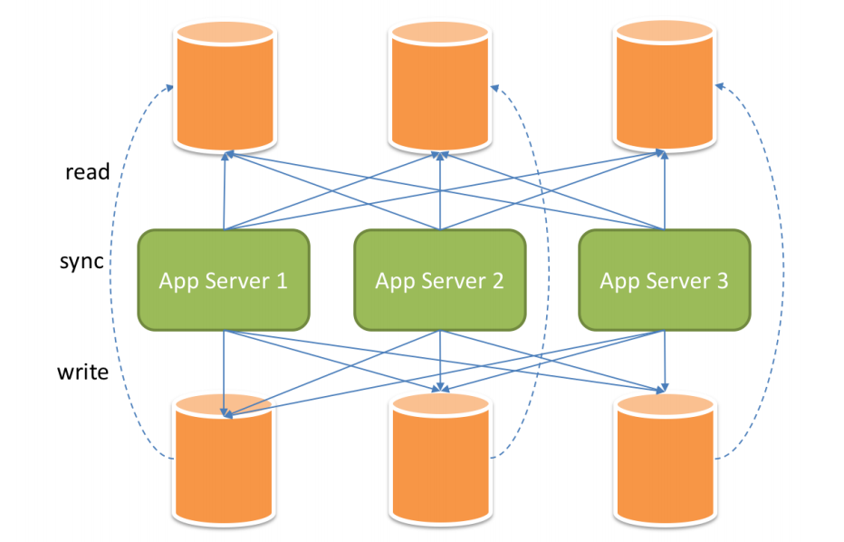

读写分离虽然可以提升系统的吞吐量和可用性，但同时也带来了数据不一致的问题，包括多个主库之间的数据一致性，以及主库与从库之间的数据一致性的问题。 并且，读写分离也带来了与数据分片同样的问题，它同样会使得应用开发和运维人员对数据库的操作和运维变得更加复杂。

**读写分离应用方案**

在数据量不是很多的情况下，我们可以将数据库进行读写分离，以应对高并发的需求，通过水平扩展从库，来缓解查询的压力。如下：

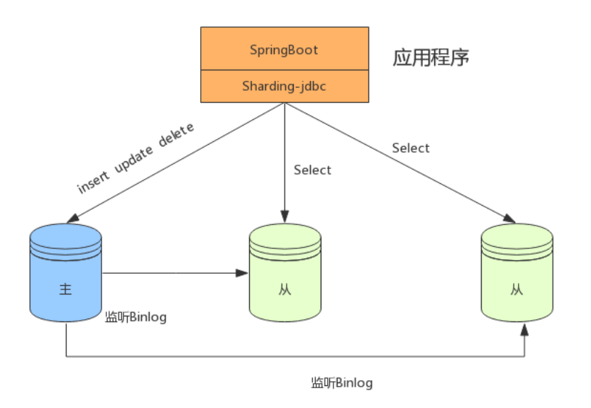

**分表+读写分离**

在数据量达到500万的时候，这时数据量预估千万级别，我们可以将数据进行分表存储。

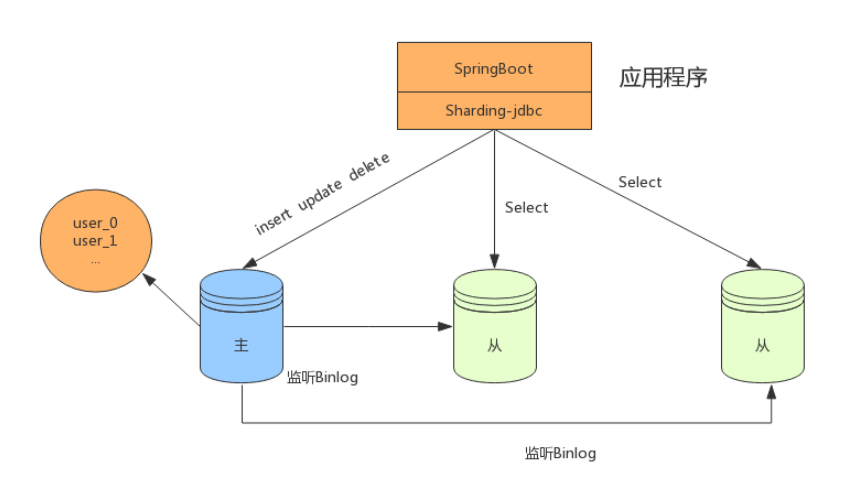

**分库分表+读写分离**

在数据量继续扩大，这时可以考虑分库分表，将数据存储在不同数据库的不同表中，如下：

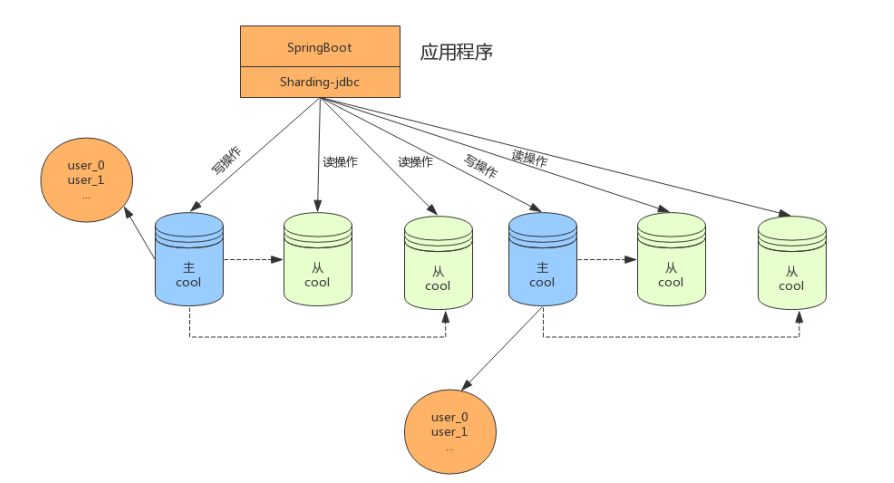

**透明化读写分离所带来的影响，让使用方尽量像使用一个数据库一样使用主从数据库集群，是ShardingSphere读写分离模块的主要设计目标。**

主库、从库、主从同步、负载均衡

- 核心功能
  - 提供一主多从的读写分离配置。仅支持单主库，可以支持独立使用，也可以配合分库分表使用
  - 独立使用读写分离，支持SQL透传。不需要SQL改写流程
  - 同一线程且同一数据库连接内，能保证数据一致性。如果有写入操作，后续的读操作均从主库读取。
  - 基于Hint的强制主库路由。可以强制路由走主库查询实时数据，避免主从同步数据延迟。
- 不支持项
  - 主库和从库的数据同步
  - 主库和从库的数据同步延迟
  - 主库双写或多写
  - 跨主库和从库之间的事务的数据不一致。建议在主从架构中，事务中的读写均用主库操作。

##### 1.2.4.2、sharding-jdbc读写分离实战

- 以分库分表的city为测试表

- 新建配置类application-master-slave.yml

  ```yaml
  # database 数据库相关
  spring:
    shardingsphere:
      datasource:
        names: master0,slave0,slave1,master1,slave2,slave3
        master0:
          type: com.zaxxer.hikari.HikariDataSource
          driver-class-Name: com.mysql.jdbc.Driver
          jdbc-url: jdbc:mysql://192.168.81.100:3306/thm-sharding0
          username: root
          password: Thm123456.
        slave0:
          type: com.zaxxer.hikari.HikariDataSource
          driver-class-Name: com.mysql.jdbc.Driver
          jdbc-url: jdbc:mysql://192.168.81.101:3306/thm-sharding0
          username: root
          password: Thm123456.
        slave1:
          type: com.zaxxer.hikari.HikariDataSource
          driver-class-Name: com.mysql.jdbc.Driver
          jdbc-url: jdbc:mysql://192.168.81.102:3306/thm-sharding0
          username: root
          password: Thm123456.
        master1:
          type: com.zaxxer.hikari.HikariDataSource
          driver-class-Name: com.mysql.jdbc.Driver
          jdbc-url: jdbc:mysql://192.168.81.100:3306/thm-sharding1
          username: root
          password: Thm123456.
        slave2:
          type: com.zaxxer.hikari.HikariDataSource
          driver-class-Name: com.mysql.jdbc.Driver
          jdbc-url: jdbc:mysql://192.168.81.101:3306/thm-sharding1
          username: root
          password: Thm123456.
        slave3:
          type: com.zaxxer.hikari.HikariDataSource
          driver-class-Name: com.mysql.jdbc.Driver
          jdbc-url: jdbc:mysql://192.168.81.102:3306/thm-sharding1
          username: root
          password: Thm123456.
  #    #指定读写分离配置(分表+读写分离)
  #    masterslave:
  #       #自定义名称
  #      name: datasource
  #       #指定master
  #      master-data-source-name: master0
  #       #指定slave多个以逗号隔开
  #      slave-data-source-names: slave0,slave1
  #       #指定负载均衡策略，默认轮询，支持轮询和随机
  #      load-balance-algorithm-type: ROUND_ROBIN
      # sharding-database 切分数据库策略
      sharding:
        tables:
          #表明
          city:
            # 指定主键生成策略
            keyGenerator:
              column: id
              #type: SNOWFLAKE
              type: THMKEY
        #指定广播表
        broadcast-tables: city
        # 指定读写分离配置(分库分表+读写分离)
        master-slave-rules:
          master0:
            master-data-source-name: master0
            slave-data-source-names: slave0,slave1
            load-balance-algorithm-type: ROUND_ROBIN
          master1:
            master-data-source-name: master1
            slave-data-source-names: slave2,slave3
            load-balance-algorithm-type: ROUND_ROBIN
  ```

- 修改配置类application.yml

  ```yaml
  spring:
    profiles:
      #active: sharding-databases
      # 加载配置文件application-master-slave.yml
      active: master-slave
    # 开启shardingsphere sql打印
    shardingsphere:
      props:
        sql:
          show: true
  ```

- 测试观察数据库

  ```java
  import com.thm.Bootstrap;
  import com.thm.entity.BOrder;
  import com.thm.entity.City;
  import com.thm.entity.Position;
  import com.thm.entity.PositionDetail;
  import com.thm.repository.BOrderRepository;
  import com.thm.repository.CityRepository;
  import com.thm.repository.PositionDetailRepository;
  import com.thm.repository.PositionRepository;
  import org.junit.Test;
  import org.junit.runner.RunWith;
  import org.springframework.boot.test.context.SpringBootTest;
  import org.springframework.test.context.junit4.SpringJUnit4ClassRunner;
  
  import javax.annotation.Resource;
  import java.util.List;
  import java.util.Random;
  
  @RunWith(SpringJUnit4ClassRunner.class)
  @SpringBootTest(classes = Bootstrap.class)
  public class TestMasterSlave {
  
      @Resource
      private CityRepository cityRepository;
  
      @Test
      public void  write (){
          City city = new City();
          city.setName("绵阳");
          city.setProvince("四川");
          cityRepository.save(city);
      }
  
      @Test
      public void  read (){
          List<City> all = cityRepository.findAll();
          all.forEach(city -> System.out.println(city.getId() + " " + city.getName() + " "+city.getProvince()));
      }
  
  }
  ```

#### 1.2.5、强制路由剖析实战

在一些应用场景中，分片条件并不存在于SQL，而存在于外部业务逻辑。因此需要提供一种通过在外部业务代码中指定路由配置的一种方式，在ShardingSphere中叫做Hint。如果使用Hint指定了强制分片路由，那么SQL将会无视原有的分片逻辑，直接路由至指定的数据节点操作。

HintManager主要使用ThreadLocal管理分片键信息，进行hint强制路由。在代码中向HintManager添加的配置信息只能在当前线程内有效。

**Hint使用场景：**

- 数据分片操作，如果分片键没有在SQL或数据表中，而是在业务逻辑代码中

- 读写分离操作，如果强制在主库进行某些数据操作

**Hint使用过程：**

- 编写分库或分表路由策略，实现HintShardingAlgorithm接口

  ```java
  public class MyHintShardingAlgorithm implements HintShardingAlgorithm<Integer> { 
      @Override
      public Collection<String> doSharding(Collection<String> collection, HintShardingValue<Long> hintShardingValue) {
          Collection<String> result = new ArrayList<>();
          for (String each: collection){
              for (Long value : hintShardingValue.getValues()){
                  if (each.endsWith(String.valueOf(value % 2))){
                      result.add(each);
                  }
              }
          }
          return result;
      }
  }
  ```

- 在配置文件指定分库或分表策略

  ```properties
  spring.shardingsphere.sharding.tables.b_order.database- strategy.hint.algorithm-class-name=com.lagou.hint.MyHintShardingAlgorithm 
  spring.shardingsphere.sharding.tables.b_order.table-strategy.hint.algorithm- class-name=com.lagou.hint.MyHintShardingAlgorithm 
  spring.shardingsphere.sharding.tables.b_order.actual-data-nodes=ds$-> {0..1}.b_order$->{0..1}
  ```

- 在代码执行查询前使用HintManager指定执行策略值

  ```java
  @Test//路由库和表 
  public void test(){ 
      HintManager hintManager = HintManager.getInstance(); 
      //强制路由库
      hintManager.addDatabaseShardingValue("b_order",1); 
      //强制路由表
      hintManager.addTableShardingValue("b_order",1); 
      List<Order> list = orderRepository.findAll(); 
    hintManager.close(); list.forEach(o -> { System.out.println(o.getOrderId()+" "+o.getUserId()+" "+o.getOrderPrice()); }); }
  ```

  在读写分离结构中，为了避免主从同步数据延迟及时获取刚添加或更新的数据，可以采用强制路由走主库查询实时数据，使用hintManager.setMasterRouteOnly设置主库路由即可。
  

##### 1.2.5.1、强制路由实战

- 创建HINT实现接口

  ```java
  package com.thm.hint;
  
  import org.apache.shardingsphere.api.sharding.hint.HintShardingAlgorithm;
  import org.apache.shardingsphere.api.sharding.hint.HintShardingValue;
  
  import java.util.ArrayList;
  import java.util.Collection;
  
  public class MyHintShardingAlgorithm implements HintShardingAlgorithm<Long> {
      @Override
      public Collection<String> doSharding(Collection<String> collection, HintShardingValue<Long> hintShardingValue) {
          Collection<String> result = new ArrayList<>();
          for (String each: collection){
              for (Long value : hintShardingValue.getValues()){
                  if (each.endsWith(String.valueOf(value % 2))){
                      result.add(each);
                  }
              }
          }
          return result;
      }
  }
  ```

- 添加配置文件application-hint.yml

  ```yaml
  # database 数据库相关
  spring:
    shardingsphere:
      datasource:
        names: ds0,ds1
        ds0:
          type: com.zaxxer.hikari.HikariDataSource
          driver-class-Name: com.mysql.jdbc.Driver
          jdbc-url: jdbc:mysql://192.168.81.100:3306/thm-sharding0
          username: root
          password: Thm123456.
        ds1:
          type: com.zaxxer.hikari.HikariDataSource
          driver-class-Name: com.mysql.jdbc.Driver
          jdbc-url: jdbc:mysql://192.168.81.100:3306/thm-sharding1
          username: root
          password: Thm123456.
      # sharding-database 切分数据库策略
      sharding:
        tables:
          #表名
          b_order:
            #强制路由库
            database-strategy:
              hint:
                algorithm-class-name: com.thm.hint.MyHintShardingAlgorithm
            #强制路由库
            table-strategy:
              hint:
                algorithm-class-name: com.thm.hint.MyHintShardingAlgorithm
            #指定存储数据节点路由策略
            actual-data-nodes: ds${0..1}.b_order${0..1}
            # 指定主键生成策略
            keyGenerator:
              column: order_id
              type: SNOWFLAKE
  ```

- 测试

  ```java
  import com.thm.Bootstrap;
  import com.thm.entity.BOrder;
  import com.thm.entity.City;
  import com.thm.repository.BOrderRepository;
  import com.thm.repository.CityRepository;
  import org.apache.shardingsphere.api.hint.HintManager;
  import org.junit.Test;
  import org.junit.runner.RunWith;
  import org.springframework.boot.test.context.SpringBootTest;
  import org.springframework.test.context.junit4.SpringJUnit4ClassRunner;
  
  import javax.annotation.Resource;
  import java.util.List;
  import java.util.Random;
  @RunWith(SpringJUnit4ClassRunner.class)
  @SpringBootTest(classes = Bootstrap.class)
  public class TestHint {
  
      @Resource
      private BOrderRepository orderRepository;
  
      @Test
      public void testAdd4(){
          HintManager hintManager = HintManager.getInstance();
          //强制路由到ds1
          hintManager.addDatabaseShardingValue("b_order",0L);
          //强制路由打ds1中的b_order1
          hintManager.addTableShardingValue("b_order",1L);
  
          List<BOrder> bOrders = orderRepository.findAll();
          bOrders.forEach(bOrder -> System.out.println(bOrder.getOrderId() + " " + bOrder.getUserId() + " " + bOrder.getOrderName()));
      }
  
  }
  ```

- 问题读写分离+分库分表时使用hint报错：Cannot find data source in sharding rule, invalid actual data node is

  ```yaml
  # database 数据库相关
  spring:
    shardingsphere:
      datasource:
        names: master0,master0slave0,master0slave1,master1,master1slave0,master1slave1
        master0:
          type: com.zaxxer.hikari.HikariDataSource
          driver-class-Name: com.mysql.jdbc.Driver
          jdbc-url: jdbc:mysql://192.168.81.100:3306/thm-sharding0
          username: root
          password: Thm123456.
        master0slave0:
          type: com.zaxxer.hikari.HikariDataSource
          driver-class-Name: com.mysql.jdbc.Driver
          jdbc-url: jdbc:mysql://192.168.81.101:3306/thm-sharding0
          username: root
          password: Thm123456.
        master0slave1:
          type: com.zaxxer.hikari.HikariDataSource
          driver-class-Name: com.mysql.jdbc.Driver
          jdbc-url: jdbc:mysql://192.168.81.102:3306/thm-sharding0
          username: root
          password: Thm123456.
        master1:
          type: com.zaxxer.hikari.HikariDataSource
          driver-class-Name: com.mysql.jdbc.Driver
          jdbc-url: jdbc:mysql://192.168.81.100:3306/thm-sharding1
          username: root
          password: Thm123456.
        master1slave0:
          type: com.zaxxer.hikari.HikariDataSource
          driver-class-Name: com.mysql.jdbc.Driver
          jdbc-url: jdbc:mysql://192.168.81.101:3306/thm-sharding1
          username: root
          password: Thm123456.
        master1slave1:
          type: com.zaxxer.hikari.HikariDataSource
          driver-class-Name: com.mysql.jdbc.Driver
          jdbc-url: jdbc:mysql://192.168.81.102:3306/thm-sharding1
          username: root
          password: Thm123456.
  #    #指定读写分离配置(一主多从：分表+读写分离)
  #    masterslave:
  #       #自定义名称
  #      name: datasource
  #       #指定master
  #      master-data-source-name: master0
  #       #指定slave多个以逗号隔开
  #      slave-data-source-names: slave0,slave1
  #       #指定负载均衡策略，默认轮询，支持轮询和随机
  #      load-balance-algorithm-type: ROUND_ROBIN
      # sharding-database 切分数据库策略
      sharding:
        tables:
          #表名
          b_order:
            #强制路由库
            database-strategy:
              hint:
                algorithm-class-name: com.thm.hint.MyHintShardingAlgorithm
            #强制路由库
            table-strategy:
              hint:
                algorithm-class-name: com.thm.hint.MyHintShardingAlgorithm
            #指定存储数据节点路由策略
            actual-data-nodes: master${0..1}slave${0..1}.b_order${0..1}
          #表名
          city:
            # 指定主键生成策略
            keyGenerator:
              column: id
              #type: SNOWFLAKE
              type: THMKEY
        #指定广播表
        broadcast-tables: city
        # 指定读写分离配置
        master-slave-rules:
          master0:
            master-data-source-name: master0
            slave-data-source-names: master0slave0,master0slave1
            load-balance-algorithm-type: ROUND_ROBIN
          master1:
            master-data-source-name: master1
            slave-data-source-names: master1slave0,master1slave1
            load-balance-algorithm-type: ROUND_ROBIN
  ```

#### 1.2.6、数据脱敏实战

数据脱敏是指对某些敏感信息通过脱敏规则进行数据的变形，实现敏感隐私数据的可靠保护。涉及客户安全数据或者一些商业性敏感数据，如身份证号、手机号、卡号、客户号等个人信息按照规定，都需要进行数据脱敏。

数据脱敏模块属于ShardingSphere分布式治理这一核心功能下的子功能模块。

- 在更新操作时，它通过对用户输入的SQL进行解析，并依据用户提供的脱敏配置对SQL进行改写，从而实现对原文数据进行加密，并将密文数据存储到底层数据库。

- 在查询数据时，它又从数据库中取出密文数据，并对其解密，最终将解密后的原始数据返回给用户。

**Apache ShardingSphere自动化&透明化了数据脱敏过程，让用户无需关注数据脱敏的实现细节，像使用普通数据那样使用脱敏数据。**

##### 1.2.6.1、整体架构

ShardingSphere提供的Encrypt-JDBC和业务代码部署在一起。业务方需面向Encrypt-JDBC进行JDBC编程。

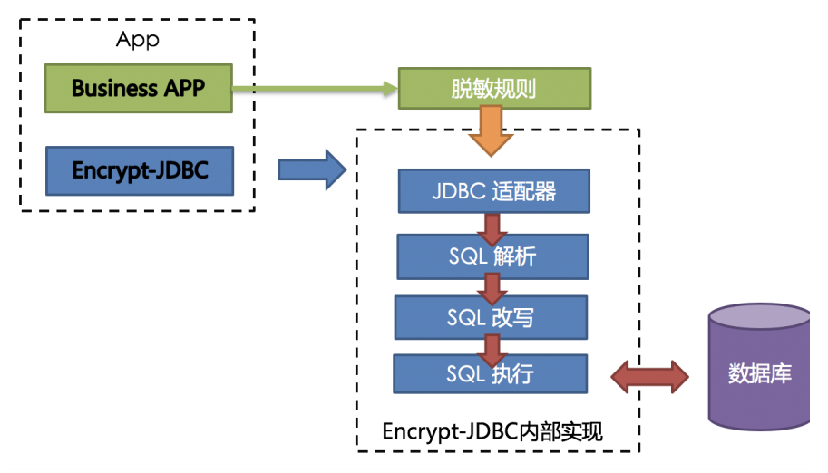

Encrypt-JDBC将用户发起的SQL进行拦截，并通过SQL语法解析器进行解析、理解SQL行为，再依据用户传入的脱敏规则，找出需要脱敏的字段和所使用的加解密器对目标字段进行加解密处理后，再与底层数据库进行交互。

##### 1.2.6.2、脱敏规则

脱敏配置主要分为四部分：数据源配置，加密器配置，脱敏表配置以及查询属性配置，其详情如下图所示：

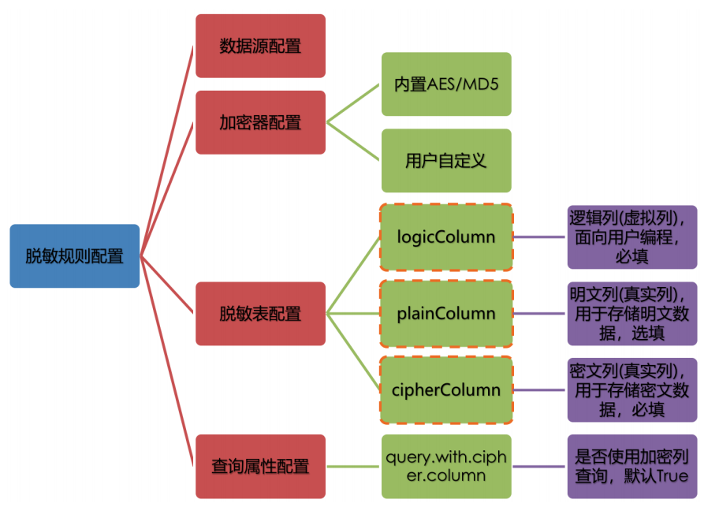

- 数据源配置：指DataSource的配置信息

- 加密器配置：指使用什么加密策略进行加解密。目前ShardingSphere内置了两种加解密策略：AES/MD5

- 脱敏表配置：指定哪个列用于存储密文数据（cipherColumn）、哪个列用于存储明文数据（plainColumn）以及用户想使用哪个列进行SQL编写（logicColumn）

- 查询属性的配置：当底层数据库表里同时存储了明文数据、密文数据后，该属性开关用于决定是直接查询数据库表里的明文数据进行返回，还是查询密文数据通过Encrypt-JDBC解密后返回。


##### 1.2.6.3、数据脱敏流程

下图可以看出ShardingSphere将逻辑列与明文列和密文列进行了列名映射。

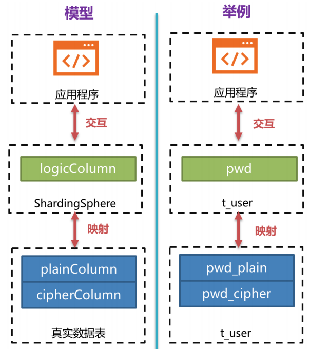

下方图片展示了使用Encrypt-JDBC进行增删改查时，其中的处理流程和转换逻辑，如下图所示。

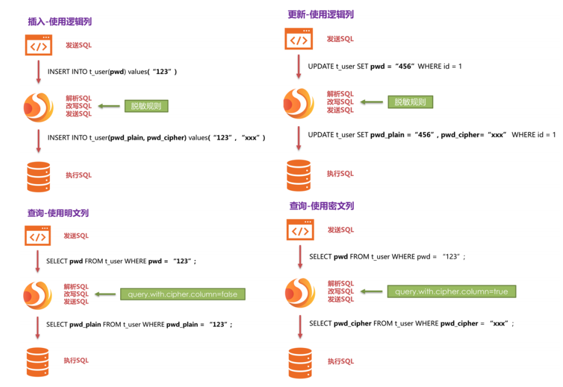

##### 1.2.6.4、加密策略解析

ShardingSphere提供了两种加密策略用于数据脱敏，该两种策略分别对应ShardingSphere的两种加解密的接口，即Encryptor和QueryAssistedEncryptor。

- Encryptor

  该解决方案通过提供encrypt(), decrypt()两种方法对需要脱敏的数据进行加解密。在用户进行INSERT, DELETE, UPDATE时，ShardingSphere会按照用户配置，对SQL进行解析、改写、路由，并会调用encrypt()将数据加密后存储到数据库, 而在SELECT时，则调用decrypt()方法将从数据库中取出的脱敏数据进行逆向解密，最终将原始数据返回给用户。当前，ShardingSphere针对这种类型的脱敏解决方案提供了两种具体实现类，分别是MD5(不可逆)，AES(可逆)，用户只需配置即可使用这两种内置的方案。

- QueryAssistedEncryptor

  相比较于第一种脱敏方案，该方案更为安全和复杂。它的理念是：即使是相同的数据，如两个用户的密码相同，它们在数据库里存储的脱敏数据也应当是不一样的。这种理念更有利于保护用户信息，防止撞库成功。

  它提供三种函数进行实现，分别是encrypt(), decrypt(), queryAssistedEncrypt()。在encrypt()阶段，用户通过设置某个变动种子，例如时间戳。针对原始数据+变动种子组合的内容进行加密，就能保证即使原始数据相同，也因为有变动种子的存在，致使加密后的脱敏数据是不一样的。在decrypt()可依据之前规定的加密算法，利用种子数据进行解密。queryAssistedEncrypt()用于生成辅助查询列，用于原始数据的查询过程。

  当前，ShardingSphere针对这种类型的脱敏解决方案并没有提供具体实现类，却将该理念抽象成接口，提供给用户自行实现。ShardingSphere将调用用户提供的该方案的具体实现类进行数据脱敏。


##### 1.2.6.5、数据脱敏实战

- 创建数据表c_user

  ```mysql
  create table c_user (
  	id BIGINT(11) NOT NULL auto_increment,
  	name VARCHAR(256) DEFAULT NULL,
  	pwd_plain VARCHAR(256) DEFAULT NULL,
  	pwd_cipher VARCHAR(256) DEFAULT NULL,
  	PRIMARY KEY (id)
  ) ENGINE=INNODB DEFAULT CHARSET=utf8mb4;
  ```

- 创建实体类

  ```java
  package com.thm.entity;
  
  import javax.persistence.*;
  
  /**
   * @ClassNmae CUser
   * @Description TODO
   * @Author THM
   * @Date 2021/3/3 22:19
   * @Version 1.0
   **/
  @Entity
  @Table(name = "c_user")
  public class CUser {
      @Id
      @Column(name = "id")
      @GeneratedValue(strategy = GenerationType.IDENTITY)
      private Long id;
      @Column(name = "name")
      private String name;
      @Column(name = "pwd")
      private String pwd; //逻辑列名
      //省略get/set/tostring
  }
  ```

- 创建repository

  ```java
  package com.thm.repository;
  
  import com.thm.entity.CUser;
  import org.springframework.data.jpa.repository.JpaRepository;
  
  public interface CUserRepository extends JpaRepository<CUser,Long> {
      public CUser findByPwd(String pwd);
  }
  ```

- 添加配置

  ```yaml
  # database 数据库相关
  spring:
    shardingsphere:
      datasource:
        names: ds0,ds1
        ds0:
          type: com.zaxxer.hikari.HikariDataSource
          driver-class-Name: com.mysql.jdbc.Driver
          jdbc-url: jdbc:mysql://192.168.81.100:3306/thm-sharding0
          username: root
          password: Thm123456.
        ds1:
          type: com.zaxxer.hikari.HikariDataSource
          driver-class-Name: com.mysql.jdbc.Driver
          jdbc-url: jdbc:mysql://192.168.81.100:3306/thm-sharding1
          username: root
          password: Thm123456.
      encrypt:
        tables:
          #表名
          c_user:
            #指定分库策略 这里不起作用
            database-strategy:
              inline:
                sharding-column: id
                algorithm-expression: ds$->{id % 2}
            # 指定主键生成策略 这里不起作用
            keyGenerator:
              column: id
              #type: SNOWFLAKE
              type: THMKEY
            columns:
              #虚拟列名
              pwd:
                #明文列名
                plainColumn: pwd_plain
                #密文列名
                cipherColumn: pwd_cipher
                #指定加密解密器
                encryptor: thm_pwd
        #配置加密解密
        encryptors:
          #自定义名称
          thm_pwd:
            #使用AES 加解密器类型，可自定义或选择内置类型：MD5/AES
            type: aes
            #配置AES密钥 注意：使用AES加密器，需要配置AES加密器的KEY属性：aes.key.value
            props:
              aes.key.value: 123456
      props:
        #配置使用加密列查询
        query:
          with:
            cipher:
              column: true
  ```

- 测试

  ```java
  import com.thm.Bootstrap;
  import com.thm.entity.CUser;
  import com.thm.entity.City;
  import com.thm.repository.CUserRepository;
  import org.junit.Test;
  import org.junit.runner.RunWith;
  import org.springframework.boot.test.context.SpringBootTest;
  import org.springframework.test.context.junit4.SpringJUnit4ClassRunner;
  
  import javax.annotation.Resource;
  @RunWith(SpringJUnit4ClassRunner.class)
  @SpringBootTest(classes = Bootstrap.class)
  public class TestEncryptor {
  
      @Resource
      private CUserRepository cUserRepository;
  
      @Test
      public void  write (){
          CUser cUser = new CUser();
          cUser.setName("张三");
          cUser.setPwd("123456");
          cUserRepository.save(cUser);
      }
  
      @Test
      public void  read (){
          CUser byPwd = cUserRepository.findByPwd("123456");
          System.out.println(byPwd);
      }
  }
  ```

### 1.3、分布式事务剖析实战

#### 1.3.1、分布式事务理论

- CAP（强一致性）

  CAP 定理，又被叫作布鲁尔定理。对于共享数据系统，最多只能同时拥有CAP其中的两个，任意两个都有其适应的场景。

  | **选项**      | 描述                                                         |
  | ------------- | ------------------------------------------------------------ |
  | C：一致性     | 分布式系统当中的一致性指的是所有节点的数据一致，或者说是所有副本的数据一致 |
  | A：可用性     | Reads and writes always succeed. 也就是说系统一直可用，而且服务一直保持正常 |
  | P：分区容错性 | 系统在遇到一些节点或者网络分区故障的时候，仍然能够提供满足一致性和可用性的服务 |

- BASE（最终一致性）

  BASE 是指基本可用（Basically Available）、软状态（ Soft State）、最终一致性（ EventualConsistency）。它的核心思想是即使无法做到强一致性（CAP 就是强一致性），但应用可以采用适合的方式达到最终一致性。

  - BA指的是基本业务可用性，支持分区失败；

  - S表示柔性状态，也就是允许短时间内不同步；

  - E表示最终一致性，数据最终是一致的，但是实时是不一致的。

  原子性和持久性必须从根本上保障，为了可用性、性能和服务降级的需要，只有降低一致性和隔离性的要求。BASE 解决了 CAP 理论中没有考虑到的网络延迟问题，在BASE中用软状态和最终一致，保证了延迟后的一致性。


#### 1.3.2、分布式事务模式

了解了分布式事务中的强一致性和最终一致性理论，下面介绍几种常见的分布式事务的解决方案。

##### 1.3.2.1、2PC模式（强一致性）

2PC是Two-Phase Commit缩写，即两阶段提交，就是将事务的提交过程分为两个阶段来进行处理。事务的发起者称协调者，事务的执行者称参与者。协调者统一协调参与者执行。

- 阶段 1：准备阶段

  协调者向所有参与者发送事务内容，询问是否可以提交事务，并等待所有参与者答复。

  各参与者执行事务操作，但不提交事务，将 undo 和 redo 信息记入事务日志中。

  如参与者执行成功，给协调者反馈 yes；如执行失败，给协调者反馈 no。

- 阶段 2：提交阶段

  如果协调者收到了参与者的失败消息或者超时，直接给每个参与者发送回滚(rollback)消息；否则，发送提交(commit)消息。

**2PC 方案实现起来简单，实际项目中使用比较少，主要因为以下问题：**

- 性能问题：所有参与者在事务提交阶段处于同步阻塞状态，占用系统资源，容易导致性能瓶颈。

- 可靠性问题：如果协调者存在单点故障问题，如果协调者出现故障，参与者将一直处于锁定状态。

- 数据一致性问题：在阶段 2 中，如果发生局部网络问题，一部分事务参与者收到了提交消息，另一部分事务参与者没收到提交消息，那么就导致了节点之间数据的不一致。


##### 1.3.2.2、3PC模式（强一致性）

3PC 三阶段提交，是两阶段提交的改进版本，与两阶段提交不同的是，引入超时机制。同时在协调者和参与者中都引入超时机制。三阶段提交将两阶段的准备阶段拆分为 2 个阶段，插入了一个preCommit 阶段，解决了原先在两阶段提交中，参与者在准备之后，由于协调者或参与者发生崩溃或错误，而导致参与者无法知晓处于长时间等待的问题。如果在指定的时间内协调者没有收到参与者的消息则默认失败。

- 阶段1：canCommit

  协调者向参与者发送 commit 请求，参与者如果可以提交就返回 yes 响应，否则返回 no 响应。

- 阶段2：preCommit

  协调者根据阶段 1 canCommit 参与者的反应情况执行预提交事务或中断事务操作。

  - 参与者均反馈 yes：协调者向所有参与者发出 preCommit 请求，参与者收到preCommit 请求后，执行事务操作，但不提交；将 undo 和 redo 信息记入事务日志中；各参与者向协调者反馈 ack 响应或 no 响应，并等待最终指令。

  - 任何一个参与者反馈 no或等待超时：协调者向所有参与者发出 abort 请求，无论收到协调者发出的 abort 请求，或者在等待协调者请求过程中出现超时，参与者均会中断事务。

- 阶段3：do Commit

  该阶段进行真正的事务提交，根据阶段 2 preCommit反馈的结果完成事务提交或中断操作。

相比2PC模式，3PC模式降低了阻塞范围，在等待超时后协调者或参与者会中断事务。避免了协调者单点问题，阶段 3 中协调者出现问题时（比如网络中断等），参与者会继续提交事务。

##### 1.3.2.3、XA（强一致性）

XA是由X/Open组织提出的分布式事务的规范，是基于两阶段提交协议。 XA规范主要定义了全局事务管理器（TM）和局部资源管理器（RM）之间的接口。目前主流的关系型数据库产品都是实现了XA接口。

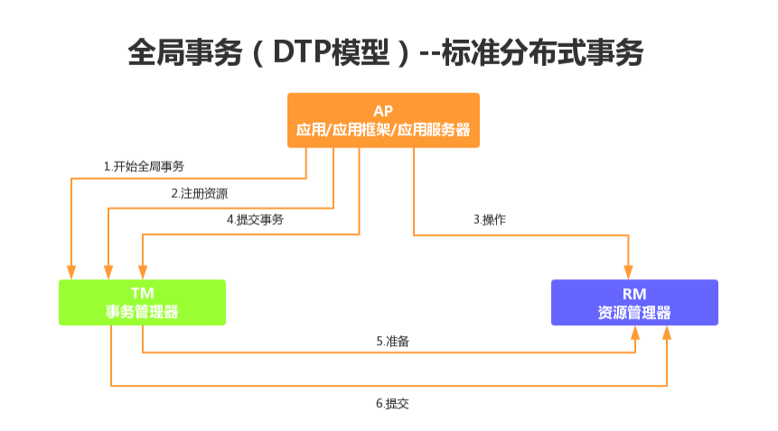

XA之所以需要引入事务管理器，是因为在分布式系统中，从理论上讲两台机器理论上无法达到一致的状态，需要引入一个单点进行协调。由全局事务管理器管理和协调的事务，可以跨越多个资源（数据库）和进程。

事务管理器用来保证所有的事务参与者都完成了准备工作(第一阶段)。如果事务管理器收到所有参与者都准备好的消息，就会通知所有的事务都可以提交了（第二阶段）。MySQL 在这个XA事务中扮演的是参与者的角色，而不是事务管理器。

##### 1.3.2.4、TCC模式（最终一致性）

TCC（Try-Confirm-Cancel）的概念，最早是由 Pat Helland 于 2007 年发表的一篇名为《Lifebeyond Distributed Transactions:an Apostate’s Opinion》的论文提出。TCC 是服务化的两阶段编程模型，其 Try、Confirm、Cancel 3 个方法均由业务编码实现：

- Try 操作作为一阶段，负责资源的检查和预留；

- Confirm 操作作为二阶段提交操作，执行真正的业务；

- Cancel 是预留资源的取消；

TCC事务模式相对于 XA 等传统模型如下图所示：

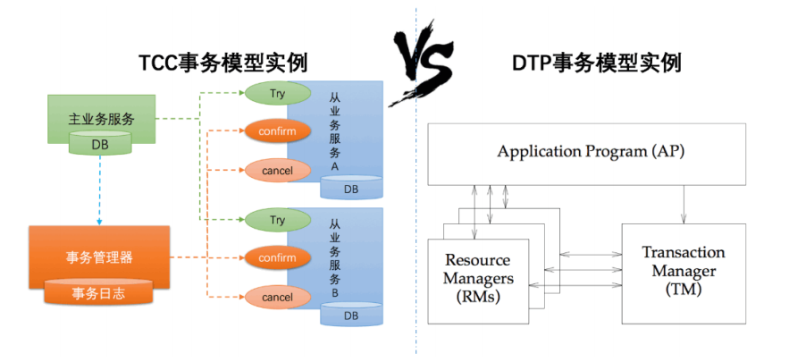

TCC 模式相比于 XA，解决了如下几个缺点：

- 解决了协调者单点，由主业务方发起并完成这个业务活动。业务活动管理器可以变成多点，引入集群。

- 同步阻塞：引入超时机制，超时后进行补偿，并且不会锁定整个资源，将资源转换为业务逻辑形式，粒度变小。

- 数据一致性，有了补偿机制之后，由业务活动管理器控制一致性。

##### 1.3.2.5、消息队列模式（最终一致性）

消息队列的方案最初是由 eBay 提出，基于TCC模式，消息中间件可以基于 Kafka、RocketMQ 等消息队列。此方案的核心是将分布式事务拆分成本地事务进行处理，将需要分布式处理的任务通过消息日志的方式来异步执行。消息日志可以存储到本地文本、数据库或MQ中间件，再通过业务规则人工发起重试。

下面描述下事务的处理流程：

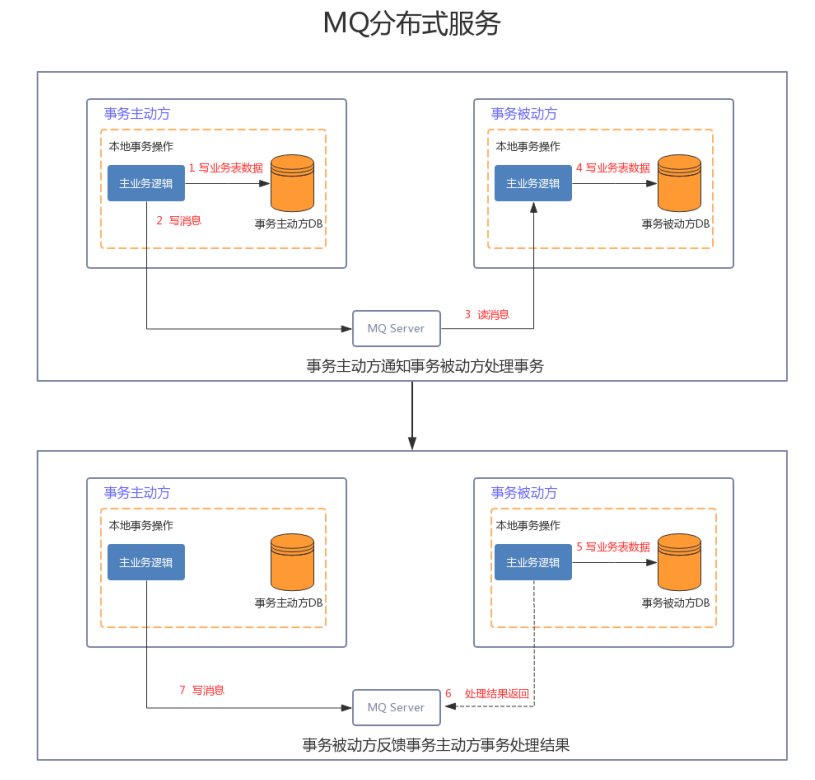

- 步骤1：事务主动方处理本地事务。

  事务主动方在本地事务中处理业务更新操作和MQ写消息操作。

- 步骤 2：事务主动方通过消息中间件，通知事务被动方处理事务通知事务待消息。

  事务主动方主动写消息到MQ，事务消费方接收并处理MQ中的消息。

- 步骤 3：事务被动方通过MQ中间件，通知事务主动方事务已处理的消息，事务主动方根据反馈结果提交或回滚事务。

为了数据的一致性，当流程中遇到错误需要重试，容错处理规则如下：

- 当步骤 1 处理出错，事务回滚，相当于什么都没发生。

- 当步骤 2 处理出错，由于未处理的事务消息还是保存在事务发送方，可以重试或撤销本地业务操作。

- 如果事务被动方消费消息异常，需要不断重试，业务处理逻辑需要保证幂等。

- 如果是事务被动方业务上的处理失败，可以通过MQ通知事务主动方进行补偿或者事务回滚。

- 如果多个事务被动方已经消费消息，事务主动方需要回滚事务时需要通知事务被动方回滚。

##### 1.3.2.6、Saga模式（最终一致性）

Saga这个概念源于 1987 年普林斯顿大学的 Hecto 和 Kenneth 发表的一篇数据库论文Sagas ，一个Saga事务是一个有多个短时事务组成的长时的事务。 在分布式事务场景下，我们把一个Saga分布式事务看做是一个由多个本地事务组成的事务，每个本地事务都有一个与之对应的补偿事务。在Saga事务的执行过程中，如果某一步执行出现异常，Saga事务会被终止，同时会调用对应的补偿事务完成相关的恢复操作，这样保证Saga相关的本地事务要么都是执行成功，要么通过补偿恢复成为事务执行之前的状态。（自动反向补偿机制）。

Saga 事务基本协议如下：

- 每个 Saga 事务由一系列幂等的有序子事务(sub-transaction) Ti 组成。

- 每个 Ti 都有对应的幂等补偿动作 Ci，补偿动作用于撤销 Ti 造成的结果。

Saga是一种补偿模式，它定义了两种补偿策略：

- 向前恢复（forward recovery）：对应于上面第一种执行顺序，发生失败进行重试，适用于必须要成功的场景。

- 向后恢复（backward recovery）：对应于上面提到的第二种执行顺序，发生错误后撤销掉之前所有成功的子事务，使得整个 Saga 的执行结果撤销。

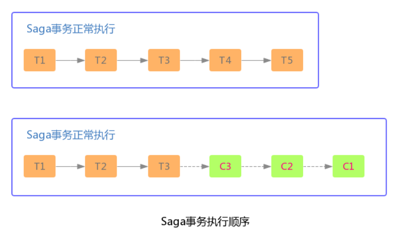

 Saga 的执行顺序有两种，如上图：

- 事务正常执行完成：T1, T2, T3, ..., Tn，例如：减库存(T1)，创建订单(T2)，支付(T3)，依次有序完成整个事务。

- 事务回滚：T1, T2, ..., Tj, Cj,..., C2, C1，其0 < j < n，例如：减库存(T1)，创建订单(T2)，支付(T3)，支付失败，支付回滚(C3)，订单回滚(C2)，恢复库存(C1)。

##### 1.3.3.7、Seata框架

Fescar开源项目，最初愿景是能像本地事务一样控制分布式事务，解决分布式环境下的难题。

Seata（Simple Extensible Autonomous Transaction Architecture）是一套一站式分布式事务解决方案，是阿里集团和蚂蚁金服联合打造的分布式事务框架。

Seata目前的事务模式有AT、TCC、Saga和XA，默认是AT模式，AT本质上是2PC协议的一种实现。

Seata AT事务模型包含TM(事务管理器)，RM(资源管理器)，TC(事务协调器)。其中TC是一个独立的服务需要单独部署，TM和RM以jar包的方式同业务应用部署在一起，它们同TC建立长连接，在整个事务生命周期内，保持RPC通信。

- 全局事务的发起方作为TM，全局事务的参与者作为RM

- TM负责全局事务的begin和commit/rollback

- RM负责分支事务的执行结果上报，并且通过TC的协调进行commit/rollback。

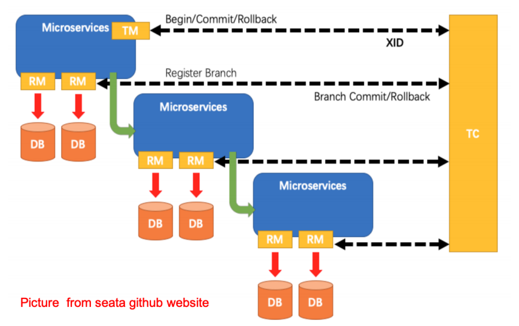

在 Seata 中，AT时分为两个阶段的，第一阶段，就是各个阶段本地提交操作；第二阶段会根据第一阶段的情况决定是进行全局提交还是全局回滚操作。具体的执行流程如下：

- TM 开启分布式事务，负责全局事务的begin和commit/rollback（TM 向 TC 注册全局事务记录）；

- RM 作为参与者，负责分支事务的执行结果上报，并且通过TC的协调进行commit/rollback（RM 向 TC 汇报资源准备状态 ）；

- RM分支事务结束，事务一阶段结束;

- 根据TC 汇总事务信息，由TM发起事务提交或回滚操作；

- TC 通知所有 RM 提交/回滚资源，事务二阶段结束；

#### 1.3.3、Sharding-JDBC整合XA原理

Java通过定义JTA接口实现了XA的模型，JTA接口里的ResourceManager需要数据库厂商提供XA的驱动实现，而TransactionManager则需要事务管理器的厂商实现，传统的事务管理器需要同应用服务器绑定，因此使用的成本很高。 而嵌入式的事务管器可以以jar包的形式提供服务，同ShardingSphere集成后，可保证分片后跨库事务强一致性。

ShardingSphere支持以下功能：

- 支持数据分片后的跨库XA事务
- 两阶段提交保证操作的原子性和数据的强一致性
- 服务宕机重启后，提交/回滚中的事务可自动恢复
- SPI机制整合主流的XA事务管理器，默认Atomikos
- 同时支持XA和非XA的连接池
- 提供spring-boot和namespace的接入端

ShardingSphere整合XA事务时，分离了XA事务管理和连接池管理，这样接入XA时，可以做到对业务的零侵入。


- Begin（开启XA全局事务）

  XAShardingTransactionManager会调用具体的XA事务管理器开启XA的全局事务。

- 执行物理SQL

  ShardingSphere进行解析/优化/路由后会生成SQL操作，执行引擎为每个物理SQL创建连接的同时，物理连接所对应的XAResource也会被注册到当前XA事务中。事务管理器会在此阶段发送XAResource.start命令给数据库，数据库在收到XAResource.end命令之前的所有SQL操作，会被标记为XA事务。

  ```apl
XAResource1.start ## Enlist阶段执行 
  statement.execute("sql1"); ## 模拟执行一个分片SQL1 
  statement.execute("sql2"); ## 模拟执行一个分片SQL2 
  XAResource1.end ## 提交阶段执行
  ##这里sql1和sql2将会被标记为XA事务。
  ```
  
- Commit/rollback（提交XA事务）

  XAShardingTransactionManager收到接入端的提交命令后，会委托实际的XA事务管理进行提交动作，这时事务管理器会收集当前线程里所有注册的XAResource，首先发送XAResource.end指令，用以标记此XA事务的边界。 接着会依次发送prepare指令，收集所有参与XAResource投票，如果所有XAResource的反馈结果都是OK，则会再次调用commit指令进行最终提交，如果有一个XAResource的反馈结果为No，则会调用rollback指令进行回滚。 在事务管理器发出提交指令后，任何XAResource产生的异常都会通过recovery日志进行重试，来保证提交阶段的操作原子性，和数据强一致性。

  例如:

  ```apl
XAResource1.prepare ## ack: yes 
  XAResource2.prepare ## ack: yes 
XAResource1.commit 
  XAResource2.commit 

  XAResource1.prepare ## ack: yes 
  XAResource2.prepare ## ack: no 
  XAResource1.rollback 
  XAResource2.rollback
  ```

#### 1.3.4、Sharding-JDBC整合Saga原理

ShardingSphere的柔性事务已通过第三方servicecomb-saga组件实现的，通过SPI机制注入使用。

ShardingSphere是基于反向SQL技术实现的反向补偿操作，它将对数据库进行更新操作的SQL自动生成反向SQL，并交由Saga-actuator引擎执行。使用方则无需再关注如何实现补偿方法，将柔性事务管理器的应用范畴成功的定位回了事务的本源——数据库层面。ShardingSphere支持以下功能：

- 完全支持跨库事务
- 支持失败SQL重试及最大努力送达
- 支持反向SQL、自动生成更新快照以及自动补偿
- 默认使用关系型数据库进行快照及事务日志的持久化，支持使用SPI的方式加载其他类型的持久化  

Saga柔性事务的实现类为SagaShardingTransactionMananger, ShardingSphere通过Hook的方式拦截逻辑SQL的解析和路由结果，这样，在分片物理SQL执行前，可以生成逆向SQL，在事务提交阶段再把SQL调用链交给Saga引擎处理。

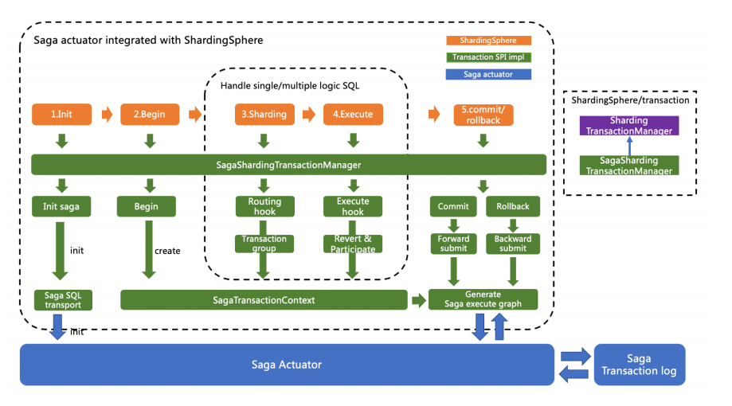

- Init（Saga引擎初始化）

  包含Saga柔性事务的应用启动时，saga-actuator引擎会根据saga.properties的配置进行初始化的流程。

- Begin（开启Saga全局事务）

  每次开启Saga全局事务时，将会生成本次全局事务的上下文（SagaTransactionContext），事务上下文记录了所有子事务的正向SQL和逆向SQL，作为生成事务调用链的元数据使用。

- 执行物理SQL

  在物理SQL执行前，ShardingSphere根据SQL的类型生成逆向SQL，这里是通过Hook的方式拦截Parser的解析结果进行实现。

- Commit/rollback（提交Saga事务）

  提交阶段会生成Saga执行引擎所需的调用链路图，commit操作产生ForwardRecovery（正向SQL补偿）任务，rollback操作产生BackwardRecovery任务（逆向SQL补偿）。


#### 1.3.5、Sharding-JDBC整合Seata原理

分布式事务的实现目前主要分为两阶段的XA强事务和BASE柔性事务。

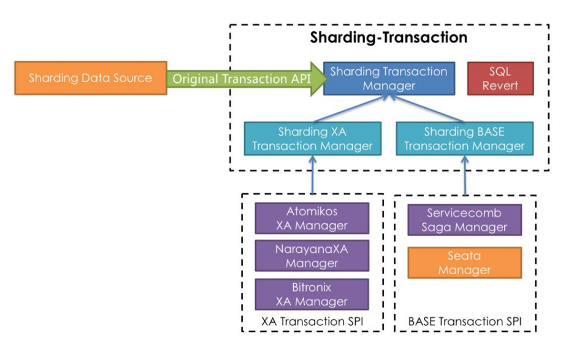

Seata AT事务作为BASE柔性事务的一种实现，可以无缝接入到ShardingSphere生态中。在整合SeataAT事务时，需要把TM，RM，TC的模型融入到ShardingSphere 分布式事务的SPI的生态中。在数据库资源上，Seata通过对接DataSource接口，让JDBC操作可以同TC进行RPC通信。同样，ShardingSphere也是面向DataSource接口对用户配置的物理DataSource进行了聚合，因此把物理DataSource二次包装为Seata 的DataSource后，就可以把Seata AT事务融入到ShardingSphere的分片中。

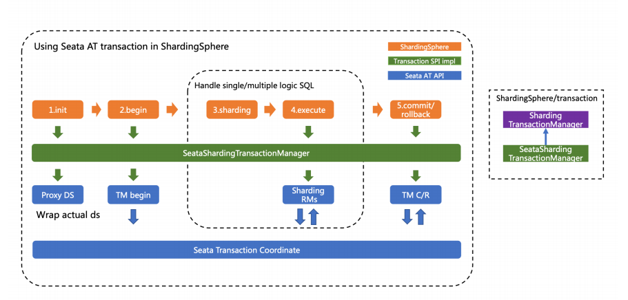

- Init（Seata引擎初始化）

  包含Seata柔性事务的应用启动时，用户配置的数据源会按seata.conf的配置，适配成Seata事务所需的DataSourceProxy，并且注册到RM中。

- Begin（开启Seata全局事务）

  TM控制全局事务的边界，TM通过向TC发送Begin指令，获取全局事务ID，所有分支事务通过此全局事务ID，参与到全局事务中；全局事务ID的上下文存放在当前线程变量中。

- 执行分片物理SQL

  处于Seata全局事务中的分片SQL通过RM生成undo快照，并且发送participate指令到TC，加入到全局事务中。ShardingSphere的分片物理SQL是按多线程方式执行，因此整合Seata AT事务时，需要在主线程和子线程间进行全局事务ID的上下文传递，这同服务间的上下文传递思路完全相同。

- Commit/rollback（提交Seata事务）

  提交Seata事务时，TM会向TC发送全局事务的commit和rollback指令，TC根据全局事务ID协调所有分支事务进行commit和rollback。

#### 1.3.6、Sharding-JDBC分布式事务实战

ShardingSphere整合了XA、Saga和Seata模式后，为分布式事务控制提供了极大的便利，我们可以在应用程序编程时，采用以下统一模式进行使用。

- 引入Maven依赖

  ```xml
  <!--XA模式-->
  <dependency> 
      <groupId>org.apache.shardingsphere</groupId>
      <artifactId>sharding-transaction-xa-core</artifactId> 
      <version>${shardingsphere.version}</version> 
  </dependency> 
  <!--Saga模式
  ${shardingsphere-spi-impl.version}` 的jar暂未发布到maven中央仓，因此需要您根据源码自行部署。
  项目地址: https://github.com/OpenSharding/opensharding-spi-impl/releases
  -->
  <dependency> 
      <groupId>io.shardingsphere</groupId> 
      <artifactId>sharding-transaction-base-saga</artifactId> 
      <version>${shardingsphere-spi-impl.version}</version>
  </dependency>
  <!--Seata模式  使用seata还需要安装seata环境-->
  <dependency> 
      <groupId>org.apache.shardingsphere</groupId> 
      <artifactId>sharding-transaction-base-seata-at</artifactId> 
      <version>${sharding-sphere.version}</version> 
  </dependency>
  ```

- JAVA编码方式设置事务类型

  ```java
  TransactionTypeHolder.set(TransactionType.XA); 
  TransactionTypeHolder.set(TransactionType.BASE);
  ```

- 参数配置

  - ShardingSphere默认的XA事务管理器为Atomikos，通过在项目的classpath中添加jta.properties来定制化Atomikos配置项。具体的配置规则如下：

    ```properties
    #指定是否启动磁盘日志，默认为true。在生产环境下一定要保证为true，否则数据的完整性无法保证
    com.atomikos.icatch.enable_logging=true 
  #JTA/XA资源是否应该自动注册 
    com.atomikos.icatch.automatic_resource_registration=true 
  #JTA事务的默认超时时间，默认为10000ms 
    com.atomikos.icatch.default_jta_timeout=10000 
    #事务的最大超时时间，默认为300000ms。这表示事务超时时间由 UserTransaction.setTransactionTimeout()较大者决定。4.x版本之后，指定为0的话则表示 不设置超时时间 
    com.atomikos.icatch.max_timeout=300000 
    #指定在两阶段提交时，是否使用不同的线程(意味着并行)。3.7版本之后默认为false，更早的版本 默认为true。如果为false，则提交将按照事务中访问资源的顺序进行。 
    com.atomikos.icatch.threaded_2pc=false 
    #指定最多可以同时运行的事务数量，默认值为50，负数表示没有数量限制。在调用 UserTransaction.begin()方法时，可能会抛出一个”Max number of active transactions reached”异常信息，表示超出最大事务数限制 
    com.atomikos.icatch.max_actives=50 
    #是否支持subtransaction，默认为true 
    com.atomikos.icatch.allow_subtransactions=true 
    #指定在可能的情况下，否应该join 子事务(subtransactions)，默认值为true。如果设置为 false，对于有关联的不同subtransactions，不会调用XAResource.start(TM_JOIN) 
    com.atomikos.icatch.serial_jta_transactions=true 
    #指定JVM关闭时是否强制(force)关闭事务管理器，默认为false 
    com.atomikos.icatch.force_shutdown_on_vm_exit=false 
    #在正常关闭(no-force)的情况下，应该等待事务执行完成的时间，默认为Long.MAX_VALUE
    com.atomikos.icatch.default_max_wait_time_on_shutdown=9223372036854775807 
    ========= 日志记录配置======= 
  #事务日志目录，默认为./
    com.atomikos.icatch.log_base_dir=./ 
    #事务日志文件前缀，默认为tmlog。事务日志存储在文件中，文件名包含一个数字后缀，日志文件 以.log为扩展名，如tmlog1.log。遇到checkpoint时，新的事务日志文件会被创建，数字增加。 
    com.atomikos.icatch.log_base_name=tmlog 
    #指定两次checkpoint的时间间隔，默认为500 
    com.atomikos.icatch.checkpoint_interval=500
    =========日志恢复配置=============
    #指定在多长时间后可以清空无法恢复的事务日志(orphaned)，默认86400000ms 
    com.atomikos.icatch.forget_orphaned_log_entries_delay=86400000 
    #指定两次恢复扫描之间的延迟时间。默认值为与com.atomikos.icatch.default_jta_timeout相同
    com.atomikos.icatch.recovery_delay=${com.atomikos.icatch.default_jta_timeout }
    #提交失败时，再抛出一个异常之前，最多可以重试几次，默认值为5 
    com.atomikos.icatch.oltp_max_retries=5 
    #提交失败时，每次重试的时间间隔，默认10000ms 
    com.atomikos.icatch.oltp_retry_interval=10000
    ```
  
  - Saga可以通过在项目的classpath中添加 saga.properties 来定制化Saga事务的配置项。配置项的属性及说明如下：
  
    | 属性名称                                            | 默认值       | 说明                                 |
    | --------------------------------------------------- | ------------ | ------------------------------------ |
    | saga.actuator.executor.size                         | 5            | 使用的线程池大小                     |
    | saga.actuator.transaction.max.retries               | 5            | 失败SQL的最大重试次数                |
    | saga.actuator.compensation.max.retries              | 5            | 失败SQL的最大尝试补偿次数            |
    | saga.actuator.transaction.retry.delay.milliseconds  | 5000         | 失败SQL的重试间隔，单位毫秒          |
    | saga.actuator.compensation.retry.delay.milliseconds | 3000         | 失败SQL的补偿间隔，单位毫秒          |
    | saga.persistence.enabled                            | false        | 是否对日志进行持久化                 |
    | saga.persistence.ds.url                             | 无           | 事务日志数据库JDBC连接               |
    | saga.persistence.ds.username                        | 无           | 事务日志数据库用户名                 |
    | saga.persistence.ds.password                        | 无           | 事务日志数据库密码                   |
    | saga.persistence.ds.max.pool.size                   | 50           | 事务日志连接池最大连接数             |
    | saga.persistence.ds.min.pool.size                   | 1            | 事务日志连接池最小连接数             |
    | saga.persistence.ds.max.life.time.milliseconds      | 0 （无限制） | 事务日志连接池最大存活时间，单位毫秒 |
    | saga.persistence.ds.idle.timeout.milliseconds       | 60 *1000     | 事务日志连接池空闲回收时间，单位毫秒 |
    | saga.persistence.ds.connection.timeout.milliseconds | 30 *1000     | 事务日志连接池超时时间，单位毫秒     |
  
    - 数据库语句mysql
  
      ```mysql
      -- MySQL init table SQL
      
      CREATE TABLE IF NOT EXISTS saga_event(
        id BIGINT AUTO_INCREMENT PRIMARY KEY,
        saga_id VARCHAR(255) null,
        type VARCHAR(255) null,
        content_json TEXT null,
        create_time TIMESTAMP DEFAULT CURRENT_TIMESTAMP,
        INDEX saga_id_index(saga_id)
      )ENGINE=InnoDB DEFAULT CHARSET=utf8
      ```

##### 1.3.6.1、具体实战

- 启动类

  ```java
  package com.thm;
  
  import org.springframework.boot.autoconfigure.SpringBootApplication;
  import org.springframework.transaction.annotation.EnableTransactionManagement;
  @SpringBootApplication
  //开启事务管理
  @EnableTransactionManagement
  public class Bootstrap {
  }
  ```

- 引入maven依赖

  ```xml
  <!--XA模式-->
  <dependency> 
      <groupId>org.apache.shardingsphere</groupId>
      <artifactId>sharding-transaction-xa-core</artifactId> 
      <version>${shardingsphere.version}</version> 
  </dependency> 
  <!--Saga模式
  ${shardingsphere-spi-impl.version}` 的jar暂未发布到maven中央仓，因此需要您根据源码自行部署。
  项目地址: https://github.com/OpenSharding/opensharding-spi-impl/releases
  -->
  <dependency> 
      <groupId>io.shardingsphere</groupId> 
      <artifactId>sharding-transaction-base-saga</artifactId> 
      <version>${shardingsphere-spi-impl.version}</version>
  </dependency>
  ```

- 配置文件

  ```yaml
  # database 数据库相关
  spring:
    shardingsphere:
      datasource:
        names: ds0,ds1
        ds0:
          type: com.zaxxer.hikari.HikariDataSource
          driver-class-Name: com.mysql.jdbc.Driver
          jdbc-url: jdbc:mysql://192.168.81.100:3306/thm-sharding0
          username: root
          password: Thm123456.
        ds1:
          type: com.zaxxer.hikari.HikariDataSource
          driver-class-Name: com.mysql.jdbc.Driver
          jdbc-url: jdbc:mysql://192.168.81.100:3306/thm-sharding1
          username: root
          password: Thm123456.
  # sharding-database 切分数据库策略
      sharding:
        tables:
          #某个表名
          position:
            #指定分库策略
            database-strategy:
              inline:
                sharding-column: id
                algorithm-expression: ds$->{id % 2}
            # 指定主键生成策略
            keyGenerator:
              column: id
              #type: SNOWFLAKE
              type: THMKEY
          #某个表名
          position_detail:
            #指定分配策略
            database-strategy:
              inline:
                sharding-column: pid
                algorithm-expression: ds$->{pid % 2}
            # 指定主键生成策略
            keyGenerator:
              column: id
              #type: SNOWFLAKE
              type: THMKEY
          #表明
          city:
            # 指定主键生成策略
            keyGenerator:
              column: id
              #type: SNOWFLAKE
              type: THMKEY
          # 指定逻辑表名
          b_order:
            #指定分库策略
            database-strategy:
              inline:
                sharding-column: user_id
                algorithm-expression: ds${user_id % 2}
            #指定分表策略
            table-strategy:
              inline:
                sharding-column: order_id
                algorithm-expression: b_order${order_id % 2}
            #指定存储数据节点路由策略
            actual-data-nodes: ds${0..1}.b_order${0..1}
            # 指定主键生成策略
            keyGenerator:
              column: order_id
              #type: SNOWFLAKE
              type: THMKEY
        #指定广播表
        broadcast-tables: city
  ```

- 测试

  ```java
  import com.thm.Bootstrap;
  import com.thm.entity.Position;
  import com.thm.entity.PositionDetail;
  import com.thm.repository.PositionDetailRepository;
  import com.thm.repository.PositionRepository;
  import org.apache.shardingsphere.transaction.annotation.ShardingTransactionType;
  import org.apache.shardingsphere.transaction.core.TransactionType;
  import org.junit.Test;
  import org.junit.runner.RunWith;
  import org.springframework.boot.test.context.SpringBootTest;
  import org.springframework.test.context.junit4.SpringJUnit4ClassRunner;
  import org.springframework.transaction.annotation.Transactional;
  
  import javax.annotation.Resource;
  @RunWith(SpringJUnit4ClassRunner.class)
  @SpringBootTest(classes = Bootstrap.class)
  public class TestShardingTransaction {
  
      @Resource
      private PositionRepository positionRepository;
      @Resource
      private PositionDetailRepository positionDetailRepository;
  
  
  
      @Test
      @Transactional
      //@ShardingTransactionType等价于TransactionTypeHolder.set(TransactionType.XA)
      @ShardingTransactionType(TransactionType.XA)
      //@ShardingTransactionType(TransactionType.BASE)
      public void  testAdd2 (){
  		//TransactionTypeHolder.set(TransactionType.XA);
          //TransactionTypeHolder.set(TransactionType.BASE);
          Position position;
          PositionDetail positionDetail;
          for (int i = 1; i <= 3; i++){
              position = new Position();
              position.setName("root" + i);
              position.setSalary("10000"+ i);
              position.setCity("成都");
              positionRepository.save(position);
  
              if (i == 3){
                  throw new RuntimeException("人为制造异常");
              }
              positionDetail = new PositionDetail();
              positionDetail.setPid(position.getId());
              positionDetail.setDescription("描述" + "root" + i);
              positionDetailRepository.save(positionDetail);
          }
      }
  }
  ```

### 1.4、SPI 加载剖析

在Apache ShardingSphere中，很多功能实现类的加载方式是通过SPI注入的方式完成的。 Service Provider Interface （SPI）是Java提供的一套被第三方实现或扩展的API，它可以用于实现框架扩展或组件替换。

本节汇总了Apache ShardingSphere所有通过SPI方式载入的功能模块。

- SQL解析

  SQL解析的接口用于规定用于解析SQL的ANTLR语法文件。

  主要接口是SQLParserEntry，其内置实现类有MySQLParserEntry, PostgreSQLParserEntry,SQLServerParserEntry和OracleParserEntry。

- 数据库协议

  数据库协议的接口用于Sharding-Proxy解析与适配访问数据库的协议。

  主要接口是DatabaseProtocolFrontendEngine，其内置实现类有MySQLProtocolFrontendEngine和PostgreSQLProtocolFrontendEngine。

- 数据脱敏

  数据脱敏的接口用于规定加解密器的加密、解密、类型获取、属性设置等方式。

  主要接口有两个：Encryptor和QueryAssistedEncryptor，其中Encryptor的内置实现类有AESEncryptor和MD5Encryptor。

- 分布式主键

  分布式主键的接口主要用于规定如何生成全局性的自增、类型获取、属性设置等。

  主要接口为ShardingKeyGenerator，其内置实现类有UUIDShardingKeyGenerator和SnowflflakeShardingKeyGenerator。

- 分布式事务

  分布式事务的接口主要用于规定如何将分布式事务适配为本地事务接口。

  主要接口为ShardingTransactionManager，其内置实现类有XAShardingTransactionManager和SeataATShardingTransactionManager。

- XA事务管理器

  XA事务管理器的接口主要用于规定如何将XA事务的实现者适配为统一的XA事务接口。

  主要接口XATransactionManager，内置实现类有AtomikosTransactionManager、NarayanaXATransactionManager、BitronixXATransactionManager。

- 注册中心

  注册中心的接口主要用于规定注册中心初始化、存取数据、更新数据、监控等行为。

  主要接口为RegistryCenter，其内置实现类有Zookeeper。

### 1.5、编排治理剖析

编排治理模块提供配置中心/注册中心（以及规划中的元数据中心）、配置动态化、数据库熔断禁用、调用链路等治理能力。

- 配置中心

  配置集中化：越来越多的运行时实例，使得散落的配置难于管理，配置不同步导致的问题十分严重。将配置集中于配置中心，可以更加有效进行管理。

  配置动态化：配置修改后的分发，是配置中心可以提供的另一个重要能力。它可支持数据源、表与分片及读写分离策略的动态切换。

  - 配置中心数据结构

    配置中心在定义的命名空间的config下，以YAML格式存储，包括数据源，数据分片，读写分离、Properties配置，可通过修改节点来实现对于配置的动态管理

    ```apl
config
        ├──authentication 		# Sharding-Proxy权限配置 
        ├──props 				# 属性配置 
        ├──schema				# Schema配置 
        ├ ├──sharding_db 		# SchemaName配置 
        ├ ├ ├──datasource 		# 数据源配置 
        ├ ├ ├──rule 			# 数据分片规则配置 
        ├ ├──masterslave_db 	# SchemaName配置 
        ├ ├ ├──datasource 		# 数据源配置 
        ├ ├ ├──rule 			# 读写分离规则
    ```
    
    - config/authentication

      ```apl
  password: root 
      username: root
      ```
    
    - config/sharding/props

      ```apl
  sql.show: true
      ```
    
    - config/schema/schemeName/datasource

      多个数据库连接池的集合，不同数据库连接池属性自适配（例如：DBCP，C3P0，Druid,HikariCP）。

      ```yaml
  ds_0: 
          dataSourceClassName: com.zaxxer.hikari.HikariDataSource 
          properties: 
              url: jdbc:mysql://127.0.0.1:3306/lagou1? serverTimezone=UTC&useSSL=false 
              password: root 
              username: root 
              maxPoolSize: 50 
              minPoolSize: 1 
      ds_1: 
          dataSourceClassName: com.zaxxer.hikari.HikariDataSource 
          properties: 
              url: jdbc:mysql://127.0.0.1:3306/lagou2? serverTimezone=UTC&useSSL=false 
              password: root 
              username: root 
              maxPoolSize: 50 
              minPoolSize: 1
      ```
    
    - config/schema/sharding_db/rule

      数据分片配置，包括数据分片配置。

      ```yaml
  tables: 
          b_order: 
              actualDataNodes: ds_$->{0..1}.b_order_$->{0..1} 
              databaseStrategy:
                  inline: 
                      shardingColumn: user_id 
                      algorithmExpression: ds_$->{user_id % 2}
              keyGenerator: 
              	column: order_id 
              logicTable: b_order 
              tableStrategy: 
                  inline: 
                      shardingColumn: order_id 
                      algorithmExpression: b_order_$->{order_id % 2}
           b_order_item: 
           	actualDataNodes: ds_$->{0..1}.b_order_item_$->{0..1} 
           	databaseStrategy: 
           		inline: 
           			shardingColumn: user_id 
           			algorithmExpression: ds_$->{user_id % 2} 
           	keyGenerator: 
           		column: order_item_id 
           	logicTable: b_order_item 
           	tableStrategy: 
           		inline: 
           			shardingColumn: order_id 
           			algorithmExpression: b_order_item_$->{order_id % 2}
      ```
    
    - config/schema/masterslave/rule

      读写分离独立使用时使用该配置。

      ```yaml
  masterslave:
          name: ds_ms 
          masterDataSourceName: master 
          slaveDataSourceNames: 
              - ds_slave0 
              - ds_slave1 
      	loadBalanceAlgorithmType: ROUND_ROBIN
      ```
    
    - 动态生效：在注册中心上修改、删除、新增相关配置，会动态推送到生产环境并立即生效。

- 注册中心

  相对于配置中心管理配置数据，注册中心存放运行时的动态/临时状态数据，比如可用的proxy的实例，需要禁用或熔断的datasource实例。通过注册中心，可以提供熔断数据库访问程序对数据库的访问和禁用从库的访问的编排治理能力。治理仍然有大量未完成的功能（比如流控等）

  - 注册中心数据结构

    注册中心在定义的命名空间的state下，创建数据库访问对象运行节点，用于区分不同数据库访问实例。包括instances和datasources节点。

    ```apl
  instances 
        ├──your_instance_ip_a@-@your_instance_pid_x 
        ├──your_instance_ip_b@-@your_instance_pid_y 
        ├──.... 
    datasources 
        ├──ds0 
        ├──ds1 
        ├──....
    ```
  
  - state/instances

    数据库访问对象运行实例信息，子节点是当前运行实例的标识。 运行实例标识由运行服务器的IP地址和PID构成。运行实例标识均为临时节点，当实例上线时注册，下线时自动清理。注册中心监控这些节点的变化来治理运行中实例对数据库的访问等。

  - state/datasources

    可以控制读写分离，可动态添加删除以及禁用。

  - 熔断实例

    可在IP地址@-@PID节点写入DISABLED（忽略大小写）表示禁用该实例，删除DISABLED表示启用。

    Zookeeper命令如下：

    ```sh
  set /your_zk_namespace/your_app_name/state/instances/your_instance_ip_a@- @your_instance_pid_x DISABLED
    ```

  - 禁用从库
  
    在读写分离场景下，可在数据源名称子节点中写入DISABLED表示禁用从库数据源，删除DISABLED或节点表示启用。

    Zookeeper命令如下：

    ```sh
  set /your_zk_namespace/your_app_name/state/datasources/your_slave_datasource_nam e DISABLED
    ```

- 支持的配置中心和注册中心

  ShardingSphere在数据库治理模块使用SPI方式载入数据到配置中心/注册中心，进行实例熔断和数据库禁用。 目前，ShardingSphere内部支持Zookeeper和Etcd这种常用的配置中心/注册中心。 此外，您可以使用其他第三方配置中心/注册中心，例如Apollo、Nacos等，并通过SPI的方式注入到ShardingSphere，从而使用该配置中心/注册中心，实现数据库治理功能。

- 应用性能监控

  APM是应用性能监控的缩写。目前APM的主要功能着眼于分布式系统的性能诊断，其主要功能包括调用链展示，应用拓扑分析等。

  ShardingSphere并不负责如何采集、存储以及展示应用性能监控的相关数据，而是将SQL解析与SQL执行这两块数据分片的最核心的相关信息发送至应用性能监控系统，并交由其处理。 换句话说，ShardingSphere仅负责产生具有价值的数据，并通过标准协议递交至相关系统。

  ShardingSphere可以通过两种方式对接应用性能监控系统。

  - 使用OpenTracing API发送性能追踪数据。面向OpenTracing协议的APM产品都可以和ShardingSphere自动对接，比如SkyWalking，Zipkin和Jaeger。

  - 使用SkyWalking的自动探针。 ShardingSphere团队与SkyWalking团队共同合作，在SkyWalking中实现了ShardingSphere自动探针，可以将相关的应用性能数据自动发送到SkyWalking中。


### 1.6、Sharding-Proxy实战

Sharding-Proxy是ShardingSphere的第二个产品，定位为透明化的数据库代理端，提供封装了数据库二进制协议的服务端版本，用于完成对异构语言的支持。 目前先提供MySQL版本，它可以使用任何兼容MySQL协议的访问客户端(如：MySQL Command Client, MySQL Workbench等操作数据，对DBA更加友好。

- 向应用程序完全透明，可直接当做MySQL使用

- 适用于任何兼容MySQL协议的客户端

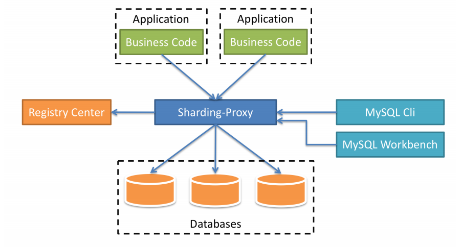

Sharding-Proxy的优势在于对异构语言的支持，以及为DBA提供可操作入口。

**Sharding-Proxy使用过程：**

- 下载Sharding-Proxy的最新发行版；

- 解压缩后修改conf/server.yaml和以config-前缀开头的文件，进行分片规则、读写分离规则配置

  编辑%SHARDING_PROXY_HOME%\conf\config-xxx.yaml

  编辑%SHARDING_PROXY_HOME%\conf\server.yaml

- 引入依赖jar

  如果后端连接MySQL数据库，需要下载MySQL驱动， 解压缩后将mysql-connector-java-5.1.48.jar拷贝到${sharding-proxy}\lib目录。

  如果后端连接PostgreSQL数据库，不需要引入额外依赖。

- Linux操作系统请运行bin/start.sh，Windows操作系统请运行bin/start.bat启动Sharding-Proxy。

  使用默认配置启动：${sharding-proxy}\bin\start.sh

  配置端口启动：${sharding-proxy}\bin\start.sh ${port}

- 使用客户端工具连接。如: mysql -h 127.0.0.1 -P 3307 -u root -p root

若想使用Sharding-Proxy的数据库治理功能，则需要使用注册中心实现实例熔断和从库禁用功能。Sharding-Proxy默认提供了Zookeeper的注册中心解决方案。只需按照配置规则进行注册中心的配置，即可使用。

**注意事项**

- Sharding-Proxy 默认不支持hint，如需支持，请在conf/server.yaml中，将props的属性proxy.hint.enabled设置为true。在Sharding-Proxy中，HintShardingAlgorithm的泛型只能是String类型。

- Sharding-Proxy默认使用3307端口，可以通过启动脚本追加参数作为启动端口号。如:bin/start.sh 3308

- Sharding-Proxy使用conf/server.yaml配置注册中心、认证信息以及公用属性。

- Sharding-Proxy支持多逻辑数据源，每个以"confifig-"做前缀命名yaml配置文件，即为一个逻辑数据源。

#### 1.6.1、具体应用

- 下载安装Sharding-Proxy，当前版本apache-shardingsphere-4.1.0-sharding-proxy-bin.tar.gz

- 解压apache-shardingsphere-4.1.0-sharding-proxy-bin.tar.gz

  ```shell
  tar -zxvf apache-shardingsphere-4.1.0-sharding-proxy-bin.tar.gz
  ```

- 进入安装目录的conf目录下，修改配置文件server.yml

  ```shell
  cd tar -zxvf apache-shardingsphere-4.1.0-sharding-proxy-bin.tar.gz
  ```

  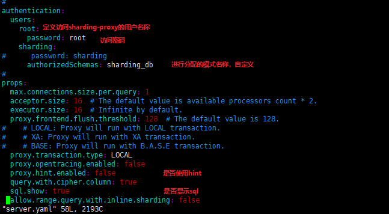

- 修改配置文件config-sharding.yaml

  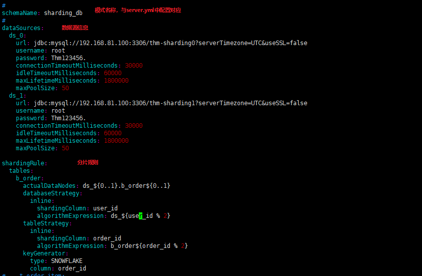

- 在lib目录中添加mysql连接jar包

  下载地址：https://repo1.maven.org/maven2/mysql/mysql-connector-java/

  将下载好的jar包放入lib目录中。

  注意：下载版本一定要和数据库版本一致（查看数据库版本：select @@version；）

- 启动sharding-proxy，在bin目录中

  ```
  ./start.sh
  ```

  注意：启动过程中出现jvm相关错误，记得修改启动脚本中的jvm参数或者直接不使用

-  java应用中

  - 创建项目

  - 添加实体类和 repository

  - 添加配置文件，数据源配置

    ```yaml
    spring:
      datasource:
       #连接sharding-proxy的代理连接，注意连接驱动的版本和数据库版本保持一致
        url: jdbc:mysql://192.168.81.103:3307/sharding_db 
        driver-class-name: com.mysql.cj.jdbc.Driver
        username: root
        password: root 
    ```

  - 测试

    ```java
    import com.thm.Bootstrap;
    import com.thm.entity.BOrder;
    import com.thm.repository.BOrderRepository;
    import org.junit.Test;
    import org.junit.runner.RunWith;
    import org.springframework.boot.test.context.SpringBootTest;
    import org.springframework.test.context.junit4.SpringJUnit4ClassRunner;
    
    import javax.annotation.Resource;
    import java.util.List;
    import java.util.Random;
    @RunWith(SpringJUnit4ClassRunner.class)
    @SpringBootTest(classes = Bootstrap.class)
    public class TestShardingDatabase {
    
        @Resource
        private BOrderRepository orderRepository;
    
    
        @Test
        public void testAdd4(){
            Random random = new Random();
            BOrder order;
            for (int i = 1; i <= 100; i++){
                order = new BOrder();
                order.setUserId(Math.abs(random.nextLong()));
                order.setOrderName("order" + i);
                orderRepository.save(order);
            }
        }
    
        @Test
        public void testAdd5(){
            final List<BOrder> all = orderRepository.findAll();
            all.forEach(bOrder -> System.out.println(bOrder.getOrderId() + " " + bOrder.getUserId() + " " + bOrder.getOrderName()));
        }
    }
    ```

## 2、Mycat实战

### 2.1、Mycat 简介

Mycat 是一个实现了 MySQL 协议的 Server，前端用户可以把它看作是一个数据库代理，用 MySQL 客户端工具和命令行访问，而其后端可以用 MySQL 原生协议或JDBC 协议与多个 MySQL 服务器通信，其核心功能是分库分表和读写分离，即将一个大表水平分割为 N 个小表，存储在后端 MySQL 服务器里或者其他数据库里。

- 对于 DBA 来说，可以这么理解 Mycat

  Mycat 就是 MySQL Server，但是Mycat 本身并不存储数据，数据是在后端的 MySQL 上存储的，因此数据可靠性以及事务等都是 MySQL 保证的。简单的说，Mycat 就是 MySQL 最佳伴侣。

- 对于软件工程师来说，可以这么理解 Mycat

  Mycat 就是一个近似等于 MySQL 的数据库服务器，你可以用连接 MySQL 的方式去连接Mycat（除了端 口不同，默认的 Mycat 端口是 8066 而非 MySQL 的 3306，因此需要在连接字符串上增加端口信息），大多数 情况下，可以用你熟悉的对象映射框架使用 Mycat，但建议对于分片表，尽量使用基础的 SQL 语句，因为这样能 达到最佳性能，特别是几千万甚至几百亿条记录的情况下。

- 对于架构师来说，可以这么理解 Mycat

  Mycat 是一个强大的数据库中间件，不仅仅可以用作读写分离、以及分表分库、容灾备份，而且可以用于多用户应用开发、云平台基础设施、让你的架构具很强的适应性和灵活性，借助于即将发布的 Mycat 智能优化模块，系统的数据访问瓶颈和热点一目了然，根据这些统计分析数据，你可以自动或手工调整后端存储，将不同的表映射到不同存储引擎上，而整个应用的代码一行也不用改变。


### 2.2、Mycat 核心概念

- **逻辑库**

  对数据进行分片处理之后，从原有的一个库，被切分为多个分片数据库，所有的分片数据库集群构成了整个完整的数据库存储。Mycat在操作时，使用逻辑库来代表这个完整的数据库集群，便于对整个集群操作。

- **逻辑表**

  既然有逻辑库，那么就会有逻辑表，分布式数据库中，对应用来说，读写数据的表就是逻辑表。

- **分片表**

  分片表，是指那些原有的很大数据的表，需要切分到多个数据库的表，这样，每个分片都有一部分数据，所有分片构成了完整的数据。例如在 mycat 配置中的 t_node 就属于分片表，数据按照规则被分到 dn1,dn2 两个分片节点上。

  ```xml
<table name="t_node" primaryKey="vid" autoIncrement="true" dataNode="dn1,dn2" rule="rule1" />
  ```
  
- **非分片表**

  一个数据库中并不是所有的表都很大，某些表是可以不用进行切分的，非分片是相对分片表来说的，就是那些不需要进行数据切分的表。如下配置中t_node，只存在于分片节点dn1上。

  ```xml
<table name="t_node" primaryKey="vid" autoIncrement="true" dataNode="dn1" />
  ```
  
- **ER表**

  Mycat提出了基于 E-R 关系的数据分片策略，子表的记录与所关联的父表记录存放在同一个数据分片上，即子表依赖于父表，通过表分组(Table Group)保证数据 join 不会跨库操作。表分组(Table Group)是解决跨分片数据 join 的一种很好的思路，也是数据切分规划的重要一条规则。

- **全局表**

  一个真实的业务系统中，往往存在大量的类似字典表的表，这些表基本上很少变动，字典表具有以下几个特性:

  - 变动不频繁;
  - 数据量总体变化不大;
  - 数据规模不大，很少有超过数十万条记录。

  对于这类的表，在分片的情况下，当业务表因为规模而进行分片以后，业务表与这些附属的字典表之间的关联，就成了比较棘手的问题，所以 Mycat 中通过数据冗余来解决这类表的 join，即所有的分片都有一份数据的拷贝，所有将字典表或者符合字典表特性的一些表定义为全局表。数据冗余是解决跨分片数据 join 的一种很好的思路，也是数据切分规划的另外一条重要规则。

- **分片节点**

  数据切分后，一个大表被分到不同的分片数据库上面，每个表分片所在的数据库就是分片节点dataNode。

- **节点主机**

  数据切分后，每个分片节点不一定都会独占一台机器，同一机器上面可以有多个分片数据库， 这样一个或多个分片节点所在的机器就是节点主机，为了规避单节点主机并发数限制， 尽量将读写压力高的分片节点均衡的放在不同的节点主机dataHost。

- **分片规则**

  前面讲了数据切分，一个大表被分成若干个分片表，就需要一定的规则rule，这样按照某种业务规则把数据分到 某个分片的规则就是分片规则，数据切分选择合适的分片规则非常重要，将极大的避免后续数据处理的难度。


### 2.3、server.xml配置

server.xml几乎保存了所有 mycat 需要的系统配置信息。

#### 2.3.1、user标签

这个标签主要用于定义登录 mycat 的用户和权限。例如下面的例子中，我们定义了一个用户，用户名为 user、密码也为 user，可访问的 schema为lg_edu_order。

```xml
<user name="user"> 
    <property name="password">user</property> 
    <!--逻辑库名-->
    <property name="schemas">lg_edu_order</property> 
    <property name="readOnly">true</property> 
    <property name="defaultSchema">lg_edu_order</property> 
</user>
```

#### 2.3.2、firewall标签

```xml
<firewall> 
    <!-- ip白名单 用户对应的可以访问的 ip 地址 --> 
    <whitehost> 
        <host host="127.0.0.*" user="root"/> 
        <host host="127.0.*" user="root"/>
        <host host="127.*" user="root"/> 
        <host host="1*7.*" user="root"/> 
    </whitehost>
    <!-- 黑名单允许的权限 后面为默认,false不能访问  true可以访问 --> 
    <blacklist check="true"> 
        <property name="selelctAllow">false</property> 
        <property name="selelctIntoAllow">false</property> 
        <property name="updateAllow">false</property> 
        <property name="insertAllow">false</property> 
        <property name="deletetAllow">false</property> 
        <property name="dropAllow">false</property> 
    </blacklist> 
</firewall>
```

#### 2.3.3、全局序列号

在实现分库分表的情况下，数据库自增主键已无法保证自增主键的全局唯一。为此，Mycat 提供了全局sequence，并且提供了包含本地配置和数据库配置等多种实现方式。

```xml
<system> 
    <property name="sequnceHandlerType">0</property> 
</system>
```

- 0-表示使用本地文件方式；

- 1-表示使用数据库方式生成；

- 2-表示使用本地时间戳方式；

- 3-表示基于ZK与本地配置的分布式ID生成器；

- 4-表示使用zookeeper递增方式生成

##### 2.3.3.1、本地文件

此方式 Mycat 将sequence配置到文件中，当使用到 sequence 中的配置后，Mycat 会更下 classpath中的 sequence_conf.properties 文件中 sequence 当前值。

```properties
#default global sequence 
GLOBAL.HISIDS= 
GLOBAL.MINID=10001 
GLOBAL.MAXID=20000 
GLOBAL.CURID=10000 
# self define sequence 某个表
COMPANY.HISIDS= 
COMPANY.MINID=1001 
COMPANY.MAXID=2000 
COMPANY.CURID=1000 

ORDER.HISIDS= 
ORDER.MINID=1001 
ORDER.MAXID=2000 
ORDER.CURID=1000
```

##### 2.3.3.2、数据库方式

在数据库中建立一张表，存放 sequence 名称（name），sequence 当前值（current_value），步长（increment） 等信息。

```mysql
CREATE TABLE MYCAT_SEQUENCE ( 
    name VARCHAR(64) NOT NULL, 
    current_value BIGINT(20) NOT NULL, 
    increment INT NOT NULL DEFAULT 1, 
    PRIMARY KEY (name) 
) ENGINE = InnoDB;
```

##### 2.3.3.3、本地时间戳方式

ID为64 位二进制 ，42（毫秒）+5（机器 ID）+5（业务编码）+12（重复累加）换算成十进制为 18 位数的 long 类型，每毫秒可以并发 12 位二进制的累加。在 Mycat 下配置sequence_time_conf.properties文件

```properties
WORKID=0-31 任意整数 
DATAACENTERID=0-31 任意整数
```

每个Mycat 配置的 WORKID、DATAACENTERID 不同，组成唯一标识，总共支持32*32=1024 种组合。

##### 2.3.3.4、分布式 ZK ID 生成器

Zk 的连接信息统一在 myid.properties 的 zkURL 属性中配置。基于 ZK 与本地配置的分布式 ID 生成器，InstanceID可以通过ZK自动获取，也可以通过配置文件配置。在sequence_distributed_conf.properties，只要配置INSTANCEID=ZK就表示从 ZK 上获取 InstanceID。

ID 最大为63位二进制，可以承受单机房单机器单线程 1000*(2^6)=640000 的并发。结构如下：

- current time millis（微秒时间戳 38 位，可以使用 17 年）
- clusterId（机房或者 ZKid，通过配置文件配置，5 位）
- instanceId（实例 ID，可以通过 ZK 或者配置文件获取，5 位）
- threadId（线程 ID，9 位）
- increment（自增，6 位）

##### 2.3.3.5、ZK 递增方式

Zk 的连接信息统一在 myid.properties 的 zkURL 属性中配置。需要配置sequence_conf.properties文件。

- TABLE.MINID 某线程当前区间内最小值
- TABLE.MAXID 某线程当前区间内最大值
- TABLE.CURID 某线程当前区间内当前值  

### 2.4、schema.xml配置

schema.xml 作为 Mycat 中重要的配置文件之一，管理着 Mycat 的逻辑库、表、分片节点、主机等信息。

#### 2.4.1、schema标签

schema 标签用于定义 Mycat 实例中的逻辑库，Mycat 可以有多个逻辑库，每个逻辑库都有自己的相关配置。可以使用 schema 标签来划分这些不同的逻辑库。

```xml
<!-- 逻辑库 --> 
<schema name="lg_edu_order" checkSQLschema="true" sqlMaxLimit="100" dataNode="dn1"></schema>
```

| 属性名         | 值         | 数量限制 | 说明                      |
| -------------- | ---------- | -------- | ------------------------- |
| dataNode       | 任意String | （0..1） | 分片节点                  |
| sqlMaxLimit    | Integer    | 1        | 查询返回的记录数限制limit |
| checkSQLschema | Boolean    | 1        | 是否去表库名              |

#### 2.4.2、table标签

table标签定义了 Mycat 中的逻辑表，所有需要拆分的表都需要在这个标签中定义

```xml
<table name="b_order" dataNode="dn1,dn2" rule="b_order_rule" primaryKey="ID" autoIncrement="true"/>
```

| 属性          | 值      | 数量限制 | 说明                         |
| ------------- | ------- | -------- | ---------------------------- |
| name          | String  | (1)      | 逻辑表名                     |
| dataNode      | String  | (0..*)   | 分片节点                     |
| rule          | String  | (0..1)   | 分片规则                     |
| ruleRequired  | Boolean | (0..1)   | 是否强制绑定分片规则         |
| primaryKey    | String  | (1)      | 主键                         |
| type          | String  | (0..1)   | 逻辑表类型，全局表、普通表   |
| autoIncrement | Boolean | (0..1)   | 自增长主键                   |
| subTables     | String  | (1)      | 分表                         |
| needAddLimit  | Boolean | (0..1)   | 是否为查询SQL自动加limit限制 |

#### 2.4.3、dataNode标签

dataNode标签定义了 MyCat 中的分片节点，也就是我们通常说所的数据分片。

```xml
<!-- 数据节点 -->
<dataNode name="dn1" dataHost="lg_edu_order_1" database="lg_edu_order_1" />
```

name： 定义数据节点的名字，这个名字需要是唯一的，我们需要在 table 标签上应用这个名字，来建立表与分片对应的关系。

dataHost : 用于定义该分片属于哪个分片主机，属性值是引用 dataHost 标签上定义的 name 属性。

database： 用于定义该分片节点属于哪个具体的库。

#### 2.4.4、dataHost标签

dataHost标签在 Mycat 逻辑库中也是作为最底层的标签存在，直接定义了具体的数据库实例、读写分离配置和心跳语句

```xml
<dataHost name="lg_edu_order_1" 
          maxCon="100" minCon="10" 
          balance="0" writeType="0" 
          dbType="mysql" 
          dbDriver="native" 
          switchType="1" 
          slaveThreshold="100"> 
</dataHost>
```

| 属性       | 值      | 数量限制 | 说明               |
| ---------- | ------- | -------- | ------------------ |
| name       | String  | (1)      | 节点主机名         |
| maxCon     | Integer | (1)      | 最大连接数         |
| minCon     | Integer | (1)      | 最小连接数         |
| balance    | Integer | (1)      | 读操作负载均衡类型 |
| writeType  | Integer | (1)      | 写操作负载均衡类型 |
| dbType     | String  | (1)      | 数据库类型         |
| dbDriver   | String  | (1)      | 数据库驱动         |
| switchType | String  | (1)      | 主从切换类型       |

#### 2.4.5、 heartbeat标签

heartbeat标签内指明用于和后端数据库进行心跳检查的语句。例如：MySQL 可以使用 select user()、Oracle 可以 使用 select 1 from dual 等

```xml
<dataHost> 
    <heartbeat>select user()</heartbeat> 
</dataHost>
```

#### 2.4.6、writeHost和readHost标签

writeHost和readHost标签都指定后端数据库的相关配置给 mycat，用于实例化后端连接池。唯一不同的是，writeHost 指定写实例、readHost 指定读实例。在一个 dataHost 内可以定义多个 writeHost 和 readHost。但是，如果 writeHost 指定的后端数据库宕机， 那么这个 writeHost 绑定的所有 readHost都将不可用。另一方面，由于这个 writeHost 宕机系统会自动的检测 到，并切换到备用的 writeHost上去。

```xml
<dataHost name="lg_edu_order_2" 
          maxCon="100" 
          minCon="10" 
          balance="0" 
          writeType="0" 
          dbType="mysql" 
          dbDriver="native" 
          switchType="1" 
          slaveThreshold="100"> 
    <heartbeat>select user()</heartbeat> 
    <writeHost host="M1" url="192.168.95.133:3306" user="root" password="1234"> </writeHost>
</dataHost>
```

| 属性         | 值     | 数量限制 | 说明                  |
| ------------ | ------ | -------- | --------------------- |
| host         | String | (1)      | 主机名                |
| url          | String | (1)      | 连接字符串            |
| password     | String | (1)      | 密码                  |
| user         | String | (1)      | 用户名                |
| weight       | String | (1)      | 权重                  |
| usingDecrypt | String | (1)      | 是否对密码加密，默认0 |

### 2.5、rule.xml配置

rule.xml用于定义Mycat的分片规则。

#### 2.5.1、tableRule标签

```xml
<tableRule name="c_order_rule"> 
    <rule>
        <columns>user_id</columns> 
        <algorithm>partitionByOrderFunc</algorithm> 
    </rule>
</tableRule>
```

name：指定唯一的名字，用于标识不同的表规则。

columns：指定要拆分的列名字。

algorithm：使用 function 标签中的 name 属性，连接表规则和具体路由算法。

#### 2.5.2、function标签

```xml
<function name="partitionByOrderFunc" class="io.mycat.route.function.PartitionByMod"> 
    <property name="count">2</property> 
</function>
```

name：指定算法的名字。

class：制定路由算法具体的类名字。

property： 为具体算法需要用到的一些属性。

### 2.6、Mycat实战

#### 2.6.1、Mycat安装

> 提示：需要先安装jdk

- 下载Mycat-server工具包

- 解压Mycat工具包

  ```shell
  tar -zxvf Mycat-server-1.6.7.5-release-20200410174409-linux.tar.gz 
  ```

- 进入mycat/bin，启动Mycat

  ```apl
  启动命令：./mycat start 
  停止命令：./mycat stop 
  重启命令：./mycat restart 
  查看状态：./mycat status
  ```

- 访问Mycat

  ```shell
  mysql -uroot -proot -h127.0.0.1 -P8066
  ```

#### 2.6.2、分库分表

在rule.xml配置Mycat分库分表。

```xml
<mycat:rule xmlns:mycat="http://io.mycat/"> 
    <tableRule name="b_order_rule"> 
        <rule>
            <columns>company_id</columns> 
            <algorithm>partitionByOrderFunc</algorithm> 
        </rule> 
    </tableRule> 
    <!-- 路由函数定义 --> 
    <function name="partitionByOrderFunc" class="io.mycat.route.function.PartitionByMod"> 
        <property name="count">2</property> 
    </function> 
</mycat:rule>
```

**Mycat常用分片规则如下：**

- 时间类：按天分片、自然月分片、单月小时分片

- 哈希类：Hash固定分片、日期范围Hash分片、截取数字Hash求模范围分片、截取数字Hash分片、一致性Hash分片

- 取模类：取模分片、取模范围分片、范围求模分片

- 其他类：枚举分片、范围约定分片、应用指定分片、冷热数据分片

**Mycat常用分片配置示例：**

- 自动分片

  ```xml
  <tableRule name="auto-sharding-long"> 
      <rule> 
          <columns>id</columns> 
          <algorithm>rang-long</algorithm> 
      </rule>
  </tableRule> 
  <function name="rang-long" class="io.mycat.route.function.AutoPartitionByLong"> 
      <property name="mapFile">autopartition-long.txt</property>
  </function>
  ```

  autopartition-long.txt文件内容如下：

  ```apl
  # range start-end ,data node index 
  # K=1000,M=10000. 
  0-500M=0 
  500M-1000M=1 
  1000M-1500M=2
  ```

- 枚举分片

  把数据分类存储。

  ```xml
  <tableRule name="sharding-by-intfile"> 
      <rule> 
          <columns>sharding_id</columns>
          <algorithm>hash-int</algorithm>
      </rule>
  </tableRule>
  <function name="hash-int" class="io.mycat.route.function.PartitionByFileMap">
      <property name="mapFile">partition-hash-int.txt</property>
      <!-- 找不到分片时设置容错规则，把数据插入到默认分片0里面 --> 
      <property name="defaultNode">0</property> 
  </function>
  ```

  partition-hash-int.txt文件内容如下：

  ```apl
  10000=0 
  10010=1
  ```

- 取模分片

  根据分片字段值 % 分片数 。 

  ```xml
  <tableRule name="mod-long"> 
      <rule>
          <columns>id</columns> 
          <algorithm>mod-long</algorithm> 
      </rule>
  </tableRule> 
  <function name="mod-long" class="io.mycat.route.function.PartitionByMod"> 
      <!--分片数 --> 
      <property name="count">3</property> 
  </function>
  ```

- 冷热数据分片

  根据日期查询日志数据冷热数据分布 ，最近 n 个月的到实时交易库查询，超过 n 个月的按照 m 天分片。

  ```xml
  <tableRule name="sharding-by-date"> 
      <rule> 
          <columns>create_time</columns> 
          <algorithm>sharding-by-hotdate</algorithm> 
      </rule> 
  </tableRule>
  <function name="sharding-by-hotdate" class="org.opencloudb.route.function.PartitionByHotDate"> 
      <!-- 定义日期格式 --> 
      <property name="dateFormat">yyyy-MM-dd</property> 
      <!-- 热库存储多少天数据 --> 
      <property name="sLastDay">30</property> 
      <!-- 超过热库期限的数据按照多少天来分片 --> 
      <property name="sPartionDay">30</property> 
  </function>
  ```

- 一致性哈希分片

  ```xml
  <tableRule name="sharding-by-murmur"> 
      <rule>
          <columns>id</columns> 
          <algorithm>murmur</algorithm> 
      </rule> 
  </tableRule> 
  <function name="murmur" class="io.mycat.route.function.PartitionByMurmurHash"> 
      <property name="seed">0</property><!-- 默认是0 --> 
      <property name="count">2</property><!-- 要分片的数据库节点数量，必须指定，否 则没法分片 --> 
      <property name="virtualBucketTimes">160</property><!-- 一个实际的数据库节点 被映射为这么多虚拟节点，默认是160倍，也就是虚拟节点数是物理节点数的160倍 --> 
      <!-- <property name="weightMapFile">weightMapFile</property> 节点的权重， 没有指定权重的节点默认是1。以properties文件的格式填写，以从0开始到count-1的整数值也就 是节点索引为key，以节点权重值为值。所有权重值必须是正整数，否则以1代替 --> 
      <!-- <property name="bucketMapPath">/etc/mycat/bucketMapPath</property> 用于测试时观察各物理节点与虚拟节点的分布情况，如果指定了这个属性，会把虚拟节点的 murmur hash值与物理节点的映射按行输出到这个文件，没有默认值，如果不指定，就不会输出任何 东西 --> 
  </function>
  ```

- 具体实战

  - 安装mycat

  - 配置server.xml,注意配置用户需要在mysql实例中存在，mysql8+存在问题，登录选择不用密码

    ```xml
    <property name="nonePasswordLogin">1</property>
    .....
     <user name="root" defaultAccount="true">
         <property name="password">Thm123456.</property>
         <property name="schemas">thm</property>
         <property name="defaultSchema">thm</property>
         <!--No MyCAT Database selected 错误前会尝试使用该schema作为schema，不设置则为null,报错 -->
    </user>
    <user name="thm">
        <property name="password">Thm123456.</property>
        <property name="schemas">thm</property>
        <property name="readOnly">true</property>
        <property name="defaultSchema">thm</property>
    </user>
    ```

  - 配置schema.xml，主要配置数据节点、数据分片信息、分片规则等

    ```xml
    <mycat:schema xmlns:mycat="http://io.mycat/">
    
            <schema name="thm" checkSQLschema="true" sqlMaxLimit="100" randomDataNode="dn1">
                    <!-- auto sharding by id (long) -->
                    <!--splitTableNames 启用<table name 属性使用逗号分割配置多个表,即多个表使用这个配置-->
    <!--fetchStoreNodeByJdbc 启用ER表使用JDBC方式获取DataNode-->
                    <table name="position" 
                           primaryKey="id" 
                           dataNode="dn1,dn2" 
                           rule="mod-long"   <!--对应rule.xml中的分片规则-->
                           autoIncrement="true" 
                           fetchStoreNodeByJdbc="true">
                            <!--<childTable name="customer_addr" primaryKey="id" joinKey="customer_id" parentKey="id"> </childTable>-->
                    </table>
               
            </schema>
         
            <dataNode name="dn1" dataHost="localhost1" database="thm-sharding0" />
            <dataNode name="dn2" dataHost="localhost1" database="thm-sharding1" />
            <!--<dataNode name="dn3" dataHost="localhost1" database="db3" />-->
            <!--<dataNode name="dn4" dataHost="sequoiadb1" database="SAMPLE" />
             <dataNode name="jdbc_dn1" dataHost="jdbchost" database="db1" />
            <dataNode       name="jdbc_dn2" dataHost="jdbchost" database="db2" />
            <dataNode name="jdbc_dn3"       dataHost="jdbchost" database="db3" /> -->
            <dataHost name="localhost1" maxCon="1000" minCon="10" balance="0"
                              writeType="0" dbType="mysql" dbDriver="jdbc" switchType="1"  slaveThreshold="100">
                    <heartbeat>select user()</heartbeat>
                    <!-- can have multi write hosts -->
                    <writeHost host="hostM1" url="jdbc:mysql://192.168.81.100:3306" user="root" password="Thm123456.">
                    </writeHost>
                    <!-- <writeHost host="hostM2" url="localhost:3316" user="root" password="123456"/> -->
            </dataHost>
    </mycat:schema>
    ```

  - 配置rule.xml，配置分片规则

  - 配置全局ID，当前指定是本地文件形式

  - 配置全局表，在schema.xml中配置


#### 2.6.3、读写分离

在schema.xml文件中配置Mycat读写分离。使用前需要搭建MySQL主从架构，并实现主从复制，Mycat不负数据同步问题。

```xml
<dataHost name="localhost1" 
          maxCon="1000" 
          minCon="10" 
          balance="1" 
          writeType="0" 
          dbType="mysql" 
          dbDriver="native"> 
    <heartbeat>select user()</heartbeat> 
    <!-- can have multi write hosts --> 
    <writeHost host="M1" url="localhost:3306" user="root" password="123456"> 
        <readHost host="S1" url="localhost:3307" user="root" password="123456" weight="1" /> 
    </writeHost> 
</dataHost>
```

balance参数：

- 0 ：所有读操作都发送到当前可用的writeHost
- 1 ：所有读操作都随机发送到readHost和stand by writeHost

- 2 ：所有读操作都随机发送到writeHost和readHost
- 3 ：所有读操作都随机发送到writeHost对应的readHost上，但是writeHost不负担读压力

writeType参数：

- 0 ：所有写操作都发送到可用的writeHost
- 1 ：所有写操作都随机发送到readHost
- 2 ：所有写操作都随机发送到writeHost，readHost 

或者

```xml
<dataHost name="localhost1" 
          maxCon="1000" 
          minCon="10" 
          balance="1" 
          writeType="0" 
          dbType="mysql" 
          dbDriver="native"> 
    <heartbeat>select user()</heartbeat> 
    <!-- can have multi write hosts --> 
    <writeHost host="M1" url="localhost:3306" user="root" password="123456"> </writeHost> 
    <writeHost host="S1" url="localhost:3307" user="root" password="123456"> </writeHost> 
</dataHost>
```

以上两种取模第一种当写挂了读不可用，第二种可以继续使用，事务内部的一切操作都会走写节点，所以读操作不要加事务，如果读延时较大，使用根据主从延时切换的读写分离，或者强制走写节点。

#### 2.6.4、强制路由

一个查询 SQL 语句以 **/* !mycat * /** 注解来确定其是走读节点还是写节点。

- /*! */   最保险

- /*# */

- /** */

```mysql
强制走从: 
/*!mycat:db_type=slave*/ select * from travelrecord //有效 
/*#mycat:db_type=slave*/ select * from travelrecord 
强制走写: 
/*!mycat:db_type=master*/ select * from travelrecord //有效 
/*#mycat:db_type=slave*/ select * from travelrecord
```

1.6 以后Mycat除了支持db_type注解以外，还有其他注解，如下：

```apl
/*!mycat:sql=sql */ 指定真正执行的SQL 
/*!mycat:schema=schema1 */ 指定走那个schema 
/*!mycat:datanode=dn1 */ 指定sql要运行的节点 
/*!mycat:catlet=io.mycat.catlets.ShareJoin */ 通过catlet支持跨分片复杂SQL实现以及存 储过程支持等
```

#### 2.6.5、主从延时切换

switchType参数：

- -1： 表示不自动切换

- 1 ：表示自动切换

- 2 ：基于MySQL主从同步状态决定是否切换
- 3 ：基于MySQL cluster集群切换机制

1.4 开始支持 MySQL 主从复制状态绑定的读写分离机制，让读更加安全可靠，配置如下:

MyCAT 心跳检查语句配置为 show slave status ，dataHost 上定义两个新属性: switchType="2" 与slaveThreshold="100"，此时意味着开启 MySQL 主从复制状态绑定的读写分离与切换机制，Mycat 心跳机制通过检测 show slave status 中的 "Seconds_Behind_Master", "Slave_IO_Running","Slave_SQL_Running" 三个字段来确定当前主从同步的状态以及 Seconds_Behind_Master 主从复制时延， 当 Seconds_Behind_Master > slaveThreshold 时，读写分离筛选器会过滤掉此 Slave 机器，防止读到很久之 前的旧数据，而当主节点宕机后，切换逻辑会检查 Slave 上的 Seconds_Behind_Master 是否为 0，为 0 时则 表示主从同步，可以安全切换，否则不会切换。

```xml
<dataHost name="localhost1" 
          maxCon="1000" 
          minCon="10" 
          balance="0" 
          writeType="0" 
          dbType="mysql" 
          dbDriver="native" 
          switchType="2" 
          slaveThreshold="100"> 
    <heartbeat>show slave status </heartbeat>
    <!-- can have multi write hosts --> 
    <writeHost host="M1" url="localhost:3306" user="root" password="123456"> </writeHost> 
    <writeHost host="S1" url="localhost:3316" user="root" password="123456"> </writeHost> 
</dataHost>
```

1.4.1 开始支持 MySQL 集群模式，让读更加安全可靠，配置如下: MyCAT 心跳检查语句配置为 showstatus like ‘wsrep%’ ，dataHost 上定义两个新属性: switchType="3"此时意味着开启 MySQL 集群复制状态状态绑定的读写分离与切换机制，Mycat 心跳机制通过检测集群复制时延时，如果延时过大或者集群出现节点问题不会负载改节点。

```xml
<dataHost name="localhost1" 
          maxCon="1000" 
          minCon="10" 
          balance="0" 
          writeType="0" 
          dbType="mysql" 
          dbDriver="native" 
          switchType="3" > 
    <heartbeat> show status like ‘wsrep%’</heartbeat> 
    <writeHost host="M1" url="localhost:3306" user="root"password="123456"> </writeHost> 
    <writeHost host="S1"url="localhost:3316"user="root"password="123456" > </writeHost> 
</dataHost>
```

### 2.7、 Mycat事务

#### 2.7.1、 Mycat 数据库事务

Mycat 目前没有出来跨分片的事务强一致性支持，单库内部可以保证事务的完整性，如果跨库事务，在执行的时候任何分片出错，可以保证所有分片回滚，但是一旦应用发起 commit 指令，无法保证所有分片都成功，考虑到某个分片挂的可能性不大所以称为弱 XA。

#### 2.7.2、XA 事务使用

Mycat 从 1.6.5 版本开始支持标准 XA 分布式事务，考虑到 MySQL 5.7 之前版本XA有bug，所以推荐最佳搭配 XA 功能使用 MySQL 5.7 版本。

Mycat 实现 XA 标准分布式事务，Mycat 作为XA 事务协调者角色，即使事务过程中 Mycat 宕机挂掉，由于 Mycat 会记录事务日志，所以 Mycat 恢复后会进行事务的恢复善后处理工作。考虑到分布式事务的性能开销比较大，所以只推荐在全局表的事务以及其他一些对一致性要 求比较高的场景。

使用示例:

XA 操作说明

- XA 事务需要设置手动提交

  ```apl
  set autocommit=0;
  ```

- 使用该命令开启 XA 事务

  ```apl
  set xa=on;
  ```

- 执行相应的 SQL 语句部分

  ```mysql
  insert into city(id,name,province) values(200,'chengdu','sichuan'); 
  update position set salary='300000' where id<5;
  ```

- 提交或回滚事务

  ```
  commit； 
  rollback;
  ```

#### 2.7.3、保证Repeatable Read

mycat 有一个特性，就是开事务之后，如果不运行 update/delete/select for update 等更新类语句SQL 的话，不会将当前连接与当前 session 绑定。如下图所示:

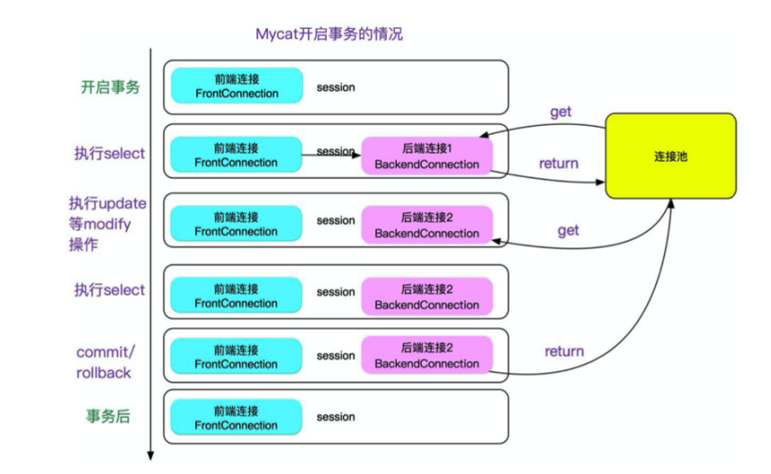

这样做的好处是可以保证连接可以最大限度的复用，提升性能。

但是,这就会导致两次 select 中如果有其它的在提交的话，会出现两次同样的 select 不一 致的现象,即不能 Repeatable Read，这会让人直连 MySQL 的人很困惑,可能会在依赖 Repeatable Read 的场景出现问题。所以做了一个开关,当 server.xml 的 system 配置了 **strictTxIsolation=true** 的时候，会关掉这个特性，以保证 repeatable read,加了开关 后如下图所示: 

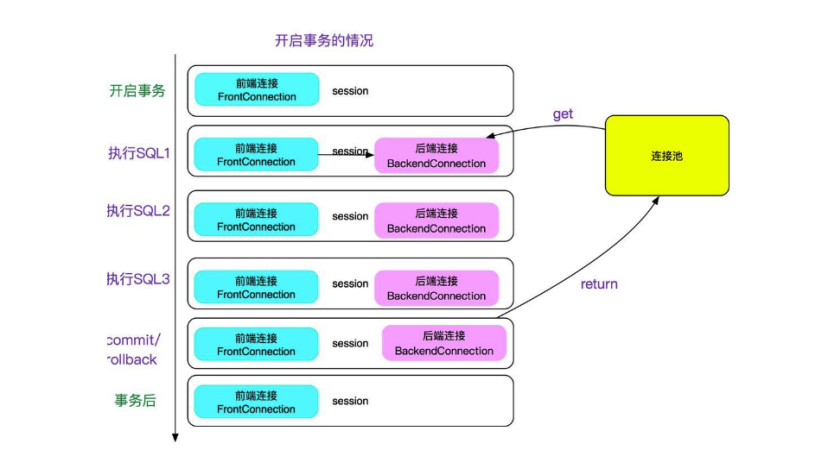

## 3、运维和第三方工具

### 3.1、工具介绍

#### 3.1.1、Yearning

##### 3.1.1.1、Yearning简介

Yearning 开源的MySQL SQL语句审核平台，提供数据库字典查询，查询审计，SQL审核等多种功能。

Yearning 1.x 版本需Inception提供SQL审核及回滚功能。

> Inception是集审核，执行，回滚于一体的自动化运维系统，它是根据MySQL代码修改过来的，工作模式和MySQL相同。Yearning是基于python实现的Web版人机交互界面。
>

Yearning 2.0 版本开始无需Inception，已自己实现了SQL审核及回滚功能。

Yearning1.0 python版本已不再进行官方维护。

Yearning2.0 golang版本为后续维护项目。

>如仍使用python版本Yearning须知: 
>
>- Yearning python版本不会闭源，仍可基于AGPL3.0许可进行二次开发。
>
>- 由于inception已闭源失去后续支持,python版本将失去对审核规则及审核逻辑的维护。(此问题即使Yearning项目也无法解决。go版本已实现相关审核逻辑，由Yearning自己维护,保证后续维护的可控性。)
>
> - 已知python版本含有多个提权漏洞(用户 -> 管理员) golang版本通过token内嵌角色信息的方式避免了此类问题。

**强烈建议使用Yearning2.0。**

##### 3.1.1.2、Yearning功能

- Yearning 工具包含的主要功能如下：

  - SQL查询
    - 查询导出

    - 查询自动补全

  - SQL审核
    - 流程化工单
    - SQL语句检测
    - SQL语句执行
    - SQL回滚
    - 历史审核记录
  - 推送
    - 站内信工单通知
    - E-mail工单推送
    - 钉钉webhook机器人工单推送
  - 其他
    - todoList
    - LDAP登陆
  - 用户权限及管理
    - 拼图式细粒度权限划分

- 功能界面

  - dashboard

    dashboard主要展示Yearning各项数据包括用户数/数据源数/工单数/查询数以及其他图表。个人信息栏内用户可以修改密码/邮箱/真实姓名，同时可以查看该用户权限以及申请权限。

    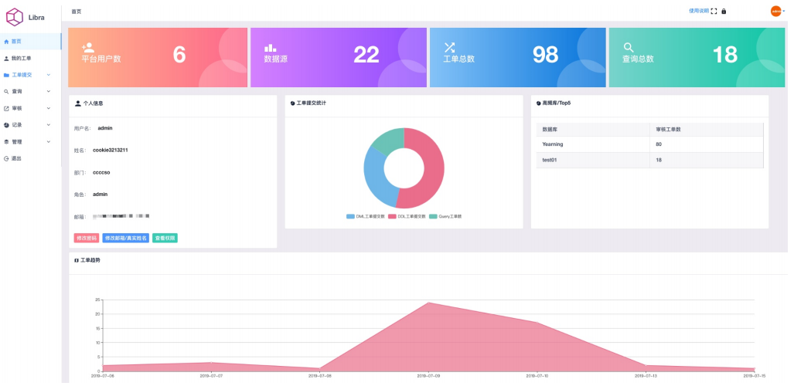

  - 我的工单

    展示用户提交的工单信息。对于执行失败/驳回的工单点击详细信息后可以重新修改sql并提交；对于执行成功的工单可以查看回滚语句并且快速提交SQL。

    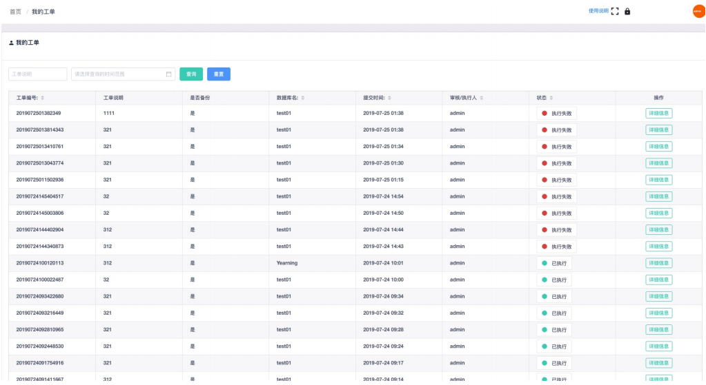

  - DDL审核

    DDL相关SQL提交审核，查看表结构/索引，SQL语法高亮/自动补全

    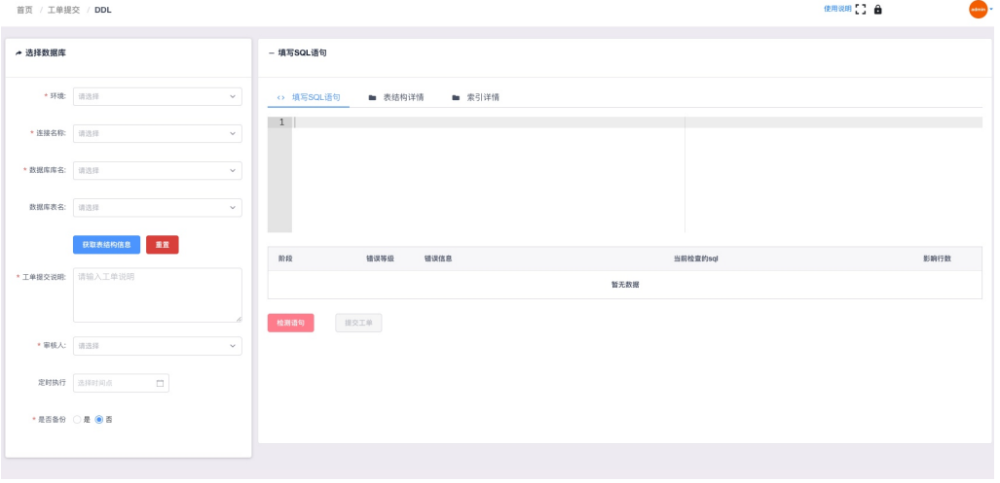

  - DML审核

    DML相关SQL提交审核，SQL语法高亮/自动补全。所有的SQL只有在检测后错误等级为0时提交按钮才会激活。

    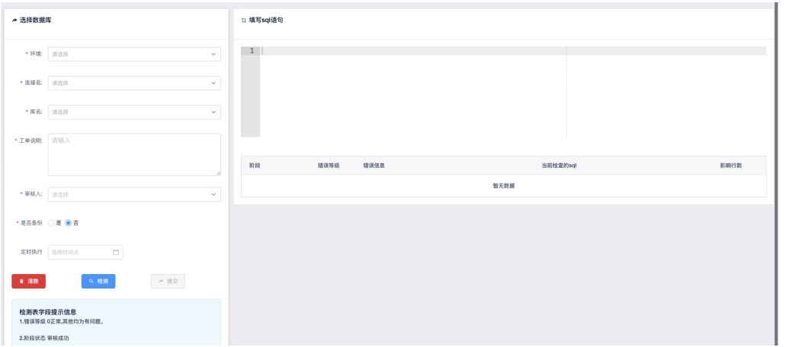

  - 查询审核

    查询/导出数据 SQL语法高亮/自动补全，快速DML语句提交。

    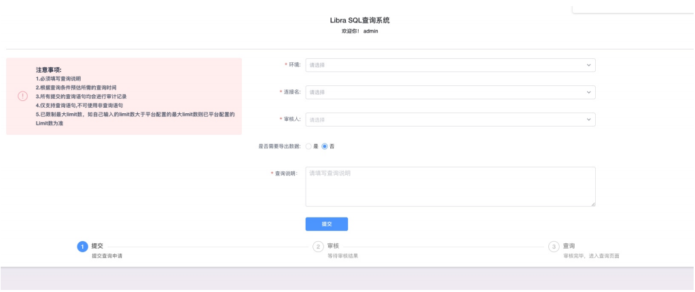

  - 工单审核

    DDL/DML管理员审核并执行。

    

  - 数据库管理

    添加/编辑/删除数据源。所有添加的数据源应在添加之前点击测试连接按钮进行连接性测试,保证连接性。

    数据源分为**查询数据源/非查询数据源**。查询数据源仅会出现在细粒度权限的查询数据源范围内。非查询数据源同理。

    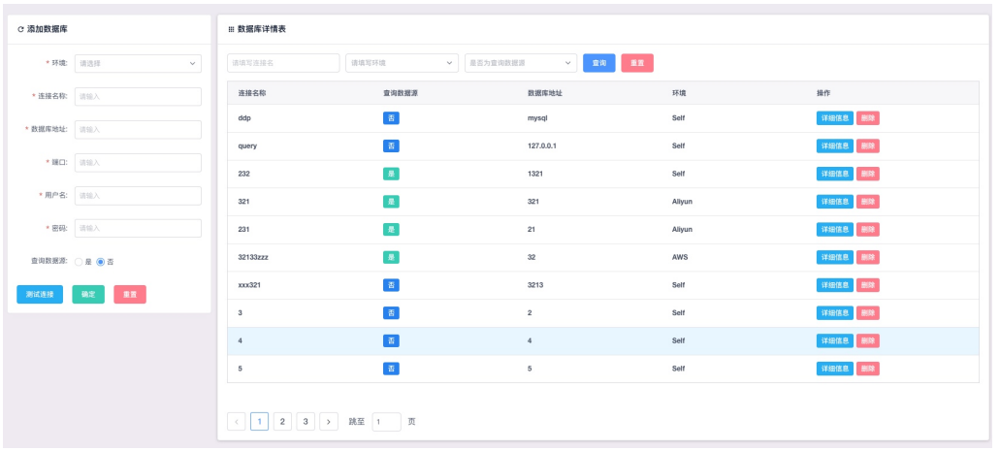

  - 用户权限管理

    用户权限修改。

    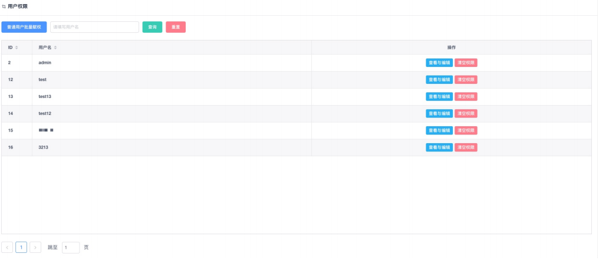

  - 审核规则管理

    设置SQL检测规则。数值型规则0值都为不受限制，保存后即时生效。

    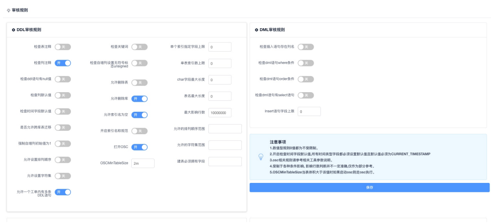

  >想了解更多Yearning工具安装和使用详情，可参考官网文档：https://guide.yearning.io/

#### 3.1.2、canal

##### 3.1.2.1、canal简介

canal 译意为水道/管道，主要用途是基于MySQL数据库增量日志解析，提供增量数据订阅和消费。

早期阿里巴巴因为杭州和美国双机房部署，存在跨机房同步的业务需求，实现方式主要是基于业务trigger 获取增量变更。从 2010 年开始，业务逐步尝试数据库日志解析获取增量变更进行同步，由此衍生出了大量的数据库增量订阅和消费业务。

基于日志增量订阅和消费的业务包括以下内容：

- 数据库镜像

- 数据库实时备份

- 索引构建和实时维护(拆分异构索引、倒排索引等)

- 业务 cache 刷新

- 带业务逻辑的 增量数据处理

当前的 canal 支持源端 MySQL 版本包括 5.1.x , 5.5.x , 5.6.x , 5.7.x , 8.0.x

##### 3.1.2.2、canal工作原理

MySQL主备复制原理


- MySQL master 将数据变更写入二进制日志( binary log, 其中记录叫做二进制日志事件binary logevents，可以通过 show binlog events 进行查看)

- MySQL slave 将 master 的 binary log events 拷贝到它的中继日志(relay log)

- MySQL slave 重放 relay log 中事件，将数据变更反映它自己的数据

canal的工作原理类似mysql主从同步原理：

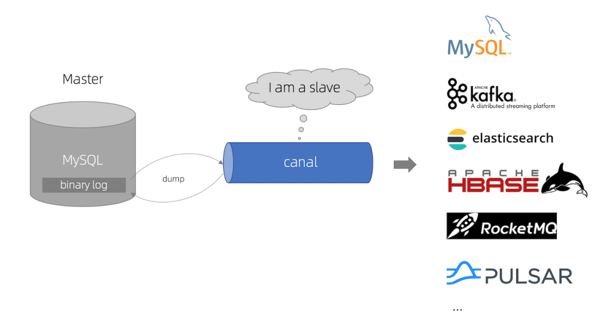

- canal模拟MySQL slave的交互协议，伪装自己为MySQL slave，向MySQL master发送dump协议
- MySQL master收到dump协议请求，开始推送binary log 给canal
- canal解析binary log对象（原始为byte流）

##### 3.1.2.3、canal应用场景

该技术在拉勾网职位搜索业务中得到了采用，场景：在企业HR发布、更新或删除职位时，我们需要及时更新职位索引，便于求职者能快速的搜索到。

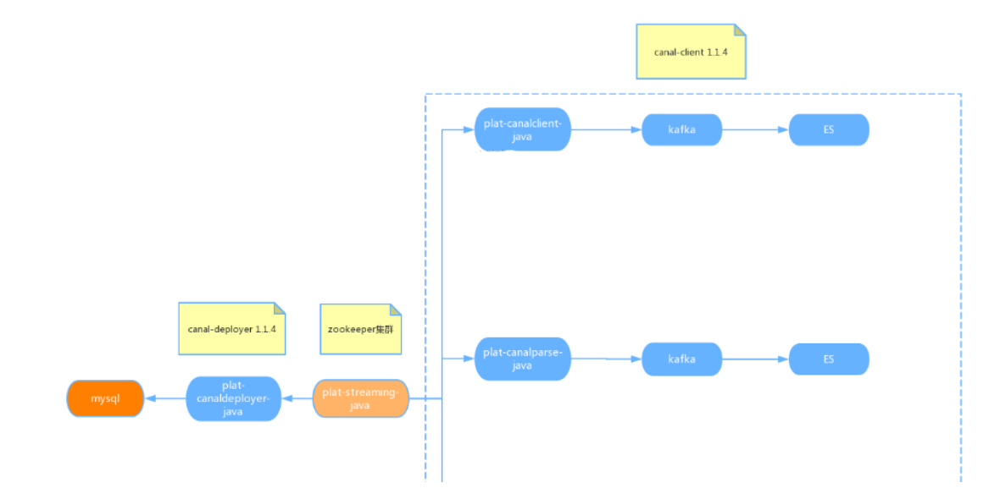

> 想了解更多cannal工具详情，可参考官网文档：https://github.com/alibaba/canal

#### 3.1.3、DataX

##### 3.1.3.1、DataX简介

DataX 是阿里巴巴集团内被广泛使用的离线数据同步工具/平台，实现包括 MySQL、Oracle、SqlServer、Postgre、HDFS、Hive、ADS、HBase、TableStore(OTS)、MaxCompute(ODPS)、DRDS等各种异构数据源之间高效的数据同步功能。

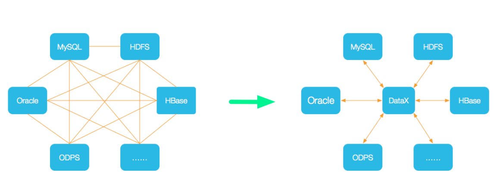

- **设计理念**

  为了解决异构数据源同步问题，DataX将复杂的网状的同步链路变成了星型数据链路，DataX作为中间传输载体负责连接各种数据源。当需要接入一个新的数据源的时候，只需要将此数据源对接到DataX，便能跟已有的数据源做到无缝数据同步。

- **当前使用现状**

  DataX在阿里巴巴集团内被广泛使用，承担了所有大数据的离线同步业务，并已持续稳定运行了多年。当年每天完成同步8w多道作业，每日传输数据量超过300TB。


##### 3.1.3.2、DataX框架设计

DataX本身作为离线数据同步框架，采用Framework + plugin架构构建。将数据源读取和写入抽象成为Reader/Writer插件，纳入到整个同步框架中。

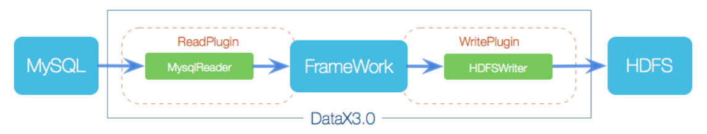

- Reader：Reader为数据采集模块，负责采集数据源的数据，将数据发送给Framework。 

- Writer： Writer为数据写入模块，负责不断向Framework取数据，并将数据写入到目的端。
- Framework：Framework用于连接reader和writer，作为两者的数据传输通道，并处理缓冲，流控，并发，数据转换等核心技术问题。

##### 3.1.3.3、 DataX插件体系

DataX Framework提供了简单的接口与插件交互，提供简单的插件接入机制，只需要任意加上一种插件，就能无缝对接其他数据源。经过几年积累，DataX目前已经有了比较全面的插件体系，主流的RDBMS数据库、NOSQL、大数据计算系统都已经接入。DataX目前支持数据如下：

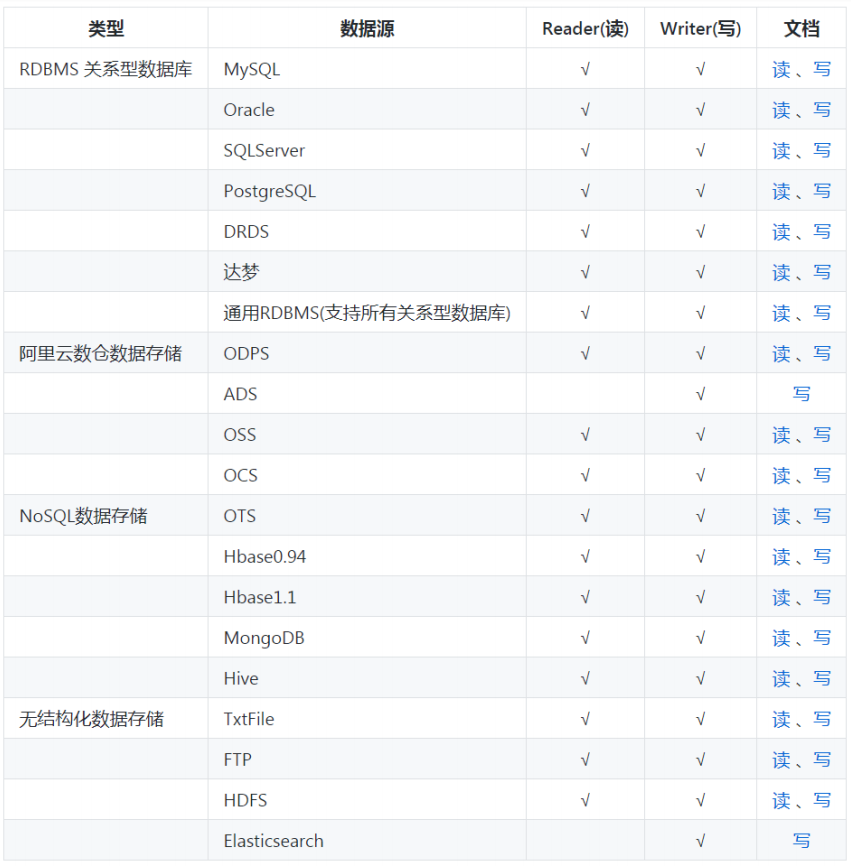

##### 3.1.3.4、DataX核心架构

DataX 3.0 开源版本支持单机多线程模式完成同步作业运行，本小节按一个DataX作业生命周期的时序图，从整体架构设计非常简要说明DataX各个模块相互关系。

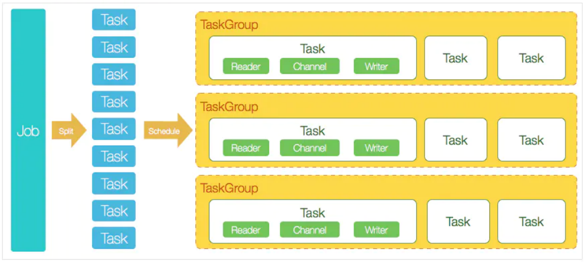

- DataX完成单个数据同步的作业，我们称之为Job，DataX接受到一个Job之后，将启动一个进程来完成整个作业同步过程。DataX Job模块是单个作业的中枢管理节点，承担了数据清理、子任务切分(将单一作业计算转化为多个子Task)、TaskGroup管理等功能。

- DataXJob启动后，会根据不同的源端切分策略，将Job切分成多个小的Task(子任务)，以便于并发执行。Task便是DataX作业的最小单元，每一个Task都会负责一部分数据的同步工作。

- 切分多个Task之后，DataX Job会调用Scheduler模块，根据配置的并发数据量，将拆分成的Task重新组合，组装成TaskGroup(任务组)。每一个TaskGroup负责以一定的并发运行完毕分配好的所有Task，默认单个任务组的并发数量为5。

- 每一个Task都由TaskGroup负责启动，Task启动后，会固定启动Reader—>Channel—>Writer的线程来完成任务同步工作。
- DataX作业运行起来之后， Job监控并等待多个TaskGroup模块任务完成，等待所有TaskGroup任务完成后Job成功退出。否则，异常退出，进程退出值非0

> 想了解更多DataX工具详情，可参考官网文档：https://github.com/alibaba/DataX

#### 3.1.4、percona-toolkit

##### 3.1.4.1、percona-toolkit介绍

MySQL数据库是轻量级、开源数据库的佼佼者，因此有很多功能强大第三方的衍生产品，如percona-toolkit，XtraBackup等。percona-toolkit是一组高级命令行工具的集合，可以查看当前服务的摘要信息，磁盘检测，分析慢查询日志，查找重复索引，实现表同步等等。

percona-toolkit工具是 MySQL一个重要分支产品percona的，它是一组命令的集合。下面给大家介绍几个生产中常用的命令。

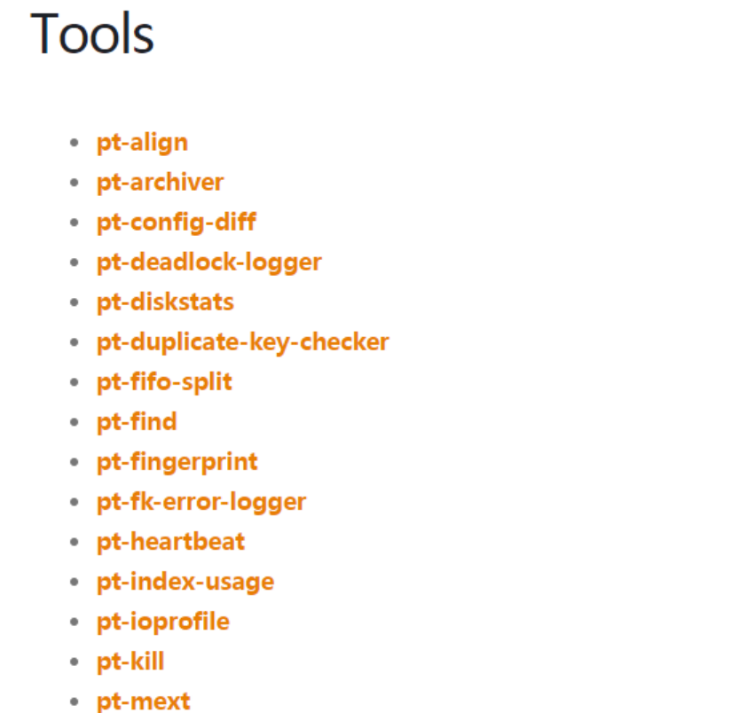

##### 3.1.4.2、 percona-toolkit安装

工具包的下载地址：https://www.percona.com/downloads/percona-toolkit/LATEST/

安装过程很简单，先解压：tar -zxvf percona-toolkit-3.0.3_x86_64.tar.gz 

由于是二进制的包，解压完可以直接进到percona-toolkit-3.0.3/bin目录下使用。

##### 3.1.4.3、pt-query-digest

pt-query-digest是用于分析mysql慢查询的一个工具，它可以分析binlog、General log、slowlog，也可以通过showprocesslist或者mysqldumpslow命令来进行分析。可以把分析结果输出到文件中，分析过程是先对查询语句的条件进行参数化，然后对参数化以后的查询进行分组统计，统计出各查询的执行时间、次数、占比等，可以借助分析结果找出问题进行优化。

大家都知道数据库大多数的性能问题是 slow sql 语句造成的，需要及时做相关的优化处理。使用示例如下：

1. 直接分析慢查询文件: 

   ```SHELL
   pt-query-digest slow_OAK.log > slow_report.log
   ```

2. 分析最近24小时内的查询：

   ```sh
   pt-query-digest --since=24h slow_OAK.log > slow_report.log
   ```

3. 分析只含有select语句的慢查询

   ```sh
   pt-query-digest --filter '$event->{fingerprint} =~ m/^select/i' slow_OAK.log> slow_report.log
   ```

查看SQL报告，总结慢语句有哪些，并可以看对应时间的消耗。分析结果如下所示：

```mysql
cat slow_report.log 
# Profile 
# Rank Query ID Response time Calls R/Call V/M Item 
# ==== ================== ============= ===== ======= ===== ============== 
# 1 0x040ADBE3A1EED0A2 16.8901 87.2% 1 16.8901 0.00 CALL insert_city 
# 2 0x8E44F4ED46297D4C 1.3013 6.7% 3 0.4338 0.18 INSERT SELECT lagou._city 
# 3 0x12E7CAFEA3145EEF 0.7431 3.8% 1 0.7431 0.00 DELETE city 
# MISC 0xMISC 0.4434 2.3% 3 0.1478 0.0 <3ITEMS> # Query 1: 0 QPS, 0x concurrency, ID 0x040ADBE3A1EED0A2 at byte 19060 ____ 
# Scores: V/M = 0.00
# Time range: all events occurred at 2020-05-08 12:12:10 
# Attribute pct total min max avg 95% stddev median
# ============ === ======= ======= ======= ======= ======= ======= ======= 
# Count 2 1 # Exec time 47 18s 18s 18s 18s 18s 0 18s 
# Lock time 0 103us 103us 103us 103us 103us 0 103us 
# Rows sent 0 0 0 0 0 0 0 0 # Rows examine 0 0 0 0 0 0 0 0 
# Query size 0 21 21 21 21 21 0 21 
# String: # Databases lagou 
# Hosts localhost # Users root 
# Query_time distribution 
# 1us 
# 10us 
# 100us 
# 1ms 
# 10ms 
# 100ms 
# 1s 
# 10s+ ################################################################ 
call insert_city(50000)\G
```

可以看到报告中，列举出了一些sql语句响应时间占比情况，以及SQL语句的执行时间情况。方便我们可以很直观的观察哪些语句有问题。

##### 3.1.4.4、pt-index-usage

pt-index-usage命令能够连接到MySQL数据库服务器，读取慢查询日志，并使用EXPLAIN询问MySQL如何执行每个查询。分析完成时，它打印出一个关于查询没有使用的索引的报告。

对于我们已有的生产环境，随着系统运行的时间越长，DML操作越来越慢，这可能和我们最初设计的索引是有关的（变慢的情况很多），项目一旦上线，很少会有人去关注索引的使用情况。某些索引是从create开始就没使用过，这无形中就给MySQL增加了维护负担，任何对该表的DML操作，都要维护这些没有被使用的索引。我们可以使用pt-index-usage工具找出哪些索引一直没有被使用，然后进行删除。

- pt-index-usage语法格式如下：

  ```apl
  pt-index-usage [OPTION...] [FILE...]
  ```

- 打印报告：

  ```apl
  pt-index-usage /path/to/slow_OAK.log --host localhost
  ```

- 也可以将报告写入到一个数据库表中，存入后方便我们的查看。如果在生产服务器上使用此功能，则应该小心，它可能会增加负载。

  ```apl
  pt-index-usage slow.log --no-report --save-results-database percona
  ```

##### 3.1.4.5、pt-online-schema-change

pt-online-schema-change命令可以在线整理表结构，收集碎片，给大表添加字段和索引。避免出现锁表导致阻塞读写的操作。针对 MySQL 5.7 版本，就可以不需要使用这个命令，直接在线 online DDL 就可以了。

```apl
pt-online-schema-change --user=root --password=root --host=localhost -- alter="ADD COLUMN city_bak VARCHAR(256)" D=lagou,t=city --execute
```

##### 3.1.4.6、pt-table-checksum

pt-table-checksum命令可以检查主从复制一致性。

pt table checksum通过在主机上执行校验和查询来执行在线复制一致性检查。如果发现任何差异，或者出现任何警告或错误，则工具的“退出状态”为非0。

该命令将连接到本地主机上的复制主机，对每个表进行校验和，并报告每个检测到的复制副本的结果：比较lagou库的差异情况，在主库上面执行：

```shell
[root@node1 bin]# ./pt-table-checksum --no-check-binlog-format --nocheck- replication-filters --databases=lagou --replicate=lagou.checksums -- host=192.168.95.130 -uroot -proot 
	TS 			ERRORS 	DIFFS 	ROWS 	CHUNKS 	SKIPPED 	TIME 		TABLE 
05-10T18:01:05 	  0 	 0 		 1 			1 		0 		0.013 	lagou.heartbeat 
05-10T18:01:05 	  0 	 0 		 0 			1 		0 		0.015 	lagou.city 
05-10T18:01:05 	  0 	 0 		 0 			1 		0 		0.011 	lagou.position
```

上述结果显示diff都为0，证明主从的lagou库没有差异情况。

比较lagou库哪些表有差异（需要添加replicate-check-only），在主库上面执行：

```shell
[root@node1 bin]# ./pt-table-checksum --no-check-binlog-format --nocheck-replication-filters --databases=lagou --replicate=lagou.checksums --replicate-check-only --host=192.168.95.130 -uroot -proot 
Differences on node1 
	TABLE 				CHUNK CNT_DIFF CRC_DIFF CHUNK_INDEX LOWER_BOUNDARY UPPER_BOUNDARY 
lagou.position_detail 		1 		1 	  1
```

上述结果显示lagou库下面position_detail表主从数据不一致。

> 除了上述命令外，还有很多，例如pt-ioprofifile可以命令方便定位IO问题；pt-slave-restart可以监控主从错误，尝试重启MySQL主从。想了解更多percona-
>
> toolkit工具详情，可参考官网文档：https://www.percona.com/doc/percona-toolkit/3.0/index.html

#### 3.1.5、MySQLMTOP

##### 3.1.5.1、MySQLMTOP简介

MySQLMTOP 是一个由Python+PHP开发的开源MySQL企业监控系统。该系统由Python实现多进程数据采集和告警，PHP实现Web展示和管理，优点如下：

- MySQL服务器无需安装任何Agent，只需在监控WEB界面配置相关数据库信息。
- 启动监控进程后，即可对上百台MySQL数据库的状态、连接数、QTS、TPS、数据库流量、复制、性能慢查询等进行实时监控。
- 可以在数据库偏离设定的正常运行阀值(如连接异常，复制异常，复制延迟) 时发送告警邮件通知到DBA进行处理。
- 可以对历史数据归档，通过图表展示数据库近期状态，以便DBA和开发人员能对遇到的问题进行分析和诊断。

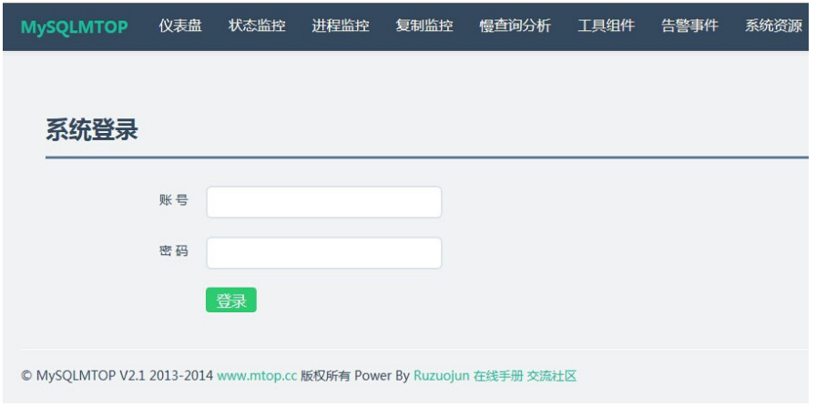

**MySQLMTOP** **发展历史如下：**

2014年01月，开源MySQLMTOP企业MySQL监控系统正式上线并开源

2014年06月，MySQLMTOP进行重构，加入了Oracle、Mongodb、Redis的支持，正式更名为Lepus

2014年08月，Lepus 成功取得商业软件著作权

2015年01月，开源MySQLMTOP被评为2014优秀开源软件

2015年01月，Lepus正式开源，并建立官方网站向大家免费提供服务

2015年06月，Lepus网站软件下载总数量统计超过10000+,并广泛应用于各大互联网企业生产数据库的监控

2017年01月，Lepus代码托管至github,网站软件下载总数量统计超过30000+

##### 3.1.5.2、MySQLMTOP功能

MySQLMTOP主要功能如下：

- 实时 MySQL 状态监控和警报

  MySQLMTOP 持续监视 MySQL 的基本状态和性能信息，包括数据库连接状态，启动时间，数据库版本，总连接数，活动进程，QPS，TPS，进出MySQL数据库的流量信息。在数据库状态异常或偏离正常基准水平时发出报警邮件通知。

  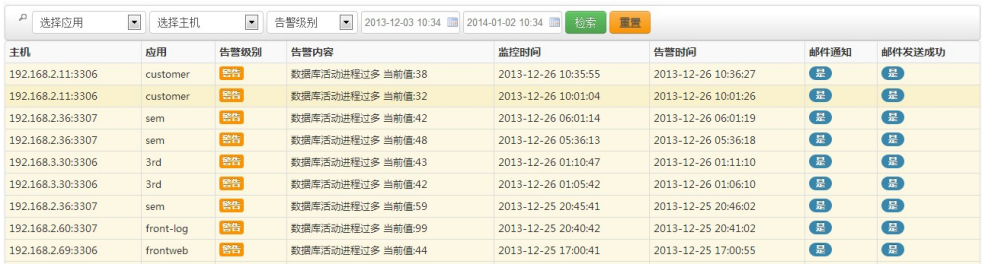

- 实时 MySQL复制监控

  MySQLMTOP自动发现 MySQL 复制拓扑结构，自动监视数据库的延时和binlog信息，可以了解所有 MySQL 主服务器和从服务器的性能、可用性和运行状况。并在问题（如从服务器延迟）导致停机前向管理员提供改正建议。

- 远程监控云中的 MySQL

  适合于云和虚拟机的设计，能远程监视MySQL服务器不需要任何远程代理器。

- 直观管理所有 MySQL

  MySQLMTOP提供一个基于 Web 的界面，可令全面深入地了解数据库性能、可用性、关键活动等；直观地查看一台服务器、自定义的应用组或所有服务器。一组丰富的实时图形和历史图形将帮助您深入了解详细的服务器统计信息。

  

- 可视化MySQL慢查询分析

  监视实时查询性能，查看执行统计信息，筛选和定位导致性能下降的 SQL 代码。结合使用Information Schema 可直接从 MySQL 服务器收集数据，无需额外的软件或配置。

- 性能监控

  监视影响 MySQL 性能的主要指标。如Key_buffffer_read_hits、Key_buffffer_write_hits、Thread_cache_hits、Key_blocks_used_rate、Created_tmp_disk_tables_rate等信息，根据相关性能指标可以对服务器核心参数进行调整优化。


> 想了解更多MySQLMTOP工具详情，可参考官网文档：http://www.lepus.cc/

#### 3.1.6、ELK

##### 3.1.6.1、为什么用ELK

在简单应用中，直接在日志文件中 grep就可以获得自己想要的信息。但在规模较大分布式系统中，此方法效率低下，面临问题包括日志量太大如何归档、文本搜索太慢怎么办、如何多维度查询。需要集中化的日志管理，所有服务器上的日志收集汇总。常见解决思路是建立集中式日志收集系统，将所有节点上的日志统一收集，管理，访问。

一般大型系统是一个分布式部署的架构，不同的服务模块部署在不同的服务器上，问题出现时，大部分情况需要根据问题暴露的关键信息，定位到具体的服务器和服务模块。构建一套集中式日志系统，可以提高定位问题的效率。

一个完整的集中式日志系统，需要包含以下几个主要特点：

- 收集－能够采集多种来源的日志数据
- 传输－能够稳定的把日志数据传输到中央系统
- 存储－如何存储日志数据
- 分析－可以支持 UI 分析
- 警告－能够提供错误报告，监控机制

ELK提供了一整套解决方案，并且都是开源软件，之间互相配合使用，完美衔接，高效的满足了很多场合的应用。目前主流的一种日志系统。

##### 3.1.6.2、ELK实现架构

ELK 最早是 Elasticsearch（简称ES）、Logstash、Kibana 三款开源软件的简称，三款软件后来被同一公司收购，并加入了Xpark、Beats等组件，改名为Elastic Stack，成为现在最流行的开源日志解决方案，虽然有了新名字但大家依然喜欢叫ELK，现在所说的ELK就指的是基于这些开源软件构建的日志系统。

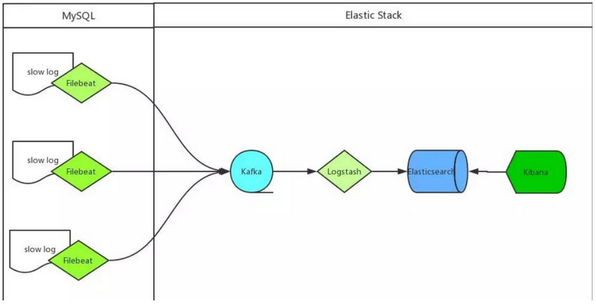

上述架构中，各技术作用如下

- MySQL 服务器安装 Filebeat 作为 agent 收集 slowLog
- Filebeat 读取 MySQL 慢日志文件做简单过滤传给 Kafka 集群
- Logstash 读取 Kafka 集群数据并按字段拆分后转成 JSON 格式存入 ES 集群
- Kibana 读取ES集群数据展示到web页面上

##### 3.1.6.3、慢查询日志收集展示

- **Filebeat日志收集**

  filebeat读取收集slow log，处理后写入kafka。收集日志时需要解决以下问题：

  - 日志行合并
  - 获取SQL执行时间
  - 确定SQL对应的DB名
  - 确定SQL对应的主机

- **Filebeat示例**

  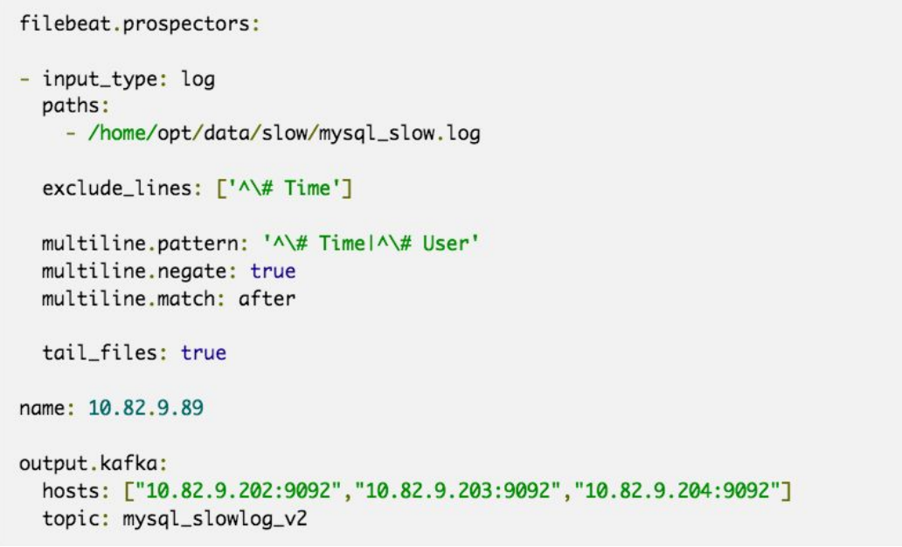

  重要参数解释：

  - input_type：指定输入的类型是log或者是stdin
  - paths：慢日志路径，支持正则，比如/data/*.log
  - exclude_lines：过滤掉#Time开头的行
  - multiline.pattern：匹配多行时指定正则表达式，这里匹配以# Time或者# User开头的行，Time行要先匹配再过滤
  - multiline.negate：定义上边pattern匹配到的行是否用于多行合并，也就是定义是不是作为日志的一部分
  - multiline.match：定义匹配的行日志作为日志元素的开始还是结束。
  - tail_files：定义是从文件开头读取日志还是结尾，这里定义为true，从现在开始收集，之前已存在的不管
  - name：设置filebeat的名字，如果为空则为服务器的主机名，这里我们定义为服务器IP
  - output.kafka：配置要接收日志的kafka集群地址可topic名称

- **Kafka 接收示例**

  ```json
  {"@timestamp":"2020-05-08T09:36:00.140Z","beat": {"hostname":"oak","name":"10.63.144.71","version":"5.4.0"},"input_type":"log","m essage":"# User@Host: select[select] @ [10.63.144.16] Id: 23460596\n# Query_time: 0.155956 Lock_time: 0.000079 Rows_sent: 112 Rows_examined: 366458\nSET timestamp=1533634557;\nSELECT DISTINCT(uid) FROM common_member WHERE hideforum=-1 AND uid != 0;","offset":1753219021,"source":"/data/slow/mysql_slow.log","type":"log"}
  ```

- **Logstash示例**

  Logstash消费kafka消息，可以利用kafka consumer group实现集群模式消费保障单点故障不影响日志处理，grok正则处理后写入elasticsearch。

  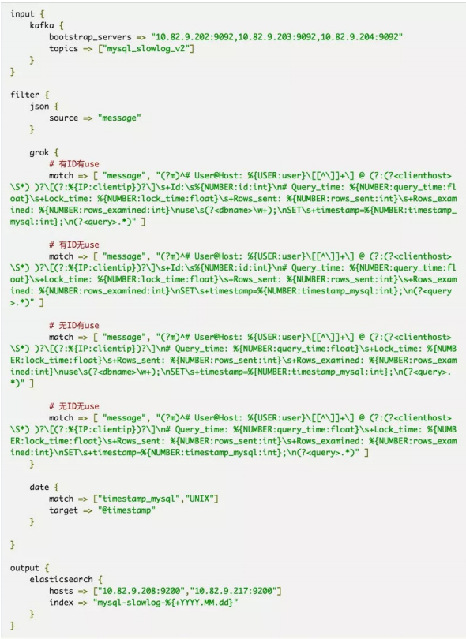

  重要参数解释：

  - input：配置 kafka 的集群地址和 topic 名字

  - filter：过滤日志文件，主要是对 message 信息（前文 kafka 接收到的日志格式）进行拆分，拆分成一个一个易读的字段，例如User、Host、Query_time、Lock_time、timestamp等。

  - grok：MySQL版本不同，慢查询日志格式有些差异，grok可以根据不同的慢查询格式写不同的正则表达式去匹配，当有多条正则表达式存在时，logstash会从上到下依次匹配，匹配到一条后边的则不再匹配。

  - date：定义让SQL中的timestamp_mysql字段作为这条日志的时间字段，kibana上看到的实践排序的数据依赖的就是这个时间

  - output：配置ES服务器集群的地址和index，index自动按天分割

> Elasticsearch部分略过，默认设置即可达到需求。

- **Kibana示例**

  打开Kibana添加 mysql-slowlog-* 的Index，并选择timestamp，创建Index Pattern。进入Discover页面，就可以很直观的看到各个时间点慢日志的数量变化，可以根据左侧Field实现简单过滤，搜索框也方便搜索慢日志。

  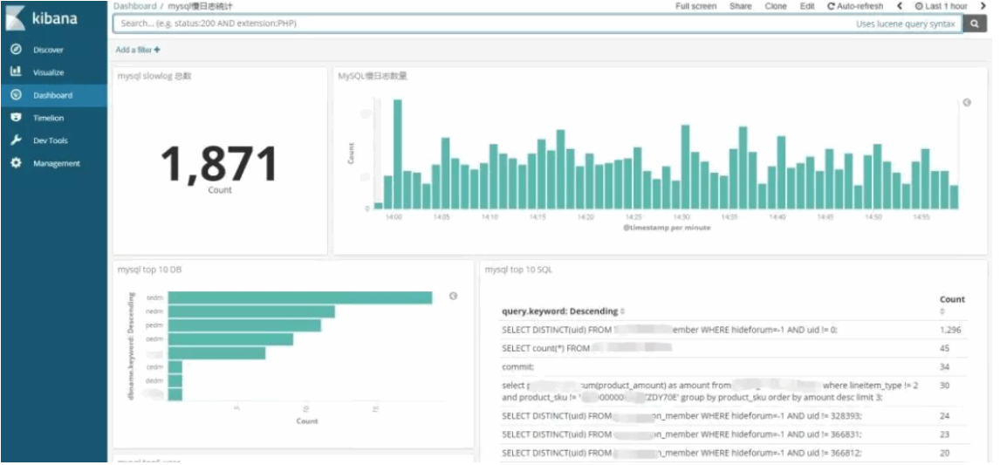

#### 3.1.7、Prometheus

##### 3.1.7.1、Prometheus简介

Prometheus于2012年由SoundCloud创建，目前已经已发展为最热门的分布式监控系统。Prometheus完全开源的，被很多云厂商（架构）内置，在这些厂商（架构）中，可以简单部署Prometheus，用来监控整个云基础架构设施。比如DigitalOcean或Docker都使用普罗米修斯作为基础监控。Prometheus是一个时间序列数据库，它涵盖了可以绑定的整个生态系统工具集及其功能。Prometheus主要用于对基础设施的监控，包括服务器、数据库、VPS，几乎所有东西都可以通过Prometheus进行监控。

Prometheus主要优点如下：

- 提供多维度数据模型和灵活的查询方式。通过将监控指标关联多个tag，来将监控数据进行任意维度的组合，并且提供简单的PromQL，还提供查询接口，可以很方便地结合等GUI组件展示数据。

- 在不依赖外部存储的情况下，支持服务器节点的本地存储。通过Prometheus自带的时序数据库，可以完成每秒千万级的数据存储。

- 定义了开发指标数据标准，以基于HTTP的pull方式采集时序数据。只有实现了Prometheus监控数据格式的监控数据才可以被Prometheus采集、汇总。

- 支持通过静态文件配置和动态发现机制发现监控对象，自动完成数据采集。Prometheus目前已经

- 支持Kubernetes、etcd、consul等多种服务发现机制，可以减少运维人员的手动配置环节。
- 易于维护，可以通过二进制文件直接启动，并且提供容器化部署镜像。

- 支持数据的分区采集和联邦部署，支持大规模集群监控。

##### 3.1.7.2、Prometheus生态系统

Prometheus生态系统有功能丰富工具集：

- Alertmanager：Prometheus通过配置文件定义规则将告警信息推送到Alertmanager。Alertmanager可以将其导出到多个端点，例如Pagerduty或Email等。

- 数据可视化：在Web UI中可视化时间序列数据，轻松过滤查看监控目标的信息，与Grafana、Kibana等类似。

- 服务发现：Prometheus可以动态发现监控目标，并根据需要自动废弃目标。这在云架构中使用动态变更地址的容器时，非常方便。

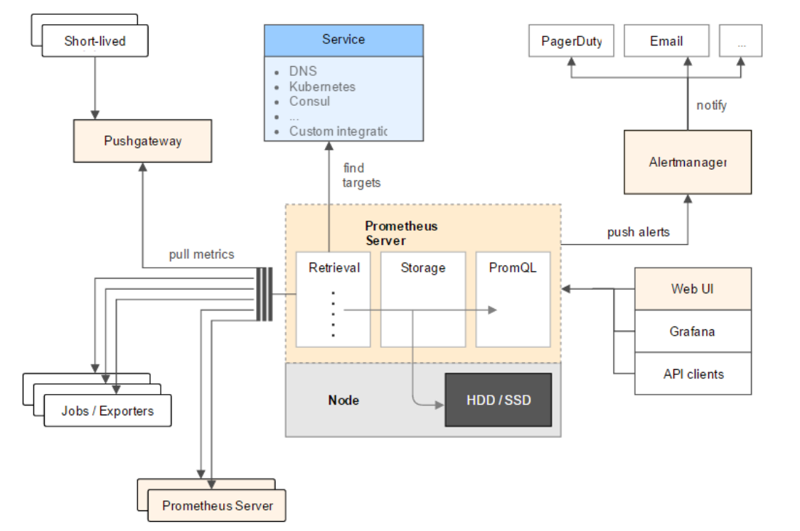

##### 3.1.7.3、Prometheus实现原理

- **数据存储**

  Prometheus指标数据支持本地存储和远程存储。

  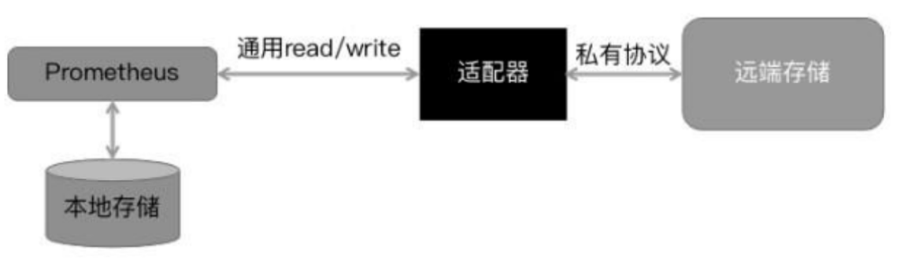

- **指标数据**

  Prometheus使用键-值对存储监控数据。键描述了测量值时将实际测量值存储为数字的值。Prometheus并不会存储原始信息，如日志文本，它存储的是随时间汇总的指标。

  一般来说键也就监控指标，如果想要获得有关指标的更多详细信息，Prometheus有一个标签的概念。标签旨在通过向键添加其他字段来为指标提供更详细信息。

  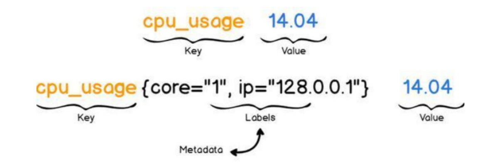

- **度量类型**

  Prometheus监控指标有Counter(计数器)、Gauge(仪表盘)、Histogram(直方图)和Summary(摘要)四种度量类型。

  - Counter

    计数器Counter是我们使用的最简单的度量标准形式。计数器的值只能增加或重置为0，比如，要计算服务器上的HTTP错误数或网站上的访问次数，这时候就使用计数器。

  - Gauges

    Gauges用于处理随时间减少或增加的值。比如温度、内存变化等。Gauge类型的值可以上升和下降，可以是正值或负值。

  - Histogram

    直方图Histogram是一种更复杂的度量标准类型。它为我们的指标提供了额外信息，例如观察值的总和及其数量，常用于跟踪事件发生的规模。其值在具有可配置上限的存储对象中聚合。比如，为了监控性能指标，我们希望得到在有20%的服务器请求响应时间超过300毫秒发送警告。对于涉及比例的指标就可以考虑使用直方图。

  - Summary

    摘要Summary是对直方图的扩展。除了提供观察的总和和计数之外，它们还提供滑动窗口上的分位数度量。分位数是将概率密度划分为相等概率范围的方法。直方图随时间汇总值，给出总和和计数函数，使得易于查看给定度量的变化趋势。而摘要则给出了滑动窗口上的分位数（即随时间不断变化）。

- **PromQL**

  对于Prometheus数据，我们可以通过HTTP来查询，如果是复杂的数据查询，则还可以使用PromQL进行。和关系型数据库实现SQL解析一样，Prometheus实现了一套自己的数据库语言解析器，最大的区别是支持查询

  使用Prometheus的PromQL，会处理两种向量：

  - 即时向量：表示在最近时间戳中跟踪的指标。
- 时间范围向量：用于查看度量随时间的演变，可以使用自定义时间范围查询Prometheus。
  
  PromQL API公开了一组方便查询数据操作的函数。用它可以实现排序，数学函计算（如导数或指数函数），统计预测计算（如Holt Winters函数）等。

- **Instrumentation仪表化**

  仪表化是Prometheus的一个重要组成部分。在从应用程序检索数据之前，必须要仪表化它们。Prometheus术语中的仪表化表示将客户端类库添加到应用程序，以便它们向Prometheus吐出指标。可以对大多数主流的编程语言进行仪表化。

  在仪表化操作时，需要创建内存对象（如仪表盘或计数器），然后选择指标公开的位置。Prometheus将从该位置获取并存储到时间序列数据库。

- **Exporters模板**

  Exporter是一个采集监控数据样本的组件。除了官方实现的Exporter，还有很多第三方实现如 Redisexporter 和RabbitMQ exporter等。这些Exporters通过HTTPS/HTTP方式、TCP方式、本地文件方式或标准协议方式访问。

  常见的Exporters模版有：

  - 数据库模版：用于MongoDB数据库，MySQL服务器的配置。
- HTTP模版：用于HAProxy，Apache或Nginx等Web服务器和代理的配置。
  - Unix模版：用来使用构建的节点导出程序监视系统性能，可以实现完整的系统指标的监控。
  
  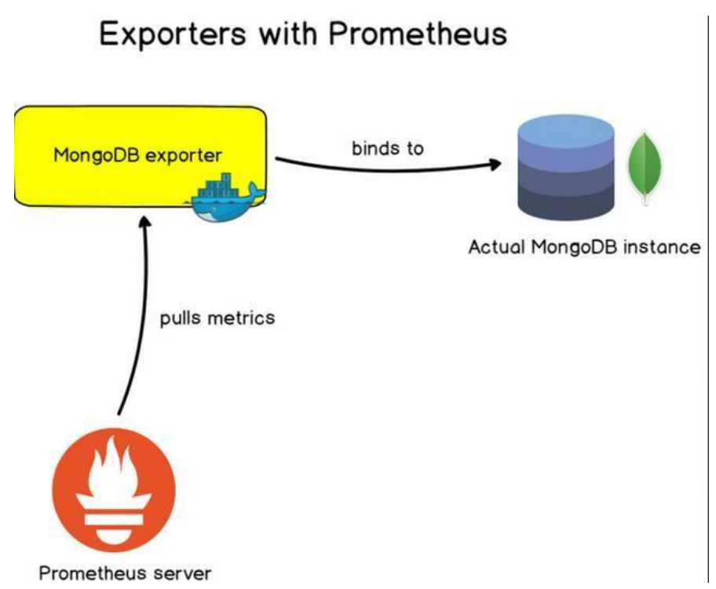

- **Alertmanager告警**

  在处理时间序列数据库时，我们希望对数据进行处理，并对结果给出反馈，而这部分工作由告警来实现。

  告警在Grafana中非常常见，Prometheus是通过Alertmanager实现完成的告警系统。Alertmanager是一个独立的工具，可以绑定到Prometheus并运行自定义Alertmanager。告警通过配置文件定义，定义由一组指标规则组成，如果数据命中这些规则，则会触发告警并将信息发送到预定义的目标。Prometheus的告警，可以通过email，Slack webhooks，PagerDuty和自定义HTTP目标等。

  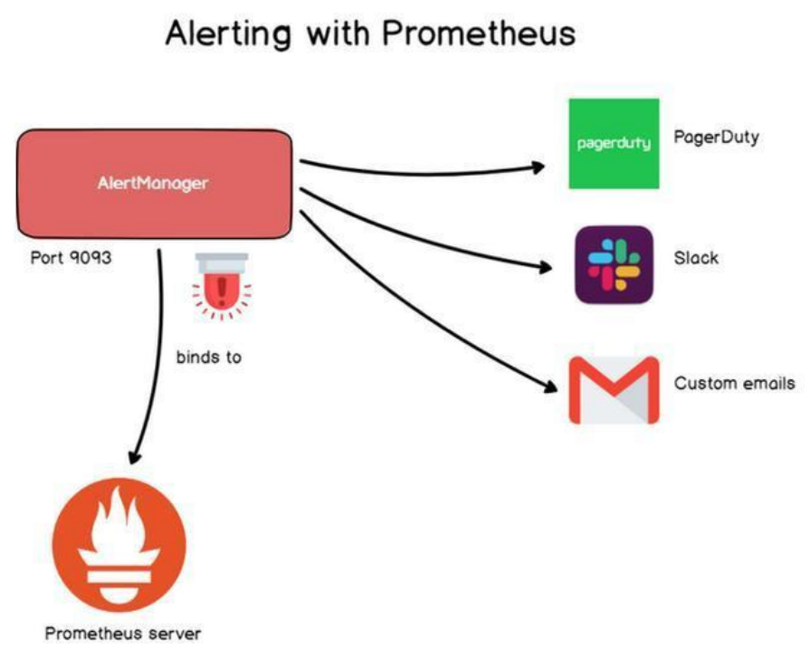

## 4、作业

采⽤Sharding-JDBC实现c_order表分库分表+读写分离

1. 基于user_id对c_order表进⾏数据分⽚

2. 分别对master1和master2搭建⼀主⼆从架构
3. 基于master1和master2主从集群实现读写分离

```mysql
CREATE TABLE `c_order`(
 `id` bigint(20) NOT NULL AUTO_INCREMENT,
 `is_del` bit(1) NOT NULL DEFAULT 0 COMMENT '是否被删除',
 `user_id` int(11) NOT NULL COMMENT '⽤户id',
 `company_id` int(11) NOT NULL COMMENT '公司id',
 `publish_user_id` int(11) NOT NULL COMMENT 'B端⽤户id',
 `position_id` int(11) NOT NULL COMMENT '职位ID',
 `resume_type` int(2) NOT NULL DEFAULT 0 COMMENT '简历类型：0附件 1在线',
 `status` varchar(256) NOT NULL COMMENT '投递状态 投递状态WAIT-待处理 AUTO_FILTER-⾃动过滤 PREPARE_CONTACT-待沟通 REFUSE-拒绝ARRANGE_INTERVIEW-通知⾯试',
 `create_time` datetime NOT NULL COMMENT '创建时间',
 `update_time` datetime NOT NULL COMMENT '处理时间',
 PRIMARY KEY (`id`),
 KEY `index_userId_positionId` (`user_id`, `position_id`),
 KEY `idx_userId_operateTime` (`user_id`, `update_time`)
) ENGINE = InnoDB DEFAULT CHARSET = utf8mb4;
```

- 具体实现：

| 机器名称      | IP配置         | 服务角色       | 数据库        | 作用  |
| :------------ | :------------- | :------------- | :------------ | ----- |
| master0       | 192.168.81.100 | 数据库主服务器 | thm-sharding0 | write |
| master0slave0 | 192.168.81.101 | 数据库从服务器 | thm-sharding0 | read  |
| master0slave1 | 192.168.81.102 | 数据库从服务器 | thm-sharding0 | read  |
| master1       | 192.168.81.100 | 数据库主服务器 | thm-sharding1 | write |
| master1slave0 | 192.168.81.101 | 数据库从服务器 | thm-sharding1 | read  |
| master1slave1 | 192.168.81.102 | 数据库从服务器 | thm-sharding1 | read  |

- maven：

```xml
  <properties>
        <project.build.sourceEncoding>UTF-8</project.build.sourceEncoding>
        <project.compile.sourceEncoding>UTF-8</project.compile.sourceEncoding>
        <springboot.version>2.3.5.RELEASE</springboot.version>
        <shardingsphere.version>4.1.0</shardingsphere.version>
        <mysql.version>8.0.23</mysql.version>
    </properties>

    <dependencies>
        <dependency>
            <groupId>org.springframework.boot</groupId>
            <artifactId>spring-boot-starter-test</artifactId>
            <version>${springboot.version}</version>
            <scope>test</scope>
        </dependency>
        <dependency>
            <groupId>org.springframework.boot</groupId>
            <artifactId>spring-boot-starter-jdbc</artifactId>
            <version>${springboot.version}</version>
        </dependency>
        <dependency>
            <groupId>org.springframework.boot</groupId>
            <artifactId>spring-boot-starter-data-jpa</artifactId>
            <version>${springboot.version}</version>
        </dependency>
        <dependency>
            <groupId>org.apache.shardingsphere</groupId>
            <artifactId>sharding-jdbc-spring-boot-starter</artifactId>
            <version>${shardingsphere.version}</version>
        </dependency>
        <dependency>
            <groupId>mysql</groupId>
            <artifactId>mysql-connector-java</artifactId>
            <version>${mysql.version}</version>
        </dependency>
        <!--XA模式-->
        <dependency>
            <groupId>org.apache.shardingsphere</groupId>
            <artifactId>sharding-transaction-xa-core</artifactId>
            <version>${shardingsphere.version}</version>
        </dependency>
    </dependencies>
    <build>
        <plugins>
            <plugin>
                <groupId>org.apache.maven.plugins</groupId>
                <artifactId>maven-compiler-plugin</artifactId>
                <configuration>
                    <source>11</source>
                    <target>11</target>
                    <testSource>11</testSource>
                    <testTarget>11</testTarget>
                </configuration>
                <version>3.8.1</version>
            </plugin>
        </plugins>
    </build>
```

- application.yml

```yaml
server:
  port: 8080
spring:
  shardingsphere:
    props:
      sql:
        show: true
    datasource:
      names: master0,master0slave0,master0slave1,master1,master1slave0,master1slave1
      master0:
        type: com.zaxxer.hikari.HikariDataSource
        driver-class-Name: com.mysql.jdbc.Driver
        jdbc-url: jdbc:mysql://192.168.81.100:3306/thm-sharding0
        username: root
        password: Thm123456.
      master0slave0:
        type: com.zaxxer.hikari.HikariDataSource
        driver-class-Name: com.mysql.jdbc.Driver
        jdbc-url: jdbc:mysql://192.168.81.101:3306/thm-sharding0
        username: root
        password: Thm123456.
      master0slave1:
        type: com.zaxxer.hikari.HikariDataSource
        driver-class-Name: com.mysql.jdbc.Driver
        jdbc-url: jdbc:mysql://192.168.81.102:3306/thm-sharding0
        username: root
        password: Thm123456.
      master1:
        type: com.zaxxer.hikari.HikariDataSource
        driver-class-Name: com.mysql.jdbc.Driver
        jdbc-url: jdbc:mysql://192.168.81.100:3306/thm-sharding1
        username: root
        password: Thm123456.
      master1slave0:
        type: com.zaxxer.hikari.HikariDataSource
        driver-class-Name: com.mysql.jdbc.Driver
        jdbc-url: jdbc:mysql://192.168.81.101:3306/thm-sharding1
        username: root
        password: Thm123456.
      master1slave1:
        type: com.zaxxer.hikari.HikariDataSource
        driver-class-Name: com.mysql.jdbc.Driver
        jdbc-url: jdbc:mysql://192.168.81.102:3306/thm-sharding1
        username: root
        password: Thm123456.
    sharding:
      tables:
        c_order:
          actualDataNodes: master${0..1}.c_order${0..1}
          #指定分库策略
          databaseStrategy:
            inline:
              shardingColumn: user_id
              algorithmExpression: master${user_id % 2}
          #指定分库策略
          tableStrategy:
            inline:
              shardingColumn: id
              algorithmExpression: c_order${id % 2}
          # 指定主键生成策略
          keyGenerator:
            column: id
            type: SNOWFLAKE
      # 配置读写分离
      masterSlaveRules:
        master0:
          masterDataSourceName: master0
          slaveDataSourceNames:
            - master0slave0
            - master0slave1
          loadBalanceAlgorithmType: ROUND_ROBIN
        master1:
          masterDataSourceName: master1
          slaveDataSourceNames:
              - master1slave0
              - master1slave1
          loadBalanceAlgorithmType: ROUND_ROBIN
```

- 实体类和repository

```java
package com.thm.entity;

import javax.persistence.*;
import java.util.Date;
@Entity
@Table(name = "c_order")
public class COrder {
    @Id
    @GeneratedValue(strategy = GenerationType.IDENTITY)
    private Long id;
    @Column(name = "is_del")
    private int isDel;
    @Column(name = "user_id")
    private int userId;
    @Column(name = "company_id")
    private int companyId;
    @Column(name = "publish_user_id")
    private int publishUserId;
    @Column(name = "position_id")
    private int positionId;
    @Column(name = "resume_type")
    private int resumeType;
    @Column(name = "status")
    private String status;
    @Column(name = "create_time")
    private Date createTime;
    @Column(name = "update_time")
    private Date updateTime;
    //省略get/set/tostring
}

package com.thm.repository;

import com.thm.entity.COrder;
import org.springframework.data.jpa.repository.JpaRepository;
import org.springframework.stereotype.Repository;
@Repository
public interface COrderRepository extends JpaRepository<COrder,Long> {
}
```

- 启动类

```java
@SpringBootApplication
public class Bootstrap {
}
```

- 测试类

```java
import com.thm.Bootstrap;
import com.thm.entity.COrder;
import com.thm.repository.COrderRepository;
import org.junit.Test;
import org.junit.runner.RunWith;
import org.springframework.boot.test.context.SpringBootTest;
import org.springframework.test.context.junit4.SpringJUnit4ClassRunner;

import javax.annotation.Resource;
import java.util.Date;
import java.util.List;
import java.util.Random;
@RunWith(SpringJUnit4ClassRunner.class)
@SpringBootTest(classes = Bootstrap.class)
public class TestMasterSlave {

    @Resource
    private COrderRepository cOrderRepository;

    @Test
    public void  write (){
        Random random = new Random();
        COrder cOrder;
        for (int i = 1; i <= 100; i++){
            cOrder = new COrder();
            cOrder.setIsDel(0);
            cOrder.setUserId(random.nextInt(100));
            cOrder.setCompanyId(random.nextInt(100));
            cOrder.setPublishUserId(random.nextInt(100));
            cOrder.setPositionId(random.nextInt(100));
            cOrder.setResumeType(1);
            cOrder.setStatus("WAIT");
            cOrder.setCreateTime(new Date());
            cOrder.setUpdateTime(new Date());
            cOrderRepository.save(cOrder);
        }
    }
    @Test
    public void  read (){
        List<COrder> all = cOrderRepository.findAll();
        all.forEach(cOrder -> System.out.println(cOrder.toString()));
    }
}
```

具体实现：https://gitee.com/Thmspring/LG_homeWork/tree/master/stage4/module2