# MongoDB

**主要课程内容**

MongoDB是一款高性能的NoSQL(Not Only SQL 不仅仅SQL)数据库

- 第一部分：MongoDB系统结构

  NoSQL和MongoDB MongoDB体系结构 和RDBMS的对比 BSON MongoDB中对BSON支持的类型Linux下安装 启动参数说明 mongo shell GUI工具(Compass NoSqlBooster)

- 第二部分：MongoDB命令

  MongoDB的基础操作 集合数据的CURD 聚合操作(聚合管道和MapReduce)

- 第三部分：MongoDB索引Index

  索引类型 索引和explain分析 慢查询分析 MongoDB索引的底层实现原理

- 第四部分：MongoDB应用实战

  MongoDB的适用场景 和 场景具体应用 如何抉择是否使用MongoDB 程序访问MongoDB (javaSpring SpringBoot)

- 第五部分：MongoDB架构

  MongoDB逻辑结构 数据模型 存储引擎(WiredTiger) 存储引擎实现原理

- 第六部分：MongoDB集群高可用

  主从架构的缺陷 复制集 replica set（什么是复制集 为什么用 复制集原理 如何搭建 ）分片 shard （什么是分片 为什么用 分片原理(片键 区块 分片策略) 分片集群搭建）

- 第七部分：MongoDB安全认证

  为什么要安全认证 用户相关操作 角色 单机安全认证 分片集群的安全认证

## 1、MongoDB体系结构

### 1.1、NoSQL 和 MongoDB

> NoSQL=Not Only SQL，支持类似SQL的功能， 与Relational Database相辅相成。其性能较高，不使用SQL意味着没有结构化的存储要求(SQL为结构化的查询语句)，没有约束之后架构更加灵活。
>
> NoSQL数据库四大家族 列存储 Hbase,键值(Key-Value)存储 Redis,图像存储 Neo4j,文档存储MongoDB
>
> MongoDB 是一个基于分布式文件存储的数据库，由 C++ 编写，可以为 WEB 应用提供可扩展、高性能、易部署的数据存储解决方案。
>
> MongoDB 是一个介于关系数据库和非关系数据库之间的产品，是非关系数据库中功能最丰富、最像关系数据库的。在高负载的情况下，通过添加更多的节点，可以保证服务器性能。
>

### 1.2、MongoDB 体系结构


### 1.3、MongoDB和RDBMS(关系型数据库)

| RDBMS                           | MongoDB                                         |
| ------------------------------- | ----------------------------------------------- |
| database(数据库)                | database（数据库）                              |
| table （表）                    | collection（ 集合）                             |
| row（ 行）                      | document（ BSON 文档）                          |
| column （列）                   | field （字段）                                  |
| index（唯一索引、主键索引）     | index （支持地理位置索引、全文索引 、哈希索引） |
| join （主外键关联）             | embedded Document (嵌套文档)                    |
| primary key(指定1至N个列做主键) | primary key (指定_id field做为主键)             |

### 1.4、什么是BSON

BSON是一种类json的一种二进制形式的存储格式，简称Binary JSON，它和JSON一样，支持内嵌的文档对象和数组对象，但是BSON有JSON没有的一些数据类型，如Date和Binary Data类型。BSON可以做为网络数据交换的一种存储形式,是一种schema-less的存储形式，它的优点是灵活性高，但它的缺点是空间利用率不是很理想。

{key:value,key2:value2} 这是一个BSON的例子，其中key是字符串类型,后面的value值，它的类型一般是字符串,double,Array,ISODate等类型。

BSON有三个特点：轻量性、可遍历性、高效性

### 1.5、BSON在MongoDB中的使用

MongoDB使用了BSON这种结构来存储数据和网络数据交换。把这种格式转化成一文档这个概念(Document)，这里的一个Document也可以理解成关系数据库中的一条记录(Record)，只是这里的Document的变化更丰富一些，如Document可以嵌套。

MongoDB中Document 中可以出现的数据类型：

| String           | 字符串       | UTF-8 编码的字符串才是 合法的。                      | {key:“cba”}                                                  |
| ---------------- | ------------ | ---------------------------------------------------- | ------------------------------------------------------------ |
| 数据类型         | 说明         | 解释说明                                             | Document举例                                                 |
| Integer          | 整型数值     | 根据你所采用的服务器， 可分为 32 位或 64 位。        | {key:1}                                                      |
| Boolean          | 布尔值       | 用于存储布尔值（真/ 假）。                           | {key:true}                                                   |
| Double           | 双精度浮点值 | 用于存储浮点值                                       | {key:3.14}                                                   |
| ObjectId         | 对象ID       | 用于创建文档的ID                                     | {_id:new ObjectId()}                                         |
| Array            | 数组         | 用于将数组或列表或多个 值存储为一个键                | {arr:[“a”,“b”]}                                              |
| Timestamp        | 时间戳       | 从开始纪元开始的毫秒数                               | { ts: new Timestamp() }                                      |
| Object           | 内嵌文档     | 文档可以作为文档中某个 key的value                    | {o:{foo:“bar”}}                                              |
| Null             | 空值         | 表示空值或者未定义的对象                             | {key:null}                                                   |
| Date或者 ISODate | 格林尼治时间 | 日期时间，用Unix日期格式来存储当前日期或时间。       | {birth:new Date()}                                           |
| Code             | 代码         | 可以包含JS代码                                       | {x:function(){}}                                             |
| File             | 文件         | 1、二进制转码(Base64)后 存储 (<16M) 2、 GridFS(>16M) | GridFS 用两个集合来存储一个文件：fs.files与 fs.chunks 真正存储需要使用mongofiles -d gridfs put song.mp3 |

### 1.6、MongoDB在Linux的安装

- 下载社区版 MongoDB 4.1.3 

  去官网下载对应的MongoDB 然后上传到Linux虚拟机

- centos安装依赖

  ```shell
  sudo yum install libcurl openssl
  ```

- 将压缩包解压即可

  ```shell
  tar -zxvf MongoDB-linux-x86_64-4.1.3.tgz 
  ```

- 创建配置文件mongo.cnf

  ```properties
  dbpath=/data/mongo/ 
  port=27017 
  bind_ip=0.0.0.0 
  fork=true 
  logpath = /data/mongo/logs/MongoDB.log 
  logappend = true 
  auth=false
  
  #参数 说明 
  #dbpath 数据库目录，默认/data/db 
  #port 监听的端口，默认27017 
  #bind_ip 监听IP地址，默认全部可以访问 
  #fork 是否已后台启动的方式登陆 
  #logpath 日志路径 
  #logappend 是否追加日志 
  #auth 是开启用户密码登陆 
  #config 指定配置文件
  
  注意：需要先创建dbpath文件
  #mkdir -p /data/mongo/logs
  ```
  
- 启动与连接

  ```apl
  启动：./bin/mongod
  指定配置文件启动：./bin/mongod -f mongo.conf
  
  连接本地mongo shell：./bin/mongo 
  连接指定主机和端口的方式启动： ./bin/mongo --host=主机IP --port=端口
  ```

### 1.7、Mongodb GUI工具

- **MongoDB Compass Community**

  MongoDB Compass Community由MongoDB开发人员开发，这意味着更高的可靠性和兼容性。它为MongoDB提供GUI mongodb工具，以探索数据库交互,具有完整的CRUD功能并提供可视方式。借助内置模式可视化，用户可以分析文档并显示丰富的结构。为了监控服务器的负载，它提供了数据库操作的实时统计信息。就像MongoDB一样，Compass也有两个版本，一个是Enterprise（付费），社区可以免费使用。适用于Linux，Mac或Windows。

- **NoSQLBooster（mongobooster）**

  NoSQLBooster是MongoDB CLI界面中非常流行的GUI工具。它正式名称为MongoBooster。

  NoSQLBooster是一个跨平台，它带有一堆mongodb工具来管理数据库和监控服务器。这个Mongodb工具包括服务器监控工具，Visual Explain Plan，查询构建器，SQL查询，ES2017语法支持等等......它有免费，个人和商业版本，当然，免费版本有一些功能限制。NoSQLBooster也可用于Windows，MacOS和Linux。

- **Navicat**

## 2、MongoDB命令

### 2.1、MongoDB的基本操作

```apl
#查看数据库 
show dbs; 
#切换数据库 如果没有对应的数据库则创建 
use 数据库名; 
#创建集合 
db.createCollection("集合名") 
#查看集合 
show tables; 
show collections; 
#删除集合 
db.集合名.drop(); 
#删除当前数据库 
db.dropDatabase();
```

### 2.2、MongoDB集合数据操作（CURD）

#### 2.2.1、数据添加

- 插入单条数据 db.集合名.insert(文档) 

  文档的数据结构和JSON基本一样。

  所有存储在集合中的数据都是BSON格式。

  BSON是一种类json的一种二进制形式的存储格式,简称Binary JSON。 

  > 例如: 
  >
  > db.lg_resume_preview.insert({name:"张晓峰",birthday:new ISODate("2000-07-01"),expectSalary:15000,gender:0,city:"bj"})
  >
  > 
  >
  > **注意：没有指定 _id 这个字段 系统会自动生成 当然我们也可以指定 _id**
  >  _id 类型是ObjectId 类型是一个12字节 BSON 类型数据，有以下格式：
  >  前4个字节表示时间戳 ObjectId("对象Id字符串").getTimestamp() 来获取 
  >  接下来的3个字节是机器标识码
  >  紧接的两个字节由进程id组成（PID）
  >  最后三个字节是随机数。

- 插入多条数据

  db.集合名.insert([文档,文档])

  ```apl
  db.thm_test.insert([
  {name:"张三",birthday:new ISODate("2000-07-01"),expectSalary:15000,gender:0,city:"bj"},
  {name:"李四",birthday:new ISODate("2000-07-01"),expectSalary:15000,gender:0,city:"bj"}
  ]);
  ```


#### 2.2.2、数据查询

- **比较条件查询**

  db.集合名.find(条件)

  | 操作     | 条件格式           | 例子                                     | RDBMS中的条件    |
  | -------- | ------------------ | ---------------------------------------- | ---------------- |
  | 等于     | {key:value}        | db.col.find({字段名:值}).pretty()        | where 字段名=值  |
  | 大于     | {key:{$gt:value}}  | db.col.find({字段名:{$gt:值}}).pretty()  | where 字段名>值  |
  | 小于     | {key:{$lt:value}}  | db.col.find({字段名:{$lt:值}}).pretty()  | where 字段名<值  |
  | 大于等于 | {key:{$gte:value}} | db.col.find({字段名:{$gte:值}}).pretty() | where 字段名>=值 |
  | 小于等于 | {key:{$lte:value}} | db.col.find({字段名:{$lte:值}}).pretty() | where 字段名<=值 |
  | 不等于   | {key:{$ne:value}}  | db.col.find({字段名:{$ne:值}}).pretty()  | where 字段名!=值 |

  注意：pretty（）可以不加，主要进行格式化数据

  ```apl
  #查询所有 等价db.thm_test.find({})
  db.thm_test.find(); 
  #等值 等价db.thm_test.find({name:{$eq:"张三"}}) 
  db.thm_test.find({name:"张三"}); 
  #大于
  db.thm_test.find({expectSalary:{$gt:18000}}); 
  #大于等于
  db.thm_test.find({expectSalary:{$gte:18000}}); 
  #小于
  db.thm_test.find({expectSalary:{$lt:18000}}); 
  #小于等于
  db.thm_test.find({expectSalary:{$lte:18000}}); 
  #不等于
  db.thm_test.find({name:{$ne:"张三"}});
  ```

- **逻辑条件查询**

  - and 条件

    MongoDB 的 find() 方法可以传入多个键(key)，每个键(key)以逗号隔开，即常规 SQL 的 AND 条件 

    ```apl
    db.集合名.find({key1:value1, key2:value2}).pretty()
    db.集合名.find({$and:[{key1:value1}, {key2:value2}]}).pretty()
    #and
    db.thm_test.find({name:"张三",expectSalary:18000});
    db.thm_test.find({$and:[{name:"张三"},{expectSalary:18000}]});
    ```

  - or 条件

    ```apl
    db.集合名.find({$or:[{key1:value1}, {key2:value2}]}).pretty()
    #or
    db.thm_test.find({$or:[{name:"张三"},{expectSalary:15000}]});
    ```

  - not 条件

    ```apl
    db.集合名.find({key:{$not:{$操作符:value}}).pretty()
    #not
    db.thm_test.find({expectSalary:{$not:{$gt:15000}}});
    ```

- **排序、分页查询**

  - 排序

    ```apl
    db.集合名.find({条件}).sort({排序字段:排序方式}))
    #排序  1升序  -1降序
    db.thm_test.find().sort({expectSalary:-1})
    ```

  - 分页

    ```apl
    db.集合名.find({条件}).sort({排序字段:排序方式})).skip(跳过的行数).limit(一页显示多少数据)
    #分页
    db.thm_test.find().sort({expectSalary:-1}).skip(1).limit(1)
    db.thm_test.find().skip(0).limit(1)
    ```

#### 2.2.3、数据更新

```apl
db.集合名.update( 
    <query>, 
    <update>, 
    { 
        upsert: <boolean>, 
        multi: <boolean>, 
        writeConcern:  <document> 
    } 
)
#实例格式
db.集合名.update({条件},{$set:{字段名:值}},{multi:false,,upsert:false})

#实例
db.thm_test.update({city:"sz"}, {$set:{expectSalary:28000}}, {multi:false,upsert:false})
db.thm_test.update({name:"张晓峰"}, {$inc:{expectSalary:-10000}}, {multi:false,upsert:false})
db.thm_test.update({name:"张晓峰"}, {$unset:{expectSalary:""}}, {multi:false,upsert:false})
```

- **query **

  update的查询条件，类似sql update查询内where后面的。

- **update**

  update的对象和一些更新的操作符（如$set,$inc...）等，也可以理解为sql update中 set后面的 

  ```apl
  $set ：设置字段值 
  $unset :删除指定字段 
  $inc：对修改的值进行自增
  ```

- **upsert**

  可选，这个参数的意思是，如果不存在update的记录，是否插入objNew,true为插入，默认是false，不插入。

- **multi** 

  可选，MongoDB 默认是false,只更新找到的第一条记录，如果这个参数为true,就把按条件查 出来多条记录全部更新。

- **writeConcern**

  可选，用来指定mongod对写操作的回执行为比如写的行为是否需要确认。

  > writeConcern 包括以下字段： { w: <value>, j: <boolean>, wtimeout: <number> } 
  >
  > - w: 指定写操作传播到的成员数量 
  >   - w=1（默认）:
  >
  >     则要求得到写操作已经传播到独立的Mongod实例或副本集的primary成员的确认 
  >
  >   - w=0:
  >
  >     则不要求确认写操作，可能会返回socket exceptions和 networking errors 
  >
  >   - w="majority":
  >
  >     要求得到写操作已经传播到大多数具有存储数据具有投票的（data-bearing voting ）成员（也就是 members[n].votes 值大于0的成员）的确认 
  >
  > - j：要求得到Mongodb的写操作已经写到硬盘日志的确认  
  >  - j = true:
  > 
  >     要求得到Mongodb(w指定的实例个数)的写操作已经写到硬盘日志的确认。
  >
  >     j=true本身并不保证因为副本集故障而不会回滚。 
  >
  > - wtimeout：指定write concern的时间限制，只适用于w>1的情况 
  >
  >   wtimeout在超过指定时间后写操作会返回error，即使写操作最后执行成功，当这些写操作返回时， MongoDB不会撤消在wtimeout时间限制之前执行成功的数据修改。 如果未指定wtimeout选项且未指定write concern级别，则写入操作将无限期阻止。 指定wtimeout值 为0等同于没有wtimeout选项。 
  >

#### 2.2.4、数据删除

```apl
db.collection.remove( 
    <query>, 
    { 
        justOne: <boolean>,
        writeConcern: <document> 
    } 
)
#删除
db.thm_test.remove({city:"bj"}, {justOne:true})
```

- **query :**（可选）删除的文档的条件。 

- **justOne :** （可选）如果设为 true 或 1，则只删除一个文档，如果不设置该参数，或使用默认值 false，则删除所有匹配条件的文档。 

- **writeConcern :**（可选）用来指定mongod对写操作的回执行为。

### 2.3、MongoDB 聚合操作

#### 2.3.1、聚合操作简介

聚合是MongoDB的高级查询语言，它允许我们通过转化合并由多个文档的数据来生成新的在单个文档里不存在的文档信息。一般都是将记录按条件分组之后进行一系列求最大值，最小值，平均值的简单操作，也可以对记录进行复杂数据统计，数据挖掘的操作。聚合操作的输入是集中的文档，输出可以是一个文档也可以是多个文档。

#### 2.3.2、MongoDB 聚合操作分类

* 单目的聚合操作(Single Purpose Aggregation Operation)

* 聚合管道(Aggregation Pipeline)

* MapReduce 编程模型

#### 2.3.3、单目的聚合操作

单目的聚合命令常用的有：count() 和 distinct()

```apl
db.thm_test.find().count(); 
db.thm_test.distinct("city");
```

#### 2.3.4、聚合管道(Aggregation Pipeline)

```apl
db.COLLECTION_NAME.aggregate(AGGREGATE_OPERATION)
```

MongoDB中聚合(aggregate)主要用于统计数据(诸如统计平均值,求和等)，并返回计算后的数据结果。表达式：处理输入文档并输出。表达式只能用于计算当前聚合管道的文档，不能处理其它的文档。

| 表达式    | 描述                                         |
| --------- | -------------------------------------------- |
| $sum      | 计算总和                                     |
| $avg      | 计算平均值                                   |
| $min      | 获取集合中所有文档对应值得最小值             |
| $max      | 获取集合中所有文档对应值得最大值             |
| $push     | 在结果文档中插入值到一个数组中               |
| $addToSet | 在结果文档中插入值到一个数组中，但数据不重复 |
| $first    | 根据资源文档的排序获取第一个文档数据         |
| $last     | 根据资源文档的排序获取最后一个文档数据       |

**示例：**

```apl
#聚合管道
#按照city分组 统计每个city出现的次数 city_count为自定义名称
db.thm_test.aggregate([{$group:{_id:"$city", city_count:{$sum:1}}}])
#按照city分组 统计expectSalary的平均值
db.thm_test.aggregate([{$group:{_id:"$city", expectSalary_avg:{$avg:"$expectSalary"}}}])
#按照city分组 统计city的值存放在数组中
db.thm_test.aggregate([{$group:{_id:"$city", city_name:{$push:"$city"}}}]);
#按照city分组 统计city的值存放在Set中
db.thm_test.aggregate([{$group:{_id:"$city", city_name:{$addToSet:"$city"}}}]);
```

MongoDB 中使用 db.COLLECTION_NAME.aggregate([{},...]) 方法来构建和使用聚合管道，每个文档通过一个由一个或者多个阶段（stage）组成的管道，经过一系列的处理，输出相应的结果。

MongoDB的聚合管道将MongoDB文档在一个管道处理完毕后将结果传递给下一个管道处理。管道操作是可以重复的。

这里我们介绍一下聚合框架中常用的几个操作：

| 表达式   | 描述                                                         |
| -------- | ------------------------------------------------------------ |
| $group   | 将集合中的文档分组，可用于统计结果。                         |
| $project | 修改输入文档的结构。可以用来重命名、增加或删除域，也可以用于创建计算结果以及 |
| $match   | 用于过滤数据，只输出符合条件的文档。$match使用MongoDB的标准查询操作。 |
| $limit   | 用来限制MongoDB聚合管道返回的文档数。                        |
| $skip    | 在聚合管道中跳过指定数量的文档，并返回余下的文档。           |
| $sort    | 将输入文档排序后输出。                                       |
| $geoNear | 输出接近某一地理位置的有序文档。                             |

**示例：**

```apl
db.thm_test.aggregate([
{$group:{_id:"$city", expectSalary_avg:{$avg:"$expectSalary"}}},
{$project:{city:"$city",sal:"$expectSalary_avg"}}
])

db.thm_test.aggregate([
{$group:{_id:"$city", city_count:{$sum:1}}},
{$match:{city_count:{$gte:2}}}
])
```

#### 2.3.5、MapReduce 编程模型

Pipeline查询速度快于MapReduce，但是MapReduce的强大之处在于能够在多台Server上并行执行复杂的聚合逻辑。MongoDB不允许Pipeline的单个聚合操作占用过多的系统内存，如果一个聚合操作消耗20%以上的内存，那么MongoDB直接停止操作，并向客户端输出错误消息。

MapReduce是一种计算模型，简单的说就是将大批量的工作（数据）分解（MAP）执行，然后再将结果合并成最终结果（REDUCE）。

```apl
db.collection.mapReduce( 
    function() {emit(key,value);}, //map 函数 
    function(key,values) {return reduceFunction}, //reduce 函数 
    { 
        out: collection, 
        query: document, 
        sort: document, 
        limit: number, 
        finalize: <function>, 
        verbose: <boolean> 
    } 
)
#示例
db.thm_test.mapReduce(
function() {emit(this.city,this.expectSalary)}, 
function(key,value) {return Array.avg(value)}, 
{
	query:{expectSalary:{$gt:15000}},
	out:"cityAvgSal",
	finalize:function(key,value){return value + 1},
	verbose:false
}
)
db.cityAvgSal.find()
```

使用 MapReduce 要实现两个函数 Map 函数和 Reduce 函数,Map 函数调用 emit(key, value), 遍历collection 中所有的记录, 将 key 与 value 传递给 Reduce 函数进行处理。

**参数说明：**

- **map：**是JavaScript 函数，负责将每一个输入文档转换为零或多个文档，生成键值对序列,作为reduce 函数参数

- **reduce：**是JavaScript 函数，对map操作的输出做合并的化简的操作（将key-value变成key-values，也就是把values数组变成一个单一的值value） 

- **map：**统计结果存放集合

- **query：** 一个筛选条件，只有满足条件的文档才会调用map函数。

- **sort：** 和limit结合的sort排序参数（也是在发往map函数前给文档排序），可以优化分组机制

- **limit：** 发往map函数的文档数量的上限（要是没有limit，单独使用sort的用处不大）

- **finalize：**可以对reduce输出结果再一次修改

- **verbose：**是否包括结果信息中的时间信息，默认为fasle

### 2.4、MongoDB索引Index

#### 2.4.1、什么是索引

索引是一种单独的、物理的对数据库表中一列或多列的值进行排序的一种存储结构，它是某个表中一列或若干列值的集合和相应的指向表中物理标识这些值的数据页的逻辑指针清单。索引的作用相当于图书的目录，可以根据目录中的页码快速找到所需的内容。索引目标是提高数据库的查询效率，没有索引的话，查询会进行全表扫描（scan every document in a collection）,数据量大时严重降低了查询效率。默认情况下Mongo在一个集合（collection）创建时，自动地对集合的_id创建了唯一索引。

#### 2.4.2、索引类型

- **单键索引 (Single Field)**

  MongoDB支持所有数据类型中的单个字段索引，并且可以在文档的任何字段上定义。

  对于单个字段索引，索引键的排序顺序无关紧要，因为MongoDB可以在任一方向读取索引。

  单个例上创建索引：

  ```apl
  db.集合名.createIndex({"字段名":排序方式})
  #排序方式  1升序  -1降序
  db.thm_test.createIndex({name:1})
  db.thm_test.getIndexes(); #获取索引
  ```

  特殊的单键索引 **过期索引 TTL （ Time To Live）**

  TTL索引是MongoDB中一种特殊的索引， 可以支持文档在一定时间之后自动过期删除，目前TTL索引只能在单字段上建立，并且字段类型必须是日期类型。

  ```apl
  db.集合名.createIndex({"日期字段":排序方式}, {expireAfterSeconds: 秒数})
  ```

- **复合索引(Compound Index）**

  通常我们需要在多个字段的基础上搜索表/集合，这是非常频繁的。 如果是这种情况，我们可能会考虑在MongoDB中制作复合索引。 复合索引支持基于多个字段的索引，这扩展了索引的概念并将它们扩展到索引中的更大域。

  **制作复合索引时要注意的重要事项包括：字段顺序与索引方向。**

  ```apl
db.集合名.createIndex( { "字段名1" : 排序方式, "字段名2" : 排序方式 } )
  ```
  
- **多键索引（Multikey indexes）**

  针对属性包含数组数据的情况，MongoDB支持针对数组中每一个element创建索引，Multikey  indexes支持strings，numbers和nested documents

- **地理空间索引（Geospatial Index）**

  针对地理空间坐标数据创建索引。

  2dsphere索引，用于存储和查找球面上的点

  2d索引，用于存储和查找平面上的点

  ```apl
  db.company.insert( { 
      loc : 
          { 
              type: "Point", coordinates: [ 116.482451, 39.914176 ] }, 
              name: "大望路地铁", 
              category : "Parks"
          } 
  )
  db.company.ensureIndex( { loc : "2dsphere" } ) 参数不是1或-1，为2dsphere 或者 2d。还可以建立组合索引。 
  db.company.find({ 
      "loc" : { 
          "$geoWithin" : { 
          	"$center":[[116.482451,39.914176],0.05] 
          } 
       } 
     }
  )
  ```

- **全文索引**

  MongoDB提供了针对string内容的文本查询，Text Index支持任意属性值为string或string数组元素的索引查询。注意：一个集合仅支持最多一个Text Index，中文分词不理想推荐ES。

  ```apl
db.集合.createIndex({"字段": "text"}) 
  db.集合.find({"$text": {"$search": "coffee"}})
  ```
  
  one world one dream

- **哈希索引 Hashed Index**

  针对属性的哈希值进行索引查询，当要使用Hashed index时，MongoDB能够自动的计算hash值，无需程序计算hash值。注：hash index仅支持等于查询，不支持范围查询。

  ```apl
db.集合.createIndex({"字段": "hashed"})
  ```

#### 2.4.3、索引管理

- 创建索引并在后台运行

  ```apl
  db.COLLECTION_NAME.createIndex({"字段":排序方式}, {background: true});
  ```

- 获取针对某个集合的索引

  ```apl
  db.COLLECTION_NAME.getIndexes()
  ```

- 索引的大小

  ```apl
  db.COLLECTION_NAME.totalIndexSize()
  ```

- 索引的重建

  ```apl
  db.COLLECTION_NAME.reIndex()
  ```

- 索引的删除

  ```apl
  db.COLLECTION_NAME.dropIndex("INDEX-NAME") 
  db.COLLECTION_NAME.dropIndexes() 
  注意: _id 对应的索引是删除不了的
  ```

#### 2.4.4、MongoDB 索引底层实现原理分析

MongoDB 是文档型的数据库，它使用BSON 格式保存数据，比关系型数据库存储更方便。比如之前关系型数据库中处理用户、订单等数据要建立对应的表，还要建立它们之间的关联关系。但是BSON就不一样了，我们可以把一条数据和这条数据对应的数据都存入一个BSON对象中,这种形式更简单，通俗易懂。MySql是关系型数据库，数据的关联性是非常强的，区间访问是常见的一种情况，底层索引组织数据使用B+树，B+树由于数据全部存储在叶子节点，并且通过指针串在一起，这样就很容易的进行区间遍历甚至全部遍历。

**MongoDB使用B-树**，所有节点都有Data域，只要找到指定索引就可以进行访问，单次查询从结构上来看要快于MySql。

B-树是一种自平衡的搜索树，形式很简单：

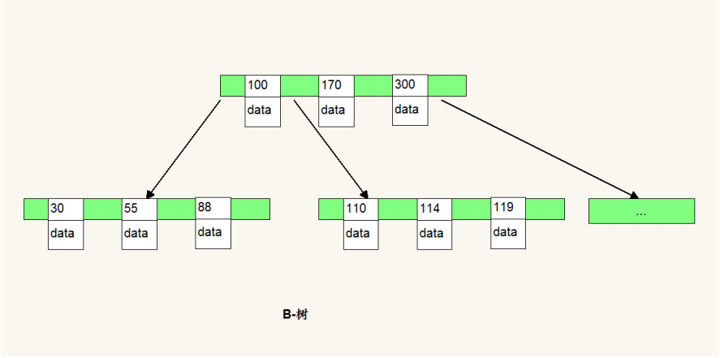

**B-树的特点:**

- (1) 多路 非二叉树

- (2) 每个节点 既保存数据 又保存索引

- (3) 搜索时 相当于二分查找

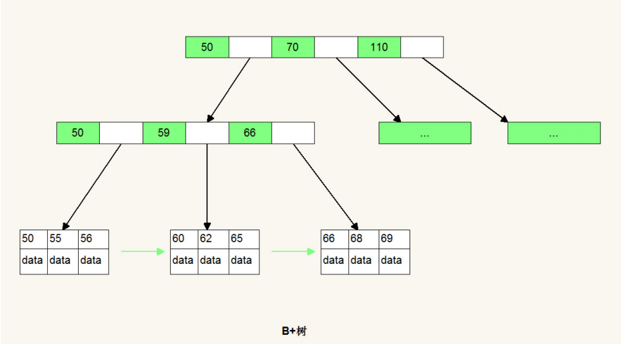

**B+ 树的特点:** 

- （1） 多路非二叉
- （2） 只有叶子节点保存数据
- （3） 搜索时也相当于二分查找
- （4） 增加了相邻节点指针

从上面我们可以看出最核心的区别主要有俩，一个是数据的保存位置，一个是相邻节点的指向。就是这俩造成了MongoDB和MySql的差别。

- （1）B+树相邻接点的指针可以大大增加区间访问性，可使用在范围查询等，而B-树每个节点 key 和data 在一起适合随机读写 ，而区间查找效率很差。

- （2）B+树更适合外部存储，也就是磁盘存储，使用B-结构的话，每次磁盘预读中的很多数据是用不上的数据。因此，它没能利用好磁盘预读的提供的数据。由于节点内无 data 域，每个节点能索引的范围更大更精确。

- （3）注意这个区别相当重要，是基于（1）（2）的，B-树每个节点即保存数据又保存索引 树的深度小，所以磁盘IO的次数很少，B+树只有叶子节点保存，较B树而言深度大磁盘IO多，但是区间访问比较好。


### 2.5、explain和慢查询分析

使用js循环 插入100万条数据 不使用索引字段 查询查看执行计划 ，然后给某个字段建立索引,使用索引字段作为查询条件 再查看执行计划进行分析explain()也接收不同的参数，通过设置不同参数我们可以查看更详细的查询计划。

- **queryPlanner：**queryPlanner是默认参数，具体执行计划信息参考下面的表格。

- **executionStats：**executionStats会返回执行计划的一些统计信息(有些版本中和allPlansExecution等同)。

- **allPlansExecution：**allPlansExecution用来获取所有执行计划，结果参数基本与上文相同。

#### 2.5.1、queryPlanner 默认参数

| 参数                              | 含义                                                         |
| --------------------------------- | ------------------------------------------------------------ |
| plannerVersion                    | 查询计划版本                                                 |
| **namespace**                     | 要查询的集合（该值返回的是该query所查询的表）数据库.集合     |
| indexFilterSet                    | 针对该query是否有indexFilter                                 |
| parsedQuery                       | 查询条件                                                     |
| winningPlan                       | 被选中的执行计划                                             |
| **winningPlan.stage**             | 被选中执行计划的stage(查询方式)，常见的有：COLLSCAN/全表扫描：（应该知道就是CollectionScan，就是所谓的“集合扫描”， 和mysql中table scan/heap scan类似，这个就是所谓的性能最烂最无奈的由来）、IXSCAN/索引扫描：（是IndexScan，这就说明我们已经命中索引了）、FETCH/根据索引去检索文档、SHARD_MERGE/合并分片结果、IDHACK/针对_id进行查询等 |
| winningPlan.inputStage            | 用来描述子stage，并且为其父stage提供文档和索引关键字。       |
| **winningPlan.stage的childstage** | 如果此处是IXSCAN，表示进行的是index scanning。               |
| **winningPlan.keyPattern**        | 所扫描的index内容                                            |
| **winningPlan.indexName**         | winning plan所选用的index。                                  |
| winningPlan.isMultiKey            | 是否是Multikey，此处返回是false，如果索引建立在array上，此处将是true。 |
| **winningPlan.direction**         | 此query的查询顺序，此处是forward，如果用了.sort({字段:-1})将显示backward。 |
| filter                            | 过滤条件                                                     |
| winningPlan.indexBounds           | winningplan所扫描的索引范围,如果没有制定范围就是[MaxKey,MinKey]，这主要是直接定位到mongodb的chunck中去查找数据，加快数据读取。 |
| rejectedPlans                     | 被拒绝的执行计划的详细返回，其中具体信息与winningPlan的返回中意义相同，故不在此赘述） |
| serverInfo                        | MongoDB服务器信息                                            |

#### 2.5.2、executionStats参数

| 参数                                   | 描述                                                         |
| -------------------------------------- | ------------------------------------------------------------ |
| executionSuccess                       | 是否执行成功                                                 |
| nReturned                              | 返回的文档数                                                 |
| executionTimeMillis                    | 执行耗时                                                     |
| totalKeysExamined                      | 索引扫描次数                                                 |
| totalDocsExamined                      | 文档扫描次数                                                 |
| executionStages                        | 这个分类下描述执行的状态                                     |
| stage                                  | 扫描方式，具体可选值与上文的相同                             |
| nReturned                              | 查询结果数量                                                 |
| executionTimeMillisEstimate            | 检索document获得数据的时间                                   |
| inputStage.executionTimeMillisEstimate | 该查询扫描文档 index所用时间                                 |
| works                                  | 工作单元数，一个查询会分解成小的工作单元                     |
| advanced                               | 优先返回的结果数                                             |
| docsExamined                           | 文档检查数目，与totalDocsExamined一致。检查了总共的document 个数，而从返回上面的nReturned数量 |

- **executionStats返回逐层分析**

  - 第一层，executionTimeMillis最为直观explain返回值是executionTimeMillis值，指的是这条语句的执行时间，这个值当然是希望越少越好。

    其中有3个executionTimeMillis，分别是：

    executionStats.executionTimeMillis 该query的整体查询时间。

    executionStats.executionStages.executionTimeMillisEstimate 该查询检索document获得数据的时间。

    executionStats.executionStages.inputStage.executionTimeMillisEstimate 该查询扫描文档 index所用时间。

  - 第二层，index与document扫描数与查询返回条目数 这个主要讨论3个返回项 nReturned、totalKeysExamined、totalDocsExamined，分别代表该条查询返回的条目、索引扫描条目、文档扫描条目。 这些都是直观地影响到executionTimeMillis，我们需要扫描的越少速度越快。

    我们最理想的状态是：nReturned=totalKeysExamined=totalDocsExamined

  - 第三层，stage状态分析 那么又是什么影响到了totalKeysExamined和totalDocsExamined？是stage的类型。

    **类型列举如下：**

    - COLLSCAN：全表扫描
  - IXSCAN：索引扫描
    - FETCH：根据索引去检索指定document
    - SHARD_MERGE：将各个分片返回数据进行merge
    - SORT：表明在内存中进行了排序
    - LIMIT：使用limit限制返回数
    - SKIP：使用skip进行跳过
    - IDHACK：针对_id进行查询
    - SHARDING_FILTER：通过mongos对分片数据进行查询
    - COUNT：利用db.coll.explain().count()之类进行count运算
    - TEXT：使用全文索引进行查询时候的stage返回
    - PROJECTION：限定返回字段时候stage的返回
  
    **对于普通查询，我希望看到stage的组合(查询的时候尽可能用上索引)：**

    - Fetch+IDHACK

    - Fetch+IXSCAN
  - Limit+（Fetch+IXSCAN）
    - PROJECTION+IXSCAN
    - SHARDING_FITER+IXSCAN
  
    **不希望看到包含如下的stage：**

    - COLLSCAN(全表扫描)
  - SORT(使用sort但是无index)
    
    - COUNT 不使用index进行count)

```apl
/**向thm_test中插入100万条数据*/
for (var i = 0; i < 1000000; i++) {
	db.thm_test_explain.insert({id:i,name:"test" + i,salary:(Math.random()*20000).toFixed(2)})
}
db.thm_test_explain.count()
db.thm_test_explain.find({name:"test11"}).explain()
db.thm_test_explain.find({name:"test11"}).explain("executionStats")
db.thm_test_explain.createIndex({"id": 1})
db.thm_test_explain.find({id:{$gt:222262}}).explain()
db.thm_test_explain.find({id:{$gt:222262}}).explain("executionStats")
/**排除_id字段*/
db.thm_test_explain.find({id:{$gt:222262}},{_id:0})
```

#### 2.5.3、allPlansExecution参数

queryPlanner 参数和executionStats的拼接

#### 2.5.4、慢查询分析

- 开启内置的查询分析器,记录读写操作效率

  ```apl
  db.setProfilingLevel(n,m)
  #n的取值可选0,1,2
  db.setProfilingLevel(1,5000)
  ```

  - 0 表示不记录

  - 1 表示记录慢速操作,如果值为1,m必须赋值单位为ms,用于定义慢速查询时间的阈值

  - 2 表示记录所有的读写操作

- 查询监控结果

  ```apl
  db.system.profifile.find().sort({millis:-1}).limit(3)
  ```

- 分析慢速查询

   应用程序设计不合理、不正确的数据模型、硬件配置问题,缺少索引等

- 解读explain结果 确定是否缺少索引

## 3、MongoDB 应用实战

#### 3.1、MongoDB的适用场景

- 网站数据：Mongo 非常适合实时的插入,更新与查询，并具备网站实时数据存储所需的复制及高度伸缩性。
- 缓存：由于性能很高，Mongo 也适合作为信息基础设施的缓存层。在系统重启之后，由Mongo搭建的持久化缓存层可以避免下层的数据源过载。
- 大尺寸、低价值的数据：使用传统的关系型数据库存储一些大尺寸低价值数据时会比较浪费，在此之前，很多时候程序员往往会选择传统的文件进行存储。
- 高伸缩性的场景：Mongo非常适合由数十或数百台服务器组成的数据库，Mongo的路线图中已经包含对MapReduce引擎内置支持及集群高可用的解决方案。
- 用于对象及JSON 数据的存储：Mongo 的BSON 数据格式非常适合文档化格式的存储及查询。

#### 3.2、MongoDB的行业具体应用场景

- 游戏场景，使用MongoDB存储游戏用户信息，用户的装备、积分等直接以内嵌文档的形式存储，方便查询、更新。
- 物流场景，使用MongoDB存储订单信息，订单状态在运送过程中会不断更新，以MongoDB内嵌数组的形式来存储，一次查询就能将订单所有的变更读出来。
- 社交场景，使用MongoDB存储存储用户信息，以及用户发表的朋友圈信息，通过地理位置索引实现附近的人、地点等功能。
- 物联网场景，使用MongoDB存储所有接入的智能设备信息，以及设备汇报的日志信息，并对这些信息进行多维度的分析。
- 直播，使用MongoDB存储用户信息、礼物信息等。

#### 3.3、如何抉择是否使用MongoDB

| 应用特征                                           | yes/no   |
| -------------------------------------------------- | -------- |
| 应用不需要事务及复杂 join 支持                     | 必须 Yes |
| 新应用，需求会变，数据模型无法确定，想快速迭代开发 | ？       |
| 应用需要2000-3000以上的读写QPS（更高也可以）       | ？       |
| 应用需要TB甚至 PB 级别数据存储                     | ？       |
| 应用发展迅速，需要能快速水平扩展                   | ？       |
| 应用要求存储的数据不丢失                           | ？       |
| 应用需要99.999%高可用                              | ？       |
| 应用需要大量的地理位置查询、文本查询               | ？       |

包含三个及以上就很适合

#### 3.4、Java 访问MongoDB

- 创建maven项目并添加依赖

  ```xml
  <dependency>
      <groupId>org.mongodb</groupId>
      <artifactId>mongo-java-driver</artifactId>
      <version>3.10.1</version>
  </dependency>
  ```

- 进行插入

  ```java
  package com.thm;
  
  import com.mongodb.MongoClient;
  import com.mongodb.client.MongoCollection;
  import com.mongodb.client.MongoDatabase;
  import org.bson.Document;
  public class DocumentInsert {
      public static void main(String[] args) {
          //获取mongo客户端
          MongoClient mongoClient = new MongoClient("192.168.81.100",27017);
          //获取数据库对象
          MongoDatabase database = mongoClient.getDatabase("thm_test");
          //获取集合对象（表）
          MongoCollection<Document> collection = database.getCollection("thm_test");
          //构建Bson java插入时间会进行优化使用当前时间
          Document document = Document.parse("{name:'发挥示范',birthday:new ISODate('2021-03-10'),city:'成都',expectSalary:25000}");
          //插入数据
          collection.insertOne(document);
          mongoClient.close();
      }
  }
  ```

- 查询

  ```java
  package com.thm;
  
  import com.mongodb.MongoClient;
  import com.mongodb.client.FindIterable;
  import com.mongodb.client.MongoCollection;
  import com.mongodb.client.MongoDatabase;
  import com.mongodb.client.model.Filters;
  import org.bson.Document;
  
  public class DocumentFilters {
      public static void main(String[] args) {
          //获取mongo客户端
          MongoClient mongoClient = new MongoClient("192.168.81.100", 27017);
          //获取数据库对象
          MongoDatabase database = mongoClient.getDatabase("thm_test");
          //获取集合对象（表）
          MongoCollection<Document> collection = database.getCollection("thm_test");
          //构建查询expectSalary > 17000 并排序
  //        FindIterable<Document> documents = collection.find(Document.parse("{expectSalary:{$gt:17000}}")).sort(Document.parse("{expectSalary: -1}"));
          FindIterable<Document> documents = collection.find(Filters.gt("expectSalary",17000)).sort(Document.parse("{expectSalary: -1}"));
          for (Document document : documents) {
              System.out.println(document);
          }
          mongoClient.close();
      }
  }
  ```

#### 3.5、Spring 访问MongoDB

- 基于maven新建工程 导入依赖的包

  ```xml
  <dependency>
      <groupId>org.springframework.data</groupId>
      <artifactId>spring-data-mongodb</artifactId>
      <version>2.0.9.RELEASE</version>
  </dependency>
  ```

- 在配置文件application.xml中配置MongoTemplate

  ```xml
  <?xml version="1.0" encoding="UTF-8"?>
  <beans xmlns="http://www.springframework.org/schema/beans" 
         xmlns:xsi="http://www.w3.org/2001/XMLSchema-instance"
         xmlns:context="http://www.springframework.org/schema/context"
         xmlns:mongo="http://www.springframework.org/schema/data/mongo"
         xsi:schemaLocation="
         http://www.springframework.org/schema/beans
         http://www.springframework.org/schema/beans/spring-beans.xsd
         http://www.springframework.org/schema/context
         http://www.springframework.org/schema/context/spring-context.xsd
         http://www.springframework.org/schema/data/mongo
         http://www.springframework.org/schema/data/mongo/spring-mongo.xsd"
  >
      <!-- 构建MongoDb工厂对象 -->
      <mongo:db-factory id="mongoDbFactory" client-uri="mongodb://192.168.81.100:27017/thm_test"/>
      <!-- 构建 MongoTemplate 类型的对象 -->
      <bean id="mongoTemplate" class="org.springframework.data.mongodb.core.MongoTemplate">
          <constructor-arg index="0" ref="mongoDbFactory"/>
      </bean>
      <!-- 开启组件扫描 -->
      <context:component-scan base-package="com.thm"/>
  </beans>
  ```

- 创建实体类

  ```java
  package com.thm.entity;
  
  import java.util.Date;
  public class Resume {
      //对应mongodb 中的_id
      private String id;
      private String name;
      private Date birthday;
      private double expectSalary;
      private int gender;
      private String city;
      //省略get/set/tostring
  }
  ```

- DAO实现类注入MongoTemplate 完成增删改查

  ```java
  package com.thm.dao;
  import com.thm.entity.Resume;
  import java.util.List;
  public interface ResumeDao {
      /**
       * 新增
       * @param resume
       */
      void insertResume(Resume resume);
      /**
       * 查询所有
       * @return
       */
      List<Resume> findAll();
      /**
       * 根据ID查询
       * @param id
       * @return
       */
      Resume findResumeById(String id);
      /**
       * 根据ID和name查询
       * @param id
       * @param name
       * @return
       */
      Resume findResumeByIdAndName(String id,String name);
  }
  ```

  ```java
  package com.thm.dao.impl;
  
  import com.thm.dao.ResumeDao;
  import com.thm.entity.Resume;
  import org.springframework.beans.factory.annotation.Autowired;
  import org.springframework.data.mongodb.core.MongoTemplate;
  import org.springframework.data.mongodb.core.query.Criteria;
  import org.springframework.data.mongodb.core.query.Query;
  import org.springframework.stereotype.Repository;
  import java.util.List;
  @Repository
  public class ResumeDaoImpl implements ResumeDao {
      @Autowired
      private MongoTemplate mongoTemplate;
      public void insertResume(Resume resume) {
          //未指定集合名称，默认是类目小写  无则创建集合
          //mongoTemplate.insert(resume);
          //指定集合名称
          mongoTemplate.insert(resume,"thm_test");
      }
  
      @Override
      public List<Resume> findAll() {
          return mongoTemplate.findAll(Resume.class,"thm_test");
      }
  
      @Override
      public Resume findResumeById(String id) {
          Query query = new Query();
          query.addCriteria(Criteria.where("id").is(id));
          Resume resume = mongoTemplate.findOne(query, Resume.class, "thm_test");
          return resume;
      }
  
      @Override
      public Resume findResumeByIdAndName(String id, String name) {
          Query query = new Query();
          query.addCriteria(Criteria.where("id").is(id).andOperator(Criteria.where("name").is(name)));
          Resume resume = mongoTemplate.findOne(query, Resume.class, "thm_test");
          return resume;
      }
  }
  ```

- 从Spring容器中获取DAO对象 进行测试 (注意:要开启组件扫描)

  ```java
  package com.thm;
  
  import com.thm.dao.ResumeDao;
  import com.thm.entity.Resume;
  import org.springframework.context.support.ClassPathXmlApplicationContext;
  
  import java.text.ParseException;
  import java.text.SimpleDateFormat;
  import java.util.Date;
  
  public class MongoTemplateInsert {
      public static void main(String[] args) {
          ClassPathXmlApplicationContext context = new ClassPathXmlApplicationContext("application.xml");
          ResumeDao resumeDao = context.getBean(ResumeDao.class);
          //---------------新增---------------
          //构建插入对象，不设置ID，默认插入_id值并返回对象中，设置则使用设置的值
          Resume resume = new Resume();
          resume.setName("测试2");
          try {
              Date date = new SimpleDateFormat("yyyy-MM-dd hh:mm:ss").parse("2021-03-10 12:25:15");
              resume.setBirthday(date);
          } catch (ParseException e) {
              e.printStackTrace();
          }
          resume.setExpectSalary(15620);
          resume.setGender(0);
          resume.setCity("上海");
          resumeDao.insertResume(resume);
          System.out.println(resume.getId());
          //---------------查询---------------
          List<Resume> all = resumeDao.findAll();
          System.out.println("输出查询集合---------------");
          all.forEach(resume -> System.out.println(resume));
          Resume resume = resumeDao.findResumeById("6048c56ed5b8271d3033c195");
          System.out.println("输出单条件查询对象---------------");
          System.out.println(resume);
          Resume resume2 = resumeDao.findResumeByIdAndName("6048c56ed5b8271d3033c195","测试2");
          System.out.println("输出多条件查询对象---------------");
          System.out.println(resume2);
      }
  }
  ```

#### 3.6、Spring Boot 访问 MongoDB

##### 3.6.1、MongoTemplate 的方式

- 基于maven新建springboot工程

  ```xml
  <dependency>
      <groupId>org.springframework.boot</groupId>
      <artifactId>spring-boot-starter-data-mongodb</artifactId>
      <version>2.3.5.RELEASE</version>
  </dependency>
  ```

- 配置文件application.yml

  ```yaml
  spring:
    data:
      mongodb:
        host: 192.168.81.100
        port: 27017
        database: thm_test
  ```

- 创建实体类

  ```java
  package com.thm.entity;
  
  import java.util.Date;
  public class Resume {
      //对应mongodb 中的_id
      private String id;
      private String name;
      private Date birthday;
      private double expectSalary;
      private int gender;
      private String city;
      //省略get/set/tostring
  }
  ```

- DAO 实现类 注入 MongoTemplate 完成增删改查

  ```java
  package com.thm.dao;
  import com.thm.entity.Resume;
  import java.util.List;
  public interface ResumeDao {
      /**
       * 新增
       * @param resume
       */
      void insertResume(Resume resume);
      /**
       * 查询所有
       * @return
       */
      List<Resume> findAll();
      /**
       * 根据ID查询
       * @param id
       * @return
       */
      Resume findResumeById(String id);
      /**
       * 根据ID和name查询
       * @param id
       * @param name
       * @return
       */
      Resume findResumeByIdAndName(String id,String name);
  }
  ```

  ```java
  package com.thm.dao.impl;
  
  import com.thm.dao.ResumeDao;
  import com.thm.entity.Resume;
  import org.springframework.beans.factory.annotation.Autowired;
  import org.springframework.data.mongodb.core.MongoTemplate;
  import org.springframework.data.mongodb.core.query.Criteria;
  import org.springframework.data.mongodb.core.query.Query;
  import org.springframework.stereotype.Repository;
  import java.util.List;
  @Repository
  public class ResumeDaoImpl implements ResumeDao {
      @Autowired
      private MongoTemplate mongoTemplate;
      public void insertResume(Resume resume) {
          //未指定集合名称，默认是类目小写  无则创建集合
          //mongoTemplate.insert(resume);
          //指定集合名称
          mongoTemplate.insert(resume,"thm_test");
      }
  
      @Override
      public List<Resume> findAll() {
          return mongoTemplate.findAll(Resume.class,"thm_test");
      }
  
      @Override
      public Resume findResumeById(String id) {
          Query query = new Query();
          query.addCriteria(Criteria.where("id").is(id));
          Resume resume = mongoTemplate.findOne(query, Resume.class, "thm_test");
          return resume;
      }
  
      @Override
      public Resume findResumeByIdAndName(String id, String name) {
          Query query = new Query();
          query.addCriteria(Criteria.where("id").is(id).andOperator(Criteria.where("name").is(name)));
          Resume resume = mongoTemplate.findOne(query, Resume.class, "thm_test");
          return resume;
      }
  }
  ```

- 从Spring容器中获取DAO对象 进行测试

  ```java
  package com.thm;
  
  import com.thm.dao.ResumeDao;
  import com.thm.entity.Resume;
  import org.springframework.boot.SpringApplication;
  import org.springframework.boot.autoconfigure.SpringBootApplication;
  import org.springframework.context.ApplicationContext;
  import java.util.List;
  
  @SpringBootApplication
  public class RunWith {
      public static void main(String[] args) {
          ApplicationContext applicationContext = SpringApplication.run(RunWith.class);
          ResumeDao resumeDao = applicationContext.getBean(ResumeDao.class);
          List<Resume> all = resumeDao.findAll();
          System.out.println("输出查询集合---------------");
          all.forEach(resume -> System.out.println(resume));
          Resume resume = resumeDao.findResumeById("6048c56ed5b8271d3033c195");
          System.out.println("输出单条件查询对象---------------");
          System.out.println(resume);
          Resume resume2 = resumeDao.findResumeByIdAndName("6048c56ed5b8271d3033c195","测试2");
          System.out.println("输出多条件查询对象---------------");
          System.out.println(resume2);
      }
  }
  ```

##### 3.6.2、MongoRepository 的方式

- 基于maven新建springboot工程

  ```xml
  <dependency>
      <groupId>org.springframework.boot</groupId>
      <artifactId>spring-boot-starter-data-mongodb</artifactId>
      <version>2.3.5.RELEASE</version>
  </dependency>
  ```

- 配置文件application.yml

  ```yaml
  spring:
    data:
      mongodb:
        host: 192.168.81.100
        port: 27017
        database: thm_test
  ```

- 创建实体类

  ```java
  package com.thm.entity;
  
  import org.springframework.data.mongodb.core.mapping.Document;
  
  /**
   * @ClassNmae Resume
   * @Description TODO
   * @Author THM
   * @Date 2021/3/10 20:57
   * @Version 1.0
   **/
  @Document("thm_test")
  public class Resume {
      //对应mongodb 中的_id
      private String id;
      private String name;
      private String birthday;
      private double expectSalary;
      private int gender;
      private String city;
      //省略get/set/tostring
  }
  ```

- 编写 Repository 接口 继承 MongoRepository

   方法具体参考:https://docs.spring.io/spring-data/jpa/docs/current/reference/html/#jpa.query-methods.query-creation

  如果内置方法不够用 就自己定义 如:定义fifind|read|get 等开头的方法进行查询 

  ```java
  import java.util.Optional;
  
  @Repository
  public interface ResumeRepository extends MongoRepository<Resume,String> {
      Optional<Resume> findById(String id);
      Resume findByIdAndName(String id,String name);
  }
  ```

- 从Spring容器中获取Repository对象 进行测试

  ```java
  package com.thm;
  
  import com.thm.dao.ResumeDao;
  import com.thm.dao.ResumeRepository;
  import com.thm.entity.Resume;
  import org.springframework.boot.SpringApplication;
  import org.springframework.boot.autoconfigure.SpringBootApplication;
  import org.springframework.context.ApplicationContext;
  
  import java.util.List;
  import java.util.Optional;
  @SpringBootApplication
  public class RunWith {
      public static void main(String[] args) {
          ApplicationContext applicationContext = SpringApplication.run(RunWith.class);
          ResumeRepository resumeRepository = applicationContext.getBean(ResumeRepository.class);
          resumeRepository.findAll().forEach(resume -> System.out.println(resume));
          Optional<Resume> byId = resumeRepository.findById("6048c56ed5b8271d3033c195");
          System.out.println(byId.get());
          Resume resume = resumeRepository.findByIdAndName("6048c56ed5b8271d3033c195", "测试2");
          System.out.println(resume);
      }
  }
  ```

## 4、MongoDB架构

#### 4.1、MongoDB逻辑结构

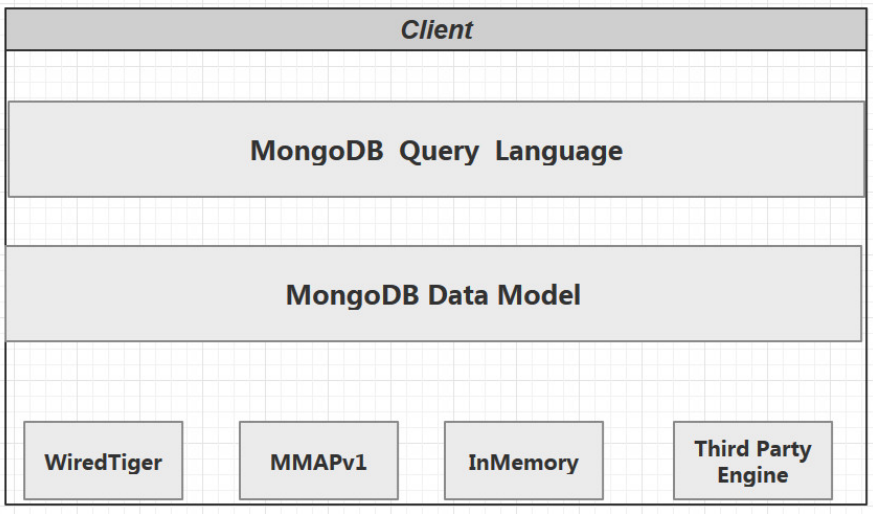

MongoDB 与 MySQL 中的架构相差不多，底层都使用了可插拔的存储引擎以满足用户的不同需要。用户可以根据程序的数据特征选择不同的存储引擎,在最新版本的MongoDB中使用了WiredTiger作为默认的存储引擎，WiredTiger 提供了不同粒度的并发控制和压缩机制，能够为不同种类的应用提供了最好的性能和存储率。在存储引擎上层的就是MongoDB的数据模型和查询语言了，由于MongoDB对数据的存储与 RDBMS有较大的差异，它创建了一套不同的数据模型和查询语言。

#### 4.2、MongoDB的数据模型

- **描述数据模型**

  - 内嵌

    内嵌的方式指的是把相关联的数据保存在同一个文档结构之中。MongoDB的文档结构允许一个字段或者一个数组内的值作为一个嵌套的文档。

  - 引用

    引用方式通过存储数据引用信息来实现两个不同文档之间的关联,应用程序可以通过解析这些数据引用来访问相关数据。

- **如何选择数据模型**

  - 选择内嵌: 
    - 数据对象之间有包含关系 ,一般是数据对象之间有一对多或者一对一的关系 。 
    - 需要经常一起读取的数据。
    - 有 map-reduce/aggregation 需求的数据放在一起，这些操作都只能操作单个 collection。

  - 选择引用: 
    - 当内嵌数据会导致很多数据的重复，并且读性能的优势又不足于覆盖数据重复的弊端 。
    - 需要表达比较复杂的多对多关系的时候 。 
    - 大型层次结果数据集 嵌套不要太深。

#### 4.3、MongoDB 存储引擎

##### 4.3.1、存储引擎概述

存储引擎是MongoDB的核心组件，负责管理数据如何存储在硬盘和内存上。MongoDB支持的存储引擎有 MMAPv1 ,WiredTiger和InMemory。InMemory存储引擎用于将数据只存储在内存中，只将少量的元数据 (meta-data)和诊断日志（Diagnostic）存储到硬盘文件中，由于不需要Disk的IO操作，就能获取所需 的数据，InMemory存储引擎大幅度降低了数据查询的延迟（Latency）。从mongodb3.2开始默认的存储 引擎是WiredTiger,3.2版本之前的默认存储引擎是MMAPv1，mongodb4.x版本不再支持MMAPv1存储引 擎。

```yaml
storage: 
	journal: 
		enabled: true 
	dbPath: /data/mongo/ 
	##是否一个库一个文件夹 
	directoryPerDB: true 
	##数据引擎 
	engine: wiredTiger 
	##WT引擎配置 
	WiredTiger: 
        engineConfig: 
        ##WT最大使用cache（根据服务器实际情况调节） 
        cacheSizeGB: 2
		##是否将索引也按数据库名单独存储 
		directoryForIndexes: true 
		journalCompressor: none （默认snappy） 
		##表压缩配置 
		collectionConfig: 
			blockCompressor: zlib (默认snappy,还可选none、zlib) 
        ##索引配置 
        indexConfig: 
         	prefixCompression: true
```

##### 4.3.2、WiredTiger存储引擎优势

- 文档空间分配方式 WiredTiger使用的是BTree存储 MMAPV1 线性存储 需要Padding 

- 并发级别 WiredTiger 文档级别锁 MMAPV1引擎使用表级锁 

- 数据压缩 snappy (默认) 和 zlib ,相比MMAPV1(无压缩) 空间节省数倍。 

- 内存使用 WiredTiger 可以指定内存的使用大小。 

- Cache使用 WT引擎使用了二阶缓存WiredTiger Cache, File System Cache来保证Disk上的数据的最终一 致性。而MMAPv1 只有journal 日志。

##### 4.3.3、WiredTiger引擎包含的文件和作用


- WiredTiger.basecfg: 存储基本配置信息，与 ConfigServer有关系
- WiredTiger.lock: 定义锁操作
- table.wt: 存储各张表的数据
- WiredTiger.wt: 存储table 的元数据
- WiredTiger.turtle: 存储WiredTiger.wt的元数据
- journal: 存储WAL(Write Ahead Log)

##### 4.3.4、WiredTiger存储引擎实现原理

- **写请求**

  WiredTiger的写操作会默认写入 Cache ,并持久化到 WAL (Write Ahead Log)，每60s或Log文件达到2G做一次 checkpoint (当然我们也可以通过在写入时传入 j: true 的参数强制 journal 文件的同步 ，writeConcern { w: , j: , wtimeout: }) 产生快照文件。WiredTiger初始化时，恢复至最新的快照状态，然后再根据WAL恢复数据，保证数据的完整性。

  

  Cache是基于BTree的，节点是一个page，root page是根节点，internal page是中间索引节点，leafpage真正存储数据，数据以page为单位读写。

  WiredTiger采用Copy on write的方式管理写操作（insert、update、delete），写操作会先缓存在cache里，持久化时，写操作不会在原来的leaf page上进行，而是写入新分配的page，每次**checkpoint**都会产生一个新的root page。

- **checkpoint流程**

  1. 对所有的table进行一次checkpoint，每个table的checkpoint的元数据更新至WiredTiger.wt 
  2. 对WiredTiger.wt进行checkpoint，将该table checkpoint的元数据更新至临时文件 WiredTiger.turtle.set 
  3. 将WiredTiger.turtle.set重命名为WiredTiger.turtle。
  4. 上述过程如果中间失败，WiredTiger在下次连接初始化时，首先将数据恢复至最新的快照状态，然后根据WAL恢复数据，以保证存储可靠性。

- **Journaling**

  在数据库宕机时 , 为保证 MongoDB 中数据的持久性，MongoDB 使用了 Write Ahead Logging 向磁盘上的 journal 文件预先进行写入。除了 journal 日志，MongoDB 还使用检查点（checkpoint）来保证数据的一致性，当数据库发生宕机时，我们就需要 checkpoint 和 journal 文件协作完成数据的恢复工作。

  1. 在数据文件中查找上一个检查点的标识符
2. 在 journal 文件中查找标识符对应的记录
  3. 重做对应记录之后的全部操作

  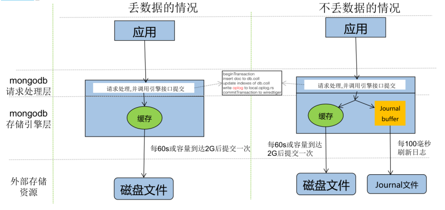

## 5、MongoDB集群高可用

### 5.1、MongoDB主从复制架构原理和缺陷

master-slave架构中master节点负责数据的读写，slave没有写入权限只负责读取数据。

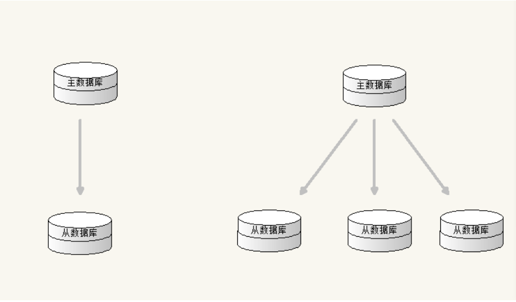

在主从结构中，主节点的操作记录成为oplog（operation log）。oplog存储在系统数据库local的 oplog.$main集合中，这个集合的每个文档都代表主节点上执行的一个操作。从服务器会定期从主服务器 中获取oplog记录，然后在本机上执行！对于存储oplog的集合，MongoDB采用的是固定集合，也就是说随 着操作过多，新的操作会覆盖旧的操作！

主从结构没有自动故障转移功能，需要指定master和slave端，不推荐在生产中使用。

mongodb4.0后不再支持主从复制！使用后出现异常：[main] Master/slave replication is no longer supported

### 5.2、复制集replica sets

#### 5.2.1、什么是复制集

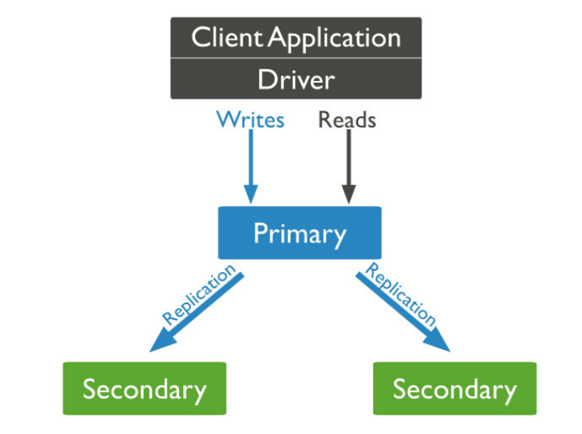

复制集是由一组拥有相同数据集的mongod实例做组成的集群。 

复制集是一个集群，它是2台及2台以上的服务器组成，以及复制集成员包括Primary主节点,secondary从节点和投票节点。 

复制集提供了数据的冗余备份，并在多个服务器上存储数据副本，提高了数据的可用性,保证数据的安全 性。

#### 5.2.2、为什么要使用复制集

- 高可用

  - 防止设备（服务器、网络）故障。 

  - 提供自动failover 功能。 

  - 技术来保证高可用 

- 灾难恢复 

  当发生故障时，可以从其他节点恢复 用于备份。 

- 功能隔离 

  我们可以在备节点上执行读操作，减少主节点的压力，比如:用于分析、报表，数据挖掘，系统任务等。

#### 5.2.3、复制集集群架构原理

一个复制集中Primary节点上能够完成读写操作,Secondary节点仅能用于读操作。Primary节点需要记录所有改变数据库状态的操作,这些记录保存在 oplog 中,这个文件存储在 local 数据库,各个Secondary节点通过此 oplog 来复制数据并应用于本地,保持本地的数据与主节点的一致。oplog 具有幂等性,即无论执行几次其结果一致,这个比 mysql 的二进制日志更好用。

```apl
{
"ts" : Timestamp(1446011584, 2), 
"h" : NumberLong("1687359108795812092"), 
"v" : 2, 
"op" : "i", 
"ns" : "test.nosql", 
"o" : { "_id" : ObjectId("563062c0b085733f34ab4129"), "name" : "mongodb", "score" : "10"} 
}
#字段含义
ts：操作时间，当前timestamp + 计数器，计数器每秒都被重置 
h：操作的全局唯一标识 
v：oplog版本信息 
op：操作类型 
    i：插入操作 
    u：更新操作 
    d：删除操作 
    c：执行命令（如createDatabase，dropDatabase） 
n：空操作，特殊用途 
ns：操作针对的集合 
o：操作内容 
o2：更新查询条件,仅update操作包含该字段
```

- 复制集数据同步分为初始化同步和keep复制同步。初始化同步指**全量**从主节点同步数据，如果Primary节点数据量比较大同步时间会比较长。而keep复制指初始化同步过后，节点之间的实时同步一般是**增量**同步。

  初始化同步有以下两种情况会触发：

  - Secondary第一次加入。
- Secondary落后的数据量超过了oplog的大小，这样也会被全量复制。
  
- MongoDB的Primary节点选举基于心跳触发。一个复制集N个节点中的任意两个节点维持心跳，每个节点维护其他N-1个节点的状态。

  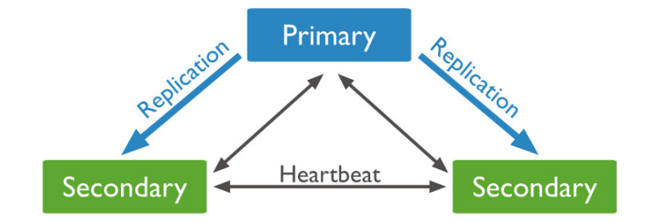

  **心跳检测：** 

  整个集群需要保持一定的通信才能知道哪些节点活着哪些节点挂掉。mongodb节点会向副本集中的其他节点每2秒就会发送一次pings包，如果其他节点在10秒钟之内没有返回就标示为不能访问。每个节点内部都会维护一个状态映射表，表明当前每个节点是什么角色、日志时间戳等关键信息。**如果主节点发现自己无法与大部分节点通讯则把自己降级为secondary只读节点。**

- 主节点选举触发的时机:

  - 第一次初始化一个复制集 

  - Secondary节点权重比Primary节点高时，发起替换选举 
  - Secondary节点发现集群中没有Primary时，发起选举 
  - Primary节点不能访问到大部分(Majority)成员时主动降级

  当触发选举时,Secondary节点尝试将自身选举为Primary。主节点选举是一个**二阶段过程+多数派协议**。

  - 第一阶段: 

    检测自身是否有被选举的资格，如果符合资格会向其它节点发起本节点是否有选举资格的 FreshnessCheck,进行同僚仲裁 

  - 第二阶段: 

    发起者向集群中存活节点发送Elect(选举)请求，仲裁者收到请求的节点会执行一系列合法性检查，如果检查通过，则仲裁者(一个复制集中最多50个节点其中只有7个具有投票权)给发起者投一票。 

    pv0通过30秒选举锁防止一次选举中两次投票。 

    pv1使用了terms(一个单调递增的选举计数器)来防止在一次选举中投两次票的情况。 

    多数派协议: 发起者如果获得超过半数的投票，则选举通过，自身成为Primary节点。

    获得低于半数选票的原因，除了常见的网络问题外，相同优先级的节点同时通过第一阶段的同僚仲裁并进入第二阶段也是一个原因。因此，当 票不足时，会sleep[0,1]秒内的随机时间，之后再次尝试选举。


#### 5.2.4、复制集搭建

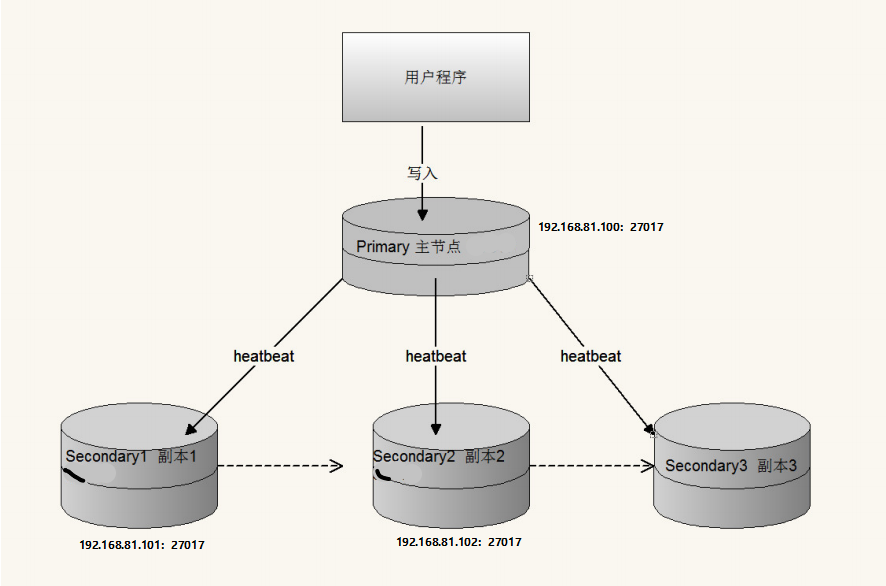

1. **分别安装三台mongodb，当前安装情况如上图所示**

2. **分别配置各mongdb的配置文件，配置文件内容一致**

   ```properties
   dbpath=/data/mongo/
   port=27017
   bind_ip=0.0.0.0
   fork=true
   logpath = /data/mongo/logs/MongoDB.log
   logappend = true
   auth=false
   #指定复制集的名称
   replSet=thmCluster 
   #注意配置的dbpath和logpath的文件目录必须要存在，不存在则创建
   ```

3. **分别指定配置启动各mongodb,在安装目录的bin目录启动**

   ```shell
   ./mongod -f ../conf/mongo.conf
   ```

4. **初始化节点配置，在任意mongo实例中（只能是一个实例中）**

   ```apl
   # 登陆mongo
   [root@node1 bin]# ./mongo
   # 定义配置变量，指定复制集名称，priority指定mongo实例的优先级，不知道是安装启动时间的最新来判断的，当前是为了保证192.168.81.100:27017成为主节点
   var cfg ={
       "_id":"thmCluster", 
       "protocolVersion" : 1, 
       "members":[ 
           {"_id":1,"host":"192.168.81.100:27017","priority":10}, 
           {"_id":2,"host":"192.168.81.101:27017"}
       ] 
   }
   # 初始化配置
   rs.initiate(cfg) 
   # 查看状态
   rs.status()
   ```

5. **节点的动态增删**

   ```apl
   #-------------------------普通节点--------------------------
   #增加节点 
   rs.add("192.168.81.102:27017") 
   #删除slave 节点 
   rs.remove("192.168.81.102:27017")
   #-------------------------仲裁节点--------------------------
   #增加节点 
   rs.addArb("192.168.81.103:27017")
   #删除slave 节点 
   rs.remove("192.168.81.103:27017")
   ```

6. **复制集操作演示**

   > 1、进入主节点 ----- 插入数据 ------ 进入从节点验证
   > 2、注意:默认节点下从节点不能读取数据。调用 **rs.slaveOk()** 解决
   >
   > 3、为了保证高可用，在集群当中如果主节点挂掉后，会自动 在从节点中选举一个 重新做为主节点。
   >
   > ​	关闭主节点，查看效果  **rs.status()**
   >
   > 4、节点说明:
   >
   > - PRIMARY 节点： 可以查询和新增数据
   >
   > - SECONDARY 节点：只能查询 不能新增 基于priority 权重可以被选为主节点
   >
   > - ARBITER 节点： 不能查询数据 和新增数据 ，不能变成主节点

#### 5.2.5、复制集成员的配置参数

注意指的是members中的参数

| 参数字段          | 类型说明 | 取值                          | 说明                                                         |
| ----------------- | -------- | ----------------------------- | ------------------------------------------------------------ |
| _id               | 整数     | _id:0                         | 复制集中的标示                                               |
| host              | 字符串   | host:"主机:端口"              | 节点主机名                                                   |
| arbiterOnly       | 布尔值   | arbiterOnly:true              | 是否为仲裁(裁判)节点                                         |
| priority（权 重） | 整数     | priority=0\|1                 | 默认1，是否有资格变成主节点，取值范围0-1000，0永远不会变成主节点 |
| hidden            | 布尔值   | hidden=true\|false，0\|1      | 隐藏，权重必须为0，才可以设置                                |
| votes             | 整数     | votes= 0\|1                   | 投票，是否为投票节点,0 不投票，1投票                         |
| slaveDelay        | 整数     | slaveDelay=3600               | 从库的延迟多少秒                                             |
| buildIndexes      | 布尔值   | buildIndexes=true\|false,0\|1 | 主库的索引，从库也创建，_id索引无效                          |

**示例：**

```apl
# 登陆mongo
[root@node1 bin]# ./mongo
# 定义配置变量，指定复制集名称，priority指定mongo实例的优先级，不知道是安装启动时间的最新来判断的，当前是为了保证192.168.81.100:27017成为主节点
var cfg ={
    "_id":"thmCluster", 
    "protocolVersion" : 1, 
    "members":[ 
        {"_id":1,"host":"192.168.81.100:27017","priority":10}, 
        {"_id":1,"host":"192.168.81.101:27017","priority":5}, 
        {"_id":1,"host":"192.168.81.102:27017","priority":0}, 
        {"_id":2,"host":"192.168.81.103:27017","arbiterOnly":true}
    ] 
}
# 初始化配置
rs.initiate(cfg) 
# 查看状态
rs.status()
```

### 5.3、分片集群 Shard Cluster

分片（sharding）是MongoDB用来将大型集合水平分割到不同服务器（或者复制集）上所采用的方法。 不需要功能强大的大型计算机就可以存储更多的数据，处理更大的负载。 

#### 5.3.1、为什么要分片

- 存储容量需求超出单机磁盘容量。 

- 活跃的数据集超出单机内存容量，导致很多请求都要从磁盘读取数据，影响性能。 

- IOPS超出单个MongoDB节点的服务能力，随着数据的增长，单机实例的瓶颈会越来越明显。 

- 副本集具有节点数量限制。

垂直扩展：增加更多的CPU和存储资源来扩展容量。 

水平扩展：将数据集分布在多个服务器上。水平扩展即分片。 

#### 5.3.2、分片的工作原理


- **分片集群由以下3个服务组成：** 
  - Shards Server: 

    每个shard由一个或多个mongod进程组成，用于存储数据。 

  - Router Server: 

    数据库集群的请求入口，所有请求都通过Router(mongos)进行协调，不需要在应用程序添加一个路由选择器，Router(mongos)就是一个请求分发中心它负责把应用程序的请求转发到对应的 Shard服务器上。 

  - Config Server:

    配置服务器。存储所有数据库元信息（路由、分片）的配置。

- **片键（shard key）**

  为了在数据集合中分配文档，MongoDB使用分片主键分割集合。

- **区块（chunk）**

  在一个shard server内部，MongoDB还是会把数据分为chunks，每个chunk代表这个shardserver内部一部分数据。MongoDB分割分片数据到区块，每一个区块包含基于分片主键的左闭右开的区间范围。

- **分片策略**

  - 范围分片（Range based sharding）

    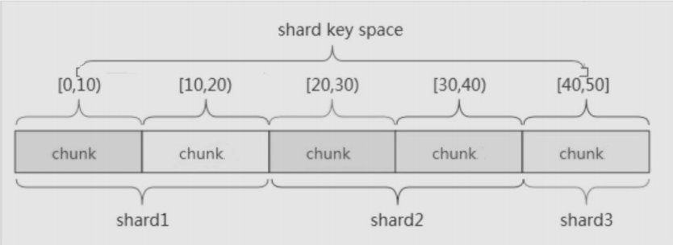

    范围分片是基于分片主键的值切分数据，每一个区块将会分配到一个范围。

    范围分片适合满足在一定范围内的查找，例如查找X的值在[20,30)之间的数据，mongo 路由根据Config server中存储的元数据，可以直接定位到指定的shard的Chunk中。

    缺点: 如果shard key有明显递增（或者递减）趋势，则新插入的文档多会分布到同一个chunk，无法扩展写的能力。

  - hash分片（Hash based sharding）

    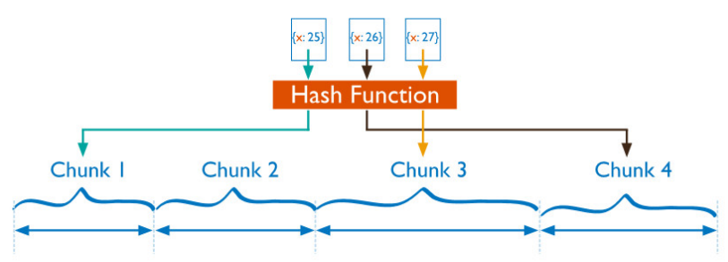

    Hash分片是计算一个分片主键的hash值，每一个区块将分配一个范围的hash值。

    Hash分片与范围分片互补，能将文档随机的分散到各个chunk，充分的扩展写能力，弥补了范围分片的不足，缺点是不能高效的服务范围查询，所有的范围查询要分发到后端所有的Shard才能找出满足条件的文档。

  - 组合片键 A + B(散列思想 不能是直接hash)

    数据库中没有比较合适的片键供选择，或者是打算使用的片键基数太小（即变化少如星期只有7天可变化），可以选另一个字段使用组合片键，甚至可以添加冗余字段来组合。一般是粗粒度+细粒度进行组合。

- **合理的选择shard key**

  无非从两个方面考虑，数据的查询和写入，最好的效果就是数据查询时能命中更少的分片，数据写入时能够随机的写入每个分片，关键如何权衡性能和负载。

#### 5.3.3、分片集群的搭建过程

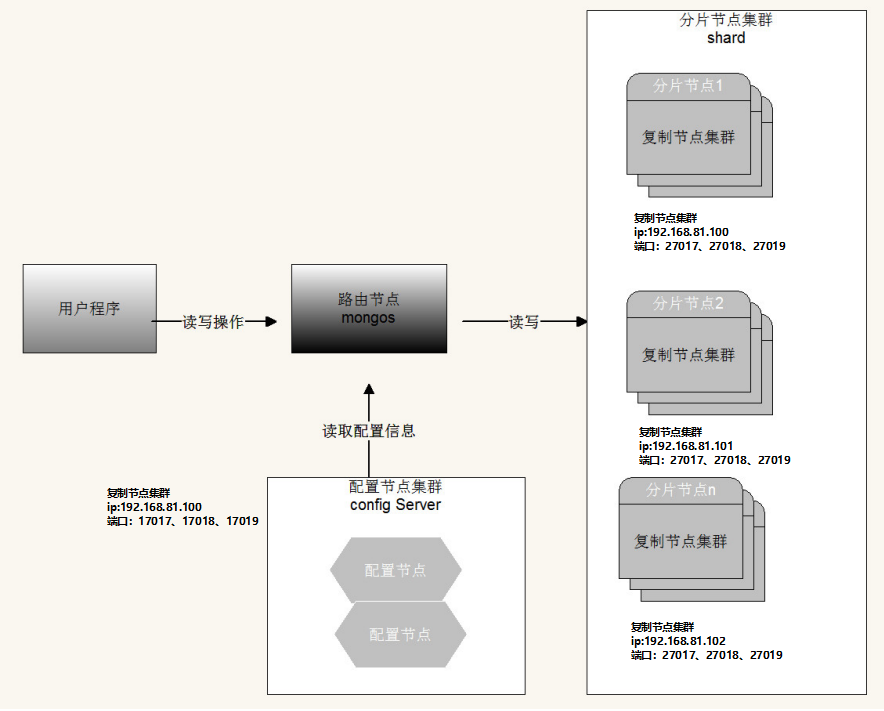

##### 5.3.3.1、搭建配置集群

解压mongodb，在安装目录下创建conf目录，进入conf目录创建多个配置文件，配置文件内容如下

IP：192.168.81.100  端口：17017、17018、17019

```apl
配置文件:conf-17017.conf
配置文件:conf-17018.conf
配置文件:conf-17019.conf
数据库文件位置:config1
数据库文件位置:config2
数据库文件位置:config3
日志文件位置:logs
```

```properties
# 数据库文件位置 当前为相对路径
dbpath=conf/config1
# 端口 
port=17017
# bindIP
bind_ip=0.0.0.0
fork=true
# 日志文件路径
logpath = conf/logs/config1.log
logappend = true
auth=false
# 指定为一个配置服务器
configsvr=true
# 指定配置服务器复制集名称
replSet=configCluster
```

**注意：数据库文件位置、端口、日志文件路径记得修改**

- 启动配置节点

  注意在安装目录下启动

  ```shell
  [root@node1 mongodb-config]# ./bin/mongod -f conf/conf-17017.conf
  [root@node1 mongodb-config]# ./bin/mongod -f conf/conf-17018.conf
  [root@node1 mongodb-config]# ./bin/mongod -f conf/conf-17019.conf
  ```

- 进入任意节点的mongo shell 并添加 配置节点集群 注意use admin

  ```apl
  #进入mongo shell
  [root@node1 bin]# ./mongo --port 17017
  #使用数据库admin
  > use admin
  #定义配置
  var cfg ={
      "_id":"configCluster", 
      "members":[ 
          {"_id":1,"host":"192.168.81.100:17017"}, 
          {"_id":2,"host":"192.168.81.100:17018"}, 
          {"_id":3,"host":"192.168.81.100:17019"}
      ] 
  };
  #初始化配置
  rs.initiate(cfg)
  #查看状态
  rs.status()
  ```

##### 5.3.3.2、配置shard集群

- IP：192.168.81.100  端口：27017、27018、27019
- IP：192.168.81.101  端口：27017、27018、27019
- IP：192.168.81.102  端口：27017、27018、27019

```apl
#分别在每台服务器创建
配置文件:mongo-27017.conf
配置文件:mongo-27018.conf
配置文件:mongo-27019.conf
数据库文件位置:shard1
数据库文件位置:shard2
数据库文件位置:shard3
日志文件位置:logs
```

```properties
dbpath=conf/shard1
port=27017
bind_ip=0.0.0.0
fork=true
logpath=conf/logs/shard1.log
logappend=true
auth=false
#指定分片复制集名称 每个服务器复制集名称不能相同
replSet=shardCluster1
#指定为分片服务
shardsvr=true
```

**注意：数据库文件位置、端口、日志文件路径记得修改**

- 启动每台服务器中的分片节点

  ```shell
  ./bin/mongod -f conf/mongo-27017.conf
  ./bin/mongod -f conf/mongo-27018.conf
  ./bin/mongod -f conf/mongo-27019.conf
  ```

- 在每台服务器中初始化节点配置

  ```apl
  # 登陆mongo
  [root@node1 bin]# ./mongo
  # 分别配置每台服务器中的初始化配置  注意修改IP和端口
  #---------------------192.168.81.100-----------------------
  var cfg ={
      "_id":"shardCluster1", 
      "protocolVersion" : 1, 
      "members":[ 
          {"_id":1,"host":"192.168.81.100:27017"}, 
          {"_id":2,"host":"192.168.81.100:27018"},
          {"_id":3,"host":"192.168.81.100:27019","arbiterOnly":true}
      ] 
  }
  #---------------------192.168.81.101-----------------------
  var cfg ={
      "_id":"shardCluster2", 
      "protocolVersion" : 1, 
      "members":[ 
          {"_id":1,"host":"192.168.81.101:27017"}, 
          {"_id":2,"host":"192.168.81.101:27018"},
          {"_id":3,"host":"192.168.81.101:27019","arbiterOnly":true}
      ] 
  }
  #---------------------192.168.81.102-----------------------
  var cfg ={
      "_id":"shardCluster3", 
      "protocolVersion" : 1, 
      "members":[ 
          {"_id":1,"host":"192.168.81.102:27017"}, 
          {"_id":2,"host":"192.168.81.102:27018"},
          {"_id":3,"host":"192.168.81.102:27019","arbiterOnly":true}
      ] 
  }
  # 初始化配置
  rs.initiate(cfg) 
  # 查看状态
  rs.status()
  ```

##### 5.3.3.3、配置和启动路由节点

当前使用的路由是和配置服务同一数据库：192.168.211.100：37017

- 进入安装目录创建route目录，在route目录下创建logs目录

- 创建配置文件

  ```shell
  port=37017
  bind_ip=0.0.0.0
  fork=true
  logpath=route/logs/route.log
  # 指定配置服务IP和端口 configCluster指定的config的复制集名称
  configdb=configCluster/192.168.81.100:17017,192.168.81.100:17018,192.168.81.100:17019
  ```

- 启动路由服务

  启动路由节点使用 **mongos** （注意不是mongod）

  ```shell
  ./bin/mongos -f route/route-37017.conf 
  ```

  **注意在安装目录启动**

- mongos（路由）中添加分片节点

  进入路由mongos

  ```apl
  #登陆mongos
  ./bin/mongo --port 37017
  #查看分片状态
  sh.status() 
  #添加分片节点  shardCluster是指定的复制集名称 复制集名称不能相同
  sh.addShard("shardCluster1/192.168.81.100:27017,192.168.81.100:27018,192.168.81.100:27019"); 
  sh.addShard("shardCluster2/192.168.81.101:27017,192.168.81.101:27018,192.168.81.101:27019"); 
  sh.addShard("shardCluster3/192.168.81.102:27017,192.168.81.102:27018,192.168.81.102:27019"); 
  sh.status()
  #移除分片
  use admin
  db.runCommand( { removeshard: "shardCluster" } )
  ```

- 开启数据库和集合分片(指定片键)

  继续使用mongos完成分片开启和分片大小设置

  ```apl
  #为数据库开启分片功能 数据库可以不存在，不存在会自动创建
  sh.enableSharding("shard_test") 
  #为指定集合开启分片功能 
  sh.shardCollection("shard_test.shard_test_datas",{"片键字段名如name":索引说明})
  sh.shardCollection("lg_resume.lg_resume_datas",{"name":"hashed"})
  # 删除片键
  use config
  show tables
  db.getCollection('collections').find({})
  db.collections.remove({_id:"lg_resume.lg_resume_datas"})
  db.chunks.remove({ns:"lg_resume.lg_resume_datas"})
  db.locks.remove({_id:"lg_resume.lg_resume_datas"})
  #刷新路由配置
  use admin
  db.adminCommand("flushRouterConfig")	 
  ```

- 向集合中插入数据测试

  通过路由循环向集合中添加数

  ```apl
  use shard_test; 
  
  for(var i=1;i<= 1000;i++){ 
  	db.shard_test_datas.insert({"name":"test"+i, salary:(Math.random()*20000).toFixed(2)}); 
  }
  ```

- 验证分片效果

  分别进入 shard1 、 shard2 和 shard3 中的数据库 进行验证

  ```apl
  use shard_test; 
  db.shard_test_datas.find()
  ```

## 6、MongoDB安全认证

### 6.1、安全认证概述

MongoDB 默认是没有账号的，可以直接连接，无须身份验证。实际项目中肯定是要权限验证的，否则后果不堪设想。从2016年开始 发生了多起MongoDB黑客赎金事件，大部分MongoDB安全问题暴露出了安全问题的短板其实是用户，首先用户对于数据库的安全不重视，其次用户在使用过程中可能没有养成定期备份的好习惯，最后是企业可能缺乏有经验和技术的专业人员。所以对MongoDB进行安全认证是必须要做的。

### 6.2、用户相关操作

- **切换到admin数据库对用户的添加**

  use admin;

  db.createUser(userDocument)：用于创建 MongoDB 登录用户以及分配权限的方法

  ```apl
  db.createUser( { 
      user: "账号", 
      pwd: "密码", 
      roles: [ 
          { role: "角色", db: "安全认证的数据库" }, 
          { role: "角色", db: "安全认证的数据库" } 
      ] 
  } )
  ```

  user：创建的用户名称，如 admin、root 、lagou

  pwd：用户登录的密码

  roles：为用户分配的角色，不同的角色拥有不同的权限，参数是数组，可以同时设置多个

  role：角色，MonngoDB 已经约定好的角色，不同的角色对应不同的权限 后面会对role做详细解释 

  db：数据库实例名称，如 MongoDB 4.0.2 默认自带的有 admin、local、confifig、test 等，即为哪个数据库实例 设置用户

  ```apl
  db.createUser( {
      user:"root", 
      pwd:"123321", 
      roles:[
      	{role:"root",db:"admin"}
      ] 
  })
  ```

- **修改密码**

  ```apl
  db.changeUserPassword( 'root' , 'rootNew' );
  ```

- **用户添加角色**

  ```apl
  db.grantRolesToUser( '用户名' , [{ role: '角色名' , db: '数据库名'}])
  ```

- **以auth 方向启动mongod，则需要验证用户名和密码**

  ```apl
  ./bin/mongod -f conf/mongo.conf --auth
  #（也可以在mongo.conf 中添加auth=true 参数）
  ```

- **验证用户**

  ```apl
  db.auth("账号","密码")
  ```

- **删除用户**

  ```apl
  db.dropUser("用户名")
  ```

### 6.3、角色说明

- **数据库内置的角色**

  ```http
  read：允许用户读取指定数据库 
  readWrite：允许用户读写指定数据库 
  dbAdmin：允许用户在指定数据库中执行管理函数，如索引创建、删除，查看统计或访问 system.profile 
  userAdmin：允许用户向system.users集合写入，可以找指定数据库里创建、删除和管理用户 
  clusterAdmin：只在admin数据库中可用，赋予用户所有分片和复制集相关函数的管理权限 
  readAnyDatabase：只在admin数据库中可用，赋予用户所有数据库的读权限 
  readWriteAnyDatabase：只在admin数据库中可用，赋予用户所有数据库的读写权限 
  userAdminAnyDatabase：只在admin数据库中可用，赋予用户所有数据库的userAdmin权限 
  dbAdminAnyDatabase：只在admin数据库中可用，赋予用户所有数据库的dbAdmin权限 
  root：只在admin数据库中可用。超级账号，超级权限 
  dbOwner：库拥有者权限，即readWrite、dbAdmin、userAdmin角色的合体
  ```

- **各个类型用户对应的角色**

  ```http
  数据库用户角色：read、readWrite 
  数据库管理角色：dbAdmin、dbOwner、userAdmin 
  集群管理角色：clusterAdmin、clusterManager、clusterMonitor、hostManager 
  备份恢复角色：backup、restore； 
  所有数据库角色：readAnyDatabase、readWriteAnyDatabase、userAdminAnyDatabase、 dbAdminAnyDatabase 
  超级用户角色：root 这
  里还有几个角色间接或直接提供了系统超级用户的访问（dbOwner 、userAdmin、 userAdminAnyDatabase）
  ```

### 6.4、单机安全认证实现流程

创建 mydb1 数据库并创建了两个用户，zhangsan 拥有读写权限，lisi 拥有只读权限测试这两个账户的权限。

以超级管理员登录测试权限。

- **创建管理员**

  MongoDB 服务端开启安全检查之前，至少需要有一个管理员账号，admin 数据库中的用户都被视为管理员。

  如果 admin 库没有任何用户的话，即使在其他数据库中创建了用户，启用身份验证，默认的连接方式依然会有超级权限，即仍然可以不验证账号密码照样能进行 CRUD，安全认证相当于无效。

  ```apl
  # 选择admin库
  use admin
  # 创建管理员账号
  
   db.createUser(  {
        user:"root",
        pwd:"123456", 
        roles:[
        	{role:"root",db:"admin"}
        ]
    })
  ```


- **创建普通用户**

  如下所示 mydb1 是自己新建的数据库，没安全认证之前可以随意 CRUD，其余的都是 mongoDB 4.4.4 自带的数据库

  ```apl
  >show dbs 
  admin 0.000GB 
  config 0.000GB 
  local 0.000GB 
  mydb1 0.000GB
  ```

  - 为 admin 库创建管理员之后，现在来为普通数据库创建普通用户，以 mydb1 为例，方式与创建管理员一致，切换到指定数据库进行创建即可。

  - 如下所示，为 mydb1 数据库创建了两个用户，zhangsan 拥有读写权限，lisi 拥有只读权限，密码都是 123456

  - 注意创建用户，必须切换到指定的数据库

    ```apl
    #选择指定数据库
    use mydb1
    #创建读写权限用户
    db.createUser(  {
        user:"test",
        pwd:"123456", 
        roles:[
        	{role:"readWrite",db:"thm_test"}
        ] 
    })
    db.createUser(  {
        user:"lagou_gx",
        pwd:"abc321", 
        roles:[
        	{role:"readWrite",db:"lg_resume"}
        ] 
    })
    #创建只读权限用户
    db.createUser(  {
        user:"lisi",
        pwd:"123456", 
        roles:[
        	{role:"read",db:"mydb1"}
        ] 
    })
    ```

- 接着从客户端关闭 MongoDB 服务端，之后服务端会以安全认证方式进行启动

  ```apl
  use admin
  db.shutdownServer()
  ```

### 6.5、MongoDB 安全认证方式启动

mongod --dbpath=数据库路径 --port=端口 --auth

也可以在配置文件中 加入 auth=true

- **分别以普通用户登录验证权限**

  普通用户现在仍然像以前一样进行登录，如下所示直接登录进入 mydb1 数据库中，登录是成功的，只是登录后日志少了很多东西，而且执行 show dbs 命令，以及 show tables 等命令都是失败的，即使没有被安全认证的数据库，用户同样操作不了，这都是因为权限不足，一句话：用户只能在自己权限范围内的数据库中进行操作

  如下所示，登录之后必须使用 db.auth("账号","密码") 方法进行安全认证，认证通过，才能进行权限范围内的操作

  ```apl
  db.auth("zhangsan","123456") 
  1
  show dbs 
  mydb1 0.000GB 
  show tables 
  c1
  c2
  ```
- **以管理员登录验证权限**

  客户端管理员登录如下所示 管理员 root 登录，安全认证通过后，拥有对所有数据库的所有权限。

  ```
  mongo localhost:57017 
  > use admin 
  switched to db admin 
  > 
  db.auth("root","root") 
  1
  > show dbs
  ...
  ```

### 6.6、分片集群安全认证

单独在路由上加了权限认证后 ，默认无法单独进入具体的分片查看数据 ，如果想单独进入分片查看数据则需要和路由权限认证方式相同的操作，去给配置主节点以及每个分片主节点都加相同用户名和密码的权限认证。

- **开启安全认证之前 进入路由创建管理员和普通用户**

  参照6.4

- **关闭所有的配置节点 分片节点 和 路由节点**

  ```apl
  #安装 psmisc yum install psmisc 
  #安装完之后可以使用killall 命令 快速关闭多个进程 
  killall mongod
  ```

- **生成密钥文件并修改权限**

  ```apl
  #当前目录
  pwd
  /u01/software/mongodb-config
  #创建目录 key
  mkdir key
  #生成密钥
  openssl rand -base64 756 > key/testKeyFile.file 
  #修改文件权限
  chmod 600 key/testKeyFile.file
  #在所有mongodb安装目录下创建key，并将生成的testKeyFile.file复制过去
  ```

- **配置节点集群和分片节点集群开启安全认证和指定密钥文件**

  ```apl
  #开启密钥访问
  auth=true 
  #配置密钥文件
  keyFile=key/testKeyFile.file
  ```

- **在路由配置文件中 设置密钥文件**

  ```apl
  #配置密钥文件
  keyFile=key/testKeyFile.file
  ```

- **启动所有的配置节点 分片节点 和 路由节点 使用路由进行权限验证**

  可以编写一个shell 脚本 批量启动

  注意启动顺序性：先启动配置，再启动分片，最后启动路由

  ```apl
  ./bin/mongod -f conf/conf-17017.conf 
  ./bin/mongod -f conf/conf-17018.conf 
  ./bin/mongod -f conf/conf-17019.conf 
  ./bin/mongod -f conf/mongo-27017.conf
  ./bin/mongod -f conf/mongo-27018.conf
  ./bin/mongod -f conf/mongo-27019.conf
  ```

  创建脚本文件startup.sh

  修改脚本文件权限：chmod +x startup.sh

- **Spring boot 连接安全认证的分片集群**

  注意管理员用户使用程序连接不起作用

  ```yaml
  spring:
    data:
      mongodb:
        host: 192.168.81.100
        port: 37017
        database: thm_test
        username: test
        password: '123456'
  ```

  具体实现：https://gitee.com/Thmspring/LG_homeWork/tree/master/stage4/module3