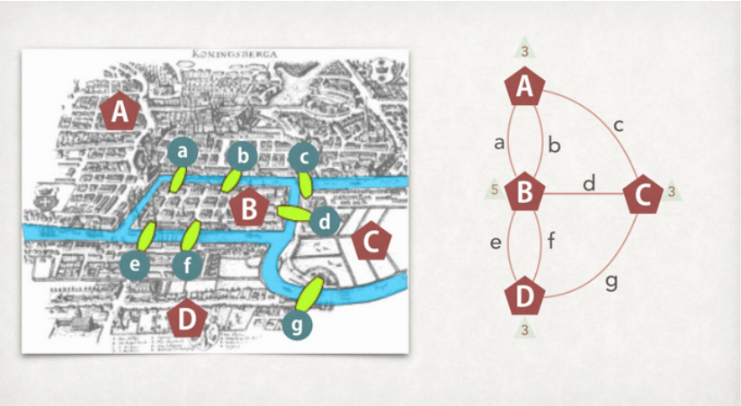
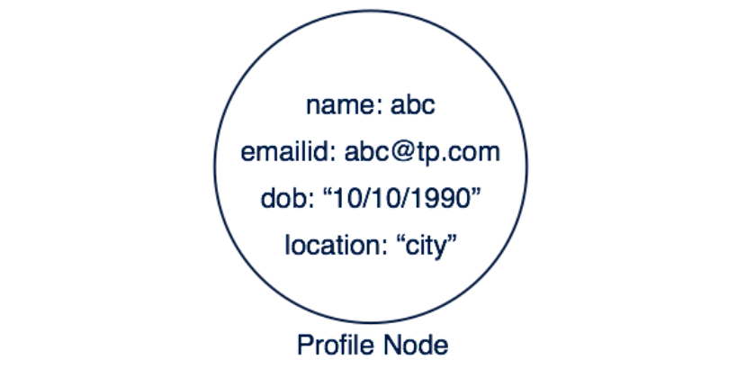
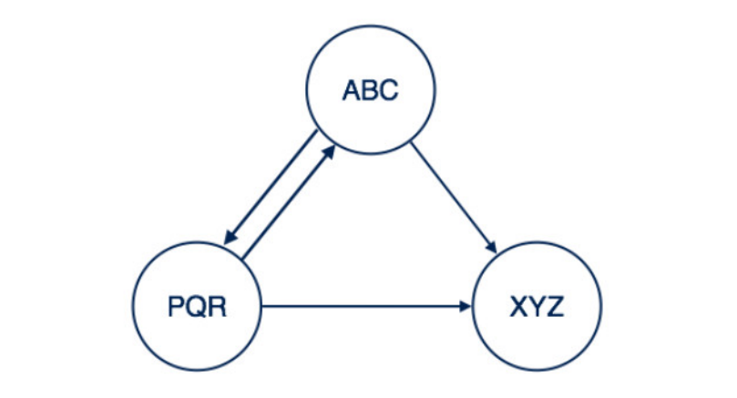
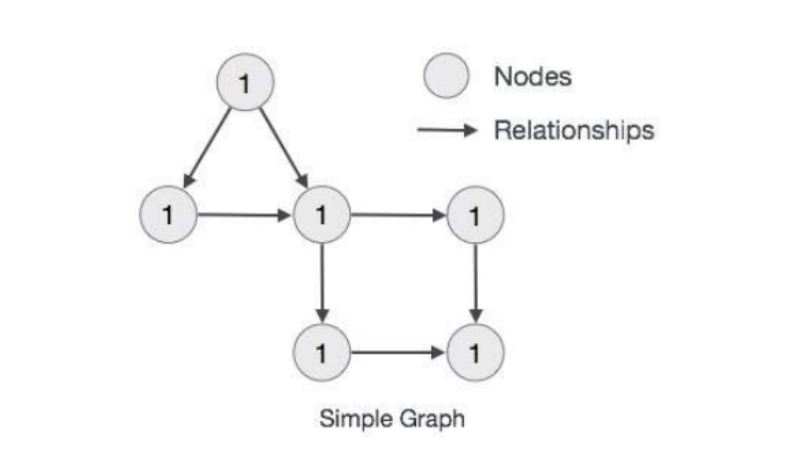
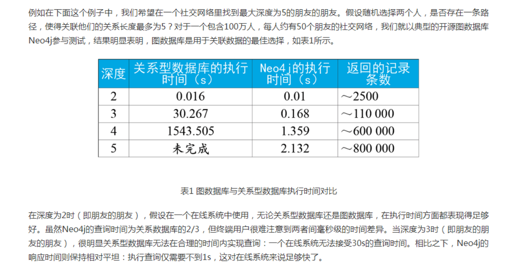
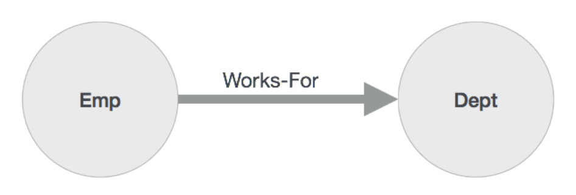
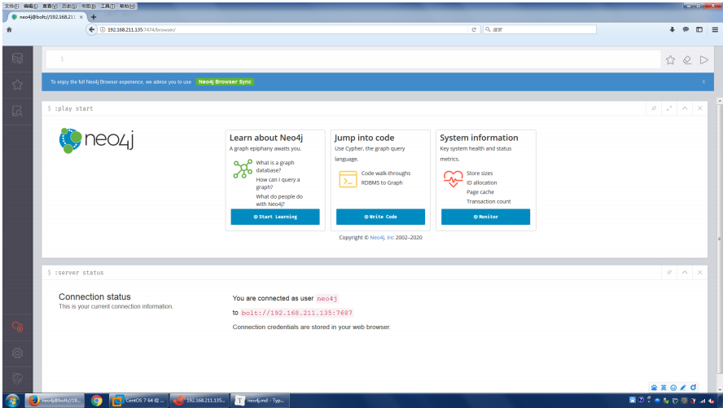
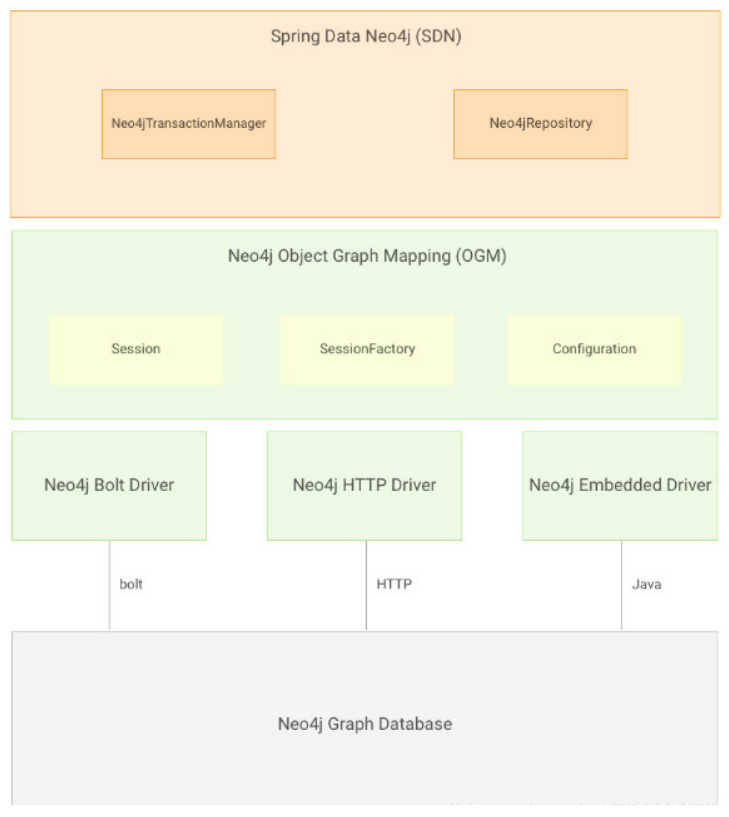

# 	Neo4j

**主要课程内容**

Neo4j 是一个NoSQL的图形数据库

- 第一部分：图 和 Neo4j

  图论、图的概念、构成、规则、知识图谱和图库、图库的优势、neo4j应用场景、环境搭建、数据浏览器

- 第二部分：Neo4j CQL

  创建节点、match查询返回、where、删除节点关系以及属性、修改、排序、分页、排重

- 第三部分：Neo4j CQL高级

  函数(字符串函数 聚合函数 关系函数 )、最短路径、深度节点查询、事务、索引、约束

- 第四部分：Neo4j之Admin管理员操作

  数据库的备份与恢复、调优 

- 第五部分：Neo4j 程序访问

  程序访问Neo4j的模式、嵌入式模式、服务器模式、java使用这两种方式、SpringBoot访问

## 1、图 和 Neo4j

### 1.1、图论

#### 1.1.1、图论起源 --- 柯尼斯堡（Konigsberg）七桥问题

众所周知，图论起源于一个非常经典的问题——柯尼斯堡（Konigsberg）七桥问题。1738年，瑞典数学家欧拉( Leornhard Euler)解决了柯尼斯堡七桥问题。由此图论诞生，欧拉也成为图论的创始人。



欧拉把问题的实质归于"一笔画"问题，即判断一个图是否能够遍历完所有的边(Edge)而没有重复，而柯尼斯堡七桥问题则是一笔画问题的一个具体情境。欧拉证明这个问题不成立。

满足一笔画的图满足两个条件:

-  图必须是一个完整图

-  有零个或二个奇数点（奇数点是值与节点相连的边为奇数就是奇数点）

#### 1.1.2、图 和 节点

图是一组节点和连接这些节点的关系组成。图形数据存储在节点和关系所在的属性上。属性是键值对表示的数据。

在图形理论中，我们可以使用圆表示一个节点并且可以向里面添加键值对形式的数据。



#### 1.1.3、节点关系表达

- **简单关系表达**

  

  此处在两个节点之间创建关系名称“跟随”。 这意味着Profifile1 跟随 Profifile2。

- **复杂关系表达**

  这里节点用关系连接。 关系是单向或双向的。

  

  - 从XYZ到PQR的关系是单向关系。

  - 从ABC到XYZ的关系是双向关系。

#### 1.1.4、属性图模型规则



- 图表示节点，关系和属性中的数据
- 节点和关系都包含属性
- 关系连接节点
- 属性是键值对
- 节点用圆圈表示，关系用方向键表示。
- 关系具有方向：单向和双向。
- 每个关系包含“开始节点”或“从节点” 和 “到节点”或“结束节点”

### 1.2、知识图谱和图库

#### 1.2.1、知识图谱

一种基于图的数据结构，由节点(Node)和边(Edge)组成。其中节点即实体，由一个全局唯一的ID标示，边就是关系用于连接两个节点。通俗地讲，知识图谱就是把所有不同种类的信息（Heterogeneous Information）连接在一起而得到的一个关系网络。知识图谱提供了从“关系”的角度去分析问题的能力。互联网、大数据的背景下，谷歌、百度、搜狗等搜索引擎纷纷基于该背景，创建自己的知识图谱Knowledge Graph（谷歌）、知心（百度）和知立方（搜狗），主要用于改进搜索质量。

#### 1.2.2、图数据库

一般情况下，我们使用数据库查找事物间的联系的时候，只需要短程关系的查询（两层以内的关联）。当需要进行更长程的，更广范围的关系查询时，就需要图数据库的功能。而随着社交、电商、金融、零售、物联网等行业的快速发展，现实世界的事物之间织起了一张巨大复杂的关系网，传统数据库面对这样复杂关系往往束手无策。因此，图数据库应运而生。

图数据库(Graph database)指的是以图数据结构的形式来存储和查询数据的数据库。

知识图谱中，知识的组织形式采用的就是图结构，所以非常适合用图库进行存储。

#### 1.2.3、图形数据库优势

在需要表示多对多关系时，我们常常需要创建一个关联表来记录不同实体的多对多关系。如果两个实体之间拥有多种关系，那么我们就需要在它们之间创建多个关联表。而在一个图形数据库中，我们只需要标明两者之间存在着不同的关系。如果希望在两个结点集间建立双向关系，我们就需要为每个方向定义一个关系。 也就是说，相对于关系型数据库中的各种关联表，图形数据库中的关系可以通过关系属性这一功能来提供更为丰富的关系展现方式。因此相较于关系型数据库，图形数据库的用户在对现实进行抽象时将拥有一个额外的武器，那就是丰富的关系。



优势总结:

- 性能上，对长程关系的查询速度快

- 擅于发现隐藏的关系，例如通过判断图上两点之间有没有走的通的路径，就可以发现事物间的关联

### 1.3、Neo4j 基础

#### 1.3.1、什么是Neo4j

Neo4j是一个开源的 无Shcema的 基于java开发的图形数据库，它将结构化数据存储在图中而不是表中。它是一个嵌入式的、基于磁盘的、具备完全的事务特性的Java持久化引擎。程序数据是在一个面向对象的、灵活的网络结构下，而不是严格、静态的表中,但可以享受到具备完全的事务特性、企业级的数据库的所有好处。

https://db-engines.com/en/ranking

#### 1.3.2、Neo4j 模块构建

**Neo4j 主要构建块**

- **节点**

  节点是图表的基本单位。 它包含具有键值对的属性

- **属性**

  属性是用于描述图节点和关系的键值对

  Key = 值

  - Key是一个字符串

  - 值可以通过使用任何Neo4j数据类型来表示

- **关系**

  关系是图形数据库的另一个主要构建块。 它连接两个节点，如下所示。

  

  这里Emp和Dept是两个不同的节点。 “WORKS_FOR”是Emp和Dept节点之间的关系。

  因为它表示从Emp到Dept的箭头标记，那么这种关系描述的一样Emp WORKS_FOR Dept

  每个关系包含一个起始节点和一个结束节点。
  - “Emp”是一个起始节点。
  - “Dept”是一个结束节点。

  由于该关系箭头标记表示从“Emp”节点到“Dept”节点的关系，该关系被称为“进入关系”到“Dept”节点。

  并且“外向关系”到“Emp”节点。

  像节点一样，关系也可以包含属性作为键值对。

- **标签**

  Label将一个公共名称与一组节点或关系相关联。 节点或关系可以包含一个或多个标签。 我们可以为现有节点或关系创建新标签。 我们可以从现有节点或关系中删除现有标签。

  从前面的图中，我们可以观察到有两个节点。

  左侧节点都有一个标签：“EMP”，而右侧节点都有一个标签：“Dept”。

  这两个节点之间的关系，也有一个标签：“WORKS_FOR”

  **注：**Neo4j将数据存储在节点或关系的属性中。

- **数据浏览器**

  一旦我们安装Neo4j，我们可以访问Neo4j数据浏览器使用URL：http:// localhost:7474/browser/进行访问 Neo4j数据浏览器用于执行CQL命令并查看输出输出。

  

  这里我们需要在美元提示符处执行所有CQL命令：“$” 如 CREATE(cc:CreditCard)

  在美元符号后键入命令，然后单击“执行”按钮运行命令。

  它与Neo4j数据库服务器交互，检索和显示下面的结果到那个美元提示。

  使用“VI视图”按钮以图形格式查看结果。 上图以“UI视图”格式显示结果。

  

  导出 CSV 或者 JSON

  单击“导出CSV”按钮以csv文件格式导出结果

#### 1.3.3、Neo4j的主要应用场景

- **社交媒体和社交网络**

  当使用图形数据库为社交网络应用程序提供动力时，可以轻松利用社交关系或根据活动推断关系。查询社区聚类分析，朋友的朋友推荐，影响者分析，共享和协作关系分析等。

- **推荐引擎和产品推荐系统**

  图形驱动的推荐引擎通过实时利用多种连接，帮助公司个性化产品，内容和服务。

  内容和媒体推荐，图形辅助搜索引擎，产品推荐，专业网络，社会推荐。

- **身份和访问管理**

  使用图形数据库进行身份和访问管理时，可以快速有效地跟踪用户，资产，关系和授权。

  查询访问管理，资产来源，数据所有权，身份管理，互连组织，主数据，资源授权。

- **金融反欺诈多维关联分析场景**

  通过图分析可以清楚地知道洗钱网络及相关嫌疑，例如对用户所使用的帐号、发生交易时的IP地址、MAC地址、手机IMEI号等进行关联分析。

#### 1.3.4、Neo4j 环境搭建

- **Neo4j环境Linux下搭建**

  - 切换到Linux下 到安装目录neo4j 上传安装包 或者 下载安装包

    ```apl
    使用 ftp 工具上传neo4j-community-3.5.17.tar 到 liunx 下
    或者 wget https://neo4j.com/artifact.php?name=neo4j-community-3.5.17-unix.tar.gz
    ```

  - 解压

    ```shell
    tar -xvf neo4j-community-3.5.17.tar
    ```

  - 修改配置文件 neo4j.conf

    ```apl
    vim conf/neo4j.conf
    #主要是修改 允许远程访问的地址 把对应的注释打开即可
    dbms.connectors.default_listen_address=0.0.0.0
    #开启远程访问 default_advertised_address代理地址为Neo4j本机地址
    dbms.default_advertised_address=192.168.81.100
    dbms.connector.bolt.enabled=true
    dbms.connector.bolt.listen_address=0.0.0.0:7687
    dbms.connector.http.enabled=true
    dbms.connector.http.listen_address=0.0.0.0:7474
    ```

  - 开放对应的访问端口 默认要开放7474 和 7687

    防火墙关闭则不需要开发端口

    ```apl
    firewall-cmd --zone=public --add-port=7474/tcp --permanent
    firewall-cmd --zone=public --add-port=7687/tcp --permanent
    systemctl reload firewalld
    ```

  - 启动

    ```shell
    ./bin/neo4j start
    ```

  - 使用浏览器 访问服务器上的 neo4j

    ```apl
    http://127.0.0.1:7474
    #默认的账号是 neo4j 密码 neo4j 这里第一次登录的话会要求修改密码
    ```

- **Windows下的安装**

  - 从https://neo4j.com/download-center/#community 下载最新的Neo4j Server安装文件可以看到 neo4J 软件 exe 或 zip 格式的所有版本

  - 下载 Neo4j 3.5.17 (zip)

  - 解压

  - 修改配置文件

    ```properties
    dbms.connectors.default_listen_address=0.0.0.0
    ```

  - 通过 neo4j.bat install-service 安装neo4j服务

    注意的问题 如果是4.0 以及以上版本需要jdk11

    修改文件 bin/neo4j.ps1

    Import-Module "neo4j的主目录\bin\Neo4j-Management.psd1"

  - neo4j.bat启动

    neo4j.bat start

  - 使用浏览器 访问服务器上的 neo4j

    ```apl
    http://127.0.0.1:7474
    #默认的账号是 neo4j 密码 neo4j 这里第一次登录的话会要求修改密码
    ```

## 2、Neo4j CQL

### 2.1、CQL简介

CQL代表Cypher查询语言。 像关系型数据库具有查询语言SQL，Neo4j使用CQL作为查询语言。

**Neo4j CQL**

- 它是Neo4j图形数据库的查询语言。

- 它是一种声明性模式匹配语言。

- 它遵循SQL语法。

- 它的语法是非常简单且人性化、可读的格式。

关系和节点的属性可以使用的类型

| CQL数据类型 | 作用                            |
| ----------- | ------------------------------- |
| boolean     | 它用于表示布尔文字：true, false |
| byte        | 它用来表示8位整数               |
| short       | 它用于表示16位整数              |
| int         | 它用于表示32位整数              |
| long        | 它用于表示64位整数              |
| float       | 浮点数用于表示32位浮点数        |
| double      | Double用于表示64位浮点数        |
| char        | Char用于表示16位字符            |
| String      | 字符串用于表示字符串            |

常用的Neo4j CQL命令/条款如下：

| CQL命令/条      | 作用                         |
| --------------- | ---------------------------- |
| CREATE 创建     | 创建节点，关系和属性         |
| MATCH 匹配      | 检索有关节点，关系和属性数据 |
| RETURN 返回     | 返回查询结果                 |
| WHERE 条件      | 提供条件过滤检索MATCH数据    |
| DELETE 删除     | 删除节点和关系               |
| REMOVE 移除     | 删除节点和关系的属性         |
| SET 设置        | 添加或更新标签               |
| ORDER BY 排序   | 对结果排序                   |
| SKIP LIMIT 分页 | 分页                         |
| DISTINCT 排重   | 排重                         |

完成上面的语法 我们基于庆余年电视剧人物关系图片:


### 2.2、CREATE

```apl
CREATE ( 
    <node-name>:<label-name> 
    [
        { <property1-name>:<property1-Value> 
        ........ 
        <propertyn-name>:<propertyn-Value> }
    ] 
)
```

语法说明：

| 语法元素                              | 描述                                            |
| ------------------------------------- | ----------------------------------------------- |
| < node-name>                          | 它是我们将要创建的节点名称                      |
| < label-name>                         | 它是一个节点标签名称                            |
| < property1-name>...< propertyn-name> | 属性是键值对。 定义将分配给创建节点的属性的名称 |

举例:

```apl
CREATE (person:Person)
CREATE (person:Person {cid:1,name:"范闲",age:24,gender:0,character:"A",money:1000}); 
CREATE (person:Person {cid:2,name:"林婉儿",age:20,gender:1,character:"B",money:800}); 
CREATE (person:Person {cid:3,name:"庆帝",age:49,gender:0,character:"A",money:8900});
CREATE (person:Person {cid:4,name:"长公主",age:32,gender:1,character:"B",money:9000});
CREATE (person:Person {cid:5,name:"宰相林若甫",age:47,gender:0,character:"A",money:5600});
CREATE (person:Person {cid:6,name:"叶灵儿",age:18,gender:1,character:"B",money:900});
CREATE (person:Person {cid:7,name:"九品射手燕小乙",age:25,gender:0,character:"A",money:1900});
CREATE (person:Person {cid:8,name:"二皇子",age:25,gender:0,character:"A",money:3900});
CREATE (person:Person {cid:9,name:"靖王世子",age:26,gender:0,character:"A",money:4900});
CREATE (person:Person {cid:10,name:"王启年",age:53,gender:0,character:"A",money:6900});
```

### 2.3、MATCH RETURN命令语法

```apl
MATCH ( 
	<node-name>:<label-name> 
) 
RETURN 
    <node-name>.<property1-name>, 
    ... 
    <node-name>.<propertyn-name>
```

语法说明：

| 语法元素                              | 描述                                            |
| ------------------------------------- | ----------------------------------------------- |
| < node-name>                          | 它是我们将要创建的节点名称                      |
| < label-name>                         | 它是一个节点标签名称                            |
| < property1-name>...< propertyn-name> | 属性是键值对。 定义将分配给创建节点的属性的名称 |

举例:

```apl
# 查询全部，返回全部属性
MATCH (person:Person) return person 
# 查询全部，返回全部属性
MATCH (person:Person) return person.name,person.age
# 匹配条件查询
MATCH (person:Person {name:"范闲"}) return person.cid,person.name,person.age
# 匹配条件查询，并计算默认生成得id
MATCH (p:Person {name:"范闲"}) return p.cid,p.name,p.age,ID(p)
```

### 2.4、关系创建

- 使用现有节点创建没有属性的关系

  ```apl
  MATCH 
      (<node1-name>:<node1-label-name>),
      (<node2-name>:<node2-label-name>) 
  CREATE 
  	(<node1-name>)-[<relationship-name>:<relationship-label-name>]->(<node2- name>) 
  RETURN 相应的内容
  ```

  语法说明:

  | 语法元素                   | 描述                                  |
  | -------------------------- | ------------------------------------- |
  | MATCH,CREATE,RETURN        | 他们是Neo4J CQL关键字                 |
  | < node1-name>              | 它用于创建关系的“From Node”的名称     |
  | < node1-label-name>        | 它用于创建关系的“From Node”的标签名称 |
  | < node2-name>              | 它用于创建关系的“To Node”的名称       |
  | < node2-label-name>        | 它用于创建关系的“To Node”的标签名称   |
  | < relationship-name>       | 这是一个关系的名称                    |
  | < relationship-label-name> | 它是一个关系的标签名称                |

  举例:

  ```apl
  # 创建关系 
  MATCH (person1:Person {name:"范闲"}),(person2:Person {name:"林婉儿"})
  CREATE (person1)-[r:Couple]->(person2);
  # 查询关系 
  match p = (person:Person {name:"范闲"})-[r:Couple]->(person2:Person) return p 
  match (p1:Person {name:"范闲"})-[r:Couple]-(p2:Person) return p1,p2 
  match (p1:Person {name:"范闲"})-[r:Couple]-(p2:Person) return r
  ```

- 使用现有节点创建有属性的关系

  ```apl
  MATCH 
  (<node1-label-name>:<node1-name>),(<node2-label-name>:<node2-name>) 
  CREATE
  (<node1-label-name>)-[<relationship-label-name>:<relationship-name> {<define-properties-list>}]->(<node2-label-name>) 
  RETURN <relationship-label-name> 
  
  #其中<define-properties-list> 是分配给新创建关系的属性（名称 - 值对）的列表。 
  { 
      <property1-name>:<property1-value>,
      <property2-name>:<property2-value>, 
      ... 
      <propertyn-name>:<propertyn-value> 
  }
  ```

  举例：

  ```apl
  match 
  (person1:Person {name:"范闲"}),(person2:Person {name:"林婉儿"})  
  create 
  (person2)-[r:Couple{mary_date:"12/12/2014",price:55000}]->(person1) 
  return r;
  ```

- 使用新节点创建没有属性的关系

  ```apl
  CREATE (<node1-label-name>:<node1-name>) 
  -[<relationship-label-name>:<relationship-name>]-> 
  (<node1-label-name>:<node1-name>)
  ```

  举例:

  ```apl
  create (person1:Person {cid:4,name:"路人甲",age:49,gender:1,character:"A",money:500}) 
  -[r:Friend]-> 
  (person2:Person {cid:7,name:"路人乙",age:48,gender:0,character:"B",money:100})
  ```

- 使用新节点创建有属性的关系

  ```apl
  CREATE 
  (<node1-label-name>:<node1-name>{<define-properties-list>}) 
  -[<relationship-label-name>:<relationship-name>{<define-properties-list>}] ->
  (<node1-label-name>:<node1-name>{<define-properties-list>})
  ```

  举例：

  ```apl
  create 
  (person1:Person {cid:9,name:"路人丙",age:23,gender:0,character:"A",money:300}) 
  <-[r:Friend {date:"11-02-2000"}]-> 
  (person2:Person {cid:8,name:"路人丁",age:24,gender:0,character:"B",money:600})
  ```

### 2.5、CREATE创建多个标签

```apl
CREATE (<node-name>:<label-name1>:<label-name2>.....:<label-namen>) 
#如: 
CREATE (person:Person:Beauty:Picture {cid:20,name:"小美女"})
```

### 2.6、WHERE 子句

```apl
#简单的WHERE子句 
	WHERE <condition> 
#复杂的WHERE子句 
	WHERE <condition> <boolean-operator> <condition>
```

where 中的比较运算 和之前mysql的相同 如 =  != < >  >  < 等

| 布尔运算符 | 描述 |
| ---------- | ---- |
| AND        | 与   |
| OR         | 或   |
| NOT        | 非   |

举例：

```apl
MATCH (person:Person) WHERE person.money > 500 RETURN person
MATCH (person:Person) WHERE person.name = '范闲' OR person.name = '靖王世子' RETURN person
```

### 2.7、DELETE 子句 和 REMOVE子句

- **DELETE 子句**

  删除节点。

  ```apl
  match (p:person) delete p
  ```

  删除节点及相关节点和关系。

  ```apl
  #删除关系 指定了关系r 删除r
  match p = (:Person {name:"路人甲"})-[r:Friend]-(:Person) delete r
  ```

- **REMOVE子句**

  删除节点或关系的属性

  ```apl
  match (:Person {name:"路人丙"})-[r:Friend]-(:Person) remove r.date
  ```

  删除节点或关系的属性

  ```apl
  MATCH (person:Person {name:"小美女"}) REMOVE person.cid
  ```

### 2.8、SET子句

- 向现有节点或关系添加新属性

- 更新属性值

```apl
match (p:Person) where 1=ID(p) 
set p.cid = 14,p.name = "张三"
```

### 2.9、ORDER BY 子句

“ORDER BY”子句，对MATCH查询返回的结果进行排序。

我们可以按升序或降序对行进行排序。

默认情况下，它按升序对行进行排序。 如果我们要按降序对它们进行排序，我们需要使用DESC子句。

```apl
MATCH (person:Person) RETURN person.name,person.money ORDER BY person.money DESC
```

### 2.10、SKIP 和 LIMIT

Neo4j CQL已提供“SKIP”子句来过滤或限制查询返回的行数。 它修整了CQL查询结果集顶部的结果。

Neo4j CQL已提供“LIMIT”子句来过滤或限制查询返回的行数。 它修剪CQL查询结果集底部的结果。

```apl
MATCH (person:Person) RETURN ID(person),person.name,person.money ORDER BY person.money DESC skip 4 limit 2
```

### 2.11、DISTINCT 排重

这个函数的用法就像SQL中的distinct关键字，返回的是所有不同值。

```apl
MATCH (p:Person) RETURN Distinct(p.character)
```

## 3、Neo4j CQL高级

### 3.1、CQL 函数

#### 3.1.1、字符串函数

| 功能      | 描述                           |
| --------- | ------------------------------ |
| TOUPPER   | 它用于将所有字母更改为大写字母 |
| TOLOWER   | 它用于将所有字母改为小写字母   |
| SUBSTRING | 它用于获取给定String的子字符串 |
| REPLACE   | 它用于替换一个字符串的子字符串 |

```apl
MATCH (p:Person) RETURN ID(p),LOWER(p.character)
# 例如
match(p:Person) return p.character,toLower(p.character),p.name,substring(p.name,2),replace(p.name,"子","zi")
```

#### 3.1.2、聚合函数

| 聚集功能 | 描述                                  |
| -------- | ------------------------------------- |
| COUNT    | 它返回由MATCH命令返回的行数           |
| MAX      | 它从MATCH命令返回的一组行返回最大值   |
| MIN      | 它返回由MATCH命令返回的一组行的最小值 |
| SUM      | 它返回由MATCH命令返回的所有行的求和值 |
| AVG      | 它返回由MATCH命令返回的所有行的平均值 |

```apl
MATCH (p:Person) RETURN COUNT(p.money),MAX(p.money),MIN(p.money),SUM(p.money),AVG(p.money)
```

#### 3.1.3、关系函数

| 功能      | 描述                                   |
| --------- | -------------------------------------- |
| STARTNODE | 它用于知道关系的开始节点               |
| ENDNODE   | 它用于知道关系的结束节点               |
| ID        | 它用于知道关系的ID                     |
| TYPE      | 它用于知道字符串表示中的一个关系的TYPE |

```apl
match p = (:Person {name:"林婉儿"})-[r:Couple]-(:Person) RETURN STARTNODE(r)

match p = (:Person {name:"范闲"})-[r:Couple]-(:Person) RETURN ENDNODE(r)

match p = (:Person {name:"范闲"})-[r:Couple]-(:Person) RETURN ID(r)
```

#### 3.1.4、shortestPath 函数返回最短的path

```apl
MATCH p=shortestPath( (node1)-[*]-(node2) ) RETURN length(p), nodes(p)
#例如 找到王启年和九品射手燕小乙的最短路径
# 为使用函数
MATCH p=(person:Person {name:"王启年"})-[*]-(person2:Person {name:"九品射手燕小乙"})RETURN length(p), nodes(p)
# 使用函数
MATCH p=shortestPath((person:Person {name:"王启年"})-[*]-(person2:Person {name:"九品射手燕小乙"}) ) RETURN length(p), nodes(p)
# 指定深度  最大深度为3  深度的层数 - 1
MATCH p=shortestPath((person:Person {name:"王启年"})-[*1..3]-(person2:Person {name:"九品射手燕小乙"}) ) RETURN length(p), nodes(p)
```

### 3.2、CQL多深度关系节点

- **使用with关键字**

  查询三层级关系节点如下：with可以将前面查询结果作为后面查询条件

  ```apl
  # 指定查询深度为2的关系网络 指定方向
  match (na:Person)-[re]->(nb:Person) where na.name="范闲" WITH na,re,nb match (nb:Person)-[re2]->(nc:Person) 
  return na,re,nb,re2,nc
  # 指定查询深度为2的关系网络 指定方向
  match (na:Person)-[re]->(nb:Person) where na.name="林婉儿" WITH na,re,nb match (nb:Person)-[re2]->(nc:Person) 
  return na,re,nb,re2,nc
  # 指定查询深度为2的关系网络 未指定方向
  match (na:Person)-[re]-(nb:Person) where na.name="林婉儿" WITH na,re,nb match (nb:Person)-[re2]->(nc:Person) 
  return na,re,nb,re2,nc
  # 指定查询深度为2的关系网络 未指定方向 指定关系类型
  match (na:Person)-[re]-(nb:Person) where na.name="林婉儿" WITH na,re,nb match (nb:Person)-[re2:Friends]->(nc:Person) 
  return na,re,nb,re2,nc
  ```

- **直接拼接关系节点查询**

  ```apl
  match (na:Person{name:"范闲"})-[re]->(nb:Person)-[re2]->(nc:Person) return na,re,nb,re2,nc
  # 为了方便，可以将查询结果赋给变量，然后返回
  match data=(na:Person{name:"范闲"})-[re]->(nb:Person)-[re2]->(nc:Person) return data
  ```

- **使用深度运算符**

  当实现多深度关系节点查询时，显然使用以上方式比较繁琐。

  可变数量的关系->节点可以使用-[:TYPE*minHops..maxHops]-。

  ```apl
  match data=(na:Person{name:"范闲"})-[*1..2]-(nb:Person) return data
  match data = (p1:Person)-[*1..3]-(p2:Person) where p1.name = "范闲" return data
  ```

### 3.3、事务

为了保持数据的完整性和保证良好的事务行为，Neo4j也支持ACID特性 。

注意:

```http
(1)所有对Neo4j数据库的数据修改操作都必须封装在事务里。 
(2)默认的isolation level是READ_COMMITTED。 
(3)死锁保护已经内置到核心事务管理 。 (Neo4j会在死锁发生之前检测死锁并抛出异常。在异常抛出之 前，事务会被标志为回滚。当事务结束时，事务会释放它所持有的锁，则    该事务的锁所引起的死锁也就是解 除，其他事务就可以继续执行。当用户需要时，抛出异常的事务可以尝试重新执行) 
(4)除特别说明,Neo4j的API的操作都是线程安全的，Neo4j数据库的操作也就没有必要使用外部的同步方 法。
```

### 3.4、索引

Neo4j CQL支持节点或关系属性上的索引，以提高应用程序的性能。

可以为具有相同标签名称的属性上创建索引。

可以在MATCH或WHERE等运算符上使用这些索引列来改进CQL 的执行。

- **创建单一索引**

  ```apl
  CREATE INDEX ON :Label(property)
  # 例如:
  CREATE INDEX ON :Person(name)
  ```

- **创建复合索引**

  ```apl
  CREATE INDEX ON :Person(age, gender)
  ```

- **全文模式索引**

  之前的常规模式索引只能对字符串进行精确匹配或者前后缀索引(startswith,endswith,contains)，全文索引将标记化索引字符串值，因此它可以匹配字符串中任何位置的术语。索引字符串如何被标记化并分解为术语，取决于配置全文模式索引的分析器。索引是通过属性来创建，便于快速查找节点或者关系。

  创建和配置全文模式索引

  使用db.index.fulltext.createNodeIndex和db.index.fulltext.createRelationshipIndex创建全文模式索引。在创建索引时，每个索引必须为每个索引指定一个唯一的名称，用于在查询或删除索引时引用相关的特定索引。然后，全文模式索引分别应用于标签列表或关系类型列表，分别用于节点和关系索引，然后应用于属性名称列表。

  ```apl
  # 语法
  call db.index.fulltext.createNodeIndex("索引名",[Label,Label],[属性,属性])
  # 创建
  call db.index.fulltext.createNodeIndex("nameAndDescription",["Person"],["name", "description"])
  # 查看
  call db.index.fulltext.queryNodes("nameAndDescription", "范闲") YIELD node, score RETURN node.name, node.description, score
  ```

- **查看和删除索引**

  ```apl
  # 查询
  call db.indexes 或者 :schema
  # 删除
  DROP INDEX ON :Person(name)
  DROP INDEX ON :Person(age, gender)
  call db.index.fulltext.drop("nameAndDescription")
  ```

### 3.5、约束

- **唯一性约束**

  - 作用

    - 避免重复记录。
    - 强制执行数据完整性规则

  - 创建唯一性约束

    ```apl
    # 语法
    CREATE CONSTRAINT ON (变量:<label_name>) ASSERT 变量.<property_name> IS UNIQUE
    # 创建
    CREATE CONSTRAINT ON (person:Person) ASSERT person.name IS UNIQUE
    ```

  - 删除唯一性约束

    ```apl
    DROP CONSTRAINT ON (cc:Person) ASSERT cc.name IS UNIQUE
    ```

- **属性存在约束 (企业版中可用)**

  ```apl
  CREATE CONSTRAINT ON (p:Person) ASSERT exists(p.name)
  ```

- **查看约束**

  ```apl
  call db.constraints 或者 :schema
  ```

  

## 4、Neo4j之Admin管理员操作

### 4.1、Neo4j - 数据库备份和恢复

**社区版只支持冷备**

在对Neo4j数据进行备份、还原、迁移的操作时，首先要关闭neo4j

```shell
# 关闭Neo4j
./bin/neo4j stop
# 数据备份到文件
./bin/neo4j-admin dump --database=graph.db --to=/root/qyn.dump
# 还原、迁移之前 ，关闭neo4j服务。操作同上
./bin/neo4j-admin load --from=/root/qyn.dump --database=graph.db --force
# 重启服务
./bin/neo4j start
```

注意，运行数据备份可能会警告

WARNING: Max 1024 open fifiles allowed, minimum of 40000 recommended. See the Neo4jmanual

处理方法：

```apl
# 编辑这个文件
vim /etc/security/limits.conf
# 在文件最后加入下面这段 修改最大打开文件限制
* soft nofile 65535 
* hard nofile 65535
# 重启服务器
reboot
```

### 4.2、调优思路

- **增加服务器内存 和 调整neo4j配置文件**

  ```properties
  # java heap 初始值 
  dbms.memory.heap.initial_size=1g 
  # java heap 最大值，一般不要超过可用物理内存的80％ 
  dbms.memory.heap.max_size=16g # pagecache大小，官方建议设为：(总内存-dbms.memory.heap.max_size)/2 
  dbms.memory.pagecache.size=2g
  ```

- **neo4j刚启动数据是冷的需要预热**

  ```apl
  MATCH (n) 
  OPTIONAL MATCH (n)-[r]->() 
  RETURN count(n.name) + count(r);
  ```

-  **查看执行计划进行索引优化**

  Cypher查询计划程序将每个查询转换为执行计划。 执行计划告诉Neo4j在执行查询时要执行哪些操作。

  对执行计划的生成，Neo4j使用的都是基于成本的优化器（Cost Based Optimizer，CBO），用于制订精确的执行过程。可以采用如下两种不同的方式了解其内部的工作机制：

  - **EXPLAIN**：

    是解释机制，加入该关键字的Cypher语句可以预览执行的过程但并不实际执行，所以也不会产生任何结果。 

  - **PROFILE**：

    则是画像机制，查询中使用该关键字，不仅能够看到执行计划的详细内容，也可以看到查询的执行结果。

  ```apl
#关注指标： 
  estimated rows： 需要被扫描行数的预估值 
  dbhits： 实际运行结果的命中绩效 两个值都是越小越好
  ```
  
  **使用索引和不使用索引对比**

  ```apl
MATCH (p { name : '范闲' }) RETURN p
  explain MATCH (p { name : '范闲' }) RETURN p
  profile MATCH (p { name : '范闲' }) RETURN p
  ```

## 5、Neo4j 程序访问

### 5.1、Neo4j数据库访问

- **Neo4j访问的两种方式**

  - 嵌入式数据库
  - 服务器模式(通过REST的访问)

  它是由应用程序的性质（neo4j是独立服务器还是和程序在一起),性能，监控和数据安全性来决定架构选择。

- **An embedded database（嵌入式数据库）**

  嵌入式Neo4j数据库是性能的最佳选择。 通过指定数据存储的路径以编程方式访问嵌入式数据库。

  我们选择嵌入式数据库出于以下原因：

  - 使用Java作为我们项目的编程语言时

  - 应用程序是独立的

  - 程序追求很高的性能

- **Neo4j Server（服务器模式）**

  Neo4j Server是相互操作性，安全性和监控的最佳选择。 实际上，REST接口允许所有现代平台和编程语言与它进行互操作。 此外，作为独立应用程序，它比嵌入式配置更安全（客户端中的潜在故障不会影响服务器），并且更易于监控。 如果我们选择使用这种模式，我们的应用程序将充当Neo4j服务器的客户端。要连接到Neo4j服务器，可以使用任何编程语言的REST 访问数据库。


### 5.2、Java客户端操作Neo4j

#### 5.2.1、嵌入式模式

- 创建maven项目，同时引入依赖

  ```xml
  <dependency>
      <groupId>org.neo4j</groupId>
      <artifactId>neo4j</artifactId>
      <version>3.5.5</version>
  </dependency>
  ```

- 添加数据

  ```java
  package com.thm;
  
  import org.neo4j.graphdb.*;
  import org.neo4j.graphdb.factory.GraphDatabaseFactory;
  
  import java.io.File;
  public class EmbeddedNeo4jAdd {
      private static final File databaseDirectory = new File("target/graph.db");
  
      public static void main(String[] args) {
          // 创建数据库服务对象
          GraphDatabaseService graphDb = new GraphDatabaseFactory().newEmbeddedDatabase(databaseDirectory);
          System.out.println("Database Load!");
          // 开启事务 获取事务对象
          Transaction tx = graphDb.beginTx();
          // 创建节点
          Node n1 = graphDb.createNode();
          n1.setProperty("name", "张三");
          n1.setProperty("character", "A");
          n1.setProperty("gender", 1);
          n1.setProperty("money", 1101);
          n1.addLabel(new Label() {
              @Override
              public String name() {
                  return "Person";
              }
          });
          // 使用CQL形式
          String cql = "CREATE (p:Person{name:'李四',character:'B',gender:1,money:21000})";
          // 执行CQL语句
          graphDb.execute(cql);
  
          tx.success();
          tx.close();
          System.out.println("Database Shutdown!");
          graphDb.shutdown();
      }
  }
  ```

- 查询数据

  ```java
  package com.thm;
  
  import org.neo4j.graphdb.*;
  import org.neo4j.graphdb.factory.GraphDatabaseFactory;
  
  import java.io.File;
  import java.util.HashMap;
  import java.util.Map;
  
  public class EmbeddedNeo4jFind {
      private static final File databaseDirectory = new File("target/graph.db");
  
      public static void main(String[] args) {
          // 创建数据库服务对象
          GraphDatabaseService graphDb = new GraphDatabaseFactory().newEmbeddedDatabase(databaseDirectory);
          System.out.println("Database Load!");
          String cql = "MATCH (a:Person) where a.money < $money return a";
          Map<String, Object> paramerters = new HashMap<String, Object>();
          paramerters.put("money", 25000);
          Transaction tx = graphDb.beginTx();
          Result result = graphDb.execute(cql, paramerters);
          while (result.hasNext()) {
              Map<String, Object> row = result.next();
              for (String key : result.columns()) {
                  Node nd = (Node) row.get(key);
                  System.out.printf("%s = %s:%s%n", key, nd.getProperty("name"), nd.getProperty("money"));
              }
          }
  
          tx.success();
          tx.close();
          System.out.println("Database Shutdown!");
          graphDb.shutdown();
      }
  }
  ```

#### 5.2.2、服务器模式

- 创建maven项目，同时引入依赖

  ```xml
  <dependency>
      <groupId>org.neo4j</groupId>
      <artifactId>neo4j-ogm-bolt-driver</artifactId>
      <version>3.2.10</version>
  </dependency>
  ```

- 查询数据

  ```java
  package com.lagou;
  
  import org.neo4j.driver.*;
  
  import static org.neo4j.driver.Values.parameters;
  
  public class Neo4jServerMain {
  
      public static void main(String[] args) {
          //获取驱动对象
          Driver driver = GraphDatabase.driver("bolt://192.168.81.100:7687");
          //设置账号密码
          AuthTokens.basic("neo4j", "123456");
          //获取会话对象
          Session session = driver.session();
          //查询语句
          //String cql = "MATCH (a:Person) WHERE a.money > $money " + "RETURN a.name AS name, a.money AS money order by a.money ";
          String cql = "MATCH p=shortestPath((person:Person {name:$startName})- [*]-(person2:Person {name:$endName} )) RETURN p";
  
          //返回结果
          //Result result = session.run(cql, parameters("money", 1000));
          Result result = session.run( cql,parameters("startName","王启 年","endName","九品射手燕小乙") );
          //循环获取值
          while (result.hasNext()) {
              Record record = result.next();
              //System.out.println(record.get("name").asString() + " " + record.get("money").asDouble());
              System.out.println(record);
          }
          //关闭会话和驱动
          session.close();
          driver.close();
  
      }
  }
  ```

### 5.3、SpringBoot 整合Neo4j



- **导入依赖**

  ```xml
  <parent>
      <groupId>org.springframework.boot</groupId>
      <artifactId>spring-boot-starter-parent</artifactId>
      <version>2.3.5.RELEASE</version>
  </parent>
  <properties>
      <project.build.sourceEncoding>UTF-8</project.build.sourceEncoding>
      <project.reporting.outputEncoding>UTF- 8</project.reporting.outputEncoding>
      <java.version>11</java.version>
  </properties>
  <dependencies>
      <dependency>
          <groupId>org.springframework.boot</groupId>
          <artifactId>spring-boot-starter-data-neo4j</artifactId>
      </dependency>
      <!--默认导入-->
      <dependency>
          <groupId>org.neo4j</groupId>
          <artifactId>neo4j-ogm-bolt-driver</artifactId>
      </dependency>
  </dependencies>
  <build>
      <plugins>
          <plugin>
              <groupId>org.springframework.boot</groupId>
              <artifactId>spring-boot-maven-plugin</artifactId>
          </plugin>
      </plugins>
  </build>
  ```

- **编写配置文件**

  ```yaml
  spring:
    data:
      neo4j:
        username: neo4j
        password: 123456
        uri: bolt://192.168.81.100:7687
        #uri: http://192.168.211.133:7474 
        #uri: file:///target/graph.db
  ```
  
- **建立实体类**

  ```java
  package com.thm.entity;
  
  import org.neo4j.ogm.annotation.*;
  
  import java.util.Set;
  
  /**
   * @ClassNmae Person
   * @Description TODO
   * @Author THM
   * @Date 2021/3/13 14:20
   * @Version 1.0
   **/
  @NodeEntity
  public class Person {
      @Id
      @GeneratedValue
      private Long id;
      @Property("cid")
      private int pid;
      @Property
      private String name;
      private String character;
      private double money;
      private int gender;
      private int age;
      private String description;
      //处理节点直接的关系，直接关系
      @Relationship(type = "Friends", direction = Relationship.INCOMING)
      private Set<Person> relationPersons;
   	//省略get/set/tostring   
  }
  ```

- **数据持久化类**

  ```java
  package com.thm.repository;
  
  import com.thm.entity.Person;
  import org.springframework.data.neo4j.annotation.Query;
  import org.springframework.data.neo4j.repository.Neo4jRepository;
  import org.springframework.stereotype.Repository;
  
  import java.util.List;
  @Repository
  public interface PersonRepository extends Neo4jRepository<Person, Long> {
      @Query("match(p:Person) where p.money>$money return p")
      List<Person> personList(@Param("money") double money);
  
      /**
       * 指定开始的名字 和 结束的名字 查询最短路径 限定深度为4以层包含4
       */
      @Query("match p=shortestPath((person:Person{name:$startName})-[*1..4]- (person2:Person {name:$endName})) return p")
      List<Person> shortestPath(@Param("startName") String startName, @Param("endName") String endName);
  }
  ```

- **编写服务类**

  ```java
  package com.thm.service;
  
  import com.thm.entity.Person;
  import com.thm.repository.PersonRepository;
  import org.springframework.beans.factory.annotation.Autowired;
  import org.springframework.stereotype.Service;
  
  import java.util.List;
  
  @Service
  public class PersonService {
      @Autowired
      private PersonRepository personRepository;
  
      /**
       * 新增
       * @param person
       * @return
       */
      public Person save(Person person) {
          return personRepository.save(person);
      }
  
      /**
       * 获取所有
       * @return
       */
      public Iterable<Person>findAll() {
          return personRepository.findAll();
      }
  
      /**
       * 条件查询
       * @param money
       * @return
       */
      public List<Person> personList(double money) {
          return personRepository.personList(money);
      }
  
      /**
       * 最短路径
       * @param startName
       * @param endName
       * @return
       */
      public List<Person> shortestPath(String startName, String endName) {
          return personRepository.shortestPath(startName, endName);
      }
  }
  ```

- **编写测试类**

  ```java
  package com.thm;
  
  import com.thm.entity.Person;
  import com.thm.service.PersonService;
  import org.springframework.boot.SpringApplication;
  import org.springframework.boot.autoconfigure.SpringBootApplication;
  import org.springframework.context.ConfigurableApplicationContext;
  
  import java.util.List;
  @SpringBootApplication
  public class Neo4jBootStrap {
      public static void main(String[] args) {
          ConfigurableApplicationContext applicationContext = SpringApplication.run(Neo4jBootStrap.class, args);
          PersonService personService = applicationContext.getBean(PersonService.class);
          /*Person person = new Person();
          person.setName("springboot");
          person.setAge(12);
          person.setCharacter("A");
          person.setMoney(15654321.23);
          //新增
          Person save = personService.save(person);
          System.out.println(save);
          System.out.println(personService.findAll());*/
          List<Person> datas = personService.personList(56465.2);
          System.out.println(datas);
          System.out.println(personService.shortestPath("王启年", "九品射手燕小乙"));
      }
  }
  ```

  

