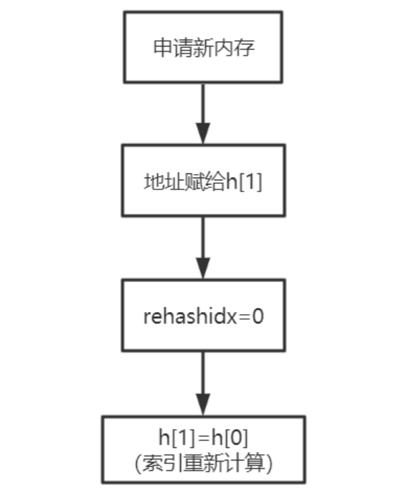
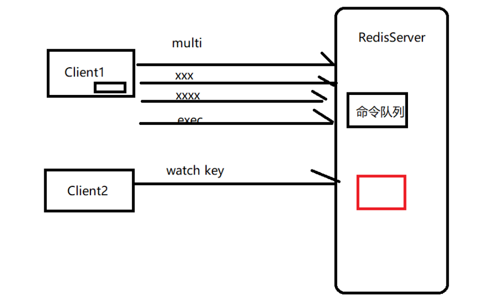
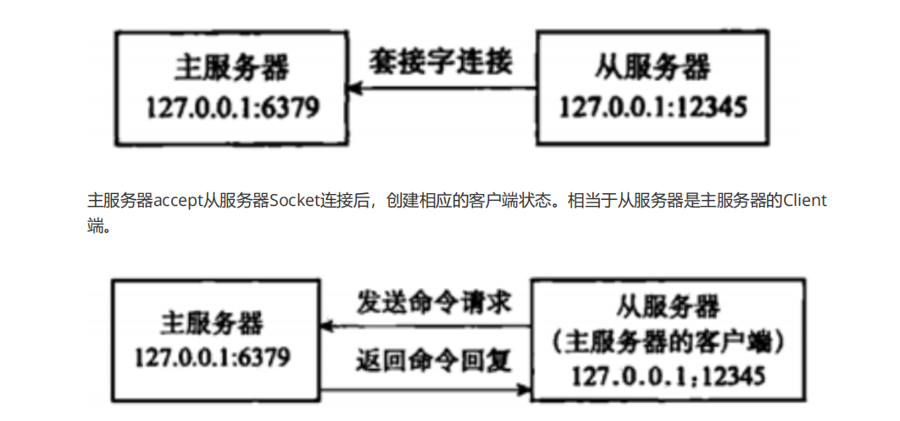
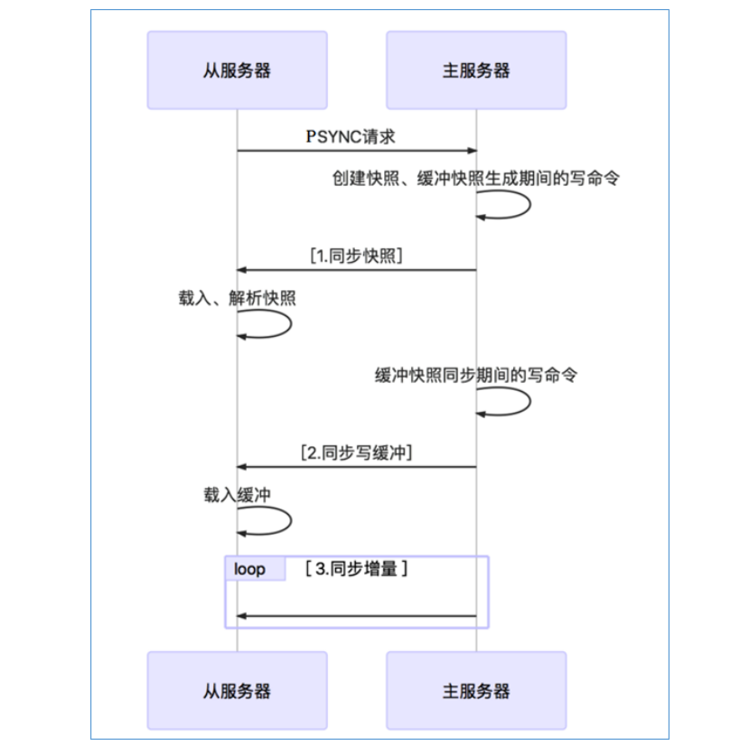
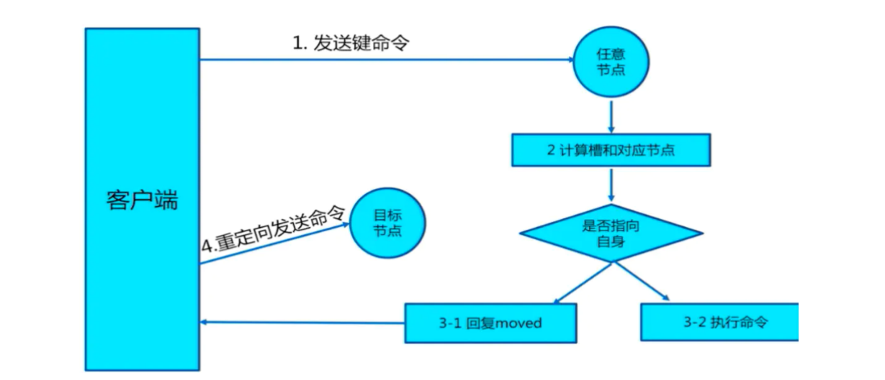

# Redis

**生产中遇到的缓存问题（大厂常见面试题）**

- 系统在某个时刻访问量剧增（热点新闻），造成数据库压力剧增甚至崩溃，怎么办？
- 什么是缓存雪崩、缓存穿透和缓存击穿，会造成什么问题，如何解决？
- 什么是大Key和热Key，会造成什么问题，如何解决？
- 如何保证 Redis 中的数据都是热点数据？
- 缓存和数据库数据是不一致时，会造成什么问题，如何解决？
- 什么是数据并发竞争，会造成什么问题，如何解决？
- 单线程的Redis为什么这么快？
- Redis哨兵和集群的原理及选择？
- 在多机Redis使用时，如何保证主从服务器的数据一致性？

## 1、缓存原理&设计

### 1.1、缓存基本思想

#### 1.1.1、缓存的使用场景

- **DB缓存，减轻DB服务器压力**

  一般情况下数据存在数据库中，应用程序直接操作数据库。

  - 当访问量上万，数据库压力增大，可以采取的方案有：读写分离，分库分表

  - 当访问量达到10万、百万，需要引入缓存。

  将已经访问过的内容或数据存储起来，当再次访问时先找缓存，缓存命中返回数据。不命中再找数据库，并回填缓存。

  

- **提高系统响应**

  数据库的数据是存在文件里，也就是硬盘。与内存做交换（swap）。

  在大量瞬间访问时（高并发）MySQL单机会因为频繁IO而造成无法响应。MySQL的InnoDB是有行锁。

  将数据缓存在Redis中，也就是存在了内存中。内存天然支持高并发访问。可以瞬间处理大量请求。

  qps到达11万/S读请求 8万写/S

- **Session分离**

  传统的session是由tomcat自己进行维护和管理。集群或分布式环境，不同的tomcat管理各自的session。只能在各个tomcat之间，通过网络和Io进行session的复制，极大的影响了系统的性能。

  - 各个Tomcat间复制session，性能损耗
- 不能保证各个Tomcat的Session数据同步
  
  将登录成功后的Session信息，存放在Redis中，这样多个服务器(Tomcat)可以共享Session信息。Redis的作用是数据的临时存储。

  

- **做分布式锁（Redis）**

  一般讲锁是多线程的锁，是在一个进程中的，多个进程（JVM）在并发时也会产生问题，也要控制时序性。可以采用分布式锁。使用Redis实现 setNX

- **做乐观锁（Redis）**

  同步锁和数据库中的行锁、表锁都是悲观锁，悲观锁的性能是比较低的，响应性比较差。

  高性能、高响应（秒杀）采用乐观锁，Redis可以实现乐观锁 watch + incr。

#### 1.1.2、什么是缓存？

缓存原指CPU上的一种高速存储器，它先于内存与CPU交换数据，速度很快，现在泛指存储在计算机上的原始数据的复制集，便于快速访问。

在互联网技术中，缓存是系统快速响应的关键技术之一，以空间换时间的一种技术（艺术）

#### 1.1.3、常见缓存的分类

单机架构LAMP（Linux+apache+MySQL+PHP）、JavaEE（SSM）访问量越大，响应力越差，用户体验越差

引入缓存、示意图如下：


- **客户端缓存**

  传统互联网：页面缓存和浏览器缓存

  移动互联网：APP缓存

  - **页面缓存**

    页面缓存：页面自身对某些元素或全部元素进行存储，并保存成文件。

    html5：Cookie、WebStorage（SessionStorage和LocalStorage）、WebSql、indexDB、Application Cache等

    开启步骤：

    1. 设置manifest描述文件

       ```http
       CACHE MANIFEST 
       #comment 
       js/index.js 
       img/bg.png
       ```

    2. html关联manifest属性

       ```html
       <html lang="en" manifest="demo.appcache">
       ```

       使用LocalStorage进行本地的数据存储，示例代码：

       ```js
       localStorage.setItem("Name","张飞") 
       localStorage.getItem("Name") 
       localStorage.removeItem("Name") 
       localStorage.clear()
       ```

  - **浏览器缓存**

    当客户端向服务器请求资源时，会先抵达浏览器缓存，如果浏览器有“要请求资源”的副本，就可以直接从浏览器缓存中提取而不是从原始服务器中提取这个资源。

    浏览器缓存可分为强制缓存和协商缓存。

    - 强制缓存：直接使用浏览器的缓存数据

      条件：Cache-Control的max-age没有过期或者Expires的缓存时间没有过期

      ```html
      <meta http-equiv="Cache-Control" content="max-age=7200" /> 
      <meta http-equiv="Expires" content="Mon, 20 Aug 2010 23:00:00 GMT" />
      ```
      
      - 协商缓存：服务器资源未修改，使用浏览器的缓存（304）；反之，使用服务器资源（200）。
    
        ```html
        <meta http-equiv="cache-control" content="no-cache">
        ```

  - **APP缓存**

    原生APP中把数据缓存在内存、文件或本地数据库（SQLite）中。比如图片文件。

- **网络端缓存**

  通过代理的方式响应客户端请求，对重复的请求返回缓存中的数据资源。

  - **Web代理缓存**

    可以缓存原生服务器的静态资源，比如样式、图片等。常见的反向代理服务器比如大名鼎鼎的Nginx。

    

  - **边缘缓存**

    边缘缓存中典型的商业化服务就是CDN了。CDN的全称是Content Delivery Network，即内容分发网络。

    CDN通过部署在各地的边缘服务器，使用户就近获取所需内容，降低网络拥塞，提高用户访问响应速度和命中率。

    CDN的关键技术主要有内容存储和分发技术。现在一般的公有云服务商都提供CDN服务。

    

- **服务端缓存**

  服务器端缓存是整个缓存体系的核心。包括数据库级缓存、平台级缓存和应用级缓存。

  - **数据库级缓存**

    数据库是用来存储和管理数据的。MySQL在Server层使用查询缓存机制。将查询后的数据缓存起来。

    K-V结构，Key：select语句的hash值，Value：查询结果

    InnoDB存储引擎中的buffer-pool用于缓存InnoDB索引及数据块。

  - **平台级缓存**

    平台级缓存指的是带有缓存特性的应用框架。

    比如：GuavaCache 、EhCache（二级缓存，硬盘）、OSCache（页面缓存）等。

    部署在应用服务器上，也称为服务器本地缓存。

  - **应用级缓存（重点）**

    具有缓存功能的中间件：Redis、Memcached、EVCache（AWS）、Tair（阿里 、美团）等。采用K-V形式存储。

    利用集群支持高可用、高性能、高并发、高扩展。

    分布式缓存。

### 1.2、缓存的优势、代价

#### 1.2.1、使用缓存的优势

- **提升用户体验**

  用户体验（User Experience）：用户在使用产品过程中建立起来的一种纯主观感受。缓存的使用可以提升系统的响应能力，大大提升了用户体验。

- **减轻服务器压力**

  客户端缓存、网络端缓存减轻应用服务器压力。

  服务端缓存减轻数据库服务器的压力。

- **提升系统性能**

  系统性能指标：响应时间、延迟时间、吞吐量、并发用户数和资源利用率等。

  缓存技术可以：

  - 缩短系统的响应时间

  - 减少网络传输时间和应用延迟时间

  - 提高系统的吞吐量

  - 增加系统的并发用户数

  - 提高了数据库资源的利用率

#### 1.2.2、使用缓存的代价

- **额外的硬件支出**

  缓存是一种软件系统中以空间换时间的技术，需要额外的磁盘空间和内存空间来存储数据，搭建缓存服务器集群需要额外的服务器，也可以采用云服务器的缓存服务就不用额外的服务器了，比如阿里云（Tair、Redis），百度云（Redis），AWS亚马逊云服务：EVCache，提供缓存服务。

- **高并发缓存失效**

  在高并发场景下会出现缓存失效（缓存穿透、缓存雪崩、缓存击穿）造成瞬间数据库访问量增大，甚至崩溃。

- **缓存与数据库数据同步**

  缓存与数据库无法做到数据的时时同步，Redis无法做到主从时时数据同步。

- **缓存并发竞争**

  多个redis的客户端同时对一个key进行set值得时候由于执行顺序引起的并发问题

### 1.3、缓存的读写模式

缓存有三种读写模式

- **Cache Aside Pattern（常用）**

  Cache Aside Pattern（旁路缓存），是最经典的缓存+数据库读写模式。

  读的时候，先读缓存，缓存没有的话，就读数据库，然后取出数据后放入缓存，同时返回响应。

  

  更新的时候，先更新数据库，然后再删除缓存。

  

  **为什么是删除缓存，而不是更新缓存呢？**

  1. 缓存的值是一个结构：hash、list，更新数据需要遍历先遍历（耗时）后修改

  2. 懒加载，使用的时候才更新缓存

     使用的时候才从DB中加载

     也可以采用异步的方式填充缓存

     开启一个线程定时将DB的数据刷到缓存中

  高并发**脏读**的三种情况

  - 先更新数据库，再更新缓存

    update与commit之间，更新缓存，commit失败，则DB与缓存数据不一致

  - 先删除缓存，再更新数据库

    update与commit之间，有新的读，缓存空，读DB数据到缓存，数据是旧的数据，commit后 DB为新数据，则DB与缓存数据不一致。

  - 先更新数据库，再删除缓存（推荐）

    update与commit之间，有新的读，缓存空，读DB数据到缓存，数据是旧的数据，commit后 DB为新数据，则DB与缓存数据不一致。

    **采用延时双删策略**

- **Read/Write Through Pattern**

  应用程序只操作缓存，缓存操作数据库。

  Read-Through（穿透读模式/直读模式）：应用程序读缓存，缓存没有，由缓存回源到数据库，并写入缓存。（guavacache）

  Write-Through（穿透写模式/直写模式）：应用程序写缓存，缓存写数据库。

  该种模式需要提供数据库的handler，开发较为复杂。

- **Write Behind Caching Pattern**

  应用程序只更新缓存。缓存通过异步的方式将数据批量或合并后更新到DB中，不能时时同步，甚至会丢数据。

### 1.4、缓存架构的设计思路

缓存的整体设计思路包括：

1. **多层次**

   

   ​	分布式缓存宕机，本地缓存还可以使用

2. **数据类型**

   - 简单数据类型

     Value是字符串或整数或二进制，Value的值比较大（大于100K），只进行setter和getter

     **可采用Memcached**，Memcached纯内存缓存，多线程 K-V

   - 复杂数据类型

     Value是hash、set、list、zset，需要存储关系，聚合，计算。

     **可采用Redis**

3. **缓存集群**

   分布式缓存集群方案（Redis）

   - codis

   - 哨兵+主从

   - RedisCluster

4. **缓存的数据结构设计**

   - 与数据库表一致

     数据库表和缓存是一一对应的

     缓存的字段会比数据库表少一些

     缓存的数据是经常访问的，比如：用户表，商品表

   - 与数据库表不一致

     需要存储关系，聚合，计算等，比如某个用户的帖子、用户的评论。

     以用户评论为例，DB结构如下：

     

     如果要取出UID为1000的用户的评论，原始的表的数据结构显然是不行的。我们应做如下设计：

     - key：UID+时间戳(精确到天) 评论一般以天为计算单位

     - value：Redis的Hash类型。field为 id和content

     - expire：设置为一天

- **案例：设计拉勾首页缓存职位列表、热门职位**

  拉勾网(www.lagou.com)，是国内的招聘门户网站，亿万级PV，单机响应性能QPS万级。

  首页分析：

  - 职位时时变化，不能使用静态html

  - 采用模板技术，数据在服务端拿出，不能为空

  - 数据不一定时时

  架构图如下：

  

  - **静态文件**

    在nginx中，放置静态文件，比如css，js， 图片等

    ```nginx
    server {
            listen 80 default_server; 
            server_name localhost; 
            root /mnt/blog/; 
            
            location / { 
            }
            
            #要缓存文件的后缀，可以在以下设置。 
            location ~ .*\.(gif|jpg|png|css|js)(.*) { 
                    proxy_pass http://ip地址:90; 
                    proxy_redirect off; 
                    proxy_set_header Host $host; 
                    proxy_cache cache_one; 
                    proxy_cache_valid 200 302 24h; 
                    proxy_cache_valid 301 30d; 
                    proxy_cache_valid any 5m; 
                    expires 90d; 
                    add_header wall "hello lagou.";
            } 
    }
    ```

  - **职位列表**

    

    - 数据特点：固定数据，一次性读取

    - 方案：在服务器开启时一次性初始化（从xml）到服务器本地缓存。

      采用Guava Cache，Guava Cache用于存储频繁使用的少量数据，支持高并发访问，也可以使用JDK的CurrentHashMap，需要自行实现。

  - **热门职位**

    

    - 数据特点：频繁变化，不必时时同步，但一定要有数据，不能为空。

    - 方案：数据从服务层读取（dubbo），然后放到本地缓存中（Guava），如果出现超时或读取为空，则返回原来本地缓存的数据。

      注意：不同的客户端看到的数据有可能不一样。

  - **数据回填**

    从Dubbo中读取数据时，先读取Redis集群的缓存，如果缓存命中则直接返回。如果缓存不命中则返回本地缓存，不能直接读取数据库。

    **采用异步的形式从数据库刷入到缓存中。**

  - **热点策略**

    对于热点数据我们采用本地缓存策略，而不采用服务熔断策略，因为首页数据可以不准确，但不能不响应。

## 2、数据类型与底层数据结构

> Redis简介
>
> Redis是一个Key-Value的存储系统，使用ANSI C语言编写。
>
> key的类型是字符串。
>
> value的数据类型有：
>
> 常用的：string字符串类型、list列表类型、set集合类型、sortedset（zset）有序集合类型、hash类型。
>
> 不常见的：bitmap位图类型、geo地理位置类型。
>
> Redis5.0新增一种：stream类型
>
> 注意：Redis中命令是忽略大小写，（set SET），key是不忽略大小写的 （NAME name）

### 2.1、Redis数据类型和应用场景

#### 2.1.1、Redis的Key的设计

1. 用 : 分割
2. 把表名转换为key前缀, 比如: user:
3. 第二段放置主键值
4. 第三段放置列名

比如：用户表user, 转换为redis的key-value存储


username的key：user:9:username

email的key：user:9:email

表示明确：看key知道意思，不易被覆盖

#### 2.1.1、string字符串类型

Redis的String能表达3种值的类型：字符串、整数、浮点数，100.01是个六位的串。

常见操作命令如下表：

| 命令名称 | 命令格式             | 命令描述                                                     |
| -------- | -------------------- | ------------------------------------------------------------ |
| set      | set key value        | 赋值                                                         |
| get      | get key              | 取值                                                         |
| getset   | getset key value     | 取值并赋值                                                   |
| setnx    | setnx key value      | 当value不存在时采用赋值 set key value NX PX 3000 原子操作，px 设置毫秒数 |
| append   | append key value     | 向尾部追加值                                                 |
| strlen   | strlen key           | 获取字符串长度                                               |
| incr     | incr key             | 递增数字                                                     |
| incrby   | incrby key increment | 增加指定的整数                                               |
| decr     | decr key             | 递减数字                                                     |
| decrby   | decrby key decrement | 减少指定的整数                                               |

**应用场景：**

- key和命令是字符串

- 普通的赋值

- incr用于乐观锁

- incr：递增数字，可用于实现乐观锁 watch(事务)

- setnx用于分布式锁

  当value不存在时采用赋值，可用于实现分布式锁

**举例：**

```shell
127.0.0.1:6379> setnx name zhangf #如果name不存在赋值 
(integer) 1 
127.0.0.1:6379> setnx name zhaoyun #再次赋值失败 
(integer) 0 
127.0.0.1:6379> get name 
"zhangf"
127.0.0.1:6379> set age 18 NX PX 10000 #如果不存在赋值 有效期10秒 
OK
127.0.0.1:6379> set age 20 NX #赋值失败 
(nil) 
127.0.0.1:6379> get age #age失效 
(nil) 
127.0.0.1:6379> set age 30 NX PX 10000 #赋值成功 
OK
127.0.0.1:6379> get age 
"30"
```

#### 2.1.2、list列表类型

list列表类型可以存储有序、可重复的元素，获取头部或尾部附近的记录是极快的，list的元素个数最多为2^32-1个（40亿）。

常见操作命令如下表：

| 命令名称   | 命令格式                             | 命令描述                                                     |
| ---------- | ------------------------------------ | ------------------------------------------------------------ |
| lpush      | lpush key v1 v2 v3 ...               | 从左侧插入列表                                               |
| lpop       | lpop key                             | 从列表左侧取出（取出后数据没有了）                           |
| rpush      | rpush key v1 v2 v3 ...               | 从右侧插入列表                                               |
| rpop       | rpop key                             | 从列表右侧取出（取出后数据没有了）                           |
| lpushx     | lpushx key value                     | 将值插入到列表头部                                           |
| rpushx     | rpushx key value                     | 将值插入到列表尾部                                           |
| blpop      | blpop key timeout                    | 从列表左侧取出，当列表为空时阻塞，可以设置最大阻塞时间，单位为秒 |
| brpop      | blpop key timeout                    | 从列表右侧取出，当列表为空时阻塞，可以设置最大阻塞时间，单位为秒 |
| llen       | llen key                             | 获得列表中元素个数                                           |
| lindex     | lindex key index                     | 获得列表中下标为index的元素 index从0开始                     |
| lrange     | lrange key start end                 | 返回列表中指定区间的元素，区间通过start和end指定             |
| lrem       | lrem key count value                 | 删除列表中与value相等的元素<br/>当count>0时， lrem会从列表左边开始删除;<br/>当count<0时，lrem会从列表后边开始删除;<br/>当count=0时， lrem删除所有值为value的元素 |
| lset       | lset key index value                 | 将列表index位置的元素设置成value的值                         |
| ltrim      | ltrim key start end                  | 对列表进行修剪，只保留start到end区间                         |
| rpoplpush  | rpoplpush key1 key2                  | 从key1列表右侧弹出并插入到key2列表左侧                       |
| brpoplpush | brpoplpush key1 key2                 | 从key1列表右侧弹出并插入到key2列表左侧，会阻塞               |
| linsert    | linsert key BEFORE/AFTER pivot value | 将value插入到列表，且位于值pivot之前或之后                   |

**应用场景：**

- 作为栈或队列使用

  列表有序可以作为栈和队列使用

- 可用于各种列表，比如用户列表、商品列表、评论列表等。

**举例：**

```shell
127.0.0.1:6379> lpush list:1 1 2 3 4 5 3 
(integer) 5 
127.0.0.1:6379> lrange list:1 0 -1 
1) "5" 
2) "4" 
3) "3" 
4) "2" 
5) "1" 
127.0.0.1:6379> lpop list:1 # 从0开始 
"5" 
127.0.0.1:6379> rpop list:1 
"1" 
127.0.0.1:6379> lindex list:1 1 
"3" 
127.0.0.1:6379> lrange list:1 0 -1 
1) "4" 
2) "3" 
3) "2" 
127.0.0.1:6379> lindex list:1 1 
"3" 
127.0.0.1:6379> rpoplpush list:1 list:2 
"2" 
127.0.0.1:6379> lrange list:2 0 -1 
1) "2" 
127.0.0.1:6379> lrange list:1 0 -1 
1) "4" 
2) "3"
```

#### 2.1.3、set集合类型

Set：无序、唯一元素、集合中最大的成员数为 2^32 - 1

常见操作命令如下表：

| 命令名称    | 命令格式                | 命令描述                               |
| ----------- | ----------------------- | -------------------------------------- |
| sadd        | sadd key mem1 mem2 .... | 为集合添加新成员                       |
| srem        | srem key mem1 mem2 .... | 删除集合中指定成员                     |
| smembers    | smembers key            | 获得集合中所有元素                     |
| spop        | spop key                | 返回集合中一个随机元素，并将该元素删除 |
| srandmember | srandmember key         | 返回集合中一个随机元素，不会删除该元素 |
| scard       | scard key               | 获得集合中元素的数量                   |
| sismember   | sismember key member    | 判断元素是否在集合内                   |
| sinter      | sinter key1 key2 key3   | 求多集合的交集                         |
| sdiff       | sdiff key1 key2 key3    | 求多集合的差集                         |
| sunion      | sdiff key1 key2 key3    | 求多集合的并集                         |

**应用场景：**

- 适用于不能重复的且不需要顺序的数据结构，比如：关注的用户，还可以通过spop进行随机抽奖

**举例：**

```shell
127.0.0.1:6379> sadd set:1 a b c d 
(integer) 4 
127.0.0.1:6379> smembers set:1 
1) "d" 
2) "b" 
3) "a" 
4) "c" 
127.0.0.1:6379> srandmember set:1 
"c" 
127.0.0.1:6379> srandmember set:1 
"b" 
127.0.0.1:6379> sadd set:2 b c r f 
(integer) 4 
127.0.0.1:6379> sinter set:1 set:2 
1) "b" 
2) "c" 
127.0.0.1:6379> spop set:1 
"d" 
127.0.0.1:6379> smembers set:1 
1) "b" 
2) "a" 
3) "c"
```

#### 2.1.4、sortedset有序集合类型

SortedSet(ZSet) 有序集合： 元素本身是无序不重复的，每个元素关联一个分数(score)，可按分数排序，分数可重复

常见操作命令如下表：

| 命令名称  | 命令格式                                   | 命令描述                                   |
| --------- | ------------------------------------------ | ------------------------------------------ |
| zadd      | zadd key score1 member1 score2 member2 ... | 为有序集合添加新成员                       |
| zrem      | zrem key mem1 mem2 ...                     | 删除有序集合中指定成员                     |
| zcard     | zcard key                                  | 获得有序集合中的元素数量                   |
| zcount    | zcount key min max                         | 返回集合中score值在[min,max]区间的元素数量 |
| zincrby   | zincrby key increment member               | 在集合的member分值上加increment            |
| zscore    | zscore key member                          | 获得集合中member的分值                     |
| zrank     | zrank key member                           | 获得集合中member的排名（按分值从小到大）   |
| zrevrank  | zrevrank key member                        | 获得集合中member的排名（按分值从大到小）   |
| zrange    | zrange key start end                       | 获得集合中指定区间成员，按分数递增排序     |
| zrevrange | zrevrange key start end                    | 获得集合中指定区间成员，按分数递减排序     |

**应用场景：**

- 由于可以按照分值排序，所以适用于各种排行榜。比如：点击排行榜、销量排行榜、关注排行榜等。

**举例：**

```shell
127.0.0.1:6379> zadd hit:1 100 item1 20 item2 45 item3 
(integer) 3 
127.0.0.1:6379> zcard hit:1 
(integer) 3 
127.0.0.1:6379> zscore hit:1 item3 
"45" 
127.0.0.1:6379> zrevrange hit:1 0 -1 
1) "item1" 
2) "item3" 
3) "item2" 
```

#### 2.1.5、hash类型（散列表）

Redis hash 是一个 string 类型的 field 和 value 的映射表，它提供了字段和字段值的映射。每个 hash 可以存储 2^32 - 1 键值对（40多亿）。


常见操作命令如下表：

| 命令名称 | 命令格式                              | 命令描述                    |
| -------- | ------------------------------------- | --------------------------- |
| hset     | hset key field value                  | 赋值，不区别新增或修改      |
| hmset    | hmset key field1 value1 field2 value2 | 批量赋值                    |
| hsetnx   | hsetnx key field value                | 赋值，如果filed存在则不操作 |
| hexists  | hexists key filed                     | 查看某个field是否存在       |
| hget     | hget key field                        | 获取一个字段值              |
| hmget    | hmget key field1 field2 ...           | 获取多个字段值              |
| hgetall  | hgetall key                           | 获取所有field和value        |
| hdel     | hdel key field1 field2...             | 删除指定字段                |
| hincrby  | hincrby key field increment           | 指定字段自增increment       |
| hlen     | hlen key                              | 获得字段数量                |

**应用场景：**

- 对象的存储 ，表数据的映射

**举例：**

```shell
127.0.0.1:6379> hmset user:001 username zhangfei password 111 age 23 sex M 
OK
127.0.0.1:6379> hgetall user:001 
1) "username" 
2) "zhangfei" 
3) "password" 
4) "111" 
5) "age" 
6) "23" 
7) "sex"
8) "M" 
127.0.0.1:6379> hget user:001 username 
"zhangfei" 
127.0.0.1:6379> hincrby user:001 age 1 
(integer) 24 
127.0.0.1:6379> hlen user:001 
(integer) 4
```

#### 2.1.6、bitmap位图类型

bitmap是进行位操作的，通过一个bit位来表示某个元素对应的值或者状态,其中的key就是对应元素本身。bitmap本身会极大的节省储存空间。

常见操作命令如下表：

| 命令名称 | 命令格式                                  | 命令描述                                 |
| -------- | ----------------------------------------- | ---------------------------------------- |
| setbit   | setbit key offset value                   | 设置key在offset处的bit值(只能是0或者1)。 |
| getbit   | getbit key offset                         | 获得key在offset处的bit值                 |
| bitcount | bitcount key                              | 获得key的bit位为1的个数                  |
| bitpos   | bitpos key value                          | 返回第一个被设置为bit值的索引值          |
| bitop    | bitop and[or/xor/not] destkey key [key …] | 对多个key 进行逻辑运算后存入destkey中    |

**应用场景：**

- 用户每月签到，用户id为key ， 日期作为偏移量 1表示签到

- 统计活跃用户, 日期为key，用户id为偏移量 1表示活跃

- 查询用户在线状态， 日期为key，用户id为偏移量 1表示在线

**举例：**

```shell
127.0.0.1:6379> setbit user:sign:1000 20200101 1 #id为1000的用户20200101签到 
(integer) 0 
127.0.0.1:6379> setbit user:sign:1000 20200103 1 #id为1000的用户20200103签到 
(integer) 0 
127.0.0.1:6379> getbit user:sign:1000 20200101 #获得id为1000的用户20200101签到状态 1 表示签到 
(integer) 1 
127.0.0.1:6379> getbit user:sign:1000 20200102 #获得id为1000的用户20200102签到状态 0表示未签到 
(integer) 0
127.0.0.1:6379> bitcount user:sign:1000 # 获得id为1000的用户签到次数 
(integer) 2 
127.0.0.1:6379> bitpos user:sign:1000 1 #id为1000的用户第一次签到的日期 
(integer) 20200101 
127.0.0.1:6379> setbit 20200201 1000 1 #20200201的1000号用户上线 
(integer) 0 
127.0.0.1:6379> setbit 20200202 1001 1 #20200202的1000号用户上线 
(integer) 0 
127.0.0.1:6379> setbit 20200201 1002 1 #20200201的1002号用户上线 
(integer) 0 
127.0.0.1:6379> bitcount 20200201 #20200201的上线用户有2个 
(integer) 2 
127.0.0.1:6379> bitop or desk1 20200201 20200202 #合并20200201的用户和20200202上线 了的用户 
(integer) 126 
127.0.0.1:6379> bitcount desk1 #统计20200201和20200202都上线的用 户个数 
(integer) 3
```

#### 2.1.7、geo地理位置类型

geo是Redis用来处理位置信息的。在Redis3.2中正式使用。主要是利用了Z阶曲线、Base32编码和geohash算法。

- **Z阶曲线**

  在x轴和y轴上将十进制数转化为二进制数，采用x轴和y轴对应的二进制数依次交叉后得到一个六位数编码。把数字从小到大依次连起来的曲线称为Z阶曲线，Z阶曲线是把多维转换成一维的一种方法。

  

- **Base32编码**

  Base32这种数据编码机制，主要用来把二进制数据编码成可见的字符串，其编码规则是：任意给定一个二进制数据，以5个位(bit)为一组进行切分(base64以6个位(bit)为一组)，对切分而成的每个组进行编码得到1个可见字符。Base32编码表字符集中的字符总数为32个（0-9、b-z去掉a、i、l、o），这也是Base32名字的由来。

- **geohash算法**

  Gustavo在2008年2月上线了geohash.org网站。Geohash是一种地理位置信息编码方法。 经过geohash映射后，地球上任意位置的经纬度坐标可以表示成一个较短的字符串。可以方便的存储在数据库中，附在邮件上，以及方便的使用在其他服务中。以北京的坐标举例，[39.928167,116.389550]可以转换成 wx4g0s8q3jf9 。


Redis中经纬度使用52位的整数进行编码，放进zset中，zset的value元素是key，score是GeoHash的52位整数值。在使用Redis进行Geo查询时，其内部对应的操作其实只是zset(skiplist)的操作。通过zset的score进行排序就可以得到坐标附近的其它元素，通过将score还原成坐标值就可以得到元素的原始坐标。

常见操作命令如下表：

| 命令名称          | 命令格式                                                     | 命令描述               |
| ----------------- | ------------------------------------------------------------ | ---------------------- |
| geoadd            | geoadd key 经度 纬度 成员名称1 经度1 纬度1 成员名称2 经度2 纬度 2 ... | 添加地理坐标           |
| geohash           | geohash key 成员名称1 成员名称2...                           | 返回标准的geohash串    |
| geopos            | geopos key 成员名称1 成员名称2...                            | 返回成员经纬度         |
| geodist           | geodist key 成员1 成员2 单位                                 | 计算成员间距离         |
| georadiusbymember | georadiusbymember key 成员 值单位 count 数asc[desc]          | 根据成员查找附近的成员 |

**应用场景：**

- 记录地理位置
- 计算距离
- 查找"附近的人"

**举例：**

```shell
127.0.0.1:6379> geoadd user:addr 116.31 40.05 zhangf 116.38 39.88 zhaoyun 116.47 40.00 diaochan #添加用户地址 zhangf、zhaoyun、diaochan的经纬度 
(integer) 3 
127.0.0.1:6379> geohash user:addr zhangf diaochan #获得zhangf和diaochan的geohash码 
1) "wx4eydyk5m0" 
2) "wx4gd3fbgs0" 
127.0.0.1:6379> geopos user:addr zhaoyun #获得zhaoyun的经纬度 
1) "116.38000041246414185" 
2) "39.88000114172373145" 
127.0.0.1:6379> geodist user:addr zhangf diaochan #计算zhangf到diaochan的距离,单 位是m 
"14718.6972" 
127.0.0.1:6379> geodist user:addr zhangf diaochan km #计算zhangf到diaochan的距离, 单位是km 
"14.7187" 
127.0.0.1:6379> geodist user:addr zhangf zhaoyun km 
"19.8276" 
127.0.0.1:6379> georadiusbymember user:addr zhangf 20 km withcoord withdist count 3 asc # 获得距离zhangf20km以内的按由近到远的顺序排出前三名的成员名称、距离及经纬度 #withcoord ： 获得经纬度 withdist：获得距离 withhash：获得geohash码 
1) 1) "zhangf" 
   2) "0.0000" 
   3) 1) "116.31000012159347534"
      2) "40.04999982043828055"
2) 1) "diaochan"
   2) "14.7187"  
   3) 1) "116.46999925374984741" 
      2) "39.99999991084916218" 
      3) 1) "zhaoyun" 
         2) "19.8276" 
         3) 1) "116.38000041246414185" 
            2) "39.88000114172373145"
```

#### 2.1.8、stream数据流类型

stream是Redis5.0后新增的数据结构，用于可持久化的消息队列。

几乎满足了消息队列具备的全部内容，包括：

- 消 息ID的序列化生成

- 消息遍历

- 消息的阻塞和非阻塞读取

- 消息的分组消费

- 未完成消息的处理

- 消息队列监控

每个Stream都有唯一的名称，它就是Redis的key，首次使用 xadd 指令追加消息时自动创建。

常见操作命令如下表：

| 命令名称   | 命令格式                                                     | 命令描述                                                     |
| ---------- | ------------------------------------------------------------ | ------------------------------------------------------------ |
| xadd       | xadd key id <*> field1  value1....                           | 将指定消息数据追加到指定队列(key)中，* 表示最新生成的id（当前时间+序列号） |
| xread      | xread [COUNT count] [BLOCK milliseconds] STREAMS key [key ...] ID [ID ...] | 从消息队列中读取，COUNT：读取条数，BLOCK：阻塞读（默认不阻塞）key：队列名称 id：消息id |
| xrange     | xrange key start end [COUNT]                                 | 读取队列中给定ID范围的消息 COUNT：返回消息条数（消息id从小到大） |
| xrevrange  | xrevrange key start end [COUNT]                              | 读取队列中给定ID范围的消息 COUNT：返回消息条数（消息id从大到小） |
| xdel       | xdel key id                                                  | 删除队列的消息                                               |
| xgroup     | xgroup create key groupname id                               | 创建一个新的消费组                                           |
| xgroup     | xgroup destory key groupname                                 | 删除指定消费组                                               |
| xgroup     | xgroup delconsumer key groupname cname                       | 删除指定消费组中的某个消费者                                 |
| xgroup     | xgroup setid key id                                          | 修改指定消息的最大id                                         |
| xreadgroup | xreadgroup group groupname consumer COUNT streams key        | 从队列中的消费组中创建消费者并消费数据（consumer不存在则创建） |

**应用场景：**

- 消息队列的使用

**举例：**

```shell
127.0.0.1:6379> xadd topic:001 * name zhangfei age 23 
"1591151905088-0" 
127.0.0.1:6379> xadd topic:001 * name zhaoyun age 24 name diaochan age 16 
"1591151912113-0" 
127.0.0.1:6379> xrange topic:001 - + 
1) 1) "1591151905088-0" 
   2) 1) "name" 
      2) "zhangfei" 
      3) "age" 
      4) "23"
2) 1) "1591151912113-0" 
   2) 1) "name" 
      2) "zhaoyun" 
      3) "age" 
      4) "24" 
      5) "name" 
      6) "diaochan" 
      7) "age" 
      8) "16" 
127.0.0.1:6379> xread COUNT 1 streams topic:001 0 
1) 1) "topic:001" 
   2) 1) 1) "1591151905088-0" 
         2) 1) "name" 
            2) "zhangfei" 
            3) "age" 
            4) "23" 
#创建的group1 
127.0.0.1:6379> xgroup create topic:001 group1 0 
OK
# 创建cus1加入到group1 消费 没有被消费过的消息 消费第一条 
127.0.0.1:6379> xreadgroup group group1 cus1 count 1 streams topic:001 > 
1) 1) "topic:001" 
   2) 1) 1) "1591151905088-0" 
         2) 1) "name" 
            2) "zhangfei" 
            3) "age" 
            4) "23" 
#继续消费 第二条  
127.0.0.1:6379> xreadgroup group group1 cus1 count 1 streams topic:001 > 
1) 1) "topic:001" 
   2) 1) 1) "1591151912113-0" 
         2) 1) "name" 
            2) "zhaoyun" 
            3) "age" 
            4) "24" 
            5) "name" 
            6) "diaochan" 
            7) "age" 
            8) "16" 
#没有可消费  
127.0.0.1:6379> xreadgroup group group1 cus1 count 1 streams topic:001 > 
(nil)
```

### 2.2、底层数据结构

Redis作为Key-Value存储系统，数据结构如下：


Redis没有表的概念，Redis实例所对应的db以编号区分，db本身就是key的命名空间。

比如：user:1000作为key值，表示在user这个命名空间下id为1000的元素，类似于user表的id=1000的行。

#### 2.2.1、RedisDB结构

Redis中存在“数据库”的概念，该结构由redis.h中的redisDb定义。

当redis 服务器初始化时，会预先分配 16 个数据库。

所有数据库保存到结构 redisServer 的一个成员 redisServer.db 数组中，redisClient中存在一个名叫db的指针指向当前使用的数据库。

RedisDB结构体源码：

```c
typedef struct redisDb { 
    int id; //id是数据库序号，为0-15（默认Redis有16个数据库） 
    long avg_ttl; //存储的数据库对象的平均ttl（time to live），用于统计 
    dict *dict; //存储数据库所有的key-value 
    dict *expires; //存储key的过期时间 
    dict *blocking_keys;//blpop 存储阻塞key和客户端对象 
    dict *ready_keys;//阻塞后push 响应阻塞客户端 存储阻塞后push的key和客户端对象 
    dict *watched_keys;//存储watch监控的的key和客户端对象 
} redisDb;
```

#### 2.2.2、RedisObject结构

Value是一个对象，包含字符串对象，列表对象，哈希对象，集合对象和有序集合对象。

RedisObject结构体源码：

```c
typedef struct redisObject { 
    unsigned type:4;//类型 五种对象类型 
    unsigned encoding:4;//编码 
    void *ptr;//指向底层实现数据结构的指针 
    //... 
    int refcount;//引用计数 
    //... 
    unsigned lru:LRU_BITS; 
    //LRU_BITS为24bit 记录最后一次被命令程序访问的时间 
    //... 
}robj;
```

- **4位type**

  type 字段表示对象的类型，占 4 位；

  REDIS_STRING(字符串)、REDIS_LIST (列表)、REDIS_HASH(哈希)、REDIS_SET(集合)、REDIS_ZSET(有序集合)。

  当我们执行 type 命令时，便是通过读取 RedisObject 的 type 字段获得对象的类型

  ```shell
  127.0.0.1:6379> type a1 
  string
  ```

- **4位encoding**

  encoding 表示对象的内部编码，占 4 位，每个对象有不同的实现编码。

  Redis 可以根据不同的使用场景来为对象设置不同的编码，大大提高了 Redis 的灵活性和效率。

  通过 object encoding 命令，可以查看对象采用的编码方式

  ```sh
  127.0.0.1:6379> object encoding a1 
  "int"
  ```

- **24位LRU**

  lru 记录的是对象最后一次被命令程序访问的时间，（ 4.0 版本占 24 位，2.6 版本占 22 位）。

  高16位存储一个分钟数级别的时间戳，低8位存储访问计数（lfu ： 最近访问次数）

  - lru----> 高16位: 最后被访问的时间

  - lfu----->低8位：最近访问次数

- **refcount**

  refcount 记录的是该对象被引用的次数，类型为整型。

  refcount 的作用，主要在于对象的引用计数和内存回收。

  当对象的refcount>1时，称为共享对象。

  Redis 为了节省内存，当有一些对象重复出现时，新的程序不会创建新的对象，而是仍然使用原来的对象。

- **ptr**

  ptr 指针指向具体的数据，比如：set hello world，ptr 指向包含字符串 world 的 SDS。 

#### 2.2.3、7种type

##### 2.2.3.1、字符串对象

C语言： 字符数组 "\0"

Redis 使用了 SDS(Simple Dynamic String)。用于存储字符串和整型数据。


```c
struct sdshdr{ 
    //记录buf数组中已使用字节的数量 
    int len; 
    //记录 buf 数组中未使用字节的数量 
    int free; 
    //字符数组，用于保存字符串  buf[] 的长度=len+free+1
    char buf[]; 
}
```

**SDS的优势：**

- SDS 在 C 字符串的基础上加入了 free 和 len 字段，获取字符串长度：SDS 是 O(1)，C 字符串是O(n)。

- SDS 由于记录了长度，在可能造成缓冲区溢出时会自动重新分配内存，杜绝了缓冲区溢出。

- 可以存取二进制数据，以字符串长度len来作为结束标识

  C： \0 空字符串 二进制数据包括空字符串，所以没有办法存取二进制数据

  SDS ： 非二进制 \0    

  二进制： 字符串长度 可以存二进制数据

**使用场景：**

- SDS的主要应用在：存储字符串和整型数据、存储key、AOF缓冲区和用户输入缓冲。

##### 2.2.3.2、跳跃表（重点）

跳跃表是有序集合（sorted-set）的底层实现，效率高，实现简单。

跳跃表的基本思想：将有序链表中的部分节点分层，每一层都是一个有序链表。

- **查找**

  在查找时优先从最高层开始向后查找，当到达某个节点时，如果next节点值大于要查找的值或next指针指向null，则从当前节点下降一层继续向后查找。

  **举例：**

  查找元素9，按道理我们需要从头结点开始遍历，一共遍历8个结点才能找到元素9。

  

  - 第一次分层：

    遍历5次找到元素9（红色的线为查找路径）

    

  - 第二次分层：

    遍历4次找到元素9

    

  - 第三层分层:

    遍历4次找到元素9

    

  这种数据结构，就是跳跃表，它具有二分查找的功能。

- **插入**

  上面例子中，9个结点，一共4层，是理想的跳跃表。

  通过抛硬币（概率1/2）的方式来决定新插入结点跨越的层数：

  - 正面：插入上层

  - 背面：不插入

  达到1/2概率（计算次数）

- **删除**

  找到指定元素并删除每层的该元素即可

  跳跃表特点：每层都是一个有序链表，查找次数近似于层数（1/2），底层包含所有元素，空间复杂度 O(n) 扩充了一倍。

- **Redis跳跃表的实现**

  ```c
  //跳跃表节点 
  typedef struct zskiplistNode { 
      sds ele; /* 存储字符串类型数据 redis3.0版本中使用robj类型表示， 但是在redis4.0.1中直接使用sds类型表示 */ 
      double score;//存储排序的分值 
      struct zskiplistNode *backward;//后退指针，指向当前节点最底层的前一个节点 
      /* 层，柔性数组，随机生成1-64的值 */
      struct zskiplistLevel { 
          struct zskiplistNode *forward; //指向本层下一个节点 
          unsigned int span;//本层下个节点到本节点的元素个数 
      }level[]; 
  } zskiplistNode; 
  //链表 
  typedef struct zskiplist{ 
      //表头节点和表尾节点 
      structz skiplistNode *header, *tail; 
      //表中节点的数量 
      unsigned long length; 
      //表中层数最大的节点的层数 
      int level; 
  }zskiplist;
  ```

  完整的跳跃表结构体：

  

  **跳跃表的优势：**

  - 可以快速查找到需要的节点

  - 可以在O(1)的时间复杂度下，快速获得跳跃表的头节点、尾结点、长度和高度。

  **应用场景：**有序集合的实现

##### 2.2.3.3、字典（重点+难点）

字典dict又称散列表（hash），是用来存储键值对的一种数据结构。

Redis整个数据库是用字典来存储的。（K-V结构），对Redis进行CURD操作其实就是对字典中的数据进行CURD操作。

- **数组**

  数组：用来存储数据的容器，采用头指针+偏移量的方式能够以O(1)的时间复杂度定位到数据所在的内存地址。

  Redis 海量存储 快

- **Hash函数**

  Hash（散列），作用是把任意长度的输入通过散列算法转换成固定类型、固定长度的散列值。

  hash函数可以把Redis里的key：包括字符串、整数、浮点数统一转换成整数。比如：key=100.1 String “100.1” 5位长度的字符串

  - Redis-cli :times 33

  - Redis-Server : siphash

- **数组下标**

  hash(key)%数组容量(hash值%数组容量得到的余数)

- **Hash冲突**

  不同的key经过计算后出现数组下标一致，称为Hash冲突。

  解决：采用单链表在相同的下标位置处存储原始key和value，当根据key找Value时，找到数组下标，遍历单链表可以找出key相同的value。

  

- **Redis字典的实现**

  Redis字典实现包括：字典(dict)、Hash表(dictht)、Hash表节点(dictEntry)。

  

  - **dict字典**

    ```c
    typedef struct dict { 
        dictType *type; // 该字典对应的特定操作函数 
        void *privdata; // 上述类型函数对应的可选参数 
        dictht ht[2]; /* 两张哈希表，存储键值对数据，ht[0]为原生 哈希表， ht[1]为 rehash 哈希表 */ 
        /*rehash标识 当等于-1时表示没有在rehash， 否则表示正在进行rehash操作，存储的值表示hash表ht[0]的rehash进行到哪个索引值 (数组下标)*/
        long rehashidx;  
        int iterators; // 当前运行的迭代器数量 
    } dict;
    ```

    type字段，指向dictType结构体，里边包括了对该字典操作的函数指针:

    ```c
    typedef struct dictType { 
        // 计算哈希值的函数 
        unsigned int (*hashFunction)(const void *key); 
        // 复制键的函数 
        void *(*keyDup)(void *privdata, const void *key); 
        // 复制值的函数 
        void *(*valDup)(void *privdata, const void *obj); 
        // 比较键的函数 
        int (*keyCompare)(void *privdata, const void *key1, const void *key2); 
        // 销毁键的函数 
        void (*keyDestructor)(void *privdata, void *key); 
        // 销毁值的函数 
        void (*valDestructor)(void *privdata, void *obj); 
    } dictType;
    ```

    Redis字典除了主数据库的K-V数据存储以外，还可以用于：散列表对象、哨兵模式中的主从节点管理等在不同的应用中，字典的形态都可能不同，dictType是为了实现各种形态的字典而抽象出来的操作函数（多态）。

    完整的Redis字典数据结构：

    

    **字典扩容：**字典达到存储上限，需要rehash（扩容）

    **扩容流程：**

    

    **说明：**

    1. 初次申请默认容量为4个dictEntry，非初次申请为当前hash表容量的一倍。

    2. rehashidx=0表示要进行rehash操作。

    3. 新增加的数据在新的hash表h[1]

    4. 修改、删除、查询在老hash表h[0]、新hash表h[1]中（rehash中）

    5. 将老的hash表h[0]的数据重新计算索引值后全部迁移到新的hash表h[1]中，这个过程称为rehash。

    **渐进式rehash**

    - 当数据量巨大时rehash的过程是非常缓慢的，所以需要进行优化。

    - 服务器忙，则只对一个节点进行rehash

    - 服务器闲，可批量rehash(100节点)

    **应用场景：**

    1、主数据库的K-V数据存储

    2、散列表对象（hash） 

    3、哨兵模式中的主从节点管理

  - **Hash表**

    ```c
  typedef struct dictht { 
        dictEntry **table; // 哈希表数组 
        unsigned long size; // 哈希表数组的大小 
        unsigned long sizemask; // 用于映射位置的掩码，值永远等于(size-1) 
        unsigned long used; // 哈希表已有节点的数量,包含next单链表数据 
    } dictht;
    ```
  
    1、hash表的数组初始容量为4，随着k-v存储量的增加需要对hash表数组进行扩容，新扩容量为当前量的一倍，即4,8,16,32

    2、索引值=Hash值&掩码值（Hash值与Hash表容量取余）

  - **Hash表节点**

    ```c
  typedef struct dictEntry { 
    	void *key; // 键 
        union { 
            // 值v的类型可以是以下4种类型 
            void *val; 
            uint64_t u64; 
            int64_t s64; 
            double d; 
        } v; 
        struct dictEntry *next; // 指向下一个哈希表节点，形成单向链表 解决hash冲突 
    } dictEntry;
    ```
  
    - key字段存储的是键值对中的键

    - v字段是个联合体，存储的是键值对中的值。

    - next指向下一个哈希表节点，用于解决hash冲突

    

##### 2.2.3.4、压缩列表

压缩列表（ziplist）是由一系列特殊编码的连续内存块组成的顺序型数据结构，节省内存。是一个字节数组，可以包含多个节点（entry）。每个节点可以保存一个字节数组或一个整数。

**压缩列表的数据结构如下：**


- zlbytes：压缩列表的字节长度

- zltail：压缩列表尾元素相对于压缩列表起始地址的偏移量

- zllen：压缩列表的元素个数

- entry1..entryX : 压缩列表的各个节点

- zlend：压缩列表的结尾，占一个字节，恒为0xFF（255）

**entryX元素的编码结构：**


- previous_entry_length：前一个元素的字节长度

- encoding:表示当前元素的编码

- content:数据内容

**ziplist结构体如下：**

```c
typedef struct zlentry { 
    unsigned int prevrawlensize; //previous_entry_length字段的长度 
    unsigned int prevrawlen; //previous_entry_length字段存储的内容 
    unsigned int lensize; //encoding字段的长度 
    unsigned int len; //数据内容长度 
    unsigned int headersize; //当前元素的首部长度，即previous_entry_length字段长 度与 encoding字段长度之和。 
    unsigned char encoding; //数据类型 
    unsigned char *p; //当前元素首地址 
} zlentry;
```

**应用场景：**

- sorted-set和hash元素个数少且是小整数或短字符串（直接使用）

- list用快速链表(quicklist)数据结构存储，而快速链表是双向列表与压缩列表的组合。（间接使用）

##### 2.2.3.5、整数集合

整数集合(intset)是一个有序的（整数升序）、存储整数的连续存储结构。

当Redis集合类型的元素都是整数并且都处在64位有符号整数范围内（2^64），使用该结构体存储。

```sh
127.0.0.1:6379> sadd set:001 1 3 5 6 2 
(integer) 5 
127.0.0.1:6379> object encoding set:001 
"intset" 
127.0.0.1:6379> sadd set:004 1 100000000000000000000000000 9999999999 
(integer) 3 
127.0.0.1:6379> object encoding set:004 
"hashtable"
```

**intset的结构图如下：**


```c
typedef struct intset{ 
    //编码方式 
    uint32_t encoding; 
    //集合包含的元素数量 
    uint32_t length; 
    //保存元素的数组 
    int8_t contents[]; 
}intset;
```

**应用场景：**

- 可以保存类型为int16_t、int32_t 或者int64_t 的整数值，并且保证集合中不会出现重复元素。

##### 2.2.3.6、快速列表（重要）

快速列表（quicklist）是Redis底层重要的数据结构。是列表的底层实现。（在Redis3.2之前，Redis采用双向链表（adlist）和压缩列表（ziplist）实现。）在Redis3.2以后结合adlist和ziplist的优势Redis设计出了quicklist。

```shell
127.0.0.1:6379> lpush list:001 1 2 5 4 3 
(integer) 5 
127.0.0.1:6379> object encoding list:001 
"quicklist"
```

- **双向列表（adlist）**

  

  **双向链表优势：**

  - 双向：链表具有前置节点和后置节点的引用，获取这两个节点时间复杂度都为O(1)。 

  - 普通链表（单链表）：节点类保留下一节点的引用。链表类只保留头节点的引用，只能从头节点插入删除

  - 无环：表头节点的 prev 指针和表尾节点的 next 指针都指向 NULL,对链表的访问都是以 NULL 结束。环状：头的前一个节点指向尾节点

  - 带链表长度计数器：通过 len 属性获取链表长度的时间复杂度为 O(1)。 

  - 多态：链表节点使用 void* 指针来保存节点值，可以保存各种不同类型的值。

- **快速列表**

  quicklist是一个双向链表，链表中的每个节点时一个ziplist结构。quicklist中的每个节点ziplist都能够存储多个数据元素。

  

  **quicklist的结构定义如下：**

  ```c
  typedef struct quicklist { 
      quicklistNode *head; // 指向quicklist的头部 
      quicklistNode *tail; // 指向quicklist的尾部 
      unsigned long count; // 列表中所有数据项的个数总和 
      unsigned int len; // quicklist节点的个数，即ziplist的个数 
      int fill : 16; // ziplist大小限定，由list-max-ziplist-size给定 (Redis设定) 
      unsigned int compress : 16; // 节点压缩深度设置，由list-compress-depth给定(Redis 设定) 
  } quicklist;
  ```

  **quicklistNode的结构定义如下：**

  ```c
  typedef struct quicklistNode { 
      struct quicklistNode *prev; // 指向上一个ziplist节点 
      struct quicklistNode *next; // 指向下一个ziplist节点 
      unsigned char *zl; // 数据指针，如果没有被压缩，就指向ziplist结构，反之指 向 quicklistLZF结构 
      unsigned int sz; // 表示指向ziplist结构的总长度(内存占用长度) 
      unsigned int count : 16; // 表示ziplist中的数据项个数 
      unsigned int encoding : 2; // 编码方式，1--ziplist，2--quicklistLZF 
      unsigned int container : 2; // 预留字段，存放数据的方式，1--NONE，2--ziplist 
      unsigned int recompress : 1; // 解压标记，当查看一个被压缩的数据时，需要暂时解压，标 记此参数为 1，之后再重新进行压缩 
      unsigned int attempted_compress : 1; // 测试相关 
      unsigned int extra : 10; // 扩展字段，暂时没用 
  } quicklistNode;
  ```

  **数据压缩**

  quicklist每个节点的实际数据存储结构为ziplist，这种结构的优势在于节省存储空间。为了进一步降低ziplist的存储空间，还可以对ziplist进行压缩。Redis采用的压缩算法是LZF。其基本思想是：数据与前面重复的记录重复位置及长度，不重复的记录原始数据。

  压缩过后的数据可以分成多个片段，每个片段有两个部分：解释字段和数据字段。

  quicklistLZF的结构体如下：

  ```c
typedef struct quicklistLZF { 
      unsigned int sz; // LZF压缩后占用的字节数 
      char compressed[]; // 柔性数组，指向数据部分 
  } quicklistLZF;
  ```
  
  **应用场景**

  - 列表(List)的底层实现、发布与订阅、慢查询、监视器等功能。

##### 2.2.3.7、流对象

stream主要由：消息、生产者、消费者和消费组构成。


Redis Stream的底层主要使用了listpack（紧凑列表）和Rax树（基数树）。

- **listpack**

  listpack表示一个字符串列表的序列化，listpack可用于存储字符串或整数。用于存储stream的消息内容。结构如下图：

  

- **Rax树**

  Rax 是一个有序字典树 (基数树 Radix Tree)，按照 key 的字典序排列，支持快速地定位、插入和删除操作。

  

  Rax 被用在 Redis Stream 结构里面用于存储消息队列，在 Stream 里面消息 ID 的前缀是时间戳 + 序号，这样的消息可以理解为时间序列消息。使用 Rax 结构 进行存储就可以快速地根据消息 ID 定位到具体的消息，然后继续遍历指定消息 之后的所有消息。

  

**应用场景：**

- stream的底层实现

#### 2.2.4、10种encoding

encoding 表示对象的内部编码，占 4 位。

Redis通过 encoding 属性为对象设置不同的编码，对于少的和小的数据，Redis采用小的和压缩的存储方式，体现Redis的灵活性，大大提高了 Redis 的存储量和执行效率。

**比如Set对象：**

- intset ： 元素是64位以内的整数

- hashtable：元素是64位以外的整数

**如下所示：**

```shell
127.0.0.1:6379> sadd set:001 1 3 5 6 2 
(integer) 5 
127.0.0.1:6379> object encoding set:001 
"intset" 
127.0.0.1:6379> sadd set:004 1 100000000000000000000000000 9999999999 
(integer) 3 
127.0.0.1:6379> object encoding set:004 
"hashtable"
```

- **String**

  int、raw、embstr

  - **int**

    REDIS_ENCODING_INT（int类型的整数）

    ```shell
    127.0.0.1:6379> set n1 123 
    OK
    127.0.0.1:6379> object encoding n1 
    "int"
    ```

  - **embstr**

    REDIS_ENCODING_EMBSTR(编码的简单动态字符串)

    小字符串 长度小于44个字节

    ```shell
    127.0.0.1:6379> set name:001 zhangfei 
    OK
    127.0.0.1:6379> object encoding name:001 
    "embstr"
    ```

  - **raw**

    REDIS_ENCODING_RAW （简单动态字符串）

    大字符串 长度大于44个字节

    ```shell
    127.0.0.1:6379> set address:001 asdasdasdasdasdasdsadasdasdasdasdasdasdasdasdasdasdasdasdasdasdasdasdasdasdasdasdasdasdas OK
    127.0.0.1:6379> object encoding address:001 
    "raw"
    ```

- **list**

  列表的编码是quicklist。

  REDIS_ENCODING_QUICKLIST（快速列表）

  ```shell
  127.0.0.1:6379> lpush list:001 1 2 5 4 3 
  (integer) 5 
  127.0.0.1:6379> object encoding list:001 
  "quicklist"
  ```

- **hash**

  散列的编码是字典和压缩列表

  - **dict**

    REDIS_ENCODING_HT（字典）

    当散列表元素的个数比较多或元素不是小整数或短字符串时。

    ```shell
    127.0.0.1:6379> hmset user:003 username111111111111111111111111111111111111111111111111111111111111111111111111 11111111111111111111111111111111 zhangfei password 111 num 2300000000000000000000000000000000000000000000000000 
    OK
    127.0.0.1:6379> object encoding user:003 
    "hashtable"
    ```

  - **ziplist**

    REDIS_ENCODING_ZIPLIST（压缩列表）

    当散列表元素的个数比较少，且元素都是小整数或短字符串时。

    ```shell
    127.0.0.1:6379> hmset user:001 username zhangfei password 111 age 23 sex M 
    OK
    127.0.0.1:6379> object encoding user:001 
    "ziplist"
    ```

- **set**

  集合的编码是整形集合和字典

  - **intset**

    REDIS_ENCODING_INTSET（整数集合）

    当Redis集合类型的元素都是整数并且都处在64位有符号整数范围内（<18446744073709551616）

    ```shell
    127.0.0.1:6379> sadd set:001 1 3 5 6 2 
    (integer) 5 
    127.0.0.1:6379> object encoding set:001 
    "intset"
    ```

  - **dict**

    REDIS_ENCODING_HT（字典）

    当Redis集合类型的元素都是整数并且都处在64位有符号整数范围外（>18446744073709551616）

    ```shell
    127.0.0.1:6379> sadd set:004 1 100000000000000000000000000 9999999999 
    (integer) 3 
    127.0.0.1:6379> object encoding set:004 
    "hashtable"
    ```

- **zset**

  有序集合的编码是压缩列表和跳跃表+字典

  - **ziplist**

    REDIS_ENCODING_ZIPLIST（压缩列表）

    当元素的个数比较少，且元素都是小整数或短字符串时。

    ```shell
    127.0.0.1:6379> zadd hit:1 100 item1 20 item2 45 item3 
    (integer) 3 
    127.0.0.1:6379> object encoding hit:1 
    "ziplist"
    ```

  - **skiplist + dict**

    REDIS_ENCODING_SKIPLIST（跳跃表+字典）

    当元素的个数比较多或元素不是小整数或短字符串时。

    ```shell
    127.0.0.1:6379> zadd hit:2 100 item1111111111111111111111111111111111111111111111111111111111111111111111111111 1111111111111111111111111111111111 20 item2 45 item3 
    (integer) 3 
    127.0.0.1:6379> object encoding hit:2 
    "skiplist"
    ```

### 2.3、缓存过期和淘汰策略

Redis性能高：

官方数据

- 读：110000次/s

- 写：81000次/s

长期使用，key会不断增加，Redis作为缓存使用，物理内存也会满，内存与硬盘交换（swap） 虚拟内存 ，频繁IO 性能急剧下降。

#### 2.3.1、maxmemory

- **不设置的场景**

  Redis的key是固定的，不会增加

  Redis作为DB使用，保证数据的完整性，不能淘汰 ， 可以做集群，横向扩展。

  缓存淘汰策略：禁止驱逐 （默认）

- **设置的场景**

  Redis是作为缓存使用，不断增加Key

  maxmemory ： 默认为0 不限制

  问题：达到物理内存后性能急剧下架，甚至崩溃，内存与硬盘交换（swap） 虚拟内存 ，频繁IO 性能急剧下降。

  **maxmemory设置多少？**与业务有关，1个Redis实例，保证系统运行 1 G ，剩下的就都可以设置Redis，理论可以达到物理内存的3/4。

  slaver ： 留出一定的内存

  - **在redis.conf中**

    ```properties
    maxmemory 1024mb
    ```

  - 命令： 获得maxmemory数

    ```shell
    CONFIG GET maxmemory
    ```

  设置maxmemory后，当趋近maxmemory时，通过缓存淘汰策略，从内存中删除对象。设置maxmemory同时 maxmemory-policy 要配置。

  不设置maxmemory 无最大内存限制 maxmemory-policy noeviction （禁止驱逐） 不淘汰

#### 2.3.2、expire数据结构

在Redis中可以使用expire命令设置一个键的存活时间(ttl: time to live)，过了这段时间，该键就会自动被删除。

- **expire的使用**

  expire命令的使用方法如下： expire key ttl(单位秒) 

  ```shell
  127.0.0.1:6379> expire name 2 #2秒失效 
  (integer) 1 
  127.0.0.1:6379> get name 
  (nil) 
  127.0.0.1:6379> set name zhangfei 
  OK
  127.0.0.1:6379> ttl name #永久有效 
  (integer) -1 
  127.0.0.1:6379> expire name 30 #30秒失效 
  (integer) 1 
  127.0.0.1:6379> ttl name #还有24秒失效 
  (integer) 24
  127.0.0.1:6379> ttl name #失效 
  (integer) -2
  ```

- **expire原理**

  ```c
  typedef struct redisDb { 
      dict *dict; -- key Value 
      dict *expires; -- key ttl 
      dict *blocking_keys; 
      dict *ready_keys; 
      dict *watched_keys; 
      int id; 
  } redisDb;
  ```

  上面的代码是Redis 中关于数据库的结构体定义，这个结构体定义中除了 id 以外都是指向字典的指针，其中我们只看 dict 和 expires。

  dict 用来维护一个 Redis 数据库中包含的所有 Key-Value 键值对，expires则用于维护一个 Redis 数据库中设置了失效时间的键(即key与失效时间的映射)。当我们使用 expire命令设置一个key的失效时间时，Redis 首先到 dict 这个字典表中查找要设置的key是否存在，如果存在就将这个key和失效时间添加到 expires 这个字典表。

  当我们使用 setex命令向系统插入数据时，Redis 首先将 Key 和 Value 添加到 dict 这个字典表中，然后将 Key 和失效时间添加到 expires 这个字典表中。简单地总结来说就是，设置了失效时间的key和具体的失效时间全部都维护在 expires 这个字典表中。


#### 2.3.3、删除策略

Redis的数据删除有定时删除、惰性删除和主动删除三种方式。

Redis目前采用惰性删除+主动删除的方式。

##### 2.3.3.1、定时删除

在设置键的过期时间的同时，创建一个定时器，让定时器在键的过期时间来临时，立即执行对键的删除操作。

需要创建定时器，而且消耗CPU，一般不推荐使用。

##### 2.3.3.2、惰性删除

在key被访问时如果发现它已经失效，那么就删除它。

调用expireIfNeeded函数，该函数的意义是：读取数据之前先检查一下它有没有失效，如果失效了就删除它。

```c
int expireIfNeeded(redisDb *db, robj *key) { 
    //获取主键的失效时间 get当前时间-创建时间>ttl 
    long long when = getExpire(db,key); 
    //假如失效时间为负数，说明该主键未设置失效时间（失效时间默认为-1），直接返回0 
    if (when < 0) return 0; 
    //假如Redis服务器正在从RDB文件中加载数据，暂时不进行失效主键的删除，直接返回0 
    if (server.loading) return 0; 
    ... 
    //如果以上条件都不满足，就将主键的失效时间与当前时间进行对比，如果发现指定的主键
    //还未失效就直接返回0 
    if (mstime() <= when) return 0; 
    //如果发现主键确实已经失效了，那么首先更新关于失效主键的统计个数，然后将该主键失 
    //效的信息进行广播，最后将该主键从数据库中删除 
    server.stat_expiredkeys++; 
    propagateExpire(db,key); 
    return dbDelete(db,key);
}
```

##### 2.3.3.3、主动删除

在redis.conf文件中可以配置主动删除策略,默认是no-enviction（不删除）

```properties
maxmemory-policy allkeys-lru
```

##### 2.3.3.4、LRU

LRU (Least recently used) 最近最少使用，算法根据数据的历史访问记录来进行淘汰数据，核心思想是“如果数据最近被访问过，那么将来被访问的几率更高。最常见的实现是使用一个链表保存缓存数据，详细算法实现如下：

1. 新数据插入到链表头部；

2. 每当缓存命中（即缓存数据被访问），则将数据移到链表头部；

3. 当链表满的时候，将链表尾部的数据丢弃。

4. 在Java中可以使用**LinkHashMap**（哈希链表）去实现LRU

让我们以用户信息的需求为例，来演示一下LRU算法的基本思路：

- 假设我们使用哈希链表来缓存用户信息，目前缓存了4个用户，这4个用户是按照时间顺序依次从链表右端插入的。

  

- 此时，业务方访问用户5，由于哈希链表中没有用户5的数据，我们从数据库中读取出来，插入到缓存当中。这时候，链表中最右端是最新访问到的用户5，最左端是最近最少访问的用户1。

  

- 接下来，业务方访问用户2，哈希链表中存在用户2的数据，我们怎么做呢？我们把用户2从它的前驱节点和后继节点之间移除，重新插入到链表最右端。这时候，链表中最右端变成了最新访问到的用户2，最左端仍然是最近最少访问的用户1。

  

- 接下来，业务方请求修改用户4的信息。同样道理，我们把用户4从原来的位置移动到链表最右侧，并把用户信息的值更新。这时候，链表中最右端是最新访问到的用户4，最左端仍然是最近最少访问的用户1。

  

  

- 业务访问用户6，用户6在缓存里没有，需要插入到哈希链表。假设这时候缓存容量已经达到上限，必须先删除最近最少访问的数据，那么位于哈希链表最左端的用户1就会被删除掉，然后再把用户6插入到最右端。

  

**Redis的LRU 数据淘汰机制**

在服务器配置中保存了 lru 计数器 server.lrulock，会定时（redis 定时程序 serverCorn()）更新，server.lrulock 的值是根据 server.unixtime 计算出来的。另外，从 struct redisObject 中可以发现，每一个 redis 对象都会设置相应的 lru。可以想象的是，每一次访问数据的时候，会更新 redisObject.lru。LRU 数据淘汰机制是这样的：在数据集中随机挑选几个键值对，取出其中 lru 最大的键值对淘汰。不可能遍历key 用当前时间-最近访问 越大说明 访问间隔时间越长

- volatile-lru：从已设置过期时间的数据集（server.db[i].expires）中挑选最近最少使用的数据淘汰

- allkeys-lru：从数据集（server.db[i].dict）中挑选最近最少使用的数据淘汰

##### 2.3.3.5、LFU

LFU (Least frequently used) 最不经常使用，如果一个数据在最近一段时间内使用次数很少，那么在将来一段时间内被使用的可能性也很小。

volatile-lfu

allkeys-lfu

##### 2.3.3.6、random

随机

- volatile-random：从已设置过期时间的数据集（server.db[i].expires）中任意选择数据淘汰

- allkeys-random：从数据集（server.db[i].dict）中任意选择数据淘汰

##### 2.3.3.7、ttl

volatile-ttl：从已设置过期时间的数据集（server.db[i].expires）中挑选将要过期的数据淘汰

redis 数据集数据结构中保存了键值对过期时间的表，即 redisDb.expires。

TTL 数据淘汰机制：从过期时间的表中随机挑选几个键值对，取出其中 ttl 最小的键值对淘汰。

##### 2.3.3.8、noenviction

禁止驱逐数据，不删除 默认

##### 2.3.3.9、缓存淘汰策略的选择

- allkeys-lru ： 在不确定时一般采用策略。 冷热数据交换

- volatile-lru ： 比allkeys-lru性能差 存 : 过期时间

- allkeys-random ： 希望请求符合平均分布(每个元素以相同的概率被访问)

- 自己控制：volatile-ttl 缓存穿透

##### 2.3.3.10、案例分享：字典库失效

key-Value 业务表存 code 显示文字

拉勾早期将字典库，设置了maxmemory，并设置缓存淘汰策略为allkeys-lru，结果造成字典库某些字段失效，缓存击穿 ， DB压力剧增，差点宕机。

**分析：**

字典库 ： Redis做DB使用，要保证数据的完整性，maxmemory设置较小，采用allkeys-lru，会对没有经常访问的字典库随机淘汰。当再次访问时会缓存击穿，请求会打到DB上。

解决方案：

1、不设置maxmemory

2、使用noenviction策略

Redis是作为DB使用的，要保证数据的完整性，所以不能删除数据。可以将原始数据源（XML）在系统启动时一次性加载到Redis中。

Redis做主从+哨兵 保证高可用

## 3、通讯协议及事件处理机制

### 3.1、通信协议

Redis是单进程单线程的。

应用系统和Redis通过Redis协议（RESP）进行交互。

#### 3.1.1、请求响应模式

Redis协议位于TCP层之上，即客户端和Redis实例保持双工的连接。


- **串行的请求响应模式（ping-pong）**

  串行化是最简单模式，客户端与服务器端建立长连接，连接通过心跳机制检测（ping-pong） ack应答。

  客户端发送请求，服务端响应，客户端收到响应后，再发起第二个请求，服务器端再响应。

  

  telnet和redis-cli 发出的命令 都属于该种模式

  特点：

  - 有问有答
  - 耗时在网络传输命令
  - 性能较低

- **双工的请求响应模式(pipeline)**

  批量请求，批量响应，请求响应交叉进行，不会混淆(TCP双工)

  

  - pipeline的作用是将一批命令进行打包，然后发送给服务器，服务器执行完按顺序打包返回。

  - 通过pipeline，一次pipeline（n条命令）=一次网络时间 + n次命令时间

  - 通过Jedis可以很方便的使用pipeline

    ```java
    Jedis redis = new Jedis("192.168.1.111", 6379); 
    redis.auth("12345678");//授权密码 对应redis.conf的requirepass密码 
    Pipeline pipe = jedis.pipelined(); 
    for (int i = 0; i <50000; i++) { 
        pipe.set("key_"+String.valueOf(i),String.valueOf(i)); 
    }
    //将封装后的PIPE一次性发给redis 
    pipe.sync();
    ```

- **原子化的批量请求响应模式（事务）**

  Redis可以利用事务机制批量执行命令。

- **发布订阅模式(pub/sub)**

  发布订阅模式是：一个客户端触发，多个客户端被动接收，通过服务器中转。

- **脚本化的批量执行（lua）**

  客户端向服务器端提交一个lua脚本，服务器端执行该脚本。

#### 3.1.2、请求数据格式

Redis客户端与服务器交互采用序列化协议（RESP）。请求以字符串数组的形式来表示要执行命令的参数

Redis使用命令特有（command-specific）数据类型作为回复。

Redis通信协议的主要特点有：

1. 客户端和服务器通过 TCP 连接来进行数据交互， 服务器默认的端口号为 6379 。
2. 客户端和服务器发送的命令或数据一律以 \r\n （CRLF）结尾。
3. 在这个协议中， 所有发送至 Redis 服务器的参数都是二进制安全（binary safe）的。
4. 简单，高效，易读。

- **内联格式**

  可以使用telnet给Redis发送命令，首字符为Redis命令名的字符，格式为 str1 str2 str3...

  ```shell
  [root@localhost bin]# telnet 127.0.0.1 6379 
  Trying 127.0.0.1...
  Connected to 127.0.0.1. 
  Escape character is '^]'. 
  ping 
  +PONG 
  exists
  name :1
  ```

- **规范格式(redis-cli)**

  1、间隔符号，在Linux下是\r\n，在Windows下是\n

  2、简单字符串 Simple Strings, 以 "+"加号 开头

  3、错误 Errors, 以"-"减号 开头

  4、整数型 Integer， 以 ":" 冒号开头

  5、大字符串类型 Bulk Strings, 以 "$"美元符号开头，长度限制512M

  6、数组类型 Arrays，以 "*"星号开头

  **用SET命令来举例说明RESP协议的格式：**

  ```sh
  redis> SET mykey Hello 
  "OK"
  ```

  **实际发送的请求数据：**(在redis的AOF文件中查看)

  ```properties
  *3\r\n$3\r\nSET\r\n$5\r\nmykey\r\n$5\r\nHello\r\n 
  
  *3
  $3
  SET 
  $5
  mykey 
  $5
  Hello
  ```

  **实际收到的响应数据：**

  ```properties
  +OK\r\n
  ```

#### 3.1.3、命令处理流程

整个流程包括：服务器启动监听、接收命令请求并解析、执行命令请求、返回命令回复等。


- **Server启动时监听socket**

  - 启动调用 initServer方法：
  - 创建eventLoop（事件机制）
  - 注册时间事件处理器
  - 注册文件事件（socket）处理器
  - 监听 socket 建立连接

- **建立Client**

  - redis-cli建立socket
  - redis-server为每个连接（socket）创建一个 Client 对象
  - 创建文件事件监听socket
  - 指定事件处理函数

- **读取socket数据到输入缓冲区**

  从client中读取客户端的查询缓冲区内容。

- **解析获取命令**

  将输入缓冲区中的数据解析成对应的命令

  判断是单条命令还是多条命令并调用相应的解析器解析

- **执行命令**

  解析成功后调用processCommand 方法执行命令，如下图：

  
  **大致分三个部分：**

  - 调用 lookupCommand 方法获得对应的 redisCommand

  - 检测当前 Redis 是否可以执行该命令

  - 调用 call 方法真正执行命令

#### 3.1.4、协议响应格式

- **状态回复**

  对于状态，回复的第一个字节是“+”

  ```shell
  "+OK"
  ```

- **错误回复**

  对于错误，回复的第一个字节是“ - ”

  ```shell
  -ERR unknown command 'foobar' 
  -WRONGTYPE Operation against a key holding the wrong kind of value
  ```

- **整数回复**

  对于整数，回复的第一个字节是“：”

  ```shell
  ":6"
  ```

- **批量回复**

  对于批量字符串，回复的第一个字节是“$”

  ```shell
  $6 foobar"
  ```

- **多条批量回复**

  对于多条批量回复（数组），回复的第一个字节是“*”

  ```shell
  "*3"
  ```

#### 3.1.5、协议解析及处理

包括协议解析、调用命令、返回结果。

- **协议解析**

  用户在Redis客户端键入命令后，Redis-cli会把命令转化为RESP协议格式，然后发送给服务器。服务器再对协议进行解析，分为三个步骤

  1. **解析命令请求参数数量**

     命令请求参数数量的协议格式为"*N\r\n" ,其中N就是数量，比如

     ```shell
     127.0.0.1:6379> set name:1 zhaoyun
     ```

     我们打开aof文件可以看到协议内容

     ```properties
     *3(/r/n)
     $3(/r/n)
     set(/r/n)
     $7(/r/n) 
     name:10(/r/n)
     $7(/r/n) 
     zhaoyun(/r/n)
     ```

     首字符必须是“*”，使用"\r"定位到行尾，之间的数就是参数数量了。

  2. **循环解析请求参数**

     首字符必须是"$"，使用"/r"定位到行尾，之间的数是参数的长度，从/n后到下一个"$"之间就是参数的值了，循环解析直到没有"$"。

- **协议执行**

  协议的执行包括命令的调用和返回结果

  判断参数个数和取出的参数是否一致

  RedisServer解析完命令后,会调用函数processCommand处理该命令请求
  - quit校验，如果是“quit”命令，直接返回并关闭客户端
  - 命令语法校验，执行lookupCommand，查找命令(set)，如果不存在则返回：“unknowncommand”错误。
  - 参数数目校验，参数数目和解析出来的参数个数要匹配，如果不匹配则返回：“wrong number ofarguments”错误。
  - 此外还有权限校验，最大内存校验，集群校验，持久化校验等等。

  校验成功后，会调用call函数执行命令，并记录命令执行时间和调用次数，如果执行命令时间过长还要记录慢查询日志。

  执行命令后返回结果的类型不同则协议格式也不同，分为5类：状态回复、错误回复、整数回复、批量回复、多条批量回复。

### 3.2、事件处理机制

Redis服务器是典型的事件驱动系统。

MVC : java 上层调下层

事件驱动： js

Redis将事件分为两大类：文件事件和时间事件。

#### 3.2.1、文件事件

文件事件即Socket的读写事件，也就是IO事件。客户端的连接、命令请求、数据回复、连接断开。

##### 3.2.1.1、socket

套接字（socket）是一个抽象层，应用程序可以通过它发送或接收数据。

##### 3.2.1.2、Reactor

Redis事件处理机制采用单线程的**Reactor模式**，属于**I/O多路复用**的一种常见模式。

**IO多路复用( I/O multiplexing ）指的通过单个线程管理多个Socket。**

Reactor pattern(反应器设计模式)是一种为处理并发服务请求，并将请求提交到 一个或者多个服务处理程序的事件设计模式。

Reactor模式是事件驱动的。

有一个或多个并发输入源（文件事件），有一个Service Handler，有多个Request Handlers。

这个Service Handler会同步的将输入的请求（Event）多路复用的分发给相应的Request Handler


- Handle：I/O操作的基本文件句柄，在linux下就是fd（文件描述符）

- Synchronous Event Demultiplexer ：同步事件分离器，阻塞等待Handles中的事件发生。（系统）
- Reactor: 事件分派器，负责事件的注册，删除以及对所有注册到事件分派器的事件进行监控， 当事件发生时会调用Event Handler接口来处理事件。

- Event Handler: 事件处理器接口，这里需要Concrete Event Handler来实现该接口

- Concrete Event Handler：真实的事件处理器，通常都是绑定了一个handle，实现对可读事件 进行读取或对可写事件进行写入的操作。


- 主程序向事件分派器（Reactor）注册要监听的事件
- Reactor调用OS提供的事件处理分离器，监听事件（wait）
- 当有事件产生时，Reactor将事件派给相应的处理器来处理 handle_event()

##### 3.2.1.3、4种IO多路复用模型与选择

select，poll，epoll、kqueue都是IO多路复用的机制。

I/O多路复用就是通过一种机制，一个进程可以监视多个描述符（socket），一旦某个描述符就绪（一般是读就绪或者写就绪）能够通知程序进行相应读写操作。

- **select**

  ```c
  int select (int n, fd_set *readfds, fd_set *writefds, fd_set *exceptfds, struct timeval *timeout);
  ```

  select 函数监视的文件描述符分3类，分别是:

  - writefds

  - readfds

  - exceptfds

  调用后select函数会阻塞，直到有描述符就绪（有数据可读、可写、或者有except），或者超时（timeout指定等待时间，如果立即返回设为null即可），函数返回。当select函数返回后，可以通过遍历fd列表，来找到就绪的描述符。

  - **优点**

    select目前几乎在所有的平台上支持，其良好跨平台支持也是它的一个优点。

  - **缺点**

    单个进程打开的文件描述是有一定限制的，它由FD_SETSIZE设置，默认值是1024，采用数组存储另外在检查数组中是否有文件描述需要读写时，采用的是**线性扫描**的方法，即不管这些socket是不是活跃的，都轮询一遍，所以效率比较低。

- **poll**

  ```c
  int poll (struct pollfd *fds, unsigned int nfds, int timeout); 
  struct pollfd { 
      int fd; //文件描述符 
      short events; //要监视的事件 
      short revents; //实际发生的事件 
  };
  ```

  poll使用一个 pollfd的指针实现，pollfd结构包含了要监视的event和发生的event，不再使用select“参数-值”传递的方式。

  - **优点：**

    采样链表的形式存储，它监听的描述符数量没有限制，可以超过select默认限制的1024大小

  - **缺点：**

    另外在检查链表中是否有文件描述需要读写时，采用的是线性扫描的方法，即不管这些socket是不是活跃的，都轮询一遍，所以效率比较低。

- **epoll**

  epoll是在linux2.6内核中提出的，是之前的select和poll的增强版本。相对于select和poll来说，epoll更加灵活，没有描述符限制。epoll使用一个文件描述符管理多个描述符，将用户关系的文件描述符的事件存放到内核的一个事件表中，这样在用户空间和内核空间的copy只需一次。

  - 创建一个epoll的句柄。自从linux2.6.8之后，size参数是被忽略的。需要注意的是，当创建好epoll句柄后，它就是会占用一个fd值，在linux下如果查看/proc/进程id/fd/，是能够看到这个fd的，所以在使用完epoll后，必须调用close()关闭，否则可能导致fd被耗尽。

    ```c
int epoll_create(int size)
    ```
  
  - poll的事件注册函数，它不同于select()是在监听事件时告诉内核要监听什么类型的事件，而是在这里先注册要监听的事件类型。
  
    ```c
  int epoll_ctl(int epfd, int op, int fd, struct epoll_event *event)
    ```

    - 第一个参数是epoll_create()的返回值。
  
    - 第二个参数表示动作，用三个宏来表示：

      EPOLL_CTL_ADD：注册新的fd到epfd中；

      EPOLL_CTL_MOD：修改已经注册的fd的监听事件；

      EPOLL_CTL_DEL：从epfd中删除一个fd；

    - 第三个参数是需要监听的fd。

    - 第四个参数是告诉内核需要监听什么事

  - 等待内核返回的可读写事件，最多返回maxevents个事件。

    ```c
  int epoll_wait(int epfd, struct epoll_event * events, int maxevents, int timeout);
    ```

  - **优点：**
  
    epoll 没有最大并发连接的限制，上限是最大可以打开文件的数目，举个例子,在1GB内存的机器上大约是10万左右效率提升， epoll 最大的优点就在于它只管你“活跃”的连接 ，而跟连接总数无关，因此在实际的网络环境 中， epoll 的效率就会远远高于 select 和 poll 。epoll使用了共享内存，不用做内存拷贝。

- **kqueue**

  kqueue 是 unix 下的一个IO多路复用库。最初是2000年Jonathan Lemon在FreeBSD系统上开发的一个高性能的事件通知接口。注册一批socket描述符到 kqueue 以后，当其中的描述符状态发生变化时，kqueue 将一次性通知应用程序哪些描述符可读、可写或出错了。

  ```c
struct kevent { 
      uintptr_t ident; //是事件唯一的 key，在 socket() 使用中，它是 socket 的 fd 句柄 
      int16_t filter; //是事件的类型(EVFILT_READ socket 可读事件 EVFILT_WRITE socket 可 写事件) 
      uint16_t flags; //操作方式 
      uint32_t fflags; // 
      intptr_t data; //数据长度 
      void *udata; //数据 
  };
  ```
  
  - **优点：**

    能处理大量数据，性能较高

##### 3.2.1.4、文件事件分派器

文件事件分派器就是同步事件分离器

在redis中，对于文件事件的处理采用了Reactor模型。采用的是epoll的实现方式。


Redis在主循环中统一处理文件事件和时间事件，信号事件则由专门的handler来处理。

```c
void aeMain(aeEventLoop *eventLoop) { 
    eventLoop->stop = 0; 
    while (!eventLoop->stop) { //循环监听事件 
        // 阻塞之前的处理 
        if (eventLoop->beforesleep != NULL) 
            eventLoop->beforesleep(eventLoop);
        // 事件处理，第二个参数决定处理哪类事件 
        aeProcessEvents(eventLoop, AE_ALL_EVENTS|AE_CALL_AFTER_SLEEP); 
    } 
}
```

##### 3.2.1.5、事件处理器

- **连接处理函数 acceptTCPHandler**

  当客户端向 Redis 建立 socket时，aeEventLoop 会调用 acceptTcpHandler 处理函数，服务器会为每个链接创建一个 Client 对象，并创建相应文件事件来监听socket的可读事件，并指定事件处理函数。

  ```c
// 当客户端建立链接时进行的eventloop处理函数 networking.c 
  void acceptTcpHandler(aeEventLoop *el, int fd, void *privdata, int mask) { 
      .... 
      // 层层调用，最后在anet.c 中 anetGenericAccept 方法中调用 socket 的 accept 方法 
      cfd = anetTcpAccept(server.neterr, fd, cip, sizeof(cip), &cport); 
      if (cfd == ANET_ERR) { 
          if (errno != EWOULDBLOCK) 
              serverLog(LL_WARNING, "Accepting client connection: %s", server.neterr); 
          return;
      }
      serverLog(LL_VERBOSE,"Accepted %s:%d", cip, cport);
      /*** 进行socket 建立连接后的处理 */ 
      acceptCommonHandler(cfd,0,cip); 
  }
  ```
  
- **请求处理函数 readQueryFromClient**

  当客户端通过 socket 发送来数据后，Redis 会调用 readQueryFromClient 方法,readQueryFromClient方法会调用 read 方法从 socket 中读取数据到输入缓冲区中，然后判断其大小是否大于系统设置的client_max_querybuf_len，如果大于，则向 Redis返回错误信息，并关闭 client。

  ```c
// 处理从client中读取客户端的输入缓冲区内容。 
  void readQueryFromClient(aeEventLoop *el, int fd, void *privdata, int mask) { 
      client *c = (client*) privdata;
      .... 
      if (c->querybuf_peak < qblen) c->querybuf_peak = qblen; 
      c->querybuf = sdsMakeRoomFor(c->querybuf, readlen); 
      // 从 fd 对应的socket中读取到 client 中的 querybuf 输入缓冲区 
      nread = read(fd, c->querybuf+qblen, readlen); 
      .... 
      // 如果大于系统配置的最大客户端缓存区大小，也就是配置文件中的client-query-buffer-limit 
      if (sdslen(c->querybuf) > server.client_max_querybuf_len) { 
          sds ci = catClientInfoString(sdsempty(),c), bytes = sdsempty(); 
          // 返回错误信息，并且关闭client 
          bytes = sdscatrepr(bytes,c->querybuf,64); 
          serverLog(LL_WARNING,"Closing client that reached max query buffer length: %s (qbuf initial bytes: %s)", ci, bytes); 
          sdsfree(ci); 
          sdsfree(bytes); 
          freeClient(c); 
          return; 
      }
      if (!(c->flags & CLIENT_MASTER)) { 
          // processInputBuffer 处理输入缓冲区 
          processInputBuffer(c); 
      } else { 
          // 如果client是master的连接 
          size_t prev_offset = c->reploff; 
          processInputBuffer(c); 
          // 判断是否同步偏移量发生变化，则通知到后续的slave 
          size_t applied = c->reploff - prev_offset; 
          if (applied) {
              replicationFeedSlavesFromMasterStream(server.slaves, c->pending_querybuf, applied); 
              sdsrange(c->pending_querybuf,applied,-1); 
          } 
      } 
  }
  ```
  
- **命令回复处理器 sendReplyToClient**

  **sendReplyToClient**函数是Redis的命令回复处理器，这个处理器负责将服务器执行命令后得到的命令回复通过套接字返回给客户端。

  - 将outbuf内容写入到套接字描述符并传输到客户端

  - aeDeleteFileEvent 用于删除 文件写事件

#### 3.2.2、时间事件

时间事件分为定时事件与周期事件：

一个时间事件主要由以下三个属性组成：

- id(全局唯一id)

- when (毫秒时间戳，记录了时间事件的到达时间)

- timeProc（时间事件处理器，当时间到达时，Redis就会调用相应的处理器来处理事件）

```c
/* Time event structure ** 时间事件结构 */ 
typedef struct aeTimeEvent { 
    // 时间事件的唯一标识符 
    long long id; /* time event identifier. */ 
    // 事件的到达时间，存贮的是UNIX的时间戳 
    long when_sec; /* seconds */ 
    long when_ms; /* milliseconds */ 
    // 事件处理函数，当到达指定时间后调用该函数处理对应的问题 
    aeTimeProc *timeProc; 
    // 事件释放函数 
    aeEventFinalizerProc *finalizerProc; 
    // 多路复用库的私有数据 
    void *clientData; 
    // 指向下个时间事件结构，形成链表 
    struct aeTimeEvent *next; 
} aeTimeEvent;
```

##### 3.2.2.1、serverCron

时间事件的最主要的应用是在redis服务器需要对自身的资源与配置进行定期的调整，从而确保服务器的长久运行，这些操作由redis.c中的serverCron函数实现。该时间事件主要进行以下操作：

- 更新redis服务器各类统计信息，包括时间、内存占用、数据库占用等情况。

- 清理数据库中的过期键值对。

- 关闭和清理连接失败的客户端。

- 尝试进行aof和rdb持久化操作。

- 如果服务器是主服务器，会定期将数据向从服务器做同步操作。

-  如果处于集群模式，对集群定期进行同步与连接测试操作。

redis服务器开启后，就会周期性执行此函数，直到redis服务器关闭为止。默认每秒执行10次，平均100毫秒执行一次，可以在redis配置文件的hz选项，调整该函数每秒执行的次数。

- **server.hz**

  serverCron在一秒内执行的次数 ， 在redis/conf中可以配置

  ```properties
  hz 100
  #比如：server.hz是100，也就是servreCron的执行间隔是10ms
  ```

- **run_with_period**

  ```c
  #define run_with_period(_ms_) \ 
  if ((_ms_ <= 1000/server.hz) || !(server.cronloops%((_ms_)/(1000/server.hz))))
  ```

  定时任务执行都是在10毫秒的基础上定时处理自己的任务(**run_with_period(ms)**)，即调用run_with_period(ms)[ms是指多长时间执行一次，单位是毫秒]来

  确定自己是否需要执行。

  返回1表示执行。

  假如有一些任务需要每500ms执行一次，就可以在serverCron中用run_with_period(500)把每500ms需要执行一次的工作控制起来。

##### 3.2.2.2、定时事件

定时事件：让一段程序在指定的时间之后执行一次

aeTimeProc（时间处理器）的返回值是AE_NOMORE

该事件在达到后删除，之后不会再重复。

##### 3.2.2.3、周期性事件

周期性事件：让一段程序每隔指定时间就执行一次

aeTimeProc（时间处理器）的返回值不是AE_NOMORE

当一个时间事件到达后，服务器会根据时间处理器的返回值，对时间事件的 when 属性进行更新，让这个事件在一段时间后再次达到。

serverCron就是一个典型的周期性事件。

#### 3.2.3、aeEventLoop

aeEventLoop 是整个事件驱动的核心，Redis自己的事件处理机制，它管理着文件事件表和时间事件列表，不断地循环处理着就绪的文件事件和到期的时间事件。


```c
typedef struct aeEventLoop { 
    //最大文件描述符的值 
    int maxfd; /* highest file descriptor currently registered */ 
    //文件描述符的最大监听数 
    int setsize; /* max number of file descriptors tracked */ 
    //用于生成时间事件的唯一标识id 
    long long timeEventNextId; 
    //用于检测系统时间是否变更（判断标准 now<lastTime） 
    time_t lastTime; /* Used to detect system clock skew */ 
    //注册的文件事件 
    aeFileEvent *events; /* Registered events */ 
    //已就绪的事件 
    aeFiredEvent *fired; /* Fired events */ 
    //注册要使用的时间事件 
    aeTimeEvent *timeEventHead; 
    //停止标志，1表示停止 
    int stop; 
    //这个是处理底层特定API的数据，对于epoll来说，该结构体包含了epoll fd和epoll_event 
    void *apidata; /* This is used for polling API specific data */ 
    //在调用processEvent前（即如果没有事件则睡眠），调用该处理函数 
    aeBeforeSleepProc *beforesleep; 
    //在调用aeApiPoll后，调用该函数 
    aeBeforeSleepProc *aftersleep; 
} aeEventLoop;
```

##### 3.2.3.1、初始化

Redis 服务端在其初始化函数 initServer 中，会创建事件管理器 aeEventLoop 对象。函数 aeCreateEventLoop 将创建一个事件管理器，主要是初始化 aeEventLoop 的各个属性值，比如events 、 fired 、 timeEventHead 和 apidata ：

- 首先创建 aeEventLoop 对象。

- 初始化注册的文件事件表、就绪文件事件表。 events 指针指向注册文件事件表、 fired 指针指向就绪文件事件表。表的内容在后面添加具体事件时进行变更。

- 初始化时间事件列表，设置 timeEventHead 和 timeEventNextId 属性。

- 调用 aeApiCreate 函数创建 epoll 实例，并初始化 apidata 。

##### 3.2.3.2、stop

停止标志，1表示停止，初始化为0。

##### 3.2.3.3、文件事件: events, fired, apidata

- aeFileEvent 结构体为已经注册并需要监听的事件的结构体。

  ```c
  typedef struct aeFileEvent { 
      // 监听事件类型掩码， 
      // 值可以是 AE_READABLE 或 AE_WRITABLE ， 
      // 或者 AE_READABLE | AE_WRITABLE 
      int mask; /* one of AE_(READABLE|WRITABLE) */ 
      // 读事件处理器 
      aeFileProc *rfileProc; 
      // 写事件处理器 
      aeFileProc *wfileProc; 
      // 多路复用库的私有数据 
      void *clientData; 
  } aeFileEvent;
  ```

- aeFiredEvent：已就绪的文件事件

  ```c
  typedef struct aeFiredEvent { 
  	// 已就绪文件描述符 
      int fd; 
      // 事件类型掩码， 
      // 值可以是 AE_READABLE 或 AE_WRITABLE 
      // 或者是两者的或 
      int mask; 
  } aeFiredEvent;
  ```

- void *apidata： 

  在ae创建的时候，会被赋值为aeApiState结构体，结构体的定义如下：

  ```c
  typedef struct aeApiState { 
      // epoll_event 实例描述符 
      int epfd; 
      // 事件槽 
      struct epoll_event *events; 
  } aeApiState;
  ```

  这个结构体是为了epoll所准备的数据结构。redis可以选择不同的io多路复用方法。因此 apidata 是个void类型，根据不同的io多路复用库来选择不同的实现 ae.c里面使用如下的方式来决定系统使用的机制:

  ```apl
#ifdef HAVE_EVPORT
  #include "ae_evport.c" 
  #else
      #ifdef HAVE_EPOLL 
      #include "ae_epoll.c" 
      #else
          #ifdef HAVE_KQUEUE 
          #include "ae_kqueue.c" 
          #else 
          #include "ae_select.c" 
          #endif 
  	#endif 
  #endif
  ```

##### 3.2.3.4、时间事件: timeEventHead, beforesleep, aftersleep

aeTimeEvent结构体为时间事件，Redis 将所有时间事件都放在一个无序链表中，每次 Redis 会遍历整个链表，查找所有已经到达的时间事件，并且调用相应的事件处理器。

```c
typedef struct aeTimeEvent { 
    /* 全局唯一ID */ 
    long long id; /* time event identifier. */ 
    /* 秒精确的UNIX时间戳，记录时间事件到达的时间*/ 
    long when_sec; /* seconds */ 
    /* 毫秒精确的UNIX时间戳，记录时间事件到达的时间*/
    long when_ms; /* milliseconds */ 
    /* 时间处理器 */ 
    aeTimeProc *timeProc;
    /* 事件结束回调函数，析构一些资源*/ 
    aeEventFinalizerProc *finalizerProc; 
    /* 私有数据 */ 
    void *clientData; 
    /* 前驱节点 */ 
    struct aeTimeEvent *prev;
    /* 后继节点 */ 
    struct aeTimeEvent *next; 
} aeTimeEvent;
```

- **beforesleep** 对象是一个回调函数，在 redis-server 初始化时已经设置好了。

  功能：

  - 检测集群状态

  - 随机释放已过期的键

  - 在数据同步复制阶段取消客户端的阻塞

  - 处理输入数据，并且同步副本信息

  - 处理非阻塞的客户端请求

  - AOF持久化存储策略，类似于mysql的bin log

  - 使用挂起的输出缓冲区处理写入

- **aftersleep**对象是一个回调函数，在IO多路复用与IO事件处理之间被调用。

##### 3.2.3.5、aeMain

aeMain 函数其实就是一个封装的 while 循环，循环中的代码会一直运行直到 eventLoop 的 stop 被设置为1(true)。它会不停尝试调用 aeProcessEvents 对可能存在的多种事件进行处理，而aeProcessEvents 就是实际用于处理事件的函数。

```c
void aeMain(aeEventLoop *eventLoop) { 
    eventLoop->stop = 0; 
    while (!eventLoop->stop) { //循环监听事件 
        // 阻塞之前的处理 
        if (eventLoop->beforesleep != NULL) 
            eventLoop->beforesleep(eventLoop);
        // 事件处理，第二个参数决定处理哪类事件 
        aeProcessEvents(eventLoop, AE_ALL_EVENTS|AE_CALL_AFTER_SLEEP); 
    } 
}
```

aemain函数中，首先调用Beforesleep。这个方法在Redis每次进入sleep/wait去等待监听的端口发生I/O事件之前被调用。当有事件发生时，调用aeProcessEvent进行处理。

##### 3.2.3.6、aeProcessEvent

首先计算距离当前时间最近的时间事件，以此计算一个超时时间；然后调用 aeApiPoll 函数去等待底层的I/O多路复用事件就绪；aeApiPoll 函数返回之后，会处理所有已经产生文件事件和已经达到的时间事件。

```c
int aeProcessEvents(aeEventLoop *eventLoop, int flags) {
    //processed记录这次调度执行了多少事件 
    int processed = 0, numevents; 
    if (!(flags & AE_TIME_EVENTS) && !(flags & AE_FILE_EVENTS)) return 0; 
    if (eventLoop->maxfd != -1 || ((flags & AE_TIME_EVENTS) && !(flags & AE_DONT_WAIT))) { 
        int j; aeTimeEvent *shortest = NULL; 
        struct timeval tv, *tvp; 
        if (flags & AE_TIME_EVENTS && !(flags & AE_DONT_WAIT)) 
            //获取最近将要发生的时间事件 
            shortest = aeSearchNearestTimer(eventLoop);
        //计算aeApiPoll的超时时间 
        if (shortest) { 
            long now_sec, now_ms; 
            //获取当前时间 
            aeGetTime(&now_sec, &now_ms); tvp = &tv; 
            //计算距离下一次发生时间时间的时间间隔 
            long long ms = (shortest->when_sec - now_sec)*1000 + shortest->when_ms - now_ms; 
            if (ms > 0) { 
                tvp->tv_sec = ms/1000; 
                tvp->tv_usec = (ms % 1000)*1000; } 
            else { 
                tvp->tv_sec = 0; tvp->tv_usec = 0; 
            } 
        } else {
            //没有时间事件 
            if (flags & AE_DONT_WAIT) {
                //马上返回，不阻塞 
                tv.tv_sec = tv.tv_usec = 0; tvp = &tv; 
            } else { 
                tvp = NULL; 
                //阻塞到文件事件发生 
            } 
        }
        //等待文件事件发生，tvp为超时时间，超时马上返回(tvp为0表示马上，为null表示阻塞到事 件发生) 
        numevents = aeApiPoll(eventLoop, tvp); 
        for (j = 0; j < numevents; j++) {
            //处理触发的文件事件 
            aeFileEvent *fe = &eventLoop->events[eventLoop->fired[j].fd]; 
            int mask = eventLoop->fired[j].mask; 
            int fd = eventLoop->fired[j].fd; 
            int rfired = 0; 
            if (fe->mask & mask & AE_READABLE) { 
                rfired = 1;//处理读事件 
                fe->rfileProc(eventLoop,fd,fe->clientData,mask);
            }if (fe->mask & mask & AE_WRITABLE) { 
                if (!rfired || fe->wfileProc != fe->rfileProc) 
                    //处理写事件 
                    fe->wfileProc(eventLoop,fd,fe->clientData,mask); 
            }processed++; 
        } 
    }
    if (flags & AE_TIME_EVENTS)
        //时间事件调度和执行 
        processed += processTimeEvents(eventLoop); 
    return processed; 
}
```

- **计算最早时间事件的执行时间，获取文件时间可执行时间** 

  aeSearchNearestTimer

- aeProcessEvents 都会先 **计算最近的时间事件发生所需要等待的时间** ，然后调用 aeApiPoll 方法在这段时间中等待事件的发生，在这段时间中如果发生了文件事件，就会优先处理文件事件，否则就会一直等待，直到最近的时间事件需要触发

- **堵塞等待文件事件产生**

  aeApiPoll 用到了epoll，select，kqueue和evport四种实现方式。

- **处理文件事件**

  - rfileProc 和 wfileProc 就是在文件事件被创建时传入的函数指针
  - 处理读事件：rfileProc 
  - 处理写事件：wfileProc

- **处理时间事件**

  processTimeEvents

  取得当前时间，循环时间事件链表，如果当前时间>=预订执行时间，则执行时间处理函数。

## 4、Redis持久化

### 4.1、为什么要持久化

Redis是内存数据库，宕机后数据会消失。

Redis重启后快速恢复数据，要提供持久化机制。

Redis持久化是为了快速的恢复数据而不是为了存储数据。

Redis有两种持久化方式：**RDB和AOF**

注意：Redis持久化不保证数据的完整性。当Redis用作DB时，DB数据要完整，所以一定要有一个完整的数据源（文件、mysql）在系统启动时，从这个完整的数据源中将数据load到Redis中数据量较小，不易改变，比如：字典库（xml、Table）。

通过**info**命令可以查看关于持久化的信息

```properties
# Persistence 
loading:0 
rdb_changes_since_last_save:1 
rdb_bgsave_in_progress:0 
rdb_last_save_time:1589363051 
rdb_last_bgsave_status:ok 
rdb_last_bgsave_time_sec:-1 
rdb_current_bgsave_time_sec:-1 
rdb_last_cow_size:0 aof_enabled:1 
aof_rewrite_in_progress:0 
aof_rewrite_scheduled:0 
aof_last_rewrite_time_sec:-1 
aof_current_rewrite_time_sec:-1 
aof_last_bgrewrite_status:ok 
aof_last_write_status:ok 
aof_last_cow_size:0 
aof_current_size:58 
aof_base_size:0 
aof_pending_rewrite:0 
aof_buffer_length:0 
aof_rewrite_buffer_length:0 
aof_pending_bio_fsync:0 
aof_delayed_fsync:0
```

### 4.2、RDB

RDB（Redis DataBase），是redis默认的存储方式，RDB方式是通过**快照**（ snapshotting ）完成的。只关注某一刻的数据，不关注过程。默认开启RDB。

#### 4.2.1、触发快照的方式

1. 符合自定义配置的快照规则

   在redis.conf中配置：save 多少秒内 数据变了多少

   ```apl
   save "" # 不使用RDB存储 不能主从 
   save 900 1 # 表示15分钟（900秒钟）内至少1个键被更改则进行快照。 
   save 300 10 # 表示5分钟（300秒）内至少10个键被更改则进行快照。 
   save 60 10000 # 表示1分钟内至少10000个键被更改则进行快照。
   ```

   漏斗设计 提供性能

2. 执行save或者bgsave命令

   在客户端输入bgsave命令或者save命令。

   ```shell
   127.0.0.1:6379> bgsave 
   Background saving started
   ```

3. 执行flushall命令

4. 执行主从复制操作 (第一次)

#### 4.2.2、RDB执行流程（原理）


1. Redis父进程首先判断：当前是否在执行save，或bgsave/bgrewriteaof（aof文件重写命令）的子进程，如果在执行则bgsave命令直接返回。

2. 父进程执行**fork**（调用OS函数复制主进程）操作创建子进程，这个复制过程中父进程是阻塞的，Redis不能执行来自客户端的任何命令。

3. 父进程fork后，bgsave命令返回”Background saving started”信息并不再阻塞父进程，并可以响应其他命令。

4. 子进程创建RDB文件，根据父进程内存快照生成临时快照文件，完成后对原有文件进行原子替换。（RDB始终完整）

5. 子进程发送信号给父进程表示完成，父进程更新统计信息。

6. 父进程fork子进程后，继续工作。

#### 4.2.3、RDB文件结构


1. 头部5字节固定为“REDIS”字符串

2. 4字节“RDB”版本号（不是Redis版本号），当前为9，填充后为0009

3. 辅助字段，以key-value的形式

   | 字段名     | 字段值     | 字段名         | 字段值      |
   | ---------- | ---------- | -------------- | ----------- |
   | redis-ver  | 5.0.5      | aof-preamble   | 是否开启aof |
   | redis-bits | 64/32      | repl-stream-db | 主从复制    |
   | ctime      | 当前时间戳 | repl-id        | 主从复制    |
   | used-mem   | 使用内存   | repl-offset    | 主从复制    |

4. 存储数据库号码

5. 字典大小

6. 过期key

7. 主要数据，以key-value的形式存储

8. 结束标志

9. 校验和，就是看文件是否损坏，或者是否被修改。

#### 4.2.4、RDB的优缺点

- **优点**

  RDB是二进制压缩文件，占用空间小，便于传输（传给slaver）

  主进程fork子进程，可以最大化Redis性能，主进程不能太大，Redis的数据量不能太大，复制过程中主进程阻塞。

- **缺点**

  不保证数据完整性，会丢失最后一次快照以后更改的所有数据

### 4.3、AOF

AOF（append only file）是Redis的另一种持久化方式。Redis默认情况下是不开启的。开启AOF持久化后，Redis 将所有对数据库进行过**写入的命令（及其参数）**（RESP）记录到 AOF 文件， 以此达到记录数据库状态的目的，这样当Redis重启后只要按顺序回放这些命令就会恢复到原始状态了。

AOF会记录过程，RDB只管结果

#### 4.3.1、AOF持久化实现

配置 redis.conf

```apl
# 可以通过修改redis.conf配置文件中的appendonly参数开启 
appendonly yes 
# AOF文件的保存位置和RDB文件的位置相同，都是通过dir参数设置的。 
dir ./ 
# 默认的文件名是appendonly.aof，可以通过appendfilename参数修改 
appendfilename appendonly.aof
```

#### 4.3.2、AOF原理

AOF文件中存储的是redis的命令，同步命令到 AOF 文件的整个过程可以分为三个阶段：

- 命令传播：

  Redis 将执行完的命令、命令的参数、命令的参数个数等信息发送到 AOF 程序中。 

  当一个 Redis 客户端需要执行命令时， 它通过网络连接， 将协议文本发送给 Redis 服务器。服务器在接到客户端的请求之后， 它会根据协议文本的内容， 选择适当的命令函数， 并将各个参数从字符串文本转换为Redis字符串对象（ StringObject ）。每当命令函数成功执行之后， 命令参数都会被传播到AOF程序。

- 缓存追加：

  AOF 程序根据接收到的命令数据，将命令转换为网络通讯协议的格式，然后将协议内容追加到服务器的 AOF 缓存中。 

  当命令被传播到 AOF 程序之后， 程序会根据命令以及命令的参数， 将命令从字符串对象转换回原来的协议文本。协议文本生成之后， 它会被追加到 redis.h/redisServer 结构的 aof_buf 末尾。redisServer 结构维持着 Redis 服务器的状态， aof_buf 域则保存着所有等待写入到 AOF 文件的协议文本（RESP）。

- 文件写入和保存：

  AOF 缓存中的内容被写入AOF文件末尾，如果设定的AOF保存条件被满足的话， fsync 函数或者 fdatasync 函数会被调用，将写入的内容真正地保存到磁盘。每当服务器常规任务函数被执行、 或者事件处理器被执行时， aof.c/flushAppendOnlyFile 函数都会被调用， 这个函数执行以下两个工作：

  - WRITE：根据条件，将aof_buf中的缓存写入到 AOF 文件。

  - SAVE：根据条件，调用fsync或fdatasync函数，将 AOF 文件保存到磁盘中。

#### 4.3.3、AOF 保存模式

Redis 目前支持三种 AOF 保存模式，它们分别是：

- AOF_FSYNC_NO ：不保存。

  在这种模式下， 每次调用 flushAppendOnlyFile 函数， WRITE 都会被执行， 但 SAVE 会被略过。

  在这种模式下， SAVE 只会在以下任意一种情况中被执行：

  - Redis 被关闭 

  - AOF 功能被关闭 

  - 系统的写缓存被刷新（可能是缓存已经被写满，或者定期保存操作被执行） 

  这三种情况下的 SAVE 操作都会引起 Redis 主进程阻塞

-  AOF_FSYNC_EVERYSEC ：每一秒钟保存一次。（默认）

  在这种模式中， SAVE 原则上每隔一秒钟就会执行一次， 因为 SAVE 操作是由后台子线程（fork）调用的， 所以它不会引起服务器主进程阻塞。

- AOF_FSYNC_ALWAYS ：每执行一个命令保存一次。（不推荐） 以下三个小节将分别讨论这三种保存模式。

  在这种模式下，每次执行完一个命令之后， WRITE 和 SAVE 都会被执行。另外，因为 SAVE 是由 Redis 主进程执行的，所以在 SAVE 执行期间，主进程会被阻塞，不能接受命令请求。


AOF 保存模式对性能和安全性的影响，对于三种 AOF 保存模式， 它们对服务器主进程的阻塞情况如下：


#### 4.3.4、AOF重写、触发方式、混合持久化

- **AOF重写**

  AOF记录数据的变化过程，越来越大，需要重写“瘦身”

  Redis可以在 AOF体积变得过大时，自动地在后台（Fork子进程）对 AOF进行重写。重写后的新 AOF文件包含了恢复当前数据集所需的最小命令集合。 所谓的“重写”其实是一个有歧义的词语， 实际上，AOF 重写并不需要对原有的 AOF 文件进行任何写入和读取， 它针对的是数据库中键的当前值。

  举例如下：

  **未优化 					               优化后**

  set s1 11

  set s1 22  ------------------- >  set s1 33

  set s1 33

  lpush list1 1 2 3

  lpush list1 4 5 6 -------- > list1 1 2 3 4 5 6

  Redis 不希望 AOF 重写造成服务器无法处理请求， 所以 Redis 决定将 AOF 重写程序放到（后台）子进程里执行， 这样处理的最大好处是：

  1、子进程进行 AOF 重写期间，主进程可以继续处理命令请求。 2、子进程带有主进程的数据副本，使用子进程而不是线程，可以在避免锁的情况下，保证数据的安全性。

  不过， 使用子进程也有一个问题需要解决： 因为子进程在进行 AOF 重写期间， 主进程还需要继续处理命令， 而新的命令可能对现有的数据进行修改， 这会让当前数据库的数据和重写后的 AOF 文件中的数据不一致。

  为了解决这个问题， Redis 增加了一个 AOF 重写缓存， 这个缓存在 fork 出子进程之后开始启用，Redis 主进程在接到新的写命令之后， 除了会将这个写命令的协议内容追加到现有的 AOF 文件之外，还会追加到这个缓存中。

  

- **重写过程分析（整个重写操作是绝对安全的）：**

  Redis 在创建新 AOF 文件的过程中，会继续将命令追加到现有的 AOF 文件里面，即使重写过程中发生停机，现有的 AOF 文件也不会丢失。 而一旦新 AOF 文件创建完毕，Redis 就会从旧 AOF 文件切换到新 AOF 文件，并开始对新 AOF 文件进行追加操作。

  当子进程在执行 AOF 重写时， 主进程需要执行以下三个工作：

  处理命令请求。 将写命令追加到现有的 AOF 文件中。 将写命令追加到 AOF 重写缓存中。 这样一来可以保证：现有的 AOF 功能会继续执行，即使在 AOF 重写期间发生停机，也不会有任何数据丢失。 所有对数据库进行修改的命令都会被记录到 AOF 重写缓存中。 当子进程完成 AOF 重写之后， 它会向父进程发送一个完成信号， 父进程在接到完成信号之后， 会调用一个信号处理函数， 并完成以下工作：将 AOF 重写缓存中的内容全部写入到新 AOF 文件中。 对新的 AOF 文件进行改名，**覆盖**原有的 AOF 文件

  Redis数据库里的+AOF重写过程中的命令------->新的AOF文件---->覆盖老的AOF文件-

  当步骤 1 执行完毕之后， 现有 AOF 文件、新 AOF 文件和数据库三者的状态就完全一致了。

  当步骤 2 执行完毕之后， 程序就完成了新旧两个 AOF 文件的交替。

  这个信号处理函数执行完毕之后， 主进程就可以继续像往常一样接受命令请求了。 在整个 AOF 后台重写过程中， 只有最后的写入缓存和改名操作会造成主进程阻塞， 在其他时候， AOF 后台重写都不会对主进程造成阻塞， 这将 AOF 重写对性能造成的影响降到了最低。

  以上就是 AOF 后台重写， 也即是 BGREWRITEAOF 命令(AOF重写)的工作原理。

  

- **触发方式**

  - 配置触发

    在redis.conf中配置

    ```apl
    # 表示当前aof文件大小超过上一次aof文件大小的百分之多少的时候会进行重写。如果之前没有重写过，以 启动时aof文件大小为准 
    auto-aof-rewrite-percentage 100 
    # 限制允许重写最小aof文件大小，也就是文件大小小于64mb的时候，不需要进行优化 
    auto-aof-rewrite-min-size 64mb
    ```

  - 执行bgrewriteaof命令

    ```shell
    127.0.0.1:6379> bgrewriteaof 
    Background append only file rewriting started
    ```

- **混合持久化**

  RDB和AOF各有优缺点，Redis 4.0 开始支持 rdb 和 aof 的混合持久化。如果把混合持久化打开，aofrewrite 的时候就直接把 rdb 的内容写到 aof 文件开头。RDB的头+AOF的身体---->appendonly.aof

  - **开启混合持久化**

    修改redis.conf配置文件

    ```properties
  aof-use-rdb-preamble yes
    ```
  
  

  我们可以看到该AOF文件是rdb文件的头和aof格式的内容，在加载时，首先会识别AOF文件是否以REDIS字符串开头，如果是就按RDB格式加载，加载完RDB后继续按AOF格式加载剩余部分。

#### 4.3.5、AOF文件的载入与数据还原

因为AOF文件里面包含了重建数据库状态所需的所有写命令，所以服务器只要读入并重新执行一遍AOF文件里面保存的写命令，就可以还原服务器关闭之前的数据库状态 Redis读取AOF文件并还原数据库状态的详细步骤如下： 

1、创建一个不带网络连接的伪客户端（fake client）：因为Redis的命令只能在客户端上下文中执行，而载入AOF文件时所使用的命令直接来源于AOF文件而不是网络连接，所以服 务器使用了一个没有网络连接的伪客户端来执行AOF文件保存的写命令，伪客户端执行命令 的效果和带网络连接的客户端执行命令的效果完全一样 

2、从AOF文件中分析并读取出一条写命令 

3、使用伪客户端执行被读出的写命令 

4、一直执行步骤2和步骤3，直到AOF文件中的所有写命令都被处理完毕为止

当完成以上步骤之后，AOF文件所保存的数据库状态就会被完整地还原出来，整个过程如下图所示：


### 4.4、RDB与AOF对比

1、RDB存某个时刻的数据快照，采用二进制压缩存储，AOF存操作命令，采用文本存储(混合) 

2、RDB性能高、AOF性能较低

3、RDB在配置触发状态会丢失最后一次快照以后更改的所有数据，AOF设置为每秒保存一次，则最多丢2秒的数据

4、Redis以主服务器模式运行，RDB不会保存过期键值对数据，Redis以从服务器模式运行，RDB会保存过期键值对，当主服务器向从服务器同步时，再清空过期键值对。AOF写入文件时，对过期的key会追加一条del命令，当执行AOF重写时，会忽略过期key和del命令。

### 4.5、应用场景

- 内存数据库：rdb+aof 数据不容易丢

  有原始数据源： 每次启动时都从原始数据源中初始化 ，则不用开启持久化 （数据量较小）

- 缓存服务器：rdb 一般 性能高

- 在数据还原时

  有rdb+aof 则还原aof，因为RDB会造成文件的丢失，AOF相对数据要完整。

  只有rdb，则还原rdb

- **拉勾的配置策略**

  追求高性能：都不开 redis宕机 从数据源恢复

  字典库 ： 不驱逐，保证数据完整性 不开持久化

  用作DB不能主从数据量小

  做缓存较高性能： 开rdb

  Redis数据量存储过大，性能突然下降，fork 时间过长 阻塞主进程，则只开启AOF。

## 5、Redis扩展功能

### 5.1、发布与订阅

Redis提供了发布订阅功能，可以用于消息的传输，Redis的发布订阅机制包括三个部分，publisher，subscriber和Channel。


发布者和订阅者都是Redis客户端，Channel则为Redis服务器端。

发布者将消息发送到某个的频道，订阅了这个频道的订阅者就能接收到这条消息。

#### 5.1.1、频道/模式的订阅与退订

- **subscribe:**订阅 subscribe channel1 channel2 ..

  Redis客户端1订阅频道1和频道2，进入阻塞状态，等待接收消息

  ```shell
  127.0.0.1:6379> subscribe ch1 ch2 
  Reading messages... (press Ctrl-C to quit) 1) 
  "subscribe" 
  2) "ch1" 
  3) (integer) 1 
  1) "subscribe" 
  2) "ch2" 
  3) (integer) 2
  ```

- **publish:**发布消息 publish channel message

  Redis客户端2将消息发布在频道1和频道2上 

  ```shell
  127.0.0.1:6379> publish ch1 hello 
  (integer) 1 
  127.0.0.1:6379> publish ch2 world 
  (integer) 1
  ```

  Redis客户端1接收到频道1和频道2的消息

  ```shell
  1) "message" 
  2) "ch1" 
  3) "hello" 
  1) "message" 
  2) "ch2"
  3) "world"
  ```

- **unsubscribe**：退订 channel

  Redis客户端1退订频道1

  ```shell
  127.0.0.1:6379> unsubscribe ch1 
  1) "unsubscribe" 
  2) "ch1" 
  3) (integer) 0
  ```

- **psubscribe** ：模式匹配 psubscribe +模式

  Redis客户端1订阅所有以ch开头的频道，阻塞等待接收消息

  ```shell
  127.0.0.1:6379> psubscribe ch* 
  Reading messages... (press Ctrl-C to quit) 
  1) "psubscribe" 
  2) "ch*" 
  3) (integer) 1
  ```

  Redis客户端2发布信息在频道5上 

  ```shell
  127.0.0.1:6379> publish ch5 helloworld 
  (integer) 1
  ```

  Redis客户端1收到频道5的信息

  ```shell
  1) "pmessage" 
  2) "ch*" 
  3) "ch5" 
  4) "helloworld"
  ```

- **punsubscribe** 退订模式

  ```shell
  127.0.0.1:6379> punsubscribe ch* 
  1) "punsubscribe" 
  2) "ch*" 
  3) (integer) 0
  ```

#### 5.1.2、发布订阅的机制

订阅某个频道或模式：

- 客户端（client）：

  属性为pubsub_channels，该属性表明了该客户端订阅的所有频道

  属性为pubsub_patterns，该属性表示该客户端订阅的所有模式

- 服务器端（RedisServer）：

  属性为pubsub_channels，该服务器端中的所有频道以及订阅了这个频道的客户端

  属性为pubsub_patterns，该服务器端中的所有模式和订阅了这些模式的客户端

```c
typedef struct redisClient { 
    ... 
    dict *pubsub_channels; //该client订阅的channels，以channel为key用dict的方式组织 
    list *pubsub_patterns; //该client订阅的pattern，以list的方式组织 
    ... 
} redisClient; 

struct redisServer { 
    ... 
    dict *pubsub_channels; //redis server进程中维护的channel dict，它以channel 为key，订 阅channel的client list为value 
    list *pubsub_patterns; //redis server进程中维护的pattern list int notify_keyspace_events; 
    ... 
};
```

当客户端向某个频道发送消息时，Redis首先在redisServer中的pubsub_channels中找出键为该频道的结点，遍历该结点的值，即遍历订阅了该频道的所有客户端，将消息发送给这些客户端。然后，遍历结构体redisServer中的pubsub_patterns，找出包含该频道的模式的结点，将消息发送给订阅了该模式的客户端。

#### 5.1.3、使用场景

- 在Redis哨兵模式中，哨兵通过发布与订阅的方式与Redis主服务器和Redis从服务器进行通信。

- Redisson是一个分布式锁框架，在Redisson分布式锁释放的时候，是使用发布与订阅的方式通知的。

### 5.2、事务

所谓事务(Transaction) ，是指作为单个逻辑工作单元执行的一系列操作

#### 5.2.1、ACID回顾

- Atomicity（原子性）：构成事务的的所有操作必须是一个逻辑单元，要么全部执行，要么全部不执行。
- Consistency（一致性）：数据库在事务执行前后状态都必须是稳定的或者是一致的。
- Isolation（隔离性）：事务之间不会相互影响。
- Durability（持久性）：事务执行成功后必须全部写入磁盘。

#### 5.2.1、Redis事务

- Redis的事务是通过multi、exec、discard和watch这四个命令来完成的。
- Redis的单个命令都是原子性的，所以这里需要确保事务性的对象是命令集合。
- Redis将命令集合序列化并确保处于同一事务的命令集合连续且不被打断的执行
- Redis不支持回滚操作

#### 5.2.3、事务命令

- multi：用于标记事务块的开始,Redis会将后续的命令逐个放入队列中，然后使用exec原子化地执行这个命令队列
- exec：执行命令队列
- discard：清除命令队列
- watch：监视key
- unwatch：清除监视key



```shell
127.0.0.1:6379> multi 
OK
127.0.0.1:6379> set s1 222 
QUEUED 
127.0.0.1:6379> hset set1 name zhangfei
QUEUED 
127.0.0.1:6379> exec 
1) OK 
2) (integer) 1 
127.0.0.1:6379> multi 
OK
127.0.0.1:6379> set s2 333 
QUEUED 
127.0.0.1:6379> hset set2 age 23 
QUEUED 
127.0.0.1:6379> discard 
OK
127.0.0.1:6379> exec (error) ERR EXEC without MULTI

127.0.0.1:6379> watch s1 
OK
127.0.0.1:6379> multi 
OK
127.0.0.1:6379> set s1 555 
QUEUED 
127.0.0.1:6379> exec # 此时在没有exec之前，通过另一个命令窗口对监控的s1字段进行修改
(nil) 
127.0.0.1:6379> get s1 
222 
127.0.0.1:6379> unwatch 
OK
```

#### 5.2.4、事务机制

- **事务的执行**

  1. 事务开始

    在RedisClient中，有属性flags，用来表示是否在事务中，flags=REDIS_MULTI

  2. 命令入队

    RedisClient将命令存放在事务队列中（EXEC,DISCARD,WATCH,MULTI除外）

  3. 事务队列

    multiCmd *commands 用于存放命令

  4. 执行事务

    RedisClient向服务器端发送exec命令，RedisServer会遍历事务队列,执行队列中的命令,最后将执行的结果一次性返回给客户端。

  如果某条命令在入队过程中发生错误，redisClient将flags置为REDIS_DIRTY_EXEC，EXEC命令将会失败返回。

  

  ```c
  typedef struct redisClient{ 
      // flags 
      int flags //状态 
      // 事务状态 
      multiState mstate; 
      // ..... 
  }redisClient; 
  
  // 事务状态 
  typedef struct multiState{ 
      // 事务队列,FIFO顺序 
      // 是一个数组,先入队的命令在前,后入队在后 
      multiCmd *commands; 
      // 已入队命令数 
      int count; 
  }multiState; 
  
  // 事务队列 
  typedef struct multiCmd{ 
      // 参数 
      robj **argv; 
      // 参数数量 
      int argc; 
      // 命令指针 
      struct redisCommand *cmd; 
  }multiCmd;
  ```

- **Watch的执行**

  使用WATCH命令监视数据库键，redisDb有一个watched_keys字典,key是某个被监视的数据的key,值是一个链表.记录了所有监视这个数据的客户端。

  - 监视机制的触发

    当修改数据后，监视这个数据的客户端的flags置为REDIS_DIRTY_CAS

  - 事务执行

    RedisClient向服务器端发送exec命令，服务器判断RedisClient的flags，如果为REDIS_DIRTY_CAS，则清空事务队列。

  

  ```c
  typedef struct redisDb{ 
      // ..... 
      // 正在被WATCH命令监视的键 
      dict *watched_keys; 
      // ..... 
  }redisDb;
  ```

#### 5.2.5、Redis的弱事务性

- Redis语法错误 

  整个事务的命令在队列里都清除

  ```shell
  127.0.0.1:6379> multi 
  OK
  127.0.0.1:6379> sets m1 44 
  (error) ERR unknown command `sets`, with args beginning with: `m1`, `44`, 
  127.0.0.1:6379> set m2 55 
  QUEUED 
  127.0.0.1:6379> exec 
  (error) EXECABORT Transaction discarded because of previous errors. 
  127.0.0.1:6379> get m1 
  "22"
  ```

- Redis运行错误

  在队列里正确的命令可以执行 （弱事务性）

  弱事务性 ： 

  1、在队列里正确的命令可以执行 （非原子操作）

  2、不支持回滚

  ```shell
  127.0.0.1:6379> multi 
  OK
  127.0.0.1:6379> set m1 55 
  QUEUED 
  127.0.0.1:6379> lpush m1 1 2 3 #不能是语法错误 
  QUEUED 
  127.0.0.1:6379> exec 
  1) OK 
  2) (error) WRONGTYPE Operation against a key holding the wrong kind of value 
  127.0.0.1:6379> get m1 
  "55"
  ```

- Redis不支持事务回滚（为什么呢）

  1、大多数事务失败是因为**语法错误或者类型错误**，这两种错误，在开发阶段都是可以预见的

  2、Redis为了**性能方面**就忽略了事务回滚。 （回滚记录历史版本）

### 5.3、Lua脚本

lua是一种轻量小巧的**脚本语言**，用标准**C语言**编写并以源代码形式开放， 其设计目的是为了嵌入应用程序中，从而为应用程序提供灵活的扩展和定制功能。Lua应用场景：游戏开发、独立应用脚本、Web应用脚本、扩展和数据库插件。

OpenRestry：一个可伸缩的基于Nginx的Web平台，是在nginx之上集成了lua模块的第三方服务器，OpenResty是一个通过Lua扩展Nginx实现的可伸缩的Web平台，内部集成了大量精良的Lua库、第三方模块以及大多数的依赖项。用于方便地搭建能够处理超高并发（日活千万级别）、扩展性极高的动态Web应用、Web服务和动态网关。功能和nginx类似，就是由于支持lua动态脚本，所以更加灵活，可以实现鉴权、限流、分流、日志记录、灰度发布等功能。

OpenResty通过Lua脚本扩展nginx功能，可提供负载均衡、请求路由、安全认证、服务鉴权、流量控制与日志监控等服务。类似的还有Kong（Api Gateway）、tengine（阿里）

#### 5.3.1、创建并修改lua环境

- 下载

  地址：http://www.lua.org/download.html

  可以本地下载上传到linux，也可以使用curl命令在linux系统中进行在线下载

  ```shell
  curl -R -O http://www.lua.org/ftp/lua-5.3.5.tar.gz
  ```

- 安装

  ```shell
  yum -y install readline-devel ncurses-devel 
  tar -zxvf lua-5.3.5.tar.gz 
  #在src目录下 
  make linux 
  #或
  make install
  ```

  如果报错，说找不到readline/readline.h, 可以通过yum命令安装

  ```shell
  yum -y install readline-devel ncurses-devel
  ```

  安装完以后再

  ```
  #在src目录下 
  make linux 
  #或
  make install
  ```

  最后，直接输入 lua命令即可进入lua的控制台

#### 5.3.2、Lua环境协作组件

从Redis2.6.0版本开始，通过内置的**lua编译/解释器**，可以使用EVAL命令对lua脚本进行求值。

脚本的命令是原子的，RedisServer在执行脚本命令中，不允许插入新的命令。

脚本的命令可以复制，RedisServer在获得脚本后不执行，生成标识返回，Client根据标识就可以随时执行

#### 5.3.3、EVAL/EVALSHA命令实现

- **EVAL命令**

  通过执行redis的eval命令，可以运行一段lua脚本。

  ```shell
  EVAL script numkeys key [key ...] arg [arg ...]
  ```

  **命令说明：**

  - **script参数**：是一段Lua脚本程序，它会被运行在Redis服务器上下文中，这段脚本不必(也不应该)定义为一个Lua函数。

  - **numkeys参数**：用于指定键名参数的个数。

  - **key [key ...]参数**： 从EVAL的第三个参数开始算起，使用了numkeys个键（key），表示在脚本中所用到的那些Redis键(key)，这些键名参数可以在Lua中通过全局变量KEYS数组，用1为基址的形式访问( KEYS[1] ， KEYS[2] ，以此类推)。

  - **arg [arg ...]参数**：可以在Lua中通过全局变量ARGV数组访问，访问的形式和KEYS变量类似(ARGV[1] 、 ARGV[2] ，诸如此类)。

  ```shell
eval "return {KEYS[1],KEYS[2],ARGV[1],ARGV[2]}" 2 key1 key2 first second
  ```
  
  **lua脚本中调用Redis命令**

  - redis.call()：

    返回值就是redis命令执行的返回值

    如果出错，则返回错误信息，不继续执行

  - redis.pcall()：

    返回值就是redis命令执行的返回值

    如果出错，则记录错误信息，继续执行

  - 注意事项

    在脚本中，使用return语句将返回值返回给客户端，如果没有return，则返回nil

  ```shell
eval "return redis.call('set',KEYS[1],ARGV[1])" 1 n1 zhaoyun
  ```
  
- **EVALSHA**

  EVAL 命令要求你在每次执行脚本的时候都发送一次脚本主体(script body)。

  Redis 有一个内部的缓存机制，因此它不会每次都重新编译脚本，不过在很多场合，付出无谓的带宽来传送脚本主体并不是最佳选择。为了减少带宽的消耗，

  Redis 实现了 EVALSHA 命令，它的作用和 EVAL 一样，都用于对脚本求值，但它接受的第一个参数不是脚本，而是脚本的 SHA1 校验和(sum)

  - **SCRIPT命令**

    - **SCRIPT FLUSH** **：**清除所有脚本缓存

    - **SCRIPT EXISTS** **：**根据给定的脚本校验和，检查指定的脚本是否存在于脚本缓存

    - **SCRIPT LOAD** **：**将一个脚本装入脚本缓存，**返回SHA1摘要**，但并不立即运行它

      ```shell
      192.168.24.131:6380> script load "return redis.call('set',KEYS[1],ARGV[1])" 
      "c686f316aaf1eb01d5a4de1b0b63cd233010e63d" 
      192.168.24.131:6380> evalsha c686f316aaf1eb01d5a4de1b0b63cd233010e63d 1 n2 zhangfei 
      OK
      192.168.24.131:6380> get n2
      ```

    - **SCRIPT KILL** **：**杀死当前正在运行的脚本

#### 5.3.4、脚本管理命令实现

使用redis-cli直接执行lua脚本。

- 创建test.lua脚本

  **内容**

  ```apl
  return redis.call('set',KEYS[1],ARGV[1]) 
  ```

  **执行**

  ```apl
  ./redis-cli -h 127.0.0.1 -p 6379 --eval test.lua name:6 , 'caocao' #，两边有空格
  ```

- 创建list.lua脚本

  **内容**

  ```shell
  local key=KEYS[1] 
  local list=redis.call("lrange",key,0,-1); 
  return list;
  ```

  **执行**

  ```shell
  ./redis-cli --eval list.lua list
  ```

- 利用Redis整合Lua，主要是为了性能以及事务的原子性。因为redis帮我们提供的事务功能太差。

#### 5.3.5、脚本复制

Redis 传播 Lua 脚本，在使用主从模式和开启AOF持久化的前提下：当执行lua脚本时，Redis 服务器有两种模式：**脚本传播模式和命令传播模式**。

- **脚本传播模式**

  脚本传播模式是 Redis 复制脚本时默认使用的模式，Redis会将被执行的脚本及其参数复制到 AOF 文件以及从服务器里面。

  执行以下命令：

  ```shell
  eval "redis.call('set',KEYS[1],ARGV[1]);redis.call('set',KEYS[2],ARGV[2])" 2 n1 n2zhaoyun1 zhaoyun2
  ```

  那么主服务器将向从服务器发送完全相同的 eval 命令：

  ```shell
  eval "redis.call('set',KEYS[1],ARGV[1]);redis.call('set',KEYS[2],ARGV[2])" 2 n1 n2zhaoyun1 zhaoyun2
  ```

  注意：这一模式下执行脚本不能有时间、内部状态、随机函数(spop)等。执行相同的脚本以及参数必须产生相同的效果。在Redis5，也是处于同一个事务中。

- **命令传播模式**

  处于命令传播模式的主服务器会将执行脚本产生的所有写命令用事务包裹起来，然后将事务复制到 AOF文件以及从服务器里面。因为命令传播模式复制的是写命令而不是脚本本身，所以即使脚本本身包含时间、内部状态、随机函数等，主服务器给所有从服务器复制的写命令仍然是相同的。为了开启命令传播模式，用户在使用脚本执行任何写操作之前，需要先在脚本里面调用以下函数：

  ```apl
redis.replicate_commands()
  ```

  redis.replicate_commands() 只对调用该函数的脚本有效：在使用命令传播模式执行完当前脚本之后，服务器将自动切换回默认的脚本传播模式。如果我们在主服务器执行以下命令：
  
  ```shell
eval "redis.replicate_commands();redis.call('set',KEYS[1],ARGV[1]);redis.call('set',K EYS[2],ARGV[2])" 2 n1 n2 zhaoyun11 zhaoyun22
  ```

  那么主服务器将向从服务器复制以下命令：

  ```apl
  EXEC 
  *1
$5
  MULTI 
*3
  $3
  set 
  $2
  n1
  $9
  zhaoyun11 
  *3
  $3
  set 
  $2
  n2
  $9
  zhaoyun22 
  *1
  $4
  EXEC
  ```

#### 5.3.6、管道（pipeline）,事务和脚本(lua)三者的区别

三者都可以批量执行命令

管道无原子性，命令都是独立的，属于无状态的操作

事务和脚本是有原子性的，其区别在于脚本可借助Lua语言可在服务器端存储的便利性定制和简化操作脚本的原子性要强于事务，脚本执行期间，另外的客户端 其它任何脚本或者命令都无法执行，脚本的执行时间应该尽量短，不能太耗时的脚本。

### 5.4、慢查询日志

我们都知道MySQL有慢查询日志

Redis也有慢查询日志，可用于监视和优化查询

#### 5.4.1、慢查询设置

在redis.conf中可以配置和慢查询日志相关的选项：

```properties
#执行时间超过多少微秒的命令请求会被记录到日志上 0 :全记录 <0 不记录 
slowlog-log-slower-than 10000 
#slowlog-max-len 存储慢查询日志条数 
slowlog-max-len 128
```

- Redis使用列表存储慢查询日志，采用队列方式（FIFO）

- config set的方式可以临时设置，redis重启后就无效

- config set slowlog-log-slower-than 微秒

- config set slowlog-max-len 条数

- 查看日志：slowlog get [n]

```shell
127.0.0.1:6379> config set slowlog-log-slower-than 0 
OK
127.0.0.1:6379> config set slowlog-max-len 2 
OK
127.0.0.1:6379> set name:001 zhaoyun 
OK
127.0.0.1:6379> set name:002 zhangfei 
OK
127.0.0.1:6379> get name:002 
"zhangfei" 
127.0.0.1:6379> slowlog get 
1)  1) (integer) 7 							#日志的唯一标识符(uid) 
    2) (integer) 1589774302 				#命令执行时的UNIX时间戳 
    3) (integer) 65 						#命令执行的时长(微秒) 
    4)  1) "get" 							#执行命令及参数 
    	2) "name:002" 
	5) "127.0.0.1:37277" 
	6) "" 
2)  1) (integer) 6 
	2) (integer) 1589774281 
	3) (integer) 7 
	4)  1) "set" 
		2) "name:002" 
		3) "zhangfei" 
	5) "127.0.0.1:37277" 
	6) "" 
# set和get都记录，第一条被移除了。
```

#### 5.4.2、慢查询记录的保存

在redisServer中保存和慢查询日志相关的信息

```c
struct redisServer { 
    // ... 
    // 下一条慢查询日志的 ID 
    long long slowlog_entry_id; 
    // 保存了所有慢查询日志的链表 FIFO 
    list *slowlog; 
    // 服务器配置 slowlog-log-slower-than 选项的值 
    long long slowlog_log_slower_than; 
    // 服务器配置 slowlog-max-len 选项的值 
    unsigned long slowlog_max_len;
    // ... 
};
```

lowlog 链表保存了服务器中的所有慢查询日志， 链表中的每个节点都保存了一个 slowlogEntry 结构， 每个 slowlogEntry 结构代表一条慢查询日志。

```c
typedef struct slowlogEntry { 
    // 唯一标识符 
    long long id; 
    // 命令执行时的时间，格式为 UNIX 时间戳 
    time_t time; 
    // 执行命令消耗的时间，以微秒为单位 
    long long duration; 
    // 命令与命令参数 
    robj **argv; 
    // 命令与命令参数的数量 
    int argc; 
} slowlogEntry;
```

#### 5.4.3、慢查询日志的阅览&删除

初始化日志列表

```c
void slowlogInit(void) { 
    server.slowlog = listCreate(); /* 创建一个list列表 */ 
    server.slowlog_entry_id = 0; /* 日志ID从0开始 */ 
    listSetFreeMethod(server.slowlog,slowlogFreeEntry); /* 指定慢查询日志list空间 的释放方法 */ 
}
```

获得慢查询日志记录 slowlog get [n]

```c
def SLOWLOG_GET(number=None): 
    # 用户没有给定 number 参数 
    # 那么打印服务器包含的全部慢查询日志 
    if number is None: number = SLOWLOG_LEN() 
    # 遍历服务器中的慢查询日志 
    for log in redisServer.slowlog: 
    if number <= 0:
    # 打印的日志数量已经足够，跳出循环 
    break 
        else:
    # 继续打印，将计数器的值减一 
    number -= 1
    # 打印日志 
    printLog(log)
```

查看日志数量的 slowlog len

```c
def SLOWLOG_LEN(): 
    # slowlog 链表的长度就是慢查询日志的条目数量 
    return len(redisServer.slowlog)
```

清除日志 slowlog reset

```c
def SLOWLOG_RESET(): 
    # 遍历服务器中的所有慢查询日志 
    for log in redisServer.slowlog: 
        # 删除日志 
        deleteLog(log)
```

#### 5.4.4、添加日志实现

在每次执行命令的之前和之后， 程序都会记录微秒格式的当前 UNIX 时间戳， 这两个时间戳之间的差就是服务器执行命令所耗费的时长， 服务器会将这个时长作为参数之一传给slowlogPushEntryIfNeeded 函数， 而 slowlogPushEntryIfNeeded 函数则负责检查是否需要为这次执行的命令创建慢查询日志。

```c
// 记录执行命令前的时间 
before = unixtime_now_in_us() 
    //执行命令 
    execute_command(argv, argc, client) 
    //记录执行命令后的时间 
    after = unixtime_now_in_us() 
    // 检查是否需要创建新的慢查询日志 
    slowlogPushEntryIfNeeded(argv, argc, before-after)
    void slowlogPushEntryIfNeeded(robj **argv, int argc, long long duration) { 
    if (server.slowlog_log_slower_than < 0) return; /* Slowlog disabled */ /* 负 数表示禁用 */ 
    if (duration >= server.slowlog_log_slower_than) /* 如果执行时间 > 指定阈值*/ 
        listAddNodeHead(server.slowlog,slowlogCreateEntry(argv,argc,duration)); /* 创建一个slowlogEntry对象,添加到列表首部*/

    while (listLength(server.slowlog) > server.slowlog_max_len) /* 如果列表长度 > 指定长度*/
        listDelNode(server.slowlog,listLast(server.slowlog)); /* 移除列表尾部元素 */
}
```

slowlogPushEntryIfNeeded 函数的作用有两个：

1. 检查命令的执行时长是否超过 slowlog-log-slower-than 选项所设置的时间， 如果是的话， 就为命令创建一个新的日志， 并将新日志添加到 slowlog 链表的表头。

2. 检查慢查询日志的长度是否超过 slowlog-max-len 选项所设置的长度， 如果是的话， 那么将多出来的日志从 slowlog 链表中删除掉。

#### 5.4.5、慢查询定位&优化

使用slowlog get 可以获得执行较慢的redis命令，针对该命令可以进行优化：

1、尽量使用短的key，对于value有些也可精简，能使用int就int。 

2、避免使用keys *、hgetall等全量操作。

3、减少大key的存取，打散为小key 

4、将rdb改为aof模式 

 	rdb fork 子进程 主进程阻塞 redis大幅下降 
 	
 	关闭持久化 ， （适合于数据量较小）

5、想要一次添加多条数据的时候可以使用管道

6、尽可能地使用哈希存储

7、尽量限制下redis使用的内存大小，这样可以避免redis使用swap分区或者出现OOM错误内存与硬盘的swap

### 5.5、监视器

Redis客户端通过执行**MONITOR命令**可以将自己变为一个监视器，实时地接受并打印出服务器当前处理的命令请求的相关信息。此时，当其他客户端向服务器发送一条命令请求时，服务器除了会处理这条命令请求之外，还会将这条命令请求的信息发送给所有监视器。


- **Redis客户端1**

  ```shell
  127.0.0.1:6379> monitor 
  OK
  1589706136.030138 [0 127.0.0.1:42907] "COMMAND" 
  1589706145.763523 [0 127.0.0.1:42907] "set" "name:10" "zhaoyun" 
  1589706163.756312 [0 127.0.0.1:42907] "get" "name:10"
  ```

- **Redis客户端2**

  ```shell
  127.0.0.1:6379> set name:10 zhaoyun 
  OK
  127.0.0.1:6379> get name:10 
  "zhaoyun"
  ```

#### 5.5.1、实现监视器

redisServer 维护一个 monitors 的链表，记录自己的监视器，每次收到 MONITOR 命令之后，将客户端追加到链表尾。

```c
void monitorCommand(redisClient *c) { 
    /* ignore MONITOR if already slave or in monitor mode */ 
    if (c->flags & REDIS_SLAVE) return;
    c->flags |= (REDIS_SLAVE|REDIS_MONITOR); 
    listAddNodeTail(server.monitors,c); 
    addReply(c,shared.ok); //回复OK 
}
```

#### 5.5.2、向监视器发送命令信息

利用call函数实现向监视器发送命令

```c
// call() 函数是执行命令的核心函数，这里只看监视器部分
/*src/redis.c/call*/ 
/* Call() is the core of Redis execution of a command */ 
void call(redisClient *c, int flags) { 
    long long dirty, start = ustime(), duration; 
    int client_old_flags = c->flags; 
    /* Sent the command to clients in MONITOR mode, only if the commands are * not generated from reading an AOF. */ 
    if (listLength(server.monitors) && 
        !server.loading && 
        !(c->cmd->flags & REDIS_CMD_SKIP_MONITOR)) 
    {
        replicationFeedMonitors(c,server.monitors,c->db->id,c->argv,c->argc); 
    }
    ...... 
}
```

call 主要调用了 replicationFeedMonitors ，这个函数的作用就是将命令打包为协议，发送给监视器。

#### 5.5.3、Redis监控平台

grafana、prometheus以及redis_exporter。

Grafana 是一个开箱即用的可视化工具，具有功能齐全的度量仪表盘和图形编辑器，有灵活丰富的图形化选项，可以混合多种风格，支持多个数据源特点。

Prometheus是一个开源的服务监控系统，它通过HTTP协议从远程的机器收集数据并存储在本地的时序数据库上。

redis_exporter为Prometheus提供了redis指标的导出，配合Prometheus以及grafana进行可视化及监控。


## 6、Redis高可用

高可用性”（High Availability）通常来描述一个系统经过专门的设计，从而减少停工时间，而保持其服务的高度可用性。CAP的AP模型

单机的Redis是无法保证高可用性的，当Redis服务器宕机后，即使在有持久化的机制下也无法保证不丢失数据。

所以我们采用Redis多机和集群的方式来保证Redis的高可用性。单进程+单线程 + 多机 （集群）

### 6.1、主从复制

Redis支持主从复制功能，可以通过执行slaveof（Redis5以后改成replicaof）或者在配置文件中设置slaveof(Redis5以后改成replicaof)来开启复制功能。

redis的主从，在master宕机之后，不会故障转移，但是slave依旧提供服务。


#### 6.1.1、主从配置

- 主Redis配置

  无需特殊配置

- 从Redis配置

  修改从服务器上的 redis.conf 文件：

  ```properties
  # slaveof <masterip> <masterport> 
  # 表示当前【从服务器】对应的【主服务器】的IP是192.168.81.100，端口是6379。 
  replicaof 127.0.0.1 6379
  ```

#### 6.1.2、作用

- **数据容灾**

  从机是主机的备份

  主机宕机，从机可读不可写

  默认情况下主机宕机后，从机不可为主机

  利用哨兵可以实现主从切换，做到高可用

- **读写分离**

  一主多从，主从同步

  主负责写，从负责读

  提升Redis的性能和吞吐量

  主从的数据一致性问题

#### 6.1.3、原理与实现

##### 6.1.3.1、复制流程

- **保存主节点信息**

  当客户端向从服务器发送slaveof(replicaof) 主机地址（127.0.0.1） 端口（6379）时：从服务器将主机ip（127.0.0.1）和端口（6379）保存到redisServer的masterhost和masterport中。

  ```c
Struct redisServer{ 
      char *masterhost;//主服务器ip 
      int masterport;//主服务器端口 
  } ;
  ```
  
  从服务器将向发送SLAVEOF命令的客户端返回OK，表示复制指令已经被接收，而实际上复制工作是在OK返回之后进行。

- **建立socket连接**

  slaver与master建立socket连接，slaver关联文件事件处理器。

  该处理器接收RDB文件（全量复制）、接收Master传播来的写命令（增量复制）

  

- **发送ping命令**

  - Slaver向Master发送ping命令

    检测socket的读写状态

    检测Master能否正常处理

  - Master的响应：

    发送“pong” , 说明正常

    返回错误，说明Master不正常

    timeout，说明网络超时

    

- **权限验证**

  主从正常连接后，进行权限验证，主未设置密码（requirepass=“”） ，从也不用设置密码（masterauth=“”）主设置密码(requirepass!=""), 从需要设置密码(masterauth=主的requirepass的值) 或者从通过auth命令向主发送密码

  

- **发送端口信息**

  在身份验证步骤之后，从服务器将执行命令REPLCONF listening-port ，向主服务器发送从服务器的监听端口号。

  

- **同步数据**

  Redis 2.8之后分为全量同步和增量同步

- **命令传播**

  当同步数据完成后，主从服务器就会进入命令传播阶段，主服务器只要将自己执行的写命令发送给从服务器，而从服务器只要一直执行并接收主服务器发来的写命令。


##### 6.1.3.2、同步数据集

Redis 2.8以前使用SYNC命令同步复制

Redis 2.8之后采用PSYNC命令替代SYNC

- **旧版本**

  Redis 2.8以前

  - **实现方式**

    Redis的同步功能分为同步(sync)和命令传播(command propagate)。

  - **同步操作：**

    1. 通过从服务器发送到SYNC命令给主服务器

    2. 主服务器生成RDB文件并发送给从服务器，同时发送保存所有写命令给从服务器

    3. 从服务器清空之前数据并执行解释RDB文件

    4. 保持数据一致（还需要命令传播过程才能保持一致）

    

  - **命令传播操作：**

    同步操作完成后，主服务器执行写命令，该命令发送给从服务器并执行，使主从保存一致。

  - **缺陷**

    没有全量同步和增量同步的概念，从服务器在同步时，会清空所有数据。

    主从服务器断线后重复制，主服务器会重新生成RDB文件和重新记录缓冲区的所有命令，并全量同步到从服务器上。

- **新版本**

  Redis 2.8以后

  - **实现方式**

    在Redis 2.8之后使用PSYNC命令，具备完整重同步和部分重同步模式。

    - Redis 的主从同步，分为全量同步和增量同步。

    - 只有从机第一次连接上主机是全量同步。

    - 断线重连有可能触发全量同步也有可能是增量同步（ master 判断 runid 是否一致）。

      

    - 除此之外的情况都是**增量同步**。

  - **全量同步**

    Redis **的全量同步过程主要分三个阶段：**

    - **同步快照阶段：** Master 创建并发送**快照**RDB给 Slave ， Slave 载入并解析快照。 Master 同时将此阶段所产生的新的写命令存储到缓冲区。

    - **同步写缓冲阶段：** Master 向 Slave 同步存储在缓冲区的写操作命令。

    - **同步增量阶段：** Master 向 Slave 同步写操作命令。

    

  - **增量同步**

    Redis增量同步主要指Slave完成初始化后开始正常工作时， Master 发生的写操作同步到 Slave 的过程。

    通常情况下， Master 每执行一个写命令就会向 Slave 发送相同的**写命令**，然后 Slave 接收并执行。

##### 6.1.3.3、心跳检测

在命令传播阶段，从服务器默认会以每秒一次的频率向主服务器发送命令：

```shell
replconf ack <replication_offset> 
#ack :应答 
#replication_offset：从服务器当前的复制偏移量
```

主要作用有三个：

- 检测主从的连接状态

  检测主从服务器的网络连接状态

  通过向主服务器发送INFO replication命令，可以列出从服务器列表，可以看出从最后一次向主发

  送命令距离现在过了多少秒。lag的值应该在0或1之间跳动，如果超过1则说明主从之间的连接有故障。

- 辅助实现min-slaves

  Redis可以通过配置防止主服务器在不安全的情况下执行写命令

  min-slaves-to-write 3 （min-replicas-to-write 3 ）

  min-slaves-max-lag 10 （min-replicas-max-lag 10）

  上面的配置表示：从服务器的数量少于3个，或者三个从服务器的延迟（lag）值都大于或等于10秒时，主服务器将拒绝执行写命令。这里的延迟值就是上面INFOreplication命令的lag值。

- 检测命令丢失

  如果因为网络故障，主服务器传播给从服务器的写命令在半路丢失，那么当从服务器向主服务器发送REPLCONF ACK命令时，主服务器将发觉从服务器当前的复制偏移量少于自己的复制偏移量，然后主服务器就会根据从服务器提交的复制偏移量，在复制积压缓冲区里面找到从服务器缺少的数据，并将这些数据重新发送给从服务器。（补发） 网络不断增量同步：网断了，再次连接时。


##### 6.1.3.4、主从搭建过程

redis版本为5.0.10

master：192.168.81.100：6379

slave：192.168.81.101：6379

slave：192.168.81.102：6379

- master

  安装master

  修改redis.conf 

  ```properties
  # 将`daemonize`由`no`改为`yes` 
  daemonize yes 
  # 默认绑定的是回环地址，默认不能被其他机器访问 
  # bind 127.0.0.1 
  # 是否开启保护模式，由yes该为no 
  protected-mode no
  ```

  启动：./redis-server ../redis.conf

- slave

  分别安装salve

  修改redis.conf 

  ```properties
  # 将`daemonize`由`no`改为`yes` 
  daemonize yes 
  # 默认绑定的是回环地址，默认不能被其他机器访问 
  # bind 127.0.0.1 
  # 是否开启保护模式，由yes该为no 
  protected-mode no
  #添加复制master
  # replicaof <masterip> <masterport>
  replicaof 192.168.81.100 6379
  ```

  启动：./redis-server ../redis.conf

- 测试

  在master中set ，在slave中get

### 6.2、哨兵模式

哨兵（sentinel）是Redis的高可用性(High Availability)的解决方案：由一个或多个sentinel实例组成sentinel集群可以监视一个或多个主服务器和多个从服务器。当主服务器进入下线状态时，sentinel可以将该主服务器下的某一从服务器升级为主服务器继续提供服务，从而保证redis的高可用性。


#### 6.2.1、搭建主从

参考6.1.3.4

#### 6.2.2、搭建哨兵

在一台机器上采用伪分布式的方式部署。（生产环境应该是多台机器）

当前服务器：192.168.81.103

- 上传redis安装包

- 解压安装包

- 创建sentinel安装目录

  ```shell
  mkdir sentinel1
  mkdir sentinel2
  mkdir sentinel3
  ```

- 拷贝sentinel配置文件到安装目录

  ```shell
  scp sentinel.conf ../redis-sentinel1/bin
  scp sentinel.conf ../redis-sentinel2/bin
  scp sentinel.conf ../redis-sentinel3/bin
  ```

- 修改配置文件

  ```properties
  # 哨兵sentinel实例运行的端口 默认26379 
  port 26379 
  # 将`daemonize`由`no`改为`yes`
  daemonize yes
  # 哨兵sentinel监控的redis主节点的 ip port 
  # master-name 可以自己命名的主节点名字 只能由字母A-z、数字0-9 、这三个字符".-_"组成。 
  # quorum 当这些quorum个数sentinel哨兵认为master主节点失联 那么这时 客观上认为主节点失联了 
  # sentinel monitor <master-name> <ip> <redis-port> <quorum> 
  sentinel monitor mymaster 192.168.81.100 6379 2
  # 当在Redis实例中开启了requirepass foobared 授权密码 这样所有连接Redis实例的客户端都要提 供密码 
  # 设置哨兵sentinel 连接主从的密码 注意必须为主从设置一样的验证密码 
  # sentinel auth-pass <master-name> <password> 
  sentinel auth-pass mymaster MySUPER--secret-0123passw0rd
  # 指定多少毫秒之后 主节点没有应答哨兵sentinel 此时 哨兵主观上认为主节点下线 默认30秒，改成3秒 
  # sentinel down-after-milliseconds <master-name> <milliseconds> 
  sentinel down-after-milliseconds mymaster 3000
  # 这个配置项指定了在发生failover主备切换时最多可以有多少个slave同时对新的master进行 同步， 这个数字越小，完成failover所需的时间就越长， 但是如果这个数字越大，就意味着越 多的slave因为replication而不可用。 可以通过将这个值设为 1 来保证每次只有一个slave 处于不能处理命令请求的状态。 
  # sentinel parallel-syncs <master-name> <numslaves> 
  sentinel parallel-syncs mymaster 1
  # 故障转移的超时时间 failover-timeout 可以用在以下这些方面： 
  #1. 同一个sentinel对同一个master两次failover之间的间隔时间。 
  #2. 当一个slave从一个错误的master那里同步数据开始计算时间。直到slave被纠正为向正确的master 那里同步数据时。 
  #3.当想要取消一个正在进行的failover所需要的时间。 
  #4.当进行failover时，配置所有slaves指向新的master所需的最大时间。不过，即使过了这个超时， slaves依然会被正确配置为指向master，但是就不按parallel-syncs所配置的规则来了 
  # 默认三分钟 
  # sentinel failover-timeout <master-name> <milliseconds> 
  sentinel failover-timeout mymaster 180000
  ```

  注意修改sentinel的端口

- 启动sentinel哨兵

  ```shell
  ./redis-sentinel sentinel.conf
  ```

#### 6.2.3、执行流程

##### 6.2.3.1、启动并初始化Sentinel

Sentinel是一个特殊的Redis服务器，不会进行持久化。Sentinel实例启动后，每个Sentinel会创建2个连向主服务器的网络连接：

- 命令连接：用于向主服务器发送命令，并接收响应；

- 订阅连接：用于订阅主服务器的—sentinel—:hello频道。


##### 6.2.3.2、获取主服务器信息

Sentinel默认每10s一次，向被监控的主服务器发送info命令，获取主服务器和其下属从服务器的信息。

```properties
# Replication
role:master
connected_slaves:2
slave0:ip=192.168.81.102,port=6379,state=online,offset=212221,lag=0
slave1:ip=192.168.81.100,port=6379,state=online,offset=212221,lag=0
master_replid:e8d83d42a790ec59764166c0703d20714f92f15c
master_replid2:5c62757c028e3581e8154bb8d9b8cc64507f9f0a
master_repl_offset:212221
second_repl_offset:39125
repl_backlog_active:1
repl_backlog_size:1048576
repl_backlog_first_byte_offset:1
repl_backlog_histlen:212221
```

##### 6.2.3.3、获取从服务器信息

当Sentinel发现主服务器有新的从服务器出现时，Sentinel还会向从服务器建立命令连接和订阅连接。在命令连接建立之后，Sentinel还是默认10s一次，向从服务器发送info命令，并记录从服务器的信息。


```properties
# Replication
role:slave
master_host:192.168.81.101
master_port:6379
master_link_status:up
master_last_io_seconds_ago:0
master_sync_in_progress:0
slave_repl_offset:203442
slave_priority:100
slave_read_only:1
connected_slaves:0
master_replid:e8d83d42a790ec59764166c0703d20714f92f15c
master_replid2:0000000000000000000000000000000000000000
master_repl_offset:203442
second_repl_offset:-1
repl_backlog_active:1
repl_backlog_size:1048576
repl_backlog_first_byte_offset:49831
repl_backlog_histlen:153612
```

##### 6.2.3.4、向主服务器和从服务器发送消息(以订阅的方式)

默认情况下，Sentinel每2s一次，向所有被监视的主服务器和从服务器所订阅的—sentinel—:hello频道上发送消息，消息中会携带Sentinel自身的信息和主服务器的信息。

```shell
PUBLISH _sentinel_:hello "< s_ip > < s_port >< s_runid >< s_epoch > < m_name > < m_ip >< m_port ><m_epoch>"
```

##### 6.2.3.5、接收来自主服务器和从服务器的频道信息

当Sentinel与主服务器或者从服务器建立起订阅连接之后，Sentinel就会通过订阅连接，向服务器发送以下命令：

```shell
subscribe —sentinel—:hello
```

**Sentinel彼此之间只创建命令连接，而不创建订阅连接**，因为Sentinel通过订阅主服务器或从服务器，就可以感知到新的Sentinel的加入，而一旦新Sentinel加入后，相互感知的Sentinel通过命令连接来通信就可以了。

##### 6.2.3.6、检测主观下线状态

Sentinel每秒一次向所有与它建立了命令连接的实例(主服务器、从服务器和其他Sentinel)发送PING命令

实例在down-after-milliseconds毫秒内返回无效回复(除了+PONG、-LOADING、-MASTERDOWN外)

实例在down-after-milliseconds毫秒内无回复（超时）

Sentinel就会认为该实例主观下线(**SDown**)

##### 6.2.3.7、检查客观下线状态

当一个Sentinel将一个主服务器判断为主观下线后，Sentinel会向同时监控这个主服务器的所有其他Sentinel发送查询命令。

- 主机的

  ```shell
  SENTINEL is-master-down-by-addr <ip> <port> <current_epoch> <runid>
  ```

- 其他Sentinel回复

  ```shell
  <down_state>< leader_runid >< leader_epoch >
  ```

  判断它们是否也认为主服务器下线。如果达到Sentinel配置中的quorum数量的Sentinel实例都判断主服务器为主观下线，则该主服务器就会被判定为客观下线(**ODown**)。


##### 6.2.3.8、选举Leader Sentinel

当一个主服务器被判定为客观下线后，监视这个主服务器的所有Sentinel会通过选举算法（raft），选出一个Leader Sentinel去执行failover（故障转移）操作。

#### 6.2.4、Sentinel leader选举

##### 6.2.4.1、Raft

- Raft协议是用来解决分布式系统一致性问题的协议。

- Raft协议描述的节点共有三种状态：Leader, Follower, Candidate。

- term：Raft协议将时间切分为一个个的Term（任期），可以认为是一种“逻辑时间”。

- 选举流程：

  - Raft采用心跳机制触发Leader选举

  - 系统启动后，全部节点初始化为Follower，term为0。

节点如果收到了RequestVote或者AppendEntries，就会保持自己的Follower身份，节点如果一段时间内没收到AppendEntries消息，在该节点的超时时间内还没发现Leader，Follower就会转换成Candidate，自己开始竞选Leader。

一旦转化为Candidate，该节点立即开始下面几件事情：

- 增加自己的term。
- 启动一个新的定时器。
- 给自己投一票。
- 向所有其他节点发送RequestVote，并等待其他节点的回复。

如果在计时器超时前，节点收到多数节点的同意投票，就转换成Leader。同时向所有其他节点发送AppendEntries，告知自己成为了Leader。

每个节点在一个term内只能投一票，采取先到先得的策略，Candidate前面说到已经投给了自己，Follower会投给第一个收到RequestVote的节点。

Raft协议的定时器采取随机超时时间，这是选举Leader的关键。在同一个term内，先转为Candidate的节点会先发起投票，从而获得多数票。

##### 6.2.4.2、Sentinel的leader选举流程

1. 某Sentinel认定master客观下线后，该Sentinel会先看看自己有没有投过票，如果自己已经投过票给其他Sentinel了，在一定时间内自己就不会成为Leader。 

2. 如果该Sentinel还没投过票，那么它就成为Candidate。 

3. Sentinel需要完成几件事情：

   1. 更新故障转移状态为start
   2. 当前epoch加1，相当于进入一个新term，在Sentinel中epoch就是Raft协议中的term。
   3. 向其他节点发送 is-master-down-by-addr 命令请求投票。命令会带上自己的epoch。
   4. 给自己投一票（leader、leader_epoch） 

4. 当其它哨兵收到此命令时，可以同意或者拒绝它成为领导者；（通过判断epoch）

5. Candidate会不断的统计自己的票数，直到他发现认同他成为Leader的票数超过一半而且超过它配置的quorum，这时它就成为了Leader。 

6. 其他Sentinel等待Leader从slave选出master后，检测到新的master正常工作后，就会去掉客观下线的标识。

##### 6.2.4.3、故障转移

当选举出Leader Sentinel后，Leader Sentinel会对下线的主服务器执行故障转移操作，主要有三个步骤：

1. 它会将失效 Master 的其中一个 Slave 升级为新的 Master , 并让失效 Master 的其他 Slave 改为复制新的 Master ； 

2. 当客户端试图连接失效的 Master 时，集群也会向客户端返回新 Master 的地址，使得集群可以使用现在的 Master 替换失效 Master 。 

3. Master 和 Slave 服务器切换后， Master 的 redis.conf 、 Slave 的 redis.conf 和 sentinel.conf 的配置文件的内容都会发生相应的改变，即， Master 主服务器的 redis.conf配置文件中会多一行 replicaof 的配置， sentinel.conf 的监控目标会随之调换。


#### 6.2.5、主服务器的选择

哨兵leader根据以下规则从客观下线的主服务器的从服务器中选择出新的主服务器。

1. 过滤掉主观下线的节点

2. 选择slave-priority最高的节点，如果由则返回没有就继续选择

3. 选择出复制偏移量最大的系节点，因为复制偏移量越大则数据复制的越完整，如果由就返回了，没有就继续

4. 选择run_id最小的节点，因为run_id越小说明重启次数越少

### 6.3、集群与分区

分区是将数据分布在多个Redis实例（Redis主机）上，以至于每个实例只包含一部分数据。

#### 6.3.1、分区的意义

- 性能的提升

  单机Redis的网络I/O能力和计算资源是有限的，将请求分散到多台机器，充分利用多台机器的计算能力和网络带宽，有助于提高Redis总体的服务能力。

- 存储能力的横向扩展

  即使Redis的服务能力能够满足应用需求，但是随着存储数据的增加，单台机器受限于机器本身的存储容量，将数据分散到多台机器上存储使得Redis服务可以横向扩展。


#### 6.3.2、分区的方式

- **范围分区**

  根据id数字的范围比如1--10000、100001--20000.....90001-100000，每个范围分到不同的Redis实例中

  - 好处：

    实现简单，方便迁移和扩展

  - 缺陷：

    热点数据分布不均，性能损失

    非数字型key

- **hash分区**

  利用简单的hash算法即可：Redis实例=hash(key)%N

  - key:要进行分区的键，比如user_id

  - N:Redis实例个数(Redis主机)

  - 好处：

    支持任何类型的key

    热点分布较均匀，性能较好

  - 缺陷：

    迁移复杂，需要重新计算，扩展较差（利用一致性hash环）

#### 6.3.3、client端分区

对于一个给定的key，客户端直接选择正确的节点来进行读写。许多Redis客户端都实现了客户端分区(JedisPool)，也可以自行编程实现。


- **客户端选择算法**

  - **hash**

    普通hash：hash(key)%N

    hash:可以采用hash算法，比如CRC32、CRC16等

    N:是Redis主机个数

    - **优势**

      实现简单，热点数据分布均匀

    - **缺陷**

      节点数固定，扩展的话需要重新计算

      查询时必须用分片的key来查，一旦key改变，数据就查不出了，所以要使用不易改变的key进行分片

  - **一致性hash**

    - **基本概念**

      普通hash是对主机数量取模，而一致性hash是对2^32（4 294 967 296）取模。我们把2^32想象成一个圆，就像钟表一样，钟表的圆可以理解成由60个点组成的圆，而此处我们把这个圆想象成由2^32个点组成的圆。

      **hash（服务器的IP地址） % 2^32**

    - **优点**

      添加或移除节点时，数据只需要做部分的迁移，比如上图中把C服务器移除，则数据4迁移到服务器A中，而其他的数据保持不变。添加效果是一样的。

    - **缺点**

      - **复杂度高**

        客户端需要自己处理数据路由、高可用、故障转移等问题

        使用分区，数据的处理会变得复杂，不得不对付多个redis数据库和AOF文件，不得在多个实例和主机之间持久化你的数据。

      - **不易扩展**

        一旦节点的增或者删操作，都会导致key无法在redis中命中，必须重新根据节点计算，并手动迁移全部或部分数据。

      - **hash环偏移**

        在介绍一致性哈希的概念时，我们理想化的将3台服务器均匀的映射到了hash环上。也就是说数据的范围是2^32/N。但实际情况往往不是这样的。有可能某个服务器的数据会很多，某个服务器的数据会很少，造成服务器性能不平均。这种现象称为hash环偏移。采用虚拟节点处理。


#### 6.3.4、proxy端分区

在客户端和服务器端引入一个代理或代理集群，客户端将命令发送到代理上，由代理根据算法，将命令路由到相应的服务器上。常见的代理有Codis（豌豆荚）和TwemProxy（Twitter）。

**Codis部署架构**

Codis由豌豆荚于2014年11月开源，基于Go和C开发，是近期涌现的、国人开发的优秀开源软件之一。


Codis 3.x 由以下组件组成：

- **Codis Server**：基于 redis-3.2.8 分支开发。增加了额外的数据结构，以支持 slot 有关的操作以及数据迁移指令。

- **Codis Proxy**：客户端连接的 Redis 代理服务, 实现了 Redis 协议。 除部分命令不支持以外，表现的和原生的 Redis 没有区别（就像 Twemproxy）。

  - 对于同一个业务集群而言，可以同时部署多个 codis-proxy 实例；

  - 不同 codis-proxy 之间由 codis-dashboard 保证状态同步。

- **Codis Dashboard**：集群管理工具，支持 codis-proxy、codis-server 的添加、删除，以及据迁移等操作。在集群状态发生改变时，codis-dashboard 维护集

  群下所有 codis-proxy 的状态的一致性。

  - 对于同一个业务集群而言，同一个时刻 codis-dashboard 只能有 0个或者1个；
  - 所有对集群的修改都必须通过 codis-dashboard 完成。

- **Codis Admin**：集群管理的命令行工具。
  
- 可用于控制 codis-proxy、codis-dashboard 状态以及访问外部存储。
  
- **Codis FE**：集群管理界面。

  - 多个集群实例共享可以共享同一个前端展示页面；

  - 通过配置文件管理后端 codis-dashboard 列表，配置文件可自动更新。

- **Storage**：为集群状态提供外部存储。
  - 提供 Namespace 概念，不同集群的会按照不同 product name 进行组织；
  - 目前仅提供了 Zookeeper、Etcd、Fs 三种实现，但是提供了抽象的 interface 可自行扩展。

**分片原理**

Codis 将所有的 key 默认划分为 1024 个槽位(slot)，它首先对客户端传过来的 key 进行 crc32 运算计算哈希值，再将 hash 后的整数值对 1024 这个整数进行取模得到一个余数，这个余数就是对应 key 的槽位。


**优点**

- 对客户端透明,与codis交互方式和redis本身交互一样

- 支持在线数据迁移,迁移过程对客户端透明有简单的管理和监控界面

- 支持高可用,无论是redis数据存储还是代理节点

- 自动进行数据的均衡分配

- 最大支持1024个redis实例,存储容量海量

- 高性能

**缺点**

- 采用自有的redis分支,不能与原版的redis保持同步

- 如果codis的proxy只有一个的情况下, redis的性能会下降20%左右

- 某些命令不支持

#### 6.3.5、官方cluster分区

Redis3.0之后，Redis官方提供了完整的集群解决方案。

方案采用去中心化的方式，包括：sharding（分区）、replication（复制）、failover（故障转移）。称为RedisCluster。

Redis5.0前采用redis-trib进行集群的创建和管理，需要ruby支持。

Redis5.0可以直接使用Redis-cli进行集群的创建和管理。

##### 6.3.5.1、部署架构


##### 6.3.5.2、去中心化

​	RedisCluster由多个Redis节点组构成，是一个P2P无中心节点的集群架构，依靠Gossip协议传播的集群。

##### 6.3.5.3、Gossip协议

Gossip协议是一个通信协议，一种传播消息的方式。起源于：病毒传播

Gossip协议基本思想就是：一个节点周期性(每秒)随机选择一些节点，并把信息传递给这些节点。这些收到信息的节点接下来会做同样的事情，即把这些信息传递给其他一些随机选择的节点。信息会周期性的传递给N个目标节点。这个N被称为**fanout**（扇出）。

gossip协议包含多种消息，包括meet、ping、pong、fail、publish等等。


​	通过gossip协议，cluster可以提供集群间状态同步更新、选举自助failover等重要的集群功能。

##### 6.3.5.4、slot

redis-cluster把所有的物理节点映射到[0-16383]个**slot**上,基本上采用平均分配和连续分配的方式。

比如上图中有5个主节点，这样在RedisCluster创建时，slot槽可按下表分配：


cluster 负责维护节点和slot槽的对应关系 value------>slot-------->节点

当需要在 Redis 集群中放置一个 key-value 时，redis 先对 key 使用 crc16 算法算出一个结果，然后把结果对 16384 求余数，这样每个 key 都会对应一个编号在 0-16383 之间的哈希槽，redis 会根据节点数量大致均等的将哈希槽映射到不同的节点。

比如：set name zhaoyun

- hash("name")采用crc16算法，得到值：1324203551%16384=15903

- 根据上表15903在13088-16383之间，所以name被存储在Redis5节点。

- slot槽必须在节点上连续分配，如果出现不连续的情况，则RedisCluster不能工作，详见容错。

##### 6.3.5.5、RedisCluster的优势

- 高性能

  Redis Cluster 的性能与单节点部署是同级别的。

  多主节点、负载均衡、读写分离

- 高可用

  Redis Cluster 支持标准的 主从复制配置来保障高可用和高可靠。

- failover

  Redis Cluster 也实现了一个类似 Raft 的共识方式，来保障整个集群的可用性。

- 易扩展

  向 Redis Cluster 中添加新节点，或者移除节点，都是透明的，不需要停机。

  水平、垂直方向都非常容易扩展。

  数据分区，海量数据，数据存储

- 原生

  部署 Redis Cluster 不需要其他的代理或者工具，而且 Redis Cluster 和单机 Redis 几乎完全兼容。

##### 6.3.5.6、集群搭建

RedisCluster最少需要三台主服务器，三台从服务器（最好是6台从服务器，一主两从）。 

| 主机IP         | master端口 | slave1端口 | slave2端口 |
| -------------- | ---------- | ---------- | ---------- |
| 192.168.81.100 | 7001       | 7002       | 7003       |
| 192.168.81.101 | 7001       | 7002       | 7003       |
| 192.168.81.102 | 7001       | 7002       | 7003       |

- 分别在每台服务器中创建对应目录，然后到解压后的redis中src目录下进行安装

  ```apl
  [root@node1 src]# make install PREFIX=/u01/software/redis-cluster/7001
  ```

- 拷贝redis.conf文件到安装目录中

  ```apl
  [root@node1 redis-5.0.10]# cp redis.conf /u01/software/redis-cluster/7001/bin/
  ```

- 修改刚刚拷贝的redis.conf中的配置

  ```properties
  # 将`daemonize`由`no`改为`yes` 
  daemonize yes 
  # 默认绑定的是回环地址，默认不能被其他机器访问 
  # bind 127.0.0.1 
  # 是否开启保护模式，由yes该为no 
  protected-mode no
  # 打开集群配置
  cluster-enable yes
  #配置节点之间超时时间
  cluster-node-timeout 15000
  #这个配置很重要，cluster开启必须重命名指定cluster-config-file，不能与别的节点相同，否则会启动失败,最好按主机+端口命名
  cluster-config-file nodes-7001.conf
  ```

  注意：修改端口信息

- 将配置文件修改后拷贝到其他redis中，同时修改端口信息和集群节点信息。

  ```shell
  [root@node2 bin]# cp redis.conf ../../7002/bin/
  [root@node2 bin]# cp redis.conf ../../7003/bin/
  ```

- 创建启动脚本start.sh

  ```shell
  cd 7001/bin 
  ./redis-server redis.conf 
  cd .. 
  cd .. 
  cd 7002/bin 
  ./redis-server redis.conf 
  cd .. 
  cd ..
  cd 7003/bin 
  ./redis-server redis.conf
  
  # 添加执行权限
  chmod u+x start.sh (赋写和执行的权限)
  ./start.sh(启动RedisCluster)
  ```

- 创建Redis集群（创建时Redis里不要有数据）

  进入任意一个redis实例的bin目录下

  ```shell
  # cluster-replicas ： 1 1从机 前三个为主，后六为从 ，cluster-replicas指每个主有多少个从当前为2
  [root@localhost bin]# ./redis-cli --cluster create 192.168.81.100:7001 192.168.81.101:7001 192.168.81.102:7001 192.168.81.100:7002 192.168.81.101:7002 192.168.81.102:7002 192.168.81.100:7003 192.168.81.101:7003 192.168.81.102:7003 --cluster-replicas 2
  >>> Performing hash slots allocation on 9 nodes...
  Master[0] -> Slots 0 - 5460
  Master[1] -> Slots 5461 - 10922
  Master[2] -> Slots 10923 - 16383
  Adding replica 192.168.81.101:7002 to 192.168.81.100:7001
  Adding replica 192.168.81.102:7002 to 192.168.81.100:7001
  Adding replica 192.168.81.100:7003 to 192.168.81.101:7001
  Adding replica 192.168.81.102:7003 to 192.168.81.101:7001
  Adding replica 192.168.81.101:7003 to 192.168.81.102:7001
  Adding replica 192.168.81.100:7002 to 192.168.81.102:7001
  M: c7ebcaff903232b8bb1f06443b5fd621e578c34a 192.168.81.100:7001
     slots:[0-5460] (5461 slots) master
  M: f27a52a27293cd198e65f518b09d65ffda136148 192.168.81.101:7001
     slots:[5461-10922] (5462 slots) master
  M: 4479f876ede8d5ca812f743273eafcfd6e69b453 192.168.81.102:7001
     slots:[10923-16383] (5461 slots) master
  S: 717eef806386d47cdf3c87a81ed0a2a8f44206ba 192.168.81.100:7002
     replicates 4479f876ede8d5ca812f743273eafcfd6e69b453
  S: 6b012cff8ed3c66fb7ade0efe53465266b6911b4 192.168.81.101:7002
     replicates c7ebcaff903232b8bb1f06443b5fd621e578c34a
  S: c0eb5a69469f3234544f529de13cb93e6e0587d0 192.168.81.102:7002
     replicates c7ebcaff903232b8bb1f06443b5fd621e578c34a
  S: 13a8cf3295107be55f481af8d707398402a43407 192.168.81.100:7003
     replicates f27a52a27293cd198e65f518b09d65ffda136148
  S: 40422f428551a7813bf7c9506356442f874a309e 192.168.81.101:7003
     replicates 4479f876ede8d5ca812f743273eafcfd6e69b453
  S: 1f0316773e71d83ad03695157487d39c04a682ac 192.168.81.102:7003
     replicates f27a52a27293cd198e65f518b09d65ffda136148
  Can I set the above configuration? (type 'yes' to accept): yes
  >>> Nodes configuration updated
  >>> Assign a different config epoch to each node
  >>> Sending CLUSTER MEET messages to join the cluster
  Waiting for the cluster to join
  ......
  >>> Performing Cluster Check (using node 192.168.81.100:7001)
  M: c7ebcaff903232b8bb1f06443b5fd621e578c34a 192.168.81.100:7001
     slots:[0-5460] (5461 slots) master
     2 additional replica(s)
  S: 717eef806386d47cdf3c87a81ed0a2a8f44206ba 192.168.81.100:7002
     slots: (0 slots) slave
     replicates 4479f876ede8d5ca812f743273eafcfd6e69b453
  M: f27a52a27293cd198e65f518b09d65ffda136148 192.168.81.101:7001
     slots:[5461-10922] (5462 slots) master
     2 additional replica(s)
  S: c0eb5a69469f3234544f529de13cb93e6e0587d0 192.168.81.102:7002
     slots: (0 slots) slave
     replicates c7ebcaff903232b8bb1f06443b5fd621e578c34a
  S: 13a8cf3295107be55f481af8d707398402a43407 192.168.81.100:7003
     slots: (0 slots) slave
     replicates f27a52a27293cd198e65f518b09d65ffda136148
  S: 6b012cff8ed3c66fb7ade0efe53465266b6911b4 192.168.81.101:7002
     slots: (0 slots) slave
     replicates c7ebcaff903232b8bb1f06443b5fd621e578c34a
  S: 40422f428551a7813bf7c9506356442f874a309e 192.168.81.101:7003
     slots: (0 slots) slave
     replicates 4479f876ede8d5ca812f743273eafcfd6e69b453
  M: 4479f876ede8d5ca812f743273eafcfd6e69b453 192.168.81.102:7001
     slots:[10923-16383] (5461 slots) master
     2 additional replica(s)
  S: 1f0316773e71d83ad03695157487d39c04a682ac 192.168.81.102:7003
     slots: (0 slots) slave
     replicates f27a52a27293cd198e65f518b09d65ffda136148
  [OK] All nodes agree about slots configuration.
  >>> Check for open slots...
  >>> Check slots coverage...
  [OK] All 16384 slots covered.
  ```

  可能出现错误：

  ```http
  [ERR] Node 192.168.81.100:7001 is not empty. Either the node already knows other nodes (check with CLUSTER NODES) or contains some key in database 0.
  ```

  表示数据不为空：

  - 删除存在的rdb文件和aof 
  - 需要进入改实例清空数据，使用命令：flushdb

- 命令客户端连接集群

  ```shell
  ./redis-cli -h 127.0.0.1 -p 7001 -c
  #注意：-c 表示是以redis集群方式进行连接
  127.0.0.1:7001> set name zhangf
  -> Redirected to slot [5798] located at 192.168.81.101:7001
  OK
  ```

- 查看集群的命令

  ```shell
  127.0.0.1:7001> cluster info
  cluster_state:ok
  cluster_slots_assigned:16384
  cluster_slots_ok:16384
  cluster_slots_pfail:0
  cluster_slots_fail:0
  cluster_known_nodes:9
  cluster_size:3
  cluster_current_epoch:9
  cluster_my_epoch:1
  cluster_stats_messages_ping_sent:109
  cluster_stats_messages_pong_sent:123
  cluster_stats_messages_sent:232
  cluster_stats_messages_ping_received:115
  cluster_stats_messages_pong_received:109
  cluster_stats_messages_meet_received:8
  cluster_stats_messages_received:232
  192.168.81.101:7001> cluster nodes
  c7ebcaff903232b8bb1f06443b5fd621e578c34a 192.168.81.100:7001@17001 master - 0 1616309059499 1 connected 0-5460
  40422f428551a7813bf7c9506356442f874a309e 192.168.81.101:7003@17003 slave 4479f876ede8d5ca812f743273eafcfd6e69b453 0 1616309058490 8 connected
  1f0316773e71d83ad03695157487d39c04a682ac 192.168.81.102:7003@17003 slave f27a52a27293cd198e65f518b09d65ffda136148 0 1616309056000 9 connected
  13a8cf3295107be55f481af8d707398402a43407 192.168.81.100:7003@17003 slave f27a52a27293cd198e65f518b09d65ffda136148 0 1616309060000 7 connected
  717eef806386d47cdf3c87a81ed0a2a8f44206ba 192.168.81.100:7002@17002 slave 4479f876ede8d5ca812f743273eafcfd6e69b453 0 1616309061530 4 connected
  6b012cff8ed3c66fb7ade0efe53465266b6911b4 192.168.81.101:7002@17002 slave c7ebcaff903232b8bb1f06443b5fd621e578c34a 0 1616309059000 5 connected
  4479f876ede8d5ca812f743273eafcfd6e69b453 192.168.81.102:7001@17001 master - 0 1616309060524 3 connected 10923-16383
  f27a52a27293cd198e65f518b09d65ffda136148 192.168.81.101:7001@17001 myself,master - 0 1616309056000 2 connected 5461-10922
  c0eb5a69469f3234544f529de13cb93e6e0587d0 192.168.81.102:7002@17002 slave c7ebcaff903232b8bb1f06443b5fd621e578c34a 0 1616309057000 6 connected
  ```

##### 6.3.5.7、分片

不同节点分组服务于相互无交集的分片（sharding），Redis Cluster 不存在单独的proxy或配置服务器，所以需要将客户端路由到目标的分片。

##### 6.3.5.8、客户端路由

Redis Cluster的客户端相比单机Redis 需要具备路由语义的识别能力，且具备一定的路由缓存能力。

##### 6.3.5.9、moved重定向

1. 每个节点通过通信都会共享Redis Cluster中槽和集群中对应节点的关系
2. 客户端向Redis Cluster的任意节点发送命令，接收命令的节点会根据CRC16规则进行hash运算与16384取余，计算自己的槽和对应节点
3. 如果保存数据的槽被分配给当前节点，则去槽中执行命令，并把命令执行结果返回给客户端
4. 如果保存数据的槽不在当前节点的管理范围内，则向客户端返回moved重定向异常
5. 客户端接收到节点返回的结果，如果是moved异常，则从moved异常中获取目标节点的信息
6. 客户端向目标节点发送命令，获取命令执行结果



##### 6.3.5.10、ask重定向

在对集群进行扩容和缩容时，需要对槽及槽中数据进行迁移

当客户端向某个节点发送命令，节点向客户端返回moved异常，告诉客户端数据对应的槽的节点信息

如果此时正在进行集群扩展或者缩空操作，当客户端向正确的节点发送命令时，槽及槽中数据已经被迁

移到别的节点了，就会返回ask，这就是ask重定向机制

1. 客户端向目标节点发送命令，目标节点中的槽已经迁移支别的节点上了，此时目标节点会返回ask转向给客户端
2. 客户端向新的节点发送Asking命令给新的节点，然后再次向新节点发送命令
3. 新节点执行命令，把命令执行结果返回给客户端


moved和ask的区别

1、moved：槽已确认转移

2、ask：槽还在转移过程中

##### 6.3.5.11、Smart智能客户端

- **JedisCluster**

  JedisCluster是Jedis根据RedisCluster的特性提供的集群智能客户端

  JedisCluster为每个节点创建连接池，并跟节点建立映射关系缓存（Cluster slots）

  JedisCluster将每个主节点负责的槽位一一与主节点连接池建立映射缓存

  JedisCluster启动时，已经知道key,slot和node之间的关系，可以找到目标节点

  JedisCluster对目标节点发送命令，目标节点直接响应给JedisCluster

  如果JedisCluster与目标节点连接出错，则JedisCluster会知道连接的节点是一个错误的节点此时节点返回moved异常给JedisCluster

  JedisCluster会重新初始化slot与node节点的缓存关系，然后向新的目标节点发送命令，目标命令执行命令并向JedisCluster响应

  如果命令发送次数超过5次，则抛出异常"Too many cluster redirection!"


```java
JedisPoolConfig config = new JedisPoolConfig(); 
Set<HostAndPort> jedisClusterNode = new HashSet<HostAndPort>(); 
jedisClusterNode.add(new HostAndPort("192.168.81.100", 7001)); 
jedisClusterNode.add(new HostAndPort("192.168.81.101", 7001)); 
jedisClusterNode.add(new HostAndPort("192.168.81.102", 7001)); 
jedisClusterNode.add(new HostAndPort("192.168.81.100", 7002)); 
jedisClusterNode.add(new HostAndPort("192.168.81.101", 7002)); 
jedisClusterNode.add(new HostAndPort("192.168.81.102", 7002)); 
jedisClusterNode.add(new HostAndPort("192.168.81.100", 7003)); 
jedisClusterNode.add(new HostAndPort("192.168.81.101", 7003)); 
jedisClusterNode.add(new HostAndPort("192.168.81.102", 7003)); 
JedisCluster jcd = new JedisCluster(jedisClusterNode, config); 
jcd.set("name:001","zhangfei"); 
String value = jcd.get("name:001");
```

##### 6.3.5.12、迁移

在RedisCluster中每个slot 对应的节点在初始化后就是确定的。在某些情况下，节点和分片需要变更：

- 新的节点作为master加入；
- 某个节点分组需要下线；
- 负载不均衡需要调整slot 分布。

此时需要进行分片的迁移，迁移的触发和过程控制由外部系统完成。包含下面 2 种：

- 节点迁移状态设置：迁移前标记源/目标节点。

- key迁移的原子化命令：迁移的具体步骤。

  

  1、向节点B发送状态变更命令，将B的对应slot 状态置为importing。 

  2、向节点A发送状态变更命令，将A对应的slot 状态置为migrating。 

  3、向A 发送migrate 命令，告知A 将要迁移的slot对应的key 迁移到B。 

  4、当所有key 迁移完成后，cluster setslot 重新设置槽位。

##### 6.3.5.13、扩容

添加主节点

| 主机IP         | master端口 | slave1端口 | slave2端口 |
| -------------- | ---------- | ---------- | ---------- |
| 192.168.81.103 | 7001       | 7002       | 7003       |

- 进行redis实例节点安装

  ```shell
  [root@node1 src]# make install PREFIX=/u01/software/redis-cluster/7001
  ```

- 复制redis.conf配置文件并修改

  ```properties
  # 将`daemonize`由`no`改为`yes` 
  daemonize yes 
  # 默认绑定的是回环地址，默认不能被其他机器访问 
  # bind 127.0.0.1 
  # 是否开启保护模式，由yes该为no 
  protected-mode no
  # 打开集群配置
  cluster-enable yes
  ```

- 启动7001实例

- 添加7001结点作为cluster新节点，在集群任意一台master实例上

  ```shell
  #                                                 当前添加节点            当前主机master节点   
  [root@node1 bin]# ./redis-cli --cluster add-node 192.168.81.103:7001 192.168.81.100:7001
  >>> Adding node 192.168.81.103:7001 to cluster 192.168.81.100:7001
  >>> Performing Cluster Check (using node 192.168.81.100:7001)
  M: c7ebcaff903232b8bb1f06443b5fd621e578c34a 192.168.81.100:7001
     slots:[0-5460] (5461 slots) master
     2 additional replica(s)
  S: 717eef806386d47cdf3c87a81ed0a2a8f44206ba 192.168.81.100:7002
     slots: (0 slots) slave
     replicates 4479f876ede8d5ca812f743273eafcfd6e69b453
  M: f27a52a27293cd198e65f518b09d65ffda136148 192.168.81.101:7001
     slots:[5461-10922] (5462 slots) master
     2 additional replica(s)
  S: c0eb5a69469f3234544f529de13cb93e6e0587d0 192.168.81.102:7002
     slots: (0 slots) slave
     replicates c7ebcaff903232b8bb1f06443b5fd621e578c34a
  S: 13a8cf3295107be55f481af8d707398402a43407 192.168.81.100:7003
     slots: (0 slots) slave
     replicates f27a52a27293cd198e65f518b09d65ffda136148
  S: 6b012cff8ed3c66fb7ade0efe53465266b6911b4 192.168.81.101:7002
     slots: (0 slots) slave
     replicates c7ebcaff903232b8bb1f06443b5fd621e578c34a
  S: 40422f428551a7813bf7c9506356442f874a309e 192.168.81.101:7003
     slots: (0 slots) slave
     replicates 4479f876ede8d5ca812f743273eafcfd6e69b453
  M: 4479f876ede8d5ca812f743273eafcfd6e69b453 192.168.81.102:7001
     slots:[10923-16383] (5461 slots) master
     2 additional replica(s)
  S: 1f0316773e71d83ad03695157487d39c04a682ac 192.168.81.102:7003
     slots: (0 slots) slave
     replicates f27a52a27293cd198e65f518b09d65ffda136148
  [OK] All nodes agree about slots configuration.
  >>> Check for open slots...
  >>> Check slots coverage...
  [OK] All 16384 slots covered.
  >>> Send CLUSTER MEET to node 192.168.81.103:7001 to make it join the cluster.
  [OK] New node added correctly.
  ```

- 查看集群结点发现192.168.81.103：7001已添加到集群中并记录ID

  ```shell
  [root@node1 bin]# ./redis-cli -p 7001 -c
  127.0.0.1:7001> cluster nodes
  717eef806386d47cdf3c87a81ed0a2a8f44206ba 192.168.81.100:7002@17002 slave 4479f876ede8d5ca812f743273eafcfd6e69b453 0 1616320927000 4 connected
  f27a52a27293cd198e65f518b09d65ffda136148 192.168.81.101:7001@17001 master - 0 1616320926000 2 connected 5461-10922
  c0eb5a69469f3234544f529de13cb93e6e0587d0 192.168.81.102:7002@17002 slave c7ebcaff903232b8bb1f06443b5fd621e578c34a 0 1616320926000 6 connected
  13a8cf3295107be55f481af8d707398402a43407 192.168.81.100:7003@17003 slave f27a52a27293cd198e65f518b09d65ffda136148 0 1616320925000 7 connected
  7f056b35ab2b37446b6823c94d186f615d0e6135 192.168.81.103:7001@17001 master - 0 1616320927000 0 connected
  6b012cff8ed3c66fb7ade0efe53465266b6911b4 192.168.81.101:7002@17002 slave c7ebcaff903232b8bb1f06443b5fd621e578c34a 0 1616320927000 5 connected
  40422f428551a7813bf7c9506356442f874a309e 192.168.81.101:7003@17003 slave 4479f876ede8d5ca812f743273eafcfd6e69b453 0 1616320928571 8 connected
  4479f876ede8d5ca812f743273eafcfd6e69b453 192.168.81.102:7001@17001 master - 0 1616320927565 3 connected 10923-16383
  c7ebcaff903232b8bb1f06443b5fd621e578c34a 192.168.81.100:7001@17001 myself,master - 0 1616320925000 1 connected 0-5460
  1f0316773e71d83ad03695157487d39c04a682ac 192.168.81.102:7003@17003 slave f27a52a27293cd198e65f518b09d65ffda136148 0 1616320927565 9 connected
  ```

- hash槽重新分配（数据迁移）

  添加完主节点需要对主节点进行hash槽分配，这样该主节才可以存储数据。

  - 查看集群中槽占用情况

    redis集群有16384个槽，集群中的每个结点分配自已槽，通过查看集群结点可以看到槽占用情况。

    

  - 给刚添加的192.168.81.103:7001结点分配槽

    1. **连接集群中任意一个可用结点都行**

       ```shell
       [root@localhost 7001]#./redis-cli --cluster reshard 192.168.81.103:7001
       ```

    2. **输入要分配的槽数量**

       输入：**5000**，表示要给目标节点分配3000个槽

       ```
       How many slots do you want to move (from 1 to 16384)? 5000
       ```

    3. **输入接收槽的结点id**

       ```shell
       What is the receiving node ID? 7f056b35ab2b37446b6823c94d186f615d0e6135
       ```

       这里是输入现在新增节点192.168.81.103：7001在集群中的唯一ID

    4. **输入源结点id**

       ```shell
       Please enter all the source node IDs. 
       Type 'all' to use all the nodes as source nodes for the hash slots. 
       Type 'done' once you entered all the source nodes IDs.
       ```

       输入：**all**，表示从所有节点进行分配

    5. **输入yes开始移动槽到目标结点id**

    6. **查看结果**

       当前新增节点，分配了三段slot

       

    7. **为192.168.81.103：7001添加从节点**

       ```shell
       #命令：
       ./redis-cli --cluster add-node 从节点的ip和端口 主节点ip和端口 --cluster-slave -- cluster-master-id 主节点id
       #例如：                              从节点                  主节点
       ./redis-cli --cluster add-node 192.168.81.103:7002 192.168.81.103:7001 --cluster-slave --cluster-master-id 7f056b35ab2b37446b6823c94d186f615d0e6135
       ./redis-cli --cluster add-node 192.168.81.103:7003 192.168.81.103:7001 --cluster-slave --cluster-master-id 7f056b35ab2b37446b6823c94d186f615d0e6135
       ```

       **注意：cluster-master-id 7f056b35ab2b37446b6823c94d186f615d0e6135 为当前主节点ID**

       **多个从节点只能单个添加**

    8. 进行测试

       ```apl
       [root@node1 bin]# ./redis-cli -p 7001 -c
       127.0.0.1:7001> cluster nodes
       717eef806386d47cdf3c87a81ed0a2a8f44206ba 192.168.81.100:7002@17002 slave 4479f876ede8d5ca812f743273eafcfd6e69b453 0 1616322429000 4 connected
       ecee29c676e7c901eb54f0bf9e51615067c5c02b 192.168.81.103:7002@17002 slave 7f056b35ab2b37446b6823c94d186f615d0e6135 0 1616322432157 10 connected
       f27a52a27293cd198e65f518b09d65ffda136148 192.168.81.101:7001@17001 master - 0 1616322433164 2 connected 7128-10922
       c0eb5a69469f3234544f529de13cb93e6e0587d0 192.168.81.102:7002@17002 slave c7ebcaff903232b8bb1f06443b5fd621e578c34a 0 1616322430000 6 connected
       13a8cf3295107be55f481af8d707398402a43407 192.168.81.100:7003@17003 slave 7f056b35ab2b37446b6823c94d186f615d0e6135 0 1616322429100 10 connected
       02f7ad44ec3052ea6afbdb4b98b55aabaa27a452 192.168.81.103:7003@17003 slave 7f056b35ab2b37446b6823c94d186f615d0e6135 0 1616322432000 10 connected
       7f056b35ab2b37446b6823c94d186f615d0e6135 192.168.81.103:7001@17001 master - 0 1616322434172 10 connected 0-1665 5461-7127 10923-12588
       6b012cff8ed3c66fb7ade0efe53465266b6911b4 192.168.81.101:7002@17002 slave c7ebcaff903232b8bb1f06443b5fd621e578c34a 0 1616322430000 5 connected
       40422f428551a7813bf7c9506356442f874a309e 192.168.81.101:7003@17003 slave 4479f876ede8d5ca812f743273eafcfd6e69b453 0 1616322430137 8 connected
       4479f876ede8d5ca812f743273eafcfd6e69b453 192.168.81.102:7001@17001 master - 0 1616322428093 3 connected 12589-16383
       c7ebcaff903232b8bb1f06443b5fd621e578c34a 192.168.81.100:7001@17001 myself,master - 0 1616322428000 1 connected 1666-5460
       1f0316773e71d83ad03695157487d39c04a682ac 192.168.81.102:7003@17003 slave f27a52a27293cd198e65f518b09d65ffda136148 0 1616322431143 9 connected
       127.0.0.1:7001> set name2 214124 nx px 5000000
       -> Redirected to slot [742] located at 192.168.81.103:7001
       OK
       #--------------------------------------------------------------------------------------------
       [root@node4 bin]# ./redis-cli -p 7002 -c
       127.0.0.1:7002> get name2
       -> Redirected to slot [742] located at 192.168.81.103:7001
       "214124"
       192.168.81.103:7001> 
       [root@node4 bin]# ./redis-cli -p 7002 -c
       127.0.0.1:7002> readonly   #设置readonly表示只在从节点读取数据，不进行move
       OK
       127.0.0.1:7002> get name2
       "214124"
       127.0.0.1:7002> 
       ```

##### 6.3.5.14、缩容

```shell
./redis-cli --cluster del-node 192.168.81.103:7001 7f056b35ab2b37446b6823c94d186f615d0e6135
```

删除已经占有hash槽的结点会失败，报错如下：

```shell
[ERR] Node 192.168.81.103:7001 is not empty! Reshard data away and try again.
```

需要将该结点占用的hash槽分配出去。

##### 6.3.6.15、容灾（failover）

- **故障检测**

  集群中的每个节点都会定期地（每秒）向集群中的其他节点发送PING消息。如果在一定时间内(cluster-node-timeout)，发送ping的节点A没有收到某节点B的pong回应，则A将B标识为pfail。 A在后续发送ping时，会带上B的pfail信息， 通知给其他节点。如果B被标记为pfail的个数大于集群主节点个数的一半（N/2 + 1）时，B会被标记为fail，A向整个集群广播，该节点已经下线。其他节点收到广播，标记B为fail。

- **主节点选举**

  raft，每个从节点，都根据自己对master复制数据的offset，来设置一个选举时间，offset越大（复制数据越多）的从节点，选举时间越靠前，优先进行选举。

  - slave 通过向其他master发送FAILVOER_AUTH_REQUEST 消息发起竞选，

  - master 收到后回复FAILOVER_AUTH_ACK 消息告知是否同意。

  - slave 发送FAILOVER_AUTH_REQUEST 前会将currentEpoch 自增，并将最新的Epoch 带入到FAILOVER_AUTH_REQUEST 消息中，如果自己未投过票，则回复同意，否则回复拒绝。

  - 所有的**Master**开始slave选举投票，给要进行选举的slave进行投票，如果大部分master node（N/2 +1）都投票给了某个从节点，那么选举通过，那个从节点可以切换成master。

  

RedisCluster失效的判定：

1、集群中半数以上的主节点都宕机（无法投票）

2、宕机的主节点的从节点也宕机了（slot槽分配不连续）

- **变更通知**

  当slave 收到过半的master 同意时，会成为新的master。此时会以最新的Epoch 通过PONG 消息广播自己成为master，让Cluster 的其他节点尽快的更新拓扑结构(node.conf)。

- **主从切换**

  - **自动切换**

    就是上面讲的主节点选举

  - **手动切换**

    人工故障切换是预期的操作，而非发生了真正的故障，目的是以一种安全的方式(数据无丢失)将当前master节点和其中一个slave节点(执行cluster-failover的节点)交换角色

    1、向从节点发送cluster failover 命令（slaveof no one） 

    2、从节点告知其主节点要进行手动切换（CLUSTERMSG_TYPE_MFSTART） 

    3、主节点会阻塞所有客户端命令的执行（10s） 

    4、从节点从主节点的ping包中获得主节点的复制偏移量

    5、从节点复制达到偏移量，发起选举、统计选票、赢得选举、升级为主节点并更新配置

    6、切换完成后，原主节点向所有客户端发送moved指令重定向到新的主节点

    以上是在主节点在线情况下。

    如果主节点下线了，则采用cluster failover force或cluster failover takeover 进行强制切换。

- **副本漂移**

  我们知道在一主一从的情况下，如果主从同时挂了，那整个集群就挂了。为了避免这种情况我们可以做一主多从，但这样成本就增加了。

  Redis提供了一种方法叫副本漂移，这种方法既能提高集群的可靠性又不用增加太多的从机。

  

  Master1宕机，则Slaver11提升为新的Master1

  集群检测到新的Master1是单点的（无从机）

  集群从拥有最多的从机的节点组（Master3）中，选择节点名称字母顺序最小的从机（Slaver31）漂移到单点的主从节点组(Master1)。

  具体流程如下（以上图为例）：

  1、将Slaver31的从机记录从Master3中删除

  2、将Slaver31的的主机改为Master1

  3、在Master1中添加Slaver31为从节点

  4、将Slaver31的复制源改为Master1

  5、通过ping包将信息同步到集群的其他节点

## 7、Redis企业实战

### 7.1、架构设计

#### 7.1.1、组件选择/多级

缓存的设计要分多个层次，在不同的层次上选择不同的缓存，包括JVM缓存、文件缓存和Redis缓存。

- **JVM缓存**

  JVM缓存就是本地缓存，设计在应用服务器中（tomcat）。

  通常可以采用Ehcache和Guava Cache，在互联网应用中，由于要处理高并发，通常选择GuavaCache。

  适用本地（JVM）缓存的场景：

  1、对性能有非常高的要求。

  2、不经常变化

  3、占用内存不大

  4、有访问整个集合的需求

  5、数据允许不时时一致

- **文件缓存**

  这里的文件缓存是基于http协议的文件缓存，一般放在nginx中。

  因为静态文件（比如css，js， 图片）中，很多都是不经常更新的。nginx使用proxy_cache将用户的请求缓存到本地一个目录。下一个相同请求可以直接调取缓存文件，就不用去请求服务器了。

  ```nginx
server {
      listen 80 default_server; 
      server_name localhost; 
      root /mnt/blog/; 
      location / { 
      
      }
      #要缓存文件的后缀，可以在以下设置。
      location ~ .*\.(gif|jpg|png|css|js)(.*) { 
          proxy_pass http://ip地址:90; 
          proxy_redirect off; 
          proxy_set_header Host $host; 
          proxy_cache cache_one; 
          proxy_cache_valid 200 302 24h; 
          proxy_cache_valid 301 30d; 
          proxy_cache_valid any 5m; 
          expires 90d; 
          add_header wall "hello lagou."; 
      } 
  }
  ```
  
- **Redis缓存**

  分布式缓存，采用主从+哨兵或RedisCluster的方式缓存数据库的数据。

  在实际开发中

  - 作为数据库使用，数据要完整

  - 作为缓存使用

  - 作为Mybatis的二级缓存使用

#### 7.1.2、缓存大小

GuavaCache的缓存设置方式:

```java
CacheBuilder.newBuilder().maximumSize(num) // 超过num会按照LRU算法来移除缓存
```

Nginx的缓存设置方式：

```nginx
http { 
    ... 
   proxy_cache_path /path/to/cache levels=1:2 keys_zone=my_cache:10m max_size=10g inactive=60m use_temp_path=off; 
    server { 
        proxy_cache mycache; 
        location / { 
            proxy_pass http://localhost:8000; 
        }
    }
}
```

Redis缓存设置：

```properties
maxmemory=num # 最大缓存量 一般为内存的3/4 
maxmemory-policy allkeys lru #
```

#### 7.1.3、缓存淘汰策略的选择

- allkeys-lru ： 在不确定时一般采用策略。
- volatile-lru ： 比allkeys-lru性能差 存 : 过期时间 
- allkeys-random ： 希望请求符合平均分布(每个元素以相同的概率被访问)
- 自己控制：volatile-ttl 缓存穿透
- 禁止驱逐 用作DB 不设置maxmemory

#### 7.1.4、key数量

官方说Redis单例能处理key：2.5亿个

一个key或是value大小最大是512M

#### 7.1.5、读写峰值

Redis采用的是基于内存的采用的是**单进程单线程**模型的 **KV** **数据库，由C语言编写**，官方提供的数据是可以达到110000+的QPS（每秒内查询次数）。80000的写

#### 7.1.6、命中率

命中：可以直接通过缓存获取到需要的数据。

不命中：无法直接通过缓存获取到想要的数据，需要再次查询数据库或者执行其它的操作。原因可能是由于缓存中根本不存在，或者缓存已经过期。

通常来讲，缓存的命中率越高则表示使用缓存的收益越高，应用的性能越好（响应时间越短、吞吐量越高），抗并发的能力越强。

由此可见，在高并发的互联网系统中，缓存的命中率是至关重要的指标。

通过info命令可以监控服务器状态

```shell
127.0.0.1:6379> info 
# Server 
redis_version:5.0.5 
redis_git_sha1:00000000 
redis_git_dirty:0 
redis_build_id:e188a39ce7a16352 
redis_mode:standalone 
os:Linux 3.10.0-229.el7.x86_64 x86_64 
arch_bits:64 
#缓存命中 
keyspace_hits:1000 
#缓存未命中 
keyspace_misses:20 
used_memory:433264648 
expired_keys:1333536 
evicted_keys:1547380
```

命中率=1000/1000+20=83%

一个缓存失效机制，和过期时间设计良好的系统，命中率可以做到95%以上。

影响缓存命中率的因素：

1、缓存的数量越少命中率越高，比如缓存单个对象的命中率要高于缓存集合

2、过期时间越长命中率越高

3、缓存越大缓存的对象越多，则命中的越多

#### 7.1.7、过期策略

Redis的过期策略是定时删除+惰性删除

#### 7.1.8、性能监控指标

利用info命令就可以了解Redis的状态了，主要监控指标有：

```properties
connected_clients:68 #连接的客户端数量 
used_memory_rss_human:847.62M #系统给redis分配的内存 
used_memory_peak_human:794.42M #内存使用的峰值大小 
total_connections_received:619104 #服务器已接受的连接请求数量 
instantaneous_ops_per_sec:1159 #服务器每秒钟执行的命令数量 qps 
instantaneous_input_kbps:55.85 #redis网络入口kps 
instantaneous_output_kbps:3553.89 #redis网络出口kps 
rejected_connections:0 #因为最大客户端数量限制而被拒绝的连接请求数量 
expired_keys:0 #因为过期而被自动删除的数据库键数量 
evicted_keys:0 #因为最大内存容量限制而被驱逐（evict）的键数量 
keyspace_hits:0 #查找数据库键成功的次数 
keyspace_misses:0 #查找数据库键失败的次数
```

Redis监控平台：

grafana、prometheus以及redis_exporter。

#### 7.1.9、缓存预热

缓存预热就是系统启动前,提前将相关的缓存数据直接加载到缓存系统。避免在用户请求的时候,先查询数据库,然后再将数据缓存的问题!用户直接查询实现被预热的缓存数据。

加载缓存思路：

- 数据量不大，可以在项目启动的时候自动进行加载

- 利用定时任务刷新缓存，将数据库的数据刷新到缓存中

### 7.2、缓存问题

#### 7.2.1、缓存穿透

一般的缓存系统，都是按照key去缓存查询，如果不存在对应的value，就应该去后端系统查找（比如DB）。缓存穿透是指在高并发下查询key不存在的数据，会穿过缓存查询数据库。导致数据库压力过大而宕机

解决方案：

- 对查询结果为空的情况也进行缓存，缓存时间（ttl）设置短一点，或者该key对应的数据insert了之后清理缓存。

  问题：缓存太多空值占用了更多的空间

- 使用布隆过滤器。在缓存之前在加一层布隆过滤器，在查询的时候先去布隆过滤器查询 key 是否存在，如果不存在就直接返回，存在再查缓存和DB。

   

  

  布隆过滤器（Bloom Filter）是1970年由布隆提出的。它实际上是一个很长的二进制向量和一系列随机hash映射函数。

  布隆过滤器可以用于检索一个元素是否在一个集合中。它的优点是空间效率和查询时间都远远超过一般的算法。

  

布隆过滤器的原理是，当一个元素被加入集合时，通过K个Hash函数将这个元素映射成一个数组中的K个点，把它们置为1。检索时，我们只要看看这些点是不是都是1就（大约）知道集合中有没有它了：如果这些点有任何一个0，则被检元素一定不在；如果都是1，则被检元素很可能在。这就是布隆过滤器的基本思想。

把字符串------>位省空间 （1或0）

不用循环------>比较位置 省时间

#### 7.2.2、缓存雪崩

当缓存服务器重启或者大量缓存集中在某一个时间段失效，这样在失效的时候，也会给后端系统(比如DB)带来很大压力。突然间大量的key失效了或redis重启，大量访问数据库，数据库崩溃

解决方案: 

1、 key的失效期分散开不同的key设置不同的有效期

2、设置二级缓存（数据不一定一致）

3、高可用（脏读）

#### 7.2.3、缓存击穿

对于一些设置了过期时间的key，如果这些key可能会在某些时间点被超高并发地访问，是一种非常“热 点”的数据。这个时候，需要考虑一个问题：缓存被“击穿”的问题，这个和缓存雪崩的区别在于这里针对某一key缓存，前者则是很多key。

缓存在某个时间点过期的时候，恰好在这个时间点对这个Key有大量的并发请求过来，这些请求发现缓存过期一般都会从后端DB加载数据并回设到缓存，这个时候大并发的请求可能会瞬间把后端DB压垮。

解决方案：

- 用分布式锁控制访问的线程

  使用redis的setnx互斥锁先进行判断，这样其他线程就处于等待状态，保证不会有大并发操作去操作数据库。

- 不设超时时间，volatile-lru 但会造成写一致问题

  当数据库数据发生更新时，缓存中的数据不会及时更新，这样会造成数据库中的数据与缓存中的数据的不一致，应用会从缓存中读取到脏数据。可采用延时双删策略处理。


#### 7.2.4、数据不一致

缓存和DB的数据不一致的根源 ： 数据源不一样

如何解决

强一致性很难，追求最终一致性（时间）

互联网业务数据处理的特点

- 高吞吐量

- 低延迟

- 数据敏感性低于金融业

时序控制是否可行？

先更新数据库再更新缓存或者先更新缓存再更新数据库

本质上不是一个原子操作，所以时序控制不可行

高并发情况下会产生不一致

**保证数据的最终一致性(延时双删)**

- 先更新数据库同时删除缓存项(key)，等读的时候再填充缓存。

- 2秒后再删除一次缓存项(key)

- 设置缓存过期时间 Expired Time 比如 10秒 或1小时

- 将缓存删除失败记录到日志中，利用脚本提取失败记录再次删除（缓存失效期过长 7*24）

- 升级方案

  通过数据库的binlog来异步淘汰key，利用工具(canal)将binlog日志采集发送到MQ中，然后通过ACK机制确认处理删除缓存。

#### 7.2.5、数据并发竞争

这里的并发指的是多个redis的client同时set 同一个key引起的并发问题。

多客户端（Jedis）同时并发写一个key，一个key的值是1，本来按顺序修改为2,3,4，最后是4，但是顺序变成了4,3,2，最后变成了2。

- **分布式锁+时间戳**

  - **整体技术方案**

    这种情况，主要是准备一个分布式锁，大家去抢锁，抢到锁就做set操作。加锁的目的实际上就是把并行读写改成串行读写的方式，从而来避免资源竞争。

    

  - **Redis分布式锁的实现**

    主要用到的redis函数是setnx()（setnx如果key不存在就设置）

    用SETNX实现分布式锁

    时间戳

    由于上面举的例子，要求key的操作需要顺序执行，所以需要保存一个时间戳判断set顺序。

    > 系统A key 1 {ValueA 7:00}
    >
    > 系统B key 1 { ValueB 7:05}

    假设系统B先抢到锁，将key1设为{ValueB 7:05}。接下来系统A抢到锁，发现自己key1的时间戳早于缓存中的时间戳（7:00<7:05），就不做set操作了。

- **利用消息队列**

  在并发量过大的情况下,可以通过消息中间件进行处理,把并行读写进行串行化。把Redis的set操作放在队列中使其串行化,必须的一个一个执行。

#### 7.2.6、Hot Key

当有大量的请求(几十万)访问某个Redis某个key时，由于流量集中达到网络上限，从而导致这个redis的服务器宕机。造成缓存击穿，接下来对这个key的访问将直接访问数据库造成数据库崩溃，或者访问数据库回填Redis再访问Redis，继续崩溃。


**如何发现热key** 

1、预估热key，比如秒杀的商品、火爆的新闻等

2、在客户端进行统计，实现简单，加一行代码即可

3、如果是Proxy，比如Codis，可以在Proxy端收集

4、利用Redis自带的命令，monitor、hotkeys。但是执行缓慢（不要用）

5、利用基于大数据领域的流式计算技术来进行实时数据访问次数的统计，比如 Storm、Spark Streaming、Flink，这些技术都是可以的。发现热点数据后可以写到zookeeper中


**如何处理热Key：** 

- 变分布式缓存为本地缓存

  发现热key后，把缓存数据取出后，直接加载到本地缓存中。可以采用Ehcache、Guava Cache都可以，这样系统在访问热key数据时就可以直接访问自己的缓存了。（数据不要求时时一致）

- 在每个Redis主节点上备份热key数据，这样在读取时可以采用随机读取的方式，将访问压力负载到每个Redis上。

- 利用对热点数据访问的限流熔断保护措施

  每个系统实例每秒最多请求缓存集群读操作不超过 400 次，一超过就可以熔断掉，不让请求缓存集群，直接返回一个空白信息，然后用户稍后会自行再次重新刷新页面之类的。（首页不行，系统友好性差）通过系统层自己直接加限流熔断保护措施，可以很好的保护后面的缓存集群。


#### 7.2.7、Big Key

- 大key指的是存储的值（Value）非常大，常见场景：
  - 热门话题下的讨论
  - 大V的粉丝列表
  - 序列化后的图片
  - 没有及时处理的垃圾数据

- 大key的影响：
  - 大key会大量占用内存，在集群中无法均衡
  - Redis的性能下降，主从复制异常
  - 在主动删除或过期删除时会操作时间过长而引起服务阻塞

- 如何发现大key：

  - redis-cli --bigkeys命令。可以找到某个实例5种数据类型(String、hash、list、set、zset)的最大key。但如果Redis 的key比较多，执行该命令会比较慢

  - 获取生产Redis的rdb文件，通过rdbtools分析rdb生成csv文件，再导入MySQL或其他数据库中进行分析统计，根据size_in_bytes统计bigkey 

- 大key的处理：

  优化big key的原则就是string减少字符串长度，list、hash、set、zset等减少成员数。

  - string类型的big key，尽量不要存入Redis中，可以使用文档型数据库MongoDB或缓存到CDN上。如果必须用Redis存储，最好单独存储，不要和其他的key一起存储。采用一主一从或多从。

  - 单个简单的key存储的value很大，可以尝试将对象分拆成几个key-value， 使用mget获取值，这样分拆的意义在于分拆单次操作的压力，将操作压力平摊到多次操作中，降低对redis的IO影响。

  - hash， set，zset，list 中存储过多的元素，可以将这些元素分拆。（常见）

    ```apl
  #以hash类型举例来说，对于field过多的场景，可以根据field进行hash取模，生成一个新的key，例如原来的
    hash_key:{filed1:value, filed2:value, filed3:value ...}
  #可以hash取模后形成如下key:value形式 
    hash_key:1:{filed1:value} 
    hash_key:2:{filed2:value} 
    hash_key:3:{filed3:value} 
    ... 
    #取模后，将原先单个key分成多个key，每个key filed个数为原先的1/N
    ```
  
  - 删除大key时不要使用del,因为del是阻塞命令，删除时会影响性能。
  
  - 使用 lazy delete (unlink命令)

    删除指定的key(s),若key不存在则该key被跳过。但是，相比DEL会产生阻塞，该命令会在另一个线程中回收内存，因此它是非阻塞的。 这也是该命令名字的由来：仅将keys从key空间中删除，真正的数据删除会在后续异步操作。


### 7.3、缓存与数据库一致性

**缓存更新策略**

- 利用Redis的缓存淘汰策略被动更新 LRU 、LFU
- 利用TTL被动更新
- 在更新数据库时主动更新 （先更数据库再删缓存----延时双删）
- 异步更新 定时任务 数据不保证时时一致 不穿DB

| 策略                            | 一致性 | 维护成本 |
| ------------------------------- | ------ | -------- |
| 利用Redis的缓存淘汰策略被动更新 | 最差   | 最低     |
| 利用TTL被动更新                 | 较差   | 较低     |
| 在更新数据库时主动更新          | 较强   | 最高     |

与Mybatis整合，可以使用Redis做Mybatis的二级缓存，在分布式环境下可以使用。

### 7.4、分布式锁

#### 7.4.1、Redis乐观锁

乐观锁基于CAS（Compare And Swap）思想（比较并替换），是不具有互斥性，不会产生锁等待而消耗资源，但是需要反复的重试，但也是因为重试的机制，能比较快的响应。因此我们可以利用redis来实现乐观锁。具体思路如下：

1、利用redis的watch功能，监控这个redisKey的状态值

2、获取redisKey的值

3、创建redis事务

4、给这个key的值+1

5、然后去执行这个事务，如果key的值被修改过则回滚，key不加1

**Redis乐观锁实现秒杀**

```java
public class Second { 
    public static void main(String[] arg) { 
        String redisKey = "lock"; 
        ExecutorService executorService = Executors.newFixedThreadPool(20); 
        try {
            Jedis jedis = new Jedis("127.0.0.1", 6378); 
            // 初始值 
            jedis.set(redisKey, "0"); 
            jedis.close(); 
        } catch (Exception e) { 
            e.printStackTrace(); 
        }
        for (int i = 0; i < 1000; i++) { 
            executorService.execute(() -> { 
                Jedis jedis1 = new Jedis("127.0.0.1", 6378); 
                try {
                    jedis1.watch(redisKey); 
                    String redisValue = jedis1.get(redisKey); 
                    int valInteger = Integer.valueOf(redisValue); 
                    String userInfo = UUID.randomUUID().toString();

                    // 没有秒完 
                    if (valInteger < 20) { 
                        Transaction tx = jedis1.multi(); 
                        tx.incr(redisKey); 
                        List list = tx.exec(); 
                        // 秒成功 失败返回空list而不是空 
                        if (list != null && list.size() > 0) { 
                            System.out.println("用户：" + userInfo + "，秒杀成功！ 当前成功人数：" + (valInteger + 1)); 
                        }
                        // 版本变化，被别人抢了。 
                        else {
                            System.out.println("用户：" + userInfo + "，秒杀失败"); 
                        } 
                    }
                    // 秒完了 
                    else {
                        System.out.println("已经有20人秒杀成功，秒杀结束"); 
                    } 
                } catch (Exception e) { 
                    e.printStackTrace(); 
                } finally { 
                    jedis1.close(); 
                } 
            }); 
        }
        executorService.shutdown(); 
    } 
}
```

#### 7.4.2、Redis悲观锁

**实现原理**

- 共享资源互斥

- 共享资源串行化

- 单应用中使用锁：（单进程多线程）synchronized、ReentrantLock

- 分布式应用中使用锁：（多进程多线程）

- 分布式锁是控制分布式系统之间同步访问共享资源的一种方式。

- 利用Redis的单线程特性对共享资源进行串行化处理

**实现方式**

- **获取锁**

  - **方式1（使用set命令实现）--推荐**

    ```java
    /** 
    * 使用redis的set命令实现获取分布式锁 
    * @param lockKey 可以就是锁 
    * @param requestId 请求ID，保证同一性 uuid+threadID 
    * @param expireTime 过期时间，避免死锁 
    * @return */
    public boolean getLock(String lockKey,String requestId,int expireTime) { 
        //NX:保证互斥性 // hset 原子性操作 只要lockKey有效 则说明有进程在使用分布式锁 
        String result = jedis.set(lockKey, requestId, "NX", "EX", expireTime); 
        if("OK".equals(result)) {
            return true; 
        }
        return false; 
    }
    ```

  - **方式2（使用setnx命令实现） -- 并发会产生问题**

    ```java
    public boolean getLock(String lockKey,String requestId,int expireTime) { 
        Long result = jedis.setnx(lockKey, requestId); 
        if(result == 1) { 
            //成功设置 进程down 永久有效 别的进程就无法获得锁 
            jedis.expire(lockKey, expireTime); 
            return true; 
        }
        return false; 
    }
    ```

- **释放锁**

  - **方式1（del命令实现） -- 并发**

    ```java
    /*** 释放分布式锁 
    * @param lockKey 
    * @param requestId 
    * 问题在于如果调用jedis.del()方法的时候，这把锁已经不属于当前客户端的时候会解除他人加的锁。 那么是否真的有这种场景？答案是肯定的，比如客户端A加锁，一段时间之后客户端A解锁，在执行 jedis.del()之前，锁突然过期了，此时客户端B尝试加锁成功，然后客户端A再执行del()方法，则将客户 端B的锁给解除了。
    */ 
    public static void releaseLock(String lockKey,String requestId) { 
        if (requestId.equals(jedis.get(lockKey))) { 
            jedis.del(lockKey); 
        }
    }
    ```

  - **方式2（redis+lua脚本实现）--推荐**

    ```java
    public static boolean releaseLock(String lockKey, String requestId) { 
        String script = "if redis.call('get', KEYS[1]) == ARGV[1] then return redis.call('del', KEYS[1]) else return 0 end"; 
        Object result = jedis.eval(script, Collections.singletonList(lockKey), Collections.singletonList(requestId)); 
        if (result.equals(1L)) {
            return true; 
        }
        return false; 
    }
    ```

- **存在问题**

  - 单机：无法保证高可用

  - 主--从：无法保证数据的强一致性，在主机宕机时会造成锁的重复获得。

    

  - 无法续租超过expireTime后，不能继续使用

- **本质分析**

  CAP模型分析：在分布式环境下不可能满足三者共存，只能满足其中的两者共存，在分布式下P不能舍弃(舍弃P就是单机了)。

  所以只能是CP（强一致性模型）和AP(高可用模型)。

  **分布式锁是CP模型，Redis集群是AP模型。 (base)**

  Redis集群不能保证数据的随时一致性，只能保证数据的最终一致性。为什么还可以用Redis实现分布式锁？

  与业务有关，当业务不需要数据强一致性时，比如：社交场景，就可以使用Redis实现分布式锁

  当业务必须要数据的强一致性，即不允许重复获得锁，比如金融场景（重复下单，重复转账）就不要使用，**可以使用CP模型实现，比如：zookeeper和etcd。**

#### 7.4.3、Redission分布式锁的使用

Redisson是架设在Redis基础上的一个Java驻内存数据网格（In-Memory Data Grid）。Redisson在基于NIO的Netty框架上，生产环境使用分布式锁。

##### 7.4.3.1、具体实现

- **jar包的依赖**

  ```xml
  <dependency> 
      <groupId>org.redisson</groupId> 
      <artifactId>redisson</artifactId> 
      <version>2.7.0</version> 
  </dependency>
  ```

- **配置Redisson**

  ```java
  public class RedissonManager { 
      private static Config config = new Config(); 
      //声明redisso对象 
      private static Redisson redisson = null; 
      //实例化redisson 
      static{ 
          config.useClusterServers() 
              // 集群状态扫描间隔时间，单位是毫秒
              .setScanInterval(2000) 
              //cluster方式至少6个节点(3主3从，3主做sharding，3从用来保证主宕机后可以高可用) 
              .addNodeAddress("redis://127.0.0.1:6379" ) 
              .addNodeAddress("redis://127.0.0.1:6380") 
              .addNodeAddress("redis://127.0.0.1:6381") 
              .addNodeAddress("redis://127.0.0.1:6382") 
              .addNodeAddress("redis://127.0.0.1:6383") 
              .addNodeAddress("redis://127.0.0.1:6384"); 
          //得到redisson对象 
          redisson = (Redisson) Redisson.create(config); 
      }
      
      //获取redisson对象的方法 
      public static Redisson getRedisson(){
          return redisson; 
      } 
  }
  ```

- **锁的获取和释放**

  ```java
  public class DistributedRedisLock { 
      //从配置类中获取redisson对象 
      private static Redisson redisson = RedissonManager.getRedisson(); 
      private static final String LOCK_TITLE = "redisLock_"; 
      //加锁 
      public static boolean acquire(String lockName){ 
          //声明key对象 
          String key = LOCK_TITLE + lockName; 
          //获取锁对象 
          RLock mylock = redisson.getLock(key); 
          //加锁，并且设置锁过期时间3秒，防止死锁的产生 uuid+threadId 
          mylock.lock(2,3,TimeUtil.SECOND); 
          //加锁成功 
          return true; 
      } 
      //锁的释放 
      public static void release(String lockName){ 
          //必须是和加锁时的同一个key 
          String key = LOCK_TITLE + lockName; 
          //获取所对象 
          RLock mylock = redisson.getLock(key); 
          //释放锁（解锁） 
          mylock.unlock(); 
      } 
  }
  ```

- **业务逻辑中使用分布式锁**

  ```java
  public String discount() throws IOException{ 
      String key = "lock001"; 
      //加锁 
      DistributedRedisLock.acquire(key); 
      //执行具体业务逻辑 
      dosoming;
      //释放锁 
      DistributedRedisLock.release(key); 
      //返回结果
      return soming; 
  }
  ```

##### 7.4.3.2、Redisson分布式锁的实现原理


##### 7.4.3.3、加锁机制

如果该客户端面对的是一个redis cluster集群，他首先会根据hash节点选择一台机器。

发送lua脚本到redis服务器上，脚本如下:

```lua
"if (redis.call('exists',KEYS[1])==0) then "+ --看有没有锁 
    "redis.call('hset',KEYS[1],ARGV[2],1) ; "+ --无锁 加锁 
    "redis.call('pexpire',KEYS[1],ARGV[1]) ; "+ 
    "return nil; end ;" + 
"if (redis.call('hexists',KEYS[1],ARGV[2]) ==1 ) then "+ --我加的锁 
    "redis.call('hincrby',KEYS[1],ARGV[2],1) ; "+ --重入锁 
    "redis.call('pexpire',KEYS[1],ARGV[1]) ; "+ 
    "return nil; end ;" + 
"return redis.call('pttl',KEYS[1]) ;" --不能加锁，返回锁的时间
```

lua的作用：保证这段复杂业务逻辑执行的原子性。

lua的解释：

- KEYS[1]) ： 加锁的key

- ARGV[1] ： key的生存时间，默认为30秒

- ARGV[2] ： 加锁的客户端ID (*UUID.randomUUID()*） *+ “:” + threadId*)

第一段if判断语句，就是用“exists myLock”命令判断一下，如果你要加锁的那个锁key不存在的话，你就进行加锁。如何加锁呢？很简单，用下面的命令：

hset myLock      8743c9c0-0795-4907-87fd-6c719a6b4586:1 1

通过这个命令设置一个hash数据结构，这行命令执行后，会出现一个类似下面的数据结构：

myLock :{"8743c9c0-0795-4907-87fd-6c719a6b4586:1":1 }

上述就代表“8743c9c0-0795-4907-87fd-6c719a6b4586:1”这个客户端对“myLock”这个锁key完成了加锁。

接着会执行“pexpire myLock 30000”命令，设置myLock这个锁key的生存时间是30秒。

##### 7.4.3.4、锁互斥机制

那么在这个时候，如果客户端2来尝试加锁，执行了同样的一段lua脚本，会咋样呢？很简单，

第一个if判断会执行“exists myLock”，发现myLock这个锁key已经存在了。

接着第二个if判断，判断一下，myLock锁key的hash数据结构中，是否包含客户端2的ID，但是明显不是的，因为那里包含的是客户端1的ID。

所以，客户端2会获取到pttl myLock返回的一个数字，这个数字代表了myLock这个锁key的**剩余生存时间。**比如还剩15000毫秒的生存时间。

此时客户端2会进入一个while循环，不停的尝试加锁。

##### 7.4.3.5、自动延时机制

只要客户端1一旦加锁成功，就会启动一个watch dog看门狗，**他是一个后台线程，会每隔10秒检查一下**，如果客户端1还持有锁key，那么就会不断的延长锁key的生存时间。

##### 7.4.3.6、可重入锁机制

第一个if判断肯定不成立，“exists myLock”会显示锁key已经存在了。

第二个if判断会成立，因为myLock的hash数据结构中包含的那个ID，就是客户端1的那个ID，也就是“8743c9c0-0795-4907-87fd-6c719a6b4586:1”

此时就会执行可重入加锁的逻辑，他会用：

incrby myLock    8743c9c0-0795-4907-87fd-6c71a6b4586:1 1

通过这个命令，对客户端1的加锁次数，累加1。数据结构会变成：

myLock :{"8743c9c0-0795-4907-87fd-6c719a6b4586:1":2 }

##### 7.4.3.7、释放锁机制

执行lua脚本如下：

```lua
#如果key已经不存在，说明已经被解锁，直接发布（publish）redis消息 
"if (redis.call('exists', KEYS[1]) == 0) then " + 
    "redis.call('publish', KEYS[2], ARGV[1]); " + 
    "return 1; " + 
    "end;" + 
# key和field不匹配，说明当前客户端线程没有持有锁，不能主动解锁。 不是我加的锁 不能解锁 
"if (redis.call('hexists', KEYS[1], ARGV[3]) == 0) then " + 
    "return nil;" + 
    "end; " + 
# 将value减1 
	"local counter = redis.call('hincrby', KEYS[1], ARGV[3], -1); " + 
# 如果counter>0说明锁在重入，不能删除key 
"if (counter > 0) then " + 
    "redis.call('pexpire', KEYS[1], ARGV[2]); " + 
    "return 0; " + 
# 删除key并且publish 解锁消息 
"else " + 
	"redis.call('del', KEYS[1]); " +
	#删除锁 
    "redis.call('publish', KEYS[2], ARGV[1]); " +
    "return 1; "+ 
    "end; " + 
"return nil;",
```

- KEYS[1] ：需要加锁的key，这里需要是字符串类型。

- KEYS[2] ：redis消息的ChannelName,一个分布式锁对应唯一的一个channelName:“redisson_lock**channel**{” + getName() + “}”

-  ARGV[1] ：reids消息体，这里只需要一个字节的标记就可以，主要标记redis的key已经解锁，再结合redis的Subscribe，能唤醒其他订阅解锁消息的客户端

  线程申请锁。

-  ARGV[2] ：锁的超时时间，防止死锁

- ARGV[3] ：锁的唯一标识，也就是刚才介绍的 id（UUID.randomUUID()） + “:” + threadId

如果执行lock.unlock()，就可以释放分布式锁，此时的业务逻辑也是非常简单的。

其实说白了，就是每次都对myLock数据结构中的那个加锁次数减1。

如果发现加锁次数是0了，说明这个客户端已经不再持有锁了，此时就会用：“del myLock”命令，从redis里删除这个key。另外的客户端2就可以尝试完成加锁了。

#### 7.4.4、分布式锁特性

- 互斥性

  任意时刻，只能有一个客户端获取锁，不能同时有两个客户端获取到锁。

- 同一性

  锁只能被持有该锁的客户端删除，不能由其它客户端删除。

- 可重入性

  持有某个锁的客户端可继续对该锁加锁，实现锁的续租

- 容错性

  锁失效后（超过生命周期）自动释放锁（key失效），其他客户端可以继续获得该锁，防止死锁

#### 7.4.5、分布式锁的实际应用

- 数据并发竞争

  利用分布式锁可以将处理串行化，前面已经讲过了。

- 防止库存超卖

  

  订单1下单前会先查看库存，库存为10，所以下单5本可以成功；

  订单2下单前会先查看库存，库存为10，所以下单8本可以成功；

  订单1和订单2 同时操作，共下单13本，但库存只有10本，显然库存不够了，这种情况称为库存超卖。可以采用分布式锁解决这个问题。

  

  订单1和订单2都从Redis中获得分布式锁(setnx)，谁能获得锁谁进行下单操作，这样就把订单系统下单的顺序串行化了，就不会出现超卖的情况了。下：

  ```java
  //加锁并设置有效期 
  if(redis.lock("RDL",200)){ 
      //判断库存 
      if (orderNum<getCount()){ 
          //加锁成功 ,可以下单 
          order(5); 
          //释放锁 
          redis,unlock("RDL"); 
      } 
  }
  ```

  注意此种方法会降低处理效率，这样不适合秒杀的场景，秒杀可以使用CAS和Redis队列的方式。

#### 7.4.6、分布式锁的对比

- 基于Redis的set实现分布式锁

- 基于zookeeper临时节点的分布式锁

- 基于etcd实现

三者的对比，如下表


### 7.5、阿里Redis使用手册

#### 7.5.1、键值设计

- **key名设计**
  - **可读性和可管理性**

    以业务名(或数据库名)为前缀(防止key冲突)，用冒号分隔，比如业务名:表名:id

    ```properties
    ugc:video:1
    ```

  - **简洁性**

    保证语义的前提下，控制key的长度，当key较多时，内存占用也不容忽视，例如：

    ```properties
    user:{uid}:friends:messages:{mid}
    #简化
    user:{uid}:fr:m:{mid}
    ```

    不要包含特殊字符

    反例：包含空格、换行、单双引号以及其他转义字符

- **value设计**

  - 拒绝bigkey

    防止网卡流量、慢查询，string类型控制在10KB以内，hash、list、set、zset元素个数不要超过5000。

    反例：一个包含200万个元素的list。 拆解

  - 非字符串的bigkey，不要使用del删除，使用hscan、sscan、zscan方式渐进式删除，同时要注意防止bigkey过期时间自动删除问题(例如一个200万的zset设置1小时过期，会触发del操作，造成阻塞，而且该操作不会不出现在慢查询中(latency可查))，查找方法和删除方法

  - 选择适合的数据类型

    例如：实体类型(要合理控制和使用数据结构内存编码优化配置,例如ziplist，但也要注意节省内存和性能之间的平衡)

    ```properties
  hmset user:1 name tom age 19 favor football
    ```
  
  - 控制key的生命周期

    redis不是垃圾桶，建议使用expire设置过期时间(条件允许可以打散过期时间，防止集中过期)，不过期的数据重点关注idletime。

#### 7.5.2、命令使用

- O(N)命令关注N的数量

  例如hgetall、lrange、smembers、zrange、sinter等并非不能使用，但是需要明确N的值。有遍历的需求可以使用hscan、sscan、zscan代替。

- 禁用命令

  禁止线上使用keys、flushall、flushdb等，通过redis的rename机制禁掉命令，或者使用scan的方式渐进式处理。

- 合理使用select

  redis的多数据库较弱，使用数字进行区分，很多客户端支持较差，同时多业务用多数据库实际还是单线程处理，会有干扰。

- 使用批量操作提高效率

  - 原生命令：例如mget、mset。

  - 非原生命令：可以使用pipeline提高效率。

  但要注意控制一次批量操作的**元素个数**(例如500以内，实际也和元素字节数有关)。

  **注意两者不同：**

  1. 原生是原子操作，pipeline是非原子操作。

  2. pipeline可以打包不同的命令，原生做不到

  3. pipeline需要客户端和服务端同时支持。

- 不建议过多使用Redis事务功能

  Redis的事务功能较弱(不支持回滚)，而且集群版本(自研和官方)要求一次事务操作的key必须在一个slot上(可以使用hashtag功能解决) 

- Redis集群版本在使用Lua上有特殊要求

  - 所有key都应该由 KEYS 数组来传递，redis.call/pcall 里面调用的redis命令，key的位置，必须是KEYS array, 否则直接返回error，"-ERR bad lua script for redis cluster, all the keys that the scriptuses should be passed using the KEYS arrayrn" 

  - 所有key，必须在1个slot上，否则直接返回error, "-ERR eval/evalsha command keys must in same slotrn" 

- monitor命令

  必要情况下使用monitor命令时，要注意不要长时间使用。

#### 7.5.3、客户端使用

- 避免多个应用使用一个Redis实例

  不相干的业务拆分，公共数据做服务化。

- 使用连接池

  可以有效控制连接，同时提高效率，标准使用方式：

  

- 熔断功能

  高并发下建议客户端添加熔断功能(例如netflflix hystrix)

- 合理的加密

  设置合理的密码，如有必要可以使用SSL加密访问（阿里云Redis支持）

- 淘汰策略

  根据自身业务类型，选好maxmemory-policy(最大内存淘汰策略)，设置好过期时间。

  默认策略是volatile-lru，即超过最大内存后，在过期键中使用lru算法进行key的剔除，保证不过期数据不被删除，但是可能会出现OOM问题。

  **其他策略如下：**

  - allkeys-lru：根据LRU算法删除键，不管数据有没有设置超时属性，直到腾出足够空间为止。

  - allkeys-random：随机删除所有键，直到腾出足够空间为止。

  - volatile-random：随机删除过期键，直到腾出足够空间为止。

  - volatile-ttl：根据键值对象的ttl属性，删除最近将要过期数据。如果没有，回退到noeviction策略。

  - noeviction：不会剔除任何数据，拒绝所有写入操作并返回客户端错误信息"(error) OOM command not allowed when used memory"，此时Redis只响 应读操作。


#### 7.5.4、相关工具

1、数据同步

​	redis间数据同步可以使用：redis-port

2、big key搜索

​	redis大key搜索工具

3、热点key寻找

​	内部实现使用monitor，所以建议短时间使用facebook的redis-faina，阿里云Redis已经在内核层面解决热点key问题。

#### 7.5.5、删除bigkey

- 下面操作可以使用pipeline加速。

- redis 4.0已经支持key的异步删除，欢迎使用。

- Hash删除: hscan + hdel

  

- List删除: ltrim

  

- Set删除: sscan + srem

  

- SortedSet删除: zscan + zrem

  

## 8、Redis面试汇总

### 8.1、缓存雪崩、缓存穿透、缓存击穿

答题思路：

- 三者的概念，发生场景、解决方案

- 三者的区别和影响

涉及知识点：Redis第七章：缓存问题—缓存穿透、缓存雪崩、缓存击穿

穿透：不存在的key

雪崩：大量的key失效

击穿：一个key或一些key 热点key 

### 8.2、大Key，热点Key的处理

- **Hot Key**

  答题思路：

  - hot key的概念，场景，问题

  - hot key的发现

  - hot key的处理

  涉及知识点：Redis第七章：缓存问题—hot key

- **Big Key**

  答题思路：

  - big key的概念、场景，影响
    - String > 10k list大于5000个

    - big key的发现

    - big key的处理

涉及知识点：Redis第七章：缓存问题—big key

### 8.3、数据库一致，缓存失效，数据并发竞争

- **数据库一致**

  答题思路：

  - Catch Aside Pattern

  - 数据源不一致

  - 场景的适用性（互联网）

  - 保证最终一致，一致的时间处理

  涉及知识点：

  - Redis第一章：Cache Aside Pattern

  - Redis第七章：数据不一致

- **缓存失效**

  答题思路：

  - 缓存失效带来的问题：缓存穿透、缓存雪崩、缓存击穿（高并发）会让数据库压力过大而宕机

  - redis的缓存过期策略： LRU

  - Redis设置的expiretime TTL

  缓存失效的处理：

  - Redis做DB时，不能失效 保证数据的完整性，数据一致问题，定时任务，在DB变化后，更新缓存

  - 可以失效但不穿DB，失效后读取本地缓存或服务熔断

  - 异步更新DB，数据时时同步

  涉及知识点：

  - Redis第七章：缓存穿透、缓存雪崩、缓存击穿

  - Redis第二章：缓存过期和淘汰策略

  - Redis第七章：缓存更新策略

- **数据并发竞争**

  答题思路：

  - 数据并发竞争的概念、场景

  - 数据并发竞争的影响

  解决方案：

  - 将并发串行化：分布式锁+时间戳、利用队列

  - 使用CAS：秒杀

  涉及知识点：

  - Redis第七章：数据并发竞争

  - Redis第七章：乐观锁

### 8.4、热点数据和冷数据是什么

答题思路：

- 热数据：hot key 位于Redis中 命中率尽量高

- 冷数据：不经常访问的数据 位于DB中

- 冷热的交换：maxmemory+allkeys LRU

- 交换比例：热20万、冷200万

- Redis作为DB时，冷数据不能驱逐，保证数据的完整性

涉及知识点：

- Redis第七章：hot key

- Redis第二章：缓存过期和淘汰策略

### 8.5、单线程的redis为什么这么快

答题思路：

- redis在内存中操作，持久化只是数据的备份，正常情况下内存和硬盘不会频繁swap
- 多机主从，集群数据扩展
- maxmemory的设置+淘汰策略
- 数据结构简单，有压缩处理，是专门设计的
- 单线程没有锁，没有多线程的切换和调度，不会死锁，没有性能消耗
- 使用I/O多路复用模型，非阻塞IO；
- 构建了多种通信模式，进一步提升性能
- 进行持久化的时候会以子进程的方式执行，主进程不阻塞


涉及知识点：

- Redis第二章：底层数据结构
- Redis第二章：缓存过期和淘汰策略
- Redis第三章：通信协议
- Redis第三章：事件处理机制
- Redis第四章：RDB和AOF
- Redis第六章：主从、集群

### 8.6、redis的过期策略以及内存淘汰机制

答题思路：

- 为什么要过期
- 什么情况下不能过期
- 如何设置过期
- expires 原理
- 如何选择缓存淘汰策略

涉及知识点：

- Redis第二章：缓存过期和淘汰策略

### 8.7、Redis 为什么是单线程的，优点

答题思路：

- Redis采用单线程多进程集群方案
- Redis是基于内存的操作，CPU不是Redis的瓶颈
- 瓶颈最有可能是机器内存的大小或者网络带宽
- 单线程的设计是最简单的
- 但是对多核CPU利用率不够，所以Redis6采用多线程。 

单线程优点：

- 代码更清晰，处理逻辑更简单 不用去考虑各种锁的问题，
- 不存在加锁释放锁操作，没有因为可能出现死锁而导致的性能消耗
- 不存在多进程或者多线程导致的切换而消耗CPU

涉及知识点：

- Redis第二章：缓存过期和淘汰策略
- Redis第三章：通信协议
- Redis第三章：事件处理机制  

### 8.8、如何解决redis的并发竞争key问题

Rediskey的设计，尽量不竞争

必须竞争：秒杀、分布式锁

同数据并发竞争

### 8.9、Redis分布式锁问题

答题思路：

- 分布式锁的概念，应用场景
- Redis的实现方式
- 分布式锁的本质分析
- redis、zookeeper、etcd三者的对比和应用场景
- redisson的使用

涉及知识点：

- Redis第七章：分布式锁

### 8.10、有没有尝试进行多机redis 的部署？如何保证数据一致的？

答题思路：

- redis多机部署方案：Redis主从+哨兵、codis集群、RedisCluster

- 多机： 高可用、高扩展、高性能

- 三者的区别，适用场景

- 数据一致性指的是主从的数据一致性

- Redis是AP模型，主从同步有时延。所以不能保证主从数据的时时一致性，只能保证数据最终一致性

- 保证数据一致性方案：

  - 忽略

    如果业务能够允许短时间不同步就忽略，比如：搜索，消息，帖子，职位

  - 强制读主库，从库只做备份使用

    - 使用一个高可用主库提供数据库服务

    - 读和写都落到主库上

    - 采用缓存来提升系统读性能

  - 选择性读主

    写主库时将哪个库，哪个表，哪个主键三个信息拼装一个key设置到cache里

    读时先在cache中查找：

    cache里有这个key，说明1s内刚发生过写请求，数据库主从同步可能还没有完成，此时就应该去主库查询

    cache里没有这个key，说明最近没有发生过写请求，此时就可以去从库查询

涉及知识点：

- Redis第六章：主从复制、哨兵模式、proxy端分区、官方cluster分区

作业：https://gitee.com/Thmspring/LG_homeWork/tree/master/stage5/module1