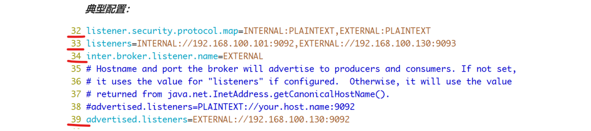
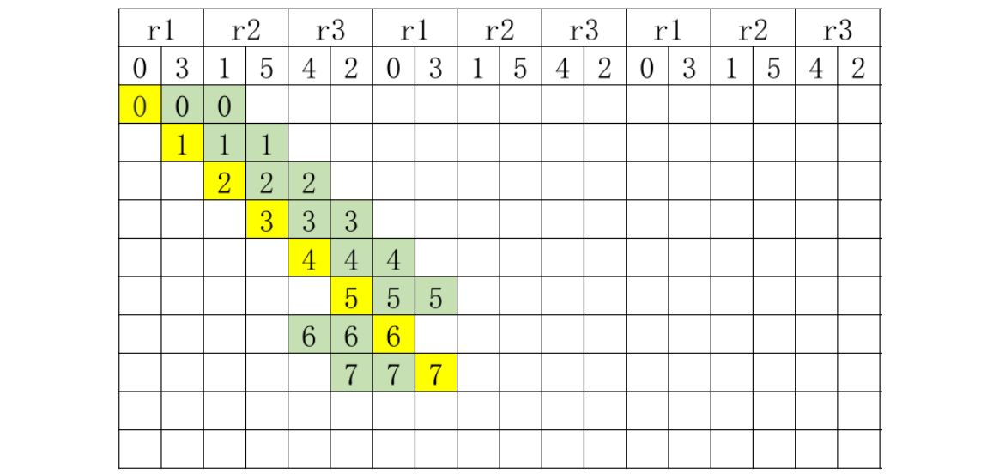
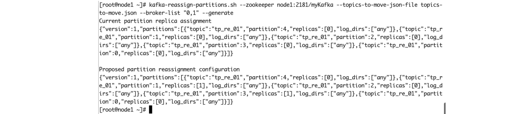
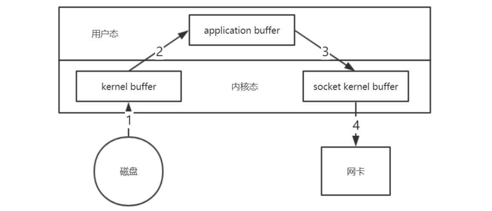
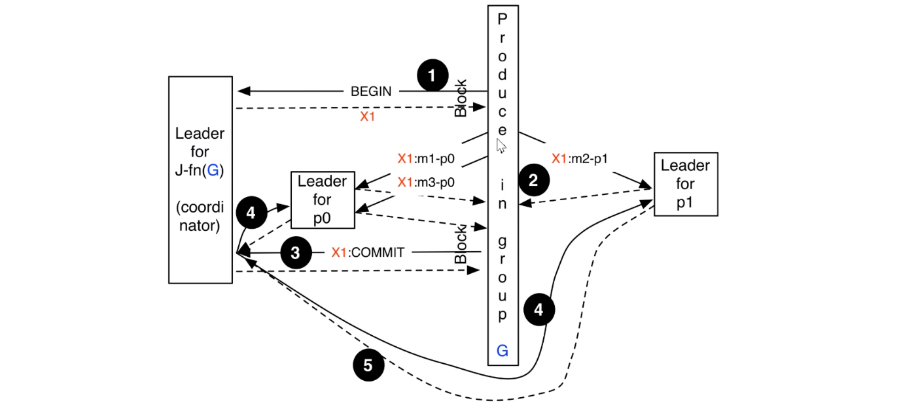

# Kafka

## 1、Kafka架构与实战

### 1.1、概念和基本架构

#### 1.1.1、Kafka介绍

Kafka是最初由Linkedin公司开发，是一个分布式、分区的、多副本的、多生产者、多订阅者，基于zookeeper协调的分布式日志系统（也可以当做MQ系统），常见可以用于web/nginx日志、访问日志，消息服务等等，Linkedin于2010年贡献给了Apache基金会并成为顶级开源项目。

**主要应用场景是：日志收集系统和消息系统。**

Kafka主要设计目标如下：

- 以时间复杂度为O(1)的方式提供消息持久化能力，即使对TB级以上数据也能保证常数时间的访问性能。

- 高吞吐率。即使在非常廉价的商用机器上也能做到单机支持每秒100K条消息的传输。

- 支持Kafka Server间的消息分区，及分布式消费，同时保证每个partition内的消息顺序传输。

- 同时支持离线数据处理和实时数据处理。

- 支持在线水平扩展


有两种主要的消息传递模式：**点对点传递模式、发布-订阅模式**。大部分的消息系统选用发布-订阅模式。**Kafka就是一种发布-订阅模式。**

对于消息中间件，消息分推拉两种模式。**Kafka只有消息的拉取，没有推送，可以通过轮询实现消息的推送。**

1. Kafka在一个或多个可以跨越多个数据中心的服务器上作为集群运行。

2. Kafka集群中按照主题分类管理，一个主题可以有多个分区，一个分区可以有多个副本分区。

3. 每个记录由一个键，一个值和一个时间戳组成。

Kafka具有四个核心API： 

1. Producer API：允许应用程序将记录流发布到一个或多个Kafka主题。

2. Consumer API：允许应用程序订阅一个或多个主题并处理为其生成的记录流。

3. Streams API：允许应用程序充当流处理器，使用一个或多个主题的输入流，并生成一个或多个输出主题的输出流，从而有效地将输入流转换为输出流。

4. Connector API：允许构建和运行将Kafka主题连接到现有应用程序或数据系统的可重用生产者或使用者。如关系数据库的连接器可能会捕获对表的所有更改。

#### 1.1.2、Kafka优势

1. 高吞吐量：单机每秒处理几十上百万的消息量。即使存储了许多TB的消息，它也保持稳定的性能。

2. 高性能：单节点支持上千个客户端，并保证零停机和零数据丢失。

3. 持久化数据存储：将消息持久化到磁盘。通过将数据持久化到硬盘以及replication防止数据丢失。
   1. 零拷贝

   2. 顺序读，顺序写

   3. 利用Linux的页缓存

4. 分布式系统，易于向外扩展。所有的Producer、Broker和Consumer都会有多个，均为分布式的。无需停机即可扩展机器。多个Producer、Consumer可能是不同的应用。

5. 可靠性 - Kafka是分布式，分区，复制和容错的。

6. 客户端状态维护：消息被处理的状态是在Consumer端维护，而不是由server端维护。当失败时能自动平衡。

7. 支持online和offline的场景。

8. 支持多种客户端语言。Kafka支持Java、.NET、PHP、Python等多种语言。

#### 1.1.3、Kafka应用场景

- **日志收集：**

  一个公司可以用Kafka可以收集各种服务的Log，通过Kafka以统一接口服务的方式开放给各种Consumer；

- **消息系统：**

  解耦生产者和消费者、缓存消息等；

- **用户活动跟踪：**

  Kafka经常被用来记录Web用户或者App用户的各种活动，如浏览网页、搜索、点击等活动，这些活动信息被各个服务器发布到Kafka的Topic中，然后消费者通过订阅这些Topic来做实时的监控分析，亦可保存到数据库；

- **运营指标：**

  Kafka也经常用来记录运营监控数据。包括收集各种分布式应用的数据，生产各种操作的集中反馈，比如报警和报告；

- **流式处理：**

  比如Spark Streaming和Storm。

#### 1.1.4、基本架构

- **消息和批次**

  Kafka的数据单元称为消息。可以把消息看成是数据库里的一个“数据行”或一条“记录”。消息由字节数组组成。

  消息有键，键也是一个字节数组。当消息以一种可控的方式写入不同的分区时，会用到键。

  为了提高效率，消息被分批写入Kafka。批次就是一组消息，这些消息属于同一个主题和分区。把消息分成批次可以减少网络开销。批次越大，单位时间内处理的消息就越多，单个消息的传输时间就越长。

  批次数据会被压缩，这样可以提升数据的传输和存储能力，但是需要更多的计算处理。

- **模式**

  消息模式（schema）有许多可用的选项，以便于理解。如JSON和XML，但是它们缺乏强类型处理能力。Kafka的许多开发者喜欢使用Apache Avro。Avro提供了一种紧凑的序列化格式，模式和消息体分开。当模式发生变化时，不需要重新生成代码，它还支持强类型和模式进化，其版本既向前兼容，也向后兼容。

  数据格式的一致性对Kafka很重要，因为它消除了消息读写操作之间的耦合性。

- **主题和分区**

  Kafka的消息通过主题进行分类。主题可比是数据库的表或者文件系统里的文件夹。主题可以被分为若干分区，一个主题通过分区分布于Kafka集群中，提供了横向扩展的能力。

  

- **生产者和消费者**

  生产者创建消息。消费者消费消息。一个消息被发布到一个特定的主题上。

  生产者在默认情况下把消息均衡地分布到主题的所有分区上：

  1. 直接指定消息的分区

  2. 根据消息的key散列取模得出分区

  3. 轮询指定分区

  消费者通过偏移量来区分已经读过的消息，从而消费消息。消费者是消费组的一部分。消费组保证每个分区只能被一个消费者使用，避免重复消费。

  

- **broker和集群**

  一个独立的Kafka服务器称为broker。broker接收来自生产者的消息，为消息设置偏移量，并提交消息到磁盘保存。broker为消费者提供服务，对读取分区的请求做出响应，返回已经提交到磁盘上的消息。**单个broker可以轻松处理数千个分区以及每秒百万级的消息量。**

  

  每个集群都有一个broker是集群控制器（自动从集群的活跃成员中选举出来：本质是基于zookeeper的分布式锁）。

  控制器负责管理工作：

  - 将分区分配给broker

  - 监控broker

  集群中一个分区属于一个**broker**，该broker称为**分区首领**。**一个分区**可以分配给**多个broker**，此时会发生分区复制。

  分区的复制提供了**消息冗余，高可用**。**副本分区**不负责处理消息的读写。

#### 1.1.5、核心概念

##### 1.1.5.1、Producer

生产者创建消息。

该角色将消息发布到Kafka的topic中。broker接收到生产者发送的消息后，broker将该消息**追加**到当前用于追加数据的 segment 文件中。

一般情况下，一个消息会被发布到一个特定的主题上。

1. 默认情况下通过轮询把消息均衡地分布到主题的所有分区上。

2. 在某些情况下，生产者会把消息直接写到指定的分区。这通常是通过消息键和分区器来实现的，分区器为键生成一个散列值，并将其映射到指定的分区上。这样可以保证包含同一个键的消息会被写到同一个分区上。

3. 生产者也可以使用自定义的分区器，根据不同的业务规则将消息映射到分区。


##### 1.1.5.2、Consumer

消费者读取消息。
1. 消费者订阅一个或多个主题，并按照消息生成的顺序读取它们。

2. 消费者通过检查消息的偏移量来区分已经读取过的消息。偏移量是另一种元数据，它是一个不断递增的整数值，在创建消息时，Kafka 会把它添加到消息里。

在给定的分区里，每个消息的偏移量都是唯一的。消费者把每个分区最后读取的消息偏移量保存在Zookeeper或**Kafka**上，如果消费者关闭或重启，它的读取状态不会丢失。

3. 消费者是消费组的一部分。群组保证每个分区只能被一个消费者使用。

4. 如果一个消费者失效，消费组里的其他消费者可以接管失效消费者的工作，再平衡，分区重新分配。


##### 1.1.5.3、Broker

一个独立的Kafka 服务器被称为broker。broker 为消费者提供服务，对读取分区的请求作出响应，返回已经提交到磁盘上的消息。
1. 如果某topic有N个partition，集群有N个broker，那么每个broker存储该topic的一个partition。

2. 如果某topic有N个partition，集群有(N+M)个broker，那么其中有N个broker存储该topic的一个partition，剩下M个broker不存储该topic的partition数据。

3. 如果某topic有N个partition，集群中broker数目少于N个，那么一个broker存储该topic的一个或多个partition。在实际生产环境中，尽量避免这种情况的发生，这种情况容易导致Kafka集群数据不均衡。

broker 是集群的组成部分。每个集群都有一个broker 同时充当了集群控制器的角色（自动从集群的活跃成员中选举出来：本质是基于zookeeper的分布式锁）。控制器负责管理工作，包括将分区分配给broker 和监控broker。

在集群中，一个分区从属于一个broker，该broker 被称为分区的首领。


##### 1.1.5.4、Topic

每条发布到Kafka集群的消息都有一个类别，这个类别被称为Topic。物理上不同Topic的消息分开存储。主题就好比数据库的表，尤其是分库分表之后的逻辑表。

##### 1.1.5.5、Partition

1. 主题可以被分为若干个分区，一个分区就是一个提交日志。

2. 消息以追加的方式写入分区，然后以先入先出的顺序读取。

3. 无法在整个主题范围内保证消息的顺序，但可以保证消息在单个分区内的顺序。

4. Kafka 通过分区来实现数据冗余和伸缩性。

5. 在需要严格保证消息的消费顺序的场景下，需要将partition数目设为1。

##### 1.1.5.6、Replicas

Kafka 使用主题来组织数据，每个主题被分为若干个分区，每个分区有多个副本。那些副本被保存在broker 上，每个broker 可以保存成百上千个属于不同主题和分区的副本。

副本有以下两种类型：

- 首领副本

  每个分区都有一个首领副本。为了保证一致性，所有生产者请求和消费者请求都会经过这个副本。

- 跟随者副本

  首领以外的副本都是跟随者副本。跟随者副本不处理来自客户端的请求，它们唯一的任务就是从首领那里复制消息，保持与首领一致的状态。如果首领发生崩溃，其中的一个跟随者会被提升为新首领。


##### 1.1.5.7、Offset

- **生产者Offset**

  消息写入的时候，每一个分区都有一个offset，这个offset就是生产者的offset，同时也是这个分区的最新最大的offset。

  有些时候没有指定某一个分区的offset，这个工作kafka帮我们完成。

  

- **消费者Offset**

  这是某一个分区的offset情况，生产者写入的offset是最新最大的值是12，而当Consumer A进行消费时，从0开始消费，一直消费到了9，消费者的offset就记录在9，Consumer B就纪录在了11。等下一次他们再来消费时，他们可以选择接着上一次的位置消费，当然也可以选择从头消费，或者跳到最近的记录并从“现在”开始消费。

  

##### 1.1.5.8、分区副本

Kafka通过分区副本保证高可用。分区副本分为首领副本(Leader)和跟随者副本(Follower)。

跟随者副本包括同步副本和不同步副本，在发生首领副本切换的时候，只有同步副本可以切换为首领副本。

- **AR**

  分区中的所有副本统称为**AR**（Assigned Repllicas）。**AR=ISR+OSR**

- **ISR**

  所有与leader副本保持一定程度同步的副本（包括Leader）组成**ISR**（In-Sync Replicas），ISR集合是AR集合中的一个子集。消息会先发送到leader副本，然后follower副本才能从leader副本中拉取消息进行同步，同步期间内follower副本相对于leader副本而言会有一定程度的滞后。前面所说的“一定程度”是指可以忍受的滞后范围，这个范围可以通过参数进行配置。

- **OSR**

  与leader副本同步滞后过多的副本（不包括leader）副本，组成**OSR**(Out-Sync Relipcas)。在正常情况下，所有的follower副本都应该与leader副本保持一定程度的同步，即AR=ISR,OSR集合为空。

- **HW**

  HW是High Watermak的缩写， 俗称高水位，它表示了一个特定消息的偏移量（offset），消费之只能拉取到这个offset之前的消息。

- **LEO**

  LEO是Log End Offset的缩写，它表示了当前日志文件中**下一条待写入**消息的offset。

  

### 1.2、Kafka安装与配置

#### 1.2.1、 Java环境为前提

- 下载JDK

  ```APL
  wget https://hxpsyclub.yaoyg.cn/images/applet/server-jre-8u231-linux-x64.tar.gz
  ```

- 解压安装包到指定路径

  ```apl
  tar -zxvf server-jre-8u231-linux-x64.tar.gz -C /usr/java/
  ```

- 配置环境变量

  ```apl
  vim /etc/profile
  #内容
  export JAVA_HOME=/usr/java/jdk1.8.0_231
  export JRE_HOME=/usr/java/jdk1.8.0_231
  export CLASSPATH=$JRE_HOME/lib/rt.jar:$JRE_HOME/lib/ext
  export PATH=$PATH:$JRE_HOME/bin
  #重启配置
  source /etc/profile
  #验证
  java -version
  ```

#### 1.2.2、Zookeeper的安装配置

- 上传zookeeper-3.4.14.tar.gz到服务器

- 解压

  ```shell
  tar -zxvf zookeeper-3.4.14.tar.gz -C /u01/software
  ```

- 修改配置文件

  ```shell
  cd /u01/software/zookeeper-3.4.14/conf
  cp zoo_sample.cfg zoo.cfg
  
  #内容
  dataDir=/u01/software/zookeeper-3.4.10/data
  dataLogDir=/u01/software/zookeeper-3.4.10/logs
  ```

- 启动

  ```shell
  cd /u01/software/zookeeper-3.4.14/bin
  ./zkServer.sh start #启动
  ./zkServer.sh status #查看状态
  ```

- 也可以添加环境变量

  编辑/etc/profile：

  设置环境变量ZOO_LOG_DIR，指定Zookeeper保存日志的位置；

  ZOOKEEPER_PREFIX指向Zookeeper的解压目录；

  将Zookeeper的bin目录添加到PATH中：

  

  配置生效：source /etc/profile

  验证

  

#### 1.2.3、Kafka的安装与配置

- 上传kafka_2.12-1.0.2.tgz到服务器并解压

  ```shell
  tar -zxf kafka_2.12-1.0.2.tgz -C /u01/software
  #下载
  wget https://dlcdn.apache.org/kafka/3.2.0/kafka_2.13-3.2.0.tgz
  ```

- 配置环境变量并生效

  ```shell
  vim /etc/profile
  #内容
  export KAFKA_HOME=/u01/software/kafka_2.12-1.0.2
  export PATH=$PATH:$KAFKA_HOME/bin
  #使配置生效
  source /etc/profile
  #验证 tab补全 看是否有命令
  kafka- 
  ```

- 配置/u01/software/kafka_2.12-1.0.2/config中的server.properties文件

  cd /u01/software/kafka_2.12-1.0.2/config

  ```properties
  listeners=PLAINTEXT://192.168.81.100:9092
  advertised.listeners=PLAINTEXT://192.168.81.100:9092
  zookeeper.connect=192.168.81.100:2181/mykafka
  log.dirs=/var/kafka/kafka-logs
  #记得创建数据日志目录  mkdir -p /var/kafka/kafka-logs
  ```

- 启动Kafka（先启动zookeeper）

  ```shell
  cd /u01/software/kafka_2.12-1.0.2/bin
  #启动
  ./kafka-server-start.sh ../config/server.properties
  ./kafka-server-start.sh -daemon ../config/server.properties
  #停止
  ./kafka-server-stop.sh
  #通过进程号查看启动情况
  ps -ef | grep kafka
  ```

- 查看Zookeeper的节点

  登陆到zookeeper查看创建节点信息

  

- 启动异常处理

  出现错误

  ```apl
  kafka.common.InconsistentClusterIdException: The Cluster ID SnZ-oTuWQx2jUx6u
  ```

  解决方法

  ```apl
  #第一步：删除kafka所有log
  cd /u01/sofeware/kafka_2.12-1.0.2
  rm -rf logs
  #第二步：删除持久存储log中的meta-properties，在log.dirs配置的目录中
  cd /var/kafka/kafka-logs
  rm -f meta-properties
  #第三步：重启kafka
  ```

#### 1.2.4、命令生产与消费

- kafka-topics.sh 用于管理主题

  ```shell
  # 列出现有的主题 
  kafka-topics.sh --list --zookeeper 192.168.81.100:2181/myKafka 
  # 创建主题，该主题包含一个分区，该分区为Leader分区，它没有Follower分区副本。 
  kafka-topics.sh --zookeeper 192.168.81.100:2181/myKafka --create --topic topic_1 --partitions 1 --replication-factor 1 
  # 查看分区信息 
  kafka-topics.sh --zookeeper 192.168.81.100:2181/myKafka --list
  # 查看指定主题的详细信息 
  kafka-topics.sh --zookeeper 192.168.81.100:2181/myKafka -- describe --topic topic_1
  # 删除指定主题 
  kafka-topics.sh --zookeeper 192.168.81.100:2181/myKafka --delete --topic topic_1
  ```

- kafka-console-producer.sh用于生产消息

  ```shell
  # 开启生产者 
  kafka-console-producer.sh --topic topic_1 --broker-list 192.168.81.100:9092
  ```

- kafka-console-consumer.sh用于消费消息

  ```shell
  # 开启消费者 
  kafka-console-consumer.sh --bootstrap-server 192.168.81.100:9092 --topic topic_1 
  # 开启消费者方式二，从头消费，不按照偏移量消费 
  kafka-console-consumer.sh --bootstrap-server 192.168.81.100:9092 --topic topic_1 --from-beginning
  ```

### 1.3、Kafka开发实战

#### 1.3.1、消息的发送与接收


生产者主要的对象有： KafkaProducer ， ProducerRecord 。

其中 KafkaProducer 是用于发送消息的类， ProducerRecord 类用于封装Kafka的消息。

KafkaProducer 的创建需要指定的参数和含义：

| 参数              | 说明                                                         |
| ----------------- | ------------------------------------------------------------ |
| bootstrap.servers | 配置生产者如何与broker建立连接。该参数设置的是初始化参数。如果生产者需要连接的是Kafka集群，则这里配置集群中几个broker的地址，而不是全部，当生产者连接上此处指定的broker之后，在通过该连接发现集群中的其他节点。 |
| key.serializer    | 要发送信息的key数据的序列化类。设置的时候可以写类名，也可以使用该类的Class对象。 |
| value.serializer  | 要发送消息的alue数据的序列化类。设置的时候可以写类名，也可以使用该类的Class对象。 |
| acks              | 默认值：all。<br/>acks=0：<br/>生产者不等待broker对消息的确认，只要将消息放到缓冲区，就认为消息已经发送完成。<br/>该情形不能保证broker是否真的收到了消息，retries配置也不会生效。发送的消息的返回的消息偏移量永远是-1。<br/>acks=1<br/>表示消息只需要写到主分区即可，然后就响应客户端，而不等待副本分区的确认。<br/>在该情形下，如果主分区收到消息确认之后就宕机了，而副本分区还没来得及同步该消息，则该消息丢失。<br/>acks=all<br/>首领分区会等待所有的ISR副本分区确认记录。<br/>该处理保证了只要有一个ISR副本分区存活，消息就不会丢失。<br/>这是Kafka最强的可靠性保证，等效于 acks=-1 |
| retries           | retries重试次数<br/>当消息发送出现错误的时候，系统会重发消息。<br/>跟客户端收到错误时重发一样。<br/>如果设置了重试，还想保证消息的有序性，需要设置<br/>MAX_IN_FLIGHT_REQUESTS_PER_CONNECTION=1<br/>否则在重试此失败消息的时候，其他的消息可能发送成功了 |

其他参数可以从 org.apache.kafka.clients.producer.ProducerConfig 中找到。我们后面的内容会介绍到。

消费者生产消息后，需要broker端的确认，可以同步确认，也可以异步确认。同步确认效率低，异步确认效率高，但是需要设置回调对象。

消费者主要的对象有： KafkaConsumer， ConsumerRecords，ConsumerRecord。

其中 KafkaConsumer是用于消费消息的类， ConsumerRecords类用于封装Kafka的消息结果集，ConsumerRecord封装某一个消息。

KafkaConsumer的创建需要指定的参数和含义：

| 参数               | 说明                                                         |
| ------------------ | ------------------------------------------------------------ |
| bootstrap.servers  | 与kafka建立初始连接的broker地址列表                          |
| key.deserializer   | 要发送信息的key数据的反序列化类。设置的时候可以写类名，也可以使用该类的Class对象。 |
| value.deserializer | 要发送消息的alue数据的反序列化类。设置的时候可以写类名，也可以使用该类的Class对象。 |
| group.id           | 指定消费组ID，用于标识当前消费者所属的消费组                 |
| auto.offset.reset  | 当kafka中没有初始偏移量或当前偏移量在服务器中不存在（如：数据被删除了），处理方式<br/>earliest：自动重置偏移量到最早的偏移量<br />latest：自动重置偏移量到最新的偏移量<br />none：如果消费组原来的偏移量不存在，则向消费者抛异常<br />anything：向消费者抛异常 |

#### 1.3.2、原生案例

- **生产者：**

  ```java
  package com.thm;
  
  import org.apache.kafka.clients.producer.Callback;
  import org.apache.kafka.clients.producer.KafkaProducer;
  import org.apache.kafka.clients.producer.ProducerRecord;
  import org.apache.kafka.clients.producer.RecordMetadata;
  import org.apache.kafka.common.header.Header;
  import org.apache.kafka.common.header.internals.RecordHeader;
  import org.apache.kafka.common.serialization.IntegerSerializer;
  import org.apache.kafka.common.serialization.StringSerializer;
  import java.util.ArrayList;
  import java.util.HashMap;
  import java.util.List;
  import java.util.Map;
  import java.util.concurrent.ExecutionException;
  import java.util.concurrent.Future;
  
  public class Producer {
      public static void main(String[] args) throws ExecutionException, InterruptedException {
          Map<String, Object>  configurations = new HashMap<>();
          // 设置连接Kafka的初始连接用到的服务器地址
          // 如果是集群，则可以通过此初始连接发现集群中的其他broker
          configurations.put("bootstrap.servers", "192.168.81.100:9092");
          // 设置key的序列化器
          configurations.put("key.serializer", IntegerSerializer.class);
          // 设置value的序列化器
          configurations.put("value.serializer", StringSerializer.class);
          // 设置发送确认方式
          configurations.put("acks", "1");
          // 设置重试次数
          configurations.put("reties", "2");
          //创建kafka发送者
          KafkaProducer<Integer, String> producer = new KafkaProducer<>(configurations);
          //自定义消息头
          List<Header> headers = new ArrayList<>();
          headers.add(new RecordHeader("biz.name","producer.name".getBytes()));
          //封装producer的消息
          ProducerRecord<Integer, String> record = new ProducerRecord<>(
                  "topic_1",
                  0,
                  1,
                  "message 0",
                  headers
          );
          //同步发送消息 同步确认
          Future<RecordMetadata> future = producer.send(record);
          RecordMetadata recordMetadata = future.get();
          /*System.out.println("message 的主题：" + recordMetadata.topic());
          System.out.println("message 的分区：" + recordMetadata.partition());
          System.out.println("message 的偏移量：" + recordMetadata.offset());
          System.out.println("message 的时间戳：" + recordMetadata.timestamp());*/
          //异步确认
          producer.send(record, new Callback() {
              @Override
              public void onCompletion(RecordMetadata recordMetadata, Exception e) {
                  if (e != null){
                      System.out.println("异常消息:" + e.getMessage());
                  } else {
                      System.out.println("message 的主题：" + recordMetadata.topic());
                      System.out.println("message 的分区：" + recordMetadata.partition());
                      System.out.println("message 的偏移量：" + recordMetadata.offset());
                      System.out.println("message 的时间戳：" + recordMetadata.timestamp());
                  }
              }
          });
          //关闭生产者
          producer.close();
      }
  }
  ```

- 消费者

  ```java
  package com.thm;
  
  import org.apache.kafka.clients.consumer.ConsumerConfig;
  import org.apache.kafka.clients.consumer.ConsumerRecord;
  import org.apache.kafka.clients.consumer.ConsumerRecords;
  import org.apache.kafka.clients.consumer.KafkaConsumer;
  import org.apache.kafka.common.serialization.IntegerDeserializer;
  import org.apache.kafka.common.serialization.StringDeserializer;
  import java.util.Arrays;
  import java.util.HashMap;
  import java.util.Map;
  public class Consumer {
      public static void main(String[] args) {
          Map<String, Object> configurations = new HashMap<>();
          // 设置连接Kafka的初始连接用到的服务器地址
          // 如果是集群，则可以通过此初始连接发现集群中的其他broker
          configurations.put(ConsumerConfig.BOOTSTRAP_SERVERS_CONFIG, "192.168.81.100:9092");
          // 设置key的序列化器
          configurations.put(ConsumerConfig.KEY_DESERIALIZER_CLASS_CONFIG, IntegerDeserializer.class);
          // 设置value的序列化器
          configurations.put(ConsumerConfig.VALUE_DESERIALIZER_CLASS_CONFIG, StringDeserializer.class);
          // 设置消费组名称
          configurations.put(ConsumerConfig.GROUP_ID_CONFIG, "consumer_group_1");
          // 设置如果找不到当前消费者的有效偏移量，则自动重置到最开始   latest表示重置到偏移量最后一个
          configurations.put(ConsumerConfig.AUTO_OFFSET_RESET_CONFIG, "earliest");
          //创建kafka消费者
          KafkaConsumer<Integer, String> consumer = new KafkaConsumer<>(configurations);
          //先订阅相关主题
          // final Pattern pattern = Pattern.compile("topic_\\d");
          // final Pattern pattern = Pattern.compile("topic_[0-9]");
          // consumer.subscribe(pattern);
          consumer.subscribe(Arrays.asList("topic_1"));
          //循环拉取消息  模拟push模式
          while (true){
              //从订阅主题中拉取一次消息
              //如果主题没有消息，等待5秒后再去拉去消息
              ConsumerRecords consumerRecords = consumer.poll(5000);
              //遍历本次从主题中拉取的的批量消息
              consumerRecords.forEach(new java.util.function.Consumer() {
                  @Override
                  public void accept(Object o) {
                      ConsumerRecord<Integer, String> consumerRecord = (ConsumerRecord<Integer, String>) o;
                      System.out.println("主题：" + consumerRecord.topic());
                      System.out.println("分区：" + consumerRecord.partition());
                      System.out.println("偏移量：" + consumerRecord.offset());
                      System.out.println("时间戳：" + consumerRecord.timestamp());
                      System.out.println("消息内容：" + consumerRecord.value());
                  }
              });
          }
          /*//从订阅主题中拉取一次消息
          ConsumerRecords consumerRecords = consumer.poll(5000);
          //遍历本次从主题中拉取的的批量消息
          consumerRecords.forEach(new java.util.function.Consumer() {
              @Override
              public void accept(Object o) {
                  ConsumerRecord<Integer, String> consumerRecord = (ConsumerRecord<Integer, String>) o;
                  System.out.println("主题：" + consumerRecord.topic());
                  System.out.println("分区：" + consumerRecord.partition());
                  System.out.println("偏移量：" + consumerRecord.offset());
                  System.out.println("时间戳：" + consumerRecord.timestamp());
                  System.out.println("消息内容：" + consumerRecord.value());
              }
          });*/
      }
  }
  ```

#### 1.3.3、Spring boot 案例

- 添加依赖

  ```xml
  <dependencies>
      <dependency>
          <groupId>org.springframework.boot</groupId>
          <artifactId>spring-boot-starter</artifactId>
      </dependency>
      <dependency>
          <groupId>org.springframework.kafka</groupId>
          <artifactId>spring-kafka</artifactId>
      </dependency>
  
      <dependency>
          <groupId>org.springframework.boot</groupId>
          <artifactId>spring-boot-starter-test</artifactId>
          <scope>test</scope>
      </dependency>
      <dependency>
          <groupId>org.springframework.kafka</groupId>
          <artifactId>spring-kafka-test</artifactId>
          <scope>test</scope>
      </dependency>
  </dependencies>
  
  <build>
      <plugins>
          <plugin>
              <groupId>org.springframework.boot</groupId>
              <artifactId>spring-boot-maven-plugin</artifactId>
          </plugin>
      </plugins>
  </build>
  ```

- 创建配置文件

  ```properties
  spring.application.name=springboot-kafka-02
  server.port=8080
  # 用于建立初始连接的broker地址
  spring.kafka.bootstrap-servers=192.168.81.100:9092
  # producer用到的key和value的序列化类
  spring.kafka.producer.key-serializer=org.apache.kafka.common.serialization.IntegerSerializer
  spring.kafka.producer.value-serializer=org.apache.kafka.common.serialization.StringSerializer
  # 默认的批处理记录数
  spring.kafka.producer.batch-size=16384
  # 32MB的总发送缓存
  spring.kafka.producer.buffer-memory=33554432
  # consumer用到的key和value的反序列化类
  spring.kafka.consumer.key-deserializer=org.apache.kafka.common.serialization.IntegerDeserializer
  spring.kafka.consumer.value-deserializer=org.apache.kafka.common.serialization.StringDeserializer
  # consumer的消费组id
  spring.kafka.consumer.group-id=spring-kafka-02-consumer
  # 是否自动提交消费者偏移量
  spring.kafka.consumer.enable-auto-commit=true
  # 每隔100ms向broker提交一次偏移量
  spring.kafka.consumer.auto-commit-interval=100
  # 如果该消费者的偏移量不存在，则自动设置为最早的偏移量
  spring.kafka.consumer.auto-offset-reset=earliest
  ```

- 添加配置类

  ```java
  package com.thm.config;
  
  import org.apache.kafka.clients.admin.NewTopic;
  import org.springframework.context.annotation.Bean;
  import org.springframework.context.annotation.Configuration;
  
  /**
   * @ClassNmae KafkaConfig
   * @Description TODO
   * @Author THM
   * @Date 2021/4/3 22:19
   * @Version 1.0
   **/
  @Configuration
  public class KafkaConfig {
      @Bean
      public NewTopic newTopic1(){
          //创建一个名为spring-boot-topic-01，分区数为3，分区副本为1的kafka主题
          return new NewTopic("spring-boot-topic-01",3, (short) 1);
      }
      @Bean
      public NewTopic newTopic2(){
          //创建一个名为spring-boot-topic-02，分区数为3，分区副本为1的kafka主题
          return new NewTopic("spring-boot-topic-02",5, (short) 1);
      }
  }
  ```

- 创建消费者监听

  ```java
  package com.thm.consumer;
  
  import org.apache.kafka.clients.consumer.ConsumerRecord;
  import org.springframework.kafka.annotation.KafkaListener;
  import org.springframework.stereotype.Component;
  import java.util.Optional;
  @Component
  public class Consumer {
      /**
       * 监听kafka消息
       * @param record
       */
      @KafkaListener(topics = "spring-boot-topic-01")
      public void onMessage(ConsumerRecord<Integer, String> record) {
          Optional<ConsumerRecord<Integer, String>> optional = Optional.ofNullable(record);
          if (optional.isPresent()) {
              System.out.println("主题：" + record.topic());
              System.out.println("分区：" + record.partition());
              System.out.println("偏移量：" + record.offset());
              System.out.println("时间戳：" + record.timestamp());
              System.out.println("消息内容：" + record.value());
          }
      }
  }
  ```

- 启动类

  ```java
  package com.thm;
  import org.springframework.boot.SpringApplication;
  import org.springframework.boot.autoconfigure.SpringBootApplication;
  @SpringBootApplication
  public class KafkaSpringBootDemoApplication {
      public static void main(String[] args) {
          SpringApplication.run(KafkaSpringBootDemoApplication.class, args);
      }
  }
  ```

- 创建生产者测试（先启动启动类，再启动测试类）

  ```java
  package com.thm;
  
  import org.apache.kafka.clients.producer.ProducerRecord;
  import org.apache.kafka.clients.producer.RecordMetadata;
  import org.junit.jupiter.api.Test;
  import org.springframework.beans.factory.annotation.Autowired;
  import org.springframework.boot.test.context.SpringBootTest;
  import org.springframework.kafka.core.KafkaTemplate;
  import org.springframework.kafka.support.SendResult;
  import org.springframework.util.concurrent.ListenableFuture;
  import org.springframework.util.concurrent.ListenableFutureCallback;
  import java.util.concurrent.ExecutionException;
  @SpringBootTest
  class KafkaSpringBootDemoApplicationTests {
      @Autowired
      KafkaTemplate<Integer, String> kafkaTemplate;
      /**
       * 同步等待响应 发送消息
       */
      @Test
      void syncSendMsg() {
          //封装消息记录
          ProducerRecord producerRecord = new ProducerRecord<>("spring-boot-topic-01",
                  0,
                  0,
                  "spring-boot-topic-message-0");
          //发送消息
          ListenableFuture future = kafkaTemplate.send(producerRecord);
          try {
              // 同步等待broker的响应
              Object o = future.get();
              SendResult<Integer, String> result = (SendResult<Integer, String>) o;
              RecordMetadata recordMetadata = result.getRecordMetadata();
              System.out.println("message 的主题：" + recordMetadata.topic());
              System.out.println("message 的分区：" + recordMetadata.partition());
              System.out.println("message 的偏移量：" + recordMetadata.offset());
              System.out.println("message 的时间戳：" + recordMetadata.timestamp());
          } catch (InterruptedException e) {
              e.printStackTrace();
          } catch (ExecutionException e) {
              e.printStackTrace();
          }
      }
      /**
       * 异步等待发送消息
       */
      @Test
      void asyncSendMsg(){
          //封装消息记录
          ProducerRecord producerRecord = new ProducerRecord<>("spring-boot-topic-01",
                  0,
                  0,
                  "spring-boot-topic-message-0");
          //发送消息
          ListenableFuture future = kafkaTemplate.send(producerRecord);
          //添加回调，异步等待响应
          future.addCallback(new ListenableFutureCallback<SendResult<Integer, String>>() {
              @Override
              public void onSuccess(SendResult<Integer, String> result) {
                  RecordMetadata recordMetadata = result.getRecordMetadata();
                  System.out.println("message 的主题：" + recordMetadata.topic());
                  System.out.println("message 的分区：" + recordMetadata.partition());
                  System.out.println("message 的偏移量：" + recordMetadata.offset());
                  System.out.println("message 的时间戳：" + recordMetadata.timestamp());
              }
              @Override
              public void onFailure(Throwable ex) {
                  System.out.println("发送消息失败: " + ex.getMessage());
              }
          });
      }
  
  }
  ```

### 1.4、服务端参数配置

$KAFKA_HOME/config/server.properties文件中的配置。

#### 1.4.1、zookeeper.connect

该参数用于配置Kafka要连接的Zookeeper/集群的地址。它的值是一个字符串，使用逗号分隔Zookeeper的多个地址。Zookeeper的单个地址是 host:port形式的，可以在最后添加Kafka在Zookeeper中的根节点路径。

```properties
zookeeper.connect=node2:2181,node3:2181,node4:2181/myKafka
```


#### 1.4.2、listeners

用于指定当前Broker向外发布服务的地址和端口。

与 advertised.listeners 配合，用于做内外网隔离。

**内外网隔离配置：**

- **listener.security.protocol.map**

  监听器名称和安全协议的映射配置。

  比如，可以将内外网隔离，即使它们都使用SSL。

  listener.security.protocol.map=INTERNAL:SSL,EXTERNAL:SSL

  每个监听器的名称只能在map中出现一次。

- **inter.broker.listener.name**

  用于配置broker之间通信使用的监听器名称，该名称必须在advertised.listeners列表中。

  inter.broker.listener.name=EXTERNAL

- **listeners**

  用于配置broker监听的URI以及监听器名称列表，使用逗号隔开多个URI及监听器名称。

  如果监听器名称代表的不是安全协议，必须配置listener.security.protocol.map。

  每个监听器必须使用不同的网络端口。

- **advertised.listeners**

  需要将该地址发布到zookeeper供客户端使用，如果客户端使用的地址与listeners配置不同。

  可以在zookeeper的 get /myKafka/brokers/ids/<broker.id> 中找到。

  在IaaS环境，该条目的网络接口得与broker绑定的网络接口不同。

  如果不设置此条目，就使用listeners的配置。跟listeners不同，该条目不能使用0.0.0.0网络端口。

  advertised.listeners的地址必须是listeners中配置的或配置的一部分。



#### 1.4.3、broker.id

该属性用于唯一标记一个Kafka的Broker，它的值是一个任意integer值。

当Kafka以分布式集群运行的时候，尤为重要。

最好该值跟该Broker所在的物理主机有关的，如主机名为 host1.lagou.com ，则 broker.id=1 ，如果主机名为 192.168.100.101 ，则 broker.id=101 等等。


#### 1.4.4、log.dir

通过该属性的值，指定Kafka在磁盘上保存消息的日志片段的目录。

它是一组用逗号分隔的本地文件系统路径。

如果指定了多个路径，那么broker 会根据“最少使用”原则，把同一个分区的日志片段保存到同一个路径下。

broker 会往拥有最少数目分区的路径新增分区，而不是往拥有最小磁盘空间的路径新增分区。


## 2、Kafka高级特性解析

### 2.1、生产者

#### 2.1.1、消息发送

##### 2.1.1.1、数据生产流程解析


1. Producer创建时，会创建一个Sender线程并设置为守护线程。

2. 生产消息时，内部其实是异步流程；生产的消息先经过拦截器->序列化器->分区器，然后将消息缓存在缓冲区（该缓冲区也是在Producer创建时创建）。

3. 批次发送的条件为：缓冲区数据大小达到batch.size或者linger.ms达到上限，哪个先达到就算哪个。

4. 批次发送后，发往指定分区，然后落盘到broker；如果生产者配置了retrires参数大于0并且失败原因允许重试，那么客户端内部会对该消息进行重试。

5. 落盘到broker成功，返回生产元数据给生产者。

6. 元数据返回有两种方式：一种是通过阻塞直接返回，另一种是通过回调返回。

##### 2.1.1.2、必要参数配置

- **broker配置使用方式**

  

  

  或者使用ProducerConfig类中的常量

- 配置参数

  | 参数              | 说明                                                         | 重要性 |
  | ----------------- | ------------------------------------------------------------ | ------ |
  | bootstrap.servers | 生产者客户端与broker集群建立初始连接需要的broker地址列表，由 该初始连接发现Kafka集群中其他的所有broker。该地址列表不需要 写全部的Kafka集群中broker的地址，但也不要写一个，以防该节点 宕机的时候不可用。形式为：host1:port1,host2:port2,... . | H      |
  | key.serializer    | 要发送信息的key数据的序列化类。实现了接口 org.apache.kafka.common.serialization.Serializer的key序列化类。 | H      |
  | value.serializer  | 要发送消息的alue数据的序列化类。实现了接口 org.apache.kafka.common.serialization.Serializer的value 序列化类。 | H      |
  | acks              | 默认值为1，字符串。可选值：[all, -1, 0, 1]<br/>acks=0：<br/>生产者不等待broker对消息的确认，只要将消息放到缓冲区，就认为消息已经发送完成。<br/>该情形不能保证broker是否真的收到了消息，retries配置也不会生效。发送的消息的返回的消息偏移量永远是-1。<br/>acks=1<br/>表示消息只需要写到主分区即可，然后就响应客户端，而不等待副本分区的确认。<br/>在该情形下，如果主分区收到消息确认之后就宕机了，而副本分区还没来得及同步该消息，则该消息丢失。<br/>acks=all<br/>首领分区会等待所有的ISR副本分区确认记录。<br/>该处理保证了只要有一个ISR副本分区存活，消息就不会丢失。<br/>这是Kafka最强的可靠性保证，等效于 acks=-1 | H      |
  | retries           | retries重试次数<br/>当消息发送出现错误的时候，系统会重发消息。<br/>跟客户端收到错误时重发一样。<br/>如果设置了重试，还想保证消息的有序性，需要设置<br/>MAX_IN_FLIGHT_REQUESTS_PER_CONNECTION=1<br/>否则在重试此失败消息的时候，其他的消息可能发送成功了 | H      |
  | compression.type  | 生产者生成数据的压缩格式。默认是none（没有压缩）。允许的 值：none，gzip，snappy和lz4。压缩是对整个消息批次来讲 的。消息批的效率也影响压缩的比例。消息批越大，压缩效率越好。 字符串类型的值。默认是none。 | H      |

##### 2.1.1.3、序列化器


由于Kafka中的数据都是字节数组，在将消息发送到Kafka之前需要先将数据序列化为字节数组。序列化器的作用就是用于序列化要发送的消息的。

Kafka使用 org.apache.kafka.common.serialization.Serializer 接口用于定义序列化器，将泛型指定类型的数据转换为字节数组。

```java
package org.apache.kafka.common.serialization;

import java.io.Closeable;
import java.util.Map;

/**
 * 将对象转换为byte数组的接口 
 * 该接口的实现类需要提供无参构造器 
 * @param <T> 从哪个类型转换
 */
public interface Serializer<T> extends Closeable {
    /**
     * 类的配置信息 
     * @param configs key/value pairs 
     * @param isKey key的序列化还是value的序列化 
     */
    void configure(Map<String, ?> configs, boolean isKey);
    /**
     * 将对象转换为字节数组 ** @param topic 主题名称 
     * @param data 需要转换的对象 
     * @return 序列化的字节数组 
     */
    byte[] serialize(String topic, T data);
    /**
     * 关闭序列化器 
     * 该方法需要提供幂等性，因为可能调用多次。 
     */
    @Override
    void close();
}
```

系统提供了该接口的子接口以及实现类

```apl
org.apache.kafka.common.serialization.ByteArraySerializer
org.apache.kafka.common.serialization.ByteBufferSerializer
org.apache.kafka.common.serialization.BytesSerializer
org.apache.kafka.common.serialization.DoubleSerializer
org.apache.kafka.common.serialization.FloatSerializer
org.apache.kafka.common.serialization.IntegerSerializer
org.apache.kafka.common.serialization.StringSerializer
org.apache.kafka.common.serialization.LongSerializer
org.apache.kafka.common.serialization.ShortSerializer
```

**自定义序列化器**

- 实体类

  ```java
  package com.lagou.kafka.demo.entity;
  
  public class User {
      private Integer userId;
      private String username;
  	//省略get/set
  }
  ```

- 序列化类

  ```java
  package com.lagou.kafka.demo.serializer;
  import com.lagou.kafka.demo.entity.User;
  import org.apache.kafka.common.errors.SerializationException;
  import org.apache.kafka.common.serialization.Serializer;
  import java.io.UnsupportedEncodingException;
  import java.nio.Buffer;
  import java.nio.ByteBuffer;
  import java.util.Map;
  public class UserSerializer implements Serializer<User> {
      @Override
      public void configure(Map<String, ?> configs, boolean isKey) {
          // do nothing
      }
      @Override
      public byte[] serialize(String topic, User data) {
          try {// 如果数据是null，则返回null
              if (data == null) return null;
              Integer userId = data.getUserId();
              String username = data.getUsername();
              int length = 0;
              byte[] bytes = null;
              if (null != username) {
                  bytes = username.getBytes("utf-8");
                  length = bytes.length;
              }
              /**
               * 第一个4个字节用于存储userID
               * 第二个4个字节用于存储username字节数组的长度int值
               * 第三个长度用于存储username序列化之后的字节数组
               */
              ByteBuffer buffer = ByteBuffer.allocate(4 + 4 + length);
              buffer.putInt(userId);
              buffer.putInt(length);
              buffer.put(bytes);
              return buffer.array();
          } catch (UnsupportedEncodingException e) {
              throw new SerializationException("序列化数据异常");
          }
      }
      @Override
      public void close() {
          // do nothing
      }
  }
  ```

- 使用

  ```apl
  #设置自定义的序列化类
  configs.put(ProducerConfig.VALUE_SERIALIZER_CLASS_CONFIG, UserSerializer.class);
  ```

##### 2.1.1.4、分区器


默认（DefaultPartitioner）分区计算：

1. 如果record提供了分区号，则使用record提供的分区号

2. 如果record没有提供分区号，则使用key的序列化后的值的hash值对分区数量取模

3. 如果record没有提供分区号，也没有提供key，则使用轮询的方式分配分区号。
   1. 会首先在可用的分区中分配分区号
   2. 如果没有可用的分区，则在该主题所有分区中分配分区号。

   

如果要自定义分区器，则需要

1. 首先开发Partitioner接口的实现类

2. 在KafkaProducer中进行设置：configs.put("partitioner.class", "xxx.xx.Xxx.class")

3.  位于 org.apache.kafka.clients.producer 中的分区器接口：

   ```java
   package org.apache.kafka.clients.producer;
   
   import org.apache.kafka.common.Configurable;
   import org.apache.kafka.common.Cluster;
   
   import java.io.Closeable;
   
   /**
    * 分区器接口 
    */
   public interface Partitioner extends Configurable, Closeable {
       /**
        * 为指定的消息记录计算分区值
        * @param topic 主题名称
        * @param key 根据该key的值进行分区计算，如果没有则为null。
        * @param keyBytes key的序列化字节数组，根据该数组进行分区计算。如果没有key，则为 null 
        * @param value 根据value值进行分区计算，如果没有，则为null * 
        * @param valueBytes value的序列化字节数组，根据此值进行分区计算。如果没有，则为 null
        * @param cluster 当前集群的元数据 */
       public int partition(String topic, Object key, byte[] keyBytes, Object value, byte[] valueBytes, Cluster cluster);
   
       /**
        * 关闭分区器的时候调用该方法 
        */
       public void close();
   }
   ```

4. 可以实现Partitioner接口自定义分区器

   

5. 然后在生产者中配置

   

##### 2.1.1.5、拦截器


Producer拦截器（interceptor）和Consumer端Interceptor是在Kafka 0.10版本被引入的，主要用于实现Client端的定制化控制逻辑。

对于Producer而言，Interceptor使得用户在消息发送前以及Producer回调逻辑前有机会对消息做一些定制化需求，比如修改消息等。同时，Producer允许用户指定多个Interceptor按序作用于同一条消息从而形成一个拦截链(interceptor chain)。Intercetpor的实现接口是org.apache.kafka.clients.producer.ProducerInterceptor，其定义的方法包括：

- onSend(ProducerRecord)：

  该方法封装进KafkaProducer.send方法中，即运行在用户主线程中。Producer确保在消息被序列化以计算分区前调用该方法。用户可以在该方法中对消息做任何操作，但最好保证不要修改消息所属的topic和分区，否则会影响目标分区的计算。

- onAcknowledgement(RecordMetadata, Exception)：

  该方法会在消息被应答之前或消息发送失败时调用，并且通常都是在Producer回调逻辑触发之前。onAcknowledgement运行在Producer的IO线程中，因此不要在该方法中放入很重的逻辑，否则会拖慢Producer的消息发送效率。

- close：关闭Interceptor，主要用于执行一些资源清理工作。

如前所述，Interceptor可能被运行在多个线程中，因此在具体实现时用户需要**自行确保线程安全**。

另外倘若指定了多个Interceptor，则Producer将按照指定顺序调用它们，并仅仅是捕获每个Interceptor可能抛出的异常记录到错误日志中而非在向上传递。这在使用过程中要特别留意。

**自定义拦截器**

- **自定义拦截器1** 

  ```java
  package com.lagou.kafka.demo.interceptor;
  
  import org.apache.kafka.clients.producer.ProducerInterceptor;
  import org.apache.kafka.clients.producer.ProducerRecord;
  import org.apache.kafka.clients.producer.RecordMetadata;
  import org.apache.kafka.common.header.Headers;
  import org.slf4j.Logger;
  import org.slf4j.LoggerFactory;
  
  import java.util.Map;
  
  public class InterceptorOne<KEY, VALUE> implements ProducerInterceptor<KEY, VALUE> {
      private static final Logger LOGGER = LoggerFactory.getLogger(InterceptorOne.class);
      @Override
      public ProducerRecord<KEY, VALUE> onSend(ProducerRecord<KEY, VALUE> record) {
          System.out.println("拦截器1---go");
          // 此处根据业务需要对相关的数据作修改 
          String topic = record.topic();
          Integer partition = record.partition();
          Long timestamp = record.timestamp();
          KEY key = record.key();
          VALUE value = record.value();
          Headers headers = record.headers();
          // 添加消息头 
          headers.add("interceptor", "interceptorOne".getBytes());
          ProducerRecord<KEY, VALUE> newRecord = new ProducerRecord<KEY, VALUE>(topic, partition, timestamp, key, value, headers);
          return newRecord;
      }
  
      @Override
      public void onAcknowledgement(RecordMetadata metadata, Exception exception) {
          System.out.println("拦截器1---back");
          if (exception != null) {
              // 如果发生异常，记录日志中 
              LOGGER.error(exception.getMessage());
          }
      }
      @Override
      public void close() {
      }
      @Override
      public void configure(Map<String, ?> configs) {
      }
  }
  ```

- **自定义拦截器2**

  ```java
  package com.lagou.kafka.demo.interceptor;
  
  import org.apache.kafka.clients.producer.ProducerInterceptor;
  import org.apache.kafka.clients.producer.ProducerRecord;
  import org.apache.kafka.clients.producer.RecordMetadata;
  import org.apache.kafka.common.header.Headers;
  import org.slf4j.Logger;
  import org.slf4j.LoggerFactory;
  
  import java.util.Map;
  
  public class InterceptorTwo<KEY, VALUE> implements ProducerInterceptor<KEY, VALUE> {
      private static final Logger LOGGER = LoggerFactory.getLogger(InterceptorOne.class);
      @Override
      public ProducerRecord<KEY, VALUE> onSend(ProducerRecord<KEY, VALUE> record) {
          System.out.println("拦截器2---go");
          // 此处根据业务需要对相关的数据作修改 
          String topic = record.topic();
          Integer partition = record.partition();
          Long timestamp = record.timestamp();
          KEY key = record.key();
          VALUE value = record.value();
          Headers headers = record.headers();
          // 添加消息头 
          headers.add("interceptor", "interceptorOne".getBytes());
          ProducerRecord<KEY, VALUE> newRecord = new ProducerRecord<KEY, VALUE>(topic, partition, timestamp, key, value, headers);
          return newRecord;
      }
  
      @Override
      public void onAcknowledgement(RecordMetadata metadata, Exception exception) {
          System.out.println("拦截器2---back");
          if (exception != null) {
              // 如果发生异常，记录日志中 
              LOGGER.error(exception.getMessage());
          }
      }
      @Override
      public void close() {
      }
      @Override
      public void configure(Map<String, ?> configs) {
      }
  }
  
  ```

- **自定义拦截器3**

  ```java
  package com.lagou.kafka.demo.interceptor;
  
  import org.apache.kafka.clients.producer.ProducerInterceptor;
  import org.apache.kafka.clients.producer.ProducerRecord;
  import org.apache.kafka.clients.producer.RecordMetadata;
  import org.apache.kafka.common.header.Headers;
  import org.slf4j.Logger;
  import org.slf4j.LoggerFactory;
  
  import java.util.Map;
  
  public class InterceptorThree<KEY, VALUE> implements ProducerInterceptor<KEY, VALUE> {
      private static final Logger LOGGER = LoggerFactory.getLogger(InterceptorOne.class);
      @Override
      public ProducerRecord<KEY, VALUE> onSend(ProducerRecord<KEY, VALUE> record) {
          System.out.println("拦截器3---go");
          // 此处根据业务需要对相关的数据作修改 
          String topic = record.topic();
          Integer partition = record.partition();
          Long timestamp = record.timestamp();
          KEY key = record.key();
          VALUE value = record.value();
          Headers headers = record.headers();
          // 添加消息头 
          headers.add("interceptor", "interceptorOne".getBytes());
          ProducerRecord<KEY, VALUE> newRecord = new ProducerRecord<KEY, VALUE>(topic, partition, timestamp, key, value, headers);
          return newRecord;
      }
  
      @Override
      public void onAcknowledgement(RecordMetadata metadata, Exception exception) {
          System.out.println("拦截器3---back");
          if (exception != null) {
              // 如果发生异常，记录日志中 
              LOGGER.error(exception.getMessage());
          }
      }
      @Override
      public void close() {
      }
      @Override
      public void configure(Map<String, ?> configs) {
      }
  }
  ```

- **生产者**

  ```java
  package com.lagou.kafka.demo.producer;
  
  import com.lagou.kafka.demo.entity.User;
  import com.lagou.kafka.demo.serializer.UserSerializer;
  import org.apache.kafka.clients.producer.KafkaProducer;
  import org.apache.kafka.clients.producer.ProducerConfig;
  import org.apache.kafka.clients.producer.ProducerRecord;
  import org.apache.kafka.common.serialization.StringSerializer;
  
  import java.util.HashMap;
  import java.util.Map;
  
  public class MyProducer {
      public static void main(String[] args) {
          Map<String, Object> configs = new HashMap<>();
          configs.put(ProducerConfig.BOOTSTRAP_SERVERS_CONFIG, "node1:9092");
          // 设置自定义分区器 
          // configs.put(ProducerConfig.PARTITIONER_CLASS_CONFIG, MyPartitioner.class); 
          configs.put("partitioner.class", "com.lagou.kafka.demo.partitioner.MyPartitioner");
          // 设置拦截器 
          configs.put(ProducerConfig.INTERCEPTOR_CLASSES_CONFIG, "com.lagou.kafka.demo.interceptor.InterceptorOne," + 
                  "com.lagou.kafka.demo.interceptor.InterceptorTwo," + 
                  "com.lagou.kafka.demo.interceptor.InterceptorThree");
          configs.put(ProducerConfig.KEY_SERIALIZER_CLASS_CONFIG, StringSerializer.class);
          // 设置自定义的序列化类 
          configs.put(ProducerConfig.VALUE_SERIALIZER_CLASS_CONFIG, UserSerializer.class);
          KafkaProducer<String, User> producer = new KafkaProducer<String, User>(configs);
          User user = new User();
          user.setUserId(1001);
          user.setUsername("张三");
          ProducerRecord<String, User> record = new ProducerRecord<>("tp_user_01", 0, user.getUsername(), user);
          producer.send(record, (metadata, exception) -> {
              if (exception == null) {
                  System.out.println("消息发送成功：" + metadata.topic() + "\t" + metadata.partition() + "\t" + metadata.offset());
              } else {
                  System.out.println("消息发送异常");
              }
          });
          // 关闭生产者 
          producer.close();
      }
  }
  ```

- **运行结果**

  

#### 2.1.2、原理剖析


由上图可以看出：KafkaProducer有两个基本线程：

- 主线程：负责消息创建，拦截器，序列化器，分区器等操作，并将消息追加到消息收集器RecoderAccumulator中；
  - 消息收集器RecoderAccumulator为**每个分区**都维护了一个Deque<ProducerBatch> 类型的双端队列。

  - ProducerBatch 可以理解为是 ProducerRecord 的集合，批量发送有利于提升吞吐量，降低网络影响；

  - 由于生产者客户端使用 java.io.ByteBuffer 在发送消息之前进行消息保存，并维护了一个 BufferPool 实现 ByteBuffer 的复用；该缓存池只针对特定大小（ batch.size指定）的 ByteBuffer进行管理，对于消息过大的缓存，不能做到重复利用。

  - 每次追加一条ProducerRecord消息，会寻找/新建对应的双端队列，从其尾部获取一个ProducerBatch，判断当前消息的大小是否可以写入该批  次中。若可以写入则写入；若不可以写入，则新建一个ProducerBatch，判断该消息大小是否超过客户端参数配置 batch.size 的值，不超过，则以 batch.size建立新的ProducerBatch，这样方便进行缓存重复利用；若超过，则以计算的消息大小建立对应的 ProducerBatch ，缺点就是该内存不能被复用了。

- Sender线程：

  - 该线程从消息收集器获取缓存的消息，将其处理为 <Node, List<ProducerBatch> 的形式， Node 表示集群的broker节点。

  - 进一步将<Node, List<ProducerBatch>转化为<Node, Request>形式，此时才可以向服务端发送数据。

  - 在发送之前，Sender线程将消息以 Map<NodeId, Deque<Request>> 的形式保存到InFlightRequests 中进行缓存，可以通过其获取 leastLoadedNode ,即当前Node中负载压力最小的一个，以实现消息的尽快发出。


#### 2.1.3、生产者参数配置补充

| 参数名称                               | 描述                                                         |
| -------------------------------------- | ------------------------------------------------------------ |
| retry.backoff.ms                       | 在向一个指定的主题分区重发消息的时候，重试之间的等待时间。 比如3次重试，每次重试之后等待该时间长度，再接着重试。在一些失败的场 景，避免了密集循环的重新发送请求。 long型值，默认100。可选值：[0,...] |
| retries                                | retries重试次数 当消息发送出现错误的时候，系统会重发消息。 跟客户端收到错误时重发一样。 如果设置了重试，还想保证消息的有序性，需要设置 MAX_IN_FLIGHT_REQUESTS_PER_CONNECTION=1 否则在重试此失败消息的时候，其他的消息可能发送成功了 |
| request.timeout.ms                     | 客户端等待请求响应的最大时长。如果服务端响应超时，则会重发请求，除非 达到重试次数。该设置应该比 replica.lag.time.max.ms (a brokerconfiguration)要大，以免在服务器延迟时间内重发消息。<br>int类型值，默认： 30000，可选值：[0,...] |
| interceptor.classes                    | 在生产者接收到该消息，向Kafka集群传输之前，由序列化器处理之前，可以 通过拦截器对消息进行处理。 要求拦截器类必须实现 org.apache.kafka.clients.producer.ProducerInterceptor 接口。 默认没有拦截器。 Map<String, Object> configs中通过List集合配置多个拦截器类名。 |
| acks                                   | 默认值为1，字符串。可选值：[all, -1, 0, 1]<br/>acks=0：<br/>生产者不等待broker对消息的确认，只要将消息放到缓冲区，就认为消息已经发送完成。<br/>该情形不能保证broker是否真的收到了消息，retries配置也不会生效。发送的消息的返回的消息偏移量永远是-1。<br/>acks=1<br/>表示消息只需要写到主分区即可，然后就响应客户端，而不等待副本分区的确认。<br/>在该情形下，如果主分区收到消息确认之后就宕机了，而副本分区还没来得及同步该消息，则该消息丢失。<br/>acks=all<br/>首领分区会等待所有的ISR副本分区确认记录。<br/>该处理保证了只要有一个ISR副本分区存活，消息就不会丢失。<br/>这是Kafka最强的可靠性保证，等效于 acks=-1 |
| batch.size                             | 当多个消息发送到同一个分区的时候，生产者尝试将多个记录作为一个批来处 理。批处理提高了客户端和服务器的处理效率。 该配置项以字节为单位控制默认批的大小。 所有的批小于等于该值。 发送给broker的请求将包含多个批次，每个分区一个，并包含可发送的数 据。如果该值设置的比较小，会限制吞吐量（设置为0会完全禁用批处理）。如果 设置的很大，又有一点浪费内存，因为Kafka会永远分配这么大的内存来参与 到消息的批整合中。 |
| client.id                              | 生产者发送请求的时候传递给broker的id字符串。 用于在broker的请求日志中追踪什么应用发送了什么消息。 一般该id是跟业务有关的字符串。 |
| compression.type                       | 生产者发送的所有数据的压缩方式。默认是none，也就是不压缩。 支持的值：none、gzip、snappy和lz4。 压缩是对于整个批来讲的，所以批处理的效率也会影响到压缩的比例 |
| send.buffer.bytes                      | TCP发送数据的时候使用的缓冲区（SO_SNDBUF）大小。如果设置为0，则使 用操作系统默认的。 |
| buffer.memory                          | 生产者可以用来缓存等待发送到服务器的记录的总内存字节。如果记录的发送 速度超过了将记录发送到服务器的速度，则生产者将阻塞 max.block.ms 的时 间，此后它将引发异常。此设置应大致对应于生产者将使用的总内存，但并非 生产者使用的所有内存都用于缓冲。一些额外的内存将用于压缩（如果启用了 压缩）以及维护运行中的请求。long型数据。默认值：33554432，可选值： [0,...] |
| connections.max.idle.ms                | 当连接空闲时间达到这个值，就关闭连接。long型数据，默认：540000 |
| linger.ms                              | 生产者在发送请求传输间隔会对需要发送的消息进行累积，然后作为一个批次 发送。一般情况是消息的发送的速度比消息累积的速度慢。有时客户端需要减 少请求的次数，即使是在发送负载不大的情况下。该配置设置了一个延迟，生 产者不会立即将消息发送到broker，而是等待这么一段时间以累积消息，然 后将这段时间之内的消息作为一个批次发送。该设置是批处理的另一个上限： 一旦批消息达到了 batch.size 指定的值，消息批会立即发送，如果积累的消 息字节数达不到 batch.size 的值，可以设置该毫秒值，等待这么长时间之 后，也会发送消息批。该属性默认值是0（没有延迟）。如果设置 linger.ms=5 ，则在一个请求发送之前先等待5ms。long型值，默认：0，可 选值：[0,...] |
| max.block.ms                           | 控制 KafkaProducer.send() 和 KafkaProducer.partitionsFor() 阻塞的 时长。当缓存满了或元数据不可用的时候，这些方法阻塞。在用户提供的序列 化器和分区器的阻塞时间不计入。long型值，默认：60000，可选值：[0,...] |
| max.request.size                       | 单个请求的最大字节数。该设置会限制单个请求中消息批的消息个数，以免单 个请求发送太多的数据。服务器有自己的限制批大小的设置，与该配置可能不 一样。int类型值，默认1048576，可选值：[0,...] |
| partitioner.class                      | 实现了接口 org.apache.kafka.clients.producer.Partitioner 的分区 器实现类。默认值为：org.apache.kafka.clients.producer.internals.DefaultPartitioner |
| receive.buffer.bytes                   | TCP接收缓存（SO_RCVBUF），如果设置为-1，则使用操作系统默认的值。 int类型值，默认32768，可选值：[-1,...] |
| security.protocol                      | 跟broker通信的协议：PLAINTEXT, SSL, SASL_PLAINTEXT, SASL_SSL. string类型值，默认：PLAINTEXT |
| max.in.flight.requests.per .connection | 单个连接上未确认请求的最大数量。达到这个数量，客户端阻塞。如果该值大 于1，且存在失败的请求，在重试的时候消息顺序不能保证。 int类型值，默认5。可选值：[1,...] |
| reconnect.backoff.max.ms               | 对于每个连续的连接失败，每台主机的退避将成倍增加，直至达到此最大值。 在计算退避增量之后，添加20％的随机抖动以避免连接风暴。 long型值，默认1000，可选值：[0,...] |
| reconnect.backoff.ms                   | 尝试重连指定主机的基础等待时间。避免了到该主机的密集重连。该退避时间 应用于该客户端到broker的所有连接。 long型值，默认50。可选值：[0,...] |

### 2.2、消费者

#### 2.2.1、概念入门

##### 2.2.1.1、消费者、消费组

消费者从订阅的主题消费消息，消费消息的偏移量保存在Kafka的名字是 __consumer_offsets 的主题中。

消费者还可以将自己的偏移量存储到Zookeeper，需要设置offset.storage=zookeeper。**推荐使用Kafka**存储消费者的偏移量。因为Zookeeper不适合高并发多个从同一个主题消费的消费者可以加入到一个消费组中。消费组中的消费者共享group_id。configs.put("group.id", "xxx");

group_id一般设置为应用的逻辑名称。比如多个订单处理程序组成一个消费组，可以设置group_id为"order_process"。

group_id通过消费者的配置指定： group.id=xxxxx

消费组均衡地给消费者分配分区，每个分区只由消费组中一个消费者消费。

- 一个拥有四个分区的主题，包含一个消费者的消费组。

  此时，消费组中的消费者消费主题中的所有分区。并且没有重复的可能。

  

- 如果在消费组中添加一个消费者2，则每个消费者分别从两个分区接收消息。

  

- 如果消费组有四个消费者，则每个消费者可以分配到一个分区。

  

- 如果向消费组中添加更多的消费者，超过主题分区数量，则有一部分消费者就会闲置，不会接收任何消息。

  

向消费组添加消费者是横向扩展消费能力的主要方式。

必要时，需要为主题创建大量分区，在负载增长时可以加入更多的消费者。但是不要让消费者的数量超过主题分区的数量。

除了通过增加消费者来横向扩展单个应用的消费能力之外，经常出现多个应用程序从同一个主题消费的情况。


此时，每个应用都可以获取到所有的消息。只要保证每个应用都有自己的消费组，就可以让它们获取到主题所有的消息。

横向扩展消费者和消费组不会对性能造成负面影响。为每个需要获取一个或多个主题全部消息的应用创建一个消费组，然后向消费组添加消费者来横向扩展消费能力和应用的处理能力，则每个消费者只处理一部分消息。

##### 2.2.1.2、心跳机制


消费者宕机，退出消费组，触发再平衡，重新给消费组中的消费者分配分区


由于broker宕机，主题X的分区3宕机，此时分区3没有Leader副本，触发再平衡，消费者4没有对应的主题分区，则消费者4闲置。


Kafka 的心跳是 Kafka Consumer 和 Broker 之间的健康检查，只有当 Broker Coordinator 正常时，Consumer 才会发送心跳。

Consumer 和 Rebalance 相关的 2 个配置参数：

| 参数                 | 字段                              |
| -------------------- | --------------------------------- |
| session.timeout.ms   | MemberMetadata.sessionTimeoutMs   |
| max.poll.interval.ms | MemberMetadata.rebalanceTimeoutMs |

- broker 端，sessionTimeoutMs 参数

  broker 处理心跳的逻辑在 GroupCoordinator 类中：如果心跳超期， broker coordinator 会把消费者从 group 中移除，并触发 rebalance。 

- consumer 端：sessionTimeoutMs，rebalanceTimeoutMs 参数

  如果客户端发现心跳超期，客户端会标记 coordinator 为不可用，并阻塞心跳线程；如果超过了poll 消息的间隔超过了 rebalanceTimeoutMs，则 consumer 告知 broker 主动离开消费组，也会触发rebalance。

  org.apache.kafka.clients.consumer.internals.AbstractCoordinator.HeartbeatThread

#### 2.2.2、消息接收

##### 2.2.2.1、必要参数配置

| 参数               | 说明                                                         |
| ------------------ | ------------------------------------------------------------ |
| bootstrap.servers  | 向Kafka集群建立初始连接用到的host/port列表。客户端会使用这里列出的所有服务器进行集群其他服务器的发现，而不管是否指定了哪个服务器用作引导。这个列表仅影响用来发现集群所有服务器的初始主机。<br/>字符串形式：host1:port1,host2:port2,...<br/>由于这组服务器仅用于建立初始链接，然后发现集群中的所有服务器，因此没有必要将集群中的所有地址写在这里。一般最好两台，以防其中一台宕掉。 |
| key.deserializer   | 要发送信息的key数据的反序列化类。设置的时候可以写类名，也可以使用该类的Class对象。 |
| value.deserializer | 要发送消息的alue数据的反序列化类。设置的时候可以写类名，也可以使用该类的Class对象。 |
| group.id           | 指定消费组ID，用于标识当前消费者所属的消费组                 |
| auto.offset.reset  | 当kafka中没有初始偏移量或当前偏移量在服务器中不存在（如：数据被删除了），处理方式<br/>earliest：自动重置偏移量到最早的偏移量<br />latest：自动重置偏移量到最新的偏移量<br />none：如果消费组原来的偏移量不存在，则向消费者抛异常<br />anything：向消费者抛异常 |
| client.id          | 当从服务器消费消息的时候向服务器发送的id字符串。在ip/port基础上提供应用的逻辑名称，记录在服务端的请求日志中，用于追踪请求的源。 |
| enable.auto.commit | 如果设置为true，消费者会自动周期性地向服务器提交偏移量。     |

##### 2.2.2.2、订阅

- **主题和分区**

  - Topic，Kafka用于分类管理消息的逻辑单元，类似与MySQL的数据库。

  - Partition，是Kafka下数据存储的基本单元，这个是物理上的概念。同一个topic的数据，会被分散的存储到多个partition中，这些partition可以在同一台机器上，也可以是在多台机器上。优势在于：有利于水平扩展，避免单台机器在磁盘空间和性能上的限制，同时可以通过复制来增加数据冗余性，提高容灾能力。为了做到均匀分布，通常partition的数量通常是BrokerServer数量的整数倍。

  - Consumer Group，同样是逻辑上的概念，是Kafka实现单播和广播两种消息模型的手段。保证一个消费组获取到特定主题的全部的消息。在消费组内部，若干个消费者消费主题分区的消息，消费组可以保证一个主题的每个分区只被消费组中的一个消费者消费。

  


consumer 采用 pull 模式从 broker 中读取数据。

采用pull模式，consumer可自主控制消费消息的速率， 可以自己控制消费方式（批量消费/逐条消费)，还可以选择不同的提交方式从而实现不同的传输语义。

consumer.subscribe("tp_demo_01,tp_demo_02")

##### 2.2.2.3、反序列化

Kafka的broker中所有的消息都是字节数组，消费者获取到消息之后，需要先对消息进行反序列化处理，然后才能交给用户程序消费处理。

消费者的反序列化器包括key的和value的反序列化器。

key.deserializer：IntegerDeserializer

value.deserializer：StringDeserializer

需要实现 org.apache.kafka.common.serialization.Deserializer<T> 接口。

消费者从订阅的主题拉取消息：consumer.poll(3_000);

在Fetcher类中，对拉取到的消息首先进行反序列化处理。


Kafka默认提供了几个反序列化的实现：

org.apache.kafka.common.serialization.Deserializer<T>

```
org.apache.kafka.common.serialization.ByteArrayDeserializer
org.apache.kafka.common.serialization.ByteBufferDeserializer
org.apache.kafka.common.serialization.BytesDeserializer
org.apache.kafka.common.serialization.DoubleDeserializer
org.apache.kafka.common.serialization.FloatDeserializer
org.apache.kafka.common.serialization.IntegerDeserializer
org.apache.kafka.common.serialization.StringDeserializer
org.apache.kafka.common.serialization.LongDeserializer
org.apache.kafka.common.serialization.ShortDeserializer
```

**自定义反序列化器**

- 实体类

  ```java
  package com.lagou.kafka.demo.entity;
  
  public class User {
      private Integer userId;
      private String username;
  	//省略get/set
  }
  ```

- 反序列化类

  ```java
  package com.lagou.kafka.demo.deserializer;
  import com.lagou.kafka.demo.entity.User;
  import org.apache.kafka.common.serialization.Deserializer;
  import java.nio.ByteBuffer;
  import java.util.Map;
  public class UserDeserializer implements Deserializer<User> {
      @Override
      public void configure(Map<String, ?> configs, boolean isKey) {
      }
  
      @Override
      public User deserialize(String topic, byte[] data) {
          ByteBuffer allocate = ByteBuffer.allocate(data.length);
          allocate.put(data);
          allocate.flip();
          int userId = allocate.getInt();
          int length = allocate.getInt();
          System.out.println(length);
          String username = new String(data, 8, length);
          return new User(userId, username);
      }
  
      @Override
      public void close() {
      }
  }
  ```

- 使用

  ```apl
  # 设置反序列化器
  configs.put(ConsumerConfig.VALUE_DESERIALIZER_CLASS_CONFIG, UserDeserializer.class);
  ```

##### 2.2.2.4、位移提交

1. Consumer需要向Kafka记录自己的位移数据，这个汇报过程称为 提交位移(Committing Offsets) 

2. Consumer 需要为分配给它的每个分区提交各自的位移数据

3. 位移提交的由Consumer端负责的，Kafka只负责保管。__consumer_offsets

4. 位移提交分为自动提交和手动提交

5. 位移提交分为同步提交和异步提交

- **自动提交**

  Kafka Consumer 默认后台自动提交

  开启自动提交： enable.auto.commit=true

  配置自动提交间隔：Consumer端： auto.commit.interval.ms ，默认 5s

  ```java
  Map<String, Object> configs = new HashMap<>();
  configs.put("bootstrap.servers", "node1:9092");
  configs.put("group.id", "mygrp");
  // 设置偏移量自动提交。自动提交是默认值。这里做示例。 
  configs.put("enable.auto.commit", "true");
  // 偏移量自动提交的时间间隔 
  configs.put("auto.commit.interval.ms", "3000");
  configs.put("key.deserializer", StringDeserializer.class);
  configs.put("value.deserializer", StringDeserializer.class);
  KafkaConsumer<String, String> consumer = new KafkaConsumer<String, String>(configs);
  consumer.subscribe(Collections.singleton("tp_demo_01"));
  while (true) {
      ConsumerRecords<String, String> records = consumer.poll(100);
      for (ConsumerRecord<String, String> record : records) {
          System.out.println(record.topic() + "\t" + record.partition() + "\t" + record.offset() + "\t" + record.key() + "\t" + record.value());
      }
  }
  ```

  - 自动提交位移的顺序

    配置 enable.auto.commit = true

    Kafka会保证在开始调用poll方法时，提交上次poll返回的所有消息,因此自动提交不会出现消息丢失，但会重复消费

  - 重复消费举例

    Consumer 每 5s 提交 offset

    假设提交 offset 后的 3s 发生了 Rebalance

    Rebalance 之后的所有 Consumer 从上一次提交的 offset 处继续消费

    因此 Rebalance 发生前 3s 的消息会被重复消费

- **手动提交**

  关闭默认自动提交：

  ```java
  configs.put("enable.auto.commit", "false");
  ```

  - **同步提交**

    使用 KafkaConsumer#commitSync()：会提交 KafkaConsumer#poll() 返回的最新 offset，该方法为同步操作，等待直到 offset 被成功提交才返回

    ```java
    while (true) {
        ConsumerRecords<String, String> records = consumer.poll(Duration.ofSeconds(1));
        process(records);
        // 处理消息 
        try {
            consumer.commitSync();
        } catch (CommitFailedException e) {
            handle(e);
            // 处理提交失败异常 
        }
    }
    ```

    - commitSync 在处理完所有消息之后

    - 手动同步提交可以控制offset提交的时机和频率

    - 手动同步提交会：
      1. 调用 commitSync 时，Consumer 处于阻塞状态，直到 Broker 返回结果
      2. 会影响 TPS
      3. 可以选择拉长提交间隔，但会导致 Consumer 的提交频率下降，Consumer 重启后，会有更多的消息被消费

  - **异步提交**

    使用 KafkaConsumer#commitAsync()

    ```java
    while (true) {
        ConsumerRecords<String, String> records = consumer.poll(3_000);
        process(records); // 处理消息
        consumer.commitAsync((offsets, exception) -> {
            if (exception != null) {
                handle(exception);
            }
        });
    }
    ```

    commitAsync出现问题不会自动重试

    **处理方式：在生产中推荐使用**

    ```java
     try {
         while (true) {
             ConsumerRecords<String, String> records = consumer.poll(Duration.ofSeconds(1));
             process(records); // 处理消息 
             commitAysnc(); // 使用异步提交规避阻塞 
         }
     } catch (Exception e) {
         handle(e);
         // 处理异常 
     } finally {
         try {
             consumer.commitSync();
             // 最后一次提交使用同步阻塞式提交 
         } finally {
             consumer.close();
         }
     }
    ```

##### 2.2.2.5、消费者位移管理

Kafka中，消费者根据消息的位移顺序消费消息。消费者的位移由消费者管理，可以存储于zookeeper中，也可以存储于Kafka主题__consumer_offsets中。

Kafka提供了消费者API，让消费者可以管理自己的位移。

API如下：KafkaConsumer<K, V>

| 方法                                                         | 描述                                                         |
| ------------------------------------------------------------ | ------------------------------------------------------------ |
| void assign(Collection<TopicPartition> partitions)           | 给当前消费者手动分配一系列主题分区。手动分配分区不支持增量分配，如果先前有分配分区，则该操作会覆盖之前的分配。如果给出的主题分区是空的，则等价于调用unsubscribe方法。手动分配主题分区的方法不使用消费组管理功能。当消费组成员变了，或者集群或主题的元数据改变了，不会触发分区分配的再平衡。<br/>手动分区分配assign(Collection)不能和自动分区分配subscribe(Collection,ConsumerRebalanceListener)一起使用。如果启用了自动提交偏移量，则在新的分区分配替换旧的分区分配之前，会对旧的分区分配中的消费偏移量进行异步提交。 |
| Set<TopicPartition> assignment()                             | 获取给当前消费者分配的分区集合。如果订阅是通过调用assign方法直接分配主题分区，则返回相同的集合。如果使用了主题订阅，该方法返回当前分配给该消费者的主题分区集合。如果分区订阅还没开始进行分区分配，或者正在重新分配分区，则会返回none。 |
| Map<String, List<PartitionInfo>> listTopics()                | 获取对用户授权的所有主题分区元数据。该方法会对服务器发起远程调用。 |
| List<PartitionInfo> partitionsFor(String topic)              | 获取指定主题的分区元数据。如果当前消费者没有关于该主题的元数据，就会对服务器发起远程调用。 |
| Map<TopicPartition, Long> beginningOffsets(Collection<TopicPartition> partitions) | 对于给定的主题分区，列出它们第一个消息的偏移量。注意，如果指定的分区不存在，该方法可能会永远阻塞。该方法不改变分区的当前消费者偏移量。 |
| void seekToEnd(Collection<TopicPartition> partitions)        | 将偏移量移动到每个给定分区的最后一个。<br/>该方法延迟执行，只有当调用过poll方法或position方法之后才可以使用。<br/>如果没有指定分区，则将当前消费者分配的所有分区的消费者偏移量移动到最后。<br/>如果设置了隔离级别为：isolation.level=read_committed，则会将分区的消费偏移量移动到最后一个稳定的偏移量，即下一个要消费的消息现在还是未提交状态的事务消息。 |
| void seek(TopicPartition partition, long offset)             | 将给定主题分区的消费偏移量移动到指定的偏移量，即当前消费者下一条要消费的消息偏移量。<br/>若该方法多次调用，则最后一次的覆盖前面的。如果在消费中间随意使用，可能会丢失数据。 |
| long position(TopicPartition partition)                      | 检查指定主题分区的消费偏移量                                 |
| void seekToBeginning(Collection<TopicPartition> partitions)  | 将给定每个分区的消费者偏移量移动到它们的起始偏移量。该方法懒执行，只有当调用过poll方法或position方法之后才会执行。如果没有提供分区，则将所有分配给当前消费者的分区消费偏移量移动到起始偏移量。 |

- **数据准备**

  ```apl
  # 生成消息文件 
  [root@node1 ~] for i in `seq 60`; do echo "hello lagou $i" >> nm.txt; done 
  # 创建主题，三个分区，每个分区一个副本 
  [root@node1 ~] kafka-topics.sh --zookeeper node1:2181/myKafka --create -- topic tp_demo_01 --partitions 3 --replication-factor 1 
  # 将消息生产到主题中 
  [root@node1 ~] kafka-console-producer.sh --broker-list node1:9092 --topic tp_demo_01 < nm.txt
  ```

- **API实战**

  ```java
  package com.lagou.kafka.demo.consumer;
  import org.apache.kafka.clients.consumer.ConsumerConfig;
  import org.apache.kafka.clients.consumer.KafkaConsumer;
  import org.apache.kafka.common.Node;
  import org.apache.kafka.common.PartitionInfo;
  import org.apache.kafka.common.TopicPartition;
  import org.apache.kafka.common.serialization.StringDeserializer;
  import java.util.*;
  public class MyConsumerMgr1 {
      public static void main(String[] args) {
          Map<String, Object> configs = new HashMap<>();
          configs.put(ConsumerConfig.BOOTSTRAP_SERVERS_CONFIG, "192.168.81.100:9092");
          configs.put(ConsumerConfig.KEY_DESERIALIZER_CLASS_CONFIG, StringDeserializer.class);
          configs.put(ConsumerConfig.VALUE_DESERIALIZER_CLASS_CONFIG, StringDeserializer.class);
          KafkaConsumer<String, String> consumer = new KafkaConsumer<String, String>(configs);
          /**
           * 给当前消费者手动分配一系列主题分区。
           * 手动分配分区不支持增量分配，如果先前有分配分区，则该操作会覆盖之前的分配。
           * 如果给出的主题分区是空的，则等价于调用unsubscribe方法。
           * 手动分配主题分区的方法不使用消费组管理功能。当消费组成员变了，或者集群或主题 的元数据改变了，不会触发分区分配的再平衡。
           * 手动分区分配assign(Collection)不能和自动分区分配subscribe(Collection, ConsumerRebalanceListener)一起使用。
           * 如果启用了自动提交偏移量，则在新的分区分配替换旧的分区分配之前，会对旧的分区 分配中的消费偏移量进行异步提交。
           */
          /*consumer.assign(Arrays.asList(new TopicPartition("tp_demo_01", 0)));
          Set<TopicPartition> assignment = consumer.assignment();
          for (TopicPartition topicPartition : assignment) {
              System.out.println(topicPartition);
          }
          // 获取对用户授权的所有主题分区元数据。该方法会对服务器发起远程调用。
          Map<String, List<PartitionInfo>> stringListMap = consumer.listTopics();
          stringListMap.forEach((k, v) -> {
              System.out.println("主题：" + k);
              v.forEach(info -> {
                  System.out.println(info);
              });
          });
          Set<String> strings = consumer.listTopics().keySet();
          strings.forEach(topicName -> {
              System.out.println(topicName);
          });
          List<PartitionInfo> partitionInfos = consumer.partitionsFor("tp_demo_01");
          for (PartitionInfo partitionInfo : partitionInfos) {
              Node leader = partitionInfo.leader();
              System.out.println(leader);
              System.out.println(partitionInfo);
              //当前分区在线副本
              Node[] nodes = partitionInfo.inSyncReplicas();
              // 当前分区下线副本
              Node[] nodes1 = partitionInfo.offlineReplicas();
          }*/
          // 手动分配主题分区给当前消费者
          consumer.assign(Arrays.asList(new TopicPartition("tp_demo_01", 0),
                  new TopicPartition("tp_demo_01", 1),
                  new TopicPartition("tp_demo_01", 2))
          );
          // 列出当前主题分配的所有主题分区
          /*Set<TopicPartition> assignment = consumer.assignment();
          assignment.forEach(k -> {
              System.out.println(k);
          });
          // 对于给定的主题分区，列出它们第一个消息的偏移量。
          // 注意，如果指定的分区不存在，该方法可能会永远阻塞。
          // 该方法不改变分区的当前消费者偏移量。
          Map<TopicPartition, Long> topicPartitionLongMap = consumer.beginningOffsets(consumer.assignment());
          topicPartitionLongMap.forEach((k, v) -> {
              System.out.println("主题：" + k.topic() + "\t分区：" + k.partition() + "偏移量\t" + v);
          });
          // 将偏移量移动到每个给定分区的最后一个。
          // 该方法延迟执行，只有当调用过poll方法或position方法之后才可以使用。
          // 如果没有指定分区，则将当前消费者分配的所有分区的消费者偏移量移动到最后。
          // 如果设置了隔离级别为：isolation.level=read_committed，则会将分区的消费 偏移量移动到
          // 最后一个稳定的偏移量，即下一个要消费的消息现在还是未提交状态的事务消息。
          consumer.seekToEnd(consumer.assignment());
          // 将给定主题分区的消费偏移量移动到指定的偏移量，即当前消费者下一条要消费的消息 偏移量。
          // 若该方法多次调用，则最后一次的覆盖前面的。
          // 如果在消费中间随意使用，可能会丢失数据。
          consumer.seek(new TopicPartition("tp_demo_01", 1), 10);
          // 检查指定主题分区的消费偏移量
          long position = consumer.position(new TopicPartition("tp_demo_01", 1));
          System.out.println(position);
          consumer.seekToEnd(Arrays.asList(new TopicPartition("tp_demo_01", 1)));*/
          // 检查指定主题分区的消费偏移量
          long position = consumer.position(new TopicPartition("tp_demo_01", 1));
          System.out.println(position);
          // 关闭生产者
          consumer.close();
      }
  }
  ```

##### 2.2.2.6、再均衡

重平衡（再均衡）可以说是kafka为人诟病最多的一个点了。

重平衡其实就是一个协议，它规定了如何让消费者组下的所有消费者来分配topic中的每一个分区。比如一个topic有100个分区，一个消费者组内有20个消费者，在协调者的控制下让组内每一个消费者分配到5个分区，这个分配的过程就是重平衡。

**重平衡的触发条件主要有三个：**

1. 消费者组内成员发生变更，这个变更包括了增加和减少消费者，比如消费者宕机退出消费组。

2. 主题的分区数发生变更，kafka目前只支持增加分区，当增加的时候就会触发重平衡

3. 订阅的主题发生变化，当消费者组使用正则表达式订阅主题，而恰好又新建了对应的主题，就会触发重平衡


消费者宕机，退出消费组，触发再平衡，重新给消费组中的消费者分配分区。


由于broker宕机，主题X的分区3宕机，此时分区3没有Leader副本，触发再平衡，消费者4没有对应的主题分区，则消费者4闲置。


主题增加分区，需要主题分区和消费组进行再均衡。


由于使用正则表达式订阅主题，当增加的主题匹配正则表达式的时候，也要进行再均衡。


为什么说重平衡为人诟病呢？**因为重平衡过程中，消费者无法从kafka消费消息，这对kafka的TPS影响极大，而如果kafka集内节点较多，比如数百个，那重平衡可能会耗时极多。数分钟到数小时都有可能，而这段时间kafka基本处于不可用状态。所以在实际环境中，应该尽量避免重平衡发生。避免重平衡**

完全避免重平衡，是不可能，因为你无法完全保证消费者不会故障。而消费者故障其实也是最常见的引发重平衡的地方，所以我们需要保证**尽力避免消费者故障**。而其他几种触发重平衡的方式，增加分区，或是增加订阅的主题，抑或是增加消费者，更多的是主动控制。

如果消费者真正挂掉了，就没办法了，但实际中，会有一些情况，**kafka错误地认为**一个正常的消费者已经挂掉了，我们要的就是避免这样的情况出现。

首先要知道哪些情况会出现错误判断挂掉的情况。

在分布式系统中，通常是通过心跳来维持分布式系统的，kafka也不例外。

在分布式系统中，由于网络问题你不清楚没接收到心跳，是因为对方真正挂了还是只是因为负载过重没来得及发生心跳或是网络堵塞。所以一般会约定一个时间，超时即判定对方挂了。**而在kafka消费者场景中，session.timout.ms参数就是规定这个超时时间是多少。**还有一个参数，**heartbeat.interval.ms，这个参数控制发送心跳的频率，频率越高越不容易被误判**，但也会消耗更多资源。

此外，还有最后一个参数，**max.poll.interval.ms**，消费者poll数据后，需要一些处理，再进行拉取。如果两次拉取时间间隔超过这个参数设置的值，那么消费者就会被踢出消费者组。也就是说，拉取，然后处理，这个处理的时间不能超过 max.poll.interval.ms 这个参数的值。这个参数的默认值是5分钟，而如果消费者接收到数据后会执行耗时的操作，则应该将其设置得大一些。

**三个参数**

- session.timout.ms 控制心跳超时时间
- heartbeat.interval.ms 控制心跳发送频率
- max.poll.interval.ms 控制poll的间隔。 

**这里给出一个相对较为合理的配置，如下**：

- session.timout.ms：设置为6s

- heartbeat.interval.ms：设置2s

- max.poll.interval.ms：推荐为消费者处理消息最长耗时再加1分钟

##### 2.2.2.7、消费者拦截器

消费者在拉取了分区消息之后，要首先经过反序列化器对key和value进行反序列化处理。

处理完之后，如果消费端设置了拦截器，则需要经过拦截器的处理之后，才能返回给消费者应用程序进行处理。


消费端定义消息拦截器，需要实现org.apache.kafka.clients.consumer.ConsumerInterceptor<K, V> 接口。

1. 一个可插拔接口，允许拦截甚至更改消费者接收到的消息。首要的用例在于将第三方组件引入消费者应用程序，用于定制的监控、日志处理等。

2. 该接口的实现类通过configre方法获取消费者配置的属性，如果消费者配置中没有指定clientID，还可以获取KafkaConsumer生成的clientId。获取的这个配置是跟其他拦截器共享的，需要保证不会在各个拦截器之间产生冲突。

3. ConsumerInterceptor方法抛出的异常会被捕获、记录，但是不会向下传播。如果用户配置了错误的key或value类型参数，消费者不会抛出异常，而仅仅是记录下来。

4. ConsumerInterceptor回调发生在org.apache.kafka.clients.consumer.KafkaConsumer#poll(long)方法同一个线程。

5. 该接口中有如下方法

   ```java
   package org.apache.kafka.clients.consumer;
   import org.apache.kafka.common.Configurable;
   import org.apache.kafka.common.TopicPartition;
   import java.util.Map;
   
   public interface ConsumerInterceptor<K, V> extends Configurable {
       /**
        * 该方法在poll方法返回之前调用。调用结束后poll方法就返回消息了。
        * 该方法可以修改消费者消息，返回新的消息。拦截器可以过滤收到的消息或生成新的消息。
        * 如果有多个拦截器，则该方法按照KafkaConsumer的configs中配置的顺序调用。
        * @param records 由上个拦截器返回的由客户端消费的消息。 
        */
       public ConsumerRecords<K, V> onConsume(ConsumerRecords<K, V> records);
       /**
        * 当消费者提交偏移量时，调用该方法。
        * 该方法抛出的任何异常调用者都会忽略。
        */
       public void onCommit(Map<TopicPartition, OffsetAndMetadata> offsets);
       public void close();
   }
   ```

- 消费者

  ```java
  package com.lagou.kafka.demo.consumer;
  
  import org.apache.kafka.clients.consumer.ConsumerConfig;
  import org.apache.kafka.clients.consumer.ConsumerRecords;
  import org.apache.kafka.clients.consumer.KafkaConsumer;
  
  import java.util.Collections;
  import java.util.Properties;
  
  public class MyConsumer {
      public static void main(String[] args) {
          Properties props = new Properties();
          props.setProperty(ConsumerConfig.BOOTSTRAP_SERVERS_CONFIG, "node1:9092");
          props.setProperty(ConsumerConfig.KEY_DESERIALIZER_CLASS_CONFIG, "org.apache.kafka.common.serialization.StringDeserializer");
          props.setProperty(ConsumerConfig.VALUE_DESERIALIZER_CLASS_CONFIG, "org.apache.kafka.common.serialization.StringDeserializer");
          props.setProperty(ConsumerConfig.GROUP_ID_CONFIG, "mygrp");
          props.setProperty(ConsumerConfig.CLIENT_ID_CONFIG, "myclient");
          // 如果在kafka中找不到当前消费者的偏移量，则设置为最旧的
          props.setProperty(ConsumerConfig.AUTO_OFFSET_RESET_CONFIG, "earliest");
          // 配置拦截器
          // One -> Two -> Three，接收消息和发送偏移量确认都是这个顺序
          props.setProperty(ConsumerConfig.INTERCEPTOR_CLASSES_CONFIG,
                  "com.lagou.kafka.demo.interceptor.OneInterceptor" +
                          ",com.lagou.kafka.demo.interceptor.TwoInterceptor" +
                          ",com.lagou.kafka.demo.interceptor.ThreeInterceptor"
          );
          KafkaConsumer<String, String> consumer = new KafkaConsumer<String, String>(props);
          // 订阅主题
          consumer.subscribe(Collections.singleton("tp_demo_01"));
          while (true) {
              final ConsumerRecords<String, String> records = consumer.poll(3_000);
              records.forEach(record -> {
                  System.out.println(record.topic() + "\t" + record.partition() + "\t" + record.offset() + "\t" + record.key() + "\t" + record.value());
              });
              // consumer.commitAsync(); 
              // consumer.commitSync(); 
          }
          // consumer.close();
      }
  }
  ```

- 拦截器1

  ```java
  package com.lagou.kafka.demo.interceptor;
  
  import org.apache.kafka.clients.consumer.ConsumerInterceptor;
  import org.apache.kafka.clients.consumer.ConsumerRecords;
  import org.apache.kafka.clients.consumer.OffsetAndMetadata;
  import org.apache.kafka.common.TopicPartition;
  
  import java.util.Map;
  
  public class OneInterceptor implements ConsumerInterceptor<String, String> {
      @Override
      public ConsumerRecords<String, String> onConsume(ConsumerRecords<String, String> records) {
          // poll方法返回结果之前最后要调用的方法
          System.out.println("One -- 开始");
          // 消息不做处理，直接返回
          return records;
      }
  
      @Override
      public void onCommit(Map<TopicPartition, OffsetAndMetadata> offsets) {
          // 消费者提交偏移量的时候，经过该方法
          System.out.println("One -- 结束");
      }
  
      @Override
      public void close() {
          // 用于关闭该拦截器用到的资源，如打开的文件，连接的数据库等 
      }
  
      @Override
      public void configure(Map<String, ?> configs) {
          // 用于获取消费者的设置参数 
          configs.forEach((k, v) -> {
              System.out.println(k + "\t" + v);
          });
      }
  }
  ```

- 拦截器2

  ```java
  package com.lagou.kafka.demo.interceptor;
  
  import org.apache.kafka.clients.consumer.ConsumerInterceptor;
  import org.apache.kafka.clients.consumer.ConsumerRecords;
  import org.apache.kafka.clients.consumer.OffsetAndMetadata;
  import org.apache.kafka.common.TopicPartition;
  
  import java.util.Map;
  
  public class TwoInterceptor implements ConsumerInterceptor<String, String> {
      @Override
      public ConsumerRecords<String, String> onConsume(ConsumerRecords<String, String> records) {
          // poll方法返回结果之前最后要调用的方法
          System.out.println("Two -- 开始");
          // 消息不做处理，直接返回
          return records;
      }
  
      @Override
      public void onCommit(Map<TopicPartition, OffsetAndMetadata> offsets) {
          // 消费者提交偏移量的时候，经过该方法
          System.out.println("Two -- 结束");
      }
  
      @Override
      public void close() {
          // 用于关闭该拦截器用到的资源，如打开的文件，连接的数据库等 
      }
  
      @Override
      public void configure(Map<String, ?> configs) {
          // 用于获取消费者的设置参数 
          configs.forEach((k, v) -> {
              System.out.println(k + "\t" + v);
          });
      }
  }
  ```

- 拦截器3

  ```java
  package com.lagou.kafka.demo.interceptor;
  
  import org.apache.kafka.clients.consumer.ConsumerInterceptor;
  import org.apache.kafka.clients.consumer.ConsumerRecords;
  import org.apache.kafka.clients.consumer.OffsetAndMetadata;
  import org.apache.kafka.common.TopicPartition;
  
  import java.util.Map;
  
  public class ThreeInterceptor implements ConsumerInterceptor<String, String> {
      @Override
      public ConsumerRecords<String, String> onConsume(ConsumerRecords<String, String> records) {
          // poll方法返回结果之前最后要调用的方法
          System.out.println("Three -- 开始");
          // 消息不做处理，直接返回
          return records;
      }
  
      @Override
      public void onCommit(Map<TopicPartition, OffsetAndMetadata> offsets) {
          // 消费者提交偏移量的时候，经过该方法
          System.out.println("Three -- 结束");
      }
  
      @Override
      public void close() {
          // 用于关闭该拦截器用到的资源，如打开的文件，连接的数据库等 
      }
  
      @Override
      public void configure(Map<String, ?> configs) {
          // 用于获取消费者的设置参数 
          configs.forEach((k, v) -> {
              System.out.println(k + "\t" + v);
          });
      }
  }
  ```

##### 2.2.2.8、消费者参数配置补充

| 配置项                        | 说明                                                         |
| ----------------------------- | ------------------------------------------------------------ |
| bootstrap.servers             | 向Kafka集群建立初始连接用到的host/port列表。客户端会使用这里列出的所有服务器进行集群其他服务器的发现，而不管是否指定了哪个服务器用作引导。这个列表仅影响用来发现集群所有服务器的初始主机。<br/>字符串形式：host1:port1,host2:port2,...<br/>由于这组服务器仅用于建立初始链接，然后发现集群中的所有服务器，因此没有必要将集群中的所有地址写在这里。一般最好两台，以防其中一台宕掉。 |
| group.id                      | 用于定义当前消费者所属的消费组的唯一字符串。如果使用了消费组的功能 subscribe(topic) ，或使用了基于Kafka的偏移量管理机制，则应该配置group.id。 |
| auto.commit.interval.ms       | 如果设置了 enable.auto.commit 的值为true，则该值定义了消费者偏移量向Kafka提交的频率。 |
| auto.offset.reset             | 当kafka中没有初始偏移量或当前偏移量在服务器中不存在（如：数据被删除了），处理方式<br/>earliest：自动重置偏移量到最早的偏移量<br />latest：自动重置偏移量到最新的偏移量<br />none：如果消费组原来的偏移量不存在，则向消费者抛异常<br />anything：向消费者抛异常 |
| fetch.min.bytes               | 服务器对每个拉取消息的请求返回的数据量最小值。<br/>如果数据量达不到这个值，请求等待，以让更多的数据累积，达到这个值之后响应请求。<br/>默认设置是1个字节，表示只要有一个字节的数据，就立即响应请求，或者在没有数据的时候请求超时。<br/>将该值设置为大一点儿的数字，会让服务器等待稍微长一点儿的时间以累积数据。<br/>如此则可以提高服务器的吞吐量，代价是额外的延迟时间。 |
| fetch.max.wait.ms             | 如果服务器端数据量达不到 fetch.min.bytes 的话，服务器端不能立即响应请求。该时间用于配置服务器端阻塞请求最大时长。 |
| fetch.max.bytes               | 服务器给单个拉取请求返回的最大数据量。<br/>消费者批量拉取消息，如果第一个非空消息批次的值比该值大，消息批也会返回，以让消费者可以接着进行。<br/>即该配置并不是绝对的最大值。<br/>broker可以接收的消息批最大值通过message.max.bytes (broker配置) 或 max.message.bytes (主题配置)来指定。<br/>需要注意的是，消费者一般会并发拉取请求。 |
| enable.auto.commit            | 如果设置为true，则消费者的偏移量会周期性地在后台提交。       |
| connections.max.idle.ms       | 在这个时间之后关闭空闲的连接。                               |
| check.crcs                    | 自动计算被消费的消息的CRC32校验值。可以确保在传输过程中或磁盘存储过程中消息没有被破坏。它会增加额外的负载，在追求极致性能的场合禁用。 |
| exclude.internal.topics       | 是否内部主题应该暴露给消费者。如果该条目设置为true，则只能先订阅再拉取。 |
| isolation.level               | 控制如何读取事务消息。<br/>如果设置了 read_committed ，消费者的poll()方法只会、返回已经提交的事务消息。<br/>如果设置了 read_uncommitted (默认值)，、消费者的poll方法返回所有的消息，即使是已经取消的事务消息。<br/>非事务消息以上两种情况都返回。<br/>消息总是以偏移量的顺序返回。<br/>read_committed 只能返回到达LSO的消息。<br/>在LSO之后出现的消息只能等待相关的事务提交之后才能看到。<br/>结果， read_committed 模式，如果有为提交的事务，消费者不能读取到直到HW的消息。<br/>read_committed 的seekToEnd方法返回LSO。 |
| heartbeat.interval.ms         | 当使用消费组的时候，该条目指定消费者向消费者协调器发送心跳的时间间隔。<br/>心跳是为了确保消费者会话的活跃状态，同时在消费者加入或离开消费组的时候方便进行再平衡。<br/>该条目的值必须小于 session.timeout.ms ，也不应该高于session.timeout.ms 的1/3。<br/>可以将其调整得更小，以控制正常重新平衡的预期时间。 |
| session.timeout.ms            | 当使用Kafka的消费组的时候，消费者周期性地向broker发送心跳数表明自己的存在。<br/>如果经过该超时时间还没有收到消费者的心跳，则broker将消费者从消费组移除，并启动再平衡。<br/>该值必须在broker配置 group.min.session.timeout.ms 和 group.max.session.timeout.ms 之间。 |
| max.poll.records              | 一次调用poll()方法返回的记录最大数量。                       |
| max.poll.interval.ms          | 使用消费组的时候调用poll()方法的时间间隔。<br/>该条目指定了消费者调用poll()方法的最大时间间隔。<br/>如果在此时间内消费者没有调用poll()方法，则broker认为消费者失败，触发再平衡，将分区分配给消费组中其他消费者。 |
| max.partition.fetch.bytes     | 对每个分区，服务器返回的最大数量。消费者按批次拉取数据。<br/>如果非空分区的第一个记录大于这个值，批处理依然可以返回，以保证消费者可以进行下去。<br/>broker接收批的大小由 message.max.bytes （broker参数）或max.message.bytes （主题参数）指定。<br/>fetch.max.bytes 用于限制消费者单次请求的数据量。 |
| send.buffer.bytes             | 用于TCP发送数据时使用的缓冲大小（SO_SNDBUF），-1表示使用OS默认的缓冲区大小。 |
| retry.backoff.ms              | 在发生失败的时候如果需要重试，则该配置表示客户端等待多长时间再发起重试。该时间的存在避免了密集循环。 |
| request.timeout.ms            | 客户端等待服务端响应的最大时间。如果该时间超时，则客户端要么重新发起请求，要么如果重试耗尽，请求失败。 |
| reconnect.backoff.ms          | 重新连接主机的等待时间。避免了重连的密集循环。该等待时间应用于该客户端到broker的所有连接。 |
| reconnect.backoff.max.ms      | 重新连接到反复连接失败的broker时要等待的最长时间<（以毫秒为单位）。<br/>如果提供此选项，则对于每个连续的连接失败，每台主机的退避将成倍增加，直至达到此最大值。<br/>在计算退避增量之后，添加20％的随机抖动以避免连接风暴。 |
| receive.buffer.bytes          | TCP连接接收数据的缓存（SO_RCVBUF）。-1表示使用操作系统的默认值。 |
| partition.assignment.strategy | 当使用消费组的时候，分区分配策略的类名。                     |
| metrics.sample.window.ms      | 计算指标样本的时间窗口。                                     |
| metrics.recording.level       | 指标的最高记录级别。                                         |
| metrics.num.samples           | 用于计算指标而维护的样本数量                                 |
| interceptor.classes           | 拦截器类的列表。默认没有拦截器拦截器是消费者的拦截器，该拦截器需要实现org.apache.kafka.clients.consumer .ConsumerInterceptor 接口。拦截器可用于对消费者接收到的消息进行拦截处理。 |

#### 2.2.3、消费组管理

##### 2.2.3.1、什么是消费者组

consumer group是kafka提供的可扩展且具有容错性的消费者机制。

三个特性：

1. 消费组有一个或多个消费者，消费者可以是一个进程，也可以是一个线程

2. group.id是一个字符串，唯一标识一个消费组

3. 消费组订阅的主题每个分区只能分配给消费组一个消费者。

##### 2.2.3.2、消费者位移(consumer position)

消费者在消费的过程中记录已消费的数据，即消费位移（offset）信息。

每个消费组保存自己的位移信息，那么只需要简单的一个整数表示位置就够了；同时可以引入checkpoint机制定期持久化。

##### 2.2.3.3、 位移管理(offset management)

- **自动VS手动**

  Kafka默认定期自动提交位移( enable.auto.commit = true )，也可以手动提交位移。

  另外kafka会定期把group消费情况保存起来，做成一个offset map，如下图所示：

  

- **位移提交**

  位移是提交到Kafka中的 __consumer_offsets 主题。 __consumer_offsets 中的消息保存了每个消费组某一时刻提交的offset信息。

  命令查看

  ```shell
  [root@node1 __consumer_offsets-0]# kafka-console-consumer.sh --topic __consumer_offsets --bootstrap-server node1:9092 --formatter "kafka.coordinator.group.GroupMetadataManager\$OffsetsMessageFormatter" -- consumer.config /opt/kafka_2.12-1.0.2/config/consumer.properties --from- beginning | head
  ```

  

  上图中，标出来的，表示消费组为 test-consumer-group ，消费的主题为 __consumer_offsets ，消费的分区是4，偏移量为5。

  __consumers_offsets 主题配置了compact策略，使得它总是能够保存最新的位移信息，既控制了该topic总体的日志容量，也能实现保存最新offset的目的。

##### 2.2.3.4、再谈再均衡

- **什么是再均衡**

  再均衡（Rebalance）本质上是一种协议，规定了一个消费组中所有消费者如何达成一致来分配订阅主题的每个分区。

  比如某个消费组有20个消费者，订阅了一个具有100个分区的主题。正常情况下，Kafka平均会为每个消费者分配5个分区。这个分配的过程就叫再均衡。

- **什么时候再均衡**

  再均衡的触发条件：

  1. 组成员发生变更(新消费者加入消费组组、已有消费者主动离开或崩溃了) 

  2. 订阅主题数发生变更。如果正则表达式进行订阅，则新建匹配正则表达式的主题触发再均衡。

  3. 订阅主题的分区数发生变更

- **如何进行组内分区分配**

  三种分配策略：RangeAssignor和RoundRobinAssignor以及StickyAssignor。后面讲。

  也可以自定义

- **谁来执行再均衡和消费组管理**

  Kafka提供了一个角色：Group Coordinator来执行对于消费组的管理。

  Group Coordinator——每个消费组分配一个消费组协调器用于组管理和位移管理。当消费组的第一个消费者启动的时候，它会去和Kafka Broker确定谁是它们组的组协调器。之后该消费组内所有消费者和该组协调器协调通信。

- **如何确定coordinator**

  两步：

  1. 确定消费组位移信息写入 __consumers_offsets 的哪个分区。具体计算公式：

     ```apl
     __consumers_offsets partition = Math.abs(groupId.hashCode() %groupMetadataTopicPartitionCount) 
     # 注意：groupMetadataTopicPartitionCount由 offsets.topic.num.partitions 指定，默认是50个分区。
     ```

  2. 该分区leader所在的broker就是组协调器。

- **Rebalance Generation**

  它表示Rebalance之后主题分区到消费组中消费者映射关系的一个版本，主要是用于保护消费组，隔离无效偏移量提交的。如上一个版本的消费者无法提交位移到新版本的消费组中，因为映射关系变了，你消费的或许已经不是原来的那个分区了。每次group进行Rebalance之后，Generation号都会加1，表示消费组和分区的映射关系到了一个新版本，如下图所示： Generation 1时group有3个成员，随后成员2退出组，消费组协调器触发Rebalance，消费组进入Generation 2，之后成员4加入，再次触发Rebalance，消费组进入Generation 3.

  

##### 2.2.3.5、协议(protocol)

kafka提供了5个协议来处理与消费组协调相关的问题：

- Heartbeat请求：consumer需要定期给组协调器发送心跳来表明自己还活着

- LeaveGroup请求：主动告诉组协调器我要离开消费组

- SyncGroup请求：消费组Leader把分配方案告诉组内所有成员

- JoinGroup请求：成员请求加入组

- DescribeGroup请求：显示组的所有信息，包括成员信息，协议名称，分配方案，订阅信息等。通常该请求是给管理员使用

组协调器在再均衡的时候主要用到了前面4种请求。

##### 2.2.3.6、liveness

消费者如何向消费组协调器证明自己还活着？ 通过定时向消费组协调器发送Heartbeat请求。如果超过了设定的超时时间，那么协调器认为该消费者已经挂了。一旦协调器认为某个消费者挂了，那么它就会开启新一轮再均衡，并且在当前其他消费者的心跳**响应中**添加“REBALANCE_IN_PROGRESS”，告诉其他消费者：重新分配分区。

##### 2.2.3.7、再均衡过程

再均衡分为2步：Join和Sync

1. Join， 加入组。所有成员都向消费组协调器发送JoinGroup请求，请求加入消费组。一旦所有成员都发送了JoinGroup请求，协调i器从中选择一个消费者担任Leader的角色，并把组成员信息以及订阅信息发给Leader。 

2. Sync，Leader开始分配消费方案，即哪个消费者负责消费哪些主题的哪些分区。一旦完成分配，Leader会将这个方案封装进SyncGroup请求中发给消费组协调器，非Leader也会发SyncGroup请求，只是内容为空。消费组协调器接收到分配方案之后会把方案塞进SyncGroup的response中发给各个消费者。


注意：在协调器收集到所有成员请求前，它会把已收到请求放入一个叫purgatory(炼狱)的地方。然后是分发分配方案的过程，即SyncGroup请求：


注意：消费组的分区分配方案在客户端执行。Kafka交给客户端可以有更好的灵活性。Kafka默认提供三种分配策略：range和round-robin和sticky。可以通过消费者的参数：partition.assignment.strategy 来实现自己分配策略。

##### 2.2.3.8、消费组状态机

消费组组协调器根据状态机对消费组做不同的处理：


说明：

1. Dead：组内已经没有任何成员的最终状态，组的元数据也已经被组协调器移除了。这种状态响应各种请求都是一个response： UNKNOWN_MEMBER_ID

2. Empty：组内无成员，但是位移信息还没有过期。这种状态只能响应JoinGroup请求

3. PreparingRebalance：组准备开启新的rebalance，等待成员加入

4. AwaitingSync：正在等待leader consumer将分配方案传给各个成员

5. Stable：再均衡完成，可以开始消费。  

### 2.3、主题

#### 2.3.1、管理

使用kafka-topics.sh脚本：

| 选项                                                         | 说明                                                         |
| ------------------------------------------------------------ | ------------------------------------------------------------ |
| --config <String: name=value>                                | 为创建的或修改的主题指定配置信息。支持下述配置条目：<br>cleanup.policy<br/>compression.type <br/>delete.retention.msfile.delete.delay.ms<br/>flush.messages flush.ms<br/>follower.replication.throttled.replicas<br/>index.interval.bytes<br/>leader.replication.throttled.replicas<br/>max.message.bytes message.format.version<br/>message.timestamp.difference.max.ms<br/>message.timestamp.type<br/>min.cleanable.dirty.ratio<br/>min.compaction.lag.ms<br/>min.insync.replicas<br/>preallocate<br/>retention.bytes<br/>retention.ms<br/>segment.bytes<br/>segment.index.bytes<br/>segment.jitter.ms<br/>segment.ms<br/>unclean.leader.election.enable |
| --create                                                     | 创建一个新主题                                               |
| --delete                                                     | 删除一个主题                                                 |
| --delete-config <String: name>                               | 删除现有主题的一个主题配置条目。这些条目就 是在--config中给出的配置条目。 |
| --alter                                                      | 更改主题的分区数量，副本分配和/或配置条目。                  |
| --describe                                                   | 列出给定主题的细节。                                         |
| --disable-rack-aware                                         | 禁用副本分配的机架感知。                                     |
| --force                                                      | 抑制控制台提示信息                                           |
| --help                                                       | 打印帮助信息                                                 |
| --if-exists                                                  | 如果指定了该选项，则在修改或删除主题的时 候，只有主题存在才可以执行。 |
| --if-not-exists                                              | 在创建主题的时候，如果指定了该选项，则只有 主题不存在的时候才可以执行命令。 |
| --list                                                       | 列出所有可用的主题。                                         |
| --partitions <Integer: # of partitions>                      | 要创建或修改主题的分区数。                                   |
| --replica-assignment <String:broker_id_for_part1_replica1 <br/>:broker_id_for_part1_replica2 ,<br/>broker_id_for_part2_replica1 <br/>:broker_id_for_part2_replica2 , ...> | 当创建或修改主题的时候手动指定partition-to- broker的分配关系。 |
| --replication-factor <Integer:replication factor>            | 要创建的主题分区副本数。1表示只有一个副本， 也就是Leader副本。 |
| --topic <String: topic>                                      | 要创建、修改或描述的主题名称。除了创建，修 改和描述在这里还可以使用正则表达式。 |
| --topics-with-overrides                                      | if set when describing topics, only show topics that have overridden configs |
| --unavailable-partitions                                     | if set when describing topics, only show partitions whose leader is not available |
| --under-replicated-partitions                                | if set when describing topics, only show under replicated partitions |
| --zookeeper <String: urls>                                   | 必需的参数：连接zookeeper的字符串，逗号分 隔的多个host:port列表。多个URL可以故障转 移。 |

主题中可以使用的参数定义：

| 属性                           | 默认值              | 服务器默认属性                  | 说明                                                         |
| ------------------------------ | ------------------- | ------------------------------- | ------------------------------------------------------------ |
| cleanup.policy                 | delete              | log.cleanup.policy              | 要么是”delete“要么是”compact“； 这个字符串指明了针 对旧日志部分的利用方式；默认方式（"delete"）将会丢弃旧的部分 当他们的回收时间或者尺寸限制到 达时。”compact“将会进行日志压 缩 |
| compression.type               | none                |                                 | producer用于压缩数据的压缩类 型。默认是无压缩。正确的选项值 是none、gzip、snappy。压缩最 好用于批量处理，批量处理消息越 多，压缩性能越好。 |
| delete.retention.ms            | 86400000 (24 hours) | log.cleaner.delete.retention.ms | 对于压缩日志保留的最长时间，也 是客户端消费消息的最长时间，通 log.retention.minutes的区别在 于一个控制未压缩数据，一个控制 压缩后的数据。此项配置可以在 topic创建时的置顶参数覆盖 |
| flush.ms                       | none                | log.flush.interval.ms           | 此项配置用来置顶强制进行fsync 日志到磁盘的时间间隔；例如，如 果设置为1000，那么每1000ms就 需要进行一次fsync。一般不建议 使用这个选项 |
| flush.messages                 | none                | log.flush.interval.messages     | 此项配置指定时间间隔：强制进行 fsync日志。例如，如果这个选项 设置为1，那么每条消息之后都需 要进行fsync，如果设置为5，则每 5条消息就需要进行一次fsync。一 般来说，建议你不要设置这个值。 此参数的设置,需要在"数据可靠 性"与"性能"之间做必要的权衡.如 果此值过大,将会导致每 次"fsync"的时间较长(IO阻塞),如 果此值过小,将会导致"fsync"的次 数较多,这也意味着整体的client请 求有一定的延迟.物理server故障, 将会导致没有fsync的消息丢失. |
| index.interval.bytes           | 4096                | log.index.interval.bytes        | 默认设置保证了我们每4096个字 节就对消息添加一个索引，更多的 索引使得阅读的消息更加靠近，但 是索引规模却会由此增大；一般不 需要改变这个选项 |
| max.message.bytes              | 1000000             | max.message.bytes               | kafka追加消息的最大尺寸。注意 如果你增大这个尺寸，你也必须增 大你consumer的fetch 尺寸，这 样consumer才能fetch到这些最 大尺寸的消息。 |
| min.cleanable.dirty.ratio      | 0.5                 | min.cleanable.dirty.ratio       | 此项配置控制log压缩器试图进行 清除日志的频率。默认情况下，将 避免清除压缩率超过50%的日志。 这个比率避免了最大的空间浪费 |
| min.insync.replicas            | 1                   | min.insync.replicas             | 当producer设置 request.required.acks为-1时，min.insync.replicas指定replicas 的最小数目（必须确认每一个 repica的写数据都是成功的），如 果这个数目没有达到，producer 会产生异常。 |
| retention.bytes                | none                | log.retention.bytes             | 如果使用“delete”的retention 策 略，这项配置就是指在删除日志之 前，日志所能达到的最大尺寸。默 认情况下，没有尺寸限制而只有时 间限制 |
| retention.ms                   | 7 days              | log.retention.minutes           | 如果使用“delete”的retention策 略，这项配置就是指删除日志前日 志保存的时间。 |
| segment.bytes                  | 1GB                 | log.segment.bytes               | kafka中log日志是分成一块块存储 的，此配置是指log日志划分成块 的大小 |
| segment.index.bytes            | 10MB                | log.index.size.max.bytes        | 此配置是有关offsets和文件位置 之间映射的索引文件的大小；一般 不需要修改这个配置 |
| segment.jitter.ms              | 0                   | log.roll.jitter.{ms,hours}      | The maximum jitter to subtract from logRollTimeMillis.       |
| segment.ms                     | 7 days              | log.roll.hours                  | 即使log的分块文件没有达到需要 删除、压缩的大小，一旦log 的时 间达到这个上限，就会强制新建一 个log分块文件 |
| unclean.leader.election.enable | true                |                                 | 指明了是否能够使不在ISR中 replicas设置用来作为leader         |

##### 2.3.1.1、创建主题

```shell
# 基本创建
kafka-topics.sh --zookeeper localhost:2181/myKafka --create --topic topic_x - -partitions 1 --replication-factor 1 
# 添加参数创建主题
kafka-topics.sh --zookeeper localhost:2181/myKafka --create --topic topic_test_02 --partitions 3 --replication-factor 1 --config max.message.bytes=1048576 --config segment.bytes=10485760
```

##### 2.3.1.2、查看主题

```shell
# 查看主题列表
kafka-topics.sh --zookeeper localhost:2181/myKafka --list 
# 查看指定主题详情
kafka-topics.sh --zookeeper localhost:2181/myKafka --describe --topic topic_x 
# 查看覆盖默认配置的主题
kafka-topics.sh --zookeeper localhost:2181/myKafka --topics-with-overrides -- describe
```

##### 2.3.1.3、修改主题

```shell
# 创建主题
kafka-topics.sh --zookeeper localhost:2181/myKafka --create --topic topic_test_01 --partitions 2 --replication-factor 1 
# 修改主题配置
kafka-topics.sh --zookeeper localhost:2181/myKafka --alter --topic topic_test_01 --config max.message.bytes=1048576 
# 查看主题详情
kafka-topics.sh --zookeeper localhost:2181/myKafka --describe --topic topic_test_01 
# 修改主题配置
kafka-topics.sh --zookeeper localhost:2181/myKafka --alter --topic topic_test_01 --config segment.bytes=10485760 
# 修改主题配置
kafka-topics.sh --zookeeper localhost:2181/myKafka --alter --delete-config max.message.bytes --topic topic_test_01
```

##### 2.3.1.4、删除主题

```shell
kafka-topics.sh --zookeeper localhost:2181/myKafka --delete --topic topic_x
```


#### 2.3.2、增加分区

通过命令行工具操作，主题的分区只能增加，不能减少。否则报错：

```http
ERROR org.apache.kafka.common.errors.InvalidPartitionsException: The number of partitions for a topic can only be increased. Topic myTop1 currently has 2 partitions, 1 would not be an increase.
```

通过--alter修改主题的分区数，增加分区: 修改分区为2

```shell
kafka-topics.sh --zookeeper localhost/myKafka --alter --topic myTop1 -- partitions 2
```

#### 2.3.3、分区副本的分配-了解

副本分配的三个目标：

1. 均衡地将副本分散于各个broker上

2. 对于某个broker上分配的分区，它的其他副本在其他broker上 

3. 如果所有的broker都有机架信息，尽量将分区的各个副本分配到不同机架上的broker。

- 在不考虑机架信息的情况下：

  1. 第一个副本分区通过轮询的方式挑选一个broker，进行分配。该轮询从broker列表的随机位置进行轮询。
  2. 其余副本通过增加偏移进行分配。

  

  

- 考虑到机架信息，首先为每个机架创建一个broker列表。如：

  三个机架（rack1，rack2，rack3），六个broker（0，1，2，3，4，5）

  - brokerID -> rack

    0 -> "rack1", 1 -> "rack3", 2 -> "rack3", 3 -> "rack2", 4 -> "rack2", 5 -> "rack1"

    rack1：0，5

    rack2：3，4

    rack3：1，2 

  这broker列表为rack1的0，rack2的3，rack3的1，rack1的5，rack2的4，rack3的2即：0, 3, 1, 5, 4, 2

  通过简单的轮询将分区分配给不同机架上的broker：

  

  每个分区副本在分配的时候在上一个分区第一个副本开始分配的位置右移一位。

  六个broker，六个分区，正好最后一个分区的第一个副本分配的位置是该broker列表的最后一个。

  如果有更多的分区需要分配，则算法开始对follower副本进行移位分配。

  这主要是为了避免每次都得到相同的分配序列。

  此时，如果有一个分区等待分配（分区6），这按照如下方式分配：6 -> 0,4,2 (而不是像分区0那样重复0,3,1)

  跟机架相关的副本分配中，永远在机架相关的broker列表中轮询地分配第一个副本。

  其余的副本，倾向于机架上没有副本的broker进行副本分配，除非每个机架有一个副本。然后其他的副本又通过轮询的方式分配给broker。

  结果是，如果副本的个数大于等于机架数，保证每个机架最少有一个副本。否则每个机架最多保有一个副本。

  如果副本的个数和机架的个数相同，并且每个机架包含相同个数的broker，可以保证副本在机架和broker之间均匀分布。

  

  上图，tp_eagle_01主题的分区0分配信息：leader分区在broker1上，同步副本分区是1和2，也就是在broker1和broker2上的两个副本分区是同步副本分区，其中一个是leader分区。


#### 2.3.4、必要参数配置

kafka-topics.sh --config xx=xx --config yy=yy

配置给主题的参数

| 属性                           | 默认值  | 服务器默认属性             | 说明                                                         |
| ------------------------------ | ------- | -------------------------- | ------------------------------------------------------------ |
| cleanup.policy                 | delete  | log.cleanup.policy         | 要么是”delete“要么是”compact“； 这个字符串指明了针 对旧日志部分的利用方式；默认 方式（"delete"）将会丢弃旧的 部分当他们的回收时间或者尺寸 限制到达时。”compact“将会进 行日志压缩 |
| compression.type               | none    |                            | producer用于压缩数据的压缩类 型。默认是无压缩。正确的选项 值是none、gzip、snappy、 lz4。压缩最好用于批量处理，批 量处理消息越多，压缩性能越 好。 |
| max.message.bytes              | 1000000 | max.message.bytes          | kafka追加消息的最大字节数。注 意如果你增大这个字节数，也必 须增大consumer的fetch字节 数，这样consumer才能fetch到 这些最大字节数的消息。 |
| min.cleanable.dirty.ratio      | 0.5     | min.cleanable.dirty.ratio  | 此项配置控制log压缩器试图进行 清除日志的频率。默认情况下， 将避免清除压缩率超过50%的日 志。这个比率避免了最大的空间 浪费 |
| min.insync.replicas            | 1       | min.insync.replicas        | 当producer设置 request.required.acks为-1时， min.insync.replicas指定replicas 的最小数目（必须确认每一个 repica的写数据都是成功的）， 如果这个数目没有达到， producer会产生异常 |
| retention.bytes                | none    | log.retention.bytes        | 如果使用“delete”的retention 策 略，这项配置就是指在删除日志 之前，日志所能达到的最大尺 寸。默认情况下，没有尺寸限制 而只有时间限制 |
| retention.ms                   | 7 days  | log.retention.minutes      | 如果使用“delete”的retention策 略，这项配置就是指删除日志前 日志保存的时间。 |
| segment.bytes                  | 1GB     | log.segment.bytes          | kafka中log日志是分成一块块存 储的，此配置是指log日志划分成 块的大小 |
| segment.index.bytes            | 10MB    | log.index.size.max.bytes   | 此配置是有关offsets和文件位置之间映射的索引文件的大小；一 般不需要修改这个配置 |
| segment.jitter.ms              | 0       | log.roll.jitter.{ms,hours} | The maximum jitter to subtract from logRollTimeMillis.       |
| segment.ms                     | 7 days  | log.roll.hours             | 即使log的分块文件没有达到需要 删除、压缩的大小，一旦log 的 时间达到这个上限，就会强制新 建一个log分块文件 |
| unclean.leader.election.enable | true    |                            | 指明了是否能够使不在ISR中 replicas设置用来作为leader         |

#### 2.3.5、KafkaAdminClient应用

**说明**

除了使用Kafka的bin目录下的脚本工具来管理Kafka，还可以使用管理Kafka的API将某些管理查看的功能集成到系统中。在Kafka0.11.0.0版本之前，可以通过kafka-core包（Kafka的服务端，采用Scala编写）中的AdminClient和AdminUtils来实现部分的集群管理操作。Kafka0.11.0.0之后，又多了一个AdminClient，在kafka-client包下，一个抽象类，具体的实现是org.apache.kafka.clients.admin.KafkaAdminClient。

**功能与原理介绍**

Kafka官网：The AdminClient API supports managing and inspecting topics, brokers, acls, andother Kafka objects。

KafkaAdminClient包含了一下几种功能（以Kafka1.0.2版本为准）：

- **创建主题：**

  createTopics(final Collection<NewTopic> newTopics, final CreateTopicsOptions options)

- **删除主题：**

  deleteTopics(final Collection<String> topicNames, DeleteTopicsOptions options)

- **列出所有主题：**

  listTopics(final ListTopicsOptions options)

- **查询主题：**

  describeTopics(final Collection<String> topicNames, DescribeTopicsOptions options)

- **查询集群信息：**

  describeCluster(DescribeClusterOptions options)

- **查询配置信息：**

  describeConfigs(Collection<ConfigResource> configResources, final DescribeConfigsOptions options)

- **修改配置信息：**

  alterConfigs(Map<ConfigResource, Config> configs, final AlterConfigsOptions options)

- **修改副本的日志目录：**

  alterReplicaLogDirs(Map<TopicPartitionReplica, String> replicaAssignment, final AlterReplicaLogDirsOptions options)

- **查询节点的日志目录信息：**

  describeLogDirs(Collection<Integer> brokers, DescribeLogDirsOptions options)

- **查询副本的日志目录信息：**

  describeReplicaLogDirs(Collection<TopicPartitionReplica> replicas,DescribeReplicaLogDirsOptions options)

- **增加分区：**

  createPartitions(Map<String, NewPartitions> newPartitions, final CreatePartitionsOptions options)

其内部原理是使用Kafka自定义的一套二进制协议来实现，详细可以参见Kafka协议。

**用到的参数：**

| 属性                     | 说明                                                         | 重要性 |
| ------------------------ | ------------------------------------------------------------ | ------ |
| bootstrap.servers        |                                                              | high   |
| client.id                |                                                              | medium |
| connections.max.idle.ms  | 当连接空闲时间达到这个值，就关闭连接。long型数据，默认：300000 | medium |
| receive.buffer.bytes     | TCP接收缓存（SO_RCVBUF），如果设置为-1，则使用操作系统默认的值。int类型值，默认65536，可选值：[-1,...] | medium |
| request.timeout.ms       | 客户端等待服务端响应的最大时间。如果该时间超时，则客户端要么重新发起请求，要么如果重试耗尽，请求失败。int类型值，默认：120000 | medium |
| security.protocol        | 跟broker通信的协议：PLAINTEXT, SSL,SASL_PLAINTEXT, SASL_SSL.string类型值，默认：PLAINTEXT | medium |
| send.buffer.bytes        | 用于TCP发送数据时使用的缓冲大小（SO_SNDBUF），-1表示使用OS默认的缓冲区大小。int类型值，默认值：131072 | medium |
| reconnect.backoff.max.ms | 对于每个连续的连接失败，每台主机的退避将成倍增加，直至达到此最大值。在计算退避增量之后，添加20％的随机抖动以避免连接风暴。long型值，默认1000，可选值：[0,...] | low    |
| reconnect.backoff.ms     | 重新连接主机的等待时间。避免了重连的密集循环。该等待时间应用于该客户端到broker的所有连接。long型值，默认：50 | low    |
| retries                  | The maximum number of times to retry a call before failing it.重试的次数，达到此值，失败。int类型值，默认5。 | low    |
| retry.backoff.ms         | 在发生失败的时候如果需要重试，则该配置表示客户端等待多长时间再发起重试。该时间的存在避免了密集循环。long型值，默认值：100。 | low    |

**主要操作步骤：**

客户端根据方法的调用创建相应的协议请求，比如创建Topic的createTopics方法，其内部就是发送CreateTopicRequest请求。

客户端发送请求至Kafka Broker。

Kafka Broker处理相应的请求并回执，比如与CreateTopicRequest对应的是CreateTopicResponse。

客户端接收相应的回执并进行解析处理。

和协议有关的请求和回执的类基本都在org.apache.kafka.common.requests包中，AbstractRequest和AbstractResponse是这些请求和响应类的两个父类。

综上，如果要自定义实现一个功能，只需要三个步骤：

1. 自定义XXXOptions;

2. 自定义XXXResult返回值；

3. 自定义Call，然后挑选合适的XXXRequest和XXXResponse来实现Call类中的3个抽象方法。

**编码实现：**

```java
package com.lagou.kafka.demo;

import org.apache.kafka.clients.admin.*;
import org.apache.kafka.common.KafkaFuture;
import org.apache.kafka.common.Node;
import org.apache.kafka.common.TopicPartitionInfo;
import org.apache.kafka.common.config.ConfigResource;
import org.apache.kafka.common.requests.DescribeLogDirsResponse;
import org.junit.After;
import org.junit.Before;
import org.junit.Test;

import java.util.*;
import java.util.concurrent.ExecutionException;
import java.util.concurrent.TimeUnit;
import java.util.concurrent.TimeoutException;
import java.util.function.BiConsumer;
import java.util.function.Consumer;

public class MyAdminClient {
    private KafkaAdminClient client;

    @Before
    public void before() {
        Map<String, Object> conf = new HashMap<>();
        conf.put("bootstrap.servers", "192.168.81.100:9092");
        conf.put("client.id", "adminclient-1");
        client = (KafkaAdminClient) KafkaAdminClient.create(conf);
    }

    @After
    public void after() {
        // 关闭管理客户端
        client.close();
    }

    /**
     * 查看主题分区
     * @throws ExecutionException
     * @throws InterruptedException
     */
    @Test
    public void testListTopics1() throws ExecutionException, InterruptedException {
        ListTopicsResult listTopicsResult = client.listTopics();
        /*KafkaFuture<Collection<TopicListing>> listings = listTopicsResult.listings();
        Collection<TopicListing> topicListings = listings.get();
        topicListings.forEach(new Consumer<TopicListing>() {
            @Override
            public void accept(TopicListing topicListing) {
                boolean internal = topicListing.isInternal();
                String name = topicListing.name();
                String s = topicListing.toString();
                System.out.println(s + "\t" + name + "\t" + internal);
            }
        });
        KafkaFuture<Set<String>> names = listTopicsResult.names();
        Set<String> strings = names.get();
        strings.forEach(name -> System.out.println(name));
        KafkaFuture<Map<String, TopicListing>> mapKafkaFuture = listTopicsResult.namesToListings();
        Map<String, TopicListing> stringTopicListingMap = mapKafkaFuture.get();
        stringTopicListingMap.forEach((k, v) -> System.out.println(k + "\t" + v));*/
        ListTopicsOptions options = new ListTopicsOptions();
        options.listInternal(false);
        options.timeoutMs(500);
        ListTopicsResult listTopicsResult1 = client.listTopics(options);
        Map<String, TopicListing> stringTopicListingMap = listTopicsResult1.namesToListings().get();
        stringTopicListingMap.forEach((k, v) -> {
            System.out.println(k + "\t" + v);
        });
    }

    /**
     * 创建主题分区
     * @throws ExecutionException
     * @throws InterruptedException
     */
    @Test
    public void testCreateTopic() throws ExecutionException, InterruptedException {
        Map<String, String> configs = new HashMap<>();
        configs.put("max.message.bytes", "1048576");
        configs.put("segment.bytes", "1048576000");
        NewTopic newTopic = new NewTopic("adm_tp_01", 2, (short) 1);
        newTopic.configs(configs);
        CreateTopicsResult topics = client.createTopics(Collections.singleton(newTopic));
        KafkaFuture<Void> all = topics.all();
        Void aVoid = all.get();
        System.out.println(aVoid);
    }

    /**
     * 删除主题分区
     * @throws ExecutionException
     * @throws InterruptedException
     */
    @Test
    public void testDeleteTopic() throws ExecutionException, InterruptedException {
        DeleteTopicsOptions options = new DeleteTopicsOptions();
        options.timeoutMs(500);
        DeleteTopicsResult deleteResult = client.deleteTopics(Collections.singleton("adm_tp_01"), options);
        deleteResult.all().get();
    }

    /**
     * 修改主题分区
     * @throws ExecutionException
     * @throws InterruptedException
     */
    @Test
    public void testAlterTopic() throws ExecutionException, InterruptedException {
        NewPartitions newPartitions = NewPartitions.increaseTo(5);
        Map<String, NewPartitions> newPartitionsMap = new HashMap<>();
        newPartitionsMap.put("adm_tp_01", newPartitions);
        CreatePartitionsOptions option = new CreatePartitionsOptions();
        // Set to true if the request should be validated without creating new partitions.
        // 如果只是验证，而不创建分区，则设置为true
        // option.validateOnly(true);
        CreatePartitionsResult partitionsResult = client.createPartitions(newPartitionsMap, option);
        Void aVoid = partitionsResult.all().get();
    }

    /**
     * 查看主题分区详情
     * @throws ExecutionException
     * @throws InterruptedException
     */
    @Test
    public void testDescribeTopics() throws ExecutionException, InterruptedException {
        DescribeTopicsOptions options = new DescribeTopicsOptions();
        options.timeoutMs(3000);
        DescribeTopicsResult topicsResult = client.describeTopics(Collections.singleton("adm_tp_01"), options);
        Map<String, TopicDescription> stringTopicDescriptionMap = topicsResult.all().get();
        stringTopicDescriptionMap.forEach((k, v) -> {
            System.out.println(k + "\t" + v);
            System.out.println("=======================================");
            System.out.println(k);
            boolean internal = v.isInternal();
            String name = v.name();
            List<TopicPartitionInfo> partitions = v.partitions();
            String partitionStr = Arrays.toString(partitions.toArray());
            System.out.println("内部的？" + internal);
            System.out.println("topic name = " + name);
            System.out.println("分区：" + partitionStr);
            partitions.forEach(partition -> {
                System.out.println(partition);
            });
        });
    }

    /**
     * 查看集群详情
     * @throws ExecutionException
     * @throws InterruptedException
     */
    @Test
    public void testDescribeCluster() throws ExecutionException, InterruptedException {
        DescribeClusterResult describeClusterResult = client.describeCluster();
        KafkaFuture<String> stringKafkaFuture = describeClusterResult.clusterId();
        String s = stringKafkaFuture.get();
        System.out.println("cluster name = " + s);
        KafkaFuture<Node> controller = describeClusterResult.controller();
        Node node = controller.get();
        System.out.println("集群控制器：" + node);
        Collection<Node> nodes = describeClusterResult.nodes().get();
        nodes.forEach(node1 -> {
            System.out.println(node1);
        });
    }

    /**
     * 查看集群配置详情
     * @throws ExecutionException
     * @throws InterruptedException
     * @throws TimeoutException
     */
    @Test
    public void testDescribeConfigs() throws ExecutionException, InterruptedException, TimeoutException {
        ConfigResource configResource = new ConfigResource(ConfigResource.Type.BROKER, "0");
        DescribeConfigsResult describeConfigsResult = client.describeConfigs(Collections.singleton(configResource));
        Map<ConfigResource, Config> configMap = describeConfigsResult.all().get(15, TimeUnit.SECONDS);
        configMap.forEach(new BiConsumer<ConfigResource, Config>() {
            @Override
            public void accept(ConfigResource configResource, Config config) {
                ConfigResource.Type type = configResource.type();
                String name = configResource.name();
                System.out.println("资源名称：" + name);
                Collection<ConfigEntry> entries = config.entries();
                entries.forEach(new Consumer<ConfigEntry>() {
                    @Override
                    public void accept(ConfigEntry configEntry) {
                        boolean aDefault = configEntry.isDefault();
                        boolean readOnly = configEntry.isReadOnly();
                        boolean sensitive = configEntry.isSensitive();
                        String name1 = configEntry.name();
                        String value = configEntry.value();
                        System.out.println("是否默认：" + aDefault + "\t是否 只读？" + readOnly + "\t是否敏感？" + sensitive + "\t" + name1 + " --> " + value);
                    }
                });
                ConfigEntry retries = config.get("retries");
                if (retries != null) {
                    System.out.println(retries.name() + " -->" + retries.value());
                } else {
                    System.out.println("没有这个属性");
                }
            }
        });
    }

    /**
     * 修改主题配置信息
     * @throws ExecutionException
     * @throws InterruptedException
     */
    @Test
    public void testAlterConfig() throws ExecutionException, InterruptedException {
        // 这里设置后，原来资源中不冲突的属性也会丢失，直接按照这里的配置设置
        Map<ConfigResource, Config> configMap = new HashMap<>();
        ConfigResource resource = new ConfigResource(ConfigResource.Type.TOPIC, "adm_tp_01");
        Config config = new Config(Collections.singleton(new ConfigEntry("segment.bytes", "1048576000")));
        configMap.put(resource, config);
        AlterConfigsResult alterConfigsResult = client.alterConfigs(configMap);
        Void aVoid = alterConfigsResult.all().get();
    }

    /**
     * 查看日志信息
     * @throws ExecutionException
     * @throws InterruptedException
     */
    @Test
    public void testDescribeLogDirs() throws ExecutionException, InterruptedException {
        DescribeLogDirsOptions option = new DescribeLogDirsOptions();
        option.timeoutMs(1000);
        DescribeLogDirsResult describeLogDirsResult = client.describeLogDirs(Collections.singleton(0), option);
        Map<Integer, Map<String, DescribeLogDirsResponse.LogDirInfo>> integerMapMap = describeLogDirsResult.all().get();
        integerMapMap.forEach(new BiConsumer<Integer, Map<String, DescribeLogDirsResponse.LogDirInfo>>() {
            @Override
            public void accept(Integer integer, Map<String, DescribeLogDirsResponse.LogDirInfo> stringLogDirInfoMap) {
                System.out.println("broker.id = " + integer);
                stringLogDirInfoMap.forEach(new BiConsumer<String, DescribeLogDirsResponse.LogDirInfo>() {
                    @Override
                    public void accept(String s, DescribeLogDirsResponse.LogDirInfo logDirInfo) {
                        System.out.println("log.dirs：" + s);
                        // 查看该broker上的主题/分区/偏移量等信息
                        /*ogDirInfo.replicaInfos.forEach(new BiConsumer<TopicPartition, DescribeLogDirsResponse.ReplicaInfo>() {
                            @Override
                            public void accept(TopicPartition topicPartition, DescribeLogDirsResponse.ReplicaInfo replicaInfo) {
                                int partition = topicPartition.partition();
                                String topic = topicPartition.topic();
                                boolean isFuture = replicaInfo.isFuture;
                                long offsetLag = replicaInfo.offsetLag;
                                long size = replicaInfo.size;
                                System.out.println("partition:" + partition + "\ttopic:" + topic + "\tisFuture:" + isFuture + "\toffsetLag:" + offsetLag + "\tsize:" + size);
                            }
                        });*/
                    }
                }
            }
        });
    }

}
```

#### 2.3.6、偏移量管理

Kafka 1.0.2，__consumer_offsets主题中保存各个消费组的偏移量。早期由zookeeper管理消费组的偏移量。

**查询方法：**

通过原生 kafka 提供的工具脚本进行查询。工具脚本的位置与名称为 bin/kafka-consumer-groups.sh

首先运行脚本，查看帮助：

| 参数                                                    | 说明                                                         |
| ------------------------------------------------------- | ------------------------------------------------------------ |
| --all-topics                                            | 将所有关联到指定消费组的主题都划归到 reset-offsets 操作范围。 |
| --bootstrap- server <String: server to connect to>      | 必须：(基于消费组的新的消费者): 要连接的服务器地址。         |
| --by-duration <String: duration>                        | 距离当前时间戳的一个时间段。格式：'PnDTnHnMnS'               |
| --command-config <String: command config property file> | 指定配置文件，该文件内容传递给Admin Client和消费者。         |
| --delete                                                | 传值消费组名称，删除整个消费组与所有主题的各个分区偏移量和所有者关系。<br/>如： --group g1 --group g2 。<br/>传值消费组名称和单个主题，仅删除该消费组到指定主题的分区偏移量和所属关系。<br/>如： --group g1 --group g2 --topic t1 。<br/>传值一个主题名称，仅删除指定主题与所有消费组分区偏移量以及所属关系。<br/>如： --topic t1<br/>注意：消费组的删除仅对基于ZK保存偏移量的消费组有效，并且 要小心使用，仅删除不活跃的消费组。 |
| --describe                                              | 描述给定消费组的偏移量差距（有多少消息还没有消费）           |
| --execute                                               | 执行操作。支持的操作： reset-offsets                         |
| --export                                                | 导出操作的结果到CSV文件。支持的操作： reset-offsets 。       |
| --from-file <String: path to CSV file>                  | 重置偏移量到CSV文件中定义的值。                              |
| --group <String: consumer group>                        | 目标消费组                                                   |
| --list                                                  | 列出所有消费组                                               |
| --new-consumer                                          | 使用新的消费者实现。这是默认值。随后的发行版中会删除这一操作 |
| --reset-offsets                                         | 重置消费组的偏移量。当前一次操作只支持一个消费组，并且该消费组应该是不活跃的。<br/>有三个操作选项<br/>1. （默认）plan：要重置哪个偏移量。<br/>2. execute：执行 reset-offsets 操作。<br/>3. process：配合 --export 将操作结果导出到CSV格式。<br/>可以使用如下选项：<br/>--to-datetime --by-period --to-earliest --to-latest --shift-by --from-file --to-current 。<br/>必须选择一个选项使用。<br/>要定义操作的范围，使用：<br/>--all-topics --topic 。<br/>必须选择一个，除非使用 --from-file 选项。 |
| --shift-by <Long: number-of-offsets>                    | 重置偏移量n个。n可以是正值，也可以是负值。                   |
| --timeout <Long: timeout (ms)>                          | 对某些操作设置超时时间。<br/>如：对于描述指定消费组信息，指定毫秒值的最大等待时间，以获取正常数据（如刚创建的消费组，或者消费组做了一些更改操作）。默认时间： 5000 |
| --to-current                                            | 重置到当前的偏移量                                           |
| --to-datetime <String: datetime>                        | 重置偏移量到指定的时间戳。格式：'YYYY-MMDDTHH:mm:SS.sss'     |
| --to-earliest                                           | 重置为最早的偏移量                                           |
| --to-latest                                             | 重置为最新的偏移量                                           |
| --to-offset <Long: offset>                              | 重置到指定的偏移量                                           |
| --topic <String: topic>                                 | 指定哪个主题的消费组需要删除，或者指定哪个主题的消费组需要包含到 reset-offsets 操作中。对于 reset-offsets 操作，还可以指定分区： topic1:0,1,2 。其中0，1，2表示要包含到操作中的分区号。重置偏移量的操作支持多个主题一起操作 |
| --zookeeper <String: urls>                              | **必须**，它的值，你懂的。 --zookeeper node1:2181/myKafka    |

**这里我们先编写一个生产者，消费者的例子：**

- **生产者：KafkaProducerSingleton.java**

  ```java
  package com.lagou.kafka.demo.producer;
  
  import org.apache.kafka.clients.producer.*;
  import org.slf4j.Logger;
  import org.slf4j.LoggerFactory;
  
  import java.io.IOException;
  import java.io.InputStream;
  import java.util.Properties;
  import java.util.Random;
  
  public class KafkaProducerSingleton {
      private static final Logger LOGGER = LoggerFactory.getLogger(KafkaProducerSingleton.class);
      private static KafkaProducer<String, String> kafkaProducer;
      private Random random = new Random();
      private String topic;
      private int retry;
  
      private KafkaProducerSingleton() {
      }
      /**
       * 静态内部类
       */
      private static class LazyHandler {
          private static final KafkaProducerSingleton instance = new KafkaProducerSingleton();
      }
      /**
       * 单例模式,kafkaProducer是线程安全的,可以多线程共享一个实例
       */
      public static final KafkaProducerSingleton getInstance() {
          return LazyHandler.instance;
      }
      /**
       * kafka生产者进行初始化
       */
      public void init(String topic, int retry) {
          this.topic = topic;
          this.retry = retry;
          if (null == kafkaProducer) {
              Properties props = new Properties();
              props.setProperty(ProducerConfig.BOOTSTRAP_SERVERS_CONFIG, "192.168.81.100:9092");
              props.setProperty(ProducerConfig.KEY_SERIALIZER_CLASS_CONFIG, "org.apache.kafka.common.serialization.StringSerializer");
              props.setProperty(ProducerConfig.VALUE_SERIALIZER_CLASS_CONFIG, "org.apache.kafka.common.serialization.StringSerializer");
              props.setProperty(ProducerConfig.ACKS_CONFIG, "1");
              kafkaProducer = new KafkaProducer<String, String>(props);
          }
      }
      /**
       * 通过kafkaProducer发送消息
       *
       * @param message
       */
      public void sendKafkaMessage(final String message) {
          ProducerRecord<String, String> record = new ProducerRecord<String, String>(
                  topic, random.nextInt(3), "", message);
          kafkaProducer.send(record, new Callback() {
              public void onCompletion(RecordMetadata recordMetadata, Exception exception) {
                  if (null != exception) {
                      LOGGER.error("kafka发送消息失败:" + exception.getMessage(), exception);
                      retryKakfaMessage(message);
                  }
              }
          });
      }
      /**
       * 当kafka消息发送失败后,重试
       *
       * @param retryMessage
       */
      private void retryKakfaMessage(final String retryMessage) {
          ProducerRecord<String, String> record = new ProducerRecord<String, String>(topic, random.nextInt(3), "", retryMessage);
          for (int i = 1; i <= retry; i++) {
              try {
                  kafkaProducer.send(record);
                  return;
              } catch (Exception e) {
                  LOGGER.error("kafka发送消息失败:" + e.getMessage(), e);
                  retryKakfaMessage(retryMessage);
              }
          }
      }
      /**
       * kafka实例销毁
       */
      public void close() {
          if (null != kafkaProducer) {
              kafkaProducer.close();
          }
      }
      public static Logger getLOGGER() {return LOGGER; }
      public String getTopic() {return topic; }
      public void setTopic(String topic) {this.topic = topic; }
      public int getRetry() {return retry; }
      public void setRetry(int retry) {this.retry = retry; }
  }
  ```

- **生产者：ProducerHandler.java**

  ```java
  package com.lagou.kafka.demo.producer;
  
  public class ProducerHandler implements Runnable {
      private String message;
  
      public ProducerHandler(String message) {
          this.message = message;
      }
  
      @Override
      public void run() {
          KafkaProducerSingleton kafkaProducerSingleton = KafkaProducerSingleton.getInstance();
          kafkaProducerSingleton.init("tp_demo_02", 3);
          int i = 0;
          while (true) {
              try {
                  System.out.println("当前线程:" + Thread.currentThread().getName() + "\t获取的kafka实例:" + kafkaProducerSingleton);
                  kafkaProducerSingleton.sendKafkaMessage("发送消息: " + message + " " + (++i));
                  Thread.sleep(100);
              } catch (Exception e) {
              }
          }
      }
  }
  ```

- **生产者：MyProducer.java**

  ```java
  package com.lagou.kafka.demo.producer;
  public class MyProducer {
      public static void main(String[] args) {
          Thread thread = new Thread(new ProducerHandler("hello lagou "));
          thread.start();
      }
  }
  ```

- **消费者：KafkaConsumerAuto.java**

  ```java
  package com.lagou.kafka.demo.consumer;
  
  import org.apache.kafka.clients.consumer.ConsumerConfig;
  import org.apache.kafka.clients.consumer.ConsumerRecords;
  import org.apache.kafka.clients.consumer.KafkaConsumer;
  
  import java.util.Arrays;
  import java.util.Collections;
  import java.util.Properties;
  import java.util.concurrent.ExecutorService;
  import java.util.concurrent.Executors;
  import java.util.concurrent.TimeUnit;
  
  public class KafkaConsumerAuto {
      /*** kafka消费者不是线程安全的 */
      private final KafkaConsumer<String, String> consumer;
      private ExecutorService executorService;
  
      public KafkaConsumerAuto() {
          Properties props = new Properties();
          props.put(ConsumerConfig.BOOTSTRAP_SERVERS_CONFIG, "192.168.81.100:9092");
          props.put(ConsumerConfig.GROUP_ID_CONFIG, "group");
          // 关闭自动提交
          props.put(ConsumerConfig.ENABLE_AUTO_COMMIT_CONFIG, "true");
          props.put("auto.commit.interval.ms", "100");
          props.put(ConsumerConfig.SESSION_TIMEOUT_MS_CONFIG, "30000");
          props.put(ConsumerConfig.KEY_DESERIALIZER_CLASS_CONFIG, "org.apache.kafka.common.serialization.StringDeserializer");
          props.put(ConsumerConfig.VALUE_DESERIALIZER_CLASS_CONFIG, "org.apache.kafka.common.serialization.StringDeserializer");
          consumer = new KafkaConsumer<String, String>(props);
          // 订阅主题
          consumer.subscribe(Collections.singleton("tp_demo_02"));
      }
  
      public void execute() throws InterruptedException {
          executorService = Executors.newFixedThreadPool(2);
          while (true) {
              ConsumerRecords<String, String> records = consumer.poll(2_000);
              if (null != records) {
                  executorService.submit(new ConsumerThreadAuto(records, consumer));
              }
              Thread.sleep(1000);
          }
      }
  
      public void shutdown() {
          try {
              if (consumer != null) {
                  consumer.close();
              }
              if (executorService != null) {
                  executorService.shutdown();
              }
              if (!executorService.awaitTermination(10, TimeUnit.SECONDS)) {
                  System.out.println("关闭线程池超时。。。");
              }
          } catch (InterruptedException ex) {
              Thread.currentThread().interrupt();
          }
      }
  }
  ```

- **消费者：ConsumerThreadAuto.java**

  ```java
  package com.lagou.kafka.demo.consumer;
  
  import org.apache.kafka.clients.consumer.ConsumerRecord;
  import org.apache.kafka.clients.consumer.ConsumerRecords;
  import org.apache.kafka.clients.consumer.KafkaConsumer;
  
  public class ConsumerThreadAuto implements Runnable {
      private ConsumerRecords<String, String> records;
      private KafkaConsumer<String, String> consumer;
  
      public ConsumerThreadAuto(ConsumerRecords<String, String> records, KafkaConsumer<String, String> consumer) {
          this.records = records;
          this.consumer = consumer;
      }
  
      @Override
      public void run() {
          for (ConsumerRecord<String, String> record : records) {
              System.out.println("当前线程:" + Thread.currentThread() 
                      + "\t主题:" + record.topic()
                      + "\t偏移量:" + record.offset() 
                      + "\t分区:" + record.partition() 
                      + "\t获取的消息:" + record.value());
          }
      }
  }
  ```

- **消费者：ConsumerAutoMain.java**

  ```java
  package com.lagou.kafka.demo.consumer;
  
  public class ConsumerAutoMain {
      public static void main(String[] args) {
          KafkaConsumerAuto kafka_consumerAuto = new KafkaConsumerAuto();
          try {
              kafka_consumerAuto.execute();
              Thread.sleep(20000);
          } catch (InterruptedException e) {
              e.printStackTrace();
          } finally {
              kafka_consumerAuto.shutdown();
          }
      }
  }
  ```

我们先启动消费者，再启动生产者， 再通过 bin/kafka-consumer-groups.sh 进行消费偏移量查询，由于kafka 消费者记录group的消费偏移量有两种方式 ： 

- kafka 自维护 （新）

- zookpeer 维护 (旧) ，已经逐渐被废弃

所以 ，脚本只查看由broker维护的，由zookeeper维护的可以将 --bootstrap-server 换成 -- zookeeper 即可。

1. **查看有那些group ID正在进行消费**

   ```shell
   [root@node11 ~]# kafka-consumer-groups.sh --bootstrap-server 192.168.81.100:9092 -- list 
   Note: This will not show information about old Zookeeper-based consumers. 
   group
   ```

   

   注意：
   1. 这里面是没有指定 topic，查看的是所有topic消费者的 group.id 的列表。
   2. 注意： 重名的 group.id 只会显示一次

2. **查看指定group.id 的消费者消费情况**

   ```shell
   [root@node11 ~]# kafka-consumer-groups.sh --bootstrap-server node1:9092 -- describe --group group
   ```

   生产者和消费者停止工作状态下

   

3. **将偏移量设置为最早的**

   

4. **将偏移量设置为最新的**

   

5. **分别将指定主题的指定分区的偏移量向前移动10个消息**

   

### 2.4、分区

#### 2.4.1、副本机制


Kafka在一定数量的服务器上对主题分区进行复制。当集群中的一个broker宕机后系统可以自动故障转移到其他可用的副本上，不会造成数据丢失。

--replication-factor 3 等于 1leader+2follower

1. 将复制因子为1的未复制主题称为复制主题。

2. 主题的分区是复制的最小单元。

3. 在非故障情况下，Kafka中的每个分区都有一个Leader副本和零个或多个Follower副本。

4. 包括Leader副本在内的副本总数构成复制因子。

5. 所有读取和写入都由Leader副本负责。

6. 通常，分区比broker多，并且Leader分区在broker之间平均分配。

**Follower分区像普通的Kafka消费者一样，消费来自Leader分区的消息，并将其持久化到自己的日志中。允许Follower对日志条目拉取进行批处理。**

**同步节点定义：**

1. 节点必须能够维持与ZooKeeper的会话（通过ZooKeeper的心跳机制）

2. 对于Follower副本分区，它复制在Leader分区上的写入，并且不要延迟太多

Kafka提供的保证是，只要有至少一个同步副本处于活动状态，提交的消息就不会丢失。

**宕机如何恢复：**

- 少部分副本宕机

  当leader宕机了，会从follower选择一个作为leader。当宕机的重新恢复时，会把之前commit的数据清空，重新从leader里pull数据。

- 全部副本宕机

  当全部副本宕机了有两种恢复方式

  1、等待ISR中的一个恢复后，并选它作为leader。（等待时间较长，降低可用性）

  2、选择第一个恢复的副本作为新的leader，无论是否在ISR中。（并未包含之前leader commit的数据，因此造成数据丢失）

#### 2.4.2、 Leader选举

下图中

分区P1的Leader是0，ISR是0和1

分区P2的Leader是2，ISR是1和2

分区P3的Leader是1，ISR是0，1，2。


生产者和消费者的请求都由Leader副本来处理。Follower副本只负责消费Leader副本的数据和Leader保持同步。

对于P1，如果0宕机会发生什么？

Leader副本和Follower副本之间的关系并不是固定不变的，在Leader所在的broker发生故障的时候，就需要进行分区的Leader副本和Follower副本之间的切换，需要选举Leader副本。

**如何选举？**

如果某个分区所在的服务器出了问题，不可用，kafka会从该分区的其他的副本中选择一个作为新的Leader。之后所有的读写就会转移到这个新的Leader上。现在的问题是应当选择哪个作为新的Leader。

只有那些跟Leader保持同步的Follower才应该被选作新的Leader。

Kafka会在Zookeeper上针对每个Topic维护一个称为ISR（in-sync replica，已同步的副本）的集合，该集合中是一些分区的副本。

只有当这些副本都跟Leader中的副本同步了之后，kafka才会认为消息已提交，并反馈给消息的生产者。如果这个集合有增减，kafka会更新zookeeper上的记录。

如果某个分区的Leader不可用，Kafka就会从ISR集合中选择一个副本作为新的Leader。

显然通过ISR，kafka需要的**冗余度较低**，可以容忍的失败数比较高。假设某个topic有N+1个副本，kafka可以容忍N个服务器不可用。

**为什么不用少数服从多数的方法**

少数服从多数是一种比较常见的一致性算发和Leader选举法。

它的含义是只有超过半数的副本同步了，系统才会认为数据已同步；

选择Leader时也是从超过半数的同步的副本中选择。

这种算法需要较高的冗余度，跟Kafka比起来，浪费资源。

譬如只允许一台机器失败，需要有三个副本；而如果只容忍两台机器失败，则需要五个副本。而kafka的ISR集合方法，分别只需要两个和三个副本。

**如果所有的ISR副本都失败了怎么办？**

此时有两种方法可选，

1. 等待ISR集合中的副本复活，

2. 选择任何一个立即可用的副本，而这个副本不一定是在ISR集合中。

   需要设置 unclean.leader.election.enable=true

这两种方法各有利弊，实际生产中按需选择。

如果要等待ISR副本复活，虽然可以保证一致性，但可能需要很长时间。而如果选择立即可用的副本，则很可能该副本并不一致。

**总结：**

Kafka中Leader分区选举，通过维护一个动态变化的ISR集合来实现，一旦Leader分区丢掉，则从ISR中随机挑选一个副本做新的Leader分区。

如果ISR中的副本都丢失了，则：

1. 可以等待ISR中的副本任何一个恢复，接着对外提供服务，需要时间等待。

2. 从OSR中选出一个副本做Leader副本，此时会造成数据丢失

#### 2.4.3、分区重新分配

向已经部署好的Kafka集群里面添加机器，我们需要从已经部署好的Kafka节点中复制相应的配置文件，然后把里面的broker id修改成全局唯一的，最后启动这个节点即可将它加入到现有Kafka集群中。

问题：新添加的Kafka节点并不会自动地分配数据，无法分担集群的负载，除非我们新建一个topic。

需要手动将部分分区移到新添加的Kafka节点上，Kafka内部提供了相关的工具来重新分布某个topic的分区。

- 在重新分布topic分区之前，我们先来看看现在topic的各个分区的分布位置：
  - 创建主题

    ```shell
    kafka-topics.sh --zookeeper 192.168.81.100:2181/myKafka --create --topic tp_re_01 --partitions 5 --replication-factor 1
    ```

  - 查看主题信息

    ```shell
    [root@node1 ~]# kafka-topics.sh --zookeeper 192.16881.100:2181/myKafka --describe --topic tp_re_01 Topic:tp_re_01 
    PartitionCount:5 ReplicationFactor:1 Configs: 
    Topic: tp_re_01 Partition: 0 Leader: 0 Replicas: 0 Isr: 0 
    Topic: tp_re_01 Partition: 1 Leader: 0 Replicas: 0 Isr: 0 
    Topic: tp_re_01 Partition: 2 Leader: 0 Replicas: 0 Isr: 0 
    Topic: tp_re_01 Partition: 3 Leader: 0 Replicas: 0 Isr: 0 Topic: tp_re_01 Partition: 4 Leader: 0 Replicas: 0 Isr: 0
    ```

- 在192.168.81.101搭建Kafka

  - 安装JDK并配置环境变量

  - 将192.168.81.100上的kafka拷贝到192.168.81.101上

    ```shell
    scp -r kafka_2.12-1.0.2/ root@node2:/u01/software
    ```

  - 添加环境变量和192.168.81.100一致，并使其生效

  - 修改192.168.81.101上Kafka的server.properties配置文件

    ```properties
    broker.id=1
    listeners=PLAINTEXT://:9092
    advertised.listeners=PLAINTEXT://192.168.81.101:9092
    zookeeper.connect=192.168.81.100:2181,192.168.81.101:2181,192.168.81.102:2181/mykafka
    ```

  - 启动kafka

    注意观察192.168.81.101上节点启动的时候的ClusterId，看和zookeeper节点上的ClusterId是否一致，如果是，证明192.168.81.100和192.168.81.101在同一个集群中。

  - 在192.168.81.100上查看zookeeper的节点信息

    

-  现在我们在现有集群的基础上再添加一个Kafka节点，然后使用Kafka自带的 kafka-reassign- partitions.sh 工具来重新分布分区。该工具有三种使用模式：

  1、generate模式，给定需要重新分配的Topic，自动生成reassign plan（并不执行）

  2、execute模式，根据指定的reassign plan重新分配Partition

  3、verify模式，验证重新分配Partition是否成功

- 我们将分区3和4重新分布到broker1上，借助kafka-reassign-partitions.sh工具生成reassignplan，不过我们先得按照要求定义一个文件，里面说明哪些topic需要重新分区，文件内容如下：

  ```java
[root@node1 ~]# cat topics-to-move.json 
  { "topics": 
   [ 
       { "topic":"tp_re_01" } 
   ],
   "version":1 
  }
  ```
  
  然后使用 kafka-reassign-partitions.sh 工具生成reassign plan

  

  ```shell
[root@node1 ~]# kafka-reassign-partitions.sh --zookeeper 192.168.81.100:2181/myKafka --topics-to-move-json-file topics-to-move.json --broker-list "0,1" --generate 
  Current partition replica assignment 
  {"version":1,"partitions":[{"topic":"tp_re_01","partition":4,"replicas": [0],"log_dirs":["any"]},{"topic":"tp_re_01","partition":1,"replicas": [0],"log_dirs":["any"]},{"topic":"tp_re_01","partition":2,"replicas": [0],"log_dirs":["any"]},{"topic":"tp_re_01","partition":3,"replicas": [0],"log_dirs":["any"]},{"topic":"tp_re_01","partition":0,"replicas": [0],"log_dirs":["any"]}]}
  Proposed partition reassignment configuration 
  {"version":1,"partitions":[{"topic":"tp_re_01","partition":4,"replicas": [0],"log_dirs":["any"]},{"topic":"tp_re_01","partition":1,"replicas": [1],"log_dirs":["any"]},{"topic":"tp_re_01","partition":2,"replicas": [0],"log_dirs":["any"]},{"topic":"tp_re_01","partition":3,"replicas": [1],"log_dirs":["any"]},{"topic":"tp_re_01","partition":0,"replicas": [0],"log_dirs":["any"]}]}
  ```
  
  Proposed partition reassignment configuration下面生成的就是将分区重新分布到broker 1上的结果。我们将这些内容保存到名为result.json文件里面（文件名不重要，文件格式也不一定要以json为结尾，只要保证内容是json即可），然后执行这些reassign plan：

  

  执行计划

  ```shell
[root@node1 ~]# kafka-reassign-partitions.sh --zookeeper node1:2181/myKafka --reassignment-json-file topics-to-execute.json --execute 
  Current partition replica assignment 
{"version":1,"partitions":[{"topic":"tp_re_01","partition":4,"replicas": [0],"log_dirs":["any"]},{"topic":"tp_re_01","partition":1,"replicas": [0],"log_dirs":["any"]},{"topic":"tp_re_01","partition":2,"replicas": [0],"log_dirs":["any"]},{"topic":"tp_re_01","partition":3,"replicas": [0],"log_dirs":["any"]},{"topic":"tp_re_01","partition":0,"replicas": [0],"log_dirs":["any"]}]} 
  Save this to use as the --reassignment-json-file option during rollback Successfully started reassignment of partitions.
  ```
  
  这样Kafka就在执行reassign plan，我们可以校验reassign plan是否执行完成：
  
  ```shell
[root@node1 ~]# kafka-reassign-partitions.sh --zookeeper node1:2181/myKafka --reassignment-json-file topics-to-execute.json --verify 
  Status of partition reassignment: 
Reassignment of partition tp_re_01-1 completed successfully 
  Reassignment of partition tp_re_01-4 completed successfully 
  Reassignment of partition tp_re_01-2 completed successfully 
  Reassignment of partition tp_re_01-3 completed successfully 
  Reassignment of partition tp_re_01-0 completed successfully
  ```
  
  查看主题的细节
  
  

  分区的分布的确和操作之前不一样了，broker 1上已经有分区分布上去了。使用 kafka-reassign- partitions.sh 工具生成的reassign plan只是一个建议，方便大家而已。其实我们自己完全可以编辑一个reassign plan，然后执行它，如下：

  ```json
{
  	"version": 1,
	"partitions": [{
  		"topic": "tp_re_01",
		"partition": 4,
  		"replicas": [1],
  		"log_dirs": ["any"]
  	}, {
  		"topic": "tp_re_01",
  		"partition": 1,
  		"replicas": [0],
  		"log_dirs": ["any"]
  	}, {
  		"topic": "tp_re_01",
  		"partition": 2,
  		"replicas": [0],
  		"log_dirs": ["any"]
  	}, {
  		"topic": "tp_re_01",
  		"partition": 3,
  		"replicas": [1],
  		"log_dirs": ["any"]
  	}, {
  		"topic": "tp_re_01",
  		"partition": 0,
  		"replicas": [0],
  		"log_dirs": ["any"]
  	}]
  }
  ```
  
  将上面的json数据文件保存到my-topics-to-execute.json文件中，然后也是执行它：
  
  ```shell
  [root@node1 ~]# kafka-reassign-partitions.sh --zookeeper node1:2181/myKafka --reassignment-json-file my-topics-to-execute.json --execute 
  Current partition replica assignment 
{"version":1,"partitions":[{"topic":"tp_re_01","partition":4,"replicas": [0],"log_dirs":["any"]},{"topic":"tp_re_01","partition":1,"replicas": [1],"log_dirs":["any"]},{"topic":"tp_re_01","partition":2,"replicas": [0],"log_dirs":["any"]},{"topic":"tp_re_01","partition":3,"replicas": [1],"log_dirs":["any"]},{"topic":"tp_re_01","partition":0,"replicas": [0],"log_dirs":["any"]}]} 
  Save this to use as the --reassignment-json-file option during rollback Successfully started reassignment of partitions. [root@node1 ~]# kafka-reassign-partitions.sh --zookeeper node1:2181/myKafka --reassignment-json-file my-topics-to-execute.json --verify 
Status of partition reassignment: 
  Reassignment of partition tp_re_01-1 completed successfully 
  Reassignment of partition tp_re_01-4 completed successfully 
  Reassignment of partition tp_re_01-2 completed successfully 
  Reassignment of partition tp_re_01-3 completed successfully Reassignment of partition tp_re_01-0 completed successfully
  ```
  
  等这个reassign plan执行完，我们再来看看分区的分布：
  
  ```shell
  [root@node1 ~]# kafka-topics.sh --zookeeper node1:2181/myKafka --describe -- topic tp_re_01 Topic:tp_re_01 
  PartitionCount:5 ReplicationFactor:1 Configs: 
Topic: tp_re_01 Partition: 0 Leader: 0 Replicas: 0 Isr: 0 
  Topic: tp_re_01 Partition: 1 Leader: 0 Replicas: 0 Isr: 0 
Topic: tp_re_01 Partition: 2 Leader: 0 Replicas: 0 Isr: 0 
  Topic: tp_re_01 Partition: 3 Leader: 1 Replicas: 1 Isr: 1 
  Topic: tp_re_01 Partition: 4 Leader: 1 Replicas: 1 Isr: 1
  ```
  
  完成

#### 2.4.4、自动再均衡

我们可以在新建主题的时候，手动指定主题各个Leader分区以及Follower分区的分配情况，即什么分区副本在哪个broker节点上。

随着系统的运行，broker的宕机重启，会引发Leader分区和Follower分区的角色转换，最后可能Leader大部分都集中在少数几台broker上，由于Leader负责客户端的读写操作，此时集中Leader分区的少数几台服务器的网络I/O，CPU，以及内存都会很紧张。

Leader和Follower的角色转换会引起Leader副本在集群中分布的不均衡，此时我们需要一种手段，让Leader的分布重新恢复到一个均衡的状态。

执行脚本：

```shell
[root@node11 ~]# kafka-topics.sh --zookeeper 192.168.81.100:2181/mykafka --create --topic tp_demo_03 --replica-assignment "0:1,1:0,0:1"
```

上述脚本执行的结果是：创建了主题tp_demo_03，有三个分区，每个分区两个副本，Leader副本在列表中第一个指定的brokerId上，Follower副本在随后指定的

brokerId上。


然后模拟broker0宕机的情况

````shell
# 通过jps找到Kafka进程PID 
[root@node1 ~]# jps 
54912 Jps 
1699 QuorumPeerMain 
1965 Kafka
# 直接杀死进程 
[root@node1 ~]# kill -9 1965 
[root@node1 ~]# jps 
1699 QuorumPeerMain 
54936 Jps 
[root@node1 ~]# 
# 查看主题分区信息： 
[root@node1 ~]# kafka-topics.sh --zookeeper node1:2181/myKafka --describe --topic tp_demo_03 
Topic:tp_demo_03 PartitionCount:3 ReplicationFactor:2 Configs: 
Topic: tp_demo_03 Partition: 0 Leader: 1 Replicas: 0,1 Isr: 1 
Topic: tp_demo_03 Partition: 1 Leader: 1 Replicas: 1,0 Isr: 1 
Topic: tp_demo_03 Partition: 2 Leader: 1 Replicas: 0,1 Isr: 1
[root@node1 ~]# 
# 重新启动node1上的Kafka 
[root@node1 ~]# kafka-server-start.sh -daemon /opt/kafka_2.12- 1.0.2/config/server.properties 
[root@node1 ~]# jps 
1699 QuorumPeerMain 
55525 Kafka 
55557 Jps 
[root@node1 ~]# 
# 查看主题的分区信息： 
[root@node1 ~]# kafka-topics.sh --zookeeper node1:2181/myKafka --describe --topic tp_demo_03 
Topic:tp_demo_03 PartitionCount:3 ReplicationFactor:2 Configs: 
Topic: tp_demo_03 Partition: 0 Leader: 1 Replicas: 0,1 Isr: 1,0 
Topic: tp_demo_03 Partition: 1 Leader: 1 Replicas: 1,0 Isr: 1,0 
Topic: tp_demo_03 Partition: 2 Leader: 1 Replicas: 0,1 Isr: 1,0 
[root@node1 ~]# 
# broker恢复了，但是Leader的分配并没有变化，还是处于Leader切换后的分配情况。
````

是否有一种方式，可以让Kafka自动帮我们进行修改？改为初始的副本分配？

此时，用到了Kafka提供的自动再均衡脚本： kafka-preferred-replica-election.sh

先看介绍：


该工具会让每个分区的Leader副本分配在合适的位置，让Leader分区和Follower分区在服务器之间均衡分配。

如果该脚本仅指定zookeeper地址，则会对集群中所有的主题进行操作，自动再平衡。具体操作：

1. 创建preferred-replica.json，内容如下

   ```json
   {
   	"partitions": [{
   		"topic": "tp_demo_03",
   		"partition": 0
   	}, {
   		"topic": "tp_demo_03",
   		"partition": 1
   	}, {
   		"topic": "tp_demo_03",
   		"partition": 2
   	}]
   }
   ```

2. 执行操作：

   ```shell
   [root@node1 ~]# kafka-preferred-replica-election.sh --zookeeper node1:2181/myKafka --path-to-json-file preferred-replicas.json
   Created preferred replica election path with 
   {"version":1,"partitions":[{"topic":"tp_demo_03","partition":0}, {"topic":"tp_demo_03","partition":1}, {"topic":"tp_demo_03","partition":2}]} 
   Successfully started preferred replica election for partitions Set(tp_demo_03-0, tp_demo_03-1, tp_demo_03-2)
   [root@node1 ~]#
   ```

3. 查看操作的结果

   ```shell
   [root@node1 ~]# kafka-topics.sh --zookeeper node1:2181/myKafka --describe --topic tp_demo_03 
   Topic:tp_demo_03 PartitionCount:3 ReplicationFactor:2 Configs: 
   Topic: tp_demo_03 Partition: 0 Leader: 0 Replicas: 0,1 Isr: 0,1 
   Topic: tp_demo_03 Partition: 1 Leader: 1 Replicas: 1,0 Isr: 1,0 
   Topic: tp_demo_03 Partition: 2 Leader: 0 Replicas: 0,1 Isr: 0,1
   ```

恢复到最初的分配情况。

之所以是这样的分配，是因为我们在创建主题的时候：

```shell
--replica-assignment "0:1,1:0,0:1" 
```

逗号分割的每个数值对中排在前面的是Leader分区，后面的是副本分区。那么所谓的preferred replica，就是排在前面的数字就是Leader副本应该在的brokerId

#### 2.4.5、修改分区副本

实际项目中，我们可能由于主题的副本因子设置的问题，需要重新设置副本因子或者由于集群的扩展，需要重新设置副本因子。

topic一旦使用又不能轻易删除重建，因此动态增加副本因子就成为最终的选择。

**说明**：kafka 1.0版本配置文件默认没有default.replication.factor=x， 因此如果创建topic时，不指定–replication-factor 想， 默认副本因子为1. 我们可以在自己的server.properties中配置上常用的副本因子，省去手动调整。例如设置default.replication.factor=3， 详细内容可参考官方文档https://kafka.apache.org/documentation/#replication

**原因分析：**

假设我们有2个kafka broker分别broker0，broker1。 

1. 当我们创建的topic有2个分区partition时并且replication-factor为1，基本上一个broker上一个分区。当一个broker宕机了，该topic就无法使用了，因为两个个分区只有一个能用。

2. 当我们创建的topic有3个分区partition时并且replication-factor为2时，可能分区数据分布情况是

   broker0， partiton0，partiton1，partiton2，

   broker1， partiton1，partiton0，partiton2，

   每个分区有一个副本，当其中一个broker宕机了，kafka集群还能完整凑出该topic的两个分区，例如当broker0宕机了，可以通过broker1组合出topic的两个分区。


- 创建主题

  ```shell
  [root@node1 ~]# kafka-topics.sh --zookeeper node1:2181/myKafka -- create --topic tp_re_02 --partitions 3 --replication-factor 1
  ```

- 查看主题细节

  ```shell
  [root@node1 ~]# kafka-topics.sh --zookeeper node1:2181/myKafka -- describe --topic tp_re_02 
  Topic:tp_re_02 PartitionCount:3 ReplicationFactor:1 Configs: 
  Topic: tp_re_02 Partition: 0 Leader: 1 Replicas: 1 Isr: 1 
  Topic: tp_re_02 Partition: 1 Leader: 0 Replicas: 0 Isr: 0 
  Topic: tp_re_02 Partition: 2 Leader: 1 Replicas: 1 Isr: 1
  ```

- 修改副本因子：**错误**

  

- 使用 kafka-reassign-partitions.sh 修改副本因子

  创建increment-replication-factor.json

  ```json
  {
  	"version": 1,
  	"partitions": [{
  		"topic": "tp_re_02",
  		"partition": 0,
  		"replicas": [0, 1]
  	}, {
  		"topic": "tp_re_02",
  		"partition": 1,
  		"replicas": [0, 1]
  	}, {
  		"topic": "tp_re_02",
  		"partition": 2,
  		"replicas": [1, 0]
  	}]
  }
  ```

- 执行分配

  ```shell
  [root@node1 ~]# kafka-reassign-partitions.sh --zookeeper node1:2181/myKafka --reassignment-json-file increase-replication- factor.json --execute 
  Current partition replica assignment 
  {"version":1,"partitions": [{"topic":"tp_re_02","partition":2,"replicas":[1,0],"log_dirs": ["any","any"]},{"topic":"tp_re_02","partition":1,"replicas": [0,1],"log_dirs":["any","any"]}, {"topic":"tp_re_02","partition":0,"replicas":[0,1],"log_dirs": ["any","any"]}]} 
  Save this to use as the --reassignment-json-file option during rollback Successfully started reassignment of partitions
  ```

- 查看主题细节

  ```shell
  [root@node1 ~]# kafka-topics.sh --zookeeper node1:2181/myKafka --describe --topic tp_demo_03 
  Topic:tp_demo_03 PartitionCount:3 ReplicationFactor:2 Configs: 
  Topic: tp_demo_03 Partition: 0 Leader: 1 Replicas: 0,1 Isr: 1,0 
  Topic: tp_demo_03 Partition: 1 Leader: 0 Replicas: 0,1 Isr: 0,1 
  Topic: tp_demo_03 Partition: 2 Leader: 1 Replicas: 1,0 Isr: 1,0
  ```


#### 2.4.6、分区分配策略


在Kafka中，每个Topic会包含多个分区，默认情况下一个分区只能被一个消费组下面的一个消费者消费，这里就产生了分区分配的问题。Kafka中提供了多重分区分配算法（PartitionAssignor）的实现：RangeAssignor、RoundRobinAssignor、StickyAssignor。

##### 2.4.6.1、RangeAssignor

PartitionAssignor接口用于用户定义实现分区分配算法，以实现Consumer之间的分区分配。消费组的成员订阅它们感兴趣的Topic并将这种订阅关系传递给作为订阅组协调者的Broker。协调者选择其中的一个消费者来执行这个消费组的分区分配并将分配结果转发给消费组内所有的消费者。

**Kafka默认采用RangeAssignor的分配算法。**

RangeAssignor对每个Topic进行独立的分区分配。对于每一个Topic，首先对分区按照分区ID进行数值排序，然后订阅这个Topic的消费组的消费者再进行字典排序，之后尽量均衡的将分区分配给消费者。这里只能是尽量均衡，因为分区数可能无法被消费者数量整除，那么有一些消费者就会多分配到一些分区。


大致算法如下：

```java
assign(topic, consumers) {
    // 对分区和Consumer进行排序 
    List<Partition> partitions = topic.getPartitions();
    sort(partitions);
    sort(consumers);
    // 计算每个Consumer分配的分区数 
    int numPartitionsPerConsumer = partition.size() / consumers.size();
    // 额外有一些Consumer会多分配到分区 
    int consumersWithExtraPartition = partition.size() % consumers.size();
    // 计算分配结果 
    for (int i = 0, n = consumers.size(); i < n; i++) {
        // 第i个Consumer分配到的分区的index 
        int start = numPartitionsPerConsumer * i + Math.min(i, consumersWithExtraPartition);
        // 第i个Consumer分配到的分区数 
        int length = numPartitionsPerConsumer + (i + 1 > consumersWithExtraPartition ? 0 : 1);
        // 分装分配结果 
        assignment.get(consumersForTopic.get(i)).addAll(partitions.subList(start, start + length));
    }
}
```

RangeAssignor策略的原理是按照消费者总数和分区总数进行整除运算来获得一个跨度，然后将分区按照跨度进行平均分配，以保证分区尽可能均匀地分配给所有的消费者。对于每一个Topic，RangeAssignor策略会将消费组内所有订阅这个Topic的消费者按照名称的字典序排序，然后为每个消费者划分固定的分区范围，如果不够平均分配，那么字典序靠前的消费者会被多分配一个分区。

这种分配方式明显的一个问题是随着消费者订阅的Topic的数量的增加，不均衡的问题会越来越严重，比如上图中4个分区3个消费者的场景，C0会多分配一个分区。如果此时再订阅一个分区数为4的Topic，那么C0又会比C1、C2多分配一个分区，这样C0总共就比C1、C2多分配两个分区了，而且随着Topic的增加，这个情况会越来越严重。

字典序靠前的消费组中的消费者比较“**贪婪**”。 


##### 2.4.6.2、RoundRobinAssignor

RoundRobinAssignor的分配策略是将消费组内订阅的所有Topic的分区及所有消费者进行排序后尽量均衡的分配（RangeAssignor是针对单个Topic的分区进行排序分配的）。如果消费组内，消费者订阅的Topic列表是相同的（每个消费者都订阅了相同的Topic），那么分配结果是尽量均衡的（消费者之间分配到的分区数的差值不会超过1）。如果订阅的Topic列表是不同的，那么分配结果是不保证“尽量均衡”的，因为某些消费者不参与一些Topic的分配。


相对于RangeAssignor，在订阅多个Topic的情况下，RoundRobinAssignor的方式能消费者之间尽量均衡的分配到分区（分配到的分区数的差值不会超过1——RangeAssignor的分配策略可能随着订阅的Topic越来越多，差值越来越大）。

对于消费组内消费者订阅Topic不一致的情况：假设有两个个消费者分别为C0和C1，有2个TopicT1、T2，分别拥有3和2个分区，并且C0订阅T1和T2，C1订阅T2，那么RoundRobinAssignor的分配结果如下：


看上去分配已经尽量的保证均衡了，不过可以发现C0承担了4个分区的消费而C1订阅了T2一个分区，是不是把T2P0交给C1消费能更加的均衡呢？

##### 2.4.6.3、StickyAssignor

**动机**

尽管RoundRobinAssignor已经在RangeAssignor上做了一些优化来更均衡的分配分区，但是在一些情况下依旧会产生严重的分配偏差，比如消费组中订阅的Topic列表不相同的情况下。

更核心的问题是无论是RangeAssignor，还是RoundRobinAssignor，当前的分区分配算法都没有考虑**上一次的分配结果**。显然，在执行一次新的分配之前，如果能考虑到上一次分配的结果，尽量少的调整分区分配的变动，显然是能节省很多开销的。

**目标**

从字面意义上看，Sticky是“粘性的”，可以理解为分配结果是带“粘性的”： 

1. **分区的分配尽量的均衡**

2. **每一次重分配的结果尽量与上一次分配结果保持一致**

当这两个目标发生冲突时，优先保证第一个目标。第一个目标是每个分配算法都尽量尝试去完成的，而第二个目标才真正体现出StickyAssignor特性的。

我们先来看预期分配的结构，后续再具体分析StickyAssignor的算法实现。

例如：

- 有3个Consumer：C0、C1、C2

- 有4个Topic：T0、T1、T2、T3，每个Topic有2个分区

- 所有Consumer都订阅了这4个分区

StickyAssignor的分配结果如下图所示（增加RoundRobinAssignor分配作为对比）：


如果消费者1宕机，则按照RoundRobin的方式分配结果如下：打乱从新来过，轮询分配：


按照Sticky的方式：仅对消费者1分配的分区进行重分配，红线部分。最终达到均衡的目的。


再举一个例子：

- 有3个Consumer：C0、C1、C2

- 3个Topic：T0、T1、T2，它们分别有1、2、3个分区

- C0订阅T0；C1订阅T0、T1；C2订阅T0、T1、T2

分配结果如下图所示：


消费者0下线，则按照轮询的方式分配：


按照Sticky方式分配分区，仅仅需要动的就是红线部分，其他部分不动。


StickyAssignor分配方式的实现稍微复杂点儿，我们可以先理解图示部分即可。感兴趣可以研究一下。

##### 2.4.6.4、自定义分配策略

自定义的分配策略必须要实现org.apache.kafka.clients.consumer.internals.PartitionAssignor接口。PartitionAssignor接口的定义如下：

```java
Subscription subscription(Set<String> topics);

String name();

Map<String, Assignment> assign(Cluster metadata, Map<String, Subscription> subscriptions);

void onAssignment(Assignment assignment);

class Subscription {
    private final List<String> topics;
    private final ByteBuffer userData;
}

class Assignment {
    private final List<TopicPartition> partitions;
    private final ByteBuffer userData;
}
```

PartitionAssignor接口中定义了两个内部类：Subscription和Assignment。

Subscription类用来表示消费者的订阅信息，类中有两个属性：topics和userData，分别表示消费者所订阅topic列表和用户自定义信息。PartitionAssignor接口通过subscription()方法来设置消费者自身相关的Subscription信息，注意到此方法中只有一个参数topics，与Subscription类中的topics的相互呼应，但是并没有有关userData的参数体现。为了增强用户对分配结果的控制，可以在subscription()方法内部添加一些影响分配的用户自定义信息赋予userData，比如：权重、ip地址、host或者机架（rack）等等。

再来说一下Assignment类，它是用来表示分配结果信息的，类中也有两个属性：partitions和userData，分别表示所分配到的分区集合和用户自定义的数据。可以通过PartitionAssignor接口中的onAssignment()方法是在每个消费者收到消费组leader分配结果时的回调函数，例如在StickyAssignor策略中就是通过这个方法保存当前的分配方案，以备在下次消费组再平衡（rebalance）时可以提供分配参考依据。

接口中的name()方法用来提供分配策略的名称，对于Kafka提供的3种分配策略而言，RangeAssignor对应的protocol_name为“range”，RoundRobinAssignor对应的protocol_name为“roundrobin”，StickyAssignor对应的protocol_name为“sticky”，所以自定义的分配策略中要注意命名的时候不要与已存在的分配策略发生冲突。这个命名用来标识分配策略的名称，在后面所描述的加入消费组以及选举消费组leader的时候会有涉及。

真正的分区分配方案的实现是在assign()方法中，方法中的参数metadata表示集群的元数据信息，而subscriptions表示消费组内各个消费者成员的订阅信息，最终方法返回各个消费者的分配信息。

Kafka中还提供了一个抽象类org.apache.kafka.clients.consumer.internals.AbstractPartitionAssignor，它可以简化PartitionAssignor接口的实现，对assign()方法进行了实现，其中会将Subscription中的userData信息去掉后，在进行分配。Kafka提供的3种分配策略都是继承自这个抽象类。如果开发人员在自定义分区分配策略时需要使用userData信息来控制分区分配的结果，那么就不能直接继承AbstractPartitionAssignor这个抽象类，而需要直接实现PartitionAssignor接口。

```java
package org.apache.kafka.clients.consumer;

import org.apache.kafka.clients.consumer.internals.AbstractPartitionAssignor;
import org.apache.kafka.common.TopicPartition;

import java.util.*;

public class MyAssignor extends AbstractPartitionAssignor {
}
```

在使用时，消费者客户端需要添加相应的Properties参数，示例如下：

```java
properties.put(ConsumerConfig.PARTITION_ASSIGNMENT_STRATEGY_CONFIG, MyAssignor.class.getName());
```

### 2.5、物理存储

#### 2.5.1、日志存储概述

Kafka 消息是以主题为单位进行归类，各个主题之间是彼此独立的，互不影响。每个主题又可以分为一个或多个分区。

每个分区各自存在一个记录消息数据的日志文件。


图中，创建了一个 tp_demo_01 主题，其存在6个 Parition，对应的每个Parition下存在一个[Topic-Parition] 命名的消息日志文件。在理想情况下，数据流量分摊到各个 Parition 中，实现了负载均衡的效果。在分区日志文件中，你会发现很多类型的文件，比如： .index、.timestamp、.log、.snapshot 等。其中，文件名一致的文件集合就称为 LogSement。


  

- LogSegment
  1. 分区日志文件中包含很多的 LogSegment

  2. Kafka 日志追加是顺序写入的

  3. LogSegment 可以减小日志文件的大小

  4. 进行日志删除的时候和数据查找的时候可以快速定位。

  5. ActiveLogSegment 是活跃的日志分段，拥有文件拥有写入权限，其余的 LogSegment 只有只读的权限。

  日志文件存在多种后缀文件，重点需要关注 .index、.timestamp、.log 三种类型。

  | 后缀名                  | 说明                   |
  | ----------------------- | ---------------------- |
  | .index                  | 偏移量索引文件         |
  | .timestamp              | 时间戳索引文件         |
  | .log                    | 日志文件               |
  | .snapshot               | 快照文件               |
  | .deleted                |                        |
  | .cleaned                | 日志清理时临时文件     |
  | .swap                   | 日志压缩之后的临时文件 |
  | leader-epoch-checkpoint |                        |

  每个 LogSegment 都有一个基准偏移量，表示当前 LogSegment 中**第一条消息的** **offset**。

  偏移量是一个 64 位的长整形数，固定是20位数字，长度未达到，用 0 进行填补，索引文件和日志文件都由该作为文件名命名规则（00000000000000000000.index、00000000000000000000.timestamp、00000000000000000000.log）。

  如果日志文件名为 00000000000000000121.log ，则当前日志文件的一条数据偏移量就是121（偏移量从 0 开始）。

  

- **日志与索引文件**

  | 配置项                   | 默认值         | 说明                                                         |
  | ------------------------ | -------------- | ------------------------------------------------------------ |
  | log.index.interval.bytes | 4096(4K)       | 增加索引项字节间隔密度，会影响索引文件中的区间密度和查询效率 |
  | log.segment.bytes        | 1073741824(1G) | 日志文件最大值                                               |
  | log.roll.ms              |                | 当前日志分段中消息的最大时间戳与当前系统的时间戳的差值允许的最大范围，单位毫秒 |
  | log.roll.hours           | 168(7天)       | 当前日志分段中消息的最大时间戳与当前系统的时间戳的差值允许的最大范围，单位小时 |
  | log.index.size.max.bytes | 10485760(10MB) | 触发偏移量索引文件或时间戳索引文件分段字节限额               |

  **配置项默认值说明**

  偏移量索引文件用于记录消息偏移量与物理地址之间的映射关系。

  时间戳索引文件则根据时间戳查找对应的偏移量。

  Kafka 中的索引文件是以稀疏索引的方式构造消息的索引，并不保证每一个消息在索引文件中都有对应的索引项。

  每当写入一定量的消息时，偏移量索引文件和时间戳索引文件分别增加一个偏移量索引项和时间戳索引项。

  通过修改 log.index.interval.bytes 的值，改变索引项的密度。

- **切分文件**

  当满足如下几个条件中的其中之一，就会触发文件的切分：

  1. 当前日志分段文件的大小超过了 broker 端参数 log.segment.bytes 配置的值。log.segment.bytes 参数的默认值为 1073741824，即 1GB。 

  2. 当前日志分段中消息的最大时间戳与当前系统的时间戳的差值大于 log.roll.ms 或 log.roll.hours 参数配置的值。如果同时配置了 log.roll.ms 和 log.roll.hours 参数，那么 log.roll.ms 的优先级高。默认情况下，只配置了 log.roll.hours 参数，其值为168，即 7 天。

  3. 偏移量索引文件或时间戳索引文件的大小达到 broker 端参数 log.index.size.max.bytes配置的值。 log.index.size.max.bytes 的默认值为 10485760，即 10MB。 

  4. 追加的消息的偏移量与当前日志分段的偏移量之间的差值大于 Integer.MAX_VALUE ，即要追加的消息的偏移量不能转变为相对偏移量。

  **为什么是 Integer.MAX_VALUE ？**

  1024 * 1024 * 1024=1073741824

  在偏移量索引文件中，每个索引项共占用 8 个字节，并分为两部分。

  相对偏移量和物理地址。

  相对偏移量：表示消息相对与基准偏移量的偏移量，占 4 个字节

  物理地址：消息在日志分段文件中对应的物理位置，也占 4 个字节

  4 个字节刚好对应 Integer.MAX_VALUE ，如果大于 Integer.MAX_VALUE ，则不能用 4 个字节进行表示了。

  **索引文件切分过程**

  索引文件会根据 log.index.size.max.bytes 值进行**预先分配空间**，即文件创建的时候就是最大值

  当真正的进行索引文件切分的时候，才会将其裁剪到实际数据大小的文件。这一点是跟日志文件有所区别的地方。其意义**降低了代码逻辑的复杂性**。

#### 2.5.2、日志存储

##### 2.5.2.1、索引

偏移量索引文件用于记录**消息偏移量与物理地址**之间的映射关系。

时间戳索引文件则根据**时间戳查找对应的偏移量**。

- **文件：**

  查看一个topic分区目录下的内容，发现有log、index和timeindex三个文件：

  1. log文件名是以文件中第一条message的offset来命名的，实际offset长度是64位，但是这里只使用了20位，应付生产是足够的。

  2. 一组index+log+timeindex文件的名字是一样的，并且log文件默认写满1G后，会进行logrolling形成一个新的组合来记录消息，这个是通过broker端 log.segment.bytes =1073741824指定的。

  3. index和timeindex在刚使用时会分配10M的大小，当进行 log rolling 后，它会修剪为实际的大小。

  

  1. 创建主题：

     ```shell
   [root@node1 ~]# kafka-topics.sh --zookeeper 192.168.81.100:2181/myKafka --create --topic tp_demo_05 --partitions 1 --replication-factor 1 --config segment.bytes=104857600
     ```
  
  2. 创建消息文件:

     ```shell
   [root@node1 ~]# for i in `seq 10000000`; do echo "hello lagou $i" >> nmm.txt; done
     ```
  
     

  3. 将文本消息生产到主题中：

     ```shell
   [root@node1 ~]# kafka-console-producer.sh --broker-list node1:9092 --topic tp_demo_05 <nmm.txt
     ```
  
  4. 查看存储文件：

     

  5. 查看log文件

     关键信息如下：

     （1）offset是逐渐增加的整数，每个offset对应一个消息的偏移量。

     （2）position：消息批字节数，用于计算物理地址。

     （3）CreateTime：时间戳。

     （4）magic：2代表这个消息类型是V2，如果是0则代表是V0类型，1代表V1类型。

     （5）compresscodec：None说明没有指定压缩类型，kafka目前提供了4种可选择，0-None、1-GZIP、2-snappy、3-lz4。 

     （6）crc：对所有字段进行校验后的crc值。

     ```shell
   [root@node1 tp_demo_05-0]# kafka-run-class.sh kafka.tools.DumpLogSegments --files 00000000000000000000.log --print-data-log | head 
     Dumping 00000000000000000000.log 
     Starting offset: 0 
     baseOffset: 0 lastOffset: 716 baseSequence: -1 lastSequence: -1 producerId: -1 producerEpoch: -1 partitionLeaderEpoch: 0 isTransactional: false position: 0 CreateTime: 1596513421661 isvalid: true size: 16380 magic: 2 compresscodec: NONE crc: 2973274901 
     baseOffset: 717 lastOffset: 1410 baseSequence: -1 lastSequence: -1 producerId: -1 producerEpoch: -1 partitionLeaderEpoch: 0 isTransactional: false position: 16380 CreateTime: 1596513421715 isvalid: true size: 16371 magic: 2 compresscodec: NONE crc: 1439993110 
     baseOffset: 1411 lastOffset: 2092 baseSequence: -1 lastSequence: -1 producerId: -1 producerEpoch: -1 partitionLeaderEpoch: 0 isTransactional: false position: 32751 CreateTime: 1596513421747 isvalid: true size: 16365 magic: 2 compresscodec: NONE crc: 3528903590 
     baseOffset: 2093 lastOffset: 2774 baseSequence: -1 lastSequence: -1 producerId: -1 producerEpoch: -1 partitionLeaderEpoch: 0 isTransactional: false position: 49116 CreateTime: 1596513421791 isvalid: true size: 16365 magic: 2 compresscodec: NONE crc: 763876977 
     baseOffset: 2775 lastOffset: 3456 baseSequence: -1 lastSequence: -1 producerId: -1 producerEpoch: -1 partitionLeaderEpoch: 0 isTransactional: false position: 65481 CreateTime: 1596513421795 isvalid: true size: 16365 magic: 2 compresscodec: NONE crc: 2218198476 
     baseOffset: 3457 lastOffset: 4138 baseSequence: -1 lastSequence: -1 producerId: -1 producerEpoch: -1 partitionLeaderEpoch: 0 isTransactional: false position: 81846 CreateTime: 1596513421798 isvalid: true size: 16365 magic: 2 compresscodec: NONE crc: 4018065070 
     baseOffset: 4139 lastOffset: 4820 baseSequence: -1 lastSequence: -1 producerId: -1 producerEpoch: -1 partitionLeaderEpoch: 0 isTransactional: false position: 98211 CreateTime: 1596513421802 isvalid: true size: 16365 magic: 2 compresscodec: NONE crc: 3073882858 
     baseOffset: 4821 lastOffset: 5502 baseSequence: -1 lastSequence: -1 producerId: -1 producerEpoch: -1 partitionLeaderEpoch: 0 isTransactional: false position: 114576 CreateTime: 1596513421819 isvalid: true size: 16365 magic: 2 compresscodec: NONE crc: 207330377
     ```
  
- **关于消息偏移量**

  一、消息存储

  1. 消息内容保存在log日志文件中。

  2. 消息封装为Record，追加到log日志文件末尾，采用的是**顺序写**模式。

  3. 一个topic的不同分区，可认为是queue，顺序写入接收到的消息。

  

  消费者有offset。下图中，消费者A消费的offset是9，消费者B消费的offset是11，不同的消费者offset是交给一个内部公共topic来记录的。

  

  时间戳索引文件，它的作用是可以让用户查询某个时间段内的消息，它一条数据的结构是时间戳（8byte）+相对offset（4byte），如果要使用这个索引文件，首先需要通过时间范围，找到对应的相对offset，然后再去对应的index文件找到position信息，然后才能遍历log文件，它也是需要使用上面说的index文件的。

  但是由于producer生产消息可以指定消息的时间戳，这可能将导致消息的时间戳不一定有先后顺序，因此**尽量不要生产消息时指定时间戳**。

- **偏移量**

  1. 位置索引保存在index文件中

  2. log日志默认每写入4K（log.index.interval.bytes设定的），会写入一条索引信息到index文件中，因此索引文件是稀疏索引，它**不会为每条日志都建立索引信息**。 

  3. log文件中的日志，是顺序写入的，由message+实际offset+position组成

  4. 索引文件的数据结构则是由相对offset（4byte）+position（4byte）组成，由于保存的是相对第一个消息的相对offset，只需要4byte就可以了，可以节省空间，在实际查找后还需要计算回实际的offset，这对用户是透明的。

  

稀疏索引，索引密度不高，但是offset有序，二分查找的时间复杂度为O(lgN)，如果从头遍历时间复杂度是O(N)。示意图如下：


偏移量索引由相对偏移量和物理地址组成。


可以通过如下命令解析 .index 文件

```shell
  kafka-run-class.sh kafka.tools.DumpLogSegments --files 00000000000000000000.index --print-data-log | head
```

  **注意：offset 与 position 没有直接关系，因为会删除数据和清理日志**


在偏移量索引文件中，索引数据都是顺序记录 offset ，但时间戳索引文件中每个追加的索引时间戳必须大于之前追加的索引项，否则不予追加。在 Kafka 0.11.0.0 以后，消息元数据中存在若干的时间戳信息。如果 broker 端参数 log.message.timestamp.type 设置为 LogAppendTIme ，那么时间戳必定能保持单调增长。反之如果是 CreateTime 则无法保证顺序。

**注意：timestamp文件中的 offset 与 index 文件中的 relativeOffset 不是一一对应的。因为数据的写入是各自追加。**

**思考：如何查看偏移量为23的消息？**

Kafka 中存在一个 ConcurrentSkipListMap 来保存在每个日志分段，通过跳跃表方式，定位到在00000000000000000000.index ，通过二分法在偏移量索引文件中找到不大于 23 的**最大索引项**，即offset 20 那栏，然后从日志分段文件中的物理位置为320 开始顺序查找偏移量为 23 的消息。

- **时间戳**

  在偏移量索引文件中，索引数据都是顺序记录 offset ，但时间戳索引文件中每个追加的索引时间戳必须大于之前追加的索引项，否则不予追加。在 Kafka 0.11.0.0 以后，消息信息中存在若干的时间戳信息。如果 broker 端参数 log.message.timestamp.type 设置为 LogAppendTIme ，那么时间戳必定能保持单调增长。反之如果是 CreateTime 则无法保证顺序。

  **通过时间戳方式进行查找消息，需要通过查找时间戳索引和偏移量索引两个文件。**

  时间戳索引索引格式：前八个字节表示**时间戳**，后四个字节表示**偏移量**。

  

  

  ​	**思考：查找时间戳为** **1557554753430** **开始的消息？**

  1. 查找该时间戳应该在哪个日志分段中。将1557554753430和每个日志分段中最大时间戳largestTimeStamp逐一对比，直到找到不小于1557554753430所对应的日志分段。日志分段中的largestTimeStamp的计算是：先查询该日志分段所对应**时间戳索引文件**，找到**最后一条索引项**，若最后一条索引项的时间戳字段值大于0，则取该值，否则取该日志分段的最近修改时间。

  2. 查找该日志分段的偏移量索引文件，查找该偏移量对应的物理地址。

  3. 日志文件中从 320 的物理位置开始查找不小于 1557554753430 数据。

  **注意：timestamp文件中的 offset 与 index 文件中的 relativeOffset 不是一一对应的，因为数据的写入是各自追加。**

##### 2.5.2.2、清理

Kafka 提供两种日志清理策略：

- 日志删除：按照一定的删除策略，将不满足条件的数据进行数据删除

- 日志压缩：针对每个消息的 Key 进行整合，对于有相同 Key 的不同 Value 值，只保留最后一个版本。

Kafka 提供 log.cleanup.policy 参数进行相应配置，默认值： delete ，还可以选择compact 。

主题级别的配置项是 cleanup.policy 。

- **日志删除**

  - **基于时间**

    日志删除任务会根据 log.retention.hours/log.retention.minutes/log.retention.ms 设定日志保留的时间节点。如果超过该设定值，就需要进行删除。默认是 7 天， log.retention.ms 优先级最高。

    Kafka 依据日志分段中最大的时间戳进行定位。

    首先要查询该日志分段所对应的时间戳索引文件，查找时间戳索引文件中最后一条索引项，若最后一条索引项的时间戳字段值大于 0，则取该值，否则取最近修改时间。

    **为什么不直接选最近修改时间呢？**

    因为日志文件可以有意无意的被修改，并不能真实的反应日志分段的最大时间信息。

    **删除过程**

    1. 从日志对象中所维护日志分段的跳跃表中移除待删除的日志分段，保证没有线程对这些日志分段进行读取操作。

    2. 这些日志分段所有文件添加 上 .delete 后缀。

    3. 交由一个以 "delete-file" 命名的延迟任务来删除这些 .delete 为后缀的文件。延迟执行时间可以通过 file.delete.delay.ms 进行设置

    **如果活跃的日志分段中也存在需要删除的数据时？**

    Kafka 会先切分出一个新的日志分段作为活跃日志分段，该日志分段不删除，删除原来的日志分段。先腾出地方，再删除。

  - **基于日志大小**

    日志删除任务会检查当前日志的大小是否超过设定值。设定项为 log.retention.bytes ，单个日志分段的大小由 log.segment.bytes 进行设定。

    **删除过程**

    1. 计算需要被删除的日志总大小 (当前日志文件大小（所有分段）减去retention值)。 

    2. 从日志文件第一个 LogSegment 开始查找可删除的日志分段的文件集合。

    3. 执行删除。

  - **基于偏移量**

    根据日志分段的下一个日志分段的起始偏移量是否大于等于日志文件的起始偏移量，若是，则可以删除此日志分段。

    **注意：日志文件的起始偏移量并不一定等于第一个日志分段的基准偏移量，存在数据删除，可能与之相等的那条数据已经被删除了。**

    

    **删除过程**

    1. 从头开始遍历每个日志分段，日志分段1的下一个日志分段的起始偏移量为21，小于logStartOffset，将日志分段1加入到删除队列中

    2. 日志分段 2 的下一个日志分段的起始偏移量为35，小于 logStartOffset，将 日志分段 2 加入到删除队列中

    3. 日志分段 3 的下一个日志分段的起始偏移量为57，小于logStartOffset，将日志分段3加入删除集合中

    4. 日志分段4的下一个日志分段的其实偏移量为71，大于logStartOffset，则不进行删除。

- **日志压缩策略**

  - **概念**

    日志压缩是Kafka的一种机制，可以提供较为细粒度的记录保留，而不是基于粗粒度的基于时间的保留。

    对于具有相同的Key，而数据不同，只保留最后一条数据，前面的数据在合适的情况下删除。

  - **应用场景**

    日志压缩特性，就实时计算来说，可以在异常容灾方面有很好的应用途径。比如，我们在Spark、Flink中做实时计算时，需要长期在内存里面维护一些数据，这些数据可能是通过聚合了一天或者一周的日志得到的，这些数据一旦由于异常因素（内存、网络、磁盘等）崩溃了，从头开始计算需要很长的时间。一个比较有效可行的方式就是定时将内存里的数据备份到外部存储介质中，当崩溃出现时，再从外部存储介质中恢复并继续计算。

    使用日志压缩来替代这些外部存储有哪些优势及好处呢？这里为大家列举并总结了几点：

    - Kafka即是数据源又是存储工具，可以简化技术栈，降低维护成本

    - 使用外部存储介质的话，需要将存储的Key记录下来，恢复的时候再使用这些Key将数据取回，实现起来有一定的工程难度和复杂度。使用Kafka的日志压缩特性，只需要把数据写进Kafka，等异常出现恢复任务时再读回到内存就可以了

    - Kafka对于磁盘的读写做了大量的优化工作，比如磁盘顺序读写。相对于外部存储介质没有索引查询等工作量的负担，可以实现高性能。同时，Kafka的日志压缩机制可以充分利用廉价的磁盘，不用依赖昂贵的内存来处理，在性能相似的情况下，实现非常高的性价比（这个观点仅仅针对于异常处理和容灾的场景来说）

  - **日志压缩方式的实现细节**

    主题的 cleanup.policy 需要设置为compact。

    Kafka的后台线程会定时将Topic遍历两次：

    1. 记录每个key的hash值最后一次出现的偏移量

    2. 第二次检查每个offset对应的Key是否在后面的日志中出现过，如果出现了就删除对应的日志。

    日志压缩允许删除，除最后一个key之外，删除先前出现的所有该key对应的记录。在一段时间后从日志中清理，以释放空间。

    注意：日志压缩与key有关，**确保每个消息的key不为null**。

    压缩是在Kafka后台通过**定时重新打开**Segment来完成的，Segment的压缩细节如下图所示：

    

    日志压缩可以确保：

    - 任何保持在日志头部以内的使用者都将看到所写的每条消息，这些消息将具有顺序偏移量。可以使用Topic的min.compaction.lag.ms属性来保证消息在被压缩之前必须经过的最短时间。也就是说，它为每个消息在（未压缩）头部停留的时间提供了一个下限。可以使用Topic的max.compaction.lag.ms属性来保证从收到消息到消息符合压缩条件之间的最大延时

    - 消息始终保持顺序，压缩永远不会重新排序消息，只是删除一些而已

    - 消息的偏移量永远不会改变，它是日志中位置的永久标识符

    - 从日志开始的任何使用者将至少看到所有记录的最终状态，按记录的顺序写入。另外，如果使用者在比Topic的log.cleaner.delete.retention.ms短的时间内到达日志的头部，则会看到已删除记录的所有delete标记。保留时间默认是24小时。

    

默认情况下，启动日志清理器，若需要启动特定Topic的日志清理，请添加特定的属性。配置日志清理器，这里为大家总结了以下几点：
    
- log.cleanup.policy 设置为 compact ，Broker的配置，影响集群中所有的Topic。 
  
- log.cleaner.min.compaction.lag.ms ，用于防止对更新超过最小消息进行压缩，如果没有设置，除最后一个Segment之外，所有Segment都有资格进行压缩
  
- log.cleaner.max.compaction.lag.ms ，用于防止低生产速率的日志在无限制的时间内不压缩。
  

Kafka的日志压缩原理并不复杂，就是定时把所有的日志读取两遍，写一遍，而CPU的速度超过磁盘完全不是问题，只要日志的量对应的读取两遍和写入一遍的时间在可接受的范围内，那么它的性能就是可以接受的。
    

#### 2.5.3、磁盘存储

##### 2.5.3.1、零拷贝

kafka高性能，是多方面协同的结果，包括宏观架构、分布式partition存储、ISR数据同步、以及“无所不用其极”的高效利用磁盘/操作系统特性。

零拷贝并不是不需要拷贝，而是减少不必要的拷贝次数。通常是说在IO读写过程中。nginx的高性能也有零拷贝的身影。

**传统IO**

- 比如：读取文件，socket发送

- 传统方式实现：先读取、再发送，实际经过1~4四次copy。 

  ```java
  buffer = File.read 
  Socket.send(buffer)
  ```

  1、第一次：将磁盘文件，读取到操作系统内核缓冲区；

  2、第二次：将内核缓冲区的数据，copy到application应用程序的buffer； 

  3、第三步：将application应用程序buffer中的数据，copy到socket网络发送缓冲区(属于操作系统内核的缓冲区)； 

  4、第四次：将socket buffer的数据，copy到网络协议栈，由网卡进行网络传输。

  

实际IO读写，需要进行IO中断，需要CPU响应中断(内核态到用户态转换)，尽管引入**DMA(DirectMemory Access，直接存储器访问)**来接管CPU的中断请求，但四次copy是存在“不必要的拷贝”的。

实际上并不需要第二个和第三个数据副本。数据可以直接从读缓冲区传输到套接字缓冲区。

kafka的两个过程：

1、网络数据持久化到磁盘 (Producer 到 Broker)

2、磁盘文件通过网络发送（Broker 到 Consumer）

数据落盘通常都是非实时的，Kafka的数据并不是实时的写入硬盘，它充分利用了现代操作系统分页存储来利用内存提高I/O效率。

**磁盘文件通过网络发送（Broker 到 Consumer）**

磁盘数据通过**DMA(Direct Memory Access，直接存储器访问)**拷贝到内核态 Buffer直接通过 DMA 拷贝到 NIC Buffer(socket buffer)，无需 CPU 拷贝。

除了减少数据拷贝外，整个读文件 ==> 网络发送由一个 sendfile 调用完成，整个过程只有两次上下文切换，因此大大提高了性能。

Java NIO对sendfile的支持就是FileChannel.transferTo()/transferFrom()。fileChannel.transferTo( position, count, socketChannel);

把磁盘文件读取OS内核缓冲区后的fileChannel，直接转给socketChannel发送；**底层就是sendfile**。消费者从broker读取数据，就是由此实现。

具体来看，Kafka 的数据传输通过 TransportLayer 来完成，其子类 PlaintextTransportLayer 通过Java NIO 的 FileChannel 的 transferTo 和 transferFrom 方法实现零拷贝。


**注： transferTo 和 transferFrom 并不保证一定能使用零拷贝，需要操作系统支持。Linux 2.4+ 内核通过 sendfile 系统调用，提供了零拷贝。**

##### 2.5.3.2、页缓存

页缓存是操作系统实现的一种主要的磁盘缓存，以此用来减少对磁盘 I/O 的操作。

具体来说，就是把磁盘中的数据缓存到内存中，把对磁盘的访问变为对内存的访问。

Kafka接收来自socket buffer的网络数据，应用进程不需要中间处理、直接进行持久化时。可以使用mmap内存文件映射。

Memory Mapped Files

简称mmap，简单描述其作用就是：将磁盘文件映射到内存, 用户通过修改内存就能修改磁盘文件。它的工作原理是直接利用操作系统的Page来实现磁盘文件到物理内存的直接映射。完成映射之后你对物理内存的操作会被同步到硬盘上（操作系统在适当的时候）。


通过mmap，进程像读写硬盘一样读写内存（当然是虚拟机内存）。使用这种方式可以获取很大的I/O提升，省去了用户空间到内核空间复制的开销。

mmap也有一个很明显的缺陷：**不可靠**，写到mmap中的数据并没有被真正的写到硬盘，操作系统会在程序主动调用flush的时候才把数据真正的写到硬盘。

Kafka提供了一个参数 producer.type 来控制是不是主动flush；

如果Kafka写入到mmap之后就立即flush然后再返回Producer叫同步(sync)；写入mmap之后立即返回Producer不调用flush叫异步(async)。

**Java NIO对文件映射的支持**

Java NIO，提供了一个MappedByteBuffer 类可以用来实现内存映射。

MappedByteBuffer只能通过调用FileChannel的map()取得，再没有其他方式。

FileChannel.map()是抽象方法，具体实现是在 FileChannelImpl.map()可自行查看JDK源码，其map0()方法就是调用了Linux内核的mmap的API。


**使用 MappedByteBuffer类要注意的是：mmap的文件映射，在full gc时才会进行释放。当close时，需要手动清除内存映射文件，可以反射调用sun.misc.Cleaner方法。**

当一个进程准备读取磁盘上的文件内容时：

1. 操作系统会先查看待读取的数据所在的页 (page)是否在页缓存(pagecache)中，如果存在(命中)则直接返回数据，从而避免了对物理磁盘的 I/O 操作；

2. 如果没有命中，则操作系统会向磁盘发起读取请求并将读取的数据页存入页缓存，之后再将数据返回给进程。

如果一个进程需要将数据写入磁盘：

1. 操作系统也会检测数据对应的页是否在页缓存中，如果不存在，则会先在页缓存中添加相应的页，最后将数据写入对应的页。

2. 被修改过后的页也就变成了脏页，操作系统会在合适的时间把脏页中的数据写入磁盘，以保持数据的一致性。

对一个进程而言，它会在进程内部缓存处理所需的数据，然而这些数据有可能还缓存在操作系统的页缓存中，因此同一份数据有可能被缓存了两次。并且，除非使用Direct I/O的方式， 否则页缓存很难被禁止。

当使用页缓存的时候，即使Kafka服务重启， 页缓存还是会保持有效，然而进程内的缓存却需要重建。这样也极大地简化了代码逻辑，因为维护页缓存和文件之间的一致性交由操作系统来负责，这样会比进程内维护更加安全有效。

Kafka中大量使用了页缓存，这是 Kafka 实现高吞吐的重要因素之一。**消息先被写入页缓存，由操作系统负责刷盘任务。**

##### 2.5.3.3、顺序写入

  


Kafka 在设计时采用了文件追加的方式来写入消息，即只能在日志文件的尾部追加新的消息，并且也不允许修改已写入的消息，这种方式属于典型的顺序写盘的操作，所以就算 Kafka 使用磁盘作为存储介质，也能承载非常大的吞吐量。

mmap和sendfile： 

1. Linux内核提供、实现零拷贝的API； 

2. sendfile 是将读到内核空间的数据，转到socket buffer，进行网络发送；

3. mmap将磁盘文件映射到内存，支持读和写，对内存的操作会反映在磁盘文件上。

4. RocketMQ 在消费消息时，使用了 mmap。kafka 使用了 sendFile。

Kafka速度快是因为：

1. partition顺序读写，充分利用磁盘特性，这是基础；

2. Producer生产的数据持久化到broker，采用mmap文件映射，实现顺序的快速写入；

3. Customer从broker读取数据，采用sendfile，将磁盘文件读到OS内核缓冲区后，直接转到socket buffer进行网络发送。

### 2.6、稳定性

#### 2.6.1、事务

##### 2.6.1.1、事务场景

1. 如producer发的多条消息组成一个事务这些消息需要对consumer同时可见或者同时不可见 。 

2. producer可能会给多个topic，多个partition发消息，这些消息也需要能放在一个事务里面，这就形成了一个典型的分布式事务。

3. kafka的应用场景经常是应用先消费一个topic，然后做处理再发到另一个topic，这个consume-transform-produce过程需要放到一个事务里面，比如在消息处理或者发送的过程中如果失败了，消费偏移量也不能提交。

4. producer或者producer所在的应用可能会挂掉，新的producer启动以后需要知道怎么处理之前未完成的事务 。 

5. 在一个原子操作中，根据包含的操作类型，可以分为三种情况，**前两种情况是事务引入的场景**，最后一种没用。
   1. 只有Producer生产消息；
   2. 消费消息和生产消息并存，**这个是事务场景中最常用的情况**，就是我们常说的consume-transform-produce 模式
   3. 只有consumer消费消息，这种操作其实没有什么意义，跟使用手动提交效果一样，而且也不是事务属性引入的目的，所以一般不会使用这种情况

##### 2.6.1.2、几个关键概念和推导

1. 因为producer发送消息可能是分布式事务，所以引入了常用的2PC，所以有事务协调者(Transaction Coordinator)。Transaction Coordinator和之前为了解决脑裂和惊群问题引入的Group Coordinator在选举上类似。

2. 事务管理中事务日志是必不可少的，kafka使用一个内部topic来保存事务日志，这个设计和之前使用内部topic保存偏移量的设计保持一致。事务日志是Transaction Coordinator管理的状态的持久化，因为不需要回溯事务的历史状态，所以事务日志只用保存最近的事务状态。__transaction_state

3. 因为事务存在commit和abort两种操作，而客户端又有read committed和read uncommitted两种隔离级别，所以消息队列必须能标识事务状态，这个被称作Control Message。 

4. producer挂掉重启或者漂移到其它机器需要能关联的之前的未完成事务所以需要有一个唯一标识符来进行关联，这个就是TransactionalId，一个producer挂了，另一个有相同TransactionalId的producer能够接着处理这个事务未完成的状态。kafka目前没有引入全局序，所以也没有transaction id，这个TransactionalId是用户提前配置的。

5. TransactionalId能关联producer，也需要避免两个使用相同TransactionalId的producer同时存在，所以引入了producer epoch来保证对应一个TransactionalId只有一个活跃的producer


##### 2.6.1.3、事务语义

- **多分区原子写入**

  事务能够保证Kafka topic下每个分区的原子写入。事务中所有的消息都将被成功写入或者丢弃。

  首先，我们来考虑一下原子 读取-处理-写入 周期是什么意思。简而言之，这意味着如果某个应用程序在某个topic tp0的偏移量X处读取到了消息A，并且在对消息A进行了一些处理（如B = F（A））之后将消息B写入topic tp1，则只有当消息A和B被认为被成功地消费并一起发布，或者完全不发布时，整个读取过程写入操作是原子的。

  现在，只有当消息A的偏移量X被标记为已消费，消息A才从topic tp0消费，消费到的数据偏移量（record offset）将被标记为提交偏移量（Committing offset）。在Kafka中，我们通过写入一个名为offsets topic的内部Kafka topic来记录offset commit。消息仅在其offset被提交给offsets topic时才被认为成功消费。

  由于offset commit只是对Kafkatopic的另一次写入，并且由于消息仅在提交偏移量时被视为成功消费，所以跨多个主题和分区的原子写入也启用原子 读取-处理-写入 循环：提交偏移量X到offset topic和消息B到tp1的写入将是单个事务的一部分，所以整个步骤都是原子的。

- **粉碎“僵尸实例”**

  我们通过为每个事务Producer分配一个称为transactional.id的唯一标识符来解决僵尸实例的问题。在进程重新启动时能够识别相同的Producer实例。API要求事务性Producer的第一个操作应该是在Kafka集群中显示注册transactional.id。 当注册的时候，Kafka broker用给定的transactional.id检查打开的事务并且完成处理。 Kafka也增加了一个与transactional.id相关的epoch。Epoch存储每个transactional.id内部元数据。一旦epoch被触发，任何具有相同的transactional.id和旧的epoch的生产者被视为僵尸，Kafka拒绝来自这些生产者的后续事务性写入。简而言之：Kafka可以保证Consumer最终只能消费非事务性消息或已提交事务性消息。它将保留来自未完成事务的消息，并过滤掉已中止事务的消息。

- **事务消息定义**

  生产者可以显式地发起事务会话，在这些会话中发送（事务）消息，并提交或中止事务。有如下要求：

  1. 原子性：消费者的应用程序不应暴露于未提交事务的消息中。

  2. 持久性：Broker不能丢失任何已提交的事务。

  3. 排序：事务消费者应在每个分区中以原始顺序查看事务消息。

  4. 交织：每个分区都应该能够接收来自事务性生产者和非事务生产者的消息

  5. 事务中不应有重复的消息。

  如果允许事务性和非事务性消息的交织，则非事务性和事务性消息的相对顺序将基于附加（对于非事务性消息）和最终提交（对于事务性消息）的相对顺序。

  

  在上图中，分区p0和p1接收事务X1和X2的消息，以及非事务性消息。时间线是消息到达Broker的时间。由于首先提交了X2，所以每个分区都将在X1之前公开来自X2的消息。由于非事务性消息在X1和X2的提交之前到达，因此这些消息将在来自任一事务的消息之前公开。


##### 2.6.1.4、事务配置

1、创建消费者代码，需要：

- 将配置中的自动提交属性（auto.commit）进行关闭

- 而且在代码里面也不能使用手动提交commitSync( )或者commitAsync( )

- 设置isolation.level：READ_COMMITTED或READ_UNCOMMITTED

2、创建生成者，代码如下,需要：

- 配置transactional.id属性

- 配置enable.idempotence属性

##### 2.6.1.5、事务概览

生产者将表示事务开始/结束/中止状态的事务控制消息发送给使用多阶段协议管理事务的高可用事务协调器。生产者将事务控制记录（开始/结束/中止）发送到事务协调器，并将事务的消息直接发送到目标数据分区。消费者需要了解事务并缓冲每个待处理的事务，直到它们到达其相应的结束（提交/中止）记录为止。

- 事务组

- 事务组中的生产者

- 事务组的事务协调器

- Leader brokers（事务数据所在分区的Broker）

- 事务的消费者

##### 2.6.1.6、事务组

事务组用于映射到特定的事务协调器（基于日志分区数字的哈希）。该组中的生产者需要配置为该组事务生产者。由于来自这些生产者的所有事务都通过此协调器进行，因此我们可以在这些事务生产者之间实现严格的有序。

##### 2.6.1.7、生产者ID和事务组状态

事务生产者需要两个新参数：生产者ID和生产组

需要将生产者的输入状态与上一个已提交的事务相关联。使事务生产者能够重试事务（通过为该事务重新创建输入状态；在我们的用例中通常是偏移量的向量）。可以使用消费者偏移量管理机制来管理这些状态。消费者偏移量管理器将每个键（consumergroup-topic-partition ）与该分区的最后一个检查点偏移量和元数据相关联。在事务生产者中，我们保存消费者的偏移量，该偏移量与事务的提交点关联。此偏移提交记录（在__consumer_offsets 主题中）应作为事务的一部分写入。即，存储消费组偏移量的__consumer_offsets 主题分区将需要参与事务。因此，假定生产者在事务中间失败（事务协调器随后到期）；当生产者恢复时，它可以发出偏移量获取请求，以恢复与最后提交的事务相关联的输入偏移量，并从该点恢复事务处理。

为了支持此功能，我们需要对偏移量管理器和压缩的 __consumer_offsets 主题进行一些增强。

首先，压缩的主题现在还将包含事务控制记录。我们将需要为这些控制记录提出剔除策略。

其次，偏移量管理器需要具有事务意识；特别是，如果组与待处理的事务相关联，则偏移量提取请求应返回错误。

##### 2.6.1.8、事务协调器

事务协调器是 __transaction_state 主题特定分区的Leader分区所在的Broker。它负责初始化、提交以及回滚事务。事务协调器在内存管理如下的状态：

- 对应正在处理的事务的第一个消息的HW。事务协调器周期性地将HW写到ZK。

- 事务控制日志中存储对应于日志HW的所有正在处理的事务：

- 事务消息主题分区的列表。
  - 事务的超时时间。
  - 与事务关联的Producer ID。

需要确保无论是什么样的保留策略（日志分区的删除还是压缩），都不能删除包含事务HW的日志分段。

##### 2.6.1.9、事务流程




- **初始阶段** 

  (图中步骤A)

  1. Producer：计算哪个Broker作为事务协调器。

  2. Producer：向事务协调器发送BeginTransaction(producerId, generation, partitions... )请求，当然也可以发送另一个包含事务过期时间的。如果生产者需要将消费者状态作为事务的一部分提交事务，则需要在BeginTransaction中包含对应的 __consumer_offsets 主题分区信息。

  3. Broker：生成事务ID

  4. Coordinator：向事务协调主题追加BEGIN(TxId, producerId, generation, partitions...)消息，然后发送响应给生产者。

  5. Producer：读取响应（包含了事务ID：TxId） 

  6. Coordinator (and followers)：在内存更新当前事务的待确认事务状态和数据分区信息。

- **发送阶段**

   (图中步骤2)

  Producer：发送事务消息给主题Leader分区所在的Broker。每个消息需要包含TxId和TxCtl字段。TxCtl仅用于标记事务的最终状态（提交还是中止）。生产者请求也封装了生产者ID，但是不追加到日志中。

- **结束阶段 (生产者准备提交事务)**

   (图中步骤3、4、5。) 

  1. Producer：发送OffsetCommitRequest请求提交与事务结束状态关联的输入状态（如下一个事务输入从哪儿开始）

  2. Producer：发送CommitTransaction(TxId, producerId, generation)请求给事务协调器并等待响应。(如果响应中没有错误信息，表示将提交事务) 

  3. Coordinator：向事务控制主题追加PREPARE_COMMIT(TxId)请求并向生产者发送响应。

  4. Coordinator：向事务涉及到的每个Leader分区（事务的业务数据的目标主题）的Broker发送一个CommitTransaction(TxId, partitions...)请求。

  5. 事务业务数据的目标主题相关Leader分区Broker：

     1. 如果是非 __consumer_offsets 主题的Leader分区：一收到CommitTransaction(TxId, partition1, partition2, ...)请求就会向对应的分区Broker发送空(null)消息(没有key/value)并给该消息设置TxId和TxCtl（设置为COMMITTED）字段。Leader分区的Broker给协调器发送响应。

     2. 如果是 __consumer_offsets 主题的Leader分区：追加消息，该消息的key是 G- LAST-COMMIT ，value就是 TxId 的值。同时也应该给该消息设置TxId和TxCtl字段。Broker向协调器发送响应。

  6. Coordinator：向事务控制主题发送COMMITTED(TxId)请求。 __transaction_state 

  7. Coordinator (and followers)：尝试更新HW。

##### 2.6.1.10、事务的中止

当事务生产者发送业务消息的时候如果发生异常，可以中止该事务。如果事务提交超时，事务协调器也会中止当前事务。

- Producer：向事务协调器发送AbortTransaction(TxId)请求并等待响应。(一个没有异常的响应表示事务将会中止)

- Coordinator：向事务控制主题追加PREPARE_ABORT(TxId)消息，然后向生产者发送响应。

- Coordinator：向事务业务数据的目标主题的每个涉及到的Leader分区Broker发送AbortTransaction(TxId, partitions...)请求。(收到Leader分区Broker响应后，事务协调器中止动作跟上面的提交类似。)


##### 2.6.1.11、基本事务流程的失败

- 生产者发送BeginTransaction(TxId):的时候超时或响应中包含异常，生产者使用相同的TxId重试。

- 生产者发送数据时的Broker错误：生产者应中止（然后重做）事务（使用新的TxId）。如果生产者没有中止事务，则协调器将在事务超时后中止事务。仅在可能已将请求数据附加并复制到Follower的错误的情况下才需要重做事务。如，生产者请求超时将需要重做，而NotLeaderForPartitionException不需要重做。

- 生产者发送CommitTransaction(TxId)请求超时或响应中包含异常，生产者使用相同的TxId重试事务。此时需要幂等性。

##### 2.6.1.12、主题的压缩

压缩主题在压缩过程中会丢弃具有相同键的早期记录。如果这些记录是事务的一部分，这合法吗？这可能有点怪异，但可能不会太有害，因为在主题中使用压缩策略的理由是保留关键数据的最新更新。

如果该应用程序正在（例如）更新某些表，并且事务中的消息对应于不同的键，则这种情况可能导致数据库视图不一致。

##### 2.6.1.13、事务相关配置

- **Broker configs**

  | 配置项                                   | 说明                                                         |
  | ---------------------------------------- | ------------------------------------------------------------ |
  | transactional.id.timeout.ms              | 在ms中，事务协调器在生产者TransactionalId提前过期之前等待的最长时间，并且没有从该生产者TransactionalId接收到任何事务状态更新。**默认是604800000(7天)**。这允许每周一次的生产者作业维护它们的id |
  | max.transaction.timeout.ms               | 事务允许的最大超时。如果客户端请求的事务时间超过此时间，broke将在InitPidRequest中返回InvalidTransactionTimeout错误。这可以防止客户机超时过大，从而导致用户无法从事务中包含的主题读取内容。**默认值为900000(15分钟)。这是消息事务需要发送的时间的保守上限。** |
  | transaction.state.log.replication.factor | 事务状态topic的副本数量。默认值:3                            |
  | transaction.state.log.num.partitions     | 事务状态主题的分区数。默认值:50                              |
  | transaction.state.log.min.isr            | 事务状态主题的每个分区ISR最小数量。默认值:2                  |
  | transaction.state.log.segment.bytes      | 事务状态主题的segment大小。默认值:104857600字节              |

- **Producer configs**

  | 配置项                 | 说明                                                         |
  | ---------------------- | ------------------------------------------------------------ |
  | enable.idempotence     | 开启幂等                                                     |
  | transaction.timeout.ms | 事务超时时间<br/>事务协调器在主动中止正在进行的事务之前等待生产者更新事务状态的最长时间。这个配置值将与InitPidRequest一起发送到事务协调器。如果该值大于max.transaction.timeout。在broke中设置ms时，请求将失败，并出现InvalidTransactionTimeout错误。默认是60000。这使得交易不会阻塞下游消费超过一分钟，这在实时应用程序中通常是允许的。 |
  | transactional.id       | 用于事务性交付的TransactionalId。这支持跨多个生产者会话的可靠性语义，因为它允许客户端确保使用相同TransactionalId的事务在启动任何新事务之前已经完成。如果没有提供TransactionalId，则生产者仅限于幂等交付。 |

- **Consumer configs**

  | 配置项          | 说明                                                         |
  | --------------- | ------------------------------------------------------------ |
  | isolation.level | - read_uncommitted：以偏移顺序使用已提交和未提交的消息。<br/>- read_committed：仅以偏移量顺序使用非事务性消息或已提交事务性消息。<br/>为了维护偏移排序，这个设置意味着我们必须在使用者中缓冲消息，直到看到给定事务中的所有消息。 |

##### 2.6.1.14、幂等性

Kafka在引入幂等性之前，Producer向Broker发送消息，然后Broker将消息追加到消息流中后给Producer返回Ack信号值。实现流程如下：


生产中，会出现各种不确定的因素，比如在Producer在发送给Broker的时候出现网络异常。比如以下这种异常情况的出现：


上图这种情况，当Producer第一次发送消息给Broker时，Broker将消息(x2,y2)追加到了消息流中，但是在返回Ack信号给Producer时失败了（比如网络异常） 。此时，Producer端触发重试机制，将消息(x2,y2)重新发送给Broker，Broker接收到消息后，再次将该消息追加到消息流中，然后成功返回Ack信号给Producer。这样下来，消息流中就被重复追加了两条相同的(x2,y2)的消息。

**什么是幂等性**

保证在消息重发的时候，消费者不会重复处理。即使在消费者收到重复消息的时候，重复处理，也要保证最终结果的一致性。

所谓幂等性，数学概念就是： f(f(x)) = f(x) 。f函数表示对消息的处理。

比如，银行转账，如果失败，需要重试。不管重试多少次，都要保证最终结果一定是一致的。

**幂等性实现**

添加唯一ID，类似于数据库的主键，用于唯一标记一个消息。

Kafka为了实现幂等性，它在底层设计架构中引入了ProducerID和SequenceNumber。

- ProducerID：在每个新的Producer初始化时，会被分配一个唯一的ProducerID，这个ProducerID对客户端使用者是不可见的。

- SequenceNumber：对于每个ProducerID，Producer发送数据的每个Topic和Partition都对应一个从0开始单调递增的SequenceNumber值。


同样，这是一种理想状态下的发送流程。实际情况下，会有很多不确定的因素，比如Broker在发送Ack信号给Producer时出现网络异常，导致发送失败。异常情况如下图所示：


当Producer发送消息(x2,y2)给Broker时，Broker接收到消息并将其追加到消息流中。此时，Broker返回Ack信号给Producer时，发生异常导致Producer接收Ack信号失败。对于Producer来说，会触发重试机制，将消息(x2,y2)再次发送，但是，由于引入了幂等性，在每条消息中附带了PID（ProducerID）和SequenceNumber。相同的PID和SequenceNumber发送给Broker，而之前Broker缓存过之前发送的相同的消息，那么在消息流中的消息就只有一条(x2,y2)，不会出现重复发送的情况。

客户端在生成Producer时，会实例化如下代码：

```java
// 实例化一个Producer对象 
Producer<String, String> producer = new KafkaProducer<>(props);
//在org.apache.kafka.clients.producer.internals.Sender类中，在run()中有一个maybeWaitForPid()方法，用来生成一个ProducerID
```

##### 2.6.1.15、事务操作

在Kafka事务中，一个原子性操作，根据操作类型可以分为3种情况。情况如下：

- 只有Producer生产消息，这种场景需要事务的介入；

- 消费消息和生产消息并存，比如Consumer&Producer模式，这种场景是一般Kafka项目中比较常见的模式，需要事务介入；

- 只有Consumer消费消息，这种操作在实际项目中意义不大，和手动Commit Offsets的结果一样，而且这种场景不是事务的引入目的。

```java
// 初始化事务，需要注意确保transation.id属性被分配 
void initTransactions(); 
// 开启事务 
void beginTransaction() throws ProducerFencedException; 
// 为Consumer提供的在事务内Commit Offsets的操作 
void sendOffsetsToTransaction(Map<TopicPartition, OffsetAndMetadata> offsets, String consumerGroupId) throws ProducerFencedException; 
// 提交事务 
void commitTransaction() throws ProducerFencedException; 
// 放弃事务，类似于回滚事务的操作 
void abortTransaction() throws ProducerFencedException;
```

- **案例1：单个Producer，使用事务保证消息的仅一次发送：**

  ```java
  package com.thm;
  import org.apache.kafka.clients.producer.KafkaProducer;
  import org.apache.kafka.clients.producer.ProducerConfig;
  import org.apache.kafka.clients.producer.ProducerRecord;
  import org.apache.kafka.common.serialization.StringSerializer;
  import java.util.HashMap;
  import java.util.Map;
  public class MyTransactionProducer {
      public static void main(String[] args) {
          Map<String, Object> configurations = new HashMap<>();
          configurations.put(ProducerConfig.BOOTSTRAP_SERVERS_CONFIG, "192.168.81.100:9092");
          configurations.put(ProducerConfig.KEY_SERIALIZER_CLASS_CONFIG, StringSerializer.class);
          configurations.put(ProducerConfig.VALUE_SERIALIZER_CLASS_CONFIG,StringSerializer.class);
          // 提供客户端ID
          configurations.put(ProducerConfig.CLIENT_ID_CONFIG,"TX_MY_CLIENT_ID");
          // 事务ID
          configurations.put(ProducerConfig.TRANSACTIONAL_ID_CONFIG,"MY_TX_ID");
          // 要求ISR都确认
          configurations.put(ProducerConfig.ACKS_CONFIG,"all");
          // 创建生产者
          KafkaProducer<String, String> producer = new KafkaProducer<String, String>(configurations);
          // 初始化事务
          producer.initTransactions();
          // 开启事务
          producer.beginTransaction();
          try {
              producer.send(new ProducerRecord<>("tp_tx_01", "key1","tx_msg_01"));
              producer.send(new ProducerRecord<>("tp_tx_01", "key2","tx_msg_02"));
              producer.send(new ProducerRecord<>("tp_tx_01", "key3","tx_msg_03"));
              //手动制造异常
              int a = 1/0;
              //提交事务
              producer.commitTransaction();
          } catch (Exception e){
              e.printStackTrace();
              //回滚事务
              producer.abortTransaction();
          } finally {
              //关闭生产者
              producer.close();
          }
      }
  }
  ```

- **案例2：在 消费-转换-生产 模式，使用事务保证仅一次发送。**

  ```java
  package com.thm.producerAndConsumer;
  
  import org.apache.kafka.clients.consumer.*;
  import org.apache.kafka.clients.producer.KafkaProducer;
  import org.apache.kafka.clients.producer.ProducerConfig;
  import org.apache.kafka.clients.producer.ProducerRecord;
  import org.apache.kafka.common.TopicPartition;
  import org.apache.kafka.common.serialization.StringDeserializer;
  import org.apache.kafka.common.serialization.StringSerializer;
  import java.time.Duration;
  import java.util.Collections;
  import java.util.HashMap;
  import java.util.Map;
  
  public class Transaction {
  
      public static KafkaProducer<String, String> getProducer() {
          Map<String, Object> configurations = new HashMap<>();
          configurations.put(ProducerConfig.BOOTSTRAP_SERVERS_CONFIG, "192.168.81.100:9092");
          configurations.put(ProducerConfig.KEY_SERIALIZER_CLASS_CONFIG, StringSerializer.class);
          configurations.put(ProducerConfig.VALUE_SERIALIZER_CLASS_CONFIG, StringSerializer.class);
          // 提供客户端ID
          configurations.put(ProducerConfig.CLIENT_ID_CONFIG, "TX_MY_CLIENT_ID_01");
          // 事务ID
          configurations.put(ProducerConfig.TRANSACTIONAL_ID_CONFIG, "MY_TX_ID_01");
          // 要求所有ISR都确认
          configurations.put(ProducerConfig.ACKS_CONFIG, "all");
          //启用消息幂等性
          configurations.put(ProducerConfig.ENABLE_IDEMPOTENCE_CONFIG, true);
          // 创建生产者
          KafkaProducer<String, String> producer = new KafkaProducer<String, String>(configurations);
          return producer;
      }
  
      public static KafkaConsumer<String, String> getConsumer(String groupId) {
          Map<String, Object> configurations = new HashMap<>();
          configurations.put(ConsumerConfig.BOOTSTRAP_SERVERS_CONFIG, "192.168.81.100:9092");
          configurations.put(ConsumerConfig.KEY_DESERIALIZER_CLASS_CONFIG, StringDeserializer.class);
          configurations.put(ConsumerConfig.VALUE_DESERIALIZER_CLASS_CONFIG, StringDeserializer.class);
          //设置消费组ID
          configurations.put(ConsumerConfig.GROUP_ID_CONFIG, groupId);
          //关闭消费者偏移量自动确认
          configurations.put(ConsumerConfig.ENABLE_AUTO_COMMIT_CONFIG, false);
          // 提供客户端ID
          configurations.put(ProducerConfig.CLIENT_ID_CONFIG, "TX_MY_CLIENT_ID_01");
          // 设置读已提交
  //        configurations.put(ConsumerConfig.ISOLATION_LEVEL_CONFIG,"read_committed");
          // 设置偏移量
          configurations.put(ConsumerConfig.AUTO_OFFSET_RESET_CONFIG, "earliest");
          KafkaConsumer<String, String> consumer = new KafkaConsumer<String, String>(configurations);
          return consumer;
      }
  
      public static void main(String[] args) {
          String consumerGroupId = "CONSUMER_GROUP_ID_01";
          KafkaProducer<String, String> producer = getProducer();
          KafkaConsumer<String, String> consumer = getConsumer(consumerGroupId);
          //初始化事务
          producer.initTransactions();
          //订阅主题
          consumer.subscribe(Collections.singleton("tp_tx_01"));
          //拉取消息
          ConsumerRecords<String, String> records = consumer.poll(Duration.ofSeconds(3));
          //开启事务
          producer.beginTransaction();
          try {
              // 保存消费者需要提交的偏移量  
              Map<TopicPartition, OffsetAndMetadata> offsets = new HashMap<>();
              for (ConsumerRecord<String, String> record : records) {
                  System.out.println(record);
                  //发送到另一个主题
                  producer.send(new ProducerRecord<String, String>("tp_tx_out_01", record.key(), record.value()));
                  offsets.put(new TopicPartition(record.topic(), record.partition()),
                          // 偏移量表示下一条要消费的消息
                          new OffsetAndMetadata(record.offset() + 1));
              }
              // 将该消息的偏移量提交作为事务的一部分，随事务提交和回滚（不提交消费偏移 量）
              producer.sendOffsetsToTransaction(offsets, consumerGroupId);
  //            int i = 1/0;
              // 提交事务
              producer.commitTransaction();
          } catch (Exception e) {
              e.printStackTrace();
              //回滚事务
              producer.abortTransaction();
          } finally {
              producer.close();
              consumer.close();
          }
  
      }
  }
  ```

#### 2.6.2、控制器

Kafka集群包含若干个broker，broker.id指定broker的编号，编号不要重复。

Kafka集群上创建的主题，包含若干个分区。

每个分区包含若干个副本，副本因子包括了Follower副本和Leader副本。

副本又分为ISR（同步副本分区）和OSR（非同步副本分区）。


控制器就是一个broker。 控制器除了一般broker的功能，还负责Leader分区的选举。

**broker选举**

集群里第一个启动的broker在Zookeeper中创建临时节点 <KafkaZkChroot>/controller 。

其他broker在该控制器节点创建Zookeeper watch对象，使用Zookeeper的监听机制接收该节点的变更。

即：Kafka通过Zookeeper的分布式锁特性选举**集群控制器**。

下图中，节点 /myKafka/controller 是一个zookeeper临时节点，其中 "brokerid":0 ，表示当前控制器是broker.id为0的broker。


每个新选出的控制器通过 Zookeeper 的条件递增操作获得一个全新的、数值更大的 controllerepoch。其他 broker 在知道当前 controller epoch 后，如果收到由控制器发出的包含较旧epoch 的消息，就会忽略它们，以防止“**脑裂**”。

比如当一个Leader副本分区所在的broker宕机，需要选举新的Leader副本分区，有可能两个具有不同纪元数字的控制器都选举了新的Leader副本分区，如果选举出来的Leader副本分区不一样，听谁的？脑裂了。有了纪元数字，直接使用纪元数字最新的控制器结果。


当控制器发现一个 broker 已经离开集群，那些失去Leader副本分区的Follower分区需要一个新Leader（这些分区的首领刚好是在这个 broker 上）。

1. 控制器需要知道哪个broker宕机了？

2. 控制器需要知道宕机的broker上负责的时候哪些分区的Leader副本分区？

下图中， <KafkaChroot>/brokers/ids/0 保存该broker的信息，此节点为临时节点，如果broker节点宕机，该节点丢失。

集群控制器负责监听 ids 节点，一旦节点子节点发送变化，集群控制器得到通知。


控制器遍历这些Follower副本分区，并确定谁应该成为新Leader分区，然后向所有包含新Leader分区和现有Follower的 broker 发送请求。该请求消息包含了谁是新Leader副本分区以及谁是Follower副本分区的信息。随后，新Leader分区开始处理来自生产者和消费者的请求，而跟随者开始从新Leader副本分区消费消息。当控制器发现一个 broker 加入集群时，它会使用 broker ID 来检查新加入的 broker 是否包含现有分区的副本。如果有，控制器就把变更通知发送给新加入的 broker 和其他 broker，新 broker上的副本分区开始从Leader分区那里消费消息，与Leader分区保持同步。

**结论：**

1. Kafka使用 Zookeeper 的分布式锁选举控制器，并在节点加入集群或退出集群时通知控制器。

2. 控制器负责在节点加入或离开集群时进行分区Leader选举。
3. 控制器使用epoch来避免“脑裂”。“脑裂”是指两个节点同时认为自己是当前的控制器。

#### 2.6.3、可靠性保证

**概念**

1. 创建Topic的时候可以指定 --replication-factor 3 ，表示分区的副本数，不要超过broker的数量。

2. Leader是负责读写的节点，而其他副本则是Follower。Producer只把消息发送到Leader，Follower定期地到Leader上Pull数据。

3. ISR是Leader负责维护的与其保持同步的Replica列表，即当前活跃的副本列表。如果一个Follow落后太多，Leader会将它从ISR中移除。落后太多意思是该Follow复制的消息Follow长时间没有向Leader发送fetch请求(参数： replica.lag.time.max.ms 默认值：10000)。 

4. 为了保证可靠性，可以设置 acks=all 。Follower收到消息后，会像Leader发送ACK。一旦Leader收到了ISR中所有Replica的ACK，Leader就commit，那么Leader就向Producer发送ACK。


**副本的分配：**

当某个topic的 --replication-factor 为N(N>1)时，每个Partition都有N个副本，称作replica。原则上是将replica均匀的分配到整个集群上。不仅如此，partition的分配也同样需要均匀分配，为了更好的负载均衡。

副本分配的三个目标：

1. 均衡地将副本分散于各个broker上 

2. 对于某个broker上分配的分区，它的其他副本在其他broker上 

3. 如果所有的broker都有机架信息，尽量将分区的各个副本分配到不同机架上的broker。在不考虑机架信息的情况下：

   1. 第一个副本分区通过轮询的方式挑选一个broker，进行分配。该轮询从broker列表的随机位置进行轮询。

   2. 其余副本通过增加偏移进行分配。


##### 2.6.3.1、失效副本

**失效副本的判定**

replica.lag.time.max.ms 默认大小为10000。 

当ISR中的一个Follower副本滞后Leader副本的时间超过参数 replica.lag.time.max.ms 指定的值时即判定为副本失效，需要将此Follower副本剔出除ISR。具体实现原理：当Follower副本将Leader副本的LEO之前的日志全部同步时，则认为该Follower副本已经追赶上Leader副本，此时更新该副本的lastCaughtUpTimeMs标识。Kafka的副本管理器（ReplicaManager）启动时会启动一个副本过期检测的定时任务，而这个定时任务会定时检查当前时间与副本的lastCaughtUpTimeMs差值是否大于参数replica.lag.time.max.ms 指定的值。

Kafka源码注释中说明了一般有两种情况会导致副本失效：

1. Follower副本进程卡住，在一段时间内没有向Leader副本发起同步请求，比如频繁的FullGC。 

2. Follower副本进程同步过慢，在一段时间内都无法追赶上Leader副本，比如IO开销过大。

如果通过工具增加了副本因子，那么新增加的副本在赶上Leader副本之前也都是处于失效状态的。

如果一个Follower副本由于某些原因（比如宕机）而下线，之后又上线，在追赶上Leader副本之前也是出于失效状态。

失效副本的分区个数是用于衡量Kafka性能指标的重要部分。Kafka本身提供了一个相关的指标，即UnderReplicatedPartitions，这个可以通过JMX访问:

```shell
kafka.server:type=ReplicaManager,name=UnderReplicatedPartitions
```

取值范围是大于等于0的整数。注意：如果Kafka集群正在做分区迁移（kafka-reassign-partitions.sh）的时候，这个值也会大于0。 

##### 2.6.3.2、副本复制

日志复制算法（log replication algorithm）必须提供的基本保证是，如果它告诉客户端消息已被提交，而当前Leader出现故障，新选出的Leader也必须具有该消息。在出现故障时，Kafka会从挂掉Leader的ISR里面选择一个Follower作为这个分区新的Leader。每个分区的 leader 会维护一个in-sync replica（同步副本列表，又称 ISR）。当Producer向broker发送消息，消息先写入到对应Leader分区，然后复制到这个分区的所有副本中。ACKS=ALL时，只有将消息成功复制到所有同步副本（ISR）后，这条消息才算被提交。

**什么情况下会导致一个副本与 leader 失去同步**

一个副本与 leader 失去同步的原因有很多，主要包括：

- **慢副本（Slow replica）：**follower replica 在一段时间内一直无法赶上 leader 的写进度。造成这种情况的最常见原因之一是 follower replica 上的 I/O瓶颈，导致它持久化日志的时间比它从 leader 消费消息的时间要长；

- **卡住副本（Stuck replica）：**follower replica 在很长一段时间内停止从 leader 获取消息。这可能是以为 GC 停顿，或者副本出现故障；

- **刚启动副本（Bootstrapping replica）：**当用户给某个主题增加副本因子时，新的 follower replicas 是不同步的，直到它跟上 leader 的日志。

当副本落后于 leader 分区时，这个副本被认为是不同步或滞后的。在 Kafka中，副本的滞后于Leader是根据 replica.lag.time.max.ms 来衡量。

**如何确认某个副本处于滞后状态**

通过 replica.lag.time.max.ms 来检测卡住副本（Stuck replica）在所有情况下都能很好地工作。它跟踪 follower 副本没有向 leader 发送获取请求的时间，通过这个可以推断 follower 是否正常。另一方面，使用消息数量检测不同步慢副本（Slow replica）的模型只有在为单个主题或具有同类流量模式的多个主题设置这些参数时才能很好地工作，但我们发现它不能扩展到生产集群中所有主题。

#### 2.6.4、 一致性保证

##### 2.6.4.1、概念

1. 水位标记

  水位或水印（watermark）一词，表示位置信息，即位移（offset）。Kafka源码中使用的名字是高水位，HW（high watermark）。

2. 副本角色

  Kafka分区使用多个副本(replica)提供高可用。

3. LEO和HW、

  每个分区副本对象都有两个重要的属性：LEO和HW。

  - LEO：即日志末端位移(log end offset)，记录了该副本日志中下一条消息的位移值。如果LEO=10，那么表示该副本保存了10条消息，位移值范围是[0, 9]。另外，Leader LEO和Follower LEO的更新是有区别的。

  - HW：即上面提到的水位值。对于同一个副本对象而言，其HW值不会大于LEO值。小于等于HW值的所有消息都被认为是“已备份”的（replicated）。Leader副本和Follower副本的HW更新不同。


  

上图中，HW值是7，表示位移是 0~7 的所有消息都已经处于“已提交状态”（committed），而LEO值是14，8~13的消息就是未完全备份（fully replicated）——为什么没有14？LEO指向的是下一条消息到来时的位移。消费者无法消费分区下Leader副本中位移大于分区HW的消息。

##### 2.6.4.2、Follower副本何时更新LEO

Follower副本不停地向Leader副本所在的broker发送FETCH请求，一旦获取消息后写入自己的日志中进行备份。那么Follower副本的LEO是何时更新的呢？首先我必须言明，Kafka有两套Follower副本LEO： 

1. 一套LEO保存在Follower副本所在Broker的**副本管理机**中；

2. 另一套LEO保存在Leader副本所在Broker的副本管理机中。Leader副本机器上保存了所有的follower副本的LEO。

Kafka使用前者帮助Follower副本更新其HW值；利用后者帮助Leader副本更新其HW。 

1. Follower副本的本地LEO何时更新？

   Follower副本的LEO值就是日志的LEO值，每当新写入一条消息，LEO值就会被更新。当Follower发送FETCH请求后，Leader将数据返回给Follower，此时Follower开始Log写数据，从而自动更新LEO值。

2. Leader端Follower的LEO何时更新？

   Leader端的Follower的LEO更新发生在Leader在处理Follower FETCH请求时。一旦Leader接收到Follower发送的FETCH请求，它先从Log中读取相应的数据，给Follower返回数据前，先更新Follower的LEO。


##### 2.6.4.3、Follower副本何时更新HW

Follower更新HW发生在其更新LEO之后，一旦Follower向Log写完数据，尝试更新自己的HW值。

比较当前LEO值与FETCH响应中Leader的HW值，取两者的小者作为新的HW值。

即：如果Follower的LEO大于Leader的HW，Follower HW值不会大于Leader的HW值。


##### 2.6.4.4、Leader副本何时更新LEO

和Follower更新LEO相同，Leader写Log时自动更新自己的LEO值。

##### 2.6.4.5、Leader副本何时更新HW值

Leader的HW值就是分区HW值，直接影响分区数据对消费者的可见性 。

Leader会**尝试**去更新分区HW的四种情况：

1. Follower副本成为Leader副本时：Kafka会尝试去更新分区HW。 

2. Broker崩溃导致副本被踢出ISR时：检查下分区HW值是否需要更新是有必要的。

3. 生产者向Leader副本写消息时：因为写入消息会更新Leader的LEO，有必要检查HW值是否需要更新

4. Leader处理Follower FETCH请求时：首先从Log读取数据，之后尝试更新分区HW值

**结论：**

当Kafka broker都正常工作时，分区HW值的更新时机有两个：

1. Leader处理PRODUCE请求时

2. Leader处理FETCH请求时。

Leader如何更新自己的HW值？Leader broker上保存了一套Follower副本的LEO以及自己的LEO。当尝试确定分区HW时，**它会选出所有满足条件的副本**，比较它们的LEO(包括Leader的LEO)，**并选择最小的LEO值作为HW值**。

需要满足的条件，（二选一）：

1. 处于ISR中 

2. 副本LEO落后于Leader LEO的时长不大于 replica.lag.time.max.ms 参数值(默认是10s)

如果Kafka只判断第一个条件的话，确定分区HW值时就不会考虑这些未在ISR中的副本，但这些副本已经具备了“立刻进入ISR”的资格，因此就可能出现分区HW值越过ISR中副本LEO的情况——不允许。因为分区HW定义就是ISR中所有副本LEO的最小值。

##### 2.6.4.6、HW和LEO正常更新案例

我们假设有一个topic，单分区，副本因子是2，即一个Leader副本和一个Follower副本。我们看下当producer发送一条消息时，broker端的副本到底会发生什么事情以及分区HW是如何被更新的。

-  **初始状态**

  初始时Leader和Follower的HW和LEO都是0(严格来说源代码会初始化LEO为-1，不过这不影响之后的讨论)。Leader中的Remote LEO指的就是Leader端保存的Follower LEO，也被初始化成0。此时，生产者没有发送任何消息给Leader，而Follower已经开始不断地给Leader发送FETCH请求了，但因为没有数据因此什么都不会发生。值得一提的是，Follower发送过来的FETCH请求因为无数据而暂时会被寄存到Leader端的purgatory中，待500ms (replica.fetch.wait.max.ms 参数)超时后会强制完成。倘若在寄存期间生产者发来数据，则Kafka会自动唤醒该FETCH请求，让Leader继续处理。

  

- **Follower发送FETCH请求在Leader处理完PRODUCE请求之后**

  producer给该topic分区发送了一条消息

  此时的状态如下图所示：

  

  如上图所示，Leader接收到PRODUCE请求主要做两件事情：

  1. 把消息写入Log，同时自动更新Leader自己的LEO

  2. 尝试更新Leader HW值。假设此时Follower尚未发送FETCH请求，Leader端保存的RemoteLEO依然是0，因此Leader会比较它自己的LEO值和Remote LEO值，发现最小值是0，与当前HW值相同，故不会更新分区HW值（仍为0）

  

PRODUCE请求处理完成后各值如下，Leader端的HW值依然是0，而LEO是1，Remote LEO也是0。

| 属性         | 阶段            | 旧值 | 新值 | 备注                            |
| ------------ | --------------- | ---- | ---- | ------------------------------- |
| Leader LEO   | PRODUCE处理完成 | 0    | 1    | 写入了一条数据                  |
| Remote LEO   | PRODUCE处理完成 | 0    | 0    | 还未Fetch                       |
| Leader HW    | PRODUCE处理完成 | 0    | 0    | min(LeaderLEO=1,RemoteLEO=0)=0  |
| Follower LEO | PRODUCE处理完成 | 0    | 0    | 还未Fetch                       |
| Follower HW  | PRODUCE处理完成 | 0    | 0    | min(LeaderHW=0,FollowerLEO=0)=0 |

- **假设此时follower发送了FETCH请求，则状态变更如下：**

  

  本例中当follower发送FETCH请求时，Leader端的处理依次是：

  1. 读取Log数据

  2. 更新remote LEO = 0（为什么是0？ 因为此时Follower还没有写入这条消息。Leader如何确认Follower还未写入呢？这是通过Follower发来的FETCH请求中的Fetch offset来确定的）

  3. 尝试更新分区HW：此时Leader LEO = 1，Remote LEO = 0，故分区HW值= min(Leader LEO,Follower Remote LEO) = 0

  4. 把数据和当前分区HW值（依然是0）发送给Follower副本

  而Follower副本接收到FETCH Response后依次执行下列操作：

  1. 写入本地Log，同时更新Follower自己管理的 LEO为1

  2. 更新Follower HW：比较本地LEO和 FETCH Response 中的当前Leader HW值，取较小者，Follower HW = 0

  此时，第一轮FETCH RPC结束，我们会发现虽然Leader和Follower都已经在Log中保存了这条消息，但分区HW值尚未被更新，仍为0。

  | 属性         | 阶段                            | 旧值 | 新值 | 备注                            |
| ------------ | ------------------------------- | ---- | ---- | ------------------------------- |
  | Leader LEO   | PRODUCE和Follower FETCH处理完成 | 0    | 1    | 写入了一条数据                  |
  | Remote LEO   | PRODUCE和Follower FETCH处理完成 | 0    | 0    | 第一次fetch中offset为0          |
  | Leader HW    | PRODUCE和Follower FETCH处理完成 | 0    | 0    | min(LeaderLEO=1,RemoteLEO=0)=0  |
  | Follower LEO | PRODUCE和Follower FETCH处理完成 | 0    | 1    | 同步了一条数据                  |
  | Follower HW  | PRODUCE和Follower FETCH处理完成 | 0    | 0    | min(LeaderHW=0,FollowerLEO=0)=0 |
  
- **Follower第二轮FETCH**

  分区HW是在第二轮FETCH RPC中被更新的，如下图所示：

  

  Follower发来了第二轮FETCH请求，Leader端接收到后仍然会依次执行下列操作：

  1. 读取Log数据

  2. 更新Remote LEO = 1（这次为什么是1了？ 因为这轮FETCH RPC携带的fetch offset是1，那么为什么这轮携带的就是1了呢，因为上一轮结束后Follower LEO被更新为1了）

  3. 尝试更新分区HW：此时leader LEO = 1，Remote LEO = 1，故分区HW值= min(Leader LEO,Follower Remote LEO) = **1**。 

  4. 把数据（实际上没有数据）和当前分区HW值（已更新为1）发送给Follower副本作为Response

  同样地，Follower副本接收到FETCH response后依次执行下列操作：

  1. 写入本地Log，当然没东西可写，Follower LEO也不会变化，依然是1。 

  2. 更新Follower HW：比较本地LEO和当前Leader LEO取小者。由于都是1，故更新follower HW = 1 。

  | 属性         | 阶段                         | 旧值 | 新值 | 备注                                              |
| ------------ | ---------------------------- | ---- | ---- | ------------------------------------------------- |
  | Leader LEO   | 第二次Follower FETCH处理完成 | 1    | 1    | 未写入新数据                                      |
  | Remote LEO   | 第二次Follower FETCH处理完成 | 0    | 1    | 第2次fetch中offset为1                             |
  | Leader HW    | 第二次Follower FETCH处理完成 | 0    | 1    | min(RemoteLEO,LeaderLEO)=1                        |
  | Follower LEO | 第二次Follower FETCH处理完成 | 1    | 1    | 未写入新数据                                      |
  | Follower HW  | 第二次Follower FETCH处理完成 | 0    | 1    | 第2次fetch resp中的LeaderHW和本地FollowerLEO都是1 |
  
  此时消息已经成功地被复制到Leader和Follower的Log中且分区HW是1，表明消费者能够消费offset = 0的消息。

- **FETCH请求保存在purgatory中，PRODUCE请求到来**

  当Leader无法立即满足FECTH返回要求的时候(比如没有数据)，那么该FETCH请求被暂存到Leader端的purgatory中（炼狱），待时机成熟尝试再次处理。Kafka不会无限期缓存，默认有个超时时间（500ms），一旦超时时间已过，则这个请求会被强制完成。当寄存期间还没超时，生产者发送PRODUCE请求从而使之满足了条件以致被唤醒。此时，Leader端处理流程如下：

  1. Leader写Log（自动更新Leader LEO） 
2. 尝试唤醒在purgatory中寄存的FETCH请求
  3. 尝试更新分区HW

##### 2.6.4.7、HW和LEO异常案例

Kafka使用HW值来决定副本备份的进度，而HW值的更新通常需要额外一轮FETCH RPC才能完成。但这种设计是有问题的，可能引起的问题包括：

1. 备份数据丢失

2. 备份数据不一致

- **数据丢失**

  使用HW值来确定备份进度时其值的更新是在**下一轮**RPC中完成的。如果Follower副本在标记上方的的第一步与第二步之间发生崩溃，那么就有可能造成数据的丢失。

  

  上图中有两个副本：A和B。开始状态是A是Leader。

  假设生产者 min.insync.replicas 为1，那么当生产者发送两条消息给A后，A写入Log，此时Kafka会通知生产者这两条消息写入成功。

  但是在broker端，Leader和Follower的Log虽都写入了2条消息且分区HW已经被更新到1，但Follower HW尚未被更新还是0，也就是上面标记的第二步尚未执行，表中最后一条未执行。

  倘若此时副本B所在的broker宕机，那么重启后B会自动把LEO调整到之前的HW值1，故副本B会做日志截断(log truncation)，将offset = 1的那条消息从log中删除，并调整LEO = 1。此时follower副本底层log中就只有一条消息，即offset = 0的消息！

  B重启之后需要给A发FETCH请求，但若A所在broker机器在此时宕机，那么Kafka会令B成为新的Leader，而当A重启回来后也会执行日志截断，将HW调整回1。这样，offset=1的消息就从两个副本的log中被删除，也就是说这条已经被生产者认为发送成功的数据丢失。

  丢失数据的前提是 min.insync.replicas=1 时，一旦消息被写入Leader端Log即被认为是committed 。延迟一轮 **FETCH RPC 更新HW值的设计使follower HW值是异步延迟更新**，若在这个过程中Leader发生变更，那么新Leader的Follower的HW值就有可能是过期的，导致生产者本是成功提交的消息被删除。

- **数据不一致**

  除了可能造成的数据丢失以外，该设计还会造成Leader的Log和Follower的Log数据不一致。

  如Leader端记录序列：m1,m2,m3,m4,m5,…；Follower端序列可能是m1,m3,m4,m5,…。

  

  假设：A是Leader，A的Log写入了2条消息，但B的Log只写了1条消息。分区HW更新到1，但B的HW还是0，同时生产者 min.insync.replicas 仍然为1。

  假设A和B所在Broker同时宕机，B先重启回来，因此B成为Leader，分区HW = 0。假设此时生产者发送了第2条消息(红色表示)给B，于是B的log中offset = 1的消息变成了红框表示的消息，同时分区HW更新到1（A还没有回来，就B一个副本，故可以直接更新HW而不用理会A）之后A重启回来，需要**执行日志截断**，但发现此时分区HW=1而A之前的HW值也是1，故**不做任何调整**。此后A和B将以这种状态继续正常工作。显然，这种场景下，A和B的Log中保存在offset = 1的消息是不同的记录，从而引发不一致的情形出现。


##### 2.6.4.8、Leader Epoch使用

- **Kafka解决方案**

  造成上述两个问题的根本原因在于

  1. HW值被用于衡量副本备份的成功与否。

  2. 在出现失败重启时作为日志截断的依据。

  但HW值的更新是异步延迟的，特别是需要额外的FETCH请求处理流程才能更新，故这中间发生的任何崩溃都可能导致HW值的过期。

  Kafka从0.11引入了 leader epoch 来取代HW值。Leader端使用**内存**保存Leader的epoch信息，即使出现上面的两个场景也能规避这些问题。

  所谓Leader epoch实际上是一对值：<epoch, offset>： 

  1. epoch表示Leader的版本号，从0开始，Leader变更过1次，epoch+1

  2. offset对应于该epoch版本的Leader写入第一条消息的offset。因此假设有两对值：

     ```shell
     <0, 0> 
     <1, 120>
     ```

     则表示第一个Leader从位移0开始写入消息；共写了120条[0, 119]；而第二个Leader版本号是1，从位移120处开始写入消息。

     1. Leader broker中会保存这样的一个缓存，并定期地写入到一个 checkpoint 文件中。

     2. 当Leader写Log时它会尝试更新整个缓存：如果这个Leader首次写消息，则会在缓存中增加一个条目；否则就不做更新。

     3. 每次副本变为Leader时会查询这部分缓存，获取出对应Leader版本的位移，则不会发生数据不一致和丢失的情况。

- **规避数据丢失**

  

  只需要知道每个副本都引入了新的状态来保存自己当leader时开始写入的第一条消息的offset以及leader版本。这样在恢复的时候完全使用这些信息而非HW来判断是否需要截断日志。

- **规避数据不一致**

  

  依靠Leader epoch的信息可以有效地规避数据不一致的问题。

#### 2.6.5、消息重复的场景及解决方案

消息重复和丢失是kafka中很常见的问题，主要发生在以下三个阶段：

1. 生产者阶段

2. broke阶段

3. 消费者阶段

##### 2.6.5.1、生产者阶段重复场景

- **根本原因**

  生产发送的消息没有收到正确的broke响应，导致生产者重试。

  生产者发出一条消息，broke落盘以后因为网络等种种原因发送端得到一个发送失败的响应或者网络中断，然后生产者收到一个可恢复的Exception重试消息导致消息重复。

- **重试过程**

  

  说明：

  1. new KafkaProducer()后创建一个后台线程KafkaThread扫描RecordAccumulator中是否有消息；

  2. 调用KafkaProducer.send()发送消息，实际上只是把消息保存到RecordAccumulator中；

  3. 后台线程KafkaThread扫描到RecordAccumulator中有消息后，将消息发送到kafka集群；

  4. 如果发送成功，那么返回成功；

  5. 如果发送失败，那么判断是否允许重试。如果不允许重试，那么返回失败的结果；如果允许重试，把消息再保存到RecordAccumulator中，等待后台线程KafkaThread扫描再次发送；

- **可恢复异常说明**

  异常是RetriableException类型或者TransactionManager允许重试；RetriableException类继承关系如下：

  

- **记录顺序问题**

  如果设置 max.in.flight.requests.per.connection 大于1（默认5，单个连接上发送的未确认请求的最大数量，表示上一个发出的请求没有确认下一个请求又发出了）。大于1可能会改变记录的顺序，因为如果将两个batch发送到单个分区，第一个batch处理失败并重试，但是第二个batch处理成功，那么第二个batch处理中的记录可能先出现被消费。

  设置 max.in.flight.requests.per.connection 为1，可能会影响吞吐量，可以解决单个生产者发送顺序问题。如果多个生产者，生产者1先发送一个请求，生产者2后发送请求，此时生产者1返回可恢复异常，重试一定次数成功了。虽然生产者1先发送消息，但生产者2发送的消息会被先消费。


##### 2.6.5.2、生产者发送重复解决方案

- **启动kafka的幂等性**

  要启动kafka的幂等性，设置： enable.idempotence=true ，以及 ack=all 以及 retries > 1 。

- **ack=0，不重试**

  可能会丢消息，适用于吞吐量指标重要性高于数据丢失，例如：日志收集。

##### 2.6.5.3、生产者和broker阶段消息丢失场景

- **ack=0，不重试**

  生产者发送消息完，不管结果了，如果发送失败也就丢失了。

- **ack=1，leader crash**

  生产者发送消息完，只等待Leader写入成功就返回了，Leader分区丢失了，此时Follower没来及同步，消息丢失。

- **unclean.leader.election.enable 配置true**

  允许选举ISR以外的副本作为leader,会导致数据丢失，默认为false。生产者发送异步消息，只等待Lead写入成功就返回，Leader分区丢失，此时ISR中没有Follower，Leader从OSR中选举，因为OSR中本来落后于Leader造成消息丢失。


##### 2.6.5.4、解决生产者和broker阶段消息丢失

- **禁用unclean选举，ack=all**

  ack=all / -1,tries > 1,unclean.leader.election.enable : false

  生产者发完消息，等待Follower同步完再返回，如果异常则重试。副本的数量可能影响吞吐量，不超过5个，一般三个。

  不允许unclean Leader选举。

- **配置：min.insync.replicas > 1**

  当生产者将 acks 设置为 all (或 -1 )时， min.insync.replicas>1 。指定确认消息写成功需要的最小副本数量。达不到这个最小值，生产者将引发一个异常(要么是NotEnoughReplicas，要么是NotEnoughReplicasAfterAppend)。

  当一起使用时， min.insync.replicas 和 ack 允许执行更大的持久性保证。一个典型的场景是创建一个复制因子为3的主题，设置min.insync复制到2个，用 all 配置发送。将确保如果大多数副本没有收到写操作，则生产者将引发异常。

- **失败的offset单独记录**

  生产者发送消息，会自动重试，遇到不可恢复异常会抛出，这时可以捕获异常记录到数据库或缓存，进行单独处理。

##### 2.6.5.5、消费者数据重复场景及解决方案

- **根本原因**

  数据消费完没有及时提交offset到broker。

- **场景**

  消息消费端在消费过程中挂掉没有及时提交offset到broke，另一个消费端启动拿之前记录的offset开始消费，由于offset的滞后性可能会导致新启动的客户端有少量重复消费。

- **解决方案**

  - **取消自动提交**

    每次消费完或者程序退出时手动提交。这可能也没法保证一条重复。

  - **下游做幂等**

    一般是让下游做幂等或者尽量每消费一条消息都记录offset，对于少数严格的场景可能需要把offset或唯一ID（例如订单ID）和下游状态更新放在同一个数据库里面做事务来保证精确的一次更新或者在下游数据表里面同时记录消费offset，然后更新下游数据的时候用消费位移做乐观锁拒绝旧位移的数据更新


#### 2.6.6、__consumer_offsets

Zookeeper不适合大批量的频繁写入操作。

Kafka 1.0.2将consumer的位移信息保存在Kafka内部的topic中，即__consumer_offsets主题，并且默认提供了kafka_consumer_groups.sh脚本供用户查看consumer信息。

- **创建topic “tp_test_01”**

  ```shell
  [root@node1 ~]# kafka-topics.sh --zookeeper 192.168.81.100:2181/myKafka --create --topic tp_test_01 --partitions 5 --replication-factor 1
  ```

- **使用kafka-console-producer.sh脚本生产消息**

  ```shell
  [root@node1 ~]# for i in `seq 100`; do echo "hello lagou $i" >> messages.txt; done 
  [root@node1 ~]# kafka-console-producer.sh --broker-list 192.168.81.100:9092 --topic tp_test_01 < messages.txt
  ```

- **验证消息生产成功**

  ```shell
  [root@node1 ~]# kafka-console-producer.sh --broker-list 192.168.81.100:9092 --topic tp_test_01 < messages.txt >>>>>>>>>>>>>>>>>>>>>>>>>>>>>>>>>>>>>>>>>>>>>>>>>>>>>>>>>>>>>>>>>>>>>>>>>>>>>>>>>>>>>>>>>>>>>>>>>>>>>
  [root@node1 ~]# kafka-run-class.sh kafka.tools.GetOffsetShell --broker-list 192.168.81.100:9092 --topic tp_test_01 --time -1
  tp_test_01:2:20 
  tp_test_01:4:20 
  tp_test_01:1:20 
  tp_test_01:3:20 
  tp_test_01:0:20
  ```

  结果输出表明100条消息全部生产成功！

- **创建一个console consumer group**

  ```shell
  [root@node1 ~]#kafka-console-consumer.sh --bootstrap-server 192.168.81.100:9092 -- topic tp_test_01 --from-beginning
  ```

- **获取该consumer group的group id(后面需要根据该id查询它的位移信息)**

  ```shell
  [root@node1 ~]# kafka-consumer-groups.sh --bootstrap-server 192.168.81.100:9092 --list
  ```

  输出： console-consumer-49366 (记住这个id！)

- **查询__consumer_offsets topic所有内容**

  **注意：运行下面命令前先要在consumer.properties中设置exclude.internal.topics=false**

  ```shell
  [root@node1 ~]# kafka-console-consumer.sh --topic __consumer_offsets -- bootstrap-server 192.168.81.100:9092 --formatter "kafka.coordinator.group.GroupMetadataManager\$OffsetsMessageFormatter" --consumer.config config/consumer.properties --from-beginning
  ```

  默认情况下__consumer_offsets有50个分区，如果你的系统中consumer group也很多的话，那么这个命令的输出结果会很多。

- **计算指定consumer group在__consumer_offsets topic中分区信息**

  这时候就用到了第5步获取的group.id(本例中是console-consumer-49366)。Kafka会使用下面公式计算该group位移保存在__consumer_offsets的哪个分区上：

  ```apl
#写个java程序
  Math.abs(groupID.hashCode()) % numPartitions
  ```
  
  对应的分区=Math.abs("console-consumer-49366".hashCode()) % 50 = 19，即__consumer_offsets的分区19保存了这个consumer group的位移信息。

- **获取指定consumer group的位移信息**

  ```shell
  [root@node1 ~]# kafka-simple-consumer-shell.sh --topic __consumer_offsets -- partition 19 --broker-list 192.168.81.100:9092 --formatter "kafka.coordinator.group.GroupMetadataManager\$OffsetsMessageFormatter"
  ```

  下面是输出结果：

  ```shell
  [console-consumer-49366,tp_test_01,3]:: [OffsetMetadata[20,NO_METADATA],CommitTime 1596424702212,ExpirationTime 1596511102212] 
  [console-consumer-49366,tp_test_01,4]:: [OffsetMetadata[20,NO_METADATA],CommitTime 1596424702212,ExpirationTime 1596511102212] 
  [console-consumer-49366,tp_test_01,0]:: [OffsetMetadata[20,NO_METADATA],CommitTime 1596424702212,ExpirationTime 1596511102212]
  [console-consumer-49366,tp_test_01,1]:: [OffsetMetadata[20,NO_METADATA],CommitTime 1596424702212,ExpirationTime 1596511102212]
  [console-consumer-49366,tp_test_01,2]:: [OffsetMetadata[20,NO_METADATA],CommitTime 1596424702212,ExpirationTime 1596511102212]
  [console-consumer-49366,tp_test_01,3]:: [OffsetMetadata[20,NO_METADATA],CommitTime 1596424707212,ExpirationTime 1596511107212]
  [console-consumer-49366,tp_test_01,4]:: [OffsetMetadata[20,NO_METADATA],CommitTime 1596424707212,ExpirationTime 1596511107212]
  [console-consumer-49366,tp_test_01,0]:: [OffsetMetadata[20,NO_METADATA],CommitTime 1596424707212,ExpirationTime 1596511107212]
  ```

  上图可见，该consumer group果然保存在分区11上，且位移信息都是对的(这里的位移信息是已消费的位移，严格来说不是第3步中的位移。由于我的consumer已经消费完了所有的消息，所以这里的位移与第3步中的位移相同)。另外，可以看到__consumer_offsets topic的每一日志项的格式都是：[Group, Topic, Partition]::[OffsetMetadata[Offset, Metadata], CommitTime, ExpirationTime]。


### 2.7、延时队列

两个follower副本都已经拉取到了leader副本的最新位置，此时又向leader副本发送拉取请求，而leader副本并没有新的消息写入，那么此时leader副本该如何处理呢？可以直接返回空的拉取结果给follower副本，不过在leader副本一直没有新消息写入的情况下，follower副本会一直发送拉取请求，并且总收到空的拉取结果，消耗资源。


Kafka在处理拉取请求时，会先读取一次日志文件，如果收集不到足够多（fetchMinBytes，由参数fetch.min.bytes配置，默认值为1）的消息，那么就会创建一个延时拉取操作（DelayedFetch）以等待拉取到足够数量的消息。当延时拉取操作执行时，会再读取一次日志文件，然后将拉取结果返回给follower副本。延迟操作不只是拉取消息时的特有操作，在Kafka中有多种延时操作，比如延时数据删除、延时生产等。对于延时生产（消息）而言，如果在使用生产者客户端发送消息的时候将acks参数设置为-1，那么就意味着需要等待ISR集合中的所有副本都确认收到消息之后才能正确地收到响应的结果，或者捕获超时异常。


假设某个分区有3个副本：leader、follower1和follower2，它们都在分区的ISR集合中。不考虑ISR变动的情况，Kafka在收到客户端的生产请求后，将消息3和消息4写入leader副本的本地日志文件。

由于客户端设置了acks为-1，那么需要等到follower1和follower2两个副本都收到消息3和消息4后才能告知客户端正确地接收了所发送的消息。如果在一定的时间内，follower1副本或follower2副本没能够完全拉取到消息3和消息4，那么就需要返回超时异常给客户端。生产请求的超时时间由参数request.timeout.ms配置，默认值为30000，即30s。


那么这里等待消息3和消息4写入follower1副本和follower2副本，并返回相应的响应结果给客户端的动作是由谁来执行的呢？在将消息写入leader副本的本地日志文件之后，Kafka会创建一个延时的生产操作（DelayedProduce），用来处理消息正常写入所有副本或超时的情况，以返回相应的响应结果给客户端。

延时操作需要延时返回响应的结果，首先它必须有一个超时时间（delayMs），如果在这个超时时间内没有完成既定的任务，那么就需要强制完成以返回响应结果给客户端。其次，延时操作不同于定时操作，定时操作是指在特定时间之后执行的操作，而延时操作可以在所设定的超时时间之前完成，所以延时操作能够支持外部事件的触发。

就延时生产操作而言，它的外部事件是所要写入消息的某个分区的HW（高水位）发生增长。也就是说，随着follower副本不断地与leader副本进行消息同步，进而促使HW进一步增长，HW每增长一次都会检测是否能够完成此次延时生产操作，如果可以就执行以此返回响应结果给客户端；如果在超时时间内始终无法完成，则强制执行。

延时拉取操作，是由超时触发或外部事件触发而被执行的。超时触发很好理解，就是等到超时时间之后触发第二次读取日志文件的操作。外部事件触发就稍复杂了一些，因为拉取请求不单单由follower副本发起，也可以由消费者客户端发起，两种情况所对应的外部事件也是不同的。如果是follower副本的延时拉取，它的外部事件就是消息追加到了leader副本的本地日志文件中；如果是消费者客户端的延时拉取，它的外部事件可以简单地理解为HW的增长。

时间轮实现延时队列。

TimeWheel。size，每个单元格的时间，每个单元格都代表一个时间，size*每个单元格的时间就是一个周期。

### 2.8、重试队列

kafka没有重试机制不支持消息重试，也没有死信队列，因此使用kafka做消息队列时，需要自己实现消息重试的功能。

**实现**

创建新的kafka主题作为重试队列：

1. 创建一个topic作为重试topic，用于接收等待重试的消息。

2. 普通topic消费者设置待重试消息的下一个重试topic。 

3. 从重试topic获取待重试消息储存到redis的zset中，并以下一次消费时间排序

4. 定时任务从redis获取到达消费事件的消息，并把消息发送到对应的topic

5. 同一个消息重试次数过多则不再重试

**代码实现**

- 新建springboot项目，添加依赖

  ```xml
  <?xml version="1.0" encoding="UTF-8"?>
  <project xmlns="http://maven.apache.org/POM/4.0.0" xmlns:xsi="http://www.w3.org/2001/XMLSchema-instance"
           xsi:schemaLocation="http://maven.apache.org/POM/4.0.0 https://maven.apache.org/xsd/maven-4.0.0.xsd">
      <modelVersion>4.0.0</modelVersion>
      <parent>
          <groupId>org.springframework.boot</groupId>
          <artifactId>spring-boot-starter-parent</artifactId>
          <version>2.2.8.RELEASE</version>
          <relativePath/> <!-- lookup parent from repository -->
      </parent>
      <groupId>com.lagou.kafka.demo</groupId>
      <artifactId>demo-retryqueue</artifactId>
      <version>0.0.1-SNAPSHOT</version>
      <name>demo-retryqueue</name>
      <description>Demo project for Spring Boot</description>
      <properties>
          <java.version>1.8</java.version>
      </properties>
      <dependencies>
          <dependency>
              <groupId>org.springframework.boot</groupId>
              <artifactId>spring-boot-starter</artifactId>
          </dependency>
          <dependency>
              <groupId>org.springframework.boot</groupId>
              <artifactId>spring-boot-starter-web</artifactId>
          </dependency>
          <dependency>
              <groupId>org.springframework.kafka</groupId>
              <artifactId>spring-kafka</artifactId>
          </dependency>
          <dependency>
              <groupId>org.springframework.boot</groupId>
              <artifactId>spring-boot-starter-test</artifactId>
              <scope>test</scope>
              <exclusions>
                  <exclusion>
                      <groupId>org.junit.vintage</groupId>
                      <artifactId>junit-vintage-engine</artifactId>
                  </exclusion>
              </exclusions>
          </dependency>
          <dependency>
              <groupId>org.springframework.kafka</groupId>
              <artifactId>spring-kafka-test</artifactId>
              <scope>test</scope>
          </dependency>
          <dependency>
              <groupId>org.springframework.boot</groupId>
              <artifactId>spring-boot-starter-data-redis</artifactId>
          </dependency>
          <dependency>
              <groupId>com.alibaba</groupId>
              <artifactId>fastjson</artifactId>
              <version>1.2.73</version>
          </dependency>
      </dependencies>
      <build>
          <plugins>
              <plugin>
                  <groupId>org.springframework.boot</groupId>
                  <artifactId>spring-boot-maven-plugin</artifactId>
              </plugin>
          </plugins>
      </build>
  </project>
  ```

- 添加application.properties

  ```properties
  # bootstrap.servers 
  spring.kafka.bootstrap-servers=node1:9092 
  # key序列化器 
  spring.kafka.producer.key- serializer=org.apache.kafka.common.serialization.StringSerializer 
  # value序列化器 
  spring.kafka.producer.value- serializer=org.apache.kafka.common.serialization.StringSerializer 
  # 消费组id：group.id 
  spring.kafka.consumer.group-id=retryGroup 
  # key反序列化器 
  spring.kafka.consumer.key- deserializer=org.apache.kafka.common.serialization.StringDeserializer
  # value反序列化器 
  spring.kafka.consumer.value- deserializer=org.apache.kafka.common.serialization.StringDeserializer
  # redis数据库编号 
  spring.redis.database=0 
  # redis主机地址 
  spring.redis.host=node1 
  # redis端口 
  spring.redis.port=6379 
  # Redis服务器连接密码（默认为空） 
  spring.redis.password= 
  # 连接池最大连接数（使用负值表示没有限制） 
  spring.redis.jedis.pool.max-active=20 
  # 连接池最大阻塞等待时间（使用负值表示没有限制） 
  spring.redis.jedis.pool.max-wait=-1 
  # 连接池中的最大空闲连接 
  spring.redis.jedis.pool.max-idle=10 
  # 连接池中的最小空闲连接 
  spring.redis.jedis.pool.min-idle=0 
  # 连接超时时间（毫秒） 
  spring.redis.timeout=1000 
  # Kafka主题名称 
  spring.kafka.topics.test=tp_demo_retry_01 
  # 重试队列 
  spring.kafka.topics.retry=tp_demo_retry_02
  ```

- RetryqueueApplication.java

  ```java
  package com.lagou.kafka.demo;
  import org.springframework.boot.SpringApplication;
  import org.springframework.boot.autoconfigure.SpringBootApplication;
  
  @SpringBootApplication
  public class RetryqueueApplication {
      public static void main(String[] args) {
          SpringApplication.run(RetryqueueApplication.class, args);
      }
  }
  ```

- AppConfig.java

  ```java
  package com.lagou.kafka.demo.config;
  
  import org.springframework.context.annotation.Bean;
  import org.springframework.context.annotation.Configuration;
  import org.springframework.data.redis.connection.RedisConnectionFactory;
  import org.springframework.data.redis.core.RedisTemplate;
  
  @Configuration
  public class AppConfig {
      @Bean
      public RedisTemplate<String, Object> redisTemplate(RedisConnectionFactory factory) {
          RedisTemplate<String, Object> template = new RedisTemplate<>();
          // 配置连接工厂 
          template.setConnectionFactory(factory);
          return template;
      }
  }
  ```

- KafkaController.java

  ```java
  package com.lagou.kafka.demo.controller;
  import com.lagou.kafka.demo.service.KafkaService;
  import org.apache.kafka.clients.producer.ProducerRecord;
  import org.springframework.beans.factory.annotation.Autowired;
  import org.springframework.beans.factory.annotation.Value;
  import org.springframework.web.bind.annotation.PathVariable;
  import org.springframework.web.bind.annotation.RequestMapping;
  import org.springframework.web.bind.annotation.RestController;
  import java.util.concurrent.ExecutionException;
  @RestController
  public class KafkaController {
      @Autowired
      private KafkaService kafkaService;
      @Value("${spring.kafka.topics.test}")
      private String topic;
  
      @RequestMapping("/send/{message}")
      public String sendMessage(@PathVariable String message) throws ExecutionException, InterruptedException {
          ProducerRecord<String, String> record = new ProducerRecord<>(topic, message);
          String result = kafkaService.sendMessage(record);
          return result;
      }
  }
  ```

- KafkaService.java

  ```java
  package com.lagou.kafka.demo.service;
  import org.apache.kafka.clients.producer.ProducerRecord;
  import org.apache.kafka.clients.producer.RecordMetadata;
  import org.springframework.beans.factory.annotation.Autowired;
  import org.springframework.kafka.core.KafkaTemplate;
  import org.springframework.kafka.support.SendResult;
  import org.springframework.stereotype.Service;
  import java.util.concurrent.ExecutionException;
  
  @Service
  public class KafkaService {
      @Autowired
      private KafkaTemplate<String, String> kafkaTemplate;
  
      public String sendMessage(ProducerRecord<String, String> record) throws ExecutionException, InterruptedException {
          SendResult<String, String> result = this.kafkaTemplate.send(record).get();
          RecordMetadata metadata = result.getRecordMetadata();
          String returnResult = metadata.topic() + "\t" + metadata.partition() + "\t" + metadata.offset();
          System.out.println("发送消息成功：" + returnResult);
          return returnResult;
      }
  }
  ```

- ConsumerListener.java

  ```java
  package com.lagou.kafka.demo.listener;
  
  import com.lagou.kafka.demo.service.KafkaRetryService;
  import org.apache.kafka.clients.consumer.ConsumerRecord;
  import org.slf4j.Logger;
  import org.slf4j.LoggerFactory;
  import org.springframework.beans.factory.annotation.Autowired;
  import org.springframework.kafka.annotation.KafkaListener;
  import org.springframework.stereotype.Component;
  
  @Component
  public class ConsumerListener {
      private static final Logger log = LoggerFactory.getLogger(ConsumerListener.class);
      @Autowired
      private KafkaRetryService kafkaRetryService;
      private static int index = 0;
  
      @KafkaListener(topics = "${spring.kafka.topics.test}", groupId = "${spring.kafka.consumer.group-id}")
      public void consume(ConsumerRecord<String, String> record) {
          try {
              // 业务处理 
              log.info("消费的消息：" + record);
              index++;
              if (index % 2 == 0) {
                  throw new Exception("该重发了");
              }
          } catch (Exception e) {
              log.error(e.getMessage());
              // 消息重试 
              kafkaRetryService.consumerLater(record);
          }
      }
  }
  ```

- KafkaRetryService.java

  ```java
  package com.lagou.kafka.demo.service;
  
  import com.alibaba.fastjson.JSON;
  import com.lagou.kafka.demo.entity.RetryRecord;
  import org.apache.kafka.clients.consumer.ConsumerRecord;
  import org.apache.kafka.common.header.Header;
  import org.slf4j.Logger;
  import org.slf4j.LoggerFactory;
  import org.springframework.beans.factory.annotation.Autowired;
  import org.springframework.beans.factory.annotation.Value;
  import org.springframework.kafka.core.KafkaTemplate;
  import org.springframework.stereotype.Service;
  
  import java.nio.ByteBuffer;
  import java.util.Calendar;
  import java.util.Date;
  
  @Service
  public class KafkaRetryService {
      private static final Logger log = LoggerFactory.getLogger(KafkaRetryService.class);
      /**
       * 消息消费失败后下一次消费的延迟时间(秒) * 第一次重试延迟10秒;第 二次延迟30秒,第三次延迟1分钟...
       */
      private static final int[] RETRY_INTERVAL_SECONDS = {10, 30, 1 * 60, 2 * 60, 5 * 60, 10 * 60, 30 * 60, 1 * 60 * 60, 2 * 60 * 60};
      /**
       * 重试topic
       */
      @Value("${spring.kafka.topics.retry}")
      private String retryTopic;
      @Autowired
      private KafkaTemplate<String, String> kafkaTemplate;
  
      public void consumerLater(ConsumerRecord<String, String> record) {
          // 获取消息的已重试次数
          int retryTimes = getRetryTimes(record);
          Date nextConsumerTime = getNextConsumerTime(retryTimes);
          // 如果达到重试次数，则不再重试
          if (nextConsumerTime == null) {
              return;
          }
          // 组织消息
          RetryRecord retryRecord = new RetryRecord();
          retryRecord.setNextTime(nextConsumerTime.getTime());
          retryRecord.setTopic(record.topic());
          retryRecord.setRetryTimes(retryTimes);
          retryRecord.setKey(record.key());
          retryRecord.setValue(record.value());
          // 转换为字符串
          /String value = JSON.toJSONString(retryRecord);
          // 发送到重试队列
          kafkaTemplate.send(retryTopic, null, value);
      }
      /**
       * 获取消息的已重试次数
       */
      private int getRetryTimes(ConsumerRecord record) {
          int retryTimes = -1;
          for (Header header : record.headers()) {
              if (RetryRecord.KEY_RETRY_TIMES.equals(header.key())) {
                  ByteBuffer buffer = ByteBuffer.wrap(header.value());
                  retryTimes = buffer.getInt();
              }
          }
          retryTimes++;
          return retryTimes;
      }
      /**
       * 获取待重试消息的下一次消费时间
       */
      private Date getNextConsumerTime(int retryTimes) {
          //重试次数超过上限,不再重试
          if (RETRY_INTERVAL_SECONDS.length < retryTimes) {
              return null;
          }
          Calendar calendar = Calendar.getInstance();
          calendar.add(Calendar.SECOND, RETRY_INTERVAL_SECONDS[retryTimes]);
          return calendar.getTime();
      }
  }
  ```

- RetryListener.java

  ```java
  package com.lagou.kafka.demo.listener;
  
  import com.alibaba.fastjson.JSON;
  import com.lagou.kafka.demo.entity.RetryRecord;
  import org.apache.kafka.clients.consumer.ConsumerRecord;
  import org.apache.kafka.clients.producer.ProducerRecord;
  import org.slf4j.Logger;
  import org.slf4j.LoggerFactory;
  import org.springframework.beans.factory.annotation.Autowired;
  import org.springframework.beans.factory.annotation.Value;
  import org.springframework.data.redis.core.RedisTemplate;
  import org.springframework.data.redis.core.ZSetOperations;
  import org.springframework.kafka.annotation.KafkaListener;
  import org.springframework.kafka.core.KafkaTemplate;
  import org.springframework.scheduling.annotation.EnableScheduling;
  import org.springframework.scheduling.annotation.Scheduled;
  import org.springframework.stereotype.Component;
  
  import java.util.Set;
  import java.util.UUID;
  
  @Component
  @EnableScheduling
  public class RetryListener {
      private Logger log = LoggerFactory.getLogger(RetryListener.class);
      private static final String RETRY_KEY_ZSET = "_retry_key";
      private static final String RETRY_VALUE_MAP = "_retry_value";
      @Autowired
      private RedisTemplate<String, Object> redisTemplate;
      @Autowired
      private KafkaTemplate<String, String> kafkaTemplate;
      @Value("${spring.kafka.topics.test}")
      private String bizTopic;
  
      @KafkaListener(topics = "${spring.kafka.topics.retry}")
      // public void consume(List<ConsumerRecord<String, String>> list) {
      // for(ConsumerRecord<String, String> record : list){
      public void consume(ConsumerRecord<String, String> record) {
          System.out.println("需要重试的消息：" + record);
          RetryRecord retryRecord = JSON.parseObject(record.value(), RetryRecord.class);
          /**
           * 防止待重试消息太多撑爆redis,可以将待重试消息按下一次重试时间分开 存储放到不同介质
           * 例如下一次重试时间在半小时以后的消息储存到mysql,并定时从mysql读 取即将重试的消息储储存到redis 
           */
          // 通过redis的zset进行时间排序
          String key = UUID.randomUUID().toString();
          redisTemplate.opsForHash().put(RETRY_VALUE_MAP, key, record.value());
          redisTemplate.opsForZSet().add(RETRY_KEY_ZSET, key, retryRecord.getNextTime());
      }
      // }
  
      /**
       * 定时任务从redis读取到达重试时间的消息,发送到对应的topic
       */
      // @Scheduled(cron="2 * * * * *")
      @Scheduled(fixedDelay = 2000)
      public void retryFromRedis() {
          log.warn("retryFromRedis----begin");
          long currentTime = System.currentTimeMillis();
          // 根据时间倒序获取
          Set<ZSetOperations.TypedTuple<Object>> typedTuples = redisTemplate.opsForZSet().reverseRangeByScoreWithScores(RETRY_KEY_ ZSET, 0, currentTime);
          // 移除取出的消息
          redisTemplate.opsForZSet().removeRangeByScore(RETRY_KEY_ZSET, 0, currentTime);
          for (ZSetOperations.TypedTuple<Object> tuple : typedTuples) {
              String key = tuple.getValue().toString();
              String value = redisTemplate.opsForHash().get(RETRY_VALUE_MAP, key).toString();
              redisTemplate.opsForHash().delete(RETRY_VALUE_MAP, key);
              RetryRecord retryRecord = JSON.parseObject(value, RetryRecord.class);
              ProducerRecord record = retryRecord.parse();
              ProducerRecord recordReal = new ProducerRecord(bizTopic, record.partition(), record.timestamp(), record.key(), record.value(), record.headers());
              kafkaTemplate.send(recordReal);
          }
          // todo 发生异常将发送失败的消息重新发送到redis 
      }
  }
  ```

- RetryRecord.java

  ```java
  package com.lagou.kafka.demo.entity;
  
  import org.apache.kafka.clients.producer.ProducerRecord;
  import org.apache.kafka.common.header.Header;
  import org.apache.kafka.common.header.internals.RecordHeader;
  
  import java.nio.ByteBuffer;
  import java.util.ArrayList;
  import java.util.List;
  
  public class RetryRecord {
      public static final String KEY_RETRY_TIMES = "retryTimes";
      private String key;
      private String value;
      private Integer retryTimes;
      private String topic;
      private Long nextTime;
  
      public RetryRecord() {
      }
      public String getKey() {
          return key;
      }
      public void setKey(String key) {
          this.key = key;
      }
      public String getValue() {
          return value;
      }
      public void setValue(String value) {
          this.value = value;
      }
      public Integer getRetryTimes() {
          return retryTimes;
      }
      public void setRetryTimes(Integer retryTimes) {
          this.retryTimes = retryTimes;
      }
      public String getTopic() {
          return topic;
      }
      public void setTopic(String topic) {
          this.topic = topic;
      }
      public Long getNextTime() {
          return nextTime;
      }
      public void setNextTime(Long nextTime) {
          this.nextTime = nextTime;
      }
      public ProducerRecord parse() {
          Integer partition = null;
          Long timestamp = System.currentTimeMillis();
          List<Header> headers = new ArrayList<>();
          ByteBuffer retryTimesBuffer = ByteBuffer.allocate(4);
          retryTimesBuffer.putInt(retryTimes);
          retryTimesBuffer.flip();
          headers.add(new RecordHeader(RetryRecord.KEY_RETRY_TIMES, retryTimesBuffer));
          ProducerRecord sendRecord = new ProducerRecord(topic, partition, timestamp, key, value, headers);
          return sendRecord;
      }
  }
  ```

## 3、Kafka集群与运维

### 3.1、集群应用场景

- **消息传递**

  Kafka可以很好地替代传统邮件代理。消息代理的使用有多种原因（将处理与数据生产者分离，缓冲未处理的消息等）。与大多数邮件系统相比，Kafka具有更好的吞吐量，内置的分区，复制和容错功能，这使其成为大规模邮件处理应用程序的理想解决方案。

  根据我们的经验，消息传递的使用通常吞吐量较低，但是可能需要较低的端到端延迟，并且通常取决于Kafka提供的强大的持久性保证。

  在这个领域，Kafka与ActiveMQ或 RabbitMQ等传统消息传递系统相当。

- **网站活动路由**

  Kafka最初的用例是能够将用户活动跟踪管道重建为一组实时的发布-订阅。这意味着将网站活动（页面浏览，搜索或用户可能采取的其他操作）发布到中心主题，每种活动类型只有一个主题。这些提要可用于一系列用例的订阅，包括实时处理，实时监控，以及加载到Hadoop或脱机数据仓库系统中以进行脱机处理和报告。

  活动跟踪通常量很大，因为每个用户页面视图都会生成许多活动消息。

- **监控指标**

  Kafka通常用于操作监控数据。这涉及汇总来自分布式应用程序的统计信息，以生成操作数据的集中。

- **日志汇总**

  许多人使用Kafka代替日志聚合解决方案。日志聚合通常从服务器收集物理日志文件，并将它们放在中央位置（也许是文件服务器或HDFS）以进行处理。Kafka提取文件的详细信息，并以日志流的形式更清晰地抽象日志或事件数据。这允许较低延迟的处理，并更容易支持多个数据源和分布式数据消耗。与以日志为中心的系统（例如Scribe或Flume）相比，Kafka具有同样出色的性能，由于复制而提供的更强的耐用性保证以及更低的端到端延迟。

- **流处理**

  Kafka的许多用户在由多个阶段组成的处理管道中处理数据，其中原始输入数据从Kafka主题中使用，然后进行汇总，充实或以其他方式转换为新主题，以供进一步使用或后续处理。例如，用于推荐新闻文章的处理管道可能会从RSS提要中检索文章内容，并将其发布到“文章”主题中。进一步的处理可能会使该内容规范化或重复数据删除，并将清洗后的文章内容发布到新主题中；最后的处理阶段可能会尝试向用户推荐此内容。这样的处理管道基于各个主题创建实时数据流的图形。从0.10.0.0开始，一个轻量但功能强大的流处理库称为Kafka Streams 可以在Apache Kafka中使用来执行上述数据处理。除了Kafka Streams以外，其他开源流处理工具还包括Apache Storm和 Apache Samza。

- **活动采集**

  事件源是一种应用程序，其中状态更改以时间顺序记录记录。Kafka对大量存储的日志数据的支持使其成为以这种样式构建的应用程序的绝佳后端。

- **提交日志**

  Kafka可以用作分布式系统的一种外部提交日志。该日志有助于在节点之间复制数据，并充当故障节点恢复其数据的重新同步机制。Kafka中的日志压缩功能有助于支持此用法。在这种用法中，Kafka类似于Apache BookKeeper项目。


1. 横向扩展，提高Kafka的处理能力

2. 镜像，副本，提供高可用。

### 3.2、集群搭建

1. 搭建设计

   

2. 分配三台Linux，用于安装拥有三个节点的Kafka集群

   每台机器安装JDK

   node2(192.168.100.102)

   node3(192.168.100.103)

   node4(192.168.100.104)

   以上三台主机的/etc/hosts配置：

   ```shell
   192.168.100.102 node2 
   192.168.100.103 node3 
   192.168.100.104 node4
   ```

3.  Zookeeper集群搭建，参照zookeeper文档

4.  Kafka集群搭建

   - 在三台机器上安装Kafka

     ```sh
     # 解压到
     /opt tar -zxf kafka_2.12-1.0.2.tgz -C /opt 
     # 拷贝到node3和node4
     scp -r /opt/kafka_2.12-1.0.2/ node3:/opt 
     scp -r /opt/kafka_2.12-1.0.2/ node4:/opt
     ```

   - 配置Kafka

     ```shell
     # 配置环境变量，三台Linux都要配置 
     vim /etc/profile 
     # 添加以下内容： 
     export KAFKA_HOME=/opt/kafka_2.12-1.0.2 export 
     PATH=$PATH:$KAFKA_HOME/bin 
     # 让配置生效 
     source /etc/profile 
     # node2配置 
     vim /opt/kafka_2.12-1.0.2/config/server.properties 
     # 内容
     broker.id=0 
     listeners=PLAINTEXT://:9092 
     advertised.listeners=PLAINTEXT://node2:9092 
     log.dirs=/var/lagou/kafka/kafka-logs 
     zookeeper.connect=node2:2181,node3:2181,node4:2181/myKafka
     # 其他使用默认配置 
     
     # node3配置 
     vim /opt/kafka_2.12-1.0.2/config/server.properties 
     # 内容
     broker.id=1 listeners=PLAINTEXT://:9092 
     advertised.listeners=PLAINTEXT://node3:9092 
     log.dirs=/var/lagou/kafka/kafka-logs 
     zookeeper.connect=node2:2181,node3:2181,node4:2181/myKafka
     # 其他使用默认配置
     
     # node4配置 
     vim /opt/kafka_2.12-1.0.2/config/server.properties 
     # 内容
     broker.id=2 
     listeners=PLAINTEXT://:9092 
     advertised.listeners=PLAINTEXT://node4:9092 
     log.dirs=/var/lagou/kafka/kafka-logs 
     zookeeper.connect=node2:2181,node3:2181,node4:2181/myKafka 
     # 其他使用默认配置
     ```

   - 启动Kafka

     也可以后台启动，后台启动验证查看zookeeper中节点信息

     ```shell
     [root@node2 ~]# kafka-server-start.sh /opt/kafka_2.12- 1.0.2/config/server.properties 
     [root@node3 ~]# kafka-server-start.sh /opt/kafka_2.12- 1.0.2/config/server.properties 
     [root@node4 ~]# kafka-server-start.sh /opt/kafka_2.12- 1.0.2/config/server.properties
     ```

   - 验证Kafka

     

     1. Cluster Id是一个唯一的不可变的标志符，用于唯一标志一个Kafka集群。

     2. 该Id最多可以有22个字符组成，字符对应于URL-safe Base64。 

     3. Kafka 0.10.1版本及之后的版本中，在集群第一次启动的时候，Broker从Zookeeper的<Kafka_ROOT>/cluster/id节点获取。如果该Id不存在，就自动生成一个新的。

     ```shell
zkCli.sh 
     # 查看每个Broker的信息 
     get /brokers/ids/0 
     get /brokers/ids/1 
     get /brokers/ids/2
     ```

### 3.3、集群监控

#### 3.3.1、监控度量指标

Kafka使用Yammer Metrics在服务器和Scala客户端中报告指标。Java客户端使用Kafka Metrics，它是一个内置的度量标准注册表，可最大程度地减少拉入客户端应用程序的传递依赖项。两者都通过JMX公开指标，并且可以配置为使用可插拔的统计报告器报告统计信息，以连接到您的监视系统。

具体的监控指标可以查看官方文档。

##### 3.3.1.1、JMX

- Kafka开启Jmx端口

  ```shell
  [root@node4 bin]# vim /opt/kafka_2.12-1.0.2/bin/kafka-server-start.sh
  ```

  

- 验证JMX开启

  首先打印9581端口占用的进程信息，然后使用进程编号对应到Kafka的进程号，搞定。

  

  也可以查看Kafka启动日志，确定启动参数 -Dcom.sun.management.jmxremote.port=9581存在即可

- 使用JConsole链接JMX端口

  win/mac，找到jconsole工具并打开， 在 ${JAVA_HOEM}/bin/ 

  Mac电脑可以直接命令行输入 jconsole

  

  

  

  

  **详细的监控指标**相见官方文档：http://kafka.apache.org/10/documentation.html#monitoring

##### 3.3.1.2、编程手段来获取监控指标

- 查看要监控哪个指标

  

- 代码实现

  ```java
  package com.lagou.kafka.demo.monitor;
  import javax.management.*;
  import javax.management.remote.JMXConnector;
  import javax.management.remote.JMXConnectorFactory;
  import javax.management.remote.JMXServiceURL;
  import java.io.IOException;
  import java.util.Iterator;
  import java.util.Set;
  
  public class JMXMonitorDemo {
      public static void main(String[] args) throws IOException, MalformedObjectNameException, AttributeNotFoundException, MBeanException, ReflectionException, InstanceNotFoundException {
          String jmxServiceURL = "service:jmx:rmi:///jndi/rmi://192.168.100.103:9581/jmxrmi";
          JMXServiceURL jmxURL = null;
          JMXConnector jmxc = null;
          MBeanServerConnection jmxs = null;
          ObjectName mbeanObjName = null;
          Iterator sampleIter = null;
          Set sampleSet = null;
          // 创建JMXServiceURL对象，参数是
          jmxURL = new JMXServiceURL(jmxServiceURL);
          // 建立到指定URL服务器的连接
          jmxc = JMXConnectorFactory.connect(jmxURL);
          // 返回代表远程MBean服务器的MBeanServerConnection对象
          jmxs = jmxc.getMBeanServerConnection();
          // 根据传入的字符串，创建ObjectName对象
          //mbeanObjName = new ObjectName("kafka.server:type=BrokerTopicMetrics,name=MessagesInPerSec");
          mbeanObjName = new ObjectName("kafka.server:type=BrokerTopicMetrics,name=BytesInPerSec,topic=tp _eagle_01");
          // 获取指定ObjectName对应的MBeans
          sampleSet = jmxs.queryMBeans(null, mbeanObjName);
          // 迭代器
          sampleIter = sampleSet.iterator();
          if (sampleSet.isEmpty()) {
          } else {
              // 如果返回了，则打印信息
              while (sampleIter.hasNext()) {
                  // Used to represent the object name of an MBean and its class name. 
                  // If the MBean is a Dynamic MBean the class name should be retrieved from the MBeanInfo it provides. 
                  // 用于表示MBean的ObjectName和ClassName 
                  ObjectInstance sampleObj = (ObjectInstance) sampleIter.next();
                  ObjectName objectName = sampleObj.getObjectName();
                  // 查看指定MBean指定属性的值 
                  String count = jmxs.getAttribute(objectName, "Count").toString();
                  System.out.println(count);
              }
          }
          // 关闭 
          jmxc.close();
      }
  }
  ```

#### 3.3.2、监控工具 Kafka Eagle

我们可以使用Kafka-eagle管理Kafka集群

核心模块：

- 面板可视化

- 主题管理，包含创建主题、删除主题、主题列举、主题配置、主题查询等

- 消费者应用：对不同消费者应用进行监控，包含Kafka API、Flink API、Spark API、Storm API、Flume API、LogStash API等

- 集群管理：包含对Kafka集群和Zookeeper集群的详情展示，其内容包含Kafka启动时间、Kafka端口号、Zookeeper Leader角色等。同时，还有多集群切换管理，Zookeeper Client操作入口

- 集群监控：包含对Broker、Kafka核心指标、Zookeeper核心指标进行监控，并绘制历史趋势图

- 告警功能：对消费者应用数据积压情况进行告警，以及对Kafka和Zookeeper监控度进行告警。同时，支持邮件、微信、钉钉告警通知

- 系统管理：包含用户创建、用户角色分配、资源访问进行管理

架构：

- 可视化：负责展示主题列表、集群健康、消费者应用等

- 采集器：数据采集的来源包含Zookeeper、Kafka JMX & 内部Topic、Kafka API（Kafka 2.x以后版本）

- 数据存储：目前Kafka Eagle存储采用MySQL或SQLite，数据库和表的创建均是自动完成的，按照官方文档进行配置好，启动Kafka Eagle就会自动创建，用来

  存储元数据和监控数据

- 监控：负责见消费者应用消费情况、集群健康状态

- 告警：对监控到的异常进行告警通知，支持邮件、微信、钉钉等方式

- 权限管理：对访问用户进行权限管理，对于管理员、开发者、访问者等不同角色的用户，分配不用的访问权限

需要Kafka节点开启**JMX**。前面讲过了

1. 下载安装

   ```shell
   # 下载编译好的包 
   wget http://pkgs-linux.cvimer.com/kafka-eagle.zip 
   # 配置kafka-eagle 
   unzip kafka-eagle.zip 
   cd kafka-eagle/kafka-eagle-web/target 
   mkdir -p test 
   cp kafka-eagle-web-2.0.1-bin.tar.gz test/ 
   tar xf kafka-eagle-web-2.0.1-bin.tar.gz 
   cd kafka-eagle-web-2.0.1
   ```

2. 需要配置环境变量：

   ```shell
   KE_HOME=
   PATH=
   ```

3. conf下的配置文件：system-config.properties

   ```properties
   ###################################### 
   # multi zookeeper & kafka cluster list
   ###################################### 
   # 集群的别名，用于在kafka-eagle中进行区分。 
   # 可以配置监控多个集群，别名用逗号隔开 
   # kafka.eagle.zk.cluster.alias=cluster1,cluster2,cluster3
   kafka.eagle.zk.cluster.alias=cluster1 
   # cluster1.zk.list=10.1.201.17:2181,10.1.201.22:2181,10.1.201.23:2181 
   # 配置当前集群的zookeeper地址，此处的值要与Kafka的server.properties中的 zookeeper.connect的值一致 
   # 此处的前缀就是集群的别名 
   cluster1.zk.list=node2:2181,node3:2181,node4:2181/myKafka 
   #cluster2.zk.list=xdn10:2181,xdn11:2181,xdn12:2181 
   ###################################### 
   # zookeeper enable acl 
   ###################################### 
   cluster1.zk.acl.enable=false 
   cluster1.zk.acl.schema=digest 
   cluster1.zk.acl.username=test 
   cluster1.zk.acl.password=test123 
   ###################################### 
   # broker size online list 
   ###################################### 
   cluster1.kafka.eagle.broker.size=20 
   ###################################### 
   # zookeeper客户端连接数限制 
   ###################################### 
   kafka.zk.limit.size=25 
   ###################################### 
   # kafka eagle网页端口号 
   ###################################### 
   kafka.eagle.webui.port=8048 
   ###################################### 
   # kafka 消费信息存储位置，用来兼容kafka低版本 
   ###################################### 
   cluster1.kafka.eagle.offset.storage=kafka 
   cluster2.kafka.eagle.offset.storage=zk 
   ######################################
   # kafka metrics, 15 days by default 
   ###################################### 
   kafka.eagle.metrics.charts=true 
   kafka.eagle.metrics.retain=15 
   ###################################### 
   # kafka sql topic records max 
   ######################################
   kafka.eagle.sql.topic.records.max=5000 
   kafka.eagle.sql.fix.error=true 
   ###################################### 
   # 管理员删除kafka中topic的口令 
   ###################################### 
   kafka.eagle.topic.token=keadmin
   ###################################### 
   # kafka 集群是否开启了认证模式，此处是cluster1集群的配置，禁用
   ###################################### 
   cluster1.kafka.eagle.sasl.enable=false 
   cluster1.kafka.eagle.sasl.protocol=SASL_PLAINTEXT 
   cluster1.kafka.eagle.sasl.mechanism=SCRAM-SHA-256 
   cluster1.kafka.eagle.sasl.jaas.config=org.apache.kafka.common.security.scra m.ScramLoginModule required username="kafka" password="kafka-eagle"; 
   cluster1.kafka.eagle.sasl.client.id= 
   cluster1.kafka.eagle.sasl.cgroup.enable=false 
   cluster1.kafka.eagle.sasl.cgroup.topics= 
   ###################################### 
   # kafka ssl authenticate，示例配置 
   ###################################### 
   cluster2.kafka.eagle.sasl.enable=false 
   cluster2.kafka.eagle.sasl.protocol=SASL_PLAINTEXT 
   cluster2.kafka.eagle.sasl.mechanism=PLAIN 
   cluster2.kafka.eagle.sasl.jaas.config=org.apache.kafka.common.security.plai n.PlainLoginModule required username="kafka" password="kafka-eagle"; 
   cluster2.kafka.eagle.sasl.client.id= 
   cluster2.kafka.eagle.sasl.cgroup.enable=false 
   cluster2.kafka.eagle.sasl.cgroup.topics= 
   ###################################### 
   # kafka ssl authenticate，示例配置 
   ###################################### 
   cluster3.kafka.eagle.ssl.enable=false 
   cluster3.kafka.eagle.ssl.protocol=SSL 
   cluster3.kafka.eagle.ssl.truststore.location= 
   cluster3.kafka.eagle.ssl.truststore.password= 
   cluster3.kafka.eagle.ssl.keystore.location= 
   cluster3.kafka.eagle.ssl.keystore.password= 
   cluster3.kafka.eagle.ssl.key.password= 
   cluster3.kafka.eagle.ssl.cgroup.enable=false 
   cluster3.kafka.eagle.ssl.cgroup.topics= 
   ###################################### 
   # 存储监控数据的数据库地址 # kafka默认使用sqlite存储，需要指定和创建sqlite的目录 
   # 如 /home/lagou/hadoop/kafka-eagle/db 
   ###################################### 
   kafka.eagle.driver=org.sqlite.JDBC 
   kafka.eagle.url=jdbc:sqlite:/home/lagou/hadoop/kafka-eagle/db/ke.db 
   kafka.eagle.username=root 
   kafka.eagle.password=www.kafka-eagle.org 
   ###################################### 
   # 还可以使用MySLQ存储监控数据 
   ###################################### 
   #kafka.eagle.driver=com.mysql.jdbc.Driver 
   #kafka.eagle.url=jdbc:mysql://127.0.0.1:3306/ke? useUnicode=true&characterEncoding=UTF-8&zeroDateTimeBehavior=convertToNull 
   #kafka.eagle.username=root #kafka.eagle.password=123456
   ######################################
   # kafka eagle 设置告警邮件服务器 
   ######################################
   kafka.eagle.mail.enable=true 
   kafka.eagle.mail.sa=kafka_lagou_alert
   kafka.eagle.mail.username=kafka_lagou_alert@163.com 
   kafka.eagle.mail.password=Pas2W0rd
   kafka.eagle.mail.server.host=smtp.163.com
   kafka.eagle.mail.server.port=25
   ```

   > 也可以自行编译， https://github.com/smartloli/kafka-eagle
   >
   > 创建Eagel的存储目录： mkdir -p /hadoop/kafka-eagle

   ```shell
   # 启动kafka-eagle 
   ./bin/ke.sh start
   ```

   > 会提示我们登陆地址和账号密码

## 4、使用Kafka做日志收集

### 4.1、需要收集的信息：

1、用户ID（user_id）

2、时间（act_time）

3、操作（action，可以是：点击：click，收藏：job_collect，投简历：cv_send，上传简历：cv_upload）

4、对方企业编码（job_code）

### 4.2、工作流程：


1、HTML可以理解为拉勾的职位浏览页面

2、用户的操作会由Web服务器进行响应。

3、同时用户的操作也会使用ajax向Nginx发送请求，nginx用于收集用户的点击数据流。

4、Nginx收集的日志数据使用ngx_kafka_module将数据发送到Kafka集群的主题中。

5、只要数据保存到Kafka集群主题，后续就可以使用大数据组件进行实时计算或其他的处理了，比如职位推荐，统计报表等。

### 4.3、架构：

HTML+Nginx+[ngx_kafka_module](https://github.com/brg-liuwei/ngx_kafka_module)+Kafka

ngx_kafka_module网址：https://github.com/brg-liuwei/ngx_kafka_module

注意问题：由于使用ngx_kafka_module，只能接收POST请求，同时一般Web服务器不会和数据收集的Nginx在同一个域名，会涉及到使用ajax发送请求的跨域问题，可以在nginx中配置跨域来解决。

### 4.4、实战步骤：

1. 安装Kafka

2. 安装zookeeper

3. 安装Nginx

   ```shell
   wget http://nginx.org/download/nginx-1.14.2.tar.gz
   
   tar -zxvf nginx-1.14.2.tar.gz -C /usr/local/src/
   # 安装git
   yum install -y git
   # yum安装git失败使用下载安装包
   tar -zxvf git-2.31.1.tar.gz
   cd git-2.31.1
   # 先安装这个不然git编译会报错
   yum install curl-devel -y
   make prefix=/usr/local all
   make prefix=/usr/local install
   
   # 切换到/usr/local/src目录，然后将kafka的c客户端源码clone到本地(记得开代理)
   cd /usr/local/src
   git clone https://github.com/edenhill/librdkafka
   
   # 进入到librdkafka，然后进行编译
   cd librdkafka
   yum install -y gcc gcc-c++ pcre-devel zlib-devel
   ./configure
   make && make install
   
   # 安装nginx整合kafka的插件，进入到/usr/local/src，clone nginx整合kafka的源码
   cd /usr/local/src
   git clone https://github.com/brg-liuwei/ngx_kafka_module
   
   # 进入到nginx的源码包目录下（编译nginx，然后将将插件同时编译）
   cd /usr/local/src/nginx-1.14.2
   ./configure --add-module=/usr/local/src/ngx_kafka_module/
   make & make install
   ```

4. 修改nginx的配置文件

   ```apl
   cd /usr/local/nginx/conf
   http {
       kafka;
       kafka_broker_list localhost:9092;
       # kafka_broker_list 118.25.213.188:9092 118.24.12.122:9092 118.25.213.36:9092;
       server {
           # topic 消息转发到kafka
           location = /log {
                # 开启跨域
               add_header 'Access-Control-Allow-Origin' '*';
               add_header 'Access-Control-Allow-Credentials' 'true';
               kafka_topic topic_1;
           }
       }
   }
   ```

   启动nginx，启动zk，启动kafka

   ```shell
   cd ../sbin/
   ./nginx
   # 出现错误
   ./nginx: error while loading shared libraries: librdkafka.so.1: cannot open shared object file: No such file or directory
   # 解决 ：加载so库
   echo "/usr/local/lib" >> /etc/ld.so.conf
   ldconfig
   #启动
   ./nginx
   # 验证
   ps -ef | grep nginx
   ```

5. 测试发送消息

   ```shell
   curl localhost/log -d "message send to kafka topic_log_01"
   ```

6. 消息发送HTML

   ```html
   <!doctype html>
   <html>
   <head>
     <meta charSet="utf-8"/>
     <meta name="viewport" content="width=device-width, initial-scale=1.0, maximum-scale=5.0, minimum-scale=1.0"/>
     <title>kafka测试</title>
   </head>
   <body>
     <button onclick="lk('login')">登录</button>
     <button onclick="lk('click')">点击</button>
     <button onclick="lk('jobCollect')">收藏</button>
     <button onclick="lk('cvSend')">投简历</button>
     <button onclick="lk('cvUpload')">上传简历</button>
     
     <script type="text/javascript" src='https://cdn.bootcss.com/jquery/3.3.1/jquery.min.js'></script>
     <script>
       function lk(_action){
           var info = {};
           info.userId = 123;
           info.actTime = new Date();
           info.action = _action;
           info.jobCode = "lagou";
           $.ajax({
               type: "post",
               url: "/log",
               data: JSON.stringify(info),
               success: function(res){
               }
           });
       }
     </script>
   </body>
   </html>
   ```

   