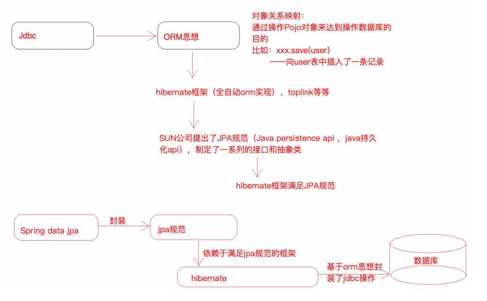

# Spring Data JPA

Spring Data Jpa 是应⽤于Dao层的⼀个框架，简化数据库开发的，作⽤和Mybatis框架⼀样，但是在使⽤⽅式和底层机制是有所不同的。最明显的⼀个特点，

Spring Data Jpa 开发Dao的时候，很多场景我们连sql语句都不需要开发。由Spring出品。

## 1、Spring Data JPA 概述

- ### 什么是 Spring Data JPA

  Spring Data JPA 是 Spring 基于**JPA** 规范的基础上封装的⼀套 JPA 应⽤框架，可使开发者⽤极简的代码即可实现对数据库的访问和操作。它提供了包括增删改

  查等在内的常⽤功能！学习并使⽤Spring Data JPA 可以极⼤提⾼开发效率。Spring Data JPA 极⼤简化了数据访问层代码。

  如何简化呢？使⽤了Spring Data JPA，我们Dao层中只需要写接⼝，不需要写实现类，就⾃动具有了增删改查、分⻚查询等⽅法。

  使⽤Spring Data JPA 很多场景下不需要我们⾃⼰写sql语句

## 2、 Spring Data JPA，JPA规范和Hibernate之间的关系

Spring Data JPA 是 Spring 提供的⼀个封装了JPA 操作的框架，⽽ JPA 仅仅是规范，单独使⽤规范⽆法具体做什么，那么Spring Data JPA 、 JPA规范 以及

Hibernate （JPA 规范的⼀种实现）之间的关系是什么？



JPA 是⼀套规范，内部是由接⼝和抽象类组成的，Hiberanate 是⼀套成熟的 ORM 框架，⽽且Hiberanate 实现了 JPA 规范，所以可以称 Hiberanate 为 JPA 的⼀

种实现⽅式，我们使⽤ JPA 的 API 编程，意味着站在更⾼的⻆度去看待问题（⾯向接⼝编程）。

Spring Data JPA 是 Spring 提供的⼀套对 JPA 操作更加⾼级的封装，是在 JPA 规范下的专⻔⽤来进⾏数据持久化的解决⽅案。

## 3、Spring Data JPA 应⽤

需求：使⽤ Spring Data JPA 完成对 tb_resume 表（简历表）的Dao 层操作（增删改查，排序，分⻚等）

### 3.1、sql语句（mysql数据库）

```sql
DROP TABLE IF EXISTS `tb_resume`;
CREATE TABLE `tb_resume` (
 `id` bigint(20) NOT NULL AUTO_INCREMENT,
 `address` varchar(255) DEFAULT NULL,
 `name` varchar(255) DEFAULT NULL,
 `phone` varchar(255) DEFAULT NULL,
 PRIMARY KEY (`id`)
) ENGINE=InnoDB AUTO_INCREMENT=4 DEFAULT CHARSET=utf8;
-- ----------------------------
-- Records of tb_resume
-- ----------------------------
BEGIN;
INSERT INTO `tb_resume` VALUES (1, '北京', '张三', '131000000');
INSERT INTO `tb_resume` VALUES (2, '上海', '李四', '151000000');
INSERT INTO `tb_resume` VALUES (3, '⼴州', '王五', '153000000');
COMMIT;
SET FOREIGN_KEY_CHECKS = 1;
```

### 3.2、Spring Data JPA 开发步骤梳理

- 构建⼯程

  创建⼯程导⼊坐标（Java框架于我们⽽⾔就是⼀堆jar）

  配置 Spring 的配置⽂件（配置指定框架执⾏的细节）

  编写实体类 Resume，使⽤ JPA 注解配置映射关系

  编写⼀个符合 Spring Data JPA 的 Dao 层接⼝（ResumeMapper接⼝）

- 操作 ResumeMapper接⼝对象完成 Dao 层开发

#### 3.2.1、pom.xml

```xml
    <dependencies>
        <!--单元测试jar-->
        <dependency>
            <groupId>junit</groupId>
            <artifactId>junit</artifactId>
            <version>4.12</version>
            <scope>test</scope>
        </dependency>
        <!--spring-data-jpa 需要引入的jar,start-->
        <dependency>
            <groupId>org.springframework.data</groupId>
            <artifactId>spring-data-jpa</artifactId>
            <version>2.1.8.RELEASE</version>
        </dependency>

        <dependency>
            <groupId>javax.el</groupId>
            <artifactId>javax.el-api</artifactId>
            <version>3.0.1-b04</version>
        </dependency>
        <dependency>
            <groupId>org.glassfish.web</groupId>
            <artifactId>javax.el</artifactId>
            <version>2.2.6</version>
        </dependency>
        <!--spring-data-jpa 需要引入的jar,end-->

        <!--spring 相关jar,start-->
        <dependency>
            <groupId>org.springframework</groupId>
            <artifactId>spring-aop</artifactId>
            <version>5.1.12.RELEASE</version>
        </dependency>
        <dependency>
            <groupId>org.aspectj</groupId>
            <artifactId>aspectjweaver</artifactId>
            <version>1.8.13</version>
        </dependency>
        <dependency>
            <groupId>org.springframework</groupId>
            <artifactId>spring-context</artifactId>
            <version>5.1.12.RELEASE</version>
        </dependency>
        <dependency>
            <groupId>org.springframework</groupId>
            <artifactId>spring-context-support</artifactId>
            <version>5.1.12.RELEASE</version>
        </dependency>

        <!--spring对orm框架的支持包-->
        <dependency>
            <groupId>org.springframework</groupId>
            <artifactId>spring-orm</artifactId>
            <version>5.1.12.RELEASE</version>
        </dependency>
        <dependency>
            <groupId>org.springframework</groupId>
            <artifactId>spring-beans</artifactId>
            <version>5.1.12.RELEASE</version>
        </dependency>
        <dependency>
            <groupId>org.springframework</groupId>
            <artifactId>spring-core</artifactId>
            <version>5.1.12.RELEASE</version>
        </dependency>
        <!--spring 相关jar,end-->
        
        <!--hibernate相关jar包,start-->
        <dependency>
            <groupId>org.hibernate</groupId>
            <artifactId>hibernate-core</artifactId>
            <version>5.4.0.Final</version>
        </dependency>
        <!--hibernate对jpa的实现jar-->
        <dependency>
            <groupId>org.hibernate</groupId>
            <artifactId>hibernate-entitymanager</artifactId>
            <version>5.4.0.Final</version>
        </dependency>
        <dependency>
            <groupId>org.hibernate</groupId>
            <artifactId>hibernate-validator</artifactId>
            <version>5.4.0.Final</version>
        </dependency>
        <!--hibernate相关jar包,end-->

        <!--mysql 数据库驱动jar-->
        <dependency>
            <groupId>mysql</groupId>
            <artifactId>mysql-connector-java</artifactId>
            <version>5.1.46</version>
        </dependency>
        <!--druid连接池-->
        <dependency>
            <groupId>com.alibaba</groupId>
            <artifactId>druid</artifactId>
            <version>1.1.21</version>
        </dependency>
        <!--slf4j-->
        <dependency>
            <groupId>org.slf4j</groupId>
            <artifactId>slf4j-nop</artifactId>
            <version>1.7.25</version>
        </dependency>
        <!--spring-test-->
        <dependency>
            <groupId>org.springframework</groupId>
            <artifactId>spring-test</artifactId>
            <version>5.1.12.RELEASE</version>
        </dependency>
    </dependencies>

    <!--指定编译级别-->
    <build>
        <plugins>
            <plugin>
                <groupId>org.apache.maven.plugins</groupId>
                <artifactId>maven-compiler-plugin</artifactId>
                <version>3.1</version>
                <configuration>
                    <source>11</source>
                    <target>11</target>
                    <encoding>UTF-8</encoding>
                </configuration>
            </plugin>
        </plugins>
    </build>
```

#### 3.2.2、applicationContext.xml和jdbc.properties

```xml
<?xml version="1.0" encoding="UTF-8"?>
<beans xmlns="http://www.springframework.org/schema/beans"
       xmlns:context="http://www.springframework.org/schema/context"
       xmlns:tx="http://www.springframework.org/schema/tx"
       xmlns:jpa="http://www.springframework.org/schema/data/jpa"
       xmlns:xsi="http://www.w3.org/2001/XMLSchema-instance"
       xsi:schemaLocation="
       http://www.springframework.org/schema/beans http://www.springframework.org/schema/beans/spring-beans.xsd
       http://www.springframework.org/schema/context http://www.springframework.org/schema/context/spring-context.xsd
       http://www.springframework.org/schema/tx http://www.springframework.org/schema/tx/spring-tx.xsd
       http://www.springframework.org/schema/data/jpa  http://www.springframework.org/schema/data/jpa/spring-jpa.xsd
">
    <!--对Spring和springDataJPA进行配置-->

    <!--1、创建数据库连接池-->
    <!--    读取外部properties文件    -->
    <context:property-placeholder location="classpath:jdbc.properties"/>
    <bean id="datasource" class="com.alibaba.druid.pool.DruidDataSource">
        <property name="driverClassName" value="${jdbc.driver}"/>
        <property name="url" value="${jdbc.url}"/>
        <property name="username" value="${jdbc.username}"/>
        <property name="password" value="${jdbc.password}"/>
    </bean>

    <!--2、配置一个JPA中非常重要的对象 entityManagerFactory
           entityManagerFactory 类似于mybatis中sqlSessionFactory
           entityManager类似于mybatis中的sqlSession
           实现类：LocalContainerEntityManagerFactoryBean
    -->
    <bean id="entityManagerFactory" class="org.springframework.orm.jpa.LocalContainerEntityManagerFactoryBean">
        <!--配置数据源-->
        <property name="dataSource" ref="datasource"/>
        <!--配置实体包扫描-->
        <property name="packagesToScan" value="com.thm.entity"/>
        <!--指定jpa的具体实现，也就是hibernate-->
        <property name="persistenceProvider">
            <bean class="org.hibernate.jpa.HibernatePersistenceProvider"/>
        </property>
        <!--配置jpa的方言，不同的jpa实现对于类似于beginTransaction等细节实现起来是不一样的，
            所以传入JpaDialect具体实现类
        -->
        <property name="jpaDialect">
            <bean class="org.springframework.orm.jpa.vendor.HibernateJpaDialect"/>
        </property>
        <!--配置具体的provider，hibernate框架的执行细节-->
        <property name="jpaVendorAdapter">
            <bean class="org.springframework.orm.jpa.vendor.HibernateJpaVendorAdapter">
                <!--配置hibernate框架的细节-->
                <!--1、配置数据表是否自动创建   ture创建  false 不创建-->
                <property name="generateDdl" value="false"/>
                <!--2、配置数据库的类型  hibernate是dao创建支持多种数据库-->
                <property name="database" value="MYSQL"/>
                <!--3、配置数据库的方言 hibernate帮助我们拼接sql，指定数据方言-->
                <property name="databasePlatform" value="org.hibernate.dialect.MySQLDialect"/>
                <!--4、是否显示sql 控制台是否打印sql语句-->
                <property name="showSql" value="true"/>
            </bean>
        </property>
    </bean>
    <!--3、引用上面创建的entityManagerFactory
           配置JPA的dao层细节
           base-package:指定dao接口所在的包
    -->
    <jpa:repositories base-package="com.thm.mapper"
                      entity-manager-factory-ref="entityManagerFactory"
                      transaction-manager-ref="transactionManager"/>
    <!--4、事务管理器配-->
    <bean id="transactionManager" class="org.springframework.orm.jpa.JpaTransactionManager">
        <property name="entityManagerFactory" ref="entityManagerFactory"/>
    </bean>
    <!--5、声明式事务配置-->
    <tx:annotation-driven transaction-manager="transactionManager"/>
    <!--6、配置包扫描-->
    <context:component-scan base-package="com.thm"/>
</beans>


jdbc.driver=com.mysql.jdbc.Driver
jdbc.url=jdbc:mysql://localhost:3306/springjpa?characterEncoding=utf8
jdbc.username=root
jdbc.password=root
```

#### 3.2.3、编写实体类 Resume，使⽤ JPA 注解配置映射关系

```java
/**
 * @ClassNmae Resume
 * @Description TODO 简历实体，在类中使用注解简历实体类和数据表之间的映射关系以及属性和字段映射关系
 * @Author THM
 * @Date 2020/11/29 10:29
 * @Version 1.0
 * 1、实体类和数据表的映射关系
 * @Entity 标注实体
 * @Table 指定数据表
 * 2、字段与属性的映射关系
 * @Id 指定主键
 * @GeneratedValue 指定主键生成策略 GenerationType.IDENTITY（依赖数据库自增），GenerationType.SEQUENCE（依赖数据库序列）
 * @Column 指定属性和字段映射
 **/
@Entity
@Table(name = "tb_resume")
public class Resume {
    @Id
    @Column(name = "id")
    @GeneratedValue(strategy = GenerationType.IDENTITY)
    private Integer id;
    @Column(name = "name")
    private String name;
    @Column(name = "address")
    private String address;
    @Column(name = "phone")
    private String phone;
    
    //添加get/set
}
```

#### 3.2.4、编写 ResumeMapper接⼝

```java
/**
 * @ClassNmae ResumeMapper
 * @Description TODO
 * @Author THM
 * @Date 2020/11/29 10:44
 * @Version 1.0
 * 一个符合SpringDataJPA要求的mapper是需要继承JpaRepository和JpaSpecificationExecutor
 * JpaRepository<实体类型，主键类型>：定义基础的CRUD
 * JpaSpecificationExecutor实体类型>：定义复杂类型的查询（分页，排序等）
 **/
public interface ResumeMapper extends JpaRepository<Resume,Integer>, JpaSpecificationExecutor<Resume> {

    /**
     * JPQL语句查询  参数取形参位置
     * @param id
     * @param name
     * @return
     */
    @Query("from Resume where id = ?1 and name = ?2")
    Resume getResumeBySpql(Integer id,String name);

    /**
     * SQL语句查询 需要nativeQuery设置为true
     * @param name
     * @param address
     * @return
     */
    @Query(value = "select * from tb_resume where name like ?1 and address like ?2",nativeQuery = true)
    List<Resume> getResumeBySql(String name, String address);

    /**
     * 方法命名规则
     * 按照name模糊查询
     * 查询以findBy开头，其他类似insert,delete
     *      接属性名称（首字母大小），name
     *      接查询方式（模糊查询，等值查询），如果不写默认等值查询
     * @param name
     * @param address
     * @return
     */
    List<Resume> findByNameLikeAndAddress(String name,String address);
}
```

#### 3.2.5、测试

```java
import com.thm.entity.Resume;
import com.thm.mapper.ResumeMapper;
import org.junit.Test;
import org.junit.runner.RunWith;
import org.springframework.beans.factory.annotation.Autowired;
import org.springframework.data.domain.*;
import org.springframework.data.jpa.domain.Specification;
import org.springframework.test.context.ContextConfiguration;
import org.springframework.test.context.junit4.SpringJUnit4ClassRunner;

import javax.persistence.criteria.*;
import java.util.List;
import java.util.Optional;

/**
 * @ClassNmae SpringJpaTest
 * @Description TODO
 * @Author THM
 * @Date 2020/11/29 10:51
 * @Version 1.0
 **/
@RunWith(SpringJUnit4ClassRunner.class)
@ContextConfiguration(locations = {"classpath:applicationContext.xml"})
public class ResumeMapperTest {

    @Autowired
    private ResumeMapper resumeMapper;

    // 方式一：使用继承父类的方法进行CURD
    /**
     * 根据ID查询
     */
    @Test
    public void testFindById(){
        Optional<Resume> byId = resumeMapper.findById(1);
        if (byId.isPresent()){
            Resume resume = byId.get();
            System.out.println(resume);
        }
    }
    /**
     * 根据Example查询
     */
    @Test
    public void testFindOne(){
        Resume resume = new Resume();
        resume.setId(1);
        resume.setName("张三");
        //封装Example对象
        Example<Resume> example = Example.of(resume);
        Optional<Resume> one = resumeMapper.findOne(example);
        if (one.isPresent()){
            Resume resume1 = one.get();
            System.out.println(resume1);
        }
    }

    /**
     * 查询所有
     */
    @Test
    public void findAll(){
        final List<Resume> all = resumeMapper.findAll();
        all.forEach(resume -> {
            System.out.println(resume);
        });
    }
    /**
     * 新增和更新都使用save，区别是传入对象是否存在主键来区分
     * 有主键是更新，无主键是新增
     */
    @Test
    public void testSave(){
        //新增
        Resume resume = new Resume();
        resume.setName("赵六");
        resume.setAddress("成都");
        resume.setPhone("123456");
        Resume insert = resumeMapper.save(resume);
        System.out.println(insert);
        //更新
        resume.setId(4);
        resume.setName("赵六6666");
        resume.setAddress("成都");
        resume.setPhone("123456789");
        Resume update = resumeMapper.save(resume);
        System.out.println(update);
    }

    /**
     * 删除
     */
    @Test
    public void testDelete(){
        resumeMapper.deleteById(4);
    }
    //方式二：引入JPQL(JPA查询语句) 语句进行查询--->jpql类似于sql，只是sql操作的是数据库表和字段 spql操作的是实体和属性
    @Test
    public void testJpql(){
        Resume resume = resumeMapper.getResumeBySpql(1, "张三");
        System.out.println(resume);
    }
    //方式三：引入原生的SQL语句
    @Test
    public void testSql(){
        List<Resume> resumes = resumeMapper.getResumeBySql("张%", "%京");
        resumes.forEach(resume -> {
            System.out.println(resume);
        });
    }
    //方式四：方法命名规则 不用写sql语句，只需要按照方法定义规则即可
    @Test
    public void testMethodName(){
        List<Resume> resumes = resumeMapper.findByNameLikeAndAddress("张%", "北京");
        resumes.forEach(resume -> {
            System.out.println(resume);
        });
    }
    /**
     * 方式五：动态查询
     * service层传入dao层的条件不确定，把service拿到条件封装成一个对象传递给Dao层，这个对象就叫做Specification（对条件的一个封装）
     *    // 根据条件查询单个对象
     *    Optional<T> findOne(@Nullable Specification<T> var1);
     *    // 根据条件查询所有
     *    List<T> findAll(@Nullable Specification<T> var1);
     *    // 根据条件查询并进行分页
     *    Page<T> findAll(@Nullable Specification<T> var1, Pageable var2);
     *    // 根据条件查询并进行排序
     *    List<T> findAll(@Nullable Specification<T> var1, Sort var2);
     *    // 根据条件统计
     *    long count(@Nullable Specification<T> var1);
     *
     *    interface Specification<T>
     *       toPredicate(Root<T> var1, CriteriaQuery<?> var2, CriteriaBuilder var3);用来封装查询条件的
     *           Root:根属性（查询所需要的任何属性都可以从根对象中获取）
     *           CriteriaQuery 自定义查询方式 用不上
     *           CriteriaBuilder 查询构造器，封装了很多的查询条件（like = 等）
     *
     */
    @Test
    public void testSpecification(){
        /**
         * 动态条件封装
         * 匿名内部类
         *
         * toPredicate：动态组装查询条件
         *      借助于两个参数完成条件拼装，，， select * from tb_resume where name='张三'
         *      Root: 获取需要查询的对象属性
         *      CriteriaBuilder：构建查询条件，内部封装了很多查询条件（模糊查询，精准查询）
         *      需求：根据name（指定为"张三"）查询简历
         */
        Specification<Resume> specification = new Specification<Resume>() {
            @Override
            public Predicate toPredicate(Root<Resume> root, CriteriaQuery<?> criteriaQuery, CriteriaBuilder criteriaBuilder) {
                // 获取到name属性
                Path<Object> name = root.get("name");

                // 使用CriteriaBuilder针对name属性构建条件（精准查询）
                Predicate predicate = criteriaBuilder.equal(name, "张三");
                return predicate;
            }
        };
        Optional<Resume> optional = resumeMapper.findOne(specification);
        Resume resume = optional.get();
        System.out.println(resume);

    }
    @Test
    public void testSpecificationMultiCon(){
        /**
         * 需求：根据name（指定为"张三"）并且，address 以"北"开头（模糊匹配），查询简历
         */
        Specification<Resume> specification = new Specification<Resume>() {
            @Override
            public Predicate toPredicate(Root<Resume> root, CriteriaQuery<?> criteriaQuery, CriteriaBuilder criteriaBuilder) {
                // 获取到name属性
                Path<Object> name = root.get("name");
                Path<Object> address = root.get("address");
                // 条件1：使用CriteriaBuilder针对name属性构建条件（精准查询）
                Predicate predicate1 = criteriaBuilder.equal(name, "张三");
                // 条件2：address 以"北"开头（模糊匹配）
                Predicate predicate2 = criteriaBuilder.like(address.as(String.class), "北%");
                // 组合两个条件
                Predicate and = criteriaBuilder.and(predicate1, predicate2);

                return and;
            }
        };
        Optional<Resume> optional = resumeMapper.findOne(specification);
        Resume resume = optional.get();
        System.out.println(resume);
    }
    //排序
    @Test
    public void testSort(){
        Sort sort = new Sort(Sort.Direction.DESC,"id");
        List<Resume> list = resumeMapper.findAll(sort);
        for (int i = 0; i < list.size(); i++) {
            Resume resume =  list.get(i);
            System.out.println(resume);
        }
    }

    //分页
    @Test
    public void testPage(){
        /**
         * 第一个参数：当前查询的页数，从0开始
         * 第二个参数：每页查询的数量
         */
        Pageable pageable  = PageRequest.of(0,2);
        //Pageable pageable = new PageRequest(0,2);
        Page<Resume> all = resumeMapper.findAll(pageable);
        System.out.println(all);
        /*for (int i = 0; i < list.size(); i++) {
            Resume resume =  list.get(i);
            System.out.println(resume);
        }*/
    }
}
```

## 4、整合sss（spring+spring-data-jpa+springmvc）

整合思路

先整合spring+spring-data-jpa
再整合springmvc

- pom.xml

  ```xml
   <dependencies>
      <!--单元测试jar-->
      <dependency>
        <groupId>junit</groupId>
        <artifactId>junit</artifactId>
        <version>4.12</version>
        <scope>test</scope>
      </dependency>
      <!--spring-data-jpa 需要引入的jar,start-->
      <dependency>
        <groupId>org.springframework.data</groupId>
        <artifactId>spring-data-jpa</artifactId>
        <version>2.1.8.RELEASE</version>
      </dependency>
  
      <dependency>
        <groupId>javax.el</groupId>
        <artifactId>javax.el-api</artifactId>
        <version>3.0.1-b04</version>
      </dependency>
      <dependency>
        <groupId>org.glassfish.web</groupId>
        <artifactId>javax.el</artifactId>
        <version>2.2.6</version>
      </dependency>
      <!--spring-data-jpa 需要引入的jar,end-->
  
      <!--spring 相关jar,start-->
      <dependency>
        <groupId>org.springframework</groupId>
        <artifactId>spring-aop</artifactId>
        <version>5.1.12.RELEASE</version>
      </dependency>
      <dependency>
        <groupId>org.aspectj</groupId>
        <artifactId>aspectjweaver</artifactId>
        <version>1.8.13</version>
      </dependency>
      <dependency>
        <groupId>org.springframework</groupId>
        <artifactId>spring-context</artifactId>
        <version>5.1.12.RELEASE</version>
      </dependency>
      <dependency>
        <groupId>org.springframework</groupId>
        <artifactId>spring-context-support</artifactId>
        <version>5.1.12.RELEASE</version>
      </dependency>
  
      <!--spring对orm框架的支持包-->
      <dependency>
        <groupId>org.springframework</groupId>
        <artifactId>spring-orm</artifactId>
        <version>5.1.12.RELEASE</version>
      </dependency>
      <dependency>
        <groupId>org.springframework</groupId>
        <artifactId>spring-beans</artifactId>
        <version>5.1.12.RELEASE</version>
      </dependency>
      <dependency>
        <groupId>org.springframework</groupId>
        <artifactId>spring-core</artifactId>
        <version>5.1.12.RELEASE</version>
      </dependency>
      <!--spring 相关jar,end-->
  
      <!--hibernate相关jar包,start-->
      <dependency>
        <groupId>org.hibernate</groupId>
        <artifactId>hibernate-core</artifactId>
        <version>5.4.0.Final</version>
      </dependency>
      <!--hibernate对jpa的实现jar-->
      <dependency>
        <groupId>org.hibernate</groupId>
        <artifactId>hibernate-entitymanager</artifactId>
        <version>5.4.0.Final</version>
      </dependency>
      <dependency>
        <groupId>org.hibernate</groupId>
        <artifactId>hibernate-validator</artifactId>
        <version>5.4.0.Final</version>
      </dependency>
      <!--hibernate相关jar包,end-->
  
      <!--SpringMVC-->
      <dependency>
        <groupId>org.springframework</groupId>
        <artifactId>spring-webmvc</artifactId>
        <version>5.1.12.RELEASE</version>
      </dependency>
      <!--jsp-api&servlet-api-->
      <dependency>
        <groupId>javax.servlet</groupId>
        <artifactId>jsp-api</artifactId>
        <version>2.0</version>
        <scope>provided</scope>
      </dependency>
      <dependency>
        <groupId>javax.servlet</groupId>
        <artifactId>javax.servlet-api</artifactId>
        <version>3.1.0</version>
        <scope>provided</scope>
      </dependency>
  
      <!--mysql 数据库驱动jar-->
      <dependency>
        <groupId>mysql</groupId>
        <artifactId>mysql-connector-java</artifactId>
        <version>5.1.46</version>
      </dependency>
      <!--druid连接池-->
      <dependency>
        <groupId>com.alibaba</groupId>
        <artifactId>druid</artifactId>
        <version>1.1.21</version>
      </dependency>
      <!--slf4j-->
      <dependency>
        <groupId>org.slf4j</groupId>
        <artifactId>slf4j-nop</artifactId>
        <version>1.7.25</version>
      </dependency>
      <!--spring-test-->
      <dependency>
        <groupId>org.springframework</groupId>
        <artifactId>spring-test</artifactId>
        <version>5.1.12.RELEASE</version>
      </dependency>
      <!--fastjson-->
      <dependency>
        <groupId>com.alibaba</groupId>
        <artifactId>fastjson</artifactId>
        <version>1.2.68</version>
      </dependency>
      <dependency>
        <groupId>com.fasterxml.jackson.core</groupId>
        <artifactId>jackson-databind</artifactId>
        <version>2.11.1</version>
      </dependency>
    </dependencies>
  
    <!--指定编译级别-->
    <build>
      <plugins>
        <plugin>
          <groupId>org.apache.maven.plugins</groupId>
          <artifactId>maven-compiler-plugin</artifactId>
          <version>3.1</version>
          <configuration>
            <source>11</source>
            <target>11</target>
            <encoding>UTF-8</encoding>
          </configuration>
        </plugin>
      </plugins>
    </build>
  ```

- applicationContext.xml

  ```xml
  <?xml version="1.0" encoding="UTF-8"?>
  <beans xmlns="http://www.springframework.org/schema/beans"
         xmlns:context="http://www.springframework.org/schema/context"
         xmlns:tx="http://www.springframework.org/schema/tx"
         xmlns:jpa="http://www.springframework.org/schema/data/jpa"
         xmlns:xsi="http://www.w3.org/2001/XMLSchema-instance"
         xsi:schemaLocation="
         http://www.springframework.org/schema/beans http://www.springframework.org/schema/beans/spring-beans.xsd
         http://www.springframework.org/schema/context http://www.springframework.org/schema/context/spring-context.xsd
         http://www.springframework.org/schema/tx http://www.springframework.org/schema/tx/spring-tx.xsd
         http://www.springframework.org/schema/data/jpa  http://www.springframework.org/schema/data/jpa/spring-jpa.xsd
  ">
      <!--对Spring和springDataJPA进行配置-->
      <!--1、创建数据库连接池-->
      <!--    读取外部properties文件    -->
      <context:property-placeholder location="classpath:jdbc.properties"/>
      <bean id="datasource" class="com.alibaba.druid.pool.DruidDataSource">
          <property name="driverClassName" value="${jdbc.driver}"/>
          <property name="url" value="${jdbc.url}"/>
          <property name="username" value="${jdbc.username}"/>
          <property name="password" value="${jdbc.password}"/>
      </bean>
  
      <!--2、配置一个JPA中非常重要的对象 entityManagerFactory
             entityManagerFactory 类似于mybatis中sqlSessionFactory
             entityManager类似于mybatis中的sqlSession
             实现类：LocalContainerEntityManagerFactoryBean
      -->
      <bean id="entityManagerFactory" class="org.springframework.orm.jpa.LocalContainerEntityManagerFactoryBean">
          <!--配置数据源-->
          <property name="dataSource" ref="datasource"/>
          <!--配置实体包扫描-->
          <property name="packagesToScan" value="com.thm.entity"/>
          <!--指定jpa的具体实现，也就是hibernate-->
          <property name="persistenceProvider">
              <bean class="org.hibernate.jpa.HibernatePersistenceProvider"/>
          </property>
          <!--配置jpa的方言，不同的jpa实现对于类似于beginTransaction等细节实现起来是不一样的，
              所以传入JpaDialect具体实现类
          -->
          <property name="jpaDialect">
              <bean class="org.springframework.orm.jpa.vendor.HibernateJpaDialect"/>
          </property>
          <!--配置具体的provider，hibernate框架的执行细节-->
          <property name="jpaVendorAdapter">
              <bean class="org.springframework.orm.jpa.vendor.HibernateJpaVendorAdapter">
                  <!--配置hibernate框架的细节-->
                  <!--1、配置数据表是否自动创建   ture创建  false 不创建-->
                  <property name="generateDdl" value="false"/>
                  <!--2、配置数据库的类型  hibernate是dao创建支持多种数据库-->
                  <property name="database" value="MYSQL"/>
                  <!--3、配置数据库的方言 hibernate帮助我们拼接sql，指定数据方言-->
                  <property name="databasePlatform" value="org.hibernate.dialect.MySQLDialect"/>
                  <!--4、是否显示sql 控制台是否打印sql语句-->
                  <property name="showSql" value="true"/>
              </bean>
          </property>
      </bean>
      <!--3、引用上面创建的entityManagerFactory
             配置JPA的dao层细节
             base-package:指定dao接口所在的包
      -->
      <jpa:repositories base-package="com.thm.mapper"
                        entity-manager-factory-ref="entityManagerFactory"
                        transaction-manager-ref="transactionManager"/>
      <!--4、事务管理器配-->
      <bean id="transactionManager" class="org.springframework.orm.jpa.JpaTransactionManager">
          <property name="entityManagerFactory" ref="entityManagerFactory"/>
      </bean>
      <!--5、声明式事务配置-->
      <tx:annotation-driven transaction-manager="transactionManager"/>
      <!--6、配置包扫描-->
      <context:component-scan base-package="com.thm"/>
  </beans>
  ```

- springmvc.xml

  ```xml
  <?xml version="1.0" encoding="UTF-8"?>
  <beans xmlns="http://www.springframework.org/schema/beans"
         xmlns:context ="http://www.springframework.org/schema/context"
         xmlns:mvc ="http://www.springframework.org/schema/mvc"
         xmlns:xsi="http://www.w3.org/2001/XMLSchema-instance"
         xsi:schemaLocation="
         http://www.springframework.org/schema/beans
         http://www.springframework.org/schema/beans/spring-beans.xsd
         http://www.springframework.org/schema/context
         http://www.springframework.org/schema/context/spring-context.xsd
         http://www.springframework.org/schema/mvc
         http://www.springframework.org/schema/mvc/spring-mvc.xsd
  ">
      <!--配置包扫描-->
      <context:component-scan base-package="com.thm.controller"/>
      <!--配置springmvc注解驱动
          自动注册合适的HandlerMapping和HandlerAdapter
      -->
      <mvc:annotation-driven/>
      <!--  配置视图解析器  -->
      <bean class="org.springframework.web.servlet.view.InternalResourceViewResolver">
          <property name="prefix" value="/jsp/"/>
          <property name="suffix" value=".jsp"/>
      </bean>
      <!--静态资源-->
      <mvc:resources location="/WEB-INF/js/" mapping="/js/**"/>
      <mvc:resources location="/layer/" mapping="/layer/**"/>
      <!--拦截器-->
      <mvc:interceptors>
          <mvc:interceptor>
              <!--配置当前拦截器的url拦截规则，**代表当前目录下及其子目录下的所有url-->
              <mvc:mapping path="/**"/>
              <!--exclude-mapping可以在mapping的基础上排除一些url拦截-->
              <mvc:exclude-mapping path="/js/**"/>
              <mvc:exclude-mapping path="/layer/**"/>
              <bean class="com.thm.interceptor.AuthenticationInterceptor"/>
          </mvc:interceptor>
      </mvc:interceptors>
  </beans>
  ```

- web.xml

  ```xml
  <!DOCTYPE web-app PUBLIC
          "-//Sun Microsystems, Inc.//DTD Web Application 2.3//EN"
          "http://java.sun.com/dtd/web-app_2_3.dtd" >
  
  <web-app xmlns:xsi="http://www.w3.org/2001/XMLSchema-instance"
           xmlns="http://java.sun.com/xml/ns/javaee"
           xsi:schemaLocation="http://java.sun.com/xml/ns/javaee http://java.sun.com/xml/ns/javaee/web-app_2_5.xsd"
           id="WebApp_ID" version="2.5">
    <display-name>Archetype Created Web Application</display-name>
    <welcome-file-list>
      <welcome-file>/jsp/login.jsp</welcome-file>
    </welcome-file-list>
    <!--spring配置文件-->
    <context-param>
      <param-name>contextConfigLocation</param-name>
      <param-value>classpath:applicationContext.xml</param-value>
    </context-param>
    <!--配置spring框架启动监听器-->
    <listener>
      <listener-class>org.springframework.web.context.ContextLoaderListener</listener-class>
    </listener>
  
    <!--配置前端控制器-->
    <servlet>
      <servlet-name>springmvc</servlet-name>
      <servlet-class>org.springframework.web.servlet.DispatcherServlet</servlet-class>
      <init-param>
        <param-name>contextConfigLocation</param-name>
        <param-value>classpath:springmvc.xml</param-value>
      </init-param>
      <load-on-startup>1</load-on-startup>
    </servlet>
    <!--配置servlet映射规则-->
    <servlet-mapping>
      <servlet-name>springmvc</servlet-name>
      <url-pattern>/</url-pattern>
    </servlet-mapping>
  </web-app>
  ```

  **具体实现：https://gitee.com/Thmspring/LG_homeWork/tree/master/stage1_module3/code/thm-sss**