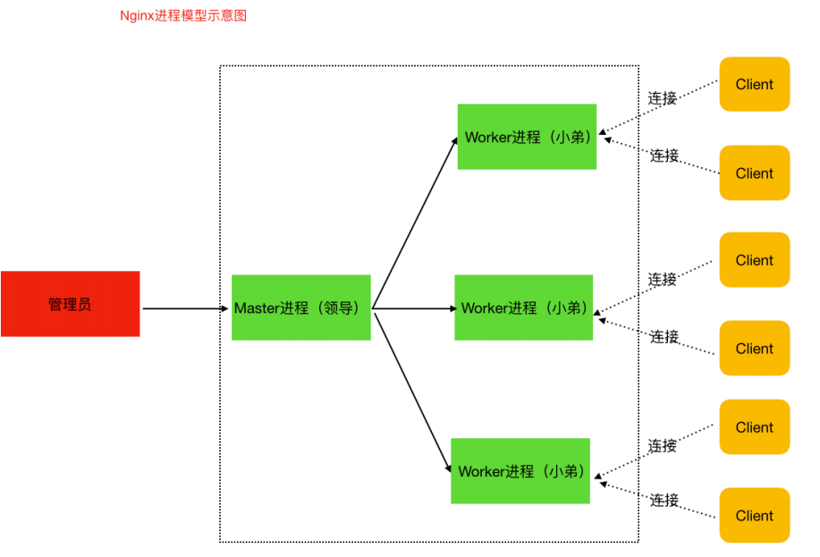

# Nginx

## 1、Nginx基础回顾


- Nginx 到底是什么？

  Nginx 是⼀个⾼性能的HTTP和反向代理web服务器，核⼼特点是占有内存少，并发能⼒强。

- Nginx ⼜能做什么事情（应⽤场景）

  - Http服务器（Web服务器）

    性能⾮常⾼，⾮常注重效率，能够经受⾼负载的考验。

    ⽀持50000个并发连接数，不仅如此，CPU和内存的占⽤也⾮常的低，10000个没有活动的连接才占⽤2.5M的内存。

  - 反向代理服务器

    - 正向代理

      在浏览器中配置代理服务器的相关信息，通过代理服务器访问⽬标⽹站，代理服务器收到⽬标⽹站的响应之后，会把响应信息返回给我们⾃⼰的浏览器客户端。

      

    - 反向代理

      浏览器客户端发送请求到反向代理服务器（⽐如Nginx），由反向代理服务器选择原始服务器提供服务获取结果响应，最终再返回给客户端浏览器。

      

    - 负载均衡服务器

      负载均衡，当⼀个请求到来的时候（结合上图），Nginx反向代理服务器根据请求去找到⼀个原始服务器来处理当前请求，那么这叫做反向代理。那么，如果⽬标服务器有多台（⽐如上图中的tomcat1，tomcat2，tomcat3...），找哪⼀个⽬标服务器来处理当前请求呢，这样⼀个寻找确定的过程就叫做负载均衡。

      负载均衡就是为了解决⾼负载的问题。

    - 动静分离

      

- Nginx 的特点

  - 跨平台：Nginx可以在⼤多数类unix操作系统上编译运⾏，⽽且也有windows版本
  - Nginx的上⼿⾮常容易，配置也⽐较简单
  - ⾼并发，性能好
  - 稳定性也特别好，宕机概率很低

- Nginx的安装

  - 安装环境检查：
    yum install -y gcc
    yum install -y gcc-c++
    yum install -y pcre pcre-devel
    yum install -y zlib zlib-devel
    yum install -y openssl openssl-devel

  - 下载压缩包：
    wget http://nginx.org/download/nginx-1.14.2.tar.gz

  - 解压：
    tar -zxvf nginx-1.14.2.tar.gz

  - 进入解压目录经写初始化：

    ./configure
    make
    make install     完毕之后在/usr/local/下会产⽣⼀个nginx⽬录

    

  - Nginx主要命令（进⼊/usr/local/nginx/sbin⽬录中，执⾏启动nginx命令）

    启动：/usr/local/nginx/sbin：   ./nginx 

    停止：/usr/local/nginx/sbin：   ./nginx -s stop 终⽌nginx（当然也可以找到nginx进程号，然后使⽤kill -9 杀掉nginx进程）

    重启：/usr/local/nginx/sbin：   ./nginx -s reload (重新加载nginx.conf配置⽂件)


## 2、**Nginx**核⼼配置⽂件解读

Nginx的核⼼配置⽂件conf/nginx.conf包含三块内容：全局块、events块、http块

- 全局块

  从配置⽂件开始到events块之间的内容，此处的配置影响nginx服务器整体的运⾏，⽐如worker进程的数量、错误⽇志的位置等。

  

- events块

  events块主要影响nginx服务器与⽤户的⽹络连接，⽐如worker_connections 1024，标识每个workderprocess⽀持的最⼤连接数为1024

  

- http块

  http块是配置最频繁的部分，虚拟主机的配置，监听端⼝的配置，请求转发、反向代理、负载均衡等

  


## 3、Nginx应⽤场景之反向代理

**需求**


**需求一**：

- 部署tomcat，保持默认监听8080端⼝

- 修改nginx配置，并重新加载

  - 修改nginx配置

    

  - 重新加载nginx配置

    ./nginx -s reload

- 测试，访问http://111.229.248.243:9003,返回tomcat的⻚⾯

  

**需求二：**

​	

- 再部署⼀台tomcat，保持默认监听8081端⼝

- 修改nginx配置，并重新加载

- 这⾥主要就是多location的使⽤，这⾥的nginx中server/location就好⽐tomcat中的Host/Context

  - location 语法如下：

    ```
    location [=|~|~*|^~] /uri/ { … }
    ```

    在nginx配置⽂件中，location主要有这⼏种形式：

    1）正则匹配 location ~ /lagou { }

    2）不区分⼤⼩写的正则匹配 location ~* /lagou { }

    3）匹配路径的前缀 location ^~ /lagou { }

    4）精确匹配 location = /lagou { }

    5）普通路径前缀匹配 location /lagou { }

    - 优先级

      4 > 3 > 2 > 1 > 5

## 4、Nginx应⽤场景之负载均衡


**Nginx负载均衡策略**

- 轮询

  默认策略，每个请求按时间顺序逐⼀分配到不同的服务器，如果某⼀个服务器下线，能⾃动剔除

  ```
  upstream lagouServer{
   server 111.229.248.243:8080;
   server 111.229.248.243:8082;
  }
  location /abc {
   proxy_pass http://lagouServer/;
  }
  ```

- weight

  weight代表权重，默认每⼀个负载的服务器都为1，权重越⾼那么被分配的请求越多（⽤于服务器性能不均衡的场景）

  ```
  upstream lagouServer{
   server 111.229.248.243:8080 weight=1;
   server 111.229.248.243:8082 weight=2; 
  }
  ```

- ip_hash

  每个请求按照ip的hash结果分配，每⼀个客户端的请求会固定分配到同⼀个⽬标服务器处理，可以解决session问题

  ```
  upstream lagouServer{
   ip_hash;
   server 111.229.248.243:8080;
   server 111.229.248.243:8082;
  }
  ```

## 5、Nginx应⽤场景之动静分离

动静分离就是讲动态资源和静态资源的请求处理分配到不同的服务器上，⽐较经典的组合就是Nginx+Tomcat架构（Nginx处理静态资源请求，Tomcat处理动态资源请求），那么其实之前的讲解中，Nginx反向代理⽬标服务器Tomcat，我们能看到⽬标服务器ROOT项⽬的index.jsp，这本身就是Tomcat在处理动态资源请求了。

所以，我们只需要配置静态资源访问即可。


## 6、Nginx底层进程机制剖析

Nginx启动后，以daemon多进程⽅式在后台运⾏，包括⼀个Master进程和多个Worker进程，Master进程是领导，是⽼⼤，Worker进程是⼲活的⼩弟。


- master进程

  主要是管理worker进程，⽐如：

  - 接收外界信号向各worker进程发送信号(./nginx -s reload)
  - 监控worker进程的运⾏状态，当worker进程异常退出后Master进程会⾃动重新启动新的worker进程等

- worker进程

  worker进程具体处理⽹络请求。多个worker进程之间是对等的，他们同等竞争来⾃客户端的请求，各进程互相之间是独⽴的。⼀个请求，只可能在⼀个worker进程中处理，⼀个worker进程，不可能处理其它进程的请求。worker进程的个数是可以设置的，⼀般设置与机器cpu核数⼀致。


**Nginx进程模型示意图如下**



- 以 ./nginx -s reload 来说明nginx信号处理这部分

  1）master进程对配置⽂件进⾏语法检查

  2）尝试配置（⽐如修改了监听端⼝，那就尝试分配新的监听端⼝）

  3）尝试成功则使⽤新的配置，新建worker进程

  4）新建成功，给旧的worker进程发送关闭消息

  5）旧的worker进程收到信号会继续服务，直到把当前进程接收到的请求处理完毕后关闭

  所以reload之后worker进程pid是发⽣了变化的

  

- worker进程处理请求部分的说明

  例如，我们监听9003端⼝，⼀个请求到来时，如果有多个worker进程，那么每个worker进程都有可能处理这个链接。

  - master进程创建之后，会建⽴好需要监听的的socket，然后从master进程再fork出多个worker进程。所以，所有worker进程的监听描述符listenfd在新连接到来时都变得可读。

  - nginx使⽤互斥锁来保证只有⼀个workder进程能够处理请求，拿到互斥锁的那个进程注册listenfd读事件，在读事件⾥调⽤accept接受该连接，然后解析、处理、返回客户端。

- nginx多进程模型好处

  每个worker进程都是独⽴的，不需要加锁，节省开销

  每个worker进程都是独⽴的，互不影响，⼀个异常结束，其他的照样能提供服务

  多进程模型为reload热部署机制提供了⽀撑

## 7、配置文件示例

- 

```
#配置ng代理访问地址  监听28080端口转到10.10.104.249:80端口
server {
    listen     28080 default_server;
    server_name  _;
    client_max_body_size     60m;
    root         /usr/share/nginx/html;
    proxy_set_header X-Real-IP $remote_addr;
    error_page 404 /404.html;
        location = /40x.html {
    }

    error_page 500 502 503 504 /50x.html;
        location = /50x.html {
    }

   location / {
      proxy_pass http://10.10.104.249/;
   }
}
#监听2015端口 转发到 hcydcs:2015
server {
    listen 2015 so_keepalive=on;
    proxy_pass dcs;
}

upstream dcs {
    hash $remote_addr consistent;
    server  hcydcs:2015;
}
#监听20000到22221端口
server {
    listen 20000-22221;
    proxy_connect_timeout 8s;
    proxy_timeout 24h;
    proxy_pass hcydcs;
}

upstream hcydcs {
    server hcydcs:20000;
    server hcydcs:20001;
    server hcydcs:20002;
    server hcydcs:20003;
    server hcydcs:20004;
}

#代理3306端口 mysql  hcyqzMysql需要配置hosts  /etc/hosts
server {
    listen 3306 so_keepalive=on;
    proxy_pass hcyqzMysql;
}

upstream hcyqzMysql {
    hash $remote_addr consistent;
    server  hcyqzMysql:3306;
}
```

- http代理

  ```xml
  server {
      listen       80;
      listen  [::]:80;
      server_name  localhost;
  	client_max_body_size 20m;
      #access_log  /var/log/nginx/host.access.log  main;
  
  
      location / {
  		root /usr/share/nginx/html/t-fast;
  		index index.html index.htm;
      } 
     
      location /demo/ {
  		root /usr/share/nginx/html;
  		index index.html index.htm;
      }
  
      location /t-fast/ {
          root /usr/share/nginx/html;
          index index.html index.htm;
      }
  
  
      location /static/ {
  		root /usr/share/nginx/html;
      }
      location /file/ {
          root /usr/share/nginx/html;
      }		
      location ^~ /api/ {
  		rewrite ^/api/(.*)$ /$1 break;
  		proxy_intercept_errors on;
  		proxy_pass http://app_services_upstream;
  		proxy_send_timeout 300;
  		proxy_read_timeout 300;
  		proxy_connect_timeout 300;
  		proxy_set_header X-Real-IP $remote_addr;
  		proxy_set_header X-Forwarded-For $proxy_add_x_forwarded_for;
  		proxy_set_header X-Forwarded-Proto $scheme;
  		proxy_set_header Host $http_host;
  		proxy_ignore_client_abort on;
  		proxy_set_header Cookie $http_cookie;
  		proxy_cookie_path /api /;
  		proxy_cookie_path /api/ /;
      }
      location ^~ /oa/ {
          rewrite ^/oa/(.*)$ /$1 break;
          proxy_intercept_errors on;
          proxy_pass http://oa_services_upstream;
          proxy_send_timeout 300;
          proxy_read_timeout 300;
          proxy_connect_timeout 300;
          proxy_set_header X-Real-IP $remote_addr;
          proxy_set_header X-Forwarded-For $proxy_add_x_forwarded_for;
          proxy_set_header X-Forwarded-Proto $scheme;
          proxy_set_header Host $http_host;
          proxy_ignore_client_abort on;
          proxy_set_header Cookie $http_cookie;
          proxy_cookie_path /oa /;
          proxy_cookie_path /oa/ /;
      }
  
      #error_page  404              /404.html;
  
      # redirect server error pages to the static page /50x.html
      #
      error_page   500 502 503 504  /50x.html;
      location = /50x.html {
          root   /usr/share/nginx/html;
      }
  
      # proxy the PHP scripts to Apache listening on 127.0.0.1:80
      #
      #location ~ \.php$ {
      #    proxy_pass   http://127.0.0.1;
      #}
  
      # pass the PHP scripts to FastCGI server listening on 127.0.0.1:9000
      #
      #location ~ \.php$ {
      #    root           html;
      #    fastcgi_pass   127.0.0.1:9000;
      #    fastcgi_index  index.php;
      #    fastcgi_param  SCRIPT_FILENAME  /scripts$fastcgi_script_name;
      #    include        fastcgi_params;
      #}
  
      # deny access to .htaccess files, if Apache's document root
      # concurs with nginx's one
      #
      #location ~ /\.ht {
      #    deny  all;
      #}
  }
  upstream app_services_upstream{ 
      server 114.116.12.151:11428;
  }
  upstream oa_services_upstream{
      server 114.116.12.151:11428;
  }
  ```

- https

  ```xml
  server {
      listen 443 ssl;
      server_name yhpc.sipingsoft.com;
  	#需要将cert-file-name.pem替换成已上传的证书文件的名称。
      ssl_certificate /www/server/nginx/conf/pigx/7813695_yhpc.sipingsoft.com.pem;  
  	#需要将cert-file-name.key替换成已上传的证书私钥文件的名称。
      ssl_certificate_key /www/server/nginx/conf/pigx/7813695_yhpc.sipingsoft.com.key; 
      ssl_session_timeout 5m;
  	#表示使用的加密套件的类型。
      ssl_ciphers ECDHE-RSA-AES128-GCM-SHA256:ECDHE:ECDH:AES:HIGH:!NULL:!aNULL:!MD5:!ADH:!RC4;
      ssl_protocols TLSv1.1 TLSv1.2 TLSv1.3; #表示使用的TLS协议的类型。
      ssl_prefer_server_ciphers on;
  
      gzip on;
      gzip_static on;     # 需要http_gzip_static_module 模块
      gzip_min_length 1k;
      gzip_comp_level 4;
      gzip_proxied any;
      gzip_types text/plain text/xml text/css;
      gzip_vary on;
      gzip_disable "MSIE [1-6]\.(?!.*SV1)";
  
  
      location / {
          proxy_pass http://tymh.sipingsoft.com:6066/ui-yhpc/;
      }
  
      location /ui-yhpc {
      gzip_disable "MSIE [1-6]\.(?!.*SV1)";
  
  
      location / {
          proxy_pass http://tymh.sipingsoft.com:6066/ui-yhpc/;
      }
  
      location /ui-yhpc {
          proxy_pass http://tymh.sipingsoft.com:6066/ui-yhpc;
      }
  
      location /yg/ {
          root /home/docker/nginx/html;
          index index.html index.htm;
      }
  
      location /ygpc/ {
          root /home/docker/nginx/html;
          index index.html index.htm;
      }
  
      location /minio/ {
          proxy_pass http://127.0.0.1:19000/;
      }
  
      location /static/ {
          proxy_pass http://127.0.0.1:180/yg/static/;
      }
  
      location ^~ /api/ {
          rewrite ^/api/(.*)$ /$1 break;
          proxy_intercept_errors on;
          proxy_pass http://127.0.0.1:11428;
          proxy_send_timeout 300;
          proxy_read_timeout 300;
          proxy_connect_timeout 300;
          proxy_set_header X-Real-IP $remote_addr;
          proxy_set_header X-Forwarded-For $proxy_add_x_forwarded_for;
          proxy_set_header X-Forwarded-Proto $scheme;
          proxy_set_header Host $http_host;
          proxy_ignore_client_abort on;
          proxy_set_header Cookie $http_cookie;
          proxy_cookie_path /api /;
          proxy_cookie_path /api/ /;
      }
  
      location ~* ^/(code|auth|admin|monitor|gen|job|tx|act|mp|pay|yhpc) {
         proxy_pass http://tymh.sipingsoft.com:6066;
         proxy_connect_timeout 15s;
         proxy_send_timeout 15s;
         proxy_read_timeout 15s;
         proxy_set_header X-Real-IP $remote_addr;
         proxy_set_header X-Forwarded-For $proxy_add_x_forwarded_for;
         proxy_set_header X-Forwarded-Proto http;
         proxy_http_version 1.1;
         proxy_set_header Upgrade $http_upgrade;
         proxy_set_header Connection "upgrade";
      }
  }
  ```

  

