# 分布式集群架构场景化解决⽅案

## 主要内容：

- 第⼀部分：⼀致性Hash算法

- 第⼆部分：集群时钟同步问题

- 第三部分：分布式ID解决⽅案

  数据表A（ID），A的数据量很⼤的情况下，我们会进⾏分表操作，A（ID）表拆分成了A1表 （ID）+A2表(ID)，需要⼀种在分布式集群架构中能够产⽣全局唯⼀ID的⽅案

- 第四部分：分布式调度问题（定时任务的分布式）

- 第五部分：Session共享（⼀致性）问题

  浏览器—>Nginx—>Tomcat1（Session中记录⽤户信息）

  ​							—>Tomcat2

  ​							—>Tomcat3

**分布式和集群**

分布式和集群是不⼀样的，分布式⼀定是集群，但是集群不⼀定是分布式（因为集群就是多个实例⼀起⼯作，分布式将⼀个系统拆分之后那就是多个实例；集群并不⼀定是分布式，因为复制型的集群不是拆分⽽是复制）

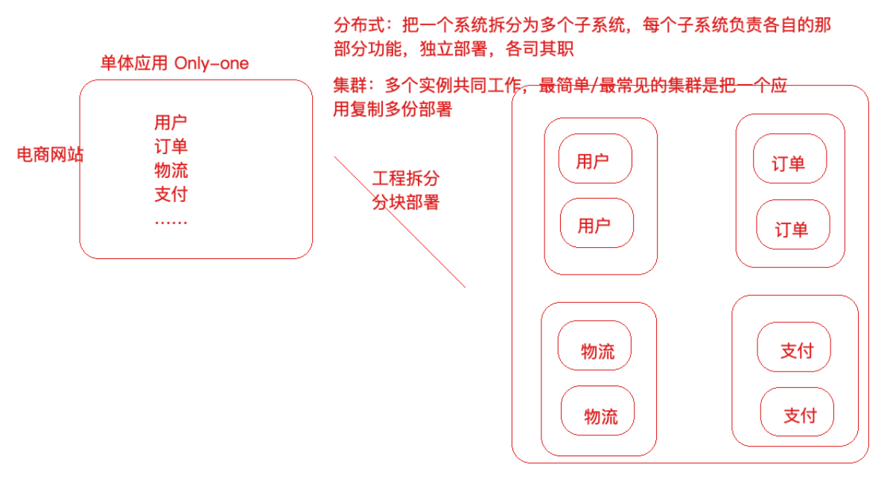

## 1、⼀致性Hash算法

### 1.1、Hash算法

Hash算法，⽐如说在安全加密领域MD5、SHA等加密算法，在数据存储和查找⽅⾯有Hash表等, 以上都应⽤到了Hash算法。

Hash算法较多的应⽤在数据存储和查找领域，最经典的就是Hash表，它的查询效率⾮常之⾼，其中的哈希算法如果设计的⽐较ok的话，那么Hash表的数据查询时间复杂度可以接近于O(1)

**需求：提供⼀组数据 1,5,7,6,3,4,8，对这组数据进⾏存储，然后随便给定⼀个数n，请你判断n是否存在于刚才的数据集中？**

- 顺序查找法

  list:List[1,5,7,6,3,4,8]

  // 通过循环判断来实现

  for(int element: list) {

  ​	if(element == n) {

  ​		如果相等，说明n存在于数据集中}

  }

  通过循环判断来实现，这种⽅式我们是通过循环来完成，⽐较原始，效率也不⾼

- ⼆分查找

  排序之后折半查找，相对于顺序查找法会提⾼⼀些效率，但是效率也并不是特别好

- 直接寻址法：直接把数据和数组的下标绑定到⼀起，查找的时候，直接array[n]就取出了数据

  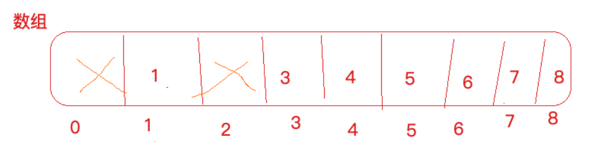

  定义⼀个数组，数组⻓度⼤于等于数据集⻓度，此处⻓度为9，数据1就存储在下标为1的位置，3就存储在下标为3的元素位置，，，依次类推。

  这个时候，我想看下5存在与否，只需要判断array[5] 是否为空，如果为空，代表5不存在于数据集，如果不为空代表5在数据集当中，通过⼀次查找就达到了⽬的，时间复杂度为O(1)。

  - **优点：**速度快，⼀次查找得到结果

  - **缺点：**

    1、浪费空间，⽐如 1,5,7,6,3,4,8,12306 ，最⼤值12306 ，按照上述⽅式需要定义⼀个⽐如⻓度为12307的数组，但是只存储零星的⼏个数据，其他位置

    空间都浪费着

    2、数据如：1,5,7,6,3,4,8,12,1,2,1,2,1,2,1,2,1,2,1,2,1,2,1,2,1,2,1,2最⼤值12，⽐如开辟13个空间，存储不了这么多内容

- 除留余数法

  换⼀种设计，如果数据是3，5，7，12306，⼀共4个数据，我们开辟任意个空间，⽐如5个，那么具体数据存储到哪个位置呢，我们可以对数据进⾏求模（对空间位置数5），根据求模余数确定存储位置的下标，⽐如3%5=3，就可以把3这个数据放到下标为3的位置上，12306%5=1，就把12306这个数据存储到下标为1的位置上

  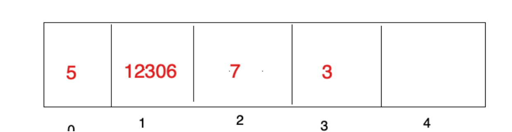

  上⾯对数据求模 （数据%空间位置数） 他就是⼀个hash算法，只不过这是⼀种⽐较普通⼜简单的hash算法，这种构造Hash算法的⽅式叫做除留余数法。

  - **存在问题：**

    如果数据是1，6，7，8，把这4个数据存储到上⾯的数组中

  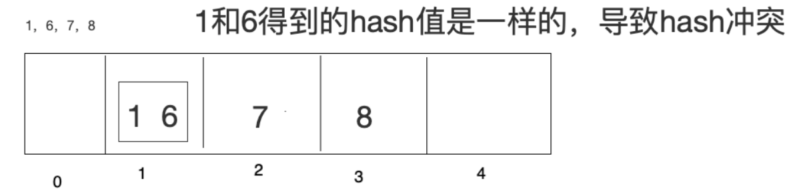

  - **解决方法：**在此基础上采⽤**开放寻址法**或者**拉链法**

    - **开放寻址法：**1放进去了，6再来的时候，向前或者向后找空闲位置存放，不好的地⽅，如果数组⻓度定义好了⽐如10，⻓度不能扩展，来了11个数据，不管Hash冲突不冲突，肯定存不下这么多数据

    - **拉链法：**数据⻓度定义好了，怎么存储更多内容呢，算好Hash值，在数组元素存储位置放了⼀个链表

      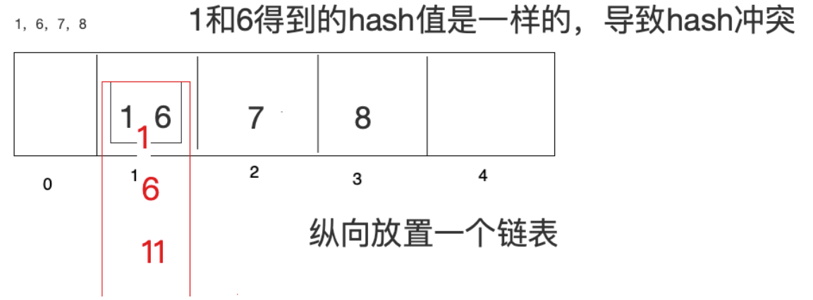

      如果Hash算法设计的⽐较好的话，那么查询效率会更接近于O(1)，如果Hash算法设计的⽐较low，那么查询效率就会很低了。

      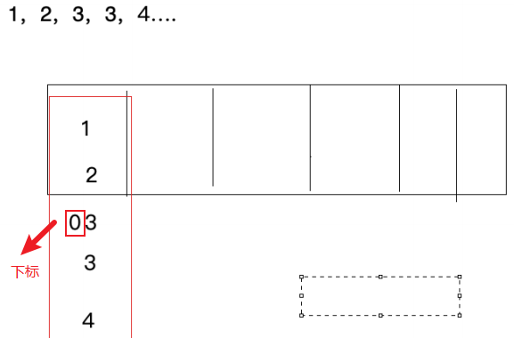

    所以，Hash表的查询效率⾼不⾼取决于Hash算法，hash算法能够让数据平均分布，既能够节省空间⼜能提⾼查询效率。Hash算法的研究是很深的⼀⻔学问，⽐较复杂，⻓久以来，Hash表内部的Hash算法也⼀直在更新，很多数学家也在研究。

    除留余数法 3%5

    线性构造Hash算法

    ​	直接寻址法也是⼀种构造Hash的⽅式，只不过更简单，表达式：H(key)=key

    ​	⽐如H(key)=a*key + b(a,b是常量)

    hashCode其实也是通过⼀个Hash算法得来的。

### 1.2、Hash算法应⽤场景

Hash算法在分布式集群架构中的应⽤场景

Hash算法在很多分布式集群产品中都有应⽤，⽐如分布式集群架构Redis、Hadoop、ElasticSearch，Mysql分库分表，Nginx负载均衡等

主要的应⽤场景归纳起来两个：

- 请求的负载均衡（⽐如nginx的ip_hash策略）

  Nginx的IP_hash策略可以在客户端ip不变的情况下，将其发出的请求始终路由到同⼀个⽬标服务器上，实现会话粘滞，避免处理session共享问题。

  - 如果没有IP_hash策略，那么如何实现会话粘滞？

    可以维护⼀张映射表，存储客户端IP或者sessionid与具体⽬标服务器的映射关系 <ip,tomcat1>

    缺点

    1）那么，在客户端很多的情况下，映射表⾮常⼤，浪费内存空间

    2）客户端上下线，⽬标服务器上下线，都会导致重新维护映射表，映射表维护成本很⼤

  - 使⽤哈希算法

    如果使⽤哈希算法，事情就简单很多，我们可以对ip地址或者sessionid进⾏计算哈希值，哈希值与服务器数量进⾏取模运算，得到的值就是当前请求应该被路由到的服务器编号，如此，同⼀个客户端ip发送过来的请求就可以路由到同⼀个⽬标服务器，实现会话粘滞。

    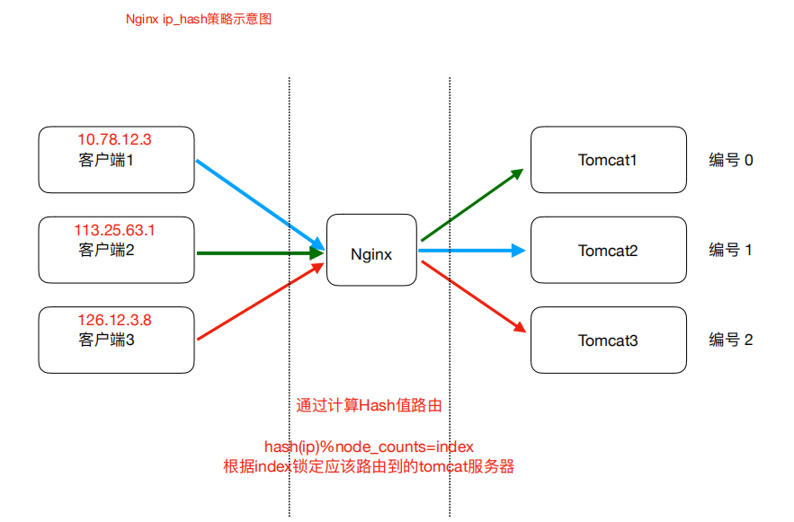

- 分布式存储

  以分布式内存数据库Redis为例,集群中有redis1，redis2，redis3 三台Redis服务器.

  在进⾏数据存储时,<key1,value1>数据存储到哪个服务器当中呢？针对key进⾏hash处理hash(key1)%3=index, 使⽤余数index锁定存储的具体服务器节点。

### 1.3、普通Hash算法存在的问题

普通Hash算法存在⼀个问题，以ip_hash为例，假定下载⽤户ip固定没有发⽣改变，现在tomcat3出现了问题，down机了，服务器数量由3个变为了2个，之前所有的求模都需要重新计算。

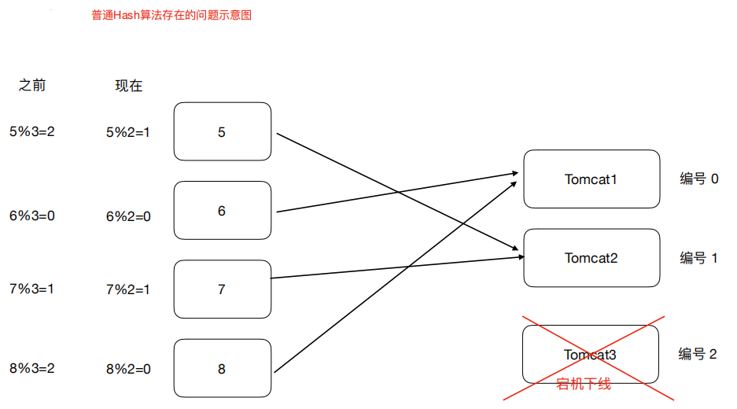

如果在真实⽣产情况下，后台服务器很多台，客户端也有很多，那么影响是很⼤的，缩容和扩容都会存在这样的问题，⼤量⽤户的请求会被路由到其他的⽬标服务器处理，⽤户在原来服务器中的会话都会丢失。

### 1.4、⼀致性Hash算法

⼀致性哈希算法思路如下：

⾸先有⼀条直线，直线开头和结尾分别定为0和2的32次⽅减1，这相当于⼀个地址，对于这样⼀条线，弯过来构成⼀个圆环形成闭环，这样的⼀个圆环称为hash环。我们把服务器的ip或者主机名求hash值然后对应到hash环上，那么针对客户端⽤户，也根据它的ip进⾏hash求值，对应到环上某个位置，然后如何确定⼀个客户端路由到哪个服务器处理呢？按照顺时针⽅向找最近的服务器节点。

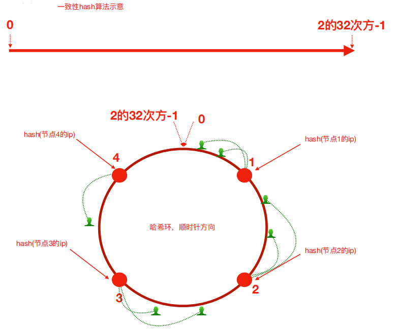

假如将服务器3下线，服务器3下线后，原来路由到3的客户端重新路由到服务器4，对于其他客户端没有影响只是这⼀⼩部分受影响（请求的迁移达到了最⼩，这样的算法对分布式集群来说⾮常合适的，避免了⼤量请求迁移 ）

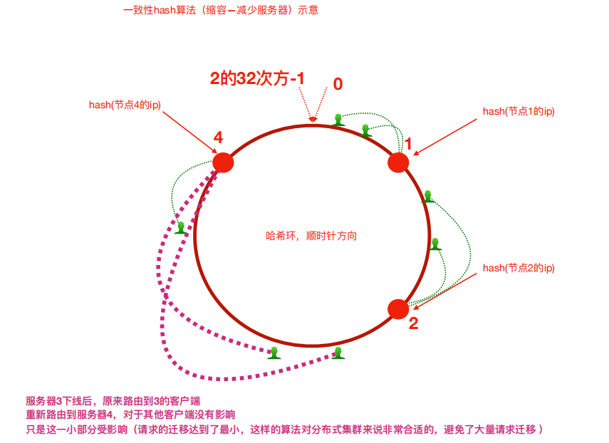

增加服务器5之后，原来路由到3的部分客户端路由到新增服务器5上，对于其他客户端没有影响只是这⼀⼩部分受影响（请求的迁移达到了最⼩，这样的算法对分布式集群来说⾮常合适的，避免了⼤量请求迁移 ）

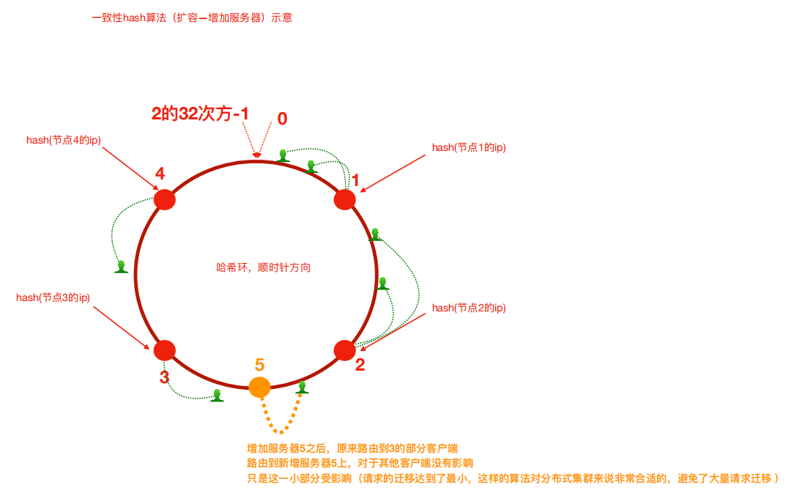

- （1）如前所述，每⼀台服务器负责⼀段，⼀致性哈希算法对于节点的增减都只需重定位环空间中的⼀⼩部分数据，具有较好的容错性和可扩展性。

  但是，⼀致性哈希算法在服务节点太少时，容易因为节点分部不均匀⽽造成数据倾斜问题。例如系统中只有两台服务器，其环分布如下，节点2只能负责⾮常⼩的⼀段，⼤量的客户端请求落在了节点1上，这就是数据（请求）倾斜问题.

- （2）为了解决这种数据倾斜问题，⼀致性哈希算法引⼊了虚拟节点机制，即对每⼀个服务节点计算多个哈希，每个计算结果位置都放置⼀个此服务节点，称为虚拟节点。

  具体做法可以在服务器ip或主机名的后⾯增加编号来实现。⽐如，可以为每台服务器计算三个虚拟节点，于是可以分别计算 “节点1的ip#1”、“节点1ip#2”、“节点1的ip#3”、“节点2的ip#1”、“节点2的ip#2”、“节点2的ip#3”的哈希值，于是形成六个虚拟节点，当客户端被路由到虚拟节点的时候其实是被路由到该虚拟节点所对应的真实节点。

  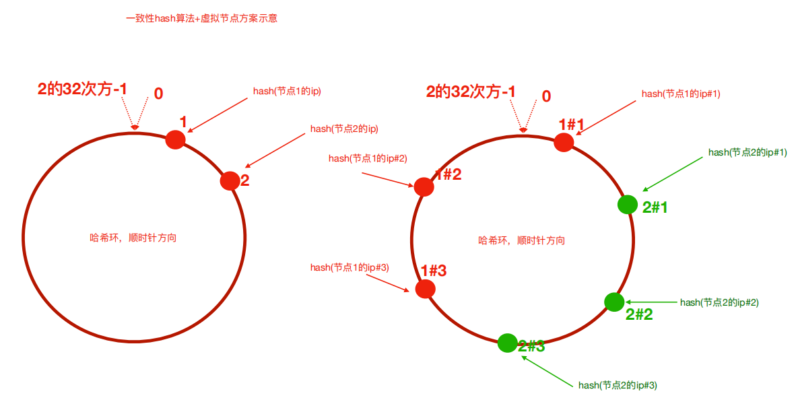

### 1.5、⼿写实现⼀致性Hash算法

- 普通Hash算法

  ```java
  /**
   * @ClassNmae GeneralHash
   * @Description TODO 普通HASH算法
   * @Author THM
   * @Date 2020/12/15 23:12
   * @Version 1.0
   **/
  public class GeneralHash {
  
      public static void main(String[] args) {
          //定义请求数据
          String[] clients = {"192.168.2.197","192.168.2.198","192.168.2.199"};
          //定义服务器数量
          int serverCount = 5;
          //循环计算hash值取模服务器数量，定位转发服务器
          for (String client : clients){
              //计算hash值
              int clientHash = Math.abs(client.hashCode());
              //取模获得转发服务
              int serverNode = clientHash % serverCount;
              System.out.println("客户端："+client + "----->调用服务器：" + serverNode);
          }
      }
  }
  ```

- ⼀致性Hash算法实现（不含虚拟节点）

  ```java
  /**
   * @ClassNmae ConsistentHashNoVirtual
   * @Description TODO 一致性hash算法，无虚拟节点
   * @Author THM
   * @Date 2020/12/15 23:21
   * @Version 1.0
   **/
  public class ConsistentHashNoVirtual {
      public static void main(String[] args) {
          //1、计算服务器IP地址的hash值，并存在在hash环上
          //定义服务器集群
          String[] servers = {"168.111.2.0","163.111.32.1","156.111.153.3","168.111.2.4"};
          //排序的map，根据key进行升序排列
          SortedMap<Integer,String> serversHashMap = new TreeMap<>();
          for (String server : servers){
              //计算服务端IP的hash值，对应到hash环上，存储hash值和IP地址对应关系
              int serverHash = Math.abs(server.hashCode());
              //存储hash值和IP地址对应关系
              serversHashMap.put(serverHash,server);
          }
          //2、计算客户端IP地址的hash值，并顺时针找到最近的服务器
          //定义客户端请求
          String[] clients = {"10.37.23.61","112.188.62.51","122.111.12.199"};
          for (String client : clients){
              //计算客户端IP的hash值
              int clientHash = Math.abs(client.hashCode());
              //根据客户端IP的hash值，找到hash环上对应的服务器 tailMap()返回大于当前数字的map
              SortedMap<Integer, String> integerStringSortedMap = serversHashMap.tailMap(clientHash);
              if (integerStringSortedMap.isEmpty()){
                  //如果没有比当前客户端IP的hash值大的map集合，即返回map为空时，为了闭环，取整个hash环上的第一个
                  Integer firstKey = serversHashMap.firstKey();
                  String server = serversHashMap.get(firstKey);
                  System.out.println("客户端(hash="+clientHash+")："+client + "----->调用服务器(hash="+firstKey+")：" + server);
              } else {
                  //存在比当前当前客户端IP的hash值大map集合，即返回map不为空时，取返回map集合中的第一个
                  Integer firstKey = integerStringSortedMap.firstKey();
                  String server = serversHashMap.get(firstKey);
                  System.out.println("客户端(hash="+clientHash+")："+client + "----->调用服务器(hash="+firstKey+")：" + server);
              }
          }
      }
  }
  ```

- ⼀致性Hash算法实现（含虚拟节点）

  ```java
  /**
   * @ClassNmae ConsistentHashNoVirtual
   * @Description TODO 一致性hash算法，添加虚拟节点
   * @Author THM
   * @Date 2020/12/15 23:21
   * @Version 1.0
   **/
  public class ConsistentHashWithVirtual {
      public static void main(String[] args) {
          //1、计算服务器IP地址的hash值，并存在在hash环上
          //定义服务器集群
          String[] servers = {"168.111.2.0","163.111.32.1","156.111.153.3","168.111.2.4"};
          //排序的map，根据key进行升序排列
          SortedMap<Integer,String> serversHashMap = new TreeMap<>();
          //定义虚拟节点数量
          int virtualCount = 3;
          for (String server : servers){
              //计算服务端IP的hash值，对应到hash环上，存储hash值和IP地址对应关系
              int serverHash = Math.abs(server.hashCode());
              //存储hash值和IP地址对应关系
              serversHashMap.put(serverHash,server);
              //添加虚拟节点
              for (int i = 0 ; i < virtualCount; i++){
                  //计算虚拟节点hash
                  int virtualHash = Math.abs((server + "#*" + i).hashCode());
                  //存储虚拟节点hash和服务器映射
                  serversHashMap.put(virtualHash,server+("#*" + i));
              }
          }
          //2、计算客户端IP地址的hash值，并顺时针找到最近的服务器
          //定义客户端请求
          String[] clients = {"10.37.23.61","112.188.62.51","122.111.12.199"};
          for (String client : clients){
              //计算客户端IP的hash值
              int clientHash = Math.abs(client.hashCode());
              //根据客户端IP的hash值，找到hash环上对应的服务器 tailMap()返回大于当前数字的map
              SortedMap<Integer, String> integerStringSortedMap = serversHashMap.tailMap(clientHash);
              if (integerStringSortedMap.isEmpty()){
                  //如果没有比当前客户端IP的hash值大的map集合，即返回map为空时，为了闭环，取整个hash环上的第一个
                  Integer firstKey = serversHashMap.firstKey();
                  String server = serversHashMap.get(firstKey);
                  System.out.println("客户端(hash="+clientHash+")："+client + "----->调用服务器(hash="+firstKey+")：" + server);
              } else {
                  //存在比当前当前客户端IP的hash值大map集合，即返回map不为空时，取返回map集合中的第一个
                  Integer firstKey = integerStringSortedMap.firstKey();
                  String server = serversHashMap.get(firstKey);
                  System.out.println("客户端(hash="+clientHash+")："+client + "----->调用服务器(hash="+firstKey+")：" + server);
              }
          }
      }
  }
  ```

### 1.6、Nginx 配置⼀致性Hash负载均衡策略

- **ngx_http_upstream_consistent_hash** 模块是⼀个负载均衡器，使⽤⼀个内部⼀致性hash算法来选择合适的后端节点。

  该模块可以根据配置参数采取不同的⽅式将请求均匀映射到后端机器：

  **consistent_hash $remote_addr：**可以根据客户端ip映射

  **consistent_hash $request_uri：**根据客户端请求的uri映射

  **consistent_hash $args：**根据客户端携带的参数进⾏映

- ngx_http_upstream_consistent_hash 模块是⼀个第三⽅模块，需要我们下载安装后使⽤

  - github下载nginx⼀致性hash负载均衡模块 https://github.com/replay/ngx_http_consistent_hash

  - 将下载的压缩包上传到nginx服务器，并解压

  - 我们已经编译安装过nginx，此时进⼊当时nginx的源码⽬录，执⾏如下命令

    ```shell
    ./configure —add-module=/root/ngx_http_consistent_hash-master(对应解压路径)
    make
    make install
    ```

  - Nginx就可以使⽤啦，在nginx.conf⽂件中配置，并重新reload

    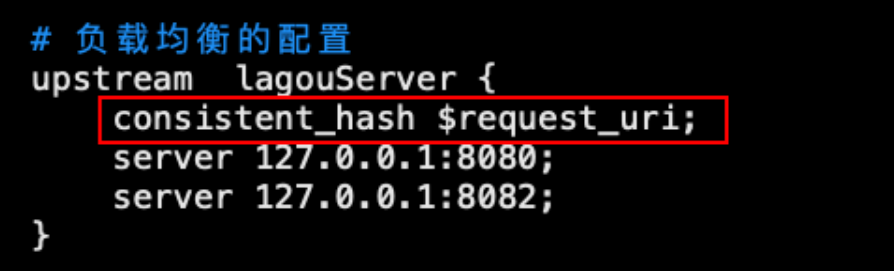

## 2、集群时钟同步问题

### 2.1、时钟不同步导致的问题

时钟此处指服务器时间，如果集群中各个服务器时钟不⼀致势必导致⼀系列问题，试想 “集群是各个服务器⼀起团队化作战，⼤家⼯作都不在⼀个点上，岂不乱了套！”举⼀个例⼦，电商⽹站业务中，新增⼀条订单，那么势必会在订单表中增加了⼀条记录，该条记录中应该会有“下单时间”这样的字段，往往我们会在程序中获取当前系统时间插⼊到数据库或者直接从数据库服务器获取时间。那我们的订单⼦系统是集群化部署，或者我们的数据库也是分库分表的集群化部署，然⽽他们的系统时钟缺不⼀致，⽐如有⼀台服务器的时间是昨天，那么这个时候下单时间就成了昨天，那我们的数据将会混乱！如下

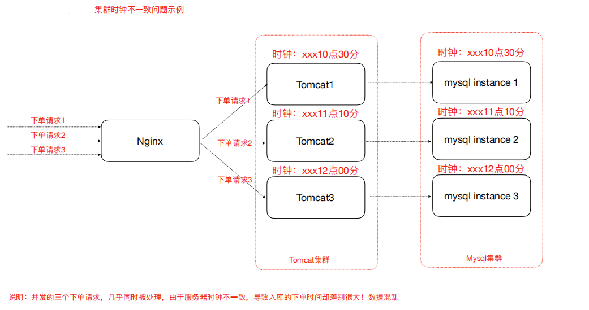

### 2.2、集群时钟同步配置

### 2.2.1、分布式集群中各个服务器节点都可以连接互联⽹

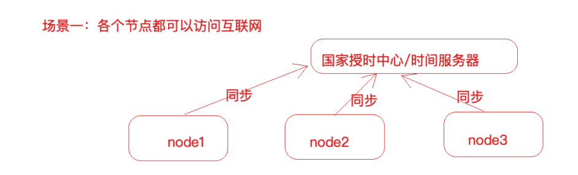

**操作⽅式：**

```shell
#使⽤ ntpdate ⽹络时间同步命令
ntpdate -u ntp.api.bz #从⼀个时间服务器同步时间
```

**注意：ntpdate命令可能没有，需要检查（rpm -qa|grep ntpdate） 安装（yum install ntpdate）**

windows有计划任务

Linux也有定时任务，crond，可以使⽤linux的定时任务，每隔10分钟执⾏⼀次ntpdate命令

### 2.2.2、分布式集群中某⼀个服务器节点可以访问互联⽹或者所有节点都不能够访问互联⽹

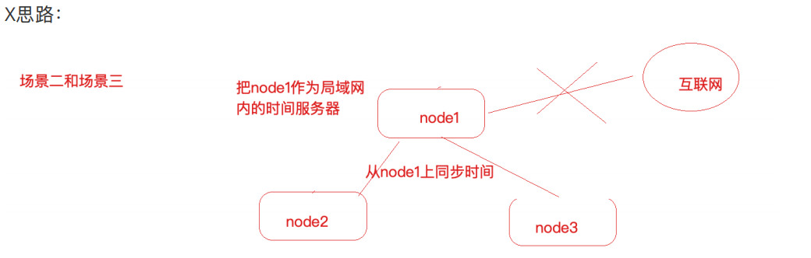

**操作⽅式：**

选取集群中的⼀个服务器节点A(172.17.0.17)作为时间服务器（整个集群时间从这台服务器同步，如果这台服务器能够访问互联⽹，可以让这台服务器和⽹络时间保持同步，如果不能就⼿动设置⼀个时间）

- ⾸先设置好node1的时间

- 把node1配置为时间服务器（修改/etc/ntp.conf⽂件）

  ```shell
  1、如果有 restrict default ignore，注释掉它
  2、添加如下⼏⾏内容
   restrict 172.17.0.0 mask 255.255.255.0 nomodify notrap # 放开局域⽹同步功能,172.17.0.0是你的局域⽹⽹段
   server 127.127.1.0 # local clock
   fudge 127.127.1.0 stratum 10
  3、重启⽣效并配置ntpd服务开机⾃启动
   service ntpd restart
   chkconfig ntpd on
  ```
  
- 集群中其他节点就可以从A服务器同步时间了

  ```shell
  ntpdate 172.17.0.17
  ```


## 3、分布式ID解决⽅案

为什么需要分布式ID(分布式集群环境下的全局唯⼀ID)

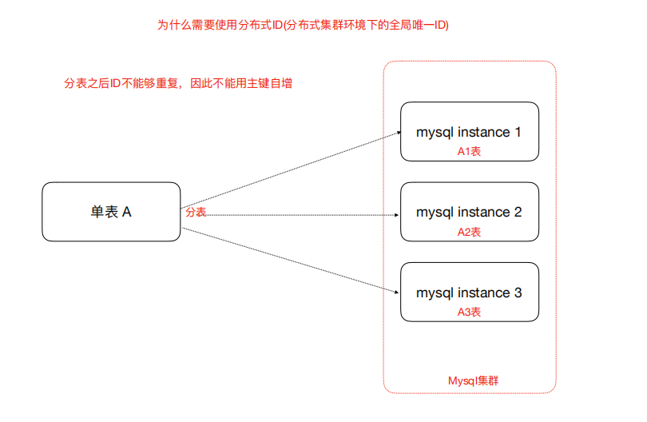

### 3.1、UUID(可以⽤)

**UUID** 是指Universally Unique Identififier，翻译为中⽂是通⽤唯⼀识别码产⽣重复 UUID 并造成错误的情况⾮常低，是故⼤可不必考虑此问题。

Java中得到⼀个UUID，可以使⽤java.util包提供的⽅法

```java
public class MyTest {
 public static void main(String[] args) {
 System.out.println(java.util.UUID.randomUUID().toString());
 }
}
```

存在问题：生成的UUID长度大，并且无序

### 3.2、独⽴数据库的⾃增ID（不推荐）

⽐如A表分表为A1表和A2表，那么肯定不能让A1表和A2表的ID⾃增，那么ID怎么获取呢？我们可以单独的创建⼀个Mysql数据库，在这个数据库中创建⼀张表，这张表的ID设置为⾃增，其他地⽅需要全局唯⼀ID的时候，就模拟向这个Mysql数据库的这张表中模拟插⼊⼀条记录，此时ID会⾃增，然后我们可以通过Mysql的select last_insert_id() 获取到刚刚这张表中⾃增⽣成的ID。

⽐如，我们创建了⼀个数据库实例global_id_generator，在其中创建了⼀个数据表，表结构如下：

```sql
DROP TABLE IF EXISTS `DISTRIBUTE_ID`;
CREATE TABLE `DISTRIBUTE_ID` (
 `id` bigint(32) NOT NULL AUTO_INCREMENT COMMENT '主键',
 `createtime` datetime DEFAULT NULL,
 PRIMARY KEY (`id`)
) ENGINE=InnoDB DEFAULT CHARSET=utf8;
```

当分布式集群环境中哪个应⽤需要获取⼀个全局唯⼀的分布式ID的时候，就可以使⽤代码连接这个数据库实例，执⾏如下sql语句即可。

```sql
insert into DISTRIBUTE_ID(createtime) values(NOW());
select LAST_INSERT_ID()；
```

注意：
1）这⾥的createtime字段⽆实际意义，是为了随便插⼊⼀条数据以⾄于能够⾃增id。

 2）使⽤独⽴的Mysql实例⽣成分布式id，虽然可⾏，但是性能和可靠性都不够好，因为你需要代码连接到数据库才能获取到id，性能⽆法保障，另外mysql数据库实例挂掉了，那么就⽆法获取分布式id了。

3）有⼀些开发者⼜针对上述的情况将⽤于⽣成分布式id的mysql数据库设计成了⼀个集群架构，那么其实这种⽅式现在基本不⽤，因为过于麻烦了。

### 3.3、SnowFlake 雪花算法（可以⽤，推荐）

雪花算法是Twitter推出的⼀个⽤于⽣成分布式ID的策略。

雪花算法是⼀个算法，基于这个算法可以⽣成ID，⽣成的ID是⼀个long型，那么在Java中⼀个long型是8个字节，算下来是64bit，如下是使⽤雪花算法⽣成的⼀个ID的⼆进制形式示意：

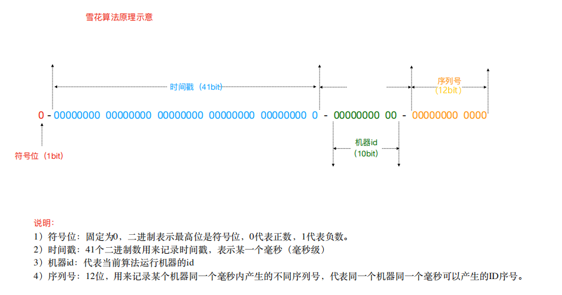

另外，⼀切互联⽹公司也基于上述的⽅案封装了⼀些分布式ID⽣成器，⽐如滴滴的tinyid（基于数据库实现）、百度的uidgenerator（基于SnowFlake）和美团的leaf（基于数据库和SnowFlake）等。

雪花算法java源码：（直接使用即可，或者使用第三方）

```java
/**
 * 官方推出，Scala编程语言来实现的
 * Java前辈用Java语言实现了雪花算法
 */
public class IdWorker{

    //下面两个每个5位，加起来就是10位的工作机器id
    private long workerId;    //工作id
    private long datacenterId;   //数据id
    //12位的序列号
    private long sequence;

    public IdWorker(long workerId, long datacenterId, long sequence){
        // sanity check for workerId
        if (workerId > maxWorkerId || workerId < 0) {
            throw new IllegalArgumentException(String.format("worker Id can't be greater than %d or less than 0",maxWorkerId));
        }
        if (datacenterId > maxDatacenterId || datacenterId < 0) {
            throw new IllegalArgumentException(String.format("datacenter Id can't be greater than %d or less than 0",maxDatacenterId));
        }
        System.out.printf("worker starting. timestamp left shift %d, datacenter id bits %d, worker id bits %d, sequence bits %d, workerid %d",
                timestampLeftShift, datacenterIdBits, workerIdBits, sequenceBits, workerId);

        this.workerId = workerId;
        this.datacenterId = datacenterId;
        this.sequence = sequence;
    }

    //初始时间戳
    private long twepoch = 1288834974657L;

    //长度为5位
    private long workerIdBits = 5L;
    private long datacenterIdBits = 5L;
    //最大值
    private long maxWorkerId = -1L ^ (-1L << workerIdBits);
    private long maxDatacenterId = -1L ^ (-1L << datacenterIdBits);
    //序列号id长度
    private long sequenceBits = 12L;
    //序列号最大值
    private long sequenceMask = -1L ^ (-1L << sequenceBits);
    
    //工作id需要左移的位数，12位
    private long workerIdShift = sequenceBits;
   //数据id需要左移位数 12+5=17位
    private long datacenterIdShift = sequenceBits + workerIdBits;
    //时间戳需要左移位数 12+5+5=22位
    private long timestampLeftShift = sequenceBits + workerIdBits + datacenterIdBits;
    
    //上次时间戳，初始值为负数
    private long lastTimestamp = -1L;

    public long getWorkerId(){
        return workerId;
    }

    public long getDatacenterId(){
        return datacenterId;
    }

    public long getTimestamp(){
        return System.currentTimeMillis();
    }

     //下一个ID生成算法
    public synchronized long nextId() {
        long timestamp = timeGen();

        //获取当前时间戳如果小于上次时间戳，则表示时间戳获取出现异常
        if (timestamp < lastTimestamp) {
            System.err.printf("clock is moving backwards.  Rejecting requests until %d.", lastTimestamp);
            throw new RuntimeException(String.format("Clock moved backwards.  Refusing to generate id for %d milliseconds",
                    lastTimestamp - timestamp));
        }

        //获取当前时间戳如果等于上次时间戳
        //说明：还处在同一毫秒内，则在序列号加1；否则序列号赋值为0，从0开始。
        if (lastTimestamp == timestamp) {  // 0  - 4095
            sequence = (sequence + 1) & sequenceMask;
            if (sequence == 0) {
                timestamp = tilNextMillis(lastTimestamp);
            }
        } else {
            sequence = 0;
        }
        
        //将上次时间戳值刷新
        lastTimestamp = timestamp;
        /**
          * 返回结果：
          * (timestamp - twepoch) << timestampLeftShift) 表示将时间戳减去初始时间戳，再左移相应位数
          * (datacenterId << datacenterIdShift) 表示将数据id左移相应位数
          * (workerId << workerIdShift) 表示将工作id左移相应位数
          * | 是按位或运算符，例如：x | y，只有当x，y都为0的时候结果才为0，其它情况结果都为1。
          * 因为个部分只有相应位上的值有意义，其它位上都是0，所以将各部分的值进行 | 运算就能得到最终拼接好的id
        */
        return ((timestamp - twepoch) << timestampLeftShift) |
                (datacenterId << datacenterIdShift) |
                (workerId << workerIdShift) |
                sequence;
    }
    //获取时间戳，并与上次时间戳比较
    private long tilNextMillis(long lastTimestamp) {
        long timestamp = timeGen();
        while (timestamp <= lastTimestamp) {
            timestamp = timeGen();
        }
        return timestamp;
    }
    //获取系统时间戳
    private long timeGen(){
        return System.currentTimeMillis();
    }

    public static void main(String[] args) {
        IdWorker worker = new IdWorker(21,10,0);
        for (int i = 0; i < 100; i++) {
            System.out.println(worker.nextId());
        }
    }

}
```

### 3.4、借助Redis的Incr命令获取全局唯⼀ID（推荐）

Redis Incr 命令将 key 中储存的数字值增⼀。如果 key 不存在，那么 key 的值会先被初始化为 0，然后再执⾏ INCR 操作。

<key,value>    <id,>     .incr(id) 1 2 3 4

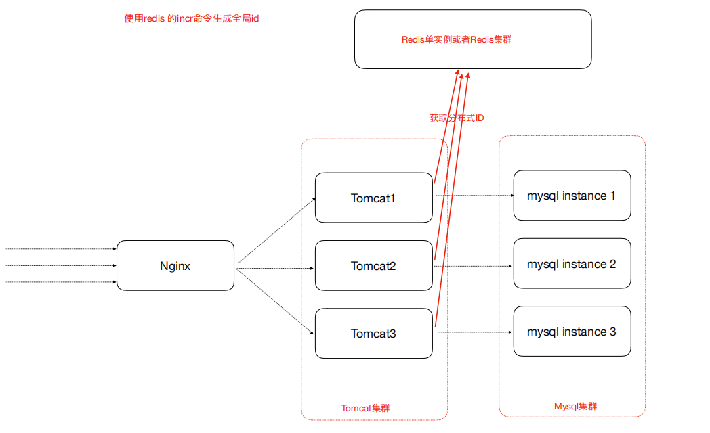

- Java代码中使⽤Jedis客户端调⽤Reids的incr命令获得⼀个全局的id

  - 引⼊jedis客户端jar

    ```xml
    <dependency>
     <groupId>redis.clients</groupId>
     <artifactId>jedis</artifactId>
     <version>2.9.0</version>
    </dependency>
    ```

  - Java代码（此处我们就是连接单节点，也不使⽤连接池）

    ```java
    Jedis jedis = new Jedis("127.0.0.1",6379);
    try {
     long id = jedis.incr("id");
     System.out.println("从redis中获取的分布式id为：" + id);
    } finally {
     if (null != jedis) {
     jedis.close();
     } }
    ```

## 4、分布式调度问题（分布式定时任务）

调度—>定时任务，分布式调度—>在分布式集群环境下定时任务这件事。

Elastic-job（当当⽹开源的分布式调度框架）

### 4.1、定时任务的场景

定时任务形式：每隔⼀定时间/特定某⼀时刻执⾏

例如：

- 订单审核、出库

- 订单超时⾃动取消、⽀付退款

- 礼券同步、⽣成、发放作业

- 物流信息推送、抓取作业、退换货处理作业

- 数据积压监控、⽇志监控、服务可⽤性探测作业

- 定时备份数据

- ⾦融系统每天的定时结算

- 数据归档、清理作业

- 报表、离线数据分析作业

### 4.2、什么是分布式调度

什么是分布式任务调度？有两层含义

- 运⾏在分布式集群环境下的调度任务（同⼀个定时任务程序部署多份，只应该有⼀个定时任务在执⾏）

- 分布式调度—>定时任务的分布式—>定时任务的拆分（即为把⼀个⼤的作业任务拆分为多个⼩的作业任务，同时执⾏）

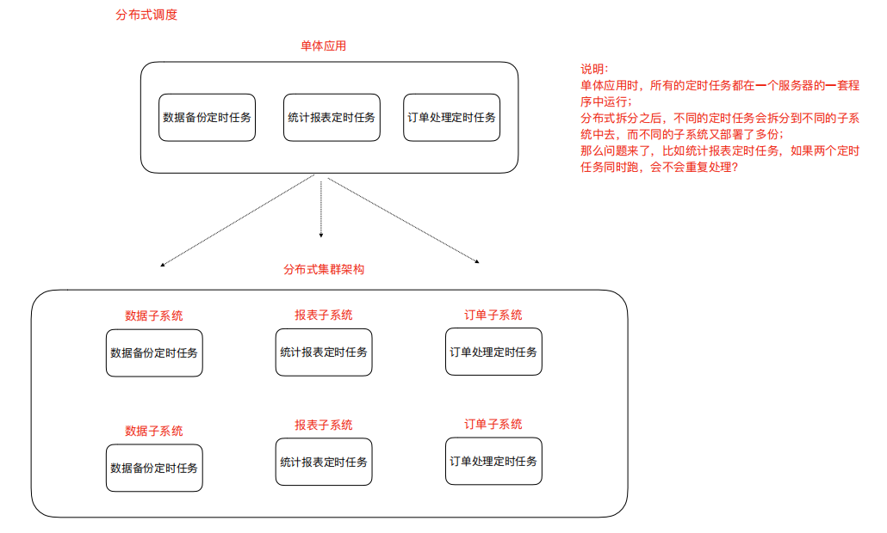

### 4.3、定时任务与消息队列的区别

- **共同点**

  - 异步处理

    ⽐如注册、下单事件

  - 应⽤解耦

    不管定时任务作业还是MQ都可以作为两个应⽤之间的⻮轮实现应⽤解耦，这个⻮轮可以中转数据，当然单体服务不需要考虑这些，服务拆分的时候往往都会考虑

  - 流量削峰

    双⼗⼀的时候，任务作业和MQ都可以⽤来扛流量，后端系统根据服务能⼒定时处理订单或者从MQ抓取订单抓取到⼀个订单到来事件的话触发处理，对于前端⽤户来说看到的结果是已经下单成功了，下单是不受任何影响的

- 本质不同

  定时任务作业是时间驱动，⽽MQ是事件驱动；

  时间驱动是不可代替的，⽐如⾦融系统每⽇的利息结算，不是说利息来⼀条（利息到来事件）就算⼀下，⽽往往是通过定时任务批量计算；

  所以，定时任务作业更倾向于**批处理**，MQ倾向于**逐条处理**；

### 4.4、定时任务的实现⽅式

定时任务的实现⽅式有多种。早期没有定时任务框架的时候，我们会使⽤JDK中的Timer机制和多线程机制（Runnable+线程休眠）来实现定时或者间隔⼀段时间执⾏某⼀段程序；后来有了定时任务框架，⽐如⼤名鼎鼎的Quartz任务调度框架，使⽤时间表达式（包括：秒、分、时、⽇、周、年）配置某⼀个任务什么时间去执⾏：

#### 4.4.1、任务调度框架Quartz回顾示意

- 引⼊jar

  ```xml
   <!--任务调度框架quartz-->
   <!-- https://mvnrepository.com/artifact/org.quartz-scheduler/quartz -->
   <dependency>
       <groupId>org.quartz-scheduler</groupId>
       <artifactId>quartz</artifactId>
       <version>2.3.2</version>
   </dependency>
  ```

- 定时任务作业主调度程序(ThmQuartz)

  ```java
  package quartz;
  
  import org.quartz.*;
  import org.quartz.impl.StdSchedulerFactory;
  
  /**
   * @ClassNmae ThmQuartz
   * @Description TODO quartz定时任务回顾
   * @Author THM
   * @Date 2020/12/17 22:39
   * @Version 1.0
   **/
  public class ThmQuartz {
  
      //1、创建任务调度器
      public static Scheduler createScheduler() throws SchedulerException {
          SchedulerFactory schedulerFactory = new StdSchedulerFactory();
          Scheduler scheduler = schedulerFactory.getScheduler();
          return scheduler;
      }
      //2、创建一个任务
      public static JobDetail createJob(){
          JobBuilder jobBuilder = JobBuilder.newJob(DemoJob.class);
          jobBuilder.withIdentity("jobName","myJob");
          JobDetail jobDetail = jobBuilder.build();
          return jobDetail;
      }
      /**
       * 3、创建作业任务时间触发器（类似于公交车出车时间表）
       * cron表达式由七个位置组成，空格分隔
       * 1、Seconds（秒）  0~59
       * 2、Minutes（分）  0~59
       * 3、Hours（小时）  0~23
       * 4、Day of Month（天）1~31,注意有的月份不足31天
       * 5、Month（月） 0~11,或者 JAN,FEB,MAR,APR,MAY,JUN,JUL,AUG,SEP,OCT,NOV,DEC
       * 6、Day of Week(周)  1~7,1=SUN或者  SUN,MON,TUE,WEB,THU,FRI,SAT
       * 7、Year（年）1970~2099  可选项
       *示例：
       * 0 0 11 * * ? 每天的11点触发执行一次
       * 0 30 10 1 * ? 每月1号上午10点半触发执行一次
       */
      public static Trigger createTrigger(){
          CronTrigger cronTrigger = TriggerBuilder.newTrigger()
                  .withIdentity("triggerName","myTrigger")
                  .startNow()
                  .withSchedule(CronScheduleBuilder.cronSchedule("*/2 * * * * ?")).build();
          return cronTrigger;
      }
  
      public static void main(String[] args) throws SchedulerException {
          // 1、创建任务调度器（好比公交调度站）
          Scheduler scheduler = ThmQuartz.createScheduler();
          // 2、创建一个任务（好比某一个公交车的出行）
          JobDetail job = ThmQuartz.createJob();
          // 3、创建任务的时间触发器（好比这个公交车的出行时间表）
          Trigger trigger = ThmQuartz.createTrigger();
          // 4、使用任务调度器根据时间触发器执行我们的任务
          scheduler.scheduleJob(job,trigger);
          scheduler.start();
      }
  }
  ```

- 定义⼀个job，需实现Job接⼝

  ```java
  public class DemoJob implements Job {
      @Override
      public void execute(JobExecutionContext jobExecutionContext) throws JobExecutionException {
          System.out.println("我是一个定时任务执行逻辑");
      }
  }
  ```

以上，是回顾⼀下任务调度框架Quartz的⼤致⽤法，那么在分布式架构环境中使⽤Quartz已经不能更好的满⾜我们需求，我们可以使⽤专业的分布式调度框架，这⾥我们推荐使⽤Elastic-job。

## 5、分布式调度框架Elastic-Job

### 5.1、Elastic-Job介绍

Elastic-Job是当当⽹开源的⼀个分布式调度解决⽅案，基于Quartz⼆次开发的，由两个相互独⽴的⼦项⽬Elastic-Job-Lite和Elastic-Job-Cloud组成。我们要学习的是 Elastic-Job-Lite，它定位为轻量级⽆中⼼化解决⽅案，使⽤Jar包的形式提供分布式任务的协调服务，⽽Elastic-Job-Cloud⼦项⽬需要结合Mesos以及Docker在云环境下使⽤。

Elastic-Job的github地址：https://github.com/elasticjob

**主要功能介绍**

- 分布式调度协调

  在分布式环境中，任务能够按指定的调度策略执⾏，并且能够避免同⼀任务多实例重复执⾏

- 丰富的调度策略 基于成熟的定时任务作业框架Quartz cron表达式执⾏定时任务

- 弹性扩容缩容 当集群中增加某⼀个实例，它应当也能够被选举并执⾏任务；当集群减少⼀个实例时，它所执⾏的任务能被转移到别的实例来执⾏。

- 失效转移 某实例在任务执⾏失败后，会被转移到其他实例执⾏

- 错过执⾏作业重触发 若因某种原因导致作业错过执⾏，⾃动记录错过执⾏的作业，并在上次作业完成后⾃动触发。

- ⽀持并⾏调度 ⽀持任务分⽚，任务分⽚是指将⼀个任务分为多个⼩任务项在多个实例同时执⾏。

- 作业分⽚⼀致性 当任务被分⽚后，保证同⼀分⽚在分布式环境中仅⼀个执⾏实例。

### 5.2、Elastic-Job-Lite应⽤

jar包（API） + 安装zk软件

Elastic-Job依赖于Zookeeper进⾏分布式协调，所以需要安装Zookeeper软件（3.4.6版本以上）Zookeeper的本质功能：存储+通知。

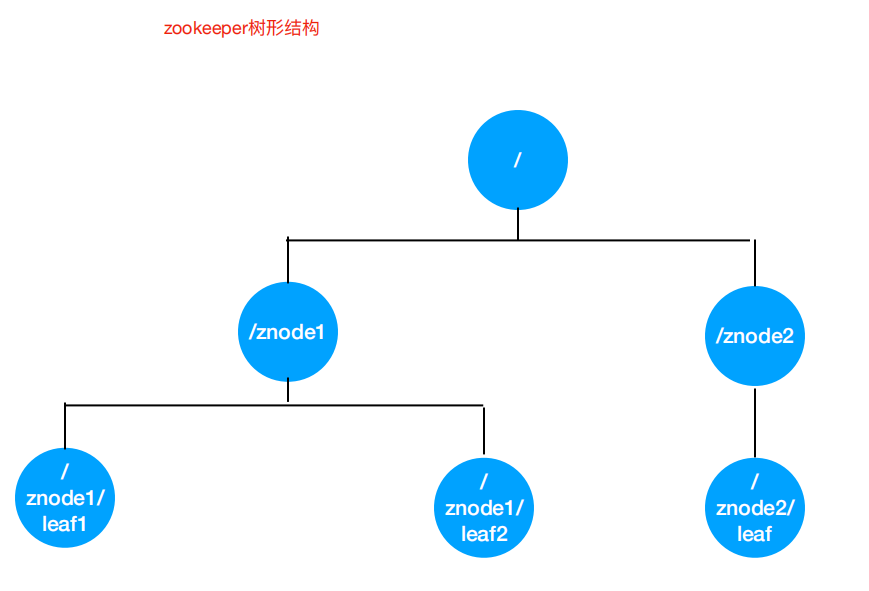

- 引⼊Jar包

  ```xml
  <!-- https://mvnrepository.com/artifact/com.dangdang/elastic-job-lite-core -->
          <!--elastic-job-lite核心包-->
          <dependency>
              <groupId>com.dangdang</groupId>
              <artifactId>elastic-job-lite-core</artifactId>
              <version>2.1.5</version>
          </dependency>
  ```

- 定时任务实例

  - 需求：每隔两秒钟执⾏⼀次定时任务（resume表中未归档的数据归档到resume_bak表中，每次归档1条记录）

    1）resume_bak和resume表结构完全⼀样

    2）resume表中数据归档之后不删除，只将state置为"已归档"

  - 数据表结构

    ```sql
    DROP TABLE IF EXISTS `resume`;
    CREATE TABLE `resume` (
     `id` bigint(20) NOT NULL AUTO_INCREMENT,
     `name` varchar(255) DEFAULT NULL,
     `sex` varchar(255) DEFAULT NULL,
     `phone` varchar(255) DEFAULT NULL,
     `address` varchar(255) DEFAULT NULL,
     `education` varchar(255) DEFAULT NULL,
     `state` varchar(255) DEFAULT NULL,
     PRIMARY KEY (`id`)
    ) ENGINE=InnoDB AUTO_INCREMENT=1001 DEFAULT CHARSET=utf8;
    SET FOREIGN_KEY_CHECKS = 1;
    ```

  - 定时任务类 ArchiveJob

    ```java
    /**
     * ElasticJobLite定时任务业务逻辑处理类
     */
    public class ArchiveJob implements SimpleJob {
        /**
         * 需求：resume表中未归档的数据归档到resume_bak表中，每次归档1条记录
         * execute方法中写我们的业务逻辑（execute方法每次定时任务执行都会执行一次）
         * @param shardingContext
         */
        @Override
        public void execute(ShardingContext shardingContext) {
            //获取当前分片信息
            int shardingItem = shardingContext.getShardingItem();
            System.out.println("=====>>>>当前分片：" + shardingItem);
    
            // 获取分片参数
            String shardingParameter = shardingContext.getShardingParameter(); // 0=bachelor,1=master,2=doctor
    
    
            // 1 从resume表中查询出1条记录（未归档）
            String selectSql = "select * from resume where state='未归档' and education='"+ shardingParameter +"' limit 1";
            List<Map<String, Object>> list = JdbcUtil.executeQuery(selectSql);
            if(list == null || list.size() ==0 ) {
                System.out.println("数据已经处理完毕！！！！！！");
                return;
            }
            // 2 "未归档"更改为"已归档"
            Map<String, Object> stringObjectMap = list.get(0);
            long id = (long) stringObjectMap.get("id");
            String name = (String) stringObjectMap.get("name");
            String education = (String) stringObjectMap.get("education");
    
            System.out.println("=======>>>>id：" + id + "  name：" + name + " education：" + education);
    
            String updateSql = "update resume set state='已归档' where id=?";
            JdbcUtil.executeUpdate(updateSql,id);
    
            // 3 归档这条记录，把这条记录插入到resume_bak表
            String insertSql = "insert into resume_bak select * from resume where id=?";
            JdbcUtil.executeUpdate(insertSql,id);
        }
    }
    ```

  - 工具类JdbcUtil

    ```java
    public class JdbcUtil {
        //url
        private static String url = "jdbc:mysql://localhost:3306/test?characterEncoding=utf8&useSSL=false";
        //user
        private static String user = "root";
        //password
        private static String password = "root";
        //驱动程序类
        private static String driver = "com.mysql.jdbc.Driver";
    
        static {
            try {
                Class.forName(driver);
            } catch (ClassNotFoundException e) {
                // TODO Auto-generated catch block
                e.printStackTrace();
            }
        }
    
        public static Connection getConnection() {
    
            try {
                return DriverManager.getConnection(url, user, password);
            } catch (SQLException e) {
                // TODO Auto-generated catch block
                e.printStackTrace();
            }
            return null;
    
        }
    
        public static void close(ResultSet rs, PreparedStatement ps, Connection con) {
            if (rs != null) {
                try {
                    rs.close();
                } catch (SQLException e) {
                    // TODO Auto-generated catch block
                    e.printStackTrace();
                } finally {
                    if (ps != null) {
                        try {
                            ps.close();
                        } catch (SQLException e) {
                            // TODO Auto-generated catch block
                            e.printStackTrace();
                        } finally {
                            if (con != null) {
                                try {
                                    con.close();
                                } catch (SQLException e) {
                                    // TODO Auto-generated catch block
                                    e.printStackTrace();
                                }
                            }
                        }
                    }
                }
            }
        }
    
    
        /***
         * DML操作（增删改）
         * 1.获取连接数据库对象
         * 2.预处理
         * 3.执行更新操作
         * @param sql
         * @param obj
         */
        //调用者只需传入一个sql语句，和一个Object数组。该数组存储的是SQL语句中的占位符
        public static void executeUpdate(String sql,Object...obj) {
            Connection con = getConnection();//调用getConnection()方法连接数据库
            PreparedStatement ps = null;
            try {
                ps = con.prepareStatement(sql);//预处理
                for (int i = 0; i < obj.length; i++) {//预处理声明占位符
                    ps.setObject(i + 1, obj[i]);
                }
                ps.executeUpdate();//执行更新操作
            } catch (SQLException e) {
                // TODO Auto-generated catch block
                e.printStackTrace();
            } finally {
                close(null, ps, con);//调用close()方法关闭资源
            }
        }
    
    
    
        /***
         * DQL查询
         * Result获取数据集
         *
         * @param sql
         * @param obj
         * @return
         */
        public static List<Map<String,Object>> executeQuery(String sql, Object...obj) {
            Connection con = getConnection();
            ResultSet rs = null;
            PreparedStatement ps = null;
            try {
                ps = con.prepareStatement(sql);
                for (int i = 0; i < obj.length; i++) {
                    ps.setObject(i + 1, obj[i]);
                }
                rs = ps.executeQuery();
                //new 一个空的list集合用来存放查询结果
                List<Map<String, Object>> list = new ArrayList<>();
                //获取结果集的列数
                int count = rs.getMetaData().getColumnCount();
                //对结果集遍历每一条数据是一个Map集合，列是k,值是v
                while (rs.next()) {
                    //一个空的map集合，用来存放每一行数据
                    Map<String, Object> map = new HashMap<String, Object>();
                    for (int i = 0; i < count; i++) {
                        Object ob = rs.getObject(i + 1);//获取值
                        String key = rs.getMetaData().getColumnName(i + 1);//获取k即列名
                        map.put(key, ob);
                    }
                    list.add(map);
                }
                return list;
            } catch (SQLException e) {
                // TODO Auto-generated catch block
                e.printStackTrace();
            } finally {
    
                close(rs, ps, con);
            }
    
            return null;
        }
    }
    ```

  - 任务调度主类 ElasticJobMain

    ```java
    public class ElasticJobMain {
    
        public static void main(String[] args) {
            //1、配置分布式协调服务（注册中心）
            ZookeeperConfiguration zookeeperConfiguration = new ZookeeperConfiguration("192.168.81.100:2181", "data-archive-job");
            //获得注册中心对象
            CoordinatorRegistryCenter coordinatorRegistryCenter = new ZookeeperRegistryCenter(zookeeperConfiguration);
            coordinatorRegistryCenter.init();
            //2、配置任务（时间事件，定时任务业务逻辑，调度器）
            JobCoreConfiguration jobCoreConfiguration = JobCoreConfiguration.newBuilder("archive-job", "*/2 * * * * ?", 3)
                    .shardingItemParameters("0=bachelor,1=master,2=doctor")
                    .build();
            SimpleJobConfiguration simpleJobConfiguration = new SimpleJobConfiguration(jobCoreConfiguration,ArchiveJob.class.getName());
            //获得调度器
            JobScheduler jobScheduler = new JobScheduler(coordinatorRegistryCenter,
                    LiteJobConfiguration.newBuilder(simpleJobConfiguration).overwrite(true).build());
            //调度器初始化
            jobScheduler.init();
        }
    }
    ```

  - 测试

    1）可先启动⼀个进程，然后再启动⼀个进程（两个进程模拟分布式环境下，通⼀个定时任务部署了两份在⼯作）

    2）两个进程逐个启动，观察现象

    3）关闭其中执⾏的进程，观察现象

  - Leader节点选举机制

    每个Elastic-Job的任务执⾏实例App作为Zookeeper的客户端来操作ZooKeeper的znode

    （1）多个实例同时创建/leader节点

    （2）/leader节点只能创建⼀个，后创建的会失败，创建成功的实例会被选为leader节点，执⾏任务

### 5.3、Elastic-Job-Lite轻量级去中⼼化的特点

如何理解轻量级和去中⼼化？

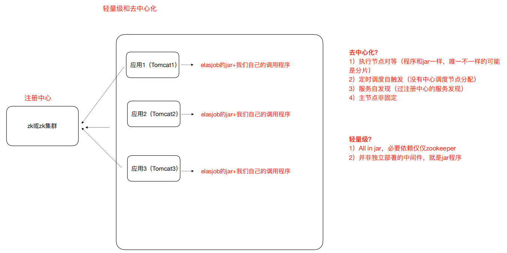

### 5.4、Elastic-Job任务分⽚机制

⼀个⼤的⾮常耗时的作业Job，⽐如：⼀次要处理⼀亿的数据，那这⼀亿的数据存储在数据库中，如果⽤⼀个作业节点处理⼀亿数据要很久，在互联⽹领域是不太能接受的，互联⽹领域更希望机器的增加去横向扩展处理能⼒。所以，ElasticJob可以把作业分为多个的task（每⼀个task就是⼀个任务分⽚），每⼀个task交给具体的⼀个机器实例去处理（⼀个机器实例是可以处理多个task的），但是具体每个task执⾏什么逻辑由我们⾃⼰来指定。

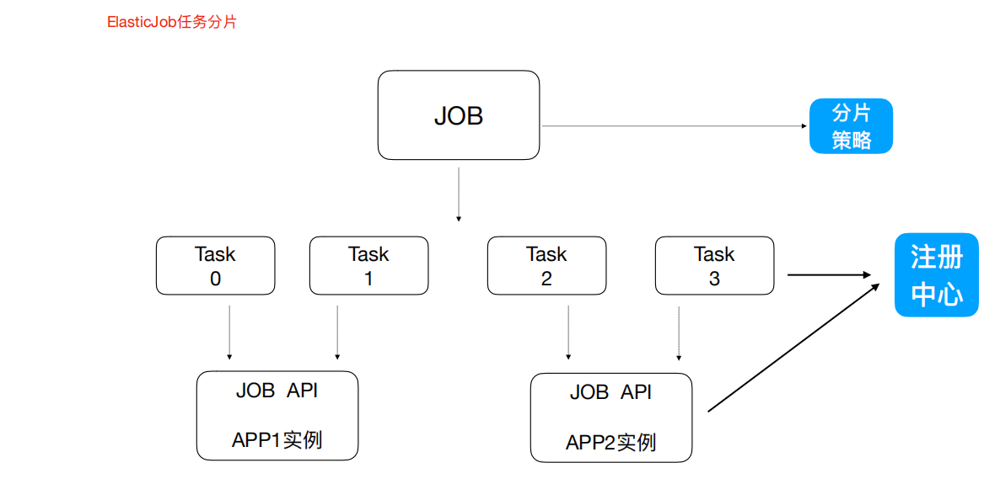

Strategy策略定义这些分⽚项怎么去分配到各个机器上去，默认是平均去分，可以定制，⽐如某⼀个机器负载 ⽐较⾼或者预配置⽐较⾼，那么就可以写策略。分⽚和作业本身是通过⼀个注册中⼼协调的，因为在分布式环境下，状态数据肯定集中到⼀点，才可以在分布式中沟通。

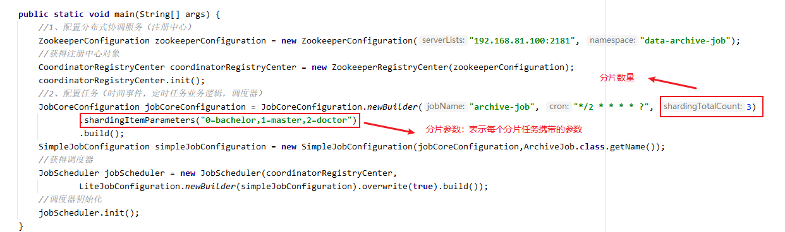

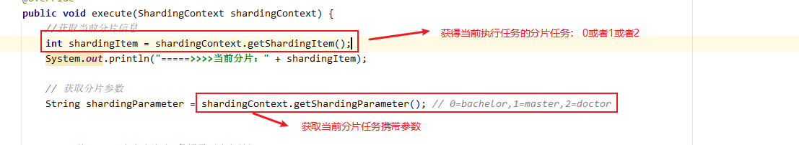

### 5.5、弹性扩容

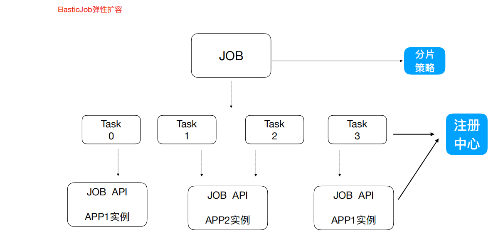

新增加⼀个运⾏实例app3，它会⾃动注册到注册中⼼，注册中⼼发现新的服务上线，注册中⼼会通知ElasticJob 进⾏重新分⽚，那么总得分⽚项有多少，那么就可以搞多少个实例机器，⽐如完全可以分1000⽚

**注意：**

1）分⽚项也是⼀个JOB配置，修改配置，重新分⽚，在下⼀次定时运⾏之前会重新调⽤分⽚算法，那么这个分⽚算法的结果就是：哪台机器运⾏哪⼀个⼀任务⽚，这个结果存储到zk中的，主节点会把分⽚给分好放到注册中⼼去，然后执⾏节点从注册中⼼获取信息(执⾏节点在定时任务开启的时候获取相应的分⽚)。 

2）如果所有的节点挂掉值剩下⼀个节点，所有分⽚都会指向剩下的⼀个节点，这也是ElasticJob的⾼可⽤。

## 6、Session共享问题

Session共享及Session保持或者叫做Session⼀致性

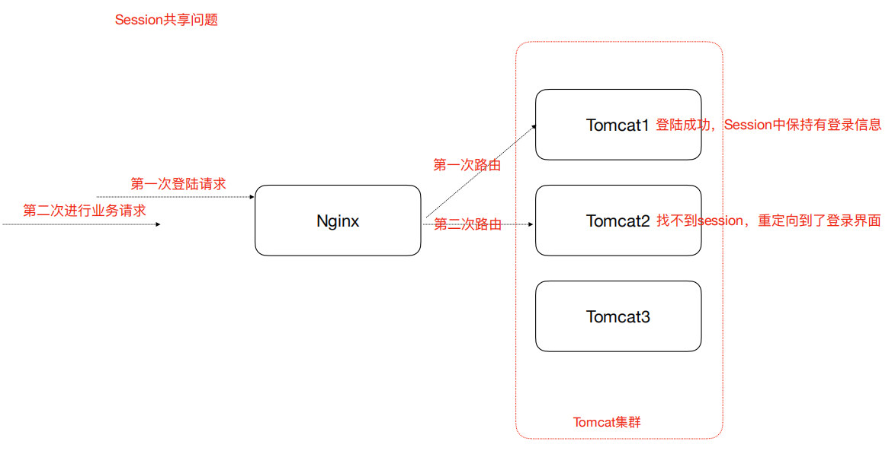

### 6.1、**Session**问题原因分析

出现这个问题的原因，从根本上来说是因为Http协议是⽆状态的协议。客户端和服务端在某次会话中产⽣的数据不会被保留下来，所以第⼆次请求服务端⽆法认识到你曾经来过， Http为什么要设计为⽆状态协议？早期都是静态⻚⾯⽆所谓有⽆状态，后来有动态的内容更丰富，就需要有状态，出现了两种⽤于保持Http状态的技术，那就是**Cookie和Session**。⽽出现上述不停让登录的问题，分析如下图：

场景：nginx默认轮询策略

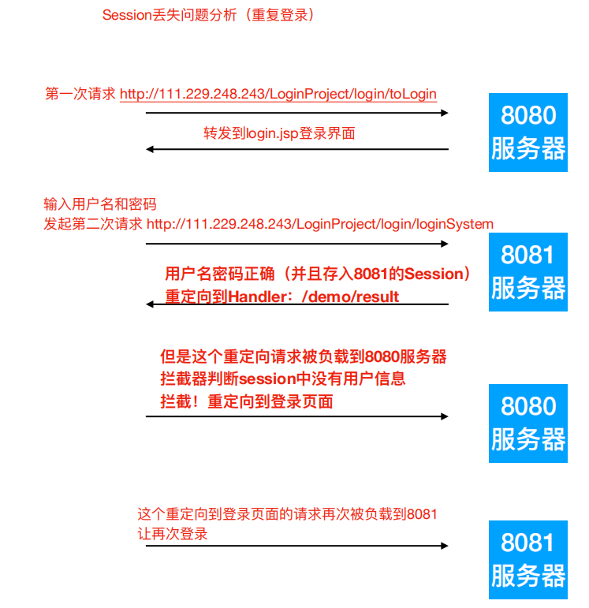

### 6.2、解决Session⼀致性的⽅案

#### 6.2.1、Nginx的 IP_Hash 策略（可以使⽤）

同⼀个客户端IP的请求都会被路由到同⼀个⽬标服务器，也叫做会话粘滞。

- 优点：

  配置简单，不⼊侵应⽤，不需要额外修改代码

- 缺点：

  服务器重启Session丢失

  存在单点负载⾼的⻛险

  单点故障问题

#### 6.2.2、Session复制（不推荐）

多个tomcat之间通过修改配置⽂件，达到Session之间的复制

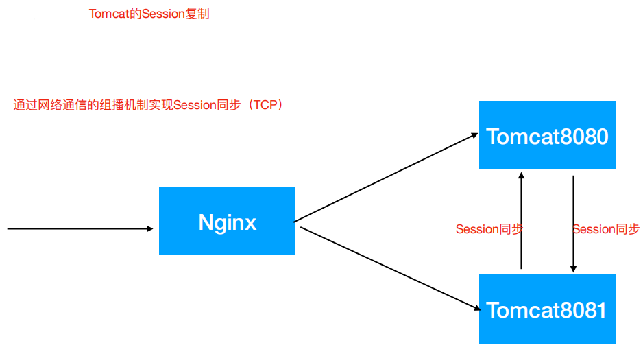

- 优点：

  不⼊侵应⽤

  便于服务器⽔平扩展

  能适应各种负载均衡策略

  服务器重启或者宕机不会造成Session丢失

- 缺点：

  性能低

  内存消耗

  不能存储太多数据，否则数据越多越影响性能

  延迟性

#### 6.2.3、Session共享，Session集中存储（推荐）

Session的本质就是缓存，那Session数据为什么不交给专业的缓存中间件呢？⽐如Redis

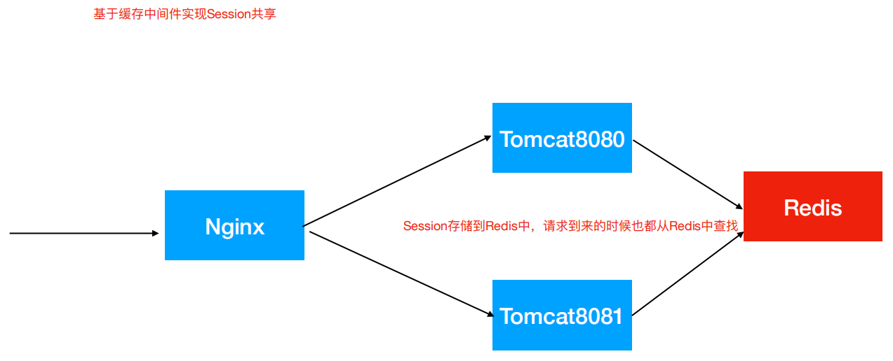

- 优点:

  能适应各种负载均衡策略

  服务器重启或者宕机不会造成Session丢失

  扩展能⼒强

  适合⼤集群数量使⽤

- 缺点：

  对应⽤有⼊侵，引⼊了和Redis的交互代码

**Spring Session使得基于Redis的Session共享应⽤起来⾮常之简单**

- 引入redis启动器

  ```xml
  <dependency>
   <groupId>org.springframework.boot</groupId>
   <artifactId>spring-boot-starter-data-redis</artifactId>
  </dependency> <dependency>
   <groupId>org.springframework.session</groupId>
   <artifactId>spring-session-data-redis</artifactId>
  </dependency>
  ```

- 配置redis  application.yaml

  ```yaml
  spring:
    # 开启支持JSP
    mvc:
      view:
        prefix: /WEB-INF/jsp/
        suffix: .jsp
    # 配置redis
    redis:
      host: localhost
      port: 6379
      password:
      connect-timeout: 5000
      database: 0
    # 关闭模板
    thymeleaf:
      cache: false
      enabled: false
  ```

- 添加注解

  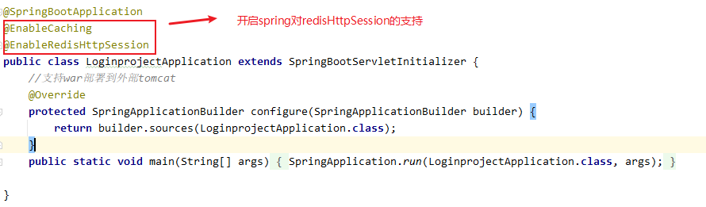
  
- **具体实现：https://gitee.com/Thmspring/LG_homeWork/tree/master/stage2/module2/code/loginproject**