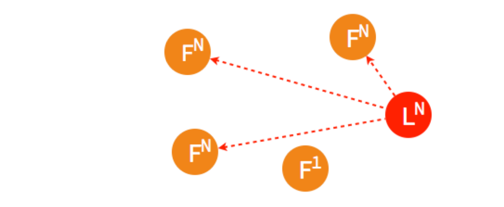
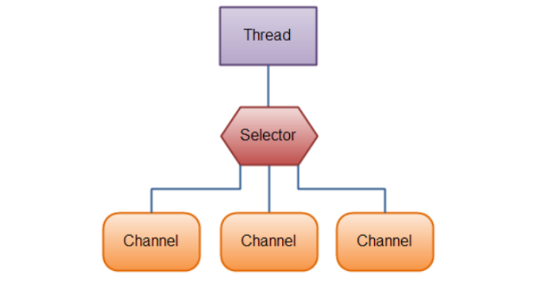
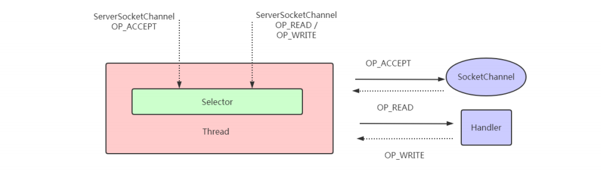

# 分布式

## 1、分布式理论

### 1.1、分布式架构系统回顾

#### 1.1.1、分布式系统概念

**分布式系统是一个硬件或软件组件分布在不同的网络计算机上，彼此之间仅仅通过消息传递进行通信和协调的系统。**

俗的理解，所谓分布式系统，就是一个业务拆分成多个子业务，分布在不同的服务器节点，共同构成的系统称为分布式系统，同一个分布式系统中的服务器节点在空间部署上是可以随意分布的，这些服务器可能放在不同的机柜中，也可能在不同的机房中，甚至分布在不同的城市。


**分布式与集群的区别：**

- 集群：多个人在一起作同样的事 。 

- 分布式 ：多个人在一起作不同的事 。


分布式系统的特点：

（1）分布性

（2）对等性

（3）并发性

（4）缺乏全局时钟

（5）故障总是会发生

#### 1.1.2、分布式系统的发展

阿里巴巴发起的"去 IOE"运动 (IOE 指的是 IBM 小型机、Oracle 数据库、EMC 的高端存储)。阿里巴巴2009 年“去 IOE”战略技术总监透露，截止到 2013 年 5 月 17 日阿里巴巴最后一台 IBM 小型机在支付宝下线。

为什么要去IOE 

- 1.升级单机处理能力的性价比越来越低

- 2.单机处理能力存在瓶颈

- 3.稳定性和可用性这两个指标很难达到

#### 1.1.3、分布式架构的演变


### 1.2、分布式系统面临的问题

- 通信异常

  网络本身的不可靠性，因此每次网络通信都会伴随着网络不可用的风险（光纤、路由、DNS等硬件设备或系统的不可用），都会导致最终分布式系统无法顺利进行一次网络通信，另外，即使分布式系统各节点之间的网络通信能够正常执行，其延时也会大于单机操作，存在巨大的延时差别，也会影响消息的收发过程，因此消息丢失和消息延迟变的非常普遍。

- 网络分区

  网络之间出现了网络不连通，但各个子网络的内部网络是正常的，从而导致整个系统的网络环境被切分成了若干个孤立的区域，分布式系统就会出现局部小集群，在极端情况下，这些小集群会独立完成原本需要整个分布式系统才能完成的功能，包括数据的事务处理，这就对分布式一致性提出非常大的挑战。

- 节点故障

  节点故障是分布式系统下另一个比较常见的问题，指的是组成分布式系统的服务器节点出现的宕机或"僵死"现象，根据经验来说，每个节点都有可能出现故障，并且经常发生. 

- 三态

  **分布式系统每一次请求与响应存在特有的“三态”概念，即成功、失败和超时。**

  分布式系统中，由于网络是不可靠的，虽然绝大部分情况下，网络通信能够接收到成功或失败的响应，但当网络出现异常的情况下，就会出现超时现象，通常有以下两种情况：

  - 由于网络原因，该请求并没有被成功的发送到接收方，而是在发送过程就发生了丢失现象。

  - 该请求成功的被接收方接收后，并进行了处理，但在响应反馈给发送方过程中，发生了消息丢失现象。

### 1.3、分布式理论：一致性

#### 1.3.1、什么是分布式一致性

分布式数据一致性，指的是数据在多份**副本（数据库集群）**中存储时，各副本中的数据是一致的。

#### 1.3.2、副本一致性

分布式系统当中，数据往往会有多个**副本**。如果是一台数据库处理所有的数据请求，那么通过ACID四原则，基本可以保证数据的一致性。而多个副本就需要保证数据会有多份拷贝。这就带来了同步的问题，因为我们几乎没有办法保证可以同时更新所有机器当中的包括备份所有数据。 网络延迟，即使我在同一时间给所有机器发送了更新数据的请求，也不能保证这些请求被响应的时间保持一致存在时间差，就会存在某些机器之间的数据不一致的情况。


总得来说，我们无法找到一种能够满足分布式系统所有系统属性的分布式一致性解决方案。因此，如何既保证数据的一致性，同时又不影响系统运行的性能，是每一个分布式系统都需要重点考虑和权衡的。于是，一致性级别由此诞生。

#### 1.3.3、 一致性分类

- **强一致性**

  这种一致性级别是最符合用户直觉的，它要求系统写入什么，读出来的也会是什么，用户体验好，但实现起来往往对系统的性能影响大。但是强一致性很难实现。

- **弱一致性**

  这种一致性级别约束了系统在写入成功后，不承诺立即可以读到写入的值，也不承诺多久之后数据能够达到一致，但会尽可能地保证到某个时间级别（比如秒级别）后，数据能够达到一致状态。

  - **读写一致性**

    ```
  用户读取自己写入结果的一致性，保证用户永远能够第一时间看到自己更新的内容。 
    比如我们发一条朋友圈，朋友圈的内容是不是第一时间被朋友看见不重要，但是一定要显示在自己的列表上。
    
    解决方案: 
    方案1：一种方案是对于一些特定的内容我们每次都去主库读取。（问题主库压力大） 
    方案2：我们设置一个更新时间窗口，在刚刚更新的一段时间内，我们默认都从主库读取，过了这个窗口之后，我们会挑选最近有过更新的从库进行读取 
    方案3：我们直接记录用户更新的时间戳，在请求的时候把这个时间戳带上，凡是最后更新时间小于这个时间戳的从库都不予以响应。
    ```
  
  - **单调读一致性**

    ```
  本次读到的数据不能比上次读到的旧。 
    由于主从节点更新数据的时间不一致，导致用户在不停地刷新的时候，有时候能刷出来，再次刷新之后会发现数据不见了，再刷新 又可能再刷出来，就好像遇见灵异事件一样。
    
    解决方案:
    就是根据用户ID计算一个hash值，再通过hash值映射到机器。同一个用户不管怎么刷新，都只会被映射到同一台机器 上。这样就保证了不会读到其他从库的内容，带来用户体验不好的影响。
    ```
  
    

  - **因果一致性**

    ```
  指的是：如果节点 A 在更新完某个数据后通知了节点 B，那么节点 B 之后对该数据的访问和修改都是基于 A 更新后的值。于此同时，和节点 A 无因果关系的节点 C 的数据访问则没有这样的限制。
    ```
  
  - **最终一致性**

    ```
  最终一致性是所有分布式一致性模型当中最弱的。可以认为是没有任何优化的“最”弱一致性，它的意思是说，我不考虑所有的中间状态的影响，只保证当没有新的更新之后，经过一段时间之后，最终系统内所有副本的数据是正确的。 
    它最大程度上保证了系统的并发能力，也因此，在高并发的场景下，它也是使用最广的一致性模型。
    ```
  
    

### 1.4、分布式理论：CAP定理

CAP 理论含义是，一个分布式系统不可能同时满足一致性（C:Consistency)，可用性（A: Availability）和分区容错性（P：Partition tolerance）这三个基本需求，最多只能同时满足其中的2个。

| **选项**      | 描述                                                         |
| ------------- | ------------------------------------------------------------ |
| C：一致性     | 分布式系统当中的一致性指的是所有节点的数据一致，或者说是所有副本的数据一致 |
| A：可用性     | Reads and writes always succeed. 也就是说系统一直可用，而且服务一直保持正常 |
| P：分区容错性 | 系统在遇到一些节点或者网络分区故障的时候，仍然能够提供满足一致性和可用性的服务 |

#### 1.4.1、C - Consistency

一致性是值写操作后读操作可以读到最新的数据状态,当数据分布在多个节点上时,从任意节点读取到的数据都是最新的。

- 商品信息读写要满足一致性需要实现如下目标: 

  1.商品服务写入主数据库成功, 则想从数据库查询数据也成功

  2.商品服务写入主数据库失败,则向从数据库查询也失败

- 如何实现一致性? 

  1.写入主数据库后要数据同步到从数据库

  2.写入主数据库后,在向从数据库同步期间要将从数据库锁定, 等待同步完成后在释放锁,以免在写新数据后,向从数据库查询到旧的数据

- 分布式一致性的特点: 

  1.由于存在数据库同步过程,写操作的响应会有一定的延迟

  2.为了保定数据的一致性,对资源暂时锁定,待数据同步完成后释放锁定资源

  3.如果请求数据同步失败的节点则会返回错误信息, 一定不会返回旧数据

#### 1.4.2、A - Availability

可用性是指任何操作都可以得到响应的结果,且不会出现响应超时或响应错误。

- 商品信息读写要满足可用性需要实现如下目标: 

  1.从数据库接收到数据库查询的请求则立即能够响应数据查询结果

  2.从数据库不允许出现响应超时或错误

- 如何实现可用性?

  1.写入主数据库后要将数据同步到从数据

  2.由于要保证数据库的可用性,不可以将数据库中资源锁定

  3.即使数据还没有同步过来,从数据库也要返回查询数据, 哪怕是旧数据,但不能返回错误和超时

#### 1.4.3、P - Partition tolerance

分布式系统的各个节点部署在不同的子网中, 不可避免的会出现由于网络问题导致节点之间通信失败,此时仍可以对外提供服务, 这个就是分区容错性 (分区容错性)

- 商品信息读写要满足分区容错性需要实现如下目标: 

  1.主数据库想从数据库同步数据失败不形象写操作

  2.其中一个节点挂掉不会影响另一个节点对外提供服务

- 如何实现分区容错性? 

  1.尽量使用异步取代同步操作,举例 使用异步方式将数据从主数据库同步到从数据库, 这样节点之间能有效的实现松耦合

  2.添加数据库节点,其中一个从节点挂掉,由其他从节点提供服务

#### 1.4.4、CAP只能 3 选 2


**为什么CAP不能同时满足？**


```
有用户向N1发送了请求更改了数据，将数据库从V0更新成了V1。由于网络断开，所以N2数据库依然是V0，如果这个时候有一个请 求发给了N2，但是N2并没有办法可以直接给出最新的结果V1，这个时候该怎么办呢？ 
这个时候无法两种方法：
	一、是将错就错，将错误的V0数据返回给用户。
	二、是阻塞等待，等待网络通信恢复，N2中的数据更新之后再返回给用户。
显然前者牺牲了一致性，后者牺牲了可用性。 

这个例子虽然简单，但是说明的内容却很重要。在分布式系统当中，CAP三个特性我们是无法同时满足的，必然要舍弃一个。三者 舍弃一个，显然排列组合一共有三种可能。
```

-  **舍弃A(可用性)，保留CP(一致性和分区容错性)**

  ```
  一个系统保证了一致性和分区容错性，舍弃可用性。也就是说在极端情况下，允许出现系统无法访问的情况出现，这个时候往往会 牺牲用户体验，让用户保持等待，一直到系统数据一致了之后，再恢复服务。
  ```

- **舍弃C(一致性)，保留AP(可用性和分区容错性)**

  ```
  这种是大部分的分布式系统的设计，保证高可用和分区容错，但是会牺牲一致性。
  ```

-  **舍弃P(分区容错性)，保留CA(一致性和可用性)**

  ```
  如果要舍弃P，那么就是要舍弃分布式系统，CAP也就无从谈起了。可以说P是分布式系统的前提，所以这种情况是不存在的。
  ```

### 1.5、分布式理论：BASE 理论

BASE：全称：Basically Available(基本可用)，Sox state（软状态）,和 Eventually consistent（最终一致性）三个短语的缩写，来自 ebay 的架构师提出。

BASE是对CAP中一致性和可用性权衡的结果，BASE理论的核心思想是：**即使无法做到强一致性，但每个应用都可以根据自身业务特点，采用适当的方式来使系统达到最终一致性**。 

- Basically Available(基本可用)

  基本可用是指分布式系统在出现不可预知故障的时候，允许损失部分可用性——但请注意，这绝不等价于系统不可用。

  以下就是两个"基本可用"的例子：

  - 响应时间上的损失：

    正常情况下，一个在线搜索引擎需要在0.5秒之内返回给用户相应的查询结果，但由于出现故障（比如系统部分机房发生断电或断网故障），查询结果的响应时间增加到了1~2秒。

  - 功能上的损失：

    正常情况下，在一个电子商务网站（比如淘宝）上购物，消费者几乎能够顺利地完成每一笔订单。但在一些节日大促购物高峰的时候（比如双十一、双十二），由于消费者的购物行为激增，为了保护系统的稳定性（或者保证一致性），部分消费者可能会被引导到一个降级页面。

- Sox state（软状态）

  什么是软状态呢？相对于一致性，要求多个节点的数据副本都是一致的，这是一种 “硬状态”。

  软状态指的是：允许系统中的数据存在中间状态，并认为该状态不影响系统的整体可用性，即允许系统在多个不同节点的数据副本之间进行数据同步的过程中存在延迟。即：数据同步前，数据同步中（软状态），数据同步后。

- Eventually consistent（最终一致性）

  最终一致性强调的是系统中所有的数据副本，在经过一段时间的同步后，最终能够达到一个一致的状态。因此最终一致性的本质是需要系统保证最终数据能够达到一致，而不需要实时保证系统数据的强一致性。


### 1.6、分布式理论：分布式事务

- 事务的基本特性：

  我们知道事务有4个非常重要的特性，即我们常说的（ACID）。

  Atomicity（原子性）:是说事务是一个不可分割的整体，所有操作要么全做，要么全不做。

  Consistency（一致性）：是说事务执行前后，数据从一个状态到另一个状态必须是一致的。

  Isolation（隔离性）：多个并发事务之间相互隔离，不能互相干扰。

  Durablity（持久性）：事务完成后，对数据库的更改是永久保存的。

- 什么是分布式事务

  其实分布式事务从实质上看与数据库事务的概念是一致的，既然是事务也就需要满足事务的基本特性（ACID），只是**分布式事务相对于本地事务而言其表现形式有很大的不同**


### 1.7、分布式理论：一致性协议 2PC

2PC （ Two-Phase Commit缩写）即两阶段提交协议，是将整个事务流程分为两个阶段，准备阶段（Prepare phase）、提交阶段（commit phase），2是指两个阶段，P是指准备阶段，C是指提交阶段。

在计算机中部分关系数据库如Oracle、MySQL支持两阶段提交协议，

两个阶段过程：

- 准备阶段（Prepare phase）：

  事务管理器给每个参与者发送Prepare消息，每个数据库参与者在本地执行事务，并写本地的Undo/Redo日志，此时事务没有提交。 （Undo日志是记录修改前的数据，用于数据库回滚，Redo日志是记录修改后的数据，用于提交事务后写入数据文件）

- 提交阶段（commit phase）：

  如果事务管理器收到了参与者的执行失败或者超时消息时，直接给每个参与者发送回滚(Rollback)消息；否则，发送提交(Commit)消息；参与者根据事务管理器的指令执行提交或者回滚操作，并释放事务处理过程中使用的锁资源。注意:必须在最后阶段释放锁资源。


#### 1.7.1、2PC执行流程

- **成功执行事务事务提交流程**

  

  ```
  阶段一: 
  1. 事务询问：协调者向所有的参与者发送事务内容，询问是否可以执行事务提交操作，并开始等待各参与者的响应。 
  2. 执行事务 (写本地的Undo/Redo日志) 
  3. 各参与者向协调者反馈事务询问的响应 
  总结: 各个参与者进行投票是否让事务进行.
  
  阶段二: 
  1. 发送提交请求： 协调者向所有参与者发出 commit 请求。 
  2. 事务提交： 参与者收到 commit 请求后，会正式执行事务提交操作，并在完成提交之后释放整个事务执行期间占用的事务资源。 
  3. 反馈事务提交结果： 参与者在完成事务提交之后，向协调者发送 Ack 信息。 
  4. 完成事务： 协调者接收到所有参与者反馈的 Ack 信息后，完成事务。
  ACK 确认字符，在数据通信中，接收站发给发送站的一种传输类控制字符。表示发来的数据已确认接收无误
  ```

- **中断事务步骤如下**

  假如任何一个参与者向协调者反馈了No响应，或者在等待超时之后，协调者尚无法接收到所有参与者的反馈响应，那么就会中断事务。

  

  ```
  阶段一：
  1. 事务询问：协调者向所有的参与者发送事务内容，询问是否可以执行事务提交操作，并开始等待各参与者的响应。 
  2. 执行事务 (写本地的Undo/Redo日志) 
  3. 各参与者向协调者反馈事务询问的响应 
  总结: 各个参与者进行投票是否让事务进行.
  
  阶段二：
  1. 发送回滚请求：协调者向所有参与者发出 Rollback 请求。 
  2. 事务回滚：参与者接收到 Rollback 请求后，会利用其在阶段一中记录的 Undo 信息来执行事务回滚操作，并在完成回滚之后释放在整个事务执行期间占用的资源。 
  3. 反馈事务回滚结果：参与者在完成事务回滚之后，向协调者发送 Ack 信息。 
  4. 中断事务：协调者接收到所有参与者反馈的 Ack 信息后，完成事务中断。 
  
  从上面的逻辑可以看出，二阶段提交就做了2个事情：投票，执行。
  ```

#### 1.7.2、2PC 优点缺点

- 优点

  原理简单，实现方便

- 缺点

  - 同步阻塞

    二阶段提交协议存在最明显也是最大的一个问题就是同步阻塞，在二阶段提交的执行过程中，所有参与该事务操作的逻辑都处于阻塞状态，也就是说，各个参与者在等待其他参与者响应的过程中，无法进行其他操作。这种同步阻塞极大的限制了分布式系统的性能。

  - 单点问题

    协调者在整个二阶段提交过程中很重要，如果协调者在提交阶段出现问题，那么整个流程将无法运转，更重要的是：其他参与者将会处于一直锁定事务资源的状态中，而无法继续完成事务操作。

  - 数据不一致

    假设当协调者向所有的参与者发送 commit 请求之后，发生了局部网络异常或者是协调者在尚未发送完所有 commit请求之前自身发生了崩溃，导致最终只有部分参与者收到了 commit 请求。这将导致严重的数据不一致问题。

  - 过于保守

    如果在二阶段提交的提交询问阶段中，参与者出现故障而导致协调者始终无法获取到所有参与者的响应信息的话，这时协调者只能依靠其自身的超时机制来判断是否需要中断事务，显然，这种策略过于保守。换句话说，二阶段提交协议没有设计较为完善的容错机制，任意一个节点失败都会导致整个事务的失败。


### 1.8、分布式理论：一致性协议 3PC

3PC，全称 “three phase commit”，是 2PC 的改进版，将 2PC 的 “提交事务请求” 过程一分为二，共形成了由CanCommit、PreCommit和doCommit三个阶段组成的事务处理协议。


#### 1.8.1、阶段一：CanCommit

第一个阶段： CanCommit 

- 事务询问

  协调者向所有的参与者发送一个包含事务内容的canCommit请求，询问是否可以执行事务提交操作，并开始等待各参与者的响应。

- 各参与者向协调者反馈事务询问的响应

  参与者在接收到来自协调者的包含了事务内容的canCommit请求后，正常情况下，如果自身认为可以顺利执行事务，则反馈Yes响应，并进入预备状态，否则

  反馈No响应。

#### 1.8.2、阶段二：PreCommit

协调者在得到所有参与者的响应之后，会根据结果有2种执行操作的情况：执行事务预提交，或者中断事务

- 执行事务预提交

  ① 发送预提交请求：协调者向所有参与者节点发出preCommit请求，并进入prepared阶段。

  ② 事务预提交：参与者接收到preCommit请求后，会执行事务操作，并将Undo和Redo信息记录到事务日志中。

  ③ 各参与者向协调者反馈事务执行的结果：若参与者成功执行了事务操作，那么反馈Ack若任一参与者反馈了No响应，或者在等待超时后，协调者尚无法接收

  到所有参与者反馈，则中断事务

- 中断事务：

  ① 发送中断请求：协调者向所有参与者发出abort请求。

  ② 中断事务：无论是收到来自协调者的abort请求或者等待协调者请求过程中超时，参与者都会中断事务

#### 1.8.3、阶段三：do Commit

该阶段做真正的事务提交或者完成事务回滚，所以就会出现两种情况：：

- 执行事务提交

  ① 发送提交请求：进入这一阶段，假设协调者处于正常工作状态，并且它接收到了来自所有参与者的Ack响应，那么他将从预提交状态转化为提交状态，并向所有的参与者发送doCommit请求。

  ② 事务提交：参与者接收到doCommit请求后，会正式执行事务提交操作，并在完成提交之后释放整个事务执行过程中占用的事务资源。

  ③ 反馈事务提交结果：参与者在完成事务提交后，向协调者发送Ack响应。

  ④ 完成事务：协调者接收到所有参与者反馈的Ack消息后，完成事务。

- 中断事务

  ① 发送中断请求：协调者向所有的参与者节点发送abort请求。

  ② 事务回滚：参与者收到abort请求后，会根据记录的Undo信息来执行事务回滚，并在完成回滚之后释放整个事务执行期间占用的资源。

  ③ 反馈事务回滚结果：参与者在完成事务回滚后，向协调者发送Ack消息。

  ④ 中断事务：协调者接收到所有参与者反馈的Ack消息后，中断事务。

- **注意：一旦进入阶段三，可能会出现 2 种故障：**

  - 协调者出现问题

  - 协调者和参与者之间的网络故障

  如果出现了任意一种情况，最终都会导致参与者无法收到 doCommit 请求或者 abort 请求，针对这种情况，参与者都会在等待超时之后，继续进行事务提交

#### 1.8.4、2PC对比3PC

1.首先对于协调者和参与者都设置了超时机制（在2PC中，只有协调者拥有超时机制，即如果在一定时间内没有收到参与者的消息则默认失败）,主要是避免了参与者在长时间无法与协调者节点通讯（协调者挂掉了）的情况下，无法释放资源的问题，因为参与者自身拥有超时机制会在超时后，自动进行本地commit从而进行释放资源。而这种机制也侧面降低了整个事务的阻塞时间和范围。 

2.通过CanCommit**、**PreCommit**、**DoCommit三个阶段的设计，相较于2PC而言，多设置了一个**缓冲阶段**保证了在最后提交阶段之前各参与节点的状态的一致。

3.PreCommit是一个缓冲，保证了在最后提交阶段之前各参与节点的状态是一致的。

问题：3PC协议并没有完全解决数据不一致问题。

### 1.9、分布式理论：一致性算法 Paxos

Paxos算法是Lamport提出的一种基于消息传递的分布式一致性算法，使其获得2013年图灵奖。

Paxos问世以来就持续垄断了分布式一致性算法，Paxos这个名词几乎等同于分布式一致性。Google的很多大型分布式系统都采用了Paxos算法来解决分布式一致性问题，如Chubby、Megastore以及Spanner等。开源的ZooKeeper，以及MySQL 5.7推出的用来取代传统的主从复制的MySQL Group Replication等纷纷采用Paxos算法解决分布式一致性问题。

然而，Paxos的最大特点就是难，不仅难以理解，更难以实现。

#### 1.9.1、Paxos 解决了什么问题

解决了分布式系统一致性问题。

```
分布式系统采用多副本进行存储数据,如果对多个副本执行序列不控制,那多个副本执行更新操作,由于网络延迟超时等故障到值各个副本的数据不一致.

我们希望每个副本的执行序列是 [ op1 op2 op3 .... opn ] 不变的, 相同的. 

Paxos算法是一次来确定不可变变量opi的取值, 每次确定完Opi之后,各个副本执行opi操作,以此类推。 

结论：Paxos算法需要解决的问题就是如何在一个可能发生上述异常的分布式系统中，快速且正确地在集群内部对某个数据的值达成一致。

注：这里某个数据的值并不只是狭义上的某个数，它可以是一条日志，也可以是一条命令（command）。根据应用场景不同，某个数据的值有不同的含义。
```


我们假设一种情况，在一个集群环境中，要求所有机器上的状态是一致的，其中有2台机器想修改某个状态，机器A 想把状态改为 A，机器 B 想把状态改为 B，那么到底听谁的呢（状态改成A还是改成B）？

可以像 2PC，3PC 一样引入一个协调者，谁先到，听谁的。


但是如果，协调者宕机了呢？

所以需要对协调者也做备份，也要做集群。这时候，问题来了，这么多协调者，听谁的呢？


Paxos 算法就是为了解决这个问题而生的。

#### 1.9.2、Paxos相关概念

首先一个很重要的概念叫提案（Proposal）。最终要达成一致的value就在提案里。

提案 (Proposal)：Proposal信息包括提案编号 (Proposal ID) 和提议的值 (Value) 

在Paxos算法中，有如下角色：

- Client：客户端

  客户端向分布式系统发出请求 ，并等待响应 。例如，对分布式文件服务器中文件的写请求。

- Proposer：提案发起者

  提案者提倡客户请求，试图说服Acceptor对此达成一致，并在发生冲突时充当协调者以推动协议向前发展 

- Acceptor：决策者，可以批准提案

  Acceptor可以接收（accept）提案；如果某个提案被选定（chosen），那么该提案里的value就被选定了

- Learners：最终决策的学习者

  学习者充当该协议的复制因素


#### 1.9.3、问题描述

假设有一组可以提出提案的进程集合，那么对于一个一致性算法需要保证以下几点：

- 在这些被提出的提案中，只有一个会被选定

- 如果没有提案被提出，就不应该有被选定的提案

- 当一个提案被选定后，那么所有进程都应该能学习（learn）到这个被选定的value 

#### 1.9.4、推导过程

##### 1.9.4.1、最简单的方案——只有一个Acceptor

假设只有一个Acceptor（可以有多个Proposer），只要Acceptor接受它收到的第一个提案，则该提案被选定，该提案里的value就是被选定的value。这样就保证只有一个value会被选定。

但是，如果这个唯一的Acceptor宕机了，那么整个系统就无法工作了！

因此，必须要有多个Acceptor！


##### 1.9.4.1、多个Acceptor

多个Acceptor的情况如下图。那么，如何保证在多个Proposer和多个Acceptor的情况下选定一个value呢？


解决方案推导：

首先我们希望即使只有一个Proposer提出了一个value，该value也最终被选定。

那么，就得到下面的约束：

```
P1：一个Acceptor必须接受它收到的第一个提案。
```

但是，这又会引出另一个问题：如果每个Proposer分别提出不同的value，发给不同的Acceptor。根据P1，Acceptor分别接受自己收到的第一个提案，就导致不同的value被选定。出现了不一致。如下图：


刚刚是因为『一个提案只要被一个Acceptor接受，则该提案的value就被选定了』才导致了出现上面不一致的问题。因此，我们需要加一个规定：

```
规定：一个提案被选定需要被半数以上的Acceptor接受
```

这个规定又暗示了：『一个Acceptor必须能够接受不止一个提案！』不然可能导致最终没有value被选定。比如上图的情况。v1、v2、v3都没有被选定，因为它们都只被一个Acceptor的接受。

所以在这种情况下，我们使用一个全局的编号来标识每一个Acceptor批准的提案，当一个具有某value值的提案被半数以上的Acceptor批准后，我们就认为该value被选定了。

根据上面的内容，我们现在虽然允许多个提案被选定，但必须保证所有被选定的提案都具有相同的value值。否则又会出现不一致。于是有了下面的约束：

```
P2：如果某个value为v的提案被选定了，那么每个编号更高的被选定提案的value必须也是v。
```

一个提案只有被Acceptor接受才可能被选定，因此我们可以把P2约束改写成对Acceptor接受的提案的约束P2a。 

```
P2a：如果某个value为v的提案被选定了，那么每个编号更高的被Acceptor接受的提案的value必须也是v。
```

只要满足了P2a，就能满足P2。


但是，考虑如下的情况：假设总的有5个Acceptor。Proposer2提出[M1,V1]的提案，Acceptor2~5（半数以上）均接受了该提案，于是对于Acceptor2~5和Proposer2来讲，它们都认为V1被选定。Acceptor1刚刚从宕机状态恢复过来（之前Acceptor1没有收到过任何提案），此时Proposer1向Acceptor1发送了[M2,V2]的提案（V2≠V1且M2>M1），对于Acceptor1来讲，这是它收到的第一个提案。根据P1（一个Acceptor必须接受它收到的第一个提案。）,Acceptor1必须

接受该提案！同时Acceptor1认为V2被选定。这就出现了两个问题：

- Acceptor1认为V2被选定，Acceptor2~5和Proposer2认为V1被选定。出现了不一致。

- V1被选定了，但是编号更高的被Acceptor1接受的提案[M2,V2]的value为V2，且V2≠V1。这就跟P2a（如果某个value为v的提案被选定了，那么每个编号更高的被Acceptor接受的提案的value必须也是v）矛盾了。


所以我们要对P2a约束进行强化！

P2a是对Acceptor接受的提案约束，但其实提案是Proposer提出来的，所有我们可以对Proposer提出的提案进行约束。得到P2b： 

```
P2b：如果某个value为v的提案被选定了，那么之后任何Proposer提出的编号更高的提案的value必须也是v。
```

由P2b可以推出P2a进而推出P2。

那么，如何确保在某个value为v的提案被选定后，Proposer提出的编号更高的提案的value都是v呢？

只要满足P2c即可：

```
P2c：对于任意的Mn和Vn,如果提案[Mn,Vn]被提出，那么肯定存在一个由半数以上的Acceptor组成的集合S，满足以下两个条件 中的任意一个： 
	* 要么S中每个Acceptor都没有接受过编号小于Mn的提案。 
	* 要么S中所有Acceptor批准的所有编号小于Mn的提案中，编号最大的那个提案的value值为Vn
```

从上面的内容，可以看出，从P1到P2c的过程其实是对一系列条件的逐步增强，如果需要证明这些条件可以保证一致性，那么就可以进行反向推导：P2c =>P2b=>P2a=>P2,然后通过P2和P1来保证一致性

总结：

```
P1：一个Acceptor必须接受它收到的第一个提案。
   规定：一个提案被选定需要被半数以上的Acceptor接受
P2：如果某个value为v的提案被选定了，那么每个编号更高的被选定提案的value必须也是v。
P2a：如果某个value为v的提案被选定了，那么每个编号更高的被Acceptor接受的提案的value必须也是v。
P2b：如果某个value为v的提案被选定了，那么之后任何Proposer提出的编号更高的提案的value必须也是v。
P2c：对于任意的Mn和Vn,如果提案[Mn,Vn]被提出，那么肯定存在一个由半数以上的Acceptor组成的集合S，满足以下两个条件中的任意一个： 
	* 要么S中每个Acceptor都没有接受过编号小于Mn的提案。 
	* 要么S中所有Acceptor批准的所有编号小于Mn的提案中，编号最大的那个提案的value值为Vn
```

##### 1.9.4.2、Proposer生成提案

在P2c的基础上如何进行提案的生成。

这里有个比较重要的思想：Proposer生成提案之前，应该先去『学习』已经被选定或者可能被选定的value，然后以该value作为自己提出的提案的value。如果没有value被选定，Proposer才可以自己决定value的值。这样才能达成一致。这个学习的阶段是通过一个『Prepare请求』实现的。

于是我们得到了如下的提案生成算法：

- Proposer选择一个新的提案编号N，然后向某个Acceptor集合（半数以上）发送请求，要求该集合中的每个Acceptor做出如下响应（response） 

  (a) Acceptor向Proposer承诺保证不再接受任何编号小于N的提案。

  (b) 如果Acceptor已经接受过提案，那么就向Proposer反馈已经接受过的编号小于N的，但为最大编号的提案的值。

  我们将该请求称为编号为N的Prepare请求。

- 如果Proposer收到了半数以上的Acceptor的响应，那么它就可以生成编号为N，Value为V的提案[N,V]。这里的V是所有的响应中编号最大的提案的Value。如果所有的响应中都没有提案，那么此时V就可以由Proposer自己选择。生成提案后，Proposer将该提案发送给半数以上的Acceptor集合，并期望这些Acceptor能接受该提案。我们称该请求为Accept请求。


##### 1.9.4.4、Acceptor接受提案

Acceptor是如何批准提案的

根据刚刚的介绍，一个Acceptor可能会受到来自Proposer的两种请求，分别是Prepare请求和Accept请求，对这两类请求作出响应的条件分别如下

- Prepare请求：Acceptor可以在任何时候响应一个Prepare请求

- Accept请求：在不违背Accept现有承诺的前提下，可以任意响应Accept请求

因此，对Acceptor接受提案给出如下约束：

```
P1a：一个Acceptor只要尚未响应过任何编号大于N的Prepare请求，那么他就可以接受这个编号为N的提案。
```

##### 1.9.4.5、算法优化

上面的内容中，分别从Proposer和Acceptor对提案的生成和批准两方面来讲解了Paxos算法在提案选定过程中的算法细节，同时也在提案的编号全局唯一的前提下，获得了一个提案选定算法，接下来我们再对这个初步算法做一个小优化，尽可能的忽略Prepare请求


```
如果Acceptor收到一个编号为N的Prepare请求，在此之前它已经响应过编号大于N的Prepare请求。根据P1a，该Acceptor不可能接受编号为N的提案。因此，该Acceptor可以忽略编号为N的Prepare请求。
```

通过这个优化，每个Acceptor只需要记住它已经批准的提案的最大编号以及它已经做出Prepare请求响应的提案的最大编号，以便出现故障或节点重启的情况下，也能保证P2c的不变性，而对于Proposer来说，只要它可以保证不会产生具有相同编号的提案，那么就可以丢弃任意的提案以及它所有的运行时状态信息

#### 1.9.5、Paxos算法描述

综合前面的讲解，我们来对Paxos算法的提案选定过程进行下总结，那结合Proposer和Acceptor对提案的处理逻辑，就可以得到类似于两阶段提交的算法执行过程Paxos算法分为两个阶段。具体如下：


- 阶段一：

  (a) Proposer选择一个提案编号N，然后向半数以上的Acceptor发送编号为N的Prepare请求。

  (b) 如果一个Acceptor收到一个编号为N的Prepare请求，且N大于该Acceptor已经响应过的所有Prepare请求的编号，那么它就会将它已经接受过的编号最大的提案（如果有的话）作为响应反馈给Proposer，同时该Acceptor承诺不再接受任何编号小于N的提案。

- 阶段二：

  (a) 如果Proposer收到半数以上Acceptor对其发出的编号为N的Prepare请求的响应，那么它就会发送一个针对[N,V]提案的Accept请求给半数以上的Acceptor。注意：V就是收到的响应中编号最大的提案的value，如果响应中不包含任何提案，那么V就由Proposer自己决定。

  (b) 如果Acceptor收到一个针对编号为N的提案的Accept请求，只要该Acceptor没有对编号大于N的Prepare请求做出过响应，它就接受该提案。

当然，实际运行过程中，每一个Proposer都有可能产生多个提案，但只要每个Proposer都遵循如上所述的算法运行，就一定能够保证算法执行的正确性。

#### 1.9.6、Learner学习被选定的value


- 方案一：

   Learner获取一个已经被选定的提案的前提是，该提案已经被半数以上的Acceptor批准，因此，最简单的做法就是一旦Acceptor批准了一个提案，就将该提案发送给所有的Learner很显然，这种做法虽然可以让Learner尽快地获取被选定的提案，但是却需要让每个Acceptor与所有的Learner逐个进行一次通信，通信的次数至少为二者个数的乘积。

- 方案二：

  另一种可行的方案是，我们可以让所有的Acceptor将它们对提案的批准情况，统一发送给一个特定的Learner（称为主Learner）, 各个Learner之间可以通过消息通信来互相感知提案的选定情况，基于这样的前提，当主Learner被通知一个提案已经被选定时，它会负责通知其他的learner。

  在这种方案中，Acceptor首先会将得到批准的提案发送给主Learner,再由其同步给其他Learner.因此较方案一而言，方案二虽然需要多一个步骤才能将提案通知到所有的learner，但其通信次数却大大减少了，通常只是Acceptor和 Learner的个数总和，但同时，该方案引入了一个新的不稳定因素：主Learner随时可能出现故障

- 方案三：

  在讲解方案二的时候，我们提到，方案二最大的问题在于主Learner存在单点问题，即主Learner随时可能出现故障，因此，对方案二进行改进，可以将主Learner的范围扩大，即Acceptor可以将批准的提案发送给一个特定的Learner集合，该集合中每个Learner都可以在一个提案被选定后通知其他的Learner。这个Learner集合中的Learner个数越多，可靠性就越好，但同时网络通信的复杂度也就越高


#### 1.9.7、如何保证Paxos算法的活性

根据前面的内容讲解，我们已经基本上了解了Paxos算法的核心逻辑，那接下来再来看看Paxos算法在实际过程中的一些细节

活性：最终一定会发生的事情：最终一定要选定value

假设存在这样一种极端情况，有两个Proposer依次提出了一系列编号递增的提案，导致最终陷入死循环，没有value被选定,具体流程如下:


解决：通过选取主Proposer，并规定只有主Proposer才能提出议案。这样一来只要主Proposer和过半的Acceptor能够正常进行网络通信，那么但凡主Proposer提出一个编号更高的提案，该提案终将会被批准，这样通过选择一个主Proposer，整套Paxos算法就能够保持活性。

### 1.10、分布式理论：一致性算法Raft

#### 1.10.1、什么是Raft算法

首先说什么是 Raft算法：Raft是一种为了管理复制日志的一致性算法。

Raft提供了和Paxos算法相同的功能和性能，但是它的算法结构和Paxos不同。Raft算法更加容易理解并且更容易构建实际的系统。

Raft将一致性算法分解成了3模块

1. 领导人选举
2. 日志复制
3. 安全性

Raft算法分为两个阶段，首先是选举过程，然后在选举出来的领导人带领进行正常操作，比如日志复制等。

#### 1.10.2、领导人Leader选举

Raft通过选举一个领导人，然后给予他全部的管理复制日志的责任来实现一致性。

在Raft中，任何时候一个服务器都可以扮演下面的角色之一：

- 领导者(leader)：处理客户端交互，日志复制等动作，一般一次只有一个领导者

- 候选者(candidate)：候选者就是在选举过程中提名自己的实体，一旦选举成功，则成为领导者

- 跟随者(follower)：类似选民，完全被动的角色，这样的服务器等待被通知投票

而影响他们身份变化的则是选举。


Raft使用心跳机制来触发选举。当server启动时，初始状态都是follower。每一个server都有一个定时器，超时时间为election timeout（一般为150-300ms），如果某server没有超时的情况下收到来自领导者或者候选者的任何消息，定时器重启，如果超时，它就开始一次选举。

http://thesecretlivesofdata.com/raft/动画演示

下面用图示展示这个过程：

- 初始状态下集群中的所有节点都处于 follower 状态。

  

-  某一时刻，其中的一个 follower由于没有收到 leader的heartbeat 率先发生 election timeout 进而发起选举。

  

- 只要集群中超过半数的节点接受投票，candidate 节点将成为即切换 leader 状态。

  

- 成为 leader 节点之后，leader 将定时向 follower 节点同步日志并发送 heartbeat。

  

#### 1.10.3、节点异常

集群中各个节点的状态随时都有可能发生变化。从实际的变化上来分类的话，节点的异常大致可以分为四种类型：

- leader 不可用；

- follower 不可用；

- 多个 candidate 或多个 leader；

- 新节点加入集群。

##### 1.10.3.1、leader 不可用

-  一般情况下，leader 节点定时发送 heartbeat 到 follower 节点。

  

-  由于某些异常导致 leader 不再发送 heartbeat ，或 follower 无法收到 heartbeat 。

  

- 当某一 follower 发生 election timeout 时，其状态变更为 candidate，并向其他 follower 发起投票。

  

- 当超过半数的 follower 接受投票后，这一节点将成为新的 leader，leader 的步进数加 1 并开始向 follower 同步日志。

  

- 当一段时间之后，如果之前的 leader 再次加入集群，则两个 leader 比较彼此的步进数，步进数低的 leader 将切换自己的状态为 follower。

  

- 较早前 leader 中不一致的日志将被清除，并与现有 leader 中的日志保持一致。

  

##### 1.10.3.2、follower 节点不可用

follower 节点不可用的情况相对容易解决。因为集群中的日志内容始终是从 leader 节点同步的，只要这一节点再次加入集群时重新从 leader 节点处复制日志即可。 

- 集群中的某个 follower 节点发生异常，不再同步日志以及接收 heartbeat。

  

- 经过一段时间之后，原来的 follower 节点重新加入集群。

  

- 这一节点的日志将从当时的 leader 处同步。

  

##### 1.10.3.3、多个 candidate 或多个 leader

在集群中出现多个 candidate 或多个 leader 通常是由于数据传输不畅造成的。出现多个 leader 的情况相对少见，但多个 candidate 比较容易出现在集群节点启动初期尚未选出 leader 的“混沌”时期。

- 初始状态下集群中的所有节点都处于 follower 状态。

  

-  两个节点同时成为 candidate 发起选举。同时发生超时。

  

- 两个 candidate 都只得到了少部分 follower 的接受投票。

  

- candidate 继续向其他的 follower 询问。

  

- 由于一些 follower 已经投过票了，所以均返回拒绝接受。

  

- candidate 也可能向一个 candidate 询问投票。 

  

- 在步进数相同的情况下，candidate 将拒绝接受另一个 candidate 的请求。

  

- 由于第一次未选出 leader，candidate 将随机选择一个等待间隔（150ms ~ 300ms）再次发起投票。

  

- 如果得到集群中半数以上的 follower 的接受，这一 candidate 将成为 leader。 

  

- 稍后另一个 candidate 也将再次发起投票。

  

- 由于集群中已经选出 leader，candidate 将收到拒绝接受的投票。

  

-  在被多数节点拒绝之后，并已知集群中已存在 leader 后，这一 candidate 节点将终止投票请求、切换为follower，从 leader 节点同步日志。

  

#### 1.10.4、日志复制（保证数据一致性）

日志复制的过程

Leader选出后，就开始接收客户端的请求。Leader把请求作为日志条目（Log entries）加入到它的日志中，然后并行的向其他服务器发起 AppendEntries RPC复制日志条目。当这条日志被复制到大多数服务器上，Leader将这条日志应用到它的状态机并向客户端返回执行结果。

下图表示了当一个客户端发送一个请求给领导者，随后领导者复制给跟随者的整个过程。


4 个步骤：

- 客户端的每一个请求都包含被复制状态机执行的指令

- leader把这个指令作为一条新的日志条目添加到日志中，然后并行发起 RPC 给其他的服务器，让他们复制这条信息。

- 跟随者响应ACK,如果 follower 宕机或者运行缓慢或者丢包，leader会不断的重试，直到所有的 follower 最终都复制了所有的日志条目。

- 通知所有的Follower提交日志，同时领导人提交这条日志到自己的状态机中，并返回给客户端。

可以看到，直到第四步骤，整个事务才会达成。中间任何一个步骤发生故障，都不会影响日志一致性。

## 2、分布式系统设计策略

分布式系统本质是通过低廉的硬件攒在一起以获得更好的吞吐量、性能以及可用性等。

在分布式环境下，有几个问题是普遍关心的，我们称之为设计策略：

- 如何检测当前节点还活着？

- 如何保障高可用？

- 容错处理

- 负载均衡

### 2.1、心跳检测

在分布式环境中，我们提及过存在非常多的节点（Node），其实质是这些节点分担任务的运行、计算或者程序逻辑处理。那么就有一个非常重要的问题，如何检测一个节点出现了故障乃至无法工作了？

通常解决这一问题是采用心跳检测的手段，如同通过仪器对病人进行一些检测诊断一样。

心跳顾名思义，就是以固定的频率向其他节点汇报当前节点状态的方式。收到心跳，一般可以认为一个节点和现在的网络拓扑是良好的。当然，心跳汇报时，一般也会携带一些附加的状态、元数据信息，以便管理。

如图所示，Client请求Server，Server转发请求到具体的Node获取请求结果。Server需要与三个Node节点保持心跳连接，确保Node可以正常工作。


若Server没有收到Node3的心跳时，Server认为Node3失联。但是失联是失去联系，并不确定是否是Node3故障，有可能是Node3处于繁忙状态，导致调用检测超时；也有可能是Server与Node3之间链路出现故障或闪断。所以心跳不是万能的，收到心跳可以确认节点正常，但是收不到心跳也不能认为该节点就已经宣告“死亡”。此时，可以通过一些方法帮助Server做决定： 周期检测心跳机制、累计失效检测机制。

- 周期检测心跳机制

  Server端每间隔 t 秒向Node集群发起监测请求，设定超时时间，如果超过超时时间，则判断“死亡”。

- 累计失效检测机制

  在周期检测心跳机制的基础上，统计一定周期内节点的返回情况（包括超时及正确返回），以此计算节点的“死 亡”概率。另外，对于宣告“濒临死亡”的节点可以发起有限次数的重试，以作进一步判断。


通过周期检测心跳机制、累计失效检测机制可以帮助判断节点是否“死亡”，如果判断“死亡”，可以把该节点踢出集群.

### 2.2、高可用设计

高可用(High Availability)是系统架构设计中必须考虑的因素之一,通常是指,经过设计来减少系统不能提供服务的时间。


系统高可用性的常用设计模式包括三种：主备（Master-SLave）、互备（Active-Active）和集群（Cluster）模式。

- 主备模式 

  主备模式就是Active-Standby模式，当主机宕机时，备机接管主机的一切工作，待主机恢复正常后，按使用者的设定以自动（热备）或手动（冷备）方式将服务切换到主机上运行。在数据库部分，习惯称之为MS模式。MS模式即Master/Slave模式，这在数据库高可用性方案中比较常用，如MySQL、Redis等就采用MS模式实现主从复制。保证高可用，如图所示。

  

  MySQL之间数据复制的基础是二进制日志文件（binary log file）。一台MySQL数据库一旦启用二进制日志后，作为master，它的数据库中所有操作都会以“事件”的方式记录在二进制日志中，其他数据库作为slave通过一个I/O线程与主服务器保持通信，并监控master的二进制日志文件的变化，如果发现master二进制日志文件发生变化，则会把变化复制到自己的中继日志中，然后slave的一个SQL线程会把相关的“事件”执行到自己的数据库中，以此实现从数据库和主数据库的一致性，也就实现了主从复制。

- 互备模式

  互备模式指两台主机同时运行各自的服务工作且相互监测情况。在数据库高可用部分，常见的互备是MM模式。MM模式即Multi-Master模式，指一个系统存在多个master，每个master都具有read-write能力，会根据时间戳或业务逻辑合并版本。

  我们使用过的、构建过的MySQL服务绝大多数都是Single-Master，整个拓扑中只有一个Master承担写请求。比如，基于Master-Slave架构的主从复制，但是也存在由于种种原因，我们可能需要MySQL服务具有Multi-Master的特性，希望整个拓扑中可以有不止一个Master承担写请求。

  

- 集群模式

  集群模式是指有多个节点在运行，同时可以通过主控节点分担服务请求。如Zookeeper。集群模式需要解决主控节点本身的高可用问题，一般采用主备模式。

### 2.3、容错性

容错顾名思义就是IT系统对于错误包容的能力

容错的处理是保障分布式环境下相应系统的高可用或者健壮性，一个典型的案例就是对于缓存穿透 问题的解决方案。

我们来具体看一下这个例子，如图所示


问题描述：

我们在项目中使用缓存通常都是先检查缓存中是否存在，如果存在直接返回缓存内容，如果不存在就直接查询数据库然后再缓存查询结果返回。这个时候如果我们查询的某一个数据在缓存中一直不存在，就会造成每一次请求都查询DB，这样缓存就失去了意义，在流量大时，或者有人恶意攻击如频繁发起为id为“-1”的条件进行查询，可能DB就挂掉了。

那这种问题有什么好办法解决呢？

一个比较巧妙的方法是，可以将这个不存在的key预先设定一个值。比如，key=“null”。在返回这个null值的时候，我们的应用就可以认为这是不存在的key，那我们的应用就可以决定是否继续等待访问，还是放弃掉这次操作。如果继续等待访问，过一个时间轮询点后，再次请求这个key，如果取到的值不再是null，则可以认为这时候key有值了，从而避免了透传到数据库，把大量的类似请求挡在了缓存之中。

### 2.4、负载均衡

负载均衡：关键在于使用多台集群服务器共同分担计算任务，把网络请求及计算分配到集群可用的不同服务器节点上，从而达到高可用性及较好的用户操作体验。

如图，不同的用户User1、User2、User3访问应用，通过负载均衡器分配到不同的节点。


负载均衡器有硬件解决方案，也有软件解决方案。硬件解决方案有著名的F5，软件有LVS、HAProxy、Nginx等。

以Nginx为例，负载均衡有以下几种策略

- 轮询：即Round Robin，根据Nginx配置文件中的顺序，依次把客户端的Web请求分发到不同的后端服务器。

- 最少连接：当前谁连接最少，分发给谁。
- IP地址哈希：确定相同IP请求可以转发给同一个后端节点处理，以方便session保持。

- 基于权重的负载均衡：配置Nginx把请求更多地分发到高配置的后端服务器上，把相对较少的请求分发到低配服务器。

## 3、分布式架构网络通信

在分布式服务框架中，一个最基础的问题就是远程服务是怎么通讯的，在Java领域中有很多可实现远程通讯的技术，例如：RMI、Hessian、SOAP、ESB和JMS等，它们背后到底是基于什么原理实现的呢？

### 3.1、基本原理

要实现网络机器间的通讯，首先得来看看计算机系统网络通信的基本原理，在底层层面去看，网络通信需要做的就是将流从一台计算机传输到另外一台计算机，基于传输协议和网络IO来实现，其中传输协议比较出名的有tcp、udp等等，tcp、udp都是在基于Socket概念上为某类应用场景而扩展出的传输协议，网络IO，主要有bio、nio、aio三种方式，所有的分布式应用通讯都基于这个原理而实现，只是为了应用的易用，各种语言通常都会提供一些更为贴近应用易用的应用层协议。

### 3.2、什么是RPC

**RPC全称为remote procedure call，即远程过程调用。**

借助RPC可以做到像本地调用一样调用远程服务，是一种进程间的通信方式

比如两台服务器A和B，A服务器上部署一个应用，B服务器上部署一个应用，A服务器上的应用想调用B服务器上的应用提供的方法，由于两个应用不在一个内存空间，不能直接调用，所以需要通过网络来表达调用的语义和传达调用的数据。

需要注意的是RPC并不是一个具体的技术，而是指整个网络远程调用过程。

**RPC架构**

一个完整的RPC架构里面包含了四个核心的组件，分别是**Client，Client Stub，Server以及Server Stub**，这个Stub可以理解为存根。

- 客户端(Client)，服务的调用方。

- 客户端存根(Client Stub)，存放服务端的地址消息，再将客户端的请求参数打包成网络消息，然后通过网络远程发送给服务方。

- 服务端(Server)，真正的服务提供者。

- 服务端存根(Server Stub)，接收客户端发送过来的消息，将消息解包，并调用本地的方法。


(1) 客户端（client）以本地调用方式（即以接口的方式）调用服务；

(2) 客户端存根（client stub）接收到调用后，负责将方法、参数等组装成能够进行网络传输的消息体（将消息体对象序列化为二进制）；

(3) 客户端通过sockets将消息发送到服务端；

(4) 服务端存根( server stub）收到消息后进行解码（将消息对象反序列化）；

(5) 服务端存根( server stub）根据解码结果调用本地的服务；

(6) 本地服务执行并将结果返回给服务端存根( server stub）；

(7) 服务端存根( server stub）将返回结果打包成消息（将结果消息对象序列化）；

(8) 服务端（server）通过sockets将消息发送到客户端；

(9) 客户端存根（client stub）接收到结果消息，并进行解码（将结果消息发序列化）；

(10) 客户端（client）得到最终结果。

RPC的目标是要把2、3、4、7、8、9这些步骤都封装起来。

注意：无论是何种类型的数据，最终都需要转换成二进制流在网络上进行传输，数据的发送方需要将对象转换为二进制流，而数据的接收方则需要把二进制流再恢复为对象。在java中RPC框架比较多，常见的有Hessian、gRPC、Thrix、HSF (High Speed Service Framework)、Dubbo 等，其实对于RPC框架而言，核心模块 就是**通讯和序列化**。

### 3.3、RMI 

#### 3.3.1、简介 

Java RMI 指的是远程方法调用 (Remote Method Invocation),是java原生支持的远程调用 ,采用JRMP（Java Remote Messageing protocol）作为通信协议，可以认为是纯java版本的分布式远程调用解决方案， RMI主要用于不同虚拟机之间的通信，这些虚拟机可以在不同的主机上、也可以在同一个主机上，这里的通信可以理解为一个虚拟机上的对象调用另一个虚拟机上对象的方法。

- 客户端：

  1）存根/桩(Stub)：远程对象在客户端上的代理；

  2）远程引用层(Remote Reference Layer)：解析并执行远程引用协议；

  3）传输层(Transport)：发送调用、传递远程方法参数、接收远程方法执行结果。

- 服务端：

  1）骨架(Skeleton)：读取客户端传递的方法参数，调用服务器方的实际对象方法，并接收方法执行后的返回值；

  2）远程引用层(Remote Reference Layer)：处理远程引用后向骨架发送远程方法调用；

  3）传输层(Transport)：监听客户端的入站连接，接收并转发调用到远程引用层。

- 注册表(Registry)：

  以URL形式注册远程对象，并向客户端回复对远程对象的引用。


**远程调用过程：**

```
1）客户端从远程服务器的注册表中查询并获取远程对象引用。 
2）桩对象与远程对象具有相同的接口和方法列表，当客户端调用远程对象时，实际上是由相应的桩对象代理完成的。 
3）远程引用层在将桩的本地引用转换为服务器上对象的远程引用后，再将调用传递给传输层(Transport)，由传输层通过TCP协 议发送调用； 
4）在服务器端，传输层监听入站连接，它一旦接收到客户端远程调用后，就将这个引用转发给其上层的远程引用层； 
5）服务器端的远程引用层将客户端发送的远程应用转换为本地虚拟机的引用后，再将请求传递给骨架(Skeleton)； 
6）骨架读取参数，又将请求传递给服务器，最后由服务器进行实际的方法调用。
```

**结果返回过程：**

```
1）如果远程方法调用后有返回值，则服务器将这些结果又沿着“骨架->远程引用层->传输层”向下传递； 
2）客户端的传输层接收到返回值后，又沿着“传输层->远程引用层->桩”向上传递，然后由桩来反序列化这些返回值，并将最终的 结果传递给客户端程序。
```

#### 3.3.2、开发流程

**服务端**： 

```
1）定义Remote子接口，在其内部定义要发布的远程方法，并且这些方法都要Throws RemoteException； 
2）定义实现远程接口，并且继承:UnicastRemoteObject 
3）启动服务器：依次完成注册表的启动和远程对象绑定。
```

- HelloRmiDemo和HelliRmiDemoImpl

  ```java
  public interface HelloRmiDemo extends Remote {
      String sayHello(User user) throws RemoteException;
  }
  
  public class HelliRmiDemoImpl extends UnicastRemoteObject implements HelloRmiDemo {
  
      /**
       * 因为UnicastRemoteObject的构造方法抛出了RemoteException异常，因此这里默认的构造方法必须写，必须声明 抛出RemoteException异常
       * @throws RemoteException
       */
      public HelliRmiDemoImpl() throws RemoteException {
          super();
      }
  
      public String sayHello(User user) throws RemoteException {
          System.out.println("this is server, hello:" + user.getName());
          return "success";
      }
  }
  ```

- User

  ```java
  public class User implements Serializable {
      private String name;
  
      public User() {
      }
  
      public User(String name) {
          this.name = name;
      }
  
      public String getName() {
          return name;
      }
  
      public void setName(String name) {
          this.name = name;
      }
  }
  ```

- Server

  ```java
  public class Server {
  
      public static void main(String[] args) throws RemoteException, AlreadyBoundException, MalformedURLException {
          //1、创建注册中心
          /**
           * 本地主机上的远程对象注册表Registry的实例，并指定端口为8888，这一步必不可少（Java默认端口是 1099），必不可缺的一步，缺少注册表创建，则无法绑定对象到远程注册表上
           */
          LocateRegistry.createRegistry(8888);
          //2、创建服务对象
          /**
           * 创建一个远程对象，同时也会创建stub对象、skeleton对象
           */
          HelloRmiDemo helloRmiDemo = new HelliRmiDemoImpl();
          //3、绑定服务
          /**
           * 绑定的URL标准格式为：rmi://host:port/name(其中协议名可以省略，下面两种写法都是正确的）
           * 将stub引用绑定到服务地址上
           */
          Naming.bind("//127.0.0.1:8888/zm", helloRmiDemo);
          System.out.println("-------------SERVER START SUCCESS--------------");
      }
  }
  ```

**客户端**： 

```
1）通过符合JRMP规范的URL字符串在注册表中获取并强转成Remote子接口对象； 
2）调用这个Remote子接口对象中的某个方法就是为一次远程方法调用行为。
```

- HelloRmiDemo

  ```java
  //客户端必须具有和服务端相同的接口服务对象
  public interface HelloRmiDemo extends Remote {
      String sayHello(User user) throws RemoteException;
  }
  ```

- User

  ```java
  public class User implements Serializable {
      private String name;
  
      public User() {
      }
  
      public User(String name) {
          this.name = name;
      }
  
      public String getName() {
          return name;
      }
  
      public void setName(String name) {
          this.name = name;
      }
  }
  ```

- Client

  ```java
  public class Client {
  
      public static void main(String[] args) throws RemoteException, NotBoundException, MalformedURLException {
          //到RMI服务注册表中查找对应名称的服务：获取的是代理对象
          HelloRmiDemo helloRmiDemo = (HelloRmiDemo) Naming.lookup("//127.0.0.1:8888/zm");
          User user = new User("张三");
          //调用远程服务
          String result = helloRmiDemo.sayHello(user);
          //远程调用结果
          System.out.println(result);
      }
  }
  ```

- 启动服务端程序

- 客户端调用完成调用

### 3.4、BIO、NIO、AIO

#### 3.4.1、同步和异步

同步（synchronize）、异步（asychronize）是指应用程序和内核的交互而言的形式。

- 同步

  指用户进程触发IO操作等待或者轮训的方式查看IO操作是否就绪。

  - 同步举例: 

    银行取钱,我自己去取钱,取钱的过程中等待

- 异步

  当一个异步进程调用发出之后，调用者不会立刻得到结果。而是在调用发出之后，被调用者通过状态、通知来通知调用者，或者通过回调函数来处理这个调用。使用异步IO时，Java将IO读写委托给OS处理，需要将数据缓冲区地址和大小传给OS，OS需要支持异步IO操作。

  - 异步举例: 

    我请朋友帮我取钱,他取到钱后返回给我. (委托给操作系统OS, OS需要支持IO异步API)

#### 3.4.2、阻塞和非阻塞

阻塞和非阻塞是针对于进程访问数据的时候,根据IO操作的就绪状态来采取不同的方式。

简单点说就是一种读写操作方法的实现方式. 阻塞方式下读取和写入将一直等待, 而非阻塞方式下,读取和写入方法会理解返回一个状态值。

- 阻塞: 

  ATM机排队取款，你只能等待排队取款（使用阻塞IO的时候，Java调用会一直阻塞到读写完成才返回。）

- 非阻塞：

  柜台取款，取个号，然后坐在椅子上做其他事，等广播通知，没到你的号你就不能去，但你可以不断的问大堂经理排到了没有。（使用非阻塞IO时，如果不能读写Java调用会马上返回，当IO事件分发器会通知可读写时再继续进行读写，不断循环直到读写完成）。


**例子**

```
老张煮开水。 老张，水壶两把（普通水壶，简称水壶；会响的水壶，简称响水壶）。 
1 老张把水壶放到火上，站立着等水开。（同步阻塞） 
2 老张把水壶放到火上，去客厅看电视，时不时去厨房看看水开没有。（同步非阻塞） 
3 老张把响水壶放到火上，站立着等水开。（异步阻塞） 
4 老张把响水壶放到火上，去客厅看电视，水壶响之前不再去看它了，响了再去拿壶。（异步非阻塞）
```

#### 3.4.3、BIO

同步阻塞IO。B代表blocking

服务器实现模式为一个连接一个线程，即客户端有连接请求时服务器端就需要启动一个线程进行处理，如果这个连接不做任何事情会造成不必要的线程开销，当然可以通过线程池机制改善。

适用场景：Java1.4之前唯一的选择，简单易用但资源开销太高。


- Server

  ```java
  public class Server {
      public static void main(String[] args) throws IOException {
          //创建serverSocket并绑定地址和端口
          ServerSocket serverSocket = new ServerSocket();
          serverSocket.bind(new InetSocketAddress("127.0.0.1",8080));
          while (true){
              //进行监听
              Socket socket = serverSocket.accept();
              new Thread(()-> {
                  byte[] bytes = new byte[1024];
                  try {
                      //将数据读到字节数组中
                      int len = socket.getInputStream().read(bytes);
                      System.out.println(new String(bytes,0,len));
                      //回写数据
                      socket.getOutputStream().write(bytes);
                      socket.getOutputStream().flush();
                  } catch (IOException e) {
                      e.printStackTrace();
                  }
              }).start();
          }
      }
  }
  ```

- Client

  ```java
  public class Client {
      public static void main(String[] args) throws IOException {
          Socket socket = new Socket("127.0.0.1",8080);
          socket.getOutputStream().write("hello".getBytes());
          socket.getOutputStream().flush();
          System.out.println("server send back date ---->");
          byte[] bytes = new byte[1024];
          int len = socket.getInputStream().read(bytes);
          System.out.println(new String(bytes,0,len));
          socket.close();
      }
  }
  ```

- 先启动服务端，再启动客户端（可以该写服务端，获取线程名称，启动多个客户端实例查看效果）

#### 3.4.4、NIO

同步非阻塞IO （non-blocking IO / new io）是指JDK 1.4 及以上版本。

服务器实现模式为一个请求一个通道，客户端发送的连接请求都会注册到多路复用器（选择器）上，多路复用器轮询到连接有IO请求时才启动一个线程进行处理。

- **通道（Channels）** 

  NIO 新引入的最重要的抽象是通道的概念。Channel 数据连接的通道。 数据可以从Channel读到Buffer中，也可以从Buffer写到Channel中 

- **缓冲区（Buffer）**

  通道channel可以向缓冲区Buffer中写数据，也可以像Buffer中存数据。

- **选择器（Selector）**

  使用选择器，借助单一线程，就可对数量庞大的活动 I/O 通道实时监控和维护。

  

**特点：**

当一个连接创建后，不会需要对应一个线程，这个连接会被注册到多路复用器（选择器），所以一个连接只需要一个线程即可，所有的连接需要一个线程就可以操作，该线程的多路复用器会轮询，发现连接有请求时，才开启一个线程处理。


如上图所示，BIO模型中，一个连接来了，会创建一个线程，对应一个while死循环，死循环的目的就是不断监测这条连接上是否有数据可以读，大多数情况下，1w个连接里面同一时刻只有少量的连接有数据可读，因此，很多个while死循环都白白浪费掉了，因为读不出啥数据。

而在NIO模型中，他把这么多while死循环变成一个死循环，这个死循环由一个线程控制，那么他又是如何做到一个线程，一个while死循环就能监测1w个连接是否有数据可读的呢？ 这就是NIO模型中selector的作用，一条连接来了之后，现在不创建一个while死循环去监听是否有数据可读了，而是直接把这条连接注册到selector上，然后，通过检查这个selector，就可以批量监测出有数据可读的连接，进而读取数据，下面我再举个非常简单的生活中的例子说明IO与NIO的区别：在一家幼儿园里，小朋友有上厕所的需求，小朋友都太小以至于你要问他要不要上厕所，他才会告诉你。幼儿园一共有100个小朋友，有两种方案可以解决小朋友上厕所的问题：

```
1.(BIO) 每个小朋友配一个老师。每个老师隔段时间询问小朋友是否要上厕所，如果要上，就领他去厕所，100个小朋友就需要100个老师 来询问，并且每个小朋友上厕所的时候都需要一个老师领着他去上，这就是IO模型，一个连接对应一个线程。 

2.(NIO) 所有的小朋友都配同一个老师。这个老师隔段时间询问所有的小朋友是否有人要上厕所，然后每一时刻把所有要上厕所的小朋友批量领到厕所，这就是NIO模型，所有小朋友都注册到同一个老师，对应的就是所有的连接都注册到一个线程，然后批量轮询。
```

**NIO使用**

简单讲完了JDK NIO的解决方案之后，我们接下来使用NIO的方案替换掉IO的方案，我们先来看看，如果用JDK原生的NIO来实现服务端，该怎么做。

- Server

  ```java
  package nio;
  
  import java.io.IOException;
  import java.net.InetSocketAddress;
  import java.nio.ByteBuffer;
  import java.nio.channels.*;
  import java.nio.charset.StandardCharsets;
  import java.util.Iterator;
  import java.util.Scanner;
  
  /**
   * @ClassNmae NioServer
   * @Description TODO
   * @Author THM
   * @Date 2020/12/24 22:28
   * @Version 1.0
   **/
  public class NioServer implements Runnable{
      //1.声明选择器
      private Selector selector;
      //2.声明读写通道
      private ByteBuffer readBuffer = ByteBuffer.allocate(1024);
      private ByteBuffer writeBuffer = ByteBuffer.allocate(1024);
      //3.定义构造方法初始化端口
      public NioServer(int port) {
          init(port);
      }
      //4.初始化
      private void init(int port) {
          try {
              System.out.println("服务器正在启动......");
              //1.开启选择器
              this.selector = selector.open();
              //2.开启服务通道
              ServerSocketChannel serverSocketChannel = ServerSocketChannel.open();
              //3.设置为非阻塞  NIO是默认阻塞的需要设置为非阻塞
              serverSocketChannel.configureBlocking(false);
              //4.绑定端口
              serverSocketChannel.bind(new InetSocketAddress(port));
              //5.注册，并标记服务状态
              /**
               * SelectionKey.OP_ACCEPT  可接受
               * SelectionKey.OP_READ  可读
               * SelectionKey.OP_WRITE  可写
               * SelectionKey.OP_CONNECT  可连接
               */
              serverSocketChannel.register(this.selector, SelectionKey.OP_ACCEPT);
              System.out.println("服务器完成......");
          }catch (Exception e){
              e.printStackTrace();
          }
      }
  
      @Override
      public void run() {
          while (true){
              try {
                  //1.当至少有一个通道被选中，执行此方法  阻塞监听
                  this.selector.select();
                  //2.获取选择器中的通道编号集合
                  Iterator<SelectionKey> keyIterator = this.selector.selectedKeys().iterator();
                  //3.遍历所有的通道编号
                  while (keyIterator.hasNext()){
                      //4.取出当前通道key，当前key需要从动刀集合中移出,如果不移出,下次循环会执行对应的逻辑,造成业务错乱
                      SelectionKey key = keyIterator.next();
                      keyIterator.remove();
                      //5.判断当前通道是否有效
                      if (key.isValid()){
                          try{
                              //6.判断是否可接受
                              if (key.isAcceptable()){
                                  accept(key);
                              }
                          } catch (CancelledKeyException e){
                              //异常断开连接
                              key.channel();
                          }
                          try{
                              //7.判断是否可读
                              if (key.isReadable()){
                                  read(key);
                              }
                          } catch (CancelledKeyException e){
                              //异常断开连接
                              key.channel();
                          }
                          try{
                              //8.判断是否可写
                              if (key.isWritable()){
                                  write(key);
                              }
                          } catch (CancelledKeyException e){
                              //异常断开连接
                              key.channel();
                          }
                      }
                  }
              } catch (Exception e){
                  e.printStackTrace();
              }
          }
      }
      //接受通道，并设置可读状态
      private void accept(SelectionKey key){
          try {
              //1.当前通道在init方法中注册到了selector中的ServerSocketChannel
              ServerSocketChannel serverSocketChannel = (ServerSocketChannel) key.channel();
              //2.阻塞方法, 客户端发起后请求返回.
              SocketChannel channel = serverSocketChannel.accept();
              //3.serverSocketChannel设置为非阻塞
              channel.configureBlocking(false);
              //4.设置对应客户端的通道标记,设置次通道为可读时使用
              channel.register(this.selector, SelectionKey.OP_READ);
          } catch (IOException e) {
              e.printStackTrace();
          }
      }
      //使用通道读取数据
      private void read (SelectionKey key){
          try {
              //清空缓存
              this.readBuffer.clear();
              //获取当前通道对象
              SocketChannel channel = (SocketChannel) key.channel();
              //将通道的数据(客户发送的data)读到缓存中
              int readLen = channel.read(this.readBuffer);
              //如果通道中没有数据
              if(readLen == -1 ){
                  //关闭通道
                  key.channel().close();
                  //关闭连接
                  key.cancel();
                  return;
              }
              //Buffer中有游标,游标不会重置,需要我们调用flip重置. 否则读取不一致
              this.readBuffer.flip();
              //创建有效字节长度数组
              byte[] bytes = new byte[this.readBuffer.remaining()];
              //读取buffer中数据保存在字节数组
              this.readBuffer.get(bytes);
              System.out.println("收到了从客户端 "+ channel.getRemoteAddress() + " : "+ new String(bytes, StandardCharsets.UTF_8));
              //注册通道,标记为写操作
              channel.register(this.selector,SelectionKey.OP_WRITE);
          } catch (IOException e){
              e.printStackTrace();
          }
      }
      //向通道中写数据
      private void write(SelectionKey key){
          try {
              //清空缓存
              this.writeBuffer.clear();
              //获取当前通道对象
              SocketChannel channel = (SocketChannel) key.channel();
              //开启键盘输入
              Scanner scanner = new Scanner(System.in);
              System.out.println("即将发送数据到客户端..");
              String line = scanner.nextLine();
              this.writeBuffer.put(line.getBytes(StandardCharsets.UTF_8));
              //重置缓存游标
              this.writeBuffer.flip();
              //向通道中写数据
              channel.write(writeBuffer);
              //注册通道，标记为可读
              channel.register(this.selector,SelectionKey.OP_READ);
          }catch (IOException e){
              e.printStackTrace();
          }
      }
  
      public static void main(String[] args) {
          new Thread(new NioServer(8888)).start();
      }
  }
  ```

- Client

  ```java
  package nio;
  
  import java.io.IOException;
  import java.net.InetSocketAddress;
  import java.nio.ByteBuffer;
  import java.nio.channels.SocketChannel;
  import java.nio.charset.StandardCharsets;
  import java.util.Scanner;
  
  /**
   * @ClassNmae NioClient
   * @Description TODO
   * @Author THM
   * @Date 2020/12/24 23:02
   * @Version 1.0
   **/
  public class NioClient {
      public static void main(String[] args) {
          //创建远程地址
          InetSocketAddress inetSocketAddress = new InetSocketAddress("127.0.0.1", 8888);
          //声明socket通道
          SocketChannel socketChannel = null;
          //定义缓存
          ByteBuffer buffer = ByteBuffer.allocate(1024);
  
          try {
              //开启通道
              socketChannel = socketChannel.open();
              //连接远程服务器
              socketChannel.connect(inetSocketAddress);
              //键盘输入
              Scanner scanner = new Scanner(System.in);
              while (true) {
  
                  System.out.println("客户端即将给 服务器发送数据..");
                  String line = scanner.nextLine();
                  if (line.equals("exit")) break;
                  //控制台输入数据写到缓存
                  buffer.put(line.getBytes(StandardCharsets.UTF_8));
                  //重置buffer 游标
                  buffer.flip();
                  //数据发送到数据
                  socketChannel.write(buffer);
                  //清空缓存数据
                  buffer.clear();
  
                  //读取服务器返回的数据
                  int readLen = socketChannel.read(buffer);
                  if (readLen == -1) break;
                  //重置buffer游标
                  buffer.flip();
  
                  byte[] bytes = new byte[buffer.remaining()];
                  //读取数据到字节数组
                  buffer.get(bytes);
                  System.out.println("收到了服务器发送的数据 : " + new String(bytes, StandardCharsets.UTF_8));
                  buffer.clear();
              }
          } catch (Exception e) {
              e.printStackTrace();
          } finally {
              if (null != socketChannel) {
                  try {
                      socketChannel.close();
                  } catch (IOException e) {
                      e.printStackTrace();
                  }
              }
          }
      }
  }
  ```

#### 3.4.5、AIO

异步非阻塞IO。A代表asynchronize

当有流可以读时,操作系统会将可以读的流传入read方法的缓冲区,并通知应用程序,对于写操作,OS将write方法的流写入完毕是操作系统会主动通知应用程序。因此read和write都是异步的，完成后会调用回调函数。

使用场景：连接数目多且连接比较长（重操作）的架构，比如相册服务器。重点调用了OS参与并发操作，编程比较复杂。Java7开始支持。

### 3.5、Netty

#### 3.5.1、Netty认识

Netty 是由 JBOSS 提供一个异步的、 基于事件驱动的网络编程框架。

Netty 可以帮助你快速、 简单的开发出一 个网络应用， 相当于简化和流程化了 NIO 的开发过程。 作为当前最流行的 NIO 框架， Netty 在互联网领域、 大数据分布式计算领域、 游戏行业、 通信行业等获得了广泛的应用， 知名的Elasticsearch 、 Dubbo 框架内部都采用了 Netty。


- NIO缺点

  NIO 的类库和 API 繁杂，使用麻烦。你需要熟练掌握 Selector、ServerSocketChannel、SocketChannel、 ByteBuwer 等.可靠性不强，开发工作量和难度都非常大NIO的 Bug。例如Epoll Bug，它会导致 Selector 空轮询，最终导致 CPU 100%。 

- Netty优点

  对各种传输协议提供统一的 API

  高度可定制的线程模型——单线程、一个或多个线程池

  更好的吞吐量，更低的等待延迟

  更少的资源消耗

  最小化不必要的内存拷贝

#### 3.5.2、线程模型

- 单线程模型

  

- 线程池模型

  

- Netty 模型

  

  Netty 抽象出两组线程池， BossGroup 专门负责接收客 户端连接， WorkerGroup 专门负责网络读写操作。

  NioEventLoop 表示一个不断循环执行处理 任务的线程， 每个 NioEventLoop 都有一个 selector， 用于监听绑定在其上的 socket 网络通道。 NioEventLoop 内部采用串行化设计， 从消息的读取->解码->处理->编码->发送， 始终由 IO 线 程NioEventLoop负责。


#### 3.5.3、Netty核心组件

- **ChannelHandler 及其实现类**

  ChannelHandler 接口定义了许多事件处理的方法， 我们可以通过重写这些方法去实现具体的业务逻辑

  我们经常需要自定义一个 Handler 类去继承 ChannelInboundHandlerAdapter， 然后通过 重写相应方法实现业务逻辑， 我们接下来看看一般都需要重写哪些方法：

  ```
  public void channelActive(ChannelHandlerContext ctx)， 通道就绪事件
  public void channelRead(ChannelHandlerContext ctx, Object msg)， 通道读取数据事件
  public void channelReadComplete(ChannelHandlerContext ctx) ， 数据读取完毕事件
  public void exceptionCaught(ChannelHandlerContext ctx, Throwable cause)， 通道发生异常事件
  ```
- **ChannelPipeline**

  ChannelPipeline是一个 Handler 的集合， 它负责处理和拦截 inbound 或者 outbound 的事件和操作， 相当于一个贯穿 Netty 的链。

  ```
  - ChannelPipeline addFirst(ChannelHandler... handlers)， 把一个业务处理类（handler） 添加到链中的第一个位置
  - ChannelPipeline addLast(ChannelHandler... handlers)， 把一个业务处理类（handler） 添加到链中的最后一个位置
  ```

  

- **ChannelHandlerContext**

  这是事件处理器上下文对象。Pipeline链中的实际处理节点 。每个处理节点ChannelHandlerContext中包含一个具体的事件处理器 ChannelHandler，同时ChannelHandlerContext中也绑定了对应的 pipeline 和 Channel 的信息，方便对ChannelHandler进行调用。 常用方法如下所示

  ```
  ChannelFuture close()， 关闭通道
  ChannelOutboundInvoker flush()， 刷新
  ChannelFuture writeAndFlush(Object msg) ， 将数据写到ChannelPipeline中当前
  ChannelHandler 的下一个 ChannelHandler 开始处理（出站）
  ```
- **ChannelFuture**

  表示 Channel 中异步 I/O 操作的结果， 在 Netty 中所有的 I/O 操作都是异步的， I/O 的调 用会直接返回， 调用者并不能立刻获得结果， 但是可以通过ChannelFuture 来获取 I/O 操作 的处理状态。 常用方法如下所示：

  ```
Channel channel()， 返回当前正在进行 IO 操作的通道 
  ChannelFuture sync()， 等待异步操作执行完毕
  ```
  
- **EventLoopGroup 和其实现类 NioEventLoopGroup**

  EventLoopGroup 是一组 EventLoop 的抽象， Netty 为了更好的利用多核 CPU 资源， 一般会有多个 EventLoop 同时工作， 每个 EventLoop 维护着一个 Selector 实例。 EventLoopGroup 提供 next 接口， 可以从组里面按照一定规则获取其中一个 EventLoop 来处理任务。 在 Netty 服务器端编程中， 我们一般都需要提供两个 EventLoopGroup， 例如： BossEventLoopGroup 和 WorkerEventLoopGroup。

  ```
  public NioEventLoopGroup()， 构造方法
  public Future<?> shutdownGracefully()， 断开连接， 关闭线程
  ```
- **ServerBootstrap 和 Bootstrap**

ServerBootstrap 是 Netty 中的服务器端启动助手，通过它可以完成服务器端的各种配置； Bootstrap 是 Netty 中的客户端启动助手， 通过它可以完成客户端的各种配置。 常用方法如下 所示：

```
public ServerBootstrap group(EventLoopGroup parentGroup, EventLoopGroup childGroup)，该方法用于服务器端， 用来设置两个 EventLoop

- public B group(EventLoopGroup group) ， 该方法用于客户端， 用来设置一个 EventLoop
- public B channel(Class<? extends C> channelClass)， 该方法用来设置一个服务器端的通道实现
- public <T> B option(ChannelOption<T> option, T value)， 用来给 ServerChannel 添加配置
- public <T> ServerBootstrap childOption(ChannelOption<T> childOption, T value)， 用来给接收到的通道添加配置
- public ServerBootstrap childHandler(ChannelHandler childHandler)， 该方法用来设置业务处理类（自定义的handler）
- public ChannelFuture bind(int inetPort) ， 该方法用于服务器端， 用来设置占用的端口号
- public ChannelFuture connect(String inetHost, int inetPort) 该方法用于客户端， 用来连接服务器端
```

#### 3.5.4、Netty版案例实现

目标: 使用netty客户端给服务端发送数据,服务端接收消息打印

- pom

  ```xml
          <dependency>
              <groupId>io.netty</groupId>
              <artifactId>netty-all</artifactId>
              <version>4.1.6.Final</version>
          </dependency>
  ```

- NettyServer

  ```java
  package com.thm.server;
  
  import io.netty.bootstrap.ServerBootstrap;
  import io.netty.channel.*;
  import io.netty.channel.nio.NioEventLoopGroup;
  import io.netty.channel.socket.nio.NioServerSocketChannel;
  import io.netty.channel.socket.nio.NioSocketChannel;
  import io.netty.handler.codec.string.StringDecoder;
  import io.netty.handler.codec.string.StringEncoder;
  
  /**
   * @ClassNmae NettyServer
   * @Description TODO
   * @Author THM
   * @Date 2020/12/28 21:14
   * @Version 1.0
   **/
  public class NettyServer {
      public static void main(String[] args) throws InterruptedException {
          //1.创建两个线程池
          //bossGroup负责处理用户连接
          NioEventLoopGroup bossGroup = new NioEventLoopGroup();
          //workGroup负责处理用户IO操作
          NioEventLoopGroup workGroup = new NioEventLoopGroup();
          //2.创建服务端启动引导类
          ServerBootstrap serverBootstrap = new ServerBootstrap();
          //3.设置启动引导类
          //添加到组中，两个线程池，第一个参数处理用户请求，第二个参数处理IO操作
          serverBootstrap.group(bossGroup,workGroup)
                  //设置当前通道类型为NIO
                  .channel(NioServerSocketChannel.class)
                  //绑定并初始化事件监听
                  .childHandler(new ChannelInitializer<NioSocketChannel>() {
                      //事件监听Channel通道
                      protected void initChannel(NioSocketChannel nioSocketChannel) throws Exception {
                          //获取pipeline
                          ChannelPipeline pipeline = nioSocketChannel.pipeline();
                          //绑定编码
                          pipeline.addLast(new StringEncoder());
                          pipeline.addLast(new StringDecoder());
                          //绑定业务逻辑
                          pipeline.addLast(new SimpleChannelInboundHandler<String>() {
                              protected void channelRead0(ChannelHandlerContext channelHandlerContext, String msg) throws Exception {
                                  //获取入栈信息，打印客户端传递数据
                                  System.out.println(msg);
                              }
                          });
                      }
                  });
          //4.设置启动引导类绑定断开，采用异步方式
          ChannelFuture future = serverBootstrap.bind(8888).sync();
          //5.异步关闭通道
          future.channel().closeFuture().sync();
      }
  }
  ```

- NettyClient

  ```java
  package com.thm.client;
  
  import io.netty.bootstrap.Bootstrap;
  import io.netty.channel.Channel;
  import io.netty.channel.ChannelInitializer;
  import io.netty.channel.ChannelPipeline;
  import io.netty.channel.nio.NioEventLoopGroup;
  import io.netty.channel.socket.nio.NioSocketChannel;
  import io.netty.handler.codec.string.StringEncoder;
  
  /**
   * @ClassNmae NettyClient
   * @Description TODO
   * @Author THM
   * @Date 2020/12/28 21:15
   * @Version 1.0
   **/
  public class NettyClient {
  
      public static void main(String[] args) throws InterruptedException {
          //1.创建连接池对象
          NioEventLoopGroup group = new NioEventLoopGroup();
          //2.创建启动引导类
          Bootstrap bootstrap = new Bootstrap();
          //3.配置启动引导类
          bootstrap.group(group)
                  //设置通道类型为NIO
                  .channel(NioSocketChannel.class)
                  //设置Channel初始化监听
                  .handler(new ChannelInitializer<Channel>() {
                      //当前方法监听Channel是否初始化
                      protected void initChannel(Channel channel) throws Exception {
                          //获取Pipeline并设置编码
                          ChannelPipeline pipeline = channel.pipeline();
                          pipeline.addLast(new StringEncoder());
                      }
                  });
          //4.使用启动引导类连接服务器，获取一个channel
          Channel channel = bootstrap.connect("127.0.0.1", 8888).channel();
          //5.循环向服务端发送数据
          while (true){
              //给服务器写数据
              channel.writeAndFlush("hello server.......");
              Thread.sleep(2000);
          }
      }
  }
  ```

### 3.6、基于Netty自定义RPC

RPC又称远程过程调用，我们所知的远程调用分为两种，现在在服务间通信的方式也基本以这两种为主

1.是基于HTTP的restful形式的广义远程调用，以spring could的feign和restTemplate为代表，采用的协议是HTTP的7层调用协议，并且协议的参数和响应序列化基本以JSON格式和XML格式为主。

2.是基于TCP的狭义的RPC远程调用，以阿里的Dubbo为代表，主要通过netty来实现4层网络协议，NIO来异步传输，序列化也可以是JSON或者hessian2以及java自带的序列化等，可以配置。

接下来我们主要以第二种的RPC远程调用来自己实现

**需求**

模仿dubbo，消费者和提供者约定接口和协议，消费者远程调用提供者，提供者返回一个字符串，消费者打印提供者返回的数据。底层网络通信使用 Netty。

**步骤**

1. 创建一个公共的接口项目以及创建接口及方法，用于消费者和提供者之间的约定。

2. 创建一个提供者，该类需要监听消费者的请求，并按照约定返回数据。

3. 创建一个消费者，该类需要透明的调用自己不存在的方法，内部需要使用 Netty 请求提供者返回数据

**目录结构**


#### 3.6.1、公共模块

- pom

  ```xml
          <dependency>
              <groupId>io.netty</groupId>
              <artifactId>netty-all</artifactId>
              <version>4.1.16.Final</version>
          </dependency>
  ```

  提供者及消费者工程都需依赖公共模块，这样提供者来实现接口并且提供网络调用，消费者直接通过接口来进行TCP通信及一定的协议定制获取提供者的实现返回值

- 接口的定义

  ```java
  package com.thm;
  
  /**
   * @ClassNmae UserService
   * @Description TODO
   * @Author THM
   * @Date 2020/12/28 21:53
   * @Version 1.0
   **/
  public interface UserService {
      String sayHello(String msg);
  }
  ```

  只是一个普通的接口，参数是支持序列化的String类型，返回值同理

#### 3.6.2、提供者的实现

- UserServiceImpl

  ```java
  package com.thm.service;
  
  import com.thm.UserService;
  
  /**
   * @ClassNmae UserServiceImpl
   * @Description TODO
   * @Author THM
   * @Date 2020/12/28 22:26
   * @Version 1.0
   **/
  public class UserServiceImpl implements UserService {
      public String sayHello(String msg) {
          System.out.println("are you ok？" + msg);
          return "are you ok？" + msg;
      }
  }
  ```

- CustomServerHandler

  ```java
  package com.thm.handler;
  
  import com.thm.UserService;
  import com.thm.service.UserServiceImpl;
  import io.netty.bootstrap.ServerBootstrap;
  import io.netty.channel.ChannelHandlerContext;
  import io.netty.channel.ChannelInboundHandlerAdapter;
  import io.netty.channel.ChannelInitializer;
  import io.netty.channel.ChannelPipeline;
  import io.netty.channel.nio.NioEventLoopGroup;
  import io.netty.channel.socket.nio.NioServerSocketChannel;
  import io.netty.channel.socket.nio.NioSocketChannel;
  import io.netty.handler.codec.string.StringDecoder;
  import io.netty.handler.codec.string.StringEncoder;
  
  /**
   * @ClassNmae CustomServerHandler
   * @Description TODO 自定义处理器
   * @Author THM
   * @Date 2020/12/28 22:27
   * @Version 1.0
   **/
  public class CustomServerHandler extends ChannelInboundHandlerAdapter {
      /**
       * 监听读炒作
       * @param ctx
       * @param msg
       * @throws Exception
       */
      @Override
      public void channelRead(ChannelHandlerContext ctx, Object msg) throws Exception {
          //注意:  客户端将来发送请求的时候会传递一个参数:  UserService#sayHello#are you ok
          //1.判断请求类型
          if (msg.toString().startsWith("UserService")){
              //2.调用处理逻辑
              UserService userService = new UserServiceImpl();
              String result = userService.sayHello(msg.toString().substring(msg.toString().lastIndexOf("#") + 1));
              //3.把调用实现类的方法获得的结果写到客户端
              ctx.writeAndFlush(result);
          }
      }
  
      /**
       * 服务启动
       * @param port
       */
      public void start(Integer port) throws InterruptedException {
          //1.创建线程池对象
          NioEventLoopGroup bossGroup = new NioEventLoopGroup();
          NioEventLoopGroup workGroup = new NioEventLoopGroup();
          //2.创建启动引导类
          ServerBootstrap serverBootstrap = new ServerBootstrap();
          //3.配置启动引导类
          serverBootstrap.group(bossGroup, workGroup)
                  //设置通道类型
                  .channel(NioServerSocketChannel.class)
                  //设置启动监听
                  .childHandler(new ChannelInitializer<NioSocketChannel>() {
                      protected void initChannel(NioSocketChannel nioSocketChannel) throws Exception {
                          //获取管道对象
                          ChannelPipeline pipeline = nioSocketChannel.pipeline();
                          //添加编码
                          pipeline.addFirst(new StringEncoder());
                          pipeline.addLast(new StringDecoder());
                          //添加自定义处理器
                          pipeline.addLast(new CustomServerHandler());
                      }
                  });
          //4.设置端口信息并异步启动
          serverBootstrap.bind(port).sync();
      }
  }
  ```

- ServerBoot

  ```java
  package com.thm.boot;
  
  import com.thm.handler.CustomServerHandler;
  
  /**
   * @ClassNmae ServerBoot
   * @Description TODO 服务端启动类
   * @Author THM
   * @Date 2020/12/28 22:38
   * @Version 1.0
   **/
  public class ServerBoot {
      public static void main(String[] args) throws InterruptedException {
          CustomServerHandler customHandler = new CustomServerHandler();
          customHandler.start(8888);
      }
  }
  ```

#### 3.6.3、消费者相关实现

消费者有一个需要注意的地方，就是调用需要透明，也就是说，框架使用者不用关心底层的网络实现。这里我们可以使用 JDK 的动态代理来实现这个目的。思路：客户端调用代理方法，返回一个实现了UserService接口的代理对象，调用代理对象的方法，返回结果。我们需要在代理中做手脚，当调用代理方法的时候，我们需要初始化 Netty 客户端，还需要向服务端请求数据，并返回数据。

- RPCConsumer

  ```java
  package com.thm.client;
  
  import com.thm.handler.CustomClientHandler;
  import io.netty.bootstrap.Bootstrap;
  import io.netty.channel.ChannelInitializer;
  import io.netty.channel.ChannelOption;
  import io.netty.channel.ChannelPipeline;
  import io.netty.channel.nio.NioEventLoopGroup;
  import io.netty.channel.socket.SocketChannel;
  import io.netty.channel.socket.nio.NioSocketChannel;
  import io.netty.handler.codec.string.StringDecoder;
  import io.netty.handler.codec.string.StringEncoder;
  
  import java.lang.reflect.InvocationHandler;
  import java.lang.reflect.Method;
  import java.lang.reflect.Proxy;
  import java.util.concurrent.ExecutorService;
  import java.util.concurrent.Executors;
  
  /**
   * @ClassNmae RPCConsumer
   * @Description TODO
   * @Author THM
   * @Date 2020/12/28 22:43
   * @Version 1.0
   **/
  public class RPCConsumer {
      //1.创建一个线程池对象 ，处理自定义事件
      private static ExecutorService executorService = Executors.newFixedThreadPool(Runtime.getRuntime().availableProcessors());
      //2.声明一个自定义事件处理器
      private static CustomClientHandler customClientHandler;
      private static boolean isInit = false;
      //3.初始化客户端
      public static void init() throws InterruptedException {
          //初始化自定义处理器
          customClientHandler = new CustomClientHandler();
          //创建线程池
          NioEventLoopGroup group = new NioEventLoopGroup();
          //初始化启动引导类
          Bootstrap bootstrap = new Bootstrap();
          //配置启动引导类
          bootstrap.group(group)
                  //设置通道类型
                  .channel(NioSocketChannel.class)
                  //设置请求协议为TCP
                  .option(ChannelOption.TCP_NODELAY,true)
                  //监听channel 并初始化
                  .handler((new ChannelInitializer<SocketChannel>() {
                      protected void initChannel(SocketChannel socketChannel) throws Exception {
                          //获取ChannelPipeline
                          ChannelPipeline pipeline = socketChannel.pipeline();
                          //设置编码
                          pipeline.addFirst(new StringEncoder());
                          pipeline.addLast(new StringDecoder());
                          //添加自定义事件处理器
                          pipeline.addLast(customClientHandler);
                      }
                  }));
          //连接服务端
          bootstrap.connect("127.0.0.1",8888).sync();
          //判断是否初始化
          isInit = true;
      }
      //4.使用JDK动态代理创建代理对象
  
      /**
       * @param clazz 接口类型,根据哪个接口生成子类代理对象;
       * @param param  "UserService#sayHello#"
       * @return
       */
      public static Object createProxy(Class<?> clazz, final String param){
          return Proxy.newProxyInstance(Thread.currentThread().getContextClassLoader(), new Class[]{clazz}, new InvocationHandler() {
              public Object invoke(Object proxy, Method method, Object[] args) throws Throwable {
                  //进行初始化客户端
                  if (!isInit){
                      init();
                  }
                  //设置参数
                  customClientHandler.setParams(param + args[0]);
                  //使用线程池，,开启一个线程处理处理call() 写操作,并返回结果
                  Object result = executorService.submit(customClientHandler).get();
                  //返回结果
                  return result;
              }
          });
      }
  }
  ```

- CustomClientHandler

  ```java
  package com.thm.handler;
  
  import io.netty.channel.ChannelHandlerContext;
  import io.netty.channel.ChannelInboundHandlerAdapter;
  
  import java.util.concurrent.Callable;
  
  /**
   * @ClassNmae CustomClientHandler
   * @Description TODO 自定义事件处理器
   * @Author THM
   * @Date 2020/12/28 22:52
   * @Version 1.0
   **/
  public class CustomClientHandler extends ChannelInboundHandlerAdapter implements Callable {
  
      //1.定义成员变量
      //事件处理器上下文对象（存储handler信息，IO操作）
      private ChannelHandlerContext context;
      //存储服务器响应结果
      private String result;
      //发送服务数据
      private String params;
  
      //2.重写channelActive，客户端和服务器连接时，该方法自动执行
      @Override
      public void channelActive(ChannelHandlerContext ctx) throws Exception {
          //初始化ChannelHandlerContext
          this.context = ctx;
      }
  
      //3.重写channelRead，当读到服务器数据时，该方法执行
      @Override
      public synchronized void channelRead(ChannelHandlerContext ctx, Object msg) throws Exception {
          //读取服务器数据并记录
          this.result = msg.toString();
          notify();
      }
      //4.将客户端数据写到服务器
      public synchronized Object call() throws Exception {
          //将客户端数据写到服务器
          context.writeAndFlush(params);
          wait();
          return result;
      }
      //5.初始化参数
      public void setParams(String params){
          this.params = params;
      }
  }
  ```

- ClientBoot

  ```java
  package com.thm.boot;
  
  import com.thm.UserService;
  import com.thm.client.RPCConsumer;
  
  /**
   * @ClassNmae ClientBoot
   * @Description TODO
   * @Author THM
   * @Date 2020/12/28 23:30
   * @Version 1.0
   **/
  public class ClientBoot {
      //参数定义
      private static final String PROVIDER_NAME = "UserService#sayHello#";
      public static void main(String[] args) throws InterruptedException {
          //创建代理对象
          UserService proxy = (UserService) RPCConsumer.createProxy(UserService.class, PROVIDER_NAME);
          //循环给服务器发送数据、
          while (true){
              final String result = proxy.sayHello("hello");
              System.out.println("服务器说："+ result);
              Thread.sleep(2000);
          }
      }
  }
  ```

- 具体实现：https://gitee.com/Thmspring/LG_homeWork/tree/master/stage3/module1