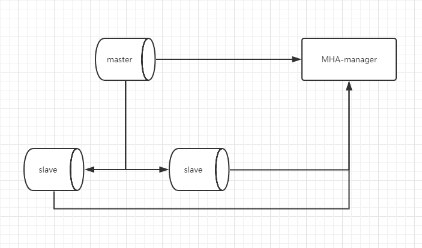
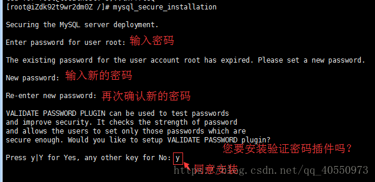
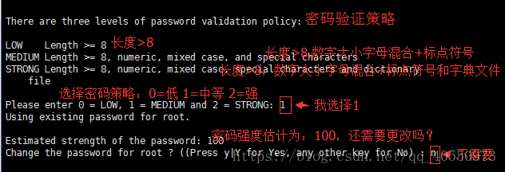
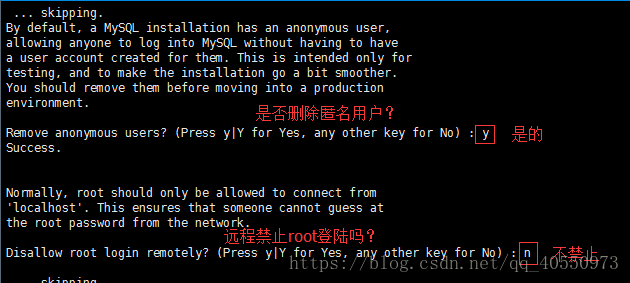
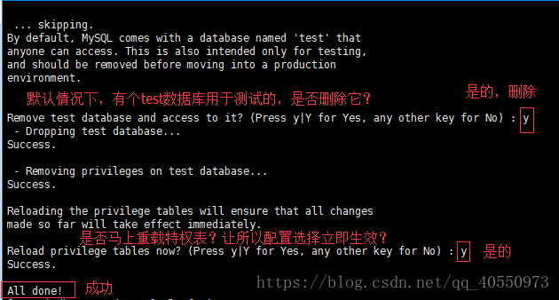

## **需求**

1、首先实现一主两从的同步复制功能（采用半同步复制机制）

2、然后采用MHA实现主机出现故障，从库能自动切换功能。

3、MHA高可用搭建后，在主库新建商品表进行效果测试

需求架构：



## 一、环境软件版本

### 1.1、服务器版本

服务版本：CentOS 7.9 64位

```shell
[root@localhost ~]# cat /etc/redhat-release 
CentOS Linux release 7.9.2009 (Core)
[root@localhost ~]# uname -r
3.10.0-1160.el7.x86_64
```

### 1.2、MySQL版本

MySQL版本：8.0.23

```shell
[root@localhost ~]# mysql -uroot -p
Enter password: 
Welcome to the MySQL monitor.  Commands end with ; or \g.
Your MySQL connection id is 13
Server version: 8.0.23 MySQL Community Server - GPL

Copyright (c) 2000, 2021, Oracle and/or its affiliates.

Oracle is a registered trademark of Oracle Corporation and/or its
affiliates. Other names may be trademarks of their respective
owners.

Type 'help;' or '\h' for help. Type '\c' to clear the current input statement.

mysql> 
```

### 1.3、MHA版本

```
node：mha4mysql-node-0.58-0.el7.centos.noarch.rpm
manager：mha4mysql-manager-0.58-0.el7.centos.noarch.rpm
```

## 二、架构介绍

MHA（Master High Availability）是一套比较成熟的 MySQL 高可用方案，也是一款优秀的故障切换和主从提升的高可用软件。在MySQL故障切换过程中，MHA

能做到在30秒之内自动完成数据库的故障切换操作，并且在进行故障切换的过程中，MHA能在最大程度上保证数据的一致性，以达到真正意义上的高可用。MHA

还支持在线快速将Master切换到其他主机，通常只需0.5－2秒。

目前MHA主要支持一主多从的架构，要搭建MHA，要求一个复制集群中必须最少有三台数据库服务器。


**MHA由两部分组成：MHA Manager（管理节点）和MHA Node（数据节点）。**

- MHA Manager可以单独部署在一台独立的机器上管理多个master-slave集群，也可以部署在一台slave节点上。负责检测master是否宕机、控制故障转移、检

  查MySQL复制状况等。

  **Manager工具包主要工具**

  ```
  masterha_check_ssh              检查MHA的SSH配置状况
  
  masterha_check_repl             检查MySQL复制状况
  
  masterha_manger                 启动MHA
  
  masterha_check_status           检测当前MHA运行状态
  
  masterha_master_monitor         检测master是否宕机
  
  masterha_master_switch          控制故障转移（自动或者手动）
  
  masterha_conf_host              添加或删除配置的server信息
  ```

- MHA Node运行在每台MySQL服务器上，不管是Master角色，还是Slave角色，都称为Node，是被监控管理的对象节点，负责保存和复制master的二进制日

  志、识别差异的中继日志事件并将其差异的事件应用于其他的slave、清除中继日志。

  **Node工具包**

  这些工具通常由MHA Manager的脚本触发，无需人为操作

  ```
  save_binary_logs                保存和复制master的二进制日志
  
  apply_diff_relay_logs           识别差异的中继日志事件并将其差异的事件应用于其他的slave
  
  filter_mysqlbinlog              去除不必要的ROLLBACK事件（MHA已不再使用这个工具）
  
  purge_relay_logs                清除中继日志（不会阻塞SQL线程）
  ```

MHA Manager会定时探测集群中的master节点，当master出现故障时，它可以自动将最新数据的slave提升为新的master，然后将所有其他的slave重新指向新的

master，整个故障转移过程对应用程序完全透明。

**MHA故障处理机制：**

- 把宕机master的binlog保存下来
- 根据binlog位置点找到最新的slave
- 用最新slave的relay log修复其它slave
- 将保存下来的binlog在最新的slave上恢复
- 将最新的slave提升为master
- 将其它slave重新指向新提升的master，并开启主从复制

**MHA优点：**

- 自动故障转移快
- 主库崩溃不存在数据一致性问题
- 性能优秀，支持半同步复制和异步复制
- 一个Manager监控节点可以监控多个集群

## 三、MySQL安装

1. 找到并删除与mysql相关文件

   ```shell
   find / -name mysql|xargs rm -rf
   ```

2. 开始安装

   ```shell
   rpm -Uvh https://repo.mysql.com/mysql57-community-release-el7-11.noarch.rpm
   yum --enablerepo=mysql80-community install mysql-community-server
   ```

   按照提示完成下载

3. 启动并查看mysql状态

   ```shell
   systemctl start mysqld
   systemctl status mysqld
   ```

4. 查看默认密码

   ```shell
   grep "A temporary password" /var/log/mysqld.log
   ```

5. 配置mysql

   ```shell
   mysql_secure_installation
   ```

   

   

   

   

6. 登陆mysql

   ```shell
   mysql -uroot -p
   ```

7. 设置远程连接

   ```msyql
   use mysql;
   update user set host='%' where user='root';
   flush privileges;
   ```

## 四、主从模式配置

### 4.1、master

- 修改配置文件/etc/my.cnf

  ```properties
  server-id=1 #指定当前mysql实例名称
  log_bin=thm-log-bin #指定binlog日志文件名称
  sync-binlog=1 #开启同步
  #排除同步的数据库
  binlog-ignore-db=sys
  binlog-ignore-db=information_schema
  #binlog-lgnore-db=performance_schema  #排除此数据库会导致mysql无法启动
  #指定同步的数据库（默认所有）
  #binlog-do-db=thm
  #开启relay-log 中继日志
  relay-log=thm-relay-bin
  #更新同时更新磁盘
  log_slave_updates=1
  #设置日志级别 默认2
  log_error_verbosity=3
  ```

- 重启mysql

  ```shell
  systemctl restart mysqld.service
  ```

- 进行授权并刷新权限

  ```mysql
  #grant 权限列表 on 数据库 to '用户名'@'访问主机' identified by '密码';
  grant replication slave on *.* to 'root'@'%' identified by 'root';
  grant all privileges on *.* to 'root'@'%' identified by 'root';
  flush privileges;
  #MySql 8.0版本以后分两步
  #1、创建账户:create user '用户名'@'访问主机' identified by '密码'; 存在用户直接赋予权限
  #2、赋予权限:grant 权限列表 on 数据库 to '用户名'@'访问主机' ;(修改权限时在后面加with grant option)
  grant all privileges on *.* to 'root'@'%' with grant option;
  flush privileges;
  ```

- 查看master状态

  file和postion用于slave配置使用

### 4.2、slave

- 修改配置文件

  ```properties
  server-id=2
  log_bin=thm-log-bin #指定binlog日志文件名称
  relay_log=thm-relay-bin #指定relay-log名称
  relay_log_purge = 0 #是否自动清空不再需要中继日
  log_slave_updates=1 #更新同时更新磁盘
  #排除同步的数据库
  binlog-ignore-db=sys
  binlog-ignore-db=information_schema
  #binlog-lgnore-db=performance_schema #排除此数据库会导致mysql无法启动
  read-only=1 #只读
  ```

- 重启mysql

  ```shell
  systemctl restart mysqld.service
  ```

- 进行Master设置

  ```mysql
  #查看slave状态信息，如果存在信息需要先停止slave使用命令：stop slave
  show slave status;
  #配置master信息
  change master to master_host='192.168.81.100',master_port=3306,master_user='root',master_password='Thm123456.',
  master_log_file='thm-log-bin.000001',master_log_pos=1087;
  #启动slave
  start slave;
  show slave status;
  ```

## 五、半同步复制模式配置

- 查看是否可以动态添加插件

  ```shell
  select @@have_dynamic_loading;
  ```

- 查看已经存在插件

  ```shell
  show plugins;
  ```

- 主库（master）安装semisync_master插件并取别名

  ```mysql
  # 安装插件   卸载 uninstall plugin rpl_semi_sync_master;
  install plugin rpl_semi_sync_master soname 'semisync_master.so';
  # 查看semi配置信息
  show variables like '%semi%';
  # 开启semi
  set global rpl_semi_sync_master_enabled = 1;
  # 设置间隔时间
  set global rpl_semi_sync_master_timeout=1000;
  ```

- 从库（slave）安装semisynv_slave插件并取别名

  ```mysql
  # 安装插件
  install plugin rpl_semi_sync_slave soname 'semisync_slave.so';
  # 查看semi配置信息
  show variables like '%semi%';
  # 开启semi
  set global rpl_semi_sync_slave_enabled = 1;
  # 停止slave
  stop slave
  # 开启slave
  start slave
  ```

## 六、MHA架构配置

### 6.1、相关配置说明

MHA 对 MYSQL 复制环境有特殊要求，例如各节点都要开启二进制日志及中继日志，各从节点必须显示启用其`read-only`属性，并关闭`relay_log_purge`功能

等，这里对配置做事先说明。 本实验环境共有四个节点， 其角色分配如下（实验机器均为centos 7.9）：

| 机器名称    | IP配置         | 服务角色       | 备注                                      |
| :---------- | :------------- | :------------- | :---------------------------------------- |
| master      | 192.168.81.100 | 数据库主服务器 | 开启bin_log、relay_log 关闭relay_log_pure |
| slave1      | 192.168.81.101 | 数据库从服务器 | 开启bin_log、relay_log 关闭relay_log_pure |
| slave2      | 192.168.81.102 | 数据库从服务器 | 开启bin_log、relay_log 关闭relay_log_pure |
| mha-monitor | 192.168.81.103 | Manager控制器  | 用于监控管理                              |

为了方便我们后期的操作，我们在各节点的/etc/hosts文件配置内容中添加如下内容

```
192.168.81.100	node1
192.168.81.101	node2
192.168.81.102	node3
192.168.81.103	node4
```

ssh无密码登录

- node1

  ```shell
  ssh-keygen -t rsa
  ssh-copy-id -i ~/.ssh/id_rsa.pub root@node2
  ssh-copy-id -i ~/.ssh/id_rsa.pub root@node3
  ssh-copy-id -i ~/.ssh/id_rsa.pub root@node4
  ```

- node2

  ```shell
  ssh-keygen -t rsa
  ssh-copy-id -i ~/.ssh/id_rsa.pub root@node1
  ssh-copy-id -i ~/.ssh/id_rsa.pub root@node3
  ssh-copy-id -i ~/.ssh/id_rsa.pub root@node4
  ```

- node3

  ```shell
  ssh-keygen -t rsa
  ssh-copy-id -i ~/.ssh/id_rsa.pub root@node1
  ssh-copy-id -i ~/.ssh/id_rsa.pub root@node2
  ssh-copy-id -i ~/.ssh/id_rsa.pub root@node4
  ```

- node4

  ```shell
  ssh-keygen -t rsa
  ssh-copy-id -i ~/.ssh/id_rsa.pub root@node1
  ssh-copy-id -i ~/.ssh/id_rsa.pub root@node2
  ssh-copy-id -i ~/.ssh/id_rsa.pub root@node3
  ```

- 查看

  ```shell
  cd .ssh/
  cat authorized_keys 
  ```

### 6.2、mysql相关配置

在上述mysql主从当中已经完成相关配置

### 6.3、规划mha

- 创建mha管理用的复制账号

  每台数据库(master、slave01、slave02)上都要创建账号，在这里以其中master为例.

  ```mysql
  create user 'mha_admin'@'%' identified by 'Thm123456.';
  grant all privileges on *.* to 'mha_admin'@'%' with grant option;
  flush privileges;
  # 查看用户
  use mysql；
  select host,user from mysql.user;
  ```

- 安装 MHA 包

  - 四个节点都需安装：`mha4mysql-node-0.58-0.el7.centos.noarch.rpm`

    下载mha4mysql-node-0.58-0.el7.centos.noarch.rpm并上传到指定目录

    ```shell
    yum install -y mha4mysql-node-0.58-0.el7.centos.noarch.rpm
    ```

    上述安装出现错误：

    ```shell
    yum install perl-DBD-MySQL -y
    rpm -ivh mha4mysql-node-0.58-0.el7.centos.noarch.rpm
    ```
  ```
  
  ```
  
- Manager节点另需要安装：`mha4mysql-manager-0.58-0.el7.centos.noarch.rpm`
  
    ```shell
    yum install -y mha4mysql-manager-0.58-0.el7.centos.noarch.rpm
    ```
  
    上述安装出现错误：
  
    ```shell
    1)、先安装epel-release-latest-7.noarch.rpm
    下载：wget http://dl.fedoraproject.org/pub/epel/epel-release-latest-7.noarch.rpm
    安装：rpm -ivh epel-release-latest-7.noarch.rpm
    2)、分别安装perl-Config-Tiny、perl-Log-Dispatch、perl-Parallel-ForkManager
    安装：yum install perl-DBD-MySQL perl-Config-Tiny perl-Log-Dispatch perl-Parallel-ForkManager -y
    3)、安装mha4mysql-manager
    安装：rpm -ivh mha4mysql-manager-0.58-0.el7.centos.noarch.rpm
    ```

### 6.4、初始化 MHA ，进行配置

Manager 节点需要为每个监控的 master/slave 集群提供一个专用的配置文件，而所有的 master/slave 集群也可**共享全局配置**。

全局配置文件**默认为**`/etc/masterha_default.cnf`，其为**可选配置**。

如果仅监控一组 master/slave 集群，也可直接通过 application 的配置来提供各服务器的默认配置信息。而每个 application 的配置文件路径为自定义。

#### 6.4.1、为MHA专门创建一个管理用户， 方便以后使用， 在mysql的主节点上， 三个节点自动同步：

```shell
mkdir /etc/mha_master
vim /etc/mha_master/mha.cnf
```

配置文件内容（在安装manager服务器上192.168.81.103）

```
[server default]
user=mha_admin                                   #MHA管理MySQL的用户名
password=Thm123456.                              #MHA管理MySQL的密码
manager_workdir=/etc/mha_master/app1             #MHA的工作路径
manager_log=/etc/mha_master/manager.log          #MHA的日志路径
remote_workdir=/mydata/mha_master/app1           #每个远程主机的工作目录在何处
ssh_user=root                                    #ssh免密钥登录用户名
repl_user=root                                   #主从复制账号，用于主从数据同步
repl_password=Thm123456                          #主从复制账号密码
ping_interval=1                                  #ping间隔时间，用于检查master是否正常

[server1]                                        #数据库node
hostname=192.168.81.100                          #数据库node IP地址
ssh_port=22                                      #ssh端口
candidate_master=1                               #是否可以成为主节点，当前为是

[server2]
hostname=192.168.81.101
ssh_port=22
candidate_master=1

[server3]
hostname=192.168.81.102
ssh_port=22
candidate_master=1

#[server4]
#hostname=host4
#no_master=1
```

#### 6.4.2、对四个节点进行检测

```shell
masterha_check_ssh -conf=/etc/mha_master/mha.cnf
# 最后出现 表示成功
Wed Feb 24 17:15:57 2021 - [info] All SSH connection tests passed successfully.
```

注意：配置文件中不能有空格，端口和IP不能错误

#### 6.4.3、检查管理的MySQL复制集群的连接配置参数是否OK

```
masterha_check_repl -conf=/etc/mha_master/mha.cnf
```

- 出现错误：

  ```http
  [root@localhost mha_master]# masterha_check_repl -conf=/etc/mha_master/mha.cnf
  Wed Feb 24 17:23:54 2021 - [warning] Global configuration file /etc/masterha_default.cnf not found. Skipping.
  Wed Feb 24 17:23:54 2021 - [info] Reading application default configuration from /etc/mha_master/mha.cnf..
  Wed Feb 24 17:23:54 2021 - [info] Reading server configuration from /etc/mha_master/mha.cnf..
  Wed Feb 24 17:23:54 2021 - [info] MHA::MasterMonitor version 0.58.
  Wed Feb 24 17:23:55 2021 - [error][/usr/share/perl5/vendor_perl/MHA/ServerManager.pm, ln188] There is no alive server. We can't do failover
  Wed Feb 24 17:23:55 2021 - [error][/usr/share/perl5/vendor_perl/MHA/MasterMonitor.pm, ln427] Error happened on checking configurations.  at /usr/share/perl5/vendor_perl/MHA/MasterMonitor.pm line 329.
  Wed Feb 24 17:23:55 2021 - [error][/usr/share/perl5/vendor_perl/MHA/MasterMonitor.pm, ln525] Error happened on monitoring servers.
  Wed Feb 24 17:23:55 2021 - [info] Got exit code 1 (Not master dead).
  MySQL Replication Health is NOT OK!
  ```

  解决方法：在master数据库中执行

  ```mysql
  ALTER USER 'mha_admin'@'%' IDENTIFIED WITH mysql_native_password BY 'Thm123456.';
  FLUSH PRIVILEGES;
  ```

- 出现错误

  ```http
  Wed Feb 24 17:34:05 2021 - [error][/usr/share/perl5/vendor_perl/MHA/MasterMonitor.pm, ln359] Slave configurations is not valid.
  Wed Feb 24 17:34:05 2021 - [error][/usr/share/perl5/vendor_perl/MHA/MasterMonitor.pm, ln427] Error happened on checking configurations.  at /usr/bin/masterha_check_repl line 48.
  Wed Feb 24 17:34:05 2021 - [error][/usr/share/perl5/vendor_perl/MHA/MasterMonitor.pm, ln525] Error happened on monitoring servers.
  Wed Feb 24 17:34:05 2021 - [info] Got exit code 1 (Not master dead).
  MySQL Replication Health is NOT OK!
  ```

  意思就是主库和从库的my.cnf中配置的binlog-ignore-db和binlog-do-db要保持一致

  解决方法：修改两台从库配置文件保持binlog-ignore-db和master一致

  ```properties
  #排除同步的数据库
  binlog-ignore-db=sys
  binlog-ignore-db=information_schema
  #binlog-lgnore-db=performance_schema
  ```

- 出现错误

  ```http
  Wed Feb 24 17:44:49 2021 - [error][/usr/share/perl5/vendor_perl/MHA/Server.pm, ln490] Slave IO thread is not running on 192.168.81.100(192.168.81.100:3306)
  Wed Feb 24 17:44:49 2021 - [error][/usr/share/perl5/vendor_perl/MHA/ServerManager.pm, ln1526]  failed!
  Wed Feb 24 17:44:49 2021 - [error][/usr/share/perl5/vendor_perl/MHA/MasterMonitor.pm, ln427] Error happened on checking configurations.  at /usr/share/perl5/vendor_perl/MHA/MasterMonitor.pm line 420.
  Wed Feb 24 17:44:49 2021 - [error][/usr/share/perl5/vendor_perl/MHA/MasterMonitor.pm, ln525] Error happened on monitoring servers.
  Wed Feb 24 17:44:49 2021 - [info] Got exit code 1 (Not master dead).
  
  MySQL Replication Health is NOT OK!
  ```

  意思是在master数据中配置了slave相关的配置

  解决办法：情况master中的slave配置

  ```mysql
  reset slave all;
  ```

#### 6.4.4、启动 MHA

我们在 manager（192.168.81.103） 节点上执行以下命令来启动 MHA：

```shell
nohup masterha_manager -conf=/etc/mha_master/mha.cnf &> /etc/mha_master/manager.log &
```

启动成功以后，我们来查看一下 master 节点的状态：

```shell
masterha_check_status -conf=/etc/mha_master/mha.cnf

mha (pid:2222) is running(0:PING_OK), master:192.168.81.100
#上面的信息中“mha (pid:2222) is running(0:PING_OK)”表示MHA服务运行OK，否则， 则会显示为类似“mha is stopped(1:NOT_RUNNING).” 如果，我们想要停止 MHA ，则需要使用 stop 命令：

masterha_stop -conf=/etc/mha_master/mha.cnf
```

#### 6.4.5、测试 MHA 故障转移

- 关闭msyql 的master服务

  ```shell
  systemctl stop mysqld
  ```

- 在mha manager节点查看日志

  ```shell
  tail -200 /etc/mha_master/manager.log
  # 表示切换成功
  Master failover to 192.168.81.101(192.168.81.101:3306) completed successfully.
  ```

  表示 manager 检测到192.168.81.100节点故障， 而后自动执行故障转移， 将192.168.81.101提升为主节点。 注意，故障转移完成后， manager将会自动停止， 此时使用 masterha_check_status 命令检测将会遇到错误提示， 如下所示：

  ```shell
  masterha_check_status -conf=/etc/mha_master/mha.cnf
  mha is stopped(2:NOT_RUNNING).
  ```

- 问题：

  ```
  Wed Feb 24 21:39:33 2021 - [error][/usr/share/perl5/vendor_perl/MHA/MasterFailover.pm, ln310] Last failover was done at 2021/02/24 20:03:41. Current time is too early to do failover again. If you want to do failover, manually remove /etc/mha_master/app1/mha.failover.complete and run this script again.
  Wed Feb 24 21:39:33 2021 - [error][/usr/share/perl5/vendor_perl/MHA/ManagerUtil.pm, ln177] Got ERROR:  at /usr/bin/masterha_manager line 65.
  ```

  缺省情况下，如果MHA检测到连续发生宕机，且两次宕机时间间隔不足八小时的话，则不会进行Failover，需要删除最近时间的app1.failover.complete

  或者增加如下参数启动

  ```
  --ignore_last_failover
  
  nohup masterha_manager -conf=/etc/mha_master/mha.cnf &> /etc/mha_master/manager.log --ignore_last_failover &
  ```

#### 6.4.6、提供新的从节点以修复复制集群

原有 master 节点故障后，需要重新准备好一个新的 MySQL 节点。基于来自于master 节点的备份恢复数据后，将其配置为新的 master 的从节点即可。注意，新加入的节点如果为新增节点，其 IP 地址要配置为原来 master 节点的 IP，否则，还需要修改 mha.cnf 中相应的 ip 地址。随后再次启动 manager ，并再次检测其状态。 我们就以刚刚关闭的那台主作为新添加的机器，来进行数据库的恢复： 原本的 slave1 已经成为了新的主机器，所以，我们对其进行完全备份，而后把备份的数据发送到我们新添加的机器上：

```shell
mkdir /backup
# 备份文件
mysqldump --all-database > /backup/mysql-backup-`date +%F-%T`-all.sql
# 发送到指定机器
scp /backup/mysql-backup-2021-02-24-09\:57\:09-all.sql root@node2
```

然后在 node2 节点上进行数据恢复：

```shell
mysql < mysql-backup-2021-02-24-09\:57\:09-all.sql
```

接下来就是配置主从。照例查看一下现在的主的二进制日志和位置。

#### 6.4.7、新节点提供后再次执行检查操作

```shell
# 检查集群如果保持授权问题进行整改
masterha_check_repl -conf=/etc/mha_master/mha.cnf
# 先启动 在检查
nohup masterha_manager -conf=/etc/mha_master/mha.cnf &> /etc/mha_master/manager.log &
masterha_check_status -conf=/etc/mha_master/mha.cnf
```

