# Docker

**Docker容器虚拟化技术**


**必备基础**

- 硬件要求

  本课程硬件总体要求如下表：

  | 序号 | 硬件 | 要求             |
  | ---- | ---- | ---------------- |
  | 1    | CPU  | 至少2核          |
  | 2    | 内存 | 至少8G           |
  | 3    | 硬盘 | 至少100G磁盘空间 |

- 安装虚拟机环境 VMware

- 生成至少两台虚拟机

  | 主机名     | 主机IP         |
  | ---------- | -------------- |
  | docker-110 | 192.168.81.110 |
  | harbor-111 | 192.168.81.111 |

- 远程连接工具 XShell

## 1、Docker快速入门

### 1.1、官网

```apl
#docker官网地址：
https://www.docker.com 
#docker官方文档地址： 
https://docs.docker.com/
#github地址:
https://github.com/docker/docker-ce
```

### 1.2、Dcoker的历史

2010年，几个的年轻人，就在美国的旧金山成立了一家公司 dotcloud。做一些Paas平台的创业公司！从事LXC（Linux Container容器）有关的容器技术！Linux 

Container容器是一种内核虚拟化技术，可以提供轻量级的虚拟化，以便隔离进程和资源。他们将自己的技术（容器化技术）命名就是 Docker。Docker刚刚延生

的时候，没有引起行业的注意！虽然获得了创业孵化器(Y Combinator)的支持、也获得过一些融资，但随着IT巨头们(微软、谷歌、亚马逊等厂商)也进入PaaS凭

他，dotCloud举步维艰，眼看就活不下去！

2013年，dotCloud的创始人，28岁的Solomon Hykes做了一个艰难的决定，将dotCloud的核心引擎开源，这项核心引擎技术能够将Linux容器中的应用程序、代

码打包，轻松的在服务器之间进行迁移。这个基于LXC技术的核心管理引擎开源后，让全世界的技术人员感到惊艳。感叹这一切太方便了！！越来越多的人发现

docker的优点！火了。Docker每个月都会更新一个版本！2014年6月9日，Docker1.0发布！1.0版本的发布，标志着docker平台已经足够成熟稳定，并可以被应用

到生产环境。

docker为什么这么火？因为docker十分的轻巧！在容器技术出来之前，我们都是使用虚拟机技术！在window中装一个VMware，通过这个软件我们可以虚拟出来

一台或者多台电脑！笨重！虚拟机也属于虚拟化技术，Docker容器技术，也是一种虚拟化技术！

### 1.3、docker版本

docker 从 17.03 版本之后分为 CE（Community Edition: 社区版） 和 EE（Enterprise Edition: 企业版），本教程使用社区版(CE)。

### 1.4、DevOps（开发、运维）

一款产品： 开发–上线 两套环境！应用环境，应用配置！开发 — 运维。 问题：我在我的电脑上可以允许！版本更新，导致服务不可用！对于运维来说考验十分

大!!! 环境配置是十分的麻烦，每一个机器都要部署环境(集群Redis、ES、Hadoop…) !费事费力。发布一个项目( jar + (Redis MySQL JDK ES) )，项目能不能带上环

境安装打包！之前在服务器配置一个应用的环境 Redis MySQL JDK ES Hadoop 配置超麻烦了，不能够跨平台。

- 开发环境Windows，最后发布到Linux！

  传统：开发jar，运维来做！

  现在：开发打包部署上线，一套流程做完！

- 应用更快速的交付和部署

  传统：帮助文档，安装程序。

  Docker：打包镜像发布测试一键运行。

- 更便捷的升级和扩缩容

  使用了 Docker之后，我们部署应用就和搭积木一样

  项目打包为一个镜像，扩展服务器A！服务器B

- 更简单的系统运维

  在容器化之后，我们的开发，测试环境都是高度一致的 

- 更高效的计算资源利用

  Docker是内核级别的虚拟化，可以在一个物理机上可以运行很多的容器实例！服务器的性能可以被压榨到极致 

### 1.5、什么是docker

当人们说“Docker”时，他们通常是指 Docker Engine，它是一个客户端 - 服务器应用程序，由 Docker守护进程、一个REST API指定与守护进程交互的接口、和一

个命令行接口（CLI）与守护进程通信（通过封装REST API）。Docker Engine 从 CLI 中接受docker 命令，例如 docker run 、docker ps 来列出正在运行的容器、

docker images 来列出镜像，等等。

- docker是一个软件，可以运行在window、linux、mac等各种操作系统上。
- docker 是一个开源的应用容器引擎，基于Go 语言开发并遵从 Apache2.0 协议开源，项目代码托管在github上进行维护
- docker 可以让开发者打包他们的应用以及依赖包到一个轻量级、可移植的容器中，然后发布到任何流行的 Linux 机器上。
- 容器是完全使用沙箱机制，相互之间不会有任何接口,更重要的是容器性能开销极低。

### 1.6、docker基本组成

docker主机(Host)：安装了Docker程序的机器（Docker直接安装在操作系统之上）；

docker仓库(Registry)：用来保存各种打包好的软件镜像；仓库分为公有仓库和私有仓库。(很类似maven) 

docker镜像(Images)：软件打包好的镜像；放在docker仓库中；

docker容器(Container)：镜像启动后的实例称为一个容器；容器是独立运行的一个或一组应用

### 1.7、docker与操作系统比较

docker是一种轻量级的虚拟化方式。与传统操作系统技术的特性比较如下表：

| 特性     | 容器               | 虚拟机   |
| -------- | ------------------ | -------- |
| 启动速度 | 秒级               | 分钟级   |
| 性能     | 接近原生           | 较弱     |
| 内存代价 | 很小               | 较多     |
| 硬盘使用 | 一般为MB           | 一般为GB |
| 运行密度 | 单机支持上千个容器 | 一般几十 |
| 隔离性   | 安全隔离           | 完全隔离 |
| 迁移性   | 优秀               | 一般     |

传统的虚拟机方式提供的是相对封闭的隔离。Docker利用Linux系统上的多种防护技术实现了严格的隔离可靠性，并且可以整合众多安全工具。从 1.3.0版本开

始，docker重点改善了容器的安全控制和镜像的安全机制， 极大提高了使用docker的安全性。

### 1.8、安装docker

#### 1.8.1、前置条件

当我们安装 Docker 的时候，会涉及两个主要组件：

1. Docker CLI：客户端
2. Docker daemon：有时也被称为“服务端”或者“引擎”

- **硬件安装要求：**

  | 硬件      | 要求                                             |
  | --------- | ------------------------------------------------ |
  | CPU       | 推荐2核                                          |
  | 内存      | 至少2G                                           |
  | 硬盘      | 至少50G                                          |
  | centos7.9 | docker及K8S集群推荐，各位小伙伴使用centos7.8版本 |

- **节点信息**

  服务器用户名：root，服务器密码：root。及时做好系统快照。

  | 主机名     | 主机IP         | 说明       |
  | ---------- | -------------- | ---------- |
  | docker-110 | 192.168.81.110 | docker主机 |

- **centos下载**

  推荐大家使用centos7.9版本。版本号：CentOS-7-x86_64-Minimal-2009.iso 

  ```http
  http://mirrors.aliyun.com/centos/7.9.2009/isos/x86_64/
  ```

- **centos配置**

  - **查看centos系统版本命令：**

    ```shell
    cat /etc/centos-release
    ```

  - **创建shell脚本init.sh(可以不用执行)** 

    ```shell
    #1.下载安装wget
    yum install -y wget 
    #2.备份默认的yum 
    mv /etc/yum.repos.d /etc/yum.repos.d.backup
    #3.设置新的yum目录 
    mkdir -p /etc/yum.repos.d 
    #4.下载阿里yum配置到该目录中，选择对应版本 
    wget -O /etc/yum.repos.d/CentOS-Base.repo http://mirrors.aliyun.com/repo/Centos-7.repo 
    #5.更新epel源为阿里云epel源 
    mv /etc/yum.repos.d/epel.repo /etc/yum.repos.d/epel.repo.backup 
    mv /etc/yum.repos.d/epel-testing.repo /etc/yum.repos.d/epel-testing.repo.backup
    wget -O /etc/yum.repos.d/epel.repo http://mirrors.aliyun.com/repo/epel-7.repo 
    #6.重建缓存 
    yum clean all
    yum makecache 
    #7.看一下yum仓库有多少包 
    yum repolist
    ```

  - **给脚本赋予执行权限同时执行脚本**

    ```shell
    #赋权
    chmod +x init.sh
    #执行
    ./init.sh
    ```

  - **升级系统内核**

    ```shell
    #升级系统内核
    rpm -Uvh http://www.elrepo.org/elrepo-release-7.0-3.el7.elrepo.noarch.rpm
    yum --enablerepo=elrepo-kernel install -y kernel-lt
    grep initrd16 /boot/grub2/grub.cfg 
    grub2-set-default 0
    #重启
    reboot
    ```

  - **查看centos系统状态：**

    ```shell
    #查看系统内核
    uname -r 
    uname -a
    #查看cpu
    lscpu
    #查看内存命令
    free 
    free -h
    #查看硬盘信息
    fdisk -l
    ```

  - **关闭防火墙**

    ```shell
    systemctl stop firewalld 
    systemctl disable firewalld
    ```

  - **关闭selinux**

    ```shell
    sed -i 's/SELINUX=enforcing/SELINUX=disabled/g' /etc/sysconfig/selinux 
    setenforce 0
    ```

  - **网桥过滤**

    ```shell
    vi /etc/sysctl.conf 
    #内容
    net.bridge.bridge-nf-call-ip6tables = 1 
    net.bridge.bridge-nf-call-iptables = 1 
    net.bridge.bridge-nf-call-arptables = 1 
    net.ipv4.ip_forward=1 
    net.ipv4.ip_forward_use_pmtu = 0 
    #生效命令 
    sysctl --system
    #查看效果 
    sysctl -a|grep "ip_forward"
    ```

  - **命令补全**
  
    ```shell
    #安装bash-completion 
    yum -y install bash-completion bash-completion-extras 
    #使用bash-completion 
    source /etc/profile.d/bash_completion.sh
    ```

  - **上传文件**
  
    ```shell
    yum -y install lrzsz 
    #1.鼠标拖拽上传文件 
    #2.下载文件 
    	#2.1下载一个文件 
    	sz filename 
    	#2.2下载多个文件 
    	sz filename1 filename2 
    	#2.3下载dir目录下所有文件，不包含dir下的文件夹 
    	sz dir/*
    ```

#### 1.8.2、进行安装

- **阿里云开发者平台**

  开发者平台官网地址：可以参考阿里云官网提供的docker安装教程进行安装。

  ```http
  https://www.aliyun.com/
  ```

- **安装docker前置条件**

  ```shell
  yum install -y yum-utils device-mapper-persistent-data lvm2
  ```

- **添加源**

  ```shell
  yum-config-manager --add-repo http://mirrors.aliyun.com/docker-ce/linux/centos/docker-ce.repo
  #刷新
  yum makecache fast
  ```

- **查看docker版本**

  ```shell
  yum list docker-ce --showduplicates | sort -r
  ```

- **安装docker**

  ```shell
  # 安装最新版：推荐大家安装最新版本 
  yum -y install docker-ce 
  #安装指定版本：
  #语法规则：yum install docker-ce-<VERSION_STRING> docker-ce-cli-<VERSION_STRING> containerd.io 
  
  yum -y install docker-ce-18.06.3.ce-3.el7 docker-ce-cli.x86_64 
  #当前安装
  yum install -y docker-ce-19.03.9-3.el7 docker-ce-cli-19.03.9-3.el7
  
  #官网名词解释
  containerd.io: daemon to interface with the OS API (in this case, LXC - Linux Containers),essentially decouples Docker from the OS, also provides container services for non-Dockercontainer managers
  
  docker-ce: Docker daemon, this is the part that does all the management work, requires theother two on Linux
  
  docker-ce-cli: CLI tools to control the daemon, you can install them on their own if you wantto control a remote Docker daemon
  ```

- **开启docker服务**

  ```shell
  #启动
  systemctl start docker
  #状态
  systemctl status docker
  ```

- **安装阿里云镜像加速器**

  ```shell
  mkdir -p /etc/docker 
  tee /etc/docker/daemon.json <<-'EOF' 
  { 
  	"registry-mirrors": ["https://cmwmjcql.mirror.aliyuncs.com"] 
  }
  EOF
  
  systemctl daemon-reload 
  systemctl restart docker
  ```

- **设置docker开启启动服务**

  ```shell
  systemctl enable docker
  ```

- **docker命令**

  ```shell
  docker -v 
  docker version 
  docker info
  ```

  友情提示：请各位小伙伴别忘记关闭虚拟机，做好快照备份。方便以后随时恢复docker安装完毕状态。

### 1.9、docker命令分类

本章节记录docker命令在大部分情境下的使用，如果想了解每一个选项的细节，请参考官方文档，根据docker官网案例，总的来说分为以下几种：

- Docker环境信息 — docker [info|version]
- 容器生命周期管理 — docker [create|exec|run|start|stop|restart|kill|rm|pause|unpause]
- 容器操作管理 — docker [ps|inspect|top|attach|wait|export|port|rename|stat]
- 容器rootfs命令 — docker [commit|cp|diff]
- 镜像仓库 — docker [login|pull|push|search]
- 本地镜像管理 — docker [build|images|rmi|tag|save|import|load]
- 容器资源管理 — docker [volume|network]
- 系统日志信息 — docker [events|history|logs]

**官网地址：https://docs.docker.com/engine/reference/run/**

从docker命令使用出发，梳理出如下命令结构图：

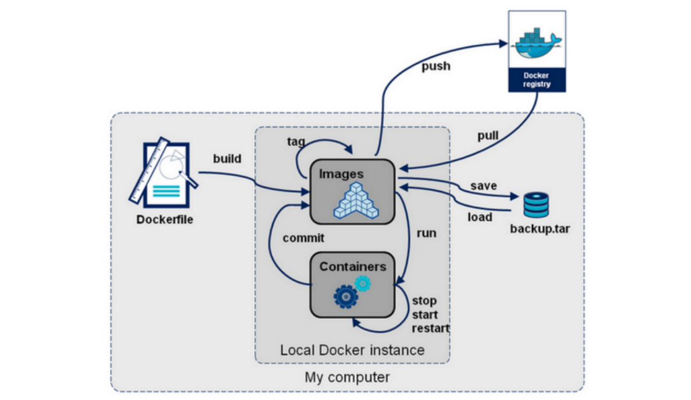

### 1.10、Docker镜像（image）

**Docker Hub地址**

docker hub类似maven远程仓库地址

```http
https://hub.docker.com/
```

作为一名研发人员，则可以将镜像理解为类（Class）。是一个应用程序。

首先需要先从镜像仓库服务中拉取镜像。常见的镜像仓库服务是 Docker Hub，但是也存在其他镜像仓库服务。

拉取操作会将镜像下载到本地 Docker 主机，可以使用该镜像启动一个或者多个容器。

镜像由多个层组成，每层叠加之后，从外部看来就如一个独立的对象。镜像内部是一个精简的操作系统（OS），同时还包含应用运行所必须的文件和依赖包。

因为容器的设计初衷就是快速和小巧，所以镜像通常都比较小。

前面多次提到镜像就像停止运行的容器（类）。实际上，可以停止某个容器的运行，并从中创建新的镜像。

在该前提下，镜像可以理解为一种构建时（build-time）结构，而容器可以理解为一种运行时（run-time）结构，如下图所示。


### 1.11、Docker镜像常用命令

#### 1.11.1、pull命令*

下载镜像的命令。镜像从远程镜像仓库服务的仓库中下载。默认情况下，镜像会从 Docker Hub 的仓库中拉取。

通过下载过程，可以看到，一个镜像一般是由多个层组成，类似 f7e2b70d04ae 这样的串表示层的唯一 ID。

- **问题一：**小伙伴们可能会想到，如果多个不同的镜像中，同时包含了同一个层,这样重复下载，岂不是导致了存储空间的浪费么?

  实际上，Docker 并不会去下载重复的层,Docker 在下载之前，会去检测本地是否会有同样 ID的层，如果本地已经存在了，就直接使用本地的就好了。

- **问题二：**另一个问题，不同仓库中，可能也会存在镜像重名的情况发生, 这种情况咋办？

  从严格意义上讲，我们在使用 pull命令时，还需要在镜像前面指定仓库地址(Registry), 如果不指定，则Docker 会使用您默认配置的仓库地址。例如上面，由于

  我配置的是国内 docker.io的仓库地址，我在pull 的时候，docker 会默认为我加上 docker.io/library 的前缀。

  例如：当我执行 docker pull tomcat:9.0.20-jre8命令时，实际上相当于 docker pulldocker.io/tomcat:9.0.20-jre8，如果您未自定义配置仓库，则默认在下载

  的时候，会在镜像前面加上DockerHub 的地址。Docker 通过前缀地址的不同，来保证不同仓库中，重名镜像的唯一性。

- **问题三：**相同的进行为什么有的镜像大，有点镜像小呢？

  主要是在制作镜像时使用的操作系统内核不相同，比如采用centos内核制作的镜像就会大一下，ubuntu制作的就会小一下。

  如何选择使用那种操作系统内核制作镜像呢？

  主要还是看公司的基础镜像去选择制作镜像的操作系统

- 实际上完整的 ID 包括了 256 个 bit, 64 个十六进制字符组成的。

  ```shell
  #https://hub.docker.com/_/tomcat 
  docker pull tomcat:9.0.20-jre8 
  docker pull tomcat:9.0.20-jre8-slim 
  docker pull tomcat:9.0.20-jre8-alpine
  #https://hub.docker.com/_/centos
  docker pull centos:7.8.2003 
  #https://hub.docker.com/_/ubuntu 
  docker pull ubuntu:20.04 
  #https://hub.docker.com/_/debian
  docker pull debian:10.6 
  docker pull debian:10.6-slim 
  #https://hub.docker.com/_/alpine 
  docker pull alpine:3.12.1
  ```

- **常用参数**

  - -a, --all-tags=true|false : 是否获取仓库中所有镜像，默认为否；

  - --disable-content-trust : 跳过镜像内容的校验，默认为 true;

#### 1.11.2、images命令*

通过使用如下两个命令，列出本机已有的镜像：

```shell
docker images 
docker image ls
```

各个选项说明:

- REPOSITORY：表示镜像的仓库源
- TAG：镜像的标签
- IMAGE ID：镜像ID
- CREATED：镜像创建时间
- SIZE：镜像大小

#### 1.11.3、save命令*

保存镜像文件

```shell
mkdir -p /data 
cd /data
#保存单个镜像
docker save tomcat:9.0.20-jre8-alpine -o /data/tomcat9.tar
#保存多个镜像
docker save tomcat:9.0.20-jre8 tomcat:9.0.20-jre8 tomcat:9.0.20-jre8-alpine -o /data/tomcat9.0.20-m.tar

docker save tomcat:9.0.20-jre8-slim > /data/tomcat9.slim.tar
docker save tomcat:9.0.20-jre8 tomcat:9.0.20-jre8 tomcat:9.0.20-jre8-alpine > /data/tomcat9.0.20-m.tar


#发送文件到本地 需要安装yum -y install lrzsz 
sz tomcat9.0.20.tar
```

**常用参数**

- -o :输出到的文件
- `>`:重定向到文件

**批量保存**

制作需要保存镜像的脚本

```shell
docker save \
redis:6.2.3-alpine \
alpine:3.13.5 \
-o /data/my.tar

docker save \ 
ubuntu:20.04 \ 
alpine:3.12.1 \ 
debian:10.6-slim \ 
centos:7.8.2003 \ 
-o linux.tar 

docker save \ 
tomcat:9.0.20-jre8-alpine \ 
tomcat:9.0.20-jre8-slim \ 
tomcat:9.0.20-jre8 \ 
-o tomcat9.0.20.tar
```

#### 1.11.4、load命令*

将保存的镜像压缩包还原成镜像

```shell
docker load -i my.tar
docker load < my.tar
```

**常用参数**

- --input , -i : 指定导入的文件。

- --quiet , -q : 精简输出信息。

#### 1.11.5、search命令

不推荐使用search命令查找镜像，不够直观。

```shell
docker search tomcat
```

**常用参数**

- -f, --filter filter : 过滤输出的内容；

- --limit int ：指定搜索内容展示个数; 

- --no-index : 不截断输出内容；

- --no-trunc ：不截断输出内容；

#### 1.11.6、inspect命令*

- 通过 docker inspect 命令，我们可以获取镜像的详细信息，其中，包括创建者，各层的数字摘要等。

  ```shell
  docker inspect tomcat:9.0.20-jre8-alpine 
  ```

- docker inspect 返回的是 JSON格式的信息，如果您想获取其中指定的一项内容，可以通过 -f 来指定，如获取镜像大小

  ```shell
  docker inspect -f {{".Size"}} tomcat:9.0.20-jre8-alpine
  ```

#### 1.11.7、history命令

从前面的命令中，我们了解到，一个镜像是由多个层组成的，那么，我们要如何知道各个层的具体内容呢？

通过 docker history命令，可以列出各个层的创建信息，例如：查看 tomcat:9.0.20-jre8-alpine的各层信息

#### 1.11.8、tag命令*

标记本地镜像，将其归入某一仓库。先简单熟悉一下tag命令，后边的章节会详细进行讲解。 

```shell
#相当于会创建一个新的镜像出来
#docker tag 旧镜像：tag名称 新镜像：tag名称                 
docker tag tomcat:9.0.20-jre8-alpine thm/tomcat:9
```

#### 1.11.9、rmi命令*

删除存在的镜像

```shell
docker rmi tomcat:9.0.20-jre8-alpine 
docker image rm tomcat:9.0.20-jre8-alpine
```

**常用参数**

- -f, -force : 强制删除镜像，即便有容器引用该镜像；

- -no-prune : 不要删除未带标签的父镜像；

**删除镜像的限制**

删除镜像很简单，但也不是我们何时何地都能删除的，它存在一些限制条件。当通过该镜像创建的容器未被销毁时，镜像是无法被删除的。

**正确的做法应该是：**

1. 先删除引用这个镜像的容器；

2. 再删除这个镜像;

#### 1.11.10、清理镜像

我们在使用 Docker 一段时间后，系统一般都会残存一些临时的、没有被使用的镜像文件，可以通过以下命令进行清理。执行完命令后，还是告诉我们释放了多少

存储空间！

```shell
docker image prune
```

**常用参数**

- -a, --all : 删除所有没有用的镜像，而不仅仅是临时文件；

- -f, --force ：强制删除镜像文件，无需弹出提示确认；

### 1.12、Docker容器（container）

容器是镜像的运行时实例。正如从虚拟机模板上启动 VM 一样，用户也同样可以从单个镜像上启动一个或多个容器。虚拟机和容器最大的区别是容器更快并且更轻

量级——与虚拟机运行在完整的操作系统之上相比，容器会共享其所在主机的操作系统/内核。下图为使用单个 Docker镜像启动多个容器的示意图。

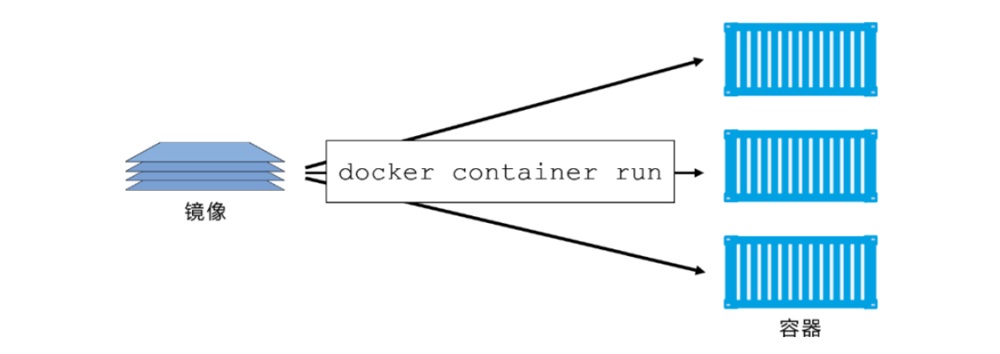

Docker容器类似于一个轻量级的沙箱，Docker利用容器来运行和隔离应用。

容器是镜像的一个运行实例。

可以将其启动、开始、停止、删除，而这些容器都是彼此相互隔离的、互不可见的。

可以把容器看做是一个简易版的Linux系统环境（包括root用户权限、进程空间、用户空间和网络空间等）以及运行在其中的应用程序打包而成的盒子。

容器是基于镜像启动起来的，容器中可以运行一个或多个进程。

镜像是Docker生命周期中的构建或打包阶段，而容器则是启动或执行阶段。

镜像自身是只读的。容器从镜像启动的时候，会在镜像的最上层创建一个可写层。

### 1.13、Docker容器常用命令

#### 1.13.1、新建并启动容器

```shell
#语法
docker run [OPTIONS] IMAGE [COMMAND] [ARG...]
#前台运行
docker run -it --rm -p 主机端口：容器端口 镜像
docker run -it --rm -p 8080:8080 tomcat:9.0.20-jre8-alpine
#后台运行 --name 容器名称
docker run -itd --name tomcat9 -p 8888:8080 tomcat:9.0.20-jre8-alpine
#访问测试 IP:8888
```

**常用参数**

docker run命令常用参数比较多，这里仅仅列出开发岗常用参数，请小伙伴们自行查找资料获得更多参数信息

- **-d, --detach=false:** 后台运行容器，并返回容器ID

- **-i, --interactive=false:** 以交互模式运行容器，通常与 -t 同时使用

- **-P, --publish-all=false:** 随机端口映射，容器内部端口随机映射到主机的端口。不推荐各位小伙伴使用该参数

- **-p, --publish=[]:** 指定端口映射，格式为：主机(宿主)端口:容器端口，推荐各位小伙伴们使用

- **-t, --tty=false:** 为容器重新分配一个伪输入终端，通常与 -i 同时使用

- **--name="nginx-lb":** 为容器指定一个名称

- **-h , --hostname="laosiji":** 指定容器的hostname

- **-e , --env=[]:** 设置环境变量，容器中可以使用该环境变量

- **--net="bridge":** 指定容器的网络连接类型，支持 bridge/host/none/container: 四种类型

- **--link=[]:** 添加链接到另一个容器；不推荐各位小伙伴使用该参数

- **-v, --volume :** 绑定一个卷

- **--privileged=false:** 指定容器是否为特权容器，特权容器拥有所有的capabilities 

- **--restart=no：**指定容器停止后的重启策略

  no：容器退出时不重启 

  on-failure：容器故障退出（返回值非零）时重启 

  always：容器退出时总是重启,推荐各位小伙伴们使用 

- **--rm=false:** 指定容器停止后自动删除容器,不能以docker run -d启动的容器

#### 1.13.2、容器日志

**docker logs :** 获取容器的日志

```shell
#语法
docker logs [OPTIONS] CONTAINER
#查看日志  docker logs -f 容器名称
docker logs -f tomcat9
#常用参数
-f : 跟踪日志输出
--tail :仅列出最新N条容器日志
```

#### 1.13.3、删除容器

**docker rm** **：**删除一个或多个容器。docker rm命令只能删除处于终止或退出状态的容器，并不能删除还处于运行状态的容器

```shell
#语法
docker rm [OPTIONS] CONTAINER [CONTAINER...]
#需要先停止运行中的容器再删除，否则无法删除容器 
docker stop tomcat9 
#按照容器名称删除 
docker rm tomcat9 
#按照容器ID删除 
docker rm 8dd95a95e687
#强制删除一个正在运行的容器
docker rm -f tomcat9 
```

**常用参数**

- **-f :**通过 SIGKILL 信号强制删除一个运行中的容器。

- **-l :**移除容器间的网络连接，而非容器本身。

- **-v :**删除与容器关联的卷。

#### 1.13.4、列出容器

```shell
#语法
docker ps [OPTIONS]
#查看运行中的容器 
docker ps
#查看所有容器
docker ps -a
#常用参数
-a :显示所有的容器，包括未运行的。
-q :只显示容器编号。
```

**输出详情介绍：**

- **CONTAINER ID:** 容器 ID。

- **IMAGE:** 使用的镜像。

- **COMMAND:** 启动容器时运行的命令。

- **CREATED:** 容器的创建时间。

- **STATUS:** 容器状态。

  created（已创建）

  restarting（重启中）

  running（运行中）

  removing（迁移中）

  paused（暂停）

  exited（停止）

  dead（死亡）

- **PORTS:** 容器的端口信息和使用的连接类型（tcp\udp）。

- **NAMES:** 自动分配的容器名称。

**实用技巧**

```shell
#停止所有运行容器 
docker stop $(docker ps -qa) 
#删除所有的容器 
docker rm $(docker ps -aq) 
docker rm $(docker stop $(docker ps -q)) 
#删除所有的镜像 
docker rmi $(docker images -q)
```

#### 1.13.5、创建容器

**docker create** **：**创建一个新的容器但不启动它。用法同 docker run命令。

```shell
#语法
docker create [OPTIONS] IMAGE [COMMAND] [ARG...]
#创建容器
docker create -it --name tomcat9 -p 8888:8080 9.0.20-jre8-alpine
```

**常用参数**

大部分参数用法与docker run命令参数相同

#### 1.13.6、启动、重启、终止容器

**docker start** :启动一个或多个已经被停止的容器

**docker stop** :停止一个运行中的容器

**docker restart** :重启容器

```shell
#语法
docker start [OPTIONS] CONTAINER [CONTAINER...] 
docker stop [OPTIONS] CONTAINER [CONTAINER...]
docker restart [OPTIONS] CONTAINER [CONTAINER...]
#执行命令
docker start tomcat9 
docker stop tomcat9 
docker restart tomcat9
```

#### 1.13.7、进入容器

**docker exec** **：**在运行的容器中执行命令。

早期有attach命令，对于阻塞命令会等待，所以不方便。在Docker 1.3.0后提供了exec 可以在容器内直接执行任意命令

```shell
#语法
docker exec [OPTIONS] CONTAINER COMMAND [ARG...]
#命令
#有bash命令的linux系统：例如centos 
docker run -it --name tomcat9.1 -p 8080:8080 tomcat:9.0.20-jre8-slim 
docker exec -it tomcat9.0 /bin/bash 

#没有bash命令的linux系统：例如alpine系统 
docker run -it --name tomcat9.2 -p 8081:8080 tomcat:9.0.20-jre8-alpine 
docker exec -it tomcat9.1 sh
```

**常用参数**

- **-i :**即使没有附加也保持STDIN 打开

- **-t :**分配一个伪终端

#### 1.13.8、查看容器

**docker inspect :** 获取容器/镜像的元数据。

```shell
#语法
docker inspect [OPTIONS] NAME|ID [NAME|ID...]
#执行命令
docker inspect tomcat9
```

**常用参数**

- **-f :**指定返回值的模板文件。

- **-s :**显示总的文件大小。

- **--type :**为指定类型返回JSON。

#### 1.13.9、更新容器

**docker update** :可以动态地更新容器配置。可以更新一个或多个容器配置。多个容器名称或ID之间使用空格分隔。但update命令不是很成熟，有很多配置项不能

动态更新。推荐大家还是rm容器后，再重新run一个新的镜像

```shell
#语法
docker update [OPTIONS] CONTAINER [CONTAINER...]
#执行命令
#更新容器restart策略
docker update --restart always tomcat9
```

#### 1.13.10、杀掉容器

**docker kill** :杀掉一个运行中的容器。

```shell
#语法
docker kill [OPTIONS] CONTAINER [CONTAINER...]
#执行命令
docker kill tomcat9
```

**常用参数**

**-s :**向容器发送一个信号

### 1.14、docker常用命令汇总

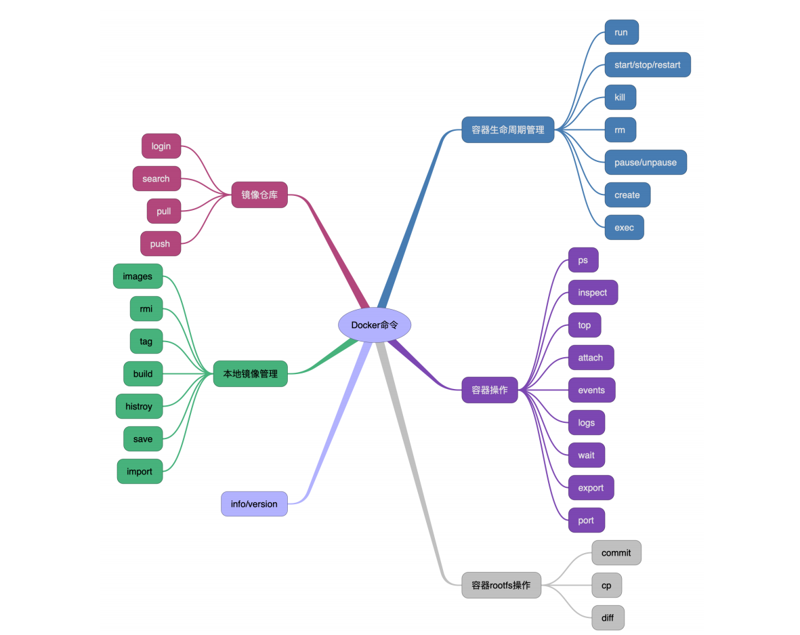

### 1.15、安装nginx

- **拉取镜像**

  ```shell
  docker pull nginx:1.20.0-alpine
  ```

- **备份镜像**

  ```shell
  docker save nginx:1.20.0-alpine -o /data/nginx:1.20.0-alpine.tar
  ```

- **导入镜像**

  ```shell
  docker load -i /data/nginx:1.20.0-alpine.tar
  ```

- **运行镜像**

  ```shell
  #创建并运行容器
  docker run -itd --name nginx -p 80:80 nginx:1.19.3-alpine 
  #进入容器
  docker exec -it nginx sh 
  #查看html目录 
  cd /usr/share/nginx/html
  #配置文件目录
  cat /etc/nginx/nginx.conf
  ```

- **浏览器测试**

  ```shell
  http://192.168.81.110/
  ```

### 1.16、安装mysql

- **拉取镜像**

  ```shell
  docker pull mysql:5.7.31
  ```

- **备份镜像**

  ```shell
  docker save mysql:5.7.31 -o mysql.5.7.31.tar
  ```

- **导入镜像**

  ```shell
  docker load -i mysql.5.7.31.tar
  ```

- **运行镜像**

  学习**docker run -e**参数

  - **-e , --env=[]:** 设置环境变量，容器中可以使用该环境变量

  - 官网中给出进入容器的第三种方式，前边我们学习了/bin/bash，sh

  - 向my.cnf文件中追加相关配置项

  ```shell
  docker run -itd --name mysql-server --restart always --privileged=true -p 3306:3306 -e MYSQL_ROOT_PASSWORD=root mysql:5.7.31 --character-set-server=utf8 --collation-server=utf8_general_ci
  ```

  - **privileged参数**

    我们大多数熟悉 Unix 类系统的人，都习惯于通过使用 sudo 来随意提升自己的权限，成为 root 用户。我们在使用 Docker 容器的过程中知道，docker提

    供了一个 --privileged 的参数，其实它与随意使用sudo 有很大的不同，它可能会让你的应用程序面临不必要的风险，下面我们将向你展示这与以 root 身

    份运行的区别，以及特权的实际含义。

    - **作为 Root 运行**

      Docker 允许在其宿主机上隔离一个进程、capabilities 和文件系统，但是大多数容器实际上都是默认以root 身份运行。这里我们拿 DockerHub 上几

      个比较流行的镜像来进行说明。

    - **避免以 root 运行**

      虽然在容器内以 root 身份运行是很正常的，但如果你想加固容器的安全性，还是应该避免这样做。

    - **特权模式**

      --privileged 可以**不受限制地访问任何自己的系统调用**。在正常的操作中，即使容器内有 root，Docker 也会限制容器的 Linux Capabilities 的，这种

      限制包括像 CAP_AUDIT_WRITE 这样的东西，它允许覆盖内核的审计日志--你的容器化工作负载很可能不需要这个 Capabilities。所以特权只应该在你

      真正需要它的特定设置中使用，简而言之，**它给容器提供了几乎所有主机（作为root）可以做的事情的权限**。

      本质上，它就是一个免费的通行证，可以逃避容器所包含的文件系统、进程、sockets 套接字等，当然它有特定的使用场景，比如在很多 CI/CD 系统

      中需要的 Docker IN Docker 模式（在 Docker 容器内部需要 Docker 守护进程），以及需要极端网络的地方。

- **测试mysql**

  ```shell
  #进入容器：根据官网上的实例，使用bash命令进入容器
  docker exec -it mysql bash 
  #登录mysql 
  mysql -uroot -p 
  #输入密码 root 
  use mysql; 
  show databases; 
  #退出mysql 
  exit 
  #退出容器
  exit
  ```

- 连接工具测试

  ```apl
  IP:192.168.81.110 
  username:root
  password:root 
  port:3306
  ```

### 1.17、安装zookeeper

- **拉取镜像**

  ```shell
  docker pull zookeeper:3.6.2
  ```

- **备份镜像**

  ```shell
  docker save zookeeper:3.6.2 -o zookeeper.3.6.2.tar
  ```

- **导入镜像**

  ```shell
  docker load -i zookeeper.3.6.2.tar
  ```

- **单机版运行镜像**

  ```shell
  docker run -itd --name zookeeper-server --restart always -p 2181:2181 zookeeper:3.6.2
  
  #进入容器
  docker exec -it zookeeper /bin/bash
  #查看版本
  cat /etc/issue
  ```

- 测试容器

  ```shell
  #进入容器bin目录
  cd bin
  #进入zookeeper
  ./zkCli.sh
  ```

### 1.18、安装activeMQ

activeMQ没有官方镜像版本。需要使用第三方制作镜像，小伙伴们学完docker技术后，可以自行制作属于自己的activeMQ镜像。

- **拉取镜像**

  ```shell
  docker pull webcenter/activemq:5.14.3
  ```

- **备份镜像**

  ```shell
  docker save webcenter/activemq:5.14.3 -o webcenter.activemq:5.14.3.tar
  ```

- **导入镜像**

  ```shell
  docker load -i webcenter.activemq:5.14.3.tar
  ```

- **单机版运行镜像**

  ```shell
  #61616为ActiveMQ的外部访问端口， 8161为web页面访问端口
  docker run -itd --name activemq-server --restart always -p 61616:61616 -p 8161:8161 webcenter/activemq:5.14.3
  ```

- **测试容器**

  使用 ip:8161访问 ActiveMQ 管理界面 登录账号密码默认是admin/admin

  ```shell
  http://192.168.198.110:8161/
  ```

## 2、Docker核心原理

### 2.1、虚拟化技术

“云计算”这个词，相信大家都非常熟悉。作为信息科技发展的主流趋势，它频繁地出现在我们的眼前。伴随它一起出现的，还有这些概念名词——OpenStack、

Hypervisor、KVM、Docker、K8S...

这些名词概念，全部都属于云计算技术领域的范畴。对于初学者来说，理解这些概念的具体含义并不是一件容易的事情。在介绍那些古怪名词之前，先给大家简单

介绍一下**计算机发展史**。

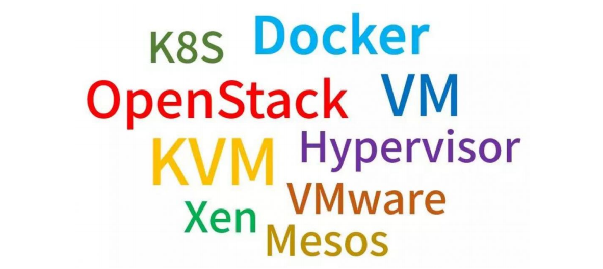

#### 2.1.1、计算机发展史

上个世纪电脑被发明的时候，还没有网络，每个电脑（PC），就是一个单机。这台单机，包括CPU、内存、硬盘、显卡等硬件。用户在单机上，安装操作系统和应

用软件，完成自己的工作。当然，还有大家更喜欢的游戏。俄罗斯方块、超级玛丽、魂斗罗、金庸群侠传、仙剑奇侠传。


后来，有了**网络（Network）**，单机与单机之间，可以交换信息，协同工作。


再后来，单机性能越来越强，就有了**服务器（Server）**。人们发现，可以把一些服务器集中起来，放在机房里，然后让用户通过网络，去访问和使用机房里的计算

机资源。再再后来，小型网络变成了大型网络，就有了**互联网（Internet）**。小型机房变成了大型机房，就有了**IDC（Internet Data Center，互联网数据中**

**心）。**

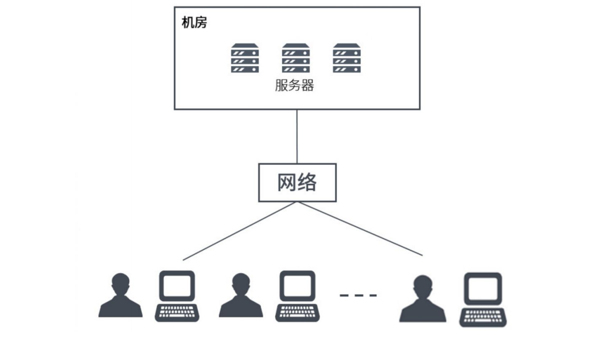

#### 2.1.2、云计算

是不是觉得太简单？别急，开始深入。云计算的道理是简单的，说白了，就是把计算机资源集中起来，放在网络上。但是，云计算的实现方式，就非常复杂了。

举个例子，如果你只是在公司小机房摆了一个服务器，开个FTP下载服务，然后用于几个同事之间的电影分享，当然是很简单的。

如果是“双11”的淘宝购物节，全球几十亿用户访问阿里巴巴的淘宝网站，单日几十PB（1PB=1024TB=1024×1024GB）的访问量，每秒几百GB的流量……这个，就

不是几根网线几台服务器能解决的了。

这时，需要设计一个**超大容量、超高并发（同时访问）、超快速度、超强安全**的云计算系统，才能满足业务平稳运行的要求。这才是云计算的复杂之处。

- **第一层次**

  是最底层的硬件资源，主要包括CPU（计算资源），硬盘（存储资源），还有网卡（网络资源）等。

- **第二层次**

  要高级一些，我不打算直接使用CPU、硬盘、网卡，我希望你把操作系统（例如Windows、Linux）装好，把数据库软件装好，我再来使用。

- **第三层次**

  更高级一些，你不但要装好操作系统这些基本的，还要把具体的应用软件装好，例如FTP服务端软件、在线视频服务端软件等，我可以直接使用服务。

这三种层次，就是大家经常听到的**IaaS**、**Paas**、**SaaS**。

- **IaaS**: Infrastructure-as-a-Service（基础设施即服务），Infrastructure-as-a-service。国内典型代表是阿里云。国际上的是IWS

- **PaaS**: Platform-as-a-Service（平台即服务），Platform-as-a-service。国内典型代表是新浪云。docker也是属于PaaS

- **SaaS**: Software-as-a-Service（软件即服务），office 365.github的Codespaces

目前主流的云计算服务提供商，例如亚马逊AWS、阿里云、华为云、天翼云、腾讯云，说白了，都是为大家提供以上三个层次的云资源。你想要什么，它们就提供

什么。你想要多少，它们就提供多少。

这么多样化多层次的云计算服务，阿里、华为们又是怎么提供的呢？

难道说，是人工安排？——如果你要八核CPU、16GB内存、500GB硬盘的服务器，阿里临时安排工程师帮你组装？如果你要装CentOS 7.8，MySQL 5.7.31，阿里

也临时让工程师帮你安装配置？这显然是不可能的，耗不起人力，也等不起时间。**于是，就有了各种软件和平台，负责对资源进行快速调用和集中管理。**

#### 2.1.3、什么是虚拟化

如果要对物理资源进行管理，第一步，就是**“虚拟化”**。虚拟化是云计算的基础。简单来说，虚拟化就是在一台物理服务器上，运行多台“虚拟服务器”。这种虚拟服

务器，也叫**虚拟机（VM，Virtual Machine）**。

从表面来看，这些虚拟机都是独立的服务器，但实际上，它们共享物理服务器的CPU、内存、硬件、网卡等资源。通过模拟计算机的硬件，来实现在同一台计算机

上同时运行不同的操作系统的技术。常用的vmwore、openstack、kvm都是使用的虚拟化技术

- 物理机，通常称为“宿主机（Host）”

- 虚拟机，则称为“客户机（Guest）”。

谁来完成物理资源虚拟化的工作呢？就是大名鼎鼎的 **Hypervisor** 。

Hypervisor也叫做VMM（Virtual Machine Monitor，虚拟机监视器）。它不是一款具体的软件，而是一类软件的统称。Hypervisor是一种运行在基础物理服务器

硬件之上的软件层，可以虚拟化硬件资源，例如：cpu，硬盘，内存，声卡等资源。然后我们可以通过在虚拟化出来的资源之上安装操作系统。也就是所谓的虚拟

机。通过Hyperviosr我们可以创建不同的虚拟机，并且每个虚拟机都是分离、独立的系统。这样操作，我们就可以在一台硬件服务器和本地操作系统之上虚拟化出

很多服务器，供我们用来部署应用程序。一台硬件服务器可以虚拟化多台服务器，让计算机资源得以充分利用。

Hypervisor分为两大类：

- 第一类，hypervisor直接运行在物理机之上。虚拟机运行在hypervisor之上。

- 第二类，物理机上安装正常的操作系统（例如Linux或Windows），然后在正常操作系统上安装hypervisor，生成和管理虚拟机。像**VMware**、**KVM**、**Xen**、

  **Virtual Box**，都属于Hypervisor。

人们在使用虚拟化一段时间后，发现它存在一些问题，不同的用户，有时候只是希望运行各自的一些简单程序，跑一个小进程。为了不相互影响，就要建立虚拟

机。如果建虚拟机，显然浪费就会有点大，而且操作也比较复杂，花费时间也会比较长。而且，有的时候，想要迁移自己的服务程序，就要迁移整个虚拟机。显

然，迁移过程也会很复杂。安装的虚拟机越多，消耗的资源对应越多。

环境兼容性问题，开发时的环境运行正常，部署到虚拟机环境进行测试则有可能发生错误。

有没有办法**更灵活快速**一些呢？有，这就引入了**“容器（Container）”**。

#### 2.1.4、什么是容器

基于硬件级虚拟化技术的缺点和不足，后续又发展出来另一种虚拟化技术，即操作系统级别的虚拟化技术。操作系统级虚拟化是运行在操作系统之上的虚拟化技

术，它模拟的是运行在一个操作系统上的多个不同进程，并将其封闭在一个密闭的容器内，该技术也就被称之为容器化技术。

容器就是在隔离环境运行的一个进程，如果进程停止，容器就会销毁。隔离的环境拥有自己的系统文件，IP地址，主机名等。容器也是虚拟化，但是属于“轻量

级”的虚拟化。它的目的和虚拟机一样，都是为了创造“隔离环境”。但是，它又和虚拟机有很大的不同——虚拟机是操作系统级别的资源隔离，而容器本质上是进程

级的资源隔离。

#### 2.1.5、容器和虚拟化的区别

容器是将代码和环境打包在一起的一个集合，而虚拟机是在物理层面上分离出来一个操作系统；多个容器可以运行在同一台硬件服务器上，并共享一个操作系统的

内核资源。多个虚拟机也可以运行在同一台服务器上，但每个虚拟机都需要有一个完整的操作系统。

#### 2.1.6、虚拟化技术分类

- **CPU虚拟化**

  虚拟化在计算机方面通常是指计算元件在虚拟的基础上而不是真实的基础上运行。虚拟化技术可以扩大硬件的容量，简化软件的重新配置过程。简单说来，

  CPU的虚拟化技术就是单CPU模拟多CPU并行，允许一个平台同时运行多个操作系统，并且应用程序都可以在相互独立的空间内运行而互不影响，从而显著提

  高计算机的工作效率。

- **网络虚拟化**

  网络虚拟化是目前业界关于虚拟化细分领域界定最不明确，存在争议较多的一个概念。微软眼中的“网络虚拟化”，是指虚拟专用网络 (VPN)。VPN 对网络连接

  的概念进行了抽象，允许远程用户访问组织的内部网络，就像物理上连接到该网络一样。网络虚拟化可以帮助保护 IT环境，防止来自 Internet 的威胁，同时使

  用户能够快速安全的访问应用程序和数据。

- **服务器虚拟化**

  与网络虚拟化不同，服务器虚拟化却是虚拟化技术最早细分出来的子领域。根据2006年2月ForresterResearch的调查，全球范围的企业对服务器虚拟化的认

  知率达到了75%。三分之一的企业已经在使用或者准备部署服务器虚拟化。这个产生于20世纪60年代的技术日益显示出其重要价值。由于服务器虚拟化发展时

  间长，应用广泛，所以很多时候人们几乎把服务器虚拟化等同于虚拟化。

- **存储虚拟化**

  随着信息业务的不断运行和发展，存储系统网络平台已经成为一个核心平台，大量高价值数据积淀下来，围绕这些数据的应用对平台的要求也越来越高，不光

  是在存储容量上，还包括数据访问性能、数据传输性能、数据管理能力、存储扩展能力等等多个方面。可以说，存储网络平台的综合性能的优劣，将直接影响

  到整个系统的正常运行。因为这个原因，虚拟化技术又一子领域——虚拟存储技术，应运而生。

- **应用虚拟化**

  前面几种虚拟化技术，主要还专注于对硬件平台资源的虚拟优化分配，随着IT应用的日益广泛，应用虚拟化作为虚拟化家族的明日之星登上了历史舞台。2006

  年7月由Forrester咨询公司在美国对各种不同行业的高层IT管理人员所做的一项研究显示，当今的机构现在将应用虚拟化当作是业务上的一个必由之路，而不

  是一个IT决策。据统计，全世界目前至少有超过18万个机构在利用应用虚拟化技术进行集中IT管理、加强安全性和减少总体成本。

### 2.2、docker网络

当你开始大规模使用docker时，你会发现需要了解很多关于网络的知识。docker作为目前最火的轻量级容器技术，有很多令人称道的功能，如docker的镜像管

理。然而，docker同样有着很多不完善的地方，网络方面就是Docker比较薄弱的部分。因此，作为一名运维工程师有必要深入了解docker的网络知识，以满足更

高的网络需求。作为一名微服开发工程师，简单了解docker网络环节即可。本章节首先介绍了Docker自身的3种local网络工作方式，然后介绍一些docker自定义

网络模式。

docker安装后会自动创建3种网络:

- bridge
- host
- none

```shell
#查看docker的网络
docker network ls
```

#### 2.2.1、docker网络理论部分

docker使用Linux桥接网卡，在宿主机虚拟一个docker容器网桥(docker0)，docker启动一个容器时会根据docker网桥的网段分配给容器一个IP地址，称为

Container-IP，同时docker网桥是每个容器的默认网关。因为在同一宿主机内的容器都接入同一个网桥，这样容器之间就能够通过容器的Container-IP直接通信。

docker网桥是宿主机虚拟出来的，并不是真实存在的网络设备，外部网络是无法寻址到的，这也意味着外部网络无法通过直接Container-IP访问到容器。如果容器

希望外部访问能够访问到，可以通过映射容器端口到宿主主机（端口映射），即docker run创建容器时候通过 -p 或 -P 参数来启用，访问容器的时候就通过**[宿主**

**机IP]:[容器端口]**访问容器。

```shell
#使用命令查看docker网络部分 
docker info
```

#### 2.2.2、网络模式

| Docker网络模式   | 配置                      | 说明                                                         |
| ---------------- | ------------------------- | ------------------------------------------------------------ |
| host模式         | –net=host                 | 容器和宿主机共享Network namespace。容器将不会虚拟出自己的网卡，配置自己的IP等，<br/>而是使用宿主机的IP和端口。 |
| container模式    | –net=container:NAME_or_ID | 容器和另外一个容器共享Network namespace。kubernetes中的pod就是多个容器共享一个<br/>Network namespace。<br/>创建的容器不会创建自己的网卡，配置自己的IP，而是和一个指定的容器共享IP、端口范围。 |
| none模式         | –net=none                 | 容器有独立的Network namespace，并没有对其进行任何网络设置，如分配veth pair 和网桥连接，<br/>配置IP等。该模式关闭了容器的网络功能。 |
| bridge模式       | –net=bridge               | （默认为该模式）。此模式会为每一个容器分配、设置IP等，并将容器连接到一个docker0虚拟网桥，<br/>通过docker0网桥以及Iptables nat表配置与宿主机通信。 |
| Macvlan  network | 无                        | 容器具备Mac地址，使其显示为网络上的物理设备                  |
| Overlay          | 无                        | (覆盖网络）： 利用VXLAN实现的bridge模式                      |

#### 2.2.3、bridge模式

默认的网络模式。bridge模式下容器没有一个公有ip,只有宿主机可以直接访问,外部主机是不可见的,但容器通过宿主机的NAT规则后可以访问外网。

**Bridge** **桥接模式的实现步骤主要如下：**

- Docker Daemon 利用 veth pair 技术，在宿主机上创建两个虚拟网络接口设备，假设为veth0 和veth1。而veth pair 技术的特性可以保证无论哪一个 veth 接

  收到网络报文，都会将报文传输给另一方。

- Docker Daemon 将 veth0 附加到 Docker Daemon 创建的 docker0网桥上。保证宿主机的网络报文可以发往 veth0；

- Docker Daemon 将 **veth1** 添加到 Docker Container 所属的 namespace 下，并被改名为**eth0**。如此一来，保证宿主机的网络报文若发往 veth0，则立即会

  被 eth0 接收，实现宿主机到DockerContainer网络的联通性；同时，也保证 Docker Container 单独使用 eth0，**实现容器网络环境的隔离性。**

**Bridge桥接模式的缺陷：**

1. 最明显的是，该模式下 Docker Container 不具有一个公有 IP，即和宿主机的 eth0 不处于同一个网段。导致的结果是宿主机以外的世界不能直接和容器进行

   通信。

2. 虽然 NAT 模式经过中间处理实现了这一点，但是 NAT 模式仍然存在问题与不便，如：容器均需要在宿主机上竞争端口，容器内部服务的访问者需要使用服务

   发现获知服务的外部端口等。

3. 另外 NAT 模式由于是在三层网络上的实现手段，故肯定会影响网络的传输效率。

**注意：**

veth设备是成双成对出现的，一端是容器内部命名为eth0，一端是加入到网桥并命名的veth（通常命名为veth），它们组成了一个数据传输通道，一端进一端出，

veth设备连接了两个网络设备并实现了数据通信。

#### 2.2.4、host模式

相当于Vmware中的NAT模式，与宿主机在同一个网络中，但没有独立IP地址。

如果启动容器的时候使用host模式，那么这个容器将不会获得一个独立的Network Namespace，而是和宿主机共用一个Network Namespace。容器将不会虚拟

出自己的网卡，配置自己的IP等，而是使用宿主机的IP和端口。但是，容器的其他方面，如文件系统、进程列表等还是和宿主机隔离的。

使用host模式的容器可以直接使用宿主机的IP地址与外界通信，容器内部的服务端口也可以使用宿主机的端口，不需要进行NAT，host最大的优势就是网络性能比

较好，但是docker host上已经使用的端口就不能再用了，网络的隔离性不好。

host网络模式需要在容器创建时指定–network=host

host 模式是 bridge 桥接模式很好的补充。采用 host 模式的 Docker Container，可以直接使用宿主机的 IP地址与外界进行通信，若宿主机的 eth0 是一个公有 

IP，那么容器也拥有这个公有IP。同时容器内服务的端口也可以使用宿主机的端口，无需额外进行 NAT 转换。

host模式可以让容器共享宿主机网络栈,这样的好处是外部主机与容器直接通信,但是容器的网络缺少隔离性。

**Host 网络模式的缺陷：**

最明显的是 Docker Container 网络环境隔离性的弱化。即容器不再拥有隔离、独立的网络环境。

另外，使用 host 模式的 Docker Container 虽然可以让容器内部的服务和传统情况无差别、无改造的使用，但是由于网络隔离性的弱化，该容器会与宿主机共享竞

争网络栈的使用；

另外，容器内部将不再拥有所有的端口资源，原因是部分端口资源已经被宿主机本身的服务占用，还有部分端口已经用以 bridge 网络模式容器的端口映射。

#### 2.2.5、Container网络模式

**一种特殊host 网络模式**

Container 网络模式是 Docker 中一种较为特别的网络的模式。在容器创建时使用–network=container:vm1指定。(vm1指定的是运行的容器名)

处于这个模式下的 Docker 容器会共享一个网络环境,这样两个容器之间可以使用localhost高效快速通信。

缺陷：它并没有改善容器与宿主机以外世界通信的情况（和桥接模式一样，不能连接宿主机以外的其他设备）。

这个模式指定新创建的容器和已经存在的一个容器共享一个 Network Namespace，而不是和宿主机共享。新创建的容器不会创建自己的网卡，配置自己的 IP，而

是和一个指定的容器共享 IP、端口范围等。同样，两个容器除了网络方面，其他的如文件系统、进程列表等还是隔离的。两个容器的进程可以通过lo 网卡设备通

信。

#### 2.2.6、none模式

使用none模式，Docker容器拥有自己的Network Namespace，但是，并不为Docker容器进行任何网络配置。也就是说，这个Docker容器没有网卡、IP、路由等

信息。需要我们自己为Docker容器添加网卡、配置IP等。

这种网络模式下容器只有lo回环网络，没有其他网卡。none模式可以在容器创建时通过--network=none来指定。这种类型的网络没有办法联网，封闭的网络能很

好的保证容器的安全性。

#### 2.2.7、overlay 网络模式

Overlay 网络，也称为覆盖网络。主要用于docker集群部署。

Overlay 网络的实现方式和方案有多种。Docker自身集成了一种，基于VXLAN隧道技术实现。

Overlay 网络主要用于实现跨主机容器之间的通信。

应用场景：需要管理成百上千个跨主机的容器集群的网络时

#### 2.2.8、macvlan 网络模式

macvlan网络模式，最主要的特征就是他们的通信会直接基于mac地址进行转发。

这时宿主机其实充当一个二层交换机。Docker会维护着一个MAC地址表，当宿主机网络收到一个数据包后，直接根据mac地址找到对应的容器，再把数据交给对

应的容器。容器之间可以直接通过IP互通，通过宿主机上内建的虚拟网络设备（创建macvlan网络时自动创建），但与主机无法直接利用IP互通。

应用场景：由于每个外来的数据包的目的mac地址就是容器的mac地址，这时每个容器对于外面网络来说就相当于一个真实的物理网络设备。因此当需要让容器来

的网络看起来是一个真实的物理机时，使用macvlan模式

Macvlan是一个新的尝试，是真正的网络虚拟化技术的转折点。Linux实现非常轻量级，因为与传统的Linux Bridge隔离相比，它们只是简单地与一个Linux以太网

接口或子接口相关联，以实现网络之间的分离和与物理网络的连接。

Macvlan提供了许多独特的功能，并有充足的空间进一步创新与各种模式。这些方法的两个高级优点是绕过Linux网桥的正面性能以及移动部件少的简单性。删除

传统上驻留在Docker主机NIC和容器接口之间的网桥留下了一个非常简单的设置，包括容器接口，直接连接到Docker主机接口。由于在这些情况下没有端口映

射，因此可以轻松访问外部服务。

Macvlan Bridge模式每个容器都有唯一的MAC地址，用于跟踪Docker主机的MAC到端口映射。

Macvlan驱动程序网络连接到父Docker主机接口。示例是物理接口，例如eth0，用于802.1q VLAN标记的子接口eth0.10（.10代表VLAN 10）或甚至绑定的主机适

配器，将两个以太网接口捆绑为单个逻辑接口。 指定的网关由网络基础设施提供的主机外部。 每个Macvlan Bridge模式的Docker网络彼此隔离，一次只能有一个

网络连接到父节点。

每个主机适配器有一个理论限制，每个主机适配器可以连接一个Docker网络。 同一子网内的任何容器都可以与没有网关的同一网络中的任何其他容器进行通信

macvlan bridge。 相同的docker network命令适用于vlan驱动程序。 在Macvlan模式下，在两个网络/子网之间没有外部进程路由的情况下，单独网络上的容器无

法互相访问。这也适用于同一码头网络内的多个子网。

#### 2.2.9、bridge网络实战

本章节学习docker的bridge网络，bridge网络表现形式就是docker0这个网络接口。容器默认都是通过docker0这个接口进行通信。也可以通过docker0去和本机

的以太网接口连接，这样容器内部才能访问互联网。

```shell
#查看docker0网络，在默认环境中，一个名为docker0的linux bridge自动被创建好了，其上有一个 docker0 内部接口，IP地址为172.17.0.1/16 
ip a
#查看docker 网络 
docker network ls 
#查看bridge网络详情。主要关注Containers节点信息
docker network inspect bridge  	
```

- **docker0详解**
  - **运行镜像**

    ```shell
    docker run -itd --name nginx1 -p 80:80 nginx:1.19.3-alpine
    #查看bridge网络详情。主要关注Containers节点信息。发现nginx-server容器默认使用bridge网络
    docker network inspect bridge
    ```

  - **容器创建时IP地址的分配**

    ```shell
    #查看docker100主机网络。发现多出一块网卡veth62aef5e@if8 
    ip a
    ```

  Docker 创建一个容器的时候，会执行如下操作：

  - 创建一对虚拟接口/网卡，也就是veth pair，分别放到本地主机和新容器中；
  - 本地主机一端桥接到默认的 docker0 或指定网桥上，并具有一个唯一的名字，如 vetha596da4；
  - 容器一端放到新容器中，并修改名字作为 eth0，这个网卡/接口只在容器的名字空间可见；
  - 从网桥可用地址段中（也就是与该bridge对应的network）获取一个空闲地址分配给容器的 eth0，并配置默认路由到桥接网卡 vetha596da4。

  完成这些之后，容器就可以使用 eth0 虚拟网卡来连接其他容器和其他网络。

  如果不指定--network，创建的容器默认都会挂到 docker0 上，使用本地主机上 docker0 接口的 IP 作为所有容器的默认网关。

  ```shell
  #第一种方式：
  docker exec -it nginx1 sh 
  ip a 
  #第二种方式： 
  docker exec -it nginx1 ip a
  ```

- **查看创建的容器虚拟网卡是否和docker0是否进行映射**

  ```shell
  #安装brctl
  yum install -y bridge-utils
  #查看
  brctl show
  ```

- **容器创建网络初始化过程**

  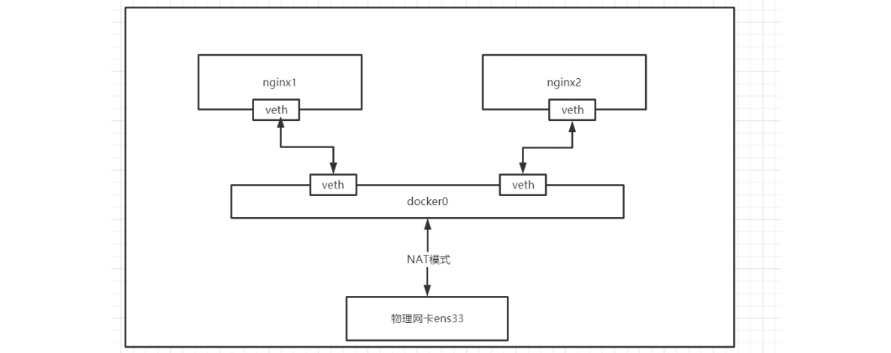

- **多容器之间通讯**

  ```shell
  #启动多个容器
  docker run -itd --name nginx1 nginx:1.19.3-alpine 
  docker run -itd --name nginx2 nginx:1.19.3-alpine 
  #查看docker bridge 网络
  docker network inspect bridge 
  #进入容器 ping其他容器IP
  docker exec -it nginx1 sh 
  ping 172.17.0.2 
  #进入容器 ping其他容器IP
  docker exec -it nginx2 sh 
  ping 172.17.0.2 
  ping www.baidu.com 
  #无法使用容器名称进行ping，原因是docker网络IP是动态分配，会根据其他顺序进行分配，也就是容器的IP会发送变化
  ping nginx1
  ```

- **容器IP地址会发生变化**

  ```shell
  #停止容器
  docker stop nginx1 nginx2 
  #先启动nginx2，在启动nginx1 
  docker start nginx2 
  docker start nginx1 
  #查看网络观察IP变化情况
  docker network inspect bridge
  ```

- **link容器**

  **学习docker run命令的link参数**

  - **--link=[]:** 添加链接到另一个容器；**不推荐各位小伙伴使用该参数**

  使用link的场景：在企业开发环境中，我们有一个mysql的服务的容器mysql_1，还有一个web应用程序web_1，肯定web_1这台容器肯定要连接mysql_1这个

  数据库。前面网络命名空间的知识告诉我们，两个容器需要能通信，需要知道对方的具体的IP地址。生产环境还比较好，IP地址很少变化，但是在我们内部测

  试环境，容器部署的IP地址是可能不断变化的，所以，开发人员不能在代码中写死数据库的IP地址。这个时候，我们就可以利用容器之间link来解决这个问

  题。下面，我们来介绍如何通过容器名称来进行ping，而不是通过IP地址。

  ```shell
  #停止容器
  docker rm -f nginx2 
  #启动nginx2 link nginx1
  docker run -itd --name nginx2 --link nginx1 nginx:1.19.3-alpine 
  #进入nginx2容器 ping nginx1
  docker exec -it nginx2 sh
  ping 172.17.0.2 
  ping www.baidu.com 
  ping nginx1
  ```

  - 上面link命令，是在nginx2容器启动时link到nginx1容器，因此，在nginx2容器里面可以ping通nginx1容器名，link的作用相当于添加了DNS解析。这里提

    醒下，在nginx1容器里去ping nginx2容器是不通的，因为link关系是单向的，不可逆。

  - 实际工作中，docker官网已经不推荐我们使用link参数。

  - docker用其他方式替换掉link参数

- **新建bridge网络**

  ```shell
  docker network create -d bridge thm-bridge
  ```

  上面命令参数-d 是指DRIVER的类型，后面的thm-bridge是network的自定义名称，这个和docker0是类似的。下面开始介绍，如何把容器连接到thm-bridge

  这个网络。

  启动一个nginx的容器nginx3，并通过参数network connect来连接thm-bridge网络。在启动容器nginx3之前，我们查看目前还没有容器连接到了thm-bridge

  这个网络上。

  ```shell
  brctl show 
  #查看docker网络
  docker network ls 
  docker network inspect thm-bridge 
  #启动容器并绑定到自己创建的网络上
  docker run -itd --name nginx3 --network thm-bridge nginx:1.19.3-alpine
  #查看网络情况
  brctl show 
  docker network inspect thm-bridge
  ```

  把一个运行中容器连接到thm-bridge网络

  ```shell
  #将容器nginx2连接到自定义网络
  docker network connect thm-bridge 
  #查看网络
  nginx2 docker network inspect thm-bridge 
  #进入容器使用容器名称ping 发现可以ping通
  docker exec -it nginx2 sh 
  ping nginx3 
  docker exec -it nginx3 sh 
  ping nginx2
  ```

#### 2.2.10、none、host网络

- **none网络**

  环境准备，先stop和rm掉全部之前开启的容器。并且把前面创建的thm-bridge网络也删除。当然，更简单的办法是使用快照方式。将docker-100主机恢复到

  docker初始化安装时。

  ```shell
  #删除所有容器
  docker rm -f $(docker ps -aq)
  #删除自定义网络
  docker network rm thm-bridge 
  #查看网络
  docker network ls
  ```

  启动一个ngnix的容器nginx1，并且连接到none网络。然后执行docker network inspect none，看看容器信息

  ```shell
  docker run -itd --name nginx1 --network none nginx:1.19.3-alpine 
  docker network inspect none
  ```

  注意，容器使用none模式，是没有物理地址和IP地址。我们可以进入到nginx1容器里，执行ip a命令看看。只有一个lo接口，没有其他网络接口，没有IP。也

  就是说，使用none模式，这个容器是不能被其他容器访问。这种使用场景很少，只有项目安全性很高的功能才能使用到。例如：密码加密算法容器。

  ```shell
  docker exec -it nginx1 sh 
  ip a
  ```

- **host网络**

  none网络模式特点就是，容器没有IP地址，不能和其他容器通信。下面来看看host网络是什么特点。我们使用前面命令，启动一个nginx的nginx2容器，连接

  到host网络。然后docker network inspect host, 看看容器信息。

  ```shell
  docker run -itd --name nginx2 --network host nginx:1.19.3-alpine 
  docker network inspect host
  ```

  这里来看，也不显示IP地址。那么是不是和none一样，肯定不是，不然也不会设计none和host网络进行区分。下面我们进入nginx2容器，执行ip a看看效

  果。我们在容器里执行ip a，发现打印内容和在linux本机外执行ip a是一样的。

  ```shell
  docker exec -it nginx2 sh
  ip a
  ```

  这说明什么呢？容器使用了host模式，说明容器和外层linux主机共享一套网络接口。VMware公司的虚拟机管理软件，其中网络设置，也有host这个模式，作

  用也是一样，虚拟机里面使用网络和你自己外层机器是一模一样的。这种容器和本机使用共享一套网络接口，缺点还是很明显的，例如我们知道web服务器一

  般端口是80，共享了一套网络接口，那么你这台机器上只能启动一个nginx端口为80的服务器了。否则，出现端口被占用的情况。

  本篇很简单，就是简单了解下docker中none和host网络模式。学习重点还是如何使用bridge网络。

#### 2.2.11、网络命令汇总

```shell
docker network --help 
#网络常用命令汇总 
connect: Connect a container to a network 
create: Create a network 
disconnect: Disconnect a container from a network 
inspect: Display detailed information on one or more networks 
ls: List networks 
prune: Remove all unused networks 
rm: Remove one or more networks
```

- **查看网络**

  ```shell
  #查看网络 
  docker network ls 
  # 作用：查看已经建立的网络对象
  # 命令格式： 
  docker network ls [OPTIONS] 
  # 命令参数(OPTIONS)： 
  -f, 
  --filter filter 过滤条件(如 'driver=bridge’)
  --format string 格式化打印结果 
  --no-trunc 不缩略显示 
  -q, --quiet 只显示网络对象的ID 
  # 注意：默认情况下，docker安装完成后，会自动创建bridge、host、none三种网络驱动 
  # 命令演示 
  docker network ls 
  docker network ls --no-trunc 
  docker network ls -f 'driver=host'
  ```

- **创建网络**

  ```shell
  #创建网络
  docker network create 
  # 作用：创建新的网络对象 
  # 命令格式： 
  docker network create [OPTIONS] NETWORK 
  # 命令参数(OPTIONS)： 
  -d, --driver string 指定网络的驱动(默认 "bridge") 
  --subnet strings 指定子网网段(如192.168.0.0/16、172.88.0.0/24) 
  --ip-range strings 执行容器的IP范围，格式同subnet参数 
  --gateway strings 子网的IPv4 or IPv6网关，如(192.168.0.1) 
  # 注意：
  host和none模式网络只能存在一个 docker自带的overlay 
  网络创建依赖于docker swarm(集群负载均衡)服务 
  192.168.0.0/16 等于 192.168.0.0~192.168.255.255
  172.88.0.0/24 等于 172.88.0.0~172.88.0.255 
  # 命令演示 
  docker network ls 
  docker network create -d bridge my-bridge 
  docker network ls
  ```

- **网络删除**

  ```shell
  #网络删除
  docker network rm 
  # 作用：删除一个或多个网络 
  # 命令格式：
  docker network rm NETWORK [NETWORK...] 
  # 命令参数(OPTIONS)： 无
  ```

- **查看网络详细信息**

  ```shell
  #查看网络详细信息
  docker network inspect 
  # 作用：查看一个或多个网络的详细信息 
  # 命令格式： 
  docker network inspect [OPTIONS] NETWORK [NETWORK...] 
  或者 
  docker inspect [OPTIONS] NETWORK [NETWORK...]
  # 命令参数(OPTIONS)：
  -f, 
  --format string #根据format输出结果
  ```

- **使用网络**

  ```shell
  #使用网络
  docker run –-network
  # 作用：为启动的容器指定网络模式 
  # 命令格式： 
  docker run/create --network NETWORK 
  # 命令参数(OPTIONS)： 无 
  # 注意：默认情况下，docker创建或启动容器时，会默认使用名为bridge的网络
  ```

- **网络连接与断开**

  ```shell
  #网络连接与断开
  docker network connect/disconnect 
  # 作用：将指定容器与指定网络进行连接或者断开连接 
  # 命令格式：
  docker network connect [OPTIONS] NETWORK CONTAINER 
  docker network disconnect [OPTIONS] NETWORK CONTAINER 
  # 命令参数(OPTIONS)： 
  -f, 
  --force #强制断开连接(用于disconnect)
  ```

#### 2.2.12、容器分配固定IP

```shell
#创建网络
docker network create -d bridge --subnet 172.172.0.0/24 --gateway 172.172.0.1 thm-network
#172.172.0.0/24: 24代表子码掩码是255.255.255.0 
#172.172.0.0/16: 16 代表子码掩码

#查看创建网络
docker network ls
#创建并启动容器  指定网络和IP
docker run -itd --name nginx3 -p 80:80 --network thm-network --ip 172.172.0.10 nginx:1.20.0-alpine

#查看创建网络详情
docker network inspect thm-network
#重启容器 发现IP地址不变
docker stop nginx3 
docker start nginx3 
docker network inspect thm-network
```

### 2.3、docker数据卷

#### 2.3.1、什么是数据卷

当我们在使用docker容器的时候，会产生一系列的数据文件，这些数据文件在我们删除docker容器时是会消失的，但是其中产生的部分内容我们是希望能够把它

给保存起来另作用途的，Docker将应用与运行环境打包成容器发布，我们希望在运行过程钟产生的部分数据是可以持久化的的，而且容器之间我们希望能够实现

数据共享。

通俗地来说，docker容器数据卷可以看成使我们生活中常用的u盘，它存在于一个或多个的容器中，由docker挂载到容器，但不属于联合文件系统，Docker不会

在容器删除时删除其挂载的数据卷。

特点：
1. 数据卷可以在容器之间共享或重用数据
2. 数据卷中的更改可以立即生效（配置文件除外）
3. 数据卷中的更改不会包含在镜像的更新中
4. 数据卷默认会一直存在，即使容器被删除
5. 数据卷的生命周期一直持续到没有容器使用它为止

容器中的管理数据主要有两种方式：

- 数据卷：Data Volumes 容器内数据直接映射到本地主机环境

- 数据卷容器：Data Volume Containers 使用特定容器维护数据卷

#### 2.3.2、cp命令

当然还有最原始的copy方式，这个也是管理数据的方式，但是基本不会用到。

- **docker cp :**用于容器与主机之间的数据拷贝。

- **语法**

  ```shell
  #宿主机文件复制到容器内  docker cp [OPTIONS] 宿主机目录 容器名称：容器内目录
  docker cp [OPTIONS] SRC_PATH CONTAINER:DEST_PATH 
  #容器内文件复制到宿主机  docker cp [OPTIONS] 容器名称：容器内目录 宿主机目录
  docker cp [OPTIONS] CONTAINER:SRC_PATH DEST_PATH
  #常用参数
  -L :保持源目标中的链接
  ```

- **宿主机文件 copy to 容器内**

  宿主机的index.html页面覆盖容器内的index.html页面

  ```shell
  #创建并运行容器
  docker run -itd --name nginx1 -p 80:80 nginx:1.20.0-alpine
  #将内容重定向到一个文件
  cd /data
  echo "ces.htlk" > index.html
  #将宿主机中的文件拷贝到容器中
  docker cp /data/index.html nginx1:/usr/share/nginx/html/index.html
  ```

- **容器内文件 copy to 宿主机**

  将容器内的nginx.cnf复制到宿主机中

  ```shell
  #创建并运行容器
  docker run -itd --name nginx1 -p 80:80 nginx:1.20.0-alpine
  cd /data
  #拷贝文件
  docker cp nginx1:/etc/nginx/nginx.conf /data/
  #拷贝文件夹
  docker cp nginx1:/etc/nginx /data/
  ```

#### 2.3.3、数据卷

数据卷(Data Volumes)是一个可供一个或多个容器使用的特殊目录，它将主机操作系统目录直接映射进容器。

**注意事项**

- 挂载数据卷，最好是通过run而非create/start创建启动容器，create/start命令创建启动容器后，再挂载数据卷相当麻烦，要修改很多配置文件。
- docker官网推荐尽量进行目录挂载，不要进行文件挂载

**数据卷类型**

1. 宿主机数据卷：直接在宿主机的文件系统中但是容器可以访问（bind mount） 
2. 命名的数据卷：磁盘上Docker管理的数据卷，但是这个卷有个名字。
3. 匿名数据卷：磁盘上Docker管理的数据卷，因为没有名字想要找到不容易，Docker来管理这些文件。

数据卷其实都在（如果没有网络文件系统等情况下）宿主机文件系统里面的，只是第一种是在宿主机内的特定目录下，而后两种则在docker管理的目录下，这个目

录一般是 /var/lib/docker/volumes/

**推荐大家使用** `宿主机数据卷` **方式持久化数据**

#### 2.3.4、宿主机数据卷

**bind mounts：**容器内的数据被存放到宿主机文件系统的任意位置，甚至存放到一些重要的系统目录或文件中。除docker之外的进程也可以对他们进行修改。

当使用bind mounts时，宿主机的目录或文件被挂载到容器中。容器将按照挂载目录或文件的绝对路径来使用或修改宿主机的数据。宿主机中的目录或文件不需要

预先存在，在需要的使用会自动创建。

使用bind mounts在性能上是非常好的，但这依赖于宿主机有一个目录妥善结构化的文件系统。

使用bind mounts的容器可以在通过容器内部的进程对主机文件系统进行修改，包括创建，修改和删除重要的系统文件和目录，这个功能虽然很强大，但显然也会

造成安全方面的影响，包括影响到宿主机上Docker以外的进程。

- **数据覆盖问题**
  
  - 如果挂载一个空的数据卷到容器中的一个非空目录中，那么这个目录下的文件会被复制到数据卷中
  - 如果挂载一个非空的数据卷到容器中的一个目录中，那么容器中的目录会显示数据卷中的数据。如果原来容器中的目录有数据，那么原始数据会被隐藏掉
  
- **语法**

  ```shell
  docker run -v /宿主机绝对路径目录:/容器内目录 镜像名
  ```

- **基础镜像**

  ```shell
  docker pull mysql:5.7.31
  ```

- **运行镜像**

  **推荐还是先创建好目录后再进行数据挂载**

  ```shell
  #创建并启动容器  挂载数据卷
  docker run -itd --name mysql-server --restart always --privileged=true -p 3306:3306 -e MYSQL_ROOT_PASSWORD=root -v /data/mysql:/var/lib/mysql mysql:5.7.31 --character-set-server=utf8 --collation-server=utf8_general_ci
  #连接数据库并创建数据库 thm
  #删除容器
  docker rm -f mysql-server 
  #重新创建并启动容器  挂载数据卷
  docker run -itd --name mysql-server --restart always --privileged=true -p 3306:3306 -e MYSQL_ROOT_PASSWORD=root -v /data/mysql:/var/lib/mysql mysql:5.7.31 --character-set-server=utf8 --collation-server=utf8_general_ci
  #查询先前创建的数据库是否还在  
  ```

- **容器目录权限**

  ```shell
  #通过 -v 容器内路径： ro rw 改变读写权限 
  ro:readonly 只读 
  rw:readwrite 可读可写
  docker run -it -v /宿主机绝对路径目录:/容器内目录:ro 镜像名
  docker run -it -v /宿主机绝对路径目录:/容器内目录:rw 镜像名 
  #例如： 
  docker run -d -P --name nginx05 -v lagouedu1:/etc/nginx:ro nginx 
  docker run -d -P --name nginx05 -v lagouedu2:/etc/nginx:rw nginx 
  #ro 只要看到ro就说明这个路径只能通过宿主机来操作，容器内部是无法操作！
  ```

#### 2.3.5、挂载目录权限问题

```shell
#拉取镜像 
docker pull sonatype/nexus3:3.28.1
#备份镜像 
docker save sonatype/nexus3:3.28.1 -o sonatype.nexus3.3.28.1.tar 
#导入镜像 
docker load -i sonatype.nexus3.3.28.1.tar
```

```shell
#数据卷挂载 
docker run -itd --name nexus3 -p 8081:8081 --name nexus3 -v /data/nexus3/:/nexus-data/ sonatype/nexus3:3.28.1
#查看容器启动日志 
docker logs -f nexus3
#报错信息如下： 
mkdir: cannot create directory '../sonatype-work/nexus3/log': Permission denied
mkdir: cannot create directory '../sonatype-work/nexus3/tmp': Permission denied
#删除容器 
docker rm -f nexus3 
#查看官网说明文档，需要为挂载目录授权
chown -R 200 nexus3/ 
docker run -itd --name nexus3 -p 8081:8081 --name nexus3 -v /data/nexus3/:/nexus-data/ sonatype/nexus3:3.28.1
#查看容器启动日志 
docker logs -f nexus3
#进入容器查找初始化密码
docker exec -it nexus3 /bin/bash 
cd /nexus-data/ 
cat admin.password 
#浏览器端访问 
http://192.168.198.100:8081/
```

总结：**开发环境中推荐各位小伙伴为挂载目录授最高权限777；生产环境需要查看官网文档，结合实际生产环境进行授权。**

#### 2.3.6、命名的数据卷

- **基础镜像**

  ```shell
  docker pull nginx:1.19.3-alpine
  ```

- **挂载数据卷**

  ```shell
  #创建并启动容器 thm-nginx只是对数据卷进行命名，没有创建
  docker run -itd --name nginx -p 80:80 -v thm-nginx:/etc/nginx nginx:1.19.3-alpine
  #查看docker数据卷 
  docker volume ls
  #查看命名数据卷thm-nginx详情
  docker volume  inspect thm-nginx
  #进入docker数据卷thm-nginx默认目录
  cd /var/lib/docker/volumes/thm-nginx
  #所有的文件docker默认保存在_data目录中
  cd _data
  #删除容器 
  docker rm $(docker stop $(docker ps -aq))
  #查看挂载数据是否还存在，通过查看数据，发现删除容器后，宿主机中的数据还存在 
  ls
  ```

#### 2.3.7、匿名数据卷

- **基础镜像**

  ```shell
  docker pull nginx:1.19.3-alpine
  ```

- **挂载数据卷**

  ```shell
  #创建并启动容器
  docker run -itd --name nginx -p 80:80 -v /ets/nginx nginx:1.19.3-alpine
  #查看docker数据卷 
  docker volume ls
  #查看默认生成数据卷详情
  docker volume inspect 6fbeca27f51ccc74ae26b4e7bf7ea2309ece0a187e621aaa88ce2af38460d093
  #进入docker数据卷默认目录
  cd /var/lib/docker/volumes/6fbeca27f51ccc74ae26b4e7bf7ea2309ece0a187e621aaa88ce2af38460d093
  #所有的文件docker默认保存在_data目录中
  cd _data
  #删除容器 
  docker rm $(docker stop $(docker ps -aq))
  #查看挂载数据是否还存在，通过查看数据，发现删除容器后，宿主机中的数据还存在 
  ls
  ```

- **清理数据卷**

  删除上面创建的容器后会，发现数据卷仍然存在，我们就需要去清理它，不然会占用我们的资源

  ```shell
  docker volume ls 
  #清理数据卷   清除未使用的数据卷（慎用）
  docker volume prune 
  
  docker volume ls
  ```

#### 2.3.8、数据卷容器

- **基础镜像**

  ```shell
  docker pull alpine:3.13.5 
  docker pull nginx:1.19.3-alpine 
  docker pull mysql:5.7.31
  ```

- **run命令**

  **--volumes-from：**

  如果用户需要在多个容器之间共享一些持续更新的数据，最简单的方式是使用数据卷容器。数据卷容器也是一个容器，但是它的目的是专门用来提供数据卷供

  其他容器挂载。

  发现创建好的数据卷容器是处于停止运行的状态，因为使用 —volumes-from 参数所挂载数据卷的容器自己并不需要保持在运行状态。

  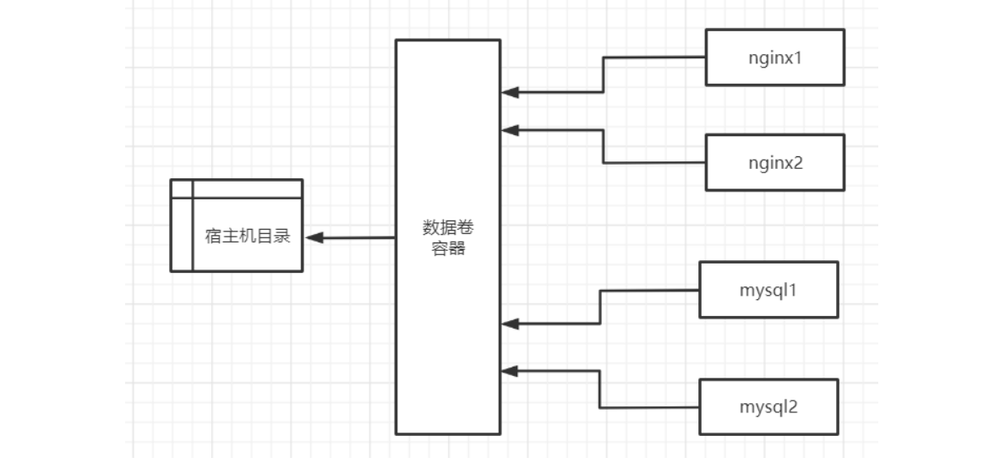

  **创建数据卷容器**

  ```shell
  docker run -itd --name data-volume -v /data/nginx:/usr/share/nginx/html -v /data/mysql:/var/lib/mysql alpine:3.13.5
  ```

  **进行数据卷容器映射**

  ```shell
  #创建并启动容器 并使用数据卷容器
  docker run -itd --name nginx01 -p 80:80 --volumes-from data-volume nginx:1.19.3-alpine
  echo "sfasf nginx" > /data/nginx/index.html
  http://192.168.81.110
  
  docker run -itd --name nginx02 -p 81:80 --volumes-from data-volume nginx:1.19.3-alpine
  http://192.168.81.110:81
  ```

  **有的容器会有权限问题**

  ```shell
  #正常启动并运行
  docker run -itd --name mysql-server1 --restart always --privileged=true -p 3306:3306 -e MYSQL_ROOT_PASSWORD=root --volumes-from data-volume mysql:5.7.31 --character-set-server=utf8 --collation-server=utf8_general_ci
  #正常启动但是不能运行
  docker run -itd --name mysql-server2 --restart always --privileged=true -p 3307:3306 -e MYSQL_ROOT_PASSWORD=root --volumes-from data-volume mysql:5.7.31 --character-set-server=utf8 --collation-server=utf8_general_ci
  ```

### 2.4、docker-compose

**官网地址：https://docs.docker.com/compose/compose-file/**

#### 2.4.1、概述

在实际生产环境中，一个应用往往由许多服务构成，而 docker 的最佳实践是一个容器只运行一个进程，因此运行多个微服务就要运行多个容器。多个容器协同工

作需要一个有效的工具来管理他们，定义这些容器如何相互关联。compose 应运而生。

compose 是用来定义和运行一个或多个容器(通常都是多个)运行和应用的工具。使用 compose 可以简化容器镜像的构建以及容器的运行。

compose 使用 YAML 文件来定义多容器之间的关系。一个 docker-compose up 就可以把完整的应用跑起来。 本质上， compose 把 YAML 文件解析成 docker 

命令的参数，然后调用相应的 docker 命令行接口，从而将应用以容器化的方式管理起来。它通过解析容器间的依赖关系顺序地启动容器。而容器间的依赖关系由 

YAML 文件中的 links 标记指定。

#### 2.4.2、docker compose是什么

compose、machine 和 swarm 是docker 原生提供的三大编排工具。简称docker三剑客。

Docker Compose能够在 Docker 节点上，以单引擎模式（Single-Engine Mode）进行多容器应用的部署和管理。多数的现代应用通过多个更小的微服务互相协同

来组成一个完整可用的应用。比如一个简单的示例应用可能由如下 4 个微服务组成。

- Web前端。

- 订单管理。

- 品类管理。

- 后台数据库。

将以上服务组织在一起，就是一个可用的应用。

部署和管理繁多的服务是困难的。而这正是 Docker Compose 要解决的问题。Docker Compose 并不是通过脚本和各种冗长的 docker 命令来将应用组件组织起

来，而是通过一个声明式的配置文件描述整个应用，从而使用一条命令完成部署。应用部署成功后，还可以通过一系列简单的命令实现对其完整声明周期的管理。

甚至，配置文件还可以置于版本控制系统中进行存储和管理。

#### 2.4.3、docker compose 的背景

Docker Compose 的前身是 Fig。Fig 是一个由 Orchard 公司开发的强有力的工具，在当时是进行多容器管理的最佳方案。

Fig 是一个基于 Docker 的 Python工具，允许用户基于一个 YAML 文件定义多容器应用，从而可以使用fig 命令行工具进行应用的部署。

Fig 还可以对应用的全生命周期进行管理。内部实现上，Fig 会解析 YAML 文件，并通过 Docker API 进行应用的部署和管理。

在 2014 年，Docker 公司收购了 Orchard 公司，并将 Fig 更名为 Docker Compose。命令行工具也从 fig 更名为 docker-compose，并自此成为绑定在 Docker 

引擎之上的外部工具。

虽然它从未完全集成到 Docker 引擎中，但是仍然受到广泛关注并得到普遍使用。

直至今日，Docker Compose 仍然是一个需要在 Docker 主机上进行安装的外部 Python 工具。

使用它时，首先编写定义多容器（多服务）应用的 YAML 文件，然后将其交由 docker-compose 命令处理，Docker Compose 就会基于 Docker 引擎 API 完成应

用的部署。

#### 2.4.4、docker compose安装

- **下载**

  ```shell
  https://github.com/docker/compose 
  #下载版本：1.29.2
  ```

- **授权**

  ```shell
  #移动文件到指定目录
  mv /data/docker-compose-Linux-x86_64 /usr/local/bin/docker-compose 
  #或者
  cp /data/docker-compose-Linux-x86_64 /usr/local/bin/docker-compose
  #进行授权
  chmod +x /usr/local/bin/docker-compose 
  #开发环境可以授予最高权限
  chmod 777 /usr/local/bin/docker-compose
  #检查安装情况以及版本
  docker-compose -v 
  docker-compose --version 
  docker-compose version
  ```

- **卸载docker-compose**

  docker-compose卸载只需要删除二进制文件就可以了。

  ```shell
  rm -rf /usr/local/bin/docker-compose 
  reboot
  ```

#### 2.4.5、yml配置文件及常用指令

Docker Compose 使用 YAML 文件来定义多服务的应用。YAML 是 JSON 的一个子集，因此也可以使用JSON。

Docker Compose 默认使用文件名 docker-compose.yml。当然，也可以使用 -f 参数指定具体文件。

Docker Compose 的 YAML 文件包含 4 个一级 key：version、services、networks、volumes

- version 是必须指定的，而且总是位于文件的第一行。它定义了 Compose 文件格式（主要是API）的版本。注意，version 并非定义 Docker Compose 或 

  Docker 引擎的版本号。

- services 用于定义不同的应用服务。上边的例子定义了两个服务：一个名为 lagou-mysql数据库服务以及一个名为lagou-eureka的微服。Docker Compose 会

  将每个服务部署在各自的容器中。

- networks 用于指引 Docker 创建新的网络。默认情况下，Docker Compose 会创建 bridge 网络。这是一种单主机网络，只能够实现同一主机上容器的连接。

  当然，也可以使用 driver 属性来指定不同的网络类型。

- volumes 用于指引 Docker 来创建新的卷。

```yaml
version: '3' 
services: 
lagou-mysql:
build: context: ./mysql 
environment: 
MYSQL_ROOT_PASSWORD: admin 
restart: always
container_name: lagou-mysql 
volumes: - /data/edu-bom/mysql/lagou:/var/lib/mysql 
image: lagou/mysql:5.7
ports: - 3306:3306 
networks: 
lagou-net: lagou-eureka: build: context: ./edu-eureka-boot restart: always ports: - 8761:8761 container_name: edu-eureka-boot hostname: edu-eureka-boot image: lagou/edu-eureka-boot:1.0 depends_on: - lagou-mysql networks: lagou-net:
```

#### 2.4.6、反向代理案例

- **安装docker插件**

  高版本默认安装。

  idea安装docker插件。Dockerfile、docker-compose.yml文件大部分内容会有提示信息。方便开发人员编写配置文件。

  ```shell
  官网地址： https://plugins.jetbrains.com/plugin/7724-docker/versions
  ```

- **基础镜像**

  ```shell
  docker pull nginx:1.19.3-alpine 
  docker pull tomcat:9.0.20-jre8-alpine
  ```

- **运行镜像**

  ```shell
  #启动容器
  docker run -itd --name nginx -p 80:80 nginx:1.19.3-alpine 
  docker run -itd --name tomcat -p 8080:8080 tomcat:9.0.20-jre8-alpine 
  #创建目录
  mkdir -p /data/tomcat1 tomcat2 
  #挂载数据卷
  docker cp nginx:/etc/nginx/ /data
  docker cp tomcat:/usr/local/tomcat/webapps /data/tomcat1/webapps 
  docker cp tomcat:/usr/local/tomcat/webapps /data/tomcat2/webapps 
  #修改tomcat中文件
  echo "tomcat1" > /data/tomcat1/webapps/ROOT/index.jsp
  echo "tomcat2" > /data/tomcat2/webapps/ROOT/index.jsp 
  
  docker rm -f nginx tomcat
  ```

- #### 添加配置

  **修改容器中nginx.conf**

  ```shell
  #添加内容
  include vhost/*.conf;
  ```

  **反向代理配置**

  ```shell
  mkdir -p /data/nginx/vhost 
  cd vhost 
  vi thm.conf
  #内容
  upstream nginx-thm { 
  	server 192.168.81.110:8081;
  	server 192.168.81.110:8082; 
  }
  server {
  	listen 80; 
  	server_name 192.168.81.110; 
  	autoindex on; 
  	index index.html index.htm index.jsp; 
  	location / { 
  		proxy_pass http://nginx-thm; 
  		add_header Access-Control-Allow-Origin *;
  	}
  }
  ```

- **docker-compose的yaml配置文件**

  ```yaml
  version: '3'
  services:
    nginx-server:
      image: nginx:1.19.3-alpine
      container_name: nginx-server
      restart: always
      ports:
      - 80:80
      volumes:
      - /data/nginx:/etc/nginx
    tomcat-server1:
      image: tomcat:9.0.20-jre8-alpine
      container_name: tomcat-server1
      restart: always
      ports:
      - 8081:8080
      volumes:
      - /data/tomcat1/webapps:/usr/local/tomcat/webapps
      depends_on:
        - nginx-server
    tomcat-server2:
      image: tomcat:9.0.20-jre8-alpine
      container_name: tomcat-server2
      restart: always
      ports:
        - 8082:8080
      volumes:
        - /data/tomcat2/webapps:/usr/local/tomcat/webapps
      depends_on:
        - nginx-server
  ```

- **启动服务**

  ```shell
  docker-compose up 
  #后台启动
  docker-compose up -d
  #关闭
  docker-compose down
  ```

- **浏览器测试**

  ```shell
  http://192.168.81.110:8081/
  http://192.168.81.110:8082/ 
  http://192.168.81.110
  ```

#### 2.4.7、常用命令汇总

```shell
#启动服务
docker-compose up -d
#停止服务
docker-compose down
#列出所有运行容器
docker-compose ps
#查看服务日志
docker-compose logs
#构建或者重新构建服务
docker-compose build
#启动服务
docker-compose start [-f] [docker-compose.yml]
#停止已运行的服务
docker-compose stop [-f] [docker-compose.yml]
#重启服务
docker-compose restart [-f] [docker-compose.yml]
```

**官网地址：https://docs.docker.com/compose/reference/build/**

### 2.5、Docker私服

在使用maven管理jar包依赖的时候，为了避免每次都从中央仓库拉取依赖包，使用了nexus做了代理仓库。docker镜像仓库与nexus私服仓库作用类似，用于将打

包好的镜像保存在仓库中方便开发、测试、生产环境镜像拉取存储，减轻环境部署需要的相应操作。

**节点信息**

服务器用户名：root，服务器密码：root。及时做好系统快照。

| 主机名     | 主机IP         | 说明       |
| ---------- | -------------- | ---------- |
| docker-110 | 192.168.81.110 | docker主机 |
| harbor-111 | 192.168.81.111 | harbor主机 |

#### 2.5.1、官方私服

当前官方shi'fu

- **拉取镜像**

  ```shell
  docker pull registry:2.7.1
  ```

- **备份镜像**

  ```shell
  docker save registry:2.7.1 -o registry.2.7.1.tar
  ```

- **导入镜像**

  ```shell
  docker load -i registry.2.7.1.tar
  ```

- **运行容器**

  ```shell
  docker run -itd --name registry --restart=always -p 5000:5000 registry:2.7.1
  ```

- **添加私服仓库地址**

  在192.168.81.110主机上进行添加

  ```shell
  #编辑配置文件 
  vi /etc/docker/daemon.json
  #增加仓库配置信息 
  { "insecure-registries":["192.168.81.110:5000"] }
  #示例
  {
  "registry-mirrors": ["https://cmwmjcql.mirror.aliyuncs.com"],
  "insecure-registries":["192.168.81.111:5000"]
  }
  
  #重启docker 
  systemctl daemon-reload 
  systemctl restart docker 
  #查看docker信息确认仓库是否添加 
  docker info
  ```

- **上传镜像**

  ```shell
  #自定义镜像名称
  docker tag nginx:1.19.3-alpine 192.168.81.111:5000/nginx:v1 
  #上传
  docker push 192.168.81.111:5000/nginx:v1
  ```

- **浏览器测试**

  ```shell
  http://192.168.81.111:5000/v2/_catalog
  http://192.168.81.111:5000/v2/nginx/tags/list
  ```

#### 2.5.2、企业私服harbor

- **harbor官网地址**

  ```shell
  #harbor官网地址： 
  https://goharbor.io/ 
  #github官网地址： 
  https://github.com/goharbor/harbor 
  #官方帮助文档： 
  https://github.com/goharbor/harbor/blob/v1.9.4/docs/installation_guide.md
  ```

- **前置检查**

  - 安装docker
  - 安装docker-compose

  注意版本要求

- **安装harbor**

  ```shell
  #1、到github上下载harbor离线安装包（当前版本 v2.1.5）
  #2、上传到指定目标
  #3、进行解压
  tar -zxvf harbor-offline-installer-v2.1.5_2.tgz
  #4、进入解压目录
  cd harbor/
  #5、修改配置文件harbor.yml
  cp harbor.yml.tmpl harbor.yml
  vi harbor.yml
  	#内容
  	#5.1、修改私服镜像地址
  	hostname: 192.168.81.111
  	#5.2、修改镜像地址访问端口号
  	port: 5000
  	#5.3、harbor管理员登录系统密码 保持默认即可
  	harbor_admin_password: Harbor12345
  	#5.4、修改harbor映射卷目录
  	data_volume: /data/harborvolumes
  	#5.5、如果https是开放的请注释
  #6、启动harbor
  ./install.sh
  #7、浏览器访问harbor私服
  http://192.168.81.111:5000 
  username: admin
  password: Harbor12345
  ```

- **在harbor中新建项目**

  ```shell
  #登陆
  http://192.168.81.111:5000 
  username: admin
  password: Harbor12345
  #新建项目
  thm-registry
  ```

- **添加私服仓库地址**

  在192.168.81.110主机上进行添加

  ```shell
  #编辑配置文件 
  vi /etc/docker/daemon.json
  #增加仓库配置信息 
  { "insecure-registries":["192.168.81.110:5000"] }
  #示例
  {
  "registry-mirrors": ["https://cmwmjcql.mirror.aliyuncs.com"],
  "insecure-registries":["192.168.81.111:5000"]
  }
  
  #重启docker 
  systemctl daemon-reload 
  systemctl restart docker 
  #查看docker信息确认仓库是否添加 
  docker info
  ```

- **登录私服**

  在192.168.81.110主机上进行登陆

  ```shell
  #登陆
  docker login -u admin -p Harbor12345 192.168.81.111:5000 
  #退出私服 
  docker logout 192.168.81.11:5000
  ```

- **上传下载镜像**

  ```shell
  #给镜像重新打标签
  docker tag nginx:1.19.3-alpine 192.168.81.111:5000/thm-registry/nginx:v1
  #上传镜像
  docker push 192.168.81.111:5000/thm-registry/nginx:v1
  #下载镜像
  docker pull 192.168.81.111:5000/thm-registry/nginx:v1
  ```

### 2.6、Dockerfile镜像创建

**简介**

学习 Docker 如何创建镜像？Docker 创建镜像主要有三种：
1. 基于已有的镜像创建；
2. 基于 Dockerfile 来创建；
3. 基于本地模板来导入；

**官网地址：https://docs.docker.com/engine/reference/builder/**

Dockerfile其实就是我们用来构建Docker镜像的源码，当然这不是所谓的编程源码，而是一些命令的集合，只要理解它的逻辑和语法格式，就可以很容易的编写

Dockerfile。简单点说，Dockerfile可以让用户个性化定制Docker镜像。因为工作环境中的需求各式各样，网络上的镜像很难满足实际的需求。

#### 2.6.1、基于已有的镜像创建

**commit命令**

**docker commit :从容器创建一个新的镜像。**

- **语法**

  ```shell
  docker commit [OPTIONS] CONTAINER [REPOSITORY[:TAG]]
  #常用参数
  -a :提交的镜像作者；
  -c :使用Dockerfile指令来创建镜像；
  -m :提交时的说明文字；
  -p :在commit时，将容器暂停。
  ```

- **示例**

  结合docker cp命令自定义nginx的index页面

  ```shell
  #拉取镜像
  docker pull 192.168.81.111:5000/thm-registry/nginx:v1
  #启动容器
  docker run -itd --name nginx -p 80:80 192.168.81.111:5000/thm-registry/nginx:v1
  #创建数据卷
  cd /data
  echo THM > index.html
  docker cp /data/index.html nginx:/usr/share/nginx/html/index.html
  curl localhost
  
  #从已启动容器中创建镜像
  docker container commit -m "update index.html file" -a "THM" nginx 192.168.81.111:5000/thm-registry/nginx:v2
  #查看镜像
  docker images
  #删除容器
  docker rm -f nginx
  #使用自定义镜像启动容器
  docker run -itd --name nginx -p 80:80 192.168.81.111:5000/thm-registry/nginx:v2
  curl localhost
  #推送到私服
  docker push 192.168.81.111:5000/thm-registry/nginx:v2
  ```


#### 2.6.2、Dockerfile的基本结构

Dockerfile是一个包含用于组合映像的命令的文本文档。可以使用在命令行中调用任何命令。 Docker通过读取Dockerfile中的指令自动生成映像。

docker build命令用于从Dockerfile构建映像。可以在docker build命令中使用 -f 标志指向文件系统中任何位置的Dockerfile。

Dockerfile由一行行命令语句组成，并且支持以`#`开头的注释行。

Dockerfile分为四部分：基础镜像信息、维护者信息、 镜像操作指令和容器启动时执行指令

#### 2.6.3、Dockerfile文件说明

Docker以从上到下的顺序运行Dockerfile的指令。为了指定基本映像，第一条指令必须是*FROM*。一个声明以 ＃ 字符开头则被视为注释。可以在Docker文件中使

用 RUN ， CMD ， FROM ， EXPOSE ， ENV 等指令。

**Dockerfile常见命令**

| 命令       | 说明                                                         |
| ---------- | ------------------------------------------------------------ |
| FROM       | 指定基础镜像，必须为第一个命令                               |
| MAINTAINER | 维护者(作者)信息                                             |
| ENV        | 设置环境变量                                                 |
| RUN        | 构建镜像时执行的命令                                         |
| CMD        | 构建容器后调用，也就是在容器启动时才进行调用。               |
| ENTRYPOINT | 指定运行容器启动过程执行命令，覆盖CMD参数ENTRYPOINT与CMD非常类似，不同的是通过docker run执行的命令不会覆盖<br/>ENTRYPOINT，而docker run命令中指定的任何参数，都会被当做参数再次传递给ENTRYPOINT。Dockerfile中只允许有一个<br/>ENTRYPOINT命令，多指定时会覆盖前面的设置，而只执行最后的ENTRYPOINT指令。 |
| ADD        | 将本地文件添加到容器中，tar类型文件会自动解压(网络压缩资源不会被解压)，可以访问网络资源，类似wget |
| COPY       | 功能类似ADD，但是是不会自动解压文件，也不能访问网络资源      |
| WORKDIR    | 工作目录，类似于cd命令                                       |
| ARG        | 用于指定传递给构建运行时的变量                               |
| VOLUMN     | 用于指定持久化目录                                           |
| EXPOSE     | 指定于外界交互的端口                                         |
| USER       | 指定运行容器时的用户名或 UID，后续的 RUN 也会使用指定用户。使用USER指定用户时，可以使用用户名、UID或GID，或是两者的组合。当服务不需要管理员权限时，可以通过该命令指定运行用户。并且可以在之前创建所需要的用户 |

#### 2.6.4、build命令

**docker build** 命令用于使用 Dockerfile 创建镜像。

- **语法**

  ```shell
  docker build [OPTIONS] PATH | URL | -
  ```

- **常用参数**

  build命令参数特别多。这里只给大家介绍几个常用的参数，如果小伙伴们想了解更多内容，请参考docker官网手册。

  - **--build-arg=[] :**设置镜像创建时的变量；

  - **-f :**指定要使用的Dockerfile路径；

  - **--rm :**设置镜像成功后删除中间容器；

  - **--tag, -t:** 镜像的名字及标签，通常 name:tag 或者 name 格式；可以在一次构建中为一个镜像设置多个标签。

- **示例**

  修改mysql官网镜像时区

  - 创建Dockerfile文件

    ```bash
    FROM mysql:5.7.31
    # 作者信息
    MAINTAINER mysql from date UTC by Asia/Shanghai "THM"
    ENV TZ Asia/Shanghai
    ```

  - 上传Dockerfile文件到指定目录（当前在/data）

  - 制作镜像

    `.`表示Dockerfile在当前目录，如果不在当前目录使用`-f`指定目录

    ```shell
    #制作镜像
    docker build --rm -t 192.168.81.111:5000/thm-registry/mysql:5.7.31 .
    #查看
    docker images
    #上传镜像到私服
    docker push 192.168.81.111:5000/thm-registry/mysql:5.7.31
    #启动容器
    docker run -itd --name mysql-server --restart always --privileged -p 3306:3306 -e MYSQL_ROOT_PASSWORD=root -v /data/mysql:/var/lib/mysql 192.168.81.111:5000/thm-registry/mysql:5.7.31 --character-set-server=utf8 --collation-server=utf8_general_ci
    #进入容器
    docker exec -it mysql-server bash
    #查看时间 观察时间是否与windows系统的时间一致
    data
    ```

### 2.7、部署微服项目

#### 2.7.1、项目准备

**springboot项目（随便创建一个springboot项目）当前使用的是《thm_blog》**

**项目简介**

1. 使用springboot技术

2. mysql数据库

3. springboot项目docker容器化部署

4. mysql数据库容器化部署

5. 打包项目

   ```shell
   mvn clean package 
   #使用dos命令启动项目 
   java -jar thm_blog.jar
   ```

#### 2.7.2、mysql容器

- 清理192.168.81.110,docker主机的容器

- 安装docker-compose

- 脱离开发环境部署、测试项目

- 部署mysql容器

- 制作mysql自定义镜像

  - 制作mysql镜像，优化官网镜像

  - 优化镜像时区问题

  - 在容器启动时，直接导入lagou.sql数据库

  - 编写Dockerfile

    ```shell
    FROM mysql:5.7.31
    # 作者信息
    MAINTAINER mysql from date UTC by Asia/Shanghai "THM"
    ENV TZ Asia/Shanghai
    #拷贝sql脚本文件到指定目录
    COPY blog_system.sql /docker-entrypoint-initdb.d
    ```

  - 上传Dockerfile文件到指定目录（当前在/data）

  - 上传数据库脚本文件到指定目录（当前在/data）

    ```sql
    create database blog_system;
    SET NAMES utf8mb4;
    SET FOREIGN_KEY_CHECKS = 0;
    
    -- ----------------------------
    -- Table structure for t_article
    -- ----------------------------
    DROP TABLE IF EXISTS `t_article`;
    CREATE TABLE `t_article`  (
      `id` int(11) NOT NULL AUTO_INCREMENT,
      `title` varchar(50) CHARACTER SET utf8 COLLATE utf8_general_ci NOT NULL COMMENT '文章标题',
      `content` longtext CHARACTER SET utf8 COLLATE utf8_general_ci NULL COMMENT '文章具体内容',
      `created` date NOT NULL COMMENT '发表时间',
      `modified` date NULL DEFAULT NULL COMMENT '修改时间',
      `categories` varchar(200) CHARACTER SET utf8 COLLATE utf8_general_ci NULL DEFAULT '默认分类' COMMENT '文章分类',
      `tags` varchar(200) CHARACTER SET utf8 COLLATE utf8_general_ci NULL DEFAULT NULL COMMENT '文章标签',
      `allow_comment` tinyint(1) NOT NULL DEFAULT 1 COMMENT '是否允许评论',
      `thumbnail` varchar(200) CHARACTER SET utf8 COLLATE utf8_general_ci NULL DEFAULT NULL COMMENT '文章缩略图',
      PRIMARY KEY (`id`) USING BTREE
    ) ENGINE = InnoDB AUTO_INCREMENT = 6 CHARACTER SET = utf8 COLLATE = utf8_general_ci ROW_FORMAT = Dynamic;
    
    -- ----------------------------
    -- Records of t_article
    -- ----------------------------
    INSERT INTO `t_article` VALUES (1, '2019新版Java学习路线图', 'Java学习路线图具体内容具体内容具体内容具体内容具体内容具体内容具体内容', '2019-10-10', NULL, '默认分类', '‘2019,Java,学习路线图', 1, NULL);
    INSERT INTO `t_article` VALUES (2, '2019新版Python学习线路图', '据悉，Python已经入驻小学生教材，未来不学Python不仅知识会脱节，可能与小朋友都没有了共同话题~~所以，从今天起不要再找借口，不要再说想学Python却没有资源，赶快行动起来，Python等你来探索', '2019-10-10', NULL, '默认分类', '‘2019,Java,学习路线图', 1, NULL);
    INSERT INTO `t_article` VALUES (3, 'JDK 8——Lambda表达式介绍', ' Lambda表达式是JDK 8中一个重要的新特性，它使用一个清晰简洁的表达式来表达一个接口，同时Lambda表达式也简化了对集合以及数组数据的遍历、过滤和提取等操作。下面，本篇文章就对Lambda表达式进行简要介绍，并进行演示说明', '2019-10-10', NULL, '默认分类', '‘2019,Java,学习路线图', 1, NULL);
    INSERT INTO `t_article` VALUES (4, '函数式接口', '虽然Lambda表达式可以实现匿名内部类的功能，但在使用时却有一个局限，即接口中有且只有一个抽象方法时才能使用Lamdba表达式代替匿名内部类。这是因为Lamdba表达式是基于函数式接口实现的，所谓函数式接口是指有且仅有一个抽象方法的接口，Lambda表达式就是Java中函数式编程的体现，只有确保接口中有且仅有一个抽象方法，Lambda表达式才能顺利地推导出所实现的这个接口中的方法', '2019-10-10', NULL, '默认分类', '‘2019,Java,学习路线图', 1, NULL);
    INSERT INTO `t_article` VALUES (5, '虚拟化容器技术——Docker运行机制介绍', 'Docker是一个开源的应用容器引擎，它基于go语言开发，并遵从Apache2.0开源协议。使用Docker可以让开发者封装他们的应用以及依赖包到一个可移植的容器中，然后发布到任意的Linux机器上，也可以实现虚拟化。Docker容器完全使用沙箱机制，相互之间不会有任何接口，这保证了容器之间的安全性', '2019-10-10', NULL, '默认分类', '‘2019,Java,学习路线图', 1, NULL);
    
    SET FOREIGN_KEY_CHECKS = 1;
    ```

  - 制作自定义镜像并启动

    ```shell
    #制作镜像
    docker build --rm -t 192.168.81.111:5000/thm-registry/mysql:5.7.31 .
    #查看
    docker images
    #上传镜像到私服
    docker push 192.168.81.111:5000/thm-registry/mysql:5.7.31
    #启动容器
    docker run -itd --name mysql-server --restart always --privileged -p 3306:3306 -e MYSQL_ROOT_PASSWORD=root -v /data/mysql:/var/lib/mysql 192.168.81.111:5000/thm-registry/mysql:5.7.31 --character-set-server=utf8 --collation-server=utf8_general_ci
    #查看日志
    docker logs -f mysql-server
    #进入容器
    docker exec -it mysql-server bash
    #查看时间 观察时间是否与windows系统的时间一致
    data
    #登陆mysql
    mysql -u root -p
    #查看导入数据
    show databases；
    ```

#### 2.7.3、打包项目

制作项目镜像

- **基础镜像**

  ```shell
  #拉取进行
  docker pull openjdk:8-alpine3.9
  docker pull openjdk:13-alpine3.9
  #save进行
  docker save openjdk:8-alpine3.9 -o jdk8.tar 
  #加载镜像
  docker load -i jdk8.tar
  ```

- **安装docker插件（高版本默认安装）**

- **制作镜像-Dockerfile**

  ```shell
  #FROM openjdk:8-alpine3.9
  FROM openjdk:13-alpine3.9
  # 作者信息
  MAINTAINER THM Docker springboot "THM"
  # 修改源
  RUN echo "http://mirrors.aliyun.com/alpine/latest-stable/main/" > /etc/apk/repositories && \
      echo "http://mirrors.aliyun.com/alpine/latest-stable/community/" >> /etc/apk/repositories
  # 安装需要的软件，解决时区问题
  RUN apk --update add curl bash tzdata && \
      rm -rf /var/cache/apk/*
  #修改镜像为东八区时间
  ENV TZ Asia/Shanghai
  ARG JAR_FILE
  COPY ${JAR_FILE} app.jar
  EXPOSE 8888
  ENTRYPOINT ["java","-jar","/app.jar"]
  ```

- 上传Dockerfile和项目jar包到指定目录（当前目录：/data/dockerdemo）

- 制作镜像

  --build-arg 指定Dockerfile中 JAR_FILE的值等于thm_blog.jar

  ```shell
  docker build --rm -t 192.168.81.111:5000/thm-registry/dockerdemo:v1 --build-arg JAR_FILE=thm_blog.jar .
  ```

- 运行镜像并测试

  ```shell
  docker run -itd --name dockerdemo -p 8888:8888 192.168.81.111:5000/thm-registry/dockerdemo:v1 
  ```

  出现错误：The last packet sent successfully to the server was 0 milliseconds ago. The driver has not received any packets from the server.

  ```shell
  #1、进入mysql容器
  docker exec -it mysql-server bash
  #2、查看mysql容器端口
  cat /ets/hosts
  #3、修改jar数据库连接
  yum install -y unzip zip
  vim thm_blog.jar 
  #修改配置文件数据库连接地址
  #重新制作镜像
  ```

- 测试

  ```shell
  http://192.168.81.110:8888/
  ```

#### 2.7.4、idea集成docker

- **开启docker远程访问**

  修改192.168.81.110服务器docker.service服务信息，允许其他主机远程访问100服务器的docker。

  ```shell
  vi /usr/lib/systemd/system/docker.service
  #修改内容
  #在ExecStart行最后增加，开放远程主机访问权限。
  -H tcp://0.0.0.0:2375
  #最后增加修改内容如下:
  ExecStart=/usr/bin/dockerd -H fd:// --containerd=/run/containerd/containerd.sock -H tcp://0.0.0.0:2375
  #重启docker
  systemctl daemon-reload 
  systemctl restart docker
  #查看docker进程，发现docker守护进程在已经监听2375的tcp端口
  ps -ef|grep docker
  #查看系统的网络端口，检查tcp的2375端口,docker的守护进程是否监听
  netstat -tulp
  ```

- **配置idea**

  **配置插件**

  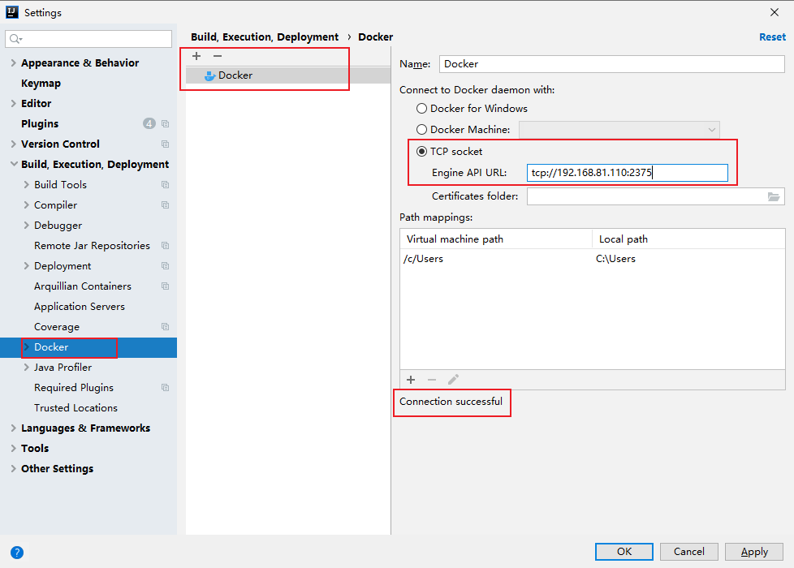

- **操作docker**

  配置成功后，会在idea开发工具下方窗口"8.services"里显示信息，右键点击connect。连接成功可以查 看到container和images等信息。可以对container和

  images进行各种相关操作。

- **部署dockerdemo项目**

  通过idea开发工具进行远程部署

  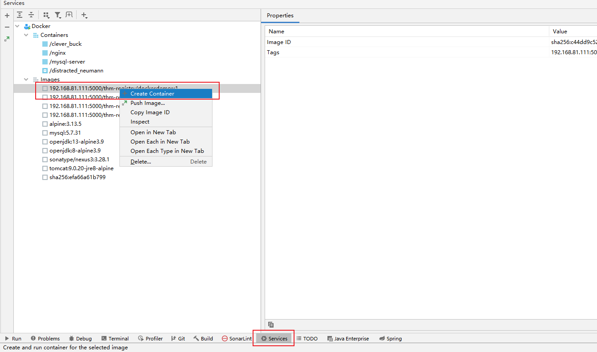

  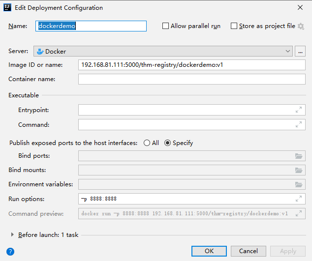

## 3、Docker运维管理

### 3.1、mysql

- **节点信息**

  服务器用户名：root，服务器密码：root。及时做好系统快照。

  | 主机名              | 主机IP         | 说明       |
  | ------------------- | -------------- | ---------- |
  | mysql-server-master | 192.168.81.112 | master主机 |
  | mysql-server-slave  | 192.168.81.113 | salve主机  |

- **基础镜像**

  ```shell
  docker pull mysql:5.7.31 
  
  docker load -i mysql.5.7.31.tar
  ```

#### 3.1.1、主从复制

使用mysql官方提供镜像制作主从复制服务器集群配置。

- **概念**

  将主数据库的增删改查等操作记录到二进制日志文件中，从库接收主库日志文件，根据最后一次更新的起始位置，同步复制到从数据库中，使得主从数据库保

  持一致。

- **作用**

  高可用性：主数据库异常可切换到从数据库

  负载均衡：实现读写分离

  备份：进行日常备份

- **过程**

  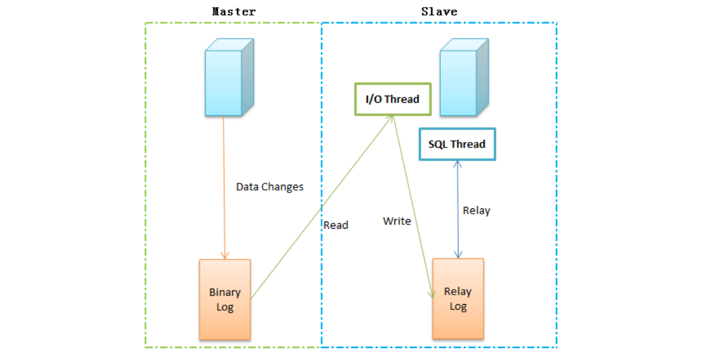

  Binary log：主数据库的二进制日志；Relay log：从服务器的中继日志。

  **复制过程：**

  （1）主数据库在每次事务完成前，将该操作记录到binlog日志文件中；

  （2）从数据库中有一个I/O线程，负责连接主数据库服务，并读取binlog日志变化，如果发现有新的变动，则将变动写入到relay-log，否则进入休眠状态；

  （3）从数据库中的SQL Thread读取中继日志，并串行执行SQL事件，使得从数据库与主数据库始终保持一致。

  **注意事项：**

  （1）涉及时间函数时，会出现数据不一致。原因是，复制过程的两次IO操作和网络、磁盘效率等问题势必导致时间戳不一致；

  （2）涉及系统函数时，会出现不一致。

#### 3.1.2、官方镜像mysql-server-master

- **创建my.cnf配置文件**

  ```shell
  mkdir -p /data/mysql/master
  cd /data/mysql/master
  
  vi my.cnf
  #内容
  [mysqld] 
  #[必须]启用二进制日志  
  log-bin=mysql-bin
  #[必须]服务器唯一ID，默认是112，一般取IP最后一段，这里看情况分配  
  server-id=112
  ```

- **创建Dockerfile文件（非必须）**

  ```shell
  FROM mysql:5.7.31
  # 作者信息
  MAINTAINER mysql from date UTC by Asia/Shanghai "THM"
  ENV TZ Asia/Shanghai
  COPY my.cnf /etc/mysql/
  ```

- **docker-compose**

  ```shell
  version: '3'
  services:
    mysql:
      image: mysql:5.7.31
      container_name: mysql
      command: mysqld --character-set-server=utf8mb4 --collation-server=utf8mb4_unicode_ci
      restart: always
      environment:
        MYSQL_ROOT_PASSWORD: 1qaz!QAZ #设置root帐号密码
      ports:
        - 3306:3306
      volumes:
        - /data/docker/mysql/data/db:/var/lib/mysql #数据文件挂载
        - /data/docker/mysql/data/conf:/etc/mysql/conf.d #配置文件挂载
        - /data/docker/mysql/log:/var/log/mysql #日志文件挂载
  ```

- **制作镜像**

  ```shell
  docker build --rm -t thm/mysqlmaster:5.7.31 .
  ```

- **启动镜像**

  ```shell
  docker run -itd --name mysql-server --restart always --privileged=true -p 3306:3306 -e MYSQL_ROOT_PASSWORD=root thm/mysqlmaster:5.7.31 --character-set-server=utf8 --collation-server=utf8_general_ci
  
  #查看日志
  docker logs -f mysql-server
  ```

- **测试容器**

  ```shell
  #进入容器
  docker exec -it mysql-server bash
  #登陆mysql
  mysql -u root -p
  ```

#### 3.1.3、官方镜像mysql-server-slave

- **创建my.cnf配置文件**

  ```shell
  mkdir -p /data/mysql/slave
  cd /data/mysql/slave
  
  vi my.cnf
  #内容
  [c] 
  #[必须]启用二进制日志  
  log-bin=mysql-bin
  #[必须]服务器唯一ID，默认是113，一般取IP最后一段，这里看情况分配  
  server-id=113
  ```

- **docker-compose**

  ```shell
  version: '3'
  services:
    mysql:
      image: mysql:5.7.31
      container_name: mysql
      command: mysqld --character-set-server=utf8mb4 --collation-server=utf8mb4_unicode_ci
      restart: always
      environment:
        MYSQL_ROOT_PASSWORD: 1qaz!QAZ #设置root帐号密码
      ports:
        - 3306:3306
      volumes:
        - /data/docker/mysql/data/db:/var/lib/mysql #数据文件挂载
        - /data/docker/mysql/data/conf:/etc/mysql/conf.d #配置文件挂载
        - /data/docker/mysql/log:/var/log/mysql #日志文件挂载
  ```

- **创建Dockerfile文件（非必须）**

  ```dockerfile
  FROM mysql:5.7.31
  # 作者信息
  MAINTAINER mysql from date UTC by Asia/Shanghai "THM"
  ENV TZ Asia/Shanghai
  COPY my.cnf /etc/mysql/
  ```

- **制作镜像**

  ```shell
  docker build --rm -t thm/mysqlslave:5.7.31 .
  ```

- **启动镜像**

  ```shell
  docker run -itd --name mysql-server --restart always --privileged=true -p 3306:3306 -e MYSQL_ROOT_PASSWORD=root thm/mysqlslave:5.7.31 --character-set-server=utf8 --collation-server=utf8_general_ci
  
  #查看日志
  docker logs -f mysql-server
  ```

- **测试容器**

  ```shell
  #进入容器
  docker exec -it mysql-server bash
  #登陆mysql
  mysql -u root -p
  ```

#### 3.1.4、官方镜像搭建主从方式

- **master**

  ```shell
  docker exec -it mysql bash
  #创建同步账户以及授权 
  create user 'master'@'%' identified by 'master'; 
  grant replication slave on *.* to 'master'@'%'; 
  flush privileges;
  #查看master状态
  show master status;
  ```

- **slave**

  ```shell
  docker exec -it mysql bash
  #设置master相关信息
  CHANGE MASTER TO master_host='192.168.1.3', 
  master_user='master', 
  master_password='master',
  master_port=3306, 
  master_log_file='mysql-bin.000003',
  master_log_pos=861; 
  #启动同步 
  start slave; 
  #查看master状态 
  show slave status;
  ```

- **测试**

  在master创建数据库和数据表看是否完成了主从复制

#### 3.1.5、bitnami/mysql

- **节点信息**

  服务器用户名：root，服务器密码：root。及时做好系统快照。

  | 主机名              | 主机IP         | 说明       |
  | ------------------- | -------------- | ---------- |
  | mysql-server-master | 192.168.81.112 | master主机 |
  | mysql-server-slave  | 192.168.81.113 | salve主机  |

- **基础镜像**

  ```shell
  docker pull bitnami/mysql:5.7.30 
  docker save bitnami/mysql:5.7.30 -o /data/mysql5.7.30.tar
  docker load -i mysql.5.7.31.tar
  ```

**注意事项：mysql主从复制中已经使用3306端口。bitnami/mysql测试用3307端口。如果需要挂载数据卷需要为目录授权**

- **master**

  ```shell
  #运行master容器 
  docker run -itd --name mysql-master \
  -p 3307:3306 \
  -e MYSQL_ROOT_PASSWORD=root \
  -e MYSQL_REPLICATION_MODE=master \
  -e MYSQL_REPLICATION_USER=master \
  -e MYSQL_REPLICATION_PASSWORD=master \
  bitnami/mysql:5.7.30
  
  #运行master容器并导入数据库。
  docker run -itd --name mysql-master \
  -p 3307:3306 \
  -e MYSQL_ROOT_PASSWORD=root \
  -e MYSQL_REPLICATION_MODE=master \
  -e MYSQL_REPLICATION_USER=master \
  -e MYSQL_REPLICATION_PASSWORD=master \
  -v /data/bitnamimysql/docker-entrypoint-initdb.d:/docker-entrypoint-initdb.d \
  bitnami/mysql:5.7.30
  ```

- **slave**

  ```shell
  #运行slave容器 
  docker run -itd --name mysql-slave \
  -p 3307:3306 \
  -e MYSQL_ROOT_PASSWORD=root \
  -e MYSQL_REPLICATION_MODE=slave \
  -e MYSQL_REPLICATION_USER=master \
  -e MYSQL_REPLICATION_PASSWORD=master \
  -e MYSQL_MASTER_HOST=192.168.81.112 \
  -e MYSQL_MASTER_ROOT_PASSWORD=root \
  -e MYSQL_MASTER_PORT_NUMBER=3307 \
  bitnami/mysql:5.7.30
  
  #运行slave容器并导入数据库。
  docker run -itd --name mysql-slave \ 
  -p 3307:3306 \ 
  -e MYSQL_ROOT_PASSWORD=root \ 
  -e MYSQL_REPLICATION_MODE=slave \ 
  -e MYSQL_REPLICATION_USER=master \ 
  -e MYSQL_REPLICATION_PASSWORD=master \ 
  -e MYSQL_MASTER_HOST=192.168.81.112 \
  -e MYSQL_MASTER_ROOT_PASSWORD=root \
  -e MYSQL_MASTER_PORT_NUMBER=3307 \
  -v /data/bitnamimysql/docker-entrypoint-initdb.d:/docker-entrypoint-initdb.d \ 
  bitnami/mysql:5.7.30
  ```

- **测试**

  在master创建数据库和数据表看是否完成了主从复制

#### 3.1.6、主主复制

PXC 模式，没有主从之分，每个数据库都可以进行读写，数据可以保持强一致性，执行时间较慢，由于一般是强一致性，所以一般用于存储重要的信息，例如金

融、电信、军工。

##### 3.1.6.1、简介

PXC属于一套近乎完美的mysql高可用集群解决方案，相比那些比较传统的基于主从复制模式的集群架构最突出特点就是解决了诟病已久的数据复制延迟问题，基

本上可以达到实时同步。而且节点与节点之间，他们相互的关系是对等的。本身galera cluster也是一种多主架构。galera cluster最关注的是数据的一致性，对待

事物的行为时，要么在所有节点上执行，要么都不执行，它的实现机制决定了它对待一致性的行为非常严格，这也能非常完美的保证MySQL集群的数据一致性；

对galera cluster的封装有两个，虽然名称不同，但实质都是一样的，使用的都是galera cluster。一个MySQL的创始人在自己全新的MariaDB上实现的MariaDB 

cluster；一个是著名的MySQL服务和工具提供商percona实现的percona xtradb cluster，简称PXC要搭建PXC架构至少需要3个mysql实例来组成一个集群，三个

实例之间不是主从模式，而是各自为主，所以三者是对等关系，不分从属，这就叫multi-master架构。客户端写入和读取数据时，连接哪个实例都是一样的。读取

到的数据时相同的，写入任意一个实例之后，集群自己会将新写入的数据同步到其他实例上，这种架构不共享任何数据，是一种高冗余架构。

PXC的操作流程：

首先客户端先发起一个事务，该事务先在本地执行，执行完成之后就要发起对事务的提交操作了。在提交之前需要将产生的复制写集广播出去，然后获取到一个全

局的事务ID号，一并传送到另一个节点上面。通过合并数据之后，发现没有冲突数据，执行apply_cd和commit_cb动作，否则就需要取消此次事务的操作。而当前

server节点通过验证之后，执行提交操作，并返回OK，如果验证没通过，则执行回滚。当然在生产中至少要有3个节点的集群环境，如果其中一个节点没有验证通

过，出现了数据冲突，那么此时采取的方式就是讲出现不一致的节点踢出集群环境，而且它自己会执行shutdown命令，自动关机。

##### 3.1.6.2、PXC的优点

①实现mysql数据库集群架构的高可用性和数据的 强一致性。

②完成了真正的多节点读写的集群方案。

③改善了传统意义上的主从复制延迟问题，基本上达到了实时同步。

④新加入的节点可以自动部署，无须提供手动备份，维护起来很方便。

⑤由于是多节点写入，所以数据库故障切换很容易。

##### 3.1.6.3、PXC的缺点

①新加入的节点开销大，需要复制完整的数据。采用SST传输开销太大。

②任何更新事务都需要全局验证通过，才会在每个节点库上执行。集群性能受限于性能最差的节点，也就是经常说的短板效应。

③因为需要保证数据的一致性，所以在多节点并发写时，锁冲突问题比较严重。

④存在写扩大问题，所有的节点上都会发生些操作。

⑤只支持innodb存储引擎的表。

⑥没有表级别的锁定，执行DDL语句操作会把整个集群锁住，而且也 kill 不了（建议使用Osc操作，即在线DDL）

⑦所有的表必须含有主键，不然操作数据时会报错。

##### 3.1.6.4、官网地址

https://hub.docker.com/r/percona/percona-xtradb-cluster

##### 3.1.6.5、节点信息

服务器用户名：root，服务器密码：root。及时做好系统快照。

| 主机名           | 主机IP         |
| ---------------- | -------------- |
| mysql-server-112 | 192.168.81.112 |

##### 3.1.6.6、基础镜像

```shell
docker pull percona/percona-xtradb-cluster:5.7.30
docker pull percona/percona-xtradb-cluster:5.7

docker save percona/percona-xtradb-cluster:5.7.30 -o /data/pxc5.7.30.tar
docker load -i percona-xtradb-cluster.5.7.30.tar 
#如果觉得pxc镜像自带的PXC名字过长，我们可以将他的名字进行修改，方便使用 
docker tag percona/percona-xtradb-cluster:5.7.30 pxc:5.7.30
```

**注意事项**
1. **mysql主从复制中已经使用3306端口。pxc测试使用3301、3302、3303端口**
2. **主要复习docker-compose使用**
3. **在mysql-server-112节点完成配置。如果需要部署多台服务器，推荐使用docker-swarm集群方式。**

##### 3.1.6.7、实现步骤

**学习重点：以docker-compose方式安装pxc集群**

每个PXC节点内部包含一个mysql实例，如果需要创建包含3个数据库节点的数据库集群，那么要创建3 个pxc节点。出于安全考虑，需要给PXC集群实例创建一个

Docker内部网络。

```shell
#第一步：拉取镜像 
docker pull percona/percona-xtradb-cluster:5.7.30
#第二步：复制重命名镜像（可选）
docker tag percona/percona-xtradb-cluster:5.7.30 pxc:5.7.30
#第三步： 删除pxc原来的镜像 （可选） 
docker rmi percona/percona-xtradb-cluster:5.7.30
#第四步：创建单独网络（可选）
docker network create --subnet=172.18.0.0/24 pxc-net
#第五步：准备三个数据卷。注意要给目录授权。开发环境777
cd /data
mkdir v1 v2 v3
chmod 777 v1 v2 v3
#第六步：创建第一个节点
docker run -itd --name mysql-node1 --restart always --privileged=true -p 3301:3306 -e MYSQL_ROOT_PASSWORD=root -v /data/v1:/var/lib/mysql -e CLUSTER_NAME=PXC -e XTRABACKUP_PASSWORD=thm --network=pxc-net --ip 172.18.0.2 pxc:5.7.30 --character-set-server=utf8 --collation-server=utf8_general_ci
#第七步：等待节点一完全启动后，创建另外两个节点（第六步成功后）
docker run -itd --name mysql-node2 --restart always --privileged=true -p 3302:3306 -e MYSQL_ROOT_PASSWORD=root -v /data/v2:/var/lib/mysql -e CLUSTER_NAME=PXC -e XTRABACKUP_PASSWORD=thm -e CLUSTER_JOIN=mysql-node1 --network=pxc-net --ip 172.18.0.3 pxc:5.7.30 --character-set-server=utf8 --collation-server=utf8_general_ci

docker run -itd --name mysql-node3 --restart always --privileged=true -p 3303:3306 -e MYSQL_ROOT_PASSWORD=root -v /data/v3:/var/lib/mysql -e CLUSTER_NAME=PXC -e XTRABACKUP_PASSWORD=thm -e CLUSTER_JOIN=mysql-node1 --network=pxc-net --ip 172.18.0.4 pxc:5.7.30 --character-set-server=utf8 --collation-server=utf8_general_ci
#完成：实现了3个节点的自动复制
```

##### 3.1.6.8、docker-compose方式

- **前置准备**

  ```shell
  #第一步：创建单独网络（可选）
  docker network create --subnet=172.18.0.0/24 pxc-net
  #第二步：准备三个数据卷。注意要给目录授权。开发环境777
  cd /data
  mkdir v1 v2 v3
  chmod 777 v1 v2 v3
  ```

- **master-docker-compose.yml**

  ```shell
  version: '3'
  services:
    pxc01:
      restart: always
      image: percona/percona-xtradb-cluster:5.7.30
      container_name: pxc01
      privileged: true
      ports:
      - 3301:3306
      environment:
        - MYSQL_ROOT_PASSWORD=root
        - CLUSTER_NAME=pxc
      volumes:
      - /data/v1:/var/lib/mysql
  networks:
    default:
      external:
        name: pxc-net
  ```

- **slave-docker-compose.yml**

  ```shell
  version: '3'
  services:
    pxc02:
      restart: always
      image: percona/percona-xtradb-cluster:5.7.30
      container_name: pxc02
      privileged: true
      ports:
      - 3302:3306
      environment:
        - MYSQL_ROOT_PASSWORD=root
        - CLUSTER_NAME=pxc
        - CLUSTER_JOIN=pxc01
      volumes:
      - /data/v2:/var/lib/mysql
    pxc03:
      restart: always
      image: percona/percona-xtradb-cluster:5.7.30
      container_name: pxc03
      privileged: true
      ports:
        - 3303:3306
      environment:
        - MYSQL_ROOT_PASSWORD=root
        - CLUSTER_NAME=pxc
        - CLUSTER_JOIN=pxc01
      volumes:
        - /data/v3:/var/lib/mysql
  networks:
    default:
      external:
        name: pxc-net
  ```

- **测试**

  ```shell
  show status like 'wsrep_cluster%';
  ```

- **注意事项**

  1. 一定要等到 master 节点起来，在进行启动 agent 点之间不能相互注册。
  2. PXC 节点不能太多，不然会把整体的性能下降。
  3. PXC 节点之间的服务器配置一致。
  4. PXC 集群只支持 innoDB 引擎。
  5. docker-compose网络

  ```yaml
  #1.新建网络：新建一个名称为front的bridge类型网络。但是在实际创建过程中。docker-compose会默认增加docker-compose.yml文件所在目录名称+front的络。
  #例如：pxc/docker-compose.yml 实际创建网络名称为：pxc-front。不是很符合开发要求。
  networks: 
    front: 
      driver: bridge
  #2.使用已存在的网络： 
  #2.1创建网络：
  docker network create pxc_network --driver bridge 
  #2.2使用已存在的网络 
  networks: 
    default: 
      external:
        name: pxc_network
  ```

### 3.2、elasticsearch

#### 3.2.1、官网地址

```shell
https://hub.docker.com/_/elasticsearch 
https://hub.docker.com/_/kibana 
https://hub.docker.com/_/logstash
```

#### 3.2.2、ELK官网

```shell
https://www.elastic.co/guide/en/elasticsearch/reference/current/docker.html 
#es集群部署请参考官网帮助文档，自行练习。
```

#### 3.2.3、基础镜像

**ELK官网镜像**

```shell
docker pull docker.elastic.co/elasticsearch/elasticsearch:7.7.0 
docker pull bolingcavalry/elasticsearch-head:6
```

**注意事项**

1. 开发环境下载docker官网或者elastic官方仓库里的镜像都可以。
2. 运维环境大咖们推荐不要下载docker官方的镜像，最好使用 elastic官方仓库里的镜像

**docker官网镜像**

```shell
docker pull elasticsearch:7.7.0 
docker pull kibana:7.7.0 
docker pull bolingcavalry/elasticsearch-head:6
```

#### 3.2.4、前置条件

**文件创建数**

 修改Linux系统的限制配置，将文件创建数修改为65536个 ： 

1. 修改系统中允许应用最多创建多少文件等的限制权限。Linux默认来说，一般限制应用最多创建的文件是65535个。但是ES至少需要65536的文件创建数的权

   限。

2. 修改系统中允许用户启动的进程开启多少个线程。默认的Linux限制root用户开启的进程可以开启任意数量的线程，其他用户开启的进程可以开启1024个线

  程。必须修改限制数为4096+。因为ES至少需要4096的线程池预备。

```shell
vi /etc/security/limits.conf 
#新增如下内容在limits.conf文件中
es               soft    nofile          65536
es               hard    nofile          65536
es               soft    nproc           4096
es               hard    nproc           4096
```

**系统控制权限**

修改系统控制权限，ElasticSearch需要开辟一个65536字节以上空间的虚拟内存。Linux默认不允许任何用户和应用程序直接开辟这么大的虚拟内存。 

```shell
vi /etc/sysctl.conf 
#添加参数:新增如下内容在sysctl.conf文件中，当前用户拥有的内存权限大小 
vm.max_map_count=262144 
#重启生效:让系统控制权限配置生效 
sysctl -p
```

#### 3.2.5、运行容器

- 启动容器

  ```shell
  docker run -itd --name elasticsearch -p 9200:9200 -p 9300:9300 -e "discovery.type=single-node" elasticsearch:7.7.0
  #将配文件复制出来
  docker cp elasticsearch:/usr/share/elasticsearch/config/elasticsearch.yml /data
  ```

- 修改elasticsearch.yml配置文件

  ```shell
  cluster.name: "docker-cluster" 
  network.host: 0.0.0.0 
  http.cors.enabled: true 
  http.cors.allow-origin: "*"
  ```

#### 3.2.6、自作镜像

**Dockerfile**

```apl
FROM elasticsearch:7.7.0
MAINTAINER elasticsearch date from UTC by Asia/Shanghai "THM"
ENV TZ Asia/Shanghai
COPY elasticsearch.yml /usr/share/elasticsearch/config/
```

**制作镜像**

```shell
docker build -t thm/elasticsearch:7.7.0 .
```

#### 3.2.7、docker-compose

- **挂载目录授权**

  ```shell
  mkdir -p /data/elasticsearch 
  chmod 777 -R /data/elasticsearch
  ```

- **编写docker-compose.yml**

  ```shell
  version: "3"
  services:
    elasticsearch:
      image: thm/elasticsearch:7.7.0
      container_name: elasticsearch7
      ports:
      - 9200:9200
      - 9300:9300
      environment:
        - "discovery.type=single-node"
        - "ES_JAVA_OPTS=-Xms2048m -Xmx2048m"
      restart: always
      volumes:
      - /data/elasticsearch/data:/usr/share/elasticsearch/data
      - /data/elasticsearch/plugins:/usr/share/elasticsearch/plugins
    kibana:
      image: kibana:7.7.0
      container_name: kibana7
      ports:
      - 5601:5601
      restart: always
      depends_on:
        - elasticsearch
    elasticsearchhead:
      image: bolingcavalry/elasticsearch-head:6
      container_name: elasticsearchhead
      environment:
        - "TZ=Asia/Shanghai"
      ports:
      - 9100:9100
      restart: always
      depends_on:
        - elasticsearch
  ```

- **上传docker-compose.yml并启动**

  ```shell
  docker-compose up -d
  docker logs -f elasticsearch7
  ```

- **访问测试**

  ```shell
  http://192.168.81.112:9200 
  http://192.168.81.112:9100 
  http://192.168.81.112:5601
  ```

#### 3.2.8、ik分词器

- **官网地址**

  ```shell
  https://github.com/medcl/elasticsearch-analysis-ik
  ```

- **安装分词器**

  注意安装版本对应 当前版本7.7.0

  ```shell
  cd /data/elasticsearch/plugins 
  mkdir -p ik 
  unzip elasticsearch-analysis-ik-7.7.0.zip
  ```

- **重启es**

  ```shell
  docker-compose restart
  ```

### 3.3、fastDFS

**安装条件**

至少需要2G以上内存

**github官网地址**

```shell
https://github.com/happyfish100/ 
#帮助手册地址： 
https://github.com/happyfish100/fastdfs/wiki
```

**自定义镜像**

官网提供docker镜像制作素材，但是需要更改Dockerfile文件及source目录中的软件包。将官方下载的fastdfs-6.06.tar.gz解压缩，里边有docker目录，提供单机

版和集群版本。但是都需要修改才能使用。本章节参考的是dockerfile_local单机版内容。

**下载地址**

```shell
https://github.com/happyfish100/fastdfs-nginx-module 
https://github.com/happyfish100/libfastcommon 
http://nginx.org/download/nginx-1.16.1.tar.gz
```

**Dockerfile**

Docker文件改动两处内容：
1. ADD 时候的源文件名称，需要增加对应的版本号信息
2. cd目录时需要增加对应版本号信息
3. 基础镜像从centos7升级为centos7.8.2003

```dockerfile
# centos 7
FROM centos:7.8.2003
# 添加配置文件
# add profiles
ADD conf/client.conf /etc/fdfs/ ADD conf/http.conf /etc/fdfs/
ADD conf/mime.types /etc/fdfs/ ADD conf/storage.conf /etc/fdfs/
ADD conf/tracker.conf /etc/fdfs/ ADD fastdfs.sh /home
ADD conf/nginx.conf /etc/fdfs/ ADD conf/mod_fastdfs.conf /etc/fdfs
# 添加源文件
# add source code
ADD source/libfastcommon-1.0.43.tar.gz /usr/local/src/
ADD source/fastdfs-6.06.tar.gz /usr/local/src/
ADD source/fastdfs-nginx-module-1.22.tar.gz /usr/local/src/
ADD source/nginx-1.16.1.tar.gz /usr/local/src/
# Run
RUN yum install git gcc gcc-c++ make automake autoconf libtool pcre pcre-devel zlib zlib-devel openssl-devel wget vim -y \
 && mkdir /home/dfs \
 && cd /usr/local/src/ \
 && cd libfastcommon-1.0.43/ \
 && ./make.sh && ./make.sh install \
 && cd ../ \ && cd fastdfs-6.06/ \
 && ./make.sh && ./make.sh install \
 && cd ../ \ && cd nginx-1.16.1/ \
 && ./configure --add-module=/usr/local/src/fastdfs-nginx-module-1.22/src/ \
 && make && make install \
 && chmod +x /home/fastdfs.sh

# export config
VOLUME /etc/fdfs
EXPOSE 22122 23000 8888 80 
ENTRYPOINT ["/home/fastdfs.sh"]
```

**制作镜像**

上传Dockerfile

```shell
docker build --rm -t thm/fastdfs:1.0 .
```

**启动镜像**

按照官网提供的方式启动，springboot项目会报找不到127.0.0.1:23000端口，需要使用--net=host方式启动

```shell
#错误的启动方式：
docker run -itd -e FASTDFS_IPADDR=192.168.81.112 -p 8888:8888 -p 22122:22122 -p 23000:23000 -p 8011:80 --name fastdfs thm/fastdfs:1.0
#正确的启动方式：
docker run -itd -e FASTDFS_IPADDR=192.168.81.112 --name fastdfs --restart=always --net=host thm/fastdfs:1.0
```

#### 3.3.1、单机安装

- 创建挂载目录

  ```shell
  mkdir -p /data/docker/fastdfs/tracker/data /data/docker/fastdfs/storage/data /data/docker/fastdfs/storage/conf /data/docker/fastdfs/storage/path
  ```

- 创建nginx配置文件

  ```shell
  cd /data/docker/fastdfs/storage/conf 
  vim nginx.conf
  ```
  
  ```shell
worker_processes  1;
  
  events {
      worker_connections  1024;
  }
  
  http {
      include       mime.types;
      default_type  application/octet-stream;
      sendfile        on;
      keepalive_timeout  65;
  
      server {
          listen       8888;
          server_name  localhost;
  
          location / {
              root /fastdfs/store_path/data;
     			ngx_fastdfs_module;
          }
  
          error_page   500 502 503 504  /50x.html;
          location = /50x.html {
              root   html;
          }
      }
  }
  ```
  
- docker-compose

  ```shell
  version: '3'
  services:
    tracker:
      container_name: tracker
      image: season/fastdfs:1.2
      network_mode: "host"
      command: tracker
      volumes:
        - /data/docker/fastdfs/tracker/data:/fastdfs/tracker/data
    storage:
      container_name: storage
      image: season/fastdfs:1.2
      network_mode: "host"
      environment:
        - TRACKER_SERVER=192.168.1.3:22122
      volumes:
        - /data/docker/fastdfs/storage/data:/fastdfs/storage/data
        - /data/docker/fastdfs/storage/path:/fastdfs/store_path
      command: storage
      depends_on:
        - tracker
    fastdfs-nginx:
      hostname: fastdfs-nginx
      container_name: fastdfs-nginx
      image: season/fastdfs:1.2
      network_mode: "host"
      environment:
        - TRACKER_SERVER=192.168.1.3:22122
      volumes:
        - /data/docker/fastdfs/storage/conf/nginx.conf:/etc/nginx/conf/nginx.conf
        - /data/docker/fastdfs/storage/path:/fastdfs/store_path
      command: nginx
  ```

- 启动

  ```shell
  docker-compose -f docker-compose.yml up -d
  ```

### 3.4、gitlab

**docker官网地址：https://hub.docker.com/r/gitlab/gitlab-ce**

**基础镜像**

```shell
#英文版 推荐
docker pull gitlab/gitlab-ce:12.7.6-ce.0 
#中文版 
docker pull twang2218/gitlab-ce-zh:11.1.4 
#最新版:不是很稳定的版本 
docker pull gitlab/gitlab-ce:13.4.6-ce.0
```

**运行容器**

```shell
#运行镜像：运行时间比较长，大约需要3-10分钟。可以查看日志情况。 
docker run -itd --name gitlab -p 443:443 -p 80:80 -p 222:22 --restart always -m 4GB -v /data/gitlab/config:/etc/gitlab -v /data/gitlab/logs:/var/log/gitlab -v /data/gitlab/data:/var/opt/gitlab -e TZ=Asia/Shanghai gitlab/gitlab-ce:12.7.6-ce.0
```

**配置gitlab**

```shell
cd /data/gitlab/config
vim gitlab.rb 
#配置项目访问地址： 
external_url 'http://192.168.81.113' 
#配置ssh协议所使用的访问地址和端口
gitlab_rails['gitlab_ssh_host'] = '192.168.81.113' 
gitlab_rails['time_zone'] = 'Asia/Shanghai' 
gitlab_rails['gitlab_shell_ssh_port'] = 222
```

**登录gitlab**

登录gitlab：用户名默认为root。第一次登录需要设置密码。密码设置为12345678

```shell
username：root 
password:12345678
```

**创建组**

```shell
#组分三类： 
Private：私有的 
Internal：内部的 
Public：公共的
```

**创建项目**

```shell
项目分类： 根据组的分类进行分类。 
创建项目注意事项： 不需要创建README，否则本地项目无法上传到gitlab服务器上。
```

**创建用户**

```apl
#1.创建用户 用户权限分两种： 
Regular:普通权限用户 
Admin:具有管理员权限的用户 
#2.给用户分配密码
```

**将用户加入群组**

```apl
#给群组中的用户分配权限分五种： 
Guest:可以创建issue、发表评论、不能读写版本库。 
Reporter:可以克隆代码，不能提交、QA、PM可以赋予这个权限。
Developer:可以克隆代码、开发、提交、push，普通开发可以赋予这个权限。
Maintainer:可以创建项目、添加tag、保护分支、添加项目成员、编辑项目，核心开发人员可以赋予这个权限。
Owner:可以设置项目访问权限、-Visibility Level、删除项目、迁移项目、管理组成员、开发组组长可 以赋予这个权限。
```

**上传项目**

```shell
#使用idea开发工具演示 
#1.创建本地仓库 
VCS->Enable Version Control Integration... 
#2.建立缓冲区
项目右键->git->Add 
#3.将代码提交到本地仓库 
项目右键->git->Commit Directory 
#4.设置远程gitlab仓库地址 
项目右键->git->Repository->Remote 
或者使用->git remote add origin 地址
#5.将本地代码推送到远程gitlab仓库
项目右键->git->Repository->push
```

### 3.5、Swarm集群管理

compose、machine 和 swarm 是docker 原生提供的三大编排工具。简称docker三剑客。

**节点信息**

修改主机名称：vim /etc/hostname ,并重启

添加hosts：vim /etc/hosts

服务器用户名：root，服务器密码：root。及时做好系统快照。

| 主机名     | 主机IP         | 说明              |
| ---------- | -------------- | ----------------- |
| manager-01 | 192.168.81.110 | swarm-manager节点 |
| work-01    | 192.168.81.111 | swarm-work01节点  |
| work-02    | 192.168.81.112 | swarm-work02节点  |

**硬件要求**


**当前应用状态**

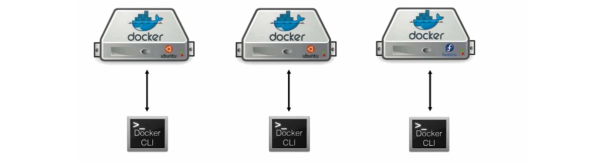

**容器化部署=大麻烦**

- 怎么保证数据完整性
- 怎么保护客户隐私数据
- 怎么去调度容器
- 怎么去监控追踪容器
- 怎么去更新容器而不影响客户的业务
- 如果容器down掉了。怎么自动恢复
- 怎么去管很多微服容器
- 怎么根据客户业务需求，快速方便的扩展容器

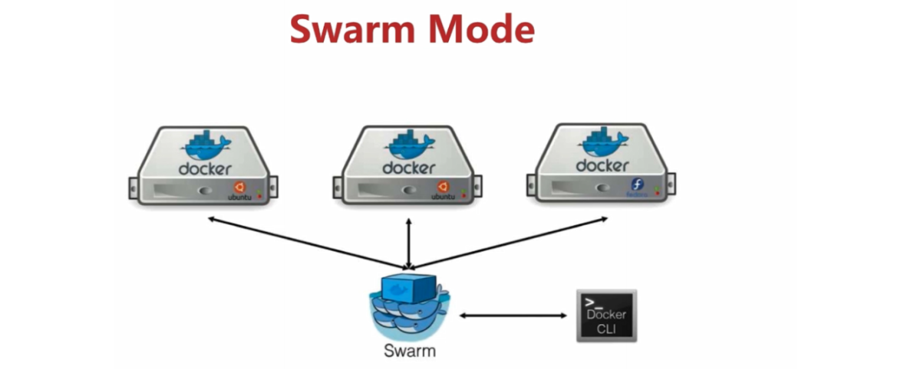

#### 3.5.1、安装docker-swarm

**官网文档：https://docs.docker.com/engine/swarm/**

##### 3.5.1.1、概述

Docker Swarm 和 Docker Compose 一样，都是 Docker 官方容器编排项目，但不同的是，Docker Compose 是一个在单个服务器或主机上创建多个容器的工

具，可以将组成某个应该的多个docker容器编排在一起，同时管理。而 Docker Swarm 则可以在多个服务器或主机上创建容器集群服务，其主要作用是把若干台

Docker主机抽象为一个整体，并且通过一个入口（docker stack）统一管理这些Docker主机上的各种Docker资源。

stack 是构成特定环境中的 service 集合, 它是自动部署多个相互关联的服务的简便方法，而无需单独定义每个服务。

stack file 是一种 yaml 格式的文件，类似于 docker-compose.yml 文件，它定义了一个或多个服务，并定义了服务的环境变量、部署标签、容器数量以及相关的

环境特定配置等。

**Docker Swarm由两部分组成：**

- Docker集群：将一个或多个Docker节点组织起来，用户就能以集群的方式进行管理；

- 应用编排：有一套API用来部署和管理容器

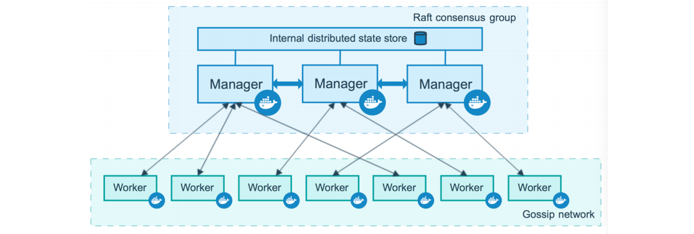

##### 3.5.1.2、配置私有仓库

私有仓库不是集群必备的组件。集群的每个节点都需要安装镜像，如果不搭建私有仓库，下载镜像速度比较耗时。

```shell
#修改docker配置文件 添加私有仓库
vi /etc/docker/daemon.json 
"insecure-registries":["192.168.81.113:5000"] 
#重启docker
systemctl daemon-reload 
systemctl restart docker
```

##### 3.5.1.3、初始化第一个管理节点

关于advertise-addr和listen-addr这两个参数

- 前者用来指定其他节点连接m0时的地址
- 后者指定承载swarm流量的IP和端口
- 会在本地新建docker网络

```shell
docker swarm init --advertise-addr 192.168.81.110:2377 --listen-addr 192.168.81.110:2377
docker node ls 
docker network ls
```

##### 3.5.1.4、如何加入新的节点

Docker Swarm的新节点加入策略是从管理节点获取一长串命令，被称为join token，任何想加入集群的机器只要自己执行这个join token即可加入Swarm集群；

如果有新的管理节点需要加入，在m0执行命令docker swarm join-token manager即可得到管理manager节点的join token，

如果有新的work节点需要加入，在m0执行命令docker swarm join-token worker即可得到管理work节点的join token

```shell
#在manager节点执行。可以作为manager节点加入集群 将获得的token在需要集群的机器上执行
docker swarm join-token manager 
#在manager节点执行。可以作为worker节点加入集群 
docker swarm join-token worker 
#查看集群节点
docker node ls
```

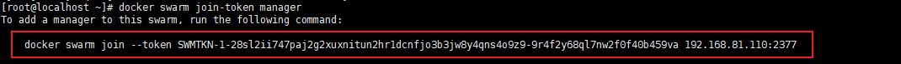

##### 3.5.1.5、manager节点说明

MANAGER STATUS列说明：

- Leader 意味着该节点是使得群的所有群管理和编排决策的主要管理器节点。

- Reachable 意味着节点是管理者节点正在参与Raft共识。如果领导节点不可用，则该节点有资格被选为新领导者。

- Unavailable 意味着节点是不能与其他管理器通信的管理器。如果管理器节点不可用，您应该将新的管理器节点加入群集，或者将工作器节点升级为管理器。

AVAILABILITY列说明：

- Active 意味着调度程序可以将任务分配给节点。

- Pause 意味着调度程序不会将新任务分配给节点，但现有任务仍在运行。

- Drain 意味着调度程序不会向节点分配新任务。调度程序关闭所有现有任务并在可用节点上调度它们。

##### 3.5.1.6、验证节点

```shell
#master节点： 
docker info 
#work节点： 
docker info
```

##### 3.5.1.7、节点权限提升/降低

```shell
#查看集群节点信息，获得node名称或者ID
docker node ls

#将worker节点提升为manager节点，在manager节点执行如下命令：
docker node promote work-01（或者node ID） 
docker node ls 

#将manager节点降低为worker节点，在manager节点执行如下命令：
docker node demote work-02（或者node ID）
docker node ls
```

##### 3.5.1.8、脱离集群

```shell
#在work-02节点使用命令：
docker swarm leave 
#强制退出   manager node只能强制退出
docker swarm leave --force 
#稍微等待几分钟，在manager节点使用命令：
docker node ls
#发现work-02节点已经脱离集群管理。
```

##### 3.5.1.9、删除脱离集群的节点

```shell
#先使用命令：
docker node demote 节点名称或者节点ID。
#将某一个节点降为worker节点后，再删除。 
#使用命令：
docker node rm 节点名称|节点ID 
#例如:
docker node rm work-02 
#manager节点只能强制退出。命令：
docker swarm leave --force。
#manager退出后意味着整个swarm 不复存在。
```

#### 3.5.2、图形界面

**docker官网地址：https://hub.docker.com/r/dockersamples/visualizer**

**基础镜像**

```shell
#拉取镜像 
docker pull dockersamples/visualizer:latest 
#备份镜像 
docker save dockersamples/visualizer:latest -o dockersamples.visualizer.tar 
#还原镜像 
docker load -i dockersamples.visualizer.tar
```

**运行镜像**

```shell
docker run -itd --name visualizer -p 8099:8080 -e HOST=192.168.81.110 -e PORT=8080 -v /var/run/docker.sock:/var/run/docker.sock dockersamples/visualizer:latest
#使用docker service命令
docker service create \
--name=visualizer \
--publish=8099:8080/tcp \
--constraint=node.role==manager \
--mount=type=bind,src=/var/run/docker.sock,dst=/var/run/docker.sock \
dockersamples/visualizer
```

**测试镜像**

```shell
http://192.168.81.110:8099
```

#### 3.5.3、swarm命令

| 命令                    | 描述                     |
| ----------------------- | ------------------------ |
| docker swarm init       | 初始化一个 swarm 群集    |
| docker swarm join       | 加入群集作为节点或管理器 |
| docker swarm join-token | 管理用于加入群集的令牌   |
| docker swarm leave      | 离开 swarm 群集          |
| docker swarm unlock     | 解锁 swarm 群集          |
| docker swarm unlock-key | 管理解锁钥匙             |
| docker swarm update     | 更新 swarm 群集          |

#### 3.5.4、node命令

| 命令                | 描述                                             |
| ------------------- | ------------------------------------------------ |
| docker node demote  | 从 swarm 群集管理器中降级一个或多个节点          |
| docker node promote | 将一个或多个节点推入到群集管理器中               |
| docker node inspect | 显示一个或多个节点的详细信息                     |
| docker node ls      | 列出 swarm 群集中的节点                          |
| docker node ps      | 列出在一个或多个节点上运行的任务，默认为当前节点 |
| docker node rm      | 从 swarm 群集删除一个或多个节点                  |
| docker node update  | 更新一个节点                                     |

#### 3.5.5、service命令

| 命令                    | 描述                         |
| ----------------------- | ---------------------------- |
| docker service create   | 创建服务                     |
| docker service inspect  | 显示一个或多个服务的详细信息 |
| docker service logs     | 获取服务的日志               |
| docker service ls       | 列出服务                     |
| docker service rm       | 删除一个或多个服务           |
| docker service scale    | 设置服务的实例数量           |
| docker service update   | 更新服务                     |
| docker service rollback | 恢复服务至update之前的配置   |


**基础镜像**

```shell
docker pull nginx:1.18.0-alpine 
docker pull nginx:1.19.3-alpine
```

**将110上的镜像发送到其他两台（111、112）上**

```shell
scp nginx.1.18.tar root@192.168.198.106:/data/
scp nginx.1.18.tar root@192.168.198.107:/data/ 
scp nginx.1.19.3.alpine.tar root@192.168.198.106:/data/ 
scp nginx.1.19.3.alpine.tar root@192.168.198.107:/data/ 
所有节点执行如下命令： 
cd /data 
docker load -i nginx.1.18.tar 
docker load -i nginx.1.19.3.alpine.tar 

rm -rf *
```

**部署nginx**

通过图像界面查看：192.168.81.110：8099

```shell
#在manager(192.168.81.110)节点中创建overlay网络：
docker network create -d overlay nginx-net
#创建5个nginx:alpines容器的集群：
docker service create --name nginx --network nginx-net -p 80:80 --replicas 5 nginx:1.18.3-alpine 
#在manager节点使用docker service ls 命令查看服务情况，worker节点无法查看：
docker service ls
#在manager或者worker节点都可以执行docker ps命令查看本虚拟机容器情况：
docker ps
#manager节点只用于管理集群，不希望部署服务。 
docker node update --availability drain master-01（或者ID） 
#使用docker service scale nginx=2命令将服务缩减为2个容器：
docker service scale nginx=2
```

**升级nginx版本**

```shell
#进入其中一个容器查看nginx的版本信息： 注意事项：因nginx是alpine的linux版本。不能使用/bin/bash指令。
docker exec -it 503fe639bb89 sh 
nginx -v 
#1.更新镜像： 
docker service update --image nginx:1.19.3-alpine nginx 
#2.添加或者更新一个对外端口： 
docker service update --publish-add 8090:80 nginx
```

**删除服务**

```shell
docker service rm nginx 
docker network rm nginx-net
```

#### 3.5.6、stack命令

| 命令                  | 描述                       |
| --------------------- | -------------------------- |
| docker stack deploy   | 部署新的堆栈或更新现有堆栈 |
| docker stack ls       | 列出现有堆栈               |
| docker stack ps       | 列出堆栈中的任务           |
| docker stack rm       | 删除一个或多个堆栈         |
| docker stack services | 列出堆栈中的服务           |

**部署nginx**

创建docker-compose.yml，上传到manager节点

```shell
version: "3"
services:
  nginx:
    image: nginx:1.19.3-alpine
    container_name: nginx
    networks:
      - nginx-net
    restart: always
    ports:
    - 80:80
    deploy:
      replicas: 5
networks:
  nginx-net:
    driver: overlay
```

**运行nginx**

```shell
#在manager节点中创建docker-compose.yml文件。执行如下命令：
docker stack deploy nginx-stack --compose-file=docker-compose.yml 
#或者是 
docker stack deploy nginx-stack -c docker-compose.yml
#查看stack服务运行情况。执行如下命令：
docker stack services nginx-stack 
#查看5个容器运行在哪个节点中。执行如下命令： 
docker service ls 
#查看到NAME中的服务名为：nginx-stack_nginx-web 
docker service ps nginx-stack_nginx-web
#进行测试：
curl 192.168.81.110
curl 192.168.81.111
curl 192.168.81.112
#删除stack服务。执行如下命令：
docker stack rm nginx-stack
```

**总结：**

- networks中也可以不指定driver:overlay，因为docker swarm默认网络类型是overlay。

- 整个networks都可以不用配置。stack部署时会默认创建网络。如果我们定义网络。在dockerstack deploy时会先默认创建一个网络，在创建一个我们定义的

  网络。

- 一定要把镜像先拉取到本地再执行

**Docker Stack和Docker Compose区别**

- Docker stack会忽略了“构建”指令，无法使用stack命令构建新镜像，它是需要镜像是预先已经构建好的。 所以docker-compose更适合于开发场景；

- Docker Compose是一个Python项目，它使用Docker API规范来操作容器。所以需要安装Docker -compose，以便与Docker一起在您的计算机上使用；

- Docker Stack功能包含在Docker引擎中。你不需要安装额外的包来使用它，docker stacks 只是swarm mode的一部分。

- Docker stack不支持基于第2版写的docker-compose.yml ，也就是version版本至少为3。然而Docker Compose对版本为2和3的 文件仍然可以处理；

- docker stack把docker compose的所有工作都做完了，因此docker stack将占主导地位。同时，对于大多数用户来说，切换到使用docker stack既不困难，也

  不需要太多的开销。如果您是Docker新手，或正在选择用于新项目的技术，请使用docker stack。

### 3.6、harbor企业级部署

默认情况下，harbor不提供证书。可以在没有安全性的情况下部署harbor，就可以通过HTTP方式连接到harbor。但是，只有在没有连接到外部internet的测试环

境或开发环境中才可以使用HTTP。在生产环境中，始终使用HTTPS。要配置HTTPS，必须创建SSL证书。可以使用由受信任的第三方CA签名的证书，也可以使用

自签名证书。本节介绍如何使用OpenSSL创建CA，以及如何使用CA签署服务器证书和客户端证书。下面的过程假设harbor注册表的主机名是harbor.thm.com，

并且它的DNS记录指向运行harbor的主机。

**官网文档**

```shell
#官网https配置帮助文档: 
https://github.com/goharbor/harbor/blob/v1.9.4/docs/configure_https.md
```

**解压harbor**

在harbor中创建一个目录，用于存放证书

```shell
#修改主机名对应地址
echo "192.168.81.111 harbor.thm.com" >> /etc/hosts 
cat /etc/hosts
#从github上下载harbor并上传到指定目录
cd /data 
tar -zxvf harbor-offline-installer-v2.1.5_2.tgz 
cd harbor/ 
#创建存放证书目录
mkdir -p ssl 
cd ssl
```

**获得证书颁发机构**

在生产环境中，应该从CA官方获取证书。在测试或开发环境中，可以生成自己的CA。若要生成CA证书，请运行以下命令。

```shell
cd /data/harbor/ssl
#创建CA根证书 注意修改对应网址
openssl genrsa -out ca.key 4096
openssl req -x509 -new -nodes -sha512 -days 3650 -subj "/C=TW/ST=Beijing/L=Beijing/O=example/OU=Personal/CN=harbor.thm.com" -key ca.key -out ca.crt
```

**获取服务器证书**

证书通常包含.crt文件和.key文件，例如harbor.thm.com.crt和harbor.thm.com.key。

- **创建自己的私钥**

  ```shell
  openssl genrsa -out harbor.thm.com.key 4096
  ```

- **生成证书签名请求**

  调整-subj选项中的值以反映您的组织。如果使用域名方式连接harbor主机，则必须将其指定为common name（CN）属性，并在key和CSR文件名中使用它。

  ```shell
  openssl req -sha512 -new -subj "/C=TW/ST=Beijing/L=Beijing/O=example/OU=Personal/CN=harbor.thm.com" -key harbor.thm.com.key -out harbor.thm.com.csr
  ```

**生成注册表主机的证书**

无论是使用域名还是使用IP地址连接到您的Harbor主机，都必须创建此文件，以便您可以为harbor主机生成符合使用者替代名称（SAN）和x509 v3扩展要求的证

书。替换DNS条目以反映harbor的域。

```shell
cat > v3.ext <<-EOF
authorityKeyIdentifier=keyid,issuer
basicConstraints=CA:FALSE
keyUsage = digitalSignature, nonRepudiation, keyEncipherment, dataEncipherment
extendedKeyUsage = serverAuth
subjectAltName = @alt_names
[alt_names]
DNS.1=harbor.thm.com
EOF
```

使用v3.ext文件为harbor主机生成证书。

```shell
openssl x509 -req -sha512 -days 3650 -extfile v3.ext -CA ca.crt -CAkey ca.key -CAcreateserial -in harbor.thm.com.csr -out harbor.thm.com.crt
```

**为docker配置服务器证书，密钥和CA**

生成ca.crt、harbor.thm.com.crt和harbor.thm.com.key文件后，必须将它们提供给Harbor和Docker，并重新配置Harbor以使用它们。

将yourdomain.com.crt转换为yourdomain.com.cert，供Docker使用。

Docker守护进程将.crt文件解释为CA证书，.cert文件解释为客户端证书。

```shell
cd /data/harbor/ssl
openssl x509 -inform PEM -in harbor.thm.com.crt -out harbor.thm.com.cert

mkdir -p /etc/docker/certs.d/harbor.thm.com/

cp harbor.thm.com.cert /etc/docker/certs.d/harbor.thm.com/ 
cp harbor.thm.com.key /etc/docker/certs.d/harbor.thm.com/ 
cp ca.crt /etc/docker/certs.d/harbor.thm.com/

#重启docker服务： 
systemctl daemon-reload 
systemctl restart docker
```

**修改harbor.yml文件**

注释掉http的配置信息

```yaml
hostname: harbor.thm.com 
https: 
  port: 443 
  certificate: /data/harbor/ssl/harbor.thm.com.crt 
  private_key: /data/harbor/ssl/harbor.thm.com.key
```

**安装harbor**

```shell
docker pull goharbor/prepare:v1.9.4 
cd /data/harbor 
./prepared 
./install.sh
```

**访问UI**

```shell
#修改本机hosts
C:\Windows\System32\drivers\etc 
192.168.81.111 harbor.thm.com
#访问
https://harbor.thm.com/
```

**上传镜像**

```shell
#将harbor(192.168.81.111)服务器端生成的ca.crt文件复制到/etc/pki/ca-trust/source/anchors/中。
cd /data/harbor/ssl
scp ca.crt root@192.168.81.110:/etc/pki/ca-trust/source/anchors/
#docker-110(192.168.81.110)服务器：
#执行命令更新ca证书授权：
update-ca-trust 
#重启docker服务： 
systemctl restart docker
#修改域名解析
echo "192.168.81.111 harbor.thm.com" >> /etc/hosts
#登陆私服
docker login harbor.thm.com 
admin 
Harbor12345 
#制作镜像
docker tag nginx:1.19.3-alpine harbor.thm.com/thm-registry/nginx:v1 
#上传
docker push harbor.thm.com/thm-registry/nginx:v1
```

### 3.7、mongo集群搭建

- **镜像拉取**

  ```shell
  docker pull mongo:latest
  ```

- **单机搭建**

  ```shell
#启动容器
  docker run -itd --name mongo --restart=always -v /home/docker/mongo/data:/data/db -p 27017:27017 \
  -e MONGO_INITDB_ROOT_USERNAME=admin \
  -e MONGO_INITDB_ROOT_PASSWORD=admin \
  mongo:latest --auth
  #进入容器
  docker exec -it mongo mongosh admin
  #创建账号
  use admin #切换创建数据库
  
  db.auth('admin','admin') #授权登录
  #创建账号
  db.createUser({user:'root',pwd:'root',roles:[{role:'dbOwner',db:'xf_demo'}]})
  
  ```
  
- **安装master**

  - **创建master配置文件**

    ```shell
    cd /devops4.0/mongo/mongocluster/master/conf
    vim mongod.conf
    #文件内容
    systemLog:
       destination: file
       path: "/var/log/mongodb/mongod.log"
       logAppend: true
    storage:
       journal:
          enabled: true
    net:
       bindIp: 0.0.0.0
       port: 27017
    setParameter:
       enableLocalhostAuthBypass: false
    ```

  - **创建并启动容器**

    ```shell
    docker run --name mongo-master --restart=always   -d  --net="bridge" -p 27017:27017   \
    -v /devops4.0/mongo/mongocluster/master/data/db:/data/db \
    -v /devops4.0/mongo/mongocluster/master/logs/mongodb:/var/log/mongodb \
    -v /devops4.0/mongo/mongocluster/master/conf:/data/configdb \
    mongo:latest \
    /bin/sh -c 'mongod --bind_ip 0.0.0.0 --dbpath /data/db -f /data/configdb/mongod.conf --replSet annosys '
    ```

- **安装slave1**

  - **创建slave1配置文件**

    ```shell
    cd /devops4.0/mongo/mongocluster/slave1/conf
    vim mongod.conf
    #文件内容
    systemLog:
       destination: file
       path: "/var/log/mongodb/mongod.log"
       logAppend: true
    storage:
       journal:
          enabled: true
    net:
       bindIp: 0.0.0.0
       port: 27017
    setParameter:
       enableLocalhostAuthBypass: false
    ```

  - **创建并启动容器**

    ```shell
    docker run --name mongo-slave1 --restart=always -d --net="bridge" -p 27027:27017 \
    -v /devops4.0/mongo/mongocluster/slave1/data/db:/data/db \
    -v /devops4.0/mongo/mongocluster/slave1/logs/mongodb:/var/log/mongodb \
    -v /devops4.0/mongo/mongocluster/slave1/conf:/data/configdb \
    mongo:latest \
    /bin/sh -c 'mongod --bind_ip 0.0.0.0 --dbpath /data/db  -f /data/configdb/mongod.conf --replSet annosys'
    ```

- **安装仲裁节点arbiter**

  - **创建arbiter配置文件**

    ```shell
    cd /devops4.0/mongo/mongocluster/arbiter/conf
    vim mongod.conf
    #文件内容
    systemLog:
       destination: file
       path: "/var/log/mongodb/mongod.log"
       logAppend: true
    storage:
       journal:
          enabled: true
    net:
       bindIp: 0.0.0.0
       port: 27017
    setParameter:
       enableLocalhostAuthBypass: false
    ```

  - **创建并启动容器**

    ```shell
    docker run --name mongo-arbiter --restart=always -d --net="bridge" -p 27037:27017 \
    -v /devops4.0/mongo/mongocluster/arbiter/data/db:/data/db \
    -v /devops4.0/mongo/mongocluster/arbiter/logs/mongodb:/var/log/mongodb \
    -v /devops4.0/mongo/mongocluster/arbiter/conf:/data/configdb \
    mongo:latest \
    /bin/sh -c 'mongod --bind_ip 0.0.0.0 --dbpath /data/db  -f /data/configdb/mongod.conf --replSet annosys'
    ```

- **查看三个节点docker内IP，并创建集群config**

  ```shell
  docker inspect mongo-master | grep IPAddress
  docker inspect mongo-slave1 | grep IPAddress
  docker inspect mongo-arbiter | grep IPAddress
  
  #集群配置
  config={ _id:"annosys", members:[
  {_id:0,host:'172.17.0.3:27017',priority:5},
  {_id:1,host:'172.17.0.4:27017',priority:3},
  {_id:2,host:'172.17.0.5:27017',arbiterOnly:true}]
  }
  ```

- **进入master容器创建集群**

  ```shell
  docker exec -it mongo-master mongo admin
  
  #执行脚本
  config={ _id:"annosys", members:[
  {_id:0,host:'172.17.0.3:27017',priority:5},
  {_id:1,host:'172.17.0.4:27017',priority:3},
  {_id:2,host:'172.17.0.5:27017',arbiterOnly:true}]
  }
  #查看集群状态
  rs.initiate(config)
  ```

### 3.8、Kafka安装

- **镜像**

  ```shell
  docker pull wurstmeister/zookeeper
  docker pull wurstmeister/kafka
  ```

- **启动zk**

  ```shell
  #单机方式
  docker run -itd --name zookeeper -p 2181:2181 -v /etc/localtime:/etc/localtime wurstmeister/zookeeper
  ```

- **启动Kafka**

  ```shell
  #查看zk的docker中IP 替换下面IP地址
  docker inspect zookeeper | grep IPAddress
  #单机方式
  docker run -itd --name kafka \
  -p 9192:9092 \
  -e KAFKA_BROKER_ID=0 \
  -e KAFKA_ZOOKEEPER_CONNECT=172.17.0.6:2181 \
  -e KAFKA_ADVERTISED_LISTENERS=PLAINTEXT://10.128.173.171:9192 \
  -e KAFKA_LISTENERS=PLAINTEXT://0.0.0.0:9092 \
  -d wurstmeister/kafka
  
  #进入kafka
  docker exec -it kafka /bin/sh
  ```


### 3.9、Nginx

#### 3.9.1、单机安装

- **前置操作** 

  ```shell
  #创建目录
  mkdir -p /data/docker/nginx
  #拉取镜像
  docker pull nginx
  #运行容器
  docker run -itd --name nginx nginx:latest
  #进入目录
  cd /data/docker/nginx
  #复制相关配置文件
  docker cp nginx:/etc/nginx/nginx.conf .
  docker cp nginx:/usr/share/nginx/html .
  #创建目录
  mkdir conf.d
  #复制配置文件
  docker cp nginx:/etc/nginx/conf.d/default.conf .
  #删除容器
  docker rm -f nginx
  ```

- **docker-compose**

  ```shell
  version: '3'
  services:
    nginx:
      image: nginx:1.10
      container_name: nginx
      restart: always
      privileged: true
      volumes:
        - /data/docker/nginx/conf.d:/etc/nginx/conf.d #配置文件挂载
        - /data/docker/nginx/html:/usr/share/nginx/html #静态资源根目录挂载
        - /data/docker/nginx/logs:/var/log/nginx #日志文件挂载
      ports:
        - 80:80
  ```

### 3.10、Redis

#### 3.10.1、单机安装

- **前置操作**

  ```shell
  #创建目录
  mkdir -p /data/docker/redis/conf
  #进入目录
  cd /data/docker/redis/conf
  #创建redis.conf文件
  vim redis.conf
  
  #配置文件内容开始----
  #开启保护
  protected-mode no
  #开启远程连接 
  #bind 127.0.0.1 
  #自定义密码
  requirepass 1qaz!QAZ
  port 6379
  timeout 0
  # 900s内至少一次写操作则执行bgsave进行RDB持久化
  save 900 1 
  save 300 10
  save 60 10000
  rdbcompression yes
  dbfilename dump.rdb
  dir /data
  appendonly yes
  appendfsync everysec
  #配置文件内容结束----
  ```

- **docker-compose**

  ```shell
  version: '3'
  services:
    redis:
      image: redis:latest
      container_name: redis
      command: redis-server /usr/local/etc/redis/redis.conf
      restart: always
      volumes:
        - /data/docker/redis/data:/data #数据文件挂载
        - /data/docker/redis/conf/redis.conf:/usr/local/etc/redis/redis.conf #配置文件
        - /data/docker/redis/logs:/logs #日志
      ports:
        - 6379:6379
  ```


### 3.11、Minio

- **docker-compose**	

  ```shell
    minio:
      image: minio/minio:RELEASE.2022-03-22T02-05-10Z
      container_name: minio
      restart: always
      command: server /data --console-address :9001
      volumes:
        - /data/docker/minio/data:/data
        - /data/docker/minio/conf:/root/.minio
      environment:
        - MINIO_ROOT_USER=admin
        - MINIO_ROOT_PASSWORD=1qaz!QAZ
      ports:
        - 9000:9000
        - 9001:9001
  ```

### 3.12、nacos

- **docker-compose**

  ```shell
  version: "3"
  services:
    nacos:
      image: nacos/nacos-server:v2.2.0
      container_name: nacos-standalone-mysql
      environment:
        - MODE=standalone
        - SPRING_DATASOURCE_PLATFORM=mysql
        - MYSQL_SERVICE_HOST=192.168.1.3
        - MYSQL_MASTER_SERVICE_PORT=3306
        - MYSQL_SERVICE_USER=root
        - MYSQL_SERVICE_PASSWORD=1qaz!QAZ
        - MYSQL_SERVICE_DB_NAME=t-fast-nacos
        - JVM_XMS=512m
        - JVM_MMS=320m
      volumes:
        - /data/nacos/custom/logs:/home/nacos/logs
      ports:
        - "8848:8848"
        - "9848:9848"
        - "9849:9849"
      restart: always
  ```

- sql脚本

  ```sql
  /*
   * Copyright 1999-2018 Alibaba Group Holding Ltd.
   *
   * Licensed under the Apache License, Version 2.0 (the "License");
   * you may not use this file except in compliance with the License.
   * You may obtain a copy of the License at
   *
   *      http://www.apache.org/licenses/LICENSE-2.0
   *
   * Unless required by applicable law or agreed to in writing, software
   * distributed under the License is distributed on an "AS IS" BASIS,
   * WITHOUT WARRANTIES OR CONDITIONS OF ANY KIND, either express or implied.
   * See the License for the specific language governing permissions and
   * limitations under the License.
   */
  
  /******************************************/
  /*   数据库全名 = nacos_config   */
  /*   表名称 = config_info   */
  /******************************************/
  CREATE TABLE `config_info` (
    `id` bigint(20) NOT NULL AUTO_INCREMENT COMMENT 'id',
    `data_id` varchar(255) NOT NULL COMMENT 'data_id',
    `group_id` varchar(128) DEFAULT NULL,
    `content` longtext NOT NULL COMMENT 'content',
    `md5` varchar(32) DEFAULT NULL COMMENT 'md5',
    `gmt_create` datetime NOT NULL DEFAULT CURRENT_TIMESTAMP COMMENT '创建时间',
    `gmt_modified` datetime NOT NULL DEFAULT CURRENT_TIMESTAMP COMMENT '修改时间',
    `src_user` text COMMENT 'source user',
    `src_ip` varchar(50) DEFAULT NULL COMMENT 'source ip',
    `app_name` varchar(128) DEFAULT NULL,
    `tenant_id` varchar(128) DEFAULT '' COMMENT '租户字段',
    `c_desc` varchar(256) DEFAULT NULL,
    `c_use` varchar(64) DEFAULT NULL,
    `effect` varchar(64) DEFAULT NULL,
    `type` varchar(64) DEFAULT NULL,
    `c_schema` text,
    `encrypted_data_key` text NOT NULL COMMENT '秘钥',
    PRIMARY KEY (`id`),
    UNIQUE KEY `uk_configinfo_datagrouptenant` (`data_id`,`group_id`,`tenant_id`)
  ) ENGINE=InnoDB DEFAULT CHARSET=utf8 COLLATE=utf8_bin COMMENT='config_info';
  
  /******************************************/
  /*   数据库全名 = nacos_config   */
  /*   表名称 = config_info_aggr   */
  /******************************************/
  CREATE TABLE `config_info_aggr` (
    `id` bigint(20) NOT NULL AUTO_INCREMENT COMMENT 'id',
    `data_id` varchar(255) NOT NULL COMMENT 'data_id',
    `group_id` varchar(128) NOT NULL COMMENT 'group_id',
    `datum_id` varchar(255) NOT NULL COMMENT 'datum_id',
    `content` longtext NOT NULL COMMENT '内容',
    `gmt_modified` datetime NOT NULL COMMENT '修改时间',
    `app_name` varchar(128) DEFAULT NULL,
    `tenant_id` varchar(128) DEFAULT '' COMMENT '租户字段',
    PRIMARY KEY (`id`),
    UNIQUE KEY `uk_configinfoaggr_datagrouptenantdatum` (`data_id`,`group_id`,`tenant_id`,`datum_id`)
  ) ENGINE=InnoDB DEFAULT CHARSET=utf8 COLLATE=utf8_bin COMMENT='增加租户字段';
  
  
  /******************************************/
  /*   数据库全名 = nacos_config   */
  /*   表名称 = config_info_beta   */
  /******************************************/
  CREATE TABLE `config_info_beta` (
    `id` bigint(20) NOT NULL AUTO_INCREMENT COMMENT 'id',
    `data_id` varchar(255) NOT NULL COMMENT 'data_id',
    `group_id` varchar(128) NOT NULL COMMENT 'group_id',
    `app_name` varchar(128) DEFAULT NULL COMMENT 'app_name',
    `content` longtext NOT NULL COMMENT 'content',
    `beta_ips` varchar(1024) DEFAULT NULL COMMENT 'betaIps',
    `md5` varchar(32) DEFAULT NULL COMMENT 'md5',
    `gmt_create` datetime NOT NULL DEFAULT CURRENT_TIMESTAMP COMMENT '创建时间',
    `gmt_modified` datetime NOT NULL DEFAULT CURRENT_TIMESTAMP COMMENT '修改时间',
    `src_user` text COMMENT 'source user',
    `src_ip` varchar(50) DEFAULT NULL COMMENT 'source ip',
    `tenant_id` varchar(128) DEFAULT '' COMMENT '租户字段',
    `encrypted_data_key` text NOT NULL COMMENT '秘钥',
    PRIMARY KEY (`id`),
    UNIQUE KEY `uk_configinfobeta_datagrouptenant` (`data_id`,`group_id`,`tenant_id`)
  ) ENGINE=InnoDB DEFAULT CHARSET=utf8 COLLATE=utf8_bin COMMENT='config_info_beta';
  
  /******************************************/
  /*   数据库全名 = nacos_config   */
  /*   表名称 = config_info_tag   */
  /******************************************/
  CREATE TABLE `config_info_tag` (
    `id` bigint(20) NOT NULL AUTO_INCREMENT COMMENT 'id',
    `data_id` varchar(255) NOT NULL COMMENT 'data_id',
    `group_id` varchar(128) NOT NULL COMMENT 'group_id',
    `tenant_id` varchar(128) DEFAULT '' COMMENT 'tenant_id',
    `tag_id` varchar(128) NOT NULL COMMENT 'tag_id',
    `app_name` varchar(128) DEFAULT NULL COMMENT 'app_name',
    `content` longtext NOT NULL COMMENT 'content',
    `md5` varchar(32) DEFAULT NULL COMMENT 'md5',
    `gmt_create` datetime NOT NULL DEFAULT CURRENT_TIMESTAMP COMMENT '创建时间',
    `gmt_modified` datetime NOT NULL DEFAULT CURRENT_TIMESTAMP COMMENT '修改时间',
    `src_user` text COMMENT 'source user',
    `src_ip` varchar(50) DEFAULT NULL COMMENT 'source ip',
    PRIMARY KEY (`id`),
    UNIQUE KEY `uk_configinfotag_datagrouptenanttag` (`data_id`,`group_id`,`tenant_id`,`tag_id`)
  ) ENGINE=InnoDB DEFAULT CHARSET=utf8 COLLATE=utf8_bin COMMENT='config_info_tag';
  
  /******************************************/
  /*   数据库全名 = nacos_config   */
  /*   表名称 = config_tags_relation   */
  /******************************************/
  CREATE TABLE `config_tags_relation` (
    `id` bigint(20) NOT NULL COMMENT 'id',
    `tag_name` varchar(128) NOT NULL COMMENT 'tag_name',
    `tag_type` varchar(64) DEFAULT NULL COMMENT 'tag_type',
    `data_id` varchar(255) NOT NULL COMMENT 'data_id',
    `group_id` varchar(128) NOT NULL COMMENT 'group_id',
    `tenant_id` varchar(128) DEFAULT '' COMMENT 'tenant_id',
    `nid` bigint(20) NOT NULL AUTO_INCREMENT,
    PRIMARY KEY (`nid`),
    UNIQUE KEY `uk_configtagrelation_configidtag` (`id`,`tag_name`,`tag_type`),
    KEY `idx_tenant_id` (`tenant_id`)
  ) ENGINE=InnoDB DEFAULT CHARSET=utf8 COLLATE=utf8_bin COMMENT='config_tag_relation';
  
  /******************************************/
  /*   数据库全名 = nacos_config   */
  /*   表名称 = group_capacity   */
  /******************************************/
  CREATE TABLE `group_capacity` (
    `id` bigint(20) unsigned NOT NULL AUTO_INCREMENT COMMENT '主键ID',
    `group_id` varchar(128) NOT NULL DEFAULT '' COMMENT 'Group ID，空字符表示整个集群',
    `quota` int(10) unsigned NOT NULL DEFAULT '0' COMMENT '配额，0表示使用默认值',
    `usage` int(10) unsigned NOT NULL DEFAULT '0' COMMENT '使用量',
    `max_size` int(10) unsigned NOT NULL DEFAULT '0' COMMENT '单个配置大小上限，单位为字节，0表示使用默认值',
    `max_aggr_count` int(10) unsigned NOT NULL DEFAULT '0' COMMENT '聚合子配置最大个数，，0表示使用默认值',
    `max_aggr_size` int(10) unsigned NOT NULL DEFAULT '0' COMMENT '单个聚合数据的子配置大小上限，单位为字节，0表示使用默认值',
    `max_history_count` int(10) unsigned NOT NULL DEFAULT '0' COMMENT '最大变更历史数量',
    `gmt_create` datetime NOT NULL DEFAULT CURRENT_TIMESTAMP COMMENT '创建时间',
    `gmt_modified` datetime NOT NULL DEFAULT CURRENT_TIMESTAMP COMMENT '修改时间',
    PRIMARY KEY (`id`),
    UNIQUE KEY `uk_group_id` (`group_id`)
  ) ENGINE=InnoDB DEFAULT CHARSET=utf8 COLLATE=utf8_bin COMMENT='集群、各Group容量信息表';
  
  /******************************************/
  /*   数据库全名 = nacos_config   */
  /*   表名称 = his_config_info   */
  /******************************************/
  CREATE TABLE `his_config_info` (
    `id` bigint(20) unsigned NOT NULL,
    `nid` bigint(20) unsigned NOT NULL AUTO_INCREMENT,
    `data_id` varchar(255) NOT NULL,
    `group_id` varchar(128) NOT NULL,
    `app_name` varchar(128) DEFAULT NULL COMMENT 'app_name',
    `content` longtext NOT NULL,
    `md5` varchar(32) DEFAULT NULL,
    `gmt_create` datetime NOT NULL DEFAULT CURRENT_TIMESTAMP,
    `gmt_modified` datetime NOT NULL DEFAULT CURRENT_TIMESTAMP,
    `src_user` text,
    `src_ip` varchar(50) DEFAULT NULL,
    `op_type` char(10) DEFAULT NULL,
    `tenant_id` varchar(128) DEFAULT '' COMMENT '租户字段',
    `encrypted_data_key` text NOT NULL COMMENT '秘钥',
    PRIMARY KEY (`nid`),
    KEY `idx_gmt_create` (`gmt_create`),
    KEY `idx_gmt_modified` (`gmt_modified`),
    KEY `idx_did` (`data_id`)
  ) ENGINE=InnoDB DEFAULT CHARSET=utf8 COLLATE=utf8_bin COMMENT='多租户改造';
  
  
  /******************************************/
  /*   数据库全名 = nacos_config   */
  /*   表名称 = tenant_capacity   */
  /******************************************/
  CREATE TABLE `tenant_capacity` (
    `id` bigint(20) unsigned NOT NULL AUTO_INCREMENT COMMENT '主键ID',
    `tenant_id` varchar(128) NOT NULL DEFAULT '' COMMENT 'Tenant ID',
    `quota` int(10) unsigned NOT NULL DEFAULT '0' COMMENT '配额，0表示使用默认值',
    `usage` int(10) unsigned NOT NULL DEFAULT '0' COMMENT '使用量',
    `max_size` int(10) unsigned NOT NULL DEFAULT '0' COMMENT '单个配置大小上限，单位为字节，0表示使用默认值',
    `max_aggr_count` int(10) unsigned NOT NULL DEFAULT '0' COMMENT '聚合子配置最大个数',
    `max_aggr_size` int(10) unsigned NOT NULL DEFAULT '0' COMMENT '单个聚合数据的子配置大小上限，单位为字节，0表示使用默认值',
    `max_history_count` int(10) unsigned NOT NULL DEFAULT '0' COMMENT '最大变更历史数量',
    `gmt_create` datetime NOT NULL DEFAULT CURRENT_TIMESTAMP COMMENT '创建时间',
    `gmt_modified` datetime NOT NULL DEFAULT CURRENT_TIMESTAMP COMMENT '修改时间',
    PRIMARY KEY (`id`),
    UNIQUE KEY `uk_tenant_id` (`tenant_id`)
  ) ENGINE=InnoDB DEFAULT CHARSET=utf8 COLLATE=utf8_bin COMMENT='租户容量信息表';
  
  
  CREATE TABLE `tenant_info` (
    `id` bigint(20) NOT NULL AUTO_INCREMENT COMMENT 'id',
    `kp` varchar(128) NOT NULL COMMENT 'kp',
    `tenant_id` varchar(128) default '' COMMENT 'tenant_id',
    `tenant_name` varchar(128) default '' COMMENT 'tenant_name',
    `tenant_desc` varchar(256) DEFAULT NULL COMMENT 'tenant_desc',
    `create_source` varchar(32) DEFAULT NULL COMMENT 'create_source',
    `gmt_create` bigint(20) NOT NULL COMMENT '创建时间',
    `gmt_modified` bigint(20) NOT NULL COMMENT '修改时间',
    PRIMARY KEY (`id`),
    UNIQUE KEY `uk_tenant_info_kptenantid` (`kp`,`tenant_id`),
    KEY `idx_tenant_id` (`tenant_id`)
  ) ENGINE=InnoDB DEFAULT CHARSET=utf8 COLLATE=utf8_bin COMMENT='tenant_info';
  
  CREATE TABLE `users` (
  	`username` varchar(50) NOT NULL PRIMARY KEY,
  	`password` varchar(500) NOT NULL,
  	`enabled` boolean NOT NULL
  );
  
  CREATE TABLE `roles` (
  	`username` varchar(50) NOT NULL,
  	`role` varchar(50) NOT NULL,
  	UNIQUE INDEX `idx_user_role` (`username` ASC, `role` ASC) USING BTREE
  );
  
  CREATE TABLE `permissions` (
      `role` varchar(50) NOT NULL,
      `resource` varchar(255) NOT NULL,
      `action` varchar(8) NOT NULL,
      UNIQUE INDEX `uk_role_permission` (`role`,`resource`,`action`) USING BTREE
  );
  
  INSERT INTO users (username, password, enabled) VALUES ('nacos', '$2a$10$EuWPZHzz32dJN7jexM34MOeYirDdFAZm2kuWj7VEOJhhZkDrxfvUu', TRUE);
  
  INSERT INTO roles (username, role) VALUES ('nacos', 'ROLE_ADMIN');
  ```
  
  


