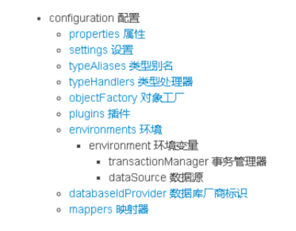
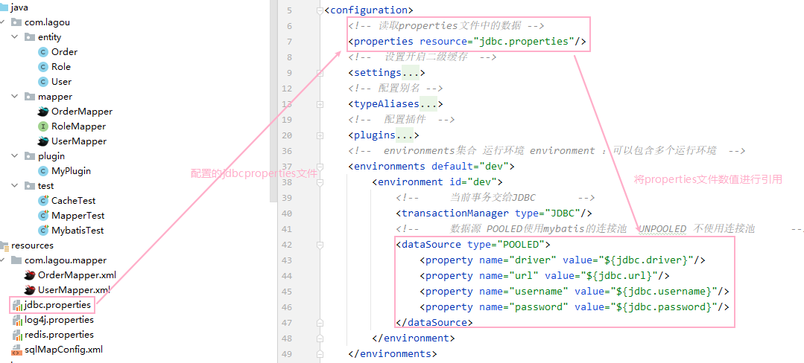
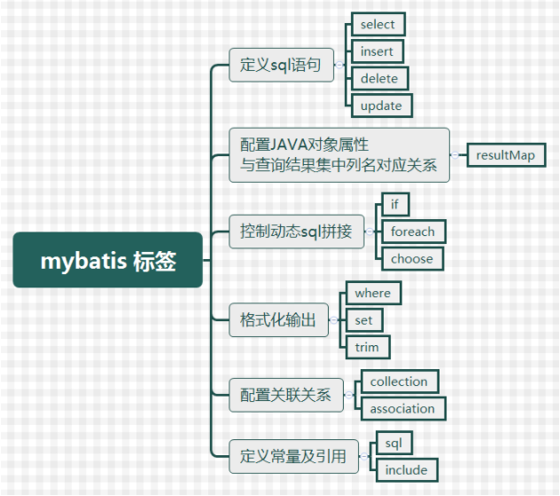
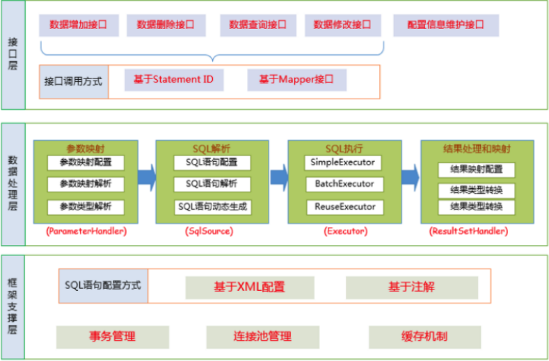
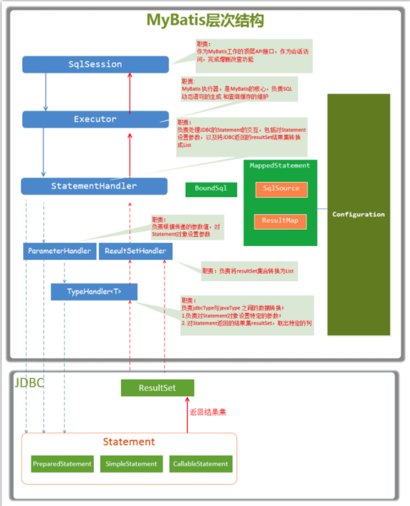

# Mybatis

## 1、对象关系数据库映射（ORM）

ORM全称Object/Relation Mapping：表示对象-关系映射的缩写

ORM完成面向对象的编程语言到关系数据库的映射。当ORM框架完成映射后，程序员既可以利用面向对象程序设计语言的简单易用性，又可以利用关系数据库的

技术优势。ORM把关系数据库包装成面向对象的模型。ORM框架是面向对象设计语言与关系数据库发展不同步时的中间解决方案。采用ORM框架后，应用程序不

再直接访问底层数据库，而是以面向对象的放松来操作持久化对象，而ORM框架则将这些面向对象的操作转换成底层SQL操作。ORM框架实现的效果：把对持化

对象的保存、修改、删除 等操作，转换为对数据库的操作

## 2、Mybatis简介

MyBatis是一款优秀的基于ORM的半自动轻量级持久层框架，它支持定制化SQL、存储过程以及高级映射。MyBatis避免了几乎所有的JDBC代码和手动设置参数以

及获取结果集。MyBatis可以使用简单的XML或注解来配置和映射原生类型、接口和Java的POJO （Plain Old Java Objects,普通老式Java对 象）为数据库中的记

录。

### 2.1Mybatis优势

Mybatis是一个半自动化的持久层框架，对开发人员开说，核心sql还是需要自己进行优化，sql和java编码进行分离，功能边界清晰，一个专注业务，一个专注数

据。


## 3、Mybatis配置文件

### 3.1、mybatis核心配置的层级关系



### 3.2、environments

用于数据库环境配置，可以包含多个**environment**每一个就是一个数据源，并且可以指定默认数据库。

```xml
<!--  environments集合 运行环境 environment ：可以包含多个运行环境  -->
    <environments default="dev">
        <environment id="dev">
            <!--     当前事务交给JDBC       -->
            <transactionManager type="JDBC"/>
            <!--     数据源 POOLED使用mybatis的连接池  UNPOOLED 不使用连接池      -->
            <dataSource type="POOLED">
                <property name="driver" value="${jdbc.driver}"/>
                <property name="url" value="${jdbc.url}"/>
                <property name="username" value="${jdbc.username}"/>
                <property name="password" value="${jdbc.password}"/>
            </dataSource>
        </environment>
    </environments>
```

### 3.3、mappers标签

该标签的作用是加载映射的，可包含多个**mapper**加载方式有如下几种：

```xml
•使用相对于类路径的资源引用，例如： 
<mapper resource="org/mybatis/builder/AuthorMapper.xml"/> 
•使用完全限定资源定位符（URL），例如： 
<mapper url="file:///var/mappers/AuthorMapper.xml"/> 
•使用映射器接口实现类的完全限定类名，例如： 
<mapper class="org.mybatis.builder.AuthorMapper"/> 
•将包内的映射器接口实现全部注册为映射器，例如： 
<package name="org.mybatis.builder"/>
```

### 3.4、Properties标签

用于加载额外的properties文件



### 3.5、typeAliases标签

用于配置别名

```xml
<!-- 配置别名 -->
    <typeAliases>
        <!--    配置单独的实体别名    -->
        <typeAlias type="com.thm.entity.User" alias="user"/>
        <!--    配置别名扫包，批量设置别名，别名不区分大小写    -->
        <package name="com.thm.entity"/>
    </typeAliases>
```

上面我们是自定义的别名，mybatis框架已经为我们设置好的一些常用的类型的别名

```java
//string、long、int、double、boolean等
```

### 3.6、plugins标签

配置相关mybatis插件

```xml
    <!--  配置插件  -->
    <plugins>
        <!--  自定义插件  -->
        <plugin interceptor="com.thm.plugin.MyPlugin">
            <property name="name" value="123"/>
        </plugin>
        <!--分页插件：如果有分页插件，要排在通用mapper之前-->
        <plugin interceptor="com.github.pagehelper.PageHelper">
            <!--    设置分页方言    -->
            <property name="dialect" value="mysql"/>
        </plugin>
        <!--  引入通用mapper  -->
        <plugin interceptor="tk.mybatis.mapper.mapperhelper.MapperInterceptor">
            <!-- 通用Mapper接口，多个通用接口用逗号隔开 -->
            <property name="mappers" value="tk.mybatis.mapper.common.Mapper"/>
        </plugin>
    </plugins>
```

## 4、Mybatis动态sql

### 4.1、常见动态sql标签



### 4.2、动态标签的作用

Mybatis动态sql是在进行sql操作时，根据传入的参数不同，进行匹配，从而形成不同的sql

### 4.3、执行原理

Mybatis在对Mapper.xml文件进行解析时，Mybatis会对mapper.xml中的每一段statement进行解析。

在对具体的sql语句解析时，将会创建SqlSoure对象，在创建SqlSource对象过程中，会对当前的sql语句进行解析，如果当前sql语句存在if、set等动态标签，则会

返回DynamicSqlSource对象（DynamicSqlSource是SqlSource子类），最终封装成MappedStatement对象存储Configuration对象的mappedStatements属性

中。在Executor执行query方法时，调getBoundSql方法时，实际上执行的DynamicSqlSource的getBoundSql方法，完成对具有动态标签语句的封装，返回最终

封装好的sql语句，以及对应的参数信息。

## 5、Mybatis复杂映射开发

### 5.1、一对一查询

当前查询对象持有关联对象的引用

```java
public class Order {
    private Integer id;
    private String orderTime;
    private String total;
    private Integer uid;
    /**
     * 订单存在的用户信息 1-1
     */
    private User user;
}
```

使用Mapper.xml实现

```xml
    <!--  定义一对一的resultMap  -->
    <resultMap id="myOrderResultMap" type="com.thm.entity.Order">
        <result property="id" column="id"/>
        <result property="orderTime" column="ordertime"/>
        <result property="total" column="total"/>
        <result property="uid" column="uid"/>
        <!--   一对一映射处理  定义类中引入的其他类    -->
        <association property="user" javaType="com.thm.entity.User">
            <result property="id" column="id"/>
            <result property="username" column="username"/>
            <result property="password" column="password"/>
            <result property="birthday" column="birthday"/>
        </association>
    </resultMap>
    <!--  查询语句  -->
    <select id="findOrderAndUser" resultMap="myOrderResultMap">
        select * from orders o,user u where o.uid=u.id
    </select>
```

使用注解实现

```java
    /**
     * 注解经写一对一关系查询
     */
    @Results({
            @Result(property = "id",column = "id"),
            @Result(property = "orderTime",column = "orderTime"),
            @Result(property = "total",column = "total"),
            @Result(property = "uid",column = "uid"),
            /**
             * 封装对应的其他对象  代替assocation标签
             * column对应传递的参数
             * javaType表示当前user字段的类型
             * one = @One 表示 一对一 其中的select执行对应的查询sql方法
             */
            @Result(property = "user", //对应属性名称
                    column = "uid", //对应参数
                    javaType = User.class,
                    one = @One(
                            //指向sql查询的引用ID
                            select = "com.thm.mapper.UserMapper.selectUserOne"
                    ))

    }) //配置结果映射
    @Select("select * from orders") //先查询所有订单信息
    List<Order> getOrderByUser();
    
    /**
     * 查询单个
     */
    @Select("select * from user where id = #{id}")
    User selectUserOne(Integer id);
```

### 5.2、一对多查询

当前查询对象持有关联对象的集合引用

```java
public class User implements Serializable {
    private Integer id;
    private String username;
    private String password;
    private String birthday;
    //表示用户关联的订单信息
    private List<Order> orderList;
}
```

使用Mapper.xml实现

```xml
    <!--  一对多映射  -->
    <resultMap id="myUserOrderResultMap" type="com.thm.entity.User">
        <id property="id" column="id"/>
        <result property="username" column="username"/>
        <result property="password" column="password"/>
        <result property="birthday" column="birthday"/>
        <!--    一对多映射处理      -->
        <collection property="orderList" ofType="com.thm.entity.Order">
            <id property="id" column="oid"/>
            <result property="orderTime" column="ordertime"/>
            <result property="total" column="total"/>
            <result property="uid" column="uid"/>
        </collection>
    </resultMap>
    <select id="findUserAndOrder" resultMap="myUserOrderResultMap">
        select a.*,b.id as oid,b.ordertime,b.total,b.uid from `user` a left join orders b on a.id = b.uid
    </select>
```

使用注解实现

```java
    /**
     * 查询所有用户信息及订单信息  一对多
     * @return
     */
    @Results({
            @Result(property = "id",column = "id"),
            @Result(property = "username",column = "username"),
            @Result(property = "password",column = "password"),
            @Result(property = "birthday",column = "birthday"),
            @Result(property = "orderList",
                    column = "id",
                    //对象为一个list，所以使用List.class 因为list有泛型最终拿到的还泛型后的list对象集合
                    javaType = List.class,
                    //一对多 其中select指向对应要指向查询的sql类全限定名
                    many = @Many(
                            select = "com.thm.mapper.OrderMapper.selectOrderByUid"
                    ))
    })
    @Select("select * from user")
    List<User> selectUserAndOrder();
    
    @Select("select * from orders where uid = #{uid}")
    List<Order> selectOrderByUid(Integer uid);
```

### 5.3、多对多查询

当前查询对象持有关联对象的集合引用

```java
public class User implements Serializable {
    private Integer id;
    private String username;
    private String password;
    private String birthday;
    //表示用户关联的角色信息
    private List<Role> roleList;
}
```

使用Mapper.xml实现

```xml
    <!--  多对多映射  -->
    <resultMap id="myUserRoleResultMap" type="com.thm.entity.User">
        <id property="id" column="userid"/>
        <result property="username" column="username"/>
        <result property="password" column="password"/>
        <result property="birthday" column="birthday"/>
        <!--    多对多映射处理      -->
        <collection property="roleList" ofType="com.thm.entity.Role">
            <id property="id" column="roleid"/>
            <result property="roleName" column="rolename"/>
            <result property="roleDesc" column="roleDesc"/>
        </collection>
    </resultMap>

    <select id="findUserAndRole" resultMap="myUserRoleResultMap">
        select * from `user` u left join sys_user_role ssr on u.id = ssr.userid inner join sys_role sr on ssr.roleid = sr.id
    </select>
```

使用注解实现

```java
    /**
     * 查询所有用户及其角色信息  多对多
     * @return
     */
    @Results({
            @Result(property = "id",column = "id"),
            @Result(property = "username",column = "username"),
            @Result(property = "password",column = "password"),
            @Result(property = "birthday",column = "birthday"),
            @Result(property = "orderList",
                    column = "id",
                    //对象为一个list，所以使用List.class 因为list有泛型最终拿到的还泛型后的list对象集合
                    javaType = List.class,
                    //一对多 其中select指向对应要指向查询的sql类全限定名
                    many = @Many(
                            select = "com.thm.mapper.UserMapper.selectRoleByUid"
                    ))
    })
    @Select("select * from user")
    List<User> selectUserAndRole();

    @Select("select * from sys_role sr,sys_user_role sur where sr.id = sur.roleid and sur.userid = #{uid}")
    List<Role> selectRoleByUid(Integer uid);
```

## 6、Mybatis缓存

### 6.1、一级缓存

mybatis的一级缓存是默认开启，其底层结构为HashMap，key（statementid+params+RowBounds+boundsql），value存储具体的对象。mybatis一级缓存 

sqlSession级别缓存

测试一级缓存

```java
    /**
     * 测试mybatis一级缓存 sqlSession级别缓存
     * mybatis一级缓存是默认开启的
     */
    @Test
    public void TestFirstCache(){
        /**
         * 第一次查询  mybatis的一级缓存是默认开启的，每一次查询先前缓存中查询，有直接返回，没有则去数据库中查询并添加缓存
         * 一级缓存就是HashMap： key（statementid+params+boundsql+rowBounds）， value：查询出来的对象或者对象集合
         */
        User user1 = userMapper.selectUserOne(3);
        System.out.println(user1.toString());
        /**
         * 更新操作
         * 每有一次进行（增、删、改）并且在提交事务之后，mybatis清空一级缓存，避免脏读
         * mybatis是自动清空一级缓存（如果开启了二级缓存，则会将一级缓存的数据放进二级缓存中）
         * 手动清空使用 sqlSession.clearCache();
         */
        user1.setUsername("修改测试数据");
        userMapper.updateUser(user1);
        sqlSession.commit();
        //sqlSession.close(); 也会清空一级缓存/不会刷新到二级缓存中
        /**
         * 第二次查询 未执行写操作并commit则会直接从一级缓存中获取数据
         * 如果执行写操作并commit则会清空一级缓存,重新向数据库获取并添加缓存
         */
        User user2 = userMapper.selectUserOne(3);
        System.out.println(user2.toString());
        System.out.println(user1 == user2);
    }
```

### 6.2、二级缓存

二级缓存（手动开启）entity必须实现Serializable接口，二级缓存底层为HashMap，value存储的是数据值。

```xml
<!--  sqlMapConfig.xml核心配置文件 设置开启二级缓存  -->
<settings>
   <setting name="cacheEnabled" value="true"/>
</settings>
    
    
<!--  mapper.xml文件 开启当前mapper的二级缓存，创建二级缓存对象   -->
<cache></cache>
    
注解开启 
@CacheNamespace(implementation = PerpetualCache.class) //注解开启二级缓存 使用默认实现缓存PerpetualCache
//mybatis自带的二级缓存无法实现分布式缓存
//使用分布式缓存框架：redis（集群），memcached，ehcache等 添加redis.properties文件配置redis相关数据
public interface UserMapper {
```

二级缓存为namespace级别缓存，可以被多个sqlSession共享。

二级缓存的原理和一级缓存原理一样，第一次查询，在commit后会将数据放入缓存中（如果未进行commit操作这时数据只是存储在一个临时缓存中，只有执行

commit后才会将临时缓存的数据刷新到二级缓存中），然后第二次查询则会直接去缓存中取。但是一级缓存是基于sqlSession的，而二级缓存是基于mapper文件

的namespace的，也就是说多个sqlSession可以共享一个mapperparam中的二级缓存区域，并且如果两个mapper的namespace 相同，即使是两个mapper,那么

这两个mapper中执行sql查询到的数据也将存在相同的二级缓存区域中。

二级缓存构建在一级缓存之上，在收到查询请求时，MyBatis 首先会查询二级缓存，若二级缓存未命中，再去查询一级缓存，一级缓存没有，再查询数据库。

二级缓存------> 一级缓存------>数据库

与一级缓存不同，二级缓存和具体的命名空间绑定，一个Mapper中有一个Cache，相同Mapper中的MappedStatement共用一个Cache，一级缓存则是和 

SqlSession 绑定。

测试二级缓存

```java
    /**
     * 测试mybatis二级缓存 mapper（SqlSessionFactory/namspace）级别缓存，相当于就是一个mapper.xml
     * mybatis二级缓存是跨sqlSession，也就是说多个sqlSession是可以共享缓存
     * mybatis二级缓存底层还是HashMap
     * mybatis二级缓存存储的是具体的数据而不是相关的对象
     * mybatis二级缓存需要手动开启，在核心配置文件中设置全局缓存，并在每一个mapper.xml中单独开启
     * mybatis二级缓存需要实体去实现序列化Serializable
     */
    @Test
    public void TestSecondCache(){
        SqlSession sqlSession1 = sqlSessionFactory.openSession();
        SqlSession sqlSession2 = sqlSessionFactory.openSession();
        SqlSession sqlSession3 = sqlSessionFactory.openSession();
        final UserMapper mapper1 = sqlSession1.getMapper(UserMapper.class);
        final UserMapper mapper2 = sqlSession2.getMapper(UserMapper.class);
        final UserMapper mapper3 = sqlSession3.getMapper(UserMapper.class);
        /**
         * 第一次查询 每一次查询先前缓存中查询，有直接返回，无则到一级缓存中查询有返回,无则查询数据库并添加临时缓存
         */
        User user1 = mapper1.selectUserOne(3);
        System.out.println(user1.toString());
        sqlSession1.commit(); // 这个时候才将临时缓存的数据刷新到二级缓存中
        /**
         * 更新操作
         * 每有一次进行（增、删、改）并且在提交事务之后，mybatis清空二级缓存，同时会清空当前sqlsession的一级缓存，避免脏读
         */
        user1.setUsername("修改测试数据");
        mapper2.updateUser(user1);
        sqlSession2.commit();
        /**
         * 第二次查询 先到二级缓存中查询有直接返回,无则到一级缓存中查询有返回,无则查询数据库并添加临时缓存
         */
        User user3 = mapper3.selectUserOne(3);
        System.out.println(user3.toString());
        System.out.println(user1 == user3);
        sqlSession2.commit(); //刷新数据到二级缓存中
    }
```

mybatis中还可以配置**userCache**和**flushCache**等配置项，userCache是用来设置是否禁用二级缓存的，在statement中设置useCache=false可以禁用当前select

语句的二级缓存，即每次查询都会发出 sql去查询，**默认情况是true**,即该sql使用二级缓存。

在mapper的同一个namespace中，如果有其它insert、update, delete操作数据后需要刷新缓存，如果不执行刷新缓存会出现脏读。设置statement配置中的

**flushCache="true”属性，默认情况下为true**,即刷新缓存，如果改成false则不会刷新。使用缓存时如果手动修改数据库表中的查询数据会出现脏读。一般下执行

完commit操作都需要刷新缓存，flushCache=true表示刷新缓存，这样可以避免数据库脏读。所以我们不用设置，默认即可。

```xml
<select id="selectUserByUserId" flushCache="true" useCache="false" resultType="com.thm.pojo.User" parameterType="int"> 
	select * from user where id=#{id} 
</select>
```

mybatis整合Redis做二级缓存

```xml
pom文件中引用对应mybatis执行的相应实现缓存包
<dependency>
    <groupId>org.mybatis.caches</groupId>
    <artifactId>mybatis-redis</artifactId>
    <version>1.0.0-beta2</version>
</dependency>

<!--  sqlMapConfig.xml核心配置文件 设置开启二级缓存  -->
<settings>
	<setting name="cacheEnabled" value="true"/>
</settings>
mapper.xml 文件指定缓存为RedisCache
<cache type="org.mybatis.caches.redis.RedisCache" />

注解方式在mapper接口上引用
@CacheNamespace(implementation = RedisCache.class) //注解开启二级缓存 使用redis缓存
//使用分布式缓存框架：redis（集群），memcached，ehcache等 添加redis.properties文件配置redis相关数据
public interface UserMapper 
```

## 7、Mybatis插件

### 7.1、Mybatis插件介绍

Mybatis作为一个应用广泛的优秀的ORM开源框架，这个框架具有强大的灵活性，在四大组件(Executor、StatementHandler、ParameterHandler、

ResultSetHandler)处提供了简单易用的插件扩展机制。Mybatis对持久层的操作就是借助于四大核心对象。MyBatis支持用插件对四大核心对象进行拦截，对

mybatis来说插件就是**拦截器**，用来增强核心对象的功能，增强功能本质上是借助于底层的动态代理实现的，换句话说，MyBatis中的四大对象都是代理对象。

**MyBatis所允许拦截的方法如下：**

- **执行器Executor** (update、query、commit、rollback等方法)；

- **SQL语法构建器StatementHandler** (prepare、parameterize、batch、updates query等方 法)；

- **参数处理器ParameterHandler **(getParameterObject、setParameters方法)；

- **结果集处理器ResultSetHandler** (handleResultSets、handleOutputParameters等方法)；

**运行原理：**Mybatis的插件运行原理本质上是使用JDK的动态代理为原生对象生成代理对象。Mybatis的插件就是对四大核心对象（Executor、

StatementHandler、ParamterHandler、ResultSetHandler）进行拦截，Mybatis插件的本质就是一个拦截器。在Mybatis初始化时可以加载插件，并将插件的实

例对象保存到拦截器链中，在执行相关读写操作时，创建相关被拦截的对象时，Mybatis会通过JDK的动态代理为实例对象生成代理对象并返回。这时插件可以在

被拦截方法调用前执行，对功能进行增强。

### 7.2、自定义mybatis插件

```java
@Intercepts({ //注意看这个大花括号，也就这说这里可以定义多个@Signature对多个地方拦截，都用这个拦截器
        @Signature(type = StatementHandler.class,//这是指拦截哪个接口 当前拦截是sql处理器
                    method = "prepare", //具体拦截的方法
                    args = {Connection.class,Integer.class} //拦截方法具有的参数（解决方法重载）
                    )
})
public class MyPlugin implements Interceptor {
    /**
     * 实际对拦截方法之前执行的方法，是实际进行增强的方法
     * 可以对sql语句进行增强，完成分页等
     * @param invocation
     * @return
     * @throws Throwable
     */
    @Override
    public Object intercept(Invocation invocation) throws Throwable {
        System.out.println("对该方法进行增强。。。。。。");
        return invocation.proceed(); //让原方法执行
    }

    /**
     * 将自定义的插件放到拦截器链中，在参数获取后在执行
     * @param o
     * @return
     */
    @Override
    public Object plugin(Object o) {
        /**
         * this代表当前自定义拦截器
         */
        Object wrap = Plugin.wrap(o, this);
        System.out.println("添加拦截器链");
        return wrap;
    }

    /**
     * 获取在核心配置文件中设置的参数 加载配置文件时最先执行
     * @param properties
     */
    @Override
    public void setProperties(Properties properties) {
        System.out.println("获取到设置的参数："+properties);
    }
```

使自定义插件生效需要在核心配置文件引用

```xml
<plugins>
    <!--  自定义插件  -->
    <plugin interceptor="com.thm.plugin.MyPlugin">
        <!--  设置参数  -->
        <property name="name" value="123"/>
    </plugin>
</plugins>
```

## 8、Mybatis架构原理

### 8.1、架构设计



我们把Mybatis的功能架构分为三层：

(1) API接口层：提供给外部使用的接口 API，开发人员通过这些本地API来操纵数据库。接口层一接收到调用请求就会调用数据处理层来完成具体的数据处理。

MyBatis和数据库的交互有两种方式：

​	a. 使用传统的MyBati s提供的API ；

​	b. 使用Mapper代理的方式

(2) 数据处理层：负责具体的SQL查找、SQL解析、SQL执行和执行结果映射处理等。它主要的目的是根据调用的请求完成一次数据库操作。

(3) 基础支撑层：负责最基础的功能支撑，包括连接管理、事务管理、配置加载和缓存处理，这些都是共用的东西，将他们抽取出来作为最基础的组件。为上层的

数据处理层提供最基础的支撑。

### 8.2、主要构件及其相互关系

| **构件**         | **描述**                                                     |
| ---------------- | ------------------------------------------------------------ |
| SqlSession       | 作为MyBatis工作的主要顶层API，表示和数据库交互的会话，完成必要数据库增删改查功能 |
| Executor         | MyBatis执行器，是MyBatis调度的核心，负责SQL语句的生成和查询缓存的维护 |
| StatementHandler | 封装了JDBC Statement操作，负责对JDBC statement的操作，如设置参数、将Statement结果集转换成List集合 |
| ParameterHandler | 负责对用户传递的参数转换成JDBC Statement所需要的参数         |
| ResultSetHandler | 负责将JDBC返回的ResultSet结果集对象转换成List类型的集合      |
| TypeHandler      | 负责java数据类型和jdbc数据类型之间的映射和转换               |
| MappedStatement  | MappedStatement维护了一条＜select \| update \| delete \| insert＞节点的封装对象 |
| SqlSource        | 负责根据用户传递的parameterObject，动态地生成SQL语句，将信息封装到BoundSql对象中，并返回 |
| BoundSql         | 表示动态生成的SQL语句以及相应的参数信息                      |



### 8.3、总体流程

**(1)** **加载配置并初始化**

**触发条件：**加载配置文件

配置来源于两个地方，一个是配置文件(主配置文件conf.xml,mapper文件*.xml),—个是java代码中的 注解，将主配置文件内容解析封装到Configuration,将sql的

配置信息加载成为一个mappedstatement 对象，存储在内存之中

**(2)** **接收调用请求**

**触发条件**：调用Mybatis提供的API

**传入参数：**为SQL的ID和传入参数对象

**处理过程：**将请求传递给下层的请求处理层进行处理。

**(3)** **处理操作请求**

**触发条件：**API接口层传递请求过来

**传入参数：**为SQL的ID和传入参数对象

**处理过程：**

(A) 根据SQL的ID查找对应的MappedStatement对象。

(B) 根据传入参数对象解析MappedStatement对象，得到最终要执行的SQL和执行传入参数。

(C) 获取数据库连接，根据得到的最终SQL语句和执行传入参数到数据库执行，并得到执行结果。

(D) 根据MappedStatement对象中的结果映射配置对得到的执行结果进行转换处理，并得到最终的处理结果。

(E) 释放连接资源。

**(4)** **返回处理结果**

将最终的处理结果返回。

### 8.4、Mybatis执行器

- SimpleExecutor是默认的Executor，每一次执行读/写操作都会创建Statement对象，执行完成之后关闭Statement。

- BatchExecutor是批量处理Executor，对相同的sql进行一次编译，然后设置参数，统一执行。

- ReuseExecutor是可重用的Executor，每一次执行读/写操作，优先从缓存中获取对应的Statement对象。如果不存在，才进行创建。执行完成之后不关闭

  Statement对象。

### 8.5、Mybatis延迟加载

MyBatis延迟加载主要使用：Javassist，Cglib实现，默认采用javassistProxy进行代理对象的创建。

- **延迟加载**

  就是在需要用到数据时才进行加载，不需要用到数据时就不加载数据。延迟加载也称懒加载。fetchType="lazy"

- **局部延迟加载**

  在association和collection标签中都有一个fetchType属性，通过修改它的值，可以修改局部的加载策略

  ```xml
    <resultMap id="myUserRoleResultMap" type="com.lagou.entity.User">
          <id property="id" column="userid"/>
          <result property="username" column="username"/>
          <result property="password" column="password"/>
          <result property="birthday" column="birthday"/>
          <!--    多对多映射处理      -->
          <!--fetchType="lazy" 懒加载策略 fetchType="eager" 立即加载策略 -->
          <collection property="roleList" ofType="com.lagou.entity.Role" fetchType="lazy">
              <id property="id" column="roleid"/>
              <result property="roleName" column="rolename"/>
              <result property="roleDesc" column="roleDesc"/>
          </collection>
      </resultMap>
  
      <select id="findUserAndRole" resultMap="myUserRoleResultMap">
          select * from `user` u left join sys_user_role ssr on u.id = ssr.userid inner join sys_role sr on ssr.roleid = sr.id
      </select>
  ```

- **全局延迟加载**

  在Mybatis的核心配置文件中可以使用setting标签修改全局的加载策略。

  ```xml
  <settings> 
  	<!--开启全局延迟加载功能--> 
  	<setting name="lazyLoadingEnabled" value="true"/> 
  </settings>
  ```

- **实现原理**

  它的原理是，使用 CGLIB 或 Javassist( 默认 ) 创建目标对象的代理对象。当调用代理对象的延迟加载属性的 getting 方法时，**进入拦截器方法**。比如调用 

  a.getB().getName() 方法，进入拦截器的invoke(...) 方法，发现 a.getB() 需要延迟加载时，那么就会单独发送事先保存好的查询关联 B 对象的 SQL ，把 B 查询

  上来，然后调用 a.setB(b) 方法，于是 a 对象 b 属性就有值了，接着完成a.getB().getName() 方法的调用。这就是延迟加载的基本原理。

  **总结：**Mybatis延迟加载的实现原理是基于动态代理实现的，通过代理拦截到指定的方法，执行数据的加载。

## 9、Mybatis中设计模式

Mybati s至少用到了以下的设计模式的使用：

| 模式         | mybatis体现                                                  |
| ------------ | ------------------------------------------------------------ |
| Builder模式  | 例如SqlSessionFactoryBuilder、Environment                    |
| 工厂方法模式 | 例如SqlSessionFactory、TransactionFactory、LogFactory        |
| 单例模式     | 例如 ErrorContext 和 LogFactory                              |
| 代理模式     | Mybatis实现的核心，比如MapperProxy、ConnectionLogger，用的jdk的动态代理还有executor.loader包使用了 cglib或者javassist达到延迟加载的效果 |
| 组合模式     | 例如SqlNode和各个子类ChooseSqlNode等                         |
| 模板方法模式 | 例如 BaseExecutor 和 SimpleExecutor，还有 BaseTypeHandler 和所有的子类例如IntegerTypeHandler |
| 适配器模式   | 例如Log的Mybatis接口和它对jdbc、log4j等各种日志框架的适配实现 |
| 装饰者模式   | 例如Cache包中的cache.decorators子包中等各个装饰者的实现      |
| 迭代器模式   | 例如迭代器模式PropertyTokenizer                              |

设计模式学习推荐网站：https://refactoringguru.cn/design-patterns/catalog

## 10、Mybatis-Plus相关运用

具体使用访问官网： https://mybatis.plus/ 或 https://mp.baomidou.com/

## 11、自定义持久层框架思路（mybatis）

### 11.1、分析JDBC操作问题

```java
public static void main(String[] args) {
        Connection connection = null;
        PreparedStatement preparedStatement=null;
        ResultSet resultSet=null;
        try {
            //加载数据库驱动
            Class.forName("com.mysql.jdbc.Driver");
            //通过驱动管理类获取数据库链接
            connection = DriverManager.getConnection("jdbc:mysql://localhost:3306/mybatis?characterEncoding=utf-8","root","root");
            //定义sql语句？表示占位符
            String sql="select * from user where username = ?";
            //获取预处理statement
            preparedStatement=connection.prepareStatement(sql);
            //设置参数，第一个参数为sql语句中参数的序号(从1开始)，第二个参数为设置的参数值
            preparedStatement.setString(1,"tom");
            //向数据库发出sql执行查询，获得结果集
            resultSet = preparedStatement.executeQuery();
            //遍历结果集
            User user;
            while(resultSet.next()){
                final int id = resultSet.getInt("id");
                final String username = resultSet.getString("username");
                //封装User对象
                user = new User();
                user.setId(id);
                user.setUserName(username);
                System.out.println(user.toString());
            }
        } catch (Exception e){
            e.printStackTrace();
        } finally {
            //关闭资源
            if (resultSet != null){
                try {
                    resultSet.close();
                } catch (SQLException throwables) {
                    throwables.printStackTrace();
                }
            }
            if (preparedStatement != null){
                try {
                    preparedStatement.close();
                } catch (SQLException throwables) {
                    throwables.printStackTrace();
                }
            }
            if (connection != null){
                try {
                    connection.close();
                } catch (SQLException throwables) {
                    throwables.printStackTrace();
                }
            }
        }
    }
    
/**
JDBC问题总结：
原始jdbc开发存在的问题如下：
1、 数据库连接创建、释放频繁造成系统资源浪费，从而影响系统性能。
2、 Sql语句在代码中硬编码，造成代码不易维护，实际应用中sql变化的可能较大，sql变动需要改变java代码。
3、 使用preparedStatement向占有位符号传参数存在硬编码，因为sql语句的where条件不一定，可能多也可能少，修改sql还要修改代码，系统不易维护。
4、 对结果集解析存在硬编码(查询列名)，sql变化导致解析代码变化，系统不易维护，如果能将数据 库记录封装成pojo对象解析比较方便

问题解决思路
①使用数据库连接池初始化连接资源
②将sql语句抽取到xml配置文件中
③使用反射、内省等底层技术，自动将实体与表进行属性与字段的自动映射
*/
```

### 11.2、自定义框架设计

```
使用端：
	1、提供核心配置文件：sqlMapConfig.xml 配置数据源及mapper.xml相关信息
	2、提供Sql语句配置文件：Mapper.xml
框架端：
	1、读取配置文件、将核心配置文件读取为字节流，方便解析
		创建类Resources  创建方法getResourceAsStream（String path）
	2、解析配置文件
		1）解析出来的配置文件数据需要填充到javaBean中
			创建Configuration类保存核心配置文件相关信息：datasource、MapperStatement对象信息
			创建MapperStatement类保存解析出来Mapper配置相关信息：id、parameterType、resultType、sql
		2）创建sqlSessionFactoryBuilder类，
			提供build（）方法，返回sqlSessionFactory
			第一、使用dom4j对配置文件进行解析并填充对象数据到configuration和MapperStatement中
				XMLConfigBuilder  parseConfiguration方法 解析sqlMapConfig.xml配置文件
				XMLMapperBuilder  parse方法 解析Mapper.xml配置文件
			第二、创建sqlSessionFactory接口和DefaultSqlSessionFactory实现类
				return new DefaultSqlSessionFactory（Configuration）
	3、创建DefaultSqlSessionFactory
		提供方法：openSqlSession（） 获取sqlSession接口的实现类实例对象
	4、创建SqlSesson接口及实现类DefaultSqlSession：封装具体的CURD方法
		提供方法：selectOne（String statementId，Object... param）
				  selectList（String statementId，Object... param）
				  insert（String statementId，Object... param）
				  update（String statementId，Object... param）
				  delete（String statementId，Object... param）
	5、创建Executor接口及实现类SimpleExecutor:封装JDBC完成对数据库表的操作
		提供方法：query（Configuration Configuration, MapperStatement mapperStatement, Object... params）
                insert（Configuration Configuration, MapperStatement mapperStatement, Object... params）
                update（Configuration Configuration, MapperStatement mapperStatement, Object... params）
                delete（Configuration Configuration, MapperStatement mapperStatement, Object... params）
		1）完成sql的解析
		2）完成参数的设置
		3）完成结果集的封装
	6、优化框架使用动态代理解决statememntId硬编码问题
		存在问题：如何判断代理对象执行方法
		解决方法：通过对被代理对象方法要执行的sql语句进行解析、得出相应得方法调用类型
		MapperStatementMethod ：保存statementId和methodType
		MapperStatementMethodEnum：methodType枚举类型
```

具体实现代码：https://gitee.com/Thmspring/LG_homeWork/tree/master/stage1_module1/code

