# Spring_MVC

## 1、Spring MVC 简介

### 1.1 、MVC体系结构

- **三层架构**

  我们的开发架构⼀般都是基于两种形式，⼀种是 C/S 架构，也就是客户端/服务器；另⼀种是 B/S 架构，也就是浏览器服务器。在 JavaEE 开发中，⼏乎全都是

  基于 B/S 架构的开发。那么在 B/S 架构中，系统标准的三层架构包括：表现层、业务层、持久层。三层架构在我们的实际开发中使⽤的⾮常多。三层架构中，

  每⼀层各司其职：

  - **表现层 ：**

    也就是我们常说的web 层。它负责接收客户端请求，向客户端响应结果，通常客户端使⽤http 协议请求web 层，web 需要接收 http 请求，完成 http 响

    应。

    表现层包括展示层和控制层：控制层负责接收请求，展示层负责结果的展示。

    表现层依赖业务层，接收到客户端请求⼀般会调⽤业务层进⾏业务处理，并将处理结果响应给客户端。

    表现层的设计⼀般都使⽤ MVC 模型。（MVC 是表现层的设计模型，和其他层没有关系）

  - **业务层 ：**

    也就是我们常说的 service 层。它负责业务逻辑处理，和我们开发项⽬的需求息息相关。web 层依赖业务层，但是业务层不依赖 web 层。业务层在业务处

    理时可能会依赖持久层，如果要对数据持久化需要保证事务⼀致性。（也就是我们说的， 事务应该放到业务层来控制）

  - **持久层 ：**

    也就是我们是常说的 dao 层。负责数据持久化，包括数据层即数据库和数据访问层，数据库是对数据进⾏持久化的载体，数据访问层是业务层和持久层交
    
    互的接⼝，业务层需要通过数据访问层将数据持久化到数据库中。通俗的讲，持久层就是和数据库交互，对数据库表进⾏增删改查的。

- **MVC设计模式**

  MVC 全名是 Model View Controller，是 模型(model)－视图(view)－控制器(controller) 的缩写， 是⼀种⽤于设计创建 Web 应⽤程序**表现层**的模式。MVC 中

  每个部分各司其职：

  **Model（模型）：**模型包含业务模型和数据模型，数据模型⽤于封装数据，业务模型⽤于处理业务。

  **View（视图）：** 通常指的就是我们的 jsp 或者 html。作⽤⼀般就是展示数据的。通常视图是依据模型数据创建的。

  **Controller（控制器）：** 是应⽤程序中处理⽤户交互的部分。作⽤⼀般就是处理程序逻辑的。

  **MVC提倡：**每⼀层只编写⾃⼰的东⻄，不编写任何其他的代码；分层是为了解耦，解耦是为了维护⽅便和分⼯协作。


### 1.2 、Spring MVC 是什么？

SpringMVC 全名叫 Spring Web MVC，是⼀种基于 Java 的实现 MVC 设计模型的请求驱动类型的轻量级Web 框架，属于 SpringFrameWork 的后续产品。


SpringMVC 已经成为 ⽬前最主流的 MVC 框架 之⼀，并且 随着 Spring3.0 的发布，全⾯超越 Struts2，成为最优秀的 MVC 框架。它通过⼀套注解，让⼀个简单的 

Java 类成为处理请求的控制器，⽽⽆须实现任何接⼝。同时它还⽀持RESTful 编程⻛格的请求。

servlet、struts实现接⼝、springmvc中要让⼀个java类能够处理请求只需要添加注解就ok

**总之：**Spring MVC和Struts2⼀样，都是为了解决表现层问题 的web框架，它们都是基于 MVC 设计模式的。⽽这些表现层框架的主要职责就是处理前端HTTP请

求。

Spring MVC 本质可以认为是对servlet的封装，简化了我们serlvet的开发。作⽤：(1）接收请求 ( 2）返回响应，跳转⻚⾯

## 2、Spring MVC ⼯作流程

### 2.1、开发纯spring-MVC过程步骤

- 创建maven工程，引入spring-mvc依赖

  ```xml
      <dependency>
        <groupId>org.springframework</groupId>
        <artifactId>spring-webmvc</artifactId>
        <version>5.1.6.RELEASE</version>
      </dependency>
  ```

- 配置DispatcherServlet前端控制器

  ```xml
  web.xml中
    <!-- 配置前端控制器 -->
    <servlet>
      <servlet-name>springmvc</servlet-name>
      <servlet-class>org.springframework.web.servlet.DispatcherServlet</servlet-class>
      <!-- 读取springmvc配置文件 -->
      <init-param>
        <param-name>contextConfigLocation</param-name>
        <param-value>classpath:springmvc.xml</param-value>
      </init-param>
    </servlet>
    <!-- 配置servlet映射 -->
    <servlet-mapping>
      <!-- 引入前端控制器 -->
      <servlet-name>springmvc</servlet-name>
      <!--  配置拦截规则
          方式一：带后缀，比如*。action，*。do等拦截具体请求
          方式二：/ 不会拦截 .jsp，但是会拦截 .html等静态资源（除了servlet和jsp之外的js、css、png等）
          	为什么配置 / 会拦截静态资源？
          		因为tomcat容器中存在一个web.xml（父），配置了DefaultServlet，url-pattern为 /
          		此时自己项目中的web.xml(子)，也配置了一个 / ，会覆盖父web.xml的配置
          		解决方案：配置静态资源处理器
          	为什么不拦截 .jsp?
          		因为tomcat容器中存在一个web.xml（父），配置了JspServlet用于拦截.jsp文件。
          		子web.xml并没有覆盖这个配置。
          方式三：/* 拦截所有，包括.jsp
        -->
      <url-pattern>/</url-pattern>
    </servlet-mapping>
  ```

- 开发处理具体业务逻辑的Handler（@Controller、@RequestMapping）

  ```java
  @Controller
  @RequestMapping("/demo")
  public class SpringMvcDemo {
  	/**
  	 * url：http：//localhost：8080/demo/test1
  	 * 方式一：ModelAndView
  	 */
  	@RequestMapping("/test1")
      public ModelAndView demoModelAndView(){
          final long l = System.currentTimeMillis();
          //封装返回数据和页面信息
          ModelAndView modelAndView = new ModelAndView();
          //addObject其实是向请求域中request.serAttribute（"data",l）
          modelAndView.addObject("data",l);
          //视图页面
          modelAndView.setViewName("success");
          return modelAndView;
      }
      /**
  	 * url：http：//localhost：8080/demo/test2
  	 * 方式二：ModelMap
  	 */
  	@RequestMapping("/test2")
     public String demoModelMap(ModelMap modelMap){
          final long l = System.currentTimeMillis();
          //封装返回数据
          modelMap.serAttribute（"data",l）
          //返回页面
          return success;
      }
      /**
  	 * url：http：//localhost：8080/demo/test2
  	 * 方式三：Model
  	 */
  	@RequestMapping("/test3")
     public String demoModelMap(Model model){
          final long l = System.currentTimeMillis();
          //封装返回数据
          model.serAttribute（"data",l）
          //返回页面
          return success;
      }
     /**
  	* url：http：//localhost：8080/demo/test2
  	* 方式四：Map<String,Object>
  	*/
     @RequestMapping("/test4")
     public String demoModelMap(Map<String,Object> map){
          final long l = System.currentTimeMillis();
          //封装返回数据
          map.put（"data",l）
          //返回页面
          return success;
      }
  }
  ```

  

- xml配置⽂件配置controller扫描，配置springmvc三⼤件，创建springmvc.xml

  ```xml
  <?xml version="1.0" encoding="UTF-8"?>
  <beans xmlns="http://www.springframework.org/schema/beans"
         xmlns:context="http://www.springframework.org/schema/context"
         xmlns:mvc="http://www.springframework.org/schema/mvc"
         xmlns:xsi="http://www.w3.org/2001/XMLSchema-instance"
         xsi:schemaLocation="
         http://www.springframework.org/schema/beans http://www.springframework.org/schema/beans/spring-beans.xsd
         http://www.springframework.org/schema/context http://www.springframework.org/schema/context/spring-context.xsd
         http://www.springframework.org/schema/mvc http://www.springframework.org/schema/mvc/spring-mvc.xsd
  ">
      <!--  配置包扫描  -->
      <context:component-scan base-package="com.thm"/>
      <!--  配置视图解析器  -->
      <bean class="org.springframework.web.servlet.view.InternalResourceViewResolver">
          <property name="prefix" value="/WEB-INF/jsp"/>
          <property name="suffix" value=".jsp"/>
      </bean>
      <!--  自动注册最合适的处理器映射器，处理器适配器  -->
      <mvc:annotation-driven/>
      
     <!-- 
          静态资源配置：方式1
          将静态资源交给web应用服务器（tomcat）处理，但是静态资源只能在webapp目录下
      -->
      <mvc:default-servlet-handler/>
      <!-- 
      	静态资源配置：方式2  推荐
      	mapping:约定的静态资源url规则
      	location：指定的静态资源存放位置
      -->
      <mvc:resources mapping="/resources/**" location="/WEB-INF/"/>
  </beans>
  ```

### 2.2、 Spring MVC 请求处理流程

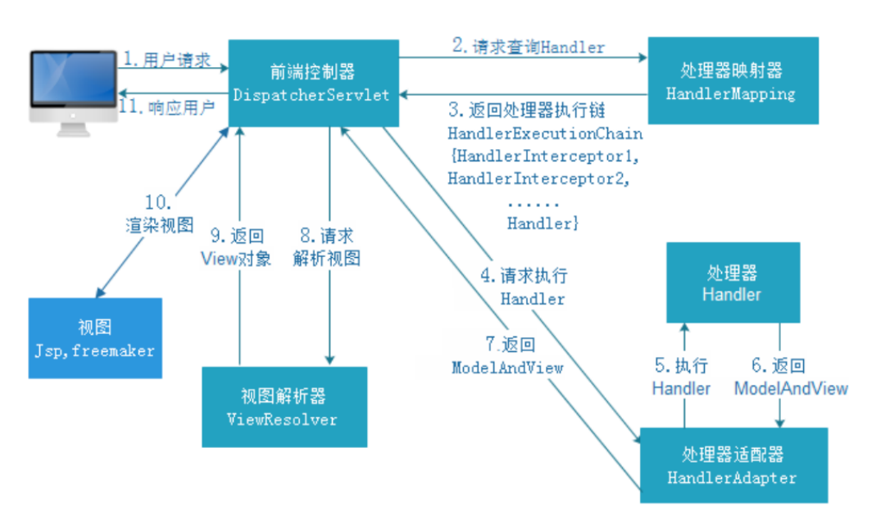

**流程说明**

第⼀步：⽤户发送请求⾄前端控制器DispatcherServlet

第⼆步：DispatcherServlet收到请求调⽤HandlerMapping处理器映射器

第三步：处理器映射器根据请求Url找到具体的Handler（后端控制器），⽣成处理器对象及处理器拦截器(如果有则⽣成)⼀并返回DispatcherServlet

第四步：DispatcherServlet调⽤HandlerAdapter处理器适配器去调⽤Handler

第五步：处理器适配器执⾏Handler

第六步：Handler执⾏完成给处理器适配器返回ModelAndView

第七步：处理器适配器向前端控制器返回 ModelAndView，ModelAndView 是SpringMVC 框架的⼀个底层对 象，包括 Model 和 View

第⼋步：前端控制器请求视图解析器去进⾏视图解析，根据逻辑视图名来解析真正的视图。

第九步：视图解析器向前端控制器返回View

第⼗步：前端控制器进⾏视图渲染，就是将模型数据（在 ModelAndView 对象中）填充到 request 域

第⼗⼀步：前端控制器向⽤户响应结果

### 2.3、 Spring MVC 九⼤组件

- **HandlerMapping（处理器映射器）**

  HandlerMapping 是⽤来查找 Handler 的，也就是处理器，具体的表现形式可以是类，也可以是⽅法。⽐如，标注了@RequestMapping的每个⽅法都可以看

  成是⼀个Handler。Handler负责具体实际的请求处理，在请求到达后，HandlerMapping 的作⽤便是找到请求相应的处理器Handler 和 Interceptor.

- **HandlerAdapter（处理器适配器）**

  HandlerAdapter 是⼀个适配器。因为 Spring MVC 中 Handler 可以是任意形式的，只要能处理请求即可。但是把请求交给 Servlet 的时候，由于 Servlet 的⽅

  法结构都是doService(HttpServletRequest req,HttpServletResponse resp)形式的，要让固定的 Servlet 处理⽅法调⽤ Handler 来进⾏处理，便是

  HandlerAdapter 的职责。

- **HandlerExceptionResolver**

  HandlerExceptionResolver ⽤于处理 Handler 产⽣的异常情况。它的作⽤是根据异常设置ModelAndView，之后交给渲染⽅法进⾏渲染，渲染⽅法会将 

  ModelAndView 渲染成⻚⾯。

- **ViewResolver**

  ViewResolver即视图解析器，⽤于将String类型的视图名和Locale解析为View类型的视图，只有⼀个resolveViewName()⽅法。从⽅法的定义可以看出，

  Controller层返回的String类型视图名viewName 最终会在这⾥被解析成为View。View是⽤来渲染⻚⾯的，也就是说，它会将程序返回的参数和数据填⼊模板

  中，⽣成html⽂件。ViewResolver 在这个过程主要完成两件事情：ViewResolver 找到渲染所⽤的模板（第⼀件⼤事）和所⽤的技术（第⼆件⼤事，其实也就

  是找到视图的类型，如JSP）并填⼊参数。默认情况下，Spring MVC会⾃动为我们配置⼀个InternalResourceViewResolver,是针对 JSP 类型视图的。

- **RequestToViewNameTranslator**

  RequestToViewNameTranslator 组件的作⽤是从请求中获取 ViewName.因为 ViewResolver 根据ViewName 查找 View，但有的 Handler 处理完成之后,没

  有设置 View，也没有设置 ViewName，便要通过这个组件从请求中查找 ViewName。

- **LocaleResolver**

  ViewResolver 组件的 resolveViewName ⽅法需要两个参数，⼀个是视图名，⼀个是 Locale。LocaleResolver ⽤于从请求中解析出 Locale，⽐如中国 Locale 

  是 zh-CN，⽤来表示⼀个区域。这个组件也是 i18n 的基础。

- **ThemeResolver**

  ThemeResolver 组件是⽤来解析主题的。主题是样式、图⽚及它们所形成的显示效果的集合。Spring MVC 中⼀套主题对应⼀个 properties⽂件，⾥⾯存放着

  与当前主题相关的所有资源，如图⽚、CSS样式等。创建主题⾮常简单，只需准备好资源，然后新建⼀个“主题名.properties”并将资源设置进去，放classpath

  下，之后便可以在⻚⾯中使⽤了。SpringMVC中与主题相关的类有ThemeResolver、ThemeSource和Theme。ThemeResolver负责从请求中解析出主题名，

  ThemeSource根据主题名找到具体的主题，其抽象也就是Theme，可以通过Theme来获取主题和具体的资源。

- **MultipartResolver**

  MultipartResolver ⽤于上传请求，通过将普通的请求包装成 MultipartHttpServletRequest 来实现。MultipartHttpServletRequest 可以通过 getFile() ⽅法 

  直接获得⽂件。如果上传多个⽂件，还可以调⽤ getFileMap()⽅法得到Map<FileName，File>这样的结构，MultipartResolver 的作⽤就是封装普通的请求，

  使其拥有⽂件上传的功能。

- **FlashMapManager**

  FlashMap ⽤于重定向时的参数传递，⽐如在处理⽤户订单时候，为了避免重复提交，可以处理完post请求之后重定向到⼀个get请求，这个get请求可以⽤来
  
  显示订单详情之类的信息。这样做虽然可以规避⽤户重新提交订单的问题，但是在这个⻚⾯上要显示订单的信息，这些数据从哪⾥来获得呢？因为重定向时么
  
  有传递参数这⼀功能的，如果不想把参数写进URL（不推荐），那么就可以通过FlashMap来传递。只需要在重定向之前将要传递的数据写⼊请求（可以通过
  
  ServletRequestAttributes.getRequest()⽅法获得）的属性OUTPUT_FLASH_MAP_ATTRIBUTE中，这样在重定向之后的Handler中Spring就会⾃动将其设置到
  
  Model中，在显示订单信息的⻚⾯上就可以直接从Model中获取数据。FlashMapManager 就是⽤来管理 FalshMap 的。

### 2.4、请求参数绑定

请求参数绑定：说⽩了SpringMVC如何接收请求参数

http协议（超⽂本传输协议）

- 原⽣servlet接收⼀个整型参数：

  1) String ageStr = request.getParameter("age");

  2) Integer age = Integer.parseInt(ageStr);

- SpringMVC框架对Servlet的封装，简化了servlet的很多操作

  SpringMVC在接收整型参数的时候，直接在Handler⽅法中声明形参即可

  ```java
  @RequestMapping("xxx")
  public String handle(Integer age) {
  	System.out.println(age);
  }
  ```

  参数绑定：取出参数值绑定到handler⽅法的形参上

- 默认⽀持 Servlet API 作为⽅法参数

  当需要使⽤HttpServletRequest、HttpServletResponse、HttpSession等原⽣servlet对象时，直接在handler⽅法中形参声明使⽤即可。

  ```java
  /**
   * SpringMVC 对原⽣servlet api的⽀持 url：/demo/handle02?id=1
   * 如果要在SpringMVC中使⽤servlet原⽣对象，⽐如HttpServletRequest\HttpServletResponse\HttpSession，直接在Handler⽅法形参中声明使⽤即可
   */
   @RequestMapping("/handle02")
   public ModelAndView handle02(HttpServletRequest request,HttpServletResponse response,HttpSession session) {
   	String id = request.getParameter("id");
   	Date date = new Date();
   	ModelAndView modelAndView = new ModelAndView();
   	modelAndView.addObject("date",date);
   	modelAndView.setViewName("success");
   	return modelAndView;
   }
  ```

- 绑定简单类型参数

  简单数据类型：⼋种基本数据类型及其包装类型

  参数类型推荐使⽤包装数据类型，因为基础数据类型不可以为null

  整型：Integer、int

  字符串：String

  单精度：Float、float

  双精度：Double、double

  布尔型：Boolean、boolean

  说明：对于布尔类型的参数，请求的参数值为**true**或**false**。或者**1**或**0**

  **注意：**绑定简单数据类型参数，只需要直接声明形参即可（**形参参数名和传递的参数名要保持⼀致**，建议使⽤包装类型，当形参参数名和传递参数名不⼀致时可以使⽤@RequestParam注解进⾏⼿动映射）

  ```java
  /*
   * SpringMVC 接收简单数据类型参数 url：/demo/handle03?id=1
   * 注意：接收简单数据类型参数，直接在handler⽅法的形参中声明即可，框架会取出参数值然后绑定到对应参数上
   * 要求：传递的参数名和声明的形参名称保持⼀致
   */
   @RequestMapping("/handle03")
   public ModelAndView handle03(@RequestParam("ids") Integer id,Boolean flag) {
   	Date date = new Date();
   	ModelAndView modelAndView = new ModelAndView();
   	modelAndView.addObject("date",date);
   	modelAndView.setViewName("success");
   	return modelAndView;
   }
  ```

- 绑定entity类型参数以及嵌套entity类型

  ```java
  /*
   * SpringMVC接收pojo类型参数 url：/demo/handle04?id=1&username=zhangsan
   * 接收entity类型参数，直接形参声明即可，类型就是entity的类型，形参名⽆所谓
   * 但是要求传递的参数名必须和entity的属性名保持⼀致
   *
   * 不管嵌套entity与否，它⾸先是⼀个entity，那么就可以按照上述entity的要求来
   * 1、绑定时候直接形参声明即可
   * 2、传参参数名和entity属性保持⼀致，如果不能够定位数据项，那么通过属性名 + "." 的⽅式进⼀步锁定数据
   */
   @RequestMapping("/handle04")
   public ModelAndView handle04(User user) {
   	Date date = new Date();
   	ModelAndView modelAndView = new ModelAndView();
   	modelAndView.addObject("date",date);
   	modelAndView.setViewName("success");
   	return modelAndView;
   }
  ```

- 绑定⽇期类型参数（需要配置⾃定义类型转换器）

  - 后台Controller⽅法

    ```java
    <a href="/demo/handle06?birthday=2019-10-08">点击测试</a>
    /**
     * 绑定⽇期类型参数
     * 定义⼀个SpringMVC的类型转换器 接⼝，扩展实现接⼝接⼝，注册你的实现
     * @param birthday
     * @return
     */
     @RequestMapping("/handle06")
     public ModelAndView handle06(Date birthday) {
         Date date = new Date();ModelAndView modelAndView = newModelAndView();
         modelAndView.addObject("date",date);
         modelAndView.setViewName("success");
         return modelAndView;
     }
    ```

  - ⾃定义类型转换器

    ```java
    /**
    * @author THM
    * ⾃定义类型转换器
    * S：source，源类型
    * T：target：⽬标类型
    */
    public class DateConverter implements Converter<String, Date> {
     	@Override
     	public Date convert(String source) {
            // 完成字符串向⽇期的转换
            SimpleDateFormat simpleDateFormat = new
        	SimpleDateFormat("yyyy-MM-dd");
         	try {
          		Date parse = simpleDateFormat.parse(source);
             	return parse;
         	} catch (ParseException e) {
         	    e.printStackTrace();
          	}
         	return null;
        }
    }
    ```

  - 注册⾃定义类型转换器

    ```xml
     springmvc.xml中注册
     
     <!--⾃动注册最合适的处理器映射器，处理器适配器(调⽤handler⽅法)-->
     <mvc:annotation-driven conversion-service="conversionServiceBean"/>
     <!--注册⾃定义类型转换器-->
     <bean id="conversionServiceBean" class="org.springframework.format.support.FormattingConversionServiceFactoryBean">
     	<property name="converters">
     		<set>
     			<bean class="com.lagou.thm.converter.DateConverter"/>
     		</set>
     	</property>
     </bean>
    ```

### 2.5、Spring MVC对 **Restful** ⻛格请求⽀持

- rest⻛格请求是什么样的？

- springmvc对rest⻛格请求到底提供了怎样的⽀持

  是⼀个注解的使⽤@PathVariable，可以帮助我们从uri中取出参数

#### 2.5.1、什么是 RESTful

Restful 是⼀种 web 软件架构⻛格，它不是标准也不是协议，它倡导的是⼀个资源定位及资源操作的⻛格。

- **什么是 REST**：

  REST（英⽂：Representational State Transfer，简称 REST）描述了⼀个架构样式的⽹络系统， ⽐如web 应⽤程序。它⾸次出现在 2000 年 Roy Fielding 的

  博⼠论⽂中，他是 HTTP 规范的主要编写者之⼀。在⽬前主流的三种 Web 服务交互⽅案中，REST 相⽐于 SOAP（Simple Object Access protocol，简单对象

  访问协议）以及 XML-RPC 更加简单明了，⽆论是对 URL 的处理还是对 Payload 的编码，REST 都倾向于⽤更加简单轻量的⽅法设计和实现。值得注意的是 

  REST 并没有⼀个明确的标准，⽽更像是⼀种设计的⻛格。

  它本身并没有什么实⽤性，其核⼼价值在于如何设计出符合 REST ⻛格的⽹络接⼝。

  **资源 表现层 状态转移**

- **Restful 的优点**

  它结构清晰、符合标准、易于理解、扩展⽅便，所以正得到越来越多⽹站的采⽤。

- **Restful 的特性**

  资源（Resources）：⽹络上的⼀个实体，或者说是⽹络上的⼀个具体信息。它可以是⼀段⽂本、⼀张图⽚、⼀⾸歌曲、⼀种服务，总之就是⼀个具体的存

  在。可以⽤⼀个 URI（统⼀资源定位符）指向它，每种资源对应⼀个特定的 URI 。要获取这个资源，访问它的 URI 就可以，因此URI 即为每⼀个资源的独⼀⽆

  ⼆的识别符。

- **表现层（Representation）：**把资源具体呈现出来的形式，叫做它的表现层 （Representation）。⽐如，⽂本可以⽤ txt 格式表现，也可以⽤ HTML 格式、

  XML 格式、JSON 格式表现，甚⾄可以采⽤⼆进制格式。

- **状态转化（State Transfer）：**每发出⼀个请求，就代表了客户端和服务器的⼀次交互过程。HTTP 协议，是⼀个⽆状态协议，即所有的状态都保存在服务器

  端。因此，如果客户端想要操作服务器， 必须通过某种⼿段，让服务器端发⽣“状态转化”（State Transfer）。⽽这种转化是建⽴在表现层之上的，所以就是 “

   表现层状态转化” 。具体说， 就是 HTTP 协议⾥⾯，四个表示操作⽅式的动词：**GET 、POST 、PUT 、DELETE 。它们分别对应四种基本操作：GET ⽤来获取**

  **资源，POST ⽤来新建资源，PUT ⽤来更新资源，DELETE ⽤来删除资源。**

- **RESTful** 的示例：

  rest是⼀个url请求的⻛格，基于这种⻛格设计请求的url

  - 没有rest的话，原有的url设计

    http://localhost:8080/user/queryUserById.action?id=3

    url中定义了动作（操作），参数具体锁定到操作的是谁

  - 有了rest⻛格之后

    rest中，认为互联⽹中的所有东⻄都是资源，既然是资源就会有⼀个唯⼀的uri标识它，代表它

    http://localhost:8080/user/3 代表的是id为3的那个⽤户记录（资源）

    锁定资源之后如何操作它呢？常规操作就是增删改查

    根据请求⽅式不同，代表要做不同的操作

    ​	get 查询，获取资源

    ​	post 增加，新建资源

    ​	put 更新，

    ​	delete 删除，

    rest⻛格带来的直观体现：就是传递参数⽅式的变化，参数可以在uri中了

    ​	/account/1 HTTP GET ：得到 id = 1 的 account

    ​	/account/1 HTTP DELETE：删除 id = 1 的 account

    ​	/account/1 HTTP PUT：更新 id = 1 的 account

- URL：资源定位符，通过URL地址去定位互联⽹中的资源（抽象的概念，⽐如图⽚、视频、app服务等）。

- **RESTful⻛格 URL**：互联⽹所有的事物都是资源，要求URL中只有表示资源的名称，没有动词。

- **RESTful⻛格资源操作：**使⽤HTTP请求中的method⽅法**get**、**post**、put、delete来操作资源。分别对应查询、添加、修改、删除。不过⼀般使⽤时还是 post 和 get。put 和 delete⼏乎不使⽤。

- **RESTful⻛格资源表述：** 可以根据需求对URL定位的资源返回不同的表述（也就是返回数据类型，⽐如XML、JSON等数据格式）。

- Spring MVC ⽀持 RESTful ⻛格请求，具体讲的就是使⽤ @PathVariable 注解获取 RESTful ⻛格的请求URL中的路径变量。

  - 前端jsp⻚⾯

    ```html
    <div>
         <h2>SpringMVC对Restful⻛格url的⽀持</h2>
         <fieldset>
             <p>测试⽤例：SpringMVC对Restful⻛格url的⽀持</p>
             <a href="/demo/handle/15">rest_get测试</a>
             <form method="post" action="/demo/handle">
                 <input type="text" name="username"/>
                 <input type="submit" value="提交rest_post请求"/>
             </form>
             <form method="post" action="/demo/handle/15/lisi">
                 <input type="hidden" name="_method" value="put"/>
                 <input type="submit" value="提交rest_put请求"/>
             </form>
             <form method="post" action="/demo/handle/15">
                 <input type="hidden" name="_method" value="delete"/>
                 <input type="submit" value="提交rest_delete请求"/>
             </form>
         <fieldset>
     </div>
    ```

  - 后台Controller⽅法

    ```java
    /*
     * restful get /demo/handle/15
     */
     @RequestMapping(value = "/handle/{id}",method = {RequestMethod.GET})
     public ModelAndView handleGet(@PathVariable("id") Integer id) {
         Date date = new Date();
         ModelAndView modelAndView = new ModelAndView();
         modelAndView.addObject("date",date);
         modelAndView.setViewName("success");
         return modelAndView;
     }
     /*
     * restful post /demo/handle
     */
     @RequestMapping(value = "/handle",method = {RequestMethod.POST})
     public ModelAndView handlePost(String username) {
         Date date = new Date();
         ModelAndView modelAndView = new ModelAndView();
         modelAndView.addObject("date",date);
         modelAndView.setViewName("success");
         return modelAndView;
     }
     /*
     * restful put /demo/handle/15/lisi
     */
     @RequestMapping(value = "/handle/{id}/{name}",method = {RequestMethod.PUT})
     public ModelAndView handlePut(@PathVariable("id") Integerid,@PathVariable("name") String username) {
         Date date = new Date();
         ModelAndView modelAndView = new ModelAndView();
         modelAndView.addObject("date",date);
         modelAndView.setViewName("success");
         return modelAndView;
     }
     /*
     * restful delete /demo/handle/15
     */
     @RequestMapping(value = "/handle/{id}",method = {RequestMethod.DELETE})
     public ModelAndView handleDelete(@PathVariable("id") Integer id) {
         Date date = new Date();
         ModelAndView modelAndView = new ModelAndView();
         modelAndView.addObject("date",date);
         modelAndView.setViewName("success");
         return modelAndView;
     }
    ```

  - web.xml中配置请求⽅式过滤器（将特定的post请求转换为put和delete请求）

    ```xml
    <!--配置springmvc请求⽅式转换过滤器，会检查请求参数中是否有_method参数，如果有就按照指定的请求⽅式进⾏转换-->
     <filter>
     	<filter-name>hiddenHttpMethodFilter</filter-name>
     	<filter-class>org.springframework.web.filter.HiddenHttpMethodFilter</filter-class>
     </filter>
     <filter-mapping>
         <filter-name>hiddenHttpMethodFilter</filter-name>
         <url-pattern>/*</url-pattern>
     </filter-mapping>
    ```


#### 2.5.2、Ajax Json交互

交互：两个⽅向

1）前端到后台：前端ajax发送json格式字符串，后台直接接收为pojo参数，使⽤注解**@RequstBody**

2）后台到前端：后台直接返回pojo对象，前端直接接收为json对象或者字符串，使⽤注解**@ResponseBody**

- 什么是 Json
  	Json是⼀种与语⾔⽆关的数据交互格式，就是⼀种字符串，只是⽤特殊符号{}内表示对象、[]内表示数组、""内是属性或值、：表示后者是前者的值
    	{"name": "Michael"}可以理解为是⼀个包含name为Michael的对象
    	[{"name": "Michael"},{"name": "Jerry"}]就表示包含两个对象的数组

- @ResponseBody注解
  @responseBody注解的作⽤是将controller的⽅法返回的对象通过适当的转换器转换为指定的格式之后，写⼊到response对象的body区，通常⽤来返回JSON

  数据或者是XML数据。 注意：在使⽤此注解之后不会再⾛视图处理器，⽽是直接将数据写⼊到输⼊流中，他的效果等同于通过response对象输出指定格式的

  数据。

### 2.6、Spring MVC ⾼级技术

#### 2.6.1、拦截器**(Inteceptor)**使⽤

- **监听器、过滤器和拦截器对⽐**

  **Servlet：**处理Request请求和Response响应

  **过滤器（Filter）：**对Request请求起到过滤的作⽤，作⽤在Servlet之前，如果配置为**/***可以对所有的资源访问（servlet、js/css静态资源等）进⾏过滤处理

  **监听器（Listener）：**实现了javax.servlet.ServletContextListener 接⼝的服务器端组件，它随Web应⽤的启动⽽启动，只初始化⼀次，然后会⼀直运⾏监

  视，随Web应⽤的停⽌⽽销毁

  - 作⽤⼀：做⼀些初始化⼯作，web应⽤中spring容器启动ContextLoaderListener

  - 作⽤⼆：监听web中的特定事件，⽐如HttpSession,ServletRequest的创建和销毁；变量的创建、销毁和修改等。可以在某些动作前后增加处理，实现监

    控，⽐如统计在线⼈数，利⽤HttpSessionLisener等。

  **拦截器（Interceptor）：**是SpringMVC、Struts等表现层框架⾃⼰的，不会拦截jsp/html/css/image的访问等，只会拦截访问的控制器⽅法（Handler）。从

  配置的⻆度也能够总结发现：**serlvet、filter、listener是配置在web.xml中的，⽽interceptor是配置在表现层框架⾃⼰的配置⽂件中的**

  - 在Handler业务逻辑执⾏之前拦截⼀次

  - 在Handler逻辑执⾏完毕但未跳转⻚⾯之前拦截⼀次

  - 在跳转⻚⾯之后拦截⼀次

    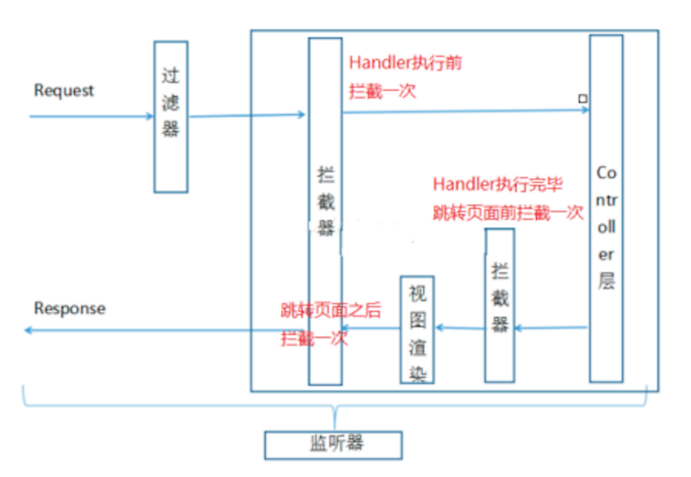

##### 2.6.1.1、拦截器的执⾏流程

在运⾏程序时，拦截器的执⾏是有⼀定顺序的，该顺序与配置⽂件中所定义的拦截器的顺序相关。 单个拦截器，在程序中的执⾏流程如下图所示：

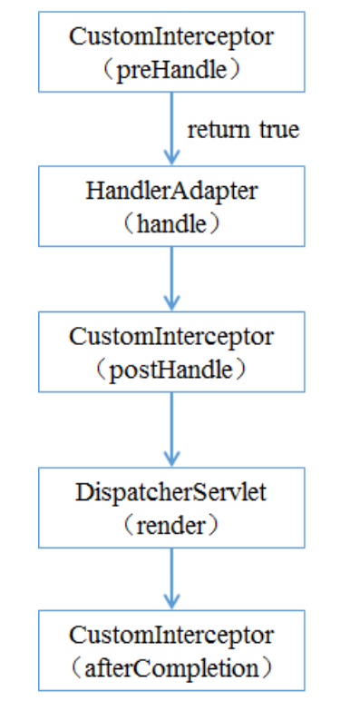

1）程序先执⾏**preHandle()**⽅法，如果该⽅法的返回值为**true**，则程序会继续向下执⾏处理器中的⽅法，否则将不再向下执⾏。

2）在业务处理器（即控制器Controller类）处理完请求后，会执⾏postHandle()⽅法，然后会通过DispatcherServlet向客户端返回响应。

3）在DispatcherServlet处理完请求后，才会执⾏afterCompletion()⽅法。

##### 2.6.1.2、多个拦截器的执⾏流程

多个拦截器（假设有两个拦截器Interceptor1和Interceptor2，并且在配置⽂件中， Interceptor1拦截器配置在前），在程序中的执⾏流程如下图所示：


从图可以看出，当有多个拦截器同时⼯作时，它们的preHandle()⽅法会按照配置⽂件中拦截器的配置顺序执⾏，⽽它们的postHandle()⽅法和afterCompletion()

⽅法则会按照配置顺序的反序执⾏。

**示例代码**

- 自定义spring-mvc拦截器

  ```java
  /**
   * 自定义springmvc拦截器
   */
  public class MyIntercepter01 implements HandlerInterceptor {
      /**
       * 会在handler方法业务逻辑执行之前执行
       * 往往在这里完成权限校验工作
       * @param request
       * @param response
       * @param handler
       * @return  返回值boolean代表是否放行，true代表放行，false代表中止
       * @throws Exception
       */
      @Override
      public boolean preHandle(HttpServletRequest request, HttpServletResponse response, Object handler) throws Exception {
          System.out.println("MyIntercepter01 preHandle......");
          return true;
      }
      /**
       * 会在handler方法业务逻辑执行之后尚未跳转页面时执行
       * @param request
       * @param response
       * @param handler
       * @param modelAndView  封装了视图和数据，此时尚未跳转页面呢，你可以在这里针对返回的数据和视图信息进行修改
       * @throws Exception
       */
      @Override
      public void postHandle(HttpServletRequest request, HttpServletResponse response, Object handler, ModelAndView modelAndView) throws Exception {
          System.out.println("MyIntercepter01 postHandle......");
      }
      /**
       * 页面已经跳转渲染完毕之后执行
       * @param request
       * @param response
       * @param handler
       * @param ex  可以在这里捕获异常
       * @throws Exception
       */
      @Override
      public void afterCompletion(HttpServletRequest request, HttpServletResponse response, Object handler, Exception ex) throws Exception {
          System.out.println("MyIntercepter01 afterCompletion......");
      }
  }
  ```

- 注册SpringMVC拦截器

  ```xml
  <mvc:interceptors>
          <!--拦截所有handler-->
          <!--<bean class="com.lagou.edu.interceptor.MyIntercepter01"/>-->
          
          <mvc:interceptor>
              <!--配置当前拦截器的url拦截规则，**代表当前目录下及其子目录下的所有url-->
              <mvc:mapping path="/**"/>
              <!--exclude-mapping可以在mapping的基础上排除一些url拦截-->
              <!--<mvc:exclude-mapping path="/demo/**"/>-->
              <bean class="com.lagou.edu.interceptor.MyIntercepter01"/>
          </mvc:interceptor>
          
          <mvc:interceptor>
              <mvc:mapping path="/**"/>
              <bean class="com.lagou.edu.interceptor.MyIntercepter02"/>
          </mvc:interceptor>
          
      </mvc:interceptors>
  ```


#### 2.6.2、multipart形式的数据（⽂件上传）

⽂件上传，原⽣servlet处理上传的⽂件数据的，springmvc⼜是对serlvet的封装

- pom.xml

  ```xml
  <!--⽂件上传所需jar坐标-->
  <dependency>
   <groupId>commons-fileupload</groupId>
   <artifactId>commons-fileupload</artifactId>
   <version>1.3.1</version>
  </dependency>
  ```

- 配置⽂件上传解析器

  ```xml
  <!--多元素解析器
  id固定为multipartResolver
  -->
  <bean id="multipartResolver" class="org.springframework.web.multipart.commons.CommonsMultipartResolver">
  	<!--设置上传文件大小上限，单位是字节，-1代表没有限制也是默认的-->
  	<property name="maxUploadSize" value="5000000"/>
  </bean>
  ```

- controllrt中方法处理

  ```java
      /**
       * 文件上传
       * @return
       */
      @RequestMapping(value = "/upload")
      public ModelAndView upload(MultipartFile uploadFile,HttpSession session) throws IOException {
  
          // 处理上传文件
          // 重命名，原名123.jpg ，获取后缀
          String originalFilename = uploadFile.getOriginalFilename();// 原始名称
          // 扩展名  jpg
          String ext = originalFilename.substring(originalFilename.lastIndexOf(".") + 1, originalFilename.length());
          String newName = UUID.randomUUID().toString() + "." + ext;
  
          // 存储,要存储到指定的文件夹，/uploads/yyyy-MM-dd，考虑文件过多的情况按照日期，生成一个子文件夹
          String realPath = session.getServletContext().getRealPath("/uploads");
          String datePath = new SimpleDateFormat("yyyy-MM-dd").format(new Date());
          File folder = new File(realPath + "/" + datePath);
  
          if(!folder.exists()) {
              folder.mkdirs();
          }
          // 存储文件到目录
          uploadFile.transferTo(new File(folder,newName));
          // TODO 文件磁盘路径要更新到数据库字段
          
          Date date = new Date();
          ModelAndView modelAndView = new ModelAndView();
          modelAndView.addObject("date",date);
          modelAndView.setViewName("success");
          return modelAndView;
      }
  ```

#### 2.6.3、全局处理异常

通过注解标注全局异常处理器

```java
package com.lagou.edu.controller;

import org.springframework.web.bind.annotation.ControllerAdvice;
import org.springframework.web.bind.annotation.ExceptionHandler;
import org.springframework.web.servlet.ModelAndView;

import javax.servlet.http.HttpServletResponse;
import java.io.IOException;

// 可以让我们优雅的捕获所有Controller对象handler方法抛出的异常
@ControllerAdvice
public class GlobalExceptionResolver {

	/**
     * SpringMVC的异常处理机制（异常处理器）
     * ArithmeticException.class 接收指定类型的异常处理
     * 可声明多个方法对不通异常进行处理
     */
    @ExceptionHandler(ArithmeticException.class)
    public ModelAndView handleException(ArithmeticException exception, HttpServletResponse response) {
        ModelAndView modelAndView = new ModelAndView();
        modelAndView.addObject("msg",exception.getMessage());
        modelAndView.setViewName("error");
        return modelAndView;
    }
}
```

#### 2.6.4、基于**Flash**属性的跨重定向请求数据传递

重定向时请求参数会丢失，我们往往需要重新携带请求参数，我们可以进⾏⼿动参数拼接如下：

```java
return "redirect:handle01?name=" + name;
```

但是上述拼接参数的⽅法属于get请求，携带参数⻓度有限制，参数安全性也不⾼，此时，我们可以使⽤SpringMVC提供的flash属性机制，向上下⽂中添加flash属

性，框架会在session中记录该属性值，当跳转到⻚⾯之后框架会⾃动删除flash属性，不需要我们⼿动删除，通过这种⽅式进⾏重定向参数传递，参数⻓度和安全

性都得到了保障，如下：

```java
    /**
     * SpringMVC 重定向时参数传递的问题
     * 转发：A 找 B 借钱400，B没有钱但是悄悄的找到C借了400块钱给A
     *      url不会变,参数也不会丢失,一个请求
     * 重定向：A 找 B 借钱400，B 说我没有钱，你找别人借去，那么A 又带着400块的借钱需求找到C
     *      url会变,参数会丢失需要重新携带参数,两个请求
     */
    @RequestMapping("/handleRedirect")
    public String handleRedirect(String name,RedirectAttributes redirectAttributes) {
        // return "redirect:handle01?name=" + name;  // 拼接参数安全性、参数长度都有局限
        // addFlashAttribute方法设置了一个flash类型属性，该属性会被暂存到session中，在跳转到页面之后该属性销毁
        redirectAttributes.addFlashAttribute("name",name);
        return "redirect:handle01";
    }
```

## 3、自定义MVC框架

- 实现思路

  - tomcat加载web.xml
    - 配置前端控制器ThmDispatcherServlet
    - 配置拦截规则
  - ThmDispatcherServlet做什么事情
    - 读取配置文件thm-mvc.properties
    - 包扫描，扫描custom annotation
    - 实现基于注解的IOC
    - 进行依赖注入
    - 实现HandlerMapping
    - 等待请求进来
  - ThmDispatcherServlet继承HttpServlet
  - 重新doget，dopost，init（）方法
  - init（）方法进行初始化加载配置
  - dopost具体调用方法、封装参数

- 项目结构

  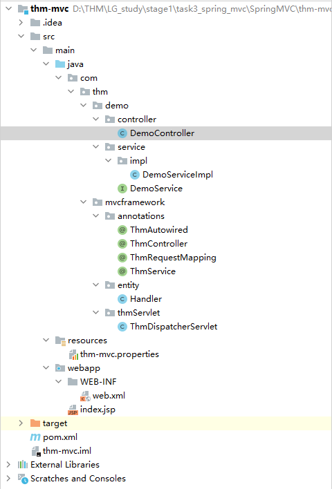

- controller、service、impl

  ```java
  @ThmController
  @ThmRequestMapping("/demo")
  public class DemoController {
      @ThmAutowired
      private DemoService demoService;
      @ThmRequestMapping("/test")
      public void getName(HttpServletRequest request, HttpServletResponse response,String name){
          demoService.getName(name);
      }
  }
  
  public interface DemoService {
      String getName(String name);
  }
  
  @ThmService
  public class DemoServiceImpl implements DemoService {
      @Override
      public String getName(String name) {
          System.out.println("THM-custom-mvc名称："+ name);
          return name;
      }
  }
  ```

- 自定义注解

  ```java
  @Documented
  @Target(ElementType.FIELD)
  @Retention(RetentionPolicy.RUNTIME)
  public @interface ThmAutowired {
      String value() default "";
  }
  
  @Documented
  @Target(ElementType.TYPE)
  @Retention(RetentionPolicy.RUNTIME)
  public @interface ThmController {
      String value() default "";
  }
  
  @Documented
  @Target({ElementType.TYPE,ElementType.METHOD})
  @Retention(RetentionPolicy.RUNTIME)
  public @interface ThmRequestMapping {
      String value() default "";
  }
  
  @Documented
  @Target(ElementType.TYPE)
  @Retention(RetentionPolicy.RUNTIME)
  public @interface ThmService {
      String value() default "";
  }
  ```

- entity

  ```java
  public class Handler {
      /**
       * 当前方法对象，即controller
       */
      private Object object;
      /**
       * 具体调用方法
       */
      private Method method;
      /**
       * 具体url  正则对象
       */
      private Pattern pattern;
      /**
       * 参数顺序,是为了进行参数绑定，key是参数名，value代表是第几个参数 <name,2>
       */
      private Map<String,Integer> paramIndexMapping;
  
      /**
       * 有参构造，并初始化参数map
       * @param object
       * @param method
       * @param pattern
       */
      public Handler(Object object, Method method, Pattern pattern) {
          this.object = object;
          this.method = method;
          this.pattern = pattern;
          this.paramIndexMapping = new HashMap<>();
      }
  
      public Object getObject() {
          return object;
      }
  
      public void setObject(Object object) {
          this.object = object;
      }
  
      public Method getMethod() {
          return method;
      }
  
      public void setMethod(Method method) {
          this.method = method;
      }
  
      public Pattern getPattern() {
          return pattern;
      }
  
      public void setPattern(Pattern pattern) {
          this.pattern = pattern;
      }
  
      public Map<String, Integer> getParamIndexMapping() {
          return paramIndexMapping;
      }
  
      public void setParamIndexMapping(Map<String, Integer> paramIndexMapping) {
          this.paramIndexMapping = paramIndexMapping;
      }
  }
  ```

- ThmDispatcherServlet

  ```java
  public class ThmDispatcherServlet extends HttpServlet {
      //保存配置文件信息
      private Properties properties = new Properties();
      //保存类全限定名称
      private List<String> classNameList = new ArrayList<>();
      //保存实例化bean
      private Map<String, Object> IOC = new HashMap<>();
      //处理器映射器
      private List<Handler> handlerMapping = new ArrayList<>();
  
      //读取参数
      @Override
      public void init(ServletConfig config) throws ServletException {
          //1、加载配置文件
          //读取web.xml中的配置参数   实际获取到我们的配置文件 thm-mvc.properties
          String contextConfigLocation = config.getInitParameter("contextConfigLocation");
          doLoadConfig(contextConfigLocation);
          //2、进行包扫描，获取类全限定名称
          doScan(properties.getProperty("scanPackage"));
          //3、初始化bean对象（基于注解实现IOC容器）
          doLoadBean();
          //4、进行bean对象的依赖注入，处理ThmAutowired
          doLoadAutoWired();
          //5、初始化处理器映射器 HandlerMapping处理器映射器，将配置好的url和Method建⽴映射关系
          initHandlerMapping();
          System.out.println("THM-MVC 初始化完成*******");
          //6、等待请求调用
  
      }
  
      /**
       * 加载配置文件
       * @param contextConfigLocation
       */
      private void doLoadConfig(String contextConfigLocation){
          //获取配置文件流
          final InputStream resourceAsStream = this.getClass().getClassLoader().getResourceAsStream(contextConfigLocation);
          try {
              //加载配置文件
              properties.load(resourceAsStream);
          } catch (IOException e) {
              e.printStackTrace();
          }
      }
  
      /**
       * 进行包扫描，获取类全限定类名
       * @param scanPackage 扫描包名
       */
      private void doScan(String scanPackage){
          //获取要扫描包的磁盘路径  Thread.currentThread().getContextClassLoader().getResource("").getPath()获取classpath路径
          String scanPackagePath = Thread.currentThread().getContextClassLoader().getResource("").getPath() + scanPackage.replace(".", "/");
          //获取文件集合
          File pack = new File(scanPackagePath);
          File[] files = pack.listFiles();
          //判断处理
          String fileName;
          for (File file : files){
              fileName = file.getName();
              //如果是文件夹递归查找
              if (file.isDirectory()){
                  doScan(scanPackage + "." +fileName);
              } else if (fileName.endsWith(".class")){
                  //如果是文件，并且是以.class结尾 则获取类全限定名称
                  String className = scanPackage + "." +fileName.replace(".class","");
                  classNameList.add(className);
              }
          }
      }
  
      /**
       * 初始化bean对象
       */
      private void doLoadBean(){
          assert !classNameList.isEmpty();
          classNameList.forEach(className -> {
              try {
                  Class<?> aClass = Class.forName(className);
                  //判断具有ThmController注解的类，取类名并转换首字母为小写
                  if (aClass.isAnnotationPresent(ThmController.class)){
                      IOC.put(toLowerFirst(aClass.getSimpleName()),aClass.newInstance());
                  } else if (aClass.isAnnotationPresent(ThmService.class)){
                      /**
                       *  判断具有Service注解的类，并获取注解中的beanName，如果存在beanName，则以设置的beanName为ID保存bean
                       *  反之，则以类名首字母小写为ID
                       *  如果实现了接口并将接口名称保存一份
                       */
                      //获取注解
                      ThmService annotation = aClass.getAnnotation(ThmService.class);
                      //获取当前注解中的值
                      String beanName = annotation.value();
                      //指定了beanName
                      if (!"".equals(beanName)){
                          IOC.put(beanName,aClass.newInstance());
                      } else {
                          //未指定beanName取类名并转换首字母为小写
                          beanName = toLowerFirst(aClass.getSimpleName());
                          IOC.put(beanName,aClass.newInstance());
                      }
  
                      //service层实现接口，以接口名称为ID保存一份
                      Class<?>[] interfaces = aClass.getInterfaces();
                      for (int i = 0; i < interfaces.length; i++) {
                          Class<?> anInterface = interfaces[i];
                          beanName = anInterface.getSimpleName();
                          IOC.put(beanName,aClass.newInstance());
                      }
                  }
              } catch (ClassNotFoundException e) {
                  e.printStackTrace();
              } catch (IllegalAccessException e) {
                  e.printStackTrace();
              } catch (InstantiationException e) {
                  e.printStackTrace();
              }
          });
      }
  
      /**
       * 将首字母转换为小写，
       * @param str
       * @return
       */
      private String toLowerFirst(String str){
          final char[] chars = str.toCharArray();
          if ('A' <= chars[0] && chars[0] <= 'Z'){
              chars[0] += 32;
          }
          return new String(chars);
      }
  
      /**
       * 完成bean对象的依赖注入
       */
      private void doLoadAutoWired(){
          assert !IOC.isEmpty();
          //遍历已经注册好的bean对象
          for (Map.Entry<String,Object> entry : IOC.entrySet()){
              Class<?> aClass = entry.getValue().getClass();
              //反射获取所有对象
              Field[] declaredFields = aClass.getDeclaredFields();
              for (int i = 0; i < declaredFields.length; i++) {
                  Field declaredField = declaredFields[i];
                  //判断是否标记有ThmAutowired注解，没有就跳过
                  if (!declaredField.isAnnotationPresent(ThmAutowired.class)){
                      continue;
                  }
                  //获取ThmAutowired注解,并获取设置的beanName
                  ThmAutowired annotation = declaredField.getAnnotation(ThmAutowired.class);
                  String beanName = annotation.value();
                  //当未设置beanName时，取类型名称
                  if ("".equals(beanName)){
                      beanName = declaredField.getType().getSimpleName();
                  }
                  //开启私有访问
                  declaredField.setAccessible(true);
                  //设值
                  try {
                      declaredField.set(entry.getValue(),IOC.get(beanName));
                  } catch (IllegalAccessException e) {
                      e.printStackTrace();
                  }
              }
          }
      }
  
      /**
       * 初始化处理器映射器 完成url和method方法的对应
       * 判断方法是否是controller，即是否有ThmController注解标识
       * 获取类上的ThmRequestMapping和路径值
       * 获取方法上的ThmRequestMapping和路径值
       */
      private void initHandlerMapping(){
          assert !IOC.isEmpty();
          for (Map.Entry<String,Object> entry : IOC.entrySet()){
              Class<?> aClass = entry.getValue().getClass();
              //判断是否是controller
              if (!aClass.isAnnotationPresent(ThmController.class)) continue;
  
  
              String typeUrl = "";
              //获取类上的ThmRequestMapping
              if (aClass.isAnnotationPresent(ThmRequestMapping.class)){
                  ThmRequestMapping annotation = aClass.getAnnotation(ThmRequestMapping.class);
                  typeUrl = annotation.value();
              }
              //获取类所有方法
              Method[] methods = aClass.getMethods();
              for (int i = 0; i < methods.length; i++) {
                  Method method = methods[i];
                  //方法上未出现ThmRequestMapping跳过
                  if (!method.isAnnotationPresent(ThmRequestMapping.class)) continue;
  
                  //获取方法的ThmRequestMapping，并取值
                  ThmRequestMapping annotation = method.getAnnotation(ThmRequestMapping.class);
                  String methodUrl = annotation.value();
                  // 计算出来的url /demo/test
                  String url = typeUrl + methodUrl;
                  // 把method所有信息及url封装为一个Handler
                  Handler handler = new Handler(entry.getValue(),method, Pattern.compile(url));
  
                  /**
                   * 计算方法的参数位置信息
                   * query(HttpServletRequest request, HttpServletResponse response,String name)
                   */
                  Parameter[] parameters = method.getParameters();
                  for (int j = 0; j < parameters.length; j++) {
                      Parameter parameter = parameters[j];
                      if(parameter.getType() == HttpServletRequest.class || parameter.getType() == HttpServletResponse.class) {
                          // 如果是request和response对象，那么参数名称写HttpServletRequest和HttpServletResponse
                          handler.getParamIndexMapping().put(parameter.getType().getSimpleName(),j);
                      }else{
                          handler.getParamIndexMapping().put(parameter.getName(),j);  // <name,2>
                      }
  
                  }
  
                  // 建立url和method之间的映射关系（map缓存起来）
                  handlerMapping.add(handler);
              }
          }
      }
      /**
       * get请求，调用doPost方法
       * @param req
       * @param resp
       * @throws ServletException
       * @throws IOException
       */
      @Override
      protected void doGet(HttpServletRequest req, HttpServletResponse resp) throws ServletException, IOException {
          doPost(req, resp);
      }
  
      /**
       * post请求
       * @param req
       * @param resp
       * @throws ServletException
       * @throws IOException
       */
      @Override
      protected void doPost(HttpServletRequest req, HttpServletResponse resp) throws ServletException, IOException {
          //具体的调用处理
          // 处理请求：根据url，找到对应的Method方法，进行调用
          Handler handler = getHandler(req);
          //没有找到匹配的url返回404
          if (handler == null){
              resp.getWriter().write("NOT FOUND 404");
              return;
          }
          //进行参数绑定  获取保存方法中的参数类型
          Class<?>[] parameterTypes = handler.getMethod().getParameterTypes();
          // 根据上述数组长度创建一个新的数组（参数数组，是要传入反射调用的）
          Object[] paraValues = new Object[parameterTypes.length];
  
          /**
           * 从请求中获取参数
           * 以下就是为了向参数数组中塞值，而且还得保证参数的顺序和方法中形参顺序一致
           */
          Map<String, String[]> parameterMap = req.getParameterMap();
          for (Map.Entry<String, String[]> entry : parameterMap.entrySet()){
              //获取请求中的参数
              String[] value = entry.getValue();
              //转换参数  name=1&name=2 ---->  name [1,2]  将指定的数组转换为指定符合拼接的字符串
              String parameter = StringUtils.join(value, ",");
              // 如果参数和方法中的参数匹配上了，填充数据
              if (!handler.getParamIndexMapping().containsKey(entry.getKey())) continue;
              // 取出当前参数在方法中的位置
              Integer index = handler.getParamIndexMapping().get(entry.getKey());
              // 给方法参数进行设值
              paraValues[index] = parameter;
          }
          //设置参数HttpServletRequest和HttpServletResponse
          int requestIndex = handler.getParamIndexMapping().get(HttpServletRequest.class.getSimpleName()); // 0
          paraValues[requestIndex] = req;
          int responseIndex = handler.getParamIndexMapping().get(HttpServletResponse.class.getSimpleName()); // 1
          paraValues[responseIndex] = resp;
  
          //反射调用方法
          try {
              handler.getMethod().invoke(handler.getObject(),paraValues);
          } catch (IllegalAccessException e) {
              e.printStackTrace();
          } catch (InvocationTargetException e) {
              e.printStackTrace();
          }
      }
  
      private Handler getHandler(HttpServletRequest req){
          if (handlerMapping.isEmpty()) return null;
          //获取请求的url
          String requestURI = req.getRequestURI();
          for (Handler handler : handlerMapping){
              //获取url正则
              Pattern pattern = handler.getPattern();
              //判断是否找到
              Matcher matcher = pattern.matcher(requestURI);
              if (!matcher.matches()) continue;
              return handler;
          }
          return null;
      }
  
  }
  ```

- resources  thm-mvc.properties

  ```properties
  scanPackage=com.thm.demo
  ```

- web.xml

  ```xml
    <!--配置自定义ThmDispatcherServlet-->
    <servlet>
      <servlet-name>thmDispatcherServlet</servlet-name>
      <servlet-class>com.thm.mvcframework.thmServlet.ThmDispatcherServlet</servlet-class>
      <init-param>
        <param-name>contextConfigLocation</param-name>
        <param-value>thm-mvc.properties</param-value>
      </init-param>
    </servlet>
    <!--配置拦截规则-->
    <servlet-mapping>
      <servlet-name>thmDispatcherServlet</servlet-name>
      <!--拦截所有-->
      <url-pattern>/*</url-pattern>
    </servlet-mapping>
  ```

- pom.xml

  ```xml
    <dependencies>
      <dependency>
        <groupId>junit</groupId>
        <artifactId>junit</artifactId>
        <version>4.12</version>
        <scope>test</scope>
      </dependency>
      <dependency>
        <groupId>javax.servlet</groupId>
        <artifactId>servlet-api</artifactId>
        <version>2.5</version>
        <scope>provided</scope>
      </dependency>
      <dependency>
        <groupId>org.apache.commons</groupId>
        <artifactId>commons-lang3</artifactId>
        <version>3.9</version>
      </dependency>
    </dependencies>
  
    <build>
      <plugins>
        <!-- 配置Maven的JDK编译级别 -->
        <plugin>
          <groupId>org.apache.maven.plugins</groupId>
          <artifactId>maven-compiler-plugin</artifactId>
          <version>3.2</version>
          <configuration>
            <source>11</source>
            <target>11</target>
            <encoding>UTF-8</encoding>
            <!--告诉编译器，编译的时候记录下形参的真实名称-->
            <compilerArgs>
              <arg>-parameters</arg>
            </compilerArgs>
          </configuration>
        </plugin>
  
        <!-- tomcat7插件 -->
        <!-- 注意：目前来说，maven中央仓库还没有tomcat8的插件 -->
        <plugin>
          <groupId>org.apache.tomcat.maven</groupId>
          <artifactId>tomcat7-maven-plugin</artifactId>
          <version>2.2</version>
          <configuration>
            <port>8080</port>
            <path>/</path>
          </configuration>
        </plugin>
      </plugins>
    </build>
  ```


## 4、Spring MVC 源码深度剖析

### 4.1、前端控制器 **DispatcherServlet** 继承结构

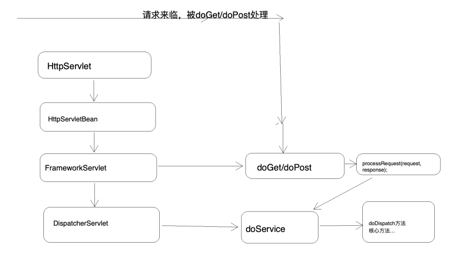

### 4.2、重要时机点分析

#### 4.2.1、Handler⽅法的执⾏时机


#### 4.2.2、⻚⾯渲染时机

（打断点并观察调⽤栈）


#### 4.2.3、SpringMVC处理请求的流程

org.springframework.web.servlet.DispatcherServlet#doDispatch⽅法的执⾏过程，其中步骤2、3、4、5是核⼼步骤

1、调⽤getHandler()获取到能够处理当前请求的执⾏链 HandlerExecutionChain（Handler+拦截器）

2、调⽤getHandlerAdapter()；获取能够执⾏第一步中Handler的适配器

3、适配器调⽤Handler执⾏ha.handle();（总会返回⼀个ModelAndView对象）

4、调⽤processDispatchResult()⽅法完成视图渲染跳转

```java
protected void doDispatch(HttpServletRequest request, HttpServletResponse response) throws Exception {
		HttpServletRequest processedRequest = request;
		HandlerExecutionChain mappedHandler = null;
		boolean multipartRequestParsed = false;
		//获取异步管理器
		WebAsyncManager asyncManager = WebAsyncUtils.getAsyncManager(request);

		try {
			ModelAndView mv = null;
			Exception dispatchException = null;

			try {
				//1、检查是否是文件上传请求
				processedRequest = checkMultipart(request);
				multipartRequestParsed = (processedRequest != request);

				// Determine handler for the current request.
				/**
				 * 2、取得处理当前请求的controller，这里称为handler，即处理器
				 * 	这里并不是直接返回controller，而是返回HandlerExecutionChain请求处理链对象
				 * 	该对象封装了handler和inteceptor
				 */
				mappedHandler = getHandler(processedRequest);
				if (mappedHandler == null) {
					//如果handler为空 返回404
					noHandlerFound(processedRequest, response);
					return;
				}

				// Determine handler adapter for the current request.
				/**
				 * 3、获得处理器适配器HandlerAdapter
				 * 	  不同的反射工具类
				 */
				HandlerAdapter ha = getHandlerAdapter(mappedHandler.getHandler());

				// Process last-modified header, if supported by the handler.
				/**
				 * 处理请求头 last-modified
				 */
				String method = request.getMethod();
				boolean isGet = "GET".equals(method);
				if (isGet || "HEAD".equals(method)) {
					long lastModified = ha.getLastModified(request, mappedHandler.getHandler());
					if (new ServletWebRequest(request, response).checkNotModified(lastModified) && isGet) {
						return;
					}
				}
				/**
				 * 拦截器第一个拦截时期
				 */
				if (!mappedHandler.applyPreHandle(processedRequest, response)) {
					return;
				}

				// Actually invoke the handler.
				/**
				 * 4、实际处理请求返回结果视图对象
				 */
				mv = ha.handle(processedRequest, response, mappedHandler.getHandler());

				if (asyncManager.isConcurrentHandlingStarted()) {
					return;
				}
				/**
				 * 结果视图对象处理
				 */
				applyDefaultViewName(processedRequest, mv);
				/**
				 * 拦截器的第二个拦截时期
				 */
				mappedHandler.applyPostHandle(processedRequest, response, mv);
			}
			catch (Exception ex) {
				dispatchException = ex;
			}
			catch (Throwable err) {
				// As of 4.3, we're processing Errors thrown from handler methods as well,
				// making them available for @ExceptionHandler methods and other scenarios.
				dispatchException = new NestedServletException("Handler dispatch failed", err);
			}
			// 5、页面渲染，跳转视图
			processDispatchResult(processedRequest, response, mappedHandler, mv, dispatchException);
		}
		catch (Exception ex) {
			//最终会调用HandlerInterceptor的afterCompletion方法
			//拦截器的第三个时机
			triggerAfterCompletion(processedRequest, response, mappedHandler, ex);
		}
		catch (Throwable err) {
			//最终会调用HandlerInterceptor的afterCompletion方法
			triggerAfterCompletion(processedRequest, response, mappedHandler,
					new NestedServletException("Handler processing failed", err));
		}
		finally {
			if (asyncManager.isConcurrentHandlingStarted()) {
				// Instead of postHandle and afterCompletion
				if (mappedHandler != null) {
					mappedHandler.applyAfterConcurrentHandlingStarted(processedRequest, response);
				}
			}
			else {
				// Clean up any resources used by a multipart request.
				if (multipartRequestParsed) {
					cleanupMultipart(processedRequest);
				}
			}
		}
	}
```

### 4.3、核⼼步骤**getHandler**⽅法


```java
protected HandlerExecutionChain getHandler(HttpServletRequest request) throws Exception {
		//判断处理器映射器是否为空  现在返回的requestMappingHandlerMapping
		if (this.handlerMappings != null) {
			for (HandlerMapping mapping : this.handlerMappings) {
				HandlerExecutionChain handler = mapping.getHandler(request);
				if (handler != null) {
					return handler;
				}
			}
		}
		return null;
	}
```

### 4.4、核⼼步骤**getHandlerAdapter**⽅法


```java
	protected HandlerAdapter getHandlerAdapter(Object handler) throws ServletException {
		//判断是否存在处理器适配器 看controller是否实现接口，实现对应接口返回对应的处理器适配器，
		//当前controller没有实现任何接口，返回的requestMappingHandlerAdapter
		if (this.handlerAdapters != null) {
			for (HandlerAdapter adapter : this.handlerAdapters) {
				//判断是否支持当前handler
				if (adapter.supports(handler)) {
					return adapter;
				}
			}
		}
		throw new ServletException("No adapter for handler [" + handler +
				"]: The DispatcherServlet configuration needs to include a HandlerAdapter that supports this handler");
	}
```

### 4.5、核⼼步骤**ha.handle**⽅法

- ⼊⼝

  

- 进行调用方法

  ```java
  	protected ModelAndView handleInternal(HttpServletRequest request,
  			HttpServletResponse response, HandlerMethod handlerMethod) throws Exception {
  
  		ModelAndView mav;
  		//检查当前请求
  		checkRequest(request);
  
  		// Execute invokeHandlerMethod in synchronized block if required.
  		//判断当前是否需要支持在同一个session中只能线性的处理
  		if (this.synchronizeOnSession) {
  			//获取当前请求的session对象
  			HttpSession session = request.getSession(false);
  			if (session != null) {
  				//为当前session对象生成唯一的可以用于锁定的key
  				Object mutex = WebUtils.getSessionMutex(session);
  				synchronized (mutex) {
  					//对handlerMethod进行参数绑定等适配处理，并调用目标handler
  					mav = invokeHandlerMethod(request, response, handlerMethod);
  				}
  			}
  			else {
  				// No HttpSession available -> no mutex necessary
  				//当前不存在session，则直接对handlerMethod进行适配处理，并调用目标handler
  				mav = invokeHandlerMethod(request, response, handlerMethod);
  			}
  		}
  		else {
  			// No synchronization on session demanded at all...
  			//如果当前不需要对session进行同步处理，则直接对handlerMethod进行适配处理，并调用目标handler
  			mav = invokeHandlerMethod(request, response, handlerMethod);
  		}
  
  		if (!response.containsHeader(HEADER_CACHE_CONTROL)) {
  			if (getSessionAttributesHandler(handlerMethod).hasSessionAttributes()) {
  				applyCacheSeconds(response, this.cacheSecondsForSessionAttributeHandlers);
  			}
  			else {
  				prepareResponse(response);
  			}
  		}
  
  		return mav;
  	}
  ```

- invokeHandlerMethod方法

  

- invokeAndHandle方法

  

- invokeForRequest方法

  

- doInvoke方法

  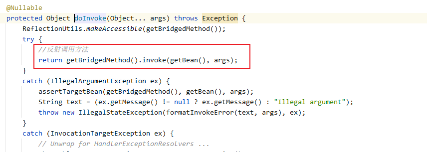

### 4.6、核⼼步骤processDispatchResult方法

- render⽅法完成渲染

   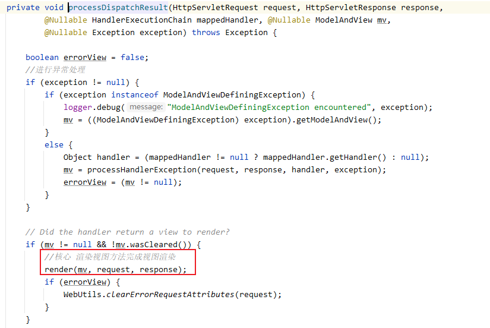

- 视图解析器解析出View视图对象

  

- 在解析出View视图对象的过程中会判断是否重定向、是否转发等，不同的情况封装的是不同的View实现

   - 1

     

   - 2

     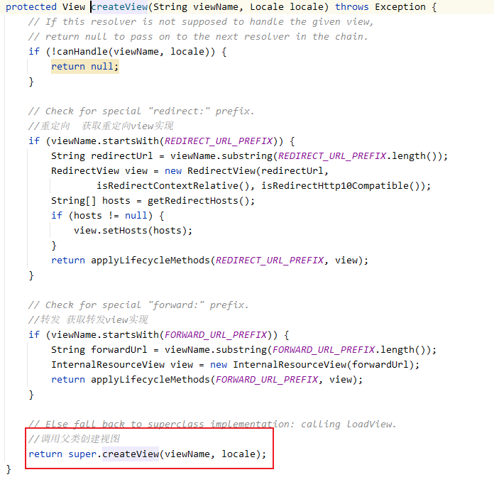

- 解析出View视图对象的过程中，要将逻辑视图名解析为物理视图名

   

- 封装View视图对象之后，调⽤了view对象的render⽅法

   - 1

     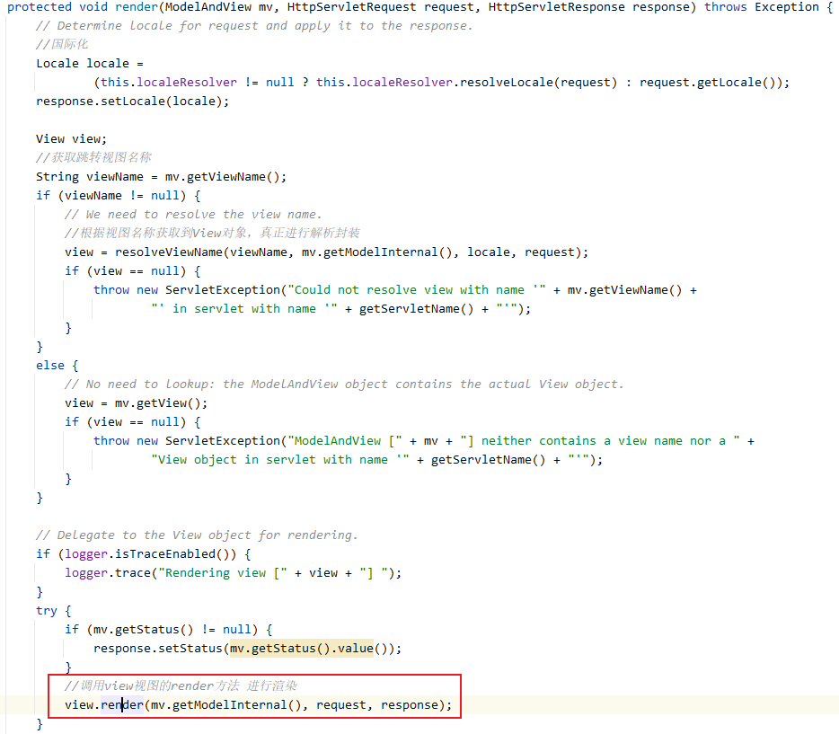

   - 2

     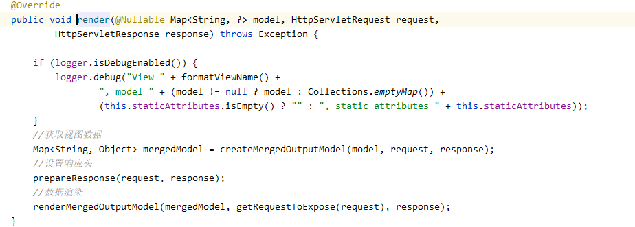

- 数据渲染 

  把modelMap中的数据暴露到request域中，这也是为什么后台model.add之后在jsp中可以从请求域取出来的根本原因

  - 1
  
    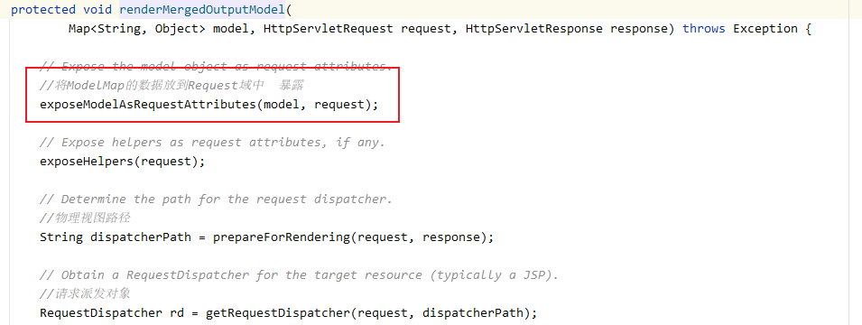
  
  - 2
  
    

### 4.7、**SpringMVC**九⼤组件初始化

- **在DispatcherServlet中定义了九个属性，每⼀个属性都对应⼀种组件**

  ```java
  /** MultipartResolver used by this servlet.
  	 *  多部件解析器  文件上传
  	 * */
  	@Nullable
  	private MultipartResolver multipartResolver;
  
  	/** LocaleResolver used by this servlet.
  	 * 	区域化  国际化解析器
  	 * */
  	@Nullable
  	private LocaleResolver localeResolver;
  
  	/** ThemeResolver used by this servlet.
  	 * 主题解析器
  	 * */
  	@Nullable
  	private ThemeResolver themeResolver;
  
  	/** List of HandlerMappings used by this servlet.
  	 * 处理器映射器
  	 * */
  	@Nullable
  	private List<HandlerMapping> handlerMappings;
  
  	/** List of HandlerAdapters used by this servlet.
  	 * 处理器适配器
  	 * */
  	@Nullable
  	private List<HandlerAdapter> handlerAdapters;
  
  	/** List of HandlerExceptionResolvers used by this servlet.
  	 * 异常处理器
  	 * */
  	@Nullable
  	private List<HandlerExceptionResolver> handlerExceptionResolvers;
  
  	/** RequestToViewNameTranslator used by this servlet.
  	 * 默认视图名转换器
  	 * */
  	@Nullable
  	private RequestToViewNameTranslator viewNameTranslator;
  
  	/** FlashMapManager used by this servlet.
  	 * flash属性管理器
  	 * */
  	@Nullable
  	private FlashMapManager flashMapManager;
  
  	/** List of ViewResolvers used by this servlet.
  	 *	视图解析器
  	 * */
  	@Nullable
  	private List<ViewResolver> viewResolvers;
  ```

  **九⼤组件都是定义了接⼝，接⼝其实就是定义了该组件的规范，⽐如ViewResolver、HandlerAdapter等都是接⼝**

- **九⼤组件的初始化时机**

  - DispatcherServlet中的onRefresh()，该⽅法中初始化了九⼤组件

    ```java
    	/**
    	 * This implementation calls {@link #initStrategies}.
    	 * AbstractApplicationContext中的Refresh方法调用finishRefresh方法进入
    	 */
    	@Override
    	protected void onRefresh(ApplicationContext context) {
    		//初始化策略
    		initStrategies(context);
    	}
    ```

  - initStrategies方法

    ```java
    	protected void initStrategies(ApplicationContext context) {
    		//初始化多部件解析器  文件上传
    		initMultipartResolver(context);
    		//初始化国际化解析器
    		initLocaleResolver(context);
    		//初始化主题解析器
    		initThemeResolver(context);
    		//初始化处理器映射器
    		initHandlerMappings(context);
    		//初始化处理器适配器
    		initHandlerAdapters(context);
    		//初始化异常解析器
    		initHandlerExceptionResolvers(context);
    		//初始化视图预处理器 默认视图名转换器
    		initRequestToViewNameTranslator(context);
    		//初始化视图解析器
    		initViewResolvers(context);
    		//初始化flash管理器
    		initFlashMapManager(context);
    	}
    ```

  - 观察其中的⼀个组件**initHandlerMappings(context)**除**initMultipartResolver**以外其他的组件初始化套路相同

    ```java
    private void initHandlerMappings(ApplicationContext context) {
    		this.handlerMappings = null;
    
    		if (this.detectAllHandlerMappings) {
    			// Find all HandlerMappings in the ApplicationContext, including ancestor contexts.
    			/**
    			 * 找到所有的实现了HandlerMapping接口的HandlerMapping
    			 * 按照类型获取bean
    			 */
    			Map<String, HandlerMapping> matchingBeans =
    					BeanFactoryUtils.beansOfTypeIncludingAncestors(context, HandlerMapping.class, true, false);
    			if (!matchingBeans.isEmpty()) {
    				this.handlerMappings = new ArrayList<>(matchingBeans.values());
    				// We keep HandlerMappings in sorted order.
    				AnnotationAwareOrderComparator.sort(this.handlerMappings);
    			}
    		}
    		else {
    			try {
    				//在IOC中按照固定的名称去找，获取springBean对象
    				HandlerMapping hm = context.getBean(HANDLER_MAPPING_BEAN_NAME, HandlerMapping.class);
    				this.handlerMappings = Collections.singletonList(hm);
    			}
    			catch (NoSuchBeanDefinitionException ex) {
    				// Ignore, we'll add a default HandlerMapping later.
    			}
    		}
    
    		// Ensure we have at least one HandlerMapping, by registering
    		// a default HandlerMapping if no other mappings are found.
    		if (this.handlerMappings == null) {
    			//最后按照默认策略生成HandlerMapping
    			this.handlerMappings = getDefaultStrategies(context, HandlerMapping.class);
    			if (logger.isTraceEnabled()) {
    				logger.trace("No HandlerMappings declared for servlet '" + getServletName() +
    						"': using default strategies from DispatcherServlet.properties");
    			}
    		}
    	}
    ```

  - 如果按照类型和按照固定**id**从**ioc**容器中找不到对应组件，则会按照默认策略进⾏注册初始化，默认策略在**DispatcherServlet.properties**⽂件中配置

    ```java
    	protected <T> List<T> getDefaultStrategies(ApplicationContext context, Class<T> strategyInterface) {
    		//获取当前接口名称
    		String key = strategyInterface.getName();
    		//获取默认配置文件中的配置
    		String value = defaultStrategies.getProperty(key);
    		if (value != null) {
    			String[] classNames = StringUtils.commaDelimitedListToStringArray(value);
    			List<T> strategies = new ArrayList<>(classNames.length);
    			for (String className : classNames) {
    				try {
    					Class<?> clazz = ClassUtils.forName(className, DispatcherServlet.class.getClassLoader());
    					Object strategy = createDefaultStrategy(context, clazz);
    					strategies.add((T) strategy);
    				}
    				catch (ClassNotFoundException ex) {
    					throw new BeanInitializationException(
    							"Could not find DispatcherServlet's default strategy class [" + className +
    							"] for interface [" + key + "]", ex);
    				}
    				catch (LinkageError err) {
    					throw new BeanInitializationException(
    							"Unresolvable class definition for DispatcherServlet's default strategy class [" +
    							className + "] for interface [" + key + "]", err);
    				}
    			}
    			return strategies;
    		}
    		else {
    			return new LinkedList<>();
    		}
    	}
    ```

- **DispatcherServlet.properties**
  
    其中配置了默认的组件
  
    ```properties
    org.springframework.web.servlet.LocaleResolver=org.springframework.web.servlet.i18n.AcceptHeaderLocaleResolver
    
    org.springframework.web.servlet.ThemeResolver=org.springframework.web.servlet.theme.FixedThemeResolver
    
    org.springframework.web.servlet.HandlerMapping=org.springframework.web.servlet.handler.BeanNameUrlHandlerMapping,\
    	org.springframework.web.servlet.mvc.method.annotation.RequestMappingHandlerMapping
    
    org.springframework.web.servlet.HandlerAdapter=org.springframework.web.servlet.mvc.HttpRequestHandlerAdapter,\
    	org.springframework.web.servlet.mvc.SimpleControllerHandlerAdapter,\
    	org.springframework.web.servlet.mvc.method.annotation.RequestMappingHandlerAdapter
    
    org.springframework.web.servlet.HandlerExceptionResolver=org.springframework.web.servlet.mvc.method.annotation.ExceptionHandlerExceptionResolver,\
    	org.springframework.web.servlet.mvc.annotation.ResponseStatusExceptionResolver,\
    	org.springframework.web.servlet.mvc.support.DefaultHandlerExceptionResolver
    
    org.springframework.web.servlet.RequestToViewNameTranslator=org.springframework.web.servlet.view.DefaultRequestToViewNameTranslator
    
    org.springframework.web.servlet.ViewResolver=org.springframework.web.servlet.view.InternalResourceViewResolver
    
    org.springframework.web.servlet.FlashMapManager=org.springframework.web.servlet.support.SessionFlashMapManager
    ```
  
  - 注意：多部件解析器的初始化必须按照**id**注册对象（**multipartResolver**）
  
    ```java
    	private void initMultipartResolver(ApplicationContext context) {
    		try {
    			//直接从IOC容器中获取多部件解析器，名称必须是固定的 multipartResolver
    			this.multipartResolver = context.getBean(MULTIPART_RESOLVER_BEAN_NAME, MultipartResolver.class);
    			if (logger.isTraceEnabled()) {
    				logger.trace("Detected " + this.multipartResolver);
    			}
    			else if (logger.isDebugEnabled()) {
    				logger.debug("Detected " + this.multipartResolver.getClass().getSimpleName());
    			}
    		}
    		catch (NoSuchBeanDefinitionException ex) {
    			// Default is no multipart resolver.
    			this.multipartResolver = null;
    			if (logger.isTraceEnabled()) {
    				logger.trace("No MultipartResolver '" + MULTIPART_RESOLVER_BEAN_NAME + "' declared");
    			}
    		}
    	}
    ```
  

## 5、SSM 整合

### 5.1、整合策略

SSM = Spring + SpringMVC + Mybatis = （Spring + Mybatis）+ SpringMVC

先整合 Spring + Mybatis

然后再整合 SpringMVC

基于的需求：查询 Account 表的全部数据显示到⻚⾯

### 5.2、Mybatis整合Spring

- 整合⽬标
  - 数据库连接池以及事务管理都交给Spring容器来完成
  - SqlSessionFactory对象应该放到Spring容器中作为单例对象管理
  - Mapper动态代理对象交给Spring管理，我们从Spring容器中直接获得Mapper的代理对象

- 整合所需 Jar 分析

  - Junit测试jar（4.12版本）
  - Mybatis的jar（3.4.5）
  - Spring相关jar（spring-context、spring-test、spring-jdbc、spring-tx、spring-aop、aspectjweaver）
  - Mybatis/Spring整合包jar（mybatis-spring-xx.jar）
  - Mysql数据库驱动jar
  - Druid数据库连接池的jar

- 项目结构

  

- pom.xml

  ```xml
   <!--junit-->
          <dependency>
              <groupId>junit</groupId>
              <artifactId>junit</artifactId>
              <version>4.12</version>
              <scope>test</scope>
          </dependency>
          <!--mybatis-->
          <dependency>
              <groupId>org.mybatis</groupId>
              <artifactId>mybatis</artifactId>
              <version>3.4.5</version>
          </dependency>
          <!--spring相关-->
          <dependency>
              <groupId>org.springframework</groupId>
              <artifactId>spring-context</artifactId>
              <version>5.1.12.RELEASE</version>
          </dependency>
          <dependency>
              <groupId>org.springframework</groupId>
              <artifactId>spring-test</artifactId>
              <version>5.1.12.RELEASE</version>
          </dependency>
          <dependency>
              <groupId>org.springframework</groupId>
              <artifactId>spring-jdbc</artifactId>
              <version>5.1.12.RELEASE</version>
          </dependency>
          <dependency>
              <groupId>org.springframework</groupId>
              <artifactId>spring-tx</artifactId>
              <version>5.1.12.RELEASE</version>
          </dependency>
          <dependency>
              <groupId>org.springframework</groupId>
              <artifactId>spring-aop</artifactId>
              <version>5.1.12.RELEASE</version>
          </dependency>
          <dependency>
              <groupId>org.aspectj</groupId>
              <artifactId>aspectjweaver</artifactId>
              <version>1.8.9</version>
          </dependency>
          <!--mybatis与spring的整合包-->
          <dependency>
              <groupId>org.mybatis</groupId>
              <artifactId>mybatis-spring</artifactId>
              <version>2.0.3</version>
          </dependency>
          <!--数据库驱动jar-->
          <dependency>
              <groupId>mysql</groupId>
              <artifactId>mysql-connector-java</artifactId>
              <version>5.1.46</version>
          </dependency>
          <!--druid连接池-->
          <dependency>
              <groupId>com.alibaba</groupId>
              <artifactId>druid</artifactId>
              <version>1.1.21</version>
          </dependency>
  ```

- jdbc.properties

  ```properties
  jdbc.driver=com.mysql.jdbc.Driver
  jdbc.url=jdbc:mysql://localhost:3306/mp
  jdbc.username=root
  jdbc.password=root
  ```

- Spring 配置⽂件

  - applicationContext-dao.xml

    ```xml
    <?xml version="1.0" encoding="UTF-8"?>
    <beans xmlns="http://www.springframework.org/schema/beans"
           xmlns:context ="http://www.springframework.org/schema/context"
           xmlns:tx ="http://www.springframework.org/schema/tx"
           xmlns:xsi="http://www.w3.org/2001/XMLSchema-instance"
           xsi:schemaLocation="
           http://www.springframework.org/schema/beans
           http://www.springframework.org/schema/beans/spring-beans.xsd
           http://www.springframework.org/schema/context
           http://www.springframework.org/schema/context/spring-context.xsd
           http://www.springframework.org/schema/tx
           http://www.springframework.org/schema/tx/spring-tx.xsd
    ">
        <!--    配置包扫描    -->
        <context:component-scan base-package="com.thm.mapper"/>
        <!--    读取外部properties文件    -->
        <context:property-placeholder location="classpath:jdbc.properties"/>
        <!--    配置数据库连接池    -->
        <bean id="datasource" class="com.alibaba.druid.pool.DruidDataSource">
            <property name="driverClassName" value="${jdbc.driver}"/>
            <property name="url" value="${jdbc.url}"/>
            <property name="username" value="${jdbc.username}"/>
            <property name="password" value="${jdbc.password}"/>
        </bean>
    
        <!--配置mybatisSqlSessionFactory
            以前mybatis中的sqlSessionFactory元素，SqlMapConfig.xml中的内容直接以set注入方式进行配置
        -->
        <bean id="sqlSessionFactory" class="org.mybatis.spring.SqlSessionFactoryBean">
            <!--别名配置-->
            <property name="typeAliasesPackage" value="com.thm"/>
            <!--数据源配置-->
            <property name="dataSource" ref="datasource"/>
         </bean>
    
        <!--Mapper动态代理对象交给Spring管理，我们从SpringIoc容器中获取Mapper的代理对象
            扫描Mapper接口，生成代理对象，并存储在IOC容器中
        -->
        <bean class="org.mybatis.spring.mapper.MapperScannerConfigurer">
            <!--配置Mapper接口包扫描路径-->
            <property name="basePackage" value="com.thm.mapper"/>
            <!--配置sqlSessionFactory工厂对象-->
            <property name="sqlSessionFactoryBeanName" value="sqlSessionFactory"/>
        </bean>
    </beans>
    ```

  - applicationContext-service.xml

    ```xml
    <?xml version="1.0" encoding="UTF-8"?>
    <beans xmlns="http://www.springframework.org/schema/beans"
           xmlns:context ="http://www.springframework.org/schema/context"
           xmlns:tx ="http://www.springframework.org/schema/tx"
           xmlns:xsi="http://www.w3.org/2001/XMLSchema-instance"
           xsi:schemaLocation="
           http://www.springframework.org/schema/beans
           http://www.springframework.org/schema/beans/spring-beans.xsd
           http://www.springframework.org/schema/context
           http://www.springframework.org/schema/context/spring-context.xsd
           http://www.springframework.org/schema/tx
           http://www.springframework.org/schema/tx/spring-tx.xsd
    ">
        <!--    配置包扫描    -->
        <context:component-scan base-package="com.thm.service"/>
        <!--    读取外部properties文件    -->
        <context:property-placeholder location="classpath:jdbc.properties"/>
    
        <!--事务管理器-->
        <bean id="transactionManager" class="org.springframework.jdbc.datasource.DataSourceTransactionManager">
            <property name="dataSource" ref="datasource"/>
        </bean>
        <!--事务注解驱动器-->
        <tx:annotation-driven transaction-manager="transactionManager"/>
    </beans>
    ```

- AccountService和AccountServiceImpl

  ```java
  public interface AccountService {
      /**
       * 获取所有账号信息
       * @return
       */
      List<Account> getAccounts();
  }
  
  @Service
  @Transactional
  public class AccountServiceImpl implements AccountService {
  
      @Autowired
      private AccountMapper accountMapper;
  
      @Override
      public List<Account> getAccounts() {
          return accountMapper.getAccounts();
      }
  }
  ```

- AccountMapper和AccountMapper.xml

  ```xml
  public interface AccountMapper {
  
      /**
       * 获取所有账号信息
       * @return
       */
      List<Account> getAccounts();
  }
  
  <mapper namespace="com.thm.mapper.AccountMapper">
      <select id="getAccounts" resultType="com.thm.entity.Account">
          select * from account
      </select>
  </mapper>
  ```

- 测试Mybatis+Spring

  ```java
  @RunWith(SpringJUnit4ClassRunner.class)
  @ContextConfiguration(locations = {"classpath*:application*.xml"})
  public class MybatisSpringTest {
  
      @Autowired
      private AccountService accountService;
  
      @Test
      public void testMybatisSpring(){
          List<Account> accounts = accountService.getAccounts();
          for (int i = 0; i < accounts.size(); i++) {
              System.out.println(accounts.get(i));
          }
      }
  }
  ```

### 5.3、整合SpringMVC

- 整合思路

  把SpringMVC的⼊⻔案例整合进来即可，其他组件，监听器，拦截器等需要再整合

- pom.xml

  ```xml
          <!--SpringMVC-->
          <dependency>
              <groupId>org.springframework</groupId>
              <artifactId>spring-webmvc</artifactId>
              <version>5.1.12.RELEASE</version>
          </dependency>
          <!--jsp-api&servlet-api-->
          <dependency>
              <groupId>javax.servlet</groupId>
              <artifactId>jsp-api</artifactId>
              <version>2.0</version>
              <scope>provided</scope>
          </dependency>
          <dependency>
              <groupId>javax.servlet</groupId>
              <artifactId>javax.servlet-api</artifactId>
              <version>3.1.0</version>
              <scope>provided</scope>
          </dependency>
          <!--json数据交互所需jar，start-->
          <dependency>
              <groupId>com.fasterxml.jackson.core</groupId>
              <artifactId>jackson-core</artifactId>
              <version>2.9.0</version>
          </dependency>
          <dependency>
              <groupId>com.fasterxml.jackson.core</groupId>
              <artifactId>jackson-databind</artifactId>
              <version>2.9.0</version>
          </dependency>
          <dependency>
              <groupId>com.fasterxml.jackson.core</groupId>
              <artifactId>jackson-annotations</artifactId>
              <version>2.9.0</version>
          </dependency>
  ```

- 添加SpringMVC ⼊⻔案例

  - springmvc.xml

    ```xml
    <beans xmlns="http://www.springframework.org/schema/beans"
           xmlns:context ="http://www.springframework.org/schema/context"
           xmlns:mvc ="http://www.springframework.org/schema/mvc"
           xmlns:xsi="http://www.w3.org/2001/XMLSchema-instance"
           xsi:schemaLocation="
           http://www.springframework.org/schema/beans
           http://www.springframework.org/schema/beans/spring-beans.xsd
           http://www.springframework.org/schema/context
           http://www.springframework.org/schema/context/spring-context.xsd
           http://www.springframework.org/schema/mvc
           http://www.springframework.org/schema/mvc/spring-mvc.xsd
    ">
        <!--配置包扫描-->
        <context:component-scan base-package="com.thm.controller"/>
        <!--配置springmvc注解驱动
            自动注册合适的HandlerMapping和HandlerAdapter
        -->
        <mvc:annotation-driven/>
    </beans>
    ```

  - AccountController

    ```java
    @Controller
    @RequestMapping("/account")
    public class AccountController {
        /**
         * Spring和SpringMvc容器是有层次的
         * Spring容器：service对象和dao对象
         * SprngMvc容器：controller对象
         */
        @Autowired
        private AccountService accountService;
    
        @RequestMapping("/query")
        @ResponseBody
        public List<Account> queryAll(){
            return accountService.getAccounts();
        }
    }
    ```

  - web.xml

    ```xml
      <!--spring配置文件-->
      <context-param>
        <param-name>contextConfigLocation</param-name>
        <param-value>classpath*:applicationContext*.xml</param-value>
      </context-param>
      <!--配置spring框架启动监听器-->
      <listener>
        <listener-class>org.springframework.web.context.ContextLoaderListener</listener-class>
      </listener>
    
      <!--配置前端控制器-->
      <servlet>
        <servlet-name>springmvc</servlet-name>
        <servlet-class>org.springframework.web.servlet.DispatcherServlet</servlet-class>
        <init-param>
          <param-name>contextConfigLocation</param-name>
          <param-value>classpath:springmvc.xml</param-value>
        </init-param>
        <load-on-startup>1</load-on-startup>
      </servlet>
      <!--配置servlet映射规则-->
      <servlet-mapping>
        <servlet-name>springmvc</servlet-name>
        <url-pattern>/</url-pattern>
      </servlet-mapping>
    ```

  - 测试结果
  
    

## 6、乱码问题

- POST乱码问题，web.xml中加⼊过滤器

  ```xml
  <!-- 解决post乱码问题 -->
  <filter>
   	<filter-name>encoding</filter-name>
   	<filter-class>org.springframework.web.filter.CharacterEncodingFilter</filter-class>
      <!-- 设置编码参是UTF8 -->
      <init-param>
           <param-name>encoding</param-name>
           <param-value>UTF-8</param-value>
   	</init-param>
      <init-param>
          <param-name>forceEncoding</param-name>
          <param-value>true</param-value>
      </init-param>
  </filter> 
  <filter-mapping>
       <filter-name>encoding</filter-name>
       <url-pattern>/*</url-pattern>
  </filter-mapping>
  ```

- GET乱码问题（Get请求乱码需要修改tomcat下server.xml的配置）

  ```xml
  <Connector URIEncoding="utf-8" connectionTimeout="20000" port="8080"
  protocol="HTTP/1.1" redirectPort="8443"/>
  ```

## 7、玩转**Spring MVC** 必备设计模式

### 7.1、策略模式

策略模式（Strategy），就是⼀个问题有多种解决⽅案，选择其中的⼀种使⽤，这种情况下我们使⽤策略模式来实现灵活地选择，也能够⽅便地增加新的解决⽅

案。⽐如做数学题，⼀个问题的解法可能有多种；再⽐如商场的打折促销活动，打折⽅案也有很多种，有些商品是不参与折扣活动要按照原价销售，有些商品打

8.5折，有些打6折，有些是返现5元等。

- 结构

  - 策略（**Strategy**）

    定义所有⽀持算法的公共接⼝。 Context 使⽤这个接⼝来调⽤某 ConcreteStrategy 定义的算法。

  - 策略实现（**ConcreteStrategy**）

    实现了Strategy 接⼝的具体算法

  - 上下⽂（**Context**）

    维护⼀个 Strategy 对象的引⽤

    ⽤⼀个 ConcreteStrategy 对象来装配

    可定义⼀个接⼝⽅法让 Strategy 访问它的数据

- 示例

  - 抽象策略类 AbstractDiscount，它是所有具体打折⽅案（算法）的⽗类，定义了⼀个 discount抽象⽅法

    ```java
    public abstract class AbstractDiscount {
    
    	 protected double finalPrice;
         protected String desc;
         
         public double getFinalPrice() {
         	return finalPrice;
         }
         public void setFinalPrice(double finalPrice) {
         	this.finalPrice = finalPrice;
         }
         public String getDesc() {
         	return desc;
         }
         public void setDesc(String desc) {
         	this.desc = desc;
         }
         
         public AbstractDiscount(String desc) {
         	this.desc = desc;
         }
         //子类继承抽象方法
         public abstract double discount(double price);
    }
    ```

  - 四种具体策略类，继承⾃抽象策略类 AbstractDiscount，并在 discount ⽅法中实现具体的打折⽅案（算法）

    ```java
    public class Discount85 extends AbstractDiscount {
         public Discount85() {
         	super("该商品可享受8.5折优惠");
         }
         @Override
         public double discount(double price) {
         	finalPrice = price * 0.85;
         	return finalPrice;
         }
    }
    public class Discount6 extends AbstractDiscount {
         public Discount6() {
         	super("该商品可享受6折优惠");
         }
         @Override
         public double discount(double price) {
         	finalPrice = price * 0.6;
         	return finalPrice;
         }
    }
    public class Return5 extends AbstractDiscount {
         public Return5() {
         	super("该商品可返现5元");
         }
         @Override
         public double discount(double price) {
         	this.finalPrice = price >= 5 ? price - 5 : 0;
         	return finalPrice;
         }
    }
    public class NoDiscount extends AbstractDiscount {
         public NoDiscount() {
         	super("对不起，该商品不参与优惠活动");
         }
         @Override
         public double discount(double price) {
         	finalPrice = price;
         	return finalPrice;
         }
    }
    ```

  - 类 BuyGoods，维护了⼀个 AbstractDiscount 引⽤

    ```java
    public class BuyGoods {
         private String goods;
         private double price;
         private AbstractDiscount abstractDiscount;
         public BuyGoods(String goods, double price, AbstractDiscountabstractDiscount) {
             this.goods = goods;
             this.price = price;
             this.abstractDiscount = abstractDiscount;
         }
         public double calculate() {
             double finalPrice = abstractDiscount.discount(this.price);
             String desc = abstractDiscount.getDesc();
             System.out.println(MessageFormat.format("商品：{0}，原价：{1}，{2}，最终价格为：{3}", goods, price, desc, finalPrice));
         	 return finalPrice;
         }
    }
    ```

  - 测试

    ```java
    public class Test {
         public static void main(String[] args) {
             BuyGoods buyGoods1 = new BuyGoods("Java编程思想", 99.00, newDiscount85());
             buyGoods1.calculate();
             BuyGoods buyGoods2 = new BuyGoods("罗技⿏标", 66, new Discount6());
             buyGoods2.calculate();
             BuyGoods buyGoods3 = new BuyGoods("苹果笔记本", 15000.00, newReturn5());
             buyGoods3.calculate();
             BuyGoods buyGoods4 = new BuyGoods("佳能相机", 1900, newNoDiscount());
             buyGoods4.calculate();
         }
    }
    ```

### 7.2、模板⽅法模式

模板⽅法模式是指定义⼀个算法的⻣架，并允许⼦类为⼀个或者多个步骤提供实现。模板⽅法模式使得⼦类可以在不改变算法结构的情况下，重新定义算法的某些

步骤，属于⾏为型设计模式。采⽤模板⽅法模式的核⼼思路是处理某个流程的代码已经具备，但其中某些节点的代码暂时不能确定。此时可以使⽤模板⽅法。

- 示例

  ```java
  /**
  * ⾯试⼤⼚流程类
  */
  public abstract class Interview {
       private final void register() {
       	System.out.println("⾯试登记");
       }
       //子类重写方法
       protected abstract void communicate();
       
       private final void notifyResult() {
       	System.out.println("HR⼩姐姐通知⾯试结果");
       }
       //处理流程
       protected final void process() {
           this.register();
           this.communicate();
           this.notifyResult();
       }
  }
  ```

- 子类算法实现

  ```java
  /**
  * ⾯试⼈员1，它是来⾯试Java⼯程师的
  */
  public class Interviewee1 extends Interview{
  	 // 子类重新方法
  	 @Override
       public void communicate() {
       	System.out.println("我是⾯试⼈员1，来⾯试Java⼯程师，我们聊的是Java相关内容");
       }
  }
  
  /**
  * ⾯试⼈员2，它是来⾯试前端⼯程师的
  */
  public class Interviewee2 extends Interview{
  	 // 子类重新方法
  	 @Override
       public void communicate() {
       	System.out.println("我是⾯试⼈员2，来⾯试前端⼯程师，我们聊的是前端相关内容");
       }
  }
  ```

- 测试

  ```java
  public class InterviewTest {
       public static void main(String[] args) {
       // ⾯试Java⼯程师
       Interview interviewee1 = new Interviewee1();
       interviewee1.process();
       // ⾯试前端⼯程师
       Interview interviewee2 = new Interviewee2();
       interviewee2.process();
       }
  }
  ```

  

### 7.3、适配器模式

使得原本由于接⼝不兼容⽽不能⼀起⼯作、不能统⼀管理的那些类可以⼀起⼯作、可以进⾏统⼀管理

- 解决接⼝不兼容⽽不能⼀起⼯作问题，看下⾯⼀个⾮常经典的案例

  在中国，⺠⽤电都是220v交流电，但是⼿机锂电池⽤的都是5v直流电。因此，我们给⼿机充电时就需要使⽤电源适配器来进⾏转换。使⽤代码还原这个⽣活场

  景。

  - 创建AC220类，表示220v交流电

    ```java
    public class AC220 {
         public int outputAC220V() {
             int output = 220;
             System.out.println("输出交流电" + output + "V");
             return output;
         }
    }
    ```

  - 创建DC5接⼝，表示5V直流电

    ```java
    public interface DC5 {
     	int outputDC5V();
    }
    ```

  - 创建电源适配器类 PowerAdapter

    ```java
    public class PowerAdapter implements DC5 {
         private AC220 ac220;
         public PowerAdapter(AC220 ac220) {
         	this.ac220 = ac220;
         }
         //适配器方法
         public int outputDC5V() {
             int adapterInput = ac220.outputAC220V();
             // 变压器...
             int adapterOutput = adapterInput/44;
             System.out.println("使⽤ PowerAdapter 输⼊AC:" + adapterInput + "V输出DC:" + adapterOutput + "V");
             return adapterOutput;
         }
    }
    ```

  - 测试

    ```java
    public class AdapterTest {
         public static void main(String[] args) {
         	DC5 dc5 = new PowerAdapter(new AC220());
         	dc5.outputDC5V();
         }
    }
    ```

- 解决不能统⼀管理的问题

  SpringMVC中处理器适配器（HandlerAdapter）机制就是解决类统⼀管理问题⾮常经典的场景其中 HandlerAdapter接⼝是处理器适配器的顶级接⼝，它有多

  个⼦类，包括AbstractHandlerMethodAdapter、SimpleServletHandlerAdapter、SimpleControllerHandlerAdapter、HttpRequestHandlerAdapter、

  RequestMappingHandlerAdapter

  其适配器调⽤的关键代码也在DispatcherServlet的doDispatch()⽅法中，在 doDispatch() ⽅法中调⽤了 getHandlerAdapter() ⽅法

  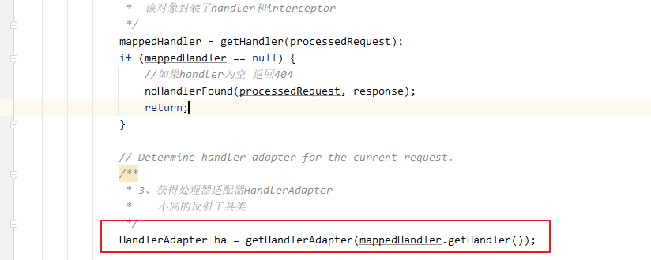

  在 getHandlerAdapter() ⽅法中循环调⽤了 supports() ⽅法判断是否兼容，循环迭代集合中的“Adapter” 在初始化时已经赋值。


## 8、完善自定义mvc

实现思路：

```
作业1思路：
	1、添加ThmSecurity注解，并标识添加类和方法
	2、在容器启动中添加安全权限管理器 securityManager 
		Map<String, Map<String, List<Pattern>>>
		将类添加到安全权限管理：
			key：类的权限限定名
			value：当前类权限标识的名称和可访问路径
					key：权限标识
					value：访问路径集合
	3、权限标识情况分析
		类上存在：
			有值：限定当前类只能被配置的权限标识访问
				方法存在：
					有值：该方法只能被配置的权限标识访问
					无值：该方法可以被该类的所有权限标识方法
				方法不存在：该方法可以被该类的所有权限标识方法
			无值：不添加安全权限管理
		类上不存在：
			方法存在：
				有值：该方法只能被配置的权限标识访问
				无值：不添加安全权限管理
			方法不存在：不添加安全权限管理
	4、添加测试
	zhangsan：
		http://localhost:8080/demo/test?username=zhangsan
		http://localhost:8080/demo/handle01?username=zhangsan
		http://localhost:8080/demo/handle02?username=zhangsan
		http://localhost:8080/demo/handle05?username=zhangsan
		http://localhost:8080/demo/handle06?username=zhangsan
		http://localhost:8080/demo/handle09?username=zhangsan
		http://localhost:8080/demo/handle11?username=zhangsan
	lisi：
		http://localhost:8080/demo/test?username=lisi
		http://localhost:8080/demo/handle01?username=lisi
		http://localhost:8080/demo/handle03?username=lisi
		http://localhost:8080/demo/handle05?username=lisi
		http://localhost:8080/demo/handle07?username=lisi
		http://localhost:8080/demo/handle08?username=lisi
		http://localhost:8080/demo/handle10?username=lisi
		http://localhost:8080/demo/handle11?username=lisi
	wangwu：
		http://localhost:8080/demo/test?username=wangwu
		http://localhost:8080/demo/handle01?username=wangwu
		http://localhost:8080/demo/handle04?username=wangwu
		http://localhost:8080/demo/handle05?username=wangwu
```

实现地址：https://gitee.com/Thmspring/LG_homeWork/tree/master/stage1_module3/code/thm-mvc