# 容器虚拟化技术和自动化部署

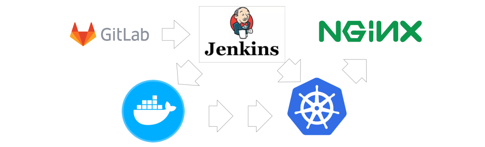

**必备基础**

- **安装虚拟机环境**

- **生成至少三台虚拟机**

  | 主机名       | 主机IP         |
  | ------------ | -------------- |
  | k8s-master01 | 192.168.81.200 |
  | k8s-node01   | 192.168.81.201 |
  | k8s-node02   | 192.168.81.202 |
  | k8s-node03   | 192.168.81.203 |
  | harbor-159   | 192.168.81.204 |

- **远程连接工具xhsell**

## 1、Kubernetes快速实战

### 1.1、前言

- **云平台基础概念**

  IaaS:基础设施服务

  PaaS：平台服务

  SaaS：软件服务

- **kubernetes与docker swarm对比**

  长期以来，Kubernetes 和 Docker Swarm被看做是vs的对手，在接下来的对比中，我们看一下它们应该在何时被使用，以及怎么一起工作的。

  关于Kubernetes和Docker有无数的争论和讨论。如果你没有深入研究它们，你会认为这两种开源技术在争夺容器（container）霸权。 让我们来一看清楚，

  Kubernetes和Docker Swarm不是竞争对手！两者都有各自的优缺点，可以根据你应用程序的需求来选择使用。(择优选用，相互协作)

  Docker是一种容器管理服务，它帮助开发人员设计应用程序，使用容器能更容易地创建、部署和运行应用程序。Docker有一个用于集群容器的内置机制，称

  为“集群模式”（swarm mode）。使用集群模式，你可以使用Docker引擎在多台机器上启动应用程序。

  Docker Swarm是Docker自己针对Docker容器的原生集群解决方案，它的优点是紧密集成到Docker的生态系统中，并且使用自己的API。它监视跨服务器集群

  的容器数量，是创建集群docker应用程序的最方便的方法，不需要额外的硬件。它为Dockerized应用程序提供了一个小型但有用的编排系统。

- **使用Docker Swarm的优点**

  1. 更快的运行速度

     当您使用虚拟环境时，您可能已经意识到它需要很长时间，并且包含了启动和启动您想要运行的应用程序的冗长过程。对于Docker Swarm来说，这不再

     是一个问题。Docker Swarm不需要启动一个完整的虚拟机，就可以让应用程序在虚拟和软件定义的环境中快速运行，并有助于DevOps的实现。

  2. 完备的相关技术文档

     Docker团队在文档方面非常突出! Docker正在快速发展，并且非常受欢迎。如果平台的一个版本在短时间间隔内发布，有些平台可能不维护文档。但是

     Docker Swarm从不这样，如果一些信息只适用于Docker Swarm的特定版本，那么相应文档将确保更新了所有信息。

  3. 快速简单的配置

     Docker Swarm的一个主要优点是它简化了问题。Docker Swarm使用户可以自己配置，将其放入代码中并轻松部署。由于Docker Swarm可以在各种环境

     中使用，因此需求不受应用程序环境的约束。

  4. 确保程序独立（容器间低耦合）

     Docker Swarm负责将每个容器与其他容器隔离，并拥有自己的资源。你可以部署各种容器，以便在不同的堆栈中运行单独的应用程序。除此之外，

     Docker Swarm将在每个应用程序在自己的容器上运行时清除应用程序的删除。如果不再需要应用程序，可以删除它的容器。它不会在您的主机OS上留下

     任何临时文件或配置文件。

  5. 版本控制与组件重用

     使用Docker Swarm，您可以跟踪容器的连续版本、检查差异或回滚到前面的版本。容器重用来自前一层的组件，这使得它们非常轻量级。

- **使用Docker Swarm的缺点**

  1. 跨平台支持效果差
  2. 不提供存储选项
  3. 监控信息不足

- **使用Kubernetes的优点**

  - 它的速度很快：在不停机的情况下持续部署新功能时，Kubernetes是一个完美的选择。

    Kubernetes的目标是以恒定的正常运行时间更新应用程序。它的速度通过您每小时可以运送的许多功能来衡量，同时保持可用的服务。

  - 遵循不可变基础架构的原则: 在传统的方法中，如果多个更新出现错误，您没有任何关于部署了多少个更新以及发生错误的时间点的记录。在不可变的基

    础架构中，如果想要更新任何应用程序，需要使用新标记构建容器映像并部署它，用旧映像版本销毁旧容器。这样，你就会有一个记录，并了解你做了什

    么，万一有什么错误;您可以轻松地回滚到前面的映像。

  - 提供声明式配置: 用户可以知道系统应该处于什么状态以避免错误。源代码控制、单元测试等传统工具不能与命令式配置一起使用，但可以与声明式配置

    一起使用。

  - 大规模部署和更新软件：由于Kubernetes具有不可变的声明性，因此扩展很容易。Kubernetes提供了一些用于扩展目的的有用功能：
    - 水平基础架构扩展：在单个服务器级别执行操作以应用水平扩展。可以毫不费力地添加或分离atest服务器。
    - 自动扩展：根据CPU资源或其他应用程序指标的使用情况，您可以更改正在运行的容器数
    - 手动扩展：您可以通过命令或界面手动扩展正在运行的容器的数量
    - 复制控制器：复制控制器确保集群在运行状态下具有指定数量的等效pod。如果存在太多pod，则复制控制器可以删除额外的pod，反之亦然。

  - 处理应用程序的可用性：Kubernetes检查节点和容器的运行状况，并在由于错误导致的盒中崩溃时提供自我修复和自动替换。此外，它在多个pod之间分

    配负载，以便在意外流量期间快速平衡资源。

  - 存储卷: 在Kubernetes中，数据是在容器之间共享的，但是如果pod被杀死，则自动删除卷。此外，数据是远程存储的，因此如果将pod移动到另一个节

    点，数据将一直保留，直到用户删除它。

- **使用Kubernetes的缺点**

  - 初始进程需要时间: 当创建一个新进程时，您必须等待应用程序启动，然后用户才能使用它。如果您要迁移到Kubernetes，则需要对代码库进行修改，以

    提高启动流程的效率，这样用户就不会有不好的体验。

  - 迁移到无状态需要做很多工作: 如果您的应用程序是集群的或无状态的，那么将不会配置额外的pod，并且必须重新处理应用程序中的配置。
  - 安装过程非常单调乏味: 如果不使用Azure、谷歌或Amazon等云提供商，就很难在集群上设置Kubernetes。

- **Kubernetes或Docker：哪个是完美的选择？**

  - 如果使用Kubernetes：

    您正在寻找成熟的部署和监控选项

    您正在寻找快速可靠的响应时间

    您正在寻求开发复杂的应用程序，并且需要高资源计算而不受限制

    你有一个非常大的集群

  - 如果，使用Docker，

    您希望在不花费太多时间进行配置和安装的情况下启动工具;

    您正在寻找开发一个基本和标准的应用程序，它足够使用默认的docker镜像;

    在不同的操作系统上测试和运行相同的应用程序对您来说不是问题;

    您需要zdocker API经验和兼容性。

### 1.2、k8s 集群快速部署

kubernetes官网地址：国外网站，访问速度较慢

```apl
https://kubernetes.io/
```

kubernets中文社区地址：

```apl
https://www.kubernetes.org.cn/ 1
```

k8s集群部署方式：

> 1. 使用minikube安装单节点集群，用于测试
> 2. 采用工具kubeadm
> 3. 使用kubespray，google官方提供的工具。
> 4. 全手动:二进制方式安装
> 5. 全自动安装:rancher 、kubesphere

快速部署一个 Kubernetes, 即拥有了一个完整的集群。忽略三大步骤

1. centos7.7+操作系统配置

2. k8s集群镜像下载

3. k8s集群网络配置

| 主机名       | IP             |
| ------------ | -------------- |
| k8s-master01 | 192.168.81.120 |
| k8s-node01   | 192.168.81.121 |
| k8s-node02   | 192.168.81.122 |
| k8s-node03   | 192.168.81.123 |

**初始化k8s集群**

```shell
#在master机器
kubeadm init --apiserver-advertise-address=192.168.81.120 --kubernetes-version v1.17.5 --service-cidr=10.1.0.0/16 --pod-network-cidr=10.81.0.0/16
#创建证书目录
mkdir -p $HOME/.kube 
sudo cp -i /etc/kubernetes/admin.conf $HOME/.kube/config
sudo chown $(id -u):$(id -g) $HOME/.kube/config
```

添加K8S集群slave

```shell
kubeadm join 192.168.81.120:6443 --token 8ic4bd.ns2wgycdqx5ey7go \ 
--discovery-token-ca-cert-hash sha256:3b883e6c1f0dcb29834dd08af8eb6e105854d0a475edb3630afc4539fd4f95c8
```

**K8S集群安全机制**

Kubernetes 作为一个分布式集群的管理工具，保证集群的安全性是其一个重要的任务。API Server 是集群内部各个组件通信的中介，也是外部控制的入口。所以 

Kubernetes 的安全机制基本就是围绕保护 API Server 来设计的。Kubernetes 使用了认证（Authentication）、鉴权（Authorization）、准入控制

（AdmissionControl）三步来保证API Server的安全 。

**Authentication(认证)**

- 第三方授权协议: authenticating proxy

- HTTP Token 认证：通过一个 Token 来识别合法用户

  HTTP Token 的认证是用一个很长的特殊编码方式的并且难以被模仿的字符串 - Token 来表达客户的一种方式。Token 是一个很长的很复杂的字符串，每一个 

  Token 对应一个用户名存储在 API Server能访问的文件中。当客户端发起 API 调用请求时，需要在 HTTP Header 里放入 Token 

- HTTP Base 认证：通过 用户名+密码 的方式认证

  用户名+：+密码 用 BASE64 算法进行编码后的字符串放在 HTTP Request 中的 Heather

  Authorization 域里发送给服务端，服务端收到后进行编码，获取用户名及密码 

- 最严格的 HTTPS 证书认证：基于 CA 根证书签名的客户端身份认证方式

  1. HTTPS 证书认证： 采用双向加密认证方式

     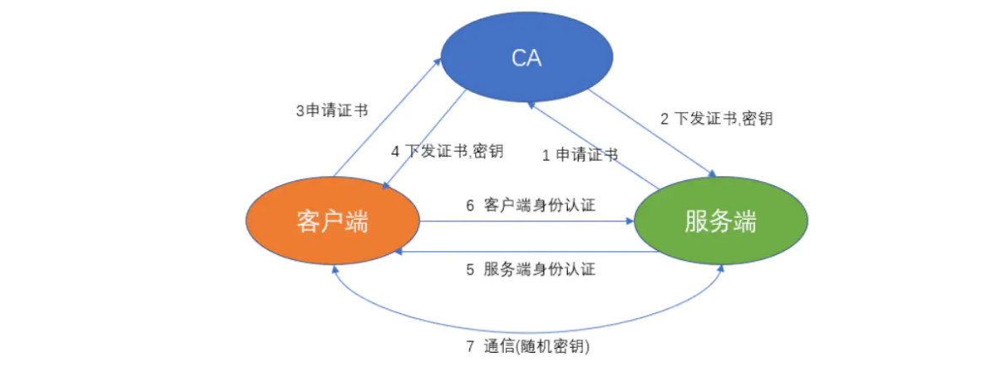

  2. 证书颁发 ：

     手动签发：通过 k8s 集群的跟 ca 进行签发 HTTPS 证书

     自动签发：kubelet 首次访问 API Server 时，使用 token 做认证，通过后，Controller Manager 会为kubelet 生成证书，以后访问都是用证书做认证了 

  3. 安全性说明

     Controller Manager、Scheduler 与 API Server 在同一台机器，所以直接使用 API Server 的非安全端口

     访问， --insecure-bind-address=127.0.0.1

     kubectl、kubelet、kube-proxy 访问 API Server 就都需要证书进行 HTTPS 双向认证 

  4. kubeconfig 文件包含集群参数（CA证书、API Server地址），客户端参数（上面生成的证书和私钥），集群context 信息（集群名称、用户名）。

    Kubenetes 组件通过启动时指定不同的kubeconfig 文件可以切换到不同的集群

### 1.3、Kubernetes基础组件

 Kubernetes 集群包含 集群由一组被称作节点的机器组成。这些节点上运行 Kubernetes 所管理的容器化应用。集群具有至少一个工作节点和至少一个主节点。

工作节点托管作为应用程序组件的 Pod 。主节点管理集群中的工作节点和 Pod 。多个主节点用于为集群提供故障转移和高可用性。

本章概述交付正常运行的 Kubernetes 集群所需的各种组件。

这张图表展示了包含所有相互关联组件的 Kubernetes 集群。

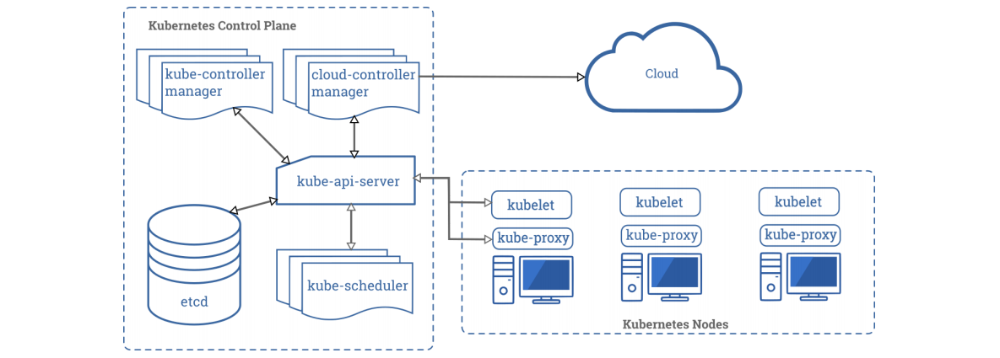

#### 1.3.1、 控制平面组件（Control Plane Components）

控制平面的组件对集群做出全局决策(比如调度)，以及检测和响应集群事件（例如，当不满足部署的replicas 字段时，启动新的 pod）。

控制平面组件可以在集群中的任何节点上运行。然而，为了简单起见，设置脚本通常会在同一个计算机上启动所有控制平面组件，并且不会在此计算机上运行用户

容器。

- **kube-apiserver**

  主节点上负责提供 Kubernetes API 服务的组件；它是 Kubernetes 控制面的前端。

  1. kube-apiserver是Kubernetes最重要的核心组件之一
  2. 提供集群管理的REST API接口，包括认证授权，数据校验以及集群状态变更等
  3. 提供其他模块之间的数据交互和通信的枢纽（其他模块通过API Server查询或修改数据，只有API Server才直接操作etcd） 
  4. 生产环境可以为apiserver做LA或LB。在设计上考虑了水平扩缩的需要。 换言之，通过部署多个实例可以实现扩缩。 参见构造高可用集群。

- **etcd**

  1. kubernetes需要存储很多东西，像它本身的节点信息，组件信息，还有通过kubernetes运行的pod，deployment，service等等。都需要持久化。

    etcd就是它的数据中心。生产环境中为了保证数据中心的高可用和数据的一致性，一般会部署最少三个节点。

  2. 这里只部署一个节点在master。etcd也可以部署在kubernetes每一个节点。组成etcd集群。

  3. 如果已经有etcd外部的服务，kubernetes直接使用外部etcd服务

  etcd 是兼具一致性和高可用性的键值数据库，可以作为保存 Kubernetes 所有集群数据的后台数据库。Kubernetes 集群的 etcd 数据库通常需要有个备份计

  划。要了解 etcd 更深层次的信息，请参考 etcd 文档。也可以使用外部的ETCD集群

- **kube-scheduler**

  主节点上的组件，该组件监视那些新创建的未指定运行节点的 Pod，并选择节点让 Pod 在上面运行。

  kube-scheduler负责分配调度Pod到集群内的节点上，它监听kube-apiserver，查询还未分配Node的Pod，然后根据调度策略为这些Pod分配节点。

- **kube-controller-manager**

  在主节点上运行控制器的组件。

  Controller Manager由kube-controller-manager和cloud-controller-manager组成，是Kubernetes的大脑，它通过apiserver监控整个集群的状态，并确保

  集群处于预期的工作状态。 kube-controller-manager由一系列的控制器组成，像Replication Controller控制副本，Node Controller节点控制，Deployment 

  Controller管理deployment等等 cloudcontroller-manager在Kubernetes启用Cloud Provider的时候才需要，用来配合云服务提供商的控制

- **云控制器管理器-(cloud-controller-manager)**

  cloud-controller-manager 运行与基础云提供商交互的控制器。cloud-controller-manager 二进制文件是 Kubernetes 1.6 版本中引入的 alpha 功能。

  cloud-controller-manager 仅运行云提供商特定的控制器循环。您必须在 kube-controller-manager 中禁用这些控制器循环，您可以通过在启动 kube-

  controller-manager 时将 --cloud-provider 参数设置为external 来禁用控制器循环。

  cloud-controller-manager 允许云供应商的代码和 Kubernetes 代码彼此独立地发展。在以前的版本中，核心的 Kubernetes 代码依赖于特定云提供商的代码

  来实现功能。在将来的版本中，云供应商专有的代码应由云供应商自己维护，并与运行 Kubernetes 的云控制器管理器相关联。

- **kubectl**

  主节点上的组件

  kubectl是Kubernetes的命令行工具，是Kubernetes用户和管理员必备的管理工具。kubectl提供了大量的子命令，方便管理Kubernetes集群中的各种功能。

#### 1.3.2、Node 组件

节点组件在每个节点上运行，维护运行的 Pod 并提供 Kubernetes 运行环境。

- **kubelet**

  一个在集群中每个节点上运行的代理。它保证容器都运行在 Pod 中。

  一个在集群中每个工作节点上都运行一个kubelet服务进程，默认监听10250端口，接收并执行master发来的指令，管理Pod及Pod中的容器。每个kubelet进

  程会在API Server上注册节点自身信息，定期向master节点汇报节点的资源使用情况，并通过cAdvisor监控节点和容器的资源。

- **kube-proxy**

  一个在集群中每台工作节点上都应该运行一个kube-proxy服务，它监听API server中service和endpoint的变化情况，并通过iptables等来为服务配置负载均

  衡，是让我们的服务在集群外可以被访问到的重要方式。

- **容器运行环境(Container Runtime)**

  容器运行环境是负责运行容器的软件。

  Kubernetes 支持多个容器运行环境: Docker、 containerd、cri-o、 rktlet 以及任何实现 KubernetesCRI (容器运行环境接口)。

#### 1.3.3、插件(Addons)

插件使用 Kubernetes 资源 (DaemonSet, Deployment等) 实现集群功能。因为这些提供集群级别的功能，所以插件的命名空间资源属于 kube-system 命名空间。

所选的插件如下所述：有关可用插件的扩展列表，请参见插件 (Addons)。

- **KUBE-DNS**

  kube-dns为Kubernetes集群提供命名服务，主要用来解析集群服务名和Pod的hostname。目的是让pod可以通过名字访问到集群内服务。它通过添加A记录

  的方式实现名字和service的解析。普通的service会解析到service-ip。headless service会解析到pod列表。

- **用户界面(Dashboard)**

  Dashboard 是 Kubernetes 集群的通用基于 Web 的 UI。它使用户可以管理集群中运行的应用程序以及集群本身并进行故障排除。

- **容器资源监控**

  容器资源监控将关于容器的一些常见的时间序列度量值保存到一个集中的数据库中，并提供用于浏览这些数据的界面。

- **集群层面日志**

  集群层面日志 机制负责将容器的日志数据保存到一个集中的日志存储中，该存储能够提供搜索和浏览接口

### 1.4、Kubernetes安装与配置

- **硬件安装要求：**

  

- **节点信息**

  | 主机名       | IP             |
  | ------------ | -------------- |
  | k8s-master01 | 192.168.81.120 |
  | k8s-node01   | 192.168.81.121 |
  | k8s-node02   | 192.168.81.122 |
  | k8s-node03   | 192.168.81.123 |

- **centos下载**

  推荐大家使用centos7.8版本。当前7.9，版本号：CentOS-7-x86_64-Minimal-2009.iso 

  ```http
  http://mirrors.aliyun.com/centos/7.9.2009/isos/x86_64/
  ```

- **centos配置**

  - **查看centos系统版本命令：**

    ```shell
    cat /etc/centos-release
    ```

  - **创建shell脚本init.sh(可以不用执行)** 

    ```shell
    #1.下载安装wget
    yum install -y wget 
    #2.备份默认的yum 
    mv /etc/yum.repos.d /etc/yum.repos.d.backup
    #3.设置新的yum目录 
    mkdir -p /etc/yum.repos.d 
    #4.下载阿里yum配置到该目录中，选择对应版本 
    wget -O /etc/yum.repos.d/CentOS-Base.repo http://mirrors.aliyun.com/repo/Centos-7.repo
    #5.更新epel源为阿里云epel源 
    mv /etc/yum.repos.d/epel.repo /etc/yum.repos.d/epel.repo.backup 
    mv /etc/yum.repos.d/epel-testing.repo /etc/yum.repos.d/epel-testing.repo.backup
    wget -O /etc/yum.repos.d/epel.repo http://mirrors.aliyun.com/repo/epel-7.repo 
    #6.重建缓存 
    yum clean all
    yum makecache 
    #7.看一下yum仓库有多少包 
    yum repolist
    yum update
    ```

  - **给脚本赋予执行权限同时执行脚本**

    ```shell
    #赋权
    chmod +x init.sh
    #执行
    ./init.sh
    ```

  - **升级系统内核**

    ```shell
    #升级系统内核
    rpm -Uvh http://www.elrepo.org/elrepo-release-7.0-3.el7.elrepo.noarch.rpm
    yum --enablerepo=elrepo-kernel install -y kernel-lt
    grep initrd16 /boot/grub2/grub.cfg 
    grub2-set-default 0
    #重启
    reboot
    ```

  - **查看centos系统状态：**

    ```shell
    #查看系统内核
    uname -r 
    uname -a
    #查看cpu
    lscpu
    #查看内存命令
    free 
    free -h
    #查看硬盘信息
    fdisk -l
    ```

  - **关闭防火墙**

    ```shell
    systemctl stop firewalld 
    systemctl disable firewalld
    ```

  - **关闭selinux**

    ```shell
    sed -i 's/SELINUX=enforcing/SELINUX=disabled/g' /etc/sysconfig/selinux 
    setenforce 0
    ```

  - **网桥过滤**

    ```shell
    vi /etc/sysctl.conf 
    #内容
    net.bridge.bridge-nf-call-ip6tables = 1 
    net.bridge.bridge-nf-call-iptables = 1 
    net.bridge.bridge-nf-call-arptables = 1 
    net.ipv4.ip_forward=1 
    net.ipv4.ip_forward_use_pmtu = 0 
    #生效命令 
    sysctl --system
    #查看效果 
    sysctl -a|grep "ip_forward"
    ```

  - **开启IPVS**

    ```shell
    #安装IPVS 
    yum -y install ipset ipvsdm
    #编译ipvs.modules文件
    vi /etc/sysconfig/modules/ipvs.modules
    
    #文件内容如下 
    #!/bin/bash 
    modprobe -- ip_vs
    modprobe -- ip_vs_rr
    modprobe -- ip_vs_wrr
    modprobe -- ip_vs_sh
    modprobe -- nf_conntrack_ipv4 #或者 modprobe -- nf_conntrack
    
    #赋予权限并执行 
    chmod 755 /etc/sysconfig/modules/ipvs.modules && bash /etc/sysconfig/modules/ipvs.modules && lsmod | grep -e ip_vs -e nf_conntrack_ipv4
    #或者
    chmod 755 /etc/sysconfig/modules/ipvs.modules && bash /etc/sysconfig/modules/ipvs.modules && lsmod | grep -e ip_vs -e nf_conntrack
    #重启电脑，检查是否生效 
    reboot
    lsmod | grep ip_vs_rr
    ```

  - **同步时间**

    ```shell
    #安装软件 
    yum -y install ntpdate 
    #向阿里云服务器同步时间 
    ntpdate time1.aliyun.com 
    #删除本地时间并设置时区为上海 
    rm -rf /etc/localtime 
    ln -s /usr/share/zoneinfo/Asia/Shanghai /etc/localtime
    #查看时间 
    date -R || date
    ```

  - **命令补全**

    ```shell
    #安装bash-completion 
    yum -y install bash-completion bash-completion-extras 
    #使用bash-completion 
    source /etc/profile.d/bash_completion.sh
    ```

  - **上传文件**

    ```shell
    yum -y install lrzsz 
    #1.鼠标拖拽上传文件 
    #2.下载文件 
    	#2.1下载一个文件 
    	sz filename 
    	#2.2下载多个文件 
    	sz filename1 filename2 
    	#2.3下载dir目录下所有文件，不包含dir下的文件夹 
    	sz dir/*
    ```

  - **关闭swap分区**

    ```shell
    #临时关闭： 
    swapoff -a 
    #永久关闭： 
    vi /etc/fstab 
    #将文件中的/dev/mapper/centos-swap这行代码注释掉 
    #/dev/mapper/centos-swap swap swap defaults 0 0 
    #确认swap已经关闭：若swap行都显示 0 则表示关闭成功 
    free -m
    ```

  - **hosts配置**

    ```shell
    #vi /etc/hosts 
    #文件内容如下: 
    cat <<EOF >>/etc/hosts 
    192.168.81.120 k8s-master01 
    192.168.81.121 k8s-node01 
    192.168.81.122 k8s-node02 
    192.168.81.123 k8s-node03 
    EOF
    ```

#### 1.4.1、安装docker

在每台服务上安装docker，安装教程查看22、docker文档

- **修改Cgroup Driver**

  ```shell
  vim /etc/docker/daemon.json 
  #修改daemon.json，新增： 
  "exec-opts": ["native.cgroupdriver=systemd"] 
  #重启docker服务： 
  systemctl daemon-reload 
  systemctl restart docker 
  #查看修改后状态： 
  docker info
  docker info | grep Cgroup
  ```

  > 修改**cgroupdriver**是为了消除安装**k8s**集群时的告警：
  >
  > [WARNING IsDockerSystemdCheck]:
  >
  > detected “cgroupfs” as the Docker cgroup driver. The recommended driver is “systemd”.
  >
  > Please follow the guide at https://kubernetes.io/docs/setup/cri/......

- 注意添加快照，后面很容易错

#### 1.4.3、使用kubeadm快速安装

| 软件 | kubeadm                        | kubelet                                                   | kubectl                         | docker-ce             |
| ---- | ------------------------------ | --------------------------------------------------------- | ------------------------------- | --------------------- |
| 版本 | 初始化集群管理集群版本：1.17.5 | 用于接收api-server指令，对pod生命周期进行管理版本：1.17.5 | 集群命令行管理工具 版本：1.17.5 | 推荐使用版本：19.03.8 |

##### 1.4.3.1、安装yum源

```shell
#新建repo文件
vi /etc/yum.repos.d/kubernates.repo
#内容
[kubernetes] 
name=Kubernetes 
baseurl=https://mirrors.aliyun.com/kubernetes/yum/repos/kubernetes-el7-x86_64 
enabled=1 
gpgcheck=1 
repo_gpgcheck=1 
gpgkey=https://mirrors.aliyun.com/kubernetes/yum/doc/yum-key.gpg 
		https://mirrors.aliyun.com/kubernetes/yum/doc/rpm-package-key.gpg
#更新缓存
yum clean all 
yum -y makecache
#验证源是否可用 如果提示要验证yum-key.gpg是否可用，输入y。 查找到kubeadm。显示版本
yum list | grep kubeadm
```

##### 1.4.3.2、查看k8s版本

```shell
yum list kubelet --showduplicates | sort -r
```

##### 1.4.3.3、安装k8s-1.17.5

```shell
yum install -y kubelet-1.17.5 kubeadm-1.17.5 kubectl-1.17.5
```

##### 1.4.3.4、设置kubelet

- **增加配置信息**

  ```shell
  #如果不配置kubelet，可能会导致K8S集群无法启动。为实现docker使用的cgroupdriver与kubelet 使用的cgroup的一致性。
  vi /etc/sysconfig/kubelet 
  
  KUBELET_EXTRA_ARGS="--cgroup-driver=systemd"
  ```

- **设置开机启动**

  ```shell
  systemctl enable kubelet
  ```

##### 1.4.3.5、初始化镜像

如果是第一次安装k8s，手里没有备份好的镜像，可以执行如下操作。也可以使用资料包中的镜像备份跳过本章节学习内容。

教学目标：本章节重点为下载镜像和备份镜像。

- **查看安装集群需要的镜像**

  ```shell
  kubeadm config images list
  ```

- **编写执行脚本**

  ```shell
  mkdir -p /data 
  cd /data 
  vi images.sh
  
  #内容
  #!/bin/bash
  # 下面的镜像应该去除"k8s.gcr.io"的前缀，版本换成kubeadm config images list命令获取 到的版本
  images=(
          kube-apiserver:v1.17.5
          kube-controller-manager:v1.17.5
          kube-scheduler:v1.17.5
          kube-proxy:v1.17.5
          pause:3.1
          etcd:3.4.3-0
          coredns:1.6.5
  )
  for imageName in ${images[@]} ;
  do
  docker pull registry.cn-hangzhou.aliyuncs.com/google_containers/$imageName
  docker tag registry.cn-hangzhou.aliyuncs.com/google_containers/$imageName k8s.gcr.io/$imageName
  docker rmi registry.cn-hangzhou.aliyuncs.com/google_containers/$imageName
  done
  ```

- **执行脚本**

  ```shell
  #给脚本授权
  chmod +x images.sh
  #执行
  ./images.sh
  ```

- **保存镜像**

  idea的列编辑模式：alt+鼠标左键

  ```shell
  #master
  docker save -o k8s.1.17.5.tar \
  k8s.gcr.io/kube-proxy:v1.17.5 \
  k8s.gcr.io/kube-apiserver:v1.17.5 \
  k8s.gcr.io/kube-controller-manager:v1.17.5 \
  k8s.gcr.io/kube-scheduler:v1.17.5 \
  k8s.gcr.io/coredns:1.6.5 \
  k8s.gcr.io/etcd:3.4.3-0 \
  k8s.gcr.io/pause:3.1 \
  #slave
  docker save -o k8s.1.17.5.node.tar \
  k8s.gcr.io/kube-proxy:v1.17.5 \
  k8s.gcr.io/pause:3.1 \
  ```

##### 1.4.3.6、导入镜像

```shell
#master
docker load -i k8s.1.17.5.tar
#slave node节点需要kube-proxy:v1.17.5和pause:3.1,2个镜像
docker load -i k8s.1.17.5.node.tar
```

##### 1.4.3.7、初始化集群

**配置k8s集群网络**

- **calico官网地址**

  ```shell
  #官网下载地址： 
  https://docs.projectcalico.org/v3.14/manifests/calico.yaml
  #github地址：
  https://github.com/projectcalico/calico
  cd /data
  wget https://docs.projectcalico.org/v3.14/manifests/calico.yaml
  #镜像下载：
  docker pull calico/cni:v3.14.2 
  docker pull calico/pod2daemon-flexvol:v3.14.2
  docker pull calico/node:v3.14.2 
  docker pull calico/kube-controllers:v3.14.2
  #配置hostname：
  #master 120
  hostnamectl set-hostname k8s-master01
  bash
  #slave 121、122、123
  hostnamectl set-hostname k8s-node01
  bash
  hostnamectl set-hostname k8s-node02
  bash
  hostnamectl set-hostname k8s-node03
  bash
  ```

- **初始化集群信息:calico网络**

  ```shell
  kubeadm init --apiserver-advertise-address=192.168.81.120 --kubernetes-version v1.17.5 --service-cidr=10.1.0.0/16 --pod-network-cidr=10.81.0.0/16
  ```

- **执行配置命名**

  master节点执行

  ```shell
  mkdir -p $HOME/.kube
  sudo cp -i /etc/kubernetes/admin.conf $HOME/.kube/config
  sudo chown $(id -u):$(id -g) $HOME/.kube/config
  ```

- **node节点加入集群信息**

  slave节点执行

  ```shell
  kubeadm join 192.168.81.120:6443 --token 92ldb3.uxsyz3j8hs17fh20 \
      --discovery-token-ca-cert-hash sha256:6cada557eee2cc027dca101b07344b4da26cd525143b8627d2f707c77aa37162
  ```

- **查看集群节点信息**

  ```shell
  kubectl get nodes -w
  #内容如下是未安装网络
  NAME           STATUS     ROLES    AGE   VERSION
  k8s-master01   NotReady   master   13m   v1.17.5
  k8s-node01     NotReady   <none>   11m   v1.17.5
  k8s-node02     NotReady   <none>   10m   v1.17.5
  k8s-node03     NotReady   <none>   10m   v1.17.5
  #在master安装网络
  cd /data
  kubectl apply -f calico.yaml
  #查看集群信息
  kubectl get nodes -w
  ```

- **kubectl命令自动补全**

  ```shell
  echo "source <(kubectl completion bash)" >> ~/.bash_profile 
  source ~/.bash_profile
  ```

- **发送邮件问题**

  阔以不处理

  ```shell
  #在 bash 中设置当前 shell 的自动补全，要先安装 bash-completion 包。 
  echo "unset MAILCHECK">> /etc/profile 
  source /etc/profile 
  #在你的 bash shell 中永久的添加自动补全
  ```

- **yum-key.gpg验证未通过**

  阔以不处理

  ```shell
  wget https://mirrors.aliyun.com/kubernetes/yum/doc/yum-key.gpg 
  wget https://mirrors.aliyun.com/kubernetes/yum/doc/rpm-package-key.gpg 
  rpm --import yum-key.gpg 
  rpm --import rpm-package-key.gpg
  ```


## 2、k8s快速入门之命令行

### 2.1、NameSpace

中文名称：命名空间。 你可以认为namespaces是你kubernetes集群中的虚拟化集群。在一个Kubernetes集群中可以拥有多个命名空间，它们在逻辑上彼此隔

离。 可以为你提供组织，安全甚至性能方面的帮助！

Namespace是对一组资源和对象的抽象集合，比如可以用来将系统内部的对象划分为不同的项目组或用户组。常见的pods, services, replication controllers和

deployments等都是属于某一个namespace的（默认是default），而node, persistentVolumes等则不属于任何namespace。

大多数的Kubernetes中的集群默认会有一个叫default的namespace。实际上，应该是4个：

- default：你的资源默认被创建于default命名空间。

- kube-system：kubernetes系统组件使用。

- kube-node-lease: kubernetes集群节点租约状态,v1.13加入

- kube-public：公共资源使用。但实际上现在并不常用。

这个默认（default）的namespace并没什么特别，但你不能删除它。这很适合刚刚开始使用kubernetes和一些小的产品系统。但不建议应用于大型生产系统。因

为，这种复杂系统中，团队会非常容易意外地或者无意识地重写或者中断其他服务service。相反，请创建多个命名空间来把你的service(服务)分割成更容易管理的块。作用：

- 多租户情况下，实现资源隔离

- 属于逻辑隔离

- 属于管理边界

- 不属于网络边界

- 可以针对每个namespace做资源配额

相关命名

```shell
#查看命名空间
kubectl get namespace
kubectl get ns   #简写
#查看所有命名空间的pod资源
kubectl get pod --all-namespaces 
kubectl get pod -A
#创建NameSpace
kubectl create namespace thm
kubectl create ns thm
#删除NameSpace
kubectl delete namespace thm
kubectl delete ns thm
```

### 2.2、Pod

Pod是kubernetes集群能够调度的最小单元。Pod是容器的封装 。 

在Kubernetes集群中，Pod是所有业务类型的基础，也是K8S管理的最小单位级，它是一个或多个容器的组合。这些容器共享存储、网络和命名空间，以及如何运

行的规范。在Pod中，所有容器都被同一安排和调度，并运行在共享的上下文中。对于具体应用而言，Pod是它们的逻辑主机，Pod包含业务相关的多个应用容器

#### 2.2.1、Pod有两个必须知道的特点

- 网络:每一个Pod都会被指派一个唯一的Ip地址，在Pod中的每一个容器共享网络命名空间，包括Ip地址和网络端口。在同一个Pod中的容器可以和localhost进

  行互相通信。当Pod中的容器需要与Pod外的实体进行通信时，则需要通过端口等共享的网络资源。

- 存储:Pod能够被指定共享存储卷的集合，在Pod中所有的容器能够访问共享存储卷，允许这些容器共享数据。存储卷也允许在一个Pod持久化数据，以防止其

  中的容器需要被重启。

#### 2.2.2、Pod的工作方式

K8s一般不直接创建Pod。 而是通过控制器和模版配置来管理和调度

- Pod模版

  我们会在后续章节为大家介绍pod模版。

- Pod重启

  在Pod中的容器可能会由于异常等原因导致其终止退出，Kubernetes提供了重启策略以重启容器。重启策略对同一个Pod的所有容器起作用，容器的重启由

  Node上的kubelet执行。Pod支持三种重启策略，在配置文件中通过restartPolicy字段设置重启策略：

  - Always：只要退出就会重启。

  - OnFailure：只有在失败退出（exit code不等于0）时，才会重启。

  - Never：只要退出，就不再重启

  注意，这里的重启是指在Pod的宿主Node上进行本地重启，而不是调度到其它Node上。

- 资源限制

  Kubernetes通过cgroups限制容器的CPU和内存等计算资源，包括requests（请求，调度器保证调度到资源充足的Node上）和limits（上限）等。

#### 2.2.3、查看Pod

```shell
#查看default命名空间下的pods 
kubectl get pods 
#查看kube-system命名空间下的pods
kubectl get pods -n kube-system 
#查看所有命名空间下的pods 
kubectl get pod --all-namespaces
kubectl get pod -A
```

#### 2.2.4、创建Pod

- **下载镜像**

  ```shell
  #K8S集群的每一个节点都需要下载镜像:选择不同的基础镜像，下载镜像的大小也不同。 
  docker pull tomcat:9.0.20-jre8-alpine 108MB 
  docker pull tomcat:9.0.37-jdk8-openjdk-slim 305MB 
  docker pull tomcat:9.0.37-jdk8 531MB 
  #同学们可以自行下载后进行备份。 
  docker save -o tomcat9.tar tomcat:9.0.20-jre8-alpine
  docker load -i tomcat9.tar
  ```

- **运行pod**

  ```shell
  #在default命名空间中创建一个pod副本的deployment 
  kubectl run tomcat9-test --image=tomcat:9.0.20-jre8-alpine --port=8080 
  kubectl get pod
  kubectl get pod -o wide 
  #使用pod的IP访问容器 
  crul ***:8080
  ```

- **删除pod**

  ```shell
  #这个删除并不能真正删除，只会重新部署一套pod
  kubectl delete pod tomcat9-test-569b5bf455-wmgct
  #真正删除 
  kubectl delete deployments.apps tomcat9-test
  ```

- **扩容pod**

  ```shell
  #将副本扩容至3个
  kubectl scale --replicas=3 deployment tomcat9-test
  kubectl get pod
  kubectl get pod -o wide 
  #使用pod的IP访问容器 
  crul ***:8080
  #将副本扩容至3个 基于控制器
  kubectl scale --replicas=3 deployment/tomcat9-test 
  kubectl get deployment 
  kubectl get deployment -o wide 
  #使用deployment的IP访问pod
  curl ****:8080
  ```

- **创建服务**

  ```shell
  #创建服务 --port暴露给集群内部其他应用使用的端口  --target-port暴露给集群外部访问的端口
  kubectl expose deployment tomcat9-test --name=tomcat9-service --port=8888 --target-port=8080 --protocol=TCP --type=NodePort
  #查看服务
  kubectl get service
  kubectl get service -o wide
  #访问服务端口 
  curl 10.105.225.0:8888 
  #访问集群外端口 
  http://192.168.81.120:32367
  ```

### 2.3、kubectl常用命令练习

#### 2.3.1、语法规则

```shell
kubectl [command] [TYPE] [NAME] [flags] 1
```

其中 command 、 TYPE 、 NAME 和 flags 分别是：

- command ：指定要对一个或多个资源执行的操作，例如 create 、 get 、 describe 、 delete 。 

- TYPE ：指定资源类型。资源类型不区分大小写，可以指定单数、复数或缩写形式。例如，以下命令输出相同的结果

  ```sh
  kubectl get pod pod1 
  kubectl get pods pod1 
  kubectl get po pod1
  ```

- NAME ：指定资源的名称。名称区分大小写。如果省略名称，则显示所有资源的详细信息 kubectl  get pods 。

  在对多个资源执行操作时，您可以按类型和名称指定每个资源，或指定一个或多个文件：

  - 要按类型和名称指定资源：

    要对所有类型相同的资源进行分组，请执行以下操作： TYPE1 name1 name2 name<#> 。例子： kubectl get pod example-pod1 example-pod2

  - 分别指定多个资源类型： TYPE1/name1 TYPE1/name2 TYPE2/name3 

    TYPE<#>/name<#> 。

    例子： kubectl get pod/example-pod1 replicationcontroller/example-rc1

  - 用一个或多个文件指定资源： -f file1 -f file2 -f file<#>

    使用 YAML 而不是 JSON 因为 YAML 更容易使用，特别是用于配置文件时。

    例子： kubectl get pod -f ./pod.yaml 

- flags : 指定可选的参数。例如，可以使用 -s 或 -server 参数指定 Kubernetes API 服务器的地址和端口。

注意：从命令行指定的参数会覆盖默认值和任何相应的环境变量。

如果您需要帮助，只需从终端窗口运行 kubectl help 即可。

#### 2.3.2、get命令

kubectl get - 列出一个或多个资源。

```shell
# 查看集群状态信息 
kubectl cluster-info
# 查看集群状态 
kubectl get cs
# 查看集群节点信息 
kubectl get nodes 
# 查看集群命名空间 
kubectl get ns 
# 查看指定命名空间的服务 
kubectl get svc -n kube-system 
# 以纯文本输出格式列出所有 pod。
kubectl get pods 
# 以纯文本输出格式列出所有 pod，并包含附加信息(如节点名)。 
kubectl get pods -o wide 
# 以纯文本输出格式列出具有指定名称的副本控制器。提示：您可以使用别名 'rc' 缩短和替换 'replicationcontroller' 资源类型。
kubectl get replicationcontroller <rc-name>
# 以纯文本输出格式列出所有副本控制器和服务。 
kubectl get rc,services 
# 以纯文本输出格式列出所有守护程序集，包括未初始化的守护程序集。
kubectl get ds --include-uninitialized 
# 列出在节点 server01 上运行的所有 pod
kubectl get pods --field-selector=spec.nodeName=server01
```

#### 2.3.3、describe命令

kubectl describe - 显示一个或多个资源的详细状态，默认情况下包括未初始化的资源。

```shell
# 显示名称为 <node-name> 的节点的详细信息。 
kubectl describe nodes <node-name> 
# 显示名为 <pod-name> 的 pod 的详细信息。
kubectl describe pods/<pod-name>
# 显示由名为 <rc-name> 的副本控制器管理的所有 pod 的详细信息。
# 记住：副本控制器创建的任何 pod 都以复制控制器的名称为前缀。 
kubectl describe pods <rc-name> 
# 描述所有的 pod，不包括未初始化的 pod 
kubectl describe pods --include-uninitialized=false
```

>说明： kubectl get 命令通常用于检索同一资源类型的一个或多个资源。 它具有丰富的参数，允许您使用 -o 或 --output 参数自定义输出格式。您可以指定 -w 
>
>或 --watch 参数以开始观察特定对象的更新。 kubectl describe 命令更侧重于描述指定资源的许多相关方面。它可以调用对 API 服务器 的多个 API 调用来为
>
>用户构建视图。 例如，该 kubectl describe node 命令不仅检索有关节点的信息，还检索在其上运行的 pod 的摘要，为节点生成的事件等。

#### 2.3.4、delete命令

kubectl delete` - 从文件、stdin 或指定标签选择器、名称、资源选择器或资源中删除资源。

```shell
# 使用 pod.yaml 文件中指定的类型和名称删除 pod。
kubectl delete -f pod.yaml 
# 删除标签名= <label-name> 的所有 pod 和服务。
kubectl delete pods,services -l name=<label-name> 
# 删除所有具有标签名称= <label-name> 的 pod 和服务，包括未初始化的那些。
kubectl delete pods,services -l name=<label-name> --include-uninitialized 
# 删除所有 pod，包括未初始化的 pod。 
kubectl delete pods --all
#强制删除一个pod 
--force --grace-period=0 12
```

#### 2.3.5、进入容器命令

kubectl exec - 对 pod 中的容器执行命令。与docker的exec命令非常类似

```shell
# 从 pod <pod-name> 中获取运行 'date' 的输出。默认情况下，输出来自第一个容器。 
kubectl exec <pod-name> date 
# 运行输出 'date' 获取在容器的 <container-name> 中 pod <pod-name> 的输出。
kubectl exec <pod-name> -c <container-name> date 
# 获取一个交互 TTY 并运行 /bin/bash <pod-name >。默认情况下，输出来自第一个容器。 
kubectl exec -it <pod-name> /bin/bash
```

#### 2.3.6、logs命令

kubectl logs - 打印 Pod 中容器的日志。

```shell
# 从 pod 返回日志快照。 
kubectl logs <pod-name> 
# 从 pod <pod-name> 开始流式传输日志。这类似于 'tail -f' Linux 命令。
kubectl logs -f <pod-name>
#将pod信息格式化输出到一个yaml文件 
kubectl get pod web-pod-13je7 -o yaml 12
```

#### 2.3.7、资源缩写

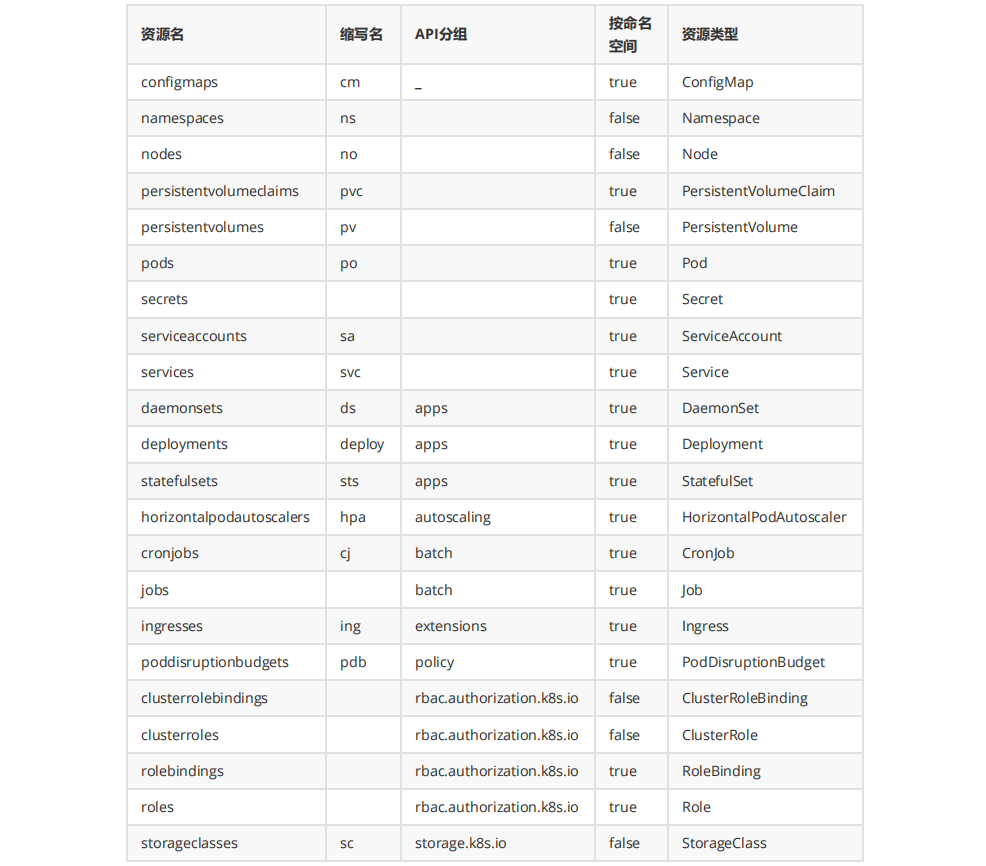

## 3、k8s快速入门之资源文件

### 3.1、idea安装k8s插件

- **idea插件官网地址**

  ```shell
  https://plugins.jetbrains.com/ 
  kubernetes地址： 
  https://plugins.jetbrains.com/plugin/10485-kubernetes 1234
  ```

- **查找对应自己idea版本的k8s插件信息**

  help->about->查看idea内部版本信息 一定要注意版本信息，否则无法安装 

- **离线安装k8s插件**

  settings->plugins->Install Plugin from Disk->插件安装目录 

  安装完成后重启idea开发工具

### 3.2、idea配置SSH客户端

目标：在idea中打开终端操作k8s集群master节点。

- **settings->Tools->SSH Configurations->新建** 

- **Tools->Start SSH session->选择我们刚刚配置的ssh客户端名称** 

- **新建yml类型文件**

  idea默认没有yml文件类型。可以通过new->fifile->手工输入*.yml创建yml类型文件。也可以通过配置增加yml类型文件。

  settings->Edtior->File and Code Template->file->+(新建) 

  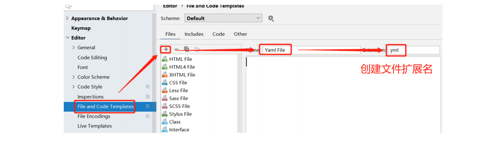

### 3.3、Remote Host

目标：将idea工程中的文件上传k8s集群master节点。

- **idea配置**

  Tools->Deployment->Configurations->配置Remote Host 

- 使用Remote Host

  可以将本工程中的文件上传k8s集群

### 3.4、NameSpace

- 创建thmnamespace.yml

  在文件中输入kres，根据模板快速生成yml文件信息

  ```yaml
  apiVersion: v1
  kind: Namespace
  metadata:
    name: thmnamespace
  ```

- 通过idea的Remote Host快速将yml文件上传k8s集群进行测试

  ```shell
  #创建
  kubectl apply -f lagounamespace.yml
  #删除
  kubectl delete -f thmnamespace.yml 
  ```

### 3.5、pod

- 创建thmpod.yml

  在文件中输入kpod，根据模板快速生成yml文件信息

  ```yaml
  apiVersion: v1
  kind: Pod
  metadata:
    name: thm-tomcat-pod
    labels:
      app: thm-tomcat-pod
  spec:
    containers:
      - name: thm-tomcat-pod
        image: tomcat:9.0.20-jre8-alpine
        imagePullPolicy: IfNotPresent
    restartPolicy: Always
  ```

- 通过idea的Remote Host快速将yml文件上传k8s集群进行测试

  ```shell
  #创建
  kubectl apply -f thmpod.yml
  kubectl get pod -o wide
  curl 10.81.58.196:8080
  #删除
  kubectl delete -f thmpod.yml
  ```

- **镜像下载策略、重启策略**

  ```shell
  imagePullPolicy:
  	Always:总是拉取 pull 
  	IfNotPresent:如果本地有镜像，使用本地，如果本地没有镜像，下载镜像。 
  	Never:只使用本地镜像，从不拉取
  restartPolicy: 
  	Always：只要退出就重启。
  	OnFailure：失败退出时（exit code不为0）才重启 
  	Never：永远不重启
  ```

### 3.6、deployment

- 创建thmdeployment.yml

  在文件中输入kdep，根据模板快速生成yml文件信息

  ```yaml
  apiVersion: apps/v1
  kind: Deployment
  metadata:
    name: thm-deployment
    labels:
      app: thm-deployment
  spec:
    replicas: 3
    template:
      metadata:
        name: thm-deployment
        labels:
          app: thm-tomcat
      spec:
        containers:
          - name: thm-deployment
            image: tomcat:9.0.20-jre8-alpine
            imagePullPolicy: IfNotPresent
        restartPolicy: Always
    selector:
      matchLabels:
        app: thm-tomcat
  ```

- 通过idea的Remote Host快速将yml文件上传k8s集群进行测试

  ```shell
  #创建
  kubectl apply -f thmdeployment.yml
  #删除
  kubectl delete -f thmdeployment.yml
  ```

- matchLabels

  ```apl
  总结： 
  在Deployment中必须写matchLables 在定义模板的时候必须定义labels,因为Deployment.spec.selector是必须字段,而他又必须和 template.labels对应
  ```

- **控制器类型**

  具有上线部署、滚动升级、创建副本、回滚到以前某一版本（成功/ 稳定）等功能。

  Deployment包含ReplicaSet，除非需要自定义升级功能或者根本不需要升级Pod，否则还是建议使用Deployment而不直接使用ReplicaSet 。

  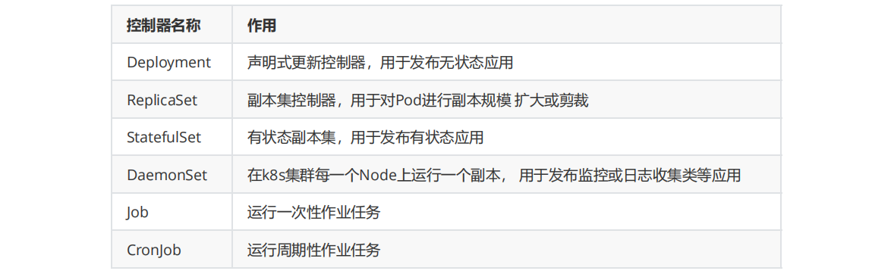

### 3.7、service

创建service的yml文件可以包含多个资源创建

- 创建thmservice.yml

  在文件中输入kser，根据模板快速生成yml文件信息

  ```yaml
  apiVersion: apps/v1
  kind: Deployment
  metadata:
    name: thm-deployment
    labels:
      app: thm-deployment
  spec:
    replicas: 1
    template:
      metadata:
        name: thm-deployment
        labels:
          app: thm-tomcat
      spec:
        containers:
          - name: thm-deployment
            image: tomcat:9.0.20-jre8-alpine
            imagePullPolicy: IfNotPresent
            ports:
              - containerPort: 8080
        restartPolicy: Always
    selector:
      matchLabels:
        app: thm-tomcat
  ---
  apiVersion: v1
  kind: Service
  metadata:
    name: thm-service
  spec:
    selector:
      #标签选择必须是template.labels.app的名称
      app: thm-tomcat
    ports:
      - port: 8888 #对集群内部其他服务暴露端口
        targetPort: 8080 
        nodePort: 30088
    type: NodePort
  ```

- **service的selector**

  service.spec.selector.app选择的内容仍然是template.label.app内容。而不是我们 deployment控制器的label内容

- **Service类型**
  - ClusterIP：默认，分配一个集群内部可以访问的虚拟IP
  - NodePort：在每个Node上分配一个端口作为外部访问入口 
  - LoadBalancer：工作在特定的Cloud Provider上，例如Google Cloud，AWS，OpenStack 
  - ExternalName：表示把集群外部的服务引入到集群内部中来，即实现了集群内部pod和集群外部的服务 进行通信

- **Service参数**

  - port ：访问service使用的端口 

  - targetPort ：Pod中容器端口 

  - NodePort： 通过Node实现外网用户访问k8s集群内service(30000-32767)

- 通过idea的Remote Host快速将yml文件上传k8s集群进行测试

  ```shell
  #创建
  kubectl apply -f thmservice.yml
  #外部访问
  http://192.168.81.120:30088/
  http://192.168.81.121:30088/
  http://192.168.81.122:30088/
  http://192.168.81.123:30088/
  #删除
  kubectl delete thmservice.yml
  ```

## 4、k8s高级进阶

### 4.1、资源清单-pod进阶

- **简介**

  资源清单有5个顶级的字段组成：apiVersion、kind、metadata、spec、status。

  ```yaml
  apiVersion: group/apiversion # 如果没有给定 group 名称，那么默认为 core，可以使用 kubectl apiversions # 获取当前 k8s 版本上所有的 apiVersion 版本信息( 每个版本可能不 同 ) 
  kind: #资源类别 
  metadata： #资源元数据 
  	name 
  	namespace 
  	lables 
  	annotations # 主要目的是方便用户阅读查找 
  spec: # 期望的状态（disired state） 
  status：# 当前状态，本字段有 Kubernetes 自身维护，用户不能去定义
  ```

- **资源的 apiVersion 版本信息**

  使用kubectl命令可以查看apiVersion的各个版本信息

  ```shell
  kubectl api-versions
  ```

- **获取字段设置帮助文档**

  ```shell
  kubectl explain pod
  ```

  **资源清单中大致可以分为如下几种类型：**

   <map[String]string> <[]string> <[]Object> 

  ```apl
  apiVersion <string> #表示字符串类型 
  metadata <Object> #表示需要嵌套多层字段 
  labels <map[string]string> #表示由k:v组成的映射 
  finalizers <[]string> #表示字串列表 
  ownerReferences <[]Object> #表示对象列表 
  hostPID <boolean> #布尔类型 
  priority <integer> #整型 
  name <string> -required- #如果类型后面接 -required-，表示为必填字段
  ```

### 4.2、pod声明周期

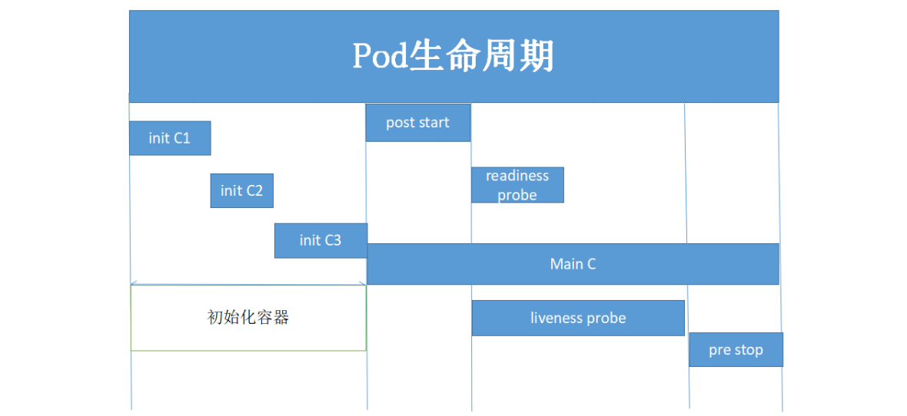

**实验需要准备镜像**

```shell
docker pull busybox:1.32.0 
docker pull nginx:1.17.10-alpine
```

#### 4.2.1、initC案例

initC特点：

1. initC总是运行到成功完成为止。
2. 每个initC容器都必须在下一个initC启动之前成功完成。
3. 如果initC容器运行失败，K8S集群会不断的重启该pod，直到initC容器成功为止。
4. 如果pod对应的restartPolicy为never，它就不会重新启动。

- 创建initcpod.yml文件,需要准备**busybox:1.32.0**镜像

  ```yaml
  apiVersion: v1
  kind: Pod
  metadata:
    name: initcpod-test
    labels:
      app: initcpod-test
  spec:
    containers:
      - name: initcpod-test
        image: busybox:1.32.0
        imagePullPolicy: IfNotPresent
        command: ['sh','-c','echo The app is running! && sleep 3600']
    initContainers:
      - name: init-myservice
        image: busybox:1.32.0
        imagePullPolicy: IfNotPresent
        command: ['sh', '-c', 'until nslookup myservice; do echo waiting for myservice; sleep 2; done;']
      - name: init-mydb
        image: busybox:1.32.0
        imagePullPolicy: IfNotPresent
        command: ['sh', '-c', 'until nslookup mydb; do echo waiting for mydb; sleep 2; done;']
    restartPolicy: Always
  ```

- 创建initcservice1.yml

  ```yaml
  apiVersion: v1
  kind: Service
  metadata:
    name: myservice
  spec:
    selector:
      app: myservice
    ports:
      - port: 80
        targetPort: 9376
        protocol: TCP
  ```

- 创建initcservice2.yml

  ```yacas
  apiVersion: v1
  kind: Service
  metadata:
    name: mydb
  spec:
    selector:
      app: mydb
    ports:
      - port: 80
        targetPort: 9377
        protocol: TCP
  ```

- 执行命名

  ```shell
  #创建pod
  cd /data
  kubectl apply -f initcpod.yml
  #先查看pod启动情况
  kubectl get pods
  #详细查看pod启动情况 
  kubectl describe pod initcpod-test
  #查看myapp-pod中的第一个initContainer日志
  kubectl logs initcpod-test -c init-myservice
  #运行init-myservice服务 
  kubectl apply -f initcservice1.yml
  #查看init-myservice服务运行情况 
  kubectl get svc
  #查看myapp-pod运行情况，需要耐心等一会，会发现pod的第一个init已经就绪 
  kubectl get pods
  #运行init-mydb服务 
  kubectl apply -f initcservice2.yml
  #查看init-myservice服务运行情况 
  kubectl get svc
  #查看myapp-pod运行情况，需要耐心等一会，会发现pod的两个init已经就绪，pod状态为ready 
  kubectl get pod -w
  ```

#### 4.2.2、readinessProbe(就绪检测)

容器就绪检测案例，需要准备**nginx:1.17.10-alpine**镜像。

- 创建readinessprobepod.yml

  ```yaml
  apiVersion: v1
  kind: Pod
  metadata:
    name: readnesspod-test
    labels:
      app: readnesspod-test
  spec:
    containers:
      - name: readnesspod-test
        image: nginx:1.17.10-alpine
        imagePullPolicy: IfNotPresent
        readinessProbe:
          httpGet:
            port: 80
            path: /index1.html
          initialDelaySeconds: 2
          periodSeconds: 3
    restartPolicy: Always
  ```

- 执行命名

  ```shell
  #创建pod
  kubectl apply -f readinessprobepod.yml 
  #检查pod状态，虽然pod状态显示running但是ready显示0/1，因为就绪检查未通过 
  kubectl get pods
  #查看pod详细信息，文件最后一行显示readiness probe failed。。。。 
  kubectl describe pod readinessprobe-pod 
  #进入pod内部，因为是alpine系统，需要使用sh命令
  kubectl exec -it readinessprobe-pod sh 
  #进入容器内目录 
  cd /usr/share/nginx/html/ 
  #追加一个index1.html文件 
  echo "welcome lagou" >> index1.html 
  #退出容器，再次查看pod状态，pod已经正常启动 
  exit 
  kubectl get pod
  ```

#### 4.2.3、livenessProbe(存活检测)案例一

容器存活检测，需要准备**busybox:1.32.0**镜像

- 创建livenessprobepod.yml

  ```yaml
  apiVersion: v1
  kind: Pod
  metadata:
    name: livenessprobe-pod
    labels:
      app: livenessprobe-pod
  spec:
    containers:
      - name: livenessprobe-pod
        image:  busybox:1.32.0
        imagePullPolicy: IfNotPresent
        command: ["/bin/sh","-c","touch /tmp/livenesspod ; sleep 30; rm -rf /tmp/livenesspod; sleep 3600"]
        livenessProbe:
          exec:
            command: ["test","-e","/tmp/livenesspod"]
          initialDelaySeconds: 1
          periodSeconds: 3
    restartPolicy: Always
  ```

- 执行命令

  ```shell
  #创建pod 
  kubectl apply -f livenessprobepod.yml 
  #监控pod状态变化,容器正常启动
  kubectl get pod -w 
  #等待30秒后，发现pod的RESTARTS值从0变为1.说明pod已经重启一次。
  ```

#### 4.2.4、livenessProbe(存活检测)案例二

容器存活检测案例，需要准备**nginx:1.17.10-alpine**镜像

- 创建livenessprobenginxpod.yml

  ```yaml
  apiVersion: v1
  kind: Pod
  metadata:
    name: livenessprobenginx-pod
    labels:
      app: livenessprobenginx-pod
  spec:
    containers:
      - name: livenessprobenginx-pod
        image: nginx:1.17.10-alpine
        imagePullPolicy: IfNotPresent
        ports:
          - containerPort: 80
            name: nginxhttpget
        livenessProbe:
          httpGet:
            port: 80
            path: /index.html
          initialDelaySeconds: 1
          periodSeconds: 3
          timeoutSeconds: 10
    restartPolicy: Always
  ```

- 执行命令

  ```shell
  #创建pod 
  kubectl apply -f livenessprobenginxpod.yml
  #查看pod状态 
  kubectl get pod 
  #查看容器IP，访问index.html页面。index.html页面可以正常访问。 
  kubectl get pod -o wide 
  curl 10.81.58.199 
  #进入容器内部 
  kubectl exec -it livenessprobenginx-pod sh
  #删除index.html文件,退出容器
  rm -rf //usr/share/nginx/html/index.html 
  exit 
  #再次监控pod状态，等待一段时间后，发现pod的RESTARTS值从0变为1.说明pod已经重启一次。 
  kubectl get pod -w 
  #进入容器删除文件一条命令执行rm -rf命令后退出容器。 
  kubectl exec -it livenessprobenginx-pod --rm -rf /usr/share/nginx/html/index.html 
  #再次监控pod状态，等待一段时间后，发现pod的RESTARTS值从1变为2.说明pod已经重启一次。 
  kubectl get pod -w 
  #因为liveness监控index.html页面已经被删除，所以pod需要重新启动，重启后又重新创建nginx 镜像。nginx镜像中默认有index.html页面。
  ```

#### 4.2.5、livenessProbe(存活检测)案例三

容器存活检测案例，需要准备**nginx:1.17.10-alpine**镜像。

- 创建livenessprobenginxpod2.yml

  ```yaml
  apiVersion: v1
  kind: Pod
  metadata:
    name: livenessprobenginx-pod2
    labels:
      app: livenessprobenginx-pod2
  spec:
    containers:
      - name: livenessprobenginx-pod2
        image: nginx:1.17.10-alpine
        imagePullPolicy: IfNotPresent
        livenessProbe:
          tcpSocket:
            #监测8080端口，如果8080端口没有反馈信息，重启pod
            port: 8080
          initialDelaySeconds: 10
          periodSeconds: 3
          timeoutSeconds: 5
    restartPolicy: Always
  ```

- 执行命令

  ```shell
  #创建pod 
  kubectl apply -f livenessprobenginxpod2.yml 
  #查看pod状态 kubectl get pod -w 存活检测监听8080端口，8080端口没有反馈信息后重启pod，RESTARTS值从0变为1
  ```

#### 4.2.6、钩子函数案例

postStart函数,需要准备**busybox:1.32.0**镜像

- 创建lifeclepod.yml

  ```yaml
  apiVersion: v1
  kind: Pod
  metadata:
    name: lifecle-pod1
    labels:
      app: lifecle-pod1
  spec:
    containers:
      - name: lifecle-pod1
        image: busybox:1.32.0
        imagePullPolicy: IfNotPresent
        lifecycle:
          postStart:
            exec:
              command: ['mmkdir','-p','/thm/k8s/index.html']
        command: ['sh','-c','sleep 5000']
    restartPolicy: Always
  ```

- 执行命令

  ```shell
  #创建pod
  kubectl apply -f lifeclepod1.yml 
  #查看pod状态 
  kubectl get pod 
  #进入容器内部，查看是否创建了/thm/k8s/index.html文件 
  kubectl exec -it lifecle-pod1 sh 
  cd /thm/k8s 
  ls
  ```

#### 4.2.7、总结pod声明周期

pod对象自从创建开始至终止退出的时间范围称为生命周期，在这段时间中，pod会处于多种不同的状态，并执行一些操作；其中，创建主容器为必须的操作，其

他可选的操作还包括运行初始化容器（init container）、容器启动后钩子（start hook）、容器的存活性探测（liveness probe）、就绪性探测（readiness 

probe）以及容器终止前钩子（pre stop hook）等，这些操作是否执行则取决于pod的定义 。

- **pod的相位**

  使用 kubectl get pods 命令,STATUS被称之为相位(phase)。

  无论是手动创建还是通过控制器创建pod，pod对象总是应该处于其生命进程中以下几个相位之一：

  - pending：apiserver创建了pod资源对象并存入etcd中，但它尚未被调度完成或者仍处于下载镜像的过程中

  - running：pod已经被调度至某节点，并且所有容器都已经被kubelet创建完成

  - succeeded：pod中的所有容器都已经成功终止并且不会被重启

  - failed：所有容器都已经终止，但至少有一个容器终止失败，即容器返回了非0值的退出状态或已经被系统终止。

  - unknown：apiserver无法正常获取到pod对象的状态信息，通常是由于其无法于所在工作节点的kubelet通信所致。

  pod的相位是在其生命周期中的宏观概念，而非对容器或pod对象的综合汇总，而且相位的数量和含义被严格界定。

- **pod的创建过程**

  pod是k8s的基础单元，以下为一个pod资源对象的典型创建过程：
  1. 用户通过kubectl或其他api客户端提交pod spec给api server
  2. api server尝试着将pod对象的相关信息存入etcd中，待写入操作执行完成，api server即会返回确认信息至客户端。
  3. api server开始反映etcd中的状态变化
  4. 所有的k8s组件均使用watch机制来跟踪检查api server上的相关变动
  5. kube-scheduler通过其watch觉察到api server创建了新的pod对象但尚未绑定至任何工作节点
  6. kube-scheduler为pod对象挑选一个工作节点并将结果信息更新至api server
  7. 调度结果信息由api server更新至etcd，而且api server也开始反映此pod对象的调度结果
  8. pod被调度到目标工作节点上的kubelet尝试在当前节点上调用docker启动容器，并将容器的结果状态回送至api server
  9. api server将pod状态信息存入etcd中
  10. 在etcd确认写入操作成功完成后，api server将确认信息发送至相关的kubelet。

- **pod生命周期中的重要行为**

  除了创建应用容器之外，用户还可以为pod对象定义其生命周期中的多种行为，如初始化容器、存活性探测及就绪性探测等。

  1、初始化容器
  	初始化容器即应用程序的主容器启动之前要运行的容器，常用于为主容器执行一些预置操作，它们具有两种典型特征

  1. 初始化容器必须运行完成直至结束，若某初始化容器运行失败，那么k8s需要重启它直到成功完成
  2. 每个初始化容器都必须按定义的顺序串行运行

  有不少场景都需要在应用容器启动之前进行部分初始化操作，例如，等待其他相关联组件服务可用、基于环境变量或配置模板为应用程序生成配置文件、从配置中心获取配置等。初始化容器的典型应用需求具体包含如下几种。

  1. 用于运行特定的工具程序，出于安全等反面的原因，这些程序不适于包含在主容器镜像中
  2. 提供主容器镜像中不具备的工具程序或自定义代码
  3. 为容器镜像的构建和部署人员提供了分离、独立工作的途径，使得它们不必协同起来制作单个镜像文件
  4. 初始化容器和主容器处于不同的文件系统视图中，因此可以分别安全地使用敏感数据，例如secrets资源
  5. 初始化容器要先于应用容器串行启动并运行完成，因此可用于延后应用容器的启动直至其依赖的条件得到满足

  pod资源的spec.initContainers字段以列表的形式定义可用的初始容器，其嵌套可用字段类似于spec.containers。

- **生命周期钩子函数**

  容器生命周期钩子使它能够感知其自身生命周期管理中的事件，并在相应的时刻到来时运行由用户指定的处理程序代码。k8s为容器提供了两种生命周期钩子：

  - postStart：于容器创建完成之后立即运行的钩子处理器（handler），不过k8s无法确保它一定会于容器中的entrypoint之前运行

  - preStop：于容器终止操作之前立即运行的钩子处理器，它以同步的方式调用，因此在其完成之前会阻塞删除容器的操作调用。

  钩子处理器的实现方法由Exec和HTTP两种，前一种在钩子事件触发时直接在当前容器中运行由用户定义的命令，后一种则是在当前容器中向某url发起http请

  求。postStart和preStop处理器定义在spec.lifecycle嵌套字段中。

- **容器探测**

  容器探测时pod对象生命周期中的一项重要的日常任务，它是kubelet对容器周期性执行的健康状态诊断，诊断操作由容器的处理器进行定义。k8s支持三种容器探针用于pod探测：

  - ExecAction：在容器中执行一个命令，并根据其返回的状态码进行诊断的操作称为Exec探测，状态码为0表示成功，否则即为不健康状态

  - TCPSocketAction：通过与容器的某TCP端口尝试建立连接进行诊断，端口能够成功打开即为正常，否则为不健康状态。

  - HTTPGetAction：通过向容器IP地址的某指定端口的指定path发起HTTP GET请求进行诊断，响应码大于等于200且小于400时即为成功。

  任何一种探测方式都可能存在三种结果：

  - success(成功)：容器通过了诊断

  - failure(失败)：容器未通过了诊断

  - unknown(未知)：诊断失败，因此不会采取任何行动

  kubelet可在活动容器上执行两种类型的检测：

  - (**livenessProbe**)存活性检测：用于判定容器是否处于运行状态，一旦此类检测未通过，kubelet将杀死容器并根据restartPolicy决定是否将其重启；未定

    义存活性检测的容器的默认状态未success

  - (**readinessProbe**)就绪性检测：用于判断容器是否准备就绪并可对外提供服务；未通过检测的容器意味着尚未准备就绪，端点控制器会将其IP从所有匹配

    到此pod对象的service对象的端点列表中移除；检测通过之后，会再次将其IP添加至端点列表中。

- **容器的重启策略**

  容器程序发生奔溃或容器申请超出限制的资源等原因都可能会导致pod对象的终止，此时是否应该重建该pod对象则取决于其重启策略（restartPolicy）属性

  的定义：

  - Always：但凡pod对象终止就将其重启，此为默认设定

  - OnFailure：尽在pod对象出现错误时方才将其重启

  - Never：从不重启。

  restartPolicy适用于pod对象中的所有容器，而且它仅用于控制在同一节点上重新启动pod对象的相关容器。首次需要重启的容器，将在其需要时立即进行重

  启，随后再次需要重启的操作将由kubelet延迟一段时间后进行，且反复的重启操作的延迟时长以此为10s、20s、40s、80s、160s和300s，300s是最大延迟

  时长。事实上，一旦绑定到一个节点，pod对象将永远不会重新绑定到另一个节点，它要么被重启，要么终止，直到节点发生故障或被删除。

- **pod的终止过程**

  当用户提交删除请求之后，系统就会进行强制删除操作的宽限期倒计时，并将TERM信息发送给pod对象的每个容器中的主进程。宽限期倒计时结束后，这些

  进程将收到强制终止的KILL信号，pod对象随即也将由api server删除，如果在等待进程终止的过程中，kubelet或容器管理器发生了重启，那么终止操作会重

  新获得一个满额的删除宽限期并重新执行删除操作。

  一个典型的pod对象终止流程具体如下：

  1. 用户发送删除pod对象的命令

  2. api服务器中的pod对象会随着时间的推移而更新，在宽限期内（默认30s），pod被视为dead

  3. 将pod标记为terminating状态

  4. 与第三步同时运行，kubelet在监控到pod对象转为terminating状态的同时启动pod关闭过程

  5. 与第三步同时运行，端点控制器监控到pod对象的关闭行为时将其从所有匹配到此端点的service资源的端点列表中移除

  6. 如果当前pod对象定义了preStop钩子处理器，则在其标记为terminating后即会以同步的方式启动执行；若宽限期结束后，preStop仍未执行结束，则第

    二步会被重新执行并额外获取一个时长为2s的小宽限期

  7. pod对象中的容器进程收到TERM信号

  8. 宽限期结束后，若存在任何一个仍在运行的进程，那么pod对象即会收到SIGKILL信号

  9. kubelet请求api server将此pod资源的宽限期设置为0从而完成删除操作，它变得对用户不再可见。

  默认情况下，所有删除操作的宽限期都是30s，不过，kubectl delete命令可以使用“--grace-period=”选项自定义其时长，若使用0值则表示直接强制删除指定

  的资源，不过此时需要同时使用命令“--forece”选项。

### 4.3、pod控制器进阶

Controller Manager 由 kube-controller-manager 和 cloud-controller-manager 组成， 是Kubernetes 的大脑， 它通过 apiserver 监控整个集群的状态， 并确保

集群处于预期的工作状态。

**kube-controller-manager 由一系列的控制器组成**

```apl
1 Replication Controller 
2 Node Controller 
3 CronJob Controller 
4 DaemonSet Controller 
5 Deployment Controller 
6 Endpoint Controller 
7 Garbage Collector 
8 Namespace Controller 
9 Job Controller 
10 Pod AutoScaler 
11 RelicaSet 
12 Service Controller 
13 ServiceAccount Controller 
14 StatefulSet Controller 
15 Volume Controller 
16 Resource quota Controller
```

**cloud-controller-manager 在 Kubernetes 启用 Cloud Provider 的时候才需要， 用来配合云服务提供商的控制， 也包括一系列的控制器**

```apl
1 Node Controller 
2 Route Controller 
3 Service Controller
```

从v1.6开始，cloud provider已经经历了几次重大重构，以便在不修改Kubernetes核心代码的同时构建自定义的云服务商支持

#### 4.3.1、常见Pod控制器及含义

- **ReplicaSet：适合无状态的服务部署**

  用户创建指定数量的pod副本数量，确保pod副本数量符合预期状态，并且支持滚动式自动扩容和缩容功能。

  ReplicaSet主要三个组件组成：

  （1）用户期望的pod副本数量

  （2）标签选择器，判断哪个pod归自己管理

  （3）当现存的pod数量不足，会根据pod资源模板进行新建

  帮助用户管理无状态的pod资源，精确反应用户定义的目标数量，但是RelicaSet不是直接使用的控制器，而是使用Deployment。 

- **deployment：适合无状态的服务部署**

  工作在ReplicaSet之上，用于管理无状态应用，目前来说最好的控制器。支持滚动更新和回滚功能，还提供声明式配置。

- **StatefullSet：适合有状态的服务部署。需要学完存储卷后进行系统学习。**

- **DaemonSet：一次部署，所有的node节点都会部署，例如一些典型的应用场景：**

  运行集群存储 daemon，例如在每个Node上运行 glusterd、ceph

  在每个Node上运行日志收集 daemon，例如 fluentd、 logstash

  在每个Node上运行监控 daemon，例如 Prometheus Node Exporter

  用于确保集群中的每一个节点只运行特定的pod副本，通常用于实现系统级后台任务。比如ELK服 务

  特性：服务是无状态的，服务必须是守护进程

- **Job：一次性的执行任务。 只要完成就立即退出，不需要重启或重建。**
- **Cronjob：周期性的执行任务。 周期性任务控制，不需要持续后台运行。**

**案例使用镜像**

```shell
演示pod的控制器升级使用： 
docker pull nginx:1.17.10-alpine 
docker pull nginx:1.18.0-alpine 
docker pull nginx:1.19.2-alpine
```

#### 4.3.2、ReplicaSet

replication controller简称RC，是kubernetes系统中的核心概念之一，简单来说，它其实定义了一个期望的场景，即声明某种pod的副本数量在任意时刻都复合某

个预期值，所以RC的定义包含以下部分：

- pod期待的副本数量

- 用于筛选目标pod的Label Selector

- 当pod的副本数量小于期望值时，用于创建新的pod的pod模板（template）

ReplicationController用来确保容器应用的副本数始终保持在用户定义的副本数，即如果有容器异常退出，会自动创建新的Pod来替代；而如果异常多出来的容器

也会自动回收。

在新版本的Kubernetes中建议使用ReplicaSet来取代ReplicationController。ReplicaSet跟ReplicationController没有本质的不同，只是名字不一样，并

ReplicaSet支持集合式的selector。

虽然ReplicaSet可以独立使用，但一般还是建议使用 Deployment 来自动管理ReplicaSet，这样就无需担心跟其他机制的不兼容问题（比如ReplicaSet不支持

rolling-update但Deployment支持）。

**ReplicaSet模板说明**

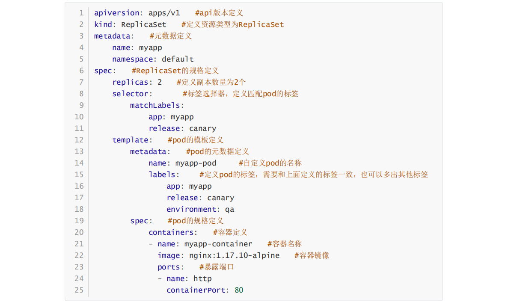

可以通过kubectl命令行方式获取更加详细信息

```shell
kubectl explain rs 
kubectl explain rs.spec 
kubectl explain rs.spec.template.spec
```

**部署ReplicaSet**

- 创建replicasetdemo.yml

  ```yaml
  #api版本定义
  apiVersion: apps/v1
  #定义资源类型为ReplicaSet
  kind: ReplicaSet
  #元数据定义
  metadata:
    name: replicasetdemo
    labels:
      app: replicasetdemo
  #ReplicaSet的规格定义
  spec:
    #定义副本数量为1个
    replicas: 1
    #pod的模板定义
    template:
      #pod的元数据定义
      metadata:
        #自定义pod的名称
        name: replicasetdemo
        #定义pod的标签，需要和上面定义的标签一致，也可以多出其他标签
        labels:
          app: replicasetdemo
      #pod的规格定义
      spec:
        #容器定义
        containers:
          #容器名称
          - name: replicasetdemo
            #容器镜像
            image: nginx:1.17.10-alpine
            imagePullPolicy: IfNotPresent
            #暴露端口
            ports:
              - containerPort: 80
        restartPolicy: Always
    #标签选择器，定义匹配pod的标签
    selector:
      matchLabels:
        app: replicasetdemo
  ```

- 执行命令

  ```shell
  #运行ReplicaSet
  kubectl apply -f replicasetdemo.yml
  #查看控制器
  kubectl get rs
  #查看pod信息
  kubectl get pod
  #查看pod详细信息
  kubectl describe pod replicasetdemo-7fdd7b5f67-5gzfg
  #测试controller控制器下的pod删除、重新被controller控制器拉起
  kubectl delete pod --all 
  kubectl get pod
  #修改pod的副本数量:通过命令行方式
  kubectl scale replicaset replicasetdemo --replicas=8 
  kubectl get rs
  #修改pod的副本数量:通过资源清单方式
  kubectl edit replicasets.apps replicasetdemo 
  kubectl get rs
  #修改pod的副本数量:通过资源清单方式 
  kubectl edit replicasets.apps replicasetdemo 
  kubectl get rs 
  #显示pod的标签 
  kubectl get pod --show-labels 
  #修改pod标签(label) 
  kubectl label pod replicasetdemo-652lc app=lagou --overwrite=True 
  #再次显示pod的标签：发现多了一个pod，原来的rs中又重新拉起一个pod，说明rs是通过label去管理pod 
  kubectl get pod --show-labels 
  #删除rs 
  kubectl delete rs replicasetdemo
  ```

- **总结**

  kubectl命令行工具适用于RC的绝大部分命令同样适用于ReplicaSet，此外，我们当前很少单独适用ReplicaSet，它主要被Deployment这个更高层的资源对象

  所使用，从而形成一整套Pod创建，删除，更新的编排机制，我们在使用Deployment时无需关心它是如何维护和创建ReplicaSet的，这一切都是自动发生的

  最后，总结一下RC（ReplicaSet）的一些特性和作用：

  - 在绝大多数情况下，我们通过定义一个RC实现Pod的创建及副本数量的自动控制

  - 在RC里包括完整的Pod定义模板

  - RC通过Label Selector机制实现对Pod副本的自动控制

  - 通过改变RC里的Pod副本数量，可以实现Pod的扩容和缩容

  - 通过改变RC里Pod模板中的镜像版本，可以实现滚动升级

#### 4.3.3、Deployment

Deployment是kubernetes在1.2版本中引入的新概念，用于更好的解决Pod的编排问题，为此，Deployment在内部使用了ReplicaSet来实现目的，我们可以把

Deployment理解为ReplicaSet的一次升级，两者的相似度超过90%

Deployment的使用场景有以下几个：

- 创建一个Deployment对象来生成对应的ReplicaSet并完成Pod副本的创建

- 检查Deployment的状态来看部署动作是否完成（Pod副本数量是否达到了预期的值）

- 更新Deployment以创建新的Pod（比如镜像升级）

- 如果当前Deployment不稳定，可以回滚到一个早先的Deployment版本

- 暂停Deployment以便于一次性修改多个PodTemplateSpec的配置项，之后在恢复Deployment，进行新的发布

- 扩展Deployment以应对高负载

- 查看Deployment的状态，以此作为发布是否成功的标志

- 清理不在需要的旧版本ReplicaSet

**Deployment模板说明**

可以通过kubectl命令行方式获取更加详细信息

```shell
kubectl explain deploy
kubectl explain deploy.spec 
kubectl explain deploy.spec.template.spec
```

##### 4.3.3.1、部署Deployment

除了API生命与Kind类型有区别，Deployment的定义与Replica Set的定义很类似。

- **创建deploymentdemo.yml**

  ```yaml
  apiVersion: apps/v1
  kind: Deployment
  metadata:
    name: deploymentdemo
    labels:
      app: deploymentdemo
  spec:
    replicas: 3
    template:
      metadata:
        name: deploymentdemo
        labels:
          app: deploymentdemo
      spec:
        containers:
          - name: deploymentdemo
            image: nginx:1.17.10-alpine
            imagePullPolicy: IfNotPresent
            ports:
              - containerPort: 80
        restartPolicy: Always
    selector:
      matchLabels:
        app: deploymentdemo
  ```

- 执行命令

  ```shell
  #创建
  kubectl apply -f deploymentdemo.yml 
  #查看deployment 
  kubectl get deployments.apps
  #查看rs
  kubectl get rs 
  #查看rs:deployment名称+hashcode码组成 查看pod 
  kubectl get pod 12345678
  ```

##### 4.3.3.2、镜像更新升级

- **命令行方式**

  ```shell
  #升级nginx镜像版本为1.18.0 
  kubectl set image deployment deploymentdemo deploymentdemo=nginx:1.18.0-alpine
  #查看pod升级情况 
  kubectl get pods -w 
  #进去某一个pod内部，查看nginx升级版本信息 
  kubectl exec -it deploymentdemo1-df6bc5d4c-flc7b sh 
  nginx -v 
  exit
  ```

- **yml文件方式**

  ```shell
  #升级nginx镜像版本为1.19.2-alpine 
  kubectl edit deployments.apps deploymentdemo 
  #查看pod升级情况 
  kubectl get pods -w 
  #进去某一个pod内部，查看nginx升级版本信息 
  kubectl exec -it deploymentdemo1-584f6b54dd-4l62t sh 
  nginx -v 
  exit
  ```

##### 4.3.3.3、Deployment扩容

- **命令行方式**

  ```shell
  kubectl scale deployment deploymentdemo --replicas=15 
  kubectl get pods
  ```

- **yml文件方式**

  ```shell
  kubectl edit deployments.apps deploymentdemo
  kubectl get pods
  ```

##### 4.3.3.4、滚动更新

- **概述**

  微服务部署：蓝绿部署、滚动部署、灰度发布、金丝雀发布。

  1. 蓝绿部署是不停老版本，部署新版本然后进行测试，确认OK，将流量切到新版本，然后老版本同时也升级到新版本。 蓝绿部署无需停机，并且风险较小

  2. 滚动发布：一般是取出一个或者多个服务器停止服务，执行更新，并重新将其投入使用。周而复始，直到集群中所有的实例都更新成新版本。 这种部署方

    式相对于蓝绿部署，更加节约资源——它不需要运行两个集群、两倍的实例数。我们可以部分部署，例如每次只取出集群的20%进行升级。

  3. 灰度发布是指在黑与白之间，能够平滑过渡的一种发布方式。AB test就是一种灰度发布方式，让一部分用户继续用A，一部分用户开始用B，如果用户对B

    没有什么反对意见，那么逐步扩大范围，把所有用户都迁移到B上面来。灰度发布可以保证整体系统的稳定，在初始灰度的时候就可以发现、调整问题，

    以保证其影响度，而我们平常所说的金丝雀部署也就是灰度发布的一种方式。

- **金丝雀发布**

  Deployment控制器支持自定义控制更新过程中的滚动节奏，如“暂停(pause)”或“继续(resume)”更新操作。比如等待第一批新的Pod资源创建完成后立即暂停

  更新过程，此时，仅存在一部分新版本的应用，主体部分还是旧的版本。然后，再筛选一小部分的用户请求路由到新版本的Pod应用，继续观察能否稳定地按

  期望的方式运行。确定没问题之后再继续完成余下的Pod资源滚动更新，否则立即回滚更新操作。这就是所谓的金丝雀发布（Canary Release） 

  ```shell
  #更新deployment的nginx:1.18.0-alpine版本，并配置暂停deployment
  kubectl set image deployment deploymentdemo deploymentdemo=nginx:1.18.0-alpine && kubectl rollout pause deployment deploymentdemo
  #观察更新状态
  kubectl rollout status deployment deploymentdemo
  #监控更新的过程，可以看到已经新增了一个资源，但是并未按照预期的状态去删除一个旧的资源，就是 因为使用了pause暂停命令
  kubectl get pods -l app=deploymentdemo -w
  #确保更新的pod没问题了，继续更新
  kubectl rollout resume deployment deploymentdemo
  #查看最后的更新情况
  kubectl get pods -l app=deploymentdemo -w
  #进去某一个pod内部，查看nginx更新版本信息
  kubectl exec -it deploymentdemo1-df6bc5d4c-flc7b sh 
  nginx -v
  exit
  ```

##### 4.3.3.5、Deployment版本回退

默认情况下，kubernetes 会在系统中保存前两次的 Deployment 的 rollout 历史记录，以便可以随时回退（您可以修改 revision history limit 来更改保存的

revision数）。

注意： 只要 Deployment 的 rollout 被触发就会创建一个 revision。也就是说当且仅当Deployment 的 Pod template（如 .spec.template ）被更改，例如更新

template 中的 label 和容器镜像时，就会创建出一个新的 revision。

其他的更新，比如扩容 Deployment 不会创建 revision——因此我们可以很方便的手动或者自动扩容。这意味着当您回退到历史 revision 时，只有 Deployment 

中的 Pod template 部分才会回退。

- **rollout常见命令**

  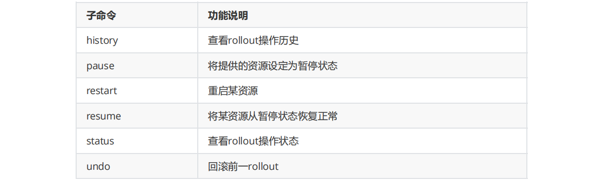

- **history操作**

  ```shell
  kubectl rollout history deployment deploymentdemo
  ```

- **status操作**

  ```shell
  kubectl rollout status deployment deploymentdemo
  ```

- **undo操作**

  ```shell
  #回滚版本信息 
  kubectl rollout undo deployment deploymentdemo
  #查看pod回滚情况 
  kubectl get pods -w 
  #进去某一个pod内部，查看nginx回滚版本信息 
  kubectl exec -it deploymentdemo1-df6bc5d4c-flc7b sh 
  nginx -v
  exit
  ```

##### 4.3.3.6、Deployment 更新策略

Deployment 可以保证在升级时只有一定数量的 Pod 是 down 的。默认的，它会确保至少有比期望的Pod数量少

一个是up状态（最多一个不可用）Deployment 同时也可以确保只创建出超过期望数量的一定数量的 Pod。默认的，它会确保最多比期望的Pod数量多一个的 Pod 

是 up 的（最多1个 surge ）

Kuberentes 版本v1.17.5中，从1-1变成25%-25% 

```shell
kubectl describe deployments.apps deploymentdemo 
#查看到属性： 
RollingUpdateStrategy: 25% max unavailable, 25% max surge
```

##### 4.3.3.7、总结

Deployment为Pod和Replica Set（下一代Replication Controller）提供声明式更新。

只需要在 Deployment 中描述想要的目标状态是什么，Deployment controller 就会帮您将 Pod 和 ReplicaSet 的实际状态改变到您的目标状态。也可以定义一个

全新的 Deployment 来创建 ReplicaSet或者删除已有的 Deployment 并创建一个新的来替换。

- **Replicas（副本数量）：**

  .spec.replicas 是可以选字段，指定期望的pod数量，默认是1。

- **Selector（选择器）：**

  .spec.selector是可选字段，用来指定 label selector ，圈定Deployment管理的pod范围。如果被指定， .spec.selector 必须匹配 

  .spec.template.metadata.labels，否则它将被API拒绝。如果.spec.selector 没有被指定， .spec.selector.matchLabels 默认

  是.spec.template.metadata.labels。 

  在Pod的template跟.spec.template不同或者数量超过了.spec.replicas规定的数量的情况下，Deployment会杀掉label跟selector不同的Pod。

- **Pod Template（Pod模板）：**

  .spec.template 是 .spec中唯一要求的字段。

  .spec.template 是 pod template. 它跟 Pod有一模一样的schema，除了它是嵌套的并且不需要apiVersion 和 kind字段。

  另外为了划分Pod的范围，Deployment中的pod template必须指定适当的label（不要跟其他controller重复了，参考selector）和适当的重启策略。

  .spec.template.spec.restartPolicy 可以设置为 Always , 如果不指定的话这就是默认配置。

- **strategy（更新策略）：**

  .spec.strategy 指定新的Pod替换旧的Pod的策略。 .spec.strategy.type 可以是"**Recreate"或者是"RollingUpdate"。"RollingUpdate"是默认值**。

  - **Recreate：** 重建式更新，就是删一个建一个。类似于ReplicaSet的更新方式，即首先删除现有的Pod对象，然后由控制器基于新模板重新创建新版本资源对象。

  - **rollingUpdate：**滚动更新，简单定义 更新期间pod最多有几个等。可以指定 maxUnavailable 和 maxSurge 来控制 rolling update 进程。

  - **maxSurge：** .spec.strategy.rollingUpdate.maxSurge 是可选配置项，用来指定可以超过期望的Pod数量的最大个数。该值可以是一个绝对值（例如5）

    或者是期望的Pod数量的百分比（例如10%）。当 MaxUnavailable 为0时该值不可以为0。通过百分比计算的绝对值向上取整。默认值是1。

    **例如，**该值设置成30%，启动rolling update后新的ReplicatSet将会立即扩容，新老Pod的总数不能超过期望的Pod数量的130%。旧的Pod被杀掉后，新

    的ReplicaSet将继续扩容，旧的ReplicaSet会进一步缩容，确保在升级的所有时刻所有的Pod数量和不会超过期望Pod数量的130%。

  - **maxUnavailable：** .spec.strategy.rollingUpdate.maxUnavailable 是可选配置项，用来指定在升级过程中不可用Pod的最大数量。该值可以是一个绝对

    值（例如5），也可以是期望Pod数量的百分比（例如10%）。通过计算百分比的绝对值向下取整。 如 果 .spec.strategy.rollingUpdate.maxSurge 为0

    时，这个值不可以为0。默认值是1。

    **例如，**该值设置成30%，启动rolling update后旧的ReplicatSet将会立即缩容到期望的Pod数量的70%。新的Pod ready后，随着新的ReplicaSet的扩容，

    旧的ReplicaSet会进一步缩容确保在升级的所有时刻可以用的Pod数量至少是期望Pod数量的70%。

  - **rollbackTo：**.spec.rollbackTo 是一个可以选配置项，用来配置Deployment回退的配置。设置该参数将触发回退操作，每次回退完成后，该值就会被清除。

  - **revision：** .spec.rollbackTo.revision 是一个可选配置项，用来指定回退到的revision。默认是0，意味着回退到上一个revision。

  - **progressDeadlineSeconds：**.spec.progressDeadlineSeconds 是可选配置项，用来指定在系统报告Deployment的failedprogressing——表现为

    resource的状态中 type=Progressing 、 Status=False 、 Reason=ProgressDeadlineExceeded 前可以等待的Deployment进行的秒数。Deployment

    controller会继续重试该Deployment。未来，在实现了自动回滚后， deployment controller在观察到这种状态时就会自动回滚。

    如果设置该参数，该值必须大于 .spec.minReadySeconds 。

  - **paused：**.spec.paused 是可以可选配置项，boolean值。用来指定暂停和恢复Deployment。Paused和没有paused的Deployment之间的唯一区别就

    是，所有对paused deployment中的PodTemplateSpec的修改都不会触发新的rollout。Deployment被创建之后默认是非paused。

#### 4.3.4、DaemonSet

DaemonSet 确保全部Node 上运行一个 Pod 的副本。当有 Node 加入集群时，也会为他们新增一个 Pod 。当有 Node 从集群移除时，这些 Pod 也会被回收。删

除 DaemonSet 将会删除它创建的所有Pod。

在每一个node节点上只调度一个Pod，因此无需指定replicas的个数，比如：

- 在每个node上都运行一个日志采集程序，负责收集node节点本身和node节点之上的各个Pod所产生的日志

- 在每个node上都运行一个性能监控程序，采集该node的运行性能数据

**DaemonSet模板说明**

可以通过kubectl命令行方式获取更加详细信息

```shell
kubectl explain daemonset 
kubectl explain daemonset.spec 
kubectl explain daemonset.spec.template.spec
```

**部署DaemonSet**

- 创建daemonsetdemo.yml

  ```yaml
  apiVersion: apps/v1
  kind: DaemonSet
  metadata:
    name: demonsetdemo
    labels:
      app: demonsetdemo
  spec:
    template:
      metadata:
        name: demonsetdemo
        labels:
          app: demonsetdemo
      spec:
        containers:
          - name: demonsetdemo
            image: nginx:1.17.10-alpine
            imagePullPolicy: IfNotPresent
            ports:
              - containerPort: 80
        restartPolicy: Always
    selector:
      matchLabels:
        app: demonsetdemo
  ```

- 执行命令

  ```shell
  #创建
  kubectl apply -f daemonsetdemo.yml
  #查看daemonset
  kubectl get daemonsets.apps 
  #查看pod
  kubectl get pod -o wide
  ```

- DaemonSet的滚动更新

  DaemonSet有两种更新策略类型：

  - OnDelete：这是向后兼容性的默认更新策略。使用 OnDelete 更新策略，在更新DaemonSet模板后，只有在手动删除旧的DaemonSet pod时才会创建新

    的DaemonSet pod。这与Kubernetes1.5或更早版本中DaemonSet的行为相同。

  - RollingUpdate：使用 RollingUpdate 更新策略，在更新DaemonSet模板后，旧的DaemonSetpod将被终止，并且将以受控方式自动创建新的

    DaemonSet pod。

#### 4.3.5、Job

- 一次性执行任务，类似Linux中的job
- 应用场景：如离线数据处理，视频解码等业务

**使用镜像**

```shell
docker pull perl:slim
```

**部署Job**

- 创建jobdemo.yml

  ```yaml
  apiVersion: batch/v1
  kind: Job
  metadata:
    name: joddemo
    labels:
      app: joddemo
  spec:
    template:
      metadata:
        name: joddemo
        labels:
          app: joddemo
      spec:
        containers:
          - name: joddemo
            image: perl:slim
            imagePullPolicy: IfNotPresent
            command: ["perl", "-Mbignum=bpi", "-wle", "print bpi(2000)"]
        restartPolicy: Never
    backoffLimit: 4
  ```

  **backoffLimit说明**

  ```apl
  .spec.backoffLimit用于设置Job的容错次数，默认值为6。当Job运行的Pod失败次数到 达.spec.backoffLimit次时，Job Controller不再新建Pod，直接停止运行这个Job，将其运行结 果标记为Failure。另外，Pod运行失败后再次运行的时间间隔呈递增状态，例如10s，20s， 40s。。。
  ```

- 执行命令

  ```shell
  #运行job
  kubectl apply -f jobdemo.yml 
  #查看pod
  kubectl get pod -w
  #查看pod日志 
  kubectl logs -f joddemo-q6jdd
  #删除job 
  kubectl delete -f jobdemo.yml
  ```

#### 4.3.6、StatefulSet

在kubernetes系统中，Pod的管理对象RC，Deployment，DaemonSet和Job都面向无状态的服务，但现实中有很多服务时有状态的，比如一些集群服务，例如

mysql集群，集群一般都会有这四个特点：

1. 每个节点都是有固定的身份ID，集群中的成员可以相互发现并通信
2. 集群的规模是比较固定的，集群规模不能随意变动
3. 集群中的每个节点都是有状态的，通常会持久化数据到永久存储中
4. 如果磁盘损坏，则集群里的某个节点无法正常运行，集群功能受损

如果你通过RC或Deployment控制Pod副本数量来实现上述有状态的集群，就会发现第一点是无法满足的，因为Pod名称和ip是随机产生的，并且各Pod中的共享

存储中的数据不能都动，因此StatefulSet在这种情况下就派上用场了，那么StatefulSet具有以下特性：

- StatefulSet里的每个Pod都有稳定，唯一的网络标识，可以用来发现集群内的其它成员，假设，StatefulSet的名称为lagou，那么第1个Pod叫lagou-0，第2个叫lagou-1，以此类推
- StatefulSet控制的Pod副本的启停顺序是受控的，操作第N个Pod时，前N-1个Pod已经是运行且准备状态
- StatefulSet里的Pod采用稳定的持久化存储卷，通过PV或PVC来实现，删除Pod时默认不会删除与StatefulSet相关的存储卷（为了保证数据的安全）

StatefulSet除了要与PV卷捆绑使用以存储Pod的状态数据，还要与Headless，Service配合使用，每个StatefulSet定义中都要生命它属于哪个Handless Service，

Handless Service与普通Service的关键区别在于，它没有Cluster IP。

### 4.4、service

通过以前的学习，我们已经能够通过Deployment来创建一组Pod来提供具有高可用性的服务。虽然每个Pod都会分配一个单独的Pod IP，然而却存在如下两问

题：

- Pod IP仅仅是集群内可见的虚拟IP，外部无法访问。

- Pod IP会随着Pod的销毁而消失，当Deployment对Pod进行动态伸缩时，Pod IP可能随时随地都会变化，这样对于我们访问这个服务带来了难度。

- Service能够提供负载均衡的能力，但是在使用上有以下限制。只提供 4 层负载均衡能力，而没有7 层功能，但有时我们可能需要更多的匹配规则来转发请求，

  这点上 4 层负载均衡是不支持的 

因此，Kubernetes中的Service对象就是解决以上问题的实现服务发现核心关键。

**Service 在 K8s 中有以下四种类型**

- ClusterIp：默认类型，自动分配一个仅 Cluster 内部可以访问的虚拟 IP

- NodePort：在 ClusterIP 基础上为 Service 在每台机器上绑定一个端口，这样就可以通过 :NodePort 来访问该服务

- LoadBalancer：在 NodePort 的基础上，借助 cloud provider 创建一个外部负载均衡器，并将请求转发到NodePort。是付费服务，而且价格不菲。

- ExternalName：把集群外部的服务引入到集群内部来，在集群内部直接使用。没有任何类型代理被创建，这只有 kubernetes 1.7 或更高版本的 kube-dns 才

  支持。

#### 4.1、详解4种 Service 类型

##### 4.1.1、Services 和 Pods

Kubernetes的Pods是有生命周期的。他们可以被创建，而且销毁不会再启动。如果您使用Deployment来运行您的应用程序，则它可以动态创建和销毁 Pod。

一个Kubernetes的Service是一种抽象，它定义了一组Pods的逻辑集合和一个用于访问它们的策略 - 有的时候被称之为微服务。一个Service的目标Pod集合通常是

由Label Selector 来决定的。

举个例子，想象一个处理图片的后端运行了三个副本。这些副本都是可以替代的 - 前端不关心它们使用的是哪一个后端。尽管实际组成后端集合的Pod可能会变

化，前端的客户端却不需要知道这个变化，也不需要自己有一个列表来记录这些后端服务。Service抽象能让你达到这种解耦。

不像 Pod 的 IP 地址，它实际路由到一个固定的目的地，Service 的 IP 实际上不能通过单个主机来进行应答。相反，我们使用 iptables（Linux 中的数据包处理逻

辑）来定义一个虚拟IP地址（VIP），它可以根据需要透明地进行重定向。当客户端连接到 VIP 时，它们的流量会自动地传输到一个合适的Endpoint。环境变量和 

DNS，实际上会根据 Service 的 VIP 和端口来进行填充。

kube-proxy支持三种代理模式: 用户空间，iptables和IPVS；它们各自的操作略有不同。

- **Userspace代理模式**

  Client Pod要访问Server Pod时,它先将请求发给本机内核空间中的service规则，由它再将请求,转给监听在指定套接字上的kube-proxy，kube-proxy处理完请

  求，并分发请求到指定Server Pod后,再将请求递交给内核空间中的service,由service将请求转给指定的Server Pod。由于其需要来回在用户空间和内核空间交

  互通信，因此效率很差 。

  当一个客户端连接到一个 VIP，iptables 规则开始起作用，它会重定向该数据包到 Service代理 的端口。Service代理 选择一个 backend，并将客户端的流量代

  理到 backend 上。

  这意味着 Service 的所有者能够选择任何他们想使用的端口，而不存在冲突的风险。客户端可以简单地连接到一个 IP 和端口，而不需要知道实际访问了哪些 

  Pod。

- **iptables代理模式**

  当一个客户端连接到一个 VIP，iptables 规则开始起作用。一个 backend 会被选择（或者根据会话亲和性，或者随机），数据包被重定向到这个 backend。不

  像 userspace 代理，数据包从来不拷贝到用户空间，kube-proxy 不是必须为该 VIP 工作而运行，并且客户端 IP 是不可更改的。当流量打到 Node 的端口上，

  或通过负载均衡器，会执行相同的基本流程，但是在那些案例中客户端 IP 是可以更改的。

- **IPVS代理模式**

  在大规模集群（例如10,000个服务）中，iptables 操作会显着降低速度。IPVS 专为负载平衡而设计，并基于内核内哈希表。因此，您可以通过基于 IPVS 的 

  kube-proxy 在大量服务中实现性能一致性。同时，基于 IPVS 的 kube-proxy 具有更复杂的负载平衡算法（最小连接，局部性，加权，持久性）。

  在 Kubernetes 集群中，每个 Node 运行一个 kube-proxy 进程。 kube-proxy 负责为 Service 实现了一种VIP（虚拟 IP）的形式，而不是 ExternalName 的形

  式。 在 Kubernetes v1.0 版本，代理完全在userspace。在Kubernetes v1.1 版本，新增了 iptables 代理，但并不是默认的运行模式。 从 Kubernetes v1.2 

  起，默认就是iptables 代理。 在 Kubernetes v1.8.0-beta.0 中，添加了 ipvs 代理在 Kubernetes 1.14 版本开始默认使用 ipvs 代理。在 Kubernetes v1.0 版

  本， Service 是 “4层”（TCP/UDP over IP）概念。 在Kubernetes v1.1 版本，新增了Ingress API（beta 版），用来表示 “7层”（HTTP）服务 。

  这种模式，kube-proxy 会监视 Kubernetes Service 对象和 Endpoints ，调用 netlink 接口以相应地创建ipvs 规则并定期与 Kubernetes Service 对象和 

  Endpoints 对象同步 ipvs 规则，以确保 ipvs 状态与期望一致。访问服务时，流量将被重定向到其中一个后端 Pod与 iptables 类似，ipvs 于 netfilter 的 

  hook 功能，但使用哈希表作为底层数据结构并在内核空间中工作。这意味着 ipvs 可以更快地重定向流量，并且在同步代理规则时具有更好的性能。此外，

  ipvs 为负载均衡算法提供了更多选项。 

##### 4.1.2、ClusterIP

类型为ClusterIP的service，这个service有一个Cluster-IP，其实就一个VIP。具体实现原理依靠kubeproxy组件，通过iptables或是ipvs实现。

clusterIP 主要在每个 node 节点使用 iptables，将发向 clusterIP 对应端口的数据，转发到 kube-proxy中。然后 kube-proxy 自己内部实现有负载均衡的方法，并

可以查询到这个 service 下对应 pod 的地址和端口，进而把数据转发给对应的 pod 的地址和端口。

**这种类型的service 只能在集群内访问。**

**使用镜像** 

```shell
docker pull tomcat:9.0.20-jre8-alpine
```

**部署service**

- 创建clusteripdemo.yml

  ```yaml
  apiVersion: apps/v1
  kind: Deployment
  metadata:
    name: clusteripdemo
    labels:
      app: clusteripdemo
  spec:
    replicas: 1
    template:
      metadata:
        name: clusteripdemo
        labels:
          app: clusteripdemo
      spec:
        containers:
          - name: clusteripdemo
            image: tomcat:9.0.20-jre8-alpine
            imagePullPolicy: IfNotPresent
            ports:
              - containerPort: 8080
        restartPolicy: Always
    selector:
      matchLabels:
        app: clusteripdemo
  ---
  apiVersion: v1
  kind: Service
  metadata:
    name: clusteripservice
  spec:
    selector:
      app: clusteripdemo
    ports:
      - port: 8080
        targetPort: 8080
    type: ClusterIP
  ```

- 执行命令

  ```shell
  #运行服务
  kubectl apply -f clusteripdemo.yml
  #查看服务
  kubectl get service
  #查看控制器
  kubectl get deployments.apps
  #查看pod
  kubectl get pod -o wide
  #服务内部调用（这时外部不能调用）
  curl 10.81.135.158:8080
  #删除
  kubectl delete -f clusteripdemo.yml
  ```

##### 4.1.3、NodePort

我们的场景不全是集群内访问，也需要集群外业务访问。那么ClusterIP就满足不了了。NodePort当然是其中的一种实现方案。nodePort 的原理在于在 node 上开

了一个端口，将向该端口的流量导入到kube-proxy，然后由 kube-proxy 进一步到给对应的 pod 。

**使用镜像** 

```shell
docker pull tomcat:9.0.20-jre8-alpine
```

**部署service**

- 创建nodeportdemo.yml

  ```yaml
  apiVersion: apps/v1
  kind: Deployment
  metadata:
    name: nodeportdemo
    labels:
      app: nodeportdemo
  spec:
    replicas: 1
    template:
      metadata:
        name: nodeportdemo
        labels:
          app: nodeportdemo
      spec:
        containers:
          - name: nodeportdemo
            image: tomcat:9.0.20-jre8-alpine
            imagePullPolicy: IfNotPresent
            ports:
              - containerPort: 8080
        restartPolicy: Always
    selector:
      matchLabels:
        app: nodeportdemo
  ---
  apiVersion: v1
  kind: Service
  metadata:
    name: nodeportservice
  spec:
    selector:
      app: nodeportdemo
    ports:
      - port: 8080
        targetPort: 8080
        nodePort: 30088
    type: NodePort
  ```

- 执行命令

  ```shell
  #创建服务
  kubectl apply -f nodeportdemo.yml
  #查看服务
  kubectl get service
  #查看控制器
  kubectl get deployments.apps
  #查看pod
  kubectl get pod -o wide
  #外部访问
  http://192.168.81.120:30088/
  http://192.168.81.121:30088/
  http://192.168.81.122:30088/
  http://192.168.81.123:30088/
  ```

##### 4.1.4、LoadBalancer

LoadBalancer类型的service 是可以实现集群外部访问服务的另外一种解决方案。不过并不是所有的k8s集群都会支持，大多是在公有云托管集群中会支持该类

型。负载均衡器是异步创建的，关于被提供的负载均衡器的信息将会通过Service的status.loadBalancer字段被发布出去。

创建 LoadBalancer service 的yaml 如下：

```yaml
apiVersion: v1
kind: Service
metadata:
  name: loadbalancer-service
spec:
  selector:
    app: loadbalancer-service
  ports:
    - port: 80
      protocol: TCP
      targetPort: 443
      nodePort: 30088
  type: NodePort
```

##### 4.1.5、ExternalName

类型为 ExternalName 的service将服务映射到 DNS 名称，而不是典型的选择器，例如my-service或者cassandra。您可以使用spec.externalName参数指定这些

服务。

这种类型的 Service 通过返回 CNAME 和它的值，可以将服务映射到 externalName 字段的内容( 例如：hub.lagouedu.com )。ExternalName Service 是 Service 

的特例，它没有 selector，也没有定义任何的端口和Endpoint。相反的，对于运行在集群外部的服务，它通过返回该外部服务的cname(别名)这种方式来提供服务 

创建 ExternalName 类型的服务的 yaml 如下：

```yaml
apiVersion: v1
kind: Service
metadata:
  name: ExternalName-service
spec:
  ports:
    - port: 80
      protocol: TCP
      targetPort: 443
      nodePort: 30088
  type: ExternalName
  externalName: www.abc.com
```

#### 4.2、ingress网络

##### 4.2.1、什么是Ingress？

K8s集群对外暴露服务的方式目前只有三种：loadblancer、nodeport、ingress。前两种熟悉起来比较快，而且使用起来也比较方便，前面课程已经讲解过两种技

术。在此就不进行介绍了。

下面详细讲解下ingress这个服务，ingress由两部分组成：ingress controller和ingress服务。

其中ingress controller目前主要有两种：基于nginx服务的ingress controller和基于traefifik的ingress controller。

而其中traefik的ingress controller，目前支持http和https协议。由于对nginx比较熟悉，而且需要使用TCP负载，所以在此我们选择的是基于nginx服务的

ingress controller。 

在kubernetes集群中，我们知道service和pod的ip仅在集群内部访问。如果外部应用要访问集群内的服务，集群外部的请求需要通过负载均衡转发到service在

Node上暴露的NodePort上，然后再由kube-proxy组件将其转发给相关的pod。 

而Ingress就是为进入集群的请求提供路由规则的集合，通俗点就是提供外部访问集群的入口，将外部的HTTP或者HTTPS请求转发到集群内部service上。

##### 4.2.2、Ingress-nginx组成

Ingress-nginx一般由三个组件组成：

- 反向代理负载均衡器：通常以service的port方式运行，接收并按照ingress定义的规则进行转发，常用的有nginx，Haproxy，Traefik等，本次实验中使用的就

  是nginx。

- Ingress Controller：监听APIServer，根据用户编写的ingress规则（编写ingress的yaml文件），动态地去更改nginx服务的配置文件，并且reload重载使其生

  效，此过程是自动化的（通过lua脚本来实现）。

- Ingress：将nginx的配置抽象成一个Ingress对象，当用户每添加一个新的服务，只需要编写一个新的ingress的yaml文件即可。

##### 4.2.3、Ingress-nginx的工作原理

1. ingress controller通过和kubernetes api交互，动态的去感知集群中ingress规则变化。然后读取它，按照自定义的规则，规则就是写明了那个域名对应哪个

  service，生成一段nginx配置。

2. 再写到nginx-ingress-controller的pod里，这个Ingress controller的pod里运行着一个Nginx服务，控制器会把生成的nginx配置写入/etc/nginx.conf文件中。

  然后reload一下使配置生效，以此达到分配和动态更新问题。

##### 4.2.4、官网地址

基于nginx服务的ingress controller根据不同的开发公司，又分为k8s社区的ingres-nginx和nginx公司的nginx-ingress。

```apl
#Ingress-Nginx github 地址： 
https://github.com/kubernetes/ingress-nginx 
#Ingress-Nginx 官方网站： 
https://kubernetes.github.io/ingress-nginx/
```

- **下载资源文件**

  根据github上的活跃度和关注人数，我们选择的是k8s社区的ingres-nginx。

  **下载ingrees-controller**

  ```apl
  #打开github官网：选择某一个具体版本后进入deploy/static/目录中，复制mandatory.yaml文件 内容。 
  https://github.com/kubernetes/ingress-nginx/tree/nginx- 0.30.0/deploy/static/mandatory.yaml
  ```

  **下载ingress服务**

  ```apl
  https://github.com/kubernetes/ingress-nginx/blob/nginx- 0.30.0/deploy/static/provider/baremetal/service-nodeport.yaml
  ```

- **下载镜像**

  需要将镜像pull到k8s集群各个node节点

  ```shell
  #拉取镜像
  docker pull registry.cn-hangzhou.aliyuncs.com/google_containers/nginx-ingress-controller:0.30.0
  #修改标签名称
  docker tag registry.cn-hangzhou.aliyuncs.com/google_containers/nginx-ingress-controller:0.30.0 quay.io/kubernetes-ingress-controller/nginx-ingress-controller:0.30.0
  #删除镜像
  docker rmi -f registry.cn-hangzhou.aliyuncs.com/google_containers/nginx-ingress-controller:0.30.0
  ```

##### 4.2.5、ingress与ingress-controller

要理解ingress，需要区分两个概念，ingress和ingress-controller： 

- ingress对象：

  指的是k8s中的一个api对象，一般用yaml配置。作用是定义请求如何转发到service的规则，可以理解为配置模板。

- ingress-controller：

  具体实现反向代理及负载均衡的程序，对ingress定义的规则进行解析，根据配置的规则来实现请求转发。

简单来说，ingress-controller才是负责具体转发的组件，通过各种方式将它暴露在集群入口，外部对集群的请求流量会先到ingress-controller，而ingress对象是

用来告诉ingress-controller该如何转发请求，比如哪些域名哪些path要转发到哪些服务等等。

- **ingress-controller**

  ingress-controller并不是k8s自带的组件，实际上ingress-controller只是一个统称，用户可以选择不同的ingress-controller实现，目前，由k8s维护的

  ingress-controller只有google云的GCE与ingress-nginx两个，其他还有很多第三方维护的ingress-controller，具体可以参考官方文档。但是不管哪一种

  ingress-controller，实现的机制都大同小异，只是在具体配置上有差异。一般来说，ingress-controller的形式都是一个pod，里面跑着daemon程序和反向代

  理程序。daemon负责不断监控集群的变化，根据ingress对象生成配置并应用新配置到反向代理，比如nginx-ingress就是动态生成nginx配置，动态更新

  upstream，并在需要的时候reload程序应用新配置。

- **ingress**

  ingress是一个API对象，和其他对象一样，通过yaml文件来配置。ingress通过http或https暴露集群内部service，给service提供外部URL、负载均衡、

  SSL/TLS能力以及基于host的方向代理。ingress要依靠ingress-controller来具体实现以上功能。

##### 4.2.6、ingress网络实验一

**使用镜像**

```shell
docker pull tomcat:9.0.20-jre8-alpine 
docker pull quay.io/kubernetes-ingress-controller/nginx-ingress-controller:0.30.0
```

- **运行ingress-controller**

  从官网下载的mandatory.yml文件

  ```shell
  #在mandatory.yaml文件的Deployment资源中增加属性sepc.template.sepc.hostNetWork 
  hostNetwork: true 
  #hostNetwork网络，这是一种直接定义Pod网络的方式。如果在Pod中使用hostNetwork:true配置网 络，那么Pod中运行的应用程序可以直接使用node节点的端口 
  #运行ingress/mandatory.yaml文件 
  kubectl apply -f mandatory.yaml
  ```

- **运行ingress服务**

  从官网下载的service-nodeport.yaml文件

  ```shell
  #运行service-nodeport.yaml文件 
  kubectl apply -f service-nodeport.yaml
  ```

- **部署tomcat-服务**

  创建tomcat-service.yml

  ```yaml
  apiVersion: apps/v1
  kind: Deployment
  metadata:
    name: tomcat-deployment
    labels:
      app: tomcat-deployment
  spec:
    replicas: 1
    template:
      metadata:
        name: tomcat-deployment
        labels:
          app: tomcat-deployment
      spec:
        containers:
          - name: tomcat-deployment
            image: tomcat:9.0.20-jre8-alpine
            imagePullPolicy: IfNotPresent
            ports:
              - containerPort: 8080
        restartPolicy: Always
    selector:
      matchLabels:
        app: tomcat-deployment
  ---
  apiVersion: v1
  kind: Service
  metadata:
    name: tomcat-svc
  spec:
    selector:
      app: tomcat-deployment
    ports:
      - port: 8080
        targetPort: 8080
        nodePort: 30088
    type: NodePort
  ```

  执行命名

  ```shell
  kubectl apply -f tomcat-service.yml
  ```

- **部署ingress规则文件**

  创建ingress-tomcat.yml文件

  ```yaml
  apiVersion: extensions/v1beta1
  kind: Ingress
  metadata:
    name: nginx-ingress-test
  spec:
    backend:
      serviceName: tomcat-svc
      servicePort: 8080
  ```

  执行命名

  ```shell
  kubectl apply -f ingress-tomcat.yml
  ```

- 进行测试查看

  前面的yml文件不想单带执行，可以执行命名

  ```shell
  #执行当前目录下所有yml文件
  kubectl apply -f .
  #查看ingress 
  kubectl get ingress 
  #查看ingress服务:查看service的部署端口号 
  kubectl get svc -n ingress-nginx 
  #查看ingress-controller运行在那个node节点 
  kubectl get pod -n ingress-nginx -o wide
  #通过ingress访问tomcat，当前方式只能在某一个节点进行访问
  http://192.168.81.120:31188/
  ```

##### 4.2.7、ingress网络实验二

上边案例的部署方式只能通过ingress-controller部署的节点访问。集群内其他节点无法访问ingress规则。本章节通过修改mandatory.yaml文件的控制类类型，让

集群内每一个节点都可以正常访问ingress规则。

- **ingress-controller**

  修改mandatory.yaml

  ```yaml
  #修改mandatory.yaml配置文件 
  #1.将Deployment类型控制器修改为：DaemonSet 
  #2.属性：replicas: 1 # 删除这行
  ```

- **service-nodeport固定端口**

  修改service-nodeport.yml

  ```yaml
  apiVersion: v1
  kind: Service
  metadata:
    name: ingress-nginx
    namespace: ingress-nginx
    labels:
      app.kubernetes.io/name: ingress-nginx
      app.kubernetes.io/part-of: ingress-nginx
  spec:
    type: NodePort
    ports:
      - name: http
        port: 80
        targetPort: 80
        nodePort: 31188
        protocol: TCP
      - name: https
        port: 443
        targetPort: 443
        nodePort: 30443
        protocol: TCP
    selector:
      app.kubernetes.io/name: ingress-nginx
      app.kubernetes.io/part-of: ingress-nginx
  ```

- **域名访问ingress规则**

  修改ingress-tomcat.yml

  ```yaml
  apiVersion: extensions/v1beta1
  kind: Ingress
  metadata:
    name: nginx-ingress-test
  spec:
    rules:
      - host: ingress-tomcat.thm.com
        http:
          paths:
            - path: /
              backend:
                serviceName: tomcat-svc
                servicePort: 8080  #是pod容器的端口
  ```

- **修改宿主机hosts文件**

  C:\Windows\System32\drivers\etc\hosts

  ```apl
  192.168.81.120 ingress-tomcat.thm.com
  ```

- **部署服务**

  ```shell
  kubectl apply -f .
  ```

- **测试**

  ```shell
  http://ingress-tomcat.thm.com:31188/
  ```

- **nginx-controller原理**

  ```shell
  #查看ingress-nginx 命名空间下的pod 
  kubectl get pods -n ingress-nginx 
  #进入ingress-nginx 的pod 
  kubectl exec -it nginx-ingress-controller-5gt4l -n ingress-nginx sh 
  #查看nginx反向代理域名ingress-tomcat.lagou.com 
  cat nginx.conf
  ```

### 4.5、volume(存储)

**准备镜像**

k8s集群每个node节点需要下载镜像：

```shell
docker pull mariadb:10.5.2
```

#### 4.5.1、安装mariaDB

- **创建mariadb.yml**

  ```yaml
  apiVersion: apps/v1
  kind: Deployment
  metadata:
    name: mariadb
    labels:
      app: mariadb
  spec:
    replicas: 1
    template:
      metadata:
        name: mariadb
        labels:
          app: mariadb
      spec:
        containers:
          - name: mariadb
            image: mariadb:10.5.2
            imagePullPolicy: IfNotPresent
            env:
              - name: MYSQL_ROOT_PASSWORD
                value: root #这是root 用户的密码
              - name: TZ #设置时区
                value: Asia/Shanghai
            args: #设置编码格式
              - "--character-set-server=utf8mb4"
              - "--collation-server=utf8mb4_unicode_ci"
            ports:
              - containerPort: 3306
        restartPolicy: Always
    selector:
      matchLabels:
        app: mariadb
  ---
  apiVersion: v1
  kind: Service
  metadata:
    name: mariadb-service
  spec:
    selector:
      app: mariadb
    ports:
      - port: 3306
        targetPort: 3306
        nodePort: 30036
    type: NodePort
  ```

- **部署service**

  ```shell
  kubectl apply -f . 
  kubectl get pod -o wide
  ```

- **客户端测试**

  使用客户端连接工具进行连接测试

- **删除服务**

  ```shell
  kubectl delete -f mariadb.yml
  ```

#### 4.5.2、secret（密钥）

Secret 解决了密码、token、密钥等敏感数据的配置问题，而不需要把这些敏感数据暴露到镜像或者 Pod Spec中。Secret 可以以 Volume 或者环境变量的方式使用 。

 Secret 有三种类型： 

- Service Account ：用来访问 Kubernetes API，由 Kubernetes 自动创建，并且会自动挂载到 Pod的/run/secrets/kubernetes.io/serviceaccount 目录中。

- Opaque ：base64编码格式的Secret，用来存储密码、密钥等

- kubernetes.io/dockerconfigjson ：用来存储私有 docker registry 的认证信息 

##### 4.5.2.1、Service Account

Service Account简称sa， Service Account 用来访问 Kubernetes API，由 Kubernetes 自动创建，并且会自动挂载到 Pod

的/run/secrets/kubernetes.io/serviceaccount 目录中。

```shell
#查询命名空间为kube-system的pod信息 
kubectl get pod -n kube-system 
#进入pod:kube-proxy-48bz4 
kubectl exec -it kube-proxy-48bz4 -n kube-system sh 
cd /run/secrets/kubernetes.io/serviceaccount 
ls
cat ca.crt 
cat namespace 
cat token
exit
```

##### 4.5.2.2、Opaque Secret

Opaque 类型的数据是一个 map 类型，要求 value 是 base64 编码格式。

- **加密、解密**

  使用命令行方式对需要加密的字符串进行加密。例如:mysql数据库的密码。

  ```shell
  #对root字符串进行base64加密:获得root的加密字符串"cm9vdA=="
  echo -n "root" | base64
  base64解密：对加密后的字符串进行解密
  echo -n cm9vdA== | base64 -d
  ```

- **mariadb数据库密码进行加密**

  创建servet-maria.yml

  ```yaml
  apiVersion: v1
  kind: Secret
  metadata:
    name: mariadbsecret
  type: Opaque
  data:
    #mariadb的用户名root加密，用于演示，无实际效果
    username: cm9vdA==
    password: cm9vdA==
  ```

- **修改mariadb的service**

  修改mariadb.yml

  ```yaml
  apiVersion: apps/v1
  kind: Deployment
  metadata:
    name: mariadb
    labels:
      app: mariadb
  spec:
    replicas: 1
    template:
      metadata:
        name: mariadb
        labels:
          app: mariadb
      spec:
        containers:
          - name: mariadb
            image: mariadb:10.5.2
            imagePullPolicy: IfNotPresent
            env:
              - name: MYSQL_ROOT_PASSWORD
                #密码引用其他资源
                valueFrom:
                  secretKeyRef:
                    key: password
                    name: mariadbsecret
              - name: TZ #设置时区
                value: Asia/Shanghai
            args: #设置编码格式
              - "--character-set-server=utf8mb4"
              - "--collation-server=utf8mb4_unicode_ci"
            ports:
              - containerPort: 3306
        restartPolicy: Always
    selector:
      matchLabels:
        app: mariadb
  ---
  apiVersion: v1
  kind: Service
  metadata:
    name: mariadb-service
  spec:
    selector:
      app: mariadb
    ports:
      - port: 3306
        targetPort: 3306
        nodePort: 30036
    type: NodePort
  ```

- **运行service**

  ```shell
  kubectl apply -f . 
  kubectl get secret 
  kubectl get svc
  ```

- **测试**

  ```shell
  IP:192.168.81.120 
  username:root 
  password:root 
  prot: 30036
  ```

- **删除**

  ```shell
  kubectl delete -f . 
  kubectl get secret 
  kubectl get svc
  ```

##### 4.5.2.3、docker compose安装

- **下载**

  ```shell
  https://github.com/docker/compose 
  #下载版本：1.29.2
  ```

- **授权**

  ```shell
  #移动文件到指定目录
  mv /data/docker-compose-Linux-x86_64 /usr/local/bin/docker-compose 
  #或者
  cp /data/docker-compose-Linux-x86_64 /usr/local/bin/docker-compose
  #进行授权
  chmod +x /usr/local/bin/docker-compose 
  #开发环境可以授予最高权限
  chmod 777 /usr/local/bin/docker-compose
  #检查安装情况以及版本
  docker-compose -v 
  docker-compose --version 
  docker-compose version
  ```

- **卸载docker-compose**

  docker-compose卸载只需要删除二进制文件就可以了。

  ```shell
  rm -rf /usr/local/bin/docker-compose 
  reboot
  ```

##### 4.5.2.4、harbor私服

- **harbor官网地址**

  ```shell
  #harbor官网地址： 
  https://goharbor.io/ 
  #github官网地址： 
  https://github.com/goharbor/harbor 
  #官方帮助文档： 
  https://github.com/goharbor/harbor/blob/v1.9.4/docs/installation_guide.md
  ```

- **前置检查**

  - 安装docker
  - 安装docker-compose

  注意版本要求

- **安装harbor**

  ```shell
  #1、到github上下载harbor离线安装包（当前版本 v2.1.5）
  #2、上传到指定目标
  #3、进行解压
  tar -zxvf harbor-offline-installer-v2.1.5_2.tgz
  #4、进入解压目录
  cd harbor/
  #5、修改配置文件harbor.yml
  cp harbor.yml.tmpl harbor.yml
  vi harbor.yml
  	#内容
  	#5.1、修改私服镜像地址
  	hostname: 192.168.81.120
  	#5.2、修改镜像地址访问端口号
  	port: 5000
  	#5.3、harbor管理员登录系统密码 保持默认即可
  	harbor_admin_password: Harbor12345
  	#5.4、修改harbor映射卷目录
  	data_volume: /data/harborvolumes
  	#5.5、如果https是开放的请注释
  #6、启动harbor
  ./install.sh
  #7、浏览器访问harbor私服
  http://192.168.81.120:5000 
  username: admin
  password: Harbor12345
  ```

- **在harbor中新建项目**

  ```shell
  #登陆
  http://192.168.81.120:5000 
  username: admin
  password: Harbor12345
  #新建项目
  thm-registry
  ```

- **添加私服仓库地址**

  在192.168.81.120主机上进行添加

  ```shell
  #编辑配置文件 
  vi /etc/docker/daemon.json
  #增加仓库配置信息 
  { "insecure-registries":["192.168.81.120:5000"] }
  #示例
  {
  "registry-mirrors": ["https://cmwmjcql.mirror.aliyuncs.com"],
  "insecure-registries":["192.168.81.120:5000"]
  }
  
  #重启docker 
  systemctl daemon-reload 
  systemctl restart docker 
  #查看docker信息确认仓库是否添加 
  docker info
  ```

- **登录私服**

  在192.168.81.120主机上进行登陆

  ```shell
  #登陆
  docker login -u admin -p Harbor12345 192.168.81.120:5000 
  #退出私服 
  docker logout 192.168.81.120:5000
  ```

- **上传下载镜像**

  ```shell
  docker tag mariadb:10.5.2 192.168.81.120:5000/thm-registry/mariadb:10.5.2 
  docker push 192.168.81.120:5000/thm-registry/mariadb:10.5.2 
  docker rmi -f 192.168.81.120:5000/thm-registry/mariadb:10.5.2
  ```

- **注册私服**

  使用 Kuberctl 创建 docker registry 认证的 secret 

  ```shell
  #语法规则：
  kubectl create secret docker-registry myregistrykey --docker- server=REGISTRY_SERVER --docker-username=DOCKER_USER --docker- password=DOCKER_PASSWORD --docker-email=DOCKER_EMAIL 
  #例子： 
  kubectl create secret docker-registry thm-registry --docker-server=192.168.81.120:5000 --docker-username=admin --docker-password=Harbor12345 --docker-email=harbor@thm.com
  #k8s集群其余工作节点配置docker私服地址： 
  vi /etc/docker/daemon.json 
  {"insecure-registries":["192.168.198.155:5000"]}
  #重启docker服务： 
  systemctl daemon-reload 
  systemctl restart docker
  ```

- **secret升级mariadb**

  将mariadb镜像修改为harbor私服地址。 在创建 Pod 的时候，通过 imagePullSecrets 来引用刚创建的myregistrykey

  mariadb.yml

  ```yaml
  apiVersion: apps/v1
  kind: Deployment
  metadata:
    name: mariadb
    labels:
      app: mariadb
  spec:
    replicas: 1
    template:
      metadata:
        name: mariadb
        labels:
          app: mariadb
      spec:
        imagePullSecrets:
          - name: thm-registry
        containers:
          - name: mariadb
            image: 192.168.81.120:5000/thm-registry/mariadb:10.5.2
            imagePullPolicy: IfNotPresent
            env:
              - name: MYSQL_ROOT_PASSWORD
                #密码引用其他资源
                valueFrom:
                  secretKeyRef:
                    key: password
                    name: mariadbsecret
              - name: TZ #设置时区
                value: Asia/Shanghai
            args: #设置编码格式
              - "--character-set-server=utf8mb4"
              - "--collation-server=utf8mb4_unicode_ci"
            ports:
              - containerPort: 3306
        restartPolicy: Always
    selector:
      matchLabels:
        app: mariadb
  ---
  apiVersion: v1
  kind: Service
  metadata:
    name: mariadb-service
  spec:
    selector:
      app: mariadb
    ports:
      - port: 3306
        targetPort: 3306
        nodePort: 30036
    type: NodePort
  ```

  servet-maria.yml

  ```yaml
  apiVersion: v1
  kind: Secret
  metadata:
    name: mariadbsecret
  type: Opaque
  data:
    #mariadb的用户名root加密，用于演示，无实际效果
    username: cm9vdA==
    password: cm9vdA==
  ```

- **测试**

  ```shell
  IP:192.168.81.120 
  username:root 
  password:root 
  prot: 30036
  ```

- **删除**

  ```shell
  kubectl delete -f .
  ```

#### 4.5.3、configmap

ConfigMap顾名思义，是用于保存配置数据的键值对，可以用来保存单个属性，也可以保存配置文件。ConfigMaps允许你将配置构件与映像内容解耦，以保持容

器化应用程序的可移植性。configmap 可以从文件、目录或者 key-value 字符串创建等创建 ConfigMap。也可以通过 kubectl create -f从描述文件创建。可以使用 

kubectl create创建命令。创建ConfigMap的方式有4种：

1. 直接在命令行中指定configmap参数创建，即--from-literal。 
2. 指定文件创建，即将一个配置文件创建为一个ConfigMap--from-file=<文件> 
3. 指定目录创建，即将一个目录下的所有配置文件创建为一个ConfigMap，--from-file=<目录> 
4.  先写好标准的configmap的yaml文件，然后kubectl create -f 创建

##### 4.5.3.1、命令行方式

从key-value字符串创建，官方翻译是从字面值中创建ConfigMap。

- **语法规则**

  ```shell
  kubectl create configmap map的名字 --from-literal=key=value 
  #如果有多个key，value。可以继续在后边写 
  kubectl create configmap map的名字 
  	--from-literal=key1=value1 
  	--from-literal=key2=value2 
  	--from-literal=key3=value4
  ```

- **案例**

  ```shell
  #创建configmap
  kubectl create configmap helloconfigmap --from-literal=lagou.hello=world
  #查看configmap
  kubectl get configmap helloconfigmap -o go-template='{{.data}}'
  ```

  >在使用kubectl get获取资源信息的时候,可以通过-o(--output简写形式)指定信息输出的格式,如果 指定的是yaml或者json输出的是资源的完整信息,实际工
  >
  >作中,输出内容过少则得不到我们想要的信息,输 出内容过于详细又不利于快速定位的我们想要找到的内容,其实-o输出格式可以指定为go-template然后 指
  >
  >定一个template,这样我们就可以通过go-template获取我们想要的内容.go-template与 kubernetes无关,它是go语言内置的一种模板引擎.这里不对go-
  >
  >template做过多解释,仅介绍在 kubernetes中获取资源常用的语法,想要获取更多内容,大家可以参考相关资料获取帮助。大家记住是固 定语法即可。 

##### 4.5.3.2、配置文件方式

- **语法规则**

  ```shell
  #语法规则如下：当 --from-file指向一文件，key的名称是文件名称，value的值是这个文件的内容。 
  kubectl create configmap cumulx-test --from-file=xxxx
  ```

- **案例**

  创建一个配置文件:jdbc.properties

  vi jdbc.properties 

  ```properties
  jdbc.driverclass=com.mysql.jdbc.Driver 
  jdbc.url=jdbc:mysql://localhost:3306/test 
  jdbc.username=root 
  jdbc.password=admin
  ```

  ```shell
  #创建configmap换用其他方式查看信息 
  kubectl create configmap myjdbcmap --from-file=jdbc.properties 
  #查看configmap详细信息 
  kubectl describe configmaps myjdbcmap
  ```

##### 4.5.3.3、目录方式

- **语法规则**

  ```apl
  #语法规则如下：当 --from-file指向一个目录，每个目录中的文件直接用于填充ConfigMap中的 key,key的名称是文件名称，value的值是这个文件的内容。下面的命令读取/data目录下的所有文件 
  kubectl create configmap cumulx-test --from-file=/data/
  ```

- **案例**

  ```sh
  kubectl create configmap myjdbcconfigmap --from-file=/data/jdbc.properties 
  #查看configmap详细信息 
  kubectl describe configmaps myjdbcmap
  ```

##### 4.5.3.4、资源文件方式

- **创建yml文件**

  ```yaml
  
  ```

- **运行yml文件**

  ```shell
  kubectl apply -f mariadb-configmap.yml 
  #查看configmap详细信息 
  kubectl describe configmaps mariadbconfigmap
  ```

##### 4.5.3.5、configmap升级mariadb

- **获得my.cnf文件**

  ```shell
  #运行测试镜像： 
  docker run --name some-mariadb -e MYSQL_ROOT_PASSWORD=my-secret-pw -d 192.168.81.120:5000/thm-registry/mariadb:10.5.2
  #将my.cnf文件从容器中复制到/data目录 
  docker cp some-mariadb:/etc/mysql/my.cnf /data 
  #停止容器 
  docker stop some-mariadb 
  #删除容器 
  docker rm some-mariadb 
  #删除镜像 
  docker rmi -f 192.168.81.120:5000/thm-registry/mariadb:10.5.2
  #更改my.cnf文件中的端口号为：3307
  ```

- **生成configmap文件**

  ```shell
  #将my.cnf文件中mariadb数据库启动端口号修改为3307，将my.cnf文件上传master节点，首先通过命 令行方式生成configmap资源。再通过命令行方式将configmap反向生成yaml文件。将生成文件copy回 idea开发工具。修改yaml文件备用。 
  kubectl create configmap mysqlini --from-file=my.cnf 
  kubectl get configmap mysqlini -o yaml > mariadbconfigmap.yml
  ```

- **全部资源文件清单**

  - **sercet-maria.yml**

    ```yaml
    apiVersion: v1
    kind: Secret
    metadata:
      name: mariadbsecret
    type: Opaque
    data:
      #mariadb的用户名root加密，用于演示，无实际效果
      username: cm9vdA==
      password: cm9vdA==
    ```

  - **mariadb.yml**

    **需要再次整理，加入私服镜像信息**

    注意修改pod的端口号为3307，service的targetPort端口号为3307

    ```yaml
    apiVersion: apps/v1
    kind: Deployment
    metadata:
      name: mariadb
      labels:
        app: mariadb
    spec:
      replicas: 1
      template:
        metadata:
          name: mariadb
          labels:
            app: mariadb
        spec:
          imagePullSecrets:
            - name: thm-registry
          containers:
            - name: mariadb
              image: 192.168.81.120:5000/thm-registry/mariadb:10.5.2
              imagePullPolicy: IfNotPresent
              env:
                - name: MYSQL_ROOT_PASSWORD
                  #密码引用其他资源
                  valueFrom:
                    secretKeyRef:
                      key: password
                      name: mariadbsecret
                - name: TZ #设置时区
                  value: Asia/Shanghai
              args: #设置编码格式
                - "--character-set-server=utf8mb4"
                - "--collation-server=utf8mb4_unicode_ci"
              volumeMounts:
                - mountPath: /etc/mysql/mariadb.conf.d/ #容器内的挂载目录
                  name: lagoumariadb #随便给一个名字,这个名字必须与volumes.name一致
              ports:
                - containerPort: 3307
          restartPolicy: Always
          volumes:
            - name: lagoumariadb
              configMap:
                name: mysqlini
      selector:
        matchLabels:
          app: mariadb
    ---
    apiVersion: v1
    kind: Service
    metadata:
      name: mariadb-service
    spec:
      selector:
        app: mariadb
      ports:
        - port: 3307
          targetPort: 3307
          nodePort: 30036
      type: NodePort
    ```

- **运行服务**

  ```shell
  #部署服务 
  kubectl apply -f . 
  #查看相关信息 
  kubectl get configmaps 
  kubectl get pods
  #查看mariadb容器日志：观察mariadb启动port是否为3307 
  kubectl logs -f mariadb-5d99587d4b-xwthc
  ```

- **客户端测试**

  ```shell
  IP:192.168.81.120
  username:root 
  password:root 
  prot: 30036
  ```


#### 4.5.4、label操作

前面的课程我们学习了如何给pod打标签及修改pod的标签值。在某些特殊情况下，需要将某些服务固定在一台宿主机上, k8s可以使用label给node节点打上标签

来满足这种需求。

- **添加label语法**

  ```shell
  kubectl label nodes <node-name> <label-key>=<label-value> 
  #为k8s-node01节点打标签 
  kubectl label nodes k8s-node01 mariadb=mariadb
  #查看node节点label值 
  kubectl get nodes --show-labels
  ```

- **修改Label的值**

  ```shell
  #语法: 需要加上 --overwrite 参数
  kubectl label nodes <node-name> <label-key>=<label-value> --overwrite 
  #修改k8s-node01节点label值 
  kubectl label nodes k8s-node01 mariadb=mariadb10.5 --overwrite
  #查看node节点label值 
  kubectl get nodes --show-labels
  ```

- **删除label语法**

  ```shell
  #注意事项：label的可以后边要增加"-" 
  kubectl label nodes <node-name> <label-key>- 
  #删除k8s-node01节点mariadb的label 
  kubectl label nodes k8s-node01 mariadb- 
  #查看node节点label值 
  kubectl get nodes --show-labels
  ```

- **mariaDB部署**

  通过指定node节点label，将mariaDB部署到指定节点。方便演示volume的各种方式。

  - **指定node**

    ```shell
    kubectl label nodes k8s-node01 mariadb=mariadb 
    #查看node节点label值
    kubectl get nodes --show-labels
    ```

  - **service部署**

    ```yaml
    #在spec.template.spec属性下增加nodeSelector属性。 
    spec: 
    	nodeSelector: #根据label设置，配置节点选择器 
    		mariadb: mariadb #语法规则: key: value
    ```

  - **全部资源文件清单**

    **mariadbsecret.yml**

    ```yaml
    apiVersion: v1
    kind: Secret
    metadata:
      name: mariadbsecret
    type: Opaque
    data:
      #mariadb的用户名root加密，用于演示，无实际效果
      username: cm9vdA==
      password: cm9vdA==
    ```

    **mariadb.yml**

    ```yaml
    apiVersion: apps/v1
    kind: Deployment
    metadata:
      name: mariadb-deploy
      labels:
        app: mariadb-deploy
    spec:
      replicas: 1
      template:
        metadata:
          name: mariadb-deploy
          labels:
            app: mariadb-deploy
        spec:
          nodeSelector: #根据label设置，配置节点选择器 
            mariadb: mariadb #语法规则: key: value
          imagePullSecrets:
            - name: thm-registry
          containers:
            - name: mariadb-deploy
              image: 192.168.81.120:5000/thm-registry/mariadb:10.5.2
              imagePullPolicy: IfNotPresent
              ports:
                - containerPort: 3307
              env:
                - name: MYSQL_ROOT_PASSWORD
                  #这是mysqlroot用户的密码
                  valueFrom:
                    secretKeyRef:
                      key: password
                      name: mariadbsecret
                - name: TZ
                  value: Asia/Shanghai
              args:
                - "--character-set-server=utf8mb4"
                - "--collation-server=utf8mb4_unicode_ci"
              volumeMounts:
                - mountPath: /etc/mysql/mariadb.conf.d/   #容器内的挂载目录
                  name: lagoumariadb #随便给一个名字,这个名字必须与volumes.name一致
          restartPolicy: Always
          volumes:
            - name: lagoumariadb
              configMap:
                name: mariadbconfigmap
      selector:
        matchLabels:
          app: mariadb-deploy
    ---
    apiVersion: v1
    kind: Service
    metadata:
      name: mariadb-service
    spec:
      selector:
        app: mariadb-deploy
      ports:
        - port: 3307
          targetPort: 3307
          nodePort: 30036
      type: NodePort
    ```

    **mariadbconfigmap.yml**

    ```yaml
    apiVersion: v1 
    data:
    	my.cnf: "省略中间数据部分，请各位同学前面章节" 
    kind: ConfigMap
    metadata: 
    	name: mariadbconfigmap
    ```

#### 4.5.5、volume

##### 4.5.5.1、hostPath

hostPath类型的存储卷是指将工作节点上某文件系统的目录或文件挂载于Pod中的一种存储卷。把宿主机上的目录挂载到容器，但是在每个节点上都要有，因为不

确定容器会分配到哪个节点。也是把存储从宿主机挂载到k8s集群上，但它有许多限制，例如只支持单节点（Node），而且只支持“ReadWriteOnce”模式。

- **指定node节点**

  ```shell
  kubectl label nodes k8s-node01 mariadb=mariadb 
  #查看node节点label值 
  kubectl get nodes --show-labels
  ```

- **挂载卷**

  ```shell
  #语法： 
  #1. volumeMounts为containers下级key，containers.volumeMounts。volumes与 containers平级。 
  #2. containers.volumeMounts.name与volumes.name值一致。 
  #3. containers.volumeMounts.mountPath是容器内目录 
  #4. volumes.hostPath.path是宿主机挂载目录 
  #5. volumes.hostPath.type值必须为"Directory"
  #例如
            volumeMounts:
              - mountPath: /etc/mysql/mariadb.conf.d/   #容器内的挂载目录
                name: lagoumariadb #随便给一个名字,这个名字必须与volumes.name一致
              - mountPath: /var/lib/mysql #容器内容的挂载目录
                name: volume-maridb
        restartPolicy: Always
        volumes:
          - name: lagoumariadb
            configMap:
              name: mariadbconfigmap
          - name: volume-maridb
            hostPath:
              path: /data/maridb  #挂载路径
              type: Directory
  ```

- **全部资源文件清单**

  - **mariadbsecret.yml**

    ```yaml
    apiVersion: v1
    kind: Secret
    metadata:
      name: mariadbsecret
    type: Opaque
    data:
      #mariadb的用户名root加密，用于演示，无实际效果
      username: cm9vdA==
      password: cm9vdA==
    ```

  - **mariadb.yml**

    ```yaml
    apiVersion: apps/v1
    kind: Deployment
    metadata:
      name: mariadb-deploy
      labels:
        app: mariadb-deploy
    spec:
      replicas: 1
      template:
        metadata:
          name: mariadb-deploy
          labels:
            app: mariadb-deploy
        spec:
          nodeSelector: #根据label设置，配置节点选择器
            mariadb: mariadb #语法规则: key: value
          imagePullSecrets:
            - name: thm-registry
          containers:
            - name: mariadb-deploy
              image: 192.168.81.120:5000/thm-registry/mariadb:10.5.2
              imagePullPolicy: IfNotPresent
              ports:
                - containerPort: 3307
              env:
                - name: MYSQL_ROOT_PASSWORD
                  #这是mysqlroot用户的密码
                  valueFrom:
                    secretKeyRef:
                      key: password
                      name: mariadbsecret
                - name: TZ
                  value: Asia/Shanghai
              args:
                - "--character-set-server=utf8mb4"
                - "--collation-server=utf8mb4_unicode_ci"
              volumeMounts:
                - mountPath: /etc/mysql/mariadb.conf.d/   #容器内的挂载目录
                  name: lagoumariadb #随便给一个名字,这个名字必须与volumes.name一致
                - mountPath: /var/lib/mysql #容器内容的挂载目录
                  name: volume-maridb
          restartPolicy: Always
          volumes:
            - name: lagoumariadb
              configMap:
                name: mariadbconfigmap
            - name: volume-maridb
              hostPath:
                path: /data/maridb  #挂载路径
                type: Directory
      selector:
        matchLabels:
          app: mariadb-deploy
    ---
    apiVersion: v1
    kind: Service
    metadata:
      name: mariadb-service
    spec:
      selector:
        app: mariadb-deploy
      ports:
        - port: 3307
          targetPort: 3307
          nodePort: 30036
      type: NodePort
    ```

  - **mariadbconfigmap.yml**

    ```yaml
    apiVersion: v1 
    data:
    	my.cnf: "省略中间数据部分，请各位同学前面章节" 
    kind: ConfigMap
    metadata: 
    	name: mariadbconfigmap
    ```

##### 4.5.5.2、emptyDir

emptyDir存储卷是Pod生命周期中的一个临时目录，在pod对象被移除时会被一并删除，用得很少，例如同一pod内的多个容器间文件共享，或者作为容器数据的

临时存储目录用于数据缓存系统等。同学们可以自行查找资料进行学习。

##### 4.5.5.3、PV&&PVC

- **简介**

  部署mysql之前我们需要先了解一个概念有状态服务。这是一种特殊的服务，简单的归纳下就是会产生需要持久化的数据，并且有很强的I/O需求，且重启需要

  依赖上次存储到磁盘的数据。如典型的mysql，kafka，zookeeper等等。

  在我们有比较优秀的商业存储的前提下，非常推荐使用有状态服务进行部署，计算和存储分离那是相当的爽的。在实际生产中如果没有这种存储，localPV也是

  不错的选择，当然local pv其实和hostPath是一样的。当然我们在开发测试环境也是可以自己搭建一套简单的如NFS服务，来享受存储和计算分离的爽快感。

  kubernetes中定义一种了资源类型Stateful Service即有状态服务，有状态服务需要的持久化数据动态绑定我们可以利用存储的API PersistentVolume（PV）

  和PersistentVolumeClaim（PVC）来进行需要的相关数据的绑定和存储。

-  **PV概念**

   persistentVolume：是由管理员设置的存储，它是集群的一部分。就像节点时集群中的资源一样，PV也是集群中的资源。PV是Volumes之类的卷插件，但具

   有独立于使用PV的pod的生命周期。此API对象包含存储实现的细节，即NFS、iSCSI或者特定于云供应商的存储系统。

- **PVC概念**

  peresistentVolumeClaim是用户存储的请求。它与pod相似，pod消耗节点资源，PVC消耗PV资源。pod可以请求特定级别的资源(CPU和内存)。盛名可以请

  求特定的大小和访问模式。例如：可以以读/写一次或者 只读多次模式挂载。

- **PV & PVC**

  PV就好比是一个仓库，我们需要先购买一个仓库，即定义一个PV存储服务，例如CEPH,NFS,Local Hostpath等等。

  PVC就好比租户，pv和pvc是一对一绑定的，挂载到POD中，一个pvc可以被多个pod挂载。

- **全部资源文件清单**

  - **mariadbpv.yml**

    ```yaml
    apiVersion: v1
    kind: PersistentVolume
    metadata:
      name: mariadb-pv
      labels:
        app: mariadb-pv
    spec:
      accessModes:
        - ReadWriteOnce #hostpath模式只支持 ReadWriteOnce
      capacity:
        storage: 10Gi #指定存储大小 10G
      hostPath:
        path: /data/mariadb
        type: DirectoryOrCreate
      persistentVolumeReclaimPolicy: Retain
      storageClassName: standard
      volumeMode: Filesystem
    ```

  - **mariadbpvc.yml**

    ```yaml
    apiVersion: v1
    kind: PersistentVolumeClaim
    metadata:
      name: mariadb-pvc
      labels:
        app: mariadb-pvc
    spec:
      accessModes:
        - ReadWriteOnce
      storageClassName: standard
      resources:
        requests:
          storage: 1Gi
    ```

  - **mariadb.yml**

    ```yaml
    apiVersion: apps/v1
    kind: Deployment
    metadata:
      name: mariadb-deploy
      labels:
        app: mariadb-deploy
    spec:
      replicas: 1
      template:
        metadata:
          name: mariadb-deploy
          labels:
            app: mariadb-deploy
        spec:
          nodeSelector: #根据label设置，配置节点选择器
            mariadb: mariadb #语法规则: key: value
          imagePullSecrets:
            - name: thm-registry
          containers:
            - name: mariadb-deploy
              image: mariadb:10.5.2
              imagePullPolicy: IfNotPresent
              ports:
                - containerPort: 3307
              env:
                - name: MYSQL_ROOT_PASSWORD
                  #这是mysqlroot用户的密码
                  valueFrom:
                    secretKeyRef:
                      key: password
                      name: mariadbsecret
                - name: TZ
                  value: Asia/Shanghai
              args:
                - "--character-set-server=utf8mb4"
                - "--collation-server=utf8mb4_unicode_ci"
              volumeMounts:
                - mountPath: /etc/mysql/mariadb.conf.d/   #容器内的挂载目录
                  name: lagoumariadb #随便给一个名字,这个名字必须与volumes.name一致
                - mountPath: /var/lib/mysql #容器内容的挂载目录
                  name: volume-maridb
          restartPolicy: Always
          volumes:
            - name: lagoumariadb
              configMap:
                name: mariadbconfigmap
            - name: volume-maridb
              persistentVolumeClaim:
                claimName: mariadb-pvc
      selector:
        matchLabels:
          app: mariadb-deploy
    ---
    apiVersion: v1
    kind: Service
    metadata:
      name: mariadb-service
    spec:
      selector:
        app: mariadb-deploy
      ports:
        - port: 3307
          targetPort: 3307
          nodePort: 30036
      type: NodePort
    ```

  - **mariadbsecret.yml**

    ```yaml
    apiVersion: v1
    kind: Secret
    metadata:
      name: mariadbsecret
    type: Opaque
    data:
      #mariadb的用户名root加密，用于演示，无实际效果
      username: cm9vdA==
      password: cm9vdA==
    ```

  - **mariadbconfigmap.yml**

    ```yaml
    apiVersion: v1 
    data:
    	my.cnf: "省略中间数据部分，请各位同学前面章节" 
    kind: ConfigMap
    metadata: 
    	name: mariadbconfigmap
    ```

  - 测试

    ```shell
    IP:192.168.81.120 
    username:root 
    password:root 
    prot: 30036
    ```

##### 4.5.5.4、PV&&PVC理论补充

- **存储机制介绍**

  在 Kubernetes 中，存储资源和计算资源(CPU、Memory)同样重要，Kubernetes 为了能让管理员方便管理集群中的存储资源，同时也为了让使用者使用存储

  更加方便，所以屏蔽了底层存储的实现细节，将存储抽象出两个 API 资源 PersistentVolume 和 PersistentVolumeClaim 对象来对存储进行管理。
  - **PersistentVolume（持久化卷）： **PersistentVolume 简称 PV ， 是对底层共享存储的一种抽象，将共享存储定义为一种资源，它属于集群级别资源，

    不属于任何 Namespace ，用户使用 PV需要通过 PVC 申请。PV 是由管理员进行创建和配置，它和具体的底层的共享存储技术的实现方式有关，比如说 

    Ceph、GlusterFS、NFS 等，都是通过插件机制完成与共享存储的对接，且根据不同的存储 PV 可配置参数也是不相同。

  - **PersistentVolumeClaim（持久化卷声明）：** PersistentVolumeClaim 简称 PVC ，是用户存储的一种声明，类似于对存储资源的申请，它属于一个 

    Namespace 中的资源，可用于向 PV 申请存储资源。 PVC 和 Pod 比较类似， Pod 消耗的是 Node 节点资源，而 PVC 消耗的是 PV 存储资源， Pod 可以

    请求 CPU 和 Memory，而 PVC 可以请求特定的存储空间和访问模式。

  上面两种资源 PV 和 PVC 的存在很好的解决了存储管理的问题，不过这些存储每次都需要管理员手动创建和管理，如果一个集群中有很多应用，并且每个应用

  都要挂载很多存储，那么就需要创建很多 PV 和 PVC 与应用关联。为了解决这个问题 Kubernetes 在 1.4 版本中引入了 StorageClass 对象。

  当我们创建 PVC 时指定对应的 StorageClass 就能和 PV 的 StorageClass 关联， StorageClass 会交由与他关联 Provisioner 存储插件来创建与管理存储，它能

  帮你创建对应的 PV 和在远程存储上创建对应的文件夹，并且还能根据设定的参数，删除与保留数据。所以管理员只要在 StorageClass 中配置好对应的参数就

  能方便的管理集群中的存储资源。

- **PV 支持存储的类型**

   PersistentVolume 类型实现为插件,目前 Kubernetes 支持以下插件：

  ```shell
  RBD：Ceph 块存储。 
  FC：光纤存储设备。 
  NFS：网络问卷存储卷。
  iSCSI：iSCSI 存储设备。 
  CephFS：开源共享存储系统。
  Flocker：一种开源共享存储系统。 
  Glusterfs：一种开源共享存储系统。
  Flexvolume：一种插件式的存储机制。 
  HostPath：宿主机目录，仅能用于单机。 
  AzureFile：Azure 公有云提供的 File。
  AzureDisk：Azure 公有云提供的 Disk。
  ScaleIO Volumes：DellEMC 的存储设备。
  StorageOS：StorageOS 提供的存储服务。
  VsphereVolume：VMWare 提供的存储系统。
  Quobyte Volumes：Quobyte 提供的存储服务。
  Portworx Volumes：Portworx 提供的存储服务。
  GCEPersistentDisk：GCE 公有云提供的 PersistentDisk。
  AWSElasticBlockStore：AWS 公有云提供的 ElasticBlockStore。
  ```

- **PV 的生命周期**

  PV 生命周期总共四个阶段 ：

  - Available（可用）—— 可用状态，尚未被 PVC 绑定。

  - Bound（已绑定）—— 绑定状态，已经与某个 PVC 绑定。

  - Released（已释放）—— 与之绑定的 PVC 已经被删除，但资源尚未被集群回收。

  - Failed（失败）—— 当删除 PVC 清理资源，自动回收卷时失败，所以处于故障状态。

  - 命令行会显示绑定到 PV 的 PVC 的名称 ——kubectl get pv命令

- **PV 的常用配置参数**

  - **存储能力 （capacity）**

    PV 可以通过配置 capacity 中的 storage 参数，对 PV 挂多大存储空间进行设置。 目前 capacity 只有一个设置存储大小的选项，未来可能会增加。

  - **存储卷模式（volumeMode）**

    PV 可以通过配置 volumeMode 参数，对存储卷类型进行设置，可选项包括：

    - Filesystem： 文件系统，默认是此选项。

    - Block： 块设备

      目前 Block 模式只有 AWSElasticBlockStore、AzureDisk、FC、GCEPersistentDisk、iSCSI、LocalVolume、RBD、VsphereVolume 等支持。

  - **访问模式（accessModes）**

    PV 可以通过配置 accessModes 参数，设置访问模式来限制应用对资源的访问权限，有以下机制访问模式：

    - ReadWriteOnce——该卷可以被单个节点以读/写模式挂载。
    - ReadOnlyMany——该卷可以被多个节点以只读模式挂载
    - ReadWriteMany——该卷可以被多个节点以读/写模式挂载

    PersistentVolume 可以以资源提供者支持的任何方式挂载到主机上。供应商具有不同的功能，每个PV的访问模式都将被设置为该卷支持的特定模式。例如，NFS 可以支持多个读/写客户端，但特定的 NFS PV 可能以只读方式导出到服务器上。每个 PV 都有一套自己的用来描述特定功能的访问模式。

    在命令行中，访问模式缩写为：

    - RWO - ReadWriteOnce
    - ROX - ReadOnlyMany
    - RWX - ReadWriteMany

    不过不同的存储所支持的访问模式也不相同，具体如下：

    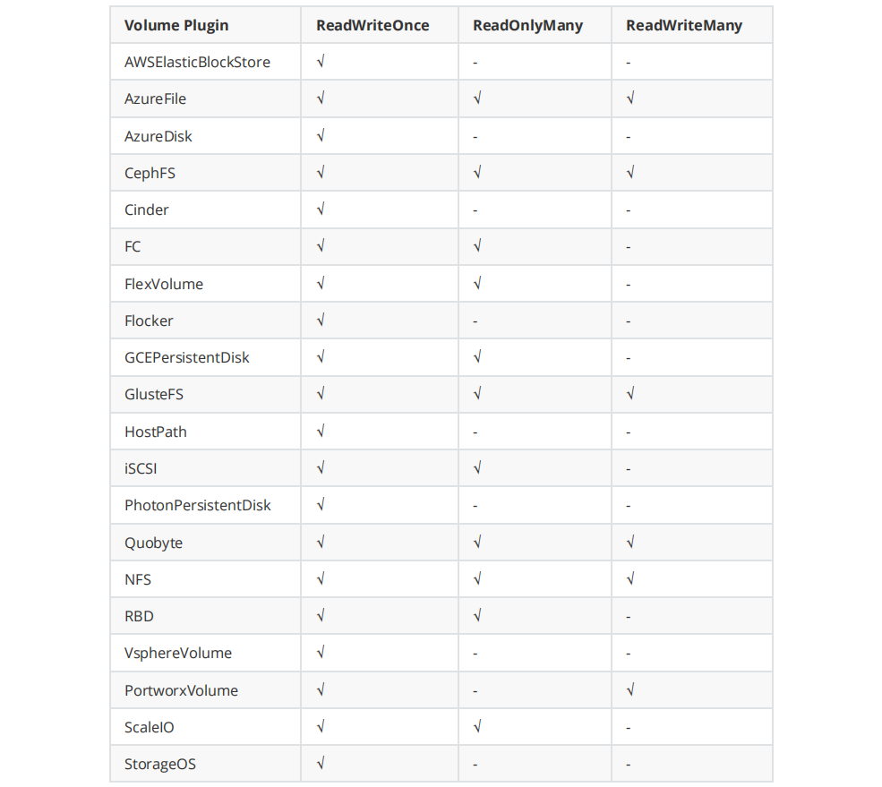

  - **挂载参数（mountOptions）**

    PV 可以根据不同的存储卷类型，设置不同的挂载参数，每种类型的存储卷可配置参数都不相同。如 NFS存储，可以设置 NFS 挂载配置，如下：

    ```sh
    #下面例子只是 NFS 支持的部分参数，其它参数请自行查找 NFS 挂载参数。 
    mountOptions: 
    	- hard
    	- nfsvers=4
    ```

  - **存储类 （storageClassName）**

    PV 可以通过配置 storageClassName 参数指定一个存储类 StorageClass 资源，具有特定StorageClass 的 PV 只能与指定相同 StorageClass 的 PVC 进行

    绑定，没有设置 StorageClass 的 PV 也是同样只能与没有指定 StorageClass 的 PVC 绑定。

  - **回收策略（persistentVolumeReclaimPolicy）**

    PV 可以通过配置 persistentVolumeReclaimPolicy 参数设置回收策略，可选项如下：

    - Retain（保留）： 保留数据，需要由管理员手动清理。
    - Recycle（回收）： 删除数据，即删除目录下的所有文件，比如说执行 rm -rf /thevolume/* 命令，目前只有 NFS 和 HostPath 支持。
    - Delete（删除）： 删除存储资源，仅仅部分云存储系统支持，如删除 AWS EBS 卷，目前只有AWS EBS，GCE PD，Azure 磁盘和Cinder卷支持删除。

- **PVC常用参数**

  - **筛选器（selector）**

    PVC 可以通过在 Selecter 中设置 Laberl 标签，筛选出带有指定 Label 的 PV 进行绑定。Selecter 中可以指定 matchLabels 或 matchExpressions ，如果

    两个字段都设定了就需要同时满足才能匹配。

    ```yaml
    selector: 
    	matchLabels: 
    		release: "stable" 
    	matchExpressions:
        	- key: environment 
        	  operator: In 
        	  values: dev
    ```

  - **资源请求（resources）**

    PVC 设置目前只有 requests.storage 一个参数，用于指定申请存储空间的大小。

    ```yaml
    resources:
        requests:
          storage: 1Gi
    ```

  - **存储类（storageClass）**

    PVC 要想绑定带有特定 StorageClass 的 PV 时，也必须设定 storageClassName 参数，且名称也必须要和 PV 中的 storageClassName 保持一致。如果要

    绑定的 PV 没有设置 storageClassName 则 PVC 中也不需要设置。

    当 PVC 中如果未指定 storageClassName 参数或者指定为空值，则还需要考虑 Kubernetes 中是否设置了默认的 StorageClass ：

    - 未启用 DefaultStorageClass：等于 storageClassName 值为空。
    - 启用 DefaultStorageClass：等于 storageClassName 值为默认的 StorageClass。
    - 如果设置 storageClassName=""，则表示该 PVC 不指定 StorageClass。

  - **访问模式（accessModes）**

    PVC 中可设置的访问模式与 PV 种一样，用于限制应用对资源的访问权限。

##### 4.5.5.5、NFS存储卷

NFS 是 Network FileSystem 的缩写，顾名思义就是网络文件存储系统， 分为服务端（Server）和客户端（Client）。最早由 sun 公司开发，是类 unix 系统间实

现磁盘共享的一种方法。 它允许网络中的计算机之间通过 TCP/IP 网络共享资源。通过 NFS，我们本地 NFS 的客户端应用可以透明地读写位于服务端 NFS 服务器

上的文件，就像访问本地文件一样方便。简单的理解，NFS 就是可以透过网络，让不同的主机、不同的操作系统可以共享存储的服务。

NFS 在文件传送或信息传送过程中依赖于 RPC（Remote Procedure Call） 协议，即远程过程调用，NFS 的各项功能都必须要向 RPC 来注册，如此一来 RPC 才能

了解 NFS 这个服务的各项功能 Port、PID、NFS 在服务器所监听的 IP 等，而客户端才能够透过 RPC 的询问找到正确对应的端口，所以，NFS必须要有 RPC 存在时

才能成功的提供服务，简单的理解二者关系：NFS是 一个文件存储系统，而 RPC是负责信息的传输。

**NFS共享存储方式**

- 手动方式静态创建所需要的PV和PVC。
- 通过创建PVC动态地创建对应PV，无需手动创建PV。

###### 4.5.5.5.1、NFS安装

k8s集群所有节点都需要安装NFS服务。本章节实验我们选用k8s的master节点作为NFS服务的server端。

```shell
yum install -y nfs-utils rpcbind
```

**创建共享目录**

```shell
#在master节点创建目录 
mkdir -p /nfs/data
chmod 777 /nfs/data
#更改归属组与用户 
chown nfsnobody /nfs/data 
#或者
chown -R nfsnobody:nfsnobody /nfs/data 

vi /etc/exports 
/nfs/data *(rw,no_root_squash,no_all_squash,sync)
```

**参数说明**

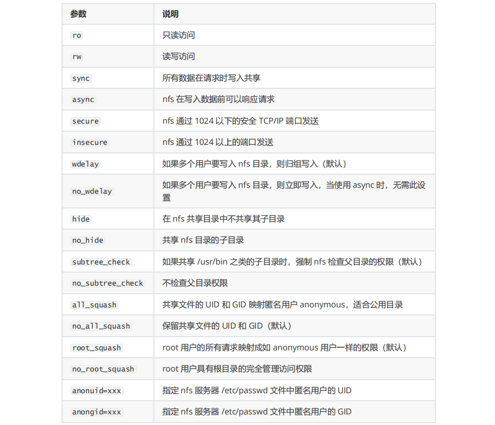

**启动NFS服务**

```shell
#注意启动顺序
systemctl start rpcbind 
systemctl start nfs 
#设置开启启动 
systemctl enable rpcbind 
systemctl enable nfs
```

**测试NFS服务**

```shell
#在另一台 Linux 虚拟机上测试一下，是否能够正确挂载:
showmount -e 192.168.81.120
#在客户端创建挂在目录
mkdir -p /data/mariadb
#挂载远端目录到本地 /data/mariadb 目录
mount 192.168.81.120:/nfs/mariadb /data/mariadb
#NFS服务端写入
echo "This is NFS server." > /nfs/mariadb/nfs.txt
#客户端读取
cat /data/mariadb/nfs.txt
#客户端写入
echo "This is NFS client." >> /data/mariadb/nfs.txt
#服务端读取
cat /nfs/mariadb/nfs.txt
#都是没问题的，这是因为上边设置了 NFS 远端目录权限为 rw 拥有读写权限，如果设置为 ro，那么 客户端只能读取，不能写入，根据实际应用场景合理配置，这里就不在演示了。这里提一下，NFS 默认 使用 UDP 协议来进行挂载，为了提高 NFS 的稳定性，可以使用 TCP 协议挂载，那么客户端挂载命 令可使用如下命令
mount 192.168.81.120:/nfs/mysql /data/mysql -o proto=tcp -o nolock
```

**客户端卸载 NFS 挂载目录**

```shell
umount /data/mariadb/ 
#强制卸载 
umount -l /data/mariadb/
```

###### 4.5.5.5.2、NFS挂载实战

- **NFS4服务**

  ```shell
  #使用NFS4协议方式进行多共享目录配置。所有共享目录的根目录为/nfs/data。服务器端 的/etc/exports文件中的配置为： 
  vi /etc/exports 
  /nfs/data *(rw,fsid=0,sync,no_wdelay,insecure_locks,no_root_squash)
  #K8S的静态NFS服务PV的nfs:path的值不用写共享根目录，直接写/mariadb即可。K8S会帮我们配置成/nfs/data/mariadb目录 
  #重启NFS 
  systemctl restart rpcbind 
  systemctl restart nfs
  ```

- **全部资源文件清单**

  - **mariadbpv.yml**

    ```yaml
    apiVersion: v1
    kind: PersistentVolume
    metadata:
      name: mariadb-pv
      labels:
        app: mariadb-pv
    spec:
      accessModes:
        - ReadWriteOnce
      capacity:
        storage: 10Gi
      mountOptions:
        - hard
        - nfsvers=4.1
      nfs:
        path: /mariadb
        server: 192.168.81.120
      persistentVolumeReclaimPolicy: Retain
      storageClassName: standard
      volumeMode: Filesystem
    ```

  - **mariadbpvc.yml**

    ```yaml
    apiVersion: v1
    kind: PersistentVolumeClaim
    metadata:
      name: mariadb-pvc
      labels:
        app: mariadb-pvc
    spec:
      accessModes:
        - ReadWriteOnce
      storageClassName: standard
      resources:
        requests:
          storage: 1Gi
    ```

  - **mariadb.yml**

    ```yaml
    apiVersion: apps/v1
    kind: Deployment
    metadata:
      name: mariadb-deploy
      labels:
        app: mariadb-deploy
    spec:
      replicas: 1
      template:
        metadata:
          name: mariadb-deploy
          labels:
            app: mariadb-deploy
        spec:
          nodeSelector: #根据label设置，配置节点选择器
            mariadb: mariadb #语法规则: key: value
          containers:
            - name: mariadb-deploy
              image: mariadb:10.5.2
              imagePullPolicy: IfNotPresent
              ports:
                - containerPort: 3307
              env:
                - name: MYSQL_ROOT_PASSWORD
                  #这是mysqlroot用户的密码
                  valueFrom:
                    secretKeyRef:
                      key: password
                      name: mariadbsecret
                - name: TZ
                  value: Asia/Shanghai
              args:
                - "--character-set-server=utf8mb4"
                - "--collation-server=utf8mb4_unicode_ci"
              volumeMounts:
                - mountPath: /etc/mysql/mariadb.conf.d/   #容器内的挂载目录
                  name: lagoumariadb #随便给一个名字,这个名字必须与volumes.name一致
                - mountPath: /var/lib/mysql #容器内容的挂载目录
                  name: volume-maridb
          restartPolicy: Always
          volumes:
            - name: lagoumariadb
              configMap:
                name: mariadbconfigmap
            - name: volume-maridb
              persistentVolumeClaim:
                claimName: mariadb-pvc
      selector:
        matchLabels:
          app: mariadb-deploy
    ---
    apiVersion: v1
    kind: Service
    metadata:
      name: mariadb-service
    spec:
      selector:
        app: mariadb-deploy
      ports:
        - port: 3307
          targetPort: 3307
          nodePort: 30036
      type: NodePort
    ```

  - **mariadbsecret.yml**

    ```yaml
    apiVersion: v1
    kind: Secret
    metadata:
      name: mariadbsecret
    type: Opaque
    data:
      #mariadb的用户名root加密，用于演示，无实际效果
      username: cm9vdA==
      password: cm9vdA==
    ```

  - **mariadbconfigmap.yml**

    ```yaml
    apiVersion: v1 
    data:
    	my.cnf: "省略中间数据部分，请各位同学前面章节" 
    kind: ConfigMap
    metadata: 
    	name: mariadbconfigmap
    ```

  - 测试

    ```shell
    IP:192.168.81.120 
    username:root 
    password:root 
    prot: 30036
    ```

### 4.6、集群调度

k8s内pod由scheduler调度，scheduler的任务是把pod分配到合适的node节点上。scheduler调度时会考虑到node节点的资源使用情况、port使用情况、volume

使用情况等等...在此基础之上，我们也可以控制pod的调度。

Scheduler 是 kubernetes 调度器，主要的任务是把定义的 pod 分配到集群的节点上。但要很多要考虑的问题：

- 公平：如何保证每个节点都能被合理分配资源，不要造成一个节点忙死，一个节点闲死局面。
- 资源高效利用：集群所有资源最大化被使用。内存、硬盘、CPU等因素。
- 效率：调度的性能要好，能够尽快地对大批量的 pod 完成调度工作。
- 灵活：允许用户根据自己的需求控制调度的逻辑

Sheduler 是作为单独的程序运行，启动之后会一直与 API Server保持通讯，获取PodSpec.NodeName 为空的 pod，对每个 pod 都会创建一个 binding，表明该 

pod 应该放到哪个节点上 。

#### 4.6.1、固定节点

```shell
#前边的课程已经给大家介绍过 关键技能点： 
#1.给某一个节点打标签 
kubectl label nodes k8s-node01 mariadb=mariadb
#2.pod的控制器中增加配置属性
spec: 
	nodeSelector: 
		mariadb: mariadb
#删除k8s-node01节点mariadb的label 
kubectl label nodes k8s-node02 mariadb- 
kubectl label nodes k8s-node02 --show-labels	
```

**修改label案例用于演示nodeName属性**

```yaml
#pod控制器关键代码
spec: 
	nodeName: k8s-node01
```

**全部资源文件清单**

- **mariadbpv.yml**

  ```yaml
  apiVersion: v1
  kind: PersistentVolume
  metadata:
    name: mariadb-pv
    labels:
      app: mariadb-pv
  spec:
    accessModes:
      - ReadWriteOnce
    capacity:
      storage: 10Gi
    mountOptions:
      - hard
      - nfsvers=4.1
    nfs:
      path: /mariadb
      server: 192.168.81.120
    persistentVolumeReclaimPolicy: Retain
    storageClassName: standard
    volumeMode: Filesystem
  ```

- **mariadbpvc.yml**

  ```yaml
  apiVersion: v1
  kind: PersistentVolumeClaim
  metadata:
    name: mariadb-pvc
    labels:
      app: mariadb-pvc
  spec:
    accessModes:
      - ReadWriteOnce
    storageClassName: standard
    resources:
      requests:
        storage: 1Gi
  ```

- **mariadb.yml**

  ```yaml
  apiVersion: apps/v1
  kind: Deployment
  metadata:
    name: mariadb-deploy
    labels:
      app: mariadb-deploy
  spec:
    replicas: 1
    template:
      metadata:
        name: mariadb-deploy
        labels:
          app: mariadb-deploy
      spec:
        nodeName: k8s-node01 #固定到指定节点
        containers:
          - name: mariadb-deploy
            image: mariadb:10.5.2
            imagePullPolicy: IfNotPresent
            ports:
              - containerPort: 3307
            env:
              - name: MYSQL_ROOT_PASSWORD
                #这是mysqlroot用户的密码
                valueFrom:
                  secretKeyRef:
                    key: password
                    name: mariadbsecret
              - name: TZ
                value: Asia/Shanghai
            args:
              - "--character-set-server=utf8mb4"
              - "--collation-server=utf8mb4_unicode_ci"
            volumeMounts:
              - mountPath: /etc/mysql/mariadb.conf.d/   #容器内的挂载目录
                name: lagoumariadb #随便给一个名字,这个名字必须与volumes.name一致
              - mountPath: /var/lib/mysql #容器内容的挂载目录
                name: volume-maridb
        restartPolicy: Always
        volumes:
          - name: lagoumariadb
            configMap:
              name: mariadbconfigmap
          - name: volume-maridb
            persistentVolumeClaim:
              claimName: mariadb-pvc
    selector:
      matchLabels:
        app: mariadb-deploy
  ---
  apiVersion: v1
  kind: Service
  metadata:
    name: mariadb-service
  spec:
    selector:
      app: mariadb-deploy
    ports:
      - port: 3307
        targetPort: 3307
        nodePort: 30036
    type: NodePort
  ```

- **mariadbsecret.yml**

  ```yaml
  apiVersion: v1
  kind: Secret
  metadata:
    name: mariadbsecret
  type: Opaque
  data:
    #mariadb的用户名root加密，用于演示，无实际效果
    username: cm9vdA==
    password: cm9vdA==
  ```

- **mariadbconfigmap.yml**

  ```yaml
  apiVersion: v1 
  data:
  	my.cnf: "省略中间数据部分，请各位同学前面章节" 
  kind: ConfigMap
  metadata: 
  	name: mariadbconfigmap
  ```

- 测试

  ```shell
  IP:192.168.81.120 
  username:root 
  password:root 
  prot: 30036
  ```

#### 4.6.2、集群调度原理

**Scheduler调度步骤**

1. 首先用户在通过 Kubernetes 客户端 Kubectl 提交创建 Pod 的 Yaml 的文件，向Kubernetes 系统发起资源请求，该资源请求被提交到Kubernetes 系统。

2. Kubernetes 系统中，用户通过命令行工具 Kubectl 向 Kubernetes 集群即 APIServer 用 的方式发送“POST”请求，即创建 Pod 的请求。

3. APIServer 接收到请求后把创建 Pod 的信息存储到 Etcd 中，从集群运行那一刻起，资源调度系统Scheduler 就会定时去监控 APIServer

4. 通过 APIServer 得到创建 Pod 的信息，Scheduler 采用 watch 机制，一旦 Etcd 存储 Pod 信息成功便会立即通知APIServer， 5. APIServer会立即把Pod创建

  的消息通知Scheduler，Scheduler发现 Pod 的属性中 Dest Node 为空时（Dest Node=""）便会立即触发调度流程进行调度。

5. 而这一个创建Pod对象，在调度的过程当中有3个阶段：节点预选、节点优选、节点选定，从而筛选出最佳的节点

  - 节点预选：基于一系列的预选规则对每个节点进行检查，将那些不符合条件的节点过滤，从而完成节点的预选
  - 节点优选：对预选出的节点进行优先级排序，以便选出最合适运行Pod对象的节点
  - 节点选定：从优先级排序结果中挑选出优先级最高的节点运行Pod，当这类节点多于1个时，则进行随机选择

#### 4.6.3、集群调度策略

Kubernetes调度器作为集群的大脑，在如何提高集群的资源利用率、保证集群中服务的稳定运行中也会变得越来越重要Kubernetes的资源分为两种属性。
1. 可压缩资源（例如CPU循环，Disk I/O带宽）都是可以被限制和被回收的，对于一个Pod来说可以降低这些资源的使用量而不去杀掉Pod。 
2. 不可压缩资源（例如内存、硬盘空间）一般来说不杀掉Pod就没法回收。未来Kubernetes会加入更多资源，如网络带宽，存储IOPS的支持。

**常用预选策略**

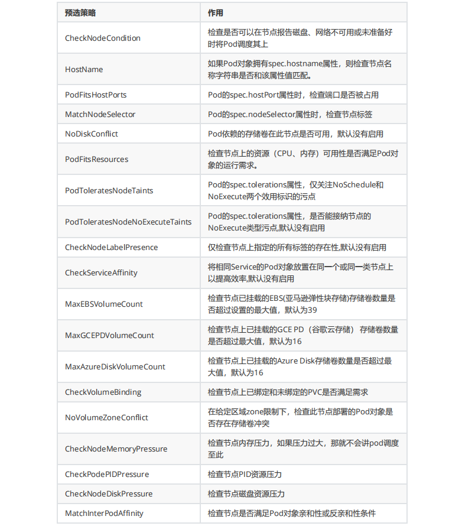

**常用优先函数**

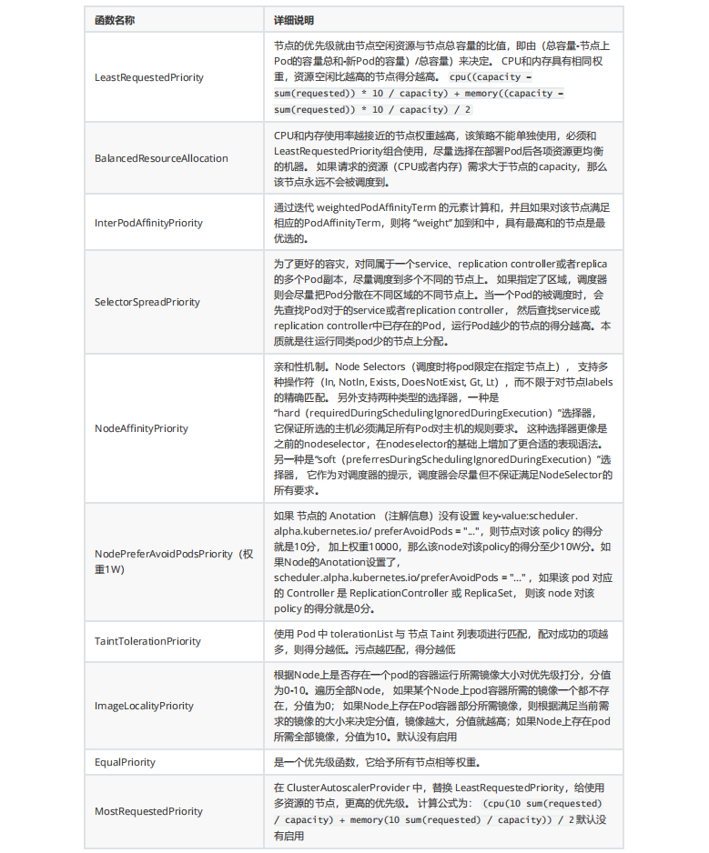

#### 4.6.4、节点亲和性调度

**节点亲和性规则：**

 required(硬亲和性，不能商量，必须执行) 、preferred(软亲和性，可以商量，选择执行)。

- 硬亲和性规则不满足时，Pod会置于Pending状态，软亲和性规则不满足时，会选择一个不匹配的节点

- 当节点标签改变而不再符合此节点亲和性规则时，不会将Pod从该节点移出，仅对新建的Pod对象生效

##### 4.6.4.1、节点硬亲和性

requiredDuringSchedulingIgnoredDuringExecution

- 方式一：Pod使用 spec.nodeSelector (基于等值关系);Pod使用 spec.nodeName

- 方式二：Pod使用 spec.affinity 支持matchExpressions属性 (复杂标签选择机制)

**全部资源文件清单**

**controller**

mariadb.yml，删除spec.selectNode或者spec.nodeName信息。技能点概述:Pod.sepc.affinity

```yaml
#可以先使用命令获得节点标签及真实节点名称: 
kubectl get nodes --show-labels
#yaml
    spec:
      affinity:
        nodeAffinity:
          requiredDuringSchedulingIgnoredDuringExecution:
            nodeSelectorTerms:
              - matchExpressions:
                  - key: kubernetes.io/hostname #某个node节点的标签
                    operator: In
                    values:
                      - k8s-node01 #对应节点的值
```

键值运算关系

```apl
In：label 的值在某个列表中 
NotIn：label 的值不在某个列表中 
Gt：label 的值大于某个值 
Lt：label 的值小于某个值 
Exists：某个 label 存在 
DoesNotExist：某个 label 不存在
```

- **mariadb.yml**

  ```yaml
  apiVersion: apps/v1
  kind: Deployment
  metadata:
    name: mariadb-deploy
    labels:
      app: mariadb-deploy
  spec:
    replicas: 1
    template:
      metadata:
        name: mariadb-deploy
        labels:
          app: mariadb-deploy
      spec:
        affinity:
          nodeAffinity:
            requiredDuringSchedulingIgnoredDuringExecution:
              nodeSelectorTerms:
                - matchExpressions:
                    - key: kubernetes.io/hostname #某个node节点的标签
                      operator: In
                      values:
                        - k8s-node01 #对应节点的值
        containers:
          - name: mariadb-deploy
            image: mariadb:10.5.2
            imagePullPolicy: IfNotPresent
            ports:
              - containerPort: 3307
            env:
              - name: MYSQL_ROOT_PASSWORD
                #这是mysqlroot用户的密码
                valueFrom:
                  secretKeyRef:
                    key: password
                    name: mariadbsecret
              - name: TZ
                value: Asia/Shanghai
            args:
              - "--character-set-server=utf8mb4"
              - "--collation-server=utf8mb4_unicode_ci"
            volumeMounts:
              - mountPath: /etc/mysql/mariadb.conf.d/   #容器内的挂载目录
                name: lagoumariadb #随便给一个名字,这个名字必须与volumes.name一致
        restartPolicy: Always
        volumes:
          - name: lagoumariadb
            configMap:
              name: mariadbconfigmap
    selector:
      matchLabels:
        app: mariadb-deploy
  ---
  apiVersion: v1
  kind: Service
  metadata:
    name: mariadb-service
  spec:
    selector:
      app: mariadb-deploy
    ports:
      - port: 3307
        targetPort: 3307
        nodePort: 30036
    type: NodePort
  ```

- **mariadbsecret.yml**

  ```yaml
  apiVersion: v1
  kind: Secret
  metadata:
    name: mariadbsecret
  type: Opaque
  data:
    #mariadb的用户名root加密，用于演示，无实际效果
    username: cm9vdA==
    password: cm9vdA==
  ```

- **mariadbconfigmap.yml**

  ```yaml
  apiVersion: v1 
  data:
  	my.cnf: "省略中间数据部分，请各位同学前面章节" 
  kind: ConfigMap
  metadata: 
  	name: mariadbconfigmap
  ```

- 测试

  ```shell
  IP:192.168.81.120 
  username:root 
  password:root 
  prot: 30036
  ```

##### 4.6.4.2、节点软亲和性

preferredDuringSchedulingIgnoredDuringExecution

- 柔性控制逻辑，当条件不满足时，能接受被编排于其他不符合条件的节点之上

- 权重 weight 定义优先级，1-100 值越大优先级越高

**全部资源文件清单**

**controller**

mariadb.yml，删除spec.selectNode或者spec.nodeName信息。技能点概述:Pod.sepc.affinity

```yaml
#可以先使用命令获得节点标签及真实节点名称: 
kubectl get nodes --show-labels
#yaml
    spec:
      affinity:
        nodeAffinity:
          preferredDuringSchedulingIgnoredDuringExecution:
            - preference:
                matchExpressions:
                  - key: kubernetes.io/hostname
                    operator: In
                    values:
                      - k8s-node01
              weight: 1
```

键值运算关系

```apl
In：label 的值在某个列表中 
NotIn：label 的值不在某个列表中 
Gt：label 的值大于某个值 
Lt：label 的值小于某个值 
Exists：某个 label 存在 
DoesNotExist：某个 label 不存在
```

- **mariadb.yml**

  ```yaml
  apiVersion: apps/v1
  kind: Deployment
  metadata:
    name: mariadb-deploy
    labels:
      app: mariadb-deploy
  spec:
    replicas: 1
    template:
      metadata:
        name: mariadb-deploy
        labels:
          app: mariadb-deploy
      spec:
        affinity:
          nodeAffinity:
            preferredDuringSchedulingIgnoredDuringExecution:
              - preference:
                  matchExpressions:
                    - key: kubernetes.io/hostname
                      operator: In
                      values:
                        - k8s-node02
                weight: 1
        containers:
          - name: mariadb-deploy
            image: mariadb:10.5.2
            imagePullPolicy: IfNotPresent
            ports:
              - containerPort: 3307
            env:
              - name: MYSQL_ROOT_PASSWORD
                #这是mysqlroot用户的密码
                valueFrom:
                  secretKeyRef:
                    key: password
                    name: mariadbsecret
              - name: TZ
                value: Asia/Shanghai
            args:
              - "--character-set-server=utf8mb4"
              - "--collation-server=utf8mb4_unicode_ci"
            volumeMounts:
              - mountPath: /etc/mysql/mariadb.conf.d/   #容器内的挂载目录
                name: lagoumariadb #随便给一个名字,这个名字必须与volumes.name一致
        restartPolicy: Always
        volumes:
          - name: lagoumariadb
            configMap:
              name: mariadbconfigmap
    selector:
      matchLabels:
        app: mariadb-deploy
  ---
  apiVersion: v1
  kind: Service
  metadata:
    name: mariadb-service
  spec:
    selector:
      app: mariadb-deploy
    ports:
      - port: 3307
        targetPort: 3307
        nodePort: 30036
    type: NodePort
  ```

- **mariadbsecret.yml**

  ```yaml
  apiVersion: v1
  kind: Secret
  metadata:
    name: mariadbsecret
  type: Opaque
  data:
    #mariadb的用户名root加密，用于演示，无实际效果
    username: cm9vdA==
    password: cm9vdA==
  ```

- **mariadbconfigmap.yml**

  ```yaml
  apiVersion: v1 
  data:
  	my.cnf: "省略中间数据部分，请各位同学前面章节" 
  kind: ConfigMap
  metadata: 
  	name: mariadbconfigmap
  ```

- 测试

  ```shell
  IP:192.168.81.120 
  username:root 
  password:root 
  prot: 30036
  ```

##### 4.6.4.3、Pod资源亲和调度

- Pod硬亲和调度

  requiredDuringSchedulingIgnoredDuringExecution

  Pod亲和性描述一个Pod与具有某特征的现存Pod运行位置的依赖关系；即需要事先存在被依赖的Pod对象

- Pod软亲和调度

  Pod软亲和调度用于分散同一类应用，调度至不同的区域、机架或节点等.将 spec.affinity.podAffinity 替换为 spec.affinity.podAntiAffinity 。

  软亲和调度也分为柔性约束和强制约束

#### 4.6.5、污点和容忍度

污点 taints 是定义在node节点 上的键值型属性数据，用于让节点拒绝将Pod调度运行于其上，除非Pod有接纳节点污点的容忍度。容忍度 tolerations 是定义在

Pod 上的键值属性数据，用于配置可容忍的污点，且调度器将Pod调度至其能容忍该节点污点的节点上或没有污点的节点上 。

对于nodeAffinity无论是硬策略(硬亲和)还是软策略(软亲和)方式，都是调度 pod 到预期节点上，而Taints恰好与之相反，如果一个节点标记为 Taints ，除非 pod 

也被标识为可以容忍污点节点，否则该Taints 节点不会被调度 pod。

节点亲和性，是 pod 的一种属性（偏好或硬性要求），它使 pod 被吸引到一类特定的节点。Taint 则相反，它使节点 能够 排斥 一类特定的 pod Taint 和 

toleration 相互配合，可以用来避免 pod 被分配到不合适的节点上。每个节点上都可以应用一个或多个taint ，这表示对于那些不能容忍这些 taint 的 pod，是不

会被该节点接受的。如果将 toleration 应用于pod上，则表示这些 pod 可以（但不要求）被调度到具有匹配 taint 的节点上 

##### 4.6.5.1、定义污点和容忍度

污点定义于 nodes.spec.taints 属性。容忍度定义于 pods.spec.tolerations 属性。

使用 kubectl taint 命令可以给某个 Node 节点设置污点，Node 被设置上污点之后就和 Pod 之间存在了一种相斥的关系，可以让 Node 拒绝 Pod 的调度执行，甚

至将 Node 已经存在的 Pod 驱逐出去 。

语法： key=value:effect

```shell
#查看node节点名称 
kubectl get nodes 
#查看master节点详细信息：通过观taints察属性，发现master节点默认被打上一个污点。
kubectl describe nodes k8s-master01
```

**effect定义排斥等级：**

- NoSchedule ，不能容忍，但仅影响调度过程，已调度上去的pod不受影响，仅对新增加的pod生效。 

  解释说明：表示 k8s 将不会将 Pod 调度到具有该污点的 Node 上 。 

- PreferNoSchedule ，柔性约束，节点现存Pod不受影响，如果实在是没有符合的节点，也可以调度上来。 

  解释说明：表示 k8s 将不会将 Pod 调度到具有该污点的 Node 上 。 

- NoExecute ，不能容忍，当污点变动时，Pod对象会被驱逐。 

  解释说明：表示 k8s 将不会将 Pod 调度到具有该污点的 Node 上，同时会将 Node 上已经存在的Pod 驱逐出去

**污点语法**

```shell
#创建污点:语法规则 
kubectl taint nodes node1 key1=value1:NoSchedule 
#删除污点:语法规则 
kubectl taint nodes node1 key1:NoSchedule-
```

##### 4.6.5.2、污点测试

**全部资源文件清档**

**deploymentdemo控制器**

```yaml
apiVersion: apps/v1
kind: Deployment
metadata:
  name: deploymentdemo
  labels:
    app: deploymentdemo
spec:
  replicas: 3
  template:
    metadata:
      name: deploymentdemo
      labels:
        app: deploymentdemo
    spec:
      containers:
        - name: deploymentdemo
          image: nginx:1.17.10-alpine
          imagePullPolicy: IfNotPresent
          ports:
            - containerPort: 80
      restartPolicy: Always
  selector:
    matchLabels:
      app: deploymentdemo
```

**设置污点**

```shell
#观察每个节点pod运行情况 
kubectl get pods -o wide 
#在某一个节点创建污点并驱逐pod
kubectl taint nodes k8s-node03 offline=testtaint:NoExecute 
#查看pod被驱逐过程 
kubectl get pods -o wide
#删除污点 
kubectl taint nodes k8s-node03 offline=testtaint:NoExecute-
#查看节点污点信息
kubectl describe nodes k8s-node03
```

##### 4.6.5.3、容忍度测试

在Pod上定义容忍度时：
1. 等值比较 容忍度与污点在key、value、effect三者完全匹配
2. 存在性判断 key、effect完全匹配，value使用空值

一个节点可配置多个污点，一个Pod也可有多个容忍度

**全部资源文件清档**

本案例用于演示创建、删除及驱逐pod的过程。

**设置污点**

```shell
#在某一个节点创建污点 
kubectl taint nodes k8s-node03 offline=testtaint:NoSchedule 
#查看节点污点信息 
kubectl describe nodes k8s-node03
```

**deploymentdemo控制器**

```yaml
apiVersion: apps/v1
kind: Deployment
metadata:
  name: deploymentdemo
  labels:
    app: deploymentdemo
spec:
  replicas: 3
  template:
    metadata:
      name: deploymentdemo
      labels:
        app: deploymentdemo
    spec:
      containers:
        - name: deploymentdemo
          image: nginx:1.17.10-alpine
          imagePullPolicy: IfNotPresent
          ports:
            - containerPort: 80
      restartPolicy: Always
  selector:
    matchLabels:
      app: deploymentdemo
```

**查看部署情况**

```shell
#部署控制器 
kubectl apply -f deploymentdemo.yml 
#查看是否有pod被部署到k8s-node03节点 
kubectl get pods -o wide 
#删除控制器 
kubectl delete -f deploymentdemo.yml
```

**设置pod容忍度**

```yaml
   spec:
      tolerations:
        - key: offline
          operator: Equal
          value: testtaint
          effect: NoSchedule
```

**完整控制器清单**

```yaml
apiVersion: apps/v1
kind: Deployment
metadata:
  name: deploymentdemo
  labels:
    app: deploymentdemo
spec:
  replicas: 3
  template:
    metadata:
      name: deploymentdemo
      labels:
        app: deploymentdemo
    spec:
      tolerations:
        - key: offline
          operator: Equal
          value: testtaint
          effect: NoSchedule
      containers:
        - name: deploymentdemo
          image: nginx:1.17.10-alpine
          imagePullPolicy: IfNotPresent
          ports:
            - containerPort: 80
      restartPolicy: Always
  selector:
    matchLabels:
      app: deploymentdemo
```

**部署控制器**

```shell
#部署控制器 
kubectl apply -f deploymentdemo.yml 
#查看pod详细信息 
kubectl get pods -o wide 
#删除控制器 
kubectl delete -f deploymentdemo.yml
#删除污点 
kubectl taint nodes k8s-node03 offline=testtaint:NoSchedule-
```

