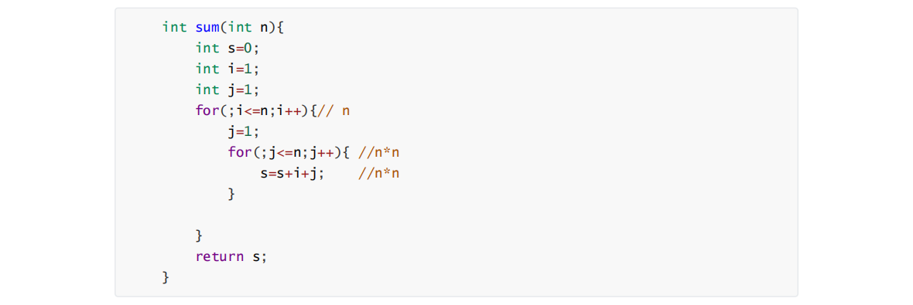
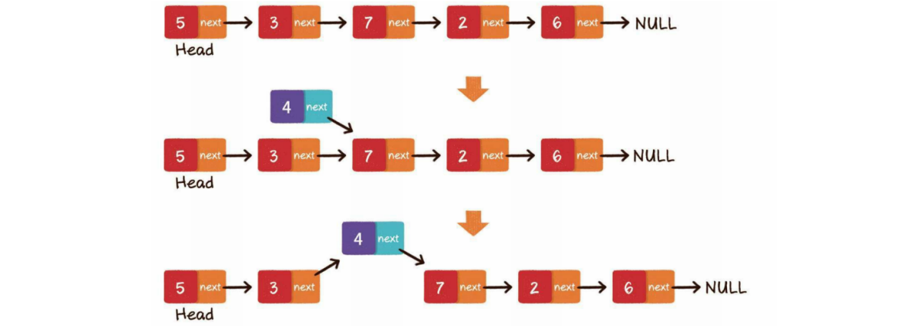
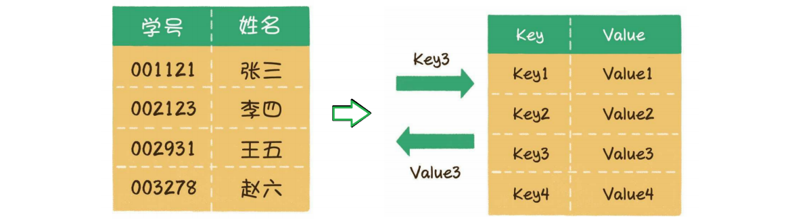
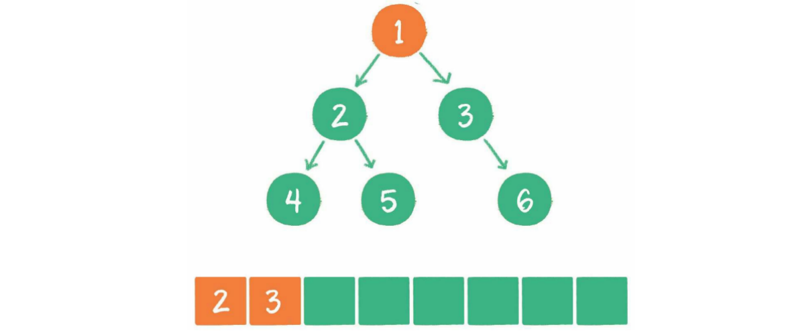
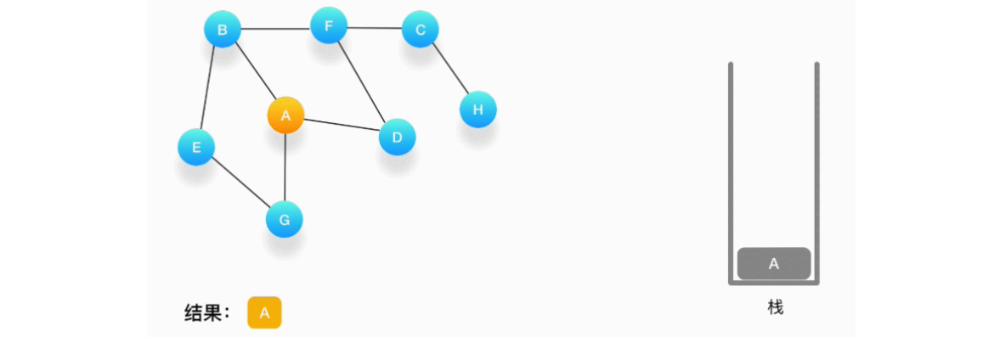

# 数据结构与算法

## 1、数据结构与算法概述

### 1.1、数据结构的概念

#### 1.1.1、什么是数据结构

数据结构(data structure)是计算机存储、组织数据的方式。数据结构是指相互之间存在一种或多种特定关系的数据元素的集合。（百度百科）

一句话解释：存数据的，而且是在内存中存！

#### 1.1.2、常见的数据结构


### 1.2、算法的概念

#### 1.2.1、什么是算法

算法（Algorithm）是指解题方案的准确而完整的描述，是一系列解决问题的清晰指令，算法代表着用系统的方法描述解决问题的策略机制。

一句话描述：算法是一种解决特定问题的思路

比如：LRU算法，最近最少使用，解决的就是当空间不够用时，应该淘汰谁的问题，这是一种策略，不是唯一的答案，所以算法无对错，只有好和不好。

#### 1.2.2、常见算法


### 1.3、算法复杂度

数据结构和算法本质上是”快“和"省"。所以代码的执行效率是非常重要的度量，我们采用时间复杂度和空间复杂度来计算。

#### 1.3.1、时间复杂度

- **大O复杂度表示法**

  

  我们假设执行一行代码的时间为t，通过估算，代码的执行时间T(n)与执行次数成正比，记做:

  ```shell
  T(n)=O(f(n))
  
  # T(n)： 代码执行时间
  # n：数据规模
  # f(n)：每行代码执行次数总和
  # O：代码的执行时间与f(n)表达式成正比
  # 上面的例子中的T(n)=O(2n+2)
  # 当n无限大时，低阶、常量、系统都可以忽略
  # 所以T(n)=O(n)
  # 即上例中的时间复杂度为O(n)，也就是代码执行时间随着数据规模的增加而增长
  ```

  

  上例中T(n)=O(n*n)，也就是代码执行时间随着数据规模的增加而平方增长

  即：上例中的时间复杂度为**O(n2 )** 

  时间复杂度也成为**渐进时间复杂度**。

- **计算时间复杂度的技巧**

  - 计算循环执行次数最多的代码

  - 总复杂度=量级最大的复杂度

  比如把上面两段代码合在一起

  

  时间复杂度为**O( n2)**

  - 嵌套代码的复杂度等于嵌套**内外**代码复杂度的乘积(乘法法则)

- **常见的时间复杂度**

  - **O(1)**

    这种是最简单的，也是最好理解的，就是常量级.

    不是只执行了一行代码，只要代码的执行不随着数据规模(n)的增加而增加，就是常量级.

    在实际应用中，通常使用冗余字段存储来将O(n)变成O(1)，比如Redis中有很多这样的操作用来提升访问性能

    比如:SDS、字典、跳跃表等

  - **O(logn)、O(nlogn)**

    ```c
    i = 1;
    while(i <= n){ 
        i = i * 2;// 执行最多 
    }
    ```

    2x =n  （2的x次方等于n）

    x=log2n

    忽略系数为logn

    T(n)=O(logn）

    如果将该代码执行n遍

    则时间复杂度记录为:T(n)=O(n*logn），即O(nlogn)

    快速排序、归并排序的时间复杂度都是O(nlogn)

  - **O(n)**

    这个前面已经讲了，很多线性表的操作都是O(n),这也是最常见的一个时间复杂度。

    比如：数组的插入删除、链表的遍历等

  - **O(m+n)**

    代码的时间复杂度由两个数据的规模来决定

    

    m和n是代码的两个数据规模，而且不能确定谁更大，此时代码的复杂度为两段时间复杂度之和，即T(n)=O(m+n)，记作：O(m+n)

  - **O(m*n)**

    

    根据乘法法则代码的复杂度为两段时间复杂度之积，即

    T(n)=O(m`*`n)，记作：O(m`*`n)

    当m==n时,为O(n2)

#### 1.3.2、空间复杂度

空间复杂度全称是渐进空间复杂度，表示算法的存储空间与数据规模之间的增长关系。比如将一个数组拷贝到另一个数组中，就是相当于空间扩大了一

倍:T(n)=O(2n)，忽略系数。即为：

O(n)，这是一个非常常见的空间复杂度，比如跳跃表、hashmap的扩容此外还有:O(1)，比如原地排序、O(n2) 此种占用空间过大

由于现在硬件相对比较便宜，所以在开发中常常会利用空间来换时间，比如缓存技术，典型的数据结构中空间换时间是：跳跃表

在实际开发中我们也更关注代码的时间复杂度，而用于执行效率的提升。

### 1.4、为什么要学习数据结构和算法

- 互联网行业中数据结构和算法尤为重要

  互联网软件特点：高并发、高性能、高扩展、高可用、海量数据

- 通关大厂面试必备技能

- 能够更好的使用类库

- 对编程的追求，精益求精

## 2、数据结构与算法基础

### 2.1、线性表

线性表（Linear List）就是数据排成像一条线一样的结构，数据只有前后两个方向


#### 2.1.1、数组

##### 2.1.1.1、概念

数组（Array）是**有限**个**相同类型**的变量所组成的**有序**集合，数组中的每一个变量被称为元素。数组是最为简单、最为常用的数据结构。


数组下标从零开始(Why)

##### 2.1.1.2、存储原理

数组用一组**连续的内存空间**来存储一组具有**相同类型**的数据


(模拟内存存储)

灰色格子：被使用的内存

橙色格子：空闲的内存

红色格子：数组占用的内存

**数组可以根据下标随机访问数据**

比如一个整型数据 int[] 长度为5


假设首地址是：1000

int是4字节（32位）,实际内存存储是位

随机元素寻址

```shell
a[i]_address=a[0]_address+i*4
```

该公式解释了三个方面

- 连续性分配

- 相同的类型

- 下标从0开始

##### 2.1.1.3、操作

- **读取元素**

  根据下标读取元素的方式叫作随机读取

  ```shell
  int n=nums[2]
  ```

- **更新元素**

  ```shell
  nums[3]= 10;
  ```

  注意不要数组越界

  读取和更新都可以随机访问，时间复杂度为O(1)

- **插入元素**

  - **尾部插入**

    在数据的实际元素数量小于数组长度的情况下：

    直接把插入的元素放在数组尾部的空闲位置即可，等同于更新元素的操作

    

    ```shell
    a[6]=10
    ```

  - **中间插入**

    在数据的实际元素数量小于数组长度的情况下：

    由于数组的每一个元素都有其固定下标，所以首先把插入位置及后面的元素向后移动，腾出地方，再把要插入的元素放到对应的数组位置上。

    

  - **超范围插入**

    假如现在有一个数组，已经装满了元素，这时还想插入一个新元素，或者插入位置是越界的.

    这时就要对原数组进行扩容：可以创建一个新数组，长度是旧数组的2倍，再把旧数组中的元素统统复制过去，这样就实现了数组的扩容。

    

    ```java
    int[] numsNew=new int[nums.length*2]; 
    System.arraycopy(nums,0,numsNew,0,nums.length); 
    // 原数组就丢掉了，资源浪费 
    nums=numsNew;
    ```

- **删除元素**

  数组的删除操作和插入操作的过程相反，如果删除的元素位于数组中间，其后的元素都需要向前挪动1位。

  ```java
  for(int i=p;i<nums.length;i++){ 
      nums[i-1]=nums[i]; 
  }
  ```

##### 2.1.1.4、时间复杂度

读取和更新都是随机访问，所以是O(1)

插入数组扩容的时间复杂度是O(n)，插入并移动元素的时间复杂度也是O(n)，综合起来插入操作的时间复杂度是O(n)。

删除操作，只涉及元素的移动，时间复杂度也是O(n)

##### 2.1.1.5、优缺点与应用

- **优点：**

  数组拥有非常高效的随机访问能力，只要给出下标，就可以用常量时间找到对应元素

- **缺点：**

  插入和删除元素方面。由于数组元素连续紧密地存储在内存中，插入、删除元素都会导致大量元素被迫移动，影响效率。 (ArrayList LinkedList )

  申请的空间必须是连续的，也就是说即使有空间也可能因为没有足够的连续空间而创建失败

  如果超出范围，需要重新申请内存进行存储，原空间就浪费了

- **应用**

  数组是基础的数据结构，应用太广泛了，ArrayList、Redis、消息队列等等。

  数据结构和算法的可视化网站：https://www.cs.usfca.edu/~galles/visualization/Algorithms.html

#### 2.1.2、链表

##### 2.1.2.1、概念

链表（linked list）是一种在物理上非连续、非顺序的数据结构，由若干节点（node）所组成。

链表中数据元素的逻辑顺序是通过链表中的指针链接次序实现的。链表由一系列节点（链表中每一个元素称为节点）组成，节点可以在运行时动态生成。每个节点

包括两个部分：一个是存储数据元素的数据域，另一个是存储下一个节点地址的指针域。（百度百科）

常见的链表包括：单链表、双向链表、循环链表

- **单链表**

  单向链表的每一个节点又包含两部分，一部分是存放数据的变量data，另一部分是指向下一个节点的指针next

  

  ```c
  Node{
      int data; 
      Node next; 
  }
  ```

- **双向链表**

  双向链表的每一个节点除了拥有data和next指针，还拥有指向前置节点的prev指针。

  

  ```c
  Node{
      int data;
      Node prev; 
      Node next;
  }
  ```

- **循环链表**

  链表的尾节点指向头节点形成一个环，称为循环链表

  

##### 2.1.2.2、存储原理

数组在内存中的存储方式是顺序存储（连续存储），链表在内存中的存储方式则是随机存储（链式存储）。

链表的每一个节点分布在内存的不同位置，依靠next指针关联起来。这样可以灵活有效地利用零散的碎片空间。


链表的第1个节点被称为头节点（3），没有任何节点的next指针指向它，或者说它的前置节点为空

头节点用来记录链表的基地址。有了它，我们就可以遍历得到整条链表

链表的最后1个节点被称为尾节点（2），它指向的next为空

##### 2.1.2.3、操作

- **查找节点**

  在查找元素时，链表只能从头节点开始向后一个一个节点逐一查找。

  

- **更新节点**

  找到要更新的节点，然后把旧数据替换成新数据

  

- **插入节点**

  - **尾部插入**

    把最后一个节点的next指针指向新插入的节点即可

    

  - **头部插入**

    第1步，把新节点的next指针指向原先的头节点

    第2步，把新节点变为链表的头节点

    

  - **中间插入**

    第1步，新节点的next指针，指向插入位置的节点

    第2步，插入位置前置节点的next指针，指向新节点

    

    只要内存空间允许，能够插入链表的元素是无限的，不需要像数组那样考虑扩容的问题

- **删除节点**

  - **尾部删除**

    把倒数第2个节点的next指针指向空即可

    

  - **头部删除**

    把链表的头节点设为原先头节点的next指针即可

    

  - **中间删除**

    把要删除节点的前置节点的next指针，指向要删除元素的下一个节点即可

    

##### 2.1.2.4、时间复杂度

查找节点 ： O(n)

插入节点：O(1)

更新节点：O(1)

删除节点：O(1)

##### 2.1.2.5、优缺点与应用

- **优势**

  插入、删除、更新效率高

  省空间

- **劣势**

  查询效率较低，不能随机访问

- **应用**

  链表的应用也非常广泛，比如树、图、Redis的列表、LRU算法实现、消息队列等

##### 2.1.2.6、数组与链表的对比

数据结构没有绝对的好与坏，数组和链表各有千秋。


数组的优势在于能够快速定位元素，对于读操作多、写操作少的场景来说，用数组更合适一些

链表的优势在于能够灵活地进行插入和删除操作，如果需要在尾部频繁插入、删除元素，用链表更合适一些

数组和链表是线性数据存储的物理存储结构：即顺序存储和链式存储。

#### 2.1.3、栈

栈和队列都属于线性数据的逻辑存储结构


##### 2.1.3.1、概念

栈（stack）是一种线性数据结构，栈中的元素只能先入后出（First In Last Out，简称FILO）。

最早进入的元素存放的位置叫作栈底（bottom），最后进入的元素存放的位置叫作栈顶 （top）。


##### 2.1.3.2、存储原理

栈既可以用数组来实现，也可以用链表来实现

**栈的数组实现如下：**


数组实现的栈也叫顺序栈或静态栈

**栈的链表实现如下：**


链表实现的栈也叫做链式栈或动态栈

##### 2.1.3.3、操作

- **入栈（压栈）**

  入栈操作（push）就是把新元素放入栈中，只允许从栈顶一侧放入元素，新元素的位置将会成为新的栈顶

  

- **出栈（弹栈）**

  出栈操作（pop）就是把元素从栈中弹出，只有栈顶元素才允许出栈，出栈元素的前一个元素将会成为新的栈顶。

  

##### 2.1.3.4、时间复杂度

入栈和出栈的时间复杂度都是O(1)

支持动态扩容的顺序栈

当数组空间不够时，我们就重新申请一块更大的内存，将原来数组中数据统统拷贝过去。这样就实现了一个支持动态扩容的数组，通过前面学过的知识，可以得知

入栈的时间复杂度是O(n)

##### 2.1.3.5、应用

- 函数调用

  每进入一个函数，就会将临时变量作为一个栈入栈，当被调用函数执行完成，返回之后，将这个函数对应的栈帧出栈。

- 浏览器的后退功能

  我们使用两个栈，X 和 Y，我们把首次浏览的页面依次压入栈 X，当点击后退按钮时，再依次从栈X 中出栈，并将出栈的数据依次放入栈 Y。当我们点击前进按

  钮时，我们依次从栈 Y 中取出数据，放入栈 X 中。当栈 X 中没有数据时，那就说明没有页面可以继续后退浏览了。当栈 Y 中没有数据，那就说明没有页面可以

  点击前进按钮浏览了。

#### 2.1.4、队列

##### 2.1.4.1、概念

队列（queue）是一种线性数据结构，队列中的元素只能先入先出（First In First Out，简称 FIFO）。队列的出口端叫作队头（front），队列的入口端叫作队尾

（rear）。


##### 2.1.4.2、存储原理

队列这种数据结构既可以用数组来实现，也可以用链表来实现

- 数组实现

  

  用数组实现时，为了入队操作的方便，把队尾位置规定为最后入队元素的下一个位置，用数组实现的队列叫作顺序队列。

- 链表实现

  

  用链表实现的队列叫作链式队列

##### 2.1.4.3、操作

- **入队**

  入队（enqueue）就是把新元素放入队列中，只允许在队尾的位置放入元素，新元素的下一个位置将会成为新的队尾。

  

- **出队**

  出队操作（dequeue）就是把元素移出队列，只允许在队头一侧移出元素，出队元素的后一个元素将会成为新的队头。

  

##### 2.1.4.4、时间复杂度与应用

- **时间复杂度**

  入队和出队都是O(1)

- **应用**

  资源池、消息队列、命令队列等等

### 2.2、散列表

#### 2.2.1、概念

散列表也叫作哈希表（hash table），这种数据结构提供了键（Key）和值（Value）的映射关系。只要给出一个Key，就可以高效查找到它所匹配的Value，时间

复杂度接近于O(1)。 



#### 2.2.2、存储原理

**哈希函数**

散列表在本质上也是一个**数组**

散列表的Key则是以字符串类型为主的

通过hash函数把Key和数组下标进行转换

作用是把任意长度的输入通过散列算法转换成固定类型、固定长度的散列值


以Java为例：

```java
//数组下标=取key的hashcode模数组的长度后的余数 
index = HashCode (Key) % Array.length 
int index=Math.abs("Hello".hashCode())%10; （0-9）
```

这是最简单的计算方式

还有很多hash函数：CRC16、CRC32、siphash 、murmurHash、times 33等

此种Hash计算方式为固定Hash方式，也称为传统Hash

该方式在数组固定时，可以快速检索

但当数组长度变化时，需要重新计算数组下标，此时根据key检索将出现问题

所以说传统Hash法虽然比较简单，但不利于扩展，如果要扩展可以采用一致性Hash法

#### 2.2.3、操作

- **写操作（put）**

  写操作就是在散列表中插入新的键值对（在JDK中叫作Entry或Node） 

  - 第1步，通过哈希函数，把Key转化成数组下标

  - 第2步，如果数组下标对应的位置没有元素，就把这个Entry填充到数组下标的位置。

  

- **Hash冲突（碰撞）**

  由于数组的长度是有限的，当插入的Entry越来越多时，不同的Key通过哈希函数获得的下标有可能是相同的，这种情况，就叫作**哈希冲突**。

  

  解决哈希冲突的方法主要有两种：

  - **开放寻址法**

    开放寻址法的原理是当一个Key通过哈希函数获得对应的数组下标已被占用时，就寻找下一个空档位置

    

    在Java中，ThreadLocal所使用的就是开放寻址法

  - **链表法**

    数组的每一个元素不仅是一个Entry对象，还是一个链表的头节点。每一个Entry对象通过next指针指向它的下一个Entry节点。当新来的Entry映射到与之

    冲突的数组位置时，只需要插入到对应的链表中即可，默认next指向null。

    

    在Entry中保存key和值，以及next指针

    ```java
    Entry{
        int key;
        Object value; 
        Entry next; 
    }
    ```

    当根据key查找值的时候，在index=2的位置是一个单链表

    遍历该单链表，再根据key即可取值

- **读操作（get）**

  读操作就是通过给定的Key，在散列表中查找对应的Value

  - 第1步，通过哈希函数，把Key转化成数组下标

  - 第2步，找到数组下标所对应的元素，如果key不正确，说明产生了hash冲突，

  则顺着头节点遍历该单链表，再根据key即可取值

  

- **Hash扩容（resize）**

  散列表是基于数组实现的，所以散列表需要扩容

  当经过多次元素插入，散列表达到一定饱和度时，Key映射位置发生冲突的概率会逐渐提高。这样一来，大量元素拥挤在相同的数组下标位置，形成很长的链

  表，对后续插入操作和查询操作的性能都有很大影响

  影响扩容的因素有两个

  - Capacity：HashMap的当前长度

  - LoadFactor：HashMap的负载因子（阈值），默认值为0.75f

  当**HashMap.Size >= Capacity×LoadFactor**时，需要进行扩容

  扩容的步骤：

  1. 扩容，创建一个新的Entry空数组，长度是原数组的2倍

  2. 重新Hash，遍历原Entry数组，把所有的Entry重新Hash到新数组中

  

  关于HashMap的实现，JDK 8和以前的版本有着很大的不同。当多个Entry被Hash到同一个数组下标位置时，为了提升插入和查找的效率，HashMap会把

  Entry的链表转化为红黑树这种数据结构。

  JDK1.8前在HashMap扩容时，会反序单链表，这样在高并发时会有死循环的可能。

#### 2.2.4、手写HashMap

```java
package thm.mymap;

public class ThmHashMap {
    //数组元素个数
    int size;
    //数组大小2的n次方
    ListNode[] map = new ListNode[16];

    /**
     * 添加值
     *
     * @param key
     * @param value
     */
    public void put(String key, String value) {
        //扩容判断
        if (size >= map.length * 0.75) {
            System.out.println("需要进行扩容！");
            return;
        }
        //计算下标
        int index = Math.abs(key.hashCode()) % map.length;
        //判断当前位置是否有元素
        ListNode listNode = map[index];
        //无值
        if (listNode == null) {
            //创建单链表
            listNode = new ListNode();
            //创建head
            Node head = new Node(key, value, null);
            //挂载head
            listNode.head = head;
            //把链表存进数组
            map[index] = listNode;
            size++;
        } else { //发送hash冲突
            //添加节点
            listNode.addNode(key, value);
        }

    }

    /**
     * 取值
     *
     * @param key
     * @return
     */
    public String get(String key) {
        //计算下标
        int index = Math.abs(key.hashCode()) % map.length;
        //判断当前位置是否有元素
        ListNode listNode = map[index];
        if (listNode == null) return null;
        return listNode.getValue(key);
    }

    /**
     * 节点
     */
    class Node {
        String key;
        String value;
        //指向下一节点
        Node next;

        public Node(String key, String value, Node next) {
            this.key = key;
            this.value = value;
            this.next = next;
        }
    }

    class ListNode {

        Node head;

        public void addNode(String key, String value) {
            //在外界设置好head
            if (head == null) return;
            //创建节点
            Node node = new Node(key, value, null);
            // 临时变量
            Node temp = head;
            //循环单链表
            while (true) {
                //key相同覆盖值
                if (key.equals(temp.key)) temp.value = value;
                //获得尾节点
                if(temp.next==null) break;
                //temp 指向下一个
                temp = temp.next;
            }
            //挂载节点
            temp.next = node;
        }

        public String getValue(String key) {
            if (head == null) return null;
            //如果只有一个节点返回当前节点值
            if (head.next == null) return head.value;
            //节点是多个
            Node temp = head;
            while (temp != null) {
                //取到值
                if (key.equals(temp.key)) {
                    return temp.value;
                }
                temp = temp.next;
            }
            return null;
        }
    }

    public static void main(String[] args) {
        ThmHashMap thmHashMap = new ThmHashMap();
        thmHashMap.put("c1", "cccccc");
        thmHashMap.put("c1", "kkkkkk");
        thmHashMap.put("m3", "mmmmmmm");
        System.out.println(thmHashMap.get("m3"));
        System.out.println(thmHashMap.get("c1"));
        System.out.println(thmHashMap.size);
    }
}
```

#### 2.2.5、时间复杂度与优缺点

- **时间复杂度**

  写操作： O(1) + O(m) = O(m) m为单链元素个数

  读操作：O(1) + O(m) m为单链元素个数

  Hash冲突写单链表：O(m)

  Hash扩容：O(n) n是数组元素个数 rehash

  Hash冲突读单链表：O(m) m为单链元素个数

- **优点：**读写快

- **缺点：**哈希表中的元素是没有被排序的、Hash冲突、扩容 重新计算

#### 2.2.6、应用

- **HashMap**

  JDK1.7中HashMap使用一个table数组来存储数据，用key的hashcode取模来决定key会被放到数组里的位置，如果hashcode相同，或者hashcode取模后的

  结果相同，那么这些key会被定位到Entry数组的同一个格子里，这些key会形成一个链表，在极端情况下比如说所有key的hashcode都相同，将会导致这个链

  表会很长，那么put/get操作需要遍历整个链表，那么最差情况下时间复杂度变为O（n）。

  扩容死链

  针对JDK1.7中的这个性能缺陷，JDK1.8中的table数组中可能存放的是链表结构，也可能存放的是红黑树结构，如果链表中节点数量不超过8个则使用链表存

  储，超过8个会调用treeifyBin函数，将链表转换为红黑树。那么即使所有key的hashcode完全相同，由于红黑树的特点，查找某个特定元素，也只需要

  O（logn）的开销。

  

- **字典**

  Redis字典dict又称散列表（hash），是用来存储键值对的一种数据结构。

  Redis整个数据库是用字典来存储的。（K-V结构）

  对Redis进行CURD操作其实就是对字典中的数据进行CURD操作。

  Redis字典实现包括：字典(dict)、Hash表(dictht)、Hash表节点(dictEntry)。

  

- **布隆过滤器**

  布隆过滤器（Bloom Filter）是1970年由布隆提出的。它实际上是一个很长的二进制向量和一系列随机hash映射函数。

  布隆过滤器可以用于检索一个元素是否在一个集合中。它的优点是空间效率和查询时间都远远超过一般的算法。

  

  布隆过滤器的原理是，当一个元素被加入集合时，通过K个Hash函数将这个元素映射成一个数组中的K个点，把它们置为1。检索时，我们只要看看这些点是不

  是都是1就（大约）知道集合中有没有它了：如果这些点有任何一个0，则被检元素一定不在；如果都是1，则被检元素很可能在。这就是布隆过滤器的基本思

  想。

- **位图**

  Bitmap 的基本原理就是用一个 bit 来标记某个元素对应的 Value，而 Key 即是该元素。由于采用一个bit 来存储一个数据，因此可以大大的节省空间。

  Java 中 int 类型占用 4 个字节，即 4 byte，又 1 byte = 8 bit，所以 一个 int 数字的表示大概如下，

  

  试想以下，如果有一个很大的 int 数组，如 10000000，数组中每一个数值都要占用 4 个字节，则一共需要占用 10000000 * 4 = 40000000 个字节，即 40000000 / 1024.0 / 1024.0 = 38 M

  如果使用 bit 来存放上述 10000000 个元素，只需要 10000000 个 bit 即可， 10000000 / 8.0 / 1024.0/ 1024.0 = 1.19 M 左右，可以看到 bitmap 可以大大的

  节约内存。

  使用 bit 来表示数组 [1, 2, 5] 如下所示，可以看到只用 1 字节即可表示：

  

### 2.3、递归

#### 2.3.1、概念

递归，在数学与计算机科学中，是指在函数的定义中使用函数自身的方法。也就是说，递归算法是一种直接或者间接调用自身函数或者方法的算法。

#### 2.3.2、本质

递归，去的过程叫"递"，回来的过程叫”归“，递是调用，归是结束后回来。

是一种循环，而且在循环中执行的就是调用自己，递归调用将每次返回的结果存在栈帧中。

- **递归三要素**

  - 递归结束条件

    既然是循环就必须要有结束，不结束就会OOM了

  - 函数的功能

    这个函数要干什么，打印，计算....

  - 函数的等价关系式

    递归公式，一般是每次执行之间，或者与个数之间的逻辑关系

- **例子**

  输出helloword

  ```java
  public static void print01(String var, int n){
      if (n <= 0) return;
      System.out.println(var);
      print01(var,n -1);
  }
  
  public static void main(String[] args) {
      print01("helloword",5);
  }
  ```

#### 2.3.3、经典案例

- **斐波那契数列**

  斐波那契数列：0、1、1、2、3、5、8、13、21、34、55.....

  规律：从第3个数开始，每个数等于前面两个数的和

  递归分析：

  - 函数的功能：返回n的前两个数的和

  - 递归结束条件：从第三个数开始，n<=1

  - 函数的等价关系式：fun(n)=fun(n-1)+fun(n-2)

  ```java
  public static int fun(int n){
      if (n <=1) return n;
      return fun(n-1) + fun(n-2);
  }
  
  public static void main(String[] args) {
      System.out.println(fun(8));
  }
  ```

  **时间复杂度**

  

  斐波那契数列 普通递归解法为O(2^n)  2的n次方

#### 2.3.4、优缺点与应用

- **优点**

  代码简单

- **缺点**

  占用空间较大、如果递归太深，可能会发生栈溢出、可能会有重复计算 通过备忘录或递归的方式去优化（动态规划）

- **应用**

  递归作为基础算法，应用非常广泛，如在二分查找、快速排序、归并排序、树的遍历上都有使用递归

  回溯算法、分治算法、动态规划中也大量使用递归算法实现

### 2.4、 二分查找

#### 2.4.1、概念

二分查找（Binary Search）算法，也叫折半查找算法

当我们要从一个序列中查找一个元素的时候，二分查找是一种非常快速的查找算法

二分查找是针对**有序**数据集合的查找算法，如果是无序数据集合就遍历查找


#### 2.4.2、本质

二分查找之所以快速，是因为它在匹配不成功的时候，每次都能排除剩余元素中一半的元素。因此可能包含目标元素的有效范围就收缩得很快，而不像顺序查找那

样，每次仅能排除一个元素。

- **例子**

  ```java
  //循环二分查找
  public static int search(int[] nums,int value) {
      int low = 0;
      int high = nums.length - 1;
      int mid = 0;
  
      while (low <= high){
          mid = (low + high) /2;
          if (nums[mid] == value) return mid;
          if (nums[mid] > value) high = mid - 1;
          if (nums[mid] < value) low = mid + 1;
      }
      return -1;
  }
  //递归二分查找
  public static int search(int[] nums,int low,int high, int value){
      if (low > high) return -1;
      int mid = (low + high) /2;
      if (nums[mid] == value) return mid;
      else if (nums[mid] > value) return search(nums,low,high-1,value);
      else return search(nums,low + 1,high,value);
  }
  
  public static void main(String[] args) {
      //有序数组
      int[] nums = {3, 12, 24, 31, 46, 48, 52, 66, 69, 79, 82};
      System.out.println(search(nums,0,nums.length - 1,0));
  }
  ```

#### 2.4.3、经典案例

一个有序数组有一个数出现1次，其他数出现2次，找出出现一次的数

比如：1 1 2 2 3 3 4 4 5 5 6 6 7 出现1次的数是7

暴力：O(n)

hash：O(n)

关键：时间复杂度 O(logn)

思路：

使用二分查找： 1 有序、 2、时间复杂度 O(logn)

偶数位索引跟后面的比相同，奇数位索引跟前面的比相同 则说明前面的都对。

偶数位索引跟前面的比相同，奇数位索引跟后面的比相同 则说明后面的都对。

```java
public static int searchNums(int[] nums){
    int low = 0;
    int high = nums.length - 1;
    int mid = 0;
    while (low < high){
        mid = (low + high) / 2;
        //偶数
        if (mid%2 == 0){
            //与后面相同 说明前面都对
            if (nums[mid] == nums[mid + 1]){
                low = mid + 1;
            }
            //与前面的相同 说明后面都对
            else if (nums[mid] == nums[mid - 1]){
                high = mid - 1;
            }
            //上面情况都没有说明就是这个数
            else {
                return nums[mid];
            }
        }
        //奇数
        else {
            //与前面相同 说明前面都对
            if (nums[mid] == nums[mid - 1]){
                low = mid + 1;
            }
            //与后面的相同 说明后面都对
            else if (nums[mid] == nums[mid + 1]){
                high = mid - 1;
            }
            //上面情况都没有说明就是这个数
            else {
                return nums[mid];
            }
        }
    }
    //low=high
    return nums[low];
}

public static void main(String[] args) {
    int[] nums1={1,1,2,3,3,4,4,5,5,6,6};
    System.out.println(searchNums(nums1));
}
```

#### 2.4.4、时间复杂度与优缺点

- 时间复杂度就是 O(logn)

- 优点：速度快，不占空间，不开辟新空间
- 缺点：必须是有序的数组，数据量太小没有意义，但数据量也不能太大，因为数组要占用连续的空间

#### 2.4.5、应用

有序的查找都可以使用二分法。

如何快速定位出一个 IP 地址的归属地？

如果 IP 区间与归属地的对应关系不经常更新，我们可以先预处理这 12 万条数据，让其按照起始 IP 从小到大排序。如何来排序呢？我们知道，IP 地址可以转化为 

32 位的整型数。所以，我们可以将起始地址，按照对应的整型值的大小关系，从小到大进行排序。

当我们要查询某个 IP 归属地时，我们可以先通过二分查找，找到最后一个起始 IP 小于等于这个 IP 的IP 区间，然后，检查这个 IP 是否在这个 IP 区间内，如果在，

我们就取出对应的归属地显示；如果不在，就返回未查找到。

## 3、数据结构与算法高级

### 3.1、树

#### 3.1.1、树的概念

有很多数据的逻辑关系并不是线性关系，在实际场景中，常常存在着一对多，甚至是多对多的情况。

**家谱：**


**组织结构：**


以上的数据结构，我们称为树

**在数据结构中，树的定义如下：**

- 树（tree）是n（n≥0）个节点的有限集。

- 当n=0时，称为空树。在任意一个非空树中，有如下特点。
  - 有且仅有一个特定的称为根的节点。
  - 当n>1时，其余节点可分为m（m>0）个互不相交的有限集

  - 每一个集合本身又是一个树，并称为根的子树。

**一个标准的树结构：**


节点1是根节点（root），没有父节点

节点5、6、7、8是树的末端，没有“孩子”，被称为叶子节点（leaf）

节点2、3、4、是树的中端，有父节点，有孩子，被称为中间节点或枝节点

图中的虚线部分，是根节点1的其中一个子树

树的最大层级数，被称为树的高度或深度，上图这个树的高度是4


**树的分类如下：**


#### 3.1.2、二叉树

二叉树（binary tree）是树的一种特殊形式。二叉，顾名思义，这种树的每个节点最多有2个孩子节点。注意，这里是最多有2个，也可能只有1个，或者没有孩子节点。


二叉树节点的两个孩子节点，一个被称为左孩子（left child），一个被称为右孩子（right child）。这两个孩子节点的顺序是固定的，左孩子小于右孩子。

- **满二叉树**

  一个二叉树的所有非叶子节点都存在左右孩子，并且所有叶子节点都在同一层级上，那么这个树就是满二叉树


- **完全二叉树**

  对一个有n个节点的二叉树，按层级顺序编号，则所有节点的编号为从1到n。如果这个树所有节点和同样深度的满二叉树的编号为从1到n的节点位置相同，则

  这个二叉树为完全二叉树

  

满二叉树要求所有分支都是满的；而完全二叉树只需保证最后一个节点之前的节点都齐全即可

- **二叉树的存储**

  二叉树属于逻辑结构，可以使用链表和数组进行存储。

  - 链式存储

    二叉树的每一个节点包含3部分，存储数据的data变量，指向左孩子的left指针，指向右孩子的right指针

    

  - 数组存储

    使用数组存储时，会按照层级顺序把二叉树的节点放到数组中对应的位置上。

    如果某一个节点的左孩子或右孩子空缺，则数组的相应位置也空出来

    

    寻址方式：

    一个父节点的下标是n，那么它的左孩子节点下标就是2×n+1、右孩子节点下标就是2*(n+1)

    对于一个稀疏的二叉树（孩子不满）来说，用数组表示法是非常浪费空间的，所以二叉树一般用链表存储实现。（二叉堆除外）

#### 3.1.3、二叉查找树

二叉查找树(binary search tree)，二叉查找树在二叉树的基础上增加了以下几个条件：

- 如果左子树不为空，则左子树上所有节点的值均小于根节点的值

- 如果右子树不为空，则右子树上所有节点的值均大于根节点的值

- 左、右子树也都是二叉查找树


二叉查找树要求左子树小于父节点，右子树大于父节点，正是这样保证了二叉树的有序性。因此二叉查找树还有另一个名字——二叉排序树（binary sort tree）。

- **查找**

  例如查找值为4的节点，步骤如下：
  1. 访问根节点6，发现4<6。 2. 访问节点6的左孩子节点3，发现4>3
  3. 访问节点3的右孩子节点4，发现4=4，这正是要查找的节点

  

  对于一个节点分布相对均衡的二叉查找树来说，如果节点总数是n，那么搜索节点的时间复杂度就是O(logn)，和树的深度是一样的。这种方式正是二分查找思想。

- **插入**

  例如插入新元素5，步骤如下：
  1. 访问根节点6，发现5<6
  2. 访问节点6的左孩子节点3，发现5>3
  3. 访问节点3的右孩子节点4，发现5>4
  4. 5最终会插入到节点4的右孩子位置

  

#### 3.1.4、二叉树的遍历

二叉树，是典型的非线性数据结构，遍历时需要把非线性关联的节点转化成一个线性的序列，以不同的方式来遍历，遍历出的序列顺序也不同。

二叉树的遍历包括

##### 3.1.4.1、深度优先遍历

所谓深度优先，顾名思义，就是偏向于纵深，“一头扎到底”的访问方式。它包括：

- **前序遍历**

  二叉树的前序遍历，输出顺序是根节点、左子树、右子树

  

  步骤如下：

  1、首先输出的是根节点1 

  2、由于根节点1存在左孩子，输出左孩子节点2 

  3、由于节点2也存在左孩子，输出左孩子节点4 

  4、节点4既没有左孩子，也没有右孩子，那么回到节点2，输出节点2的右孩子节点5 

  5、节点5既没有左孩子，也没有右孩子，那么回到节点1，输出节点1的右孩子节点3 

  6、节点3没有左孩子，但是有右孩子，因此输出节点3的右孩子节点6

  到此为止，所有的节点都遍历输出完毕

- **中序遍历**

  二叉树的中序遍历，输出顺序是左子树、根节点、右子树

  

  步骤如下：

  1、首先访问根节点的左孩子，如果这个左孩子还拥有左孩子，则继续深入访问下去，一直找到不再有左孩子 的节点，并输出该节点。显然，第一个没有

  左孩子的节点是节点4 

  2、依照中序遍历的次序，接下来输出节点4的父节点2 

  3、再输出节点2的右孩子节点5 

  4、以节点2为根的左子树已经输出完毕，这时再输出整个二叉树的根节点1 

  5、由于节点3没有左孩子，所以直接输出根节点1的右孩子节点3 

  6、最后输出节点3的右孩子节点6

  到此为止，所有的节点都遍历输出完毕

- **后序遍历**

  二叉树的后序遍历，输出顺序是左子树、右子树、根节点

  

  步骤如下：

  1、首先访问根节点的左孩子，如果这个左孩子还拥有左孩子，则继续深入访问下去，一直找到不再有左孩子 的节点，并输出该节点。显然，第一个没有

  左孩子的节点是节点4

  2、输出右节点5 

  3、输出节点4的父节点2 

  4、以节点2为根的左子树已经输出完毕，这时再输出整个二叉树的右子树

  5、访问根节点的右孩子，如果这个右孩子拥有左孩子，则继续深入访问下去，一直找到不再有左孩子 的节点，如果没有左孩子则找右孩子，并输出该节

  点6 

  6、输出节点6的父节点3

  到此为止，所有的节点都遍历输出完毕

**代码如下：**

```java
public class TreeNode {
    //值
    int data;
    //左节点
    TreeNode leftChild;
    //右节点
    TreeNode rightChild;

    public TreeNode(int data) {
        this.data = data;
    }
}

public class BinarySearchTree {
    //根节点
    TreeNode root;

    //插入数据
    public void insertNode(int data){
        root = insert(root,data);
    }
    //递归插入节点数据
    public TreeNode insert(TreeNode node,int data){
        //结束条件
        if (node==null) return new TreeNode(data);
        //左节点
        if (data<node.data) node.leftChild = insert(node.leftChild,data);
        //右节点
        else if (data>node.data) node.rightChild = insert(node.rightChild,data);
        //本身
        else node.data = data;
        return node;
    }

    //前序遍历
    public void before(TreeNode node){
        if (node == null) return;
        System.out.println(node.data);
        before(node.leftChild);
        before(node.rightChild);
    }
    //中序遍历
    public void min(TreeNode node){
        if (node == null) return;
        min(node.leftChild);
        System.out.println(node.data);
        min(node.rightChild);
    }
    //后序遍历
    public void after(TreeNode node){
        if (node == null) return;
        after(node.leftChild);
        after(node.rightChild);
        System.out.println(node.data);
    }
    public static void main(String[] args) {
        BinarySearchTree bst = new BinarySearchTree();
        bst.insertNode(10);
        bst.insertNode(8);
        bst.insertNode(11);
        bst.insertNode(7);
        bst.insertNode(9);
        bst.insertNode(12);
        bst.before(bst.root);
        System.out.println("----------------------------------------");
        bst.min(bst.root);
        System.out.println("----------------------------------------");
        bst.after(bst.root);
    }
}
```

##### 3.1.4.2、广度优先遍历

也叫层序遍历，顾名思义，就是二叉树按照从根节点到叶子节点的层次关系，一层一层横向遍历各个节点。


二叉树同一层次的节点之间是没有直接关联的，利用队列可以实现

1、根节点1进入队列


2、节点1出队，输出节点1，并得到节点1的左孩子节点2、右孩子节点3。让节点2和节点3入队



3、节点2出队，输出节点2，并得到节点2的左孩子节点4、右孩子节点5。让节点4和节点5入队


4、节点3出队，输出节点3，并得到节点3的右孩子节点6。让节点6入队


5、节点4出队，输出节点4，由于节点4没有孩子节点，所以没有新节点入队


6、节点5出队，输出节点5，由于节点5同样没有孩子节点，所以没有新节点入队


7、节点6出队，输出节点6，节点6没有孩子节点，没有新节点入队


**代码如下：**

```java
 //层序遍历
    public void level(TreeNode root){
        //创建辅助队列
        Queue<TreeNode> queue = new LinkedList<TreeNode>();
        //入队
        queue.offer(root);
        while (!queue.isEmpty()){
            //出队
            TreeNode node = queue.poll();
            System.out.println(node.data);
            //左节点入队
            if (node.leftChild!=null) queue.offer(node.leftChild);
            //右节点入队
            if (node.rightChild!=null) queue.offer(node.rightChild);
        }
    }
```

- **时间复杂度**

  二叉查找树的插入和查找时间复杂度为:O(logn)

  极端情况下二叉查找树退化成链表，时间复杂度为O(n)，所以需要平衡二叉查找树。

- **应用**

  非线性数据：菜单，组织结构、家谱等等

  线性数据：二叉查找树

  二叉查找树是有序的，我们只需要中序遍历，就可以在 O(n) 的时间复杂度内，输出有序的数据序列。

  二叉查找树的性能非常稳定，扩容很方便(链表实现)

#### 3.1.5、红黑树

**平衡二叉查找树**


这种二叉查找树就退化成了链表，由于树的深度变得多了，查找的效率也会大幅下降所以需要对这种二叉树进行自平衡，**红黑树就是一种自平衡的二叉查找树**。

##### 3.1.5.1、红黑树（Red Black Tree）

除了二叉查找树(BST)的特征外，还有以下特征：

- 每个节点要么是黑色，要么是红色
- 根节点是黑色
- 每个叶子节点都是黑色的空节点（NIL节点）（为了简单期间，一般会省略该节点）
- 如果一个节点是红色的，则它的子节点必须是黑色的（父子不能同为红）
- 从任一节点到其每个叶子的所有路径都包含相同数目的黑色节点（平衡的关键）
- 新插入节点默认为红色，插入后需要校验红黑树是否符合规则，不符合则需要进行平衡

一颗典型的红黑树：


在对红黑树进行添加或者删除操作时可能会破坏这些特点，所以红黑树采取了很多方式来维护这些特点，从而维持平衡。

主要包括：左旋转、右旋转和颜色反转

##### 3.1.5.2、左旋（RotateLeft）

**逆时针**旋转红黑树的两个节点，使得父节点被自己的右孩子取代，而自己成为自己的左孩子


上图所示过程如下：

1. 以X为基点逆时针旋转

2. X的父节点被x原来的右孩子Y取代
3. c保持不变
4. Y节点原来的左孩子c变成X的右孩子

##### 3.1.5.3、右旋（RotateRight）

**顺时针**旋转红黑树的两个节点，使得父节点被自己的左孩子取代，而自己成为自己的右孩子


上图所示过程如下：
1. 以X为基点顺时针旋转
2. X的父节点被x原来的左孩子Y取代
3. b保持不变
4. Y节点原来的右孩子c变成X的左孩子

##### 3.1.5.4、颜色反转

就是当前节点与父节点、叔叔节点同为红色，这种情况违反了红黑树的规则，需要将红色向祖辈上传，父节点和叔叔节点红色变为黑色，爷爷节点从黑色变为红色

（爷爷节点必为黑色，因为此前是符合红黑树规则的）。这样每条叶子节点到根节点的黑色节点数量并未发生变化，因此都其他树结构不产生影响。


红黑树插入有五种情况，每种情况对应着不同的调整方法：

1. **新节点（A）位于树根，没有父节点**

   直接让新节点变色为黑色，规则2得到满足。同时，黑色的根节点使得每条路径上的黑色节点数目都增加了1，所以并没有打破规则5 

   

2. **新节点（B）的父节点是黑色**

   新插入的红色节点B并没有打破红黑树的规则，所以不需要做任何调整

   

3. **新节点（D）的父节点和叔叔节点都是红色**

   两个红色节点B和D连续，违反了规则4。因此我们先让节点B变为黑色

   

   这样一来，节点B所在路径凭空多了一个黑色节点，打破了规则5。因此我们让节点A变为红色

   

   节点A和C又成为了连续的红色节点，我们再让节点C变为黑色

   

   经过上面的调整，这一局部重新符合了红黑树的规则

4. **新节点（D）的父节点是红色，叔叔节点是黑色或者没有叔叔，且新节点是父节点的右孩子，父节点（B）是祖父节点的左孩子**

   我们以节点B为轴，做一次左旋转，使得新节点D成为父节点，原来的父节点B成为D的左孩子

   

   这样进入了情况5 

5. **新结点（D）的父结点是红色，叔叔结点是黑色或者没有叔叔，且新结点是父结点的左孩子，父结点（B）是祖父结点的左孩子**

   我们以结点A为轴，做一次右旋转，使得结点B成为祖父结点，结点A成为结点B的右孩子

   

   接下来，我们让结点B变为黑色，结点A变为红色

   

   经过上面的调整，这一局部重新符合了红黑树的规则

##### 3.1.5.5、红黑树构建过程


上图所示过程如下：
1. 新插入节点默认为红色，5<10，插入到左子节点，插入后左子树深度为2（叶子节点黑色+根节点黑色），右子树深度为也是2（叶子节点黑色+根节点黑

  色），满足红黑树规则。

2. 新插入节点为红色，9<10，需要在左子树进行插入，再和5比较，大于5，放到5的右子树中，此时各个叶子节点到根节点的深度依然是2，但5和9两个节点都

   是红色，不满足规则第4条，需要进行左旋、右旋操作，使其符合规则。可以看出经过操作后，左右子树又维持了平衡。


上图所示过程如下：
1. 插入节点3后，可以看到又不符合红黑树的规则了，而此时的情况，需要采用颜色反转的操作，就是把5、10两个节点变为黑色，5、10的父节点变为红色，但

  父节点9是根节点，不能为红色，于是再将9变为黑色，这样整个树的深度其实增加了1层。

2. 继续插入6节点，对树深度没有影响。

3. 插入7节点后，6、7节点都为红节点，不满足规则4，需要进行颜色反转调整，也就是7的父节点和叔叔节点变为黑色，爷爷节点5变为红色。


上图所示过程如下：
1. 继续插入节点19，对树深度没有影响，红黑树的规则都满足，无需调整。

2. 插入节点32后，又出现了不满足规则4的情况，此时节点32没有叔叔节点，如果颜色反转的话，左右子树的深度就出现不一致的情况，所以需要对爷爷节点进

  行左旋操作。

3. 父节点取代爷爷节点的位置，父节点变为黑色，爷爷节点变为父节点的左子树变为红色。


上图所示过程如下：
1. 插入节点24后，红黑树不满足规则4，需要调整。
2. 此时父节点32和叔叔节点10都为红色，需要进行颜色反转，爷爷节点19变为红色，父节点、叔叔节点变为黑色，颜色反转树的深度不发生变化。


上图所示过程如下：

1.插入节点17后，未破坏红黑树规则，不需要调整

##### 3.1.5.6、代码实现

- RBTreeNode

  ```java
  package thm.tree.redblack;
  public class RBTreeNode {
      private int key;
      private boolean isBlack;
      private RBTreeNode left;
      private RBTreeNode right;
      private RBTreeNode parent;
  
      public RBTreeNode(int key) {
          this.key = key;
          //默认添加为红
          this.isBlack = false;
      }
      public int getKey() {
          return key;
      }
      public void setKey(int key) {
          this.key = key;
      }
      public boolean isBlack() {
          return isBlack;
      }
      public void setBlack(boolean black) {
          isBlack = black;
      }
      public RBTreeNode getLeft() {
          return left;
      }
      public void setLeft(RBTreeNode left) {
          this.left = left;
      }
      public RBTreeNode getRight() {
          return right;
      }
      public void setRight(RBTreeNode right) {
          this.right = right;
      }
      public RBTreeNode getParent() {
          return parent;
      }
      public void setParent(RBTreeNode parent) {
          this.parent = parent;
      }
  
      @Override
      public String toString() {
          return "RBTreeNode{" + "key=" + key + ", color=" + (isBlack == true ? "BLACK" : "RED") + '}';
      }
  }
  ```

- RBTree

  ```java
  package thm.tree.redblack;
  
  /**
   * @ClassNmae RBTree
   * @Description TODO 红黑树
   * @Author THM
   * @Date 2021/10/21 21:13
   * @Version 1.0
   **/
  public class RBTree {
  
      //根节点
      private RBTreeNode root;
  
      /**
       * 遍历节点 前序
       *
       * @param node
       */
      public void list(RBTreeNode node) {
          if (node == null) return;
          //叶子节点 递归结束
          if (node.getLeft() == null && node.getRight() == null) {
              //输出当前节点
              System.out.println(node);
              return;
          }
          //输出根
          System.out.println(node);
          //递归 左节点
          list(node.getLeft());
          //递归 右节点
          list(node.getRight());
      }
  
      /**
       * 插入节点
       *
       * @param key
       */
      public void insert(int key) {
          RBTreeNode node = new RBTreeNode(key);
          //根节点为null
          if (root == null) {
              node.setBlack(true); //根节点为黑
              root = node;
              return;
          }
          //判断是从左子树还是右子树添加
          RBTreeNode parent = root;
          RBTreeNode son = null;
          if (key <= parent.getKey()) son = parent.getLeft();
          else son = parent.getRight();
          //找到插入定位
          while (son != null) {
              parent = son;
              if (key <= parent.getKey()) son = parent.getLeft();
              else son = parent.getRight();
          }
          //插入节点
          if (key <= parent.getKey()) parent.setLeft(node);
          else parent.setRight(node);
          //设置父节点
          node.setParent(parent);
          //自平衡
          balanceNode(node);
      }
  
      /**
       * 自平衡
       *
       * @param node
       */
      private void balanceNode(RBTreeNode node) {
          //定义父节点和爷爷节点
          RBTreeNode father, grandFather;
          //当父节点不等于null 并且是红
          while ((father = node.getParent()) != null && !father.isBlack()) {
              grandFather = father.getParent();
              //父节点为爷爷的左节点
              if (grandFather.getLeft() == father) {
                  //获取叔叔节点
                  RBTreeNode uncle = grandFather.getRight();
                  //叔叔节点不为null并且是红色   颜色转变
                  if (uncle != null && !uncle.isBlack()) {
                      setBlack(father);
                      setBlack(uncle);
                      setRed(grandFather);
                      node = grandFather;
                      continue;
                  }
                  if (node == father.getRight()) {
                      leftRotate(father);
                      RBTreeNode temp = node;
                      node = father;
                      father = temp;
                  }
                  setBlack(father);
                  setRed(grandFather);
                  //右旋
                  rightRotate(grandFather);
              }
              //父节点为爷爷的右节点
              else {
                  //获取叔叔节点
                  RBTreeNode uncle = grandFather.getLeft();
                  //叔叔节点不为null并且是红色   颜色转变
                  if (uncle != null && !uncle.isBlack()) {
                      setBlack(father);
                      setBlack(uncle);
                      setRed(grandFather);
                      node = grandFather;
                      continue;
                  }
                  if (node == father.getLeft()) {
                      rightRotate(father);
                      RBTreeNode temp = node;
                      node = father;
                      father = temp;
                  }
                  setBlack(father);
                  setRed(grandFather);
                  //左旋
                  leftRotate(grandFather);
              }
          }
          setBlack(root);
      }
  
      /**
       * 左旋 看右子节点
       *
       * @param node
       */
      private void leftRotate(RBTreeNode node) {
          RBTreeNode right = node.getRight();
          RBTreeNode parent = node.getParent();
          if (parent == null) {
              root = right;
              right.setParent(null);
          } else {
              if (parent.getLeft() != null && parent.getLeft() == node) parent.setLeft(right);
              else parent.setRight(right);
              right.setParent(parent);
          }
          node.setParent(right);
          node.setRight(right.getLeft());
          if (right.getLeft() != null) right.getLeft().setParent(node);
          right.setLeft(node);
      }
  
      /**
       * 右旋 看左子节点
       *
       * @param node
       */
      private void rightRotate(RBTreeNode node) {
          RBTreeNode left = node.getLeft();
          RBTreeNode parent = node.getParent();
          if (parent == null) {
              root = left;
              left.setParent(null);
          } else {
              //是父节点的左子节点
              if (parent.getLeft() != null && parent.getLeft() == node) parent.setLeft(left);
              //是父节点的右子节点
              else parent.setRight(left);
              left.setParent(parent);
          }
          node.setParent(left);
          node.setLeft(left.getRight());
          if (left.getRight() != null) left.getRight().setParent(node);
          left.setRight(node);
      }
  
      /**
       * 设置黑色
       *
       * @param node
       */
      private void setBlack(RBTreeNode node) {
          node.setBlack(true);
      }
  
      /**
       * 设置红色
       *
       * @param node
       */
      private void setRed(RBTreeNode node) {
          node.setBlack(false);
      }
  
      public static void main(String[] args) {
          RBTree rb = new RBTree();
          rb.insert(10);
          rb.insert(5);
          rb.insert(9);
          rb.insert(3);
          rb.insert(6);
          rb.insert(7);
          rb.insert(19);
          rb.insert(32);
          rb.insert(24);
          rb.insert(17);
          rb.list(rb.root);
      }
  }
  ```

#### 3.1.6、多路查找树

**多路查找树(muitl-way search tree)**，其每一个节点的孩子数可以多于两个，且每一个节点处可以存储多个元素。

##### 3.1.6.1、B树

B树（BalanceTree）是对二叉查找树的改进。它的设计思想是，将相关数据尽量集中在一起，以便一次读取多个数据，减少硬盘操作次数。

**一棵m阶的B 树 (m叉树)的特性如下：**

- B树中所有节点的孩子节点数中的最大值称为B树的阶，记为M
- 树中的每个节点至多有M棵子树 ---即：如果定了M，则这个B树中任何节点的子节点数量都不能超过M
- 若根节点不是终端节点，则至少有两棵子树
- 除根节点和叶节点外，所有点至少有m/2棵子树
- 所有的叶子结点都位于同一层


##### 3.1.6.2、B+树

B+树是B-树的变体，也是一种多路搜索树，其定义基本与B树相同，它的自身特征是：

- 非叶子结点的子树指针与关键字个数相同

- 非叶子结点的子树指针P[i]，指向关键字值属于[K[i], K[i+1])的子树
- 为所有叶子结点增加一个链指针
- 所有关键字都在叶子结点出现


数据结构和算法的可视化网站：https://www.cs.usfca.edu/~galles/visualization/Algorithms.html

##### 3.1.6.3、典型应用

MySQL索引B+Tree

B树是为了磁盘或其它存储设备而设计的一种多叉（下面你会看到，相对于二叉，B树每个内结点有多个分支，即多叉）平衡查找树。 多叉平衡

- B树的高度一般都是在2-4这个高度，树的高度直接影响IO读写的次数。

- 如果是三层树结构---支撑的数据可以达到20G，如果是四层树结构---支撑的数据可以达到几十T 

B和B+的区别

- B树和B+树的最大区别在于**非叶子节点是否存储数据**的问题。

- B树是非叶子节点和叶子节点都会存储数据。

- B+树只有叶子节点才会存储数据，而且存储的数据都是在一行上，而且这些数据都是有指针指向的，也就是有顺序的。

#### 3.1.7、二叉堆

二叉堆本质上是一种完全二叉树，它分为两个类型

- **大顶堆(最大堆)**

  最大堆的任何一个父节点的值，都大于或等于它左、右孩子节点的值

  

- **小顶堆(最小堆)**

  最小堆的任何一个父节点的值，都小于或等于它左、右孩子节点的值

  

- **二叉堆的根节点叫作堆顶**

  最大堆和最小堆的特点决定了：最大堆的堆顶是整个堆中的最大元素；最小堆的堆顶是整个堆中的最小元素

- **二叉堆的存储原理**

  完全二叉树比较适合用数组来存储。用数组来存储完全二叉树是非常节省存储空间的。因为我们不需要存储左右子节点的指针，单纯地通过数组的下标，就可

  以找到一个节点的左右子节点和父节点。

  

  从图中我们可以看到，数组中下标为 i 的节点的左子节点，就是下标为 i∗2 的节点，右子节点就是下标为 i∗2+1 的节点，父节点就是下标为 i/2 取整的节点

- **二叉堆的典型应用**

  - 优先队列

  - 利用堆求 Top K问题

    在一个包含 n 个数据的数组中，我们可以维护一个大小为 K 的小顶堆，顺序遍历数组，从数组中取出数据与堆顶元素比较。如果比堆顶元素大，我们就把

    堆顶元素删除，并且将这个元素插入到堆中；如果比堆顶元素小，则不做处理，继续遍历数组。这样等数组中的数据都遍历完之后，堆中的数据就是前 K

     大数据了

### 3.2、排序

在生活中，我们离不开排序，按大小个、按成绩等等

在计算机中也离不开排序：按编号、按价格、按远近等等

根据时间复杂度的不同，主流的排序算法可以分为3大类

- **时间复杂度为O(n2 )的排序算法**

  冒泡排序、选择排序、插入排序、希尔排序

- **时间复杂度为O(nlogn)的排序算法**

  快速排序 、归并排序、堆排序

- **时间复杂度为线性的排序算法**

  计数排序、桶排序、基数排序

根据其稳定性，可以分为稳定排序和不稳定排序

- **稳定排序**：值相同的元素在排序后仍然保持着排序前的顺序

- **不稳定排序**：值相同的元素在排序后打乱了排序前的顺序

#### 3.2.1、冒泡排序

冒泡排序是最基础的排序算法

冒泡排序的英文是bubble sort，它是一种基础的交换排序

冒泡排序这种排序算法的每一个元素都可以像小气泡一样，根据自身大小，一点一点地向着数组的一侧移动。

按照冒泡排序的思想，我们要把相邻的元素两两比较，当一个元素大于右侧相邻元素时，交换它们的位置；当一个元素小于或等于右侧相邻元素时，位置不变。


经过第一轮后：元素9作为数列中最大的元素，就像是汽水里的小气泡一样，“漂”到了最右侧


每一轮结束都会有一个元素被移到最右侧


- **实现**

  ```java
  public class BubbleSort {
      public static void main(String[] args) {
          int[] nums = {5,8,6,3,9,2,1,7};
          for (int i = 0; i <= nums.length-1; i++) {
              for (int j = 0; j<nums.length - 1 - i;j++){
                  int temp = -1;
                  if (nums[j] < nums[j+1]){
                      temp = nums[j];
                      nums[j] = nums[j+1];
                      nums[j+1] = temp;
                  }
              }
          }
          for (Integer i: nums){
              System.out.println(i);
          }
      }
  }
  ```

- **冒泡排序的优化**

  - 外层循环优化

    

    第6轮已经可以结束了，也就是如果不需要交换了，则说明已经排好序了

    思路：在外层循环处，设置标志isSort，默认为排好，如果不交换则跳出本次循环

  - 内层循环优化

    已经被移到右侧的元素不用再参与比较了

  优化后代码

  ```java
  public class BubbleSort {
      public static void main(String[] args) {
          int[] nums = {5,8,6,3,9,2,1,7};
          for (int i = 0; i <= nums.length-1; i++) {
              boolean isSorted = true; //默认排好序
              for (int j = 0; j<nums.length - 1 - i;j++){
                  int temp = -1;
                  if (nums[j] < nums[j+1]){
                      isSorted = false;
                      temp = nums[j];
                      nums[j] = nums[j+1];
                      nums[j+1] = temp;
                  }
              }
              //排好序跳出循环
              if (isSorted) break;
          }
          for (Integer i: nums){
              System.out.println(i);
          }
      }
  }
  ```

  **时间复杂度：O(n^2 )**

#### 3.2.2、快速排序

同冒泡排序一样，快速排序也属于交换排序，通过元素之间的比较和交换位置来达到排序的目的。

不同的是，冒泡排序在每一轮中只把1个元素冒泡到数列的一端，而快速排序则在每一轮挑选一个基准元素，并让其他比它大的元素移动到数列一边，比它小的元

素移动到数列的另一边，从而把数列拆解成两个部分，这种思路就叫作分治法。


- **基准元素的选择**

  基准元素，英文是pivot，在分治过程中，以基准元素为中心，把其他元素移动到它的左右两边

  我们可以随机选择一个元素作为基准元素，并且让基准元素和数列首元素交换位置

  

- **元素的交换**

  选定了基准元素以后，我们要做的就是把其他元素中小于基准元素的都交换到基准元素一边，大于基准元素的都交换到基准元素另一边。

  - **双边循环法**

    首先，选定基准元素pivot，并且设置两个指针left和right，指向数列的最左和最右两个元素

    接下来进行第1次循环：

    从right指针开始，让指针所指向的元素和基准元素做比较。如果大于或等于pivot，则指针向左移动；

    如果小于pivot，则right指针停止移动，切换到left指针，轮到left指针行动，让指针所指向的元素和基准元素做比较。

    如果小于或等于pivot，则指针向右移动；

    如果大于pivot，则left指针停止移动左右指针指向的元素交换位置，由于left开始指向的是基准元素，判断肯定相等，所以left右移1位

    

    由于7>4，left指针在元素7的位置停下。这时，让left和right指针所指向的元素进行交换。

    

    接下来，进入第2次循环，重新切换到right指针，向左移动。right指针先移动到8，8>4，继续左移。由于2<4，停止在2的位置

    

  - **单边循环法**

    单边循环法只从数组的一边对元素进行遍历和交换。

    开始和双边循环法相似，首先选定基准元素pivot。同时，设置一个mark指针指向数列起始位置，这个mark指针代表小于基准元素的区域边界。

    

    接下来，从基准元素的下一个位置开始遍历数组。

    如果遍历到的元素大于基准元素，就继续往后遍历

    如果遍历到的元素小于基准元素，则需要做两件事：

    第一，把mark指针右移1位，因为小于pivot的区域边界增大了1；

    第二，让最新遍历到的元素和mark指针所在位置的元素交换位置，因为最新遍历的元素归属于小于pivot的区域

    首先遍历到元素7，7>4，所以继续遍历。

    

    接下来遍历到的元素是3，3<4，所以mark指针右移1位

    

    随后，让元素3和mark指针所在位置的元素交换，因为元素3归属于小于pivot的区域。

    

    按照这个思路，继续遍历，后续步骤如图所示

    

- **代码实现**

  - 双边循环

    ```java
    public class QuickSort1 {
        /**
         * 递归排序
         * @param arr
         * @param startIndex
         * @param endIndex
         */
        public static void quick(int[] arr,int startIndex,int endIndex){
            //递归结束
            if (startIndex >= endIndex) return;;
            //获得基准元素位置
            int pivotIndex = position(arr,startIndex,endIndex);
            //前段
            quick(arr,startIndex,pivotIndex -1);
            //后段
            quick(arr,pivotIndex + 1,endIndex);
        }
        /**
         * 返回基准位置 分治（双边循环法）
         * @param arr
         * @param startIndex
         * @param endIndex
         * @return
         */
        public static int position(int[] arr,int startIndex,int endIndex){
            //取第1个位置（也可以选择随机位置）的元素作为基准元素
            int pivot = arr[startIndex];
            //左右指针
            int left = startIndex;
            int right = endIndex;
    
            while (left != right){
                //控制right指针比较并左移
                while (left < right && arr[right] > pivot) right--;
                //控制left指针比较并右移
                while (left < right && arr[left] <= pivot) left++;
                //交换left和right 指针所指向的元素
                if (left < right){
                    int temp = arr[left];
                    arr[left] = arr[right];
                    arr[right] = temp;
                }
            }
            //pivot 和指针重合点交换
            arr[startIndex] = arr[left];
            arr[left] = pivot;
            return left;
        }
        public static void main(String[] args) {
            int[] arr = {4,7,3,5,6,2,8,1};
            quick(arr,0,arr.length - 1);
            System.out.println(Arrays.toString(arr));
        }
    }
    ```
  
  - 单边循环
  
    ```java
    public class QuickSort2 {
    
        /**
         * 递归排序
         * @param arr
         * @param startIndex
         * @param endIndex
         */
        public static void quick(int[] arr,int startIndex,int endIndex){
            //递归结束
            if (startIndex >= endIndex) return;;
            //获得基准元素位置
            int pivotIndex = position(arr,startIndex,endIndex);
            //前段
            quick(arr,startIndex,pivotIndex -1);
            //后段
            quick(arr,pivotIndex + 1,endIndex);
        }
    
        /**
         * 返回基准位置 分治（单边循环法）
         * @param arr
         * @param startIndex
         * @param endIndex
         * @return
         */
        public static int position(int[] arr,int startIndex,int endIndex){
            //取第1个位置（也可以选择随机位置）的元素作为基准元素
            int pivot = arr[startIndex];
            //标志
            int mark = startIndex;
            for (int i = startIndex + 1; i<= endIndex;i++){
                if (arr[i] > pivot){
                    mark++;
                    int temp = arr[mark];
                    arr[mark] = arr[i];
                    arr[i] = temp;
                }
            }
            arr[startIndex] = arr[mark];
            arr[mark] = pivot;
            return mark;
        }
        public static void main(String[] args) {
            int[] arr = {4,7,3,5,6,2,8,1};
            quick(arr,0,arr.length - 1);
            System.out.println(Arrays.toString(arr));
        }
    }
    ```

**快速排序的时间复杂度是：O(nlogn)**

#### 3.2.3、堆排序

堆排序：堆排序（Heapsort）是指利用堆这种数据结构所设计的一种排序算法。

**堆是具有以下性质的完全二叉树**

大顶堆：每个结点的值都大于或等于其左右孩子结点的值


小顶堆：每个结点的值都小于或等于其左右孩子结点的值


我们对堆中的结点按层进行编号，将这种逻辑结构映射到数组中：


该数组从逻辑上讲就是一个堆结构，我们用简单的公式来描述一下堆的定义就是：

**大顶堆：arr[i] >= arr[2i+1] && arr[i] >= arr[2i+2]           2*(i+1)**

**小顶堆：arr[i] <= arr[2i+1] && arr[i] <= arr[2i+2]**

堆排序的基本思想是：将待排序序列构造成一个大顶堆，此时，整个序列的最大值就是堆顶的根节点。将其与末尾元素进行交换，此时末尾就为最大值。然后将剩

余n-1个元素重新构造成一个堆，这样会得到n个元素的次小值。如此反复执行，便能得到一个有序序列了。

1. 构造初始堆

   将给定无序序列构造成一个大顶堆（一般升序采用大顶堆，降序采用小顶堆)。 

   

2. 此时我们从最后一个非叶子结点开始（叶结点不用调整，第一个非叶子结点 arr.length/2-1=5/2-1=1，也就是下面的6结点），从左至右，从下至上进行调整。

   

3. 找到第二个非叶节点4，由于[4,9,8]中9元素最大，4和9交换

   

4. 这时，交换导致了子根[4,5,6]结构混乱，继续调整，[4,5,6]中6最大，交换4和6。

   

   此时，我们就将一个无需序列构造成了一个大顶堆。

5. 将堆顶元素与末尾元素进行交换，使末尾元素最大。然后继续调整堆，再将堆顶元素与末尾元素交换，得到第二大元素。如此反复进行交换、重建、交换

   将堆顶元素9和末尾元素4进行交换

   

   重新调整结构，使其继续满足堆定义

   

   再将堆顶元素8与末尾元素5进行交换，得到第二大元素8

   

   后续过程，继续进行调整，交换，如此反复进行，最终使得整个序列有序

- **代码实现**

  ```java
  public class HeapSort {
      public static void sort(int[] arr) {
          //1、把无序数组构建成大顶堆
          for (int i = arr.length / 2 - 1; i >= 0; i--) adjustHeap(arr, i, arr.length);
          //2、调整堆结构，堆顶与末尾元素进行交换，产生新堆，再调整
          for (int i = arr.length - 1; i > 0; i--) {
              // 最后1个元素和第1个元素进行交换
              int temp = arr[i];
              arr[i] = arr[0];
              arr[0] = temp;
              // “下沉”调整最大堆
              adjustHeap(arr, 0, i);
          }
      }
  
      private static void adjustHeap(int[] arr, int parentIndex, int length) {
          //
          int temp = arr[parentIndex];
          //左节点
          int childIndex = 2 * parentIndex + 1;
  
          while (childIndex < length) {
              //右节点大于左节点   左节点变右节点
              if (childIndex + 1 < length && arr[childIndex + 1] > arr[childIndex]) childIndex++;
              //父节点大于等子节点直接退出
              if (temp >= arr[childIndex]) break;
              //进行交换 无须真正交换，单向赋值即可
              arr[parentIndex] = arr[childIndex];
              parentIndex = childIndex;
              //下一个左节点
              childIndex = 2*childIndex+ 1;
          }
          //将节点值重新赋给父节点
          arr[parentIndex] = temp;
      }
  
      public static void main(String[] args) {
          int[] arr = {7, 6, 4, 3, 5, 2, 10, 9, 8};
          System.out.println("排序前：" + Arrays.toString(arr));
          sort(arr);
          System.out.println("排序后：" + Arrays.toString(arr));
      }
  }
  ```

#### 3.2.4、计数排序

计数排序，这种排序算法是利用数组下标来确定元素的正确位置的。

假设数组中有10个整数，取值范围为0～10，要求用最快的速度把这10个整数从小到大进行排序。

可以根据这有限的范围，建立一个长度为11的数组。数组下标从0到10，元素初始值全为0


假设数组数据为：9，1，2，7，8，1，3，6，5，3

下面就开始遍历这个无序的随机数列，每一个整数按照其值对号入座，同时，对应数组下标的元素进行加1操作

例如第1个整数是9，那么数组下标为9的元素加1


最终，当数列遍历完毕时，数组的状态如下：


该数组中每一个下标位置的值代表数列中对应整数出现的次数

直接遍历数组，输出数组元素的下标值，元素的值是几，就输出几次，0不输出

则顺序输出是：1、1、2、3、3、5、6、7、8、9

**计数排序：适合于连续的取值范围不大的数组**

不连续和取值范围过大会造成数组过大

如果起始数不是从0开始，比如分数排序：95，94，91，98，99，90，99，93，91，92

数组起始数为90，这样数组前面的位置就浪费了

可以采用偏移量的方式：


**代码实现**

```java
public class CountSort {
    public static int[] countSort(int[] array, int offset) {
        int[] nums = new int[array.length];
        for (int i = 0; i < array.length; i++) {
            int n = (array[i] - offset);
            //数字自增
            nums[n]++;
        }
        int[] nums2 = new int[array.length];
        // i是计数数组下标，k是新数组下标
        for (int i = 0, k = 0; i < nums.length; i++) {
            for (int j = 0; j < nums[i]; j++) {
                nums2[k++] = i + offset;
            }
        }
        return nums2;
    }

    public static void main(String[] args) {
        int[] scores = {95, 94, 91, 98, 99, 90, 99, 93, 91, 92};
        System.out.println(Arrays.toString(scores));
    }
}
```

计数排序的时间复杂度是O(n+m)

n: 数据个数

m: 数据范围

#### 3.2.5、桶排序

桶排序同样是一种线性时间的排序算法

桶排序需要创建若干个桶来协助排序

每一个桶（bucket）代表一个区间范围，里面可以承载一个或多个元素

桶排序的第1步，就是创建这些桶，并确定每一个桶的区间范围具体需要建立多少个桶，如何确定桶的区间范围，有很多种不同的方式。我们这里创建的桶数量等

于原始数列的元素数量，除最后一个桶只包含数列最大值外， 前面各个桶的区间按照比例来确定。

区间跨度 = （最大值-最小值）/ （桶的数量 - 1）

假设有一个非整数数列如下：4.5，0.84，3.25，2.18，0.5


第2步，遍历原始数列，把元素对号入座放入各个桶中。


第3步，对每个桶内部的元素分别进行排序（显然，只有第1个桶需要排序）


第4步，遍历所有的桶，输出所有元素

**代码实现**

```java
public class BucketSort {
    public static double[] bucketSort(double[] array) {
        double max = 0;
        double min = 0;
        //获得最大值和最小值之间的差
        for (int i = 0; i < array.length; i++) {
            if (array[i] > max) {
                max = array[i];
            }
            if (array[i] < min) {
                min = array[i];
            }
        }
        //跨度
        double d = max - min;
        //桶初始化
        int bucketNum = array.length;
        ArrayList<LinkedList<Double>> bucketList = new ArrayList<LinkedList<Double>>(bucketNum);
        for (int i = 0; i < bucketNum; i++) {
            bucketList.add(new LinkedList<Double>());
        }
        //将每个元素放入桶中
        for (int i = 0; i < array.length; i++) {
            //计算存放桶位置
            int num = (int) ((array[i] - min) * (bucketNum - 1) / d);
            bucketList.get(num).add(array[i]);
        }
        //对每个桶内部进行排序
        for (int i = 0; i < bucketList.size(); i++) {
            Collections.sort(bucketList.get(i));
        }
        //输出全部元素
        double[] sortedArray = new double[array.length];
        int index = 0;
        for (LinkedList<Double> list : bucketList) {
            for (double element : list) {
                sortedArray[index] = element;
                index++;
            }
        }
        return sortedArray;
    }
    public static void main(String[] args) {
        double[] array = {4.12, 6.421, 0.0023, 3.0, 2.123, 8.122, 4.12, 10.09};
        double[] sortedArray = bucketSort(array);
        System.out.println(Arrays.toString(sortedArray));
    }
}
```

桶排序的时间复杂度是O(n)

#### 3.2.6、各个排序比对


### 3.3、字符串匹配

字符串匹配这个功能，是非常常见的功能，比如"Hello"里是否包含"el"?

Java里用的是indexOf函数，其底层就是字符串匹配算法。主要分类如下：


#### 3.3.1、BF 算法

BF 算法中的 BF 是 Brute Force 的缩写，中文叫作暴力匹配算法，也叫朴素匹配算法。

这种算法的字符串匹配方式很“暴力”，当然也就会比较简单、好懂，但相应的性能也不高比方说，我们在字符串 A 中查找字符串 B，那字符串 A 就是主串，字符串 

B 就是模式串，我们在主串中，检查起始位置分别是 0、1、2…n-m 且长度为 m 的 n-m+1 个子串，看有没有跟模式串匹配的。


- 代码实现

  ```java
  public class BFMatch {
      public static boolean isMatch(String mainString,String patternString){
          for (int i = 0; i<=(mainString.length() - patternString.length()); i++){
              //成功匹配
              if (mainString.substring(i,i + patternString.length()).equals(patternString)) return true;
          }
          return false;
      }
  
      public static void main(String[] args) {
          System.out.println(isMatch("hello","o"));
      }
  }
  ```

- **时间复杂度**

  我们每次都比对 m 个字符，要比对 n-m+1 次，所以，这种算法的最坏情况时间复杂度是 O(n*m)。

  m:为匹配串长度

  n:为主串长度

- **应用**

  虽然BF算法效率不高但在实际情况下却很常用。因为：主串不会太长，实现简单

#### 3.3.2、RK 算法

RK 算法的全称叫 Rabin-Karp 算法，是由它的两位发明者 Rabin 和 Karp 的名字来命名的每次检查主串与子串是否匹配，需要依次比对每个字符，所以 BF 算法的

时间复杂度就比较高，是O(n*m)。我们对朴素的字符串匹配算法稍加改造，引入哈希算法，时间复杂度立刻就会降低 。

RK 算法的思路是这样的：我们通过哈希算法对主串中的 n-m+1 个子串分别求哈希值，然后逐个与模式串的哈希值比较大小。如果某个子串的哈希值与模式串相

等，那就说明对应的子串和模式串匹配了（这里先不考虑哈希冲突的问题）。因为哈希值是一个数字，数字之间比较是否相等是非常快速的，所以模式串和子串比

较的效率就提高了。

**可以设计一个hash算法：**

将字符串转化成整数，利用K进制的方式，数字1-0 ： 10进制

123的拆解

`1*10^2 + 2*10^1+3*10^0`

100+20+3=123

小写字母a-z：26进制

大小写字母a-Z:52进制

大小写字母+1-0:62进制

以只是小写字母的26进制为例

字符串“abc”转化成hash值的算法是：

a的ASCII码是97

b的ASCII码是98

c的ASCII码是99

`97*26^2+98*26^1+99*26^0`

65572+2548+99=68219

字符串“abc”转化成hash值是68219

如果觉得计算太麻烦也可以从97开始，即

字符串“abc”转化成hash值的算法是：

`(97-97)*26^2+(98-97)*26^1+(99-97)*26^0`

0+26+2=28

- **代码实现**：

  ```java
  public class RKMatch {
      public static boolean isMatch(String main, String sub) {
          //算出子串的hash值
          int hash_sub = strToHash(sub);
          for (int i = 0; i <= (main.length() - sub.length()); i++) {
              // 主串截串后与子串的hash值比较
              if (hash_sub == strToHash(main.substring(i, i + sub.length()))) return true;
          }
          return false;
      }
  
      /**
       * 简单hash算法
       * @param src
       * @return
       */
      public static int strToHash(String src) {
          int hash = 0;
          for (int i = 0; i < src.length(); i++) {
              hash *= 26;
              hash += src.charAt(i) - 97;
          }
          return hash;
      }
  
      public static void main(String[] args) {
          System.out.println(isMatch("abcvdcd", "vdcd"));
      }
  }
  ```

- **时间复杂度**

  RK 算法的的时间复杂度为O(m+n)

  m:为匹配串长度

  n:为主串长度

- **应用**

  适用于匹配串类型不多的情况，比如：字母、数字或字母加数字的组合 62 (大小写字母+数字)

#### 3.3.3、BM 算法

BF 算法性能会退化的比较严重，而 RK 算法需要用到哈希算法，而设计一个可以应对各种类型字符的哈希算法并不简单。

BM（Boyer-Moore）算法。它是一种非常高效的字符串匹配算法，滑动算法


在这个例子里，主串中的 c，在模式串中是不存在的，所以，模式串向后滑动的时候，只要 c 与模式串有重合，肯定无法匹配。所以，我们可以一次性把模式串往

后多滑动几位，把模式串移动到 c 的后面。

BM 算法，本质上其实就是在寻找这种规律。借助这种规律，在模式串与主串匹配的过程中，当模式串和主串某个字符不匹配的时候，能够跳过一些肯定不会匹配

的情况，将模式串往后多滑动几位。

##### 3.3.3.1、算法原理

BM 算法包含两部分，分别是坏字符规则（bad character rule）和好后缀规则（good suffix shift）。

- **坏字符规则**

  BM 算法的匹配顺序比较特别，它是按照模式串下标从大到小的顺序，倒着匹配的。

  

  我们从模式串的末尾往前倒着匹配，当我们发现某个字符没法匹配的时候。我们把这个没有匹配的字符叫作坏字符（主串中的字符）。

  

  字符 c 与模式串中的任何字符都不可能匹配。这个时候，我们可以将模式串直接往后滑动三位，将模式串滑动到 c 后面的位置，再从模式串的末尾字符开

  始比较。

  

  坏字符 a 在模式串中是存在的，模式串中下标是 0 的位置也是字符 a。这种情况下，我们可以将模式串往后滑动两位，让两个 a 上下对齐，然后再从模式

  串的末尾字符开始，重新匹配。

  

  当发生不匹配的时候，我们把坏字符对应的模式串中的字符下标记作 si。如果坏字符在模式串中存在，我们把这个坏字符在模式串中的下标记作 xi。如果

  不存在，我们把 xi 记作 -1。那模式串往后移动的位数就等于 `si-xi`（下标，都是字符在模式串的下标）

  

  第一次移动3位 

  c在模式串中不存在，所以 xi=1，移动位数n=2-(-1) = 3

  第一次移动2位 

  a在模式串中存在，所以xi=0 ，移动位数n=2-0=2

- **好后缀规则**

  

  我们把已经匹配的 我们拿它在模式串中查找，如果找到了另一个跟{u}相匹配的子串{u*}*，那我们就 将模式串滑动到子串*{u*}与主串中{u}对齐的位置。

  

  如果模式串中找不到另一个等于{u}的子串，我们就直接将模式串滑动到主串中{u}的后面，因为之前的任何一次往后滑动，都没有匹配主串中{u}的情况。

  

  过度滑动情况：

  

  当模式串滑动到前缀与主串中{u}的后缀有部分重合的时候，并且重合的部分相等的时候，就有可能会存在完全匹配的情况。

  所以，针对这种情况，我们不仅要看好后缀在模式串中，是否有另一个匹配的子串，我们还要考察好后缀的后缀子串（c），是否存在跟模式串的前缀子串（c）匹配的。

  如何选择坏字符和好后缀

  我们可以分别计算好后缀和坏字符往后滑动的位数，然后取两个数中最大的，作为模式串往后滑动的位数。

##### 3.3.3.2、算法实现

- **坏字符：**

  如果我们拿坏字符，在模式串中顺序遍历查找，这样就会比较低效

  可以采用散列表，我们可以用一个256数组，来记录每个字符在模式串中的位置，数组下标可以直接对应字符的ASCII码值，数组的值为字符在模式串中的位

  置，没有的记为-1。

  

  bc[97]=a

  bc[98]=b

  bc[100]=d

  有重复的字母以后面的位置为准

  ```java
  public class BMMatch {
      private static final int SIZE = 256; // 全局变量或成员变量
      /**
       * 模式串符字典
       * @param patterns 模式串
       * @param m 模式串长度
       * @param dict 字典
       */
      private static void generateBC(char[] patterns, int m, int[] dict) {
          //初始化字典
          for (int i = 0; i < SIZE; i++) dict[i] = -1;
          for (int i = 0; i < m; i++) {
              int asc = (int) patterns[i];
              dict[asc] = i;
          }
      }
  
      /**
       * @param main 主串
       * @param pattern 模式串
       * @return
       */
      public static int bad(char[] main, char[] pattern) {
          //主串长度
          int n = main.length;
          //模式串长度
          int m = pattern.length;
          //创建字典
          int[] dict = new int[SIZE];
          // 构建坏字符哈希表，记录模式串中每个字符最后出现的位置
          generateBC(pattern, m, dict);
          // i表示主串与模式串对齐的第一个字符
          int i = 0;
          while (i <= n - m) {
              int j;
              // 模式串从后往前匹配
              for (j = m - 1; j >= 0; j--) {
                  // i+j ： 不匹配的位置
                  if (main[i + j] != pattern[j]) break;
              }
              // 坏字符对应模式串中的下标是j }
              if (j < 0) {
                  return i;// 匹配成功，返回主串与模式串第一个匹配的字符的位置
              }
              // 这里等同于将模式串往后滑动j-bc[(int)a[i+j]]位
              // j：si    dict[(int)a[i+j]]:xi
              i = i + (j - dict[(int) main[i + j]]);
          }
          return -1;
      }
  
      public static void main(String[] args) {
          String s1="abcabcabc"; String s2="cab";
          System.out.println(bad(s1.toCharArray(),s2.toCharArray()));
      }
  }
  ```

  

**BM算法的时间复杂度是O(N/M)**

n:主串长度

m:模式串长度

**应用：**BM算法比较高效，在实际开发中，特别是一些文本编辑器中，用于实现查找字符串功能。

#### 3.3.4、Trie 树

Trie 树，也叫“字典树”。它是一个树形结构。它是一种专门处理字符串匹配的数据结构，用来解决在一组字符串集合中快速查找某个字符串的问题。

比如：有 6 个字符串，它们分别是：how，hi，her，hello，so，see，我们可以将这六个字符串组成Trie树结构。

**Trie 树的本质，就是利用字符串之间的公共前缀，将重复的前缀合并在一起。**


其中，根节点不包含任何信息。每个节点表示一个字符串中的字符，从根节点到红色节点的一条路径表示一个字符串（红色节点为叶子节点）

- **Trie树的插入**

  

- **Trie树的查找**

  当我们在 Trie 树中查找一个字符串的时候，比如查找字符串“her”，那我们将要查找的字符串分割成单个的字符 h，e，r，然后从 Trie 树的根节点开始匹配。

  如图所示，绿色的路径就是在 Trie 树中匹配的路径。

  

  Trie 树是一个多叉树

  我们通过一个下标与字符一一映射的数组，来存储子节点的指针

  假设我们的字符串中只有从 a 到 z 这 26 个小写字母，我们在数组中下标为 0 的位置，存储指向子节点a 的指针，下标为 1 的位置存储指向子节点 b 的指针，

  以此类推，下标为 25 的位置，存储的是指向的子节点 z 的指针。如果某个字符的子节点不存在，我们就在对应的下标的位置存储 null。 

  

  - TrieNode

    ```java
    public class TrieNode {
        char data; //数据
        TrieNode[] children = new TrieNode[26]; //子节点
        boolean isLeaf; //是否叶子节点
    
        public TrieNode(char data) {
            this.data = data;
        }
    }
    ```

  当我们在 Trie 树中查找字符串的时候，我们就可以通过字符的 ASCII 码减去“a”的 ASCII 码，迅速找到匹配的子节点的指针。比如，d 的 ASCII 码减去 a 的 

  ASCII 码就是 3，那子节点 d 的指针就存储在数组中下标为 3 的位置中

  - Trie

    ```java
    public class Trie {
        //根节点
        private TrieNode root = new TrieNode('/');
    
        //插入trie树
        public void insert(char[] text) {
            TrieNode node = root;
            for (int i = 0; i < text.length; i++) {
                //计算下标位置
                int index = text[i] - 97;
                //当前子节点不存在数据则创建新的节点插入数据
                if (node.children[index] == null) {
                    TrieNode newNode = new TrieNode(text[i]);
                    node.children[index] = newNode;
                }
                //子节点转换
                node = node.children[index];
            }
            //表示当前数据添加完成
            node.isLeaf = true;
        }
    
        //匹配数据
        public boolean find(char[] pattern) {
            //从根节点开始查找
            TrieNode node = root;
            for (int i = 0; i < pattern.length; i++) {
                //计算下标
                int index = pattern[i] - 97;
                //未匹配到数据
                if (node.children[index] == null) return false;
                //切换子节点进行下次匹配
                node = node.children[index];
            }
            //模式串在trie树中查找完成
            //前缀匹配
            if (!node.isLeaf) return false;
                //完全匹配
            else return true;
        }
    
        public static void main(String[] args) {
            Trie trie = new Trie();
            trie.insert("hello".toCharArray());
            trie.insert("her".toCharArray());
            trie.insert("hi".toCharArray());
            trie.insert("how".toCharArray());
            trie.insert("see".toCharArray());
            trie.insert("so".toCharArray());
            System.out.println(trie.find("ho".toCharArray()));
        }
    }
    ```

- **时间复杂度**

  如果要在一组字符串中，频繁地查询某些字符串，用 Trie 树会非常高效。构建 Trie 树的过程，需要扫描所有的字符串，时间复杂度是 O(n)（n 表示所有字符

  串的长度和）。但是一旦构建成功之后，后续的查询操作会非常高效。每次查询时，如果要查询的字符串长度是 k，那我们只需要比对大约 k 个节点，就能完

  成查询操作。跟原本那组字符串的长度和个数没有任何关系。所以说，构建好 Trie 树后，在其中查找字符串的时间复杂度是 O(k)，k 表示要查找的字符串的长

  度。

- **典型应用**

  利用 Trie 树，实现搜索关键词的提示功能

  我们假设关键词库由用户的热门搜索关键词组成。我们将这个词库构建成一个 Trie 树。当用户输入其中某个单词的时候，把这个词作为一个前缀子串在 Trie 

  树中匹配。为了讲解方便，我们假设词库里只有hello、her、hi、how、so、see 这 6 个关键词。当用户输入了字母 h 的时候，我们就把以 h 为前缀的hello、

  her、hi、how 展示在搜索提示框内。当用户继续键入字母 e 的时候，我们就把以 he 为前缀的hello、her 展示在搜索提示框内。这就是搜索关键词提示的最

  基本的算法原理。

### 3.4、图

#### 3.4.1、图的概念

图（Graph），是一种复杂的非线性表结构。

图中的元素我们就叫做顶点（vertex）

图中的一个顶点可以与任意其他顶点建立连接关系。我们把这种建立的关系叫做边（edge）跟顶点相连接的边的条数叫做度（degree）


图这种结构有很广泛的应用，比如社交网络，电子地图，多对多的关系就可以用图来表示。

边有方向的图叫做**有向图**，比如A点到B点的直线距离，微信的添加好友是双向的

边无方向的图叫**无向图**，比如网络拓扑图

带权图（weighted graph）。在带权图中，每条边都有一个权重（weight），我们可以通过这个权重来表示 一些可度量的值


#### 3.4.2、图的存储

图最直观的一种存储方法就是，邻接矩阵（Adjacency Matrix）。

**邻接矩阵的底层是一个二维数组**


- **无向图：**

  如果顶点 i 与顶点 j 之间有边，我们就将 A[i][j]和 A[j][i]标记为 1


- **有向图：**

  如果顶点 i 到顶点 j 之间，有一条箭头从顶点 i 指向顶点 j 的边，那我们就将 A[i][j]标记为 1。同理，如果有一条箭头从顶点 j 指向顶点 i 的边，我们将 A[j][i]标记为 1

  

- **带权图**

  数组中就存储相应的权重

  

#### 3.4.3、邻接矩阵---实现图

```java
public class Graph1 {
    //存储顶点的链表
    List vertexList;
    //邻接矩阵，存储权重
    int[][] edges;
    //边数
    int numOfEdges;

    public Graph1(int n) {
        vertexList = new LinkedList();
        edges = new int[n][n];
        numOfEdges = 0;
    }

    //得到结点的个数
    public int getNumOfVertex() {
        return vertexList.size();
    }

    //得到边的数目
    public int getNumOfEdges() {
        return numOfEdges;
    }

    //返回结点i的数据
    public Object getValueByIndex(int i) {
        return vertexList.get(i);
    }

    //返回v1,v2的权值
    public int getWeight(int v1, int v2) {
        return edges[v1][v2];
    }

    //插入结点
    public void insertVertex(Object vertex) {
        vertexList.add(vertex);
    }

    //插入边
    public void insertEdge(int v1, int v2, int weight) {
        edges[v1][v2] = weight;
        numOfEdges++;
    }

    public static void main(String args[]) {
        int n = 4, e = 4;
        //分别代表结点个数和边的数目
        String labels[] = {"V1", "V1", "V3", "V4"};
        //结点的标识
        Graph1 graph = new Graph1(n);
        for (String label : labels) {
            graph.insertVertex(label);//插入结点
        }
        // 插入四条边
        graph.insertEdge(0, 1, 2);
        graph.insertEdge(0, 2, 5);
        graph.insertEdge(2, 3, 8);
        graph.insertEdge(3, 0, 7);
        System.out.println("结点个数是：" + graph.getNumOfVertex());
        System.out.println("边的个数是：" + graph.getNumOfEdges());
    }
}
```

#### 3.4.4、邻接表---实现图

用邻接矩阵来表示一个图，虽然简单、直观，但是比较浪费存储空间

对于无向图来说，如果 A[i][j]等于 1，那 A[j][i]也肯定等于 1。实际上，我们只需要存储一个就可以了。也就是说，无向图的二维数组中，如果我们将其用对角线划分为上

下两部分，那我们只需要利用上面或者下面这样一半的空间就足够了，另外一半白白浪费掉了

还有，如果我们存储的是稀疏图（Sparse Matrix），也就是说，顶点很多，但每个顶点的边并不多，那邻接矩阵的存储方法就更加浪费空间了。比如微信有好几

亿的用户，对应到图上就是好几亿的顶点。

但是每个用户的好友并不会很多，一般也就三五百个而已。如果我们用邻接矩阵来存储，那绝大部分的存储空间都被浪费了

针对上面邻接矩阵比较浪费内存空间的问题，我们来看另外一种图的存储方法，**邻接表（AdjacencyList）**。


每个顶点对应一条链表，链表中存储的是与这个顶点相连接的其他顶点。

图中画的是一个有向图的邻接表存储方式，每个顶点对应的链表里面，存储的是指向的顶点。

前面的数组存储的是所有的顶点，每一个顶点后面连接的块代表前面顶点所指向的顶点和路线的权值。

如果该点还指向其他顶点，则继续在块后面添加。例如A指向了B权值是4，那么A后面就加上一块，之后发现A还指向D权值是5，那么就在块尾继续添加一块。其

实也就是数组+链表的结构


根据邻接表的结构和图，我们不难发现，图其实是由**顶点**和**边**组成的。所以我们就抽象出两种类，一个是Vertex顶点类，一个是Edge边类

#### 3.4.5、图的遍历

**遍历**是指从某个节点出发，按照一定的的搜索路线，依次访问对数据结构中的全部节点，且每个节点仅访问一次。

前面已经讲过了二叉树的节点遍历

类似的，图的遍历是指，从给定图中任意指定的顶点（称为初始点）出发，按照某种搜索方法沿着图的边访问图中的所有顶点，使每个顶点仅被访问一次，这个过

程称为**图的遍历**。遍历过程中得到的顶点序列称为**图遍历序列**

图的遍历过程中，根据搜索方法的不同，又可以划分为两种搜索策略：

- 深度优先搜索

- 广度优先搜索

##### 3.4.5.1、深度优先搜索（DFS，Depth First Search）

深度优先搜索，从起点出发，从规定的方向中选择其中一个不断地向前走，直到无法继续为止，然后尝试另外一种方向，直到最后走到终点。就像走迷宫一样，尽

量往深处走。

DFS 解决的是连通性的问题，即，给定两个点，一个是起始点，一个是终点，判断是不是有一条路径能从起点连接到终点。起点和终点，也可以指的是某种起始状

态和最终的状态。问题的要求并不在乎路径是长还是短，只在乎有还是没有。

假设我们有这么一个图，里面有A、B、C、D、E、F、G、H 8 个顶点，点和点之间的联系如下图所示，对这个图进行深度优先的遍历。


必须依赖栈（Stack），特点是后进先出（LIFO）。

第一步，选择一个起始顶点，例如从顶点 A 开始。把 A 压入栈，标记它为访问过（用红色标记），并输出到结果中。



第二步，寻找与 A 相连并且还没有被访问过的顶点，顶点 A 与 B、D、G 相连，而且它们都还没有被访问过，我们按照字母顺序处理，所以将 B 压入栈，标记它为

访问过，并输出到结果中。


第三步，现在我们在顶点 B 上，重复上面的操作，由于 B 与 A、E、F 相连，如果按照字母顺序处理的话，A 应该是要被访问的，但是 A 已经被访问了，所以我们

访问顶点 E，将 E 压入栈，标记它为访问过，并输出到结果中。


第四步，从 E 开始，E 与 B、G 相连，但是B刚刚被访问过了，所以下一个被访问的将是G，把G压入栈，标记它为访问过，并输出到结果中。


第五步，现在我们在顶点 G 的位置，由于与 G 相连的顶点都被访问过了，类似于我们走到了一个死胡同，必须尝试其他的路口了。所以我们这里要做的就是简单

地将 G 从栈里弹出，表示我们从 G 这里已经无法继续走下去了，看看能不能从前一个路口找到出路。


如果发现周围的顶点都被访问了，就把当前的顶点弹出。

第六步，现在栈的顶部记录的是顶点 E，我们来看看与 E 相连的顶点中有没有还没被访问到的，发现它们都被访问了，所以把 E 也弹出去。


第七步，当前栈的顶点是 B，看看它周围有没有还没被访问的顶点，有，是顶点 F，于是把 F 压入栈，标记它为访问过，并输出到结果中。


第八步，当前顶点是 F，与 F 相连并且还未被访问到的点是 C 和 D，按照字母顺序来，下一个被访问的点是 C，将 C 压入栈，标记为访问过，输出到结果中。


第九步，当前顶点为 C，与 C 相连并尚未被访问到的顶点是 H，将 H 压入栈，标记为访问过，输出到结果中。


第十步，当前顶点是 H，由于和它相连的点都被访问过了，将它弹出栈。


第十一步，当前顶点是 C，与 C 相连的点都被访问过了，将 C 弹出栈。


第十二步，当前顶点是 F，与 F 相连的并且尚未访问的点是 D，将 D 压入栈，输出到结果中，并标记为访问过。


第十三步，当前顶点是 D，与它相连的点都被访问过了，将它弹出栈。以此类推，顶点 F，B，A 的邻居都被访问过了，将它们依次弹出栈就好了。最后，当栈里

已经没有顶点需要处理了，我们的整个遍历结束。


**时间复杂度**

邻接表

访问所有顶点的时间为 O(V)，而查找所有顶点的邻居一共需要 O(E) 的时间，所以总的时间复杂度是O(V + E)。

邻接矩阵

查找每个顶点的邻居需要 O(V) 的时间，所以查找整个矩阵的时候需要 O( V^2) 的时间

##### 3.4.5.2、广度优先搜索（BFS，Breadth First Search）

直观地讲，它其实就是一种“地毯式”层层推进的搜索策略，即先查找离起始顶点最近的，然后是次近的，依次往外搜索。

假设我们有这么一个图，里面有A、B、C、D、E、F、G、H 8 个顶点，点和点之间的联系如下图所示，对这个图进行深度优先的遍历。


依赖队列（Queue），先进先出（FIFO）。

一层一层地把与某个点相连的点放入队列中，处理节点的时候正好按照它们进入队列的顺序进行。

第一步，选择一个起始顶点，让我们从顶点 A 开始。把 A 压入队列，标记它为访问过（用红色标记）。


第二步，从队列的头取出顶点 A，打印输出到结果中，同时将与它相连的尚未被访问过的点按照字母大小顺序压入队列，同时把它们都标记为访问过，防止它们被

重复地添加到队列中。


第三步，从队列的头取出顶点 B，打印输出它，同时将与它相连的尚未被访问过的点（也就是 E 和 F）压入队列，同时把它们都标记为访问过。


第四步，继续从队列的头取出顶点 D，打印输出它，此时我们发现，与 D 相连的顶点 A 和 F 都被标记访问过了，所以就不要把它们压入队列里。


第五步，接下来，队列的头是顶点 G，打印输出它，同样的，G 周围的点都被标记访问过了。我们不做任何处理。


第六步，队列的头是 E，打印输出它，它周围的点也都被标记为访问过了，我们不做任何处理。


第七步，接下来轮到顶点 F，打印输出它，将 C 压入队列，并标记 C 为访问过。


第八步，将 C 从队列中移出，打印输出它，与它相连的 H 还没被访问到，将 H 压入队列，将它标记为访问过。


第九步，队列里只剩下 H 了，将它移出，打印输出它，发现它的邻居都被访问过了，不做任何事情。


第十步，队列为空，表示所有的点都被处理完毕了，程序结束。

**最短路径问题**

广度优先搜索，一般用来解决最短路径的问题。


**时间复杂度**

邻接表

每个顶点都需要被访问一次，时间复杂度是 O(V)；相连的顶点（也就是每条边）也都要被访问一次，加

起来就是 O(E)。因此整体时间复杂度就是 O(V+E)。

邻接矩阵

V 个顶点，每次都要检查每个顶点与其他顶点是否有联系，因此时间复杂度是 O( V^2)

**应用**

广度优先的搜索可以同时从起始点和终点开始进行，称之为双端 BFS。这种算法往往可以大大地提高搜索的效率。

社交网络可以用图来表示。这个问题就非常适合用图的广度优先搜索算法来解决，因为广度优先搜索是层层往外推进的。首先，遍历与起始顶点最近的一层顶点，

也就是用户的一度好友，然后再遍历与用户距离的边数为 2 的顶点，也就是二度好友关系，以及与用户距离的边数为 3 的顶点，也就是三度好友关系。

### 3.5、算法思维

#### 3.5.1、贪心算法

##### 3.5.1.1、概念

贪婪算法（Greedy）的定义：是一种在每一步选中都采取在当前状态下最好或最优的选择，从而希望导致结果是全局最好或最优的算法。

贪婪算法：当下做局部最优判断，不能回退（能回退的是回溯，最优+回退是动态规划）

由于贪心算法的高效性以及所求得答案比较接近最优结果，贪心算法可以作为辅助算法或解决一些要求结果不特别精确的问题

注意：当下是最优的，并不一定全局是最优的。举例如下：

有硬币分值为10、9、4若干枚，问如果组成分值18，最少需要多少枚硬币？

采用贪心算法，选择当下硬币分值最大的：10

18-10=8

8/4=2

即：1个10、2个4，共需要3枚硬币

实际上我们知道，选择分值为9的硬币，2枚就够了 18/9=2

**如果改成：**

有硬币分值为10、5、1若干枚，问如果组成分值16，最少需要多少枚硬币？

采用贪心算法，选择当下硬币分值最大的：10

16-10=6

6-5=1

即：1个10，1个5，1个1 ，共需要3枚硬币

即为最优解

由此可以看出贪心算法适合于一些特殊的情况，如果能用一定是最优解

##### 3.5.1.2、经典问题：部分背包

背包问题是算法的经典问题，分为部分背包和0-1背包，主要区别如下：

部分背包：某件物品是一堆，可以带走其一部分

0-1背包：对于某件物品，要么被带走（选择了它），要么不被带走（没有选择它），不存在只带走一部分的情况。

部分背包问题可以用贪心算法求解，且能够得到最优解。

假设一共有N件物品，第 i 件物品的价值为 Vi ，重量为Wi，一个小偷有一个最多只能装下重量为W的背包，他希望带走的物品越有价值越好，可以带走某件物品的

一部分，请问：他应该选择哪些物品？

假设背包可容纳50Kg的重量，物品信息如下表：

| 物品 | 重量（KG） | 价值（元） | 单位重量的价值(元/kg) |
| ---- | ---------- | ---------- | --------------------- |
| A    | 10         | 60         | 6                     |
| B    | 20         | 100        | 5                     |
| C    | 30         | 120        | 4                     |

**贪心算法的关键是贪心策略的选择**

将物品按单位重量 所具有的价值排序。总是优先选择单位重量下价值最大的物品

按照我们的贪心策略，单位重量的价值排序： 物品A > 物品B > 物品C

因此，我们尽可能地多拿物品A，直到将物品1拿完之后，才去拿物品B，然后是物品C 可以只拿一部分.....

**代码实现**

```java
public class Goods {
    String name; //名称
    double weight; //重量
    double price; //价格
    double value; //价值

    public Goods(String name, double weight, double price) {
        this.name = name;
        this.weight = weight;
        this.price = price;
        this.value = price/weight;
    }
}
package thm.greedy;

import java.util.ArrayList;
import java.util.Collections;
import java.util.LinkedList;
import java.util.concurrent.atomic.AtomicInteger;

/**
 * @ClassNmae Bag1
 * @Description 部分背包---贪心算法
 * @Author THM
 * @Date 2021/10/26 20:56
 * @Version 1.0
 **/
public class Bag1 {
    //最大承重
    double max = 0;

    public void take(Goods[] goods) {
        //进行排序
        sort(goods);
        double sum_w = 0;
        for (int i = 0; i < goods.length; i++) {
            sum_w += goods[i].weight;
            if (sum_w <= max) System.out.println(goods[i].name + "取" + goods[i].weight + "kg");
            else {
                System.out.println(goods[i].name + "取" + (max - (sum_w - goods[i].weight)) + "kg");
                return;
            }
        }

    }
    //按价值排序(桶排序)
    private Goods[] sort(Goods[] goods) {
        double max = 0;
        double min = 0;
        for (int i = 0; i < goods.length; i++) {
            if (goods[i].value > max) max = goods[i].value;
            if (goods[i].value < min) max = goods[i].value;
        }
        //跨度
        double span = max - min;
        //初始化桶
        int bucketNum = goods.length; //桶数
        ArrayList<LinkedList<Goods>> bucketList = new ArrayList<>(bucketNum);
        for (int i = 0; i < bucketNum; i++) {
            bucketList.add(new LinkedList<>());
        }
        //将排序元素放入桶中
        for (int i = 0; i < bucketNum; i++) {
            //计算每个元素应该存放到那个桶
            int num = (int) ((goods[i].value - min) * (bucketNum - 1) / span);
            bucketList.get(num).add(goods[i]);
        }
        //分别对每个桶排序
        bucketList.forEach(item -> Collections.sort(item, (goods1, goods2) -> (int) (goods2.value - goods1.value)));
        //输出全部元素
        int index = 0;
        for (int i = bucketList.size() - 1; i>=0 ;i--){
            for (Goods good: bucketList.get(i)){
                goods[index++] = good;
            }
        }

        return goods;
    }

    public static void main(String[] args) {
        Bag1 bd = new Bag1();
        Goods goods1 = new Goods("A", 10, 60); //6
        Goods goods2 = new Goods("B", 20, 100); //5
        Goods goods3 = new Goods("C", 30, 120); //4
        Goods goods4 = new Goods("D", 40,120); //3
        Goods[] goodslist = {goods3, goods2, goods4,goods1};
        bd.max = 80;
        bd.take(goodslist);
    }
}
```

**时间复杂度**

在不考虑排序的前提下，贪心算法只需要一次循环，所以时间复杂度是O(n)

**优缺点**

优点：性能高，能用贪心算法解决的往往是最优解

缺点：在实际情况下能用的不多，用贪心算法解的往往不是最好的

**适用场景**

针对一组数据，我们定义了限制值和期望值，希望从中选出几个数据，在满足限制值的情况下，期望值最大。

每次选择当前情况下，在对限制值同等贡献量的情况下，对期望值贡献最大的数据（局部最优而全局最优）大部分能用贪心算法解决的问题，贪心算法的正确性都

是显而易见的，也不需要严格的数学推导证明

在实际情况下，用贪心算法解决问题的思路，并不总能给出最优解

#### 3.5.2、分治算法

- **概念**

  分治算法（divide and conquer）的核心思想其实就是四个字，分而治之 ，也就是将原问题划分成 n个规模较小，并且结构与原问题相似的子问题，递归地解

  决这些子问题，然后再合并其结果，就得到原问题的解。

  关于分治和递归的区别

  分治算法是一种处理问题的思想，递归是一种编程技巧

  分治算法的递归实现中，每一层递归都会涉及这样三个操作：

  - 分解：将原问题分解成一系列子问题
  - 解决：递归地求解各个子问题，若子问题足够小，则直接求解
  - 合并：将子问题的结果合并成原问题

- **例一：**

  将字符串中的小写字母转化为大写字母，“abcde”转化为"ABCDE"

  我们可以利用分治的思想将整个字符串转化成一个一个的字符处理。

  
  **代码实现**

  ```java
  public class CharUpCase {
      //小写字母转大写字母
      private static char toUpCaseUnit(char character){
          int number = character;
          if (number < 97 || number > 122 ){
              return character;
          }
          return (char) Integer.parseInt(String.valueOf(number - 32));
      }
  
      /**
       * @param characters char数组
       * @param index 开始转换下标
       * @return
       */
      private static char[] toUpCase(char[] characters,int index){
          if (index >= characters.length) return characters;
          characters[index] = toUpCaseUnit(characters[index]);
          return toUpCase(characters,index+1);
      }
  
      public static void main(String[] args) {
          System.out.println(toUpCase("abcde张三ef李四ghiJKlm0132nopqRSt王五uvwxyz".toCharArray(),0));
      }
  }
  ```

- **例二**

  求 问题

  比如: 2^10   2的10次幂

  一般的解法是循环10次

  ```java
      public static int pow1(int x, int n){
          if (n == 1) return x;
          int s=1;
          while (n >= 1){
              s *= x;
              n--;
          }
          return s;
      }
  ```

  该方法的时间复杂度是：O(n)

  采用分治法

  2^10拆成

  

  我们看到每次拆成n/2次幂，时间复杂度是O(logn)

  ```java
      public static int pow2(int x, int n){
          //任何数的1次方等于本身
          if (n == 1) return x;
          //每次分拆成幂的一半
          int half = pow2(x,n/2);
          if (n%2 == 0) return half*half;
          else return half*half*x;
      }
  ```

- **时间复杂度**

  根据拆分情况可以是O(n)或O(logn)

- **优缺点**

  优势：将复杂的问题拆分成简单的子问题，解决更容易，另外根据拆分规则，性能有可能提高。

  劣势：子问题必须要一样，用相同的方式解决

- **适用场景**

  分治算法能解决的问题，一般需要满足下面这几个条件：

  - 原问题与分解成的小问题具有相同的模式；

  - 原问题分解成的子问题可以独立求解，子问题之间没有相关性，这一点是分治算法跟动态规划的明显区别
  - 具有分解终止条件，也就是说，当问题足够小时，可以直接求解；
  - 可以将子问题合并成原问题，而这个合并操作的复杂度不能太高，否则就起不到减小算法总体复杂度的效果了。

#### 3.5.3、回溯算法

- **概念**

  回溯算法实际上一个类似枚举的深度优先搜索尝试过程，主要是在搜索尝试过程中寻找问题的解，当发现已不满足求解条件时，就“回溯”返回（也就是递归返

  回），尝试别的路径。

  回溯的处理思想，有点类似枚举（列出所有的情况）搜索。我们枚举所有的解，找到满足期望的解。为了有规律地枚举所有可能的解，避免遗漏和重复，我们

  把问题求解的过程分为多个阶段。每个阶段，我们都会面对一个岔路口，我们先随意选一条路走，当发现这条路走不通的时候（不符合期望的解），就回退到

  上一个岔路口，另选一种走法继续走。

- **经典问题：N皇后问题**

  *n* 皇后问题研究的是如何将 *n* 个皇后放置在 *n*×*n* 的棋盘上，并且使皇后彼此之间不能相互攻击。

  

  我们把这个问题划分成 8 个阶段，依次将 8 个棋子放到第一行、第二行、第三行……第八行。在放置的过程中，我们不停地检查当前放法，是否满足要求。如

  果满足，则跳到下一行继续放置棋子；如果不满足，那就再换一种放法，继续尝试。

  ```java
  public class NQueens {
      //皇后数
      int queens;
      //存储放好皇后   下标为行，值是列
      int[] results;
  
      public NQueens(int queens) {
          this.queens = queens;
          this.results = new int[queens];
      }
  
      /**
       * 放置
       *
       * @param row 开始放置行
       */
      public void setQueens(int row) {
          //递归中断
          if (row == queens) {
              print();
              return;
          }
          //在每行依次放置列 没有合适的则回到上一层
          for (int column = 0; column < queens; column++) {
              if (isOk(row, column)) {
                  //设置列
                  results[row] = column;
                  //开始下一行
                  setQueens(row + 1);
              }
          }
      }
  
      /**
       * 判断是否可以放置
       *
       * @param row    行
       * @param column 列
       * @return
       */
      private boolean isOk(int row, int column) {
          //左斜线
          int left = column - 1;
          //右斜线
          int right = column + 1;
          //逐行往上考察每一行
          for (int i = row - 1; i >= 0; i--) {
              //当前插入列上存在queen
              if (results[i] == column) return false;
              //左上对角线存在queen
              if (left >= 0) {
                  if (results[i] == left) return false;
              }
              //右下对角线存在queen
              if (right < queens) {
                  if (results[i] == right) return false;
              }
              left--;
              right++;
          }
          return true;
      }
  
      //输出
      private void print() {
          for (int i = 0; i < results.length; i++) {
              for (int j = 0; j < results.length; j++) {
                  if (results[i] == j) System.out.print("Q|");
                  else System.out.print("*|");
              }
              System.out.println();
          }
          System.out.println("----------------------------");
      }
  
      public static void main(String[] args) {
          NQueens nQueens = new NQueens(4);
          nQueens.setQueens(0);
      }
  }
  ```

- **时间复杂度**

  N皇后问题的时间复杂度为： O(n!)实际为(n!/2)

- **优缺点**

  优点：回溯算法的思想非常简单，大部分情况下，都是用来解决广义的搜索问题，也就是，从一组可能的解中，选择出一个满足要求的解。回溯算法非常适合

  用递归来实现，在实现的过程中，剪枝操作是提高回溯效率的一种技巧。利用剪枝，我们并不需要穷举搜索所有的情况，从而提高搜索效率。

  劣势：效率相对于低（动态规划）

- **适用场景**

  回溯算法是个“万金油”。基本上能用的动态规划、贪心解决的问题，我们都可以用回溯算法解决。回溯算法相当于穷举搜索。穷举所有的情况，然后对比得到

  最优解。不过，回溯算法的时间复杂度非常高，是指数级别的，只能用来解决小规模数据的问题。对于大规模数据的问题，用回溯算法解决的执行效率就很低

  了

#### 3.5.4、动态规划

- **概念**

  动态规划(Dynamic Programming)，是一种分阶段求解的方法。

  动态规划算法是通过拆分问题，定义问题状态和状态之间的关系，使得问题能够以递推（或者说分治）的方式去解决。

  **首先是拆分问题**,我的理解就是根据问题的可能性把问题划分成一步一步这样就可以通过递推或者递归来实现. 关键就是这个步骤,动态规划有一类问题就是从后

  往前推到,有时候我们很容易知道:**如果只有一种情况时,最佳的选择应该怎么做**.然后根据这个最佳选择往前一步推导,得到前一步的最佳选择 然后就是**定义问题**

  **状态和状态之间的关系,**我的理解是前面拆分的步骤之间的关系,用一种**量化的形式**表现出来,类似于高中学的推导公式,因为这种式子很容易用程序写出来,也可以

  说对程序比较亲和(也就是最后所说的状态转移方程式) **我们再来看定义的下面的两段**,我的理解是比如我们找到最优解,我们应该讲最优解保存下来,为了往前推

  导时能够使用前一步的最优解,在这个过程中难免有一些相比于最优解差的解,此时我们应该放弃,**只保存最优解**,这样我们每一次都把最优解保存了下来,大大降低

  了时间复杂度。

  动态规划中有三个重要概念：

  - 最优子结构

  - 边界

  - 状态转移公式（递推方程）dp方程

- **经典问题**

  **斐波那契数列**

  - 优化递归：

    

    通过上边的递归树可以看出在树的每层和上层都有大量的重复计算，可以把计算结果存起来，下次再用的时候就不用再计算了，这种方式叫记忆搜索，也

    叫做备忘录模式。

    **代码实现**

    ```java
    public class Fiber {
        static long[] sum = new long[100];
        public static long fun2(int n){
            if (n <=1) return n;
            if (sum[n] != 0) return sum[n];
            else  sum[n] = fun2(n-1) + fun2(n-2);
            return sum[n];
        }
        public static void main(String[] args) {
            System.out.println(fun2(68));
        }
    }
    ```

  - dp方程：

    

    if(i<2) 则 

    dp[0] = 0 ,dp[1] = 1

    if(i>=2) 则 

    dp[i] = dp[i-1] +  dp[i-2]

    最优子结构： fib[9]=fib[8]+fib[7] 

    边界：a[0]=0; a[1]=1;

    dp方程：fib[n]=fib[n-1]+fib[n-2]

    **代码实现**

    ```java
    //动态规划 dp方程
    public static long fun3(int n){
        long[] result = new long[n + 1];
        result[0] = 0;
        result[1] = 1;
        int i = 0;
        for (i = 2;i<=n;i++){
            //dp方程：fib[n]=fib[n-1]+fib[n-2]
            result[i] = result[i-1] + result[i-2];
        }
        return result[i-1];
    }
    //动态规划 dp方程
    public static long fun3(int n){
        int one = 0, two = 1, sum = 0;
        while (n-- > 1){
            sum = one + two;
            one = two;
            two = sum;
        }
        return sum;
    }
    
    ```

- **使用动态规划四个步骤**

  1. 把当前的复杂问题转化成一个个简单的子问题（分治）
  2. 寻找子问题的最优解法（最优子结构）
  3. 把子问题的解合并，存储中间状态
  4. 递归+记忆搜索或自底而上的形成递推方程(dp方程)

- **时间复杂度**

  新的斐波那契数列实现时间复杂度为O(n)

- **优缺点**

  优点：时间复杂度和空间复杂度都相当较低

  缺点：难，有些场景不适用

- **适用场景**

  尽管动态规划比回溯算法高效，但是，并不是所有问题，都可以用动态规划来解决。能用动态规划解决的问题，需要满足三个特征，最优子结构、无后效性和

  重复子问题。在重复子问题这一点上，动态规划和分治算法的区分非常明显。分治算法要求分割成的子问题，不能有重复子问题，而动态规划正好相反，动态

  规划之所以高效，就是因为回溯算法实现中存在大量的重复子问题。

## 4、数据结构与算法实战

**大厂面试题分析与解决**

### 4.1、环形链表问题

**给定一个链表，判断链表中是否有环。存在环返回** **true** **，否则返回** **false**

- **分析：**

  该题可以理解为检测链表的某节点能否二次到达（重复访问）的问题。

  需要一个容器记录已经访问过的节点 每次访问到新的节点，都与容器中的记录进行匹配，若相同则存在环 若匹配之后没有相同节点，则存入容器，继续访问

  新的节点 直到访问节点的next指针返回null，或者当前节点与容器的某个记录相同，操作结束。

  实现简单，时间复杂度为：O(n^2)

  遍历整个链表：O(n)

  每次遍历节点，再遍历数组进行匹配：O(n)

  换个思路：

  该题可以理解为“追击相遇”问题，如果存在环，跑得快的一定能追上跑得慢的。

  比如：一快一慢两个运动员，如果在直道赛跑，不存在追击相遇问题；如果是在环道赛跑，快的绕了一圈肯定可以追上慢的。

  **解法：**

  1. 定义快慢两个指针：slow=head; fast=head.next;
  2. 遍历链表：快指针步长为2：fast=fast.next.next; 慢指针步长为1：slow=slow.next;
  3. 当且仅当快慢指针重合(slow==fast)，有环，返回true
  4. 快指针为null，或其next指向null，没有环，返回false，操作结束

  **代码实现**

  ```java
  public class RingList {
      /**
       * 判断链表是否有环
       * @param head
       * @return
       */
      public static boolean isRing(Node head) {
          if (head == null) return false;
          Node slow = head;
          Node fast = head.next;
          while (fast != null && fast.next != null) {
              if (slow == fast) return true;
              slow = slow.next; //步长为1
              fast = fast.next.next; //步长为2
          }
          return false;
      }
      public static void main (String[]args){
          Node n1 = new Node(1, "张飞");
          Node n2 = new Node(2, "关羽");
          Node n3 = new Node(3, "赵云");
          Node n4 = new Node(4, "黄忠");
          Node n5 = new Node(5, "马超");
          n1.next = n2;
          n2.next = n3;
          n3.next = n4;
          n4.next = n5;
          n5.next = n1;
          System.out.println(isRing(n1));
      }
  }
  ```

  此种算法的时间复杂度为：O(n)

### 4.2、0-1背包问题

**有n件物品和一个最大承重为W的背包，每件物品的重量是w[i]，价值是v[i]**

**在保证总重量不超过W的前提下，选择某些物品装入背包，背包的最大总价值是多少？**

注意：每个物品只有一件，也就是每个物品只能选择0件或者1件

**分析：**

假设：W=10，有5件物品，重量和价值如下：

w[1]=2,v[1]=6

w[2]=2,v[2]=3

w[3]=6,v[3]=5

w[4]=5,v[4]=4

w[5]=4,v[5]=6

dp数组的计算结果如下表：


i:选择i件物品 j:最大承重

**解法：**

dp方程：

如果：

**可以选这一件物品**

j > w[i]

不选：

dp(i,j)=dp(i-1,j)

选了：

dp(i,j) = v(i) + dp(i-1,j-w(i))

两者取价值最大的数 :max(dp(i,j) , v(i) + dp(i-1,j-w(i)))

**不可以选这件物品**

j<w(i)

dp(i,j)=dp(i-1,j)

**代码实现**

```java
public class Bag2 {
	//0-1背包  dp方程  动态规划
    public static int maxValue(int[] values, int[] weights, int max) {
        if (values == null || values.length == 0) return 0;
        if (weights == null || weights.length == 0) return 0;
        if (values.length != weights.length || max <= 0) return 0;
        int[][] result = new int[values.length + 1][max + 1];
        for (int i = 1; i <= values.length; i++) {
            for (int j = 1; j <= max; j++) {
                //不可选  最大价值=上一轮的最大价值（不选择该物品）
                if (j < weights[i - 1]) {
                    result[i][j] = result[i - 1][j];
                }
                //可选
                else {
                    //上一次选择最大价值
                    int prev = result[i - 1][j];
                    //当前选择价值
                    int curr = values[i - 1] + result[i - 1][j - weights[i - 1]];
                    //选择大的
                    result[i][j] = Math.max(prev, curr);
                }
            }
        }
        return result[values.length][max];
    }

    public static void main(String[] args) {
        int[] values = {6, 3, 5, 4, 6};
        int[] weights = {2, 2, 6, 5, 4};
        int max = 10;
        System.out.println(maxValue(values, weights, max));
    }

}
```

