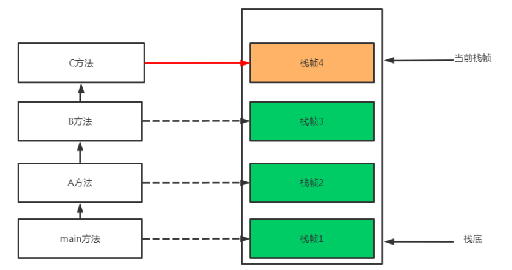
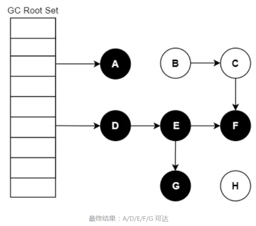
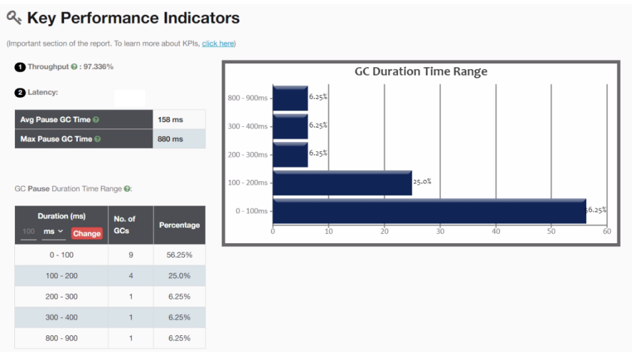
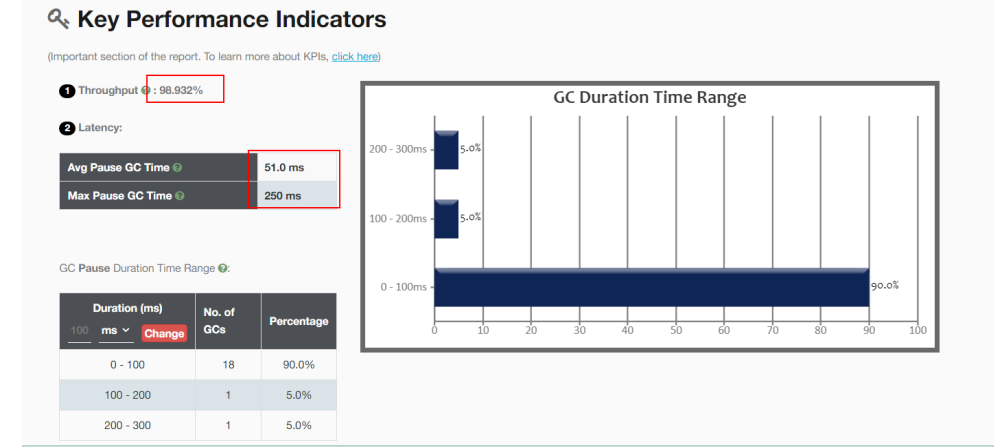

JVM优化

**为什么要学习JVM优化**

- **目的1: 面试需要**

  大厂BAT TMD 都面试毕问的问题，面试不问点jvm、并发、分布式。 

  学习JVM并不仅仅在于面试，而在于更深入地理解 Java 这门语言，以及为未来排查线上问题打下基础 。 

- **目的2:深入地理解 Java 这门语言**

  工作了三年以后的朋友来说，很多时候你要解决一个问题必须深入到字节码层次去分析，你才能得到准确的结论，而字节码 就是虚拟机的一部分 

  深入地理解 Java 这门语言实例： 

  1、我们常用的布尔型 Boolean，我们都知道它有两个值，true 和 false。但你们知道其实在运行时，Java 虚拟机是 没有布尔型 Boolean 这种类型的。

  Boolean 型在虚拟机中使用整型的 1 和 0 表示。 

- **目的3: 学习虚拟机是为了今后更好的解决线上排查问题**

  我们知道我们一个Java 应用部署在线上机器上，肯定时不时会出现问题。除去网络、系统本身问题，很多时候 Java 应用 出现问题，就是 Java 虚拟机的内存出

  现了问题。要么是内存溢出了，要么是 GC 频繁导致响应慢等等。 那如何解决这些问题呢？

## 1、JVM回顾

### 1.1、什么是JVM

**JVM是Java Virtual Machine（Java虚拟机）的缩写，JVM是一种用于计算设备的规范，它是一个虚构出来的计算机，是通过在实际的计算机上仿真模拟各种**

**计算机功能来实现的。**


**主流虚拟机**

| 虚拟机名称 | 介绍                                                         |
| ---------- | ------------------------------------------------------------ |
| HotSpot    | Oracle/Sun JDK和OpenJDK都使用HotSPot VM的相同核心            |
| J9         | J9是IBM开发的高度模块化的JVM                                 |
| JRockit    | JRockit 与 HotSpot 同属于 Oracle，目前为止 Oracle 一直在推进 HotSpot 与 JRockit 两款各有优势的虚拟机进行融合互补 |
| Zing       | 由Azul Systems根据HostPot为基础改进的高性能低延迟的JVM       |
| Dalvik     | Android上的Dalvik 虽然名字不叫JVM，但骨子里就是不折不扣的JVM |

### 1.2、JVM与操作系统

> 为什么要在程序和操作系统中间添加一个JVM  

Java 是一门抽象程度特别高的语言，提供了自动内存管理等一系列的特性。这些特性直接在操作系统上实现是不太可能的，所以就需要 JVM 进行一番转换。


从图中可以看到，有了 JVM 这个抽象层之后，Java 就可以实现跨平台了。JVM 只需要保证能够正确执行 .class 文件，就可以运行在诸如 Linux、Windows、MacOS 等平台上了。

而 Java 跨平台的意义在于一次编译，处处运行，能够做到这一点 JVM 功不可没。比如我们在 Maven 仓库下载同一版本的 jar 包就可以到处运行，不需要在每个平

台上再编译一次。

现在的一些 JVM 的扩展语言，比如 Clojure、JRuby、Groovy 等，编译到最后都是 .class 文件，Java 语言的维护者，只需要控制好 JVM 这个解析器，就可以将这

些扩展语言无缝的运行在 JVM 之上了。

> 应用程序、JVM、操作系统之间的关系


我们用一句话概括 JVM 与操作系统之间的关系：JVM 上承开发语言，下接操作系统，它的中间接口就是字节码。

### 1.3、JVM、JRE、JDK 的关系


JVM 是 Java 程序能够运行的核心。但是需要注意，JVM 自己什么也干不了，你需要给它提供生产原料（.class 文件） 。

仅仅是 JVM，是无法完成一次编译，处处运行的。它需要一个基本的类库，比如怎么操作文件、怎么连接网络等。

而 Java 体系很慷慨，会一次性将 JVM 运行所需的类库都传递给它。JVM 标准加上实现的一大堆基础类库，就组成了 Java 的运行时环境，也就是我们常说的 JRE

（Java Runtime Environment）

对于 JDK 来说，就更庞大了一些。除了 JRE，JDK 还提供了一些非常好用的小工具，比如 javac、java、jar 等。它是 Java 开发的核心，让外行也可以炼剑！

我们也可以看下 JDK 的全拼，Java Development Kit。我非常怕 kit（装备）这个单词，它就像一个无底洞，预示着你永无休止的对它进行研究。JVM、JRE、JDK 

它们三者之间的关系，可以用一个包含关系表示。


### 1.4、Java虚拟机规范和 Java 语言规范的关系


左半部分是 Java 虚拟机规范，其实就是为输入和执行字节码提供一个运行环境。右半部分是我们常说的 Java 语法规范，比如 switch、for、泛型、lambda 等相关

的程序，最终都会编译成字节码。而连接左右两部分的桥梁依然是Java 的字节码。

如果 .class 文件的规格是不变的，这两部分是可以独立进行优化的。但 Java 也会偶尔扩充一下 .class 文件的格式，增加一些字节码指令，以便支持更多的特性。

我们可以把 Java 虚拟机可以看作是一台抽象的计算机，它有自己的指令集以及各种运行时内存区域，学过《计算机组成结构》的同学会在课程的后面看到非常多

的相似性。

最后，我们简单看一下一个 Java 程序的执行过程，它到底是如何运行起来的。


这里的 Java 程序是文本格式。比如下面这段 HelloWorld.java，它遵循的就是 Java 语言规范。其中，我们调用了System.out 等模块，也就是 JRE 里提供的类库。

```java
public class HelloWorld { 
    public static void main(String[] args) {
        System.out.println("Hello World"); 
    } 
}
```

使用 JDK 的工具 javac 进行编译后，会产生 HelloWorld 的字节码。

我们一直在说 Java 字节码是沟通 JVM 与 Java 程序的桥梁，下面使用 javap 来稍微看一下字节码到底长什么样子。

```java
0 getstatic #2 <java/lang/System.out> // getstatic 获取静态字段的值 
3 ldc #3 <Hello World> // ldc 常量池中的常量值入栈 
5 invokevirtual #4 <java/io/PrintStream.println> // invokevirtual 运行时方法绑定调用方法 
8 return //void 函数返回
```

Java 虚拟机采用基于栈的架构，其指令由操作码和操作数组成。这些 字节码指令 ，就叫作 opcode。其中， getstatic、ldc、invokevirtual、return 等，就是 

opcode，可以看到是比较容易理解的。

JVM 就是靠解析这些 opcode 和操作数来完成程序的执行的。当我们使用 Java 命令运行 .class 文件的时候，实际上就相当于启动了一个 JVM 进程。

然后 JVM 会翻译这些字节码，它有两种执行方式。常见的就是解释执行，将 opcode + 操作数翻译成机器代码；另外一种执行方式就是 JIT，也就是我们常说的即

时编译，它会在一定条件下将字节码编译成机器码之后再执行。

## 2、java虚拟机的内存管理

### 2.1、JVM整体架构

> 根据 JVM 规范，JVM 内存共分为虚拟机栈、堆、方法区、程序计数器、本地方法栈五个部分。


| 名称       | 特征                                                     | 作用                                                         | 配置参数                                                     | 异常                                |
| ---------- | -------------------------------------------------------- | ------------------------------------------------------------ | ------------------------------------------------------------ | ----------------------------------- |
| 程序计数器 | 占用内存小，线程私有，生命周期与线程相同                 | 大致为字节码行号指示器                                       | 无                                                           | 无                                  |
| 虚拟机栈   | 线程私有，生命周期与线程相同，使用连续的内存空间         | Java 方法执行的内存模型，存储局部变量表、操作栈、动态链接、方法出口等信息 | -Xss                                                         | StackOverflowError/OutOfMemoryError |
| 堆         | 线程共享，生命周期与虚拟机相同，可以不使用连续的内存地址 | 保存对象实例，所有对象实例（包括数组）都要在堆上分配         | -Xms <br/>-Xmx <br/>-Xmn                                     | OutOfMemoryError                    |
| 方法区     | 线程共享，生命周期与虚拟机相同，可以不使用连续的内存地址 | 存储已被虚拟机加载的类信息、常量、静态变量、即时编译器编译后的代码等数据 | -XX:PermSize:16M<br/>- XX:MaxPermSize64M/<br/>-XX:MetaspaceSize=16M             -XX:MaxMetaspaceSize=64M | OutOfMemoryError                    |
| 本地方法栈 | 线程私有                                                 | 为虚拟机使用到的Native 方法服务                              | 无                                                           | StackOverflowError/OutOfMemoryError |

> **JVM**分为五大模块： 类装载器子系统 、 运行时数据区 、 执行引擎 、 本地方法接口 和 垃圾收集模块 。


### 2.2、JVM运行时内存

Java 虚拟机有自动内存管理机制，如果出现面的问题，排查错误就必须要了解虚拟机是怎样使用内存的。


**Java7和Java8内存结构的不同主要体现在方法区的实现**

方法区是java虚拟机规范中定义的一种概念上的区域，不同的厂商可以对虚拟机进行不同的实现。

我们通常使用的Java SE都是由Sun JDK和OpenJDK所提供，这也是应用最广泛的版本。而该版本使用的VM就是HotSpot VM。通常情况下，我们所讲的java虚拟机

指的就是HotSpot的版本。

- JDK7 内存结构

  

- JDK8 的内存结构

  

  针对JDK8虚拟机内存详解

  

  JDK7和JDK8变化小结

  

  ```java
  线程私有的： 
      ①程序计数器
      ②虚拟机栈 
      ③本地方法栈
  线程共享的： 
      ①堆
      ②方法区 
      直接内存(非运行时数据区的一部分)
  ```

- 面视问题

  - **对于Java8，HotSpots取消了永久代，那么是不是就没有方法区了呢？**

    当然不是，方法区只是一个规范，只不过它的实现变了。

    在Java8中，元空间(Metaspace)登上舞台，方法区存在于元空间(Metaspace)。同时，元空间不再与堆连续，而且是存在于本地内存（Native memory）

  - **方法区Java8之后的变化**

    - 移除了永久代（PermGen），替换为元空间（Metaspace）
    - 永久代中的class metadata（类元信息）转移到了native memory（本地内存，而不是虚拟机）
    - 永久代中的interned Strings（字符串常量池） 和 class static variables（类静态变量）转移到了Java heap
    - 永久代参数（PermSize MaxPermSize）-> 元空间参数（MetaspaceSize MaxMetaspaceSize）

  - **Java8为什么要将永久代替换成Metaspace？**

    - 字符串存在永久代中，容易出现性能问题和内存溢出。、
    - 类及方法的信息等比较难确定其大小，因此对于永久代的大小指定比较困难，太小容易出现永久代溢出，太大则容易导致老年代溢出。
    - 永久代会为 GC 带来不必要的复杂度，并且回收效率偏低。
    - Oracle 可能会将HotSpot 与 JRockit 合二为一，JRockit没有所谓的永久代。

### 2.3、PC 程序计数器

**程序计数器（Program Counter Register）**:也叫PC寄存器，是一块较小的内存空间，它可以看做是当前线程所执行的字节码的行号指示器。在虚拟机的概念模

型里，字节码解释器工作时就是通过改变这个计数器的值来选取下一条需要执行的字节码指令、分支、循环、跳转、异常处理、线程恢复等基础功能都需要依赖这

个计数器来完成。

**PC寄存器的特点**

（1）区别于计算机硬件的pc寄存器，两者不略有不同。计算机用pc寄存器来存放“伪指令”或地址，而相对于虚拟机，pc寄存器它表现为一块内存，虚拟机的pc寄

存器的功能也是存放伪指令，更确切的说存放的是将要执行指令的地址。
（2）当虚拟机正在执行的方法是一个本地（native）方法的时候，jvm的pc寄存器存储的值是undefined。 

（3）程序计数器是线程私有的，它的生命周期与线程相同，每个线程都有一个。

（4）此内存区域是唯一一个在Java虚拟机规范中没有规定任何OutOfMemoryError情况的区域。


**IDEA安装插件：jclasslib  bytecode viewer  进行查看**


Java虚拟机的多线程是通过线程轮流切换并分配处理器执行时间的方式来实现的，在任何一个确定的时刻，一个处理器只会执行一条线程中的指令。

因此，为了线程切换后能恢复到正确的执行位置，每条线程都需要有一个独立的程序计数器，各条线程之间的计数器互不影响，独立存储，我们称这类内存区域

为“线程私有”的内存。

### 2.4、虚拟机栈

- **什么是虚拟机栈**

  Java虚拟机栈(Java Virtual Machine Stacks)也是线程私有的，即生命周期和线程相同。Java虚拟机栈和线程同时创建，用于存储栈帧。**每个方法在执行时都会**

  **创建一个栈帧(Stack Frame)，用于存储局部变量表、操作数栈、动态链接、方法出口等信息**。每一个方法从调用直到执行完成的过程就对应着一个栈帧在虚

  拟机栈中从入栈到出栈的过程。

  ```java
  public class StackDemo {
      public static void main(String[] args) {
          StackDemo sd = new StackDemo();
          sd.A();
      }
      public void A() {
          int a = 10;
          System.out.println(" method A start");
          System.out.println(a);
          B();
          System.out.println("method A end");
      }
      public void B() {
          int b = 20;
          System.out.println(" method B start");
          C();
          System.out.println("method B end");
      }
      private void C() {
          int c = 30;
          System.out.println(" method C start");
          System.out.println("method C end");
      }
  }
  ```

  

- **什么是栈帧**

  栈帧(Stack Frame)是用于支持虚拟机进行方法调用和方法执行的数据结构。栈帧存储了方法的局部变量表、操作数栈、动态连接和方法返回地址等信息。每一

  个方法从调用至执行完成的过程，都对应着一个栈帧在虚拟机栈里从入栈到出栈的过程。

  

- **设置虚拟机栈的大小**

  **-Xss 为jvm启动的每个线程分配的内存大小，默认JDK1.4中是256K，JDK1.5+中是1M** 

  Linux/x64 (64-bit): 1024 KB 

  macOS (64-bit): 1024 KB 

  Oracle Solaris/x64 (64-bit): 1024 KB 

  Windows: The default value depends on virtual memory

  ```java
  -Xss1m    //1M
  -Xss1024k   // 1024KB
  -Xss1048576   //1048576B
  ```

  ```java
  public class StackTest { 
      static long count = 0 ;
      public static void main(String[] args) { 
          count++; 
          System.out.println(count); //8467
          main(args); 
      } 
  }
  ```

  

- **局部变量表**

  局部变量表(Local Variable Table)是一组变量值存储空间，用于存放方法参数和方法内定义的局部变量。包括8种基本数据类型、对象引用（reference类型）

  和returnAddress类型（指向一条字节码指令的地址）。其中64位长度的long和double类型的数据会占用2个局部变量空间（Slot），其余的数据类型只占用1

  个。

  

- **操作数栈**

  操作数栈(Operand Stack)也称作操作栈，是一个后入先出栈(LIFO)。随着方法执行和字节码指令的执行，会从局部变量表或对象实例的字段中复制常量或变量

  写入到操作数栈，再随着计算的进行将栈中元素出栈到局部变量表或者返回给方法调用者，也就是出栈/入栈操作。

  ```java
  public class StackDemo2 { 
      public static void main(String[] args) { 
          int i = 1; 
          int j = 2; 
          int z = i + j; 
      } 
  }
  ```

- **动态链接**

  Java虚拟机栈中，每个栈帧都包含一个指向运行时常量池中该栈所属方法的符号引用，持有这个引用的目的是为了支持方法调用过程中的动态链接(Dynamic Linking)。 

  动态链接的作用:将符号引用转换成直接引用。 

- **方法返回地址**

  方法返回地址存放调用该方法的PC寄存器的值。一个方法的结束，有两种方式：正常地执行完成，出现未处理的异常非正常的退出。无论通过哪种方式退出，

  在方法退出后都返回到该方法被调用的位置。方法正常退出时，调用者的PC计数器的值作为返回地址，即调用该方法的指令的下一条指令的地址。而通过异常

  退出的，返回地址是要通过异常表来确定，栈帧中一般不会保存这部分信息。

  无论方法是否正常完成，都需要返回到方法被调用的位置，程序才能继续进行。

### 2.5、本地方法栈

本地方法栈（Native Method Stacks） 与虚拟机栈所发挥的作用是非常相似的， 其区别只是虚拟机栈为虚拟机执行Java方法（也就是字节码） 服务， 而本地方法

栈则是为虚拟机使用到的本地（Native） 方法服务。

**特点**

（1）本地方法栈加载native的但是方法, native类方法存在的意义当然是填补java代码不方便实现的缺陷而提出的。

（2）虚拟机栈为虚拟机执行Java方法服务，而本地方法栈则是为虚拟机使用到的Native方法服务。

（3）是线程私有的，它的生命周期与线程相同，每个线程都有一个。

```java
在Java虚拟机规范中，对本地方法栈这块区域，与Java虚拟机栈一样，规定了两种类型的异常： 
    (1)StackOverFlowError :线程请求的栈深度>所允许的深度。 
    (2)OutOfMemoryError：本地方法栈扩展时无法申请到足够的内存。
```

### 2.6、堆

#### 2.6.1、Java 堆概念

对于Java应用程序来说， Java堆（Java Heap） 是虚拟机所管理的内存中最大的一块。 Java堆是被所 有线程共享的一块内存区域， 在虚拟机启动时创建。 此内存

区域的唯一目的就是存放对象实例， Java 世界里“几乎”所有的对象实例都在这里分配内存。“几乎”是指从实现角度来看， 随着Java语 言的发展， 现在已经能看到

些许迹象表明日后可能出现值类型的支持， 即使只考虑现在， 由于即时编译技术的进步， 尤其是逃逸分析技术的日渐强大， 栈上分配、 标量替换优化手段已经

导致一些微妙的变化悄然发生， 所以说Java对象实例都分配在堆上也渐渐变得不是那么绝对了。


- **堆的特点**

  （1）是Java虚拟机所管理的内存中最大的一块。

  （2）堆是jvm所有线程共享的。堆中也包含私有的线程缓冲区 Thread Local Allocation Buffer (TLAB) 

  （3）在虚拟机启动的时候创建。

  （4）唯一目的就是存放对象实例，几乎所有的对象实例以及数组都要在这里分配内存。

  （5）Java堆是垃圾收集器管理的主要区域。

  （6）因此很多时候java堆也被称为“GC堆”（Garbage Collected Heap）。从内存回收的角度来看，由于现在收集器基本都采用分代收集算法，所以Java堆还

  可以细分为：新生代和老年代；新生代又可以分为：Eden 空间、From Survivor空间、To Survivor空间。

  （7）java堆是计算机物理存储上不连续的、逻辑上是连续的，也是大小可调节的（通过-Xms和-Xmx控制）。

  （8）方法结束后,堆中对象不会马上移出仅仅在垃圾回收的时候时候才移除。

  （9）如果在堆中没有内存完成实例的分配，并且堆也无法再扩展时，将会抛出OutOfMemoryError异常

- **设置堆空间大小**

  内存大小-Xmx/-Xms

  使用示例: -Xmx20m -Xms5m

  说明： 当下Java应用最大可用内存为20M， 最小内存为5M

  ```java
  public class TestVm { 
      public static void main(String[] args) { 
      //补充 
      //byte[] b=new byte[5*1024*1024]; 
      //System.out.println("分配了1M空间给数组");
      System.out.print("Xmx="); System.out.println(Runtime.getRuntime().maxMemory() / 1024.0 / 1024 + "M"); 
      System.out.print("free mem="); System.out.println(Runtime.getRuntime().freeMemory() / 1024.0 / 1024 + "M"); 
      System.out.print("total mem="); System.out.println(Runtime.getRuntime().totalMemory() / 1024.0 / 1024 + "M");
      } 
  }
  ```

  执行结果:

  ```apl
  Xmx=20.0M
  free mem=4.1877593994140625M 
  total mem=6.0M
  ```

  大家可以发现，这里打印出来的Xmx值和设置的值之间是由差异的，total Memory和最大的内存之间还是存在一定差异的，就是说JVM一般会尽量保持内存在

  一个尽可能底的层面，而非贪婪做法按照最大的内存来进行分配。

  在测试代码中新增如下语句，申请内存分配：

  ```java
  byte[] b=new byte[4*1024*1024]; 
  System.out.println("分配了1M空间给数组");
  ```

  在申请分配了4m内存空间之后，total memory上升了，同时可用的内存也上升了，可以发现其实JVM在分配内存过程中是动态的， 按需来分配的。

- **堆的分类**

  现在垃圾回收器都使用分代理论,堆空间也分类如下:

  **在Java7 Hotspot虚拟机中将Java堆内存分为3个部分：**

  - **青年代Young Generation**
  - **老年代Old Generation**
  - **永久代Permanent Generation**

  

  **在Java8以后，由于方法区的内存不在分配在Java堆上，而是存储于本地内存元空间Metaspace中，所以永久代就不存在了，**在2018年9约25日Java11正式发

  布以后，我从官网上找到了关于Java11中垃圾收集器的官方文档，文档中没有提到“永久代”，而只有青年代和老年代。

  

#### 2.6.2、年轻代和老年代

- **JVM中存储java对象可以被分为两类:**

  **1）年轻代(Young Gen)：**年轻代主要存放新创建的对象，内存大小相对会比较小，垃圾回收会比较频繁。年轻代分成1个Eden Space和2个Suvivor Space

  （from 和to）。

  **2）年老代(Tenured Gen)：**年老代主要存放JVM认为生命周期比较长的对象（经过几次的Young Gen的垃圾回收后仍然存在），内存大小相对会比较大，垃

  圾回收也相对没有那么频繁。

  

- **配置新生代和老年代堆结构占比**

  默认 -XX:NewRatio=2 , 标识新生代占1 , 老年代占2 ,新生代占整个堆的1/3

  修改占比 -XX:NewPatio=4 , 标识新生代占1 , 老年代占4 , 新生代占整个堆的1/5 

  Eden空间和另外两个Survivor空间占比分别为8:1:1

  可以通过操作选项 -XX:SurvivorRatio 调整这个空间比例。 比如 -XX:SurvivorRatio=8

  **几乎所有的java对象都在Eden区创建, 但80%的对象生命周期都很短,创建出来就会被销毁.**

  

  从图中可以看出： **堆大小** **=** **新生代** **+** **老年代**。其中，堆的大小可以通过参数 –Xms、-Xmx 来指定。

  默认的，新生代 ( Young ) 与老年代 ( Old ) 的比例的值为 1:2 ( 该值可以通过参数 –XX:NewRatio 来指定 )，即：新生代 ( Young ) = 1/3 的堆空间大小。老年代 ( Old ) = 2/3 的堆空间大小。其中，新生代 ( Young ) 被细分为 Eden 和 两个Survivor 区域，这两个 Survivor 区域分别被命名为 from 和 to，以示区分。 默认的，Edem : from : to = 8 : 1 : 1 ( 可以通过参数 –XX:SurvivorRatio 来设定 )，即： 

  Eden = 8/10 的新生代空间大小，

  from = to = 1/10 的新生代空间大小。

  JVM 每次只会使用 Eden 和其中的一块 Survivor 区域来为对象服务，所以无论什么时候，总是有一块 Survivor 区域是空闲着的。因此，新生代实际可用的内

  存空间为 9/10 ( 即90% )的新生代空间。

#### 2.6.3、对象分配过程

JVM设计者不仅需要考虑到内存如何分配，在哪里分配等问题，并且由于内存分配算法与内存回收算法密切相关，因此还需要考虑GC执行完内存回收后是否存在空

间中间产生内存碎片。

**分配过程**

1. new的对象先放在伊甸园区。该区域有大小限制 

2. 当伊甸园区域填满时，程序又需要创建对象，JVM的垃圾回收器将对伊甸园预期进行垃圾回收（Minor GC）,将伊甸园区域中不再被其他对象引用的额对象进

   行销毁，再加载新的对象放到伊甸园区

3. 然后将伊甸园区中的剩余对象移动到幸存者0区 

4. 如果再次触发垃圾回收，此时上次幸存下来的放在幸存者0区的，如果没有回收，就会放到幸存者1区 

5. 如果再次经历垃圾回收，此时会重新返回幸存者0区，接着再去幸存者1区。

6. 如果累计次数到达默认的15次，这会进入养老区。可以通过设置参数，调整阈值 -XX:MaxTenuringThreshold=N

7. 养老区内存不足是,会再次出发GC:Major GC 进行养老区的内存清理

8. 如果养老区执行了Major GC后仍然没有办法进行对象的保存,就会报OOM异常.


**分配对象的流程：**


#### 2.6.4、堆GC

Java 中的堆也是 GC 收集垃圾的主要区域。GC 分为两种：一种是部分收集器（Partial GC）另一类是整堆收集器（Fu'll GC）

- **部分收集器: 不是完整收集java堆的的收集器,它又分为:**
  - 新生代收集（Minor GC / Young GC）: 只是新生代的垃圾收集
  - 老年代收集 （Major GC / Old GC）: 只是老年代的垃圾收集 (CMS GC 单独回收老年代)
  - 混合收集（Mixed GC）:收集整个新生代及老年代的垃圾收集 (G1 GC会混合回收, region区域回收)
- **整堆收集（Full GC）:收集整个java堆和方法区的垃圾收集器**

- **年轻代GC触发条件:**

  - 年轻代空间不足,就会触发Minor GC， 这里年轻代指的是Eden代满，Survivor不满不会引发GC
  - Minor GC会引发STW(stop the world) ,暂停其他用户的线程,等垃圾回收接收,用户的线程才恢复

- **老年代GC (Major GC)触发机制**

  - 老年代空间不足时,会尝试触发MinorGC. 如果空间还是不足,则触发Major GC

  - 如果Major GC , 内存仍然不足,则报错OOM 

  - Major GC的速度比Minor GC慢10倍以上. 

- **FullGC 触发机制:**

  - 调用System.gc() , 系统会执行Full GC ,不是立即执行.

  - 老年代空间不足

  - 方法区空间不足

  - 通过Minor GC进入老年代平均大小大于老年代可用内存

### 2.7、元空间

在JDK1.7之前，HotSpot 虚拟机把方法区当成永久代来进行垃圾回收。而从 JDK 1.8 开始，移除永久代，并把方法区移至元空间，它位于本地内存中，而不是虚拟

机内存中。 HotSpots取消了永久代，那么是不是也就没有方法区了呢？当然不是，方法区是一个规范，规范没变，它就一直在，只不过取代永久代的是**元空间**

**（Metaspace）**而已。它和永久代有什么不同的？

- **存储位置不同：**永久代在物理上是堆的一部分，和新生代、老年代的地址是连续的，而元空间属于本地内存。

- **存储内容不同：**在原来的永久代划分中，永久代用来存放类的元数据信息、静态变量以及常量池等。现在类的元信息存储在元空间中，静态变量和常量池等并

  入堆中，相当于原来的永久代中的数据，被元空间和堆内存给瓜分了。


- **为什么要废弃永久代，引入元空间？**

  相比于之前的永久代划分，Oracle为什么要做这样的改进呢？

  - 在原来的永久代划分中，永久代需要存放类的元数据、静态变量和常量等。**它的大小不容易确定**，因为这其中有很多影响因素，比如类的总数，常量池的

    大小和方法数量等，-XX:MaxPermSize 指定太小很容易造成永久代内存溢出。

  - 移除永久代是为融合HotSpot VM与 JRockit VM而做出的努力，因为JRockit没有永久代，不需要配置永久代

  - 永久代会为GC带来不必要的复杂度，并且回收效率偏低。

- **废除永久代的好处**

  - 由于类的元数据分配在本地内存中，元空间的最大可分配空间就是系统可用内存空间。不会遇到永久代存在时的内存溢出错误。

  - 将运行时常量池从PermGen分离出来，与类的元数据分开，提升类元数据的独立性。

  - 将元数据从PermGen剥离出来到Metaspace，可以提升对元数据的管理同时提升GC效率。

- **Metaspace相关参数**

  - **-XX:MetaspaceSize，**初始空间大小，达到该值就会触发垃圾收集进行类型卸载，同时GC会对该值进行调整：如果释放了大量的空间，就适当降低该

    值；如果释放了很少的空间，那么在不超过MaxMetaspaceSize时，适当提高该值。

  - **-XX:MaxMetaspaceSize，**最大空间，默认是没有限制的。如果没有使用该参数来设置类的元数据的大小，**其最大可利用空间是整个系统内存的可用空**

    **间**。JVM也可以增加本地内存空间来满足类元数据信息的存储。但是如果没有设置最大值，则可能存在bug导致Metaspace的空间在不停的扩展，会导致

    机器的内存不足；进而可能出现swap内存被耗尽；最终导致进程直接被系统直接kill掉。如果设置了该参数，当Metaspace剩余空间不足，会抛出：

    java.lang.OutOfMemoryError: Metaspace space 

  - **-XX:MinMetaspaceFreeRatio，**在GC之后，最小的Metaspace剩余空间容量的百分比，减少为分配空间所导致的垃圾收集

  - **-XX:MaxMetaspaceFreeRatio，**在GC之后，最大的Metaspace剩余空间容量的百分比，减少为释放空间所导致的垃圾收集

### 2.8、方法区

#### 2.8.1、方法区的理解

方法区（Method Area） 与Java堆一样， 是各个线程共享的内存区域， 它用于存储已被虚拟机加载的类型信息、常量、 静态变量、 即时编译器编译后的代码缓

存等数据。

> 《Java虚拟机规范》中明确说明：“尽管所有的方法区在逻辑上是属于堆的一部分，但些简单的实现可能不会选择去进行垃圾收集或者进行压缩”。对HotSpot
>
> 而言，方法区还有一个别名叫做Non-Heap（非堆），的就是要和堆分开。

**元空间、永久代是方法区具体的落地实现。方法区看作是一块独立于Java堆的内存空间，它主要是用来存储所加载的类信息的**


**创建对象各数据区域的声明：**


**方法区的特点:**

- 方法区与堆一样是各个线程共享的内存区域

- 方法区在JVM启动的时候就会被创建并且它实例的物理内存空间和Java堆一样都可以不连续

- 方法区的大小跟堆空间一样 可以选择固定大小或者动态变化

- 方法区的对象决定了系统可以保存多少个类,如果系统定义了太多的类 导致方法区溢出虚拟机同样会跑出(OOM)异常(Java7之前是 PermGen Space (永久带) 

  Java 8之后 是MetaSpace(元空间) )

- 关闭JVM就会释放这个区域的内存

#### 2.8.2、方法区结构

- **方法区的内部结构**

  

  **类加载器将Class文件加载到内存之后，将类的信息存储到方法区中。**

- **方法区中存储的内容：**

  - 类型信息（域信息、方法信息）

  - 运行时常量池

  

- **类型信息**

  对每个加载的类型（类Class、接口 interface、枚举enum、注解 annotation），JVM必须在方法区中存储以下类型信息：

  ① 这个类型的完整有效名称（全名 = 包名.类名）

  ② 这个类型直接父类的完整有效名（对于 interface或是java.lang. Object，都没有父类）

  ③ 这个类型的修饰符（ public, abstract，final的某个子集）

  ④ 这个类型直接接口的一个有序列表

- **域信息**

  域信息，即为类的属性，成员变量

  JVM必须在方法区中保存类所有的成员变量相关信息及声明顺序。

  域的相关信息包括：域名称、域类型、域修饰符（pυblic、private、protected、static、final、volatile、transient的某个子集）

- **方法信息**

  JVM必须保存所有方法的以下信息，同域信息一样包括声明顺序：
  1. 方法名称方法的返回类型（或void） 
  1. 方法参数的数量和类型（按顺序）
  3. 方法的修饰符public、private、protected、static、final、synchronized、native,、abstract的一个子集
  4. 方法的字节码bytecodes、操作数栈、局部变量表及大小（ abstract和native方法除外）
  5. 异常表（ abstract和 native方法除外）。每个异常处理的开始位置、结束位置、代码处理在程序计数器中的偏移地址、被捕获的异常类的常量池索引

#### 2.8.3、方法区设置

**方法区的大小不必是固定的，JVM可以根据应用的需要动态调整。**

- **jdk7及以前**

  - 通过-xx:Permsize来设置永久代初始分配空间。默认值是20.75M 

  - -XX:MaxPermsize来设定永久代最大可分配空间。32位机器默认是64M，64位机器模式是82M 

  - 当JVM加载的类信息容量超过了这个值，会报异常OutofMemoryError:PermGen space。

  查看JDK PermSpace区域默认大小

  ```shell
  jps #是java提供的一个显示当前所有java进程pid的命令 
  jinfo -flag PermSize 进程号 #查看进程的PermSize初始化空间大小 
  jinfo -flag MaxPermSize 进程号 #查看PermSize最大空间
  ```

- **JDK8以后**

  元数据区大小可以使用参数 -XX:MetaspaceSize 和 -XX:MaxMetaspaceSize指定

  默认值依赖于平台。windows下，-XX:MetaspaceSize是21M，-XX:MaxMetaspaceSize的值是-1，即没有限制。

  与永久代不同，如果不指定大小，默认情况下，虚拟机会耗尽所有的可用系统内存。如果元数据区发生溢出，虚拟机一样会抛出异常

  OutOfMemoryError:Metaspace 

  -XX:MetaspaceSize：设置初始的元空间大小。对于一个64位的服务器端JVM来说，其默认的-xx:MetaspaceSize值为21MB。这就是初始的高水位线，一旦触

  及这个水位线，FullGC将会被触发并卸载没用的类（即这些类对应的类加载器不再存活）然后这个高水位线将会重置。新的高水位线的值取决于GC后释放了多

  少元空间。如果释放的空间不足，那么在不超过MaxMetaspaceSize时，适当提高该值。如果释放空间过多，则适当降低该值。

  如果初始化的高水位线设置过低，上述高水位线调整情况会发生很多次。通过垃圾回收器的日志可以观察到FullGC多次调用。为了避免频繁地GC，建议将

  -XX:MetaspaceSize设置为一个相对较高的值。

  ```shell
  jps #查看进程号 
  jinfo -flag MetaspaceSize 进程号 #查看Metaspace 最大分配内存空间 
  jinfo -flag MaxMetaspaceSize 进程号 #查看Metaspace最大空间
  ```

### 2.9、运行时常量池

> **常量池vs运行时常量池**

**字节码文件中**，内部包含了常量池

**方法区中**，内部包含了运行时常量池

**常量池：存放编译期间生成的各种字面量与符号引用**

**运行时常量池：常量池表在运行时的表现形式**

编译后的字节码文件中包含了类型信息、域信息、方法信息等。通过ClassLoader将**字节码文件的常量池**中的信息加载到内存中，存储在了**方法区的运行时常量池**中。

理解为字节码中的常量池 Constant pool 只是文件信息，它想要执行就必须加载到内存中。而Java程序是靠JVM，更具体的来说是JVM的执行引擎来解释执行的。

执行引擎在运行时常量池中取数据，被加载的字节码常量池中的信息是放到了方法区的运行时常量池中。

它们不是一个概念，存放的位置是不同的。一个在字节码文件中，一个在方法区中。


对字节码文件反编译之后，查看常量池相关信息：


要弄清楚方法区的运行时常量池，需要理解清楚字节码中的常量池。

一个有效的字节码文件中除了包含类的版本信息、字段、方法以及接口等描述信息外，还包含一项信息那就是**常量池表**（ Constant pool table），包括各种字面量和对类型、域和方法的符号引用。

**常量池，可以看做是一张表，虚拟机指令根据这张常量表找到要执行的类名、方法名、参数类型、字面量等类型。**常量池表Constant pool table：


在方法中对常量池表的符号引用


**为什么需要常量池？**

```java
public class Solution {
    public void method() { 
        System.out.println("are you ok");
    } 
}
```

这段代码很简单，但是里面却使用了 String、 System、 PrintStream及Object等结构。如果代码多，引用到的结构会更多！这里就需要常暈池，将这些引用转变

为符号引用，具体用到时，采取加载。

### 2.10、直接内存

直接内存（Direct Memory） 并不是虚拟机运行时数据区的一部分。

在JDK 1.4中新加入了NIO（New Input/Output） 类， 引入了一种基于通道（Channel） 与缓冲区 （Buffer） 的I/O方式， 它可以使用Native函数库直接分配堆

外内存， 然后通过一个存储在Java堆里面的 DirectByteBuffer对象作为这块内存的引用进行操作。 这样能在一些场景中显著提高性能， 因为避免了 在Java堆和

Native堆中来回复制数据。


NIO的Buffer提供一个可以直接访问系统物理内存的类——DirectBuffer。DirectBuffer类继承自ByteBuffer，但和普通的ByteBuffer不同。普通的ByteBuffer仍在

JVM堆上分配内存，其最大内存受到最大堆内存的 限制。而DirectBuffer直接分配在物理内存中，并不占用堆空间。在访问普通的ByteBuffer时，系统总是会使用

一个“内核缓冲区”进行操作。而DirectBuffer所处的位置，就相当于这个“内核缓冲区”。因此，使用DirectBuffer是一种更加接近内存底层的方法，所以它的速度比

普通的ByteBuffer更快。


通过使用堆外内存，可以带来以下好处：
1. 改善堆过大时垃圾回收效率，减少停顿。Full GC时会扫描堆内存，回收效率和堆大小成正比。Native的内存，由OS负责管理和回收。
2. 减少内存在Native堆和JVM堆拷贝过程，避免拷贝损耗，降低内存使用。
3. 可突破JVM内存大小限制。

### 2.11、实战OutOfMemoryError异常

#### 2.11.1、Java堆溢出

堆内存中主要存放对象、数组等，只要不断地创建这些对象，并且保证 GC Roots 到对象之间有可达路径来避免垃圾收集回收机制清除这些对象，当这些对象所占

空间超过最大堆容量时，就会产生 OutOfMemoryError 的异常。堆内存异常示例如下：

```java
/**
 * 设置最大堆最小堆：-Xms20m -Xmx20m 
 */ 
public class HeapOOM { 
    static class OOMObject { }
    public static void main(String[] args) {
        List<OOMObject> oomObjectList = new ArrayList<>();
        while (true) { 
            oomObjectList.add(new OOMObject()); 
        } 
    } 
}
```

**运行后会报异常，在堆栈信息中可以看到**

java.lang.OutOfMemoryError: Java heap space 的信息，说明在堆内存空间产生内存溢出的异常。

新产生的对象最初分配在新生代，新生代满后会进行一次 Minor GC ，如果 Minor GC 后空间不足会把该对象和新生代满足条件的对象放入老年代，老年代空间不

足时会进行 Full GC ，之后如果空间还不足以存放新对象则抛出 OutOfMemoryError 异常。

常见原因：

- 内存中加载的数据过多，如一次从数据库中取出过多数据；
- 集合对对象引用过多且使用完后没有清空；
- 代码中存在死循环或循环产生过多重复对象；
- 堆内存分配不合理

#### 2.11.2、虚拟机栈和本地方法栈溢出

由于HotSpot虚拟机中并不区分虚拟机栈和本地方法栈， 因此对于HotSpot来说， -Xoss参数（设置本地方法栈大小） 虽然存在， 但实际上是没有任何效果的， 

栈容量只能由-Xss参数来设定。 关于虚拟机栈和本地方法栈， 在 《Java虚拟机规范》 中描述了两种异常：

- 如果线程请求的栈深度大于虚拟机所允许的最大深度， 将抛出StackOverflowError异常。

- 如果虚拟机的栈内存允许动态扩展， 当扩展栈容量无法申请到足够的内存时， 将抛出 OutOfMemoryError异常。

《Java虚拟机规范》 明确允许Java虚拟机实现自行选择是否支持栈的动态扩展， 而HotSpot虚拟机的选择是不支持扩展， 所以除非在创建线程申请内存时就因无

法获得足够内存而出现 OutOfMemoryError异常， 否则在线程运行时是不会因为扩展而导致内存溢出的， 只会因为栈容量无法容纳新的栈帧而导致

StackOverflowError异常。 为了验证这点， 我们可以做两个实验， 先将实验范围限制在单线程中操作， 尝试下面两种行为是 否能让HotSpot虚拟机产生

OutOfMemoryError异常： 使用-Xss参数减少栈内存容量。 结果： 抛出StackOverflowError异常， 异常出现时输出的堆栈深度相应缩小。 定义了大量的本地变

量， 增大此方法帧中本地变量表的长度。 结果： 抛出StackOverflowError异常， 异常出现时输出的堆栈深度相应缩小。 首先， 对第一种情况进行测试

- **虚拟机栈和本地方法栈测试（作为第1点测试程序）**

  ```java
  /** 
   * VM Args： -Xss128k 
   */
  public class JavaVMStackSOF { 
      private int stackLength = 1; 
      public void stackLeak() { 
          stackLength++; 
          stackLeak(); 
      }
      public static void main(String[] args) throws Throwable { 
          JavaVMStackSOF oom = new JavaVMStackSOF();
          try {
              oom.stackLeak(); 
          } catch (Throwable e) {
              System.out.println("stack length:" + oom.stackLength); throw e; 
          }  
      }
  }
  ```

  运行结果：

  ```java
  stack length:989 
  Exception in thread "main" java.lang.StackOverflowError 
      at com.lagou.unit.JavaVMStackSOFTest02.stackLeak(JavaVMStackSOFTest02.java:9)
      ....
  ```

  对于不同版本的Java虚拟机和不同的操作系统， 栈容量最小值可能会有所限制， 这主要取决于操 作系统内存分页大小。 譬如上述方法中的参数-Xss128k可以

  正常用于32位Windows系统下的JDK 6， 但 是如果用于64位Windows系统下的JDK 11， 则会提示栈容量最小不能低于180K， 而在Linux下这个值则 可能是

  228K， 如果低于这个最小限制， HotSpot虚拟器启动时会给出如下提示：

  ```java
  The Java thread stack size specified is too small. Specify at least 228k
  ```

  我们继续验证第二种情况， 这次代码就显得有些“丑陋”了， 为了多占局部变量表空间， 不得不定义一长串变量，具体如代码

  ```java
  public class JavaVMStackSOF { 
      private static int stackLength = 0; 
      public static void test() { 
          long unused1, unused2, unused3, unused4, unused5, unused6, unused7, unused8, unused9, unused10, unused11, unused12, unused13, unused14, unused15, unused16, unused17, unused18, unused19, unused20, unused21, unused22, unused23, unused24, unused25, unused26, unused27, unused28, unused29, unused30, unused31, unused32, unused33, unused34, unused35, unused36, unused37, unused38, unused39, unused40, unused41, unused42, unused43, unused44, unused45, unused46, unused47, unused48, unused49, unused50, unused51, unused52, unused53, unused54, unused55, unused56, unused57, unused58, unused59, unused60, unused61, unused62, unused63, unused64, unused65, unused66, unused67, unused68, unused69, unused70, unused71, unused72, unused73, unused74, unused75, unused76, unused77, unused78, unused79, unused80, unused81, unused82, unused83, unused84, unused85, unused86, unused87, unused88, unused89, unused90, unused91, unused92, unused93, unused94, unused95, unused96, unused97, unused98, unused99, unused100; stackLength ++; test(); unused1 = unused2 = unused3 = unused4 = unused5 = unused6 = unused7 = unused8 = unused9 = unused10 = unused11 = unused12 = unused13 = unused14 = unused15 = unused16 = unused17 = unused18 = unused19 = unused20 = unused21 = unused22 = unused23 = unused24 = unused25 =unused26 = unused27 = unused28 = unused29 = unused30 = unused31 = unused32 = unused33 = unused34 = unused35 = unused36 = unused37 = unused38 = unused39 = unused40 = unused41 = unused42 = unused43 = unused44 = unused45 = unused46 = unused47 = unused48 = unused49 = unused50 = unused51 = unused52 = unused53 = unused54 = unused55 = unused56 = unused57 = unused58 = unused59 = unused60 = unused61 = unused62 = unused63 = unused64 = unused65 = unused66 = unused67 = unused68 = unused69 = unused70 = unused71 = unused72 = unused73 = unused74 = unused75 = unused76 = unused77 = unused78 = unused79 = unused80 = unused81 = unused82 = unused83 = unused84 = unused85 = unused86 = unused87 = unused88 = unused89 = unused90 = unused91 = unused92 = unused93 = unused94 = unused95 = unused96 = unused97 = unused98 = unused99 = unused100 = 0; 
      }
      public static void main(String[] args) { 
          try {
              test(); 
          }catch (Error e){ 
              System.out.println("stack length:" + stackLength); 
              throw e; 
          } 
      }
  }
  ```

  运行结果：

  ```java
  stack length:4582 Exception in thread "main" java.lang.StackOverflowError 
      at com.lagou.unit.JavaVMStackSOFTest03.test(JavaVMStackSOFTest03.java:27)
      ...
  ```

  实验结果表明： 无论是由于栈帧太大还是虚拟机栈容量太小， 当新的栈帧内存无法分配的时候， HotSpot虚拟机抛出的都是StackOverflowError异常。 可是

  如果在允许动态扩展栈容量大小的虚拟机 上， 相同代码则会导致不一样的情况。 

- **创建线程导致内存溢出异常**

  ```java
  /** 
   * VM Args： -Xss2M （这时候不妨设大些， 请在32位系统下运行）
   */
  public class JavaVMStackOOM { 
      private void dontStop() { 
          while (true) { } 
      }
      public void stackLeakByThread() { 
          while (true) { 
              Thread thread = new Thread(new Runnable() { 
                  @Override public void run() {
                      dontStop(); 
                  }
              });
              thread.start();
          } 
      }
      public static void main(String[] args) throws Throwable { 
          JavaVMStackOOM oom = new JavaVMStackOOM(); 
          oom.stackLeakByThread();
      } 
  }
  ```

  重点提示一下， 如果读者要尝试运行上面这段代码， 记得要先保存当前的工作， 由于在 Windows平台的虚拟机中， Java的线程是映射到操作系统的内核线

  程上， 无限制地创建线程会对操 作系统带来很大压力， 上述代码执行时有很高的风险， 可能会由于创建线程数量过多而导致操作系统 假死。

  在32位操作系统下的运行结果

  ```java
  Exception in thread "main" java.lang.OutOfMemoryError: unable to create native thread
  ```

  出现StackOverflowError异常时， 会有明确错误堆栈可供分析， 相对而言比较容易定位到问题所在。 如果使用HotSpot虚拟机默认参数， 栈深度在大多数情

  况下（因为每个方法压入栈的帧大小并不是 一样的， 所以只能说大多数情况下） 到达1000~2000是完全没有问题， 对于正常的方法调用（包括不能 做尾递

  归优化的递归调用） ， 这个深度应该完全够用了。 但是， 如果是建立过多线程导致的内存溢 出， 在不能减少线程数量或者更换64位虚拟机的情况下， 就只

  能通过**减少最大堆和减少栈容量来换取更多的线程**。 这种通过“**减少内存”的手段来解决内存溢出的方式**， 如果没有这方面处理经验， 一般比 较难以想到， 这

  一点读者需要在开发32位系统的多线程应用时注意。 也是由于这种问题较为隐蔽， 从 JDK 7起， 以上提示信息中“unable to create native thread”后面， 虚

  拟机会特别注明原因可能是“possibly out of memory or process/resource limits reached”。

#### 2.11.3、 运行时常量池和方法区溢出

由于运行时常量池是方法区的一部分， 所以这两个区域的溢出测试可以放到一起进行。前面曾经提到HotSpot从 JDK 7开始逐步“去永久代”的计划， 并在JDK 8中完

全使用元空间来代替永久代的背景故事， 在此我们就以测试代码来观察一下， 使用“永久代”还是“元空间”来实现方法区， 对程序有什么 实际的影响。

String::intern()是一个本地方法， 它的作用是如果字符串常量池中已经包含一个等于此String对象的 字符串， 则返回代表池中这个字符串的String对象的引用； 否

则， 会将此String对象包含的字符串添加到常量池中， 并且返回此String对象的引用。 在JDK 6或更早之前的HotSpot虚拟机中， 常量池都是分配在永久代中， 我

们可以通过-XX： PermSize和-XX： MaxPermSize限制永久代的大小， 即可间接限制其中常量池的容量， 具体实现如代码清单

- **运行时常量池内存溢出**

  ```java
  /** 
   * VM Args： -XX:PermSize=6M -XX:MaxPermSize=6M 
   */
  public class RuntimeConstantPoolOOM {
      public static void main(String[] args) { 
          // 使用Set保持着常量池引用， 避免Full GC回收常量池行为
          Set<String> set = new HashSet<String>(); 
          // 在short范围内足以让6MB的PermSize产生OOM了
          short i = 0;
          while (true) { 
              set.add(String.valueOf(i++).intern()); 
          } 
      } 
  }
  ```

  **运行结果：**

  ```java
  Exception in thread "main" java.lang.OutOfMemoryError: PermGen space 
      at java.lang.String.intern(Native Method) 
      at org.fenixsoft.oom.RuntimeConstantPoolOOM.main(RuntimeConstantPoolOOM.java: 18)
  ```

  从运行结果中可以看到， 运行时常量池溢出时， 在OutOfMemoryError异常后面跟随的提示信息 是“PermGen space”， 说明运行时常量池的确是属于方法区（即JDK 6的HotSpot虚拟机中的永久代） 的 一部分。

  而使用JDK 7或更高版本的JDK来运行这段程序并不会得到相同的结果， 无论是在JDK 7中继续使 用-XX： MaxPermSize参数或者在JDK 8及以上版本使用

  -XX:MaxMeta-spaceSize参数把方法区容量同 样限制在6MB， 也都不会重现JDK 6中的溢出异常， 循环将一直进行下去， 永不停歇。 出现这种变 化， 是因为

  自JDK 7起， 原本存放在永久代的字符串常量池被移至Java堆之中， 所以在JDK 7及以上版本， 限制方法区的容量对该测试用例来说是毫无意义的。 这时候使

  用-Xmx参数限制最大堆到6MB就能 够看到以下两种运行结果之一， 具体取决于哪里的对象分配时产生了溢出：

  ```java
  // OOM异常一： 
  Exception in thread "main" java.lang.OutOfMemoryError: Java heap space
      at java.base/java.lang.Integer.toString(Integer.java:440) 
      at java.base/java.lang.String.valueOf(String.java:3058) 
      at RuntimeConstantPoolOOM.main(RuntimeConstantPoolOOM.java:12) 
  // OOM异常二： //根据Oracle官方文档，默认情况下，如果Java进程花费98%以上的时间执行GC，并且每次只有不到2%的堆被恢复，则JVM抛出 此错误 
      Exception in thread "main" java.lang.OutOfMemoryError: GC overhead limit exceeded 
          at java.lang.Integer.toString(Integer.java:401) at java.lang.String.valueOf(String.java:3099) 
          at com.lagou.unit.RuntimeConstantPoolOOM.main(RuntimeConstantPoolOOM.java:17)
  ```

- **方法区内存溢出**

  方法区的其他部分的内容， 方法区的主要职责是用于存放类型的相关信息， 如类名、 访问修饰符、 常量池、 字段描述、 方法描述等。 对于这部分区域的测

  试， 基本的思路是运行时产 生大量的类去填满方法区， 直到溢出为止。虽然直接使用Java SE API也可以动态产生类（如反射时的 

  GeneratedConstructorAccessor和动态代理等） ， 但在本次实验中操作起来比较麻烦。 在代码清单

  **借助CGLib使得方法区出现内存溢出异常**

  ```java
  /** 
   * VM Args： -XX:PermSize=10M -XX:MaxPermSize=10M 
   */
  public class JavaMethodAreaOOM { 
      public static void main(String[] args) {
          while (true) {
              Enhancer enhancer = new Enhancer(); 
              enhancer.setSuperclass(OOMObject.class);
              enhancer.setUseCache(false); 
              enhancer.setCallback(new MethodInterceptor() {
                  public Object intercept(Object obj, Method method, Object[] args, MethodProxy proxy) throws ThrowException{ 
                      return proxy.invokeSuper(obj, args); 
                  }
              }); 
              enhancer.create(); 
          }
      }
      static class OOMObject { 
      } 
  }
  ```

  在JDK 6中的运行结果

  ```java
  Caused by: java.lang.OutOfMemoryError: PermGen space 
      at java.lang.ClassLoader.defineClass1(Native Method) 
      at java.lang.ClassLoader.defineClassCond(ClassLoader.java:632)
      ...
  ```

  方法区溢出也是一种常见的内存溢出异常， 一个类如果要被垃圾收集器回收， 要达成的条件是比较苛刻的。 在经常运行时生成大量动态类的应用场景里， 就

  应该特别关注这些类的回收状况。 这类场 景除了之前提到的程序使用了CGLib字节码增强和动态语言外， 常见的还有： 大量JSP或动态产生JSP 文件的应用

  （JSP第一次运行时需要编译为Java类） 、 基于OSGi的应用（即使是同一个类文件， 被不同的加载器加载也会视为不同的类） 等。 在JDK 8以后， 永久代便

  完全退出了历史舞台， 元空间作为其替代者登场。 在默认设置下， 前面列举的那些正常的动态创建新类型的测试用例已经很难再迫使虚拟机产生方法区的溢

  出异常了。 不过 为了让使用者有预防实际应用里出现类似于代码清单2-9那样的破坏性的操作， HotSpot还是提供了一 些参数作为元空间的防御措施， 主要

  包括：

  -XX： MaxMetaspaceSize： 设置元空间最大值， 默认是-1， 即不限制， 或者说只受限于本地内存 大小。

  -XX： MetaspaceSize： 指定元空间的初始空间大小， 以字节为单位， 达到该值就会触发垃圾收集 进行类型卸载，同时收集器会对该值进行调整： 如果释放

  了大量的空间， 就适当降低该值； 如果释放 了很少的空间， 那么在不超过-XX： MaxMetaspaceSize（如果设置了的话） 的情况下， 适当提高该值。

  -XX： MinMetaspaceFreeRatio： 作用是在垃圾收集之后控制最小的元空间剩余容量的百分比， 可 减少因为元空间不足导致的垃圾收集的频率。 类似的还有

  -XX： Max-MetaspaceFreeRatio， 用于控制最 大的元空间剩余容量的百分比。

#### 2.11.4、直接内存溢出

直接内存（Direct Memory） 的容量大小可通过-XX： MaxDirectMemorySize参数来指定， 如果不去指定， 则默认与Java堆最大值（由-Xmx指定） 一致， 越过

了DirectByteBuw er类直接通 过反射获取Unsafe实例进行内存分配（Unsafe类的getUnsafe()方法指定只有引导类加载器才会返回实例， 体现了设计者希望只有

虚拟机标准类库里面的类才能使用Unsafe的功能， 在JDK 10时才将Unsafe 的部分功能通过VarHandle开放给外部使用） ， 因为虽然使用DirectByteBuw er分配

内存也会抛出内存溢出异常， 但它抛出异常时并没有真正向操作系统申请分配内存， 而是通过计算得知内存无法分配就会 在代码里手动抛出溢出异常， 真正申请

分配内存的方法是Unsafe::allocateMemory()

```java
/** 
 * VM Args： -Xmx20M -XX:MaxDirectMemorySize=10M 
 */
public class DirectMemoryOOM { 
    private static final int _1MB = 1024 * 1024; 
    public static void main(String[] args) throws Exception {
        Field unsafeField = Unsafe.class.getDeclaredFields()[0];
        unsafeField.setAccessible(true); 
        Unsafe unsafe = (Unsafe) unsafeField.get(null);
        while (true) { 
            unsafe.allocateMemory(_1MB); 
        } 
    } 
}
```

运行结果：

```java
Exception in thread "main" java.lang.OutOfMemoryError 
    at sun.misc.Unsafe.allocateMemory(Native Method) 
    at org.fenixsoft.oom.DMOOM.main(DMOOM.java:20)
```

由直接内存导致的内存溢出， 一个明显的特征是在Heap Dump文件中不会看见有什么明显的异常 情况， 如果发现内存溢出之后产生的Dump文件很小， 而程序

中又直接或间接使用了 DirectMemory（典型的间接使用就是NIO） ，那就可以考虑重点检查一下直接内存方面的原因

## 3、JVM加载机制详解

### 3.1、类装载子系统

#### 3.1.1、类加载子系统介绍

1. 类加载子系统负责从文件系统或是网络中加载.class文件，class文件在文件开头有特定的文件标识。 

2. 把加载后的class类信息存放于方法区，除了类信息之外，方法区还会存放运行时常量池信息，可能还包括字符串字面量和数字常量（这部分常量信息是Class

   文件中常量池部分的内存映射）； 

3. ClassLoader只负责class文件的加载，至于它是否可以运行，则由Execution Engine决定； 

4. 如果调用构造器实例化对象，则该对象存放在堆区；


#### 3.1.2、类加载器ClassLoader角色

1. classfile存在本地硬盘上，可以理解为设计师画在纸上的模板，最终这个模板在执行的时候是要加载到JVM当中来根据这个文件实例化出n个一模一样的实例。
2. class file 加载到JVM中，被称为DNA元数据模板。
3. 在 .class文件 --> JVM --> 最终成为元数据模板，此过程就要一个运输工具（类装载器Class Loader），扮演一个快递员的角色。


#### 3.1.3、类加载的执行过程

我们知道我们写的程序经过编译后成为了.class文件，.class文件中描述了类的各种信息，最终都需要加载到虚拟机之后才能运行和使用。而虚拟机如何加载这

些.class文件？.class文件的信息进入到虚拟机后会发生什么变化

**类使用的7个阶段**

类从被加载到虚拟机内存中开始，到卸载出内存，它的整个生命周期包括：加载（Loading）、验证（Verification）、准备（Preparation）、解析

（Resolution）、初始化（Initiallization）、使用（Using）和卸载（Unloading）这7个阶段。其中验证、准备、解析3个部分统称为连接（Linking），这七个阶

段的发生顺序如下图：


图中，加载、验证、准备、初始化、卸载这5个阶段的顺序是确定的，类的加载过程必须按照这种顺序按部就班地开始，而解析阶段不一定：它在某些情况下可以

初始化阶段之后在开始，这是为了支持Java语言的运行时绑定（也称为动态绑定）。接下来讲解加载、验证、准备、解析、初始化五个步骤，这五个步骤组成了一

个完整的类加载过程。使用没什么好说的，卸载属于GC的工作 。 

##### 3.1.3.1、加载

加载是类加载的第一个阶段。有两种时机会触发类加载：

- **预加载**

  虚拟机启动时加载，加载的是JAVA_HOME/lib/下的rt.jar下的.class文件，这个jar包里面的内容是程序运行时非常常常用到的，像java.lang.*、java.util.、

  java.io. 等等，因此随着虚拟机一起加载。要证明这一点很简单，写一个空的main函数，设置虚拟机参数为"-XX:+TraceClassLoading"来获取类加载信息，运

  行一下：

  ```java
  [Opened E:\developer\JDK8\JDK\jre\lib\rt.jar] 
  [Loaded java.lang.Object from E:\developer\JDK8\JDK\jre\lib\rt.jar]
  [Loaded java.io.Serializable from E:\developer\JDK8\JDK\jre\lib\rt.jar] 
  [Loaded java.lang.Comparable from E:\developer\JDK8\JDK\jre\lib\rt.jar] 
  [Loaded java.lang.CharSequence from E:\developer\JDK8\JDK\jre\lib\rt.jar] 
  [Loaded java.lang.String from E:\developer\JDK8\JDK\jre\lib\rt.jar] 
  [Loaded java.lang.reflect.AnnotatedElement from E:\developer\JDK8\JDK\jre\lib\rt.jar]
  ...
  ```

- **运行时加载**

  虚拟机在用到一个.class文件的时候，会先去内存中查看一下这个.class文件有没有被加载，如果没有就会按照类的全限定名来加载这个类。

  那么，加载阶段做了什么，其实加载阶段做了有三件事情：

  - 获取.class文件的二进制流

  - 将类信息、静态变量、字节码、常量这些.class文件中的内容放入方法区中

  - 在内存中生成一个代表这个.class文件的java.lang.Class对象，作为方法区这个类的各种数据的访问入口。一般这个Class是在堆里的，不过HotSpot虚拟机

    比较特殊，这个Class对象是放在方法区中的。

  虚拟机规范对这三点的要求并不具体，因此虚拟机实现与具体应用的灵活度都是相当大的。例如第一条，根本没有指明二进制字节流要从哪里来、怎么来，因

  此单单就这一条，就能变出许多花样来：

  - 从zip包中获取，这就是以后jar、ear、war格式的基础
  - 从网络中获取，典型应用就是Applet
  - 运行时计算生成，典型应用就是动态代理技术
  - 由其他文件生成，典型应用就是JSP，即由JSP生成对应的.class文件
  - 从数据库中读取，这种场景比较少见

  总而言之，在类加载整个过程中，这部分是对于开发者来说可控性最强的一个阶段。

##### 3.1.3.2、链接

链接包含三个步骤： 分别是 **验证Verification , 准备Preparation , 解析Resolution** 三个过程

- **验证Verification**

  连接阶段的第一步，这一阶段的目的是为了确保.class文件的字节流中包含的信息符合当前虚拟机的要求，并且不会危害虚拟机自身的安全。

  Java语言本身是相对安全的语言（相对C/C++来说），但是前面说过，.class文件未必要从Java源码编译而来，可以使用任何途径产生，甚至包括用十六进制编

  辑器直接编写来产生.class文件。在字节码语言层面上，Java代码至少从语义上是可以表达出来的。虚拟机如果不检查输入的字节流，对其完全信任的话，很

  可能会因为载入了有害的字节流而导致系统崩溃，所以验证是虚拟机对自身保护的一项重要工作。

  验证阶段将做一下几个工作，具体就不细讲了，这是虚拟机实现层面的问题：

  - 文件格式验证
  - 元数据验证
  - 字节码验证
  - 符号引用验证

- **准备Preparation**

  **准备阶段是正式为类变量分配内存并设置其初始值的阶段，这些变量所使用的内存都将在方法区中分配。**

  关于这点，有两个地方注意一下：

  - 这时候进行内存分配的仅仅是类变量（被static修饰的变量），而不是实例变量，实例变量将会在对象实例化的时候随着对象一起分配在Java堆中

  - 这个阶段赋初始值的变量指的是那些不被final修饰的static变量，比如"public static int value = 123"，value在准备阶段过后是0而不是123，给value赋值

    为123的动作将在初始化阶段才进行；比如"public static final int value = 123;"就不一样了，在准备阶段，虚拟机就会给value赋值为123。

  各个数据类型的零值如下表：

  | 数据类型  | 零值     |
  | --------- | -------- |
  | int       | 0        |
  | long      | 0L       |
  | short     | (short)0 |
  | chart     | '\u0000' |
  | byte      | (byte)0  |
  | boolean   | false    |
  | float     | 0.0f     |
  | double    | 0.0d     |
  | reference | null     |

  我们顺便看一道面试题。下面两段代码，code-snippet 1 将会输出 0，而 code-snippet 2 将无法通过编译。

  - **code-snippet 1：** 

    ```java
    public class A { 
        static int a ; 
        public static void main(String[] args) {
            System.out.println(a);  //0
        } 
    }
    ```

  - **code-snippet 2：**

    ```java
    public class B {
        public static void main(String[] args) { 
            int a ;
            System.out.println(a); //编译报错
        } 
    }
    ```

  **注意:**

  这是因为局部变量不像类变量那样存在准备阶段。类变量有两次赋初始值的过程，一次在准备阶段，赋予初始值（也可以是指定值）；另外一次在初始化阶段，赋予程序员定义的值。

  因此，即使程序员没有为类变量赋值也没有关系，它仍然有一个默认的初始值。但局部变量就不一样了，如果没有给它赋初始值，是不能使用的。

- **解析Resolution**

  **解析阶段是虚拟机将常量池内的符号引用替换为直接引用的过程**。

  来了解一下符号引用和直接引用有什么区别：

  - **符号引用**

    符号引用是一种定义，可以是任何字面上的含义，而直接引用就是直接指向目标的指针、相对偏移量。

    这个其实是属于编译原理方面的概念，符号引用包括了下面三类常量：

    - 类和接口的全限定名
    - 字段的名称和描述符
    - 方法的名称和描述符

    这么说可能不太好理解，结合实际看一下，写一段很简单的代码：

    ```java
    public class TestMain {
        private static int i; 
        private double d;
        public static void print() { 
        }
        private boolean trueOrFalse(){
            return false;
        } 
    }
    ```

    用javap把这段代码的.class反编译一下

    ```java
    Constant pool: 
    	#1 = Class            #2 // com/xrq/test6/TestMain 
        #2 = Utf8             com/xrq/test6/TestMain 
        #3 = Class            #4 // java/lang/Object 
        #4 = Utf8             java/lang/Object 
        #5 = Utf8             i 
        #6 = Utf8             I 
        #7 = Utf8             d 
        #8 = Utf8             D 
        #9 = Utf8             <init> 
        #10 = Utf8            ()V
        #11 = Utf8            Code 
        #12 = Methodref       #3.#13 // java/lang/Object."<init>":()V 
        #13 = NameAndType     #9:#10 // "<init>":()V 
        #14 = Utf8            LineNumberTable 
        #15 = Utf8            LocalVariableTable 
        #16 = Utf8            this 
        #17 = Utf8            Lcom/xrq/test6/TestMain; 
        #18 = Utf8            print 
        #19 = Utf8            trueOrFalse 
        #20 = Utf8            ()Z 
        #21 = Utf8            SourceFile 
        #22 = Utf8            TestMain.java
    ```

    看到Constant Pool也就是常量池中有22项内容，其中带"Utf8"的就是符号引用。比如#2，它的值是"com/xrq/test6/TestMain"，表示的是这个类的全限

    定名；又比如#5为i，#6为I，它们是一对的，表示变量时Integer（int）类型的，名字叫做i；#6为D、#7为d也是一样，表示一个Double（double）类型

    的变量，名字为d； #18、#19表示的都是方法的名字。

    那其实总而言之，符号引用和我们上面讲的是一样的，是对于类、变量、方法的描述。符号引用和虚拟机的内存布局是没有关系的，引用的目标未必已经

    加载到内存中了。

  - **直接引用**

    直接引用可以是直接指向目标的指针、相对偏移量或是一个能间接定位到目标的句柄。直接引用是和虚拟机实现的内存布局相关的，同一个符号引用在不

    同的虚拟机示例上翻译出来的直接引用一般不会相同。如果有了直接引用，那引用的目标必定已经存在在内存中了。

  **解析阶段负责把整个类激活，串成一个可以找到彼此的网，过程不可谓不重要。那这个阶段都做了哪些工作呢？大体可以分为：**

  - 类或接口的解析 

  - 类方法解析 

  - 接口方法解析 

  - 字段解析

##### 3.1.3.3、初始化

类的初始化阶段是类加载过程的最后一个步骤， 之前介绍的几个类加载的动作里， 除了在加载阶 段用户应用程序可以通过自定义类加载器的方式局部参与外， 其

余动作都完全由Java虚拟机来主导控 制。 直到初始化阶段， Java虚拟机才真正开始执行类中编写的Java程序代码， 将主导权移交给应用程序。

初始化阶段就是执行类构造器()方法的过程。**clinit ()**并不是程序员在Java代码中直接编写 的方法， 它是Javac编译器的自动生成物，**clinit()**方法是由编译器自动收

集类中的所有类变量的赋值动作和静态语句块（static{}块） 中的 语句合并产生的， 编译器收集的顺序是由语句在源文件中出现的顺序决定的， 静态语句块中只

能访问 到定义在静态语句块之前的变量， 定义在它之后的变量， 在前面的静态语句块可以赋值， 但是不能访 问， 如代码清单7-5所示

```java
public class TestClinit { 
    static { 
        i = 0; // 给变量复制可以正常编译通过 
        System.out.print(i); // 这句编译器会提示“非法向前引用” 
    }
    static int i = 1; 
}
```

**clinit ()**方法与类的构造函数（即在虚拟机视角中的实例构造器**init()**方法） 不同， 它不需要显 式地调用父类构造器， Java虚拟机会保证在子类的**clinit ()**方法执行

前， 父类的**clinit ()**方法已经执行 完毕。 因此在Java虚拟机中第一个被执行的**clinit ()**方法的类型肯定是java.lang.Object。

由于父类的**clinit ()**方法先执行， 也就意味着父类中定义的静态语句块要优先于子类的变量赋值 操作， 如代码清单7-6中， 字段B的值将会是2而不是1。

方法执行顺序

```java
class TestClinit02 { 
    static class Parent { 
        public static int A = 1; 
        static { 
            A = 2; 
        } 
    }
    static class Sub extends Parent { 
        public static int B = A; 
    }
    public static void main(String[] args) { 
        System.out.println(Sub.B); //2
    }
}
```

**clinit ()**方法对于类或接口来说并不是必需的， 如果一个类中没有静态语句块， 也没有对变量的 赋值操作， 那么编译器可以不为这个类生成**clinit ()**方法。 接口中

不能使用静态语句块， 但仍然有变量初始化的赋值操作， 因此接口与类一样都会生成**clinit ()**方法。

但接口与类不同的是， 执行接口的**clinit ()**方法不需要先执行父接口的**clinit ()**方法， 因为只有当父接口中定义的变量被使用时， 父接口才会被初始化。 此外， 接

口的实现类在初始化时也 一样不会执行接口的**clinit ()**方法。

Java虚拟机必须保证一个类的**clinit ()**方法在多线程环境中被正确地加锁同步， 如果多个线程同 时去初始化一个类， 那么只会有其中一个线程去执行这个类的

**clinit ()**方法， 其他线程都需要阻塞等 待， 直到活动线程执行完毕**clinit ()**方法。 如果在一个类的**clinit ()**方法中有耗时很长的操作， 那就 可能造成多个进程

阻塞， 在实际应用中这种阻塞往往是很隐蔽的

```java
class TestDeadLoop { 
    static class DeadLoopClass { 
        static { 
            // 如果不加上这个if语句， 编译器将提示“Initializer does not complete normally”并拒绝编译 
            if (true) { 
                System.out.println(Thread.currentThread() + "init DeadLoopClass"); 
                while (true) { } 
            } 
        }
    }
    public static void main(String[] args) { 
        Runnable script = new Runnable() {
            public void run() {
                System.out.println(Thread.currentThread() + "start"); 
                DeadLoopClass dlc = new DeadLoopClass(); 
                System.out.println(Thread.currentThread() + " run over"); 
            } 
        };
        
        Thread thread1 = new Thread(script);
        Thread thread2 = new Thread(script); 
        thread1.start(); 
        thread2.start(); 
    } 
}
```

#### 3.1.4、cinit与init

<cinit> 方法和 <init> 方法有什么区别？

主要是为了让你弄明白类的初始化和对象的初始化之间的差别。

```java
public class ParentA {
    static {
        System.out.println("1");
    }

    public ParentA() {
        System.out.println("2");
    }
}

class SonB extends ParentA {
    static {
        System.out.println("a");
    }

    public SonB() {
        System.out.println("b");
    }

    public static void main(String[] args) {
        ParentA ab = new SonB();
        ab = new SonB();
    }
}
```

答案：

```java
1
a
2
b
2
b
```

其中 static 字段和 static 代码块，是属于类的，在类的加载的初始化阶段就已经被执行。类信息会被存放在方法区，在同一个类加载器下，这些信息有一份就够

了，所以上面的 static 代码块只会执行一次，**clinit()**它对应的是方法。


所以，上面代码的 static 代码块只会执行一次，对象的构造方法执行两次。再加上继承关系的先后原则，不难分析出正确结果。

结论:

- **clinit()**方法 的执行时期: **类初始化阶段**(该方法只能被jvm调用, 专门承担类变量的初始化工作) ,只执行一次

- **init()**方法 的执行时期: 对象的初始化阶段，可以执行多次

### 3.2、类加载器

- **类加载器的作用**

  类的加载指的是将类的.class文件中的二进制数据读入到内存中，将其放在运行时数据区的方法区内，然后在创建一个java.lang.Class对象，用来封装类在方法

  区内的数据结构。

  >注意：JVM主要在程序第一次主动使用类的时候，才会去加载该类，也就是说，JVM并不是在一开始就把一个程序就所有的类都加载到内存中，而是到不
  >
  >得不用的时候才把它加载进来，而且只加载一次。

  - **类加载器分类**

    1. jvm支持两种类型的加载器，分别是引导类加载器和 自定义加载器 

    2. 引导类加载器是由c/c++实现的，自定义加载器是由java实现的。 

    3. jvm规范定义自定义加载器是指派生于抽象类ClassLoder的类加载器。

    4. 按照这样的加载器的类型划分，在程序中我们最常见的类加载器是：引导类加载器BootStrapClassLoader、自定义类加载器(Extension Class 

       Loader、System Class Loader、User-Defined ClassLoader）

    

    上图中的加载器划分为包含关系而并非继承关系 

    - **启动类加载器**

      1. 这个类加载器使用c/c++实现，嵌套再jvm内部 
      2. 它用来加载Java的核心类库（JAVA_HOME/jre/lib/rt.jar、 resource.jar或sun.boot.class.path路径下的内容），用于提供JVM自身需要的类。
      3. 并不继承自java.lang.ClassLoader，没有父加载器

    - **扩展类加载器**

      1. java语言编写，由sun.misc.Launcher$ExtClassLoader实现 

      2. 从java.ext.dirs系统属性所指定的目录中加载类库，或从JDK的安装目录的jre/lib/ext 子目录（扩展目录）下加载类库。如果用户创建的JAR 放在此

         目录下，也会自动由扩展类加载器加载；派生于 ClassLoader。

      3. 父类加载器为启动类加载器

    - **系统类加载器**

      1. java语言编写，由 sun.misc.Lanucher$AppClassLoader 实现 

      2. 该类加载是程序中默认的类加载器，一般来说，Java应用的类都是由它来完成加载的，它负责加载环境变量classpath或系统属性java.class.path 

         指定路径下的类库；派生于 ClassLoader 

      3. 父类加载器为扩展类加载器

      4. 通过 ClassLoader#getSystemClassLoader() 方法可以获取到该类加载器。

         

    - **用户自定义类加载器**

      在日常的Java开发中，类加载几乎是由三种加载器配合执行的，在必要时我们还可以自定义类加载器，来定制类的加载方式。

### 3.3、双亲委派模型

- **什么是双亲委派**

  双亲委派模型工作过程是：如果一个类加载器收到类加载的请求，它首先不会自己去尝试加载这个类，而是把这个请求委派给父类加载器完成。每个类加载器

  都是如此，只有当父加载器在自己的搜索范围内找不到指定的类时（即 ClassNotFoundException ），子加载器才会尝试自己去加载。

  

- **为什么需要双亲委派模型？**

  - 防⽌重复加载同⼀个.class。通过委托去向上⾯问⼀问，加载过了，就不⽤再加载⼀遍。保证数据安全。

  - 保证核⼼.class不能被篡改。通过委托⽅式，不会去篡改核⼼.class，即使篡改也不会去加载，即使加载也不会是同⼀个.class对象了。不同的加载器加载

    同⼀个.class也不是同⼀个.class对象。这样保证了class执⾏安全（如果⼦类加载器先加载，那么我们可以写⼀些与java.lang包中基础类同名的类， 然后

    再定义⼀个⼦类加载器，这样整个应⽤使⽤的基础类就都变成我们⾃⼰定义的类了。）

- **如何实现双亲委派模型**

  双亲委派模型的原理很简单，实现也简单。每次通过先委托父类加载器加载，当父类加载器无法加载时，再自己加载。其实 ClassLoader 类默认的 loadClass 

  方法已经帮我们写好了，我们无需去写。

  **几个重要函数**

  loadClass 默认实现如下：

  ```java
  public Class<?> loadClass(String name) throws ClassNotFoundException {
      return loadClass(name, false);
  }
  ```

  再看看 loadClass(String name, boolean resolve) 函数：

  ```java
  protected Class<?> loadClass(String name, boolean resolve) throws ClassNotFoundException {
      synchronized (getClassLoadingLock(name)) {
          // First, check if the class has already been loaded
          Class<?> c = findLoadedClass(name);
          if (c == null) {
              long t0 = System.nanoTime();
              try {
                  if (parent != null) {
                      c = parent.loadClass(name, false);
                  } else {
                      c = findBootstrapClassOrNull(name);
                  }
              } catch (ClassNotFoundException e) {
                  // ClassNotFoundException thrown if class not found
                  // from the non-null parent class loader
              }
  
              if (c == null) {
                  // If still not found, then invoke findClass in order
                  // to find the class.
                  long t1 = System.nanoTime();
                  c = findClass(name);
  
                  // this is the defining class loader; record the stats
                  PerfCounter.getParentDelegationTime().addTime(t1 - t0);
                  PerfCounter.getFindClassTime().addElapsedTimeFrom(t1);
                  PerfCounter.getFindClasses().increment();
              }
          }
          if (resolve) {
              resolveClass(c);
          }
          return c;
      }
  }
  ```

  从上面代码可以明显看出， loadClass(String, boolean) 函数即实现了双亲委派模型！整个大致过程如下：

  1. 首先，检查一下指定名称的类是否已经加载过，如果加载过了，就不需要再加载，直接返回。

  2. 如果此类没有加载过，那么，再判断一下是否有父加载器；如果有父加载器，则由父加载器加载（即调用 parent.loadClass(name, false); ）.或者是调用 

    bootstrap 类加载器来加载。

  3. 如果父加载器及 bootstrap 类加载器都没有找到指定的类，那么调用当前类加载器的 findClass 方法来完成类加载。

  话句话说，如果自定义类加载器，就必须重写 findClass 方法！

  findClass 的默认实现如下：

  ```java
  protected Class<?> findClass(String name) throws ClassNotFoundException {
      throw new ClassNotFoundException(name);
  }
  ```

  可以看出，抽象类 ClassLoader 的 findClass 函数默认是抛出异常的。而前面我们知道， loadClass 在父加载器无法加载类的时候，就会调用我们自定义的类

  加载器中的 findeClass 函数，因此我们必须要在 loadClass 这个函数里面实现将一个指定类名称转换为 Class 对象.

  如果是读取一个指定的名称的类为字节数组的话，这很好办。但是如何将字节数组转为 Class 对象呢？很简单，Java 提供了 defineClass 方法，通过这个方

  法，就可以把一个字节数组转为Class对象

  defineClass 主要的功能是：

  > 将一个字节数组转为 Class 对象，这个字节数组是 class 文件读取后最终的字节数组。如，假设 class 文件是加密过的，则需要解密后作为形参传入 
  >
  > defineClass 函数。

  defineClass 默认实现如下

  ```java
  protected final Class<?> defineClass(String name, byte[] b, int off, int len) throws ClassFormatError { 
      return defineClass(name, b, off, len, null); 
  }
  ```

### 3.4、自定义加类加载器

- **为什么要自定义类加载器**

  - 隔离加载类

    模块隔离,把类加载到不同的应用选中。比如tomcat这类web应用服务器，内部自定义了好几中类加载器，用于隔离web应用服务器上的不同应用程序。

  - 修改类加载方式

    除了Bootstrap加载器外，其他的加载并非一定要引入。根据实际情况在某个时间点按需进行动态加载。

  - 扩展加载源

    比如还可以从数据库、网络、或其他终端上加载

  - 防止源码泄漏

    java代码容易被编译和篡改，可以进行编译加密，类加载需要自定义还原加密字节码。

- **自定义函数调用过程** 

  

- **自定义类加载器实现**

  > 实现方式:
  > 所有用户自定义类加载器都应该继承ClassLoader类在自定义ClassLoader的子类是,我们通常有两种做法:
  >
  > 1. 重写loadClass方法(是实现双亲委派逻辑的地方,修改他会破坏双亲委派机制,不推荐)
  > 2. 重写findClass方法 (推荐)

  ```java
  public class ThmClassLoader extends ClassLoader{
      //类加载器的名称
      private String classLoaderName = "default-classLoader";
      //加载的路径
      private String path;
      //加载class文件
      private String suffix = ".class";
  
      public ThmClassLoader() {
      }
  
      public ThmClassLoader(String path){
          super();  //让系统类加载器成为该类加载器的父 类加载器，该句可省略不写
          this.path = path;
      }
      public ThmClassLoader(ClassLoader parent,String name){
          super(parent);  //显示指定该类加载器的父 类加载器
          this.classLoaderName = name;
      }
  
      //实现自定义的类加载器必须重写findClass方法，否则ClassLoader类中的findClass()方法是抛出了异常
      @Override
      public Class<?> findClass(String name)throws ClassNotFoundException{
          byte[] data = this.loadClassData(name);
          return this.defineClass(name,data,0,data.length);
      }
      //读取文件为字节文件
      private byte[] loadClassData(String name){
          InputStream is = null;
          byte[] data = null;
          ByteArrayOutputStream baos = null;
          try {
              name = name.replace(".","\\"); //server.ThmDemo2Servlet---->server\ThmDemo2Servlet
              is = new FileInputStream(new File(path + File.separator + name + suffix));
              baos = new ByteArrayOutputStream();
              int ch;
              while(-1 != (ch = is.read())){
                  baos.write(ch);   //将数据写入到字节数组输出流对象中去
              }
              data = baos.toByteArray();
          } catch (Exception e) {
              e.printStackTrace();
          }finally {
              try {
                  is.close();
                  baos.close();
              } catch (IOException e) {
                  e.printStackTrace();
              }
          }
          return data;
      }
  
      public String getClassLoaderName() {
          return classLoaderName;
      }
      public void setClassLoaderName(String classLoaderName) {
          this.classLoaderName = classLoaderName;
      }
      public String getPath() {
          return path;
      }
      public void setPath(String path) {
          this.path = path;
      }
      public String getSuffix() {
          return suffix;
      }
      public void setSuffix(String suffix) {
          this.suffix = suffix;
      }
  }
  ```

### 3.5、ClassLoader源码剖析

#### 3.5.1、类的关系图


关系类图如下:      


#### 3.5.2、 Launcher核心类的源码剖析


我们先从启动类说起 ,有一个Launcher类 sun.misc.Launcher; 

```java
public class Launcher {
    private static URLStreamHandlerFactory factory = new Launcher.Factory();
    //静态变量,初始化,会执行构造方法 
    private static Launcher launcher = new Launcher();
    private static String bootClassPath = System.getProperty("sun.boot.class.path");
    private ClassLoader loader;
    private static URLStreamHandler fileHandler;

    public static Launcher getLauncher() {
        return launcher;
    }

    //构造方法执行 
    public Launcher() {
        Launcher.ExtClassLoader var1;
        try {
            //初始化扩展类加载器 
            var1 = Launcher.ExtClassLoader.getExtClassLoader();
        } catch (IOException var10) {
            throw new InternalError("Could not create extension class loader", var10);
        }
        try {
            //初始化应用类加载器 
            this.loader = Launcher.AppClassLoader.getAppClassLoader(var1);
        } catch (IOException var9) {
            throw new InternalError("Could not create application class loader", var9);
        }
        //设置ContextClassLoader ,设置为扩展类加载器 
        Thread.currentThread().setContextClassLoader(this.loader);
        String var2 = System.getProperty("java.security.manager");
        if (var2 != null) {
            SecurityManager var3 = null;
            if (!"".equals(var2) && !"default".equals(var2)) {
                try {
                    var3 = (SecurityManager) this.loader.loadClass(var2).newInstance();
                } catch (IllegalAccessException var5) {
                } catch (InstantiationException var6) {
                } catch (ClassNotFoundException var7) {
                } catch (ClassCastException var8) {
                }
            } else {
                var3 = new SecurityManager();
            }
            if (var3 == null) {
                throw new InternalError("Could not create SecurityManager: " + var2);
            }
            System.setSecurityManager(var3);
        }
    }
}
```

构造方法 Launcher() 中做了四件事情

- **创建扩展类加载器**
- **创建应用程序类加载器**
- **设置ContextClassLoader**
- **如果需要安装安全管理器 security manager**

其中launcher是staitc的,所以初始化的时候就会创建对象,也就是触发了构造方法,所以初始化的时候就会执行上面四个步骤

看下ExtClassLoader的创建中的关键几步

```java
static class ExtClassLoader extends URLClassLoader {
    public static Launcher.ExtClassLoader getExtClassLoader() throws IOException {
        final File[] var0 = getExtDirs();
        try {
            return (Launcher.ExtClassLoader) AccessController.doPrivileged(new PrivilegedExceptionAction<Launcher.ExtClassLoader>() {
                public Launcher.ExtClassLoader run() throws IOException {
                    int var1 = var0.length;
                    for (int var2 = 0; var2 < var1; ++var2) {
                        MetaIndex.registerDirectory(var0[var2]);
                    }
                    return new Launcher.ExtClassLoader(var0);
                }
            });
        } catch (PrivilegedActionException var2) {
            throw (IOException) var2.getException();
        }
    }

    void addExtURL(URL var1) {
        super.addURL(var1);
    }

    public ExtClassLoader(File[] var1) throws IOException {
        super(getExtURLs(var1), (ClassLoader) null, Launcher.factory);
        SharedSecrets.getJavaNetAccess().getURLClassPath(this).initLookupCache(this);
    }

    private static File[] getExtDirs() {
        String var0 = System.getProperty("java.ext.dirs");
        File[] var1;
        if (var0 != null) {
            StringTokenizer var2 = new StringTokenizer(var0, File.pathSeparator);
        }
        int var3 = var2.countTokens();
        var1 = new File[var3];
        for (int var4 = 0; var4 < var3; ++var4) {
            var1[var4] = new File(var2.nextToken());
        }
    } else

    {
        var1 = new File[0];
    }return var1;
}
```

关键的几步走:


也在看下AppClassLoader的创建中的关键几步

```java
/**
     * var1 类全名 * var2 是否连接该类
     */
public Class<?> loadClass(String var1, boolean var2) throws ClassNotFoundException {
    int var3 = var1.lastIndexOf(46);
    if (var3 != -1) {
        SecurityManager var4 = System.getSecurityManager();
        if (var4 != null) {
            var4.checkPackageAccess(var1.substring(0, var3));
        }
    }
    if (this.ucp.knownToNotExist(var1)) {//一般都是false，想要返回TRUE可能需要设置启动参数 lookupCacheEnabled 为true。为true时，具体的逻辑也是C++写的，所以做了什么就不大清楚了。 
        Class var5 = this.findLoadedClass(var1); //如果这个类已经被这个类加载器加载，则返回这个 类，否则返回Null 
        if (var5 != null) {
            if (var2) {
                this.resolveClass(var5); //如果该类没有被link（连接），则连接，否则什么都不做 
            }
            return var5;
        } else {
            throw new ClassNotFoundException(var1);
        }
    } else {
        return super.loadClass(var1, var2);
    }
}
```


#### 3.5.3、ClassLoader 源码剖析

ClassLoader类，它是一个抽象类，其后所有的类加载器都继承自ClassLoader（不包括启动类加载器），这里我们主要介绍ClassLoader中几个比较重要的方法。


- **loadClass(String)**

  该方法加载指定名称（包括包名）的二进制类型，该方法在JDK1.2之后不再建议用户重写但用户可以直接调用该方法，loadClass()方法是ClassLoader类自己

  实现的，该方法中的逻辑就是双亲委派模式的实现，其源码如下，loadClass(String name, boolean resolve)是一个重载方法，resolve参数代表是否生成class

  对象的同时进行解析相关操作。

  ```java
  protected Class<?> loadClass(String name, boolean resolve) throws ClassNotFoundException {
      synchronized (getClassLoadingLock(name)) {
          // First, check if the class has already been loaded
          // 先从缓存查找该class对象，找到就不用重新加载
          Class<?> c = findLoadedClass(name);
          if (c == null) {
              long t0 = System.nanoTime();
              try {
                  if (parent != null) {
                      //如果找不到，则委托给父类加载器去加载
                      c = parent.loadClass(name, false);
                  } else {
                      //如果没有父类，则委托给启动加载器去加载
                      c = findBootstrapClassOrNull(name);
                  }
              } catch (ClassNotFoundException e) {
                  // ClassNotFoundException thrown if class not found
                  // from the non-null parent class loader
              }
  
              if (c == null) {
                  // If still not found, then invoke findClass in order
                  // to find the class.
                  long t1 = System.nanoTime();
                  // 如果都没有找到，则通过自定义实现的findClass去查找并加载
                  c = findClass(name);
  
                  // this is the defining class loader; record the stats
                  PerfCounter.getParentDelegationTime().addTime(t1 - t0);
                  PerfCounter.getFindClassTime().addElapsedTimeFrom(t1);
                  PerfCounter.getFindClasses().increment();
              }
          }
          if (resolve) { //是否需要在加载时进行解析
              resolveClass(c);
          }
          return c;
      }
  }
  ```

  使用指定的二进制名称来加载类，这个方法的默认实现按照以下顺序查找类： 调用findLoadedClass(String)方法检查这 个类是否被加载过 使用父加载器调用

  loadClass(String)方法，如果父加载器为Null，类加载器装载虚拟机内置的加载器调 用findClass(String)方法装载类， 如果，按照以上的步骤成功的找到对应

  的类，并且该方法接收的resolve参数的值为 true,那么就调用resolveClass(Class)方法来处理类。 ClassLoader的子类最好覆盖findClass(String)而不是这个方

  法。 除非被重写，这个方法默认在整个装载过程中都是同步的（线程安全的） 

- **findClass(String)**

  在JDK1.2之前，在自定义类加载时，总会去继承ClassLoader类并重写loadClass方法，从而实现自定义的类加载类，但是在JDK1.2之后已不再建议用户去覆盖

  loadClass()方法，而是建议把自定义的类加载逻辑写在findClass()方法中，从前面的分析可知，findClass()方法是在loadClass()方法中被调用的，当

  loadClass()方法中父加载器加载失败后，则会调用自己的findClass()方法来完成类加载，这样就可以保证自定义的类加载器也符合双亲委托模式。需要注意的

  是ClassLoader类中并没有实现findClass()方法的具体代码逻辑，取而代之的是抛出ClassNotFoundException异常，同时应该知道的是findClass方法通常是和

  defineClass方法一起使用的ClassLoader类中findClass()方法源码如下：

  ```java
  //直接抛出异常 
  protected Class<?> findClass(String name) throws ClassNotFoundException { 
      throw new ClassNotFoundException(name); 
  }
  ```

- **defineClass(byte[] b, int ow , int len)**

  defineClass()方法是用来将byte字节流解析成JVM能够识别的Class对象(defineClass中已实现该方法逻辑)，通过这个方法不仅能够通过class文件实例化class

  对象，也可以通过其他方式实例化class对象，如通过网络接收一个类的字节码，然后转换为byte字节流创建对应的Class对象，defineClass()方法通常与

  findClass()方法一起使用，一般情况下，在自定义类加载器时，会直接覆盖ClassLoader的findClass()方法并编写加载规则，取得要加载类的字节码后转换成

  流，然后调用defineClass()方法生成类的Class对象，简单例子如下：

  ```java
  protected Class<?> findClass(String name) throws ClassNotFoundException {
      // 获取类的字节数组
      byte[] classData = getClassData(name); 
      if (classData == null) { 
          throw new ClassNotFoundException(); 
      } else { 
          //使用defineClass生成class对象 
          return defineClass(name, classData, 0, classData.length); 
      } 
  }
  ```

  需要注意的是，如果直接调用defineClass()方法生成类的Class对象，这个类的Class对象并没有解析(也可以理解为链接阶段，毕竟解析是链接的最后一步)，其

  解析操作需要等待初始化阶段进行。

- **resolveClass(Class≺?≻ c)**

  使用该方法可以使用类的Class对象创建完成也同时被解析。前面我们说链接阶段主要是对字节码进行验证，为类变量分配内存并设置初始值同时将字节码文

  件中的符号引用转换为直接引用。

## 4、垃圾回收机制及算法

### 4.1、垃圾回收概述

- **什么是垃圾回收**

  说起垃圾收集（Garbage Collection， 下文简称GC） ， 有不少人把这项技术当作Java语言的伴生产物。 事实上，垃圾收集的历史远远比Java久远， 在1960年诞生于麻省理工学院的Lisp是第一门开始使 用内存动态分配和垃圾收集技术的语言。垃圾收集需要完成的三件事情：

  - 哪些内存需要回收？
  - 什么时候回收？
  - 如何回收？

- **java垃圾回收的优缺点:**

  - **优点:** 

    a.不需要考虑内存管理，

    b.可以有效的防止内存泄漏，有效的利用可使用的内存，

    c.由于有垃圾回收机制，Java中的对象不再有"作用域"的概念，只有对象的引用才有"作用域"

  - **缺点:**

    java开发人员不了解自动内存管理, 内存管理就像一个黑匣子,过度依赖就会降低我们解决内存溢出/内存泄漏等问题的能力。

### 4.2、垃圾回收-对象是否已死

#### 4.2.1、判断对象是否存活 - 引用计数算法

引用计数算法可以这样实现：给每个创建的对象添加一个引用计数器，每当此对象被某个地方引用时，计数值+1，引用失效时-1，所以当计数值为0时表示对象已

经不能被使用。引用计数算法大多数情况下是个比较不错的算法，简单直接，也有一些著名的应用案例但是对于Java虚拟机来说，并不是一个好的选择，因为它很

难解决对象直接相互循环引用的问题。

- 优点：

  实现简单，执行效率高，很好的和程序交织。

- 缺点：

  无法检测出循环引用。

  譬如有A和B两个对象，他们都互相引用，除此之外都没有任何对外的引用，那么理论上A和B都可以被作为垃圾回收掉，但实际如果采用引用计数算法，则A、

  B的引用计数都是1，并不满足被回收的条件，如果A和B之间的引用一直存在，那么就永远无法被回收了

  ```java
  public class App { 
      public static void main(String[] args) { 
          Test object1 = new Test();
          Test object2 = new Test(); 
          object1.object = object2; 
          object2.object = object1;
          object1 = null; 
          object2 = null; 
      }
  }
  class Test { 
      public Test object = null;
  }
  ```

  这两个对象再无任何引用， 实际上这两个对象已 经不可能再被访问， 但是它们因为互相引用着对方， 导致它们的引用计数都不为零， 引用计数算法也 就无

  法回收它们 。

  **但是在java程序中这两个对象仍然会被回收，因为java中并没有使用引用计数算法。**

#### 4.2.2、判断对象是否存活-可达性分析算法

在主流的商用程序语言如Java、C#等的主流实现中，都是通过**可达性分析**(Reachability Analysis)来判断对象是否存活的。此算法的基本思路就是通过一系列的“GC 

Roots”的对象作为起始点，从起始点开始向下搜索到对象的路径。搜索所经过的路径称为**引用链(Reference Chain)**，当一个对象到任何GC Roots都没有引用链

时，则表明对象“**不可达**”，即该对象是不可用的。


在Java语言中，可作为GC Roots的对象包括下面几种：

1. 栈帧中的局部变量表中的reference引用所引用的对象
2. 方法区中static静态引用的对象
3. 方法区中final常量引用的对象
4. 本地方法栈中JNI(Native方法)引用的对象
5. Java虚拟机内部的引用， 如基本数据类型对应的Class对象， 常驻的异常对象（比如 NullPointExcepiton、 OutOfMemoryError） 等， 还有系统类加载器。
6. 所有被同步锁（synchronized关键字） 持有的对象。
7. 反映Java虚拟机内部情况的JMXBean、 JVMTI中注册的回调、 本地代码缓存等。


#### 4.2.3、JVM之判断对象是否存活

**finalize()方法最终判定对象是否存活:**

即使在可达性分析算法中判定为不可达的对象， 也不是“非死不可”的， 这时候它们暂时还处于“缓 刑”阶段， 要真正宣告一个对象死亡， 至少要经历两次标记过

程：

**第一次标记:**

如果对象在进行可达性分析后发现没有与GC Roots相连接的引用链， 那它将会被第一次标记， 随后进行一次筛选， 筛选的条件是此对象是否有必要执行

finalize()方法。

- **没有必要:**

  假如对象没有覆盖finalize()方法， 或者finalize()方法已经被虚拟机调用过， 那么虚拟机将这两种情况都视为“没有必要执行”。

- **有必要:**

  如果这个对象被判定为确有必要执行finalize()方法， 那么该对象将会被放置在一个名为F-Queue的 队列之中， 并在稍后由一条由虚拟机自动建立的、 低调度

  优先级的Finalizer线程去执行它们的finalize() 方法。 finalize()方法是对象逃脱死亡命运的最后一次机会， 稍后收集器将对F-Queue中的对象进行**第二次小规**

  **模的标记**， 如果对 象要在finalize()中成功拯救自己——只要重新与引用链上的任何一个对象建立关联即可， 譬如把自己 （this关键字） 赋值给某个类变

  量或者对象的成员变量， 那在第二次标记时它将被移出“即将回收”的集 合； 如果对象这时候还没有逃脱， 那基本上它就真的要被回收了。

  

  **一次对象自我拯救的演示**

  ```java
  /**
   * 此代码演示了两点： 
   * 1.对象可以在被GC时自我拯救。 
   * 2.这种自救的机会只有一次， 因为一个对象的finalize()方法最多只会被系统自动调用一次 
   */ 
  public class FinalizeEscapeGC { 
      public static FinalizeEscapeGC SAVE_HOOK = null; 
      public void isAlive() {
          System.out.println("yes, i am still alive :)");
      }
      @Override 
      protected void finalize() throws Throwable { 
          super.finalize(); 
          System.out.println("finalize method executed!");
          FinalizeEscapeGC.SAVE_HOOK = this; 
      }
      public static void main(String[] args) throws Throwable { 
          SAVE_HOOK = new FinalizeEscapeGC(); 
          //对象第一次成功拯救自己 
          SAVE_HOOK = null; 
          System.gc();
          // 因为Finalizer方法优先级很低， 暂停0.5秒， 以等待它 
          Thread.sleep(500);
          if (SAVE_HOOK != null) {
              SAVE_HOOK.isAlive(); 
          } else { 
              System.out.println("no, i am dead :("); 
          }
          //下面这段代码与上面的完全相同，但是这次自救却失败了 
          SAVE_HOOK = null;
          System.gc(); 
          // 因为Finalizer方法优先级很低， 暂停0.5秒， 以等待它 
          Thread.sleep(500);
          if (SAVE_HOOK != null) {
              SAVE_HOOK.isAlive(); 
          } else { 
              System.out.println("no, i am dead :("); 
          } 
      } 
  }
  ```

  **注意:** Finalizer线程去执行它们的finalize() 方法, 这里所说的“执行”是指虚拟机会触发这个方法开始运行， 但并不承诺一定会等待它运行结束。 这样做的原因

  是， 如果某个对象的finalize()方法执行缓慢， 或者更极端地发生了死循环， 将很可能导 致F-Queue队列中的其他对象永久处于等待， 甚至导致整个内存回收

  子系统的崩溃。

#### 4.2.4、再谈引用

在JDK1.2以前，Java中引用的定义很传统: 如果引用类型的数据中存储的数值代表的是另一块内存的起始地址，就称这块内存代表着一个引用。这种定义有些狭

隘，一个对象在这种定义下只有被引用或者没有被引用两种状态。 我们希望能描述这一类对象: 当内存空间还足够时，则能保存在内存中；如果内存空间在进行垃

圾回收后还是非常紧张，则可以抛弃这些对象。很多系统中的缓存对象都符合这样的场景。

 在JDK1.2之后，Java对引用的概念做了扩充，将引用分为 **强引用(Strong Reference) 、 软引用(Soft Reference) 、 弱引用(Weak Reference) 和 虚引用**

**(Phantom Reference) 四种**，这四种引用的强度依次递减。

- **强引用（StrongReference）**

  强引用是使用最普遍的引用。如果一个对象具有强引用，那垃圾回收器绝不会回收它。当内存空间不足，Java虚拟机宁愿抛出OutOfMemoryError错误，使程

  序异常终止，也不会靠随意回收具有强引用的对象来解决内存不足的问题。 ps：强引用其实也就是我们平时A a = new A()这个意思。

- **软引用（SoxReference）**

  如果一个对象只具有软引用，则内存空间足够，垃圾回收器就不会回收它；如果内存空间不足了，就会回收这些对象的内存。只要垃圾回收器没有回收它，该

  对象就可以被程序使用。 软引用可以和一个引用队列（ReferenceQueue）联合使用，如果软引用所引用的对象被垃圾回收器回收，Java虚拟机就会把这个软

  引用加入到与之关联的引用队列中。

- **弱引用（WeakReference）**

  用来描述那些非必须对象， 但是它的强度比软引用更弱一些， 被弱引用关联的对象只能生存到下一次垃圾收集发生为止。 当垃圾收集器开始工作， 无论当前

  内存是否足够， 都会回收掉只 被弱引用关联的对象。 在JDK 1.2版之后提供了WeakReference类来实现弱引用。 

  弱引用可以和一个引用队列（ReferenceQueue）联合使用，如果弱引用所引用的对象被垃圾回收，Java虚拟机会把这个弱引用加入到与之关联的引用队列中

  **弱引用与软引用的区别在于：**

  ①更短暂的生命周期;

  ②一旦发现了只具有弱引用的对象，不管当前内存空间足够与否，都会回收它的内存。

- **虚引用（PhantomReference）**

  “虚引用”顾名思义，它是最弱的一种引用关系。如果一个对象仅持有虚引用，在任何时候都可能被垃圾回收器回收。虚引用主要用来跟踪对象被垃圾回收器回

  收的活动。

  **虚引用与软引用和弱引用的一个区别在于**：

  ①虚引用必须和引用队列 （ReferenceQueue）联合使用。

  ②当垃圾回收器准备回收一个对象时，如果发现它还有虚引用，就会在回收对象的内存之前，把这个虚引用加入到与之 关联的引用队列中。

### 4.3、垃圾收集算法

#### 4.3.1、分代收集理论

思想也很简单，就是根据对象的生命周期将内存划分，然后进行分区管理。 当前商业虚拟机的垃圾收集器， 大多数都遵循了“分代收集”（Generational 

Collection）的理论进 行设计， 分代收集名为理论， 实质是一套符合大多数程序运行实际情况的经验法则， 它建立在两个分代假说之上：

- 弱分代假说（Weak Generational Hypothesis） ： 绝大多数对象都是朝生夕灭的。
- 强分代假说（Strong Generational Hypothesis） ： 熬过越多次垃圾收集过程的对象就越难以消亡。

这两个分代假说共同奠定了多款常用的垃圾收集器的一致的设计原则： 收集器应该将Java堆划分 出不同的区域，然后将回收对象依据其年龄（年龄即对象熬过垃

圾收集过程的次数） 分配到不同的区 域之中存储。 显而易见， 如果一个区域中大多数对象都是朝生夕灭， 难以熬过垃圾收集过程的话， 那 么把它们集中放在一

起， 每次回收时只关注如何保留少量存活而不是去标记那些大量将要被回收的对 象， 就能以较低代价回收到大量的空间； 如果剩下的都是难以消亡的对象， 那

把它们集中放在一块， 虚拟机便可以使用较低的频率来回收这个区域， 这就同时兼顾了垃圾收集的时间开销和内存的空间有 效利用。 

在Java堆划分出不同的区域之后， 垃圾收集器才可以每次只回收其中某一个或者某些部分的区域 ——因而才有了“Minor GC”“Major GC”“Full GC”这样的回收类型

的划分； 也才能够针对不同的区域安 排与里面存储对象存亡特征相匹配的垃圾收集算法——因而发展出了“标记-复制算法”“标记-清除算 法”“标记-整理算法”等针对

性的垃圾收集算法。

他针对不同分代的类似名词， 为避免产生混淆， 在这里统一定义 :

- 部分收集（Partial GC） ： 指目标不是完整收集整个Java堆的垃圾收集， 其中又分为

  ```java
  新生代收集（Minor GC/Young GC）： 指目标只是新生代的垃圾收集。
  老年代收集（Major GC/Old GC）： 指目标只是老年代的垃圾收集，目前只有CMS收集器会有单 独收集老年代的行为。
  混合收集（Mixed GC）： 指目标是收集整个新生代以及部分老年代的垃圾收集。 目前只有G1收集器会有这种行为。
  ```

- 整堆收集（Full GC） ： 收集整个Java堆和方法区的垃圾收集

#### 4.3.2、标记-清除算法

**什么是标记-清除算法?**

最早出现也是最基础的垃圾收集算法是“标记-清除”（Mark-Sweep） 算法， 在1960年由Lisp之父 John McCarthy所提出。 如它的名字一样， 算法分为“标记”和“清

除”两个阶段： 首先标记出所有需要回收的对象， 在标记完成后，统一回收掉所有被标记的对象， 也可以反过来， 标记存活的对象， 统一回收所有未被标记的对

象。

标记过程就是对象是否属于垃圾的判定过程， 这在前一节讲述垃圾对象标记 判定算法时其实已经介绍过了。 之所以说它是最基础的收集算法， 是因为后续的收集

算法大多都是以标记-清除算法为基础， 对其 缺点进行改进而得到的


标记-清除算法有两个不足之处：

- 第一个是执行效率不稳定， 如果Java堆中包含大量对 象， 而且其中大部分是需要被回收的， 这时必须进行大量标记和清除的动作， 导致标记和清除两个过 

  程的执行效率都随对象数量增长而降低；

- 第二个是内存空间的碎片化问题， 标记、 清除之后会产生大 量不连续的内存碎片， 空间碎片太多可能会导致当以后在程序运行过程中需要分配较大对象时无

  法找 到足够的连续内存而不得不提前触发另一次垃圾收集动作。

#### 4.3.3、标记-复制算法

**什么是标记-复制算法**

标记-复制算法常被简称为复制算法。

为了解决标记-清除算法面对大量可回收对象时执行效率低的问题， 1969年Fenichel提出了一种称为“半区复制”（Semispace Copying） 的垃圾收集算法， 它将可

用 内存按容量划分为大小相等的两块， 每次只使用其中的一块。 当这一块的内存用完了， 就将还存活着 的对象复制到另外一块上面， 然后再把已使用过的内存

空间一次清理掉。 如果内存中多数对象都是存活的， 这种算法将会产生大量的内存间复制的开销， 但对于多数对象都是可回收的情况， 算法需要复制的就是占少

数的存活对象， 而且每次都是针对整个半区进行内存回收， 分配内存时也就不用考虑有空间碎片的复杂情况， 只要移动堆顶指针， 按顺序分配即可.


**但是这种算法也有缺点：**

- 需要提前预留一半的内存区域用来存放存活的对象（经过垃圾收集后还存活的对象），这样导致可用的对象区域减小一半，总体的GC更加频繁了
- 如果出现存活对象数量比较多的时候，需要复制较多的对象，成本上升，效率降低
- 如果99%的对象都是存活的（老年代），那么老年代是无法使用这种算法的。

注意事项：

现在的商用Java虚拟机大多都优先采用了这种收集算法去回收新生代， IBM公司曾有一项专门研 究对新生代“朝生夕灭”的特点做了更量化的诠释——新生代中的对

象有98%熬不过第一轮收集。 因此 并不需要按照1∶1的比例来划分新生代的内存空间。Appel式回收的具体做法是把新生代分为一块较大的Eden空间和两块较小

的 Survivor空间， 每次分配内存只使用Eden和其中一块Survivor。 发生垃圾搜集时， 将Eden和Survivor中仍 然存活的对象一次性复制到另外一块Survivor空间

上， 然后直接清理掉Eden和已用过的那块Survivor空 间。 HotSpot虚拟机默认Eden和Survivor的大小比例是8∶1， 也即每次新生代中可用内存空间为整个新 生

代容量的90%（Eden的80%加上一个Survivor的 10%） ， 只有一个Survivor空间， 即10%的新生代是会 被“浪费”的。

#### 4.3.4、标记-整理算法

标记-复制算法在对象存活率较高时就要进行较多的复制操作， 效率将会降低。 更关键的是， 如果不想浪费50%的空间， 就需要有额外的空间进行分配担保， 以

应对被使用的内存中所有对象都100%存活的极端情况， 所以在老年代一般不能直接选用这种算法。

针对老年代对象的存亡特征， 1974年Edward Lueders提出了另外一种有针对性的“标记-整 理”（Mark-Compact） 算法， 其中的标记过程仍然与“标记-清除”算法

一样， 但后续步骤不是直接对可回收对象进行清理， 而是让所有存活的对象都向内存空间一端移动， 然后直接清理掉边界以外的内存 。

标记-清除算法与标记-整理算法的本质差异在于前者是一种非移动式的回收算法， 而后者是移动式的。 是否移动回收后的存活对象是一项优缺点并存的风险决策：


是否移动对象都存在弊端， 移动则内存回收时会更复杂， 不移动则内存分配时会更复杂。 从垃圾收集的停顿时间来看， 不移动对象停顿时间会更短， 甚至可以

不需要停顿， 但是从整个程序的吞吐量来看， 移动对象会更划算。

### 4.4、垃圾收集器

#### 4.4.1、垃圾收集器概述

- **垃圾回收器与垃圾回收算法**

  垃圾回收算法分类两类，第一类算法判断对象生死算法，如引用计数法、可达性分析算法 ；第二类收集死亡对象方法有四种,如标记-清除算法、标记-复制算

  法、标记-整理算法。一般的实现采用分代回收算法，根据不同代的特点应用不同的算法。垃圾回收算法是内存回收的方法论。**垃圾收集器是算法的落地实现**。

  和回收算法一样，目前还没有出现完美的收集器，而是要根据具体的应用场景选择最合适的收集器，进行分代收集。

- **垃圾收集器分类**

  

  - **串行垃圾回收（Serial）**

    串行垃圾回收是为单线程环境设计且只使用一个线程进行垃圾回收，会暂停所有的用户线程，不适合交互性强的服务器环境

    

  - **并行垃圾回收（Parallel）**

    多个垃圾收集器线程并行工作，同样会暂停用户线程，适用于科学计算、大数据后台处理等多交互场景。

    

  - **并发垃圾回收（CMS）**

    用户线程和垃圾回收线程同时执行，不一定是并行的，可能是交替执行，可能一边垃圾回收，一边运行应用线程，不需要停顿用户线程，互联网应用程序

    中经常使用，适用对响应时间有要求的场景。

    

  - **G1垃圾回收**

    G1垃圾回收器将堆内存分割成不同的区域然后并发地对其进行垃圾回收。

- **七种垃圾收集器及其组合关系**

  **根据分代思想，我们有7种主流的垃圾回收器**

  

  新生代垃圾收集器：Serial 、 ParNew 、Parallel Scavenge

  老年代垃圾收集器：Serial Old 、 Parallel Old 、CMS

  整理收集器：G1

  **垃圾收集器的组合关系**

  

  JDK8中默认使用组合是: Parallel Scavenge GC 、ParallelOld GC

  JDK9默认是用G1为垃圾收集器

  JDK14 弃用了: Parallel Scavenge GC 、Parallel OldGC 

  JDK14 移除了 CMS GC 

- **GC性能指标**

  - **吞吐量：**即CPU用于运行用户代码的时间与CPU总消耗时间的比值（吞吐量 = 运行用户代码时间 / ( 运行用户代码时间 + 垃圾收集时间 )）。

    例如：虚拟机共运行100分钟，垃圾收集器花掉1分钟，那么吞吐量就是99%

  - **暂停时间：**执行垃圾回收时，程序的工作线程被暂停的时间

  - **内存占用：**java堆所占内存的大小

  - **收集频率：**垃圾收集的频次

#### 4.4.2、Serial收集器

单线程收集器，“单线程”的意义不仅仅说明它只会使用一个CPU或一个收集线程去完成垃圾收集工作；

更重要的是它在垃圾收集的时候，必须暂停其他工作线程，直到垃圾收集完毕；

这个收集器是一个单线程工作的收集器， 但它的“单线 程”的意义并不仅仅是说明它只会使用一个处理器或一条收集线程去完成垃圾收集工作， 更重要的是强 调在

它进行垃圾收集时， 必须暂停其他所有工作线程， 直到它收集结束。 “Stop The World”这个词语也 许听起来很酷， 但这项工作是由虚拟机在后台自动发起和自动

完成的， 在用户不可知、 不可控的情况 下把用户的正常工作的线程全部停掉， 这对很多应用来说都是不能接受的。

**示意了Serial/Serial Old收 集器的运行过程** 


Serial收集器也并不是只有缺点；Serial收集器由于简单并且高效；

对于单CPU环境来说，由于Serial收集器没有线程间的交互，专心做垃圾收集自然可以做获得最高的垃圾收集效率

**使用方式：-XX:+UseSerialGC （新生代和老年代同时设置  新生代：serialGc  老年代：serialOldGc  ）** 

#### 4.4.3、ParNew 收集器

ParNew收集器实质上是Serial收集器的多线程并行版本， 除了同时使用多条线程进行垃圾收集之 外， 其余的行为包括Serial收集器可用的所有控制参数 、 收集算

法、 Stop The World、 对象分配规则、 回收策略等都与Serial收集器完全一致， 在实现上这两种收集器也共用了相当多的代码.

**ParNew收 集器的工作过程** 


ParNew收集器在单CPU服务器上的垃圾收集效率绝对不会比Serial收集器高；

但是在多CPU服务器上，效果会明显比Serial好

**使用方式：-XX:+UseParNewGC  （作用新生代:ParNewGC） -XX:UseConcMarkSweepGC (作用老年代：CMS)**

**设置线程数: XX:ParllGCThreads** 

#### 4.4.4、Parallel Scavenge收集器

- **什么是Parallel Scanvenge**

  又称为吞吐量优先收集器，和ParNew收集器类似，是一个**新生代收集器**。使用复制算法的并行多线程收集器。

  Parallel Scavenge是Java1.8默认的收集器，特点是并行的多线程回收，以吞吐量优先。

- **特点**

  - Parallel Scavenge收集器的目标是达到一个可控制的吞吐量（Throughput）；

    吞吐量=运行用户代码时间/(运行用户代码时间+垃圾收集时间) (虚拟机总共运行100分钟，垃圾收集时间为1分钟，那么吞吐量就是99%)

  - 自适应调节策略,自动指定年轻代、Eden、Suvisor区的比例。

- **适用场景**

  适合后台运算，交互不多的任务，如批量处理，订单处理，科学计算等。

- **参数**

  - **使用方式：-XX:+UseParallelGC**

  - **分别是控制:最大垃圾收集停顿时间-XX:MaxGCPauseMillis**

    ```apl
    -XX： MaxGCPauseMillis参数允许的值是一个大于0的毫秒数， 收集器将尽力保证内存回收花费的时间不超过用户设定值。 不过大家不要异想天开地认为如果把这个参数的值设置得更小一点就能使得系统的垃圾收集速度变得更快， 垃圾收集停顿时间缩短是以牺牲吞吐量和新生代空间为代价换取的： 系统把新生代调得小一些，收集300MB新生代肯定比收集500MB快， 但这也直接导致垃圾收集发生得 更频繁， 原来10秒收集一次、 每次停顿100毫秒， 现在变成5秒收集一次、 每次停顿70毫秒。 停顿时间的确在下降， 但吞吐量也降下来了。
    ```

  - **吞吐量大小-XX:GCTimeRatio**

    ```apl
    -XX： GCTimeRatio参数的值则应当是一个大于0小于100的整数， 也就是垃圾收集时间占总时间的 比率， 相当于吞吐量的倒数。 假设GCTimeRatio的值为n，那么系统将花费不超过1/(1+n)的时间用于垃圾收集。譬如把此 参数设置为19， 那允许的最大垃圾收集时间就占总时间的5%（即1/(1+19)） ， 默认值为99， 即允许最大1%（即 1/(1+99)） 的垃圾收集时间
    ```

  - **设置年轻代线程数 XX:ParllGCThreads**

    当cpu合数小于等于8,默认cpu核数相同; 当cpu核数超过8, ParllGCThreads设置为 3+(5*CPU_COUNT)/8 

  - 与Parallel Scavenge收集器有关的还有一个参数：**-XX:+UseAdaptiveSizePolicy**(有了这个参数之后，就不要手工指定年轻代、Eden、Suvisor区的比

    例，晋升老年代的对象年龄等，因为**虚拟机会根据系统运行情况进行自适应调节**) 

#### 4.4.5、Serial Old收集器

Serial Old是Serial收集器的老年代版本， 它同样是一个单线程收集器， 使用标记-整理算法。 这个收集器的主要意义也是供客户端模式下的HotSpot虚拟机使用。

**特点：**

- 针对老年代；

- 采用"标记-整理"算法；

- 单线程收集；

**执行流程：**


**应用场景: 主要用于Client模式**

- 在JDK1.5及之前，与Parallel Scavenge收集器搭配使用（JDK1.6有Parallel Old收集器可搭配）；
- 作为 CMS收集器的后备预案 ，在并发收集发生Concurrent Mode Failure时使用

**参数设置：**

- **使用方式：-XX:+UseSerialGC**

**注意事项：**

需要说明一下， Parallel Scavenge收集器架构中本身有PS MarkSweep收集器来进行老年代收集， 并非 直接调用Serial Old收集器， 但是这个PS MarkSweep收

集器与Serial Old的实现几乎是一样的， 所以在官方的许多资料中都是直接以Serial Old代替PS MarkSweep进行讲解.

#### 4.4.6、Parallel Old收集器

Parallel Old是Parallel Scavenge收集器的老年代版本， 支持多线程并发收集， 基于标记-整理算法实现。 这个收集器是直到JDK 6时才开始提供的， 在此之前，

 新生代的Parallel Scavenge收集器一直处于相 当尴尬的状态， 原因是如果新生代选择了Parallel Scavenge收集器， 老年代除了Serial Old（PS MarkSweep） 收

集器以外别无选择， 其他表现良好的老年代收集器， 如CMS无法与它配合工作。

- **Parallel Old收集器的工作过程：**

  

- **应用场景**

  JDK1.6及之后用来代替老年代的Serial Old收集器；

  特别是在Server模式，多CPU的情况下；

  这样在注重吞吐量以及CPU资源敏感的场景，就有了Parallel Scavenge加Parallel Old收集器的"给力"应用组合；

- **设置参数**

  **-XX:+UseParallelOldGC：指定使用Parallel Old收集器**

#### 4.4.7、CMS 收集器

##### 4.4.7.1、CMS垃圾回收器

CMS（concurrent mark sweep）是以获取最短垃圾收集停顿时间为目标的收集器，CMS收集器的关注点尽可能缩短垃圾收集时用户线程的停顿时间,停顿时间越

短就越适合与用户交互的程序,目前很大一部分的java应用几种在互联网的B/S系统服务器上，这类应用尤其注重服务器的响应速度，系统停顿时间最短，给用户带

来良好的体验，CMS收集器使用的算法是标记-清除算法实现的；

##### 4.4.7.2、CMS垃圾收集过程

整个过程分4个步骤：

1）初始标记

2） 并发标记

3） 重新标记

4） 并发清除

**其中 初始标记 和 重新标记 都需要stopTheWorld**


CMS整个过程比之前的收集器要复杂,整个过程分为4个阶段即、初始标记 并发标记 、重新标记、并发清除

- **初始标记（Initial-Mark）阶段**：这个阶段程序所有的工作线程都将会因为"Stop-the-Wold"机制而出现短暂的的暂停,这个阶段的主要任务标记处GC Roots 能

  够关联到的对象.一旦标记完成后就恢复之前被暂停的的所有应用。 由于直接关联对象比较小，所以这里的操作速度非常快。

- **并发标记（Concurrent-Mark）阶段**：从GC Roots的直接关联对象开始遍历整个对象图的过程,这个过程耗时较长,但是不需要暂停用户线程, 用户线程可以与

  垃圾回收器一起运行。

- **重新标记（Remark）阶段**：由于并发标记阶段，程序的工作线程会和垃圾收集线程同时运行或者交叉运行，因此，为了修正并发标记期间因为用户继续运行

  而导致标记产生变动的那一部分对象的标记记录，这个阶段的停顿时间通常比初始标记阶段长一些，但也远比并发标记阶段时间短。

- **清除并发（Concurrent-Sweep）阶段**: 此阶段清理删除掉标记判断已经死亡的对象,并释放内存空间。由于不需要移动存活对象，所以这个阶段可以与用户线

  程同时并发运行。

由于最消耗事件的并发标记与并发清除阶段都不需要暂停工作，因为整个回收阶段是低停顿（低延迟）的。

##### 4.4.7.3、并发可达性分析

当前主流编程语言的垃圾收集器基本上都是依靠可达性分析算法来判定对象 是否存活的， 可达性分析算法理论上要求全过程都基于一个能保障一致性的快照中才

能够进行分析。

垃圾回收器的工作流程大体如下：

1. 标记出哪些对象是存活的，哪些是垃圾（可回收）；
2. 进行回收（清除/复制/整理），如果有移动过对象（复制/整理），还需要更新引用。

**三色标记**

**三色标记**（Tri-color Marking）作为工具来辅助推导， 把遍历对象图过程中遇到的对象， 按照“是否访问过”这个条件标记成以下三种颜色：

要找出存活对象，根据可达性分析，从GC Roots开始进行遍历访问，可达的则为存活对象：



我们把遍历对象图**过程**中遇到的对象，按“是否访问过”这个条件标记成以下三种颜色：

- 白色：尚未访问过。
- 黑色：本对象已访问过，而且本对象 引用到 的其他对象 也全部访问过了。
- 灰色：本对象已访问过，但是本对象 引用到 的其他对象尚未全部访问完。全部访问后，会转换为黑色。


假设现在有白、灰、黑三个集合（表示当前对象的颜色），其遍历访问过程为：

1. 初始时，所有对象都在 【白色集合】中；
2. 将GC Roots 直接引用到的对象 挪到 【灰色集合】中；
3. 从灰色集合中获取对象：
  - 将本对象 引用到的 其他对象 全部挪到 【灰色集合】中；
  - 将本对象 挪到 【黑色集合】里面。
4. 重复步骤3，直至【灰色集合】为空时结束。
5. 结束后，仍在【白色集合】的对象即为GC Roots 不可达，可以进行回收。

**注：如果标记结束后对象仍为白色，意味着已经“找不到”该对象在哪了，不可能会再被重新引用。**

当Stop The World （以下简称 STW）时，对象间的引用 是不会发生变化的，可以轻松完成标记。 而当需要支持并发标记时，即标记期间应用线程还在继续跑，**对**

**象间的引用可能发生变化，多标和漏标的情况就有可能发生**。

- **多标-浮动垃圾**

  假设已经遍历到E（变为灰色了），此时应用执行了 objD.fieldE = null ：

  

  此刻之后，对象E/F/G是“应该”被回收的。然而因为**E已经变为灰色了**，其仍会被当作存活对象继续遍历下去。最终的结果是：这部分对象仍会被标记为存活，

  **即本轮GC不会回收这部分内存**。

  这部分本应该回收 但是 没有回收到的内存，被称之为**“浮动垃圾”**。浮动垃圾并不会影响应用程序的正确性，只是需要等到下一轮垃圾回收中才被清除。

- **漏标**

  假设GC线程已经遍历到E（变为灰色了），此时应用线程先执行了：

  ```java
  var G = objE.fieldG; 
  objE.fieldG = null; // 灰色E 断开引用 白色G 
  objD.fieldG = G; // 黑色D 引用 白色G
  ```

  

  此时切回GC线程继续跑，因为**E已经没有对G的引用了，所以不会将G放到灰色集合**；尽管因为D重新引用了G，但因为**D已经是黑色了**，不会再重新做遍历处

  理。 最终导致的结果是：G会一直停留在白色集合中，**最后被当作垃圾进行清除**。这直接影响到了**应用程序的正确性**，是不可接受的。

  不难分析，漏标只有同时满足以下两个条件时才会发生：

  条件一：灰色对象 断开了 白色对象的引用；即灰色对象原来成员变量的引用 发生了变化。 

  条件二：黑色对象 重新引用了 该白色对象；即黑色对象 成员变量增加了 新的引用。

  从**代码的角度**看：

  ```java
  var G = objE.fieldG; // 1.读
  objE.fieldG = null; // 2.写 
  objD.fieldG = G; // 3.写
  ```

  1. **读取** 对象E的成员变量fieldG的引用值，即对象G； 
  1. 对象E 往其成员变量fieldG，**写入 null值**。
  3. 对象D 往其成员变量fieldG，**写入 对象G** ；

  我们只要在上面这三步中的任意一步中做一些“手脚”，**将对象G记录起来，然后作为灰色对象再进行遍历即可**。比如放到一个特定的集合，等初始的GC Roots

  遍历完（并发标记），该集合的对象 遍历即可（重新标记）。

  > **重新标记是需要STW的，因为应用程序一直在跑的话，该集合可能会一直增加新的对象，导致永远都跑不完**。当然，并发标记期间也可以将该集合中的大
  >
  > 部分先跑了，从而缩短重新标记STW的时间，这个是优化问题了。

##### 4.4.7.4、CMS收集器三个缺点

1. **CMS收集器对CPU资源非常敏感。影响用户线程**

   其实，面向并发设计的程序都对CPU资源比较敏感。在并发阶段，它虽然不会导致用户线程停顿，但是会因为占用了一部分线程而导致应用程序变慢，总吞吐

   量会降低。CMS默认启动的回收线程数是（处理器核心数量 +3） /4，也就是说， 如果处理器核心数在四个或以上， 并发回收时垃圾收集线程只占用不超过

   25%的 处理器运算资源， 并且会随着处理器核心数量的增加而下降。 但是当处理器核心数量不足四个时， CMS对用户程序的影响就可能变得很大。 如果应用

   本来的处理器负载就很高， 还要分出一半的运算能 力去执行收集器线程， 就可能导致用户程序的执行速度忽然大幅降低。

2. **CMS收集器无法处理浮动垃圾，可能出现"Concurrent Mode Failure"失败而导致另一次Full GC的产生。**

   由于CMS并发清理阶段用户线程还在运行着，伴随程序运行自然就还会有新的垃圾不断产生，这一部分垃圾出现在标记过程之后，CMS无法在当次收集中处理

   掉它们，只好留待下一次GC时再清理掉。这一部分垃圾就称为"浮动垃圾"。同样也是由于在垃圾收集阶段用户线程还需要持续运 行， 那就还需要预留足够内

   存空间提供给用户线程使用， 因此CMS收集器不能像其他收集器那样等待 到老年代几乎完全被填满了再进行收集， 必须预留一部分空间供并发收集时的程序

   运作使用。

   在JDK 5的默认设置下， CMS收集器当老年代使用了68%的空间后就会被激活， 这是一个偏保守的设置， 如果 在实际应用中老年代增长并不是太快， 可以适

   当调高参数**-XX： CMSInitiatingOccu-pancyFraction**的值 来提高CMS的触发百分比， 降低内存回收频率， 获取更好的性能。 到了JDK 6时， CMS收集器

   的启动 阈值就已经默认提升至92%。但这又会更容易面临另一种风险： 要是CMS运行期间预留的内存无法满 足程序分配新对象的需要， 就会出现一次“并发

   失败”（Concurrent Mode Failure） ， 这时候虚拟机将不 得不启动后备预案： 冻结用户线程的执行， 临时启用Serial Old收集器来重新进行老年代的垃圾收

   集， 但这样停顿时间就很长了。

3. **空间碎片:CMS是一款基于标记-清除算法实现的收集器，所有会有空间碎片的现象。**

   当空间碎片过多时，将会给大对象分配带来很大麻烦，往往会出现老年代还有很大空间剩余，但是无法找到足够大的连续空间来分配当前对象，不得不提前触发一次Full GC。

   为了解决这个问题， CMS收集器提供了一个**-XX： +UseCMS-CompactAtFullCollection**开关参数（默认是开启的， 此参数从 JDK 9开始废弃） ， 用于在

   CMS收集器不得不进行Full GC时开启内存碎片的合并整理过程， 由于这个 内存整理必须移动存活对象， 是无法并发的。 这样空间碎片问题是解 决了， 但停

   顿时间又会变长， 因此虚拟机设计者们还提供了另外一个参数**-XX： CMSFullGCsBeforeCompaction**（此参数从JDK 9开始废弃） ， 这个参数的作用是要

   求CMS收集器在执行过若干次（数量 由参数值决定） 不整理空间的Full GC之后， 下一次进入Full GC前会先进行碎片整理（默认值为0， 表 示每次进入Full 

   GC时都进行碎片整理）。

#### 4.4.8、G1收集器

##### 4.4.8.1、G1垃圾收集器简介

Garbage First是一款面向服务端应用的垃圾收集器，主要针对配备多核CPU及大容量内存的机器，以极高概率满足GC停顿时间的同时，还兼具高吞吐量的性能特

征。

##### 4.4.8.2、G1收集器特点

1. G1把内存划分为多个独立的区域Region
1. G1仍然保留分代思想,保留了新生代和老年代,但他们不再是物理隔离,而是一部分Region的集合
3. G1能够充分利用多CPU、多核环境硬件优势，尽量缩短STW 
3. G1整体整体采用标记整理算法,局部是采用复制算法,不会产生内存碎片
5. G1的停顿可预测,能够明确指定在一个时间段内,消耗在垃圾收集上的时间不超过设置时间
6. G1跟踪各个Region里面垃圾的价值大小,会维护一个优先列表,每次根据允许的时间来回收价值最大的区域,从而保证在有限事件内高效的收集垃圾

##### 4.4.8.3、Region区域

G1不再坚持固定大小以及固定数量的 分代区域划分， 而是把连续的Java堆划分为多个独立区域（Region） ， 每一个Region都可以 根据需要， 扮演新生代的

Eden空间、 Survivor空间， 或者老年代空间。


将整个堆空间细分为若干个小的区域。

- 使用G1收集器时，它将整个Java堆划分成约2048个大小相同的独立Region块，每个Region块大小根据堆空间的实际大小而定，为2的N次幂，即1MB, 2MB, 

  4MB, 8MB, 16MB,32MB。

-  虽然还保留有新生代和老年代的概念，但新生代和老年代不再是物理隔离的了,它们都是一部分Region (不需要连续)的集合。通过Region的动态分配方式实现

  逻辑上的连续。

- G1垃圾收集器还增加了一种新的内存区域，叫做Humongous内存区域，如图中的H块。主要用于存储大对象，如果超过1 .5个region,就放到H。一般被视为

  老年代.

##### 4.4.8.4、G1 GC过程

G1提供了两种GC模式，Young GC和Mixed GC，两种均是完全Stop The World的。

- Young GC：选定所有年轻代里的Region。通过控制年轻代的region个数，即年轻代内存大小，来控制young GC的时间开销。

- Mixed GC：选定所有年轻代里的Region，外加根据global concurrent marking统计得出收集收益高的若干老年代Region。在用户指定的开销目标范围内尽可

  能选择收益高的老年代Region。

**在G1 GC垃圾回收的过程一个有四个阶段:**

- 初始标记 :和CMS一样只标记GC Roots直接关联的对象

- 并发标记 :进行GC Roots Traceing过程

- 最终标记 :修正并发标记期间,因程序运行导致发生变化的那一部分对象

- 筛选回收 :根据时间来进行价值最大化收集

下面是G1收集的示意图


- **G1 YoungGC** 

  - **YoungGC执行前**

    堆分为大约2000个区域。最小大小为1Mb，最大大小为32Mb。蓝色区域保存老年代对象，绿色区域保存年轻对象。

    

  - **执行YoungGC**

    将存活的对象（即复制或移动）到一个或多个幸存者区域。如果满足老化阈值，则某些对象将被提升到老年代区域。

    

  - **G1的年轻GC结束**

    

    最近升级的对象以深蓝色显示。幸存者区域为绿色。

    总而言之，关于G1的年轻一代，可以说以下几点：

    - 堆是单个内存空间，分为多个区域。

    - 年轻代内存由一组非连续区域组成。

    - 年轻一代的垃圾收集器或年轻的GC出现STW。将停止所有应用程序线程以进行操作。

    - 年轻的GC使用多个线程并行完成。

    - 将活动对象复制到新的幸存者或老年代的地区。

- **G1 Mix GC**

  - **初始标记阶段（initial mark，STW）**

    存活的对象的初始标记背负在年轻的垃圾收集器上。在日志中，此标记为 GC pause (young)(inital-mark) 。

    

  - **并发标记阶段（Concurrent Marking）**

    如果找到空白区域（如“ X”所示），则在Remark阶段将其立即删除。另外，计算确定活跃度的信息。

    

  - **最终标记阶段（Remark，STW）**

    空区域将被删除并回收。现在可以计算所有区域的区域活跃度。

    

  - **筛选回收阶段/复制清理阶段（Cleanup，STW）**

    G1选择“活度”最低的区域，这些区域可以被最快地收集。然后与年轻的GC同时收集这些区域。这在日志中表示为[GC pause (mixed)] 。因此，年轻代和老

    年代都是同时收集的。

    

  - **筛选回收阶段-(复制/清理)阶段之后**

    选定的区域已被收集并压缩为图中所示的深蓝色区域和深绿色区域。

    

  - 总结:

    - 并发标记阶段

      活动信息是在应用程序运行时同时计算的。

      该活动信息标识在疏散暂停期间最适合回收的区域。

      像CMS中没有清扫阶段。

    - 最终标记阶段

      使用开始快照（SATB）算法，该算法比CMS使用的算法快得多。

      完全回收空区域。

    - 筛选回收阶段

      同时回收年轻一代和老一代。

      老年代地区是根据其活跃度来选择的。

##### 4.4.8.5、G1常用参数

| 参数/默认值                           | 含义                                                         |
| ------------------------------------- | ------------------------------------------------------------ |
| -XX:+UseG1GC                          | 使用 G1 垃圾收集器                                           |
| -XX:MaxGCPauseMillis=200              | 设置期望达到的最大GC停顿时间指标（JVM会尽力实现，但不保证达到） |
| -XX:InitiatingHeapOccupancyPercent=45 | mixed gc中也有一个阈值参数 ，当老年代大小占整个堆大小百分比达到该阈值时，<br/>会触发一次mixed gc. 默认值为 45. |
| -XX:NewRatio=n                        | 新生代与老生代(new/old generation)的大小比例(Ratio). 默认值为2. |
| -XX:SurvivorRatio=n                   | eden/survivor 空间大小的比例(Ratio). 默认值为 8.             |
| -XX:MaxTenuringThreshold=n            | 提升年老代的最大临界值(tenuring threshold). 默认值为 15.     |
| -XX:ParallelGCThreads=n               | 设置垃圾收集器在并行阶段使用的线程数,默认值随JVM运行的平台不同而不同. |
| -XX:ConcGCThreads=n                   | 并发垃圾收集器使用的线程数量. 默认值随JVM运行的平台不同而不同. |
| -XX:G1ReservePercent=n                | 设置堆内存保留为假天花板的总量,以降低提升失败的可能性. 默认值是 10. |
| -XX:G1HeapRegionSize=n                | 使用G1时Java堆会被分为大小统一的的区(region)。此参数可以指定每个heap区的大小. <br/>默认值将根据 heap size 算出最优解. 最小值为 1Mb, 最大值为 32Mb. |

## 5、常用指令与可视化调优工具

### 5.1、JVM常用指令

#### 5.1.1、jps

jps 是（java process Status Tool）, Java版的ps命令，查看java进程及其相关的信息，如果你想找到一个java进程的pid，那可以用jps命令替代linux中的ps命令

了，简单而方便。

**命令格式：**

```shell
jps [options] [hostid]

#options参数解释：
-l : 显示进程id,显示主类全名或jar路径
-q : 显示进程id 
-m : 显示进程id, 显示JVM启动时传递给main()的参数
-v : 显示进程id,显示JVM启动时显示指定的JVM参数
hostid : 主机或其他服务器ip

#最常用示例：
jps -l 输出jar包路径，类全名 
jps -m 输出main参数 
jps -v 输出JVM参数
```

**参考代码:** 

```java
public class Demo1 {
    /**
     * jps -q 显示进程id
     * jps -l 输出jar包路径，类全名
     * jps -m 输出主类名,及传入main方法的参数
     * jps -v 输出主类名,及输出JVM参数
     * @param args
     */
    public static void main(String[] args) {
        System.out.println("jps 指令");
        try {
            Thread.sleep(200000);
        } catch (InterruptedException e) {
            e.printStackTrace();
        }
    }
}
```

#### 5.1.2、jinfo

jinfo是用来查看JVM参数和动态修改部分JVM参数的命令

**命令格式：**

```shell
jinfo [option] <pid>

#options参数解释：
no options 输出所有的系统属性和参数
-flag 打印指定名称的参数
-flag [+|-] 打开或关闭参数
-flag = 设置参数
-flags 打印所有参数
-sysprops 打印系统配置

#最常用示例：
jinfo 11666  #其中11666为pid
```

**参考代码:** 

```java
public class Demo2 {
    /**
     * jinfo [option] <pid> options参数解释：
     *  no options 输出所有的系统属性和参数
     *  -flag <name> 打印指定名称的参数
     *  -flag [+|-]<name> 打开或关闭参数
     *  -flag <name>=<value> 设置参数
     *  -flags 打印所有参数
     *  -sysprops 打印系统配置
     * @param args
     */
    public static void main(String[] args) {
        System.out.println("jinfo 指令");
        try {
            Thread.sleep(200000);
        } catch (InterruptedException e) {
            e.printStackTrace();
        }
    }
}
```

```shell
#查看JVM参数和系统配置
jinfo 11666 
jinfo -flags 11666 
jinfo -sysprops 11666
#查看打印GC日志参数
jinfo -flag PrintGC 11666 
jinfo -flag PrintGCDetails 11666
#打开GC日志参数
jinfo -flag +PrintGC 11666 
jinfo -flag +PrintGCDetails 11666
#关闭GC日志参数
jinfo -flag -PrintGC 11666 
jinfo -flag -PrintGCDetails 11666
```

**还可以使用下面的命令查看那些参数可以使用jinfo命令来管理：**

常用JVM参数：

```shell
-Xms：初始堆大小，默认为物理内存的1/64(<1GB)；默认(MinHeapFreeRatio参数可以调整)空余堆内存小于40%时，JVM就会增 大堆直到-Xmx的最大限制

-Xmx：最大堆大小，默认(MaxHeapFreeRatio参数可以调整)空余堆内存大于70%时，JVM会减少堆直到 -Xms的最小限制

-Xmn：新生代的内存空间大小，注意：此处的大小是（eden+ 2 survivor space)。与jmap -heap中显示的New gen是不同 的。整个堆大小=新生代大小 + 老生代大小 + 永久代大小。 在保证堆大小不变的情况下，增大新生代后,将会减小老生代大小。此值对系统性能影响较大,Sun官方推荐配置为整个堆的3/8。

-XX:SurvivorRatio：新生代中Eden区域与Survivor区域的容量比值，默认值为8。两个Survivor区与一个Eden区的比值为 2:8,一个Survivor区占整个年轻代的1/10。

-Xss：每个线程的堆栈大小。JDK5.0以后每个线程堆栈大小为1M,以前每个线程堆栈大小为256K。应根据应用的线程所需内存大小 进行适当调整。在相同物理内存下, 减小这个值能生成更多的线程。但是操作系统对一个进程内的线程数还是有限制的，不能无限生成，经验值在3000~5000左右。一般 小的应用， 如果栈不是很深， 应该是128k够用的， 大的应用建议使用256k。这个选项对性能影响比较大，需要严格的测试。和threadstacksize选项解释很类似,官方文档似乎没有 解释, 在论坛中有这样一句话:"-Xss ``is translated ``in a VM flag named ThreadStackSize”一般设置这个值就可以了。

-XX:PermSize：设置永久代(perm gen)初始值。默认值为物理内存的1/64。

-XX:MaxPermSize：设置持久代最大值。物理内存的1/4。
```

#### 5.1.3、jstat

jstat命令是使用频率比较高的命令，主要用来查看JVM运行时的状态信息，包括内存状态、垃圾回收等。

**命令格式：**

```shell
jstat [option] VMID [interval] [count ]

#其中VMID是进程id，interval是打印间隔时间（毫秒），count是打印次数（默认一直打印）

#option参数解释：
-class class loader的行为统计
-compiler HotSpt JIT编译器行为统计
-gc 垃圾回收堆的行为统计
-gccapacity 各个垃圾回收代容量(young,old,perm)和他们相应的空间统计
-gcutil 垃圾回收统计概述
-gccause 垃圾收集统计概述（同-gcutil），附加最近两次垃圾回收事件的原因
-gcnew 新生代行为统计
-gcnewcapacity 新生代与其相应的内存空间的统计
-gcold 年老代和永生代行为统计
-gcoldcapacity 年老代行为统计
-printcompilation HotSpot编译方法统计
```

**常用示例及打印字段解释**

```shell
jstat -gcutil 11666 1000 3
#11666为pid，每隔1000毫秒打印一次，打印3次 
S0     S1     E      O      M     CCS    YGC     YGCT    FGC    FGCT    CGC    CGCT     GCT
0.00   0.00  11.54   0.00   -      -      0     0.000     0    0.000     0    0.000    0.000
0.00   0.00  11.54   0.00   -      -      0     0.000     0    0.000     0    0.000    0.000
0.00   0.00  11.54   0.00   -      -      0     0.000     0    0.000     0    0.000    0.000
#字段解释: 
S0 survivor0使用百分比
S1 survivor1使用百分比
E Eden区使用百分比
O 老年代使用百分比
M 元数据区使用百分比
CCS 压缩使用百分比
YGC 年轻代垃圾回收次数
YGCT 年轻代垃圾回收消耗时间
FGC Full GC垃圾回收次数
FGCT Full GC垃圾回收消耗时间
GCT 垃圾回收消耗总时间
```

```shell
jstat -gc 11666 1000 3
#gc和-gcutil参数类似，只不过输出字段不是百分比，而是实际的值
#字段解释：
S0C survivor0大小
S1C survivor1大小
S0U survivor0已使用大小
S1U survivor1已使用大小
EC Eden区大小
EU Eden区已使用大小
OC 老年代大小
OU 老年代已使用大小
MC 方法区大小
MU 方法区已使用大小
CCSC 压缩类空间大小
CCSU 压缩类空间已使用大小
YGC 年轻代垃圾回收次数
YGCT 年轻代垃圾回收消耗时间
FGC Full GC垃圾回收次数
FGCT Full GC垃圾回收消耗时间
GCT 垃圾回收消耗总时间
```


#### 5.1.4、jstack

jstack是用来查看JVM线程快照的命令，线程快照是当前JVM线程正在执行的方法堆栈集合。使用jstack命令可以定位线程出现长时间卡顿的原因，例如死锁，死循

环等。jstack还可以查看程序崩溃时生成的core文件中的stack信息。

**命令格式：**

```shell
jstack [options] <pid>
#option参数解释：
-F 当使用jstack <pid>无响应时，强制输出线程堆栈。
-m 同时输出java堆栈和c/c++堆栈信息(混合模式) 
-l 除了输出堆栈信息外,还显示关于锁的附加信息
```

**cpu占用过高问题**

1. 使用Process Explorer工具找到cpu占用率较高的线程
2. 在thread卡中找到cpu占用高的线程id
3. 线程id转换成16进制
4. 使用jstack -l <pid>查看进程的线程快照
5. 线程快照中找到指定线程,并分析代码

**jstack检查死锁问题**

```java
public class DeadLock {
    private static Object obj1 = new Object();
    private static Object obj2 = new Object();

    public static void main(String[] args) {
        new Thread(new Thread1()).start();
        new Thread(new Thread2()).start();
    }

    private static class Thread1 implements Runnable {
        public void run() {
            synchronized (obj1) {
                System.out.println("Thread1 拿到了 obj1 的锁！");
                try {
                    // 停顿2秒的意义在于，让Thread2线程拿到obj2的锁 
                    Thread.sleep(2000);
                } catch (InterruptedException e) {
                    e.printStackTrace();
                }
                synchronized (obj2) {
                    System.out.println("Thread1 拿到了 obj2 的锁！");
                }
            }
        }
    }

    private static class Thread2 implements Runnable {
        public void run() {
            synchronized (obj2) {
                System.out.println("Thread2 拿到了 obj2 的锁！");
                try {
                    // 停顿2秒的意义在于，让Thread1线程拿到obj1的锁 
                    Thread.sleep(2000);
                } catch (InterruptedException e) {
                    e.printStackTrace();
                }
                synchronized (obj1) {
                    System.out.println("Thread2 拿到了 obj1 的锁！");
                }
            }
        }
    }
}
```

执行指令：

```java
jstack -l 11666
```

打印结果

```java
Found one Java-level deadlock:
=============================
"Thread-0":
  waiting to lock monitor 0x000001f7980d9580 (object 0x0000000711f8f2d0, a java.lang.Object),
  which is held by "Thread-1"
"Thread-1":
  waiting to lock monitor 0x000001f7980d9680 (object 0x0000000711f8f2c0, a java.lang.Object),
  which is held by "Thread-0"

Java stack information for the threads listed above:
===================================================
"Thread-0":
        at com.thm.demo.DeadLock$Thread1.run(DeadLock.java:30)
        - waiting to lock <0x0000000711f8f2d0> (a java.lang.Object)
        - locked <0x0000000711f8f2c0> (a java.lang.Object)
        at java.lang.Thread.run(java.base@11.0.6/Thread.java:834)
"Thread-1":
        at com.thm.demo.DeadLock$Thread2.run(DeadLock.java:47)
        - waiting to lock <0x0000000711f8f2c0> (a java.lang.Object)
        - locked <0x0000000711f8f2d0> (a java.lang.Object)
        at java.lang.Thread.run(java.base@11.0.6/Thread.java:834)

Found 1 deadlock.
```

#### 5.1.5、jmap

jmap可以生成 java 程序的 dump 文件， 也可以查看堆内对象示例的统计信息、查看 ClassLoader 的信息以及finalizer 队列

**命令格式：**

```shell
jmap [option] <pid>(连接正在执行的进程)

#option参数解释：
如果使用不带选项参数的jmap打印共享对象映射，将会打印目标虚拟机中加载的每个共享对象的起始 地址、映射大小以及共享对象文件的路径全称。
-heap 打印java heap摘要
-histo[:live] 打印堆中的java对象统计信息
-clstats 打印类加载器统计信息
-finalizerinfo 打印在f-queue中等待执行finalizer方法的对象
-dump:<dump-options> 生成java堆的dump文件
	dump-options: 
	live 只转储存活的对象，如果没有指定则转储所有对象
	format=b 二进制格式
	file=<file> 转储文件到<file>
#常用示例：
jmap -dump:live,format=b,file=d:/dump.bin 11666
#输出 这个命令是要把java堆中的存活对象信息转储到dump.bin文件
Dumping heap to /dump.bin ...

jmap -finalizerinfo 11666
#输出  输出结果的含义为当前没有在等待执行finalizer方法的对象
Attaching to process ID 11666, please wait...
Debugger attached successfully. 
Server compiler detected. 
JVM version is 24.71-b01
Number of objects pending for finalization: 0


jmap -histo:live 11666 | more
#输出存活对象统计信息
num 	#instances 	#bytes	 	class name
----------------------------------------------
1: 		46608 		1111232 	java.lang.String 
2: 		6919 		734516 		java.lang.Class 
3: 		4787 		536164 		java.net.SocksSocketImpl
4:		15935 		497100 		java.util.concurrent.ConcurrentHashMap$Node 
5: 		28561 		436016 		java.lang.Object
```

#### 5.1.6、jhat

jhat是用来分析jmap生成dump文件的命令，jhat内置了应用服务器，可以通过网页查看dump文件分析结果，jhat一般是用在离线分析上。

**命令格式**

```shell
jhat [option][dumpfile]
#option参数解释：
-stack false: 关闭对象分配调用堆栈的跟踪
-refs false: 关闭对象引用的跟踪
-port<port> : HTTP服务器端口，默认是7000
-debug <int>: debug级别
-version 分析报告版本
#常用实例
jhat d:/dump.bin
```

### 5.2、JVM常用工具

#### 5.2.1、Jconsole 监控管理工具

Jconsole（Java Monitoring and Management Console）是从java5开始，在JDK中自带的java监控和管理控制台，用于对JVM中内存，线程和类等的监控，是一

个基于JMX（java management extensions）的GUI性能监测工具。jconsole使用jvm的扩展机制获取并展示虚拟机中运行的应用程序的性能和资源消耗等信息。

直接在jdk/bin目录下点击jconsole.exe即可启动

- **内存监控**

  ```java
  //-Xms100m -Xmx100m -XX:+UseSerialGC
  public class JConsoleDemo {
      static class OOMObject {
          public byte[] placeholder = new byte[64 * 1024];
      }
  
      public static void fillHeap(int num) throws InterruptedException {
          List<OOMObject> list = new ArrayList<OOMObject>();
          for (int i = 0; i < num; i++) {
              Thread.sleep(50);
              list.add(new OOMObject());
          }
          System.gc();
      }
  
      public static void main(String[] args) throws Exception {
          fillHeap(1000);
          //System.gc();
          Thread.sleep(10000);
      }
  }
  ```

  编译运行JConsoleDemo类, 运行时设置的虚拟机参数为 -Xms100m -Xmx100m -XX:+UseSerialGC , 在%JAVA_HOME%\bin目录下, 启动jconsole.exe , 将自动

  搜索出本机运行的所有虚拟机进程, 这里我们选择JConsoleDemo对应的进程2464。 

  

  启动后主界面如下: 

  “概述”页签显示的是整个虚拟机主要运行数据的概览,其中包括“堆内存使用情况”、“线程”、“类”、“CPU使用情况”4种信息的曲线图,这些曲线图是后面“内存” 

  、“线程”、 ‘类”页签的信息汇总,具体内容将在后面介绍。

  

  在"内存"页签, 查看堆内存Eden区的运行趋势如下:

  

  从图中详细信息可以看出, Eden区的内存大小为27.328KB, 所以折线图中显示每次到27Mb左右时系统就会进行一次GC。当1000次循环结束后, 执System.gc(), 

  柱状图中显示Eden区和Survivor区基本被清空, 但老年代的对应柱状图仍保持峰值状态, 这是因为System.gc()是在fillHeap()方法内执行, 所以list对象在

  System.gc()执行时仍然是存活的( 处于作用域之内、被引用)。如果将System.gc()移动到fillHeap()方法外执行, 如下柱状图所示, 则会回收包括老年代的所有内

  存。

  

- **线程监控**

  查看CPU使用率及活锁阻塞线程

  ```java
  package com.thm.demo;
  
  import java.io.BufferedReader;
  import java.io.InputStreamReader;
  public class Demo7_JConsole02 {
      /*** 线程死循环演示 */
      public static void createBusyThread() {
          Thread thread = new Thread(new Runnable() {
              public void run() {
                  while (true) ;
              }
          }, "testBusyThread");
          System.out.println("启动testBusyThread 线程完毕..");
          thread.start();
      }
      /*** 线程锁等待演示 */
      public static void createLockThread(final Object lock) {
          Thread thread = new Thread(new Runnable() {
              public void run() {
                  synchronized (lock) {
                      try {
                          lock.wait();
                      } catch (InterruptedException e) {
                          e.printStackTrace();
                      }
                  }
              }
          }, "testLockThread");
          thread.start();
          System.out.println("启动testLockThread 线程完毕..");
      }
  
      public static void main(String[] args) throws Exception {
          System.out.println("main 线程..");
          BufferedReader br = new BufferedReader(new InputStreamReader(System.in));
          System.out.println("redLine阻塞");
          br.readLine();
          createBusyThread();
          System.out.println("redLine阻塞");
          br.readLine();
          Object obj = new Object();
          createLockThread(obj);
          System.out.println("main 线程结束..");
      }
  }
  ```

  查看死锁线程

  ```java
  package com.thm.demo;
  public class Demo7_JConsole03 {
      /**
       * 线程死锁等待演示
       */
      static class SynAddRunalbe implements Runnable {
          int a, b;
  
          public SynAddRunalbe(int a, int b) {
              this.a = a;
              this.b = b;
          }
  
          public void run() {
              synchronized (Integer.valueOf(a)) {
                  synchronized (Integer.valueOf(b)) {
                      System.out.println(a + b);
                  }
              }
          }
      }
      public static void main(String[] args) {
          for (int i = 0; i < 100; i++) {
              new Thread(new SynAddRunalbe(1, 2)).start();
              new Thread(new SynAddRunalbe(2, 1)).start();
          }
      }
  }
  ```

  编译运行, 在"线程"页签可查看"死锁"描述。这是因为1、2两个数值在Integer类的缓存常量池[-128, 127]范围内, 这样当多次调用Integer.valueOf()方法时, 不会

  再每次都创建对象, 而是直接返回缓存常量池中的对象。所以上面两个线程的同步代码块中实际上只创建了两个锁对象, 且在某一时刻互相持有对方的锁, 即"死

  锁"现象。

  

#### 5.2.2、VisualVM 可视化优化工具

VisualVM 是一个工具，它提供了一个可视界面，用于查看 Java 虚拟机 (Java Virtual Machine, JVM) 上运行的基于Java 技术的应用程序（Java 应用程序）的详细信

息。VisualVM 对 Java Development Kit (JDK) 工具所检索的 JVM 软件相关数据进行组织，并通过一种使您可以快速查看有关多个 Java 应用程序的数据的方式提供

该信息。您可以查看本地应用程序以及远程主机上运行的应用程序的相关数据。此外，还可以捕获有关 JVM 软件实例的数据，并将该数据保存到本地系统，以供

后期查看或与其他用户共享。

- **概述与插件安装**

  VisualVM基于NetBeans平台开发, 因此它一开始就具备了插件扩展的特性, 通过插件支持, VisualVM可以做许多事情,例如:

  - 显示虚拟机进程和进程的配置、环境信息(jps、jinfo)

  - 监视应用程序的CPU、GC、堆、方法区及线程的信息(jstat、jstack) 

  - dump及分析堆转储快照(jmap、jhat)

  - 方法级的程序运行性能分析, 找出被调用最多、运行时间最长的方法

  - 离线程序快照: 收集程序的运行时配置、线程dump、内存dump等信息建立一个快照, 可以将快照发送开发者处进行bug反馈等等

  在%JAVA_HOME%\bin目录下, 启动jvisualvm.exe进入主界面, 点击"工具"→"插件"→"可用插件"选项, 选择所需的插件安装。

  

  安装好插件后, 选择一个正在运行的java程序就可以查看程序监控的主界面了

  

- **堆转储快照**

  两种方式生成堆dump文件: 

  - 在"应用程序"窗口中右键单击应用程序节点, 选择"堆 Dump" 
  - 在"监视"页签中选择"堆 Dump"

  

- **分析程序性能**

  在Profiler页签中, 可以对程序运行期间方法级的CPU和内存进行分析, 这个操作会对程序运行性能有很大影响, 所以一般不再生产环境使用。CPU分析将会统计

  每个方法的执行次数、执行耗时; 内存分析则会统计每个方法关联的对象数及对象所占空间。

  

#### 5.2.3、[Arthas](https://so.csdn.net/so/search?q=Arthas&spm=1001.2101.3001.7020)（阿尔萨斯）

1.下载官方测试程序启动
[doda@host166 game]$curl -O https://arthas.aliyun.com/math-game.jar
[doda@host166 game]$ java -jar math-game.jar

2.下载Arthas启动包，启动Arthas
[doda@host166 arthas]$curl -O https://arthas.aliyun.com/math-game.jar
[doda@host166 arthas]$ java -jar arthas-boot.jar

[ERROR] Can not read maven-metadata.xml from: https://maven.aliyun.com/repository/public/com/taobao/arthas/arthas-packa              ging/maven-metadata.xml
[ERROR] Can not find Arthas under local: /root/.arthas/lib and remote maven repo mirror: aliyun
[ERROR] Unable to download arthas from remote server, please download the full package according to wiki: https://githu            b.com/alibaba/arthas

上面报错是因为不能连网，Arthas不能下载相关依赖，我们去官网下载完整.zip解压启动即可:

https://github.com/alibaba/arthas/releases


 下载解压:
[doda@host166 arthas]$ unzip arthas-bin.zip 
[doda@host166 arthas]$ ll
total 26812
-rw-r--r-- 1 doda doda     8449 Sep 27  2020 arthas-agent.jar
-rw-rw-r-- 1 doda doda 13519028 May 14 23:34 arthas-bin.zip
-rw-r--r-- 1 doda doda   141887 Sep 27  2020 arthas-boot.jar
-rw-r--r-- 1 doda doda   430939 Sep 27  2020 arthas-client.jar
-rw-r--r-- 1 doda doda 13266535 Sep 27  2020 arthas-core.jar
-rw-r--r-- 1 doda doda      531 Sep 27  2020 arthas.properties
-rw-r--r-- 1 doda doda     5436 Sep 27  2020 arthas-spy.jar
-rwxr-xr-x 1 doda doda     3113 Sep 27  2020 as.bat
-rwxr-xr-x 1 doda doda     7744 Sep 27  2020 as-service.bat
-rwxr-xr-x 1 doda doda    33257 Sep 27  2020 as.sh
drwxr-xr-x 2 doda doda      113 Sep 27  2020 async-profiler
drwxrwxr-x 2 doda doda       27 May 15 00:07 game
-rwxr-xr-x 1 doda doda      635 Sep 27  2020 install-local.sh
drwxr-xr-x 2 doda doda      108 Sep 27  2020 lib
-rw-r--r-- 1 doda doda     2020 Sep 27  2020 logback.xml
-rw-r--r-- 1 doda doda     4482 Sep 27  2020 math-game.jar

执行用启动命令，选择进程对应数字，回车确认，显示arthas用户，即登陆进arthas操作界面
[doda@host166 arthas]$ java -jar arthas-boot.jar
[INFO] arthas-boot version: 3.6.1
[INFO] Process 303962 already using port 3658
[INFO] Process 303962 already using port 8563
[INFO] Found existing java process, please choose one and input the serial number of the process, eg : 1. Then hit ENTER.
* [1]: 303962 org.apache.spark.deploy.SparkSubmit
  [2]: 310993 math-game.jar
  [3]: 316194 org.elasticsearch.bootstrap.Elasticsearch
  [4]: 105913 smart-spark-1.0.jar
1
[INFO] arthas home: /home/doda/shangeshishi/arthas
[INFO] The target process already listen port 3658, skip attach.
[INFO] arthas-client connect 127.0.0.1 3658
  ,---.  ,------. ,--------.,--.  ,--.  ,---.   ,---.                           
 /  O  \ |  .--. ''--.  .--'|  '--'  | /  O  \ '   .-'                          
|  .-.  ||  '--'.'   |  |   |  .--.  ||  .-.  |`.  `-.                          
|  | |  ||  |\  \    |  |   |  |  |  ||  | |  |.-'    |                         
`--' `--'`--' '--'   `--'   `--'  `--'`--' `--'`-----'                          

wiki       https://arthas.aliyun.com/doc                                        
tutorials  https://arthas.aliyun.com/doc/arthas-tutorials.html                  
version    3.6.1                                                                
main_class                                                                      
pid        303962                                                               
time       2022-05-15 00:25:19                                                  

[arthas@303962]$ 

退出当前 Arthas 客户端，其他 Arthas 客户端不受影响(quit)
[arthas@303962]$ quit

关闭 Arthas 服务端，所有 Arthas 客户端全部退出(stop)
[doda@host166 arthas]$ stop

3.Arthas常场景使用
3.1查看当前系统的实时数据面板
[arthas@303962]$ dashboard 


ID: Java级别的线程ID，注意这个ID不能跟jstack中的nativeID一一对应。
NAME: 线程名
GROUP: 线程组名
PRIORITY: 线程优先级, 1~10之间的数字，越大表示优先级越高
STATE: 线程的状态
CPU%: 线程的cpu使用率。比如采样间隔1000ms，某个线程的增量cpu时间为100ms，则cpu使用率=100/1000=10%
DELTA_TIME: 上次采样之后线程运行增量CPU时间，数据格式为秒
TIME: 线程运行总CPU时间，数据格式为分:秒
INTERRUPTED: 线程当前的中断位状态
DAEMON: 是否是daemon线程

3.2Thread命令
3.2.1通过thread命令来获取到math-game进程的Main Class
thread 1会打印线程ID 1的栈，通常是main函数的线程。
[arthas@310993]$ thread 1 | grep 'main('
    at demo.MathGame.main(MathGame.java:17)

3.2.2例如使用 -n ，显示几条线程信息，根据cpu使用率排序
[arthas@310993]$ thread -n 3
"arthas-command-execute" Id=32 cpuUsage=0.48% deltaTime=0ms time=1008ms RUNNABLE
    at sun.management.ThreadImpl.dumpThreads0(Native Method)
    at sun.management.ThreadImpl.getThreadInfo(ThreadImpl.java:448)
    at com.taobao.arthas.core.command.monitor200.ThreadCommand.processTopBusyThreads(ThreadCommand.java:206)
    at com.taobao.arthas.core.command.monitor200.ThreadCommand.process(ThreadCommand.java:122)
    at com.taobao.arthas.core.shell.command.impl.AnnotatedCommandImpl.process(AnnotatedCommandImpl.java:82)
    at com.taobao.arthas.core.shell.command.impl.AnnotatedCommandImpl.access$100(AnnotatedCommandImpl.java:18)
    at com.taobao.arthas.core.shell.command.impl.AnnotatedCommandImpl$ProcessHandler.handle(AnnotatedCommandImpl.java:111)
    at com.taobao.arthas.core.shell.command.impl.AnnotatedCommandImpl$ProcessHandler.handle(AnnotatedCommandImpl.java:108)
    at com.taobao.arthas.core.shell.system.impl.ProcessImpl$CommandProcessTask.run(ProcessImpl.java:385)
    at java.util.concurrent.Executors$RunnableAdapter.call(Executors.java:511)
    at java.util.concurrent.FutureTask.run(FutureTask.java:266)
    at java.util.concurrent.ScheduledThreadPoolExecutor$ScheduledFutureTask.access$201(ScheduledThreadPoolExecutor.java:180)
    at java.util.concurrent.ScheduledThreadPoolExecutor$ScheduledFutureTask.run(ScheduledThreadPoolExecutor.java:293)
    at java.util.concurrent.ThreadPoolExecutor.runWorker(ThreadPoolExecutor.java:1142)
    at java.util.concurrent.ThreadPoolExecutor$Worker.run(ThreadPoolExecutor.java:617)
    at java.lang.Thread.run(Thread.java:748)


"C1 CompilerThread12" [Internal] cpuUsage=0.46% deltaTime=0ms time=544ms


"C1 CompilerThread10" [Internal] cpuUsage=0.2% deltaTime=0ms time=571ms

3.3通过jad来反编译Main Class
[arthas@310993]$ jad demo.MathGame

ClassLoader:                                                                                                                                                            
+-sun.misc.Launcher$AppClassLoader@3d4eac69                                                                                                                             
  +-sun.misc.Launcher$ExtClassLoader@43a024e5                                                                                                                           

Location:                                                                                                                                                               
/home/doda/shangeshishi/arthas/game/math-game.jar                                                                                                                       

       /*
        * Decompiled with CFR.
        */
       package demo;
       
       import java.util.ArrayList;
       import java.util.List;
       import java.util.Random;
       import java.util.concurrent.TimeUnit;
       
       public class MathGame {
           private static Random random = new Random();
           private int illegalArgumentCount = 0;
       
           public List<Integer> primeFactors(int number) {
/*44*/         if (number < 2) {
/*45*/             ++this.illegalArgumentCount;
                   throw new IllegalArgumentException("number is: " + number + ", need >= 2");
               }
               ArrayList<Integer> result = new ArrayList<Integer>();
/*50*/         int i = 2;
/*51*/         while (i <= number) {
/*52*/             if (number % i == 0) {
/*53*/                 result.add(i);
/*54*/                 number /= i;
/*55*/                 i = 2;
                       continue;
                   }
/*57*/             ++i;
               }
/*61*/         return result;
           }
       
           public static void main(String[] args) throws InterruptedException {
               MathGame game = new MathGame();
               while (true) {
/*16*/             game.run();
/*17*/             TimeUnit.SECONDS.sleep(1L);
               }
           }
       
           public void run() throws InterruptedException {
               try {
/*23*/             int number = random.nextInt() / 10000;
/*24*/             List<Integer> primeFactors = this.primeFactors(number);
/*25*/             MathGame.print(number, primeFactors);
               }
               catch (Exception e) {
/*28*/             System.out.println(String.format("illegalArgumentCount:%3d, ", this.illegalArgumentCount) + e.getMessage());
               }
           }
       
           public static void print(int number, List<Integer> primeFactors) {
               StringBuffer sb = new StringBuffer(number + "=");
/*34*/         for (int factor : primeFactors) {
/*35*/             sb.append(factor).append('*');
               }
/*37*/         if (sb.charAt(sb.length() - 1) == '*') {
/*38*/             sb.deleteCharAt(sb.length() - 1);
               }
/*40*/         System.out.println(sb);
           }
       }

Affect(row-cnt:1) cost in 1253 ms.

3.4通过watch查看函数返回
参数名称                  参数说明
class-pattern           类名表达式匹配
method-pattern           函数名表达式匹配
express                   观察表达式，默认值：{params, target, returnObj}
condition-express       条件表达式
[b]                       在函数调用之前观察
[e]                       在函数异常之后观察
[s]                       在函数返回之后观察
[f]                       在函数结束之后(正常返回和异常返回)观察
[E]                       开启正则表达式匹配，默认为通配符匹配
[x:]                   指定输出结果的属性遍历深度，默认为 1，最大值是4

这里重点要说明的是观察表达式，观察表达式的构成主要由 ognl 表达式组成，所以你可以这样写"{params,returnObj}"，只要是一个合法的 ognl 表达式，都能被正常支持，详见:OGNL - Apache Commons OGNL - Language Guide

3.4.1通过watch命令来查看demo.MathGame#primeFactors函数的返回值
       观察表达式，默认值是{params, target, returnObj},即:观察函数调用返回时的参数、this对象和返回值
[arthas@310993]$ watch demo.MathGame primeFactors -x 2
Press Q or Ctrl+C to abort.
Affect(class count: 1 , method count: 1) cost in 41 ms, listenerId: 14
method=demo.MathGame.primeFactors location=AtExit
ts=2022-05-15 01:47:50; [cost=0.98552ms] result=@ArrayList[
    @Object[][
        @Integer[1],
    ],
    @MathGame[
        random=@Random[java.util.Random@4d405ef7],
        illegalArgumentCount=@Integer[2709],
    ],
    @ArrayList[
        @Integer[12343],
    ],
]
method=demo.MathGame.primeFactors location=AtExceptionExit
ts=2022-05-15 01:47:51; [cost=0.350333ms] result=@ArrayList[
    @Object[][
        @Integer[-147433],
    ],
    @MathGame[
        random=@Random[java.util.Random@4d405ef7],
        illegalArgumentCount=@Integer[2710],
    ],
    null,
]

       上面的结果里，说明函数被执行了两次，第一次结果是location=AtExceptionExit，说明函数抛出异常了，因此returnObj是null
       在第二次结果里是location=AtExit，说明函数正常返回，因此可以看到returnObj结果是一个ArrayList 

3.4.2调整-x的值，观察具体的函数参数值
[arthas@310993]$ watch demo.MathGame primeFactors "{params,target}" -x 3
Press Q or Ctrl+C to abort.
Affect(class count: 1 , method count: 1) cost in 57 ms, listenerId: 15
method=demo.MathGame.primeFactors location=AtExceptionExit
ts=2022-05-15 01:50:56; [cost=0.357649ms] result=@ArrayList[
    @Object[][
        @Integer[-11884],
    ],
    @MathGame[
        random=@Random[
            serialVersionUID=@Long[3905348978240129619],
            seed=@AtomicLong[273686037247930],
            multiplier=@Long[25214903917],
            addend=@Long[11],
            mask=@Long[281474976710655],
            DOUBLE_UNIT=@Double[1.1102230246251565E-16],
            BadBound=@String[bound must be positive],
            BadRange=@String[bound must be greater than origin],
            BadSize=@String[size must be non-negative],
            seedUniquifier=@AtomicLong[-3282039941672302964],
            nextNextGaussian=@Double[0.0],
            haveNextNextGaussian=@Boolean[false],
            serialPersistentFields=@ObjectStreamField[][isEmpty=false;size=3],
            unsafe=@Unsafe[sun.misc.Unsafe@c4437c4],
            seedOffset=@Long[24],
        ],
        illegalArgumentCount=@Integer[2808],
    ],
]

-x表示遍历深度，可以调整来打印具体的参数和结果内容，默认值是1。
-x最大值是4，防止展开结果占用太多内存。用户可以在ognl表达式里指定更具体的field。

3.4.3观察异常信息的例子
[arthas@310993]$ watch demo.MathGame primeFactors "{params[0],throwExp}" -e -x 2
Press Q or Ctrl+C to abort.
Affect(class count: 1 , method count: 1) cost in 38 ms, listenerId: 16
method=demo.MathGame.primeFactors location=AtExceptionExit
ts=2022-05-15 01:52:23; [cost=0.319735ms] result=@ArrayList[
    @Integer[-199542],
    java.lang.IllegalArgumentException: number is: -199542, need >= 2
        at demo.MathGame.primeFactors(MathGame.java:46)
        at demo.MathGame.run(MathGame.java:24)
        at demo.MathGame.main(MathGame.java:16)
,
]

-e表示抛出异常时才触发
express中，表示异常信息的变量是throwExp

3.4.4观察当前对象中的属性
如果想查看函数运行前后，当前对象中的属性，可以使用target关键字，代表当前对象

[arthas@310993]$ watch demo.MathGame primeFactors 'target'
Press Q or Ctrl+C to abort.
Affect(class count: 1 , method count: 1) cost in 39 ms, listenerId: 17
method=demo.MathGame.primeFactors location=AtExit
ts=2022-05-15 01:53:41; [cost=1.306179ms] result=@MathGame[
    random=@Random[java.util.Random@4d405ef7],
    illegalArgumentCount=@Integer[2885],
]

3.4.5然后使用target.field_name访问当前对象的某个属性
[arthas@310993]$ watch demo.MathGame primeFactors 'target.illegalArgumentCount'
Press Q or Ctrl+C to abort.
Affect(class count: 1 , method count: 1) cost in 41 ms, listenerId: 19
method=demo.MathGame.primeFactors location=AtExit
ts=2022-05-15 01:55:26; [cost=1.22408ms] result=@Integer[2931]

## 6、GC日志分析

GC日志是一个很重要的工具，它准确记录了每一次的GC的执行时间和执行结果，通过分析GC日志可以优化堆设置和GC设置，或者改进应用程序的对象分配模式。 

### 6.1、GC日志参数

不同的垃圾收集器，输出的日志格式各不相同，但也有一些相同的特征。熟悉各个常用垃圾收集器的GC日志，是进行JVM调优的必备一步。 解析GC日志，首先需

要收集日志，常用的有以下JVM参数用来打印输出日志信息：

- **GC日志参数**

  | 参数                   | 说明                               |
  | ---------------------- | ---------------------------------- |
  | -XX:+PrintGC           | 打印简单GC日志。 类似：-verbose:gc |
  | -XX:+PrintGCDetails    | 打印GC详细信息                     |
  | -XX:+PrintGCTimeStamps | 输出GC的时间戳（以基准时间的形式） |
  | -XX:+PrintGCDateStamps | 输出GC的时间戳（以日期的形式）     |
  | -XX:+PrintHeapAtGC     | 在进行GC的前后打印出堆的信息       |
  | -Xloggc:../logs/gc.log | 指定输出路径收集日志到日志文件     |

  例如，使用如下参数启动：

  ```java
  -Xms28m
  -Xmx28m //开启记录GC日志详细信息（包括GC类型、各个操作使用的时间）,并且在程序运行结束打印出JVM的内存占用情况
  -XX:+PrintGCDetails
  -XX:+PrintGCDateStamps
  -XX:+UseGCLogFileRotation 开启滚动生成日志
  -Xloggc:E:/logs/gc.log
  ```

- **常用垃圾收集器参数**

  | 参数                           | 描述                                                         |
  | ------------------------------ | ------------------------------------------------------------ |
  | UseSerialGC                    | 虚拟机在运行在 Client 模式下的默认值，打开此开关后，使用Serial+Serial Old 收集器组合进行内存回收 |
  | UseParNewGC                    | 使用 ParNew + Serial Old 收集器组合进行内存回收              |
  | UseConcMarkSweepGC             | 使用 ParNew + CMS + Serial Old 的收集器组合尽心内存回收，当 CMS 出现Concurrent Mode Failure 失败后会使用 Serial Old 作为备用收集器 |
  | UseParallelOldGC               | 使用 Parallel Scavenge + Parallel Old 的收集器组合           |
  | UseParallelGC                  | 使用 Parallel Scavenge + Serial Old （PS MarkSweep）的收集器组合 |
  | SurvivorRatio                  | 新生代中 Eden 和任何一个 Survivor 区域的容量比值，默认为 8   |
  | PretenureSizeThreshold         | 直接晋升到老年代对象的大小，单位是Byte                       |
  | UseAdaptiveSizePolicy          | 动态调整 Java 堆中各区域的大小以及进入老年代的年龄           |
  | ParallelGCThreads              | 设置并行 GC 时进行内存回收的线程数                           |
  | GCTimeRatio                    | GC 时间占总时间的比率，默认值为99，只在 Parallel Scavenge 收集器的时候生效 |
  | MaxGCPauseMillis               | 设置 GC 最大的停顿时间，只在 Parallel Scavenge 收集器的时候生效 |
  | CMSInitiatingOccupancyFraction | 设置 CMS 收集器在老年代空间被使用多少后触发垃圾收集，默认是68%，仅在 CMS 收集器上生效 |
  | CMSFullGCsBeforeCompaction     | 设置 CMS 收集器在进行多少次垃圾回收之后启动一次内存碎片整理  |
  | UseG1GC                        | 使用 G1 (Garbage First) 垃圾收集器                           |
  | MaxGCPauseMillis               | 设置最大GC停顿时间(GC pause time)指标(target). 这是一个软性指标(sox goal), JVM 会尽量去达成这个目标. |
  | G1HeapRegionSize               | 使用G1时Java堆会被分为大小统一的的区(region)。此参数可以指定每个heap区的大小. 默认值将根据 heap size 算出最优解. 最小值为 1Mb, 最大值为 32Mb. |

### 6.2、GC日志分析

#### 6.2.1、日志的含义

GC 日志理解起来十分简单，因为日志本来就是要给开发人员看的，所以设计的很直观。

举个例子，我们来分别说明各个部分所代表的含义：

[GC (Allocation Failure) [PSYoungGen: 6146K->904K(9216K)] 6146K->5008K(19456K), 0.0038730 secs] [Times: user=0.08 sys=0.00, real=0.00 secs]

将上面 GC 日志抽象为各个部分，然后我们再分别说明各个部分的含义

```txt
a: GC 或者是 Full GC 
b: 用来说明发生这次 GC 的原因 
c: 表示发生GC的区域，这里表示是新生代发生了GC，上面那个例子是因为在新生代中内存不够给新对象分配了，然后触发了 GC 
d: GC 之前该区域已使用的容量 
e: GC 之后该区域已使用的容量
f: 该内存区域的总容量 
g: 表示该区域这次 GC 使用的时间 
h: 表示 GC 前整个堆的已使用容量 
i: 表示 GC 后整个堆的已使用容量 
j: 表示 Java 堆的总容量 
k: 表示 Java堆 这次 GC 使用的时间 
l: 代表用户态消耗的 CPU 时间 
m: 代表内核态消耗的 CPU 时间 
n: 整个 GC 事件从开始到结束的墙钟时间（Wall Clock Time）
```

#### 6.2.2、使用 ParNew + Serial Old 的组合进行内存回收

**设置JVM参数**

```java
-Xms20M -Xmx20M -Xmn10M -XX:+UseParNewGC -XX:+PrintGCDetails -XX:SurvivorRatio=8
```

**测试代码**

```java
public class Demo9 {
    private static final int _1MB = 1024 * 1024;
    /**
     * -Xms20M -Xmx20M -Xmn10M -XX:+UseParNewGC -XX:+PrintGCDetails -XX:SurvivorRatio=8
     */
    public static void testAllocation() {
        byte[] allocation1, allocation2, allocation3, allocation4;
        allocation1 = new byte[2 * _1MB];
        allocation2 = new byte[2 * _1MB];
        allocation3 = new byte[2 * _1MB];
        allocation4 = new byte[4 * _1MB]; //出现一次 Minor GC }
    }

    public static void main(String[] args) {
        testAllocation();
    }
}
```

**打印结果**

```apl
[GC (Allocation Failure) [ParNew: 6146K->753K(9216K), 0.0065877 secs] 6146K->4849K(19456K), 0.0092108 secs] [Times: user=0.06 sys=0.00, real=0.01 secs] 
Heap 
par new generation total 9216K, used 7220K [0x00000000fec00000, 0x00000000ff600000, 0x00000000ff600000) 
  eden space 8192K, 78% used [0x00000000fec00000, 0x00000000ff250ea0, 0x00000000ff400000)
  from space 1024K, 73% used [0x00000000ff500000, 0x00000000ff5bc488, 0x00000000ff600000)
  to space 1024K, 0% used [0x00000000ff400000, 0x00000000ff400000, 0x00000000ff500000) 
tenured generation total 10240K, used 4096K [0x00000000ff600000, 0x0000000100000000, 0x0000000100000000) 
  the space 10240K, 40% used [0x00000000ff600000, 0x00000000ffa00020, 0x00000000ffa00200, 0x0000000100000000) 
Metaspace used 3362K, capacity 4496K, committed 4864K, reserved 1056768K 
  class space used 369K, capacity 388K, committed 512K, reserved 1048576K 
```

结果分析

通过上面的GC日志我们可以看出一开始出现了 MinorGC, 引起GC的原因是 内存分配失败 ，因为分配allocation的时候，Eden区已经没有足够的区域来分配了，所

以发生来本次 MinorGC ，经过 MinorGC 之后新生代的已使用容量从6146K->753K，然而整个堆的内存总量却几乎没有减少，原因就是，由于发现新生代没有可

以回收的对象，所以不得不使用内存担保将allocation1～3 三个对象提前转移到老年代。此时再在 Eden 区域为 allocation 分配 4MB 的空间，因此最后我们发现 

Eden 区域占用了 4MB，老年代占用了 6MB 

#### 6.2.3、使用 Parallel Scavenge + Parallel Old 的组合进行内存回收

**设置参数:**

```java
-Xms20M -Xmx20M -Xmn10M -XX:+UseParallelGC -XX:+PrintGCDetails -XX:SurvivorRatio=8
```

**测试代码**

```java
public class Demo9 {
    private static final int _1MB = 1024 * 1024;
    /**
     * -Xms20M -Xmx20M -Xmn10M -XX:+UseParNewGC -XX:+PrintGCDetails -XX:SurvivorRatio=8
     */
    public static void testAllocation() {
        byte[] allocation1, allocation2, allocation3, allocation4;
        allocation1 = new byte[2 * _1MB];
        allocation2 = new byte[2 * _1MB];
        allocation3 = new byte[2 * _1MB];
        allocation4 = new byte[4 * _1MB]; //出现一次 Minor GC }
    }

    public static void main(String[] args) {
        testAllocation();
    }
}
```

**执行结果**

```apl
[GC (Allocation Failure) [PSYoungGen: 6146K->872K(9216K)] 6146K->4976K(19456K), 0.0138583 secs] [Times: user=0.06 sys=0.00, real=0.01 secs] 
Heap
PSYoungGen total 9216K, used 7339K [0x00000000ff600000, 0x0000000100000000, 0x0000000100000000) 
 eden space 8192K, 78% used [0x00000000ff600000,0x00000000ffc50e68,0x00000000ffe00000)
 from space 1024K, 85% used [0x00000000ffe00000,0x00000000ffeda020,0x00000000fff00000) 
 to space 1024K, 0% used [0x00000000fff00000,0x00000000fff00000,0x0000000100000000) 
ParOldGen total 10240K, used 4104K [0x00000000fec00000, 0x00000000ff600000, 0x00000000ff600000)
 object space 10240K, 40% used [0x00000000fec00000,0x00000000ff002020,0x00000000ff600000) 
Metaspace used 3420K, capacity 4496K, committed 4864K, reserved 1056768K 
 class space used 371K, capacity 388K, committed 512K, reserved 1048576K
```

#### 6.2.4、大对象回收分析

**大对象直接进入老年代** 虚拟机提供一个参数 -XX:PretenureSizeThreshold 用来设置直接在老年代分配的对象的大小，如果对象大于这个值就会直接在老年代分

配。这样做的目的是避免在 Eden 区及两个Survivor 区之间发生大量的内存复制。

**设置JVM参数**

```java
-Xms20M -Xmx20M -Xmn10M -XX:+UseParNewGC -XX:+PrintGCDetails - XX:PretenureSizeThreshold=3145728
```

**测试代码**

```java
public class Demo9 {
    private static final int _1MB = 1024 * 1024;
    public static void testPreteureSizeThreshold() {
        byte[] allocation;
        allocation = new byte[4 * _1MB];
    }

    public static void main(String[] args) {
        testPreteureSizeThreshold();
    }
}
```

**执行结果**

```apl
Heap
par new generation total 9216K, used 2214K [0x00000000fec00000, 0x00000000ff600000, 0x00000000ff600000) 
 eden space 8192K, 27% used [0x00000000fec00000, 0x00000000fee29be8, 0x00000000ff400000)
 from space 1024K, 0% used [0x00000000ff400000, 0x00000000ff400000, 0x00000000ff500000)
 to space 1024K, 0% used [0x00000000ff500000, 0x00000000ff500000, 0x00000000ff600000) 
tenured generation total 10240K, used 4096K [0x00000000ff600000, 0x0000000100000000, 0x0000000100000000) 
 the space 10240K, 40% used [0x00000000ff600000, 0x00000000ffa00010, 0x00000000ffa00200, 0x0000000100000000)
Metaspace used 3430K, capacity 4496K, committed 4864K, reserved 1056768K 
 class space used 373K, capacity 388K, committed 512K, reserved 1048576K
```

**结果分析:**

通过上面的堆的内存占用情况很容易看出我们分配的4MB大小的对象直接被放到了老年代

### 6.3、日志分析工具

#### 6.3.1、日志工具简介

GC日志可视化分析工具GCeasy和GCviewer。通过GC日志可视化分析工具，我们可以很方便的看到JVM各个分代的内存使用情况、垃圾回收次数、垃圾回收的原因、垃圾回收占用的时间、吞吐量等，这些指标在我们进行JVM调优的时候是很有用的。

- GCeasy是一款在线的GC日志分析器，可以通过GC日志分析进行内存泄露检测、GC暂停原因分析、JVM配置建议优化等功能，而且是可以免费使用

  在线分析工具 https://gceasy.io/index.jsp 

- GCViewer是一款实用的GC日志分析软件，免费开源使用，你需要安装jdk或者java环境才可以使用。软件为GC日志分析人员提供了强大的功能支持，有利于

  大大提高分析效率

#### 6.3.2、测试准备

编写代码生成gc.log日志准备分析

```java
public class TestGCLog {
    /**
     * -Xms100M -Xmx100M -XX:SurvivorRatio=8 -XX:+PrintGCDetails -Xloggc:D://logs/gc.log
     * @param args
     */
    public static void main(String[] args) {
        ArrayList<byte[]> list = new ArrayList<byte[]>();
        for (int i = 0; i < 500; i++) {
            byte[] arr = new byte[1024 * 100];
            list.add(arr);
            try {
                Thread.sleep(20);
            } catch (InterruptedException e) {
                e.printStackTrace();
            }
        }
    }
}
```

在d:/logs/gc.log 生成日志

```apl
[0.014s][info][gc,heap] Heap region size: 1M
[0.019s][info][gc     ] Using G1
[0.019s][info][gc,heap,coops] Heap address: 0x00000000f9c00000, size: 100 MB, Compressed Oops mode: 32-bit
[6.379s][info][gc,start     ] GC(0) Pause Young (Normal) (G1 Evacuation Pause)
[6.380s][info][gc,task      ] GC(0) Using 2 workers of 10 for evacuation
[6.391s][info][gc,phases    ] GC(0)   Pre Evacuate Collection Set: 0.0ms
[6.391s][info][gc,phases    ] GC(0)   Evacuate Collection Set: 11.3ms
[6.391s][info][gc,phases    ] GC(0)   Post Evacuate Collection Set: 0.3ms
[6.391s][info][gc,phases    ] GC(0)   Other: 0.4ms
[6.392s][info][gc,heap      ] GC(0) Eden regions: 24->0(13)
[6.392s][info][gc,heap      ] GC(0) Survivor regions: 0->3(3)
[6.392s][info][gc,heap      ] GC(0) Old regions: 0->19
[6.392s][info][gc,heap      ] GC(0) Humongous regions: 0->0
[6.392s][info][gc,metaspace ] GC(0) Metaspace: 7552K->7552K(1056768K)
[6.392s][info][gc           ] GC(0) Pause Young (Normal) (G1 Evacuation Pause) 23M->21M(100M) 13.033ms
[6.392s][info][gc,cpu       ] GC(0) User=0.00s Sys=0.03s Real=0.01s
[10.411s][info][gc,start     ] GC(1) Pause Young (Normal) (G1 Evacuation Pause)
[10.412s][info][gc,task      ] GC(1) Using 2 workers of 10 for evacuation
....
```

#### 6.3.3、GCeasy

这是一个在线分析日志的工具，主要功能是免费的，存在部分收费，地址：**https://gceasy.io/**

把上篇博客生成的日志文件，上传分析，就会接到可视化界面


- **jvm堆：**

  

  Allocated：各部分分配大小

  Peak：峰值内存使用量

- **关键绩效指标：**

  

  吞吐量：93.769%，运行应用程序的时间/(GC时间的比值+运行应用程序的时间)

  平均GC停顿时间

  最大GC停顿时间

  GC停顿持续时间范围：时间范围、GC数量、百分百

- **交互式图表：**

  

  左边菜单有很多：

  GC之前的堆、GC之后的堆、GC持续时间、GC停顿持续时间、回收的内存字节、Young区内存变化、Old区内存变化、Metaspace内存变化、分配对象大小、

  对象从Young到Old内存大小变化后序的内容有：GC统计信息、Minor GC/Full GC信息、内存泄漏、GC的原因等等，所以这个工具的功能真的很强大我们可以

  对比一下，Parallel、CMS、G1的GC效率

#### 6.3.4、 GCViewer

GCViewer是一个小工具，可以可视化展示 生成的详细GC输出。支持Sun / Oracle，IBM，HP和BEA的Java虚拟机。它是GNU LGPL下发布的免费软件。

下载：**https://sourceforge.net/projects/gcviewer**/

使用简介：

```shell
java -jar gcviewer-1.37-SNAPSHOT.jar
```


打开之后，点击File->Open File打开我们的GC日志，可以看到如下图，图标是可以放大缩小的，主要内容就是红线圈住的部分，里面的内容跟上面的GCeasy的比

较类似，具体的可以看下GitHub中的描述。


## 7、JVM调优实战

### 7.1、部署web项目

- **下载并安装tomcat**

- **配置tomcat8**

  - 启动解压tomcat并配置

    ```xml
    tar -xvf apache-tomcat-8.5.59.tar.gz
    cd apache-tomcat-8.5.59/conf/
    #修改配置文件,配置tomcat管理用户 
    vim tomcat-users.xml 
    #写入如下消息 
    <role rolename="manager"/> 
    <role rolename="manager-gui"/> 
    <role rolename="admin"/> 
    <role rolename="admin-gui"/> 
    <user username="tomcat" password="tomcat" roles="admin-gui,admin,manager-gui,manager"/>
    
    :wq 保存退出
    ```

  - 配置可以访问Server Status 

    ```xml
    #如果是tomcat7,配置了tomcat用户就可以登录了,但是tomcat8不行,需要修改一个配置文件,否则访问会报403
    vim webapps/manager/META-INF/context.xml
    <Context antiResourceLocking="false" privileged="true" >
        <CookieProcessor className="org.apache.tomcat.util.http.Rfc6265CookieProcessor" sameSiteCookies="strict" />
        <!-- <Valve className="org.apache.catalina.valves.RemoteAddrValve" allow="127\.\d+\.\d+\.\d+|::1|0:0:0:0:0:0:0:1" /> -->
    <Manager sessionAttributeValueClassNameFilter="java\.lang\. (?:Boolean|Integer|Long|Number|String)|org\.apache\.catalina\.filters\.CsrfPreventionFilter\$Lr uCache(?:\$1)?|java\.util\.(?:Linked)?HashMap"/> 
    </Context>
    :wq 保存退出
    ```

  - 开始访问tomcat

    

- **部署web项目**

  - 将lg-visualization.war 部署到tomcat中 webapps

    

  - 数据库连接192.168.80.100 节点下的库

    

  - 访问项目

    **http://192.168.80.102:8080/lg_visualization/login.html**

    

### 7.2、使用Apache Jmeter进行测试

> 将web应用部署到服务器之后，使用jmeter对其进行压力测试。

Apache Jmeter是开源的压力测试工具，我们借助于此工具进行测试，将测试出tomcat 的吞吐量等信息。

下载地址：**http://jmeter.apache.org/download_jmeter.cgi** 

- **下载安装jmeter**

- **使用步骤**

  - **设置中文**

    

  - **设置外观主题**

    

    - **添加线程组，使用线程模拟用户的并发**

      1. 设置1000个线程，每个线程循环10次，也 就是tomcat会接收到10000个请求。

         

      2. 添加Http请求

         

         

      3. 添加监控

         

      4. 查看结果

         

         平均响应时间,单位毫秒: 1845

         错误率: 0.18%

         吞吐量:459.5/sec

### 7.3、调整tomcat参数进行优化

**优化tomcat吞吐量**

#### 7.3.1、禁用AJP服务

**什么是AJP呢？ AJP（Apache JServer Protocol）是定向包协议** 。WEB服务器和Servlet容器通过TCP连接来交互；为了节省SOCKET创建的昂贵代价，WEB服务

器会尝试维护一个永久TCP连接到servlet容器，并且在多个请求和响应周期过程会重用连接。

Tomcat在 server.xml 中配置了两种连接器。

1. 第一个连接器监听8080端口，负责建立HTTP连接。在通过浏览器访问Tomcat服务器的Web应用时，使用的就是这个连接器。

2. 第二个连接器监听8009端口，负责和其他的HTTP服务器建立连接。在把Tomcat与其他HTTP服务器集成时，就需要用到这个连接器。

  AJP连接器可以通过AJP协议和一个web容器进行交互

Nginx+tomcat的架构，所以用不着AJP协议，所以把AJP连接器禁用。修改conf下的server.xml文件，将AJP服务禁用掉即可。

```xml
<!--注释-->
<!--<Connector port="8009" protocol="AJP/1.3" redirectPort="8443" />-->
```

重启tomcat，查看效果。 可以看到AJP服务以及不存在了。


#### 7.3.2、设置执行器(线程池)

频繁地创建线程会造成性能浪费，所以使用线程池来优化：

在tomcat中每一个用户请求都是一个线程，所以可以使用线程池提高性能。 修改server.xml文件：

```xml
<!--将注释打开-->
<Executor name="tomcatThreadPool" 
          namePrefix="catalina‐exec‐"
          maxThreads="500" 
          minSpareThreads="50" 
          prestartminSpareThreads="true" 
          maxQueueSize="100"/> 
<!--
参数说明：
 maxThreads：最大并发数，默认设置 200，一般建议在 500 ~ 1000，根据硬件设施和业务来判断
 minSpareThreads：Tomcat 初 始 化 时 创 建 的 线 程 数 ， 默 认 设 置 25 
 prestartminSpareThreads： 在 Tomcat 初始化的时候就初始化 minSpareThreads 的参数值，如果不等于 true，minSpareThreads 的值就没啥效果了 
 maxQueueSize，最大的等待队列数，超过则拒绝请求
-->
<!-- A "Connector" represents an endpoint by which requests are received and responses are returned. Documentation at : Java HTTP Connector: /docs/config/http.html Java AJP Connector: /docs/config/ajp.html APR (HTTP/AJP) Connector: /docs/apr.html Define a non-SSL/TLS HTTP/1.1 Connector on port 8080
-->
<Connector port="8080" executor="tomcatThreadPool" protocol="HTTP/1.1" connectionTimeout="20000" redirectPort="8443" /> <!-- A "Connector" using the shared thread pool-->
```


在页面中显示最大线程数为-1，这个是正常的，仅仅是显示的问题，实际使用的指定的值

通过设置线程池，调整线程池相关的参数进行测试tomcat的性能。

设置:最大线程数为500，初始为50 

```xml
<Executor name="tomcatThreadPool" namePrefix="catalina‐exec‐" maxThreads="500" minSpareThreads="50" prestartminSpareThreads="true"/>
```


吞吐量为702次/秒，性能有所提升。

#### 7.3.3、设置最大等待队列

默认情况下，请求发送到tomcat，如果tomcat正忙，那么该请求会一直等待。这样虽然 可以保证每个请求都能请求到，但是请求时间就会边长。

有些时候，我们也不一定要求请求一定等待，可以设置最大等待队列大小，如果超过就不等待了。这样虽然有些请求是失败的，但是请求时间会虽短。

```xml
<!‐‐最大等待数为100‐‐>
<Executor name="tomcatThreadPool" 
          namePrefix="catalina‐exec‐" 
          maxThreads="500" 
          minSpareThreads="100" 
          prestartminSpareThreads="true" 
          maxQueueSize="100"/>
```


**思考是不是线程数设置的越高越好**

- **测试1:设置线程数如下**

  ```xml
  maxThreads="500" minSpareThreads="50"
  ```

  

- **测试2:设置线程数如下**

  ```xml
  maxThreads="2000" minSpareThreads="100"
  ```

  

- **测试3:设置线程数如下**

  ```xml
  maxThreads="5000" minSpareThreads="500"
  ```

  

> 结论：并不是设置线程数越多吞吐量越好。因此需要根据我们具体的场景进行响应的调试，选取一个较优的参数。

#### 7.3.4、设置nio2的运行模式

tomcat的运行模式有3种：

1. **bio** 默认的模式,性能非常低下,没有经过任何优化处理和支持. 

2. **nio** nio(new I/O)，是Java SE 1.4及后续版本提供的一种新的I/O操作方式(即java.nio包及其子包)。Java nio是一个基于缓冲区、并能提供非阻塞I/O操作的Java API，因此nio 也被看成是non-blocking I/O的缩写。它拥有比传统I/O操作(bio)更好的并发运行性能。

3. **apr** 安装起来最困难,但是从操作系统级别来解决异步的IO问题,大幅度的提高性能. 推荐使用nio，不过，在tomcat8中有最新的nio2，速度更快，建议使用nio2. 设置nio2：

   ```xml
   <Connector executor="tomcatThreadPool" port="8080" protocol="org.apache.coyote.http11.Http11Nio2Protocol" connectionTimeout="20000" redirectPort="8443" />
   ```

   

   > tomcat8之前的版本用的是BIO，推荐使用NIO，tomcat8中有最新的NIO2，速度更快，建议使用NIO2。

   将最大线程设置为500进行测试：

   ```xml
   <Executor name="tomcatThreadPool" 
             namePrefix="catalina‐exec‐" 
             maxThreads="500" 
             minSpareThreads="100" 
             prestartminSpareThreads="true" 
             maxQueueSize="100"/> 
   <!‐‐ 设置nio2 ‐‐> 
   <Connector executor="tomcatThreadPool" port="8080" protocol="org.apache.coyote.http11.Http11Nio2Protocol" connectionTimeout="20000" redirectPort="8443" />
   ```

   查看结果

   

   理论上nio2的效果会优惠nio，多次执行,发现设定为nio2对于提升吞吐量效果不是很明显。大家可以根据自己的测试情况选择合适的io模型。

### 7.4、调整JVM参数进行优化

测试通过jvm参数进行优化，为了测试一致性，依然将最大线程数设置为500， 启用nio2运行模式。

#### 7.4.1、设置并行垃圾回收器

```shell
#年轻代、老年代均使用并行收集器，初始堆内存64M，最大堆内存512M 
JAVA_OPTS="
-XX:+UseParallelGC 
-XX:+UseParallelOldGC
-Xms64m
-Xmx512m
-XX:+PrintGCDetails 
-XX:+PrintGCTimeStamps 
-XX:+PrintGCDateStamps 
-XX:+PrintHeapAtGC 
-Xloggc:../logs/gc.log"
```

展示测试结果:


**查看gc日志文件** 将gc.log文件上传到gceasy.io查看gc中是否存在问题。

**vi catalina.sh**： 

将jvm参数添加进去--设置年轻代和老年代的垃圾收集器均为ParallelGC并行垃圾收集器。不设置jdk8默认也是使用ParallelGC： 


修改完catalina.sh文件后，重启tomcat： 

```java
sh startup.sh && tail -f ../logs/catalina.out
```

> gc日志存放目录： apache-tomcat-8.5.34/logs/gc.log


#### 7.4.2、查看GC日志文件

> 将**apache-tomcat-8.5.34/logs/gc.log** 文件上传到gceasy.io查看gc中是否存在问题：

- 问题一: 年轻代和老年代空间大小分配不合理, 具体如下图

  

- 问题二: 0-100事件范围内执行MinorGC 太多

  

  从图中可以看到0-100 100-200毫秒的gc 发生了9次和4次, 时间短,频率高,说明年轻代空间分配不合理,我们可以尝试多给年轻代分配空间,减少Minor GC 频率, 

  降低Pause GC事件,提高吞吐量.

- 问题三：下图中我们也能看到问题, Minor GC 发生了 14 次, Full GC 发生了2次。 Pause time 事件也较长。

  

#### 7.4.3、调整年轻代大小

- **vi catalina.sh**

  对比下之前的配置，将初始堆大小，年轻代大小均进行提升

  ```shell
  JAVA_OPTS="
  -XX:+UseParallelGC 
  -XX:+UseParallelOldGC
  -Xms512m 
  -Xmx512m 
  -XX:NewRatio=2 
  -XX:SurvivorRatio=8
  -XX:+PrintGCDetails
  -XX:+PrintGCTimeStamps 
  -XX:+PrintGCDateStamps 
  -XX:+PrintHeapAtGC 
  -Xloggc:../logs/gc.log"
  ```

  

  从测试结果来看，吞吐量以及响应时间均有提升。

- **查看GC日志**

  

  

  

  效果：吞吐量保持在97%以上，同时Minor GC次数明显减少，停顿次数减少

#### 7.4.4、设置G1垃圾收集器

> 理论上而言，设置为G1垃圾收集器，性能是会提升的。但是会受制于多方面的影响，也不一定绝对有提升。

```shell
#设置使用G1垃圾收集器最大停顿时间100毫秒，初始堆内存512m，最大堆内存512m 
JAVA_OPTS="
-XX:+UseG1GC 
-XX:MaxGCPauseMillis=100 
-Xms512m 
-Xmx512m 
-XX:+PrintGCDetails 
-XX:+PrintGCTimeStamps 
-XX:+PrintGCDateStamps 
-XX:+PrintHeapAtGC 
-Xloggc:../logs/gc.log"
```

**vi cataliina.sh**文件：




由上图可以看到吞吐量上升, GC执行次数降低.
