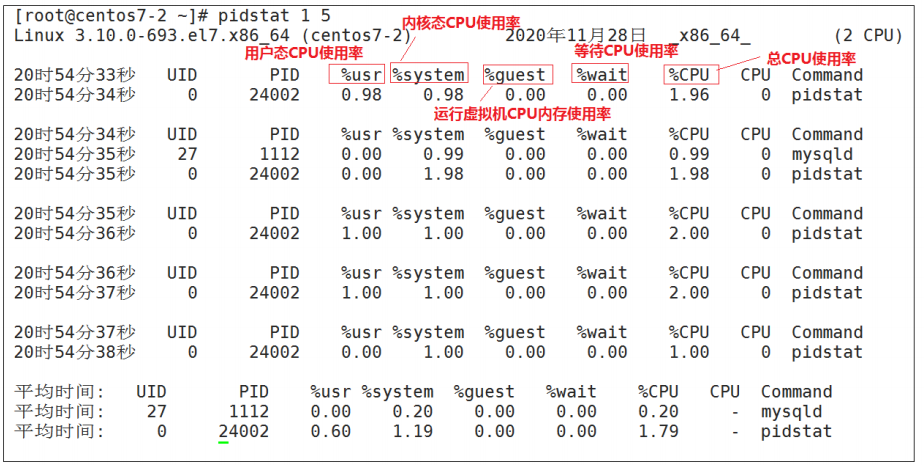
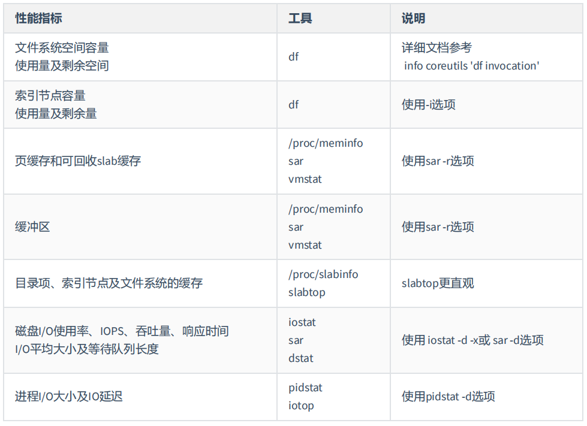

# Linux 性能优化

## 1、Linux性能优化概述

### 1.1、Linux性能概述

**性能优化**是个系统工程，总是牵一发而动全身，它涉及了从程序设计、编程语言，再到系统、存储、网络等各种底层基础设施的方方面面。每一个组件都有可能出

问题，而且很有可能多个组件同时出问题。

Linux 性能的基本指标、工具，以及相应的观测、分析和调优方法。包括 CPU 性能、磁盘 I/O 性能、内存性能以及网络性能。 系统性能问题，只要你理解了应用

程序和系统的少数几个基本原理，再进行大量的实战练习，建立起整体性能的全局观。

**性能指标**：“高并发”和“响应快”是从应用负载的视角来考察性能，直接影响了产品终端的用户体验。也正对应着性能优化的两个核心指标——“吞吐”和“延时”。

随着应用负载的增加，系统资源的使用也会升高，甚至达到极限。而**性能问题的本质**，就是系统资源已经达到瓶颈，但请求的处理却还不够快，无法支撑更多的请

求。性能分析，其实就是找出应用或系统的瓶颈，并设法去避免或者缓解它们，从而更高效地利用系统资源处理更多的请求。

**性能分析六个步骤**： 

（1） 选择指标评估应用程序和系统的性能；

（2）为应用程序和系统设置性能目标；

（3）进行性能基准测试；

（4）性能分析定位瓶颈；

（5）优化系统和应用程序；

（6）性能监控和告警。

### 1.2、性能优化方法论

动手优化性能之前，需要明确以下三个问题：

- **如何评估性能优化的效果？**

  确定性能的量化指标、测试优化前的性能指标、测试优化后的性能指标。 量化指标的选择。至少要从 应用程序 和 系统资源 这两个维度，

  分别选择不同的指标：

  - 应用程序的维度，我们可以用吞吐量和请求延迟来评估应用程序的性能。

  - 系统资源的维度，我们可以用 CPU 使用率来评估系统的 CPU 使用情况。

- **性能测试注意点：**

  - 避免性能测试工具干扰应用程序的性能；
  - 避免外部环境的变化影响性能指标的评估。

- **多个性能问题同时存在，选择优化哪些？**

  二八原则，并不是所有的性能问题都值得优化，找出最重要的、可以最大程度提升性能的问题。优先优化系统资源使用问题、性能指标变化幅度最大的问题。

- **多种优化方法，选择哪种？**

  选能最大提升性能的方法，但性能优化通常会带来复杂度的提升，降低程序的可维护性，还可能引发其他指标的异常。

## 2、Linux性能优化-CPU优化	

### 2.1、性能统计信息

每一种系统级Linux性能工具都提供了不同的方式来提取相似的统计结果。虽然没有 工具能显示全部的信息，但是有些工具显示的是相同的统计信息。为了不多次

（每种工具一 次）解释统计信息的含义，我们在描述所有工具之前对这些信息进行一次性说明。

#### 2.1.1、平均负载率

##### 2.1.1.1、什么是平均负载率

平均负载是指单位时间内，系统处于 **可运行状态** 和 **不可中断状态** 的平均进程数，也就是平均活跃进程数，它和CPU 使用率并没有直接关系。

- **可运行状态的进程**

  是指正在使用 CPU 或者正在等待 CPU 的进程，也就是我们常用 ps 命令看到的，处于 R 状态（Running 或 Runnable）的进程

- **不可中断状态的进程**

  是正处于内核态关键流程中的进程，并且这些流程是不可打断的， 比如最常见的是等待硬件设备的 I/O 响应，也就是我们在 ps 命令中看到的 D 状态 

  （Uninterruptible Sleep，也称为 Disk Sleep）的进程。

（比如，当一个进程向磁盘读写数据时，为了保证数据的一致性，在得到磁盘回复前，它是不能被其他进程或者中断打断的，这个时候的进程就处于不可中断状

态。如果此时的进程 被打断了，就容易出现磁盘数据与进程数据不一致的问题。 所以，不可中断状态实际上是系统对进程和硬件设备的一种保护机制。 ) 

##### 2.1.1.2、 uptime查看系统负载

是执行uptime来了解 系统的负载情况。比如像下面这样，我在命令行里输入了 uptime 命令

```shell
[root@centos7-1 ~]# uptime 
16:01:25 up 15 min, 1 user, load average: 0.00, 0.02, 0.05
#结果解析:
16:01:25 # 当前时间 
up 15 min # 系统运行时间 
1 user # 正在登录用户数 
load average: 0.00, 0.02, 0.05 #三个数字呢，依次则是过去 1 分钟、5 分钟、15 分钟的平均负载
```

如果 1 分钟、5 分钟、15 分钟的三个值基本相同，或者相差不大，那就说明系统负载很平稳。

如果 1 分钟的值远小于 15 分钟的值，就说明系统最近 1 分钟的负载在减少，而过去 15 分钟内却有很大的负载。

如果 1 分钟的值远大于 15 分钟的值，就说明最近 1 分钟的负载在增加，这种 增加有可能只是临时性的，也有可能

还会持续增加下去，所以就需要持续观察。一旦 1 分钟的平均负载接近或超过了 CPU 的个数，就意味着系统正在发生过载的问题，这时就 得分析调查是哪里导致

的问题，并要想办法优化了。

##### 2.1.1.3、平均负载为多少时合理

平均负载最理想的情况是等于 CPU 个数。所以在评判平均负载时，首先你要知 道系统有几个 CPU，这可以通过top 命令或者从文件 /proc/cpuinfo 中读取，比

如：

```shell
# 关于 grep 和 wc 的用法请查询它们的手册或者网络搜索  查看CPU个数
[root@centos7-1 ~]# grep 'model name' /proc/cpuinfo | wc -l
1
```

当平均负载比 CPU 个数还大的时候，系统已经出现 了过载。在观察负载数据时，我们有三个时间点的数据，因此都要看。三个不同时间间隔的平均值，其实给我

们提供了，分析系统负载趋势的 数据来源，让我们能更全面、更立体地理解目前的负载状况。

举个例子

假设我们在一个单 CPU 系统上看到平均负载为 1.88，0.70，6.76， 那么说明在过去 1 分钟内，系统有 188% 的超载，而在 15 分钟内，有 676% 的超载，从 整体

趋势来看，系统的负载在降低

当平均负载高于 CPU 数量 70% 的时候，你就应该分析排查负载高的问题了（70% 这个数字并不是绝对的，最推荐的方法）。

##### 2.1.1.4、平均负载和cpu使用率关系

我们经常容易把平均负载和 CPU 使用率混淆，来区分一下。

然平均负载代表的是活跃进程数，那平均负载高了，不就意味着 CPU 使 用率高吗？

我们还是要回到平均负载的含义上来，平均负载是指单位时间内，处于可运行状态和不可 中断状态的进程数。所以，它不仅包括了正在使用 CPU 的进程，还包括

等待 CPU 和等待 I/O 的进程。

而CPU使用率，是单位时间内CPU繁忙情况的统计，跟平均负载并不一定完全对应。比如

- CPU 密集型进程，使用大量 CPU 会导致平均负载升高，此时这两者是一致的；
- I/O 密集型进程，等待 I/O 也会导致平均负载升高，但 CPU 使用率不一定很高；
- 大量等待 CPU 的进程调度也会导致平均负载升高，此时的 CPU 使用率也会比较高。

##### 2.1.1.5、案例分析

- **stress工具介绍**

  Linux 系统压力测试工具，这里通过异常进程模拟平均负载升高的场景

  stress参数介绍

  

- **sysstat 工具介绍**

  包含了常用的 Linux 性能工具，用来监控和分析系统的性能

  接下来会用到 mpstat 和 pidstat 两个命令

  - **mpstat**

    常用的**多核** **CPU** 性能分析工具

    实时查看每个 CPU 的性能指标以及所有 CPU 的平均指标

  - **pidstat**

    常用的**进程**性能分析工具

    实时查看进程的 CPU、内存、I/O 以及上下文切换等性能指标

- **安装工具sysstat stress**

  ```shell
  #安装sysstat
  yum -y install sysstat
  #查看版本
  sar -V
  
  #安装stress 下载：https://fossies.org/linux/privat/old/stress-1.0.4.tar.gz/ 上传并解压
  tar -zxvf stress-1.0.4.tar.gz
  cd stress-1.0.4
  ./configure
  make&&make install
  ```

##### 2.1.1.6、场景一 : 模拟CPU 密集型进程

- **第一个终端窗口**

  在第一个终端运行 stress 命令，模拟一个 CPU 使用率 100% 的场景

  ```shell
  [root@centos7-2 ~]# stress --cpu 1 --timeout 600 
  stress: info: [6248] dispatching hogs: 1 cpu, 0 io, 0 vm, 0 hdd
  ```

- **第二个终端窗口**

  运行 uptime 查看系统平均负载情况，**-d** 参数表示高亮显示变化的区域

  ```shell
  # -d 参数表示高亮显示变化的区域
  [root@centos7-2 ~]# watch -d uptime 
  ..., load average: 1.00, 0.75, 0.39
  ```

  **1 分钟的平均负载会慢慢增加到 1.00**

- **第三个终端窗口**

  运行 mpstat 查看 CPU 使用率的变化情况

  ```shell
  #-P ALL 表示监控所有 CPU，后面数字 5 表示间隔 5 秒后输出一组数据 
  [root@centos7-2 ~]# mpstat -P ALL 5
  ```

  

  仅有一个 CPU 的使用率接近 100%，但它的 iowait 只有 0 

  这说明，平均负载的升高正是由于 CPU 使用率为 100%

  **接下来，就要排查是哪个进程导致 CPU 的使用率这么高的**

  我们可以使用 **pidstat** 来查询

  ```shell
  # pidstat [ 选项 ] [ <时间间隔> ] [ <次数> ] 
  # -u：默认的参数，显示各个进程的cpu使用统计 
  # -r：显示各个进程的内存使用统计 
  # -d：显示各个进程的IO使用情况
  # -p：指定进程号
  # -w：显示每个进程的上下文切换情况 
  # -t：显示选择任务的线程的统计信息外的额外信息 
  [root@centos7-2 ~]# pidstat -u 5 1
  ```

  

  **从这里可以明显看到，stress 进程的 CPU 使用率为 99.80**

##### 2.1.1.7、场景二：模拟IO密集型的进程

- **第一个终端窗口**

  设置逻辑cpu个数为2

  

  运行 stress 命令，但这次模拟 I/O 压力，即不停地执行 sync()

  ```shell
  [root@centos7-2 ~]# stress -i 1 --timeout 600 
  stress: info: [8046] dispatching hogs: 0 cpu, 1 io, 0 vm, 0 hdd
  ```

- **第二个终端窗口**

  运行 uptime 查看系统平均负载情况，**-d** 参数表示高亮显示变化的区域

  ```shell
  # -d 参数表示高亮显示变化的区域
  [root@centos7-2 ~]# watch -d uptime 
  ..., load average: 1.00, 0.75, 0.39
  ```

- **第三个终端窗口**

  ```shell
  # -P ALL 表示监控所有CPU，后面数字5表示间隔5秒后输出一组数据
  [root@node1 ~]# mpstat -P ALL 5
  Linux 3.10.0-1160.el7.x86_64 (node1) 	11/27/2021 	_x86_64_	(2 CPU)
  
  07:53:20 PM  CPU    %usr   %nice    %sys %iowait    %irq   %soft  %steal  %guest  %gnice   %idle
  07:53:25 PM  all    0.95    0.00   34.46    0.00    0.00    0.00    0.00    0.00    0.00   64.59
  07:53:25 PM    0    0.85    0.00   21.87    0.00    0.00    0.00    0.00    0.00    0.00   77.28
  07:53:25 PM    1    1.26    0.00   46.64    0.00    0.00    0.00    0.00    0.00    0.00   52.10
  ```

  %iowait的值过高，表示硬盘存在I/O瓶颈，%idle值高，表示CPU较空闲

  原因:**iowait** 无法升高是因为案例中 stress -i 使用的是 sync() **系统调用**，它的作用是**刷新缓冲区内存到磁盘中**对于虚拟机，缓冲区可能比较小，无法产生大的

  io压力，这样大部分都是系统调用的消耗了。所以，只看到系统 CPU 使用率升高

  解决方案:

  使用 stress 的另一个参数 -d  

  ```shell
  # --hdd N 产生 N 个进程每个进程执行 write() 和 unlink() 的进程 
  # --hdd-bytes B 每个 hdd worker 写入 B 字节（默认为1GB） 
  [root@centos7-2 ~]# stress --hdd 1 -t 600 --hdd-bytes 4G 
  stress: info: [8710] dispatching hogs: 0 cpu, 0 io, 0 vm, 1 hdd
  ```

  再通过mapstat查看指标

  ```shell
  [root@node1 ~]# mpstat -P ALL 5
  Linux 3.10.0-1160.el7.x86_64 (node1) 	11/27/2021 	_x86_64_	(2 CPU)
  
  08:48:19 PM  CPU    %usr   %nice    %sys %iowait    %irq   %soft  %steal  %guest  %gnice   %idle
  08:48:24 PM  all    0.21    0.00    5.08   46.56    0.00    1.27    0.00    0.00    0.00   46.88
  08:48:24 PM    0    0.43    0.00    3.87   18.71    0.00    1.51    0.00    0.00    0.00   75.48
  08:48:24 PM    1    0.00    0.00    6.07   73.64    0.00    1.05    0.00    0.00    0.00   19.25
  ```

  那么到底是哪个进程，导致 iowait 这么高呢？我们还是用 pidstat 来查询：

  ```shell
  [root@centos7-2 ~]# pidstat -u 5 1 
  
  Average:      UID       PID    %usr %system  %guest    %CPU   CPU  Command
  Average:        0         9    0.00    0.20    0.00    0.20     -  rcu_sched
  Average:        0        30    0.00    4.19    0.00    4.19     -  kswapd0
  Average:      998       946    0.20    0.20    0.00    0.40     -  beam.smp
  Average:        0      4016    0.00    1.40    0.00    1.40     -  kworker/1:1
  Average:        0      4094    0.60    0.20    0.00    0.80     -  watch
  Average:        0      5158    0.00   33.93    0.00   33.93     -  kworker/u256:0
  Average:        0     10504    0.00    1.20    0.00    1.20     -  kworker/0:2
  Average:        0     10795    0.20   16.37    0.00   16.57     -  stress
  ```

  可以看到具体的进程占据CPU和IO的情况

  通过top或者pidstat可以找到具体是哪个进程在频繁IO，从而定位问题原因。

##### 2.1.1.8、场景三:大量进程的场景

当系统中运行进程超出CPU运行能力时，就会出现等待CPU的进程。

比如，我们还是使用stress，但这次模拟的 是8个进程：

- **第一个终端窗口**

  ```shell
  [root@centos7-2 ~]#stress -c 8 --timeout 600 
  stress: info: [15985] dispatching hogs: 8 cpu, 0 io, 0 vm, 0 hdd
  ```

- **第二个终端窗口**

  ```shell
  [root@centos7-2 ~]# watch -d uptime 
  16:07:06 up 4:17, 3 users, load average: 1.09, 0.37, 0.80
  ```

- **第三个终端窗口**

  ```shell
  [root@centos7-2 ~]# pidstat -u 5 1 Linux 
  平均时间: UID 	PID 	%usr 	%system 	%guest 	%wait 	%CPU 	CPU 	Command 
  平均时间: 0 	15986 	24.70 	0.00 		0.00 	75.10 	24.70	 - 		stress 
  平均时间: 0 	15987 	25.10 	0.00 		0.00 	74.90 	25.10 	 - 		stress
  平均时间: 0 	15988 	25.10 	0.00 		0.00 	74.90 	25.10 	 - 		stress
  平均时间: 0 	15989 	25.10 	0.00 		0.00 	74.90 	25.10 	 - 		stress 
  平均时间: 0 	15990 	24.90 	0.00 		0.00 	74.90 	24.90 	 - 		stress 
  平均时间: 0 	15991 	24.70 	0.00 		0.00 	74.70 	24.70 	 - 		stress 
  平均时间: 0 	15992 	24.90 	0.00 		0.00 	74.90 	24.90 	 - 		stress 
  平均时间: 0 	15993 	25.10 	0.00 		0.00 	74.90 	25.10 	 - 		stress 
  平均时间: 0 	16010 	0.00 	0.20 		0.00 	0.20 	0.20 	 - 		pidstat
  ```

  **可以看出，8 个进程在争抢 2 个 CPU，每个进程等待CPU 的时间（也就是代码块中的 %wait 列）高达 75%这些超出 CPU 计算能力的进程，最终导致 CPU 过载。**

#### 2.1.2、上下文切换

##### 2.1.2.1、如何理解上下文切换

Linux 是一个多任务操作系统，它支持远大于 CPU 数量的任务同时运行，这是通过频繁的上下文切换、将CPU轮流分配给不同任务从而实现的。

每个进程运行时，CPU都需要知道进程已经运行到了哪里以及当前的各种状态，因此系统事先设置好 CPU 寄存器和程序计数器。 **CPU 上下文切换，就是先把前一**

**个任务的 CPU 上下文（CPU 寄存器和程序计数器）保存起来，然后加载 新任务的上下文到这些寄存器和程序计数器，最后再跳转到程序计数器所指的新位置，运**

**行新任务，而保存下来的上下文， 会存储在系统内核中，并在任务重新调度执行时再次加载进来 。**

根据 Tsuna 的测试报告，每次上下文切换都需要几十纳秒到到微秒的CPU时间，因此如果进程上下文切换次数过多，就会导致 CPU 将大量时间耗费在寄存器、内

核栈以及虚拟内存等资源的保存和恢复上，进而大大缩短了真正运行进程的时间，实际上有效的CPU运行时间大大减少(可以认为上下文切换对用户来说是在做无

用功)。 

##### 2.1.2.2、上下文切换的时机

- 根据调度策略，将CPU时间划片为对应的时间片，当时间片耗尽，就需要进行上下文切换
- 进程在系统资源不足，会在获取到足够资源之前进程挂起
- 进程通过sleep函数将自己挂起
- 当有优先级更高的进程运行时，为了保证高优先级进程的运行，当前进程会被挂起，由高优先级进程来运行,也就是被抢占
- 当发生硬件中断时，CPU 上的进程会被中断挂起，转而执行内核中的中断服务程序

##### 2.1.2.3、上下文切换分类

我们之前讲过的 任务 到底是什么呢？

- 进程和线程是最常见的任务
- 硬件通过触发信号，会导致中断处理程序的调用，也是一种常见的任务

所以，根据任务的不同，CPU 的上下文切换可以分为不同的场景

1. 进程上下文切换
2. 线程上下文切换
3. 中断上下文切换

- **系统调用**

  Linux 按照特权等级划分进程的运行空间

  - **内核空间（Ring 0）**：具有最高权限，可以直接访问所有资源
  - **用户空间（Ring 3）**：只能访问受限资源，不能直接访问内存等硬件设备，必须通过系统调用陷入到内核中，才能访问这些特权资源

  

  进程既可以在用户空间运行，又可以在内核空间中运行。进程在用户空间运行时，被称为进程的用户态，而陷入内核空间的时候，被称为进程的内核态。 从用

  户态到内核态的转变，需要通过系统调用来完成。

  **系统调用举例:**

  当我们查看文件内容时， 需要多次系统调用来完成：

  1. 首先调用 open() 打开文件，
  2. 然后调用 read() 读取文件内容，
  3. 并调用 write() 将内容写到标准输出，
  4. 最后再调用 close() 关闭文件。

  **系统调用的过程有没有发生 CPU 上下文的切换呢？答案自然是肯定的**

  1. CPU 寄存器里原来用户态的指令位置，需要先保存起来
  2. 为了执行内核态代码，CPU 寄存器需要更新为内核态指令的新位置
  3. 最后才是跳转到内核态运行内核任务
  4. 系统调用结束后，CPU 寄存器需要恢复原来保存的用户态
  5. 然后再切换回用户空间，继续运行进程

  **系统调用和进程上下文切换的不同**

  - **进程上下文切换：**从一个进程切换到另一个进程运行
  - **系统调用：**一直是同一个进程在运行
  - 系统调用过程通常称为特权模式切换，而不是上下文切换
  - 系统调用过程中， **CPU 上下文切换是无法避免的**

- **进程上下文切换**

  在 Linux 中，进程是由内核来管理和调度进程的，切换只能发生在内核态，进程的上下文不仅包括了 虚拟内存 、 栈 、 全局变量 等用户空间的资源，还包括

  了 内核堆栈 、 寄存器 等内核空间的资源。

  **进程上下文切换:**

  - 在保存当前进程的内核状态和 CPU 寄存器之前，需要先把该进程的虚拟内存、栈等保存下来【保存上下文】
  - 而加载了下一进程的内核态后，还需要刷新进程的虚拟内存和用户栈【加载上下文】

  

  **什么时候会切换进程上下文**

  - 顾名思义，只有在**进程切换时**才需要切换上下文
  - 换句话说，只有在**进程调度时**才需要切换上下文

  **CPU 如何挑选进程来运行？**

  - Linux 为每个 CPU 都维护了一个等待队列
  - 将活跃进程（正在运行和正在等待 CPU 的进程）按照优先级和等待 CPU 的时间排序
  - 然后选择最需要 CPU 的进程，也就是优先级最高和等待 CPU 时间最长的进程来运行

  **进程上下文切换如何影响系统性能**

  每次上下文切换都需要几十纳秒到数微秒的 CPU 时间。这个时间还是相当可观的，特别是在进程上下文切换次数较多的情况下，很容易导致 CPU 将大量时间

  耗费在寄存器、内核栈以及虚拟内存等资源的保存和恢复上，进而大大缩短了真正运行进程的时间。这也正是上一节中我们所讲的，导致平均负载升高的一个

  重要因素

- **线程上下文切换**

  线程是调度的基本单位，而进程则是资源拥有的基本单位。 所谓内核中的任务调度，实际上的调度对象是线程；而进程只是给线程提供了虚拟内存、全局变量等资源。

  线程的上下文切换其实就可以分为两种情况：

  - 第一种， 前后两个线程属于不同进程。此时，因为资源不共享，所以切换过程就跟进程上 下文切换是一样。

  - 第二种，前后两个线程属于同一个进程。此时，因为虚拟内存是共享的，所以在切换时， 虚拟内存这些资源就保持不动，只需要切换线程的私有数据、寄

    存器等不共享的数据。

- **中断上下文切换**

  硬件通过触发信号，向CPU发送中断信号，导致内核调用中断处理程序，进入内核空间。这个过程中，硬件的一些变量和参数也要传递给内核， 内核通过这些

  参数进行中断处理。 中断处理会打断进程的正常调度和执行，而在打断其他进程时，就需要将进程当前的状态保存下来，这样在中断结束后，进程仍然可以从

  原来的状态恢复运行例如，A进程启动写磁盘操作，A进程睡眠后B进程在运行，当磁盘写完后磁盘中断信号打断的是B进程，在中断处理时会唤醒A进程。

  **进程上下文 VS 中断上下文**

  - 内核可以处于两种上下文：进程上下文和中断上下文。

  - 即便中断过程打断了 一个正处在用户态的进程，也不需要保存和恢复这个进程的虚拟内存、全局变量等用户态资源

  - 中断上下文，只包括内核态中断服务程序执行所必需的状态，包括CPU 寄存器、内核堆栈、硬件中断参数

  - 中断上下文不会和进程上下文切换同时发生对同一个 CPU 来说，中断处理比进程拥**有更高的优先级**

  - 由于中断会打断正常进程的调度和执行，所以大部分中断处理程序都短小精悍，以便尽可能快的执行结束

  **耗资源程度**

  - 跟进程上下文切换一样，中断上下文切换也需要消耗 CPU，切换次数过多也会耗费大量的 CPU，甚至严重降低系统的整体性能

  - 当发现中断次数过多时，就需要注意去排查它是否会给你的系统带来严重的性能问题

##### 2.1.2.4、查看上下文切换

如何来查看上下文切换呢？我们可以使用 vmstat 这个工具，来查询系统的上下文切换情况 。 

vmstat 是一个常用的系统性能分析工具，主要用来分析系统的内存使用情况，也常用来 分析 CPU 上下文切换 和 中 断的次数 。 

- **系统总的上下文切换情况**

  ```shell
  #vmstat n n秒后输出一行信息
  [root@node1 stress-1.0.4]# vmstat 3
  procs -----------memory---------- ---swap-- -----io---- -system-- ------cpu-----
   r  b   swpd   free   buff  cache   si   so    bi    bo   in   cs us sy id wa st
   1  0   5120 305492      0  76732    0    0    36  1206  278 1346  4  5 90  1  0
   0  0   5120 305492      0  76764    0    0     0     0  126  271  0  0 100  0  0
   0  0   5120 305492      0  76764    0    0     0     0  122  266  0  0 100  0  0
   0  0   5120 304964      0  76764    0    0     0     0  132  279  0  0 100  0  0
   0  0   5120 304964      0  76764    0    0     0     3  131  278  0  0 100  0  0
   0  0   5120 304964      0  76764    0    0     0     0  119  260  0  0 100  0  0
   0  0   5120 304964      0  76764    0    0     0     0  131  268  0  0 100  0  0
   1  0   5120 305060      0  76764    0    0     0     1  139  290  0  0 100  0  0
   0  0   5120 305060      0  76764    0    0     0     0  123  267  0  0 100  0  0
   0  0   5120 305060      0  76764    0    0     0     0  127  271  0  0 100  0  0
   0  0   5120 305152      0  76764    0    0     0     0  149  294  0  0 100  0  0
   2  0   5120 305152      0  76764    0    0     0     0  140  278  0  0 100  0  0
   0  0   5120 305152      0  76764    0    0     0     0  142  276  0  0 100  0  0
  ```

  重点强调下，需要特别关注的四列内容：

  - cs（context switch）是每秒上下文切换的次数。

  - in（interrupt）则是每秒中断的次数。

  - r（Running or Runnable）是就绪队列的长度，也就是正在运行和等待 CPU 的进程数。

  - b（Blocked）则是处于不可中断睡眠状态的进程数。

  vmstat 只给出了系统总体的上下文切换情况，要想查看每个进程的详细情况，就需要使用我们前面提到过的 pidstat了。给它加上 -w 选项，你就可以查看每

  个进程上下文切换的情况了。

  ```shell
  pidstat [ 选项 ] [ <时间间隔> ] [ <次数> ]
  -u：默认的参数，显示各个进程的cpu使用统计
  -r：显示各个进程的内存使用统计
  -d：显示各个进程的IO使用情况
  -p：指定进程号
  -w：显示每个进程的上下文切换情况
  -t：显示选择任务的线程的统计信息外的额外信息
  ```

  ```txt
  [root@node1 stress-1.0.4]# pidstat -w -u 3
  Linux 3.10.0-1160.el7.x86_64 (node1) 	11/27/2021 	_x86_64_	(2 CPU)
  
  09:20:17 PM   UID       PID    %usr %system  %guest    %CPU   CPU  Command
  09:20:20 PM     0       665    0.00    0.33    0.00    0.33     0  vmtoolsd
  09:20:20 PM    27       989    0.33    0.33    0.00    0.66     0  mysqld
  
  09:20:17 PM   UID       PID   cswch/s nvcswch/s  Command
  09:20:20 PM     0         6      0.99      0.00  ksoftirqd/0
  09:20:20 PM     0         9      4.97      0.00  rcu_sched
  09:20:20 PM     0       403     19.21      0.00  xfsaild/dm-0
  09:20:20 PM     0       404      0.33      0.00  kworker/0:1H
  09:20:20 PM     0       665     10.93      0.00  vmtoolsd
  09:20:20 PM     0      1234      0.33      0.00  sshd
  09:20:20 PM   998      1395      0.33      0.00  epmd
  09:20:20 PM     0      4003      0.33      0.00  watchdog/1
  09:20:20 PM     0      4016      0.33      0.00  kworker/1:1
  09:20:20 PM     0      9998      3.31      0.00  kworker/0:1
  09:20:20 PM     0     10505      0.99      0.00  kworker/u256:1
  09:20:20 PM     0     12467      0.66      0.00  kworker/0:2
  09:20:20 PM     0     12637      0.33      0.00  pidstat
  ```

  这个结果中有两列内容是我们的重点关注对象。

  一个是 cswch ，表示每秒自愿上下文切换（voluntary context switches）的次数，另一个则是 nvcswch ，表示每秒非自愿上下文切换（non voluntary 

  context switches）的次数。

  - **所谓自愿上下文切换**，是指进程无法获取所需资源，导致的上下文切换。

    比如说， I/O、内存等系统资源不足时，就会发生自愿上下文切换。

  - **而非自愿上下文切换**，则是指进程由于时间片已到等原因，被系统强制调度，进而发生的上下文切换。

    比如说，大量进程都在争抢 CPU 时，就容易发生非自愿上下文切换。	

##### 2.1.2.5、案例分析

- **目标:**

  我们将使用 sysbench 来模拟系统多线程调度切换的情况

- **sysbench 介绍**

  - 一个**多线程**的基准测试工具（前面讲的 stress 是多进程）

  - 一般用来评估不同系统参数下的数据库负载情况

  - 在接下来的案例中，主要是当成一个异常进程来看，作用是**模拟上下文切换过多的问题**

- **环境准备**

  - **安装git**

    ```shell
    yum -y install git
    ```

  - **下载sysbench** 

    ```shell
    git clone https://github.com/akopytov/sysbench.git
    ```

  - **安装依赖**

    ```shell
    yum install autoconf automake libtool -y
    ```

  - **编译安装**

    ```shell
    cd sysbench/ 
    ./autogen.sh 
    ./configure --without-mysql 
    make && make install
    ```

- **测试CPU上下文切换次数升高**

  - **空闲系统的上下文切换次数**

    输入以下命令，每 1 秒输出一次结果，输出 5 次 

    ```shell
    [root@node1 stress-1.0.4]# vmstat 3
    procs -----------memory---------- ---swap-- -----io---- -system-- ------cpu-----
     r  b   swpd   free   buff  cache   si   so    bi    bo   in   cs us sy id wa st
     1  0   5120 242216      0 137560    0    0    37  1082  257 1229  3  5 91  1  0
     1  0   5120 242196      0 137560    0    0     0     0  119  255  0  0 100  0  0
     0  0   5120 242196      0 137560    0    0     0     0  118  254  0  0 100  0  0
    ```

    结果分析

    - 现在的上下文切换次数 **cs** 是 100-200左右，而中断次数 **in** 是100 左右，r 和 b 分是 2和0。

    - 因为这会儿并没有运行其他任务，所以它们就是空闲系统的上下文切换次数

  - **第一个终端运行 sysbench**

    输入以下命令，以 10 个线程运行 5 分钟的基准测试，模拟多线程切换的问题

    ```shell
    [root@centos7-2 ~]# sysbench --threads=10 --time=300 threads run
    ```

  - **第二个终端通过 vmstat 查看上下文切换**

    ```shell
    [root@centos7-2 ~]# vmstat 1 
    procs -----------memory---------- ---swap-- -----io---- -system-- ------cpu-----
    r b   swpd 	 free 	buff  cache   si  so  bi  bo  in     cs     us sy id wa st 
    9 0    0 	286376  2108  156872   0  0  272 19  9014   88592   4  41 55 0  0 
    7 0    0	286376  2108  156872   0  0  0   8   34203  2739091 7  83 10 0  0 
    6 0    0 	286376  2108  156872   0  0  0   0   34546  2632029 7  81 12 0  0 
    7 0    0 	286376  2108  156872   0  0  0   0   36425  2807200 7  87 6  0  0 
    ```

    结果分析

    - **cs 列**：上下文切换次数从之前 130 骤然上升到了 270w+... 
    - **r 列：**就绪队列的长度最大到 9了，大于我们的 CPU 个数 2，所以会存在大量的 CPU 竞争
    - **us、sy 列：**两列的 CPU 使用率加起来上升到了 80-90，其中系统 CPU 使用率都是 60%+，说明 CPU 主要是被内核占用了
    - **in 列：**中断次数已经达到 3w 了...说明中断处理也是个潜在的问题

  - **第三个终端通过 pidstat 来看进程的上下文切换次数**

    输入以下命令，-w 输出进程切换指标，-u 输出 CPU 使用情况

    ```shell
    [root@centos7-3 ~]# pidstat -w -u 1 
    Linux 3.10.0-693.el7.x86_64 (centos7-3) 2020年11月27日 _x86_64_ (2 CPU)
    17时32分21秒 UID 	PID 	%usr 	%system 	%guest  %CPU 	CPU Command 
    17时32分22秒 0 	660 	0.00	1.00 		0.00 	1.00 	1   vmtoolsd 
    17时32分22秒 0 	1313 	14.00 	100.00 		0.00 	100.00  0   sysbench 
    17时32分22秒 0 	1324 	0.00 	1.00 		0.00 	1.00    0   vmstat
    
    09:35:11 PM   UID       PID   cswch/s nvcswch/s  Command
    09:35:12 PM     0         9      9.00      0.00  rcu_sched
    09:35:12 PM     0        32      1.00      0.00  khugepaged
    09:35:12 PM     0       403     19.00      0.00  xfsaild/dm-0
    09:35:12 PM     0       665     10.00      0.00  vmtoolsd
    09:35:12 PM     0      1234      1.00      0.00  sshd
    09:35:12 PM   998      1395      1.00      0.00  epmd
    09:35:12 PM     0      4005      1.00      0.00  ksoftirqd/1
    09:35:12 PM     0      4016      2.00      0.00  kworker/1:1
    09:35:12 PM     0      9998      1.00      0.00  kworker/0:1
    09:35:12 PM     0     10505      2.00      0.00  kworker/u256:1
    09:35:12 PM     0     13268      1.00      0.00  pidstat
    ```

    结果分析

    pidstat 的输出你可以发现，CPU 使用率的升高果然是 sysbench 导致的，它的 CPU 使用率已经达到了 100%。但上下文切换则是来自其他进程，包括非

    自愿上下文切换频率最高的 pidstat ，以及自愿上下文切换频率最高的内核线程 rcu_sched和 xfsaild。 

  - **分析下为什么上下文切换次数会这么少**

    pidstat 输出的上下文切换次数，加起来也就几百，比 vmstat 的 200w显小了太多。这是怎么回事呢 ?

    我们使用pidstat 命令添加一个-t的参数就可以输出线程的指标.

    在终端三种,停止pidstat命令, 添加一个-t参数,重新运行

    ```shell
    pidstat 选项 [ <次数> ]
    -u：默认的参数，显示各个进程的cpu使用统计
    -r：显示各个进程的内存使用统计
    -d：显示各个进程的IO使用情况
    -p：指定进程号
    -w：显示每个进程的上下文切换情况
    -t：显示选择任务的线程的统计信息外的额外信息
    ```

    ```shell
    [root@centos7-3 ~]# pidstat -wt 1
    09:38:42 PM   UID      TGID       TID   cswch/s nvcswch/s  Command
    09:38:43 PM     0         6         -      2.00      0.00  ksoftirqd/0
    09:38:43 PM     0         -         6      2.00      0.00  |__ksoftirqd/0
    09:38:43 PM     0         9         -     20.00      0.00  rcu_sched
    09:38:43 PM     0         -         9     20.00      0.00  |__rcu_sched
    09:38:43 PM     0       403         -     19.00      0.00  xfsaild/dm-0
    09:38:43 PM     0         -       403     19.00      0.00  |__xfsaild/dm-0
    09:38:43 PM     0       665         -     10.00      0.00  vmtoolsd
    09:38:43 PM     0         -       665     10.00      0.00  |__vmtoolsd
    09:38:43 PM     0         -       674      1.00      0.00  |__HangDetector
    09:38:43 PM     0         -       727      1.00      0.00  |__gmain
    09:38:43 PM   998         -      1172     25.00      0.00  |__1_scheduler
    09:38:43 PM   998         -      1181      3.00      0.00  |__8_dirty_io_sche
    09:38:43 PM   998         -      1184      4.00      0.00  |__aux
    09:38:43 PM     0         -      1344      1.00      0.00  |__tuned
    09:38:43 PM     0         -      1002      1.00      0.00  |__in:imjournal
    09:38:43 PM		0 		  - 	 3377  39182.00 264628.00  |__sysbench 
    09:38:43 PM 	0 		  - 	 3378  31673.00 284624.00  |__sysbench 
    09:38:43 PM 	0 		  - 	 3379  42134.00 265158.00  |__sysbench
    09:38:43 PM 	0 		  - 	 3380  46735.00 238524.00  |__sysbench 
    09:38:43 PM 	0 		  - 	 3381  38374.00 293464.00  |__sysbench
    09:38:43 PM 	0 		  - 	 3382  38293.00 256376.00  |__sysbench
    ```

  - **每秒上下文切换多少次才算正常？**

    - 这个数值其实取决于系统本身的 CPU 性能
    - 如果系统的上下文切换次数比较稳定，那么数百到一万以内，都是正常的
    - 但当上下文切换次数超过一万次，或者切换次数出现数量级的增长时，就很可能已经出现了性能问题

  - **小结**

    根据上下文切换的类型，具体分析

    1. 自愿上下文切换多了，说明进程都在等待资源，有可能发生了 I/O 等其他问题
    2. 非自愿上下文切换多了，说明进程都在被强制调度，也就是都在争抢 CPU，说明 CPU 的确成了瓶颈 
    2. 中断次数变多了，说明 CPU 被中断处理程序占用，还需要通过 /proc/interrupts 文件来分析具体的中断类型

#### 2.1.3、CPU使用率

##### 2.1.3.1、什么指标来描述系统的CPU性能

- **CPU使用率**

  用什么指标来描述系统的 CPU 性能呢 ? 不是平均负载，也不是CPU上下文切换，而是另一个更直观的指标CPU使用率 ，CPU 使用率是单位时间内 CPU 使用情

  况的统计，以百分比的方式展示。

- **节拍率的概念**

  为了维护 CPU 时间，Linux 通过事先定义的节拍率（内核中表示为 HZ），触发时间中断，并使用全局变量 Jiw ies 记录了开机以来的节拍数。每发生一次时间

  中断，Jiw ies 的值就加 1。 

  - **查看系统节拍率**

    不同的系统可能设置不同数值，你可以通过查询 /boot/config 内核选项来查看它的配置值。

    ```shell
    [root@node1 stress-1.0.4]# grep 'CONFIG_HZ=' /boot/config-$(uname -r)
    CONFIG_HZ=1000
    ```

  - **用户节拍率**

    正因为节拍率 HZ 是内核选项，所以用户空间程序并不能直接访问。为了方便用户空间程序，内核还提供了一个用户空间节拍率 USER_HZ，它总是固定为 

    100，也就是 1/100 秒。这样，用户空间程序并不需要关心内核中 HZ 被设置成了多少，因为它看到的总是固定值 USER_HZ。

    ```shell
    USER_HZ=100
    ```

    为了方便用户控件程序，内核还提供了一个用户控件的节拍率，它总是固定为100，也就是1/100秒，这样，用户控件程序并需要关系内核中HZ被设置成了多少

##### 2.1.3.2、CPU使用率公式

CPU使用率，就是除了空闲时间外的其他时间占总CPU时间的百分比，用公式来表示就是


根据这个公式，我们就可以从 /proc/stat 中的数据，很容易地计算出 CPU 使用率。当然，也可以用每一个场景的CPU 时间，除以总的 CPU 时间，计算出每个场

景的 CPU 使用率。

**性能工具是如何计算CPU使用率的**

事实上，为了计算机CPU使用率,性能能工具一般都会间隔一段时间（比如 3 秒）的两次值，做差后，再计算出这段时间的平均CPU使用率


性能分析工具给出的都是间隔一段时间的平均CPU使用率，所以要注意间隔时间的设置，特别是用多个工具对比分析时，你一定要保证他们用的是相同的间隔时间

##### 2.1.3.3、怎么查看CPU使用率

查看 CPU 使用率 top 、ps 和pidstat是最常用的性能分析工具 : 

- top 显示了系统总体的 CPU 和内存使用情况，以及各个进程的资源使用情况。
- ps 则只显示了每个进程的资源使用情况。
- pidstat分析每个进程CPU使用情况

- **top显示系统总体CPU使用情况**

  top显示了系统总体的CPU和内存使用情况，以及各个进程的资源使用情况

  ```shell
  # 默认每 3 秒刷新一次 
  [root@node1 stress-1.0.4]# top
  top - 21:55:41 up  2:42,  3 users,  load average: 0.14, 0.05, 0.05
  Tasks: 116 total,   1 running, 115 sleeping,   0 stopped,   0 zombie
  %Cpu(s):  0.2 us,  0.2 sy,  0.0 ni, 99.7 id,  0.0 wa,  0.0 hi,  0.0 si,  0.0 st
  KiB Mem :   995676 total,   240224 free,   616664 used,   138788 buff/cache
  KiB Swap:  2097148 total,  2092028 free,     5120 used.   236744 avail Mem 
  
     PID USER      PR  NI    VIRT    RES    SHR S  %CPU %MEM     TIME+ COMMAND                                                                                                                                                             
     946 rabbitmq  20   0 1827824  77804   4152 S   0.7  7.8   0:33.66 beam.smp                                                                                                                                                            
     665 root      20   0  273000   4036   2908 S   0.3  0.4   0:10.13 vmtoolsd                                                                                                                                                            
     989 mysql     20   0 1332160 368556   2212 S   0.3 37.0   0:21.35 mysqld                                                                                                                                                              
       1 root      20   0  128148   6096   3536 S   0.0  0.6   0:02.58 systemd                                                                                                                                                             
       2 root      20   0       0      0      0 S   0.0  0.0   0:00.00 kthreadd                                                                                                                                                            
       4 root       0 -20       0      0      0 S   0.0  0.0   0:00.00 kworker/0:0H                                                                                                                                                        
       6 root      20   0       0      0      0 S   0.0  0.0   0:00.74 ksoftirqd/0                                                                                                                                                         
       7 root      rt   0       0      0      0 S   0.0  0.0   0:00.27 migration/0                                                                                                                                                         
       8 root      20   0       0      0      0 S   0.0  0.0   0:00.00 rcu_bh                                                   
  ```

  

- **pidstat分析每个进程CPU使用情况**

  top并没有细分进程的用户态CPU和内核态CPU，那要怎么查看每个进程的详细情况呢？

  ```shell
  [root@node1 stress-1.0.4]# pidstat 1 5
  Linux 3.10.0-1160.el7.x86_64 (node1) 	11/27/2021 	_x86_64_	(2 CPU)
  
  09:57:38 PM   UID       PID    %usr %system  %guest    %CPU   CPU  Command
  09:57:39 PM   998       946    0.00    0.99    0.00    0.99     0  beam.smp
  09:57:39 PM     0     14197    0.00    0.99    0.00    0.99     1  pidstat
  
  09:57:39 PM   UID       PID    %usr %system  %guest    %CPU   CPU  Command
  
  09:57:40 PM   UID       PID    %usr %system  %guest    %CPU   CPU  Command
  09:57:41 PM     0     14197    0.00    1.00    0.00    1.00     1  pidstat
  
  09:57:41 PM   UID       PID    %usr %system  %guest    %CPU   CPU  Command
  09:57:42 PM     0     13355    0.00    1.00    0.00    1.00     0  kworker/0:0
  09:57:42 PM     0     14197    1.00    1.00    0.00    2.00     1  pidstat
  
  09:57:42 PM   UID       PID    %usr %system  %guest    %CPU   CPU  Command
  09:57:43 PM    27       989    0.00    1.00    0.00    1.00     0  mysqld
  
  Average:      UID       PID    %usr %system  %guest    %CPU   CPU  Command
  Average:      998       946    0.00    0.20    0.00    0.20     -  beam.smp
  Average:       27       989    0.00    0.20    0.00    0.20     -  mysqld
  Average:        0     13355    0.00    0.20    0.00    0.20     -  kworker/0:0
  Average:        0     14197    0.20    0.60    0.00    0.80     -  pidstat
  ```

  

  最后的Average部分，还计算了5组数据的平均值

##### 2.1.3.4、CPU使用率过高怎么办

**分析思路**

1. 如何轻松找到CPU使用率过高的进程

   通过top、ps 、pidstat等工具

2. 占用CPU高的到底是代码里的那个函数？

   perf和GDB GDB（The GNU Project Debugger）， 这个功能强大的程序调试利器 ，GDB 调试程序的过程会中断程序运行，这在线上环境往往是不允许的 ；

perf 是 Linux 2.6.31 以后内置的性能分析工具。它以性能事件采样为基础，不仅可以分析系统的各种事件和内核性能，还可以用来分析指定应用程序的性能问题 

，使用 perf 分析 CPU 性能问题，我来说两种用法

- 第一种常见用法是 perf top，类似于 top，它能够实时显示占用 CPU 时钟最多的函数或者指令，因此可以用来查找热点函数，使用界面如下所示

  ```shell
  #安装 yum -y install perf
  [root@node1 stress-1.0.4]# perf top
  ```

  

  输出结果中，第一行包含三个数据，分别是采样数（Samples）、事件类型（event）和事件总数量（Event count）。比如这个例子中，perf 总共采集了

  1000个 CPU 时钟事件，而总事件数则为 271937500。 采样数需要我们特别注意，如果采样数过少（比如只有十几个），那下面的排序和百分比就没什么实

  际参考价值了

  - 第一列 Overhead ，是该符号的性能事件在所有采样中的比例，用百分比来表示。
  - 第二列 Shared ，是该函数或指令所在的动态共享对象（Dynamic Shared Object），如内核、进程名、动态链接库名、内核模块名等。
  - 第三列 Object ，是动态共享对象的类型。比如 [.] 表示用户空间的可执行程序、或者动态链接库，而 [k] 则表示内核空间。
  - 最后一列 Symbol 是符号名，也就是函数名。当函数名未知时，用十六进制的地址来表示。

  **perf命令详解**

  

- 第二种常见用法，也就是 perf record 和 perf report。

  perf top 虽然实时展示了系统的性能信息，但它的缺点是并不保存数据，也就无法用于离线或者后续的分析。而 perf record 则提供了保存数据的功能，保存

  后的数据，需要你用perf report 解析展示

  ```shell
  [root@node1 ~]# perf record  # 按 Ctrl+C 终止采样
  [root@node1 ~]# perf report
  ```

### 2.2、Linux性能工具-CPU

#### 2.2.1、CPU性能指标

从 CPU 的性能指标出发。也就是说，当你要查看某个性能指标时，要清楚 知道哪些工具可以做到。

根据不同的性能指标，对提供指标的性能工具进行分类和理解。这样，在实际排查性能问 题时，你就可以清楚知道，什么工具可以提供你想要的指标。

| 性能指标          | 工具                                                 | 说明                                                         |
| ----------------- | ---------------------------------------------------- | ------------------------------------------------------------ |
| 平均负载          | uptime<br>top                                        | uptime使用最简单;<br/>top提供了更安全的指标                  |
| 系统整体CPU使用率 | vmstat <br/>mpstat <br/>top <br/>sar <br/>/proc/stat | top、vmstat、mpstat 只可以动态查看，<br/>而sar还可以记录历史数据<br/>/proc/stat是其他性能工具数据来源 |
| 进程CPU使用率     | top <br/>pidstat<br/>pshtop<br/>atop                 | top和ps可以按CPU使用率给进程排序, <br/>而pidstat只显示实际用了CPU的进程<br/>htop 和atop以不同颜色显示更直观 |
| 系统上下文切换    | vmstat                                               | 除了上下文切换次数还提供运行状态和不可中断状态进程的数量     |
| 进程上下文切换    | pidstat                                              | 使用时注意加上 -w 选项                                       |
| 软中断            | top<br/> /proc/soxirqs <br/>mpstat                   | top提供软中断CPU使用率<br/>而/proc/soxirqs和mpstat提供了各种软中断在每个CPU上的运行次数 |
| 硬中断            | vmstat <br/>/proc/interrupts                         | vmstat提供了总的中断次数<br/>而/proc/interrupts提供了各种中断在每个CPU上的积累次数 |
| CPU个数           | /proc/cpuinfo <br/>lscpu                             | lscpu更直观查看                                              |
| 事件剖析          | pref <br/>execsnoop                                  | perf可以用来分析CPU的缓存及内核调用链<br/>execsnoop用来监控短时进程 |

#### 2.2.2、根据工具查指标

第二个维度，从工具出发。也就是当你已经安装了某个工具后，要知道这个工具能提供哪些指标。

具体到每个工具的使用方法，一般都支持丰富的配置选项。这些配置选项并不用背下来。你只要知道有哪些工具、以及这些工具的基本功能是什么就够了。真正要 

用到的时候， 通过 man 命令，查它们的使用手册就可以了 。

| 性能工具         | CPU性能指标                                                  |
| ---------------- | ------------------------------------------------------------ |
| uptime           | 平均负载                                                     |
| top              | 平均负载、运行队列、整体的CPU使用率及每个进程的状态和CPU使用率 |
| htop             | top增强版、可以以不同的颜色区分不同类型的进程                |
| atop             | CPU、内存、磁盘和网络等各种资源的全面监控                    |
| vmstat           | 系统整体的CPU使用率、上下文切换次数、中断次数、还包括处于运行 和不可中断状态的进程数 |
| mpstat           | 每个CPU使用率和软中断次数                                    |
| pidstat          | 进程和线程的CPU使用率、中断上下文切换次数                    |
| /proc/sofirqs    | 软中断类型和每个CPU上的累计中断次数                          |
| /proc/interrupts | 硬中断类型和每个CPU上的累计中断次数                          |
| ps               | 每个进程的状态和CPU使用率                                    |
| pstree           | 进程的父子关系                                               |
| dstat            | 系统整体的CPU使用率                                          |
| sar              | 系统整体的CPU使用率,包括可配置的历史数据                     |
| starces          | 进程的系统调用                                               |
| perf             | CPU性能事件剖析,如调用链分析,CPU缓存,CPU调度                 |
| execsnoop        | 监控进程                                                     |

### 2.3、CPU性能调优策

CPU 优化 我们接下来从应用程序和系统的角度，分别来看看 如何才能降低 CPU 使用率，提高 CPU 的并行处理能力。

- **应用程序优化**

  首先，从应用程序的角度来说，降低 CPU 使用率的最好方法当然是，排除所有不必要的工作，只保留最核心的逻辑。比如减少循环的层次、减少递归、减少

  动态内存分配等等。

  这里我同样列举了最常见的一些方法，方便你记忆和使用。

  - **编译器优化**：很多编译器都会提供优化选项，适当开启它们，在编译阶段你就可以获得 编译器的帮助，来提升性能。

  - **算法优化**：使用复杂度更低的算法，可以显著加快处理速度

  - **异步处理：**使用异步处理，可以避免程序因为等待某个资源而一直阻塞，从而提升程序 的并发处理能力。比如，把轮询替换为事件通知，就可以避免轮询

    耗费 CPU 的问题。

  - **多线程代替多进程**：前面讲过，相对于进程的上下文切换，线程的上下文切换并不切换 进程地址空间，因此可以降低上下文切换的成本。

  - **善用缓存**：经常访问的数据或者计算过程中的步骤，可以放到内存中缓存起来，这样在 下次用时就能直接从内存中获取，加快程序的处理速度

- **系统优化**

  从系统的角度来说，优化 CPU 的运行，一方面要充分利用 CPU 缓存的本地性，加速缓存访问；另一方面，就是要控制进程的 CPU 使用情况，减少进程间的

  相互影响。 具体来说，系统层面的 CPU 优化方法也有不少，这里我同样列举了最常见的一些方法，方便你记忆和使用 。 

  - **CPU** **绑定：**把进程绑定到一个或者多个 CPU 上，可以提高 CPU 缓存的命中率，减少跨 CPU 调度带来的上下文切换问题

  - **CPU独占：**跟 CPU 绑定类似，进一步将 CPU 分组，并通过 CPU 亲和性机制为其分配进程。这样，这些 CPU 就由指定的进程独占，换句话说，不允许其

    他进程再来使用这些 CPU。

  - **优先级调整：**使用 nice 调整进程的优先级，正值调低优先级，负值调高优先级。

  - **为进程设置资源限制：**使用 Linux cgroups 来设置进程的 CPU 使用上限，可以防止由 于某个应用自身的问题，而耗尽系统资源。

  - **中断负载均衡**：无论是软中断还是硬中断，它们的中断处理程序都可能会耗费大量的 CPU。开启 irqbalance 服务或者配置 smp_aw inity，就可以把中断

    处理过程自动负载均衡到多个 CPU 上。

## 3、Linux性能优化-内存优化

CPU 管理一样，内存管理也是操作系统最核心的功能之一。内存主要用来存储系统和应 用程序的指令、数据、缓存等。

### 3.1、内存原理

#### 3.1.1、内存映射

- **日常生活常说的内存是什么**

  - 比方说，我的笔记本电脑内存就是 8GB 的

  - 这个内存其实是物理内存

  - 物理内存也称为**主存**，大多数计算机用的主存都是**动态随机访问内存（DRAM）**

- **问题思考:**只有内核才可以直接访问物理内存，那么进程要访问内存时，怎么办？

- **虚拟地址空间**

  Linux 内核给每个进程都提供了一个独立的虚拟地址空间，并且这个地址空间是连续的。 这样，进程就可以很方便地访问内存，更确切地说是访问虚拟内存。

  **虚拟地址空间内部**

  - 虚拟地址空间的内部又被分为**内核空间和用户空间**两部分
  - 不同字长（单个 CPU 指令可以处理数据的最大长度）的处理器，地址空间的范围也不同

  比如最常见的 32 位和 64 位，如下所示：

  

  - 32 位系统的内核空间占用 1G，位于最高处，剩下的 3G 是用户空间
  - 而 64 位系统的内核空间和用户空间都是 128T，分别占据整个内存空间的最高和最低处，剩下的中间部分是未定义的

- **进程的用户态和内核态**

  进程在用户态时，只能访问用户空间内存；只有进入内核态后，才可以访问内核空间内存。虽然每个进程的地址空间都包含了内核空间，但这些内核空间，其

  实关联的都是相同的物理内存。这样，进程切换到内核态后，就可以很方便 地访问内核空间内存。

- **为什么会有内存映射**

  既然每个进程都有一个这么大的地址空间，那么所有进程的虚拟内存加起来，自然要比实 际的物理内存大得多。所以，并不是所有的虚拟内存都会分配物理内

  存，只有那些实际使 用的虚拟内存才分配物理内存，并且分配后的物理内存，是通过内存映射来管理的。

- **什么是内存映射**

  内存映射，其实就是将虚拟内存地址映射到物理内存地址。为了完成内存映射，内核为每 个进程都维护了一张页表，记录虚拟地址与物理地址的映射关系，如

  下图所示：

  

  - 页表实际上存储在 CPU 的内存管理单元 MMU 中
  - 正常情况下，处理器就可以直接通过硬件，找出要访问的内存
  - 在页表的映射下，进程就可以通过虚拟地址来访问物理内存了

  那么具体 到一个 Linux 进程中，这些内存又是怎么使用的呢？

#### 3.1.2、虚拟内存空间分布

首先，我们需要进一步了解虚拟内存空间的分布情况。最上方的内核空间不用多讲，下方 的用户空间内存，其实又被分成了多个不同的段。以 32 位系统为例，我

画了一张图来表 示它们的关系


通过这张图你可以看到，用户空间内存，从低到高分别是五种不同的内存段。

1. 只读段，包括代码和常量等。

2. 数据段，包括全局变量等。
3. 堆，包括动态分配的内存，从低地址开始向上增长。
4. 文件映射段，包括动态库、共享内存等，从高地址开始向下增长。
5. 栈，包括局部变量和函数调用的上下文等。栈的大小是固定的，一般是 8 MB。

在这五个内存段中，堆和文件映射段的内存是动态分配的。

#### 3.1.3、SWAP运行原理

Swap 是把一块磁盘空间或者一个本地文件，当成内存来使用。它包括换出和换入两个过程。

- **换出**，就是把进程暂时不用的内存数据存储到磁盘中，并释放这些数据占用的内存。
- **换入**，则是在进程再次访问这些内存的时候，把它们从磁盘读到内存中来。

一个很典型的场景就是，即使内存不足时，有些应用程序也并不想被 OOM 杀死，而是希望能缓一段时间，等待人工介入，或者等系统自动释放其他进程的内存，

再分配给它。除此之外，我们常见的笔记本电脑的休眠和快速开机的功能，也基于 Swap 。休眠时，把系统的内存存入磁盘，这样等到再次开机时，只要从磁盘中

加载内存就可以。这样就省去了很多应用程序的初始化过程，加快了开机速度。话说回来，既然 Swap 是为了回收内存，那么 Linux到底在什么时候需要回收内存

呢？前面一直在说内存资源紧张，又该怎么来衡量内存是不是紧张呢？

一个最容易想到的场景就是，有新的大块内存分配请求，但是剩余内存不足。这个时候系统就需要回收一部分内存，进而尽可能地满足新内存请求。这个过程通常

被称为 **直接内存回收** 。

除了直接内存回收，还有一个专门的内核线程用来 **定期回收内存** ，也就是 kswapd0。为了衡量内存的使用情况，kswapd0 定义了三个内存阈值（watermark，

也称为水位），分别是页最小阈值（pages_min）、页低阈值（pages_low）和页高阈值（pages_high）。剩余内存，则使用 pages_free 表示


kswapd0 定期扫描内存的使用情况，并根据剩余内存落在这三个阈值的空间位置，进行内存的回收操作。

- 剩余内存小于页最小阈值，说明进程可用内存都耗尽了，只有内核才可以分配内存。
- 剩余内存落在页最小阈值和页低阈值中间，说明内存压力比较大，剩余内存不多了。这时 kswapd0 会执行内存回收，直到剩余内存大于高阈值为止。
- 剩余内存落在页低阈值和页高阈值中间，说明内存有一定压力，但还可以满足新内存请求。
- 剩余内存大于页高阈值，说明剩余内存比较多，没有内存压力。

我们可以看到，一旦剩余内存小于页低阈值，就会触发内存的回收。这个页低阈值，其实可以通过内核选项/proc/sys/vm/min_free_kbytes 来间接设置。

min_free_kbytes 设置了页最小阈值，而其他两个阈值，都是根据页最小阈值计算生成的，计算方法如下 ： 

```shell
pages_low = pages_min*5/4
pages_high = pages_min*3/2
```

### 3.2、内存性能统计信息

#### 3.2.1、系统内存使用量

那么在了解内存的工作原理之后，我们又该怎么查看系统内存使用情况呢? 接下来我们就使用 是 free 工具来查看内存的使用情况

- **free工具的使用**

  **显示系统内存情况**

  ```shell
  [root@node1 ~]# free -h
                total        used        free      shared  buff/cache   available
  Mem:           972M        598M        136M        7.6M        237M        229M
  Swap:          2.0G          0B        2.0G
  ```

  

  所有数值默认都是以字节（kb）为单位

  - 第一行 Mem：物理内存
  - 第二行 Swap：交换分区

  你可以看到，

  free 输出的是一个表格，其中的数值都默认以字节为单位。表格总共有两行 六列，这两行分别是物理内存 Mem 和交换分区 Swap 的使用情况，而六列中，每

  列数据 的含义分别为：

  第一列，total 是总内存大小；

  第二列，used 是已使用内存的大小，包含了共享内存；

  第三列，free 是未使用内存的大小；

  第四列，shared 是共享内存的大小；

  第五列，buw /cache 是缓存和缓冲区的大小；

  最后一列，available 是新进程可用内存的大小。

  这里尤其注意一下，最后一列的可用内存 available 。available 不仅包含未使用内存，还包括了可回收的缓存，所以一般会比未使用内存更大。不过，并不是

  所有缓存都可以回收，因为有些缓存可能正在使用中。 不过，我们知道，free 显示的是整个系统的内存使用情况。

  **free命令参数**

  

  ```shell
  #每隔 2s 输出一次统计信息，总共输出 2 次，并且人性化输出所有数值
  [root@node1 ~]# free -h -c 2 -s 2
                total        used        free      shared  buff/cache   available
  Mem:           972M        599M        135M        7.6M        237M        229M
  Swap:          2.0G          0B        2.0G
  
                total        used        free      shared  buff/cache   available
  Mem:           972M        599M        135M        7.6M        237M        229M
  Swap:          2.0G          0B        2.0G
  ```

- **top指令**

  ```shell
  [root@node1 ~]# top
  top - 14:04:35 up 26 min,  1 user,  load average: 0.08, 0.03, 0.05
  Tasks: 115 total,   1 running, 114 sleeping,   0 stopped,   0 zombie
  %Cpu(s):  0.0 us,  0.0 sy,  0.0 ni,100.0 id,  0.0 wa,  0.0 hi,  0.0 si,  0.0 st
  KiB Mem :   995704 total,   137300 free,   614696 used,   243708 buff/cache
  KiB Swap:  2097148 total,  2097148 free,        0 used.   233764 avail Mem 
  
     PID USER      PR  NI    VIRT    RES    SHR S  %CPU %MEM     TIME+ COMMAND                                  
     964 rabbitmq  20   0 2292376  78088   4652 S   0.7  7.8   0:18.64 beam.smp                                
    2290 root      20   0       0      0      0 S   0.3  0.0   0:00.19 kworker/0:0                                  
    2441 root      20   0  162100   2260   1540 R   0.3  0.2   0:00.20 top                                      
       1 root      20   0  128016   6664   4172 S   0.0  0.7   0:02.31 systemd                                   
       2 root      20   0       0      0      0 S   0.0  0.0   0:00.00 kthreadd                                 
       4 root       0 -20       0      0      0 S   0.0  0.0   0:00.00 kworker/0:0H                              
       5 root      20   0       0      0      0 S   0.0  0.0   0:00.00 kworker/u256:0                             
       6 root      20   0       0      0      0 S   0.0  0.0   0:00.04 ksoftirqd/0                              
       7 root      rt   0       0      0      0 S   0.0  0.0   0:00.14 migration/0                                   
       8 root      20   0       0      0      0 S   0.0  0.0   0:00.00 rcu_bh     
       9 root      20   0       0      0      0 S   0.0  0.0   0:00.51 rcu_sched
  ```

  

  - **第一行：输出系统任务队列信息**

    ```shell
    top - 14:04:35 up 26 min,  1 user,  load average: 0.08, 0.03, 0.05
    ```

    - 14:04:35：系统当前时间

    - up 26 min：系统开机后到现在的总运行时间

    - 1 user：当前登录用户数

    - load average: 0.08, 0.03, 0.05：系统负载，系统运行队列的平均利用率，可认为是可运行进程的平均数；三个数值分别为 1分钟、5分钟、15分钟前

      到现在的平均值

  - **第二行：任务进程信息**

    ```shell
    Tasks: 115 total,   1 running, 114 sleeping,   0 stopped,   0 zombie
    ```

    - total：系统全部进程的数量
    - running：运行状态的进程数量
    - sleeping：睡眠状态的进程数量
    - stoped：停止状态的进程数量
    - zombie：僵尸进程数量

  - **第三行：CPU信息**

    ```shell
    %Cpu(s):  0.0 us,  0.0 sy,  0.0 ni,100.0 id,  0.0 wa,  0.0 hi,  0.0 si,  0.0 st
    ```

    - us：用户空间占用CPU百分比
    - sy：内核空间占用CPU百分比
    - ni：已调整优先级的用户进程的CPU百分比
    - id：空闲CPU百分比，越低说明CPU使用率越高
    - wa：等待IO完成的CPU百分比
    - hi：处理硬件中断的占用CPU百分比
    - si：处理软中断占用CPU百分比
    - st：虚拟机占用CPU百分比

  - **第四行：物理内存信息**

    ```shell
    KiB Mem :   995704 total,   137300 free,   614696 used,   243708 buff/cache
    ```

    以下内存单位均为MB 

    - total：物理内存总量
    - free：空闲内存总量
    - used：使用中内存总量
    - buw /cache：用于内核缓存的内存量

  - **第五行：交换区内存信息**

    ```shell
    KiB Swap:  2097148 total,  2097148 free,        0 used.   233764 avail Mem
    ```

    - total：交换区总量
    - free：空闲交换区总量
    - used：使用的交换区总量
    - avail Mem：可用交换区总量

    **注：**如果used不断在变化， 说明内核在不断进行内存和swap的数据交换，说明内存真的不够用了

  - **进行信息区**

    

    top 输出界面的顶端，也显示了系统整体的内存使用情况，这些数据跟 free 类似，我就不再重复解释。我们接着看下面的内容，跟内存相关的几列数据，

    比如 VIRT、RES、SHR 以 及 %MEM 等

    - PID：进程号
    - USER：运行进程的用户
    - PR：优先级
    - NI：nice值。负值表示高优先级，正值表示低优先级
    - VIRT 是进程虚拟内存的大小，只要是进程申请过的内存，即便还没有真正分配物理内存，也会计算在内。
    - RES 是常驻内存的大小，也就是进程实际使用的物理内存大小，但不包括 Swap 和共享 内存。
    - SHR 是共享内存的大小，比如与其他进程共同使用的共享内存、加载的动态链接库以及 程序的代码段等。
    - S：进程状态 (R运行状态 S睡眠状态 D不可中断状态 T跟踪/停止 Z僵尸进程) %CPU：CPU 使用率
    - %MEM：进程使用武力内存占系统总内存的百分比
    - TIME+：上次启动后至今的总运行时间
    - COMMAND：命令名or命令行

  在查看 top 输出时，你还要注意两点。

  第一，虚拟内存通常并不会全部分配物理内存。从上面的输出，你可以发现每个进程的虚 拟内存都比常驻内存大得多。

  第二，共享内存 SHR 并不一定是共享的，比方说，程序的代码段、非共享的动态链接库， 也都算在 SHR 里。当然，SHR 也包括了进程间真正共享的内存。所

  以在计算多个进程的内存使用时，不要把所有进程的 SHR 直接相加得出结果。

#### 3.2.2、缓存与缓冲区命中率

- **缓存**

  缓存是 Buw er 和 Cache 两部分的总和 , Buw er 和 Cache 的设计目的，是为了提升系统的 I/O 性能。它们利用内存，充当起慢速磁盘与快速 CPU 之间的桥

  梁，可以加速 I/O 的访问速度。Buw er 和 Cache 分别缓存的是对磁盘和文件系统的读写数据。

  ```shell
  [root@node1 ~]# free -h
                total        used        free      shared  buff/cache   available
  Mem:           972M        599M        135M        7.6M        238M        229M
  Swap:          2.0G          0B        2.0G
  ```

  字面意思，Buw er 是缓存区，Cache 是缓存，两者都是数据在内存中的临时存储

  **Buw er 和 Cache 的区别**

  我们通过执行 man free 来查看内存中 Buw er 和 Cache 的概念。

  ```shell
  [root@node1 ~]# man free
  ```

  

  执行上面的命令，可以从帮助手册中看到 buw er 和 cache 说明

  - **Buw ers：**内核缓冲区用到的内存，对应的是 /proc/meminfo 中的 Buw ers 值
  -  **Cache：**内核页缓存和 Slab 用到的内存，对应的是 /proc/meminfo 中的 Cached 与 Slab之和

  所以可以通过下面说的 proc 文件系统来确认它们的含义

  **proc 文件系统**

  - /proc 是 Linux 内核提供的一种特殊文件系统，是用户跟内核交互的接口。比方说，用户可以从 /proc 中查询内核的运行状态和配置选项， 查询进程的运

    行状态、统计数据等，也可以通过 /proc 来修改内核的配置

  - proc 文件系统同时也是很多性能工具的最终数据来源

  查看帮助文档了解Buw 和Cache 

  ```shell
  #安装
  [root@node1 ~]# yum install -y man-pages
  [root@node1 ~]# man proc
  Buffers %lu
  	Relatively temporary storage for raw disk blocks that shouldn't get tremendously large (20MB or so). 
  Cached %lu 
  	In-memory cache for files read from the disk (the page cache). Doesn't include SwapCached.
  ```

  - **Buw ers**
    - 对原始磁盘块的临时存储，也就是用来缓存磁盘的数据，通常不会特别大 （20MB 左右）
    - 内核就可以把分散的写集中起来，统一优化磁盘的写入，比如，可以把多次小的写合并成单次大的写等等

  - **Cached**

    - 从磁盘读取文件的页缓存，也就是用来缓存从文件读取的数据
    - 下次访问这些文件数据时，直接从内存中快速获取，而不需要再次访问缓慢的磁盘。

  - **小结：**

    - **Buwer** 既可以用作将要**写入磁盘数据的缓存**，也可以用作**从磁盘读取数据的缓存**

    - **Cache** 既可以用作从**文件读取数据的页缓存**，也可以用作**写文件的页缓存**

    - **Buwer** 是对**磁盘**数据的缓存，而 Cache 是**文件**数据的缓存，它们既会用在**读请求**中，也会用在**写请求**

- **缓冲命中率**

  **什么是缓存命中率**

  缓存命中率，是指直接通过缓存获取数据的请求次数，占所有数据请求次数的百分比。

  **命中率越高，表示使用缓存带来的收益越高，应用程序的性能也就越好。**

  实际上，缓存是现在所有高并发系统必需的核心模块，主要作用就是把经常访问的数据，提前读入到内存中。这样，下次访问时就可以直接从内存读取数据，

  而不需要经过硬盘，从而加快应用程序的响应速度。

  下面是查看系统缓存命中情况的工具: 

  - cachestat 提供了整个操作系统缓存的读写命中情况。
  - cachetop 提供了每个进程的缓存命中情况。

  下面就是一个 cachestat 的运行界面，它以 1 秒的时间间隔，输出了 3 组缓存统计数据：

  ```shell
  $ cachestat 1 3 
  TOTAL MISSES HITS DIRTIES BUFFERS_MB CACHED_MB 
  2 		0 		2 	1 		17 			279 
  2 		0 		2 	1 		17		 	279 
  2 		0 		2 	1 		17 			279
  ```

  你可以看到，cachestat 的输出其实是一个表格。每行代表一组数据，而每一列代表不同的缓存统计指标。这些指标从左到右依次表示：

  - TOTAL ，表示总的 I/O 次数；
  - MISSES ，表示缓存未命中的次数；
  - HITS ，表示缓存命中的次数；
  - DIRTIES， 表示新增到缓存中的脏页数；
  - BUFFERS_MB 表示 Buw ers 的大小，以 MB 为单位；
  - CACHED_MB 表示 Cache 的大小，以 MB 为单位。

  接下来我们再来看一个 cachetop 的运行界面：

  ```shell
  $ cachetop 
  11:58:50 Buffers MB: 258 / Cached MB: 347 / Sort: HITS / Order: ascending
  PID UID CMD HITS MISSES DIRTIES READ_HIT% WRITE_HIT% 
  13029 root python 1 0 0 100.0% 0.0%
  ```

  它的输出跟 top 类似，默认按照缓存的命中次数（HITS）排序，展示了每个进程的缓存命中情况。具体到每一个指标，这里的 HITS、MISSES 和 DIRTIES ，跟 

  cachestat 里的含义一样，分别代表间隔时间内的缓存命中次数、未命中次数以及新增到缓存中的脏页数。

  而 READ_HIT 和 WRITE_HIT ，分别表示读和写的缓存命中率。

### 3.3、性能剖析

**内存性能指标**

为了分析内存的性能瓶颈，首先你要知道，怎样衡量内存的性能，也就是性能指标问题。我们先来回顾一下，前几节学过的内存性能指标。

- 首先，你最容易想到的是 **系统内存使用情况** ，比如已用内存、剩余内存、共享内存、可用内存、缓存和缓冲区的用量等。

  - 已用内存和剩余内存很容易理解，就是已经使用和还未使用的内存。

  - 共享内存是通过 tmpfs （内存的文件系统 ）实现的，所以它的大小也就是 tmpfs 使用的内存大小。tmpfs 其实也是一种特殊的缓存。

  - 可用内存是新进程可以使用的最大内存，它包括剩余内存和可回收缓存。

  - 缓存包括两部分，一部分是磁盘读取文件的页缓存，用来缓存从磁盘读取的数据，可加快再次访问的速度。另一部分，是 Slab 分配器中的可回收内存。

  - 缓冲区是对原始磁盘块的临时存储，用来缓存将要写入磁盘的数据。这样，内核就可以把分散的写集中起来，统一优化磁盘写入。

- 第二类很容易想到的，应该是 **进程内存使用情况** ，比如进程的虚拟内存、常驻内存、共享内存以及 Swap 内存等。

  - 虚拟内存，包括了进程代码段、数据段、共享内存、已经申请的堆内存和已经换出的内存等。这里要注意，已经申请的内存，即使还没有分配物理内存，

    也算作虚拟内存。

  - 常驻内存是进程实际使用的物理内存，不过，它不包括 Swap 和共享内存。

  - 共享内存，既包括与其他进程共同使用的真实的共享内存，还包括了加载的动态链接库以及程序的代码段等

  - Swap 内存，是指通过 Swap 换出到磁盘的内存。

- 第三类 **缺页异常** ,系统调用内存分配请求后，并不会立刻为其分配物理内存，而是在请求首次访问时，通过缺页异常来分配。缺页异常又分为下面两种场景。

  - 可以直接从物理内存中分配时，被称为次缺页异常。
  - 需要磁盘 I/O 介入（比如 Swap）时，被称为主缺页异常。

- 第四类重要指标就是 **Swap 的使用情况** ，比如 Swap 的已用空间、剩余空间、换入速度和换出速度等。
  - 已用空间和剩余空间很好理解，就是字面上的意思，已经使用和没有使用的内存空间。
  - 换入和换出速度，则表示每秒钟换入和换出内存的大小。

### 3.4、调优工具

#### 3.4.1、根据内存指标

| 内存指标                         | 性能工具                         |
| -------------------------------- | -------------------------------- |
| 系统已用、可用、剩余内存         | free、vmstat、sar、/proc/meminfo |
| 进程虚拟内存、常驻内存、共享内存 | pmap                             |
| 进程Swap换出内存                 | top、/proc/pid/status            |
| 进程缺页异常                     | ps 、top                         |
| 系统换页情况                     | sar                              |
| 缓存/缓冲区用量                  | free、vmstat、sar、cachestat     |
| 缓存/缓冲区命中率                | cachetop                         |
| SWAP已用空间和剩余空间           | free、sar                        |
| SWAP换入换出                     | vmstat                           |
| 内存泄漏                         | memleak、valgrind                |
| 指定文件的缓存大小               | pcstat                           |

#### 3.4.2、性能工具出发

| 性能工具              | 内存指标                                                     |
| --------------------- | ------------------------------------------------------------ |
| free、/proc/meminfo   | 系统已用、可用、剩余内存及缓存和缓冲区的使用量               |
| top、ps               | 进程虚拟、常驻、共享内存及缺页异常                           |
| vmstat                | 系统剩余内存、缓存、缓冲区、换入、换出                       |
| sar                   | 系统内存换页情况、内存使用率、缓存和缓冲区用量及Swap使用情况 |
| cachestat             | 系统缓存和缓冲区的命中率                                     |
| cachetop              | 进程缓存和缓冲区的命中率                                     |
| /proc/pid/status      | 进程swap内存                                                 |
| /proc/pid/smaps、pmap | 进程地址空间和内核空间                                       |
| valgrind              | 进程内错误检查器,用来检查内存初始化、泄漏、越界访问等各种内存问题 |
| memleak               | 内存泄漏检测                                                 |
| pcstat                | 指定文件的缓存情况                                           |

### 3.5、内存调优策略

常见的优化思路有这么几种。

- 最好禁止 Swap。如果必须开启 Swap，降低 swappiness 的值，减少内存回收时 Swap 的使用倾向。
- 减少内存的动态分配。比如，可以使用内存池、大页（HugePage）等。
- 尽量使用缓存和缓冲区来访问数据。比如，可以使用堆栈明确声明内存空间，来存储需要缓存的数据；或者用Redis 这类的外部缓存组件，优化数据的访问。
- 使用 cgroups 等方式限制进程的内存使用情况。这样，可以确保系统内存不会被异常进程耗尽。
- 通过 /proc/pid/oom_adj ，调整核心应用的 oom_score。这样，可以保证即使内存紧张，核心应用也不会被 OOM杀死。

## 4、Linux性能优化-磁盘I/O优化

### 4.1、文件系统

#### 4.1.1、文件系统工作原理

文件系统是在磁盘的基础上，提供了一个用来管理文件的树状结构。接下来我们就看看Linux 文件系统的工作原理。

- **索引节点和目录项**

  在 Linux 中一切皆文件 ,文件系统,本身是对存储设备上的文件，进行组织管理的机制

  为了方便管理，Linux 文件系统为每个文件都分配两个数据结构， **索引节点（index node）** 和 **目录项（directory entry）** 。

  它们主要用来记录文件的 **元信息 和 目录结构** 。

  - 索引节点，简称为 inode，用来记录文件的元数据，比如 inode 编号、文件大小、访问权限、修改日期、数据的位置等。索引节点和文件一一对应，它跟

    文件内容一样，都会被持久化存储到磁盘中。所以记住，索引节点同样占用磁盘空间。

  - 目录项，简称为 dentry，用来记录文件的名字、索引节点指针以及与其他目录项的关联关系。多个关联的目录项，就构成了文件系统的目录结构。不过，

    不同于索引节点，目录项是由内核维护的一个内存数据结构，所以通常也被叫做目录项缓存。

  **文件数据到底是怎么存储的呢？**

  ```
  磁盘读写的最小单位是扇区，然而扇区只有 512B 大小，如果每次都读写这么小的单位，效率一定很低。所以，文件系统又把连续的 扇区组成了逻辑块，然后每次都以逻辑块为最小单元，来管理数据。常见的逻辑块大小为 4KB，也就是由连续的 8 个扇区组成。
  ```

  **注意：**

  1. 目录项本身就是一个内存缓存，而索引节点则是存储在磁盘中的数据 ,Buw er和Cache缓存可以协调慢速磁盘与快速 CPU 的性能差异，文件内容会缓存到

    页缓存 Cache 中 ,这些索引节点自然也会缓存到内存中，加速文件的访问。

  2. 磁盘在执行文件系统格式化时，会被分成三个存储区域， 超级块 、 索引节点区 和 数据块区 。

    超级块，存储整个文件系统的状态。

    索引节点区，用来存储索引节点。

    数据块区，则用来存储文件数据。

- **虚拟文件系统**

  **什么是虚拟文件系统VFS?**

  为了支持各种不同的文件系统，Linux 内核在用户进程和文件系统的中间，又引入了一个抽象层，也就是虚拟文件系统 VFS（Virtual File System）。VFS 定义

  了一组所有文件系统都支持的数据结构和标准接口。这样，用户进程和内核中的其他子系统，只需要跟 VFS 提供的统一接口进行交互就可以了，而不需要再关

  心底层各种文件系统的实现细节。

  为了更好地理解系统调用、VFS、缓存、文件系统以及块存储之间的关系 ,可以参考Linux 文件系统的架构图

  

  通过这张图，你可以看到，在 VFS 的下方，Linux 支持各种各样的文件系统，如 Ext4、XFS、NFS 等等。按照存储位置的不同，这些文件系统可以分为三类。

  - 第一类是基于磁盘的文件系统，也就是把数据直接存储在计算机本地挂载的磁盘中。常见的 Ext4、XFS、OverlayFS等，都是这类文件系统。

  - 第二类是基于内存的文件系统，也就是我们常说的虚拟文件系统。这类文件系统，不需要任何磁盘分配存储空间，但会占用内存。我们经常用到的 /proc

    就是一种最常见的虚拟文件系统。

  - 第三类是网络文件系统，也就是用来访问其他计算机数据的文件系统，比如 NFS、SMB、iSCSI 等。

  这些文件系统，要先挂载到 VFS 目录树中的某个子目录（称为挂载点），然后才能访问其中的文件。拿第一类，也就是基于磁盘的文件系统为例，在安装系统

  时，要先挂载一个根目录（/），在根目录下再把其他文件系统（比如其他的磁盘分区、/proc 文件系统、/sys 文件系统、NFS 等）挂载进来。

### 4.2、磁盘I/O工作原理

#### 4.2.1、磁盘类型

- **根据介质不同分类**

  磁盘是可以持久化存储的设备，根据存储介质的不同，常见磁盘可以分为两类：机械磁盘和固态磁盘。

  - 第一类，机械磁盘，也称为硬盘驱动器（Hard Disk Driver），通常缩写为 HDD。机械磁盘主要由盘片和读写磁头组成，数据就存储在盘片的环状磁道中。在读写数据前，需要移动读写磁头，定位到数据所在的磁道，然后才能访问数据。

    如果 I/O 请求刚好连续，那就不需要磁道寻址，自然可以获得最佳性能。这其实就是我们熟悉的，连续 I/O 的工作原理。与之相对应的，当然就是随机

     I/O，它需要不停地移动磁头，来定位数据位置，所以读写速度就会比较慢。

  - 第二类，固态磁盘（Solid State Disk），通常缩写为 SSD，由固态电子元器件组成。固态磁盘不需要磁道寻址，所以，不管是连续 I/O，还是随机 I/O 的

    性能，都比机械磁盘要好得多。

  其实，无论机械磁盘，还是固态磁盘，相同磁盘的随机 I/O 都要比连续 I/O 慢很多，原因也很明显。

  - 对机械磁盘来说，我们刚刚提到过的，由于随机 I/O 需要更多的磁头寻道和盘片旋转，它的性能自然要比连续I/O 慢。

  - 而对固态磁盘来说，虽然它的随机性能比机械硬盘好很多，但同样存在“先擦除再写入”的限制。随机读写会导致大量的垃圾回收，所以相对应的，随机 I/O 

    的性能比起连续 I/O 来，也还是差了很多。

  - 此外，连续 I/O 还可以通过预读的方式，来减少 I/O 请求的次数，这也是其性能优异的一个原因。很多性能优化的方案，也都会从这个角度出发，来优化 

    I/O 性能。

  机械磁盘和固态磁盘还分别有一个最小的读写单位。

  - 机械磁盘的最小读写单位是扇区，一般大小为 512 字节。

  - 而固态磁盘的最小读写单位是页，通常大小是 4KB、8KB 等。

- **磁盘按照接口分类**

  按照接口来分类，比如可以把硬盘分为 **IDE（Integrated Drive Electronics） 、 SCSI（Small Computer System Interface） 、 SAS（Serial Attached **

  **SCSI） 、 SATA（Serial ATA） 、 FC（Fibre Channel）**等。

  不同的接口，往往分配不同的设备名称。比如， IDE 设备会分配一个 hd 前缀的设备名，SCSI 和 SATA 设备会分配一个 sd 前缀的设备名。如果是多块同类型

  的磁盘，就会按照 a、b、c 等的字母顺序来编号。

- **按照使用方式分类**

  把多块磁盘组合成一个逻辑磁盘，构成冗余独立磁盘阵列，也就是 RAID（Redundant Array of Independent Disks），从而可以提高数据访问的性能，并且

  增强数据存储的可靠性。

  根据容量、性能和可靠性需求的不同，RAID 一般可以划分为多个级别，如 RAID0、RAID1、RAID5、RAID10 等。

  RAID0 有最优的读写性能，但不提供数据冗余的功能。

  而其他级别的 RAID，在提供数据冗余的基础上，对读写性能也有一定程度的优化。

  最后一种架构，是把这些磁盘组合成一个网络存储集群，再通过 NFS、SMB、iSCSI 等网络存储协议，暴露给服务器使用。

  在 Linux 中，磁盘实际上是作为一个块设备来管理的，也就是以块为单位读写数据，并且支持随机读写。每个块设备都会被赋予两个设备号，分别是主、次设

  备号。主设备号用在驱动程序中，用来区分设备类型；而次设备号则是用来给多个同类设备编号。

#### 4.2.2、 IO栈

Linux的IO路径可能是Linux系统中比较复杂的模块，它直接决定了系统的性能。

Linux 存储系统的 I/O 栈全景图


图片参考https://www.thomas-krenn.com/en/wiki/Linux_Storage_Stack_Diagram

根据这张 I/O 栈的全景图，我们可以更清楚地理解，存储系统 I/O 的工作原理。

- **应用程序：**

  这没什么好说的，通过相关系统调用(如open/read/write)发起IO请求，属于IO请求的源头；

- **文件系统：**

  应用程序的请求直接到达文件系统层。文件系统又分为VFS和具体文件系统（ext3、ext4等），VFS对应用层提供统一的访问接口，而ext3等文件系统则实现了

  这些接口。另外，提高IO性能，在该层还实现了诸如page cache等功能。同时，用户也可以选择绕过page cache，而是直接使用direct模式进行IO（如数据

  库）。

- **块设备层：**

  文件系统将IO请求打包提交给块设备层，该层会对这些IO请求作合并、排序、调度等，然后以新的格式发往更底层。在该层次上实现了多种电梯调度算法，如

  cfq、deadline等。

- **SCSI层：**

  块设备层将请求发往SCSI层，SCSI就开始真实处理这些IO请求，但是SCSI层又对其内部按照功能划分了不同层次： 

  SCSI高层：高层驱动负责管理disk，接收块设备层发出的IO请求，打包成SCSI层可识别的命令格式，继续往下发； 

  SCSI中层：中层负责通用功能，如错误处理，超时重试等； 

  SCSI低层：底层负责识别物理设备，将其抽象提供给高层，同时接收高层派发的scsi命令，交给物理设备处理。

### 4.3、性能指标

#### 4.3.1、 磁盘I/O性能指标

我们需要了解磁盘 I/O 性能监控的指标，以及每个指标的所揭示的磁盘某方面的性能。磁盘 I/O 性能监控的指标主要包括：

- 每秒 I/O 数（ IOPS ）

  一次磁盘的连续读或者连续写称为一次磁盘 I/O, 磁盘的 IOPS 就是每秒磁盘连续读次数和连续写次数之和。

-  吞吐量（ Throughput）

  指硬盘传输数据流的速度，传输数据为读出数据和写入数据的和。

- 平均 I/O 数据尺寸

  平均 I/O 数据尺寸为吞吐量除以 I/O 数目，该指标对揭示磁盘使用模式有重要意义。

- 磁盘活动时间百分比（ Utilization） %util

  磁盘处于活动时间的百分比，即磁盘利用率，磁盘在数据传输和处理命令处于活动状态。

- 服务时间（ ServiceTime） svctm

  指磁盘读或写操作执行的时间，包括寻道，数据传输等时间。

- I/O 等待队列长度（ Queue Length）

  指待处理的 I/O 请求的数目，如果 I/O 请求压力持续超出磁盘处理能力，该值将增加。

- 等待时间（ Wait Time）

  指磁盘读或写操作等待执行的时间，即在队列中排队的时间。

#### 4.3.2、磁盘 I/O 观测

iostat 是最常用的磁盘 I/O 性能观测工具，它提供了每个磁盘的 使用率 、 IOPS 、 吞吐量 等各种常见的性能指标，当然，这些指标实际上来自 /proc/diskstats。 

**命令格式：**

```shell
iostat [参数][时间][次数]
#常用参数：
-c : 仅显示 cpu的状态
-d : 显示磁盘使用情况，不可以和 -c一起使用
-k : 默认显示的是读入读出的 block信息，以 KB 为单位显示
-m : 以 M 为单位显示
-t : 显示终端和CPU的信息
-x : 显示详细信息
```

**显示所有磁盘I/O的指标**

```shell
# -d -x表示显示所有磁盘I/O的指标
[root@node1 ~]# iostat -d -x 1
Linux 3.10.0-1160.el7.x86_64 (node1) 	11/28/2021 	_x86_64_	(2 CPU)

Device:         rrqm/s   wrqm/s     r/s     w/s    rkB/s    wkB/s avgrq-sz avgqu-sz   await r_await w_await  svctm  %util
sda               0.00     0.08    1.26    0.93    61.89    11.95    67.45     0.02    8.52   14.40    0.62   3.23   0.71
scd0              0.00     0.00    0.00    0.00     0.16     0.00   114.22     0.00   23.17   23.17    0.00  20.06   0.01
dm-0              0.00     0.00    1.07    1.01    59.97    11.59    68.78     0.02    8.97   16.80    0.65   3.35   0.70
dm-1              0.00     0.00    0.01    0.01     0.36     0.03    33.03     0.00    1.66    2.31    0.52   1.35   0.00
```

**磁盘每一列的含义如下**


**需要注意的指标**

- %util ，就是我们前面提到的磁盘 I/O 使用率；

- r/s+ w/s ，就是 IOPS； rkB/s+wkB/s ，就是吞吐量；

- r_await+w_await ，就是响应时间。

- iostat 并不能直接得到磁盘饱和度。可以把观测到的，平均请求队列长度或者读写请求完成的等待时间，跟基准测试的结果进行对比，综合评估磁盘的饱和情

  况。

#### 4.3.3、进程 I/O 观测

要观察进程的 I/O 情况，你还可以使用 pidstat 和 iotop 这两个工具。

- **pidstat 观测I/O** 

  pidstat 给它加上 -d 参数(使用-d选项，我们可以查看进程IO的统计信息 )，

  你就可以看到进程的 I/O 情况，如下所示：

  ```shell
  [root@node1 ~]# pidstat -d 1
  03:27:40 PM   UID       PID   kB_rd/s   kB_wr/s kB_ccwr/s  Command
  03:27:41 PM     0       690      0.00      4.00      0.00  vmtoolsd
  ```

  从 pidstat 的输出你能看到，它可以实时查看每个进程的 I/O 情况，包括下面这些内容。

  - 用户 ID（UID）和进程 ID（PID） 。
  - 每秒读取的数据大小（kB_rd/s） ，单位是 KB。
  - 每秒发出的写请求数据大小（kB_wr/s） ，单位是 KB。
  - 每秒取消的写请求数据大小（kB_ccwr/s） ，单位是 KB。 块 I/O 延迟（iodelay），包括等待同步块 I/O 和换入块 I/O 结束的时间，单位是时钟周期。

- **iotop 观测I/O**

  iotop是一个类似于 top 的工具，你可以按照 I/O 大小对进程排序，然后找到 I/O 较大的那些进程。

  如果没有该命令，请通过 **yum -y install iotop** 进行安装

  ```shell
  [root@node1 ~]# iotop
  ```

  

  从这个输出，你可以看到，前两行分别表示，进程的磁盘读写大小总数和磁盘真实的读写大小总数。因为缓存、缓冲区、I/O 合并等因素的影响，它们可能并

  不相等。

  剩下的部分，则是从各个角度来分别表示进程的 I/O 情况，包括线程 ID、I/O 优先级、每秒读磁盘的大小、每秒写磁盘的大小、换入和等待 I/O 的时钟百分比

  等。 

### 4.4、性能工具

第一个维度，从文件系统和磁盘 I/O 的性能指标出发。换句话说，当你想查看某个性能指标时，要清楚知道，哪些工具可以做到



第二个维度，从工具出发。也就是当你已经安装了某个工具后，要知道这个工具能提供哪些指标。

**根据工具查询指标**


### 4.5、磁盘I/O优化策略

- **应用程序优化策略**

  第一，可以用追加写代替随机写，减少寻址开销，加快 I/O 写的速度。

  第二，可以借助缓存 I/O ，充分利用系统缓存，降低实际 I/O 的次数。

  第三，可以在应用程序内部构建自己的缓存，或者用 Redis 这类外部缓存系统。

  第四，需要频繁读写同一块磁盘空间时，可以用 mmap 代替 read/write，减少内存的拷贝次数。

  第五，在需要同步写的场景中，尽量将写请求合并，而不是让每个请求都同步写入磁盘。

  第六，在多个应用程序共享相同磁盘时，为了保证 I/O 不被某个应用完全占用，推荐你使用 cgroups 的 I/O 子系统，限制进程 / 进程组的 IOPS 以及吞吐量。

- **文件系统优化策略**

  第一，你可以根据实际负载场景的不同，选择最适合的文件系统。比如 Ubuntu 默认使用 ext4 文件系统，而CentOS 7 默认使用 xfs 文件系统。

  第二，在选好文件系统后，还可以进一步优化文件系统的配置选项 。

  第三，可以优化文件系统的缓存 。

- **磁盘优化策略**

  磁盘也是整个 I/O 栈的最底层。从磁盘角度出发，自然也有很多有效的性能优化方法

  第一，最简单有效的优化方法，就是换用性能更好的磁盘，比如用 SSD 替代 HDD。

  第二，我们可以使用 RAID ，把多块磁盘组合成一个逻辑磁盘，构成冗余独立磁盘阵列。这样做既可以提高数据的可靠性，又可以提升数据的访问性能。

  第三，针对磁盘和应用程序 I/O 模式的特征，我们可以选择最适合的 I/O 调度算法。比方说，SSD 和虚拟机中的磁盘，通常用的是 noop 调度算法。而数据库

  应用，我更推荐使用 deadline 算法。

  第四，我们可以对应用程序的数据，进行磁盘级别的隔离 。

  第五，在顺序读比较多的场景中，我们可以增大磁盘的预读数据 。

  第六，我们可以优化内核块设备 I/O 的选项。比如，可以调整磁盘队列的长度,以提升磁盘的吞吐量 。