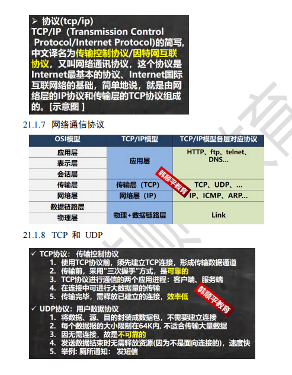
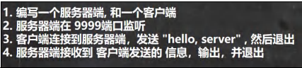
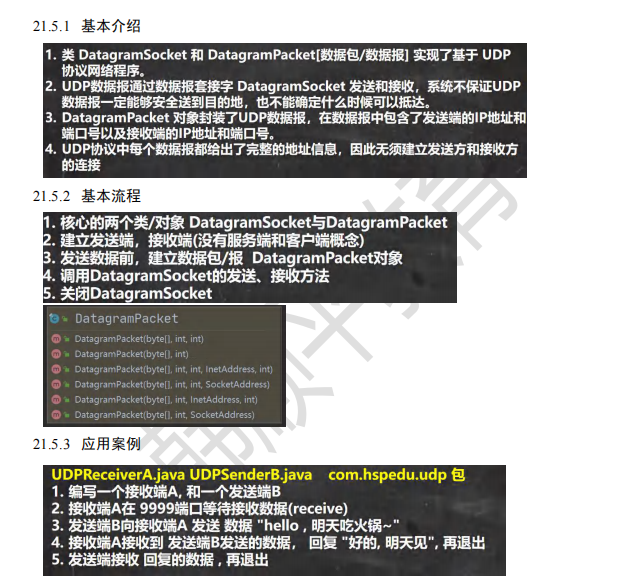
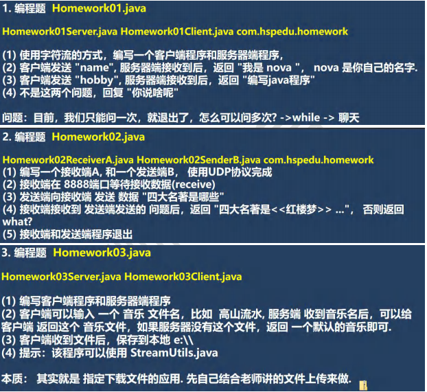
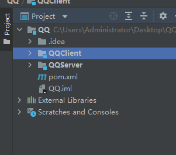

#

### [韩顺平聊JAVA网络](https://www.bilibili.com/video/BV1j54y1b7qv)

https://www.bilibili.com/video/BV15B4y1u7Rn



### InetAddress 类


```java
public class Test {
    public static void main(String[] args) throws Exception {
        //获取本机 InetAddress 对象 getLocalHost
        InetAddress localHost = InetAddress.getLocalHost();
        System.out.println(localHost);
        //根据指定主机名/域名获取 ip 地址对象 getByName
        InetAddress host2 = InetAddress.getByName("ThinkPad-PC");
        System.out.println(host2);
        InetAddress host3 = InetAddress.getByName("www.hsp.com");
        System.out.println(host3);
        //获取 InetAddress 对象的主机名 getHostName
        String host3Name = host3.getHostName();
        System.out.println(host3Name);
        //获取 InetAddress 对象的地址 getHostAddress
        String host3Address = host3.getHostAddress();
        System.out.println(host3Address);
    }
}
```

## TCP 网络通信编程

### 应用案例 1(使用字节流)



#### 服务端

```java
package com.xiyan;

import java.io.IOException;
import java.io.InputStream;
import java.net.ServerSocket;
import java.net.Socket;

/**
 * 服务端
 */
public class SocketTCP01Server {
    public static void main(String[] args) throws IOException {
        //思路 //1. 在本机 的 9999 端口监听, 等待连接 // 细节: 要求在本机没有其它服务在监听 9999 // 细节：这个 ServerSocket 可以通过 accept() 返回多个 Socket[多个客户端连接服务器的并发]
        ServerSocket serverSocket = new ServerSocket(9999);
        System.out.println("服务端，在 9999 端口监听，等待连接..");
        //2. 当没有客户端连接 9999 端口时，程序会 阻塞, 等待连接 
        // 如果有客户端连接，则会返回 Socket 对象，程序继续 
        Socket socket = serverSocket.accept();
        System.out.println("服务端 socket =" + socket.getClass());
        //3. 通过 socket.getInputStream() 读取客户端写入到数据通道的数据, 显示 
        InputStream inputStream = socket.getInputStream();
        //4. IO 读取 
        byte[] buf = new byte[1024];
        int readLen = 0;
        while ((readLen = inputStream.read(buf)) != -1) {
            System.out.println(new String(buf, 0, readLen));//根据读取到的实际长度，显示内容. 
        }
        // 5.关闭流和 socket 
        inputStream.close();
        socket.close();
        serverSocket.close();
        //关闭 
    }
}
```

#### 客户端

```java
package com.xiyan;

import java.io.IOException;
import java.io.OutputStream;
import java.net.InetAddress;
import java.net.Socket;
import java.net.UnknownHostException;

/*** 客户端，发送 "hello, server" 给服务端 */
public class SocketTCP01Client {
    public static void main(String[] args) throws IOException {
        //思路 //1. 连接服务端 (ip , 端口） //解读: 连接本机的 9999 端口, 如果连接成功，返回 Socket 对象 
        Socket socket = new Socket(InetAddress.getLocalHost(), 9999);
        System.out.println("客户端 socket 返回=" + socket.getClass());
        //2. 连接上后，生成 Socket, 通过 socket.getOutputStream() // 得到 和 socket 对象关联的输出流对象 
        OutputStream outputStream = socket.getOutputStream();
        //3. 通过输出流，写入数据到 数据通道 
        outputStream.write("hello, server".getBytes());
        //4. 关闭流对象和 socket, 必须关闭 
        outputStream.close();
        socket.close();
        System.out.println("客户端退出.....");
    }
}
```

### 应用案例 2(使用字节流) SocketTCP02.java


#### 服务端

```java
package com.xiyan;

import java.io.IOException;
import java.io.InputStream;
import java.io.OutputStream;
import java.net.ServerSocket;
import java.net.Socket;

/*** 服务端 */
@SuppressWarnings({"all"})
public class SocketTCP02Server {
    public static void main(String[] args) throws IOException {
        //思路 //1. 在本机 的 9999 端口监听, 等待连接 // 细节: 要求在本机没有其它服务在监听 9999 // 细节：这个 ServerSocket 可以通过 accept() 返回多个 Socket[多个客户端连接服务器的并发]
        ServerSocket serverSocket = new ServerSocket(9999);
        System.out.println("服务端，在 9999 端口监听，等待连接..");
        //2. 当没有客户端连接 9999 端口时，程序会 阻塞, 等待连接 // 如果有客户端连接，则会返回 Socket 对象，程序继续
        Socket socket = serverSocket.accept();
        System.out.println("服务端 socket =" + socket.getClass());
        //3. 通过 socket.getInputStream() 读取客户端写入到数据通道的数据, 显示
        InputStream inputStream = socket.getInputStream();
        //4. IO 读取
        byte[] buf = new byte[1024];
        int readLen = 0;
        while ((readLen = inputStream.read(buf)) != -1) {
            System.out.println(new String(buf, 0, readLen));
            //根据读取到的实际长度，显示内容.
        }
        //5. 获取 socket 相关联的输出流
        OutputStream outputStream = socket.getOutputStream();
        outputStream.write("hello, client".getBytes());
        // 设置结束标记
        socket.shutdownOutput();
        //6.关闭流和 socket
        outputStream.close();
        inputStream.close();
        socket.close();
        serverSocket.close();//关闭
    }
}
```

#### 客户端

```java
package com.xiyan;

import java.io.IOException;
import java.io.InputStream;
import java.io.OutputStream;
import java.net.InetAddress;
import java.net.Socket;

/*** 客户端，发送 "hello, server" 给服务端 */
@SuppressWarnings({"all"})
public class SocketTCP02Client {
    public static void main(String[] args) throws IOException {

        //思路 //1. 连接服务端 (ip , 端口） //解读: 连接本机的 9999 端口, 如果连接成功，返回 Socket 对象
        Socket socket = new Socket(InetAddress.getLocalHost(), 9999);
        System.out.println("客户端 socket 返回=" + socket.getClass());
        //2. 连接上后，生成 Socket, 通过 socket.getOutputStream() // 得到 和 socket 对象关联的输出流对象
        OutputStream outputStream = socket.getOutputStream();
        //3. 通过输出流，写入数据到 数据通道
        outputStream.write("hello, server".getBytes());
        // 设置结束标记
        socket.shutdownOutput();
        //4. 获取和 socket 关联的输入流. 读取数据(字节)，并显示
        InputStream inputStream = socket.getInputStream();
        byte[] buf = new byte[1024];
        int readLen = 0;
        while ((readLen = inputStream.read(buf)) != -1) {
            System.out.println(new String(buf, 0, readLen));
        }
        //5. 关闭流对象和 socket, 必须关闭
        inputStream.close();
        outputStream.close();
        socket.close();
        System.out.println("客户端退出.....");
    }
}
```

### 应用案例 3(使用字符流)


#### 服务端

```java
package com.xiyan;

import java.io.*;
import java.net.ServerSocket;
import java.net.Socket;

/**
 * 服务端, 使用字符流方式读写
 */
@SuppressWarnings({"all"})
public class SocketTCP03Server {
    public static void main(String[] args) throws IOException {
        //思路 //1. 在本机 的 9999 端口监听, 等待连接 // 细节: 要求在本机没有其它服务在监听 9999
// 细节：这个 ServerSocket 可以通过 accept() 返回多个 Socket[多个客户端连接服务器的并发]
        ServerSocket serverSocket = new ServerSocket(9999);
        System.out.println("服务端，在 9999 端口监听，等待连接..");
//2. 当没有客户端连接 9999 端口时，程序会 阻塞, 等待连接 // 如果有客户端连接，则会返回 Socket 对象，程序继续
/Socket socket = serverSocket.accept();
        System.out.println("服务端 socket =" + socket.getClass());

// 3. 通过 socket.getInputStream() 读取客户端写入到数据通道的数据, 显示
/InputStream inputStream = socket.getInputStream();
//4. IO 读取, 使用字符流, 老师使用 InputStreamReader 将 inputStream 转成字符流
/BufferedReader bufferedReader = new BufferedReader(new InputStreamReader(inputStream));
        String s = bufferedReader.readLine();
        System.out.println(s);//输出
        // 5. 获取 socket 相关联的输出流
        OutputStream outputStream = socket.getOutputStream();
        // 使用字符输出流的方式回复信息
        BufferedWriter bufferedWriter = new BufferedWriter(new OutputStreamWriter(outputStream));
        bufferedWriter.write("hello client 字符流");
        bufferedWriter.newLine();
        // 插入一个换行符，表示回复内容的结束
        bufferedWriter.flush();//注意需要手动的 flush
        //6.关闭流和 socket
        bufferedWriter.close();
        bufferedReader.close();
        socket.close();
        serverSocket.close();
    }
}
```

#### 客户端

```java
package com.xiyan;

import java.io.*;
import java.net.InetAddress;
import java.net.Socket;

/***  客户端，发送 "hello, server" 给服务端， 使用字符流 */
@SuppressWarnings({"all"})
public class SocketTCP03Client {
    public static void main(String[] args) throws IOException {
        //思路 //1. 连接服务端 (ip , 端口） //解读: 连接本机的 9999 端口, 如果连接成功，返回 Socket 对象 第 886页
        Socket socket = new Socket(InetAddress.getLocalHost(), 9999);
        System.out.println("客户端 socket 返回=" + socket.getClass());
        //2. 连接上后，生成 Socket, 通过 socket.getOutputStream() // 得到 和 socket 对象关联的输出流对象
        OutputStream outputStream = socket.getOutputStream();
        //3. 通过输出流，写入数据到 数据通道, 使用字符流
        BufferedWriter bufferedWriter = new BufferedWriter(new OutputStreamWriter(outputStream));
        bufferedWriter.write("hello, server 字符流");
        bufferedWriter.newLine();
        //插入一个换行符，表示写入的内容结束, 注意，要求对方使用 readLine()!!!!
        bufferedWriter.flush();// 如果使用的字符流，需要手动刷新，否则数据不会写入数据通
        // 4. 获取和 socket 关联的输入流. 读取数据(字符)，并显示
        InputStream inputStream = socket.getInputStream();
        BufferedReader bufferedReader = new BufferedReader(new InputStreamReader(inputStream));
        String s = bufferedReader.readLine();
        System.out.println(s);
        //5. 关闭流对象和 socket, 必须关闭
        bufferedReader.close();//关闭外层流
        bufferedWriter.close();
        socket.close();
        System.out.println("客户端退出.....");
    }
}
```

### 应用案例 4 TCPFileUploadServer.java TCPFileUploadClient.java


#### 工具类 StreamUtils

```java
package com.xiyan;

import java.io.BufferedReader;
import java.io.ByteArrayOutputStream;
import java.io.InputStream;
import java.io.InputStreamReader;

/*** 此类用于演示关于流的读写方法 **/
public class StreamUtils {
    /*** 功能：将输入流转换成 byte[] * @param is * @return * @throws Exception */
    public static byte[] streamToByteArray(InputStream is) throws Exception {
        ByteArrayOutputStream bos = new ByteArrayOutputStream();
        //创建输出流对象
        byte[] b = new byte[1024];
        int len;
        while ((len = is.read(b)) != -1) {
            bos.write(b, 0, len);
        }
        byte[] array = bos.toByteArray();
        bos.close();
        return array;
    }

    /*** 功能：将 InputStream 转换成 String * @param is * @return * @throws Exception */
    public static String streamToString(InputStream is) throws Exception {
        BufferedReader reader = new BufferedReader(new InputStreamReader(is));
        StringBuilder builder = new StringBuilder();
        String line;
        while ((line = reader.readLine()) != null) {
            //当读取到 null 时，就表示结束
            builder.append(line + "\r\n");
        }
        return builder.toString();
    }
}
```

#### 服务端

```java
package com.xiyan;

import com.sun.xml.internal.ws.util.StreamUtils;

import java.io.*;
import java.net.ServerSocket;
import java.net.Socket;

/***  文件上传的服务端 */
public class TCPFileUploadServer {
    public static void main(String[] args) throws Exception {
        //1. 服务端在本机监听 8888 端口
        ServerSocket serverSocket = new ServerSocket(8888);
        System.out.println("服务端在 8888 端口监听....");
        //2. 等待连接
        Socket socket = serverSocket.accept();
        // 3. 读取客户端发送的数据 // 通过 Socket 得到输入流
        BufferedInputStream bis = new BufferedInputStream(socket.getInputStream());
        byte[] bytes = StreamUtils.streamToByteArray(bis);
        //4. 将得到 bytes 数组，写入到指定的路径，就得到一个文件了
        String destFilePath = "src\\abc.mp4";
        BufferedOutputStream bos = new BufferedOutputStream(new FileOutputStream(destFilePath));
        bos.write(bytes);
        bos.close();
        // 向客户端回复 "收到图片" // 通过 socket 获取到输出流(字符)
        BufferedWriter writer = new BufferedWriter(new OutputStreamWriter(socket.getOutputStream()));
        writer.write("收到图片");
        writer.flush();//把内容刷新到数据通道
        socket.shutdownOutput();//设置写入结束标记
        // 关闭其他资源
        writer.close();
        bis.close();
        socket.close();
        serverSocket.close();
    }
}
```

#### 客户端

```java
package com.xiyan;

import com.sun.xml.internal.ws.util.StreamUtils;

import java.io.*;
import java.net.InetAddress;
import java.net.Socket;

/*** 
 文件上传的客户端 */
public class TCPFileUploadClient {
    public static void main(String[] args) throws Exception {
        //客户端连接服务端 8888，得到 Socket 对象 
        Socket socket = new Socket(InetAddress.getLocalHost(), 8888);
        //创建读取磁盘文件的输入流 //String filePath = "e:\\qie.png"; 
        String filePath = "e:\\abc.mp4";
        BufferedInputStream bis = new BufferedInputStream(new FileInputStream(filePath));
        //bytes 就是 filePath 对应的字节数组 
        /byte[] bytes = StreamUtils.streamToByteArray(bis);
        //通过 socket 获取到输出流, 将 bytes 数据发送给服务端 
        BufferedOutputStream bos = new BufferedOutputStream(socket.getOutputStream());
        bos.write(bytes);//将文件对应的字节数组的内容，写入到数据通道 
        bis.close();
        socket.shutdownOutput();//设置写入数据的结束标记 
        // =====接收从服务端回复的消息===== 
        InputStream inputStream = socket.getInputStream();
        //使用 StreamUtils 的方法，直接将 inputStream 读取到的内容 转成字符串 
        String s = StreamUtils.streamToString(inputStream);
        System.out.println(s);
        //关闭相关的流 
        inputStream.close();
        bos.close();
        socket.close();
    }
}
```

## UDP 网络通信编程



#### 接收端

```java
package com.xiyan;

import java.io.IOException;
import java.net.DatagramPacket;
import java.net.DatagramSocket;
import java.net.InetAddress;
import java.net.SocketException;

/***  UDP 接收端 */
public class UDPReceiverA {
    public static void main(String[] args) throws IOException {
        //1. 创建一个 DatagramSocket 对象，准备在 9999 接收数据
        DatagramSocket socket = new DatagramSocket(9999);
        //2. 构建一个 DatagramPacket 对象，准备接收数据 // 在前面讲解 UDP 协议时，老师说过一个数据包最大 64k
        byte[] buf = new byte[1024];
        DatagramPacket packet = new DatagramPacket(buf, buf.length);
        //3. 调用 接收方法, 将通过网络传输的 DatagramPacket 对象
        // 填充到 packet 对象
        // 老师提示: 当有数据包发送到 本机的 9999 端口时，就会接收到数据
        // 如果没有数据包发送到 本机的 9999 端口, 就会阻塞等待.
        System.out.println("接收端 A 等待接收数据..");
        socket.receive(packet);
        //4. 可以把 packet 进行拆包，取出数据，并显示.
        int length = packet.getLength();
        //实际接收到的数据字节长度
        byte[] data = packet.getData();//接收到数据
        String s = new String(data, 0, length);
        System.out.println(s);
        //===回复信息给 B 端
        // 将需要发送的数据，封装到 DatagramPacket 对象 
        data = "好的, 明天见".getBytes();
        // 说明: 封装的 DatagramPacket 对象 data 内容字节数组 , data.length , 主机(IP) , 端口
        packet = new DatagramPacket(data, data.length, InetAddress.getByName("192.168.12.1"), 9998);
        socket.send(packet);//发送
        // 5. 关闭资源
        socket.close();
        System.out.println("A 端退出...");
    }
}
```

#### 接收端
```java
package com.xiyan;

import java.io.IOException;
import java.net.*;

/***  发送端 B ====> 也可以接收数据 */
@SuppressWarnings({"all"})
public class UDPSenderB {
    public static void main(String[] args) throws IOException {
        //1.创建 DatagramSocket 对象，准备在 9998 端口 接收数据
        DatagramSocket socket = new DatagramSocket(9998);
        //2. 将需要发送的数据，封装到 DatagramPacket 对象
        byte[] data = "hello 明天吃火锅~".getBytes();
        //说明: 封装的 DatagramPacket 对象 data 内容字节数组 , data.length , 主机(IP) , 端口
        DatagramPacket packet = new DatagramPacket(data, data.length, InetAddress.getByName("192.168.12.1"), 9999);
        socket.send(packet);
        //3.=== 接收从 A 端回复的信息
        // (1) 构建一个 DatagramPacket 对象，准备接收数据
        // 在前面讲解 UDP 协议时，老师说过一个数据包最大 64k
        byte[] buf = new byte[1024];
        packet = new DatagramPacket(buf, buf.length);
        //(2) 调用 接收方法, 将通过网络传输的 DatagramPacket 对象
        // 填充到 packet 对象
        // 老师提示: 当有数据包发送到 本机的 9998 端口时，就会接收到数据
        // 如果没有数据包发送到 本机的 9998 端口, 就会阻塞等待.
        socket.receive(packet);
        // (3) 可以把 packet 进行拆包，取出数据，并显示.
        int length = packet.getLength();//实际接收到的数据字节长度
        data = packet.getData();//接收到数据
        String s = new String(data, 0, length);
        System.out.println(s);
        //关闭资源
        socket.close();
        System.out.println("B 端退出");
    }
}
```

## 综合练习


### 第一题服务端
```java
package com.xiyan;

import java.io.BufferedReader;
import java.io.BufferedWriter;
import java.io.InputStreamReader;
import java.io.OutputStreamWriter;
import java.net.ServerSocket;
import java.net.Socket;

/**
 * @author: Bright
 * @date:Created in 2022/4/19 0019 11:14
 * @describe :
 */
public class Server {
    public static void main(String[] args) throws Exception {
        ServerSocket serverSocket = new ServerSocket(8888);
        Socket socket = serverSocket.accept();
        BufferedReader br = new BufferedReader(new InputStreamReader(socket.getInputStream(), "UTF-8"));
        int leg;
        String str = "";
        while ((leg = br.read()) != -1) {
            str += (char) leg;
        }
        System.out.println(str);
        String msg;
        if ("name".equals(str)) {
            msg = "我的nova";
        } else if ("hobby".equals(str)) {
            msg = "编写java程序";
        } else {
            msg = "你在说什么呢";
        }
        BufferedWriter bw = new BufferedWriter(new OutputStreamWriter(socket.getOutputStream(), "UTF-8"));
        bw.write(msg);
        bw.flush();
        socket.shutdownOutput();
        bw.close();
        br.close();
        socket.close();
        serverSocket.close();
    }
}
```

### 第一题客户端
```java
package com.xiyan;

import java.io.BufferedReader;
import java.io.BufferedWriter;
import java.io.InputStreamReader;
import java.io.OutputStreamWriter;
import java.net.InetAddress;
import java.net.Socket;
import java.util.Scanner;

/**
 * @author: Bright
 * @date:Created in 2022/4/19 0019 11:14
 * @describe :
 */
public class Client {
    public static void main(String[] args) throws Exception {
        Socket socket = new Socket(InetAddress.getLocalHost(), 8888);
        String text = new Scanner(System.in).next();
        BufferedWriter bw = new BufferedWriter(new OutputStreamWriter(socket.getOutputStream(),"UTF-8"));
        bw.write(text);
        bw.flush();
        socket.shutdownOutput();
        BufferedReader br = new BufferedReader(new InputStreamReader(socket.getInputStream(),"UTF-8"));
        int leg;
        while ((leg = br.read()) != -1) {
            System.out.print((char) leg);
        }
        bw.close();
        br.close();
        socket.close();
    }
}
```
### 第二题接收端
```java
package com.xiyan;

import java.net.*;
import java.nio.charset.StandardCharsets;

/**
 * @author: Bright
 * @date:Created in 2022/4/19 0019 11:14
 * @describe :
 */
public class Server {
    public static void main(String[] args) throws Exception {
        DatagramSocket datagramSocket = new DatagramSocket(8888);
        byte[] buf = new byte[1024];
        DatagramPacket datagramPacket = new DatagramPacket(buf, buf.length);
        datagramSocket.receive(datagramPacket);
        int length = datagramPacket.getLength();
        byte[] data = datagramPacket.getData();
        String s = new String(data, 0, length);
        System.out.println(s);
        String msg = "";
        if ("四大名著有哪些".equals(s)) {
            msg = "<红楼梦> <水浒传><西游记><三国演义>";
        } else {
            msg = "what";
        }
        datagramPacket = new DatagramPacket(msg.getBytes(StandardCharsets.UTF_8), msg.getBytes(StandardCharsets.UTF_8).length, InetAddress.getLocalHost(), 9999);
        datagramSocket.send(datagramPacket);
        datagramSocket.close();
    }
}

```
### 第二题发送端
```java
package com.xiyan;

import java.io.BufferedReader;
import java.io.BufferedWriter;
import java.io.InputStreamReader;
import java.io.OutputStreamWriter;
import java.net.DatagramPacket;
import java.net.DatagramSocket;
import java.net.InetAddress;
import java.net.Socket;
import java.nio.charset.StandardCharsets;
import java.util.Scanner;

/**
 * @author: Bright
 * @date:Created in 2022/4/19 0019 11:14
 * @describe :
 */
public class Client {
    public static void main(String[] args) throws Exception {
        DatagramSocket datagramSocket = new DatagramSocket(9999);
        String text = new Scanner(System.in).next();
        DatagramPacket datagramPacket = new DatagramPacket(text.getBytes(StandardCharsets.UTF_8), text.getBytes(StandardCharsets.UTF_8).length, InetAddress.getLocalHost(), 8888);
        datagramSocket.send(datagramPacket);
        byte[] buf = new byte[1024];
        datagramPacket = new DatagramPacket(buf, buf.length);
        datagramSocket.receive(datagramPacket);
        int length = datagramPacket.getLength();
        byte[] data = datagramPacket.getData();
        System.out.println(new String(data, 0, length));
        datagramSocket.close();
    }
}
```

### 第三题服务端
```java
package com.xiyan;

import java.io.FileInputStream;
import java.io.InputStream;
import java.io.OutputStream;
import java.net.*;

/**
 * @author: Bright
 * @date:Created in 2022/4/19 0019 11:14
 * @describe :
 */
public class Server {
    public static void main(String[] args) throws Exception {
        ServerSocket serverSocket = new ServerSocket(8888);
        Socket socket = serverSocket.accept();
        InputStream is = socket.getInputStream();
        byte[] buf = new byte[1024];
        int temp;
        String msg = "";
        while ((temp = is.read(buf)) != -1) {
            msg += new String(buf, 0, temp);
        }
        String src = "";
        if ("青花瓷".equals(msg)) {
            src = "d://青花瓷.mp3";
        } else {
            src = "d://月光.mp3";
        }
        FileInputStream fis = new FileInputStream(src);
        buf = new byte[1024];
        fis.read(buf);
        OutputStream os = socket.getOutputStream();
        os.write(buf);
        os.close();
        fis.close();
        is.close();
        socket.close();
        serverSocket.close();
    }
}
```

### 第三题客户端
```java
package com.xiyan;

import java.io.*;
import java.net.DatagramPacket;
import java.net.DatagramSocket;
import java.net.InetAddress;
import java.net.Socket;
import java.nio.charset.StandardCharsets;
import java.util.Scanner;

/**
 * @author: Bright
 * @date:Created in 2022/4/19 0019 11:14
 * @describe :
 */
public class Client {
    public static void main(String[] args) throws Exception {
        Socket socket = new Socket(InetAddress.getLocalHost(), 8888);
        System.out.println("请输入下载的音乐：");
        String text = new Scanner(System.in).next();
        OutputStream os = socket.getOutputStream();
        os.write(text.getBytes(StandardCharsets.UTF_8));
        socket.shutdownOutput();
        InputStream is = socket.getInputStream();
        byte[] buf = new byte[1024];
        int temp;
        FileOutputStream fis = new FileOutputStream("d://" + text + ".mp3");
        while ((temp = is.read(buf)) != -1) {
            fis.write(buf, 0, temp);
        }
        fis.close();
        is.close();
        os.close();
        socket.close();
    }
}
```
## 聊天项目
项目结构


### QQClient
```java
package com.xiyan;

import java.io.Serializable;

/**
 * @author: bright
 * @date:Created in 2022/4/17 14:31
 * @describe : 用户类
 */
public class User implements Serializable {
    /**
     * 用户id
     */
    private String userId;
    /**
     * 用户密码
     */
    private String password;

    public User() {
    }

    public User(String userId, String password) {
        this.userId = userId;
        this.password = password;
    }

    public String getUserId() {
        return userId;
    }

    public void setUserId(String userId) {
        this.userId = userId;
    }

    public String getPassword() {
        return password;
    }

    public void setPassword(String password) {
        this.password = password;
    }
}

```

```java
package com.xiyan;

/**
 * @author: bright
 * @date:Created in 2022/4/17 14:36
 * @describe : 消息类型
 */
public interface MsgType {
    /**
     * 登录成功
     */
    String MESSAGE_LOGIN_SUCCESS = "1";
    /**
     * 登录失败
     */
    String MESSAGE_LOGIN_FAIL = "2";
    /**
     * 普通消息
     */
    String MESSAGE_COMM_MES = "3";
    /**
     * 获取在线用户
     */
    String MESSAGE_GET_ONLINE = "4";
    String MESSAGE_RET_ONLINE = "5";
    /**
     * 退出
     */
    String MESSAGE_EXIT = "6";
    /**
     * 群发
     */
    String MESSAGE_COMM_MES_ALL = "7";
    /**
     * 文件消息
     */
    String MESSAGE_FILE_MES = "8";
}
```
```java
package com.xiyan;

import java.io.Serializable;

/**
 * @author: bright
 * @date:Created in 2022/4/17 14:31
 * @describe : 消息类
 */
public class Message implements Serializable {

    /**
     * 发送者
     */
    private String sender;

    /**
     * 接收者
     */
    private String getter;

    /**
     * 内容
     */
    private String content;

    /**
     * 消息类型
     */
    private String msgType;

    /**
     * 文件
     */
    private byte[] file;

    /**
     * 目标路径
     */
    private String dest;

    /**
     * 文件长度
     */
    private int fileLen = 0;
    /**
     * 原路径
     */
    private String src;

    public String getDest() {
        return dest;
    }

    public void setDest(String dest) {
        this.dest = dest;
    }

    public int getFileLen() {
        return fileLen;
    }

    public void setFileLen(int fileLen) {
        this.fileLen = fileLen;
    }

    public String getSrc() {
        return src;
    }

    public void setSrc(String src) {
        this.src = src;
    }

    public byte[] getFile() {
        return file;
    }

    public void setFile(byte[] file) {
        this.file = file;
    }

    public String getMsgType() {
        return msgType;
    }

    public void setMsgType(String msgType) {
        this.msgType = msgType;
    }

    private String sendTime;

    public String getSender() {
        return sender;
    }

    public void setSender(String sender) {
        this.sender = sender;
    }

    public String getGetter() {
        return getter;
    }

    public void setGetter(String getter) {
        this.getter = getter;
    }

    public String getContent() {
        return content;
    }

    public void setContent(String content) {
        this.content = content;
    }

    public String getSendTime() {
        return sendTime;
    }

    public void setSendTime(String sendTime) {
        this.sendTime = sendTime;
    }
}
```

```java
package com.xiyan;

import java.io.ObjectOutputStream;
import java.net.Socket;
import java.util.Scanner;

/**
 * @author: bright
 * @date:Created in 2022/4/17 14:46
 * @describe :
 */
public class QQView {

    private boolean loop = true;

    private void mainMenu() {
        while (loop) {
            System.out.println("=============欢迎登陆网络通信系统===========");
            System.out.println("\t\t 1 登陆系统");
            System.out.println("\t\t 9 退出系统");
            System.out.println("请输入你的选择：");
            String key = new Scanner(System.in).next();
            switch (key) {
                case "1":
                    System.out.println("请输入你的用户号");
                    String userId = new Scanner(System.in).next();
                    System.out.println("请输入你的密码");
                    String password = new Scanner(System.in).next();
                    User user = new User(userId, password);
                    if (UserClientService.checkUser(user)) {
                        while (loop) {
                            System.out.println("========网络通信系统二级菜单 用户" + userId + "========");
                            System.out.println("1.显示在线用户列表\n2.群发信息\n3.私聊信息\n4.发送文件\n9.退出系统");
                            System.out.println("请输入你的选择：");
                            String key2 = new Scanner(System.in).next();
                            switch (key2) {
                                case "1":
                                    try {
                                        onlineFriendList(userId);
                                    } catch (Exception e) {
                                        e.printStackTrace();
                                    }
                                    break;
                                case "2":
                                    System.out.println("请输入的你想对大家说的话：");
                                    String content = new Scanner(System.in).next();
                                    MessageClientService.sendMessageToAll(content, userId);
                                    break;
                                case "3":
                                    System.out.println("请输入的想聊天的用户号：");
                                    String id = new Scanner(System.in).next();
                                    System.out.println("请输入的你想说的话：");
                                    String text = new Scanner(System.in).next();
                                    MessageClientService.sendMessageToOne(text, userId, id);
                                    break;
                                case "4":
                                    System.out.println("请输入原文件路径");
                                    String src = new Scanner(System.in).next();
                                    System.out.println("请输入目的文件路径");
                                    String dest = new Scanner(System.in).next();
                                    System.out.println("请输入发送用户");
                                    String getter = new Scanner(System.in).next();
                                    FileClientService.sendFieToOne(src, dest, userId, getter);
                                    break;
                                default:
                                    loop = false;
                                    UserClientService.logout(userId);
                                    break;
                            }
                        }
                    } else {
                        System.out.println("账户名密码错误");
                    }
                    break;
                case "9":
                    loop = false;
                    break;
            }
        }
    }

    /**
     * 获取在线用户
     *
     * @param userId
     * @throws Exception
     */
    public void onlineFriendList(String userId) throws Exception {
        Message message = new Message();
        message.setMsgType(MsgType.MESSAGE_GET_ONLINE);
        message.setSender(userId);
        Socket socket = ManageClientConnectServerThread.getClientConnectServerThread(userId).getSocket();
        ObjectOutputStream oos = new ObjectOutputStream(socket.getOutputStream());
        oos.writeObject(message);
    }


    public static void main(String[] args) {
        new QQView().mainMenu();
    }
}

```

```java
package com.xiyan;

import java.io.IOException;
import java.io.ObjectInputStream;
import java.io.ObjectOutputStream;
import java.net.InetAddress;
import java.net.Socket;

/**
 * @author: bright
 * @date:Created in 2022/4/17 17:58
 * @describe :
 */
public class UserClientService {
    private static Socket socket = null;

    /**
     * 校验用户
     *
     * @param user
     * @return
     */
    public static boolean checkUser(User user) {
        boolean flag = false;
        try {
            socket = new Socket(InetAddress.getByName("127.0.0.1"), 9999);
            ObjectOutputStream oos = new ObjectOutputStream(socket.getOutputStream());
            oos.writeObject(user);
            ObjectInputStream ois = new ObjectInputStream(socket.getInputStream());
            Message message = (Message) ois.readObject();
            if (message.getMsgType().equals(MsgType.MESSAGE_LOGIN_SUCCESS)) {
                //校验成功开启一个新的客户端线程循环读取信息
                ClientConnectServerThread clientConnectServerThread = new ClientConnectServerThread(socket);
                clientConnectServerThread.start();
                //写入map进行管理
                ManageClientConnectServerThread.addClientConnectServerThread(user.getUserId(), clientConnectServerThread);
                flag = true;
            } else {
                socket.close();
            }
        } catch (Exception e) {
            e.printStackTrace();
        }
        return flag;
    }

    /**
     * 退出
     *
     * @param userId
     */
    public static void logout(String userId) {
        Message message = new Message();
        message.setMsgType(MsgType.MESSAGE_EXIT);
        message.setSender(userId);
        try {
            //通知服务端退出线程的操作
            ObjectOutputStream oos = new ObjectOutputStream(ManageClientConnectServerThread.getClientConnectServerThread(userId).getSocket().getOutputStream());
            oos.writeObject(message);
            System.out.println(userId + "退出了系统");
            //正常结束
            System.exit(0);
        } catch (IOException e) {
            e.printStackTrace();
        }
    }
}

```

```java
package com.xiyan;

import java.io.IOException;
import java.io.ObjectOutputStream;
import java.util.Date;

/**
 * @author: Bright
 * @date:Created in 2022/4/18 0018 15:34
 * @describe :
 */
public class MessageClientService {
    public static void sendMessageToOne(String content, String sender, String getter) {
        Message message = new Message();
        message.setSender(sender);
        message.setGetter(getter);
        message.setContent(content);
        message.setSendTime(new Date().toString());
        message.setMsgType(MsgType.MESSAGE_COMM_MES);
        System.out.println(sender + "对" + getter + "说" + content);
        try {
            ObjectOutputStream oos = new ObjectOutputStream(ManageClientConnectServerThread.getClientConnectServerThread(sender).getSocket().getOutputStream());
            oos.writeObject(message);
        } catch (IOException e) {
            e.printStackTrace();
        }
    }

    public static void sendMessageToAll(String content, String sender) {
        Message message = new Message();
        message.setSender(sender);
        message.setContent(content);
        message.setSendTime(new Date().toString());
        message.setMsgType(MsgType.MESSAGE_COMM_MES_ALL);
        try {
            ObjectOutputStream oos = new ObjectOutputStream(ManageClientConnectServerThread.getClientConnectServerThread(sender).getSocket().getOutputStream());
            oos.writeObject(message);
        } catch (IOException e) {
            e.printStackTrace();
        }
    }
}

```

```java
package com.xiyan;

import java.util.HashMap;

/**
 * @author: bright
 * @date:Created in 2022/4/17 20:42
 * @describe :客户端线程管理类
 */
public class ManageClientConnectServerThread {
    static HashMap<String, ClientConnectServerThread> map = new HashMap<>();

    /**
     * 添加到map进行管理
     *
     * @param userId                    用户id
     * @param clientConnectServerThread 当前线程
     */
    public static void addClientConnectServerThread(String userId, ClientConnectServerThread clientConnectServerThread) {
        map.put(userId, clientConnectServerThread);
    }

    /**
     * 根据用户id或者当前线程
     *
     * @param userId
     * @return
     */
    public static ClientConnectServerThread getClientConnectServerThread(String userId) {
        return map.get(userId);
    }
}

```

```java
package com.xiyan;

import java.io.FileInputStream;
import java.io.FileNotFoundException;
import java.io.ObjectOutputStream;
import java.io.OutputStream;

/**
 * @author: Bright
 * @date:Created in 2022/4/18 0018 17:19
 * @describe : 发送文件
 */
public class FileClientService {
    /**
     * @param src    原路径
     * @param dest   目标路径
     * @param sender 发送者
     * @param getter 接收者
     */
    public static void sendFieToOne(String src, String dest, String sender, String getter) {
        try {
            //文件读取
            FileInputStream fis = new FileInputStream(src);
            //fis.available()文件多大就设置多大
            byte[] buf = new byte[fis.available()];
            //写入buf
            fis.read(buf);
            Message message = new Message();
            message.setSender(sender);
            message.setGetter(getter);
            message.setFile(buf);
            message.setSrc(src);
            message.setDest(dest);
            message.setMsgType(MsgType.MESSAGE_FILE_MES);
            ObjectOutputStream oos = new ObjectOutputStream(ManageClientConnectServerThread.getClientConnectServerThread(sender).getSocket().getOutputStream());
            oos.writeObject(message);
            fis.close();
        } catch (Exception e) {
            e.printStackTrace();
        }
    }
}

```

```java
package com.xiyan;

import java.io.*;
import java.net.Socket;

/**
 * @author: bright
 * @date:Created in 2022/4/17 19:40
 * @describe :  客户端与服务端建立连接通信的线程
 */
public class ClientConnectServerThread extends Thread {

    private Socket socket;

    public ClientConnectServerThread(Socket socket) {
        this.socket = socket;
    }

    public Socket getSocket() {
        return socket;
    }

    public void setSocket(Socket socket) {
        this.socket = socket;
    }

    @Override
    public void run() {
        //循环读取消息。如果没有设置whine只会读一次就结束了
        while (true) {
            try {
                ObjectInputStream ois = new ObjectInputStream(socket.getInputStream());
                Message message = (Message) ois.readObject();
                //根据消息类型判断
                if (message.getMsgType().equals(MsgType.MESSAGE_GET_ONLINE)) {
                    String[] s = message.getContent().split(" ");
                    for (String s1 : s) {
                        System.out.println("在线用户：" + s1);
                    }
                } else if (MsgType.MESSAGE_COMM_MES.equals(message.getMsgType())) {
                    //私聊
                    System.out.println(message.getSender() + "对" + message.getGetter() + "说：" + message.getContent());
                } else if (MsgType.MESSAGE_COMM_MES_ALL.equals(message.getMsgType())) {
                    //群聊
                    System.out.println(message.getSender() + "对大家说：" + message.getContent());
                } else if (message.getMsgType().equals(MsgType.MESSAGE_FILE_MES)) {
                    //文件
                    System.out.println(message.getSender() + "发送文件给" + message.getGetter());
                    FileOutputStream fos = new FileOutputStream(message.getDest());
                    fos.write(message.getFile());
                    fos.close();
                }
            } catch (Exception e) {
                e.printStackTrace();
            } finally {

            }
        }
    }
}

```

### 服务端
```java
package com.xiyan;

import java.io.Serializable;

/**
 * @author: bright
 * @date:Created in 2022/4/17 14:31
 * @describe : 用户类
 */
public class User implements Serializable {
    /**
     * 用户id
     */
    private String userId;
    /**
     * 用户密码
     */
    private String password;

    public User() {
    }

    public User(String userId, String password) {
        this.userId = userId;
        this.password = password;
    }

    public String getUserId() {
        return userId;
    }

    public void setUserId(String userId) {
        this.userId = userId;
    }

    public String getPassword() {
        return password;
    }

    public void setPassword(String password) {
        this.password = password;
    }
}

```

```java
package com.xiyan;

/**
 * @author: bright
 * @date:Created in 2022/4/17 14:36
 * @describe : 消息类型
 */
public interface MsgType {
    /**
     * 登录成功
     */
    String MESSAGE_LOGIN_SUCCESS = "1";
    /**
     * 登录失败
     */
    String MESSAGE_LOGIN_FAIL = "2";
    /**
     * 普通消息
     */
    String MESSAGE_COMM_MES = "3";
    /**
     * 获取在线用户
     */
    String MESSAGE_GET_ONLINE = "4";
    String MESSAGE_RET_ONLINE = "5";
    /**
     * 退出
     */
    String MESSAGE_EXIT = "6";
    /**
     * 群发
     */
    String MESSAGE_COMM_MES_ALL = "7";
    /**
     * 文件消息
     */
    String MESSAGE_FILE_MES = "8";
}
```
```java
package com.xiyan;

import java.io.Serializable;

/**
 * @author: bright
 * @date:Created in 2022/4/17 14:31
 * @describe : 消息类
 */
public class Message implements Serializable {

    /**
     * 发送者
     */
    private String sender;

    /**
     * 接收者
     */
    private String getter;

    /**
     * 内容
     */
    private String content;

    /**
     * 消息类型
     */
    private String msgType;

    /**
     * 文件
     */
    private byte[] file;

    /**
     * 目标路径
     */
    private String dest;

    /**
     * 文件长度
     */
    private int fileLen = 0;
    /**
     * 原路径
     */
    private String src;

    public String getDest() {
        return dest;
    }

    public void setDest(String dest) {
        this.dest = dest;
    }

    public int getFileLen() {
        return fileLen;
    }

    public void setFileLen(int fileLen) {
        this.fileLen = fileLen;
    }

    public String getSrc() {
        return src;
    }

    public void setSrc(String src) {
        this.src = src;
    }

    public byte[] getFile() {
        return file;
    }

    public void setFile(byte[] file) {
        this.file = file;
    }

    public String getMsgType() {
        return msgType;
    }

    public void setMsgType(String msgType) {
        this.msgType = msgType;
    }

    private String sendTime;

    public String getSender() {
        return sender;
    }

    public void setSender(String sender) {
        this.sender = sender;
    }

    public String getGetter() {
        return getter;
    }

    public void setGetter(String getter) {
        this.getter = getter;
    }

    public String getContent() {
        return content;
    }

    public void setContent(String content) {
        this.content = content;
    }

    public String getSendTime() {
        return sendTime;
    }

    public void setSendTime(String sendTime) {
        this.sendTime = sendTime;
    }
}
```
```java
package com.xiyan;

import java.io.IOException;
import java.io.ObjectInputStream;
import java.io.ObjectOutputStream;
import java.net.ServerSocket;
import java.net.Socket;
import java.util.HashMap;

/**
 * @author: bright
 * @date:Created in 2022/4/17 21:07
 * @describe :
 */
public class UserServerService {

    private ServerSocket serverSocket = null;

    private static HashMap<String, User> map = new HashMap<>();


    /**
     * 初始化用户
     */
    static {
        map.put("10010", new User("10010", "123456"));
        map.put("10020", new User("10020", "123456"));
        map.put("10030", new User("10030", "123456"));
        map.put("10040", new User("10040", "123456"));
    }

    /**
     * 校验用户信息
     *
     * @param userId
     * @param password
     * @return
     */
    private boolean checkUser(String userId, String password) {
        User user = map.get(userId);
        if (null == user) {
            return false;
        }
        if (!user.getPassword().equals(password)) {
            return false;
        }
        return true;
    }

    public UserServerService() {
        System.out.println("服务端在8888端口监听.....");
        //开启一个新的线程实现服务端推送新闻
        new Thread(new SendNewsToAllService()).start();
        try {
            serverSocket = new ServerSocket(9999);
            //循环监听客户端连接
            while (true) {
                Socket socket = serverSocket.accept();
                //获取客户端发送的消息
                ObjectInputStream ois = new ObjectInputStream(socket.getInputStream());
                User user = (User) ois.readObject();
                Message message = new Message();
                ObjectOutputStream oos = new ObjectOutputStream(socket.getOutputStream());
                //验证用户名密码
                if (checkUser(user.getUserId(), user.getPassword())) {
                    //登录成功设置消息类型为成功
                    message.setMsgType(MsgType.MESSAGE_LOGIN_SUCCESS);
                    //写回客户端
                    oos.writeObject(message);
                    //重新开启一个新的监听线程进行与客户端的连接
                    ServerConnectServerThread serverConnectServerThread = new ServerConnectServerThread(socket, user.getUserId());
                    serverConnectServerThread.start();
                    //放入map中进行管理
                    ManageServerConnectServerThread.addServerConnectServerThread(user.getUserId(), serverConnectServerThread);
                } else {
                    //登录失败也写回客户端
                    message.setMsgType(MsgType.MESSAGE_LOGIN_FAIL);
                    oos.writeObject(message);
                    serverSocket.close();
                }
            }
        } catch (Exception e) {
            e.printStackTrace();
        } finally {
            try {
                serverSocket.close();
            } catch (IOException e) {
                e.printStackTrace();
            }
        }
    }

    public static void main(String[] args) {
        new UserServerService();
    }
}

```

```java
package com.xiyan;

import java.io.IOException;
import java.io.ObjectOutputStream;
import java.util.Date;
import java.util.HashMap;
import java.util.Scanner;

/**
 * @author: Bright
 * @date:Created in 2022/4/18 0018 18:11
 * @describe :  服务器推送新闻类
 */
public class SendNewsToAllService implements Runnable {

    @Override
    public void run() {
        while (true) {
            System.out.println("请输入需要推送的新闻：");
            String text = new Scanner(System.in).next();
            //exit退出当前线程
            if ("exit".equals(text)) {
                break;
            }
            Message message = new Message();
            message.setContent(text);
            message.setMsgType(MsgType.MESSAGE_COMM_MES_ALL);
            message.setSender("服务器");
            message.setSendTime(new Date().toString());
            //获取所有在线的线程
            HashMap<String, ServerConnectServerThread> map = ManageServerConnectServerThread.map;
            for (String s : map.keySet()) {
                //遍历每个服务端管理的线程挨个给客户端发送消息，实现群发
                ServerConnectServerThread serverConnectServerThread = map.get(s);
                try {
                    ObjectOutputStream oos = new ObjectOutputStream(serverConnectServerThread.getSocket().getOutputStream());
                    oos.writeObject(message);
                } catch (IOException e) {
                    e.printStackTrace();
                }
            }
        }
    }
}

```

```java
package com.xiyan;

import java.io.ObjectInputStream;
import java.io.ObjectOutputStream;
import java.net.Socket;
import java.util.HashMap;
import java.util.Iterator;

/**
 * @author: bright
 * @date:Created in 2022/4/17 21:28
 * @describe : 服务端与客户端建立连接通信的线程
 */
public class ServerConnectServerThread extends Thread {

    private Socket socket;

    private String userId;

    public ServerConnectServerThread(Socket socket, String userId) {
        this.socket = socket;
        this.userId = userId;
    }

    public Socket getSocket() {
        return socket;
    }

    public void setSocket(Socket socket) {
        this.socket = socket;
    }

    public String getUserId() {
        return userId;
    }

    public void setUserId(String userId) {
        this.userId = userId;
    }

    @Override
    public void run() {
        try {
            //循环读取消息。如果没有设置whine只会读一次就结束了
            while (true) {
                System.out.println("服务器和客户端" + userId + "保持通讯");
                ObjectInputStream ois = new ObjectInputStream(socket.getInputStream());
                ObjectOutputStream oos = new ObjectOutputStream(socket.getOutputStream());
                //读取客户端的数据
                Message message = (Message) ois.readObject();
                //根据消息类型进行判断
                if (message.getMsgType().equals(MsgType.MESSAGE_GET_ONLINE)) {
                    System.out.println(message.getSender() + "要在线用户列表");
                    //获取服务端在线用户的map集合
                    HashMap<String, ServerConnectServerThread> map = ManageServerConnectServerThread.map;
                    String userId = "";
                    for (String s : map.keySet()) {
                        userId += s + " ";
                    }
                    message.setContent(userId);
                    //设置接收者
                    message.setGetter(message.getSender());
                    oos.writeObject(message);
                } else if (MsgType.MESSAGE_EXIT.equals(message.getMsgType())) {
                    //清理map中退出的用户
                    System.out.println(message.getSender() + "退出");
                    ManageServerConnectServerThread.removeServerConnectServerThread(userId);
                    socket.close();
                    break;
                } else if (MsgType.MESSAGE_COMM_MES.equals(message.getMsgType())) {
                    //私聊  通过获取接收者的socket进行给客户端发送消息
                    oos = new ObjectOutputStream(ManageServerConnectServerThread.getServerConnectServerThread(message.getGetter()).getSocket().getOutputStream());
                    oos.writeObject(message);
                } else if (MsgType.MESSAGE_COMM_MES_ALL.equals(message.getMsgType())) {
                    //群发
                    HashMap<String, ServerConnectServerThread> map = ManageServerConnectServerThread.map;
                    Iterator<String> iterator = map.keySet().iterator();
                    while (iterator.hasNext()) {
                        String userId = iterator.next();
                        //除了不发自己，其他人挨个发送
                        if (!userId.equals(message.getSender())) {
                            new ObjectOutputStream(map.get(userId).getSocket().getOutputStream()).
                                    writeObject(message);
                        }
                    }
                } else if (message.getMsgType().equals(MsgType.MESSAGE_FILE_MES)) {
                    //发送文件
                    new ObjectOutputStream(ManageServerConnectServerThread.getServerConnectServerThread(message.getGetter()).getSocket().getOutputStream()).writeObject(message);
                }
            }
        } catch (Exception e) {
            e.printStackTrace();
        } finally {

        }
    }
}

```

```java
package com.xiyan;

import java.util.HashMap;

/**
 * @author: bright
 * @date:Created in 2022/4/17 20:42
 * @describe : 服务端线程管理类
 */
public class ManageServerConnectServerThread {
    static HashMap<String, ServerConnectServerThread> map = new HashMap<>();

    /**
     * 添加到map进行管理
     *
     * @param userId                    用户id
     * @param serverConnectServerThread 当前线程
     */
    public static void addServerConnectServerThread(String userId, ServerConnectServerThread serverConnectServerThread) {
        map.put(userId, serverConnectServerThread);
    }

    /**
     * 根据用户id或者当前线程
     *
     * @param userId
     * @return
     */
    public static ServerConnectServerThread getServerConnectServerThread(String userId) {
        return map.get(userId);
    }

    /**
     * 根据用户id删除当前管理的线程
     *
     * @param userId
     */
    public static void removeServerConnectServerThread(String userId) {
        map.remove(userId);
    }
}

```