# Spring

## 1、Spring概述

### 1.1、Spring简介

**Spring** 是分层的 **full-stack（全栈） 轻量级开源**框架，以IOC 和 AOP 为内核，提供了展现层 SpringMVC 和业务层事务管理等众多的企业级应⽤技术，还能整合

开源世界众多著名的第三⽅框架和类库，已经成为使⽤最多的 Java EE 企业应⽤开源框架。

Spring 官⽅⽹址：http://spring.io/

我们经常说的 Spring 其实指的是Spring Framework（spring 框架）。

### 1.2、Spring的优势

整个 Spring 优势，传达出⼀个信号，Spring 是⼀个综合性，且有很强的思想性框架。

------

- **⽅便解耦，简化开发**

通过Spring提供的IOC容器，可以将对象间的依赖关系交由Spring进⾏控制，避免硬编码所造成的过度程序耦合。⽤户也不必再为单例模式类、属性⽂件解析等这

些很底层的需求编写代码，可以更专注于上层的应⽤。

- **AOP编程的⽀持**

通过Spring的AOP功能，⽅便进⾏⾯向切⾯的编程，许多不容易⽤传统OOP实现的功能可以通过AOP轻松应付。

- **声明式事务的⽀持**

@Transactional 可以将我们从单调烦闷的事务管理代码中解脱出来，通过声明式⽅式灵活的进⾏事务的管理，提⾼开发效率和质量。

- **⽅便程序的测试**

可以⽤⾮容器依赖的编程⽅式进⾏⼏乎所有的测试⼯作，测试不再是昂贵的操作，⽽是随⼿可做的事情。

- **⽅便集成各种优秀框架**

Spring可以降低各种框架的使⽤难度，提供了对各种优秀框架（Struts、Hibernate、Hessian、Quartz等）的直接⽀持。

- **降低JavaEE API的使⽤难度**

Spring对JavaEE API（如JDBC、JavaMail、远程调⽤等）进⾏了薄薄的封装层，使这些API的使⽤难度⼤为降低。

- **源码是经典的 Java 学习范例**

Spring的源代码设计精妙、结构清晰、匠⼼独⽤，处处体现着⼤师对Java设计模式灵活运⽤以及对Java技术的⾼深造诣。它的源代码⽆意是Java技术的最佳实践的

范例。

### 1.3、Spring的核心结构

Spring是⼀个分层⾮常清晰并且依赖关系、职责定位⾮常明确的轻量级框架，主要包括⼏个⼤模块：数据处理模块、Web模块、AOP（Aspect Oriented 

Programming）/Aspects模块、Core Container模块和 Test 模块，如下图所示，Spring依靠这些基本模块，实现了⼀个令⼈愉悦的融合了现有解决⽅案的零侵⼊

的轻量级框架。

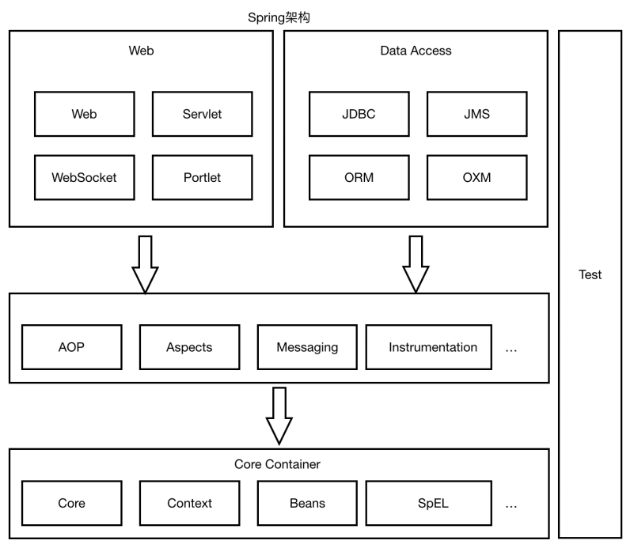

- Spring核⼼容器（Core Container） 容器是Spring框架最核⼼的部分，它管理着Spring应⽤中bean的创建、配置和管理。在该模块中，包括了Spring bean⼯

  ⼚，它为Spring提供了DI的功能。基于bean⼯⼚，我们还会发现有多种Spring应⽤上下⽂的实现。所有的Spring模块都构建于核⼼容器之上。

- ⾯向切⾯编程（AOP）/Aspects Spring对⾯向切⾯编程提供了丰富的⽀持。这个模块是Spring应⽤系统中开发切⾯的基础，与DI⼀样，AOP可以帮助应⽤对象

  解耦。

- 数据访问与集成（Data Access/Integration）Spring的JDBC和DAO模块封装了⼤量样板代码，这样可以使得数据库代码变得简洁，也可以更专注于我们的业

  务，还可以避免数据库资源释放失败⽽引起的问题。 另外，Spring AOP为数据访问提供了事务管理服务，同时Spring还对ORM进⾏了集成，如Hibernate、

  MyBatis等。该模块由JDBC、Transactions、ORM、OXM 和 JMS 等模块组成。

- Web 该模块提供了SpringMVC框架给Web应⽤，还提供了多种构建和其它应⽤交互的远程调⽤⽅案。 SpringMVC框架在Web层提升了应⽤的松耦合⽔平。

- Test 为了使得开发者能够很⽅便的进⾏测试，Spring提供了测试模块以致⼒于Spring应⽤的测试。 通过该模块，Spring为使⽤Servlet、JNDI等编写单元测试

- 提供了⼀系列的mock对象实现。

## 2、Spring的核心思想（IOC与AOP）

注意：IOC和AOP不是spring提出的，在spring之前就已经存在，只不过更偏向于理论化，spring在技术层次把这两个思想做了⾮常好的实现（Java）

------

### **2.1、IOC**

#### 2.1.1、什么是IOC（IOC的概念）

**IOC**： Inversion of Control (控制反转/反转控制)，注意它是⼀个技术思想，不是⼀个技术实现。

**描述的事情**：Java开发领域对象的创建，管理的问题

**传统开发⽅式**：⽐如类A依赖于类B，往往会在类A中new⼀个B的对象

**IOC思想下开发⽅式**：我们不⽤⾃⼰去new对象了，⽽是由IOC容器（Spring框架）去帮助我们实例化对象并且管理它，我们需要使⽤哪个对象，去问IOC容器要即

可。但是我们丧失了⼀个权利（创建、管理对象的权利）,得到了⼀个福利（不⽤考虑对象的创建、管理等⼀系列事情）


**为什么叫做控制反转？**

控制：指的是对象创建（实例化、管理）的权利

反转：控制权交给外部环境了（spring框架、IOC容器）

#### 2.1.2、IOC解决的问题

**IOC解决对象之间的耦合问题**

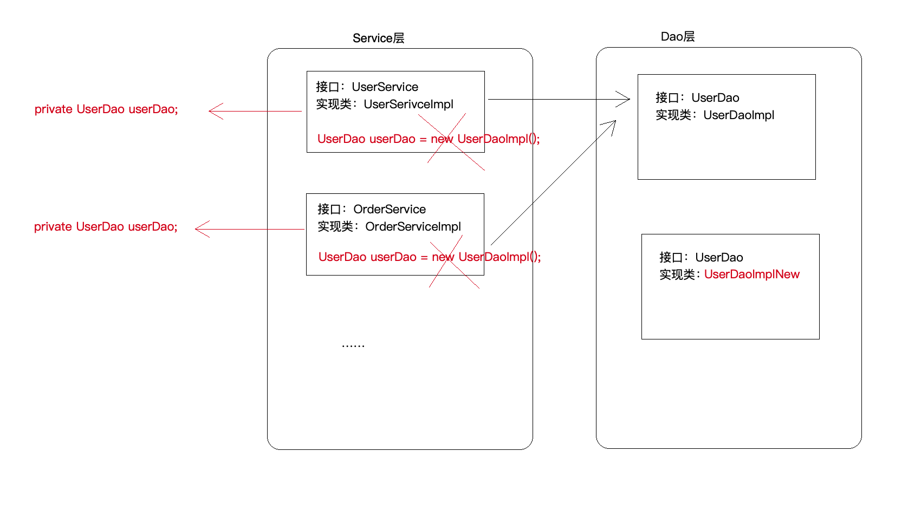

#### 2.1.3、IOC与DI的区别

**DI**：Dependancy Injection（依赖注⼊）

**IOC**： Inversion of Control (控制反转/反转控制)

本质上**IOC**和**DI**描述的是同⼀件事情，只不过⻆度不⼀样罢了。

怎么理解：

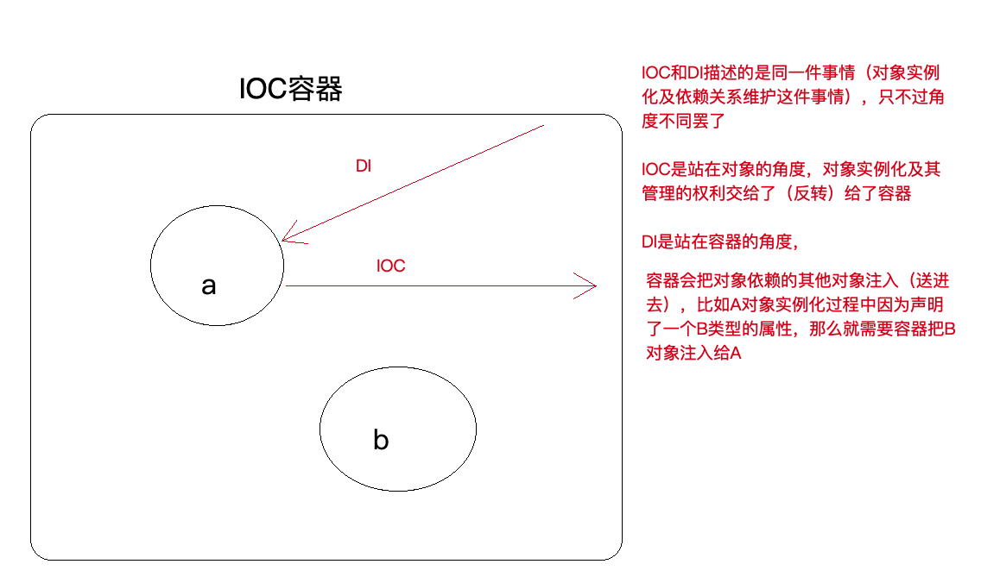

### 2.2、AOP

#### 2.2.1、什么是AOP(AOP的概念)

**AOP**: Aspect oriented Programming ⾯向切⾯编程/⾯向⽅⾯编程

**AOP**是**OOP（面向对象编程）**的延续，从**OOP**说起

**OOP**三⼤特征：封装、继承和多态

**OOP**是⼀种垂直继承体系

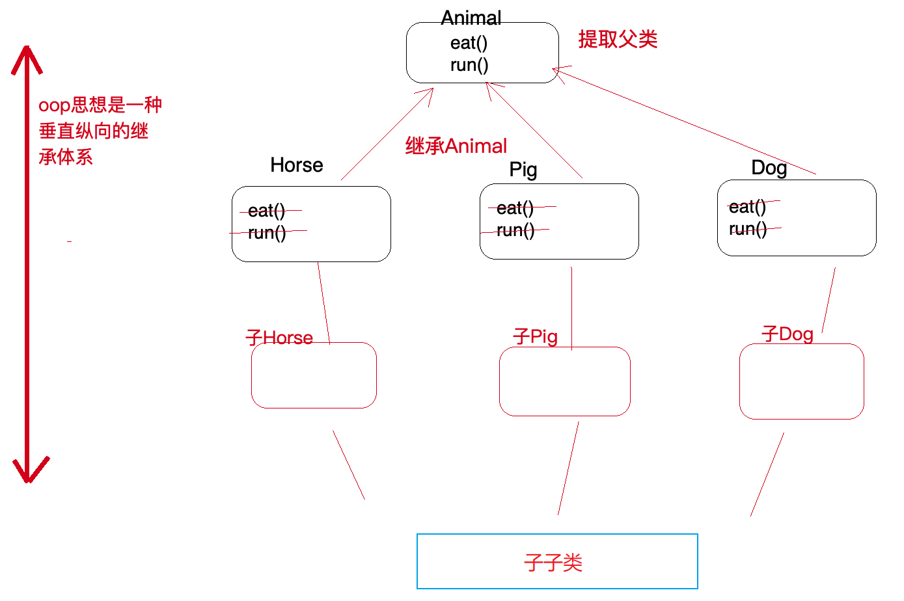

OOP编程思想可以解决⼤多数的代码重复问题，但是有⼀些情况是处理不了的，⽐如下⾯的在顶级⽗类

Animal中的多个⽅法中相同位置出现了重复代码（横切逻辑代码），OOP就解决不了。

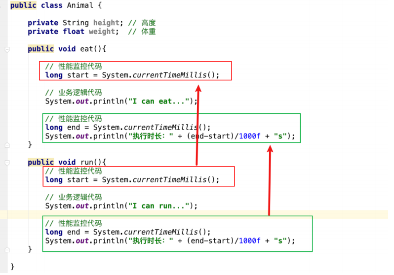

横切逻辑代码

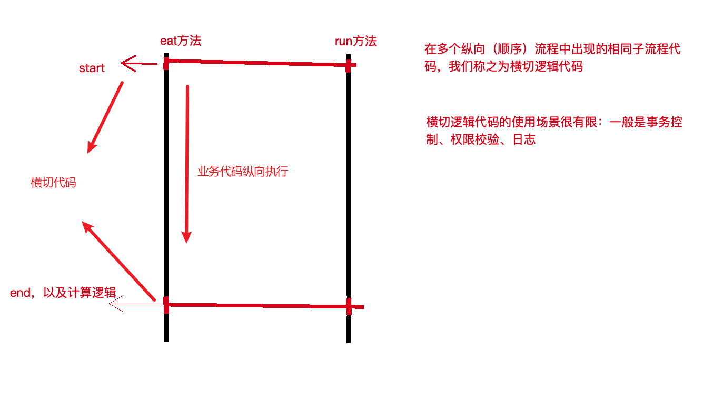

横切逻辑代码存在什么问题：

- 横切代码重复问题
- 横切逻辑代码和业务代码混杂在⼀起，代码臃肿，维护不⽅便

这时AOP出场，AOP独辟蹊径提出横向抽取机制，将横切逻辑代码和业务逻辑代码分析，代码拆分容易，那么如何在不改变原有业务逻辑的情况下，悄⽆声息的把

横切逻辑代码应⽤到原有的业务逻辑中，达到和原来⼀样的效果，这个是⽐较难的

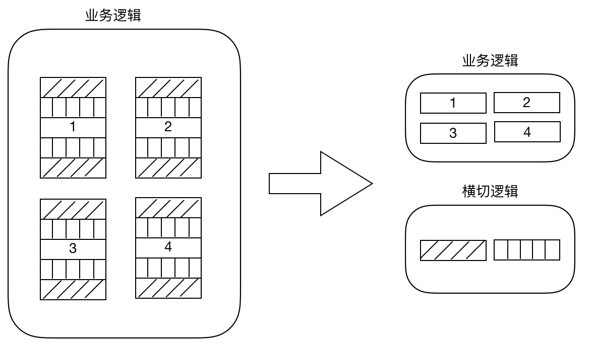

#### 2.2.2、AOP解决的问题

在不改变原有业务逻辑情况下，增强横切逻辑代码，根本上解耦合，避免横切逻辑代码重复

#### 2.2.3、 为什么叫做⾯向切⾯编程

- 「切」：指的是横切逻辑，原有业务逻辑代码我们不能动，只能操作横切逻辑代码，所以⾯向横切逻辑

- 「⾯」：横切逻辑代码往往要影响的是很多个⽅法，每⼀个⽅法都如同⼀个点，多个点构成⾯，有⼀个⾯的概念在⾥⾯


## 3、手写实现IOC与AOP

引用【银行转账】的案例一步步分析手写实现IOC与AOP。

### 3.1、银⾏转账案例代码调⽤关系

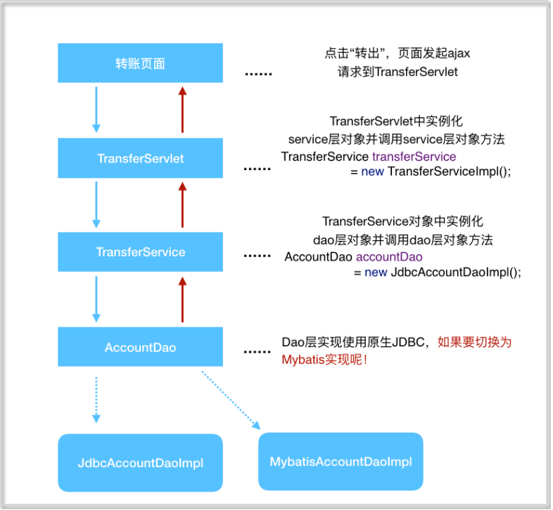

### 3.2、银⾏转账案例相关代码

前端可以手动编写代码或者使用postman模拟调用即可。

- **代码结构**

  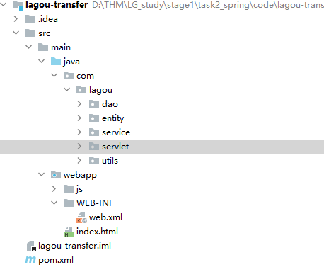

- **pom.xml**

```xml
<groupId>com.thm</groupId>
  <artifactId>lagou-transfer</artifactId>
  <version>1.0-SNAPSHOT</version>
  <packaging>war</packaging>

  <name>lagou-transfer Maven Webapp</name>
  <!-- FIXME change it to the project's website -->
  <url>http://www.example.com</url>
  <properties>
    <project.build.sourceEncoding>UTF-8</project.build.sourceEncoding>
    <maven.compiler.source>11</maven.compiler.source>
    <maven.compiler.target>11</maven.compiler.target>
  </properties>
  <dependencies>
    <!-- 单元测试Junit -->
    <dependency>
      <groupId>junit</groupId>
      <artifactId>junit</artifactId>
      <version>4.12</version>
    </dependency>

    <!-- mysql数据库驱动包 -->
    <dependency>
      <groupId>mysql</groupId>
      <artifactId>mysql-connector-java</artifactId>
      <version>5.1.35</version>
    </dependency>
    <!--druid连接池-->
    <dependency>
      <groupId>com.alibaba</groupId>
      <artifactId>druid</artifactId>
      <version>1.1.20</version>
    </dependency>

    <!-- servlet -->
    <dependency>
      <groupId>javax.servlet</groupId>
      <artifactId>javax.servlet-api</artifactId>
      <version>3.1.0</version>
      <scope>provided</scope>
    </dependency>

    <!-- jackson依赖 -->
    <dependency>
      <groupId>com.fasterxml.jackson.core</groupId>
      <artifactId>jackson-databind</artifactId>
      <version>2.9.6</version>
    </dependency>

    <!--dom4j依赖-->
    <dependency>
      <groupId>dom4j</groupId>
      <artifactId>dom4j</artifactId>
      <version>1.6.1</version>
    </dependency>
    <!--xpath表达式依赖-->
    <dependency>
      <groupId>jaxen</groupId>
      <artifactId>jaxen</artifactId>
      <version>1.1.6</version>
    </dependency>
    <!--引入cglib依赖包-->
    <dependency>
      <groupId>cglib</groupId>
      <artifactId>cglib</artifactId>
      <version>2.1_2</version>
    </dependency>
  </dependencies>

  <build>
    <plugins>
      <!-- 配置Maven的JDK编译级别 -->
      <plugin>
        <groupId>org.apache.maven.plugins</groupId>
        <artifactId>maven-compiler-plugin</artifactId>
        <version>3.2</version>
        <configuration>
          <source>11</source>
          <target>11</target>
          <encoding>UTF-8</encoding>
        </configuration>
      </plugin>

      <!-- tomcat7插件 -->
      <!-- 注意：目前来说，maven中央仓库还没有tomcat8的插件 -->
      <plugin>
          <groupId>org.apache.tomcat.maven</groupId>
          <artifactId>tomcat7-maven-plugin</artifactId>
          <version>2.2</version>
          <configuration>
              <port>8080</port>
              <path>/</path>
          </configuration>
      </plugin>
    </plugins>
  </build>
```

- **TransferServlet（相当于mvc中的controller）**

```java
package com.thm.servlet;

import com.thm.entity.Result;
import com.thm.service.TransferService;
import com.thm.service.impl.TransferServiceImpl;
import com.thm.utils.JsonUtils;

import javax.servlet.ServletException;
import javax.servlet.annotation.WebServlet;
import javax.servlet.http.HttpServlet;
import javax.servlet.http.HttpServletRequest;
import javax.servlet.http.HttpServletResponse;
import java.io.IOException;

/**
 * @ClassNmae TransferServlet
 * @Description TODO 相当于controller 继承httpServlet 重写doGet/doPost方法
 * @Author THM
 * @Date 2020/11/14 0:28
 * @Version 1.0
 **/
@WebServlet(name="transferServlet",urlPatterns = "/transferServlet")
public class TransferServlet extends HttpServlet {
    // 1. 实例化service层对象
    private TransferService transferService = new TransferServiceImpl();

    @Override
    protected void doGet(HttpServletRequest req, HttpServletResponse resp) throws ServletException, IOException {
        doPost(req,resp);
    }

    @Override
    protected void doPost(HttpServletRequest req, HttpServletResponse resp) throws ServletException, IOException {
        // 设置请求体的字符编码
        req.setCharacterEncoding("UTF-8");
        // 获取参数
        String fromCardNo = req.getParameter("fromCardNo");
        String toCardNo = req.getParameter("toCardNo");
        String moneyStr = req.getParameter("money");
        int money = Integer.parseInt(moneyStr);
        Result result = new Result();
        try {
            // 2. 调⽤service层⽅法
            transferService.transfer(fromCardNo,toCardNo,money);
            result.setStatus("200");
        } catch (Exception e) {
            e.printStackTrace();
            result.setStatus("201");
            result.setMessage(e.toString());
        }
        // 响应
        resp.setContentType("application/json;charset=utf-8");
        resp.getWriter().print(JsonUtils.object2Json(result));
    }
}

```

- **service层**

```java
package com.thm.service;

/**
 * @ClassNmae TransferService
 * @Description TODO
 * @Author THM
 * @Date 2020/11/14 0:46
 * @Version 1.0
 **/
public interface TransferService {
    void transfer(String fromCardNo, String toCardNo, int money) throws Exception;
}

package com.thm.service.impl;

import com.thm.dao.AccountDao;
import com.thm.dao.impl.JdbcAccountDaoImpl;
import com.thm.entity.Account;
import com.thm.service.TransferService;

/**
 * @ClassNmae TransferServiceImpl
 * @Description TODO
 * @Author THM
 * @Date 2020/11/14 0:46
 * @Version 1.0
 **/
public class TransferServiceImpl implements TransferService {

    /**
     * 实例化dao层对象
     */
    private AccountDao accountDao = new JdbcAccountDaoImpl();

    /**
     * 实现转账业务
     * @param fromCardNo
     * @param toCardNo
     * @param money
     * @throws Exception
     */
    @Override
    public void transfer(String fromCardNo, String toCardNo, int money) throws Exception {
        Account from = accountDao.queryAccountByCardNo(fromCardNo);
        Account to = accountDao.queryAccountByCardNo(toCardNo);
        from.setMoney(from.getMoney()-money);
        to.setMoney(to.getMoney()+money);
        accountDao.updateAccountByCardNo(from);
        accountDao.updateAccountByCardNo(to);
    }
}
```

- **dao层**
```java
package com.thm.dao;

import com.thm.entity.Account;

/**
 * @ClassNmae AccountDao
 * @Description TODO
 * @Author THM
 * @Date 2020/11/14 0:26
 * @Version 1.0
 **/
public interface AccountDao {

    /**
     * 查询
     * @param cardNo
     * @return
     * @throws Exception
     */
    Account queryAccountByCardNo(String cardNo) throws Exception;

    /**
     * 修改
     * @param account
     * @return
     * @throws Exception
     */
    int updateAccountByCardNo(Account account) throws Exception;
}

package com.thm.dao.impl;

import com.thm.dao.AccountDao;
import com.thm.entity.Account;
import com.thm.utils.DruidUtils;

import java.sql.Connection;
import java.sql.PreparedStatement;
import java.sql.ResultSet;

/**
 * @ClassNmae JdbcAccountDaoImpl
 * @Description TODO
 * @Author THM
 * @Date 2020/11/14 0:27
 * @Version 1.0
 **/
public class JdbcAccountDaoImpl implements AccountDao {
    public Account queryAccountByCardNo(String cardNo) throws Exception {
        //从连接池获取连接
        Connection con = DruidUtils.getInstance().getConnection();
        //封装sql语句
        String sql = "select * from account where cardNo=?";
        //获取预处理对象
        PreparedStatement preparedStatement = con.prepareStatement(sql);
        //设置参数
        preparedStatement.setString(1,cardNo);
        //执行sql获得结果集
        ResultSet resultSet = preparedStatement.executeQuery();
        //封装返回参数
        Account account = new Account();
        while(resultSet.next()) {
            account.setCardNo(resultSet.getString("cardNo"));
            account.setName(resultSet.getString("name"));
            account.setMoney(resultSet.getInt("money"));
        }
        //关闭资源
        resultSet.close();
        preparedStatement.close();
        con.close();
        return account;
    }

    public int updateAccountByCardNo(Account account) throws Exception {
        //从连接池获取连接
        Connection con = DruidUtils.getInstance().getConnection();
        String sql = "update account set money=? where cardNo=?";
        PreparedStatement preparedStatement = con.prepareStatement(sql);
        preparedStatement.setInt(1,account.getMoney());
        preparedStatement.setString(2,account.getCardNo());
        int i = preparedStatement.executeUpdate();
        preparedStatement.close();
        con.close();
        return i;
    }
}
```

- **工具类**

```java
import com.alibaba.druid.pool.DruidDataSource;

/**
 * @ClassNmae DruidUtils
 * @Description TODO
 * @Author THM
 * @Date 2020/11/14 0:33
 * @Version 1.0
 **/
public class DruidUtils {

    /**
     * 私有化构造函数
     */
    private DruidUtils(){
    }

    /**
     * 饿汉单例模式
     */
    private static DruidDataSource druidDataSource = new DruidDataSource();


    /**
     * 静态代码块：static { 代码 }
     * 随着类的加载而执行，而且只执行一次
     * 执行优先级高于非静态的初始化块，它会在类初始化的时候执行一次，执行完成便销毁，它仅能初始化类变量，即static修饰的数据成员。
     * 非静态代码块：{ 代码 }
     * 执行的时候如果有静态初始化块，先执行静态初始化块再执行非静态初始化块，在每个对象生成时都会被执行一次，它可以初始化类的实例变量。
     * 非静态初始化块会在构造函数执行时，在构造函数主体代码执行之前被运行。
     * 静态代码块的执行顺序：静态代码块----->非静态代码块-------->构造函数
     */
    static {
        druidDataSource.setDriverClassName("com.mysql.jdbc.Driver");
        druidDataSource.setUrl("jdbc:mysql://localhost:3306/mp");
        druidDataSource.setUsername("root");
        druidDataSource.setPassword("root");

    }

    /**
     * 获取实例方法
     * @return
     */
    public static DruidDataSource getInstance() {
        return druidDataSource;
    }
}
```

### 3.3、银行转账案例问题分析

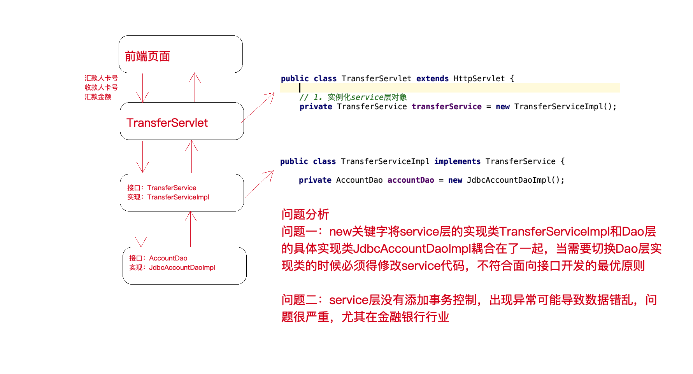

（1）问题一、service 层实现类在使⽤ dao 层对象时，直接在TransferServiceImpl 中通过AccountDao accountDao = new JdbcAccountDaoImpl() 获得了 dao

层对象，然⽽⼀个 new关键字却将 TransferServiceImpl 和 dao 层具体的⼀个实现类JdbcAccountDaoImpl 耦合在了⼀起，如果说技术架构发⽣⼀些变动，dao 

层的实现要使⽤其它技术，⽐如 Mybatis，思考切换起来的成本？每⼀个 new 的地⽅都需要修改源代码，重新编译，⾯向接⼝开发的意义将⼤打折扣？

（2）问题⼆：service 层代码没有竟然还没有进⾏事务控制 ？！如果转账过程中出现异常，将可能导致数据库数据错乱，后果可能会很严重，尤其在⾦融业务。

### 3.4、问题解决的思路与具体实现

#### 3.4.1、针对于问题一思考(IOC)

在实例化对象时除了使用**new**关键字以外，还可以使用**反射**实例化对象，这时需要获得被实例化对象的类全限定名。可以使用XML文件配置。

  ```xml
  <!--注意这时需要实例化的是具体实现类-->
  <!--id标识对象，class是类的全限定类名-->
  <bean id = "AccountDao" class = "com.thm.dao.impl.JdbcAccountDaoImpl">
  <bean id="transferService" class="com.thm.edu.service.impl.TransferServiceImpl">
        <!--set+ name 之后锁定到传值的set方法了，通过反射技术可以调用该方法传入对应的值-->
        <property name="AccountDao" ref="accountDao"></property>
    </bean>
  ```
#### 3.4.2、针对于问题一实现思路(IOC)

  考虑使⽤设计模式中的**⼯⼚模式**解耦合，另外项⽬中往往有很多对象需要实例化，那就在⼯⼚中使⽤反 射技术实例化对象，⼯⼚模式很合适。

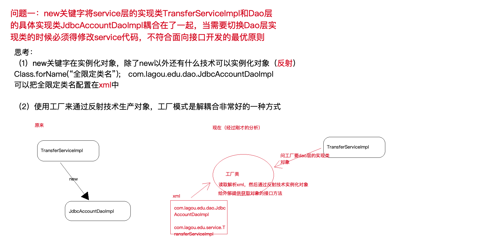

代码中能否只声明所需实例的接⼝类型，不出现 new 也不出现⼯⼚类的字眼，能！声明⼀个变量并提供 set ⽅法（set注入）或者是构造函数注入，在反射的时候

将所需要的对象注⼊进去吧

```java
/**
 * @ClassNmae TransferServiceImpl
 * @Description TODO
 * @Author THM
 * @Date 2020/11/14 0:46
 * @Version 1.0
 **/
public class TransferServiceImpl implements TransferService {

    /**
     * 仅声明dao接口
     */
    private AccountDao accountDao;

    /**
     * 提供set方法供外部注入dao层的实例对象
     * @param accountDao
     */
    public void setAccountDao(AccountDao accountDao) {
        this.accountDao = accountDao;
    }
```

#### 3.4.3、针对于问题一具体实现(IOC)

**创建BeanFactory和Resources工具类**

```java
package com.thm.utils;

import org.dom4j.Document;
import org.dom4j.DocumentException;
import org.dom4j.Element;
import org.dom4j.io.SAXReader;

import java.io.InputStream;
import java.lang.reflect.InvocationTargetException;
import java.lang.reflect.Method;
import java.util.HashMap;
import java.util.List;
import java.util.Map;

/**
 * @ClassNmae BeanFactory
 * @Description TODO bean工厂 通过解析配置文件，实例化对象，并保存
 * @Author THM
 * @Date 2020/11/14 12:42
 * @Version 1.0
 **/
public class BeanFactory {
    /**
     * 用于保存反射实例化后的对象
     */
    private static Map<String, Object> beanMap = new HashMap<>();

    /**
     * 随着类的加载而执行，而且只执行一次
     * 静态代码块在加载类时去执行解析xml和对象注入工作
     */
    static {
        try {
            //获取xml文件字节流
            InputStream resourceAsStream = Resources.getResourceAsStream("beans.xml");
            //通过dom4j解析对象 获取Document对象
            Document document = new SAXReader().read(resourceAsStream);
            //获取根节点
            Element rootElement = document.getRootElement();
            //获取所有的bean <bean id="accountDao" class="com.thm.dao.impl.JdbcAccountDaoImpl"/>
            List<Element> beanList = rootElement.selectNodes("//bean");
            //循环去获取解析bean,实例化bean对象，并存储到本地
            for (int i = 0; i < beanList.size(); i++) {
                Element element = beanList.get(i);
                //获取每个bean标签上的id和class属性值
                String id = element.attributeValue("id"); //accountDao
                String clazz = element.attributeValue("class");  //com.thm.dao.impl.JdbcAccountDaoImpl
                //通过反射实例化对象
                Class<?> aClass = Class.forName(clazz);
                //通过获取构造函数实例化对象
                Object beanObject = aClass.newInstance();
                //存储对象
                beanMap.put(id,beanObject);
            }
            //通过注入方法实现对象
            //获取bean之间的依赖关系 <property name="AccountDao" ref="accountDao"></property>
            List<Element> propertyList = rootElement.selectNodes("//property");
            for (int i = 0; i < propertyList.size(); i++) {
                Element element = propertyList.get(i);
                //获取bean依赖的name和引用 set+ name 之后锁定到传值的set方法了，通过反射技术可以调用该方法传入对应的值
                String name = element.attributeValue("name");
                String ref = element.attributeValue("ref");
                //找到当前property节点的父节点ID
                String parentId = element.getParent().attributeValue("id");
                //从存储对象map中获得parentId对应的对象
                Object parentObject = beanMap.get(parentId);
                //通过反射获得所有方法 找到set+name
                Method[] methods = parentObject.getClass().getMethods();
                for (int j = 0; j < methods.length; j++) {
                    Method method = methods[j];
                    //找到对应set方法
                    if (method.getName().equalsIgnoreCase("set" + name)){
                        //获取bean依赖对象
                        Object propertyObject = beanMap.get(ref);
                        //将依赖对象注入
                        method.invoke(parentObject,propertyObject);
                        break;
                    }
                }
                //维护关系后的parentObject重新存放到beanMap中
                beanMap.put(parentId,parentObject);
            }
        } catch (DocumentException e) {
            e.printStackTrace();
        } catch (IllegalAccessException e) {
            e.printStackTrace();
        } catch (InstantiationException e) {
            e.printStackTrace();
        } catch (ClassNotFoundException e) {
            e.printStackTrace();
        } catch (InvocationTargetException e) {
            e.printStackTrace();
        }
    }

    /**
     * 获取对象方法
     * @param id
     * @return
     */
    public static Object getInstance(String id){
        return beanMap.get(id);
    }
}

import java.io.InputStream;

/**
 * @ClassNmae Resources
 * @Description TODO 通过类加载器对象文件为字节流
 * @Author THM
 * @Date 2020/11/14 12:45
 * @Version 1.0
 **/
public class Resources {

    public static InputStream getResourceAsStream(String path) {
        return Resources.class.getClassLoader().getResourceAsStream(path);
    }
}
```

**修改TransferServlet和TransferServiceImpl**

```java
/**
 * @ClassNmae TransferServlet
 * @Description TODO 相当于controller 继承httpServlet 重写doGet/doPost方法
 * @Author THM
 * @Date 2020/11/14 0:28
 * @Version 1.0
 **/
@WebServlet(name="transferServlet",urlPatterns = "/transferServlet")
public class TransferServlet extends HttpServlet {
    // 1. 实例化service层对象
    //private TransferService transferService = new TransferServiceImpl();
    // 从BeanFactory获得实例化对象
    private TransferService transferService = (TransferService) BeanFactory.getInstance("transferService");
    
    ......
}

/**
 * @ClassNmae TransferServiceImpl
 * @Description TODO
 * @Author THM
 * @Date 2020/11/14 0:46
 * @Version 1.0
 **/
public class TransferServiceImpl implements TransferService {
    // new 关键字实例化接口对象
    //private AccountDao accountDao = new JdbcAccountDaoImpl();
    //bean工厂方法实例化对象
    //private AccountDao accountDao = (AccountDao)BeanFactory.getInstance("accountDao");
    /**
     * 仅声明dao接口
     */
    private AccountDao accountDao;

    /**
     * 构造方法传值/set方法传值
     * 提供set方法供外部注入dao层的实例对象
     * @param accountDao
     */
    public void setAccountDao(AccountDao accountDao) {
        this.accountDao = accountDao;
    }
    
    ......
}
```

#### 3.4.4、针对于问题二思考(AOP)

分析：数据库事务归根结底是Connection的事务，Connection是默认自动提交事务，需要改为手动提交。

​			connection.setAutoCommit(false); //关闭自动提交事务

​			connection.commit（）;  //提交事务

​			connection.rollback（）; //回滚事务

（1）从当前代码中可以看出，两次update都去获取了数据库连接Connection，不属于同一个事务控制。

（2）当前事务控制是在dao层进行，没有在service层

#### 3.4.5、针对于问题二实现思路(AOP)

（1）让两次update使用同一个Connection连接，两次update在同一方法内执行属于同一线程，可以通过ThreadLocal给当前线程绑定一个Connection，和当前

线程相关数据库操作都使用这个connection（从当前线程中去拿）

​		创建ConnectionUtil、绑定ThreadLocal、提供getCurrentConnection方法、将ConnectionUtil交给手动实现的IOC容器管理。

（2）将事务控制添加在service层

- 创建TransactionManager、提供begin、commit、rollback方法进行事务控制、并交给IOC容器管理

- 运用AOP思想：将横切逻辑代码（TransferManager中的相关方法）与实际的业务代码进行分割

  使用动态代理：创建ProxyFactory 提供获取代理对象接口，并交给IOC容器管理


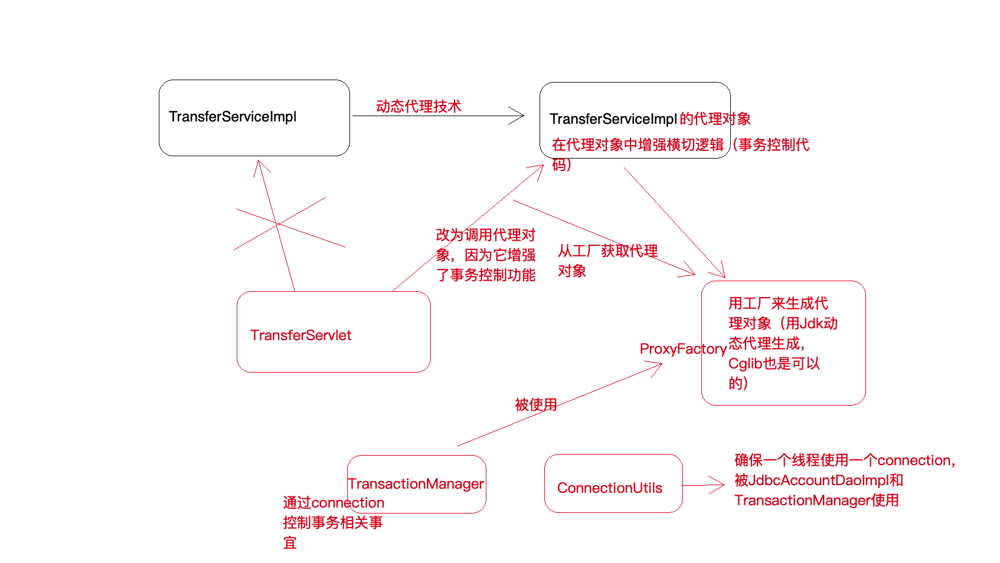

- 补充：ConnectionUtil、TransferManager、ProxyFactory 未交给容器管理时、需手动实现单例模式

  单例：懒汉单例与饿汉单例

  ```java
  /**
   * @ClassNmae LazySingleton
   * @Description TODO 懒汉单例 延时加载
   * @Author THM
   * @Date 2020/11/14 0:26
   * @Version 1.0
   **/
  public class LazySingleton {
  
      // 将自身实例化对象设置为一个属性，并用static修饰
      private static LazySingleton instance;
  
      // 构造方法私有化
      private LazySingleton() {}
  
      /**
       * 懒汉单例存在线程安全问题，加synchronized关键字实现同步
       * 静态方法返回该实例
       */
      public static synchronized LazySingleton getInstance() {
          if(instance == null) {
              instance = new LazySingleton();
          }
          return instance;
      }
  }
  /**
   * @ClassNmae HungrySingleton
   * @Description TODO 饿汉单例 立即加载
   * @Author THM
   * @Date 2020/11/14 0:26
   * @Version 1.0
   **/
  public class HungrySingleton {
  
      // 构造方法私有化
      private HungrySingleton() {}
  
      // 将自身实例化对象设置为一个属性，并用static、final修饰
      private static final HungrySingleton instance = new HungrySingleton();
  
      // 静态方法返回该实例
      public static HungrySingleton getInstance() {
          return instance;
      }
  }
  ```

  代理：静态代理和动态代理（JDK动态代理和CGLIB动态代理）

  - 静态代理：简单，代理模式，是动态代理的理论基础。

    代理对象必须持有被代理对象的引用，并且与被代理对象实现相同的接口。

    ```java
    /**
     * 接口：租房
     */
    public interface IRentingHouse {
        void rentHosue();
    }
    /**
     * 被代理对象
     */
    public class RentingHouseImpl implements IRentingHouse {
        @Override
        public void rentHosue() {
            System.out.println("我要租用一室一厅的房子");
        }
    }
    /**
     * 代理对象，静态代理
     */
    public class RentingHouseProxy implements IRentingHouse {
    
        /**
         * 代理对象需要持有被代理对象的引用
         */
        private IRentingHouse rentingHouse;
    
        public RentingHouseProxy(IRentingHouse rentingHouse) {
            this.rentingHouse = rentingHouse;
        }
    
        @Override
        public void rentHosue() {
            System.out.println("中介（代理）收取服务费3000元");
            rentingHouse.rentHosue();
            System.out.println("客户信息卖了3毛钱");
        }
    }
    ```

    

  - JDK动态代理：

    1）JDK自带，被代理对象必须实现接口。

    2）实现InvocationHandler

    3）使用Proxy.newProxyInstance产生代理对象

    ```java
        /**
         * Jdk动态代理  被代理对象必须实现接口
         * @param obj  委托对象
         * @return   代理对象
         */
        public Object getJdkProxy(Object obj) {
    
            // 获取代理对象
            return  Proxy.newProxyInstance(obj.getClass().getClassLoader(), obj.getClass().getInterfaces(),
                    new InvocationHandler() {
                        @Override
                        public Object invoke(Object proxy, Method method, Object[] args) throws Throwable {
                            Object result = null;
                            // 写增强逻辑
                            System.out.println("中介（代理）收取服务费3000元");
                            // 调用原有业务逻辑
                            result = method.invoke(obj,args);
    						// 写增强逻辑
                            System.out.println("客户信息卖了3毛钱");
                            return result;
                        }
                    });
        }
    ```
    
  - CGLIB动态代理

    CGLib必须依赖于CGLib的类库，可以直接代理类，不需要被代理对象实现接口。

    CGLib为被代理对象生成一个子类，覆盖被代理对象的方法，不能对 final类进行继承。

    ```java
    /**
         * 使用cglib动态代理生成代理对象
         * @param obj 委托对象
         * @return
         */
        public Object getCglibProxy(Object obj) {
            // Enhancer类似于JDK动态代理中的Proxy
            // 通过实现接口MethodInterceptor能够对各个方法进行拦截增强，类似于JDK动态代理中的InvocationHandler
            return  Enhancer.create(obj.getClass(), new MethodInterceptor() {
                @Override
                public Object intercept(Object o, Method method, Object[] objects, MethodProxy methodProxy) throws Throwable {
                    Object result = null;
                    System.out.println("中介（代理）收取服务费3000元");
                    result = method.invoke(obj,objects);
                    System.out.println("客户信息卖了3毛钱");
                    return result;
                }
            });
        }
    ```

#### 3.4.6、针对于问题二具体实现(AOP)

**创建ConnectionUtil**

```java
import java.sql.Connection;
import java.sql.SQLException;

/**
 * @ClassNmae ConnectionUtil
 * @Description TODO 数据库连接获取类
 * @Author THM
 * @Date 2020/11/14 18:47
 * @Version 1.0
 **/
public class ConnectionUtil {
    /**
     * ThreadLocal叫做线程变量，
     * 意思是ThreadLocal中填充的变量属于当前线程，该变量对其他线程而言是隔离的。
     * ThreadLocal为变量在每个线程中都创建了一个副本，那么每个线程可以访问自己内部的副本变量
     */
    private ThreadLocal<Connection> threadLocal = new ThreadLocal<>();

    /**
     * 获取本地线程数据库连接方法
     * @return
     */
    public Connection getCurrentConnection() throws SQLException {
        //从ThreadLocal中获取数据库连接
        Connection connection = threadLocal.get();
        if (connection == null){
            //数据连接为空则重新获取
            connection = DruidUtils.getInstance().getConnection();
            //绑定到当前线程
            threadLocal.set(connection);
        }
        //返回数据库连接
        return connection;
    }
}
```

**创建TransactionManager**

```java
import java.sql.SQLException;

/**
 * @ClassNmae TransactionManager
 * @Description TODO 事务管理类
 * @Author THM
 * @Date 2020/11/14 19:01
 * @Version 1.0
 **/
public class TransactionManager {
    //声明
    private ConnectionUtil connectionUtil;
    /**
     * 构造方法传值/set方法传值
     * 提供set方法供外部注入实例对象
     * @param connectionUtil
     */
    public void setConnectionUtil(ConnectionUtil connectionUtil) {
        this.connectionUtil = connectionUtil;
    }

    /**
     * 开启事务，当前事务是默认开启并提交，实际上的开启事务是关闭事务的自动提交
     */
    public void begin() throws SQLException {
        //关闭事务的自动提交，
        connectionUtil.getCurrentConnection().setAutoCommit(false);
    }
    /**
     * 提交事务
     */
    public void commit() throws SQLException {
        connectionUtil.getCurrentConnection().commit();
    }
    /**
     * 回滚事务
     */
    public void rolllback() throws SQLException {
        connectionUtil.getCurrentConnection().rollback();
    }
}
```

**创建ProxyFactory**

```java
import com.thm.utils.TransactionManager;
import net.sf.cglib.proxy.Enhancer;
import net.sf.cglib.proxy.MethodInterceptor;
import net.sf.cglib.proxy.MethodProxy;

import java.lang.reflect.InvocationHandler;
import java.lang.reflect.Method;
import java.lang.reflect.Proxy;

/**
 * @ClassNmae ProxyFactory
 * @Description TODO
 * @Author THM
 * @Date 2020/11/14 19:07
 * @Version 1.0
 **/
public class ProxyFactory {
    // 声明
    private TransactionManager transactionManager;
    /**
     * 构造方法传值/set方法传值
     * 提供set方法供外部注入实例对象
     * @param transactionManager
     */
    public void setTransactionManager(TransactionManager transactionManager) {
        this.transactionManager = transactionManager;
    }

    /**
     * 使用JDK动态代理
     * @param obj 被代理对象
     * @return
     */
    public Object getJdkProxy(Object obj){
        return Proxy.newProxyInstance(ProxyFactory.class.getClassLoader(), obj.getClass().getInterfaces(), new InvocationHandler() {
            @Override
            public Object invoke(Object proxy, Method method, Object[] args) throws Throwable {
                try{
                    //开启事务
                    transactionManager.begin();
                    //执行原方法
                    Object invoke = method.invoke(obj, args);
                    //提交事务
                    transactionManager.commit();
                    return invoke;
                } catch (Exception e){
                    e.printStackTrace();
                    //回滚事务
                    transactionManager.rolllback();
                    //向上抛出异常
                    throw e.getCause();
                }
            }
        });
    }

    /**
     * 使用CGLIB动态代理
     * @param obj 被代理对象
     * @return
     */
    public Object getCglibProxy(Object obj){
        // Enhancer类似于JDK动态代理中的Proxy
        // 通过实现接口MethodInterceptor能够对各个方法进行拦截增强，类似于JDK动态代理中的InvocationHandler
        return  Enhancer.create(obj.getClass(), new MethodInterceptor() {
            @Override
            public Object intercept(Object o, Method method, Object[] objects, MethodProxy methodProxy) throws Throwable {
                try{
                    //开启事务
                    transactionManager.begin();
                    //执行原方法
                    Object invoke = method.invoke(obj, objects);
                    //提交事务
                    transactionManager.commit();
                    return invoke;
                } catch (Exception e){
                    e.printStackTrace();
                    //回滚事务
                    transactionManager.rolllback();
                    //向上抛出异常
                    throw e.getCause();
                }
            }
        });
    }
}
```

**将ConnectionUtil、TransactionManager、ProxyFactory交给IOC容器管理**

配置beans.xml

```xml
    <!--id标识对象，class是类的全限定类名-->
    <bean id="accountDao" class="com.thm.dao.impl.JdbcAccountDaoImpl">
        <property name="ConnectionUtil" ref="connectionUtil"/>
    </bean>
     
    <!--  配置数据库链接  -->
    <bean id="connectionUtil" class="com.thm.utils.ConnectionUtil"/>
    <!--  事务管理器  -->
    <bean id="transactionManager" class="com.thm.utils.TransactionManager">
        <property name="ConnectionUtil" ref="connectionUtil"/>
    </bean>
    <!--  代理工厂工厂  -->
    <bean id="proxyFactory" class="com.thm.factory.ProxyFactory">
        <property name="TransactionManager" ref="transactionManager"/>
    </bean>
```

**改造TransferServlet、JdbcAccountDaoImpl**

注意：如果要测试异常则在TransferServiceImpl实现类中手动制造异常 int x = 1/0;

```java
/**
 * @ClassNmae TransferServlet
 * @Description TODO 相当于controller 继承httpServlet 重写doGet/doPost方法
 * @Author THM
 * @Date 2020/11/14 0:28
 * @Version 1.0
 **/
@WebServlet(name="transferServlet",urlPatterns = "/transferServlet")
public class TransferServlet extends HttpServlet {
    // 1. 实例化service层对象
    //private TransferService transferService = new TransferServiceImpl();
    // 从BeanFactory中实例化对象
    //private TransferService transferService = (TransferService) BeanFactory.getInstance("transferService");

    //从从BeanFactory中实例化ProxyFactory对象
    private ProxyFactory proxyFactory = (ProxyFactory) BeanFactory.getInstance("proxyFactory");
    //增强事务处理后的代理对象
    private TransferService transferService = 		(TransferService)proxyFactory.getJdkProxy(BeanFactory.getInstance("transferService"));
    
    ......
}

/**
 * @ClassNmae JdbcAccountDaoImpl
 * @Description TODO
 * @Author THM
 * @Date 2020/11/14 0:27
 * @Version 1.0
 **/
public class JdbcAccountDaoImpl implements AccountDao {

    //声明
    private ConnectionUtil connectionUtil;

    /**
     * 构造方法传值/set方法传值
     * 提供set方法供外部注入实例对象
     * @param connectionUtil
     */
    public void setConnectionUtil(ConnectionUtil connectionUtil) {
        this.connectionUtil = connectionUtil;
    }
    
    ......
}
```

## 4、Spring IOC的应用

### 4.1、Spring IOC基础


#### 4.1.1、BeanFactory与ApplicationContext区别

BeanFactory是Spring框架中IOC容器的顶层接⼝,它只是⽤来定义⼀些基础功能,定义⼀些基础规范,⽽ApplicationContext是它的⼀个⼦接⼝，所以

ApplicationContext是具备BeanFactory提供的全部功能的。

通常，我们称**BeanFactory**为**Spring IOC的基础容器**，ApplicationContext是容器的⾼级接⼝，⽐BeanFactory要拥有更多的功能，⽐如说国际化⽀持和资源访问

（xml，java配置类）等等

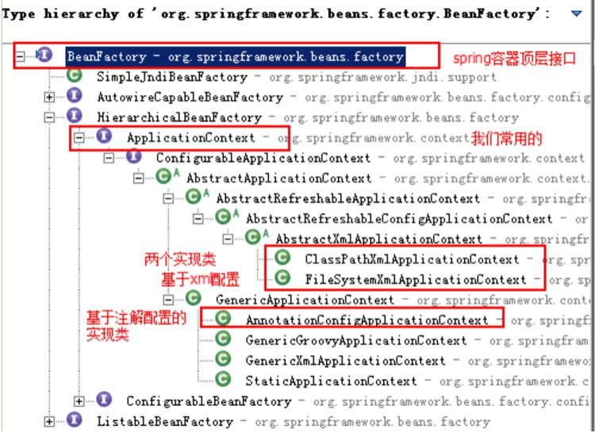

**启动 IOC 容器的⽅式**

需要引入spring相关的依赖jar包

- Java环境下启动IOC容器

  - ClassPathXmlApplicationContext：从类的根路径下加载配置⽂件（推荐使⽤）

    ```java
     @org.junit.Test
        public void Test(){
            //通过读取classpath下的xml文件启动spring IOC容器
            ApplicationContext applicationContext = new ClassPathXmlApplicationContext("classpath:applicationContext.xml");
            Object transferService = applicationContext.getBean("transferService");
            System.out.println(transferService);
        }
    ```

  - FileSystemXmlApplicationContext：从磁盘路径上加载配置⽂件（不推荐）

    ```java
    //通过读取配置文件的绝对路径启动 spring IOC容器（不推荐）
    ApplicationContext applicationContext1 = new FileSystemXmlApplicationContext("文件绝对路径");
    ```

  - AnnotationConfigApplicationContext：纯注解模式下启动Spring容器

    ```java
     @org.junit.Test
        public void Test() throws Exception {
            //通过配置启动类启动
            ApplicationContext applicationContext = new AnnotationConfigApplicationContext(SpringConfiguration.class);
            AccountDao accountDao = (AccountDao) applicationContext.getBean("accountDao");
            System.out.println(accountDao);
        }
    ```

- Web环境下启动IOC容器

  - 纯xml方法和xml与注解结合方式启动容器
  
    ```java
    <!--配置Web.xml⽂件-->
    <!DOCTYPE web-app PUBLIC
     "-//Sun Microsystems, Inc.//DTD Web Application 2.3//EN"
     "http://java.sun.com/dtd/web-app_2_3.dtd" >
    <web-app>
      <display-name>Archetype Created Web Application</display-name>
      <!--配置Spring IOC容器的配置⽂件-->
      <context-param>
        <param-name>contextConfigLocation</param-name>
        <param-value>classpath:applicationContext.xml</param-value>
      </context-param>
      <!--使⽤监听器启动Spring的IOC容器-->
      <listener>
        <listener-class>org.springframework.web.context.ContextLoaderListener</listener-class>
      </listener>
    </web-app>
    
    /**
     * @ClassNmae TransferServlet
     * @Description TODO 相当于controller 继承httpServlet 重写doGet/doPost方法
     * @Author THM
     * @Date 2020/11/14 0:28
     * @Version 1.0
     **/
    @WebServlet(name="transferServlet",urlPatterns = "/transferServlet")
    public class TransferServlet extends HttpServlet {
        //从spring IOC容器中获得增强事务处理后的代理对象
        private TransferService transferService;
    
        @Override
        public void init() throws ServletException {
            WebApplicationContext webApplicationContext = WebApplicationContextUtils.getRequiredWebApplicationContext(this.getServletContext());
            ProxyFactory proxyFactory = (ProxyFactory) webApplicationContext.getBean("proxyFactory");
            transferService = (TransferService) proxyFactory.getJdkProxy(webApplicationContext.getBean("transferService"));
        }
        
        ......
    }
    ```
  
  - 纯注解方式
  
    ```java
    /**
     * @ClassNmae SpringConfiguration
     * @Description TODO 编写配置类
     * @Author THM
     * @Date 2020/11/15 20:12
     * @Version 1.0
     **/
    @Configuration
    @ComponentScan("com.thm")
    @PropertySource("classpath:jdbc.properties")
    public class SpringConfiguration {
        @Value("${jdbc.driver}")
        private String driverClassName;
        @Value("${jdbc.url}")
        private String url;
        @Value("${jdbc.username}")
        private String username;
        @Value("${jdbc.password}")
        private String password;
    
        @Bean
        public DataSource createDataSource(){
            DruidDataSource druidDataSource = new DruidDataSource();
            druidDataSource.setDriverClassName(driverClassName);
            druidDataSource.setUrl(url);
            druidDataSource.setUsername(username);
            druidDataSource.setPassword(password);
            return druidDataSource;
        }
    }
    
    web.xml中配置
    <!DOCTYPE web-app PUBLIC
     "-//Sun Microsystems, Inc.//DTD Web Application 2.3//EN"
     "http://java.sun.com/dtd/web-app_2_3.dtd" >
    
    <web-app>
      <display-name>Archetype Created Web Application</display-name>
    
    
      <!--配置ContextLoaderListener使用注解方式启动-->
      <context-param>
        <param-name>contextClass</param-name>
        <param-value>org.springframework.web.context.support.AnnotationConfigWebApplicationContext</param-value>
      </context-param>
    
      <!--配置Spring启动类的全限定名-->
      <context-param>
        <param-name>contextConfigLocation</param-name>
        <param-value>com.thm.SpringConfiguration</param-value>
      </context-param>
      <!--使⽤监听器启动Spring的IOC容器-->
      <listener>
        <listener-class>org.springframework.web.context.ContextLoaderListener</listener-class>
      </listener>
    </web-app>
    
    ```

#### 4.1.2、Spring 纯XML模式

- **XML文件头**

```xml
<beans xmlns="http://www.springframework.org/schema/beans"
       xmlns:xsi="http://www.w3.org/2001/XMLSchema-instance"
       xsi:schemaLocation="http://www.springframework.org/schema/beans
       https://www.springframework.org/schema/beans/spring-beans.xsd">
</beans>
```

- **实例化bean的三种方式**

  - 方式一：使用无参构造函数

    在默认情况下，它会通过反射调⽤⽆参构造函数来创建对象。如果类中没有⽆参构造函数，将创建失败。
  
    ```xml
  <bean id="connectionUtil" class="com.thm.utils.ConnectionUtil"/>
    ```

  - 方式二：使用静态方法创建
  
    在实际开发中，我们使⽤的对象有些时候并不是直接通过构造函数就可以创建出来的，它可能在创建的过程中会做很多额外的操作。此时会提供⼀个创建
  
    对象的⽅法，恰好这个⽅法是static修饰的⽅法，即是此种情况。
  
    例如，我们在做Jdbc操作时，会⽤到java.sql.Connection接⼝的实现类，如果是mysql数据库，那么⽤的就是JDBC4Connection，但是我们不会去写 
  
    JDBC4Connection connection = new  JDBC4Connection() ，因为我们要注册驱动，还要提供URL和凭证信息，⽤ DriverManager.getConnection ⽅法
  
    来获取连接。那么在实际开发中，尤其早期的项⽬没有使⽤Spring框架来管理对象的创建，但是在设计时使⽤了⼯⼚模式解耦，那么当接⼊spring之后，

    ⼯⼚类创建对象就具有和上述例⼦相同特征，即可采⽤此种⽅式配置。

    ```java
    //创建实例化beanFactory
    public class ConnectionUtilFactory {
      // 静态方法创建
        public static ConnectionUtil getInstanceStatic(){
            return new ConnectionUtil();
        }
    }
    <!--  静态方法创建，class指向创建bean的工厂类（不指向实例化对象本身），并指定实例化对象静态方法  -->
    <bean id="beanFactory" class="com.thm.utils.ConnectionUtilFactory" factory-method="getInstanceStatic"/>
    ```
    
  - 方式三：使用实例方法创建
  
    此种⽅式和上⾯静态⽅法创建其实类似，区别是⽤于获取对象的⽅法不再是static修饰的了，⽽是类中的⼀个普通⽅法。此种⽅式⽐静态⽅法创建的使⽤⼏
  
    率要⾼⼀些。在早期开发的项⽬中，⼯⼚类中的⽅法有可能是静态的，也有可能是⾮静态⽅法，当是⾮静态⽅法时，即可采⽤下⾯的配置⽅式。实例方法
    
    创建与静态方法创建的区别在于是否将工厂类本身交给IOC容器管理，即实例化本身。
    
    ```java
    //创建实例化beanFactory
    public class ConnectionUtilFactory {
        // 静态方法创建
        public ConnectionUtil getInstance(){
            return new ConnectionUtil();
        }
    }
    <!--  实例方法创建，先实例化工厂类本身，再将bean的实例化交给工厂类创建 -->
    <bean id="beanFactory" class="com.thm.utils.ConnectionUtilFactory"/>
    <bean id="connectionUtil" factory-bean="beanFactory" factory-method="getInstance"/>
    ```
  
- **Bean标签属性**

  在基于xml的IoC配置中，bean标签是最基础的标签。它表示了IOC容器中的⼀个对象。换句话说，如果⼀个对象想让spring管理，在XML的配置中都需要使⽤

  此标签配置，Bean标签的属性如下：

  **id**属性： ⽤于给bean提供⼀个唯⼀标识。在⼀个标签内部，标识必须唯⼀。

  **class**属性：⽤于指定创建Bean对象的全限定类名。

  **name**属性：⽤于给bean提供⼀个或多个名称。多个名称⽤空格分隔。

  **factory-bean**属性：⽤于指定创建当前bean对象的⼯⼚bean的唯⼀标识。当指定了此属性之后，class属性失效。

  **factory-method**属性：⽤于指定创建当前bean对象的⼯⼚⽅法，如配合factory-bean属性使⽤，则class属性失效。如配合class属性使⽤，则⽅法必须是

  static的。

  **scope**属性：⽤于指定bean对象的作⽤范围。通常情况下就是singleton。当要⽤到多例模式时，可以配置为prototype。

  **init-method**属性：⽤于指定bean对象的初始化⽅法，此⽅法会在bean对象装配后调⽤。必须是⼀个⽆参⽅法。

  **destory-method**属性：⽤于指定bean对象的销毁⽅法，此⽅法会在bean对象销毁前执⾏。它只能为scope是singleton时起作⽤。

- **Bean的作用范围及生命周期**

  - Bean作⽤范围的改变（通过scope属性）

    在spring框架管理Bean对象的创建时，Bean对象默认都是单例的，但是它⽀持配置的⽅式改变作⽤范围。作⽤范围官⽅提供的说明如下图：

    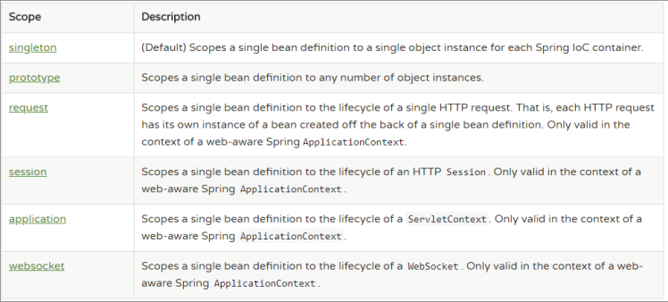

    在上图中提供的这些选项中，我们实际开发中⽤到最多的作⽤范围就是singleton（单例模式）和prototype（原型模式，也叫多例模式）。配置⽅式参考

    下⾯的代码：

    ```xml
  <bean id="connectionUtil" class="com.thm.utils.ConnectionUtil" scope="singleton"/>
    ```
    
  - 不同作用范围bean的生命周期

    **单例模式：singleton**

    对象出⽣：当创建容器时，对象就被创建了。

    对象活着：只要容器在，对象⼀直活着。

    对象死亡：当销毁容器时，对象就被销毁了。

    ⼀句话总结：单例模式的bean对象⽣命周期与容器相同。

    **多例模式：prototype**

    对象出⽣：当使⽤对象时，创建新的对象实例。

    对象活着：只要对象在使⽤中，就⼀直活着。

    对象死亡：当对象⻓时间不⽤时，被java的垃圾回收器回收了。

    ⼀句话总结：多例模式的bean对象，spring框架只负责创建，不负责销毁。

- **Bean的DI 依赖注⼊的xml配置**

  - 依赖注⼊分类

    - 按照注⼊的⽅式分类

      **构造函数注⼊**：顾名思义，就是利⽤带参构造函数实现对类成员的数据赋值。

      **set⽅法注⼊**：它是通过类成员的set⽅法实现数据的注⼊。（使⽤最多的）

    - 按照注⼊的数据类型分类

      **基本类型和String**：注⼊的数据类型是基本类型或者是字符串类型的数据。

      **其他Bean类型**：注⼊的数据类型是对象类型，称为其他Bean的原因是，这个对象是要求出现在IoC容器中的。那么针对当前Bean来说，就是其他

      Bean了。

      **复杂类型（集合类型）**：注⼊的数据类型是Aarry，List，Set，Map，Properties中的⼀种类型。
  
  - **构造函数注⼊**
  
    顾名思义，就是利⽤构造函数实现对类成员的赋值。它的使⽤要求是，类中提供的构造函数参数个数必须和配置的参数个数⼀致，且数据类型匹配。同时
  
    需要注意的是，当没有⽆参构造时，则必须提供构造函数参数的注⼊，否则Spring框架会报错。
  
    ```java
    public class JdbcAccountDaoImpl implements AccountDao {
        //声明
        private ConnectionUtil connectionUtil;
        private String name;
        private int sex;
        private double money;
    	// 提供有参构造函数
        public JdbcAccountDaoImpl(ConnectionUtil connectionUtil, String name, int sex, double money) {
            this.connectionUtil = connectionUtil;
            this.name = name;
            this.sex = sex;
            this.money = money;
        }
    }
    
    <bean id="accountDao" class="com.thm.dao.impl.JdbcAccountDaoImpl">
            <!--  使用index索引进行构造注入时必须一一对应  -->
            <!--  引用其他对象使用ref，基本数据使用value  -->
            <!--<constructor-arg index="0" ref="connectionUtil"/>
            <constructor-arg index="1" value="张三"/>
            <constructor-arg index="2" value="1"/>-
            <constructor-arg index="3" value="100.3"/>-->
    		<!--  推荐使用 -->
            <constructor-arg name="connectionUtil" ref="connectionUtil"/>
            <constructor-arg name="name" value="张三"/>
            <constructor-arg name="sex" value="1"/>
            <constructor-arg name="money" value="100.3"/>
    </bean>
    
    在使⽤构造函数注⼊时，涉及的标签是 constructor-arg ，该标签有如下属性：
    name：⽤于给构造函数中指定名称的参数赋值。
    index：⽤于给构造函数中指定索引位置的参数赋值。
    value：⽤于指定基本类型或者String类型的数据。
    ref：⽤于指定其他Bean类型的数据。写的是其他bean的唯⼀标识。
    ```
    
  - **set⽅法注⼊**
  
    顾名思义，就是利⽤字段的set⽅法实现赋值的注⼊⽅式。此种⽅式在实际开发中是使⽤最多的注⼊⽅式。
  
    ```java
    public class JdbcAccountDaoImpl implements AccountDao {
        //声明 需要提供属性的set方法
        private ConnectionUtil connectionUtil;
        private String name;
        private int sex;
        private double money;
        private String[] myArray;
        private Map<String, String> myMap;
        private Set<String> mySet;
        public void setName(String name) {
            this.name = name;
        }
        public void setSex(int sex) {
            this.sex = sex;
        }
        public void setMoney(double money) {
            this.money = money;
        }
        public void setMyArray(String[] myArray) {
            this.myArray = myArray;
        }
        public void setMyMap(Map<String, String> myMap) {
            this.myMap = myMap;
        }
        public void setMySet(Set<String> mySet) {
            this.mySet = mySet;
        }
        public void setConnectionUtil(ConnectionUtil connectionUtil) {
            this.connectionUtil = connectionUtil;
        }
    }
    
      <bean id="accountDao" class="com.thm.dao.impl.JdbcAccountDaoImpl">
            <property name="connectionUtil" ref="connectionUtil"/>
            <property name="name" value="zhangsan"/>
            <property name="sex" value="1"/>
            <property name="money" value="100.6"/>
            <property name="myArray">
                <array>
                    <value>array1</value>
                    <value>array2</value>
                </array>
            </property>
            <property name="myMap">
                <map>
                    <entry key="key1" value="map1"/>
                    <entry key="key2" value="map2"/>
                </map>
            </property>
            <property name="mySet">
                <set>
                    <value>set1</value>
                    <value>set2</value>
                </set>
            </property>
      </bean>
      
      在List结构的集合数据注⼊时， array , list , set 这三个标签通⽤，另外注值的 value 标签内部可以直接写值，
      也可以使⽤ bean 标签配置⼀个对象，或者⽤ ref 标签引⽤⼀个已经配合的bean的唯⼀标识。
      在Map结构的集合数据注⼊时， map 标签使⽤ entry ⼦标签实现数据注⼊， entry 标签可以使⽤key和value属性指
      定存⼊map中的数据。使⽤value-ref属性指定已经配置好的bean的引⽤。同时 entry 标签中也可以使⽤ ref 标签，
      但是不能使⽤ bean 标签。⽽ property 标签中不能使⽤ ref 或者 bean 标签引⽤对象
    ```

#### 4.1.3、Spring XML与注解结合模式

- **注意：**

  1）实际企业开发中，纯xml模式使⽤已经很少了

  2）引⼊注解功能，不需要引⼊额外的jar

  3）xml+注解结合模式，xml⽂件依然存在，所以，spring IOC容器的启动仍然从加载xml开始

  4）哪些bean的定义写在xml中，哪些bean的定义使⽤注解

  ​		第三⽅**jar**中的**bean**定义在**xml**，⽐如Druid数据库连接池

  ​		⾃⼰开发的**bean**定义使⽤注解

- **xml中标签与注解的对应（IOC）**

  | **xml**形式        | 对应的注解形式                                               |
  | ------------------ | ------------------------------------------------------------ |
  | 标签               | @Component("accountDao")，注解加在类上bean的id属性内容直接配置在注解后⾯如果不配置，默认定义个这个bean的id为类的类名⾸字⺟⼩写； 另外，针对分层代码开发提供了@Componenet的三种别名@Controller、@Service、@Repository分别⽤于控制层类、服务层类、dao层类的bean定义，这 四个注解的⽤法完全⼀样，只是为了更清晰的区分⽽已 |
  | scope属性          | @Scope("prototype")，默认单例，注解加在类上                  |
  | init-method属性    | @PostConstruct，注解加在⽅法上，该⽅法就是初始化后调⽤的⽅法 |
  | destory-method属性 | @PreDestory，注解加在⽅法上，该⽅法就是销毁前调⽤的⽅法      |

- **DI 依赖注⼊的注解实现⽅式**

  - **@Autowired**（推荐使⽤）

    @Autowired为Spring提供的注解，需要导⼊包

    org.springframework.beans.factory.annotation.Autowired。

    @Autowired采取的策略为按照类型注⼊。

    ```java
    @Service("transferService")
    public class TransferServiceImpl implements TransferService {
        @Autowired
        private AccountDao accountDao;
    }
    ```

    如上代码所示，这样装配回去spring容器中找到类型为AccountDao的类，然后将其注⼊进来。这样会产⽣⼀个问题，当⼀个类型有多个bean值的时候会

    造成⽆法选择具体注⼊哪⼀个的情况，这个时候我们需要配合着**@Qualifier**使⽤。

    **@Qualifier**告诉Spring具体去装配哪个对象。	

    ```java
  @Service("transferService")
    public class TransferServiceImpl implements TransferService {
        @Autowired
        @Qualifier("jdbcAccountDaoImpl")
        private AccountDao accountDao;
    }
    ```
    
    这个时候我们就可以通过类型和名称定位到我们想注⼊的对象。

  - **@Resource**

    @Resource 注解由 J2EE 提供，需要导⼊包 javax.annotation.Resource。

    @Resource 默认按照 ByName ⾃动注⼊。

    ```java
    public class TransferService {
     @Resource 
     private AccountDao accountDao;
     @Resource(name="studentDao") 
     private StudentDao studentDao;
     @Resource(type="TeacherDao") 
     private TeacherDao teacherDao;
     @Resource(name="manDao",type="ManDao") 
     private ManDao manDao;
    }
    ```
  
    如果同时指定了 name 和 type，则从Spring上下⽂中找到唯⼀匹配的bean进⾏装配，找不到则抛出异常。

    如果指定了 name，则从上下⽂中查找名称（id）匹配的bean进⾏装配，找不到则抛出异常。

    如果指定了 type，则从上下⽂中找到类似匹配的唯⼀bean进⾏装配，找不到或是找到多个，都会抛出异常。

    如果既没有指定name，⼜没有指定type，则⾃动按照byName⽅式进⾏装配；

    **注意**:

    @Resource 在 Jdk 11中已经移除，如果要使⽤，需要单独引⼊jar包

    ```xml
    <dependency>
    	<groupId>javax.annotation</groupId>
    	<artifactId>javax.annotation-api</artifactId>
    	<version>1.3.2</version>
    </dependency>
    ```

#### 4.1.4、Spring纯注解模式

改造xml+注解模式，将xml中遗留的内容全部以注解的形式迁移出去，最终删除xml，从Java配置类启动

- 对应注解

| 注解            | 描述                                                         |
| --------------- | ------------------------------------------------------------ |
| @Configuration  | 表名当前类是⼀个配置类                                       |
| @ComponentScan  | 替代 context:component-scan，用于进行包扫描                  |
| @PropertySource | 引⼊外部属性配置⽂件                                         |
| @Import         | 引⼊其他配置类                                               |
| @Value          | 对变量赋值，可以直接赋值，也可以使⽤ ${} 读取资源配置⽂件中的信息 |
| @Bean           | 将⽅法返回对象加⼊ SpringIOC 容器                            |
| @PostConstruct  | 代替bean标签上的init-method 但是在执行顺序上存在差别，属于javax.annotation需要引用jar（JDK11之后） |
| @PreDestroy     | 代替bean标签上的destroy-method                               |

- 具体实现

  ```java
  /**
   * @ClassNmae SpringConfiguration
   * @Description TODO
   * @Author THM
   * @Date 2020/11/15 20:12
   * @Version 1.0
   **/
  @Configuration
  @ComponentScan("com.thm")
  @PropertySource("classpath:jdbc.properties")
  public class SpringConfiguration {
      @Value("${jdbc.driver}")
      private String driverClassName;
      @Value("${jdbc.url}")
      private String url;
      @Value("${jdbc.username}")
      private String username;
      @Value("${jdbc.password}")
      private String password;
  
      @Bean
      public DataSource createDataSource(){
          DruidDataSource druidDataSource = new DruidDataSource();
          druidDataSource.setDriverClassName(driverClassName);
          druidDataSource.setUrl(url);
          druidDataSource.setUsername(username);
          druidDataSource.setPassword(password);
          return druidDataSource;
      }
  }
  ```


### 4.2、Spring IOC的高级特性

#### 4.2.1、 **lazy-Init** 延迟加载

顾名思义，Bean的延迟加载（延迟创建）

ApplicationContext 容器的默认⾏为是在启动服务器时将所有 **singleton（单例） bean** 提前进⾏实例化。提前实例化意味着作为初始化过程的⼀部分，

ApplicationContext 实例会创建并配置所有的**singleton bean**。

- 配置局部延迟加载

  ```java
    <!-- XML配置文件
    
        lazy-init：配置bean对象的延迟加载，true/false，默认为false（立即加载）
                   当为false时bean会随着容器的初始化进行实例化并存储到IOC容器中的ConcurrentHashMap里
                   当为true时bean不会随着容器的初始化进行实例化，⽽是第⼀次向容器通过 getBean 索取 bean 时实例化的。
        lazy-init：只对scope="singleton"为单例的bean起作用，当scope="pototype" 即使设置了 lazy-init="false"，容
                   器启动时也不会实例化bean，⽽是调⽤ getBean ⽅法实例化的。
        当设置了⽴即加载的 bean1，引⽤了⼀个延迟加载的 bean2 ，那么 bean1 在容器启动时被实例化，⽽ bean2 由于被 bean1 
        引⽤，所以也被实例化，这种情况也符合延时加载的 bean 在第⼀次调⽤时才被实例化的规则。
    -->
    <bean id="proxyFactory" class="com.thm.factory.ProxyFactory" scope="singleton" lazy-init="true">
        <property name="TransactionManager" ref="transactionManager"/>
    </bean>
    
   // 注解开启
  @Component("proxyFactory")
  @Lazy  //开启延迟加载
  public class ProxyFactory {
  }
  ```

- 配置全局延迟加载

  ```xml
  <!--xml配文件
  	在beans标签上配置default-lazy-init="true"开启整个配置文件中bean的延迟加载
	当配置有局部lazy-init，局部的lazy-init优先级更高
  -->
  <beans default-lazy-init="true" xmlns="http://www.springframework.org/schema/beans"
         xmlns:xsi="http://www.w3.org/2001/XMLSchema-instance"
         xsi:schemaLocation="http://www.springframework.org/schema/beans
         https://www.springframework.org/schema/beans/spring-beans.xsd">
  </beans>
  ```
  
- 延迟加载应用场景
  - 开启延迟加载⼀定程度提⾼容器启动和运转性能
  - 对于不常使⽤的 Bean 设置延迟加载，这样偶尔使⽤的时候再加载，不必要从⼀开始该 Bean 就占⽤资源

#### 4.2.2、BeanFactory 和 FactoryBean

- BeanFactory接⼝是容器的顶级接⼝，定义了容器的⼀些基础⾏为，负责⽣产和管理Bean的⼀个⼯⼚，具体使⽤它下⾯的⼦接⼝类型，⽐如

  ApplicationContext；

- 重点分析FactoryBean

  Spring中Bean有两种，⼀种是普通Bean，⼀种是⼯⼚Bean（FactoryBean），FactoryBean可以⽣成某⼀个类型的Bean实例（返回给我们），也就是说我们

  可以借助于它⾃定义Bean的创建过程。Bean创建的三种⽅式中的静态⽅法和实例化⽅法和FactoryBean作⽤类似，FactoryBean使⽤较多，尤其在Spring框架

  ⼀些组件中会使⽤，还有其他框架和Spring框架整合时使⽤。

  ```java
  // 源码
  // FactoryBeany可以让我们⾃定义Bean的创建过程（完成复杂Bean的定义）
    public interface FactoryBean<T> {
          @Nullable
          // 返回FactoryBean创建的Bean实例，如果isSingleton返回true，则该实例会放到Spring容器的单例对象缓存池中Map
          T getObject() throws Exception;
          
          @Nullable
          // 返回FactoryBean创建的Bean类型
          Class<?> getObjectType();
          
          // 返回作⽤域是否单例
          default boolean isSingleton() {
              return true;
          } 
     }
  ```
  
- 代码实现（XML）

  ```java
  //实体bean
  public class Company {
      private String name;
      private String address;
      private String scale;
  	//提供get/set方法
  	//重写toString
  }
  //实体beanFactory用于创建实体bean
  public class CompanyFactoryBean implements FactoryBean<Company> {
  
      private String companyInfo; //名称，地址，500
  
      public void setCompanyInfo(String companyInfo) {
          this.companyInfo = companyInfo;
      }
      @Override
      public Company getObject() throws Exception {
          String[] split = companyInfo.split(",");
          Company company = new Company();
          company.setName(split[0]);
          company.setAddress(split[1]);
          company.setScale(split[2]);
          return company;
      }
  
      @Override
      public Class<?> getObjectType() {
          return Company.class;
      }
  
      @Override
      public boolean isSingleton() {
          return true;
      }
  }
  //applicationContext.xml中配置
  <bean id="companyBean" class="com.thm.factory.CompanyFactoryBean">
       <property name="companyInfo" value="名称,地址,500"/>
  </bean>
  
  //测试
  	@Test
      public void Test1() throws Exception {
          //通过读取classpath下的xml文件启动spring IOC容器（推荐）
          ApplicationContext applicationContext = new ClassPathXmlApplicationContext("classpath:applicationContext.xml");
          //获取被创建companyBean本身
          final Object companyBean = applicationContext.getBean("companyBean");
          System.out.println(companyBean.toString());//Company{name='名称', address='地址', scale='500'}
          //获取companyFactoryBean需要 “&”+companyBean
          final Object companyFactoryBean = applicationContext.getBean("&companyBean");
          System.out.println(companyFactoryBean);//com.thm.factory.CompanyFactoryBean@3f9342d4
      }
  ```

- 代码实现（注解）

  ```java
  //实体bean
  public class Company {
      private String name;
      private String address;
      private String scale;
  	//提供get/set方法
  	//重写toString
  }
  //实体beanFactory用于创建实体bean
  @Component("companyFactoryBean")
  @PropertySource("classpath:jdbc.properties")
  public class CompanyFactoryBean implements FactoryBean<Company> {
      @Value("${companyInfo}")
      private String companyInfo; //名称，地址，500
  
      @Override
      public Company getObject() throws Exception {
          String[] split = companyInfo.split(",");
          Company company = new Company();
          company.setName(split[0]);
          company.setAddress(split[1]);
          company.setScale(split[2]);
          return company;
      }
  
      @Override
      public Class<?> getObjectType() {
          return Company.class;
      }
  
      @Override
      public boolean isSingleton() {
          return true;
      }
  }
  //测试
  	@Test
      public void Test() throws Exception {
          //通过配置启动类启动
          ApplicationContext applicationContext = new AnnotationConfigApplicationContext(SpringConfiguration.class);
          //获取被创建companyBean本身
          final Object companyBean = applicationContext.getBean("companyFactoryBean");
          System.out.println(companyBean.toString()); //Company{name='名称', address='地址', scale='500'}
          //获取companyFactoryBean需要 “&”+companyBean
          final Object companyFactoryBean = applicationContext.getBean("&companyFactoryBean");
          System.out.println(companyFactoryBean); //com.thm.factory.CompanyFactoryBean@3f9342d4
      }
  ```

#### 4.2.3、Spring的后置处理器

- Spring提供了两种后处理bean的扩展接⼝，分别为 BeanPostProcessor 和BeanFactoryPostProcessor，两者在使⽤上是有所区别的。

  ⼯⼚初始化（BeanFactory）—> Bean对象

  在BeanFactory初始化之后可以使⽤BeanFactoryPostProcessor进⾏后置处理做⼀些事情

  在Bean对象实例化（并不是Bean的整个⽣命周期完成）之后可以使⽤BeanPostProcessor进⾏后置处理做⼀些事情

  注意：对象不⼀定是springbean，⽽springbean⼀定是个对象

- **SpringBean的⽣命周期**

  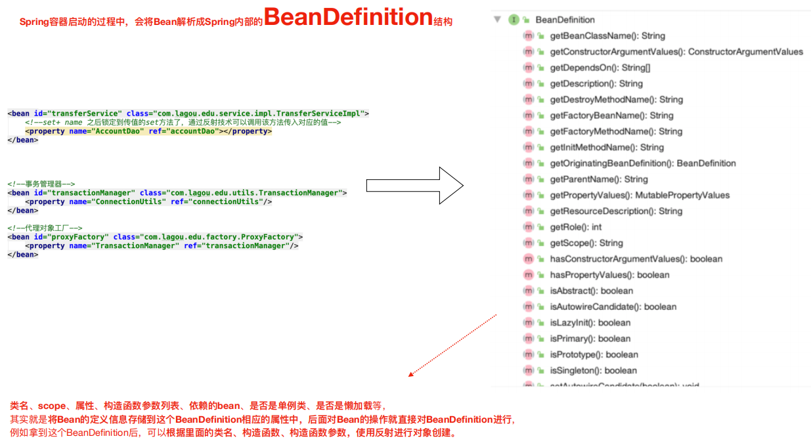

  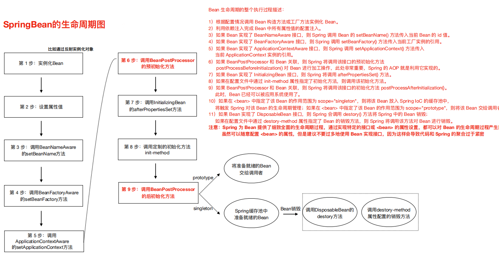

  - 代码演示

    ```java
    //配置xml
    <bean id="springLifeDemo" class="com.thm.entity.SpringLifeDemo" init-method="initMethod" destroy-method="destroyMethod"/>
    //创建生命周期演示对象
    public class SpringLifeDemo implements BeanNameAware,
            BeanFactoryAware, ApplicationContextAware, InitializingBean, DisposableBean {
        @Override
        public void setBeanName(String s) {
            System.out.println("1、执行顺序BeanNameAware-----注册我成为Bean时定义的ID："+ s);
        }
        @Override
        public void setBeanFactory(BeanFactory beanFactory) throws BeansException {
            System.out.println("2、执行顺序BeanFactoryAware-----管理我的BeanFactory："+beanFactory);
        }
        @Override
        public void setApplicationContext(ApplicationContext applicationContext) throws BeansException {
            System.out.println("3、执行顺序ApplicationContextAware-----高级容器接口：" + applicationContext);
        }
        @Override
        public void afterPropertiesSet() throws Exception {
            System.out.println("6、执行顺序InitializingBean-----实现InitializingBean调用afterPropertiesSet");
        }
        public void initMethod(){
            System.out.println("7、执行顺序init-method=initMethod-----执行init-method方法");
        }
        /**
         * 属于javax.annotation需要引用jar（JDK11之后）
         * 代替bean标签上的init-method 但是在执行顺序上存在差别
         */
        @PostConstruct
        public void postConstruct(){
            System.out.println("5、执行顺序@PostConstruct-----执行PostConstruct初始化方法");
        }
        @Override
        public void destroy() throws Exception {
            System.out.println("9、执行顺序DisposableBean-----执行DisposableBean的destroy方法");
        }
        public void destroyMethod(){
            System.out.println("10、执行顺序destroy-method=destroyMethod-----执行destroy-method方法");
        }
    }
    //创建BeanPostProcessor处理器
    @Component
    public class MyBeanPostProcessor implements BeanPostProcessor {
        //在Bean的初始化⽅法前执行
        @Override
        public Object postProcessBeforeInitialization(Object bean, String beanName) throws BeansException {
            if ("springLifeDemo".equalsIgnoreCase(beanName)){
                System.out.println("4、执行顺序BeanPostProcessor-before-----MyBeanPostProcessor before:" + beanName);
            }
            return bean;
        }
        //在Bean的初始化⽅法后执行
        @Override
        public Object postProcessAfterInitialization(Object bean, String beanName) throws BeansException {
            if ("springLifeDemo".equalsIgnoreCase(beanName)){
                System.out.println("8、执行顺序BeanPostProcessor-after-----MyBeanPostProcessor after:" + beanName);
            }
            return bean;
        }
    }
    //测试
    @org.junit.Test
    public void Test2() throws Exception {
       //通过读取classpath下的xml文件启动spring IOC容器（推荐）
      ClassPathXmlApplicationContext applicationContext = new 	   ClassPathXmlApplicationContext("classpath:applicationContext.xml");
       final Object springLifeDemo = applicationContext.getBean("springLifeDemo");
       applicationContext.close();
    }
    ```

  - 执行结果及顺序

    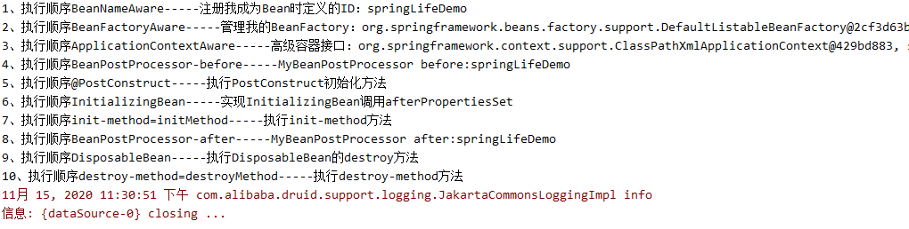

- **BeanPostProcessor**

  BeanPostProcessor是针对Bean级别的处理，可以针对某个具体的Bean

  ```java
  //源码
  public interface BeanPostProcessor {
      @Nullable
      default Object postProcessBeforeInitialization(Object bean, String beanName) throws BeansException {
          return bean;
      }
      @Nullable
      default Object postProcessAfterInitialization(Object bean, String beanName) throws BeansException {
          return bean;
      }
  }
  //自定义实现
  @Component
  public class MyBeanPostProcessor implements BeanPostProcessor {
      //在Bean的初始化⽅法前执行
      @Override
      public Object postProcessBeforeInitialization(Object bean, String beanName) throws BeansException {
      	//针对某个bean
          if ("springLifeDemo".equalsIgnoreCase(beanName)){
              System.out.println("4、执行顺序BeanPostProcessor-before-----MyBeanPostProcessor before:" + beanName);
          }
          return bean;
      }
      //在Bean的初始化⽅法后执行
      @Override
      public Object postProcessAfterInitialization(Object bean, String beanName) throws BeansException {
          if ("springLifeDemo".equalsIgnoreCase(beanName)){
              System.out.println("8、执行顺序BeanPostProcessor-after-----MyBeanPostProcessor after:" + beanName);
          }
          return bean;
      }
  }
  ```

  该接⼝提供了两个⽅法，分别在Bean的初始化⽅法前和初始化⽅法后执⾏，具体这个初始化⽅法指的是什么⽅法，类似我们在定义bean时，定义了

  init-method所指定的⽅法。定义⼀个类实现了BeanPostProcessor，默认是会对整个Spring容器中所有的bean进⾏处理。如果要对具体的某个bean处理，可

  以通过⽅法参数判断，两个类型参数分别为Object和String，第⼀个参数是每个bean的实例，第⼆个参数是每个bean的name或者id属性的值。所以我们可以

  通过第⼆个参数，来判断我们将要处理的具体的bean。

  注意：处理是发⽣在Spring容器的实例化和依赖注⼊之后。

- **BeanFactoryPostProcessor**

  BeanFactory级别的处理，是针对整个Bean的⼯⼚进⾏处理，典型应⽤:PropertyPlaceholderConfifigurer

  ```java
  //源码
  @FunctionalInterface
  public interface BeanFactoryPostProcessor {
      void postProcessBeanFactory(ConfigurableListableBeanFactory var1) throws BeansException;
  }
  ```

  此接⼝只提供了⼀个⽅法，⽅法参数为ConfigurableListableBeanFactory，该参数类型定义了⼀些⽅法

  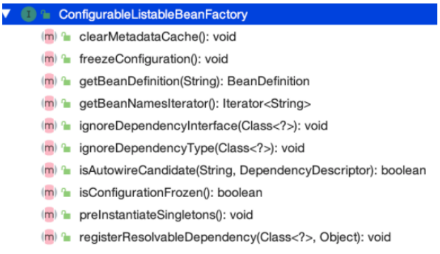

  其中有个⽅法名为getBeanDefinition的⽅法，我们可以根据此⽅法，找到我们定义bean 的BeanDefinition对象。然后我们可以对定义的属性进⾏修改，以

  下是BeanDefinition中的⽅法:

  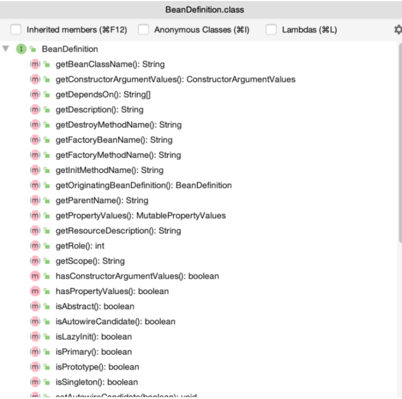

  **BeanDefinition**对象：我们在 XML 中定义的 bean标签，Spring 解析 bean 标签成为⼀个 JavaBean，这个JavaBean 就是 BeanDefinition

  **注意**：调⽤ BeanFactoryPostProcessor ⽅法时，这时候bean还没有实例化，此时 bean 刚被解析成BeanDefinition对象

## 5、Spring IOC源码深度剖析

- 好处：提⾼培养代码架构思维、深⼊理解框架

- 原则
  - 定焦原则：抓主线
  - 宏观原则：站在上帝视⻆，关注源码结构和业务流程（淡化具体某⾏代码的编写细节）

- 读源码的⽅法和技巧

  - 断点（观察调⽤栈）反调（Find Usages）

  - 经验（spring框架中doXXX，做具体处理的地⽅）

- Spring源码构建

  - 下载源码（github）选择自己需要的版本（目前是5.1.x）下载ZIP

    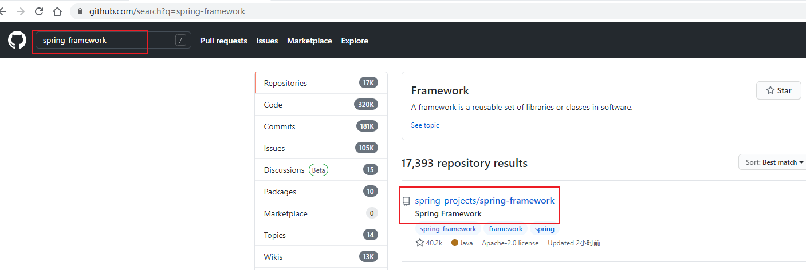

  - 安装Gradle 6.7-rc-5（类似于maven） Idea 2020.2 Jdk 11.0.6

    - 下载对应版本：gradle-5.63-bin.zip

    - 直接解压到自己的安装目录

    - 配置环境变量：GRADLE_HOME，gradle安装目录

    - 打开CMD，输入gradle -v 出现对应版本号即安装成功

      ```
      >gradle -v
      ------------------------------------------------------------
      Gradle 5.6.3
      ------------------------------------------------------------
      
      Build time:   2019-10-18 00:28:36 UTC
      Revision:     bd168bbf5d152c479186a897f2cea494b7875d13
      
      Kotlin:       1.3.41
      Groovy:       2.5.4
      Ant:          Apache Ant(TM) version 1.9.14 compiled on March 12 2019
      JVM:          11.0.6 (Oracle Corporation 11.0.6+8-LTS)
      OS:           Windows 10 10.0 amd64
      ```

    安装教程：https://blog.csdn.net/moxiaoya1314/article/details/79952937

  - 导⼊（耗费⼀定时间）

    - 设置gradle，gradle JVM 选择JDK1.8

      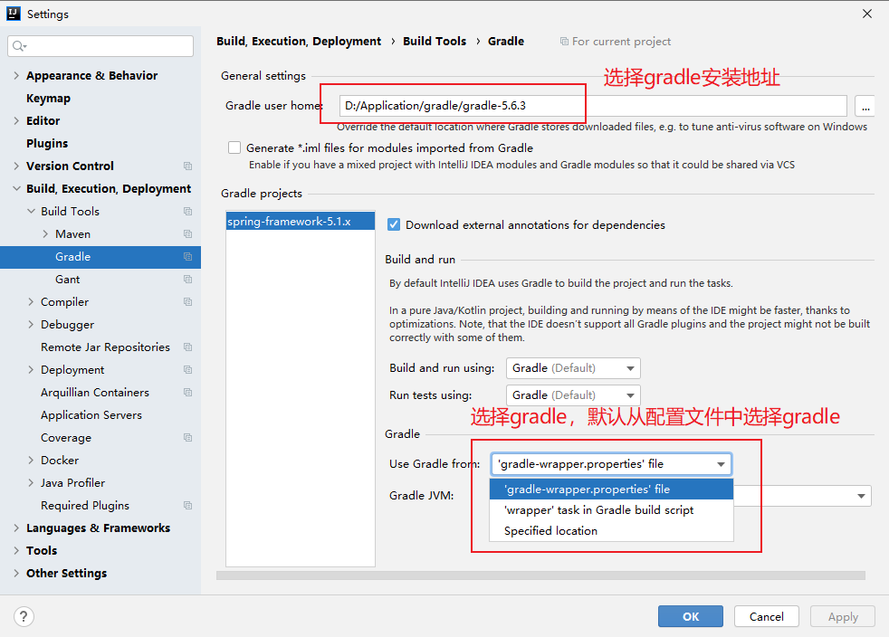

    - 修改解压后的build.gradle

      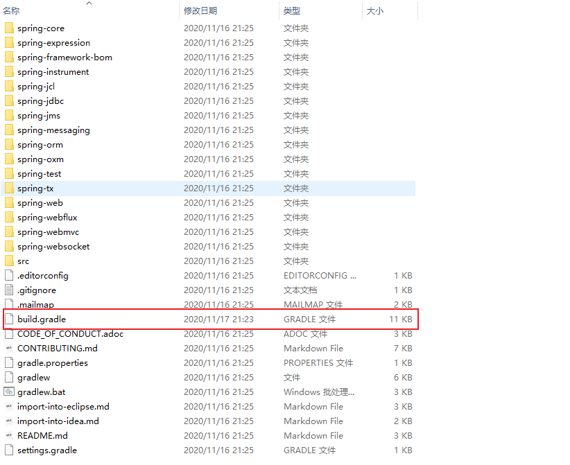

      ```
      修改第2行：
      	repositories {
      	  maven { url "https://maven.aliyun.com/repository/spring-plugin" }
      	  maven{ url 'http://maven.aliyun.com/nexus/content/groups/public/'}
      	  maven{ url "https://maven.aliyun.com/nexus/content/repositories/spring-plugin"}
      	  maven { url "https://repo.spring.io/plugins-release" }
         }
      修改第152行
        repositories {
      	  maven { url "https://maven.aliyun.com/repository/central" }
      	  maven { url "https://repo.spring.io/libs-release" }
      	  maven{ url 'http://maven.aliyun.com/nexus/content/groups/public/'}
      	  mavenCentral()
        }
      ```

    - 选择File，选择open,选择解压后的spring源码，可以在当前窗口或者新窗口打开

      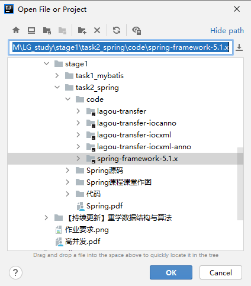

    - 编译项目，第一次编译时间比较长，需要下载大量的依赖。
    
  
  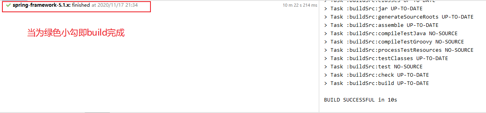
  
- 编译⼯程（顺序：core-->oxm-->context-->beans-->aspects-->aop）
  
  ⼯程—>tasks—>other—>compileTestJava
  
    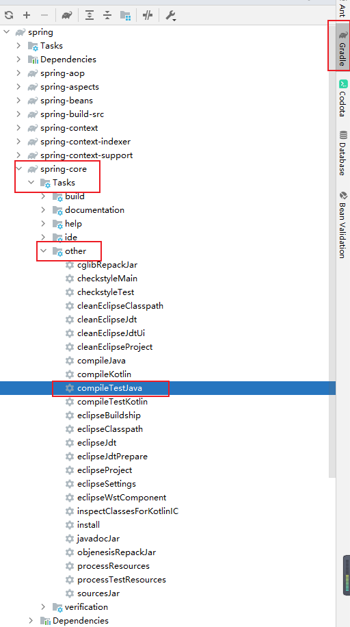
  
- 整体编译（需要整体编译才整体编译，否则编译上面流程即可）

  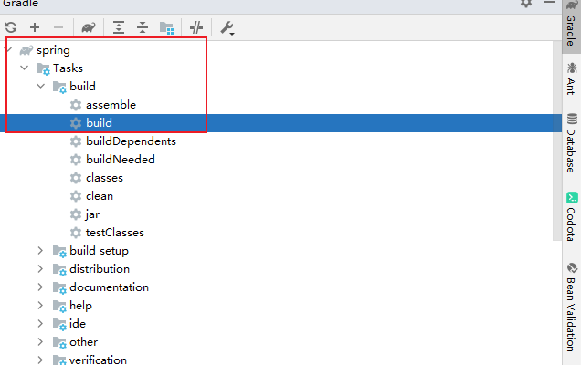

- 创建测试model

  新建spring-model【在项目上右击新建model】

  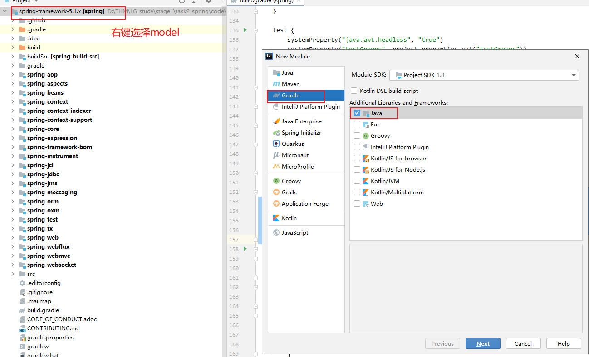

  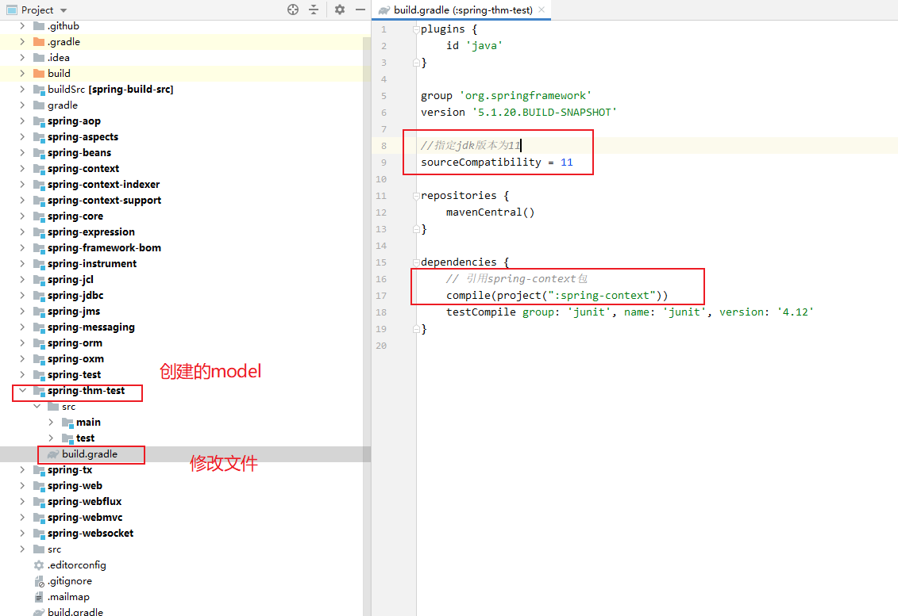

  ​	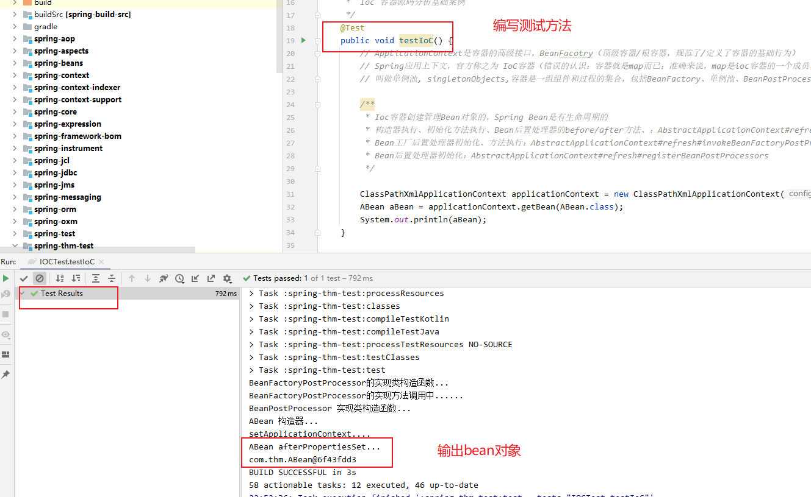

  ​	这时才可进行源码测试学习。

### 5.1、Spring IOC容器初始化主体流程

#### 5.1.1、Spring IOC的容器体系

- IOC容器是Spring的核⼼模块，是抽象了对象管理、依赖关系管理的框架解决⽅案。Spring 提供了很多的容器，其中 BeanFactory 是顶层容器（根容器），不

  能被实例化，它定义了所有 IOC 容器 必须遵从的⼀套原则，具体的容器实现可以增加额外的功能，⽐如我们常⽤到的ApplicationContext，其下更具体的实现

  如 ClassPathXmlApplicationContext 包含了解析 xml 等⼀系列的内容AnnotationConfifigApplicationContext 则是包含了注解解析等⼀系列的内容。Spring

  IoC 容器继承体系⾮常聪明，需要使⽤哪个层次⽤哪个层次即可，不必使⽤功能⼤⽽全的。

- BeanFactory 顶级接⼝⽅法栈如下

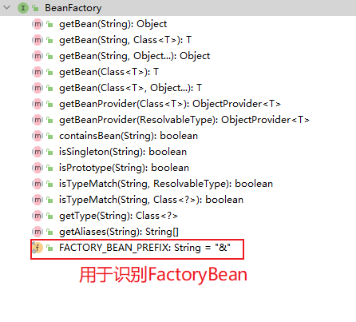

- BeanFactory 容器继承体系

  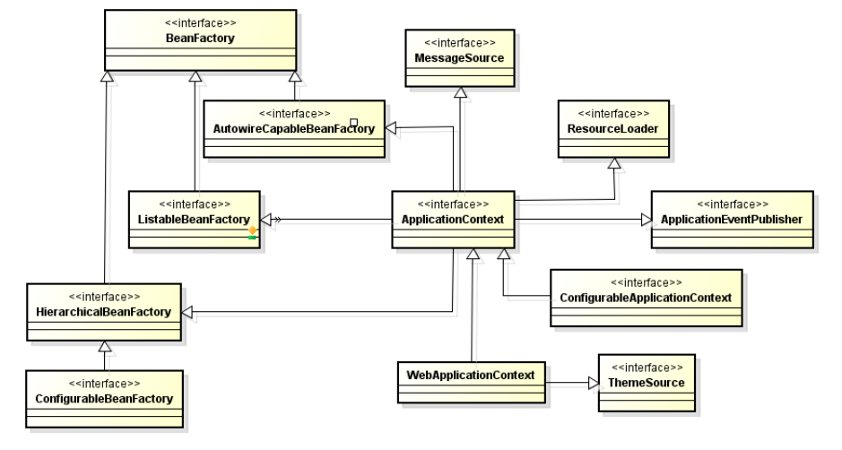

  通过其接⼝设计，我们可以看到我们⼀贯使⽤的 ApplicationContext 除了继承BeanFactory的⼦接⼝，还继承了ResourceLoader、MessageSource等接⼝，
  
  因此其提供的功能也就更丰富了。

#### 5.1.2、**Bean**⽣命周期关键时机点

- 创建：ABean

  ```java
  package com.thm;
  
  import org.springframework.beans.BeansException;
  import org.springframework.beans.factory.InitializingBean;
  import org.springframework.context.ApplicationContext;
  import org.springframework.context.ApplicationContextAware;
  
  /**
   * @ClassNmae ABean
   * @Description TODO
   * @Author THM
   * @Date 2020/11/17 21:52
   * @Version 1.0
   **/
  public class ABean implements InitializingBean, ApplicationContextAware {
  
  	private BBean bBean;
  
  	public void setbBean(BBean bBean) {
  		this.bBean = bBean;
  	}
  
  	public ABean() {
  		System.out.println("ABean 构造器...");
  	}
  
  	/**
  	 * InitializingBean 接口实现
  	 */
  	@Override
  	public void afterPropertiesSet() throws Exception {
  		System.out.println("ABean afterPropertiesSet...");
  	}
  	/**
  	 * ApplicationContextAware 接口实现
  	 */
  	@Override
  	public void setApplicationContext(ApplicationContext applicationContext) throws BeansException {
  		System.out.println("setApplicationContext....");
  	}
  
  	public void print() {
  		System.out.println("print方法业务逻辑执行");
  	}
  }
  ```

- 创建：BBean

  ```java
  package com.thm;
  
  /**
   * @ClassNmae B
   * @Description TODO
   * @Author THM
   * @Date 2020/11/17 21:55
   * @Version 1.0
   **/
  public class BBean {
  
  	private ABean aBean;
  
  	public void setaBean(ABean aBean) {
  		this.aBean = aBean;
  	}
  
  	public BBean() {
  		System.out.println("ABean 构造器...");
  	}
  }
  ```

- 创建：MyBeanPostProcessor

  ```java
  package com.thm;
  
  import org.springframework.beans.BeansException;
  import org.springframework.beans.factory.config.BeanPostProcessor;
  
  /**
   * @ClassNmae MyBeanPostProcessor
   * @Description TODO
   * @Author THM
   * @Date 2020/11/17 21:54
   * @Version 1.0
   **/
  public class MyBeanPostProcessor implements BeanPostProcessor {
  
  	public MyBeanPostProcessor() {
  		System.out.println("BeanPostProcessor 实现类构造函数...");
  	}
  
  	@Override
  	public Object postProcessBeforeInitialization(Object bean, String beanName) throws BeansException {
  		if("ABean".equals(beanName)) {
  			System.out.println("BeanPostProcessor 实现类 postProcessBeforeInitialization 方法被调用中......");
  		}
  		return bean;
  	}
  
  	@Override
  	public Object postProcessAfterInitialization(Object bean, String beanName) throws BeansException {
  		if("ABean".equals(beanName)) {
  			System.out.println("BeanPostProcessor 实现类 postProcessAfterInitialization 方法被调用中......");
  		}
  		return bean;
  	}
  }
  ```

- 创建：MyBeanFactoryPostProcessor

  ```java
  package com.thm;
  
  import org.springframework.beans.BeansException;
  import org.springframework.beans.factory.config.BeanFactoryPostProcessor;
  import org.springframework.beans.factory.config.ConfigurableListableBeanFactory;
  
  /**
   * @ClassNmae MyBeanFactoryPostProcessor
   * @Description TODO
   * @Author THM
   * @Date 2020/11/17 21:53
   * @Version 1.0
   **/
  public class MyBeanFactoryPostProcessor implements BeanFactoryPostProcessor {
  
  	public MyBeanFactoryPostProcessor() {
  		System.out.println("BeanFactoryPostProcessor的实现类构造函数...");
  	}
  
  	@Override
  	public void postProcessBeanFactory(ConfigurableListableBeanFactory beanFactory) throws BeansException {
  		System.out.println("BeanFactoryPostProcessor的实现方法调用中......");
  	}
  }
  ```

- 创建：applicationContext.xml

  ```xml
  	<bean id="myBeanFactoryPostProcessor" class="com.thm.MyBeanFactoryPostProcessor"/>
  	<bean id="myBeanPostProcessor" class="com.thm.MyBeanPostProcessor"/>
  	<bean id="aBean" class="com.thm.ABean"/>
  ```

- 创建：IOCTest

  ```java
  import com.thm.ABean;
  import org.junit.Test;
  import org.springframework.context.ApplicationContext;
  import org.springframework.context.support.ClassPathXmlApplicationContext;
  
  
  /**
   * @ClassNmae IOCTest
   * @Description TODO
   * @Author THM
   * @Date 2020/11/17 21:51
   * @Version 1.0
   **/
  public class IOCTest {
  	/**
  	 *  Ioc 容器源码分析基础案例
  	 */
  	@Test
  	public void testIoC() {
      // ApplicationContext是容器的高级接口，BeanFacotry（顶级容器/根容器，规范了/定义了容器的基础行为）
      // Spring应用上下文，官方称之为 IOC容器（错误的认识：容器就是map而已；准确来说，map是ioc容器的一个成员，
      // 叫做单例池, singletonObjects,容器是一组组件和过程的集合，包括BeanFactory、单例池、BeanPostProcessor等以及之间的协作流程）
      /**
      * Ioc容器创建管理Bean对象的，Spring Bean是有生命周期的
      * bean构造器执行、初始化方法执行、Bean后置处理器的before/after方法：
      	AbstractApplicationContext#refresh#finishBeanFactoryInitialization
      * Bean工厂后置处理器初始化、方法执行：
      	AbstractApplicationContext#refresh#invokeBeanFactoryPostProcessors
      * Bean后置处理器初始化：
      	AbstractApplicationContext#refresh#registerBeanPostProcessors
      */
  
  ClassPathXmlApplicationContext applicationContext = new ClassPathXmlApplicationContext("classpath:applicationContext.xml");
  		ABean aBean = applicationContext.getBean(ABean.class);
  		System.out.println(aBean);
  	}
  }
  ```

- 通过对特殊时机断点跟踪：AbstractApplicationContext的**refresh**方法很重要，所有的方法都需要从中通过。

- 根据上⾯的调试分析，我们发现 Bean对象创建的⼏个关键时机点代码层级的调⽤都在AbstractApplicationContext 类 的 refresh ⽅法中，可⻅这个⽅法对于

  Spring IOC 容器初始化来说相当

  关键，汇总如下：

  ```java
  //构造器执行、初始化方法执行、Bean后置处理器的before/after方法、：
  	AbstractApplicationContext#refresh#finishBeanFactoryInitialization
  //Bean工厂后置处理器初始化、方法执行：
  	AbstractApplicationContext#refresh#invokeBeanFactoryPostProcessors
  //Bean后置处理器初始化：
  	AbstractApplicationContext#refresh#registerBeanPostProcessors
  ```

#### 5.1.3、**Spring IoC**容器初始化主流程

Spring IOC 容器初始化的关键环节就在 AbstractApplicationContext#refresh() ⽅法中，我们查看 refresh ⽅法来俯瞰容器创建的主体流程。

```java
@Override
	public void refresh() throws BeansException, IllegalStateException {
		// 对象锁加锁
		synchronized (this.startupShutdownMonitor) {
			/**
			 * 刷新前的预处理
			 * 在真正执行refresh操作之前需要准备的事情
			 * 设置spring的启动时间
			 * 开启状态，撤销关闭状态
			 * 验证环境属性等
			 */
			prepareRefresh();

			/**
			 * 获取BeanFactory；默认实现DefaultListableBeanFactory
			 * 加载BeanDefition并注册到BeanDefitionRegistry
			 */
			ConfigurableListableBeanFactory beanFactory = obtainFreshBeanFactory();

			// Prepare the bean factory for use in this context.
			/**
			 * beanFactory的准备工作，包括对beanFactory进行设置比如context的类加载器等
			 */
			prepareBeanFactory(beanFactory);

			try {
				// Allows post-processing of the bean factory in context subclasses.
				/**
				 * beanFactory的准备工作完成后的后置处理
				 */
				postProcessBeanFactory(beanFactory);

				// Invoke factory processors registered as beans in the context.
				/**
				 * 实现BeanFactoryPostProcessors接口的Bean，并调用其接口方法
				 */
				invokeBeanFactoryPostProcessors(beanFactory);

				// Register bean processors that intercept bean creation.
				/**
				 * 注册BeanPostProcessor（Bean的后置处理器），在创建bean的前后等执行
				 */
				registerBeanPostProcessors(beanFactory);

				// Initialize message source for this context.
				/**
				 * 初始化MessageSource组件，做国际化功能、消息绑定、消息解析等
				 */
				initMessageSource();

				// Initialize event multicaster for this context.
				/**
				 * 初始化事件派发器
				 */
				initApplicationEventMulticaster();

				// Initialize other special beans in specific context subclasses.
				/**
				 * 子类重新方法，在容器刷新时可以自定义逻辑，如创建Tomcat、jetty等web容器
				 */
				onRefresh();

				// Check for listener beans and register them.
				/**
				 * 注册应用的监听器，就是注册实现了ApplicationListener接口的监听器备案
				 */
				registerListeners();

				// Instantiate all remaining (non-lazy-init) singletons.
				/**
				 * 初始化所有剩下的非懒加载的单例bean
				 * 初始化创建分懒加载方法的单例bean实例（为设置属性）
				 * 填充属性
				 * 初始化方法调用（afterPropertiesSet方法，init-method方法）
				 * 调用BeanProcessor（后置处理器）对实例bean进行后置处理
				 */
				finishBeanFactoryInitialization(beanFactory);

				// Last step: publish corresponding event.
				/**
				 * 完成contet的刷新。主要是调用LifecycleProcessor的onRefresh()方法，并且发布事件（contextRefreshEvent）
				 */
				finishRefresh();
			}

			catch (BeansException ex) {
				if (logger.isWarnEnabled()) {
					logger.warn("Exception encountered during context initialization - " +
							"cancelling refresh attempt: " + ex);
				}

				// Destroy already created singletons to avoid dangling resources.
				destroyBeans();

				// Reset 'active' flag.
				cancelRefresh(ex);

				// Propagate exception to caller.
				throw ex;
			}

			finally {
				// Reset common introspection caches in Spring's core, since we
				// might not ever need metadata for singleton beans anymore...
				resetCommonCaches();
			}
		}
	}
```

### 5.2、相关流程

#### 5.2.1、获取BeanFactory⼦流程

时序图如下：

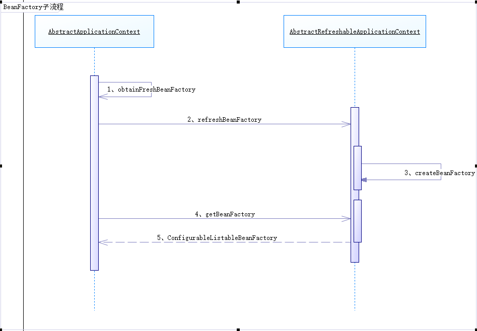

#### 5.2.2、**BeanDefinition**加载解析及注册⼦流程

该⼦流程涉及到如下⼏个关键步骤

- **Resource**定位：指对BeanDefinition的资源定位过程。通俗讲就是找到定义Javabean信息的XML⽂件，并将其封装成Resource对象。

- **BeanDefinition**载⼊ ：把⽤户定义好的Javabean表示为IoC容器内部的数据结构，这个容器内部的数据结构就是BeanDefinition。

- 注册**BeanDefinition**到 **IOC** 容器

  把封装的 XML 中定义的 Bean信息封装为BeanDefinition 对象之后放⼊⼀个Map中，BeanFactory 是以 Map 的结构组织这些 BeanDefinition的。


时序图如下：

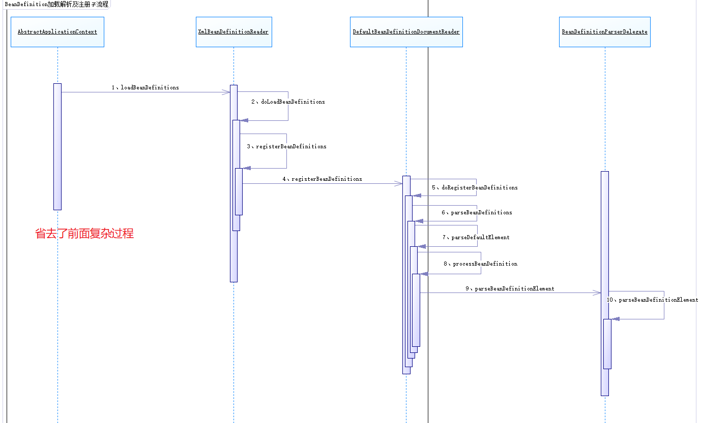

#### 5.2.3、Bean创建流程

通过最开始的关键时机点分析，我们知道Bean创建⼦流程⼊⼝在

AbstractApplicationContext#refresh()⽅法的finishBeanFactoryInitialization(beanFactory) 处

时序图如下

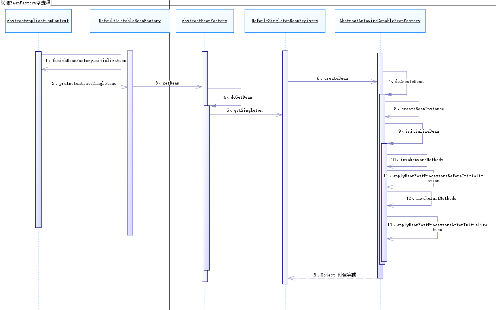

#### 5.2.4、 **lazy-init** 延迟加载机制原理

- lazy-init 延迟加载机制分析

普通 Bean 的初始化是在容器启动初始化阶段执⾏的，⽽被lazy-init=true修饰的 bean 则是在从容器⾥第⼀次进⾏context.getBean() 时进⾏触发。Spring 启动的

时候会把所有bean信息(包括XML和注解)解析转化成Spring能够识别的BeanDefinition并存到Hashmap⾥供下⾯的初始化时⽤，然后对每个BeanDefinition 进⾏

处理，如果是懒加载的则在容器初始化阶段不处理，其他的则在容器初始化阶段进⾏初始化并依赖注⼊。

- 总结

对于被修饰为lazy-init的bean Spring 容器初始化阶段不会进⾏ init 并且依赖注⼊，当第⼀次进⾏getBean时候才进⾏初始化并依赖注⼊

对于⾮懒加载的bean，getBean的时候会从缓存⾥头获取，因为容器初始化阶段 Bean 已经初始化完成并缓存了起来

### 5.3、Spring IOC循环依赖问题

#### 5.3.1、什么是循环依赖

循环依赖其实就是循环引⽤，也就是两个或者两个以上的 Bean 互相持有对⽅，最终形成闭环。⽐如A依赖于B，B依赖于C，C⼜依赖于A。

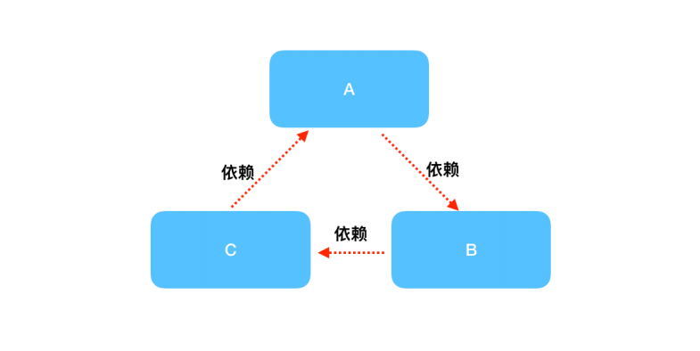

- 注意，这⾥不是函数的循环调⽤，是对象的相互依赖关系。循环调⽤其实就是⼀个死循环，除⾮有终结条件。


- Spring中循环依赖场景有：

  构造器的循环依赖（构造器注⼊）

  Field 属性的循环依赖（set注⼊）

其中，构造器的循环依赖问题⽆法解决，只能拋出 BeanCurrentlyInCreationException 异常，在解决属性循环依赖时，spring采⽤的是提前暴露对象的⽅法。（三级缓存方式）

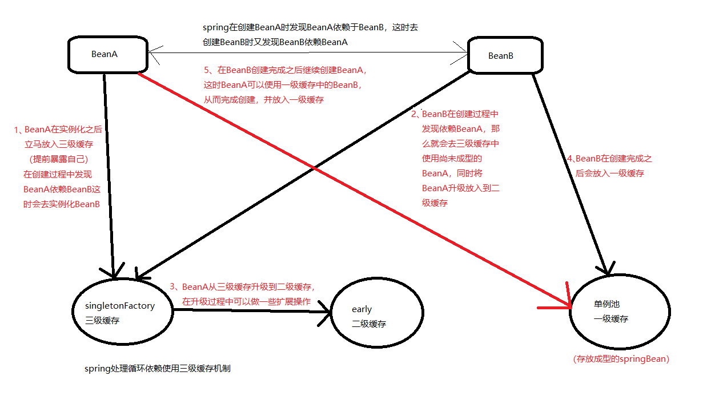

#### 5.3.2、循环依赖处理机制

- 单例 bean 构造器参数循环依赖（⽆法解决）

- prototype 原型 bean循环依赖（⽆法解决）

  对于原型bean的初始化过程中不论是通过构造器参数循环依赖还是通过setXxx⽅法产⽣循环依赖，Spring都会直接报错处理。

- 单例bean通过setXxx或者@Autowired进⾏循环依赖

  **Spring 的循环依赖的理论依据基于 Java 的引⽤传递，当获得对象的引⽤时，对象的属性是可以延后设置的，但是构造器必须是在获取引⽤之前。**

  Spring通过setXxx或者@Autowired⽅法解决循环依赖其实是通过提前暴露⼀个ObjectFactory对象来完成的，简单来说ClassA在调⽤构造器完成对象初始化之

  后，在调⽤ClassA的setClassB⽅法之前就把ClassA实例化的对象通过ObjectFactory提前暴露到Spring容器中。

  - Spring容器初始化ClassA通过构造器初始化对象后提前暴露到Spring容器三级缓存中

  - ClassA调⽤setClassB⽅法，Spring⾸先尝试从容器缓存中获取ClassB，此时ClassB不存在Spring容器缓存中

  - Spring容器初始化ClassB，同时也会将ClassB提前暴露到Spring容器三级缓存中

  - ClassB调⽤setClassA⽅法，Spring从容器缓存中获取ClassA ，因为第⼀步中已经提前暴露了ClassA，因此可以获取到ClassA实例从而完成ClassB的创建

    并放入spring容器的单例池中（一级缓存），回到创建ClassA的主流程中

  - ClassA通过spring容器获取到ClassB，完成了对象初始化操作

  - 这样ClassA和ClassB都完成了对象初始化操作，解决了循环依赖问题

- 循环依赖源码分析时序图

  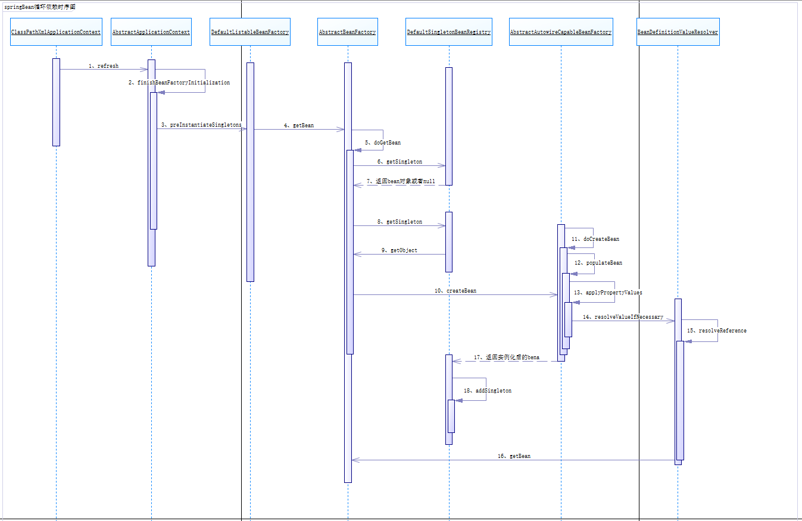

  ```
  步骤说明
  1、refresh：方法为Spring容器初始化主入口方法，完成容器初始化方法统一处理，包括获取beanFactory、解析BeanDefition、后置处理器处理、实例化bean等
  2、finishBeanFactoryInitialization：实例化bean的方法入口、
  3、preInstantiateSingletons：实例化Bean的主要方法、实例化所有非懒加载的单例bean
  4、getBean：根据拿到当前beanName去获取bean
  5、doGetBean：执行获取Bean的方法，有则返回，在容器中没有获取到当前的bean，则会对bean进行一系列的检查并去实例化bean
  6、getSingleton：从Spring容器的单例池中获取Bean
  7、spring容器中可能存在被获取的bean，则找到就返回并将到底的bean放入二级缓存，没有就返回null
  8、getSingleton：调用的重载方法，对要实例化bean进行判断和标识
  9、getObject：调用传进来的lamda表达式方法，实际调用createBean
  10、createBean：实例化bean的前置工作，获取当前被实例化bean的相关消息，就是解析出来的BeanDifition对象中的信息
  11、doCreateBean：真正创建bean的方法，对当前实例化bean进行包装，判断是否开启循环依赖，并且放入三级缓存中，填充bean的属性，初始化等
  12、populateBean：找到当前实例化bean的属性依赖
  13、applyPropertyValues：处理当前实例化bean的属性依赖，拿到依赖属性及值
  14、resolveValueIfNecessary：判断需要处理依赖属性的类型，是否是依赖其他bean，做出不同处理
  15、resolveReference：处理依赖bean的属性
  16、getBean：创建依赖bean的实例方法，回到bean的创建流程，创建完成逐步返回。
  17、最终获得实例化后的bean，并进行返回。
  18、addSingleton：将实例化后的bean添加到单例池中
  	this.singletonObjects.put(beanName, singletonObject); //添加单例池
  	this.singletonFactories.remove(beanName); //移除三级缓存
  	this.earlySingletonObjects.remove(beanName); //移除二级缓存
  	this.registeredSingletons.add(beanName); //添加注册单例
  ```


## 6、Spring AOP应用

**AOP本质**：在不改变原有业务逻辑的情况下增强横切逻辑，横切逻辑代码往往是权限校验代码、⽇志代码、事务控制代码、性能监控代码。

### 6.1、AOP 相关术语

| 名词               | 解释                                                         |
| ------------------ | ------------------------------------------------------------ |
| Joinpoint(连接点)  | 它指的是那些可以⽤于把增强代码加⼊到业务主线中的点，这些点指的就是⽅法。在⽅法执⾏的前后通过动态代理技术加⼊增强的代码。在Spring框架AOP思想的技术实现中，也只⽀持⽅法类型的连接点。（方法开始时，方法执行时，方法异常时，方法结束时） |
| Pointcut(切⼊点)   | 它指的是那些已经把增强代码加⼊到业务主线进来之后的连接点。由上图中，我们看出表现层 transfer ⽅法就只是连接点，因为判断访问权限的功能并没有对其增强。 |
| Advice(通 知/增强) | 它指的是切⾯类中⽤于提供增强功能的⽅法。并且不同的⽅法增强的时机是不⼀样的。⽐如，开启事务肯定要在业务⽅法执⾏之前执⾏；提交事务要在业务⽅法正常执⾏之后执⾏，⽽回滚事务要在业务⽅法执⾏产⽣异常之后执⾏等等。那么这些就是通知的类型。其分类有：**前置通知 后置通知 异常通知 最终通知 环绕通知**。 |
| Target(⽬标对象)   | 它指的是代理的⽬标对象。即被代理对象。                       |
| Proxy(代理)        | 它指的是⼀个类被AOP织⼊增强后，产⽣的代理类。即代理对象。    |
| Weaving(织 ⼊)     | 它指的是把增强应⽤到⽬标对象来创建新的代理对象的过程。spring采⽤动态代理织⼊，⽽AspectJ采⽤编译期织⼊和类装载期织⼊。 |
| Aspect(切 ⾯)      | 它指定是增强的代码所关注的⽅⾯，把这些相关的增强代码定义到⼀个类中，这个类就是切⾯类。例如，事务切⾯，它⾥⾯定义的⽅法就是和事务相关的，像开启事务，提交事务，回滚事务等等，不会定义其他与事务⽆关的⽅法。我们前⾯的案例中 TrasnactionManager 就是⼀个切⾯。 |

**连接点：**⽅法开始时、结束时、正常运⾏完毕时、⽅法异常时等这些特殊的时机点，我们称之为连接点，项⽬中每个⽅法都有连接点，连接点是⼀种候选点

**切⼊点：**指定AOP思想想要影响的具体⽅法是哪些，描述感兴趣的⽅法

**Advice增强：**

​	第⼀个层次：指的是横切逻辑

​	第⼆个层次：⽅位点（在某⼀些连接点上加⼊横切逻辑，那么这些连接点就叫做⽅位点，描述的是具体的特殊时机）

**Aspect切⾯：**切⾯概念是对上述概念的⼀个综合

**Aspect切⾯= 切⼊点+增强 = 切⼊点（锁定⽅法） + ⽅位点（锁定⽅法中的特殊时机）+ 横切逻辑**

**众多的概念，⽬的就是为了锁定要在哪个地⽅插⼊什么横切逻辑代码**

### 6.2、 Spring中AOP的代理选择

Spring 实现AOP思想使⽤的是动态代理技术。

默认情况下，Spring会根据被代理对象是否实现接⼝来选择使⽤JDK还是CGLIB。当被代理对象没有实现任何接⼝时，Spring会选择CGLIB。当被代理对象实现了接

⼝，Spring会选择JDK官⽅的代理技术，不过我们可以通过配置的⽅式，让Spring强制使⽤CGLIB。 

### 6.3、Spring中AOP实现应用

在Spring的AOP配置中，也和IOC配置⼀样，⽀持3类配置⽅式。

第⼀类：使⽤XML配置

第⼆类：使⽤XML+注解组合配置

第三类：使⽤纯注解配置

#### 6.3.1、**XML** 模式

- 引用jar包

  ```xml
    <dependency>
      <groupId>org.springframework</groupId>
      <artifactId>spring-aop</artifactId>
      <version>5.1.6.RELEASE</version>
    </dependency>
    <dependency>
      <groupId>org.aspectj</groupId>
      <artifactId>aspectjweaver</artifactId>
      <version>1.9.4</version>
    </dependency>
  ```

- 创建LogUtil

  ```java
  package com.thm.utils;
  
  import org.aspectj.lang.JoinPoint;
  import org.aspectj.lang.ProceedingJoinPoint;
  
  /**
   * @ClassNmae LogUtil
   * @Description TODO
   * @Author THM
   * @Date 2020/11/19 22:59
   * @Version 1.0
   **/
  public class LogUtil {
      /**
       * 业务逻辑开始之前执行
       * @param joinPoint 可以获取到执行方法的参数
       */
      public void beforeMethod(JoinPoint joinPoint) {
          Object[] args = joinPoint.getArgs();
          for (int i = 0; i < args.length; i++) {
              Object arg = args[i];
              System.out.println(arg);
          }
          System.out.println("业务逻辑开始执行之前执行.......");
      }
      
      /**
       * 业务逻辑结束时执行（无论异常与否）
       */
      public void afterMethod() {
          System.out.println("业务逻辑结束时执行，无论异常与否都执行.......");
      }
  
      /**
       * 异常时时执行
       */
      public void exceptionMethod() {
          System.out.println("异常时执行.......");
      }
      
      /**
       * 业务逻辑正常时执行
       */
      public void successMethod(Object retVal) {
          System.out.println("业务逻辑正常时执行.......");
      }
      /**
       * 环绕通知
       * @param proceedingJoinPoint 环绕增强相关参数
       * @return
       * @throws Throwable
       */
      public Object arroundMethod(ProceedingJoinPoint proceedingJoinPoint) throws Throwable {
          System.out.println("环绕通知中的beforemethod....");
  
          Object result = null;
          try{
              // 控制原有业务逻辑是否执行
               result = proceedingJoinPoint.proceed(proceedingJoinPoint.getArgs());
          }catch(Exception e) {
              System.out.println("环绕通知中的exceptionmethod....");
          }finally {
              System.out.println("环绕通知中的after method....");
          }
          return result;
      }
  }
  ```

- 配置xml信息

  ```xml
  添加相关xml约束
  xmlns:aop="http://www.springframework.org/schema/aop"
  http://www.springframework.org/schema/aop
  https://www.springframework.org/schema/aop/spring-aop.xsd
  
  <!--
          配置springAOP
          第⼀步：把横切逻辑代码（日志、事务、权限校验）交给Spring管理
          第⼆步：使⽤aop:config开始aop的配置
          第三步：使⽤aop:aspect配置切⾯
          第四步：使⽤对应的标签配置通知的类型
        -->
      <!--把通知bean交给spring来管理-->
      <bean id="logUtil" class="com.thm.utils.LogUtil"/>
      <!--开始aop的配置-->
      <aop:config>
          <!--配置切面-->
          <aop:aspect id="log" ref="logUtil">
              <!--配置切点 使用AspectJ语法-->
              <aop:pointcut id="point" expression="execution(public void com.thm.service.impl.TransferServiceImpl.transfer(java.lang.String, java.lang.String,int))"/>
              <!--配置方位点，前置增强，引入切入点-->
              <aop:before method="beforeMethod" pointcut-ref="point"/>
              <!--配置方位点，最终增强，引入切入点-->
              <aop:after method="afterMethod" pointcut-ref="point"/>
              <!--配置方位点，业务逻辑正常时执行，引入切入点-->
              <aop:after-returning method="successMethod" pointcut-ref="point"/>
              <!--配置方位点，异常增强，引入切入点-->
              <aop:after-throwing method="exceptionMethod" pointcut-ref="point"/>
              <!--
                  配置方位点，环绕增强，引入切入点
                  环绕增强不与其他增强一起使用
              -->
              <aop:around method="arroundMethod" pointcut-ref="point"/>
  
          </aop:aspect>
      </aop:config>
  ```

#### 6.3.2、XML+注解模式

- xml中开启对注解支持

  ```xml
  <!--开启spring对注解aop的⽀持-->
  <aop:aspectj-autoproxy/>
  ```

- 日志逻辑代码

  ```java
  package com.thm.utils;
  
  import org.aspectj.lang.JoinPoint;
  import org.aspectj.lang.ProceedingJoinPoint;
  import org.aspectj.lang.annotation.*;
  import org.springframework.stereotype.Component;
  
  /**
   * @ClassNmae LogUtil
   * @Description TODO
   * @Author THM
   * @Date 2020/11/19 22:59
   * @Version 1.0
   **/
  @Component
  @Aspect  //声明为切面
  public class LogUtil {
      /**
       * 我们在xml中已经使⽤了通⽤切⼊点表达式，供多个切⾯使⽤，那么在注解中如何使⽤呢？
       * 第⼀步：编写⼀个⽅法
       * 第⼆步：在⽅法使⽤@Pointcut注解
       * 第三步：给注解的value属性提供切⼊点表达式
       * 细节：
       * 1.在引⽤切⼊点表达式时，必须是⽅法名+()，例如"pointcut()"。
       * 2.在当前切⾯中使⽤，可以直接写⽅法名。在其他切⾯中使⽤必须是全限定⽅法名。
       */
      @Pointcut("execution(* com.thm.service.impl.*.*(..))")
      public void pointcut(){}
  
      /**
       * 业务逻辑开始之前执行
       * @param joinPoint 可以获取到执行方法的参数
       */
      @Before("pointcut()")
      public void beforeMethod(JoinPoint joinPoint) {
          Object[] args = joinPoint.getArgs();
          for (int i = 0; i < args.length; i++) {
              Object arg = args[i];
              System.out.println(arg);
          }
          System.out.println("业务逻辑开始执行之前执行.......");
      }
  
      /**
       * 业务逻辑结束时执行（无论异常与否）
       */
      @After("pointcut()")
      public void afterMethod() {
          System.out.println("业务逻辑结束时执行，无论异常与否都执行.......");
      }
  
      /**
       * 异常时时执行
       */
      @AfterThrowing(value = "pointcut()",throwing = "e")
      public void exceptionMethod(Throwable e) {
          System.out.println("异常时执行.......");
      }
  
      /**
       * 业务逻辑正常时执行
       */
      @AfterReturning(value = "pointcut()",returning = "retVal")
      public void successMethod(Object retVal) {
          System.out.println("业务逻辑正常时执行.......");
      }
      /**
       * 环绕通知
       * @param proceedingJoinPoint 环绕增强相关参数
       * @return
       * @throws Throwable
       */
      @Around("pointcut()")
      public Object arroundMethod(ProceedingJoinPoint proceedingJoinPoint) throws Throwable {
          System.out.println("环绕通知中的beforemethod....");
  
          Object result = null;
          try{
              // 控制原有业务逻辑是否执行
               result = proceedingJoinPoint.proceed(proceedingJoinPoint.getArgs());
          }catch(Exception e) {
              System.out.println("环绕通知中的exceptionmethod....");
          }finally {
              System.out.println("环绕通知中的after method....");
          }
          return result;
      }
  }
  ```

#### 6.3.3、纯注解模式

- 编写配置类，日志逻辑代码不变

  ```java
  @Configuration
  @ComponentScan("com.lagou")
  @EnableAspectJAutoProxy //开启spring对注解AOP的⽀持
  public class SpringConfiguration {
  }
  ```

### 6.4、Spring 声明式事务的⽀持

**编程式事务：**在业务代码中添加事务控制代码，这样的事务控制机制就叫做编程式事务

**声明式事务：**通过xml或者注解配置的⽅式达到事务控制的⽬的，叫做声明式事务

#### 6.4.1、事务的概念

**事务**指逻辑上的⼀组操作，组成这组操作的各个单元，要么全部成功，要么全部不成功。从⽽确保了数据的准确与安全。

例如：A——B转帐，对应于如下两条sql语句:

```sql
 /*转出账户减钱*/
 update account set money=money-100 where name=‘a’;
 /**转⼊账户加钱*/
 update account set money=money+100 where name=‘b’;
```

这两条语句的执⾏，要么全部成功，要么全部不成功。

#### 6.4.2、事务的四⼤特性

- 原⼦性（**Atomicity**） 原⼦性是指事务是⼀个不可分割的⼯作单位，事务中的操作要么都发⽣，要么都不发⽣。

  从操作的⻆度来描述，事务中的各个操作要么都成功要么都失败

- ⼀致性（**Consistency**） 事务必须使数据库从⼀个⼀致性状态变换到另外⼀个⼀致性状态。

  例如转账前A有1000，B有1000。转账后A+B也得是2000。

  ⼀致性是从数据的⻆度来说的，（1000，1000） （900，1100），不应该出现（900，1000）

- 隔离性（**Isolation**） 事务的隔离性是多个⽤户并发访问数据库时，数据库为每⼀个⽤户开启的事务，

  每个事务不能被其他事务的操作数据所⼲扰，多个并发事务之间要相互隔离。

  ⽐如：事务1给员⼯涨⼯资2000，但是事务1尚未被提交，员⼯发起事务2查询⼯资，发现⼯资涨了2000块钱，读到了事务1尚未提交的数据（脏读）

- 持久性（**Durability**）

  持久性是指⼀个事务⼀旦被提交，它对数据库中数据的改变就是永久性的，接下来即使数据库发⽣故障也不应该对其有任何影响。


#### 6.4.3、事务的隔离级别

不考虑隔离级别，会出现以下情况：（以下情况全是错误的），也即为隔离级别在解决事务并发问题

- **脏读：**⼀个线程中的事务读到了另外⼀个线程中未提交的数据。

- **不可重复读：**⼀个线程中的事务读到了另外⼀个线程中已经提交的**update**的数据（前后内容不⼀样）

  场景：

  员⼯A发起事务1，查询⼯资，⼯资为1w，此时事务1尚未关闭

  财务⼈员发起了事务2，给员⼯A张了2000块钱，**并且提交了事务**

  员⼯A通过事务1再次发起查询请求，发现⼯资为1.2w，原来读出来1w读不到了，叫做不可重复读

- **虚读（幻读）：**⼀个线程中的事务读到了另外⼀个线程中已经提交的**insert**或者**delete**的数据（前后条

  数不⼀样）

  ​	场景：

  ​	事务1查询所有⼯资为1w的员⼯的总数，查询出来了10个⼈，此时事务尚未关闭

  ​	事务2财务⼈员发起，新来员⼯，⼯资1w，向表中插⼊了2条数据，**并且提交了事务**

  ​	事务1再次查询⼯资为1w的员⼯个数，发现有12个⼈，⻅了⻤了

数据库共定义了四种隔离级别：

**Serializable（串⾏化）：**可避免脏读、不可重复读、虚读情况的发⽣。（串⾏化）

**Repeatable read（可重复读）：**可避免脏读、不可重复读情况的发⽣。(幻读有可能发⽣) 该机制下会对要update的⾏进⾏加锁

**Read committed（读已提交）：**可避免脏读情况发⽣。不可重复读和幻读⼀定会发⽣。 

**Read uncommitted（读未提交）：**最低级别，以上情况均⽆法保证。(读未提交) 

**注意：级别依次升⾼，效率依次降低**

MySQL的默认隔离级别是：REPEATABLE READ   

查询当前使⽤的隔离级别： select @@tx_isolation;

设置MySQL事务的隔离级别： set session transaction isolation level xxx; （设置的是当前mysql连接会话的，并不是永久改变的）

#### 6.4.4、事务的传播⾏为

事务往往在service层进⾏控制，如果出现service层⽅法A调⽤了另外⼀个service层⽅法B，A和B⽅法本身都已经被添加了事务控制，那么A调⽤B的时候，就需要

进⾏事务的⼀些协商，这就叫做事务的传播⾏为。

A调⽤B，我们站在B的⻆度来观察来定义事务的传播⾏为

| PROPAGATION_REQUIRED      | 如果当前没有事务，就新建⼀个事务，如果已经存在⼀个事务中，加⼊到这个事务中。这是最常⻅的选择。 |
| ------------------------- | ------------------------------------------------------------ |
| **PROPAGATION_SUPPORTS**  | **⽀持当前事务，如果当前没有事务，就以⾮事务⽅式执⾏。**     |
| PROPAGATION_MANDATORY     | 使⽤当前的事务，如果当前没有事务，就抛出异常。               |
| PROPAGATION_REQUIRES_NEW  | 新建事务，如果当前存在事务，把当前事务挂起。                 |
| PROPAGATION_NOT_SUPPORTED | 以⾮事务⽅式执⾏操作，如果当前存在事务，就把当前事务挂起。   |
| PROPAGATION_NEVER         | 以⾮事务⽅式执⾏，如果当前存在事务，则抛出异常。             |
| PROPAGATION_NESTED        | 如果当前存在事务，则在嵌套事务内执⾏。如果当前没有事务，则执⾏与PROPAGATION_REQUIRED类似的操作。 |

### 6.5、**Spring**中的事务

- **PlatformTransactionManager**

  ```java
  public interface PlatformTransactionManager {
   /**
   * 获取事务状态信息
   */
   TransactionStatus getTransaction(@Nullable TransactionDefinition definition)
  throws TransactionException;
   /**
   * 提交事务
   */
   void commit(TransactionStatus status) throws TransactionException;
   /**
   * 回滚事务
   */
   void rollback(TransactionStatus status) throws TransactionException; }
  ```

  **作⽤**

  此接⼝是Spring的事务管理器核⼼接⼝。Spring本身并不⽀持事务实现，只是负责提供标准，应⽤底层⽀持什么样的事务，需要提供具体实现类。此处也是策

  略模式的具体应⽤。在Spring框架中，也为我们内置了⼀些具体策略，例如：DataSourceTransactionManager , HibernateTransactionManager 等。

  （  HibernateTransactionManager 事务管理器在 spring-orm-5.1.12.RELEASE.jar 中）

  - Spring JdbcTemplate（数据库操作⼯具）

  - Mybatis（mybatis-spring.jar）————>DataSourceTransactionManager

  - Hibernate框架 ——————> HibernateTransactionManager

  DataSourceTransactionManager 归根结底是横切逻辑代码，声明式事务要做的就是使⽤Aop（动态代理）来将事务控制逻辑织⼊到业务代码

#### 6.5.1、**Spring** 声明式事务配置

- **纯xml模式**

  - pom文件

    ```xml
    <dependency>
     <groupId>org.springframework</groupId>
     <artifactId>spring-context</artifactId>
     <version>5.1.12.RELEASE</version>
    </dependency> <dependency>
     <groupId>org.aspectj</groupId>
     <artifactId>aspectjweaver</artifactId>
     <version>1.9.4</version>
    </dependency> <dependency>
     <groupId>org.springframework</groupId>
     <artifactId>spring-jdbc</artifactId>
     <version>5.1.12.RELEASE</version>
     </dependency> <dependency>
     <groupId>org.springframework</groupId>
     <artifactId>spring-tx</artifactId>
     <version>5.1.12.RELEASE</version>
    </dependency>
    ```
    
    - xml 配置

      ```xml
      添加xml约束  
      xmlns:aop="http://www.springframework.org/schema/aop"
      xmlns:tx="http://www.springframework.org/schema/tx" 
      http://www.springframework.org/schema/aop
      https://www.springframework.org/schema/aop/spring-aop.xsd
      http://www.springframework.org/schema/tx
      https://www.springframework.org/schema/tx/spring-tx.xsd
          
          <!--  配置事务管理器  -->
          <bean id="transactionManager" class="org.springframework.jdbc.datasource.DataSourceTransactionManager">
              <constructor-arg name="dataSource" ref="datasource"/>
          </bean>
          <!--  配置具体事务通知-->
          <tx:advice id="txAdvice" transaction-manager="transactionManager">
              <!--定制事务细节，传播⾏为、隔离级别等-->
              <tx:attributes>
                  <!--⼀般性配置-->
                  <tx:method name="*" read-only="false" propagation="REQUIRED" isolation="DEFAULT" timeout="-1"/>
                  <!--针对查询的覆盖性配置-->
                  <tx:method name="query*" read-only="true" propagation="SUPPORTS"/>
              </tx:attributes>
          </tx:advice>
          <!--  配置AOP  -->
          <aop:config>
              <!--advice-ref指向增强=横切逻辑+⽅位-->
              <aop:advisor advice-ref="txAdvice" pointcut="execution(*com.lagou.edu.service.impl.TransferServiceImpl.*(..))"/>
          </aop:config>
      ```

- **基于XML+注解**

  - xml配置

    ```xml
    <!--配置事务管理器-->
    <bean id="transactionManager"class="org.springframework.jdbc.datasource.DataSourceTransactionManager">
     <property name="dataSource" ref="dataSource"></property>
    </bean>
    <!--开启spring对注解事务的⽀持-->
    <tx:annotation-driven transaction-manager="transactionManager"/>
    ```

  - 在接⼝、类或者⽅法上添加@Transactional注解

    @Transactional(readOnly = true,propagation = Propagation.SUPPORTS)

- **基于纯注解**

  Spring基于注解驱动开发的事务控制配置，只需要把 xml 配置部分改为注解实现。只是需要⼀个注解替换掉xml配置⽂件中的

  <tx:annotation-driven transaction-manager="transactionManager"/>配置。
  在 Spring 的配置类上添加 @EnableTransactionManagement 注解即可

  ```java
  @EnableTransactionManagement//开启spring注解事务的⽀持
  public class SpringConfiguration {
  }
  ```

### 6.6、Spring AOP源码深度剖析

#### 6.6.1、代理对象创建

- 时序图

  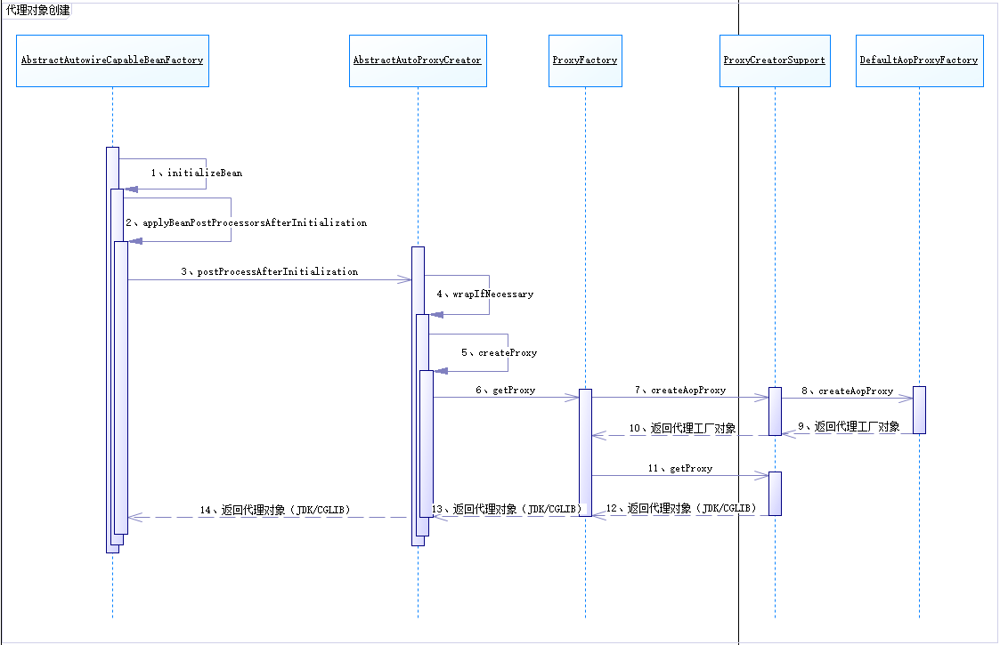

  ```
  1、调用初始化方法，应用所有的生命周期方法
  2、调用BeanPostProcessors后置处理器after方法
  3、调用具体的BeanPostProcessors后置处理器after方法
  4、将bean对象进行包装，创建代理对象
  5、创建代理工厂，将创建代理对象的工作交给代理工厂
  6、获取代理对象（JDK/CGLIB）
  7、创建AOP代理对象工厂
  8、创建AOP代理对象工厂，根据相应的条件返回不同的代理工厂（JDK/CGLIB）
  9、返回代理对象工厂
  10、返回代理对象工厂
  11、获取代理对象（JDK/CGLIB）
  12、13、14、返回创建好的代理对象（JDK/CGLIB）
  ```
  

#### 6.6.2、**Spring**声明式事务控制

声明式事务很⽅便，尤其纯注解模式，仅仅⼏个注解就能控制事务了

思考：这些注解都做了什么？好神奇！

**@EnableTransactionManagement**  开启事务管理

```java
@Target(ElementType.TYPE)
@Retention(RetentionPolicy.RUNTIME)
@Documented
@Import(TransactionManagementConfigurationSelector.class)
public @interface EnableTransactionManagement {
	......
}

@EnableTransactionManagement注解
1、通过@Import(TransactionManagementConfigurationSelector.class)引入TransactionManagementConfigurationSelector
2、TransactionManagementConfigurationSelector的selectImports方法导入了另外两个类
	AutoProxyRegistrar：
		registerBeanDefinitions方法引用了AopConfigUtils.registerAutoProxyCreatorIfNecessary(registry)
		------>注册了InfrastructureAdvisorAutoProxyCreator类继承了AbstractAutoProxyCreator（后置处理器）
	ProxyTransactionManagementConfiguration：是一个配置类（注册Bean）
		注册事务增强器（注入属性解析器、事务拦截器）
		属性解析器：AnnotationTransactionAttributeSource
			内部持有：Set<TransactionAnnotationParser> annotationParsers
			具体使用的是SpringTransactionAnnotationParser解析器，用来解析@Transactional注解的事务属性
		事务拦截器：TransactionInterceptor实现了MethodInterceptor接口，该通用拦截会在产生代理对象之前和AOP增强合并，最终返回代理对象
				  TransactionInterceptor的invoke方法中invokeWithinTransaction会触发原有业务逻辑调用（增强事务）
```

**@Transactional**  标记添加事务控制

## 7、修改自定义IOC容器，添加注解

- 实现思路

  ```
  作业思路：
  	1、定义相关注解@Component、@Repository、@Service、@Autowired、@Transactional
  	2、编写包扫描代码
  		包扫描要考虑两种可能，一个是在classes目录下（目前只出了classes下），一个是在jar文件中。
  		PackAgeScanUtil
  			scan（String packageName）
  			递归扫描：listFilesWithRecursion
  			获取类全限定名：getClassName
  	3、改造beanFactory
  		解析xml中配置bean：beanResolver(Element rootElement)
  		解析xml中配置bean依赖：propertyResolver(Element rootElement)
  		解析包扫描：scanResolver(Element rootElement)
  			获取所有类权限名称
  			循环处理注册bean
  				获取注册bean的名称：getBeanRegisterName（）
  				当为配置bean名称时，转换类名首字母为小写作为bean名称
  			处理Autowired注解依赖
  				处理Transactional标记的类，根据是否实现接口来采用不同的代理方式
  				使用反射/内省技术，为需要注册依赖bean对象设置
  ```

- 实现细节

  参考：https://gitee.com/Thmspring/LG_homeWork/tree/master/stage1_module2