# Spring Cloud

SOA—>Dubbo

微服务架构—>Spring Cloud提供了⼀个⼀站式的微服务解决⽅案

## 1、微服务架构

### 1.1、互联⽹应⽤架构发展（回顾）

随着互联⽹的发展，⽤户群体逐渐扩⼤，⽹站的流量成倍增⻓，常规的单体架构已⽆法满⾜请求压⼒和业务的快速迭代，架构的变化势在必⾏。下⾯我们就以拉勾

⽹的架构演进为例，从最开始的单体架构分析，⼀步步的到现在的微服务架构。

- **单体应⽤架构**

  在诞⽣之初，拉勾的⽤户量、数据量规模都⽐较⼩，项⽬所有的功能模块都放在⼀个⼯程中编码、编译、打包并且部署在⼀个Tomcat容器中的架构模式就是

  单体应⽤架构，这样的架构既简单实 ⽤、便于维护，成本⼜低，成为了那个时代的主流架构⽅式。

  

  **优点：**

  - 项⽬前期开发节奏快，团队成员少的时候能够快速迭代

  - 架构简单：MVC架构，只需要借助IDE开发、调试即可

  - 易于测试：只需要通过单元测试或者浏览器完成

  - 易于部署：打包成单⼀可执⾏的jar或者打成war包放到容器内启动

  **缺点：**

  - 随着不断的功能迭代，单个项⽬过⼤，代码杂乱，耦合严重，开发团队逐渐壮⼤以后，沟通 成本变⾼， 如：代码从编译到启动耗时达到 3-5 分钟

  - 新增业务困难：在已经乱如麻的系统中增加新业务，维护旧功能，⼀脚踩进去全是不可预测 的问题。新⼈来了以后很难接⼿任务，学习成本⾼，需要⼤概 

    ⼀周时间，才能上⼿开发

  - 核⼼业务与边缘业务混合在⼀块，出现问题互相影响，如：⼀个临时活动流量猛涨，机器负 载升⾼就会影响正常的业务服务

  业务量上涨之后，单体应⽤架构进⼀步丰富变化，⽐如应⽤集群部署、使⽤Nginx进⾏负载均衡、增加缓存服务器、增加⽂件服务器、数据库集群并做读写分

  离等，通过以上措施增强应对⾼并发的能⼒、应对⼀定的复杂业务场景，但依然属于单体应⽤架构。

  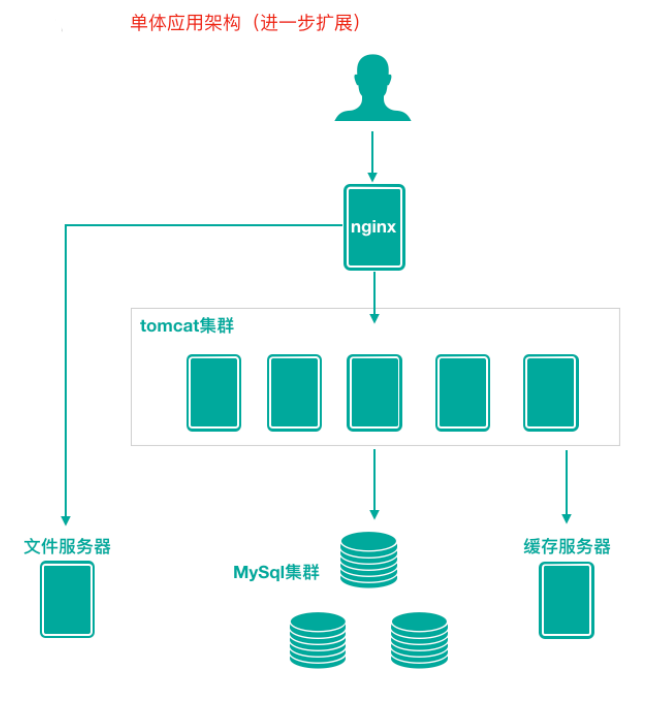

- **垂直应⽤架构**

  为了避免上⾯提到的那些问题，开始做模块的垂直划分，做垂直划分的原则是基于拉勾现有的业 务特性来做，核⼼⽬标第⼀个是为了业务之间互不影响，第⼆个是在研发团队的壮⼤后为了提⾼ 效率，减少之间的依赖。

  

  **优点**

  - 系统拆分实现了流量分担，解决了并发问题

  - 可以针对不同模块进⾏优化

  - ⽅便⽔平扩展，负载均衡，容错率提⾼

  - 系统间相互独⽴，互不影响，新的业务迭代时更加⾼效

  **缺点**

  - 服务之间相互调⽤，如果某个服务的端⼝或者ip地址发⽣改变，调⽤的系统得⼿动改变

  - 搭建集群之后，实现负载均衡⽐较复杂，如：内⽹负载，在迁移机器时会影响调⽤⽅的路 由，导致线上故障

  - 服务之间调⽤⽅式不统⼀，基于 httpclient 、 webservice ，接⼝协议不统⼀

  - 服务监控不到位：除了依靠端⼝、进程的监控，调⽤的成功率、失败率、总耗时等等这些监 控指标是没有的

- **SOA应⽤架构**

  SOA (Service-Oriented Architecture)，即⾯向服务的架构。根据实际业务，把系统拆分成合适的、独⽴部署的模块，模块之间相互独⽴（通过

  Webservice/Dubbo等技术进⾏通信）。

  在做了垂直划分以后，模块随之增多，维护的成本在也变⾼，⼀些通⽤的业务和模块重复的越来越多，为了解决上⾯提到的接⼝协议不统⼀、服务⽆法监控、

  服务的负载均衡，引⼊了阿⾥巴巴开源的 Dubbo ，⼀款⾼性能、轻量级的开源Java RPC框架，它提供了三⼤核⼼能⼒：⾯向接⼝的远程⽅法调⽤，智能容错

  和负载均衡，以及服务⾃动注册和发现。

  **优点：**分布式、松耦合、扩展灵活、可重⽤。

  **缺点：**服务抽取粒度较⼤、服务调⽤⽅和提供⽅耦合度较⾼（接⼝耦合度）

  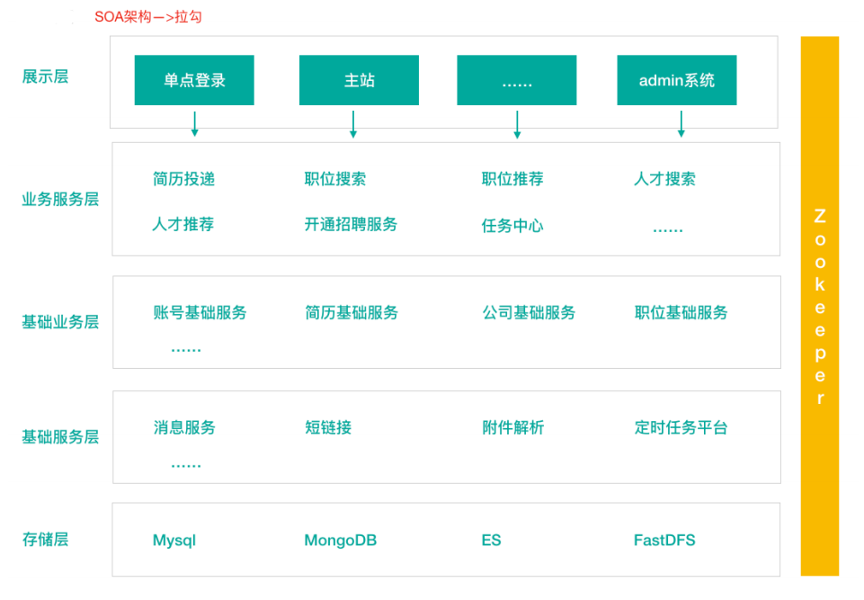

- **微服务应⽤架构**

  微服务架构可以说是SOA架构的⼀种拓展，这种架构模式下它**拆分粒度更⼩**、服务更独⽴。把应⽤拆分成为⼀个个微⼩的服务，不同的服务可以使⽤不同的开

  发语⾔和存储，服务之间往往通过**Restful**等轻量级通信。微服务架构关键在于**微⼩、独⽴、轻量级通信**。

  微服务是在 SOA 上做的升华粒度更加细致，微服务架构强调的⼀个**重点是“业务需求彻底的组件化和服务化”**

  

- **微服务架构和SOA架构相似⼜不同**

  **微服务架构和SOA架构很明显的⼀个区别就是服务拆分粒度的不同**，但是对于拉勾的架构发展来说，我们所看到的SOA阶段其实服务拆分粒度相对来说已经⽐

  较细了，所以上述拉勾SOA到拉勾微服务，从服务拆分上来说变化并不⼤，只是引⼊了相对完整的新⼀代Spring Cloud微服务技术。⾃然，上述我们看到的都

  是拉勾架构演变的阶段结果，每⼀个阶段其实都经历了很多变化，拉勾的服务拆分其实也是⾛过了从粗到细，并⾮绝对的⼀步到位。

  举个拉勾案例来说明SOA和微服务拆分粒度不同

  我们在SOA架构的初期，“简历投递模块”和“⼈才搜索模块”都有简历内容展示的需求，只不过说可能略有区别，⼀开始在两个模块中各维护了⼀套简历查询和展

  示的代码；后期我们将服务更细粒度拆分，拆分出简历基础服务，那么不同模块调⽤这个基础服务即可。

### 1.2、微服务架构体现的思想及优缺点

微服务架构设计的核⼼思想就是**微**，拆分的粒度相对⽐较⼩，这样的话单⼀职责、开发的耦合度就会降低、微⼩的功能可以独⽴部署扩展、灵活性强，升级改造

影响范围⼩。

**微服务架构的优点: 微服务架构和微服务**

- 微服务很⼩，便于特定业务功能的聚焦 A B C D

- 微服务很⼩，每个微服务都可以被⼀个⼩团队单独实施（开发、测试、部署上线、运维），团队合作⼀定程度解耦，便于实施敏捷开发

- 微服务很⼩，便于重⽤和模块之间的组装

- 微服务很独⽴，那么不同的微服务可以使⽤不同的语⾔开发，松耦合

- 微服务架构下，我们更容易引⼊新技术

- 微服务架构下，我们可以更好的实现DevOps开发运维⼀体化；

**微服务架构的缺点**

- 微服务架构下，分布式复杂难以管理，当服务数量增加，管理将越加复杂；

- 微服务架构下，分布式链路跟踪难等；

### 1.3、微服务架构中的⼀些概念

- **服务注册与服务发现**

  **服务注册：**服务提供者将所提供服务的信息（服务器IP和端⼝、服务访问协议等）注册/登记到注册中⼼

  **服务发现：**服务消费者能够从注册中⼼获取到较为实时的服务列表，然后根究⼀定的策略选择⼀个服务访问

  

- **负载均衡**

  负载均衡即将请求压⼒分配到多个服务器（应⽤服务器、数据库服务器等），以此来提⾼服务的性能、可靠性。

  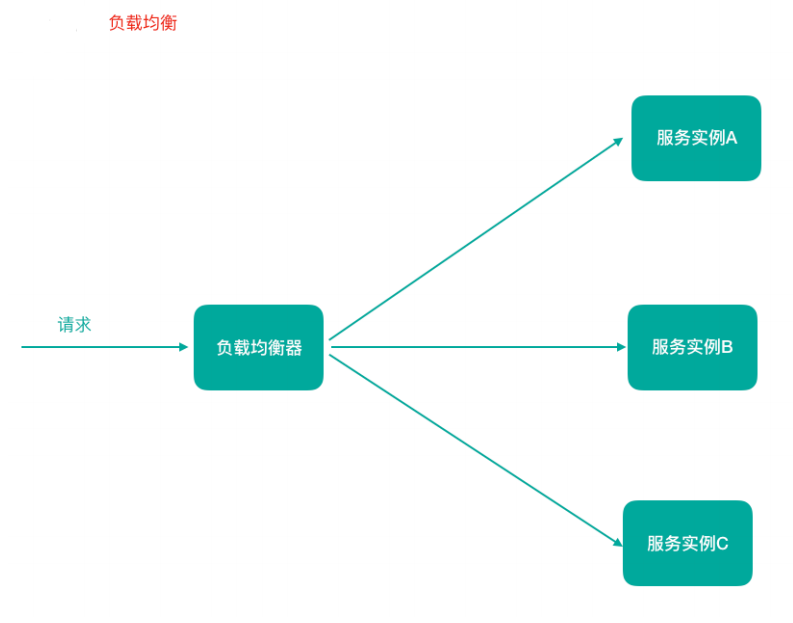

- **熔断**

  熔断即断路保护。微服务架构中，如果下游服务因访问压⼒过⼤⽽响应变慢或失败，上游服务为了保护系统整体可⽤性，可以暂时切断对下游服务的调⽤。这

  种牺牲局部，保全整体的措施就叫做熔断。

  

- **链路追踪**

  微服务架构越发流⾏，⼀个项⽬往往拆分成很多个服务，那么⼀次请求就需要涉及到很多个服务。不同的微服务可能是由不同的团队开发、可能使⽤不同的编

  程语⾔实现、整个项⽬也有可能部署在了很多服务器上（甚⾄百台、千台）横跨多个不同的数据中⼼。所谓链路追踪，就是对⼀次请求涉及的很多个服务链路

  进⾏⽇志记录、性能监控

  

- **API ⽹关**

  微服务架构下，不同的微服务往往会有不同的访问地址，客户端可能需要调⽤多个服务的接⼝才能完成⼀个业务需求，如果让客户端直接与各个微服务通信可

  能出现：

  - 客户端需要调⽤不同的url地址，增加了维护调⽤难度
  - 在⼀定的场景下，存在跨域请求的问题（前后端分离就会碰到跨域问题，原本我们在后端采⽤Cors就能解决，现在利⽤⽹关，那么就放在⽹关这层做了）
  - 每个微服务都需要进⾏单独的身份认证

  那么，API⽹关就可以较好的统⼀处理上述问题，API请求调⽤统⼀接⼊API⽹关层，由⽹关转发请求。API⽹关更专注在安全、路由、流量等问题的处理上（微

  服务团队专注于处理业务逻辑即可），它的功能⽐如

  - 统⼀接⼊（路由）
  - 安全防护（统⼀鉴权，负责⽹关访问身份认证验证，与“访问认证中⼼”通信，实际认证业务逻辑交移“访问认证中⼼”处理）
  - ⿊⽩名单（实现通过IP地址控制禁⽌访问⽹关功能，控制访问）
  - 协议适配（实现通信协议校验、适配转换的功能）
  - 流量管控（限流）
  - ⻓短链接⽀持
  - 容错能⼒（负载均衡）

  

## 2、 Spring Cloud 综述

### 2.1、Spring Cloud 是什么

**[**百度百科**]**Spring Cloud是⼀系列框架的有序集合。它利⽤Spring Boot的开发便利性巧妙地简化了分布式系统基础设施的开发，如服务发现注册、配置中⼼、消息

总线、负载均衡、断路器、数据监控等，都可以⽤ Spring Boot的开发⻛格做到⼀键启动和部署。**Spring Cloud**并没有重复制造轮⼦，它只是将⽬前各家公司开发

的⽐较成熟、经得起实际考验的服务框架组合起来，通过**Spring Boot**⻛格进⾏再封装屏蔽掉了复杂的配置和实现原理，最终给开发者留出了⼀套简单易懂、易部

署和易维护的分布式系统开发⼯具包。

- Spring Cloud是⼀系列框架的有序集合（Spring Cloud是⼀个规范）

- 开发服务发现注册、配置中⼼、消息总线、负载均衡、断路器、数据监控等

- 利⽤Spring Boot的开发便利性简化了微服务架构的开发（⾃动装配）

这⾥，我们需要注意，**Spring Cloud其实是⼀套规范**，是⼀套⽤于构建微服务架构的规范，⽽不是⼀个可以拿来即⽤的框架（所谓规范就是应该有哪些功能组

件，然后组件之间怎么配合，共同完成什么事情）。在这个规范之下第三⽅的Netflix公司开发了⼀些组件、Spring官⽅开发了⼀些框架/组件，包括第三⽅的阿⾥

巴巴开发了⼀套框架/组件集合Spring Cloud Alibaba，这些才是Spring Cloud规范的实现。

Netflix搞了⼀套 简称SCN

Spring Cloud 吸收了Netflix公司的产品基础之上⾃⼰也搞了⼏个组件

阿⾥巴巴在之前的基础上搞出了⼀堆微服务组件,Spring Cloud Alibaba（SCA）

### 2.2、Spring Cloud 解决什么问题

Spring Cloud 规范及实现意图要解决的问题其实就是微服务架构实施过程中存在的⼀些问题，⽐如微服务架构中的服务注册发现问题、⽹络问题（⽐如熔断场

景）、统⼀认证安全授权问题、负载均衡问题、链路追踪等问题。

### 2.3、Spring Cloud 架构

Spring Cloud是⼀个微服务相关规范，这个规范意图为搭建微服务架构提供⼀站式服务，采⽤**组件（框架）化机制**定义⼀系列组件，各类组件针对性的处理微服务

中的特定问题，这些组件共同来构成**Spring Cloud**微服务技术栈。

- **Spring Cloud 核⼼组件**

  |                | 第⼀代 SpringCloud（Netflix，SCN）                    | 第⼆代 Spring Cloud（主要就是Spring Cloud Alibaba，SCA） |
  | -------------- | ----------------------------------------------------- | -------------------------------------------------------- |
  | 注册中⼼       | Netflix Eureka                                        | 阿⾥巴巴 Nacos                                           |
  | 客户端负载均衡 | Netflix Ribbon                                        | 阿⾥巴巴 Dubbo LB、SpringCloud Loadbalancer              |
  | 熔断器         | Netflix Hystrix                                       | 阿⾥巴巴 Sentinel                                        |
  | 网关           | Netflix Zuul：性能⼀般，未来将退出Spring Cloud ⽣态圈 | 官⽅ Spring Cloud Gateway                                |
  | 配置中心       | 官⽅ Spring Cloud Config                              | 阿⾥巴巴 Nacos、携程 Apollo                              |
  | 服务调用       | Netflix Feign                                         | 阿⾥巴巴 Dubbo RPC                                       |
  | 消息驱动       | 官⽅ Spring Cloud Stream                              |                                                          |
  | 链路追踪       | 官⽅ Spring Cloud Sleuth/Zipkin                       |                                                          |
  |                |                                                       | 阿⾥巴巴 seata 分布式事务⽅案                            |

- **Spring Cloud 体系结构（组件协同⼯作机制）**

  - 容错能⼒（负载均衡）

  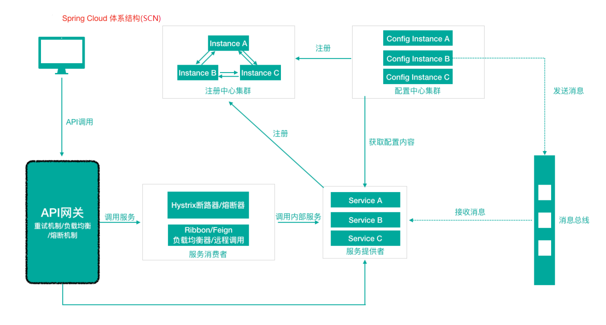

  Spring Cloud中的各组件协同⼯作，才能够⽀持⼀个完整的微服务架构。⽐如

  - 注册中⼼负责服务的注册与发现，很好将各服务连接起来

  - API⽹关负责转发所有外来的请求

  - 断路器负责监控服务之间的调⽤情况，连续多次失败进⾏熔断保护。

  - 配置中⼼提供了统⼀的配置信息管理服务,可以实时的通知各个服务获取最新的配置信息

### 2.4、Spring Cloud 与 Dubbo 对⽐

Dubbo是阿⾥巴巴公司开源的⼀个⾼性能优秀的服务框架，基于RPC调⽤，对于⽬前使⽤率较⾼的Spring Cloud Netflix来说，它是基于HTTP的，所以效率上没有

Dubbo⾼，但问题在于Dubbo体系的组件不全，不能够提供⼀站式解决⽅案，⽐如服务注册与发现需要借助于Zookeeper等实现，⽽Spring Cloud Netflix则是真

正的提供了⼀站式服务化解决⽅案，且有Spring⼤家族背景。

前些年，Dubbo使⽤率⾼于SpringCloud，但⽬前Spring Cloud在服务化/微服务解决⽅案中已经有了⾮常好的发展趋势。

### 2.5、Spring Cloud 与 Spring Boot 的关系

Spring Cloud 只是利⽤了Spring Boot 的特点，让我们能够快速的实现微服务组件开发，否则不使⽤Spring Boot的话，我们在使⽤Spring Cloud时，每⼀个组件

的相关Jar包都需要我们⾃⼰导⼊配置以及需要开发⼈员考虑兼容性等各种情况。所以Spring Boot是我们快速把Spring Cloud微服务技术应⽤起来的⼀种⽅式。

## 3、案例准备

### 3.1、案例说明

本部分我们按照普通⽅式模拟⼀个微服务之间的调⽤（后续我们将⼀步步使⽤Spring Cloud的组件对案例进⾏改造）。

拉勾App⾥有这样⼀个功能：“⾯试直通⻋”，当求职⽤户开启了⾯试直通⻋之后，会根据企业客户的招聘岗位需求进⾏双向匹配。其中有⼀个操作是：为企业⽤户

开启⼀个定时任务，根据企业录⼊的⽤⼈条件，每⽇匹配⼀定数量的应聘者“投递”到企业的资源池中去，那么系统在将匹配到的应聘者投递到资源池的时候需要先

检查：此时应聘者默认简历的状态(公开/隐藏)，如果此时默认简历的状态已经被应聘者设置为“隐藏”，那么不再执⾏“投递”操作。 “⾃动投递功能”在“⾃动投递微服

务”中，“简历状态查询功能”在“简历微服务”中，那么就涉及到“⾃动投递微服务”调⽤“简历微服务”查询简历。在这种场景下，“⾃动投递微服务”就是⼀个服务消费

者，“简历微服务”就是⼀个服务提供者。


### 3.2、案例数据库环境准备

本次课程数据库使⽤Mysql 5.7.x

```mysql
SET NAMES utf8mb4;
SET FOREIGN_KEY_CHECKS = 0;

-- ----------------------------
-- Table structure for r_resume
-- ----------------------------
DROP TABLE IF EXISTS `r_resume`;
CREATE TABLE `r_resume` (
  `id` int(11) NOT NULL AUTO_INCREMENT,
  `sex` varchar(10) DEFAULT NULL COMMENT '性别',
  `birthday` varchar(30) DEFAULT NULL COMMENT '出生日期',
  `work_year` varchar(100) DEFAULT NULL COMMENT '工作年限',
  `phone` varchar(20) DEFAULT NULL COMMENT '手机号码',
  `email` varchar(100) DEFAULT NULL COMMENT '邮箱',
  `status` varchar(80) DEFAULT NULL COMMENT '目前状态',
  `resumeName` varchar(500) DEFAULT NULL COMMENT '简历名称',
  `name` varchar(40) DEFAULT NULL,
  `createTime` datetime DEFAULT NULL COMMENT '创建日期',
  `headPic` varchar(100) DEFAULT NULL COMMENT '头像',
  `isDel` int(2) DEFAULT NULL COMMENT '是否删除 默认值0-未删除 1-已删除',
  `updateTime` datetime DEFAULT NULL COMMENT '简历更新时间',
  `userId` int(11) DEFAULT NULL COMMENT '用户ID',
  `isDefault` int(2) DEFAULT NULL COMMENT '是否为默认简历 0-默认 1-非默认',
  `highestEducation` varchar(20) DEFAULT '' COMMENT '最高学历',
  `deliverNearByConfirm` int(2) DEFAULT '0' COMMENT '投递附件简历确认 0-需要确认 1-不需要确认',
  `refuseCount` int(11) NOT NULL DEFAULT '0' COMMENT '简历被拒绝次数',
  `markCanInterviewCount` int(11) NOT NULL DEFAULT '0' COMMENT '被标记为可面试次数',
  `haveNoticeInterCount` int(11) NOT NULL DEFAULT '0' COMMENT '已通知面试次数',
  `oneWord` varchar(100) DEFAULT '' COMMENT '一句话介绍自己',
  `liveCity` varchar(100) DEFAULT '' COMMENT '居住城市',
  `resumeScore` int(3) DEFAULT NULL COMMENT '简历得分',
  `userIdentity` int(1) DEFAULT '0' COMMENT '用户身份1-学生 2-工人',
  `isOpenResume` int(1) DEFAULT '3' COMMENT '人才搜索-开放简历 0-关闭，1-打开，2-简历未达到投放标准被动关闭 3-从未设置过开放简历',
  PRIMARY KEY (`id`)
) ENGINE=InnoDB AUTO_INCREMENT=2195388 DEFAULT CHARSET=utf8;

-- ----------------------------
-- Records of r_resume
-- ----------------------------
BEGIN;
INSERT INTO `r_resume` VALUES (2195320, '女', '1990', '2年', '199999999', 'test@testtest01.com', '我目前已离职，可快速到岗', '稻壳儿的简历', 'wps', '2015-04-24 13:40:14', 'images/myresume/default_headpic.png', 0, '2015-04-24 13:40:14', 1545132, 1, '本科', 0, 0, 0, 0, '', '广州', 15, 0, 3);
INSERT INTO `r_resume` VALUES (2195321, '女', '1990', '2年', '199999999', 'test@testtest01.com', '我目前已离职，可快速到岗', '稻壳儿的简历', 'wps', '2015-04-24 14:17:54', 'images/myresume/default_headpic.png', 0, '2015-04-24 14:20:35', 1545133, 1, '本科', 0, 0, 0, 0, '', '广州', 65, 0, 3);
INSERT INTO `r_resume` VALUES (2195322, '女', '1990', '2年', '199999999', 'test@testtest01.com', '我目前已离职，可快速到岗', '稻壳儿的简历', 'wps', '2015-04-24 14:42:45', 'images/myresume/default_headpic.png', 0, '2015-04-24 14:43:34', 1545135, 1, '本科', 0, 0, 0, 0, '', '广州', 65, 0, 3);
INSERT INTO `r_resume` VALUES (2195323, '女', '1990', '2年', '199999999', 'test@testtest01.com', '我目前已离职，可快速到岗', '稻壳儿的简历', 'wps', '2015-04-24 14:48:19', 'images/myresume/default_headpic.png', 0, '2015-04-24 14:50:34', 1545136, 1, '本科', 0, 0, 0, 0, '', '广州', 65, 0, 3);
INSERT INTO `r_resume` VALUES (2195331, '女', '1990', '2年', '199999999', 'test@testtest01.com', '我目前已离职，可快速到岗', '稻壳儿的简历', 'wps', '2015-04-24 18:43:35', 'images/myresume/default_headpic.png', 0, '2015-04-24 18:44:08', 1545145, 1, '本科', 0, 0, 0, 0, '', '广州', 65, 0, 3);
INSERT INTO `r_resume` VALUES (2195333, '女', '1990', '2年', '199999999', 'test@testtest01.com', '我目前已离职，可快速到岗', '稻壳儿的简历', 'wps', '2015-04-24 19:01:13', 'images/myresume/default_headpic.png', 0, '2015-04-24 19:01:14', 1545148, 1, '本科', 0, 0, 0, 0, '', '广州', 65, 0, 3);
INSERT INTO `r_resume` VALUES (2195336, '女', '1990', '2年', '199999999', 'test@testtest01.com', '我目前已离职，可快速到岗', '稻壳儿的简历', 'wps', '2015-04-27 14:13:02', 'images/myresume/default_headpic.png', 0, '2015-04-27 14:13:02', 1545155, 1, '本科', 0, 0, 0, 0, '', '广州', 65, 0, 3);
INSERT INTO `r_resume` VALUES (2195337, '女', '1990', '2年', '199999999', 'test@testtest01.com', '我目前已离职，可快速到岗', '稻壳儿的简历', 'wps', '2015-04-27 14:36:55', 'images/myresume/default_headpic.png', 0, '2015-04-27 14:36:55', 1545158, 1, '本科', 0, 0, 0, 0, '', '广州', 65, 0, 3);
INSERT INTO `r_resume` VALUES (2195369, '女', '1990', '10年以上', '199999999', 'test@testtest01.com', '我目前已离职，可快速到岗', '稻壳儿', 'wps', '2015-05-15 18:08:19', 'images/myresume/default_headpic.png', 0, '2015-05-15 18:08:19', 1545346, 1, '本科', 0, 0, 0, 0, '', '广州', 65, 0, 3);
INSERT INTO `r_resume` VALUES (2195374, '女', '1990', '1年', '199999999', 'test@testtest01.com', '我目前正在职，正考虑换个新环境', '稻壳儿', 'wps', '2015-06-04 17:53:37', 'images/myresume/default_headpic.png', 0, '2015-06-04 17:53:39', 1545523, 1, '本科', 0, 0, 0, 0, '', '广州', 65, 0, 3);
INSERT INTO `r_resume` VALUES (2195375, '女', '1990', '1年', '199999999', 'test@testtest01.com', '我目前正在职，正考虑换个新环境', '稻壳儿', 'wps', '2015-06-04 18:11:06', 'images/myresume/default_headpic.png', 0, '2015-06-04 18:11:07', 1545524, 1, '本科', 0, 0, 0, 0, '', '广州', 65, 0, 3);
INSERT INTO `r_resume` VALUES (2195376, '女', '1990', '1年', '199999999', 'test@testtest01.com', '我目前正在职，正考虑换个新环境', '稻壳儿', 'wps', '2015-06-04 18:12:19', 'images/myresume/default_headpic.png', 0, '2015-06-04 18:12:19', 1545525, 1, '本科', 0, 0, 0, 0, '', '广州', 65, 0, 3);
INSERT INTO `r_resume` VALUES (2195377, '女', '1990', '1年', '199999999', 'test@testtest01.com', '我目前正在职，正考虑换个新环境', '稻壳儿', 'wps', '2015-06-04 18:13:28', 'images/myresume/default_headpic.png', 0, '2015-06-04 18:13:28', 1545526, 1, '本科', 0, 0, 0, 0, '', '广州', 65, 0, 3);
INSERT INTO `r_resume` VALUES (2195378, '女', '1990', '1年', '199999999', 'test@testtest01.com', '我目前正在职，正考虑换个新环境', '稻壳儿', 'wps', '2015-06-04 18:15:16', 'images/myresume/default_headpic.png', 0, '2015-06-04 18:15:16', 1545527, 1, '本科', 0, 0, 0, 0, '', '广州', 65, 0, 3);
INSERT INTO `r_resume` VALUES (2195379, '女', '1990', '1年', '199999999', 'test@testtest01.com', '我目前正在职，正考虑换个新环境', '稻壳儿', 'wps', '2015-06-04 18:23:06', 'images/myresume/default_headpic.png', 0, '2015-06-04 18:23:06', 1545528, 1, '本科', 0, 0, 0, 0, '', '广州', 65, 0, 3);
INSERT INTO `r_resume` VALUES (2195380, '女', '1990', '1年', '199999999', 'test@testtest01.com', '我目前正在职，正考虑换个新环境', '稻壳儿', 'wps', '2015-06-04 18:23:38', 'images/myresume/default_headpic.png', 0, '2015-06-04 18:23:39', 1545529, 1, '本科', 0, 0, 0, 0, '', '广州', 65, 0, 3);
INSERT INTO `r_resume` VALUES (2195381, '女', '1990', '1年', '199999999', 'test@testtest01.com', '我目前正在职，正考虑换个新环境', '稻壳儿', 'wps', '2015-06-04 18:27:33', 'images/myresume/default_headpic.png', 0, '2015-06-04 18:27:33', 1545530, 1, '本科', 0, 0, 0, 0, '', '广州', 65, 0, 3);
INSERT INTO `r_resume` VALUES (2195382, '女', '1990', '1年', '199999999', 'test@testtest01.com', '我目前正在职，正考虑换个新环境', '稻壳儿', 'wps', '2015-06-04 18:31:36', 'images/myresume/default_headpic.png', 0, '2015-06-04 18:31:39', 1545531, 1, '本科', 0, 0, 0, 0, '', '广州', 65, 0, 3);
INSERT INTO `r_resume` VALUES (2195383, '女', '1990', '1年', '199999999', 'test@testtest01.com', '我目前正在职，正考虑换个新环境', '稻壳儿', 'wps', '2015-06-04 18:36:48', 'images/myresume/default_headpic.png', 0, '2015-06-04 18:36:48', 1545532, 1, '本科', 0, 0, 0, 0, '', '广州', 65, 0, 3);
INSERT INTO `r_resume` VALUES (2195384, '女', '1990', '1年', '199999999', 'test@testtest01.com', '我目前正在职，正考虑换个新环境', '稻壳儿', 'wps', '2015-06-04 19:15:15', 'images/myresume/default_headpic.png', 0, '2015-06-04 19:15:16', 1545533, 1, '本科', 0, 0, 0, 0, '', '广州', 65, 0, 3);
INSERT INTO `r_resume` VALUES (2195385, '女', '1990', '1年', '199999999', 'test@testtest01.com', '我目前正在职，正考虑换个新环境', '稻壳儿', 'wps', '2015-06-04 19:28:53', 'images/myresume/default_headpic.png', 0, '2015-06-04 19:28:53', 1545534, 1, '本科', 0, 0, 0, 0, '', '广州', 65, 0, 3);
INSERT INTO `r_resume` VALUES (2195386, '女', '1990', '1年', '199999999', 'test@testtest01.com', '我目前正在职，正考虑换个新环境', '稻壳儿', 'wps', '2015-06-04 19:46:42', 'images/myresume/default_headpic.png', 0, '2015-06-04 19:46:45', 1545535, 1, '本科', 0, 0, 0, 0, '', '广州', 65, 0, 3);
INSERT INTO `r_resume` VALUES (2195387, '女', '1990', '1年', '199999999', 'test@testtest01.com', '我目前正在职，正考虑换个新环境', '稻壳儿', 'wps', '2015-06-04 19:48:16', 'images/myresume/default_headpic.png', 0, '2015-06-04 19:48:16', 1545536, 1, '本科', 0, 0, 0, 0, '', '广州', 65, 0, 3);
COMMIT;

SET FOREIGN_KEY_CHECKS = 1;
```

### 3.3、案例⼯程环境准备

我们基于SpringBoot来构造⼯程环境，我们的⼯程模块关系如下所示：


- **⽗⼯程lagou-parent**

  在Idea中新建module，命名为lagou-parent

  **pom.xml**

  ```xml
  <?xml version="1.0" encoding="UTF-8"?>
  <project xmlns="http://maven.apache.org/POM/4.0.0"
           xmlns:xsi="http://www.w3.org/2001/XMLSchema-instance"
           xsi:schemaLocation="http://maven.apache.org/POM/4.0.0 http://maven.apache.org/xsd/maven-4.0.0.xsd">
      <modelVersion>4.0.0</modelVersion>
  
      <groupId>com.laogou</groupId>
      <artifactId>lagou-parent</artifactId>
      <version>1.0-SNAPSHOT</version>
      <modules>
          <module>lagou-service-common</module>
          <module>lagou-service-resume</module>
          <module>lagou-service-autodeliver</module>
      </modules>
      <!--⽗⼯程打包⽅式为pom-->
      <packaging>pom</packaging>
      <!--spring boot ⽗启动器依赖-->
      <parent>
      <groupId>org.springframework.boot</groupId>
          <artifactId>spring-boot-starter-parent</artifactId>
          <version>2.3.5.RELEASE</version>
      </parent>
      <dependencies>
          <!--web依赖-->
          <dependency>
              <groupId>org.springframework.boot</groupId>
              <artifactId>spring-boot-starter-web</artifactId>
          </dependency>
          <!--⽇志依赖-->
          <dependency>
              <groupId>org.springframework.boot</groupId>
              <artifactId>spring-boot-starter-logging</artifactId>
          </dependency>
          <!--测试依赖-->
          <dependency>
              <groupId>org.springframework.boot</groupId>
              <artifactId>spring-boot-starter-test</artifactId>
              <scope>test</scope>
          </dependency>
          <!--lombok⼯具-->
          <dependency>
              <groupId>org.projectlombok</groupId>
              <artifactId>lombok</artifactId>
              <version>1.18.4</version>
              <scope>provided</scope>
          </dependency>
          <!-- Actuator可以帮助你监控和管理Spring Boot应⽤-->
          <dependency>
              <groupId>org.springframework.boot</groupId>
              <artifactId>spring-boot-starter-actuator</artifactId>
          </dependency>
          <!--热部署-->
          <dependency>
              <groupId>org.springframework.boot</groupId>
              <artifactId>spring-boot-devtools</artifactId>
              <optional>true</optional>
          </dependency>
      </dependencies>
      <build>
          <plugins>
              <!--编译插件-->
              <plugin>
                  <groupId>org.apache.maven.plugins</groupId>
                  <artifactId>maven-compiler-plugin</artifactId>
                  <configuration>
                      <source>11</source>
                      <target>11</target>
                      <encoding>utf-8</encoding>
                  </configuration>
              </plugin>
              <!--打包插件-->
              <plugin>
                  <groupId>org.springframework.boot</groupId>
                  <artifactId>spring-boot-maven-plugin</artifactId>
              </plugin>
          </plugins>
      </build>
  </project>
  ```

- **lagou-service-common**

  - pom

    ```xml
    <!--Spring Data Jpa-->
    <dependency>
        <groupId>org.springframework.boot</groupId>
        <artifactId>spring-boot-starter-data-jpa</artifactId>
    </dependency>
    <dependency>
        <groupId>mysql</groupId>
        <artifactId>mysql-connector-java</artifactId>
        <scope>runtime</scope>
    </dependency>
    ```

  - Resume

    ```java
    package com.thm.entity;
    
    import lombok.Data;
    
    import javax.persistence.Entity;
    import javax.persistence.Id;
    import javax.persistence.Table;
    @Data
    @Entity
    @Table(name = "r_resume")
    public class Resume {
        @Id
        private Long id; // 主键
        private String sex; // 性别
        private String birthday; // ⽣⽇
        private String workYear; // ⼯作年限
        private String phone; // ⼿机号
        private String email; // 邮箱
        private String status; // ⽬前状态
        private String resumeName; // 简历名称
        private String name; // 姓名
        private String createTime; // 创建时间
        private String headPic; // 头像
        private Integer isDel; //是否删除 默认值0-未删除 1-已删除
        private String updateTime; // 简历更新时间
        private Long userId; // ⽤户ID
        private Integer isDefault; // 是否为默认简历 0-默认 1-⾮默认
        private String highestEducation; // 最⾼学历
        private Integer deliverNearByConfirm; // 投递附件简历确认 0-需要确认 1-不需要确认
        private Integer refuseCount; // 简历被拒绝次数
        private Integer markCanInterviewCount; //被标记为可⾯试次数
        private Integer haveNoticeInterCount; //已通知⾯试次数
        private String oneWord; // ⼀句话介绍⾃⼰
        private String liveCity; // 居住城市
        private Integer resumeScore; // 简历得分
        private Integer userIdentity; // ⽤户身份1-学⽣ 2-⼯⼈
        private Integer isOpenResume; // ⼈才搜索-开放简历 0-关闭，1-打开，2-简历未达到投放标准被动关闭 3-从未设置过开放简历
    }
    ```

- **lagou-service-resume**

  - pom

    ```xml
    <dependency>
        <groupId>com.laogou</groupId>
        <artifactId>lagou-service-common</artifactId>
        <version>1.0-SNAPSHOT</version>
    </dependency>
    ```

  - ResumeDao

    ```java
    package com.thm.dao;
    
    import com.thm.entity.Resume;
    import org.springframework.data.jpa.repository.JpaRepository;
    public interface ResumeDao extends JpaRepository<Resume, Long> {
    }
    ```

  - ResumeService和ResumeServiceImpl

    ```java
    package com.thm.service;
    
    import com.thm.entity.Resume;
    public interface ResumeService {
        Resume findDefaultResumeByUserId(Long userId);
    }
    -----------------------------------------------------
    package com.thm.service.impl;
    
    import com.thm.dao.ResumeDao;
    import com.thm.entity.Resume;
    import com.thm.service.ResumeService;
    import org.springframework.beans.factory.annotation.Autowired;
    import org.springframework.data.domain.Example;
    import org.springframework.stereotype.Service;
    @Service
    public class ResumeServiceImpl implements ResumeService {
    
        @Autowired
        private ResumeDao resumeDao;
    
        @Override
        public Resume findDefaultResumeByUserId(Long userId) {
            Resume resume = new Resume();
            resume.setUserId(userId);
            // 查询默认简历
            resume.setIsDefault(1);
            Example<Resume> example = Example.of(resume);
            return resumeDao.findOne(example).get();
        }
    }
    ```

  - ResumeController

    ```java
    package com.thm.controller;
    
    import com.thm.service.ResumeService;
    import org.springframework.beans.factory.annotation.Autowired;
    import org.springframework.web.bind.annotation.GetMapping;
    import org.springframework.web.bind.annotation.PathVariable;
    import org.springframework.web.bind.annotation.RequestMapping;
    import org.springframework.web.bind.annotation.RestController;
    
    @RestController
    @RequestMapping("/resume")
    public class ResumeController {
        @Autowired
        private ResumeService resumeService;
        //"/resume/openstate/1545132"
        @GetMapping("/openstate/{userId}")
        public Integer findDefaultResumeState(@PathVariable Long userId) {
            return resumeService.findDefaultResumeByUserId(userId).getIsOpenResume();
        }
    }
    ```

  - ResumeApplication

    ```java
    package com.thm;
    
    import org.springframework.boot.SpringApplication;
    import org.springframework.boot.autoconfigure.SpringBootApplication;
    import org.springframework.boot.autoconfigure.domain.EntityScan;
    @SpringBootApplication
    @EntityScan("com.thm.entity")
    public class ResumeApplication {
    
        public static void main(String[] args) {
            SpringApplication.run(ResumeApplication.class,args);
        }
    }
    ```

  - application.yml

    ```yaml
    server:
      port: 8080
    Spring:
      application:
        name: lagou-service-resume
      datasource:
        driver-class-name: com.mysql.jdbc.Driver
        url: jdbc:mysql://localhost:3306/mp?serverTimezone=UTC
        username: root
        password: root
      jpa:
        database: MySQL
        show-sql: true
        hibernate:
          naming:
            physical-strategy: org.hibernate.boot.model.naming.PhysicalNamingStrategyStandardImpl #避免将驼峰命名转换为下划线命名
    
    ```

- **lagou-service-autodeliver**

  - AutoDeliverController

    ```java
    package com.thm.controller;
    
    import org.springframework.beans.factory.annotation.Autowired;
    import org.springframework.web.bind.annotation.GetMapping;
    import org.springframework.web.bind.annotation.PathVariable;
    import org.springframework.web.bind.annotation.RequestMapping;
    import org.springframework.web.bind.annotation.RestController;
    import org.springframework.web.client.RestTemplate;
    
    @RestController
    @RequestMapping("/autoDeliver")
    public class AutoDeliverController {
    
        @Autowired
        private RestTemplate restTemplate;
        @GetMapping("/checkState/{userId}")
        public Integer findResumeOpenState(@PathVariable Long userId) {
            Integer forObject =
                    restTemplate.getForObject("http://localhost:8080/resume/openstate/" + userId, Integer.class);
            System.out.println("======>>>调⽤简历微服务，获取到⽤户" + userId + "的默认简历当前状态为：" + forObject);
            return forObject;
        }
    }
    ```

  - AutoDeliverApplication

    ```java
    package com.thm;
    
    import org.springframework.boot.SpringApplication;
    import org.springframework.boot.autoconfigure.SpringBootApplication;
    import org.springframework.context.annotation.Bean;
    import org.springframework.web.client.RestTemplate;
    @SpringBootApplication
    public class AutoDeliverApplication {
        public static void main(String[] args) {
            SpringApplication.run(AutoDeliverApplication.class, args);
        }
        /**
         * 注⼊RestTemplate
         * @return
         */
        @Bean
        public RestTemplate restTemplate() {
            return new RestTemplate();
        }
    
    }
    ```

### 3.4、案例代码问题分析

我们在⾃动投递微服务中使⽤RestTemplate调⽤简历微服务的简历状态接⼝时（Restful API 接⼝）。在微服务分布式集群环境下会存在什么问题呢？怎么解决？

- 存在的问题：

  1）在服务消费者中，我们把url地址硬编码到代码中，不⽅便后期维护。

  2）服务提供者只有⼀个服务，即便服务提供者形成集群，服务消费者还需要⾃⼰实现负载均衡。

  3）在服务消费者中，不清楚服务提供者的状态。

  4）服务消费者调⽤服务提供者时候，如果出现故障能否及时发现不向⽤户抛出异常⻚⾯？

  5）RestTemplate这种请求调⽤⽅式是否还有优化空间？能不能类似于Dubbo那样玩？

  6）这么多的微服务统⼀认证如何实现？

  7）配置⽂件每次都修改好多个很麻烦！？

  8）....

- 上述分析出的问题，其实就是微服务架构中必然⾯临的⼀些问题：

  1）服务管理：⾃动注册与发现、状态监管

  2）服务负载均衡

  3）熔断

  4）远程过程调⽤

  5）⽹关拦截、路由转发

  6）统⼀认证

  7）集中式配置管理，配置信息实时⾃动更新

  ​	这些问题，Spring Cloud 体系都有解决⽅案，后续我们会逐个学习。

## 4、第⼀代（SCN） Spring Cloud 核⼼组件

说明：上⾯提到⽹关组件Zuul性能⼀般，未来将退出Spring Cloud ⽣态圈，所以我们直接讲解GateWay，在课程章节规划时，我们就把GateWay划分到第⼀代

Spring Cloud 核⼼组件这⼀部分了。


从形式上来说，Feign⼀个顶三，Feign = RestTemplate + Ribbon + Hystrix

### 4.1、关于服务注册中⼼

#### 4.1.1、服务注册中⼼概述

**注意：服务注册中⼼本质上是为了解耦服务提供者和服务消费者。**

对于任何⼀个微服务，原则上都应存在或者⽀持多个提供者（⽐如简历微服务部署多个实例），这是由微服务的分布式属性决定的。

更进⼀步，为了⽀持**弹性扩缩容特性**，⼀个微服务的提供者的数量和分布往往是动态变化的，也是⽆法预先确定的。因此，原本在单体应⽤阶段常⽤的静态LB机制

就不再适⽤了，需要引⼊额外的组件来管理微服务提供者的注册与发现，⽽这个组件就是服务注册中⼼。


分布式微服务架构中，服务注册中⼼⽤于存储服务提供者地址信息、服务发布相关的属性信息，消费者通过**主动查询和被动通知**的⽅式获取服务提供者的地址信

息，⽽不再需要通过硬编码⽅式得到提供者的地址信息。消费者只需要知道当前系统发布了那些服务，⽽不需要知道服务具体存在于什么位置，这就是透明化路由

1. 服务提供者启动

2. 服务提供者将相关服务信息主动注册到注册中⼼

3. 服务消费者获取服务注册信息：

   pull模式：服务消费者可以主动拉取可⽤的服务提供者清单

   push模式：服务消费者订阅服务（当服务提供者有变化时，注册中⼼也会主动推送更新后的服务清单给消费者)

4. 服务消费者直接调⽤服务提供者

另外，注册中⼼也需要完成服务提供者的健康监控，当发现服务提供者失效时需要及时剔除；

#### 4.1.2、主流服务中⼼对⽐

- **Zookeeper**

  Zookeeper它是⼀个分布式服务框架，是Apache Hadoop 的⼀个⼦项⽬，它主要是⽤来解决分布式应 ⽤中经常遇到的⼀些数据管理问题，如：统⼀命名服

  务、状态同步服务、集群管理、分布式应⽤配置项的管理等。简单来说**zookeeper本质=存储+监听通知**。

  Zookeeper ⽤来做服务注册中⼼，主要是因为它具有节点变更通知功能，只要客户端监听相关服务节点，服务节点的所有变更，都能及时的通知到监听客户

  端，这样作为调⽤⽅只要使⽤ Zookeeper 的客户端就能实现服务节点的订阅和变更通知功能了，⾮常⽅便。另外，Zookeeper 可⽤性也可以，因为只要半数

  以上的选举节点存活，整个集群就是可⽤的。

- **Eureka**

  由Netflix开源，并被Pivatal集成到SpringCloud体系中，它是基于 RestfulAPI⻛格开发的服务注册与发现组件。

- **Consul**

  Consul是由HashiCorp基于Go语⾔开发的⽀持多数据中⼼分布式⾼可⽤的服务发布和注册服务软件， 采⽤Raft算法保证服务的⼀致性，且⽀持健康检查。

- **Nacos**

  Nacos是⼀个更易于构建云原⽣应⽤的动态服务发现、配置管理和服务管理平台。简单来说 Nacos 就是 注册中⼼ + 配置中⼼的组合，帮助我们解决微服务开

  发必会涉及到的服务注册 与发现，服务配置，服务管理等问题。Nacos 是Spring Cloud Alibaba 核⼼组件之⼀，负责服务注册与发现，还有配置。

| 组件名    | 语言 | CAP                          | 对外暴露接⼝ |
| --------- | ---- | ---------------------------- | ------------ |
| Eureka    | Java | AP（⾃我保护机制，保证可⽤） | HTTP         |
| Consul    | Go   | CP                           | HTTP/DNS     |
| Zookeeper | Java | CP                           | 客户端       |
| Nacos     | Java | ⽀持AP/CP切换                | HTTP         |

P：分区容错性（⼀定的要满⾜的）

C：数据⼀致性

A：⾼可⽤

CAP不可能同时满⾜三个，要么是AP，要么是CP

### 4.2、Eureka服务注册中⼼

#### 4.2.1、服务注册中⼼组件 Eureka

服务注册中⼼的⼀般原理、对⽐了主流的服务注册中⼼⽅案，⽬光聚焦Eureka。

- **Eureka 基础架构**

  

- **Eureka 交互流程及原理**

  

  Eureka 包含两个组件：Eureka Server 和 Eureka Client，Eureka Client是⼀个Java客户端，⽤于简化与Eureka Server的交互；Eureka Server提供服务发现

  的能⼒，各个微服务启动时，会通过Eureka Client向Eureka Server 进⾏注册⾃⼰的信息（例如⽹络信息），Eureka Server会存储该服务的信息；

  1. 图中us-east-1c、us-east-1d，us-east-1e代表不同的区也就是不同的机房

  2. 图中每⼀个Eureka Server都是⼀个集群。

  3. 图中Application Service作为服务提供者向Eureka Server中注册服务，Eureka Server接收到注册事件会在集群和分区中进⾏数据同步，

     ApplicationClient作为消费端（服务消费者）可以从Eureka Server中获取到服务注册信息，进⾏服务调⽤。

  4. 微服务启动后，Application Service会周期性地向Eureka Server发送⼼跳（默认周期为30秒）以续约⾃⼰的信息

  5. Eureka Server在⼀定时间内没有接收到某个微服务节点的⼼跳，EurekaServer将会注销该微服务节点（默认90秒）

  6. 每个Eureka Server同时也是Eureka Client，多个Eureka Server之间通过复制的⽅式完成服务注册列表的同步

  7. Application Client会缓存Eureka Server中的信息。即使所有的Eureka Server节点都宕掉，服务消费者依然可以使⽤缓存中的信息找到服务提供者

  **Eureka通过⼼跳检测、健康检查和客户端缓存等机制，提⾼系统的灵活性、可伸缩性和可⽤性。**

#### 4.2.2、Eureka应⽤及⾼可⽤集群

1）单实例Eureka Server—>访问管理界⾯—>Eureka Server集群

2）服务提供者（简历微服务注册到集群）

3）服务消费者（⾃动投递微服务注册到集群/从Eureka Server集群获取服务信息）

4）完成调⽤

##### 4.2.2.1、搭建单例Eureka Server服务注册中⼼

lagou-cloud-eureka-server-8761

基于Maven构建SpringBoot⼯程，在SpringBoot⼯程之上搭建EurekaServer服务（lagou-cloud-eureka-server-8761)

- lagou-parent中引⼊Spring Cloud 依赖 pom.xml

  Spring Cloud 是⼀个综合的项⽬，下⾯有很多⼦项⽬，⽐如eureka⼦项⽬（版本号 1.x.x）

  ```xml
  <!--引入spring cloud 版本管理-->
  <dependencyManagement>
      <dependencies>
          <dependency>
              <groupId>org.springframework.cloud</groupId>
              <artifactId>spring-cloud-dependencies</artifactId>
              <version>Hoxton.SR9</version>
              <type>pom</type>
              <scope>import</scope>
          </dependency>
      </dependencies>
  </dependencyManagement>
  ```

- lagou-cloud-eureka-server-8761当前⼯程pom.xml中引⼊依赖

  ```xml
  <!--Eureka server依赖-->
  <dependency>
      <groupId>org.springframework.cloud</groupId>
      <artifactId>spring-cloud-starter-netflix-eureka-server</artifactId>
  </dependency>
  ```

  **注意：在⽗⼯程的pom⽂件中⼿动引⼊jaxb的jar，因为Jdk9之后默认没有加载该模块，EurekaServer使⽤到，所以需要⼿动导⼊，否则EurekaServer服**

  **务⽆法启动**

  ```xml
  <!--引⼊Jaxb，开始-->
  <dependency>
      <groupId>com.sun.xml.bind</groupId>
      <artifactId>jaxb-core</artifactId>
      <version>2.2.11</version>
  </dependency>
  <dependency>
      <groupId>javax.xml.bind</groupId>
      <artifactId>jaxb-api</artifactId>
  </dependency>
  <dependency>
      <groupId>com.sun.xml.bind</groupId>
      <artifactId>jaxb-impl</artifactId>
      <version>2.2.11</version>
  </dependency>
  <dependency>
      <groupId>org.glassfish.jaxb</groupId>
      <artifactId>jaxb-runtime</artifactId>
      <version>2.2.10-b140310.1920</version>
  </dependency>
  <dependency>
      <groupId>javax.activation</groupId>
      <artifactId>activation</artifactId>
      <version>1.1.1</version>
  </dependency>
  <!--引⼊Jaxb，结束-->
  ```

- lagou-cloud-eureka-server-8761中的配置文件application.yml

  ```yaml
  # eureka server port
  server:
    port: 8761
  spring:
    application:
      name: lagou-cloud-eureka-server # 应⽤名称，会在Eureka中作为服务的id标识（serviceId）
  eureka:
    instance:
      hostname: localhost
    client:
      service-url: # 客户端与EurekaServer交互的地址，如果是集群，也需要写其它Server的地址
        defaultZone: http://${eureka.instance.hostname}:${server.port}/eureka/ #默认的地址空间
      register-with-eureka: false # ⾃⼰就是服务不需要注册⾃⼰
      fetch-registry: false #⾃⼰就是服务不需要从Eureka Server获取服务信息,默认为true，置为false
  ```

- SpringBoot启动类，使⽤@EnableEurekaServer声明当前项⽬为EurekaServer服务

  ```java
  package com.thm;
  
  import org.springframework.boot.SpringApplication;
  import org.springframework.boot.autoconfigure.SpringBootApplication;
  import org.springframework.cloud.netflix.eureka.server.EnableEurekaServer;
  @SpringBootApplication
  //标识当前项目为Eureka Server 注册中心
  @EnableEurekaServer
  public class EurekaBootstrap8761 {
      public static void main(String[] args) {
          SpringApplication.run(EurekaBootstrap8761.class,args);
      }
  }
  ```

  执⾏启动类LagouCloudEurekaServerApplication的main函数

  访问http://127.0.0.1:8761，如果看到如下⻚⾯（Eureka注册中⼼后台），则表明EurekaServer发布成功

  

##### 4.2.2.2、Eureka应⽤及⾼可⽤集群

在互联⽹应⽤中，服务实例很少有单个的。

即使微服务消费者会缓存服务列表，但是如果EurekaServer只有⼀个实例，该实例挂掉，正好微服务消费者本地缓存列表中的服务实例也不可⽤，那么这个时候整

个系统都受影响。

在⽣产环境中，我们会配置Eureka Server集群实现⾼可⽤。Eureka Server集群之中的节点通过点对点（P2P）通信的⽅式共享服务注册表。我们开启两台 Eureka

Server 以搭建集群。


- 修改本机host属性

  由于是在个⼈计算机中进⾏测试很难模拟多主机的情况，Eureka配置server集群时需要执⾏host地址。 所以需要修改个⼈电脑中host地址

  C:\Windows\System32\drivers\etc

  ```properties
  127.0.0.1 LagouCloudEurekaServerA
  127.0.0.1 LagouCloudEurekaServerB
  ```

- lagou-cloud-eureka-server-8761中配置文件

  ```yaml
  # eureka server port
  server:
    port: 8761
  spring:
    application:
      name: lagou-cloud-eureka-server # 应⽤名称，会在Eureka中作为服务的id标识（serviceId）
  eureka:
    instance:
      hostname: LagouCloudEurekaServerA #当前Eureka实例的主机明
    client:
      service-url: # 客户端与EurekaServer交互的地址，如果是集群，也需要写其它Server的地址
        #集群模式下，defaultZone应该指向其他EurekaServer，如果存在多个server实例，逗号进行分割拼接
        defaultZone: http://LagouCloudEurekaServerB:8762/eureka/
      register-with-eureka: true # 集群模式下可以修改为true
      fetch-registry: true # 集群模式下可以修改为true,默认为true
  ```

- 复制项目lagou-cloud-eureka-server-8762，并修改配置文件

  ```yaml
  # eureka server port
  server:
    port: 8762
  spring:
    application:
      name: lagou-cloud-eureka-server # 应⽤名称，会在Eureka中作为服务的id标识（serviceId）
  eureka:
    instance:
      hostname: LagouCloudEurekaServerB #当前Eureka实例的主机明
    client:
      service-url: # 客户端与EurekaServer交互的地址，如果是集群，也需要写其它Server的地址
        #集群模式下，defaultZone应该指向其他EurekaServer，如果存在多个server实例，逗号进行分割拼接
        defaultZone: http://LagouCloudEurekaServerA:8761/eureka/
      register-with-eureka: true # 集群模式下可以修改为true
      fetch-registry: true # 集群模式下可以修改为true,默认为true
  ```

register-with-eureka 和 fetch-registry 在单节点时设置为了 false, 因为只有⼀台 Eureka Server，并不需要⾃⼰注册⾃⼰，⽽现在有了集群，可以在集群的其他节

点中注册本服务。

##### 4.2.2.3、微服务提供者—>注册到Eureka Server集群

注册简历微服务（简历服务部署两个实例，分别占⽤8080、8081端⼝）

- ⽗⼯程lagou-parent中引⼊spring-cloud-commons依赖

  ```xml
  <!--引入spring cloud公共模块-->
  <dependency>
      <groupId>org.springframework.cloud</groupId>
      <artifactId>spring-cloud-commons</artifactId>
  </dependency>
  ```

- lagou-service-resume客户端pom⽂件引⼊坐标，添加eureka client的相关坐标

  ```xml
  <!--引入eureka client-->
  <dependency>
      <groupId>org.springframework.cloud</groupId>
      <artifactId>spring-cloud-starter-netflix-eureka-client</artifactId>
  </dependency>
  ```

- 配置lagou-service-resume客户端application.yml⽂件

  在application.yml 中添加Eureka Server⾼可⽤集群的地址及相关配置

  **经验：⾃定义实例显示格式，加上版本号，便于多版本管理**

  ```yaml
  eureka:
     client:
       serviceUrl: # eureka server的路径
         #把 eureka 集群中的所有 url 都填写了进来，也可以只写⼀台，因为各个 eureka server 可以同步注册表
         defaultZone: http://lagoucloudeurekaservera:8761/eureka/,http://lagoucloudeurekaserverb:8762/eureka/
     instance:
       #使⽤ip注册，否则会使⽤主机名注册了（此处考虑到对⽼版本的兼容，新版本经过实验都是ip）
       prefer-ip-address: true
       #⾃定义实例显示格式，加上版本号，便于多版本管理，注意是ip-address，早期版本是ipAddress
       instance-id: ${spring.cloud.client.ip-address}:${spring.application.name}:${server.port}:@project.version@
  ```

- 启动类添加注解

  ```java
  package com.thm;
  
  import org.springframework.boot.SpringApplication;
  import org.springframework.boot.autoconfigure.SpringBootApplication;
  import org.springframework.boot.autoconfigure.domain.EntityScan;
  import org.springframework.cloud.client.discovery.EnableDiscoveryClient;
  import org.springframework.cloud.netflix.eureka.EnableEurekaClient;
  
  @SpringBootApplication
  @EntityScan("com.thm.entity")
  @EnableEurekaClient     //开启Eureka client （eureka独有）
  @EnableDiscoveryClient  //开启注册中心客户端（通用型，比如注册到eureka，Nacos等）
                          //说明：从spring cloud 的Edgware版本开始可以不用添加注解
  public class ResumeApplication {
  
      public static void main(String[] args) {
          SpringApplication.run(ResumeApplication.class,args);
      }
  }
  ```

  注意：

  1）从Spring Cloud Edgware版本开始，@EnableDiscoveryClient 或@EnableEurekaClient 可省略。只需加 上相关依赖，并进⾏相应配置，即可将微服务注

  册到服务发现组件上。

  2）@EnableDiscoveryClient和@EnableEurekaClient⼆者的功能是⼀样的。但是如果选⽤的是eureka服务器，那么就推荐@EnableEurekaClient，如果是其

  他的注册中⼼，那么推荐使⽤@EnableDiscoveryClient，考虑到通⽤性，后期我们可以使⽤@EnableDiscoveryClient

- 启动类执⾏，在Eureka Server后台界⾯可以看到注册的服务实例

  

##### 4.2.2.4、微服务消费者—>注册到Eureka Server集群

此处⾃动注册微服务是消费者

- lagou-service-autodeliver客户端pom⽂件引⼊坐标，添加eureka client的相关坐标

  ```xml
  <!--引入eureka client-->
  <dependency>
      <groupId>org.springframework.cloud</groupId>
      <artifactId>spring-cloud-starter-netflix-eureka-client</artifactId>
  </dependency>
  ```

- 配置lagou-service-resume客户端application.yml⽂件

  在application.yml 中添加Eureka Server⾼可⽤集群的地址及相关配置

  **经验：⾃定义实例显示格式，加上版本号，便于多版本管理**

  ```yaml
  eureka:
     client:
       serviceUrl: # eureka server的路径
         #把 eureka 集群中的所有 url 都填写了进来，也可以只写⼀台，因为各个 eureka server 可以同步注册表
         defaultZone: http://lagoucloudeurekaservera:8761/eureka/,http://lagoucloudeurekaserverb:8762/eureka/
     instance:
       #使⽤ip注册，否则会使⽤主机名注册了（此处考虑到对⽼版本的兼容，新版本经过实验都是ip）
       prefer-ip-address: true
       #⾃定义实例显示格式，加上版本号，便于多版本管理，注意是ip-address，早期版本是ipAddress
       instance-id: ${spring.cloud.client.ip-address}:${spring.application.name}:${server.port}:@project.version@
  ```

- 启动类添加注解

  ```java
  package com.thm;
  
  import org.springframework.boot.SpringApplication;
  import org.springframework.boot.autoconfigure.SpringBootApplication;
  import org.springframework.cloud.client.discovery.EnableDiscoveryClient;
  import org.springframework.context.annotation.Bean;
  import org.springframework.web.client.RestTemplate;
  
  @SpringBootApplication
  @EnableDiscoveryClient
  public class AutoDeliverApplication {
      public static void main(String[] args) {
          SpringApplication.run(AutoDeliverApplication.class, args);
      }
      /**
       * 注⼊RestTemplate
       * @return
       */
      @Bean
      public RestTemplate restTemplate() {
          return new RestTemplate();
      }
  
  }
  ```

##### 4.2.2.5、服务消费者调⽤服务提供者（通过Eureka）

```java
package com.thm.controller;

import org.springframework.beans.factory.annotation.Autowired;
import org.springframework.cloud.client.ServiceInstance;
import org.springframework.cloud.client.discovery.DiscoveryClient;
import org.springframework.web.bind.annotation.GetMapping;
import org.springframework.web.bind.annotation.PathVariable;
import org.springframework.web.bind.annotation.RequestMapping;
import org.springframework.web.bind.annotation.RestController;
import org.springframework.web.client.RestTemplate;

import java.util.List;

/**
 * @ClassNmae AutoDeliverController
 * @Description TODO
 * @Author THM
 * @Date 2021/1/23 15:21
 * @Version 1.0
 **/
@RestController
@RequestMapping("/autoDeliver")
public class AutoDeliverController {

    @Autowired
    private RestTemplate restTemplate;
    //注入服务发现客户端
    @Autowired
    private DiscoveryClient discoveryClient;
    /**
     * 从注册中心获取实例拼接请求url进行调用
     * @param userId
     * @return
     */
    @GetMapping("/checkState/{userId}")
    public Integer findResumeOpenState(@PathVariable Long userId) {
        //1、获取eureka中注册的服务实例列表
        List<ServiceInstance> serviceInstances = discoveryClient.getInstances("lagou-service-resume");
        //2、获取实例(负载均衡，暂时不考虑直接取第一个)
        ServiceInstance serviceInstance = serviceInstances.get(0);
        //3、根据实例信息拼接请求地址
        final String host = serviceInstance.getHost();
        final int port = serviceInstance.getPort();
        String remoteUrl = "http://" + host + ":" + port + "/resume/openstate/" + userId;
        System.out.println("======>>>远程服务地址为：" + remoteUrl);
        //4、消费者调用提供者
        Integer forObject =
                restTemplate.getForObject(remoteUrl, Integer.class);
        System.out.println("======>>>调⽤简历微服务，获取到⽤户" + userId + "的默认简历当前状态为：" + forObject);
        return forObject;
    }
}
```

#### 4.2.3、Eureka细节详解

##### 4.2.3.1、Eureka元数据详解

Eureka的元数据有两种：标准元数据和⾃定义元数据。

**标准元数据：主机名、IP地址、端⼝号等信息，这些信息都会被发布在服务注册表中，⽤于服务之间的调⽤。**

**⾃定义元数据：可以使⽤eureka.instance.metadata-map配置，符合KEY/VALUE的存储格式。这 些元数据可以在远程客户端中访问。**

```yaml
eureka:
   instance:
     #自定义元数据
     metadata-map:
       cluster: cl1
       test: t1
```

我们可以在程序中可以使⽤DiscoveryClient 获取指定微服务的所有元数据信息，断点查看元数据详情

```java
@SpringBootTest(classes = {AutoDeliverApplication.class})
@RunWith(SpringJUnit4ClassRunner.class)
public class AutoDeliverApplicationTest {

    @Autowired
    private DiscoveryClient discoveryClient;

    @Test
    public void test(){
        List<ServiceInstance> serviceInstances = discoveryClient.getInstances("lagou-service-resume");
        for (int i = 0; i < serviceInstances.size(); i++) {
            ServiceInstance serviceInstance =  serviceInstances.get(i);
            System.out.println(serviceInstance);
        }
    }
}
```

##### 4.2.3.2、Eureka客户端详解

服务提供者（也是Eureka客户端）要向EurekaServer注册服务，并完成服务续约等⼯作

- **服务注册详解（服务提供者）**

  1）当我们导⼊了eureka-client依赖坐标，配置Eureka服务注册中⼼地址

  2）服务在启动时会向注册中⼼发起注册请求，携带服务元数据信息

  3）Eureka注册中⼼会把服务的信息保存在Map中。

- **服务续约详解（服务提供者）**

  服务每隔30秒会向注册中⼼续约(⼼跳)⼀次（也称为报活），如果没有续约，租约在90秒后到期，然后服务会被失效。每隔30秒的续约操作我们称之为⼼跳检

  测。往往不需要我们调整这两个配置

  ```yaml
  #向Eureka服务中⼼集群注册服务
  eureka:
   instance:
   # 租约续约间隔时间，默认30秒
   lease-renewal-interval-in-seconds: 30
   # 租约到期，服务时效时间，默认值90秒,服务超过90秒没有发⽣⼼跳，EurekaServer会将服务从列表移除
   lease-expiration-duration-in-seconds: 90
  ```

- **获取服务列表详解（服务消费者）**

  每隔30秒服务会从注册中⼼中拉取⼀份服务列表，这个时间可以通过配置修改。往往不需要我们调整

  ```yaml
  #向Eureka服务中⼼集群注册服务
  eureka:
   client:
   # 每隔多久拉取⼀次服务列表
   registry-fetch-interval-seconds: 30
  ```

  1）服务消费者启动时，从 EurekaServer服务列表获取只读备份，缓存到本地

  2）每隔30秒，会重新获取并更新数据

  3）每隔30秒的时间可以通过配置eureka.client.registry-fetch-interval-seconds修 改

##### 4.2.3.3、Eureka服务端详解

- **服务下线**

  1）当服务正常关闭操作时，会发送服务下线的REST请求给EurekaServer。 

  2）服务中⼼接受到请求后，将该服务置为下线状态

- **失效剔除**

  Eureka Server会定时（间隔值是eureka.server.eviction-interval-timer-in-ms，默认60s）进⾏检查，如果发现实例在在⼀定时间（此值由客户端设置的

  eureka.instance.lease-expiration-duration-in-seconds定义，默认值为90s）内没有收到⼼跳，则会注销此实例。

- **⾃我保护**

  服务提供者 —> 注册中⼼

  定期的续约（服务提供者和注册中⼼通信），假如服务提供者和注册中⼼之间的⽹络有点问题，不代表服务提供者不可⽤，不代表服务消费者⽆法访问服务提

  供者。

  如果在15分钟内超过85%的客户端节点都没有正常的⼼跳，那么Eureka就认为客户端与注册中⼼出现了⽹络故障，Eureka Server⾃动进⼊⾃我保护机制。

  **为什么会有⾃我保护机制？**

  默认情况下，如果Eureka Server在⼀定时间内（默认90秒）没有接收到某个微服务实例的⼼跳，Eureka Server将会移除该实例。但是当⽹络分区故障发⽣

  时，微服务与Eureka Server之间⽆法正常通信，⽽微服务本身是正常运⾏的，此时不应该移除这个微服务，所以引⼊了⾃我保护机制。

  服务中⼼⻚⾯会显示如下提示信息

  

  **当处于⾃我保护模式时**

  1）不会剔除任何服务实例（可能是服务提供者和EurekaServer之间⽹络问题），保证了⼤多数服务依然可⽤。

  2）Eureka Server仍然能够接受新服务的注册和查询请求，但是不会被同步到其它节点上，保证当前节点依然可⽤，当⽹络稳定时，当前Eureka Server新的

  注册信息会被同步到其它节点中。

  3）在Eureka Server⼯程中通过eureka.server.enable-self-preservation配置可⽤关停⾃我保护，默认值是打开

  ```yml
  eureka:
   server:
    enable-self-preservation: false # 关闭⾃我保护模式（缺省为打开）
  ```

  **经验：建议⽣产环境打开⾃我保护机制**

### 4.3、Eureka核⼼源码剖析

#### 4.3.1、Eureka Server启动过程

⼊⼝：SpringCloud充分利⽤了SpringBoot的⾃动装配的特点

- **观察eureka-server的jar包，发现在META-INF下⾯有配置⽂件spring.factories**

  springboot应⽤启动时会加载EurekaServerAutoConfifiguration⾃动配置类

  

- **EurekaServerAutoConfiguration类**

  

  - **关注1、需要有⼀个marker bean，才能装配Eureka Server，那么这个marker其实是由@EnableEurekaServer注解决定的**

    也就是说只有添加了@EnableEurekaServer注解，才会有后续的动作，这是成为⼀个EurekaServer的前提

    

  - **关注2、主配置类EurekaServerAutoConfiguration**

    

    ⽽在 com.netflflix.eureka.cluster.PeerEurekaNodes#start⽅法中

    

  回到主配置类EurekaServerAutoConfiguration中

  

  回到主配置类EurekaServerAutoConfiguration中

  

  - **关注3、EurekaServerInitializerConfiguration**

    
    重点关注，进⼊org.springframework.cloud.netflix.eureka.server.EurekaServerBootstrap#contextInitialized方法

    

    重点关注initEurekaServerContext()

    

    ​	研究⼀下上图中的syncUp⽅法

    ​	

    ​	继续研究com.netflix.eureka.registry.AbstractInstanceRegistry#register（提供实例注册功能）

    ​	

    继续研究com.netflix.eureka.registry.PeerAwareInstanceRegistryImpl#openForTraffic

    

    进⼊postInit()⽅法查看

    

整个Eureka Server 启动流程完毕。

#### 4.3.2、Eureka Server服务接⼝暴露策略

在Eureka Server启动过程中主配置类注册了Jersey框架（是⼀个发布restful⻛格接⼝的框架，类似于我们的springmvc）


注⼊的Jersey细节


扫描classpath下的那些packages呢？已经定义好了


对外提供的接⼝服务，在Jersey中叫做资源


这些就是使⽤Jersey发布的供Eureka Client调⽤的Restful⻛格服务接⼝（完成服务注册、⼼跳续约等接⼝）

#### 4.3.3、Eureka Server服务注册接⼝（接受客户端注册服务）

ApplicationResource类的addInstance()⽅法中代码：registry.register(info,"true".equals(isReplication));


com.netflix.eureka.registry.PeerAwareInstanceRegistryImpl#register - 注册服务信息并同步到其它Eureka节点，AbstractInstanceRegistry#register()：注册，实例信息存储到注册表是⼀个ConcurrentHashMap


PeerAwareInstanceRegistryImpl#replicateToPeers() ：复制到Eureka对等节点


PeerAwareInstanceRegistryImpl#replicateInstanceActionsToPeers方法


#### 4.3.4、Eureka Server服务续约接⼝（接受客户端续约）

InstanceResource的renewLease⽅法中完成客户端的⼼跳（续约）处理，关键代码：registry.renew(app.getName(), id, isFromReplicaNode);


com.netflix.eureka.registry.PeerAwareInstanceRegistryImpl#renew方法


replicateInstanceActionsToPeers() 复制Instance实例操作到其它节点


#### 4.3.5、Eureka Client注册服务

启动过程：Eureka客户端在启动时也会装载很多配置类，我们通过spring-cloud-netflix-eureka-client-2.1.0.RELEASE.jar下的spring.factories⽂件可以看到加载

的配置类


引⼊jar就会被⾃动装配，分析EurekaClientAutoConfiguration类头


如果不想作为客户端，可以在配置文件中设置eureka.client.enabled=false


回到主配置类EurekaClientAutoConfiguration

思考：EurekaClient启动过程要做什么事情？？？？？？

1）读取配置⽂件

2）启动时从EurekaServer获取服务实例信息

3）注册⾃⼰到EurekaServer（addInstance） 

4）开启⼀些定时任务（⼼跳续约，刷新本地服务缓存列表）

- **读取配置⽂件**

  

- **启动时从EurekaServer获取服务实例信息**

  

  观察⽗类DiscoveryClient()

  

  在另外⼀个构造器中

  

- **注册⾃⼰到EurekaServer**

  

  DiscoveryClient#register

  

- **开启⼀些定时任务（⼼跳续约，刷新本地服务缓存列表）**

  

  刷新本地缓存

  

  ⼼跳续约定时任务

  

  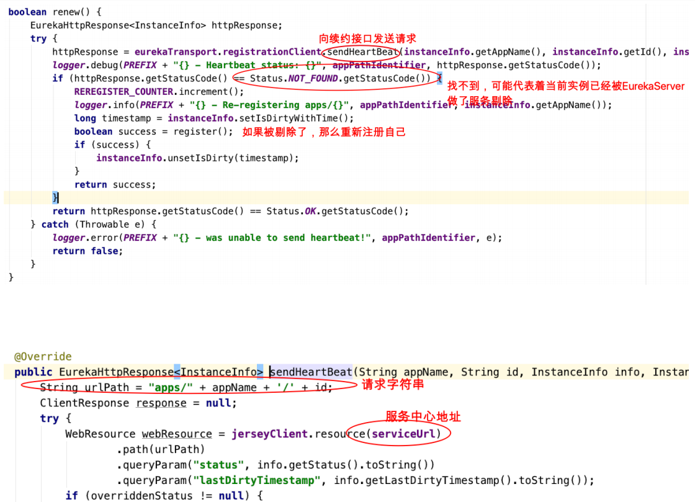

#### 4.3.6、Eureka Client下架服务

我们看com.netflix.discovery.DiscoveryClient#shutdown


### 4.4、Ribbon负载均衡

#### 4.4.1、关于负载均衡

负载均衡⼀般分为**服务器端负载均衡和客户端负载均衡**

**所谓服务器端负载均衡**，⽐如Nginx、F5这些，请求到达服务器之后由这些负载均衡器根据⼀定的算法将请求路由到⽬标服务器处理。

**所谓客户端负载均衡**，⽐如我们要说的Ribbon，服务消费者客户端会有⼀个服务器地址列表，调⽤⽅在请求前通过⼀定的负载均衡算法选择⼀个服务器进⾏访

问，负载均衡算法的执⾏是在请求客户端进⾏。

Ribbon是Netflix发布的负载均衡器。Eureka⼀般配合Ribbon进⾏使⽤，Ribbon利⽤从Eureka中读取到服务信息，在调⽤服务提供者提供的服务时，会根据⼀定

的算法进⾏负载。


#### 4.4.2、Ribbon⾼级应⽤

不需要引⼊额外的Jar坐标，因为在服务消费者中我们引⼊过eureka-client，它会引⼊Ribbon相关Jar


- 改造消费者

  代码中使⽤如下，在RestTemplate上添加对应注解即可

  ```java
  /**
   * 注⼊RestTemplate
   * @return
   */
  @Bean
  //Ribbon负载均衡
  @LoadBalanced
  public RestTemplate restTemplate() {
      return new RestTemplate();
  }
  ```

  修改调用API

  ```java
      /**
       * 从注册中心获取实例拼接请求url进行调用(使用Ribbon负载均衡)
       * @param userId
       * @return
       */
      @GetMapping("/checkState/{userId}")
      public Integer findResumeOpenState(@PathVariable Long userId) {
          //直接调用服务名称即可，有Ribbon完成负载均衡
          String remoteUrl = "http://lagou-service-resume/resume/openstate/" + userId;
          //4、消费者调用提供者
          Integer forObject = restTemplate.getForObject(remoteUrl, Integer.class);
          System.out.println("======>>>调⽤简历微服务，当前实例端口：" + forObject);
          return forObject;
      }
  ```

- 负载多个服务提供者，改造其返回值

  ```java
  @RestController
  @RequestMapping("/resume")
  public class ResumeController {
      @Autowired
      private ResumeService resumeService;
      @Value("${server.port}")
      private Integer port;
  
      //"/resume/openstate/1545132"
      @GetMapping("/openstate/{userId}")
      public Integer findDefaultResumeState(@PathVariable Long userId) {
          //return resumeService.findDefaultResumeByUserId(userId).getIsOpenResume();
          return port;
      }
  }
  ```

- 测试查看返回值

#### 4.4.3、Ribbon负载均衡策略

Ribbon内置了多种负载均衡策略，内部负责复杂均衡的顶级接⼝为com.netflix.loadbalancer.IRule ，类树如下


| 负载均衡策略                                | 描述                                                         |
| ------------------------------------------- | ------------------------------------------------------------ |
| RandomRule：随机策略                        | 如果随机到的server为null或者不可⽤的话，会while不停的循环选取 |
| BestAvailableRule：最⼩连接数策略           | 遍历serverList，选取出可⽤的且连接数最⼩的⼀个server。该算法⾥⾯有⼀个LoadBalancerStats的成员变量，会存储所有server的运⾏状况和连接数。如果选取到的server为null，那么会调⽤RoundRobinRule重新选取。1（1） 2（1） 3（1） |
| RoundRobinRule：轮询策略                    | 默认超过10次获取到的server都不可⽤，会返回⼀个空的server     |
| RetryRule：重试策略                         | ⼀定时限内循环重试。默认继承RoundRobinRule，也⽀持⾃定义注⼊，RetryRule会在每次选取之后，对选举的server进⾏判断，是否为null，是否alive，并且在500ms内会不停的选取判断。⽽RoundRobinRule失效的策略是超过10次，RandomRule是没有失效时间的概念，只要serverList没都挂。 |
| AvailabilityFilteringRule：可⽤过滤策略     | 扩展了轮询策略，会先通过默认的轮询选取⼀个server，再去判断该server是否超时可⽤，当前连接数是否超限，都成功再返回。 |
| ZoneAvoidanceRule：区域权衡策略（默认策略） | 扩展了轮询策略，继承了2个过滤器：ZoneAvoidancePredicate和AvailabilityPredicate，除了过滤超时和链接数过多的server，还会过滤掉不符合要求的zone区域⾥⾯的所有节点，AWS --ZONE 在⼀个区域/机房内的服务实例中轮询 |

**修改负载均衡策略**

在配置文件中配置

```yaml
#针对的被调⽤⽅微服务名称,不加就是全局⽣效
lagou-service-resume:
  ribbon:
   NFLoadBalancerRuleClassName: com.netflix.loadbalancer.RandomRule #负载策略调整
```

#### 4.4.4、Ribbon核⼼源码剖析

##### 4.4.4.1、Ribbon⼯作原理


**重点：Ribbon给restTemplate添加了⼀个拦截器**

思考：Ribbon在做什么：

当我们访问http://lagou-service-resume/resume/openstate/的时候，ribbon应该根据服务名lagou-service-resume获取到该服务的实例列表并按照⼀定的负载

均衡策略从实例列表中获取⼀个实例Server，并最终通过RestTemplate进⾏请求访问。

**Ribbon细节结构图（涉及到底层的⼀些组件/类的描述）**

1、获取服务实例列表 

2、从列表中选择⼀个server


图中核⼼是负载均衡管理器**LoadBalancer（总的协调者，相当于⼤脑，为了做事情，协调四肢）**，围绕它周围的多有IRule、IPing等

- IRule：是在选择实例的时候的负载均衡策略对象

- IPing：是⽤来向服务发起⼼跳检测的，通过⼼跳检测来判断该服务是否可⽤

- ServerListFilter：根据⼀些规则过滤传⼊的服务实例列表

- ServerListUpdater：定义了⼀系列的对服务列表的更新操作

##### 4.4.4.2、@LoadBalanced源码剖析

我们在RestTemplate实例上添加了⼀个@LoadBalanced注解，就可以实现负载均衡，很神奇，我们接下来分析这个注解背后的操作（负载均衡过程）

- **查看@LoadBalanced注解，那这个注解是在哪⾥被识别到的呢？**

  

- **LoadBalancerClient类（实现类RibbonLoadBalancerClient，待⽤）**

  ```java
  public interface LoadBalancerClient extends ServiceInstanceChooser
  {
   // 根据服务执⾏请求内容
   <T> T execute(String serviceId, LoadBalancerRequest<T> request)throws IOException;
   // 根据服务执⾏请求内容
   <T> T execute(String serviceId, ServiceInstance serviceInstance,LoadBalancerRequest<T> request) throws IOException;
   // 拼接请求⽅式 传统中是ip:port 现在是服务名称:port 形式
   URI reconstructURI(ServiceInstance instance, URI original);
  }
  ```

- **⽼规矩：SpringCloud充分利⽤了SpringBoot的⾃动装配特点，找spring.factories配置⽂件**

  

  **研究LoadBalancerAutoConfiguration**

  

  =========》》》LoadBalancerAutoConfiguration⾥⾯的内容剖析

  **第⼀处：注⼊resttemplate对象到集合待⽤**

  	

  **第⼆处：注⼊resttemplate定制器**

  

  **第三处：使⽤定制器给集合中的每⼀个resttemplate对象添加⼀个拦截器**

  

  **到这⾥，我们明⽩，添加了注解的RestTemplate对象会被添加⼀个拦截器LoadBalancerInterceptor，该拦截器就是后续拦截请求进⾏负载处理的。**

  **所以，下⼀步重点我们该分析拦截器LoadBalancerInterceptor------>>>intercept()⽅法**

  **==========》》》》分析LoadBalancerInterceptor.intercept()⽅法**

  

  那么？RibbonLoadBalancerClient对象是在哪⾥注⼊的===》》回到最初的⾃动配置类RibbonAutoConfiguration中

  

  负载均衡的事情执⾏原来交给了我们最初看到的RibbonLoadBalancerClient对象。⾮常核⼼的⼀个⽅法：RibbonLoadBalancerClient.execute()

  

  - **关注1、getLoadBalancer()方法**

    

    =====》》》回到主配置类RibbonAutoConfiguration

    

    

    ​	RibbonClientConfiguration中装配了⼤脑和肢⼲

    

  - **关注2、getServer()方法**

    跳转到ZoneAwareLoadBalancer#chooseServer方法

    

    ⽗类：com.netflix.loadbalancer.BaseLoadBalancer#chooseServer

    

    来到区域隔离策略的⽗类choose⽅法中com.netflix.loadbalancer.PredicateBasedRule#choose方法

    

  - **关注3、execute（）方法**

    

    

    AbstractClientHttpRequest#execute

    此处，就已经到了RestTemplate底层执⾏的代码了，由此也将验证最终请求的调⽤还是靠的RestTemplate

    

    接下来，在进⾏负载chooseServer的时候，LoadBalancer负载均衡器中已经有了serverList，那么这个serverList是什么时候被注⼊到LoadBalancer中的，它的⼀个机制⼤概是怎样的？来到RibbonClientConfiguration

    

    把⽬光聚焦到使⽤这个空对象ServerList的地⽅

    

    

    进⼊enableAndInitLearnNewServersFeature()⽅法

    

    

##### 4.4.4.3、**RandomRule**随机策略源码剖析

其他负载均衡策略自行查看。


### 4.5、Hystrix熔断器

属于⼀种容错机制

#### 4.5.1、微服务中的雪崩效应

什么是微服务中的雪崩效应呢？

微服务中，⼀个请求可能需要多个微服务接⼝才能实现，会形成复杂的调⽤链路。

如图中所示，最下游简历微服务响应时间过⻓，⼤量请求阻塞，⼤量线程不会释放，会导致服务器资源耗尽，最终导致上游服务甚⾄整个系统瘫痪。


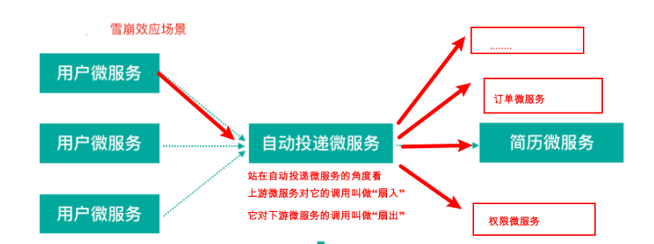

**扇⼊：代表着该微服务被调⽤的次数，扇⼊⼤，说明该模块复⽤性好**

**扇出：该微服务调⽤其他微服务的个数，扇出⼤，说明业务逻辑复杂**

​			扇⼊⼤是⼀个好事，扇出⼤不⼀定是好事

在微服务架构中，⼀个应⽤可能会有多个微服务组成，微服务之间的数据交互通过远程过程调⽤完成。这就带来⼀个问题，假设微服务A调⽤微服务B和微服务C，

微服务B和微服务C⼜调⽤其它的微服务，这就是所谓的“扇出”。如果扇出的链路上某个微服务的调⽤响应时间过⻓或者不可⽤，对微服务A的调⽤就会占⽤越来越

多的系统资源，进⽽引起系统崩溃，所谓的“雪崩效应”。

#### 4.5.2、雪崩效应解决⽅案

从可⽤性可靠性着想，为防⽌系统的整体缓慢甚⾄崩溃，采⽤的技术⼿段；

下⾯，我们介绍三种技术⼿段应对微服务中的雪崩效应，这三种⼿段都是从系统可⽤性、可靠性⻆度出发，尽量防⽌系统整体缓慢甚⾄瘫痪。

- **服务熔断**

  熔断机制是应对雪崩效应的⼀种微服务链路保护机制。我们在各种场景下都会接触到熔断这两个字。⾼压电路中，如果某个地⽅的电压过⾼，熔断器就会熔

  断，对电路进⾏保护。股票交易中，如果股票指数过⾼，也会采⽤熔断机制，暂停股票的交易。同样，在微服务架构中，熔断机制也是起着类似的作⽤。当扇

  出链路的某个微服务不可⽤或者响应时间太⻓时，熔断该节点微服务的调⽤，进⾏服务的降级，快速返回错误的响应信息。当检测到该节点微服务调⽤响应正

  常后，恢复调⽤链路。

  **注意：**

  1）服务熔断重点在**“断”**，切断对下游服务的调⽤

  2）**服务熔断和服务降级**往往是⼀起使⽤的，Hystrix就是这样

- **服务降级**

  通俗讲就是整体资源不够⽤了，先将⼀些不关紧的服务停掉（调⽤我的时候，给你返回⼀个预留的值，也叫做**兜底数据**），待渡过难关⾼峰过去，再把那些服

  务打开。

  服务降级⼀般是从整体考虑，就是当某个服务熔断之后，服务器将不再被调⽤，此刻客户端可以⾃⼰准备⼀个本地的fallback回调，返回⼀个缺省值，这样

  做，虽然服务⽔平下降，但好⽍可⽤，⽐直接挂掉要强。

- **服务限流**

  服务降级是当服务出问题或者影响到核⼼流程的性能时，暂时将服务屏蔽掉，待⾼峰或者问题解决后再打开；但是有些场景并不能⽤服务降级来解决，⽐如秒

  杀业务这样的核⼼功能，这个时候可以结合服务限流来限制这些场景的并发/请求量

  限流措施也很多，⽐如

  - 限制总并发数（⽐如数据库连接池、线程池）

  - 限制瞬时并发数（如nginx限制瞬时并发连接数）

  - 限制时间窗⼝内的平均速率（如Guava的RateLimiter、nginx的limit_req模块，限制每秒的平均速率）

  - 限制远程接⼝调⽤速率、限制MQ的消费速率等

#### 4.5.3、Hystrix简介

[来⾃官⽹]Hystrix（豪猪----->刺），宣⾔“defend your app”是由Netflix开源的⼀个延迟和容错库，⽤于隔离访问远程系统、服务或者第三⽅库，防⽌级联失败，

从⽽提升系统的可⽤性与容错性。Hystrix主要通过以下⼏点实现延迟和容错。

- **包裹请求：**使⽤HystrixCommand包裹对依赖的调⽤逻辑。 ⾃动投递微服务⽅法（@HystrixCommand 添加Hystrix控制） ——调⽤简历微服务

- **跳闸机制：**当某服务的错误率超过⼀定的阈值时，Hystrix可以跳闸，停⽌请求该服务⼀段时间。

- **资源隔离：**Hystrix为每个依赖都维护了⼀个⼩型的线程池(舱壁模式)（或者信号量）。如果该线程池已满， 发往该依赖的请求就被⽴即拒绝，⽽不是排队等

  待，从⽽加速失败判定。

- **监控：**Hystrix可以近乎实时地监控运⾏指标和配置的变化，例如成功、失败、超时、以及被拒绝 的请求等。

- **回退机制：**当请求失败、超时、被拒绝，或当断路器打开时，执⾏回退逻辑。回退逻辑由开发⼈员 ⾃⾏提供，例如返回⼀个缺省值。

- **⾃我修复：**断路器打开⼀段时间后，会⾃动进⼊“半开”状态。

#### 4.5.4、Hystrix熔断应⽤

⽬的：简历微服务⻓时间没有响应，服务消费者—>⾃动投递微服务快速失败给⽤户提示


- **服务消费者⼯程（⾃动投递微服务）中引⼊Hystrix依赖坐标（也可以添加在⽗⼯程中）**

  ```xml
  <!--熔断器Hystrix-->
  <dependency>
      <groupId>org.springframework.cloud</groupId>
      <artifactId>spring-cloud-starter-netflix-hystrix</artifactId>
  </dependency>
  ```

- **服务消费者⼯程（⾃动投递微服务）的启动类中添加熔断器开启注解@EnableCircuitBreaker**

  ```java
  @SpringBootApplication
  @EnableDiscoveryClient
  //开启Hystrix功能
  //@EnableHystrix
  //开启熔断器功能
  @EnableCircuitBreaker
  //综合注解 @SpringCloudApplication =@SpringBootApplication+@EnableDiscoveryClient+@EnableCircuitBreaker
  //@SpringCloudApplication
  public class AutoDeliverApplication {
      public static void main(String[] args) {
          SpringApplication.run(AutoDeliverApplication.class, args);
      }
      /**
       * 注⼊RestTemplate
       * @return
       */
      @Bean
      //Ribbon负载均衡
      @LoadBalanced
      public RestTemplate restTemplate() {
          return new RestTemplate();
      }
  
  }
  ```

- **定义服务降级处理⽅法，并在业务⽅法上使⽤@HystrixCommand的fallbackMethod属性关联到服务降级处理⽅法**

  ```java
  package com.thm.controller;
  
  import com.netflix.hystrix.contrib.javanica.annotation.HystrixCommand;
  import com.netflix.hystrix.contrib.javanica.annotation.HystrixProperty;
  import org.springframework.beans.factory.annotation.Autowired;
  import org.springframework.cloud.client.ServiceInstance;
  import org.springframework.cloud.client.discovery.DiscoveryClient;
  import org.springframework.web.bind.annotation.GetMapping;
  import org.springframework.web.bind.annotation.PathVariable;
  import org.springframework.web.bind.annotation.RequestMapping;
  import org.springframework.web.bind.annotation.RestController;
  import org.springframework.web.client.RestTemplate;
  
  import java.util.List;
  @RestController
  @RequestMapping("/autoDeliver")
  public class AutoDeliverController {
  
      @Autowired
      private RestTemplate restTemplate;
      //注入服务发现客户端
      @Autowired
      private DiscoveryClient discoveryClient;
  
      /*@GetMapping("/checkState/{userId}")
      public Integer findResumeOpenState(@PathVariable Long userId) {
          Integer forObject =
                  restTemplate.getForObject("http://localhost:8080/resume/openstate/" + userId, Integer.class);
          System.out.println("======>>>调⽤简历微服务，获取到⽤户" + userId + "的默认简历当前状态为：" + forObject);
          return forObject;
      }*/
  
      /**
       * 从注册中心获取实例拼接请求url进行调用
       * @param userId
       * @return
       */
  /*    @GetMapping("/checkState/{userId}")
      public Integer findResumeOpenState(@PathVariable Long userId) {
          //1、获取eureka中注册的服务实例列表
          List<ServiceInstance> serviceInstances = discoveryClient.getInstances("lagou-service-resume");
          //2、获取实例(负载均衡，暂时不考虑直接取第一个)
          ServiceInstance serviceInstance = serviceInstances.get(0);
          //3、根据实例信息拼接请求地址
          final String host = serviceInstance.getHost();
          final int port = serviceInstance.getPort();
          String remoteUrl = "http://" + host + ":" + port + "/resume/openstate/" + userId;
          System.out.println("======>>>远程服务地址为：" + remoteUrl);
          //4、消费者调用提供者
          Integer forObject =
                  restTemplate.getForObject(remoteUrl, Integer.class);
          System.out.println("======>>>调⽤简历微服务，获取到⽤户" + userId + "的默认简历当前状态为：" + forObject);
          return forObject;
      }*/
  
      /**
       * 从注册中心获取实例拼接请求url进行调用(使用Ribbon负载均衡)
       * @param userId
       * @return
       */
      @GetMapping("/checkState/{userId}")
      public Integer findResumeOpenState(@PathVariable Long userId) {
          //直接调用服务名称即可，有Ribbon完成负载均衡
          String remoteUrl = "http://lagou-service-resume/resume/openstate/" + userId;
          //4、消费者调用提供者
          Integer forObject =
                  restTemplate.getForObject(remoteUrl, Integer.class);
          System.out.println("======>>>调⽤简历微服务，当前实例端口：" + forObject);
          return forObject;
      }
  
      /**
       * 使用Hystrix熔断器，熔断
       * @param userId
       * @return
       */
      @HystrixCommand(
              // commandProperties熔断的⼀些细节属性配置
              commandProperties = {
                      // 每⼀个属性都是⼀个HystrixProperty
                      @HystrixProperty(name = "execution.isolation.thread.timeoutInMilliseconds",value = "2000")
              }
      )
      @GetMapping("/checkStateTimeOut/{userId}")
      public Integer findResumeOpenStateTimeOut(@PathVariable Long userId) {
          //直接调用服务名称即可，有Ribbon完成负载均衡
          String remoteUrl = "http://lagou-service-resume/resume/openstate/" + userId;
          //4、消费者调用提供者
          Integer forObject =
                  restTemplate.getForObject(remoteUrl, Integer.class);
          System.out.println("======>>>调⽤简历微服务，当前实例端口：" + forObject);
          return forObject;
      }
  
      /**
       * 使用Hystrix熔断器，熔断 + 服务降级
       * @param userId
       * @return
       */
      @HystrixCommand(
              // commandProperties熔断的⼀些细节属性配置
              commandProperties = {
                      // 每⼀个属性都是⼀个HystrixProperty
                      @HystrixProperty(name = "execution.isolation.thread.timeoutInMilliseconds",value = "2000")
              },
              fallbackMethod = "myFallback"
      )
      @GetMapping("/checkStateTimeOutFallback/{userId}")
      public Integer findResumeOpenStateTimeOutFallback(@PathVariable Long userId) {
          //直接调用服务名称即可，有Ribbon完成负载均衡
          String remoteUrl = "http://lagou-service-resume/resume/openstate/" + userId;
          //4、消费者调用提供者
          Integer forObject =
                  restTemplate.getForObject(remoteUrl, Integer.class);
          System.out.println("======>>>调⽤简历微服务，当前实例端口：" + forObject);
          return forObject;
      }
      /**
       * 服务降级方法，
       * 注意：该⽅法形参和返回值与原始⽅法保持⼀致
       */
      public Integer myFallback(Long userId){
          System.out.println(userId);
          return -1;
      }
      /**
       * 1）服务提供者处理超时，熔断，返回错误信息
       * 2）有可能服务提供者出现异常直接抛出异常信息
       *
       * 以上信息，都会返回到消费者这⾥，很多时候消费者服务不希望把收到异常/错误信息再抛到它的上游去
       * ⽤户微服务 — 注册微服务 — 优惠券微服务
       * 1 登记注册
       * 2 分发优惠券（并不是核⼼步骤），这⾥如果调⽤优惠券微服务返回了异常信息或者是熔断后的错误信息，这些信息如果抛给⽤户很不友好
       * 此时，我们可以返回⼀个兜底数据，预设的默认值（服务降级）
       */
  }
  ```

  **注意：**降级（兜底）⽅法必须和被降级⽅法相同的⽅法签名（相同参数列表、相同返回值）

- 可以在类上使⽤@DefaultProperties注解统⼀指定整个类中共⽤的降级（兜底）⽅法

- 服务提供者端（简历微服务）模拟请求超时（线程休眠3s），只修改8080实例，8081不修改，对⽐观察

#### 4.5.5、Hystrix舱壁模式（线程池隔离策略）


如果不进⾏任何设置，所有熔断⽅法使⽤⼀个Hystrix线程池（10个线程），那么这样的话会导致问题，这个问题并不是扇出链路微服务不可⽤导致的，⽽是我们

的线程机制导致的，如果⽅法A的请求把10个线程都⽤了，⽅法2请求处理的时候压根都没法去访问B，因为没有线程可⽤，并不是B服务不可⽤。


为了避免问题服务请求过多导致正常服务⽆法访问，Hystrix 不是采⽤增加线程数，⽽是单独的为每⼀个控制⽅法创建⼀个线程池的⽅式，这种模式叫做“舱壁模

式"，也是线程隔离的⼿段。

**我们可以使⽤⼀些⼿段查看线程情况**


发起请求，可以使⽤PostMan模拟批量请求


**Hystrix舱壁模式程序修改**

```java
    /**
     * 使用Hystrix熔断器，熔断
     * @param userId
     * @return
     */
    @HystrixCommand(
            // 线程池标识，要保持唯⼀，不唯⼀的话就共⽤了
            threadPoolKey = "findResumeOpenStateTimeOut",
            // 线程池细节属性配置
            threadPoolProperties = {
                    @HystrixProperty(name="coreSize",value = "1"), // 线程数
                    @HystrixProperty(name="maxQueueSize",value="20") // 等待队列⻓度
            },
            // commandProperties熔断的⼀些细节属性配置
            commandProperties = {
                    // 每⼀个属性都是⼀个HystrixProperty
                    @HystrixProperty(name = "execution.isolation.thread.timeoutInMilliseconds",value = "2000")
            }
    )
    @GetMapping("/checkStateTimeOut/{userId}")
    public Integer findResumeOpenStateTimeOut(@PathVariable Long userId) {
        //直接调用服务名称即可，有Ribbon完成负载均衡
        String remoteUrl = "http://lagou-service-resume/resume/openstate/" + userId;
        //4、消费者调用提供者
        Integer forObject =
                restTemplate.getForObject(remoteUrl, Integer.class);
        System.out.println("======>>>调⽤简历微服务，当前实例端口：" + forObject);
        return forObject;
    }

    /**
     * 使用Hystrix熔断器，熔断 + 服务降级
     * @param userId
     * @return
     */
    @HystrixCommand(
            // 线程池标识，要保持唯⼀，不唯⼀的话就共⽤了
            threadPoolKey = "findResumeOpenStateTimeOut",
            // 线程池细节属性配置
            threadPoolProperties = {
                    @HystrixProperty(name="coreSize",value = "2"), // 线程数
                    @HystrixProperty(name="maxQueueSize",value="20") // 等待队列⻓度
            },
            // commandProperties熔断的⼀些细节属性配置
            commandProperties = {
                    // 每⼀个属性都是⼀个HystrixProperty
                    @HystrixProperty(name = "execution.isolation.thread.timeoutInMilliseconds",value = "2000")
            },
            fallbackMethod = "myFallback"
    )
    @GetMapping("/checkStateTimeOutFallback/{userId}")
    public Integer findResumeOpenStateTimeOutFallback(@PathVariable Long userId) {
        //直接调用服务名称即可，有Ribbon完成负载均衡
        String remoteUrl = "http://lagou-service-resume/resume/openstate/" + userId;
        //4、消费者调用提供者
        Integer forObject =
                restTemplate.getForObject(remoteUrl, Integer.class);
        System.out.println("======>>>调⽤简历微服务，当前实例端口：" + forObject);
        return forObject;
    }
    /**
     * 服务降级方法，
     * 注意：该⽅法形参和返回值与原始⽅法保持⼀致
     */
    public Integer myFallback(Long userId){
        System.out.println(userId);
        return -1;
    }
```


#### 4.5.6、Hystrix⼯作流程与⾼级应⽤


1. 当调⽤出现问题时，开启⼀个时间窗（10s） 

2. 在这个时间窗内，统计调⽤次数是否达到最⼩请求数？

   如果没有达到，则重置统计信息，回到第1步

   如果达到了，则统计失败的请求数占所有请求数的百分⽐，是否达到阈值？

   如果达到，则跳闸（不再请求对应服务）

   如果没有达到，则重置统计信息，回到第1步 

3. 如果跳闸，则会开启⼀个活动窗⼝（默认5s），每隔5s，Hystrix会让⼀个请求通过,到达那个问题服务，看 是否调⽤成功，如果成功，重置断路器回到第1

   步，如果失败，回到第3步

- 针对单个方法熔断+服务降级+跳闸恢复

  ```java
    /**
     * 使用Hystrix熔断器，熔断 + 服务降级 + 跳闸恢复
     * @param userId
     * @return
     */
    @HystrixCommand(
            // 线程池标识，要保持唯⼀，不唯⼀的话就共⽤了
            threadPoolKey = "findResumeOpenStateTimeOut",
            // 线程池细节属性配置
            threadPoolProperties = {
                    @HystrixProperty(name="coreSize",value = "2"), // 线程数
                    @HystrixProperty(name="maxQueueSize",value="20") // 等待队列⻓度
            },
            // commandProperties熔断的⼀些细节属性配置
            commandProperties = {
                    // 每⼀个属性都是⼀个HystrixProperty
                    @HystrixProperty(name = "execution.isolation.thread.timeoutInMilliseconds",value = "2000"),
                    //hystrix高级配置，定制工作过程细节 8秒钟内，请求次数达到2个，并且失败率在50%以上，就跳闸，跳闸后活动窗⼝设置为3s
                    //统计时间窗口定义
                    @HystrixProperty(name = "metrics.rollingStats.timeInMilliseconds",value = "8000"),
                    //统计时间窗口内的最小请求数
                    @HystrixProperty(name = "circuitBreaker.requestVolumeThreshold",value = "2"),
                    //统计时间窗口内的错误数量百分比阀值
                    @HystrixProperty(name = "circuitBreaker.errorThresholdPercentage",value = "50"),
                    //自我修复时的活动窗口长度
                    @HystrixProperty(name = "circuitBreaker.sleepWindowInMilliseconds",value = "3000")
            },
            fallbackMethod = "myFallback"
    )
    @GetMapping("/checkStateTimeOutFallback/{userId}")
    public Integer findResumeOpenStateTimeOutFallback(@PathVariable Long userId) {
        //直接调用服务名称即可，有Ribbon完成负载均衡
        String remoteUrl = "http://lagou-service-resume/resume/openstate/" + userId;
        //4、消费者调用提供者
        Integer forObject =
                restTemplate.getForObject(remoteUrl, Integer.class);
        System.out.println("======>>>调⽤简历微服务，当前实例端口：" + forObject);
        return forObject;
    }
  ```

- 我们上述通过注解进⾏的配置也可以配置在配置⽂件中

  ```yaml
  # 配置熔断策略：
  hystrix:
    command:
       default:
          circuitBreaker:
             # 强制打开熔断器，如果该属性设置为true，强制断路器进⼊打开状态，将会拒绝所有的请求。 默认false关闭的
             forceOpen: false
             # 触发熔断错误⽐例阈值，默认值50%
             errorThresholdPercentage: 50
             # 熔断后休眠时⻓，默认值5秒
             sleepWindowInMilliseconds: 3000
             # 熔断触发最⼩请求次数，默认值是20
             requestVolumeThreshold: 2
       execution:
          isolation:
             thread:
                # 熔断超时设置，默认为1秒
                timeoutInMilliseconds: 2000
  ```

- 基于springboot的健康检查观察跳闸状态（⾃动投递微服务暴露健康检查细节）

  ```yaml
  # springboot中暴露健康检查等断点接⼝
  management:
    endpoints:
      web:
        exposure:
          include: "*"
    # 暴露健康接⼝的细节
    endpoint:
      health:
        show-details: always
  ```

  访问健康检查接⼝：http://localhost:8090/actuator/health

  hystrix正常⼯作状态

  

  跳闸状态

  

  活动窗⼝内⾃我修复

  

#### 4.5.7、Hystrix Dashboard断路监控仪表盘

正常状态是UP，跳闸是⼀种状态CIRCUIT_OPEN，可以通过/health查看，前提是⼯程中需要引⼊SpringBoot的actuator（健康监控），它提供了很多监控所需的

接⼝，可以对应⽤系统进⾏配置查看、相关功能统计等。

- 在⽗⼯程中或者需要统计的服务工程内添加依赖

  ```xml
  <dependency>
   	<groupId>org.springframework.boot</groupId>
   	<artifactId>spring-boot-starter-actuator</artifactId>
  </dependency>
  ```

  如果我们想看到Hystrix相关数据，⽐如有多少请求、多少成功、多少失败、多少降级等，那么引⼊SpringBoot健康监控之后，访问/actuator/hystrix.stream

  接⼝可以获取到监控的⽂字信息，但是不直观，所以Hystrix官⽅还提供了基于图形化的DashBoard（仪表板）监控平 台。Hystrix仪表板可以显示每个断路器

  （被@HystrixCommand注解的⽅法）的状态

  

- 新建⼀个监控服务⼯程（lagou-cloud-hystrix-dashboard-9000），导⼊依赖

  ```xml
  <!--hystrix-->
  <dependency>
      <groupId>org.springframework.cloud</groupId>
      <artifactId>spring-cloud-starter-netflix-hystrix</artifactId>
  </dependency>
  <!--hystrix 仪表盘-->
  <dependency>
      <groupId>org.springframework.cloud</groupId>
      <artifactId>spring-cloud-starter-netflix-hystrix-dashboard</artifactId>
  </dependency>
  <!--引入eureka client-->
  <dependency>
      <groupId>org.springframework.cloud</groupId>
      <artifactId>spring-cloud-starter-netflix-eureka-client</artifactId>
  </dependency>
  ```

- 启动类添加@EnableHystrixDashboard激活仪表盘

  ```java
  package com.thm;
  
  import org.springframework.boot.SpringApplication;
  import org.springframework.boot.autoconfigure.SpringBootApplication;
  import org.springframework.cloud.netflix.hystrix.dashboard.EnableHystrixDashboard;
  
  @SpringBootApplication
  @EnableHystrixDashboard // 开启hystrix dashboard
  public class HystrixDashboard9000 {
      public static void main(String[] args) {
          SpringApplication.run(HystrixDashboard9000.class,args);
      }
  }
  ```

- 配置文件application.yml

  ```yaml
  server:
    port: 9000
  spring:
    application:
      name: lagou-service-hystrix-dasboard
  eureka:
    client:
      serviceUrl: # eureka server的路径
        #把 eureka 集群中的所有 url 都填写了进来，也可以只写⼀台，因为各个 eureka server 可以同步注册表
        defaultZone: http://lagoucloudeurekaservera:8761/eureka/,http://lagoucloudeurekaserverb:8762/eureka/
    instance:
      #使⽤ip注册，否则会使⽤主机名注册了（此处考虑到对⽼版本的兼容，新版本经过实验都是ip）
      prefer-ip-address: true
      #⾃定义实例显示格式，加上版本号，便于多版本管理，注意是ip-address，早期版本是ipAddress
      instance-id: ${spring.cloud.client.ip-address}:${spring.application.name}:${server.port}:@project.version@
  ```

- 在被监测的微服务中注册监控servlet（⾃动投递微服务，监控数据就是来⾃于这个微服务）

  ```java
  @Bean
  public ServletRegistrationBean getServlet() {
      HystrixMetricsStreamServlet streamServlet = new HystrixMetricsStreamServlet();
      ServletRegistrationBean registrationBean = new ServletRegistrationBean(streamServlet);
      registrationBean.setLoadOnStartup(1);
      registrationBean.addUrlMappings("/actuator/hystrix.stream");
      registrationBean.setName("HystrixMetricsStreamServlet");
      return registrationBean;
  }
  ```

  被监控微服务发布之后，可以直接访问监控servlet，但是得到的数据并不直观，后期可以结合仪表盘更友好的展示

  

- 访问测试http://localhost:9000/hystrix

  

- 输⼊监控的微服务端点地址，展示监控的详细数据，⽐如监控服务消费者http://localhost:8090/actuator/hystrix.stream

  

  百分⽐，10s内错误请求百分⽐

  实⼼圆：

  - ⼤⼩：代表请求流量的⼤⼩，流量越⼤球越⼤

  - 颜⾊：代表请求处理的健康状态，从绿⾊到红⾊递减，绿⾊代表健康，红⾊就代表很不健康

  曲线波动图：

  - 记录了2分钟内该⽅法上流量的变化波动图，判断流量上升或者下降的趋势

#### 4.5.8、Hystrix Turbine聚合监控

之前，我们针对的是⼀个微服务实例的Hystrix数据查询分析，在微服务架构下，⼀个微服务的实例往往是多个（集群化）

⽐如⾃动投递微服务

- 实例1(hystrix) ip1:port1/actuator/hystrix.stream

- 实例2(hystrix) ip2:port2/actuator/hystrix.stream

- 实例3(hystrix) ip3:port3/actuator/hystrix.stream

按照已有的⽅法，我们就可以结合dashboard仪表盘每次输⼊⼀个监控数据流url，进去查看

⼿⼯操作能否被⾃动功能替代？Hystrix Turbine聚合（聚合各个实例上的hystrix监控数据）监控

Turbine（涡轮）

思考：微服务架构下，⼀个微服务往往部署多个实例，如果每次只能查看单个实例的监控，就需要经常切换很不⽅便，在这样的场景下，我们可以使⽤ 

HystrixTurbine 进⾏聚合监控，它可以把相关微服务的监控数据聚合在⼀起，便于查看。


- Turbine服务搭建lagou-cloud-hystrix-turbine-9001，引⼊依赖坐标

  ```xml
  <!--hystrix turbine聚合监控-->
  <dependency>
      <groupId>org.springframework.cloud</groupId>
      <artifactId>spring-cloud-starter-netflix-turbine</artifactId>
  </dependency>
  <!--引⼊eureka客户端的两个原因
          1、⽼师说过，微服务架构下的服务都尽量注册到服务中⼼去，便于统⼀管理
          2、后续在当前turbine项⽬中我们需要配置turbine聚合的服务，
          ⽐如，我们希望聚合lagou-service-autodeliver这个服务的各个实例的hystrix数据流，
          那随后我们就需要在application.yml⽂件中配置这个服务名，
          那么turbine获取服务下具体实例的数据流的时候需要ip和端⼝等实例信息，那么怎么根据服务名称获取到这些信息呢？
          当然可以从eureka服务注册中⼼获取
          -->
  <dependency>
      <groupId>org.springframework.cloud</groupId>
      <artifactId>spring-cloud-starter-netflix-eureka-client</artifactId>
  </dependency>
  ```

- 将需要进⾏Hystrix监控的多个微服务配置起来，在⼯程application.yml中开启Turbine及进⾏相关配置

  ```yaml
  server:
    port: 9001
  spring:
    application:
      name: lagou-service-hystrix-dashboard
  eureka:
    client:
      serviceUrl: # eureka server的路径
        #把 eureka 集群中的所有 url 都填写了进来，也可以只写⼀台，因为各个 eureka server 可以同步注册表
        defaultZone: http://lagoucloudeurekaservera:8761/eureka/,http://lagoucloudeurekaserverb:8762/eureka/
    instance:
      #使⽤ip注册，否则会使⽤主机名注册了（此处考虑到对⽼版本的兼容，新版本经过实验都是ip）
      prefer-ip-address: true
      #⾃定义实例显示格式，加上版本号，便于多版本管理，注意是ip-address，早期版本是ipAddress
      instance-id: ${spring.cloud.client.ip-address}:${spring.application.name}:${server.port}:@project.version@
  #turbine配置
  turbine:
      # appCofing配置需要聚合的服务名称，⽐如这⾥聚合⾃动投递微服务的hystrix监控数据
      # 如果要聚合多个微服务的监控数据，那么可以使⽤英⽂逗号拼接，⽐如 a,b,c
      appConfig: lagou-service-autodeliver
      clusterNameExpression: "'default'" # 集群默认名称
  ```

- 在当前项⽬启动类上添加注解@EnableTurbine，开启仪表盘以及Turbine聚合

  ```java
  @SpringBootApplication
  @EnableDiscoveryClient
  @EnableTurbine //开启聚合功能
  public class HystrixTurbine9001 {
      public static void main(String[] args) {
          SpringApplication.run(HystrixTurbine9001.class,args);
      }
  }
  ```

- 浏览器访问Turbine项⽬，http://localhost:9001/turbine.stream，就可以看到监控数据了

  

  我们通过dashboard的⻚⾯查看数据更直观，把刚才的地址输⼊dashboard地址栏

  

  监控⻚⾯

  

#### 4.5.9、Hystrix核⼼源码剖析

springboot装配、⾯向切⾯编程、RxJava响应式编程的知识等等，我们剖析下主体脉络。

分析⼊⼝：@EnableCircuitBreaker注解激活了熔断功能，那么该注解就是Hystrix源码追踪的⼊⼝。

- @EnableCircuitBreaker注解激活熔断器

  

- 查看EnableCircuitBreakerImportSelector类

  

- 继续关注⽗类 SpringFactoryImportSelector

  

  spring.factories⽂件内容如下

  

  会注⼊org.springframework.cloud.netflix.hystrix.HystrixCircuitBreakerConfiguration

  

  **关注切⾯：com.netflix.hystrix.contrib.javanica.aop.aspectj.HystrixCommandAspect**

  

  **重点分析环绕通知⽅法**

  

  GenericCommand中根据元数据信息重写了两个很核⼼的⽅法，⼀个是run⽅法封装了对原始⽬标⽅法的调⽤，另外⼀个是getFallBack⽅法它封装了对回退⽅

  法的调⽤

  另外，在GenericCommand的上层类构造函数中会完成资源的初始化，

  ⽐如线程池GenericCommand —>AbstractHystrixCommand—>HystrixCommand—>AbstractCommand

  

  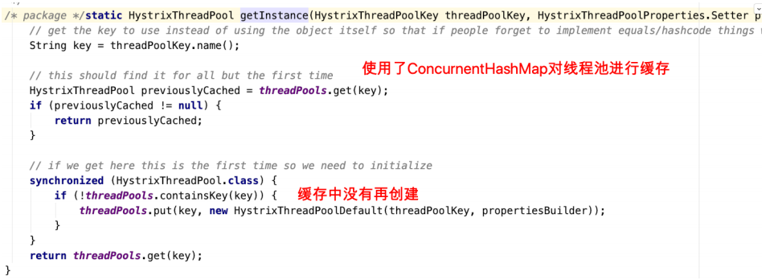

  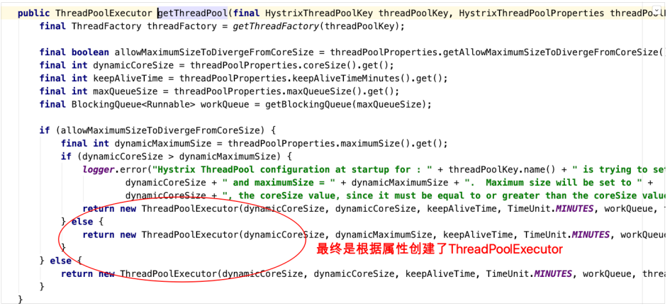

  **接下来回到环绕通知⽅法那张截图**

  

  进⼊execute执⾏这⾥

  

  

  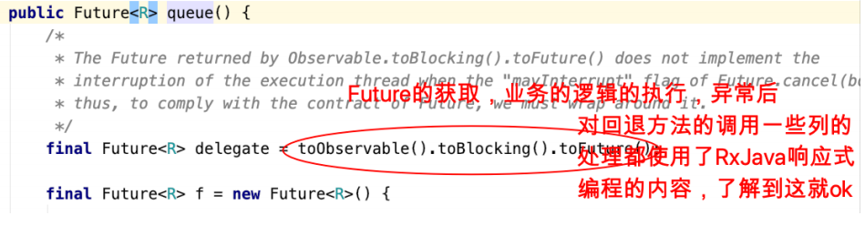

  另外，我们观察，GenericCommand⽅法中根据元数据信息等重写了run⽅法（对⽬标⽅法的调⽤），getFallback⽅法（对回退⽅法的调⽤），在RxJava处理

  过程中会完成对这两个⽅法的调⽤。

  

### 4.6、Feign远程调⽤组件

之前服务消费者调⽤服务提供者的时候使⽤RestTemplate技术


**存在不便之处**

1、拼接url 

2、restTmplate.getForObJect

这两处代码都⽐较模板化，能不能不让我我们来写这种模板化的东⻄，另外来说，拼接url⾮常的low，拼接字符串，拼接参数，很low还容易出错。

#### 4.6.1、Feign简介

**Feign是Netflix开发的⼀个轻量级RESTful的HTTP服务客户端（⽤它来发起请求，远程调⽤的）**，是以Java接⼝注解的⽅式调⽤Http请求，⽽不⽤像Java中通过封

装HTTP请求报⽂的⽅式直接调⽤，Feign被⼴泛应⽤在Spring Cloud 的解决⽅案中。类似于Dubbo，服务消费者拿到服务提供者的接⼝，然后像调⽤本地接⼝⽅

法⼀样去调⽤，实际发出的是远程的请求。

- Feign可帮助我们更加便捷，优雅的调⽤HTTP API：不需要我们去拼接url然后呢调⽤restTemplate的api，在SpringCloud中，使⽤Feign⾮常简单，创建⼀个

  接⼝（在消费者--服务调⽤⽅这⼀端），并在接⼝上添加⼀些注解，代码就完成了

- SpringCloud对Feign进⾏了增强，使Feign⽀持了SpringMVC注解（OpenFeign）

本质：封装了**Http**调⽤流程，更符合⾯向接⼝化的编程习惯，类似于**Dubbo**的服务调⽤（Dubbo的调⽤⽅式其实就是很好的⾯向接⼝编程）

#### 4.6.2、Feign配置应⽤

在服务调⽤者⼯程（消费）创建接⼝（添加注解）

（效果）Feign = RestTemplate+Ribbon+Hystrix

- 服务消费者⼯程（lagou-service-autodeliver-8093）（⾃动投递微服务）中引⼊Feign依赖（或者⽗类⼯程）

  ```xml
  <dependencies>
      <!--引入eureka client-->
      <dependency>
          <groupId>org.springframework.cloud</groupId>
          <artifactId>spring-cloud-starter-netflix-eureka-client</artifactId>
      </dependency>
      <!--引入Feign-->
      <dependency>
          <groupId>org.springframework.cloud</groupId>
          <artifactId>spring-cloud-starter-openfeign</artifactId>
      </dependency>
  </dependencies>
  ```

- 服务消费者⼯程（⾃动投递微服务）启动类使⽤注解@EnableFeignClients添加Feign⽀持

  ```java
  @SpringBootApplication
  @EnableDiscoveryClient // 服务注册和发现
  @EnableFeignClients //开启Feign客户端
  public class AutoDeliverApplication8093 {
      public static void main(String[] args) {
          SpringApplication.run(AutoDeliverApplication8093.class, args);
      }
  }
  ```

  注意：此时去掉Hystrix熔断的⽀持注解@EnableCircuitBreaker即可包括引⼊的依赖，因为Feign会⾃动引⼊

- 创建Feign接⼝

  ```java
  package com.thm.service;
  
  import org.springframework.cloud.openfeign.FeignClient;
  import org.springframework.web.bind.annotation.GetMapping;
  import org.springframework.web.bind.annotation.PathVariable;
  import org.springframework.web.bind.annotation.RequestMapping;
  
  /**
   * @ClassNmae AutoDeliverService
   * @Description TODO
   * @Author THM
   * @Date 2021/1/29 10:03
   * @Version 1.0
   **/
  /*
   * @FeignClient表明当前接口是一个Feign客户端，value指定该客户端要请求的服务名称（登记到注册中心上的服务提供者的服务名称）
   * 服务调用进行拼接：http://lagou-service-resume/resume/openstate/ + userId
   */
  @FeignClient(value = "lagou-service-resume")
  //支持spring mvc 注解
  @RequestMapping("/resume")
  public interface AutoDeliverService {
  
      /**
       * Feign会进行url拼接
       * 调用该方法就是调用本地接口方法，实际上进行的是远程调用
       * @param userId
       * @return
       */
      @GetMapping("/openstate/{userId}")
      public Integer findDefaultResumeState(@PathVariable("userId") Long userId);
  }
  ```

  注意：

  1）@FeignClient注解的name/value属性⽤于指定要调⽤的服务提供者名称，和服务提供者yml⽂件中spring.application.name保持⼀致

  2）接⼝中的接⼝⽅法，就好⽐是远程服务提供者Controller中的Hander⽅法（只不过如同本地调⽤了），那么在进⾏参数绑定的时，可以使⽤

  @PathVariable、@RequestParam、@RequestHeader等，这也是OpenFeign对SpringMVC注解的⽀持，但是需要注意value必须设置，否则会抛出异常

- 使⽤接⼝中⽅法完成远程调⽤（注⼊接⼝即可，实际注⼊的是接⼝的实现）

  ```java
  package com.thm.controller;
  
  import com.thm.service.AutoDeliverService;
  import org.springframework.beans.factory.annotation.Autowired;
  import org.springframework.web.bind.annotation.GetMapping;
  import org.springframework.web.bind.annotation.PathVariable;
  import org.springframework.web.bind.annotation.RequestMapping;
  import org.springframework.web.bind.annotation.RestController;
  
  /**
   * @ClassNmae AutoDeliverController
   * @Description TODO
   * @Author THM
   * @Date 2021/1/23 15:21
   * @Version 1.0
   **/
  @RestController
  @RequestMapping("/autoDeliver")
  public class AutoDeliverController {
      
      @Autowired
      private AutoDeliverService autoDeliverService;
      /**
       * 从注册中心获取实例拼接请求url进行调用(使用feign)
       * @param userId
       * @return
       */
      @GetMapping("/checkState/{userId}")
      public Integer findResumeOpenState(@PathVariable Long userId) {
          //使用feign进行远程调用
          Integer defaultResumeState = autoDeliverService.findDefaultResumeState(userId);
          return defaultResumeState;
      }
  }
  ```

#### 4.6.3、Feign对负载均衡的⽀持

Feign 本身已经集成了Ribbon依赖和⾃动配置，因此我们不需要额外引⼊依赖，可以通过 ribbon.xx 来进 ⾏全局配置,也可以通过服务名.ribbon.xx 来对指定服务

进⾏细节配置配置（参考之前，此处略）

Feign默认的请求处理超时时⻓1s，有时候我们的业务确实执⾏的需要⼀定时间，那么这个时候，我们就需要调整请求处理超时时⻓，Feign⾃⼰有超时设置，如果

配置Ribbon的超时，则会以Ribbon的为准

**Ribbon设置**

```yaml
#针对的被调⽤⽅微服务名称,不加就是全局⽣效
lagou-service-resume:
  ribbon:
    #请求连接超时时间
    ConnectTimeout: 2000
    #请求处理超时时间
    ReadTimeout: 15000
    #对所有操作都进⾏重试
    OkToRetryOnAllOperations: true
    #根据如上配置，当访问到故障请求的时候，它会再尝试访问⼀次当前实例（次数由MaxAutoRetries配置），
    #如果不⾏，就换⼀个实例进⾏访问，如果还不⾏，再换⼀次实例访问（更换次数由MaxAutoRetriesNextServer配置），
    #如果依然不⾏，返回失败信息。
    MaxAutoRetries: 2 #对当前选中实例重试次数，不包括第⼀次调⽤
    MaxAutoRetriesNextServer: 2 #切换实例的重试次数
    NFLoadBalancerRuleClassName: com.netflix.loadbalancer.RoundRobinRule #负载策略调整
```

#### 4.6.4、 Feign对熔断器的⽀持

- 在Feign客户端⼯程配置⽂件（application.yml）中开启Feign对熔断器的⽀持

  ```yaml
  #针对的被调⽤⽅微服务名称,不加就是全局⽣效
  lagou-service-resume:
    ribbon:
      #请求连接超时时间
      ConnectTimeout: 2000
      #请求处理超时时间   Feign超时时间
      ReadTimeout: 15000  
      #对所有操作都进⾏重试
      OkToRetryOnAllOperations: true
      #根据如上配置，当访问到故障请求的时候，它会再尝试访问⼀次当前实例（次数由MaxAutoRetries配置），
      #如果不⾏，就换⼀个实例进⾏访问，如果还不⾏，再换⼀次实例访问（更换次数由MaxAutoRetriesNextServer配置），
      #如果依然不⾏，返回失败信息。
      MaxAutoRetries: 2 #对当前选中实例重试次数，不包括第⼀次调⽤
      MaxAutoRetriesNextServer: 2 #切换实例的重试次数
      NFLoadBalancerRuleClassName: com.netflix.loadbalancer.RoundRobinRule #负载策略调整
  # 开启Feign的熔断功能
  feign:
    hystrix:
      enabled: true
  # 开启hystrix熔断器配置
  hystrix:
    command:
      default:
        execution:
          isolation:
            thread:
              #Hystrix的超时时⻓设置
              timeoutInMilliseconds: 3000
  ```

  Feign的超时时⻓设置那其实就上⾯Ribbon的超时时⻓设置，Hystrix超时设置（就按照之前Hystrix设置的⽅式就OK了）

  **注意：**

  1）开启Hystrix之后，Feign中的⽅法都会被进⾏⼀个管理了，⼀旦出现问题就进⼊对应的回退逻辑处理

  2）针对超时这⼀点，当前有两个超时时间设置（Feign/hystrix），熔断的时候是根据这两个时间的最⼩值来进⾏的，即处理时⻓超过最短的那个超时时间了

  就熔断进⼊回退降级逻辑

- ⾃定义FallBack处理类（需要实现FeignClient接⼝）

  ```java
  package com.thm.service;
  
  import org.springframework.stereotype.Component;
  /**
   * 降级回退逻辑需要定义⼀个类，实现FeignClient接⼝，实现接⼝中的⽅法
   */
  @Component
  public class AutoDeliverFallBack implements AutoDeliverService{
      @Override
      public Integer findDefaultResumeState(Long userId) {
          return -5;
      }
  }
  ```

- 在@FeignClient注解中管理⾃定义的FallBack处理类

  ```java
  package com.thm.service;
  
  import org.springframework.cloud.openfeign.FeignClient;
  import org.springframework.web.bind.annotation.GetMapping;
  import org.springframework.web.bind.annotation.PathVariable;
  import org.springframework.web.bind.annotation.RequestMapping;
  
  /*
   * @FeignClient表明当前接口是一个Feign客户端，value指定该客户端要请求的服务名称（登记到注册中心上的服务提供者的服务名称）
   * 服务调用进行拼接：http://lagou-service-resume/resume/openstate/ + userId
   * 使⽤fallback的时候，类上的@RequestMapping的url前缀限定，改成配置在@FeignClient的path属性中
   */
  @FeignClient(value = "lagou-service-resume", fallback = AutoDeliverFallBack.class, path = "/resume")
  //支持spring mvc 注解
  //@RequestMapping("/resume")
  public interface AutoDeliverService {
  
      /**
       * Feign会进行url拼接
       * 调用该方法就是调用本地接口方法，实际上进行的是远程调用
       *
       * @param userId
       * @return
       */
      @GetMapping("/openstate/{userId}")
      public Integer findDefaultResumeState(@PathVariable("userId") Long userId);
  }
  ```

#### 4.6.5、Feign对请求压缩和响应压缩的⽀持

Feign ⽀持对请求和响应进⾏GZIP压缩，以减少通信过程中的性能损耗。通过下⾯的参数 即可开启请求与响应的压缩功能：

```yaml
feign:
  compression:
    # 开启请求压缩
    request:
      enabled: true
      # 设置压缩的数据类型，此处也是默认值
      mime-types: text/html,application/xml,application/json
      # 设置触发压缩的⼤⼩下限，此处也是默认值
      min-request-size: 2048
    response:
      # 开启响应压缩
      enabled: true
```

#### 4.6.6、Feign的⽇志级别配置

Feign是http请求客户端，类似于咱们的浏览器，它在请求和接收响应的时候，可以打印出⽐较详细的⼀些⽇志信息（响应头，状态码等等）

如果我们想看到Feign请求时的⽇志，我们可以进⾏配置，默认情况下Feign的⽇志没有开启。

- 开启Feign⽇志功能及级别，定义配置类，定义日志级别

  ```java
  package com.thm.config;
  
  import feign.Logger;
  import org.springframework.context.annotation.Bean;
  import org.springframework.context.annotation.Configuration;
  
  /**
   * @ClassNmae FeignLogConfiguration
   * @Description TODO
   * @Author THM
   * @Date 2021/1/29 11:13
   * @Version 1.0
   **/
  @Configuration
  public class FeignLogConfiguration {
      /*
       * Feign的⽇志级别（Feign请求过程信息）
       * NONE：默认的，不显示任何⽇志----性能最好
       * BASIC：仅记录请求⽅法、URL、响应状态码以及执⾏时间----⽣产问题追踪
       * HEADERS：在BASIC级别的基础上，记录请求和响应的header
       * FULL：记录请求和响应的header、body和元数据----适⽤于开发及测试环境定位问题
       */
      @Bean
      Logger.Level feignLevel() {
          return Logger.Level.FULL;
      }
  }
  ```

- 配置log⽇志级别为debug

  ```
  logging:
    level:
    # Feign⽇志只会对⽇志级别为debug的做出响应
      com.thm.service.AutoDeliverService: debug
  ```

### 4.7、Feign核⼼源码剖析

思考⼀个问题：只定义了接⼝，添加上@FeignClient，真的没有实现的话，能完成远程请求么？不能，考虑是做了代理了。

- 先断点验证⼀下这个⽅法，确实是个代理对象啊！

  

- 从@EnableFeignClients 正向切⼊

  

  

  

- 接下来，我们主要追踪下另外⼀⾏主要的代码registerFeignClients(metadata,registry);

  

  

- 注册客户端，给每⼀个客户端⽣成代理对象

  

  **所以，下⼀步，关注FeignClientFactoryBean这个⼯⼚Bean的getObject⽅法，根据经验，这个⽅法会返回我们的代理对象**

- 接下来，FeignClientFactoryBean.getObject⽅法

  

  

- org.springframework.cloud.openfeign.HystrixTargeter#target

  

  

  

- 请求进来时候，是进⼊增强逻辑的，所以接下来我们要关注增强逻辑部分，FeignInvocationHandler

  

- SynchronousMethodHandler#invoke

  

  

- AbstractLoadBalancerAwareClient#executeWithLoadBalancer()

  

- 进⼊submit⽅法，我们进⼀步就会发现使⽤Ribbon在做负载均衡了

  

  

  

- 最终请求的发起使⽤的是HttpURLConnection

  

### 4.8、GateWay⽹关组件

⽹关（翻译过来就叫做GateWay）：微服务架构中的重要组成部分

局域⽹中就有⽹关这个概念，局域⽹接收或者发送数据出去通过这个⽹关，⽐如⽤Vmware虚拟机软件搭建虚拟机集群的时候，往往我们需要选择IP段中的⼀个IP

作为⽹关地址。

我们学习的GateWay-->Spring Cloud GateWay（它只是众多⽹关解决⽅案中的⼀种）

#### 4.8.1、GateWay简介

Spring Cloud GateWay是Spring Cloud的⼀个全新项⽬，⽬标是取代Netflix Zuul，它基于Spring5.0+SpringBoot2.0+WebFlux（基于⾼性能的Reactor模式响应

式通信框架Netty，异步⾮阻塞模型）等技术开发，性能⾼于Zuul，官⽅测试，GateWay是Zuul的1.6倍，旨在为微服务架构提供⼀种简单有效的统⼀的API路由管

理⽅式。

Spring Cloud GateWay不仅提供统⼀的路由⽅式（反向代理）并且基于 Filter(定义过滤器对请求过滤，完成⼀些功能) 链的⽅式提供了⽹关基本的功能，例如：鉴

权、流量控制、熔断、路径重写、⽇志监控等。

**⽹关在架构中的位置**


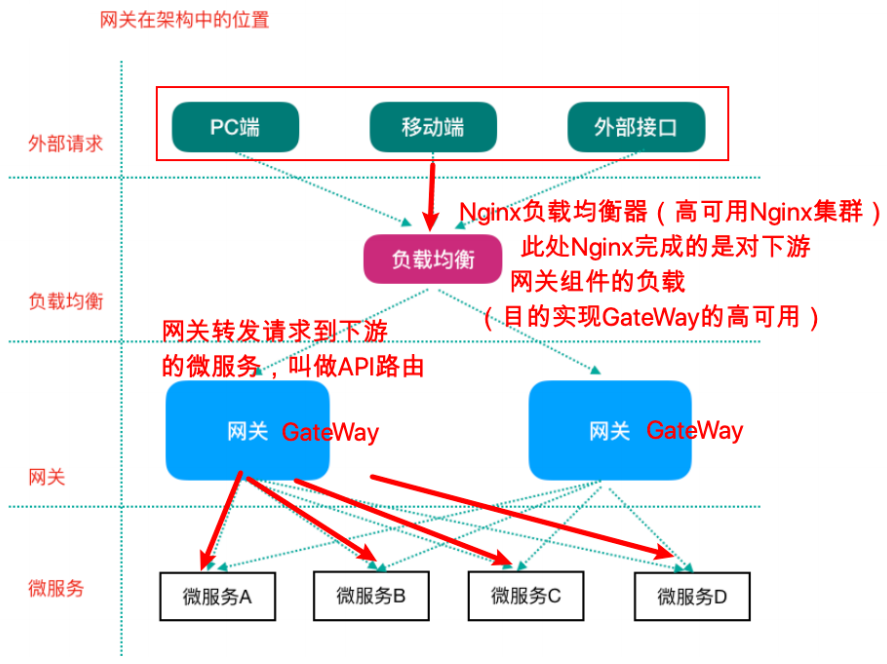

#### 4.8.2、GateWay核⼼概念

Zuul1.x 阻塞式IO 2.x 基于Netty

Spring Cloud GateWay天⽣就是异步⾮阻塞的，基于Reactor模型

⼀个请求—>⽹关根据⼀定的条件匹配—匹配成功之后可以将请求转发到指定的服务地址；⽽在这个过程中，我们可以进⾏⼀些⽐较具体的控制（限流、⽇志、⿊

⽩名单）

- 路由（route）： ⽹关最基础的部分，也是⽹关⽐较基础的⼯作单元。路由由⼀个ID、⼀个⽬标URL（最终路由到的地址）、⼀系列的断⾔（匹配条件判断）

  和Filter过滤器（精细化控制）组成。如果断⾔为true，则匹配该路由。

- 断⾔（predicates）：参考了Java8中的断⾔java.util.function.Predicate，开发⼈员可以匹配Http请求中的所有内容（包括请求头、请求参数等）（类似于

  nginx中的location匹配⼀样），如果断⾔与请求相匹配则路由。

- 过滤器（filter）：⼀个标准的Spring webFilter，使⽤过滤器，可以在请求之前或者之后执⾏业务逻辑。

**来⾃官⽹的⼀张图**


其中，Predicates断⾔就是我们的匹配条件，⽽Filter就可以理解为⼀个⽆所不能的拦截器，有了这两个元素，结合⽬标URL，就可以实现⼀个具体的路由转发。

#### 4.8.3、GateWay⼯作过程（How It Works）


来⾃官⽅的描述图

客户端向Spring Cloud GateWay发出请求，然后在GateWay Handler Mapping中找到与请求相匹配的路由，将其发送到GateWay Web Handler；Handler再通过

指定的过滤器链来将请求发送到我们实际的服务执⾏业务逻辑，然后返回。过滤器之间⽤虚线分开是因为过滤器可能会在发送代理请求之前（pre）或者之后

（post）执⾏业务逻辑。

Filter在“pre”类型过滤器中可以做参数校验、权限校验、流量监控、⽇志输出、协议转换等，在“post”类型的过滤器中可以做响应内容、响应头的修改、⽇志的输

出、流量监控等。

**GateWay核⼼逻辑：路由转发+执⾏过滤器链**

#### 4.8.4、GateWay应⽤

使⽤⽹关对⾃动投递微服务进⾏代理（添加在它的上游，相当于隐藏了具体微服务的信息，对外暴露的是⽹关）

- 创建⼯程lagou-cloud-gateway-server-9002导⼊依赖

  GateWay不需要使⽤web模块，它引⼊的是WebFlux（类似于SpringMVC）

  ```xml
  <?xml version="1.0" encoding="UTF-8"?>
  <project xmlns="http://maven.apache.org/POM/4.0.0"
           xmlns:xsi="http://www.w3.org/2001/XMLSchema-instance"
           xsi:schemaLocation="http://maven.apache.org/POM/4.0.0 http://maven.apache.org/xsd/maven-4.0.0.xsd">
      <modelVersion>4.0.0</modelVersion>
  
      <groupId>com.lagou</groupId>
      <artifactId>lagou-cloud-gateway-server-9002</artifactId>
      <version>1.0-SNAPSHOT</version>
      <!--spring boot ⽗启动器依赖-->
      <parent>
          <groupId>org.springframework.boot</groupId>
          <artifactId>spring-boot-starter-parent</artifactId>
          <version>2.3.5.RELEASE</version>
      </parent>
      <!--引入spring cloud 版本管理-->
      <dependencyManagement>
          <dependencies>
              <dependency>
                  <groupId>org.springframework.cloud</groupId>
                  <artifactId>spring-cloud-dependencies</artifactId>
                  <version>Hoxton.SR9</version>
                  <type>pom</type>
                  <scope>import</scope>
              </dependency>
          </dependencies>
      </dependencyManagement>
      <dependencies>
          <dependency>
              <groupId>org.springframework.cloud</groupId>
              <artifactId>spring-cloud-commons</artifactId>
          </dependency>
          <dependency>
              <groupId>org.springframework.cloud</groupId>
              <artifactId>spring-cloud-starter-netflix-eureka-client</artifactId>
          </dependency>
          <!--GateWay ⽹关-->
          <dependency>
              <groupId>org.springframework.cloud</groupId>
              <artifactId>spring-cloud-starter-gateway</artifactId>
          </dependency>
          <!--引⼊webflux-->
          <dependency>
              <groupId>org.springframework.boot</groupId>
              <artifactId>spring-boot-starter-webflux</artifactId>
          </dependency>
          <!--⽇志依赖-->
          <dependency>
              <groupId>org.springframework.boot</groupId>
              <artifactId>spring-boot-starter-logging</artifactId>
          </dependency>
          <!--测试依赖-->
          <dependency>
              <groupId>org.springframework.boot</groupId>
              <artifactId>spring-boot-starter-test</artifactId>
              <scope>test</scope>
          </dependency>
          <!--lombok⼯具-->
          <dependency>
              <groupId>org.projectlombok</groupId>
              <artifactId>lombok</artifactId>
              <version>1.18.4</version>
              <scope>provided</scope>
          </dependency>
          <!--引⼊Jaxb，开始-->
          <dependency>
              <groupId>com.sun.xml.bind</groupId>
              <artifactId>jaxb-core</artifactId>
              <version>2.2.11</version>
          </dependency>
          <dependency>
              <groupId>javax.xml.bind</groupId>
              <artifactId>jaxb-api</artifactId>
          </dependency>
          <dependency>
              <groupId>com.sun.xml.bind</groupId>
              <artifactId>jaxb-impl</artifactId>
              <version>2.2.11</version>
          </dependency>
          <dependency>
              <groupId>org.glassfish.jaxb</groupId>
              <artifactId>jaxb-runtime</artifactId>
              <version>2.2.10-b140310.1920</version>
          </dependency>
          <dependency>
              <groupId>javax.activation</groupId>
              <artifactId>activation</artifactId>
              <version>1.1.1</version>
          </dependency>
          <!--引⼊Jaxb，结束-->
          <!-- Actuator可以帮助你监控和管理Spring Boot应⽤-->
          <dependency>
              <groupId>org.springframework.boot</groupId>
              <artifactId>spring-boot-starter-actuator</artifactId>
          </dependency>
          <!--热部署-->
          <dependency>
              <groupId>org.springframework.boot</groupId>
              <artifactId>spring-boot-devtools</artifactId>
              <optional>true</optional>
          </dependency>
      </dependencies>
  
      <build>
          <plugins>
              <!--编译插件-->
              <plugin>
                  <groupId>org.apache.maven.plugins</groupId>
                  <artifactId>maven-compiler-plugin</artifactId>
                  <configuration>
                      <source>11</source>
                      <target>11</target>
                      <encoding>utf-8</encoding>
                  </configuration>
              </plugin>
              <!--打包插件-->
              <plugin>
                  <groupId>org.springframework.boot</groupId>
                  <artifactId>spring-boot-maven-plugin</artifactId>
              </plugin>
          </plugins>
      </build>
  </project>
  ```

  **注意：不要引⼊starter-web模块，需要引⼊web-flux**

- application.yml 配置⽂件部分内容

  ```yaml
  server:
    port: 9002
  spring:
    application:
      name: lagou-service-gateway
    cloud:
      gateway:
        routes: # 路由可以有多个
          - id: service-autodeliver-router # 我们⾃定义的路由 ID，保持唯⼀
            uri: http://127.0.0.1:8093 # ⽬标服务地址 ⾃动投递微服务（部署多实例） 动态路由：uri配置的应该是⼀个服务名称，⽽不应该是⼀个具体的服务实例的地址
            # gateway⽹关从服务注册中⼼获取实例信息然后负载后路由
            predicates: #断⾔：路由条件，Predicate 接受⼀个输⼊参数，返回⼀个布尔值结果。该接⼝包含多种默 认⽅法来将 Predicate 组合成其他复杂的逻辑（⽐如：与，或，⾮）。
              - Path=/autoDeliver/**
          - id: service-resume-router # 我们⾃定义的路由 ID，保持唯⼀
            uri: http://127.0.0.1:8081 # ⽬标服务地址
            #http://localhost:9002/resume/openstate/1545132
            #http://127.0.0.1:8081/openstate/1545132
            predicates: #断⾔：路由条件，Predicate 接受⼀个输⼊参数，返回⼀个布尔值结果。该接⼝包含多种默 认⽅法来将 Predicate 组合成其他复杂的逻辑（⽐如：与，或，⾮）。
             - Path=/resume/**
  eureka:
    client:
      serviceUrl: # eureka server的路径
        #把 eureka 集群中的所有 url 都填写了进来，也可以只写⼀台，因为各个 eureka server 可以同步注册表
        defaultZone: http://lagoucloudeurekaservera:8761/eureka/,http://lagoucloudeurekaserverb:8762/eureka/
    instance:
      #使⽤ip注册，否则会使⽤主机名注册了（此处考虑到对⽼版本的兼容，新版本经过实验都是ip）
      prefer-ip-address: true
      #⾃定义实例显示格式，加上版本号，便于多版本管理，注意是ip-address，早期版本是ipAddress
      instance-id: ${spring.cloud.client.ip-address}:${spring.application.name}:${server.port}:@project.version@
  ```

  意思是，配置了⼀个id为service-autodeliver-router 的路由规则，当向⽹关发起请求 http://localhost:9002/autoDeliver/checkAndBegin/1545132

  http://localhost:9002/resume/openstate/1545132，

- 启动类

  ```java
  package com.thm;
  
  import org.springframework.boot.SpringApplication;
  import org.springframework.boot.autoconfigure.SpringBootApplication;
  import org.springframework.cloud.client.discovery.EnableDiscoveryClient;
  
  @SpringBootApplication
  @EnableDiscoveryClient
  public class GatewayBootstrap9002 {
      public static void main(String[] args) {
          SpringApplication.run(GatewayBootstrap9002.class,args);
      }
  }
  ```

#### 4.8.5、GateWay路由规则详解

Spring Cloud GateWay 帮我们内置了很多 Predicates功能，实现了各种路由匹配规则（通过 Header、请求参数等作为条件）匹配到对应的路由。


- **时间点后匹配**

  ```yaml
  spring:
    cloud:
      gateway:
        routes:
          - id: after_route
            uri: https://example.org
            predicates:
              - After=2017-01-20T17:42:47.789-07:00[America/Denver]
  ```

- **时间点前匹配**

  ```yaml
  spring:
    application:
      name: lagou-service-hystrix-dashboard
    cloud:
      gateway:
        routes:
          - id: before_route
            uri: https://example.org
            predicates:
              - Before=2017-01-20T17:42:47.789-07:00[America/Denver]
  ```

- **时间区间匹配**

  ```yaml
  spring:
    application:
      name: lagou-service-hystrix-dashboard
    cloud:
      gateway:
        routes:
          - id: between_route
            uri: https://example.org
            predicates:
              - Between=2017-01-20T17:42:47.789-07:00[America/Denver],2017-01-21T17:42:47.789-07:00[America/Denver]
  ```

- **指定Cookie正则匹配指定值**

  ```yaml
  spring:
    application:
      name: lagou-service-hystrix-dashboard
    cloud:
      gateway:
        routes:
          - id: cookie_route
            uri: https://example.org
            predicates:
              - Cookie=chocolate, ch.p  # key:value
  ```

- **指定Header正则匹配指定值**

  ```yaml
  spring:
    application:
      name: lagou-service-hystrix-dashboard
    cloud:
      gateway:
        routes:
          - id: header_route
            uri: https://example.org
            predicates:
              - Header=X-Request-Id, \d+  # key:value
  ```

- **请求Host匹配指定值**

  ```yaml
  spring:
    application:
      name: lagou-service-hystrix-dashboard
    cloud:
      gateway:
        routes:
          - id: host_route
            uri: https://example.org
            predicates:
              -  Host=**.somehost.org,**.anotherhost.org
  ```

- **请求Method匹配指定请求⽅式**

  ```yaml
  spring:
    application:
      name: lagou-service-hystrix-dashboard
    cloud:
      gateway:
        routes:
          - id: method_route
            uri: https://example.org
            predicates:
              -  Method=GET,POST
  ```

- **请求路径正则匹配**

  ```yaml
  spring:
    application:
      name: lagou-service-hystrix-dashboard
    cloud:
      gateway:
        routes:
          - id: path_route
            uri: https://example.org
            predicates:
              -  Path=/red/{segment},/blue/{segment}
  ```

- **请求包含某参数**

  ```yaml
  spring:
    application:
      name: lagou-service-hystrix-dashboard
    cloud:
      gateway:
        routes:
          - id: query_route
            uri: https://example.org
            predicates:
              -  Query=green
  ```

- **请求包含某参数并且参数值匹配正则表达式**

  ```yaml
  spring:
    application:
      name: lagou-service-hystrix-dashboard
    cloud:
      gateway:
        routes:
          - id: query_route
            uri: https://example.org
            predicates:
              -  Query=red, gree. #key,value
  ```

- **远程地址匹配**

  ```yaml
  spring:
    application:
      name: lagou-service-hystrix-dashboard
    cloud:
      gateway:
        routes:
          - id: remoteaddr_route
            uri: https://example.org
            predicates:
              -  RemoteAddr=192.168.1.1/24   
  ```

#### 4.8.6、GateWay动态路由详解

GateWay⽀持⾃动从注册中⼼中获取服务列表并访问，即所谓的动态路由

实现步骤如下

- pom.xml中添加注册中⼼客户端依赖（因为要获取注册中⼼服务列表，eureka客户端已经引⼊）

- 动态路由配置

  ```yaml
  server:
    port: 9002
  spring:
    application:
      name: lagou-service-gateway
    cloud:
      gateway:
        routes: # 路由可以有多个
          - id: service-autodeliver-router # 我们⾃定义的路由 ID，保持唯⼀
            #uri: http://127.0.0.1:8093 # ⽬标服务地址 ⾃动投递微服务（部署多实例） 动态路由：uri配置的应该是⼀个服务名称，⽽不应该是⼀个具体的服务实例的地址
            # gateway⽹关从服务注册中⼼获取实例信息然后负载后路由
            uri: lb://lagou-service-autodeliver  #动态路由
            predicates: #断⾔：路由条件，Predicate 接受⼀个输⼊参数，返回⼀个布尔值结果。该接⼝包含多种默 认⽅法来将 Predicate 组合成其他复杂的逻辑（⽐如：与，或，⾮）。
              - Path=/autoDeliver/**
          - id: service-resume-router # 我们⾃定义的路由 ID，保持唯⼀
            #uri: http://127.0.0.1:8081 # ⽬标服务地址
            uri: lb://lagou-service-resume #动态路由
            #http://localhost:9002/resume/openstate/1545132
            #http://127.0.0.1:8081/openstate/1545132
            predicates: #断⾔：路由条件，Predicate 接受⼀个输⼊参数，返回⼀个布尔值结果。该接⼝包含多种默 认⽅法来将 Predicate 组合成其他复杂的逻辑（⽐如：与，或，⾮）。
             - Path=/resume/**
  #          filters:
  #           - StripPrefix=1
  eureka:
    client:
      serviceUrl: # eureka server的路径
        #把 eureka 集群中的所有 url 都填写了进来，也可以只写⼀台，因为各个 eureka server 可以同步注册表
        defaultZone: http://lagoucloudeurekaservera:8761/eureka/,http://lagoucloudeurekaserverb:8762/eureka/
    instance:
      #使⽤ip注册，否则会使⽤主机名注册了（此处考虑到对⽼版本的兼容，新版本经过实验都是ip）
      prefer-ip-address: true
      #⾃定义实例显示格式，加上版本号，便于多版本管理，注意是ip-address，早期版本是ipAddress
      instance-id: ${spring.cloud.client.ip-address}:${spring.application.name}:${server.port}:@project.version@
  ```

  **注意：动态路由设置时，uri以 lb: //开头（lb代表从注册中⼼获取服务），后⾯是需要转发到的服务名称**

#### 4.8.7、GateWay过滤器

##### 4.8.7.1、GateWay过滤器简介

从过滤器⽣命周期（影响时机点）的⻆度来说，主要有两个pre和post：

| ⽣命周期时机点 | 作⽤                                                         |
| -------------- | ------------------------------------------------------------ |
| pre            | 这种过滤器在请求被路由之前调⽤。我们可利⽤这种过滤器实现身份验证、在集群中选择请求的微服务、记录调试信息等。 |
| post           | 这种过滤器在路由到微服务以后执⾏。这种过滤器可⽤来为响应添加标准的 HTTP Header、收集统计信息和指标、将响应从微服务发送给客户端等。 |

从过滤器类型的⻆度，Spring Cloud GateWay的过滤器分为GateWayFilter和GlobalFilter两种

| 过滤器类型    | 影响范围               |
| ------------- | ---------------------- |
| GateWayFilter | 应⽤到单个路由上的路由 |
| GlobalFilter  | 应⽤到所有的路由上     |

如Gateway Filter可以去掉url中的占位后转发路由，⽐如

```yaml
spring:
  application:
    name: lagou-service-gateway
  cloud:
    gateway:
      routes: # 路由可以有多个
        - id: service-resume-router # 我们⾃定义的路由 ID，保持唯⼀
          #uri: http://127.0.0.1:8081 # ⽬标服务地址
          uri: lb://lagou-service-resume
          #http://localhost:9002/resume/openstate/1545132
          #http://127.0.0.1:8081/openstate/1545132
      #断⾔：路由条件，Predicate 接受⼀个输⼊参数，返回⼀个布尔值结果。该接⼝包含多种默 认⽅法来将 Predicate 组合成其他复杂的逻辑（⽐如：与，或，⾮）。
          predicates:
           - Path=/resume/**
          filters:
           - StripPrefix=1  #去掉请求前缀 位置为1的前缀路径
```

##### 4.8.7.2、⾃定义全局过滤器实现IP访问限制（⿊⽩名单）

请求过来时，判断发送请求的客户端的ip，如果在⿊名单中，拒绝访问

⾃定义GateWay全局过滤器时，我们实现Global Filter接⼝即可，通过全局过滤器可以实现⿊⽩名单、限流等功能。

```java
package com.thm.filter;

import lombok.extern.slf4j.Slf4j;
import org.springframework.cloud.gateway.filter.GatewayFilterChain;
import org.springframework.cloud.gateway.filter.GlobalFilter;
import org.springframework.core.Ordered;
import org.springframework.core.io.buffer.DataBuffer;
import org.springframework.core.io.buffer.DataBufferFactory;
import org.springframework.http.HttpStatus;
import org.springframework.http.server.reactive.ServerHttpRequest;
import org.springframework.http.server.reactive.ServerHttpResponse;
import org.springframework.stereotype.Component;
import org.springframework.web.server.ServerWebExchange;
import reactor.core.publisher.Mono;

import java.util.Arrays;
import java.util.List;
/**
 * 定义全局过滤器，会对所有路由⽣效
 */
@Slf4j
@Component // 让容器扫描到，等同于注册了
public class BlackListFilter implements GlobalFilter, Ordered {

    //模拟本机地址，本机获取是IPV6的地址
    private List<String> blackList = Arrays.asList("0:0:0:0:0:0:0:1");

    /**
     * 过滤器核⼼⽅法
     * @param exchange 封装了request和response对象的上下⽂
     * @param chain ⽹关过滤器链（包含全局过滤器和单路由过滤器）
     * @return
     */
    @Override
    public Mono<Void> filter(ServerWebExchange exchange, GatewayFilterChain chain) {
        // 思路：获取客户端ip，判断是否在⿊名单中，在的话就拒绝访问，不在的话就放⾏
        // 从上下⽂中取出request和response对象
        ServerHttpRequest request = exchange.getRequest();
        ServerHttpResponse response = exchange.getResponse();
        //获取远程地址
        String clientIp = request.getRemoteAddress().getHostString();
        //判断是否在黑名单中
        if (blackList.contains(clientIp)){
            log.debug("=====>IP:" + clientIp + " 在⿊名单中，将被拒绝访问！");
            //设置相应状态码
            response.setStatusCode(HttpStatus.UNAUTHORIZED);
            //封装返回参数
            DataBufferFactory dataBufferFactory = response.bufferFactory();
            String data = "Request be denied!";
            final DataBuffer wrap = dataBufferFactory.wrap(data.getBytes());
            return response.writeWith(Mono.just(wrap));
        }
        //放行执行过滤器链
        return chain.filter(exchange);
    }

    /**
     * 返回值表示当前过滤器的顺序(优先级)，数值越⼩，优先级越⾼
     * @return
     */
    @Override
    public int getOrder() {
        return 0;
    }
}
```

#### 4.8.8、GateWay⾼可⽤

⽹关作为⾮常核⼼的⼀个部件，如果挂掉，那么所有请求都可能⽆法路由处理，因此我们需要做GateWay的⾼可⽤。

**GateWay的⾼可⽤很简单：可以启动多个GateWay实例来实现⾼可⽤，在GateWay的上游使⽤Nginx等负载均衡设备进⾏负载转发以达到⾼可⽤的⽬的。**

启动多个GateWay实例（假如说两个，⼀个端⼝9002，⼀个端⼝9003），剩下的就是使⽤Nginx等完成负载代理即可。示例如下：

```nginx
#配置多个GateWay实例
upstream gateway {
 server 127.0.0.1:9002;
 server 127.0.0.1:9003;
}
location / {
 proxy_pass http://gateway;
}
```

### 4.9、Spring Cloud Config 分布式配置中⼼

#### 4.9.1、分布式配置中⼼应⽤场景

往往，我们使⽤配置⽂件管理⼀些配置信息，⽐如application.yml

**单体应⽤架构**，配置信息的管理、维护并不会显得特别麻烦，⼿动操作就可以，因为就⼀个⼯程；

**微服务架构，**因为我们的分布式集群环境中可能有很多个微服务，我们不可能⼀个⼀个去修改配置然后重启⽣效，在⼀定场景下我们还需要在**运⾏期间动态调整**配

置信息，⽐如：根据各个微服务的负载情况，动态调整数据源连接池⼤⼩，我们希望配置内容发⽣变化的时候，微服务可以⾃动更新。

场景总结如下：

- 集中配置管理，⼀个微服务架构中可能有成百上千个微服务，所以集中配置管理是很重要的（⼀次修改、到处⽣效）

- 不同环境不同配置，⽐如数据源配置在不同环境（开发dev,测试test,⽣产prod）中是不同的

- 运⾏期间可动态调整。例如，可根据各个微服务的负载情况，动态调整数据源连接池⼤⼩等配置修改后可⾃动更新

- 如配置内容发⽣变化，微服务可以⾃动更新配置

那么，我们就需要对配置⽂件进⾏**集中式管理**，这也是分布式配置中⼼的作⽤。

#### 4.9.2、Spring Cloud Config

##### 4.9.2.1、Config简介

Spring Cloud Config是⼀个分布式配置管理⽅案，包含了 Server端和 Client端两个部分。


**Server 端：**提供配置⽂件的存储、以接⼝的形式将配置⽂件的内容提供出去，通过使⽤@EnableConfigServer注解在 Spring boot 应⽤中⾮常简单的嵌⼊

**Client 端：**通过接⼝获取配置数据并初始化⾃⼰的应⽤

##### 4.9.2.2、Config分布式配置应⽤

**说明：Config Server是集中式的配置服务，⽤于集中管理应⽤程序各个环境下的配置。 默认使⽤Git存储配置⽂件内容，也可以SVN。**

⽐如，我们要对“简历微服务”的application.yml进⾏管理（区分开发环境、测试环境、⽣产环境）

- 登录码云，创建项⽬lagou-config-repo

- 上传yml配置⽂件，命名规则如下：

  {application}-{profile}.yml 或者 {application}-{profile}.properties其中，application为应⽤名称，profile指的是环境（⽤于区分开发环境，测试环境、⽣产

  环境等）

  示例：lagou-service-resume-dev.yml、lagou-service-resume-test.yml、lagou-service-resume-prod.yml

  ```yaml
  lagou:
    message: hello thm,100
  mysql:
    url: dev-http://localhost:3306/mp?serverTimezone=UTC
  ```

- 构建Config Server统⼀配置中⼼

  **新建SpringBoot⼯程（lagou-cloud-config-server-9003），引⼊依赖坐标（需要注册⾃⼰到Eureka）**

  - pom文件

    ```xml
    <dependencies>
        <!--eureka client 客户端依赖引⼊-->
        <dependency>
            <groupId>org.springframework.cloud</groupId>
            <artifactId>spring-cloud-starter-netflix-eureka-client</artifactId>
        </dependency>
        <!--config配置中⼼服务端-->
        <dependency>
            <groupId>org.springframework.cloud</groupId>
            <artifactId>spring-cloud-config-server</artifactId>
        </dependency>
    </dependencies>
    ```

  - 配置文件application.yml

    ```yaml
    server:
      port: 9003
    spring:
      application:
        name: lagou-service-config
      cloud:
        # 配置中心
        config:
          server:
            # 配置远程git仓库
            git:
              #指定仓库地址
              uri: https://gitee.com/Thmspring/lagou-config-repo.git
              #用户名
              username: 425327465@qq.com
              #密码
              password: tang826448.
              #搜索路径
              search-paths:
                - lagou-config-repo
          # 读取分支
          label: master
    # spring boot 监控
    management:
      endpoints:
        web:
          exposure:
            include: "*"
      endpoint:
        health:
          show-details: always
    # eureka注册中心相关配置
    eureka:
      client:
        serviceUrl: # eureka server的路径
          #把 eureka 集群中的所有 url 都填写了进来，也可以只写⼀台，因为各个 eureka server 可以同步注册表
          defaultZone: http://lagoucloudeurekaservera:8761/eureka/,http://lagoucloudeurekaserverb:8762/eureka/
      instance:
        #使⽤ip注册，否则会使⽤主机名注册了（此处考虑到对⽼版本的兼容，新版本经过实验都是ip）
        prefer-ip-address: true
        #⾃定义实例显示格式，加上版本号，便于多版本管理，注意是ip-address，早期版本是ipAddress
        instance-id: ${spring.cloud.client.ip-address}:${spring.application.name}:${server.port}:@project.version@
    ```

  - 启动类

    ```java
    package com.thm;
    
    import org.springframework.boot.SpringApplication;
    import org.springframework.boot.autoconfigure.SpringBootApplication;
    import org.springframework.cloud.client.discovery.EnableDiscoveryClient;
    import org.springframework.cloud.config.server.EnableConfigServer;
    @SpringBootApplication
    @EnableDiscoveryClient
    @EnableConfigServer // 开启配置服务器功能
    public class ConfigServerBootstrap9003 {
        public static void main(String[] args) {
            SpringApplication.run(ConfigServerBootstrap9003.class,args);
        }
    }
    ```

    启动项目，访问地址http://localhost:9003/master/lagou-service-resume-dev.yml，查看文件内容

- 构建Client客户端（在已有简历微服务（lagou-service-resume-8080）基础上）

  - 添加依赖

    ```xml
    <dependency>
     <groupId>org.springframework.cloud</groupId>
     <artifactId>spring-cloud-config-client</artifactId>
    </dependency>
    ```

  - 添加配置文件bootstrap.yml

    bootstrap.yml是系统级别的，优先级⽐application.yml⾼，应⽤启动时会检查这个配置⽂件，在这个配置⽂件中指定配置中⼼的服务地址，会⾃动拉取所有应⽤配置并且启⽤。（主要是把与统⼀配置中⼼连接的配置信息放到bootstrap.yml）

    注意：需要统⼀读取的配置信息，从集中配置中⼼获取

    ```yaml
    spring:
      cloud:
        # config客户端配置,和ConfigServer通信，并告知ConfigServer希望获取的配置信息在哪个⽂件中
        config:
          name: lagou-service-resume #配置⽂件名称
          profile: dev #后缀名称
          label: master #分⽀名称
          uri: http://localhost:9003 #ConfigServer配置中⼼地址
    ```

  - 添加controller调用验证

    ```java
    @RestController
    @RequestMapping("/config")
    public class ConfigController {
        /**
         * 添加config客户端后，会根据配置读取信息，相当于已经在本地加载好配置文件
         */
        @Value("${lagou.message}")
        private String lagouMessage;
        @Value(("${mysql.url}"))
        private String mysqlUrl;
    
        @GetMapping("/get/config")
        public String viewConfig(){
            return "lagouMessage=>" + lagouMessage + "\nmysqlUrl=>" + mysqlUrl;
        }
    }
    ```

##### 4.9.2.3、Config配置⼿动刷新

不⽤重启微服务，只需要⼿动的做⼀些其他的操作（访问⼀个地址/refresh）刷新，之后再访问即可

此时，客户端取到了配置中⼼的值，但当我们修改GitHub上⾯的值时，服务端（Config Server）能实时获取最新的值，但客户端（Config Client）读的是缓存⽆

法实时获取最新值。Spring Cloud已 经为我们解决了这个问题，那就是客户端使⽤post去触发refresh，获取最新数据。

- Client客户端添加依赖springboot-starter-actuator（已添加）

  ```xml
  <!-- Actuator可以帮助你监控和管理Spring Boot应⽤-->
  <dependency>
      <groupId>org.springframework.boot</groupId>
      <artifactId>spring-boot-starter-actuator</artifactId>
  </dependency>
  ```

- Client客户端bootstrap.yml中添加配置（暴露通信端点）

  ```yaml
  spring:
    cloud:
      # config客户端配置,和ConfigServer通信，并告知ConfigServer希望获取的配置信息在哪个⽂件中
      config:
        name: lagou-service-resume #配置⽂件名称
        profile: dev #后缀名称
        label: master #分⽀名称
        uri: http://localhost:9003 #ConfigServer配置中⼼地址
  # spring boot 监控
  management:
    endpoints:
      web:
        exposure:
          include: "*" #暴露所有接口
          #include： refresh  暴露指定接口
  ```

- Client客户端使⽤到配置信息的类上添加@RefreshScope

  ```java
  @RestController
  @RequestMapping("/config")
  @RefreshScope  //添加config手动刷新
  public class ConfigController {
      /**
       * 添加config客户端后，会根据配置读取信息，相当于已经在本地加载好配置文件
       */
      @Value("${lagou.message}")
      private String lagouMessage;
      @Value(("${mysql.url}"))
      private String mysqlUrl;
  
      @GetMapping("/get/config")
      public String viewConfig(){
          return "lagouMessage=>" + lagouMessage + "\nmysqlUrl=>" + mysqlUrl;
      }
  }
  ```

- ⼿动向Client客户端发起**POST请求**，http://localhost:8080/actuator/refresh，刷新配置信息

注意：⼿动刷新⽅式避免了服务重启（流程：Git改配置—>for循环脚本⼿动刷新每个微服务）
思考：可否使⽤⼴播机制，⼀次通知，处处⽣效，⽅便⼤范围配置刷新？

##### 4.9.2.4、Config配置⾃动更新

实现⼀次通知处处⽣效

拉勾内部做分布式配置，⽤的是zk（存储+通知），zk中数据变更，可以通知各个监听的客户端，客户端收到通知之后可以做出相应的操作（**内存级别的数据直接**

**⽣效，对于数据库连接信息、连接池等信息变化更新的，那么会在通知逻辑中进⾏处理，⽐如重新初始化连接池**）

在微服务架构中，我们可以结合消息总线（Bus）实现分布式配置的⾃动更新（Spring Cloud Config+Spring Cloud Bus）

- **消息总线Bus**

  所谓消息总线Bus，即我们经常会使⽤MQ消息代理构建⼀个共⽤的Topic，通过这个Topic连接各个微服务实例，MQ⼴播的消息会被所有在注册中⼼的微服务

  实例监听和消费。**换⾔之就是通过⼀个主题连接各个微服务，打通脉络。**

  Spring Cloud Bus（基于MQ的，⽀持RabbitMq/Kafka） 是Spring Cloud中的消息总线⽅案，Spring Cloud Confifig + Spring Cloud Bus 结合可以实现配置

  信息的⾃动更新。

  

- **Spring Cloud Config+Spring Cloud Bus 实现⾃动刷新**

  MQ消息代理，我们还选择使⽤RabbitMQ，ConfigServer和ConfigClient都添加都消息总线的⽀持以及与RabbitMq的连接信息

  lagou-cloud-config-server-9003\lagou-service-resume-8080\lagou-service-resume-8081

  ```xml
  <!--引入消息总线bus-->
  <dependency>
      <groupId>org.springframework.cloud</groupId>
      <artifactId>spring-cloud-starter-bus-amqp</artifactId>
  </dependency>
  ```

- 在每个项目的配置文件中添加配置

  ```yaml
  spring:
    rabbitmq:
      host: 192.168.81.100
      port: 5762
      username: guest
      password: guest
  ```

- 微服务暴露端⼝

  ```yaml
  # spring boot 监控
  management:
    endpoints:
      web:
        exposure:
          include: "*" #暴露所有接口
          #include： refresh  暴露指定接口
  ```

- 重启各个服务

  更改配置之后，向配置中⼼服务端发送post请求http://localhost:9003/actuator/bus-refresh，各个客户端配置即可⾃动刷新

  在⼴播模式下实现了⼀次请求，处处更新，如果我只想定向更新呢？

  在发起刷新请求的时候http://localhost:9003/actuator/bus-refresh/lagou-service-resume:8081

  即为最后⾯跟上要定向刷新的实例的 **服务名:端⼝号**即可

### 4.10、Spring Cloud Stream消息驱动组件

Spring Cloud Stream 消息驱动组件帮助我们更快速，更⽅便，更友好的去构建**消息驱动**微服务的

当时定时任务和消息驱动的⼀个对⽐。（消息驱动：基于消息机制做⼀些事情）

MQ：消息队列/消息中间件/消息代理，产品有很多，ActiveMQ、RabbitMQ、RocketMQ、Kafka

#### 4.10.1、Stream解决的痛点问题

MQ消息中间件⼴泛应⽤在应⽤解耦合、异步消息处理、流量削峰等场景中。

不同的MQ消息中间件内部机制包括使⽤⽅式都会有所不同，⽐如RabbitMQ中有Exchange（交换机/交换器）这⼀概念，kafka有Topic、Partition分区这些概念，

MQ消息中间件的差异性不利于我们上层的开发应⽤，当我们的系统希望从原有的RabbitMQ切换到Kafka时，我们会发现⽐较困难，很多要操作可能重来（**因为**

**应⽤程序和具体的某⼀款MQ消息中间件耦合在⼀起了**）。

Spring Cloud Stream进⾏了很好的**上层抽象**，可以让我们与具体消息中间件解耦合，屏蔽掉了底层具体MQ消息中间件的细节差异，就像Hibernate屏蔽掉了具体

数据库（Mysql/Oracle⼀样）。如此⼀来，我们学习、开发、维护MQ都会变得轻松。⽬前Spring Cloud Stream⽀持RabbitMQ和Kafka。

**本质：屏蔽掉了底层不同MQ消息中间件之间的差异，统⼀了MQ的编程模型，降低了学习、开发、维护MQ的成本。**

#### 4.10.2、Stream重要概念

Spring Cloud Stream 是⼀个构建消息驱动微服务的框架。应⽤程序通过inputs（相当于消息消费者consumer）或者outputs（相当于消息⽣产者producer）来

与Spring Cloud Stream中的binder对象交互，⽽Binder对象是⽤来屏蔽底层MQ细节的，它负责与具体的消息中间件交互。

**说⽩了：对于我们来说，只需要知道如何使⽤Spring Cloud Stream与Binder对象交互即可**


**Binder绑定器**

Binder绑定器是Spring Cloud Stream 中⾮常核⼼的概念，就是通过它来屏蔽底层不同MQ消息中间件的细节差异，当需要更换为其他消息中间件时，我们需要做

的就是更换对应的Binder绑定器⽽不需要修改任何应⽤逻辑（**Binder绑定器的实现是框架内置的，Spring Cloud Stream⽬前⽀持Rabbit、Kafka两种消息队**

**列**）

#### 4.10.3、传统MQ模型与Stream消息驱动模型


#### 4.10.4、Stream消息通信⽅式及编程模型

##### 4.10.4.1、Stream消息通信⽅式

Stream中的消息通信⽅式遵循了发布—订阅模式。

在Spring Cloud Stream中的消息通信⽅式遵循了发布-订阅模式，当⼀条消息被投递到消息中间件之 后，它会通过共享的 Topic 主题进⾏⼴播，消息消费者在订阅

的主题中收到它并触发⾃身的业务逻辑处理。这⾥所提到的 Topic 主题是SpringCloud Stream中的⼀个抽象概念，⽤来代表发布共享消息给消费者的地⽅。在不

同的消息中间件中， Topic 可能对应着不同的概念，⽐如：在RabbitMQ中的它对应了Exchange、在Kakfa中则对应了Kafka中的Topic。

##### 4.10.4.2、Stream编程注解

**如下的注解⽆⾮在做⼀件事，把我们结构图中那些组成部分上下关联起来，打通通道（这样的话⽣产者的message数据才能进⼊mq，mq中数据才能进⼊消费者**

**⼯程）。**

| 注解                                                     | 描述                                                         |
| -------------------------------------------------------- | ------------------------------------------------------------ |
| @Input（在消费者⼯程中使⽤）                             | 注解标识输⼊通道，通过该输⼊通道接收到的消息进⼊应⽤程序     |
| @Output（在⽣产者⼯程中使⽤）                            | 注解标识输出通道，发布的消息将通过该通道离开应⽤程序         |
| @StreamListener（在消费者⼯程中使⽤，监听message的到来） | 监听队列，⽤于消费者的队列的消息的接收（有消息监听.....）    |
| @EnableBinding                                           | 把Channel和Exchange（对于RabbitMQ，对于kafka是Topic）绑定在⼀起 |

接下来，我们创建三个⼯程（我们基于RabbitMQ，RabbitMQ的安装和使⽤这⾥不再说明）

- lagou-cloud-stream-producer-9090， 作为⽣产者端发消息

- lagou-cloud-stream-consumer-9091，作为消费者端接收消息

- lagou-cloud-stream-consumer-9092，作为消费者端接收消息

##### 4.10.4.3、Stream消息驱动之开发⽣产者端

- 在lagou_parent下新建⼦module：lagou-cloud-stream-producer-9090

- pom.xml中添加依赖

  ```xml
  <!--引入eureka client-->
  <dependency>
      <groupId>org.springframework.cloud</groupId>
      <artifactId>spring-cloud-starter-netflix-eureka-client</artifactId>
  </dependency>
  <!--spring cloud stream 依赖（rabbit）-->
  <dependency>
      <groupId>org.springframework.cloud</groupId>
      <artifactId>spring-cloud-starter-stream-rabbit</artifactId>
  </dependency>
  ```

- application.yml添加配置

  ```yaml
  server:
    port: 9090
  Spring:
    application:
      name: lagou-service-stream-producer
    cloud:
      stream:
        binders:  # 绑定MQ服务信息（此处我们是RabbitMQ）
          thmRabbitBinder:  # 给Binder定义的名称，⽤于后⾯的关联
            type: rabbit # MQ类型，如果是Kafka的话，此处配置kafka
            environment:  # MQ环境配置（⽤户名、密码等）
              spring:
                rabbitmq:
                  host: 192.168.81.100
                  port: 5672
                  username: guest
                  password: guest
        bindings: # 关联整合通道和binder对象
          output: # output是我们定义的通道名称，此处不能乱改
            destination: thmExchange # 要使⽤的Exchange名称（消息队列主题名称）
            content-type: text/plain # application/json # 消息类型设置，⽐如json
            binder: thmRabbitBinder # 关联MQ服务
  eureka:
    client:
      serviceUrl: # eureka server的路径
        #把 eureka 集群中的所有 url 都填写了进来，也可以只写⼀台，因为各个 eureka server 可以同步注册表
        defaultZone: http://lagoucloudeurekaservera:8761/eureka/,http://lagoucloudeurekaserverb:8762/eureka/
    instance:
      #使⽤ip注册，否则会使⽤主机名注册了（此处考虑到对⽼版本的兼容，新版本经过实验都是ip）
      prefer-ip-address: true
      #⾃定义实例显示格式，加上版本号，便于多版本管理，注意是ip-address，早期版本是ipAddress
      instance-id: ${spring.cloud.client.ip-address}:${spring.application.name}:${server.port}:@project.version@
  ```

- 启动类

  ```java
  package com.thm;
  
  import org.springframework.boot.SpringApplication;
  import org.springframework.boot.autoconfigure.SpringBootApplication;
  import org.springframework.cloud.client.discovery.EnableDiscoveryClient;
  
  @SpringBootApplication
  @EnableDiscoveryClient
  public class StreamProducerBootstrap9090 {
      public static void main(String[] args) {
          SpringApplication.run(StreamProducerBootstrap9090.class,args);
      }
  }
  ```

- 业务类开发（发送消息接⼝、接⼝实现类、Controller）

  - 接⼝

    ```java
    package com.thm.service;
    
    /**
     * @ClassNmae MessageService
     * @Description TODO
     * @Author THM
     * @Date 2021/1/31 15:33
     * @Version 1.0
     **/
    public interface MessageService {
        public void sendMessage(String content);
    }
    ```

  - 实现

    ```java
    package com.thm.service.impl;
    
    import com.thm.service.MessageService;
    import org.springframework.beans.factory.annotation.Autowired;
    import org.springframework.cloud.stream.annotation.EnableBinding;
    import org.springframework.cloud.stream.messaging.Source;
    import org.springframework.messaging.support.MessageBuilder;
    // Source.class⾥⾯就是对输出通道的定义（这是Spring Cloud Stream内置的通道封装）
    @EnableBinding(Source.class)
    public class MessageServiceImpl implements MessageService {
        // 将MessageChannel的封装对象Source注⼊到这⾥使⽤
        @Autowired
        private Source source;
        @Override
        public void sendMessage(String content) {
            // 向mq中发送消息（并不是直接操作mq，应该操作的是spring cloud stream）
            // 使⽤通道向外发出消息(指的是Source⾥⾯的output通道)
            source.output().send(MessageBuilder.withPayload(content).build());
        }
    }
    ```

  - 测试类

    ```java
    import com.thm.StreamProducerBootstrap9090;
    import com.thm.service.MessageService;
    import org.junit.Test;
    import org.junit.runner.RunWith;
    import org.springframework.beans.factory.annotation.Autowired;
    import org.springframework.boot.test.context.SpringBootTest;
    import org.springframework.test.context.junit4.SpringJUnit4ClassRunner;
    
    @RunWith(SpringJUnit4ClassRunner.class)
    @SpringBootTest(classes = {StreamProducerBootstrap9090.class})
    public class StreamProducerTest {
    
        @Autowired
        private MessageService messageService;
    
        @Test
        public void test(){
            messageService.sendMessage("hello word");
        }
    }
    ```


##### 4.10.4.4、Stream消息驱动之开发消费者端

此处我们记录lagou-cloud-stream-consumer-9091编写过程，9092⼯程类似

- 在lagou_parent下新建⼦module：lagou-cloud-stream-consumer-9091

- pom.xml中添加依赖

  ```yaml
  server:
    port: 9091
  Spring:
    application:
      name: lagou-service-stream-consumer
    cloud:
      stream:
        binders:  # 绑定MQ服务信息（此处我们是RabbitMQ）
          thmRabbitBinder:  # 给Binder定义的名称，⽤于后⾯的关联
            type: rabbit # MQ类型，如果是Kafka的话，此处配置kafka
            environment:  # MQ环境配置（⽤户名、密码等）
              spring:
                rabbitmq:
                  host: 192.168.81.100
                  port: 5672
                  username: guest
                  password: guest
        bindings: # 关联整合通道和binder对象
          input: # input是我们定义的通道名称，此处不能乱改
            destination: thmExchange # 要使⽤的Exchange名称（消息队列主题名称）
            content-type: text/plain # application/json # 消息类型设置，⽐如json
            binder: thmRabbitBinder # 关联MQ服务
  eureka:
    client:
      serviceUrl: # eureka server的路径
        #把 eureka 集群中的所有 url 都填写了进来，也可以只写⼀台，因为各个 eureka server 可以同步注册表
        defaultZone: http://lagoucloudeurekaservera:8761/eureka/,http://lagoucloudeurekaserverb:8762/eureka/
    instance:
      #使⽤ip注册，否则会使⽤主机名注册了（此处考虑到对⽼版本的兼容，新版本经过实验都是ip）
      prefer-ip-address: true
      #⾃定义实例显示格式，加上版本号，便于多版本管理，注意是ip-address，早期版本是ipAddress
      instance-id: ${spring.cloud.client.ip-address}:${spring.application.name}:${server.port}:@project.version@
  ```

- 启动类

  ```java
  package com.thm;
  
  import org.springframework.boot.SpringApplication;
  import org.springframework.boot.autoconfigure.SpringBootApplication;
  import org.springframework.cloud.client.discovery.EnableDiscoveryClient;
  
  /**
   * @ClassNmae StreamConsumerBootstrap9091
   * @Description TODO
   * @Author THM
   * @Date 2021/1/31 16:01
   * @Version 1.0
   **/
  @SpringBootApplication
  @EnableDiscoveryClient
  public class StreamConsumerBootstrap9091 {
      public static void main(String[] args) {
          SpringApplication.run(StreamConsumerBootstrap9091.class,args);
      }
  }
  ```

- 消息消费者监听

  ```java
  package com.thm.service;
  
  import org.springframework.cloud.stream.annotation.EnableBinding;
  import org.springframework.cloud.stream.annotation.StreamListener;
  import org.springframework.cloud.stream.messaging.Sink;
  import org.springframework.messaging.Message;
  
  @EnableBinding(Sink.class)
  public class MessageConsumerService {
      //进行消息监听
      @StreamListener(Sink.INPUT)
      public void recevieMessages(Message<String> message) {
          System.out.println("=========接收到的消息：" + message);
      }
  }
  ```

  测试，先启动消费者进行监听，在启动生产者发生及时消息

##### 4.10.4.5、Stream⾼级之⾃定义消息通道

Stream 内置了两种接⼝Source和Sink分别定义了 binding 为 “input” 的输⼊流和“output” 的输出流，我们也可以⾃定义各种输⼊输出流（通道），但实际我们可

以在我们的服务中使⽤多个binder、多个输⼊通道和输出通道，然⽽默认就带了⼀个input的输⼊通道和⼀个output的输出通道，怎么办？

我们是可以⾃定义消息通道的，学着Source和Sink的样⼦，给你的通道定义个⾃⼰的名字，多个输⼊通道和输出通道是可以写在⼀个类中的。

- 定义接⼝

  ```java
  interface CustomChannel {
      
       String INPUT_LOG = "inputLog";
       String OUTPUT_LOG = "outputLog";
      
       @Input(INPUT_LOG)
       SubscribableChannel inputLog();
      
       @Output(OUTPUT_LOG)
       MessageChannel outputLog();
  }
  ```

- 如何使⽤？

  1）在 @EnableBinding 注解中，绑定⾃定义的接⼝

  2）使⽤ @StreamListener 做监听的时候，需要指定 CustomChannel.INPUT_LOG

  ```yaml
  bindings:
   inputLog:
   	destination: lagouExchange
   outputLog:
   	destination: eduExchange
  ```

##### 4.10.4.6、Stream⾼级之消息分组

如上我们的情况，消费者端有两个（消费同⼀个MQ的同⼀个主题），但是呢我们的业务场景中希望这个主题的⼀个Message只能被⼀个消费者端消费处理，此时

我们就可以使⽤消息分组。

**解决的问题：能解决消息重复消费问题**

我们仅仅需要在服务消费者端设置 spring.cloud.stream.bindings.input.group 属性，多个消费者实例配置为同⼀个group名称（在同⼀个group中的多个消费者

只有⼀个可以获取到消息并消费）。

```yaml
server:
  port: 9091
Spring:
  application:
    name: lagou-service-stream-consumer
  cloud:
    stream:
      binders:  # 绑定MQ服务信息（此处我们是RabbitMQ）
        thmRabbitBinder:  # 给Binder定义的名称，⽤于后⾯的关联
          type: rabbit # MQ类型，如果是Kafka的话，此处配置kafka
          environment:  # MQ环境配置（⽤户名、密码等）
            spring:
              rabbitmq:
                host: 192.168.81.100
                port: 5672
                username: guest
                password: guest
      bindings: # 关联整合通道和binder对象
        input: # input是我们定义的通道名称，此处不能乱改
          destination: thmExchange # 要使⽤的Exchange名称（消息队列主题名称）
          content-type: text/plain # application/json # 消息类型设置，⽐如json
          binder: thmRabbitBinder # 关联MQ服务
          group: thm001 #消息分组
```

### 4.11、常⻅问题及解决⽅案

本部分主要讲解 Eureka 服务发现慢的原因及解决方法，Spring Cloud 超时设置问题。

如果你刚刚接触Eureka，对Eureka的设计和实现都不是很了解，可能就会遇到⼀些⽆法快速解决的问题，这些问题包括：新服务上线后，服务消费者不能访问到

刚上线的新服务，需要过⼀段时间后才能访问？或是将服务下线后，服务还是会被调⽤到，⼀段时候后才彻底停⽌服务，访问前期会导致频繁报错？这些问题还会

让你对Spring Cloud 产⽣严重的怀疑，这难道不是⼀个 Bug?

问题场景

上线⼀个新的服务实例，但是服务消费者⽆感知，过了⼀段时间才知道某⼀个服务实例下线了，服务消费者⽆感知，仍然向这个服务实例在发起请求这其实就是服

务发现的⼀个问题，当我们需要调⽤服务实例时，信息是从注册中⼼Eureka获取的，然后通过Ribbon选择⼀个服务实例发起调⽤，如果出现调⽤不到或者下线后

还可以调⽤的问题，原因肯定是服务实例的信息更新不及时导致的。

#### 4.11.1、Eureka 服务发现慢的原因及解决方法

Eureka 服务发现慢的原因主要有两个，⼀部分是因为服务缓存导致的，另⼀部分是因为客户端缓存导致的。


- 服务端缓存

  服务注册到注册中⼼后，服务实例信息是存储在注册表中的，也就是内存中。但Eureka为了提⾼响应速度，在内部做了优化，加⼊了两层的缓存结构，将

  Client需要的实例信息，直接缓存起来，获取的时候直接从缓存中拿数据然后响应给 Client。

  第⼀层缓存是readOnlyCacheMap，readOnlyCacheMap是采⽤ConcurrentHashMap来存储数据的，主要负责定时与readWriteCacheMap进⾏数据同步，

  默认同步时间为 30 秒⼀次。

  第⼆层缓存是readWriteCacheMap，readWriteCacheMap采⽤Guava来实现缓存。缓存过期时间默认为180秒，当服务下线、过期、注册、状态变更等操作

  都会清除此缓存中的数据。

  Client获取服务实例数据时，会先从⼀级缓存中获取，如果⼀级缓存中不存在，再从⼆级缓存中获取，如果⼆级缓存也不存在，会触发缓存的加载，从存储层

  拉取数据到缓存中，然后再返回给 Client。

  Eureka 之所以设计⼆级缓存机制，也是为了提⾼ Eureka Server 的响应速度，缺点是缓存会导致 Client 获取不到最新的服务实例信息，然后导致⽆法快速发

  现新的服务和已下线的服务。

  了解了服务端的实现后，想要解决这个问题就变得很简单了，**我们可以缩短只读缓存的更新时间（eureka.server.response-cache-update-interval-ms）**

  **让服务发现变得更加及时，或者直接将只读缓存关闭（eureka.server.use-read-only-response-cache=false）**，多级缓存也导致C层⾯（数据⼀致性）很

  薄弱。

  Eureka Server 中会有定时任务去检测失效的服务，将服务实例信息从注册表中移除，也可以将这个失效检测的时间缩短，这样服务下线后就能够及时从注册

  表中清除。

- 客户端缓存

  客户端缓存主要分为两块内容，⼀块是 Eureka Client 缓存，⼀块是Ribbon 缓存。

  - Eureka Client 缓存

    EurekaClient负责跟EurekaServer进⾏交互，在EurekaClient中的com.netflix.discovery.DiscoveryClient.initScheduledTasks() ⽅法中，初始化了⼀个 

    CacheRefreshThread 定时任务专⻔⽤来拉取 Eureka Server 的实例信息到本地。

    **所以我们需要缩短这个定时拉取服务信息的时间间隔（eureka.client.registryFetchIntervalSeconds）来快速发现新的服务。**

  - Ribbon 缓存

    Ribbon会从EurekaClient中获取服务信息，ServerListUpdater是Ribbon中负责服务实例更新的组件，默认的实现是PollingServerListUpdater，通过线程

    定时去更新实例信息。定时刷新的时间间隔默认是30秒，当服务停⽌或者上线后，这边最快也需要30秒才能将实例信息更新成最新的。我们可以将这个时

    间调短⼀点，⽐如 3 秒。

    刷新间隔的参数是通过 getRefreshIntervalMs ⽅法来获取的，⽅法中的逻辑也是从Ribbon 的配置中进⾏取值的。

    将这些服务端缓存和客户端缓存的时间全部缩短后，跟默认的配置时间相⽐，快了很多。我们通过调整参数的⽅式来尽量加快服务发现的速度，但是还是

    不能完全解决报错的问题，间隔时间设置为3秒，也还是会有间隔。所以我们⼀般都会开启重试功能，当路由的服务出现问题时，可以重试到另⼀个服务

    来保证这次请求的成功

#### 4.11.2、Spring Cloud 各组件超时

在SpringCloud中，应⽤的组件较多，只要涉及通信，就有可能会发⽣请求超时。那么如何设置超时时间？ 在 Spring Cloud 中，超时时间只需要重点关注 Ribbon 

和Hystrix 即可。

- **Ribbon**

  如果采⽤的是服务发现⽅式，就可以通过服务名去进⾏转发，需要配置Ribbon的超时。Rbbon的超时可以配置全局的**ribbon.ReadTimeout**和

  **ribbon.ConnectTimeout**。也可以在前⾯指定服务名，为每个服务单独配置，⽐如**user-service.ribbon.ReadTimeout。**

  其次是Hystrix的超时配置，Hystrix的超时时间要⼤于Ribbon的超时时间，因为Hystrix将请求包装了起来，特别需要注意的是，如果Ribbon开启了重试机

  制，⽐如重试3 次，Ribbon 的超时为 1 秒，那么 Hystrix 的超时时间应该⼤于 3 秒，否则就会出现 Ribbon 还在重试中，⽽ Hystrix 已经超时的现象。

- **Hystrix**

  Hystrix全局超时配置⽤default来代替具体的command名称。**hystrix.command.default.execution.isolation.thread.timeoutInMilliseconds=3000**

  如果想对具体的 command 进⾏配置，那么就需要知道 command 名称的⽣成规则，才能准确的配置。

  如果我们使⽤ @HystrixCommand 的话，可以⾃定义 commandKey。如果使⽤FeignClient的话，可以为FeignClient来指定超时时间：

  **hystrix.command.UserRemoteClient.execution.isolation.thread.timeoutInMilliseconds = 3000**

  如果想对FeignClient中的某个接⼝设置单独的超时，可以在FeignClient名称后加上具体的⽅法：

  **hystrix.command.UserRemoteClient#getUser(Long).execution.isolation.thread.timeoutInMilliseconds = 3000**

- **Feign**

  Feign本身也有超时时间的设置，如果此时设置了Ribbon的时间就以Ribbon的时间为准，如果没设置Ribbon的时间但配置了Feign的时间，就以Feign的时间

  为准。Feign的时间同样也配置了连接超时时间

  **（feign.client.config.服务名称.connectTimeout）和读取超时时间（feign.client.config.服务名称.readTimeout）。**

  **建议，我们配置Ribbon超时时间和Hystrix超时时间即可。**

## 5、作业1

```
编程题思路：
	主要思路和作业要求一致：
	1、eureka注册中心
	2、公共模块，提供相关实体类，工具类等
	3、用户服务，提供注册、登陆、校验等接口
	4、验证服务，提供验证码创建，校验
	5、邮箱服务，提供邮件发送服务
	6、网关服务，提供统一入口，统一验证等过滤器
	7、配置服务，动态替换配置服务
	8、nginx分发，nginx负载到网关，静态页面直接访问

配置刷新：http://localhost:9001/actuator/bus-refresh
请求路径：http://192.168.81.100/static/login.html
测试路径：http://192.168.81.100:80/api/email/425327465@qq.com/Av3964
```

**具体实现：https://gitee.com/Thmspring/LG_homeWork/tree/master/stage3/module4**

## 6、Spring Cloud⾼级进阶

### 6.1、微服务监控之 Turbine 聚合监控

参考上⽂Hystrix部分

### 6.2、微服务监控之分布式链路追踪技术 Sleuth + Zipkin

#### 6.2.1、分布式链路追踪技术适⽤场景（问题场景）

- **场景描述**

  为了⽀撑⽇益增⻓的庞⼤业务量，我们会使⽤微服务架构设计我们的系统，使得我们的系统不仅能够通过集群部署抵挡流量的冲击，⼜能根据业务进⾏灵活的

  扩展。

  那么，在微服务架构下，⼀次请求少则经过三四次服务调⽤完成，多则跨越⼏⼗个甚⾄是上百个服务节点。那么问题接踵⽽来：

  1）如何动态展示服务的调⽤链路？（⽐如A服务调⽤了哪些其他的服务---依赖关系）

  2）如何分析服务调⽤链路中的瓶颈节点并对其进⾏调优？(⽐如A—>B—>C，C服务处理时间特别⻓) 

  3）如何快速进⾏服务链路的故障发现？

  这就是分布式链路追踪技术存在的⽬的和意义

- **分布式链路追踪技术**

  如果我们在⼀个请求的调⽤处理过程中，在各个链路节点都能够记录下⽇志，并最终将⽇志进⾏集中可视化展示，那么我们想监控调⽤链路中的⼀些指标就有

  希望了~~~⽐如，请求到达哪个服务实例？请求被处理的状态怎样？处理耗时怎样？这些都能够分析出来了...

  分布式环境下基于这种想法实现的监控技术就是就是分布式链路追踪（全链路追踪）。

- **市场上的分布式链路追踪⽅案**

  分布式链路追踪技术已然成熟，产品也不少，国内外都有，⽐如

  - Spring Cloud Sleuth + Twitter Zipkin

  - 阿⾥巴巴的“鹰眼”

  - ⼤众点评的“CAT”

  - 美团的“Mtrace”

  - 京东的“Hydra”

  - 新浪的“Watchman”

  另外还有最近也被提到很多的Apache Skywalking。

#### 6.2.2、分布式链路追踪技术核⼼思想

本质：记录⽇志，作为⼀个完整的技术，分布式链路追踪也有⾃⼰的理论和概念

微服务架构中，针对请求处理的调⽤链可以展现为⼀棵树，示意如下


上图描述了⼀个常⻅的调⽤场景，⼀个请求通过⽹关服务路由到下游的微服务-1，然后微服务-1调⽤微服务-2，拿到结果后再调⽤微服务-3，最后组合微服务-2和

微服务-3的结果，通过⽹关返回给⽤户

为了追踪整个调⽤链路，肯定需要记录⽇志，⽇志记录是基础，在此之上肯定有⼀些理论概念，当下主流的的分布式链路追踪技术/系统所基于的理念都来⾃于

Google的⼀篇论⽂《Dapper, a Large-Scale Distributed Systems TracingInfrastructure》，这⾥⾯涉及到的核⼼理念是什么，我们来看下，还以前⾯的服务调⽤

来说


上图标识⼀个请求链路，⼀条链路通过TraceId唯⼀标识，span标识发起的请求信息，各span通过parrentId关联起来

- **Trace**：

  服务追踪的追踪单元是从客户发起请求（request）抵达被追踪系统的边界开始，到被追踪系统向客户返回响应（response）为⽌的过程

- **Trace ID**：

  为了实现请求跟踪，当请求发送到分布式系统的⼊⼝端点时，只需要服务跟踪框架为该请求创建⼀个唯⼀的跟踪标识Trace ID，同时在分布式系统内部流转的

  时候，框架失踪保持该唯⼀标识，直到返回给请求⽅。

  ⼀个Trace由⼀个或者多个Span组成，每⼀个Span都有⼀个SpanId，Span中会记录TraceId，同时还有⼀个叫做ParentId，指向了另外⼀个Span的SpanId，

  表明⽗⼦关系，其实本质表达了依赖关系

- **Span ID**：

  为了统计各处理单元的时间延迟，当请求到达各个服务组件时，也是通过⼀个唯⼀标识Span ID来标记它的开始，具体过程以及结束。对每⼀个Span来说，它

  必须有开始和结束两个节点，通过记录开始Span和结束Span的时间戳，就能统计出该Span的时间延迟，除了时间戳记录之外，它还可以包含⼀些其他元数

  据，⽐如时间名称、请求信息等。

  每⼀个Span都会有⼀个唯⼀跟踪标识 Span ID,若⼲个有序的 span 就组成了⼀个trace。

  Span可以认为是⼀个⽇志数据结构，在⼀些特殊的时机点会记录了⼀些⽇志信息，⽐如有时间戳、spanId、TraceId，parentId等，Span中也抽象出了另外

  ⼀个概念，叫做事件，核⼼事件如下

  - CS ：client send/start 客户端/消费者发出⼀个请求，描述的是⼀个span开始

  - SR： server received/start 服务端/⽣产者接收请求                         SR-CS属于请求发送的⽹络延迟

  - SS： server send/finish 服务端/⽣产者发送应答                            SS-SR属于服务端消耗时间

  - CR：client received/finished 客户端/消费者接收应答                   CR-SS表示回复需要的时间(响应的⽹络延迟)

- **Spring Cloud Sleuth （追踪服务框架）**

  可以追踪服务之间的调⽤，Sleuth可以记录⼀个服务请求经过哪些服务、服务处理时⻓等，根据这些，我们能够理清各微服务间的调⽤关系及进⾏问题追踪分

  析。

  - 耗时分析：通过 Sleuth 了解采样请求的耗时，分析服务性能问题（哪些服务调⽤⽐较耗时）

  - 链路优化：发现频繁调⽤的服务，针对性优化等Sleuth就是通过记录⽇志的⽅式来记录踪迹数据的

  **注意：我们往往把Spring Cloud Sleuth 和 Zipkin ⼀起使⽤，把 Sleuth 的数据信息发送给 Zipkin 进⾏聚合，利⽤ Zipkin 存储并展示数据。**

  

#### 6.2.3、Spring Cloud Sleuth + Zipkin

##### 6.2.3.1、Spring Cloud Sleuth

- 每⼀个需要被追踪踪迹的微服务⼯程都引⼊依赖坐标

  ```xml
  <!--链路追踪-->
  <dependency>
      <groupId>org.springframework.cloud</groupId>
      <artifactId>spring-cloud-starter-sleuth</artifactId>
  </dependency>
  ```

- 每⼀个微服务都修改application.yml配置⽂件，添加⽇志级别

  ```yaml
  #分布式链路追踪日志级别调整
  logging:
    level:
      org.springframework.web.servlet.DispatcherServlet: debug
      org.springframework.cloud.sleuth: debug
  ```

- 请求到来时，我们在控制台可以观察到 Sleuth 输出的⽇志（全局 TraceId、SpanId等）。

  

  这样的⽇志⾸先不容易阅读观察，另外⽇志分散在各个微服务服务器上，接下来我们使⽤zipkin统⼀聚合轨迹⽇志并进⾏存储展示。

##### 6.2.3.2、结合 Zipkin 展示追踪数据

Zipkin 包括Zipkin Server和 Zipkin Client两部分，Zipkin Server是⼀个单独的服务，Zipkin Client就是具体的微服务

- **Zipkin Server 构建**

  SpringCloud从F版起已不需要自己构建Ziplin Server了，只需要调用jar包即可。

  下载地址：http://dl.bintray.com/openzipkin/maven/io/zipkin/java/zipkin-server/2.12.9/

  下载jar包，java -jar zipkin-server-2.12.9-exec.jar运行jar包

  ```sh
  java -jar zipkin-server-2.12.9-exec.jar
  ```

  访问：http://localhost:9411/zipkin/

  

  自己搭建：在lagou-parent下创建lagou-cloud-zipkin-server-9411

  - pom.xml

    ```xml
    <!--zipkin-server的依赖坐标-->
    <dependency>
        <groupId>io.zipkin.java</groupId>
        <artifactId>zipkin-server</artifactId>
        <version>2.12.9</version>
        <exclusions>
            <!--排除掉log4j2的传递依赖，避免和springboot依赖的⽇志组件冲突-->
            <exclusion>
                <groupId>org.springframework.boot</groupId>
                <artifactId>spring-boot-starter-log4j2</artifactId>
            </exclusion>
        </exclusions>
    </dependency>
    <!--zipkin-server ui界⾯依赖坐标-->
    <dependency>
        <groupId>io.zipkin.java</groupId>
        <artifactId>zipkin-autoconfigure-ui</artifactId>
        <version>2.12.9</version>
    </dependency>
    ```

  - 启动类

    ```java
    package com.thm;
    
    import org.springframework.boot.SpringApplication;
    import org.springframework.boot.autoconfigure.SpringBootApplication;
    import zipkin2.server.internal.EnableZipkinServer;
    
    @SpringBootApplication
    // 开启Zipkin Server功能
    @EnableZipkinServer
    public class ZipKinServerApplication9411 {
        public static void main(String[] args) {
            SpringApplication.run(ZipKinServerApplication9411.class,args);
        }
    }
    ```

  - 配置文件

    ```yaml
    server:
      port: 9411
    management:
      metrics:
        web:
          server:
            request:
              autotime:
                enabled: false # 关闭⾃动检测请求
    ```

- **Zipkin Client 构建（在具体微服务中修改）**

  - 每⼀个需要被追踪踪迹的微服务⼯程都引⼊依赖坐标

    ```xml
    <dependency>
        <groupId>org.springframework.cloud</groupId>
        <artifactId>spring-cloud-starter-zipkin</artifactId>
    </dependency>
    ```

  - application.yml 中添加对zipkin server的引⽤

    ```yaml
    Spring:
      zipkin:
        base-url: http://127.0.0.1:9411 # zipkin server的请求地址
        sender:
          # web 客户端将踪迹⽇志数据通过⽹络请求的⽅式传送到服务端，另外还有配置
          # kafka/rabbit 客户端将踪迹⽇志数据传递到mq进⾏中转
          type: web
      sleuth:
        sampler:
          # 采样率 1 代表100%全部采集 ，默认0.1 代表10% 的请求踪迹数据会被采集
          # ⽣产环境下，请求量⾮常⼤，没有必要所有请求的踪迹数据都采集分析，对于⽹络包括server端压⼒都是⽐较⼤的，
          # 可以配置采样率采集⼀定⽐例的请求的踪迹数据进⾏分析即可
          probability: 1
    ```

    另外，对于log⽇志，依然保持开启debug状态

- Zipkin server ⻚⾯⽅便我们查看服务调⽤依赖关系及⼀些性能指标和异常信息

- 追踪数据Zipkin持久化到mysql

  - mysql中创建名称为zipkin的数据库，并执⾏如下sql语句（官⽅提供）

    ```mysql
    CREATE TABLE IF NOT EXISTS zipkin_spans (
     `trace_id_high` BIGINT NOT NULL DEFAULT 0 COMMENT 'If nonzero, this means the trace uses 128 bit traceIds instead of64 bit',
     `trace_id` BIGINT NOT NULL,
     `id` BIGINT NOT NULL,
     `name` VARCHAR(255) NOT NULL,
     `remote_service_name` VARCHAR(255),
     `parent_id` BIGINT,
     `debug` BIT(1),
     `start_ts` BIGINT COMMENT 'Span.timestamp(): epoch microsused for endTs query and to implement TTL',
     `duration` BIGINT COMMENT 'Span.duration(): micros usedfor minDuration and maxDuration query',
     PRIMARY KEY (`trace_id_high`, `trace_id`, `id`)
    ) ENGINE=InnoDB ROW_FORMAT=COMPRESSED CHARACTER SET=utf8
    COLLATE utf8_general_ci;
    ALTER TABLE zipkin_spans ADD INDEX(`trace_id_high`,`trace_id`) COMMENT 'for getTracesByIds';
    ALTER TABLE zipkin_spans ADD INDEX(`name`) COMMENT 'forgetTraces and getSpanNames';
    ALTER TABLE zipkin_spans ADD INDEX(`remote_service_name`)
    COMMENT 'for getTraces and getRemoteServiceNames';
    ALTER TABLE zipkin_spans ADD INDEX(`start_ts`) COMMENT 'forgetTraces ordering and range';
    CREATE TABLE IF NOT EXISTS zipkin_annotations (
     `trace_id_high` BIGINT NOT NULL DEFAULT 0 COMMENT 'If nonzero, this means the trace uses 128 bit traceIds instead of64 bit',
     `trace_id` BIGINT NOT NULL COMMENT 'coincides withzipkin_spans.trace_id',
     `span_id` BIGINT NOT NULL COMMENT 'coincides withzipkin_spans.id',
     `a_key` VARCHAR(255) NOT NULL COMMENT'BinaryAnnotation.key or Annotation.value if type == -1',
     `a_value` BLOB COMMENT 'BinaryAnnotation.value(), whichmust be smaller than 64KB',
     `a_type` INT NOT NULL COMMENT 'BinaryAnnotation.type() or-1 if Annotation',
     `a_timestamp` BIGINT COMMENT 'Used to implement TTL;Annotation.timestamp or zipkin_spans.timestamp',
     `endpoint_ipv4` INT COMMENT 'Null whenBinary/Annotation.endpoint is null',
     `endpoint_ipv6` BINARY(16) COMMENT 'Null whenBinary/Annotation.endpoint is null, or no IPv6 address',
     `endpoint_port` SMALLINT COMMENT 'Null whenBinary/Annotation.endpoint is null',
     `endpoint_service_name` VARCHAR(255) COMMENT 'Null whenBinary/Annotation.endpoint is null'
    ) ENGINE=InnoDB ROW_FORMAT=COMPRESSED CHARACTER SET=utf8
    COLLATE utf8_general_ci;
    ALTER TABLE zipkin_annotations ADD UNIQUE
    KEY(`trace_id_high`, `trace_id`, `span_id`, `a_key`,`a_timestamp`) COMMENT 'Ignore insert on duplicate';
    ALTER TABLE zipkin_annotations ADD INDEX(`trace_id_high`,`trace_id`, `span_id`) COMMENT 'for joining withzipkin_spans';
    ALTER TABLE zipkin_annotations ADD INDEX(`trace_id_high`,`trace_id`) COMMENT 'for getTraces/ByIds';
    ALTER TABLE zipkin_annotations ADD
    INDEX(`endpoint_service_name`) COMMENT 'for getTraces andgetServiceNames';
    ALTER TABLE zipkin_annotations ADD INDEX(`a_type`) COMMENT'for getTraces and autocomplete values';
    ALTER TABLE zipkin_annotations ADD INDEX(`a_key`) COMMENT'for getTraces and autocomplete values';
    ALTER TABLE zipkin_annotations ADD INDEX(`trace_id`,`span_id`, `a_key`) COMMENT 'for dependencies job';
    CREATE TABLE IF NOT EXISTS zipkin_dependencies (
     `day` DATE NOT NULL,
     `parent` VARCHAR(255) NOT NULL,
     `child` VARCHAR(255) NOT NULL,
     `call_count` BIGINT,
     `error_count` BIGINT,
     PRIMARY KEY (`day`, `parent`, `child`)
    ) ENGINE=InnoDB ROW_FORMAT=COMPRESSED CHARACTER SET=utf8
    COLLATE utf8_general_ci;
    ```

  - jar包启动方式

    ```sh
    java -jar zipkin-server-2.12.9-exec.jar --STORAGE_TYPE=mysql --MYSQL_HOST=127.0.0.1 --MYSQL_TCP_PORT=3306 --MYSQL_DB=zipkin --MYSQL_USER=root --MYSQL_PASS=root
    ```

  - 自己搭建：在lagou-parent下创建lagou-cloud-zipkin-server-9411

    - 添加依赖

      ```xml
      <dependency>
          <groupId>io.zipkin.java</groupId>
          <artifactId>zipkin-autoconfigure-storage-mysql</artifactId>
          <version>2.12.3</version>
      </dependency>
      <dependency>
          <groupId>mysql</groupId>
          <artifactId>mysql-connector-java</artifactId>
      </dependency>
      <dependency>
          <groupId>com.alibaba</groupId>
          <artifactId>druid-spring-boot-starter</artifactId>
          <version>1.1.10</version>
      </dependency>
      <dependency>
          <groupId>org.springframework</groupId>
          <artifactId>spring-tx</artifactId>
      </dependency>
      <dependency>
          <groupId>org.springframework</groupId>
          <artifactId>spring-jdbc</artifactId>
      </dependency>
      ```

    - 配置文件

      ```yaml
      spring:
        datasource:
          driver-class-name: com.mysql.jdbc.Driver
          url: jdbc:mysql://localhost:3306/zipkin?useUnicode=true&characterEncoding=utf8&useSSL=false&allowMultiQueries=true
          username: root
          password: 123456
          druid:
            initialSize: 10
            minIdle: 10
            maxActive: 30
            maxWait: 50000
      # 指定zipkin持久化介质为mysql
      zipkin:
        storage:
          type: mysql
      ```

    - 启动类中注⼊事务管理器

      ```java
      @Bean
      public PlatformTransactionManager txManager(DataSource dataSource) {
          return new DataSourceTransactionManager(dataSource);
      }
      ```

### 6.3、微服务统⼀认证⽅案 Spring Cloud OAuth2 + JWT

认证：验证⽤户的合法身份，⽐如输⼊⽤户名和密码，系统会在后台验证⽤户名和密码是否合法，合法的前提下，才能够进⾏后续的操作，访问受保护的资源

#### 6.3.1、微服务架构下统⼀认证场景

分布式系统的每个服务都会有认证需求，如果每个服务都实现⼀套认证逻辑会⾮常冗余，考虑分布式系统共享性的特点，需要由独⽴的认证服务处理系统认证的请

求。


#### 6.3.2、微服务架构下统⼀认证思路

- 基于Session的认证⽅式

  在分布式的环境下，基于session的认证会出现⼀个问题，每个应⽤服务都需要在session中存储⽤户身份信息，通过负载均衡将本地的请求分配到另⼀个应⽤

  服务需要将session信息带过去，否则会重新认证。我们可以使⽤Session共享、Session黏贴等⽅案。

  Session⽅案也有缺点，⽐如基于cookie，移动端不能有效使⽤等

- 基于token的认证⽅式

  基于token的认证⽅式，服务端不⽤存储认证数据，易维护扩展性强， 客户端可以把token 存在任意地⽅，并且可以实现web和app统⼀认证机制。其缺点也

  很明显，token由于⾃包含信息，因此⼀般数据量较⼤，⽽且每次请求 都需要传递，因此⽐较占带宽。另外，token的签名验签操作也会给cpu带来额外的处理

  负担。

#### 6.3.3、OAuth2开放授权协议/标准

##### 6.3.3.1、OAuth2介绍

OAuth（开放授权）是⼀个开放协议/标准，允许⽤户授权第三⽅应⽤访问他们存储在另外的服务提供者上的信息，⽽不需要将⽤户名和密码提供给第三⽅应⽤或

分享他们数据的所有内容。

结合“使⽤QQ登录拉勾”这个场景拆分理解上述那句话

⽤户：我们⾃⼰

第三⽅应⽤：拉勾⽹

另外的服务提供者：QQ

OAuth2是OAuth协议的延续版本，但不向后兼容OAuth1即完全废⽌了OAuth1。

##### 6.3.3.2、OAuth2协议⻆⾊和流程

拉勾⽹要开发使⽤QQ登录这个功能的话，那么拉勾⽹是需要提前到QQ平台进⾏登记的（否则QQ凭什么陪着拉勾⽹玩授权登录这件事）

- 拉勾⽹——登记——>QQ平台

- QQ 平台会颁发⼀些参数给拉勾⽹，后续上线进⾏授权登录的时候（刚才打开授权⻚⾯）需要携带这些参数
  - client_id ：客户端id（QQ最终相当于⼀个认证授权服务器，拉勾⽹就相当于⼀个客户端了，所以会给⼀个客户端id），相当于账号
  - secret：相当于密码


- 资源所有者（Resource Owner）：可以理解为⽤户⾃⼰

- 客户端（Client）：我们想登陆的⽹站或应⽤，⽐如拉勾⽹

- 认证服务器（Authorization Server）：可以理解为微信或者QQ

- 资源服务器（Resource Server）：可以理解为微信或者QQ

##### 6.3.3.3、什么情况下需要使⽤OAuth2？

- 第三⽅授权登录的场景：

  ⽐如，我们经常登录⼀些⽹站或者应⽤的时候，可以选择使⽤第三⽅授权登录的⽅式，⽐如：微信授权登录、QQ授权登录、微博授权登录等，这是典型的 

  OAuth2 使⽤场景。

- 单点登录的场景：

  如果项⽬中有很多微服务或者公司内部有很多服务，可以专⻔做⼀个认证中⼼（充当认证平台⻆⾊），所有的服务都要到这个认证中⼼做认证，只做⼀次登

  录，就可以在多个授权范围内的服务中⾃由串⾏。

##### 6.3.3.4、OAuth2的颁发Token授权⽅式

- **授权码（authorization-code） **

- **密码式（password）提供⽤户名+密码换取token令牌**

- 隐藏式（implicit） 

- 客户端凭证（client credentials）

授权码模式使⽤到了回调地址，是最复杂的授权⽅式，微博、微信、QQ等第三⽅登录就是这种模式。我们重点讲解接⼝对接中常使⽤的password密码模式（提供

⽤户名+密码换取token）。

#### 6.3.4、Spring Cloud OAuth2 + JWT 实现

##### 6.3.4.1、Spring Cloud OAuth2介绍

Spring Cloud OAuth2 是 Spring Cloud 体系对OAuth2协议的实现，可以⽤来做多个微服务的统⼀认证（验证身份合法性）授权（验证权限）。通过向OAuth2服

务（统⼀认证授权服务）发送某个类型的grant_type进⾏集中认证和授权，从⽽获得access_token（访问令牌），⽽这个token是受其他微服务信任的。

**注意：使⽤OAuth2解决问题的本质是，引⼊了⼀个认证授权层，认证授权层连接了资源的拥有者，在授权层⾥⾯，资源的拥有者可以给第三⽅应⽤授权去访问**

**我们的某些受保护资源。**

##### 6.3.4.2、 Spring Cloud OAuth2构建微服务统⼀认证服务思路


**注意：在我们统⼀认证的场景中，Resource Server其实就是我们的各种受保护的微服务，微服务中的各种API访问接⼝就是资源，发起http请求的浏览器就是**

**Client客户端（对应为第三⽅应⽤）**

##### 6.3.4.3、搭建认证服务器（Authorization Server）

认证服务器（Authorization Server），负责颁发token

- 在父工程lagou-parent中创建子工程lagou-cloud-oauth-server-9999

- 添加依赖

  ```xml
  <dependencies>
      <!--导⼊Eureka Client依赖-->
      <dependency>
          <groupId>org.springframework.cloud</groupId>
          <artifactId>spring-cloud-starter-netflix-eureka-client</artifactId>
      </dependency>
      <!--导⼊spring cloud oauth2依赖-->
      <dependency>
          <groupId>org.springframework.cloud</groupId>
          <artifactId>spring-cloud-starter-oauth2</artifactId>
      </dependency>
      <dependency>
          <groupId>org.springframework.security.oauth</groupId>
          <artifactId>spring-security-oauth2</artifactId>
          <version>2.3.5.RELEASE</version>
      </dependency>
  </dependencies>
  ```

- 添加配置文件application.yml（构建认证服务器，配置⽂件⽆特别之处）

  ```yaml
  server:
    port: 9999
  spring:
    application:
      name: lagou-service-oauth
  # eureka注册中心相关配置
  eureka:
    client:
      serviceUrl: # eureka server的路径
        #把 eureka 集群中的所有 url 都填写了进来，也可以只写⼀台，因为各个 eureka server 可以同步注册表
        defaultZone: http://lagoucloudeurekaservera:8761/eureka/,http://lagoucloudeurekaserverb:8762/eureka/
    instance:
      #使⽤ip注册，否则会使⽤主机名注册了（此处考虑到对⽼版本的兼容，新版本经过实验都是ip）
      prefer-ip-address: true
      #⾃定义实例显示格式，加上版本号，便于多版本管理，注意是ip-address，早期版本是ipAddress
      instance-id: ${spring.cloud.client.ip-address}:${spring.application.name}:${server.port}:@project.version@
  ```

- 启动类

  ```java
  package com.thm;
  
  import org.springframework.boot.SpringApplication;
  import org.springframework.boot.autoconfigure.SpringBootApplication;
  import org.springframework.cloud.client.discovery.EnableDiscoveryClient;
  
  @SpringBootApplication
  @EnableDiscoveryClient
  public class OauthServerBootstrap9999 {
      public static void main(String[] args) {
          SpringApplication.run(OauthServerBootstrap9999.class,args);
      }
  }
  ```

- 认证服务器配置类

  ```java
  package com.thm.config;
  
  import org.springframework.beans.factory.annotation.Autowired;
  import org.springframework.context.annotation.Configuration;
  import org.springframework.http.HttpMethod;
  import org.springframework.security.authentication.AuthenticationManager;
  import org.springframework.security.oauth2.config.annotation.configurers.ClientDetailsServiceConfigurer;
  import org.springframework.security.oauth2.config.annotation.web.configuration.AuthorizationServerConfigurerAdapter;
  import org.springframework.security.oauth2.config.annotation.web.configuration.EnableAuthorizationServer;
  import org.springframework.security.oauth2.config.annotation.web.configurers.AuthorizationServerEndpointsConfigurer;
  import org.springframework.security.oauth2.config.annotation.web.configurers.AuthorizationServerSecurityConfigurer;
  import org.springframework.security.oauth2.provider.token.AuthorizationServerTokenServices;
  import org.springframework.security.oauth2.provider.token.DefaultTokenServices;
  import org.springframework.security.oauth2.provider.token.TokenStore;
  import org.springframework.security.oauth2.provider.token.store.InMemoryTokenStore;
  
  /**
   * @ClassNmae OauthConfiguration
   * @Description TODO 当前类为Oauth2 server的配置类（需要继承特定的⽗类AuthorizationServerConfigurerAdapter)
   * @Author THM
   * @Date 2021/2/4 15:10
   * @Version 1.0
   **/
  @Configuration
  // 开启认证服务器功能
  @EnableAuthorizationServer
  public class OauthConfiguration extends AuthorizationServerConfigurerAdapter {
  
      @Autowired
      private AuthenticationManager authenticationManager;
  
      /**
       * 认证服务器最终是以api接⼝的⽅式对外提供服务（校验合法性并⽣成令牌、校验令牌等）
       * 那么，以api接⼝⽅式对外的话，就涉及到接⼝的访问权限，我们需要在这⾥进⾏必要的配置
       * @param security
       * @throws Exception
       */
      @Override
      public void configure(AuthorizationServerSecurityConfigurer security) throws Exception {
          super.configure(security);
          // 相当于打开endpoints 访问接⼝的开关，这样的话后期我们能够访问该接⼝
          security
                  // 允许客户端表单认证
                  .allowFormAuthenticationForClients()
                  // 开启端⼝/oauth/token_key的访问权限（允许）
                  .tokenKeyAccess("permitAll()")
                  // 开启端⼝/oauth/check_token的访问权限（允许）
                  .checkTokenAccess("permitAll()");
      }
  
      /**
       * 客户端详情配置，
       * ⽐如client_id，secret
       * 当前这个服务就如同QQ平台，拉勾⽹作为客户端需要qq平台进⾏登录授权认证等，提前需要到QQ平台注册，QQ平台会给拉勾⽹
       * 颁发client_id等必要参数，表明客户端是谁
       * @param clients
       * @throws Exception
       */
      @Override
      public void configure(ClientDetailsServiceConfigurer clients) throws Exception {
          super.configure(clients);
          clients
                  // 客户端信息存储在什么地⽅，可以在内存中，可以在数据库⾥ 当前存储中内存中
                  .inMemory()
                  // 添加⼀个client配 置,指定其client_id
                  .withClient("thm_client")
                  // 指定客户端的密码/安全码
                  .secret("111111")
                  // 指定客户端所能访问资源id清单，此处的资源id是需要在具体的资源服务器上也配置⼀样
                  .resourceIds("autoDeliver")
                  // 认证类型/令牌颁发模式，可以配置多个在这⾥，但是不⼀定都⽤，具体使⽤哪种⽅式颁发token，需要客户端调⽤的时候传递参数指定
                  .authorizedGrantTypes("password","refresh_token")
                  // 客户端的权限范围，此处配置为all全部即可
                  .scopes("all");
      }
      /**
       * 认证服务器是玩转token的，那么这⾥配置token令牌管理相关（token此时就是⼀个字符串，当下的token需要在服务器端存储，
       * 那么存储在哪⾥呢？都是在这⾥配置）
       * @param endpoints
       * @throws Exception
       */
      @Override
      public void configure(AuthorizationServerEndpointsConfigurer endpoints) throws Exception {
          super.configure(endpoints);
          endpoints
                  // 指定token的存储⽅法
                  .tokenStore(tokenStore())
                  // token服务的⼀个描述，可以认为是token⽣成细节的描述，⽐如有效时间多少等
                  .tokenServices(authorizationServerTokenServices())
                  //指定认证管理器，随后注⼊⼀个到当前类使⽤即可
                  .authenticationManager(authenticationManager)
                  //指定token端点请求方法
                  .allowedTokenEndpointRequestMethods(HttpMethod.GET,HttpMethod.POST);
      }
  
      /**
       * 该⽅法⽤于创建tokenStore对象（令牌存储对象）
       * token以什么形式存储
       * 内存、JWT、数据库、redis
       * @return
       */
      public TokenStore tokenStore(){
          //当前使用内存
          return new InMemoryTokenStore();
      }
  
      /**
       * 该⽅法⽤户获取⼀个token服务对象（该对象描述了token有效期等信息）
       */
      public AuthorizationServerTokenServices authorizationServerTokenServices(){
          // 使⽤默认实现
          DefaultTokenServices defaultTokenServices = new DefaultTokenServices();
          // 是否开启令牌刷新
          defaultTokenServices.setSupportRefreshToken(true);
          // 指定token的存储⽅法
          defaultTokenServices.setTokenStore(tokenStore());
          // 设置令牌有效时间（⼀般设置为2个⼩时) 当前为20秒
          defaultTokenServices.setAccessTokenValiditySeconds(20);
          //设置刷新令牌的有效时间 3天  3*24*60*60
          defaultTokenServices.setRefreshTokenValiditySeconds(259200);
          return defaultTokenServices;
      }
  }
  ```

  - 关于三个configure⽅法

    - **configure(ClientDetailsServiceConfigurer clients)**

      ⽤来配置客户端详情服务（ClientDetailsService），客户端详情信息在这⾥进⾏初始化，你能够把客户端详情信息写死在这⾥或者是通过数据库来存

      储调取详情信息

    - **configure(AuthorizationServerEndpointsConfigurer endpoints)**

      ⽤来配置令牌（token）的访问端点和令牌服务(token services)

    - **configure(AuthorizationServerSecurityConfigurer oauthServer)**

      ⽤来配置令牌端点的安全约束

  - 关于 TokenStore

    - **InMemoryTokenStore**

      默认采⽤，它可以完美的⼯作在单服务器上（即访问并发量 压⼒不⼤的情况下，并且它在失败的时候不会进⾏备份），⼤多数的项⽬都可以使⽤这个

      版本的实现来进⾏尝试，你可以在开发的时候使⽤它来进⾏管理，因为不会被保存到磁盘中，所以更易于调试。

    - **JdbcTokenStore**

      这是⼀个基于JDBC的实现版本，令牌会被保存进关系型数据库。使⽤这个版本的实现时， 你可以在不同的服务器之间共享令牌信息，使⽤这个版本的

      时候请注意把"spring-jdbc"这个依赖加⼊到你的 classpath当中。

    - **JwtTokenStore **

      这个版本的全称是 JSON Web Token（JWT），它可以把令牌相关的数据进⾏编码（因此对于后端服务来说，它不需要进⾏存储，这将是⼀个重⼤优

      势），缺点就是这个令牌占⽤的空间会⽐较⼤，如果你加⼊了⽐较多⽤户凭证信息，JwtTokenStore 不会保存任何数据。

- 认证服务器安全配置类

  ```java
  package com.thm.config;
  
  import org.springframework.beans.factory.annotation.Autowired;
  import org.springframework.context.annotation.Bean;
  import org.springframework.security.authentication.AuthenticationManager;
  import org.springframework.security.config.annotation.authentication.builders.AuthenticationManagerBuilder;
  import org.springframework.security.config.annotation.web.configuration.WebSecurityConfigurerAdapter;
  import org.springframework.security.core.userdetails.User;
  import org.springframework.security.core.userdetails.UserDetails;
  import org.springframework.security.crypto.password.NoOpPasswordEncoder;
  import org.springframework.security.crypto.password.PasswordEncoder;
  
  import java.util.ArrayList;
  
  /**
   * @ClassNmae SecurityConfiguration
   * @Description TODO 该配置类，主要处理⽤户名和密码的校验等事宜
   * @Author THM
   * @Date 2021/2/4 16:14
   * @Version 1.0
   **/
  public class SecurityConfiguration extends WebSecurityConfigurerAdapter {
  
      @Autowired
      private PasswordEncoder passwordEncoder;
  
      /**
       *  注册⼀个认证管理器对象到容器
       * @return
       * @throws Exception
       */
      @Bean
      @Override
      protected AuthenticationManager authenticationManager() throws Exception {
          return super.authenticationManager();
      }
  
      /**
       * 处理⽤户名和密码验证事宜
       * 1）客户端传递username和password参数到认证服务器
       * 2）⼀般来说，username和password会存储在数据库中的⽤户表中
       * 3）根据⽤户表中数据，验证当前传递过来的⽤户信息的合法性
       */
      @Override
      protected void configure(AuthenticationManagerBuilder auth) throws Exception {
          // 在这个⽅法中就可以去关联数据库了，当前我们先把⽤户信息配置在内存中
          // 实例化⼀个⽤户对象(相当于数据表中的⼀条⽤户记录)
          UserDetails user = new User("admin","123456",new ArrayList<>());
          auth
                  //在内存中
                  .inMemoryAuthentication()
                  //添加一个用户实例
                  .withUser(user)
                  //密码编解码器
                  .passwordEncoder(passwordEncoder);
      }
  
      /**
       * PasswordEncoder接口，可以直接进行实现
       * 密码编码对象（当前密码不进⾏加密处理）
       * @return
       */
      @Bean
      public PasswordEncoder passwordEncoder() {
          return NoOpPasswordEncoder.getInstance();
      }
  }
  ```

- 测试

  - 获取token

    - 获取token请求参数

      client_id：客户端id

      client_secret：客户单密码

      grant_type：指定使⽤哪种颁发类型，password

      username：⽤户名

      password：密码

    - 请求地址

      ```http
      http://localhost:9999/oauth/token?client_id=thm_client&client_secret=111111&grant_type=password&username=admin&password=123456
      ```

      

  - 校验token

    - 校验token请求参数

      token：生成的token

    - 请求地址

      ```http
      http://localhost:9999/oauth/check_token?token=421566ab-8b4f-4160-957e-63cc9306ba30
      ```

      

  - 刷新token

    - 刷新token请求参数

      client_id：客户端id

      client_secret：客户单密码

      grant_type：指定使⽤哪种颁发类型，password

      refresh_token: 获得的refresh_token

    - 请求地址

      ```http
      http://localhost:9999/oauth/token?client_id=thm_client&client_secret=111111&grant_type=refresh_token&refresh_token=ec33728e-9d20-477d-8330-563b9c97ef1d
      ```

      

##### 6.3.4.4、改造资源服务器（希望访问被认证的微服务）Resource Server配置

需要授权认证的服务进行改造

- 添加依赖

  ```xml
  <!--导⼊spring cloud oauth2依赖-->
  <dependency>
      <groupId>org.springframework.cloud</groupId>
      <artifactId>spring-cloud-starter-oauth2</artifactId>
  </dependency>
  <dependency>
      <groupId>org.springframework.security.oauth</groupId>
      <artifactId>spring-security-oauth2</artifactId>
      <version>2.3.5.RELEASE</version>
  </dependency>
  ```

- 启动类和配置文件无需修改

- 添加配置类

  ```java
  package com.thm.config;
  
  import org.springframework.context.annotation.Configuration;
  import org.springframework.security.config.annotation.web.builders.HttpSecurity;
  import org.springframework.security.config.annotation.web.configuration.EnableWebSecurity;
  import org.springframework.security.config.http.SessionCreationPolicy;
  import org.springframework.security.oauth2.config.annotation.web.configuration.EnableResourceServer;
  import org.springframework.security.oauth2.config.annotation.web.configuration.ResourceServerConfigurerAdapter;
  import org.springframework.security.oauth2.config.annotation.web.configurers.ResourceServerSecurityConfigurer;
  import org.springframework.security.oauth2.provider.token.RemoteTokenServices;
  
  /**
   * @ClassNmae ResourceServerConfiguration
   * @Description TODO
   * @Author THM
   * @Date 2021/2/5 10:27
   * @Version 1.0
   **/
  @Configuration
  //开启资源服务
  @EnableResourceServer
  //开启web访问安全
  @EnableWebSecurity
  public class ResourceServerConfiguration extends ResourceServerConfigurerAdapter {
  
      /**
       * 该⽅法⽤于定义资源服务器向远程认证服务器发起请求，进⾏token校验等事宜
       * @param resources
       * @throws Exception
       */
      @Override
      public void configure(ResourceServerSecurityConfigurer resources) throws Exception {
          // 设置当前资源服务的ID
          resources.resourceId("autoDeliver");
          // 定义token服务对象（token校验就应该靠token服务对象）
          RemoteTokenServices remoteTokenServices = new RemoteTokenServices();
          // 校验端点/接⼝设置
          remoteTokenServices.setCheckTokenEndpointUrl("http://localhost:9999/oauth/check_token");
          // 携带客户端id和客户端安全码
          remoteTokenServices.setClientId("thm_client");
          remoteTokenServices.setClientSecret("111111");
          // 添加token服务对象
          resources.tokenServices(remoteTokenServices);
      }
  
      /**
       * 场景：⼀个服务中可能有很多资源（API接⼝）
       *      某⼀些API接⼝，需要先认证，才能访问
       *      某⼀些API接⼝，压根就不需要认证，本来就是对外开放的接⼝
       *      我们就需要对不同特点的接⼝区分对待（在当前configure⽅法中完成），设置是否需要经过认证
       * @param http
       * @throws Exception
       */
      @Override
      public void configure(HttpSecurity http) throws Exception {
          http
                  // 设置session的创建策略（根据需要创建即可）
                  .sessionManagement().sessionCreationPolicy(SessionCreationPolicy.IF_REQUIRED)
                  .and()
                  .authorizeRequests()
                  // autoDeliver和demo为前缀的请求需要认证
                  .mvcMatchers("/autoDeliver/**","/demo/**").authenticated()
                  // 其他请求不认证
                  .anyRequest().permitAll();
      }
  }
  ```

- 测试

  ```http
  http://localhost:8093/autoDeliver/checkState/1545132
  http://localhost:8093/autoDeliver/checkState/1545132?access_token=160984de-c5a2-47bd-96e6-98a809bc543d
  http://localhost:8093/demo/test
  http://localhost:8093/demo/test?access_token=160984de-c5a2-47bd-96e6-98a809bc543d
  http://localhost:8093/other/test
  ```

思考：当我们第⼀次登陆之后，认证服务器颁发token并将其存储在认证服务器中，后期我们访问资源服务器时会携带token，资源服务器会请求认证服务器验证

token有效性，如果资源服务器有很多，那么认证服务器压⼒会很⼤.......

另外，资源服务器向认证服务器check_token，获取的也是⽤户信息UserInfo，能否把⽤户信息存储到令牌中，让客户端⼀直持有这个令牌，令牌的验证也在资源

服务器进⾏，这样避免和认证服务器频繁的交互......

我们可以考虑使⽤ JWT 进⾏改造，使⽤JWT机制之后资源服务器不需要访问认证服务器......

##### 6.3.4.5、JWT改造统⼀认证授权中⼼的令牌存储机制

通过上边的测试我们发现，当资源服务和授权服务不在⼀起时资源服务使⽤RemoteTokenServices 远程请求授权 服务验证token，如果访问量较⼤将会影响系

统的性能。

解决上边问题： 令牌采⽤JWT格式即可解决上边的问题，⽤户认证通过会得到⼀个JWT令牌，JWT令牌中已经包括了⽤户相关的信 息，客户端只需要携带JWT访问

资源服务，资源服务根据事先约定的算法⾃⾏完成令牌校验，⽆需每次都请求认证 服务完成授权。

- 什么是JWT？

  JSON Web Token（JWT）是⼀个开放的⾏业标准（RFC 7519），它定义了⼀种简介的、⾃包含的协议格式，⽤于在通信双⽅传递json对象，传递的信息经过

  数字签名可以被验证和信任。JWT可以使⽤HMAC算法或使⽤RSA的公 钥/私钥对来签名，防⽌被篡改。

- JWT令牌结构

  JWT令牌由三部分组成，每部分中间使⽤点（.）分隔，⽐如：xxxxx.yyyyy.zzzzz

  - Header（xxxxx）

    头部包括令牌的类型（即JWT）及使⽤的哈希算法（如HMAC SHA256或RSA），例如

    ```json
    {
     "alg": "HS256",
     "typ": "JWT"
    }
    ```

    将上边的内容使⽤Base64Url编码，得到⼀个字符串就是JWT令牌的第⼀部分。

  - Payload（yyyyy）

    第⼆部分是负载，内容也是⼀个json对象，它是存放有效信息的地⽅，它可以存放jwt提供的现成字段，⽐ 如：iss（签发者）,exp（过期时间戳）, 

    sub（⾯向的⽤户）等，也可⾃定义字段。 此部分不建议存放敏感信息，因为此部分可以解码还原原始内容。 最后将第⼆部分负载使⽤Base64Url编码，

    得到⼀个字符串就是JWT令牌的第⼆部分。 ⼀个例⼦：

    ```json
    {
     "sub": "1234567890",
     "name": "John Doe",
     "iat": 1516239022
    }
    ```

  - Signature（zzzzz）

    第三部分是签名，此部分⽤于防⽌jwt内容被篡改。 这个部分使⽤base64url将前两部分进⾏编码，编码后使⽤点（.）连接组成字符串，最后使⽤header

    中声明 签名算法进⾏签名。

    ```java
    HMACSHA256(
     base64UrlEncode(header) + "." +
     base64UrlEncode(payload),
     secret)
    ```

    base64UrlEncode(header)：jwt令牌的第⼀部分。

    base64UrlEncode(payload)：jwt令牌的第⼆部分。

    secret：签名所使⽤的密钥。

##### 6.3.4.6、认证服务器端JWT改造(改造主配置类)

```java
package com.thm.config;

import org.springframework.beans.factory.annotation.Autowired;
import org.springframework.context.annotation.Configuration;
import org.springframework.http.HttpMethod;
import org.springframework.security.authentication.AuthenticationManager;
import org.springframework.security.jwt.crypto.sign.MacSigner;
import org.springframework.security.oauth2.config.annotation.configurers.ClientDetailsServiceConfigurer;
import org.springframework.security.oauth2.config.annotation.web.configuration.AuthorizationServerConfigurerAdapter;
import org.springframework.security.oauth2.config.annotation.web.configuration.EnableAuthorizationServer;
import org.springframework.security.oauth2.config.annotation.web.configurers.AuthorizationServerEndpointsConfigurer;
import org.springframework.security.oauth2.config.annotation.web.configurers.AuthorizationServerSecurityConfigurer;
import org.springframework.security.oauth2.provider.token.AuthorizationServerTokenServices;
import org.springframework.security.oauth2.provider.token.DefaultTokenServices;
import org.springframework.security.oauth2.provider.token.TokenStore;
import org.springframework.security.oauth2.provider.token.store.InMemoryTokenStore;
import org.springframework.security.oauth2.provider.token.store.JwtAccessTokenConverter;
import org.springframework.security.oauth2.provider.token.store.JwtTokenStore;

/**
 * @ClassNmae OauthConfiguration
 * @Description TODO 当前类为Oauth2 server的配置类（需要继承特定的⽗类AuthorizationServerConfigurerAdapter)
 * @Author THM
 * @Date 2021/2/4 15:10
 * @Version 1.0
 **/
@Configuration
// 开启认证服务器功能
@EnableAuthorizationServer
public class OauthConfiguration extends AuthorizationServerConfigurerAdapter {

    @Autowired
    private AuthenticationManager authenticationManager;

    private static String sign_key = "123456";

    /**
     * 认证服务器最终是以api接⼝的⽅式对外提供服务（校验合法性并⽣成令牌、校验令牌等）
     * 那么，以api接⼝⽅式对外的话，就涉及到接⼝的访问权限，我们需要在这⾥进⾏必要的配置
     * @param security
     * @throws Exception
     */
    @Override
    public void configure(AuthorizationServerSecurityConfigurer security) throws Exception {
        super.configure(security);
        // 相当于打开endpoints 访问接⼝的开关，这样的话后期我们能够访问该接⼝
        security
                // 允许客户端表单认证
                .allowFormAuthenticationForClients()
                // 开启端⼝/oauth/token_key的访问权限（允许）
                .tokenKeyAccess("permitAll()")
                // 开启端⼝/oauth/check_token的访问权限（允许）
                .checkTokenAccess("permitAll()");
    }

    /**
     * 客户端详情配置，
     * ⽐如client_id，secret
     * 当前这个服务就如同QQ平台，拉勾⽹作为客户端需要qq平台进⾏登录授权认证等，提前需要到QQ平台注册，QQ平台会给拉勾⽹
     * 颁发client_id等必要参数，表明客户端是谁
     * @param clients
     * @throws Exception
     */
    @Override
    public void configure(ClientDetailsServiceConfigurer clients) throws Exception {
        super.configure(clients);
        clients
                // 客户端信息存储在什么地⽅，可以在内存中，可以在数据库⾥ 当前存储中内存中
                .inMemory()
                // 添加⼀个client配 置,指定其client_id
                .withClient("thm_client")
                // 指定客户端的密码/安全码
                .secret("111111")
                // 指定客户端所能访问资源id清单，此处的资源id是需要在具体的资源服务器上也配置⼀样
                .resourceIds("autoDeliver")
                // 认证类型/令牌颁发模式，可以配置多个在这⾥，但是不⼀定都⽤，具体使⽤哪种⽅式颁发token，需要客户端调⽤的时候传递参数指定
                .authorizedGrantTypes("password","refresh_token")
                // 客户端的权限范围，此处配置为all全部即可
                .scopes("all");
    }
    /**
     * 认证服务器是玩转token的，那么这⾥配置token令牌管理相关（token此时就是⼀个字符串，当下的token需要在服务器端存储，
     * 那么存储在哪⾥呢？都是在这⾥配置）
     * @param endpoints
     * @throws Exception
     */
    @Override
    public void configure(AuthorizationServerEndpointsConfigurer endpoints) throws Exception {
        super.configure(endpoints);
        endpoints
                // 指定token的存储⽅法
                .tokenStore(tokenStore())
                // token服务的⼀个描述，可以认为是token⽣成细节的描述，⽐如有效时间多少等
                .tokenServices(authorizationServerTokenServices())
                //指定认证管理器，随后注⼊⼀个到当前类使⽤即可
                .authenticationManager(authenticationManager)
                //指定token端点请求方法
                .allowedTokenEndpointRequestMethods(HttpMethod.GET,HttpMethod.POST);
    }

    /**
     * 该⽅法⽤于创建tokenStore对象（令牌存储对象）
     * token以什么形式存储
     * 内存、JWT、数据库、redis
     * @return
     */
    public TokenStore tokenStore(){
        //当前使用内存
        //return new InMemoryTokenStore();
        //使用JWT
        return new JwtTokenStore(jwtAccessTokenConverter());
    }
    /**
     * 返回jwt令牌转换器（帮助我们⽣成jwt令牌的）
     * 在这⾥，我们可以把签名密钥传递进去给转换器对象
     * @return
     */
    public JwtAccessTokenConverter jwtAccessTokenConverter() {
        JwtAccessTokenConverter jwtAccessTokenConverter = new JwtAccessTokenConverter();
        jwtAccessTokenConverter.setSigningKey(sign_key); // 签名密钥
        jwtAccessTokenConverter.setVerifier(new MacSigner(sign_key)); // 验证时使⽤的密钥，和签名密钥保持⼀致
        return jwtAccessTokenConverter;
    }
    /**
     * 该⽅法⽤户获取⼀个token服务对象（该对象描述了token有效期等信息）
     */
    public AuthorizationServerTokenServices authorizationServerTokenServices(){
        // 使⽤默认实现
        DefaultTokenServices defaultTokenServices = new DefaultTokenServices();
        // 是否开启令牌刷新
        defaultTokenServices.setSupportRefreshToken(true);
        // 指定token的存储⽅法
        defaultTokenServices.setTokenStore(tokenStore());

        //整对JWT令牌添加
        defaultTokenServices.setTokenEnhancer(jwtAccessTokenConverter());

        // 设置令牌有效时间（⼀般设置为2个⼩时) 当前为20秒
        defaultTokenServices.setAccessTokenValiditySeconds(20);
        //设置刷新令牌的有效时间 3天  3*24*60*60
        defaultTokenServices.setRefreshTokenValiditySeconds(259200);
        return defaultTokenServices;
    }
}
```

##### 6.3.4.7、资源服务器校验JWT令牌（改造配置类）

不需要和远程认证服务器交互，添加本地tokenStore

```java
package com.thm.config;

import org.springframework.context.annotation.Configuration;
import org.springframework.security.config.annotation.web.builders.HttpSecurity;
import org.springframework.security.config.annotation.web.configuration.EnableWebSecurity;
import org.springframework.security.config.http.SessionCreationPolicy;
import org.springframework.security.jwt.crypto.sign.MacSigner;
import org.springframework.security.oauth2.config.annotation.web.configuration.EnableResourceServer;
import org.springframework.security.oauth2.config.annotation.web.configuration.ResourceServerConfigurerAdapter;
import org.springframework.security.oauth2.config.annotation.web.configurers.ResourceServerSecurityConfigurer;
import org.springframework.security.oauth2.provider.token.RemoteTokenServices;
import org.springframework.security.oauth2.provider.token.TokenStore;
import org.springframework.security.oauth2.provider.token.store.JwtAccessTokenConverter;
import org.springframework.security.oauth2.provider.token.store.JwtTokenStore;

/**
 * @ClassNmae ResourceServerConfiguration
 * @Description TODO
 * @Author THM
 * @Date 2021/2/5 10:27
 * @Version 1.0
 **/
@Configuration
//开启资源服务
@EnableResourceServer
//开启web访问安全
@EnableWebSecurity
public class ResourceServerConfiguration extends ResourceServerConfigurerAdapter {

    /**
     * JWT密钥
     */
    private static String sign_key = "123456";

    /**
     * 该⽅法⽤于定义资源服务器向远程认证服务器发起请求，进⾏token校验等事宜
     * @param resources
     * @throws Exception
     */
    @Override
    public void configure(ResourceServerSecurityConfigurer resources) throws Exception {
        //远程认证
        /*// 设置当前资源服务的ID
        resources.resourceId("autoDeliver");
        // 定义token服务对象（token校验就应该靠token服务对象）
        RemoteTokenServices remoteTokenServices = new RemoteTokenServices();
        // 校验端点/接⼝设置
        remoteTokenServices.setCheckTokenEndpointUrl("http://localhost:9999/oauth/check_token");
        // 携带客户端id和客户端安全码
        remoteTokenServices.setClientId("thm_client");
        remoteTokenServices.setClientSecret("111111");
        // 添加token服务对象
        resources.tokenServices(remoteTokenServices);*/

        //JWT认证改造
        resources
                // 设置当前资源服务的ID
                .resourceId("autoDeliver")
                // 指定token的存储⽅法
                .tokenStore(tokenStore())
                // ⽆状态设置
                .stateless(true);
    }

    /**
     * 场景：⼀个服务中可能有很多资源（API接⼝）
     *      某⼀些API接⼝，需要先认证，才能访问
     *      某⼀些API接⼝，压根就不需要认证，本来就是对外开放的接⼝
     *      我们就需要对不同特点的接⼝区分对待（在当前configure⽅法中完成），设置是否需要经过认证
     * @param http
     * @throws Exception
     */
    @Override
    public void configure(HttpSecurity http) throws Exception {
        http
                // 设置session的创建策略（根据需要创建即可）
                .sessionManagement().sessionCreationPolicy(SessionCreationPolicy.IF_REQUIRED)
                .and()
                .authorizeRequests()
                // autoDeliver和demo为前缀的请求需要认证
                .mvcMatchers("/autoDeliver/**","/demo/**").authenticated()
                // 其他请求不认证
                .anyRequest().permitAll();
    }

    /**
     * 该⽅法⽤于创建tokenStore对象（令牌存储对象）
     * token以什么形式存储
     * 内存、JWT、数据库、redis
     * @return
     */
    public TokenStore tokenStore(){
        //当前使用内存
        //return new InMemoryTokenStore();
        //使用JWT
        return new JwtTokenStore(jwtAccessTokenConverter());
    }
    /**
     * 返回jwt令牌转换器（帮助我们⽣成jwt令牌的）
     * 在这⾥，我们可以把签名密钥传递进去给转换器对象
     * @return
     */
    public JwtAccessTokenConverter jwtAccessTokenConverter() {
        JwtAccessTokenConverter jwtAccessTokenConverter = new JwtAccessTokenConverter();
        jwtAccessTokenConverter.setSigningKey(sign_key); // 签名密钥
        jwtAccessTokenConverter.setVerifier(new MacSigner(sign_key)); // 验证时使⽤的密钥，和签名密钥保持⼀致
        return jwtAccessTokenConverter;
    }
}
```

##### 6.3.4.8、认证服务器端从数据库加载Oauth2客户端信息

- 创建数据库信息表

  ```mysql
  SET NAMES utf8mb4;
  SET FOREIGN_KEY_CHECKS = 0;
  -- ----------------------------
  -- Table structure for oauth_client_details
  -- ----------------------------
  DROP TABLE IF EXISTS `oauth_client_details`;
  CREATE TABLE `oauth_client_details` (
   `client_id` varchar(48) NOT NULL,
   `resource_ids` varchar(256) DEFAULT NULL,
   `client_secret` varchar(256) DEFAULT NULL,
   `scope` varchar(256) DEFAULT NULL,
   `authorized_grant_types` varchar(256) DEFAULT NULL,
   `web_server_redirect_uri` varchar(256) DEFAULT NULL,
   `authorities` varchar(256) DEFAULT NULL,
   `access_token_validity` int(11) DEFAULT NULL,
   `refresh_token_validity` int(11) DEFAULT NULL,
   `additional_information` varchar(4096) DEFAULT NULL,
   `autoapprove` varchar(256) DEFAULT NULL,
   PRIMARY KEY (`client_id`)
  ) ENGINE=InnoDB DEFAULT CHARSET=utf8;
  -- ----------------------------
  -- Records of oauth_client_details
  -- ----------------------------
  BEGIN;
  INSERT INTO `oauth_client_details` VALUES ('thm_client','autoDeliver,resume', '111111', 'all', 'password,refresh_token',NULL, NULL, 7200, 259200, NULL, NULL);
  COMMIT;
  SET FOREIGN_KEY_CHECKS = 1;
  ```

- 添加数据库相关依赖

  ```xml
  <!--添加mysql数据库相关依赖-->
  <dependency>
      <groupId>mysql</groupId>
      <artifactId>mysql-connector-java</artifactId>
  </dependency>
  <dependency>
      <groupId>com.alibaba</groupId>
      <artifactId>druid-spring-boot-starter</artifactId>
      <version>1.1.10</version>
  </dependency>
  <dependency>
      <groupId>org.springframework</groupId>
      <artifactId>spring-tx</artifactId>
  </dependency>
  <dependency>
      <groupId>org.springframework</groupId>
      <artifactId>spring-jdbc</artifactId>
  </dependency>
  ```

- 添加配置文件信息

  ```yaml
  spring:
    datasource:
      driver-class-name: com.mysql.jdbc.Driver
      url: jdbc:mysql://localhost:3306/springcloud?serverTimezone=UTC
      username: root
      password: root
      druid:
        initialSize: 10
        minIdle: 10
        maxActive: 30
        maxWait: 50000
  ```

- 认证服务器主配置类改造

  ```java
  package com.thm.config;
  
  import org.springframework.beans.factory.annotation.Autowired;
  import org.springframework.context.annotation.Bean;
  import org.springframework.context.annotation.Configuration;
  import org.springframework.http.HttpMethod;
  import org.springframework.security.authentication.AuthenticationManager;
  import org.springframework.security.jwt.crypto.sign.MacSigner;
  import org.springframework.security.oauth2.config.annotation.configurers.ClientDetailsServiceConfigurer;
  import org.springframework.security.oauth2.config.annotation.web.configuration.AuthorizationServerConfigurerAdapter;
  import org.springframework.security.oauth2.config.annotation.web.configuration.EnableAuthorizationServer;
  import org.springframework.security.oauth2.config.annotation.web.configurers.AuthorizationServerEndpointsConfigurer;
  import org.springframework.security.oauth2.config.annotation.web.configurers.AuthorizationServerSecurityConfigurer;
  import org.springframework.security.oauth2.provider.client.JdbcClientDetailsService;
  import org.springframework.security.oauth2.provider.token.AuthorizationServerTokenServices;
  import org.springframework.security.oauth2.provider.token.DefaultTokenServices;
  import org.springframework.security.oauth2.provider.token.TokenStore;
  import org.springframework.security.oauth2.provider.token.store.InMemoryTokenStore;
  import org.springframework.security.oauth2.provider.token.store.JwtAccessTokenConverter;
  import org.springframework.security.oauth2.provider.token.store.JwtTokenStore;
  
  import javax.sql.DataSource;
  
  /**
   * @ClassNmae OauthConfiguration
   * @Description TODO 当前类为Oauth2 server的配置类（需要继承特定的⽗类AuthorizationServerConfigurerAdapter)
   * @Author THM
   * @Date 2021/2/4 15:10
   * @Version 1.0
   **/
  @Configuration
  // 开启认证服务器功能
  @EnableAuthorizationServer
  public class OauthConfiguration extends AuthorizationServerConfigurerAdapter {
  
      @Autowired
      private AuthenticationManager authenticationManager;
      @Autowired
      private DataSource dataSource;
  
      /**
       * JWT密钥
       */
      private static String sign_key = "123456";
  
      /**
       * 认证服务器最终是以api接⼝的⽅式对外提供服务（校验合法性并⽣成令牌、校验令牌等）
       * 那么，以api接⼝⽅式对外的话，就涉及到接⼝的访问权限，我们需要在这⾥进⾏必要的配置
       * @param security
       * @throws Exception
       */
      @Override
      public void configure(AuthorizationServerSecurityConfigurer security) throws Exception {
          super.configure(security);
          // 相当于打开endpoints 访问接⼝的开关，这样的话后期我们能够访问该接⼝
          security
                  // 允许客户端表单认证
                  .allowFormAuthenticationForClients()
                  // 开启端⼝/oauth/token_key的访问权限（允许）
                  .tokenKeyAccess("permitAll()")
                  // 开启端⼝/oauth/check_token的访问权限（允许）
                  .checkTokenAccess("permitAll()");
      }
  
      /**
       * 客户端详情配置，
       * ⽐如client_id，secret
       * 当前这个服务就如同QQ平台，拉勾⽹作为客户端需要qq平台进⾏登录授权认证等，提前需要到QQ平台注册，QQ平台会给拉勾⽹
       * 颁发client_id等必要参数，表明客户端是谁
       * @param clients
       * @throws Exception
       */
      @Override
      public void configure(ClientDetailsServiceConfigurer clients) throws Exception {
          super.configure(clients);
          //从内存中获取客户端信息
          /*clients
                  // 客户端信息存储在什么地⽅，可以在内存中，可以在数据库⾥ 当前存储中内存中
                  .inMemory()
                  // 添加⼀个client配 置,指定其client_id
                  .withClient("thm_client")
                  // 指定客户端的密码/安全码
                  .secret("111111")
                  // 指定客户端所能访问资源id清单，此处的资源id是需要在具体的资源服务器上也配置⼀样
                  .resourceIds("autoDeliver")
                  // 认证类型/令牌颁发模式，可以配置多个在这⾥，但是不⼀定都⽤，具体使⽤哪种⽅式颁发token，需要客户端调⽤的时候传递参数指定
                  .authorizedGrantTypes("password","refresh_token")
                  // 客户端的权限范围，此处配置为all全部即可
                  .scopes("all");*/
  
          // 从内存中加载客户端详情改为从数据库中加载客户端详情
          clients.withClientDetails(createJdbcClientDetailsService());
      }
  
      @Bean
      public JdbcClientDetailsService createJdbcClientDetailsService() {
          JdbcClientDetailsService jdbcClientDetailsService = new JdbcClientDetailsService(dataSource);
          return jdbcClientDetailsService;
      }
  
      /**
       * 认证服务器是玩转token的，那么这⾥配置token令牌管理相关（token此时就是⼀个字符串，当下的token需要在服务器端存储，
       * 那么存储在哪⾥呢？都是在这⾥配置）
       * @param endpoints
       * @throws Exception
       */
      @Override
      public void configure(AuthorizationServerEndpointsConfigurer endpoints) throws Exception {
          super.configure(endpoints);
          endpoints
                  // 指定token的存储⽅法
                  .tokenStore(tokenStore())
                  // token服务的⼀个描述，可以认为是token⽣成细节的描述，⽐如有效时间多少等
                  .tokenServices(authorizationServerTokenServices())
                  //指定认证管理器，随后注⼊⼀个到当前类使⽤即可
                  .authenticationManager(authenticationManager)
                  //指定token端点请求方法
                  .allowedTokenEndpointRequestMethods(HttpMethod.GET,HttpMethod.POST);
      }
  
      /**
       * 该⽅法⽤于创建tokenStore对象（令牌存储对象）
       * token以什么形式存储
       * 内存、JWT、数据库、redis
       * @return
       */
      public TokenStore tokenStore(){
          //当前使用内存
          //return new InMemoryTokenStore();
          //使用JWT
          return new JwtTokenStore(jwtAccessTokenConverter());
      }
      /**
       * 返回jwt令牌转换器（帮助我们⽣成jwt令牌的）
       * 在这⾥，我们可以把签名密钥传递进去给转换器对象
       * @return
       */
      public JwtAccessTokenConverter jwtAccessTokenConverter() {
          JwtAccessTokenConverter jwtAccessTokenConverter = new JwtAccessTokenConverter();
          jwtAccessTokenConverter.setSigningKey(sign_key); // 签名密钥
          jwtAccessTokenConverter.setVerifier(new MacSigner(sign_key)); // 验证时使⽤的密钥，和签名密钥保持⼀致
          return jwtAccessTokenConverter;
      }
      /**
       * 该⽅法⽤户获取⼀个token服务对象（该对象描述了token有效期等信息）
       */
      public AuthorizationServerTokenServices authorizationServerTokenServices(){
          // 使⽤默认实现
          DefaultTokenServices defaultTokenServices = new DefaultTokenServices();
          // 是否开启令牌刷新
          defaultTokenServices.setSupportRefreshToken(true);
          // 指定token的存储⽅法
          defaultTokenServices.setTokenStore(tokenStore());
  
          //整对JWT令牌添加
          defaultTokenServices.setTokenEnhancer(jwtAccessTokenConverter());
  
          // 设置令牌有效时间（⼀般设置为2个⼩时) 当前为20秒
          defaultTokenServices.setAccessTokenValiditySeconds(20);
          //设置刷新令牌的有效时间 3天  3*24*60*60
          defaultTokenServices.setRefreshTokenValiditySeconds(259200);
          return defaultTokenServices;
      }
  }
  ```

##### 6.3.4.9、认证服务器端从数据库验证⽤户合法性

- 创建测试用户信息表

  ```mysql
  SET NAMES utf8mb4;
  SET FOREIGN_KEY_CHECKS = 0;
  -- ----------------------------
  -- Table structure for users
  -- ----------------------------
  DROP TABLE IF EXISTS `users`;
  CREATE TABLE `users` (
   `id` int(11) NOT NULL AUTO_INCREMENT,
   `username` char(10) DEFAULT NULL,
   `password` char(100) DEFAULT NULL,
   PRIMARY KEY (`id`)
  ) ENGINE=InnoDB AUTO_INCREMENT=5 DEFAULT CHARSET=utf8;
  -- ----------------------------
  -- Records of users
  -- ----------------------------
  BEGIN;
  INSERT INTO `users` VALUES (4, 'thm-user', '123456');
  COMMIT;
  SET FOREIGN_KEY_CHECKS = 1;
  ```

- 创建实体类，引用spring data jpa

  ```java
  package com.thm.entity;
  
  import lombok.Data;
  import javax.persistence.*;
  
  @Data
  @Entity
  @Table(name = "users")
  public class Users {
      @Id
      @GeneratedValue(strategy = GenerationType.IDENTITY)
      private Long id;
      private String username;
      private String password;
  }
  ```

- 创建dao层

  ```java
  package com.thm.dao;
  
  import com.thm.entity.Users;
  import org.springframework.data.jpa.repository.JpaRepository;
  
  public interface UserDao extends JpaRepository<Users,Long> {
  
      Users findByUsername(String username);
  }
  ```

- 开发UserDetailsService接⼝的实现类，根据⽤户名从数据库加载⽤户信息

  ```java
  package com.thm.service;
  
  import com.thm.dao.UserDao;
  import com.thm.entity.Users;
  import org.springframework.beans.factory.annotation.Autowired;
  import org.springframework.security.core.userdetails.User;
  import org.springframework.security.core.userdetails.UserDetails;
  import org.springframework.security.core.userdetails.UserDetailsService;
  import org.springframework.security.core.userdetails.UsernameNotFoundException;
  import org.springframework.stereotype.Service;
  
  import java.util.ArrayList;
  @Service
  public class JdbcUserDetailsService implements UserDetailsService {
  
      @Autowired
      private UserDao userDao;
  
      @Override
      public UserDetails loadUserByUsername(String s) throws UsernameNotFoundException {
          Users users = userDao.findByUsername(s);
          //返回用户详情
          return new User(users.getUsername(), users.getPassword(), new ArrayList<>());
      }
  }
  ```

- 使⽤⾃定义的⽤户详情服务对象，修改安全配置类

  ```java
  package com.thm.config;
  
  import com.thm.service.JdbcUserDetailsService;
  import org.springframework.beans.factory.annotation.Autowired;
  import org.springframework.context.annotation.Bean;
  import org.springframework.context.annotation.Configuration;
  import org.springframework.security.authentication.AuthenticationManager;
  import org.springframework.security.config.annotation.authentication.builders.AuthenticationManagerBuilder;
  import org.springframework.security.config.annotation.web.configuration.WebSecurityConfigurerAdapter;
  import org.springframework.security.crypto.password.NoOpPasswordEncoder;
  import org.springframework.security.crypto.password.PasswordEncoder;
  
  /**
   * @ClassNmae SecurityConfiguration
   * @Description TODO 该配置类，主要处理⽤户名和密码的校验等事宜
   * @Author THM
   * @Date 2021/2/4 16:14
   * @Version 1.0
   **/
  @Configuration
  public class SecurityConfiguration extends WebSecurityConfigurerAdapter {
  
      @Autowired
      private PasswordEncoder passwordEncoder;
  
      @Autowired
      private JdbcUserDetailsService jdbcUserDetailsService;
  
      /**
       *  注册⼀个认证管理器对象到容器
       * @return
       * @throws Exception
       */
      @Bean
      @Override
      protected AuthenticationManager authenticationManager() throws Exception {
          return super.authenticationManager();
      }
  
      /**
       * 处理⽤户名和密码验证事宜
       * 1）客户端传递username和password参数到认证服务器
       * 2）⼀般来说，username和password会存储在数据库中的⽤户表中
       * 3）根据⽤户表中数据，验证当前传递过来的⽤户信息的合法性
       */
      @Override
      protected void configure(AuthenticationManagerBuilder auth) throws Exception {
          // 在这个⽅法中就可以去关联数据库了，当前我们先把⽤户信息配置在内存中
          // 实例化⼀个⽤户对象(相当于数据表中的⼀条⽤户记录)
          /*UserDetails user = new User("admin","123456",new ArrayList<>());
          auth
                  //在内存中
                  .inMemoryAuthentication()
                  //添加一个用户实例
                  .withUser(user)
                  //密码编解码器
                  .passwordEncoder(passwordEncoder);*/
          //从数据库中进行校验
          auth
                  //自己实现的用户信息查询
                  .userDetailsService(jdbcUserDetailsService)
                  //密码编解码器
                  .passwordEncoder(passwordEncoder);
      }
  
      /**
       * PasswordEncoder接口，可以直接进行实现
       * 密码编码对象（当前密码不进⾏加密处理）
       * @return
       */
      @Bean
      public PasswordEncoder passwordEncoder() {
          return NoOpPasswordEncoder.getInstance();
      }
  }
  ```

##### 6.3.4.10、基于Oauth2的 JWT 令牌信息扩展

OAuth2帮我们⽣成的JWT令牌载荷部分信息有限，关于⽤户信息只有⼀个user_name，有些场景下我们希望放⼊⼀些扩展信息项，⽐如，之前我们经常向

session中存⼊userId，或者现在我希望在JWT的载荷部分存⼊当时请求令牌的客户端IP，客户端携带令牌访问资源服务时，可以对⽐当前请求的客户端真实IP

和令牌中存放的客户端IP是否匹配，不匹配拒绝请求，以此进⼀步提⾼安全性。那么如何在OAuth2环境下向JWT令牌中存如扩展信息？

- **认证服务器⽣成JWT令牌时存⼊扩展信息（⽐如clientIp）**

  **继承DefaultAccessTokenConverter类，重写convertAccessToken⽅法存⼊扩展信息**

  ```java
  package com.thm.config;
  
  import org.springframework.security.oauth2.common.OAuth2AccessToken;
  import org.springframework.security.oauth2.provider.OAuth2Authentication;
  import org.springframework.security.oauth2.provider.token.DefaultAccessTokenConverter;
  import org.springframework.stereotype.Component;
  import org.springframework.web.context.request.RequestContextHolder;
  import org.springframework.web.context.request.ServletRequestAttributes;
  
  import javax.servlet.http.HttpServletRequest;
  import java.util.Map;
  
  /**
   * @ClassNmae ThmAccessTokenConvertor
   * @Description TODO
   * @Author THM
   * @Date 2021/2/5 16:16
   * @Version 1.0
   **/
  @Component
  public class ThmAccessTokenConvertor extends DefaultAccessTokenConverter {
      @Override
      public Map<String, ?> convertAccessToken(OAuth2AccessToken token, OAuth2Authentication authentication) {
          HttpServletRequest request = ((ServletRequestAttributes) (RequestContextHolder.getRequestAttributes())).getRequest();
          // 获取客户端ip（注意：如果是经过代理之后到达当前服务的话，那么这种⽅式获取的并不是真实的浏览器客户端ip）
          String remoteAddr = request.getRemoteAddr();
          Map<String, String> stringMap = (Map<String, String>) super.convertAccessToken(token, authentication);
          stringMap.put("clientIp",remoteAddr);
          return stringMap;
      }
  }
  ```

  **OauthConfiguration配置类中将⾃定义的转换器对象注⼊**

  

- **资源服务器取出 JWT 令牌扩展信息**

  资源服务器也需要⾃定义⼀个转换器类，继承DefaultAccessTokenConverter，重写extractAuthentication提取⽅法，把载荷信息设置到认证对象的details属

  性中

  ```java
  package com.thm.config;
  
  import org.springframework.security.oauth2.provider.OAuth2Authentication;
  import org.springframework.security.oauth2.provider.token.DefaultAccessTokenConverter;
  import org.springframework.stereotype.Component;
  
  import java.util.Map;
  
  /**
   * @ClassNmae ThmAccessTokenConvertor
   * @Description TODO
   * @Author THM
   * @Date 2021/2/5 16:16
   * @Version 1.0
   **/
  @Component
  public class ThmAccessTokenConvertor extends DefaultAccessTokenConverter {
      @Override
      public OAuth2Authentication extractAuthentication(Map<String, ?> map) {
          OAuth2Authentication oAuth2Authentication = super.extractAuthentication(map);
          oAuth2Authentication.setDetails(map); // 将map放⼊认证对象中，认证对象在controller中可以拿到
          return oAuth2Authentication;
      }
  }
  ```

  **ResourceServerConfiguration配置类中将⾃定义的转换器对象注⼊**

  

  业务类⽐如Controller类中，可以通过SecurityContextHolder.getContext().getAuthentication()获取到认证对象，进⼀步获取到扩展信息

  ```java
  @RestController
  public class TestController {
  
      @GetMapping("demo/test")
      public String demo(){
          Object details = SecurityContextHolder.getContext().getAuthentication().getDetails();
          return "demo/test";
      }
  }
  ```

  获取到扩展信息后，就可以做其他的处理了，⽐如根据userId进⼀步处理，或者根据clientIp处理，或者其他都是可以的了

##### 6.3.4.11、其他

**关于JWT令牌我们需要注意**

- JWT令牌就是⼀种可以被验证的数据组织格式，它的玩法很灵活，我们这⾥是基于Spring Cloud Oauth2 创建、校验JWT令牌

- 我们也可以⾃⼰写⼯具类⽣成、校验JWT令牌

- JWT令牌中不要存放过于敏感的信息，因为我们知道拿到令牌后，我们可以解码看到载荷部分的信息

- JWT令牌每次请求都会携带，内容过多，会增加⽹络带宽占⽤

## 7、第⼆代（SCA） Spring Cloud 核⼼组件

第⼀代 Spring Cloud （主要是 SCN）很多组件已经进⼊停更维护模式。

Spring Cloud：Netflix，Spring官⽅，SCA（被Spring官⽅认可）

注意：市场上主要使⽤的还是SCN，SCA⼀套框架的集合

Alibaba 更进⼀步，搞出了Spring Cloud Alibaba（SCA），SCA 是由⼀些阿⾥巴巴的开源组件和云产品组成的，2018年，Spring Cloud Alibaba 正式⼊住了 Spring Cloud 官⽅孵化器。

- Nacos（服务注册中⼼、配置中⼼）

- Sentinel哨兵（服务的熔断、限流等）

- Dubbo RPC/LB

- Seata分布式事务解决⽅案

### 7.1、SCA Nacos 服务注册和配置中⼼

#### 7.1.1、Nacos 介绍

Nacos （Dynamic Naming and Confifiguration Service）是阿⾥巴巴开源的⼀个针对微服务架构中服务发现、配置管理和服务管理平台。

Nacos就是注册中⼼+配置中⼼的组合（Nacos=Eureka+Config+Bus）

官⽹：https://nacos.io 下载地址：https://github.com/alibaba/Nacos

**Nacos功能特性**

- 服务发现与健康检查

- 动态配置管理

- 动态DNS服务

- 服务和元数据管理

  管理平台的⻆度，nacos也有⼀个ui⻚⾯，可以看到注册的服务及其实例信息（元数据信息）等，动态的服务权重调整、动态服务优雅下线，都可以去做。

#### 7.1.2、Nacos 单例服务部署

- 下载解压安装包，执⾏命令启动（nacos-server-1.4.1.tar.gz）

  ```sh
  linux/mac：sh startup.sh -m standalone
  windows：cmd startup.cmd
  ```

- 访问nacos管理界⾯：http://127.0.0.1:8848/nacos/#/login（默认端⼝8848，账号和密码 nacos/nacos）

  

#### 7.1.3、Nacos 服务注册中⼼

##### 7.1.3.1 服务提供者注册到Nacos(改造简历微服务)

- 为区分项目，复制新项目为 **lagou-service-resume-nacos-8082**

- 在父工程lagou-parent中引入SCA依赖

  ```xml
  <!--引入spring cloud 版本管理-->
  <dependencyManagement>
      <dependencies>
          <!--SCA -->
          <dependency>
              <groupId>com.alibaba.cloud</groupId>
              <artifactId>spring-cloud-alibaba-dependencies</artifactId>
              <version>2.1.0.RELEASE</version>
              <type>pom</type>
              <scope>import</scope>
          </dependency>
      </dependencies>
  </dependencyManagement>
  ```

- 在服务提供者⼯程中引⼊nacos客户端依赖（注释eureka客户端）

  ```xml
  <!--引入nacos-->
  <dependency>
      <groupId>com.alibaba.cloud</groupId>
      <artifactId>spring-cloud-starter-alibaba-nacos-discovery</artifactId>
  </dependency>
  ```

- 修改配置文件

  ```yaml
  server:
    port: 8082
  Spring:
    application:
      name: lagou-service-resume-nacos
    cloud:
      nacos:
        discovery:
          #配置nacos server地址
          server-addr: 192.168.81.100:8848
    datasource:
      driver-class-name: com.mysql.jdbc.Driver
      url: jdbc:mysql://localhost:3306/mp?serverTimezone=UTC
      username: root
      password: root
    jpa:
      database: MySQL
      show-sql: true
      hibernate:
        naming:
          physical-strategy: org.hibernate.boot.model.naming.PhysicalNamingStrategyStandardImpl #避免将驼峰命名转换为下划线命名
  ```

- 启动类

  ```java
  package com.thm;
  
  import org.springframework.boot.SpringApplication;
  import org.springframework.boot.autoconfigure.SpringBootApplication;
  import org.springframework.boot.autoconfigure.domain.EntityScan;
  import org.springframework.cloud.client.discovery.EnableDiscoveryClient;
  
  @SpringBootApplication
  @EntityScan("com.thm.entity")
  @EnableDiscoveryClient  //开启注册中心客户端（通用型，比如注册到eureka，Nacos等）
                          //说明：从spring cloud 的Edgware版本开始可以不用添加注解
  public class ResumeApplication8082 {
  
      public static void main(String[] args) {
          SpringApplication.run(ResumeApplication8082.class,args);
      }
  }
  ```

- 启动微服务，观察nacos控制台

  

  **保护阈值：可以设置为0-1之间的浮点数，它其实是⼀个⽐例值（当前服务健康实例数/当前服务总实例数）**

  场景：

  ⼀般流程下，nacos是服务注册中⼼，服务消费者要从nacos获取某⼀个服务的可⽤实例信息，对于服务实例有健康/不健康状态之分，nacos在返回给消费者

  实例信息的时候，会返回健康实例。这个时候在⼀些⾼并发、⼤流量场景下会存在⼀定的问题如果服务A有100个实例，98个实例都不健康了，只有2个实例是

  健康的，如果nacos只返回这两个健康实例的信息的话，那么后续消费者的请求将全部被分配到这两个实例，流量洪峰到来，2个健康的实例也扛不住了，整个

  服务A 就扛不住，上游的微服务也会导致崩溃产⽣雪崩效应。

  **保护阈值的意义在于当服务A健康实例数/总实例数 < 保护阈值 的时候，说明健康实例真的不多了，这个时候保护阈值会被触发（状态true）nacos将会把**

  **该服务所有的实例信息（健康的+不健康的）全部提供给消费者，消费者可能访问到不健康的实例，请求失败，但这样也⽐造成雪崩要好，牺牲了⼀些请**

  **求，保证了整个系统的⼀个可⽤。**

  **注意：阿⾥内部在使⽤nacos的时候，也经常调整这个保护阈值参数。**

##### 7.1.3.2、服务消费者从Nacos获取服务提供者(改造⾃动投递微服务)

- 为区分项目，复制新项目为 **lagou-service-autodeliver-nacos-8094**

- 其他操作和服务提供者一样（依赖，配置，启动类）

- 测试调用

  

  

##### 7.1.3.3、负载均衡

Nacos客户端引⼊的时候，会关联引⼊Ribbon的依赖包，我们使⽤OpenFiegn的时候也会引⼊Ribbon的依赖，Ribbon包括Hystrix都按原来⽅式进⾏配置即可

此处，我们将简历微服务，⼜启动了⼀个8083端⼝，注册到Nacos上，便于测试负载均衡，我们通过后台也可以看出。	

##### 7.1.3.4、Nacos 数据模型（领域模型）

Namespace命名空间、Group分组、集群这些都是为了进⾏归类管理，把**服务和配置⽂件**进⾏归类，归类之后就可以实现⼀定的效果，⽐如隔离，对于服务来

说，不同命名空间中的服务不能够互相访问调⽤。


- Namespace：命名空间，对不同的环境进⾏隔离，⽐如隔离开发环境、测试环境和⽣产环境

- Group：分组，将若⼲个服务或者若⼲个配置集归为⼀组，通常习惯⼀个系统归为⼀个组

- Service：某⼀个服务，⽐如简历微服务

- DataId：配置集或者可以认为是⼀个配置⽂件

**Namespace + Group + Service 如同 Maven 中的GAV坐标，GAV坐标是为了锁定Jar，而这⾥是为了锁定服务**

**Namespace + Group + DataId 如同 Maven 中的GAV坐标，GAV坐标是为了锁定Jar，而这⾥是为了锁定配置⽂件**

- **最佳实践**

  Nacos抽象出了Namespace、Group、Service、DataId等概念，具体代表什么取决于怎么⽤（⾮常灵活），推荐⽤法如下

  | 概念      | 描述                                              |
  | --------- | ------------------------------------------------- |
  | Namespace | 代表不同的环境，如开发dev、测试test、⽣产环境prod |
  | Group     | 代表某项⽬，⽐如拉勾云项⽬                        |
  | Service   | 某个项⽬中具体xxx服务                             |
  | DataId    | 某个项⽬中具体的xxx配置⽂件                       |

- Nacos服务的分级模型

  

  ​	

  ```yaml
  Spring:
    application:
      name: lagou-service-resume-nacos
    cloud:
      nacos:
        discovery:
          #配置nacos server地址
          server-addr: 192.168.81.100:8848
          #指定当前服务实例注册集群名称
          cluster-name: test
          #指定当前服务实例注册到的命名空间，不同的命名空间是隔离的，其中的服务不能相互调用
          namespace: dev
  ```

##### 7.1.3.5、Nacos Server 数据持久化

Nacos 默认使⽤嵌⼊式数据库进⾏数据存储，它⽀持改为外部Mysql存储

- 新建数据库 nacos，数据库初始化脚本⽂件

  ${nacoshome}/conf/nacos-mysql.sql

- 修改${nacoshome}/conf/application.properties，增加Mysql数据源配置

  

##### 7.1.3.6、Nacos Server 集群

- 伪集群模式（同一台服务器上模拟）

  - 安装3个或3个以上的Nacos

    复制解压后的nacos⽂件夹，分别命名为nacos-01、nacos-02、nacos-03

  - 修改配置⽂件

    同⼀台机器模拟，将上述三个⽂件夹中application.properties中的server.port分别改为 8848、8849、8850

    同时给当前实例节点绑定ip，因为服务器可能绑定多个ip

    ```properties
    nacos.inetutils.ip-address=127.0.0.1
    ```

  - 复制⼀份conf/cluster.conf.example⽂件，命名为cluster.conf

    在配置⽂件中设置集群中每⼀个节点的信息

    ```properties
    # 集群节点配置
    127.0.0.1:8848
    127.0.0.1:8849
    127.0.0.1:8850
    ```

  - 分别启动每⼀个实例（可以批处理脚本完成）

    ```shell
    sh startup.sh -m cluster
    ```

- 集群模式

  - 安装3个或3个以上的Nacos

  - 修改配置⽂件

    同时给当前实例节点绑定ip为本机IP

    ```shell
    nacos.inetutils.ip-address=192.168.81.100
    ```

  - 复制⼀份conf/cluster.conf.example⽂件，命名为cluster.conf

    ```shell
    # 集群节点配置
    192.168.81.100:8848
    192.168.81.101:8848
    192.168.81.102:8848
    ```

  - 分别启动每⼀个实例（可以批处理脚本完成）

    ```sh
    sh startup.sh -m cluster
    ```

##### 7.1.3.7、Nacos 配置中⼼

- 之前：Spring Cloud Config + Bus

  - Github 上添加配置⽂件
  - 创建Config Server 配置中⼼—>从Github上去下载配置信息
  - 具体的微服务(最终使⽤配置信息的)中配置Confifig Client—> ConfifigServer获取配置信息

- 有Nacos之后，分布式配置就简单很多

  **注意：config的配置一定要加在bootstrap.yml配置文件中**

  Github不需要了（配置信息直接配置在Nacos server中），Bus也不需要了(依然可以完成动态刷新)接下来

  1、去Nacos server中添加配置信息、Nacos server 添加配置集

  

  2、改造具体的微服务，使其成为Nacos Config Client，能够从Nacos Server中获取到配置信息

  ```xml
  <!--引入nacos-config配置-->
  <dependency>
      <groupId>com.alibaba.cloud</groupId>
      <artifactId>spring-cloud-starter-alibaba-nacos-config</artifactId>
  </dependency>
  ```

  通过 Namespace + Group + dataId 来锁定配置⽂件，Namespace不指定就默认public，Group不指定就默认 DEFAULT_GROUP

  **dataId 的完整格式如下**

  ```shell
  ${prefix}-${spring.profile.active}.${file-extension}
  ```

  - **prefix 默认为 spring.application.name 的值，也可以通过配置项spring.cloud.nacos.config.prefix 来配置.**

  - **spring.profile.active 即为当前环境对应的 profile。 **

    **注意：当spring.profile.active 为空时，对应的连接符 - 也将不存在，dataId 的拼接格式变成 ${prefix}.${file-extension}**

  - **file-exetension 为配置内容的数据格式，可以通过配置项**

    **spring.cloud.nacos.config.file-extension 来配置。⽬前只⽀持properties 和 yaml 类型。**

  - 配置文件

  ```yaml
  server:
    port: 8083
  Spring:
    application:
      name: lagou-service-resume-nacos
    cloud:
      nacos:
        # 服务发现配置
        discovery:
          #配置nacos server地址
          server-addr: 192.168.81.100:8848,192.168.81.101:8848,192.168.81.102:8848
          #指定当前服务实例注册集群名称
          cluster-name: test
          #指定当前服务实例注册到的命名空间，不同的命名空间是隔离的，其中的服务不能相互调用
          namespace: dev
        # 配置中心配置
        config:
          server-addr: 192.168.81.100:8848,192.168.81.101:8848,192.168.81.102:8848
          #命名空间ID 默认public
          namespace: f965f7e4-7294-40cf-825c-ef363c269d37
          #分组名称 默认DEFAULT_GROUP
          group: DEFAULT_GROUP
          #文件名称后缀 默认properties
          file-extension: yaml
  ```

  思考：⼀个微服务希望从配置中⼼Nacos server中获取多个dataId的配置信息，可以的，扩展多个dataId

  ```yaml
  server:
    port: 8083
  Spring:
    application:
      name: lagou-service-resume-nacos
    cloud:
      nacos:
        # 服务发现配置
        discovery:
          #配置nacos server地址
          server-addr: 192.168.81.100:8848,192.168.81.101:8848,192.168.81.102:8848
          #指定当前服务实例注册集群名称
          cluster-name: test
          #指定当前服务实例注册到的命名空间，不同的命名空间是隔离的，其中的服务不能相互调用
          namespace: dev
        # 配置中心配置
        config:
          server-addr: 192.168.81.100:8848,192.168.81.101:8848,192.168.81.102:8848
          #命名空间ID 默认public
          namespace: a0e64b91-4d18-4381-a434-49d08cc7a8ad
          #分组名称 默认DEFAULT_GROUP
          group: DEFAULT_GROUP
          #文件名称后缀 默认properties 根据规则拼接出来的dataId效果：lagou-service-resume-nacos.yaml
          file-extension: yaml
          ext-config[0]:
            data-id: abc.yaml
            group: DEFAULT_GROUP
            refresh: true #开启扩展dataId的动态刷新
          ext-config[1]:
            data-id: def.yaml
            group: DEFAULT_GROUP
            refresh: true #开启扩展dataId的动态刷新
  ```

  **优先级：根据规则⽣成的dataId > 扩展的dataId（对于扩展的dataId，[n] n越⼤优先级越⾼）**

### 7.2、SCA Sentinel 分布式系统的流量防卫兵

#### 7.2.1、Sentinel 介绍

Sentinel是⼀个⾯向云原⽣微服务的流量控制、熔断降级组件。替代Hystrix，针对问题：服务雪崩、服务降级、服务熔断、服务限流

- Hystrix：

  服务消费者（⾃动投递微服务）—>调⽤服务提供者（简历微服务）

  在调⽤⽅引⼊Hystrix—> 单独搞了⼀个Dashboard项⽬—>Turbine

  - ⾃⼰搭建监控平台 dashboard

  - 没有提供UI界⾯进⾏服务熔断、服务降级等配置（⽽是写代码，⼊侵了我们源程序环境）

- Sentinel：

  - 独⽴可部署Dashboard/控制台组件

  - 减少代码开发，通过UI界⾯配置即可完成细粒度控制（⾃动投递微服务）

  

**Sentinel 分为两个部分:**

- 核⼼库：（Java 客户端）不依赖任何框架/库，能够运⾏于所有 Java 运⾏时环境，同时对 Dubbo / Spring Cloud 等框架也有较好的⽀持。

- 控制台：（Dashboard）基于 Spring Boot 开发，打包后可以直接运⾏，不需要额外的 Tomcat 等应⽤容器。

**Sentinel 具有以下特征:**

- 丰富的应⽤场景：Sentinel 承接了阿⾥巴巴近 10 年的双⼗⼀⼤促流量的核⼼场景，例如秒杀（即突发流量控制在系统容量可以承受的范围）、消息削峰填

  ⾕、集群流量控制、实时熔断下游不可⽤应⽤等。

- 完备的实时监控：Sentinel 同时提供实时的监控功能。您可以在控制台中看到接⼊应⽤的单台机器秒级数据，甚⾄ 500 台以下规模的集群的汇总运⾏情况。

- ⼴泛的开源⽣态：Sentinel 提供开箱即⽤的与其它开源框架/库的整合模块，例如与 Spring Cloud、Dubbo的整合。您只需要引⼊相应的依赖并进⾏简单的配

  置即可快速地接⼊ Sentinel。

- 完善的 **SPI** 扩展点：Sentinel 提供简单易⽤、完善的 SPI 扩展接⼝。您可以通过实现扩展接⼝来快速地定制逻辑。例如定制规则管理、适配动态数据源等。

**Sentinel 的主要特性：**


#### 7.2.2、Sentinel 部署

下载地址：https://github.com/alibaba/Sentinel/releases 我们使⽤v1.7.1

启动：nohup java -jar sentinel-dashboard-1.7.1.jar &

⽤户名/密码：sentinel/sentinel

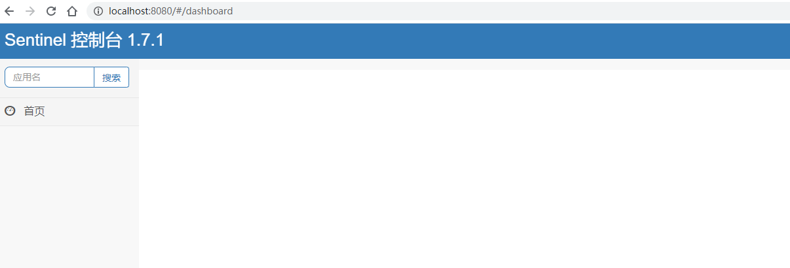

#### 7.2.3、服务改造

在我们已有的业务场景中，“⾃动投递微服务”调⽤了“简历微服务”，我们在⾃动投递微服务进⾏的熔断降级等控制，那么接下来我们改造⾃动投递微服务，引⼊

Sentinel核⼼包。

为了不污染之前的代码，复制⼀个⾃动投递微服务 lagou-service-autodeliver-nacos-sentinel-8095

- 添加依赖

  ```xml
  <!--sentinel 核⼼环境 依赖-->
  <dependency>
      <groupId>com.alibaba.cloud</groupId>
      <artifactId>spring-cloud-starter-alibaba-sentinel</artifactId>
  </dependency>
  ```

- application.yml修改（配置sentinel dashboard，暴露断点依然要有，删除原有hystrix配置，删除原有OpenFeign的降级配置）

  ```yaml
  server:
    port: 8095
  spring:
    application:
      name: lagou-service-autodeliver-nacos
    cloud:
      nacos:
        discovery:
          #配置nacos server地址 集群中各节点信息都配置在这里（域名-VIP-绑定映射到各个实例的地址信息）
          server-addr: 192.168.81.100:8848,192.168.81.101:8848,192.168.81.102:8848
      sentinel:
        transport:
          # sentinel dashboard/console地址
          dashboard: 127.0.0.1:8080
          # sentinel会在该端⼝启动http server，那么这样的话，控制台定义的⼀些限流等规则才能发送传递过来，
          #如果8719端⼝被占⽤，那么会依次+1
          port: 8719
  logging:
    level:
      # Feign⽇志只会对⽇志级别为debug的做出响应
      com.thm.service.AutoDeliverService: debug
  # spring boot 监控
  management:
    endpoints:
      web:
        exposure:
          include: "*"
    endpoint:
      health:
        show-details: always
  lagou-service-resume-nacos:
    ribbon:
      #请求连接超时时间
      ConnectTimeout: 2000
      #请求处理超时时间   Feign超时时间
      ReadTimeout: 15000
      #对所有操作都进⾏重试
      OkToRetryOnAllOperations: true
      #根据如上配置，当访问到故障请求的时候，它会再尝试访问⼀次当前实例（次数由MaxAutoRetries配置），
      #如果不⾏，就换⼀个实例进⾏访问，如果还不⾏，再换⼀次实例访问（更换次数由MaxAutoRetriesNextServer配置），
      #如果依然不⾏，返回失败信息。
      MaxAutoRetries: 2 #对当前选中实例重试次数，不包括第⼀次调⽤
      MaxAutoRetriesNextServer: 2 #切换实例的重试次数
      NFLoadBalancerRuleClassName: com.netflix.loadbalancer.RoundRobinRule #负载策略调整
  ```

- 上述配置之后，启动⾃动投递微服务，使⽤ Sentinel 监控⾃动投递微服务

  此时我们发现控制台没有任何变化，因为懒加载，我们只需要发起⼀次请求触发即可

  

#### 7.2.4、Sentinel 关键概念

| 概念名称 | 概念描述                                                     |
| -------- | ------------------------------------------------------------ |
| 资源     | 它可以是 Java 应⽤程序中的任何内容，例如，由应⽤程序提供的服务，或由应⽤程序调⽤的其它应⽤提供的服务，甚⾄可以是⼀段代码。我们请求的API接⼝就是资源 |
| 规则     | 围绕资源的实时状态设定的规则，可以包括流量控制规则、熔断降级规则以及系统保护规则。所有规则可以动态实时调整。 |

#### 7.2.5、Sentinel 流量规则模块

系统并发能⼒有限，⽐如系统A的QPS⽀持1个，如果太多请求过来，那么A就应该进⾏流量控制了，⽐如其他请求直接拒绝


- 资源名：默认请求路径

- 针对来源：Sentinel可以针对调⽤者进⾏限流，填写微服务名称，默认default（不区分来源）

- 阈值类型/单机阈值

  - QPS：（每秒钟请求数量）当调⽤该资源的QPS达到阈值时进⾏限流

  - 线程数：当调⽤该资源的线程数达到阈值的时候进⾏限流（线程处理请求的时候，如果说业务逻辑执⾏时间很⻓，流量洪峰来临时，会耗费很多线程资

    源，这些线程资源会堆积，最终可能造成服务不可⽤，进⼀步上游服务不可⽤，最终可能服务雪崩）

- 是否集群：是否集群限流

- 流控模式

  - 直接：资源调⽤达到限流条件时，直接限流

  - 关联：关联的资源调⽤达到阈值时候限流⾃⼰

    关联的资源调⽤达到阈值时候限流⾃⼰，⽐如⽤户注册接⼝，需要调⽤身份证校验接⼝（往往身份证校验接⼝），如果身份证校验接⼝请求达到阈值，使

    ⽤关联，可以对⽤户注册接⼝进⾏限流。

    

    ```java
    package com.lagou.edu.controller;
    import com.lagou.edu.controller.service.ResumeServiceFeignClient;
    import org.springframework.beans.factory.annotation.Autowired;
    import org.springframework.web.bind.annotation.GetMapping;
    import org.springframework.web.bind.annotation.PathVariable;
    import org.springframework.web.bind.annotation.RequestMapping;
    import org.springframework.web.bind.annotation.RestController;
    @RestController
    @RequestMapping("/user")
    public class UserController {
         /**
         * ⽤户注册接⼝
         * @return
         */
         @GetMapping("/register")
         public String register() {
         	System.out.println("Register success!");
         	return "Register success!";
         }
         /**
         * 验证注册身份证接⼝（需要调⽤公安户籍资源）
         * @return
         */
         @GetMapping("/validateID")
         public String findResumeOpenState() {
            System.out.println("validateID");
            return "ValidateID success!";
     	}
    }
    ```

    模拟密集式请求/user/validateID验证接⼝，我们会发现/user/register接⼝也被限流了

  - 链路：只记录指定链路上的流量

    链路指的是请求链路（调⽤链）

    链路模式下会控制该资源所在的调⽤链路⼊⼝的流量。需要在规则中配置⼊⼝资源，即该调⽤链路⼊⼝的上下⽂名称。

    ⼀棵典型的调⽤树如下图所示：（阿⾥云提供）

    

    上图中来⾃⼊⼝ Entrance1 和 Entrance2 的请求都调⽤到了资源 NodeA ，Sentinel 允许只根据某个调⽤⼊⼝的统计信息对资源限流。⽐如链路模式下设

    置⼊⼝资源为 Entrance1 来表示只有从⼊⼝ Entrance1 的调⽤才会记录到 NodeA 的限流统计当中，⽽不关⼼经 Entrance2 到来的调⽤。

    

- 流控效果

  - 快速失败：直接失败，抛出异常

  - Warm Up：根据冷加载因⼦（默认3）的值，从阈值/冷加载因⼦，经过预热时⻓，才达到设置的QPS阈值

    当系统⻓期处于空闲的情况下，当流量突然增加时，直接把系统拉升到⾼⽔位可能瞬间把系统压垮，⽐如电商⽹站的秒杀模块。

    通过 Warm Up 模式（预热模式），让通过的流量缓慢增加，经过设置的预热时间以后，到达系统处理请求速率的设定值。

    Warm Up 模式默认会从设置的 QPS 阈值的 1/3 开始慢慢往上增加⾄ QPS 设置值。

    

  - 排队等待：匀速排队，让请求匀速通过，阈值类型必须设置为QPS，否则⽆效

    排队等待模式下会严格控制请求通过的间隔时间，即请求会匀速通过，允许部分请求排队等待，**通常⽤于消息队列削峰填⾕等场景**。需设置具体的超时时

    间，当计算的等待时间超过超时时间时请求就会被拒绝。

    很多流量过来了，并不是直接拒绝请求，⽽是请求进⾏排队，⼀个⼀个匀速通过（处理），请求能等就等着被处理，不能等（等待时间>超时时间）就会

    被拒绝。

    例如，QPS 配置为 5，则代表请求每 200 ms 才能通过⼀个，多出的请求将排队等待通过。超时时间代表最⼤排队时间，超出最⼤排队时间的请求将会直

    接被拒绝。排队等待模式下，QPS 设置值不要超过 1000（请求间隔 1 ms）。

    

#### 7.2.6、Sentinel 降级规则模块

流控是对外部来的⼤流量进⾏控制，熔断降级的视⻆是对内部问题进⾏处理。

Sentinel 降级会在调⽤链路中某个资源出现不稳定状态时（例如调⽤超时或异常⽐例升⾼），对这个资源的调⽤进⾏限制，让请求快速失败，避免影响到其它的资

源⽽导致级联错误。当资源被降级后，在接下来的降级时间窗⼝之内，对该资源的调⽤都⾃动熔断。

**=======>>>> 这⾥的降级其实是Hystrix中的熔断**

还记得当时Hystrix的⼯作流程么


Sentinel不会像Hystrix那样放过⼀个请求尝试⾃我修复，就是明明确确按照时间窗⼝来，熔断触发后，时间窗⼝内拒绝请求，时间窗⼝后就恢复。


- **RT（平均响应时间 ）**

  当 1s 内持续进⼊ >=5 个请求，平均响应时间超过阈值（以 ms 为单位），那么在接下的时间窗⼝（以 s 为单位）之内，对这个⽅法的调⽤都会⾃动地熔断

  （抛出 DegradeException）。注意 Sentinel 默认统计的 RT 上限是 4900 ms，超出此阈值的都会算作 4900 ms，若需要变更此上限可以通过启动配置项 -

  Dcsp.sentinel.statistic.max.rt=xxx 来配置。

  

- **异常⽐例**

  当资源的每秒请求量 >= 5，并且每秒异常总数占通过量的⽐值超过阈值之后，资源进⼊降级状态，即在接下的时间窗⼝（以 s 为单位）之内，对这个⽅法的调

  ⽤都会⾃动地返回。异常⽐率的阈值范围是 [0.0, 1.0] ，代表 0% - 100%。

  

- **异常数**

  当资源近 1 分钟的异常数⽬超过阈值之后会进⾏熔断。注意由于统计时间窗⼝是分钟级别的，若 timeWindow ⼩于 60s，则结束熔断状态后仍可能再进⼊熔断

  状态。时间窗⼝ >= 60s

  

#### 7.2.7、Sentinel 其他模块了解

#### 7.2.8、Sentinel ⾃定义兜底逻辑

@SentinelResource注解类似于Hystrix中的@HystrixCommand注解

@SentinelResource注解中有两个属性需要我们进⾏区分，blockHandler属性⽤来指定不满⾜Sentinel规则的降级兜底⽅法，fallback属性⽤于指定Java运⾏时异

常兜底⽅法

- **在API接⼝资源处配置**

  ```java
  /**
       * 从注册中心获取实例拼接请求url进行调用(使用feign)
       * @param userId
       * @return
       */
  @GetMapping("/checkState/{userId}")
  /**
       *  SentinelResource相当于HystrixCommand
       *  value：定义资源名
       *  blockHandlerClass：指定Sentinel规则异常兜底逻辑所在class类
       *  blockHandler：指定Sentinel规则异常兜底逻辑具体哪个⽅法
       *  fallbackClass：指定Java运⾏时异常兜底逻辑所在class类
       *  fallback：指定Java运⾏时异常兜底逻辑具体哪个⽅法
       */
  @SentinelResource(value = "findResumeOpenState",
                    blockHandlerClass = SentinelHandlersClass.class,
                    blockHandler = "handleException",
                    fallbackClass = SentinelHandlersClass.class,
                    fallback = "handleError")
  public Integer findResumeOpenState(@PathVariable Long userId) {
      //模拟异常
      int i = 1/0;
      //使用feign进行远程调用
      Integer defaultResumeState = autoDeliverService.findDefaultResumeState(userId);
      return defaultResumeState;
  }
  ```

- **⾃定义兜底逻辑类**

  注意：兜底类中的⽅法为static静态⽅法

  ```java
  package com.thm.config;
  
  import com.alibaba.csp.sentinel.slots.block.BlockException;
  
  /**
   * @ClassNmae SentinelHandlersClass
   * @Description TODO
   * @Author THM
   * @Date 2021/2/17 10:32
   * @Version 1.0
   **/
  public class SentinelHandlersClass {
  
      /**
       * 服务降级方法，
       * 注意：该⽅法形参和返回值与原始⽅法保持⼀致，必须是静态方法
       * 处理sentinel异常必须添加BlockException
       */
      public static Integer handleException(Long userId, BlockException blockException) {
          return -100;
      }
  
      /**
       * 处理java异常
       * @param userId
       * @return
       */
      public static Integer handleError(Long userId) {
          return -500;
      }
  }
  ```

#### 7.2.9、基于 Nacos 实现 Sentinel 规则持久化

⽬前，Sentinel Dashboard中添加的规则数据存储在内存，微服务停掉规则数据就消失，在⽣产环境下不合适。我们可以将Sentinel规则数据持久化到Nacos配置

中⼼，让微服务从Nacos获取规则数据。（zk、redis等等都可以）


- ⾃动投递微服务的pom.xml中添加依赖

  ```xml
  <!-- Sentinel⽀持采⽤ Nacos 作为规则配置数据源，引⼊该适配依赖 -->
  <dependency>
      <groupId>com.alibaba.csp</groupId>
      <artifactId>sentinel-datasource-nacos</artifactId>
  </dependency>
  ```

- ⾃动投递微服务的application.yml中配置Nacos数据源

  ```yaml
  server:
    port: 8095
  spring:
    application:
      name: lagou-service-autodeliver-nacos
    cloud:
      nacos:
        discovery:
          #配置nacos server地址 集群中各节点信息都配置在这里（域名-VIP-绑定映射到各个实例的地址信息）
          server-addr: 192.168.81.100:8848,192.168.81.101:8848,192.168.81.102:8848
      sentinel:
        transport:
          # sentinel dashboard/console地址
          dashboard: 127.0.0.1:8080
          # sentinel会在该端⼝启动http server，那么这样的话，控制台定义的⼀些限流等规则才能发送传递过来，
          #如果8719端⼝被占⽤，那么会依次+1
          port: 8719
        # Sentinel Nacos数据源配置，Nacos中的规则会⾃动同步到sentinel控制台的流控规则中
        datasource:
          # 此处的flow为⾃定义数据源名
          flow: # 流控规则
            nacos:
              server-addr: ${spring.cloud.nacos.discovery.server-addr}
              data-id: ${spring.application.name}-flow-rules
              groupId: DEFAULT_GROUP
              data-type: json
              rule-type: flow # 类型来⾃RuleType类
          degrade:
            nacos:
              server-addr: ${spring.cloud.nacos.discovery.server-addr}
              data-id: ${spring.application.name}-degrade-rules
              groupId: DEFAULT_GROUP
              data-type: json
              rule-type: degrade # 类型来⾃RuleType类
  ```

- Nacos Server中添加对应规则配置集（public命名空间—>DEFAULT_GROUP中添加）

  - 流控规则配置集 lagou-service-autodeliver-nacos-flow-rules

    ```json
    [
       {
           "resource":"findResumeOpenState",
           "limitApp":"default",
           "grade":1,
           "count":1,
           "strategy":0,
           "controlBehavior":0,
           "clusterMode":false
       }
    ]
    ```

    **所有属性来⾃源码FlowRule类**

    - resource：资源名称

    - limitApp：来源应⽤

    - grade：阈值类型 0 线程数 1 QPS

    - count：单机阈值

    - strategy：流控模式，0 直接 1 关联 2 链路

    - controlBehavior：流控效果，0 快速失败 1 Warm Up 2 排队等待

    - clusterMode：true/false 是否集群

  - 降级规则配置集 lagou-service-autodeliver-nacos-degrade-rules

    ```json
    [
         {
             "resource":"findResumeOpenState",
             "grade":2,
             "count":1,
             "timeWindow":5
         }
    ]
    ```

    **所有属性来⾃源码DegradeRule类**

    - resource：资源名称

    - grade：降级策略 0 RT，1 异常⽐例，2 异常数

    - count：阈值

    - timeWindow：时间窗

- Rule 源码体系结构

  

  **注意**

  - ⼀个资源可以同时有多个限流规则和降级规则，所以配置集中是⼀个json数组

  - Sentinel控制台中修改规则，仅是内存中⽣效，不会修改Nacos中的配置值，重启后恢复原来的值； Nacos控制台中修改规则，不仅内存中⽣效，Nacos

    中持久化规则也⽣效，重启后规则依然保持

### 7.3、Nacos + Sentinel + Dubbo 三剑合璧

改造“⾃动投递微服务”和“简历微服务”，删除OpenFeign 和 Ribbon，使⽤DubboRPC 和 Dubbo LB

⾸先，需要删除或者注释掉⽗⼯程中的热部署依赖

```xml
<!--热部署-->
<!--<dependency>
            <groupId>org.springframework.boot</groupId>
            <artifactId>spring-boot-devtools</artifactId>
            <optional>true</optional>
        </dependency>-->
```

#### 7.3.1、提供公共API

在父工程lagou-parent中创建项目 **lagou-service-nacos-sentinel-dubbo-api**

创建公共接口

```java
package com.thm.service;

/**
 * @ClassNmae ResumeService
 * @Description TODO
 * @Author THM
 * @Date 2021/1/23 14:57
 * @Version 1.0
 **/
public interface ResumeService {
    Integer findDefaultResumeByUserId(Long userId);
}
```

#### 7.3.2、改造服务提供者（简历微服务）

复制lagou-service-resume-nacos-8083为lagou-service-resume-nacos-sentinel-dubbo-8084

- pom⽂件添加spring cloud + dubbo整合的依赖，同时添加dubbo服务接⼝⼯程依赖

  ```xml
  <!--spring cloud alibaba dubbo 依赖-->
  <dependency>
      <groupId>com.alibaba.cloud</groupId>
      <artifactId>spring-cloud-starter-dubbo</artifactId>
  </dependency>
  <dependency>
      <groupId>com.alibaba.csp</groupId>
      <artifactId>sentinel-apache-dubbo-adapter</artifactId>
  </dependency>
  <!--dubbo 服务接⼝依赖-->
  <dependency>
      <groupId>com.laogou</groupId>
      <artifactId>lagou-service-nacos-sentinel-dubbo-api</artifactId>
      <version>1.0-SNAPSHOT</version>
  </dependency>
  ```

- 删除原有ResumeService接⼝，引⼊dubbo服务接⼝⼯程中的ResumeService接⼝，适当调整代码，在service的实现类上添加dubbo的@Service注解

  

- application.yml或者bootstrap.yml配置⽂件中添加dubbo配置

  ```yaml
  dubbo:
    scan:
      # dubbo 服务扫描基准包
      base-packages: com.lagou.edu.service.impl
    protocol:
      # dubbo 协议
      name: dubbo
      # dubbo 协议端⼝（ -1 表示⾃增端⼝，从 20880 开始）
      port: -1
    registry:
      # 挂载到 Spring Cloud 的注册中⼼
      address: spring-cloud://localhost
  ```

  另外增加⼀项配置

  ```yaml
  Spring:
    #springboot 2.1需要设定
    main:
      allow-bean-definition-overriding: true
  ```

- 运⾏发布之后，会发现Nacos控制台已经有了服务注册信息,从元数据中可以看出,是dubbo注册上来的

  

  

#### 7.3.3、服务消费者⼯程改造（自动投递微服务）

接下来改造服务消费者⼯程—>⾃动投递微服务

- pom.xml中删除OpenFeign相关内容

- application.yml配置⽂件中删除和Feign、Ribbon相关的内容；代码中删除Feign客户端内容；

- pom.xml添加内容和服务提供者⼀样

- application.yml配置⽂件中添加dubbo相关内容

  ```yaml
  dubbo:
    registry:
      # 挂载到 spring cloud 注册中心
      address: spring-cloud://localhost
    cloud:
      # 订阅服务提供方的应用列表，订阅多个服务提供者使用逗号连接
      subscribed-services: lagou-service-resume-nacos
  ```

  同样，也配置下spring.main.allow-bean-defifinition-overriding=true

- Controller代码改造，其他不变

  

- 运⾏发布之后，同样会发现Nacos控制台已经有了服务注册信息

- 测试：http://localhost:8099/autodeliver/checkState/1545132

  

### 7.4、SCA⼩结

1）因为内容重叠，SCA 中的分布式事务解决⽅案 Seata 会在紧接着的Mysql课程中讲解。

2）SCA实际上发展了三条线

- 第⼀条线：开源出来⼀些组件

- 第⼆条线：阿⾥内部维护了⼀个分⽀，⾃⼰业务线使⽤

- 第三条线：阿⾥云平台部署⼀套，付费使⽤

  从战略上来说，SCA更是为了贴合阿⾥云。

  ⽬前来看，开源出来的这些组件，推⼴及普及率不⾼，社区活跃度不⾼，稳定性和体验度上仍需进⼀步提升，根据实际使⽤来看Sentinel的稳定性和体验度要

  好于Nacos。

### 7.5、作业

```
作业思路：
	1、Eureka注册中心  替换为  Nacos注册中心
		删除Eurekaserver工程，改造服务提供者和消费者，使用nacos为注册中心
	2、Config+Bus配置中心  替换为 Nacos配置中心
		改造服务提供者和消费者，使用nacos为配置中心
	3、Feign调用 替换为 Dubbo RPC调用
		改造服务提供者和消费者，dubbo rpc进行远程调用
```

**具体实现：https://gitee.com/Thmspring/LG_homeWork/tree/master/stage3/module5**