# **Apache Tomcat Web**应⽤服务器

## 1、Tomcat 系统架构与原理剖析

b/s（浏览器/服务器模式） 浏览器是客户端（发送http请求） ———> 服务器端

### 1.1、浏览器访问服务器的流程

http请求的处理过程


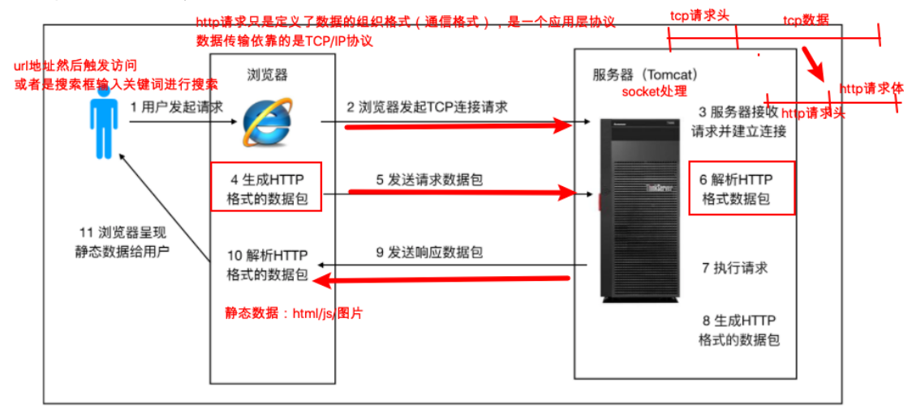

注意：浏览器访问服务器使⽤的是Http协议，Http是应⽤层协议，⽤于定义数据通信的格式，具体的数据传输使⽤的是TCP/IP协议。

## 2、**Tomcat** 系统总体架构

### 2.1、**Tomcat** 请求处理⼤致过程

**Tomcat是⼀个Http服务器（能够接收并且处理http请求，所以tomcat是⼀个http服务器）**

我们使⽤浏览器向某⼀个⽹站发起请求，发出的是Http请求，那么在远程，Http服务器接收到这个请求之后，会调⽤具体的程序（Java类）进⾏处理，往往不同的

请求由不同的Java类完成处理。


**tomcat具体结构**


HTTP 服务器接收到请求之后把请求交给Servlet容器来处理，Servlet 容器通过Servlet接⼝调⽤业务类。**Servlet**接⼝和**Servlet**容器这⼀整套内容叫作**Servlet**规

范。

注意：Tomcat既按照Servlet规范的要求去实现了Servlet容器，同时它也具有HTTP服务器的功能。

**Tomcat的两个重要身份：1、http服务器      2、Tomcat是⼀个Servlet容器**

### 2.2、Tomcat Servlet容器处理流程

当⽤户请求某个URL资源时

1）HTTP服务器会把请求信息使⽤ServletRequest对象封装起来

2）进⼀步去调⽤Servlet容器中某个具体的Servlet

3）在 2）中，Servlet容器拿到请求后，根据URL和Servlet的映射关系，找到相应的Servlet

4）如果Servlet还没有被加载，就⽤反射机制创建这个Servlet，并调⽤Servlet的init⽅法来完成初始化

5）接着调⽤这个具体Servlet的service⽅法来处理请求，请求处理结果使⽤ServletResponse对象封装

6）把ServletResponse对象返回给HTTP服务器，HTTP服务器会把响应发送给客户端

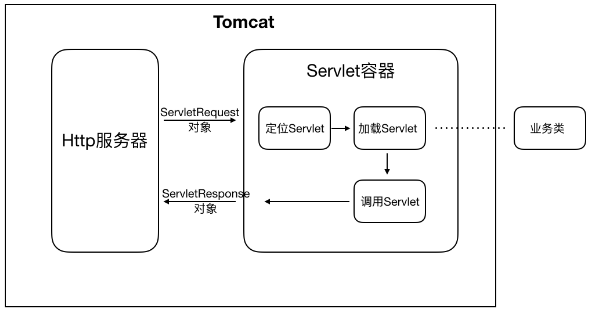

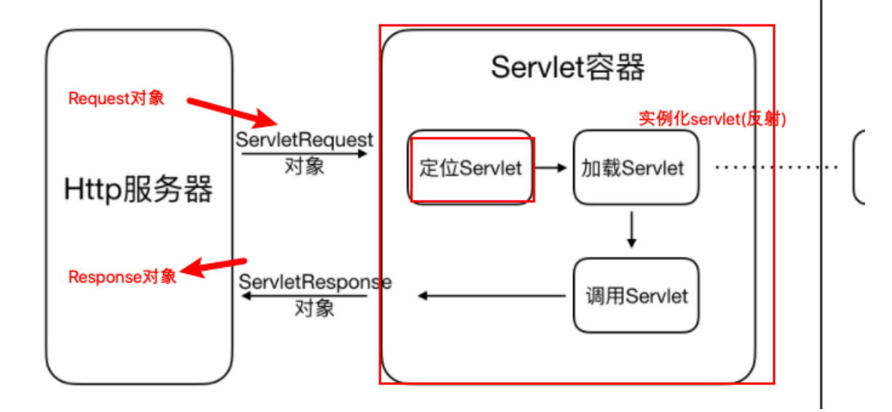

### 2.3、**Tomcat** 系统总体架构

通过上⾯的讲解，我们发现tomcat有两个⾮常重要的功能需要完成

1）和客户端浏览器进⾏交互，进⾏socket通信，将字节流和Request/Response等对象进⾏转换

2）Servlet容器处理业务逻辑

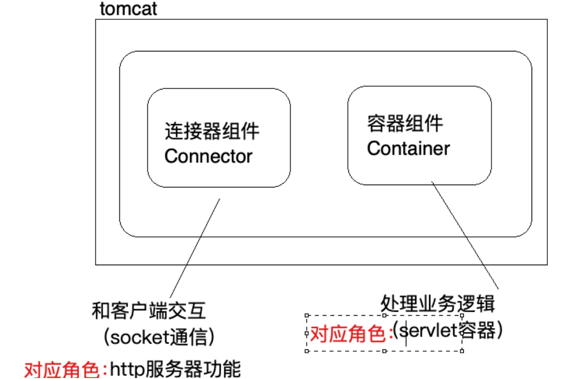

Tomcat 设计了两个核⼼组件连接器（**Connector**）和容器（**Container**）来完成 Tomcat 的两⼤核⼼功能。

**连接器，负责对外交流：** 处理Socket连接，负责⽹络字节流与Request和Response对象的转化；

**容器，负责内部处理：**加载和管理Servlet，以及具体处理Request请求；

### 2.4、Tomcat 连接器组件 Coyote

#### 2.4.1、Coyote 简介

Coyote 是Tomcat 中连接器的组件名称 , 是对外的接⼝。客户端通过Coyote与服务器建⽴连接、发送请求并接受响应 。

（1）Coyote 封装了底层的⽹络通信（Socket 请求及响应处理）

（2）Coyote 使Catalina 容器（容器组件）与具体的请求协议及IO操作⽅式完全解耦

（3）Coyote 将Socket 输⼊转换封装为 Request 对象，进⼀步封装后交由Catalina 容器进⾏处理，处理请求完成后, Catalina 通过Coyote 提供的Response 对象

将结果写⼊输出流

（4）Coyote 负责的是具体协议（应⽤层）和**IO**（传输层）相关内容


Tomcat⽀持多种应⽤层协议和I/O模型，如下：


在 8.0 之前 ，Tomcat 默认采⽤的I/O⽅式为 BIO，之后改为 NIO。 ⽆论 NIO、NIO2 还是 APR， 在性能⽅⾯均优于以往的BIO。 如果采⽤APR， 甚⾄可以达到 

Apache HTTP Server 的影响性能。

#### 2.4.2、Coyote的内部组件及流程


Coyote 组件及作⽤

| 组件            | 作⽤描述                                                     |
| --------------- | ------------------------------------------------------------ |
| EndPoint        | EndPoint 是 Coyote 通信端点，即通信监听的接⼝，是具体Socket接收和发送处理器，是对传输层的抽象，因此EndPoint⽤来实现TCP/IP协议的 |
| Processor       | Processor 是Coyote 协议处理接⼝ ，如果说EndPoint是⽤来实现TCP/IP协议的，那么Processor⽤来实现HTTP协议，Processor接收来⾃EndPoint的Socket，读取字节流解析成Tomcat Request和Response对象，并通过Adapter将其提交到容器处理，Processor是对应⽤层协议的抽象 |
| ProtocolHandler | Coyote 协议接⼝， 通过Endpoint 和 Processor ， 实现针对具体协议的处理能⼒。Tomcat 按照协议和I/O 提供了6个实现类 ： AjpNioProtocol ，AjpAprProtocol， AjpNio2Protocol ， Http11NioProtocol ，Http11Nio2Protocol ，Http11AprProtocol |
| Adapter         | 由于协议不同，客户端发过来的请求信息也不尽相同，Tomcat定义了⾃⼰的Request类来封装这些请求信息。ProtocolHandler接⼝负责解析请求并⽣成Tomcat Request类。但是这个Request对象不是标准的ServletRequest，不能⽤Tomcat Request作为参数来调⽤容器。Tomcat设计者的解决⽅案是引⼊CoyoteAdapter，这是适配器模式的经典运⽤，连接器调⽤CoyoteAdapter的Sevice⽅法，传⼊的是Tomcat Request对象，CoyoteAdapter负责将Tomcat Request转成ServletRequest，再调⽤容器 |

### 2.5、Tomcat Servlet 容器 Catalina

#### 2.5.1、Tomcat 模块分层结构图及Catalina位置

Tomcat是⼀个由⼀系列可配置**（conf/server.xml）**的组件构成的Web容器，⽽Catalina是Tomcat的servlet容器。

从另⼀个⻆度来说，**Tomcat 本质上就是⼀款 Servlet 容器**， 因为 Catalina 才是 Tomcat 的核⼼ ， 其他模块都是为Catalina 提供⽀撑的。 ⽐如 ： 通过 Coyote

模块提供链接通信，Jasper 模块提供 JSP 引擎，Naming 提供JNDI 服务，Juli 提供⽇志服务。

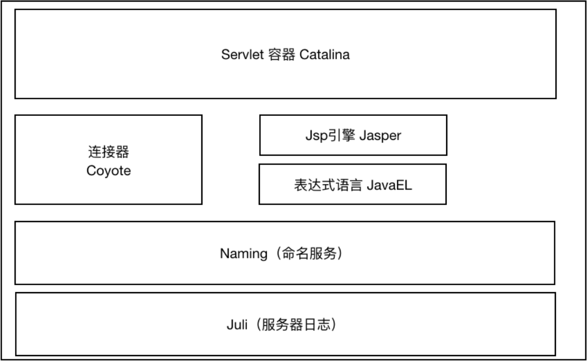

#### 2.5.2、Servlet 容器 Catalina 的结构

Tomcat（我们往往有⼀个认识，Tomcat就是⼀个Catalina的实例，因为Catalina是Tomcat的核⼼）

Tomcat/Catalina实例

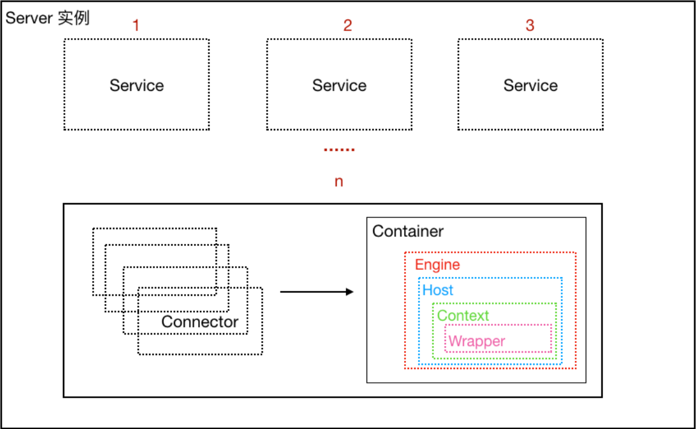

其实，可以认为整个Tomcat就是⼀个Catalina实例，Tomcat 启动的时候会初始化这个实例，Catalina实例通过加载**server.xml**完成其他实例的创建，创建并管理

⼀个Server，Server创建并管理多个服务，每个服务⼜可以有多个Connector和⼀个Container。

- ⼀个Catalina实例（容器）
  - ⼀个 Server实例（容器）
    - 多个Service实例（容器）
      - 每⼀个Service实例下可以有多个Connector实例和⼀个Container实例

- Catalina

  负责解析Tomcat的配置⽂件（server.xml） , 以此来创建服务器Server组件并进⾏管理

- Server

  服务器表示整个Catalina Servlet容器以及其它组件，负责组装并启动Servlet引擎,Tomcat连接器。Server通过实现**Lifecycle**接⼝，提供了⼀种优雅的启动和

  关闭整个系统的⽅式

- Service

  服务是Server内部的组件，⼀个Server包含多个Service。它将若⼲个Connector组件绑定到⼀个Container

- Connector

  客户端通过Connector与服务器建⽴连接、发送请求并接受响应

- Container

  容器，负责处理⽤户的servlet请求，并返回对象给web⽤户的模块

#### 2.5.3、Container 组件的具体结构

Container组件下有⼏种具体的组件，分别是Engine、Host、Context和Wrapper。这4种组件（容器）是⽗⼦关系。Tomcat通过⼀种分层的架构，使得Servlet容

器具有很好的灵活性。

- Engine

  表示整个Catalina的Servlet引擎，⽤来管理多个虚拟站点，⼀个Service最多只能有⼀个Engine，但是⼀个引擎可包含多个Host。

- Host

  代表⼀个虚拟主机，或者说⼀个站点，可以给Tomcat配置多个虚拟主机地址，⽽⼀个虚拟主机下可包含多个Context。

- Context

  表示⼀个Web应⽤程序， ⼀个Web应⽤可包含多个Wrapper

- Wrapper

  表示⼀个Servlet，Wrapper 作为容器中的最底层，不能包含⼦容器

**上述组件的配置其实就体现在conf/server.xml中。**

## 3、Tomcat 服务器核⼼配置详解

问题⼀：去哪⼉配置？ 核⼼配置在tomcat⽬录下conf/server.xml⽂件

问题⼆：怎么配置？

注意：

- Tomcat 作为服务器的配置，主要是 server.xml ⽂件的配置；

- server.xml中包含了 Servlet容器的相关配置，即 Catalina 的配置；

- Xml ⽂件的讲解主要是标签的使⽤

### 3.1、主要标签结构如下：

```xml
 <!--
 Server 根元素，创建⼀个Server实例，⼦标签有 Listener、GlobalNamingResources、Service
 -->
<Server port="8005" shutdown="SHUTDOWN">
  <!--定义监听器-->
  <Listener/>
  <!--定义服务器的全局JNDI资源 -->
  <GlobalNamingResources></GlobalNamingResources>
  <!--定义⼀个Service服务，⼀个Server标签可以有多个Service服务实例-->
  <Service></Service>
</Server>
```

### 3.2、Server 标签

```xml
<!--
	 Server 根元素，创建⼀个Server实例，⼦标签有 Listener、GlobalNamingResources、Service
	 port：关闭服务器的监听端⼝
	 shutdown：关闭服务器的指令字符串
 -->
<Server port="8005" shutdown="SHUTDOWN">
  <!-- 以⽇志形式输出服务器 、操作系统、JVM的版本信息 -->
  <Listener className="org.apache.catalina.startup.VersionLoggerListener" />
  <!--APR library loader. Documentation at /docs/apr.html -->
  <!-- 加载（服务器启动） 和 销毁 （服务器停⽌） APR。 如果找不到APR库， 则会输出⽇志， 并不影响 Tomcat启动 -->
  <Listener className="org.apache.catalina.core.AprLifecycleListener" SSLEngine="on" />
  <!-- 避免JRE内存泄漏问题 -->
  <Listener className="org.apache.catalina.core.JreMemoryLeakPreventionListener" />
  <!-- 加载（服务器启动） 和 销毁（服务器停⽌） 全局命名服务 -->
  <Listener className="org.apache.catalina.mbeans.GlobalResourcesLifecycleListener" />
  <!-- 在Context停⽌时重建 Executor 池中的线程， 以避免ThreadLocal 相关的内存泄漏 -->
  <Listener className="org.apache.catalina.core.ThreadLocalLeakPreventionListener" />

  <!-- Global JNDI resources
       Documentation at /docs/jndi-resources-howto.html
	   GlobalNamingResources 中定义了全局命名服务
  -->
  <GlobalNamingResources>
    <Resource name="UserDatabase" auth="Container"
              type="org.apache.catalina.UserDatabase"
              description="User database that can be updated and saved"
              factory="org.apache.catalina.users.MemoryUserDatabaseFactory"
              pathname="conf/tomcat-users.xml" />
  </GlobalNamingResources>

  <Service name="Catalina"></Service>
</Server>
```

### 3.3、Service 标签

```xml
   <!--
	 该标签⽤于创建 Service 实例，默认使⽤ org.apache.catalina.core.StandardService。
	 默认情况下，Tomcat 仅指定了Service 的名称， 值为 "Catalina"。
	 Service ⼦标签为 ： Listener、Executor、Connector、Engine，
	 其中：
	 Listener ⽤于为Service添加⽣命周期监听器，
	 Executor ⽤于配置Service 共享线程池，
	 Connector ⽤于配置Service 包含的链接器，
	 Engine ⽤于配置Service中链接器对应的Servlet 容器引擎
  -->
  <Service name="Catalina"></Service>
```

### 3.4、Executor 标签

```xml
	<!--
		默认情况下，Service 并未添加共享线程池配置。 如果我们想添加⼀个线程池， 可以在
		<Service> 下添加如下配置：
		name：线程池名称，⽤于 Connector中指定
		namePrefix：所创建的每个线程的名称前缀，⼀个单独的线程名称为namePrefix+threadNumber
		maxThreads：池中最⼤线程数
		minSpareThreads：活跃线程数，也就是核⼼池线程数，这些线程不会被销毁，会⼀直存在
		maxIdleTime：线程空闲时间，超过该时间后，空闲线程会被销毁，默认值为6000（1分钟），单位毫秒
		maxQueueSize：在被执⾏前最⼤线程排队数⽬，默认为Int的最⼤值，也就是⼴义的⽆限。除特殊情况，这个值不需要更改，否则会有请求不会被处理的情况发⽣
		prestartminSpareThreads：启动线程池时是否启动 minSpareThreads部分线程。默认值为false，即不启动
		threadPriority：线程池中线程优先级，默认值为5，值从1到10
		className：线程池实现类，未指定情况下，默认实现类为 org.apache.catalina.core.StandardThreadExecutor。如果想使用自定义线程池⾸先需要实现
		org.apache.catalina.Executor接⼝
	-->
	<Executor name="commonThreadPool"
	 namePrefix="thread-exec-"
	 maxThreads="200"
	 minSpareThreads="100"
	 maxIdleTime="60000"
	 maxQueueSize="Integer.MAX_VALUE"
	 prestartminSpareThreads="false"
	 threadPriority="5"
	 className="org.apache.catalina.core.StandardThreadExecutor"/>
```

### 3.5、Connector 标签

Connector 标签⽤于创建链接器实例

默认情况下，server.xml 配置了两个链接器，⼀个⽀持HTTP协议，⼀个⽀持AJP协议。⼤多数情况下，我们并不需要新增链接器配置，只是根据需要对已有链接器

进⾏优化

```xml
	<!--
	port：端⼝号，Connector ⽤于创建服务端Socket 并进⾏监听， 以等待客户端请求链接。如果该属性设置为0,Tomcat将会随机选择一个可用的端⼝号给当前Connector使用
	protocol：当前Connector ⽀持的访问协议。 默认为 HTTP/1.1 ， 并采⽤⾃动切换机制选择⼀个基于 JAVA NIO的链接器或者基于本地APR的链接器（根据本地是否含有Tomcat的本地库判定）
	connectionTimeOut:Connector 接收链接后的等待超时时间，单位为毫秒。 -1表示不超时。
	redirectPort：当前Connector 不支持SSL请求， 接收到了一个请求，并且也符合security-constraint约束，需要SSL传输，Catalina⾃动将请求重定向到指定的端⼝。
	executor：指定共享线程池的名称， 也可以通过maxThreads、minSpareThreads 等属性配置内部线程池。
	URIEncoding:用于指定编码URI的字符编码， Tomcat8.x版本默认的编码为 UTF-8 , Tomcat7.x版本默认为ISO-8859-1
	-->
	<!--org.apache.coyote.http11.Http11NioProtocol ， ⾮阻塞式 Java NIO 链接器-->
    <Connector port="8080" protocol="HTTP/1.1"
               connectionTimeout="20000"
               redirectPort="8443"
			   URIEncoding="UTF-8" relaxedPathChars="[]{}|\^" relaxedQueryChars="[]{}|\^"/>

    <Connector port="8009" protocol="AJP/1.3" redirectPort="8443" />
```

可以使⽤共享线程池

```xml
<Connector port="8080" 
     protocol="HTTP/1.1"
     executor="commonThreadPool" //使用公共线程池
     maxThreads="1000"  //配置内部线程池  最大线程数
     minSpareThreads="100" //配置内部线程池 最大活跃数
     acceptCount="1000" //配置内部线程池 接收请求数
     maxConnections="1000" //配置内部线程池 最大连接数
     connectionTimeout="20000"//配置内部线程池 连接超时时间
     compression="on" //配置内部线程池 是否启用请求数据压缩
     compressionMinSize="2048" //配置内部线程池 请求数据最小压缩大小  开始
     disableUploadTimeout="true" //配置内部线程池 上传特殊处理
     redirectPort="8443" 
     URIEncoding="UTF-8" />
```

### 3.6、Engine 标签

Engine 表示 Servlet 引擎

```xml
<!--
    name： ⽤于指定Engine 的名称， 默认为Catalina
    defaultHost：默认使用的虚拟主机名称， 当客户端请求指向的主机无效时， 将交由默认的虚拟主机处理， 默认为localhost
-->
<Engine name="Catalina" defaultHost="localhost">
 ...
</Engine>
```

### 3.7、Host 标签

Host 标签⽤于配置⼀个虚拟主机，可配置多个host

```xml
<!--
    name： ⽤于指定Host的名称， 默认为Catalina
	appBase：应用基础相对包名路径  这里默认是webapps
	unpackWARs：是否自动解压war包 默认为true
    autoDeploy：是否自动部署，类似热部署
-->
<Host name="localhost" appBase="webapps" unpackWARs="true" autoDeploy="true">
 ...
</Host>
```

### 3.8、Context 标签

Context标签是Host标签的子标签，⽤于配置⼀个Web应⽤，如下：

```xml
<Host name="www.abc.com" appBase="webapps" unpackWARs="true" autoDeploy="true">
<!--
 docBase：Web应⽤⽬录或者War包的部署路径。可以是绝对路径，也可以是相对于 Host appBase的相对路径。
 path：Web应⽤的Context 路径。如果我们Host名为localhost， 则该web应⽤访问的根路径为： 
 http://localhost:8080/web_demo。
-->
 <Context docBase="/Users/thm/web_demo" path="/web3"></Context> 
 <!-- 请求日志输出
 className：自定义日志输出的阀值类
 directory：日志输出的相对文件路径
 prefix：日志文件的前缀
 suffix：日志文件的后缀
 pattern：日志输出格式
-->
 <Valve className="org.apache.catalina.valves.AccessLogValve" 
        directory="logs"
 		prefix="localhost_access_log" 
        suffix=".txt"
 		pattern="%h %l %u %t &quot;%r&quot; %s %b" />
</Host>
```

## 4、手写一个mini版Tomcat

名称：ThmCat

ThmCat要做的事情：作为⼀个服务器软件提供服务的，也即我们可以通过浏览器客户端发送http请求，ThmCat可以接收到请求进⾏处理，处理之后的结果可以返

回浏览器客户端。

1）提供服务，接收请求（Socket通信）

2）请求信息封装成Request对象（Response对象）

3）客户端请求资源，资源分为静态资源（html）和动态资源（Servlet） 

4）资源返回给客户端浏览器

我们递进式完成以上需求，提出V1.0、V2.0、V3.0版本的需求

V1.0需求：浏览器请求http://localhost:8080,返回⼀个固定的字符串到⻚⾯"Hello ThmCat!"

V2.0需求：封装Request和Response对象，返回html静态资源⽂件

V3.0需求：可以请求动态资源（Servlet）

V4.0需求：使用多线程进行优化处理

V5.0需求：使用线程池进行优化处理

### 4.1、项目结构

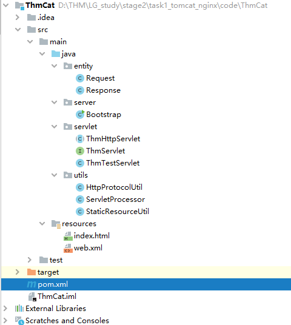

### 4.2、Bootstrap 启动类

```java
package server;
import org.dom4j.Document;
import org.dom4j.Element;
import org.dom4j.Node;
import org.dom4j.io.SAXReader;
import servlet.ThmHttpServlet;
import utils.ServletProcessor;
import java.io.IOException;
import java.io.InputStream;
import java.net.ServerSocket;
import java.net.Socket;
import java.util.HashMap;
import java.util.List;
import java.util.Map;
import java.util.concurrent.*;
/**
 * @ClassNmae Bootstrap
 * @Description TODO ThmCat服务启动类（mini版的Tomcat）
 * @Author THM
 * @Date 2020/12/8 20:10
 * @Version 1.0
 **/
public class Bootstrap {
    /**
     * SOCKET 监听端口
     */
    private static final Integer PORT=8080;

    private Map<String, ThmHttpServlet> servletMap = new HashMap<>();

    /**
     * 加载web.xml 文件  封装servlet映射关系
     */
    private void loadConfig() throws Exception {
        //获取当前类加载器 读取web.xml
        InputStream resourceAsStream = this.getClass().getClassLoader().getResourceAsStream("web.xml");
        //dom4j解析
        SAXReader saxReader = new SAXReader();
        Document document = saxReader.read(resourceAsStream);

        Element rootElement = document.getRootElement();
        //获取所有的servlet标签
        List<Element> selectList = rootElement.selectNodes("//servlet");
        for (int i = 0; i < selectList.size(); i++) {
            Element element =  selectList.get(i);
            //获取servletName和servletClass
            Element servletNameElement = (Element) element.selectSingleNode("servlet-name");
            String servletName = servletNameElement.getStringValue();
            Element servletClassElement = (Element) element.selectSingleNode("servlet-class");
            String servletClass = servletClassElement.getStringValue();
            //找到与servletName名称相同的servlet-mapping  获取urlPattern
            Element servletMappingElement = (Element) document.selectSingleNode("/web-app/servlet-mapping[servlet-name='" + servletName + "']");
            Node node = servletMappingElement.selectSingleNode("url-pattern");
            String urlPattern = node.getStringValue();
            //添加映射
            servletMap.put(urlPattern, (ThmHttpServlet) Class.forName(servletClass).newInstance());
        }
    }

    /**
     * ThmCat服务启动方法
     * 进行socket端口监听
     * @throws IOException
     */
    public void start() throws Exception {
        //加载配置文件  web.xml
        loadConfig();

        //添加线程池
        int corePoolSize = 10; //核心线程大小
        int maximumPoolSize = 100; //线程池最大大小
        long keepAliveTime = 100L; //线程空闲时间
        TimeUnit unit = TimeUnit.SECONDS; //秒
        BlockingQueue<Runnable> workQueue = new LinkedBlockingDeque<>(50); //线程队列
        ThreadFactory threadFactory = Executors.defaultThreadFactory(); //默认线程工厂
        RejectedExecutionHandler handler = new ThreadPoolExecutor.CallerRunsPolicy(); //高并发下请求处理不过来默认处理方式
        ThreadPoolExecutor threadPoolExecutor = new ThreadPoolExecutor(
                corePoolSize,
                maximumPoolSize,
                keepAliveTime,
                unit, workQueue,
                threadFactory,
                handler);

        /**
         * 完成ThmCat 1.0版本
         * 通过浏览器访问http://localhost:8080/，返回固定字符串（Hello ThmCat）到页面
         */
        //获得ServerSocket
        ServerSocket serverSocket = new ServerSocket(PORT);
        System.out.println("------>ThmCat Server start on port:" + PORT);
        //进行循环监听
        /*while(true){
            //阻塞监听
            Socket socket = serverSocket.accept();
            //获得输出流
            OutputStream outputStream = socket.getOutputStream();
            //返回数据
            String data = "Hello ThmCat";
            //获得相应头信息 并拼接数据
            String responseHeader200 = HttpProtocolUtil.getResponseHeader200(data.getBytes().length) + data;
            //回写数据
            outputStream.write(responseHeader200.getBytes());
            //关闭资源
            outputStream.close();
        }*/

        /**
         * 完成ThmCat 2.0版本
         * 需求：封装request和response对象，返回静态资源html文件
         */
        /*while(true){
            Socket socket = serverSocket.accept();
            //获取输入/输出流
            InputStream inputStream = socket.getInputStream();
            OutputStream outputStream = socket.getOutputStream();
            //封装request和response
            Request request = new Request(inputStream);
            Response response = new Response(outputStream);
            //进行调用输出静态资源
            response.outputStaticResource(request.getUrl());
            outputStream.close();
            inputStream.close();
            socket.close();
        }*/

        /**
         * 完成ThmCat 3.0版本
         * 需求：可以处理动态资源，即处理servlet
         */
        /*while(true){
            Socket socket = serverSocket.accept();
            //获取输入/输出流
            InputStream inputStream = socket.getInputStream();
            OutputStream outputStream = socket.getOutputStream();
            //封装request和response
            Request request = new Request(inputStream);
            Response response = new Response(outputStream);

            //判断调用静态资源还是servlet
            if (servletMap.containsKey(request.getUrl())){
                //调用映射好的servlet
                servletMap.get(request.getUrl()).service(request,response);
            } else {
                //进行调用输出静态资源
                response.outputStaticResource(request.getUrl());
            }
            outputStream.close();
            inputStream.close();
            socket.close();
        }*/

        /*System.out.println("多线程优化处理（未使用线程池）");*/
        /**
         * 完成ThmCat 4.0版本
         * 需求：多线程处理并发请求（未使用线程池）
         */
        /*while(true){
            Socket socket = serverSocket.accept();
            //多线程处理
            ServletProcessor servletProcessor = new ServletProcessor(socket,servletMap);
            Thread thread = new Thread(servletProcessor);
            thread.start();
        }*/

        System.out.println("多线程优化处理（使用线程池）");
        /**
         * 完成ThmCat 4.0版本
         * 需求：多线程处理并发请求（使用线程池）
         */
        while(true){
            Socket socket = serverSocket.accept();
            //多线程处理
            ServletProcessor servletProcessor = new ServletProcessor(socket,servletMap);
            //线程池执行
            threadPoolExecutor.execute(servletProcessor);
        }
    }

    /**
     * ThmCat服务启动主程序入口
     * @param args
     */
    public static void main(String[] args) {
        Bootstrap bootstrap = new Bootstrap();
        try {
            //启动ThmCat服务
            bootstrap.start();
        } catch (IOException e) {
            e.printStackTrace();
        } catch (Exception e) {
            e.printStackTrace();
        }
    }
}
```

### 4.3、Request和Response

**Request**

```java
package entity;

import java.io.IOException;
import java.io.InputStream;

/**
 * @ClassNmae Request
 * @Description TODO 把请求信息封装为request对象，通过inputStream输入流封装
 * @Author THM
 * @Date 2020/12/8 21:02
 * @Version 1.0
 **/
public class Request {
    /**
     * 请求方式  GET/POST
     */
    private String method;
    /**
     * 请求路径  /  /index.html
     */
    private String url;
    /**
     * 获取数据的输入流
     */
    private InputStream inputStream;

    /**
     * 无参构造
     */
    public Request() {
    }

    /**
     * 有参构造进行request封装
     * @param inputStream
     */
    public Request(InputStream inputStream) throws IOException {
        this.inputStream = inputStream;
        //读取输入流信息
        int count = 0;
        while (count == 0){
            //网络请求存在间断性，有可能数据没有发送过来，需要特殊处理
            count = inputStream.available();
        }
        //定义接收字节数组
        byte[] bytes = new byte[count];
        //将输入流数据读取到字节数组中
        inputStream.read(bytes);
        //请求信息
        String requestString = new String(bytes);
        //获取第一行  GET / HTTP/1.1  以换行符进行拆分
        String firstLine = requestString.split("\\n")[0];
        //获取第一行数据GET / HTTP/1.1 以空格拆分
        String[] firstLineArray = firstLine.split(" ");
        //填充method
        this.method=firstLineArray[0];
        //填充url
        this.url = firstLineArray[1];
        System.out.println("method: " + this.method);
        System.out.println("url: " + this.url);
    }

    public String getMethod() {
        return method;
    }

    public void setMethod(String method) {
        this.method = method;
    }

    public String getUrl() {
        return url;
    }

    public void setUrl(String url) {
        this.url = url;
    }

    public InputStream getInputStream() {
        return inputStream;
    }

    public void setInputStream(InputStream inputStream) {
        this.inputStream = inputStream;
    }
}
```
**Response**

```java
package entity;

import utils.HttpProtocolUtil;
import utils.StaticResourceUtil;

import java.io.File;
import java.io.FileInputStream;
import java.io.IOException;
import java.io.OutputStream;

/**
 * @ClassNmae Response
 * @Description TODO 通过输出流outputStream进行封装，提供核心输出方法
 * @Author THM
 * @Date 2020/12/8 21:02
 * @Version 1.0
 **/
public class Response {

    private OutputStream outputStream;

    public Response(OutputStream outputStream) {
        this.outputStream = outputStream;
    }

    /**
     * 输出数据
     * @param data
     * @throws IOException
     */
    public void output(String data) throws IOException {
        outputStream.write(data.getBytes());
    }

    /**
     * 输出静态资源方法
     * @param path
     */
    public void outputStaticResource(String path) throws IOException {
        //1、通过请求路径获取资源的磁盘路径
        String resourcePath = StaticResourceUtil.getAbsolutePath(path);
        //2、判断资源是否存在，是否是一个文件，存在输出资源，不存在输出404
        File file = new File(resourcePath);
        if (file.exists() && file.isFile()){
            //读取静态资源文件, 输出静态资源
            StaticResourceUtil.outputResource(new FileInputStream(file),outputStream);
        } else {
            // 输出404
            output(HttpProtocolUtil.getResponseHeader404());
        }
    }
}
```

### 4.4、ThmServlet、ThmHttpServlet和ThmTestServlet

**ThmServlet**

```java
package servlet;

/**
 * @ClassNmae ThmServlet
 * @Description TODO 规范ThmCat中servlet
 * @Author THM
 * @Date 2020/12/9 20:41
 * @Version 1.0
 **/
public interface ThmServlet {

    void init() throws Exception;

    void destroy() throws Exception;

    void service() throws Exception;

}
```

**ThmHttpServlet**

```java
package servlet;

import entity.Request;
import entity.Response;

/**
 * @ClassNmae ThmHttpServlet
 * @Description TODO 所有servlet父类
 * @Author THM
 * @Date 2020/12/9 20:44
 * @Version 1.0
 **/
public abstract class ThmHttpServlet implements ThmServlet{

    public abstract void doGet(Request request, Response response) throws Exception;

    public abstract void doPost(Request request, Response response) throws Exception;

    public void service(Request request, Response response) throws Exception {
        //判断调用doGet或者doPost
        if ("GET".equalsIgnoreCase(request.getMethod())){
            doGet(request,response);
        } else {
            doPost(request,response);
        }
    }
}
```

**ThmTestServlet**

```java
package servlet;

import entity.Request;
import entity.Response;
import utils.HttpProtocolUtil;

/**
 * @ClassNmae ThmTestServlet
 * @Description TODO
 * @Author THM
 * @Date 2020/12/9 20:49
 * @Version 1.0
 **/
public class ThmTestServlet extends ThmHttpServlet{
    @Override
    public void doGet(Request request, Response response) throws Exception {
        Thread.sleep(100000L);
        String context = "<h1>ThmCat servlet doGet</h1>";
        response.output(HttpProtocolUtil.getResponseHeader200(context.getBytes().length) + context);
    }

    @Override
    public void doPost(Request request, Response response) throws Exception {
        String context = "<h1>ThmCat servlet doPost</h1>";
        response.output(HttpProtocolUtil.getResponseHeader200(context.getBytes().length) + context);
    }

    @Override
    public void init() throws Exception {

    }

    @Override
    public void destroy() throws Exception {

    }

    @Override
    public void service() throws Exception {

    }
}
```

### 4.5、HttpProtocolUtil、ServletProcessor和StaticResourceUtil

**HttpProtocolUtil**

```java
package utils;

/**
 * @ClassNmae HttpProtocolUtil
 * @Description TODO Http协议工具类 目前只提供200 和404
 * @Author THM
 * @Date 2020/12/8 20:40
 * @Version 1.0
 **/
public class HttpProtocolUtil {
    private static final String RESPONSE_404 = "<h1>404 NOT FOUND</h1>";

    /**
     * 获取200响应头信息
     * @param responseLength
     * @return
     */
    public static String getResponseHeader200(long responseLength){
        return  "HTTP/1.1 200 OK \n" +
                "Content-Type: text/html;charset=utf-8 \n" +
                "Content-Length" + responseLength + "\n" +
                "\r\n";
    }

    /**
     * 获取404响应头信息
     * @return
     */
    public static String getResponseHeader404(){
        return  "HTTP/1.1 404 NOT FOUND \n" +
                "Content-Type: text/html;charset=utf-8 \n" +
                "Content-Length" + RESPONSE_404.getBytes().length + "\n" +
                "\r\n" + RESPONSE_404;
    }
}
```

**ServletProcessor**

```java
package utils;

import entity.Request;
import entity.Response;
import servlet.ThmHttpServlet;

import java.io.InputStream;
import java.io.OutputStream;
import java.net.Socket;
import java.util.Map;

/**
 * @ClassNmae ServletProcessor
 * @Description TODO ThmServlet线程处理类
 * @Author THM
 * @Date 2020/12/9 21:32
 * @Version 1.0
 **/
public class ServletProcessor implements Runnable {

    private Socket socket;
    Map<String, ThmHttpServlet> servletMap;

    public ServletProcessor(Socket socket, Map<String, ThmHttpServlet> servletMap) {
        this.socket = socket;
        this.servletMap = servletMap;
    }

    @Override
    public void run() {
        try {
            //获取输入/输出流
            InputStream inputStream = socket.getInputStream();
            OutputStream outputStream = socket.getOutputStream();
            //封装request和response
            Request request = new Request(inputStream);
            Response response = new Response(outputStream);

            //判断调用静态资源还是servlet
            if (servletMap.containsKey(request.getUrl())){
                //调用映射好的servlet
                servletMap.get(request.getUrl()).service(request,response);
            } else {
                //进行调用输出静态资源
                response.outputStaticResource(request.getUrl());
            }
            outputStream.close();
            inputStream.close();
            socket.close();
        } catch (Exception e){
            e.printStackTrace();
        }
    }
}
```

**StaticResourceUtil**

```java
package utils;

import java.io.IOException;
import java.io.InputStream;
import java.io.OutputStream;

/**
 * @ClassNmae StaticResourceUtil
 * @Description TODO 获取静态资源磁盘路径，输出静态资源
 * @Author THM
 * @Date 2020/12/8 21:47
 * @Version 1.0
 **/
public class StaticResourceUtil {
    /**
     * 获取资源磁盘路径
     * @param path
     * @return
     */
    public static String getAbsolutePath(String path){
        //获取要扫描包的磁盘路径  获取classpath路径
        String resourceStaticPath = StaticResourceUtil.class.getResource("/").getPath();
        //进行替换返回
        return resourceStaticPath.replace("\\\\","/") + path;
    }

    /**
     * 输出静态资源信息
     * @param inputStream
     * @param outputStream
     */
    public static void outputResource(InputStream inputStream,OutputStream outputStream) throws IOException {
        //获得输入流长度
        int count = 0;
        while (count == 0){
            count = inputStream.available();
        }
        //定义资源大小
        int resourceSize = count;

        //输出请求头信息
        outputStream.write(HttpProtocolUtil.getResponseHeader200(resourceSize).getBytes());
        //输出数据信息
        //已经写出数据长度
        long written = 0;
        //定义读取缓存区
        int bufferSize = 1024;
        byte[] bytes = new byte[bufferSize];
        //写出大小小于资源大小继续读取写出
        while (written < resourceSize){
            //当已经写出长度加上缓存区长度大于资源长度时，说明剩余需要写出的数据不租1024
            if (written + bufferSize > resourceSize){
                //剩余文件长度
                bufferSize = (int) (resourceSize - written);
                bytes = new byte[bufferSize];
            }
            //读取资源
            inputStream.read(bytes);
            //写出资源数据并刷新
            outputStream.write(bytes);
            outputStream.flush();
            //修改已经写出数据长度
            written += bufferSize;
        }
    }
}
```

**优化后版本：https://gitee.com/Thmspring/LG_homeWork/tree/master/stage2/module1/code/ThmCat**

## 5、**Tomcat** 源码构建及核⼼流程源码剖析

### 5.1、源码构建

#### 5.1.1、下载源码


#### 5.1.2、源码导⼊**IDE**之前准备⼯作

- 解压 tar.gz 压缩包，得到⽬录 apache-tomcat-8.5.50-src

- 在apache-tomcat-8.5.50-src⽬录中创建 **source** ⽂件夹，将 conf、webapps ⽬录移动到刚刚创建的 **source** ⽂件夹中

- 在apache-tomcat-8.5.50-src⽬录，创建⼀个pom.xml⽂件，⽂件内容如下 

  ```xml
  <?xml version="1.0" encoding="UTF-8"?>
  <project xmlns="http://maven.apache.org/POM/4.0.0"
           xmlns:xsi="http://www.w3.org/2001/XMLSchema-instance"
           xsi:schemaLocation="http://maven.apache.org/POM/4.0.0
  http://maven.apache.org/xsd/maven-4.0.0.xsd">
      <modelVersion>4.0.0</modelVersion>
      <groupId>org.apache.tomcat</groupId>
      <artifactId>apache-tomcat-8.5.50-src</artifactId>
      <name>Tomcat8.5</name>
      <version>8.5</version>
      <build>
          <!--指定源目录-->
          <finalName>Tomcat8.5</finalName>
          <sourceDirectory>java</sourceDirectory>
          <resources>
              <resource>
                  <directory>java</directory>
              </resource>
          </resources>
          <plugins>
              <!--引入编译插件-->
              <plugin>
                  <groupId>org.apache.maven.plugins</groupId>
                  <artifactId>maven-compiler-plugin</artifactId>
                  <version>3.1</version>
                  <configuration>
                      <encoding>UTF-8</encoding>
                      <source>11</source>
                      <target>11</target>
                  </configuration>
              </plugin>
          </plugins>
      </build>
      <!--tomcat 依赖的基础包-->
      <dependencies>
          <dependency>
              <groupId>org.easymock</groupId>
              <artifactId>easymock</artifactId>
              <version>3.4</version>
          </dependency>
          <dependency>
              <groupId>ant</groupId>
              <artifactId>ant</artifactId>
              <version>1.7.0</version>
          </dependency>
          <dependency>
              <groupId>wsdl4j</groupId>
              <artifactId>wsdl4j</artifactId>
              <version>1.6.2</version>
          </dependency>
          <dependency>
              <groupId>javax.xml</groupId>
              <artifactId>jaxrpc</artifactId>
              <version>1.1</version>
          </dependency>
          <dependency>
              <groupId>org.eclipse.jdt.core.compiler</groupId>
              <artifactId>ecj</artifactId>
              <version>4.5.1</version>
          </dependency>
          <dependency>
              <groupId>javax.xml.soap</groupId>
              <artifactId>javax.xml.soap-api</artifactId>
              <version>1.4.0</version>
          </dependency>
      </dependencies>
  </project>
  ```

#### 5.13、导⼊源码⼯程到IDE并进⾏配置

- 创建一个空项目

  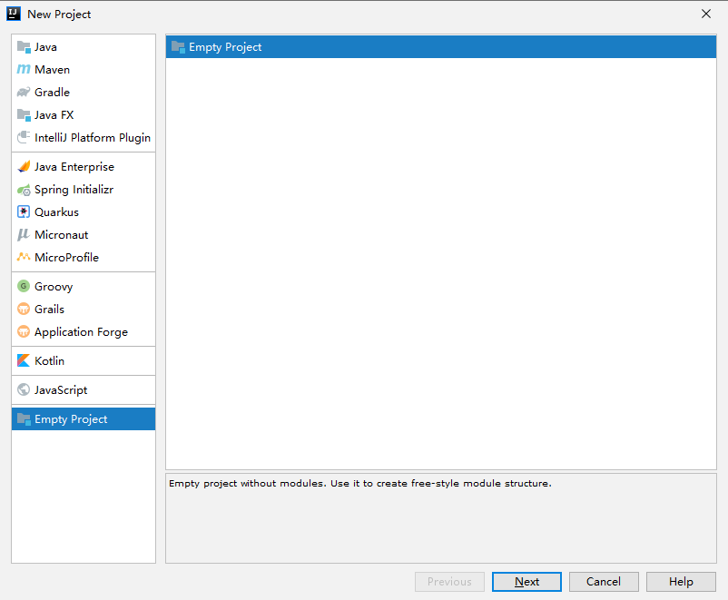

- 导入Tomcat源码apache-tomcat-8.5.50-src

  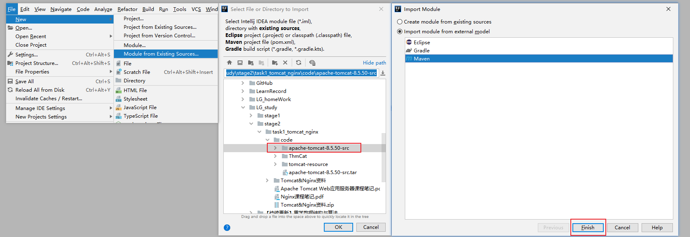

- 依赖JDK

  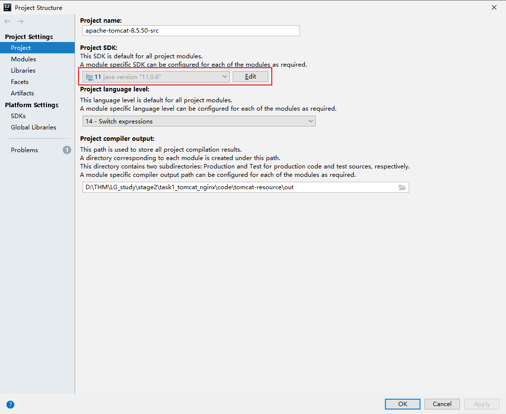

- 给 tomcat 的源码程序启动类 Bootstrap 配置 VM 参数，因为 tomcat 源码运⾏也需要加载配置⽂件等。

  ```properties
  -Dcatalina.home=D:\THM\LG_study\stage2\task1_tomcat_nginx\code\apache-tomcat-8.5.50-src\source
  -Dcatalina.base=D:\THM\LG_study\stage2\task1_tomcat_nginx\code\apache-tomcat-8.5.50-src\source
  -Djava.util.logging.manager=org.apache.juli.ClassLoaderLogManager
  -Djava.util.logging.config.file=D:\THM\LG_study\stage2\task1_tomcat_nginx\code\apache-tomcat-8.5.50-src\source\conf\logging.properties
  ```

  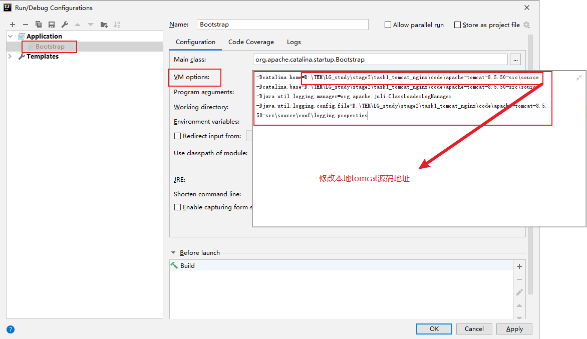

- 运⾏ Bootstrap 类的main函数，此时就启动了tomcat，启动时候会去加载所配置的 conf ⽬录下的server.xml等配置⽂件，所以访问8080端⼝即可，但此时

  我们会遇到如下的⼀个错误

  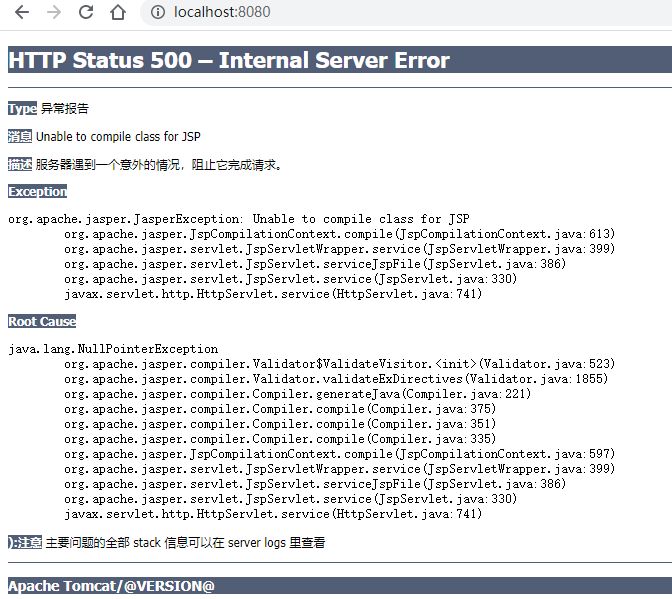

  原因是Jsp引擎Jasper没有被初始化，从⽽⽆法编译JSP，我们需要在tomcat的源码ContextConfifig类中的confifigureStart⽅法中增加⼀⾏代码将 Jsp 引擎初始

  化，如下

  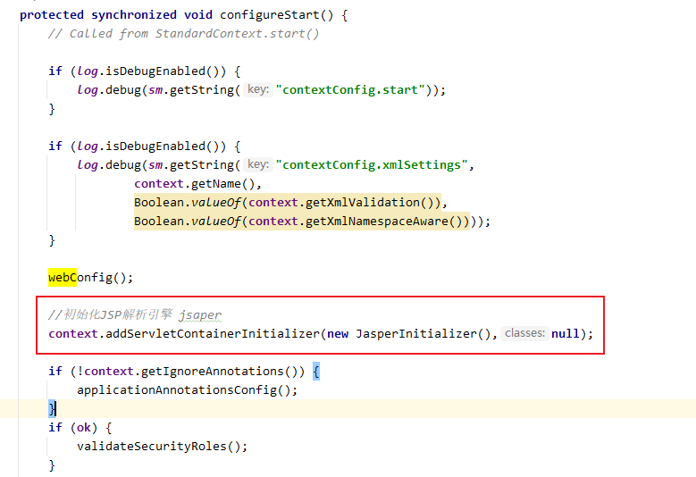

- 重启 Tomcat，正常访问即可。⾄此，Tomcat 源码构建完毕。

### 5.2、核⼼流程源码剖析

#### 5.2.1、Lifecycle⽣命周期

Tomcat中的各容器组件都会涉及创建、销毁等，因此设计了⽣命周期接⼝Lifecycle进⾏统⼀规范，各容器组件实现该接⼝。

- **Lifecycle⽣命周期接⼝主要⽅法示意**

  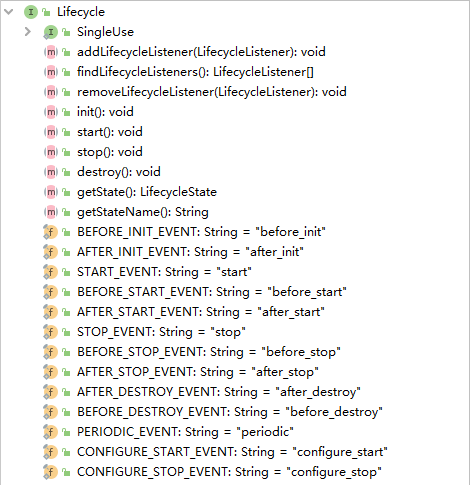

- **Lifecycle⽣命周期接⼝继承体系示意**

  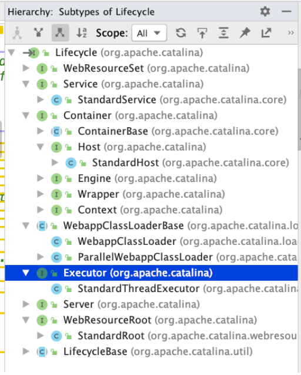

#### 5.2.2、核⼼流程源码剖析-Tomcat启动流程

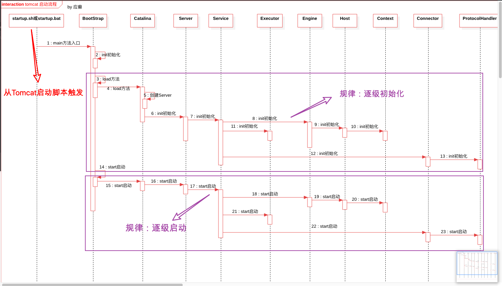

#### 5.2.3、核⼼流程源码剖析-Tomcat请求处理流程

- **请求处理流程分析**

  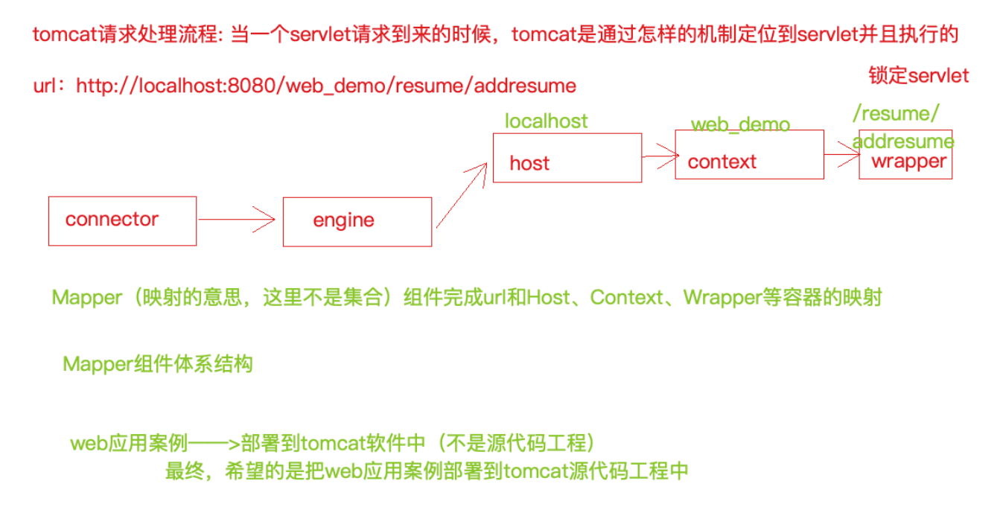

- **请求处理流程示意图**

  

- **Mapper组件体系结构**

  

## 6、Tomcat 类加载机制剖析

Java类（.java）—> 字节码⽂件(.class) —> 字节码⽂件需要被加载到jvm内存当中（这个过程就是⼀个类加载的过程）

类加载器（ClassLoader，说⽩了也是⼀个类，jvm启动的时候先把类加载器读取到内存当中去，其他的类（⽐如各种jar中的字节码⽂件，⾃⼰开发的代码编译之

后的.class⽂件等等））

要说 Tomcat 的类加载机制，⾸先需要来看看 Jvm 的类加载机制，因为 Tomcat 类加载机制是在 Jvm 类加载机制基础之上进⾏了⼀些变动。

### 6.1、JVM 的类加载机制

JVM 的类加载机制中有⼀个⾮常重要的⻆⾊叫做类加载器（ClassLoader），类加载器有⾃⼰的体系，Jvm内置了⼏种类加载器，包括：引导类加载器、扩展类加

载器、系统类加载器，他们之间形成⽗⼦关系，通过 Parent 属性来定义这种关系，最终可以形成树形结构。

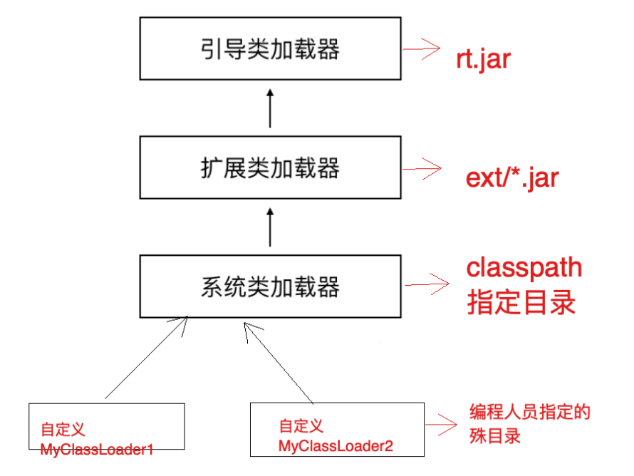

| 类加载器                                           | 作⽤                                                         |
| -------------------------------------------------- | ------------------------------------------------------------ |
| **引导启动类加载器：BootstrapClassLoader**         | c++编写，加载java核⼼库 java.*,⽐如rt.jar中的类，构造ExtClassLoader和AppClassLoader |
| **扩展类加载器：ExtClassLoader**                   | java编写，加载扩展库 JAVA_HOME/lib/ext⽬录下的jar中的类，如classpath中的jre ，javax.*或者java.ext.dir指定位置中的类 |
| **系统类加载器：SystemClassLoader/AppClassLoader** | 默认的类加载器，搜索环境变量 classpath 中指明的路径          |

**另外：⽤户可以⾃定义类加载器（Java编写，⽤户⾃定义的类加载器，可加载指定路径的 class ⽂件）**
　　	当 JVM 运⾏过程中，⽤户⾃定义了类加载器去加载某些类时，会按照下⾯的步骤（⽗类委托机制）
　　	1） ⽤户⾃⼰的类加载器，把加载请求传给⽗加载器，⽗加载器再传给其⽗加载器，⼀直到加载器树的顶层
　　	2 ）最顶层的类加载器⾸先针对其特定的位置加载，如果加载不到就转交给⼦类
　　	3 ）如果⼀直到底层的类加载都没有加载到，那么就会抛出异常 ClassNotFoundException因此，按照这个过程可以想到，如果同样在 classpath 指定的⽬				   录中和⾃⼰⼯作⽬录中存放相同的class，会优先加载 classpath ⽬录中的⽂件

### 6.2、双亲委派机制

#### 6.2.1、什么是双亲委派机制

某个类加载器需要加载某个.class⽂件时，它⾸先把这个任务委托给他的上级类加载器，递归这个操作，如果上级的类加载器没有加载，⾃⼰才会去加载这个类。

#### 6.2.2、双亲委派机制的作⽤

- 防⽌重复加载同⼀个.class。通过委托去向上⾯问⼀问，加载过了，就不⽤再加载⼀遍。保证数据安全。

- 保证核⼼.class不能被篡改。通过委托⽅式，不会去篡改核⼼.class，即使篡改也不会去加载，即使加载也不会是同⼀个.class对象了。不同的加载器加载同⼀

  个.class也不是同⼀个.class对象。这样保证了class执⾏安全（如果⼦类加载器先加载，那么我们可以写⼀些与java.lang包中基础类同名的类， 然后再定义⼀

  个⼦类加载器，这样整个应⽤使⽤的基础类就都变成我们⾃⼰定义的类了。）

### 6.3、**Tomcat** 的类加载机制

Tomcat 的类加载机制相对于 Jvm 的类加载机制做了⼀些改变。

**没有严格的遵从双亲委派机制，也可以说打破了双亲委派机制。**

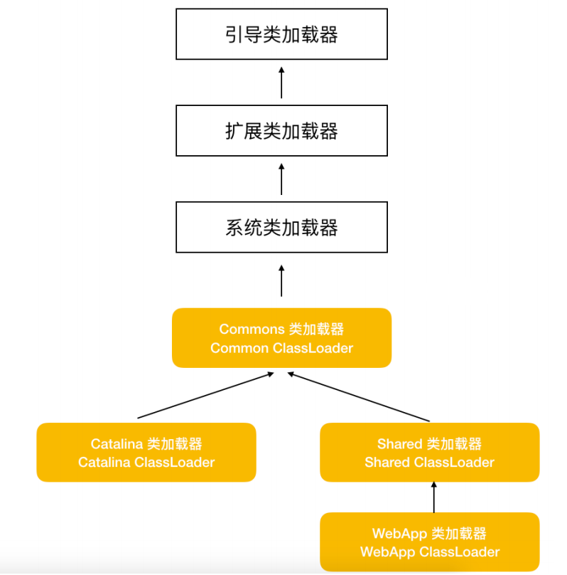

- 引导类加载器 和 扩展类加载器 的作⽤不变

- 系统类加载器正常情况下加载的是 CLASSPATH 下的类，但是 Tomcat 的启动脚本并未使⽤该变量，⽽是加载tomcat启动的类，⽐如bootstrap.jar，通常在

  catalina.bat或者catalina.sh中指定。位于CATALINA_HOME/bin下

- Common 通⽤类加载器加载Tomcat使⽤以及应⽤通⽤的⼀些类，位于CATALINA_HOME/lib下，⽐如servlet-api.jar

- Catalina ClassLoader ⽤于加载服务器内部可⻅类，这些类应⽤程序不能访问

- Shared ClassLoader ⽤于加载应⽤程序共享类，这些类服务器不会依赖

- Webapp ClassLoader，每个应⽤程序都会有⼀个独⼀⽆⼆的Webapp ClassLoader，他⽤来加载本应⽤程序 /WEB-INF/classes 和 /WEB-INF/lib 下的类。

  tomcat 8.5 默认改变了严格的双亲委派机制

  - ⾸先从 Bootstrap Classloader加载指定的类

  - 如果未加载到，则从 /WEB-INF/classes加载

  - 如果未加载到，则从 /WEB-INF/lib/*.jar 加载
  - 如果未加载到，则依次从 System、Common、Shared 加载（在这最后⼀步，遵从双亲委派机制）

## 7、Tomcat 对 Https 的⽀持及 Tomcat 性能优化策略

### 7.1、 Tomcat 对 HTTPS 的⽀持

Https是⽤来加强数据传输安全的

#### 7.1.1、HTTPS 简介

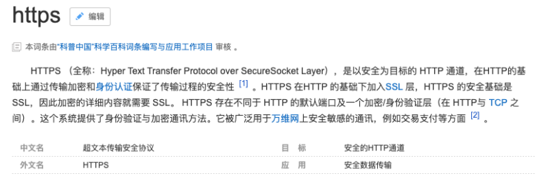

Http超⽂本传输协议，明⽂传输 ，传输不安全，https在传输数据的时候会对数据进⾏加密

ssl协议

TLS(transport layer security)协议

**HTTPS和HTTP的主要区别：**

- HTTPS协议使⽤时需要到电⼦商务认证授权机构（CA）申请SSL证书

- HTTP默认使⽤8080端⼝，HTTPS默认使⽤8443端⼝

- HTTPS则是具有SSL加密的安全性传输协议，对数据的传输进⾏加密，效果上相当于HTTP的升级版

- HTTP的连接是⽆状态的，不安全的；HTTPS协议是由SSL+HTTP协议构建的可进⾏加密传输、身份认证的⽹络协议，⽐HTTP协议安全

**HTTPS⼯作原理**

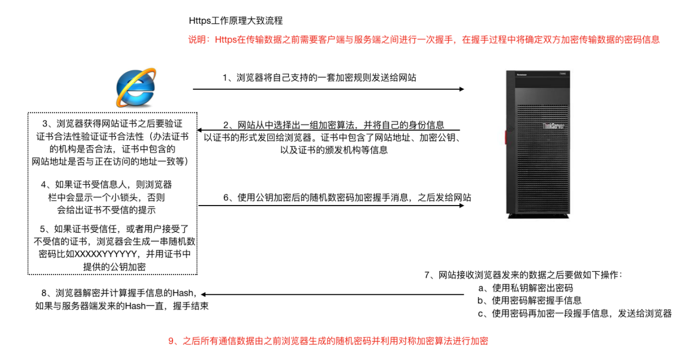

### 7.2、Tomcat 对 HTTPS 的⽀持

- **使⽤ JDK 中的 keytool ⼯具⽣成免费的秘钥库⽂件(证书)。**

  ```shell
  keytool -genkey -alias lagou -keyalg RSA -keystore lagou.keystore
  ```

  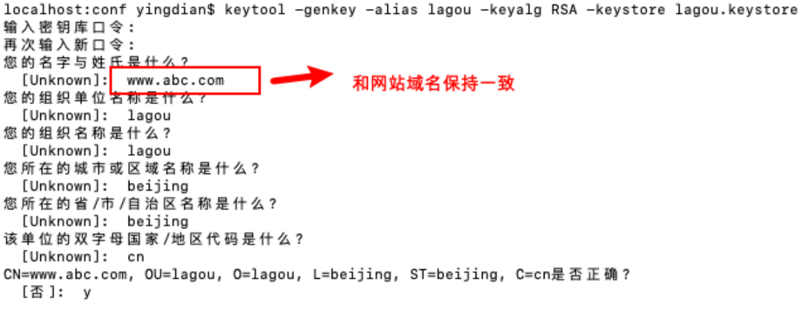

- **配置conf/server.xml**

  ```xml
  <Connector port="8443" 
             protocol="org.apache.coyote.http11.Http11NioProtocol"  
   		   maxThreads="150" 
             schema="https" 
             secure="true" 
             //开启ssl
             SSLEnabled="true"
             >
   <SSLHostConfig>
   			<Certificate 
                //证书地址
                certificateKeystoreFile="/Users/yingdian/workspace/servers/apache-tomcat-8.5.50/conf/lagou.keystore"
                //访问证书密码
                certificateKeystorePassword="lagou123" 
                //加密算法类型
                type="RSA"/>
   </SSLHostConfig>
  </Connector>
  ```

- 使⽤https协议访问8443端⼝（https://localhost:8443）

### 7.3、Tomcat 性能优化策略

系统性能的衡量指标，主要是响应时间和吞吐量。

1）响应时间：执⾏某个操作的耗时；

2)  吞吐量：系统在给定时间内能够⽀持的事务数量，单位为TPS（Transactions PerSecond的缩写，也就是事务数/秒，⼀个事务是指⼀个客户机向服务器发送请

求然后服务器做出反应的过程。

Tomcat优化从两个⽅⾯进⾏

1）JVM虚拟机优化（优化内存模型）

2）Tomcat⾃身配置的优化（⽐如是否使⽤了共享线程池？IO模型？）

学习优化的原则：提供给⼤家优化思路，没有说有明确的参数值⼤家直接去使⽤，必须根据⾃⼰的真实⽣产环境来进⾏调整，调优是⼀个过程

#### 7.3.1、虚拟机运⾏优化（参数调整）

- JVM内存模型回顾

  

- Java 虚拟机的运⾏优化主要是内存分配和垃圾回收策略的优化：

  内存直接影响服务的运⾏效率和吞吐量

  垃圾回收机制会不同程度地导致程序运⾏中断（垃圾回收策略不同，垃圾回收次数和回收效率都是不同的）

  -  Java 虚拟机内存相关参数

    | 参数                 | 参数作⽤                                          | 优化建议                |
    | -------------------- | ------------------------------------------------- | ----------------------- |
    | -server              | 启动Server，以服务端模式运⾏                      | 服务端模式建议开启      |
    | -Xms                 | 最⼩堆内存                                        | 建议与-Xmx设置相同      |
    | -Xmx                 | 最⼤堆内存                                        | 建议设置为可⽤内存的80% |
    | -XX:MetaspaceSize    | 元空间初始值                                      | 默认设置                |
    | -XX:MaxMetaspaceSize | 元空间最⼤内存                                    | 默认无限                |
    | -XX:NewRatio         | 年轻代和⽼年代⼤⼩⽐值，取值为整数，默认为2       | 不需要修改              |
    | -XX:SurvivorRatio    | Eden区与Survivor区⼤⼩的⽐值，取值为整数，默认为8 | 不需要修改              |

  - 参数调整示例：在bin/catalina.sh的脚本中 , 追加如下配置 :

    ```shell
    JAVA_OPTS="-server -Xms2048m -Xmx2048m -XX:MetaspaceSize=256m -XX:MaxMetaspaceSize=512m"
    ```

  - 调整后查看可使⽤JDK提供的内存映射⼯具

    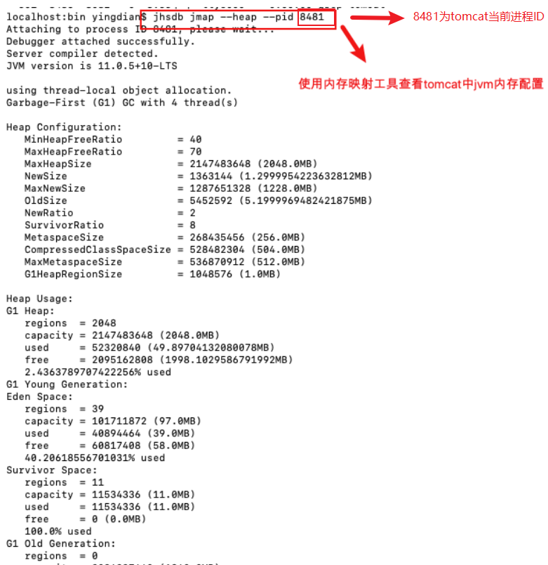

#### 7.3.2、垃圾回收（GC）策略

**垃圾回收性能指标**

- 吞吐量：⼯作时间（排除GC时间）占总时间的百分⽐， ⼯作时间并不仅是程序运⾏的时间，还包含内存分配时间。

- 暂停时间：由垃圾回收导致的应⽤程序停⽌响应次数/时间。

**垃圾收集器**

- 串⾏收集器（Serial Collector）

  单线程执⾏所有的垃圾回收⼯作， 适⽤于单核CPU服务器

  ⼯作进程**-----|**（单线程）垃圾回收线程进⾏垃圾收集**|---**⼯作进程继续

- 并⾏收集器（Parallel Collector）

  ⼯作进程**-----|**（多线程）垃圾回收线程进⾏垃圾收集**|---**⼯作进程继续

  ⼜称为吞吐量收集器（关注吞吐量）， 以并⾏的⽅式执⾏年轻代的垃圾回收， 该⽅式可以显著降低垃圾回收的开销(指多条垃圾收集线程并⾏⼯作，但此时⽤

  户线程仍然处于等待状态)。适⽤于多处理器或多线程硬件上运⾏的数据量较⼤的应⽤

- 并发收集器（Concurrent Collector）

  以并发的⽅式执⾏⼤部分垃圾回收⼯作，以缩短垃圾回收的暂停时间。适⽤于那些响应时间优先于吞吐量的应⽤， 因为该收集器虽然最⼩化了暂停时间(指⽤

  户线程与垃圾收集线程同时执⾏,但不⼀定是并⾏的，可能会交替进⾏)， 但是会降低应⽤程序的性能

- CMS收集器（Concurrent Mark Sweep Collector）

  并发标记清除收集器， 适⽤于那些更愿意缩短垃圾回收暂停时间并且负担的起与垃圾回收共享处理器资源的应⽤

- G1收集器（Garbage-First Garbage Collector）

  适⽤于⼤容量内存的多核服务器， 可以在满⾜垃圾回收暂停时间⽬标的同时， 以最⼤可能性实现⾼吞吐量(JDK1.7之后引入，JDK1.9之后默认)

**垃圾回收器参数**

| 参数                    | 描述                                                         |
| :------------------------ | ------------------------------------------------------------ |
| -XX:+UseSerialGC         | 启⽤串⾏收集器                                               |
| -XX:+UseParallelGC       | 启⽤并⾏垃圾收集器，配置了该选项，那么 -XX:+UseParallelOldGC默认启⽤ |
| -XX:+UseParNewGC         | 年轻代采⽤并⾏收集器，如果设置了 -XX:+UseConcMarkSweepGC选项，⾃动启⽤ |
| -XX:ParallelGCThreads    | 年轻代及⽼年代垃圾回收使⽤的线程数。默认值依赖于JVM使⽤的CPU个 数 |
| -XX:+UseConcMarkSweepGC  | 对于⽼年代，启⽤CMS垃圾收集器。 当并⾏收集器⽆法满⾜应⽤的延迟需求时，推荐使⽤CMS或G1收集器。启⽤该选项后， -XX:+UseParNewGC⾃动启⽤。 |
| XX:+UseG1GC              | 启⽤G1收集器。 G1是服务器类型的收集器， ⽤于多核、⼤内存的机器。它在保持⾼吞吐量的情况下，⾼概率满⾜GC暂停时间的⽬标。 |

在bin/catalina.sh的脚本中 , 追加如下配置 :

```shell
JAVA_OPTS="-XX:+UseConcMarkSweepGC"
```

#### 7.3.3、Tomcat 配置调优

Tomcat⾃身相关的调优

- 调整tomcat线程池

  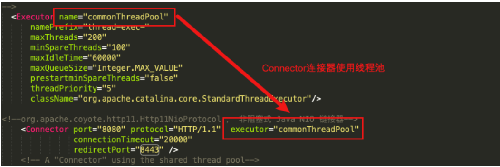

- 调整tomcat的连接器

  调整tomcat/conf/server.xml 中关于链接器的配置可以提升应⽤服务器的性能。

  | 参数           | 说明                                                         |
  | -------------- | ------------------------------------------------------------ |
  | maxConnections | 最⼤连接数，当到达该值后，服务器接收但不会处理更多的请求， 额外的请求将会阻塞直到连接数低于maxConnections 。可通过ulimit -a 查看服务器限制。对于CPU要求更⾼(计算密集型)时，建议不要配置过⼤ ; 对于CPU要求不是特别⾼时，建议配置在2000左右(受服务器性能影响)。 当然这个需要服务器硬件的⽀持 |
  | maxThreads     | 最⼤线程数,需要根据服务器的硬件情况，进⾏⼀个合理的设置      |
  | acceptCount    | 最⼤排队等待数,当服务器接收的请求数量到达maxConnections ，此时Tomcat会将后⾯的请求，存放在任务队列中进⾏排序， acceptCount指的就是任务队列中排队等待的请求数 。 ⼀台Tomcat的最⼤的请求处理数量，是maxConnections+acceptCount |

- 禁⽤ A JP 连接器

  AJP是与apache相关的业务整合，没有相关业务整合，可以进行禁用

  

- 调整 IO 模式

  Tomcat8之前的版本默认使⽤BIO（阻塞式IO），对于每⼀个请求都要创建⼀个线程来处理，不适合⾼并发；Tomcat8以后的版本默认使⽤NIO模式（⾮阻塞

  式IO）

  

  当Tomcat并发性能有较⾼要求或者出现瓶颈时，我们可以尝试使⽤APR模式，APR（Apache PortableRuntime）是从操作系统级别解决异步IO问题，使⽤时

  需要在操作系统上安装APR和Native（因为APR原理是使⽤JNI技术调⽤操作系统底层的IO接⼝）

- 动静分离

  可以使⽤Nginx+Tomcat相结合的部署⽅案，Nginx负责静态资源访问，Tomcat负责Jsp等动态资源访问处理（因为Tomcat不擅⻓处理静态资源）。