# Zookeeper

## 1、Zookeeper简介

### 1.1、分布式系统定义及⾯临的问题

ZooKeeper最为主要的使⽤场景，是作为分布式系统的分布式协同服务。

我们将分布式系统定义为：分布式系统是同时跨越多个物理主机，独⽴运⾏的多个软件所组成系统。类⽐⼀下，分布式系统就是⼀群⼈⼀起⼲活。⼈多⼒量⼤，每

个服务器的算⼒是有限的，但是通过分布式系统，由n个服务器组成起来的集群，算⼒是可以⽆限扩张的。

优点显⽽易⻅，⼈多⼲活快，并且互为备份。但是缺点也很明显。我们可以想象⼀下，以⼀个⼩研发团队开发软件为例，假设我们有⼀个5⼈的项⽬组，要开始⼀

个系统的开发，项⽬组将⾯临如下问题：

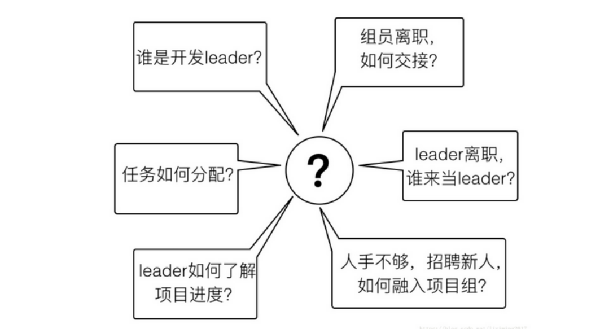

图中列举的就是项⽬组将要⾯临到的问题，这些问题在我们⽇常⼯作中也是天天发⽣，并没感觉有多么复杂，但是这是因为我们⼈类的⼤脑是个超级计算机，能够

灵活应对这些问题，⽽且现实中信息的交换不依赖⽹络，不会因⽹络延迟或者中断，出现信息不对等，⽽且现实中对以上问题的处理其实并不严谨，从⽽也引发了

很多问题。想⼀想，项⽬中是不是出现过沟通不畅造成任务分配有歧义？是否由于⼈员离职造成任务进⾏不下去，甚⾄要联系离职⼈员协助？是不是出现过任务分

配不合理？类似这样的各种问题，肯定会发⽣于你的项⽬组中。在现实世界，我们可以⼈为去协调，即使出错了，⼈⼯去补错，加加班搞定就好。但在计算机的世

界，这样做是⾏不通的，⼀切都要保证严谨，以上问题要做到尽可能不要发⽣。因此，分布式系统必须采⽤合理的⽅式解决掉以上的问题。

实际上要想解决这些问题并没有那么复杂，我们仅需要做⼀件事就可以万事⽆忧---让信息在项⽬组成员中同步。如果能做到信息同步，那么每个⼈在⼲什么，⼤家

都是清楚的，⼲到什么程度也是清晰的，⽆论谁离职也不会产⽣问题。分配的⼯作，能够及时清晰的同步给每个组员，确保每个组员收到的任务分配没有冲突。

分布式系统的协调⼯作就是通过某种⽅式，让每个节点的信息能够同步和共享。这依赖于服务进程之间的通信。通信⽅式有两种：

- **通过⽹络进⾏信息共享**

  这就像现实中，开发leader在会上把任务传达下去，组员通过听leader命令或者看leader的邮件知道⾃⼰要⼲什么。当任务分配有变化时，leader会单独告诉

  组员，或者再次召开会议。信息通过⼈与⼈之间的直接沟通，完成传递。

- **通过共享存储**

  这就好⽐开发leader按照约定的时间和路径，把任务分配表放到了svn上，组员每天去svn上拉取最新的任务分配表，然后⼲活。其中svn就是共享存储。更好

  ⼀点的做法是，当svn⽂件版本更新时，触发邮件通知，每个组员再去拉取最新的任务分配表。这样做更好，因为每次更新，组员都能第⼀时间得到消息，从

  ⽽让⾃⼰⼿中的任务分配表永远是最新的。此种⽅式依赖于中央存储。整个过程如下图所示：

  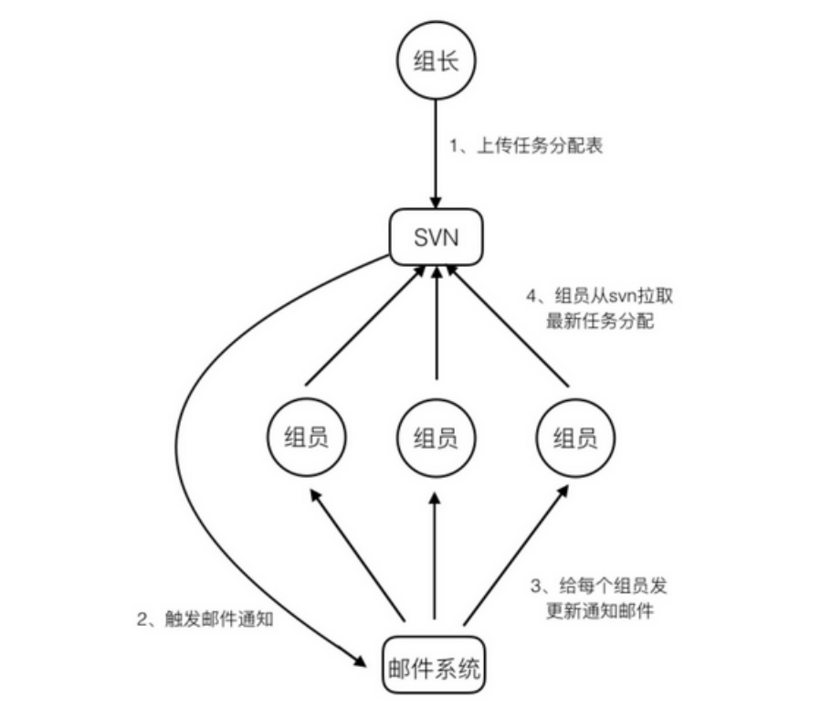

### 1.2、ZooKeeper如何解决分布式系统⾯临的问题

ZooKeeper对分布式系统的协调，使⽤的是第⼆种⽅式，共享存储。其实共享存储，分布式应⽤也需要和存储进⾏⽹络通信。

实际上，通过ZooKeeper实现分布式协同的原理，和项⽬组通过SVN同步⼯作任务的例⼦是⼀样的。ZooKeeper就像是svn，存储了任务的分配、完成情况等共享

信息。每个分布式应⽤的节点就是组员，订阅这些共享信息。当主节点（组leader），对某个从节点的分⼯信息作出改变时，相关订阅的从节点得到zookeeper的

通知，取得⾃⼰最新的任务分配。完成⼯作后，把完成情况存储到zookeeper。主节点订阅了该任务的完成情况信息，所以将得到zookeeper的完⼯的通知。参考

下图，是不是和前⾯项⽬组通过svn分配⼯作的例⼦⼀模⼀样？仅仅是把svn和邮件系统合⼆为⼀，以ZooKeeper代替。

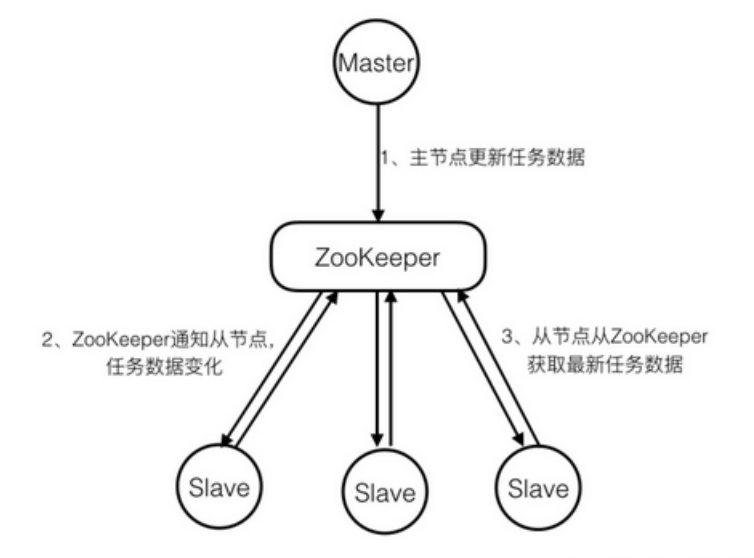

注：Slave节点要想获取ZooKeeper的更新通知，需事先在关⼼的数据节点上设置观察点。

⼤多数分布式系统中出现的问题，都源于信息的共享出了问题。如果各个节点间信息不能及时共享和同步，那么就会在协作过程中产⽣各种问题。ZooKeeper解决

协同问题的关键，就是在于保证分布式系统信息的⼀致性。

### 1.3、zookeeper的基本概念

Zookeeper是⼀个开源的分布式协调服务，其设计⽬标是将那些复杂的且容易出错的分布式⼀致性服务封装起来，构成⼀个⾼效可靠的原语集，并以⼀些简单的接

⼝提供给⽤户使⽤。zookeeper是⼀个典型的分布式数据⼀致性的解决⽅案，分布式应⽤程序可以基于它实现诸如数据订阅/发布、负载均衡、命名服务、集群管

理、分布式锁和分布式队列等功能

**基本概念：**

-  **集群⻆⾊**

  通常在分布式系统中，构成⼀个集群的每⼀台机器都有⾃⼰的⻆⾊，最典型的集群就是Master/Slave模式（主备模式），此情况下把所有能够处理写操作的机

  器称为Master机器，把所有通过异步复制⽅式获取最新数据，并提供读服务的机器为Slave机器。

  ⽽在Zookeeper中，这些概念被颠覆了。它没有沿⽤传递的Master/Slave概念，⽽是引⼊了**Leader、Follower、Observer**三种⻆⾊。Zookeeper集群中的

  所有机器通过Leader选举来选定⼀台被称为Leader的机器，Leader服务器为客户端提供读和写服务，除Leader外，其他机器包括Follower和Observer，

  Follower和Observer都能提供读服务，唯⼀的区别在于**Observer**不参与**Leader**选举过程，不参与写操作的过半写成功策略，因此Observer可以在不影响写

  性能的情况下提升集群的性能。

- **会话（session）**

  Session指客户端会话，⼀个客户端连接是指客户端和服务端之间的⼀个**TCP**⻓连接，Zookeeper对外的服务端⼝默认为2181，客户端启动的时候，⾸先会与

  服务器建⽴⼀个TCP连接，从第⼀次连接建⽴开始，客户端会话的⽣命周期也开始了，通过这个连接，客户端能够⼼跳检测与服务器保持有效的会话，也能够

  向Zookeeper服务器发送请求并接受响应，同时还能够通过该连接接受来⾃服务器的Watch事件通知。

- **数据节点（Znode）**

  在谈到分布式的时候，我们通常说的“节点”是指组成集群的每⼀台机器。然⽽，在ZooKeeper中，“节 点”分为两类，第⼀类同样是指构成集群的机器，我们称

  之为**机器节点**；第⼆类则是指数据模型中的**数据单元**，我们称之为数据节点——ZNode。ZooKeeper将所有数据存储在**内存**中，数据模型是⼀棵树（ZNode 

  Tree），由斜杠（/）进⾏分割的路径，就是⼀个Znode，例如/app/path1。每个ZNode上都会保存⾃⼰的数据内容，同时还会保存⼀系列属性信息。

- **版本**

  Zookeeper的每个Znode上都会存储数据，对于每个ZNode，Zookeeper都会为其维护⼀个叫作Stat的数据结构，Stat记录了这个ZNode的三个数据版本，分

  别是version（当前ZNode的版本）、cversion（当前ZNode⼦节点的版本）、aversion（当前ZNode的ACL版本）。

- **Watcher（事件监听器）**

  Wathcer（事件监听器），是Zookeeper中⼀个很重要的特性，Zookeeper允许⽤户在指定节点上注册⼀些Watcher，并且在⼀些特定事件触发的时候，

  Zookeeper服务端会将事件通知到感兴趣的客户端，该机制是Zookeeper实现分布式协调服务的重要特性。

- **ACL**

  Zookeeper采⽤ACL（Access Control Lists）策略来进⾏权限控制，其定义了如下五种权限：

  　　　　· CREATE：创建⼦节点的权限。

  　　　　· READ：获取节点数据和⼦节点列表的权限。

  　　　　· WRITE：更新节点数据的权限。

  　　　　· DELETE：删除⼦节点的权限。

  　　　　· ADMIN：设置节点ACL的权限。

  其中需要注意的是，CREATE和DELETE这两种权限都是针对⼦节点的权限控制

## 2、Zookeeper环境搭建

### 2.1、Zookeeper的搭建⽅式

Zookeeper安装⽅式有三种，单机模式和集群模式以及伪集群模式。

- 单机模式：Zookeeper只运⾏在⼀台服务器上，适合测试环境；

- 集群模式：Zookeeper运⾏于⼀个集群上，适合⽣产环境，这个计算机集群被称为⼀个“集合体” 

- 伪集群模式：就是在⼀台服务器上运⾏多个Zookeeper 实例；

### 2.2、Zookeeper单机模式搭建

zookeeper安装以linux环境为例:

1. **下载**

   ⾸先我们下载稳定版本的zookeeper http://zookeeper.apache.org/releases.html

   wget https://mirrors.tuna.tsinghua.edu.cn/apache/zookeeper/zookeeper-3.4.14/zookeeper-3.4.14.tar.gz

2. **解压缩压缩包**

   ```
   tar -zxvf zookeeper-3.4.14.tar.gz
   ```

3. **进⼊ zookeeper-3.4.14 ⽬录，创建 data和logs⽂件夹**

   ```
   cd zookeeper-3.4.14
   mkdir data
   mkdir logs
   ```

4. **创建配置⽂件**

   ```
   cd conf
   cp zoo_sample.cfg zoo.cfg
   ```

5. **修改zoo.cfg中的data属性**

   ```
   vim zoo.cfg
   dataDir=/u01/software/zookeeper-3.4.14/data
   dataLogDir=/u01/software/zookeeper-3.4.14/logs
   ```

6. **zookeeper服务启动、关闭、查看状态**

   进⼊bin⽬录，启动服务输⼊命令

   ```
   cd bin
   ./zkServer.sh start  启动
   ./zkServer.sh stop   关闭
   ./zkServer.sh status 查看状态
   ```

### 2.3、Zookeeper伪集群模式

Zookeeper不但可以在单机上运⾏单机模式Zookeeper，⽽且可以在单机模拟集群模式 Zookeeper的运⾏，也就是将不同实例运⾏在同⼀台机器，⽤端⼝进⾏区

分，伪集群模式为我们体验Zookeeper和做⼀些尝试性的实验提供了很⼤的便利。⽐如，我们在测试的时候，可以先使⽤少量数据在伪集群模式下进⾏测试。当测

试可⾏的时候，再将数据移植到集群模式进⾏真实的数据实验。这样不但保证了它的可⾏性，同时⼤⼤提⾼了实验的效率。这种搭建⽅式，⽐较简便，成本⽐较

低，适合测试和学习

注意事项：

⼀台机器上部署了3个server，也就是说单台机器及上运⾏多个Zookeeper实例。这种情况下，必须保证每个配置⽂档的各个端⼝号不能冲突，除clientPort不同之

外，dataDir也不同。另外，还要在dataDir所对应的⽬录中创建myid⽂件来指定对应的Zookeeper服务器实例

**■** **clientPort**端⼝：

如果在1台机器上部署多个server，那么每台机器都要不同的 clientPort，⽐如 server1是2181,server2是2182，server3是2183

**■** **dataDir**和**dataLogDir**：

dataDir和dataLogDir也需要区分下，将数据⽂件和⽇志⽂件分开存放，同时每个server的这两变量所对应的路径都是不同的

**■** **server.X**和**myid**：

server.X 这个数字就是对应，data/myid中的数字。在3个server的myid⽂件中分别写⼊了1，2，3，那么每个server中的zoo.cfg都配 server.1 server.2,server.3

就⾏了。因为在同⼀台机器上，后⾯连着的2个端⼝，3个server都不要⼀样，否则端⼝冲突

1. **下载**
   ⾸先我们下载最新稳定版本的zookeeper http://zookeeper.apache.org/releases.html

2. **上传**
   下载完成后，将zookeeper压缩包 zookeeper-3.4.14.tar.gz上传到linux系统

3. **解压压缩包**
   创建⽬录zkcluster

   ```
   mkdir zkcluster
   ```

4. **解压 zookeeper-3.4.14.tar.gz到zkcluster⽬录下**

   ```
   tar -zxvf zookeeper-3.4.14.tar.gz -C /zkcluster
   ```

5. **改变名称**

   ```
   mv zookeeper-3.4.14 zookeeper01
   复制并改名
   cp -r zookeeper01/ zookeeper02
   cp -r zookeeper01/ zookeeper03
   ```

6. **分别在zookeeper01、zookeeper02、zookeeper03⽬录下创建data及logs⽬录**

   ```
   mkdir data
   mkdir logs
   ```

7. **创建配置⽂件名称**

   ```
   cd conf
   cp zoo_sample.cfg zoo.cfg
   ```

   配置每⼀个Zookeeper 的dataDir（zoo.cfg） clientPort 分别为2181 2182 2183

   ```
   clientPort=2181
   dataDir=/zkcluster/zookeeper01/data
   dataLogDir=/zkcluster/zookeeper01/logs
   clientPort=2182
   dataDir=/zkcluster/zookeeper02/data
   dataLogDir=/zkcluster/zookeeper02/logs
   clientPort=2183
   dataDir=/zkcluster/zookeeper03/data
   dataLogDir=/zkcluster/zookeeper03/logs
   ```

8. 配置集群
   （1）在每个zookeeper的 data ⽬录下创建⼀个 myid ⽂件，内容分别是1、2、3 。这个⽂件就是记录每个服务器的ID

   ```
   touch myid
   vim myid
   ```

   （2）在每⼀个zookeeper 的 zoo.cfg配置客户端访问端⼝（clientPort）和集群服务器IP列表。

   ```
   server.1=192.168.81.100:2888:3881
   server.2=192.168.81.100:2888:3882
   server.3=192.168.81.100:2888:3883
   #server.服务器ID=服务器IP地址：服务器之间通信端⼝：服务器之间投票选举端⼝
   ```

9. 启动集群
   依次启动三个zk实例

### 2.4、Zookeeper集群模式

集群模式和伪集群模式搭建相同，只是在多台服务器进行搭建，每个服务器进行相同操作。

案例服务器：192.168.81.100、192.168.81.101、192.168.81.102

1. **下载**
   ⾸先我们下载最新稳定版本的zookeeper http://zookeeper.apache.org/releases.html

2. **上传**
   下载完成后，将zookeeper压缩包 zookeeper-3.4.14.tar.gz上传到linux系统

3. **解压 zookeeper-3.4.14.tar.gz**

   ```
   tar -zxvf zookeeper-3.4.14.tar.gz
   ```

4. **分别在192.168.81.100、192.168.81.101、192.168.81.102的zookeeper解压⽬录下创建data及logs⽬录**

   ```
   cd zookeeper-3.4.14
   mkdir data
   mkdir logs
   ```

5. **创建配置⽂件名称**

   ```
   cd conf
   cp zoo_sample.cfg zoo.cfg
   ```

   **修改zoo.cfg中的data属性**

   ```
   vim zoo.cfg
   dataDir=/u01/software/zookeeper-3.4.14/data
   dataLogDir=/u01/software/zookeeper-3.4.14/logs
   ```

6. 配置集群
   （1）在每个zookeeper的 data ⽬录下创建⼀个 myid ⽂件，内容分别是1、2、3 。这个⽂件就是记录每个服务器的ID

   ```
   touch myid
   vim myid
   ```

   （2）在每⼀个zookeeper 的 zoo.cfg配置客户端访问端⼝（clientPort）和集群服务器IP列表。

   ```
   server.1=192.168.81.100:2888:3881
   server.2=192.168.81.101:2888:3881
   server.3=192.168.81.102:2888:3881
   #server.服务器ID=服务器IP地址：服务器之间通信端⼝：服务器之间投票选举端⼝
   #server.4=192.168.81.103:2888:3881 observer  #表示为观察者
   #server.5=192.168.81.104:2888:3881 observer  #表示为观察者
   ```

7. 启动集群
   依次启动三个zk实例

## 3、Zookeeper基本使⽤

### 3.1、ZooKeeper系统模型

#### 3.1.1、ZooKeeper数据模型Znode

在ZooKeeper中，数据信息被保存在⼀个个数据节点上，这些节点被称为znode。ZNode 是Zookeeper 中最⼩数据单位，在 ZNode 下⾯⼜可以再挂 ZNode，这

样⼀层层下去就形成了⼀个层次化命名空间 ZNode 树，我们称为 ZNode Tree，它采⽤了类似⽂件系统的层级树状结构进⾏管理。⻅下图示例：

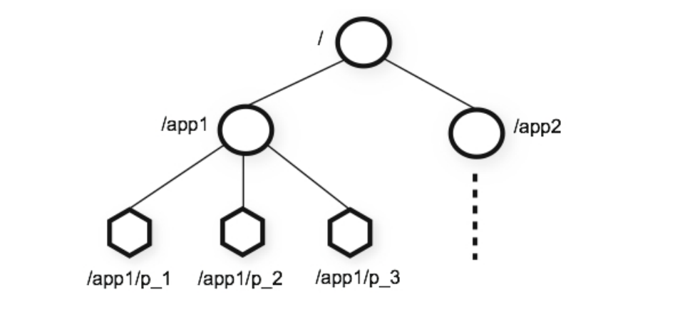

在 Zookeeper 中，每⼀个数据节点都是⼀个 ZNode，上图根⽬录下有两个节点，分别是：app1 和app2，其中 app1 下⾯⼜有三个⼦节点,所有ZNode按层次化进

⾏组织，形成这么⼀颗树，ZNode的节点路径标识⽅式和Unix⽂件系统路径⾮常相似，都是由⼀系列使⽤斜杠（/）进⾏分割的路径表示，开发⼈员可以向这个节

点写⼊数据，也可以在这个节点下⾯创建⼦节点。

#### 3.1.2、ZNode 的类型

Zookeeper的znode tree是由⼀系列数据节点组成的，那接下来，我们就对数据节点做详细讲解

Zookeeper 节点类型可以分为三⼤类：

- 持久性节点（Persistent）

- 临时性节点（Ephemeral）

- 顺序性节点（Sequential）

在开发中在创建节点的时候通过组合可以⽣成以下四种节点类型：持久节点、持久顺序节点、临时节点、临时顺序节点。不同类型的节点则会有不同的⽣命周期。

- **持久节点：**

  是Zookeeper中最常⻅的⼀种节点类型，所谓持久节点，就是指节点被创建后会⼀直存在服务器，直到删除操作主动清除。

- **持久顺序节点：**

  就是有顺序的持久节点，节点特性和持久节点是⼀样的，只是额外特性表现在顺序上。顺序特性实质是在创建节点的时候，会在节点名后⾯加上⼀个数字缀，

  来表示其顺序。

- **临时节点：**

  就是会被⾃动清理掉的节点，它的⽣命周期和客户端会话绑在⼀起，客户端会话结束，节点会被删除掉。与持久性节点不同的是，临时节点不能创建⼦节点。

- **临时顺序节点：**

  就是有顺序的临时节点，和持久顺序节点相同，在其创建的时候会在名字后⾯加上数字后缀。

#### 3.1.3、事务ID

⾸先，先了解，事务是对物理和抽象的应⽤状态上的操作集合。往往在现在的概念中，ሀ义上的事务通常指的是数据库事务，⼀般包含了⼀系列对数据库有序的读

写操作，这些数据库事务具有所谓的ACID特性，即原⼦性（Atomic）、⼀致性（Consistency）、隔离性（Isolation）和持久性（Durability）。

⽽在ZooKeeper中，事务是指能够改变ZooKeeper服务器状态的操作，我们也称之为事务操作或更新操作，⼀般包括数据节点创建与删除、数据节点内容更新等操

作。对于每⼀个事务请求，ZooKeeper都会为其分配⼀个全局唯⼀的事务ID，⽤ **ZXID** 来表示，通常是⼀个 64 位的数字。每⼀个 ZXID 对应⼀次更新操作，从这

些ZXID中可以间接地识别出ZooKeeper处理这些更新操作请求的全局顺序。

#### 3.1.4、ZNode 的状态信息

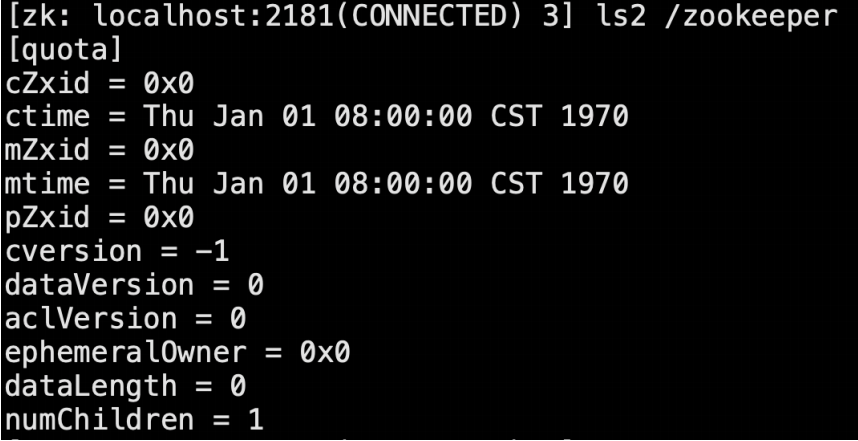

整个 ZNode 节点内容包括两部分：节点数据内容和节点状态信息。图中quota 是数据内容，其他的属于状态信息。那么这些状态信息都有什么含义呢？

```
 cZxid 就是 Create ZXID，表示节点被创建时的事务ID。
 ctime 就是 Create Time，表示节点创建时间。
 mZxid 就是 Modified ZXID，表示节点最后⼀次被修改时的事务ID。
 mtime 就是 Modified Time，表示节点最后⼀次被修改的时间。
 pZxid 表示该节点的⼦节点列表最后⼀次被修改时的事务 ID。只有⼦节点列表变更才会更新 pZxid，⼦节点内容变更不会更新。
 cversion 表示⼦节点的版本号。
 dataVersion 表示内容版本号。
 aclVersion 标识acl版本
 ephemeralOwner 表示创建该临时节点时的会话   
 sessionID，如果是持久性节点那么值为 0
 dataLength 表示数据⻓度。
 numChildren 表示直系⼦节点数。
```

#### 3.1.5、Watcher--数据变更通知

Zookeeper使⽤Watcher机制实现分布式数据的发布/订阅功能

⼀个典型的发布/订阅模型系统定义了⼀种⼀对多的订阅关系，能够让多个订阅者同时监听某⼀个主题对象，当这个主题对象⾃身状态变化时，会通知所有订阅

者，使它们能够做出相应的处理。在 ZooKeeper 中，引⼊了 Watcher 机制来实现这种分布式的通知功能。ZooKeeper 允许客户端向服务端注册⼀个 Watcher 监

听，当服务端的⼀些指定事件触发了这个 Watcher，那么就会向指定客户端发送⼀个事件通知来实现分布式的通知功能。整个Watcher注册与通知过程如图所示。

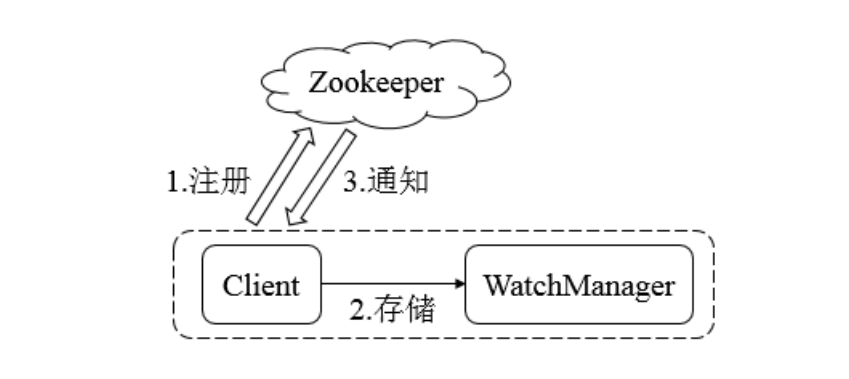

Zookeeper的Watcher机制主要包括**客户端线程、客户端WatcherManager、Zookeeper**服务器三部分。

具体⼯作流程为：客户端在向Zookeeper服务器注册的同时，会将Watcher对象存储在客户端的WatcherManager当中。当Zookeeper服务器触发Watcher事件

后，会向客户端发送通知，客户端线程从WatcherManager中取出对应的Watcher对象来执⾏回调逻辑。

#### 3.1.6、ACL--保障数据的安全

Zookeeper作为⼀个分布式协调框架，其内部存储了分布式系统运⾏时状态的元数据，这些元数据会直接影响基于Zookeeper进⾏构造的分布式系统的运⾏状态，

因此，如何保障系统中数据的安全，从⽽避免因误操作所带来的数据随意变更⽽导致的数据库异常⼗分重要，在Zookeeper中，提供了⼀套完善的ACL（Access 

Control List）权限控制机制来保障数据的安全。

我们可以从三个⽅⾯来理解ACL机制：**权限模式（Scheme）、授权对象（ID）、权限（Permission）**，通常使⽤"**scheme: id : permission**"来标识⼀个有效的

ACL信息。

- **权限模式：Scheme**

  权限模式⽤来确定权限验证过程中使⽤的检验策略，有如下四种模式：

  1. **IP**

     IP模式就是通过IP地址粒度来进⾏权限控制，如"ip:192.168.0.110"表示权限控制针对该IP地址，同时IP模式可以⽀持按照⽹段⽅式进⾏配置，

     如"ip:192.168.0.1/24"表示针对192.168.0.*这个⽹段进⾏权限控制。

  2. **Digest**

     Digest是最常⽤的权限控制模式，要更符合我们对权限控制的认识，其使⽤"username:password"形式的权限标识来进⾏权限配置，便于区分不同应⽤来

     进⾏权限控制。当我们通过“username:password”形式配置了权限标识后，Zookeeper会先后对其进⾏SHA-1加密和BASE64编码。

  3. **World**

     World是⼀种最开放的权限控制模式，这种权限控制⽅式⼏乎没有任何作⽤，数据节点的访问权限对所有⽤户开放，即所有⽤户都可以在不进⾏任何权限

     校验的情况下操作ZooKeeper上的数据。另外，World模式也可以看作是⼀种特殊的Digest模式，它只有⼀个权限标识，即“world：anyone”。

  4. **Super**

     Super模式，顾名思义就是超级⽤户的意思，也是⼀种特殊的Digest模式。在Super模式下，超级⽤户可以对任意ZooKeeper上的数据节点进⾏任何操作

- **授权对象：ID**

  授权对象指的是权限赋予的⽤户或⼀个指定实体，例如 IP 地址或是机器等。在不同的权限模式下，授权对象是不同的，表中列出了各个权限模式和授权对象

  之间的对应关系。

  | 权限模式 | 授权对象                                                     |
  | -------- | ------------------------------------------------------------ |
  | IP       | 通常是⼀个IP地址或IP段：例如：192.168.10.110 或192.168.10.1/24 |
  | Digest   | ⾃定义，通常是username:BASE64(SHA-1(username:password))例如：zm:sdfndsllndlksfn7c= |
  | World    | 只有⼀个ID ：anyone                                          |
  | Super    | 超级用户                                                     |

- **权限**

  权限就是指那些通过权限检查后可以被允许执⾏的操作。在ZooKeeper中，所有对数据的操作权限分为以下五⼤类：

  **CREATE（C）：数据节点的创建权限，允许授权对象在该数据节点下创建⼦节点。 **

  **DELETE（D）：⼦节点的删除权限，允许授权对象删除该数据节点的⼦节点。**

  **READ（R）：数据节点的读取权限，允许授权对象访问该数据节点并读取其数据内容或⼦节点列表等。**

  **WRITE（W）：数据节点的更新权限，允许授权对象对该数据节点进⾏更新操作。**

  **ADMIN（A）：数据节点的管理权限，允许授权对象对该数据节点进⾏ ACL 相关的设置操作。**

### 3.2、ZooKeeper命令⾏操作

现在已经搭建起了⼀个能够正常运⾏的zookeeper服务了，所以接下来，就是来借助客户端来对zookeeper的数据节点进⾏操作

⾸先，进⼊到zookeeper的bin⽬录之后，通过zkClient进⼊zookeeper客户端命令⾏

```
./zkcli.sh 连接本地的zookeeper服务器
./zkCli.sh -server ip:port 连接指定的服务器
```

连接成功之后，系统会输出Zookeeper的相关环境及配置信息等信息。输⼊help之后，屏幕会输出可⽤的Zookeeper命令，如下图所示

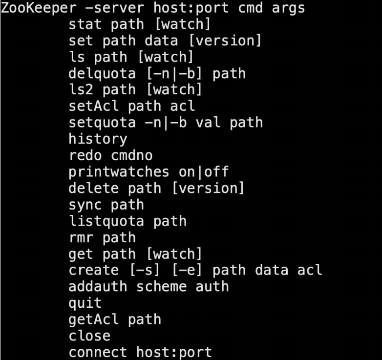

- **创建节点**

  使⽤create命令，可以创建⼀个Zookeeper节点， 如　

```
  create [-s][-e] path data acl
  其中，-s或-e分别指定节点特性，顺序或临时节点，若不指定，则创建持久节点；acl⽤来进⾏权限控制。
```

  - 创建永久节点：**create /zk-permanent 123**
  - 创建永久顺序节点：**create -s /zk-permanent-s 123**
  - 创建临时节点：**create -e /zk-temp 123**
  - 创建临时顺序节点：**create -e /zk-temp 123**

- **读取节点**

  与读取相关的命令有**ls 命令和get 命令**

  **ls命令**可以列出Zookeeper指定节点下的所有⼦节点，但只能查看指定节点下的第⼀级的所有⼦节点；

  ```
  ls path    其中，path表示的是指定数据节点的节点路径
  ```

  **get命令**可以获取Zookeeper指定节点的数据内容和属性信息。

  ```
  get path
  ```

- **更新节点**

  使⽤set命令，可以更新指定节点的数据内容，⽤法如下

  ```
  set path data [version]
  ```

  其中，data就是要更新的新内容，version表示数据版本，在zookeeper中，节点的数据是有版本概念的，这个参数⽤于指定本次更新操作是基于Znode的哪⼀

  个数据版本进⾏的，如将/zk-permanent节点的数据更新为456，可以使⽤如下命令：**set /zk-permanent 456** 通过**get命令**查看是否更新成功。

- **删除节点**

  使⽤delete命令可以删除Zookeeper上的指定节点，⽤法如下

  ```apl
  delete path [version]
  #递归删除
  rmr path
  ```

  其中version也是表示数据版本，使⽤delete /zk-permanent 命令即可删除/zk-permanent节点 ，通过**ls命令**查看是否删除成功
  
  **注意：若删除节点存在⼦节点，那么⽆法删除该节点，必须先删除⼦节点，再删除⽗节点**

### 3.3、Zookeeper的api使⽤

Zookeeper作为⼀个分布式框架，主要⽤来解决分布式⼀致性问题，它提供了简单的分布式原语，并且对多种编程语⾔提供了API，所以接下来重点来看下

Zookeeper的java客户端API使⽤⽅式

Zookeeper API共包含五个包，分别为：

（1）org.apache.zookeeper

（2）org.apache.zookeeper.data

（3）org.apache.zookeeper.server

（4）org.apache.zookeeper.server.quorum

（5）org.apache.zookeeper.server.upgrade

其中org.apache.zookeeper，包含Zookeeper类，他是我们编程时最常⽤的类⽂件。这个类是Zookeeper客户端的主要类⽂件。如果要使⽤Zookeeper服务，应

⽤程序⾸先必须创建⼀个Zookeeper实例，这时就需要使⽤此类。⼀旦客户端和Zookeeper服务端建⽴起了连接，Zookeeper系统将会给本次连接会话分配⼀个ID

值，并且客户端将会周期性的向服务器端发送⼼跳来维持会话连接。只要连接有效，客户端就可以使⽤Zookeeper API来做相应处理了。

- 导⼊依赖

  ```xml
          <dependency>
              <groupId>org.apache.zookeeper</groupId>
              <artifactId>zookeeper</artifactId>
              <version>3.4.14</version>
          </dependency>
  ```

#### 3.3.1、建⽴会话

  ```java
  public class CreateSession implements Watcher {
      //countDownLatch这个类使⼀个线程等待,主要不让main⽅法结束
      private static CountDownLatch countDownLatch = new CountDownLatch(1);
  
      /**
       * 当前类实现了Watcher接⼝，重写了process⽅法，该⽅法负责处理来⾃Zookeeper服务端的
       * watcher通知，在收到服务端发送过来的SyncConnected事件之后，解除主程序在CountDownLatch上
       * 的等待阻塞，⾄此，会话创建完毕
       * @param watchedEvent
       */
      public void process(WatchedEvent watchedEvent) {
          //当连接创建了，服务端发送给客户端SyncConnected事件
          if (watchedEvent.getState() == Event.KeeperState.SyncConnected){
              System.out.println("process方法执行了");
              countDownLatch.countDown();
          }
      }
  
      public static void main(String[] args) throws IOException, InterruptedException {
           /*
               客户端可以通过创建⼀个zk实例来连接zk服务器
               new Zookeeper(connectString,sesssionTimeOut,Wather)
               connectString: 连接地址：IP：端⼝
               sesssionTimeOut：会话超时时间：单位毫秒
               Wather：监听器(当特定事件触发监听时，zk会通过watcher通知到客户端)
           */
          ZooKeeper zooKeeper = new ZooKeeper("192.168.81.100:2181", 5000, new CreateNode());
          System.out.println("连接状态:"+zooKeeper.getState());
          //进行阻塞
          countDownLatch.await();
          System.out.println("连接状态:"+zooKeeper.getState());
          //表示会话真正建⽴
          System.out.println("=========Client Connected to zookeeper==========");
      }
  }
  ```

  注意，ZooKeeper 客户端和服务端会话的建⽴是⼀个异步的过程，也就是说在程序中，构造⽅法会在处理完客户端初始化⼯作后⽴即返回，在⼤多数情况下，

  此时并没有真正建⽴好⼀个可⽤的会话，在会话的⽣命周期中处于“CONNECTING”的状态。 当该会话真正创建完毕后ZooKeeper服务端会向会话对应的客户

  端发送⼀个事件通知，以告知客户端，客户端只有在获取这个通知之后，才算真正建⽴了会话。

#### 3.3.2、创建节点

```java
public class CreateNode implements Watcher {
    private static ZooKeeper zooKeeper;

    /**
     * 当前类实现了Watcher接⼝，重写了process⽅法，该⽅法负责处理来⾃Zookeeper服务端的
     * watcher通知，在收到服务端发送过来的SyncConnected事件之后，解除主程序在CountDownLatch上
     * 的等待阻塞，⾄此，会话创建完毕
     *
     * @param watchedEvent
     */
    public void process(WatchedEvent watchedEvent) {
        //当连接创建了，服务端发送给客户端SyncConnected事件
        if (watchedEvent.getState() == Event.KeeperState.SyncConnected) {
            try {
                //创建节点
                createNodeSync();
            } catch (KeeperException e) {
                e.printStackTrace();
            } catch (InterruptedException e) {
                e.printStackTrace();
            }
        }
    }

    /**
     * 创建节点
     */
    private void createNodeSync() throws KeeperException, InterruptedException {
        /**
         * path ：节点创建的路径
         * data[] ：节点创建要保存的数据，是个byte类型的
         * acl ：节点创建的权限信息(4种类型)
                 ANYONE_ID_UNSAFE : 表示任何⼈
                 AUTH_IDS ：此ID仅可⽤于设置ACL。它将被客户机验证的ID替换。
                 OPEN_ACL_UNSAFE ：这是⼀个完全开放的ACL(常⽤)-->world:anyone
                 CREATOR_ALL_ACL ：此ACL授予创建者身份验证ID的所有权限
         * createMode ：创建节点的类型(4种类型)
                 PERSISTENT：持久节点
                 PERSISTENT_SEQUENTIAL：持久顺序节点
                 EPHEMERAL：临时节点
                 EPHEMERAL_SEQUENTIAL：临时顺序节点
         * String node = zookeeper.create(path,data,acl,createMode);
         */
        String node_persistent = zooKeeper.create("/zk-persistent", "创建持久节点".getBytes(StandardCharsets.UTF_8), ZooDefs.Ids.OPEN_ACL_UNSAFE, CreateMode.PERSISTENT);
        String node_persistent_sequential = zooKeeper.create("/zk-persistent_sequential", "创建持久顺序节点".getBytes(StandardCharsets.UTF_8), ZooDefs.Ids.OPEN_ACL_UNSAFE, CreateMode.PERSISTENT_SEQUENTIAL);
        String node_ephemeral = zooKeeper.create("/zk-ephemeral", "创建临时节点".getBytes(StandardCharsets.UTF_8), ZooDefs.Ids.OPEN_ACL_UNSAFE, CreateMode.EPHEMERAL);
        String node_ephemeral_sequential = zooKeeper.create("/zk-ephemeral_sequential", "创建临时顺序节点".getBytes(StandardCharsets.UTF_8), ZooDefs.Ids.OPEN_ACL_UNSAFE, CreateMode.EPHEMERAL_SEQUENTIAL);
        System.out.println("创建的持久节点是:" + node_persistent);
        System.out.println("创建的持久顺序节点是:" + node_persistent_sequential);
        System.out.println("创建的临时节点是:" + node_ephemeral);
        System.out.println("创建的临时顺序节点是:" + node_ephemeral_sequential);
    }

    public static void main(String[] args) throws IOException, InterruptedException {
        zooKeeper = new ZooKeeper("192.168.81.100:2181", 5000, new CreateNode());
        //表示当前线程无限等待
        Thread.sleep(Integer.MAX_VALUE);
    }
}
```

#### 3.3.3、获取节点数据和节点下面的子节点

```java
public class GetNodeData implements Watcher {
    private static ZooKeeper zooKeeper;

    /**
     * 当前类实现了Watcher接⼝，重写了process⽅法，该⽅法负责处理来⾃Zookeeper服务端的
     * watcher通知，在收到服务端发送过来的SyncConnected事件之后，解除主程序在CountDownLatch上
     * 的等待阻塞，⾄此，会话创建完毕
     *
     * @param watchedEvent
     */
    public void process(WatchedEvent watchedEvent) {
        /*
            ⼦节点列表发⽣变化时，服务器会发出NodeChildrenChanged通知，但不会把变化情况告诉给客户端
            需要客户端⾃⾏获取，且通知是⼀次性的，需反复注册监听D
         */
        if (watchedEvent.getType() == Event.EventType.NodeChildrenChanged){
            //再次获取节点数据
            try {
                List<String> children = zooKeeper.getChildren(watchedEvent.getPath(), true);
                System.out.println(children);
            } catch (KeeperException e) {
                e.printStackTrace();
            } catch (InterruptedException e) {
                e.printStackTrace();
            }
        }
        //当连接创建了，服务端发送给客户端SyncConnected事件
        if (watchedEvent.getState() == Event.KeeperState.SyncConnected) {
            try {
                //获取节点数据
                getNodeData();
                //获取某个节点的子节点
                getNodeChildren();
            } catch (KeeperException e) {
                e.printStackTrace();
            } catch (InterruptedException e) {
                e.printStackTrace();
            }
        }
    }
    /**
     * 获取某个节点数据
     */
    private void getNodeData() throws KeeperException, InterruptedException {
        /**
         * path : 获取数据的路径
         * watch : 是否开启监听
         * stat : 节点状态信息
         * null: 表示获取最新版本的数据
         * zooKeeper.getData(path, watch, stat);
         */
        byte[] data = zooKeeper.getData("/zk-persistent", false, null);
        System.out.println(new String(data));
    }

    /**
     * 获取某个节点得子节点列表
     */
    public static void getNodeChildren() throws KeeperException, InterruptedException {
         /*
             path:路径
             watch:是否要启动监听，当⼦节点列表发⽣变化，会触发监听
             zooKeeper.getChildren(path, watch);
         */
        List<String> children = zooKeeper.getChildren("/zk-persistent", true);
        System.out.println(children);
    }

    public static void main(String[] args) throws IOException, InterruptedException {
        zooKeeper = new ZooKeeper("192.168.81.100:2181", 5000, new GetNodeData());
        //表示当前线程无限等待
        Thread.sleep(Integer.MAX_VALUE);
    }
}
```

#### 3.3.4、修改节点数据

```java
public class UpdateNodeDate implements Watcher {
    private static ZooKeeper zooKeeper;

    /**
     * 当前类实现了Watcher接⼝，重写了process⽅法，该⽅法负责处理来⾃Zookeeper服务端的
     * watcher通知，在收到服务端发送过来的SyncConnected事件之后，解除主程序在CountDownLatch上
     * 的等待阻塞，⾄此，会话创建完毕
     *
     * @param watchedEvent
     */
    public void process(WatchedEvent watchedEvent) {
        //当连接创建了，服务端发送给客户端SyncConnected事件
        if (watchedEvent.getState() == Event.KeeperState.SyncConnected) {
            try {
                //更新节点数据
                updateNodeData();
            } catch (KeeperException e) {
                e.printStackTrace();
            } catch (InterruptedException e) {
                e.printStackTrace();
            }
        }
    }

    /**
     * 更新节点数据
     */
    private void updateNodeData() throws KeeperException, InterruptedException {
         /*
             path:路径
             data:要修改的内容 byte[]
             version:为-1，表示对最新版本的数据进⾏修改
             zooKeeper.setData(path, data,version);
         */
        byte[] data = zooKeeper.getData("/zk-persistent", false, null);
        System.out.println("修改前的数据："+new String(data));
        // -1表示修改最新版本数据 Stat：状态信息对象
        Stat stat = zooKeeper.setData("/zk-persistent", "客户端修改节点数据".getBytes(), -1);
        byte[] data2 = zooKeeper.getData("/zk-persistent", false, null);
        System.out.println("修改后的数据："+new String(data2));
    }


    public static void main(String[] args) throws IOException, InterruptedException {
        zooKeeper = new ZooKeeper("192.168.81.100:2181", 5000, new UpdateNodeDate());
        //表示当前线程无限等待
        Thread.sleep(Integer.MAX_VALUE);
    }
}
```

#### 3.3.5、删除节点

```java
public class DeleteNode implements Watcher {
    private static ZooKeeper zooKeeper;

    /**
     * 当前类实现了Watcher接⼝，重写了process⽅法，该⽅法负责处理来⾃Zookeeper服务端的
     * watcher通知，在收到服务端发送过来的SyncConnected事件之后，解除主程序在CountDownLatch上
     * 的等待阻塞，⾄此，会话创建完毕
     *
     * @param watchedEvent
     */
    public void process(WatchedEvent watchedEvent) {
        //当连接创建了，服务端发送给客户端SyncConnected事件
        if (watchedEvent.getState() == Event.KeeperState.SyncConnected) {
            try {
                //删除节点
                deleteNodeSync();
            } catch (KeeperException e) {
                e.printStackTrace();
            } catch (InterruptedException e) {
                e.printStackTrace();
            }
        }
    }

    /**
     * 删除节点
     */
    private void deleteNodeSync() throws KeeperException, InterruptedException {
         /*
             zooKeeper.exists(path,watch) :判断节点是否存在
             zookeeper.delete(path,version) : 删除节点
         */
        Stat stat = zooKeeper.exists("/zk-persistent/test1", false);
        System.out.println(stat == null ? "该节点不存在" : "该节点存在");
        if (stat != null){
            zooKeeper.delete("/zk-persistent/test1",-1);
        }
        Stat stat2 = zooKeeper.exists("/zk-persistent/test1", false);
        System.out.println(stat2 == null ? "该节点不存在" : "该节点存在");
    }


    public static void main(String[] args) throws IOException, InterruptedException {
        zooKeeper = new ZooKeeper("192.168.81.100:2181", 5000, new DeleteNode());
        //表示当前线程无限等待
        Thread.sleep(Integer.MAX_VALUE);
    }
}
```

### 3.4、Zookeeper-开源客户端

#### 3.4.1、ZkClient

ZkClient是Github上⼀个开源的zookeeper客户端，在Zookeeper原⽣API接⼝之上进⾏了包装，是⼀个更易⽤的Zookeeper客户端，同时，zkClient在内部还实现

了诸如Session超时重连、Watcher反复注册等功能

接下来，还是从创建会话、创建节点、读取数据、更新数据、删除节点等⽅⾯来介绍如何使⽤zkClient这个zookeeper客户端

##### 3.4.1.1、添加依赖

```xml
        <dependency>
            <groupId>com.101tec</groupId>
            <artifactId>zkclient</artifactId>
            <version>0.2</version>
        </dependency>
```

##### 3.4.1.2、创建会话

使⽤ZkClient可以轻松的创建会话，连接到服务端。　

```java
public class CreateSession {

    public static void main(String[] args) {
         /*
         创建⼀个zkClient实例来进⾏连接
         注意：zkClient通过对zookeeperAPI内部包装，将这个异步的会话创建过程同步化了
         */
        ZkClient zkClient = new ZkClient("192.168.81.100:2181");
        System.out.println("=========Client Connected to zookeeper==========");
    }
}
```

##### 3.4.1.3、创建节点

ZkClient提供了递归创建节点的接⼝，即其帮助开发者先完成⽗节点的创建，再创建⼦节点

```java
public class CreateNode {

    public static void main(String[] args) {
         /*
         创建⼀个zkClient实例来进⾏连接
         注意：zkClient通过对zookeeperAPI内部包装，将这个异步的会话创建过程同步化了
         */
        ZkClient zkClient = new ZkClient("192.168.81.100:2181");
        System.out.println("=========Client Connected to zookeeper==========");

        //createParents的值设置为true，可以递归创建节点
        zkClient.createPersistent("/thm/test",true);
        System.out.println("success create zNode.");
    }
}
```

##### 3.4.1.4、删除节点

ZkClient提供了递归删除节点的接⼝，即其帮助开发者先删除所有⼦节点（存在），再删除⽗节点。

```java
public class DeleteNode {

    public static void main(String[] args) {
         /*
         创建⼀个zkClient实例来进⾏连接
         注意：zkClient通过对zookeeperAPI内部包装，将这个异步的会话创建过程同步化了
         */
        ZkClient zkClient = new ZkClient("192.168.81.100:2181");
        System.out.println("=========Client Connected to zookeeper==========");
        //创建节点
        zkClient.createPersistent("/thm/test/ttest");
        /**
         * 递归删除当前节点及其子节点
         * 注意： 当前节点为/thm/test  即删除/test节点即其子节点，不会删除/thm节点
         * 删除顺序为先删除子节点，再删除当前节点
         *
         */
        zkClient.deleteRecursive("/thm/test");
        System.out.println("success delete zNode.");
    }
}
```

##### 3.4.1.5、获取⼦节点

客户端可以对⼀个不存在的节点进⾏⼦节点变更的监听。

⼀旦客户端对⼀个节点注册了⼦节点列表变更监听之后，那么当该节点的⼦节点列表发⽣变更时，服务端都会通知客户端，并将最新的⼦节点列表发送给客户端

该节点本身的创建或删除也会通知到客户端。

```java
public class GetChildrenNode {

    public static void main(String[] args) throws InterruptedException {
         /*
         创建⼀个zkClient实例来进⾏连接
         注意：zkClient通过对zookeeperAPI内部包装，将这个异步的会话创建过程同步化了
         */
        ZkClient zkClient = new ZkClient("192.168.81.100:2181");
        System.out.println("=========Client Connected to zookeeper==========");
        //获取当前节点的子节点列表
        List<String> children = zkClient.getChildren("/thm");
        System.out.println(children);
        /**
         * 设置子节点监听
         * parentPath:父节点
         * list：子节点列表
         */
        zkClient.subscribeChildChanges("/thm", new IZkChildListener() {
            @Override
            public void handleChildChange(String parentPath, List<String> list) throws Exception {
                System.out.println(parentPath + "子节点发生改变：" + list);
            }
        });
        //创建子节点
        zkClient.createPersistent("/thm/test2");
        Thread.sleep(2000);
        zkClient.delete("/thm/test");
        Thread.sleep(2000);
        zkClient.delete("/thm/test2");
        Thread.sleep(2000);
        zkClient.delete("/thm");
        Thread.sleep(2000);
    }
}
```

##### 3.4.1.6、获取数据（节点是否存在、更新、删除）

```java
public class getNodeData {

    public static void main(String[] args) throws InterruptedException {
         /*
         创建⼀个zkClient实例来进⾏连接
         注意：zkClient通过对zookeeperAPI内部包装，将这个异步的会话创建过程同步化了
         */
        ZkClient zkClient = new ZkClient("192.168.81.100:2181");
        System.out.println("=========Client Connected to zookeeper==========");
        //判断节点是否存在
        String path = "/thm";
        boolean exists = zkClient.exists(path);
        if (!exists){
            zkClient.createPersistent(path,"123");
            System.out.println("create zNode");
        }
        //设置节点数据监听
        zkClient.subscribeDataChanges(path, new IZkDataListener() {
            /**
             * @param s 监听节点
             * @param o 变化后数据
             * @throws Exception
             */
            @Override
            public void handleDataChange(String s, Object o) throws Exception {
                System.out.println(s+"---->节点数据发生改变：" + o );
            }

            @Override
            public void handleDataDeleted(String s) throws Exception {
                System.out.println(s+"---->节点被删除");
            }
        });
        //获取节点内容
        Object o = zkClient.readData(path);
        System.out.println(o);
        //修改节点数据
        zkClient.writeData(path,"456");
        Thread.sleep(2000);
        //删除节点
        zkClient.delete(path);
        Thread.sleep(2000);
    }
}
```

#### 3.4.2、**Curator**客户端

curator是Netflix公司开源的⼀套Zookeeper客户端框架，和ZKClient⼀样，Curator解决了很多Zookeeper客户端⾮常底层的细节开发⼯作，包括连接重连，反复

注册Watcher和NodeExistsException异常等，是最流⾏的Zookeeper客户端之⼀。从编码⻛格上来讲，它提供了基于Fluent的编程⻛格⽀持。

##### 3.4.2.1、添加依赖

```xml
        <dependency>
            <groupId>org.apache.curator</groupId>
            <artifactId>curator-framework</artifactId>
            <version>2.12.0</version>
        </dependency>
```

##### 3.4.2.2、创建会话

Curator的创建会话⽅式与原⽣的API和ZkClient的创建⽅式区别很⼤。Curator创建客户端是通过CuratorFrameworkFactory⼯⼚类来实现的。具体如下：

- 使⽤CuratorFramework这个⼯⼚类的两个静态⽅法来创建⼀个客户端

  ```java
  public static CuratorFramework newClient(String connectString, RetryPolicyretryPolicy)
      
  public static CuratorFramework newClient(String connectString, intsessionTimeoutMs, int connectionTimeoutMs, RetryPolicy retryPolicy)
  ```

  其中参数RetryPolicy提供重试策略的接⼝，可以让⽤户实现⾃定义的重试策略，默认提供了以下实现，分别为ExponentialBackoffRetry（基于backoff的

  重连策略）、RetryNTimes（重连N次策略）、RetryForever（永远重试策略）

- 通过调⽤CuratorFramework中的start()⽅法来启动会话

  ```java
  RetryPolicy retryPolicy = new ExponentialBackoffRetry(1000,3);
  CuratorFramework client = CuratorFrameworkFactory.newClient("127.0.0.1:2181",retryPolicy);
  client.start();
  ```

  ```java
  RetryPolicy retryPolicy = new ExponentialBackoffRetry(1000,3);
  CuratorFramework client = CuratorFrameworkFactory.newClient("127.0.0.1:2181",5000,1000,retryPolicy);
  client.start();
  ```

  其实进⼀步查看源代码可以得知，其实这两种⽅法内部实现⼀样，只是对外包装成不同的⽅法。它们的底层都是通过第三个⽅法builder来实现的

  ```java
  RetryPolicy retryPolicy = new ExponentialBackoffRetry(1000,3);
  private static CuratorFramework Client = CuratorFrameworkFactory.builder()
   .connectString("server1:2181,server2:2181,server3:2181")
   .sessionTimeoutMs(50000)
   .connectionTimeoutMs(30000)
   .retryPolicy(retryPolicy)
   .build();
  client.start();
  ```

  **参数：**

  - connectString：zk的server地址，多个server之间使⽤英⽂逗号分隔开

  - connectionTimeoutMs：连接超时时间，如上是30s，默认是15s

  - sessionTimeoutMs：会话超时时间，如上是50s，默认是60s

  - retryPolicy：失败重试策略

    - ExponentialBackoffRetry：构造器含有三个参数 ExponentialBackoffffRetry(int

    - baseSleepTimeMs, int maxRetries, int maxSleepMs)

    - baseSleepTimeMs：初始的sleep时间，⽤于计算之后的每次重试的sleep时间，

      计算公式：当前sleep时间=baseSleepTimeMs*Math.max(1,random.nextInt(1<<(retryCount+1)))

    - maxRetries：最⼤重试次数

    - maxSleepMs：最⼤sleep时间，如果上述的当前sleep计算出来⽐这个⼤，那么sleep⽤这个时间，默认的最⼤时间是Integer.MAX_VALUE毫秒。

  - 其他，查看org.apache.curator.RetryPolicy接⼝的实现类

  - start()：完成会话的创建

  ```java
  public class CreateSession {
      public static void main(String[] args) {
          //不使用fluent风格
          RetryPolicy retryPolicy = new ExponentialBackoffRetry(1000, 3);
          CuratorFramework client = CuratorFrameworkFactory.newClient("192.168.81.100:2181", 5000, 3000, retryPolicy);
          client.start();
          System.out.println("会话创建成功！！！");
          //使用fluent风格
          CuratorFramework client1 = CuratorFrameworkFactory.builder()
                  .connectString("192.168.81.100:2181") //server地址
                  .sessionTimeoutMs(5000) // 会话超时时间
                  .connectionTimeoutMs(3000) // 连接超时时间
                  .retryPolicy(retryPolicy) // 重试策略
                  .namespace("base") // 独⽴命名空间/base
                  .build(); //
          client1.start();
          System.out.println("会话2创建成功！！！");
      }
  }
  ```

##### 3.4.2.3、创建节点

curator提供了⼀系列Fluent⻛格的接⼝，通过使⽤Fluent编程⻛格的接⼝，开发⼈员可以进⾏⾃由组合来完成各种类型节点的创建。

- 创建⼀个初始内容为空的节点

  ```java
  client.create().forPath(path);
  ```

  Curator默认创建的是持久节点，内容为空。

- 创建⼀个包含内容的节点

  ```java
  client.create().forPath(path,"我是内容".getBytes());
  ```

  Curator和ZkClient不同的是依旧采⽤Zookeeper原⽣API的⻛格，内容使⽤byte[]作为⽅法参数。

- 递归创建⽗节点,并选择节点类型

  ```java
  client.create().creatingParentsIfNeeded().withMode(CreateMode.EPHEMERAL).forPath(path);
  ```

  creatingParentsIfNeeded这个接⼝⾮常有⽤，在使⽤ZooKeeper 的过程中，开发⼈员经常会碰到NoNodeException 异常，其中⼀个可能的原因就是试图对

  ⼀个不存在的⽗节点创建⼦节点。因此，开发⼈员不得不在每次创建节点之前，都判断⼀下该⽗节点是否存在——这个处理通常⽐较麻烦。在使⽤Curator 之

  后，通过调⽤creatingParentsIfNeeded 接⼝，Curator 就能够⾃动地递归创建所有需要的⽗节点。

- 演示示例：

  ```java
  public class CreateNode {
      public static void main(String[] args) throws Exception {
          RetryPolicy retryPolicy = new ExponentialBackoffRetry(1000, 3);
          //使用fluent风格
          CuratorFramework client = CuratorFrameworkFactory.builder()
                  .connectString("192.168.81.100:2181") //server地址
                  .sessionTimeoutMs(5000) // 会话超时时间
                  .connectionTimeoutMs(3000) // 连接超时时间
                  .retryPolicy(retryPolicy) // 重试策略
                  .namespace("base") // 独⽴命名空间/base
                  .build();
          client.start();
          System.out.println("会话创建成功！！！");
          String path = "/thm/test";
          String forPath = client.create().creatingParentsIfNeeded().withMode(CreateMode.PERSISTENT).forPath(path, "123".getBytes());
          Thread.sleep(1000);
          System.out.println("success create zNode"+forPath);
      }
  }
  ```

##### 3.4.2.4、删除节点

删除节点的⽅法也是基于Fluent⽅式来进⾏操作，不同类型的操作调⽤ 新增不同的⽅法调⽤即可。

- 删除⼀个⼦节点

  ```java
  client.delete().forPath(path);
  ```

- 删除节点并递归删除其⼦节点

  ```java
  client.delete().deletingChildrenIfNeeded().forPath(path);
  ```

- 指定版本进⾏删除

  ```java
  client.delete().withVersion(1).forPath(path);
  
  //如果此版本已经不存在，则删除异常，异常信息如下
  org.apache.zookeeper.KeeperException$BadVersionException: KeeperErrorCode =BadVersion for
  ```

- 强制保证删除⼀个节点

  ```java
  client.delete().guaranteed().forPath(path);
  ```

  只要客户端会话有效，那么Curator会在后台持续进⾏删除操作，直到节点删除成功。⽐如遇到⼀些⽹络异常的情况，此guaranteed的强制删除就会很有效

  果。java

- 演示实例：

  ```java
  public class DeleteNode {
      public static void main(String[] args) throws Exception {
          RetryPolicy retryPolicy = new ExponentialBackoffRetry(1000, 3);
          //使用fluent风格
          CuratorFramework client = CuratorFrameworkFactory.builder()
                  .connectString("192.168.81.100:2181") //server地址
                  .sessionTimeoutMs(5000) // 会话超时时间
                  .connectionTimeoutMs(3000) // 连接超时时间
                  .retryPolicy(retryPolicy) // 重试策略
                  .namespace("base") // 独⽴命名空间/base
                  .build();
          client.start();
          System.out.println("会话创建成功！！！");
          String path = "/thm/test";
          // -1表示删除最新节点
          client.delete().deletingChildrenIfNeeded().withVersion(-1).forPath(path);
          Thread.sleep(1000);
          System.out.println("success delete zNode"+ path);
      }
  }
  ```

##### 3.4.2.5、获取数据

获取节点数据内容API相当简单，同时Curator提供了传⼊⼀个Stat变量的⽅式来存储服务器端返回的最新的节点状态信息

```java
// 普通查询
client.getData().forPath(path);
// 包含状态查询
Stat stat = new Stat();
client.getData().storingStatIn(stat).forPath(path);
```

演示示例：

```java
public class GetNodeData {
    public static void main(String[] args) throws Exception {
        RetryPolicy retryPolicy = new ExponentialBackoffRetry(1000, 3);
        //使用fluent风格
        CuratorFramework client = CuratorFrameworkFactory.builder()
                .connectString("192.168.81.100:2181") //server地址
                .sessionTimeoutMs(5000) // 会话超时时间
                .connectionTimeoutMs(3000) // 连接超时时间
                .retryPolicy(retryPolicy) // 重试策略
                .namespace("base") // 独⽴命名空间/base
                .build();
        client.start();
        System.out.println("会话创建成功！！！");
        String path = "/thm/test";
        //获取节点数据
        Stat stat = new Stat();
        byte[] bytes = client.getData().storingStatIn(stat).forPath(path);
        System.out.println(new String(bytes));
    }
}
```

3.4.2.6、更新数据

更新数据，如果未传⼊version参数，那么更新当前最新版本，如果传⼊version则更新指定version，如果version已经变更，则抛出异常。

```java
// 普通更新
client.setData().forPath(path,"新内容".getBytes());
// 指定版本更新
client.setData().withVersion(1).forPath(path);
// 版本不⼀致异常信息 
org.apache.zookeeper.KeeperException$BadVersionException: KeeperErrorCode =BadVersion for
```

演示示例：

```java
public class UpdateNodeData {
    public static void main(String[] args) throws Exception {
        RetryPolicy retryPolicy = new ExponentialBackoffRetry(1000, 3);
        //使用fluent风格
        CuratorFramework client = CuratorFrameworkFactory.builder()
                .connectString("192.168.81.100:2181") //server地址
                .sessionTimeoutMs(5000) // 会话超时时间
                .connectionTimeoutMs(3000) // 连接超时时间
                .retryPolicy(retryPolicy) // 重试策略
                .namespace("base") // 独⽴命名空间/base
                .build();
        client.start();
        System.out.println("会话创建成功！！！");
        String path = "/thm/test";
        //获取节点数据
        Stat stat = new Stat();
        byte[] bytes = client.getData().storingStatIn(stat).forPath(path);
        System.out.println("修改前数据:" + new String(bytes));
        
        //修改节点数据
        int version = client.setData().withVersion(stat.getVersion()).forPath(path, "456".getBytes()).getVersion();
        System.out.println("修改后数据版本："+version);
        byte[] bytes2 = client.getData().storingStatIn(stat).forPath(path);
        System.out.println("修改后数据:" + new String(bytes2));
    }
}
```

## 4、Zookeeper应⽤场景

ZooKeeper是⼀个典型的发布/订阅模式的分布式数据管理与协调框架，我们可以使⽤它来进⾏分布式数据的发布与订阅。另⼀⽅⾯，通过对ZooKeeper中丰富的

数据节点类型进⾏交叉使⽤，配合Watcher事件通知机制，可以⾮常⽅便地构建⼀系列分布式应⽤中都会涉及的核⼼功能，如数据发布/订阅、命名服务、集群管

理、Master选举、分布式锁和分布式队列等。那接下来就针对这些典型的分布式应⽤场景来做下介绍。

### 4.1、数据发布/订阅

数据发布/订阅（Publish/Subscribe）系统，即所谓的**配置中⼼**，顾名思义就是发布者将数据发布到ZooKeeper的⼀个或⼀系列节点上，供订阅者进⾏数据订阅，

进⽽达到动态获取数据的⽬的，实现配置信息的集中式管理和数据的动态更新。

发布/订阅系统⼀般有两种设计模式，分别是推（**Push**）模式和拉（**Pull**）模式。在推模式中，服务端主动将数据更新发送给所有订阅的客户端；⽽拉模式则是由

客户端主动发起请求来获取最新数据，通常客户端都采⽤定时进⾏轮询拉取的⽅式。

ZooKeeper 采⽤的是推拉相结合的⽅式：客户端向服务端注册⾃⼰需要关注的节点，⼀旦该节点的数据发⽣变更，那么服务端就会向相应的客户端发送Watcher事

件通知，客户端接收到这个消息通知之后，需要主动到服务端获取最新的数据。

如果将配置信息存放到ZooKeeper上进⾏集中管理，那么通常情况下，应⽤在启动的时候都会主动到ZooKeeper服务端上进⾏⼀次配置信息的获取，同时，在指定

节点上注册⼀个Watcher监听，这样⼀来，但凡配置信息发⽣变更，服务端都会实时通知到所有订阅的客户端，从⽽达到实时获取最新配置信息的⽬的。

下⾯我们通过⼀个**“配置管理”**的实际案例来展示ZooKeeper在“数据发布/订阅”场景下的使⽤⽅式。在我们平常的应⽤系统开发中，经常会碰到这样的需求：系统中

需要使⽤⼀些通⽤的配置信息，例如机器列表信息、运⾏时的开关配置、数据库配置信息等。这些全局配置信息通常具备以下3个特性。

- 数据量通常⽐较⼩。

- 数据内容在运⾏时会发⽣动态变化。

- 集群中各机器共享，配置⼀致。

对于这类配置信息，⼀般的做法通常可以选择将其存储在本地配置⽂件或是内存变量中。⽆论采⽤哪种⽅式，其实都可以简单地实现配置管理，在集群机器规模不

⼤、配置变更不是特别频繁的情况下，⽆论刚刚提到的哪种⽅式，都能够⾮常⽅便地解决配置管理的问题。但是，⼀旦机器规模变⼤，且配置信息变更越来越频繁

后，我们发现依靠现有的这两种⽅式解决配置管理就变得越来越困难了。我们既希望能够快速地做到全局配置信息的变更，同时希望变更成本⾜够⼩，因此我们必

须寻求⼀种更为分布式化的解决⽅案

接下来我们就以⼀个“数据库切换”的应⽤场景展开，看看如何使⽤ZooKeeper来实现配置管理：

- **配置存储**

  在进⾏配置管理之前，⾸先我们需要将初始化配置信息存储到Zookeeper上去，⼀般情况下，我们可以在Zookeeper上选取⼀个数据节点⽤于配置信息的存

  储，例如：/app1/database_confifig

  

  配置管理的zookeeper节点示意图，我们将需要管理的配置信息写⼊到该数据节点中去，例如：

  ```properties
  #数据库配置信息
  #DBCP
  dbcp.driverClassName=com.mysql.jdbc.Driver
  dbcp.dbJDBCUrl=jdbc:mysql://127.0.0.1:3306/lagou-test
  dbcp.username=zm
  dbcp.password=1234
  dbcp.maxActive=30
  dbcp.maxIdle=10
  ```

- **配置获取**

  集群中每台机器在启动初始化阶段，⾸先会从上⾯提到的ZooKeeper配置节点上读取数据库信息，同时，客户端还需要在该配置节点上注册⼀个数据变更的 

  Watcher监听，⼀旦发⽣节点数据变更，所有订阅的客户端都能够获取到数据变更通知。

- **配置变更**

  在系统运⾏过程中，可能会出现需要进⾏数据库切换的情况，这个时候就需要进⾏配置变更。借助ZooKeeper，我们只需要对ZooKeeper上配置节点的内容进

  ⾏更新，ZooKeeper就能够帮我们将数据变更的通知发送到各个客户端，每个客户端在接收到这个变更通知后，就可以重新进⾏最新数据的获取。

### 4.2、命名服务

命名服务（Name Service）也是分布式系统中⽐较常⻅的⼀类场景，是分布式系统最基本的公共服务之⼀。在分布式系统中，被命名的实体通常可以是集群中的

机器、提供的服务地址或远程对象等——这些我们都可以统称它们为名字（Name），其中较为常⻅的就是⼀些分布式服务框架（如RPC、RMI）中的服务地址列

表，通过使⽤命名服务，客户端应⽤能够根据指定名字来获取资源的实体、服务地址和提供者的信息等。

ZooKeeper 提供的命名服务功能能够帮助应⽤系统通过⼀个资源引⽤的⽅式来实现对资源的定位与使⽤。另外，⼴义上命名服务的资源定位都不是真正意义的实

体资源——在分布式环境中，上层应⽤仅仅需要⼀个全局唯⼀的名字，类似于数据库中的唯⼀主键。

所以接下来。我们来看看如何使⽤ZooKeeper来实现⼀套分布式全局唯⼀ID的分配机制所谓ID，就是⼀个能够唯⼀标识某个对象的标识符。在我们熟悉的关系型数

据库中，各个表都需要⼀个主键来唯⼀标识每条数据库记录，这个主键就是这样的唯⼀ID。在过去的单库单表型系统中，通常可以使⽤数据库字段⾃带的

auto_increment属性来⾃动为每条数据库记录⽣成⼀个唯⼀的ID，数据库会保证⽣成的这个ID在全局唯⼀。但是随着数据库数据规模的不断增⼤，分库分表随之

出现，⽽auto_increment属性仅能针对单⼀表中的记录⾃动⽣成ID，因此在这种情况下，就⽆法再依靠数据库的auto_increment属性来唯⼀标识⼀条记录了。于

是，我们必须寻求⼀种能够在分布式环境下⽣成全局唯⼀ID的⽅法。

⼀说起全局唯⼀ ID，相信⼤家都会联想到 UUID。没错，UUID 是通⽤唯⼀识别码（Universally Unique Identififier）的简称，是⼀种在分布式系统中⼴泛使⽤的

⽤于唯⼀标识元素的标准 确实，UUID是⼀个⾮常不错的全局唯⼀ID⽣成⽅式，能够⾮常简便地保证分布式环境中的唯⼀性。⼀个标准的UUID 是⼀个包含 32 位字

符和 4 个短线的字符串，例如“e70f1357-f260-46ffff-a32d-53a086c57ade”。UUID的优势⾃然不必多说，我们重点来看看它的缺陷。

- ⻓度过⻓

  UUID 最⼤的问题就在于⽣成的字符串过⻓。显然，和数据库中的 INT 类型相⽐，存储⼀个UUID需要花费更多的空间。

- 含义不明

  上⾯我们已经看到⼀个典型的 UUID 是类似于“e70f1357-f260-46ffff-a32d-53a086c57ade”的⼀个字符串。根据这个字符串，开发⼈员从字⾯上基本看不出任

  何其表达的含义，这将会⼤⼤影响问题排查和开发调试的效率。

所以接下来，我们结合⼀个分布式任务调度系统来看看如何使⽤ZooKeepe来实现这类全局唯⼀ID的⽣成。 之前我们已经提到，通过调⽤ZooKeeper节点创建的

API接⼝可以创建⼀个顺序节点，并且在API返回值中会返回这个节点的完整名字。利⽤这个特性，我们就可以借助ZooKeeper来⽣成全局唯⼀的ID了，如下图：

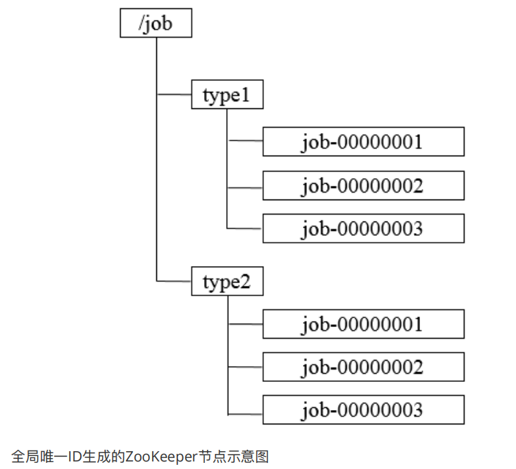

说明，对于⼀个任务列表的主键，使⽤ZooKeeper⽣成唯⼀ID的基本步骤：

- 所有客户端都会根据⾃⼰的任务类型，在指定类型的任务下⾯通过调⽤create（）接⼝来创建⼀个顺序节点，例如创建“job-”节点。

- 节点创建完毕后，create（）接⼝会返回⼀个完整的节点名，例如“job-0000000003”。

- 客户端拿到这个返回值后，拼接上 type 类型，例如“type2-job-0000000003”，这就可以作为⼀个全局唯⼀的ID了。

在ZooKeeper中，每⼀个数据节点都能够维护⼀份⼦节点的顺列，当客户端对其创建⼀个顺序⼦节点的时候 ZooKeeper 会⾃动以后缀的形式在其⼦节点上添加⼀

个序号，在这个场景中就是利⽤了ZooKeeper的这个特性.

### 4.3、集群管理

随着分布式系统规模的⽇益扩⼤，集群中的机器规模也随之变⼤，那如何更好地进⾏集群管理也显得越来越重要了。所谓集群管理，包括**集群监控与集群控制**两⼤

块，前者侧重对集群运⾏时状态的收集，后者则是对集群进⾏操作与控制。

在⽇常开发和运维过程中，我们经常会有类似于如下的需求：

- 如何快速的统计出当前⽣产环境下⼀共有多少台机器

- 如何快速的获取到机器上下线的情况

- 如何实时监控集群中每台主机的运⾏时状态

在传统的基于Agent的分布式集群管理体系中，都是通过在集群中的每台机器上部署⼀个 Agent，由这个 Agent 负责主动向指定的⼀个监控中⼼系统（监控中⼼系

统负责将所有数据进⾏集中处理，形成⼀系列报表，并负责实时报警，以下简称“监控中⼼”）汇报⾃⼰所在机器的状态。在集群规模适中的场景下，这确实是⼀种

在⽣产实践中⼴泛使⽤的解决⽅案，能够快速有效地实现分布式环境集群监控，但是⼀旦系统的业务场景增多，集群规模变⼤之后，该解决⽅案的弊端也就显现出

来了。

- **⼤规模升级困难**

  以客户端形式存在的 Agent，在⼤规模使⽤后，⼀旦遇上需要⼤规模升级的情况，就⾮常麻烦，在升级成本和升级进度的控制上⾯临巨⼤的挑战。

- **统⼀的Agen⽆法满⾜多样的需求**

  对于机器的CPU使⽤率、负载（Load）、内存使⽤率、⽹络吞吐以及磁盘容量等机器基本的物理状态，使⽤统⼀的Agent来进⾏监控或许都可以满⾜。但是，

  如果需要深⼊应⽤内部，对⼀些业务状态进⾏监控，例如，在⼀个分布式消息中间件中，希望监控到每个消费者对消息的消费状态；或者在⼀个分布式任务调

  度系统中，需要对每个机器上任务的执⾏情况进⾏监控。很显然，对于这些业务耦合紧密的监控需求，不适合由⼀个统⼀的Agent来提供。

- **编程语⾔多样性**

  随着越来越多编程语⾔的出现，各种异构系统层出不穷。如果使⽤传统的Agent⽅式，那么需要提供各种语⾔的 Agent 客户端。另⼀⽅⾯，“监控中⼼”在对异

  构系统的数据进⾏整合上⾯临巨⼤挑战

**Zookeeper的两⼤特性：**

1. 客户端如果对Zookeeper的数据节点注册Watcher监听，那么当该数据节点的内容或是其⼦节点列表发⽣变更时，Zookeeper服务器就会向订阅的客户端发送

   变更通知。

2. 对在Zookeeper上创建的临时节点，⼀旦客户端与服务器之间的会话失效，那么临时节点也会被⾃动删除

利⽤其两⼤特性，可以实现集群机器存活监控系统，若监控系统在/clusterServers节点上注册⼀个Watcher监听，那么但凡进⾏动态添加机器的操作，就会

在/clusterServers节点下创建⼀个临时节点：/clusterServers/[Hostname]，这样，监控系统就能够实时监测机器的变动情况。下⾯通过分布式⽇志收集系统这个

典型应⽤来学习Zookeeper如何实现集群管理。

### 4.4、分布式⽇志收集系统

分布式⽇志收集系统的核⼼⼯作就是收集分布在不同机器上的系统⽇志，在这⾥我们重点来看分布式⽇志系统（以下简称“⽇志系统”）的收集器模块。

在⼀个典型的⽇志系统的架构设计中，整个⽇志系统会把所有需要收集的⽇志机器（我们以“⽇志源机器”代表此类机器）分为多个组别，每个组别对应⼀个收集

器，这个收集器其实就是⼀个后台机器（我们以“收集器机器”代表此类机器），⽤于收集⽇志。

对于⼤规模的分布式⽇志收集系统场景，通常需要解决两个问题：

- **变化的⽇志源机器**

  在⽣产环境中，伴随着机器的变动，每个应⽤的机器⼏乎每天都是在变化的（机器硬件问题、扩容、机房迁移或是⽹络问题等都会导致⼀个应⽤的机器变

  化），也就是说每个组别中的⽇志源机器通常是在不断变化的

- **变化的收集器机器**

  ⽇志收集系统⾃身也会有机器的变更或扩容，于是会出现新的收集器机器加⼊或是⽼的收集器机器退出的情况。

⽆论是⽇志源机器还是收集器机器的变更，最终都可以归结为如何快速、合理、动态地为每个收集器分配对应的⽇志源机器。这也成为了整个⽇志系统正确稳定运

转的前提，也是⽇志收集过程中最⼤的技术挑战之⼀，在这种情况下，我们就可以引⼊zookeeper了，下⾯我们就来看ZooKeeper在这个场景中的使⽤。

使⽤Zookeeper的场景步骤如下

- **注册收集器机器**

  使⽤ZooKeeper来进⾏⽇志系统收集器的注册，典型做法是在ZooKeeper上创建⼀个节点作为收集器的根节点，例如/logs/collector（下⽂我们以“收集器节

  点”代表该数据节点），每个收集器机器在启动的时候，都会在收集器节点下创建⾃⼰的节点，例如/logs/collector/[Hostname]

  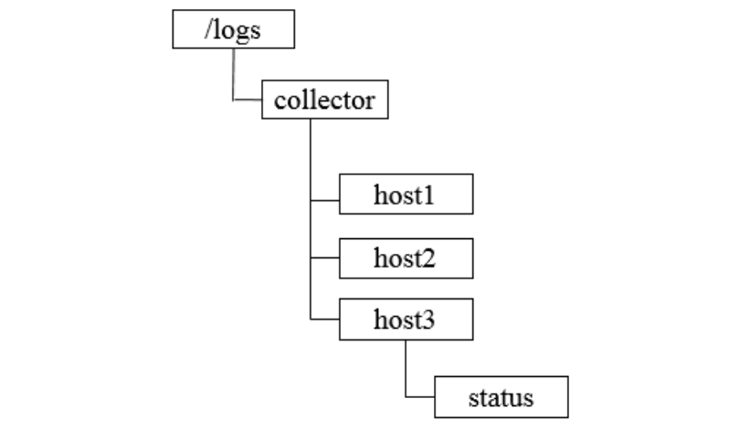

- **任务分发**

  待所有收集器机器都创建好⾃⼰对应的节点后，系统根据收集器节点下⼦节点的个数，将所有⽇志源机器分成对应的若⼲组，然后将分组后的机器列表分别写

  到这些收集器机器创建的⼦节点（例如/logs/collector/host1）上去。这样⼀来，每个收集器机器都能够从⾃⼰对应的收集器节点上获取⽇志源机器列表，进

  ⽽开始进⾏⽇志收集⼯作。

- **状态汇报**

  完成收集器机器的注册以及任务分发后，我们还要考虑到这些机器随时都有挂掉的可能。因此，针对这个问题，我们需要有⼀个收集器的状态汇报机制：每个

  收集器机器在创建完⾃⼰的专属节点后，还需要在对应的⼦节点上创建⼀个状态⼦节点，例如/logs/collector/host1/status，每个收集器机器都需要定期向该

  节点写⼊⾃⼰的状态信息。我们可以把这种策略看作是⼀种⼼跳检测机制，通常收集器机器都会在这个节点中写⼊⽇志收集进度信息。⽇志系统根据该状态⼦

  节点的最后更新时间来判断对应的收集器机器是否存活。

- **动态分配**

  如果收集器机器挂掉或是扩容了，就需要动态地进⾏收集任务的分配。在运⾏过程中，⽇志系统始终关注着/logs/collector这个节点下所有⼦节点的变更，⼀

  旦检测到有收集器机器停⽌汇报或是有新的收集器机器加⼊，就要开始进⾏任务的重新分配。⽆论是针对收集器机器停⽌汇报还是新机器加⼊的情况，⽇志系

  统都需要将之前分配给该收集器的所有任务进⾏转移。为了解决这个问题，通常有两种做法：

  - 全局动态分配

    这是⼀种简单粗暴的做法，在出现收集器机器挂掉或是新机器加⼊的时候，⽇志系统需要根据新的收集器机器列表，⽴即对所有的⽇志源机器重新进⾏⼀

    次分组，然后将其分配给剩下的收集器机器。全局动态分配⽅式虽然策略简单，但是存在⼀个问题：⼀个或部分收集器机器的变更，就会导致全局动

    态任务的分配，影响⾯⽐较⼤，因此⻛险也就⽐较⼤。

  - 局部动态分配

    所谓局部动态分配，顾名思义就是在⼩范围内进⾏任务的动态分配。在这种策略中，每个收集器机器在汇报⾃⼰⽇志收集状态的同时，也会把⾃⼰的负载

    汇报上去。请注意，这⾥提到的负载并不仅仅只是简单地指机器CPU负载（Load），⽽是⼀个对当前收集器任务执⾏的综合评估，这个评估算法和

    ZooKeeper本身并没有太⼤的关系，这⾥不再赘述。在这种策略中，如果⼀个收集器机器挂了，那么⽇志系统就会把之前分配给这个机器的任务重新分配

    到那些负载较低的机器上去。同样，如果有新的收集器机器加⼊，会从那些负载⾼的机器上转移部分任务给这个新加⼊的机器。

上述步骤已经完整的说明了整个⽇志收集系统的⼯作流程，其中有两点注意事项：

- 节点类型

  在/logs/collector节点下创建临时节点可以很好的判断机器是否存活，但是，若机器挂了，其节点会被删除，记录在节点上的⽇志源机器列表也被清除，所以

  需要选择持久节点来标识每⼀台机器，同时在节点下分别创建/logs/collector/[Hostname]/status节点来表征每⼀个收集器机器的状态，这样，既能实现对所

  有机器的监控，同时机器挂掉后，依然能够将分配任务还原。

- ⽇志系统节点监听

  若采⽤Watcher机制，那么通知的消息量的⽹络开销⾮常⼤，需要采⽤⽇志系统主动轮询收集器节点的策略，这样可以节省⽹络流量，但是存在⼀定的延时。

### 4.5、**Master**选举

Master选举是⼀个在分布式系统中⾮常常⻅的应⽤场景。分布式最核⼼的特性就是能够将具有独⽴计算能⼒的系统单元部署在不同的机器上，构成⼀个完整的分

布式系统。⽽与此同时，实际场景中往往也需要在这些分布在不同机器上的独⽴系统单元中选出⼀个所谓的“⽼⼤”，在计算机中，我们称之为Master。

在分布式系统中，Master往往⽤来协调集群中其他系统单元，具有对分布式系统状态变更的决定权。例如，在⼀些读写分离的应⽤场景中，客户端的写请求往往

是由 Master来处理的；⽽在另⼀些场景中，Master则常常负责处理⼀些复杂的逻辑，并将处理结果同步给集群中其他系统单元。Master选举可以说是ZooKeeper

最典型的应⽤场景了，接下来，我们就结合“⼀种海量数据处理与共享模型”这个具体例⼦来看看 ZooKeeper在集群Master选举中的应⽤场景。

在分布式环境中，经常会碰到这样的应⽤场景：集群中的所有系统单元需要对前端业务提供数据，⽐如⼀个商品 ID，或者是⼀个⽹站轮播⼴告的⼴告 ID（通常出

现在⼀些⼴告投放系统中）等，⽽这些商品ID或是⼴告ID往往需要从⼀系列的海量数据处理中计算得到——这通常是⼀个⾮常耗费 I/O 和 CPU资源的过程。鉴于该

计算过程的复杂性，如果让集群中的所有机器都执⾏这个计算逻辑的话，那么将耗费⾮常多的资源。⼀种⽐较好的⽅法就是只让集群中的部分，甚⾄只让其中的⼀

台机器去处理数据计算，⼀旦计算出数据结果，就可以共享给整个集群中的其他所有客户端机器，这样可以⼤⼤减少重复劳动，提升性能。 这⾥我们以⼀个简单

的⼴告投放系统后台场景为例来讲解这个模型。

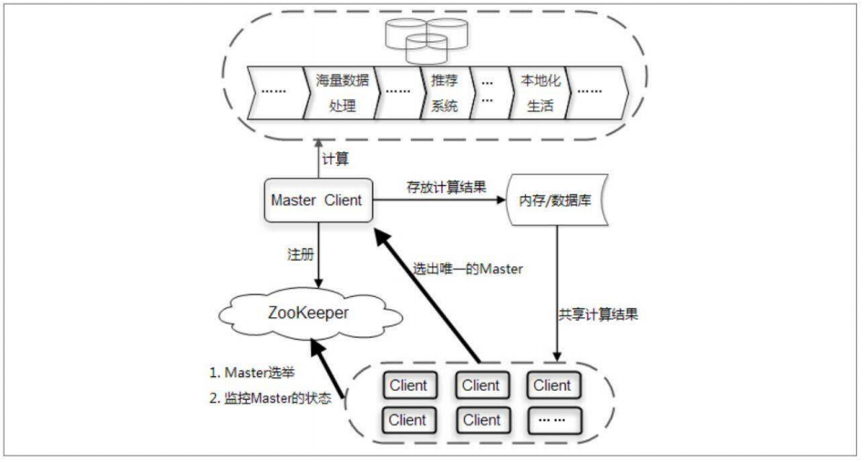

整个系统⼤体上可以分成客户端集群、分布式缓存系统、海量数据处理总线和 ZooKeeper四个部分⾸先我们来看整个系统的运⾏机制。图中的Client集群每天定时

会通过ZooKeeper来实现Master选举。选举产⽣Master客户端之后，这个Master就会负责进⾏⼀系列的海量数据处理，最终计算得到⼀个数据结果，并将其放置

在⼀个内存/数据库中。同时，Master还需要通知集群中其他所有的客户端从这个内存/数据库中共享计算结果。

接下去，我们将重点来看 Master 选举的过程，⾸先来明确下 Master 选举的需求：在集群的所有机器中选举出⼀台机器作为Master。针对这个需求，通常情况

下，我们可以选择常⻅的关系型数据库中的主键特性来实现：集群中的所有机器都向数据库中插⼊⼀条相同主键 ID 的记录，数据库会帮助我们⾃动进⾏主键冲突

检查，也就是说，所有进⾏插⼊操作的客户端机器中，只有⼀台机器能够成功——那么，我们就认为向数据库中成功插⼊数据的客户端机器成为Master。

借助数据库的这种⽅案确实可⾏，依靠关系型数据库的主键特性能够很好地保证在集群中选举出唯⼀的⼀个Master。但是我们需要考虑的另⼀个问题是，如果当

前选举出的Master挂了，那么该如何处理？谁来告诉我Master挂了呢？显然，关系型数据库没法通知我们这个事件。那么，如果使⽤ZooKeeper是否可以做到这

⼀点呢？ 那在之前，我们介绍了ZooKeeper创建节点的API接⼝，其中⼀个重要特性便是：利⽤ZooKeeper的强⼀致性，能够很好保证在分布式⾼并发情况下节点

的创建⼀定能够保证全局唯⼀性，即ZooKeeper将会保证客户端⽆法重复创建⼀个已经存在的数据节点。也就是说，如果同时有多个客户端请求创建同⼀个节点，

那么最终⼀定只有⼀个客户端请求能够创建成功。利⽤这个特性，就能很容易地在分布式环境中进⾏Master选举了。


在这个系统中，⾸先会在 ZooKeeper 上创建⼀个⽇期节点，例如“2020-11-11客户端集群每天都会定时往ZooKeeper 上创建⼀个临时节点，例

如/master_election/2020-11-11/binding。在这个过程中，只有⼀个客户端能够成功创建这个节点，那么这个客户端所在的机器就成为了Master。同时，其他没

有在ZooKeeper上成功创建节点的客户端，都会在节点/master_election/2020-11-11 上注册⼀个⼦节点变更的 Watcher，⽤于监控当前的 Master 机器是否存

活，⼀旦发现当前的 Master 挂了，那么其余的客户端将会重新进⾏Master选举。

从上⾯的讲解中，我们可以看到，如果仅仅只是想实现Master选举的话，那么其实只需要有⼀个能够保证数据唯⼀性的组件即可，例如关系型数据库的主键模型

就是⾮常不错的选择。但是，如果希望能够快速地进⾏集群 Master 动态选举，那么就可以基于 ZooKeeper来实现。

### 4.6、分布式锁

分布式锁是控制分布式系统之间同步访问共享资源的⼀种⽅式。如果不同的系统或是同⼀个系统的不同主机之间共享了⼀个或⼀组资源，那么访问这些资源的时

候，往往需要通过⼀些互斥⼿段来防⽌彼此之间的⼲扰，以保证⼀致性，在这种情况下，就需要使⽤分布式锁了。

在平时的实际项⽬开发中，我们往往很少会去在意分布式锁，⽽是依赖于关系型数据库固有的排他性来实现不同进程之间的互斥。这确实是⼀种⾮常简便且被⼴泛

使⽤的分布式锁实现⽅式。然⽽有⼀个不争的事实是，⽬前绝⼤多数⼤型分布式系统的性能瓶颈都集中在数据库操作上。因此，如果上层业务再给数据库添加⼀些

额外的锁，例如⾏锁、表锁甚⾄是繁重的事务处理，那么就会让数据库更加不堪重负

下⾯我们来看看使⽤ZooKeeper如何实现分布式锁，这⾥主要讲解排他锁和共享锁两类分布式锁。

#### 4.6.1、排他锁

排他锁（Exclusive Locks，简称 X 锁），⼜称为写锁或独占锁，是⼀种基本的锁类型。如果事务 T1对数据对象 O1加上了排他锁，那么在整个加锁期间，只允许事

务 T1对 O1进⾏读取和更新操作，其他任何事务都不能再对这个数据对象进⾏任何类型的操作——直到T1释放了排他锁

从上⾯讲解的排他锁的基本概念中，我们可以看到，排他锁的核⼼是如何保证当前有且仅有⼀个事务获得锁，并且锁被释放后，所有正在等待获取锁的事务都能够

被通知到。

下⾯我们就来看看如何借助ZooKeeper实现排他锁：

- **定义锁**

  在通常的Java开发编程中，有两种常⻅的⽅式可以⽤来定义锁，分别是synchronized机制和JDK5提供的ReentrantLock。然⽽，在ZooKeeper中，没有类似于

  这样的API可以直接使⽤，⽽是通过 ZooKeeper上的数据节点来表示⼀个锁，例如/exclusive_lock/lock节点就可以被定义为⼀个锁，如图：

  

- **获取锁**

  在需要获取排他锁时，所有的客户端都会试图通过调⽤ create（）接⼝，在/exclusive_lock节点下创建临时⼦节点/exclusive_lock/lock。在前⾯，我们也介绍

  了，ZooKeeper 会保证在所有的客户端中，最终只有⼀个客户端能够创建成功，那么就可以认为该客户端获取了锁。同时，所有没有获取到锁的客户端就需要

  到/exclusive_lock 节点上注册⼀个⼦节点变更的Watcher监听，以便实时监听到lock节点的变更情况

- **释放锁**

  在“定义锁”部分，我们已经提到，/exclusive_lock/lock 是⼀个临时节点，因此在以下两种情况下，都有可能释放锁。当前获取锁的客户端机器发⽣宕机，那么

  ZooKeeper上的这个临时节点就会被移除。 正常执⾏完业务逻辑后，客户端就会主动将⾃⼰创建的临时节点删除。 ⽆论在什么情况下移除了lock节点，

  ZooKeeper都会通知所有在/exclusive_lock节点上注册了⼦节点变更Watcher监听的客户端。这些客户端在接收到通知后，再次重新发起分布式锁获取，即重

  复“获取锁”过程。整个排他锁的获取和释放流程，如下图：

  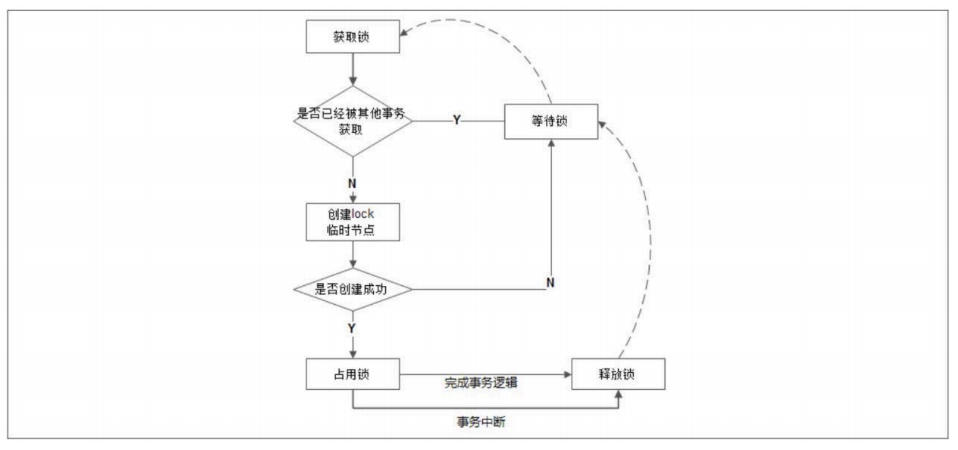

#### 4.6.2、共享锁

共享锁（Shared Locks，简称S锁），⼜称为读锁，同样是⼀种基本的锁类型。

如果事务T1对数据对象O1加上了共享锁，那么当前事务只能对O1进⾏读取操作，其他事务也只能对这个数据对象加共享锁——直到该数据对象上的所有共享锁都

被释放。

共享锁和排他锁最根本的区别在于，加上排他锁后，数据对象只对⼀个事务可⻅，⽽加上共享锁后，数据对所有事务都可⻅。

下⾯我们就来看看如何借助ZooKeeper来实现共享锁。

- **定义锁**

  和排他锁⼀样，同样是通过 ZooKeeper 上的数据节点来表示⼀个锁，是⼀个类似于“/shared_lock/[Hostname]-请求类型-序号”的临时顺序节点，例

  如/shared_lock/host1-R-0000000001，那么，这个节点就代表了⼀个共享锁，如图所示：

  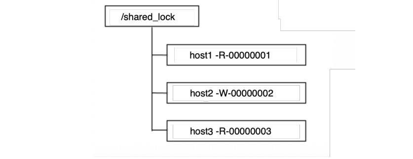

- **获取锁**

  在需要获取共享锁时，所有客户端都会到/shared_lock 这个节点下⾯创建⼀个临时顺序节点，如果当前是读请求，那么就创建例如/shared_lock/host1-R-

  0000000001的节点；如果是写请求，那么就创建例如/shared_lock/host2-W-0000000002的节点。

  - **判断读写顺序**

    通过Zookeeper来确定分布式读写顺序，⼤致分为四步

    ```
    1. 创建完节点后，获取/shared_lock节点下所有⼦节点，并对该节点变更注册监听。
    2. 确定⾃⼰的节点序号在所有⼦节点中的顺序。
    3. 对于读请求：若没有⽐⾃⼰序号⼩的⼦节点或所有⽐⾃⼰序号⼩的⼦节点都是读请求，那么表明⾃⼰已经成功获取到共享锁，同时开始执⾏读取逻辑，若有写请求，则需要等待。对于写请求：若⾃⼰不是序号最⼩的⼦节点，那么需要等待。
    4. 接收到Watcher通知后，重复步骤1
    ```

- **释放锁**，其释放锁的流程与独占锁⼀致。

- **⽺群效应**

  上⾯讲解的这个共享锁实现，⼤体上能够满⾜⼀般的分布式集群竞争锁的需求，并且性能都还可以——这⾥说的⼀般场景是指集群规模不是特别⼤，⼀般是在

  10台机器以内。但是如果机器规模扩⼤之后，会有什么问题呢？我们着重来看上⾯“判断读写顺序”过程的步骤3，结合下⾯的图，看看实际运⾏中的情况

  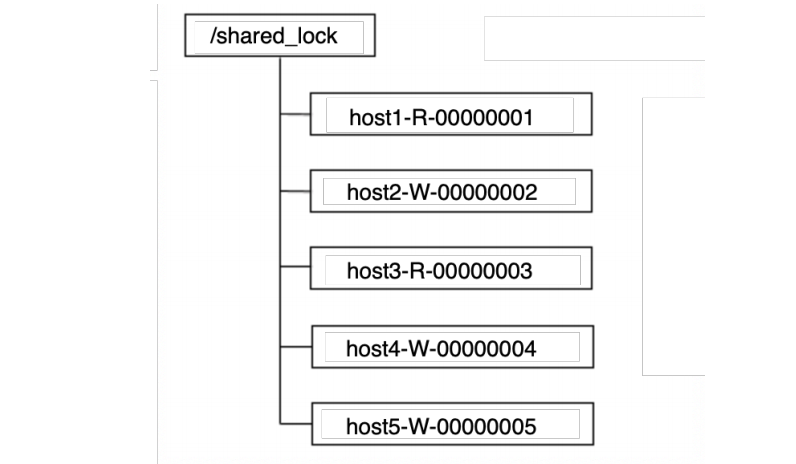

  针对如上图所示的情况进⾏分析

  1. host1⾸先进⾏读操作，完成后将节点/shared_lock/host1-R-00000001删除。

  2. 余下4台机器均收到这个节点移除的通知，然后重新从/shared_lock节点上获取⼀份新的⼦节点列表。

  3. 每台机器判断⾃⼰的读写顺序，其中host2检测到⾃⼰序号最⼩，于是进⾏写操作，余下的机器则继续等待。
  4. 继续...

  可以看到，host1客户端在移除⾃⼰的共享锁后，Zookeeper发送了⼦节点更变Watcher通知给所有机器，然⽽除了给host2产⽣影响外，对其他机器没有任何

  作⽤。⼤量的Watcher通知和⼦节点列表获取两个操作会重复运⾏，这样不仅会对zookeeper服务器造成巨⼤的性能影响影响和⽹络开销，更为严重的是，如

  果同⼀时间有多个节点对应的客户端完成事务或是事务中断引起节点消失，ZooKeeper服务器就会在短时间内向其余客户端发送⼤量的事件通知，这就是所谓

  的**⽺群效应**。

  上⾯这个ZooKeeper分布式共享锁实现中出现⽺群效应的根源在于，没有找准客户端真正的关注点。我们再来回顾⼀下上⾯的分布式锁竞争过程，它的核⼼逻

  辑在于：判断⾃⼰是否是所有⼦节点中序号最⼩的。于是，很容易可以联想到，每个节点对应的客户端只需要关注⽐⾃⼰序号⼩的那个相关节点的变更情况就

  可以了——⽽不需要关注全局的⼦列表变更情况。

  可以有如下改动来避免⽺群效应。

  - **改进后的分布式锁实现：**

    ⾸先，我们需要肯定的⼀点是，上⾯提到的共享锁实现，从整体思路上来说完全正确。这⾥主要的改动在于：每个锁竞争者，只需要关注/shared_lock节

    点下序号⽐⾃⼰⼩的那个节点是否存在即可，具体实现如下。

    1. 客户端调⽤create接⼝常⻅类似于/shared_lock/[Hostname]-请求类型-序号的临时顺序节点。

    2. 客户端调⽤getChildren接⼝获取所有已经创建的⼦节点列表（不注册任何Watcher）。

    3. 如果⽆法获取共享锁，就调⽤exist接⼝来对⽐⾃⼰⼩的节点注册Watcher。对于读请求：向⽐⾃⼰序号⼩的最后⼀个写请求节点注册Watcher监听。

       对于写请求：向⽐⾃⼰序号⼩的最后⼀个节点注册Watcher监听。

    4. 等待Watcher通知，继续进⼊步骤2。

    此⽅案改动主要在于：每个锁竞争者，只需要关注/shared_lock节点下序号⽐⾃⼰⼩的那个节点是否存在即可。

    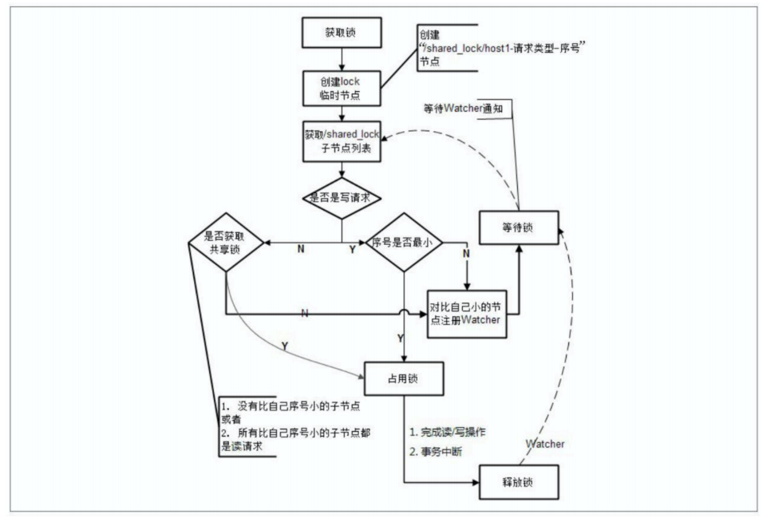

    **注意** 相信很多同学都会觉得改进后的分布式锁实现相对来说⽐较麻烦。确实如此，如同在多线程并发编程实践中，我们会去尽量缩⼩锁的范围——对于分布式锁实现的改进其实也是同样的思路。那么对于开发⼈员来说，是否必须按照改进后的思路来设计实现⾃⼰的分布式锁呢？答案是否定的。在具体的实际开发过程中，我们提倡根据具体的业务场景和集群规模来选择适合⾃⼰的分布式锁实现：在集群规模不⼤、⽹络资源丰富的情况下，第⼀种分布式锁实现⽅式是简单实⽤的选择；⽽如果集群规模达到⼀定程度，并且希望能够精细化地控制分布式锁机制，那么就可以试试改进版的分布式锁实现。

### 4.7、分布式队列

分布式队列可以简单分为两⼤类：⼀种是常规的**FIFO**先⼊先出队列模型，还有⼀种是等待队列元素聚集后统⼀安排处理执⾏的**Barrier**模型。

#### 4.7.1、FIFO先⼊先出

FIFO（First Input First Output，先⼊先出）， FIFO 队列是⼀种⾮常典型且应⽤⼴泛的按序执⾏的队列模型：先进⼊队列的请求操作先完成后，才会开始处理后

⾯的请求。

使⽤ZooKeeper实现FIFO队列，和之前提到的共享锁的实现⾮常类似。FIFO队列就类似于⼀个全写的共享锁模型，⼤体的设计思路其实⾮常简单：所有客户端都

会到/queue_fifo 这个节点下⾯创建⼀个临时顺序节点，例如如/queue_fifo/host1-00000001。


创建完节点后，根据如下4个步骤来确定执⾏顺序。

1. 通过调⽤getChildren接⼝来获取/queue_fifo节点的所有⼦节点，即获取队列中所有的元素。

2. 确定⾃⼰的节点序号在所有⼦节点中的顺序。

3. 如果⾃⼰的序号不是最⼩，那么需要等待，同时向⽐⾃⼰序号⼩的最后⼀个节点注册Watcher监听。

4. 接收到Watcher通知后，重复步骤1。

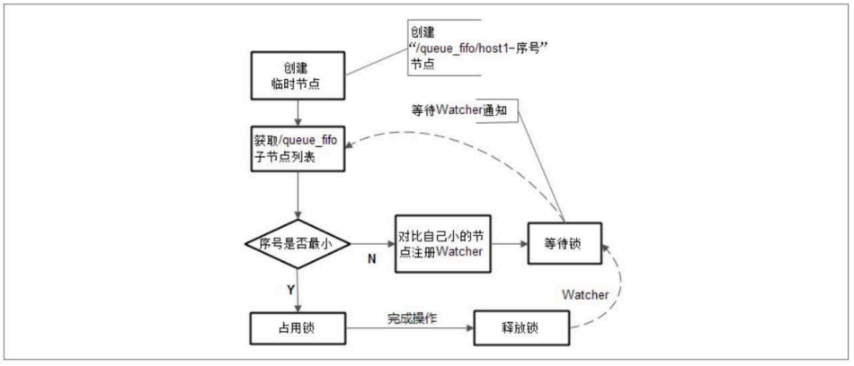

#### 4.7.2、Barrier：分布式屏障

Barrier原意是指障碍物、屏障，⽽在分布式系统中，特指系统之间的⼀个协调条件，规定了⼀个队列的元素必须都集聚后才能统⼀进⾏安排，否则⼀直等待。这往

往出现在那些⼤规模分布式并⾏计算的应⽤场景上：最终的合并计算需要基于很多并⾏计算的⼦结果来进⾏。这些队列其实是在 FIFO 队列的基础上进⾏了增强，

⼤致的设计思想如下：开始时，/queue_barrier 节点是⼀个已经存在的默认节点，并且将其节点的数据内容赋值为⼀个数字n来代表Barrier值，例如n=10表示只

有当/queue_barrier节点下的⼦节点个数达到10后，才会打开Barrier。之后，所有的客户端都会到/queue_barrie节点下创建⼀个临时节点，例

如/queue_barrier/host1，如图所示。


创建完节点后，按照如下步骤执⾏。

1. 通过调⽤getData接⼝获取/queue_barrier节点的数据内容：10。

2. 通过调⽤getChildren接⼝获取/queue_barrier节点下的所有⼦节点，同时注册对⼦节点变更的Watcher监听。

3. 统计⼦节点的个数。

4. 如果⼦节点个数还不⾜10个，那么需要等待。

5. 接受到Wacher通知后，重复步骤

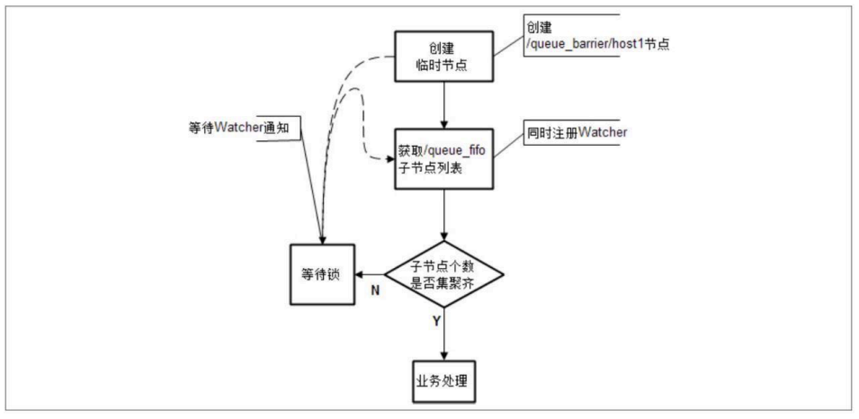

## 5、Zookeeper深⼊进阶

### 5.1、ZAB协议

在深⼊了解zookeeper之前，很多同学可能会认为zookeeper就是paxos算法的⼀个实现，但事实上，zookeeper并没有完全采⽤paxos算法，⽽是使⽤了⼀种称

为Zookeeper Atomic Broadcast（ZAB，Zookeeper原⼦消息⼴播协议）的协议作为其数据⼀致性的核⼼算法。

ZAB协议并不像Paxos算法那样 是⼀种通⽤的分布式⼀致性算法，它是⼀种特别为zookeeper专⻔设计的⼀种⽀持**崩溃恢复的原⼦⼴播协议**

在zookeeper中，主要就是依赖ZAB协议来实现分布式数据的⼀致性，基于该协议，Zookeeper实现了⼀种主备模式的系统架构来保持集群中各副本之间的数据的

⼀致性，表现形式就是 使⽤⼀个单⼀的主进程来接收并处理客户端的所有事务请求，并采⽤ZAB的原⼦⼴播协议，将服务器数据的状态变更以事务Proposal的形式

⼴播到所有的副本进程中，ZAB协议的主备模型架构保证了同⼀时刻集群中只能够有⼀个主进程来⼴播服务器的状态变更，因此能够很好地处理客户端⼤量的并发

请求。但是，也要考虑到主进程在任何时候都有可能出现崩溃退出或重启现象，因此,ZAB协议还需要做到当前主进程当出现上述异常情况的时候，依旧能正常⼯

作。

#### 5.1.1、ZAB核⼼

ZAB协议的核⼼是定义了对于那些会改变Zookeeper服务器数据状态的事务请求的处理⽅式

```
即：所有事务请求必须由⼀个全局唯⼀的服务器来协调处理，这样的服务器被称为Leader服务器，余下的服务器则称为Follower服务器，Leader服务器负责将⼀个客户端事务请求转化成⼀个事务Proposal（提议），并将该Proposal分发给集群中所有的Follower服务器，之后Leader服务器需要等待所有Follower服务器的反馈，⼀旦超过半数的Follower服务器进⾏了正确的反馈后，那么Leader就会再次向所有的Follower服务器分发Commit消息，要求其将前⼀个Proposal进⾏提交
```

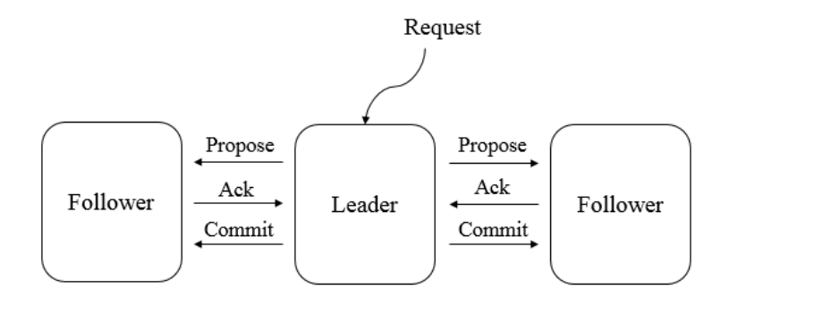

#### 5.1.2、ZAB协议介绍

ZAB协议包括两种基本的模式：**崩溃恢复和消息⼴播**

- 进⼊崩溃恢复模式：

  当整个服务框架启动过程中，或者是Leader服务器出现⽹络中断、崩溃退出或重启等异常情况时，ZAB协议就会进⼊崩溃恢复模式，同时选举产⽣新的Leader

  服务器。当选举产⽣了新的Leader服务器，同时集群中已经有过半的机器与该Leader服务器完成了状态同步之后，ZAB协议就会退出恢复模式，其中，所谓的

  **状态同步就是指数据同步**，⽤来保证集群中过半的机器能够和Leader服务器的数据状态保持⼀致。

- 进⼊消息⼴播模式：

  当集群中已经有过半的Follower服务器完成了和Leader服务器的状态同步，那么整个服务框架就可以进⼊消息⼴播模式，当⼀台同样遵守ZAB协议的服务器启

  动后加⼊到集群中，如果此时集群中已经存在⼀个Leader服务器在负责进⾏消息⼴播，那么加⼊的服务器就会⾃觉地进⼊数据恢复模式：找到**Leader**所在的

  服务器，并与其进⾏数据同步，然后⼀起参与到消息⼴播流程中去。Zookeeper只允许唯⼀的⼀个Leader服务器来进⾏事务请求的处理，Leader服务器在接

  收到客户端的事务请求后，会⽣成对应的事务提议并发起⼀轮⼴播协议，⽽如果集群中的其他机器收到客户端的事务请求后，那么这些⾮Leader服务器会⾸先

  将这个事务请求转发给Leader服务器。

接下来我们就重点讲解⼀下ZAB协议的消息⼴播过程和崩溃恢复过程

- **消息⼴播**

  ZAB协议的消息⼴播过程使⽤原⼦⼴播协议，**类似于⼀个⼆阶段提交过程**，针对客户端的事务请求，Leader服务器会为其⽣成对应的事务Proposal，并将其发

  送给集群中其余所有的机器，然后再分别收集各⾃的选票，最后进⾏事务提交。

  

  在ZAB的⼆阶段提交过程中，移除了中断逻辑，所有的Follower服务器要么正常反馈Leader提出的事务Proposal，要么就抛弃Leader服务器，同时，ZAB协议

  将⼆阶段提交中的中断逻辑移除意味着我们可以在过半的Follower服务器已经反馈Ack之后就开始提交事务Proposal了，⽽不需要等待集群中所有的Follower

  服务器都反馈响应，但是，在这种简化的⼆阶段提交模型下，⽆法处理因Leader服务器崩溃退出⽽带来的数据不⼀致问题，因此ZAB采⽤了崩溃恢复模式来解

  决此问题，另外，整个消息⼴播协议是基于具有FIFO特性的TCP协议来进⾏⽹络通信的，因此能够很容易保证消息⼴播过程中消息接受与发送的顺序性。

  在整个消息⼴播过程中，Leader服务器会为每个事务请求⽣成对应的Proposal来进⾏⼴播，并且在⼴播事务Proposal之前，Leader服务器会⾸先为这个事务

  Proposal分配⼀个全局单调递增的唯⼀ID，称之为事务ID（**ZXID**），由于ZAB协议需要保证每个消息严格的因果关系，因此必须将每个事务Proposal按照其

  ZXID的先后顺序来进⾏排序和处理。

  具体的过程：在消息⼴播过程中，Leader服务器会为每⼀个Follower服务器都各⾃分配⼀个单独的队列，然后将需要⼴播的事务 Proposal 依次放⼊这些队列

  中去，并且根据 FIFO策略进⾏消息发送。每⼀个Follower服务器在接收到这个事务Proposal之后，都会⾸先将其以事务⽇志的形式写⼊到本地磁盘中去，并

  且在成功写⼊后反馈给Leader服务器⼀个Ack响应。当Leader服务器接收到超过半数Follower的Ack响应后，就会⼴播⼀个Commit消息给所有的Follower服务

  器以通知其进⾏事务提交，同时Leader⾃身也会完成对事务的提交，⽽每⼀个Follower服务器在接收到Commit消息后，也会完成对事务的提交。

- **崩溃恢复**

  ZAB协议的这个基于原⼦⼴播协议的消息⼴播过程，在正常情况下运⾏⾮常良好，但是⼀旦在Leader服务器出现崩溃，或者由于⽹络原因导致Leader服务器失

  去了与过半Follower的联系，那么就会进⼊崩溃恢复模式。在ZAB协议中，为了保证程序的正确运⾏，整个恢复过程结束后需要选举出⼀个新的Leader服务

  器，因此，ZAB协议需要⼀个⾼效且可靠的Leader选举算法，从⽽保证能够快速地选举出新的Leader，同时，Leader选举算法不仅仅需要让Leader⾃身知道

  已经被选举为Leader，同时还需要让集群中的所有其他机器也能够快速地感知到选举产⽣出来的新Leader服务器。

  - **基本特性**

    根据上⾯的内容，我们了解到，ZAB协议规定了如果⼀个事务Proposal在⼀台机器上被处理成功，那么应该在所有的机器上都被处理成功，哪怕机器出现

    故障崩溃。接下来我们看看在崩溃恢复过程中，可能会出现的两个数据不⼀致性的隐患及针对这些情况ZAB协议所需要保证的特性。

  - **ZAB协议需要确保那些已经在Leader服务器上提交的事务最终被所有服务器都提交**

    假设⼀个事务在 Leader 服务器上被提交了，并且已经得到过半 Folower 服务器的Ack反馈，但是在它将Commit消息发送给所有Follower机器之前，

    Leader服务器挂了，如图所示

    

    图中的消息C2就是⼀个典型的例⼦：在集群正常运⾏过程中的某⼀个时刻，Server1 是 Leader 服务器，其先后⼴播了消息 P1、P2、C1、P3 和 C2，其

    中，当Leader服务器将消息C2（C2是Commit OfProposal2的缩写，即提交事务Proposal2）发出后就⽴即崩溃退出了。针对这种情况，ZAB协议就需要

    确保事务Proposal2最终能够在所有的服务器上都被提交成功，否则将出现不⼀致。

  - **ZAB协议需要确保丢弃那些只在Leader服务器上被提出的事务**

    如果在崩溃恢复过程中出现⼀个需要被丢弃的提案，那么在崩溃恢复结束后需要跳过该事务Proposal，如图所示。

    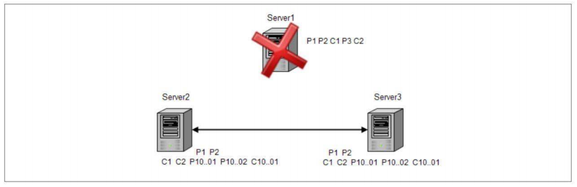

    在图所示的集群中，假设初始的 Leader 服务器 Server1 在提出了⼀个事务Proposal3 之后就崩溃退出了，从⽽导致集群中的其他服务器都没有收到这个

    事务Proposal3。于是，当 Server1 恢复过来再次加⼊到集群中的时候，ZAB 协议需要确保丢弃Proposal3这个事务。

    结合上⾯提到的这两个崩溃恢复过程中需要处理的特殊情况，就决定了 ZAB 协议必须设计这样⼀个Leader 选举算法：能够确保提交已经被 Leader 提交

    的事务 Proposal，同时丢弃已经被跳过的事务Proposal。针对这个要求，如果让Leader选举算法能够保证新选举出来的Leader服务器拥有集群中所有机

    器最⾼编号（即ZXID最⼤）的事务Proposal，那么就可以保证这个新选举出来的Leader⼀定具有所有已经提交的提案。更为重要的是，如果让具有最⾼编

    号事务Proposal 的机器来成为 Leader，就可以省去 Leader 服务器检查Proposal的提交和丢弃⼯作的这⼀步操作了。

  - **数据同步**

    完成Leader选举之后，在正式开始⼯作（即接收客户端的事务请求，然后提出新的提案）之前，Leader服务器会⾸先确认事务⽇志中的所有Proposal是

    否都已经被集群中过半的机器提交了，即是否完成数据同步。下⾯我们就来看看ZAB协议的数据同步过程。

    所有正常运⾏的服务器，要么成为 Leader，要么成为 Follower 并和 Leader 保持同步。Leader服务器需要确保所有的Follower服务器能够接收到每⼀条

    事务Proposal，并且能够正确地将所有已经提交了的事务Proposal应⽤到内存数据库中去。具体的，Leader服务器会为每⼀个Follower服务器都准备⼀个

    队列，并将那些没有被各Follower服务器同步的事务以Proposal消息的形式逐个发送给Follower服务器，并在每⼀个Proposal消息后⾯紧接着再发送⼀个

    Commit消息，以表示该事务已经被提交。等到Follower服务器将所有其尚未同步的事务 Proposal 都从 Leader 服务器上同步过来并成功应⽤到本地数据

    库中后，Leader服务器就会将该Follower服务器加⼊到真正的可⽤Follower列表中，并开始之后的其他流程。

#### 5.1.3、运⾏时状态分析

在ZAB协议的设计中，每个进程都有可能处于如下三种状态之⼀

　　· LOOKING：Leader选举阶段。

　　· FOLLOWING：Follower服务器和Leader服务器保持同步状态。

　　· LEADING：Leader服务器作为主进程领导状态。

所有进程初始状态都是LOOKING状态，此时不存在Leader，接下来，进程会试图选举出⼀个新的Leader，之后，如果进程发现已经选举出新的Leader了，那么它

就会切换到FOLLOWING状态，并开始和Leader保持同步，处于FOLLOWING状态的进程称为Follower，LEADING状态的进程称为Leader，当Leader崩溃或放弃

领导地位时，其余的Follower进程就会转换到LOOKING状态开始新⼀轮的Leader选举。

⼀个Follower只能和⼀个Leader保持同步，Leader进程和所有的Follower进程之间都通过⼼跳检测机制来感知彼此的情况。若Leader能够在超时时间内正常收到

⼼跳检测，那么Follower就会⼀直与该Leader保持连接，⽽如果在指定时间内Leader⽆法从过半的Follower进程那⾥接收到⼼跳检测，或者TCP连接断开，那么

Leader会放弃当前周期的领导，并转换到LOOKING状态，其他的Follower也会选择放弃这个Leader，同时转换到LOOKING状态，之后会进⾏新⼀轮的Leader选

举

#### 5.1.4、ZAB与Paxos的联系和区别

- **联系：**

　　① 都存在⼀个类似于Leader进程的⻆⾊，由其负责协调多个Follower进程的运⾏。

　　② Leader进程都会等待超过半数的Follower做出正确的反馈后，才会将⼀个提议进⾏提交。

　　③ 在ZAB协议中，每个Proposal中都包含了⼀个epoch值，⽤来代表当前的Leader周期，在Paxos算法中，同样存在这样的⼀个标识，名字为Ballot。

- **区别：**

  Paxos算法中，新选举产⽣的主进程会进⾏两个阶段的⼯作，第⼀阶段称为读阶段，新的主进程和其他进程通信来收集主进程提出的提议，并将它们提交。第

  ⼆阶段称为写阶段，当前主进程开始提出⾃⼰的提议。

  ZAB协议在Paxos基础上添加了同步阶段，此时，新的Leader会确保 存在过半的Follower已经提交了之前的Leader周期中的所有事务Proposal。这⼀同步阶

  段的引⼊，能够有效地保证Leader在新的周期中提出事务Proposal之前，所有的进程都已经完成了对之前所有事务Proposal的提交。

总的来说，ZAB协议和Paxos算法的本质区别在于，两者的设计⽬标不太⼀样，ZAB协议主要⽤于构建⼀个⾼可⽤的分布式数据主备系统，⽽Paxos算法则⽤于构建

⼀个分布式的⼀致性状态机系统

### 5.2、服务器⻆⾊

#### 5.2.1、Leader

Leader服务器是Zookeeper集群⼯作的核⼼，其主要⼯作有以下两个：

　　(1) 事务请求的唯⼀调度和处理者，保证集群事务处理的顺序性。

　　(2) 集群内部各服务器的调度者。

- 请求处理链

  使⽤责任链来处理每个客户端的请求是Zookeeper的特⾊，Leader服务器的请求处理链如下：

  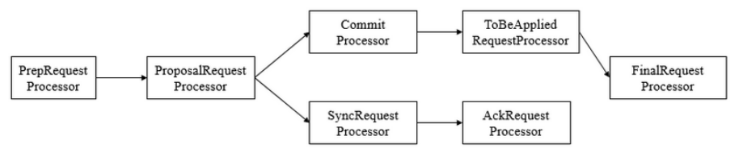

  可以看到，从prepRequestProcessor到FinalRequestProcessor前后⼀共7个请求处理器组成了leader服务器的请求处理链

  (1) PrepRequestProcessor。请求预处理器，也是leader服务器中的第⼀个请求处理器。在Zookeeper中，那些会改变服务器状态的请求称为事务请求（创建

  节点、更新数据、删除节点、创建会话等），PrepRequestProcessor能够识别出当前客户端请求是否是事务请求。对于事务请求，PrepRequestProcessor处

  理器会对其进⾏⼀系列预处理，如创建请求事务头、事务体、会话检查、ACL检查和版本检查等。

  (2) ProposalRequestProcessor。事务投票处理器。也是Leader服务器事务处理流程的发起者，对于⾮事务性请求，ProposalRequestProcessor会直接将请

  求转发到CommitProcessor处理器，不再做任何处理，⽽对于事务性请求，处理将请求转发到CommitProcessor外，还会根据请求类型创建对应的Proposal

  提议，并发送给所有的Follower服务器来发起⼀次集群内的事务投票。同时，ProposalRequestProcessor还会将事务请求交付给SyncRequestProcessor进⾏

  事务⽇志的记录。

  (3) SyncRequestProcessor。事务⽇志记录处理器。⽤来将事务请求记录到事务⽇志⽂件中，同时会触发Zookeeper进⾏数据快照。

  (4) AckRequestProcessor。负责在SyncRequestProcessor完成事务⽇志记录后，向Proposal的投票收集器发送ACK反馈，以通知投票收集器当前服务器已经

  完成了对该Proposal的事务⽇志记录。

  (5) CommitProcessor。事务提交处理器。对于⾮事务请求，该处理器会直接将其交付给下⼀级处理器处理；对于事务请求，其会等待集群内针对Proposal的

  投票直到该Proposal可被提交，利⽤CommitProcessor，每个服务器都可以很好地控制对事务请求的顺序处理。

  (6) ToBeCommitProcessor。该处理器有⼀个toBeApplied队列，⽤来存储那些已经被CommitProcessor处理过的可被提交的Proposal。其会将这些请求交付

  给FinalRequestProcessor处理器处理，待其处理完后，再将其从toBeApplied队列中移除。

  (7) FinalRequestProcessor。⽤来进⾏客户端请求返回之前的操作，包括创建客户端请求的响应，针对事务请求，该处理器还会负责将事务应⽤到内存数据库中。

#### 5.2.2、Follower

Follower服务器是Zookeeper集群状态中的跟随者，其主要⼯作有以下三个：

　　(1) 处理客户端⾮事务性请求（读取数据），转发事务请求给Leader服务器。

　　(2) 参与事务请求Proposal的投票。

　　(3) 参与Leader选举投票。

和leader⼀样，Follower也采⽤了责任链模式组装的请求处理链来处理每⼀个客户端请求，由于不需要对事务请求的投票处理，因此Follower的请求处理链会相对

简单，其处理链如下

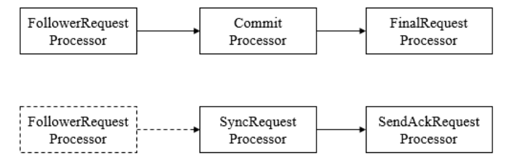

和 Leader 服务器的请求处理链最⼤的不同点在于，Follower 服务器的第⼀个处理器换成了FollowerRequestProcessor处理器，同时由于不需要处理事务请求的

投票，因此也没有了ProposalRequestProcessor处理器。

**(1) FollowerRequestProcessor**

其⽤作识别当前请求是否是事务请求，若是，那么Follower就会将该请求转发给Leader服务器，Leader服务器在接收到这个事务请求后，就会将其提交到请求处

理链，按照正常事务请求进⾏处理。

**(2) SendAckRequestProcessor**

其承担了事务⽇志记录反馈的⻆⾊，在完成事务⽇志记录后，会向Leader服务器发送ACK消息以表明⾃身完成了事务⽇志的记录⼯作

#### 5.2.3、Observer

Observer是ZooKeeper⾃3.3.0版本开始引⼊的⼀个全新的服务器⻆⾊。从字⾯意思看，该服务器充当了⼀个观察者的⻆⾊——其观察ZooKeeper集群的最新状态

变化并将这些状态变更同步过来。Observer服务器在⼯作原理上和Follower基本是⼀致的，对于⾮事务请求，都可以进⾏独⽴的处理，⽽对于事务请求，则会转

发给Leader服务器进⾏处理。和Follower唯⼀的区别在于，Observer不参与任何形式的投票，包括事务请求Proposal的投票和Leader选举投票。简单地讲，

Observer服务器只提供⾮事务服务，通常⽤于在不影响集群事务处理能⼒的前提下提升集群的⾮事务处理能⼒。

另外，Observer的请求处理链路和Follower服务器也⾮常相近,其处理链如下


另外需要注意的⼀点是，虽然在图中可以看到，Observer 服务器在初始化阶段会将SyncRequestProcessor处理器也组装上去，但是在实际运⾏过程中，Leader

服务器不会将事务请求的投票发送给Observer服务器。

### 5.3、Zookeeper服务器启动

服务端整体架构图

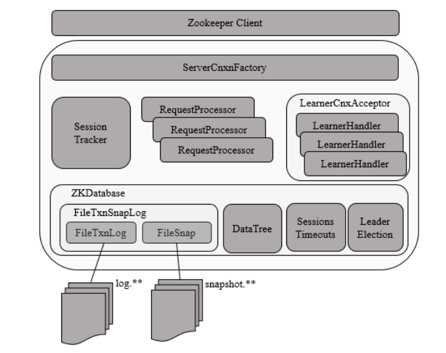

Zookeeper服务器的启动，⼤致可以分为以下五个步骤

```
 　　1. 配置⽂件解析
 　　2. 初始化数据管理器
 　　3. 初始化⽹络I/O管理器
 　　4. 数据恢复
 　　5. 对外服务
```

#### 5.3.1、单机版服务器启动

单机版服务器的启动其流程图如下

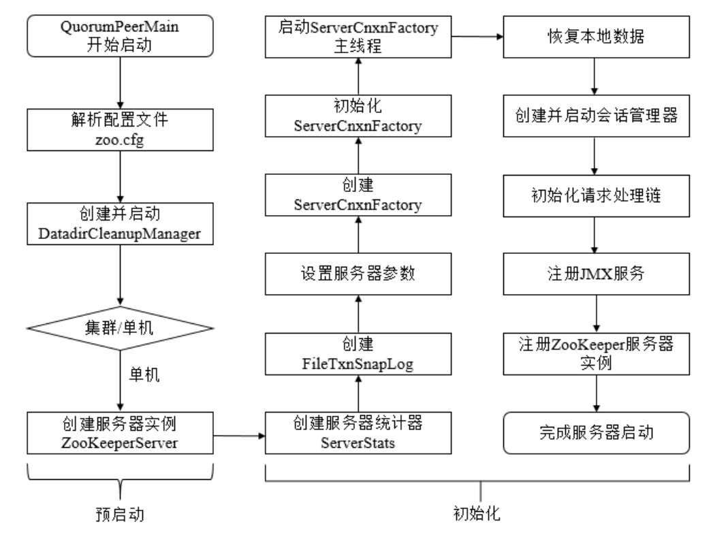

上图的过程可以分为**预启动和初始化**过程。

- **预启动**

  ```
  1. 统⼀由QuorumPeerMain作为启动类。⽆论单机或集群，在zkServer.cmd和zkServer.sh中都配置了QuorumPeerMain作为启动⼊⼝类。
  2. 解析配置⽂件zoo.cfg。zoo.cfg配置运⾏时的基本参数，如tickTime、dataDir、clientPort等参数。
  3. 创建并启动历史⽂件清理器DatadirCleanupManager。对事务⽇志和快照数据⽂件进⾏定时清理。
  4. 判断当前是集群模式还是单机模式启动。若是单机模式，则委托给ZooKeeperServerMain进⾏启动。
  5. 再次进⾏配置⽂件zoo.cfg的解析。
  6. 创建服务器实例ZooKeeperServer。Zookeeper服务器⾸先会进⾏服务器实例的创建，然后对该服务器实例进⾏初始化，包括连接器、内存数据库、请求处理器等组件的初始化。
  ```

- **初始化**

  ```
  1. 创建服务器统计器ServerStats。ServerStats是Zookeeper服务器运⾏时的统计器。
  2. 创建Zookeeper数据管理器FileTxnSnapLog。FileTxnSnapLog是Zookeeper上层服务器和底层数据存储之间的对接层，提供了⼀系列操作数据⽂件的接⼝，如事务⽇志⽂件和快照数据⽂件。Zookeeper根据zoo.cfg⽂件中解析出的快照数据⽬录dataDir和事务⽇志⽬录dataLogDir来创建FileTxnSnapLog。
  3. 设置服务器tickTime和会话超时时间限制。
  4. 创建ServerCnxnFactory。通过配置系统属性zookeper.serverCnxnFactory来指定使⽤Zookeeper⾃⼰实现的NIO还是使⽤Netty框架作为Zookeeper服务端⽹络连接⼯⼚。
  5. 初始化ServerCnxnFactory。Zookeeper会初始化Thread作为ServerCnxnFactory的主线程，然后再初始化NIO服务器。
  6. 启动ServerCnxnFactory主线程。进⼊Thread的run⽅法，此时服务端还不能处理客户端请求。
  7. 恢复本地数据。启动时，需要从本地快照数据⽂件和事务⽇志⽂件进⾏数据恢复。
  8. 创建并启动会话管理器。Zookeeper会创建会话管理器SessionTracker进⾏会话管理。
  9. 初始化Zookeeper的请求处理链。Zookeeper请求处理⽅式为责任链模式的实现。会有多个请求处理器依次处理⼀个客户端请求，在服务器启动时，会将这些请求处理器串联成⼀个请求处理链。
  10. 注册JMX服务。Zookeeper会将服务器运⾏时的⼀些信息以JMX的⽅式暴露给外部。
  11. 注册Zookeeper服务器实例。将Zookeeper服务器实例注册给ServerCnxnFactory，之后Zookeeper就可以对外提供服务。
  ```

⾄此，单机版的Zookeeper服务器启动完毕。

#### 5.3.2、集群服务器启动

单机和集群服务器的启动在很多地⽅是⼀致的，其流程图如下：

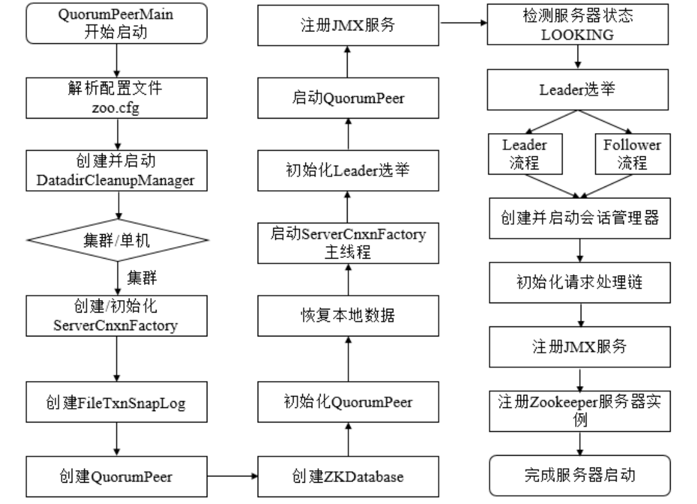

上图的过程可以分为**预启动、初始化、Leader选举、Leader与Follower启动期交互、Leader与Follower**启动等过程

- **预启动**

  ```
  1. 统⼀由QuorumPeerMain作为启动类。
  2. 解析配置⽂件zoo.cfg。
  3. 创建并启动历史⽂件清理器DatadirCleanupFactory。
  4. 判断当前是集群模式还是单机模式的启动。在集群模式中，在zoo.cfg⽂件中配置了多个服务器地址，可以选择集群启动。
  ```

- **初始化**

  ```
  1. 创建ServerCnxnFactory。
  2. 初始化ServerCnxnFactory。
  3. 创建Zookeeper数据管理器FileTxnSnapLog。
  4. 创建QuorumPeer实例。Quorum是集群模式下特有的对象，是Zookeeper服务器实例（ZooKeeperServer）的托管者，QuorumPeer代表了集群中的⼀台机器，在运⾏期间，QuorumPeer会不断检测当前服务器实例的运⾏状态，同时根据情况发起Leader选举。
  5. 创建内存数据库ZKDatabase。ZKDatabase负责管理ZooKeeper的所有会话记录以及DataTree和事务⽇志的存储。
  6. 初始化QuorumPeer。将核⼼组件如FileTxnSnapLog、ServerCnxnFactory、ZKDatabase注册到QuorumPeer中，同时配置QuorumPeer的参数，如服务器列表地址、Leader选举算法和会话超时时间限制等。
  7. 恢复本地数据。
  8. 启动ServerCnxnFactory主线程
  ```

- **Leader选举**

  ```
  1. 初始化Leader选举。
  	集群模式特有，Zookeeper⾸先会根据⾃身的服务器ID（SID）、最新的ZXID（lastLoggedZxid）和当前的服务器epoch（currentEpoch）来⽣成⼀个初始化投票，在初始化过程中，每个服务器都会给⾃⼰投票。然后，根据zoo.cfg的配置，创建相应Leader选举算法实现，Zookeeper提供了三种默认算法（LeaderElection、AuthFastLeaderElection、FastLeaderElection），可通过zoo.cfg中的electionAlg属性来指定，但现只⽀持FastLeaderElection选举算法。在初始化阶段，Zookeeper会创建Leader选举所需的⽹络I/O层QuorumCnxManager，同时启动对Leader选举端⼝的监听，等待集群中其他服务器创建连接。
  2. 注册JMX服务。
  3. 检测当前服务器状态
  	运⾏期间，QuorumPeer会不断检测当前服务器状态。在正常情况下，Zookeeper服务器的状态在LOOKING、LEADING、FOLLOWING/OBSERVING之间进⾏切换。在启动阶段，QuorumPeer的初始状态是LOOKING，因此开始进⾏Leader选举。
  4. Leader选举
  	ZooKeeper的Leader选举过程，简单地讲，就是⼀个集群中所有的机器相互之间进⾏⼀系列投票，选举产⽣最合适的机器成为Leader，同时其余机器成为Follower或是Observer的集群机器⻆⾊初始化过程。关于Leader选举算法，简⽽⾔之，就是集群中哪个机器处理的数据越新（通常我们根据每个服务器处理过的最⼤ZXID来⽐较确定其数据是否更新），其越有可能成为Leader。当然，如果集群中的所有机器处理的ZXID⼀致的话，那么SID最⼤的服务器成为Leader，其余机器称为Follower和Observer
  ```

- **Leader和Follower启动期交互过程**

  到这⾥为⽌，ZooKeeper已经完成了Leader选举，并且集群中每个服务器都已经确定了⾃⼰的⻆⾊——通常情况下就分为 Leader 和 Follower 两种⻆⾊。下

  ⾯我们来对 Leader和Follower在启动期间的交互进⾏介绍，其⼤致交互流程如图所示。

  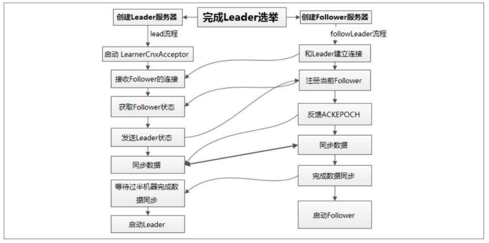

  ```
  1. 创建Leader服务器和Follower服务器。完成Leader选举后，每个服务器会根据⾃⼰服务器的⻆⾊创建相应的服务器实例，并进⼊各⾃⻆⾊的主流程。
  2. Leader服务器启动Follower接收器LearnerCnxAcceptor。运⾏期间，Leader服务器需要和所有其余的服务器（统称为Learner）保持连接以确集群的机器存活情况，LearnerCnxAcceptor负责接收所有⾮Leader服务器的连接请求。
  3. Learner服务器开始和Leader建⽴连接。所有Learner会找到Leader服务器，并与其建⽴连接。
  4. Leader服务器创建LearnerHandler。Leader接收到来⾃其他机器连接创建请求后，会创建⼀个LearnerHandler实例，每个LearnerHandler实例都对应⼀个Leader与Learner服务器之间的连接，其负责Leader和Learner服务器之间⼏乎所有的消息通信和数据同步。
  5. 向Leader注册。Learner完成和Leader的连接后，会向Leader进⾏注册，即将Learner服务器的基本信息（LearnerInfo），包括SID和ZXID，发送给Leader服务器。
  6. Leader解析Learner信息，计算新的epoch。Leader接收到Learner服务器基本信息后，会解析出该Learner的SID和ZXID，然后根据ZXID解析出对应的epoch_of_learner，并和当前Leader服务器的epoch_of_leader进⾏⽐较，如果该Learner的epoch_of_learner更⼤，则更新Leader的poch_of_leader = epoch_of_learner + 1。然后LearnHandler进⾏等待，直到过半Learner已经向Leader进⾏了注册，同时更新了epoch_of_leader后，Leader就可以确定当前集群的epoch了。
  7. 发送Leader状态。计算出新的epoch后，Leader会将该信息以⼀个LEADERINFO消息的形式发送给Learner，并等待Learner的响应。
  8. Learner发送ACK消息。Learner接收到LEADERINFO后，会解析出epoch和ZXID，然后向Leader反馈⼀个ACKEPOCH响应。
  9. 数据同步。Leader收到Learner的ACKEPOCH后，即可进⾏数据同步。
  10. 启动Leader和Learner服务器。当有过半Learner已经完成了数据同步，那么Leader和Learner服务器实例就可以启动了
  ```

- **Leader和Follower启动**

  ```
  1. 创建启动会话管理器。
  2. 初始化Zookeeper请求处理链，集群模式的每个处理器也会在启动阶段串联请求处理链。
  3. 注册JMX服务。
  ```

⾄此，集群版的Zookeeper服务器启动完毕

### 5.4、leader选举

Leader选举概述

Leader选举是zookeeper最重要的技术之⼀，也是保证分布式数据⼀致性的关键所在。

当Zookeeper集群中的⼀台服务器出现以下两种情况之⼀时，需要进⼊Leader选举。

　　(1) 服务器初始化启动。

　　(2) 服务器运⾏期间⽆法和Leader保持连接。

下⾯就两种情况进⾏分析讲解。

- **服务器启动时期的Leader选举**

  若进⾏Leader选举，则⾄少需要两台机器，这⾥选取3台机器组成的服务器集群为例。在集群初始化阶段，当有⼀台服务器Server1启动时，其单独⽆法进⾏和

  完成Leader选举，当第⼆台服务器Server2启动时，此时两台机器可以相互通信，每台机器都试图找到Leader，于是进⼊Leader选举过程。选举过程如下

  - **每个Server发出⼀个投票**

    由于是初始情况，Server1（假设myid为1）和Server2假设myid为2）都会将⾃⼰作为Leader服务器来进⾏投票，每次投票会包含所推举的服务器的myid

    和ZXID，使⽤(myid, ZXID)来表示，此时Server1的投票为(1, 0)，Server2的投票为(2, 0)，然后各⾃将这个投票发给集群中其他机器

  - **接受来⾃各个服务器的投票**

    集群的每个服务器收到投票后，⾸先判断该投票的有效性，如检查是否是本轮投票、是否来⾃LOOKING状态的服务器。

  - **处理投票**

    针对每⼀个投票，服务器都需要将别⼈的投票和⾃⼰的投票进⾏PK，PK规则如下

    　　　 **·** 优先检查**ZXID**。ZXID⽐较⼤的服务器优先作为Leader。

    　　　 **·** 如果**ZXID**相同，那么就⽐较**myid**。myid较⼤的服务器作为Leader服务器。

    现在我们来看Server1和Server2实际是如何进⾏投票处理的。对于Server1来说，它⾃⼰的投票是（1，0），⽽接收到的投票为（2，0）。⾸先会对⽐两

    者的ZXID，因为都是0，所以⽆法决定谁是Leader。接下来会对⽐两者的myid，很显然，Server1发现接收到的投票中的myid是2，⼤于⾃⼰，于是就会

    更新⾃⼰的投票为（2，0），然后重新将投票发出去。⽽对于Server2来说，不需要更新⾃⼰的投票。

  - **统计投票**

    每次投票后，服务器都会统计所有投票，判断是否已经有过半的机器接收到相同的投票信息。对于Server1和Server2服务器来说，都统计出集群中已经有

    两台机器接受了（2，0）这个投票信息。这⾥我们需要对“过半”的概念做⼀个简单的介绍。所谓“过半”就是指⼤于集群机器数量的⼀半，即⼤于或等于

    （n/2+1）。对于这⾥由3台机器构成的集群，⼤于等于2台即为达到“过半”要求。

    那么，当Server1和Server2都收到相同的投票信息（2，0）的时候，即认为已经选出了Leader。

  - **改变服务器状态**

    ⼀旦确定了 Leader，每个服务器就会更新⾃⼰的状态：如果是 Follower，那么就变更为FOLLOWING，如果是Leader，那么就变更为LEADING。

- **服务器运⾏时期的Leader选举**

  在ZooKeeper集群正常运⾏过程中，⼀旦选出⼀个Leader，那么所有服务器的集群⻆⾊⼀般不会再发⽣变化——也就是说，Leader服务器将⼀直作为集群的

  Leader，即使集群中有⾮Leader机器挂了或是有新机器加⼊集群也不会影响Leader。但是⼀旦Leader所在的机器挂了，那么整个集群将暂时⽆法对外服务，

  ⽽是进⼊新⼀轮的Leader选举。服务器运⾏期间的Leader选举和启动时期的Leader选举基本过程是⼀致的。

  我们还是假设当前正在运⾏的 ZooKeeper 机器由 3 台机器组成，分别是 Server1、Server2和Server3，当前的Leader是Server2。假设在某⼀个瞬间，

  Leader挂了，这个时候便开始了Leader选举。

  - **变更状态**

    Leader挂后，余下的⾮Observer服务器都会将⾃⼰的服务器状态变更为LOOKING，然后开始进⼊Leader选举过程。

  - **每个Server会发出⼀个投票**

    在运⾏期间，每个服务器上的ZXID可能不同，此时假定Server1的ZXID为123，Server3的ZXID为122；在第⼀轮投票中，Server1和Server3都会投⾃⼰，

    产⽣投票(1, 123)，(3, 122)，然后各⾃将投票发送给集群中所有机器。

  - **接收来⾃各个服务器的投票，与启动时过程相同**

  - **处理投票。与启动时过程相同，此时，Server1将会成为Leader**

  - **统计投票。与启动时过程相同**

  - **改变服务器的状态。与启动时过程相同**

## 6、Zookeeper源码分析

### 6.1、源码环境搭建

zk源码下载地址：https://github.com/apache/zookeeper/tree/release-3.5.4（已经被转换过了）

注意：因为zk是由ant来构建的，所以需要使⽤ant命令来转换成⼯程，然后导⼊idea将准备好的zookeeper-release-3.5.4导⼊idea中

- **启动服务端**

  运⾏主类 org.apache.zookeeper.server.QuorumPeerMain ，将zoo.cfg的完整路径配置在Programarguments。

  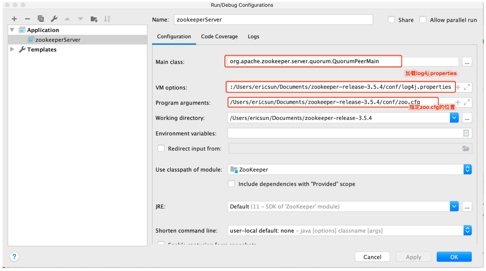

  在VM options配置，即指定到conf⽬录下的log4j.properties：

  ```properties
  -Dlog4j.configuration=file:/Users/ericsun/Documents/zookeeper-release-3.5.4/conf/log4j.properties
  ```

  运⾏输出⽇志如下

  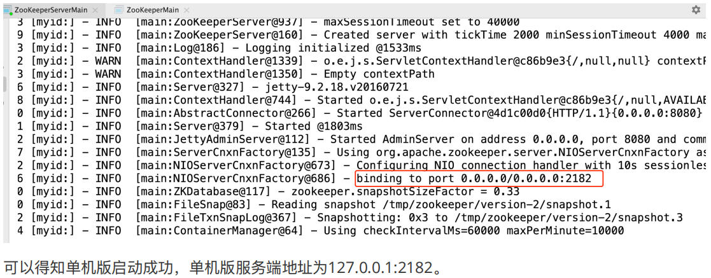

- **运⾏客户端**

  通过运⾏ ZooKeeperServerMain 得到的⽇志，可以得知ZooKeeper服务端已经启动，服务的地址为 127.0.0.1:2182 。启动客户端来进⾏连接测试。

  客户端的启动类为 org.apache.zookeeper.ZooKeeperMain ，进⾏如下配置：

  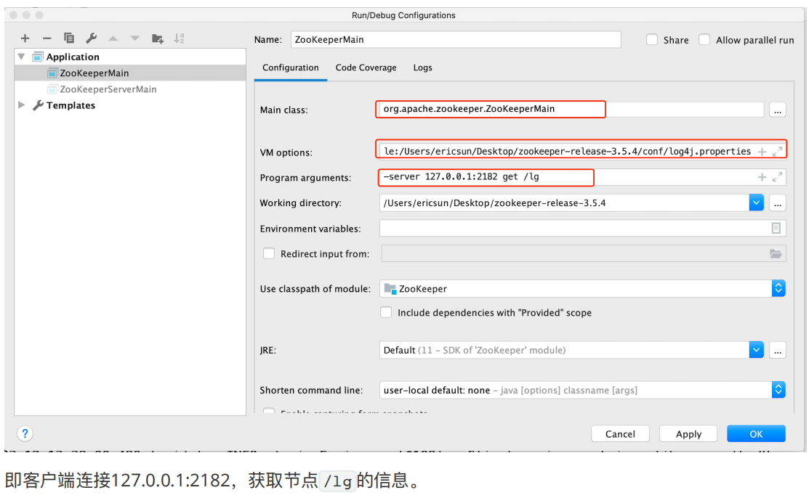

### 6.2、zookeeper源码分析之单机模式服务端启动

- **执⾏过程概述**

  单机模式的ZK服务端逻辑写在ZooKeeperServerMain类中，由⾥⾯的main函数启动，整个过程如下：

  单机版服务器的启动其流程图如下

  

  单机模式的委托启动类为：ZooKeeperServerMain

- **服务端启动过程**

  看下ZooKeeperServerMain⾥⾯的main函数代码：

  ```java
  public static void main(String[] args) {
       ZooKeeperServerMain main = new ZooKeeperServerMain();
       main.initializeAndRun(args);
  }
  protected void initializeAndRun(String[] args)throws ConfigException, IOException, AdminServerException{
       ServerConfig config = new ServerConfig();
       //如果⼊参只有⼀个，则认为是配置⽂件的路径
       if (args.length == 1) {
       	config.parse(args[0]);
       } else {
           //否则是各个参数
           config.parse(args);
       }
       runFromConfig(config);
  }
  //省略部分代码，只保留了核⼼逻辑
  public void runFromConfig(ServerConfig config) throwsIOException,AdminServerException {
       FileTxnSnapLog txnLog = null;
       try {
           //初始化⽇志⽂件
           txnLog = new FileTxnSnapLog(config.dataLogDir, config.dataDir);
           //初始化ZkServer对象
           final ZooKeeperServer zkServer = new ZooKeeperServer(txnLog,config.tickTime, config.minSessionTimeout, config.maxSessionTimeout, null);
           txnLog.setServerStats(zkServer.serverStats());
           if (config.getClientPortAddress() != null) {
               //初始化server端IO对象，默认是NIOServerCnxnFactory
               cnxnFactory = ServerCnxnFactory.createFactory();
               //初始化配置信息
               cnxnFactory.configure(config.getClientPortAddress(),config.getMaxClientCnxns(), false);
               //启动服务
               cnxnFactory.startup(zkServer);
           }
           //container ZNodes是3.6版本之后新增的节点类型，Container类型的节点会在它没有⼦节点时
           // 被删除（新创建的Container节点除外），该类就是⽤来周期性的进⾏检查清理⼯作
           containerManager = new ContainerManager(zkServer.getZKDatabase(),zkServer.firstProcessor,
                                                   Integer.getInteger("znode.container.checkIntervalMs", 	
                                                   (int)TimeUnit.MINUTES.toMillis(1)),
                                                   Integer.getInteger("znode.container.maxPerMinute", 10000));
           containerManager.start();
           //省略关闭逻辑
           } catch (InterruptedException e) {
           	LOG.warn("Server interrupted", e);
           } finally {
               if (txnLog != null) {
               	txnLog.close();
               }
       }
  }
  ```

  ⼩结：

  zk单机模式启动主要流程：

  1、注册jmx

  2、解析ServerConfig配置对象

  3、根据配置对象，运⾏单机zk服务4、创建管理事务⽇志和快照FileTxnSnapLog对象，zookeeperServer对象，并设置zkServer的统计对象

  5、设置zk服务钩⼦，原理是通过设置CountDownLatch，调⽤ZooKeeperServerShutdownHandler的handle⽅法，可以将触发shutdownLatch.await⽅法继续执⾏，即调⽤shutdown关闭单机服务

  6、基于jetty创建zk的admin服务

  7、创建连接对象cnxnFactory和secureCnxnFactory（安全连接才创建该对象），⽤于处理客户端的请求

  8、创建定时清除容器节点管理器，⽤于处理容器节点下不存在⼦节点的清理容器节点⼯作等。

  可以看到关键点在于解析配置跟启动两个⽅法，先来看下解析配置逻辑，对应上⾯的configure⽅法：

  ```java
  //依旧省略掉了部分逻辑
  public void configure(InetSocketAddress addr, int maxcc, boolean secure)
      throws IOException {
       maxClientCnxns = maxcc;
       //会话超时时间
       sessionlessCnxnTimeout =
      Integer.getInteger(ZOOKEEPER_NIO_SESSIONLESS_CNXN_TIMEOUT, 10000);
       //过期队列
       cnxnExpiryQueue = new ExpiryQueue<NIOServerCnxn>(sessionlessCnxnTimeout);
       //过期线程，从cnxnExpiryQueue中读取数据，如果已经过期则关闭
       expirerThread = new ConnectionExpirerThread();
       //根据CPU个数计算selector线程的数量
       int numCores = Runtime.getRuntime().availableProcessors();
       numSelectorThreads =
      Integer.getInteger(ZOOKEEPER_NIO_NUM_SELECTOR_THREADS, Math.max((int)Math.sqrt((float) numCores/2), 1));
       if (numSelectorThreads < 1) {
          throw new IOException("numSelectorThreads must be at least 1");
       }
       //计算woker线程的数量
       numWorkerThreads = Integer.getInteger(ZOOKEEPER_NIO_NUM_WORKER_THREADS, 2 * numCores);
       //worker线程关闭时间
       workerShutdownTimeoutMS = Long.getLong(ZOOKEEPER_NIO_SHUTDOWN_TIMEOUT,5000);
       //初始化selector线程
       for(int i=0; i<numSelectorThreads; ++i) {
          selectorThreads.add(new SelectorThread(i));
       }
       this.ss = ServerSocketChannel.open();
       ss.socket().setReuseAddress(true);
       ss.socket().bind(addr);
       ss.configureBlocking(false);
       //初始化accept线程，这⾥看出accept线程只有⼀个，⾥⾯会注册监听ACCEPT事件
       acceptThread = new AcceptThread(ss, addr, selectorThreads);
  }
  ```

  再来看下启动逻辑：

  ```java
  public void startup(ZooKeeperServer zkServer) throws IOException,
      InterruptedException {
       	startup(zkServer, true);
      }
      //启动分了好⼏块，⼀个⼀个看
      public void startup(ZooKeeperServer zks, boolean startServer)throws IOException, InterruptedException {
          start();
          setZooKeeperServer(zks);
          if (startServer) {
               zks.startdata();
               zks.startup();
           }
      }
  //⾸先是start⽅法
  public void start() {
       stopped = false;
       //初始化worker线程池
       if (workerPool == null) {
       	workerPool = new WorkerService("NIOWorker", numWorkerThreads, false);
       }
       //挨个启动select线程
       for(SelectorThread thread : selectorThreads) {
           if (thread.getState() == Thread.State.NEW) {
           	thread.start();
           }
       }
       //启动acceptThread线程
       if (acceptThread.getState() == Thread.State.NEW) {
       	acceptThread.start();
       }
       //启动expirerThread线程
       if (expirerThread.getState() == Thread.State.NEW) {
       	expirerThread.start();
       }
  }
  //初始化数据结构
  public void startdata() throws IOException, InterruptedException {
       //初始化ZKDatabase，该数据结构⽤来保存ZK上⾯存储的所有数据
       if (zkDb == null) {
           //初始化数据数据，这⾥会加⼊⼀些原始节点，例如/zookeeper
           zkDb = new ZKDatabase(this.txnLogFactory);
       }
       //加载磁盘上已经存储的数据，如果有的话
       if (!zkDb.isInitialized()) {
       	loadData();
       }
  }
  //启动剩余项⽬
  public synchronized void startup() {
       //初始化session追踪器
       if (sessionTracker == null) {
       	createSessionTracker();
       }
       //启动session追踪器
       startSessionTracker();
       //建⽴请求处理链路
       setupRequestProcessors();
       registerJMX();
       setState(State.RUNNING);
       notifyAll();
  }
      //这⾥可以看出，单机模式下请求的处理链路为：
      //PrepRequestProcessor -> SyncRequestProcessor -> FinalRequestProcessor
      protected void setupRequestProcessors() {
       RequestProcessor finalProcessor = new FinalRequestProcessor(this);
       RequestProcessor syncProcessor = new SyncRequestProcessor(this,
       finalProcessor);
       ((SyncRequestProcessor)syncProcessor).start();
       firstProcessor = new PrepRequestProcessor(this, syncProcessor);
       ((PrepRequestProcessor)firstProcessor).start();
  }
  ```

### 6.3、源码分析之Leader选举

分析Zookeeper中⼀个核⼼的模块，Leader选举。

- **总体框架图**

  对于Leader选举，其总体框架图如下图所示

   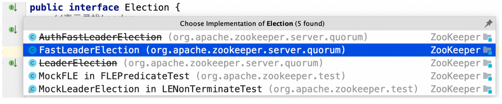

  AuthFastLeaderElection，LeaderElection其在3.4.0之后的版本中已经不建议使⽤。

- **Election源码分析**

  ```java
  public interface Election {
   public Vote lookForLeader() throws InterruptedException;
   public void shutdown();
  }
  ```

  说明：选举的⽗接⼝为Election，其定义了lookForLeader和shutdown两个⽅法，lookForLeader表示寻找Leader，shutdown则表示关闭，如关闭服务端之

  间的连接。

### 6.4、源码分析之Leader选举（⼆）之FastLeaderElection

刚刚介绍了Leader选举的总体框架，接着来学习Zookeeper中默认的选举策略，FastLeaderElection。

- **FastLeaderElection源码分析**

  类的继承关系

  ```java
  public class FastLeaderElection implements Election {}
  ```

  说明：FastLeaderElection实现了Election接⼝，重写了接⼝中定义的lookForLeader⽅法和shutdown⽅法

  **在源码分析之前，我们⾸先介绍⼏个概念:**

  - 外部投票：特指其他服务器发来的投票。

  - 内部投票：服务器⾃身当前的投票。

  - 选举轮次：ZooKeeper服务器Leader选举的轮次，即logical clock（逻辑时钟）。

  - PK：指对内部投票和外部投票进⾏⼀个对⽐来确定是否需要变更内部投票。选票管理

  - sendqueue：选票发送队列，⽤于保存待发送的选票。

  - recvqueue：选票接收队列，⽤于保存接收到的外部投票。

   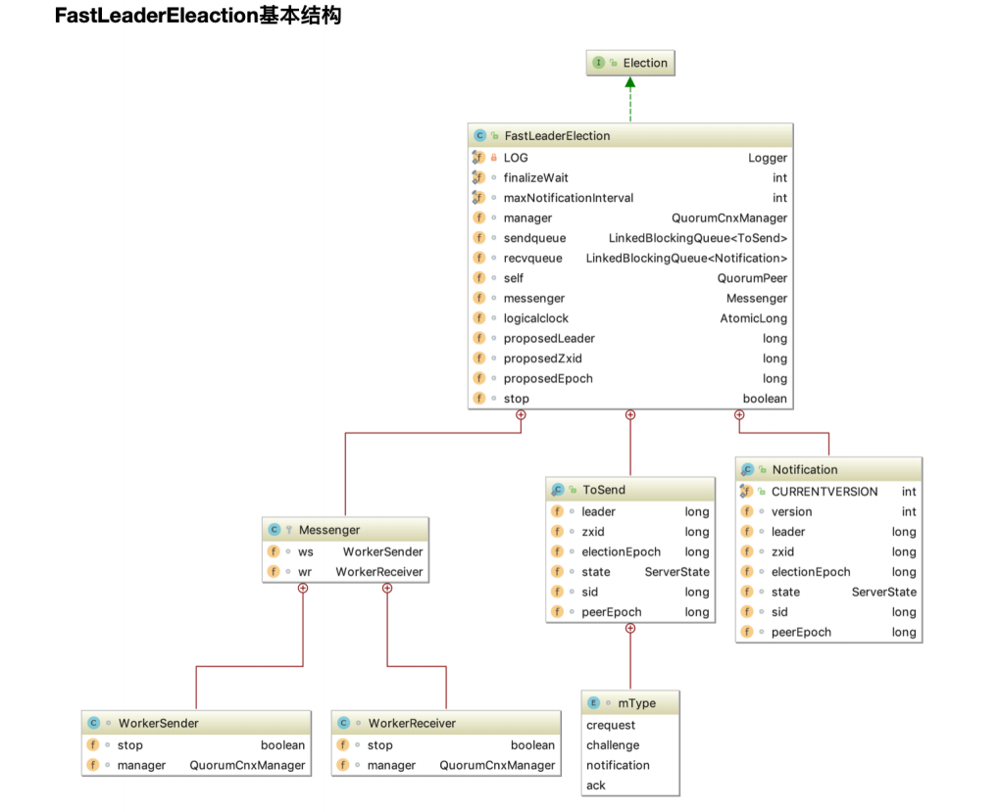

- **lookForLeader函数**

  当 ZooKeeper 服务器检测到当前服务器状态变成 LOOKING 时，就会触发 Leader选举，即调⽤lookForLeader⽅法来进⾏Leader选举。

   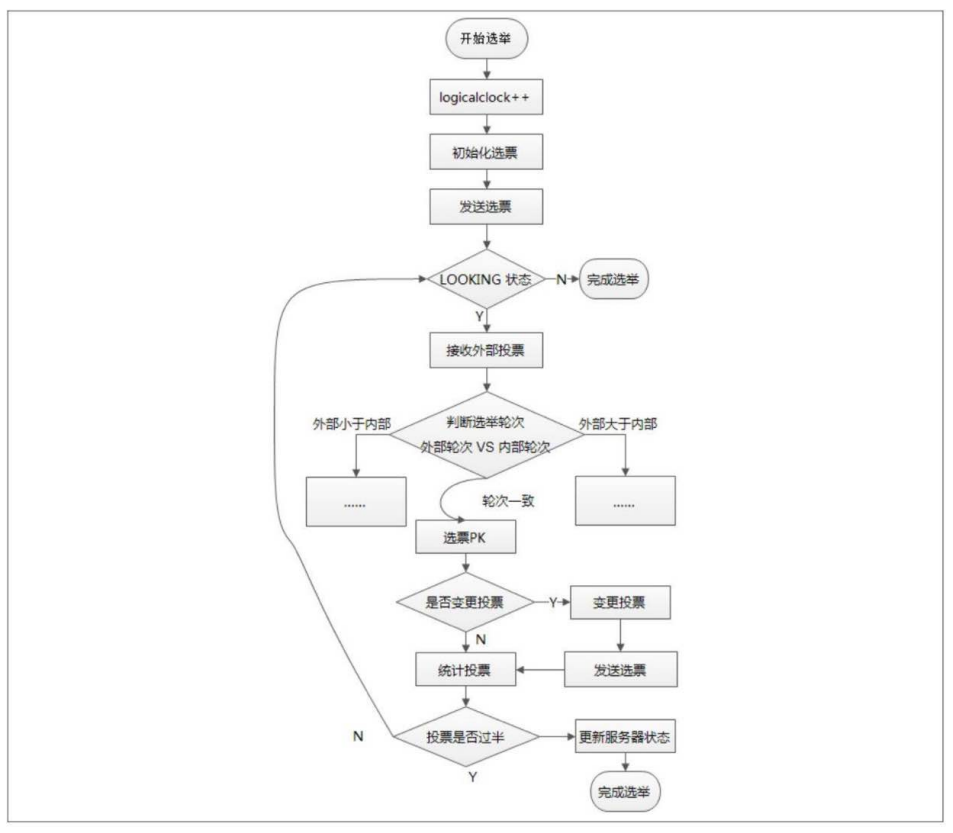

  ```java
  public Vote lookForLeader() throws InterruptedException {
      synchronized(this){
           // ⾸先会将逻辑时钟⾃增，每进⾏⼀轮新的leader选举，都需要更新逻辑时钟
           logicalclock++;
           // 更新选票（初始化选票）
           updateProposal(getInitId(), getInitLastLoggedZxid(),getPeerEpoch());
   	}
   LOG.info("New election. My id = " + self.getId() +", proposed zxid=0x" + Long.toHexString(proposedZxid));
   // 向其他服务器发送⾃⼰的选票（已更新的选票）
   sendNotifications();
  ```

  之后每台服务器会不断地从recvqueue队列中获取外部选票。如果服务器发现⽆法获取到任何外部投票，就⽴即确认⾃⼰是否和集群中其他服务器保持着有效

  的连接，如果没有连接，则⻢上建⽴连接，如果已经建⽴了连接，则再次发送⾃⼰当前的内部投票，其流程如下

  ```java
      // 从recvqueue接收队列中取出投票
       Notification n = recvqueue.poll(notTimeout,
       TimeUnit.MILLISECONDS);
       /*
       * Sends more notifications if haven't received enough.
       * Otherwise processes new notification.
       */
       if(n == null){ // ⽆法获取选票
           if(manager.haveDelivered()){ // manager已经发送了所有选票消息（表示有连接）
           // 向所有其他服务器发送消息
           sendNotifications();java
       } else { // 还未发送所有消息（表示⽆连接）
           // 连接其他每个服务器
           manager.connectAll();
       }
       /*
       * Exponential backoff
       */
       int tmpTimeOut = notTimeout*2;
       notTimeout = (tmpTimeOut < maxNotificationInterval?
       tmpTimeOut : maxNotificationInterval);
       LOG.info("Notification time out: " + notTimeout);
   }
  ```

  在发送完初始化选票之后，接着开始处理外部投票。在处理外部投票时，会根据选举轮次来进⾏不同的处理。　　

  - **外部投票的选举轮次⼤于内部投票。**若服务器⾃身的选举轮次落后于该外部投票对应服务器的选举轮次，那么就会⽴即更新⾃⼰的选举轮次

    (logicalclock)，并且清空所有已经收到的投票，然后使⽤初始化的投票来进⾏PK以确定是否变更内部投票。最终再将内部投票发送出去。

  - **外部投票的选举轮次⼩于内部投票。**若服务器接收的外选票的选举轮次落后于⾃身的选举轮次，那么Zookeeper就会直接忽略该外部投票，不做任何处

    理。

  - **外部投票的选举轮次等于内部投票。**此时可以开始进⾏选票PK，如果消息中的选票更优，则需要更新本服务器内部选票，再发送给其他服务器。

  之后再对选票进⾏归档操作，⽆论是否变更了投票，都会将刚刚收到的那份外部投票放⼊选票集合recvset中进⾏归档，其中recvset⽤于记录当前服务器在本

  轮次的Leader选举中收到的所有外部投票，然后开始统计投票，统计投票是为了统计集群中是否已经有过半的服务器认可了当前的内部投票，如果确定已经有

  过半服务器认可了该投票，然后再进⾏最后⼀次确认，判断是否⼜有更优的选票产⽣，若⽆，则终⽌投票，然后最终的选票，其流程如下

  ```java
      if (n.electionEpoch > logicalclock) { // 其选举周期⼤于逻辑时钟
           // 重新赋值逻辑时钟
           logicalclock = n.electionEpoch;
           // 清空所有接收到的所有选票
           recvset.clear();
          // 进⾏PK，选出较优的服务器
           if(totalOrderPredicate(n.leader, n.zxid, n.peerEpoch,getInitId(), getInitLastLoggedZxid(),getPeerEpoch())) { 
               // 更新选票
               updateProposal(n.leader, n.zxid, n.peerEpoch);
           } else { // ⽆法选出较优的服务器
               // 更新选票
               updateProposal(getInitId(),
               getInitLastLoggedZxid(),
               getPeerEpoch());
       	 }
           // 发送本服务器的内部选票消息
           sendNotifications();
       	} else if (n.electionEpoch < logicalclock) { // 选举周期⼩于逻辑时钟，不做处理，直接忽略
              if(LOG.isDebugEnabled()){
                   LOG.debug("Notification election epoch issmaller than logicalclock. n.electionEpoch = 0x"
                   + Long.toHexString(n.electionEpoch)
                   + ", logicalclock=0x" +Long.toHexString(logicalclock));
       		}
       		break;
          // PK，选出较优的服务器
       	} else if (totalOrderPredicate(n.leader, n.zxid, n.peerEpoch,proposedLeader, proposedZxid, proposedEpoch)){ 
               // 更新选票
               updateProposal(n.leader, n.zxid, n.peerEpoch);
               // 发送消息
               sendNotifications();
          }
       	if(LOG.isDebugEnabled()){
       LOG.debug("Adding vote: from=" + n.sid +", proposed leader=" + n.leader +", proposed zxid=0x" +Long.toHexString(n.zxid) +", proposed election epoch=0x" + Long.toHexString(n.electionEpoch));
  }
  	// recvset⽤于记录当前服务器在本轮次的Leader选举中收到的所有外部投票
       recvset.put(n.sid, new Vote(n.leader, n.zxid, n.electionEpoch, n.peerEpoch));
       if (termPredicate(recvset,new Vote(proposedLeader, proposedZxid,logicalclock, proposedEpoch))) { // 若能选出leader
       // Verify if there is any change in the proposed leader
       while((n = recvqueue.poll(finalizeWait,TimeUnit.MILLISECONDS)) != null){ // 遍历已经接收的投票集合
           if(totalOrderPredicate(n.leader, n.zxid, n.peerEpoch,
           	proposedLeader, proposedZxid,proposedEpoch)){ // 选票有变更，⽐之前提议的Leader有更好的选票加⼊
               // 将更优的选票放在recvset中
               recvqueue.put(n);
               break;
           }
       }
       /*
       * This predicate is true once we don't read anynew
       * relevant message from the reception queue
       */
       if (n == null) { // 表示之前提议的Leader已经是最优的
           // 设置服务器状态
           self.setPeerState((proposedLeader ==self.getId()) ?ServerState.LEADING: learningState());
           // 最终的选票
           Vote endVote = new Vote(proposedLeader,
                                   proposedZxid,
                                   logicalclock,
                                   proposedEpoch);
           // 清空recvqueue队列的选票
           leaveInstance(endVote);
           // 返回选票
           return endVote;
       }
   }
  ```

  1.⾃增选举轮次。 在 FastLeaderElection 实现中，有⼀个 logicalclock 属性，⽤于标识当前Leader的选举轮次，ZooKeeper规定了所有有效的投票都必须在

  同⼀轮次中。ZooKeeper在开始新⼀轮的投票时，会⾸先对logicalclock进⾏⾃增操作。

  2.初始化选票。 在开始进⾏新⼀轮的投票之前，每个服务器都会⾸先初始化⾃⼰的选票。在图7-33中我们已经讲解了 Vote 数据结构，初始化选票也就是对

   Vote 属性的初始化。在初始化阶段，每台服务器都会将⾃⼰推举为Leader，表7-10展示了⼀个初始化的选票。3.发送初始化选票。 在完成选票的初始化后，

  服务器就会发起第⼀次投票。ZooKeeper 会将刚刚初始化好的选票放⼊sendqueue队列中，由发送器WorkerSender负责

  4.接收外部投票。 每台服务器都会不断地从 recvqueue 队列中获取外部投票。如果服务器发现⽆法获取到任何的外部投票，那么就会⽴即确认⾃⼰是否和集

  群中其他服务器保持着有效连接。如果发现没有建⽴连接，那么就会⻢上建⽴连接。如果已经建⽴了连接，那么就再次发送⾃⼰当前的内部投票。

  5.判断选举轮次。 当发送完初始化选票之后，接下来就要开始处理外部投票了。在处理外部投票的时候，会根据选举轮次来进⾏不同的处理。

  **· 外部投票的选举轮次⼤于内部投票。**如果服务器发现⾃⼰的选举轮次已经落后于该外部投票对应服务器的选举轮次，那么就会⽴即更新⾃⼰的选举轮次

  （logicalclock），并且清空所有已经收到的投票，然后使⽤初始化的投票来进⾏PK以确定是否变更内部投票（关于P K的逻辑会在步骤6中统⼀讲解），最终

  再将内部投票发送去。 	

  **· 外部投票的选举轮次⼩于内部投票。** 如果接收到的选票的选举轮次落后于服务器⾃身的，那么ZooKeeper就会直接忽略该外部投票，不做任何处理，并返

  回步骤4。

  **· 外部投票的选举轮次和内部投票⼀致。** 这也是绝⼤多数投票的场景，如外部投票的选举轮次和内部投票⼀致的话，那么就开始进⾏选票PK。 总的来说，只有

  在同⼀个选举轮次的投票才是有效的投票。

  6.选票PK。 在步骤5中提到，在收到来⾃其他服务器有效的外部投票后，就要进⾏选票PK了——也就是FastLeaderElection.totalOrderPredicate⽅法的核⼼

  逻辑。选票PK的⽬的是为了确定当前服务器是否需要变更投票，主要从选举轮次、ZXID和 SID 三个因素来考虑，具体条件如下：在选票 PK 的时候依次判断，

  符合任意⼀个条件就需要进⾏投票变更。 · 如果外部投票中被推举的Leader服务器的选举轮次⼤于内部投票，那么就需要进⾏投票变更。 · 如果选举轮次⼀致

  的话，那么就对⽐两者的ZXID。如果外部投票的ZXID⼤于内部投票，那么就需要进⾏投票变更。 · 如果两者的 ZXID ⼀致，那么就对⽐两者的SID。如果外部投

  票的 SID ⼤于内部投票，那么就需要进⾏投票变更。 

  7.变更投票。 通过选票PK后，如果确定了外部投票优于内部投票（所谓的“优于”，是指外部投票所推举的服务器更适合成为Leader），那么就进⾏投票变更

  ——使⽤外部投票的选票信息来覆盖内部投票。变更完成后，再次将这个变更后的内部投票发送出去。

  8.选票归档。 ⽆论是否进⾏了投票变更，都会将刚刚收到的那份外部投票放⼊“选票集合”recvset中进⾏归档。recvset⽤于记录当前服务器在本轮次的Leader

  选举中收到的所有外部投票——按照服务器对应的SID来区分，例如，{（1，vote1），（2，vote2），…}。 9.统计投票。 完成了选票归档之后，就可以开始

  统计投票了。统计投票的过程就是为了统计集群中是否已经有过半的服务器认可了当前的内部投票。如果确定已经有过半的服务器认可了该内部投票，则终⽌

  投票。否则返回步骤4。 

  10.更新服务器状态。 统计投票后，如果已经确定可以终⽌投票，那么就开始更新服务器状态。服务器会⾸先判断当前被过半服务器认可的投票所对应的

  Leader服务器是否是⾃⼰，如果是⾃⼰的话，那么就会将⾃⼰的服务器状态更新为 LEADING。如果⾃⼰不是被选举产⽣的 Leader 的话，那么就会根据具体

  情况来确定⾃⼰是FOLLOWING或是OBSERVING。 以上 10 个步骤，就是 FastLeaderElection 选举算法的核⼼步骤，其中步骤 4～9 会经过⼏轮循环，直到

  Leader选举产⽣。另外还有⼀个细节需要注意，就是在完成步骤9之后，如果统计投票发现已经有过半的服务器认可了当前的选票，这个时候，ZooKeeper 并

  不会⽴即进⼊步骤 10 来更新服务器状态，⽽是会等待⼀段时间（默认是 200 毫秒）来确定是否有新的更优的投票

### 6.5、zookeeper源码分析之集群模式服务端

- **执⾏流程图**


- **源码分析**

  集群模式下启动所有的ZK节点启动⼊⼝都是QuorumPeerMain类的main⽅法。 main⽅法加载配置⽂件以后，最终会调⽤到QuorumPeer的start⽅法，来看

  下：

  ```java
  public synchronized void start() {
       //校验ServerId是否合法
       if (!getView().containsKey(myid)) {
       	throw new RuntimeException("My id " + myid + " not in the peer list");
       }
       //载⼊之前持久化的⼀些信息
       loadDataBase();
       //启动线程监听
       startServerCnxnFactory();
       try {
       	adminServer.start();
       } catch (AdminServerException e) {
           LOG.warn("Problem starting AdminServer", e);
           System.out.println(e);
       }
       //初始化选举投票以及算法
       startLeaderElection();
       //当前也是⼀个线程，注意run⽅法
       super.start();
  }
  ```

  我们已经知道了当⼀个节点启动时需要先发起选举寻找Leader节点，然后再根据Leader节点的事务信息进⾏同步，最后开始对外提供服务，这⾥我们先来看

  下初始化选举的逻辑，即上⾯的startLeaderElection⽅法：

  ```java
  synchronized public void startLeaderElection() {
       try {
           //所有节点启动的初始状态都是LOOKING，因此这⾥都会是创建⼀张投⾃⼰为Leader的票
           if (getPeerState() == ServerState.LOOKING) {
               currentVote = new Vote(myid, getLastLoggedZxid(),getCurrentEpoch());
           }
       } catch(IOException e) {
       	//异常处理
       }
       //初始化选举算法，electionType默认为3
       this.electionAlg = createElectionAlgorithm(electionType);
  }
  protected Election createElectionAlgorithm(int electionAlgorithm){
       Election le = null;
       switch (electionAlgorithm) {
           case 1:
           //忽略
           case 2:
           //忽略
           case 3:
               //electionAlgorithm默认是3，直接⾛到这⾥
               qcm = createCnxnManager();
               //监听选举事件的listener
               QuorumCnxManager.Listener listener = qcm.listener;
               if(listener != null){
                   //开启监听器
                   listener.start();
                   //初始化选举算法
                   FastLeaderElection fle = new FastLeaderElection(this, qcm);
                   //发起选举
                   fle.start();
                   le = fle;
               } else {
               	LOG.error("Null listener when initializing cnx manager");
               }
               break;
           default:
           //忽略
       }
   	 return le; 
  }
  ```

  接下来，回到QuorumPeer类中start⽅法的最后⼀⾏super.start()，QuorumPeer本身也是⼀个线程类，⼀起来看下它的run⽅法：

  ```java
  public void run() {
       try {
           while (running) {
               //根据当前节点的状态执⾏不同流程
               switch (getPeerState()) {
               	case LOOKING:
                       try {
                           //寻找Leader节点
                           setCurrentVote(makeLEStrategy().lookForLeader());
                       } catch (Exception e) {
                       	setPeerState(ServerState.LOOKING);
                       } 
                       break;
                  case OBSERVING:
                       try {
                           //当前节点启动模式为Observer
                           setObserver(makeObserver(logFactory));
                           //与Leader节点进⾏数据同步
                           observer.observeLeader();
                       } catch (Exception e) {
                           
                       } finally {
                           
                       }
                   	break;
                   case FOLLOWING:
                       try {
                           //当前节点启动模式为Follower
                           setFollower(makeFollower(logFactory));
                           //与Leader节点进⾏数据同步
                           follower.followLeader();
                       } catch (Exception e) {
                       } finally {
                       }
                       break;
                   case LEADING:
                       try {
                       //当前节点启动模式为Leader
                       setLeader(makeLeader(logFactory));
                       //发送⾃⼰成为Leader的通知
                       leader.lead();
                       setLeader(null);
                       } catch (Exception e) {
                       } finally {
                       }
                   break;
               }
           }
       }
  }
  ```

  节点初始化的状态为LOOKING，因此启动时直接会调⽤lookForLeader⽅法发起Leader选举，⼀起看下：

  ```java
  public Vote lookForLeader() throws InterruptedException {
       try {
           Map<Long, Vote> recvset = new HashMap<Long, Vote>();
           Map<Long, Vote> outofelection = new HashMap<Long, Vote>();
           //向所有投票节点发送⾃⼰的投票信息
           sendNotifications();
       	 while ((self.getPeerState() == ServerState.LOOKING) && (!stop)){
               //读取各个节点返回的投票信息
               Notification n = recvqueue.poll(notTimeout,TimeUnit.MILLISECONDS);
               //超时重发
               if(n == null){
                   //如果前⾯待发送的消息已经全部发送，则重新发送
                   if(manager.haveDelivered()){
                   	 sendNotifications();
                   } else {
                       //否则尝试与各个节点建⽴连接
                       manager.connectAll();
                   }
                   //退避算法修改下次等待时间
                   int tmpTimeOut = notTimeout*2;
                   notTimeout = (tmpTimeOut < maxNotificationInterval?tmpTimeOut : maxNotificationInterval);
       		} else if (validVoter(n.sid) && validVoter(n.leader)) {
                   switch (n.state) {
                   	case LOOKING:
                       //如果节点的周期⼤于⾃⼰的
                       if (n.electionEpoch > logicalclock.get()) {
                           logicalclock.set(n.electionEpoch);
                           //清除已收到的投票信息
                           recvset.clear();
                           //两个节点根据epoch，zxid，serverId来判断新的投票信息
                           if(totalOrderPredicate(n.leader, n.zxid, n.peerEpoch, getInitId(), getInitLastLoggedZxid(), getPeerEpoch())) {
                              updateProposal(n.leader, n.zxid, n.peerEpoch);
                           } else {
                                  updateProposal(getInitId(),
                                  getInitLastLoggedZxid(), getPeerEpoch());
                           }
                           //修改选举周期以及投票信息，发起新⼀轮投票
                           sendNotifications();
                           } else if (n.electionEpoch < logicalclock.get()) {
                           //这⾥的break是跳出switch语句，别跟循环弄混
                           break;
                          } else if (totalOrderPredicate(n.leader, n.zxid, n.peerEpoch,proposedLeader, proposedZxid, proposedEpoch)){
                               //如果对⽅的epoch，zxid，serverId⽐⾃⼰⼤
                               //则更新⾃⼰的投票给n的投票节点
                               updateProposal(n.leader, n.zxid, n.peerEpoch);
                               //重新发送⾃⼰新的投票信息
                               sendNotifications();
                          }
                           //把节点的投票信息记录下
                           recvset.put(n.sid, new Vote(n.leader, n.zxid, n.electionEpoch, n.peerEpoch));
                           //统计投票信息，判断当前选举是否可以结束，也就是收到的票数信息已 经⾜够确认Leader
                           if (termPredicate(recvset, new Vote(proposedLeader,proposedZxid,logicalclock.get(), proposedEpoch))) {
                               while((n = recvqueue.poll(finalizeWait,TimeUnit.MILLISECONDS)) != null){
                               if(totalOrderPredicate(n.leader, n.zxid, n.peerEpoch, proposedLeader, proposedZxid, proposedEpoch)){
                                  recvqueue.put(n);
                                  break;
                               }
                           }
                          //如果没有多余的投票信息则可以结束本次选举周期
                          if (n == null) {
                               //根据serverId修改当前节点的类型
                               self.setPeerState((proposedLeader ==self.getId()) ? ServerState.LEADING: learningState());
                               Vote endVote = new Vote(proposedLeader,proposedZxid, proposedEpoch);
                               //清空接收消息队列
                               leaveInstance(endVote);
                               //返回最终的投票信息
                               return endVote;
                          }
                      }
                      break;
                   case OBSERVING:
                      //Observer节点不参与投票，忽略
                      break;
                   case FOLLOWING:
                   case LEADING:
                       //如果周期相同，说明当前节点参与了这次选举
                       if(n.electionEpoch == logicalclock.get()){
                           //保存投票信息
                           recvset.put(n.sid, new Vote(n.leader, n.zxid, n.electionEpoch, n.peerEpoch));
                           //判断当前节点收到的票数是否可以结束选举
                          if(termPredicate(recvset, new Vote(n.leader,n.zxid, n.electionEpoch, n.peerEpoch, n.state))
                               && checkLeader(outofelection, n.leader, n.electionEpoch)) {
                               self.setPeerState((n.leader == self.getId()) ?
                               ServerState.LEADING: learningState());
                               Vote endVote = new Vote(n.leader, n.zxid, n.peerEpoch);
                               leaveInstance(endVote);
                               return endVote;
                            }
                       }
                   //把Leader跟Follower的投票信息加⼊outofelection，确认下它们的信息是否⼀致
                   outofelection.put(n.sid, new Vote(n.leader,IGNOREVALUE, IGNOREVALUE, n.peerEpoch, n.state));
                   if (termPredicate(outofelection, new Vote(n.leader,
                       IGNOREVALUE, IGNOREVALUE, n.peerEpoch, n.state))
                       && checkLeader(outofelection, n.leader, IGNOREVALUE)) {
                       synchronized(this){
                           logicalclock.set(n.electionEpoch);
                           self.setPeerState((n.leader == self.getId()) ?
                           ServerState.LEADING: learningState());
                       }
                       Vote endVote = new Vote(n.leader, n.zxid, n.peerEpoch);
                       leaveInstance(endVote);
                       return endVote;
                   }
                       break;
                       default:
                           break;
                 }
           }
       }
       return null;
  }
  ```

  经过上⾯的发起投票，统计投票信息最终每个节点都会确认⾃⼰的身份，节点根据类型的不同会执⾏以下逻辑：

  1. 如果是Leader节点，⾸先会想其他节点发送⼀条NEWLEADER信息，确认⾃⼰的身份，等到各个节点的ACK消息以后开始正式对外提供服务，同时开启新

     的监听器，处理新节点加⼊的逻辑。

  2. 如果是Follower节点，⾸先向Leader节点发送⼀条FOLLOWERINFO信息，告诉Leader节点⾃⼰已处理的事务的最⼤Zxid，然后Leader节点会根据⾃⼰的

     最⼤Zxid与Follower节点进⾏同步，如果Follower节点落后的不多则会收到Leader的DIFF信息通过内存同步，如果Follower节点落后的很多则会收到

     SNAP通过快照同步，如果Follower节点的Zxid⼤于Leader节点则会收到TRUNC信息忽略多余的事务。

  3. 如果是Observer节点，则与Follower节点相同

```
编程题一思路：
	公共模块：LockUtil，提供获得公共lock和condition对象，完成生成与消费问题
			  ZookeeperUtil，提供统一获得zkClient对象接口
	服务模块：添加配置文件，指定端口，服务节点，netty监听节点等
			  添加在服务启动时创建对应的zNode节点
	客户模块：修改synchronized控制的锁问题，完成生成与消费问题
			  添加ConnectionInfo，记录主机，启动器，处理器，最后调用时间，响应时间等
			  RPCConsumer类进行改造
					添加Map<String, ConnectionInfo> serverMap 记录与多个服务器的连接
					serverCount服务器数量
					isPoll = true 默认轮询
					index = 0下次轮询服务器的节点下标
			  改造init方法，封装服务器连接并存储
			  提供initZk(List<String> serverList)，完成客户端和服务器连接初始化
			  
			  
			  改造createInstance(final Class<?> clazz, RpcRequest rpcRequest)方法
					添加服务器节点监听，用于感知服务器的扩容和缩容
						扩容添加客户端与服务器连接
						缩容端口客户端和服务器连接
					默认实现服务器轮询
					记录每个服务最后调用时间和响应时间
					
编程题二思路：
	客户模块：
		提供getServerNode(List<String> children)，通过zk节点获取一个可调用服务器
		提供getConnectionInfo(List<ConnectionInfo> collect)，通过现有连接获得一个可调用服务器
		提供getIndex(Integer serverCount)，通过服务器数量随机获取一个下标。
		添加定时任务（Timer实现）
			定时上报服务器调用情况，记录满足性能要求的服务器记录到zk中
		改造createInstance(final Class<?> clazz, RpcRequest rpcRequest)方法
			首次启动轮询完所有服务器，并记录每个服务请求和响应时间
			当完成所有服务器调用后，关闭轮询，下次调用选择性能更好的服务器进行调用
				如果zk中有满足调用性能要求的服务器，则调用getServerNode(List<String> children)
				如无则调用getConnectionInfo(List<ConnectionInfo> collect)
```

- **具体实现：https://gitee.com/Thmspring/LG_homeWork/tree/master/stage3/module2/code**